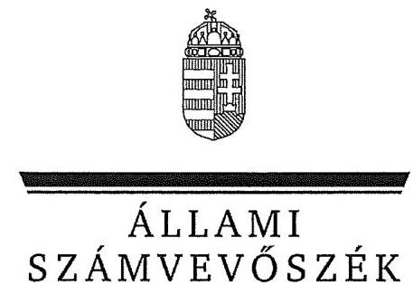

ÁLLAMI
SZÁMVEVŐSZÉK

# JELENTÉS 

## Nyíregyháza Megyei Jogú Város Önkormányzata pénzügyi helyzetének ellenőrzéséről (43/3)

---

# Számvevői Iroda 

Iktatószám: V-3043-11/2011.
Témaszám: 1015
Vizsgálat-azonosító szám: V056032

## Az ellenőrzést felügyelte:

Dr. Varga Sándor
számvevő igazgató-helyettes
Az ellenőrzést vezette:
Renkó Zsuzsanna
számvevő tanácsos
Az ellenőrzést végezték:

| Ujvári Józsefné | Mokánszkiné Mengyi | Dr. Szücs Zoltán |
| :-- | :-- | :-- |
| számvevő tanácsos | Andrea | számvevő tanácsos |
|  | számvevő tanácsos |  |
| Tótfalusi Zoltán | Hadházy Sándor |  |
| számvevő tanácsos | számvevő tanácsos |  |

A témához kapcsolódó eddig készített számvevőszéki jelentések:
címe
sorszáma
Jelentés a helyi önkormányzatok gazdálkodási rendszerének 2009. 0936 évi ellenőrzéséről

---

# TARTALOMJEGYZÉK 

BEVEZETÉS ..... 5
I. ÖSSZEGZŐ MEGÁLLAPÍTÁSOK, KÖVETKEZTETÉSEK JAVASLATOK ..... 16
II. RÉSZLETES MEGÁLLAPÍTÁSOK ..... 27

1. Az Önkormányzat kötelező és önként vállalt feladatai ..... 27
2. A pénzügyi egyensúlyi helyzet alakulása ..... 34
2.1. A múködési és a felhalmozási egyensúly alakulása ..... 34
2.2. Az Önkormányzat bevételeinek alakulása ..... 40
2.3. Az Önkormányzat kiadásainak alakulása ..... 44
3. Kötelezettségek bemutatása ..... 48
3.1. A pénzintézetek felé fennálló kötelezettségek alakulása ..... 48
3.2. Szállítók felé fennálló kötelezettségek alakulása ..... 54
3.3. Egyéb kötelezettségek alakulása ..... 55
4. A pénzügyi egyensúly megteremtése érdekében hozott intézkedések ..... 58
5. A helyi önkormányzatok gazdálkodási rendszerének 2007. évi ellenőrzése során a pénzügyi egyensúly javítására tett szabályszerűségi és célszerűségi javaslatok hasznosulása ..... 63

---

# MELLÉKLETEK 

1. számú a működési és felhalmozási hiány/többlet alakulása az Önkormányzat rendeleteiben
2. számú Kimutatás az Önkormányzat 2007-2010. évi bevételeinek és kiadásainak melléklet alakulásáról
3.a számú Az Önkormányzat 2007-2010 években megvalósított, 2010. december 31-ig melléklet befejezett fejlesztésének forrásösszetételéről
3.b számú Az Önkormányzat 2010. december 31-én folyamatban levő fejlesztési feladataihoz kapcsolódó kötelezettségeinek összegzéséről
3.c számú Az Önkormányzat 2010. december 31-én folyamatban levő fejlesztési adataihoz kapcsolódó 2010. évet követő kötelezettségvállalásainak összegzéséről
3.d számú Az Önkormányzat beadott, elbírálás alatti pályázati forrásból megvalósuló fejlesztéseihez kapcsolódó kötelezettség-vállalásainak összegzéséről
3. számú Az önkormányzati feladatok ellátásában résztvevő gazdasági társaságokról melléklet
4. számú Nyíregyháza Megyei Jogú Város Önkormányzat Polgármesterének észrevétele melléklet
5. számú Nyíregyháza Megyei Jogú Város Önkormányzat Polgármesterének észrevételére adott válasz

---

# RÖVIDÍTÉSEK JEGYZÉKE 

## Törvények

Áht.
ÁSZ tv.

Htv.

Számv. tv.
Ötv.

## Rendeletek

$\mathrm{SzMSz}_{1}$

SzMSz $_{2}$

2007. évi költségvetési rendelet

2008. évi költségvetési rendelet

2009. évi költségvetési rendelet

2010. évi költségvetési rendelet

2011. évi költségvetési rendelet

2006. évi zárszámadási rendelet

2007. évi zárszámadási rendelet

2008. évi zárszámadási rendelet
az államháztartásról szóló 1992. évi XXXVIII. törvény az Állami Számvevőszékről szóló 1989. évi XXXVIII. törvény (2011. július 1-jétől az Állami Számvevőszékről szóló 2011. LXVI. törvény)
a helyi önkormányzatok és szerveik, a köztársasági megbízottak, valamint egyes centrális alárendeltségű szervek feladat- és hatásköreiről szóló 1991. évi XX. törvény
a számvitelről szóló 2000 . évi C. törvény
a helyi önkormányzatokról szóló 1990. évi LXV. törvény

Nyíregyháza Megyei Jogú Város Önkormányzatának 6/1999. (III. 1.) számú rendelete az Önkormányzat és Szervei Szervezeti és Múködési Szabályairól
Nyíregyháza Megyei Jogú Város Önkormányzatának 9/2011. (III. 10.) számú rendelete a Nyíregyháza Megyei Jogú Város Közgyűlése és Szervei Szervezeti és Múködési Szabályzatáról
Nyíregyháza Megyei Jogú Város Önkormányzatának 6/2007. (II. 13.) számú rendelete 2007. évi költségvetésről és a költségvetés vitelének szabályairól
Nyíregyháza Megyei Jogú Város Önkormányzatának 4/2008. (II. 12.) számú rendelete 2007. évi költségvetésről és a költségvetés vitelének szabályairól
Nyíregyháza Megyei Jogú Város Önkormányzatának 4/2009. (II. 17.) számú rendelete 2009. évi költségvetésről és a költségvetés vitelének szabályairól
Nyíregyháza Megyei Jogú Város Önkormányzatának 2/2010. (I. 19.) számú rendelete 2010. évi költségvetésről és a költségvetés vitelének szabályairól
Nyíregyháza Megyei Jogú Város Önkormányzatának 3/2011. (II. 11.) számú rendelete 2011. évi költségvetésről és a költségvetés vitelének szabályairól
Nyíregyháza Megyei Jogú Város Önkormányzatának 15/2007. (IV. 27.) számú rendelete az Önkormányzat 2006. évi költségvetési gazdálkodásának végrehajtásáról Nyíregyháza Megyei Jogú Város Önkormányzatának 22/2008. (IV. 29.) számú rendelete az Önkormányzat 2007. évi költségvetési gazdálkodásának végrehajtásáról Nyíregyháza Megyei Jogú Város Önkormányzatának 13/2009. (IV. 28.) számú rendelete az Önkormányzat 2008. évi költségvetési gazdálkodásának végrehajtásáról

---

2009. évi zárszámadási rendelet

2010. évi zárszámadási rendelet

## Szórövidítések

APEH
áfa
ÁSZ
BM
EDP hiány/egyenleg
EU
főjegyzö
Ivóvízminőség-javító Társulás
Közgyűlés
Hulladék-gazdálkodási Társulás
KSH
MÁK
NAV
NGM
OEP
Önkormányzat
ÖNHIKI
PPP konstrukció
polgármester
Polgármesteri hivatal
szja
Kistérségi társulás

Nyíregyháza Megyei Jogú Város Önkormányzatának 12/2010. (IV. 27) számú rendelete az Önkormányzat 2009. évi költségvetési gazdálkodásának végrehajtásáról Nyíregyháza Megyei Jogú Város Önkormányzatának 17/2011. IV. 29.) számú rendelete az Önkormányzat 2010. évi költségvetési gazdálkodásának végrehajtásáról

Adó- és Pénzügyi Ellenőrzési Hivatal
általános forgalmi adó
Állami Számvevőszék
Belügyminisztérium
Uniós módszertan szerinti maastrichti kritériumoknak megfelelő számítás szerinti hiány/egyenleg
Európai Unió
Nyíregyháza Megyei Jogú Város Önkormányzatának címzetes főjegyzője
Nyírségi Ivóvízminőség-javító Önkormányzati Társulás
Nyíregyháza Megyei Jogú Város Önkormányzat Közgyűlése
Nyíregyháza és Térsége Hulladék-gazdálkodási Társulás
Központi Statisztikai Hivatal
Magyar Államkincstár
Nemzeti Adó és Vámhivatal
Nemzetgazdasági Minisztérium
Országos Egészségbiztosítási Pénztár
Nyíregyháza Megyei Jogú Város Önkormányzata
önhibáján kívül hátrányos helyzetben lévő önkormányzatok támogatása
Public Private Partnership (Partnerségi együttmüködés közfeladatok ellátására a magánszektor bevonásával)
Nyíregyháza Megyei Jogú Város Önkormányzat polgármestere
Nyíregyháza Megyei Jogú Város Önkormányzat Polgármesteri Hivatala
személyi jövedelemadó
Nyírségi Többcélú Önkormányzati társulás

---

# JELENTÉS 

## Nyíregyháza Megyei Jogú Város Önkormányzata pénzügyi helyzetének ellenőrzéséről

## BEVEZETÉS

Az Állami Számvevőszék 2011. évtől érvényes stratégiája új irányt szabott a helyi önkormányzatok gazdálkodásának ellenőrzésében is. Az ÁSZ - küldetése és jövőképe szerint - szilárd szakmai alapokra támaszkodva értékteremtő ellenőrzéseivel és helyzetelemzéseivel az államháztartás egészében, így a helyi önkormányzati alrendszerben is elő kívánja segíteni a közpénzek és a közvagyon szabályos, gazdaságos, hatékony és eredményes hasznosítását. Ennek részeként - a 2010. évi államháztartási hiány alakulásának összetevőire is figyelemmel folyamatban van az önkormányzati alrendszer pénzügyi helyzetelemzése.

Az NGM 2011 áprilisában közzétett adatai szerint ${ }^{1}$ a 2010. évi 1036,2 milliárd Ft összegű 3,8\%-os EDP (maastrichti kritériumok szerinti, Túlzott Hiány Eljárás keretében kimutatott) hiánycél nem volt tartható, az önkormányzati alrendszer tervezettet meghaladó hiánya miatt a GDP arányában kifejezett államháztartási hiány $4,2 \%$-ra emelkedett.

Az önkormányzatok 2010 első három negyedévi költségvetési jelentése szerinti pénzforgalmi hiány 97 milliárd Ft-os összege nem indokolta az önkormányzati alrendszer 190 milliárd Ft-ra becsült hiányának 2010. évi végi felülvizsgálatát. A helyi önkormányzatok 2011. januári gyorsjelentése alapján a pénzforgalmi hiány már 247,7 milliárd Ft-ot tett ki. Az alrendszer hiánya így a tervezett $0,7 \%$-kal szemben magasabb, $0,9 \%$-os szinten realizálódott. Az 57,7 milliárd Ft hiánytöbblet alakulásában - a Tájékoztató szerint - az iparűzési adó elmaradása, a gépjárműadó, az illetékek és más bevételek tervezettnél alacsonyabb összegben való teljesülése volt a meghatározó.

Magyarország a Széll Kálmán Terv célkitűzései alapján² aktualizált Konvergencia Programjában a középtávú (2011-2015. évek) költségvetési pálya kijelölése

[^0]
[^0]:    ${ }^{1}$ NGM Tájékoztatás Magyarország Strukturális Reformprogramjának végrehajtásáról (2011. április 1). A Tájékoztató évente két alkalommal - április és október hónapban jelenik meg.
    ${ }^{2}$ Az államháztartás 2011. évi egyenlege - a magán nyugdíjpénztárakból az állami nyugdíjpillérbe való visszatérés egyszeri vagyonhatása következtében - 4\%-os többletet mutatna. A Széll Kálmán Tervben foglalt egyszeri intézkedések - a MÁV, a BKV adósságrendezése, a PPP projektek kiváltása - összességében a GDP 2\%-ával csökkentik a várható többlet mértékét.

---

során 2011-re a kormányzati szektor EDP módszertan szerinti egyenlegét + 2\%ban jelölte meg. Az egyenlegcél megfogalmazásakor az önkormányzati alrendszer tervezett hiányát a 2011. évi költségvetésben szereplő $0,3 \%$-kal szemben $0,5 \%$-os arányban határozták meg ${ }^{3}$. A hiánycélok meghatározása jelzi, hogy az önkormányzati alrendszerben 2011-ben fokozott figyelmet kell fordítani a pénzügyi egyensúlyi helyzet alakulására.

Az államháztartás helyi szintjén a 23 megyei jogú városi önkormányzatnak az általuk ellátott közszolgáltatások volumenére való tekintettel kiemelt szerepe van, e települések népessége összességében meghaladja a kétmillió fôt ${ }^{4}$. A települések népességét az alábbi diagram szemlélteti:
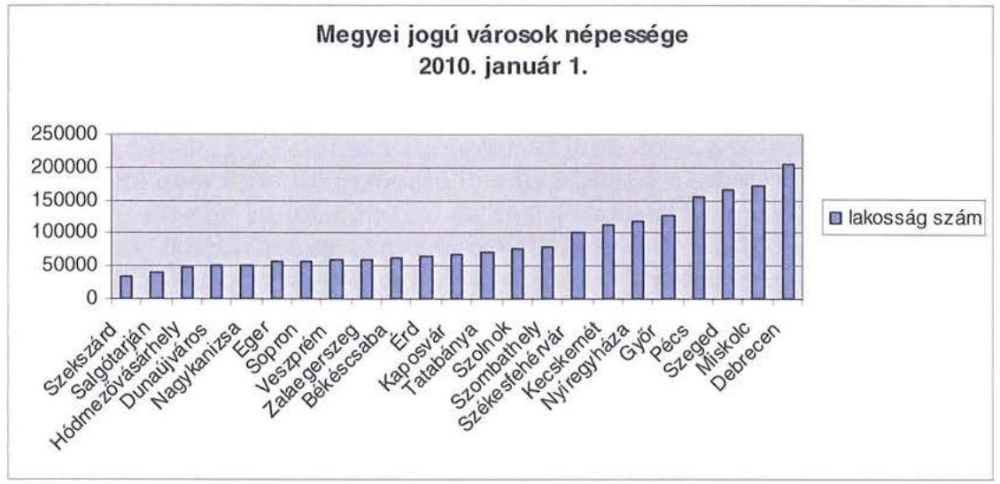

A megyei jogú városi önkormányzatok ${ }^{5}$ kötelező feladatellátását többlépcsős törvényi előírások határozzák meg. A feladatokra vonatkozó szabályozás első szintjét az Ötv. ${ }^{6}$, a második szintet a hatásköri7, a harmadik szintet a további ágazati, szakmai (egyebek mellett az oktatási, egészségügyi, szociális és egyéb ágazati feladatok ellátásának szakmai szabályait rögzítő) törvények adják.

[^0]
[^0]:    ${ }^{3}$ A Magyar Köztársaság 2011. évi költségvetéséről szóló 2010. évi CLXIX. törvény Általános indoklásának III. fejezete, valamint Magyarország Konvergencia Programja 2011-2015. (2011. április) Táblázatok rész, 2. táblázat Âllamháztartás összefoglaló adatai szerint.
    ${ }^{4}$ A megyei jogú városok népességét a 4/2011. (I. 31.) NGM rendelet 1. sz. mellékletében foglalt 2010. január 1-i adatok alapján vettük figyelembe.
    ${ }^{5}$ Az Ötv. 61. § (1) bekezdése alapján a megyeszékhely város a törvény erejénél fogva megyei jogú, ugyanakkor az Országgyúlés az ötvenezernél nagyobb népességú városokat a képviselőtestület kérelmére megyei jogú várossá nyilváníthatja. Ez utóbbi körbe 5 város tartozik, közülük 2 (Hódmezővásárhely, Dunaújváros) népessége 2010. január 1-ére már ötvenezer fő alá csökkent.
    ${ }^{6}$ az Ötv. 8. és 61. §-ában foglaltak szerint
    ${ }^{7}$ a Htv.

---

A megyei jogú városi önkormányzatok - az Ötv-ből közvetlenül levezethető települési feladatok mellett körzeti közszolgáltatásokat is ellátnak. A megyei jogú városi cím elsősorban többlet kötelezettségekkel jár, a megyei jogú városnak önmagának kell gondoskodnia mindazokról a feladatokról, amelyek más települési önkormányzatok esetében a megyei önkormányzat feladatát képezik. Ide sorolható többek közt a középfokú oktatási intézmények fenntartása, a közművelődési, könyvtári és levéltári szolgáltatás, a társadalombiztosítás finanszírozása mellett a kórházi és a rendelőintézeti szakellátás, a szociális és egyes gyermekvédelmi feladatok ellátása. Ezeket a feladatokat (intézményeket) a megyei jogú város - más városoktól eltérően - nem adhatja át a megyei önkormányzatnak, azonban az Ötv. lehetőséget biztosít arra, hogy a megyei önkormányzattal megállapodjék a feladatellátás megosztásában.

Az önkormányzat, így a megyei jogú város is, maga határozza meg, hogy - a lakosság igényei alapján, anyagi lehetőségei függvényében - mely feladatokat, milyen mértékben és módon, mely szervezeti keretek közt lát el. A szervezetalakítás szabadsága a megyei jogú városok esetében azzal járt, hogy mind a kötelező közszolgáltatásoknál (különösen a településüzemeltetés, vagyongazdálkodás), mind pedig az önként vállalt feladataik ellátásában - elsősorban a sport és kulturális szolgáltatások területein - a gazdasági társaságok kiemelt fontosságú szerephez jutottak. Ily módon a gazdálkodás, a pénzügyi helyzet kockázatai közvetlenül kikerültek ugyan az önkormányzati alrendszerből, azonban sérülhet az ellátási felelősség figyelemmel kísérése és érvényesítése, a közpénzek felhasználásának transzparenciája. Mindezek együttvéve - a beszámolók konszolidálásának hiányában - növelik a megyei jogú városok pénzügyi helyzetének megítélésében rejlő kockázatokat.

Az áttekintett időszakban az önkormányzati feladatok ellátásának keretet biztosító forrásszabályozás elvei lényegesen nem változtak.

A megyei jogú városok önkormányzatainak mozgásterét, az önkormányzatok feladatellátásra vonatkozó döntéseit a központi költségvetéstől való függőség mellett jelentősen befolyásolja a helyi adókivetési jog gyakorlása ${ }^{8}$. A helyi adók rendszere a közszolgáltatások finanszírozásához szükséges források megteremtésének, bővítésének eszköze, amely a gazdasági válság, a jogszabályi környezet, az adópolitika változása, az adóhatóságok tevékenysége következtében differenciáltan érinti a települési önkormányzatokat ${ }^{9}$.

A települési önkormányzatok saját folyó bevételeinek keretében elszámolt, különböző jogcímeken kivetett helyi adók - iparűzési adó, építmény és telekadó, idegenforgalmi adó, vállalkozók és magánszemélyek kommunális adója -2007-2010 között eltérő módon emelkedtek. A helyi adókból származó bevételek realizált összege országos szinten 2007-2009 között folyamatosan, 505,3 milliárd Ft-ról 566,3 milliárd Ft-ra emelkedett, majd a gazdasági válság hatásai következtében 2010-re 542,6 milliárd Ft-ra esett vissza. A helyi adók részesedése

[^0]
[^0]:    ${ }^{8}$ a helyi adókról szóló 1990. évi C. törvény szabályai szerint
    ${ }^{9}$ Az Állami Számvevőszék 2010 decemberében közzétett 1031. számú jelentésében értékelte a helyi adók rendszerében a hatékonyság és az eredményesség érvényesülését.

---

az önkormányzatok saját folyó bevételein belül 2007-2010 között 2,5 százalékponttal csökkent ${ }^{10}$.

A megyei jogú városok saját folyó bevétele 2007-ben 191,5 milliárd Ft volt, 2008-ban 223,1, 2009-ben 225,4, 2010-ben 223,5 milliárd Ft-ot tett ki. A helyi adóbevételekből való részesedésük 2007-ben 110,5 milliárd Ft (21,9\%), 2008ban 128,3 milliárd Ft (23,2\%), 2009-ben 124,4 milliárd Ft (22\%), 2010-ben 118,7 milliárd Ft (részaránya a 2007. évivel azonosan 21,9\%) volt. E realizált adóbevételek a megyei jogú városok saját folyó bevételeinek 2007-ben 57,7, 2008-ban 57,5, 2009-ben 55,2, 2010-ben 53,1\%-át jelentették. A helyi adóbevételek 2007-ről 2010-re kimutatott 4,6 százalékpontos csökkenése annak ellenére következett be, hogy a megyei jogú városok saját folyó bevétele 2010-ben $16,7 \%$-kal haladta meg a 2007. évit.

A helyi adókon belül a települések gazdasági helyzetének egyik fokmérője az elért helyi iparúzési adóbevétel, amely a megyei jogú városok körében erőteljes - a település nagyságrendtől is függő ${ }^{11}$ - különbségeket mutat. A helyi iparúzési adóbevétel és annak egy lakosra vetített összegének 2007. és 2010. évi alakulását az alábbi diagramok szemléltetik:
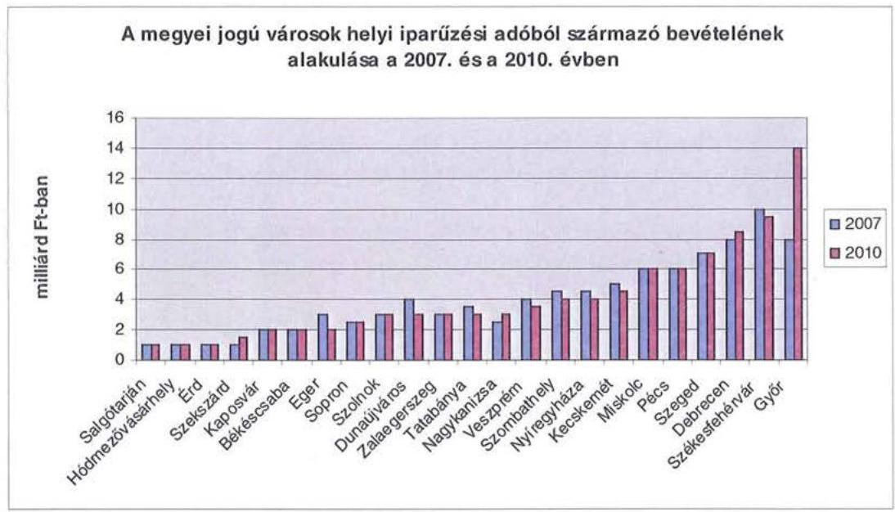

[^0]
[^0]:    ${ }^{10}$ A helyi adó bevételek saját folyó bevételekből való részesedése országosan 2007-ben $55,3 \%, 2010$-ben $52,8 \%$ volt.
    ${ }^{11}$ A 100 ezer fő feletti népességű megyei jogú városok csoportjába Debrecen, Miskolc, Szeged, Pécs, Győr, Nyíregyháza, Kecskemét, Székesfehérvár tartozik. Nem megyeszékhely megyei jogú város Érd, Sopron, Nagykanizsa, Dunaújváros, Hódmezővásárhely.

---

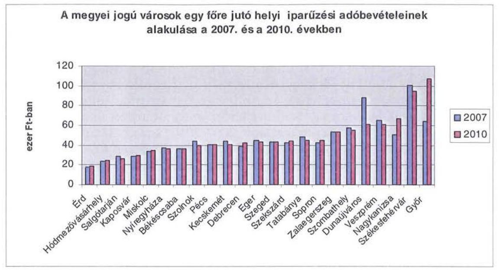

A megyei jogú városi önkormányzatok saját bevételein belül második legjelentősebb elem az illetékbevétel. A 2010. évben befolyt 39,2 milliárd Ft illetékbevétel a 2006. évben realizált 71,1 milliárd Ft illetékbevétel alig több mint $55 \%$-a. A jelentős visszaesést döntően az ingatlanpiac stagnálása, majd visszaesése, illetve egyes illetékkedvezmények bevezetése okozta. A kieső bevételek pótlására az önkormányzati alrendszer szintjén történtek intézkedések, 2010ben 5 milliárd Ft-ot, 2011-ben 1,2 milliárd Ft-ot ellentételezett a központi költségvetés. A megyei jogú városok önkormányzatai az önkormányzati alrendszer szintjén realizált illetékbevételből 2007-ben 13,6 milliárd Ft-tal (23,3\%-kal), 2008-ban 15,3 milliárd Ft-tal ( $22,7 \%$-kal), 2009-ben 12,6 milliárd Ft-tal ( $21,5 \%$ kal), 2010-ben 7,9 milliárd Ft-tal ( $20,2 \%$-kal) részesedtek ${ }^{12}$. Az összes befolyt illetékbevételből a megyei jogú városok részesedése 2009-ről 2010-re mindössze 1,3 százalékponttal csökkent, ugyanakkor a realizált illetékbevétel csökkenése a $37,3 \%$-ot ( 4,7 milliárd Ft) is elérte.

Az önkormányzati alrendszer átengedett bevételei közül a személyi jövedelemadóból való részesedés makroszintű szabályozása a vizsgált időszakban nem változott. A települési önkormányzatokat a településre kimutatott személyi jövedelemadó $8 \%$-a közvetlenül, míg $32 \%$-a külön szabályozott visszaosztási rendben illeti meg. A visszaosztás a jövedelem differenciálódás mérséklésével párosul, rendje a lakóhelyen maradó személyi jövedelemadóhoz és az iparűzési adó-erőképességhez ${ }^{13}$ igazodik, annak részletszabályait a mindenkori költségvetési törvény 4. számú melléklete határozza meg. A jövedelemdifferenciálódás

[^0]
[^0]:    ${ }^{12}$ Az illetékek kivetésének és beszedésének joga 2006. december 31-ig a megyei önkormányzatok feladata volt, amelyet a 2007. évtől az APEH (2011. január 1-jétől NAV) vett át. Az önkormányzati illetékrészesedési szabályok változatlanok maradtak, azonban az illetékbeszedés költségeit az önkormányzatok illetékbevételeiből átlagos (a megyei jogú városoknál $8,5 \%$-os) kulcsot alkalmazva vonták le.
    ${ }^{13}$ Az iparűzési adóerő-képesség egy potenciális, átlagos erőfeszítés mellett elérhető (a települési önkormányzat iparűzési adóelőlegét meghatározó adóalap 1,4\%-ának megfelelő számított) bevétel.

---

szabályai kétirányúak, a kiegészítés és a visszatartás feltételeit egyaránt meghatározták:

- Amennyiben az önkormányzatot közvetlenül megillető személyi jövedelemadó bevétel és a számított iparűzési adóerő-képesség együttesen számított, egy főre jutó összege nem érte el a település méretéhez kapcsolódóan az évenkénti szabályozás szerinti változó összeget, a költségvetés a részesedést település nagyság szerint eltérően meghatározott szintig - kiegészítette ${ }^{14}$. A kiegészítés fajlagos összege 2007-2010 között 37500 Ft-ról 48010 Ft-ra (10 510 Ft-tal, 28\%-kal) emelkedett. Az előzőeken túl a jövedelem differenciálódás szabályozása egyes térségi (középiskolai, szakiskolai, szakképző intézményi, kollégiumi) feladatok ellátásának függvényében további kiegészítő hozzájárulást biztosított.
- Amennyiben az egy főre számított személyi jövedelemadó és az iparűzési adóerő-képesség együttes összege a település nagyságrendjéhez rendelt értékhatárt több mint $25 \%$-kal (2010-től 20\%-kal) meghaladta, az egy főre jutó összeg sávonként differenciált módon ${ }^{15}$ visszavonásra került az önkormányzatot megillető normatív állami hozzájárulás összegéből.

Az önkormányzatok személyi jövedelemadó bevétele 2007-ben 494,3 milliárd Ft, 2008-ban 558,6 milliárd Ft, 2009-ben 639,5 milliárd Ft, 2010-ben 681,2 milliárd Ft volt, az időszak alatt összegében 186,9 milliárd Ft-tal, 37,8\%kal emelkedett, miközben az szja bevétel átengedett bevételeken belüli részesedése 1,8 százalékponttal emelkedett.

A megyei jogú városok önkormányzatainak személyi jövedelemadó részesedése az alrendszer átengedett személyi jövedelemadó bevételeiből 2007-ben 77,6 milliárd Ft-ot (15,7\%-ot), 2008-ban 105,4 milliárd Ft-ot (18,9\%-ot), 2009ben 122,9 milliárd Ft-ot ( $19,2 \%$-ot), 2010-ben 136,6 milliárd Ft-ot ( $20,1 \%$-ot) tett ki. A realizált szja bevétel a megyei jogú városoknál az időszak alatt folyamatosan emelkedett, a 2010-ben realizált adóbevétel 59,0 milliárd Ft-tal (76\%) volt magasabb a 2007. évinél, az átengedett bevételeken belüli részesedése 2010-re 5,1 százalékponttal haladta meg a 2007. évi részarányt ${ }^{16}$. A részesedés alapjául szolgáló szja településenként eltérő, az egy adózóra jutó szja 2009. évi adatait ${ }^{17}$ a következő ábra szemlélteti.

[^0]
[^0]:    ${ }^{14}$ A megyei jogú városok esetében a jövedelemkülönbségek mérséklésénél figyelembe veendő lakosonkénti értékhatár 2007-ben 37500 Ft, 2008-ban 42385 Ft, 2009-ben 45933 Ft, 2010-ben 48010 Ft volt.
    ${ }^{15}$ A sávos értékhatár 2010-től 20\%-os intervallumonként, 120\% felett a visszatartást $25 \%$-tól $90 \%$-os mértékig rögzíti. Amennyiben a település nagyságrendhez rendelt értékhatár összege az önkormányzatnál eléri vagy meghaladja a 200\%-ot, az egy főre jutó összeg $90 \%$-a levonásra kerül. Az értékhatár sávjai 2010 előtt $25 \%$-os léptékűek voltak, a levonási arányok az ellenőrzött időszakban nem változtak.
    ${ }^{16}$ E bevételek a megyei jogú városok átengedett bevételeiben 2007-ben 84,7\%, 2008ban $87,7 \%, 2009$-ben $89,7 \%, 2010$-ben $89,8 \%$ részarányt jelentettek.
    ${ }^{17}$ Adatforrás: KSH Megyei Jogú Városok a Közép Dunántúlon 2009. kiadványa, 4.1. sz. összehasonlító tábla.

---

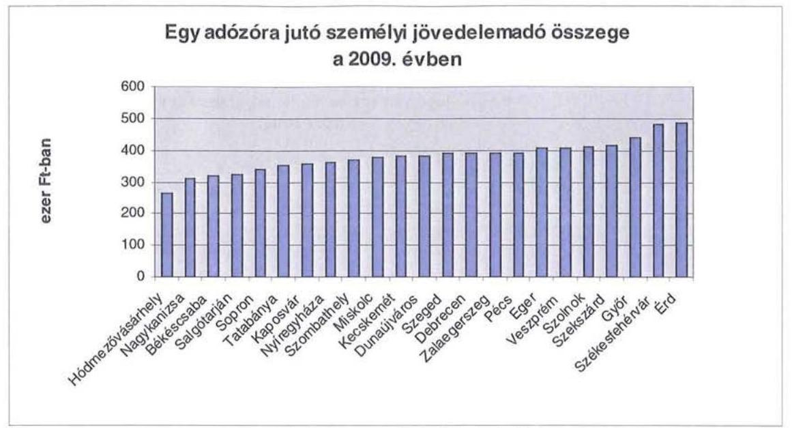

Az átengedett bevételek második legjelentősebb eleme a gépjármúadó, amelynek bevételi szabályozása az ellenőrzött időszakban nem változott, az adóbevétel teljes összege az önkormányzatot illeti meg. A gépjármúadó alapját, mértékét ${ }^{18}$ és egyes mentességi kategóriákat érintő módosítások 2010. január 1-től következtek be, amelyek az egyes adótételek esetében átlagosan $15 \%$-os emelkedéssel jártak.

A gépjármúadó beszedéséből származó bevétel az önkormányzati alrendszer szintjén 2007-ben 62,4 milliárd Ft, 2008-ban 65,7 milliárd Ft, 2009-ben 63,8 milliárd Ft, 2010-ben 71,1 milliárd Ft volt, az adóbevétel egésze 2007-hez képest 8,7 milliárd Ft-tal, 13,9\%-kal emelkedett. A gépjármú-adóztatás szabályainak változása 2010-ben 7,3 milliárd Ft többletet eredményezett. A megyei jogú városok gépjármúadó bevétele a 2007. évi 14,0 milliárd Ft-ról 2010-re 15,5 milliárd Ft-ra, 10,7\%kal emelkedett. A bevételnövekedés összegéből 1,4 milliárd Ft a 2010. évi adózási szabályok következménye.

[^0]
[^0]:    ${ }^{18}$ A gépjármúadóról szóló 1991. évi LXXXII. törvény 7. § (1) bekezdésében foglalt adómértékek változása.

---

A megyei jogú városok önkormányzatai 2007-2010 között rendelkezésre álló forrásainak alakulását a következő ábra szemlélteti:
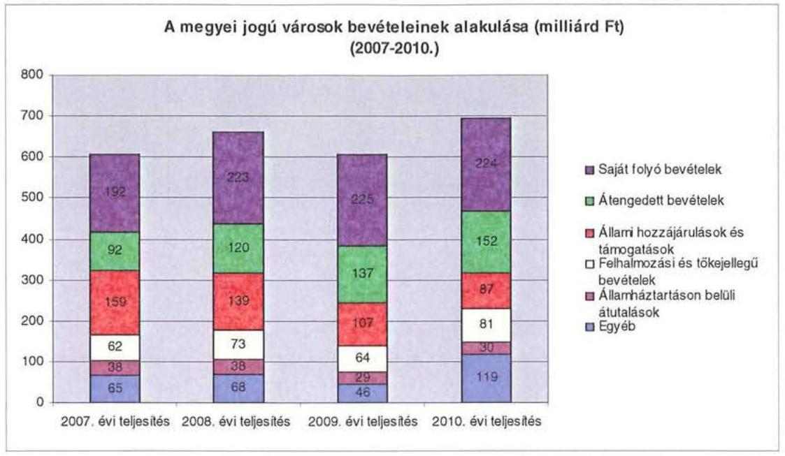

A megyei jogú városok saját folyó bevételeinek - amelyek fơbb elemei: a helyi adók, az illetékbevételek, az intézményi térítési díjak, a kamatbevételek részaránya a 2007. évi összbevételen ( 608 milliárd Ft) belül 32\% volt. A 2010. évi összbevétel 693 milliárd Ft-os összegéből a saját folyó bevételek aránya miközben összege 2007-ről 2010-re 32 milliárd Ft-tal emelkedett - nem változott.

Az átengedett bevételek, amelyek a megyei jogú városok önkormányzatainál döntően a személyi jövedelemadó és a gépjármúadó részesedést jelenti, az összbevételen belül a 2007. évi 92 milliárd Ft-ról (15\%) 152 milliárd Ft-ra nőtt, részesedése 7 százalékponttal emelkedett. A 60 milliárd Ft-os növekedésből 59 milliárd Ft-ot az szja részesedés emelkedése okozott.

Az állami hozzájárulások és támogatások - amelyek főbb elemei: főként az ellátotti létszámhoz kötődő normatív állami hozzájárulások, központosított előirányzatok - a 2007. évi 159 milliárd Ft-ról (26\%-os részarányról) 2010-re 87 milliárd Ft-ra (13\%-os részarányra) estek vissza.

A felhalmozási és tőkejellegú bevételek - tárgyi eszközök (ingatlanok és ingóságok), föld és immateriális javak, részesedések értékesítése, EU-tól átvett pénzeszközök - a 2007. évi 62 milliárd Ft-ról (10\%-os részarányról) 2010-re 81 milliárd Ft-ra (12\%-os részarányra) emelkedtek.

Az államháztartáson belüli átutalások részesedése 2007-ben 38 milliárd Ft volt. 2010. év végére 8 milliárd Ft-tal csökkent, részaránya 6\%-ról 2010-ben 4\%-ra változott. Ez a bevételi kategória tartalmazza az Egészségbiztosítási Alaptól és más elkülönített állami pénzalapoktól átvett forrásokat. A 2010-ben e címen elszámolt bevétel a megyei jogú városoknál 22 milliárd Ft-ot tett ki.

---

Az egyéb, pénzmaradványból, vállalkozási bevételekből, államháztartáson kívülről származó átutalásokból, a hitelekből, a hosszú és rövid lejáratú értékpapírok értékesítéséből származó bevételek részesedése a 2007-2010. évek viszonylatában 11\%-ról 17\%-ra emelkedett. Ez utóbbiak 2010. évi beszámoló szerinti összevont teljesítése 119 milliárd Ft volt ${ }^{19}$.

Mindezeket figyelembe véve a megyei jogú városok 2007. és 2010. évi forrásöszszetételének megoszlását az alábbi ábra szemlélteti:

A megyei jogú városok 2007. és 2010. évi forrásösszetétele
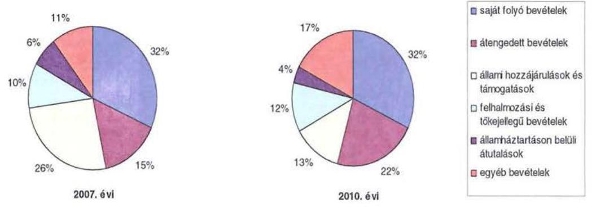

Az önkormányzati alrendszer pénzügyi helyzetértékelése során új elemzési módszereket alkalmaz az ellenőrzés. A hagyományos költségvetési szerkezet helyett az önkormányzat pénzügyi helyzetét a CLF módszerrel mutatjuk be, amelynek lényegét és számításának módszerét a 2.1. pontban, és a jelentés 2 . számú mellékletében ismertetjük részletesen.

Az új módszereken alapuló helyzetértékelés fontosságát az adja, hogy a helyi önkormányzatok bruttó adósságállománya ${ }^{20}$ a 2010. évi költségvetési beszámoló alapján 1248 milliárd Ft-ot tett ki. Az adósságállomány koncentráltságát jelzi ${ }^{21}$, hogy ebből a 23 megyei jogú város részesedése 338 milliárd Ft volt, amely a fővárosi és kerületi önkormányzatok adósságának figyelmen kívül hagyásával számított 2010. évi 977 milliárd Ft összegű bruttó adósságállomány $34,6 \%$-át jelentette. Az adósságállomány több mint fele - 501 milliárd Ft - a 19 megyei önkormányzatnál és a 23 megyei jogú városnál jelentkezett.

[^0]
[^0]:    ${ }^{19}$ Az egyéb bevételek összege 2007-2010 között eltérő módon változott, 2007-ben 65 milliárd Ft, 2008-ban 68 milliárd Ft volt, 2009-ben 46 milliárd Ft-ra esett vissza, majd 2010-ben több mint két és félszeresére, 119 milliárd Ft-ra emelkedett.
    ${ }^{20}$ A bruttó adósságállomány 2010. év végi összege magában foglalja a fejlesztési és a működési célú kötvénykibocsátások, a beruházási és fejlesztési hitelek, a működési célú hosszú lejáratú hitelek, a rövid lejáratú hitelek, váltótartozások miatti kötelezettségek teljes (2011-ben, illetve az azt követő években esedékes) állományát.
    ${ }^{21}$ A megyei jogú városok adósságállománya összegében ugyan elmarad az egyéb városok összesített adósságától [(ez utóbbiak részesedése 382,6 milliárd Ft (39,2\%)], azonban az egyéb városok száma 304. A fővárosi és a kerületi önkormányzatok nélküli adósságállományból a 19 megyei önkormányzat 163 milliárd Ft-tal ( $16,8 \%$-kal), míg a nagyközségek, községek együttesen 93 milliárd Ft-tal ( $9,5 \%$-kal) részesednek.

---

A megyei jogú városok 338 milliárd Ft-os adósságállományából 175 milliárd Ft $(51,8 \%)$ a 8 legnagyobb, 100 ezer fő feletti népességű város tartozása. Az 5 nem megyeszékhely megyei jogú város bruttó adósságállománya 70 milliárd Ft-ot ( $20,7 \%$-ot), az előző két csoportba nem tartozó további 10 megyei jogú város adóssága 93 milliárd Ft-ot ( $27,5 \%$-ot) tett ki.
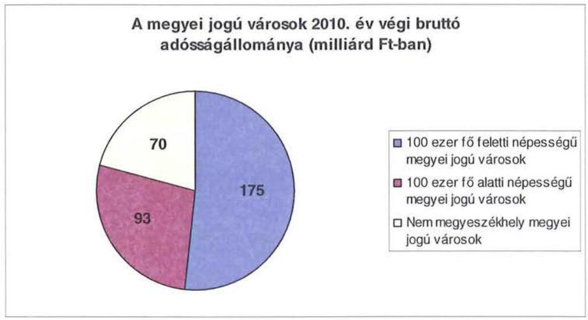

A mérlegben kimutatott bruttó adósságállomány mellett az önkormányzatok számára az eszközállomány múszaki állapotának megőrzése is kötelezettségekkel jár. Az elhasználódott eszközök pótlására forrást biztosító amortizációs (felújítási) alap képzésének ${ }^{22}$ elmaradása maga után vonhatja a feladatellátást kiszolgáló tárgyi eszközök állagának erőteljes romlását. Emellett a 2007-2013as időszakra meghirdetett, vissza nem térítendő EU-s fejlesztési forrásokhoz való hozzájutás lehetősége felerősítette az önkormányzati alrendszer fejlesztési igényeit, amelyek a felhalmozási költségvetési hiány folyamatos emelkedésén túl - az előírt jövőbeni fenntartási kötelezettség miatt - tovább terhelhetik az önkormányzatok költségvetését ${ }^{23}$.

Az ÁSZ a 2011. évi ellenőrzési tervében 43. számú, az Önkormányzatok gazdálkodási rendszerének ellenőrzése részeként egy időben, egymással párhuzamosan tekinti át, és elemzi a 23 megyei jogú városi önkormányzat pénzügyi helyzetét. A gazdálkodás szabályszerűségét az ÁSZ az előző évek során ebben az önkormányzati körben is ellenőrizte, ezért jelen vizsgálatunk erre nem tér ki. A jelentés a megyei jogú városok sajátos feladatellátási és forrásszabályozási helyzeté-

[^0]
[^0]:    ${ }^{22}$ Erre a jelenlegi szabályozási környezetben nem kötelezi semmilyen előirás az önkormányzatokat.
    ${ }^{23}$ Az Állami Számvevőszék 2011 júniusában közzétett 1108. számú, a helyi önkormányzatok fejlesztési célú támogatási rendszerének ellenőrzéséről szóló jelentésében feltárta a fejlesztési folyamatok problémáit. A helyi önkormányzatok elsősorban azokat a fejlesztéseket valósították meg, amelyekhez támogatást lehetett igényelni. A fejlesztési célok közül a magasabb támogatás intenzitású pályázatokat részesítették előnyben. A fejlesztéssel megvalósuló létesítmények jövőbeli üzemeltetésének várható ráfordításait az önkormányzatok $71,9 \%$-a nem mérte fel.

---

re tekintettel az önkormányzatok pénzügyi helyzetét, illetve az ezzel összefüggő korábbi ÁSZ javaslatok megvalósítását mutatja be.

Az ellenőrzés a 2007. január 1. - 2010. december 31. közötti időszakot öleli fel.
A vizsgálat jogszabályi alapját az Állami Számvevőszékről szóló 1989. évi XXXVIII. törvény 2. § (3), (5), (6) és (9) bekezdései ${ }^{24}$, az Ötv. 92. § (1) bekezdése, az Áht. 104. § (3), és 120/A. § (1) bekezdése előírásai képezik.

[^0]
[^0]:    ${ }^{24}$ 2011. július 1-jétől az Állami Számvevőszékről szóló 2011. évi LXVI. törvény 5. § (2)(5) bekezdései.

---

# I. ÖSSZEGZŐ MEGÁLLAPÍTÁSOK, KÖVETKEZTETÉSEK JAVASLATOK 

Az Önkormányzat - adatszolgáltatása szerint - 24503 millió (92\%) a kötelező feladatok, 2133 millió Ft-ot (8\%) az önként vállalt feladatok ellátására fordított. A kötelező és önként vállalt feladatok részarányának megállapítása az Önkormányzat SzMSz szerinti besorolásának megfelelően készült. Az Önkormányzat önként vállalt feladatai közé sorolta a lakosság önszerveződő közösségei tevékenységének támogatását, a méltányossági szempontok alapján fizetett szociális juttatások, támogatások folyósítását, a kultúra, a verseny- és élsport támogatását, drogmegelőzési program múködtetését. Az Önkormányzat kötelező és önként vállalt feladatainak ellátására fordított kiadások arányában a 2007-2010. évek között nem volt jelentős változás, az önként vállalt feladatellátásra fordított kiadások aránya 1,2 százalékponttal csökkent.

Az Önkormányzat feladatellátásának szervezeti struktúráját a következő ábra szemlélteti:
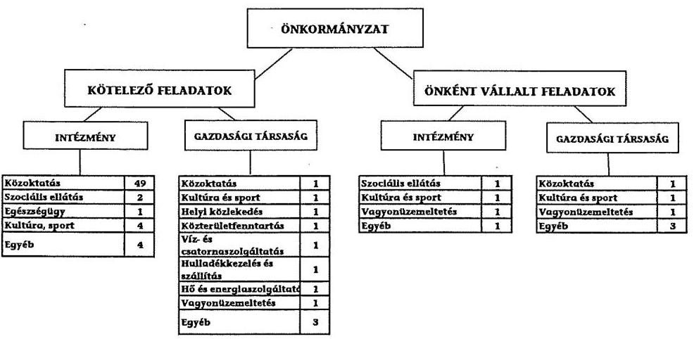

Az Önkormányzat feladatait 2010. december 31-én (a Polgármesteri hivatallal együtt) 59 költségvetési szervvel és $14 \mathrm{db} 25 \%$ feletti tulajdoni hányadú gazdasági társaságával, továbbá két - az önkormányzattól tulajdonosi szempontból független - gazdasági társaság közremúködésével látta el. A vizsgált időszakot megelőzően megkötött feladatellátási szerződés alapján a szociális és gyermekjóléti kötelező és önként vállalt feladatokat láttak el egyesületek, alapítványok és egyházi szervezetek. Az Önkormányzat az áttekintett időszakban három intézmény által ellátott közszolgáltatási feladatát (szociális és gyermekvédelmi feladatokat) - az intézmények irányítási jogának átadásával - integrálta a Kistérségi társulásba. Az intézményszervezeti átalakítások és intézményi összevonások következtében a feladatellátást végző intézmények száma a 2006. évi 67 ről 2010-re 59-re csökkent, míg a feladatellátás telephelyeinek száma 250-ről 257 nőtt.

---

Az Önkormányzat múködési kiadásokra 2010-ben 26636 millió Ft-ot fordított, amely 395 millió Ft-tal ( $1,5 \%$-kal) haladta meg a 2007. évi ráfordításokat. A múködési kiadások 57,8\%-át az intézményi körben realizálták. E kiadások fedezetéül szolgáló bevételi források 2007. és 2010. években jellemző összesített arányait a következő ábra szemlélteti:
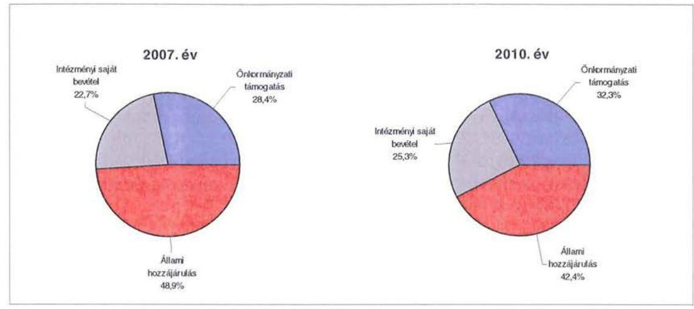

Az intézményi feladatellátást finanszírozó 2010. évi bevételeken belül - a 2007. évi bevételek összetételéhez hasonlítva - 6,5 százalékponttal csökkent a normatív hozzájárulás aránya, ezzel szemben 2,6 százalékponttal az intézményi saját bevételek, 3,9 százalékponttal az önkormányzati támogatások aránya növekedett.

Az egyes közszolgáltatások feladatellátásában részvevő ágazati intézménycsoportok forrásösszetételének bevételi jogcímenkénti alakulását a következő ábra szemlélteti:
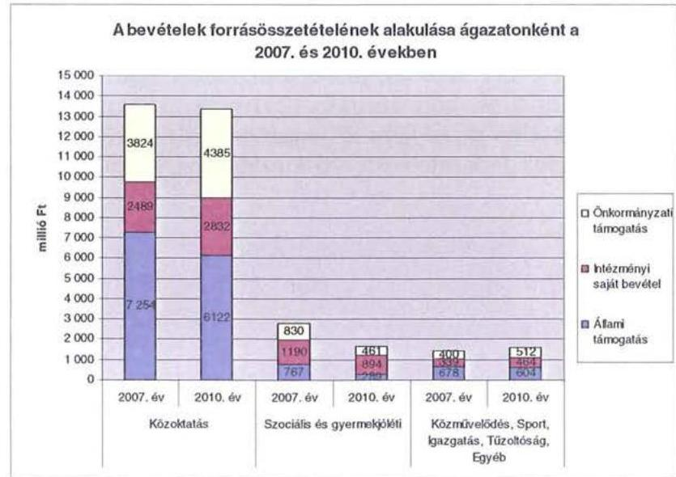

---

Az Önkormányzat kilenc gazdasági társaságban kizárólagos tulajdonnal, egy gazdasági társaságban 75\% feletti, kettő gazdasági társaságban 50-75\% közötti, kettőben 25-50\% közötti tulajdoni hányaddal rendelkezett. A gazdasági társaságok hő- és energiaszolgáltatás, hulladékkezelés és szállítás, adatfeldolgozás, sportlétesítmények múködtetése, ivóvíz- és csatornaszolgáltatás, vagyonkezelés, fizikai közérzetet javító szolgáltatás, növény- és állatkert múködtetés, televíziós műsorszolgáltatás, turisztikai feladatok, temetkezési szolgáltatás nyújtásában, szakmai középfokú oktatásban kaptak szerepet az Önkormányzat feladatellátásában. A gazdasági társaságok múködését a 2010. évben öszszesen 1107 millió Ft rendszeres múködési, 75 millió Ft eseti müködési pénzeszközátadással és 369 millió Ft fejlesztési célú pénzeszközátadással segítette az Önkormányzat. A múködési támogatás $50 \%$-át ( 593 millió Ft-ot) közhasznú foglalkoztatásra a városüzemeltetést és vagyonkezelést végző, 20\%-át ( 241 millió Ft-ot) a sportlétesítmények üzemeltetését végző kizárólagos önkormányzati tulajdonban levő társaság kapta.

Az Önkormányzat minősített többségi és többségi tulajdonában levő gazdasági társaságok saját tőkéjének együttes összege meghaladta a jegyzett tőkéjük öszszegét, a saját tőke/jegyzett tőke aránymutató a 2007. évi 1,5-ről a 2010. évben 1,3-ra változott. Stabil volt a gazdálkodása a hő- és energiaszolgáltatást nyújtó gazdasági társaságnak a jegyzett tőke összegét többszörösére növelte. A fizikai közérzetjavító szolgáltatásokat nyújtó gazdasági társaságnál veszteséges tevékenység miatt 245 millió Ft vagyonvesztés következett be, 2010. december 31én a saját tőke a jegyzett tőke felét tette ki, a gazdasági társaság 2008. évben részesült 100 millió Ft tőkepótlásban.

A folyó költségvetés egyenlege (múködési jövedelem) 2007-2009. között múködési forrástöbbletet mutatott, 2010-ben azonban, az Önkormányzat múködési forráshiányos volt ${ }^{25}$. A 2008-2009. években a működési megtakarítások fedezni tudták a tárgyévben jelentkező törlesztési kötelezettségeket, így az Önkormányzat pénzügyi kapacitása (nettó müködési jövedelme) is pozitív értékű volt. A 2006. évben és a 2010. évben a pénzügyi kapacitás negatív volt (2010. évben -835 millió Ft), mivel múködési megtakarítás hiányában nem volt fedezet a törlesztési kötelezettség (2010-ben 358 millió Ft) összegére. A 2010. évben a múködési jövedelem is negatívvá vált (-160 millió Ft), a folyó bevételek nem nyújtottak fedezetet a folyó kiadásokra, a múködési egyensúly nem volt biztosított.

[^0]
[^0]:    ${ }^{25}$ 2007-ben a folyó bevételek 1,4\%-át ( 373 millió Ft-ot), 2008-ban 2,5\%-át ( 741 millió Ft-ot), 2009-ben 5,1\%-át ( 1428 millió Ft-ot) jelentette, 2010-ben azonban a folyó kiadások $0,6 \%$-át tette ki ( 160 millió Ft ) a negatív múködési jövedelem.

---

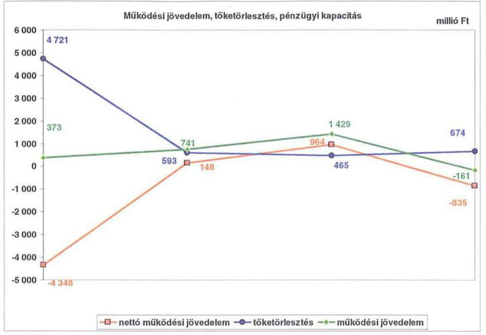

A 2007-2010. években az Önkormányzat felhalmozási költségvetésének egyenlege folyamatosan negatív összegű volt, amely 2007-2010. között összesen 8209 millió Ft felhalmozási forráshiányt okozott.

A pénzügyi egyensúly fenntartása külső források bevonásával volt biztosítható. A 2007-2010. években 6137 millió Ft hitelt törlesztettek, továbbá 317 millió Ft volt a kötvény beváltása miatt fizetendő kötelezettség. Az adósságszolgálat, továbbá a felhalmozási forráshiány 2007-2010. között 15477 millió Ft-ot tett ki, amelyre az időszakban képződő 2382 millió Ft múködési megtakarítás (múködési jövedelem), valamint a 2007. január 1-jén rendelkezésre álló 254 millió Ft pénzkészlet szolgált fedezetül. A további pénzeszközöket - a rendelkezése álló 7288 millió Ft hitelkertből 5644 millió Ft hitel felvételével, továbbá 7640 millió Ft kötvény kibocsátásával teremtették meg. A kialakult pénzügyi helyzet pozitív nettó müködési jövedelmet eredményező gazdálkodás mellett teszi elkerülhetővé további külső források bevonását, az eladósodás növekedését.

A vizsgált időszakban Önkormányzatnál helyi iparűzési adó, építményadó, vendégéjszakák utáni idegenforgalmi adó és luxusadó volt megállapítva, csökkentették az iparűzési adó kedvezményeit, és 2008. évben 100\%-kal, 2010-ben további 50\%-kal emelték meg a vendégéjszakák utáni idegenforgalmi adó mértékét. A helyi adókból és pótlékokból származó bevételek aránya 20072010. között $20,3 \%$ és $24,0 \%$ között alakult a folyó (múködési) bevételekben. A pótlékkal, bírsággal növelt helyi adó bevétel a 2007. évi 5738 millió Ft-ról a 2009. évben 17,5\%-kal ( 6745 milli Ft-ra) nőtt, majd a 2010. évben 6066 millió Ft-ra (előző évhez képest 10,1\%-kal, 679 millió Ft-tal) csökkent. A helyi adóbevételek 2007-2010. között összességében (5,7\%-kal 329 millió Ft-tal) növekedtek. A helyi adóbevételek közel háromnegyed részét az iparűzési adó tette ki,

---

amelynek mértéke a helyi adókról szóló törvényben rögzített maximális mértékben került megállapításra. Az iparűzési adó 101 millió Ft-os csökkenését az építményadónál tapasztalható növekedés ellensúlyozta. Új helyi adónemet a vizsgált időszakban az Önkormányzat nem vetett ki.

A befejezett fejlesztések jelentős részét pénzintézeti forrásokból finanszírozták. A 2007-2010. évek időszakában 9337 millió Ft értékű fejlesztés és felújítás forrása 1457 millió Ft kötvényből származó bevétel (15,6\%), 501 millió Ft (5,3\%) hitelfelvétel, 3464 millió Ft ( $37,1 \%$ ) saját bevétel, 2005 millió Ft (21,5\%) hazai támogatás és 1910 millió Ft uniós támogatás (20,5\%) volt. A 2010. december 31-én folyamatban lévő fejlesztési feladatok végrehajtására 3439 millió Ft kiadást teljesítettek, amelyre a kötvény bevételéből 551 millió Ft-ot (16,0\%), hitelből 93 millió Ft-ot ( $2,7 \%$ ), saját bevételből 664 millió Ft-ot (19,3\%), uniós támogatásból 2098 millió Ft-ot ( $61,0 \%$ ) és hazai támogatásból 33 millió Ft-ot ( $1,0 \%$ ) fordítottak.

Az Önkormányzat 2010. december 31-én folyamatban lévő fejlesztési feladatok kötelezettség-vállalásainak összege 17848 millió Ft volt, amelyből 2503 millió Ft-ot saját forrásból, 12820 millió Ft-ot EU-s támogatásból, 308 millió Ft-ot kötvény kibocsátásából, 766 millió Ft-ot hitelfelvételből és 1451 millió Ft-ot hazai támogatásból terveznek biztosítani. A 2010. december 31-én a kötvénykibocsátásból rendelkezésre álló összeg, valamint a megkötött, de le nem hívott hitelkeretből biztosíthatók a tervezett idegen források. A tervezett saját források rendelkezésre állását azonban az Önkormányzat jelenlegi pénzügyi helyzete nem igazolja. Mindez kockázatot jelent a vállalt fejlesztések jövőbeni finanszírozhatósága szempontjából.
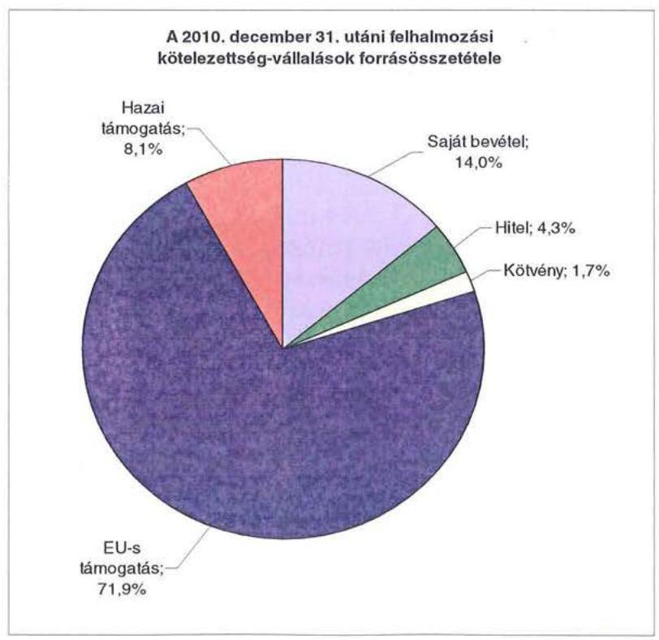

Az Önkormányzat által beadott, elbírálás alatt álló pályázatok tervezett teljes bekerülési költsége 8088 millió Ft volt, amelyhez 262 millió Ft idegen forrást ki-

---

vánnak bevonni, mivel a múködési költségvetésben megtakarítást 2010-ben nem sikerült elérni. Az Önkormányzat vállalt kötelezettségeit - a saját bevételeken túl - a fennálló követelésállományból származó forrásai felhasználásával ( 1417 millió Ft) és a jelzáloggal nem terhelt forgalomképes ingatlanvagyon szükség szerinti értékesítéséből származó bevételből kívánja előteremteni.

Az Önkormányzat mérleg szerinti pénzintézeti kötelezettsége a 2006. év végéről a 2010. év végére, 7073 millió Ft-ról 18347 millió Ft-ra nőtt, amelyből az árfolyamváltozás miatti különbözet 3257 millió Ft volt. A fennálló pénzintézeti kötelezettségek két kötvény kibocsátásból, 14 hosszú lejáratú hitelből és folyószámlahitel és munkabérhitel igénybevételéből keletkeztek. A vizsgálat ideje alatt folytatták le egy 700 millió Ft összegű, hosszú lejáratú hitel közbeszerzési eljárását, a hitelszerződés megkötésének időpontja 2011. július 5-e volt.

Az Önkormányzat kötelezettségvállalásaira közgyűlési döntés alapján került sor, az előterjesztésekben bemutatták a várható kamat és tőkefizetési kötelezettséget, a visszafizetés forrásait, azonban nem mutatták be a kamat- és - a devizaalapú kötelezettségeket érintő - árfolyamkockázatot.

Az Önkormányzat kötvényeket korábbi hiteleinek törlesztése, beruházások és felújítások finanszírozása, felhalmozási célú pénzeszközátadások céljából bocsátott ki. Fejlesztési hiteleiből panelházak felújításához biztosított önerőt, valamint közmủ beruházásokat, iskola és egyéb intézményi rekonstrukciókat finanszírozott.

Az Önkormányzat a devizában fennálló pénzintézeti kötelezettségeiből 48975 ezer CHF ( 1038 millió Ft) tőkét törlesztett, kamatot és egyéb költséget fizetett. A HUF-ban fennálló kötelezettségekből 918 millió Ft tőkét, kamatot és egyéb költséget teljesített. Az Önkormányzat a kötvények kibocsátásából és a hitelek igénybevételéből származó forrásokat 2010. év végéig a céloknak megfelelően felhasználta. A 2007-2010. években átmenetileg szabad pénzeszközeiből 759 millió Ft kamatbevételt realizált, melyből 649 millió Ft származott a kötvénybevételek befektetéséből. A kamatbevételeket a kötvények kamatfizetésére fordították. Az Önkormányzat számlavezető bankot 2010. július 8 -ig nem változtatott. A kibocsátott kötvények lejegyzése és a hitelek folyósítása a Nyíregyháza 2032 kötvény lejegyzése ( 21959 ezer CHF) és három felhalmozási célú hitel kivételével a (összesen 1941 millió Ft) a számlavezető pénzintézet által történt, amely kockázatot jelentett a banki befolyás lehetősége miatt az Önkormányzat számára.

Az Önkormányzat múködésének pénzügyi egyensúlyát a vizsgált időszakban folyószámlahitel és munkabérhitel igénybevételével tudta biztosítani.

A folyószámlahitel igénybevétele a 2007-2010. években az alábbiak szerint alakult:

| Megnevezés | 2007. év | 2008. év | 2009. év | 2010. év |
| :--: | :--: | :--: | :--: | :--: |
| Keretösszeg január 1-jén | 2060,00 | 2560,00 | 2560,00 | 2560,00 |
| Átlagos napj állomány | 2432 | 2404 | 2426 | 2454 |
| Folyószámla hitellel zárt napok száma (nap) | 365 | 365 | 365 | 365 |
| 2010. december 31-i egyenleg (állomány) | $x$ | $x$ | $x$ | 2521 |

---

A folyószámlahitelt az Önkormányzat az év minden napján igénybevett, átlagos napi állománya a 2008. és a 2010. év között folyamatosan emelkedett és a 2010. december 31 -én fennálló folyószámlahitel állománya 2521 millió Ft volt. A likviditás biztosítása az Önkormányzatnak 2007-2010. években 489 millió Ft kamatkiadást okozott. Az Önkormányzat a 2007. évtől a munkabérek kifizetéséhez a vizsgált időszak minden hónapjában munkabér megelőlegezési hitelt vett igénybe, átlagos állománya 695 millió Ft-ról 775 millió Ft-ra változott.

Az Önkormányzat 2010. év végi szállítói tartozása 2759 millió Ft, melyből a lejárt tartozás 2085 millió Ft volt. A lejárt tartozások 33,3\%-a ( 694 millió Ft) meghaladta a 91 napot. Az Önkormányzat intézményeinél és a Polgármesteri hivatalnál a 60 napot meghaladó, szállítók felé fennálló kötelezettségek miatt - a helyi önkormányzatok adósságrendezési eljárásáról szóló 1996. évi XXV. törvény 5. § (2) bekezdésében foglaltak ellenére - a Polgármester nem kezdeményezett adósságrendezési eljárást. Az Önkormányzat lejárt határidejű tartozásának növekvő tendenciája megnehezíti a pénzügyi egyensúly javítására irányuló tevékenységet.

Az Önkormányzat részére egy kizárólag önkormányzati tulajdonban levő gazdasági társaság nyújtott kölcsönt, melynek 2010. december 31 -ei állománya 200 millió Ft volt.

Az Önkormányzat gazdasági társaságai részére és egy vízgazdálkodási társulat folyószámla- és egyéb hitelek igénybevételéhez, kötvény kibocsátásához készfizető kezességet vállalt 3219 millió Ft összegben. Az Önkormányzat három kizárólagos tulajdonában levő gazdasági társaság részére 286 millió Ft tagi kölcsönt folyósított, amit 2010. december 31-ig a gazdasági társaságok visszafizettek.

A Közgyűlés a folyószámlahitel és fejlesztési hitelek biztosítékaként 832 millió Ft - számviteli nyilvántartás szerinti nettó értékủ - jelzálogjog alapításához és bejegyzéséhez járult hozzá. A jelzálogszerződésekkel érintett ingatlanok a forgalomképes ingatlanok $6 \%$-át jelentik.

Az Önkormányzat kötelezettségeinek 2010. december 31-i állományát és várható alakulását a kötelezettségek lejáratáig a következő táblázat szemlélteti:

| Megnevezés | Állomány 2010. dec. 31 -én |  |  | Várható kötelezettség 2011. 2013. években |  |  | Várható kötelezettség 2014.   évet követően |  |  |
| :--: | :--: | :--: | :--: | :--: | :--: | :--: | :--: | :--: | :--: |
|  | 1031-ban   (millió Ft-   hon) | Dovizdban   (ösvengc, vese   hon) | Doviz   (nom) | 1031-ban   (millió Ft-   hon) | Dovizdban   (ösvengc, vese   hon) | Doviz   (nom) | 1031-ban   (millió Ft-   hon) | Dovizdban   (ösvengc, vese   hon) | Doviz   (nom) |
| Pinszintézeti kötelezettségek |  |  |  |  |  |  |  |  |  |
| Szavart közzenti hitelek | 2888 |  | 103 | 2207 |  | 103 | 2000 |  | 103 |
| Kétvinszék (Fejrészgőszem 2010. tőgövegöszem 2010) |  | 47514 | 150 |  | 11956 | 2000 |  | 41864 | 1800 |
| Vakviszintézdetei | 2521 |  | 103 | 2521 |  | 103 |  |  | 103 |
| Várthaféti megelölegesési hitet | 800 |  |  | 800 |  |  |  |  |  |
| Összintézeti kötelezettségek összesen 8000 hon | 9200 |  | 103 | 6718 |  | 103 | 3000 |  | 103 |
| Összintézeti kötelezettségek összesen 1200 hon |  | 47514 | 150 |  | 11956 | 150 |  | 41864 | 150 |
| Biztosítékok |  |  |  |  |  |  |  |  |  |
| Kezesség | 3200 |  | 103 |  |  |  |  |  |  |
| Biztosítékok összesen | 3210 |  | 103 |  |  |  |  |  |  |
| Szállítói tartozás | 2710 |  | 103 | 2710 |  | 103 |  |  |  |
| Egyéb közöre elszámolási |  |  | 103 |  |  | 103 |  |  |  |
| Egyéb kötelezettségek |  |  |  |  |  |  |  |  |  |
| Gf-k és egyéb szervek köti fennállói kötelezettségek | 200 |  | 103 |  | 200 | 103 |  |  |  |
| Segelte végzéssel hozott és az asszédszívot   kötelezettségek* |  |  | 103 |  |  |  |  |  |  |

* A press eljárásokra vonatkozó adatok a 2011. jánćnci állapotot tükrözik

---

Az Önkormányzatnak pénzintézetekkel szemben fennálló kötelezettsége a 2010. év végén 9209 millió Ft és 47514 ezer CHF volt. Ezek várható kötelezettsége (tőke, kamat és egyéb költség) a legutóbbi kamatfizetés feltételei alapján a 2011. évtől 6718 millió Ft, továbbá 11956 ezer CHF. Az Önkormányzatnak a 2011. január 1-jén szállítói tartozások címén 2759 millió Ft fizetési kötelezettsége állt fenn. A kezességvállalásaiból adódóan 3219 millió Ft összegű terhet jelenthet, amennyiben a társaságok és a vízgazdálkodási társulat kötelezettségeiket nem teljesítik. A 2011-2013. években várható összes kötelezettség teljesítésére figyelembe vehető 1416 millió Ft mérlegben kimutatott követelésállomány, 29 millió Ft pénzeszközállomány és az Önkormányzat forgalomképes ingatlanvagyona. A 2014. évet követő kötelezettségek teljesítéséhez igénybe vehető a 2010. december 31-én meglevő) 13867 millió Ft forgalomképes ingatlanvagyon, melyből a 832 millió Ft a pénzintézeti kötelezettségekhez kapcsolódóan jelzáloggal terhelt. Az Önkormányzat a kötelezettségek visszafizetésének fedezetét - a kötelezettség keletkezésekor -„a mindenkori költségvetési rendeletekben megtervezett önkormányzati saját bevételekben" jelölte meg, a 2011-2013. évi kötelezettségek és a 2014. évet követő várható kötelezettségek visszafizetésének forrását nem számszerúsítették. A kötelezettséget teljesítéséhez a CLF módszer szerint a múködési jövedelem csökkenése (2010. évi -160 millió Ft) miatt nem nyújt fedezetet az önkormányzati kötelezettségek teljesítésére.

Az Önkormányzat minősített többségi tulajdonú társaságai kötelezettségeinek 2010. december 31-i állományát és várható alakulását a kötelezettségek lejáratáig a következő táblázat mutatja be:

| Megnevezés | Állomány 2010. dec.31-én |  |  | Várható kötelezettség 2011. 2013. években |  |  | Várható kötelezettség 2014. évet követően |  |  |
| :--: | :--: | :--: | :--: | :--: | :--: | :--: | :--: | :--: | :--: |
|  | $\begin{gathered} \text { II08-ban } \\ \text { (millió Ft- } \\ \text { fenn) } \end{gathered}$ | Dovizában (összegy, cont - fenn) | Doviz (mező) | $\begin{gathered} \text { II08-ban } \\ \text { (millió Ft- } \\ \text { fenn) } \end{gathered}$ | Dovizában (összegy, cont - fenn) | Doviz (mező) | $\begin{gathered} \text { II08-ban } \\ \text { (millió Ft- } \\ \text { fenn) } \end{gathered}$ | Dovizában (összegy, cont - fenn) | Doviz (mező) |
| Pénzintézeti kötelezettségek |  |  |  |  |  |  |  |  |  |
| Szemest képezett kötelezet | 50 |  | 1002 | 48 |  | 1002 | 50 |  | 1002 |
| Szemest képezett kötelezet |  | 200 | 1108 |  | 241 | 1108 |  | 148 | 1108 |
| Kötelezettsége |  | 9340 | 1110 |  | 200 | 1110 |  | 9700 | 1110 |
| Szemestnéde- és egyéb elvitt képezett kötelezet | 100 |  |  |  |  |  |  |  |  |
| Pénzintézeti kötelezettségek összesen (BHS): | 252 |  | 1002 | 48 |  | 1002 | 50 |  | 1002 |
| Pénzintézeti kötelezettségek összesen (CHS): |  | 10000 | 1110 |  | 740 | 1110 |  | 9840 | 1110 |
| Szüleg kötelezettségek (BHS) | 50 |  | 1002 | 50 |  | 1002 |  |  | 1002 |
| Szüleg kötelezettségek (CHS) |  | 25 | 1006 |  | 24 | 1006 |  | 0 | 1006 |
| Szüleg kötelezettségek (CHS) |  | 45 | 1108 |  | 45 | 1108 |  | 0 | 1108 |
| Szállítót tudható | 1154 |  | 1002 | 1154 |  | 1002 |  |  |  |
| Segelte végzéssel kiadá de ki nem fizetett kötelezettségek? | 0 | 0 |  |  |  |  |  |  |  |

* A peres eljárásokon vonatkozó adatok a 2011. júnával állapotot tükértek

Az önkormányzati kötelezettségek növekedése mellett a minősített többségi tulajdonú társaságok kötelezettségei is befolyásolhatják az Önkormányzat pénzügyi egyensúlyát. A társaságoknak a 2011. évtől 48 millió Ft és 740 ezer CHF pénzintézeti kötelezettséget, 55 millió Ft és 127 ezer CHF lizing és 1154 millió Ft szállítói tartozást kell rendezniük. Kockázatot hordoz, ha ezek nem teljesítése és a vonatkozó jogszabályi feltételek esetén a bíróság korlátlan és teljes felelősséget állapít meg az Önkormányzat terhére.

Az Önkormányzat költségvetési támogatásból, átengedett bevételekből, és illeték bevételekből származó bevételei a 2007. évhez képest az időszak egészét tekintve összességében nem csökkentek, azonban a 2010. évi bevételek ( $2,3 \%$-kal 403 millió Ft-tal) elmaradtak a 2007. évitől. Az Önkormányzat pénzügyi helyzetének javítása érdekében kiadási megtakarítást és bevételnövelést eredményező intézkedéseket hozott. A 2007-2010. években tett intézkedé-

---

sek hatására 159 millió Ft bevételi többletet, továbbá 1428 millió Ft kiadási megtakarítást mutattak ki, ezáltal az önkormányzat pénzügyi helyzetét javították. A kiadási megtakarítások 93\%-a az elrendelt álláshely csökkentések eredménye. Az álláshely csökkentő intézkedések 2007-2010. között a Polgármesteri hivatalnál és az intézményeinél összesen 423 álláshely (ebből 57 üres álláshely) megszüntetését jelentették. Egyes közszolgáltatási területeken azonban feladatbővülések is voltak, amelyek álláshely és egyben létszámnövekedéssel is jártak. Ennek következtében az időszak álláshelyeinek száma 192 fővel csökkent. A bevételnövelő intézkedések helyi adóbevételek növeléséhez, bérleti díjak emeléséhez, ingatlanok, egyéb eszközök értékesítéséhez, átmenetileg szabad pénzeszközök lekötéséhez kapcsolódtak.

Az utóellenőrzés a pénzügyi egyensúly javítására tett kettő szabályszerűségi és egy célszerűségi javaslat hasznosítására terjedt ki. Egy javaslatot az intézkedési terv szerinti határidőben teljesítettek, azonban továbbra is likvid hitelként mutattak ki az Önkormányzat mérlegében rövid lejáratú hiteleket is.

Az Önkormányzat pénzügyi helyzetét összegezve a következők emelhetők ki:

A 2007-2010. években az Önkormányzat múködési kockázatát növelte a negatív nettó működési jövedelem, az ellenőrzött időszak minden napján fennálló folyószámla hitel napi átlagos állományának, továbbá a havi rendszerességgel igénybevett munkabérhitel napi átlagának emelkedése és a jelentős lejárt szállítói tartozásállomány. A múködési bevételek 2009-2010. években nem biztosították a működési kiadások és az adósságszolgálat finanszírozását, a likviditás biztosítása növekvő mértékű folyószámlahitel igénybevételével történt, annak ellenére, hogy az Önkormányzat a vizsgált időszakban a központi intézkedések hatására jelentkező bevételkiesést a kiadáscsökkentő és bevételnövelő intézkedéseivel ellentételezte. A gazdasági társaságok szerepe a közüzemi közfeladat-ellátásban meghatározó volt, a gazdasági társaságok által ellátott feladatstruktúra átlátható volt. A fizikai közérzetet javító szolgáltatásokat nyújtó gazdasági társaság eladósodása növelte a pénzügyi kockázatot.

A vizsgált időszakban az Önkormányzat felhalmozási költségvetése pénzügyi hiányt mutatott, ennek forrásai kötvénykibocsátással és hitelfelvétellel biztosítottak voltak. A korábbi eladósodás következtében a felhalmozási kiadások finanszírozására a folyó költségvetésben nem keletkeztek felszabadítható források. A fejlesztési célú kötelezettségvállalások jövőben teljesítendő kifizetései tekintetében a nettó működési jövedelem negatív értéke a felhalmozási kockázatot növeli. A hosszú lejáratú kötelezettségek 2011-2013. és az azt követő évek finanszírozásának forrását az Önkormányzat nem számszerűsítette.

A pénzintézeti és egyéb kötelezettségek teljesítésének kockázatát növelte, hogy a 2011-2013. években várható és a 2014. évet követő kötelezettségek visszafizetésének fedezetét - a kötelezettség keletkezésekor - a költségvetésben megtervezett bevételekben jelölték meg, a visszafizetésének forrását nem számszerúsítették. A kockázatot csökkentheti az Önkormányzat 2010. évi követelésállománya, és forgalomképes ingatlanvagyona szükség esetén felhasználható az adósságszolgálat visszafizetésére.

---

A polgármester tájékoztatása szerint a helyszíni vizsgálatot követően a pénzintézettel folytatott tárgyalás eredményeként a kötvény és hitel visszafizetésének átütemezése a 2011. évi költségvetés pozícióját 338 millió Ft-tal javította.

Az Állami Számvevőszékről szóló 2011. évi LXVI. törvény 33. § (1) bekezdésében foglaltak értelmében a jelentésben foglalt megállapításokhoz kapcsolódó intézkedési tervet köteles az ellenőrzött szervezet vezetője összeállítani és azt a jelentés kézhezvételétől számított harminc napon belül az ÁSZ részére megküldeni. Amennyiben az intézkedési tervet határidőben nem küldi meg a szervezet, vagy az továbbra sem elfogadható, az ÁSZ elnöke a hivatkozott törvény 33. § (3) bekezdés a)-b) pontjaiban foglaltakat érvényesítheti.

Az ellenőrzés intézkedést igénylő javaslatai:

# a Polgármesternek 

1. a Közgyűlés elé terjesztendő intézkedési terv írja elő a működés pénzügyi egyensúlyának gyors helyreállítása és hosszú távú fenntarthatósága érdekében - felelősök és határidők megjelölésével - olyan program készítését, amely tartalmazza az alábbiakat:
a) bevételszerző lehetőségek feltárását, különösen a helyi adópolitikai célok meghatározását és számszerúsítését, a bérleti díjak és a térítési díjak megállapítását, felülvizsgálatát, a követelések behajtását, az egyéb sajátos bevételek növelésének lehetőségét;
b) a folyamatban lévő és a tervezett beruházások teljes körű felülvizsgálatát;
c) egyéb kiadási kötelezettségek teljes körű felülvizsgálatát;
d) az intézkedések következtében jelentkező pénzügyi többlet, illetve az egyszeri bevételek tartalékba helyezését, elkülönített kezelését az adósságszolgálat teljesítése érdekében;
e) az adósságszolgálat szerkezetének áttekintését, a likviditás menedzselést, a támogatás előfinanszírozás átláthatóbbá tételét;
f) az intézményi gazdálkodás felülvizsgálatát;
g) az önként vállalt feladatok finanszírozhatóságának áttekintését a kötelező feladatellátás elsődlegességének biztosítása érdekében, a gazdasági program áttekintésével összhangban;
2. az intézkedések eredményei legalább évenkénti áttekintésének előírását;
3. mutassa be félévente - a szokásos beszámoló keretében - a Közgyűlésnek:
a) az Önkormányzat és a minősített többségi tulajdonú gazdasági társaságai aktuális pénzügyi helyzetét, az Önkormányzatnak a gazdasági társaságai felé fennálló követeléseit, nyújtott kölcsöneit;

---

b) legalább három évre kitekintően a kötelezettségek teljes körére szóló finanszírozási tervet, amely figyelembe veszi a kötelezettség éven belüli és túli felmerülését, a források számszerúsített megjelölésével;
c) az Önkormányzat folyamatban lévő és tervezett fejlesztéseihez szükséges belső és külső források rendelkezésre állását, és ebből a szempontból értékelje az Önkormányzat beruházásait;
4. intézkedjen a beruházásokkal létrehozott létesítmények múködtetését és jövőbeni fenntarthatóságát biztosító megalapozott források költségvetési rendeletekben történő feltüntetéséről;
5. mutassa be a Közgyűlésnek évente a zárszámadási rendelet előterjesztésében az értékcsökkenés összegét, és ezzel összevetve az elhasználódott eszközök pótlására fordított tényleges kiadásokat, az eszközök elhasználódási fokának alakulását;
6. kezdeményezze, hogy az Önkormányzat számára jóváhagyott osztalék felvételre kerüljön a pénzügyi helyzetének javítása, adósságszolgálatának törlesztése érdekében;

# a Főjegyzönek 

1. kísérje figyelemmel a jövőbeni várható - árfolyam-, kamat- valamint visszafizetési kockázatokat, továbbá a mérlegen kívüli tételek (kezességvállalás, garancia és helytállási kötelezettségvállalás) kockázatait, és legalább félévente tájékoztassa a Közgyűlést azok alakulásáról;
2. gondoskodjon, hogy a jövőben az adósságot keletkeztető kötelezettségvállalásokról szóló közgyűlési előterjesztések tételesen tartalmazzák a visszafizetés forrásait, valamint legalább 3 éves kitekintéssel mutassák be a kamat és árfolyamkockázat várható kihatásait;
3. kísérje folyamatosan figyelemmel - a tulajdonosi jogkört gyakorlók közreműködésével - a minősített többségi tulajdonú gazdasági társaságok kötelezettségeinek alakulását, az Önkormányzat likviditására, pénzügyi-egyensúlyi helyzetére gyakorolt hatását;
4. gondoskodjon a Polgármesteri hivatal és a további költségvetési szervek lejárt szállítói tartozásai okainak feltárásáról, azonnali intézkedések megtételéről a lejárt tartozások mielőbbi rendezése érdekében;
5. intézkedjen a Polgármesteri hivatal és a további költségvetési szervek peres eljárásokból adódó kötelezettségek teljesítése érdekében a szükséges fedezet elkülönítéséről, a finanszírozási tervben történő figyelembevétel mellett.

---

# II. RÉSZLETES MEGÁLLAPÍTÁSOK 

## 1. Az ÖNKORMÁNYZAT KÖTELEZŐ ÉS ÖNKÉNT VÁLLALT FELADATAI

Az Önkormányzat 2010. évi beszámolója szerint feladatainak ellátására 26636 millió Ft müködési kiadást teljesített ${ }^{26}$, melynek 92,0\%-át, 24503 millió Ft-ot kötelező feladatok ellátására fordított.

Az Önkormányzat 2010. évi müködési kiadásai és finanszírozási arányai főbb feladatonként:

| Ellátott feladat | Müködési kiadás összesen (millió Ft) | Kötelező feladat kiadásainak részaránya $\%$ | Müködési bevétel összesen (millió Ft) | Állami támogatás részaránya $\%$ | Intézményi saját bevétel részaránya $\%$ | Önkormányzat i támogatás részaránya $\%$ |
| :--: | :--: | :--: | :--: | :--: | :--: | :--: |
| Övodák | 2232 | 100 | 2364 | 40 | 20 | 40 |
| Általános iskolák | 4135 | 100 | 4398 | 37 | 21 | 42 |
| Gimnáziumok | 1045 | 100 | 1184 | 66 | 30 | 4 |
| Szakközépiskolák, szakképző intézmények | 4142 | 100 | 4442 | 51 | 22 | 27 |
| Kollégiumok | 950 | 100 | 950 | 53 | 11 | 36 |
| Szociális   intézmények | 1485 | 100 | 1644 | 18 | 54 | 28 |
| Gyermekjóléti intézmények | 0 | 0 | 0 | 0 | 0 | 0 |
| Közművelődési intézmények | 587 | 100 | 678 | 0 | 37 | 63 |
| Sportlétesítmények | 0 | 0 | 0 | 0 | 0 | 0 |
| Igazgatási intézmények | 0 | 0 | 0 | 0 | 0 | 0 |
| Hivatásos   Tủzoltóság | 612 | 100 | 680 | 0 | 0 | 0 |
| Egyéb intézmények | 221 | 100 | 222 | 35 | 13 | 52 |
| Intézmények összesen | 15409 | 100 | 16562 | 42 | 25 | 33 |
| Polgármesteri Hivatalban kezelt feladatok müködési kiadásai | 11227 | 81 | 10988 | 23 | 77 | 0 |
| Müködési kiadások összesen | 26636 |  | 27550 | 35 | 46 | 19 |

[^0]
[^0]:    ${ }^{26}$ Az elemi beszámoló müködési bevétel adata és a CLF folyó bevétel adata az áfa viszszatérülés teljes összegével, valamint az Önkormányzat által fejlesztési kamatnak minősített kamatbevétel összegével, továbbá a követelés elengedés miatt elszámolt bevétel figyelmen kívül hagyása miatt tér el egymástól.

---

Az Önkormányzat kötelező és önként vállalt feladatainak ellátására fordított kiadások arányában a 2007-2010. évek között nem volt jelentős változás, az önként vállalt feladatellátásra fordított kiadások aránya 1,2 százalékponttal csökkent ${ }^{27}$.

Az Önkormányzat költségvetési intézményei kizárólag kötelező önkormányzati feladatot láttak el, míg a Polgármesteri hivatal a kötelező és önként vállalt feladatok ellátásában egyaránt részt vett. Az SzMSz ${ }^{28}$ tartalmazta a kötelező és önként vállalt feladatok jegyzékét, a jogszabályok által kötelezővé nem tett, méltányossági alapon biztosított ellátásokat - önként vállalt feladatként látta el.

Az Önkormányzat önként vállalt feladatai közé sorolta a lakosság önszerveződő közösségei tevékenységének támogatását, repülőtér üzemeltetését, vásárok piacok fenntartását; a méltányossági szempontok alapján fizetett szociális juttatások, támogatások folyósítását; kiállítások vásárok, városi rendezvények szervezését, színház, sportcsarnok fenntartásának támogatását, önkormányzati médiumok müködtetését, tehetséggondozást; a városszépítő akciók szervezését, illegális szemétlerakók felszámolását, közterület-felügyeleti tevékenységet, fizető parkolóhálózat müködtetését, térinformatikai rendszer működtetését; ösztöndíjak fizetését, drogmegelőzési program működtetését, diákönkormányzat támogatását, ifjúsági tanács működtetését, a Városi Olimpiai Alap és Sportösztöndíj rendszer működtetését, verseny- és élsport támogatását, versenyeken elért eredmények elismerését.

Az Önkormányzat kötelező és önként vállalt feladatainak ellátását biztosító 27550 millió Ft müködési célú költségvetési bevétel 35\%-át - 9570 millió Ft-ot a központi költségvetésből kapott támogatás, 19\%-át - 5359 millió Ft-ot - önkormányzati forrás és $46 \%$-át - 12621 millió Ft-ot - az intézményi saját bevétel tette ki a 2010. évben. A 2007. évhez képest a müködési bevételi források összetétele változott, a központi költségvetésből kapott támogatás aránya 4,6 százalékponttal csökkent, míg az önkormányzati támogatás 0,8 százalékponttal, az intézményi saját bevételek aránya 3,8 százalékponttal növekedett ${ }^{29}$.

Az Önkormányzat az Ötv-ben és egyéb jogszabályokban meghatározott kötelező feladatainak ellátásáról az intézmények és gazdasági társaságok alapító okirataiban, illetve társasági szerződéseiben, kistérségi társulással kötött megállapodásban, civil szervezetekkel, alapítványokkal, egyházi szervezetekkel kötött feladatellátási megállapodásban, gazdálkodó szervezetekkel kötött közszolgáltatási szerződésben foglaltak szerint.

[^0]
[^0]:    ${ }^{27}$ Az Önkormányzat a 2007. évben kötelező feladatellátására 23821 millió Ft-ot, önként vállalt feladatokra 2419 millió Ft-ot fordított, amely az összes müködési kiadás $90,8 \%$-át, illetve $9,2 \%$-át tette ki.
    ${ }^{28} \mathrm{Az} \mathrm{SzMSz}_{1} 11$. számú melléklete, illetve az $\mathrm{SzMSz}_{2} 3$. számú melléklete.
    ${ }^{29}$ A 2011. évi elemi költségvetésben tervezett müködési bevételeken belül jelentős mértékben változott, tovább csökkent a központi költségvetésből kapott támogatás, valamint csökkent az önkormányzati forrás aránya, míg 2007. és 2010. évhez hasonlítva jelentős mértékben - 17,5, illetve 13,7 százalékponttal - növekedett az intézményi saját bevételek aránya.

---

Az Önkormányzat kötelező és önként vállalt feladatait 2010. december 31-én a Polgármesteri hivatallal együtt 28 önállóan múködő és gazdálkodó, valamint 31 önállóan működő költségvetési intézménye, kilenc minősített többségi, három többségi tulajdonú és két, az önkormányzat kisebbségi tulajdonában levő gazdasági társasága látta el. Az intézmények és a feladatellátásban résztvevő gazdasági társaságok - alapító okirataik és társasági szerződéseik szerint - öszszesen 257 telephelyen múködtek.

Az Önkormányzat intézménystruktúrája 2010. december 31-én a következő volt:

- közoktatási feladatokat 49 intézmény látott el, melyből a 2010. évben 23 önállóan működő és gazdálkodó és 26 önállóan működő költségvetési szerv volt, az intézmények közül óvodai nevelést 18, általános iskolai oktatást 13, középiskolai oktatást 15 költségvetési szerv végezett, egy intézmény fogyatékos gyerekek oktatását látta el, továbbá egy-egy intézmény végezte a zene- és alapfokú művészetoktatással kapcsolatos, valamint a pedagógiai szakszolgálati feladatokat;
- szociális és gyermekvédelemi feladatokat két intézmény végzett, akik közül egy OEP által finanszírozott egészségügyi feladatokat is ellátott. Kulturális tevékenység körébe tartozó szolgáltatásokat négy intézmény (könyvtár, művelődési központ, Art mozi és rendezvénycentrum és a Cantemus Kórus) nyújtott;
- egyéb tevékenység keretében tűzvédelmi feladatokat látott el a Hivatásos Tűzoltóság, igazgatási feladatokat a Polgármesteri hivatal, a Hulladékgazdálkodási társulás és az Ivóvízminőség-javító társulás látott el.

Az Önkormányzat kizárólagos tulajdonában levő gazdasági társaságai látták el a sportlétesítmények működtetése, az önkormányzati vagyon üzemeltetése, önkormányzati lakások, egyéb ingatlanok kezelése, közterület fenntartása, a hulladékszállítás és kezelés, hő- és energiaszolgáltatás, adatfeldolgozás és web-hoszting ${ }^{30}$ szolgáltatás kötelező önkormányzati, a növény- és állatkert működtetési, film-, video-, műsorgyártás, televíziós szolgáltatás, fizikai közérzetjavító szolgáltatás, a saját tulajdonú ingatlanok bérbeadása, üzemeltetése, parkolók fenntartása önként vállalt feladatokat. Az Önkormányzat minősített többségi tulajdonában levő gazdasági társasága kötelező feladatként szakképzési feladatellátásban vett részt, többségi tulajdonban levő gazdasági társaságok temetkezési és temetkezési kiegészítő szolgáltatásokat, valamint vízés csatornaszolgáltatás nyújtottak. Az Önkormányzat kisebbségi tulajdoni részarányú levő gazdasági társaságai szakmai középfokú oktatási feladatokat és turisztikai (utazásszervezés, adatfeldolgozás) tevékenységet láttak el.

A helyi tömegközlekedési feladatot ellátó zrt-ben és a kéményseprőipari feladatokat végző kft-ben az Önkormányzat tulajdonnal nem rendelkezett.

[^0]
[^0]:    ${ }^{30}$ internetes tárhely szolgáltatás

---

Szociális és gyermekjóléti kötelező és önként vállalt önkormányzati feladatok ellátásában - 2007. évet megelőző döntések alapján - feladatellátási szerződés megkötésével egyesületek, alapítványok és egyházi szervezetek vettek részt.

Az ellenőrzött időszakban az általános iskolai oktatásban négy, a szociális és gyermekvédelmi feladatok ellátásában hárommal csökkent a feladatellátásban résztvevő intézmények száma, valamint összességében kettővel csökkent az önkormányzati feladatokat ellátó gazdasági társaságok száma (öt gazdasági társaság megszűnt és három alakult), ez azonban a 2007-2010. évi feladatellátás szerkezetében nem eredményezett jelentős változást. Az általános iskolai intézmények számának csökkenését három, részben önálló gazdálkodási jogkörrel rendelkező intézmény tagintézménnyé válása és egy intézmény megszűntetése eredményezte. A megszűnt intézmény tanulóit az Önkormányzat többi általános iskolájában helyezték el.

A Közgyűlés a szociális és gyermekvédelmi feladatellátást végző Nyíregyháza és Nyírpazony Intézményfenntartó Társulást és a Nyíregyháza és Nyírtura Intézményfenntartó Társulást 2009. december 31-én megszüntette. A társulások által ellátott feladatokat a Szociális Gondozási Központ, a Gyermekjóléti Központ, valamint a Sóstó Szivárvány Idősek Otthona irányítási jogával együtt 2010. január 1-jén a Kistérségi társulásnak átadta ${ }^{31}$, aki a szociális és gyermekvédelmi feladatokat az intézmény fenntartásának átadására irányuló megállapodás ${ }^{32}$ alapján látja el. Az Önkormányzat a gyermekvédelmi szakellátás ellátására 2010. január 1. napjától a Szabolcs-Szatmár-Bereg Megyei Önkormányzattal kötött megállapodást.

Az Önkormányzat nyilvántartása szerint a központi költségvetésből 2010. évben kapott normatív hozzájárulás az ágazati feladatok ellátásához teljesített kiadások $45,5 \%$-ára nyújtott fedezetet.

A közoktatási intézményekben a szolgáltatást igénybevevők száma a 2007. évi 25811 fơről a 2010. évi 24772 főre, 4,0\%-kal csökkent. Az ágazat fajlagos kiadása az ellátotti létszámcsökkenés és a takarékos gazdálkodás együttes hatására 2007-2010. között 505180 Ft-ról 504738 Ft-ra 0,1\%-kal csökkent. Az állami támogatással való fedezettség aránya a vizsgált időszakban a 2007. évi 281062 Ft-ról 2010. évi 247114 Ft-ra, 12,1\%-kal csökkent, amely a központi forrásszabályozás következménye. A központi támogatás csökkenését ellensúlyozta az egy ellátottra jutó saját bevétel $13,7 \%$-os és az önkormányzati támogatás $14,7 \%$-os emelkedése.

A szociális intézményekben - a szociális és gyermekvédelmi intézményi feladatátadás miatt - az ellátottak száma 2687 fővel 73,9\%-kal - ebből a fo-

[^0]
[^0]:    ${ }^{31}$ A Közgyűlés 286/2009. (XII. 14.) számú határozata a Kistérségi társulási megállapodásának módosításáról, az ellátási szerződés és a csatlakozó intézmények alapító okiratának módosításáról.
    ${ }^{32}$ Az Önkormányzat és a Kistérségi társulás az intézmények fenntartásának átadására és a feladatellátásra szóló megállapodásokat az erről szóló határozattal egyidejűleg megkötötték, 2010. január 18-án módosították.

---

gyatékos ellátásban részesülők száma 30 fővel - a 2007. évi 2409 főről 630 főre csökkent. Az ágazat fajlagos kiadása több mint kétszeresére, 1077880 Ft-ról 2357724 Ft-ra, 218,7\%-ra emelkedett. Az állami támogatással való fedezettség aránya a vizsgált időszakban 318419 Ft-ról 2010. évben 458432 Ft-ra, 44,0\%kal emelkedett. A fajlagos mutatók emelkedését három intézmény feladatátadása miatti arányeltolódás okozza, mivel az átadott feladatok (házi segítségnyújtás) alacsony fajlagos mutatókkal rendelkeztek, azonban ellátotti létszámban jelentős, $81,5 \%$-os részarányt képviseltek. A feladatátadás következtében $24,9 \%$-kal csökkent az egy ellátottra jutó saját bevétel és $44,5 \%$-kal az önkormányzati támogatás összege.

A közmúvelődési intézmények normatív hozzájárulása a 2007. évben a kiadások 20\%-ára nyújtott fedezetet. A 2010. évtől a közművelődési feladatok ellátására a „települési önkormányzatok üzemeltetési, igazgatási, sport, kulturális" feladataira kapott normatív hozzájárulás biztosított fedezetet.

A feladatátadás miatti intézményi, illetve ellátotti létszámcsökkenés a személyi juttatások és járulékai, valamint a dologi kiadások összegében 1498 millió Ft kiadási megtakarítást, valamint 515 millió Ft normatív hozzájárulás és 886 millió Ft saját bevétel csökkenést számolt el, összességében 97 millió Ft kiadási megtakarítást mutatott ki az Önkormányzat. A jogszabályi változás hatására átvett gyermekvédelmi szakellátás feladatellátása miatt 106 millió Ft többletkiadást számolt el az Önkormányzat.

A 2007-2010. évek között három kötelező feladatot ellátó, önkormányzati kizárólagos tulajdonban levő gazdasági társaság megszünt, továbbá két nem önkormányzati feladatot végző $37 \%$-os és $45 \%$-os önkormányzati tulajdonnal rendelkező gazdasági társaság megszüntetése volt folyamatban, cégjegyzékből való törlésük a helyszíni ellenőrzés befejezéséig a Cégbíróságnál még nem történt meg.

A Közgyűlés:

- sportpályák, stadionok működtetését végző gazdasági társaságának - egy másik, kizárólagos önkormányzati tulajdonban levő gazdasági társaságba történő - beolvadásáról döntött ${ }^{33}$, - az Egyesülési szerződést 2009. június 30án megkötötték;
- döntött ${ }^{34}$, a hulladékgyűjtés- és kezelést végző közhasznú társaság végelszámolással történő megszüntetéséről - cégjegyzékből való törléséről szóló bírósági döntés 2010. január 18-án kelt;

[^0]
[^0]:    ${ }^{33}$ A Közgyűlés 352/2008. (XII. 15.) számú határozatában döntött a gazdasági társaság beolvadásáról.
    ${ }^{34}$ A közhasznú társaság megszűntetéséről a Közgyűlés a 263/2009. (XI. 23.) számú határozatában döntött, a hulladékkezelési közszolgáltatási feladatokat ezt követően az Önkormányzat kizárólagos tulajdonában levő gazdasági társaság látta el.

---

- döntést hozott ${ }^{35}$ egy építőipari, épületfenntartás, korszerűsítés és ingatlankezelés és forgalmazás feladatokat ellátó gazdasági társaság végelszámolásáról, az eljárás 2010. május 21 -én jogerőre emelkedett cégbírósági végzéssel fejeződött be.

A 2007. évet követően három gazdasági társaság megszűnésének, beolvadásának és három alapításának, és két gazdasági társaság esetében a felszámolási eljárás megindításának hatására alakult ki a társaságok 2010. december 31-én fennálló tulajdonosi szerkezete. Az Önkormányzat gazdasági társaságainak 2010. december 31-i állapotnak megfelelő tulajdonosi szerkezetét a 4. számú melléklet szemlélteti.

Az Önkormányzat 2010. évben hét gazdasági társasága és egy önkormányzati tulajdonnal nem rendelkező gazdasági társaság tevékenységét segítette 1182 millió Ft múködési célú pénzeszközátadással, melyből 75 millió Ft volt eseti jellegű. A gazdasági szervezetek közül öt gazdasági társaság az Önkormányzat többségi tulajdonában volt. A pénzeszközátadások 50,2\%-át az önkormányzati vagyon üzemeltetését, kezelését, 20,3\%-át a sportlétesítmények üzemeltetését végző kizárólagos önkormányzati tulajdonban levő gazdasági társaságok kapták, míg a pénzeszközátadásokból $14,2 \%$ arányban a tömegközlekedést végző gazdasági társaság részesült. A három gazdasági társaság részére teljesített múködési célú pénzeszközátadás a gazdasági társaságok részére teljesített pénzeszközátadás $84,7 \%$-át tette ki. Az átadott működési célú pénzeszközök összege a 2007. évhez képest 687 millió Ft-tal 138,6\%-kal növekedett. A gazdasági társaságok felé teljesített fejlesztési célú pénzeszközátadások összege a 2010. évben 369 millió Ft volt, 2007. évhez képest több mint négyszeresére emelkedett. A gazdasági társaságok részére teljesített pénzeszközátadások részletes adatait a 4. számú melléklet tartalmazza.

A gazdasági társaságok saját tőkéje 2010. december 31-én 16413 millió Ft jegyzett tőkéjük 10589 millió Ft volt. Az Önkormányzat minősített többségi és többségi tulajdonában álló gazdasági társaságai az Önkormányzat által rendelkezésre bocsátott vagyon értékét múködésük során gyarapították. A 10587 millió Ft jegyzettőkével szemben 2010. december 31-én a saját tőke állománya 16407 millió Ft volt. A gazdasági társaságok közül egy - a fizikai közérzetet javító szolgáltatásokat nyújtó - gazdasági társaságnál 245 millió Ft vagyonvesztés következett be, 2010. december 31-én a saját tőke a jegyzett tőke felét tette ki.

A kisebbségi önkormányzati tulajdoni részaránnyal rendelkező gazdasági társaságok a rendelkezésre bocsátott vagyon értékét megőrizték.

A Közgyűlés a 2007-2009. években egy gazdasági társaság törzstőkéjének felemeléséről két alkalommal döntött, és még további két gazdasági társaság törzstőke emeléséről hozott döntést. Az önkormányzati vagyon üzemeltetését, kezelését végző gazdasági társaság törzstőke emelésére két önkormányzati tulajdonban levő gazdasági társaság beolvadása miatt került sor 2007-ben,

[^0]
[^0]:    ${ }^{35}$ A Közgyűlés a 167/1997. (VI. 30.) számú határozatával döntött a gazdasági társaság végelszámolásáról.

---

165 millió Ft összegű apport és 2009-ben három millió Ft értékű pénzbeli hozzájárulás formájában. A hulladékkezelést végző gazdasági társaság 2009-ben 12 millió Ft tőemelésben részesült pénzbeli hozzájárulás formájában a hulladéklerakó kapacitásának növelése, múködési engedélyének hosszabbítása érdekében, továbbá a Sóstó-Gyógyfürdők Zrt tevékenységének vesztesége miatt 2008-ban - pénzbeli hozzájárulás formájában - 100 millió Ft tőkeemelésben részesült.

Az Önkormányzat és a saját tulajdonú eszközök bérbeadását, üzemeltetését végző gazdasági társaság számviteli nyilvántartása nem volt összhangban, mivel az Önkormányzat által 2007. évet megelőzően folyósított pénzeszközöket - az Önkormányzat tájékoztatása szerint - a gazdasági társaság tagi kölcsönként kezelte és kötelezettségként tartotta nyilván, míg az Önkormányzat azt az adott időszakban kiadásként számolta el és nem mutatta ki követelésként. A gazdasági társaság az Önkormányzattal történt egyeztetést követően - Közgyűlési tájékoztatás nélkül - a kötelezettségként nyilvántartott összeget 2010-ben tőketartalékba helyezte át, melynek eredményeként javult a saját tőke-jegyzett tőke arány mutatója.

A közszolgáltatást végző gazdasági társaságok számára az Önkormányzat rendeletben határozta meg a szolgáltatás igénybevételének díját.

A Közgyűlés rendeletet alkotott a vásárokon, piacokon beszedhető helypénz mértékéről, a kéményseprő szolgáltatási díjakról, a tömegközlekedési viteldíjról, a közterület használati dijról, az ivóvíz szolgáltatás és szennyvízelvezetés dijáról, hulladékszállítás-, távhőszolgáltatás dijáról, a reklámhordozók kihelyezésének dijáról, parkolóhelyek dijáról, lakbérek megállapításáról, temetői díjtételekről.

A szolgáltatási díjakra tekintettel a tömegközlekedési feladatokat ellátó gazdasági társaság részére működési célú pénzeszközátadás címén teljesített kiadást az Önkormányzat, amelyet - figyelemmel a jogszabályi rendelkezésekben meghatározott központi költségvetésből nyújtott támogatásra is - a társasággal kötött közszolgáltatási szerződés alapján állapított meg.

Az Önkormányzat által vagyonkezelésbe adott 2021 millió Ft értékű vagyontárgyak tekintetében a vagyonkezelő gazdasági társaság - a vagyonkezelésbe vett eszközök értéke után elszámolt értékcsökkenés összegéről, az annak terhére végzett felújítási, beruházási tevékenységéről és az alapképzési kötelezettség teljesítéséről - beszámolt az Önkormányzatnak. A vagyonkezelésbe adott eszközök elszámolt értékcsökkenéséből felújításra, beruházásra fel nem használt összeget az Önkormányzat követelésként nyilvántartotta.

A 12 minősített többségi és többségi tulajdonú gazdasági társaságnál a társaságok által nyújtott szolgáltatás alapján az Önkormányzat kötelező és önként vállalt feladatokhoz rendelt 2010. év végi nettó vagyona összesen 89110 millió Ft volt, amelyből a kötelező feladatokhoz 84921 millió Ft ( $95,3 \%$ ), az önként vállalt feladatokhoz 4189 millió Ft ( $4,7 \%$ ) volt rendelve. Az összes nettó vagyonból legnagyobb összegű tulajdonnal 75516 millió Ft-tal - mely a feladatellátáshoz rendelt nettó vagyon $84,7 \%$-át tette ki - az önkormányzat vagyonának kezelésével, üzemeltetésével megbízott gazdasági társaság rendelkezett. Számottevő, az Önkormányzat által rendelkezésre bocsátott vagyonnal - 7275 millió Ft-tal - mely az összes vagyon $8,2 \%$-át tette ki, a kötelező feladatot ellátó ivóvíz- és csatornaszolgáltatást nyújtó gazdasági társaság rendelkezett. Az ön-

---

kormányzati feladatok ellátásához az Önkormányzat által a gazdasági társaságok részére rendelkezésre bocsátott vagyon értékét a 4. számú melléklet tartalmazza.

# 2. A PÉNZÜGYI EGYENSÚLYI HELYZET ALAKULÁSA 

### 2.1. A múködési és a felhalmozási egyensúly alakulása

Az Önkormányzat pénzügyi helyzetét a CLF módszerrel mutatjuk be, amelyben jobban elkülönülnek a vagyonnal kapcsolatos bevételek és kiadások a feladatokkal kapcsolatos közvetlen múködtetési bevételektől és kiadásoktól. A módszer következetesen elkülöníti a folyó és a felhalmozási (beruházási) költségvetés bevételeit és kiadásait, azok költségvetési egyenlegeit. A saját folyó bevételek, valamint a saját felhalmozási bevételek nem tartalmazzák az előző évi pénzmaradványok felhasználásából származó pénzforgalom nélküli bevételeket $^{36}$.

A folyó költségvetés egyenlege, a múködési jövedelem megmutatja, hogy az önkormányzat éves folyó bevétele fedezetet biztosít-e a kötelező és önként vállalt feladatellátáshoz kapcsolódó éves folyó kiadásra. A múködési jövedelem negatív értéke pénzügyileg fenntarthatatlan helyzetet jelez. A mutató pozitív értéke megtakarítást mutat, amely forrásul szolgálhat az önkormányzat fennálló kötelezettségei megfizetéséhez, valamint fejlesztéseihez.

A felhalmozási költségvetés pozitív értéke felhalmozási többletet mutat, amely a jövőbeni fejlesztések forrását biztosíthatja. Amennyiben a folyó költségvetési hiány finanszírozása a felhalmozási többletből történik, ez szűkebb értelemben vagyonfelélésnek tekinthető. Amennyiben a felhalmozási költségvetés megtakarítása fejlesztési célú hitelek, kötvények adósságszolgálatát finanszírozza, az változatlan vagyontömeg mellett, a korábban megelőlegezett tőkebevételek valós realizációjának tekinthető. A felhalmozási deficit által generált finanszírozási igény önmagában nem jár pénzügyi kockázattal, a pénzügyileg fenntartható beruházásokhoz kapcsolódó kötelezettségvállalás (adósságszolgálat) szabályozott és átlátható költségvetési gazdálkodással teljesíthető.

A módszer a pénzügyi kapacitás fogalmát helyezi a középpontba. Az adós hitelfelvételi képessége, hosszú távú fizetőképessége vagy bonitása a pénzügyi kapacitással, ezen belül is a nettó múködési jövedelemmel jellemezhető. A nettó múködési jövedelem negatív értéke az egyes költségvetési években jelentkező adósságszolgálat túlzott mértékére utal ${ }^{37}$. A nettó múködési jövedelem negatív értékének felhalmozási többletből, vagy további hitelből történő finanszírozása pénzügyileg nem fenntartható gazdálkodást vetít előre. A pozitív értéket mutató nettó múködési jövedelem fejlesztési kiadások fedezetét biztosíthatja, illetve a folyamatosan, évenként képződő pozitív nettó múködési jövedelemből

[^0]
[^0]:    ${ }^{36}$ A költségvetési években kialakuló hiány finanszírozása az előző években képzett tartalékok felhasználásával is történhet.
    ${ }^{37}$ kivéve, ha annak finanszírozására a korábbi években képzett tartalékok fedezetet nyújtanak

---

meghatározható a jövőben vállalható, teljesíthető éves adósságszolgálat, ily módon az a hitelösszeg, amely - a többi tényezőt, feltételt adottnak tekintve visszafizetési kockázat nélkül felvehető.
A CLF módszer alapján a pénzügyi kapacitás mértéke az önkormányzat összevont, nettósított, a központi információs rendszerbe a MÁK-on keresztül leadott éves költségvetési beszámolójának 80-as űrlapjában szerepeltetett adatok alapján került meghatározásra.

# CLF módszer szerinti önkormányzati adatok 

|  |  |  |  | ezer $\mathbf{F t}$ |
| :--: | :--: | :--: | :--: | :--: |
| Megnevezés | 2007 | 2008 | 2009 | 2010 |
| Folyó bevételek | 26525806 | 29996665 | 28076738 | 26457910 |
| Folyó kiadások | 26152576 | 29255373 | 26648337 | 26618280 |
| Múködési jövedelem | 373230 | 741292 | 1428401 | $-160370$ |
| Nettó múködési jövedelem =múködési jövedelem - tőketörlesztés | $-4348196$ | 148487 | 963854 | $-834943$ |
| Felhalmozási bevételek | 3827139 | 2579067 | 1589022 | 2525236 |
| Felhalmozási kiadások | 5393573 | 4741167 | 4382912 | 4953052 |
| Költségvetés egyenlege | $-1566434$ | $-2162100$ | $-2793890$ | $-2427816$ |
| Finanszírozási múveletek nélküli (GFS) pozíció | $-1193204$ | $-1420808$ | $-1365489$ | $-2588186$ |
| Finanszírozási műveletek egyenlege | 2714061 | 3214286 | $-372990$ | 1739553 |
| Tárgyévi pénzügyi pozíció változás | 1520857 | 1793478 | $-1738479$ | $-848633$ |
| Egyéb tájékoztató adatok |  |  |  |  |
| Összes kötelezettség* | 13055568 | 17006494 | 11017683 | 21675817 |
| -ebből rövid lejáratú | 6337295 | 6089181 | 7009090 | 7607826 |
| Folyószámlahitel napi átlagos állománya ** | 2431617 | 2403717 | 2426289 | 2454451 |
| Likvidhitel napi átlagos állománya ** |  |  |  |  |
| Munkabérhitel napi átlagos állománya** | 722355 | 714151 | 695782 | 744153 |
| Finanszírozásba vonható eszközök: | 1753690 | 3547168 | 1808688 | 1048975 |
| Tartós hitelviszonyt megtestesítő értékpapírok év végi állománya | 4950 | 4950 | 4950 | 93870 |
| Hosszú lejáratú bankbetétek év végi állománya | 0 | 0 | 0 | 0 |
| Értékpapírok év végi állománya | 1 | 1 | 0 | 0 |
| Pénzeszközök (idegen pénzeszközök nélkül) év végi állománya | 1748739 | 3542217 | 1803738 | 955105 |

*Az összes kötelezettséget a passzív pénzügyi elszámolások nélkül vettük figyelembe, mert a passzívák a pénzmaradvány elszámolás tételei közé tartoznak.
** A folyószámla-, likvid- és munkabérhitel átlagos állományát 365 napos nevezôvel számítottuk.
A részletes pénzügyi adatokat a jelentés 2. számú melléklete mutatja be.

---

A CLF módszer szerint figyelembe vett folyó és felhalmozási bevételek és kiadások alakulását befolyásolta, hogy azok az Önkormányzat gesztor szerepéből adódóan a Hulladékgazdálkodási Társulás és az Ivóvízminőség-javító Társulás - döntően felhalmozási bevételekből és kiadásokból álló - adatait is tartalmaz$z^{2 k^{38}}$.

A vizsgált időszakban - a 2010. év kivételével - az Önkormányzat folyó költségvetési egyenlege, múködési jövedelme pozitív összegű volt, melynek alakulását a következő ábra szemlélteti:
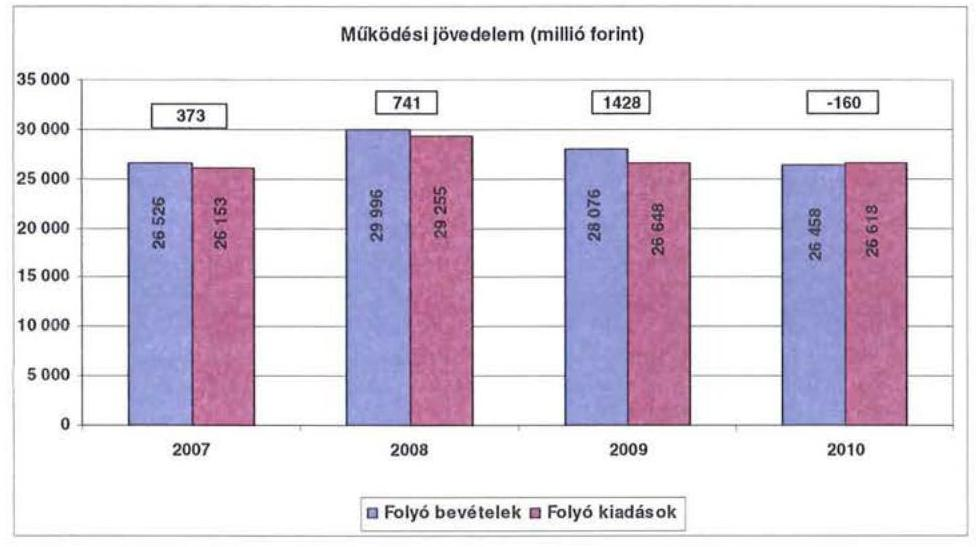

A folyó költségvetés egyenlege, (a működési forrástöbblet) 2007-ben a folyó kiadások 1,4\%-át ( 373 millió Ft-ot), 2008-ban 2,5\%-át ( 741 millió Ft-ot), 2009ben $5,4 \%$-át ( 1428 millió Ft-ot), míg 2010-ben a (müködési forráshiány) -0,6\%át (-160 millió Ft-ot) jelentett. A vizsgált időszakban 2382 millió Ft összegű müködési jövedelem (bevételi többlet) keletkezett, amely forrásul szolgált az Önkormányzat fennálló tőketörlesztési kötelezettségeinek teljesítéséhez, valamint fejlesztéseinek finanszírozásához.

A pozitív előjelű folyó költségvetési egyenleg ellenére - a bevételek és kiadások realizálódásának időbeli eltérése miatt - az Önkormányzatnál a vizsgált időszakban folyamatos likviditási nehézség állt fenn. A likviditási problémák megoldása érdekében az Önkormányzat munkabérhitelt és folyószámlahitelt vett igénybe, míg müködési forráshiányát rövid lejáratú hitelekből finanszírozta. A folyószámlahitel napi átlagos állománya 2008-ban 2404 millió Ft volt a legalacsonyabb, 2009-ben 2454 millió Ft pedig a legmagasabb.

[^0]
[^0]:    ${ }^{38}$ A 2007-2010. években a Hulladék-gazdálkodási Társulás bevétellel nem rendelkezett kiadásainak összege 3145 millió Ft, 0,7 millió Ft, 4 millió Ft és 0,1 millió Ft, az Ivóvíz-minőség-javító Társulás 2010. évi bevételeinek összege 23 millió Ft, kiadásainak összege 34 millió Ft volt.

---

Az Önkormányzat kötelezettségein belül a 2007-2010 közötti időszakban a rövid lejáratú kötelezettségek állományának aránya a 2007. évi 48,5\%-ról (6337 millió Ft) a 2010. évre 35,1\%-ra ( 7608 millió Ft) csökkent. Az Önkormányzat 2007. január 1-én fennálló pénz és tőkepiaci kötelezettsége 7053 millió Ft-ról több mint két és félszeresére, 18347 millió Ft-ra nőtt. A növekedésben szerepet játszott a vizsgált időszakban teljesített 6137 millió Ft hiteltörlesztés, a 6752 millió Ft összegű hitelfelvétel, valamint a 2007-ben a 4140 millió Ft és 2008ban a 3500 millió Ft összegű CHF alapú kötvénykibocsátás.

A rövid lejáratú kötelezettségek 2010-ben 7608 millió Ft-ot tettek ki, amely 1271 millió Ft-tal ( $20,1 \%$ ) több a 2007. évi rövid lejáratú kötelezettségállománynál. Az Önkormányzat a vizsgált időszakban számottevő mértékủ lejárt szállítói tartozásállománnyal rendelkezett az összes szállítói kötelezettséghez viszonyítva. Az Önkormányzatnál az összes szállítói kötelezettség a 2007. évben 2194 millió Ft, amelynek $86,1 \%$-a ( 1889 millió Ft), 2008-ban 1843 millió Ft, amelynek $69,4 \%$-a ( 1279 millió Ft) 2009-ben 2509 millió Ft 69,6\%-a ( 1747 millió Ft) míg a 2010-ben 2759 millió Ft 75,6\%-a (2085 millió Ft) volt lejárt szállítói kötelezettség.

Az Önkormányzat 2010. évi záró pénzkészlete 955 millió Ft volt ${ }^{39}$, amelynek teljes egésze kötelezettségvállalással terhelt.

Az Önkormányzat pénzügyi kapacitása a vizsgált időszakban negatív értéket mutatott. A nettó múködési jövedelem ${ }^{40}$ értéke a folyó költségvetési pozíció mellett az adott költségvetési év adósságtörlesztésének hatását is tükrözi. A 2382 millió Ft működési jövedelemnek több mint két és félszeresét ( 6137 millió Ft) tette ki a hitelekhez kapcsolódó tőketörlesztés. Így az Önkormányzatnak 4071 millió Ft negatív nettó működési jövedelme keletkezett.

Az Önkormányzatnál (a CLF módszer alapján) a fejlesztési kiadások fedezete változatlan nettó működési jövedelem képződése mellett - nem biztosított. A nettó működési jövedelem információul szolgál továbbá a jövőben vállalható teljesíthető adósságszolgálat mértékéről.
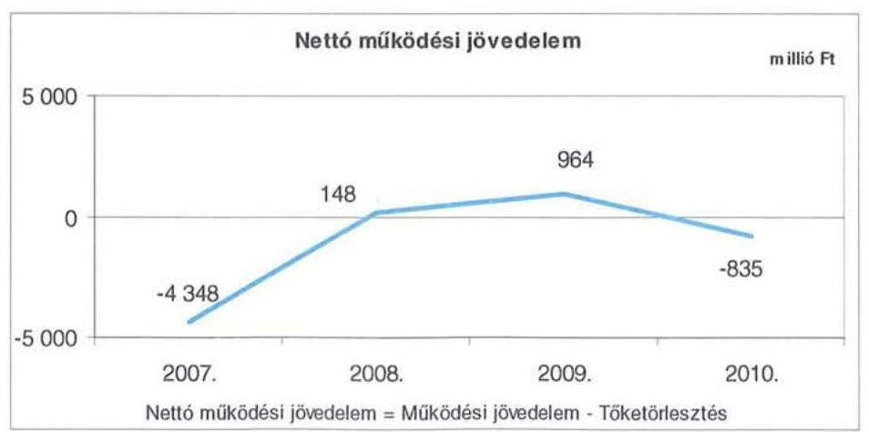

[^0]
[^0]:    ${ }^{39}$ ebben a társulások pénzeszköze 11 millió Ft volt
    ${ }^{40}$ pénzügyi kapacitás

---

A 2007-2010. években az Önkormányzat felhalmozási költségvetésének egyenlege folyamatosan negatív összegú volt, amely szabályozott és átlátható költségvetési gazdálkodás és pénzügyileg fenntartható ${ }^{41}$ beruházások esetén nem jár magas pénzügyi kockázattal, ha a felhalmozási hiányra a forrásként rendelkezésre álló nettó múködési jövedelem fedezetet nyújt. Az Önkormányzat korábbi eladósodása miatt a felhalmozási kiadások finanszírozására felszabadítható források a folyó költségvetésben azonban nem keletkeztek.

A beruházási költségvetés egyenlegét évről évre a következő ábra szemlélteti:
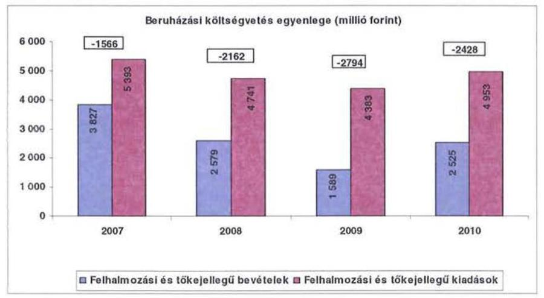

A felhalmozási forráshiánynak a felhalmozási és tőke jellegű kiadásokhoz viszonyított aránya 2007-ben 29,0\% (1566 millió Ft), 2008-ban 45,6\% (2162 millió Ft), 2009-ben 63,7\% (2794 millió Ft), 2010-ben 49,0\% (2428 millió Ft) volt.

A 2007. évi felhalmozási forráshiány finanszírozása az év elején rendelkezésre álló 254 millió Ft nyitó pénzkészletből, a 373 millió Ft működési jövedelem felhasználásából, valamint 939 millió Ft fejlesztési célú hitelből történt. A vizsgált időszakban keletkezett 8950 millió Ft felhalmozási forráshiányt tovább növelte a -4071 millió Ft negatív nettó múködési jövedelem, amelyekre a 254 millió Ft 2007. évi nyitó pénzkészlet, a felvett 3020 millió Ft összegű fejlesztési hitel, a 7640 millió Ft kötvénykibocsátás, továbbá a rendelkezésre álló folyószámla hitelből igénybevett 2107 millió Ft nyújtott fedezetet. ${ }^{42}$

Az Önkormányzat 2011. évi költségvetési rendeletében 2823 millió Ft hiányt tervezett, melyet hitelfelvétellel tervezett finanszírozni.

[^0]
[^0]:    ${ }^{41}$ Az minősül pénzügyileg fenntartható beruházásnak, amelynek müködtetésére az Önkormányzat nettó müködési jövedelme a következő években is fedezetet nyújt.
    ${ }^{42}$ A 2010. évi felhalmozási kiadásokban az Ivóvízminőség-javító Társuláshoz kapcsolódó beruházások összege 34 millió Ft.

---

A függő, átfutó, kiegyenlítő bevételek és kiadások 257 millió Ft-os negatív egyenlegének a folyószámlahitel állomány ${ }^{43}$ további részéből történő finanszírozásával az Önkormányzat 995 millió Ft pénzkészlettel zárta a 2010. évet.

Az Önkormányzat évenkénti teljes finanszírozási igénye ${ }^{44}$ a CLF módszer szerint 2007-ben 5915 millió Ft, 2008-ban 2014 millió Ft, 2009-ben 1830 millió Ft, 2010-ben 3263 millió Ft volt, amelynek finanszírozását a finanszírozási célú bevételek és kiadások egyenlege és a finanszírozásba vonható eszközök állománya - pénzeszközök - biztosították. A 2007. évi 5915 millió Ft teljes finanszírozási igényre a finanszírozási célú bevételek és kiadások egyenlege ( 2714 millió Ft), valamint a finanszírozásba vonható eszközök állománya (1754 millió Ft) nem nyújtott fedezetet, a hiányzó forrás összege 1447 millió Ft volt.

Az önkormányzat finanszírozási műveletei 2007-2010. évekbeli egyenlegének alakulását a következő ábra szemlélteti:
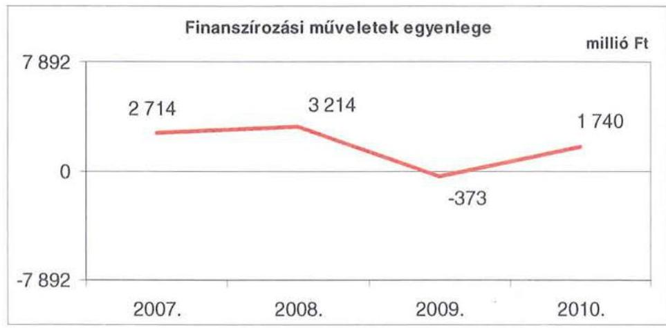

A finanszírozási többlet azt jelzi, hogy az éves költségvetések végrehajtása során szükség volt az előző években keletkezett pénzmaradvány igénybevételén túl külső finanszírozás igénybevételére is. A finanszírozási célú műveleteket a vizsgált időszakban a jelentés 2. számú mellékletének 4.1-4.8 pontjai részletezik.

Az Önkormányzat zárszámadási rendeletében a működési és fejlesztési hiányt a költségvetési szerkezet alapján mutatta be ${ }^{45}$. A rendeletek közül a 2007. és a 2010. évi zárszámadás jelzett forráshiányt, a 2008. évben bevételi többletet, míg a 2009. évben a költségvetés egyensúlyát mutatták ki. (Az Önkormányzat által a zárszámadási rendeletekben megállapított múködési és fejlesztési hiányt az 1. számú melléklet szemlélteti.)

[^0]
[^0]:    ${ }^{43}$ Az Önkormányzat folyószámlahitel állománya 792 millió Ft-tal nőtt 2007-2010 között.
    ${ }^{44}$ a nettó múködési jövedelem és a felhalmozási költségvetés egyenlegének összege
    ${ }^{45}$ Nincs kötelező előírás a múködési és fejlesztési hiány megállapításának módjára.

---

A vizsgált időszakban a kötelezettségek (passzív pénzügyi elszámolások nélkül) 13056 millió Ft-ról 21676 millió Ft-ra emelkedtek, amely együtt járt a kamatkiadások növekedésével.

A 2007-2010 között az önkormányzat összesen 2007 millió Ft kamatot fizetett meg. Az átmenetileg szabad pénzeszközei befektetéséből származó kamatbevétel, a teljes kamatráfordítás 31,9\%-át ( 641 millió Ft) tette ki.

Az Önkormányzat kamatbevételeinek és kamatkiadásainak alakulását a következő ábra mutatja:
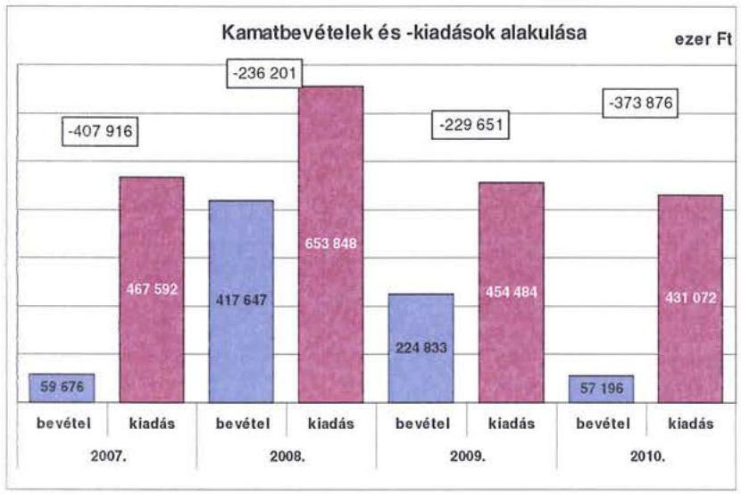

A kamatbevételek összege a 2007. évi 60 millió Ft-ról több mint hétszeresére 418 millió Ft-ra emelkedtek a 2008. évre, a kötvénykibocsátásból származó átmenetileg szabad pénzeszközök lekötése következtében. A kötvénykibocsátásból származó bevételek felhasználása miatt az átmenetileg szabad pénzeszközök csökkentek, így a kamatbevétel 2010-re 86,3\%-kal, 360 millió Ft-tal csökkent a 2008. évhez viszonyítva. A kamatkiadások összege a 2007. évi 468 millió Ft-ról $39,8 \%$-kal 186 millió Ft-tal növekedett 2008-ra, a kötvénykibocsátás és a hitelfelvételek miatt. A devizaalapú hitel visszafizetése és az átlagos kamatmérték csökkenése miatt a kamatkiadások összege a 2008. évi 654 millió Ft-ról 2010-re 431 millió Ft-ra 34,1\%-kal csökkent.

A 2011. évre az Önkormányzat a kamatkiadások további emelkedésével kalkulál, a költségvetési rendeletben tervezett 636 millió Ft kamatkiadás 47,5\%-kal, 205 millió Ft-tal haladhatja meg a 2010. évit.

# 2.2. Az Önkormányzat bevételeinek alakulása 

Az Önkormányzat összes folyó (működési) bevételei a 2007. évi 26526 millió Ft-ról 2008-ra 29997 millió Ft-ra, 13,1\%-kal ( 3471 millió Ft) emelkedtek, majd ezt követően a 2010. évre 26458 millió Ft-ra, 11,8\%-kal ( 3539 millió Ft) csökkentek.

---

Az Önkormányzat 2007-2010 között realizált főbb bevételi jogcímeinek számszaki adatait, összetételének változását az alábbi ábra mutatja be:
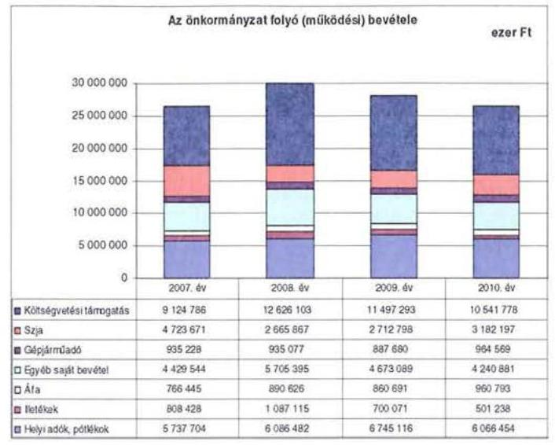

A költségvetési támogatás összege a 2008. évi 38,4\%-os - 3501 millió Ft növekedést követően a következő években - a forráscsökkenés hatására - folyamatosan és jelentős mértékben csökkent. A 2008. évi 12626 millió Ft-tal szemben 2009-ben 8,9\%-kal 1129 millió Ft-tal, 2010-ben további 8,3\%-kal, 956 millió Ft-tal kevesebb állami támogatást kapott az Önkormányzat.

Az átengedett szja összege a 2007. évi 4724 millió Ft-ról 1542 millió Ft-tal, 32,6\%-kal csökkent a 2010. évre. Az Önkormányzat a vizsgált időszakban a jövedelemkülönbség mérséklése érdekében iparűzési adó-erőképessége alapján az szja-ból kiegészítésre volt jogosult. Az Önkormányzat iparűzési adóerőképessége 2007-ben 2941 millió Ft volt, amely a 2010. évre 6,4\%-kal (441 millió Ft-tal) 3382 millió Ft-ra emelkedett. A jövedelemkülönbség mérséklésére kapott támogatás összege az Önkormányzatnál a 2007. évi 1039 millió Ft-ról a 2010. évre 1491 Ft-ra - 48,6\%-kal - emelkedett.

Az Önkormányzatnál a gépjármúadó címén befolyt adóbevételek összege a 2007-től 2009-ig csökkentek. A 2007. évi 935 millió Ft-ról 2008-ban a csökkenés mértéke $0,1 \%$, majd a 2009. évben 5,1\%-os (47 millió Ft) volt. A 2010. évben a növekedés mértéke az előző évhez viszonyítva $8,7 \%, 77$ millió Ft volt.

Az egyéb saját bevételek a 2007. évi 4430 millió Ft-ról 5705 millió Ft-ra, 28,8\%-kal emelkedtek, majd 2009-re 18,1\%-kal, 1032 millió Ft-tal csökkentek. Ezt követően a 2010. évben minimális, $0,5 \%$-os - 23 millió Ft - volt a növekedés az előző évhez viszonyítva. Az egyéb saját bevételek változásait 2007-ről 2010re a szociális ellátások önköltségalapú térítési díjának növekedése és az ellátottak számának változásai eredményezték.

Az illetékbevétel 2008-ra 34,5\%-kal - 279 millió Ft - növekedett az előző évhez viszonyítva. Ezt követően évről-évre folyamatos illetékbevétel csökkenés következett be az előző év bevételéhez viszonyítva. A csökkenés mértéke 53,9\%-ot - 586 millió Ft - tett ki a 2008. évi 1087 millió Ft illetékbevételhez viszonyítva.

---

Az Önkormányzat helyi adó bevételei 2007-től 2009-ig folyamatosan növekedtek - 5738 millió Ft-ról 6745 millió Ft-ra - majd 2010-ben 10,1\%-kal, 679 millió Ft-tal csökkentek az előző évhez viszonyítva. A 2010. évi helyi adóbevétel csökkenésében szerepet játszottak a gazdasági válság kedvezőtlen hatásai, melyek következtében a vállalkozók által ténylegesen megfizetett adóelőlegek, valamint a megállapított tényleges adó különbözete jellemzően negatív volt. Az Önkormányzat által kivetett helyi adók az iparűzési adó, az építményadó, az idegenforgalmi adó, és 2007-ben a luxusadó voltak.

Az iparűzési adó esetében az állandó jelleggel végzett iparűzési tevékenység esetén az adó évi mértéke az adóalap $2 \%$-a volt, mely a vizsgált időszakban nem változott.

Az építményadó mértéke az Önkormányzat rendelete alapján a 2007. évben a korrigált forgalmi érték 2,8\%-a, 2008-ban 2,6\%-a volt, míg 2009-ben a lakás céljára használt lakás esetén a korrigált forgalmi érték $0,5 \%$-a, más építmények esetén a 2,6\%-a volt. Az építményadó mértéke 2010-ben nem változott.

Az idegenforgalmi adó mértéke a 2007. évben személyenként és vendégéjszakánként 100 Ft, 2008-ban és 2009-ben 200 Ft, 2010-ben 300 Ft volt.

A luxusadó mértéke a 2007. évben a lakóingatlan számított értékének 100 millió Ft feletti része után $0,5 \%$ volt. A 2008. évtől az adónem megszűnt.

Az Önkormányzat felhalmozási bevételei a vizsgált időszakban összességében 34,0\%-kal (1302 millió Ft) csökkentek. A 2007. évben teljesített 3827 millió Ft felhalmozási bevétel a 2009. évig folyamatosan csökkent. A csökkenés összege 2238 millió Ft volt. A felhalmozási bevételek 2010-re 58,9\%-kal, 936 millió Ft-tal növekedtek.

A felhalmozási bevételeket jogcímenként a következő táblázat tartalmazza:
ezer Ft

| Megnevezés | 2007. év   tény | 2008. év   tény | 2009. év   tény | 2010. év   tény |
| :-- | :--: | :--: | :--: | :--: |
| Tárgyi eszköz értékesítés | 1392512 | 364856 | 265816 | 294833 |
| Egyéb saját tőkebevétel | 325130 | 399638 | 299398 | 766566 |
| Államháztartáson belülről   kapott támogatás | 577372 | 268432 | 164674 | 53545 |
| EU-tól és külföldről kapott   támogatások | 837627 | 1006702 | 653709 | 1112544 |
| Államháztartáson kívülről   kapott támogatás | 694498 | 539439 | 205425 | 297748 |
| Összes felhalmozási bevétel | 3827139 | 2579067 | 1589022 | 2525236 |

---

Az Önkormányzatnak tárgyi eszközök, jármúvek és ingatlanok értékesítésböl 2009-ig folyamatosan csökkenő bevétele származott. Értékesítésre az Önkormányzat tulajdonát képező ingatlanok, telkek, üzlethelyiségek kerültek, melyekből legjelentősebb összegű az autóbusz pályaudvar elidegenítése volt, a közlekedési szolgáltatást végző gazdasági társaság részére.

Az Önkormányzat a vizsgált időszakban gazdasági társaságaitól két alkalommal részesült osztalékban, más esetekben a Közgyűlés a nyereségesen múködő gazdasági társaságai által elért adózott eredményt eredménytartalékba helyeztette. Az Önkormányzat részére a 2008. évben egy gazdasági társasága 40 millió Ft, míg a 2009. évben szintén egy gazdasági társasága kettő millió Ft osztalékot fizetett ki.

Az Önkormányzat gazdasági társaságai (kimutatásuk alapján) a 2006. évben összesen 11006 millió Ft bevételt értek el, mely 2010-re 18651 millió Ft-ra emelkedett. Az önkormányzati feladatellátásban jelentős szerepet játszó gazdasági társaságok ${ }^{46}$ bevételeinek aránya a 2006. évben $80,1 \%$ ( 8811 millió Ft), míg 2010-ben $86,8 \%$ ( 16192 millió Ft ) volt.

A vizsgált időszakban az EU-tól kapott támogatások 2008-ban 20,7\%-kal, 169 millió Ft-tal növekedtek 2007-hez viszonyítva, majd 2009-ben 353 millió Ft-tal, $35,1 \%$-kal csökkentek. A 2010. évben az EU-tól kapott támogatások összege csaknem kétszeresére, 1113 millió Ft-ra növekedett az előző évhez viszonyítva.

Az Önkormányzat 842 millió Ft uniós támogatásból valósította meg a 2008ban a Vay Ádám laktanya épületeinek hasznosítását, 2007-ben 834 millió Ft címzett támogatás terhére a Szivárvány Idősek Otthona bővítését és rekonstrukcióját. uniós támogatással valósul meg a 2009-ben megkezdett, 2482 millió Ft bekerülési értékű „Belvárosi terek integrált funkcióbővítő fejlesztése", melynek befejezését 2011-ben tervezi az Önkormányzat. A beruházáshoz kapcsolódóan 2010-ben 744 millió Ft, míg 2011-ben további 979 millió Ft uniós támogatásban részesül.

[^0]
[^0]:    ${ }^{46}$ ipari park, hulladékkezelés, vízmű, távhő, vagyonüzemeltetés, illetve az önkormányzat pénzügyi egyensúlyának alakulásában jelentősebb szerepet játszó gazdasági társaságok

---

# 2.3. Az Önkormányzat kiadásainak alakulása 

Az Önkormányzat müködési kiadásai főbb jogcímek szerinti bontásban az alábbiak voltak:

| Megnevezés | 2007. | 2008. | 2009. | 2010. |
| :--: | :--: | :--: | :--: | :--: |
| Folyó kiadások | 26152576 | 29255373 | 26648337 | 26618280 |
| Müködési kiadások (kamatkiadás nélkül) | 22266533 | 24306394 | 22251125 | 21152496 |
| Államháztartáson belülre átadott pénzeszközök | 183065 | 239901 | 301918 | 803577 |
| Transzferkiadások | 2338628 | 2563676 | 3167511 | 3412256 |
| -ebből: vállalkozásoknak | 756516 | 801562 | 1310644 | 1352534 |
| EU-nak, illetve külföldre | 3445 | 0 | 0 | 1089 |
| magánszemélyeknek | 1191989 | 1366200 | 1459226 | 1751749 |
| nonprofit szervezeteknek | 386678 | 395914 | 397641 | 306884 |
| Kamatkiadások | 467592 | 653848 | 454484 | 431072 |
| Előző évi pénzmaradvány átadás | 896758 | 1491554 | 473299 | 818879 |

Az Önkormányzat folyó kiadásai 2008-ban 11,9\%-kal - 3103 millió Ft növekedtek 2007-hez képest, majd ezt követően folyamatosan csökkentek. A csökkenés alapvető oka az intézményhálózatban végrehajtott átszervezések, álláshely csökkentések és a szociális intézmények Kistérségi társulás részére történő átadása volt.

Az Önkormányzat müködési kiadásai a vizsgált időszakban a következőképpen alakultak:

|  |  |  |  | ezer Ft |
| :--: | :--: | :--: | :--: | :--: |
| Megnevezés | 2007. | 2008. | 2009. | 2010. |
| Személyi juttatások | 10859217 | 11337709 | 10651055 | 9989344 |
| Munkaadót terhelő járulékok | 3400864 | 3540054 | 3149581 | 2620215 |
| Dologi kiadások | 7662221 | 8589260 | 8023612 | 8034413 |
| Egyéb folyó kiadások | 164596 | 225532 | 119352 | 319219 |
| Müködési célú pénzeszkózátadás * | 1146706 | 1194060 | 1708285 | 1660507 |

* A müködési célú pénzeszkózátadás kizárólag az államháztartáson kivülre átadott müködési célú pénzeszközök átadását tartalmazza.

Az Önkormányzat 2010-ben a müködési kiadásainak 59,6\%-át, 12610 millió Ft-ot személyi juttatásokra és a munkaadókat terhelő járulékokra fordította, az üzemeltetést, intézményfenntartást biztosító dologi kiadásokra 38,0\%, 8034 millió Ft jutott. A személyi juttatások 2008-ban 4,4\%-kal, 478 millió Ft-tal nőttek az előző évhez képest, azt követően minden évben csökkentek az álláshely csökkentések, illetve a szociális intézmények átadása miatt.

A dologi kiadások az Önkormányzatnál 2008-ban 12,1\%-kal, 927 millió Fttal növekedtek a 2007. évhez viszonyítva, annak ellenére, hogy az oktatási intézmények átszervezéséről döntött a Közgyűlés. Az oktatási intézmények átszervezésével, tanévindítással kapcsolatos intézkedések eredményeként a dologi kiadások 2009-ben 6,6\%-kal, 566 millió Ft-tal csökkentek. A 2010. évben a gyermekvédelmi szakfeladatok ellátásának átvétele a dologi kiadások növekedését eredményezték, amelyet a szociális intézmények átadása ellensúlyozott, így a dologi kiadások összességében 11 millió Ft-tal emelkedtek.

---

Az Önkormányzat a 2007. évben múködési célra 1147 millió Ft-ot adott át, mely 2008-ban 47 millió Ft-tal volt több mint az előző évi. A müködésre átadott pénzeszközök összege 2009-re tovább növekedett 514 millió Ft-tal, az ezt követő évben viszont 2,8\%-kal, 48 millió Ft-tal csökkent az előző évhez viszonyítva.

Az Önkormányzat a helyi közlekedés megszervezése címen kapott állami támogatás összegét 2007-ben 106 millió Ft, 2008-ban 87 millió Ft, 2009-ben 92 millió Ft és 2010-ben 102 millió Ft, valamint a 2007-2010. években 85 millió Ft, 110 millió Ft, 123 millió Ft és 113 millió Ft müködési célú pénzeszközt biztosított a helyi közlekedés megszervezését végző gazdasági társaság részére.

Az Önkormányzat gazdasági társaságai részére múködési és felhalmozási célra adott át pénzeszközöket, melynek alakulását a következő ábra szemlélteti:
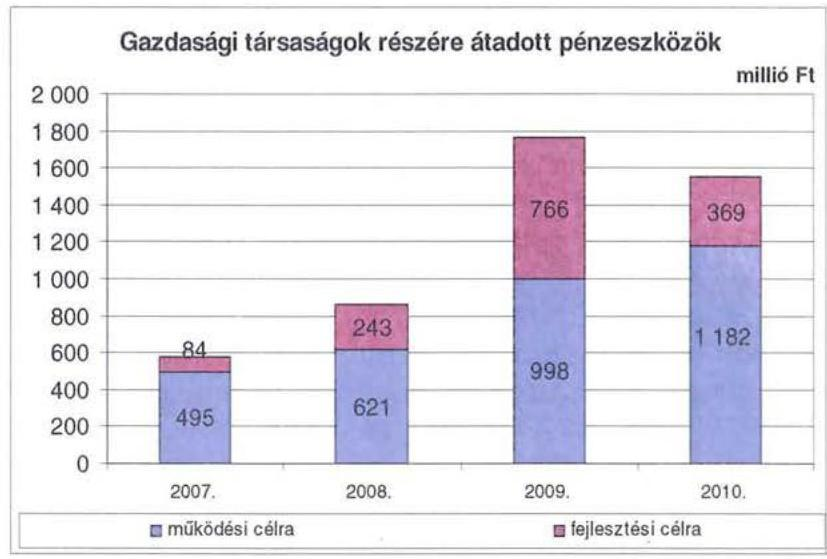

A gazdasági társaságok részére átadott pénzeszközök összege 2007-2010 között 4758 millió Ft volt, melynek 20,2\%-át, 969 millió Ft-ot a Nyírsuli Kft., 23,5\%-át, 1118 Ft-ot a Nyíregyházi Városüzemeltető és Vagyonkezelő Kft., 28,2\%-át, 1342 millió Ft-ot a Nyíregyházi Állatpark Kft. kapott. A 2008. évi átadott pénzeszközök 112 millió Ft tőkejuttatást tartalmaznak 2 gazdasági társaság esetében.

Az Önkormányzat kiadásai a vizsgált időszakban tartalmazták a Hulladékgazdálkodási Társulás, valamint 2010-ben az Ivóvízminőség-javító Társulás kiadásait.

A Hulladékgazdálkodási Társulás 2003-ban alakult, a vizsgált időszakban bevételekkel nem rendelkezett, felhalmozási kiadást nem teljesített. Kiadásainak öszszege a vizsgált időszakban összességében 8 millió Ft volt. Az Ivóvízminőségjavító Társulás 2009-ben alakult. A Közgyűlés a 186/2010. (VIII. 23.) számú határozatával döntött a Társulásból való kilépésről. A Társulásnak a 2010. évben 23 millió Ft felhalmozási bevétele és 34 millió Ft felhalmozási kiadása volt.

---

A folyó (működési) és felhalmozási kiadások alakulását, a teljesített kiadások működési és felhalmozási felhasználásának arányait az alábbi ábra mutatja:
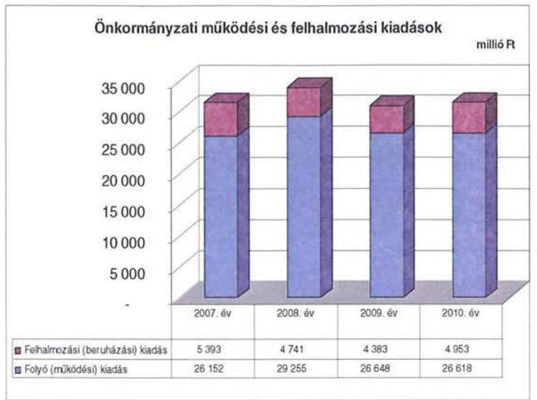

A teljesített összes kiadáson belül a felhalmozási kiadások aránya a 2007. évi 17,1\%-ról, 5393 millió Ft-ról 2010-re 15,7\%-ra, 4953 millió Ft-ra csökkent ${ }^{47}$.

A vizsgált időszakban az Önkormányzat befejezett és folyamatban levő fejlesztéseinek tervezett összege összesen 30624 millió Ft volt. Az Önkormányzat a 2007-2010. években 23 projekt megvalósítását végezte uniós források felhasználásával.

A 2007-2010 évben az Önkormányzat megvalósított és folyamatban lévő beruházásai településrészek korszerűsítésére, autóbusz megállóhelyek korszerűsítésére, oktatási intézmények, óvodák, bölcsődék, szociális intézmények felújítására, akadálymentesítésére, belvíz- és csapadékvíz elvezető rendszerek karbantartására, szilárd burkolatú úthálózat burkolat-felújítására, tűzoltóság laktanyaépületének bővítésére, repülőtér fejlesztésére irányultak.

Az Önkormányzatnál 2006-2010 évben befejezett fejlesztési feladatok öszszes költségvetési kiadása 9337 millió Ft volt, amelyből a beruházások összege 6607 millió Ft ( $70,8 \%$ ) és a felújítások összege 2730 millió Ft (29,2\%) volt. A projektek döntő többsége utófinanszírozású beruházás volt, megvalósításukhoz a források hitelek igénybevételével álltak rendelkezésre.

A befejezett 9337 millió Ft értékú fejlesztés forrás megoszlása: 1910 millió Ft uniós támogatás (20,5\%), 2005 millió Ft hazai támogatás (21,5\%), 3464 millió Ft saját bevétel (37,1\%), 1457 millió Ft (15,6\%) kötvénykibocsátásból származó bevétel és 501 millió Ft hitel (5,3\%) volt. A 2006. december 31-ig teljesített kiadások összege 2216 millió Ft volt. A 2007-2010. években teljesített kiadások összege 7121 millió Ft volt. (A fejlesztések részletes adatait a 3/a. számú melléklet tartalmazza.)

[^0]
[^0]:    ${ }^{47}$ A felhalmozási kiadások aránya az összes kiadásokon belül 2008-ban 13,9\% (4741 millió Ft), 2009-ben 14,1\% (4383 millió Ft) volt.

---

Az Önkormányzat befejezett fejlesztései közül a legnagyobb költségigényű az alábbi három beruházás volt:

- Az Önkormányzat határozatában ${ }^{48}$ a Vay Ádám laktanya hasznosítása érdekében ROP keretében 1150 millió Ft-os beruházást tervezett megvalósítani. A fejlesztés megvalósítására 2007-2008. években került sor, a ténylegesen felmerült kiadások összege 1125 millió Ft, amelyből a saját bevétel 115 millió Ft ( $10,2 \%$ ), uniós támogatás 842 millió Ft ( $74,8 \%$ ) és hazai támogatás 168 millió Ft ( $15 \%$ ) volt.
- Az Esély Centrum projekt megvalósítására ${ }^{49}$ a volt Báthory Laktanyában került sor PHARE program keretében. A projekt tervezett kiadása 820 millió Ft volt, a megvalósításra a2005-2007. években került sor. A megvalósítás során ténylegesen felmerült kiadások összege 674 millió Ft volt, amelynek 52,4\%-a ( 353 millió Ft) saját bevétel, $47,6 \%$-a ( 321 millió Ft ) uniós támogatás.
- Az Önkormányzat címzett támogatásból valósította meg a Szivárvány Idősek Otthona bővítését és rekonstrukcióját ${ }^{50}$ a 2004-2007 években. A fejlesztés tervezett kiadása 937 millió Ft, a ténylegesen felmerült kiadások összege 1148 millió Ft volt. A felmerült kiadások fedezetéül 314 millió Ft ( $27,4 \%$ ) saját bevétel és 834 millió Ft ( $72,6 \%$ ) címzett támogatás szolgált.

Az Önkormányzat 2010. december 31-én folyamatban lévő fejlesztési feladatainak tervezett nagysága 21287 millió Ft, a 2010. december 31-ig teljesített kiadások tényleges összege 3439 millió Ft volt. A folyamatban lévő beruházások 2010. december 31-ig teljesített kiadásainak forrása 664 millió Ft ( $19,3 \%$ ) saját bevétel, 93 millió Ft ( $2,7 \%$ ) hitel, 551 millió Ft ( $16,0 \%$ ) kötvényből származó bevétel, 2098 millió Ft uniós támogatás ( $61,0 \%$ ), és 33 millió Ft ( $1,0 \%$ ) hazai támogatás volt. A források a fejlesztések esetében az uniós és a hazai támogatásoknál utólagosan álltak rendelkezésre. (A folyamatban lévő fejlesztések részletes adatait a 3/b. számú melléklet tartalmazza.)
2010. december 31-én folyamatban lévő és a 2010. évet követő kötelezettségvállalásainak összege 17848 millió Ft volt, amelynek forrása 2503 millió Ft ( $14,0 \%$ ) saját bevétel, 766 millió Ft hitel ( $4,3 \%$ ), 308 millió Ft ( $1,7 \%$ ) kötvénybevétel, 12820 millió Ft uniós támogatás ( $71,9 \%$ ), és 1451 millió Ft hazai támogatás ( $8,1 \%$ ). (A folyamatban lévő fejlesztések részletes adatait a 3/c. számú melléklet tartalmazza.)

A 2011. évben az Önkormányzat kilenc pályázatot nyújtott be, amelyek 8088 millió Ft összegű tervezett fejlesztéshez kapcsolódtak. A beadott pályázatok közül a helyszíni ellenőrzés befejezésének időpontjában egy eredményes, nyolc elbírálása folyamatban volt.

[^0]
[^0]:    ${ }^{48}$ 207/2006. (IX. 13.) számú közgyűlési határozat
    ${ }^{49}$ 278-1/2003. (XI. 27.) számú közgyűlési határozat
    ${ }^{50} 2 / 2003$. (XI. 27.) számú közgyűlési határozat

---

# 3. KÖTELEZETTSÉGEK BEMUTATÁSA 

### 3.1. A pénzintézetek felé fennálló kötelezettségek alakulása

Az Önkormányzat pénzintézeti kötelezettségeinek állománya a mérleg adatok szerint 2006. december 31 -től 2010. december 31-ig 2,6 szeresére nőtt, 7073 millió Ft-ról, 18347 millió Ft-ra. Fennálló pénzintézeti kötelezettségei két kötvény kibocsátásából, 14 hosszú lejáratú hitel igénybevételéből, valamint folyószámla és munkabér megelőlegezési hitelek igénybevételéből keletkeztek. A kötvényt kibocsátó, a hosszú lejáratú hitelt nyújtó és a folyószámlát vezető pénzintézetek kiválasztása versenyeztetés, illetve közbeszerzési eljárás lefolytatása mellett történt meg.

Az Önkormányzat pénzintézeteknél fennálló kötelezettség-állományát a 20072010. években az alábbi ábra szemlélteti:
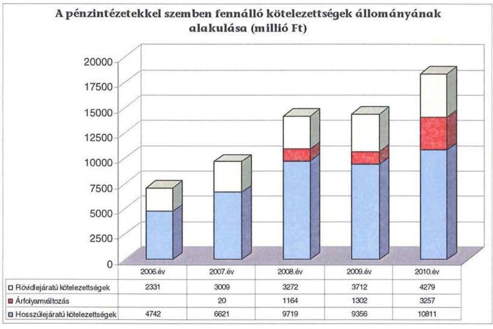

A pénzintézeti kötelezettségek állományának 2007-2010 közötti 2,6-szeres, 11274 millió Ft-os növekedését eredményezte, hogy az Önkormányzat 2007-2010 között hét hosszú lejáratú hitelszerződésben összesen 4250 millió Ft hitel felvételében állapodott meg. Ebből 2010. december 31-ig 2786 millió Ft hitelt hívott le, a 2007. év előtt kötött hét hosszú lejáratú hitelszerződése alapján 2007-2010 között 450 millió Ft hitelt vett igénybe. Felhalmozási célú kötvényt bocsátott ki 2007-ben 4140 millió Ft, 2008-ban 3500 millió Ft összegben. A 2007. év végén 2060 millió Ft, 2010. év végén azonban 2560 millió Ft, és a 2011. évben 3060 millió Ft folyószámlahitellel rendelkezett az Önkormányzat.

Az árfolyamváltozás hatása is befolyásolja a kötelezettségek alakulását, azonban annak mértéke előre pontosan nem határozható meg, csak várakozásokon alapuló tendenciák jelezhetők. Annak megítéléséről, hogy a devizában kibocsátott

---

kötvényekért és felvett hitelekért kapott forinthoz képest a kötvények visszavásárlásakor, illetve a hitelek visszafizetésekor jelentkező forint kötelezettség többletkiadást (árfolyamveszteség) vagy megtakarítást (árfolyamnyereség) eredményez a futamidő végén, a teljes kötelezettség rendezését követően lehet képet alkotni. Mindaddig, amíg törlesztési kötelezettség nem áll fenn (türelmi idő, moratórium), a tőkére vonatkoztatva nem értelmezhető sem az árfolyamveszteség, sem az árfolyamnyereség. A Számv. tv. 60. § (4) bekezdése ugyanakkor meghatározza, hogy az árfolyam különbözetet év végén a kötelezettségek vagy követelések között a könyvviteli mérlegben nyilván kell tartani, azonban az árfolyam különbözet valójában nem realizált.

Az Önkormányzat a forráshiány kezelése érdekében a 2007-2010. évi költségvetési rendeletekben kötvénykibocsátással, múködési és felhalmozási célú hitelfelvétellel, pénzmaradvány igénybevétellel számolt. A költségvetés végrehajtása során jelentkező likviditási problémák kezelésére a 2007-2010. évi költségvetés végrehajtási szabályairól szóló rendeletekben felhatalmazta a polgármestert a rendeletben nevesített hitel felvételére, illetve az Önkormányzat és a számlavezető pénzintézet között az átmeneti likviditási problémák kezelésére létrejött szerződések meghosszabbítására lejáratkor.

Az Önkormányzat pénzintézeti kötelezettségvállalásaira minden esetben közgyűlési döntés alapján került sor. A kötelezettségvállalásból származó források felhasználási céljait meghatározták. A Közgyűlés döntéseit megalapozó előterjesztések tartalmazták a kötelezettségvállalás visszafizetési forrásának megnevezését, a teljes futamidő várható kamat és tőkefizetési kötelezettségeket, de nem tartalmazta az árfolyam- és kamatkockázatok bemutatását. Az előterjesztésekben nem tértek ki az adósságszolgálati korlát bemutatására, ezért a Közgyűlés ennek figyelembevétele nélkül döntött. Az Önkormányzat az adósságot keletkeztető kötelezettségvállalás felső határát a hitelfelvételek és a kötvény kibocsátás esetében nem lépte túl.

Az adósságot keletkeztető kötelezettségvállalással megvalósított felhalmozási kiadások esetleges bevételt növelő, illetve kiadást csökkentő vonzatát, illetve ennek a fejlesztéshez, felújításhoz vállalt kötelezettségek visszafizetési forrásként való számbavételét nem vizsgálták. A Közgyűlés a likviditási és eladósodási problémák kezelésére likviditási koncepciót, stratégiát nem készített a 2007-2010. években.

Az Önkormányzatnak 2011. március 31-én CHF-ben az alábbi fennálló adósságot keletkeztető kötelezettségvállalása volt:

| Megnevezés | Kibocsátás időpontja | Összeg   CHF | Kibocsátási árfolyam | Kamat (referencia | Felhasználás célja: |
| :--: | :--: | :--: | :--: | :--: | :--: |
| *Hýfregyháza 2019 kötvény* | 2007.07 .31 | 27016000 | 153,25 | 3 havi CHF LIBOR+ö | devizuhitel kiváltása, 2007. és 2008. évben tervezett fejlesztési feladatok finanszírozása |
| *Hýfregyháza 2032 kötvény* | 2008.01 .31 | 21958718 | 166,7 | 3 havi CHF LIBOR+ö | 0) fejlesztések finanszírozása |

A 2007-ben kibocsátott kötvény az Önkormányzat 8911692 EUR-ban fennálló hiteltartozásának kiváltását, illetve a 2007-2008. években tervezett fejlesztésekhez igénybe venni tervezett 1729 millió Ft HUF alapú hitel helyett a szükséges forrás megteremtését biztosította. A 2008. évben kibocsátott kötvény a 20082013. években megvalósításra tervezett fejlesztések forrásigényét biztosítja. A

---

kötvényből származó 3500 millió Ft-ból 2010. év végéig az önkormányzat még 723 millió Ft-ot nem használt fel. A kötvény kibocsátásból szerzett forrást az Önkormányzat a kibocsátáskor meghatározott célokra használta fel. A 2007. évben kibocsátott kötvényt az Önkormányzat számlavezető bankja, a 2008. évben kibocsátott kötvényt más pénzintézet jegyezte le a versenyeztetés eredményeként, mint legjobb ajánlatot adó pénzintézet. A kötvényt lejegyzó pénzintézetek nem szabtak feltételt a kötvényfelhasználás esetleges módosított célnak megfelelő felhasználása esetére.

Az Önkormányzat 2010. december 31-én HUF-ban fennálló adósságot keletkeztető kötelezettségvállalásai az alábbiak voltak:

|  |  |  |  |  |
| :--: | :--: | :--: | :--: | :--: |
| Megnevezés | Szerződédejtés kéfgyestje | Összeg | Kismet (refleesmán kamotv kamotfeláig) | Felhasználás céljai |
| 0 004600 . hosszá hij. hittel. | 2003.10 .03 | 1193267 | 3 havi bubsov0,35\% | A jövidimgyott fejlesztések sajátú tolt részének finomsározdon |
| 0749-6. Paredyengesen | 2006. májtas 29 | 474894 | 3 havi bubsov0,1,2\% | Ipeenzitett beihasáigáljá áglátruk höljitlása |
| 012900.Hosszá lejézzetá hittel | 2005.12 .12 | 459321 | 3 havi bubsov1,2\% | Istbecteáktázn fejlesztés |
| 0883-6. hosszá lejézzetá hittel | 2006.07 .12 | 126843 | 3 havi eszfesov0,99\% | csepedélevia elvazetés |
| 0883-6/8. hosszá hij. hittel | 2006.07 .12 | 316267 | 3 havi eszfesov1,499\% | A jövidimgyott fejlesztések saját tolt részének finomsározdon |
| 0626-0. hosszá hij.hittel | 2009.10 .06 | 438251 | 3 havi eszfesov2,7\% | A tereszett fejlesztések saját tolt részének finomsározdon |
| Beruh. a 322. sz. iskolában | 2003.11 .26 | 257158 | 6 havi bubsov1\% | Altszárcsa iskolai beruhásának |
| 030845. Paredyengesen | 2007.06 .13 | 134000 | 3 havi eszfesov0,74\% | Ipeenzitett beihasáigáljá áglátruk höljitlása |
| 1043-0. hosszá hij. hittel | 2007.08 .22 | 10000 | 3 havi bubsov0,6\% | Csernyiklezkes táblázádozhar ívóráa beruh. |
| 2013-9. hosszá hij. hittel | 2006.12 .26 | 260000 | 3 havi bubsov0,6\% | Lészülcserélült ivóráa beruh. |
| 1081-9. hosszá hij. Hittel | 2007.08 .22 | 10800 | 3 havi bubor | Bezbánya ivóráa beruh. |
| 16782. hosszá hij. Hittel | 2010.05 .03 | 1310000 | 3 havi bubsov1,19 | Istiáztatási felzefetelk finomsározdon |
| 0622-6. paredyengesen | 2009.09 .23 | 596328 | 3 havi eszfesov2,09 | Ipeenzitett beihasáigáljá áglátruk höljitlása |
| 0627-1. hosszá hij. Hittel | 2009.10 .06 | 1311769 | 3 havi eszfesov2,49 | 2009.2011. évi fejlesztések megesültabása |

A táblázatban felsorolt hitelek szerződés szerinti keretösszege 7288 millió Ft, amelyből a még lehívható rész 1644 millió Ft. A 0626-0. számú hitelkeretből 24 millió Ft-ot, a 0622-6. számú hitelkeretből 258 millió Ft-ot, a 0627-1. számú hitelkeretből 1362 millió Ft-ot nem hívott le 2010. december 31-ig az Önkormányzat.

Az Önkormányzat a CHF-ben fennálló pénzintézeti kötelezettségeiből tőkét a 2007. évben kibocsátott kötvényből törlesztett, 2010. december 31-ig 1460400 CHF-t, a 2008. évben kibocsátott kötvény törlesztését 2013-ban kezdi meg. Kamatfizetési kötelezettségként 3669250 CHF, 675 millió Ft kamat, valamint 46 millió Ft egyéb költség ${ }^{51}$ terhelte az Önkormányzatot. A teljesített tőketörlesztés után az árfolyamváltozás következtében 93 millió Ft árfolyamveszteség kelet-

[^0]
[^0]:    ${ }^{51}$ A kötvény esetében kibocsátási, szervezési díj címén fizetett egyéb díjat az Önkormányzat.

---

kezett a 2010. évben. A HUF-ban fennálló hosszú lejáratú pénzintézetek felé fennálló kötelezettségek után 903 millió Ft kamatot és egyéb költség címén öszszesen 15 millió Ft-ot fizetett.

Az Önkormányzat likviditásának biztosítása és a 2010. év december 31-én fennálló 2759 millió Ft szállítói állomány rendezése érdekében a Közgyűlés döntött ${ }^{52}$ a 2011. évi hitelállomány átstrukturálásáról. Ennek érdekében készítették elő a „Nyíregyháza 2019 kötvény" prolongálását. A Közgyűlés elé készült előterjesztés szerint a fennálló tőketartozás 25555600 CHF , a kötvény lejárata 2020. december 5-ről, 2025. szeptember 30-ra változik. A kamatláb az okirat cserétől számítva 6 havi CHF LIBOR $+1,8 \%$, a következő évre pedig 6 havi CHF LIBOR $+2,8 \%$, a további évekre vonatkozó kamatmértékek megállapítása az aktuális piaci viszonyok függvényében történik meg. Szervezői és lebonyolítói dí címén a kötvény össznévértékének 0,02\%-a és okiratcsere címén 30 ezer Ft terheli az Önkormányzatot.

Módosításra került a 2010. május 3-án - működési célokra igénybe vett 1550 millió Ft összegben megkötött kölcsönszerződés is. A szerződésmódosítás szerint 1\%-os kamatfelár növekedés terhe mellett a hitel lejárata 2013. december 31-ről, 2017. december 31-re változik. Kezdeményezték két hitel ${ }^{53}$ lejáratának meghosszabbítását is, az egyik esetben a lejárat 2013. évről 2017. évre, a másik esetben 2015. évről 2020. évre változik. A futamidő hosszabbítása a hitelek egyéb kondícióit nem érintette. A prolongálás feltételeként a folyósító pénzintézet jelzálogjog alapítását kötötte ki. A jelzálogjog bejegyzésére felajánlott ingatlanok becsült értéke 3149 millió Ft.

A vizsgálat időszakában folytatták le egy 700 millió Ft összegű, hosszú lejáratú hitel közbeszerzési eljárását, a hitelszerződés megkötésének időpontja július 5-e volt.

Az Önkormányzat a 2007. január 1-től 2010. december 31-ig terjedő időszakban az átmenetileg szabad pénzeszközein 759 millió Ft kamatbevételt realizált, melyből 649 millió Ft származott a kötvénykibocsátásból származó bevétel befektetéséből és 110 millió Ft az intézmények és a Polgármesteri hivatal elkülönített bankszámláin rendelkezésre állt szabad pénzeszközök befektetéséből ${ }^{54}$.

A kötvénykibocsátás bevételének befektetéséből származó kamatbevételt az Önkormányzat a kötvények utáni kamatfizetésre fordította a 2007-2010. években. A kamatbevétel ( 649 millió Ft) a kötvények után teljesített kamatfizetés $96 \%$-át tette ki.

Az Önkormányzat múködésének pénzügyi egyensúlyát a vizsgált időszakban csak folyószámlahitel igénybevételével tudta biztosítani. Az

[^0]
[^0]:    ${ }^{52}$ a Közgyűlés 52/2011. (III. 10.) számú határozata
    ${ }^{53}$ a 004600 és a 012900 . számú, jóváhagyott fejlesztések saját erő részének biztosítását és infrastruktúra fejlesztést szolgáló hosszú lejáratú hitelek
    ${ }^{54}$ pályázati források előlegéből, saját bevétel ideiglenesen betétként való elhelyezéséből

---

igénybevett folyószámlahitel és a munkabér megelőlegezési hiteleket az alábbi táblázat mutatja be:

|  |  |  |  | ezer Ft-ban |
| :-- | --: | --: | --: | --: |
| Megnevezés | 2007. év | 2008. év | 2009. év | 2010. év |
| I. Folyószámlahitel |  |  |  |  |
| a folyószámlahitel keretösszege január 1-jén | 2060000 | 2560000 | 2560000 | 2560000 |
| teljesített kamat és egyéb költség | 139312 | 130827 | 154650 | 64317 |
| II. Munkabér megelőlegezési hitel |  |  |  |  |
| Igénybevett hitel összesen: | 9808000 | 10050000 | 9750000 | 9000000 |
| teljesített kamat és egyéb költség | 41493 | 37582 | 44088 | 20657 |

Az Önkormányzat mindegyik év minden napján igénybe vett folyószámlahitelt. Az átlagos napi állomány 2008. évben volt a legalacsonyabb, 2404 millió Ft, a 2010. évre 2454 millió Ft-ra, és a 2011. első negyedévében már 2616 millió Ft-ra emelkedett. A folyószámlahitel állománya 2010. december 31-én 2521 millió Ft volt. Az áttekintett időszakot jellemző múködési hiány, a folyamatos likviditási problémák finanszírozása az Önkormányzatnak a 2007-től 2010. december 31-ig összesen 489 millió Ft kamatkiadást eredményezett.

A folyószámlahitel és munkabér megelőlegezési hitelek kondíciói és egyéb költségei a következők voltak ${ }^{55}$ :

| Megnevezés | Kamat (referencia+ kamatfelár |
| :--: | :--: |
| Folyószámlahitel |  |
| 2007-2011. évek | 3 havi BUBOR -3\% \% |
| Munkabér megelőlegezési hitel |  |
| 2007-2011. évek | 3 havi BUBOR -3\% |

A tartós likviditási problémák miatt az Önkormányzat 2007-tól a munkabérek kifizetéséhez munkabér megelőlegezési hitelt vett igénybe. A rendelkezésre álló hitelkeret 800 millió Ft volt. A hitel igénybe vételére a vizsgált időszakban minden hónapban sor került, a hitel átlagos állománya a vizsgált években 695 millió Ft és 775 millió Ft között változott. A törlesztések az adó és illeték bevételekből valamint a normatív állami támogatásokból az igénybevételt követő hónapban megtörténtek. Kamat és egyéb költség címén az Önkormányzat a vizsgált időszakban összesen 144 millió Ft-ot fizetett ki.

[^0]
[^0]:    ${ }^{55}$ A referencia kamat az alábbiak szerint alakult:

    | MNB BUBOR fixing (átlagkamat) \%-ban |  |  |  |  |
    | :-- | :-- | :-- | :-- | :-- |
    | Referetencia kamat | 2007. év | 2008. év | 2009. év | 2010. év |
    | 3 havi BUBOR | 7,75 | 8,87 | 8,84 | 5,5 |

---

A jelenleg fennálló kötvények esetében a kamatfizetési kötelezettségek alakulását jelentősen befolyásolta és jelenleg is befolyásolja a kibocsátáskori és az utolsó kamatfizetéskori referencia kamat változása, melyet az alábbi táblázat mutat be:

| Megnevezés | Kibocsátási, lehívási | Utolsó fizetéskori | Változás \% |
| :--: | :--: | :--: | :--: |
|  | alapkamat \% |  |  |
| Kötvények: |  |  |  |
| 3 havi CHF LIBOR. Nyíregyháza 2019.kötv. | 3,51 | 0,97 | $-72,4$ |
| 3 havi CHF LIBOR nyíregyháza 2032 kötvény | 3,34 | 2,52 | $-24,6$ |
| Hosszú lejáratú hitelek: |  |  |  |
| 0 004600. hosszú lej. hitel. | 10,7 | 8,73 | $-18,4$ |
| 0766-6. Panelprogram | 4,261 | 2,068 | $-51,5$ |
| 012900.Hosszú lejáratú hitel | 3,997 | 2,213 | $-44,6$ |
| 0883-6. hosszú lejáratú hitel | 4,051 | 2,003 | $-50,6$ |
| 0883-6/8. hosszú lej. hitel | 4,56 | 2,512 | $-44,9$ |
| 0626-0. hosszú lej hitel | 3,45 | 3,713 | 7,6 |
| Beruh. a XXI. sz. iskolába | 12,4 | 6,25 | $-49,6$ |
| 030845. Panelprogram | 4,719 | 1,959 | $-58,5$ |
| 1045-0. hosszú lej. hitel | 2,448 | 4,366 | 78,3 |
| 2013-9. hosszú lej. hitel | 2,595 | 4,366 | 68,2 |
| 1081-9. hosszú lej. Hitel | 7,33 | 3,866 | $-47,3$ |
| 16782. hosszú lej. Hitel | 6,42 | 7,04 | 9,7 |
| 0622-6. panelprogram | 2,84 | 3,103 | 9,3 |
| 0627-1. hosszú lej. Hitel | 3,24 | 3,503 | 8,1 |

Az Önkormányzat által kibocsátott két kötvénynek 2010. december 31-én 3 havi CHF LIBOR volt a referenciakamata. Az alapkamat mértékének alakulása jelentős hatással volt az adott devizanemben kifejezett, a teljes futamidőre számított, várható kamatkötelezettség nagyságára. A referenciakamatok 2007. január 1-jétől tekintve 2008. november-decemberben voltak a legmagasabbak, ehhez képest 2009. év elejére zuhanásszerű csökkenés következett be, amely után 2010. júniusig minimális mértékben változott. A két kötvény esetében a referenciakamat változása miatt 866268 CHF-kal kevesebb kamatfizetési kötelezettsége keletkezett az Önkormányzatnak 2010. december 31-ig. A kötvénykötelezettség után várhatóan fizetendő kamat a 2011-2013. években 2095698 CHF, a 2013. utáni években 5810353 CHF.
A vizsgált időszakban a „Nyíregyháza 2032" kötvénynél a 2009. évben a pénzintézet kezdeményezésére bekövetkezett módosítás után a kötvény kamatfelára 0,68\%-ról 2,35\%-ra emelkedett, ami az alapkamat mértékének csökkenéséből származó előnyt mérsékelte az Önkormányzatnál.
Az Önkormányzat Ft-ban fennálló hosszú lejáratú hitelei után - az utolsó ismert kamatmértékkel számítva - a 2011-2013. években 262 millió Ft, 2013. után 179 millió Ft kamatfizetési kötelezettség várható. A referenciakamat változása a hosszú lejáratú hitelek esetében összességében átlagosan csökkentek, így a kedvezőbb kamatfeltételek 32 millió Ft megtakarítást eredményeztek.
Az Önkormányzat kizárólagos tulajdonában lévő gazdasági társaságai közül a Sóstó-Gyógyfürdők Zrt. 2005-ben 9500000 CHF értékű kötvényt bocsátott ki, 2015. évi lejárattal egy összegben vállalt visszafizetési kötelezettség mellett, míg a többségi önkormányzati tulajdonban levő Nyírségvíz Zrt. 2008-ban 11188312 CHF értékű kötvénykibocsátásból szerzett forrást. A kötvényt 2008ban elkezdte törleszteni, a visszaváltás végső határideje 2020. év II. negyedév. A kötvényből a Nyírségvíz Zrt. 2010. december 31-ig 584416 CHF-et törlesztett.

---

Kamatfizetési kötelezettségként a társaságok 1445000 CHF-t, egyéb költségként 5495 ezer Ft-ot és 57000 CHF-et fizettek ki.

A Nyírségvíz Zrt. 2008. május 7-én 1800 millió Ft értében bocsátott ki a kötvényt, 3 havi BUBOR $+0,6 \%$ kamatfelár mellett ( $8,57+0,6 \%$ ), amit 2008. szeptember 29én CHF-re konvertált. A konvertálás miatt a kötvény kamata 3 havi LIBOR+0,6\% kamatfelár ( $2,82+0,6 \%$ ) lett. A CHF kibocsátás után bekövetkezett árfolyam emelkedése miatt a Zrt. 2010. december 31-ig 29 millió Ft árfolyamveszteséget szenvedett el.

Az Önkormányzat többségi tulajdonában lévő két gazdasági társaság feladataik ellátásához hosszú lejáratú hiteleket is igénybe vett. A Sóstó-Gyógyfürdők Zrt. három hosszú lejáratú hiteléből a pénzintézetek felé 2010. december 31-én fennálló kötelezettség 569882 CHF, míg az Állatpark Kft. által felvett két hoszszú lejáratú hitelből fennálló kötelezettsége 97291396 Ft volt.

Az Önkormányzat gazdasági társaságai által kibocsátott kötvények és felvett hosszú lejáratú hitelek növelik az Önkormányzat gazdálkodásának kockázatát.

# 3.2. Szállítók felé fennálló kötelezettségek alakulása 

Az Önkormányzat és gazdasági társaságai lejárt szállítói tartozásait, és egyéb kiadás-elmaradásait az alábbi táblázat tartalmazza (ezer Ft-ban):

| Megnevezés | 2007. | 2008. | 2009. | 2010. |
| :-- | --: | --: | --: | --: |
|  | december 31. | december 31. | december 31. | december 31. |
| Lejárt szállitói tartozás | 1888791 | 1279161 | 1747124 | 2084585 |
| Gazdasági társaságok   lejárt szállitói tartozása | 237471 | 257919 | 531463 | 819917 |
| Tartozásállomány | $\mathbf{2 1 2 6 2 6 2}$ | $\mathbf{1 5 3 7 0 8 0}$ | $\mathbf{2 2 7 8 5 8 7}$ | $\mathbf{2 9 0 4 5 0 2}$ |

Az Önkormányzat lejárt szállítói tartozása a 2007. december 31-ről 2010. december 31-ig 1889 millió Ft-ról 2085 millió Ft-ra, a gazdasági társaságoké pedig 3,5 szeresére, 234 millió Ft-ról 820 millió Ft-ra nőtt.

A 2010. december 31-i önkormányzati szintű mérlegben kimutatott le nem járt szállítói kötelezettség 674 millió Ft volt. Az Önkormányzatnál a 2010. év végén kimutatott szállítói kötelezettségre fedezetet a 2011. évi bevételek nyújthatnak az Önkormányzat szerint.

A 2010. december 31-i lejárt szállítói tartozásállományból 694 millió Ft meghaladja a 91 napot, 340 millió Ft 61-90 nap közötti, 420 millió Ft pedig 31-60-nap közötti volt. Az Önkormányzat lejárt határidejű tartozásállományának növekvő tendenciája megnehezíti a pénzügyi egyensúly megőrzésére irányuló tevékenységet.

Az Önkormányzat gazdasági társaságai 2010. év végi szállítói állománya 1486 millió Ft volt, amelyből a fizetési átütemezéssel érintett állomány 41 millió Ftot, a lejárt szállítói állomány 820 millió Ft-ot tett ki. A lejárt tartozásállományból a 30 napot meghaladó 392 millió Ft lejárt tartozásállomány $47 \%$-a (185 millió Ft) 30-60 nap közötti, 9\%-a ( 35 millió Ft) 60-90 nap közötti volt, 172 millió Ft (44\%) pedig meghaladta a 91 napot.

---

Az Önkormányzat minősített többségi befolyással rendelkező gazdasági társaságainak lejárt határidejű szállítói tartozása 2010. december 31-én 820 millió Ft. A lejárt tartozásállomány $89 \%$-a ( 729 millió Ft) két gazdasági társaságnál, a SóstóGyógyfürdők Zrt.-nél és a Nyírvv Kft.-nél keletkeztek.

Az Önkormányzat minősített többségi és többségi tulajdonában és befolyással rendelkező gazdasági társaságok közül 2010. december 31-én négy gazdasági társaság rendelkezett 30 napon túli lejárt szállítói tartozással.

# 3.3. Egyéb kötelezettségek alakulása 

Az Önkormányzat a vizsgált időszakban lízingszerződést nem kötött és a PPP konstrukció keretében fejlesztést nem hajtott végre és nem vállalt garanciát.

Az Önkormányzat által 2010. december 31-én nyilvántartott kezességvállalás 3219 millió Ft-os összege a Csatorna Társulat ${ }^{56}$ által vízvezeték-, szennyvízcsatorna építés céljára felvett beruházási hitelhez, a Sóstó- Gyógyfürdők Zrt. által felvett folyószámla és likvid és beruházási hitelhez és az Állatpark Kft. által felvett beruházási hitelhez kapcsolódik.

Az Önkormányzatnál az elengedett követelések bruttó összege a 2007. évi 16 millió Ft-ról a 2008. évre 12 millió Ft-ra, a 2009. évre 11 millió Ft-ra, a 2010. évre 9 millió Ft-ra csökkent. A 2007-2009. években a követelés elengedések $54 \%$-át, 26 millió Ft-ot az önkormányzati bérlakások értékesítésével kapcsolatos hátralék elengedése, $35 \%$-át 17 millió Ft-ot a tanulói étkeztetési díjak elengedése tette ki.

Az Önkormányzat a 2007. január 1. és 2010. december 31. között a kizárólagos önkormányzati tulajdonú három gazdasági társaságának együttesen 286 millió Ft tagi kölcsönt folyósított, amelyek célja a likviditás biztosítása, állami támogatás megelőlegezése, pályázati önerő biztosítása volt. A legnagyobb öszszegű tagi kölcsönt az Önkormányzat 2010. évben az Állatpark Kft-nek nyújtotta 180 millió Ft értékben. A nyújtott tagi kölcsönöket az Önkormányzat gazdasági társaságai 2010. december 31-ig visszafizették.

Az Önkormányzat a fejlesztési hitelei igénybevételekor hozzájárult forgalomképes ingatlanjaira jelzálogjog alapításához, elidegenítési és terhelési tilalom bejegyzéséhez. Az ingatlanokon összességében 1207 millió Ft értékű keretbiztosítéki jelzálogjog bejegyzése történt meg a 2007-2010. évek között. A helyszíni ellenőrzés megkezdésekor öt élő jelzálog bejegyzés, 1082 millió Ft 2010. december 31-i nettó értékkel volt. Az élő jelzálog bejegyzések kiterjedtek két irodaházra, a vadasparkra, valamint a fürdőkre, utóbbiakra bejegyzett 705 millió Ft jelzálog az élő bejegyzések 65,1\%-át jelentették. A jelzálogjoggal érintett korlátozottan forgalom képes ingatlanok 2010. év végi nettó értéke 834 millió Ft volt. Az Önkormányzat három korlátozottan forgalomképes sportcélú ingatlanára 2008. évben öt éves időtartamra elidegenítési és terhelési tilalmat

[^0]
[^0]:    ${ }^{56}$ Nyíregyháza Városi Csatornamú Építő Vízgazdálkodási Társulat

---

jegyeztetett be, e három ingatlan nettó értéke 1079 millió Ft. A bejegyzések nem hitelfelvételhez kapcsolódtak.

A forgalomképes ingatlanok nettó értékének 6\%-át 832 millió Ft-ot tesz ki a jelzáloggal terhelt forgalomképes ingatlanok értéke.
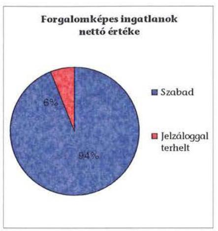

Az Önkormányzat kötelezettségeinek állományát 2010. december 31-én és várható alakulását a kötelezettségek lejáratáig az alábbi táblázat részletezi:

Az Önkormányzat kötelezettségének állománya 2010. december 31-én és várható alakulása a kötelezettségek lejáratáig

| Megnevezés | Állomány 2010. dec.31-én |  |  | Várható kötelezettség 2011-2013.   években |  |  | Várható kötelezettség 2014 tól a   futumidö végtig |  |
| :--: | :--: | :--: | :--: | :--: | :--: | :--: | :--: | :--: |
|  | HUF |  |  | HUF |  |  | HUF |  |
|  |  |  |  | 2229693704 |  |  | 2089776093 |  |
| Honozai lejáratú hótelvok | 5867830412 |  |  |  |  |  | 43464335 CHF |  |
| Kötvényvek |  | 47514318 CHF |  |  | 11956034 CHF |  |  |  |
| Lizing kötelezettségvek |  |  |  |  |  |  |  |  |
| Felzúszóakulálat | 2521493000 |  |  | 8060000000 |  |  |  |  |
| Hozokulvas megoldágozási hitel | 300000000 |  |  | 774153000 |  |  |  |  |
| Egyéb likvid hótelvok | 200000000 |  |  | 200000000 |  |  |  |  |
| EFF forgalomási kötelezettségvek |  |  |  |  |  |  |  |  |
| Gazozóba |  |  |  |  |  |  |  |  |
| Szúszóig | 5910310000 |  |  |  |  |  |  |  |
| Szelleles varázslat összegig | 2758047000 |  |  | 2758047000 |  |  |  |  |
| Abból lejtett karhuzás | 2084585000 |  |  | 2084585000 |  |  |  |  |
| Összesen 31-ban | 15387185452 |  |  | 10132393704 |  |  | 2089776093 |  |
| Összesen CHF-ban |  | 47514318 |  |  | 11956034 |  |  | 83464335 |

Az Önkormányzat kötelezettségeinek állománya 2010. december 31-én 15387 millió Ft-ból és 47514318 CHF-ből tevődött össze. A 2011-2013-ban esedékes kötelezettségek kamatot is tartalmazó várható összege 10132 millió Ft, 11956034 CHF. A 2013. év után várható kötelezettség összegét a 3090 millió Ft hosszú lejáratú hitel és a 43464335 CHF kötvénytartozás alkotja.
A gazdasági társaságok hosszú lejáratú kötelezettségeinek állományát 2010. december 31-én és várható alakulását a kötelezettségek lejáratáig az alábbi táblázat mutatja be:

A gazdasági társaságok hosszú lejáratú kötelezettségeinek állománya 2010. december 31-én és várható alakulása a kötelezettségek lejáratáig

| Megnevezés | Állomány 2010. dec.31-én |  |  | Várható kötelezettség 2011-2013.   években |  |  | Várható kötelezettség 2014 tól a   futumidö végtig |  |
| :--: | :--: | :--: | :--: | :--: | :--: | :--: | :--: | :--: |
|  | HUF |  |  | HUF |  |  | HUF |  |
|  |  |  |  |  |  |  |  |  |
| Hosszú lejáratú hótelvok |  |  |  | 241174138 |  |  |  | 15619138 |
| Honozai lejáratú hótelvok |  |  |  | 48095207 |  |  | 92127191 |  |
| Kötvönyvek |  |  |  |  |  |  |  |  |
| Lizing kötelezettségvek | 68791557 |  |  | 58791557 |  |  |  |  |
| Lizing kötelezettségvek |  |  |  | 44639 CHF |  | 44639 CHF |  |  |
| Lizing kötelezettségvek |  |  |  | 71624 CHF |  | 71624 CHF |  |  |
| Összesen 31-ban |  |  |  | 106881764 |  |  | 50127101 |  |
| Összesen CHF-ban |  |  |  | 4512483 |  |  | 17660557 |  |
| Összesen EUR-ban |  |  |  | 71624 |  |  |  |  |

---

Az Önkormányzat minősített többségi befolyással rendelkező gazdasági társaságainak kötvény, hosszú lejáratú hitel és lízing kötelezettségeinek állománya 2010. december 31-én 152 millió Ft, 10114512 CHF , és 71624 EUR-ból tevődött össze. Ebből a 2011-2013-ban esedékes kötelezettségek várható összege 103 millió Ft, 4784337 CHF és 71624 EUR. A 2013. után várható kötelezettség öszszegét 92 millió Ft, és 9700022 CHF kötelezettség alkotja.

Az Önkormányzat gazdasági társaságai által vállalt kötelezettségek kockázatot jelentenek az Önkormányzat számára mivel az Önkormányzat korlátlan felelősséggel tartozik felszámolás esetén a Gt. ${ }^{57}$ 54. § (2) bekezdése alapján az Önkormányzat minősített többségi befolyással rendelkező gazdasági társaság, illetve a Csődtv. ${ }^{58}$ 63. § (2) bekezdése alapján a kizárólagos önkormányzati tulajdonú gazdasági társaság minden olyan kötelezettségéért, amelynek kielégítését a felszámolási eljárás során az adós társaság vagyona nem fedez, ha a hitelezőinek a felszámolási eljárás során benyújtott keresete alapján a bíróság - az adós társaság felé érvényesített tartósan hátrányos üzletpolitikájára figyelemmel - megállapítja az Önkormányzat korlátlan és teljes felelősségét. Felszámolás esetén a hitelezők által benyújtott kereset alapján a bíróság összességében 152 millió Ft, továbbá 10114512 CHF és 71624 EUR összegű korlátlan és teljes felelősséget állapíthat meg a kötelezettségekkel érintett öt kizárólagos önkormányzati tulajdonú gazdasági társaság után.

A vizsgált időszakban nem történt meg annak felmérése, hogy az eszközök elhasználódásának, amortizációjának pótlása milyen kötelezettséget jelent az Önkormányzat számára. A felújításokra, az eszközök pótlására az Önkormányzat pénzügyi lehetőségének a függvényében, elsősorban az intézmények működőképességének biztosítása, illetve a szakhatósági előírások figyelembevételével került sor. Az Önkormányzat kimutatása szerint 2007-2010. évek között a felújításokon túlmenően 6943 millió Ft fejlesztést is megvalósítottak. A tényleges bekerülési költségekből eszközpótlásra mindössze 248 millió Ftot $-3,57 \%$-ot - fordítottak.

Az Önkormányzat a 2007-2010. években a tárgyi eszközök után együttesen 7536 millió Ft összegű értékcsökkenést mutatott ki, míg együttesen ezen időszak alatt felújításra 2208 millió Ft-ot - a kimutatott értékcsökkenésnek 29,3\%-a - fordítottak. Ettől alacsonyabb arányt csak 2009. évben -21,5\%-os -, illetve 2007. évben - 25,2\%-os - értek el.

Az Önkormányzat tanúsítványa alapján a befektetett tárgyi eszközök év végi bruttó értéke 2010. évben 4,6\%-kal - 5926 millió Ft - volt magasabb, mint 2007. évben. A teljesen (0-ra) leírt eszközök bruttó értéke a 2007. évi 2113 millió Ft-ról 2010. évre 2138 millió Ft-ra emelkedett. Az önkormányzati szintű használhatósági mutatója négy év alatt négy százalékponttal, $90 \%$-ról $86 \%$-ra csökkent, amelyet nem ellensúlyozott az ingatlanok, gépek, berendezések, felszerelések, a járművek, valamint az átadott eszközök 2007-ről 2010-re folyamatosan növekvő bruttó értéke sem. A befejezett fejlesztéseknél eszközpótlásra for-

[^0]
[^0]:    ${ }^{57}$ a gazdasági társaságokról szóló 2006. évi IV. törvény
    ${ }^{58}$ a csődeljárásról és a felszámolási eljárásról szóló 1991. évi IL. törvény

---

dított összege mindössze 248 millió Ft volt, a fejlesztések tényleges bekerülési költségének 3,57\%-a.

Az Önkormányzat folyamatban lévő peres eljárásairól készített tanúsítvány szerint a jogerősen le nem zárt peres eljárások száma 21, amelyekben az Önkormányzat, valamint több intézménye, gazdasági társasága is alperes. Ezen ügyekben a perérték 260,6 millió Ft összesen, melyből az Önkormányzatot 108,8 millió Ft ( $41,7 \%$ ) közvetlenül érinti. Ezen felül kiemelkedően magas - 63 millió Ft + kamatai - a perbeli követelés értéke a Túzoltóság vonatkozásában (az elmaradt túlmunka kifizetés a 2004-2007. éveket illetően). Jelentős nagyságrendű - 72 millió Ft - az Önkormányzat tulajdonában lévő gazdasági társaságokkal szembeni perérték, a Nyírségvíz Zrt.-vel - a társaságban az Önkormányzat 58\% tulajdoni hányaddal rendelkezik - szembeni kártérítés követelés ( 37 millió Ft), valamint az Önkormányzat kizárólagos tulajdonában lévő Sóstó-Gyógyfürdők Zrt.-vel szembeni munkaügyi per esetében (becsült érték 35 millió Ft) a perérték. A három nagy perértékű ügy közül egy másodfokon van, egy elsőfokú eljárási szakaszban van, míg egy ügy esetében a bírósági eljárást a felperes kérelmére felfüggesztették.

A nagy összegű perértékekre való tekintettel mindössze a Sóstó-Gyógyfürdők Zrt. képzett céltartalékot, az Önkormányzat, valamint a Nyírségvíz Zrt. a perek értékével kapcsolatban céltartalékot nem képzett.

Az Önkormányzat által készített kimutatás alapján nincs jogerősen lezárt peres ügy, melyből adódóan fizetési kötelezettség terhelné az Önkormányzatot.

Az Önkormányzatot érintő perekből adódó fizetési kötelezettségek pénzügyi kockázatot jelentenek.

# 4. A PÉNZÜGYI EGYENSÚLY MEGTEREMTÉSE ÉrDEKÉBEN HOZOTT INTÉZKEDÉSEK 

A jelentésben szereplő CLF modellben bemutatott múködési és felhalmozási hiány mindamellett alakult ki, hogy a vizsgált időszakban az Önkormányzat folyamatosan intézkedéseket tett, hogy alkalmazkodjon a finanszírozási rendszer változása miatti forráscsökkenéshez. Ennek érdekében bevételnövelő és kiadáscsökkentő döntéseket hozott.

A 2007-2010. évek kiadáscsökkentő intézkedéseinek pénzügyi hatásai - az Önkormányzat kimutatása szerint - beavatkozási területenként az alábbiak voltak:

| Az érvényesített kiadás-   csökkentés területei | Személyi   juttatások és   járulékai | Dologi, mű-   ködési ki-   adások | Pénzeszköz   átadások,   támogatások | Összesen |
| :-- | :--: | :--: | :--: | :--: |
| Az intézményeknél | 1231470 | 8619 | 97488 | 1337577 |
| A Közgyűlés működése | 54735 | - | - | 54735 |
| A Hivatalnál | 36023 | - | - | 36023 |
| ÖSSZESEN | 1322228 | 8619 | 97488 | 1428335 |

---

Az Önkormányzat a kiadáscsökkentő és bevételnövelő intézkedések meghozatalával a gazdálkodás átláthatóbbá tételét, az Önkormányzat pénzügyi helyzetének a javítását, valamint a feladatellátás szakmai színvonalának emelését kívánta elérni. A legjelentősebb mértékű kiadási megtakarítást a foglalkoztatottak létszámának csökkentésével érték el, ezáltal sikerült megőrizni az intézmények gazdálkodásának és müködésének stabilitását.

Az Önkormányzatnál a 2007-2010. évek között a 2006. december 31-én meglévő intézményeinél a költségtakarékos és méretgazdaságos feladatellátás megteremtése érdekében végrehajtott átszervezések során a Közgyűlés az összes intézményei számát 65 -ről 56 -ra ( $14 \%$-kal) csökkentette. Legnagyobb mértékben 9\%-kal csökkent a közoktatási intézmények száma 54 -ről 49-re, ezen belül az általános iskolák száma 18 -ról 14 -re, valamint az egyetlen kollégiumi feladatot ellátó intézményt megszüntette.

A 2007-2010. években az Önkormányzat kimutatása szerint az intézményi átszervezések, a feladatváltozások, valamint a takarékossági intézkedések hatásaként együttesen 1428 millió Ft kiadási megtakarítás jelentkezett, ebből 1322 millió Ft (93\%) a létszámcsökkentésekből (az intézményeket érintő álláshelyek megszüntetése, feladatmegszüntetés, átszervezés ${ }^{59}$, illetve üres álláshelyek zárolása ${ }^{60}$ ) származott.

A létszámcsökkentő intézkedések következtében az Önkormányzat szerint 2007. január 1. és 2010. december 31. között a Polgármesteri hivatalnál és az intézményeknél a nyilvántartások szerint összesen 423 álláshelyet szüntettek meg, amelynek 56,3\%-a (238) ágazati szakmai, 30,2\%-a (128) intézményüzemeltetéshez, fenntartáshoz, gazdasági ügyek intézéséhez kapcsolódó álláshely volt. Egyes közszolgáltatási területen azonban feladatbővülések is voltak, amelyek álláshely és egyben létszámnövekedéssel is jártak, ennek következtében az időszak álláshelyeinek száma 192 fővel csökkent. A megszüntetett álláshelyekből $13,5 \%$ (57) volt az üres álláshelyek száma.

A létszámcsökkenést a következő táblázat szemlélteti:

| Az Önkormányzat 2007-2010.éveket érintő létszámcsökkentésének alakulása |  |  |  |  |  |  |  |
| :--: | :--: | :--: | :--: | :--: | :--: | :--: | :--: |
| Megnevezés (mletek 18-ben) | Közehetetés | Szociális és gyermekvédelend | Egészségügy | Polgármestert hivatat | Egyéb | Összesen |  |
| Megszüntetett álláshelyek száma | 208 | 15 | 0 | 20 | 0 | 423 |  |
| (1608) üres álláshelyek száma | 46 | 11 | 0 | 0 | 0 | 23 |  |
| Szokásos álláshelyek száma | 228 | 4 | 0 | 8 | 0 | 238 |  |
| Székesész-üzemeltetéssel kapcsolatos |  |  |  |  |  |  |  |
| Akláshelyek száma | 135 | 4 | 0 | 0 | 0 | 128 |  |
| 2007. január 1.éss indító létszám | 3149 | 731 | 89 | 242 | 0 | 4113 |  |
| 2010. december 31-én záró létszám | 3133 | 763 | 89 | 239 | 0 | 4123 |  |

A helyi szervezési intézkedések végrehajtásához az Önkormányzat - kimutatása szerint - 2007-2010 években 296 millió Ft központosított költségvetési támogatásban részesült. A támogatás felhasználásával 115 álláshelyet tartósan le-

[^0]
[^0]:    59 a Közgyűlés 83/2007. (IV.23.), 129/2007. (VI.25.), 187/2007. (IX.24.), 118/2007. (VI.11.), 134/2007. (VI.25.), 179/2008. (VI.23.), 140/2009. (VI.29.), 179/2009. (VIII.31.), 217/2009.(IX.15.), 286/2009. (XII.14.) számú határozatai
    ${ }^{60}$ a Közgyűlés 83/2007. (IV.23.), 129/2007. (VI.25.), 187/2007. (IX.24.), 118/2007. (VI.11.) számú határozatai

---

építettek. A létszámcsökkenés $72,8 \%$-ához, 308 -hoz központi támogatás nem kapcsolódott. A létszámcsökkentésben érintett dolgozók nem kerültek Önkormányzat gazdasági társaságainál tovább foglalkoztatásra. Az intézkedések hatására az Önkormányzat 2006. december 31-i átlaglétszáma 2010. december 31-re 4,3\%-kal, 4323 före csökkent.

Az Önkormányzat a 2007-2010. évek költségvetési kiadásaira ható megtakarítást eredményező intézkedésekről - intézményeket érintő átszervezésekről - határozatban döntött, amelyek az áttekintett időszakban a következők voltak:

- az oktatási, nevelési intézményhálózatban a feladatok racionálisabb ellátása érdekében a 2007. július 31 -ével egy általános iskola és egy tagiskola jogutód nélküli megszűntetéséről döntöttek. Továbbá három általános iskola jogutóddal történő megszűntetésével intézmény összevonásokat hajtottak végre. A közoktatási feladatellátás átszervezése következtében megszűnő álláshelyekről és azok kiadásokra gyakorolt számszerűsített hatásairól minden évben a tanév indításával kapcsolatos feladatok tárgyában készített előterjesztések során döntött a Közgyűlés. Ennek során figyelemmel voltak a Közokt. tv. ${ }^{61}$ változásaira (pl. kötelező óraszámok növekedése), valamint az ellátottak számának csökkenése következtében a csoportok, osztályok szervezéséből adódó változásokra. A feladatellátás átszervezése, valamint a 2007/2008-as tanév előkészítéséről szóló előterjesztés során 178 álláshely megszűntetésére került sor, a kimutatások szerint 905 millió Ft megtakarítása mellett. A 2008/2009. tanév indításának előkészítésekor a Bessenyei György Középiskolai Kollégium jogutódlással történő megszüntetéséről, valamint egy kollégiumi feladatokat ellátó és egy tanműhely épület megszűntetéséről döntött a Közgyűlés. Az átszervezés az intézményekben foglalkoztatottak létszámára nem volt hatással, az elért dologi kiadás megtakarítás öszszege a nyilvántartás szerint 9 millió Ft volt. A 2009/2010. tanév indításának előkészítésekor a feladatmutatók változása, ezáltal az óvodai csoportok és iskolai osztályok száma csökkenésének következményeként 23 álláshely szűnt meg, melynek megtakarítási vonzata 90 millió Ft volt;
- négy közművelődési intézményben 2007. július 31-vel összesen 23 álláshely végleges megszűntetésére került sor a kimutatásuk szerint 172 millió Ft kiadáscsökkentéssel, majd 2008. január 1-vel a hatékonyabb közművelődési feladatellátás érdekében sor került ezen intézmények átszervezésére, integrációjára;
- a szociális intézményhálózatban három intézménynél 10 álláshely csökkentés valósult meg a 2007. évben, a nyilvántartások szerint a megtakarítás öszszege 64 millió Ft volt. 2010. január 1-jétől három szociális intézmény (Sóstói Szivárvány Idősek Otthona, Szociális Gondozási Központ, Gyermekjóléti Központ) Kistérségi társulás részére történő átadására került sor. Az intézmények átszervezése a kimutatásuk szerint 97 millió Ft kiadási megtakarítást jelentett az Önkormányzat számára.

[^0]
[^0]:    ${ }^{61}$ a közoktatásról szóló 1993. évi LXXIX. törvény

---

Az intézményi feladatok racionalizálásáról, átcsoportosításáról, integrációról a Közgyűlés döntött. Az ezekhez készített előterjesztésekben a tervezett intézkedések indokait, várható eredményeit bemutatták. Az átszervezés végrehajtásához kikérték a szakmai szervezetek véleményét, a jogszabályban előírt egyeztetéseket lefolytatták.

A hivatali feladatok átszervezése során 2007-ben 10 álláshellyel - ebből két intézmény-üzemeltetéssel kapcsolatos álláshely volt - csökkentették ${ }^{62}$ az engedélyezett létszámot, ami a nyilvántartásuk szerint 30 millió Ft megtakarítást eredményezett. A helyettesítések felülvizsgálata további 6 millió Ft megtakarítást eredményezett.

A Közgyűlés tisztségviselői, tagjai részére biztosított juttatás csökkentése ${ }^{63}$ következtében az Önkormányzat kimutatása szerint 11 millió Ft személyi jellegű költségmegtakarítás keletkezett 2010. évben.

A Polgármesteri hivatalban végrehajtott megtakarítási intézkedések feladat átszervezésből következő és álláshely-csökkentéssel járó döntések voltak, amelyek összességében a 2006. december 31-i állapothoz viszonyítva 10 álláshely csökkenést eredményeztek, amellyel 36 millió Ft kiadási megtakarítást mutattak ki. A 2010. december 31-i záró-létszám 7 fővel kevesebb a 2007. január 1-i létszámnál, mivel a két időpont között nemcsak létszám csökkentés, hanem létszám növekedés is történt.

A Közgyűlés a 2010. évi, valamint a 2011. évi költségvetési rendeleteiben döntött a cafeteria elemek csökkentéséről, amely az Önkormányzat kimutatása szerint 2010-ben 44 millió Ft kiadási megtakarítással járt.

Az Önkormányzat a 2010. évben külső igazságügyi szakértőt bízott meg az Önkormányzat gazdálkodásának állapotfelmérésével. Az elkészített szakértői véleményben megfogalmazottakkal összhangban a 2011. évi költségvetési rendelettel egyidejűleg az Önkormányzat a kiadási megtakarítást eredményező intézkedésekről határozatban döntött ${ }^{64}$.

A Közgyűlés döntései alapján a 2011. első félévében további megtakarítási intézkedéseket hoztak. A 2011. évre tervezett 382 millió $\mathrm{Ft}^{65}$ kiadási megtakarításból 162 millió Ft ( $42,4 \%$ ) a személyi juttatások és a hozzá kapcsolódó járulékok csökkenéséből, 43 millió Ft (11,3\%) a dologi kiadások tervezett csökkentéséből, 177 millió Ft ( $46,3 \%$ ) pénzeszközátadás csökkenéséből ered a kimutatások szerint. A megtakarítási intézkedésekből 301 millió Ft (78,8\%) a Polgármes-

[^0]
[^0]:    ${ }^{62}$ a Közgyűlés 167/2007. (VIII.27.) számú határozata
    ${ }^{63}$ a Közgyűlés 234/2010. (X.15.) számú határozata
    ${ }^{64}$ A 25/2011. (II. 10.) számú határozatban foglaltak szerint felül kell vizsgálni a szociális, oktatási és közművelődési intézményrendszer feladatellátási struktúráját, javaslatot kell kidolgozni olyan intézményi struktúrára, amely képes lesz belátható időn belül egy racionálisabb, gazdaságosabb és hatékonyabb intézményi feladatellátásra.
    ${ }^{65}$ Nem tartalmazza a közoktatási intézmények 2011. évi átszervezéséből adódó - jelenleg még nem számszerűsített - intézkedések kiadás csökkentő hatását.

---

teri hivatal, 53 millió Ft (13,9\%) a Közgyűlés, 28 millió Ft (7,3\%) az intézmények működtetéséhez kapcsolódott.

A Polgármesteri Hivatalnál tervezett megtakarítások 19 álláshely megszűntetéséből, a helyettesítések miatti megtakarításból, a cafetéria keretösszegének csökkentéséből, a konyha és étkező üzemeltetésének megszüntetéséből, a sporttámogatásra fordítható, valamint a sportlétesítmények üzemeltetésére adott támogatási összegek csökkentéséből, illetve a beszerzési szerződések felülvizsgálata miatti megtakarítás (karbantartás, örzés-védelem, takarítás, mosatás, vagyonbiztosítás, folyóirat, irodaszer, gépjármú üzemeltetés, stb.) hatásából származnak.

A Közgyűlés tisztségviselőinek, tagjainak juttatásaiban tervezett kiadáscsökkentést 53 millió Ft-ban számszerúsítették.

Az intézményrendszert érintő megtakarítás a közoktatási intézményhálózat hatékonyabb és költségtakarékosabb átalakításából tervezték. A Közgyűlés döntése következtében ${ }^{66}$ a közoktatási intézmények száma a 2010. december 31-i 49-ről 2011. július 31. napjával 27 -re ( $45 \%$-kal) csökken, ezen belül az óvodák száma 18 -ról, 4 -re ( $78 \%$-kal), az általános iskolák száma 14 -ről 6 -ra ( $57 \%$-kal) csökken az összevonások kapcsán. A határozatban az előírt átszervezésekhez kapcsolódóan a Közgyűlés összesen 300 főt érintő végleges létszámcsökkentést rendelt el. Az Önkormányzat intézményeinek költségvetési gazdálkodással kapcsolatos feladatait 2010. december 31 -én 27 önállóan müködő és gazdálkodó jogkörrel rendelkező költségvetési intézmény 120 fővel látta el, amely feladatot a 2011. évi átszervezések hatására 2011. augusztus 1-jétől 9 önállóan müködés és gazdálkodó költségvetési intézmény, 83 fővel fogja ellátni. A gazdasági szervezetek létszámának 37 fővel történő csökkenése 28 millió Ft megtakarítást eredményez a 2011. évben.

A kiadáscsökkentő intézkedések mellett az Önkormányzat kimutatása szerint az alábbiakban számszerúsített bevételnövelő intézkedéseket tette:
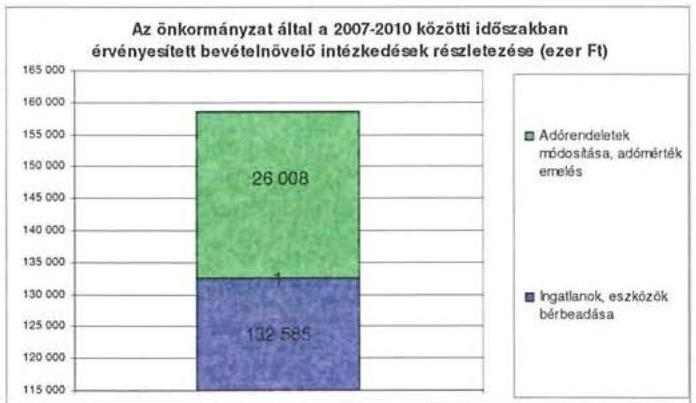

A bevételnövelő intézkedések hatására kimutatásaik szerint 2007-2010. évben 159 millió Ft többletbevételt realizált az Önkormányzat, amelynek 83,6\%-át (133 millió Ft-ot) ingatlanok, eszközök bérbeadásából, míg 16,4\%-át (26 millió Ft-ot) az adórendeletek módosításával, adómérték emelésével érték el. Az Önkormányzat a jogszabály adta lehetőséggel csak 2008. és 2010. évben élt, amikor az idegenforgalmi adó mértékét a hiány csökkentése érdekében 2008. ja-

[^0]
[^0]:    ${ }^{66}$ a Közgyűlés 86/2011. (V. 31.) számú határozata

---

nuár 1-jétől 100\%-kal (100 Ft-ról 200 Ft-ra), 2010. január 1-jétől 50\%-kal (200 Ft-ról 300 Ft-ra) emelte.

A 2011. évben tervezett bevételnövelő intézkedések várt eredményét 222 millió Ft-ban határozta meg az Önkormányzat, amelyből 72,1\%-ot (160 millió Ft-ot) a helyi adóbevételek növekedése ${ }^{67}, 22,5 \%$-ot ( 50 millió Ft-ot) a helyi iparúzési adó adókedvezményének csökkentése ${ }^{68}, 5,4 \%$-ot ( 12 millió Ft-ot) ingatlanok, eszközök bérbeadása biztosít.

Az átszervezések, a takarékossági intézkedések szakmai feladatellátásra gyakorolt hatását célzottan nem vizsgálták.

Az Önkormányzat a 2007-2010. években - a 2007. évhez viszonyítva, a jelentésben bemutatott CLF módszer szerint - 1523 millió Ft többlet állami támogatást és illetékbevételt realizált ${ }^{69}$, amely az Önkormányzat által a kimutatás szerint a 2007-2010. években meghozott kiadáscsökkentő ( 1428 millió Ft) és bevételnövelő ( 159 millió Ft) intézkedéseivel együtt kedvezően hatott az Önkormányzat pénzügyi helyzetére.

# 5. A HELYI ÖNKORMÁNYZATOK GAZDÁLKODÁSI RENDSZERÉNEK 2007. ÉVI ELLENŐRZÉSE SORÁN A PÉNZÜGYI EGYENSÚLY JAVÍTÁSÁRA TETT SZABÁLYSZERŰSÉGI ÉS CÉLSZERŰSÉGI JAVASLATOK HASZNOSULÁSA 

Az ÁSZ 2009. évben végzett vizsgálatának megállapításairól készült jelentésében négy szabályszerűségi és egy célszerűségi javaslatot tett. A javaslatok közül a pénzügyi egyensúly javítására kettő szabályszerűségi javaslat vonatkozott. A szabályszerűségre vonatkozó javaslatokat a polgármesternek, illetve a főjegyzőnek tettük meg. A javaslatok hasznosulása érdekében készített intézkedési tervet a Közgyűlés jóváhagyta ${ }^{70}$, a feladatok végrehajtásáért felelős személyeket és a feladatok végrehajtásának határidejét meghatározta. Az intézkedési tervben foglaltaknak megfelelően az átmenetileg szabad pénzeszközök hasznosítása során betartották az Ötv. 9. § (1) és (3) bekezdésében foglaltakat, a sza-

[^0]
[^0]:    ${ }^{67}$ A polgármester az adóbevételek növelése, valamint az adóhátralékok növekedésének megakadályozása érdekében 2011. április 20-án 41821/2011. ügyiratszámon, továbbá az építményadó fizetési kötelezettségüket elmulasztó adózók feltárása érdekében 2011. május 11-én 41831/2011. ügyiratszámon adott ki feladattervet. A feladattervekben a hátralékok gyors és hatékony feltárását, a kintlévőségek folyamatos csökkentését, valamint az építményadóval kapcsolatos feltárási és ellenőrzési tevékenység rendszeressé és módszeressé tételét, ennek révén az adózói kör szélesítését tűzték ki célul. A célok megvalósítása érdekében megfogalmazott feladatokhoz határidő kitűzésével felelősöket határoztak meg, illetve rögzítették az intézkedések jövőbeli hatását.
    ${ }^{68}$ Nyíregyháza Megyei Jogú Város Önkormányzatának 33/2010. (XII. 17.) számú rendelete a helyi iparúzési adóról
    ${ }^{69}$ A költségvetési támogatás összege 7291 millió Ft többlettámogatást, az átengedett bevételek 5631 millió Ft csökkenő állami támogatást, az illetékbevételek 137 millió Ft csökkenő bevételt mutat.
    ${ }^{70}$ 256/2009. (XI. 23.) számú határozat

---

bad pénzeszközök hasznosításáról a Közgyűlés, vagy átruházott hatáskörrel rendelkező személyek döntöttek, további határidős devizaügyleteket nem kötöttek, azonban a javaslat ellenére továbbra is likvidhitelként mutattak ki az Önkormányzat mérlegében rövid lejáratú hiteleket is ${ }^{71}$.

A polgármester jelentés megállapításaira tett észrevétel szerint: „Az Önkormányzat likvid hitelként mutatta ki a folyószámlahitelt és a munkabérhitelt, mert ezek a hitelek bár rövid lejáratú hitelként müködnek - pénzmaradványt csökkentő tételek, és a hatályos jogszabály alapján 2009. évtől a beszámolóban is el kell számolni. A vizsgálat megállapítása ugyan említést tesz (lábjegyzetben) az idöközbeni jogszabályváltozásról, de ugyanúgy számon kéri a rövid lejáratú hitelként való elszámolást. Rövid lejáratú hitelként történő kimutatás szerint nem kellene pénzmaradványt csökkentő tételként hozni a likvid hitel állományát, ez viszont a valós helyzetnél sokkal kedvezőbb pénzügyi pozícióban tüntetné fel az önkormányzatot."

Az észrevétel nem megalapozott, mivel az Önkormányzat folyószámla hitelkeret terhére igénybevett hitelt - az Áhsz. 9. számú melléklet számlaosztályok tartalmára vonatkozó 3. b. pontjának előírását figyelembe véve - likvidhitelként kezelte. A folyószámlahitel a 2007-2010. évek minden egyes napján fennállt, a bankszámla egyenleg - a folyószámlahitel negyedéves mérlegjelentéshez történő nyilvántartásba vételének kivételével - minden nap negatív előjelű volt, illetve az Áhsz. előírása szerinti nyilvántartásba vételkor nulla. Az ellenőrzött időszak minden napján fennálló folyószámlahitel likvidhitelként való kezelése nem felelt meg az Ötv. 88. § (3) bekezdés d) pontjában foglaltaknak, mely szerint a „likvidhitel: az éven belül felvett és visszafizetett, a közszolgáltatási és államigazgatási feladatok folyamatos müködtetéséhez felvett hitel". Az Önkormányzat az állandósult folyószámlahitel likvid hitelként való kezelése nem felelt meg az Ámr. 9. sz. melléklet 3. b. pont azon előírásának sem, mely szerint az önkormányzat a „bevételek ütemkülönbségének és a kiadások ütemkülönbségének eltérése miatt likvid hitelt vesz igénybe, mert a likvidhitellel tartós hiányt finanszíroztak.

A főjegyzőnek tett célszerűségi javaslat alapján a 2010. és a 2011. évi költségvetési rendeletekben a hosszú lejáratú adósságot keletkeztető kötelezettségvállalásokból adódó tőke és kamatfizetési kötelezettségeket bemutatták.

Budapest, 2011. december „22."
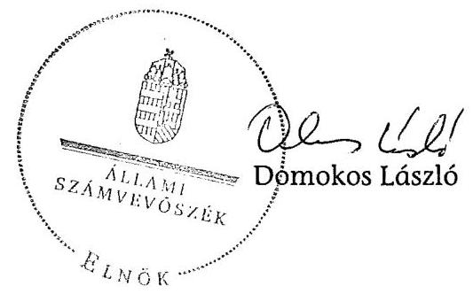

Melléklet: $\quad 9 \mathrm{db}$

[^0]
[^0]:    ${ }^{71}$ A 2010. évi költségvetési pénzmaradvány megállapításakor a likvidhitel összegét az államháztartás szervezetel könyvvezetési és beszámolási kötelezettségéről szóló 249/2000. (XII. 24.) számú kormányrendelet 39. § (3) bekezdésének megfelelően pénzmaradvány módosító tételként figyelembe vették.

---

Nyíregyháza Megyei Jogú Város Önkormányzata

1. számú melléklet

Működési és felhalmozási célú hiány/többlet az önkormányzat rendeleteiben

|   | 2007 | 2008 | 2009 | 2010  |
| --- | --- | --- | --- | --- |
|  müködési bevételek és kiadások | 11 350 | 11 031 | 8 077 | 6 861  |
|  felhalmozási bevételek és kiadások | 28 186 | 2 110 | 8 178 | 5 152  |
|  bevételek |  |  |  |   |
|  kiadás |  |  |  |   |
|  bevétel |  |  |  |   |
|  2007 |  |  |  |   |

millió Ft

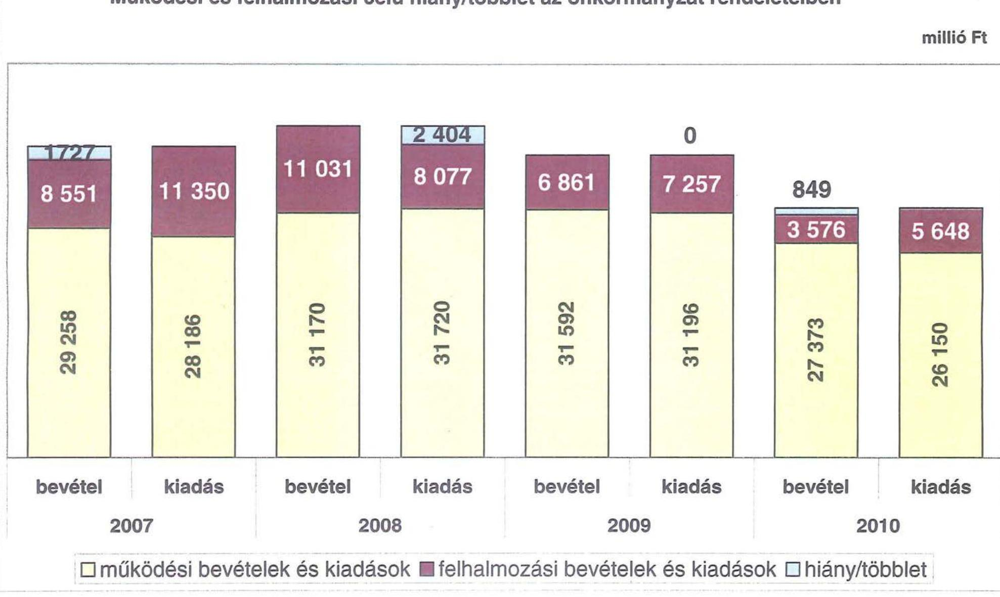

---

## KIMUTATÁS az Önkormányzat 2007-2010. évi bevételeinek és kiadásainak alakulásáról

|   |  |  |  | ezer. Ft-ban  |
| --- | --- | --- | --- | --- |
|  1. FOLYÓ KÖLTSÉGVETÉS* | 2007. | 2008. | 2009. | 2010.  |
|  1.1.1. Saját működési bevételek | 9 815 709 | 11 042 229 | 11 286 880 | 9 799 772  |
|  1.1.2. Költségvetési támogatás | 9 124 786 | 12 626 103 | 11 497 293 | 10 541 778  |
|  1.1.3. Átvegetési bevételek | 5 659 920 | 2 601 009 | 2 600 897 | 4 146 889  |
|  1.1.4. Állandóáztartáson belülről kapott támogatások | 857 089 | 1 011 494 | 1 039 030 | 1 013 919  |
|  1.1.5. ÉV-tól és külföldről kapott bevételek | 93 119 | 81 587 | 108 479 | 68 728  |
|  1.1.6. Állandóáztartáson kívülről kapott bevételek | 78 424 | 142 727 | 74 860 | 73 950  |
|  1.1.7. Ebből évi pénzszeradvány átvétel | 896 758 | 1 491 504 | 473 299 | 813 231  |
|  1.1. Folyó bevételek = 1.1.1.+1.1.2.+1.1.3.+1.1.4.+1.1.5.+1.1.6.+1.1.7. | 36 925 806 | 29 996 665 | 28 076 738 | 30 457 910  |
|  1.2.1. Működési kiadások bemutatásának nélkül | 22 266 533 | 24 206 294 | 22 251 135 | 21 152 496  |
|  1.2.2. Állandóáztartáson belülre átadott pénzesehősök | 183 065 | 220 501 | 201 918 | 803 977  |
|  1.2.3. Váltohajósoknak | 756 516 | 801 562 | 1 310 644 | 1 352 534  |
|  1.2.3.2. ÉV-nek, illetve külföldre | 3 445 | 0 | 0 | 1 009  |
|  1.2.3.3. Megkészítőkok | 1 191 989 | 1 366 200 | 1 459 226 | 1 791 749  |
|  1.2.3.4. Mindezőt szervizetőknek | 386 678 | 395 914 | 397 641 | 306 894  |
|  1.2.4. Tervezőtétindások (=1.2.2.1+1.2.2.2+1.2.3.3+1.2.3.4) | 2 328 628 | 2 562 676 | 2 167 511 | 2 412 296  |
|  1.2.4. Kismétkívülök | 467 592 | 653 848 | 454 484 | 431 072  |
|  1.2.5. Ebből évi pénzszeradvány átadás | 896 758 | 1 491 504 | 473 299 | 818 879  |
|  1.2. Folyó kiadások = 1.2.1.+1.2.2.+1.2.3.+1.2.4.+1.2.5. | 36 152 576 | 29 255 373 | 26 648 337 | 26 618 286  |
|  1.3. Folyó költségvetés egyenlege MŰKÖDÉSI JÖVEDELÉM (1.1. - 1.2.) | 373 220 | 741 292 | 1 428 461 | -160 370  |
|  Felhalmozási költségvetés** |  |  |  |   |
|  2.1.1. Saját ülkebevételek | 1 717 642 | 764 494 | 565 214 | 1 061 399  |
|  2.1.2. Állandóáztartáson belülről kapott támogatások | 577 372 | 268 452 | 164 674 | 52 547  |
|  2.1.3. ÉV-tól és külföldről kapott támogatások | 827 627 | 1 006 702 | 653 705 | 1 112 944  |
|  2.1.4. Állandóáztartáson kívülről kapott támogatások | 694 498 | 539 439 | 205 425 | 297 748  |
|  2.1. Felhalmozási (beruházási) bevételek (=2.1.1.+2.1.2+2.1.3+2.1.4.) | 3 827 139 | 2 579 067 | 1 989 022 | 2 525 236  |
|  2.2.1. Saját beruházási kiadás állva | 3 269 732 | 2 682 827 | 2 632 539 | 2 989 355  |
|  2.2.2. Saját felújítási kiadás állva | 617 228 | 951 682 | 619 591 | 889 781  |
|  2.2.3. Állandóáztartáson belülre átadott pénzesehős | 51 317 | 600 | 30 000 | 33 331  |
|  2.2.4. ÉV-nek és külföldnek adott pénzesehősök | 0 | 0 | 0 | 0  |
|  2.2.5. Állandóáztartáson kívülre adott pénzesehősök | 1 352 046 | 393 997 | 1 100 521 | 1 040 185  |
|  2.2.6. Belvkezési célú részesedések vásárása | 2 250 | 112 300 | 500 | 400  |
|  2.2. Felhalmozási (beruházási) kiadások (=2.2.1.+2.2.2.+2.2.3.+2.2.4.+2.2.5.+2.2.6.) | 5 393 573 | 4 741 167 | 4 382 912 | 4 953 052  |
|  2.3. Beruházási költségvetés egyenlege (2.1. - 2.2.) | -1 566 434 | -2 162 100 | -2 793 896 | -2 427 816  |
|  3. Finanszírozási műveletek nélküli (GFS) pozíció(1.3.+2.3.) | -1 193 204 | -1 420 808 | -1 365 489 | -2 588 186  |
|  4. Finanszírozási műveletek |  |  |  |   |
|  4.1. Hittételeivel | 3 159 101 | 453 227 | 443 300 | 2 695 985  |
|  4.2. Hittételevezés | 4 721 426 | 592 869 | 464 547 | 357 739  |
|  4.3. Forgatási és befektetési célú értékpapírok kibocsátása | 4 148 282 | 3 500 060 | 0 | 0  |
|  4.4. Forgatási és befektetési célú értékpapírok beváltása | 0 | 0 | 0 | 316 834  |
|  4.5. Forgatási és befektetési célú értékpapírok értékesítése | 0 | 0 | 0 | 4 950  |
|  4.6. Forgatási és befektetési célú értékpapírok felártása | 0 | 0 | 0 | 0  |
|  4.7. Egyéb finanszírozási bevételek (függő, átfizet, kiegészítői) | 124 396 | 303 049 | -219 115 | -740 781  |
|  4.8. Egyéb finanszírozási kiadások (függő, átfizet, kiegészítői) | -1 788 | 449 185 | 32 928 | -453 974  |
|  4.9. Finanszírozási műveletek egyenlege (4.1. - 4.2.+4.3.-4.4+4.5.-4.6.+4.7.-4.8.) | 2 714 061 | 3 214 286 | -372 996 | 1 739 553  |
|  5. Tárgyévi pénzügyi pozíció változás (1.3.+ 2.3.+4.9.) | 1 520 857 | 1 793 478 | -1 738 479 | -848 633  |
|  6. Nettó működési jövedelem =működési jövedelem (1.3.) - tőketővizezés (4.2+4.4) | -4 348 196 | 148 487 | 963 854 | -834 943  |
|  TÁJÉKOSZATÓ ÁBÁTOK |  |  |  |   |
|  Összes kötelezettség | 13 055 568 | 17 006 494 | 17 672 733 | 21 675 817  |
|  ebből rávid hízését | 6 337 295 | 6 089 181 | 7 009 090 | 7 607 856  |
|  Összes realitási kötelezettség | 2 193 519 | 1 843 073 | 2 508 811 | 2 758 547  |
|  ebből hízást (tanszitványkól) | 1 888 791 | 1 279 161 | 1 747 124 | 2 084 589  |
|  Févs és időesítési kötelezettség (edőségi) | 9 648 899 | 14 354 620 | 14 370 139 | 18 346 901  |
|  ebből rávid hízését | 3 098 505 | 3 271 628 | 3 711 956 | 4 378 996  |
|  PPP szerződéses állomány jövedelek (tanszitványkól) | 0 | 0 | 0 | 0  |
|  ebből hízást szolgáltatási díj miatti kötelezettség | 0 | 0 | 0 | 0  |
|  Felszívásoláslatá tagi átlagos állománya (tanszitványkól) | 243 161 | 24 037 17 | 24 263 89 | 24 544 51  |
|  Lövvidítést tagi átlagos állománya (tanszitványkól) | 0 | 0 | 0 | 0  |
|  Mashablehítés tagi átlagos állománya (tanszitványkól) | 72 225 | 71 415 1 | 69 578 2 | 74 415 3  |
|  Keurestár és garanciavélhölés (tanszitványkól) | 16 200 | 16 200 | 21 273 91 | 32 193 1  |
|  Jogerős kivéségi ötletekből adódó kötelezettségek (tanszitványkól) | 0 | 0 | 0 | 0  |
|  Finanszírozásba bevankoló eszközök | 1 755 850 | 3 547 168 | 1 808 688 | 1 048 975  |
|  Tarsús kötelezettség megnevezési értékpapírok és végi állománya | 4 950 | 4 950 | 4 950 | 93 870  |
|  Hosszú hízható bankbettétek és végi állománya | 0 | 0 | 0 | 0  |
|  Értékpapírok és végi állománya | 0 | 0 | 0 | 0  |
|  Pénzesehősök (idegen pénzesehősök nélküli) és végi állománya | 1 748 739 | 3 542 217 | 1 803 738 | 955 185  |

- Bevételében nem tétel, a kiadásában nem jömek meg az ismertédeik, a vagyasi helyzet

* Bevételében vagyon megőrzésre és hővítése fordítások források

---

|   |  |  |  |  |  |  |  |  |  |  |  |  |  |  |  |  |  |  |  |  |  |  |  |  |  |  |  |  |  |  |  |  |  |  |  |  |  |  |  |  |   |
| --- | --- | --- | --- | --- | --- | --- | --- | --- | --- | --- | --- | --- | --- | --- | --- | --- | --- | --- | --- | --- | --- | --- | --- | --- | --- | --- | --- | --- | --- | --- | --- | --- | --- | --- | --- | --- | --- | --- | --- | --- | --- |
|   |  |  |  |  |  |  |  |  |  |  |  |  |  |  |  |  |  |  |  |  |  |  |  |  |  |  |  |  |  |  |  |  |  |  |  |  |  |  |  |  |   |
|   |  |  |  |  |  |  |  |  |  |  |  |  |  |  |  |  |  |  |  |  |  |  |  |  |  |  |  |  |  |  |  |  |  |  |  |  |  |  |  |  |   |
|   |  |  |  |  |  |  |  |  |  |  |  |  |  |  |  |  |  |  |  |  |  |  |  |  |  |  |  |  |  |  |  |  |  |  |  |  |  |  |  |  |   |
|   |  |  |  |  |  |  |  |  |  |  |  |  |  |  |  |  |  |  |  |  |  |  |  |  |  |  |  |  |  |  |  |  |  |  |  |  |  |  |  |  |   |
|   |  |  |  |  |  |  |  |  |  |  |  |  |  |  |  |  |  |  |  |  |  |  |  |  |  |  |  |  |  |  |  |  |  |  |  |  |  |  |  |  |   |
|   |  |  |  |  |  |  |  |  |  |  |  |  |  |  |  |  |  |  |  |  |  |  |  |  |  |  |  |  |  |  |  |  |  |  |  |  |  |  |  |  |   |
|   |  |  |  |  |  |  |  |  |  |  |  |  |  |  |  |  |  |  |  |  |  |  |  |  |  |  |  |  |  |  |  |  |  |  |  |  |  |  |  |  |   |
|   |  |  |  |  |  |  |  |  |  |  |  |  |  |  |  |  |  |  |  |  |  |  |  |  |  |  |  |  |  |  |  |  |  |  |  |  |  |  |  |  |   |
|   |  |  |  |  |  |  |  |  |  |  |  |  |  |  |  |  |  |  |  |  |  |  |  |  |  |  |  |  |  |  |  |  |  |  |  |  |  |  |  |  |   |
|   |  |  |  |  |  |  |  |  |  |  |  |  |  |  |  |  |  |  |  |  |  |  |  |  |  |  |  |  |  |  |  |  |  |  |  |  |  |  |  |  |   |
|   |  |  |  |  |  |  |  |  |  |  |  |  |  |  |  |  |  |  |  |  |  |  |  |  |  |  |  |  |  |  |  |  |  |  |  |  |  |  |  |  |   |
|   |  |  |  |  |  |  |  |  |  |  |  |  |  |  |  |  |  |  |  |  |  |  |  |  |  |  |  |  |  |  |  |  |  |  |  |  |  |  |  |  |   |
|   |  |  |  |  |  |  |  |  |  |  |  |  |  |  |  |  |  |  |  |  |  |  |  |  |  |  |  |  |  |  |  |  |  |  |  |  |  |  |  |  |   |
|   |  |  |  |  |  |  |  |  |  |  |  |  |  |  |  |  |  |  |  |  |  |  |  |  |  |  |  |  |  |  |  |  |  |  |  |  |  |  |  |  |   |
|   |  |  |  |  |  |  |  |  |  |  |  |  |  |  |  |  |  |  |  |  |  |  |  |  |  |  |  |  |  |  |  |  |  |  |  |  |  |  |  |  |   |
|   |  |  |  |  |  |  |  |  |  |  |  |  |  |  |  |  |  |  |  |  |  |  |  |  |  |  |  |  |  |  |  |  |  |  |  |  |  |  |  |  |   |
|   |  |  |  |  |  |  |  |  |  |  |  |  |  |  |  |  |  |  |  |  |  |  |  |  |  |  |  |  |  |  |  |  |  |  |  |  |  |  |  |  |   |
|   |  |  |  |  |  |  |  |  |  |  |  |  |  |  |  |  |  |  |  |  |  |  |  |  |  |  |  |  |  |  |  |  |  |  |  |  |  |  |  |  |   |
|   |  |  |  |  |  |  |  |  |  |  |  |  |  |  |  |  |  |  |  |  |  |  |  |  |  |  |  |  |  |  |  |  |  |  |  |  |  |  |  |  |   |
|   |  |  |  |  |  |  |  |  |  |  |  |  |  |  |  |  |  |  |  |  |  |  |  |  |  |  |  |  |  |  |  |  |  |  |  |  |  |  |  |  |   |
|   |  |  |  |  |  |  |  |  |  |  |  |  |  |  |  |  |  |  |  |  |  |  |  |  |  |  |  |  |  |  |  |  |  |  |  |  |  |  |  |  |   |
|   |  |  |  |  |  |  |  |  |  |  |  |  |  |  |  |  |  |  |  |  |  |  |  |  |  |  |  |  |  |  |  |  |  |  |  |  |  |  |  |  |   |
|   |  |  |  |  |  |  |  |  |  |  |  |  |  |  |  |  |  |  |  |  |  |  |  |  |  |  |  |  |  |  |  |  |  |  |  |  |  |  |  |  |   |
|   |  |  |  |  |  |  |  |  |  |  |  |  |  |  |  |  |  |  |  |  |  |  |  |  |  |  |  |  |  |  |  |  |  |  |  |  |  |  |  |  |   |
|   |  |  |  |  |  |  |  |  |  |  |  |  |  |  |  |  |  |  |  |  |  |  |  |  |  |  |  |  |  |  |  |  |  |  |  |  |  |  |  |  |   |
|   |  |  |  |  |  |  |  |  |  |  |  |  |  |  |  |  |  |  |  |  |  |  |  |  |  |  |  |  |  |  |  |  |  |  |  |  |  |  |  |  |   |
|   |  |  |  |  |  |  |  |  |  |  |  |  |  |  |  |  |  |  |  |  |  |  |  |  |  |  |  |  |  |  |  |  |  |  |  |  |  |  |  |  |   |
|   |  |  |  |  |  |  |  |  |  |  |  |  |  |  |  |  |  |  |  |  |  |  |  |  |  |  |  |  |  |  |  |  |  |  |  |  |  |  |  |  |   |
|   |  |  |  |  |  |  |  |  |  |  |  |  |  |  |  |  |  |  |  |  |  |  |  |  |  |  |  |  |  |  |  |  |  |  |  |  |  |  |  |  |   |
|   |  |  |  |  |  |  |  |  |  |  |  |  |  |  |  |  |  |  |  |  |  |  |  |  |  |  |  |  |  |  |  |  |  |  |  |  |  |  |  |  |   |
|   |  |  |  |  |  |  |  |  |  |  |  |  |  |  |  |  |  |  |  |  |  |  |  |  |  |  |  |  |  |  |  |  |  |  |  |  |  |  |  |  |   |
|   |

---

Nafragésies Magas Jagi Várss Évkavartozzata

|  |   |   |   |   |   |   |   |   |   |   |   |   |   |   |   |   |   |   |   |   |   |   |   |   |   |   |   |   |   |   |   |   |   |   |   |   |   |   |   |   |   |   |   |   |   |   |   |   |   |   |   |   |   |   |   |   |   |   |   |   |   |   |   |   |   |   |   |   |   |   |   |   |   |   |   |   |   |   |   |   |   |   |   |   |   |   |   |   |   |   |   |   |   |   |   |   |   |   |   |  

---

|   |  |  |  |  |  |  |  |  |  |  |  |  |  |  |  |  |  |  |  |  |  |  |  |  |  |  |  |  |  |  |  |  |  |  |  |  |  |  |  |  |  |  |  |  |  |  |  |  |  |  |  |  |  |  |  |  |  |  |  |  |  |  |  |  |  |  |  |  |  |  |  |  |  |  |  |  |  |  |  |  |  |  |  |  |  |  |  |  |  |  |  |  |  |  |  |  |  |  |  |  |  |  | 

---

.

---

Az Önkormányzat 2015. december 31-én folyamatos lévő fejlesztési feladatokhoz kapcsolódó kötelezettségének kizárgatásáról (A 2016. december 31-ig teljesített pénzügyi adatok alakulásáról)

szor Önkormányzat 2015. december 31-én folyamatos lévő fejlesztési feladatokhoz kapcsolódó kötelezettségének kizárgatásáról (A 2016. december 31-ig teljesített pénzügyi adatok alakulásáról)

szor Önkormányzat 2015. december 31-én folyamatos lévő fejlesztési feladatokhoz kapcsolódó kötelezettségének kizárgatásáról (A 2016. december 31-ig teljesített pénzügyi adatok alakulásáról)

szor Önkormányzat 2015. december 31-én folyamatos lévő fejlesztési feladatokhoz kapcsolódó kötelezettségének kizárgatásáról (A 2016. december 31-ig teljesített pénzügyi adatok alakulásáról)

szor Önkormányzat 2015. december 31-én folyamatos lévő fejlesztési feladatokhoz kapcsolódó kötelezettségének kizárgatásáról (A 2016. december 31-ig teljesített pénzügyi adatok alakulásáról)

szor Önkormányzat 2015. december 31-én folyamatos lévő fejlesztési feladatokhoz kapcsolódó kötelezettségének kizárgatásáról (A 2016. december 31-ig teljesített pénzügyi adatok alakulásáról)

szor Önkormányzat 2015. december 31-én folyamatos lévő fejlesztési feladatokhoz kapcsolódó kötelezettségének kizárgatásáról (A 2016. december 31-ig teljesített pénzügyi adatok alakulásáról)

szor Önkormányzat 2015. december 31-én folyamatos lévő fejlesztési feladatokhoz kapcsolódó kötelezettségének kizárgatásáról (A 2016. december 31-ig teljesített pénzügyi adatok alakulásáról)

szor Önkormányzat 2015. december 31-én folyamatos lévő fejlesztési feladatokhoz kapcsolódó kötelezettségének kizárgatásáról (A 2016. december 31-ig teljesített pénzügyi adatok alakulásáról)

szor Önkormányzat 2015. december 31-én folyamatos lévő fejlesztési feladatokhoz kapcsolódó kötelezettségének kizárgatásáról (A 2016. december 31-ig teljesített pénzügyi adatok alakulásáról)

szor Önkormányzat 2015. december 31-én folyamatos lévő fejlesztési feladatokhoz kapcsolódó kötelezettségének kizárgatásáról (A 2016. december 31-ig teljesített pénzügyi adatok alakulásáról)

szor Önkormányzat 2015. december 31-én folyamatos lévő fejlesztési feladatokhoz kapcsolódó kötelezettségének kizárgatásáról (A 2016. december 31-ig teljesített pénzügyi adatok alakulásáról)

szor Önkormányzat 2015. december 31-én folyamatos lévő fejlesztési feladatokhoz kapcsolódó kötelezettségének kizárgatásáról (A 2016. december 31-ig teljesített pénzügyi adatok alakulásáról)

szor Önkormányzat 2015. december 31-én folyamatos lévő fejlesztési feladatokhoz kapcsolódó kötelezettségének kizárgatásáról (A 2016. december 31-ig teljesített pénzügyi adatok alakulásáról)

szor Önkormányzat 2015. december 31-én folyamatos lévő fejlesztési feladatokhoz kapcsolódó kötelezettségének kizárgatásáról (A 2016. december 31-ig teljesített pénzügyi adatok alakulásáról)

szor Önkormányzat 2015. december 31-én folyamatos lévő fejlesztési feladatokhoz kapcsolódó kötelezettségének kizárgatásáról (A 2016. december 31-ig teljesített pénzügyi adatok alakulásáról)

szor Önkormányzat 2015. december 31-én folyamatos lévő fejlesztési feladatokhoz kapcsolódó kötelezettségének kizárgatásáról (A 2016. december 31-ig teljesített pénzügyi adatok alakulásáról)

szor Önkormányzat 2015. december 31-én folyamatos lévő fejlesztési feladatokhoz kapcsolódó kötelezettségének kizárgatásáról (A 2016. december 31-ig teljesített pénzügyi adatok alakulásáról)

szor Önkormányzat 2015. december 31-én folyamatos lévő fejlesztési feladatokhoz kapcsolódó kötelezettségének kizárgatásáról (A 2016. december 31-ig teljesített pénzügyi adatok alakulásáról)

szor Önkormányzat 2015. december 31-én folyamatos lévő fejlesztési feladatokhoz kapcsolódó kötelezettségének kizárgatásáról (A 2016. december 31-ig teljesített pénzügyi adatok alakulásáról)

szor Önkormányzat 2015. december 31-én folyamatos lévő fejlesztési feladatokhoz kapcsolódó kötelezettségének kizárgatásáról (A 2016. december 31-ig teljesített pénzügyi adatok alakulásáról)

szor Önkormányzat 2015. december 31-én folyamatos lévő fejlesztési feladatokhoz kapcsolódó kötelezettségének kizárgatásáról (A 2016. december 31-ig teljesített pénzügyi adatok alakulásáról)

szor Önkormányzat 2015. december 31-én folyamatos lévő fejlesztési feladatokhoz kapcsolódó kötelezettségének kizárgatásáról (A 2016. december 31-ig teljesített pénzügyi adatok alakulásáról)

szor Önkormányzat 2015. december 31-én folyamatos lévő fejlesztési feladatokhoz kapcsolódó kötelezettségének kizárgatásáról (A 2016. december 31-ig teljesített pénzügyi adatok alakulásáról)

szor Önkormányzat 2015. december 31-én folyamatos lévő fejlesztési feladatokhoz kapcsolódó kötelezettségének kizárgatásáról (A 2016. december 31-ig teljesített pénzügyi adatok alakulásáról)

szor Önkormányzat 2015. december 31-én folyamatos lévő fejlesztési feladatokhoz kapcsolódó kötelezettségének kizárgatásáról (A 2016. december 31-ig teljesített pénzügyi adatok alakulásáról)

szor Önkormányzat 2015. december 31-én folyamatos lévő fejlesztési feladatokhoz kapcsolódó kötelezettségének kizárgatásáról (A 2016. december 31-ig teljesített pénzügyi adatok alakulásáról)

szor Önkormányzat 2015. december 31-én folyamatos lévő fejlesztési feladatokhoz kapcsolódó kötelezettségének kizárgatásáról (A 2016. december 31-ig teljesített pénzügyi adatok alakulásáról)

szor Önkormányzat 2015. december 31-én folyamatos lévő fejlesztési feladatokhoz kapcsolódó kötelezettségének kizárgatásáról (A 2016. december 31-ig teljesített pénzügyi adatok alakulásáról)

szor Önkormányzat 2015. december 31-én folyamatos lévő fejlesztési feladatokhoz kapcsolódó kötelezettségének kizárgatásáról (A 2016. december 31-ig teljesített pénzügyi adatok alakulásáról)

szor Önkormányzat 2015. december 31-én folyamatos lévő fejlesztési feladatokhoz kapcsolódó kötelezettségének kizárgatásáról (A 2016. december 31-ig teljesített pénzügyi adatok alakulásáról)

szor Önkormányzat 2015. december 31-én folyamatos lévő fejlesztési feladatokhoz kapcsolódó kötelezettségének kizárgatásáról (A 2016. december 31-ig teljesített pénzügyi adatok alakulásáról)

---

|  1. Jüdischer Name (berufliche, fachliche) |  |  |  |  |  |  |  |  |  |  |  |  |  |  |  |  |  |  |  |  |  |  |  |  |  |  |  |  |  |  |  |  |  |  |  |  |  |  |  |  |  |  |  |   |
| --- | --- | --- | --- | --- | --- | --- | --- | --- | --- | --- | --- | --- | --- | --- | --- | --- | --- | --- | --- | --- | --- | --- | --- | --- | --- | --- | --- | --- | --- | --- | --- | --- | --- | --- | --- | --- | --- | --- | --- | --- | --- | --- | --- | --- | --- |
|  Fachwörter |  |  |  |  |  |  |  |  |  |  |  |  |  |  |  |  |  |  |  |  |  |  |  |  |  |  |  |  |  |  |  |  |  |  |  |  |  |  |  |  |  |  |  |   |
|  Fachwörter |  |  |  |  |  |  |  |  |  |  |  |  |  |  |  |  |  |  |  |  |  |  |  |  |  |  |  |  |  |  |  |  |  |  |  |  |  |  |  |  |  |  |  |   |
|  Fachwörter |  |  |  |  |  |  |  |  |  |  |  |  |  |  |  |  |  |  |  |  |  |  |  |  |  |  |  |  |  |  |  |  |  |  |  |  |  |  |  |  |  |  |   |
|  Fachwörter |  |  |  |  |  |  |  |  |  |  |  |  |  |  |  |  |  |  |  |  |  |  |  |  |  |  |  |  |  |  |  |  |  |  |  |  |  |  |  |  |  |  |   |
|  Fachwörter |  |  |  |  |  |  |  |  |  |  |  |  |  |  |  |  |  |  |  |  |  |  |  |  |  |  |  |  |  |  |  |  |  |  |  |  |  |  |  |  |  |  |   |
|  Fachwörter |  |  |  |  |  |  |  |  |  |  |  |  |  |  |  |  |  |  |  |  |  |  |  |  |  |  |  |  |  |  |  |  |  |  |  |  |  |  |  |  |  |  |   |
|  Fachwörter |  |  |  |  |  |  |  |  |  |  |  |  |  |  |  |  |  |  |  |  |  |  |  |  |  |  |  |  |  |  |  |  |  |  |  |  |  |  |  |  |  |  |   |
|  Fachwörter |  |  |  |  |  |  |  |  |  |  |  |  |  |  |  |  |  |  |  |  |  |  |  |  |  |  |  |  |  |  |  |  |  |  |  |  |  |  |  |  |  |  |   |
|  Fachwörter |  |  |  |  |  |  |  |  |  |  |  |  |  |  |  |  |  |  |  |  |  |  |  |  |  |  |  |  |  |  |  |  |  |  |  |  |  |  |  |  |  |  |   |
|  Fachwörter |  |  |  |  |  |  |  |  |  |  |  |  |  |  |  |  |  |  |  |  |  |  |  |  |  |  |  |  |  |  |  |  |  |  |  |  |  |  |  |  |  |  |   |
|  Fachwörter |  |  |  |  |  |  |  |  |  |  |  |  |  |  |  |  |  |  |  |  |  |  |  |  |  |  |  |  |  |  |  |  |  |  |  |  |  |  |  |  |  |  |   |
|  Fachwörter |  |  |  |  |  |  |  |  |  |  |  |  |  |  |  |  |  |  |  |  |  |  |  |  |  |  |  |  |  |  |  |  |  |  |  |  |  |  |  |  |  |  |   |
|  Fachwörter |  |  |  |  |  |  |  |  |  |  |  |  |  |  |  |  |  |  |  |  |  |  |  |  |  |  |  |  |  |  |  |  |  |  |  |  |  |  |  |  |  |  |   |
|  Fachwörter |  |  |  |  |  |  |  |  |  |  |  |  |  |  |  |  |  |  |  |  |  |  |  |  |  |  |  |  |  |  |  |  |  |  |  |  |  |  |  |  |  |  |   |
|  Fachwörter |  |  |  |  |  |  |  |  |  |  |  |  |  |  |  |  |  |  |  |  |  |  |  |  |  |  |  |  |  |  |  |  |  |  |  |  |  |  |  |  |  |  |   |
|  Fachwörter |  |  |  |  |  |  |  |  |  |  |  |  |  |  |  |  |  |  |  |  |  |  |  |  |  |  |  |  |  |  |  |  |  |  |  |  |  |  |  |  |  |  |   |
|  Fachwörter |  |  |  |  |  |  |  |  |  |  |  |  |  |  |  |  |  |  |  |  |  |  |  |  |  |  |  |  |  |  |  |  |  |  |  |  |  |  |  |  |  |  |   |
|  Fachwörter |  |  |  |  |  |  |  |  |  |  |  |  |  |  |  |  |  |  |  |  |  |  |  |  |  |  |  |  |  |  |  |  |  |  |  |  |  |  |  |  |  |  |   |
|  Fachwörter |  |  |  |  |  |  |  |  |  |  |  |  |  |  |  |  |  |  |  |  |  |  |  |  |  |  |  |  |  |  |  |  |  |  |  |  |  |  |  |  |  |  |   |
|  Fachwörter |  |  |  |  |  |  |  |  |  |  |  |  |  |  |  |  |  |  |  |  |  |  |  |  |  |  |  |  |  |  |  |  |  |  |  |  |  |  |  |  |  |  |   |
|  Fachwörter |  |  |  |  |  |  |  |  |  |  |  |  |  |  |  |  |  |  |  |  |  |  |  |  |  |  |  |  |  |  |  |  |  |  |  |  |  |  |  |  |  |  |   |
|  Fachwörter |  |  |  |  |  |  |  |  |  |  |  |  |  |  |  |  |  |  |  |  |  |  |  |  |  |  |  |  |  |  |  |  |  |  |  |  |  |  |  |  |  |  |   |
|  Fachwörter |  |  |  |  |  |  |  |  |  |  |  |  |  |  |  |  |  |  |  |  |  |  |  |  |  |  |  |  |  |  |  |  |  |  |  |  |  |  |  |  |  |  |   |
|  Fachwörter |  |  |  |  |  |  |  |  |  |  |  |  |  |  |  |  |  |  |  |  |  |  |  |  |  |  |  |  |  |  |  |  |  |  |  |  |  |  |  |  |  |  |   |
|  Fachwörter |  |  |  |  |  |  |  |  |  |  |  |  |  |  |  |  |  |  |  |  |  |  |  |  |  |  |  |  |  |  |  |  |  |  |  |  |  |  |  |  |  |  |   |
|  Fachwörter |  |  |  |  |  |  |  |  |  |  |  |  |  |  |  |  |  |  |  |  |  |  |  |  |  |  |  |  |  |  |  |  |  |  |  |  |  |  |  |  |  |  |   |
|  Fachwörter |  |  |  |  |  |  |  |  |  |  |  |  |  |  |  |  |  |  |  |  |  |  |  |  |  |  |  |  |  |  |  |  |  |  |  |  |  |  |  |  |  |  |   |
|  Fachwörter |  |  |  |  |  |  |  |  |  |  |  |  |  |  |  |  |  |  |  |  |  |  |  |  |  |  |  |  |  |  |  |  |  |  |  |  |  |  |  |  |  |  |   |
|  Fachwörter |  |  |  |  |  |  |  |  |  |  |  |  |  |  |  |  |  |  |  |  |  |  |  |  |  |  |  |  |  |  |  |  |  |  |  |  |  |  |  |  |  |  |   |
|  Fachwörter |  |  |  |  |  |  |  |  |  |  |  |  |  |  |  |  |  |  |  |  |  |  |  |  |  |  |  |  |  |  |  |  |  |  |  |  |  |  |  |  |  |  |   |
|  Fachwörter |  |  |  |  |  |  |  |  |  |  |  |  |  |  |  |  |  |  |  |  |  |  |  |  |  |  |  |  |  |  |  |  |  |  |  |  |  |  |  |  |  |  |   |
|  Fachwörter |  |  |  |  |  |  |  |  |  |  |  |  |  |  |  |  |  |  |  |  |  |  |  |  |  |  |  |  |  |  |  |  |  |  |  |  |  |  |  |  |  |  |   |
|  Fachwörter |  |  |  |  |  |  |  |  |  |  |  |  |  |  |  |  |  |  |  |  |  |  |  |  |  |  |  |  |  |  |  |  |  |  |  |  |  |  |  |  |  |  |   |

---

Aż Önkormányzat beadott, elbírálás alatti pályázati forrásból megvalósuló fejlesztéseihez kapcsolódó kötelezettség-véllalásoinak összegzéséről

|  |   |   |   |   |   |   |   |   |   |   |   |   |   |   |   |   |   |   |   |   |   |   |   |   |   |   |   |   |   |   |   |   |   |   |   |   |   |   |   |   |   |   |   |   |   |   |   |   |   |   |   |   |   |   |   |   |   |   |   |   |   |   |   |   |   |   |   |   |   |   |   |   |   |   |   |   |   |   |   |   |   |   |   |   |   |   |   |   |   |   |   |   |   |   |   |   |   |   |   |   |

---

.

---

## 4. számú melléklet

## Az önkormányzati feladatok ellátásában résztvevő gazdasági társaságokról

|  Gazdasági társaság megnevezése | 2010. december 31-én | a gazdasági társaságának szerződésre kötelezettségre, feladat ellátási szerződésre alapozottan az önkormányzati költségvetéséből nyújtott  |
| --- | --- | --- |
|   | önkormányzat | önkormányzat
gazdasági
társaságának
mikelye  |
|  1. 100%-os. tulajdon hányadó gazdasági társaságok: |  |   |
|  Nyíregyházi Távhőszolgáltató Kft (NYÍRTÁVHŐ) Kft) | 100% | 3,85  |
|  Társégi Hulladékgazdálkodási Kft | 100% | 1,08  |
|  Sözös-Gyógyfürdők Szolgáltató és Fejelsztő Zrt (Sözső-Gyógyfürdők Zrt) | 100% | -5,50  |
|  Nyíregyházi Általpark Kft | 100% | 143,77  |
|  Nyíregyházi Informatikai Kft (NYÍRINFO Kft) | 100% | 71,00  |
|  NYÍRSULI Nyíregyhál Sportszolgáltató Nonprofit Kft | 100% | 52,43  |
|  Város-Kép Szolgáltató Nonprofit Kft | 100% | 1,20  |
|  Nyíregyházi Iperl Park Ingatlanforgalmazó- fejlesztő- és hasznosító Kft | 100% | 54,95  |
|  Nyíregyházi Városüzemesledí és Vagyonkezelő Nonprofit Kft (NYÍRVV Kft) | 100% | 1,72  |
|  100%-os. tulajdon hányadó gazdasági társaságok összesen | 900% | 0%  |
|  5. 75-99%-os. tulajdon hányadó gazdasági társaságok: |  |   |
|  Nyíregyháza-Nagykálló-Tiszaszerelő Nyíreldés Társégi Integrált Szakképző Központi (NYÍRVISÁD) 1102/0 | 70% | 1,17  |
|  75-99%-os. tulajdon hányadó gazdasági társaságok összesen | 70% | 0%  |
|  75% felelő. tulajdon hányadó gazdasági társaságok összesen | 675% | 0%  |
|  20. 01-74%-os. tulajdon hányadó gazdasági társaságok: |  |   |
|  Szabolcs-Szatmár-Bereg Megyei Temelkezési Vállalót | 67% | 32,07  |
|  Nyíregyháza és Tárnéga Víz- és Csatornannú Zrt (NYÍRISÉGVŰZ Zrt) | 58% | 1,26  |
|  21-74%-os. tulajdon hányadó gazdasági társaságok összesen | 120% | 0%  |
|  IV. 25-85%-os. tulajdon hányadó gazdasági társaságok: |  |   |
|  Nyíregyházi Turisztikai Közhasznú szolgáltató Nonprofit Kft | 40% | 20%  |
|  Nyírségi Szakképzés-szároszási Kiemelkedően Közhasznú Nonprofit Kft | 30% | 10%  |
|  25-85%-os. tulajdon hányadó gazdasági társaságok összesen | 70% | 30%  |
|  IV. egyéb, késfelleléssel ellátó gazdasági társaságok: |  |   |
|  Szabolcs Vellán Zrt | 0% | 0%  |
|  Kéménysapróipati Kft | 0% | 0%  |
|  egyéb, késfelleléssel ellátó gazdasági társaságok összesen | 0% | 0%  |
|  Összesen | 1173% | 30%  |

---

.

---

# NYÍREGYHÁZA MEGYEI JOGÚ VÁROS POLGÁRMESTERE

4401 Nyíregyháza, Kossuth tér 1. Pf.: 83.

Telefon: (42) 524-500 Fax: (42) 524-501
E-mail: polgarmester@nyirhajo.hu

60.145/2011.(XII.)

Úgyintéző:Patóné

Állami Számvevőszék Elnöke

Domokos László

Budapest

Apáczai Csere János u. 10.

1364

Tárgy: ÁSZ jelentéshez vélemény, kiegészítés

Tisztelt Elnök Úr!

Mellékelten megküldöm Nyíregyháza Megyei Jogú Város Önkormányzata pénzügyi helyzetének ellenőrzéséről szóló jelentés-tervezethez kapcsolódó észrevételeimet.

21. o.

Korrigálásra szorul az a megállapítás, mely szerint a 2006. év végéről 2010. év végére elszámolt árfolyamváltozás miatti különbözet 1.955 millió Ft, mivel az csak a 2010. évben elszámolt veszteség. Ezen felül 2007. évben 19.922 eFt, 2008. évben 1.144.308. eFt, 2009. évben 138.370 e Ft volt a kötvények - árfolyam változás miatti - elszámolt vesztesége.

A hitelfelvételkor mindig az érvényes közbeszerzési törvényben foglaltak szerint járt el az önkormányzat, a kialakult pénzintézeti struktúrára nem igazán volt befolyása. A banki befolyásolás kockázatának kivédésére semmilyen eszköz nincs az önkormányzatok kezében.

64. o

Az önkormányzat likvid hitelként mutatta ki a folyószámlahitelt és a munkabér hitelt, mert ezek a hitelek - bár rövid lejáratú hitelként működnek - pénzmaradványt csökkentő tételek, és a hatályos jogszabály alapján 2009. évtől a beszámolóban is el kell számolni.

---

A vizsgálat megállapítása ugyan említést tesz (lábjegyzetben) az idöközbeni jogszabály változásról, de ugyan úgy számon kéri a rövid lejáratú hitelként való elszámolást. Rövid lejáratú hitelként történő kimutatás szerint nem kellene pénzmaradvány csökkentő tételként hozni a likvid hitelek állományát, ez viszont a valós helyzetnél sokkal kedvezőbb pénzügyi pozícióban tüntetné fel az önkormányzatot.

Nyíregyháza, 2011. augusztus 29.

Tisztelettel:
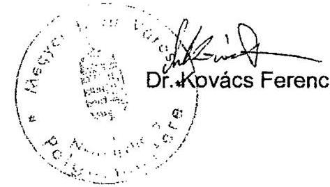

---

# Dr. Kovács Ferenc úr 

polgármester
Nyíregyháza Megyei Jogú Város Önkormányzata
Nyíregyháza

## Tisztelt Polgármester Úr!

Köszönettel vettem Nyíregyháza Megyei Jogú Város Önkormányzata pénzügyi helyzetének ellenőrzéséről készített jelentés-tervezethez küldött észrevételeit. Az Ön által tett észrevételeket megvizsgáltuk, álláspontunkról az alábbiakban tájékoztatom.

A jelentés-tervezet összegző megállapításainak tartalmát érintő - kötelezettségek állományának 2006. év és a 2010. év közötti változását befolyásoló kötvények árfolyamváltozásának hatását módosító - észrevételét elfogadtam, a jelentés tartalmát ennek megfelelően módosítottam.

A likvidhitel kezelésére és elszámolására vonatkozó ÁSZ által tett megállapítást - miszerint az Önkormányzat folyószámlahitel kezelése nem felelt meg az Ötv. 88. § (3) bekezdésében foglalt előírásnak - továbbra is fenntartom az alábbi indokok és jogszabályi rendelkezések alapján:

- Az Önkormányzat a folyószámlahitel keretből kiadások teljesítésére felhasznált összeget nem hitelfelvételként számolta el, emiatt a költségvetési számla napi egyenlege mínusz előjelű lett, tehát az Áhsz. 9. számú melléklet 3. b. pontjának előírása alapján az igénybevett folyószámlahitelt likvidhitelként kezelte.
- Az Ötv. 88. § (3) bekezdés d) pontjának rendelkezése szerint a likvid hitel az éven belül felvett és visszafizetett, a közszolgáltatási feladatok folyamatos müködtetéséhez felvett hitel.

Az Önkormányzat az ellenőrzött időszak minden napján folyószámlahitellel rendelkezett, ezért annak likvidhitelként való elszámolása nem felelt meg az Áhsz. 9. számú melléklet számlaosztályok tartalmára vonatkozó előírás 3. b. pontjában foglalt célnak, mely szerint likvidhitelt a költségvetési szerv a bevételek ütemkülönbségének és a kiadások ütemkülönbségének eltérése miatt vesz fel. Likvidhitelként való elszámolása nem felelt meg továbbá az Ötv. 88. § (3) bekezdés d) pontjában foglaltaknak, mely meghatározta, hogy a likvidhitel: az „éven belül felvett és visszafizetett" hitel. Az Önkormányzat a 2007-2010. költségvetési évek minden egyes napján rendelkezett folyószámla hitellel, az éven belül nem került visszafizetésre, ezért a hitel nem a bevételek és kiadások ütemkülönbségéből jelentkező

---

finanszírozási problémák áthidalását, hanem tartós költségvetési hiány finanszírozását szolgálta. A likvidhitel számviteli elszámolásának, illetve költségvetési beszámolóban való elszámolásának helyességét nem vitattuk, azonban a tartós hiány finanszírozását szolgáló hitel likvid hitelként való elszámolását továbbra sem tartjuk megfelelőnek.

Köszönöm Polgármester úrnak és munkatársainak az ellenőrzés során tanúsított hozzáállását, amellyel az Önkormányzatról készített pénzügyi helyzetelemzés elkészítését segítették.

Budapest, 2011. december " 22.".
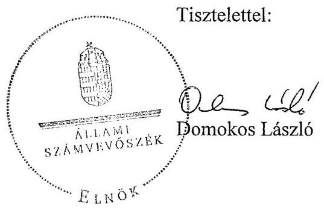

---

.

---

.