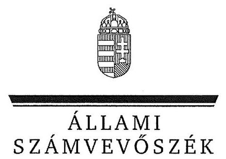

ÁLLAMI
SZÁMVEVŐSZÉK

# JELENTÉS 

Kaposvár Megyei Jogú Város Önkormányzata pénzügyi helyzetének ellenőrzéséről (43/3)

---

# Számvevői Iroda 

Iktatószám: V-3039-08/2011.
Témaszám: 1015
Vizsgálat-azonosító szám: V056038

## Az ellenőrzést felügyelte:

Dr. Varga Sándor
számvevő igazgató-helyettes

## Az ellenőrzést vezette:

Renkó Zsuzsanna
számvevő tanácsos
Az ellenőrzést végezték:
Dr. Hegedűs György Gelencsér Zoltán Bíró Zsolt
számvevő tanácsos számvevő tanácsos számvevő tanácsos

A témához kapcsolódó eddig készített számvevőszéki jelentés:
címe
sorszáma
Jelentés a Kaposvár Megyei Jogú Város Önkormányzata gazdálkodási rendszerének 2010. évi ellenőrzéséről 1026

---

# TARTALOMJEGYZÉK 

BEVEZETÉS ..... 5
I. ÖSSZEGZŐ MEGÁLLAPÍTÁSOK, KÖVETKEZTETÉSEK, JAVASLATOK ..... 16
II. RÉSZLETES MEGÁLLAPÍTÁSOK ..... 26

1. Az Önkormányzat kötelező és önként vállalt feladatai ..... 26
2. Pénzügyi egyensúlyi helyzet alakulása ..... 32
2.1. A működési és felhalmozási egyensúly alakulása ..... 32
2.2. Az Önkormányzat bevételeinek alakulása ..... 39
2.3. Az Önkormányzat kiadásainak alakulása ..... 43
3. Kötelezettségek bemutatása ..... 49
3.1. A pénzintézetek felé fennálló kötelezettségek alakulása ..... 49
3.2. Szállítók felé kötelezettségek alakulása ..... 56
3.3. Egyéb kötelezettségek alakulása ..... 56
4. A pénzügyi egyensúly megteremtése érdekében hozott intézkedések ..... 62
5. A helyi önkormányzatok gazdálkodási rendszerének 2010. évi ellenőrzése során a pénzügyi egyensúly javítására tett szabályszerűségi és célszerűségi javaslatok hasznosulása ..... 67

---

# MELLÉKLETEK 

1. számú A működési és felhalmozási célú hiány/többlet alakulása az Önkormányzat rendeleteiben
2. számú Az Önkormányzat bevételeinek és kiadásainak, adósságszolgálatának alakulásáról
3. számú Az Önkormányzat 2007-2010 években megvalósított, 2010. december 31-ig befejezett fejlesztések forrásösszetételéről
4. számú az Önkormányzat 2010. december 31-én folyamatban lévő fejlesztési feladataihoz kapcsolódó kötelezettségeinek összegzéséről
5. számú Az Önkormányzat 2010. december 31-én folyamatban lévő fejlesztési feladataihoz kapcsolódó 2010. évet követő kötelezettség-vállalásainak összegzéséről
6. számú Az Önkormányzat beadott, elbírálás alatti pályázati forrásból megvalósuló fejlesztéseihez kapcsolódó kötelezettség-vállalásainak összegzéséről
7. számú Az Önkormányzati feladatok ellátásában részt vevő gazdasági társaságokról
8. számú Kaposvár Megyei Jogú Város Önkormányzat Polgármesterének észrevétele
9. számú Kaposvár Megyei Jogú Város Önkormányzat Polgármesterének észrevételére adott válasz

---

# RÖVIDÍTÉSEK JEGYZÉKE 

## Törvények

Áht.
ÁSZ tv.

Csődtv.
Gt.
Htv.

Ötv.
Szoctv.

## Szórövidítések

áfa
APEH
NAV
ÁSZ
BM
EDP hiány/egyenleg

EU
főjegyző
GDP
GESZ
Hivatásos tűzoltóság
Holding Zrt.
Kapos TV
KAVÍZ Kft.
Kodály Iskola
Közgyűlés
Közlekedési középiskola
KSH
KVG Zrt.
Műszaki középiskola
NGM
OEP
Önkormányzat
polgármester
az államháztartásról szóló 1992. évi XXXVIII. törvény az Állami Számvevőszékről szóló 1989. évi XXXVIII. törvény (2011. július 1-jétől az Állami Számvevőszékről szóló 2011. LXVI. törvény)
a csődeljárásról és a felszámolási eljárásról szóló 1991. évi XLIX. törvény
a gazdasági társaságokról szóló 2006. évi IV. törvény
a helyi önkormányzatok és szerveik, a köztársasági megbízottak, valamint egyes centrális alárendeltségű szervek feladat- és hatásköreiről szóló 1991. évi XX. törvény
a helyi önkormányzatokról szóló 1990. évi LXV. törvény
a szociális igazgatásról és szociális ellátásokról szóló 1993. évi III. törvény
általános forgalmi adó
Adó- és Pénzügyi Ellenőrzési Hivatal
Nemzeti Adó és Vámhivatal
Állami Számvevőszék
Belügyminisztérium
Uniós módszertan szerinti maastrichti kritériumoknak megfelelő számítás szerinti hiány/egyenleg
Európai Unió
Kaposvár Megyei Jogú Város Önkormányzatának címzetes főjegyzője
bruttó hazai termék
Gazdasági Ellátó Szervezet
Kaposvár Megyei Jogú Város Önkormányzata Hivatásos Tűzoltósága
Kaposvári Közszolgáltató Holding Zrt.
Kapos TV és Rádió Szolgáltató Közhasznú Nonprofit Kft.
Kaposvári Víz és Csatornamű Kft.
Kaposvári Kodály Zoltán Központi Általános Iskola
Kaposvár Megyei Jogú Város Közgyűlése
Rippl-Rónai József Közlekedési Szakközépiskola
Központi Statisztikai Hivatal
Kaposvári Városgazdálkodási Zrt.
Műszaki középiskola
Nemzetgazdasági Minisztérium
Országos Egészségbiztosítási Pénztár
Kaposvár Megyei Jogú Város Önkormányzata
Kaposvár Megyei Jogú Város Önkormányzat polgármestere

---

| Polgármesteri hivatal | Kaposvár Megyei Jogú Város Önkormányzat Polgármesteri Hivatala |
| :--: | :--: |
| PPP konstrukció | Public Private Partnership (Partnerségi együttműködés közfeladatok ellátására a magánszektor bevonásával) |
| Színház | Csiky Gergely Színház Közhasznú Nonprofit Kft. |
| szja | személyi jövedelemadó |
| Hulladékgazdálkodási társulás | Kaposmenti Hulladékgazdálkodási Önkormányzati Társulás |
| Temetkezési Kft. | Somogy Megyei Temetkezési és Szolgáltató Kft. |
| TISZK | Kaposvár-TISZK Térségi Integrált Szakképző Központ Kiemelkedően Közhasznú Nonprofit Kft. |
| Tömegközlekedési Zrt | Kaposvári Tömegközlekedési Zrt. |
| Vagyonkezelő Zrt. | Vagyonkezelő és Szolgáltató Zrt. |
| Városfejlesztési Kft. | Kaposvári Városfejlesztési Kft. |

---

# JELENTÉS 

## Kaposvár Megyei Jogú Város Önkormányzata pénzügyi helyzetének ellenőrzéséről

## BEVEZETÉS

Az Állami Számvevőszék 2011. évtől érvényes stratégiája új irányt szabott a helyi önkormányzatok gazdálkodásának ellenőrzésében is. Az ÁSZ – küldetése és jövőképe szerint – szilárd szakmai alapokra támaszkodva értékteremtő ellenőrzéseivel és helyzetelemzéseivel az államháztartás egészében, így a helyi önkormányzati alrendszerben is elő kívánja segíteni a közpénzek és a közvagyon szabályos, gazdaságos, hatékony és eredményes hasznosítását. Ennek részeként – a 2010. évi államháztartási hiány alakulásának összetevőire is figyelemmel – folyamatban van az önkormányzati alrendszer pénzügyi helyzetelemzése.

Az NGM 2011. áprilisában közzétett adatai szerint ${ }^{1}$ a 2010. évi 1036,2 milliárd Ft összegű 3,8%-os EDP (maastrichti kritériumok szerinti, Túlzott Hiány Eljárás keretében kimutatott) hiánycél nem volt tartható, az önkormányzati alrendszer tervezettet meghaladó hiánya miatt a GDP arányában kifejezett államháztartási hiány 4,2%-ra emelkedett.

Az önkormányzatok 2010. első három negyedévi költségvetési jelentése szerinti pénzforgalmi hiány 97 milliárd Ft-os összege nem indokolta az önkormányzati alrendszer 190 milliárd Ft-ra becsült hiányának 2010. évi végi felülvizsgálatát. A helyi önkormányzatok 2011. januári gyorsjelentése alapján a pénzforgalmi hiány már 247,7 milliárd Ft-ot tett ki. Az alrendszer hiánya így a tervezett 0,7%-kal szemben magasabb, 0,9%-os szinten realizálódott. Az 57,7 milliárd Ft hiánytöbblet alakulásában – a Tájékoztató szerint – az iparűzési adó elmaradása, a gépjárműadó, az illetékek és más bevételek tervezettnél alacsonyabb összegben való teljesülése volt a meghatározó.

Magyarország a Széll Kálmán Terv célkitűzései alapján ${ }^{2}$ aktualizált Konvergencia Programjában a középtávú (2011-2015. évek) költségvetési pálya kijelölése során 2011-re a kormányzati szektor EDP módszertan szerinti egyenlegét +2%-

[^0]
[^0]:    ${ }^{1}$ NGM Tájékoztatás Magyarország Strukturális Reformprogramjának végrehajtásáról (2011. április 1.). A Tájékoztató évente két alkalommal – április és október hónapban – jelenik meg.
    ${ }^{2}$ Az államháztartás 2011. évi egyenlege – a magán nyugdíjpénztárakból az állami nyugdíjpillérbe való visszatérés egyszeri vagyonhatása következtében – 4%-os többletet mutatna. A Széll Kálmán Tervben foglalt egyszeri intézkedések – a MÁV, a BKV adósságrendezése, a PPP projektek kiváltása – összességében a GDP 2%-ával csökkentik a várható többlet mértékét.

---

ban jelölte meg. Az egyenlegcél megfogalmazásakor az önkormányzati alrendszer tervezett hiányát a 2011. évi költségvetésben szereplő 0,3%-kal szemben 0,5%-os arányban határozták meg ${ }^{3}$. A hiánycélok meghatározása jelzi, hogy az önkormányzati alrendszerben 2011-ben fokozott figyelmet kell fordítani a pénzügyi egyensúlyi helyzet alakulására.

Az államháztartás helyi szintjén a 23 megyei jogú városi önkormányzatnak az általuk ellátott közszolgáltatások volumenére való tekintettel kiemelt szerepe van, e települések népessége összességében meghaladja a kétmillió főt ${ }^{4}$. A települések népességét az alábbi diagram szemlélteti:
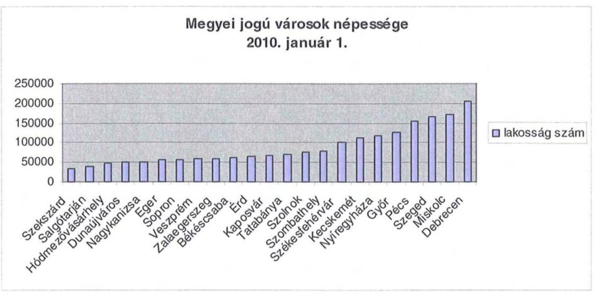

A megyei jogú városi önkormányzatok ${ }^{5}$ kötelező feladatellátását többlépcsős törvényi előírások határozzák meg. A feladatokra vonatkozó szabályozás első szintjét az Ötv. ${ }^{6}$, a második szintet a hatásköri ${ }^{7}$, a harmadik szintet a további ágazati, szakmai (egyebek mellett az oktatási, egészségügyi, szociális és egyéb ágazati feladatok ellátásának szakmai szabályait rögzítő) törvények adják.

A megyei jogú városi önkormányzatok – az Ötv-ből közvetlenül levezethető települési feladatok mellett – körzeti közszolgáltatásokat is ellátnak. A megyei

[^0]
[^0]:    ${ }^{3}$ A Magyar Köztársaság 2011. évi költségvetéséről szóló 2010. évi CLXIX. törvény Általános indoklásának III. fejezete, valamint Magyarország Konvergencia Programja 2011-2015. (2011. április) Táblázatok rész, 2. táblázat Államháztartás összefoglaló adatai szerint.
    ${ }^{4}$ A megyei jogú városok népességét a 4/2011. (I. 31.) NGM rendelet 1. sz. mellékletében foglalt 2010. január 1-i adatok alapján vettük figyelembe.
    ${ }^{5}$ Az Ötv. 61. § (1) bekezdése alapján a megyeszékhely város a törvény erejénél fogva megyei jogú, ugyanakkor az Országgyűlés az ötvenezernél nagyobb népességű városokat a képviselőtestület kérelmére megyei jogú várossá nyilváníthatja. Ez utóbbi körbe 5 város tartozik, közülük 2 (Hódmezővásárhely, Dunaújváros) népessége 2010. január 1-ére már ötvenezer fő alá csökkent.
    ${ }^{6}$ az Ötv. 8. és 61. §-ában foglaltak szerint
    ${ }^{7}$ a Htv.

---

jogú városi cím elsősorban többlet kötelezettségekkel jár, a megyei jogú városnak önmagának kell gondoskodnia mindazokról a feladatokról, amelyek más települési önkormányzatok esetében a megyei önkormányzat feladatát képezik. Ide sorolható többek közt a középfokú oktatási intézmények fenntartása, a közművelődési, könyvtári és levéltári szolgáltatás, a társadalombiztosítás finanszírozása mellett a kórházi és a rendelőintézeti szakellátás, a szociális és egyes gyermekvédelmi feladatok ellátása. Ezeket a feladatokat (intézményeket) a megyei jogú város – más városoktól eltérően – nem adhatja át a megyei önkormányzatnak, azonban az Ötv. lehetőséget biztosít arra, hogy a megyei önkormányzattal megállapodjék a feladatellátás megosztásában.

Az önkormányzat, így a megyei jogú város is, maga határozza meg, hogy – a lakosság igényei alapján, anyagi lehetőségei függvényében – mely feladatokat, milyen mértékben és módon, mely szervezeti keretek közt lát el. A szervezetalakítás szabadsága a megyei jogú városok esetében azzal járt, hogy mind a kötelező közszolgáltatásoknál (különösen a településüzemeltetés, vagyongazdálkodás), mind pedig az önként vállalt feladataik ellátásában – elsősorban a sport és kulturális szolgáltatások területein – a gazdasági társaságok kiemelt fontosságú szerephez jutottak. Ily módon a gazdálkodás, a pénzügyi helyzet kockázatai közvetlenül kikerültek ugyan az önkormányzati alrendszerből, azonban sérülhet az ellátási felelősség figyelemmel kísérése és érvényesítése, a közpénzek felhasználásának transzparenciája. Mindezek együttvéve – a beszámolók konszolidálásának hiányában – növelik a megyei jogú városok pénzügyi helyzetének megítélésében rejlő kockázatokat.

Az áttekintett időszakban az önkormányzati feladatok ellátásának keretet biztosító forrásszabályozás elvei lényegesen nem változtak.

A megyei jogú városok önkormányzatainak mozgásterét, az önkormányzatok feladatellátásra vonatkozó döntéseit a központi költségvetéstől való függőség mellett jelentősen befolyásolja a helyi adókivetési jog gyakorlása ${ }^{8}$. A helyi adók rendszere a közszolgáltatások finanszírozásához szükséges források megteremtésének, bővítésének eszköze, amely a gazdasági válság, a jogszabályi környezet, az adópolitika változása, az adóhatóságok tevékenysége következtében differenciáltan érinti a települési önkormányzatokat ${ }^{9}$.

A települési önkormányzatok saját folyó bevételeik keretében elszámolt, különböző jogcímeken kivetett helyi adók – iparűzési adó, építmény- és telekadó, idegenforgalmi adó, vállalkozók és magánszemélyek kommunális adója – 2007-2010 között eltérő módon emelkedtek. A helyi adókból származó bevételek realizált összege országos szinten 2007-2009 között folyamatosan, 505,3 milliárd Ft-ról 566,3 milliárd Ft-ra emelkedett, majd a gazdasági válság hatásai következtében 2010-re 542,6 milliárd Ft-ra esett vissza. A helyi adók részesedése

[^0]
[^0]:    ${ }^{8}$ a helyi adókról szóló 1990. évi C. törvény szabályai szerint
    ${ }^{9}$ Az Állami Számvevőszék 2010. decemberében közzétett 1031. számú jelentésében értékelte a helyi adók rendszerében a hatékonyság és az eredményesség érvényesülését.

---

az önkormányzatok saját folyó bevételein belül 2007-2010 között 2,5 százalékponttal csökkent ${ }^{10}$.

A megyei jogú városok saját folyó bevétele 2007-ben 191,5 milliárd Ft volt, 2008-ban 223,1, 2009-ben 225,4, 2010-ben 223,5 milliárd Ft-ot tett ki. A helyi adóbevételekből való részesedésük 2007-ben 110,5 milliárd Ft (21,9%), 2008-ban 128,3 milliárd Ft (23,2%), 2009-ben 124,4 milliárd Ft (22%), 2010-ben 118,7 milliárd Ft (részaránya a 2007. évivel azonosan 21,9%) volt.

 E realizált adóbevételek a megyei jogú városok saját folyó bevételeinek 2007-ben 57,7, 2008-ban 57,5, 2009-ben 55,2, 2010-ben 53,1%-át jelentették. A helyi adóbevételek 2007-ről 2010-re kimutatott 4,6 százalékpontos csökkenése annak ellenére következett be, hogy a megyei jogú városok saját folyó bevétele 2010-ben 16,7%-kal haladta meg a 2007. évit.

A helyi adókon belül a települések gazdasági helyzetének egyik fokmérője az elért helyi iparűzési adóbevétel, amely a megyei jogú városok körében erőteljes - a település nagyságrendtől is függő ${ }^{11}$ - különbségeket mutat. A helyi iparűzési adóbevétel és annak egy lakosra vetített összegének 2007. és 2010. évi alakulását az alábbi diagramok szemléltetik:
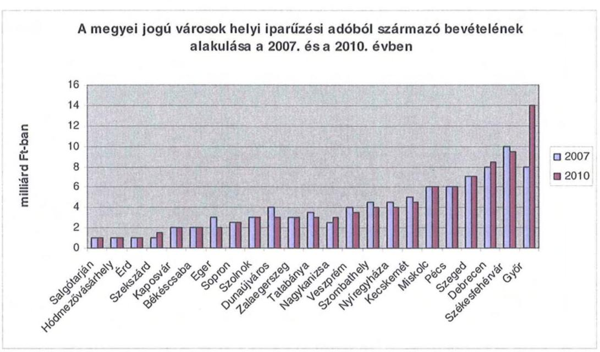

[^0]
[^0]:    ${ }^{10}$ A helyi adó bevételek saját folyó bevételekből való részesedése országosan 2007-ben 55,3%, 2010-ben 52,8% volt.
    ${ }^{11}$ A 100 ezer fő feletti népességű megyei jogú városok csoportjába Debrecen, Miskolc, Szeged, Pécs, Győr, Nyíregyháza, Kecskemét, Székesfehérvár tartozik. Nem megyeszékhely megyei jogú város Érd, Sopron, Nagykanizsa, Dunaújváros, Hódmezővásárhely.

---

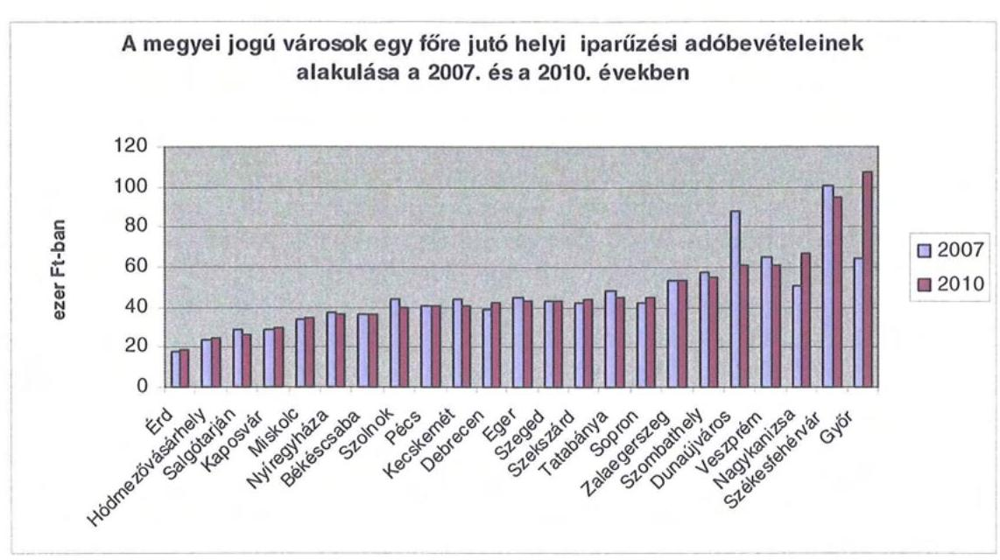

A megyei jogú városi önkormányzatok saját bevételein belül második legjelentősebb elem az illetékbevétel. A 2010. évben befolyt 39,2 milliárd Ft illetékbevétel a 2006. évben realizált 71,1 milliárd Ft illetékbevétel alig több mint 55%-a. A jelentős visszaesést döntően az ingatlanpiac stagnálása, majd visszaesése, illetve egyes illetékkedvezmények bevezetése okozta. A kieső bevételek pótlására az önkormányzati alrendszer szintjén történtek intézkedések, 2010-ben 5 milliárd Ft-ot, 2011-ben 1,2 milliárd Ft-ot ellentételezett a központi költségvetés. A megyei jogú városok önkormányzatai az önkormányzati alrendszer szintjén realizált illetékbevételből 2007-ben 13,6 milliárd Ft-tal (23,3%-kal), 2008-ban 15,3 milliárd Ft-tal (22,7%-kal), 2009-ben 12,6 milliárd Ft-tal (21,5%-kal), 2010-ben 7,9 milliárd Ft-tal (20,2%-kal) részesedtek ${ }^{12}$. Az összes befolyt illetékbevételből a megyei jogú városok részesedése 2009-ről 2010-re mindössze 1,3 százalékponttal csökkent, ugyanakkor a realizált illetékbevétel csökkenése a 37,3%-ot (4,7 milliárd Ft) is elérte.

Az önkormányzati alrendszer átengedett bevételei közül a személyi jövedelemadóból való részesedés makroszintű szabályozása a vizsgált időszakban nem változott. A települési önkormányzatokat a településre kimutatott személyi jövedelemadó 8%-a közvetlenül, míg 32%-a külön szabályozott visszaosztási rendben illeti meg. A visszaosztás a jövedelem differenciálódás mérséklésével párosul, rendje a lakóhelyen maradó személyi jövedelemadóhoz és az iparűzési adó-erőképességhez ${ }^{13}$ igazodik, annak részletszabályait a mindenkori költségvetési törvény 4. számú melléklete határozza meg. A jövedelemdifferenciálódás

[^0]
[^0]:    ${ }^{12}$ Az illetékek kivetésének és beszedésének joga 2006. december 31-ig a megyei önkormányzatok feladata volt, amelyet a 2007. évtől az APEH (2011. január 1-jétől NAV) vett át. Az önkormányzati illetékrészesedési szabályok változatlanok maradtak, azonban az illetékbeszedés költségeit az önkormányzatok illetékbevételeiből átlagos (a megyei jogú városoknál 8,5%-os) kulcsot alkalmazva vonták le.
    ${ }^{13}$ Az iparűzési adóerő-képesség egy potenciális, átlagos erőfeszítés mellett elérhető (a települési önkormányzat iparűzési adóelőlegét meghatározó adóalap 1,4%-ának megfelelő számított) bevétel.

---

szabályai kétirányúak, a kiegészítés és a visszatartás feltételeit egyaránt meghatározták:

- Amennyiben az önkormányzatot közvetlenül megillető személyi jövedelemadó bevétel és a számított iparűzési adóerő-képesség együttesen számított, egy főre jutó összege nem érte el a település méretéhez kapcsolódóan az évenkénti szabályozás szerinti változó összeget, a költségvetés a részesedést település nagyság szerint eltérően meghatározott szintig kiegészítette ${ }^{14}$. A kiegészítés fajlagos összege 2007-2010 között 37500 Ft-ról 48010 Ft-ra (10 510 Ft-tal, 28%-kal) emelkedett. Az előzőeken túl a jövedelem differenciálódás szabályozása egyes térségi (középiskolai, szakiskolai, szakképző intézményi, kollégiumi) feladatok ellátásának függvényében további kiegészítő hozzájárulást biztosított.
- Amennyiben az egy főre számított személyi jövedelemadó és az iparűzési adóerő-képesség együttes összege a település nagyságrendjéhez rendelt értékhatárt több mint 25%-kal (2010-től 20%-kal) meghaladta, az egy főre jutó összeg sávonként differenciált módon ${ }^{15}$ visszavonásra került az önkormányzatot megillető normatív állami hozzájárulás összegéből.

Az önkormányzatok személyi jövedelemadó bevétele 2007-ben 494,3 milliárd Ft, 2008-ban 558,6 milliárd Ft, 2009-ben 639,5 milliárd Ft, 2010-ben 681,2 milliárd Ft volt, az időszak alatt összegében 186,9 milliárd Ft-tal, 37,8%-kal emelkedett, miközben az szja bevétel átengedett bevételeken belüli részesedése 1,8 százalékponttal emelkedett.

A megyei jogú városok önkormányzatainak személyi jövedelemadó részesedése az alrendszer átengedett személyi jövedelemadó bevételeiből 2007-ben 77,6 milliárd Ft-ot (15,7%-ot), 2008-ban 105,4 milliárd Ft-ot (18,9%-ot), 2009-ben 122,9 milliárd Ft-ot (19,2%-ot), 2010-ben 136,6 milliárd Ft-ot (20,1%-ot) tett ki. A realizált szja bevétel a megyei jogú városoknál az időszak alatt folyamatosan emelkedett, a 2010-ben realizált adóbevétel 59,0 milliárd Ft-tal (76%) volt magasabb a 2007. évinél, az átengedett bevételeken belüli részesedése 2010-re 5,1 százalékponttal haladta meg a 2007. évi részarányt ${ }^{16}$. A részesedés alapjául szolgáló szja településenként eltérő, az egy adózóra jutó szja 2009. évi adatait ${ }^{17}$ a következő ábra szemlélteti.

[^0]
[^0]:    ${ }^{14}$ A megyei jogú városok esetében a jövedelemkülönbségek mérséklésénél figyelembe veendő lakosonkénti értékhatár 2007-ben 37500 Ft, 2008-ban 42385 Ft, 2009-ben 45933 Ft, 2010-ben 48010 Ft volt.
    ${ }^{15}$ A sávos értékhatár 2010-től 20%-os intervallumonként, 120% felett a visszatartást 25%-tól 90%-os mértékig rögzíti. Amennyiben a település nagyságrendhez rendelt értékhatár összege az önkormányzatnál eléri vagy meghaladja a 200%-ot, az egy főre jutó összeg 90%-a levonásra kerül. Az értékhatár sávjai 2010 előtt 25%-os léptékűek voltak, a levonási arányok az ellenőrzött időszakban nem változtak.
    ${ }^{16}$ E bevételek a megyei jogú városok átengedett bevételeiben 2007-ben 84,7, 2008-ban 87,7, 2009-ben 89,7, 2010-ben 89,8%-os részarányt jelentettek.
    ${ }^{17}$ Adatforrás: KSH Megyei Jogú Városok a Közép Dunántúlon 2009. kiadványa, 4.1.sz. összehasonlító tábla.

---

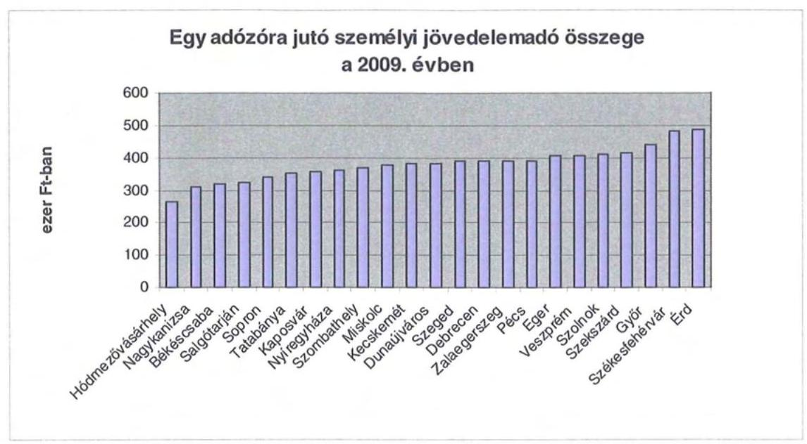

Az átengedett bevételek második legjelentősebb eleme a gépjárműadó, amelynek bevételi szabályozása az ellenőrzött időszakban nem változott, az adóbevétel teljes összege az önkormányzatot illeti meg. A gépjárműadó alapját, mértékét ${ }^{18}$ és egyes mentességi kategóriákat érintő módosítások 2010. január 1-től következtek be, amelyek az egyes adótételek esetében átlagosan 15%-os emelkedéssel jártak.

A gépjárműadó beszedéséből származó bevétel az önkormányzati alrendszer szintjén 2007-ben 62,4 milliárd Ft, 2008-ban 65,7 milliárd Ft, 2009-ben 63,8 milliárd Ft, 2010-ben 71,1 milliárd Ft volt, az adóbevétel egésze 2007-hez képest 8,7 milliárd Ft-tal, 13,9%-kal emelkedett. A gépjármű-adóztatás szabályainak változása 2010-ben 7,3 milliárd Ft többletet eredményezett. A megyei jogú városok gépjárműadó bevétele a 2007. évi 14,0 milliárd Ft-ról 2010-re 15,5 milliárd Ft-ra, 10,7%-kal emelkedett. A bevételnövekedés összegéből 1,4 milliárd Ft a 2010. évi adózási szabályok következménye.

A megyei jogú városok önkormányzatai 2007-2010 között rendelkezésre álló forrásainak alakulását a következő ábra szemlélteti:

[^0]
[^0]:    ${ }^{18}$ A gépjárműadóról szóló 1991. évi LXXXII. törvény 7. § (1) bekezdésében foglalt adómértékek változása.

---

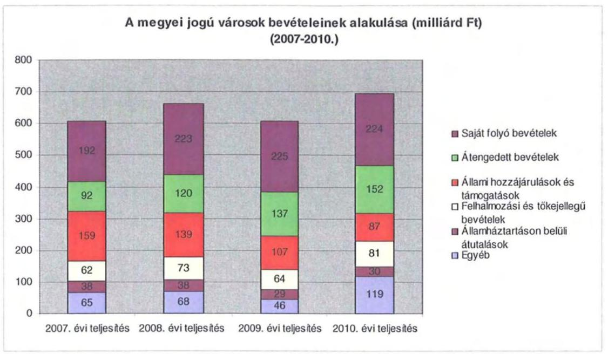

A megyei jogú városok saját folyó bevételeinek - amelyek főbb elemei: a helyi adók, az illetékbevételek, az intézményi térítési díjak, a kamatbevételek részaránya a 2007. évi összbevételen (608 milliárd Ft) belül 32% volt. A 2010. évi összbevétel 693 milliárd Ft-os összegéből a saját folyó bevételek aránya - miközben összege 2007-ről 2010-re 32 milliárd Ft-tal emelkedett - nem változott.

Az átengedett bevételek, amelyek a megyei jogú városok önkormányzatainál döntően a személyi jövedelemadó és a gépjárműadó részesedést jelenti, az összbevételen belül a 2007. évi 92 milliárd Ft-ról (15%) 152 milliárd Ft-ra nőtt, részesedése 7 százalékponttal emelkedett. A 60 milliárd Ft-os növekedésből 59 milliárd Ft-ot az szja részesedés emelkedése okozott.

Az állami hozzájárulások és támogatások - amelyek főbb elemei: főként az ellátotti létszámhoz kötődő normatív állami hozzájárulások, központosított előirányzatok - a 2007. évi 159 milliárd Ft-ról (26%-os részarányról) 2010-re 87 milliárd Ft-ra (13%-os részarányra) estek vissza.

A felhalmozási és tőkejellegű bevételek - tárgyi eszközök (ingatlanok és ingóságok), föld és immateriális javak, részesedések értékesítése, EU-tól átvett pénzeszközök - a 2007. évi 62 milliárd Ft-ról (10%-os részarányról) 2010-re 81 milliárd Ft-ra (12%-os részarányra) emelkedtek.

Az államháztartáson belüli átutalások részesedése 2007-ben 38 milliárd Ft volt. 2010. év végére 8 milliárd Ft-tal csökkent, részaránya 6%-ról 2010-ben 4%-ra változott. Ez a bevételi kategória tartalmazza az Egészségbiztosítási Alaptól és más elkülönített állami pénzalapoktól átvett forrásokat. A 2010-ben e címen elszámolt bevétel a megyei jogú városoknál 22 milliárd Ft-ot tett ki.

Az egyéb, pénzmaradványból, vállalkozási bevételekből, államháztartáson kívülről származó átutalásokból, a hitelekből, a hosszú és rövid lejáratú értékpapírok értékesítéséből származó bevételek részesedése a 2007-2010. évek viszonylatában 11%-ról 17%-ra emelkedett. Ez utóbbiak 2010. évi beszámoló szerinti összevont teljesítése 119 milliárd Ft volt ${ }^{19}$.

Mindezeket figyelembe véve a megyei jogú városok 2007. és 2010. évi forrásöszszetételének megoszlását az alábbi ábra szemlélteti:

A megyei jogú városok 2007. és 2010. évi forrásösszetétele
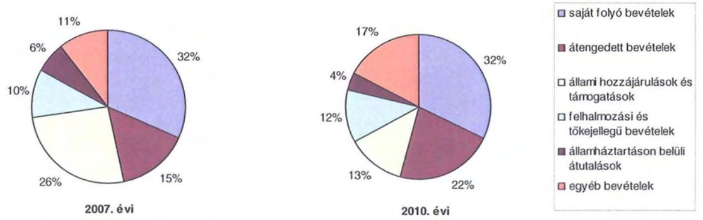

Az önkormányzati alrendszer pénzügyi helyzetértékelése során új elemzési módszereket alkalmaz az ellenőrzés. A hagyományos költségvetési szerkezet helyett az önkormányzat pénzügyi helyzetét a CLF módszerrel mutatjuk be, amelynek lényegét és számításának módszerét a 2.1. pontban, és a jelentés 2. számú mellékletében ismertetjük részletesen.

Az új módszereken alapuló helyzetértékelés fontosságát az adja, hogy a helyi önkormányzatok bruttó adósságállománya ${ }^{20}$ a 2010. évi költségvetési beszámoló alapján 1248 milliárd Ft-ot tett ki. Az adósságállomány koncentráltságát jelzi ${ }^{21}$, hogy ebből a 23 megyei jogú város részesedése 338 milliárd Ft volt, amely a fővárosi és kerületi önkormányzatok adósságának figyelmen kívül hagyásával számított 2010. évi 977 milliárd Ft összegű bruttó adósságállomány 34,6%-át jelentette. Az adósságállomány több mint fele - 501 milliárd Ft - a 19 megyei önkormányzatnál és a 23 megyei jogú városnál jelentkezett.

[^0]
[^0]:    ${ }^{19}$ Az egyéb bevételek összege 2007-2010 között eltérő módon változott, 2007-ben 65 milliárd Ft, 2008-ban 68 milliárd Ft volt, 2009-ben 46 milliárd Ft-ra esett vissza, majd 2010-ben több mint két és félszeresére, 119 milliárd Ft-ra emelkedett.
    ${ }^{20}$ A bruttó adósságállomány 2010. év végi összege magában foglalja a fejlesztési és a működési célú kötvénykibocsátások, a beruházási és fejlesztési hitelek, a működési célú hosszú lejáratú hitelek, a rövid lejáratú hitelek, váltótartozások miatti kötelezettségek teljes (2011-ben, illetve az azt követő években esedékes) állományát.
    ${ }^{21}$ A megyei jogú városok adósságállománya összegében ugyan elmarad az egyéb városok összesített adósságától [(ez utóbbiak részesedése 382,6 milliárd Ft (39,2%)], azonban az egyéb városok száma 304. A fővárosi és a kerületi önkormányzatok nélküli adósságállományból a 19 megyei önkormányzat 163 milliárd Ft-tal (16,8%-kal), míg a nagyközségek, községek együttesen 93 milliárd Ft-tal (9,5%-kal) részesednek.

---

A megyei jogú városok 338 milliárd Ft-os adósságállományából 175 milliárd Ft (51,8%) a 8 legnagyobb, 100 ezer fő feletti népességű város
 tartozása. Az 5 nem megyeszékhely megyei jogú város bruttó adósságállománya 70 milliárd Ft-ot (20,7%-ot), az előző két csoportba nem tartozó további 10 megyei jogú város adóssága 93 milliárd Ft-ot (27,5%-ot) tett ki.
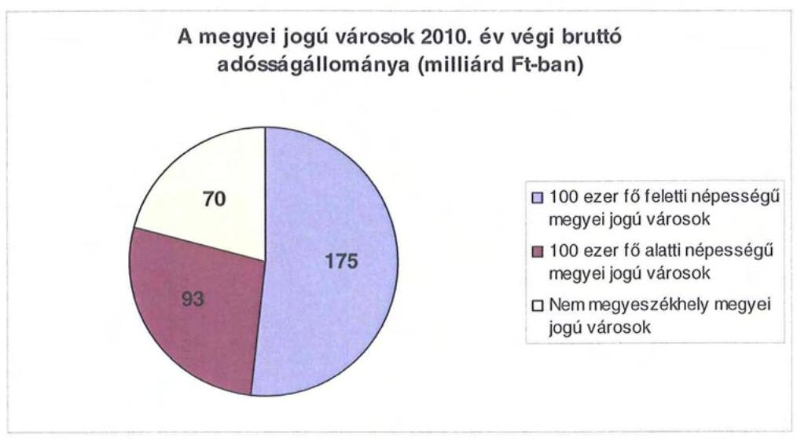

A mérlegben kimutatott bruttó adósságállomány mellett az önkormányzatok számára az eszközállomány műszaki állapotának megőrzése is kötelezettségekkel jár. Az elhasználódott eszközök pótlására forrást biztosító amortizációs (felújítási) alap képzésének $^{22}$ elmaradása maga után vonhatja a feladatellátást kiszolgáló tárgyi eszközök állagának erőteljes romlását. Emellett a 2007-2013-as időszakra meghirdetett, vissza nem térítendő EU-s fejlesztési forrásokhoz való hozzájutás lehetősége felerősítette az önkormányzati alrendszer fejlesztési igényeit, amelyek a felhalmozási költségvetési hiány folyamatos emelkedésén túl - az előírt jövőbeni fenntartási kötelezettség miatt - tovább terhelhetik az önkormányzatok költségvetését $^{23}$.

Az ÁSZ a 2011. évi ellenőrzési tervében 43. számú, az Önkormányzatok gazdálkodási rendszerének ellenőrzése részeként egy időben, egymással párhuzamosan tekinti át, és elemzi a 23 megyei jogú városi önkormányzat pénzügyi helyzetét. A gazdálkodás szabályszerűségét az ÁSZ az előző évek során ebben az önkormányzati körben is ellenőrizte, ezért jelen vizsgálatunk erre nem tér ki. A jelentés a megyei jogú városok sajátos feladatellátási és forrásszabályozási helyzetére tekintettel az önkormányzatok pénzügyi helyzetét, illetve az ezzel összefüggő korábbi ÁSZ javaslatok megvalósítását mutatja be.

Az ellenőrzés a 2007. január 1. - 2010. december 31. közötti időszakot öleli fel.
A vizsgálat jogszabályi alapját az Állami Számvevőszékről $^{24}$ szóló 1989. évi XXXVIII. törvény 2. § (3), (5), (6) és (9) bekezdései, az Ötv. 92. § (1) bekezdése, az Áht. 104. § (3), és 120/A. § (1) bekezdése előírásai képezik.

[^0]
[^0]:    $^{22}$ Erre a jelenlegi szabályozási környezetben nem kötelezi semmilyen előírás az önkormányzatokat.
    $^{23}$ Az Állami Számvevőszék 2011 júniusában közzétett 1108. számú, a helyi önkormányzatok fejlesztési célú támogatási rendszerének ellenőrzéséről szóló jelentésében feltárta a fejlesztési folyamatok problémáit. A helyi önkormányzatok elsősorban azokat a fejlesztéseket valósították meg, amelyekhez támogatást lehetett igényelni. A fejlesztési célok közül a magasabb támogatás intenzitású pályázatokat részesítették előnyben. A fejlesztéssel megvalósuló létesítmények jövőbeli üzemeltetésének várható ráfordításait az önkormányzatok 71,9%-a nem mérte fel.

---

re tekintettel az önkormányzatok pénzügyi helyzetét, illetve az ezzel összefüggő korábbi ÁSZ javaslatok megvalósítását mutatja be.

Az ellenőrzés a 2007. január 1. - 2010. december 31. közötti időszakot öleli fel.
A vizsgálat jogszabályi alapját az Állami Számvevőszékről $^{24}$ szóló 1989. évi XXXVIII. törvény 2. § (3), (5), (6) és (9) bekezdései, az Ötv. 92. § (1) bekezdése, az Áht. 104. § (3), és 120/A. § (1) bekezdése előírásai képezik.

[^0]
[^0]:    $^{24}$ „2011. július 1-jétől az Állami Számvevőszékről szóló 2011. évi LXVI. törvény 5. § (2)(5) bekezdései"

---

# I. ÖSSZEGZŐ MEGÁLLAPÍTÁSOK, KÖVETKEZTETÉSEK, JAVASLATOK 

Az Önkormányzat - adatszolgáltatása szerint - a tárgyév működési költségvetési kiadásaiból (16842 millió Ft) 14164 millió Ft-ot (84,1%) a kötelező feladatok, 2678 millió Ft-ot (15,9%) az önként vállalt feladatok ellátására fordított. A kötelező és önként vállalt feladatok részarányának megállapítása az Önkormányzat SzMSz szerinti besorolásának megfelelően készült. Az Önkormányzat önként vállalt feladatnak tekinti a kultúra és sport létesítményeiben végzett tevékenységeket.

Az Önkormányzat feladatellátásának szervezeti struktúráját a következő ábra szemlélteti:
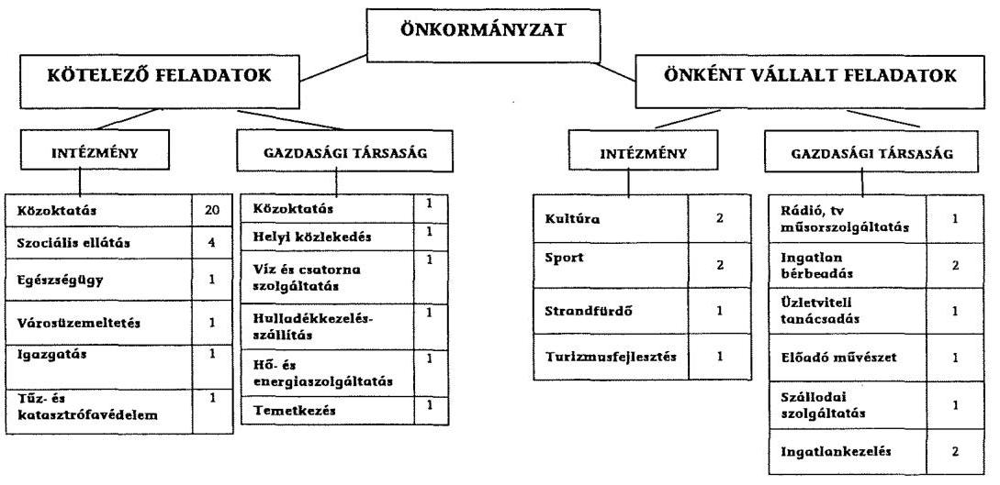

Az Önkormányzat feladatait 2010. december 31-én (a Polgármesteri hivatallal együtt) 34 költségvetési szervvel és 25% feletti tulajdoni hányadú 14 gazdasági társaságával, továbbá egy - az önkormányzattól tulajdonosi szempontból független - gazdasági társaság közreműködésével látta el. Az intézményszervezeti átalakítások és intézményi összevonások következtében a feladatellátás telephelyeinek száma a 2006. évi 122-ről 140-re nőtt 2010-ben.

Az Önkormányzat működési kiadásokra 2010-ben 16842 millió Ft-ot fordított, amely 686 millió Ft-tal (4,2%-kal) haladta meg a 2007. évi ráfordításokat. A működési kiadások 88,3%-át az intézményi körben realizálták. E kiadások fedezetéül szolgáló bevételi források 2007. és 2010. években jellemző összesített arányait a következő ábra szemlélteti:

---

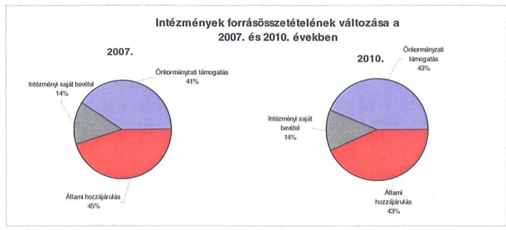

Az egyes közszolgáltatások feladatellátásában részvevő ágazati intézménycsoportok forrásösszetételének bevételi jogcímenkénti alakulását a következő ábra szemlélteti:
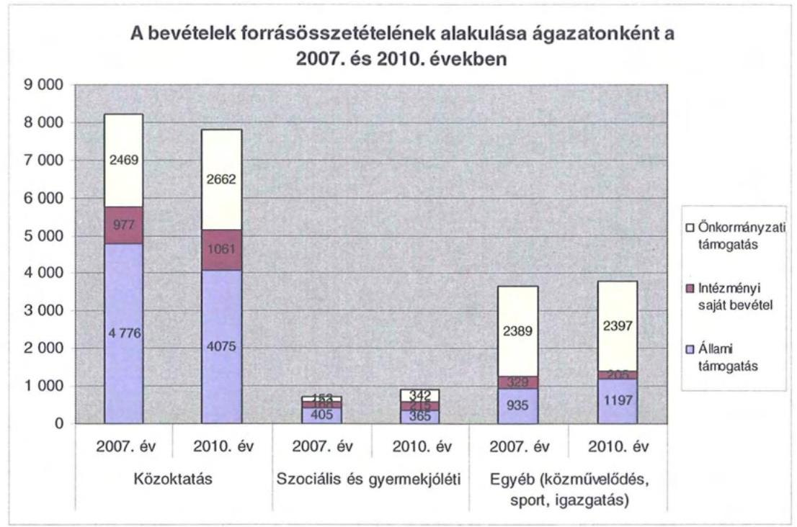

Az Önkormányzat nyolc gazdasági társaságban rendelkezik kizárólagos tulajdonnal, kettő gazdasági társaságban 75% feletti, kettő gazdasági társaságban 50-75% közötti, kettőben 25-50% közötti tulajdoni hányaddal. A gazdasági társaságok a helyi tömegközlekedési feladatokban, víz- és csatornaszolgáltatásban, ingatlankezelés és távhő-ellátásban, közoktatási feladatellátásban, köztemető fenntartási feladatokban, valamint hulladékgyűjtési és hulladékkezelési feladatokban kaptak szerepet az Önkormányzat feladatellátásában. A gazdasági társaságok működésükhöz a 2010. évben összesen 993 millió Ft rendszeres működési támogatást és 53 millió Ft fejlesztési támogatást kaptak az Önkormányzattól. A működési támogatás 61,4%-át (610 millió Ft-ot) a Színház és 27,3%-át (270 millió Ft-ot) a Tömegközlekedési Zrt. társaság kapta.

---

A társaságok pénzügyi helyzete stabil, az Önkormányzatnak tőkepótlási kötelezettsége nem keletkezett a vizsgált időszakban. A többségi önkormányzati tulajdonú gazdasági társaságok közül a saját tőke-jegyzett tőke aránya két 100%-ban önkormányzati tulajdonú társaságnál a 100% alá süllyedt, azonban a saját tőke nem csökkent az alaptőke kétharmada alá.

Az Önkormányzat folyó költségvetés egyenlege (működési jövedelem) 2007-2010. között működési forrástöbbletet mutatott $^{25}$. A 2008. és a 2010. években a működési megtakarítások fedezni tudták a tárgyévben jelentkező törlesztési kötelezettségeket, így az Önkormányzat pénzügyi kapacitása (nettó működési jövedelme) is pozitív értékű volt. A 2007. évben a rendkívüli adósságszolgálat miatt a pénzügyi kapacitás negatív volt (-1613 millió Ft), mivel a csekély összegű működési megtakarítás (143 millió Ft) nem tudta fedezni a törlesztési kötelezettséget (1756 millió Ft). Az adósságszolgálat rendkívüli összegét az okozta, hogy az Önkormányzat a kötvény kibocsátásából származó bevételéből 1445 millió Ft összegű hosszú lejáratú fejlesztési célú hitelt fizetett vissza. A 2009. évben az Önkormányzat 97 millió Ft működési jövedelme nem nyújtott fedezetet a 157 millió Ft fejlesztési célú hiteltörlesztésre, ezért a nettó működési jövedelme negatívvá vált (-60 millió Ft).
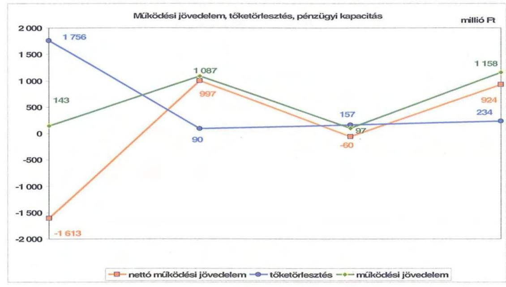

A 2007-2010. években az Önkormányzat felhalmozási költségvetésének egyenlege folyamatosan negatív összegű volt, amely 2007-2010. között összesen 14799 millió Ft felhalmozási forráshiányt okozott.

A pénzügyi egyensúly fenntartása csak külső források bevonásával volt biztosítható. A 2007-2010. években 2237 millió Ft hitelt törlesztettek. Az adósságszolgálat, továbbá a felhalmozási forráshiány 2007-2010. között 17036 millió Ft-ot tett ki, amelyre az időszakban képződő 2485 millió Ft működési megtakarítás (működési jövedelem), valamint a 2007. január 1-jén rendelkezésre álló 2001 millió Ft pénzkészlet szolgált fedezetül. A további pénzeszközöket 9619 millió Ft hitel felvételével, továbbá 2931 millió Ft kötvény kibocsátásával teremtették meg. A kialakult pénzügyi helyzet csak pozitív nettó működési jövedelmet eredményező gazdálkodás mellett teszi elkerülhetővé további külső források bevonását, az eladósodás növekedését.

A vizsgált időszakban Önkormányzatnál helyi iparűzési adó, építményadó, magánszemélyek kommunális adója, vendégéjszakák utáni idegenforgalmi adó, valamint telekadó volt megállapítva. Az adó mértékét a vizsgált időszakban a helyi iparűzési adó esetében nem változtatták, a magánszemélyek kommunális adója esetében 4,5%-kal, az építményadó esetében 8,9%-kal, az idegenforgalmi adó esetében 8,7%-kal és a telekadó esetében 4%-kal emelték. A helyi adókból és pótlékokból származó bevételek aránya 2007-2010. között 20% körül mozgott a folyó (működési) bevételekben. A pótlékkal, bírsággal növelt helyi adó bevétel a 2007. évi 3265 millió Ft-ról 2010. évben 3319 millió Ft-ra (1,7%-kal, 54 millió Ft-tal) nőttek. A helyi adóbevételek közel kétharmad részét az iparűzési adó tette ki, amelynek mértéke a helyi adókról szóló törvényben rögzített maximális mértékben került megállapításra. A helyi adó bevételek növekedését az egyes adónemek bevételeinek növekedése és a bírságok, pótlékok csökkenésének együttes hatása eredményezte.

A befejezett fejlesztések jelentős részét pénzintézeti forrásokból fedezték. A 2007-2010. évek időszakában 11926 millió Ft értékű fejlesztés és felújítás forrása 624 millió Ft kötvényből származó bevétel (5,2%), valamint 5373 millió Ft hitelfelvétel (45,0%) volt. A 2010. december 31-én folyamatban lévő fejlesztési feladatok végrehajtására 7138 millió Ft kiadást teljesítettek, amelyre a kötvény bevételéből 1142 millió Ft-ot (16,0%), hitelből 3564 millió Ft-ot (49,9%) fordítottak.

Az Önkormányzat 2010. december 31-én folyamatban lévő fejlesztési feladatok kötelezettség-vállalásainak összege 11007 millió Ft volt $^{26}$, amelyből 1722 millió Ft-ot saját forrásból, 3046 millió Ft-ot hitelből - 1725 millió Ft összegű hitel közbeszerzési eljárása folyamatban van -, 6188 millió Ft-ot EU-s támogatásból és 51 millió Ft-ot hazai támogatásból terveznek biztosítani.

[^0]
[^0]:    $^{25}$ 2007-ben a folyó kiadások 0,9%-át (143 millió Ft-ot), 2008-ban 6,1%-át (1087 millió Ft-ot), 2009-ben 0,5%-át (97 millió Ft-ot) 2010-ben a folyó kiadások 6,7%-át (1158 millió Ft) jelentette.
    $^{26}$ A Hulladékgazdálkodási társulás által bonyolított hulladékgazdálkodási rendszer fejlesztése beruházás 5592 millió Ft-tal szerepel a folyamatban lévő fejlesztések között, amelynek a forrásösszetétele 1131 millió Ft társulási saját bevétel, 1226 millió Ft hitel, 3235 millió Ft EU-s támogatás.

---

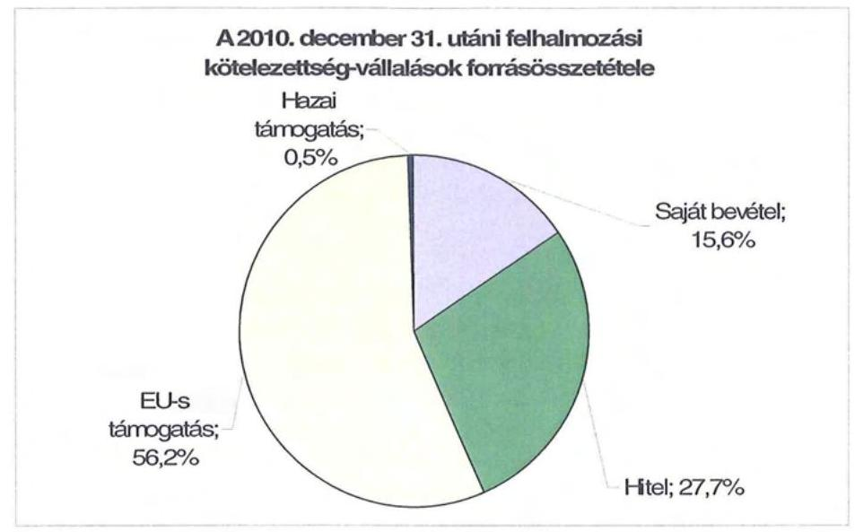

Az Önkormányzat által beadott, elbírálás alatt álló pályázatok tervezett teljes bekerülési költsége 2929 millió Ft volt, amelyből 2813 millió Ft a 2010 utánira vállalt kötelezettség, amelyből 547 millió Ft-ot hitelből - amelyet későbbiekben terveznek felvenni -, 2101 millió Ft-ot EU-s forrásból és 165 millió Ft-ot hazai támogatásból terveznek finanszírozni.

Az Önkormányzat mérleg szerinti pénzintézeti kötelezettsége a 2006. év végéről a 2010. év végére 8104 millió Ft-ról 18765 millió Ft-ra nőtt, amelyből az árfolyamváltozás miatti különbözet 1383 millió Ft volt. A fennálló pénzintézeti kötelezettségek három kötvény kibocsátásból és 20 hosszú lejáratú hitel igénybevételéből keletkeztek. Az ÁSZ vizsgálat ideje alatt további 1000 millió Ft hosszú távú fejlesztési hitel szerződés előkészítése volt folyamatban.

Az Önkormányzat kötelezettségvállalásaira közgyűlési döntés alapján került sor, azonban az előterjesztésekben nem mutatták be a visszafizetés forrásait.

Az Önkormányzat kötvényeket korábbi hiteleinek törlesztése, fejlesztések önerejének biztosítása és a fejlesztések, felújítások finanszírozása céljából bocsátott ki.

Az Önkormányzat a devizában fennálló pénzintézeti kötelezettségeiből 2530 ezer CHF (519 millió Ft) kamatot és egyéb költséget fizetett. A HUF-ban fennálló kötelezettségekből 1431 millió Ft tőkét, kamatot és egyéb költséget teljesített. Az Önkormányzat a kötvények kibocsátásából és a hitelek igénybevételéből származó forrásokat 2010. év végéig a céloknak megfelelően felhasználta. Az Önkormányzat a kötvény kibocsátásból származó forrás befektetéséből 541 millió Ft hozam, illetve kamatbevételt realizált, amelyet folyó működési kiadások finanszírozására fordított. Az Önkormányzat a vizsgált időszakban nem váltott számlavezető pénzintézetet, a kötvények kibocsátásával megbízott pénzintézet nem a számlavezető bankja volt.

Az Önkormányzat működtetési feladatainak finanszírozását a vizsgált időszakban folyószámlahitel és két alkalommal felvett munkabér megelőlegezési hitel igénybevételével tudta biztosítani.

---

A folyószámlahitel igénybevétele a 2007-2010. években az alábbiak szerint alakult:

| Megnevezés | 2007. év | 2008. év | 2009. év | 2010. év |
| :--: | :--: | :--: | :--: | :--: |
| Keretösszeg január 1-jén | 450,00 | 696,00 | 696,00 | 696,00 |
| Átlagos napi állomány | 73 | 73 | 3 | 1 |
| Folyószámla hitellel zárt napok száma (nap) | 125 | 138 | 20 | 7 |
| 2010. december 31-i egyenleg (állomány) | - | - | - | - |

A likviditás biztosítása az Önkormányzatnak 13 millió Ft kamat és 2 millió Ft egyéb kiadást okozott.

Az Önkormányzat 2010. év végi szállítói tartozása
 1319 millió Ft, melyből a lejárt tartozás 330 millió Ft volt. Az átütemezett tartozások összege 3 millió Ft volt. A lejárt tartozások 42%-a (140 millió Ft) meghaladta a 91 napot, amely jelenleg folyamatban lévő peres eljárás tárgya.

A Kapos-Fürdő Ingatlanfejlesztő és Idegenforgalmi Kft. 100%-os üzletrészének megvásárlása 2011. évtől 1200 millió Ft fizetési kötelezettséget jelent az Önkormányzatnak.

Az Önkormányzat gazdasági társaságai részére lízingdíj törlesztéséhez, társulásban megvalósuló beruházás hiteltörlesztéséhez, valamint az Önkormányzat beruházásában résztvevő partnerek fizetési kötelezettségeinek teljesítéséhez készfizető kezességet vállalt 1729 millió Ft összegben, amelyekkel kapcsolatban fizetési kötelezettsége a vizsgált időszakban nem merült fel. A gazdasági társaságok és civil szervezet, valamint társulás részére 11 alkalommal összesen 494 millió Ft pénzeszközt adott át visszafizetési kötelezettséggel az Önkormányzat.

A Közgyűlés a kiegészítő kamattámogatásos hitel és állami támogatás biztosítékaként 830 millió Ft jelzálogjog alapításához és bejegyzéséhez járult hozzá. A jelzálogszerződésekkel érintett ingatlanok a forgalomképes ingatlanok 7,1%-át jelentik.

Az Önkormányzat kötelezettségeinek 2010. december 31-i állományát és várható alakulását a kötelezettségek lejáratáig a következő táblázat szemlélteti:

| Megnevezés | Állomány 2010. dec. 31-én |  |  | Várható kötelezettség 2011. 2013. években |  |  | Várható kötelezettség 2014. évet követően |  |  |
| :--: | :--: | :--: | :--: | :--: | :--: | :--: | :--: | :--: | :--: |
|  | HUF-ban (millió Ftban) | Üretjeiben (összege, ezer ... ben) | Ürviü (men) | HUF-ban (millió Ftban) | Üretjeiben (összege, ezer ... ben) | Ürviü (men) | HUF-ban (millió Ftban) | Üretjeiben (összege, ezer ... ben) | Ürviü (men) |
| Pénzintézeti kötelezettségek |  |  |  |  |  |  |  |  |  |
| Összerek lejáratú kötelek | 11085 |  | HUF | 2207 |  | HUF | 12477 |  | HUF |
| Kötelegy (Kegyserek) (100\%) |  | 34515 | CHF |  | 7192 | CHF |  | 31126 | CHF |
| Folyószámlahitel |  |  | HUF |  |  | HUF |  |  | HUF |
| Pénzintézeti kötelezettségek összesen HUF-ban | 11085 |  | HUF | 2207 |  | HUF | 12477 |  | HUF |
| Pénzintézeti kötelezettségek összesen CHF-ban |  | 34515 | CHF |  | 7192 | CHF |  | 31126 | CHF |
| Biztositékok |  |  |  |  |  |  |  |  |  |
| Kezesség | 1729 |  | HUF | - |  | - | - |  |  |
| Biztositékok összesen | 1729 |  | HUF |  |  |  |  |  |  |
| Szállítói tartozás | 1219 |  | HUF | 1219 |  | HUF | - |  |  |
| Egyéb kötelezettségek |  |  |  |  |  |  |  |  |  |
| (Agyüszítés) | 1200 |  | HUF | 200 |  | HUF | 640 |  |  |

---

Az Önkormányzatnak pénzintézetekkel szemben fennálló kötelezettsége a 2010. év végén 11095 millió Ft és 34515 ezer CHF volt. Ezek várható kötelezettsége (tőke, kamat és egyéb költség) a legutóbbi kamatfizetés feltételei alapján a 2011. évtől 14774 millió Ft, továbbá 38318 ezer CHF. Az Önkormányzatnak a 2011. évben szállítói tartozások címén 1319 millió Ft fizetési kötelezettsége keletkezett. Az Önkormányzat cégvásárlással összefüggő kötelezettsége 2010. év végén 1200 millió Ft volt. A kezességvállalásaiból adódóan 1729 millió Ft összegű terhe jelentkezhet, amennyiben a gazdasági társaságok kötelezettségeiket nem teljesítik. A várható összes kötelezettség teljesítésére figyelembe vehető 1226 millió Ft mérlegben kimutatott követelésállomány, 10469 millió Ft forgalomképes ingatlanvagyon, melyből 747 millió Ft a pénzintézeti kötelezettségekhez kapcsolódóan jelzáloggal terhelt. Az Önkormányzat tájékoztatása szerint figyelembe vehető további forrás a működési jövedelem.

Az Önkormányzat minősített többségi tulajdonú társaságai kötelezettségeinek 2010. december 31-i állományát és várható alakulását a kötelezettségek lejáratáig a következő táblázat mutatja be:

| Megnevezés | Állomány 2010. dec.31-én |  |  | Várható kötelezettség 2011 2013. években |  |  | Várható kötelezettség 2014. évet követően |  |  |
| :--: | :--: | :--: | :--: | :--: | :--: | :--: | :--: | :--: | :--: |
|  | HUF-ban (millió Ftban) | Devizában (összeg, ezer ... ben) | Deviza/month | HUF-ban (millió Ftban) | Devizában (összeg, ezer ... ben) | Deviza/month | HUF-ban (millió Ftban) | Devizában (összeg, ezer ... ben) | Deviza/month |
| Hozzút lejáratú kötelek | 231 |  | HUF | 228 |  | HUF | 34 |  | HUF |
| Pénzintézeti kötelezettségek összesen: | 231 |  | HUF | 228 |  | HUF | 34 |  | HUF |
| Lízing kötelezettségek | 32 | 4671 | CHF | 10 | 768 | CHF | 0 | 2902 | CHF |
|  |  | 23 | 1108 |  | 33 | 1108 |  | 0 |  |
| Szállítói tartozás | 227 |  |  | 227 |  |  | 0 | 0 |  |

Az önkormányzati kötelezettségek növekedése mellett a minősített többségi tulajdonú társaságok kötelezettségei is befolyásolhatják az Önkormányzat pénzügyi egyensúlyát. A társaságoknak a 2011. évtől 262 millió Ft pénzintézeti kötelezettséget, 10 millió Ft és 4670 ezer CHF, 53 ezer EUR lízing és 227 millió Ft szállítói tartozást kell rendezniük. Kockázatot hordoz, ha ezek nem teljesítése esetén a bíróság - az adós társaság felé érvényesített tartósan hátrányos üzletpolitikájára figyelemmel - korlátlan és teljes felelősséget állapít meg az Önkormányzat terhére.

Az Önkormányzat költségvetési támogatásból, átengedett bevételekből, és illetékbevételekből származó bevételei a 2007. évhez képest az időszak egészét tekintve összességében 62 millió Ft-tal csökkentek. Ennek ellenére az Önkormányzat folytatta az előző években elkezdett kiadási megtakarítást és bevételnövelő intézkedéseit. A 2007-2010. években tett intézkedések hatására 561,4 millió Ft bevételi többletet, továbbá 3342,9 millió Ft kiadási megtakarítást mutattak ki, ezáltal az Önkormányzat pénzügyi helyzetét javították. A kiadási megtakarítások 42,3%-a az elrendelt álláshely-csökkentések eredménye. Az álláshely-csökkentő intézkedések 2007-2010. között a Polgármesteri hivatalnál és az intézményeknél összesen 541 álláshely (ebből 28,5 üres álláshely) megszüntetését jelentették. Egyes közszolgáltatási területeken azonban feladatbővülések is voltak, amelyek álláshely- és egyben létszámnövekedéssel is jártak. Ennek következtében az időszak foglalkoztatott létszáma 445 fővel csökkent. A

---

bevételnövelő intézkedések szabad kapacitások kihasználásához, helyi adók emeléséhez, térítési díjak emeléséhez kapcsolódtak.

Az utóellenőrzés a pénzügyi egyensúly javítására tett egy célszerűségi javaslat hasznosítására terjedt ki, amelyet a főjegyző végrehajtott.

Az Önkormányzat pénzügyi helyzetét összegezve a következők emelhetők ki:

A 2007-2010. években az Önkormányzat működési kockázatát csökkentette a folyó költségvetés pozitív egyenlege. Az önként vállalt feladatok aránya nem befolyásolta az Önkormányzat működésének biztonságát. A működési bevételek - a 2007. és a 2009. év kivételével - biztosították a működési kiadások és az adósságszolgálat finanszírozását. A likviditás biztosítása csökkenő összegű folyószámlahitel igénybevételével történt. A gazdasági társaságok szerepe a közüzemi közfeladat-ellátásban meghatározó volt. A gazdasági társaságok által ellátott feladatstruktúra letisztított, átlátható, a működési kockázatot nem növelte.

A vizsgált időszakban az Önkormányzat felhalmozási bevételeinek és kiadásainak egyenlege hiányt mutatott, ennek forrásai a pénzmaradvány igénybevételével, kötvénykibocsátásból származó bevétellel és hitelfelvétellel biztosítottak voltak. A fejlesztési célú kötelezettségvállalásoknál a jövőben teljesítendő kifizetésekre a fedezet rendelkezésre áll (hitelek, EU és hazai támogatások, saját forrás), ezért az felhalmozási kockázatot nem jelentett.

A pénzintézeti és egyéb kötelezettségek teljesítésének kockázatát növelte, hogy a 2010. december 31-én fennálló kötelezettségek visszafizetésének forrásait nem számszerűsítették. A kockázatot csökkentheti, hogy az Önkormányzat forgalomképes ingatlanvagyona szükség esetén felhasználható az adósságszolgálat visszafizetésére.

Az önkormányzati bevételt csökkentő központi intézkedések hatását az ellenőrzött időszakban kiegyenlítette az Önkormányzat kiadáscsökkentő és bevételnövelő intézkedéseinek eredménye.

A polgármester tájékoztatása szerint a helyi szervezési intézkedések mintegy 400 millió Ft-tal javították az Önkormányzat pénzügyi egyensúlyát. További intézkedéseket a 2012. évi költségvetés előkészítése, illetve elfogadása során terveznek.

Az Állami Számvevőszékről szóló 2011. évi LXVI. törvény 33. § (1) bekezdésében foglaltak értelmében a jelentésben foglalt megállapításokhoz kapcsolódó intézkedési tervet köteles az ellenőrzött szervezet vezetője összeállítani és azt a jelentés kézhezvételétől számított harminc napon belül az ÁSZ részére megküldeni. Amennyiben az intézkedési tervet határidőben nem küldi meg a szervezet, vagy az továbbra sem elfogadható, az ÁSZ elnöke a hivatkozott törvény 33. § (3) bekezdés a)-b) pontjaiban foglaltakat érvényesítheti.

---

Az ellenőrzés intézkedést igénylő javaslatai:

# a Polgármesternek 

1. a Közgyűlés elé terjesztendő intézkedési terv írja elő a működés pénzügyi egyensúlyának közép távon történő helyreállítása és hosszú távú fenntarthatósága érdekében - felelősök és határidők megjelölésével - olyan program készítését, amely tartalmazza az alábbiakat:
a) bevételszerző lehetőségek feltárását, különösen a helyi adópolitikai célok meghatározását és számszerűsítését, a bérleti díjak és a térítési díjak megállapítását, felülvizsgálatát, a követelések behajtását, az egyéb sajátos bevételek növelésének lehetőségét;
b) a folyamatban lévő és a tervezett beruházások teljes körű felülvizsgálatát;
c) egyéb kiadási kötelezettségek teljes körű felülvizsgálatát;
d) az intézkedések következtében jelentkező bevételek elkülönített kezelését az adósságszolgálat teljesítése érdekében;
e) az adósságszolgálat szerkezetének áttekintését, a likviditás menedzselését;
f) az intézményi gazdálkodás és struktúra felülvizsgálatát, átalakítását;
g) az önként vállalt feladatok terjedelmének, tartalmának felülvizsgálatát azok finanszírozhatósága szempontjából, a kötelező feladatellátás elsődlegességének biztosítása érdekében, a gazdasági program áttekintésével összhangban;
h) az intézkedések eredményeinek legalább félévenkénti áttekintésének előírását;
2. mutassa be félévente - a szokásos beszámoló keretében - a Közgyűlésnek:
a) az Önkormányzat és a minősített többségi tulajdonú gazdasági társaságai aktuális pénzügyi helyzetét, az Önkormányzatnak a gazdasági társaságai felé fennálló követeléseit, nyújtott kölcsöneit;
b) legalább három évre kitekintően a kötelezettségek teljes körére szóló finanszírozási tervet, amely figyelembe veszi a kötelezettség éven belüli és túli felmerülését, a források számszerűsített megjelölésével;
c) az Önkormányzat folyamatban lévő és tervezett fejlesztéseihez szükséges belső és külső források rendelkezésre állását, és ebből a szempontból értékelje az Önkormányzat beruházásait;
3. intézkedjen a beruházásokkal létrehozott létesítmények működtetését és jövőbeni fenntarthatóságát biztosító megalapozott források költségvetési rendeletekben történő feltüntetéséről;
4. kezdeményezze, hogy a Közgyűlés az adósságállomány nagyságára és kötelezettségvállalásaira tekintettel vizsgálja felül a jövőbeni fejlesztési céljait, hogy az új fej-

---

lesztési döntések meghozatala során elsőbbséget a kötelező feladatellátáshoz kapcsolódó
 fejlesztéseknek biztosítsanak;
5. mutassa be a Közgyűlésnek évente a zárszámadási rendelet előterjesztésében az értékcsökkenés összegét, és ezzel összevetve az elhasználódott eszközök pótlására fordított tényleges kiadásokat, az eszközök elhasználódási fokának alakulását;
6. mutassa be a Közgyűlésnek a fejlesztési társulási tagságból, gesztorságából eredő, az Önkormányzat pénzügyi egyensúlyát befolyásoló kockázatokat, és azok mérséklését szolgáló intézkedéseket.

# a Főjegyzőnek 

1. kísérje figyelemmel a jövőbeni várható - árfolyam-, kamat- valamint visszafizetési kockázatokat, továbbá a mérlegen kívüli tételek (kezességvállalás, garancia és helytállási kötelezettségvállalás) kockázatait, és legalább félévente tájékoztassa a Közgyűlést azok alakulásáról;
2. gondoskodjon, hogy a jövőben az adósságot keletkeztető kötelezettségvállalásokról szóló közgyűlési előterjesztések tételesen tartalmazzák a visszafizetés forrásait, valamint legalább 3 éves kitekintéssel mutassák be a kamat és árfolyamkockázat várható kihatásait;
3. kísérje folyamatosan figyelemmel - a tulajdonosi jogkört gyakorlók közreműködésével - a minősített többségi tulajdonú gazdasági társaságok kötelezettségeinek alakulását, az Önkormányzat likviditására, pénzügyi-egyensúlyi helyzetére gyakorolt hatását.

---

# II. RÉSZLETES MEGÁLLAPÍTÁSOK 

## 1. Az ÖNKORMÁNYZAT KÖTELEZŐ ÉS ÖNKÉNT VÁLLALT FELADATAI

Az Önkormányzat 2010. évi zárszámadási rendelete alapján ${ }^{27}$ a 16842 millió Ft működési célú költségvetési kiadásból 14164 millió Ft-ot ( $84,1 \%$ ), a kötelező feladatok, 2678 millió Ft-ot ( $15,9 \%$ ) az önként vállalt feladatok ellátására fordította. A vizsgált időszak első évéhez képest az Önkormányzat költségvetésében az önként vállalt feladatok aránya ugyan 0,8 százalékponttal csökkent, de továbbra is a költségvetési kiadások több mint hatodát teszik ki az arra fordított működési kiadások. Az Önkormányzat kötelező és önként vállalt közé sorolt feladatainak körét a hatályos SzMSz-ek, valamint a rendeletekbe foglalt szakmai koncepciók együttesen határozták meg.

| Elidőző feladat | Működési kiadás összesen (millió Ft) | Kötelező feladatok kiadásainak részaránya % | Működési bevételek összesen (millió Ft) | Állami támogatás részaránya % | Intézményi saját bevétel részaránya % | Önkormányzati támogatás részaránya % |
| :--: | :--: | :--: | :--: | :--: | :--: | :--: |
| Óvodák | 1140 | 100 | 1140 | 41 | 10 | 49 |
| Általános iskolák | 2642 | 100 | 2642 | 49 | 10 | 41 |
| Gimnáziumok | 790 | 100 | 790 | 62 | 9 | 29 |
| Szakközépiskolák, szakképző intézmények | 2500 | 100 | 2500 | 56 | 18 | 26 |
| Kollégiumok | 736 | 100 | 736 | 55 | 22 | 23 |
| Szociális intézmények | 684 | 100 | 684 | 38 | 27 | 35 |
| Gyermekjóléti intézmények | 237 | 100 | 237 | 43 | 12 | 45 |
| Közművelődési intézmények | 292 | 0 | 292 | 4 | 25 | 71 |
| Sportlétesítmények | 336 | 0 | 336 | 0 | 29 | 71 |
| Igazgatási intézmények | 3171 | 73 | 3171 | 37 | 1 | 62 |
| Egyéb intézmények | 1911 | 76 | 1911 | 0 | 37 | 63 |
| Hivatásos   Tűzoltóság | 428 | 100 | 428 | 94 | 6 | 0 |
| Intézmények összesen | 14867 | 88 | 14867 | 41 | 15 | 44 |
| Polgármesteri Hivatalban kimutatott feladatok működési kiadásai | 1975 | 64 | 1975 | 61 | 2 | 37 |
| Működési kiadások összesen | 16842 | 84 | 16842 | 43 | 14 | 43 |

[^0]
[^0]:    ${ }^{27}$ A CLF szerinti folyó kiadás összege és a zárszámadási rendelet szerinti működési kiadások különbözete abból adódik, hogy a zárszámadási rendeletben felhalmozási kiadások között szerepel a Hulladékgazdálkodási társulás rekultivációs beruházása, a működési célra nyújtott kölcsön, előző évi pénzmaradvány átadás, valamint a zárszámadási rendelet 9. sz. mellékletében megnevezett egyéb nem felhalmozási kiadások.

---

A működési kiadásokon belül a legnagyobb arányt, 88,3%-ot (14 866 millió Ft) az intézményi feladatok jelentették, amelyből a kötelező feladatok részaránya 88% ( 13082 millió Ft) volt. Az intézmények működtetéséhez az Önkormányzat 6541 millió Ft támogatással (amely az összes bevétel 44%-a) járult hozzá.

A kötelező feladatokon belül a 2010. évben a két legnagyobb kiadás a 13082 millió Ft összegű intézményi feladatok működési kiadása - amely az összes működési kiadás 77,7%-át -, valamint a Polgármesteri hivatalban kezelt feladatok 1205 millió Ft összegű kiadása, amely az összes működési kiadás 7,2%-át tette ki. Az intézményi feladatokon belül a közoktatási feladatokra fordított 7808 millió Ft az összes működési kiadás 46%-át tette ki. A működéshez az Önkormányzat 2680 millió Ft támogatást nyújtott, amely az ágazat működési költségeinek 34%-a volt. A legkisebb, 169 millió Ft összegű működési támogatást a kollégiumi feladatok ellátásához kellett biztosítani, ez a feladat kiadásának 23%-a volt.

Az óvodai feladatokhoz az Önkormányzat 558 millió Ft támogatást biztosított, mely a működési kiadások 1140 millió Ft összegén belül 48,7%-ot jelentett. Az óvodák 1140 millió Ft működési bevételén belül az állami hozzájárulás részaránya 466 millió Ft összeggel 41%-ot, az intézményi saját bevétel részaránya 114 millió Ft összeggel 10%-ot, a társulásoktól átvett 3 millió Ft 0,3%-ot képviselt.

Az általános iskolai feladatokhoz 1082 millió Ft támogatást nyújtott az Önkormányzat, ez a 2642 millió Ft összegű működési kiadások 41%-a volt. Az általános iskolák 2642 működési bevételének 48,8%-át (1293 millió Ft-ot) állami hozzájárulás, 10%-át ( 263 millió Ft-ot) intézményi saját bevétel, 0,2%-át (4 millió Ft-ot) társulásoktól átvett támogatás finanszírozta.

A gimnáziumoknak 229 millió Ft támogatást kellett adni a működéshez, ami 29%-os arány a működési kiadásokon belül. A működési bevételek 790 millió Ft összegén belül az állami hozzájárulás részaránya 490 millió Ft összeggel 62%-ot, az intézményi saját bevétel részaránya 71 millió Ft összeggel 9%-ot képviselt.

A szociális intézményi feladatokra fordított 684 millió Ft működési kiadáson belül a 239 millió Ft önkormányzati támogatás 35%-os részarányt jelentett. A szociális intézmények összes működési bevételének 684 millió Ft összegén belül az állami hozzájárulás 260 millió Ft (38%), az intézményi saját bevétel 185 millió Ft (27%) volt.

A gyermekjóléti feladatokra fordított 237 millió Ft működési kiadás 45%-át (107 millió Ft) az önkormányzat támogatása tette ki. A működési bevételek 237 millió Ft összegén belül az állami hozzájárulás összege 102 millió Ft (43%) , az intézményi saját bevételek összege 28 millió Ft (12%) volt.

---

A közművelődési intézményi és sportfeladatokra fordított 628 millió Ft működési kiadásra az önkormányzati támogatás 445 millió Ft összege 71%-ban biztosított fedezetet. A működési bevételek 628 millió Ft összegén belül az intézményi saját bevételek 170 millió Ft-ot (27%), az állami támogatás részaránya 13 millió Ft-ot (2%) jelentett.

A Hivatásos tűzoltóságra fordított 428 millió Ft működési kiadás fedezete állami támogatás és intézményi saját bevétel volt, működési támogatást az Önkormányzat a tűzoltósági feladatok ellátására 2010. évben 3,3 millió Ft-ot nyújtott.

Az Önkormányzat 2010. évi összes működési bevételén belül az állami támogatás részaránya 7242 millió Ft összeggel 43%-ot, az intézményi saját bevétel részaránya 2358 millió Ft összeggel 14%-ot, az önkormányzati támogatás 7225 millió Ft összeggel 42,9%-ot, a társulásoktól átvett 17 millió Ft 0,1%-ot képviselt. Az Önkormányzat összes működési bevételének összege a 2007. évről a 2010. évre 4,2%-kal, 686 millió Ft-tal, az önkormányzati támogatás 11,2%-kal, 738 millió Ft-tal növekedett. Az Önkormányzat összes működési bevételét az állami hozzájárulás a 2007. évben 44,9%-ban, 2010. évben 43%-ban finanszírozta az intézményi saját bevétel 14,2%-ról 13,5%-ra csökkent.

Az Önkormányzat 2010. évi 16842 millió Ft összegű összes működést szolgáló 14867 millió Ft bevétele ${ }^{28}$ ( 88%) volt az intézményeké, amelyből 6095 millió Ft (41%) volt az állami támogatás, 6541 millió Ft (44%) az önkormányzati (és társulástól átvett) támogatás részaránya, az intézményi saját bevétel 2231 millió Ft (15%).

Az összes önkormányzati intézményi bevételeken belül a 2010. évben az állami támogatás összege 7236 millió Ft és aránya 47,1%, amely 2,2 százalékponttal növekedett a 2007. évi 7261 millió Ft, és 44,9%-os arányhoz képest.

Az áttekintett időszakban a közszolgáltatásokat igénybevevő ellátottak száma jelentős változást mutat.

A közszolgáltatást igénybevevő intézményi ellátottak intézménytípusonként a következők szerint alakult 2007. és 2010. között. A közoktatási intézményeken belül az óvodáknál az ellátottak száma 56 fővel ( 2,7%), az általános iskoláknál 364 fővel ( 7,6%), a gimnáziumoknál 276 fővel ( 13,0%), a szakközépiskoláknál, szakképző intézményeknél 563 fővel ( 9,5%) valamint a kollégiumnál 327 fővel (24%) csökkent. A szociális intézményeknél 562 fővel ( 0,8%), a gyermekjóléti intézménynél (bölcsőde) 10 fővel ( 5,9%), a közművelődési intézményeknél, sportlétesítményeknél, igazgatási intézményeknél, egyéb intézményeknél (GESZ, Városi Fürdő és Városgondnokság) valamint a Polgármesteri hivatalnál egyaránt 543 fővel ( 0,8%) csökkent az ellátottak száma, A Hivatásos tűzoltósághoz tartozó ellátottak száma 1868 fővel ( 1,7%) csökkent.

[^0]
[^0]:    ${ }^{28}$ A zárszámadási rendelet szerinti működési bevétel és a CLF folyó bevételének különbözete abból adódik, hogy a zárszámadási rendeletben a felhalmozási bevételek között van kimutatva a felhalmozási célú áfa megtérülés, üzemeltetési díj és áfá-ja, működési célra nyújtott kölcsönök, valamint hazai forrású felhalmozási célú támogatások.

---

Az Önkormányzat az Ötv-ben és más törvényekben meghatározott kötelező feladatainak ellátásáról az intézmények és gazdasági társaságok alapító okirataiban és a társasági szerződéseiben előírtak alapján, valamint a többcélú társulással kötött társulási megállapodásban és egyéb szervezetekkel kötött feladatellátási szerződésben meghatározottak szerint gondoskodott. Ezekben a dokumentumokban rögzítették az önként vállalt feladatok ellátására vonatkozó rendelkezéseket is.

Az Önkormányzat kötelező és önként vállalt feladatait 2010. december 31-én 34 költségvetési szervvel és 14 gazdasági társasággal látta el. Ezen kívül ellátási szerződés alapján két társadalmi szervezet, egy alapítvány, valamint külön megállapodással a megyei önkormányzat és egy gazdasági társaság, továbbá egy társulás (Hulladékgazdálkodási társulás) vesz részt az Önkormányzat feladatellátásában.

Az Önkormányzat az egyes szociális feladatok biztosítása érdekében ellátási szerződést kötött a Magyar Vöröskereszt Somogy Megyei Szervezetével a hajléktalan ellátás és az utcai szociális munka biztosítására, az INDIT Közalapítvánnyal a szenvedélybetegek nappali és közösségi ellátására, a Mozgáskorlátozottak Somogy Megyei Egyesületével a fogyatékos személyek gondozóházi ellátására, valamint a szenvedélybetegek alacsonyküszöbű ellátása támogató szolgáltatására. Az Önkormányzat külön megállapodást kötött a Somogy Megyei Önkormányzattal a pszichiátriai betegek otthonában történő ellátásra és a közművelődési, könyvtári feladatok ellátására.

Az Önkormányzat által fenntartott költségvetési szervek közül 18 önállóan működő és gazdálkodó, 16 önállóan működő, feladataikat - az alapító okirataik szerint -
 97 telephelyen folytatták (a gazdasági társaságok 43 telephellyel rendelkeztek). A feladatellátás megteremtése érdekében végrehajtott összevonások, átszervezések, gazdasági társaságba való átszervezés, kiszervezés és feladatátadás következtében az intézmények száma a vizsgált időszakban 57-ről 34-re, 40%-kal csökkent. Az ellátott feladatok köre a szervezeti változások ellenére nem csökkent. Jelentősen, 51%-kal csökkent a közoktatási intézmények száma az összevonások hatására, 41-ről 20-ra. Ezen belül az általános iskolák száma 17-ről négyre (76%-kal), az óvodák száma 13-ről hatra (54%-kal) csökkent az összevonások következtében.

A vizsgált időszakot megelőzően az Önkormányzatnak 13 részben önállóan gazdálkodó óvodája volt 21 telephelyen, jelenleg hat önállóan működő óvodának 20 telephelye van, a gazdálkodási feladatokat a GESZ látja el. Korábban 16 önállóan és egy részben önállóan gazdálkodó általános iskola 21 telephelyen működött, a vizsgált időszak végén egy önállóan működő és gazdálkodó, valamint három önállóan működő általános iskolának összesen 18 telephelye volt.

A költségvetési szervek közül 28 az Önkormányzat kötelező feladatait látta el, ebből 20 közoktatási, négy szociális, egy egészségügyi ellátást biztosított és három (Polgármesteri hivatal, Hivatásos tűzoltóság és Városgondnokság) egyéb feladatokat teljesített. A Városgondnokság városüzemeltetési feladatokat (pl. közutak, terek, parkok, zöldterületek fenntartása, parkolók üzemeltetése) végez.

---

A kötelező feladatainak ellátásában hat gazdasági társasága vesz részt, ezek közül egynek 100%-ban, kettőnek tartós (75% felett), kettőnek többségi, valamint egynek kisebbségi tulajdonosa az Önkormányzat. Az önként vállalt feladatait nyolc gazdasági társasága végzi, közülük hétnek 100%-ban, egynek pedig tartós (75% felett) tulajdonosa. Az önkormányzati feladatok ellátásában résztvevő gazdasági társaságok adatait a 4. számú melléklet tartalmazza.

A helyi tömegközlekedési feladatokat a 100%-os önkormányzati tulajdonban levő Tömegközlekedési Zrt. végzi. A 75% feletti tulajdonban lévő víz és csatornaszolgáltatást a KAVÍZ Kft., az ingatlankezelés és távhő ellátást a Vagyonkezelő Zrt. látja el. Többségi tulajdonú a szakképzési feladatokat ellátó TISZK, valamint hulladékgyűjtési és hulladékkezelési feladatokat végző KVG Zrt. A köztemető fenntartási feladatokat a kisebbségi tulajdonú Temetkezési Kft. biztosítja.

Az Önkormányzat kéményseprő ipari szolgáltatás ellátására közszolgáltatási szerződést kötött a Kapos Kéményseprő Kft.-vel, amiben tulajdoni részesedéssel nem rendelkezik.

Az Önkormányzat egyháznak, civil szervezetnek nem adott át feladatot.
A többségi önkormányzati tulajdonú gazdasági társaságok közül a saját tőkejegyzett tőke aránya két 100%-ban önkormányzati tulajdonú társaságnál a 100% alá süllyedt, azonban a saját tőke veszteség nem csökkent az alaptőke kétharmada alá, a Gt. 245. §-a alapján az Önkormányzatnak tőkepótlási kötelezettsége nem keletkezett.

A Kaposvári Nagypiac Kft-nél a 2006-2010. években a beszámolók adatai alapján a saját tőke-jegyzett tőke aránya 92,7% és 62,9% között mozgott, a Városfejlesztési Kft. esetében a 2009. és a 2010. évben 94,5% értékű volt.

A többi többségi tulajdonú társaság esetében az arányszám a 2010. évi beszámoló adatai szerint 100% és 2137,4% között alakult. Egy társaságban a KAVÍZ Kft-ben az Önkormányzat az induló jegyzett tőke alacsony értéke (15 millió Ft) miatt, a cég gazdasági erejének növelése érdekében tőkeemelést hajtott végre, melynek összege a 2010. évben 49650 ezer Ft, a 2011. évben 29670 ezer Ft volt.

Az Önkormányzat a 2008. évben a koncessziós szerződés lejártát követően megvásárolta a megszűnt Kaposvári Vízművek Kft. eszközeit és kizárólagos önkormányzati részesedéssel rendelkező gazdálkodó szervezetet hozott létre Juta, Kaposhomok és Zselickislak önkormányzataival közösen KAVÍZ Kft. néven, melyben az Önkormányzat tulajdonosi részesedése 98,91%-os.

A nem 100%-os önkormányzati tulajdonú társaságok közül a TISZK-ben a 72,7%-os önkormányzati tulajdon mellett 12-12%-os tulajdonrésszel további két önkormányzat (Szigetvár és Dombóvár városok), 3,33%-os részesedéssel a Kaposvári Egyetem rendelkezett. A Vagyonkezelő Zrt-ben 76,5%-os volt az Önkormányzat tulajdonrésze, a dolgozók és a dolgozói alapítvány 23,5%-os részesedése mellett. A KAVÍZ Kft-ben 99%-os volt az Önkormányzat tulajdona, míg a fennmaradó 1%-os tulajdonrészen három város környéki települési önkormányzat osztozott. A KVG Zrt. tulajdonosa 54%-ban az Önkormányzat, 44,5%-ban az ÁVE Magyarország Kft. és 1,5%-ban a cég dolgozói voltak. Az Önkormányzat kisebb-

---

ségi 26%-os tulajdonrésszel rendelkezett a Temetkezési Kft-ben, amiben 47,5%-ban további önkormányzatok, valamint 26,5%-ban a Kegyeleti Egyesület volt tulajdonos.

A feladatellátásban részt vevő gazdasági társaságok közül a Temetkezési Kft. szerzett 25% alatti érdekeltséget más gazdasági társaságban, amely nem vett részt az önkormányzati feladatok ellátásában, temetéseket nem végzett.

A vizsgált időszakban az Önkormányzat gazdasági társaságainál csődeljárás és felszámolási eljárás nem volt, végelszámolásra került 2011-ben a Taszár Airport Kft., mivel a taszári reptér polgári célú hasznosítása meghiúsult, ezért a társaság további fenntartása okafogyottá vált.

A Közgyűlés az Önkormányzat gazdasági társaságai egységes, gazdaságosabb irányításának, valamint a lakosság minőségibb kiszolgálása érdekében holding társaságot hozott létre, 2010. december 9-i cégbejegyzéssel. A Holding Zrtben hét gazdasági társaság $^{29}$ került közös irányítás alá, majd további két társaság $^{30}$. A Közgyűlés döntött $^{31}$ a Városi Fürdő költségvetési szerv megszüntetéséről, és a fürdő üzemeltetési feladataira a Kaposvári Élmény- és Gyógyfürdő Nonprofit Kft. létrehozásáról.

Az önkormányzati vagyon gazdasági társaságoknak vagyonkezelésbe adása az ellenőrzött időszakban nem történt. A gazdasági társaságok az önkormányzati vagyont bérleti szerződés, üzemeltetési megállapodás alapján használták.

A 14 feladatellátásban részt vevő gazdasági társaságnál a társaságok által nyújtott adatszolgáltatás alapján az önkormányzati kötelező és önként vállalt feladatokhoz rendelt 2010. év végi nettó vagyon összesen 10748 millió Ft volt, amiből 8963 millió Ft (83,4%) a kötelező, 1785 millió Ft (16,6%) az önként vállalt feladatellátást szolgálta. A kötelező feladatellátást végzők közül öt társaság vett át üzemeltetésre vagyont, ennek a 2010. év végi nettó értéke 9079 millió Ft volt. Az összes nettó vagyonból 4581 millió Ft (42,6%) a KAVÍZ Kft. üzemeltetésében levő viziközmű vagyon, valamint a Kaposvári Vagyonkezelő Zrt-nél kimutatott 3300 millió Ft (30,7%) önkormányzati bérlakás és egyéb ingatlan.

A gazdasági társaságok által ellátott közszolgáltatásokhoz kapcsolódó szolgáltatási és egyéb díjak (az önkormányzati tulajdonú lakások lakbére, távhőszolgáltatási díj, temetkezési díjak, kötelező kéményseprő-ipari szolgáltatások díja, ivóvíz, illetve a szennyvízelvezetés, valamint a települési folyékony hulladékártalmatlanítás díjai, települési folyékony hulladék összegyűjtése, elszállítására és elhelyezésére vonatkozó díjak, köztisztasági díjak, helyi autóbuszközlekedés díjai, városi fürdő jegy- és bérletárak, színházjegy- és bérlet-

[^0]
[^0]:    $^{29}$ Tömegközlekedési Zrt., Vagyonkezelő Zrt., KVG Zrt., Kaposvári Nagypiac Kft., Jégcsarnok Kft., KAVÍZ Kft., Deseda Kemping Kft.
    $^{30}$ A Kapos TV és Kaposvári Élmény- és Gyógyfürdő Nonprofit Kft. a 244/2010. (XII. 9.) számú határozat döntésének megfelelően.
    $^{31}$ a 244/2010.(XII. 9.) számú határozatban

---

árak, piac és vásárcsarnok díjak) megállapítása a Közgyűlés hatáskörébe tartozott. A szolgáltatási díjakra tekintettel a Tömegközlekedési Zrt. részesült Önkormányzati támogatásban a helyi közlekedési díjak miatt, amelyet az Önkormányzat - figyelemmel a mindenkor hatályos miniszteri rendeletben meghatározott központi költségvetésből nyújtott támogatásra is - a társasággal kötött támogatási szerződés alapján állapított meg. Az Önkormányzat a Tömegközlekedési Zrt-nek a 2010. évben 271 millió Ft működési támogatást nyújtott.

A gazdasági társaságoknak az Önkormányzat költségvetési egyensúlyára gyakorolt hatása számottevő a gazdasági társaságok száma, azokban való részesedése miatt, a társaságok adósságának nem teljesítése esetén a bíróság az adós társaság felé érvényesített tartósan hátrányos üzletpolitikájára figyelemmel - korlátlan és teljes felelősséget állapíthat meg az Önkormányzat terhére

Az Önkormányzat intézményi és egyéb feladatátadások költségvetési kiadásokra gyakorolt hatását az áttekintett időszakban 294 millió Ft összegben mutatta ki. Az egyéb szervezetek részére átadott feladatok során az Önkormányzatnál személyi kifizetések és járulékaik, valamint dologi kiadások jelentkeztek. Az intézkedések bevételi hatásaként 262 millió Ft összegben mutattak ki bevétel kiesést, amelyből az állami támogatás 79 millió Ft, saját bevétel 159 millió Ft és az önkormányzati támogatás 24 millió Ft volt.

# 2. PÉNZÜGYI EGYENSÚLYI HELYZET ALAKULÁSA 

### 2.1. A működési és felhalmozási egyensúly alakulása

A hagyományos költségvetési szerkezet helyett az önkormányzat pénzügyi helyzetét a CLF módszerrel mutatjuk be, amelyben jobban elkülönülnek a vagyonnal kapcsolatos bevételek és kiadások az önkormányzati feladatokkal kapcsolatos közvetlen működtetési bevételektől és kiadásoktól. A módszer következetesen elkülöníti a folyó és a felhalmozási költségvetés bevételeit és kiadásait, azok költségvetési egyenlegeit. A saját folyó bevételek, valamint a saját felhalmozási bevételek nem tartalmazzák az előző évi pénzmaradványok felhasználásából származó pénzforgalom nélküli bevételeket $^{32}$.

A folyó költségvetés egyenlege, a működési jövedelem megmutatja, hogy az önkormányzat éves folyó bevétele fedezetet biztosít-e a kötelező és önként vállalt feladatellátáshoz kapcsolódó éves folyó kiadására. A működési jövedelem negatív értéke pénzügyileg fenntarthatatlan helyzetet jelez. A mutató pozitív értéke megtakarítást mutat, amely forrásul szolgálhat az önkormányzat fennálló kötelezettségei megfizetéséhez, valamint fejlesztéseihez.

[^0]
[^0]:    $^{32}$ A költségvetési években kialakuló hiány finanszírozása az előző években képzett tartalékok felhasználásával is történhet.

---

A felhalmozási költségvetés pozitív értéke felhalmozási többletet mutat, amely a jövőbeni fejlesztések forrását biztosíthatja. Amennyiben a folyó költségvetési hiány finanszírozása a felhalmozási többletből történik, ez szűkebb értelemben vagyonfelélésnek tekinthető. Amennyiben a felhalmozási költségvetés megtakarítása fejlesztési célú hitelek, kötvények adósságszolgálatát finanszírozza, a változatlan vagyontömeg mellett, a korábban megelőlegezett tőkebevételek valós realizációjának tekinthető. A felhalmozási deficit által generált finanszírozási igény önmagában nem jár pénzügyi kockázattal, a pénzügyileg fenntartható beruházásokhoz kapcsolódó kötelezettségvállalás (adósságszolgálat) prudens költségvetési gazdálkodással teljesíthető.

A módszer a pénzügyi kapacitás fogalmát helyezi a középpontba. Az adós hitelfelvételi képessége, hosszú távú fizetőképessége vagy bonitása a pénzügyi kapacitással, ezen belül is a nettó működési jövedelemmel jellemezhető. A nettó működési jövedelem negatív értéke az egyes költségvetési években jelentkező adósságszolgálat túlzott mértékére utal $^{33}$. A nettó működési jövedelem negatív értékének felhalmozási többletből, vagy további hitelből történő finanszírozása pénzügyileg nem fenntartható gazdálkodást vetít előre. A pozitív értéket mutató nettó működési jövedelem fejlesztési kiadások fedezetét biztosíthatja, illetve a folyamatosan, évenként képződő pozitív nettó működési jövedelemből meghatározható a jövőben vállalható, teljesíthető éves adósságszolgálat, ily módon az a hitelösszeg, amely - a többi tényezőt, feltételt adottnak tekintve visszafizetési kockázat nélkül felvehető.
A CLF módszer alapján a pénzügyi kapacitás $^{34}$ mértéke az Önkormányzat összesített, nettósított, a központi információs rendszerbe a MÁK-on keresztül leadott éves költségvetési beszámolójának 80-as űrlapjában szerepeltetett adatok alapján került meghatározásra.

[^0]
[^0]:    $^{33}$ Kivéve, ha annak finanszírozására a korábbi években képzett tartalékok fedezetet nyújtanak.
    $^{34}$ nettó működési jövedelem

---

# A CLF módszer szerinti önkormányzati adatok 

|  |  |  |  | ezer Ft |
| :--: | :--: | :--: | :--: | :--: |
| Megnevezés | 2007. | 2008. | 2009. | 2010. |
| Folyó bevételek | 16930582 | 19013445 | 18352550 | 18467022 |
| Folyó kiadások | 16787624 | 17926409 | 18256157 | 17309787 |
| Működési jövedelem | 142958 | 1087036 | 96393 | 1157238 |
| Nettó

 múködési jövedelem = működési jövedelem - tőketörlesztés | $-1612915$ | 996554 | $-60297$ | 923701 |
| Felhalmozási bevételek | 1954064 | 1322953 | 1422300 | 2856771 |
| Felhalmozási kiadások | 3452424 | 5520194 | 4532455 | 8851484 |
| Felhalmozási költségvetés egyenlege | $-1498360$ | $-4197241$ | $-3110155$ | $-5994713$ |
| Finanszírozási műveletek nélküli (GFS) pozíció=működési jövedelem+felhalmozási költségvetési egyenleg | $-1355402$ | $-3110205$ | $-3013762$ | $-4837475$ |
| Finanszírozási műveletek egyenlege | 4365158 | 1642298 | 882518 | 4861951 |
| Tárgyévi pénzügyi pozíció változás | 3009756 | $-1467907$ | $-2131244$ | 24476 |
| Egyéb tájékoztató adatok |  |  |  |  |
| Összes kötelezettség* | 10506169 | 12531622 | 15497857 | 22154893 |
| -ebből rövid lejáratú | 1052670 | 1220383 | 1105129 | 3128087 |
| Folyószámlahitel napi átlagos állománya** | 73237 | 73013 | 2910 | 733 |
| Likvidhitel napi átlagos állománya** | 0 | 0 | 0 | 0 |
| Munkabérhitel napi átlagos állománya** | 3836 | 6575 | 0 | 0 |
| Finanszírozásba vonható eszközök: | 5010863 | 3542956 | 2911714 | 1436188 |
| Tartós hitelviszonyt megtestesítő értékpapírok év végi állománya | 0 | 0 | 0 | 0 |
| Hosszú lejáratú bankbetétek év végi állománya | 0 | 0 | 0 | 0 |
| Értékpapírok év végi állománya | 0 | 0 | 1500000 | 0 |
| Pénzeszközök (idegen pénzeszközök nélkül) év végi állománya | 5010863 | 3542956 | 1411714 | 1436188 |

* Az összes kötelezettséget a passzív pénzügyi elszámolások nélkül vettük figyelembe, mert a passzívák a pénzmaradvány elszámolás tételei közé tartoznak.
** A folyószámla-, likvid- és munkabérhitel átlagos állományát 365 napos nevezővel számítottuk.
A részletes pénzügyi adatokat a jelentés 2. számú melléklete tartalmazza.
A CLF módszer szerint figyelembe vett folyó és felhalmozási bevételek és kiadások alakulását - 2010. év kivételével - elhanyagolható mértékben befolyásolta, hogy azok az Önkormányzat gesztor szerepéből adódóan a Hulladékgazdálkodási társulás adatait is tartalmazzák ${ }^{35}$.

[^0]
[^0]:    ${ }^{35}$ A 2007-2010. években a Hulladékgazdálkodási társulás bevételi főösszege a pénzmaradvány igénybevétele nélkül a 2008. évben 6 millió Ft, a 2009. évben 94 millió Ft, 2010. évben 345 millió Ft, kiadási főösszege az évek sorrendjében 3 millió Ft, 6 millió Ft, 93 millió Ft, 351 millió Ft volt.

---

A vizsgált időszakban az Önkormányzat folyó költségvetési egyenlege, működési jövedelme pozitív összegű volt, melynek alakulását a következő ábra szemlélteti:
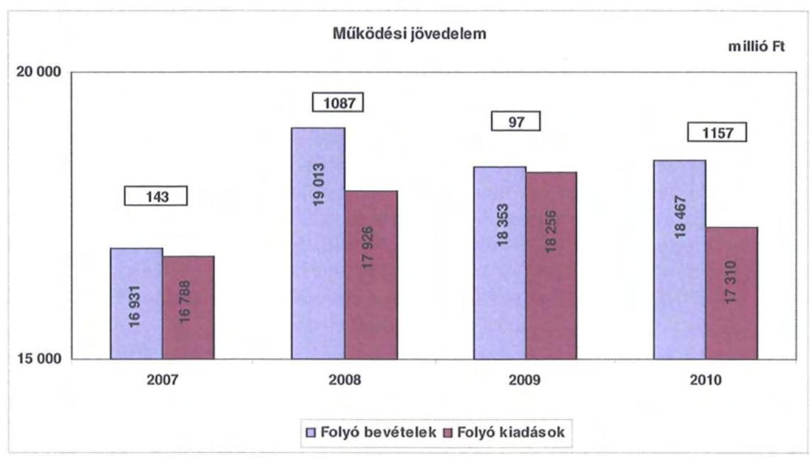

A folyó költségvetés egyenlege, (a működési forrástöbblet) 2007-ben a folyó kiadások 0,9%-át (143 millió Ft-ot), 2008-ban 6,1%-át (1087 millió Ft-ot), 2009-ben 0,5%-át (97 millió Ft-ot), 2010-ben 6,7%-át (1157 millió Ft-ot) jelentette. A vizsgált időszakban a működési jövedelem 2484 millió Ft megtakarítást mutatott, amely forrásul szolgálhatott az Önkormányzat fennálló tőketörlesztési kötelezettségeinek teljesítéséhez, valamint fejlesztéseinek finanszírozásához.

A pozitív előjelű folyó költségvetési egyenleg ellenére az Önkormányzat folyószámla- és munkabérhitel felvételére kényszerült az átmeneti likviditási problémák kezelése miatt. A likviditás javulását jelzi, hogy folyószámlahitel napi átlagos állománya 2007. évi 73 millió Ft-ról a 2010. évre 0,7 millió Ft-ra (99%-kal) csökkent.

Az Önkormányzat kötelezettségein ${ }^{36}$ belül a rövid lejáratú kötelezettségek állományának aránya a 2007. évi 10,0%-ról (1052 millió Ft) a 2010. évre 14,1%-ra (3128 millió Ft) nőtt. Az Önkormányzat 2007. december 31-én fennálló pénz és tőkepiaci kötelezettsége ${ }^{37}$ 8104 millió Ft-ról több mint kétszeresére, 18765 millió Ft-ra nőtt a hosszú lejáratú hitelfelvétel állományának emelkedése miatt. Az összes kötelezettségen belül a hosszú lejáratú pénzintézeti kötelezettségek 2007. december 31-e bázisán 2010. december 31-re több mint kétszeresére (124%-kal) 9934 millió Ft-tal nőttek.

A rövid lejáratú kötelezettségek 2010-ben 3128 millió Ft-ot tettek ki, amely 2075 millió Ft-tal (66,3%) több a 2007. évi rövid lejáratú kötelezettségállomá-

[^0]
[^0]:    ${ }^{36}$ passzív pénzügyi elszámolások nélküli
    ${ }^{37}$ Az Önkormányzat 2006. december 31-én fennálló pénz és tőkepiaci kötelezettsége 3669 millió Ft-ról több mint ötszörösére 18765 millió Ft-ra nőtt.

---

nynál. Az Önkormányzat a 2007. évben 6 millió Ft lejárt szállítói tartozással rendelkezett, amely a 2010. évben 330 millió Ft-ra nőtt.

Az Önkormányzat 2010. évi záró pénzkészlete 1436 millió Ft volt, amely teljes egészében kötelezettséggel terhelt.

Az Önkormányzat pénzügyi kapacitása a vizsgált időszakban változó értéket mutatott. A nettó működési jövedelem ${ }^{38}$ értéke a folyó költségvetési pozíció mellett az adott költségvetési év adósságtörlesztésének ${ }^{39}$ hatását is tükrözi. A 2007. évben 143 millió Ft működési jövedelem nem nyújtott fedezetet az 1756 millió Ft összegű fejlesztési célú hitelekhez kapcsolódó tőketörlesztésre, amelyből 1445 millió Ft rendkívüli fejlesztési célú hiteltörlesztés ${ }^{40}$ volt. Az Önkormányzat a korábbi hitelei fedezetét újabb külső forrás bevonásából teremtette meg. A 2009. évben a 97 millió Ft működési jövedelem ugyancsak nem nyújtott fedezetet a 157 millió Ft fejlesztési célú hiteltörlesztésre. A 2008. és a 2010. években a nettó működési jövedelem 997 millió Ft és 924 millió Ft volt, amely a felhalmozási deficit finanszírozásául szolgálhatott.

Az Önkormányzatnak a CLF módszer alapján a fejlesztési kiadások egy részének fedezete - a 2010. évi változatlan nettó működési jövedelem képződése mellett - biztosítottnak látszik. Továbbá információul szolgál a jövőben vállalható teljesíthető adósságszolgálat mértékéről.
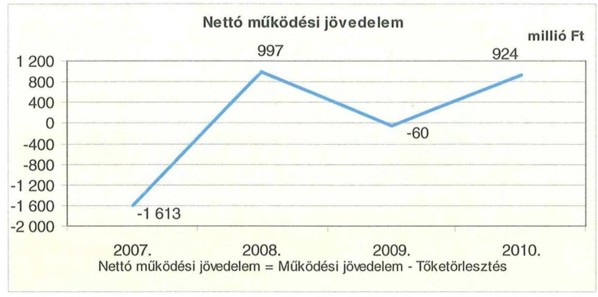

A 2007-2010. években az Önkormányzat felhalmozási költségvetésének egyenlege folyamatosan negatív összegű volt, amely prudens költségvetési gazdálkodás és pénzügyileg fenntartható ${ }^{41}$ beruházások esetén nem járna

[^0]
[^0]:    ${ }^{38}$ pénzügyi kapacitás
    ${ }^{39}$ Az Önkormányzat tőketörlesztési kötelezettsége 2007. évben 1756 millió Ft, a 2008. évben 90 millió Ft, 2009. évben 157 millió Ft, a 2010. évben 234 millió Ft volt.
    ${ }^{40}$ Az Önkormányzat az 1445 millió Ft hosszú lejáratú fejlesztési célú hitel visszafizetésének forrását az 5212 millió Ft összegű kötvénykibocsátásával teremtette meg.
    ${ }^{41}$ Az minősül pénzügyileg fenntartható beruházásnak, amelynek működtetésére az Önkormányzat nettó működési jövedelme még fedezetet nyújt.

---

magas pénzügyi kockázattal, amennyiben a felhalmozási hiányra a nettó működési jövedelem fedezetet nyújtana.

A felhalmozási költségvetés egyenlegének alakulását évről évre a következő ábra szemlélteti:
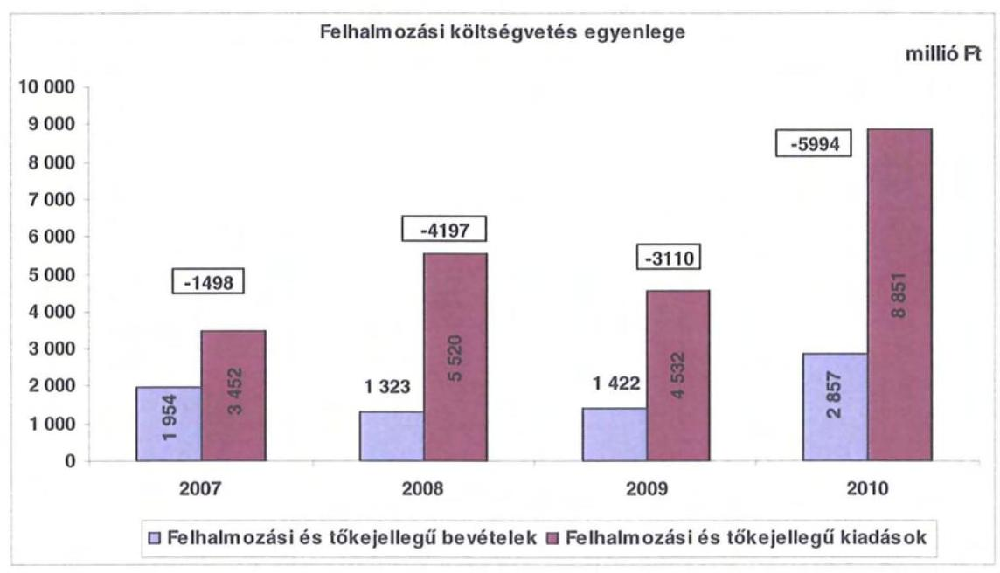

A felhalmozási forráshiánynak a felhalmozási és tőke jellegű kiadásokhoz viszonyított aránya 2007-ben 43,4% (1498 millió Ft), 2008-ban 76,0% (4197 millió Ft) 2009-ben 68,6% (3110 millió Ft) 2010-ben 67,7% (5994 millió Ft) volt.

A vizsgált időszakban jelentkező összes felhalmozási forráshiány 14799 millió Ft, amelynek 1,7%-ára nyújtott fedezetet a nettó működési jövedelem ${ }^{42}$. A vizsgált időszakban keletkezett 14799 millió Ft felhalmozási forráshiányra a képződött 247 millió Ft nettó működési jövedelem, a 2001 millió Ft 2007. évi nyitó pénzkészlet, a kötvény kibocsátásából származó bevételből 2932 millió Ft, valamint a felvett 9619 millió Ft összegű fejlesztési hitel nyújtott fedezetet.

Az Önkormányzat 2011. évi költségvetési rendeletében - a hagyományos költségvetési szerkezetben - tervezett bevételeinek és kiadásainak különbözete további 2860 millió Ft negatív teljes finanszírozási igényt mutat, melyet finanszírozhat a 2010. évi 1436 millió Ft záró pénzkészlet, a fennmaradó 1424 millió Ft hiányt azonban további hitelek felvételével tudja biztosítani az Önkormányzat, továbbá a 2011-ben képződő nettó működési jövedelem is fedezetet nyújthat rá.

[^0]
[^0]:    ${ }^{42}$ Az ábrában megjelenő 2010. évi felhalmozási kiadásokban a társuláshoz kapcsolódó beruházások összege 281 millió Ft.

---

Az Önkormányzat évenkénti teljes finanszírozási hiánya ${ }^{43}$ a CLF módszer szerint 2007-ben 3111 millió Ft, 2008-ban 3200 millió Ft, 2009-ben 3170 millió Ft, 2010-ben 5071 millió Ft volt, amelynek finanszírozását a finanszírozási célú bevételek és kiadások egyenlege biztosította.

Az önkormányzat finanszírozási műveletei 2007-2010. évekbeli egyenlegének alakulását a következő ábra szemlélteti:
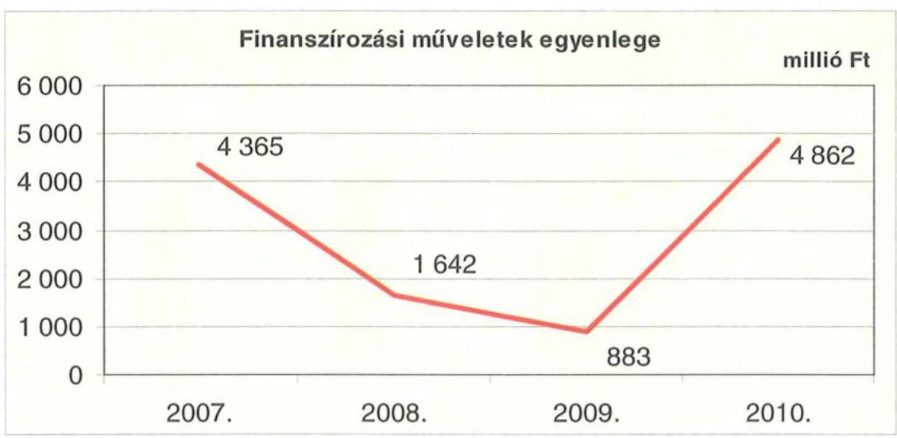

A finanszírozási többlet azt jelzi, hogy az éves költségvetések végrehajtása során szükség volt a pénzkészlet felhasználásán túl külső finanszírozás igénybevételére is. A finanszírozási célú műveleteket a vizsgált időszakban a jelentés 2. számú mellékletének 4.1-4.8 pontjai részletezik.

Az Önkormányzat zárszámadási rendeleteiben fejlesztési hiányt a hagyományos költségvetési szerkezet alapján mutatta be ${ }^{44}$, amelyről a jelentés 1. számú melléklete nyújt tájékoztatást. A zárszámadási rendeletek közül a 2007. és a 2010. évi 1769 és 2568 millió Ft összegű forráshiányt, a 2008. és a 2009. évi 1177 és 120 millió Ft bevételi többletet jelzett.

A kötelezettségek (passzív pénzügyi elszámolások nélkül) 2007. december 31-ei 10506 millió Ft-ról 2010. december 31-re 22155 millió Ft-ra emelkedtek, amely együtt járt a kamatkiadások növekedésével.

A vizsgált időszakban a kamatkiadások minden évben meghaladták a kamatbevételeket. A 2007-2010. évek között az Önkormányzat összesen 1258 millió Ft kamatot fizetett meg. Az átmenetileg szabad pénzeszközein realizált kamatbevétel, a teljes kamatráfordítás 62,4%-át (785 millió Ft) tette ki.

[^0]
[^0]:    ${ }^{43}$ a nettó működési jövedelem és a beruházási költségvetés eredője
    ${ }^{44}$ Nincs kötelező előírás a működési és fejlesztési hiány megállapításának módjára.

---

Az Önkormányzat kamatbevételeinek és kamatkiadásainak alakulását a következő ábra mutatja:
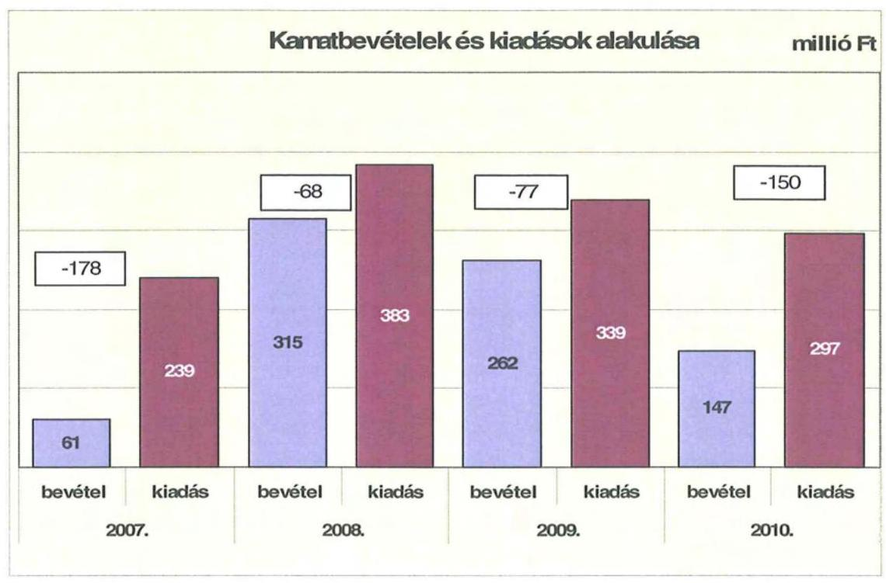

A 2011. évre az Önkormányzat a kamatkiadások további emelkedésével kalkulál, a költségvetési rendeletben tervezett 580,5 millió Ft kamatráfordítás 95%-kal, 283,1 millió Ft-tal haladhatja meg a 2010. évit.

# 2.2. Az Önkormányzat bevételeinek alakulása 

Az Önkormányzat realizált folyó (működési) bevétele a 2007. évi 16931 millió Ft-ról a 2008. évre 19013 millió Ft-ra (12,3%-kal) nőtt, a 2009. évre 18353 millió Ft-ra csökkent az előző évhez viszonyítva, a 2010. évre 18647 millió Ft-ra változott. A 2008. évi növekedést a költségvetési támogatás és az szja bevételek együttes összegének 849 millió Ft-os, az egyéb saját bevétel 569 millió Ft-os, az áfa bevételek 503 millió Ft-os, valamint a helyi adók és pótlékok 328 millió Ft-os emelkedése idézte elő. A bevételek 2009. évi alakulásában a költségvetési támogatás 1008 millió Ft-os csökkenése, a 2010. évi alakulásában az áfa bevételek 975 millió Ft-os növekedése játszott meghatározó szerepet.

---

Az Önkormányzat 2007-2010 között realizált, főbb bevételi jogcímeinek számszaki adatait az alábbi táblázat részletezi, és az ábra mutatja be:
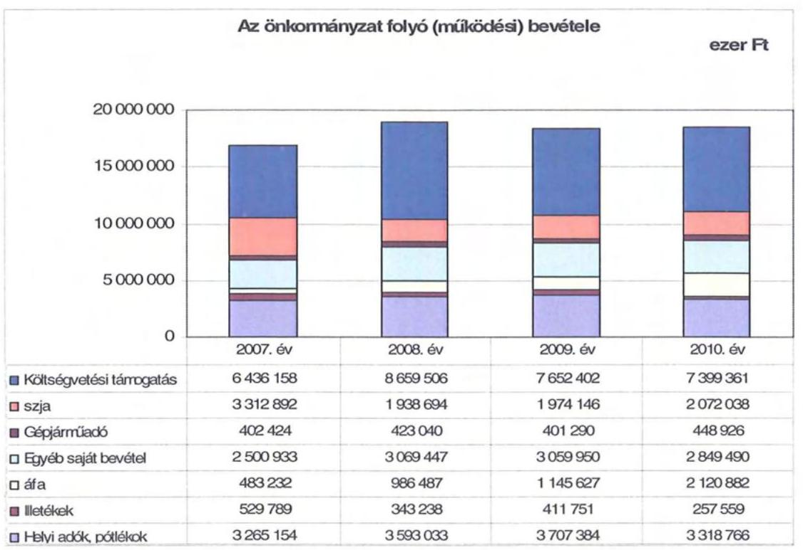

A költségvetési támogatás összege a 2008. évi 34,5%-os (2224 millió Ft) növekedést követően folyamatosan csökkent. Az előző évihez képest 2009-ben 11,6%-kal (1008 millió Ft-tal), 2010-ben 3,3%-kal (253 millió Ft-tal) kapott kevesebb forrást az Önkormányzat ezen a jogcímen. Az Önkormányzat költségvetési támogatás összege 2007-2010. között 6436 millió Ft-ról 7399 millió Ft-ra (15%-kal) nőtt.

Az szja bevétel a 2007. évi 3313 millió Ft-ról a 2008. évre 1939 millió Ft (58,5%-ra) csökkent. A 2009. évre 35 millió Ft-tal (1,8%-kal) növekedett az előző évhez képest. A 2010. évben 2072 millió Ft-ra nőtt a 2009. évi

 1974 millió Ft-ról. A 2007. évhez képest 37,5%-kal (1241 millió Ft-tal) csökkent a 2010. évre.

A költségvetési támogatás és az szja bevétel együttes összege a 2007. évi 9749 millió Ft-ról a 2010. évre 9471 millió Ft-ra (2,9%-kal) csökkent.

A gépjárműadóból származó bevétel 2007. évi 402 millió Ft-ról a 2010. évi 449 millió Ft-ra (11,7%-kal) emelkedett a 2010. évet érintő jogszabályi változások következtében.

Az egyéb saját bevételek a 2007. évi 2501 millió Ft-ról a 2010. évre 2849 millió Ft-ra, 348 millió Ft-tal (13,9%-kal) nőttek, amelyből jelentős részt képviseltek az osztalékok, üzemeltetési és koncessziós díjak bevételének 256 millió Ft-os növekedése.

---

Az áfa bevételek összege a 2007. évi 483 millió Ft-ról 2008-ra kétszeresére 986 millió Ft-ra nőtt, amely a fordított áfa bevezetéséből $^{45}$ (217 millió Ft) és fejlesztések (víziközmű, lakás és nem lakás célú ingatlanok) felhalmozási áfa visszatérüléseiből adódtak. Az előző évhez képest a 2010. évre 85%-kal, 2121 millió Ft-ra nőtt. Az áfa bevétel 2010. évre tapasztalt jelentős emelkedése a fordított áfa elszámolásához (1005 millió Ft), valamint a felhalmozási kiadások (vásárcsarnok építése, sávház felújítása) áfa visszatérülésekhez kapcsolódott.

Az Önkormányzatnál az illetékbevétel a 2007. évi 530 millió Ft-ról a 2010. évre 258 millió Ft-ra (51,3%-kal) csökkent a jogszabályi változás és az ingatlanforgalom visszaesése miatt.

A költségvetési támogatás, az szja bevétel és az illetékbevétel együttes összege a 2007. évi 10279 millió Ft-ról a 2010. évre 9729 millió Ft-ra (5,4%-kal) csökkent.

A helyi adók, pótlékok bevételeken belüli részaránya a 2007. évi 19,3%-ról a 2010. évre 18,0%-ra csökkent, volumenében azonban 3265 millió Ft-ról 3319 millió Ft-ra 54 millió Ft-tal (1,7%-kal) nőttek. Az Önkormányzat iparűzési adóerő képessége a 2007. évről a 2010. évre 356 millió Ft-tal (26,3%-kal), a lakóhelyen maradó személyi jövedelemadó 146 millió Ft-tal 19,5%-kal növekedett. Az iparűzési adó 2008. évi 328 millió Ft-os, 2009. évi 114 millió Ft-os növekedése nem az Önkormányzat intézkedése miatt, hanem jogszabályváltozás$^{46}$ és az adózók eredményei hatására következett be. Az Önkormányzat a vizsgált időszakban öt helyi adónemmel$^{47}$ rendelkezett, új adónemet nem vezetett be. Az adó mértékét az Önkormányzat a magánszemélyek kommunális adójánál, az építményadónál, az idegenforgalmi adónál és a telekadónál emelte, amely összeségében 2010. évben 37 millió Ft többletbevételt eredményezett a 2007. évhez képest.

Az iparűzési adónál a maximális adómértéket, 2%-ot alkalmaztak a vizsgált években. A magánszemélyek kommunális adójának mértéke a 2007. évi 3476 Ft/év-ről a 2008. évre 3632 Ft/év-re nőtt, amely a 2009. és a 2010. évben nem változott. Az építményadó mértéke a 2007. évi 338 Ft/m²-ről, 2008-ra 353 Ft/m²-re emelkedett, 2009-re nem változott, 2010-ben 368 Ft/m²-re nőtt. Az idegenforgalmi adó mértéke a 2007. évben 321 Ft/éj/fő, a 2008-2009. években 335 Ft/éj/fő volt, amely 2010-re 349 Ft/éj/fő mértékre változott. A telekadó 2007-2009. években 200 Ft/m² volt, amely a 2010. évben 208 Ft/m²-re nőtt, az adókedvezménnyel érintett telkek esetében az adó mértéke 2007. évben 117 Ft/m², a 2008-2009. években 121 Ft/m², amely a 2010. évre 126 Ft/m²-re nőtt.

[^0]
[^0]:    $^{45}$ A fordított áfa bevétel nem jelent valós bevételt, nem javítja az Önkormányzat pénzügyi pozícióját, mivel ezt az összeget az államnak tovább kell utalni.
    $^{46}$ A helyi adókról szóló törvényt módosító 2007. évi CXXVI. törvény 2008. január 1-jétől 2009. július 1-jéig az adóalap új megosztását vezette be, ami az Önkormányzat számára kedvezőbb volt.
    $^{47}$ Az Önkormányzat 2007. január 1. előtt helyi iparűzési adót, építményadót, telekadót, magánszemélyek kommunális adóját és idegenforgalmi adót vezetett be.

---

Az Önkormányzat a tulajdonosi részesedései után a KVG Zrt-től 2007. évben 15 millió Ft, a 2009. évben 10 millió Ft, a Vagyonkezelő Zrt-től a 2009. évben 5 millió Ft, a KAVÍZ Kft-től a 2010. évben 29 millió Ft osztalékot vett fel. Az Önkormányzat osztalékról nem mondott le. Azok a nyereséges társaságok, amelyek nem fizettek osztalékot, az adózás utáni eredményüket$^{48}$ eredménytartalékba helyezték. A 25% feletti önkormányzati tulajdonú gazdasági társaságok közül kettő (15,4%) a vizsgált időszak minden évében, ezen túlmenően egy társaság 2008-ban és egy társaság 2010. évben volt veszteséges.

Az önkormányzati feladatokat ellátó gazdasági társaságok közül bevételeiből a KAVIZ Kft. fizet az üzemeltetési szerződésének megfelelően használati díjat$^{49}$ az önkormányzati tulajdonban lévő víz és csatornahálózat használatáért, valamint a KVG Zrt. fizet bérleti díjat$^{50}$ az építési törmelék- és a szilárd hulladéklerakóért. A többi társaság bevételeiből az Önkormányzatnak nem származik bevétele.

Az Önkormányzat felhalmozási bevételei a vizsgált időszakban a következőképpen alakultak:
millió Ft

| Megnevezés | 2007. év   tény | 2008. év   tény | 2009. év   tény | 2010. év   tény |
| :-- | --: | --: | --: | --: |
| Tárgyi eszköz értékesítés | 243 | 409 | 387 | 621 |
| Egyéb saját tőkebevétel | 116 | 201 | 263 | 246 |
| Államháztartáson belülről   kapott támogatás | 941 | 569 | 666 | 1891 |
| EU-tól és külföldről kapott   támogatások | 14 | 10 | 0 | 0 |
| Államháztartáson kívülről   kapott támogatás | 640 | 134 | 106 | 99 |
| Összes felhalmozási bevétel | 1954 | 1323 | 1422 | 2857 |

Az Önkormányzat összes felhalmozási célú bevétele a 2010. évben 2857 millió Ft volt, amely 903 millió Ft-tal (46,2%-kal) volt magasabb a 2007. évinél, amelyben a tárgyi eszközök és az államháztartáson belülről kapott támogatások növekedése és az államháztartáson kívülről kapott támogatások csökkenése játszott meghatározó szerepet. Az összes bevételből minden vizsgált évre jellemzően jelentős részarányt - 2007. évben 941 millió Ft (48,1%), 2008. évben 569 millió Ft (42,9%-a), 2009. évben 666 millió Ft (46,8%-a), 2010.

[^0]
[^0]:    $^{48}$ Az Önkormányzat 25%-ot meghaladó tulajdoni részesedésű nyereséges gazdasági társaságai közül, amelyek osztalékot nem fizettek 80-6000 ezer Ft közötti adózás utáni eredménnyel rendelkeztek a vizsgált időszakban.
    $^{49}$ A KAVÍZ Kft. a 2009. évben 346 millió Ft, a 2010. évben 437 millió Ft eszközhasználati díjat fizetett az Önkormányzatnak.
    $^{50}$ A KVG Zrt. a 2007. évben 19 millió Ft, a 2008. évben 31 millió Ft, 2009. évben 21 millió Ft, a 2010. évben 13 millió Ft bérleti díjat fizetett.

---

évben 1891 millió Ft (66,2%) - képviselt az államháztartáson belülről kapott támogatás, amely a megvalósított és a folyamatban lévő fejlesztésekhez kapcsolódott. Az államháztartáson belülről kapott támogatásból a 2007-2010. között az évek sorrendjében 326 millió Ft, 147 millió Ft, 659 millió Ft és 1771 millió Ft volt a fejezeti kezelésű előirányzatok között kimutatott EU-s forrás. A 2007. évről a 2010. évre 378 millió Ft-tal (2,5 szeresére) nőtt a tárgyi eszköz értékesítés bevétele, 541 millió Ft-tal, 84,5%-kal csökkent az államháztartáson kívülről kapott támogatás. A 2010. évi tárgyi eszközök értékesítéséből jelentős összeget tett ki a volt Petőfi utcai iskola 285 millió Ft-os, a lőtér területéből 4000 m²-s terület eladásából származó 309 millió Ft-os bevétel. A 2007. évben az államháztartáson kívülről kapott támogatások között meghatározó részt képviselt a panel felújítási programhoz kapcsolódó, lakástulajdonosok által befizetett 481 millió Ft.

# 2.3. Az Önkormányzat kiadásainak alakulása 

Az Önkormányzat folyó kiadásai a 2007-2009. évek között növekedtek, a 2007. évi 16788 millió Ft-ról az évek sorrendjében 17926 millió Ft-ra (6,8%-kal) és 18256 millió Ft-ra - a 2007. év bázisán - (8,7%-kal), a 2010. évre 17310 millió Ft-ra csökkent, azonban így is meghaladta a 2007. évi értéket. A transzferkiadások a 2007. évi 1323 millió Ft-ról a 2010. évre 2427 millió Ft-ra nőttek, részarányuk 7,9%-ról 14%-ra változott. A transzferkiadások közül a vállalkozások részére átadott pénzeszközök a 2007. évi 226 millió Ft-ról a 2010. évre 1195 millió Ft-ra nőttek, mivel a Színház a 2009. évben gazdasági társasággá alakult és az intézmény finanszírozást átadott pénzeszközként kapta meg. A kamatkiadások a 2007. évi 239 millió Ft-ról a 2008. évre 144 millió Ft-tal (60%-kal) 383 millió Ft-ra nőttek a kötvénykibocsátás miatt, ezt követően viszont 44 millió Ft-tal és 42 millió Ft-tal csökkentek az előző évhez viszonyítva a kamat mértékének csökkenése miatt.

Az Önkormányzat folyó kiadásai főbb jogcímek szerinti bontásban az alábbiak voltak:

| Megnevezés | 2007. | 2008. | 2009. | 2010. |
| :--: | :--: | :--: | :--: | :--: |
| Folyó kiadások | 16787624 | 17926409 | 18256157 | 17309787 |
| Működési kiadások (kamatkiadás nélkül) | 14811251 | 15573288 | 15165107 | 14240526 |
| Államháztartáson belülre átadott pénzeszközök | 104941 | 82883 | 143684 | 144179 |
| Transzferkiadások | 1323432 | 1500010 | 2233866 | 2426906 |
| -ebből: vállalkozásoknak | 225777 | 240836 | 963246 | 1194730 |
| EU-nak, illetve külföldre | 0 | 0 | 0 | 0 |
| magánszemélyeknek | 838081 | 952552 | 1049729 | 1080621 |
| nonprofit szervezeteknek | 259574 | 306622 | 220897 | 151555 |
| Kamatkiadások | 238884 | 382965 | 338967 | 297354 |
| Előző évi pénzmaradvány átadás | 309116 | 387263 | 374533 | 200819 |

---

Az Önkormányzat folyó kiadásai közül, a főbb kiadásnemek szerinti bontásban az alábbiak voltak:

| Megnevezés | 2007. év | 2008. év | 2009. év | 2010. év |
| :--: | :--: | :--: | :--: | :--: |
| Személyi juttatások | 7593041 | 8207081 | 7232903 | 7261407 |
| Munkaadót terhelő járulékok | 2370540 | 2409222 | 2085933 | 1838280 |
| Dologi kiadások | 4476515 | 4870634 | 5058557 | 4871991 |
| Egyéb folyó kiadások | 91442 | 103154 | 103311 | 202804 |
| Működési célú pénzeszközátadás | 590292 | 631736 | 1331146 | 1497244 |

Az Önkormányzat 2007-ben 9964 millió Ft-ot (a folyó kiadások 59,4%-át) személyi juttatásokra és a munkaadókat terhelő járulékokra fordította, az üzemeltetést, intézményfenntartást biztosító dologi kiadásokra 4477 millió Ft (26,7%) jutott. A működési kiadásokon belül a személyi juttatások és járulékok aránya a 2007. évi 9964 millió Ft-ról (59,4%-ról) a 2010. évre 9100 millió Ft-ra (52,6%-ra) csökkent.

A személyi juttatások
 a 2007. évi 7593 millió Ft-ról a 2010. évre 7261 millió Ft-ra (4,3\%-kal) - 2008. év kivételével - csökkentek, az álláshely megszüntetések, a Színház 2009. évi gazdasági társasággá történő átalakítása miatt.

A dologi kiadások az Önkormányzatnál a 2007-2009. években a kiadáscsökkentő intézkedések ellenére 4477 millió Ft-ról 5059 millió Ft-ra nőttek ${ }^{51}$, a 2010. évre 4872 millió Ft-ra csökkentek. A 2010. évben a 2007. évi szintnél 8,8\%-kal (395 millió Ft-tal) voltak magasabbak a dologi kiadások.

A működési célú pénzeszközátadás a 2007. évi 590 millió Ft-ról a 2010. évre 1497 millió Ft-ra 907 millió Ft-tal nőtt, amelyből jelentős összeget képviselt a Színháznak átadott 2010. évi 610 millió Ft-os támogatás.

A Színház 2009. január 31-ig költségvetési szervként működött. Az Önkormányzat a Színház működéséhez a 2007. évben 584 millió Ft működési támogatást biztosított, amelyből a fenntartói működési támogatás 266 millió Ft volt. Az átalakulás évében - 2009-ben - a támogatás 775 millió Ft-ra nőtt, amelyből 382 millió Ft volt a fenntartói működési támogatás. A 775 millió Ft összes támogatásból 156 millió Ft-ot költségvetési szervként, a 619 millió Ft-ot gazdasági társasáként kapta. A 2010. évben az Önkormányzat - a Színház adatszolgáltatása szerint 610 millió Ft-ot adott át működési célra, amelyből a fenntartói támogatás 270 millió Ft volt.

A Színház 2007. évi fenntartói támogatását a 2010. évi 4 millió Ft-tal (1,5\%-kal) haladta meg, míg az Önkormányzat többi intézményének a támogatása a 2007. évi 6084 millió Ft-ról ${ }^{52}$ a 2010. évre 6340 millió Ft-ra 256 millió Ft-tal (4,2\%-kal) nőtt, amely azt igazolja, hogy a Színház gazdasági társasággá történő átalakítása gazdaságilag megalapozott volt. Az Önkormányzat a 2011. évben a 2010. évi fenntartói támogatást 40 millió Ft-tal tervezi csökkenteni.

[^0]
[^0]:    ${ }^{51}$ A dologi kiadások a 2008. évben 217 millió Ft, a 2009. évben 431 millió Ft fordított áfa befizetést tartalmaztak.
    ${ }^{52}$ A 2007. évi 6350 millió Ft önkormányzati intézményi támogatása a Színház 266 millió Ft-os támogatásával csökkentésre került, hogy összehasonlítható legyen a 2010. évivel.

---

A gazdasági társaságok részére nyújtott támogatások évenkénti alakulását a következő grafikon mutatja:
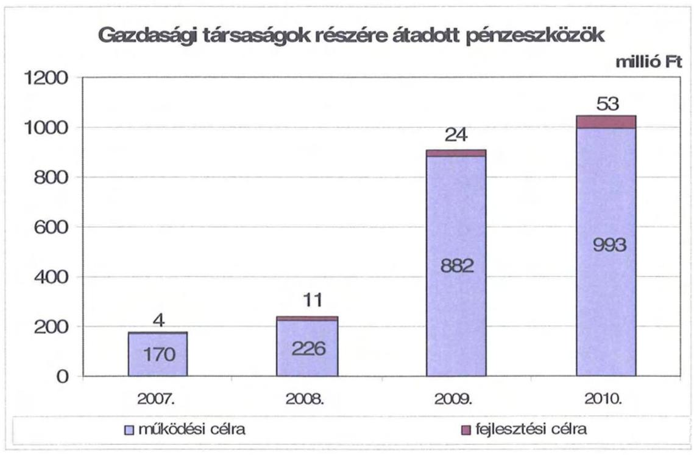

A támogatások összege a 2007. évi 174 millió Ft-ról a 2010. évre 1046 millió Ft-ra nőtt, mivel a Színház 2009. évtől gazdasági társaságként működik és az intézmény-finanszírozást átadott pénzeszközként biztosította az Önkormányzat. Az önkormányzati kiemelt feladatot ellátó gazdasági társaságok közül a Tömegközlekedési Zrt. kap az Önkormányzattól támogatást. A 2007-2010 között az Önkormányzattól kapott támogatások összege a 89 millió Ft-ról 318 millió Ft-ra több mint 3,5 szeresére nőtt. A 2010. évi támogatásból 47 millió Ft (14,8\%) fejlesztési célú volt, amelyet a buszpark fejlesztésére fordított a Tömegközlekedési Zrt. A támogatások árbevételhez viszonyított aránya a 2007. évi 650 millió Ft árbevétel 13,6\%-ról a 2010. évre - 640 millió Ft árbevétel 49,7\%-ra 36,1 százalékponttal nőtt.

A gazdasági társaságok számára nyújtott önkormányzati támogatások összegét részletesen a 4. számú melléklet tartalmazza.

A működési és felhalmozási kiadások arányának változásában 2007-2010. között elmozdulás figyelhető meg, a felhalmozási kiadások 3452 millió Ft-ról (20,1\%-ról) 8851 millió Ft-ra (51,1\%-ra) nőttek.

---

A működési és felhalmozási kiadások évenkénti alakulását a következő grafikon szemlélteti:
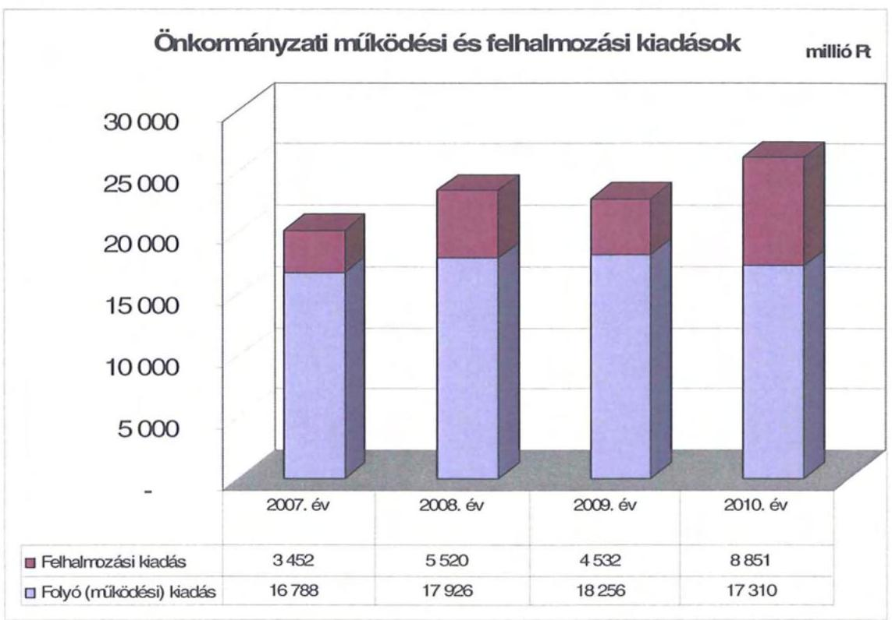

A Hulladékgazdálkodási társulás nélküli működési és felhalmozási kiadások arányából a felhalmozási kiadások aránya a 2007. évi 20,1\%-ról (3452 millió Ft-ról) a 2010. évre 49,7\%-ra (8570 millió Ft-ra) nőtt. A Hulladékgazdálkodási társulás 2010. évi felhalmozási kiadása nem számottevő mértékű, mindössze 1,2\%-ot (281 millió Ft-ot) képvisel a teljes felhalmozási kiadásokból.

Az Önkormányzat 2007-2010. években együttesen 19065 millió Ft-ot fordított fejlesztéseinek finanszírozására, amelynek 15,4\%-a a 10 millió Ft egyedi beszerzési érték alatti fejlesztésekhez kapcsolódott. A 2007-2010. között 160 darab 10 millió Ft teljes bekerülési költség feletti befejezett beruházás és felújítás összértéke 8999 millió Ft, a 10 millió Ft alatti fejlesztések összértéke 2927 millió Ft volt. Az Önkormányzat a 2007-2010. években megvalósított, 2010. december 31-éig befejezett fejlesztéseinek forrását 3236 millió Ft összegben önkormányzati saját bevétel, 8937 millió Ft összegben hitel, 1766 millió Ft kötvény kibocsátásából származó bevétel, 2785 millió Ft EU-s támogatás, valamint 2340 millió Ft összegben hazai támogatás képezte.

A folyamatban lévő három felújítás és 19 fejlesztés várható teljes bekerülési költsége 18145 millió Ft. A 2010. december 31-éig teljesített kiadás 7138 millió Ft volt. A fejlesztések forrása 333 millió Ft önkormányzati saját bevétel, 3563 millió Ft hitel, 1143 millió Ft kötvény kibocsátásából származó bevétel, 2079 millió Ft EU-s támogatás, valamint 20 millió Ft hazai támogatás volt. A folyamatban lévő fejlesztések esetében a 2010. után vállalt kötelezettségek összege 11007 millió Ft, amelynek a forrásmegosztása 1722 millió Ft önkormányzati saját bevétel, 3046 millió Ft hitel, 6188 millió Ft EU-s támogatás, valamint 51 millió Ft hazai támogatás.

---

A folyamatban lévő fejlesztések tartalmazzák az Önkormányzat gesztorságával működő Hulladékgazdálkodási társulás hulladékgazdálkodási rendszer fejlesztése beruházást 5854 millió Ft összegben, amelynek keretében megvalósul a házhoz menő szelektív hulladékgyűjtés, három hulladékudvar kialakítása, valamint a hulladékkezelő központ a hozzá kapcsolódó létesítményekkel.

A közbenső egyeztetés során a polgármester által tett észrevétel szerint: „Szintén a Polgármesternek tett javaslatok 7. pontjával kapcsolatban (25. oldal) megjegyzem, hogy az Önkormányzat nem gesztor fejlesztési társulásban csak tag. Gesztorsággal kapcsolatban kockázata így nem áll fenn."

Az észrevétel nem megalapozott, mivel a Hulladékgazdálkodási Társulás Szervezeti és Működési Szabályzata III. fejezet /3/ bekezdés szerint „A Társulás Gesztora (Kaposvár Megye Jogú Város) Polgármesteri Hivatala a pénzügyi, gazdálkodási, vagyonkezelési, ellenőrzési feladatok körében ellátja: a) a tervezési, gazdálkodási, beszámolási feladatokat; b) a beruházás, felújítás előkészítését, lebonyolítását; c) a Társulás ingatlan vagyonával, vagyoni érdekeltségeivel és egyéb vagyonával kapcsolatos közgazdasági, pénzügyi, jogi feladatokat."A Polgármesteri hivatal Szervezeti és Működési Szabályzatának 2. számú mellékletébe foglalt szabályozás II. fejezete tartalmazza a Hulladékgazdálkodási társulás kötelezettségvállalási, ellenjegyzési, utalványozási és érvényesítési rendjét.

A fejlesztés 2010. december 31-ig teljesített kiadása 262 millió Ft volt, amely forrásösszetétele 67 millió Ft társulási saját bevétel, 29 millió Ft hitel, 166 millió Ft EU-s támogatás. A 2010. utánra vállalt kötelezettség 5592 millió Ft, amelynek a forrásmegoszlása 1131 millió Ft társulási saját bevétel, 1226 millió Ft hitel, 3235 millió Ft EU-s támogatás. A fejlesztéshez az Önkormányzatnak saját erőt nem kell biztosítania. Az Önkormányzat a projekt finanszírozására szolgáló - népességszám arányában számított - 585,4 millió Ft hitel törlesztésére kezességet vállalt.

Az Önkormányzat három legmagasabb bekerülési költségű fejlesztése a következő:

- A fürdő rekonstrukció keretében a meglévő épület teljes rekonstrukciója mellett megvalósításra kerül egy komplex gyógyászati és wellness fitness rész, valamint a medencék vízfelületének $470 \mathrm{~m}^{2}$-rel történő bővítése, továbbá a gázellátás és termálvíz ellátás fejlesztése. Mindezek együttes tervezett fejlesztési költsége 3513 millió Ft. A 2007-2010. években 2679 millió Ft fejlesztési kiadás teljesítésére került sor, 2010. után fennálló kötelezettség 834 millió Ft, amelynek a forrásmegosztása 251 millió Ft önkormányzati saját bevétel, 511 millió Ft hitel, 72 millió Ft EU-s támogatás.
- Az „AGÓRA" multifunkcionális közösségi központ kialakítása fejlesztés során létrehoznak egy korszerű eszközökkel felszerelt közművelődési teret, amelynek várható fejlesztési költsége 2104 millió Ft lesz. A 2007-2010. években 370 millió Ft fejlesztési kiadásteljesítésre került sor, 2010. után fennálló kötelezettség 1734 millió Ft, amelynek a forrásmegosztása 135 millió Ft önkormányzati saját bevétel, 450 millió Ft hitel, 1098 millió Ft EU-s támogatás, valamint 51 millió Ft hazai támogatás.
- A városközpont rehabilitációja fejlesztés során a meglévő sétáló övezet kibővítését, a volt mozi épületből kulturális központ kialakítását, a Polgármesteri hivatal alá kétszintes mélygarázs kialakítását tervezték, amelynek tervezett

---

fejlesztési költsége 2362 millió Ft. A 2007-2010. években 2031 millió Ft fejlesztési kiadásteljesítésre került sor, a 2010. után fennálló kötelezettség 331 millió Ft, amelynek a forrásmegosztása 25 millió Ft önkormányzati saját bevétel, 306 millió Ft EU-s támogatás.

Az Önkormányzat elbírálás alatti fejlesztési pályázatainak összege 2929 millió Ft. Az Önkormányzat egy felújításra adott be pályázatot 57 millió Ft összegben, amelyhez 46 millió Ft hazai támogatást pályázott 11 millió Ft hitel mellett. A fejlesztési feladatokhoz nyolc pályázatot nyújtott be, melyek teljes bekerülési költsége 2872 millió Ft, amelyből a 2010. utánra vállalt kötelezettség 2756 millió Ft. A forrásösszetétel 536 millió Ft hitel, 2101 millió Ft EU-s támogatás és 119 millió Ft hazai támogatás.

---

Az Önkormányzat fejlesztési tevékenysége a pályázati kiírások által nagyban befolyásolt, és saját felhalmozási bevételei alacsony szintje miatt beruházásokat csak külső források, EU-s és hazai támogatások elnyerése esetén tud megvalósítani.

Az Önkormányzat 2007-2010. években megvalósított, illetve 2010. december 31-én fennálló, valamint az elbírálás alatt lévő fejlesztési feladatokhoz kapcsolódó kötelezettségeinek összegzését a jelentés 3/a-d számú mellékletei tartalmazzák.

# 3. KÖTELEZETTSÉGEK BEMUTATÁSA 

### 3.1. A pénzintézetek felé fennálló kötelezettségek alakulása

Az Önkormányzat pénzintézeti kötelezettségeinek állománya 2007. december 31-től 2010. december 31-ig 2,3 szeresére 8104 millió Ft-ról 18765 millió Ft-ra növekedett (a hosszú lejáratú kötelezettségek állománya az árfolyamváltozásból adódóan 2009. évben és 2010. évben 1075 millió Ft-tal, illetve 1383 millió Ft-tal növekedett). A fennálló pénzintézeti kötelezettségei kötvények kibocsátásából, valamint hosszú lejáratú hitel igénybevételéből keletkeztek.
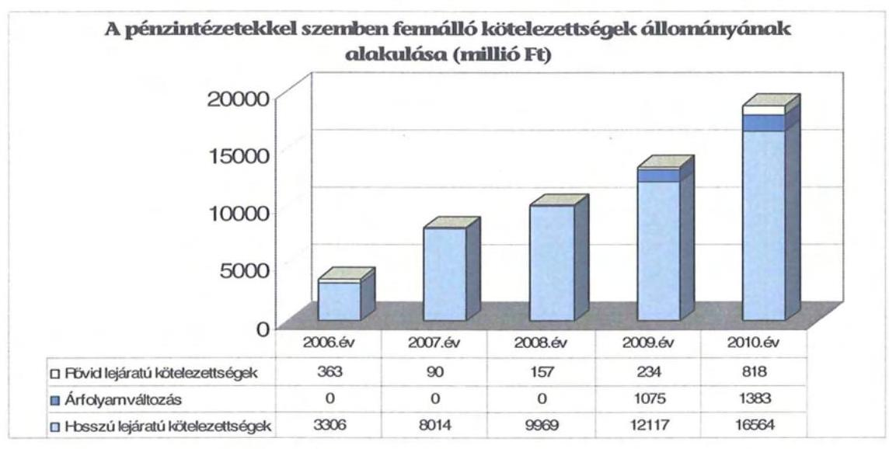

Az árfolyamváltozás hatása is befolyásolja a kötelezettségek alakulását, azonban annak mértéke előre pontosan nem határozható meg, csak várakozásokon alapuló tendenciák jelezhetőek. Annak megítéléséről, hogy a devizában kibocsátott kötvényekért a kötvények visszavásárlásakor jelentkező forintban számított kötelezettség többletkiadást (árfolyamveszteség) vagy megtakarítást (árfolyamnyereség) eredményez a futamidő végén, a teljes kötelezettség rendezését követően lehet képet alkotni. Mindaddig, amíg törlesztési kötelezettség nem áll fenn (türelmi idő, moratórium), a tőkére vonatkoztatva nem értelmezhető sem az árfolyamveszteség, sem az árfolyamnyereség. Ugyanakkor a számviteli szabályok meghatározzák, hogy az árfolyam különbözetet az év végén a kötelezettségek, vagy a követelések között a könyvviteli mérlegben nyilván kell tartani, azonban az árfolyam különbözet valójában nem realizált.

---

Az Önkormányzat pénzintézeti kötelezettségvállalásaira minden esetben közgyűlési döntés alapján került sor. A kötelezettségvállalásból származó források felhasználási céljait meghatározták. Az adósságszolgálat felső határáról az éves költségvetési rendelettervezetek előterjesztésekor tájékoztatták a Közgyűlést. Az adósságot keletkeztető kötelezettségvállalások felső határát betartották.

Az adósságot keletkeztető kötelezettségvállalással megvalósított felhalmozási kiadások esetleges bevételt növelő, illetve kiadást csökkentő vonzatát, illetve ennek a fejlesztéshez, felújításhoz vállalt kötelezettségek visszafizetési forrásként való számbavételét - a kiemelt projektek kivételével - nem vizsgálták. A kötvénykibocsátásról és a hosszú lejáratú hitel felvételéről szóló előterjesztésekben a Közgyűlés tájékoztatása megtörtént a kamat és tőkefizetési kötelezettségről. A költségvetési rendeletek mellékletében bemutatták a lejáratig fizetendő tőketörlesztés és kamatok összegeit, a visszafizetés forrásait azonban nem számszerűsítették. A likviditási és eladósodási problémák kezelésére Közgyűlés által jóváhagyott koncepciót, stratégiát nem készítettek, azonban a különböző megtakarítási intézkedési csomagok elfogadásával és
 realizálásával az említett problémák kezelését készítették elő.

Az önkormányzat 2010. december 31-én CHF-ben fennálló adósságot keletkeztető kötelezettségvállalásai az alábbiak voltak:

| Megnevezés | Kibocsátás, illetve szerződéskötés időpontja | Összeg CHF | Kibocsátási, vagy felújvási árfolyam (HUF/CHF) | Kamat (referencia kamat+ kamatfelár) | Felhasználás célja: |
| :--: | :--: | :--: | :--: | :--: | :--: |
| Kaposvár I. Kötvény | 2007.12.21 | 13245033 | 151 | 6 havi CHF LIBOR (3,05%) +0,95% | Kismeti projektek előkészítési költségeire: 154 m Ft, ingatlanok és vagyoni értékű jogok vásárlására 390,4 m Ft, fejlesztési célú átadásokra, támogatásokra: 312,7 m Ft, hitellel nem fedezett beruházásokra, felújításokra: 392,7 m Ft |
| Kaposvár II. Kötvény | 2007.12.21 | 14238411 | 151 | 6 havi CHF LIBOR (3,05%) +0,95% | Felhalmozási célú hitelek kiváltására: 1450 millió Ft, működési hiány rendezésére: 692,5 m Ft, beruházások finanszírozására: 4 m Ft |
| Kaposvár III. Kötvény | 2007.12.21 | 7031788 | 151 | 6 havi CHF LIBOR (3,05%) +0,95% | Kaposvár költségvetési koncepciója elszámolás megfizetése 62 m Ft, Gr-k alapfelújítására, vásárlására 894,4 m Ft, kismeti projektek előkészítési és nem elszámolható költségeire: 195,5 m Ft |

Az önkormányzati kötvények kibocsátását az EU-s pályázatok benyújtásához, megvalósításához szükséges önerő forrásának biztosításával, a tervezett egyéb beruházási és felújítási célok pénzügyi fedezetének előteremtésével, valamint a jelenleg fennálló hitelek kedvezőbb kamatozású forrással történő kiváltásával indokolták.

---

A Közgyűlés döntése ${ }^{53}$ értelmében az összesen az 5212 millió Ft összegnek megfelelő CHF értékben, zártkörű, 20 éves futamidejű változó kamatozású, szabad felhasználású kötvény kibocsátásával finanszírozható az 1998-2004. években felvett fejlesztési hitelekből fennálló 1452 millió Ft, valamint a 696 millió Ft folyószámlahitel kiváltása, illetve az ÜMFT operatív programjaihoz kapcsolódó fejlesztési célok önereje és az Önkormányzat gazdasági programjában felhalmozási feladatok megvalósítása. Az önkormányzati határozatokban foglaltakkal összhangban három pénzintézettől kértek ajánlatot a kötvény kibocsátásra, a bíráló bizottság javaslata alapján a Közgyűlés az összességében legkedvezőbb ajánlatot adó pénzintézetet bízta meg a kötvénykibocsátással. A megbízott pénzintézet nem az Önkormányzat számlavezetője volt.

A Kaposvár I. kötvénykibocsátásból származó forrásokat kimutatásaik szerint 153,9 millió Ft összegben kiemelt projektek előkészítési költségeire, 390,4 millió Ft összegben ingatlanok és vagyoni értékű jogok vásárlására, 312,7 millió Ft összegben fejlesztési célú átadásokra, támogatásokra és 379,2 millió Ft összegben hitellel nem fedezett felújítási, beruházási kiadásokra használták fel. A Kaposvár II. kötvény kibocsátásából származó forrás felhasználása kimutatásaik szerint 1450 millió Ft összegben felhalmozási célú hitelek kiváltására, 695,9 millió Ft összegben felhalmozott működési hiány rendezésére és 4 millió Ft összegben beruházási célokra történt. A Kaposvár III. kötvényből 61,8 millió Ft összegben az egyszeri konverziós díjat, 804,4 millió Ft összegben gazdasági társaságok alapítását, vásárlását és 195,6 millió Ft összegben a kiemelt projektek előkészítési költségeit finanszírozták. Az Önkormányzat 2010. december 31-én 764,1 millió Ft felhasználatlan kötvényforrással rendelkezett, amelyek a felhasználási céloknak megfelelő feladatok finanszírozásának fedezetét biztosítják. A kötvénykibocsátást követően szerződésmódosításra nem került sor.

Az Önkormányzat a 2011. évi költségvetési rendeletében arról döntött, hogy az éves felhalmozási feladatok forrásának megteremtésére további 1000 millió Ft fejlesztési célú hitelt vesz fel az Önkormányzati Infrastruktúrafejlesztési Hitelprogram keretében, vagy 1000 millió Ft felhalmozási célú kötvényt bocsát ki. Az idegen forrás bevonását mérlegelve hosszú távú fejlesztési hitel felvételét tartották indokoltnak. Az ÁSZ vizsgálat ideje alatt a hitelszerződés előkészítése és egyeztetése folyamatban volt.

Az Önkormányzat a kötvénykibocsátásból származó forrás befektetéséből ${ }^{54}$ a Kaposvár I. kötvény esetében 360,6 millió Ft, a Kaposvár III. kötvény esetében 180,3 millió Ft hozam, illetve kamatbevételt realizált, amelyet kimutatásaik szerint folyó működési kiadások finanszírozására fordítottak. Az Önkormányzat likviditási helyzetétől függően a lekötési időtartam 1-6 hónap között változott.

[^0]
[^0]:    ${ }^{53}$ A kötvénykibocsátásról a Közgyűlés a 345/2007. (XII.6.) számú határozatával döntött. Az 5212 millió Ft-nak megfelelő CHF-ben történő kibocsátást a szervező és lejegyző pénzintézet három részletben - dematerializált kötvény okirattal - bonyolította (Kaposvár I. kötvény, Kaposvár II. kötvény, Kaposvár III. kötvény).
    ${ }^{54}$ A Polgármester a költségvetési rendeletben kapott felhatalmazás alapján döntött a kötvény ellenértékének betétként történő lekötéséről, illetve egy esetben állampapír vásárlásáról.

---

Az Önkormányzat 2010. december 31.-én HUF-ban fennálló adósságot keletkeztető kötelezettségvállalásai az alábbiak voltak:

| Megnevezés | Szerződéskötés időpontja | Összeg | Kamat (referencia kamat+ kamatfelár) | Felhasználás célja: |
| :--: | :--: | :--: | :--: | :--: |
| Hosszú lejáratú fejlesztési hitel 1 | 2001.08.29 | 107411 | 3 havi EURIBOR + 1% | 99 darab szociális bérlakás építése |
| Hosszú lejáratú fejlesztési hitel 2 | 2002.10.24 | 124412 | 3 havi EURIBOR + 1% | 59 darab szociális bérlakás építése |
| Hosszú lejáratú fejlesztési hitel 3 | 2002.11.27 | 197956 | 3 havi EURIBOR + 1,00% | 72 darab szociális bérlakás építése |
| Hosszú lejáratú fejlesztési hitel 4 | 2005.10.14 | 607314 | 3 havi EURIBOR + 1,33% | Beruházások, felújítások finanszírozása |
| Hosszú lejáratú fejlesztési hitel 5 | 2005.10.14 | 179173 | 3 havi EURIBOR + 0,75% | Környezetvédelmi fejlesztések finanszírozása |
| Hosszú lejáratú fejlesztési hitel 6 | 2006.04.07 | 633336 | 3 havi EURIBOR - 0,05% | Iparosított technológiával épült épületek felújítása |
| Hosszú lejáratú fejlesztési hitel 7 | 2006.09.20 | 204214 | 3 havi EURIBOR + 0,89% | Ivóvízmű fejlesztés javítását, szennyvízelvezetési és szennyvíztisztítási, valamint csapadékvíz elvezetést szolgáló beruházások |
| Hosszú lejáratú fejlesztési hitel 8 | 2006.09.20 | 11008 | 3 havi EURIBOR + 0,89% | Információs és infokommunikációs rendszerek létrehozásához szükséges beruházások finanszírozása |
| Hosszú lejáratú fejlesztési hitel 9 | 2006.09.20 | 226086 | 3 havi EURIBOR + 1,39% | Önkormányzati tulajdonú létesítmények felújítása |
| Hosszú lejáratú fejlesztési hitel 10 | 2006.09.20 | 10350 | 3 havi EURIBOR + 0,89% | Házi orvosi, házi gyermekorvosi, fogorvosi rendelők tányírt eszközeinek felújítása, korszerűsítése |
| Hosszú lejáratú fejlesztési hitel 11 | 2007.01.24 | 494917 | 3 havi EURIBOR + 0,937% | Iparosított technológiával épült ikerépület felújítása |
| Hosszú lejáratú fejlesztési hitel 12 | 2007.08.07 | 196360 | 3 havi EURIBOR + 0,4389% | Környezetvédelemhez kapcsolódó beruházások finanszírozása |
| Hosszú lejáratú fejlesztési hitel 13 | 2007.08.07 | 722112 | 3 havi EURIBOR + 1,5% | Önkormányzati infrastruktúrafejlesztési program, |
| Hosszú lejáratú fejlesztési hitel 14 | 2007.08.07 | 15302 | 3 havi EURIBOR + 0,4389% | Informatikai célú fejlesztések |
| Hosszú lejáratú fejlesztési hitel 15 | 2008.12.05 | 760000 | 3 havi EURIBOR + 1,45% | Közoktatási célú beruházások |
| Hosszú lejáratú fejlesztési hitel 16 | 2008.12.05 | 3640000 | 3 havi EURIBOR + 1,95% | Beruházások, felújítások finanszírozása |
| Hosszú lejáratú fejlesztési hitel 17 | 2008.12.29 | 3250000 | 3 havi EURIBOR + 1,45% | ÜMFT pályázatokhoz szükséges önerő biztosítása |
| Hosszú lejáratú fejlesztési hitel 18 | 2008.12.29 | 1350000 | 3 havi EURIBOR + 1,45% | 30 darab bérlakás építése |
| Hosszú lejáratú fejlesztési hitel 19 | 2009.09.29 | 264000 | 3 havi EURIBOR + 2,257% | Iparosított technológiával épült ikerépület felújítása |
| Hosszú lejáratú fejlesztési hitel 20 | 2009.09.29 | 615732 | 3 havi EURIBOR + 2,257% | Iparosított technológiával épült épületek felújítása, korszerűsítésének támogatása |

Az Önkormányzat 2010. december 31-ei HUF-ban fennálló adósságállománya 20 hosszúlejáratú fejlesztési hitelszerződés alapján 11095 millió Ft volt. További három hitelszerződés ${ }^{55}$ alapján 1092,8 millió Ft hitelkeret állt az önkormányzat rendelkezésére, amelyből a helyszíni vizsgálat időpontjáig - a beruházás közbeszerzési eljárásának elhúzódása, valamint a támogatási szerződés módosításának átfutási ideje miatt - nem került sor hitel igénybevételére.

[^0]
[^0]:    ${ }^{55}$ A 2011.01.25-én kötött hitelszerződés alapján a Szociális Városrehabilitációs projekt és komplex turisztikai program finanszírozására szolgáló 455,3 millió Ft-os hitelkeret; a 2010.04.01-én kötött hitelszerződés alapján az energia megtakarítási célú beruházások finanszírozását biztosító 187,3 millió Ft-os hitelkeret; a 2010.08.11-én kötött hitelszerződés alapján az Agora multifunkcionális közösségi központ kialakításának finanszírozását biztosító 450,2 millió Ft-os hitelkeret.

---

Az Önkormányzat a vizsgált időszakban kimutatásai szerint a hosszú lejáratú fejlesztési hitelek forrásait - a hitelcélokkal egyezően - szociális bérlakás építésére 644,9 millió Ft összegben, intézményi és egyéb beruházási és felújítási feladatokra 6471,6 millió Ft összegben, vízminőség-javítási és szennyvíz beruházásokra, egyéb környezetvédelmi célú fejlesztésekre 579,8 millió Ft összegben, informatikai fejlesztésre és információs rendszer létrehozására 26,2 millió Ft összegben, közoktatási célú beruházásra 687,6 millió Ft összegben, városközpont rehabilitációjára és beruházások önerejének biztosítására 3571,7 millió Ft összegben, lakóépületek felújításának és korszerűsítésének támogatására 284,3 millió Ft összegben használta fel.

A hosszú lejáratú hitelek 13 129,3 millió Ft-os keretéből az Önkormányzat kimutatása szerint összesen 12 266,1 millió Ft került lehívásra és felhasználásra, a fennálló hitelkeret maradványa nyolc hitel esetében 863,2 millió Ft.

A hosszú lejáratú fejlesztési hitelek 2011-2013. években várható törlesztési kötelezettsége 2297,4 millió Ft, amelyből 1507,6 millió Ft tőke, 757,7 millió Ft kamat és 32,1 millió Ft az egyéb költség törlesztési kötelezettsége. A 2014. évtől a futamidő végéig várható törlesztési kötelezettség összege 12477,1 millió Ft, amelyből 10041,7 millió Ft tőke, 2352,6 millió Ft kamat és 82,8 millió Ft egyéb költség.

A 75-100% közötti önkormányzati tulajdonú gazdasági társaságok 2010. december 31-i adósságállománya egy hosszú lejáratú hitelszerződés alapján 231,0 millió Ft. A 2011-2013. években várható törlesztési kötelezettsége 228,2 millió Ft, amelyből 198,0 millió Ft tőke és 30,2 millió Ft kamat törlesztési kötelezettség. A 2014. évtől a futamidő végéig várható törlesztési kötelezettség összege 34,3 millió Ft, amelyből 33,0 millió Ft tőke és 1,3 millió Ft kamat kötelezettség. További kötelezettségként jelentkezik a lízingszerződések alapján képződött 2010. december 31-ei adósságállomány, amelynek összege 9,9 millió Ft, 4670905 CHF és 53357 EUR. A 2011-2013. években várható törlesztési kötelezettség 9,9 millió Ft, valamint 768483 CHF és 53357 EUR. A 2014. évtől a futamidő végéig várható tőke és kamat fizetési kötelezettség összege 3902422 CHF.

Az Önkormányzat a működtetési feladatainak finanszírozását a vizsgált időszakban csak folyószámlahitel és munkabér megelőlegezési hitel igénybevételével tudta biztosítani, amelyek alakulását az alábbi táblázat mutatja be:

|  |   |   |

   |   |   |
| --- | --- | --- | --- | --- | --- |
|  Megnevezés | 2007. év | 2008. év | 2009. év | 2010. év | 2011. március 31.  |
|  I. Folyószámlahitel |  |  |  |  |   |
|  a folyószámlahitel keretösszege január 1-jén | 449700 | 695903 | 695903 | 695903 | 695903  |
|  teljesített kamat és egyéb költség | 6040 | 6825 | 1387 | 1109 | 275  |
|  II. Munkabér megelőlegezési hitel |  |  |  |  |   |
|  Igénybevett hitel összesen: | 100000 | 300000 | 0 | 0 | 0  |
|  teljesített kamat és egyéb költség | 307 | 611 | 0 | 0 | 0  |

---

A folyószámlahitel és a munkabér megelőlegezési hitel kamatai és egyéb költségei a következők voltak ${ }^{56}$ :

| Megnevezés | Kamat (referencia+ kamatfelár) | Egyéb költség |
| :--: | :--: | :--: |
| Folyószámlahitel |  |  |
| 2007. év | 01.jan | 3 havi BUBOR +0,1 % |
|  | 03.dec | 3 havi BUBOR +0,5 % |
| 2008. év | 01.jan | 3 havi BUBOR +0,5 % |
|  | 12.dec | 3 havi BUBOR +2 % |
| 2009. év | 3 havi BUBOR +2 % | kezelési díj: 0,5%; rend. tart. jut.: 0,15% |
| 2010. év | 3 havi BUBOR +2 % | kezelési díj: 0,5%; rend. tart. jut.: 0,15% |
| 2011. év | 3 havi BUBOR +2 % | kezelési díj: 0,5%; rend. tart. jut.: 0,15% |
| Munkabér megelőlegezési hitel |  |  |
| 2007. év | 3 havi BUBOR +0,1 % | $x$ |
| 2008. év | 3 havi BUBOR +2 % | $x$ |

Az Önkormányzatnál a folyószámlahitellel zárt napok száma a vizsgált időszak első két évében emelkedő (125 és 138 nap), míg 2009. évtől csökken (20, illetve 7 nap). A folyószámlahitel - 365 nap figyelembevételével számolt - átlagos állománya ${ }^{57}$ évről évre (a 2007. évi 73,2 millió Ft átlagos napi állomány 2010. évre 0,7 millió Ft-ra, 99,1 %-kal) csökkent. A vizsgált időszakban a folyamatos likviditás folyószámlahitel igénybevételével történő biztosítása az Önkormányzatnak 13,2 millió Ft kamat és 2,2 millió Ft egyéb költséget jelentett.

Az átmeneti likviditási nehézségek miatt az Önkormányzat 2007. és 2008. években vett igénybe munkabér megelőlegezési hitelt 100 millió Ft, illetve 300 millió Ft összegben. A munkabér hitellel zárt napok száma 2007. évben 14 nap, 2008. évben 8 nap volt. A hitelfelvételére évenként egy alkalommal került sor. A hitel kamatköltsége a vizsgált időszakban 0,9 millió Ft volt.

Az alapkamat mértékének változása és az árfolyamváltozás jelentősen befolyásolja a folyó kötelezettségek és a jövőbeni kötelezettségek alakulását is, jelentős hatással van a teljes futamidőre számított várható kamatkötelezettség nagyságára, mértékük azonban előre pontosan nem határozható meg.

[^0]
[^0]:    ${ }^{56}$ A referencia kamat az alábbiak szerint alakult:

    | MNB BUBOR fixing (átlagkamat) %-ban |  |  |  |  |
    | :-- | :-- | :-- | :-- | :-- |
    | Referencia kamat | 2007. évi | 2008. év | 2009. év | 2010. év | 2011.március   31-ig |
    | 3 havi BUBOR | 7,75 | 8,87 | 8,64 | 5,5 | 6,03 |

    ${ }^{57}$ A folyószámla hitellel zárt napok alapján számolva a hitel átlagos napi állománya a 2007. évi 213,9 millió Ft-ról a 2010. évre 38,2 millió Ft-ra, 82,2%-kal csökkent.

---

A jelenleg fennálló kötvények és a fejlesztési hitelek esetében a kamatfizetési kötelezettségek alakulását jelentősen befolyásolta és jelenleg is befolyásolja a kibocsátáskori és az utolsó kamatfizetéskori referencia kamatok változása, amelyet az alábbi táblázat mutat be:

| Megnevezés | Kibocsátási, lehivási | Utolsó fizetéskori   alapkamat % | Változás % |
| :-- | --: | --: | --: |
| Kaposvár I. kötvény (6 havi CHF LIBOR) | 3,05 | 0,13833 | -95,46 % |
| Kaposvár II. kötvény (6 havi CHF LIBOR) | 3,05 | 0,24 | -92,13 % |
| Kaposvár III. kötvény (6 havi CHF LIBOR) | 3,05 | 0,24 | -92,13 % |
| Hosszú lejáratú fejlesztési hitel 1 | 4,1 | 1,99 | -51,46 % |
| Hosszú lejáratú fejlesztési hitel 2 | 2,72 | 1,74 | -36,03 % |
| Hosszú lejáratú fejlesztési hitel 3 | 1,35 | 0,35 | -74,07 % |
| Hosszú lejáratú fejlesztési hitel 4 | 5,237 | 1,013 | -80,66 % |
| Hosszú lejáratú fejlesztési hitel 5 | 3,061 | 1,013 | -66,91 % |
| Hosszú lejáratú fejlesztési hitel 6 | 3,722 | 1,013 | -72,78 % |
| Hosszú lejáratú fejlesztési hitel 7 | 2,185 | 1,013 | -53,64 % |
| Hosszú lejáratú fejlesztési hitel 8 | 2,185 | 1,013 | -53,64 % |
| Hosszú lejáratú fejlesztési hitel 9 | 3,061 | 1,013 | -66,91 % |
| Hosszú lejáratú fejlesztési hitel 10 | 3,061 | 1,013 | -66,91 % |
| Hosszú lejáratú fejlesztési hitel 11 | 3,061 | 1,013 | -66,91 % |
| Hosszú lejáratú fejlesztési hitel 12 | 3,061 | 1,013 | -66,91 % |
| Hosszú lejáratú fejlesztési hitel 13 | 4,786 | 1,013 | -78,83 % |
| Hosszú lejáratú fejlesztési hitel 14 | 4,786 | 1,013 | -78,83 % |
| Hosszú lejáratú fejlesztési hitel 15 | 4,786 | 1,013 | -78,83 % |
| Hosszú lejáratú fejlesztési hitel 16 | 5,237 | 1,013 | -80,66 % |
| Hosszú lejáratú fejlesztési hitel 17 | 5,237 | 1,013 | -80,66 % |
| Hosszú lejáratú fejlesztési hitel 18 | 5,237 | 1,013 | -80,66 % |
| Hosszú lejáratú fejlesztési hitel 19 | 1,108 | 1,013 | -8,57 % |
| Hosszú lejáratú fejlesztési hitel 20 | 1,108 | 1,013 | -8,57 % |

Az Önkormányzat utolsó kamatfizetési kötelezettsége mindhárom kötvény esetében 2011. április 15. volt.

Amennyiben a kötvények referenciakamata nem változott volna, az Önkormányzatnak kibocsátáskori referenciakamattal számolva 2011. április 15-ig 4644216 CHF (870,4 millió Ft) kamatfizetési kötelezettsége jelentkezett volna. A változások miatt 1896356 CHF-el (369,7 millió Ft-tal) kisebb fizetési kötelezettséget kellett teljesítenie. Az Önkormányzatnak a hosszú lejáratú hitelek esetében kibocsátáskori referencia kamattal számolva 2011. március 31-ig 1230 millió Ft kamatfizetési kötelezettsége jelentkezett volna. A referencia kamat változása miatt 502,7 millió Ft-tal kisebb fizetési kötelezettséget kellett teljesítenie.

Az Önkormányzat pénzintézeti kötelezettségei közül mindhárom kötvény esetében 2011. IV. negyedévben kezdődik el a tőketörlesztés. A kötvények törlesztésének 2010. december 31-ig teljesített kamatfizetési kötelezettsége 2530170 CHF volt, a 2011-2013. években teljesítendő kötelezettségek várható összege 7192022 CHF. A 2013 után várható kötelezettség összege 31125885 CHF. A 2011-2013. évekre, és a 2014. évtől várható kötelezettségek teljesítésére az Önkormányzat tájékoztatása szerint figyelembe vehető a 2010. év végi követelésállomány, a következő években képződő nettó működési jövedelem, valamint a forgalomképes ingatlanvagyon.

---

# 3.2. Szállítók felé kötelezettségek alakulása 

Az Önkormányzat mérlegszerinti szállítói kötelezettsége 2007. december 31-ről 2010. december 31-re 4,1-szeresére, 318,1 millió Ft-ról 1319,2 millió Ft-ra növekedett.

Az Önkormányzatnak és a 25%-ot meghaladó önkormányzati tulajdonú gazdasági társaságainak lejárt szállítói tartozásait, és egyéb kiadás elmaradásai alakulását az alábbi táblázat tartalmazza (ezer Ft-ban):

| Megnevezés | 2007.   december 31. | 2008.   december 31. | 2009.   december 31. | 2010.   december 31. |
| :-- | --: | --: | --: | --: |
| Lejárt szállítói tartozás | 5984 | 3991 | 3573 | 330286 |
| Gazdasági társaságok   lejárt szállítói tartozása | 7758 | 1960 | 56920 | 97635 |
| Egyéb kiadás elmaradás | 0 | 0 | 0 | 5 |
| Tartozásállomány   összesen: | **13742** | **5951** | **60493** | **427926** |

A mérlegben kimutatott szállítói kötelezettségből 2007. december 31-én az átütemezési megállapodással érintett kötelezettségek állománya 3,2 millió Ft volt, amely a 2010. december 31-re 2,5 millió Ft-ra, 21,9%-kal csökkent. A lejárt szállítói tartozás 2007. december 31-ről 2010. december 31-re 6 millió Ft-ról 330,3 millió Ft-ra, 55-szeresére növekedett (szállítói kötelezettség növekedése meghatározóan a 2010. évben következett be). A tartozás növekedést alapvetően kettő beruházási kivitelezési számla ${ }^{58}$ visszatartása okozta, amelyek a 2010. december 31-ei lejárt kötelezettség 96,3%-át jelentették.

A 25%-ot meghaladó önkormányzati tulajdonú gazdasági társaságok szállítói tartozásaiból az Önkormányzat kimutatása szerint a 75-100% önkormányzati tulajdonú gazdasági társaságok mérlegszerinti szállítói kötelezettsége 2007. december 31-ről 2010. december 31-re 2,3%-kal, 234,7 millió Ft-ról 229,3 millió Ft-ra csökkent (a kötelezettségből nem került sor átütemezésre). Lejárt szállítói tartozás 2007. december 31-én nem volt, 2010. december 31-i állománya 0,1 millió Ft volt.

### 3.3. Egyéb kötelezettségek alakulása

Az Önkormányzat a vizsgált időszakban nem kötött lizingszerződést és PPP konstrukció keretében nem valósított meg fejlesztést.

Az Önkormányzat vagyonmérlegében szereplő hosszú lejáratú kötelezettségként jelentkezik a KAPOS-Fürdő Ingatlanfejlesztő és Idegenforgalmi Kft. 100%-os üzletrészének megvásárlása.

[^0]
[^0]:    ${ }^{58}$ A 140 millió Ft összegű számla visszatartásának oka, hogy a generálkivitelező a megfelelően teljesítő alvállalkozói felé nem tett eleget fizetési kötelezettségének. A 178,1 millió Ft összegű kivitelezési számla visszatartására a műszaki ellenőr által feltárt hiányosságok miatt került sor, melyek megszüntetését követően teljesítette az Önkormányzat a számla kiegyenlítését.

---

Az üzletrész megállapodás szerinti vételára 1300 millió Ft volt, amelyet az Önkormányzat 15 év alatt törleszt eladó részére kamatokkal együtt évi 120 millió Ft összegben (a részletekben történő teljesítés miatt a felek 4,1%-os kamatmértékben állapodtak meg).

A közbenső egyeztetés során a polgármester által tett észrevétel szerint:"A 3.3. egyéb kötelezettségek alakulása, második bekezdésében (55. oldal) tévesen szerepel 1.300 millió Ft összegben a KAPOS-Fürdő Ingatlanfejlesztő és Idegenforgalmi Kft. üzletrész vételára. A vételár helyesen 1.800 millió Ft."

Az észrevétel nem megalapozott, mivel a rendelkezésünkre bocsájtott 2005. június 30. napján kelt Megállapodás címú dokumentumban - a KAPOS - Fürdő Ingatlanfejlesztő és Idegenforgalmi Kft. üzletrész vételárát a Megállapodás III/5. pontja szerint a szerződő felek 1300 millió Ft-ban állapítják meg. A Megállapodás III/6. pontja alapján az eladó a vételár megfizetésére részletfizetési lehetőséget nyújt vevő számára. A vevő
 a vételárat 15 év alatt évente a kamatokkal együtt egyenlő, 120 millió Ft részletekben, köteles megfizetni. A Megállapodás III/5. pontja szerint a vételár és a kamatok együtt nem lehetnek több mint 1800 millió Ft.

A részletekben történő fizetés kamatterhe a vételáron felül további 500 millió Ft kötelezettséget jelentett az Önkormányzat számára.

A gazdasági társaságok 2010. 12. 31-én fennálló lízingdíj fizetési kötelezettsége 509,2 millió Ft, 79943 EUR és 4686766 CHF volt. A nyolc darab hatályos lízingszerződést hat gazdasági társaság kötötte, amelyek 2011-2013. évekre számított kötelezettsége 499,5 millió Ft, 76931 EUR és 784164 CHF, 2014-től a futamidő végéig terjedő kötelezettség 160,9 millió Ft, 3012 EUR és 3902422 CHF (a kötelezettség számított összege tartalmazza a kamattörlesztés összegét is). A szerződések gépjármű és gépek lízingelésére, valamint a megvalósult jégcsarnok komplexum megvételére irányultak.

Az Önkormányzatnak 2010. december 31-én nyilvántartott garancia kötelezettsége nem volt, kezességvállalása 1729 millió Ft volt, amelyekkel kapcsolatban a helyszíni vizsgálat lefolytatásáig fizetési kötelezettsége nem merült fel.

A kezességvállalás négy gazdasági társaság és a Hulladékgazdálkodási társulás kötelezettségvállalásával van összefüggésben.

A kezességvállalás a 100%-os önkormányzati tulajdonú Jégcsarnok Kft. 2006. évben kötött 940 millió Ft-os lízingdíj törlesztésére, a Hulladékgazdálkodási társulás beruházásában megvalósuló projekt finanszírozására szolgáló - népességszám arányában számított - 585,4 millió Ft hitel törlesztésére, valamint az Önkormányzat beruházásában résztvevő partnereket terhelő 203,5 millió Ft fizetési kötelezettségre vonatkozott.

Az Önkormányzatnál az elengedett követelések összege 2007. évben 1,5 millió Ft, 2010. évben 5,8 millió Ft volt. A Közgyűlés döntése értelmében a követelés elengedése kettő esetben késedelmi kamatra, egy esetben kötbérre irányult.

---

Az Önkormányzat a vizsgált időszakban egy alkalommal a Hulladékgazdálkodási társulásnak nyújtott kölcsönt egy éves időtartalomra a Kaposmenti Hulladékgazdálkodási Program előkészítésére 63 millió Ft összegben. A gazdasági társaságoknak és civil szervezeteknek nyújtott kölcsönök összege a vizsgált időszakban 493,6 millió Ft volt.

Az Önkormányzat a 25%-ot meghaladó tulajdonosi részesedésével rendelkező három gazdasági társaságnak 385,4 millió Ft kölcsönt folyósított, amelyet az érintettek határidőn belül visszafizettek. A kölcsönöket két esetben pályázati támogatásból megvalósult szakképzést szolgáló beruházások finanszírozásához, egy esetben gazdasági társaság tevékenységének megkezdéséhez és egy esetben likviditási problémák kezelésére nyújtotta az Önkormányzat. Az egyéb gazdasági társaságoknak nyújtott kölcsönök 107,2 millió Ft-os összegéből kettő kölcsönnek a helyszíni vizsgált ideje alatt nem járt le a határideje, három kölcsön esetében összesen 65 millió Ft összegben határidőt módosított a Közgyűlés, egy civil szervezetnek nyújtott 1,0 millió Ft-os kölcsön visszafizetésre került. A kölcsönök folyósítása három esetben sport célokra, három esetben áthidaló kölcsönként megváltozott munkaképességű munkavállalók továbfoglalkoztatását végző gazdasági társaság részére történt. A Közbiztonságért Alapítványnak egészségügyi gép beszerzésére biztosítottak kölcsönt. A vizsgált időszakban a Hulladékgazdálkodási társulásnak, gazdasági társulásoknak és a civil szervezetnek nyújtott kölcsönök összege összességében 556,6 millió Ft volt.

Az Önkormányzat kilenc ingatlanát terhelték jelzáloggal, elidegenítési és terhelési tilalommal a vizsgált időszakban, amelyből kettő bérlakás ingatlan korlátozottan forgalomképes volt. A korlátozottan forgalomképes ingatlanokra a Magyar Állam jelzálogjogát jegyezték be 305,4 millió Ft összegben, amely kiegészítő kamattámogatási hitel és vissza nem térítendő állami támogatás felhasználásával van összefüggésben. A jelzáloggal terhelt forgalomképes ingatlanok 2010. december 31-én nyilvántartott becsült értéke 746,9 millió Ft volt. A bejegyzett jelzálog összege 829,6 millió Ft (a jelzálogot öt esetben a lakás célú kölcsön és járulékai erejéig 661,6 millió Ft összegben a Magyar Állam javára, négy esetben a folyósított hitel erejéig 168,0 millió Ft összegben egy pénzintézet javára jegyezték be). A terhelt forgalomképes ingatlanok becsült értéke 7,1%-át jelenti az Önkormányzat forgalomképes vagyona 10469,1 millió Ft becsült értékének. A jelzálogjog bejegyzések csak kis mértékben korlátozzák az Önkormányzat rendelkezési jogát a forgalomképes ingatlanjai felett.

---

II. RÉSZLETES MEGÁLLAPÍTÁSOK

Forgalomképes ingatlanok becsült
értékének megoszlása

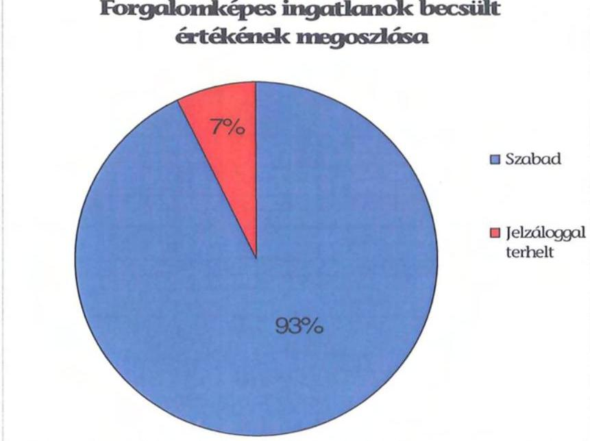

Szabad

Jelzáloggal
terhelt

---

Az Önkormányzat kötelezettségeinek állományát 2010. december 31-én és várható alakulását a kötelezettségek lejáratáig az alábbi táblázat részletezi:

| Megnevezés | Állomány 2010. dec. 31-én |  |  | Várható kötelezettség 2011. 2013. években |  |  | Várható kötelezettség 2014. 6vet követően |  |  |
| :--: | :--: | :--: | :--: | :--: | :--: | :--: | :--: | :--: | :--: |
|  | HUF-ban   (millió Ft-   ban) | Devizában (összege, ezer ...   ben) | Oszea   anem | HUF-ban   (millió Ft-   ban) | Devizában (összege, ezer ...ben) | Oszea   anem | HUF-ban   (millió Ft-   ban) | Devizában (összege, ezer ...   ben) | Oszea   anem |
| Pénzintézeti kötelezettségek |  |  |  |  |  |  |  |  |  |
| Hosszú lejáratú hitelek | 11095 |  | HUF | 2297 |  | HUF | 12477 |  | HUF |
| Külsöng (Kagvontáj ULIS) |  | 34315 | CHF |  | 7192 | CHF |  | 31126 | CHF |
| Kelyészáminőzést |  |  | HUF |  |  | HUF |  |  | HUF |
| Pénzintézeti kötelezettsége összesen HUF-ban | 11095 |  | HUF | 2297 |  | HUF | 12477 |  | HUF |
| Pénzintézeti kötelezettségek összesen CHF-ban |  | 34315 | CHF |  | 7192 | CHF |  | 31126 | CHF |
| Biztosítékok |  |  |  |  |  |  |  |  |  |
| Kezesség | 1720 |  | HUF | - |  |  | - |  |  |
| Biztosítékok összesen | 1720 |  | HUF | - |  |  | - |  |  |
| Szállítói tartozás | 1215 |  | HUF | 1215 |  | HUF | - |  |  |
| Egyéb kötelezettségek |  |  |  |  |  |  |  |  |  |
| Tepivizásos | 1200 |  | HUF | 300 |  | HUF | 840 |  |  |

Az Önkormányzat kötelezettségeinek állománya 2010. december 31-én 15343 millió Ft és 34515 ezer CHF volt. A 2011-2013-ban esedékes kötelezettségek várható összege 3976 millió Ft, 7192 ezer CHF. Ennek teljesítésére figyelembe vehető az 1226,2 millió Ft mérlegben kimutatott követelésállomány, 10469,1 millió Ft becsült értéken nyilvántartott forgalomképes ingatlanvagyon, melyből 749,6 millió Ft a pénzintézeti kötelezettséghez kapcsolódóan jelzáloggal terhelt. A 2013. után várható kötelezettség összege 13317 millió Ft és 31126 ezer CHF. Az Önkormányzat a kötelezettségek finanszírozását a forgalomképes ingatlanvagyon értékesítéséből, továbbá a törlesztés éveiben keletkező nettó működési jövedelméből tervezi megoldani.

Az Önkormányzat minősített többségi tulajdonú gazdasági társaságai kötelezettségeinek állományát 2010. december 31-én, és várható alakulását a kötelezettségek lejártáig az alábbi táblázat részletezi:

| Megnevezés | Állomány 2010. dec.31-én |  |  | Várható kötelezettség 2011. 2013. években |  |  | Várható kötelezettség 2014. 6vet követően |  |  |
| :--: | :--: | :--: | :--: | :--: | :--: | :--: | :--: | :--: | :--: |
|  | HUF-ban   (millió Ft-   ban) | Devizában (összege, ezer ...   ben) | Oszea   anem | HUF-ban   (millió Ft-   ban) | Devizában (összege, ezer ...ben) | Oszea   anem | HUF-ban   (millió Ft-   ban) | Devizában (összege, ezer ...   ben) | Oszea   anem |
| Hosszú lejáratú hitelek | 231 |  | HUF | 228 |  | HUF | 34 |  | HUF |
| Pénzintézeti kötelezettségek összesen: | 231 |  | HUF | 228 |  | HUF | 34 |  | HUF |
| Lízing kötelezettségek | 10 | 4671 | CHF | 10 | 768 | CHF | 0 | 2902 | CHF |
|  |  | 53 | EUR |  | 53 | EUR |  | 0 |  |
| Szállítói tartozás | 227 |  |  | 227 |  |  | 0 | 0 |  |

Az Önkormányzat minősített többségi tulajdonú gazdasági társaságai 2010. december 31-én fennálló kötelezettsége 468 millió Ft, 4671 ezer CHF és 53 ezer EUR volt. A HUF-ban fennálló kötelezettségekből a hosszú lejáratú hitelek állománya 231 millió Ft, a lízingszerződések kötelezettsége 10 millió Ft és a szállítói tartozás 227 millió Ft volt. A CHF-ben és EUR-ban fennálló tartozások teljes egészében a lízingszerződésekből származnak. A 2011-2013. években esedékes kötelezettségek várható összege 455 millió Ft, 768 ezer CHF és 53 ezer EUR. A 2013 után várható kötelezettség összege 34 millió Ft, 3902 ezer CHF.

---

Az Önkormányzat korlátlan felelősséggel tartozik felszámolás esetén a Gt. 54. § (2) bekezdése alapján a legalább 75%-ban tulajdonában lévő gazdasági társaságának, amelyben az 52. § (2) bekezdése alapján a szavazatok legalább 75%-val rendelkezik, illetve a Csődtv. 63. § (2) bekezdése alapján a 100%-os önkormányzati tulajdonú gazdasági társaság minden olyan kötelezettségéért, amelynek kielégítését a felszámolási eljárás során az adós társaság vagyona nem fedez, ha a hitelezőinek a felszámolási eljárás során benyújtott keresete alapján a bíróság - az adós társaság felé érvényesített tartósan hátrányos üzletpolitikájára figyelemmel - megállapítja az Önkormányzat korlátlan és teljes felelősségét. Felszámolás esetén a hitelezők által benyújtott kereset alapján a bíróság összességében egy hosszú lejáratú hitelszerződéshez kapcsolódóan 231 millió Ft és járulékai, továbbá kettő lízingszerződéshez kapcsolódóan 39 ezer CHF és járulékai $^{59}$ és 53 ezer EUR és járulékai összegű korlátlan és teljes felelősséget állapíthat meg a kötelezettségekkel érintett egy 76,5%-os és kettő 100%-os önkormányzati tulajdonú gazdasági társaság után.

Az Önkormányzat a kimutatásai szerint 2007-2010. években a tárgyi eszközök után együttesen 5969,8 millió Ft értékcsökkenést számolt el (2007. évben 1504,2 millió Ft, 2008. évben 1179,4 millió Ft, 2009. évben 1676,8 millió Ft, 2010. évben 1609,4 millió Ft). A 2007-2010. években az elszámolt értékcsökkenés 80%-ának megfelelő összegű, 4804,8 millió Ft felújítást számoltak el. Az önkormányzati szintű használhatósági fok mutató a vizsgált időszakban a 2007. évi 83,5%-ról 2010. évre 80,7%-ra, 2,8 százalékponttal csökkent.

A vizsgált időszakban a 2008. év kivételével nem használtak fel az éves értékcsökkenés összegét elérő vagy meghaladó felújítási forrást. Az aktivált felújítások értéke a 2010. évben 680,6 millió Ft volt, amely 55,1%-a az 1234,6 millió Ft összegű 2007. évi felújítási kiadásnak. A
 tényleges beruházási költségekből az eszközpótlásra elszámolt kiadások összege a vizsgált időszakban megvalósított fejlesztések esetében 5411,2 millió Ft volt, a folyamatban lévő fejlesztések esetében a 2010. december 31-ig elszámolt ráfordításokból 65,4 millió Ft, míg a 2010. után várható eszközpótlási célú ráfordítás összege 82,7 millió Ft.

Az Önkormányzat és intézményei jelenleg 15 folyamatban lévő peres eljárásban érintettek alperesként, a terhükre kimutatott perérték 776,1 millió Ft. Az összes perérték 90,3%-a, 700,7 millió Ft három peres eljáráshoz kapcsolódik.

A kaposvári uszoda felújítását alvállalkozóként végző gazdasági társaság 140 millió Ft elmaradt vállalkozói díj és 285 millió Ft jogalap nélküli gazdagodás megfizetéséért perelte az Önkormányzatot. A per a helyszíni vizsgálat ideje alatt folyamatban volt.

Egy társadalmi szervezet a Deseda-tó haltelepítésével kapcsolatos költségek ellenértékeként 101,6 millió Ft összeg erejéig nyújtott be keresetet az Önkormányzat ellen. A per a helyszíni vizsgálat ideje alatt szünetelt.

[^0]
[^0]:    ${ }^{59}$ Nem tartalmazza a Jégcsarnok Kft 4631 ezer CHF lízing kötelezettségét, mert ennek visszafizetésére az Önkormányzat 940 millió Ft összegű kézfizető kezességet vállalt, amelyet az Önkormányzat kötelezettségei között mutattak ki.

---

Több magánszemély keresete közigazgatási határozat felülvizsgálatára irányult kisajátítási ügyben, amelyben az Önkormányzattól 174,2 millió Ft-ot pereltek. Az ügyben jelenleg az első fokú eljárás folyik.

Jogerős határozattal lezárt, de ki nem fizetett kötelezettsége nincs az Önkormányzatnak és intézményeinek. A perekben érintett egy gazdasági társaság ellen követelt perérték összege 5 millió Ft, jogerős határozattal lezárt, ki nem fizetett kötelezettsége nincs a gazdasági társaságoknak.

# 4. A PÉNZÜGYI EGYENSÚLY MEGTEREMTÉSE ÉRDEKÉBEN HOZOTT INTÉZKEDÉSEK 

Az Önkormányzat gazdasági programja elvárásának megfelelően a Közgyűlés évenként, először a 2007. évi költségvetési koncepcióban, a költségvetési megtakarítások elérése érdekében kiadáscsökkentő és bevételnövelő intézkedéseket fogalmazott meg. A Közgyűlés kiemelt célkitűzésként jelölte meg a működési hiány jelentős csökkentését, amelynek megvalósítása érdekében döntött az intézményhálózati struktúraváltásról, az önkormányzati feladatellátás felülvizsgálatáról és az önként vállalt önkormányzati feladatok szűkítéséről.

A vizsgált időszakban - az önkormányzat adatszolgáltatása alapján - a kiadáscsökkentő intézkedések hatását beavatkozási területenként a következők jellemzik:
millió Ft

| Az érvényesített   kiadáscsökkentés   területei | Személyi juttatások   és járulékai | Dologi, működési   kiadások | Pénzeszköz   átadások,   támogatások | Összesen |
| :-- | :--: | :--: | :--: | :--: |
| Az intézményeknél | 1831,8 | 154,9 | - | 1986,7 |
| A Hivatalnál | 267,3 | 849,3 | 231,8 | 1348,4 |
| A Közgyűlés működése | 7,8 | - | - | 7,8 |
| ÖSSZESEN | 2106,9 | 1004,2 | 231,8 | 3342,9 |

Az önkormányzati szinten kimutatott 3342,9 millió Ft kiadáscsökkentő megtakarítási intézkedésekből 1986,7 millió forintot (59,4%) az intézmények körében érvényesítettek. Ezen belül 1831,8 millió Ft-ot (92,2%) személyi juttatások és járulékai, 154,9 millió Ft-ot (7,8%) dologi kiadás jogcímen mutatott ki az Önkormányzat.

A 2007-2010. években a költségvetés legnagyobb szeletét kitevő közoktatási ágazat intézményrendszerének ésszerűsítése (alapfokú oktatási intézmények gazdasági integrációja, óvodahálózat átszervezése) érdekében tett intézkedések 1748,7 millió Ft kiadáscsökkentést eredményeztek az Önkormányzat szerint. A méretgazdaságos feladatellátás végrehajtásának érdekében történt 259 álláshely megszüntetése 1274 millió Ft személyi juttatás és járulék kiadáscsökkentést eredményezett. A többlet juttatásokat 58,8 millió Ft-tal csökkentették a túlórák elvonásával. A közoktatási intézmények dologi kiadásainak 82,3 millió Ft-tal való csökkentését a Németh István Általános Iskola megszüntetése (37,4 millió Ft), illetve a 2010. évi költségvetésben szereplő 6%-os dologi kiadás elvonása okozta.

---

Az Önkormányzat a tanulói létszám csökkenése ${ }^{60}$ és az igényelhető normatív hozzájárulásokra vonatkozó szabályok kedvezőtlen változása ${ }^{61}$ miatt 2008. évben az általános iskolai intézményhálózat szerkezetének átszervezése mellett döntött. Az integráció következtében 12 önállóan működő és gazdálkodó iskola egy OM azonosító számmal rendelkező székhely iskolaként, a Kodály Iskola 11 tagintézménnyel került kialakításra.

Az 1831,8 millió Ft kiadáscsökkentő intézkedés a létszámcsökkentési döntések, feladatmegszüntetéssel, átszervezéssel járó létszámcsökkentés, többlet juttatások csökkentése, közalkalmazotti bértáblán felüli bérek és pótlékok elvonása, valamint eredeti előirányzatnál jóváhagyott elvonások és zárolások hatása intézkedési csoportonként valósult meg az Önkormányzat kimutatása szerint, személyi juttatások és járulékai jogcímen. A létszámcsökkentési döntések 2007-ben 83,6 millió Ft-tal, 2008-ban 318,5 millió Ft-tal, 2009-ben 439,3 millió Ft-tal és 2010-ben 553,7 millió Ft-tal csökkentették a személyi juttatások és járulékok kiadásait az intézményeknél. Az eredeti előirányzatnál figyelembe vett elvonások és zárolások hatása 2007-ben 106,6 millió Ft, 2008-ban 51,8 millió Ft, 2009-ben 52,6 millió Ft és 2010-ben 166,8 millió Ft kiadáscsökkentést eredményezett a személyi juttatásoknál és járulékoknál. A többlet juttatások csökkentésével 2007-ben 5,9 millió Ft, 2008-ban 14,2 millió Ft, 2009-ben 15,8 millió Ft, illetve 2010. évben 23 millió Ft megtakarítást értek el.

A 2007-2010. években feladatmegszüntetéssel, átszervezéssel járó létszámcsökkentések hatására intézményi szinten összesen 635,8 millió Ft kiadáscsökkenést értek el, amelyből 575 millió Ft-ot (90,4%) az alábbiak részletezik:

- a Közgyűlés 17 közalkalmazotti álláshelyet 2007. június 30-i hatállyal megszüntetett a Műszaki középiskola és a Közlekedési középiskola integrációja miatt. A két intézmény összevonásával járó létszámcsökkenés hatására a vizsgált időszakban összesen 115,8 millió Ft kiadáscsökkenést értek el;
- az alapfokú oktatási intézmények gazdasági tevékenysége elaprózodottságának megszüntetése miatt a gazdasági és pénzügyi feladataik ellátására gondnokságot jelöltek ki, amellyel 16 alapfokú oktatási intézménynél 2007. június 30.-i hatállyal 27 fő gazdasági, ügyviteli és 10 fő technikai státuszt szüntettek meg. Az intézkedések hatására 241,2 millió Ft megtakarítást értek el;
- az óvodahálózat működésének racionalizálása miatt hat óvodavezetői és egy óvodapedagógusi státusz megszüntetése 33,6 millió Ft kiadáscsökkenést eredményezett;

[^0]
[^0]:    ${ }^{60}$ 2000-2008 között 758 fővel csökkent a tanulók száma
    ${ }^{61}$ 2008. évi CII. törvény 8. számú mellékletében szereplő szabályozás értelmében a Kaposvár és Környéke Általános Iskolai Intézményfenntartói Társulás csak abban az esetben vehet igénybe normatívát, ha csupán egy OM azonosítóval rendelkező intézményt tart fent.

---

- a hajléktalan ellátás gazdaságosabb végzése miatti feladatátadásának következtében megszüntetett 9 álláshely 71,8 millió Ft megtakarítást hozott;
- a közokt. tv. 3. számú mellékletének felhatalmazása alapján az osztály- és csoportlétszámokat - a költséghatékonyabb feladatellátás végett - 20%-kal túllépték. Az ebből adódó osztályzárolások és 27 álláshely megszüntetése összesen 112,6 millió Ft kiadáscsökkenést eredményezett.

A 2007-2010. években egyéb létszámcsökkentések hatására intézményi szinten összesen 758,4 millió forint kiadáscsökkenést értek el a személyi juttatások terén:

- a középfokú oktatási intézményeknél 11 fő gazdasági, ügyviteli és 16,7 fő technikai státuszt szüntettek meg, amely a személyi juttatások terén 121,4 millió Ft kiadáscsökkenést eredményezett;
- alapfokú oktatási intézményekben osztályok zárolásával összesen a 45,5 pedagógusi álláshely megszűnése miatt 358,6 millió Ft kiadáscsökkenést értek el.

Az egyéb kiadást érintő intézkedések, egyes költségvetési szerveknél közalkalmazotti munkabérek zárolása, illetve dologi kiadások elvonása, az Önkormányzat intézményeinek működésében 486,4 millió Ft kiadáscsökkenést eredményezett:

- a költségvetési egyensúly javítása érdekében közalkalmazotti munkabér zárolásokat hajtottak végre. Ezáltal összesen 378 millió Ft kiadáscsökkentést értek el;
- a dologi kiadások egyszeri 6%-os elvonásával 108,4 millió Ft megtakarítás keletkezett.

A Polgármesteri hivatalban végrehajtott 1348,5 millió Ft összegű megtakarítási intézkedések az összes kiadáscsökkentések 40,3%-át tették ki. A közalkalmazotti bértáblán felüli bérek és pótlékok (1/2 havi jutalom) elvonása 81,3 millió Ft-tal csökkentette a személyi jellegű kiadásokat az igazgatási ágazatban, a hivatal beavatkozási területen. Emellett minden évben meghatározták a költségvetési rendelettervezetekben az Önkormányzati kiadási keretek csökkentését, amellyel 297,9 millió Ft dologi kiadás és 231,8 millió Ft támogatás megtakarítást értek el számításaik szerint.

Az éves egyszeri bérelvonások és a 2007. évi 13. havi juttatás félhavi kiegészítésének elvonása 175,3 millió Ft kiadás megtakarítást eredményezett a személyi juttatások és járulékaik terén. A 2009. évben visszaállították a lakossági személyszállítás díjfizetési rendszerét, - ezért az ingyenes lakossági szemétszállítási szociális támogatást átdolgozták - az intézkedés 487,5 millió Ft kiadáscsökkentést eredményezett az Önkormányzat kimutatása szerint, ez az összeg nem terhelte az önkormányzati költségvetést.

---

Az intézményeket érintő átszervezések következtében a 2007. évi induló 3264 foglalkoztatott létszám 445 fővel (13,6%) a 2010. évre 2819 főre csökkent. Az Önkormányzat 2007-2010. éveket érintő létszámcsökkentésének alakulását az alábbi táblázat részletezi:

| Megnevezés (adatok fő-ben) |  | Közoktatás | Szociális és gyermekvédelem | Egészségügy | Polgármesteri hivatal | Egyéb | Összesen |
| :--: | :--: | :--: | :--: | :--: | :--: | :--: | :--: |
| Megszüntetett álláshelyek száma |  | 259 | 78 | 0 | 3 | 201 | 541 |
| előbb: | üzemeltető álláshelyek száma | 26,5 | 1 | 0 | 1 | 0 | 28,3 |
|  | szakmai álláshelyek száma | 116,5 | 10 | 0 | 0 | 94 | 222,3 |
|  | intézmény-üzemeltetéssel kapcsolatos   114 |  |  |  |  |  |  |
|  |  |  |  |  |  |  |  |
|  |  |  |  |  |  |  |  |
|  |  |  |  |  |  |  |  |
|  |  |  |  |  |  |  |  |
| 2007. január 1-jén millió létszám |  | 2216 | 251 | 0 | 332 | 463 | 3264 |
| 2010. december 31-én záró létszám |  | 1981 | 190 | 0 | 358 | 290 | 2819 |

A létszámcsökkentő intézkedések következtében 2007-2010 között összesen 541 álláshelyet szüntettek meg. A helyi szervezési intézkedések végrehajtásához az Önkormányzat az áttekintett időszak alatt 250,33 millió Ft központi költségvetési támogatásban részesült, amelynek felhasználásával 164 fő álláshelyet tartósan leépített. A létszámcsökkenés 69,7%-ához (377 fő) központi támogatás nem kapcsolódott.

A létszámcsökkentések után a dolgozókat nem alkalmazták, foglalkoztatták a gazdasági társaságokban.

A kiadáscsökkentő intézkedések mellett az Önkormányzat az alábbiakban számszerűsített bevételnövelő intézkedéseket tett, amelynek összege kötvénylekötés (541 millió Ft) nélkül 561,4 millió Ft:

Az önkormányzat által 2007-2010 közötti időszakban érvényesített
bevételnövelő intézkedések részletezése
millió Ft

| A bevételnövelés területei | Az önkormányzat közgyűlésének működése | Az önkormányzat közgyűlési hivatala | Az önkormányzat intézményei | Összesen |
| :--: | :--: | :--: | :--: | :--: |
| Szabad kapacitások hasznosítása, vállalkozási tevékenység eredményének növelése |  |  | 74,3 | 74,3 |
| Egyéb ellátások és szolgáltatások díjkötelessé tétele |  |  | 25,7 | 25,7 |
| Helyi adó hátralékok behajtása |  | 349,0 |  | 349,0 |
| Helyi adók emelése miatti többletbevétel |  | 112,4 |  | 112,4 |
| Összesen | 0,0 | 461,4 | 100,0 | 561,4 |

 | 100,0 | 561,4 |

---

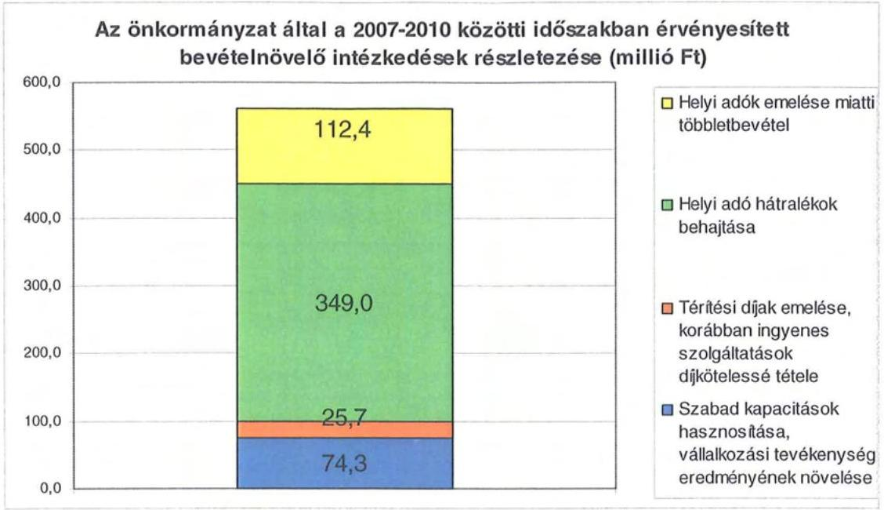

Az Önkormányzat a jogszabály adta lehetőségével élve emelte az adók mértékét, amely 112,4 millió Ft többletbevételt eredményezett. A vizsgált időszakban a telekadó mértékének 7,7%-os növelése 65,6 millió Ft, az építményadó mértékének 8,8%-os növelése 40 millió Ft, a kommunális adó mértékének 2008. évi 4,5%-os emelése 5,7 millió Ft bevételi növekményt eredményezett. A vizsgált időszakban a törvény által meghatározott maximális adómértéket egyedül az iparűzési adónál alkalmazta az Önkormányzat. Az adónemek 2010. évi beállítási szintje az építményadónál 29,6%, a telekadónál 45,6% és a kommunális adónál 21,9%. Az áttekintett időszak éveiben megnövekedett összegű hátralékok miatt a korábbiaknál nagyobb bevételeket, 349 millió Ft-ot realizáltak az adóhátralékok beszedéséből.

A hasznosított intézményi szabad kapacitások 74,3 millió Ft-tal növelték a bevételeket, melynek 79,5%-a (59 millió Ft) a Klebelsberg Kollégium szálláshely kiadás és nyári rendezvények bevételéből származott.

A 2011. évre 755 millió Ft kiadásmegtakarítást terveztek önkormányzati szinten, ebből 195 millió Ft-ot (25,8%-ot) az önként vállalt feladatok (sport, kultúra, oktatás) csökkentéséből, kiszervezéséből tervezik elérni. A tervezett megtakarításból 413 millió Ft (54,7%) személyi jellegű, 223 millió Ft (29,5%) dologi kiadás. A létszámcsökkentési döntésekkel 162 millió Ft megtakarítást terveztek, amely az összes tervezett kiadáscsökkentés 21,5%-a. A tervezett létszámcsökkentési döntésekből 148 millió Ft (91,3%) személyi jellegű, 14 millió Ft feladatmegszüntetésből keletkezett dologi kiadáscsökkentés.

A 2011. évben tervezett bevételnövelő intézkedések várt eredményét 194 millió Ft-ban határozta meg az Önkormányzat adatszolgáltatása szerint, amelynek 77,3%-át, 150 millió Ft-ot a helyi adóhátralékok behajtásából terveznek elérni. A parkolási díjak emelése révén 28,5 millió Ft-ot (14,7%), az intézményi szociális térítési díj struktúra változása miatt, a korábban térítésmentes szolgáltatások és egyéb ellátások díjkötelessé tételével 9,8 millió Ft-ot (5,0%) terveztek.

---

Az Önkormányzat kiadáscsökkentő és bevételnövelő intézkedései eredményeként összesen 3904 millió Ft megtakarítást és többletbevételt mutatott ki az ellenőrzött időszakban. A költségvetési támogatások, az átengedett bevételek és az illetékbevételek 2007. évhez viszonyított együttes csökkenése 62 millió Ft volt. A megtakarítások, többletbevételek valamint a költségvetési támogatások, átengedett bevételek és illetékbevételek együttesen 3842 millió Ft-tal javították az Önkormányzat pénzügyi egyensúlyát.

# 5. A HELYI ÖNKORMÁNYZATOK GAZDÁLKODÁSI RENDSZERÉNEK 2010. ÉVI ELLENŐRZÉSE SORÁN A PÉNZÜGYI EGYENSÚLY JAVÍTÁSÁRA TETT SZABÁLYSZERŰSÉGI ÉS CÉLSZERŰSÉGI JAVASLATOK HASZNOSULÁSA 

Az ÁSZ az Önkormányzat gazdálkodását a 2010. évben ellenőrizte átfogó jelleggel. A gazdálkodási rendszer korábbi ellenőrzése során tett javaslatok közül a pénzügyi egyensúly javítása érdekében egy célszerűségi javaslatot tett.

A munka színvonalának érdekében javasoltuk a főjegyzőnek, hogy:
„tájékoztassa évente végzett számítások alapján a Közgyűlést az Önkormányzat eladósodásának növekedésére figyelemmel arról, hogy a hosszú lejáratú, adósságot keletkeztető kötelezettségvállalásokból adódó tőke- és kamatfizetési kötelezettségét az Önkormányzat milyen feltételek biztosítása mellett tudja teljesíteni".

A célszerűségi javaslat végrehajtásáról a főjegyző a 2011. évi költségvetés előterjesztésében gondoskodott, a költségvetésben bemutatta a hosszú lejáratú adósságot keletkeztető kötelezettségvállalásokból adódó tőke- és kamatfizetési kötelezettségek teljesítési feltételeit.

Budapest, 2011. december
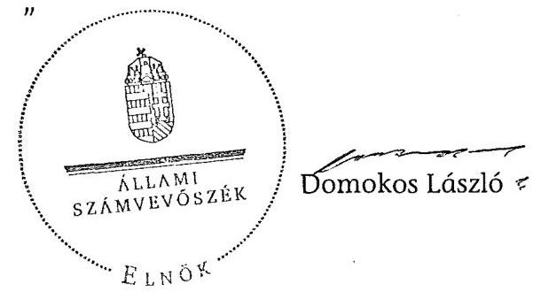

Melléklet:  9 db

---

.

---

Kaposvár Megyei Jogú Város Önkormányzat

1. számú melléklet

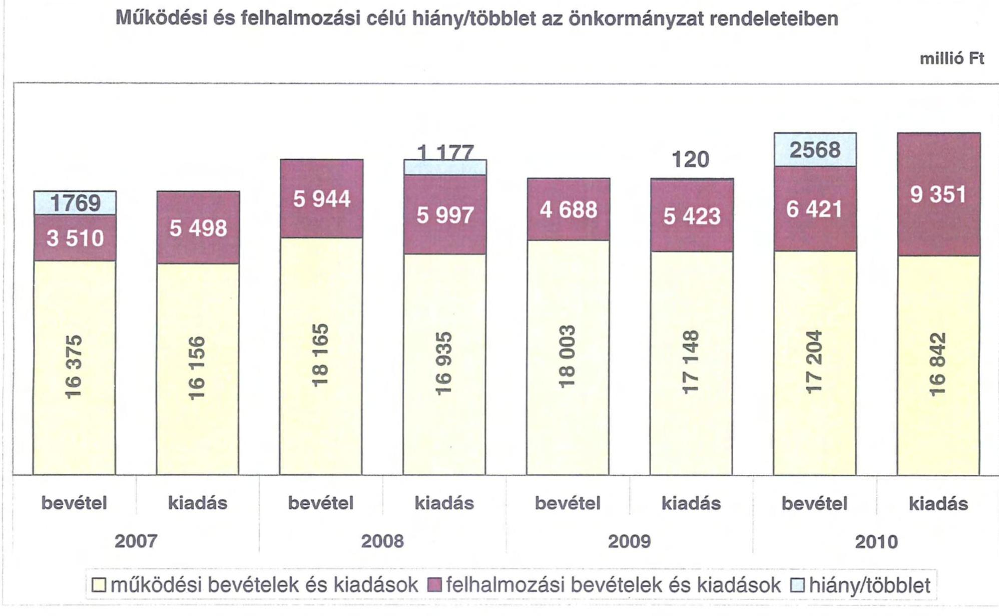

---

|  1. FOLYÓ KÖLTSÉGVETÉS* | 2007. | 2008. | 2009. | 2010.  |
| --- | --- | --- | --- | --- |
|  1.1.1. Saját működési bevételek | 5 752 155 | 6 785 695 | 7 088 407 | 7 555 283  |
|  1.1.2. Költségvetési támogatás | 6 436 158 | 8 659 006 | 7 652 402 | 7 399 361  |
|  1.1.3. Átengedett bevételek | 3 715 658 | 2 362 137 | 2 375 757 | 2 521 066  |
|  1.1.4. Állambáztartáson belülről kapott támogatások | 615 741 | 746 388 | 773 345 | 729 312  |
|  1.1.5. EU-tól és külföldről kapott bevételek | 9 382 | 1 194 | 21 240 | 1 923  |
|  1.1.6. Állambáztartáson kívülről kapott bevételek | 92 172 | 71 352 | 66 866 | 59 258  |
|  1.1.7. Ebből évi pénemeradvány kivétel | 309 116 | 387 263 | 374 533 | 200 819  |
|  1.1. Folyó bevételek =1.1.1.+1.1.2.+1.1.3.+1.1.4.+1.1.5.+1.1.6.+1.1.7. | 16 930 582 | 19 013 445 | 18 352 296 | 18 467 022  |
|  1.2.1. Működési kiadások kamuthiadások nélkül | 14 811 251 | 15 573 288 | 15 165 107 | 14 240 526  |
|  1.2.2. Állambáztartáson belülre átadott pénzeszközök | 104 941 | 82 883 | 143 684 | 144 179  |
|  1.2.3.1. vállalkozásoknak | 225 777 | 240 836 | 363 240 | 1 194 730  |
|  1.2.3.2. EU-nak, illetve külföldre | 0 | 0 | 0 | 0  |
|  1.2.3.3. magánszervezeteknek | 838 081 | 952 552 | 1 049 729 | 1 080 621  |
|  1.2.3.4. egyéb szervezeteknek | 259 574 | 306 622 | 220 897 | 151 555  |
|  1.2.4. Transferkiadások (=1.2.3.1+1.2.3.2+1.2.3.3+1.2.3.4) | 1 323 432 | 1 509 010 | 1 733 866 | 2 426 906  |
|  1.2.5. Kamatkiadások | 238 884 | 382 965 | 338 967 | 297 354  |
|  1.2.6. Ebből évi pénemeradvány átadás | 309 116 | 387 263 | 374 533 | 200 819  |
|  1.2. Folyó kiadások = 1.2.1.+1.2.2.+1.2.3.+1.2.4.+1.2.5. | 16 787 624 | 17 926 409 | 18 256 157 | 17 309 784  |
|  1.3. Folyó költségvetés egyenlege MŰKÖDÉSI JÖVEDELEM (1.1. - 1.2.) | 142 958 | 1 087 036 | 96 139 | 1 157 238  |
|  2. FELHALMOZÁSI KÖLTSÉGVETÉS** |  |  |  |   |
|  2.1.1. Saját tökébevételek | 359 102 | 610 671 | 650 218 | 867 351  |
|  2.1.2. Állambáztartáson belülről kapott támogatások | 940 545 | 568 480 | 666 138 | 1 890 553  |
|  2.1.3. EU-tól és külföldről kapott támogatások | 14 007 | 9 921 | 0 | 0  |
|  2.1.4. Állambáztartáson kívülről kapott támogatások | 640 410 | 133 881 | 105 944 | 98 867  |
|  2.1. Felhalmozási bevételek (=2.1.1.+2.1.2+2.1.3+2.1.4.) | 1 954 064 | 1 322 953 | 1 422 300 | 2 856 771  |
|  2.2.1. Saját beruházási kiadás átfayal | 1 408 263 | 2 501 007 | 2 707 473 | 6 933 776  |
|  2.2.2. Saját felújítási kiadás átfayal | 1 586 533 | 2 667 554 | 1 200 976 | 1 195 416  |
|  2.2.3. Állambáztartáson belülre átadott pénzeszközök | 15 039 | 11 656 | 22 140 | 65 235  |
|  2.2.4. EU-nak és külföldnek adott pénzeszközök | 0 | 0 | 0 | 0  |
|  2.2.5. Állambáztartáson kívülre adott pénzeszközök | 274 969 | 183 785 | 389 814 | 460 855  |
|  2.2.6. Befektetési célú részesedések vásárlása | 167 620 | 156 192 | 212 052 | 196 202  |
|  2.2. Felhalmozási kiadások (=2.2.1.+2.2.2.+2.2.3.+2.2.4.+2.2.5.+2.2.6.) | 3 452 424 | 5 520 194 | 4 532 455 | 8 851 484  |
|  2.3. Felhalmozási költségvetés egyenlege (2.1. - 2.2.) | -1 498 360 | -4 197 241 | -3 110 155 | -5 994 713  |
|  3. Finanszírozási műveletek nélküli (GFS) pozíció(1.3.+2.3.) | -1 355 402 | -3 110 205 | -3 013 762 | -4 837 475  |
|  4. Finanszírozási műveletek |  |  |  |   |
|  4.1. Hitelfelvétel | 935 217 | 2 112 872 | 2 381 780 | 4 189 086  |
|  4.2. Hiteltörlesztés | 1 755 873 | 90 482 | 156 690 | 233 537  |
|  4.3. Forgatási és befektetési célú értékpapírok kibocsátása | 5 211 880 | 0 | 0 | 0  |
|  4.4. Forgatási és befektetési célú értékpapírok beváltása | 0 | 0 | 0 | 0  |
|  4.5. Forgatási és befektetési célú értékpapírok értékesítése | 0 | 0 | 0 | 1 500 000  |
|  4.6. Forgatási és befektetési célú értékpapírok vásárlása | 0 | 0 | 1 500 000 | 0  |
|  4.7. Egyéb finanszírozási bevételek (függő, átfutó, kiegyenülő) | -13 470 | -75 620 | 192 826 | -796 293  |
|  4.8. Egyéb finanszírozási kiadások (függő, átfutó, kiegyenülő) | 12 516 | 304 472 | 35 398 | -202 695  |
|  4.9. Finanszírozási műveletek egyenlege (4.1. - 4.2.+4.3.-4.4+4.5.-4.6.+4.7.-4.8.) | 4 365 158 | 1 642 298 | 882 518 | 4 861 951  |
|  5. Tárgyévi pénzügyi pozíció változás (1.3.+ 2.3.+4.9.) | 3 009 756 | -1 467 907 | -2 131 244 | 24 476  |
|  6. Nettó működési jövedelem =működési jövedelem (1.3.) - töketörlesztés (4.2+4.4) | -1 612 915 | 996 554 | -60 297 | 923 701  |
|  TÁJÉKOZTATÓ ADATOK |  |  |  |   |
|  Összes kötelezettség | 10 506 169 | 12 531 622 | 15 497 857 | 22 154 893  |
|  ebből rövid lejáratú | 1 052 670 | 1 220 383 | 1 105 129 | 3 128 087  |
|  Összes szállítói kötelezettség | 318 088 | 370 567 | 358 748 | 1 319 198  |
|  ebből lejárt (támódványból) | 5984 | 5991 | 3573 | 330286  |
|  Pénzügyi és időesítési kötelezettség (adószáml) | 8 103 981 | 10 126 370 | 13 426 369 | 18 765 184  |
|  ebből rövid lejáratú | 90 482 | 156 683 | 233 537 | 818 378  |
|  PPP szerződéses állomány jelenértékes (támódványból) | 0 | 0 | 0 | 0  |
|  ebből lejárt szolgáltatási díj

 miatti kötelezettség | 0 | 0 | 0 | 0  |
|  Folyósításmúltel napi átlagos állománya (támodványból) | 73 237 | 73 013 | 2 910 | 733  |
|  Likviditás napi átlagos állománya (támodványból) | 0 | 0 | 0 | 0  |
|  Munkatőke napi átlagos állománya (támodványból) | 3 836 | 6 573 | 0 | 0  |
|  Követelések és garanciavállalások (támodványból) | 939 963 | 939 963 | 1 728 971 | 1 728 971  |
|  Jogerős bírósági ítéletekből adódó kötelezettségek (támodványból) | 0 | 0 | 0 | 0  |
|  Finanszírozásba bevonható eszközök | 5 010 863 | 3 542 956 | 2 911 712 | 1 436 188  |
|  Tartós kötelezettséget megtestesítő értékpapírok és egyéb állománya | 0 | 0 | 0 | 0  |
|  Hosszú lejáratú befektetők és egyéb állománya | 0 | 0 | 0 | 0  |
|  Értékpapírok és egyéb állománya | 0 | 0 | 1 500 000 | 0  |
|  Pénzeszközök (idegen pénzeszközök nélküli) és egyéb állománya | 5 010 863 | 3 542 956 | 1 411 712 | 1 436 188  |

- Bevételében nem tüntet fel, a kiadásokban nem jelenik meg az amortizáció, a vagyoni helyzetet az egyedül befolyásolja. **Bevételében vagyon megőrzése és hővíztétel fordítási források.**

---

Кормиль Кругов: 2021-07-01 (Частно-растово) 20:11. Агентство: 11-12-14

Ад. Общекажеров 2021-07-01 (Частно-растово) 20:11. Агентство: 11-12-14

|   |  |  |  |  |  |  |  |  |  |  |  |  |  |  |  |  |  |  |  |  |  |  |  |  |  |  |  |  |  |  |  |  |  |  |  |  |  |  |   |
| --- | --- | --- | --- | --- | --- | --- | --- | --- | --- | --- | --- | --- | --- | --- | --- | --- | --- | --- | --- | --- | --- | --- | --- | --- | --- | --- | --- | --- | --- | --- | --- | --- | --- | --- | --- | --- | --- | --- | --- |
|   |  |  |  |  |  |  |  |  |  |  |  |  |  |  |  |  |  |  |  |  |  |  |  |  |  |  |  |  |  |  |  |  |  |  |  |  |  |  |   |
|   |  |  |  |  |  |  |  |  |  |  |  |  |  |  |  |  |  |  |  |  |  |  |  |  |  |  |  |  |  |  |  |  |  |  |  |  |  |  |   |
|   |  |  |  |  |  |  |  |  |  |  |  |  |  |  |  |  |  |  |  |  |  |  |  |  |  |  |  |  |  |  |  |  |  |  |  |  |  |  |   |
|   |  |  |  |  |  |  |  |  |  |  |  |  |  |  |  |  |  |  |  |  |  |  |  |  |  |  |  |  |  |  |  |  |  |  |  |  |  |  |   |
|   |  |  |  |  |  |  |  |  |  |  |  |  |  |  |  |  |  |  |  |  |  |  |  |  |  |  |  |  |  |  |  |  |  |  |  |  |  |  |   |
|   |  |  |  |  |  |  |  |  |  |  |  |  |  |  |  |  |  |  |  |  |  |  |  |  |  |  |  |  |  |  |  |  |  |  |  |  |  |  |   |
|   |  |  |  |  |  |  |  |  |  |  |  |  |  |  |  |  |  |  |  |  |  |  |  |  |  |  |  |  |  |  |  |  |  |  |  |  |  |  |   |
|   |  |  |  |  |  |  |  |  |  |  |  |  |  |  |  |  |  |  |  |  |  |  |  |  |  |  |  |  |  |  |  |  |  |  |  |  |  |  |   |
|   |  |  |  |  |  |  |  |  |  |  |  |  |  |  |  |  |  |  |  |  |  |  |  |  |  |  |  |  |  |  |  |  |  |  |  |  |  |  |   |
|   |  |  |  |  |  |  |  |  |  |  |  |  |  |  |  |  |  |  |  |  |  |  |  |  |  |  |  |  |  |  |  |  |  |  |  |  |  |  |   |
|   |  |  |  |  |  |  |  |  |  |  |  |  |  |  |  |  |  |  |  |  |  |  |  |  |  |  |  |  |  |  |  |  |  |  |  |  |  |  |   |
|   |  |  |  |  |  |  |  |  |  |  |  |  |  |  |  |  |  |  |  |  |  |  |  |  |  |  |  |  |  |  |  |  |  |  |  |  |  |  |   |
|   |  |  |  |  |  |  |  |  |  |  |  |  |  |  |  |  |  |  |  |  |  |  |  |  |  |  |  |  |  |  |  |  |  |  |  |  |  |  |   |
|   |  |  |  |  |  |  |  |  |  |  |  |  |  |  |  |  |  |  |  |  |  |  |  |  |  |  |  |  |  |  |  |  |  |  |  |  |  |  |   |
|   |  |  |  |  |  |  |  |  |  |  |  |  |  |  |  |  |  |  |  |  |  |  |  |  |  |  |  |  |  |  |  |  |  |  |  |  |  |  |   |

  |  |  |  |  |  |  |  |  |  |  |  |  |  |   |
|   |  |  |  |  |  |  |  |  |  |  |  |  |  |  |  |  |  |  |  |  |  |  |  |  |  |  |  |  |  |  |  |  |  |  |  |  |  |  |   |
|   |  |  |  |  |  |  |  |  |  |  |  |  |  |  |  |  |  |  |  |  |  |  |  |  |  |  |  |  |  |  |  |  |  |  |  |  |  |  |   |
|   |  |  |  |  |  |  |  |  |  |  |  |  |  |  |  |  |  |  |  |  |  |  |  |  |  |  |  |  |  |  |  |  |  |  |  |  |  |  |   |
|   |  |  |  |  |  |  |  |  |  |  |  |  |  |  |  |  |  |  |  |  |  |  |  |  |  |  |  |  |  |  |  |  |  |  |  |  |  |  |   |
|   |  |  |  |  |  |  |  |  |  |  |  |  |  |  |  |  |  |  |  |  |  |  |  |  |  |  |  |  |  |  |  |  |  |  |  |  |  |  |   |
|   |  |  |  |  |  |  |  |  |  |  |  |  |  |  |  |  |  |  |  |  |  |  |  |  |  |  |  |  |  |  |  |  |  |  |  |  |  |  |   |
|   |  |  |  |  |  |  |  |  |  |  |  |  |  |  |  |  |  |  |  |  |  |  |  |  |  |  |  |  |  |  |  |  |  |  |  |  |  |  |   |
|   |  |  |  |  |  |  |  |  |  |  |  |  |  |  |  |  |  |  |  |  |  |  |  |  |  |  |  |  |  |  |  |  |  |  |  |  |  |  |   |
|   |  |  |  |  |  |  |  |  |  |  |  |  |  |  |  |  |  |  |  |  |  |  |  |  |  |  |  |  |  |  |  |  |  |  |  |  |  |  |   |
|   |  |  |  |  |  |  |  |  |  |  |  |  |  |  |  |  |  |  |  |  |  |  |  |  |  |  |  |  |  |  |  |  |  |  |  |  |  |  |   |
|   |  |  |  |  |  |  |  |  |  |  |  |  |  |  |  |  |  |  |  |  |  |  |  |  |  |  |  |  |  |  |  |  |  |  |  |  |  |  |   |
|   |  |  |  |  |  |  |  |  |  |  |  |  |  |  |  |  |  |  |  |  |  |  |  |  |  |  |  |  |  |  |  |  |  |  |  |  |  |  |   |
|   |  |  |  |  |  |  |  |  |  |  |  |  |  |  |  |  |  |  |  |  |  |  |  |  |  |  |  |  |  |  |  |  |  |  |  |  |  |  |   |
|   |  |  |  |  |  |  |  |  |  |  |  |  |  |  |  |  |  |  |  |  |  |  |  |  |  |  |  |  |  |  |  |  |  |  |  |  |  |  |   |
|   |  |  |  |  |  |  |  |  |  |  |  |  |  |  |  |  |  |  |  |  |  |  |  |  |  |  |  |  |  |  |  |  |  |  |  |  |  |  |   |
|   |  |  |  |  |  |  |  |  |  |  |  |  |  |  |  |  |  |  |  |  |  |  |  |  |  |  |  |  |  |  |  |  |  |  |  |  |  |  |   |
|   |

---

|   |  |  |  |  |  |  |  |  |  |  |  |  |  |  |  |  |  |  |  |  |  |  |  |  |  |  |  |  |  |  |  |  |  |  |  |  |  |  |  |  |  |  |  |  |  |  |  |  |  |  |  |  |  |  |  |  |  |  |  |  |  |  |  |  |  |  |  |  |  |  |  |  |  |  |  |  |  |  |  |  |  |  |  |  |  |  |  |  |  |  |  |  |  |  |  |  |  |  |  |  |  |

---

|   |  |  |  |  |  |  |  |  |  |  |  |  |  |  |  |  |  |  |  |  |  |  |  |

  |  |  |  |  |  |  |  |  |  |  |  |  |  |  |  |  |  |  |  |  |  |  |  |  |  |  |  |  |  |  |  |  |  |  |  |  |  |  |  |  |  |  |  |  |  |  |  |  |  |  |  |  |  |  |  |  |  |  |  |  |  |  |  |  |  |  |  |  |  |  |  |  |  |  |  |  |  |  |  |  |  |  |  |  |  |  |  |  |  |  |  |  |  |  |  |  |  |  |  |  |  |

---

2020.04.20/2021.06.26

|   |  |  |  |  |  |  |  |  |  |  |  |  |  |  |  |  |  |  |  |  |  |  |  |  |  |  |  |  |  |  |  |  |  |  |  |  |  |  |  |  |  |  |  |  |  |  |  |  |  |  |  |  |  |  |  |  |  |  |  |  |  |  |  |  |  |  |  |  |  |  |  |  |  |  |  |  |  |  |  |  |  |  |  |  |  |  |  |  |  |  |  |  |  |  |  |  |  |  |  |  |

---

|   |  |  |  |  |  |  |  |  |  |  |  |  |  |  |  |  |  |  |  |  |  |  |  |  |  |  |  |  |  |  |  |  |  |  |  |  |  |  |  |  |  |  |  |  |  |  |  |  |  |  |  |  |  |  |  |  |  |  |  |  |  |  |  |  |  |  |  |  |  |  |  |  |  |  |  |  |  |  |  |  |  |  |  |  |  |  |  |  |  |  |  |  |  |  |  |  |  |  |  |  |

---

.

---

|   |  |  |  |  |  |  |  |  |  |  |  |  |  |  |  |  |  |  |  |  |  |  |  |  |  |  |  |  |  |  |  |  |  |  |  |  |  |  |  |  |  |  |  |  |  |   |
| --- | --- | --- | --- | --- | --- | --- | --- | --- | --- | --- | --- | --- | --- | --- | --- | --- | --- | --- | --- | --- | --- | --- | --- | --- | --- | --- | --- | --- | --- | --- | --- | --- | --- | --- | --- | --- | --- | --- | --- | --- | --- | --- | --- | --- | --- | --- |
|   |  |  |  |  |  |  |  |  |  |  |  |  |  |  |  |  |  |  |  |  |  |  |  |  |  |  |  |  |  |  |  |  |  |  |  |  |  |  |  |  |  |  |  |  |   |
|   |  |  |  |  |  |  |  |  |  |  |  |  |  |  |  |  |  |  |  |  |  |  |  |  |  |  |  |  |  |  |  |  |  |  |  |  |  |  |  |  |  |  |  |  |   |
|   |  |  |  |  |  |  |  |  |  |  |  |  |  |  |  |  |  |  |  |  |  |  |  |  |  |  |  |  |  |  |  |  |  |  |  |  |  |  |  |  |  |  |  |  |   |
|   |  |  |  |  |  |  |  |  |  |  |  |  |  |  |  |  |  |  |  |  |  |  |  |  |  |  |  |  |  |  |  |  |  |  |  |  |  |  |  |  |  |  |  |  |   |
|   |  |  |  |  |  |  |  |  |  |  |  |  |  |  |  |  |  |  |  |  |  |  |  |  |  |  |  |  |  |  |  |  |  |  |  |  |  |  |  |  |  |  |  |  |   |
|   |  |  |  |  |  |  |  |  |  |  |  |  |  |  |  |  |  |  |  |  |  |  |  |  |  |  |  |  |  |  |  |  |  |  |  |  |  |  |  |  |  |  |  |  |   |
|   |  |  |  |  |  |  |  |  |  |  |  |  |  |  |  |  |  |  |  |  |  |  |  |  |  |  |  |  |  |  |  |  |  |  |  |  |  |  |  |  |  |  |  |  |   |
|   |  |  |  |  |  |  |  |  |  |  |  |  |  |  |  |  |  |  |  |  |  |  |  |  |  |  |  |  |  |  |  |  |  |  |  |  |  |  |  |  |  |  |  |  |   |
|   |  |  |  |  |  |  |  |  |  |  |  |  |  |  |  |  |  |  |  |  |  |  |  |  |  |  |  |  |  |  |  |  |  |  |  |  |  |  |  |  |  |  |  |  | 

 |
|   |  |  |  |  |  |  |  |  |  |  |  |  |  |  |  |  |  |  |  |  |  |  |  |  |  |  |  |  |  |  |  |  |  |  |  |  |  |  |  |  |  |  |  |  |   |
|   |  |  |  |  |  |  |  |  |  |  |  |  |  |  |  |  |  |  |  |  |  |  |  |  |  |  |  |  |  |  |  |  |  |  |  |  |  |  |  |  |  |  |  |  |   |
|   |  |  |  |  |  |  |  |  |  |  |  |  |  |  |  |  |  |  |  |  |  |  |  |  |  |  |  |  |  |  |  |  |  |  |  |  |  |  |  |  |  |  |  |  |   |
|   |  |  |  |  |  |  |  |  |  |  |  |  |  |  |  |  |  |  |  |  |  |  |  |  |  |  |  |  |  |  |  |  |  |  |  |  |  |  |  |  |  |  |  |  |   |
|   |  |  |  |  |  |  |  |  |  |  |  |  |  |  |  |  |  |  |  |  |  |  |  |  |  |  |  |  |  |  |  |  |  |  |  |  |  |  |  |  |  |  |  |  |   |
|   |  |  |  |  |  |  |  |  |  |  |  |  |  |  |  |  |  |  |  |  |  |  |  |  |  |  |  |  |  |  |  |  |  |  |  |  |  |  |  |  |  |  |  |  |   |
|   |  |  |  |  |  |  |  |  |  |  |  |  |  |  |  |  |  |  |  |  |  |  |  |  |  |  |  |  |  |  |  |  |  |  |  |  |  |  |  |  |  |  |  |  |   |
|   |  |  |  |  |  |  |  |  |  |  |  |  |  |  |  |  |  |  |  |  |  |  |  |  |  |  |  |  |  |  |  |  |  |  |  |  |  |  |  |  |  |  |  |  |   |
|   |  |  |  |  |  |  |  |  |  |  |  |  |  |  |  |  |  |  |  |  |  |  |  |  |  |  |  |  |  |  |  |  |  |  |  |  |  |  |  |  |  |  |  |  |   |
|   |  |  |  |  |  |  |  |  |  |  |  |  |  |  |  |  |  |  |  |  |  |  |  |  |  |  |  |  |  |  |  |  |  |  |  |  |  |  |  |  |  |  |  |  |   |
|   |  |  |  |  |  |  |  |  |  |  |  |  |  |  |  |  |  |  |  |  |  |  |  |  |  |  |  |  |  |  |  |  |  |  |  |  |  |  |  |  |  |  |  |  |   |
|   |  |  |  |  |  |  |  |  |  |  |  |  |  |  |  |  |  |  |  |  |  |  |  |  |  |  |  |  |  |  |  |  |  |  |  |  |  |  |  |  |  |  |  |  |   |
|   |  |  |  |  |  |  |  |  |  |  |  |  |  |  |  |  |  |  |  |  |  |  |  |  |  |  |  |  |  |  |  |  |  |  |  |  |  |  |  |  |  |  |  |  |   |
|   |  |  |  |  |  |  |  |  |  |  |  |  |  |  |  |  |  |  |  |  |  |  |  |  |  |  |  |  |  |  |  |  |  |  |  |  |  |  |  |  |  |  |  |  |   |
|   |  |  |  |  |  |  |  |  |  |  |  |  |  |  |  |  |  |  |  |  |  |  |  |  |  |  |  |  |  |  |  |  |  |  |  |  |  |  |  |  |  |  |  |  |   |
|   |  |  |  |  |  |  |  |  |  |  |  |  |  |  |  |  |  |  |  |  |  |  |  |  |  |  |  |  |  |  |  |  |  |  |  |  |  |  |  |  |  |  |  |  |   |
|   |  |  |  |  |  |  |  |  |  |  |  |  |  |  |  |  |  |  |  |  |  |  |  |  |  |  |  |  |  |  |  |  |  |  |  |  |  |  |  |  |  |  |  |  |   |
|

   |  |  |  |  |  |  |  |  |  |  |  |  |  |  |  |  |  |  |  |  |  |  |  |  |  |  |  |  |  |  |  |  |  |  |  |  |  |  |  |  |  |  |  |  |   |
|   |  |  |  |  |  |  |  |  |  |  |  |  |  |  |  |  |  |  |  |  |  |  |  |  |  |  |  |  |  |  |  |  |  |  |  |  |  |  |  |  |  |  |  |  |   |
|   |  |  |  |  |  |  |  |  |  |  |  |  |  |  |  |  |  |  |  |  |  |  |  |  |  |  |  |  |  |  |  |  |  |  |  |  |  |  |  |  |  |  |  |  |   |
|   |  |  |  |  |  |  |  |  |  |  |  |  |  |  |  |  |  |  |  |  |  |  |  |  |  |  |  |  |  |  |  |  |  |  |  |  |  |  |  |  |  |  |  |  |   |
|   |  |  |  |  |  |  |  |  |  |  |  |  |  |  |  |  |  |  |  |  |  |  |  |  |  |  |  |  |  |  |  |  |  |  |  |  |  |  |  |  |  |  |  |  |   |
|   |

---

# KAPITÓVÁR: Mezőkovácsháza Város Önkormányzata

## Az Önkormányzat 2018. december 24-én feljegyzés felvételének kapcsolódó 2018. évre vonatkozó kötelezettségvállalásának önkormányzati gazdálkodásból (a feljegyzésben lévő fejlesztések 2018. évi kötelezettségvállalásainál)

|   |  |  |  |  |  |  |  |  |  |  |  |  |  |  |  |  |  |  |  |  |  |  |  |  |  |  |  |  |  |  |  |  |  |  |  |  |  |  |  |  |  |  |  |  |  |  |  |  |  |  |  |  |  |  |  |  |  |  |  |  |  |  |  |  |  |  |  |  |  |  |  |  |  |  |  |  |  |  |  |  |  |  |  |  |  |  |  |  |  |  |  |  |  |  |  |  |  |  |  |  |  |  |  |  |  |  |  |  |  |  |  |  |  |  |  |  |  |  |  |  |  |  |  |  |  |  |  |  |  |  |  |  |  |  |  |  |  |  |  |  |  |  |  |  |  |  |  |  |  |  |  |  |  |  |  |  |  |  |  |  |  |  |  |  |  |  |  |  |  |  |  |  |  |  |  |  |  |  |  |  |  |  |  |  |  |  |  |  |  |  |  |  |  |  |  |  |  |  |  |  |  |  |  |  |  |  |  |  |  |  |  |  |  |  |  |  |  |  |  |  |  |  |  |  |  |  |  |  |  |  |  |  | 

---

Kaposvár Megyei Jogú Város Önkormányzata

Az Önkormányzat beadott, elbírálás alatti pályázati forrásból megvalósuló fejlesztésekhez kapcsolódó kötelezettségvállalásainak összegzéséről

KÉSZÜLT: FÜGGELÉK

|  KSH
K
A
B
D
E
F | Fejlesztési feladat (beruházás, felújítás) |  | Beruházó
k, felújítás |  | Teljes
bekerítési
böltség
(terv)¹⁰ | A teljes
bekerítési
böltségből
elsőpótlási
a tervezett
összeg | 2010. dec. 21.
ig teljesítés
biztosítás²⁰ | 2010. után
vételt
biztosítópótló
(terv)²¹ (terv)²²
¹⁰ |  | 2010. december 31-e utáni kötelezettségvállalások forrásösszege |  |  |  |  |  |  |  |  |  |  |  |  |  |  |  |  |  |  |  |  |  |  |  |  |  |  |  |  |  |  |  |  |  |  |  |  |  |  |  |  |  |  |  |  |  |  |  |  |  |  |  |  |  |  |  |  |  |  |  |  |  |  |  |  |  |  |  |  |  |  |  |  |  |  |  |  |  |  |  |  |  |  |  |  |  |  |  |  |  |  |  |  |  |  |  |  |  |  |  | 

---

.

---

## 4. számú melléklet

## Az önkormányzati feladatok ellátásában résztvevő gazdasági társaságokról

|  Gazdasági társaság
megnevezése |  |  |  |  |  |  |  |  |  |  |  |  |  |  |  |  |  |  |  |  |  |  |  |  |   |
| --- | --- | --- | --- | --- | --- | --- | --- | --- | --- | --- | --- | --- | --- | --- | --- | --- | --- | --- | --- | --- | --- | --- | --- | --- | --- |
|   |  |  |  |  |  |  |  |  |  |  |  |  |  | a gazdasági társaságnak szerződéses kötelezettségére, feladatellátási szerződésre alapozottan
az önkormányzat költségvetéséből nyújtott |  |  |  |  |  |  |  |  |  |  |   |
|  Gazdasági társaság
megnevezése | önkormányzat
gazdasági
társaságának | saját tőke,
jegyzett tőke
aránya | kötelező
feladathoz | önként vállalt
feladathoz | hosszú lejáratú,
hitelköltség,
követelésből | Szingból | lejárt szállító
állományból | működési támogatás |  |  |  |  |  |  |  |  |  |  |  |  |  |  |  |  |   |
|   | tulajdoni hányada |  |  |  |  |  |  |  |  |  |  |  |  |  |  |  |  |  |  |  |  |  |  |  |   |
|   |  |  |  |  |  |  |  |  |  |  |  |  |  |  |  |  |  |  |  |  |  |  |  |  |   |
|  1. 100%-os tulajdoni hányadú gazdasági társaságok: |  |  |  |  |  |  |  |  |  |  |  |  |  |  |  |  |  |  |  |  |  |  |  |  |   |
|  Deseda Kemping Kft | 100% |  | 102,57% |  | 0 | 33 |  |  |  |  | 103 |  | 0 |  | 0 | 1 | 2 | 0 | 0 | 0 | 0 | 0 |  |  |   |
|  Jégcsarnok Kft | 100% |  | 116,86% |  | 0 | 51 |  |  | 1 031 |  | 0 |  | 0 |  | 0 | 0 | 0 | 0 | 0 | 0 | 0 |  |  |   |
|  Kapos TV és Rádió
Nonprofit Kft | 100% |  | 671,6% |  | 0 | 3 |  |  | 9 |  | 0 |  | 74 |  | 77 | 78 | 78 | 0 | 11 | 10 | 0 |  |  |   |
|  Kaposvári Közszolgáltató
Központ Zrt | 100% |  | 100% |  | 0 | 5 |  |  |  |  | 0 |  | 0 |  | 0 | 0 | 0 | 0 | 0 | 0 | 0 |  |  |   |
|  Kaposvári Nagybani Kft | 100% |  | 62,87% |
 |  | 0 | 1 300 |  |  |  |  | 0 |  | 0 |  | 0 | 0 | 0 | 0 | 0 | 0 | 0 |  |  |   |
|  Kaposvári Városfejlesztési Kft | 100% |  | 94,48% |  | 0 | 80 |  |  |  |  | 0 |  | 0 |  | 0 | 0 | 0 | 0 | 0 | 0 | 0 |  |  |   |
|  Coky Gergely Színház Közhasznú Nonprofit Kft | 100% |  | 2137,4% |  | 0 | 315 |  |  |  |  | 0 |  | 0 |  | 0 | 619 | 610 | 0 | 0 | 11 | 0 |  |  |   |
|  Kaposvári Törvényüzenetlési Zrt | 100% |  | 138,1% |  | 139 | 0 | 231 |  |  |  | 0 |  | 89 |  | 132 | 143 | 271 | 0 | 0 | 0 | 47 |  |  |   |
|  |   |   |   |   |   |   |   |   |   |   |   |   |   |   |   |   |   |   |   |   |   |   |   |   |
|  |   |   |   |   |   |   |   |   |   |   |   |   |   |   |   |   |   |   |   |   |   |   |   |   |
|  100%-os tulajdoni hányad gazdasági társaságok összesen |  | 0% |  |  | 139 | 1 787 |  | 231 | 1 040 |  | 103 |  | 163 |  | 209 | 841 | 961 | 0 | 11 | 21 | 53 |  |  |   |
|  2. 75-99%-os tulajdoni hányad gazdasági társaságok: |  |  |  |  |  |  |  |  |  |  |  |  |  |  |  |  |  |  |  |  |  |  |  |   |
|  KAVÍZ Kft | 98,91% |  | 182,52% |  | 4 706 |  | 0 |  | 10 |  | 0 |  | 0 |  | 0 | 0 | 0 | 0 | 0 | 0 | 0 |  |  |   |
|  Kaposvári Vagyonkezelő Zrt | 76,5% |  | 1408,63% |  | 0 | 0 |  |  | 15 |  | 0 |  | 0 |  | 0 | 0 | 0 | 0 | 0 | 0 | 0 |  |  |   |
|  75-99%-os tulajdoni hányad gazdasági társaságok összesen |  | 0% |  |  | 4 706 | 0 | 0 |  | 25 | 0 | 0 |  | 0 |  | 0 | 0 | 0 | 0 | 0 | 0 | 0 |  |  |   |
|  75% feletti tulajdoni hányad gazdasági társaságok összesen | 0% | 0% | 0% |  | 4 845 | 1 787 |  | 231 | 1 065 |  | 103 |  | 163 |  | 209 | 841 | 961 | 0 | 11 | 21 | 53 |  |  |   |
|  3. 51-74%-os tulajdoni hányad gazdasági társaságok: |  |  |  |  |  |  |  |  |  |  |  |  |  |  |  |  |  |  |  |  |  |  |  |   |
|  Kaposvár-TISZK Kiemelkedően Közhasznú Nonprofit Kft | 72,67% |  | 813,1% |  | 0 | 0 |  |  |  |  | 0 |  | 7 |  | 17 | 41 | 32 | 4 | 0 | 0 | 0 |  |  |   |
|  Kaposvári Városgazdálkodási Zrt | 53,97% |  | 336,21% |  | 932 | 0 | 35 |  | 409 |  | 97 |  | 0 |  | 0 | 0 | 0 | 0 | 0 | 0 | 0 |  |  |   |
|  51-74%-os tulajdoni hányad gazdasági társaságok összesen |  | 0% |  |  | 932 | 0 | 35 |  | 489 |  | 97 |  | 7 |  | 17 | 41 | 32 | 4 | 0 | 0 | 0 |  |  |   |
|  7. 25-50%-os tulajdoni hányad gazdasági társaságok: |  |  |  |  |  |  |  |  |  |  |  |  |  |  |  |  |  |  |  |  |  |  |  |   |
|  Taszár Airport Kft | 45% |  | 86,41% |  | 0 | 4 |  |  |  |  | 0 |  | 0 |  | 0 | 0 | 0 | 0 | 0 | 0 | 0 |  |  |   |
|  Somogy Megyei Temetkezési Szolgáltató Kft | 26% |  | 205,52% |  | 9 | 0 |  |  | 11 |  | 1 |  | 0 |  | 0 | 0 | 0 | 0 | 0 | 0 | 3 |  |  |   |

1. oldal, összesen: 2

---

## 4. számú melléklet

## **Az önkormányzati feladatok ellátásában résztvevő gazdasági társaságokról**

|  Gazdasági társaság megnevezése |  |  |  |  |  |  |  |  |  |  |  |  |  |  |  |  |  |  |  |  |  |  |  |  |  |  |  |  |   |
| --- | --- | --- | --- | --- | --- | --- | --- | --- | --- | --- | --- | --- | --- | --- | --- | --- | --- | --- | --- | --- | --- | --- | --- | --- | --- | --- | --- | --- | --- |
|   |  |  |  |  |  |  |  |  |  |  |  |  |  |  |  |  |  |  |  |  |  |  |  |  |  |  |  |  |   |
|   |  |  |  |  |  |  |  |  |  |  |  |  |  |  |  |  |  |  |  |  |  |  |  |  |  |  |  |  |   |
|   |  |  |  |  |  |  |  |  |  |  |  |  |  |  |  |  |  |  |  |  |  |  |  |  |  |  |  |  |   |
|   |  |  |  |  |  |  |  |  |  |  |  |  |  |  |  |  |  |  |  |  |  |  |  |  |  |  |  |  |   |
|   |  |  |  |  |  |  |  |  |  |  |  |  |  |  |  |  |  |  |  |  |  |  |  |  |  |  |  |  |   |
|   |  |  |  |  |  |  |  |  |  |  |  |  |  |  |  |  |  |  |  |  |  |  |  |  |  |  |  |  |   |
|   |  |  |  |  |  |  |  |  |  |  |  |  |  |  |  |  |  |  |  |  |  |  |  |  |  |  |  |  |   |
|   | 0-50%-os tulajdoni hányad gazdasági társaságok |

 összesen |  | 0% |  | 9 | 4 | 0 | 11 | 1 | 0 | 0 | 0 | 0 | 0 | 0 | 3 | 0 |  |  |  |  |  |  |  |  |  |  |  |   |
|  V. egyéb, közfeladatot ellátó gazdasági társaságok: |  |  |  |  |  |  |  |  |  |  |  |  |  |  |  |  |  |  |  |  |  |  |  |  |  |  |  |  |   |
|  Kapos Kéményseprő Kft. | 0% |  |  |  | 0 | 0 |  |  | 0 |  |  |  |  |  |  |  |  |  |  |  |  |  |  |  |  |  |  |  |   |
|  |   |   |   |   |   |   |   |   |   |   |   |   |   |   |   |   |   |   |   |   |   |   |   |   |   |   |   |   |   |
|  |   |   |   |   |   |   |   |   |   |   |   |   |   |   |   |   |   |   |   |   |   |   |   |   |   |   |   |   |   |
|  |   |   |   |   |   |   |   |   |   |   |   |   |   |   |   |   |   |   |   |   |   |   |   |   |   |   |   |   |   |
|  |   |   |   |   |   |   |   |   |   |   |   |   |   |   |   |   |   |   |   |   |   |   |   |   |   |   |   |   |   |
|  |   |   |   |   |   |   |   |   |   |   |   |   |   |   |   |   |   |   |   |   |   |   |   |   |   |   |   |   |   |
|  |   |   |   |   |   |   |   |   |   |   |   |   |   |   |   |   |   |   |   |   |   |   |   |   |   |   |   |   |   |
|  |   |   |   |   |   |   |   |   |   |   |   |   |   |   |   |   |   |   |   |   |   |   |   |   |   |   |   |   |   |
|  |   |   |   |   |   |   |   |   |   |   |   |   |   |   |   |   |   |   |   |   |   |   |   |   |   |   |   |   |   |
|  |   |   |   |   |   |   |   |   |   |   |   |   |   |   |   |   |   |   |   |   |   |   |   |   |   |   |   |   |   |
|  |   |   |   |   |   |   |   |   |   |   |   |   |   |   |   |   |   |   |   |   |   |   |   |   |   |   |   |   |   |
|  |   |   |   |   |   |   |   |   |   |   |   |   |   |   |   |   |   |   |   |   |   |   |   |   |   |   |   |   |   |
|  |   |   |   |   |   |   |   |   |   |   |   |   |   |   |   |   |   |   |   |   |   |   |   |   |   |   |   |   |   |
|  |   |   |   |   |   |   |   |   |   |   |   |   |   |   |   |   |   |   |   |   |   |   |   |   |   |   |   |   |   |
|  |   |   |   |   |   |   |   |   |   |   |   |   |   |   |   |   |   |   |   |   |   |   |   |   |   |   |   |   |   |
|  |   |   |   |   |   |   |   |   |   |   |   |   |   |   |   |   |   |   |   |   |   |   |   |   |   |   |   |   |   |
|  |   |   |   |   |   |   |   |   |   |   |   |   |   |   |   |   |   |   |   |   |   |   |   |   |   |   |   |   |   |

  |   |   |   |   |
|  |   |   |   |   |   |   |   |   |   |   |   |   |   |   |   |   |   |   |   |   |   |   |   |   |   |   |   |   |   |
|  |   |   |   |   |   |   |   |   |   |   |   |   |   |   |   |   |   |   |   |   |   |   |   |   |   |   |   |   |   |
|  |   |   |   |   |   |   |   |   |   |   |   |   |   |   |   |   |   |   |   |   |   |   |   |   |   |   |   |   |   |
|  |   |   |   |   |   |   |   |   |   |   |   |   |   |   |   |   |   |   |   |   |   |   |   |   |   |   |   |   |   |
|  |   |   |   |   |   |   |   |   |   |   |   |   |   |   |   |   |   |   |   |   |   |   |   |   |   |   |   |   |   |
|  |   |   |   |   |   |   |   |   |   |   |   |   |   |   |   |   |   |   |   |   |   |   |   |   |   |   |   |   |   |
|  |   |   |   |   |   |   |   |   |   |   |   |   |   |   |   |   |   |   |   |   |   |   |   |   |   |   |   |   |   |
|  |   |   |   |   |   |   |   |   |   |   |   |   |   |   |   |   |   |   |   |   |   |   |   |   |   |   |   |   |   |
|  |   |   |   |   |   |   |   |   |   |   |   |   |   |   |   |   |   |   |   |   |   |   |   |   |   |   |   |   |   |
|  |   |   |   |   |   |   |   |   |   |   |   |   |   |   |   |   |   |   |   |   |   |   |   |   |   |   |   |   |   |
|  |   |   |   |   |   |   |   |   |   |   |   |   |   |   |   |   |   |   |   |   |   |   |   |   |   |   |   |   |   |
|  |   |   |   |   |   |   |   |   |   |   |   |   |   |   |   |   |   |   |   |   |   |   |   |   |   |   |   |   |   |
|  |   |   |   |   |   |   |   |   |   |   |   |   |   |   |   |   |   |   |   |   |   |   |   |   |   |   |   |   |   |
|  |   |   |   |   |   |   |   |   |   |   |   |   |   |   |   |   |   |   |   |   |   |   |   |   |   |   |   |   |   |
|  |   |   |   |   |   |   |   |   |   |   |   |   |   |   |   |   |   |   |   |   |   |   |   |   |   |   |   |   |   |
| 

---

# KAPOSVÁR MEGYEI JOGÚ VÁROS POLGÁRMESTERE 

## Liccle a' Sauc, 7 P. 40

Ügyiratszám: G/358-2/2011.

Állami Számvevőszék

## Domokos László

elnök részére

## Budapest

Apáczai Cs. J. u. 10. 1052

Tisztelt Elnök Úr!
ÁLLAMI SZÁMVEVŐSZÉK
85551
Érkezési időpont: 2011. AUG 30.
Iktatószám: $\qquad$
Melléklet: $\qquad$
Dr. Megeszlést le
leüre to leorotina lásal val
$19 \sim$
00.01 .

Az Állami Számvevőszék által Kaposvár Megyei Jogú Város Önkormányzata pénzügyi helyzetének ellenőrzéséről készített jelentés tervezete fontos és hasznos megállapításokat tartalmaz, melyek nagyban segítik további munkánk színvonalasabb végzését.

A jelentés tervezetéhez a következő észrevételeket teszem:

- A tervezet 20. oldala utolsó bekezdésének pontosítása indokolt azzal, hogy a devizában fennálló pénzintézeti kötelezettségünkből eddig törlesztett 2.530 e CHF (519 millió Ft) tőketörlesztést nem, csak kamatfizetést tartalmaz.
- A 23. oldal első bekezdése - bevételnövelő intézkedések - utolsó mondatához meg kívánom jegyezni, hogy az Önkormányzat vállalkozási tevékenységként csak a Kaposvári Rákóczi Labdarúgó Stadiont üzemelteti, egyéb vállalkozási tevékenységet nem folytat.
- A lejárt szállítói állománnyal kapcsolatban (23., 36., 55. oldal) szükségesnek tartom kiemelni, hogy a per tárgyát képező 140 millió Ft ki nem egyenlített számla ellenértékét elkülönített számlára helyeztük, a kifizetés fedezete így rendelkezésre áll. A 178 millió Ft határidőn túl kifizetett számlával kapcsolatban a 36. oldalon a 38. lábjegyzet pontatlan. A helyes megfogalmazást az 55. oldal 60. lábjegyzet második mondata tartalmazza, mely szerint a visszatartásra a műszaki ellenőr által feltárt hiányosságok miatt került sor, melyek megszüntetését követően az Önkormányzat a számlát kiegyenlítette.
- Az Önkormányzat minősített többségi tulajdonával működő gazdasági társaságoknál felszámolás esetén fennálló korlátlan felelősséggel kapcsolatban (22., 31., 58. oldal) szükségesnek tartom jelezni, hogy a korlátlan felelősséget a Bíróság csak az Önkormányzat Társasága felé érvényesített tartósan hátrányos üzletpolitikájára

---

tekintettel
 állapíthatja meg. Ilyen üzletpolitikát azonban az Önkormányzat nem folytatott és a jövőben sem kíván folytatni.

- A Polgármesternek tett javaslatok (24. oldal) 2. (d) pontjával kapcsolatban jelzem, hogy az intézkedések következtében jelentkező pénzügyi többletek és egyszeri bevételek tartalékba helyezésére nincs mód, azok a jelentkező hiány finanszírozását szolgálják.
Ugyanitt a 2. (e) pontban megfogalmazott „a támogatás előfinanszírozás átláthatóbbá tételét" javaslatot nem értjük, Kérem a javaslat részletes kifejtését.
- Szintén a Polgármesternek tett javaslatok 7. pontjával kapcsolatban (25. oldal) megjegyzem, hogy az Önkormányzat nem gesztor fejlesztési társulásban csak tag. Gesztorsággal kapcsolatban kockázata így nem áll fenn.
- A Részletes megállapítások 1. pont 26. oldal utolsó mondata „Az intézmények működtetéséhez az Önkormányzat 6.541 millió ..." megismétlésre került a következő bekezdésben.
- Szükségesnek tartom a 28. oldal első bekezdésének pontosítását azzal, hogy a Hivatásos Tűzoltóság részére az Önkormányzat a gazdasági vezető bérére és járulékaira minden évben támogatást nyújt, melynek összege 2010. évben 3.288 e Ft.
- A 30. oldalon, a KAVÍZ Kft. létrehozását leíró bekezdésben javasolom pontosítani, hogy a koncessziós szerződés lejártát követően az Önkormányzat a Kaposvári Vízművek Kft. működtető eszközeit vásárolta meg nem magát a Kft-t. (A Kaposvári Vízművek Kft., mint koncessziós társaság a koncessziós szerződés lejártával megszüntetésre került.)
- Célszerűnek tartom a 31. oldal második bekezdése első mondatának pontosítását az alábbiak szerint: „Önkormányzati vagyon gazdasági társaságoknak vagyonkezelésekbe adása az ellenőrzött időszakban nem történt."
- Javasolom a 47. oldalon a Hulladékgazdálkodási Társulás beruházását ismertető első bekezdést kiegészíteni azzal, hogy az Önkormányzat a Társulás által felvételre kerülő hitel rá eső részére kezességet vállalt.
- A 3.3. Egyéb kötelezettségek alakulása, második bekezdésében (55. oldal) tévesen szerepel 1.300 millió Ft összegben a KAPOS-Fürdő Ingatlanfejlesztő és Idegenforgalmi Kft. üzletrész vételára. A vételár helyesen 1.800 millió Ft.

Kérem fenti észrevételeim figyelembevételét a jelentéstervezet véglegesítése során.
Kaposvár, 2011. augusztus 23.
Tisztelettel:
Szita Károly
polgármester

---

# Szita Károly Úr   polgármester 

Kaposvár Megyei Jogú Város Önkormányzata
Kaposvár

## Tisztelt Polgármester Úr!

Köszönettel vettem Kaposvár Megyei Jogú Város Önkormányzata pénzügyi helyzetének ellenőrzéséről készített jelentés-tervezethez küldött észrevételeit. Az észrevételeire az Állami Számvevőszékről szóló 2011. évi. LXVI. törvény 29. § (3) bekezdése alapján az alábbi választ adom:

Az észrevételek nagy többsége pontosítást, egyszerűsítést, közérthetőbb szövegezést javasol, amelyekkel egyetértve, azokat a jelentés-tervezetben átvezettük. Ennek megfelelően az alábbi pontosításokat, módosításokat végeztük el.

A jelentés-tervezet 20. oldalának utolsó bekezdését pontosítottuk, a „tőkét törlesztett" szöveget töröltük.

A 23. oldal első bekezdéséből „a vállalkozási tevékenység eredményének növeléséhez" szövegrészt töröltük.

A lejárt szállítói állománnyal kapcsolatos észrevételek alapján a 23., a 36. és az 55. oldalon a javasolt javításokat elvégeztük. A 36. oldalon a 38. és 39. sorszámú lábjegyzetet töröltük, mivel azokat az 55. oldalon a 60. számú lábjegyzet (most 58.) pontosan tartalmazza.

A 26. oldalon a bekezdésből „Az intézmények működtetéséhez az Önkormányzat 6541 millió Ft támogatással (amely az összes bevétel 44 %-a) járult hozzá." mondatot töröltük, mivel az előző bekezdésben szerepel.

A 28. oldalon az első bekezdést pontosítottuk, a Hivatásos Tűzoltóságnak nyújtott 2010. évi 3,3 millió Ft támogatást elfogadtuk, a tervezetben szerepeltetjük.

---

A 30. oldalon a KAVIZ Kft. létrehozását leíró bekezdésben a „megvásárolta a megszűnt Kaposvári Vízművek Kft. eszközeit" szövegrész javítást elvégeztük.

A 31. oldal első mondatát az „Önkormányzati vagyon gazdasági társaságoknak vagyonkezelésbe adása az ellenőrzött időszakban nem történt." mondatra cseréltük.

A 47. oldal első bekezdésének szövegét kiegészítettük az Önkormányzatra eső hitel bemutatásával, amelyet „Az Önkormányzat a projekt finanszírozására szolgáló - népességszám arányában számított - 585,4 millió Ft hitel törlesztésével kezességet vállalt." új mondattal pontosan megneveztünk.

A Polgármesternek tett javaslatok közül a 24. oldal 2.d. pontjából a „pénzügyi többlet, illetve az egyszeri bevételek" valamint a 2.e. pontjából „a támogatás előfinanszírozás átláthatóbbá tételét" szövegrészeket töröltük.

Az Önkormányzat minősített többségi tulajdonával működő gazdasági társaságokkal kapcsolatos (22., 31. és 58. oldalak) észrevételekkel lényegében egyetértünk. Ezekkel egyezik a tervezet 58. oldalán kifejtett szakmai véleményünk. A jelentős számú és súlyú önkormányzati társaság miatt kívántuk felhívni a figyelmet a gazdasági társaságok kötelezettségei által okozott kockázatra.

A polgármesteri levélnek a jelentéstervezet 25. oldal Polgármesternek tett javaslatok 7. pontja gesztorsággal, és az 55. oldal vételárral kapcsolatos észrevételeit nem fogadjuk el.

A jelentés-tervezet 25. oldal 7. pontjával kapcsolatos megállapítás, észrevétel „az Önkormányzat nem gesztor fejlesztési társulásban csak tag" ellenkezik a Hulladékgazdálkodási Társulás Szervezeti és Működési Szabályzata III. fejezet /3/ bekezdésben foglaltakkal. A bekezdés szerint „A Társulás Gesztora (Kaposvár Megyei Jogú Város) Polgármesteri Hivatala a pénzügyi, gazdálkodási, vagyonkezelési, ellenőrzési feladatok körében ellátja: a) a tervezési, gazdálkodási, beszámolási feladatokat; b) a beruházás, felújítás előkészítését, lebonyolítását; c) a Társulás ingatlan vagyonával, vagyoni érdekeltségeivel és egyéb vagyonával kapcsolatos közgazdasági, pénzügyi, jogi feladatokat."
A Polgármesteri hivatal Szervezeti és Működési Szabályzatának 2. számú mellékletébe foglalt szabályozás II. fejezete tartalmazza a Hulladékgazdálkodási társulás kötelezettségvállalási, ellenjegyzési, utalványozási és érvényesítési rendjét.

A polgármesteri levélnek a jelentés-tervezet 55. oldalával kapcsolatos észrevételét, amely szerint a második bekezdésben a vételár tévesen szerepel, nem tudjuk elfogadni. Álláspontunk szerint - a rendelkezésünkre bocsájtott 2005. június 30. napján kelt Megállapodás című dokumentumban - a KAPOS - Fürdő Ingatlanfejlesztő és Idegenforgalmi Kft. üzletrész vételárát a Megállapodás III/5. pontja szerint a szerződő felek 1300 millió Ft-ban állapítják meg. A Megállapodás III/6. pontja alapján az eladó a vételár megfizetésére részletfizetési lehetőséget nyújt vevő számára. A vevő a vételárat 15 év alatt évente a kamatokkal együtt egyenlő, 120 millió Ft részletekben, köteles megfizetni. A Megállapodás III/5. pontja szerint a vételár és a kamatok együtt nem lehetnek több mint 1800 millió Ft.

---

Köszönöm Polgármester Úrnak és munkatársainak az ellenőrzés során tanúsított hozzáállását, amellyel az önkormányzatról készített pénzügyi helyzetelemzés elkészítését segítették.

Budapest, 2011. december " 22 ".
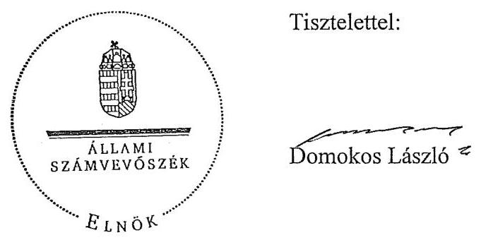

---

.
