# ÁLLAMI <br> SZÁMVEVŐSZÉK 

## JELENTÉS

Kecskemét Megyei Jogú Város Önkormányzata pénzügyi helyzetének ellenőrzéséről (43/3)

---

# Számvevői Iroda 

Iktatószám: V-3040-17/2011.
Témaszám: 1015
Vizsgálat-azonosító szám: V056039

## Az ellenőrzést felügyelte:

Dr. Varga Sándor
számvevő igazgató-helyettes
Az ellenőrzést vezette:
Renkó Zsuzsanna
számvevő tanácsos
Az ellenőrzést végezték:
dr. Marosi Gyöngyi Baloghné Dakó Eszter Szabó Tamás
számvevő tanácsos
számvevő tanácsos

A témához kapcsolódó eddig készített számvevőszéki jelentés:
címe
sorszáma
Jelentés a Kecskemét Megyei Jogú Város Önkormányzata gazdál- 0742
kodási rendszerének 2007. évi ellenőrzéséről

---

# TARTALOMJEGYZÉK 

BEVEZETÉS ..... 5
I. ÖSSZEGZŐ MEGÁLLAPÍTÁSOK, KÖVETKEZTETÉSEK, JAVASLATOK ..... 16
II. RÉSZLETES MEGÁLLAPÍTÁSOK ..... 29

1. Az Önkormányzat kötelező és önként vállalt feladatai ..... 29
2. Pénzügyi egyensúlyi helyzet alakulása ..... 35
2.1. A működési és felhalmozási egyensúly alakulása ..... 35
2.2. Az Önkormányzat bevételeinek alakulása ..... 43
2.3. Az Önkormányzat kiadásainak alakulása ..... 45
3. Kötelezettségek bemutatása ..... 51
3.1. A pénzintézetek felé fennálló kötelezettségek alakulása ..... 51
3.2. Szállítók felé fennálló kötelezettségek alakulása ..... 56
3.3. Egyéb kötelezettségek alakulása ..... 57
4. A pénzügyi egyensúly megteremtése érdekében hozott intézkedések ..... 63
5. A helyi önkormányzatok gazdálkodási rendszerének 2010. évi ellenőrzése során a pénzügyi egyensúly javítására tett szabályszerűségi és célszerűségi javaslatok hasznosulása ..... 68

---

# MELLÉKLETEK 

1. számú A működési és felhalmozási célú hiány/többlet alakulása az Önkormányzat rendeleteiben
2. számú Az Önkormányzat bevételeinek és kiadásainak, adósságszolgálatának alakulásáról
3. a számú Az Önkormányzat 2007-2010 években megvalósított, 2010. december 31-ig befejezett fejlesztései forrásösszetételéről
4. b számú Az Önkormányzat 2010. december 31-én folyamatban lévő fejlesztési feladataihoz kapcsolódó kötelezettségeinek összegzéséről
5. c számú Az Önkormányzat 2010. december 31-én folyamatban lévő fejlesztési feladataihoz kapcsolódó 2010. évet követő kötelezettség-vállalásainak összegzéséről
6. d számú Az Önkormányzat beadott, elbírálás alatti pályázati forrásból megvalósuló fejlesztéseihez kapcsolódó kötelezettség-vállalásainak összegzéséről
7. számú Az önkormányzati feladatok ellátásában részt vevő gazdasági társaságokról
8. számú Kecskemét Megyei Jogú Város Önkormányzat Polgármesterének észrevétele
9. számú Kecskemét Megyei Jogú Város Önkormányzat Polgármesterének észrevételére adott válasz

---

# RÖVIDÍTÉSEK JEGYZÉKE 

| Törvények |  |
| :--: | :--: |
| Áht. | az államháztartásról szóló 1992. évi XXXVIII. törvény |
| ÁSZ tv. | az Állami Számvevőszékről szóló 1989. évi XXXVIII. törvény (2011. július 1-jétől az Állami Számvevőszékről szóló 2011. LXVI. törvény) |
| Csődtv. | a csődeljárásról és felszámolási eljárásról szóló 1991. évi XLIX. törvény |
| Gt. | a gazdasági társaságokról szóló 2006. évi IV. törvény |
| Htv. | a helyi önkormányzatok és szerveik, a köztársasági megbízottak, valamint egyes centrális alárendeltségű szervek feladat- és hatásköreiről szóló 1991. évi XX. törvény |
| Ötv. | a helyi önkormányzatokról szóló 1990. évi LXV. törvény |
| Számv. tv. | a számvitelről szóló 2000. évi C. törvény |
| Rendeletek |  |
| Áhsz. | az államháztartás szervezetei beszámolási és könyvvezetési kötelezettségének sajátosságairól szóló 249/2000. (XII. 24.) Korm. rendelet |
| Önkormányzati SzMSz | Kecskemét Megyei Jogú Város Önkormányzatának 47/1998. (XII. 21.) számú rendelete az Önkormányzat és Szervei Szervezeti és Működési Szabályzatáról |
| 2007. évi zárszámadási rendelet | Kecskemét Megyei Jogú Város Önkormányzatának 15/2008. (IV. 28.) számú rendelete az Önkormányzat 2007. évi zárszámadásáról és a 2007. évi pénzmaradvány jóváhagyásáról |
| 2008. évi zárszámadási rendelet | Kecskemét Megyei Jogú Város Önkormányzatának 26/2009. (IV. 30.) számú rendelete az Önkormányzat 2008. évi zárszámadásáról és a 2008. évi pénzmaradvány jóváhagyásáról |
| 2009. évi zárszámadási rendelet | Kecskemét Megyei Jogú Város Önkormányzatának 12/2010. (IV. 29.) számú rendelete az Önkormányzat 2009. évi zárszámadásáról és a 2009. évi pénzmaradvány jóváhagyásáról |
| 2010. évi zárszámadási rendelet | Kecskemét Megyei Jogú Város Önkormányzatának 16/2011. (IV. 28.) számú rendelete az Önkormányzat 2010. évi zárszámadásáról és a 2010. évi pénzmaradvány jóváhagyásáról |
| 2011. évi költségvetési rendelet | Kecskemét Megyei Jogú Város Önkormányzatának 2/2011. (II. 9.) számú rendelete az Önkormányzat 2010. évi költségvetéséről |
| Szórövidítések |  |
| áfa | általános forgalmi adó |
| ÁSZ | Állami Számvevőszék |
| BM | Belügyminisztérium |

---

| EDP hiány/egyenleg | Uniós módszertan szerinti maastrichti kritériumoknak megfelelő számítás szerinti hiány/egyenleg |
| :--: | :--: |
| EU | Európai Unió |
| jegyző | Kecskemét Megyei jogú Város Önkormányzatának jegyzője |
| gazdasági program | Kecskemét Megyei Jogú Város Önkormányzata Közgyűlésének 462/2006. (VI. 28.) számú határozatával jóváhagyott Kecskemét Város 2007-2013. évi gazdasági programja |
| GDP | Bruttó hazai termék |
| Kistérségi társulás | Kecskemét és Térsége Többcélú Társulása |
| Kincstár | Magyar Államkincstár |
| Közgyűlés | Kecskemét Megyei Jogú Város Önkormányzat Közgyűlése |
| NAV | Nemzeti Adó- és Vámhivatal |
| Önkormányzat | Kecskemét Megyei Jogú Város Önkormányzata |
| panelprogram | Iparosított technológiával épült lakóépületek széndioxidkibocsátás csökkentést és energia-megtakarítást eredményező korszerűsítésének, felújításának támogatása |
| polgármester | Kecskemét Megyei Jogú Város Önkormányzat polgármestere |
| Polgármesteri hivatal | Kecskemét Megyei Jogú Város Önkormányzat Polgármesteri Hivatala |
| szja | Személyi jövedelem adó |
| Társulás | Kecskemét és Térsége Társult Települések Szennyvízcsatorna és Tisztítótelep Tulajdonközössége |
| TISZK | Kecskeméti TISZK Térségi Integrált Szakképző Központ Nonprofit Kiemelkedően Közhasznú KFT |

---

# JELENTÉS 

## Kecskemét Megyei Jogú Város Önkormányzata pénzügyi helyzetének ellenőrzéséről

## BEVEZETÉS

Az Állami Számvevőszék 2011. évtől érvényes stratégiája új irányt szabott a helyi önkormányzatok gazdálkodásának ellenőrzésében is. Az ÁSZ - küldetése és jövőképe szerint - szilárd szakmai alapokra támaszkodva értékteremtő ellenőrzéseivel és helyzetelemzéseivel az államháztartás egészében, így a helyi önkormányzati alrendszerben is elő kívánja segíteni a közpénzek és a közvagyon szabályos, gazdaságos, hatékony és eredményes hasznosítását. Ennek részeként - a 2010. évi államháztartási hiány alakulásának összetevőire is figyelemmel - folyamatban van az önkormányzati alrendszer pénzügyi helyzetelemzése.

Az NGM 2011 áprilisában közzétett adatai szerint ${ }^{1}$ a 2010. évi 1036,2 milliárd Ft összegű 3,8\%-os EDP (maastrichti kritériumok szerinti, Túlzott Hiány Eljárás keretében kimutatott) hiánycél nem volt tartható, az önkormányzati alrendszer tervezettet meghaladó hiánya miatt a GDP arányában kifejezett államháztartási hiány 4,2\%-ra emelkedett.

Az önkormányzatok 2010 első három negyedévi költségvetési jelentése szerinti pénzforgalmi hiány 97 milliárd Ft-os összege nem indokolta az önkormányzati alrendszer 190 milliárd Ft-ra becsült hiányának 2010. évi végi felülvizsgálatát. A helyi önkormányzatok 2011. januári gyorsjelentése alapján a pénzforgalmi hiány már 247,7 milliárd Ft-ot tett ki. Az alrendszer hiánya így a tervezett $0,7\%$-kal szemben magasabb, $0,9\%$-os szinten realizálódott. Az 57,7 milliárd Ft hiánytöbblet alakulásában - a Tájékoztató szerint - az iparűzési adó elmaradása, a gépjárműadó, az illetékek és más bevételek tervezettnél alacsonyabb összegben való teljesülése volt a meghatározó.

Magyarország a Széll Kálmán Terv célkitűzései alapján² aktualizált Konvergencia Programjában a középtávú (2011-2015. évek) költségvetési pálya kijelölése során 2011-re a kormányzati szektor EDP módszertan szerinti egyenlegét + 2\%-

[^0]
[^0]:    ${ }^{1}$ NGM Tájékoztatás Magyarország Strukturális Reformprogramjának végrehajtásáról (2011. április 1). A Tájékoztató évente két alkalommal - április és október hónapban jelenik meg.
    ${ }^{2}$ Az államháztartás 2011. évi egyenlege - a magán nyugdíjpénztárakból az állami nyugdíjpillérbe való visszatérés egyszeri vagyonhatása következtében - $4 \%$-os többletet mutatna. A Széll Kálmán Tervben foglalt egyszeri intézkedések - a MÁV, a BKV adósságrendezése, a PPP projektek kiváltása - összességében a GDP 2\%-ával csökkentik a várható többlet mértékét.

---

ban jelölte meg. Az egyenlegcél megfogalmazásakor az önkormányzati alrendszer tervezett hiányát a 2011. évi költségvetésben szereplő $0,3\%$-kal szemben $0,5\%$-os arányban határozták meg ${ }^{3}$. A hiánycélok meghatározása jelzi, hogy az önkormányzati alrendszerben 2011-ben fokozott figyelmet kell fordítani a pénzügyi egyensúlyi helyzet alakulására.

Az államháztartás helyi szintjén a 23 megyei jogú városi önkormányzatnak az általuk ellátott közszolgáltatások volumenére való tekintettel kiemelt szerepe van, e települések népessége összességében meghaladja a kétmillió főt ${ }^{4}$. A települések népességét az alábbi diagram szemlélteti:
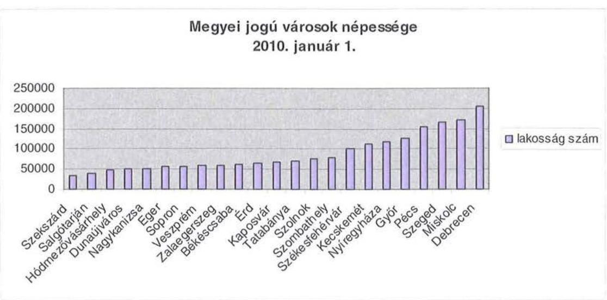

A megyei jogú városi önkormányzatok ${ }^{5}$ kötelező feladatellátását többlépcsős törvényi előírások határozzák meg. A feladatokra vonatkozó szabályozás első szintjét az Ötv. ${ }^{6}$, a második szintet a hatásköri ${ }^{7}$, a harmadik szintet a további ágazati, szakmai (egyebek mellett az oktatási, egészségügyi, szociális és egyéb ágazati feladatok ellátásának szakmai szabályait rögzítő) törvények adják.

A megyei jogú városi önkormányzatok - az Ötv-ből közvetlenül levezethető települési feladatok mellett körzeti közszolgáltatásokat is ellátnak. A megyei

[^0]
[^0]:    ${ }^{3}$ A Magyar Köztársaság 2011. évi költségvetéséről szóló 2010. évi CLXIX. törvény Általános indoklásának III. fejezete, valamint Magyarország Konvergencia Programja 2011-2015. (2011. április) Táblázatok rész, 2. táblázat Államháztartás összefoglaló adatai szerint.
    ${ }^{4}$ A megyei jogú városok népességét a 4/2011. (I. 31.) NGM rendelet 1. sz. mellékletében foglalt 2010. január 1-i adatok alapján vettük figyelembe.
    ${ }^{5}$ Az Ötv. 61. § (1) bekezdése alapján a megyeszékhely város a törvény erejénél fogva megyei jogú, ugyanakkor az Országgyűlés az ötvenezernél nagyobb népességű városokat a képviselőtestület kérelmére megyei jogú várossá nyilváníthatja. Ez utóbbi körbe 5 város tartozik, közülük 2 (Hódmezővásárhely, Dunaújváros) népessége 2010. január 1-ére már ötvenezer fő alá csökkent.
    ${ }^{6}$ az Ötv. 8. és 61. §-ában foglaltak szerint
    ${ }^{7}$ a Htv.

---

jogú városi cím elsősorban többlet kötelezettségekkel jár, a megyei jogú városnak önmagának kell gondoskodnia mindazokról a feladatokról, amelyek más települési önkormányzatok esetében a megyei önkormányzat feladatát képezik. Ide sorolható többek közt a középfokú oktatási intézmények fenntartása, a közművelődési, könyvtári és levéltári szolgáltatás, a társadalombiztosítás finanszírozása mellett a kórházi és a rendelőintézeti szakellátás, a szociális és egyes gyermekvédelmi feladatok ellátása. Ezeket a feladatokat (intézményeket) a megyei jogú város - más városoktól eltérően - nem adhatja át a megyei önkormányzatnak, azonban az Ötv. lehetőséget biztosít arra, hogy a megyei önkormányzattal megállapodjék a feladatellátás megosztásában.

Az önkormányzat, így a megyei jogú város is, maga határozza meg, hogy - a lakosság igényei alapján, anyagi lehetőségei függvényében - mely feladatokat, milyen mértékben és módon, mely szervezeti keretek közt lát el. A szervezetalakítás szabadsága a megyei jogú városok esetében azzal járt, hogy mind a kötelező közszolgáltatásoknál (különösen a településüzemeltetés, vagyongazdálkodás), mind pedig az önként vállalt feladataik ellátásában - elsősorban a sport és kulturális szolgáltatások területein - a gazdasági társaságok kiemelt fontosságú szerephez jutottak. Ily módon a gazdálkodás, a pénzügyi helyzet kockázatai közvetlenül kikerültek ugyan az önkormányzati alrendszerből, azonban sérülhet az ellátási felelősség figyelemmel kísérése és érvényesítése, a közpénzek felhasználásának transzparenciája. Mindezek együttvéve - a beszámolók konszolidálásának hiányában - növelik a megyei jogú városok pénzügyi helyzetének megítélésében rejlő kockázatokat.

Az áttekintett időszakban az önkormányzati feladatok ellátásának keretet biztosító forrásszabályozás elvei lényegesen nem változtak.

A megyei jogú városok önkormányzatainak mozgásterét, az önkormányzatok feladatellátásra vonatkozó döntéseit a központi költségvetéstől való függőség mellett jelentősen befolyásolja a helyi adókivetési jog gyakorlása ${ }^{8}$. A helyi adók rendszere a
 közszolgáltatások finanszírozásához szükséges források megteremtésének, bővítésének eszköze, amely a gazdasági válság, a jogszabályi környezet, az adópolitika változása, az adóhatóságok tevékenysége következtében differenciáltan érinti a települési önkormányzatokat ${ }^{9}$.

A települési önkormányzatok saját folyó bevételeinek keretében elszámolt, különböző jogcímeken kivetett helyi adók - iparűzési adó, építmény és telekadó, idegenforgalmi adó, vállalkozók és magánszemélyek kommunális adója - 2007-2010 között eltérő módon emelkedtek. A helyi adókból származó bevételek realizált összege országos szinten 2007-2009 között folyamatosan, 505,3 milliárd Ft-ról 566,3 milliárd Ft-ra emelkedett, majd a gazdasági válság hatásai következtében 2010-re 542,6 milliárd Ft-ra esett vissza. A helyi adók részesedése

[^0]
[^0]:    ${ }^{8}$ a helyi adókról szóló 1990. évi C. törvény szabályai szerint
    ${ }^{9}$ Az Állami Számvevőszék 2010 decemberében közzétett 1031. számú jelentésében értékelte a helyi adók rendszerében a hatékonyság és az eredményesség érvényesülését.

---

az önkormányzatok saját folyó bevételein belül 2007-2010 között 2,5 százalékponttal csökkent ${ }^{10}$.

A megyei jogú városok saját folyó bevétele 2007-ben 191,5 milliárd Ft volt, 2008-ban 223,1, 2009-ben 225,4, 2010-ben 223,5 milliárd Ft-ot tett ki. A helyi adóbevételekből való részesedésük 2007-ben 110,5 milliárd Ft (21,9\%), 2008-ban 128,3 milliárd Ft (23,2\%), 2009-ben 124,4 milliárd Ft (22\%), 2010-ben 118,7 milliárd Ft (részaránya a 2007. évivel azonosan $21,9 \%$ ) volt. E realizált adóbevételek a megyei jogú városok saját folyó bevételeinek 2007-ben 57,7, 2008-ban 57,5, 2009-ben 55,2, 2010-ben 53,1\%-át jelentették. A helyi adóbevételek 2007-ről 2010-re kimutatott 4,6 százalékpontos csökkenése annak ellenére következett be, hogy a megyei jogú városok saját folyó bevétele 2010-ben $16,7 \%$-kal haladta meg a 2007. évit.

A helyi adókon belül a települések gazdasági helyzetének egyik fokmérője az elért helyi iparűzési adóbevétel, amely a megyei jogú városok körében erőteljes - a település nagyságrendtől is függő ${ }^{11}$ - különbségeket mutat. A helyi iparűzési adóbevétel és annak egy lakosra vetített összegének 2007. és 2010. évi alakulását az alábbi diagramok szemléltetik:
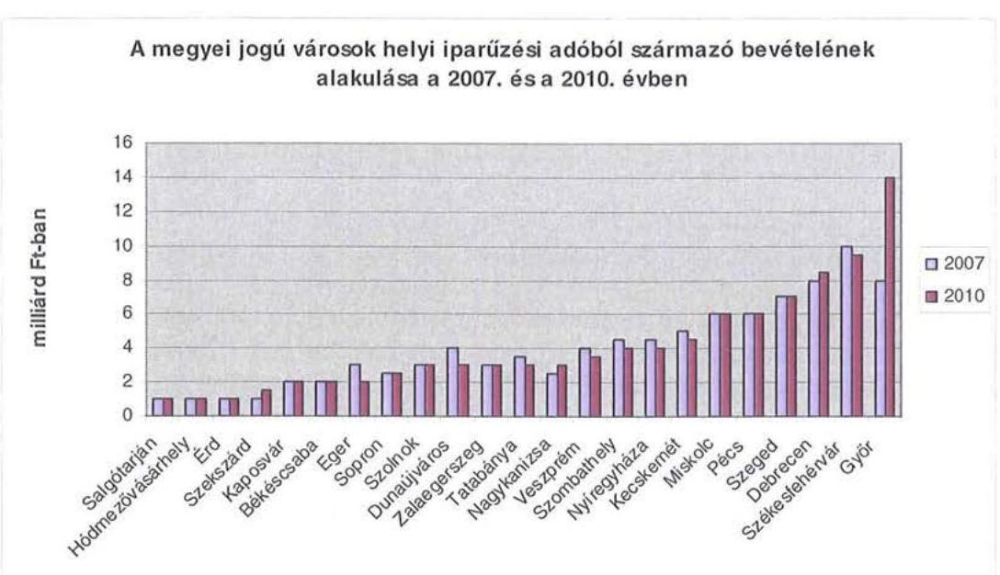

[^0]
[^0]:    ${ }^{10}$ A helyi adó bevételek saját folyó bevételekből való részesedése országosan 2007-ben $55,3 \%, 2010$-ben $52,8 \%$ volt.
    ${ }^{11}$ A 100 ezer fő feletti népességű megyei jogú városok csoportjába Debrecen, Miskolc, Szeged, Pécs, Győr, Nyíregyháza, Kecskemét, Székesfehérvár tartozik. Nem megyeszékhely megyei jogú város Érd, Sopron, Nagykanizsa, Dunaújváros, Hódmezővásárhely.

---

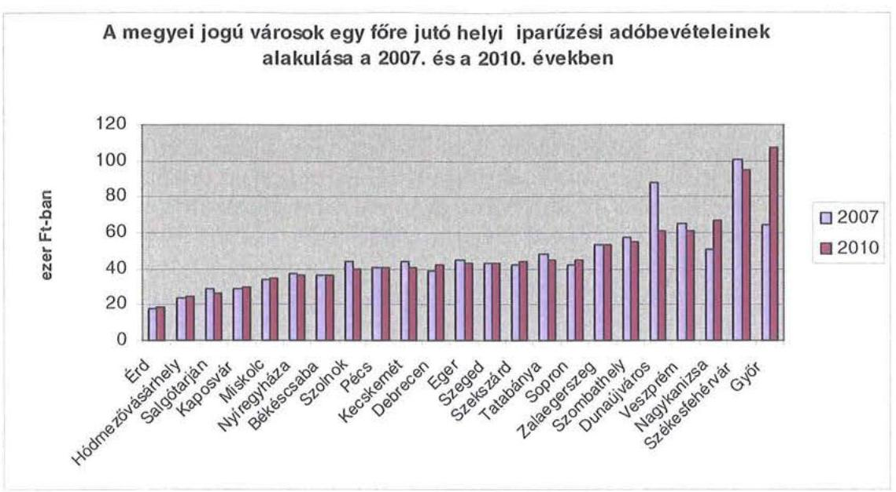

A megyei jogú városi önkormányzatok saját bevételein belül második legjelentősebb elem az illetékbevétel. A 2010. évben befolyt 39,2 milliárd Ft illetékbevétel a 2006. évben realizált 71,1 milliárd Ft illetékbevétel alig több mint $55 \%$-a. A jelentős visszaesést döntően az ingatlanpiac stagnálása, majd visszaesése, illetve egyes illetékkedvezmények bevezetése okozta. A kieső bevételek pótlására az önkormányzati alrendszer szintjén történtek intézkedések, 2010-ben 5 milliárd Ft-ot, 2011-ben 1,2 milliárd Ft-ot ellentételezett a központi költségvetés. A megyei jogú városok önkormányzatai az önkormányzati alrendszer szintjén realizált illetékbevételből 2007-ben 13,6 milliárd Ft-tal (23,3\%-kal), 2008-ban 15,3 milliárd Ft-tal ( $22,7 \%$-kal), 2009-ben 12,6 milliárd Ft-tal ( $21,5 \%$ kal), 2010-ben 7,9 milliárd Ft-tal ( $20,2 \%$-kal) részesedtek ${ }^{12}$. Az összes befolyt illetékbevételből a megyei jogú városok részesedése 2009-ről 2010-re mindössze 1,3 százalékponttal csökkent, ugyanakkor a realizált illetékbevétel csökkenése a $37,3 \%$-ot ( 4,7 milliárd Ft) is elérte.

Az önkormányzati alrendszer átengedett bevételei közül a személyi jövedelemadóból való részesedés makroszintű szabályozása a vizsgált időszakban nem változott. A települési önkormányzatokat a településre kimutatott személyi jövedelemadó $8 \%$-a közvetlenül, míg $32 \%$-a külön szabályozott visszaosztási rendben illeti meg. A visszaosztás a jövedelem differenciálódás mérséklésével párosul, rendje a lakóhelyen maradó személyi jövedelemadóhoz és az iparűzési adó-erőképességhez ${ }^{13}$ igazodik, annak részletszabályait a mindenkori költségvetési törvény 4. számú melléklete határozza meg. A jövedelemdifferenciálódás

[^0]
[^0]:    ${ }^{12}$ Az illetékek kivetésének és beszedésének joga 2006. december 31-ig a megyei önkormányzatok feladata volt, amelyet a 2007. évtől az APEH (2011. január 1-jétől NAV) vett át. Az önkormányzati illetékrészesedési szabályok változatlanok maradtak, azonban az illetékbeszedés költségeit az önkormányzatok illetékbevételeiből átlagos (a megyei jogú városoknál 8,5\%-os) kulcsot alkalmazva vonták le.
    ${ }^{13}$ Az iparűzési adóerő-képesség egy potenciális, átlagos erőfeszítés mellett elérhető (a települési önkormányzat iparűzési adóelőlegét meghatározó adóalap 1,4\%-ának megfelelő számított) bevétel.

---

szabályai kétirányúak, a kiegészítés és a visszatartás feltételeit egyaránt meghatározták:

- Amennyiben az önkormányzatot közvetlenül megillető személyi jövedelemadó bevétel és a számított iparűzési adóerő-képesség együttesen számított, egy főre jutó összege nem érte el a település méretéhez kapcsolódóan az évenkénti szabályozás szerinti változó összeget, a költségvetés a részesedést település nagyság szerint eltérően meghatározott szintig - kiegészítette ${ }^{14}$. A kiegészítés fajlagos összege 2007-2010 között 37500 Ft-ról 48010 Ft-ra (10 510 Ft-tal, 28\%-kal) emelkedett. Az előzőeken túl a jövedelem differenciálódás szabályozása egyes térségi (középiskolai, szakiskolai, szakképző intézményi, kollégiumi) feladatok ellátásának függvényében további kiegészítő hozzájárulást biztosított.
- Amennyiben az egy főre számított személyi jövedelemadó és az iparűzési adóerő-képesség együttes összege a település nagyságrendjéhez rendelt értékhatárt több mint $25 \%$-kal (2010-től 20\%-kal) meghaladta, az egy főre jutó összeg sávonként differenciált módon ${ }^{15}$ visszavonásra került az önkormányzatot megillető normatív állami hozzájárulás összegéből.

Az önkormányzatok személyi jövedelemadó bevétele 2007-ben 494,3 milliárd Ft, 2008-ban 558,6 milliárd Ft, 2009-ben 639,5 milliárd Ft, 2010-ben 681,2 milliárd Ft volt, az időszak alatt összegében 186,9 milliárd Ft-tal, 37,8\%-kal emelkedett, miközben az szja bevétel átengedett bevételeken belüli részesedése 1,8 százalékponttal emelkedett.

A megyei jogú városok önkormányzatainak személyi jövedelemadó részesedése az alrendszer átengedett személyi jövedelemadó bevételeiből 2007-ben 77,6 milliárd Ft-ot ( $15,7 \%$-ot), 2008-ban 105,4 milliárd Ft-ot ( $18,9 \%$-ot), 2009-ben 122,9 milliárd Ft-ot ( $19,2 \%$-ot), 2010-ben 136,6 milliárd Ft-ot ( $20,1 \%$-ot) tett ki. A realizált szja bevétel a megyei jogú városoknál az időszak alatt folyamatosan emelkedett, a 2010-ben realizált adóbevétel 59,0 milliárd Ft-tal (76\%) volt magasabb a 2007. évinél, az átengedett bevételeken belüli részesedése 2010-re 5,1 százalékponttal haladta meg a 2007. évi részarányt ${ }^{16}$. A részesedés alapjául szolgáló szja településenként eltérő, az egy adózóra jutó szja 2009. évi adatait ${ }^{17}$ a következő ábra szemlélteti.

[^0]
[^0]:    ${ }^{14}$ A megyei jogú városok esetében a jövedelemkülönbségek mérséklésénél figyelembe veendő lakosonkénti értékhatár 2007-ben 37500 Ft, 2008-ban 42385 Ft, 2009-ben 45933 Ft, 2010-ben 48010 Ft volt.
    ${ }^{15}$ A sávos értékhatár 2010-től 20\%-os intervallumonként, 120\% felett a visszatartást $25 \%$-tól $90 \%$-os mértékig rögzíti. Amennyiben a település nagyságrendhez rendelt értékhatár összege az önkormányzatnál eléri vagy meghaladja a $200 \%$-ot, az egy főre jutó összeg $90 \%$-a levonásra kerül. Az értékhatár sávjai 2010 előtt $25 \%$-os léptékűek voltak, a levonási arányok az ellenőrzött időszakban nem változtak.
    ${ }^{16}$ E bevételek a megyei jogú városok átengedett bevételeiben 2007-ben 84,7, 2008-ban 87,7, 2009-ben 89,7, 2010-ben 89,8\%-os részarányt jelentettek.
    ${ }^{17}$ Adatforrás: KSH Megyei Jogú Városok a Közép Dunántúlon 2009. kiadványa, 4.1.sz. összehasonlító tábla.

---

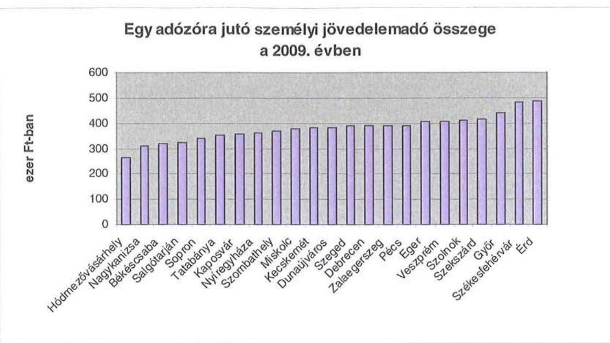

Az átengedett bevételek második legjelentősebb eleme a gépjárműadó, amelynek bevételi szabályozása az ellenőrzött időszakban nem változott, az adóbevétel teljes összege az önkormányzatot illeti meg. A gépjárműadó alapját, mértékét ${ }^{18}$ és egyes mentességi kategóriákat érintő módosítások 2010. január 1-től következtek be, amelyek az egyes adótételek esetében átlagosan $15 \%$-os emelkedéssel jártak.

A gépjárműadó beszedéséből származó bevétel az önkormányzati alrendszer szintjén 2007-ben 62,4 milliárd Ft, 2008-ban 65,7 milliárd Ft, 2009-ben 63,8 milliárd Ft, 2010-ben 71,1 milliárd Ft volt, az adóbevétel egésze 2007-hez képest 8,7 milliárd Ft-tal, 13,9\%-kal emelkedett. A gépjárműadóztatás szabályainak változása 2010-ben 7,3 milliárd Ft többletet eredményezett. A megyei jogú városok gépjárműadó bevétele a 2007. évi 14,0 milliárd Ft-ról 2010-re 15,5 milliárd Ft-ra, 10,7\%-kal emelkedett. A bevételnövekedés összegéből 1,4 milliárd Ft a 2010. évi adózási szabályok következménye.

A megyei jogú városok önkormányzatai 2007-2010 között rendelkezésre álló forrásainak alakulását a következő ábra szemlélteti:

[^0]
[^0]:    ${ }^{18}$ A gépjárműadóról szóló 1991. évi LXXXII. törvény 7. § (1) bekezdésében foglalt adómértékek változása.

---

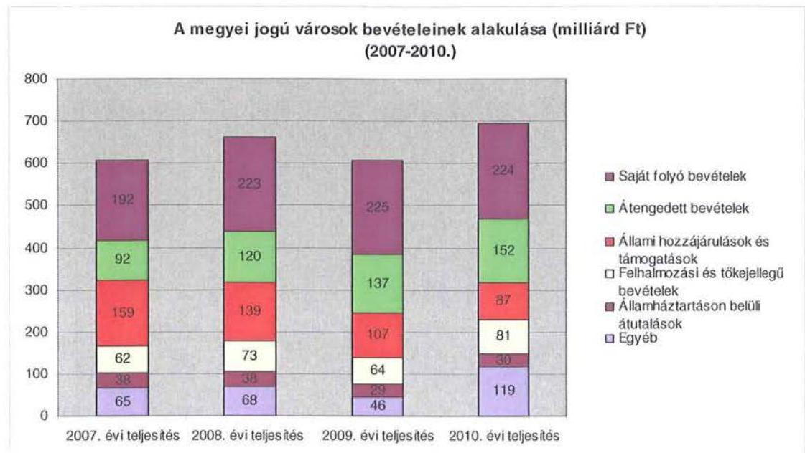

A megyei jogú városok saját folyó bevételeinek - amelyek főbb elemei: a helyi adók, az illetékbevételek, az intézményi térítési díjak, a kamatbevételek - részaránya a 2007. évi összbevételen ( 608 milliárd Ft) belül 32\% volt. A 2010. évi összbevétel 693 milliárd Ft-os összegéből a saját folyó bevételek aránya - miközben összege 2007-ről 2010-re 32 milliárd Ft-tal emelkedett - nem változott.

Az átengedett bevételek, amelyek a megyei jogú városok önkormányzatainál döntően a személyi jövedelemadó és a gépjárműadó részesedést jelenti, az összbevételen belül a 2007. évi 92 milliárd Ft-ról (15\%) 152 milliárd Ft-ra nőtt, részesedése 7 százalékponttal emelkedett. A 60 milliárd Ft-os növekedésből 59 milliárd Ft-ot az szja részesedés emelkedése okozott.

Az állami hozzájárulások és támogatások - amelyek főbb elemei: főként az ellátotti létszámhoz kötődő normatív állami hozzájárulások, központosított előirányzatok - a 2007. évi 159 milliárd Ft-ról (26\%-os részarányról) 2010-re 87 milliárd Ft-ra ( $13 \%$-os részarányra) estek vissza.

A felhalmozási és tőkejellegű bevételek - tárgyi eszközök (ingatlanok és ingóságok), föld és immateriális javak, részesedések értékesítése, EU-tól átvett pénzeszközök - a 2007. évi 62 milliárd Ft-ról (10\%-os részarányról) 2010-re 81 milliárd Ft-ra ( $12 \%$-os részarányra) emelkedtek.

Az államháztartáson belüli átutalások részesedése 2007-ben 38 milliárd Ft volt. 2010. év végére 8 milliárd Ft-tal csökkent, részaránya 6\%-ról 2010-ben 4\%-ra változott. Ez a bevételi kategória tartalmazza az Egészségbiztosítási Alaptól és más elkülönített állami pénzalapoktól átvett forrásokat. A 2010-ben e címen elszámolt bevétel a megyei jogú városoknál 22 milliárd Ft-ot tett ki.

Az egyéb, pénzmaradványból, vállalkozási bevételekből, államháztartáson kívülről származó átutalásokból, a hitelekből, a hosszú és rövid lejáratú értékpa-

---

pírok értékesítéséből származó bevételek részesedése a 2007-2010. évek viszonylatában 11\%-ról 17\%-ra emelkedett. Ez utóbbiak 2010. évi beszámoló szerinti összevont teljesítése 119 milliárd Ft volt ${ }^{19}$.

Mindezeket figyelembe véve a megyei jogú városok 2007. és 2010. évi forrásösszetételének megoszlását az alábbi ábra szemlélteti:

A megyei jogú városok 2007. és 2010. évi forrásösszetétele
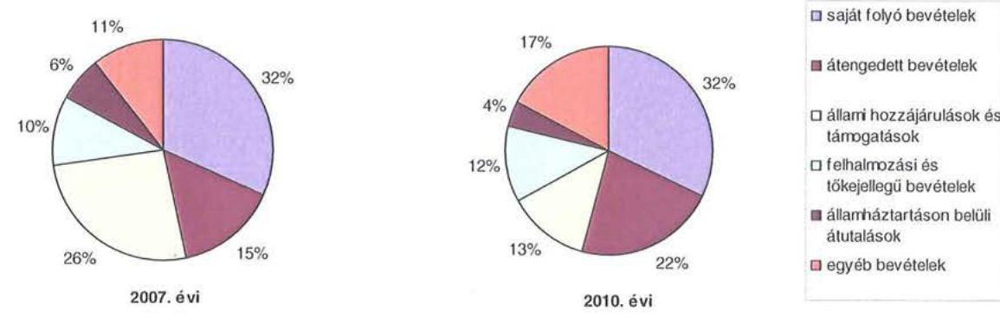

Az önkormányzati alrendszer pénzügyi helyzetértékelése során új elemzési módszereket alkalmaz az ellenőrzés. A hagyományos költségvetési szerkezet helyett az önkormányzat pénzügyi helyzetét a CLF módszerrel mutatjuk be, amelynek lényegét és számításának módszerét a 2.1. pontban, és a jelentés 2. számú mellékletében ismertetjük részletesen.

Az új módszereken alapuló helyzetértékelés fontosságát az adja, hogy a helyi önkormányzatok bruttó adósságállománya ${ }^{20}$ a 2010. évi költségvetési beszámoló alapján 1248 milliárd Ft-ot tett ki. Az adósságállomány koncentráltságát jelzi ${ }^{21}$, hogy ebből a 23 megyei jogú város részesedése 338 milliárd Ft volt, amely a fővárosi és kerületi önkormányzatok adósságának figyelmen kívül hagyásával számított 2010. évi 977 milliárd Ft összegű bruttó adósságállo-

[^0]
[^0]:    ${ }^{19}$ Az egyéb bevételek összege 2007-2010 között eltérő módon változott, 2007-ben 65 milliárd Ft, 2008-ban 68 milliárd Ft volt, 2009-ben 46 milliárd Ft-ra esett vissza, majd 2010-ben több mint két és félszeresére, 119 milliárd Ft-ra emelkedett.
    ${ }^{20}$ A bruttó adósságállomány 2010. év végi összege magában foglalja a fejlesztési és a működési célú kötvénykibocsátások, a beruházási és fejlesztési hitelek, a működési célú hosszú lejáratú hitelek, a rövid lejáratú hitelek, váltótartozások miatti kötelezettségek teljes (2011-ben, illetve az azt követő években esedékes) állományát.
    ${ }^{21}$ A megyei jogú városok adósságállománya összegében ugyan elmarad az egyéb városok összesített adósságától [(ez utóbbiak részesedése 382,6 milliárd Ft (39,2%)], azonban az egyéb városok száma 304. A fővárosi és a kerületi önkormányzatok nélküli adósságállományból a 19 megyei önkormányzat 163 milliárd Ft-tal ( $16,8 \%$-kal), míg a nagyközségek, községek együttesen 93 milliárd Ft-tal ( $9,5 \%$-kal) részesednek.

---

mány 34,6\%-át jelentette. Az adósságállomány több mint fele - 501 milliárd Ft - a 19 megyei önkormányzatnál és a 23 megyei jogú városnál jelentkezett.

A megyei jogú városok 338 milliárd Ft-os adósságállományából 175 milliárd Ft $(51,8 \%)$ a 8 legnagyobb, 100 ezer fő feletti népességű város tartozása. Az 5 nem megyeszékhely megyei jogú város bruttó adósságállománya 70 milliárd Ft-ot (20,7\%-ot), az előző két csoportba nem tartozó további 10 megyei jogú város adóssága 93 milliárd Ft-ot ( $27,5 \%$-ot) tett ki.

A megyei jogú városok 2010. év végi bruttó adósságállománya (milliárd Ft-ban)
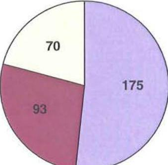
$\square 100$ ezer fő feletti népességü megyei jogú városok
■ 100 ezer fő alatti népességü megyei jogú városok
$\square$ Nem megyeszékhely megyei jogú városok

A mérlegben kimutatott bruttó adósságállomány mellett az önkormányzatok számára az eszközállomány műszaki állapotának megőrzése is kötelezettségekkel jár. Az elhasználódott eszközök pótlására forrást biztosító amortizációs (felújítási) alap képzésének ${ }^{22}$ elmaradása maga után vonhatja a feladatellátást kiszolgáló tárgyi eszközök állagának erőteljes romlását. Emellett a 2007-2013-as időszakra meghirdetett, vissza nem térítendő EU-s fejlesztési forrásokhoz való hozzájutás lehetősége felerősítette az önkormányzati alrendszer fejlesztési igényeit, amelyek a felhalmozási költségvetési hiány folyamatos emelkedésén túl - az előírt jövőbeni fenntartási kötelezettség miatt - tovább terhelhetik az önkormányzatok költségvetését ${ }^{23}$.

Az ÁSZ a 2011. évi ellenőrzési tervében 43. számú, az Önkormányzatok gazdálkodási rendszerének ellenőrzése részeként egy időben, egymással párhuzamosan tekinti át, és elemzi a 23 megyei jogú városi önkormányzat pénzügyi helyzetét. A gazdálkodás szabályszerűségét az ÁSZ az előző évek során ebben az önkor-

[^0]
[^0]:    ${ }^{22}$ Erre a jelenlegi szabályozási környezetben nem kötelezi semmilyen előírás az önkormányzatokat.
    ${ }^{23}$ Az Állami Számvevőszék 2011 júniusában közzétett 1108. számú, a helyi önkormányzatok fejlesztési célú támogatási rendszerének ellenőrzéséről szóló jelentésében feltárta a fejlesztési folyamatok problémáit. A helyi önkormányzatok elsősorban azokat a fejlesztéseket valósították meg, amelyekhez támogatást lehetett igényelni. A fejlesztési célok közül a magasabb támogatás intenzitású pályázatokat részesítették előnyben. A fejlesztéssel megvalósuló létesítmények jövőbeli üzemeltetésének várható ráfordításait az önkormányzatok $71,9 \%$-a nem mérte fel.

---

mányzati körben is ellenőrizte, ezért jelen vizsgálatunk erre nem tér ki. A jelentés a megyei jogú városok sajátos feladatellátási és forrásszabályozási helyzetére tekintettel az önkormányzatok pénzügyi helyzetét, illetve az ezzel összefüggő korábbi ÁSZ javaslatok megvalósítását mutatja be.

Az ellenőrzés a 2007. január 1. - 2010. december 31. közötti időszakot öleli fel.
A vizsgálat jogszabályi alapját az Állami Számvevőszékről szóló 1989. évi XXXVIII. törvény 2. § (3), (5), (6) és (9) bekezdései ${ }^{24}$, az Ötv. 92. § (1) bekezdése, az Áht. 104. § (3), és 120/A. § (1) bekezdése előírásai képezik.

[^0]
[^0]:    ${ }^{24}$ 2011. július 1-jétől az Állami Számvevőszékről szóló 2011. évi LXVI. törvény 5. § (2)(5) bekezdése

---

# I. ÖSSZEGZŐ MEGÁLLAPÍTÁSOK, KÖVETKEZTETÉSEK, JAVASLATOK 

Az Önkormányzat - adatszolgáltatása szerint - a tárgyév Kórház nélküli működési költségvetési kiadásaiból ( 24238,2 millió Ft) 18050,5 millió Ft-ot $(74,5 \%)$ a kötelező feladatok, 6187,7 millió Ft-ot $(25,5 \%)$ az önként vállalt feladatok ellátására fordított. A kötelező és önként vállalt feladatok részarányának megállapítása az Önkormányzat SzMSz szerinti besorolásának megfelelően készült. Az Önkormányzat önként vállalt feladatnak tekinti a testvérvárosi kapcsolatok szervezését, külföldi önkormányzatokkal való együttműködést, a támogató szolgáltatást, jelzőrendszeres házi segítségnyújtást, helyettes szülői ellátást, méltányossági alapon támogatások nyújtását, az anyatejgyűjtő állomás, vérvételi helyek, lelki segélyszolgálat működtetését, a városi nagy rendezvények szervezését, lebonyolítását, kiemelt kulturális programok támogatását (Udvarszínház, Kecskeméti Népzenei Találkozó, Kecskeméti Animációs Filmfesztivál, Európa Jövője Nemzetközi Gyermek- és Ifjúsági Találkozó, Magyarországi Bábszínházak Országos Találkozója, Kodály Örökség Program), művészeti intézmények, gazdasági társaságok működtetését, közgyűjtemény kezelését, támogatását tanórán kívüli foglalkozások szervezését, kollégiumi ellátást, felsőfokú szakképzést, felnőttképzést, továbbá sport szervezetek támogatását, drogprevencióval kapcsolatos feladatok ellátását, közterület-felügyelet működtetését.

Az Önkormányzat feladatellátásának szervezeti struktúráját szemlélteti a következő ábra:
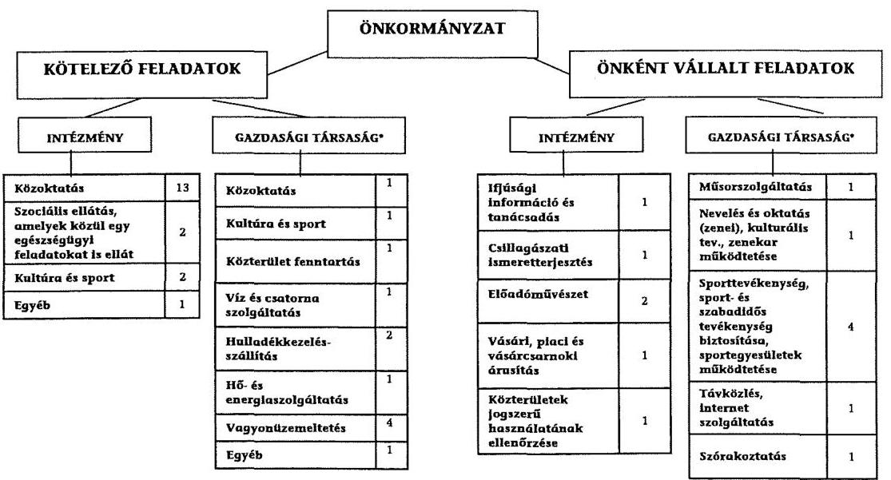

Az Önkormányzat feladatait 2010. december 31-én (a Polgármesteri hivatallal együtt) 25 költségvetési szervvel és tizenhat $25 \%$ feletti tulajdoni hányadú gazdasági társaságával, továbbá egy - az Önkormányzattól tulajdonosi szem-

---

pontból független gazdasági társaság közreműködésével látta el. Az intézményszervezeti átalakítások és intézményi összevonások következtében a feladatellátás telephelyeinek száma a 2006. évi 167-ről 2010-re 159-re csökkent.

Az Önkormányzat működési kiadásokra 2010-ben 24238,2 millió Ft-ot fordított, amely 2559,5 millió Ft-tal ( $11,8 \%$-kal) haladta meg a 2007. évi ráfordításokat. A 2007. évi működési kiadások 68,4\%-át (14 837,6 millió Ft) és a 2010. évi működési kiadások 59,5\%-át (14 427,4 millió Ft) az intézményi körben realizálták. E kiadások fedezetéül szolgáló bevételi források 2007. és 2010. években jellemző összesített arányait a következő ábra szemlélteti:
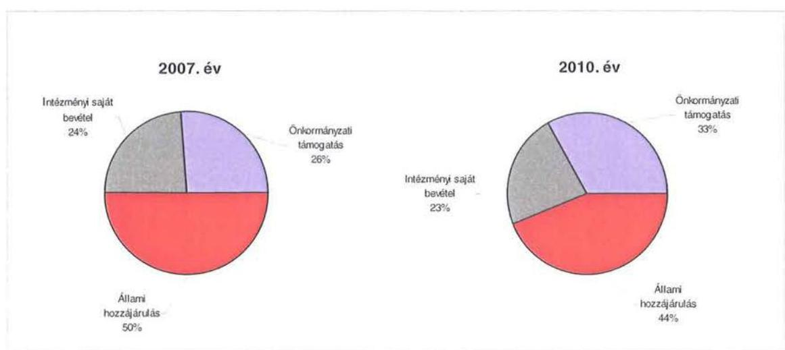

Az egyes közszolgáltatások feladatellátásában résztvevő ágazati intézménycsoportok forrásösszetételének bevételi jogcímenkénti alakulását a következő ábra szemlélteti:

---

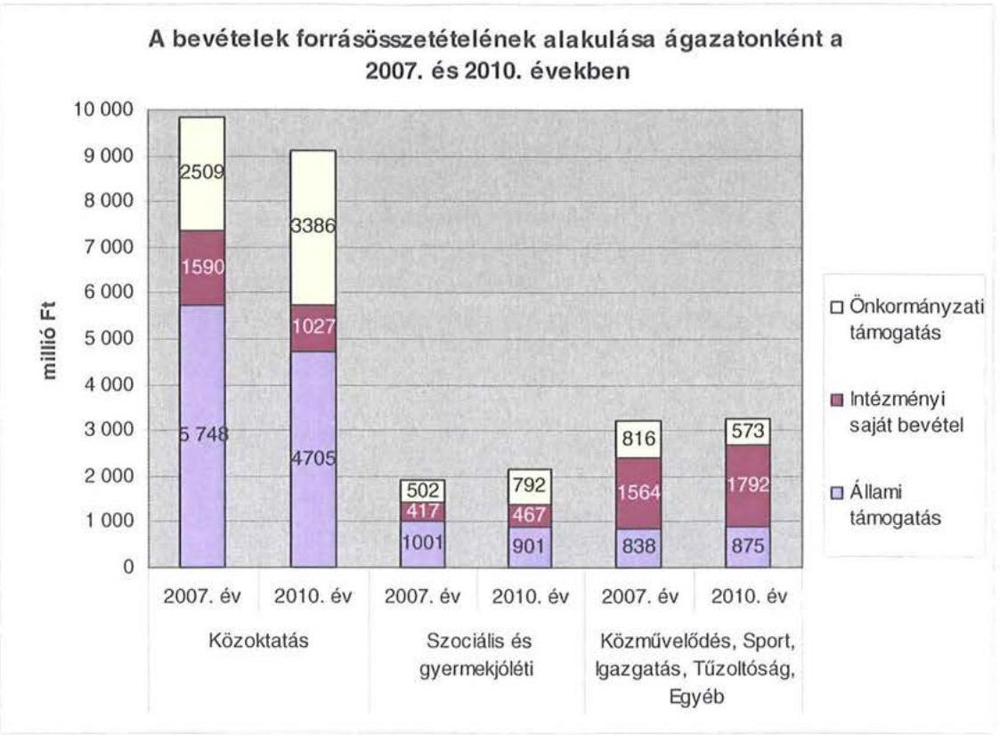

Az Önkormányzat hét gazdasági társaságban rendelkezik kizárólagos tulajdonnal, kettő gazdasági társaságban 75% feletti, öt gazdasági társaságban 50-75% közötti, kettőben 25-50% közötti tulajdoni hányaddal. Két kizárólagos önkormányzati tulajdonú gazdasági társaság három leányvállalata is részt vett az Önkormányzat feladatainak ellátásában. Emellett az Önkormányzat 7\%-os tulajdoni hányaddal rendelkezett a kéményseprési feladatokat ellátó gazdasági társaságban. A helyi közlekedési feladatok ellátására egy gazdasági társasággal kötöttek megállapodást. A gazdasági társaságok vagyonüzemeltetés, sport, kulturális, közoktatási, hulladékgazdálkodási, víz- és csatornaszolgáltatási, közterület fenntartási, hő és energia szolgáltatási feladatok terén kaptak szerepet az Önkormányzat feladatellátásában. A gazdasági társaságok működésükhöz a 2010. évben összesen 1514,5 millió Ft működési, 8 millió Ft fejlesztési juttatást kaptak az Önkormányzattól. A működési hozzájárulás 52,9\%-át (801,3 millió Ft-ot) a sportegyesületek és sportlétesítmények működésére adta az Önkormányzat.

A gazdasági társaságok pénzügyi helyzete kettő kizárólagos tulajdonú gazdasági társaságnál kedvezőtlen, a jegyzett tőke meghaladja a saját tőke összegét. A 2010. december 31-én a KSE Kft-nél a saját tőke összege -85,9 millió Ft, a jegyzett tőke 3 millió Ft, a Kecskeméti Televízió Kft-nél a saját tőke 79,9 millió Ft, a jegyzett tőke 92,6 millió Ft volt, illetve egy kizárólagos tulajdonú gazdasági társaság leány vállalatánál a Kecskemét Foglalkoztató Kft-nél a saját tőke jegyzett tőke aránya negatív volt.

A folyó költségvetés egyenlege (működési jövedelem) 2007. évről 2008. évre növekvő, majd azt követően folyamatosan csökkenő mértékű működési

---

forrástöbbletet ${ }^{25}$ mutatott. A működési többlet fedezte a tárgyévben jelentkező törlesztési kötelezettségeket, így az Önkormányzat pénzügyi kapacitása (nettó működési jövedelme) is pozitív értékű volt. A 2007. évről 2008. évre történő növekedést az iparűzési adóbevételek, ingatlanvásárlás és eladáshoz kapcsolódó áfa bevételek és visszatérülések, valamint költségvetési támogatás növekedése okozta, illetve nagymértékű csökkenését a következő évben ugyanezen források csökkenése indokolta.
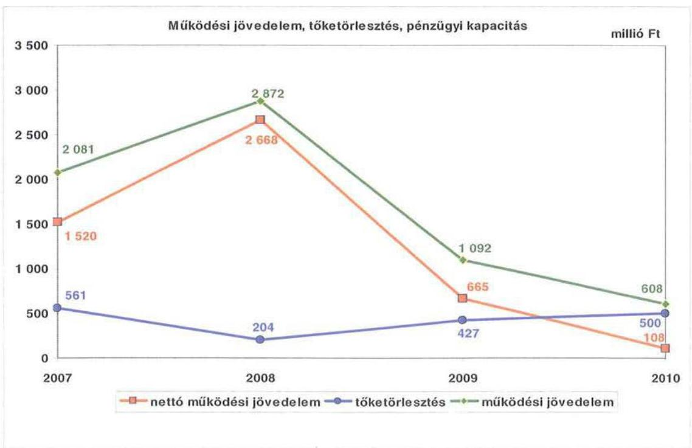

A 2007-2010. években a 2009. év kivételével az Önkormányzat felhalmozási költségvetésének egyenlege negatív összegű volt. A 2009. év 969 millió felhalmozási forrástöbblete nem ellentételezte az előző évek felhalmozási forráshiányát, a 2007-2010. között összesen 10149 millió Ft volt a felhalmozási forráshiány, amelynek 75,5\%-a ( 7661 millió Ft) 2007. és 2008. évben keletkezett.

A pénzügyi egyensúly fenntartása külső források bevonásával volt biztosítható. A 2007-2010. években 1692 millió Ft hitelt törlesztettek. Az adósságszolgálat, továbbá a felhalmozási forráshiány 2007-2010. között 11841 millió Ft-ot tett ki, amelyre a rendelkezésre álló pénzkészlet és az időszakban képződő 6653 millió Ft működési jövedelem szolgált fedezetül. Az időszak elején - 2007-2008. években keletkezett működési többletet meghaladó felhalmozási forráshiány további pénzeszközök bevonását eredményezte. A 2007. évet megelőzően, valamint 2007. évben megkötött hitelszerződések alapján felvett 1097 millió Ft, a 2008. évben 7000 millió Ft értékben kibocsátott kötvényből felhasznált 4179 millió Ft és 32 millió Ft kölcsön felvételével teremtették meg a hiányzó pénzeszközöket. A kialakult pénzügyi helyzet pozitív nettó működési jövedelem és továb-

[^0]
[^0]:    ${ }^{25}$ 2007-ben a folyó bevételek 8,7\%-át (2081 millió Ft-ot), 2008-ban 10,8\%-át (2872 millió Ft-ot), 2009-ben 4,1\%-át (1092 millió Ft-ot), 2010. évben 2,4\%-át (608 millió Ft-ot) jelentette a működési jövedelem.

---

bi külső források bevonásának, az eladósodás növekedésének elkerülését indokolja. 

A vizsgált időszakban Önkormányzatnál helyi iparűzési adó, építményadó, vállalkozók kommunális adója, vendégéjszakák utáni idegenforgalmi adó volt megállapítva. A helyi adókból és pótlékokból származó bevételek aránya 2007-2010 között 22-25\% körül mozgott a folyó (működési) bevételekben. A pótlékkal, bírsággal növelt helyi adó bevétel a 2007. évi 5998 millió Ft-ról 2010. évre 5778 millió Ft-ra (3,7\%-kal, 220 millió Ft-tal) csökkent. A helyi adóbevételek több mint $80 \%$-át az iparűzési adó tette ki, amelynek mértéke a helyi adókról szóló törvényben rögzített maximális mértékben került megállapításra a 2007. évben, majd folyamatosan csökkent, a 2008 és a 2009. évben 1,9\%, a 2010. évben $1,7 \%$ volt. A helyi adók csökkenését az iparűzési adó 321 millió Ft-os visszaesése okozta, amelyet az építményadó bevételének a 2009. évben bevezetett övezeti változás miatti 2008. évhez viszonyított 4,9\%-os (43,6 millió Ft) növekedése részben ellensúlyozta. Új helyi adónemet a vizsgált időszakban az Önkormányzat nem vetett ki.

A befejezett fejlesztések egy részét pénzintézeti forrásokból finanszírozták. A 2007-2010. évek időszakában 29613,4 millió Ft értékű fejlesztés és felújítás forrása 2661,5 millió Ft kötvényből származó bevétel ( $9,0 \%$ ), 1430,7 millió Ft hitelfelvétel ( $4,8 \%$ ), 6673,0 millió Ft EU-s támogatás ( $22,5 \%$ ), 3638,6 millió Ft hazai támogatás ( $12,3 \%$ ) és 15209,6 millió Ft saját forrás ( $51,4 \%$ ) volt. A 2010. december 31-én folyamatban lévő fejlesztési feladatok végrehajtására 4190,7 millió Ft kiadást teljesítettek, amelyre a kötvény bevételéből 1517,5 millió Ft-ot ( $36,2 \%$ ), hitelből 90,4 millió Ft-ot ( $2,2 \%$ ) fordítottak.

Az Önkormányzat 2010. december 31-én folyamatban lévő fejlesztési feladatok kötelezettség-vállalásainak összege
 5449 millió Ft volt, amelyből 778,5 millió Ft-ot saját forrásból, 3676,9 millió Ft-ot EU-s támogatásból, 170,8 millió Ft hazai támogatásból, 1,8 millió Ft rendelkezésre álló hitelből és 821,0 millió Ft meglévő kötvényből terveznek biztosítani. A tervezett saját források rendelkezésre állását az utófinanszírozás miatt megelőlegezett EU-s és hazai támogatás igazolja.

---

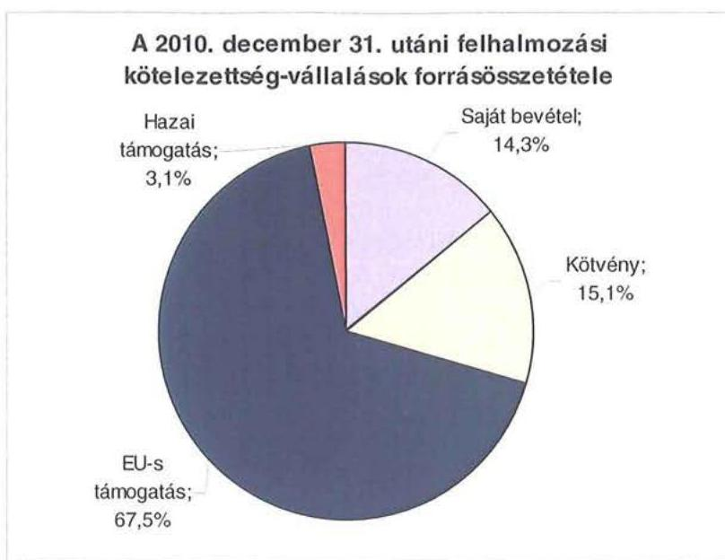

Az Önkormányzat által beadott, elbírálás alatt álló pályázatok tervezett teljes bekerülési költsége 1018,5 millió Ft volt, amelynek 7,9\%-át (80,6 millió Ft) tervezték saját bevételből finanszírozni. Az EU-s és hazai támogatásokon felül más idegen forrást már nem kívánnak bevonni a finanszírozásba.

Az Önkormányzat mérleg szerinti pénzintézeti kötelezettsége a 2006. év végéről a 2010. év végére, 4497,3 millió Ft-ról 15 958,7 millió Ft-ra nőtt, amelyből az árfolyamváltozás miatti különbözet 4381,9 millió Ft volt. A fennálló pénzintézeti kötelezettségek egy kötvénykibocsátásból, 13 hosszú lejáratú hitelből és 2010. december 31-ig vissza nem fizetett folyószámlahitel igénybevételéből keletkeztek. Az Önkormányzatnak a 2011. évben további 213,2 millió Ft pénzintézeti kötelezettsége keletkezett a 2010. decemberben megkötött hosszú lejáratú hitelszerződés alapján felvett hitelből.

Az Önkormányzat kötelezettségvállalásaira közgyűlési döntés alapján került sor, azonban az előterjesztésekben nem mutatták be a visszafizetés forrásait, valamint a kamat- és - a devizaalapú kötelezettségeket érintő - árfolyamkockázatot.

Az Önkormányzat a 2007-2010. években a kötvényt és a hosszú lejáratú hiteleket beruházások és felújítások finanszírozása céljából bocsátotta ki, illetve vette fel, továbbá a CHF alapú hosszú lejáratú hitelekkel a korábbi - 2001-2003. években felvett fejlesztési célú hosszú lejáratú hiteleket váltotta át. A fejlesztési hiteleiből, kötvényből az éves költségvetéseiben tervezett beruházásokat és felújításokat finanszírozta, illetve a kötvény 28,6\%-a (2000 millió Ft) óvadéki letét. Az Önkormányzat a kibocsátott kötvényből származó bevételből finanszírozta 2008. évben a Daimler-projekt megvalósítása érdekében földterület megvásárlásával és beruházási területté történő átminősítésével összességében keletkezett 8673,6 millió Ft költséget. Az átminősített területet a Mercedes-Benz Manufacturing Hungária Kft. részére értékesítették.

Az Önkormányzat a devizában fennálló pénzintézeti kötelezettségeiből (a kibocsátott kötvény, és felvett hitelek összege 57 490,9 ezer CHF) 4517,6 ezer CHF

---

(865,7 millió Ft) tőkét törlesztett, kamatot és egyéb költséget fizetett. A HUF-ban fennálló kötelezettségekből 1831,1 millió Ft tőkét, kamatot és egyéb költséget teljesített. Az Önkormányzat a kötvények kibocsátásából és a hitelek igénybevételéből származó forrásokat 2010. év végéig a céloknak megfelelően felhasználta. A 2007-2010 években átmenetileg szabad pénzeszközeiből 1810 millió Ft kamatbevételt realizált, amely fedezetet nyújtott a kifizetett kamatokra.

A 29613,4 millió Ft tényleges bekerülési kiadás 7,7\%-át (2272,6 millió Ft) a felújítási és 92,3\%-át ( 27340,8 millió Ft) a beruházási feladatok tették ki. A befejezett fejlesztések tényleges forrásmegoszlása 6673,0 millió Ft EU-s támogatás (22,5\%), 3638,6 millió Ft hazai támogatás (12,3\%), 2661,5 millió Ft kötvény (9,0\%), 1430,7 millió Ft hitel (4,8\%) és 15209,6 millió Ft saját bevétel (51,4\%) volt.

Az Önkormányzat működésének pénzügyi egyensúlya biztosítása érdekében megkötött folyószámlahitel-keretek alapján a 2007., a 2008. és a 2010. években vettek igénybe folyószámlahitelt, amelyből azonban a 2010. év végén 294 millió Ft-ot nem fizettek vissza. A 2010. év végén a folyószámlahitelt az iparosított technológiával épült lakóépületek korszerűsítésére irányuló pályázatok finanszírozása érdekében, a hosszú lejáratú hitel-keret szerződés megkötésének elhúzódása miatt vették igénybe, és a lejáratakor 2011. évben visszafizettek.

A folyószámlahitel igénybevétele a 2007-2010. években a következők szerint alakult:

| Megnevezés | 2007. év | 2008. év | 2009. év | 2010. év |
| :-- | :--: | :--: | :--: | :--: |
| Keretösszeg január 1-jén | 1200 | 2500 | 2000 | $0^{*}$ |
| Átlagos napi állomány | 324 | 187 | - | 64 |
| Folyószámla hitellel zárt napok száma (nap) | 112 | 17 | - | 15 |
| 2010. december 31-i egyenleg (állomány) | x | x | x | 294 |

* 2010. évben március 31-től volt folyószámlahitel keret, összege 1500 millió Ft

Az Önkormányzat 2010. év végi szállítói tartozása 1078,2 millió Ft, melyből a lejárt tartozás 478,4 millió Ft volt. A lejárt tartozások 1,9\%-a (9,1 millió Ft) meghaladta a 91 napot. A lejárt tartozások döntő részben olyan keretszerződésen alapuló kötelezettségekből tevődött össze, melyek pályázati támogatásból megvalósuló projektekhez kapcsolódtak.

Az Önkormányzat kezesség miatt 2007. évben 1130,1 millió Ft értékben vállalt kötelezettsége a 2010. év végére 12225,1 millió Ft-ra növekedett. A 2010. év végi kezességvállalás értékének 90,2\%-a az Önkormányzat minősített többségi befolyása alatt álló, a Hírös Sport Nonprofit Kft. gazdasági társaság által lízing konstrukcióban megvalósuló élményfürdő és versenyuszoda építéséhez kapcsolódott.

Az Önkormányzat gazdasági társaságai részére folyószámla és egyéb hitelek igénybevételéhez készfizető kezességet vállalt (a 2007. évben 1130,1 millió Ft összegű volt). A 2010. év végére a kezességgel kapcsolatos kötelezettség 12225,1 millió Ft-ra növekedett a lízing konstrukcióban megvalósuló élményfürdő és versenyuszoda építéséhez vállalt készfizető kezesség miatt. Az Önkor-

---

mányzat a nettó 6500 millió Ft értékű versenyuszoda építése és élményfürdő bővítése érdekében 2009. évben megkötött lízing szerződésben 20 éves futamidőre 40864,7 ezer EUR lízingdíj megfizetéséhez készfizető kezességet vállalt, azzal, hogy a mindenkori költségvetésében a fizetendő lízingdíjat megtervezi. A 2011. júliustól 240 hónap fizetendő lízingdíj összesen 18 000,7 ezer EUR kamat és 22864 ezer EUR tőke megfizetését, illetve az Önkormányzat számára kezességvállalásként ahhoz a költségvetési előirányzat biztosítását jelenti. A kezesség mellett az Önkormányzat a működtetés első kiadására, a megnyitás céljára 104,8 millió Ft-ot rendelkezésre tart a 2011. évben. Az Önkormányzat a szerződésben vállalt kötelezettségeit, a kezességvállaláshoz és a megnyitáshoz szükséges előirányzatot a 2011. évi költségvetésében tartalékként megtervezte. A beruházás nyíltvégű pénzügyi lízing konstrukcióhoz kapcsolódó készfizető kezesség formájában történő támogatását az indokolta, hogy a látogatók számának növekedése mellett is - a jelenlegi uszoda által nyújtott korszerűtlen szolgáltatások, a szezonjellegű működés és a csekély vízfelület miatti kapacitáshiány, illetve ebből következően az alacsony jegyárakra visszavezethető - veszteséges üzemélés miatti a meglévő létesítmény elavult. Továbbá nem felelt meg sem a nemzetközi- és hazai versenyek, sem pedig a gyógyfürdők követelményeinek. Az Önkormányzat számára a jelenlegi uszoda esztétikai, higiéniai, műszaki elavultságának megszüntetése közel 2,5-3 milliárdos beruházást igényelt volna, amelyre nem volt saját forrása.

Az Önkormányzat gazdasági társaságai részére öt alkalommal, összesen 415,7 millió Ft összegben, civil szervezeteknek egy alkalommal, 1,6 millió Ft összegben, és egy alkalommal költségvetési szerve részére pályázati projekt előfinanszírozására nyújtott kölcsönt 3,6 millió Ft összegben.

A fejlesztési hitelek biztosítékaként 891 millió Ft - számviteli nyilvántartás szerinti nettó értékű ingatlanokra - jelzálogjog alapításához és bejegyzéséhez járult hozzá a Közgyűlés a 2007. évet megelőzően felvett hitelek biztosítékaként. Ez 2010. december 31-én a forgalomképes ingatlanok nyilvántartás szerinti nettó értékének 3,0\%-át (153,2 millió Ft), illetve a korlátozottan forgalomképes ingatlanok nettó értékének 6,8\%-át (737,8 millió Ft) tette ki. Az Önkormányzat nyilvántartás szerinti nettó 737,8 millió Ft értékű korlátozottan forgalomképes vagyonának hitel fedezetbe történő adása ellentétes az Ötv-ben foglaltakkal.

Az Önkormányzat kötelezettségeinek 2010. december 31-i állományát és várható alakulását a kötelezettségek lejáratáig a következő táblázat szemlélteti:

---

Az Önkormányzat kötelezettségeinek állománya 2010. december 31-én és várható alakulása a kötelezettségek lejáratáig

| Megnevezés | Állomány 2010. dec. 31-én |  |  | Várható kötelezettség 2011-2013. években |  |  | Várható kötelezettség 2014. évet követően |  |  |
| :--: | :--: | :--: | :--: | :--: | :--: | :--: | :--: | :--: | :--: |
|  | HUF-ban <br> (millió Ft- <br> ban) | Devizában (összege, ezer ...-ben) | Devi- <br> za- <br> nem | HUF-ban <br> (millió Ft- <br> ban) | Devizában (összege, ezer ...-ben) | Devi- <br> za- <br> nem | HUF-ban (millió Ftban) | Devizában (összege, ezer ...-ben) | Devi- <br> za- <br> nem |
| Pénzintézeti kötelezettségek |  |  |  |  |  |  |  |  |  |
| Hosszú lejáratú hitelek | 3624 |  |  | 1429 |  |  | 3112 |  |  |
| Hosszú lejáratú hitelek |  | 8030 | CHF |  | 5525 | CHF |  | 3354 | CHF |
| Kötvény (Kecskemét fejlesztéséért) |  | 48413 | CHF |  | 4704 | CHF |  | 49550 | CHF |
| Folyószámlahitel | 294 |  | HUF | 294 |  | HUF |  |  | HUF |
| Pénzintézeti kötelezettségek összesen HUF-ban | 3918 |  | HUF | 1723 |  | HUF | 3112 |  | HUF |
| Pénzintézeti kötelezettségek összesen CHF-ben |  | 56443 | CHF |  | 10229 | CHF |  | 52904 | CHF |
| Biztosítékok |  |  |  |  |  |  |  |  |  |
| Kezesség | 12225 |  | HUF |  |  |  |  |  |  |
| Biztosítékok összesen | 12225 |  | HUF |  |  |  |  |  |  |
| Lízing kötelezettségek | 6 |  | HUF | 6 |  | HUF | 1 |  | HUF |
| Szállítói tartozás | 1078 |  | HUF | 1078 |  | HUF |  |  |  |
| Egyéb kiadás elmaradás | 3 |  | HUF | - |  | HUF |  |  |  |
| Egyéb kötelezettségek | 33 |  | HUF | 33 |  | HUF |  |  |  |
| Jogerős végzéssel lezárt de ki nem fizetett kötelezettségek | - |  | HUF | - |  | HUF |  |  |  |

Az Önkormányzatnak pénzintézetekkel szemben fennálló kötelezettsége a 2010. év végén 3918 millió Ft és 56443 ezer CHF volt. Ezek várható kötelezettsége (tőke, kamat és egyéb költség) a legutóbbi kamatfizetés feltételei alapján a 2011. évtől 4835 millió Ft, továbbá 63133 ezer CHF. Az Önkormányzatnak a 2011. évben lízing kötelezettségek, szállítói tartozások és egyéb kiadás elmaradások rendezése címén 1117 millió Ft fizetési kötelezettsége keletkezett. A kezességvállalásaiból adódóan 12225 millió Ft összegű terhe jelentkezhet, amennyiben a társaságok kötelezettségeiket nem teljesítik, azonban a kezességvállalás miatti kötelezettsége 90,2\%-a lízing konstrukcióban megvalósuló élményfürdő és versenyuszoda építéséhez kapcsolódott és annak 2011. évre vonatkozó fedezetét a 2011. évi költségvetési rendeletben megtervezték. A 2011-2013. évekre várható kötelezettségek visszafizetésének forrását konkrétan nem határozták meg, teljesítésére figyelembe vehető 727,5 millió Ft mérlegben kimutatott követelésállomány, valamint a folyószámlahitel, az egyéb kötelezettségek (lízing, szállítói tartozás, kölcsön) teljesítésére a 2011. évi költségvetésben tervezett saját bevételek. A 2014. évtől várható összes kötelezettség teljesítésének forrása konkrétan nem meghatározott, teljesítésére figyelembe vehető 5075,2 millió Ft nettó nyilvántartási értékű forgalomképes ingatlanvagyon, melyből a 153,2 millió Ft a pénzintézeti kötelezettségekhez kapcsolódóan jelzáloggal terhelt, valamint a kötvénykibocsátást követően óvadékként lekötött 2000 millió Ft. Az Önkormányzat tájékoztatása szerint figyelembe vehető további források az önkormányzati saját bevételek. A CLF módszer szerint a működési jövedelem, azonban a mutatkozó csökkenő tendencia (2010. évi 608 millió Ft) alapján nem nyújt fedezetet az önkormányzati kötelezettségek biztosítására. Az Önkormányzat azonban adópolitikájának gazdaságösztönző hatásával számol, azzal, hogy a helyi iparűzési adókulcs 2007-től 2011-ig tartó csökkentése növelni fogja az összes iparűzési adó alapján, és ennek hatására növekedni fog a működési jövedelme.

---

Az Önkormányzat minősített többségi tulajdonú társaságai kötelezettségeinek 2010. december 31-i állományát és várható alakulását a kötelezettségek lejáratáig a következő táblázat mutatja be:

Az Önkormányzat minősített többségi tulajdonú társaságai kötelezettségeinek állománya 2010. december 31-én és várható alakulása a kötelezettségek lejáratáig
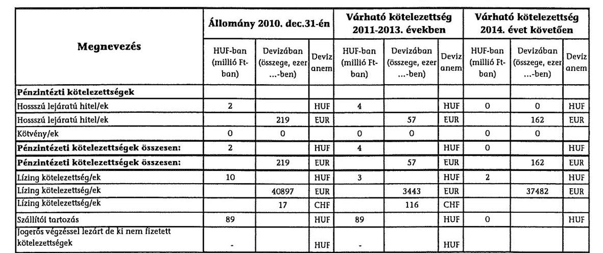

Az önkormányzati kötelezettségek növekedése mellett a minősített többségi tulajdonú társaságok kötelezettségei is befolyásolhatják az Önkormányzat pénzügyi egyensúlyát. A társaságoknak a 2011. évtől 4 millió Ft pénzintézeti kötelezettséget, a lízingszerződések alapján forintban 5 millió Ft, devizában 40925 ezer EUR, és 116 ezer CHF kötelezettséget, valamint 89 millió Ft szállítói tartozást kell rendezniük. Kockázatot hordoz, ha ezek nem teljesítése esetén a bíróság korlátlan és teljes felelősséget állapít meg az Önkormányzat terhére.

Az állami támogatások és az átengedett bevételek a 2007-2010. években összességében csökkentek, így a kiadáscsökkentő és bevételnövelő intézkedések részben tudták az állami támogatások hatását ellensúlyozni, illetve az Önkormányzat pénzügyi helyzetét javítani. Az Önkormányzat által fenntartott intézmények körében végrehajtott átszervezések komoly megtakarítást eredményeztek. .A 2007-2010. években tett intézkedések hatására 108,6 millió Ft bevételi többletet, továbbá 3150,5 millió Ft kiadási megtakarítást mutattak ki, amely részben a kieső forrásokat pótolta, és emellett az Önkormányzat pénzügyi helyzetét javította. A kiadási megtakarítások 80,7\%-a az elrendelt álláshely csökkentések eredménye. Az álláshely csökkentő intézkedések 2007-2010. között a Hivatalnál és az intézményeinél összesen 859 álláshely (ebből nem volt üres álláshely) megszüntetését jelentették. Az álláshelyek megszüntetésekor elsősorban a nyugdíjas foglalkoztatottak felmentését preferálta az Önkormányzat, ezzel jelentősen csökkent az aktív dolgozók leépítésének szükségessége. A vizsgált időszakban végrehajtott 859 álláshely megszüntetésből 130 fő volt a ténylegesen nyugdíjba vonulók száma. Egyes közszolgáltatási területeken azonban feladatbővülések is voltak, amelyek álláshely és egyben létszámnövekedéssel is jártak. Ennek következtében az időszak álláshelyeinek száma 736 fővel csökkent. A bevételnövelő intézkedések szabad kapacitások kihasználásához, ingatlanok bérbeadásához kapcsolódtak.

Az utóellenőrzés során az ÁSZ az Önkormányzat gazdálkodási rendszerét a 2007. évben ellenőrizte átfogó jelleggel. A gazdálkodási rendszer korábbi ellen-

---

őrzése során tett javaslatok közül a pénzügyi egyensúly javítására nem vonatkozott javaslat.

Az Önkormányzat pénzügyi helyzetét összegezve a következők állapíthatók meg:

A 2007-2010. években az Önkormányzat működési kockázatát csökkentette a pozitív folyó költségvetési egyenleg, a minimális lejárt szállítói tartozásállomány. Az önként vállalt feladatok aránya alapvetően nem befolyásolta az Önkormányzat működésének biztonságát. A működési bevételek évente - de a 2008. évtől csökkenő mértékben - biztosították a működési kiadások és az adósságszolgálat finanszírozását. A működési kockázatot azonban növeli, hogy a 2010. évi pozitív előjelű folyó költségvetési egyenleg ellenére az Önkormányzat az átmeneti likviditási problémák kezelése miatt felvett folyószámlahitelt nem fizette vissza. A gazdasági társaságok szerepe a közüzemi közfeladat-ellátásban meghatározó volt. A gazdasági társaságok által ellátott feladatstruktúra a működési kockázatot nem növelte.

A vizsgált időszakon belül az Önkormányzat felhalmozási költségvetése a 2007., a 2008. és a 2010. években negatív pénzügyi egyenleget mutatott, amelynek fedezete a pénzmaradvány igénybevételével és hitelfelvétellel, kötvénykibocsátással biztosítottak voltak. A fejlesztési célú kötelezettségvállalásoknál a jövőben teljesítendő kifizetésekre a fedezet rendelkezésre áll (hitelek, kötvényből származó előző évek pénzmaradványa, uniós-, hazai támogatások, saját forrás), ezért az a felhalmozási kiadások finanszírozásában kockázatot nem jelentett.

A pénzintézeti és egyéb kötelezettségek teljesítésének kockázatát növelte, hogy a 2010. december 31-én fennálló kötelezettségek visszafizetésének fedezetét a saját bevételben jelölték meg, nem határozták meg és számszerűsítették annak konkrét forrásait. A gazdasági társaságok önkormányzati készfizető kezességvállalása is növelte a pénzügyi kockázatot. A kockázatot csökkentheti, hogy az Önkormányzat forgalomképes ingatlanvagyona szükség esetén felhasználható az adósságszolgálat visszafizetésére.

Az Önkormányzat a vizsgált időszakban a központi intézkedések hatására jelentkező bevételkiesést bevételnövelő intézkedéseivel csak részben tudta ellentételezni.

A polgármester tájékoztatása szerint a helyszíni ellenőrzést követően bővítették a helyben központosított közbeszerzési eljárásba bevont közüzemi szolgáltatások körét, amely évente 30 millió Ft megtakarítást eredményezett. Felülvizsgálták a folyamatban lévő és előkészítés alatt álló EU-s támogatással megvalósuló pályázatok finanszírozását. A saját bevételek növelése érdekében emelték a végrehajtási eljárások számát, az adóellenőrzéseket. Az önkormányzati tulajdonú veszteségesen működő gazdasági társaságokat új üzleti terv készítésére utasították. A 2012. évi költségvetési koncepció készítésekor felülvizsgálják a nem kötelező feladatok körét.

Az Állami Számvevőszékről szóló 2011. évi LXVI. törvény 33. § (1) bekezdésében foglaltak értelmében a jelentésben foglalt megállapításokhoz kapcsolódó

---

intézkedési tervet köteles az ellenőrzött szervezet vezetője összeállítani és azt a jelentés kézhezvételétől számított harminc napon belül az ÁSZ részére megküldeni. Amennyiben az intézkedési tervet határidőben nem küldi meg a szervezet, vagy az továbbra sem elfogadható, az ÁSZ elnöke a hivatkozott törvény 33. § (3) bekezdés a)-b) pontjaiban foglaltakat érvényesítheti.

Az ellenőrzés intézkedést igénylő javaslatai:

# a Polgármesternek 

1. a Közgyűlés elé terjesztendő intézkedési terv írja elő a működés pénzügyi egyensúlyának középtávon ható helyreállítása és hosszú távú fenntarthatósága érdekében felelősök és határidők megjelölésével - olyan program készítését, amely tartalmazza az alábbiakat:
a) bevételszerző lehetőségek feltárását, különösen a helyi adópolitikai célok meghatározását és számszerűsítését, a bérleti díjak és a térítési díjak megállapítását, felülvizsgálatát, a követelések behajtását, az egyéb sajátos bevételek növelésének lehetőségét;
b) a folyamatban lévő és a tervezett beruházások teljes körű felülvizsgálatát;
c) egyéb kiadási kötelezettségek teljes körű felülvizsgálatát;
d) az intézkedések következtében jelentkező pénzügyi többlet, illetve az egyszeri bevételek tartalékba helyezését, elkülönített kezelését az adósságszolgálat teljesítése érdekében;
e) az adósságszolgálat szerkezetének áttekintését, a likviditás menedzselést, a támogatás előfinanszírozás átláthatóbbá tételét;
f) az intézményi gazdálkodás és struktúra felülvizsgálatát, átalakítását;
g) az önként vállalt feladatok terjedelmének, tartalmának felülvizsgálatát azok finanszírozhatósága szempontjából, a kötelező feladatellátás elsődlegességének biztosítása érdekében, a gazdasági program áttekintésével összhangban;
h) az intézkedések eredményei legalább félévenkénti áttekintésének előírását;
2. mutassa be félévente - a szokásos beszámoló keretében - a Közgyűlésnek:
a) az Önkormányzat és a minősített többségi tulajdonú gazdasági társaságai aktuális pénzügyi helyzetét, az Önkormányzatnak a gazdasági társaságai felé fennálló követeléseit, nyújtott kölcsöneit;
b) legalább három évre kitekintően a kötelezettségek teljes körére szóló finanszírozási tervet, amely figyelembe veszi a kötelezettség éven belüli és túli felmerülését, a források számszerűsített megjelölésével;

---

c) az Önkormányzat folyamatban lévő és tervezett fejlesztéseihez szükséges belső és külső források rendelkezésre állását, és ebből a szempontból értékelje az Önkormányzat beruházásait;
3. intézkedjen a beruházásokkal létrehozott létesítmények működtetését és jövőbeni fenntarthatóságát biztosító megalapozott források költségvetési rendeletekben történő feltüntetéséről;
4. mutassa be a Közgyűlésnek évente a zárszámadási rendelet előterjesztésében az értékcsökkenés összegét, és ezzel összevetve az elhasználódott eszközök pótlására fordított tényleges kiadásokat, az eszközök elhasználódási fokának alakulását;

# a jegyzőnek 

1. kísérje figyelemmel a jövőbeni várható - árfolyam-, kamat- valamint visszafizetési kockázatokat, továbbá a mérlegen kívüli tételek (kezességvállalás, garancia és helytállási kötelezettségvállalás) kockázatait, és legalább félévente tájékoztassa a Közgyűlést azok alakulásáról;
2. biztosítsa - az Ötv. 88. § (1) bekezdés b) pontjában foglalt előírások betartása érdekében - hogy az önkormányzati törzsvagyonba tartozó korlátozottan forgalomképes ingatlanokat az adósságot keletkeztető kötelezettségvállalások fedezetéül - átsorolás nélkül - ne terheljenek meg jelzálogjoggal.

---

# II. RÉSZLETES MEGÁLLAPÍTÁSOK 

## 1. Az ÖNKORMÁNYZAT KÖTELEZŐ ÉS ÖNKÉNT VÁLLALT FELADATAI

Az Önkormányzat 2010. évi elemi beszámolója szerint működési költségvetési kiadásainak 74,5\%-át, 18050,5 millió Ft-ot a kötelező, 25,5\%-át, 6187,7 millió Ft-ot önként vállalt feladatok ellátására fordította ${ }^{26}$.

A kötelező és az önként vállalt feladatok körét az Önkormányzati SzMSz-ben felsorolták. Önként vállalt feladatként határozták a testvérvárosi kapcsolatok szervezését, külföldi önkormányzatokkal való együttműködést, a támogató szolgáltatást, jelzőrendszeres házi segítségnyújtást, helyettes szülői ellátást, méltányossági alapon támogatások nyújtását, az anyatejgyűjtő állomás, vérvételi helyek, lelki segélyszolgálat működtetését, a városi nagy rendezvények szervezését, lebonyolítását, kiemelt kulturális programok támogatását (Udvarszínház, Kecskeméti Népzenei Találkozó, Kecskeméti Animációs Filmfesztivál, Európa Jövője Nemzetközi Gyermek- és Ifjúsági Találkozó, Magyarországi Bábszínházak Országos Találkozója, Kodály Örökség Program), művészeti intézmények, gazdasági társaságok működtetését, közgyűjtemény kezelését, támogatását. tanórán kívüli foglalkozások szervezését, kollégiumi ellátást, felsőfokú szakképzést, felnőttképzést, továbbá sport szervezetek támogatását, drog prevencióval kapcsolatos feladatok ellátását, közterület-felügyelet működtetését.

Az Önkormányzat 2010. évi elemi beszámolója szerinti működési kiadásait és bevételeit, valamint azok finanszírozási arányait szemlélteti a következő táblázat főbb feladatonként:

[^0]
[^0]:    ${ }^{26}$ Az önként vállalt feladatok kiadási részarányának megállapítása az Önkormányzat adatszolgáltatásán alapul.

---

| Ellátott feladat | Működési <br> kiadás <br> összesen <br> (millió Ft) | Kötelező <br> feladatok <br> kiadásainak <br> részaránya <br> $\%$ | Működési <br> bevétel <br> összesen <br> (millió Ft) | Állami <br> támogatás <br> részaránya <br> $\%$ | Intézményi <br> saját bevétel <br> részaránya <br> $\%$ | Önkormányzati <br> támogatás <br> részaránya <br> $\%$ |
| :--: | :--: | :--: | :--: | :--: | :--: | :--: |
| Óvodák | 1549,3 | 100,0 | 1552,7 | 44,7 | 8,9 | 46,4 |
| Általános iskolák | 3596,7 | 90,0 | 3655,5 | 47,4 | 12,2 | 40,4 |
| Gimnáziumok | 993,3 | 90,0 | 1002,2 | 56,3 | 13,5 | 30,1 |
| Szakközépiskolák, <br> szakképző intézmények | 2527,2 | 90,0 | 2559,2 | 56,7 | 9,8 | 33,5 |
| Kollégiumok | 351,8 | 90,0 | 349,0 | 75,1 | 16,1 | 8,8 |
| Szociális <br> intézmények | 1565,3 | 88,0 | 1643,4 | 35,4 | 25,0 | 36,8 |
| Gyermekjóléti <br> intézmények | 596,8 | 100,0 | 572,8 | 55,8 | 9,9 | 32,6 |
| Közművelődési <br> intézmények | 1149,5 | 0,0 | 1139,4 | 31,8 | 46,7 | 21,5 |
| Sportlétesítmények | 0,0 | 0,0 | 0,0 | 0,0 | 0,0 | 0,0 |
| Igazgatási <br> intézmények | 109,0 | 0,0 | 107,3 | 2,6 | 58,9 | 38,6 |
| Tűzoltóság | 558,5 | 100,0 | 566,3 | 79,5 | 11,3 | 9,2 |
| Egyéb intézmények | 1429,9 | 80,0 | 1435,2 | 4,1 | 78,9 | 16,4 |
| Intézmények <br> összesen | 14427,4 | 82,8 | 14583,2 | 44,4 | 22,5 | 32,6 |
| Polgármesteri <br> hivatalban kezelt <br> feladatok működési <br> kiadásai | 9810,8 | 62,2 | 8642,0 | 24,6 | 75,4 | 0,0 |
| Működési kiadá- <br> sok összesen | 24238,2 | 74,3 | 23225,2 | 37,1 | 42,2 | 20,3 |

Az Önkormányzat kötelező és önként vállalt feladatok működési kiadásainak aránya nem változott jelentősen, a 2007. évről 2010-re 75,9\% (16 460,6 millió Ft), illetve 24,1\%-ról (5 218,1 millió Ft) 74,5\% (18 050,5 millió Ft), illetve 25,5\%-ra módosult ( 6 187,7 millió Ft). A működési kiadások önkormányzati szinten 11,8\%-kal nőttek, ez a Polgármesteri hivatalnál 43,4\%-os (2969,7 millió Ft-os) növekedést ${ }^{27}$, az intézményeknél $2,8 \%$-os ( 410,2 millió Ft-os) csökkenést jelentett. A közoktatási intézmények közül az óvodák és a gimnáziumok esetében $2,7 \%$, illetve $1,8 \%$-kal ( 40,2 , illetve 18 millió Ft-tal) növekedtek a működési kiadások 2007-ről 2010-re. Az általános iskolák esetében 15,3\% (649,8 millió Ft), a szakközépiskolák, szakképző intézmények esetében 7,5\% (203,6 millió Ft), a kollégium esetében 4,6\%-os ( 16,8 millió Ft) a csökkenést mutatott ki az Önkormányzat.

Az intézményi feladatokon belül a közoktatási feladatokra fordított működési célú kiadások a 2007. évben 9830,4 millió Ft-ot tettek ki, a kiadások az előző évhez viszonyítva a 2008. évben 497,6 millió Ft-tal, a 2009. évben 517,6 millió Ft-tal csökkentek, majd a 2010. évben 203,2 millió Ft-tal nőttek. A 2010. évben a közoktatásra fordított 9018,4 millió Ft az összes működési kiadás 37,2\%-át tette ki. Az Önkormányzat által a közoktatási feladatokhoz nyújtott támogatás a 2007-2010. években folyamatosan növekedett, a 2007. évben 2509,1 millió Ft, a 2008. évben 2514,1 millió Ft, a 2009. évben 2676,2 millió Ft,

[^0]
[^0]:    ${ }^{27}$ A működési célú kiadások növekedése a kisértékű tárgyi eszközök, anyagbeszerzések, bérleti és lízingdíjak, karbantartási, üzemeltetési, fenntartási dologi kiadások, illetve a működési célú pénzeszköz átadások növekedéséből adódott.

---

a 2010. évben 3386,2 millió Ft volt. Az Önkormányzat által a 2010.évben a közoktatási feladatokhoz nyújtott támogatás az ágazat összes bevételének $37,1 \%$-át tette ki.

A szociális intézmények működési célú kiadásai a 2007. évben 1442,5 millió Ft-ot tettek ki, a kiadások az előző évhez viszonyítva a 2008. évben 140,3 millió Ft-tal növekedtek, a 2009. évben 176,9 millió Ft-tal csökkentek, majd a 2010. évben 159,4 millió Ft-tal nőttek. A szociális intézmények működési célú kiadása a 2010. évben 1565,3 millió Ft volt, amely az összes működési kiadás 64,6\%-át tette ki. A szociális feladatokhoz az Önkormányzat a 2007-2010. években folyamatosan növekvő összegben nyújtott támogatást, a 2007. évben 325,1 millió Ft-ot, a 2008. évben 404,4 millió Ft-ot, a 2009. évben 424,6 millió Ft-ot, a 2010. évben 604,9 millió Ft-ot. A 2010. évben nyújtott támogatás összege $36,8 \%$-os támogatási arányt jelentett.

A gyermekjóléti intézmények működési célú kiadása a 2007. évben 536,3 millió Ft-ot tett ki, a kiadások az előző évhez viszonyítva a 2008. évben 60,4 millió Ft-tal növekedtek, a 2009. évben 32 millió Ft-tal csökkentek, majd a 2010. évben 32 millió Ft-tal nőttek. A gyermekjóléti intézmények működési célú kiadása a 2010. évben 596,8 millió Ft volt, amely az összes működési célú kiadás 2,5\%-a. A gyermekjóléti feladatokhoz az Önkormányzat a 2007-2009. években folyamatosan csökkenő támogatást nyújtott, a 2007. évben 177 millió Ft-ot, a 2008. évben 176,7 millió Ft-ot, a 2009. évben 153,5 millió Ft-ot. A 2010. évben 185,5 millió Ft támogatás összege 32,6\%-os támogatási arányt jelentett.

A közművelődési intézményi feladatok működési célú kiadása a 2007. évben 1423,6 millió Ft-ot tett ki, a kiadások az előző évhez viszonyítva a 2008. évben 14,2 millió Ft-tal, a 2009. évben 68,7 millió Ft-tal növekedtek, majd a 2010. évben 357 millió Ft-tal csökkentek. A közművelődési intézmények 2010. évi 1149,5 millió Ft összegű működési kiadása az összes működési kiadás 4,7\%-át tette ki. Az Önkormányzat a közművelődési feladatok ellátásához a 2007. évben 568,6 millió Ft, a 2008. évben 558,7 millió Ft, a 2009. évben 579,3 millió Ft, a 2010. évben 244,6 millió Ft működési támogatást nyújtott. A 2010. évi támogatás összege az közművelődési intézmények működési célú bevételeinek $21,5 \%$-át tette ki.

A hivatásos tűzoltóság működési célú kiadása a 2007. évben 488,2 millió Ft-ot tett ki, a kiadások az előző évhez viszonyítva a 2008. évben 43,9 millió Ft-tal növekedtek, a 2009. évben 11,1 millió Ft-tal csökkentek, majd a 2010. évben 37,6 millió Ft-tal nőttek. A hívatásos tűzoltóság 2010. évi működési kiadása 558,5 millió Ft volt, amely az összes működési kiadás 2,3\%-át tette ki. A hivatásos tűzoltóság feladatainak ellátásához az Önkormányzat a 2007. évben 26,8 millió Ft, a 2008. évben 46,8 millió Ft, a 2009. évben 12,5 millió Ft, a 2010. évben 52 millió Ft működési támogatást nyújtott. A 2010. évi támogatás összege a hivatásos tűzoltóság működési célú bevételeinek 9,2\%-át tette ki.

A foglalkoztatottak száma önkormányzati szinten az 2007. december 31-e és 2010. december 31-e között 10,9\%-kal, 395,5 fővel (intézményeknél 285,5 fő,

---

Polgármesteri hivatalnál 110 fő) csökkent ${ }^{28}$. Az óvodában 1,5, a szakközép- és szakiskolákban 101, az általános iskolákban 118,5, a gimnáziumokban 14, a kollégiumban 14, a közművelődési intézményekben 116, egyéb intézményekben 7,5 fővel csökkent, míg a szociális intézményeknél 54, a gyermekjóléti intézmények 5, az igazgatási intézményekben 24, a tűzoltóságnál 4 fővel nőtt a foglalkoztatotti létszám.

Az Önkormányzat intézményeinek a száma a 2007-2010. években végrehajtott intézményi szervezeti és feladat átszervezések, átrendezések, feladatátadások hatására 2006. december 31-ről, 2010. év végére 47\%-kal 78 -ról 41 -re csökkent. Az Önkormányzat a kötelező és az önként vállalt feladatait 2010. december 31-én 25 költségvetési szervvel és tizenhat gazdasági társasággal ${ }^{29}$ látta el.

Az Önkormányzat által fenntartott költségvetési szervek közül 14 önállóan működő és gazdálkodó, 11 önállóan működő költségvetési szerv. Az intézmények - alapító okirataik szerint - összesen 159 telephelyen működnek. Az Önkormányzat feladatait az alábbi intézménystruktúrával látja el:

- szociális és gyermekvédelmi feladatokat két intézmény végez (egy idősek gondozóháza és egy multifunkcionális szociális intézmény, amely bölcsődei, egészségügyi járó beteg szakellátási és döntően szociális feladatokat ellátó intézmény);
- közoktatási feladatot 13 intézmény lát el (hat általános iskola, amely óvodai nevelést is ellát, öt középiskola, egy kollégium, egy fogyatékos gyermeket oktató-nevelő intézmény);
- kulturális feladatokat végez hat intézmény (színház, bábszínház, ifjúsági otthon, népi iparművészeti gyűjtemény, Helpi Ifjúsági Információs és Tanácsadó Iroda, planetárium),
- igazgatási feladatokat lát el a Polgármesteri hivatal;
- egyéb feladatokat három intézmény lát el (Piac- és Vásárigazgatóság, Közterület felügyelet és Hivatásos Önkormányzati Tűzoltóság).

[^0]
[^0]:    ${ }^{28}$ A Polgármesteri hivatal létszáma tartalmazta a közcélú és közmunka program keretében foglalkoztatottak létszámát.
    ${ }^{29}$ A gazdasági társaságok közül egy kötelező feladatként vagyonüzemeltetési és közterület fenntartási feladatokat is ellát, valamint két gazdasági társaság a vagyonüzemeltetési feladatok mellett önként vállalt feladatként sporttevékenységet és sport- és szabadidős tevékenység biztosítását is ellátja.

---

Az önkormányzati feladatellátásban az intézmények és gazdasági társaságok mellett két társulás ${ }^{30}$ is részt vett, valamint ellátási, szolgáltatási szerződéssel több gazdasági társaság ${ }^{31}$ és egyéb szervezet ${ }^{32}$ működött közre.

Az Önkormányzat minősített többségi befolyása alatt álló kilenc gazdasági társaság (a gazdasági társaságok adatait a 4. számú melléklet tartalmazza) sport és kulturális, vagyonüzemeltetési, parkfenntartási, hulladékgazdálkodási, közoktatási feladatokat lát el. A gazdasági társaságok saját tőke - jegyzett tőke aránya egy társaságnál negatív, a többi társaságnál 0,8-5,6 közötti volt. A gazdasági társaságokban a feladatellátáshoz rendelt nettó vagyon összege 2010. év végén 3019 millió Ft volt.

Öt gazdasági társaságban van az Önkormányzatnak többségi befolyása, amely gazdasági társaságok távhő, víz- és csatorna, távközlési (TV, internet), vagyonüzemeltetési és hulladékgazdálkodási feladatokat látnak el. A gazdasági társaságok saját tőke - jegyzett tőke aránya 1,5-5,7 közötti volt. A gazdasági társaságokban a feladatellátáshoz rendelt nettó vagyon összege 2010. év végén 19161 millió Ft volt.

Sport és kulturális feladatokat ellátó két gazdasági társaság közül az Önkormányzat szavazati aránya az egyikben $25 \%$, a másikban $33 \%$, és a saját tőke jegyzett tőke aránya 0,1 , illetve 0,6 volt. A gazdasági társaságokban a feladatellátáshoz rendelt nettó vagyon összege 2010. év végén 12 millió Ft volt.

Egy gazdasági társaság, amelyben az Önkormányzatnak 6,5\%-os részesedése van, kéményseprői közszolgáltatási feladatokat lát el.

A helyi közlekedési közszolgáltatási feladatok ellátására az Önkormányzat egy gazdasági társasággal, a Kunság Volán Zrt-vel kötött szolgáltatási megállapodást ${ }^{33}$. A Kunság Volán további négy gazdasági társaságban rendelkezik 25\% feletti mértékű befolyással.

[^0]
[^0]:    ${ }^{30}$ Az Önkormányzat a 2007-2011. években kettő társulásban vett részt. 2009. évben három települési önkormányzattal (Ballószög, Helvécia, Kerekegyháza) alakított tulajdonközösséget Kecskemét és Térsége Társult Települések szennyvíz-csatorna és Tisztító telep közös a beruházásban történő kivitelezésére, a beruházás lebonyolítására. A 2010. évben az Önkormányzat több települési önkormányzattal és a Bács Kiskun Megyei Önkormányzattal közösen megalapították a „KÉKVÍZ" Észak Bács-Kiskun Megyei ivóvízminőség-javító önkormányzati Társulást, a Társulás még tevékenységet nem végzett.
    ${ }^{31}$ A közétkeztetés, takarítás, karbantartás, őrzésvédelem biztosítására egy gazdasági társasággal és egy konzorciummal kötöttek vállalkozási szerződést.
    ${ }^{32}$ A Közgyűlés a 37/2009. (II. 26.) számú határozatában döntött arról, hogy saját intézmény hiányában, megállapodás alapján a gyermekvédelmi szakellátás feladatait a Bács-Kiskun Megyei Önkormányzat,majd később az SOS Gyermekfalu Magyarországi Alapítványa lássa el.
    ${ }^{33}$ A szolgáltatási szerződést az Önkormányzat és a Kunság Volán Autóbusz közlekedési Részvénytársaság 2004. december 20-án kötötte meg.

---

Az Önkormányzat három gazdasági társasággal kötött a 2007-2010. években vagyonkezelői szerződést ${ }^{34}$. A gazdasági társaságok a 2010. évben az Áht. 105/A. § (6) bekezdésében foglalt előírásnak ${ }^{35}$ nem tettek eleget, így az Önkormányzat a 2010. évben a gazdasági társaságoknál elszámolt értékcsökkenés összegét, 16 millió Ft-ot a gazdasági társaságok felé követelésként előírt.

Az Önkormányzat szolgáltatási díj és ármegállapítási jogkörrel rendelkezik a víz- és csatornadíjak, a távhő ára, a helyi tömegközlekedési tarifák, a települési folyékony és szilárdhulladék szállítása, valamint a kéményseprői szolgáltatás tekintetében. Az ármegállapítási jogkör gyakorlása az Önkormányzat pénzügyi helyzetére negatív hatással lehet, amennyiben az tovább növeli a gazdasági társaság működéséhez szükséges önkormányzati kiadást.

Az Önkormányzat a tömegközlekedést biztosító gazdasági társaság részére a 2007-2009. években folyamatosan növekvő, a 2010. évben csökkenő összegű hozzájárulást adott járatok működtetéséhez, a 2007. évben 184,3 millió Ft-ot, a 2008. évben 185,1 millió Ft-ot, a 2009. évben 303,9 millió Ft-ot, a 2010. évben 263,1
 millió Ft-ot.

Az Önkormányzat a 2007. évben két közoktatási intézményt ${ }^{36}$ (egy általános iskolát 855 fő és egy középiskolát 715 fő ellátotti létszámmal) adott át a Kistérségi társulásnak, a 2007. ${ }^{37}$ és a 2009. ${ }^{38}$ években két óvodát 90 fő ellátotti létszámmal az egyháznak. Az intézmények egyháznak történő átadása az egyház megkeresésére történt, miszerint az egyház működtetésre át kívánta venni az intézményeket. Az intézményi feladatátadások és a gyermekvédelmi szakellátás feladat egyéb szervezetnek történő átadása hatásaként az Önkormányzat a személyi juttatások és járulékaiknál, valamint a dologi kiadásoknál a 2007-2010. években 1466,4 millió Ft csökkenést mutatott ki.

A 2007. és a 2008. években a Polgármesteri hivatalnál és az intézményeknél létszámcsökkentést hajtottak végre, illetve a közoktatási és szociális intézményeknél a költségtakarékosság, hatékonyság, az oktatási színvonal emelése ér-

[^0]
[^0]:    ${ }^{34}$ Az Önkormányzat 2007. január 31-én a KIK-FOR Kft-vel termőföldekre, 2009. május 4-én a Hírös Sport Nonprofit Kft-vel és 2010. január 1-én a Kecskeméti Kulturális és Konferencia Központ Nonprofit Kft-vel kötött vagyonkezelői szerződést.
    ${ }^{35}$ Az Áht. 105/A. § (6) bekezdése szerint a vagyonkezelő a vagyon felújításáról, pótlólagos beruházásáról legalább a vagyoni eszközök elszámolt értékcsökkenésének megfelelő mértékben köteles gondoskodni, illetőleg e célokra az értékcsökkenésnek megfelelő mértékben tartalékot képezni.
    ${ }^{36}$ A Közgyűlés a 308/2007. (VI.28.) számú határozata 1.) pontjában döntött arról, hogy a két intézmény fenntartói jogának a Kistérségi társulás részére történő átadása kapcsán a Lestár Péter Kereskedelmi Szakközépiskola és Szakiskola, valamint a II. Rákóczi Ferenc Általános Iskola jogutódlással történő megszüntetéséről 2007. június 30-ával.
    ${ }^{37}$ A Közgyűlés a 308/2007. (VI.28.) számú határozata 4.) pontjában döntött a Széchenyi városi Óvoda és Általános Iskola Munkácsy utcai tagóvodája fenntartói jogának 2007. augusztus 31-ével a Kecskeméti Református Egyházközségnek történő átadásáról.
    ${ }^{38}$ A Közgyűlés a 45/2009. (II.26.) számú határozatában döntött a Széchenyi városi Óvoda és Általános Iskola Teleki utcai tagóvodája fenntartói jogának 2009. augusztus 31. napjától 2085. augusztus 31. napjáig történő átadásáról a Kalocsai-Kecskeméti Főegyházmegyének.

---

dekében integrációt hajtottak végre, közös igazgatású közoktatási intézményeket hoztak létre, csökkentve ezzel az intézmények számát. Az Önkormányzat a 2009. évben két intézményt (a kulturális és konferencia központot, valamint a televíziót), mint költségvetési szervet megszüntetett és a megszüntetett költségvetési szervek feladatainak ellátására 2010. január 1-ével két minősített többségi befolyása alatt álló gazdasági társaságot alapított. Az intézményi és hivatali átszervezések, feladatátrendezések hatásaként az Önkormányzat a személyi juttatások és járulékaiknál, valamint a dologi kiadásoknál a 2007-2010. évekre 2202,3 millió Ft kiadáscsökkenést, illetve az állami támogatásoknál 40,2 millió Ft növekedést és a saját bevételeknél 196,2 millió Ft csökkenést mutatott ki.

Az Önkormányzat 2009. július 1-től a közétkeztetés biztosítására egy gazdasági társasággal ${ }^{39}$ és egy konzorciummal ${ }^{40}$ kötött vállalkozási szerződést. A takarítási, őrzés-védelmi és karbantartási szolgáltatások biztosítására egy gazdasági társasággal kötött az Önkormányzat 2009. július 6-án vállalkozási szerződést. A kiszervezések hatására az Önkormányzat a személyi juttatások és járulékaiknál, valamint a dologi kiadásoknál a 2007-2010. évekre 885,2 millió Ft kiadáscsökkenést, illetve a saját bevételeknél 48 millió Ft csökkenést mutatott ki.

Az önkormányzati intézményekben ellátottak száma 2007-ről 2010-re 8,6%-kal, 2023 fővel nőtt. A növekedéshez hozzájárult az óvodások 200 fős, a kollégisták számának 176 fős, a gyermekjóléti intézmények 261 fős, egyéb intézmények 433 fős és a szociális intézmények 3469 fős növekedése, azonban a növekedést ellensúlyozta az általános iskolások 1469 fős, a gimnazisták 283 fős és a szakközép- és szakiskolások számának 764 fős csökkenése.

# 2. PÉNZÜGYI EGYENSÚLYI HELYZET ALAKULÁSA 

### 2.1. A működési és felhalmozási egyensúly alakulása

A hagyományos költségvetési szerkezet helyett az Önkormányzat pénzügyi helyzetét a CLF módszerrel mutatjuk be, amelyben jobban elkülönülnek a vagyonnal kapcsolatos bevételek és kiadások a feladatokkal kapcsolatos közvetlen működtetési bevételektől és kiadásoktól. A módszer következetesen elkülöníti a folyó és a felhalmozási (beruházási) költségvetés bevételeit és kiadásait, azok költségvetési egyenlegeit. A saját folyó bevételek, valamint a saját felhalmozási bevételek nem tartalmazzák az előző évi pénzmaradványok felhasználásából származó pénzforgalom nélküli bevételeket ${ }^{41}$.

A folyó költségvetés egyenlege, a működési jövedelem megmutatja, hogy az önkormányzat éves folyó bevétele fedezetet biztosít-e a kötelező és önként vál-

[^0]
[^0]:    ${ }^{39}$ Az Önkormányzat a SODEXO Magyarország Kft-vel a közétkeztetés biztosítására 2009. május 29-én kötött vállalkozási szerződést.
    ${ }^{40}$ Az Önkormányzat az első Kecskeméti Közétkeztetési Konzorciummal a közétkeztetés biztosítására 2009. május 29-én kötött vállalkozási szerződést.
    ${ }^{41}$ A költségvetési években kialakuló hiány finanszírozása az előző években képzett tartalékok felhasználásával is történhet.

---

lalt feladatellátáshoz kapcsolódó éves folyó kiadásaira. A működési jövedelem negatív értéke pénzügyileg fenntarthatatlan helyzetet jelez. A mutató pozitív értéke megtakarítást mutat, amely forrásul szolgálhat az önkormányzat fennálló kötelezettségei megfizetéséhez, valamint fejlesztéseihez.

A felhalmozási költségvetés pozitív értéke felhalmozási többletet mutat, amely a jövőbeni fejlesztések forrását biztosíthatja. Amennyiben a folyó költségvetési hiány finanszírozása a felhalmozási többletből történik, ez szűkebb értelemben vagyonfelélésnek tekinthető. Amennyiben a felhalmozási költségvetés megtakarítása fejlesztési célú hitelek, kötvények adósságszolgálatát finanszírozza, az, változatlan vagyontömeg mellett, a korábban megelőlegezett tőkebevételek valós realizációjának tekinthető. A felhalmozási deficit által generált finanszírozási igény önmagában nem jár pénzügyi kockázattal, a pénzügyileg fenntartható beruházásokhoz kapcsolódó kötelezettségvállalás (adósságszzolgálat) körültekintő költségvetési gazdálkodással teljesíthető.

A módszer a pénzügyi kapacitás fogalmát helyezi a középpontba. Az adós hitelfelvételi képessége, hosszú távú fizetőképessége vagy bonitása a pénzügyi kapacitással, ezen belül is a nettó működési jövedelemmel jellemezhető. A nettó működési jövedelem negatív értéke az egyes költségvetési években jelentkező adósságszolgálat túlzott mértékére utal ${ }^{42}$. A nettó működési jövedelem negatív értékének felhalmozási többletből, vagy további hitelből történő finanszírozása pénzügyileg nem fenntartható gazdálkodást vetít előre. A pozitív értéket mutató nettó működési jövedelem fejlesztési kiadások fedezetét biztosíthatja, illetve a folyamatosan, évenként képződő pozitív nettó működési jövedelemből meghatározható a jövőben vállalható, teljesíthető éves adósságszolgálat, ily módon az a hitelösszeg, amely - a többi tényezőt, feltételt adottnak tekintve - visszafizetési kockázat nélkül felvehető.

A CLF módszer alapján a pénzügyi kapacitás mértéke az önkormányzat összevont, nettósított, a központi információs rendszerbe a Kincstáron keresztül leadott éves költségvetési beszámolójának 80-as űrlapjában szerepeltetett adatok alapján került meghatározásra.

[^0]
[^0]:    ${ }^{42}$ Kivéve, ha annak finanszírozására a korábbi években képzett tartalékok fedezetet nyújtanak.

---

# CLF módszer szerinti önkormányzati adatok 

|  |  |  |  | ezer Ft |
| :--: | :--: | :--: | :--: | :--: |
| Megnevezés | 2007. | 2008. | 2009. | 2010. |
| Folyó bevételek | 23944735 | 26698678 | 26583523 | 25088716 |
| Folyó kiadások | 21864014 | 23826880 | 25491767 | 24480391 |
| Működési jövedelem | 2080721 | 2871798 | 1091756 | 608325 |
| Nettó működési jövedelem =működési jövedelem - tőketörlesztés | 1519789 | 2667514 | 664750 | 108536 |
| Felhalmozási bevételek | 4246868 | 8323048 | 5769070 | 3669976 |
| Felhalmozási kiadások | 5516101 | 14714354 | 4799821 | 7126956 |
| Felhalmozási költségvetés egyenlege | $-1269233$ | $-6391306$ | 969249 | $-3456980$ |
| Finanszírozási műveletek nélküli (GFS) pozíció = működési jövedelem + felhalmozási költségvetés egyenlege | 811488 | $-3519508$ | 2061005 | $-2848655$ |
| Finanszírozási műveletek egyenlege | $-96996$ | 6762277 | 234732 | $-1210845$ |
| Tárgyévi pénzügyi pozíció változás | 714492 | 3242769 | 2295737 | $-4059500$ |
| Egyéb tájékoztató adatok |  |  |  |  |
| Összes kötelezettség* | 5552516 | 16085200 | 15281324 | 18272551 |
| -ebből rövid lejáratú | 1021478 | 2469952 | 1887330 | 3310292 |
| Folyószámlahitel napi átlagos állománya ** | 99580 | 8731 | 0 | 2636 |
| Likvidhitel napi átlagos állománya ** | 0 | 0 | 0 | 0 |
| Munkabérhitel napi átlagos állománya** | 58019 | 0 | 0 | 0 |
| Finanszírozásba vonható eszközök: | 1390295 | 5572748 | 6928851 | 2869301 |
| Tartós hitelviszonyt megtestesítő értékpapírok év végi állománya | 72 | 72 | 72 | 72 |
| Hosszú lejáratú bankbetétek év végi állománya | 0 | 0 | 0 | 0 |
| Értékpapírok év végi állománya | 0 | 939684 | 50 | 0 |
| Pénzeszközök (idegen pénzeszközök nélkül) év végi állománya | 1390223 | 4632992 | 6928729 | 2869229 |

* Az összes kötelezettséget a passzív pénzügyi elszámolások nélkül vettük figyelembe, mert a passzívák a pénzmaradvány elszámolás tételei közé tartoznak.
** A folyószámla-, likvid- és munkabérhitel átlagos állományát 365 napos nevezővel számítottuk.

A részletes adatokat a jelentés 2. számú melléklete mutatja be.
A CLF módszer szerint figyelembe vett folyó és felhalmozási bevételek és kiadások alakulását elhanyagolható mértékben befolyásolta, hogy azok az Önkormányzat gesztor szerepéből adódóan a Társulás - döntően felhalmozási bevételekből és kiadásokból álló - adatait is tartalmazzák.

A vizsgált időszakban az Önkormányzat folyó költségvetési egyenlege, működési jövedelme pozitív összegű volt, melynek alakulását a következő ábra szemlélteti:

---

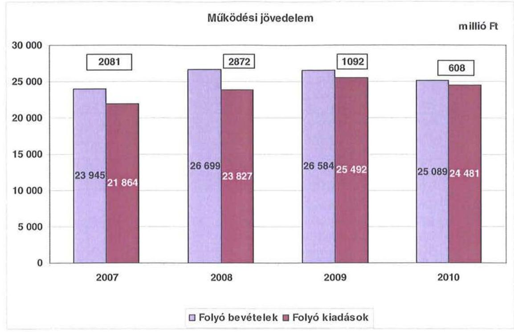

A folyó költségvetés egyenlege (a működési forrástöbblet) 2007-ben a folyó kiadások 9,5\%-át (2081 millió Ft-ot), 2008-ban 12,1\%-át (2872 millió Ft-ot), 2009-ben 4,3\%-át (1092 millió Ft-ot), 2010-ben 2,5\%-át (608 millió Ft-ot) jelentette. A vizsgált időszakban a működési jövedelem 6653 millió Ft többletet mutatott, amely forrásul szolgálhatott az Önkormányzat fennálló tőketörlesztési kötelezettségeinek teljesítéséhez, valamint fejlesztéseinek finanszírozásához.

A pozitív előjelű folyó költségvetési egyenleg ellenére az Önkormányzat a 2007. évben folyószámla- és munkabér megelőlegezési, a 2008. és a 2010. évben folyószámlahitel felvételére kényszerült az átmeneti likviditási problémák kezelése miatt. A folyószámlahitel napi átlagos állománya 365 napra vetítve a 2007évben 99,6 millió Ft, a 2008. évben 8,7 millió Ft, a 2010. évben 2,6 millió Ft volt. Az Önkormányzatnak 2009. évben folyószámla hitele nem volt.

Az Önkormányzat kötelezettségein belül a rövid lejáratú kötelezettségek állományának aránya a 2007-2009 közötti időszakban csökken, majd a 2010. évben nőtt, összege változó volt. A rövidlejáratú kötelezettségek aránya a 2007. évben 18,4\% (1021,5 millió Ft) volt, amely a 2008. évben 15,4\%-ra (2469,9 millió Ft), majd a 2009. évben 12,4\%-ra (1887,3 millió Ft) csökkent, a 2010. évben 18,1\%-ra (3310,3 millió Ft) növekedett. Az Önkormányzat 2007. december 31-én fennálló pénz- és tőkepiaci kötelezettsége 4728 millió Ft-ról több mint háromszorosára, 15991 millió Ft-ra nőtt a kötvénykibocsátás és a hosszú lejáratú hitelfelvételek miatt ${ }^{43}$. Az összes kötelezettségen belül a hosszú lejáratú pénzin-

[^0]
[^0]:    ${ }^{43}$ A 2. számú melléklet szerinti a pénz- és tőkepiaci kötelezettség
 (adósság) 2010. évi 15 991 479 ezer Ft, valamint ebből rövid lejáratú 1 033 052 ezer Ft összegéből 32 786 ezer Ft egy gazdasági társaságtól kapott kölcsön, és nem pénz- és tőkepiaci kötelezettség.

---

tézeti kötelezettségek 2007-2010 között több mint 330%-kal (10 426 millió Ft-tal) nőttek.

A rövid lejáratú kötelezettségek 2010-ben 3310 millió Ft-ot tettek ki, amely 2289 millió Ft-tal (224,2\%) több a 2007. évi rövid lejáratú kötelezettségállománynál. Az Önkormányzat lejárt szállítói tartozásállománya az összes rövid lejáratú kötelezettségein belül a 2007. évi 1,6%-ról a 2010. év végére 14,5%-ra növekedett, összege a 2010. évben 478 millió Ft-ot tett ki, amely 462 millió Ft-tal több a 2007. évi lejárt szállítói tartozásállománynál.

Az Önkormányzat 2010. évi záró pénzkészlete 2869 millió Ft volt ${ }^{44}$, amelynek 96,8%-a kötelezettséggel terhelt szerződéses kötelezettség és közgyűlési szándéknyilatkozatok alapján.

Az Önkormányzat pénzügyi kapacitása a vizsgált időszakban pozitív értéket mutatott. A nettó működési jövedelem ${ }^{45}$ értéke a folyó költségvetési pozíció mellett az adott költségvetési év adósságtörlesztésének hatását is tükrözi. A 6653 millió Ft működési jövedelemnek 25,4%-át (1692 millió Ft) tette ki a hitelekhez kapcsolódó tőketörlesztés, amelynek kifizetését követően 4961 millió Ft nettó működési jövedelme keletkezett az Önkormányzatnak.
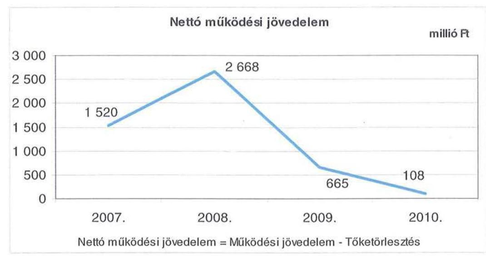

A nettó működési jövedelem - a 2008. évtől növekvő nagyságrendű tőketörlesztés ${ }^{46}$ mellett - 2007-ben 1520 millió Ft, 2008-ban 2668 millió Ft, 2009-ben 665 millió Ft, 2010-ben 108 millió Ft volt. A pénzügyi kapacitás 2008. évhez viszonyított folyamatos romlását 2010-re a folyó bevételek és kiadások különbségéből származó működési jövedelem csökkenése okozta.

[^0]
[^0]:    ${ }^{44}$ Ebben a Társulás pénzeszköze 221,2 millió Ft és a „KÉKVÍZ" Észak Bács-Kiskun Megyei ivóvízminőség-javító önkormányzati Társulás pénzeszköze 1,0 millió Ft volt.
    ${ }^{45}$ pénzügyi kapacitás
    ${ }^{46}$ Az Önkormányzat tőketörlesztési kötelezettsége 2007-ről 2008-ra csökkent, a 2008. évtől folyamatosan nőtt. A 2007. évben 561 millió Ft, a 2008. évben 204 millió Ft, a 2009. évben 427 millió Ft, a 2010. évben 500 millió Ft volt.

---

A 2007-2008, és a 2010. években az Önkormányzat felhalmozási költségvetésének egyenlege negatív összegű volt, amely előrelátó költségvetési gazdálkodás és pénzügyileg fenntartható ${ }^{47}$ beruházások esetén nem jár magas pénzügyi kockázattal. A 2009. évben az Önkormányzat felhalmozási költségvetésének egyenlege pozitív összegű volt.

A felhalmozási költségvetés egyenlegének alakulását évről évre a következő ábra szemlélteti:
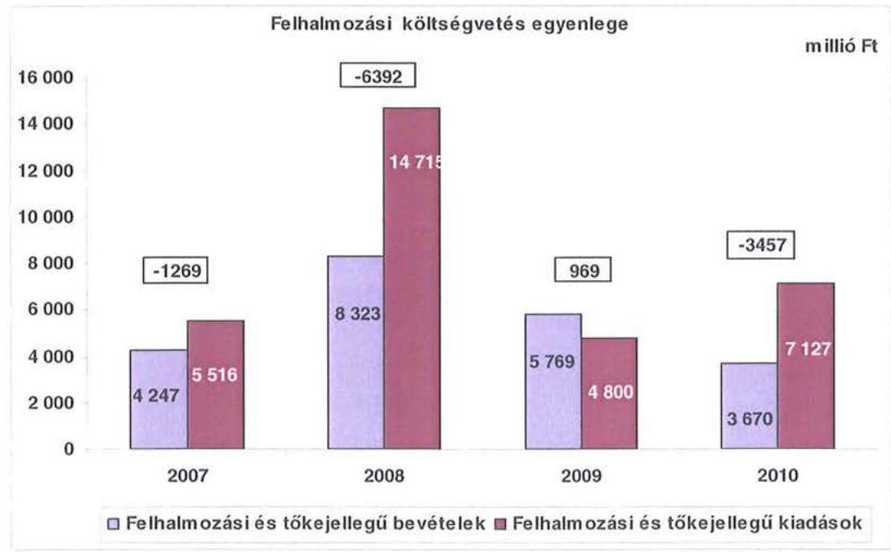

A felhalmozási forráshiánynak a felhalmozási és tőke jellegű kiadásokhoz viszonyított aránya 2007-ben 23,0\% (1269 millió Ft), 2008-ban 43,4\% (6392 millió Ft), 2010-ben 48,5\% (3457 millió Ft) volt. A 2009. évben a felhalmozási többlet a felhalmozási és tőke jellegű kiadásokhoz viszonyítva 20,2\% ( 969 millió Ft) volt.

A felhalmozási forráshiány finanszírozása a 2007. év elején rendelkezésre álló nyitó pénzkészletből, a működési jövedelem felhasználásából, valamint a folyószámla- és fejlesztési célú hitelekből, kölcsönből, továbbá kötvénykibocsátásból történt. A vizsgált időszakban jelentkező összes felhalmozási forráshiány (10 149 millió Ft) 60,2%-ára nyújtott fedezetet a nettó működési jövedelem ${ }^{48}$.

Az Önkormányzat 2011. évi költségvetési rendeletében tervezett bevételeinek és kiadásainak különbözete 3421 millió Ft negatív teljes finanszírozási igényt mutat, melyet 80%-ban finanszírozhat a 2010. évi 2869 millió Ft záró pénzkészlet.

[^0]
[^0]:    ${ }^{47}$ Az minősül pénzügyileg fenntartható beruházásnak, amelynek működtetésére az Önkormányzat nettó működési jövedelme a következő években is fedezetet nyújt.
    ${ }^{48}$ Az ábrában megjelenő évenkénti felhalmozási kiadásokban a Társulásokhoz kapcsolódó beruházások összege a 2007. évben 3 213,3 millió Ft, a 2008. évben 2 926,6 millió Ft, a 2009. évben 653,5 millió Ft, a 2010. évben 2491 millió Ft.

---

A fennmaradó 552 millió Ft hiányt azonban további hitelek felvételével tudja biztosítani az Önkormányzat.

A vizsgált időszakban keletkezett 10 149 millió Ft felhalmozási forráshiányra a képződött 4961 millió Ft nettó működési jövedelemből 3799 millió Ft, a 748 millió Ft 2007. évi nyitó pénzkészlet, valamint a felvett 1097 millió Ft összegű fejlesztési hitel, a 4179 millió Ft kötvénybevétel, a 32 millió Ft kölcsön, továbbá a rendelkezésre álló folyószámlahitel-keretből igénybe vett 294 millió Ft nyújtott fedezetet.

A függő, átfutó, kiegyenlítő bevételek és kiadások 1038 millió Ft-os negatív egyenlegének a nettó működési jövedelemből és a kötvény fel nem használt bevételi részéből történő finanszírozásával az Önkormányzat 2869 millió Ft pénzkészlettel zárta a 2010. évet.

Az Önkormányzatnak 2007-ben a nettó működési jövedelem fedezetet nyújtott a felhalmozási költségvetés 1269 millió Ft negatív egyenlegére, a 2009. évben mind a nettó működési jövedelem, mind pedig a felhalmozási költségvetés eredője pozitív volt. Az Önkormányzat CLF módszer szerinti teljes finanszírozási igénye ${ }^{49}$ 2008-ban 3724 millió Ft, 2010-ben 3349 millió Ft, amelynek finanszírozását a 2008. évben a finanszírozási célú bevételek és kiadások egyenlege biztosította, a 2010. évben a finanszírozási célú műveletek egyenlege viszont negatív volt.

Az Önkormányzat finanszírozási műveletei 2007-2010. évekbeli egyenlegének alakulását a következő ábra szemlélteti:
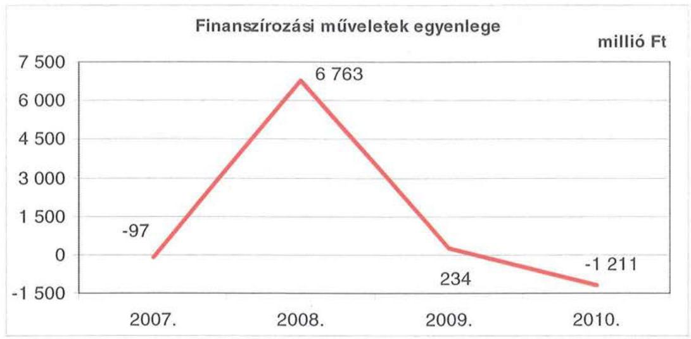

A finanszírozási többlet azt jelzi, hogy az éves költségvetések végrehajtása során szükség volt az előző években keletkezett pénzmaradvány igénybevételén túl külső finanszírozás igénybevételére is. A finanszírozási célú műveleteket a vizsgált időszakban a jelentés 2. számú mellékletének 4.1-4.8 pontjai részletezik.

[^0]
[^0]:    ${ }^{49}$ a nettó működési jövedelem és a felhalmozási költségvetés eredője

---

Az Önkormányzat zárszámadási rendeleteiben évente bemutatott ${ }^{50}$ működési és fejlesztési bevételek és kiadások egyenlegéről (többlet, hiány) a jelentés 1. számú melléklete nyújt tájékoztatást. A 2007. és a 2009. évi zárszámadási rendeletekben pénzügyi többletet, a 2008. és a 2010. évben pedig forráshiányt mutattak ki.

A vizsgált időszakban a kötelezettségek (a passzív pénzügyi elszámolások nélkül) a 2007. évi 5553 millió Ft-ról a 2010. évre 18 273 millió Ft-ra emelkedtek, amely a 2007-2009. években együtt járt a kamatkiadások növekedésével.

A 2007-2010. évek között az Önkormányzat összesen 1714 millió Ft kamatot fizetett meg. Az átmenetileg szabad pénzeszközein realizált kamatbevétel a teljes kamatráfordítás 105,6\%-át ( 1810 millió Ft) tette ki.

A 1810 millió Ft kamatbevételből 2008-2010. években összesen 897,6 millió Ft keletkezett a kötvénykibocsátásból származó, fel nem használt pénzeszközök lekötéséből.

Az Önkormányzat kamatbevételeinek és kamatkiadásainak alakulását a következő ábra mutatja:
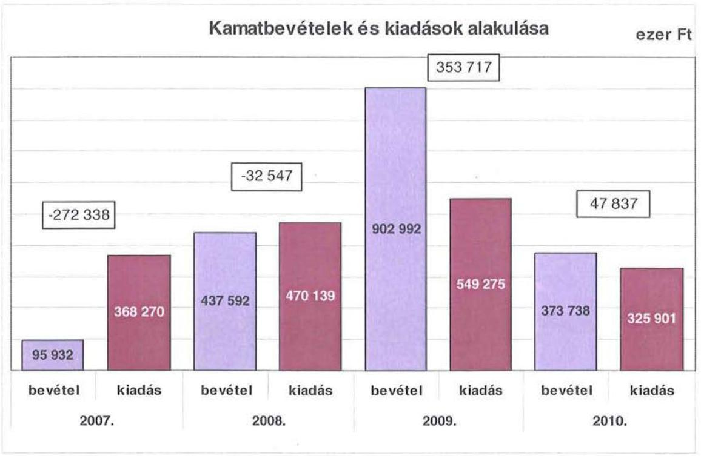

A 2011. évre az Önkormányzat a kamatkiadások további emelkedésével kalkulál, a 2011. évi költségvetési rendeletben tervezett 362 millió Ft kamatráfordítás 11,1%-kal, 36 millió Ft-tal haladhatja meg a 2010. évit.

[^0]
[^0]:    ${ }^{50}$ Nincs kötelező előírás a működési és fejlesztési hiány megállapításának módjára.

---

# 2.2. Az Önkormányzat bevételeinek alakulása 

Az Önkormányzat 2007-2010. évek között realizált összesen 102 315,7 millió Ft főbb folyó (működési) bevételi jogcímeinek számszaki adatait a következő grafikon mutatja be és táblázat részletezi:
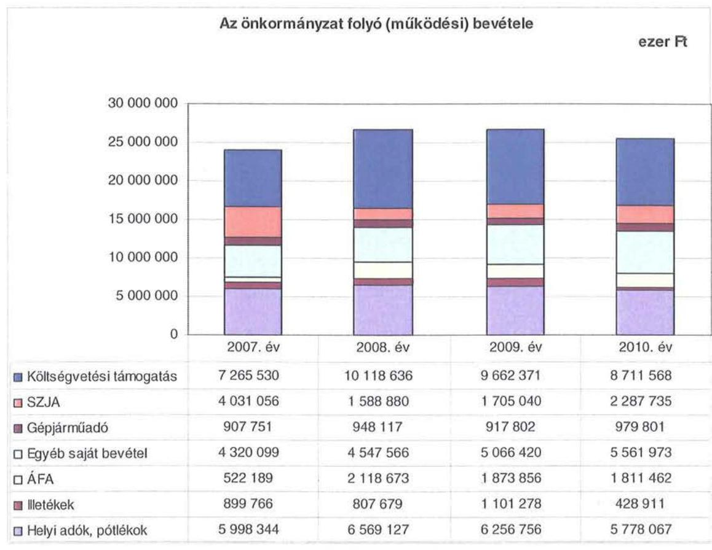

Az Önkormányzat költségvetési támogatásai - amelyek döntő mértékben működési támogatások voltak - a 2007. évi 7265,5 millió Ft-ról 2008-ra 10 118,6 millió Ft-ra, 39,3%-kal nőttek. A költségvetési támogatás összege 2008-ról 2009-re 9662,4 millió Ft-ra, 2010-re 8711,6 millió Ft-ra csökkent.

Az átengedett szja összege a 2007. évről a 2008. évre 60,6%-kal, 2442,2 millió Ft-tal csökkent. A csökkenést a szabályozási rendszer változása okozta. Az Önkormányzat az előző évihez képest 2009-ben 7,3%-kal (116,2 millió Ft-tal), 2010-ben további 34,2%-kal (582,7 millió Ft-tal) kapott több átengedett szja-t.

A gépjárműadóból származó bevétel 2007-ről 2010-re 7,9%-kal, 979,8 millió Ft-ra emelkedett az adó mértékének emelése és az ellenőrzési-végrehajtási munka eredményeként.

Az Önkormányzat egyéb saját bevételei a vizsgált időszakban folyamatosan növekedtek. A 2007. évi 4320,1 millió Ft-ról a 2008. évre 4547,6 millió Ft-ra, 5,3%-kal, 2009-re 5066,4 millió Ft-ra, 11,4%-kal, 2010-re 5562 millió Ft-ra, 9,8%-kal növekedtek.

---

Az áfa bevételek és visszatérülések összege az előző évhez képest 2008-ra 305,7%-kal, 2118,7 millió Ft-ra növekedett, a 2009. évre 11,6%-kal, 1873,9 millió Ft-ra, a 2010. évre 3,3%-kal, 1811,5 millió Ft-ra csökkent.

Az Önkormányzat egyéb saját bevételein belül az illetékbevételek 2007-ről 2008-ra 92,1 millió Ft-tal, 10,2%-kal csökkent. A 2008. évről a 2009. évre az illeték bevételek 293,6 millió Ft-tal (36,3%), majd a 2010. évre csökkentek 672,4 millió Ft-tal, 61%-kal. A befolyt illetékbevételben a csökkenést az ingatlanpiac visszaesése és egyes illetékkedvezmények bevezetése okozta a 2008. és a 2010. években.

Az Önkormányzatnál a helyi adókból és pótlékokból származó bevételek aránya 2007-2010 között 22,6-25% között mozgott a folyó (működési) bevételekben. A helyi adóbevételek a 2007. évről a 2008. évre 10,0%-kal nőttek (az iparűzési adóbevételek növekedése miatt), de a 2008-tól folyamatosan csökkentek. A helyi adóbevételek előző évhez viszonyított 2009. évi 5,7%-os és 2010. évi 7,8%-os csökkenését az iparűzési adó 2009. évi 7,5%-os (408,5 millió Ft) és 2010. évi 9,3%-os (465,6 millió Ft) csökkenése határozta meg. A 2009. évben bevezetett övezeti változás miatt az építményadó bevételének 2008. évhez viszonyított 4,9%-os ( 43,6 millió Ft) növekedése enyhítette az iparűzési adó miatti kiesést.

Az iparűzési adóbevételek csökkenése mellett „azonban egyéb, a gazdaságra kedvező hatással bíró folyamatok indultak el. Egy alacsonyabb adókulcs alternatívát jelentett a kifutó adókedvezményeknek, megakadályozva a befektetők elvándorlását, továbbá vonzerőt jelent olyan tevékenységek idecsábításában.., A gazdaságösztönző adópolitika együttes hatását vizsgálva megállapítható, hogy a helyi iparűzési adókulcs csökkentése már a 2011-es évtől növelni fogja Kecskemét összesített helyi iparűzési adó alapját, továbbá a foglalkoztatás növekedésének hatásaként a személyi jövedelemadó és járulékbevételek növekedésével párosul. (...az Önkormányzat részére az átengedett szja tekintetében jelentős többletbevételt eredményezhet.)" ${ }^{51}$

Az Önkormányzat a 2007-2010. években négy helyi adót, a helyi iparűzési adót, az építményadót, vállalkozók kommunálisadóját és az idegenforgalmi adót vetett ki ${ }^{52}$, az időszak alatt új adónem bevezetéséről nem döntöttek. Az iparűzési adónál 2007. évben a maximális adómértéket, a 2%-ot alkalmazták, amely folyamatosan csökkent, a 2008 és a 2009. évben 1,9%, a 2010. évben ${ }^{53}$ 1,7% volt.. Az építményadó mértéke a 2007-2008. években övezeti besorolás nélkül egységesen $600 \mathrm{Ft} / \mathrm{m}^{2}$ volt. A 2009.-évtől kialakított I. adóövezetben az építményadó mértéke maradt a $600 \mathrm{Ft} / \mathrm{m}^{2}$, a II. övezetben pedig $540 \mathrm{Ft} / \mathrm{m}^{2}$ volt a 2009. és a 2010. években. A vállalkozók kommunális adójának mértéke a 2007-2010. években nem változott, $1800 \mathrm{Ft} /$ fő volt. Az idegenforgalmi adómértéke a 2007-2011. években nem változott, személyenként és vendég éjszakánként 250 Ft volt. Az összesen 23 794,6 millió Ft helyi adóbevétel 83,3 %-át (19 810,5 millió Ft) az iparűzési adóból, 15,1%-át (3596,7 millió Ft) az épít-

[^0]
[^0]:    ${ }^{51}$ A Polgármester úr által adott kiegészítő információk szerint.
    ${ }^{52}$ A vállalkozók kommunális adója a 2011. évtől megszűnt.
    ${ }^{53}$ a 2011. évben 1,6%

---

ményadóból, 0,3%-át ( 75,4 millió Ft) az idegenforgalmi adóból és 1,3%-át ( 312,0 millió Ft) a vállalkozók kommunális adójából származó bevétel tette ki.

Az államháztartáson belülről működési célra kapott támogatások összege 2007-ről 2008-ra 1333,2 millió Ft-ról 850,6 millió Ft-ra csökkent, mert az Önkormányzat 2007. évben egy óvodát átadott az egyháznak, egy középiskolát és egy általános iskolát pedig a Kistérségi társulásnak. A támogatás összege az előző évhez képest 2009-re 7,1\%-kal, 790,1 millió Ft-ra csökkent, majd 2010-re $28,8 \%$-kal, 1017,5 millió Ft-ra nőtt a működési célra elnyert pályázati források miatt.

Az Önkormányzat 2007-2010 között évről évre növekvő összegben kapott osztalékot a gazdasági társaságokban lévő tulajdonrésze alapján. A kapott osztalék összege a 2007. évben három társaságtól 78,5 millió Ft, 2008-ban három társaságtól 104,1 millió Ft, 2009-ben három társaságtól 110,4 millió Ft, 2010-ben kettő társaságtól 110,7 millió Ft volt. Az egyes években kapott osztalék 93-100\%-a a Kecskeméti Regionális Hulladéklerakó Kft, és a Termostar Kft-től származott. Az Önkormányzat osztalékról nem mondott le.

Az Önkormányzat felhalmozási bevételei a vizsgált időszakban a következők voltak:

| Megnevezés | 2007. év <br> tény | 2008. év <br> tény | 2009. év <br> tény | 2010. év <br> tény |
| :-- | :--: | :--: | :--: | :--: |
| Tárgyi eszköz értékesítés | 174866 | 858417 | 168325 | 397314 |
| Egyéb saját tőkebevétel | 167721 | 4336650 | 4364657 | 89921 |
| Államháztartáson belülről <br> kapott támogatás | 3190633 | 2839890 | 904036 | 2593092 |
| EU-tól és külföldről kapott <br> támogatások | 0 | 0 | 0 | 1000 |
| Államháztartáson kívülről <br> kapott támogatás | 713648 | 288091 | 332052 | 588649 |
| Összes felhalmozási bevétel | 4246868 | 8323048 | 5769070 | 3669976 |

A vizsgált években a felhalmozási bevételek a 2007. évi 4247 millió Ft-ról 2008-ban $96 \%$-kal, 8323 millió Ft-ra nőttek, 2009-ben $30,7 \%$-kal, 5769 millió Ft-ra csökkentek, majd a 2010. évre 3670,0 millió Ft-ra, 36,4 \%-kal csökkentek. A felhalmozási célú bevételek az előző évihez képest a 2008-2009. évben a terület-, telek- és egyéb ingatlan-értékesítés miatt 4881,5 millió Ft-tal növekedtek, a bevétel $97,9 \%$-a 4810 millió Ft a Daimler Mercedes Benz projekthez kapcsolódó terület-értékesítés bevétele.

# 2.3. Az Önkormányzat kiadásainak alakulása 

Az Önkormányzatnál a CLF módszer szerint számított folyó és felhalmozási kiadások együttes összege a 2007-2010. évek között változóan alakult, az előző évhez képest a 2008. évre 27380 millió Ft-ról 38542 millió Ft-ra nőtt, majd a

---

2009. évre 30292 millió Ft-ra csökkent, a 2010. évre pedig 31608 millió Ft-ra nőtt. A folyó kiadások összege a 2007. évben 21864 millió Ft, a 2008.évben 23827 millió Ft, a 2009. évben 25492 millió Ft, a 2010. évben 24481 millió Ft volt. A felhalmozási kiadások 2007. évről 2008. évre történő 9199 millió Ft-os növekedését főként ingatlan vásárlás okozta.

Az Önkormányzat folyó kiadásai főbb jogcímek szerinti bontásban a következők voltak:

| Megnevezés | 2007. | 2008. | 2009. | 2010. |
| :--: | :--: | :--: | :--: | :--: |
| Folyó kiadások | 21864014 | 23826880 | 25491767 | 24480391 |
| Működési kiadások (kamatkiadás nélkül) | 17993585 | 19609600 | 20571548 | 19700810 |
| Államháztartáson belülre átadott pénzeszközök | 612226 | 385438 | 683531 | 501377 |
| Transzferkiadások | 2081676 | 2551249 | 2957902 | 3239611 |
| -ebből: vállalkozásoknak | 287902 | 382828 | 718192 | 1509226 |
| EU-nak, illetve külföldre | 505 | 0 | 0 | 0 |
| magánszemélyeknek | 960457 | 1108624 | 1279750 | 1395461 |
| nonprofit szervezeteknek | 832812 | 1059797 | 959960 | 334924 |
| Kamatkiadások | 368270 | 470139 | 549275 | 325901 |
| Előző évi pénzmaradvány átadás | 808257 | 810454 | 729511 | 712692 |

Az Önkormányzat folyó kiadásai a 2008. évben és a 2009. évben növekedtek a dologi kiadások 2008. évben közel 30\%-os (1544,3 millió) Ft és a 2009. évi 22,7\%-os (1541,6 millió Ft) növekedése miatt, amely növekedést a 2009. évben mérsékelte a szervezeti változások, létszámleépítések miatti a személyi juttatások és munkaadói járulékok előző évhez viszonyított 692,8 millió Ft csökkenése. A létszámleépítések teljes pénzügyi hatása a személyi juttatások és munkaadói járulék csökkenésére a 2010. évi folyó kiadások csökkenésében jelent meg.

Az Önkormányzat folyó kiadásai főbb kiadásnemek szerinti bontásban a következők voltak:

|  |  |  |  | ezer Ft |
| :-- | --: | --: | --: | --: |
| Megnevezés | $\mathbf{2 0 0 7 .}$ | $\mathbf{2 0 0 8 .}$ | $\mathbf{2 0 0 9 .}$ | $\mathbf{2 0 1 0 .}$ |
| Személyi juttatások | 9461695 | 9559998 | 9125838 | 8436418 |
| Munkaadót terhelő járulékok | 3064411 | 3004907 | 2746352 | 2238505 |
| Dologi kiadások | 5256578 | 6800889 | 8342453 | 8666532 |
| Egyéb folyó kiadások | 96924 | 114440 | 142754 | 280497 |

A folyó kiadásokon belül a személyi juttatások és járulékok aránya - a más szervnek átadott feladatok, az álláshely csökkentések miatt - a vizsgált időszakban a 2007. évi 57,3\%-ról 2010-re 43,6\%-ra csökkent. A személyi juttatások a 2007. évi 9461,7 millió Ft-ról a 2008. évre 9560 millió Ft-ra növekedtek a létszámcsökkentéssel járó végkielégítések, felmentési díjak, jubileumi jutalmak kifizetése miatt, majd a 2009. évre 9125,8 millió Ft-ra és a 2010. évre 8436,4 millió Ft-ra csökkentek.

Az Önkormányzat dologi kiadásai 2007-ről 2010-re folyamatosan, 64,9\%-kal, 8666,5 millió Ft-ra nőttek, a vásárolt élelmezés $35,4 \%$-os 303,6 millió Ft-os, az üzemeltetési, fenntartási kiadások 102\%-os 1115,8 millió Ft-os, az áfa kiadások $163,8 \%$-os 1461,8 millió Ft-os növekedése miatt.

---

A dologi kiadások folyamatos növekedésének egyik oka a közüzemi díjak (energiaárak) jelentős mértékű növekedése, a villamos energia 29,6\%-os növekedése, a vezetékes gáz 51,9\%-os növekedése, a vízdíj 19,4\%-os növekedése, a csatornadíj $32,4 \%$-os növekedése volt.

A működési célú pénzeszközátadások részaránya az összes folyó kiadásokon belül a 2007. évi 4\%-ról, 1122,1 millió Ft-ról 2010. évre 7,5\%-ra, 1847,5 millió Ft-ra változott, a gazdasági társaságoknak nyújtott működési célú pénzeszközátadások 99,2\%-os 754 millió Ft-os növekedése miatt.

Az Önkormányzat által a gazdasági társaságok részére nyújtott működési és felhalmozási pénzeszközátadások alakulását a következő diagram mutatja be a 2007-2010. évekre:
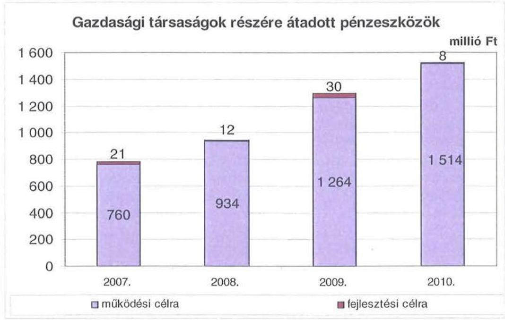

Az önkormányzati feladatellátásban részt vevő gazdasági társaságoknak nyújtott működési pénzeszközátadás a vizsgált években folyamatosan növekedett, a 2007. évi 759,9 millió Ft-ról 2008-ra 23\%-kal, 934,5 millió Ft-ra, 2009-re 35,3\%-kal, 1264,3 millió Ft-ra és 2010-re 19,8\%-kal, 1514,5 millió Ft-ra változott. Az Önkormányzat a legnagyobb összegű pénzeszközátadást a sportegyesületek és sportlétesítmények működtetésére adta mind a négy évben, a 2007. évben 475 millió Ft-ot, a 2008. évben 585,3 millió Ft-ot, a 2009. évben 708,4 millió Ft-ot, a 2010. évben 801,3 millió Ft-ot.

A jelentés 4. számú melléklete részletezi évenként a 2010. december 31-én az Önkormányzat érdekeltségi körébe tartozó működési és felhalmozási célra adott önkormányzati pénzeszközöket. A 4. számú mellékletben nem szereplő 2010. december 31-ig megszűnt - gazdasági társaságok közül három társaság összesen 1106,8 millió Ft működési célú és 33,2 millió Ft felhalmozási célú pénzeszközt kapott az Önkormányzattól, amely az összes gazdasági társaságnak adott pénzeszközátadás $24,7 \%$-át, illetve $46,6 \%$-át tette ki.

A működési és felhalmozási kiadások alakulását a következő ábra mutatja:

---

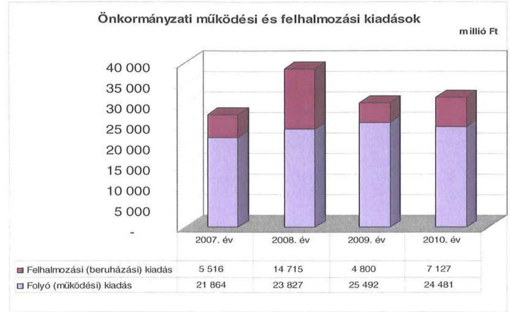

A folyó (működési) és felhalmozási kiadások aránya a 2007-2010. évek között számottevően változott, a folyó kiadások aránya a 2007. évben 79,9\%, a 2008. évben $61,8 \%$, a 2009. évben $84,2 \%$, a 2010. évben $77,5 \%$ volt. A felhalmozási kiadások összegét befolyásolta a Társulás beruházásai. A folyó és felhalmozási kiadások együttes összegéből a szennyvízcsatorna és tisztítótelep megvalósítására létrejött Társulás ${ }^{54}$ folyó és felhalmozási kiadásai 2007-ben 3214,3 millió Ft-ot, 2008-ban 2927,1 millió Ft-ot, 2009-ben 691,5 millió Ft-ot, 2010-ben 2779,6 millió Ft-ot tettek ki, arányuk az összes költségvetési kiadáshoz képest, $2,3 \%$ és $11,7 \%$ között mozgott.

A gazdasági programban kijelölték a város fejlesztésének főbb irányait, a közműhálózat fejlesztését, az önerős lakossági útépítés támogatását, a panelprogram keretében a lakóépületek felújítását, a városközpont fejlesztését.

Az Önkormányzatnál a 2007-2010. évben befejezett fejlesztési feladatok tervezett teljes bekerülési költségvetési kiadása 29 729,2 millió Ft, a mely 99,6\%-ban teljesült. A 29613,4 millió Ft tényleges bekerülési kiadás 7,7\%-át (2272,6 millió Ft) a felújítási és 92,3\%-át (27 340,8 millió Ft) a beruházási feladatok tették ki. A befejezett fejlesztések tényleges forrásmegoszlása 6673,0 millió Ft EU-s támogatás (22,5%), 3638,6 millió Ft hazai támogatás (12,3%), 2661,5 millió Ft kötvény ( $9,0 \%$ ), 1430,7 millió Ft hitel ( $4,8 \%$ ) és 15209,6 millió Ft saját bevétel ( $51,4 \%$ ) volt. A tervezett kiadások több mint harmada (10 561,5 millió Ft) utófinanszírozású feladathoz kapcsolódtak, amelyekhez a megvalósítás folyamán a források hitelek igénybevételével és kötvény kibocsátásával álltak rendelkezésre. A 2010. év végén a saját bevételi forrás $1,5 \%$-a ( 250 millió Ft ) volt a megelőlegezett EU-s és hazai támogatás össze-

[^0]
[^0]:    ${ }^{54}$ Az Önkormányzat költségvetési, zárszámadási rendeleteiben szereplő társulás: a Kecskemét és Térsége Társult Települések Szennyvízcsatorna és Tisztítótelep Tulajdonközössége.

---

ge. A 2006. december 31-ig teljesített kiadások összege 3781,9 millió Ft, a 20072010. években teljesített kiadások összege 25831,5 millió Ft volt. A befejezett fejlesztések részletes adatait a 3.a melléklet mutatja be.

Az Önkormányzat 2010. december 31-én folyamatban lévő fejlesztési feladatainak tervezett teljes bekerülési költségvetési kiadása 9664,4 millió Ft volt, amelynek tervezett forrása: 4522,9 millió Ft EU-s támogatás ( $46,8 \%$ ), 527,6 millió Ft hazai támogatás ( $5,5 \%$ ), 2338,5 millió Ft kötvény ( $24,2 \%$ ), 92,2 millió Ft hitel ( $0,9 \%$ ), és a saját bevétel 2183,2 millió Ft (22,6%). A 2006. december 31-ig teljesített kiadások összege 129,6 millió Ft, a 20072010. években teljesített kiadások összege 4061,1 millió Ft volt, amelyek forrása 846,0 millió Ft EU-s támogatás ( $20,2 \%$ ), 356,8 millió Ft hazai támogatás ( $8,5 \%$ ), 1517,5 millió Ft kötvény ( $36,2 \%$ ), 90,4 millió Ft hitel ( $2,29 \%$ ), és a saját bevétel 1380,0 millió Ft ( $32,9 \%$ ) volt. A források az EU-s és a hazai támogatásoknál utólagosan álltak rendelkezésre, ezért a kiadások finanszírozáshoz a tervezett forrásarányhoz viszonyítva a saját bevételeket és kötvényeket több mint $10 \%$-kal nagyobb arányban vették igénybe (a saját bevételből 433,3 millió Ft, a kötvényből 503,5 millió Ft volt az átmeneti többlet igénybevétel). A folyamatban lévő fejlesztések részletes adatait a 3.b melléklet mutatja be.

A 2010. december 31-én folyamatban lévő fejlesztési feladatok 2010. évet követően évre vállalt kötelezettségeinek összege 5449,0 millió Ft, amelynek várható forrása: több mint kétharmad részben EU-s támogatás, és a fennmaradó különbözet közel fele-fele arányban saját bevétel és kötvény. A 2010. évet követő további kötelezettségvállalással terhelt feladatainak várható teljes bekerülési költsége 7104,0 millió Ft, amelyből a 2010. évig teljesített kiadás 1655,0 millió Ft volt. A folyamatban lévő fejlesztések 2010. követő időszakra vállalt kötelezettségeinek részletes adatait a 3.c melléklet mutatja be.

Az Önkormányzatnak 2010. december 31-én 1018,5 millió Ft összegű, elbírálás alatti pályázati forrásból tervezett fejlesztési feladata volt, amelyekre 4,4 millió Ft kifizetés történt. A 2010. december 31-ét követően tervezett 1014,1 millió Ft forrásaként 80,6 millió Ft saját forrást ( $7,9 \%$ ), 804,2 millió Ft EU-s támogatás ( $79,3 \%$ ) és 129,3 millió Ft hazai támogatást ( $12,8 \%$ ) tervezték. Az elbírálás alatti pályázati forrásból megvalósuló fejlesztéseket a 3.d melléklet mutatja be.

Az Önkormányzat fejlesztési tevékenysége a pályázati kiírások által nagyban befolyásolt, mivel beruházásokat csak külső források, EU-s és hazai támogatások elnyerése esetén tud megvalósítani. A 2010. évet követő fejlesztések megvalósítása során finanszírozási nehézséget okozhat az EU-s források előfinanszírozása.

Az Önkormányzat kiemelt fejlesztési kiadásai, infrastrukturális fejlesztései közül a legnagyobb költségigényű volt a következő öt felhalmozási kiadás:

- A Társulás által megvalósított ISPA szennyvíz beruházást ${ }^{55}$ 2006. március 1-én kezdték és 2010. december 31-én fejezték be. A beruházás teljes bekerülési

[^0]
[^0]:    ${ }^{55}$ Az Önkormányzat a 75/2000. (03. 01.) számú határozatával hagyta jóvá.

---

kiadása 10 587,7 millió Ft volt, ebből a 2006. december 31-ig teljesített kiadás 2301,1 millió Ft, a 2007-2010. év közötti teljesítés 8286,6 millió Ft. A beruházást 5498,7 millió Ft EU-s támogatással, 187 millió Ft kötvényből származó bevételből, 2799,4 millió Ft hazai támogatással és 2102,6 millió Ft saját bevétellel finanszírozták.

- A Társulás keretében az ISPA projekthez kapcsolódóan úthelyreállításra 2010. december 31-én folyamatban lévő feladat - 991,2 millió Ft-ot fordítottak 2010. december 31-ig.
- Földterület vásárlása a Daimler-projekt megvalósításával összefüggésben 8667,9 millió Ft értékben a 2008. évben.
- A Városi Sportcsarnok bővítése ${ }^{56}$ beruházást 2005. november 7-én kezdték és 2007. december 31-én fejezték be. A beruházás teljes bekerülési kiadása 922,3 millió Ft volt, ebből a 2006. december 31-ig teljesített kiadás 812,5 millió Ft, a 2007-2010. év közötti teljesítés 109,8 millió Ft. A beruházást 722 millió Ft hitellel és 200,3 millió Ft saját bevétellel finanszírozták.
- A Csalánosi út kiépítése Kecskeméten II. ütemét ${ }^{57}$ 2010. augusztus 25-én kezdték és 2010. november 30-án fejezték be. A beruházás tervezett teljes bekerülési kiadása 460,3 millió Ft, teljesített kiadása 177,4 millió Ft volt, amelyet kötvényből származó bevételből finanszírozták.

Az Önkormányzat Társulás útján megvalósított ISPA beruházáshoz kapcsolódó kiadások nélküli adatokat a következő ábra mutatja be:

Önkormányzati működési és felhalmozási kiadások beruházási társulások nélkül
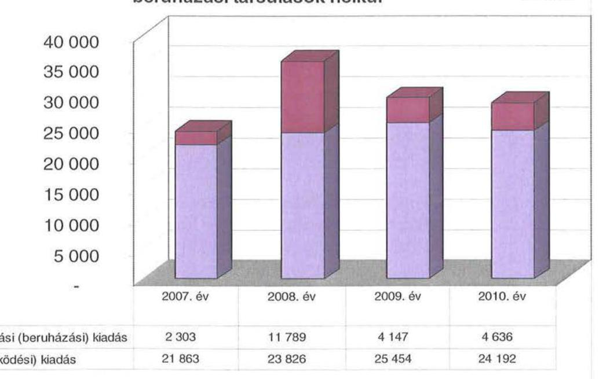

[^0]
[^0]:    ${ }^{56}$ Az Önkormányzat a 113/2005. (03. 09.) számú határozatával hagyta jóvá.
    ${ }^{57}$ Az Önkormányzat a 432/2009. (10. 26.) számú határozatával hagyta jóvá.

---

# 3. KÖTELEZETTSÉGEK BEMUTATÁSA 

### 3.1. A pénzintézetek felé fennálló kötelezettségek alakulása

Az Önkormányzatnak 2006. december 31-én 4497,3 millió Ft pénzintézeti kötelezettség állománya ${ }^{38}$ volt, amely a 2010. évre 15958,7 millió Ft-ra emelkedett ${ }^{39}$. A 2010. év végén fennálló pénzintézeti kötelezettségei egy kötvénykibocsátásból, 13 hosszú lejáratú hitelből és a 2010. év végén fennálló folyószámlahitel állományból származtak.

Az Önkormányzat pénzintézeteknél fennálló kötelezettség-állományát a 20072010. években a következő diagram szemlélteti:
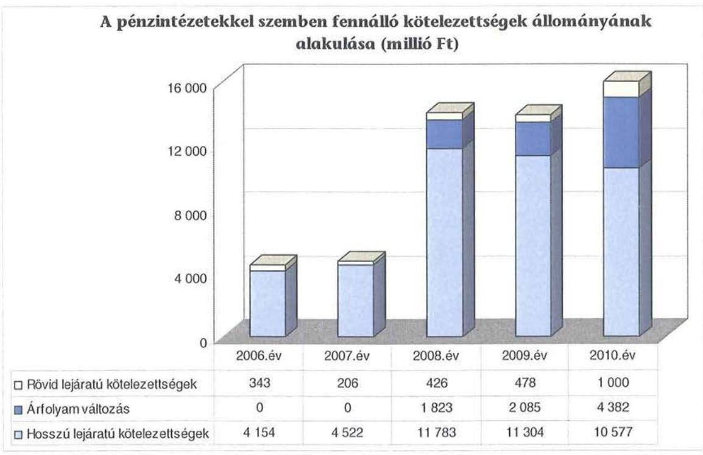

A pénzintézeti kötelezettségek állományának 2007-2010 közötti, 337,5\%-os 11230,5 millió Ft-os növekedését döntően befolyásolta, hogy

- az Önkormányzat 2007-2010 között kettő hosszú lejáratú hitelből 2010. december 31-ig 725,6 millió Ft összeget hívott le, és
- a 2007. év előtt kötött nyolc hosszú lejáratú hitelszerződése alapján 20072010 között 371,6 millió Ft hitelt vett igénybe,

[^0]
[^0]:    ${ }^{38}$ A pénzintézeti kötelezettségek állománya a lízingből származó kötelezettségek nélkül számítva.
    ${ }^{39}$ A 2. számú melléklet szerint a 2010. évi pénz- és tőkepiaci kötelezettség (adósság) 15991479 ezer Ft. A rövid lejáratú 1033052 ezer Ft összegből 32786 ezer Ft egy gazdasági társaságtól kapott kölcsön volt. A tényleges pénz- és tőkepiaci kötelezettség 2010. december 31-én 15958,7 millió Ft, amelyből 1000,3 millió Ft a rövid lejáratú kötelezettség.

---

- 2008-ban 7000 millió Ft összegben felhalmozási célú kötvényt bocsátott ki,

Az Önkormányzat a kibocsátott kötvényből származó bevételből finanszírozta átmenetileg a terület értékesítéséig a Daimler-projekt megvalósítása érdekében földterületet megvásárlásával és beruházási területté történő átminősítésével összességében keletkezett 8673,6 millió Ft költséget. Az átminősített területet a Mercedes-Benz Manufacturing Hungari Kft. részére értékesítették.

A Daimler beruházással kapcsolatosan „többletbevétel az állami költségvetés és az Önkormányzat számára döntően két tételből adódóan várható:.... A Mercedes-Benz Manufacturing Hungary Kft. által gyártott első autó a gyártószalagról 2012-ben fog legördülni, tehát jelentősebb árbevétel, mely után iparűzési adót fog fizetni a 2013-as évben várható. Az ... 500 Mrd forint éves bevételi tervből indulva ... 1,6 Mrd forint iparűzési adó bevétele keletkezhet a városnak. További jelentős tényezőként említendő, hogy a Mercedes gyár területén belül, illetve mellette letelepedett vállalkozások (10 beszállító cég), és a már helyileg korábban is működő cégek beszállítók körébe történő bevonása során további 1 Mrd forint iparűzési adóbevétel várható. A beruházás teljes költsége a régió éves GDP-jének közel 9\%-át teszi ki. A jelentős beszállítói kör következtében a beruházás eredményeként a régió GDP-je várhatóan több mint 3\%-kal növekedhet."60

- 2007. év végén még nem volt folyószámlahitele az Önkormányzatnak, 2010. év végén azonban 294 millió Ft folyószámlahitel állománnyal rendelkezett.
- 4381,9 millió Ft összegben számoltak el a devizában fennálló hitelek és a kötvény év végi értékelésekor a CHF árfolyamváltozás miatti állománynövekedést;

Az árfolyamváltozás hatása is befolyásolta a kötelezettségek alakulását, azonban annak mértéke előre pontosan nem határozható meg, csak várakozásokon alapuló tendenciák jelezhetők. Annak megítéléséről, hogy a devizában felvett hitelért, kibocsátott kötvényért kapott forinthoz képest a hitel visszafizetésekor, a kötvény visszavásárlásakor jelentkező forint-kötelezettség többletkiadást (árfolyamveszteség) vagy megtakarítást (árfolyamnyereség) eredményez-e a futamidő végén, a teljes kötelezettség rendezését követően lehet képet alkotni. Mindaddig, amíg törlesztési kötelezettség nem áll fenn (türelmi idő), a tőkére vonatkoztatva nem értelmezhető sem az árfolyamveszteség, sem az árfolyamnyereség. Ugyanakkor a hitel és a kötvény-kötelezettség mérlegforduló-napi értékeléséből adódó különbözetet - amennyiben az összevontan jelentős összegű - az Áhsz. 33. § (2) bekezdés c) pontja alapján, ha árfolyamveszteség a kötelezettségállomány növekedéseként és saját tőke csökkenéseként, ha árfolyamnyereség, a kötelezettségállomány csökkenéseként és saját tőke növekedésként kell a mérlegben kimutatni. Ez a mérleg-fordulónapi értékelésből adódó (árfolyam) különbözet azonban valójában pénzügyileg nem realizálódott.

A 2007-2010. években az Önkormányzat hosszú lejáratú pénzintézeti kötelezettségvállalásaira közgyűlési döntés alapján került sor, azonban az előterjesztésekben nem mutatták be a visszafizetés konkrét forrásait, valamint a kamatés - a devizaalapú kötelezettségeket érintő - árfolyamkockázatot. A kötelezettségvállalásból származó források felhasználási céljait meghatározták, betartották

[^0]
[^0]:    ${ }^{60}$ A Polgármester úr által adott kiegészítő információk szerint.

---

a fedezet megjelölésre vonatkozó helyi és központi előírásokat. A Közgyűlés kötvénykibocsátásról szóló döntéseit megalapozó előterjesztések a saját bevételeket jelölték meg a kötvénykibocsátás visszafizetésének forrásaként. Az Önkormányzat az adósságot keletkeztető kötelezettségvállalásának felső határát a 2007-2010. években hozott hitelfelvételi, kötvény-kibocsátási döntésekkel nem lépte túl. A Közgyűlés a likviditási és eladósodási problémák kezelésére likviditási koncepciót, stratégiát nem készített a 2007-2010. években.

Az Önkormányzat pénzállományának alakulásáról a mindenkori költségvetési rendelet előírásainak megfelelően 2007. évtől finanszírozási, 2009. évtől finanszírozási és likviditási ütemtervet készített, amelyet havi gyakorisággal aktualizált. Az ütemtervről havonta tájékoztatta a Közgyűlés Költségvetési és Vagyongazdálkodási Bizottságát. A tájékoztatások, valamint a nettó működési jövedelem számszaki adatai alapján a Bizottság nem javasolta likviditási koncepció elkészítését, mivel az Önkormányzat működésében nem állapítottak meg oly mértékű likviditási problémák, melyek szerintük a koncepció elkészítését indokolták volna.

Az Önkormányzat 2010. december 31-én Ft-ban fennálló hosszú lejáratú hitelszerződéseit a következő táblázat mutatja be:

| Megnevezés | Szerződéskötés időpontja | Összeg ezer Ft-ban | Kamat (referencia kamat+ kamatfelár) | Felhasználás célja |
| :--: | :--: | :--: | :--: | :--: |
| 1. Hosszú lejáratú hitel | 2005.06.08 | 509574 | 3 havi EURIBOR + <br> évi $1,75 \%$ | 2005. évi költségvetésben <br> tervezett beruházási célok |
| 2/a. Hosszú lejáratú hitel | 2006.08.23 | 905065 | 3 havi EURIBOR + <br> évi $1,5 \%$ | 2006. évi költségvetésben <br> tervezett beruházási célok |
| 2/b. Hosszú lejáratú hitel | 2006.08.23 | 102029 | 3 havi EURIBOR + <br> évi $2,2 \%$ | 2006. évi költségvetésben <br> tervezett beruházási célok |
| 2/c. Hosszú lejáratú hitel | 2006.08.23 | 35140 | 3 havi EURIBOR + <br> évi $1,25 \%$ | egészségügyi szolgáltatások <br> fejlesztése |
| 2/d. Hosszú lejáratú hitel | 2006.08.23 | 81292 | 3 havi EURIBOR + <br> évi $1,25 \%$ | informatikai közműfejlesztés |
| 2/e. Hosszú lejáratú hitel | 2006.08.23 | 99173 | 3 havi EURIBOR + <br> évi $1,25 \%$ | iparosított technológiával <br> felújított lakóépületek (Panel) |
| 2/f. Hosszú lejáratú hitel | 2006.08.23 | 19800 | 3 havi EURIBOR + <br> évi $1,25 \%$ | kulturális infrastruktúra <br> kialakítása (Közkincs) |
| 3. Hosszú lejáratú hitel | 2006.09.12 | 1550273 | 3 hónapos BUBOR+ <br> évi 0,085\% | működési célra |
| 4/a. Hosszú lejáratú hitel | 2007.11.20 | 595799 | 3 havi EURIBOR + <br> évi $1,7 \%$ | költségvetésben szereplő <br> beruházási célok |
| 4/b. Hosszú lejáratú hitel | 2007.11.20 | 129758 | 3 havi EURIBOR + <br> évi $1,2 \%$ | költségvetésben szereplő <br> beruházási célok |
| 5. Hosszú lejáratú hitel | 2010.12.09 | 528823 | 3 havi EURIBOR + <br> évi $1,45 \%$ | iparosított technológiával <br> felújított lakóépületek (Panel) |

Az 1-4. hosszú lejáratú hiteleket igénybe vették, a 2010. év végén kötött 5. hosszú lejáratú hitelkeretből a 2010. évben nem vettek igénybe, 2011. június végéig a keret $43,7 \%$-át (213,2 millió Ft) hívták le.

Az Önkormányzat CHF-ben fennálló hosszú lejáratú hitelszerződései 2010. december 31-én a következők voltak:

---

| Megnevezés | Kibocsátás, illetve szerződéskötés időpontja | Összeg <br> CHF | Kibocsátási, vagy lehívási árfolyam | Kamat (referencia kamat+ kamatfelár) | Felhasználás célja: |
| :--: | :--: | :--: | :--: | :--: | :--: |
| Hosszú lejáratú hitel | 2007.11.12 | 4043 385,62 | 153 | 3 havi CHF LIBOR + évi 3,39\% | 2002. évi forint alapú hitel átváltása |
| Hosszú lejáratú hitel | 2007.11.12 | 2757 277,39 | 153 | 3 havi CHF LIBOR + <br> évi 3,39\% | 2001. évi forint alapú hitel átváltása |
| Hosszú lejáratú hitel | 2007.11.12 | 2277 271,24 | 153 | 3 havi CHF LIBOR + <br> évi 3,39\% | 2003. évi forint alapú hitel átváltása |
| "Kecskemét fejlesztéséért" kötvény | 2008.07.10 | 48413000,00 | 144,59 | 6 havi CHF LIBOR+ <br> évi 0,9\% | önkormányzati fejlesztések megvalósítása |

A CHF-ben fennálló hosszú lejáratú hitelekkel (összesen 9,08 millió CHF) az Önkormányzat a 2001-2003. években felvett és a hitelcél szerint a 2001-2003. években felhasznált hosszú lejáratú Ft alapú hiteleket (átváltáskor a három hitelfelvételből fennálló tőketartozás összesen 1390,2 millió Ft volt) váltotta ki a 2007. évben. A CHF-ben felvett hitelekből 2010. december 31-ig összesen 1047453,89 CHF-ot törlesztettek, amelyek után összesen 50,7 millió Ft árfolyamveszteséget számoltak el.

Az Önkormányzat a „Kecskemét fejlesztéséért" kötvényből származó bevételből 5000 millió Ft-ot a 2009. és a 2010. évi költségvetésben tervezett beruházások finanszírozására fordítottak. Az 5000 millió Ft 83,6\%-át (4179,0 millió Ft) pénzügyileg felhasználták és $16,4 \%$-a a 2010. évet követő évre áthúzódó - befejezetlen fejlesztési - feladatokat finanszírozza. A kötvényből származó bevétel $28,6 \%$-át, 2000 millió Ft-ot felhalmozási célokra - óvadék jellege miatt - nem használták fel, azt EUR-ban, CHF-ben és HUF-ban lekötötték ${ }^{61}$. A kötvénykibocsátás dokumentációjában az eredeti felhasználási céltól eltérő felhasználás a kibocsátó bank részéről nem volt tiltott, az eltérő felhasználáshoz nem kötődött előzetes banki engedélyezési kötelezettség vagy banki szankció.

A kötvénynél a tőketörlesztés 2010. december 31-ig még nem kezdődött meg, a kötvény után a 2008-2010. években az Önkormányzat 2494089 CHF (474,2 millió Ft) kamatot fizetett meg, egyéb költség - a 2,3 millió Ft bonyolítási és a 7 millió Ft jegyzési, garanciavállalási díjon kívül - nem merült fel.

A HUF-ban felvett hosszú lejáratú hitelekből az Önkormányzat 2010. december 31-ig 1068,5 millió Ft tőkét törlesztett, illetve 762,6 millió Ft kamatot fizetett meg, egyéb költség nem merült fel. A CHF-ben felvett hosszú lejáratú hitelekből az Önkormányzat 2010. december 31-ig 1047454 CHF (211,0 millió Ft) tőkét törlesztett, valamint 947 916,5 CHF (174,9 millió Ft) kamatot és 28 168,8 CHF (5,6 millió Ft) egyéb költséget fizetett meg.

Az Önkormányzat működésének pénzügyi egyensúlyát a vizsgált időszakban - 2009. év kivételével - folyószámlahitel és a 2007. évben munkabér megelőlegezési hitel igénybevételével biztosította. A folyószámlahitelnek a tartós pénzügyi egyensúlyra gyakorolt hatása a 2008. évtől elenyésző, mivel a folyószámlahitellel érintett napok száma a 2007. évi 112-ről 2008-ban 17-re, majd 2010-ben 15 napra csökkent.

[^0]
[^0]:    ${ }^{61}$ A kötvénybevételből 2011. május 31-én a rendelkezésre álló forrás a Polgármesteri hivatal tájékoztatása szerint 2046,1 millió Ft volt.

---

A folyószámlahitel keret alakulását a január 1-i állapotok szerint a következő táblázat mutatja be:

|  |  |  |  |  |
| :-- | :--: | :--: | :--: | :--: |
| Megnevezés | 2007. év | 2008. év | 2009. év | 2010. év |
| I. Folyószámlahitel |  |  |  |  |
| a folyószámlahitel keretösszege január 1-jén | 1200000 | 2500000 | 2000000 | $0^{*}$ |
| teljesített kamat és egyéb költség | 8314 | 906 | - | 124 |
| II. Munkabér megelőlegezési hitel |  |  |  |  |
| Igénybe vett hitel összesen: | 798640 | - | - | - |
| teljesített kamat és egyéb költség | 4894 | - | - | - |

* 2010. évben március 31-től volt folyószámlahitel keret, összege 1500000 ezer Ft volt.

A folyószámlahitel kondíciói a következők voltak ${ }^{62}$ :

| Megnevezés | Kamat (referencia+ kamatfelár) | Egyéb költség |
| :--: | :--: | :--: |
| Folyószámlahitel |  |  |
| 2007. év | 3 havi Bubor $+0,25 \%$ | $0,00 \%$ |
| 2008. év | 3 havi Bubor $+0,25 \%$ | $0,00 \%$ |
| 2009. év | 3 havi Bubor $+0,65 \%$ | $0,00 \%$ |
| 2010. év | 1 havi Bubor $+1,4 \%$ | $0,00 \%$ |
| Munkabér megelőlegezési hitel |  |  |
| 2007. év | 3 havi Bubor $+0,25 \%$ | x |

A folyószámlahitelhez kapcsolódóan egyéb költség címen az Önkormányzatnak díjakat nem kellett fizetnie. A folyószámlahitel kamatfelára 1,1 százalékponttal emelkedett 2009-től, a változást a hitelező bank a gazdasági válság negatív pénzpiaci hatásával indokolta.

Az Önkormányzat 2007-ben 112, 2008-ban 17 napon keresztül vett igénybe folyószámlahitelt. A 2009. évben nem vettek igénybe, a 2010. évben 15 napon keresztül vettek igénybe folyószámlahitelt. ${ }^{63}$. Az átlagos napi állomány a 2007. évben 99,5 millió Ft, a 2008. évben 8,7 millió Ft és a 2010. évben 2,6 millió Ft volt. A folyószámlahitel 2010. december 31-én fennálló záró állománya 294,3 millió Ft volt. A 2010. év végén a folyószámlahitelt az iparosított technológiával épült lakóépületek korszerűsítésére irányuló pályázatok finanszírozása érdekében, a hosszú lejáratú hitel-keret szerződés - a közbeszerzési eljárás lefolytatását követő - megkötésének elhúzódása miatt vették igénybe, és a lejáratakor 2011. évben visszafizették. Az áttekintett időszakot 2007. 2008. és 2010. évben jellemző likviditási problémák részben folyószámlahitellel történő finan-

[^0]
[^0]:    ${ }^{62}$ A referencia kamat az alábbiak szerint alakult:

    | MNB BUBOR fixing (átlagkamat) \%-ban |  |  |  |
    | :--: | :--: | :--: | :--: |
    | Referetencia kamat | 2007. évi | 2008. évi | 2009. évi | 2010. évi |
    | 1 havi BUBOR | 7,83 | 8,75 | 8,66 | 5,47 |
    | 3 havi BUBOR | 7,75 | 8,87 | 8,64 | 5,5 |

    ${ }^{63}$ A 2011. I. negyedévben 68 napon volt folyószámlahitel igénybevétel az Önkormányzatnál, és az átlagos napi állomány 2011. I. negyedévben volt a legmagasabb, 499,9 millió Ft A .folyószámlahitel után 2011. március 31-ig 7,0 millió Ft kamatot fizettek..

---

szírozása az Önkormányzatnak 2007-től 2010-ig összesen 9,3 millió Ft kamatkiadást jelentett.

Az Önkormányzatnak munkabér megelőlegezési hitele a vizsgált időszakban a 2007. évben 798,6 millió Ft volt. 2007-ben a munkabér megelőlegezési hitellel zárt napok száma 53, a hitel átlagos napi állománya 399,6 millió Ft volt. A hitel igénybevétele az Önkormányzatnak 4,9 millió Ft kamatráfordítást eredményezett.

A jelenleg fennálló hosszú lejáratú fejlesztési hitelek és a kötvény esetében a kamatfizetési kötelezettségek alakulását jelentősen befolyásolta és jelenleg is befolyásolja a hitelfelvételkor, kötvénykibocsátáskor és az utolsó kamatfizetéskor alkalmazott referenciakamatok eltérése, amelyet a következő táblázat mutat be:

| Megnevezés | Kibocsátási, lehívási | Utolsó fizetéskori | Változás <br> $\%$ |
| :-- | --: | --: | --: |
| 3 havi CHF LIBOR | 2,7142 | 0,1683 | $-93,8$ |
| 6 havi CHF LIBOR | 2,965 | 0,2083 | $-93,0$ |
| 3 havi EURIBOR | 0,802 | 1,124 | 0,4 |

Az Önkormányzat hosszú lejáratú hitelei közül 2010. december 31-én a kilenc Ft-hitelnek 3 havi EURIBOR és egy Ft-hitelnek 3 havi BUBOR, három devizahitelnek 3 havi CHF LIBOR volt a referenciakamata.

Az fennálló hosszú lejáratú hitele után - az utolsó ismert kamatmértékkel számítva - a 2011-2013. években 360,2 millió Ft, 2013. után 556,5 millió Ft kamat kötelezettsége keletkezik az Önkormányzat forintban. A CHF-ben fennálló hitelek számított kamatterhe a 2011-2013. évekre 628672 CHF. A kötvénykötelezettség után a 2011-2013. években 1663967 CHF, a 2013. év utáni években 4177127 CHF az előzetesen számított fizetendő kamat.

Az Önkormányzat számlavezető bankjától HUF és CHF alapú hosszú lejáratú hitelt vettek fel általános fejlesztési célokra. Emellett további két pénzintézettől vettek fel hosszú lejáratra hitelt működési célra, illetve felhalmozási célra, valamint bocsátotta ki a kötvényt.

# 3.2. Szállítók felé fennálló kötelezettségek alakulása 

Az Önkormányzatnak és gazdasági társaságainak lejárt szállítói tartozásai és egyéb kiadás-elmaradásait a következő táblázat tartalmazza:

|  |  |  |  | ezer Ft-ban |
| :--: | :--: | :--: | :--: | :--: |
| Megnevezés | 2007. <br> december 31. | 2008. <br> december 31. | 2009. <br> december 31. | 2010. <br> december 31. |
| Lejárt szállítói tartozás | 16427 | 16686 | 262153 | 478459 |
| Egyéb kiadás elmaradás | - | - | - | 4860 |
| Gazdasági társaságok <br> lejárt szállítói tartozása | 122300 | 132940 | 148983 | 159198 |

---

Az Önkormányzat lejárt szállítói tartozásállománya az összes szállítói kötelezettséghez viszonyítva a 2010. évben $44,3 \%$ volt, szemben a 2007. évi $2,1 \%$-os aránnyal (összes szállítói kötelezettség a 2007-ben 779,7 millió Ft, 2010. évben 1078,2 millió Ft volt). Az Önkormányzat lejárt szállítói tartozása a 2007. évi 16,4 millió Ft-ról 478,4 millió Ft-ra nőtt, amelynek 1,9\%-a (9,1 millió Ft) haladta meg a 91 napot. Egyéb kiadás-elmaradása az Önkormányzatnak a 2007-2009. években nem volt, 2010-ben 4,9 millió Ft volt. A 2010. december 31-én az Önkormányzatnak 30 nap feletti lejárt szállítói tartozása 284,2 millió Ft volt, a 30 nap alatti szállítói tartozásállomány 194,2 millió Ft volt. A lejárt tartozások döntő részében olyan keretszerződésen alapuló kötelezettségekből tevődött össze, melyek pályázati támogatásból megvalósuló projektekhez kapcsolódtak.

A partnerekkel „minden esetben az Önkormányzat a fizetési kötelezettség teljesítésének időbeli átütemezéséről egyeztetést folytatott le, ezért ebből adódóan késedelmi kamatfizetési kötelezettség nem terhelte az Önkormányzat költségvetését. A pályázatok támogatásának lehívása és annak folyósítása között, mintegy 60-90 napos eltérés tapasztalható." ${ }^{64}$

Az Önkormányzat legalább 25\%-ot meghaladó mértékű befolyása alatt álló (ideértve a többségi és minősített többségi befolyás alatt állókat is) gazdasági társaságai 2007. évi 122,3 millió Ft szállítói tartozás 72,5\%-a, a 2010. évi 159,2 millió Ft 82,2\%-a az Önkormányzat minősített többségi befolyása alatt álló gazdasági társaságainak szállítói tartozása. Ez utóbbiak 30 napot meghaladó lejárt szállító tartozása a 2007. évi 3,8 millió Ft-ról 2010. évre 20,7 millió Ft-ra növekedett.

# 3.3. Egyéb kötelezettségek alakulása 

Az Önkormányzat a vizsgált időszakban öt lízingszerződést kötött személygépkocsi beszerzésére. A fizetendő lízingdíj devizaneme CHF ${ }^{65}$ és HUF, futamideje 3-6 év volt. A lízingdíjból 2010. december 31-én fennálló - a 20112013. években esedékes - tőketartozás 4,5 millió Ft, kamatfizetési kötelezettség 1,3 millió Ft volt.

Közbenső egyeztetés során a Polgármester úr által tett észrevétel szerint: „Az Önkormányzat a vizsgált időszakban négy lízingszerződést kötött személygépkocsi beszerzésére. A 2006. évben az Egészségügyi és Szociális Intézmények Igazgatósága által kötött 1 db lízingszerződés fizetési kötelezettsége nyúlik át a vizsgált időszakra". Az észrevétel nem megalapozott, mivel az ellenőrzés megállapítását a lízingről adott tanúsítványok és az azokhoz csatolt dokumentumok támasztják alá. Az öt szerződés a következő: a Polgármesteri hivatalban kettő: MBHC08/042243 számú, kelt 2008. szeptember 10. (rendszám: LJT-740), MBHC08/042256 számú, kelt 2008. szeptember 10. (rendszám: LJT-739), az ESZI-nél három: MBHC07/026939 számú 2007. június 14-én (rendszám: KSZ-646), MBHC08/020835 számú 2008. június 24-én (rendszám: LAP-372), MBHC10/006077 számú 2010. június 30-án (rendszám: LSK-145). Ezért az észrevételt nem fogadjuk el.

[^0]
[^0]:    ${ }^{64}$ A Polgármester úr által adott kiegészítő információk szerint.
    ${ }^{65}$ Az Önkormányzatnak nincs információja arra vonatkozólag, hogy a CHF-ben felvett kettő lízingnél mennyi a tőke és kamat CHF-ben fizetendő összege, a banktól előzetesen havonta meghatározott összegek alapján Ft-ban fizeti a részleteket. Az árfolyamkülönbözetet egy összegben, a futamidő végén fizeti meg a pénzintézetnek.

---

Az Önkormányzat minősített többségi befolyása alatt álló gazdasági társaságai 15 lízingszerződést kötöttek (14-t gépjármű beszerzésre és egyet az új versenyuszoda és élményfürdő kivitelezésére). A fizetendő lízingdíj devizaneme EUR, CHF és HUF, futamideje a gépjárművek beszerzésénél 5-6 év, az új versenyuszoda és élménypark kivitelezésére vonatkozó lízingnél 20 év volt. A lízingdíjból 2010. december 31-én fennálló - a 2011-2013. években esedékes - tőketartozás és a kamatfizetési kötelezettség 9,9 millió Ft, 40896,8 ezer EUR és 17,0 ezer CHF.

Az Önkormányzat kezesség miatt 2007. évben 1130,1 millió Ft értékben vállalt kötelezettsége a 2010. év végére 12225,1 millió Ft-ra növekedett. A kezességvállalások két szervezet esetében folyószámlahitel felvételhez kapcsolódtak, míg a Hírös Sport Nonprofit Kft esetében 11 029,0 millió Ft értékben a gazdasági társaság által lízing konstrukcióban megvalósuló élményfürdő és versenyuszoda építéséhez és a Víziközmű Társulatnak 1130,1 millió Ft értékben lakossági csatorna beruházásához kapcsolódott.

Az Önkormányzat 2007. évben egy új versenyuszoda építése és az élményfürdő bővítése érdekében arról döntött, hogy a megvalósítás érdekében a megalapozott döntéshez készüljenek elemzések a legkedvezőbb finanszírozási móddal megvalósítás érdekében. A közbeszerzési eljárás eredményeként beérkezett előmegvalósíthatósági tanulmányok, ajánlatok - pénzügyi lehetőségek - alapján döntöttek 2008. évben a devizaalapú lízing finanszírozási mód mellett. A Közgyűlés az előterjesztésben bemutatott kötelezettségek és az összeállított indokok alapján a kötvénykibocsátást és a banki hitelfelvételt elvetette és a nyílt végű pénzügyi lízinget, mint finanszírozási módot elfogadta. A kötelezettségek visszafizetését biztosító források nem kerültek külön megjelölésre. A visszafizetés forrását tekintve a jelenlegi, bezárt uszoda fenntartása és üzemeltetése során korábban felmerült költségek részbeni fedezetet jelentenek.

A Hírös Sport Szabadidő Létesítményeket Működtető Nonprofit Kft. kezelésében lévő jelenlegi uszoda „a látogatók számának emelkedése mellett évek óta veszteséggel üzemel", „elmarad az eszközmegújítás és elavul a létesítmény, ami később az Önkormányzat tekintetében vagyonvesztéshez vezethet". „A kiadások indokolt mértéke mellett elmarad a fenntartáshoz szükséges bevétel, amelynek oka a korszerűtlen szolgáltatások, a szezonjellegű működés és a csekély vízfelület miatti kapacitáshiányra, illetve ebből következően az alacsony jegyárakra vezethető vissza." A „létesítmény nem felelt meg sem a nemzetközi- és hazai versenyek, sem pedig a gyógyfürdők követelményeinek". „Az esztétikai, higiéniai, műszaki elavultság megszüntetése közel 2,5-3 milliárdos beruházást igényelt volna, amely ugyanakkor csupán egy közepes igényszintű komplexumot eredményezett volna. Ezen szempontok, illetve az Önkormányzat pénzügyi helyzetét figyelembe véve saját erő híján - a felújítás is csak hitelből lett volna megvalósítható. A fentieket figyelembe véve vált szükségessé egy ilyen volumenű beruházás megkezdése, illetve megvalósítása, amely indokolta a vizsgálat során bemutatott mértékű nyíltvégű pénzügyi lízing konstrukcióban megjelenő - kötelezettségvállalást". ${ }^{66}$

Az Önkormányzat a nettó 6500 millió Ft értékű versenyuszoda építése és élményfürdő bővítése érdekében 2009. évben megkötött lízing szerződésben 20 éves futamidőre 40864,7 ezer EUR lízingdíj megfizetéséhez készfizető kezességet vállalt, azzal, hogy a mindenkori költségvetésében a fizetendő lízingdíjat meg-

[^0]
[^0]:    ${ }^{66}$ A Polgármester úr által adott kiegészítő információk szerint.

---

tervezi. A 2011. júliustól 240 hónap fizetendő lízingdíj összesen 18 000,7 ezer EUR kamat és 22864 ezer EUR tőke megfizetését, illetve az Önkormányzat számára kezességvállalásként ahhoz a költségvetési előirányzat biztosítását jelenti. A kezesség mellett az Önkormányzat a működtetés első kiadására, a megnyitás céljára 104,8 millió Ft-ot rendelkezésre tart a 2011. évben. Az Önkormányzat a szerződésben vállalt kötelezettségeit a 2011. évben teljesítette, a kezességvállaláshoz és a megnyitáshoz szükséges előirányzatot a 2011. évi költségvetésében tartalékként megtervezte. A projekt megvalósítási tanulmányban számított eredménykimutatás szerint az üzemeltetés az első nyolc évben veszteséges, azt követően nyereséges lesz, rendkívüli bevételként számításba vett önkormányzati üzemeltetési hozzájárulással. A tervezett rendkívüli bevétel nélkül a tevékenység futami lejárta előtt kettő évvel lesz eredményes.

A vizsgált időszakban az Önkormányzatnál 253 esetben döntöttek követelés elengedésről 9,6 millió Ft összegben, amelyből 7,5 millió Ft helyi adó, bírság és pótlék, 0,2 millió Ft első lakáshoz jutók támogatása, 1,6 millió Ft szociális térítési díj hátralék, 0,3 millió Ft étkezési díj követelés elengedése volt.

Az Önkormányzat 2007-2010 között a 25\%-ot meghaladó mértékű befolyása alatt álló (ideértve a többségi és minősített többségi befolyása alatt állókat is) gazdasági társaságai részére öt alkalommal összesen 415,7 millió Ft összegben, civil szervezeteknek egy alkalommal 1,6 millió Ft összegben nyújtott kölcsönt:

- a Közgyűlés a TISZK Kft részére a 2009. évben a likviditási gondok áthidalására 291,6 millió Ft kölcsönt nyújtott és öt év időtartamra pályázat megvalósításához 40 millió Ft-ot ${ }^{67}$ biztosított kölcsönként;
- a KIK-FOR Kft részére a Közgyűlés közel négy éves időtartamra két alkalommal nyújtott 10, illetve 5 millió Ft kölcsönt az Integrált Városfejlesztési stratégiában foglalt feladatok megvalósítása céljából, amelyek visszafizetési határideje még nem járt le;
- a Történelmi Témapark Kft részére a Közgyűlés a 2010. évben 69,1 millió Ft kölcsönt nyújtott két éves időtartamra a História park alapítási költségeinek megelőlegezésére és a projekt előkészítő munkáinak finanszírozására.

Civil szervezetnek az Önkormányzat a 2007-2010. években egy alkalommal nyújtott kölcsönt. A Katonatelepi Polgárőrség Egyesület részére 2010-ben fél éves időtartamra 1,6 millió Ft-os kölcsönt biztosítottak a műhold navigációval, légi járművel támogatott tanyavédelmi program elterjesztéséhez.

Az Önkormányzat a 2007-2010. években egy alkalommal nyújtott kölcsönt saját költségvetési szerve, a Széchenyi városi Óvoda és Általános Iskola részére. A 2007-ben nyújtott 3,6 millió Ft-ot pályázati projekt előfinanszírozására kapta az intézmény. A 2007-ben kapott összeget 2009-ben visszafizették.

[^0]
[^0]:    ${ }^{67}$ A 2011. évben a TISZK részére likviditási gondok áthidalására az Önkormányzat 3 millió Ft kölcsönt nyújtott 15 évre.

---

Az Önkormányzat három, 2007. évet megelőzően felvett hitel biztosítékaként ingatlanokat jelölt meg és járult hozzá azok elidegenítési és terhelési tilalmának bejegyzéséhez a 1997-2007. évek között.

Az Önkormányzat három szerződéssel 84 darab jelzálogjoggal, és egyidejűleg elidegenítési és terhelési tilalommal érintett ingatlannal rendelkezett a 20072010. években, amelynek $21,5 \%$-a ( 18 darab) forgalomképes és $78,5 \%$-a ( 66 darab) korlátozottan forgalomképes ingatlan volt. A 2010. év végén a jelzáloggal érintett forgalomképes ingatlanok nyilvántartások szerinti nettó értéke 153,2 millió Ft, a korlátozottan forgalomképes ingatlanok nettó értéke 737,8 millió Ft, amelyek a forgalomképes ingatlanok nyilvántartás szerinti nettó értékének (5075,2 millió Ft) 3,0\%-át, illetve a korlátozottan forgalomképes ingatlanok nettó értékének ( 10773,9 millió Ft) 6,8\%-át tették ki.

Az Önkormányzat az Ötv. 88. § (1) bekezdés b) pontjában foglaltak ellenére a hitelek fedezetéül az önkormányzati törzsvagyon nyilvántartás szerinti 10773,9 millió Ft nettó értékű korlátozottan forgalomképes vagyon 6,8\%-át ( 737,8 millió Ft) ajánlotta fel.

Közbenső egyeztetés során a megállapítással kapcsolatban a jegyzőnek tett 2. számú javaslatra a Polgármester úr észrevételt tett: „A hitelek fedezetéül szolgáló önkormányzati törzsvagyon korlátozottan forgalomképes vagyonát az önkormányzat kizárólag a vizsgált időszakot megelőzően ajánlotta fel. Az ingatlanok jelzáloggal történő terhelésére 2001-2003 években került sor. - kérem a hivatkozott számú javaslatot mellőzni szíveskedjék." Az észrevétel nem megalapozott, mivel a 66 darab korlátozottan forgalomképes ingatlan a 2010. év végén is a jelzáloggal terhelt volt, nettó értékük 737,8 millió Ft volt. Ezért az észrevételt nem fogadjuk el.

A forgalomképes és korlátozottan forgalomképes ingatlanok nettó értéke arányának százalékos megoszlását a jelzáloggal terhelt és nem terhelt ingatlanok között a következő diagram szemlélteti:
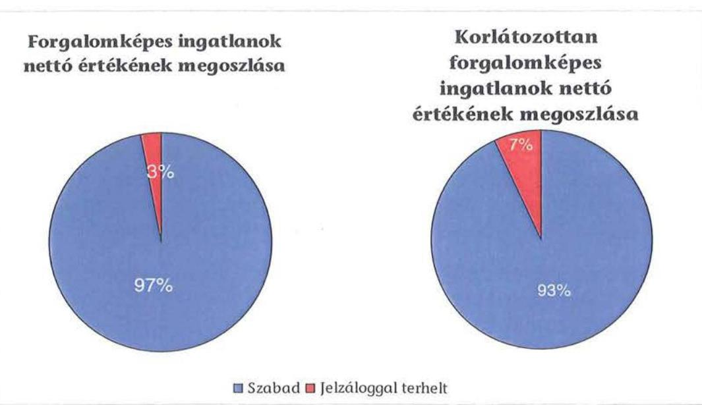

---

Az Önkormányzat kötelezettségeinek állományát 2010. december 31-én és várható alakulását a kötelezettségek lejáratáig a következő táblázat részletezi: ${ }^{68}$

Az Önkormányzat kötelezettségeinek állománya 2010. december 31-én és várható alakulása a kötelezettségek lejáratáig

| Megnevezés | Állomány 2010. dec. 31-én |  |  | Várható kötelezettség 2011-2013. években |  |  | Várható kötelezettség 2014. évet követően |  |  |
| :--: | :--: | :--: | :--: | :--: | :--: | :--: | :--: | :--: | :--: |
|  | HUF-ban <br> (millió Ft-ban) | Devizában (összege, ezen) ...-ben) | $\begin{gathered} \text { Devi- } \\ \text { za- } \\ \text { nem } \end{gathered}$ | HUF-ban (millió Ft-ban) | Devizában (összege, ezen) ...-ben) | $\begin{gathered} \text { Devi- } \\ \text { za- } \\ \text { nem } \end{gathered}$ | HUF-ban (millió Ft-ban) | Devizában (összege, ezen) ...-ben) | $\begin{gathered} \text { Devi- } \\ \text { za- } \\ \text { nem } \end{gathered}$ |
| Pénzintézeti kötelezettségek |  |  |  |  |  |  |  |  |  |
| Hosszú lejáratú hitelek | 3624 |  |  | 1429 |  |  | 3112 |  |  |
| Hosszú lejáratú hitelek |  | 8030 | CHF |  | 5525 | CHF |  | 3354 | CHF |
| Kötvény (Kerskemét fejlesztéséért) |  | 48413 | CHF |  | 4704 | CHF |  | 49550 | CHF |
| Folyószámlahitel | 294 |  | HUF | 294 |  | HUF |  |  | HUF |
| Pénzintézeti kötelezettségek összesen HUF-ban | 3918 |  | HUF | 1723 |  | HUF | 3112 |  | HUF |
| Pénzintézeti kötelezettségek összesen CHF-ben |  | 56443 | CHF |  | 10229 | CHF |  | 52904 | CHF |
| Biztosítékok |  |  |  |  |  |  |  |  |  |
| Kezesség | 12225 |  | HUF |  |  |  |  |  |  |
| Biztosítékok összesen | 12225 |  | HUF |  |  |  |  |
 |  |
| Lízing kötelezettségek | 6 |  | HUF | 6 |  | HUF | 1 |  | HUF |
| Szállítói tartozás | 1078 |  | HUF | 1078 |  | HUF |  |  |  |
| Egyéb kiadás elmaradás | 5 |  | HUF | - |  | HUF |  |  |  |
| Egyéb kötelezettségek | 33 |  | HUF | 33 |  | HUF |  |  |  |
| Legerős végzéssel lezárt de ki nem fizetett kötelezettségek* | - |  | HUF | - |  | HUF |  |  |  |

Az Önkormányzat pénzintézeti kötelezettségeinek állománya 2010. december 31-én 3918 millió Ft-ból és 56443 ezer CHF-ből tevődött össze. A 2011-2013-ban esedékes tőketörlesztési kötelezettségek várható összege 1723 millió Ft és 10229 ezer CHF. A 2013. után várható kötelezettség összegét 3112 millió Ft és 3354 ezer CHF hosszú lejáratú hitel, valamint 49550 ezer CHF kötvénytartozás alkotja. Gépjárművek lízingdíjaként az Önkormányzatnak 6, illetve 1 millió Ft kötelezettsége van az elkövetkezendő 2011-2013. illetve az azt követő időszakban. A kezességvállalás miatti kötelezettsége a 2010. év végére 12225,1 millió Ft-ra volt, amelynek $90,2 \%$-a lízing konstrukcióban megvalósuló élményfürdő és versenyuszoda építéséhez kapcsolódott. Ez utóbbi fedezetét a 2011. évben az éves költségvetésében megtervezték. .Az Önkormányzatnak a fenti kötelezettségein belül egy rövid lejáratú kölcsönfelvételből adódó kötelezettsége állt fenn 2010. december 31-én, a 2010. május 7-én a Bau-Trans Kft-vel, mint kölcsönadóval kötött 32,8 millió Ft kamatmentes kölcsönszerződésből eredően. A kölcsön visszafizetésének a határidejét nem határozták meg. A várható összes kötelezettség teljesítésére figyelembe vehető 727,5 millió Ft mérlegben kimutatott követelésállomány, a kötvénykibocsátásként óvadékként lekötött összeg, illetve az Önkormányzat a fennmaradó kötelezettségek finanszírozását a saját bevételéből tervezi megoldani.

Az Önkormányzat minősített többségi befolyása alatt álló gazdasági társaságok által szolgáltatott adatok alapján hosszú lejáratú kötelezettségeik állomá-

[^0]
[^0]:    ${ }^{68}$ Az egyéb likvid hiteleknél a 2011-2013. években várható kötelezettségként a 2011. április 01-től 2012. március 1-ig rendelkezésre álló áthidaló hitelkeret ( 906727 E Ft +kamat $6,62 \%$ ) miatti kötelezettség jelent meg.

---

nyát 2010. december 31-én és várható alakulását a kötelezettségek lejáratáig a következő táblázat mutatja be:

Az Önkormányzat minősített többségi tulajdonú társaságai kötelezettségének állománya 2010. december 31-én és várható alakulása a kötelezettségek lejáratáig

| Megnevezés | Állomány 2010. dec.31-én |  |  | Várható kötelezettség 2011-2013. években |  |  | Várható kötelezettség 2014. évet követően |  |  |
| :--: | :--: | :--: | :--: | :--: | :--: | :--: | :--: | :--: | :--: |
|  | $\begin{gathered} \text { HUF-ban } \\ \text { (millió Ft- } \\ \text { ban) } \end{gathered}$ | Devizában (összeg, ezer) | Deviz-nem | HUF-ben (millió Ftban) | Devizában (összeg, ezer) | Deviz-nem | HUF-ben (millió Ftban) | $\begin{gathered} \text { Devizában } \\ \text { (összeg, ezer) } \end{gathered}$ | Deviz-nem |
| Pénzintézti kötelezettségek |  |  |  |  |  |  |  |  |  |
| Hoznati lejáratti hittefiek | 2 |  | HUF | 4 |  | HUF | 0 | 0 | HUF |
| Hoznati lejáratti hittefiek |  | 219 | EUR |  | 57 | EUR |  | 162 | EUR |
| Kötvény/ok | 0 | 0 |  | 0 | 0 |  | 0 | 0 |  |
| Pénzintézeti kötelezettségek összesen: | 2 |  | HUF | 4 |  | HUF | 0 |  | HUF |
| Pénzintézeti kötelezettségek összesen: |  | 219 | EUR |  | 57 | EUR |  | 162 | EUR |
| Lízing kötelezettség/ok | 10 |  | HUF | 3 |  | HUF | 2 |  | HUF |
| Lízing kötelezettség/ok |  | 40897 | EUR |  | 3443 | EUR |  | 37482 | EUR |
| Lízing kötelezettség/ok |  | 17 | CHF |  | 116 | CHF |  |  |  |
| Szállítói tartozás | 89 |  | HUF | 89 |  | HUF | 0 |  | HUF |
| Jogosító végzéssel lezárt de ki nem fizetett kötelezettségek |  |  | HUF | - |  | HUF |  |  |  |

Az Önkormányzat minősített többségi befolyása alatt álló társaságok várható pénzintézeti kötelezettségei a 2011-2013. években 4 millió Ft, 57 ezer EUR, a 2014. évet követően pedig 162 ezer EUR. A lízingdíjból 2010. december 31-én fennálló - a 2011-2013. években esedékes - tőketartozás és a kamatfizetési kötelezettség 9,9 millió Ft, 40896 , 8 ezer EUR és 17,0 ezer CHF.

Az Önkormányzat a Gt. 54. § (2) bekezdése alapján az olyan minősített többségi befolyása alatt álló gazdasági társaságai esetében, amelyekben az 52. § (2) bekezdése alapján a szavazatok legalább 75\%-ával rendelkezik, korlátlan felelősséggel tartozik felszámolás esetén a Csődtv. 63. § (2) bekezdése alapján, továbbá az egyszemélyes gazdasági társaságának minden olyan kötelezettségéért, amelynek kielégítését a felszámolási eljárás során az adós társaság vagyona nem fedez, ha a hitelezőinek a felszámolási eljárás során benyújtott keresete alapján a bíróság - az adós társaság felé érvényesített tartósan hátrányos üzletpolitikájára figyelemmel - megállapítja az önkormányzat korlátlan és teljes felelősségét. Az Önkormányzat számára pénzügyi kockázatot jelent, ha felszámolás esetén a bíróság megállapítja az Önkormányzat korlátlan és teljes felelősségét a 2010. december 31-én 40 millió eurót meghaladó lízingből származó kötelezettségekkel érintett egy minősített többségi befolyása alatt álló gazdasági társaság esetében.

Az Önkormányzat a 2007-2010. években a tárgyi eszközök után együttesen 4929,9 millió Ft értékcsökkenést számolt el, amellyel szemben a 2007. évben összesen 2252,2 millió Ft-ot fordítottak felújításra.

Az Önkormányzat eszközállományának bruttó értéke 15,1\%-kal, 98 109,4 millió Ft-ra, nettó értéke 12\%-kal, 85 453,6 millió Ft-ra emelkedett 2007-ről 2010-re. Az önkormányzati szintű használhatósági fok mutató négy év alatt három százalékponttal, $90 \%$-ról $87 \%$-ra csökkent az egyes eszközcsoportoknál különböző mértékkel elszámolt amortizáció elsődleges hatására. Ezt nem ellensúlyozta az ingatlanok, vagyoni értékű jogok, gépek, berendezések, felszerelések, járművek, átadott eszközök 2007-ről 2010-re folyamatosan növekvő bruttó értéke

---

sem. A használhatósági fok az immateriális javaknál romlott a legnagyobb arányban, 49\%-ról 14\%-ra. Az Önkormányzat 2007-2010. években befejezett beruházásaiból eszközpótlásra 257,2 millió Ft-ot, az összes ráfordítás 1,6\%-át fordította. A 2010. év végén folyamatban lévő fejlesztési feladatok, valamint a fejlesztési feladatokhoz kapcsolódó 2010. évet követő kötelezettségvállalások nem az eszközpótlást céloztak.

Az immateriális javaknál „a használhatósági fok nagyobb arányú romlásának oka egy korábbi beszerzés pályázati feltételeiben keresendő. E pályázat nyomán 2006.évben 369 millió Ft értékben szereztek be számítástechnikai eszközöket és szoftvereket, ám az önkormányzat részére kötelezően előírt fenntartási időszak végéig újabb eszköz,- illetve szoftverbeszerzésre kizárólag a »fenntartott« eszközök pótlása tekintetében kerülhetett sor." ${ }^{69}$

Az Önkormányzat és intézményei jelenleg felperesként 9 folyamatban lévő peres eljárásban, alperesként 11 peres eljárásban érintettek, amelyek perértéke 76,7 illetve 92,1 millió Ft. A befejezett peres eljárások alapján egy eljárásban felperesként volt érintett, három peres eljárásban alperesi pozícióban voltak, amelyek perbeli értéke 0,3 millió Ft, illetve 121,4 millió Ft volt. A peres eljárásokból adódó ki nem fizetett kötelezettsége 4,9 millió Ft volt 2010. december 31-én az Önkormányzatnak.

A gazdasági társaságok jelenleg felperesként 24 folyamatban lévő peres eljárásban, alperesként 6 peres eljárásban érintettek, amelyek perértéke 12,8 , illetve 30,8 millió Ft. A befejezett peres eljárások alapján 16 eljárásban felperesként, egy peres eljárásban alperesként voltak érintettek, amelyek perbeli értéke 0,02 millió Ft, illetve 2,0 millió Ft volt.

# 4. A PÉNZÜGYI EGYENSÚLY MEGTEREMTÉSE ÉRDEKÉBEN HOZOTT INTÉZKEDÉSEK 

A kiadáscsökkentő és bevételnövelő intézkedések megtétele a gazdálkodás átláthatóbbá tételét, valamint a feladatellátás szakmai színvonalának, kiemelten a pénzügyi helyzetnek a javítását célozták. A kiadáscsökkentő intézkedések a Közgyűlést, az intézményeket és a Polgármesteri hivatalt érintették, és minden esetben a Közgyűlés döntésein alapultak. A legjelentősebb mértékű kiadási megtakarítást a kimutatások szerint a létszámcsökkentési döntésekkel, a kapcsolódó intézményfinanszírozás folyamatos racionalizálásával, valamint a többletjuttatások csökkentésével érték el.

A 2007-2010. évek kiadáscsökkentő intézkedéseinek hatását beavatkozási területenként a következők részletezik:

[^0]
[^0]:    ${ }^{69}$ A Polgármester úr által adott kiegészítő információk szerint.

---

| Az érvényesített <br> kiadáscsökkentés területei | Személyi <br> juttatások és <br> járulékai | Dologi, <br> működési <br> kiadások | Pénzeszköz- <br> átadások, <br> támogatások | Összesen |
| :-- | --: | --: | --: | --: |
| Az intézményeknél | -2235596 | -729023 | 247913 | -2716706 |
| A Közgyűlés működése | -5084 | 0 | 0 | -5084 |
| A Polgármesteri hivatalnál | -341141 | 0 | -87559 | -428700 |
| ÖSSZESEN | -2581821 | -729023 | 160354 | -3150490 |

Az Önkormányzat által fenntartott intézmények körében végrehajtott átszervezések jelentős megtakarítást eredményeztek ${ }^{70}$. A 2007-2010. években az intézményi átszervezések, a feladat-változások, valamint a takarékossági intézkedések hatásaként együttesen 3150,5 millió Ft kiadás megtakarítás jelentkezett. ${ }^{71}$

A Közgyűlés működésének kiadásait érintően a személyi juttatások és járulékainál a megtakarítás 5 millió Ft -ot tett ki a tiszteletdíjak csökkentése miatt.

A Polgármesteri hivatalban az álláshely megszüntetések hatásaként a személyi juttatások és járulékaiknál 341,1 millió Ft, az egységes vállalatirányítási rendszer kialakításával és a gyermekvédelmi szakellátással kapcsolatban a pénzeszközátadásoknál 87,5 millió Ft volt kimutatott megtakarítás.

Az intézményi feladatok racionalizálásáról a Közgyűlés döntött. Az ezekhez készített előterjesztésekben a tervezett intézkedések indokait bemutatták.

Az Önkormányzatnál a 2007-2010. évek között a 2006. december 31-én meglévő intézményeinél a költségtakarékos és méretgazdaságos feladatellátás megteremtése érdekében végrehajtott átszervezés során a Közgyűlés az összes intézményei számát 78 -ról 41 -re ( $47 \%$-kal) csökkentette. Jelentősen, $72 \%$-kal csökkent a közoktatási intézmények száma (50-ről 14)-re, ezen belül az általános iskolák száma 21-ről 6-ra, a középiskolák száma 12-ről 6-ra, a szociális intézmények száma 4-ről 2-re csökkent az összevonások kapcsán.

Az Önkormányzat a 2006. évtől megkezdte és a 2007-2010. években folytatta
 az intézményi struktúra, feladatellátás átszervezését, a Közgyűlés és a Polgármesteri hivatal költségtakarékossági intézkedésének megvalósítását.

[^0]
[^0]:    ${ }^{70}$ Az ellenőrzés a megtakarítási intézkedések hatásaként az adott évi költségvetési teljesítési adatokat vette figyelembe, és figyelmen kívül hagyta az infláció által okozott kiadás növekedéseket.
    ${ }^{71}$ Az Önkormányzat a 2011. évre kiadáscsökkenést tervez, amely a képviselők és a bizottsági tagok tiszteletdíja tekintetében mintegy 41,4 millió Ft-ot jelent. Az egységes vállalatirányítási rendszer alkalmazása a gazdasági társaságok tekintetében 2011. évre (teljes év) 41,1 millió Ft megtakarítást jelent. A civil szervezetek támogatását 2011. évre vonatkozóan a Közgyűlés 7/2011. (II. 9.) számú határozatával 21,7 millió Ft-tal csökkentette.

---

Az önkormányzati szinten kimutatott megtakarítási intézkedésekből 2716,7 millió Ft-ot, a megtakarítási intézkedések 86,2 %-át az intézmények körében érvényesítettek. Az intézményi megtakarításokból 729 millió Ft a dologi kiadások, 2235,6 millió Ft a személyi juttatások és járulékai csökkenéséből és a pénzeszközátadások 247,9 millió Ft növekedéséből származott.

A 752/2006. (XI. 30.) számú határozatának megfelelően a Közgyűlés döntött a Polgármesteri hivatal szervezeti felépítésének módosításáról, a létszámcsökkentési és takarékossági intézkedések bevezetéséről, amelynek eredményeképpen két lépcsőben a hivatkozott számú határozatban foglaltak alapján 27 fős, a 7/2007. (II.19.) számú rendeletben további 60 fős létszámleépítésre került sor.

A hatékonyabb feladatellátás érdekében két szociális otthon (Margaréta, Platán) 2007. június 30-ával jogutód nélkül megszűnt. A Közgyűlés döntése értelmében a Társulásnak átadták a Lestár Péter Egységes Középiskola, Szakiskola és Óvodát és a II. Rákóczi Ferenc Általános Iskolát. 2007. július 1-jei hatállyal jogutódlással megszüntette általános iskoláit, óvodáit, alapfokú művészeti oktatási intézményeit és öt új intézményt alapított, melynek intézményegységei lettek. A Nevelési Tanácsadó teljes szakmai önállóságát megtartva részben önállóan gazdálkodó, részjogkörű költségvetési szervként működik, melynek pénzügyi-gazdasági feladatait 2007. július 1-jétől a Belvárosi Óvoda és Általános Iskola, valamint a Széchenyivárosi Óvoda és Általános Iskolához tartozó Nyíri úti Egységes Módszertani Intézmény látja el.

A Közgyűlés a 63/2008. (II.28.) számú határozatában döntött a szakképző intézmények átszervezéséről, ennek kapcsán több intézmény 2008. július 1-jével megszűnt.

A Közgyűlés 40/2007. (X. 29.) számú rendeletében megalkotta a helyben központosított közbeszerzések szabályait, amely szerint a Polgármesteri hivatal látja el a helyben központosított közbeszerzési rendszer működtetésével kapcsolatos feladatokat és folytatja le a helyben központosított közbeszerzési rendszer keretén belül megvalósítandó közbeszerzéseket intézményei és az Önkormányzat többségi tulajdonában álló gazdálkodó szervezetek számára, akik megállapodás alapján önként csatlakoznak. Ennek alapján megtörtént a közétkeztetés átszervezése 2009. július 1-vel, majd a takarítás, az őrzés-védelem és a karbantartás átszervezése 2009. szeptember 1-jei időponttal. Ezen intézkedések megtörténte 376 fő létszámcsökkentést és 145 millió Ft megtakarítást eredményezett 2009. évben.

A Közgyűlés 63/2008. (II. 28.) számú határozatával a szakképző intézmények átszervezése kapcsán, két közös igazgatású, önállóan gazdálkodó közoktatási intézményt hozott létre, a többi intézmény intézményegység lett. A humán szolgáltatások területén a Kada Elek Közgazdasági Szakközépiskola, a Széchenyi István Idegenforgalmi, Vendéglátóipari Szakképző Iskola és Kollégium, valamint a Szent-Györgyi Albert Egészségügyi és Szociális Szakképző Iskola és Kollégium, a Kocsis Pál Mezőgazdasági és Környezetvédelmi Szakközépiskola, Szakiskola, a Németh László Általános Iskola és Gimnázium összevonásával. A műszaki szolgáltatások területén a Gáspár András Szakközépiskola, Szakiskola és Kollégium, a Kandó Kálmán Szakközépiskola és Szakiskola, a Speciális Szakiskola összevonásával. Új típusú TISZK modellként Szakképzés Szervezési Társaságot hozott létre.

A Közgyűlés a vizsgált időszakban a végleges feladatátadással és a gazdasági társaságok átszervezésével, valamint az összevonható, költségmegtakarítást eredményező tevékenységekkel kapcsolatban az alábbi intézkedéseket hozta:

---

A Közgyűlés 2007. augusztus 31. napjával a Munkácsy Utcai Tagóvoda fenntartói jogát átadta a Kecskeméti Református Egyházközségnek.

A Közgyűlés 374/2009. (X. 29.) számú határozatával az Erdei Ferenc Kulturális és Konferencia Központot, és a 375/2009. (X. 29.) számú határozatával a Kecskeméti Televíziót, mint költségvetési szerveket megszüntette és nonprofit korlátolt felelősségű társasági formában működtette tovább.

A Közgyűlés 243/2009 (VI. 25.) számú határozatában rendelkezett az egységes vállalatirányítási rendszer kialakításáról a minősített többségi és többségi befolyása alatt álló gazdasági társaságoknál 2010. január 1-től.

A gyermekvédelmi szakellátás biztosítása érdekében a Bács-Kiskun Megyei Önkormányzattal kötött megállapodást takarékossági intézkedések miatt felbontották és a feladatellátásra az SOS Gyermekfalu Magyarországi Alapítványával kötöttek megállapodást.

A helyben központosított közbeszerzési eljárás lefolytatásának eredményeként az árubeszerzésekkel, a gépjárműpark szervizeléssel, a karbantartással, a biztosítási szolgáltatásokkal, az étkezési utalványok és munkaruházat beszerzéssel kapcsolatban a keretmegállapodás megtörtént. A közétkeztetés tekintetében 2009-2010. évben 341,8 millió Ft megtakarítást mutattak ki, ugyanakkor a karbantartás, az őrzésvédelem, a takarítás kiszervezése megtakarítást nem eredményezett. A távközlési szolgáltatások tekintetében 106,8 millió Ft-ot csökkenést mutattak ki 2010. év végéig. Az irodaszerekre, a földgáz és villamos energiára vonatkozó közbeszerzési eljárások az ellenőrzés ideje alatt folynak.

A közétkeztetés tekintetében „a helyben központosított közbeszerzési eljárás lefolytatását megelőzően tíz különböző vállalkozás látta el a szolgáltatást az önkormányzat területén. A saját üzemeltetésű konyhák esetében pedig a főzőkonyhai kapacitások elaprózódtak a rendszeren belül, a szolgáltatás ellátása magasabb élőmunka és energia igénnyel járt. A pályázat igen szigorú alkalmassági és dietetikai követelményrendszert írt elő, és ráadásul a nyerteseknek részenként a szolgáltatók által bérbevett főző- és tálalókonyhákban 300 millió forintos építészeti, épületgépészeti és konyhatechnológiai fejlesztési és beruházási kötelezettséget is vállalnia kellett. A karbantartás, az őrzés védelem, takarítás területén ugyanakkor eredményként könyvelhető el, hogy a korábban kapcsolt munkakörben foglalkoztatott, alkalmazásban maradó mintegy 40 munkatárs kizárólag szakmai munkájára koncentrálva járul hozzá az intézmények magas szakmai színvonalú feladatellátásához. A nyertes ajánlattevők megteremtették az alapvető technikai feltételeket, és végrehajtották az induláshoz szükséges beruházásokat. Ezen szegmensben 150 millió forintos fejlesztés valósult meg rövid idő alatt." ${ }^{72}$

Az álláshely csökkentő intézkedések következtében 2007-2010 között a Polgármesteri hivatalnál és az intézményeknél a 2007-2010. évek költségvetési rendeletek módosított létszám előirányzatai alapján összesen 859 álláshelyet szüntettek meg, amelynek 32,0\%-a ( 275 fő) ágazati szakmai, 68,0\%-a ( 584 fő) intézményüzemeltetéshez, fenntartáshoz, gazdasági ügyek intézéséhez kapcsolódó álláshely volt. A 2007. évben 363 fő álláshely megszüntetésére három közoktatási intézmény (egy szakközépiskola, egy általános iskola, egy óvoda) a Kistérségi társulásnak és az egyháznak történő átadása, illetve a szociális foglalkoztató megszüntetése miatt, valamint a 2007. július 31-ei intézmény át-

[^0]
[^0]:    ${ }^{72}$ A Polgármester úr által adott kiegészítő információk szerint.

---

szervezések miatt került sor, amely a közoktatási ágazatban 257, szociális és gyermekjóléti ágazatban 36, a polgármesteri hivatalban 60, az egyéb ágazatban 10 álláshely megszűnését jelentett. A 2009. évben 417 álláshelyet szüntettek meg a takarítás, az őrzésvédelem és intézményi étkeztetés kiszervezése miatt, amely a közoktatási ágazatban 245, a szociális és gyermekjóléti ágazatban 102, egyéb ágazatokban 70 álláshely megszüntetését jelentette. A 2010. évben két intézményt szüntettek meg (Kecskeméti Televízió és Kecskeméti Kulturális és Konferencia Központ) és helyettük gazdasági társaságot alapítottak, az intézményi szervezet átalakítása kapcsán az egyéb ágazatban 60 álláshelyet szüntettek meg.

Az átszervezést megelőző időszakban „az önkormányzati fenntartású intézmények többségében jelentős létszámban került sor nyugdíjas közalkalmazottak foglalkoztatására, így az átszervezés során az álláshelyek megszüntetésekor elsősorban a nyugdíjas foglalkoztatottak felmentését preferálta az önkormányzat, ezzel jelentősen csökkent az aktív dolgozók leépítésének szükségszerűsége. A vizsgált időszakban végrehajtott 859 álláshely megszüntetésből 130 fő volt a ténylegesen nyugdíjba vonulók száma, mintegy 22 fő a prémium évek program keretein belül került regisztrálásra. Összességében megállapítható, hogy a 859 álláshely megszüntetésből 539,6 álláshely a kiszervezés és feladat átadások következménye, a 297 véglegesen megszüntetett álláshelyek 52 %-a a nyugdíjas foglalkoztatottak felmentését jelentette."73

A 2007-2010. években végrehajtott létszámcsökkenés számszerűsített eredményét a következő tábla szemlélteti:

Az Önkormányzat 2007-2010.éveket érintő létszámcsökkentésének alakulása

| Megnevezés (adatok fő-ben) |  | Közoktatás | Szociális és gyermekvédelem | Egészségügy | Polgármesteri hivatal | Egyéb | Összesen |
| :--: | :--: | :--: | :--: | :--: | :--: | :--: | :--: |
| Megszüntetett álláshelyek száma |  | 506 | 143 | 0 | 70 | 140 | 859 |
| ebből: | üres álláshelyek száma | 0 | 0 | 0 | 0 | 0 | 0 |
|  | szakmai álláshelyek száma | 146 | 23 | 0 | 59 | 47 | 271 |
|  | intézmény-üzemeltetéssel kapcsolatos álláshelyek száma | 360 | 120 | 0 | 11 | 93 | 584 |
| 2007. január 1-jén indító létszám |  | 2368 | 807 | 0 | 410 | 431 | 4017 |
| 2010. december 31-én záró létszám |  | 1890 | 681 | 0 | 367 | 342 | 3281 |

Az Önkormányzat a vizsgált időszakban üres álláshelyet nem szüntetett meg, így az nem befolyásolta az intézményekben foglalkoztatottak számát.

A helyi szervezési intézkedések végrehajtása keretében 294 álláshely tartós leépítéséhez az Önkormányzat az áttekintett időszak alatt 331 millió Ft központi költségvetési támogatásban részesült. A létszámcsökkenés 76%-ához (565 fő) központi támogatás nem kapcsolódott.

A bevételek növelésére tett intézkedésekből a 2007-2010. években az Önkormányzat számításai szerint a szabad kapacitások hasznosítása miatt 108,6 millió Ft származott, amelyek között szerepelt az újabb ingatlanok és eszközök bérbeadása 91,3 millió Ft értékben, valamint a Katona József Színház „tájelőadásaiból" várható 17,3 millió Ft bevétel. Az üzlethelyiségek, irodaházak,

[^0]
[^0]:    ${ }^{73}$ A Polgármester úr által adott kiegészítő információk szerint.

---

közterületek, pavilonok és csatornahálózat bérbeadása a Közgyűlés hatáskörébe tartozott, a hasznosításról minden esetben határozatban döntöttek. ${ }^{74}$ Egyéb bevételnövelő intézkedéseket nem hoztak, és a Polgármesteri hivatal döntése alapján nem foganatosítottak bevételnövelő intézkedéseket.

Az állami támogatások és az átengedett bevételek a 2007-2010. években összességében 224,4 millió Ft-tal, az illetékbevételek további 470,8 millió Ft-tal csökkentek, így a kiadáscsökkentő és bevételnövelő intézkedések csak részben tudták az állami támogatások hatását ellensúlyozni, illetve az Önkormányzat pénzügyi helyzetét javítani.

Az Önkormányzat az átszervezések, a takarékossági intézkedések szakmai feladatellátásra gyakorolt hatását nem vizsgálta.

# 5. A HELYI ÖNKORMÁNYZATOK GAZDÁLKODÁSI RENDSZERÉNEK 2010. ÉVI ELLENŐRZÉSE SORÁN A PÉNZÜGYI EGYENSÚLY JAVÍTÁSÁRA TETT SZABÁLYSZERŰSÉGI ÉS CÉLSZERŰSÉGI JAVASLATOK HASZNOSULÁSA

Az ÁSZ az Önkormányzat gazdálkodási rendszerét a 2007. évben ellenőrizte átfogó jelleggel. A gazdálkodási rendszer korábbi ellenőrzése során tett javaslatok közül a pénzügyi egyensúly javítására nem vonatkozott javaslat.

Budapest, 2011. december „21.”

Melléklet: 9 db
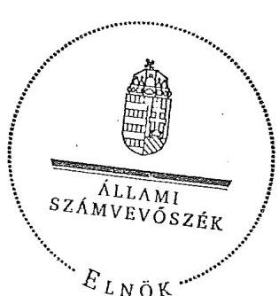

Domokos László

[^0]
[^0]:    ${ }^{74}$ A 2011. évre vonatkozóan a bevételi források nem változtak az előző évekhez képest.

---

Kecskemét Megyei Jogú Város Önkormányzata

1.  számú melléklet a V-3040/2011. számú jelentéshez

Működési és felhalmozási célú hiány/többlet az önkormányzat rendeleteiben

|   |  |  |  |  |  |  | millió Ft  |
| --- | --- | --- | --- | --- | --- | --- | --- |
| ```
4 384 | 885 | 2 739 | 14 713 | 5 093 | 3 661 | 2 848 | 7 372  |
|   | 5 507 |  |  |  | 4 490 | 4 695 |   |
|  23 881 | 21 873 | 27 127 | 23 781 | 27 861 | 25 803 | 24 067 | 24 238  |
|  |   |   |   |   |   |   |   |
|  bevétel | kiadás | bevétel | kiadás | bevétel | kiadás | bevétel | kiadás  |
|   | 2007 |  | 2008 |  | 2009 |  | 2010  |
|   | ☐ működési bevételek és kiadások ☐ felhalmozási bevételek és kiadások ☐ hiány/többlet |  |  |  |  |  |   |

---

|   |  |  |  |  |  |  |  |  |  |  |  |  |  |  |  |  |  |  |  |  |  |  |  |  |   |
| --- | --- | --- | --- | --- | --- | --- | --- | --- | --- | --- | --- | --- | --- | --- | --- | --- | --- | --- | --- | --- | --- | --- | --- | --- | --- | --- |
|  1. FOLYÓ KÖLTSÉGVETÉS* |  |  |  |  |  |  |  |  |  |  |  |  |  |  |  |  |  |  |  |  |  |  |  |  |   |
|  1.1.1. Saját működési bevételek |  |  |  |  |  |  |  |  |  |  |  |  |  |  |  |  |  |  |  |  |  |  |  |  |   |
|  1.1.3. Költségvetési támogatás |  |  |  |  |  |  |  |  |  |  |  |  |  |  |  |  |  |  |  |  |  |  |  |  |  |   |
|  1.1.5. Képszakadási bevételek |  |  |  |  |  |  |  |  |  |  |  |  |  |  |  |  |  |  |  |  |  |  |  |  |  |   |
|  1.1.6. Állambázatáron belülről kapott támogatások |  |  |  |  |  |  |  |  |  |  |  |  |  |  |  |  |  |  |  |  |  |  |  |  |  |   |
|  1.1.7. Előző és külföldről kapott bevételek |  |  |  |  |  |  |  |  |  |  |  |  |  |  |  |  |  |  |  |  |  |  |  |  |  |   |
|  1.1.8. Állambázatáron kívülről kapott bevételek |  |  |  |  |  |  |  |  |  |  |  |  |  |  |  |  |  |  |  |  |  |  |  |  |  |   |
|  1.1.9. Előző és díjfölcérő kapott bevételek |  |  |  |  |  |  |  |  |  |  |  |  |  |  |  |  |  |  |  |  |  |  |  |  |  |   |
|  1.1.10. Állambázatáron kívülről kapott bevételek |  |  |  |  |  |  |  |  |  |  |  |  |  |  |  |  |  |  |  |  |  |  |  |  |  |   |
|  1.1.11. Előző és pénzmaradvány átvétel |  |  |  |  |  |  |  |  |  |  |  |  |  |  |  |  |  |  |  |  |  |  |  |  |  |   |
|  1.1.12. Folyó bevételek =1.1.1.+1.1.2.+1.1.3.+1.1.4.+1.1.5.+1.1.6.+1.1.7. |  |  |  |  |  |  |  |  |  |  |  |  |  |  |  |  |  |  |  |  |  |  |  |  |  |  |   |
|  1.1.13. Folyó bevételek =1.1.1.+1.1.2.+1.1.3.+1.1.4.+1.1.5.+1.1.6.+1.1.7. |  |  |  |  |  |  |  |  |  |  |  |  |  |  |  |  |  |  |  |  |  |  |  |  |  |  |   |
|  1.1.14. Állambázatáron belülről kapott pénzszabások |  |  |  |  |  |  |  |  |  |  |  |  |  |  |  |  |  |  |  |  |  |  |  |  |  |   |
|  1.1.15. Állambázatáron belülre átadott pénzszabások |  |  |  |  |  |  |  |  |  |  |  |  |  |  |  |  |  |  |  |  |  |  |  |  |  |   |
|  1.1.16. Állambázatáron belülre átadott pénzszabások |  |  |  |  |  |  |  |  |  |  |  |  |  |  |  |  |  |  |  |  |  |  |  |  |  |   |
|  1.1.17. Előző ési pénzmaradvány átvétel |  |  |  |  |  |  |  |  |  |  |  |  |  |  |  |  |  |  |  |  |  |  |  |  |  |   |
|  1.1.18. Folyó bevételek =1.1.1.+1.1.2.+1.1.3.+1.1.4.+1.1.5.+1.1.6.+1.1.7. |  |  |  |  |  |  |  |  |  |  |  |  |  |  |  |  |  |  |  |  |  |  |  |  |  |  |   |
|  1.1.19. Folyó bevételek =1.1.1.+1.1.2.+1.1.3.+1.1.4.+1.1.5.+1.1.6.+1.1.7. |  |  |  |  |  |  |  |  |  |  |  |  |  |  |  |  |  |  |  |  |  |  |  |  |  |  |   |
|  1.1.20. Állambázatáron belülre átadott pénzszabások |  |  |  |  |  |  |  |  |  |  |  |  |  |  |  |  |  |  |  |  |  |  |  |  |  |   |
|  1.1.21. Állambázatáron belülre átadott pénzszabások |  |  |  |  |  |  |  |  |  |  |  |  |  |  |  |  |  |  |  |  |  |  |  |  |  |   |
|  1.1.22. Állambázatáron belülre átadott pénzszabások |  |  |  |  |  |  |  |  |  |  |  |  |  |  |  |  |  |  |  |  |  |  |  |  |  |   |
|  1.1.23. Állambázatáron belülre átadott pénzszabások |  |  |  |  |  |  |  |  |  |  |  |  |  |  |  |  |  |  |  |  |  |  |  |  |  |   |
|  1.1.24. Állambázatáron belülre átadott pénzszabások |  |  |  |  |  | 
``` |  |  |  |  |  |  |  |  |  |  |  |  |  |  |  |  |  |  |  |   |
|  1.1.25. Állambázatáron belülre átadott pénzszabások |  |  |  |  |  |  |  |  |  |  |  |  |  |  |  |  |  |  |  |  |  |  |  |  |  |   |
|  1.1.26. Állambázatáron belülre átadott pénzszabások |  |  |  |  |  |  |  |  |  |  |  |  |  |  |  |  |  |  |  |  |  |  |  |  |  |   |
|  1.1.27. Állambázatáron belülre átadott pénzszabások |  |  |  |  |  |  |  |  |  |  |  |  |  |  |  |  |  |  |  |  |  |  |  |  |  |   |
|  1.1.28. Állambázatáron belülre átadott pénzszabások |  |  |  |  |  |  |  |  |  |  |  |  |  |  |  |  |  |  |  |  |  |  |  |  |  |   |
|  1.1.29. Állambázatáron belülre átadott pénzszabások |  |  |  |  |  |  |  |  |  |  |  |  |  |  |  |  |  |  |  |  |  |  |  |  |  |   |
|  1.1.30. Állambázatáron belülre átadott pénzszabások |  |  |  |  |  |  |  |  |  |  |  |  |  |  |  |  |  |  |  |  |  |  |  |  |  |   |
|  1.1.31. Állambázatáron belülre átadott pénzszabások |  |  |  |  |  |  |  |  |  |  |  |  |  |  |  |  |  |  |  |  |  |  |  |  |  |   |
|  1.1.32. Állambázatáron belülre átadott pénzszabások |  |  |  |  |  |  |  |  |  |  |  |  |  |  |  |  |  |  |  |  |  |  |  |  |  |   |
|  1.1.33. Állambázatáron belülre átadott pénzszabások |  |  |  |  |  |  |  |  |  |  |  |  |  |  |  |  |  |  |  |  |  |  |  |  |  |   |
|  1.1.34. Állambázatáron belülre átadott pénzszabások |  |  |  |  |  |  |  |  |  |  |  |  |  |  |  |  |  |  |  |  |  |  |  |  |  |   |
|  1.1.35. Állambázatáron belülre átadott pénzszabások |  |  |  |  |  |  |  |  |  |  |  |  |  |  |  |  |  |  |  |  |  |  |  |  |  |   |
|  1.1.36. Állambázatáron belülre átadott pénzszabások |  |  |  |  |  |  |  |  |  |  |  |  |  |  |  |  |  |  |  |  |  |  |  |  |  |   |
|  1.1.37. Állambázatáron belülre átadott pénzszabások |  |  |  |  |  |  |  |  |  |  |  |  |  |  |  |  |  |  |  |  |  |  |  |  |  |   |
|  1.1.38. Állambázatáron belülre átadott pénzszabások |  |  |  |  |  |  |  |  |  |  |  |  |  |  |  |  |  |  |  |  |  |  |  |  |  |   |
|  1.1.39. Állambázatáron belülre átadott pénzszabások |  |  |  |  |  |  |  |  |  |  |  |  |  |  |  |  |  |  |  |  |  |  |  |  |  |   |
|  1.1.40. Állambázatáron belülre átadott pénzszabások |  |  |  |  |  |  |  |  |  |  |  |  |  |  |  |  |  |  |  |  |  |  |  |  |  |   |
|  1.1.41. Állambázatáron belülre átadott pénzszabások |  |  |  |  |  |  |  |  |  |  |  |  |  |  |  |  |  |  |  |  |  |  |  |  |  |   |
|  1.1.42. Állambázatáron belülre átadott pénzszabások |  |  |  |  |  |  |  |  |  |  |  |  |  |  |  |  |  |  |  |  |  |  |  |  |  |   |
|  1.1.43. Állambázatáron belülre átadott pénzszabások |  |  |  |  |  |  |  |  |  |  |  |  |  |  |  |  |  |  |  |  |  |  |  |  |  |   |
|  1.1.44. Állambázatáron belülre átadott pénzszabások |  |  |  |  |  |  |  |  |  |  |  |  |  |  |  |  |  |  |  |  |  |  |  |  |  |   |
|  1.1.45. Állambázatáron belülre átadott pénzszabások |  |  |  |  |  |  |  |  |  |  |  |  |  |  |  |  |  |  |  |  |  |  |  |  |  |   |
|  1.1.46. Állambázatáron belülre átadott pénzszabások |  |  |  |  |  |  |  |  |  |  |  |  |  |  |  |  |  |  |  |  |  |  |  |  |  |   |
|  1.1.47. Állambázatáron belülre átadott pénzszabások |  |  |  |  |  |  |  |  |  |  |  |  |  |  |  |  |  |  |  |  |  |  |  |  |  |   |
|  1.1.48. Állambázatáron belülre átadott pénzszabások |  |  |  |  |  |  |  |  |  |  |  |  |  |  |  |  |  |  |  |  |  |  |  |  |  |   |
|  1.1.49. Állambázatáron belülre átadott pénzszabások |  |  |  |  |  |  |  |  |  |  |  |  |  |  |  |  |  |  |  |  |  |  |  |  |  |   |
|  1.1.50. Állambázatáron belülre átadott pénzszabások |  |  |  |  |  |  |  |  |  |  |  |  |  |  |  |  |  |  |  |  |  |  |  |  |  |  |
|  1.1.51. Állambázatáron belülre átadott pénzszabások |  |  |  |  |  |  |  |  |  |  |  |  |  |  |  |  |  |  |  |  |  |  |  |  |  |   |
|  1.1.52. Állambázatáron belülre átadott pénzszabások |  |  |  |  |  |  |  |  |  |  |  |  |  |  |  |  |  |  |  |  |  |  |  |  |  |   |
|  1.1.53. Állambázatáron belülre átadott pénzszabások |  |  |  |  |  |  |  |  |  |  |  |  |  |  |  |  |  |  |  |  |  |  |  |  |  |   |
|  1.1.54. Állambázatáron belülre átadott pénzszabások |  |  |  |  |  |  |  |  |  |  |  |  |  |  |  |  |  |  |  |  |  |  |  |  |  |   |
|  1.1.55. Állambázatáron belülre átadott pénzszabások |  |  |  |  |  |  |  |  |  |  |  |  |  |  |  |  |  |  |  |  |  |  |  |  |  |   |
|  1.1.56. Állambázatáron belülre átadott pénzszabások |  |  |  |  |  |  |  |  |  |  |  |  |  |  |  |  |  |  |  |  |  |  |  |  |  |   |
|  1.1.57. Állambázatáron belülre átadott pénzszabások |  |  |  |  |  |  |  |  |  |  |  |  |  |  |  |  |  |  |  |  |  |  |  |  |  |   |
|  1.1.58. Állambázatáron belülre átadott pénzszabások |  |  |  |  |  |  |  |  |  |  |  |  |  |  |  |  |  |  |  |  |  |  |  |  |  |   |
|  1.1.59. Állambázatáron belülre átadott pénzszabások |  |  |  |  |  |  |  |  |  |  |  |  |  |  |  |  |  |  |  |  |  |  |  |  |  |   |
|  1.1.60. Állambázatáron belülre átadott pénzszabások |  |  |  |  |  |  |  |  |  |  |  |  |  |  |  |  |  |  |  |  |  |  |  |  |  |   |
|  1.1.61. Állambázatáron belülre átadott pénzszabások |  |  |  |  |  |  |  |  |  |  |  |  |  |  |  |  |  |  |  |  |  |  |  |  |  |   |
|  1.1.62. Állambázatáron belülre átadott pénzszabások |  |  |  |  |  |  |  |  |  |  |  |  |  |  |  |  |  |  |  |  |  |  |  |  |  |   |
|  1.1.63. Állambázatáron belülre átadott pénzszabások |  |  |  |  |  |  |  |  |  |  |  |  |  |  |  |  |  |  |  |  |  |  |  |  |  |   |
|  1.1.64. Állambázatáron belülre átadott pénzszabások |  |  |  |  |  |  |  |  |  |  |  |  |  |  |  |  |  |  |  |  |  |  |  |  |  |   |
|  1.1.65. Állambázatáron belülre átadott pénzszabások |  |  |  |  |  |  |  |  |  |  |  |  |  |  |  |  |  |  |  |  |  |  |  |  |  |   |
|  1.1.66. Állambázatáron belülre átadott pénzszabások |  |  |  |  |  |  |  |  |  |  |  |  |  |  |  |  |  |  |  |  |  |  |  |  |  |   |
|  1.1.67. Állambázatáron belülre átadott pénzszabások |  |  |  |  |  |  |  |  |  |  |  |  |  |  |  |  |  |  |  |  |  |  |  |  |  |   |
|  1.1.68. Állambázatáron belülre átadott pénzszabások |  |  |  |  |  |  |  |  |  |  |  |  |  |  |  |  |  |  |  |  |  |  |  |  |  |   |
|  1.1.69. Állambázatáron belülre átadott pénzszabások |  |  |  |  |  |  |  |  |  |  |  |  |  |  |  |  |  |  |  |  |  |  |  |  |  |   |
|  1.1.70. Állambázatáron belülre átadott pénzszabások |  |  |  |  |  |  |  |  |  |  |  |  |  |  |  |  |  |  |  |  |  |  |  |  |  |   |
|  1.1.71. Állambázatáron belülre átadott pénzszabások |  |  |  |  |  |  |  |  |  |  |  |  |  |  |  |  |  |  |  |  |  |  |  |  |  |   |
|  1.1.72. Állambázatáron belülre átadott pénzszabások |  |  |  |  |  |  |  |  |  |  |  |  |  |  |  |  |  |  |  |  |  |  |  |  |  |   |
|  1.1.73. Állambázatáron belülre átadott pénzszabások |  |  |  |  |  |  |  |  |  |  |  |  |  |  |  |  |  |  |  |  |  |  |  |  |  |   |
|  1.1.74. Állambázatáron belülre átadott pénzszabások |  |  |  |  |  |  |  |  |  |  |  |  |  |  |  |  |  |  |  |  |  |  |  |  |  |   |
|  1.1.75. Állambázatáron belülre átadott pénzszabások |  |  |  |  |  |  |  |  |  |  |  |  |  |  |  |  |  |  |  |  |  |  |  |  |  |   |
|  1.1.76. Állambázatáron belülre átadott pénzszabások |  |  |  |  |  |  |  |  |  |  |  |  |  |  |  |  |  |  |  |  |  |  |  |  |  |   |
|  1.1.77. Állambázatáron belülre átadott pénzszabások |  |  |  |  |  |  |  |  |  |  |  |  |  |  |  |
 |  |  |  |  |  |  |  |  |  |   |
|  1.1.78. Állambázatáron belülre átadott pénzszabások |  |  |  |  |  |  |  |  |  |  |  |  |  |  |  |  |  |  |  |  |  |  |  |  |  |   |
|  1.1.79. Állambázatáron belülre átadott pénzszabások |  |  |  |  |  |  |  |  |  |  |  |  |  |  |  |  |  |  |  |  |  |  |  |  |  |   |
|  1.1.80. Állambázatáron belülre átadott pénzszabások |  |  |  |  |  |  |  |  |  |  |  |  |  |  |  |  |  |  |  |  |  |  |  |  |  |   |
|  1.1.81. Állambázatáron belülre átadott pénzszabások |  |  |  |  |  |  |  |  |  |  |  |  |  |  |  |  |  |  |  |  |  |  |  |  |  |   |
|  1.1.82. Állambázatáron belülre átadott pénzszabások |  |  |  |  |  |  |  |  |  |  |  |  |  |  |  |  |  |  |  |  |  |  |  |  |  |   |
|  1.1.83. Állambázatáron belülre átadott pénzszabások |  |  |  |  |  |  |  |  |  |  |  |  |  |  |  |  |  |  |  |  |  |  |  |  |  |   |
|  1.1.84. Állambázatáron belülre átadott pénzszabások |  |  |  |  |  |  |  |  |  |  |  |  |  |  |  |  |  |  |  |  |  |  |  |  |  |   |
|  1.1.85. Állambázatáron belülre átadott pénzszabások |  |  |  |  |  |  |  |  |  |  |  |  |  |  |  |  |  |  |  |  |  |  |  |  |  |   |
|  1.1.86. Állambázatáron belülre átadott pénzszabások |  |  |  |  |  |  |  |  |  |  |  |  |  |  |  |  |  |  |  |  |  |  |  |  |  |   |
|  1.1.87. Állambázatáron belülre átadott pénzszabások |  |  |  |  |  |  |  |  |  |  |  |  |  |  |  |  |  |  |  |  |  |  |  |  |  |   |
|  1.1.88. Állambázatáron belülre átadott pénzszabások |  |  |  |  |  |  |  |  |  |  |  |  |  |  |  |  |  |  |  |  |  |  |  |  |  |   |
|  1.1.89. Állambázatáron belülre átadott pénzszabások |  |  |  |  |  |  |  |  |  |  |  |  |  |  |  |  |  |  |  |  |  |  |  |  |  |   |
|  1.1.90. Állambázatáron belülre átadott pénzszabások |  |  |  |  |  |  |  |  |  |  |  |  |  |  |  |  |  |  |  |  |  |  |  |  |  |   |
|  1.1.91. Állambázatáron belülre átadott pénzszabások |  |  |  |  |  |  |  |  |  |  |  |  |  |  |  |  |  |  |  |  |  |  |  |  |  |   |
|  1.1.92. Állambázatáron belülre átadott pénzszabások |  |  |  |  |  |  |  |  |  |  |  |  |  |  |  |  |  |  |  |  |  |  |  |  |  |   |
|  1.1.93. Állambázatáron belülre átadott pénzszabások |  |  |  |  |  |  |  |  |  |  |  |  |  |  |  |  |  |  |  |  |  |  |  |  |  |   |
|  1.1.94. Állambázatáron belülre átadott pénzszabások |  |  |  |  |  |  |  |  |  |  |  |  |  |  |  |  |  |  |  |  |  |  |  |  |  |  |   |
|  1.1.95. Állambázatáron belülre átadott pénzszabások |  |  |  |  |  |  |  |  |  |  |  |  |  |  |  |  |  |  |  |  |  |  |  |  |  |  |   |
|  1.1.96. Állambázatáron belülre átadott pénzszabások |  |  |  |  |  |  |  |  |  |  |  |  |  |  |  |  |  |  |  |  |  |  |  |  |  |  |   |
|  1.1.97. Állambázatáron belülre átadott pénzszabások |  |  |  |  |  |  |  |  |  |  |  |  |  |  |  |  |  |  |  |  |  |  |  |  |  |  |   |
|  1.1.98. Állambázatáron belülre átadott pénzszabások |  |  |  |  |  |  |  |  |  |  |  |  |  |  |  |  |  |  |  |  |  |  |  |  |  |  |   |
|  1.1.99. Állambázatáron belülre átadott pénzszabások |  |  |  |  |  |  |  |  |  |  |  |  |  |  |  |  |  |  |  |  |  |  |  |  |  |  |   |
|  1.2.00. Állambázatáron belülre átadott pénzszabások |  |  |  |  |  |  |  |  |  |  |  |  |  |  |  |  |  |  |  |  |  |  |  |  |  |  |   |
|  1.2.01. Állambázatáron belülre átadott pénzszabások |  |  |  |  |  |  |  |  |  |  |  |  |  |  |  |  |  |  |  |  |  |  |  |  |  |  |   |
|  1.2.02. Állambázatáron belülre átadott pénzszabások |  |  |  |  |  |  |  |  |  |  |  |  |  |  |  |  |  |  |  |  |  |  |  |  |  |  |   |
|  1.2.03. Állambázatáron belülre átadott pénzszabások |  |  |  |  |  |  |  |  |  |  |  |  |  |  |  |  |  |  |  |  |  |  |  |  |  |  |
 |   |
|  1.2.04. Állambázatáron belülre átadott pénzszabások |  |  |  |  |  |  |  |  |  |  |  |  |  |  |  |  |  |  |  |  |  |  |  |  |  |  |  |   |
|  1.2.05. Állambázatáron belülre átadott pénzszabások |  |  |  |  |  |  |  |  |  |  |  |  |  |  |  |  |  |  |  |  |  |  |  |  |  |  |  |   |
|  1.2.06. Állambázatáron belülre átadott pénzszabások |  |  |  |  |  |  |  |  |  |  |  |  |  |  |  |  |  |  |  |  |  |  |  |  |  |  |  |   |
|  1.2.07. Állambázatáron belülre átadott pénzszabások |  |  |  |  |  |  |  |  |  |  |  |  |  |  |  |  |  |  |  |  |  |  |  |  |  |  |  |  |   |
|  1.2.08. Állambázatáron belülre átadott pénzszabások |  |  |  |  |  |  |  |  |  |  |  |  |  |  |  |  |  |  |  |  |  |  |  |  |  |  |  |  |   |
|  1.2.09. Állambázatáron belülre átadott pénzszabások |  |  |  |  |  |  |  |  |  |  |  |  |  |  |  |  |  |  |  |  |  |  |  |  |  |  |  |   |
|  1.2.10. Állambázatáron belülre átadott pénzszabások |  |  |  |  |  |  |  |  |  |  |  |  |  |  |  |  |  |  |  |  |  |  |  |  |  |  |  |   |
|  1.2.11. Állambázatáron belülre átadott pénzszabások |  |  |  |  |  |  |  |  |  |  |  |  |  |  |  |  |  |  |  |  |  |  |  |  |  |  |  |   |
|  1.2.12. Állambázatáron belülre átadott pénzszabások |  |  |  |  |  |  |  |  |  |  |  |  |  |  |  |  |  |  |  |  |  |  |  |  |  |  |  |   |
|  1.2.13. Állambázatáron belülre átadott pénzszabások |  |  |  |  |  |  |  |  |  |  |  |  |  |  |  |  |  |  |  |  |  |  |  |  |  |  |  |   |
|  1.2.14. Állambázatáron belülre átadott pénzszabások |  |  |  |  |  |  |  |  |  |  |  |  |  |  |  |  |  |  |  |  |  |  |  |  |  |  |  |   |
|  1.2.15. Állambázatáron belülre átadott pénzszabások |  |  |  |  |  |  |  |  |  |  |  |  |  |  |  |  |  |  |  |  |  |  |  |  |  |  |  |   |
|  1.2.16. Állambázatáron belülre átadott pénzszabások |  |  |  |  |  |  |  |  |  |  |  |  |  |  |  |  |  |  |  |  |  |  |  |  |  |  |  |   |
|  1.2.17. Állambázatáron belülre átadott pénzszabások |  |  |  |  |  |  |  |  |  |  |  |  |  |  |  |  |  |  |  |  |  |  |  |  |  |  |   |
|  1.2.18. Állambázatáron belülre átadott pénzszabások |  |  |  |  |  |  |  |  |  |  |  |  |  |  |  |  |  |  |  |  |  |  |  |  |  |   |
|  1.2.19. Állambázatáron belülre átadott pénzszabások |  |  |  |  |  |  |  |  |  |  |  |  |  |  |  |  |  |  |  |  |  |  |  |  |   |
|  1.2.10. Állambázatáron belülre átadott pénzszabások |  |  |  |  |  |  |  |  |  |  |  |  |  |  |  |  |  |  |  |  |  |  |   |
| 1.2.11. Állambázatáron belülre átadott pénzszabások |  |  |  |  |  |  |  |  |  |  |  |  |  |  |  |  |  |  |  |  |  |  |   |
| 1.2.12. Állambázatáron belülre átadott pénzszabások |  |  |  |  |  |  |  |  |  |  |  |  |  |  |  |  |  |  |  |  |   |
| 1.2.12. Állambázatáron belülre átadott pénzszabások |  |  |  |  |  |  |  |  |  |  |  |  |  |  |  |  |  |  |  |  |  |   |
| 1.2.13. Állambázatáron belülre átadott pénzszabások |  |  |  |  |  |  |  |  |  |  |  |  |  |  |  |  |  |  |  |   |
| 1.2.14. Állambázatáron belülre átadott pénzszabások |  |  |  |  |  |  |  |  |  |  |  |  |  |  |  |  |  |  |  |  |   |
| 1.2.14. Állambázatáron belülre átadott pénzszabások |  |  |  |  |  |  |  |  |  |  |  |  |  |  |  |  |  |  |  |  |   |
| 1.2.15. Állambázatáron belülre átadott pénzszabások |  |  |  |  |  |  |  |  |  |  |  |  |  |  |  |  |  |  |  |  |  |   |
| 1.2.16. Állambázatáron belülre átadott pénzszabások |  |  |  |  |  |  |  |  |  |  |  |  |  |  |  |  |  |  |  |  |   |
| 1.2.17. Állambázatáron belülre átadott pénzszabások |  |  |  |  |  |  |  |  |  |  |  |  |  |  |  |  |  |  |  |  |  |  |   |
| 1.2.18. Állambázatáron belülre átadott pénzszabások |  |  |  |  |  |  |  |  |  |  |  |  |  |  |  |  |  |  |  |  |  |  |   |
| 1.2.19. Állambázatáron belülre átaszt |  |  |  |  |  |  |  |  |
 |  |  |  |  |  |  |  |  |  |  |  |  |  |   |
| 1.2.11. Állambázatáron belülre átászt |  |  |  |  |  |  |  |  |  |  |  |  |  |  |  |  |  |  |  |  |  |   |
| 1.2.12. Állambázatáron belülre átászt |  |  |  |  |  |  |  |  |  |  |  |  |  |  |  |  |  |  |  |  |  |   |
| 1.2.11. Állambázatáron belülre átászt |  |  |  |  |  |  |  |  |  |  |  |  |  |  |  |  |  |  |  |  |   |
| 1.2.13. Állambázatáron belülre átászt |  |  |  |  |  |  |  |  |  |  |  |  |  |  |  |  |  |  |  |   |
| 1.2.12. Állambázatáron belülre átászt |  |  |  |  |  |  |  |  |  |  |  |  |  |  |  |  |  |  |  |   |
| 1.2.14. Állambázatáron belülre átászt |  |  |  |  |  |  |  |  |  |  |  |  |  |  |  |  |  |  |   |
| 1.2.13. Állambázatáron belülre átászt |  |  |  |  |  |  |  |  |  |  |  |  |  |  |  |  |  |  |  |   |
| 1.2.15. Állambázatáron belülre átászt |  |  |  |  |  |  |  |  |  |  |  |  |  |  |  |  |  |  |   |
| 1.2.14. Állambázatáron belülre átászt |  |  |  |  |  |  |  |  |  |  |  |  |  |  |  |  |  |  |   |
| 1.2.15. Állambázatáron belülre átászt |  |  |  |  |  |  |  |  |  |  |  |  |  |  |  |  |  |  |  |   |
| 1.2.16. Állambázatáron belülre átászt |  |  |  |  |  |  |  |  |  |  |  |  |  |  |  |  |  |  |  |   |
| 1.2.17. Állambázatáron belülre átászt |  |  |  |  |  |  |  |  |  |  |  |  |  |  |  |  |  |  |  |  |   |
| 1.2.18. Állambázatáron belülre átászt |  |  |  |  |  |  |  |  |  |  |  |  |  |  |  |  |  |  |  |  |   |
| 1.2.19. Állambázatáron belülre átászt |  |  |  |  |  |  |  |  |  |  |  |  |  |  |  |  |  |  |  |   |
| 1.2.11. Állambázatáron belülre átászt |  |  |  |  |  |  |  |  |  |  |  |  |  |  |  |  |  |  |  |  |   |
| 1.2.14. Állambázatáron belülre átászt |  |  |  |  |  |  |  |  |  |  |  |  |  |  |  |  |  |   |
| 1.2.12. Állambázatáron belülre átászt |  |  |  |  |  |  |  |  |  |  |  |  |  |  |  |  |  |  |  |   |
| 1.2.14. Állambázatáron belülre átászt |  |  |  |  |  |  |  |  |  |  |  |  |  |  |  |   |
| 1.2.13. Állambázatáron belülre átászt |  |  |  |  |  |  |  |  |  |  |  |  |  |  |  |  |  |  |  |  |   |
| 1.2.15. Állambázatáron belülre átászt |  |  |  |  |  |  |  |  |  |  |  |  |  |  |  |  |   |
| 1.2.15. Állambázatáron belülre átászt |  |  |  |  |  |  |  |  |  |  |  |  |  |  |  |  |  |   |
| 1.2.16. Állambázatáron belülre átászt |  |  |  |  |  |  |  |  |  |  |  |  |  |  |  |  |  |   |
| 1.2.16. Állambázatáron belülre átászt |  |  |  |  |  |  |  |  |  |  |  |  |  |  |  |  |  |  |  |   |
| 1.2.17. Állambázatáron belülre italire átászt |  |  |  |  |  |  |  |  |  |  |  |  |  |  |  |  |  |  |  |  |  |  |  |  |   |
| 1.2.18. Á  |  |  |  |  |  |  |  |  |  |  |  |  |  |  |   |
| 1.2.19. Á  |  |  |  |  |  |  |  |  |  |  |  |  |  |  |  |  |   |
| 1.2.14. Á  |  |  |  |  |  |  |  |  |  |  |  |  |  |  |  |  |  |  |  |  |  |  |  |  |  |  |  |   |
| 1.2.14. Á  |  |  |  |  |  |  |  |  |  |  |  |  |  |   |
| 1.2.15. Á  |  |  |  |  |  |  |  |  |  |  |  |  |  |  |  |  |  |  |  |  |   |
| 1.2.15. Á  |  |  |  |  |  |  |  |  |  |  |  |  |  |  |  |  |  |  |  |  |  |  |   |
| 1.2.16. Á  |  |  |  |  |  |  |  |  |  |  |  |  |  |  |  |  |  |  |  |   |
| 1.2.16. Á  |  |  |  |  |  |  |  |  |  |  |  |  |  |  |  |  |  |  |  |  |  |  |  |   |
| 1.2.17. Á  |  |  |  |  |  |  |  |  |  |  |  |  |  |  |  |  |  |  |  |  |  |  |  |  |  |  |  |  |  |  |  |  |  |  |  |  |  |   |
| 1.2.18. Á  |  |  |  |  |  |  |  |  |  |  |  |  |  |  |  |  |  |  |  |  |  |  |  |  |  |  |  |  |  |  |  |   |
| 1.2.19. Á  |  |  |  |  |  |  |  |  |  |  |  |  |  |  |  |  |  |  |  |  |  |  |  |  |  |  |  |  |  |  |  |  |  |  |  |  |  |  |  |  |  |  |  |  |  |  |  |  |  |  |  |  |  |  |  |  |  |  |  |  |  |  |  |  |  |  |  |  |  |  |  |  |  |  |  |  |  |  |  |  |  |  |  |  |  |  |  |  |  |  |  |  |  |  |  |  |  |  |  | 

---

# 2a. adatú eszköze

## Az Önkormányzat 2007-2015. évben megvalósított, 2015. december 31-ig befejeződött

### Nyilvántartásfőkönyvhez fűződő részletező számlák

|   |  |  |  |  |  |  |  |  |  |  |  |  |  |  |  |  |  |  |  |  |  |  |  |  |  |  |  |  |  |  |  |  |  |  |  |  |  |  |  |  |  |  |  |  |  |  |  |  |  |  |  |  |  |  |  |  |  |  |  |  |  |  |  |  |  |  |  |  |  |  |  |  |  |  |  |  |  |  |  |  |  |  |  |  |  |  |  |  |  |  |  |  |  |  |  |  |  |  |  | 

---

|   |  |  |  |  |  |  |  |  |  |  |  |  |  |  |  |  |  |  |  |  |  |  |  |  |  |  |  |  |  |  |  |  |  |  |  |  |  |  |  |  |  |  |  |  |  |  |  |  |  |  |  |  |  |  |  |  |  |  |  |  |  |  |  |  |  |  |  |  |  |  |  |  |  |  |  |  |  |  |  |  |  |  |  |  |  |  |  |  |  |  |  |  |  |  |  |  |  |  |  |  |  | 

---

|   |  |  |  |  |  |  |  |  |  |  |  |  |  |  |  |  |  |  |  |  |  |  |  |  |  |  |  |  |  |  |  |  |  |  |  |  |  |   |
| --- | --- | --- | --- | --- | --- | --- | --- | --- | --- | --- | --- | --- | --- | --- | --- | --- | --- | --- | --- | --- | --- | --- | --- | --- | --- | --- | --- | --- | --- | --- | --- | --- | --- | --- | --- | --- | --- | --- |
|   |  |  |  |  |  |  |  |  |  |  |  |  |  |  |  |  |  |  |  |  |  |  |  |  |  |  |  |  |  |  |  |  |  |  |  |  |  |   |
|   |  |  |  |  |  |  |  |  |  |  |  |  |  |  |  |  |  |  |  |  |  |  |  |  |  |  |  |  |  |  |  |  |  |  |  |  |  |   |
|   |  |  |  |  |  |  |  |  |  |  |  |  |  |  |  |  |  |  |  |  |  |  |  |  |  |  |  |  |  |  |  |  |  |  |  |  |  |   |
|   |  |  |  |  |  |  |  |  |  |  |  |  |  |  |  |  |  |  |  |  |  |  |  |  |  |  |  |  |  |  |  |  |  |  |  |  |  |   |
|   |  |  |  |  |  |  |  |  |  |  |  |  |  |  |  |  |  |  |  |  |  |  |  |  |  |  |  |  |  |  |  |  |  |  |  |  |  |   |
|   |  |  |  |  |  |  |  |  |  |  |  |  |  |  |  |  |  |  |  |  |  |  |  |  |  |  |  |  |  |  |  |  |  |  |  |  |  |   |
|   |  |  |  |  |  |  |  |  |  |  |  |  |  |  |  |  |  |  |  |  |  |  |  |  |  |  |  |  |  |  |  |  |  |  |  |  |  |   |
|   |  |  |  |  |  |  |  |  |  |  |  |  |  |  |  |  |  |  |  |  |  |  |  |  |  |  |  |  |  |  |  |  |  |  |  |  |  |   |
|   |  |  |  |  |  |  |  |  |  |  |  |  |  |  |  |  |  |  |  |  |  |  |  |  |  | | | | | | | | | | | | | |
| | | | | | | | | | | | | | | | | | | | | | | | | | | | | | | | | | | | | | | |
| | | | | | | | | | | | | | | | | | | | | | | | | | | | | | | | | | | | | | | |
| | | | | | | | | | | | | | | | | | | | | | | | | | | | | | | | | | | | | | | |
| | | | | | | | | | | | | | | | | | | | | | | | | | | | | | | | | | | | | | | |
| | | | | | | | | | | | | | | | | | | | | | | | | | | | | | | | | | | | | | | |
| | | | | | | | | | | | | | | | | | | | | | | | | | | | | | | | | | | | | | | |
| | | | | | | | | | | | | | | | | | | | | | | | | | | | | | | | | | | | | | | |
| | | | | | | | | | | | | | | | | | | | | | | | | | | | | | | | | | | | | | | |
| | | | | | | | | | | | | | | | | | | | | | | | | | | | | | | | | | | | | | | |
| | | | | | | | | | | | | | | | | | | | | | | | | | | | | | | | | | | | | | | |
| | | | | | | | | | | | | | | | | | | | | | | | | | | | | | | | | | | | | | | |
| | | | | | | | | | | | | | | | | | | | | | | | | | | | | | | | | | | | | | | |
| | | | | | | | | | | | | | | | | | | | | | | | | | | | | | | | | | | | | | | |
| | | | | | | | | | | | | | | | | | | | | | | | | | | | | | | | | | | | | | | |
| | | | | | | | | | | | | | | | | | | | | | | | | | | | | | | | | | | | | | | |
| | | | | | | | | | | | | | | | | | | | | | | | | | | | | | | | | | | | | | | |
| | | | | | | | | | | | | | | | | | | | | | | | | | | | | | | | | | | | | | | |
| | | | | | | | | | | | | | | | | | | | | | | | | | | | | | | | | | | | | | | |
| | | | | | | | | | | | | | | | | | | | | | | | | | | | | | | | | | | | | | | |
| | | | | | | | | | | | | | | | | | | | | | | | | | | | | | | | | | | | | | | |  |  |  |  |  |  |  |  |  |  |  |  |   |
|   |  |  |  |  |  |  |  |  |  |  |  |  |  |  |  |  |  |  |  |  |  |  |  |  |  |  |  |  |  |  |  |  |  |  |  |  |  |   |
|   |

---

# **Chemistry**

## **Chemical Reactions**

### **Balancing Chemical Equations**

1. **Write the unbalanced equation:**
   - Example: $$C_3H_8 + O_2 \rightarrow CO_2 + H_2O$$

2. **Balance the equation:**
   - Example: $$2C_3H_8 + 7O_2 \rightarrow 6CO_2 + 8H_2O$$

3. **Balance the equation:**
   - Example: $$2C_3H_8 + 7O_2 \rightarrow 6CO_2 + 8H_2O$$

### **Types of Reactions**

1. **Combination Reaction:**
   - Example: $$2H_2 + O_2 \rightarrow 2H_2O$$

2. **Decomposition Reaction:**
   - Example: $$2H_2O_2 \rightarrow 2H_2O + O_2$$

3. **Single Displacement Reaction:**
   - Example: $$Zn + 2HCl \rightarrow ZnCl_2 + H_2$$

4. **Double Displacement Reaction:**
   - Example: $$AgNO_3 + NaCl \rightarrow AgCl + NaNO_3$$

5. **Combustion Reaction:**
   - Example: $$CH_4 + 2O_2 \rightarrow CO_2 + 2H_2O$$

## **Stoichiometry**

### **Mole Concept**

- **Mole (mol):** The amount of substance containing as many particles (atoms, molecules, ions) as there are atoms in exactly 12 grams of carbon-12.
- **Avogadro's Number:** $$6.022 \times 10^{23}$$ particles per mole.

### **Molar Mass**

- **Molar Mass:** The mass of one mole of a substance.
- Example: The molar mass of water ($$H_2O$$) is 18.015 g/mol.

### **Calculations**

1. **Moles to Mass:**
   - Formula: $$n = \frac{m}{M}$$
   - Example: Calculate the number of moles of $$H_2O$$ in 18 grams of water.
     - $$n = \frac{18.015 \, \text{g}}{18.015 \, \text{g/mol}} = 18.015 \, \text{g/mol}$$

2. **Moles to Mass:**
   - Formula: $$m = n \times M$$
   - Example: Calculate the mass of 18.015 g of water.
     - $$m = 18.015 \, \text{g/mol} = 18.015 \, \text{g/mol}$$

## **Gas Laws**

### **Ideal Gas Law**

- **Equation:** $$PV = nRT$$
- **Variables:**
  - $$P$$ = Pressure (atm)
  - $$V$$ = Volume (L)
  - $$n$$ = Moles of gas

### **Boyle's Law**

- **Equation:** $$P_1V_1 = P_2V_2$$
- **Variables:**
  - P₁ = Pressure (atm)
  - P₂ = Volume (L)
  - P₃ = Moles of gas
  - $$P_1V_1 = P_2V_2$$
- **Equation:** $$P_2V_2 = P_3V_3$$

### **Charles's Law**

- **Equation:** $$\frac{V_1}{T_1} = \frac{V_2}{T_2}$$
- **Variables:**
  - $$T_1$$ = Temperature (K)
  - $$T_2$$ = Volume (L)
  - $$T_1$$ = Temperature (K)
  - $$T_2$$ = Volume (L)

### **Boyle's Law**

- **Equation:** $$\frac{V_1}{T_1} = \frac{V_2}{T_2}$$
- **Variables:**
  - $$T_1$$ = Temperature (K)
  - $$T_2$$ = Volume (L)
  - $$T_1$$ = Temperature (K)
  - $$T_2$$ = Volume (L)

## **Thermochemistry**

### **Enthalpy (H)**

- **Definition:** The heat content of a system at constant pressure.
- **Change in Enthalpy (ΔH):** $$ΔH = q_p$$
- **Change in Enthalpy (ΔH_2):** $$ΔH_2H_2 = q_p$$
- **Change in Enthalpy (ΔH_1):** $$ΔH_1H_1 = q_1$$
- **Change in Enthalpy (ΔH_2):** $$ΔH_2H_2 \Delta H_1$$

### **Hess's Law**

- **Statement:** The enthalpy change for a reaction is the same whether it occurs in one step or multiple steps.
- **Equation:** $$\Delta H_{r} = \Delta H_2 + \Delta H_1$$
- **Statement:** The enthalpy change for a reaction is the same whether it occurs in one step or multiple steps.

### **Hess's Law 2**

- **Statement:** The enthalpy change for a reaction is the same whether it occurs in one step or multiple steps.
- **Equation:** $$\Delta H_2 + \Delta H_1 = 2H_2H_2$$
- **Statement:** The enthalpy change for a reaction is the same whether it occurs in one step or multiple steps.

### **Calculations**

1. **Moles to Mass:**
   - Formula: $$m = n \times M$$
   - Example: Calculate the moles of 2 moles of $$H_2O$$.
     - $$m = 2H_2O = 2H_2 + O_2$$
     - $$m = 2H_2O_2 \rightarrow 2H_2O$$

2. **Moles to Mass:**
   - Formula: $$m = n \times M$$
   - Example: Calculate the moles of 2 moles of $$CO_2$$.
     - $$m = 2H_2O = 2H_2O + O_2$$

3. **Moles to Mass:**
   - Formula: $$m = n \times M$$
   - Example: Calculate the moles of 2 moles of $$CO_2$$.
     - $$m = 2H_2O \rightarrow 2H_2O + O_2$$

## **Acids and Bases**

### **Arrhenius Theory**

- **Acid:** Substance that dissociates in water to produce $$H^+$$ ions.
- **Base:** Substance that dissociates in water to produce $$OH^-$$ ions.
- **Base:** Substance that dissociates in water to produce $$OH^-$$ ions.

### **Brønsted-Lowry Theory**

- **Acid:** Proton donor.
- **Base:** Proton acceptor.

### **Lewis Theory**

- **Acid:** Electron pair acceptor.
- **Base:** Electron pair donor.

### **Lewis Theory**

- **Acid:** Electron pair acceptor.
- **Base:** Electron pair donor.

## **Biosurfactors**

### **Nanoparticles**

- **Nanoparticles:** Substances that can be nanorepulsed or quenched in water.
- **Nanoparticles:** Substances that can be nanorepulsed or quenched in water.

### **Nanoparticles**

- **Nanoparticles:** Substances that can be nanorepulsed or quenched in water.
- **Nanoparticles:** Substances that can be nanorepulsed or quenched in water.

## **Solutions**

### **Concentration**

- **Concentration:** Amount of solute dissolved in 100 mL of solution.
- **Concentration of solute:** Amount of solute dissolved in 100 mL of solution.

### **Dilution**

- **Dilution 1:** $$2 \times 10^{6} \text{mol} \text{mol} \text{mol} \text{mol} = 2 \times 10^{6} \text{mol} \text{mol} \text{mol} $$
- **Dilution 2:** $$2 \times 10^{6} \text{mol} \text{mol} \text{mol} \text{mol} = 2 \times 10^{6} \text{mol} \text{mol} \text{mol} $$
- **Dilution 3:** $$2 \times 10^{6} \text{mol} \text{mol} \text{mol} \text{mol} = 2 \times 10^{6} \text{mol} \text{mol} \text{mol} $$
- **Dilution 4:** $$2 \times 10^{6} \text{mol} \text{mol} \text{mol} \text{mol} \text{mol} = 2 \times 10^{6} \text{mol} \text{mol} \text{mol} $$
- **Dilution 5:** $$2 \times 10^{6} \text{mol} \text{mol} \text{mol} \text{mol} \text{mol} = 2 \times 10^{6} \text{mol} \text{mol} \text{mol} $$
- **Dilution 6:** $$2 \times 10^{6} \text{mol} \text{mol} \text{mol} \text{mol} \text{mol} = 2 \times 10^{6} \text{mol} \text{mol} \text{mol} $$
- **Dilution 7:** $$2 \times 10^{6} \text{mol} \text{mol} \text{mol} \text{mol} \text{mol} \text{mol} = 2 \times 10^{6} \text{mol} \text{mol} \text{mol} $$
- **Dilution 8:** $$2 \times 10^{6} \text{mol} \text{mol} \text{mol} \text{mol} \text{mol} \text{mol} \text{mol} \text{mol} = 2 \times 10^{6} \text{mol} \text{mol} \text{mol} $$
- **Dilution 9:** $$2 \times 10^{6} \text{mol} \text{mol} \text{mol} \text{mol} \text{mol} \text{mol} \text{mol} \text{mol} \text{mol} \text{mol} $$
- **Dilution 10:** $$2 \times 10^{6} \text{mol} \text{mol} \text{mol} \text{mol} \text{mol} \text{mol} \text{mol} \text{mol} \text{mol} \text{mol} \text{mol} \text{mol} $$
- **Dilution 11:** $$2 \times 10^{6} \text{mol} \text{mol} \text{mol} \text{mol} \text{mol} \text{mol} \text{mol} \text{mol} \text{mol} \text{mol} \text{mol} \text{mol} \text{mol} \text{mol} $$
- **Dilution 12:** $$2 \times 10^{6} \text{mol} \text{mol} \text{mol} \text{mol} \text{mol} \text{mol} \text{mol} \text{mol} \text{mol} \text{mol} \text{mol} \text{mol} \text{mol} \text{mol} \text{mol} \text{mol} \text{mol} \text{mol} \text{mol} \text{mol} \text{mol} \text{mol} \text{mol} \text{mol} \text{mol} \text{mol} \text{mol} \text{mol} \text{mol} \text{mol} \text{mol} \text{mol} \text{mol} \text{mol} \text{mol} \text{mol} \text{mol} \text{mol} \text{mol} \text{mol} \text{mol} \text{mol} \text

---

|   |  |  |  |  |  |  |  |  |  |  |  |  |  |  |  |  |  |  |  |  |  |  |  |  |  |  |  |  |  |  |  |  |  |  |  |  |  |  |  |  |  |  |   |
| --- | --- | --- | --- | --- | --- | --- | --- | --- | --- | --- | --- | --- | --- | --- | --- | --- | --- | --- | --- | --- | --- | --- | --- | --- | --- | --- | --- | --- | --- | --- | --- | --- | --- | --- | --- | --- | --- | --- | --- | --- | --- | --- | --- | --- |
|   |  |  |  |  |  |  |  |  |  |  |  |  |  |  |  |  |  |  |  |  |  |  |  |  |  |  |  |  |  |  |  |  |  |  |  |  |  |  |  |  |  |  |   |
|   |  |  |  |  |  |  |  |  |  |  |  |  |  |  |  |  |  |  |  |  |  |  |  |  |  |  |  |  |  |  |  |  |  |  |  |  |  |  |  |  |  |  |   |
|   |  |  |  |  |  |  |  |  |  |  |  |  |  |  |  |  |  |  |  |  |  |  |  |  |  |  |  |  |  |  |  |  |  |  |  |  |  |  |  |  |  |  |   |
|   |  |  |  |  |  |  |  |  |  |  |  |  |  |  |  |  |  |  |  |  |  |  |  |  |  |  |  |  |  |  |  |  |  |  |  |  |  |  |  |  |  |  |   |
|   |  |  |  |  |  |  |  |  |  |  |  |  |  |  |  |  |  |  |  |  |  |  |  |  |  |  |  |  |  |  |  |  |  |  |  |  |  |  |  |  |  |  |   |
|   |  |  |  |  |  |  |  |  |  |  |  |  |  |  |  |  |  |  |  |  |  |  |  |  |  |  |  |  |  |  |  |  |  |  |  |  |  |  |  |  |  |  |   |
|   |  |  |  |  |  |  |  |  |  |  |  |  |  |  |  |  |  |  |  |  |  |  |  |  |  |  |  |  |  |  |  |  |  |  |  |  |  |  |  |  |  |  |   |
|   |  |  |  |  |  |  |  |  |  |  |  |  |  |  |  |  |  |  |  |  |  |  |  |  |  |  |  |  |  |  |  |  |  |  |  |  |  |  |  |  |  |  |   |
|   |  |  |  |  |  |  |  |  |  |  |  |  |  |  |  |  |  |  |  |  |  |  |  |  |  |  |  |  |  |  |  |  |  |  |  |  |  |  |  |  |  |  |   |
|   |  |  |  |  |  |  |  |  |  |  |  |  |  |  |  |  |  |  |  |  |  |  |  |  |  |  |  |  |  |  |  |  |  |  |  |  |  |  |  |  |  |  |   |
|   |  |  |  |  |  |  |  |  |  |  |  |  |  |  |  |  |  |  |  |  |  |  |  |  |  |  |  |  |  |  |  |  |  |  |  |  |  |  |  |  |  |  |   |
|   |  |  |  |  |  |  |  |  |  |  |  |  |  |  |  |  |  |  |  |  |  |  |  |  |  |  |  |  |  |  |  |  |  |  |  |  |  |  |  |  |  |  |   |
|   |  |  |  |  |  |  |  |  |  |  |  |  |  |  |  |  |  |  |  |  |  |  |  |  |  |  |  |  |  |  |  |  |  |  |  |  |  |  |  |  |  |  |   |
|   |  |  |  |  |  |  |  |  |  |  |  |  |  |  |  |  |  |  |  |  |  |  |  |  |  |  |  |  |  |  |  |  |  |  |  |  |  |  |  |  |  |  |   |
|   |  |  |  |  |  |  |  |  |  |  |  |  |  |  |  |  |  |  |  |  |  |  |  |  |  |  |  |  |  |  |  |  |  |  |  |  |  |  |  |  |  |  |   |
|   |  |  |  |  |  |  |  |  |  |  |  |  |  |  |  |  |  |  |  |  |  |  |  |  |  |  |  |  |  |  |  |  |  |  |  |  |  |  |  |  |  |  |   |
|   |  |  |  |  |  |  |  |  |  |  |  |  |  |  |  |  |  |  |  |  |  |  |  |  |  |  |  |  |  |  |  |  |  |  |  |  |  |  |  |  |  |  |   |
|   |  |  |  |  |  |  |  |  |  |  |  |  |  |  |  |  |  |  |  |  |  |  |  |  |  |  |  |  |  |  |  |  |  |  |  |  |  |  |  |  |  |  |   |
|   |  |  |  |  |  |  |  |  |  |  |  |  |  |  |  |  |  |  |  |  |  |  |  |  |  |  |  |  |  |  |  |  |  |  |  |  |  |  |  |  |  |  |   |
|   |  |  |  |  |  |  |  |  |  |  |  |  |  |  |  |  |  |  |  |  |  |  |  |  |  |  |  |  |  |  |  |  |  |  |  |  |  |  |  |  |  |  |   |
|   |  |  |  |  |  |  |  |  |  |  |  |  |  |  |  |  |  |  |  |  |  |  |  |  |  |  |  |  |  |  |  |  |  |  |  |  |  |  |  |  |  |  |   |
|   |  |  | | | | | | | | | | | | | | | | | | | | | | | | | | | | | | | | | | | | | | | | | |
| | | | | | | | | | | | | | | | | | | | | | | | | | | | | | | | | | | | | | | | | | |
| | | | | | | | | | | | | | | | | | | | | | | | | | | | | | | | | | | | | | | | | | |
| | | | | | | | | | | | | | | | | | | | | | | | | | | | | | | | | | | | | | | | | | |
| | | | | | | | | | | | | | | | | | | | | | | | | | | | | | | | | | | | | | | | | | |
| | | | | | | | | | | | | | | | | | | | | | | | | | | | | | | | | | | | | | | | | | |
| | | | | | | | | | | | | | | | | | | | | | | | | | | | | | | | | | | | | | | | | | |
| | | | | | | | | | | | | | | | | | | | | | | | | | | | | | | | | | | | | | | | | | |
| | | | | | | | | | | | | | | | | | | | | | | | | | | | | | | | | | | | | | | | | | |
| | | | | | | | | | | | | | | | | | | | | | | | | | | | | | | | | | | | | | | | | | |
| | | | | | | | | | | | | | | | | | | | | | | | | | | | | | | | | | | | | | | | | | |
| | | | | | | | | | | | | | | | | | | | | | | | | | | | | | | | | | | | | | | | | | |
| | | | | | | | | | | | | | | | | | | | | | | | | | | | | | | | | | | | | | | | | | |
| | | | | | | | | | | | | | | | | | | | | | | | | | | | | | | | | | | | | | | | | | |
| | | | | | | | | | | | | | | | | | | | | | | | | | | | | | | | | | | | | | | | | | |
| | | | | | | | | | | | | | | | | | | | | | | | | | | | | | | | | | | | | | | | | | |
| | | | | | | | | | | | | | | | | | | | | | | | | | | | | | | | | | | | | | | | | | |
| | | | | | | | | | | | | | | | | | | | | | | | | | | | | | | | | | | | | | | | | | | | | | | | | | | | | | | | | | | |
| | | | | | | | | | | | | | | | | | | | | | | | | | | | | | | | | | | | | | | | | | | | | | |
| | | | | | | | | | | | | | | | | | | | | | | | | | | | | | | | | | | | | | | | | | | | | | |
| | | | | | | | | | | | | | | | | | | | | | | | | | | | | | | | | | | | | | | | | | | | | | |
| | | | | | | | | | | | | | | | | | | | | | | | | | | | | | | | | | | | | | | | | | | | | | |
| | | | | | | | | | | | | | | | | | | | | | | | | | | | | | | | | | | | | | | | | | | | | | |
| | | | | | | | | | | | | | | | | | | | | | | | | | | | | | | | | | | | | | | | | | | | | | |
| | | | | | | | | | | | | | | | | | | | | | | | | | | | | | | | | | | | | | | | | | | | | | |
| | | | | | | | | | | | | | | | | | | | | | | | | | | | | | | | | | | | | | | | | | | | | | |
| | | | | | | | | | | | | | | | | | | | | | | | | | | | | | | | | | | | | | | | | | | | | | |
| | | | | | | | | | | | | | | | | | | | | | | | | | | | | | | | | | | | | | | | | | | | | | |
| | | | | | | | | | | | | | | | | | | | | | | | | | | | | | | | | | | | | | | | | | | | | | |
| | | | | | | | | | | | | | | | | | | | | | | | | | | | | | | | | | | | | | | | | | | | | | | |
| | | | | | | | | | | | | | | | | | | | | | | | | | | | | | | | | | | | | | | | | | | | | | | |
| | | | | | | | | | | | | | | | | | | | | | | | | | | | | | | | | | | | | | | | | | | | | | | |
| | | | | | | | | | | | | | | | | | | | | | | | | | | | | | | | | | | | | | | | | | | | | | | |
| | | | | | | | | | | | | | | | | | | | | | | | | | | | | | | | | | | | | | | | | | | | | | | |
| | | | | | | | | | | | | | | | | | | | | | | | | | | | | | | | | | | | | | | | | | | | | | | | | | | | |
| | | | | | | | | | | | | | | | | | | | | | | | | | | | | | | | | | | | | | | | | | | | | | |
| | | | | | | | | | | | | | | | | | | | | | | | | | | | | | | | | | | | | | | | | | | | | | |
| | | | | | | | | | | | | | | | | | | | | | | | | | | | | | | | | | | | | | | | | | | | | | |
| | | | | | | | | | | | | | | | | | | | | | | | | | | | | | | | | | | | | | | | | | | | | | |
| | | | | | | | | | | | | | | | | | | | | | | | | | | | | | | | | | | | | | | | | | | | | | |
| | | | | | | | | | | | | | | | | | | | | | | | | | | | | | | | | | | | | | | | | | | | | | |
| | | | | | | | | | | | | | | | | | | | | | | | | | | | | | | | | | | | | | | | | | | | | | |
| | | | | | | | | | | | | | | | | | | | | | | | | | | | | | | | | | | | | | | | | | | | | | |
| | | | | | | | | | | | | | | | | | | | | | | | | | | | | | | | | | | | | | | | | | | | | | |
| | | | | | | | | | | | | | | | | | | | | | | | | | | | | | | | | | | | | | | | | | | | | | |
| | | | | | | | | | | | | | | | | | | | | | | | | | | | | | | | | | | | | | | | | | | | | | |
| | | | | | | | | | | | | | | | | | | | | | | | | | | | | | | | | | | | | | | | | | | | | | |
| | | | | | | | | | | | | | | | | | | | | | | | | | | | | | | | | | | | | | | | | | | | | | |
| | | | | | | | | | | | | | | | | | | | | | | | | | | | | | | | | | | | | | | | | | | | | | | |
| | | | | | | | | | | | | | | | | | | | | | | | | | | | | | | | | | | | | | | | | | | | | | | |
| | | | | | | | | | | | | | | | | | | | | | | | | | | | | | | | | | | | | | | | | | | | | | | |
| | | | | | | | | | | | | | | | | | | | | | | | | | | | | | | | | | | | | | | | | | | | | | | | | | | | | | |
| | | | | | | | | | | | | | | | | | | | | | | | | | | | | | | | | | | | | | | | | | | | | | | | | |
| | | | | | | | | | | | | | | | | | | | | | | | | | | | | | | | | | | | | | | | | | | | | | | | | |
| | | | | | | | | | | | | | | | | | | | | | | | | | | | | | | | | | | | | | | | | | | | | | | | | |
| | | | | | | | | | | | | | | | | | | | | | | | | | | | | | | | | | | | | | | | | | | | | | | | | | |
| | | | | | | | | | | | | | | | | | | | | | | | | | | | | | | | | | | | | | | | | | | | | | | | | | |
| | | | | | | | | | | | | | | | | | | | | | | | | | | | | | | | | | | | | | | | | | | | | | | | | | | |
| | | | | | | | | | | | | | | | | | | | | | | | | | | | | | | | | | | | | | | | | | | | | | | | | | | |
| | | | | | | | | | | | | | | | | | | | | | | | | | | | | | | | | |
 | | | | | | | | | | | | | | | | | | | |
| | | | | | | | | | | | | | | | | | | | | | | | | | | | | | | | | | | | | | | | | | | | | | | | | | | | | | | | |
| | | | | | | | | | | | | | | | | | | | | | | | | | | | | | | | | | | | | | | | | | | | | | | | | | | | | | | | | | |
| | | | | | | | | | | | | | | | | | | | | | | | | | | | | | | | | | | | | | | | | | | | | | | | | | | | | | | | | | | |
| | | | | | | | | | | | | | | | | | | | | | | | | | | | | | | | | | | | | | | | | | | | | | | | | | | | | | | | | | | | |
| | | | | | | | | | | | | | | | | | | | | | | | | | | | | | | | | | | | | | | | | | | | | | | | | | | | | | | | | | | | |
| | | | | | | | | | | | | | | | | | | | | | | | | | | | | | | | | | | | | | | | | | | | | | | | | | | | | | | | | | | | |
| | | | | | | | | | | | | | | | | | | | | | | | | | | | | | | | | | | | | | | | | | | | | | | | | | | | | | | | | | | | | |
| | | | | | | | | | | | | | | | | | | | | | | | | | | | | | | | | | | | | | | | | | | | | | | | | | | | | | | | | | | | | | |
| | | | | | | | | | | | | | | | | | | | | | | | | | | | | | | | | | | | | | | | | | | | | | | | | | | | | | | | | | | | | | | |
| | | | | | | | | | | | | | | | | | | | | | | | | | | | | | | | | | | | | | | | | | | | | | | | | | | | | | | | | | | | | | | |
| | | | | | | | | | | | | | | | | | | | | | | | | | | | | | | | | | | | | | | | | | | | | | | | | | | | | | | | | | | | | | | | |
| | | | | | | | | | | | | | | | | | | | | | | | | | | | | | | | | | | | | | | | | | | | | | | | | | | | | | | | | | | | | | | | | |
| | | | | | | | | | |
 | | | | | | | | | | | | | | | | | | | | | | | | | | | | | | | | | | | | | | | | | | | | | | | | | | | | | | | | | | | | | | | | | | | | | | | | | |
| | | | | | | | | | | | | | | | | | | | | | | | | | | | | | | | | | | | | | | | | | | | | | | | | | | | | | | | | | | | | | | | | | | | | | | | | |

---

| | | | | | | | | | | | | | | | | | | | | | | | | | | | | | | | | | | | | | | | | | |
| --- | --- | --- | --- | --- | --- | --- | --- | --- | --- | --- | --- | --- | --- | --- | --- | --- | --- | --- | --- | --- | --- | --- | --- | --- | --- | --- | --- | --- | --- | --- | --- | --- | --- | --- | --- | --- | --- | --- | --- | --- | --- | --- |
| | | | | | | | | | | | | | | | | | | | | | | | | | | | | | | | | | | | | | | | | | |
| | | | | | | | | | | | | | | | | | | | | | | | | | | | | | | | | | | | | | | | | | |
| | | | | | | | | | | | | | | | | | | | | | | | | | | | | | | | | | | | | | | | | | |
| | | | | | | | | | | | | | | | | | | | | | | | | | | | | | | | | | | | | | | | | | |
| | | | | | | | | | | | | | | | | | | | | | | | | | | | | | | | | | | | | | | | | | |
| | | | | | | | | | | | | | | | | | | | | | | | | | | | | | | | | | | | | | | | | | |
| | | | | | | | | | | | | | | | | | | | | | | | | | | | | | | | | | | | | | | | | | |
| | | | | | | | | | | | | | | | | | | | | | | | | | | | | | | | | | | | | | | | | | |
| | | | | | | | | | | | | | | | | | | | | | | | | | | | | | | | | | | | | | | | | | |
| | | | | | | | | | | | | | | | | | | | | | | | | | | | | | | | | | | | | | | | | | |
| | | | | | | | | | | | | | | | | | | | | | | | | | | | | | | | | | | | | | | | | | |
| | | | | | | | | | | | | | | | | | | | | | | | | | | | | | | | | | | | | | | | | | |
| | | | | | | | | | | | | | | | | | | | | | | | | | | | | | | | | | | | | | | | | | |
| | | | | | | | | | | | | | | | | | | | | | | | | | | | | | | | | | | | | | | | | | |
| | | | | | | | | | | | | | | | | | | | | | | | | | | | | | | | | | | | | | | | | | |
| | | | | | | | | | | | | | | | | | | | | | | | | | | | | | | | | | | | | | | | | | | # Az Önkormányzat beadott, elbírálás alatti pályázati forrásból megvalósuló
 fejlesztéséhez kapcsolódó kötelezettség-vállalásainak összegzéséről

| Fejlesztési feladat (beruházás, felújítás) |  |  | Beruházás, felújítás |  | Teljes
bokartállal
kötség
(terv) | A teljes
bokartállal
kötségből
eszköppölése
a tervezett
összeg | 2010. dec. 31-
ig teljesített
kiadás | 2010. piacra
vállalt
kötelezettség
(terv) | 2010. december 31-e utáni kötelezettség-vállalások forrásösszetétele |  |  |  |  |  |  |  |  |  |  |  |  |  | jogszabályban
foglalt szakmai
követelmény
teljesítése
(igénybevétel) |
| --- | --- | --- | --- | --- | --- | --- | --- | --- | --- | --- | --- | --- | --- | --- | --- | --- | --- | --- | --- | --- | --- | --- |
| Megnevezése |  | Alapgólási határozat száma |  |  |  |  |  |  |  |  |  |  |  |  |  |  |  |  |  |  |  |   |
| 1 | 2 | 3 | 4 | 5 | 6 | 7 | 8 | 9 | 10 | 11 | 12 | 13 | 14 | 15 | 16 | 17 | 18 | 19 | 20 |  |  |   |
| 1. Felújítások |  |  |  |  |  |  |  |  |  |  |  |  |  |  |  |  |  |  |  |  |  |   |
| 2. 10 MFt/ Ft alatti felújítások |  |  |  |  |  |  |  |  |  |  |  |  |  |  |  |  |  |  |  |  |  |   |
| 3. Felújítások összesen: |  |  |  |  |  |  |  |  |  |  |  |  |  |  |  |  |  |  |  |  |  |   |
| 4. Fejlesztések összesen: |  |  |  |  |  |  |  |  |  |  |  |  |  |  |  |  |  |  |  |  |  |   |
| 5. Hazel Vársa és Úrgás integrált megoldás jellegű város-rehabilitáció
azonosító száma: 04/CP-2009.5.1.200 |  |  |  |  |  |  |  |  |  |  |  |  |  |  |  |  |  |  |  |  |  |   |
| 6. A projekt megnevezése: Kecskeméti Vársa stratégiai célárképének és
szaculókordási intézkedési tervének elkészítése |  |  |  |  |  |  |  |  |  |  |  |  |  |  |  |  |  |  |  |  |  |   |
| 7. Azonosító száma: KEDP-6.3.0/2/10-2010-0003 |  |  |  |  |  |  |  |  |  |  |  |  |  |  |  |  |  |  |  |  |  |   |
| 8. A projekt megnevezése: Kecskeméti Megyei Jogú Város elővárosi
közlekedési rendszerének fejlesztése című projekt |  |  |  |  |  |  |  |  |  |  |  |  |  |  |  |  |  |  |  |  |  |   |
| 9. Azonosító száma: KEDP-5.5.0.09-11-2011-0002 |  |  |  |  |  |  |  |  |  |  |  |  |  |  |  |  |  |  |  |  |  |   |
| 10. 10 MFt/ Ft alatti fejlesztés |  |  |  |  |  |  |  |  |  |  |  |  |  |  |  |  |  |  |  |  |  |   |
| 11. Fejlesztések összesen: |  |  |  |  |  |  |  |  |  |  |  |  |  |  |  |  |  |  |  |  |  |   |
| 12. Összesen: |  |  |  |  |  |  |  |  |  |  |  |  |  |  |  |  |  |  |  |  |  |   |

---

## 4. számú jelentés

## Az önkormányzati feladatok ellátásában résztvevő gazdasági társaságokról

| Gazdasági társaság megnevezése |  |  |  |  |  |  |  |  |  |  |  |  |  |  |  |  |  |  |  |  |  |  |   |
| --- | --- | --- | --- | --- | --- | --- | --- | --- | --- | --- | --- | --- | --- | --- | --- | --- | --- | --- | --- | --- | --- | --- | --- |
|  | önkormányzati | önkormányzati
gazdasági
társaságának | saját tőke,
jegyzett tőke
aránya | időszakos
feladathoz | önként vállalt
feladathoz | hosszú lejáratú
feladathoz | kiegészítő
követelmény | kiegészítő
követelmény | bővítés | bővítés | bővítés | bővítés | bővítés | bővítés | bővítés | bővítés | bővítés | bővítés | bővítés | bővítés | bővítés | bővítés |   |
|  |  |  |  |  |  |  |  |  |  |  |  |  |  |  |  |  |  |  |  |  |  |  |   |
|  |  |  |  |  |  |  |  |  |  |  |  |  |  |  |  |  |  |  |  |  |  |  |   |
|  |  |  |  |  |  |  |  |  |  |  |  |  |  |  |  |  |  |  |  |  |  |  |   |
| 9. 100%-os tulajdoni hányadó gazdasági társaságok: |  |  |  |  |  |  |  |  |  |  |  |  |  |  |  |  |  |  |  |  |  |  |   |
| KIR-POR Kft. | 100% |  | 1,2 | 0 | 0 | 0 | 0 | 11 | 0 |  |  |  |  |  |  |  |  |  |  |  |  |  |   |
| Kecskeméti Lapok Kft. |  | 51% | 1,0 | 0 | 0 | 0 | 0 | 0 | 0 | 8 | 12 | 34 | 4 |  |  |  |  |  |  |  |  |  |   |
| Árpád-házi Lapok Kft. |  | 45% | nincs adat | 0 | 0 | 0 | 0 | 0 | 0 |  |  |  |  |  |  |  |  |  |  |  |  |  |   |
| Kecskeméti Városgazdasági Kft. | 100% |  | 4,8 | 345 | 58 | 2 | 7 | 55 |  |  |  |  |  |  |  |  |  |  |  |  |  |  |   |
| Kecskeméti Foglalkoztatási Nonprofit Kft. |  | 100% | -2,8 | 0 | 0 | 0 | 0 | 13 | 9 | 32 | 60 | 48 |  |  |  |  |  |  |  |  |  |  |   |
| Kecskeméti Szimfonikus Zenekar Nonprofit Kft. | 100% |  | 10,7 | 10 | 0 | 0 | 0 | 0 | 22 | 28 | 31 | 28 |  |  |  |  |  |  |  |  |  |  |   |
| Hírös Sport Nonprofit Kft. | 100% |  | 1,1 | 1 192 | 0 | 61 | 11 392 | 10 |  |  |  | 629 | 630 |  |  |  |  |  |  |  |  |  |   |
| Kecskeméti Kulturális és Konferencia Központ
Nonprofit Kft. | 100% |  | 1,0 | | 1 301 | 0 | 0 | 0 | 0 |  |  |  |  |  |  |  |  |  |  |  |  |  |  |   |
| Kecskeméti Televízió Nonprofit Kft. | 100% |  | 0,8 | 0 | 91 | 0 | 0 | 0 |  |  |  |  |  |  |  |  |  |  |  |  |  |  |   |
| Kecskeméti Városfejlesztő Kft. | 100% |  | 2,6 | 8 | 0 | 0 | 0 | 0 |  |  |  |  |  |  |  |  |  |  |  |  |  |  |   |
| 100%-os tulajdoni hányadú gazdasági
társaságok összesen |  |  |  | 2 856 | 149 | 63 | 11 410 | 78 | 37 | 70 | 754 | 1 028 | 0 | 0 | 20 | 0 |  |  |  |  |  |  |   |
| 0. 75-89%-os tulajdoni hányadú gazdasági társaságok: |  |  |  |  |  |  |  |  |  |  |  |  |  |  |  |  |  |  |  |  |  |  |  |   |
| Kecskeméti KSE Kft. | 95,34% |  | -28,6 | 0 | 3 | 0 | 3 | 11 |  |  |  | 50 | 108 |  |  |  |  |  |  |  |  |  |  |   |
| Kecskeméti TISZK Nonprofit Kiemelkedően
Közhasznú Nonprofit Kft. | 90% |  | 5,6 | 21 |  | 0 | 0 | 0 | 51 | 43 | 43 | 47 |  |  |  |  |  |  |  |  |  |  |  |   |
| 75-89%-os tulajdoni hányadú gazdasági
társaságok összesen |  |  |  | 21 | 2 | 0 | 3 | 11 | 61 | 43 | 93 | 155 | 0 | 0 | 0 | 0 |  |  |  |  |  |  |  |   |
| 75% feletti tulajdoni hányadú gazdasági
társaságok összesen |  |  |  | 2 877 | 152 | 63 | 11 413 | 89 | 99 | 113 | 847 | 1 183 | 0 | 0 | 20 | 0 |  |  |  |  |  |  |  |   |
| 0. 51-74%-os tulajdoni hányadú gazdasági társaságok: |  |  |  |  |  |  |  |  |  |  |  |  |  |  |  |  |  |  |  |  |  |  |  |   |
| Kecskeméti Termester Kft. | 69,51% |  | 1,7 | 2 687 | 0 | 66 | 0 | 0 | 0 | 0 | 0 | 0 | 0 | 0 | 0 | 0 |  |  |  |  |  |  |  |   |
| Bácsvíz Zrt. | 55,48% |  | 1,5 | 15 209 | 0 | 0 | 0 | 10 | 3 | 5 | 10 | 10 | 0 | 0 | 0 | 0 |  |  |  |  |  |  |  |   |
| Hötis-Kft. | 52% |  | 3,1 | 0 | 10 | 0 | 0 | 2 | 0 | 0 | 0 | 0 | 0 | 0 | 0 | 0 |  |  |  |  |  |  |  |   |
| Szadion Nonprofit Kft. | 51% |  | 5,7 | 3 | 0 | 0 | 0 | 0 | 0 | 0 | 29 | 57 | 0 | 0 | 10 | 0 |  |  |  |  |  |  |  |   |
| Kecskeméti Regionális Hűtőértékesítő
Közös Szállítói Kft. | 51% |  | 40,0 | 1 252 | 0 | 45 | 0 | 5 | 0 | 0 | 0 | 0 | 0 | 0 | 0 | 0 |  |  |  |  |  |  |  |   |
| 51-74%-os tulajdoni hányadú gazdasági
társaságok összesen |  |  |  | 19 151 | 10 | 111 | 0 | 17 | 3 | 0 | 38 | 67 | 0 | 0 | 10 | 0 |  |  |  |  |  |  |  |   |
| IV. 25-55%-os tulajdoni hányadú gazdasági társaságok: |  |  |  |  |  |  |  |  |  |  |  |  |  |  |  |  |  |  |  |  |  |  |  |   |
| Foglalkoztatói Vb. Kft. | 33% |  | 0,5 | 0 | 2 | 0 | 0 | 4 | 0 | 0 | 74 | 0 | 0 | 0 | 0 | 0 |  |  |  |  |  |  |  |   |
| Történelmi Tárnapark Kft. | 25% |  | 0,1 | 0 | 10 | 139 | 0 | 0 | 0 | 0 | 0 | 0 | 0 | 0 | 0 | 0 |  |  |  |  |  |  |  |   |

---

| Gazdasági társaság megnevezése |  |  |  |  |  |  |  |  |  |  | a gazdasági társaságnak szerződéses idővezetőállás, hivatal ellátási szerződésre alapozottan az önkormányzati költségvetéséből nyújtott |  |  |  |  |   |
| --- | --- | --- | --- | --- | --- | --- | --- | --- | --- | --- | --- | --- | --- | --- | --- | --- |
|   | önkormányzat | önkormányzati gazdasági társaságának | saját tőke, jegyzett tőke | kötelező
hitelrészlet | önként vállalt
telekmérséklés | hosszú lejáratú
hitelből, kötvényből | szingból | lejáratolási
számlájáról | működési támogatás |  |  |  |  |  |  |   |
|   |  | tulajdoni hányada |  |  |  |  |  |  |  |  |  |  |  |  |  |   |
|   |  |  |  |  |  |  |  |  |  |  |  |  |  |  |  |   |
| 25-50%-os tulajdoni hányadú gazdasági társaságok összesen |  |  |  |  |  |  |  |  |  |  |  |  |  |  |  |   |
| V. Egyéb, közfeladatot ellátó gazdasági társaságok: |  |  |  |  |  |  |  |  |  |  |  |  |  |  |  |   |
| Kunság Volán Zrt. | 0% |  | 1,7 | 567 | 0 | 0 | 0 | 7 | 184 | 185 | 304 | 263 | 0 | 0 | 0 | 0  |
| Autó-Universál Kft. |  | 50,46% | nincs adat | 0 | 0 | 0 | 0 | 215 | 0 | 0 | 0 | 0 | 0 | 0 | 0 | 0  |
| KUNSÁG VOLÁN Kontroll Kft. |  | 100% | nincs adat | 0 | 0 | 0 | 0 | 0 | 0 | 0 | 0 | 0 | 0 | 0 | 0 | 0  |
| Volánbusz Kft. |  | 98% | nincs adat | 0 | 0 | 0 | 0 | 18 | 0 | 0 | 0 | 0 | 0 | 0 | 0 | 0  |
| VOLÁNTECHNIKA Kft. |  | 96,75% | nincs adat | 0 | 0 | 0 | 0 | 0 | 0 | 0 | 0 | 0 | 0 | 0 | 0 | 0  |
| Pötrössz Kft. | 6,5% |  | 1,8 | 126 | 0 | 0 | 0 | 0 | 0 | 0 | 0 | 0 | 0 | 0 | 0 | 0  |
| Egyéb, közfeladatot ellátó gazdasági társaságok összesen |  |  |  | 693 | 0 | 0 | 0 | 240 | 184 | 185 | 304 | 263 | 0 | 0 | 0 | 0  |
| Összesen |  | |  | 22 721 | 179 | 313 | 11 813 | 260 | 260 | 263 | 1 264 | 1 813 | 0 | 0 | 30 | 0  |

---

# Kecskemét Megyei Jogú Város Polgármestere 

Ügyiratszám: 37350-3/2011.
Állami Számvevőszék

## Domokos László

## Elnök Úr részére

1052 Budapest
Apáczai Csere János u. 10.

Tisztelt Elnök Úr!
Tárgy: ÁSZ vizsgálat-észrevétel
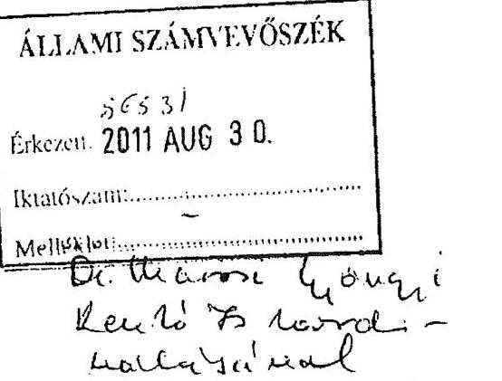

Hivatkozással a 2011. július 25-ei keltezésű, az önkormányzat részére V-3004-377/2011. iktatószámú levéllel megküldött, 2011. július 27-én kézhez vett, Kecskemét Megyei Jogú Város Önkormányzata pénzügyi helyzetének ellenőrzéséről szóló jelentés-tervezetre - melyet észrevétel közlése céljából küldtek meg részemre -, az alábbi észrevételeket és kiegészítő javaslatokat teszem:

## ÁSZ jelentés-tervezet 17: oldal:

Kérem, a megállapításokat szíveskedjék kiegészíteni az alábbiak figyelembe vételével:

Az Önkormányzat által fenntartott intézmények körében végrehajtott átszervezések reál szinten komoly megtakarítást eredményeztek. A vizsgálat a megtakarítási intézkedések hatásaként csak az adott évi költségvetési teljesítési adatokat vette figyelembe, amely figyelmen kívül hagyta az infláció által okozott kiadás növekedéseket.

ÁSZ jelentés-tervezet 19. oldal 1. bekezdés:
„A 2007-2010. években a 2009. év kivételével az önkormányzat felhalmozási költségvetésének egyenlege negatív összegű volt."

Kérem, szíveskedjen a megállapítást kiegészíteni az alábbiak szerint:
A negatív összegű egyenleg pozitív tendenciára utal, tekintettel arra, hogy a felhalmozási kiadások összegét a vizsgált időszakban működési költségvetés pozitív egyenlegéből tudta finanszírozni az önkormányzat.

ÁSZ jelentés-tervezet 21. oldal 2. bekezdés:
„Az Önkormányzat kötelezettségvállalásaira közgyűlési döntés alapján került sor, azonban az előterjesztésekben nem mutatták be a visszafizetés forrásait, valamint a kamat- és - a devizaalapú kötelezettségeket érintő - árfolyamkockázatot."

Kérem, hogy a megállapításokat szíveskedjen az alábbiakkal kiegészíteni:

---

Kecskemét Megyei Jogú Város Közgyűlésének 2008. március 27-én tartott ülésén megtárgyalásra került a Kecskeméti szabadidős-turisztikai fejlesztési koncepció keretében új versenyuszoda építésével és az élményfürdő bővítésével kapcsolatos indikatív ajánlatok összehasonlítása, finanszírozási mód kiválasztása tárgyú előterjesztés. Az előterjesztésben bemutatásra került a versenyuszoda megvalósításával kapcsolatos, beérkezett valamennyi ajánlat (kötvénykibocsátás, banki hitelfelvétel és lízing). A Közgyűlés az előterjesztésben bemutatott kötelezettségek és az összeállított indokok alapján a kötvénykibocsátást és a banki hitelfelvételt elvetette és a nyílt végű pénzügyi lízinget, mint finanszírozási módot elfogadta. Figyelembe véve a helyi önkormányzatokról szóló 1990. évi LXV. törvény (továbbiakban Ötv.) 1. § (6) bekezdés b) pontját, mely szerint a helyi önkormányzatok feladataik ellátásáról egységes költségvetésből gondoskodnak, a kötelezettségek visszafizetését biztosító források nem kerültek külön megjelölésre, tekintettel arra, hogy azokat az adott évi költségvetési rendeletben szereplő bevételek fogják biztosítani (kivéve az Ötv. 88. § (1) bekezdés b) pontjában a hitel fedezetéül fel nem használható bevételeket).

Ezen kötelezettségvállalás tekintetében fontos megemlíteni, hogy a régi uszoda fenntartása és üzemeltetése során korábban felmerült költségek is fedezetet jelentenek a visszafizetés forrását tekintve. Számszerűsítve, az uszoda, élményfürdő és a városi sportcsarnok fenntartására és üzemeltetésére a Hírós Sport Nonprofit Kft. - közhasznú szerződés alapján - 2007. évben 380 millió Ft, 2008. évben 471 millió Ft, 2009. évben 449 millió Ft, 2010. évben 462 millió Ft működési támogatásban részesült. Az éves támogatás meghatározó része a régi korszerűtlen uszoda üzemeltetése során „felhalmozott" veszteség (éves szinten 200-220 millió Ft.) kompenzálására lett felhasználva.

Figyelembe véve az éves szinten „megszűnt" 200-220 millió Ft-os veszteséget, továbbá azt a tényt, hogy a régi uszoda esztétikai, higiéniai, műszaki elavultságának megszüntetése közel 2,5-3 milliárdos beruházást igényelt volna, valamint a korszerű technológiai elemekkel megvalósuló új versenyuszoda fenntartási költségeit - a kötelezettségként jelentkező pénzügyi lízinggel együtt (éves szinten 2014. I. félév végéig 320 millió Ft., 2014. II. félévétől a futamidő végéig 588 millió Ft.) megállapítható, hogy az Önkormányzat részére - a költségek tekintetében- a finanszírozás emelését várhatóan nem vonja maga után.

# ÁSZ jelentés-tervezet 21. oldal 3. bekezdés: 

„Az Önkormányzat a 2007-2010. években a kötvényt és a hosszú lejáratú hiteleket beruházások és felújítások finanszírozása céljából bocsátotta ki, illetve vette fel, továbbá a CHF alapú hosszú lejáratú hitelekkel a korábbi - 2001-2003. - években felvett fejlesztési célú hosszú lejáratú hiteleket váltotta át. A fejlesztési hiteleiből az éves költségvetéseiben tervezett beruházásokat és felújításokat finanszírozta, illetve a kötvény 28,6\%-a (2000 millió Ft) óvadéki letét.

Kérem, a megállapításokat az alábbiakkal kiegészíteni szíveskedjék:
Kecskemét Megyei Jogú Város Önkormányzatának a Daimler-projekt megvalósítása érdekében meg kellett vásárolni azt a földterületet, amelyet a belterületbe vonás után értékesített a Mercedes-Benz Manufacturing Hungary Kft. részére. Az Önkormányzatnak a földterület megvásárlásával, beruházási területté történő átminősítésével összességében 8.673.588 E Ft költsége keletkezett. A földterület

---

megvásárlására csak a kötvényforrás tudott fedezetet biztosítani. Amennyiben az Önkormányzat nem bocsátotta volna ki a kötvényt a 9 Mrd forint közeli kiadást átmenetileg sem tudta volna finanszírozni.

A Daimler beruházással kapcsolatosan többletbevétel az állami költségvetés és az Önkormányzat számára döntően két tételből adódóan várható:

- Személyi jövedelemadó: figyelembe véve, hogy a Mercedes gyárban a termelés 2011-ben kezdődik el, a 2500 fő foglalkoztatásának kezdete döntően ez az év lesz. 2011-es évben a központi költségvetésben realizálódó személyi jövedelemadóból származó bevétel egy része az Önkormányzat költségvetésében 2013-ban fog megjelenni.
- Iparűzési adó: az Önkormányzat helyi iparűzési adóról szóló 54/2003 (XII. 01.) számú rendelete szerint az állandó jelleggel végzett iparűzési tevékenység esetén az adó mértéke az adóalap 1,6 \%-a.
A Mercedes-Benz Manufacturing Hungary Kft. által gyártott első autó a gyártószalagról 2012-ben fog legördülni, tehát jelentősebb árbevétel, mely után iparűzési adót fog fizetni a 2013-as évben várható. Az iparűzési adó alapja az 500 Mrd forint éves bevételi tervből indulva - és figyelembe véve, hogy iparűzési adót az anyagköltség és az ELÁBÉ után nem kell fizetni - 100 Mrd forint körül várható, ami után 1,6 Mrd forint iparűzési adó bevétele keletkezhet a városnak. További jelentős tényezőként említendő, hogy a Mercedes gyár területén belül, illetve mellette letelepedett vállalkozások (10 beszállító cég), és a már helyileg korábban is működő cégek beszállítók körébe történő bevonása során további 1 Mrd forint iparűzési adó bevétel várható.

A beruházás teljes költsége a régió éves GDP-jének közel 9\%-át teszi ki. A gyár a már korábban megjelölt közvetlen munkahelyek mellett közvetve, a beszállítók révén akár további 10.000 munkahelyet is teremthet. A jelentős beszállítói kör következtében, a beruházás eredményeként a régió GDP-je várhatóan több mint 3\%-kal növekedhet.
Kecskeméten az eddigi legnagyobb gazdasági hatással járó beruházás - a fentiek szerint - az Önkormányzat adósságállományából származó kötelezettségek visszafizetésére biztos forrást jelent.

# ÁSZ jelentés-tervezet 21. oldal 6. bekezdés: 

„Az Önkormányzat működésének pénzügyi egyensúlya biztosítása érdekében megkötött folyószámlahitel-keretek alapján a 2007., 2008. és a 2010. években vettek igénybe folyószámlahitelt, amelyből azonban a 2010. év végén 294 millió Ft-ot nem fizettek vissza."

Kérem, a megállapításokat az alábbiakkal kiegészíteni szíveskedjék:
Az Önkormányzat 528.823 E Ft hosszú lejáratú hitel felvételt tervezett 2010. III. negyedévre vonatkozóan, iparosított technológiával épült lakóépületek korszerűsítésére irányuló pályázatok finanszírozása érdekében. Azonban a hitelkeret - a közbeszerzési eljárás lefolytatását követően - csak 2011. I. negyedévében került megnyitásra, így a pályázatokat saját forrásból kellett az önkormányzatnak finanszíroznia 2010. év végén. Ennek következtében folyószámlahitel keletkezett 2010. év végén.

---

Az Önkormányzat közbeszerzési eljárást folytatott le egy év határozott időre szóló folyószámla-hitelkeret biztosítás tárgyában, mely alapján a számlavezető OTP Bank Nyrt-vel folyószámla-hitelkeret szerződés 2010. március 31-én került aláírásra. A lejáratkor az önkormányzatnak nem volt folyószámlahitele.

ÁSZ jelentés-tervezet 21. oldal utolsó bekezdés:
„Az önkormányzat 2010. év végi szállítói tartozása 1.078,2 millió Ft, melyből lejárt tartozás 478,4 millió Ft volt. A lejárt tartozások 1,9\%-a (9,1 millió Ft) meghaladta a 91 napot."

Kérem, a megállapításokat az alábbiakkal kiegészíteni szíveskedjék:
A lejárt tartozások döntő részében olyan keretszerződésen alapuló kötelezettségekből tevődött össze, melyek pályázati támogatásból megvalósuló projektekhez kapcsolódtak. A partnerekkel minden esetben az Önkormányzat a fizetési kötelezettség teljesítésének időbeli átütemezéséről egyeztetést folytatott le, ezért ebből adódóan késedelmi kamat fizetési kötelezettség nem terhelte az önkormányzat költségvetését. Fontos szempontként említendő, hogy a pályázatok támogatástartalmának lehívása és annak folyósítása között, mintegy 60-90 napos eltérés tapasztalható. Ezt támasztja alá, hogy az önkormányzatnál folyamatban lévő projektek tekintetében 2010. december 31-én mintegy 454.183 E Ft „függő, támogatástartalom nélküli" kifizetés került könyvelésre.

# ÁSZ jelentés-tervezet 22. oldal 2. bekezdés: 

„Az önkormányzat gazdasági társaságai részére folyószámla és egyéb hitelek igénybevételéhez készfizető kezességet vállalt (1.130,1 millió Ft). A 2010. év végére a kezességgel kapcsolatos kötelezettség 12.225,1 millió Ft-ra növekedett a lízing konstrukcióban megvalósuló élményfürdő és versenyuszoda építéséhez vállalt készfizető kezesség miatt."

Kérem, hogy a megállapításokat szíveskedjen az alábbiakkal kiegészíteni:
A kezességgel kapcsolatos kötelezettségek növekedésének mintegy 91\%-a a lízing konstrukcióban megvalósuló élményfürdő és versenyuszoda építéséhez vállalt készfizető kezességből adódik.

A Hírös Sport Szabadidő Létesítményeket Működtető Nonprofit Kft. kezelésében lévő uszoda jelenlegi formájában nem képes hosszú távon gazdaságosan működni. Az ingatlan frekventált fekvését figyelembe véve legalább nullszaldós gazdálkodás lenne elvárható, mivel ennek hiányában elmarad az eszközmegújítás és elavul a létesítmény, ami később az Önkormányzat tekintetében vagyonvesztéshez vezethet. A 40 éves uszoda épület a látogatók számának emelkedése mellett évek óta veszteséggel üzemel. Az ok a piaci viszonyokban és az ingatlan elavultságában kereshető. A kiadások indokolt mértéke mellett elmarad a fenntartáshoz szükséges bevétel, amelynek oka a korszerűtlen szolgáltatások, a szezonjellegű működés és a csekély vízfelület miatti kapacitáshiányra, illetve ebből következően az alacsony jegyárakra vezethető vissza. Fontos szempont volt továbbá, hogy ezen létesítmény nem felelt meg, sem a nemzetközi- és hazai versenyek, sem pedig a gyógyfürdők követelményeinek. Az esztétikai, higiéniai, műszaki elavultság megszüntetése közel 2,5-3 milliárdos beruházást igényelt volna, amely ugyanakkor csupán egy közepes igényszintű komplexumot eredményezett volna.

---

Ezen szempontok, illetve az önkormányzat pénzügyi helyzetét figyelembe véve saját erő híján - a felújítás is csak hitelből lett volna megvalósítható.

A fentieket figyelembe véve vált szükségessé egy ilyen volumenű beruházás megkezdése, illetve megvalósítása, amely indokolta a vizsgálat során bemutatott mértékű - nyílt végű pénzügyi lízing konstrukcióban megjelenő kötelezettségvállalást.

Összegezve a leírtakat, a Közgyűlés készfizető kezességet vállalt 6.500.000 E Ft összeg erejéig arra az esetre, ha a Hírös Sport Nonprofit Kft. a tárgyi beruházással kapcsolatos szerződésekből eredő, vagy azzal összefüggésben keletkező bármely kötelezettségét nem, vagy nem szerződésszerűen teljesítené.

# ÁSZ jelentés-tervezet 22. oldal utolsó előtti bekezdés: 

„A Közgyűlés a folyószámlahitel és fejlesztési hitelek biztosítékaként 891 millió Ft számviteli nyilvántartás szerinti nettó értékű ingatlanokra - jelzálogjog alapításához és bejegyzéséhez járult hozzá, amelyek a forgalomképes ingatlanok nyilvántartás szerinti nettó értékének 3\%-át (153,2 millió Ft), illetve a korlátozottan forgalomképes ingatlanok nettó értékének 6,8\%-át (737,8 millió Ft) tették ki. Az önkormányzat az Ötv-ben foglaltak ellenére a hitelek fedezetéül az önkormányzati törzsvagyon nyilvántartás szerinti nettó 737,8 millió Ft értékű korlátozottan forgalomképes vagyonát ajánlotta fel."

Kérem, szíveskedjen a megállapítást az alábbiak szerint módosítani:
A folyószámlahitel biztosítékaként az önkormányzat egyetlen esetben sem ajánlott fel ingatlant.
„A Közgyűlés a fejlesztési hitelek biztosítékaként 891 millió Ft........"
Kérem, szíveskedjen a megállapítást az alábbiakkal kiegészíteni:
A hitelek fedezetéül szolgáló önkormányzati törzsvagyon korlátozottan forgalomképes vagyonát az önkormányzat kizárólag a vizsgált időszakot megelőzően ajánlotta fel, az ingatlanok jelzáloggal történő terhelésére 2001-2003 években került sor.

Fontosnak tartjuk kiemelni, hogy az ingatlanok és kapcsolódó vagyoni értékű jogok önkormányzati vagyonának nettó állományi értéke 73.095.928 E Ft, melyből:

- forgalomképtelen törzsvagyon
$57.246.869 \mathrm{E} F t$
- korlátozottan forgalomképes törzsvagyon
$10.773.874 \mathrm{E} F t$
- törzsvagyonon kívüli vagyon
$5.075.185 \mathrm{E} F t$

ÁSZ jelentés-tervezet 23. oldal utolsó mondata:
"A CLF módszer szerint a működési jövedelem, azonban a mutatkozó csökkenő tendencia (2010. évi 608 millió Ft) alapján nem nyújt fedezetet az önkormányzati kötelezettségek biztosítására."

Kérem, szíveskedjen a megállapítást az alábbiakkal kiegészíteni:
A CLF módszer alkalmazása során a folyó bevételek és folyó kiadások számszerű különbségével kimutatható a működési jövedelem. Nyilvánvaló, hogy a működési jövedelem csökkenésének egyértelmű oka a 2010. évben a folyó bevételek 5,62 \%-

---

os csökkenése. Ez egyrészt visszavezethető a 2008. évben kezdődő, majd a 2009. évben kibontakozó gazdasági válságra, másrészt Kecskemét gazdaságösztönző adópolitikájának hatására (helyi iparűzési adó mértékének 2007. évtől- 2011. évig 0,4 \%-os csökkentése), amelyek együttesen 2010. év tekintetében „átmeneti" működési jövedelem csökkenést eredményeztek. A gazdaságösztönző adópolitika hosszú távú hatását vizsgálva azonban egyértelműen megállapítható, hogy a helyi iparűzési adó kulcs csökkentése már a 2011-es évtől növelni fogja Kecskemét összesített helyi iparűzési adó alapját, amely - a jelenleg és a jövőben is fenntartott szigorú gazdálkodási politika mellett - növeli a működési jövedelmet, és ez által fedezetet nyújt majd az önkormányzati kötelezettségek biztosítására.

# ÁSZ jelentés-tervezet 24. oldal 3. bekezdés: 

„Az álláshely csökkentő intézkedések 2007-2010. között hivatalnál és az intézményeinél összesen 859 álláshely (ebből nem volt üres álláshely) megszüntetését jelentették."

Kérem, szíveskedjék a megjelölt szakaszt az alábbiakkal kiegészíteni:
Az átszervezést megelőző időszakban az önkormányzati fenntartású intézmények többségében jelentős létszámban került sor nyugdíjas közalkalmazottak foglalkoztatására, így az átszervezés során az álláshelyek megszüntetésekor elsősorban a nyugdíjas foglalkoztatottak felmentését preferálta az önkormányzat, ezzel jelentősen csökkent az aktív dolgozók leépítésének szükségszerűsége. A vizsgált időszakban végrehajtott 859 álláshely megszüntetésből 130 fő volt a ténylegesen nyugdíjba vonulók száma, mintegy 22 fő a prémium évek program keretein belül került regisztrálásra. Összességében megállapítható, hogy a 859 álláshely megszüntetésből 539,6 álláshely a kiszervezés és feladat átadások következménye, a 297 véglegesen megszüntetett álláshelyek $52 \%$-a a nyugdíjas foglalkoztatottak felmentését jelentette.

## ÁSZ jelentés-tervezet 25. oldal 4. bekezdés

„A pénzintézeti és egyéb kötelezettségek teljesítésének kockázatát növelte, hogy a 2010. december 31-én fennálló kötelezettségek visszafizetésének fedezetét a saját bevételben jelölték meg, nem határozták meg és számszerűsítették annak konkrét forrásait."

Kérem, szíveskedjen a megállapítást az alábbiak szerint kiegészíteni:
A 2008. évben történt zártkörű kötvénykibocsátásból származó forrás egy részét 2.000.000 E Ft-ot - az önkormányzat ez idáig nem használta fel, az összeg óvadéki betétként került elhelyezésre. A jövőben megvalósítandó fejlesztési célok forrásának biztosításához, illetve a fennálló kötelezettségvállalások teljesítéséhez fedezetet biztosít, amely jelentősen csökkenti a kötelezettségek teljesítésének kockázatát.

## ÁSZ jelentés-tervezet 27. oldal - jegyzőnek tett javaslat 2. pontja:

Hivatkozva a jelentés-tervezet 22. oldal utolsó előtti bekezdése vonatkozásában tett észrevételünkre - „A hitelek fedezetéül szolgáló önkormányzati törzsvagyon korlátozottan forgalomképes vagyonát az önkormányzat kizárólag a vizsgált időszakot megelőzően ajánlotta fel. Az ingatlanok jelzáloggal történő terhelésére

---

2001-2003 években került sor." -, kérem a hivatkozott számú javaslatot mellőzni szíveskedjék.

ÁSZ jelentés-tervezet 42. oldal 3. bekezdés:
„Az átengedett szja összege a 2007. évről a 2008. évre 60,6\%-kal, 2442,2 millió Fttal csökkent."

Kérem, szíveskedjen a megállapítást az alábbiakkal kiegészíteni:
A csökkenés mértéke kizárólag technikai okokra vezethető vissza, az alábbiak szerint:

Az Önkormányzat 2007. évi költségvetésében az átengedett személyi jövedelemadó 3 részből tevődött össze: szja helyben maradó rész ( 1.230 millió Ft), szja normatív módon elosztott része ( 2.617 millió Ft) és jövedelemkülönbség mérséklése (114 millió Ft), mely összesen 4.031 millió Ft-ot tett ki (beszámoló 80. űrlap 84.sor).

Az Önkormányzat 2008. évi költségvetésében az átengedett személyi jövedelemadó már csak 2 részből tevődött össze: szja helyben maradó rész ( 1.422 millió Ft) és jövedelemkülönbség mérséklése ( 167 millió Ft), mely összesen 1.589 millió Ft-ot tett ki. (beszámoló 80. űrlap 87.sor).

A két évből adódó jelentős eltérés oka az szja normatív módon elosztott része miatt alakult ki, amely a 2008. évben már a normatív állami hozzájárulások és normatív, kötött felhasználású támogatások között jelent meg. Ezt támasztja alá, hogy az önkormányzat költségvetési támogatása (a beszámoló 80. űrlapján) a 2007. évi 7.266 millió forinttal szemben 2008. évben már 10.119 millió Ft.

Az eltérő kimutatás oka a két vizsgált évben az, hogy míg a 2007. évi költségvetési törvény 4. mellékletében az szja normatív módon elosztott része megbontásra került százalékosan - úgy, hogy a 3. és 8. mellékletek egyes jogcímeinek forrását mekkora arányban fedezik -, addig a 2008. évi költségvetési törvényben (és a további évek költségvetési törvényeiben) ez már nem került részletezésre. Ily módon a 2007. évben a normatív állami hozzájárulások és kötött felhasználású támogatások jogcímeiből kiszámolható, visszavezethető volt az szja normatív módon elosztott része, míg a későbbi években már nem.

ÁSZ jelentés-tervezet 43. oldal 3. bekezdés:
„Az Önkormányzatnál a helyi adókból és pótlékokból származó bevételek aránya 2007-2010 között 22,6-25\% között mozgott a folyó (működési) bevételekben."

Kérem, a megállapításokat az alábbiakkal kiegészíteni szíveskedjék:
Az iparűzési adóbevételek csökkenése mellett azonban egyéb, a gazdaságra kedvező hatással bíró folyamatok indultak el, amelyek az alábbi szempontok szerint foglalhatóak össze:
Egy alacsonyabb adókulcs alternatívát jelentett a kifutó adókedvezményeknek, megakadályozva a befektetők elvándorlását, továbbá vonzerőt jelent olyan tevékenységek idecsábításában, melyek által fizetendő iparűzési adó jelentős összeget képviselhet.

---

Ezen tevékenységek Kecskemét városban történő letelepedése jelentős lökést adhat a kvalifikált munkaerőképzésnek.
A gazdaságösztönző adópolitika előbbiekben feltüntetett szempontok szerinti együttes hatását vizsgálva megállapítható, hogy a helyi iparűzési adókulcs csökkentése már a 2011-es évtől növelni fogja Kecskemét összesített helyi iparűzési adó alapját, továbbá a foglalkoztatás növekedésének hatásaként a személyi jövedelemadó és járulékbevételek növekedésével párosul. (A személyi jövedelemadó „növekedés" az önkormányzat részére az átengedett szja tekintetében jelentős többletbevételt eredményezhet.)

# ÁSZ jelentés-tervezet 44. oldal: 

Kérem, szíveskedjen az önkormányzat bevételeinek alakulásáról szóló 2.2. fejezetet az alábbiakkal kiegészíteni:

A költségvetés végrehajtása során az önkormányzat a költségvetési rendeletekben a pénzügyi egyensúly megteremtése érdekében egyéb intézkedéseket valósított meg. A kötvénykibocsátásból származó, fel nem használt pénzeszközök lekötéséből az önkormányzatnak 2008-2010. években összesen 897,6 millió Ft kamatbevétele keletkezett.

ÁSZ jelentés-tervezet 45. oldal utolsó előtti bekezdés:
„Az önkormányzat dologi kiadásai 2007. évről 2010. évre folyamatosan, 64,9\%-kal, 8.666,5 millió Ft-ra nőttek,..."

Kérem, a megállapításokat az alábbiakkal kiegészíteni szíveskedjék:
A dologi kiadások folyamatos növekedésének egyik alapvető oka a közüzemi díjak (energiaárak) jelentős mértékű növekedése:

- villamos energia 29,6\%-os növekedés
- vezetékes gáz 51,9\%-os növekedés
- vízdíj $19,4 \%$-os növekedés
- csatornadíj $32,4 \%$-os növekedés

ÁSZ jelentés-tervezet 51. oldal utolsó előtti mondat:
„A Közgyűlés a likviditási és eladósodási problémák kezelésére likviditási koncepciót, stratégiát nem készített a 2007-2010. években."

Kérem, szíveskedjen a megállapítást módosítani az alábbiak figyelembe vételével:
Az önkormányzat pénzállományának alakulásáról a mindenkori költségvetési rendelet előírásainak megfelelően 2007. évtől finanszírozási, 2009. évtől finanszírozási és likviditási ütemtervet készít, amelyet havi gyakorisággal aktualizált. Az ütemtervről havonta tájékoztatja a Közgyűlés Költségvetési és Vagyongazdálkodási Bizottságát.
A tájékoztatások, valamint a nettó működési jövedelem számszaki adatai alapján, a Bizottság egyetlen esetben sem javasolta likviditási koncepció elkészítését, tekintettel arra, hogy az önkormányzat működésében nem jelentkeztek oly mértékű likviditási problémák, melyek a koncepció elkészítését indokolták volna.

---

ÁSZ jelentés-tervezet 53. oldal 4. bekezdés:
„Az önkormányzat működésének pénzügyi egyensúlyát a vizsgált időszakban 2009. év kivételével - csak folyószámlahitel és 2007. évben munkabérmegelőlegezési hitel igénybevételével tudta biztosítani."

Kérem, a megállapítást az alábbiakkal kiegészíteni szíveskedjék:
Az Önkormányzat saját bevételeinek jelentős részét képviseli az iparűzési adóbeszedésből származó bevétel, amelynek sajátos tulajdonsága, hogy az egyéb bevételekkel ellentétben, jogszabályokban meghatározott időszakokban (tárgyév március 15. és szeptember 15.) jelentkeznek elsősorban. A bevételek további jelentős részét képező pályázati támogatások utófinanszírozás formájában teljesülnek, gyakran jelentős - 6-12 hónapos - késéssel. Fontos szempontként értékelendő továbbá, hogy a gazdasági válság hatására az adózói fegyelem nagymértékben romlott, tovább erősíti ezen szempont hatását, hogy a helyi iparűzési adóval kapcsolatos egyes törvények módosításáról szóló 2010. évi LVII. törvénynek köszönhetően a 2010. január 1. és június 30-a között az újonnan belépő helyi iparűzési adófizetők körére az önkormányzatnak nem volt rálátása. Ebből kifolyólag a kiadások teljesítésének ütemezése általában eltér a bevételek realizálódásának időpontjától, mely időszakosan az önkormányzat tekintetében folyószámlahitel igénybevételét teszi szükségessé.
A jelentés-tervezet 21. oldalán feltüntetett, a folyószámlahitel igénybevételének alakulásáról szóló táblázat egyértelműen tükrözi, hogy a folyószámlahitellel érintett napok száma, az önkormányzat által megvalósított szigorú gazdálkodás mellett elenyésző.
Az ellenőrzött időszakban - a 2007. év kivételével - a munkabér és folyószámlahitellel zárt napok száma 30 napon belüli volt.

ÁSZ jelentés-tervezet 55. oldal 5. bekezdés:
„Az Önkormányzat a vizsgált időszakban öt lízingszerződést kötött személygépkocsi beszerzésére."

Kérem a megállapítást az alábbiak szerint javítani szíveskedjék:
Az Önkormányzat a vizsgált időszakban négy lízingszerződést kötött személygépkocsi beszerzésére. A 2006. évben az Egészségügyi és Szociális Intézmények Igazgatósága által kötött 1 db lízingszerződés fizetési kötelezettsége nyúlik át a vizsgált időszakra.

ÁSZ jelentés-tervezet 60. oldal 3. bekezdés:
„Az önkormányzati szintű használhatósági fok mutató aránya négy év alatt három százalékponttal, 90\%-ról 87\%-ra csökkent az egyes eszközcsoportoknál különböző mértékkel elszámolt amortizáció elsődleges hatására."

Kérem, a megállapítást az alábbiakkal kiegészíteni szíveskedjék:
2010. év végén az Önkormányzat 6922,7 millió forint értékű befejezetlen beruházást szerepeltetett a mérlegében, amely várhatóan 2011. évben aktiválásra kerül. Az aktiválást követően, az eszközállomány növekedésével 1\%-kal nő a használhatósági fok $(88 \%)$.

---

Az immateriális javaknál a használhatósági fok nagyobb arányú romlásának oka egy korábbi beszerzés pályázati feltételeiben keresendő. E pályázat nyomán 2006.évben 369 millió Ft. értékben szereztünk be számítástechnikai eszközöket és szoftvereket, ám az önkormányzat részére kötelezően előírt fenntartási időszak végéig újabb eszköz,- illetve szoftverbeszerzésre kizárólag a „fenntartott" eszközök pótlása tekintetében kerülhetett sor.

ÁSZ jelentés-tervezet 60. oldal 2. bekezdés:
„A 752/2006. (XI.30.) számú határozatának megfelelően a Közgyűlés döntött a Polgármesteri hivatal szervezeti felépítésének módosításáról, a létszámcsökkentési és takarékossági intézkedések bevezetéséről, amelyek eredményeképpen 60 fős létszámleépítésre került sor."

Kérem, a megállapítást az alábbiakra javítani szíveskedjék:
A 752/2006. (XI.30.) számú határozatának megfelelően a Közgyűlés döntött a Polgármesteri hivatal szervezeti felépítésének módosításáról, a létszámcsökkentési és takarékossági intézkedések bevezetéséről, amelyek eredményeképpen - két lépcsőben, a hivatkozott számú határozatban foglaltak alapján 27 fős, a 7/2007. (II.19.) számú rendeletében további 60,5 fős - összesen 87,5 fős létszámleépítésre került sor.

ÁSZ jelentés-tervezet 63. oldal 2. bekezdés:
„A közétkeztetés tekintetében 2009-2010. évben 341,8 millió Ft megtakarítást mutattak ki, ugyanakkor a karbantartás, az őrzés védelem, a takarítás kiszervezése megtakarítást nem eredményezett."

Kérem, a megállapítást az alábbiakkal kiegészíteni szíveskedjék:
A közétkeztetés tekintetében a helyben központosított közbeszerzési eljárás lefolytatását megelőzően tíz különböző vállalkozás látta el a szolgáltatást az önkormányzat területén. A saját üzemeltetésű konyhák esetében pedig a főzőkonyhai kapacitások elaprózódtak a rendszeren belül, a szolgáltatás ellátása magasabb élőmunka és energia igénnyel járt. A pályázat igen szigorú alkalmassági és dietetikai követelményrendszert írt elő, és ráadásul a nyerteseknek részenként a szolgáltatók által bérbevett főző- és tálalókonyhákban 300 millió forintos építészeti, épületgépészeti és konyhatechnológiai fejlesztési és beruházási kötelezettséget is vállalnia kellett.
A karbantartás, az őrzés védelem, takarítás területén ugyanakkor eredményként könyvelhető el, hogy a korábban kapcsolt munkakörben foglalkoztatott, alkalmazásban maradó mintegy 40 munkatárs kizárólag szakmai munkájára koncentrálva járul hozzá az intézmények magas szakmai színvonalú feladatellátásához.
A nyertes ajánlattevők megteremtették az alapvető technikai feltételeket, és végrehajtották az induláshoz szükséges beruházásokat. Ezen szegmensben 150 millió forintos fejlesztés valósult meg rövid idő alatt.

---

# A jelentés-tervezetben foglalt megállapítások kapcsán az önkormányzat által felmerült, az egységes értelmezés érdekében egyeztetést igénylő kérdések: 

- 36. oldal:
"CLF módszer szerinti önkormányzati adatok"
Folyó bevételek, illetve kiadások számszaki forrása számunkra ismeretlen.
- 26. oldalon a polgármester részére tett javaslatok 4.d) pontja:
"az egyszeri bevételek tartalékba helyezését"
Költségvetés tervezésekor az esetleg jelentkező bevételi többletek, ha a kiadási oldalon az adósságszolgálat teljesítésére már beépítésre kerülnek, akkor tartalékként már nem tervezhetőek be.
- 26. oldalon a polgármester részére tett javaslatok 4.e) pontja:
"a támogatás előfinanszírozás átláthatóbbá tétele"
Milyen jellegű támogatás vonatkozásában kell biztosítania az önkormányzatnak az előfinanszírozás átláthatóbbá tételét?
- 60. oldal 3. bekezdés:
„Az önkormányzat 2007-2010. években befejezett beruházásaiból eszközpótlásra 257,2 millió Ft-ot, az összes ráfordítás 1,6\%-át fordította."
A számszaki forrás az önkormányzat számára ismeretlen, ebből kifolyólag kérjük a forrás megjelölését, illetve az adatok egyeztetését.

Kecskemét, 2011. augusztus 25.
Tisztelettel:
Dr. Zombor Gábor
polgármester

Ügyintézés: Kecskemét Megyei Jogú Város Polgármesteri Hivatal Városstratégiai Iroda
Gazdálkodási Osztály
6000 Kecskemét, Kossuth tér 1.
Tel.: 76/512-250; Fax: 76/513-536; E-mail cím:gazdalkodas@kecskemet.hu

---

.

---

# Dr. Zombor Gábor úr, 

polgármester
Kecskemét Megyei Jogú Város
Önkormányzata

## Kecskemét

## Tisztelt Polgármester Úr!

A Kecskemét Megyei Jogú Város Önkormányzat pénzügyi helyzetének ellenőrzéséről készített jelentés tervezetre 2011. augusztus 25-én megküldött (ügyiratszám: 37.350-3/2011.) észrevételére és kiegészítő javaslataira válaszolva a következőkről tájékoztatjuk:

Köszönettel vettük jobbító szándékú kiegészítő javaslatait. Az ÁSZ jelentés-tervezet 17. oldalon, a 21. oldal 2., 3., 6. és utolsó, a 22. oldal 2. és utolsó előtti bekezdésében, a 23. oldal utolsó mondatában, a 24. oldal 3., a 42. oldal 3., a 43. oldal 3. bekezdésében, a 44. oldalon, a 45. oldal utolsó előtti, az 53. oldal 4., a 60. oldal 3., valamint a 63. oldal 2. bekezdésében foglalt megállapításokhoz kapcsolódó kiegészítésekre, magyarázatokra figyelemmel az ÁSZ jelentésben foglaltakat kiegészítettük. A 44. oldalra jelzett kiegészítő javaslata a tartalma szerint a kamatbevételhez, a pénzügyi egyensúlyhoz kapcsolódott, ezért annak alapján a jelentés-tervezet 41. oldalán lévő megállapítást egészítettük ki.

Észrevételét elfogadva módosítottuk a jelentés-tervezet 22. oldal utolsó előtti bekezdését, javítottuk a 60. oldal 2. bekezdését. A jelentés-tervezet 51. oldal utolsó előtti mondatát magyarázatával kiegészítettük.

Az ÁSZ jelentés-tervezet 55. oldal 5. bekezdéséhez fűzött észrevétele, mely szerint „Az Önkormányzat a vizsgált időszakban négy lízingszerződést kötött személygépkocsi beszerzésére. A 2006. évben az Egészségügyi és Szociális Intézmények Igazgatósága által kötött 1 db lízingszerződés fizetési kötelezettsége nyúlik át a vizsgált időszakra" nem megalapozott, ezért azt nem fogadjuk el. Az ellenőrzés megállapítását a lízingről adott tanúsítványok és az azokhoz csatolt dokumentumok támasztják alá. Az öt szerződés a következő: a Polgármesteri hivatalban kettő: MBHC08/042243 számú, kelt 2008. szeptember 10. (rendszám: LJT-740), MBHC08/042256 számú, kelt 2008. szeptember 10. (rendszám: LJT-739), az ESZI-nél három: MBHC07/026939 számú 2007. június 14-én (rendszám: KSZ-646), MBHC08/020835 számú 2008. június 24-én (rendszám: LAP-372), MBHC10/006077 számú 2010. június 30-án (rendszám: LSK-145).

A jegyzőnek a 2. pontban írt javaslatot az ÁSZ jelentés-tervezet 57. oldalán rögzített megállapítások alapján tettük. A javaslatot továbbra is fenntartjuk, mivel a 2007. évet megelőzően

---

megkötött hitelszerződések alapján felvett hitelek részbeni fedezetét szolgáló 66 korlátozottan forgalomképes ingatlan 2010. december 31-én és az ellenőrzés időpontjában is törzsvagyon körébe tartozó korlátozottan forgalomképes ingatlanként szerepel az Önkormányzat vagyonában, a jogsértés jelenleg is fennáll.

A jelentés-tervezet a 22. oldal utolsó előtti, és a 25. oldal 4. bekezdéséhez javasolt kiegészítések megtalálhatók a jelentés-tervezetben, az előbbi kiegészítésben közölt számszaki adatokkal megegyező adatokból készült a jelentés-tervezet 58. oldalán található kördiagram, utóbbiban adott információkat a jelentés-tervezet 53. és 59. oldalainak első bekezdéseiben lévő megállapítások tartalmazzák.

A 19. oldal 1. bekezdéséhez javasolt kiegészítését azért nem építettük be a jelentésbe, mert a javasolt kiegészítés szerint ,, a negatív összegű egyenleg pozitív tendenciára utal, tekintettel arra, hogy a felhalmozási kiadások összegét a vizsgált időszakban működési költségvetés pozitív egyenlegéből tudta finanszírozni az Önkormányzat", azonban a 2007-2010. években az összesen 10149 millió Ft felhalmozási forráshiányt az Önkormányzat 6653 millió Ft működési jövedelme csak részben ellentételezte.

Az egységes értelmezés érdekében felvetett kérdései kapcsán tájékoztatjuk, hogy a CLF módszer szerinti önkormányzati adatokat az ÁSZ jelentés-tervezet 2. számú melléklete, a CLF módszer leírását pedig az ÁSZ jelentés-tervezet 2.1 pontja tartalmazza. A 60. oldal 3. bekezdésében a befejezett beruházásokból eszközpótlásra fordított összeget az Önök által megadott 10. számú tanúsítvány tartalmazza, amelynek adataival megegyezik jelentés-tervezet 3.a. számú melléklete. A polgármesternek a 4. d) pontban tett javaslat - egyezően a Polgármester úr véleményével - az adósságszolgálat teljesítését célozza, a bevételi többlet tartalékba helyezésének, elkülönített kezelésének a javaslata arra az esetre vonatkozik, amikor a már ismert fizetési kötelezettség teljesítése a bevételi többlet keletkezését követő évben, években esedékes. A polgármesternek a 4.e) pontban tett javaslatot egy egységes rendszerbe foglalt feladatnak tekintjük, amelyen belül a támogatás előfinanszírozásának átláthatóbbá tétele arra utal, hogy az önkormányzat által elnyert támogatások az azokhoz kapcsolódó önkormányzati megelőlegezések miatt részét képezzék az adósságszolgálat, a likviditás menedzselésének.

Köszönöm Polgármester Úrnak és munkatársainak az ellenőrzés során tanúsított hozzáállását, amellyel az Önkormányzatról készített pénzügyi helyzetelemzés elkészítését segítették.

Budapest, 2011. december „22."
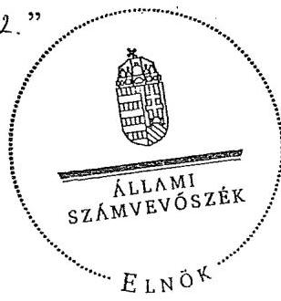

Tisztelettel:

Domokos László

---

.

---

.