# ÁLLAMI   SZÁMVEVŐSZÉK 

## JELENTÉS

Miskolc Megyei Jogú Város Önkormányzata pénzügyi helyzetének ellenőrzéséről (43/3)

---

# Számvevői Iroda 

Iktatószám: V-3041-10/2011.
Témaszám: 1015
Vizsgálat-azonosító szám: V056040

## Az ellenőrzést felügyelte:

Dr. Varga Sándor
számvevő igazgató-helyettes

## Az ellenőrzést vezette:

## Renkó Zsuzsanna

számvevő tanácsos

## Az ellenőrzést végezték:

## Bialkó Zsolt Gyula

számvevő tanácsos

## Nagy Attila

számvevő tanácsos

## Kányáné Murvai Tünde

számvevő tanácsos

## Szalontai Miklós

számvevő tanácsos

## A témához kapcsolódó eddig készített számvevőszéki jelentések:

| címe | sorszáma |
| :-- | :-- |
| Jelentés az önkormányzati kórházak és bentlakásos szociális in- | 0820 |
| tézmények ápolásra, gondozásra fordított pénzeszközei felhaszná- |  |
| lásának ellenőrzéséről |  |
| Jelentés Miskolc Megyei Jogú Város Önkormányzata gazdálkodási | 0851 |
| rendszerének 2008. évi ellenőrzéséről |  |
| Jelentés a szilárdhulladék-gazdálkodásra a Kohéziós Alapból és | 0920 |
| hazai forrásból nyújtott támogatások hasznosításának ellenőrzésé- |  |
| ről |  |
| Jelentés a helyi önkormányzatok gazdálkodási rendszerének 2008. | 0927 |
| évi ellenőrzéséről |  |
| Jelentés a természeti katasztrófák megelőzésére, elhárítására, kö- | 1107 |
| vetkezményeinek felszámolására kialakított rendszerek ellenőrzésé- |  |
| ről |  |

---

# TARTALOMJEGYZÉK 

BEVEZETÉS ..... 5
I. ÖSSZEGZŐ MEGÁLLAPÍTÁSOK, KÖVETKEZTETÉSEK, JAVASLATOK ..... 16
II. RÉSZLETES MEGÁLLAPÍTÁSOK ..... 27

1. Az Önkormányzat kötelező és önként vállalt feladatai ..... 27
2. A Pénzügyi egyensúlyi helyzet alakulása ..... 32
2.1. A múködési és a felhalmozási egyensúly alakulása ..... 32
2.2. Az Önkormányzat bevételeinek alakulása ..... 39
2.3. Az Önkormányzat kiadásainak alakulása ..... 43
3. A kötelezettségek bemutatása ..... 49
3.1. A pénzintézetek felé fennálló kötelezettségek alakulása ..... 49
3.2. Szállítók felé fennálló kötelezettségek alakulása ..... 56
3.3. Egyéb kötelezettségek alakulása ..... 57
4. A pénzügyi egyensúly megteremtése érdekében hozott intézkedések ..... 62
5. A helyi önkormányzatok gazdálkodási rendszerének 2008. évi ellenőrzése során a pénzügyi egyensúly javítására tett szabályszerűségi és célszerűségi javaslatok hasznosulása ..... 65

---

# MELLÉKLETEK 

1. számú Múködési és felhalmozási célú többlet az Önkormányzat rendeleteiben (1 oldal)
2. számú Az Önkormányzat bevételeinek és kiadásainak, adósságszolgálatának alakulása (1 oldal)
3/a. számú Az Önkormányzat 2007-2010. években megvalósított, 2010. december 31ig befejezett fejlesztések forrásösszetételéről (4 oldal)
3/b. számú Az Önkormányzat 2010. december 31-én folyamatban lévő fejlesztési feladataihoz kapcsolódó kötelezettségeinek összegzéséről (3 oldal)
3/c. számú Az Önkormányzat 2010. december 31-én folyamatban lévő fejlesztési feladataihoz kapcsolódó 2010. évet követő kötelezettségvállalásainak összegzéséről (2 oldal)
3/d. számú Az Önkormányzat beadott, elbírálás alatti pályázati forrásból megvalósuló fejlesztéseihez kapcsolódó kötelezettség-vállalásainak összegzéséről (1 oldal)
3. számú Az önkormányzati feladatok ellátásában résztvevő gazdasági társaságok (2 oldal)
4. számú Miskolc Megyei Jogú Város Polgármesterének észrevétele
5. számú Miskolc Megyei Jogú Város Polgármesterének észrevételére adott válasz

---

# RÖVIDÍTÉSEK JEGYZÉKE 

## Törvények

Áht.
ÁSZ tv.

Csődtv.
Gt.
Hatv.
Htv.

Ötv.

## Rendeletek

SzMSz
2007. évi zárszámadási rendelet
2008. évi zárszámadási rendelet
2009. évi zárszámadási rendelet
2010. évi zárszámadási rendelet

## Szórövidítések

áfa
ÁSZ
BM
EDP hiány/egyenleg
EU
GDP
Holding
Hulladékkezelési Konzorcium
Jegyző
Kincstár
KSH
az államháztartásról szóló 1992. évi XXXVIII. törvény az Állami Számvevőszékről szóló 1989. évi XXXVIII. törvény (2011. július 1-jétől az Állami Számvevőszékről szóló 2011. LXVI. törvény)
a csődeljárásról és felszámolási eljárásról szóló 1991. évi XLIX. törvény
a gazdasági társaságokról szóló 2006. évi IV. törvény
a helyi adókról szóló 1990. évi C. törvény
a helyi önkormányzatok és szerveik, a köztársasági megbízottak, valamint egyes centrális alárendeltségű szervek feladat- és hatásköreiről szóló 1991. évi XX. törvény
a helyi önkormányzatokról szóló 1990. évi LXV. törvény
Miskolc Megyei Jogú Város 7/2007. (III. 07.) számú rendelete az Önkormányzat Szervezeti és Múködési Szabályzatáról
Miskolc Megyei Jogú Város 13/2008. (IV.24.) számú rendelete az Önkormányzat 2007. évi zárszámadásának elfogadásáról
Miskolc Megyei Jogú Város 11/2009. (IV. 22.) számú rendelete az Önkormányzat 2008. évi zárszámadásának elfogadásáról
Miskolc Megyei Jogú Város 15/2010. (VI. 02.) számú rendelete az Önkormányzat 2009. évi zárszámadásának elfogadásáról
Miskolc Megyei Jogú Város 9/2011. (IV.20.) számú rendelete az Önkormányzat 2010. évi zárszámadásának elfogadásáról
általános forgalmi adó
Állami Számvevőszék
Belügyminisztérium
Uniós módszertan szerinti maastrichti kritériumoknak megfelelő számítás szerinti hiány/egyenleg
Európai Unió
Bruttó hazai termék
Miskolc Holding Zrt.
A hulladékgazdálkodási feladatellátásra létrehozott Miskolc Térségi Konzorcium
Miskolc Megyei Jogú Város Önkormányzat Jegyzője
Magyar Államkincstár
Központi Statisztikai Hivatal

---

| Kórház | Miskolci Egészségügyi Központ Nonprofit Kft., 2009. feb-   ruár 28-ig intézményként múködött mint Miskolci Egész-   ségügyi Központ (MEK) |
| :--: | :--: |
| MIHŐ | Miskolci Hőszolgáltató Kft. |
| MIK | Miskolci Ingatlangazdálkodó Zrt. |
| Miskolci Városgazda | Miskolci Városgazda Nonprofit Kft. |
| MITISZK | Miskolc-Térségi Integrált Szakképző Központ Nonprofit   Kft. |
| MIVÍZ | Miskolci Vízmúvek Kft. |
| MVK | Miskolc Városi Közlekedési Zrt. |
| NGM | Nemzetgazdasági Minisztérium |
| Polgármesteri hivatal | Miskolc Megyei Jogú Város Önkormányzat Polgármesteri   Hivatala |
| OEP | Országos Egészségbiztosítási Pénztár |
| Önkormányzat | Miskolc Megyei Jogú Város Önkormányzata |
| Polgármester | Miskolc Megyei Jogú Város Önkormányzat Polgármestere |
| PPP-konstrukció | Public Private Partnership (Partnerségi együttmüködés   közfeladatok ellátására a magánszektor bevonásával) |
| Sportiskola   szja | Miskolc Városi Sportiskola   személyi jövedelemadó |
| Társulás | Miskolci Kistérség Többcélú Társulása |
| Tűzoltóság | Miskolci Hivatásos Önkormányzati Tüzoltóság |

---

# JELENTÉS 

## Miskolc Megyei Jogú Város Önkormányzata pénzügyi helyzetének ellenőrzéséről

## BEVEZETÉS

Az Állami Számvevőszék 2011. évtől érvényes stratégiája új irányt szabott a helyi önkormányzatok gazdálkodásának ellenőrzésében is. Az ÁSZ - küldetése és jövőképe szerint - szilárd szakmai alapokra támaszkodva értékteremtő ellenőrzéseivel és helyzetelemzéseivel az államháztartás egészében, így a helyi önkormányzati alrendszerben is elő kívánja segíteni a közpénzek és a közvagyon szabályos, gazdaságos, hatékony és eredményes hasznosítását. Ennek részeként - a 2010. évi államháztartási hiány alakulásának összetevőire is figyelemmel folyamatban van az önkormányzati alrendszer pénzügyi helyzetelemzése.

Az NGM 2011 áprilisában közzétett adatai szerint ${ }^{1}$ a 2010. évi 1036,2 milliárd Ft összegű, 3,8\%-os EDP (maastrichti kritériumok szerinti, Túlzott Hiány Eljárás keretében kimutatott) hiánycél nem volt tartható, az önkormányzati alrendszer tervezettet meghaladó hiánya miatt a GDP arányában kifejezett államháztartási hiány 4,2\%-ra emelkedett.

Az önkormányzatok 2010 első három negyedévi költségvetési jelentése szerinti pénzforgalmi hiány 97 milliárd Ft-os összege nem indokolta az önkormányzati alrendszer 190 milliárd Ft-ra becsült hiányának 2010. évi végi felülvizsgálatát. A helyi önkormányzatok 2011. januári gyorsjelentése alapján a pénzforgalmi hiány már 247,7 milliárd Ft-ot tett ki. Az alrendszer hiánya így a tervezett $0,7 \%$-kal szemben magasabb, $0,9 \%$-os szinten realizálódott. Az 57,7 milliárd Ft hiánytöbblet alakulásában - a Tájékoztató szerint - az iparűzési adó elmaradása, a gépjárműadó, az illetékek és más bevételek tervezettnél alacsonyabb összegben való teljesülése volt a meghatározó.

Magyarország a Széll Kálmán Terv célkitűzései alapján² aktualizált Konvergencia Programjában a középtávú (2011-2015. évek) költségvetési pálya kijelölése során 2011-re a kormányzati szektor EDP módszertan szerinti egyenlegét + 2\%-

[^0]
[^0]:    ${ }^{1}$ NGM Tájékoztatás Magyarország Strukturális Reformprogramjának végrehajtásáról (2011. április 1). A Tájékoztató évente két alkalommal - április és október hónapban jelenik meg.
    ${ }^{2}$ Az államháztartás 2011. évi egyenlege - a magán nyugdíjpénztárakból az állami nyugdíjpillérbe való visszatérés egyszeri vagyonhatása következtében - 4\%-os többletet mutatna. A Széll Kálmán Tervben foglalt egyszeri intézkedések - a MÁV, a BKV adósságrendezése, a PPP-projektek kiváltása - összességében a GDP 2\%-ával csökkentik a várható többlet mértékét.

---

ban jelölte meg. Az egyenlegcél megfogalmazásakor az önkormányzati alrendszer tervezett hiányát a 2011. évi költségvetésben szereplő $0,3 \%$-kal szemben $0,5 \%$-os arányban határozták meg ${ }^{3}$. A hiánycélok meghatározása jelzi, hogy az önkormányzati alrendszerben 2011-ben fokozott figyelmet kell fordítani a pénzügyi egyensúlyi helyzet alakulására.

Az államháztartás helyi szintjén a 23 megyei jogú városi önkormányzatnak az általuk ellátott közszolgáltatások volumenére való tekintettel kiemelt szerepe van, e települések népessége összességében meghaladja a kétmillió főt ${ }^{4}$. A települések népességét az alábbi diagram szemlélteti:
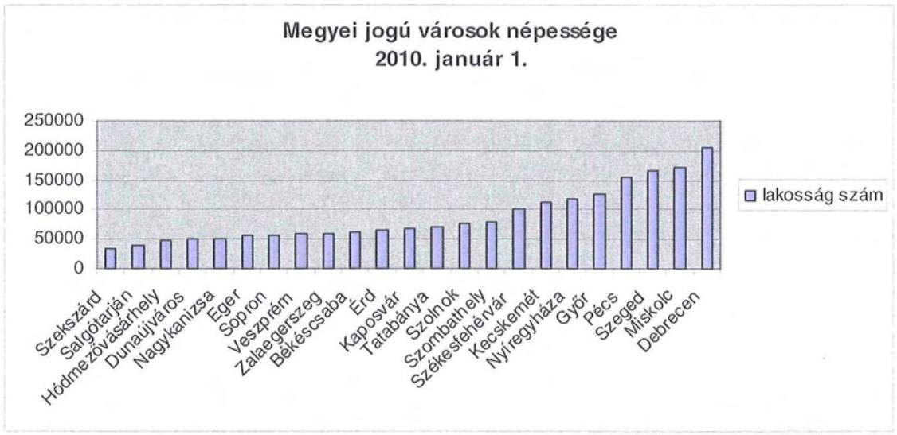

A megyei jogú városi önkormányzatok ${ }^{5}$ kötelező feladatellátását többlépcsős törvényi előírások határozzák meg. A feladatokra vonatkozó szabályozás első szintjét az Ötv. ${ }^{6}$, a második szintet a hatásköri ${ }^{7}$, a harmadik szintet a további ágazati, szakmai (egyebek mellett az oktatási, egészségügyi, szociális és egyéb ágazati feladatok ellátásának szakmai szabályait rögzítő) törvények adják.

A megyei jogú városi önkormányzatok - az Ötv-ből közvetlenül levezethető települési feladatok mellett körzeti közszolgáltatásokat is ellátnak. A megyei

[^0]
[^0]:    ${ }^{3}$ A Magyar Köztársaság 2011. évi költségvetéséről szóló 2010. évi CLXIX. törvény Általános indoklásának III. fejezete, valamint Magyarország Konvergencia Programja 2011-2015. (2011. április) Táblázatok rész, 2. táblázat Államháztartás összefoglaló adatai szerint.
    ${ }^{4}$ A megyei jogú városok népességét a 4/2011. (I. 31.) NGM rendelet 1. sz. mellékletében foglalt 2010. január 1-jei adatok alapján vettük figyelembe.
    ${ }^{5}$ Az Ötv. 61. § (1) bekezdése alapján a megyeszékhely város a törvény erejénél fogva megyei jogú, ugyanakkor az Országgyűlés az ötvenezernél nagyobb népességű városokat a képviselőtestület kérelmére megyei jogú várossá nyilváníthatja. Ez utóbbi körbe 5 város tartozik, közülük 2 (Hódmezővásárhely, Dunaújváros) népessége 2010. január 1-jére már ötvenezer fő alá csökkent.
    ${ }^{6}$ az Ötv. 8. és 61. §-ában foglaltak szerint
    ${ }^{7}$ a Htv.

---

jogú városi cím elsősorban többlet kötelezettségekkel jár, a megyei jogú városnak önmagának kell gondoskodnia mindazokról a feladatokról, amelyek más települési önkormányzatok esetében a megyei önkormányzat feladatát képezik. Ide sorolható többek közt a középfokú oktatási intézmények fenntartása, a közművelődési, könyvtári és levéltári szolgáltatás, a társadalombiztosítás finanszírozása mellett a kórházi és a rendelőintézeti szakellátás, a szociális és egyes gyermekvédelmi feladatok ellátása. Ezeket a feladatokat (intézményeket) a megyei jogú város - más városoktól eltérően - nem adhatja át a megyei önkormányzatnak, azonban az Ötv. lehetőséget biztosít arra, hogy a megyei önkormányzattal megállapodjék a feladatellátás megosztásában.

Az önkormányzat, így a megyei jogú város is, maga határozza meg, hogy - a lakosság igényei alapján, anyagi lehetőségei függvényében - mely feladatokat, milyen mértékben és módon, mely szervezeti keretek közt lát el. A szervezetalakítás szabadsága a megyei jogú városok esetében azzal járt, hogy mind a kötelező közszolgáltatásoknál (különösen a településüzemeltetés, vagyongazdálkodás), mind pedig az önként vállalt feladataik ellátásában - elsősorban a sport és kulturális szolgáltatások területein - a gazdasági társaságok kiemelt fontosságú szerephez jutottak. Ily módon a gazdálkodás, a pénzügyi helyzet kockázatai közvetlenül kikerültek ugyan az önkormányzati alrendszerből, azonban sérülhet az ellátási felelősség figyelemmel kísérése és érvényesítése, a közpénzek felhasználásának transzparenciája. Mindezek együttvéve - a beszámolók konszolidálásának hiányában - növelik a megyei jogú városok pénzügyi helyzetének megítélésében rejlő kockázatokat.

Az áttekintett időszakban az önkormányzati feladatok ellátásának keretet biztosító forrásszabályozás elvei lényegesen nem változtak.

A megyei jogú városok önkormányzatainak mozgásterét, az önkormányzatok feladatellátásra vonatkozó döntéseit a központi költségvetéstől való függőség mellett jelentősen befolyásolja a helyi adókivetési jog gyakorlása ${ }^{8}$. A helyi adók rendszere a közszolgáltatások finanszírozásához szükséges források megteremtésének, bővítésének eszköze, amely a gazdasági válság, a jogszabályi környezet, az adópolitika változása, az adóhatóságok tevékenysége következtében differenciáltan érinti a települési önkormányzatokat ${ }^{9}$.

A települési önkormányzatok saját folyó bevételeinek keretében elszámolt, különböző jogcímeken kivetett helyi adók - iparűzési adó, építmény és telekadó, idegenforgalmi adó, vállalkozók és magánszemélyek kommunális adója -2007-2010 között eltérő módon emelkedtek. A helyi adókból származó bevételek realizált összege országos szinten 2007-2009 között folyamatosan, 505,3 milliárd Ft-ról 566,3 milliárd Ft-ra emelkedett, majd a gazdasági válság hatásai következtében 2010-re 542,6 milliárd Ft-ra esett vissza. A helyi adók ré-

[^0]
[^0]:    ${ }^{8}$ a helyi adókról szóló 1990 . évi C. törvény szabályai szerint
    ${ }^{9}$ Az Állami Számvevőszék 2010 decemberében közzétett 1031. számú jelentésében értékelte a helyi adók rendszerében a hatékonyság és az eredményesség érvényesülését.

---

szesedése az önkormányzatok saját folyó bevételein belül 2007-2010 között 2,5 százalékponttal csökkent ${ }^{10}$.

A megyei jogú városok saját folyó bevétele 2007-ben 191,5 milliárd Ft volt, 2008-ban 223,1, 2009-ben 225,4, 2010-ben 223,5 milliárd Ft-ot tett ki. A helyi adóbevételekből való részesedésük 2007-ben 110,5 milliárd Ft (21,9\%), 2008ban 128,3 milliárd Ft (23,2\%), 2009-ben 124,4 milliárd Ft (22\%), 2010-ben 118,7 milliárd Ft (részaránya a 2007. évivel azonosan 21,9 \%) volt. E realizált adóbevételek a megyei jogú városok saját folyó bevételeinek 2007-ben 57,7, 2008-ban 57,5, 2009-ben 55,2, 2010-ben 53,1\%-át jelentették. A helyi adóbevételek 2007-ről 2010-re kimutatott 4,6 százalékpontos csökkenése annak ellenére következett be, hogy a megyei jogú városok saját folyó bevétele 2010-ben $16,7 \%$-kal haladta meg a 2007. évit.

A helyi adókon belül a települések gazdasági helyzetének egyik fokmérője az elért helyi iparűzési adóbevétel, amely a megyei jogú városok körében erőteljes - a település nagyságrendtől is függő ${ }^{11}$ - különbségeket mutat. A helyi iparűzési adóbevétel és annak egy lakosra vetített összegének 2007. és 2010. évi alakulását az alábbi diagramok szemléltetik:
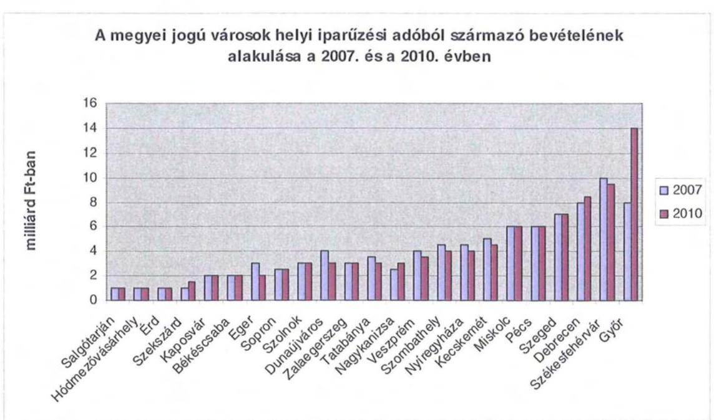

[^0]
[^0]:    ${ }^{10}$ A helyi adó bevételek saját folyó bevételekből való részesedése országosan 2007-ben $55,3 \%, 2010$-ben $52,8 \%$ volt.
    ${ }^{11}$ A 100 ezer fő feletti népességű megyei jogú városok csoportjába Debrecen, Miskolc, Szeged, Pécs, Győr, Nyíregyháza, Kecskemét, Székesfehérvár tartozik. Nem megyeszékhely megyei jogú város Érd, Sopron, Nagykanizsa, Dunaújváros, Hódmezővásárhely.

---

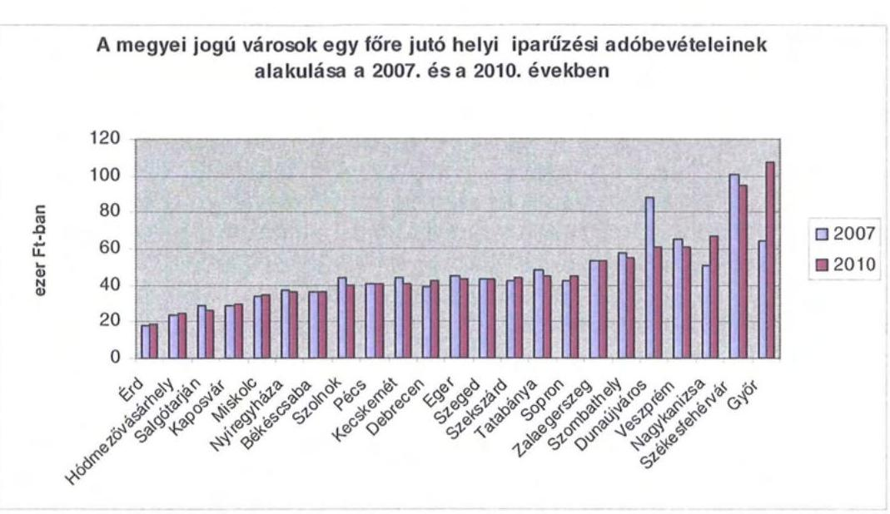

A megyei jogú városi önkormányzatok saját bevételein belül második legjelentősebb elem az illetékbevétel. A 2010. évben befolyt 39,2 milliárd Ft illetékbevétel a 2006. évben realizált 71,1 milliárd Ft illetékbevétel alig több mint $55 \%$-a. A jelentős visszaesést döntően az ingatlanpiac stagnálása, majd visszaesése, illetve egyes illetékkedvezmények bevezetése okozta. A kieső bevételek pótlására az önkormányzati alrendszer szintjén történtek intézkedések, 2010ben 5 milliárd Ft-ot, 2011-ben 1,2 milliárd Ft-ot ellentételezett a központi költségvetés. A megyei jogú városok önkormányzatai az önkormányzati alrendszer szintjén realizált illetékbevételből 2007-ben 13,6 milliárd Ft-tal (23,3\%-kal), 2008-ban 15,3 milliárd Ft-tal ( $22,7 \%$-kal), 2009-ben 12,6 milliárd Ft-tal ( $21,5 \%$ kal), 2010-ben 7,9 milliárd Ft-tal ( $20,2 \%$-kal) részesedtek ${ }^{12}$. Az összes befolyt illetékbevételből a megyei jogú városok részesedése 2009-ről 2010-re mindössze 1,3 százalékponttal csökkent, ugyanakkor a realizált illetékbevétel csökkenése a $37,3 \%$-ot ( 4,7 milliárd Ft) is elérte.

Az önkormányzati alrendszer átengedett bevételei közül a személyi jövedelemadóból való részesedés makroszintű szabályozása a vizsgált időszakban nem változott. A települési önkormányzatokat a településre kimutatott személyi jövedelemadó $8 \%$-a közvetlenül, míg $32 \%$-a külön szabályozott visszaosztási rendben illeti meg. A visszaosztás a jövedelem differenciálódás mérséklésével párosul, rendje a lakóhelyen maradó személyi jövedelemadóhoz és az iparűzési adó-erőképességhez ${ }^{13}$ igazodik, annak részletszabályait a mindenkori költségvetési törvény 4. számú melléklete határozza meg. A jövedelemdifferenciálódás

[^0]
[^0]:    ${ }^{12}$ Az illetékek kivetésének és beszedésének joga 2006. december 31-ig a megyei önkormányzatok feladata volt, amelyet a 2007. évtől az APEH (2011. január 1-jétől NAV) vett át. Az önkormányzati illetékrészesedési szabályok változatlanok maradtak, azonban az illetékbeszedés költségeit az önkormányzatok illetékbevételeiből átlagos (a megyei jogú városoknál 8,5\%-os) kulcsot alkalmazva vonták le.
    ${ }^{13}$ Az iparűzési adóerőképesség egy potenciális, átlagos erőfeszítés mellett elérhető (a települési önkormányzat iparűzési adóelőlegét meghatározó adóalap 1,4\%-ának megfelelő számított) bevétel.

---

szabályai kétirányúak, a kiegészítés és a visszatartás feltételeit egyaránt meghatározták:

- Amennyiben az önkormányzatot közvetlenül megillető személyi jövedelemadó bevétel és a számított iparűzési adóerő-képesség együttesen számított, egy főre jutó összege nem érte el a település méretéhez kapcsolódóan az évenkénti szabályozás szerinti változó összeget, a költségvetés a részesedést település nagyság szerint eltérően meghatározott szintig - kiegészítette ${ }^{14}$. A kiegészítés fajlagos összege 2007-2010 között 37500 Ft-ról 48010 Ft-ra (10 510 Ft-tal, 28\%-kal) emelkedett. Az előzőeken túl a jövedelem differenciálódás szabályozása egyes térségi (középiskolai, szakiskolai, szakképző intézményi, kollégiumi) feladatok ellátásának függvényében további kiegészítő hozzájárulást biztosított.
- Amennyiben az egy főre számított személyi jövedelemadó és az iparűzési adóerő-képesség együttes összege a település nagyságrendjéhez rendelt értékhatárt több mint $25 \%$-kal (2010-től 20\%-kal) meghaladta, az egy főre jutó összeg sávonként differenciált módon ${ }^{15}$ visszavonásra került az önkormányzatot megillető normatív állami hozzájárulás összegéből.

Az önkormányzatok személyi jövedelemadó bevétele 2007-ben 494,3 milliárd Ft, 2008-ban 558,6 milliárd Ft, 2009-ben 639,5 milliárd Ft, 2010-ben 681,2 milliárd Ft volt, az időszak alatt összegében 186,9 milliárd Ft-tal, 37,8\%kal emelkedett, miközben az szja bevétel átengedett bevételeken belüli részesedése 1,8 százalékponttal emelkedett.

A megyei jogú városok önkormányzatainak személyi jövedelemadó részesedése az alrendszer átengedett személyi jövedelemadó bevételeiből 2007-ben 77,6 milliárd Ft-ot ( $15,7 \%$-ot), 2008-ban 105,4 milliárd Ft-ot ( $18,9 \%$-ot), 2009ben 122,9 milliárd Ft-ot ( $19,2 \%$-ot), 2010-ben 136,6 milliárd Ft-ot ( $20,1 \%$-ot) tett ki. A realizált szja bevétel a megyei jogú városoknál az időszak alatt folyamatosan emelkedett, a 2010-ben realizált adóbevétel 59,0 milliárd Ft-tal (76\%) volt magasabb a 2007. évinél, az átengedett bevételeken belüli részesedése 2010-re 5,1 százalékponttal haladta meg a 2007. évi részarányt ${ }^{16}$. A részesedés alapjául szolgáló szja településenként eltérő, az egy adózóra jutó szja 2009. évi adatait ${ }^{17}$ a következő ábra szemlélteti.

[^0]
[^0]:    ${ }^{14}$ A megyei jogú városok esetében a jövedelemkülönbségek mérséklésénél figyelembe veendő lakosonkénti értékhatár 2007-ben 37500 Ft, 2008-ban 42385 Ft, 2009-ben 45933 Ft, 2010-ben 48010 Ft volt.
    ${ }^{15}$ A sávos értékhatár 2010-től 20\%-os intervallumonként, 120\% felett a visszatartást $25 \%$-tól $90 \%$-os mértékig rögzíti. Amennyiben a település nagyságrendhez rendelt értékhatár összege az önkormányzatnál eléri vagy meghaladja a 200\%-ot, az egy főre jutó összeg $90 \%$-a levonásra kerül. Az értékhatár sávjai 2010 előtt 25\%-os léptékűek voltak, a levonási arányok az ellenőrzött időszakban nem változtak.
    ${ }^{16}$ E bevételek a megyei jogú városok átengedett bevételeiben 2007-ben 84,7, 2008-ban 87,7, 2009-ben 89,7, 2010-ben 89,8\%-os részarányt jelentettek.
    ${ }^{17}$ Adatforrás: KSH Megyei Jogú Városok a Közép Dunántúlon 2009. kiadványa, 4.1. sz. összehasonlító tábla.

---

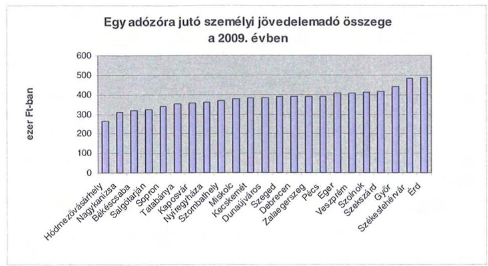

Az átengedett bevételek második legjelentősebb eleme a gépjármúadó, amelynek bevételi szabályozása az ellenőrzött időszakban nem változott, az adóbevétel teljes összege az önkormányzatot illeti meg. A gépjármúadó alapját, mértékét ${ }^{18}$ és egyes mentességi kategóriákat érintő módosítások 2010. január 1-től következtek be, amelyek az egyes adótételek esetében átlagosan $15 \%$-os emelkedéssel jártak.

A gépjármúadó beszedéséből származó bevétel az önkormányzati alrendszer szintjén 2007-ben 62,4 milliárd Ft, 2008-ban 65,7 milliárd Ft, 2009-ben 63,8 milliárd Ft, 2010-ben 71,1 milliárd Ft volt, az adóbevétel egésze 2007-hez képest 8,7 milliárd Ft-tal, 13,9\%-kal emelkedett. A gépjármú adóztatás szabályainak változása 2010-ben 7,3 milliárd Ft többletet eredményezett. A megyei jogú városok gépjármúadó bevétele a 2007. évi 14,0 milliárd Ft-ról 2010-re 15,5 milliárd Ft-ra, 10,7\%kal emelkedett. A bevétel-növekedés összegéből 1,4 milliárd Ft a 2010. évi adózási szabályok következménye.

A megyei jogú városok önkormányzatai 2007-2010. évek között rendelkezésre álló forrásainak alakulását a következő ábra szemlélteti:

[^0]
[^0]:    ${ }^{18}$ A gépjármúadóról szóló 1991. évi LXXXII. törvény 7. § (1) bekezdésében foglalt adómértékek változása.

---

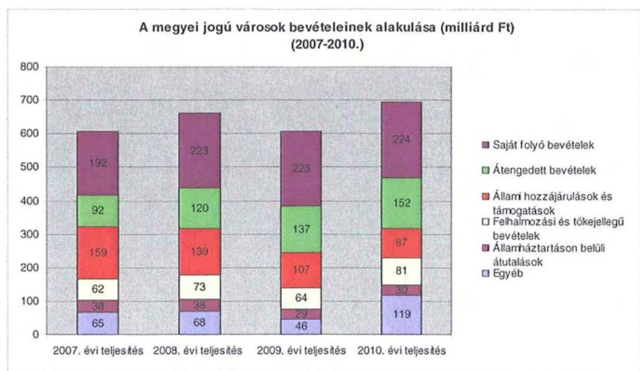

A megyei jogú városok saját folyó bevételeinek - amelyek fơbb elemei: a helyi adók, az illetékbevételek, az intézményi térítési díjak, a kamatbevételek részaránya a 2007. évi összbevételen ( 608 milliárd Ft) belül 32\% volt. A 2010. évi összbevétel 693 milliárd Ft-os összegéből a saját folyó bevételek aránya miközben összege 2007-ről 2010-re 32 milliárd Ft-tal emelkedett - nem változott.

Az átengedett bevételek, amelyek a megyei jogú városok önkormányzatainál döntően a személyi jövedelemadó és a gépjármúadó részesedést jelenti, az összbevételen belül a 2007. évi 92 milliárd Ft-ról (15\%) 152 milliárd Ft-ra nőtt, részesedése 7 százalékponttal emelkedett. A 60 milliárd Ft-os növekedésből 59 milliárd Ft-ot az szja részesedés emelkedése okozott.

Az állami hozzájárulások és támogatások - amelyek főbb elemei: főként az ellátotti létszámhoz kötődő normatív állami hozzájárulások, központosított előirányzatok - a 2007. évi 159 milliárd Ft-ról (26\%-os részarányról) 2010-re 87 milliárd Ft-ra (13\%-os részarányra) estek vissza.

A felhalmozási és tőkejellegú bevételek - tárgyi eszközök (ingatlanok és ingóságok), föld és immateriális javak, részesedések értékesítése, EU-tól átvett pénzeszközök - a 2007. évi 62 milliárd Ft-ról (10\%-os részarányról) 2010-re 81 milliárd Ft-ra (12\%-os részarányra) emelkedtek.

Az államháztartáson belüli átutalások részesedése 2007-ben 38 milliárd Ft volt. 2010. év végére 8 milliárd Ft-tal csökkent, részaránya 6\%-ról 2010-ben 4\%-ra változott. Ez a bevételi kategória tartalmazza az Egészségbiztosítási Alaptól és más elkülönített állami pénzalapoktól átvett forrásokat. A 2010-ben e címen elszámolt bevétel a megyei jogú városoknál 22 milliárd Ft-ot tett ki.

Az egyéb, pénzmaradványból, vállalkozási bevételekből, államháztartáson kívülről származó átutalásokból, a hitelekből, a hosszú és rövid lejáratú értékpapírok értékesítéséből származó bevételek részesedése a 2007-2010. évek vi-

---

szonylatában 11\%-ról 17\%-ra emelkedett. Ez utóbbiak 2010. évi beszámoló szerinti összevont teljesítése 119 milliárd Ft volt ${ }^{19}$.

Mindezeket figyelembe véve a megyei jogú városok 2007. és 2010. évi forrásöszszetételének megoszlását az alábbi ábra szemlélteti:

A megyei jogú városok 2007. és 2010. évi forrásösszetétele
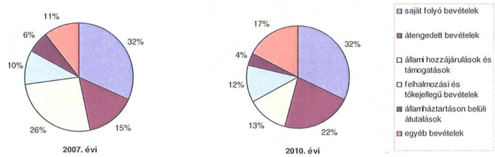

Az önkormányzati alrendszer pénzügyi helyzetértékelése során új elemzési módszereket alkalmaz az ellenőrzés. A hagyományos költségvetési szerkezet helyett az önkormányzat pénzügyi helyzetét a CLF módszerrel mutatjuk be, amelynek lényegét és számításának módszerét a 2.1. pontban, és a jelentés 2 . számú mellékletében ismertetjük részletesen.

Az új módszereken alapuló helyzetértékelés fontosságát az adja, hogy a helyi önkormányzatok bruttó adósságállománya ${ }^{20}$ a 2010. évi költségvetési beszámoló alapján 1248 milliárd Ft-ot tett ki. Az adósságállomány koncentráltságát jelzi ${ }^{21}$, hogy ebből a 23 megyei jogú város részesedése 338 milliárd Ft volt, amely a fővárosi és kerületi önkormányzatok adósságának figyelmen kívül hagyásával számított 2010. évi 977 milliárd Ft összegű bruttó adósságállomány $34,6 \%$-át jelentette. Az adósságállomány több mint fele - 501 milliárd Ft - a 19 megyei önkormányzatnál és a 23 megyei jogú városnál jelentkezett.

[^0]
[^0]:    ${ }^{19}$ Az egyéb bevételek összege 2007-2010 között eltérő módon változott, 2007-ben 65 milliárd Ft, 2008-ban 68 milliárd Ft volt, 2009-ben 46 milliárd Ft-ra esett vissza, majd 2010-ben több mint két és félszeresére, 119 milliárd Ft-ra emelkedett.
    ${ }^{20}$ A bruttó adósságállomány 2010. év végi összege magában foglalja a fejlesztési és a működési célú kötvénykibocsátások, a beruházási és fejlesztési hitelek, a működési célú hosszú lejáratú hitelek, a rövid lejáratú hitelek, váltótartozások miatti kötelezettségek teljes (2011-ben, illetve az azt követő években esedékes) állományát.
    ${ }^{21}$ A megyei jogú városok adósságállománya összegében ugyan elmarad az egyéb városok összesített adósságától [(ez utóbbiak részesedése 382,6 milliárd Ft (39,2\%)], azonban az egyéb városok száma 304. A fővárosi és a kerületi önkormányzatok nélküli adósságállományból a 19 megyei önkormányzat 163 milliárd Ft-tal (16,8\%-kal), míg a nagyközségek, községek együttesen 93 milliárd Ft-tal ( $9,5 \%$-kal) részesednek.

---

A megyei jogú városok 338 milliárd Ft-os adósságállományából 175 milliárd Ft (51,8\%) a 8 legnagyobb, 100 ezer fő feletti népességű város tartozása. Az 5 nem megyeszékhely megyei jogú város bruttó adósságállománya 70 milliárd Ft-ot (20,7\%-ot), az előző két csoportba nem tartozó további 10 megyei jogú város adóssága 93 milliárd Ft-ot ( $27,5 \%$-ot) tett ki.
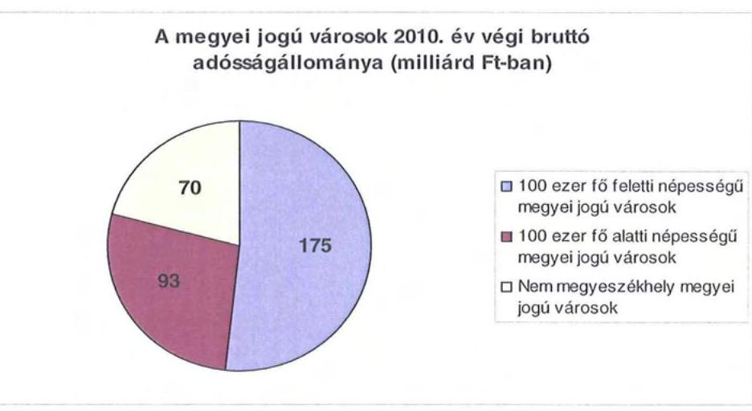

A mérlegben kimutatott bruttó adósságállomány mellett az önkormányzatok számára az eszközállomány múszaki állapotának megőrzése is kötelezettségekkel jár. Az elhasználódott eszközök pótlására forrást biztosító amortizációs (felújítási) alap képzésének ${ }^{22}$ elmaradása maga után vonhatja a feladatellátást kiszolgáló tárgyi eszközök állagának erőteljes romlását. Emellett a 2007-2013as időszakra meghirdetett, vissza nem térítendő EU-s fejlesztési forrásokhoz való hozzájutás lehetősége felerősítette az önkormányzati alrendszer fejlesztési igényeit, amelyek a felhalmozási költségvetési hiány folyamatos emelkedésén túl - az előírt jövőbeni fenntartási kötelezettség miatt - tovább terhelhetik az önkormányzatok költségvetését ${ }^{23}$.

Az ÁSZ a 2011. évi ellenőrzési tervében 43. számú, az Önkormányzatok gazdálkodási rendszerének ellenőrzése részeként egy időben, egymással párhuzamosan tekinti át, és elemzi a 23 megyei jogú városi önkormányzat pénzügyi helyzetét. A gazdálkodás szabályszerűségét az ÁSZ az előző évek során ebben az önkormányzati körben is ellenőrizte, ezért jelen vizsgálatunk erre nem tér ki. A jelentés a megyei jogú városok sajátos feladatellátási és forrásszabályozási helyzetére tekintettel az önkormányzatok pénzügyi helyzetét, illetve az ezzel összefüggő korábbi ÁSZ javaslatok megvalósítását mutatja be.

[^0]
[^0]:    ${ }^{22}$ Erre a jelenlegi szabályozási környezetben nem kötelezi semmilyen előírás az önkormányzatokat.
    ${ }^{23}$ Az Állami Számvevőszék 2011 júniusában közzétett 1108. számú, a helyi önkormányzatok fejlesztési célú támogatási rendszerének ellenőrzéséről szóló jelentésében feltárta a fejlesztési folyamatok problémáit. A helyi önkormányzatok elsősorban azokat a fejlesztéseket valósították meg, amelyekhez támogatást lehetett igényelni. A fejlesztési célok közül a magasabb támogatás intenzitású pályázatokat részesítették előnyben. A fejlesztéssel megvalósuló létesítmények jövőbeli üzemeltetésének várható ráfordításait az önkormányzatok $71,9 \%$-a nem mérte fel.

---

Az ellenőrzés a 2007. január 1. - 2010. december 31. közötti időszakot öleli fel.
A vizsgálat jogszabályi alapját az Állami Számvevőszékről szóló 1989. évi XXXVIII. törvény 2. § (3), (5), (6) és (9) bekezdései ${ }^{24}$, az Ötv. 92. § (1) bekezdése, az Áht. 104. § (3), és 120/A. § (1) bekezdése előírásai képezik.

[^0]
[^0]:    ${ }^{24}$ 2011. július 1-jétől az Állami Számvevőszékről szóló 2011. évi LXVI. törvény 5. § (2)(5) bekezdései

---

# 1. ÖSSZEGZŐ MEGÁLLAPÍTÁSOK, KÖVETKEZTETÉSEK, JAVASLATOK 

Az Önkormányzat - adatszolgáltatása szerint - a 2010. évi Kórház nélküli múködési költségvetési kiadásaiból 38265 millió Ft-ot ( $87,8 \%$ ) a kötelező feladatok, 5317 millió Ft-ot ( $12,2 \%$ ) az önként vállalt feladatok ellátására fordított. A kötelező és önként vállalt feladatok részarányának megállapítása az Önkormányzat SzMSz szerinti besorolásának megfelelően készült. Az Önkormányzat önként vállalt feladatnak tekinti többek közt az időskorúak, a helyi sportfeladatok és a helyi kultúra, a helyi közlekedés, az idegenforgalom, a bűnmegelőzés, az esélyegyenlőség támogatását.

Az Önkormányzat feladatellátásának szervezeti struktúráját a következő ábra szemlélteti:
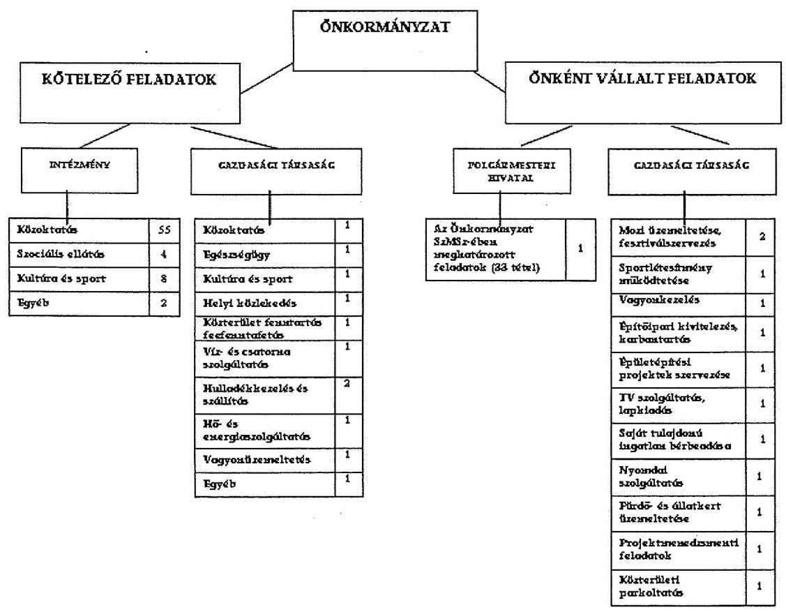

Az Önkormányzat feladatait 2010. december 31-én (a Polgármesteri hivatallal együtt) 69 költségvetési szervvel és 23 gazdasági társaságával ( $25 \%$ feletti tulajdoni hányadú), továbbá egy az Önkormányzattól tulajdonosi szempontból független gazdasági társaság közreműködésével látta el. Az áttekintett időszakban az időskorúak bentlakásos ápolási feladatát mint közszolgáltatási felada-

---

tot integrálta az Önkormányzat gesztorságával létrehozott intézményfenntartó társulásba. Az intézményszervezeti átalakítások és intézményi összevonások következtében a feladatellátás telephelyeinek száma a 2006. évi 250-ről 2010re 270-re nőtt.

Az Önkormányzat múködési kiadásokra 2010-ben 43582 millió Ft-ot fordított, amely 5793 millió Ft-tal (11,7\%-kal) maradt el a 2007. évi ráfordításoktól. A múködési kiadások 58,2\%-át az intézményi körben realizálták. E kiadások fedezetéül szolgáló bevételi források 2007. és 2010. években jellemző összesített arányait a következő ábra szemlélteti:
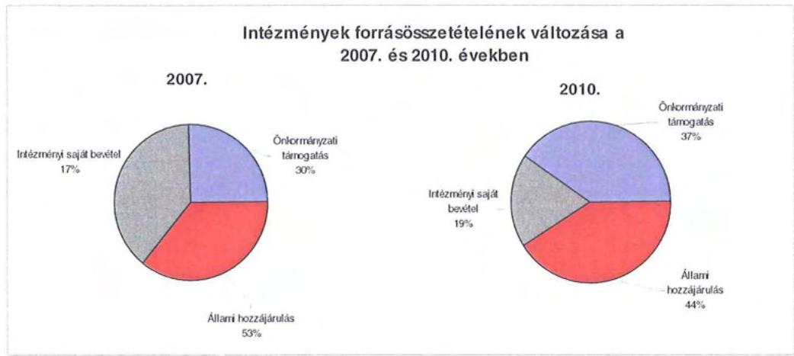

Az egyes közszolgáltatások feladatellátásában résztvevő ágazati intézménycsoportok forrásösszetételének bevételi jogcímenkénti alakulását a következő ábra szemlélteti:
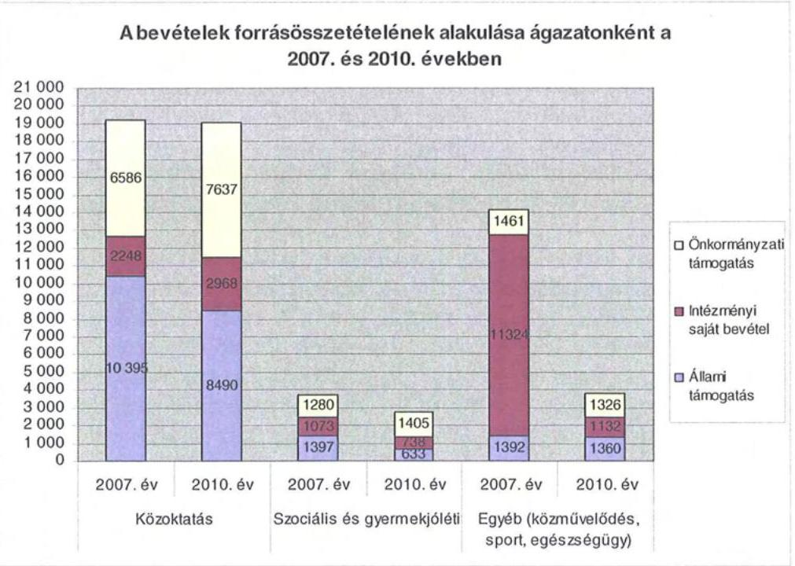

Az Önkormányzat 2009. február 28-ig két kórház - mely egy intézményként múködött (MEK) - fenntartásáról gondoskodott. Az egészségügyi feladatellátást

---

2009. február 28-tól gazdasági társaságba szervezték. Az egészségügyi intézmény, illetve a Kórház mint gazdasági társaság számára összesen 1107 millió Ft támogatást biztosítottak, amelyből múködési célra 1069 millió Ft-ot, fejlesztési célra 38 millió Ft-ot adtak át. A fejlesztési támogatások a Kórház gépműszer beszerzéseihez, illetve a gazdasági társaság alapításához kapcsolódtak.

Az Önkormányzat 18 gazdasági társaságban (ebből 11-ben a Holdingon keresztül) rendelkezik kizárólagos tulajdonnal, négyben 25-50\% közötti tulajdoni hányaddal. A gazdasági társaságok a kötelező feladatellátásban (közoktatás, egészségügy, kultúra, sport, helyi közlekedés, közterület fenntartás, víz- és csatorna-szolgáltatás, hulladékkezelés és -szállítás, hő- és energiaszolgáltatás, vagyonüzemeltetés) és az önként vállalt feladatokban (mozi üzemeltetés, fesztiválszervezés, sportlétesítmények üzemeltetése, vagyonkezelés, építőipari kivitelezés, épületépítési projektek szervezése, televízió-szolgáltatás, lapkiadás, saját tulajdonú ingatlan bérbeadás, nyomdai szolgáltatás, fürdő- és állatkert üzemeltetése, projekt menedzselési feladatok, közterületi parkoltatás) kaptak szerepet. Az Önkormányzat a gazdasági társaságok múködési céljai megvalósításához 3836 millió Ft-tal, a fejlesztési célokhoz 25 millió Ft-tal járult hozzá. A múködési célú pénzeszköz átadások 30\%-át (1153 millió Ft-ot, ebből 613 millió Ft a helyi közösségi közlekedés állami támogatásának továbbadása) a tömegközlekedést lebonyolító gazdasági társaság kapta.

A gazdasági társaságok feladatellátásához rendelt 2010. év végi nettó vagyon értéke 62384 millió Ft volt. A Holding és az irányítása alatt múködő gazdasági társaságok együttesen nem voltak veszteségesek 2007-2009 között, a 2010. évi konszolidálás előtti eredményük azonban -770 millió Ft volt. A Holding irányítása alá tartozó gazdasági társaságok közül a legjelentősebb mértékben, 56\%ra a tömegközlekedést lebonyolító MVK saját tőke/jegyzett tőke aránya csökkent (a saját tőke 1614 millió Ft, a jegyzett tőke 2899 millió Ft volt 2010-ben). További három társaságnál, ahol a saját tőke nem érte el jegyzett tőke összegét, a tőkevesztés mértéke összességében nem jelentős, 256 millió Ft volt. A Közgyűlés 2009-ben a Holding 741 millió Ft értékű, apport formájában biztosított tőkepótlásáról (tőkeleszállítást követő tőkeemeléssel) döntött veszteségrendezés indokával. A 2009. február 28-tól gazdasági társaságként - nem a Holding irányítása alatt - működő Kórház alapítása óta veszteséges, 2009-ben -1344 millió Ft, 2010-ben -547 millió Ft volt a mérleg szerinti eredménye.

A folyó költségvetés egyenlege (múködési jövedelem) 2007-2008 között múködési forrástöbbletet mutatott ${ }^{25}$, 2009-2010 között viszont az Önkormányzat múködési forráshiányossá vált ${ }^{26}$. A 2007-2008. években a működési többletből fedezni tudták a tárgyévben jelentkező törlesztési kötelezettségeket, így az Önkormányzat pénzügyi kapacitása (nettó múködési jövedelme) is pozitív értékű volt. A 2009. és a 2010. évben a múködési jövedelem negatívvá vált (-257 millió Ft, illetve -1427 millió Ft volt), a folyó bevételek nem nyújtottak fedezetet a folyó kiadásokra, a múködési egyensúly nem volt biztosított.

[^0]
[^0]:    ${ }^{25}$ A múködési jövedelem 2007-ben a folyó bevételek 2,7\%-át (1311 millió Ft-ot), 2008ban $1,7 \%$-át ( 745 millió Ft-ot) jelentette.
    ${ }^{26}$ A negatív múködési jövedelem 2009-ben a folyó kiadások 0,6\%-át (257 millió Ft-ot) és 2010-ben a folyó kiadások 3,2\%-át tette ki ( 1427 millió Ft).

---

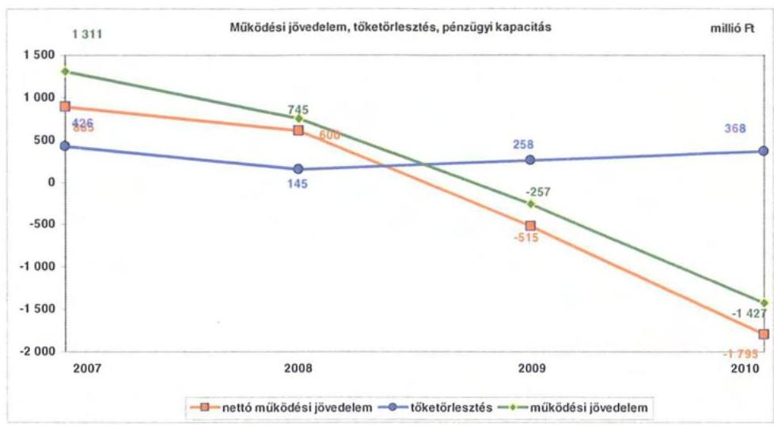

A 2007-2010. években az Önkormányzat felhalmozási költségvetésének egyenlege folyamatosan negatív összegű volt, amely 2007-2010. között összesen 17384 millió Ft felhalmozási forráshiányt okozott.

A pénzügyi egyensúly fenntartása külső források bevonásával volt biztosítható. A 2007-2010. években 1199 millió Ft tőkét törlesztettek. Az adósságszolgálat, továbbá a felhalmozási forráshiány 2007-2010 között 18583 millió Ft-ot tett ki, amelyre az időszakban képződő 373 millió Ft működési megtakarítás (múködési jövedelem), valamint a 2007. január 1-jén rendelkezésre álló 709 millió Ft pénzkészlet részben szolgált fedezetül. További fedezeti forrást 8000 millió Ft kötvény kibocsátása, 6611 millió Ft hosszú lejáratú hitel, 1800 millió Ft folyószámlahitel, valamint 1090 millió Ft rulírozó hitel felvétele nyújtott. A kialakult pénzügyi helyzet pozitív nettó múködési jövedelmet eredményező gazdálkodás mellett teszi elkerülhetővé további külső források bevonását, az eladósodás növekedését.

A vizsgált időszakban az Önkormányzat adóbevétele helyi iparűzési adóból, építményadóból, vendégéjszakák utáni idegenforgalmi adóból tevődött össze. A helyi adókból és pótlékokból származó bevételek aránya 2007-2010 között $14,7 \%$ és $19,0 \%$ közötti volt a folyó (múködési) bevételekben. A pótlékkal, bírsággal növelt helyi adó bevétel a 2007. évi 7235 millió Ft-ról 2010. évben 8165 millió Ft-ra ( $12,9 \%$-kal, 930 millió Ft-tal) nőtt. A helyi adóbevételek háromnegyed részét az iparűzési adó tette ki, amelynek mértékét a Hatv-ben rögzített maximális mértékben állapították meg. A helyi adók növekedését az építményadó mértékének emeléséből adódó 708 millió Ft-os bevételi többlet, valamint az iparűzési adó kismértékű növekedése okozta. Új helyi adónemet a vizsgált időszakban az Önkormányzat nem vetett ki.

A befejezett fejlesztések 25,7\%-át pénzintézeti forrásokból fedezték. A 20072010. évek időszakában 30867 millió Ft értékű fejlesztés és felújítás forrása 3643 millió Ft kötvényből származó bevétel ( $11,8 \%$ ), valamint 4278 millió Ft hitelfelvétel ( $13,9 \%$ ) volt. A 2010. december 31-én folyamatban lévő fejlesztési feladatok végrehajtására 15912 millió Ft kiadást teljesítettek, amelyre a kötvény bevételéből 1760 millió Ft-ot ( $11,1 \%$ ), hitelből 4430 millió Ft-ot ( $27,8 \%$ ) fordítottak.

---

Az Önkormányzat 2010. december 31-én folyamatban lévő fejlesztési feladatok kötelezettség-vállalásainak összege 15226 millió Ft volt, amelyet 299 millió Ft saját forrásból, 4470 millió Ft hitelkeretből még rendelkezésre álló forrásból, 2597 millió Ft korábbi kötvénykibocsátás megmaradt forrásából, 7207 millió Ft EU-s támogatásból és 653 millió Ft hazai támogatásból terveznek biztosítani. A tervezett saját források rendelkezésre állását azonban az Önkormányzat jelenlegi pénzügyi helyzete nem igazolja. Mindez kockázatot jelent a vállalt fejlesztések jövőbeni finanszírozhatósága szempontjából, illetve a tervezett hitelfelvétel tovább növeli a pénzügyi kockázatot.
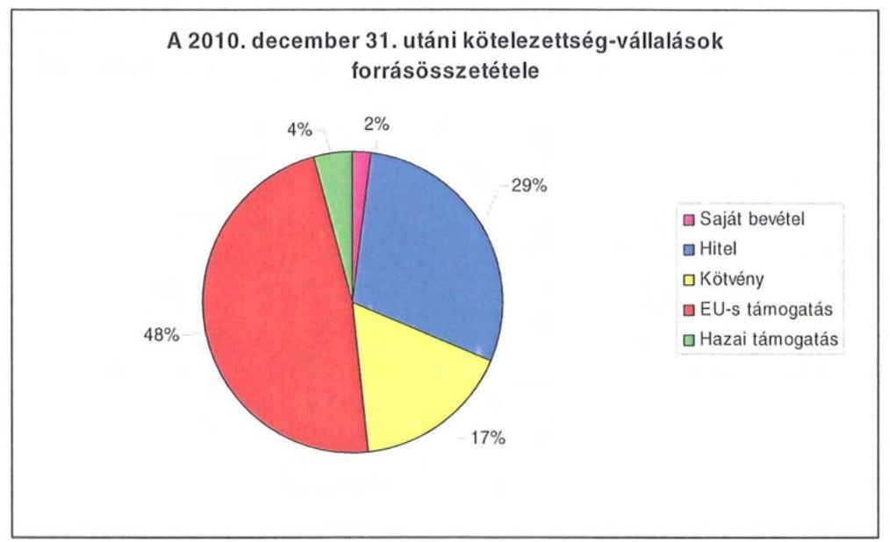

Az Önkormányzat által beadott, elbírálás alatt álló pályázatok alapján a tervezett beruházások teljes bekerülési költsége 9378 millió Ft volt, amelyhez hitelt is kívánnak bevonni 635 millió Ft összegben, ugyanakkor a múködési költségvetésben megtakarítást a 2009-2010. években nem sikerült elérni. Az Önkormányzat vállalt kötelezettségeit - a saját bevételeken túl - pénzeszközeiből (1482 millió Ft), fennálló követelésállományból származó forrásai felhasználásával (2011 millió Ft) és jelzáloggal nem terhelt forgalomképes ingatlanvagyon (15 921 millió Ft nettó nyilvántartási értékű) szükség szerinti értékesítéséből származó bevételből kívánja finanszírozni.

Az Önkormányzat mérleg szerinti pénzintézeti kötelezettsége a 2006. év végéről a 2010. év végére 10855 millió Ft-ról 32031 millió Ft-ra nőtt, amelyből a kedvezőtlen árfolyamváltozás miatti veszteség 3571 millió Ft volt. A fennálló pénzintézeti kötelezettségek két kötvény kibocsátásból, 38 hosszú lejáratú hitelből, folyószámla- és rulírozó hitel igénybevételéből keletkeztek. Ezen felül a folyamatban lévő beruházásai finanszírozásához 2010. évet követően 4470 millió Ft hitel igénybevételét tervezik. A hitelszerződéseket megkötötték, hitellehívására azonban 2010. december 31-ig nem került sor.

Az Önkormányzat kötelezettségvállalásaira közgyűlési döntés alapján került sor, azonban az előterjesztésekben nem mutatták be a visszafizetés forrásait, valamint a kamat- és - a devizaalapú kötelezettségeket érintő - árfolyamkockázatot.

---

Az Önkormányzat a beruházások és felújítások finanszírozása céljából kötvényeket bocsátott ki. Fejlesztési hiteleiből többek között infrastrukturális, közoktatási, kulturális, környezetvédelmi, informatikai célú beruházásokat finanszírozott, valamint panelházak felújításához biztosított saját forrást.

Az Önkormányzat az áttekintett időszakban a devizában fennálló pénzintézeti kötelezettségeiből 2975 ezer CHF, 1946 ezer EUR (összesen 1037 millió Ft) kamatot és egyéb költséget fizetett meg, tőkét még nem törlesztett. A HUF-ban fennálló kötelezettségekből 7008 millió Ft tőkét, kamatot és egyéb költséget teljesített. Az Önkormányzat a kötvények kibocsátásából és a hitelek igénybevételéből származó forrásokat 2010. év végéig a céloknak megfelelően használta fel. A 2007-2010. években átmenetileg szabad pénzeszközeiből 1795 millió Ft kamatbevételt realizált, melyből 1297 millió Ft származott a kötvénybevételek befektetéséből. A kamatbevételeket a kötvények kamatfizetésére, valamint múködési célra fordították. Az Önkormányzat számlavezető bankot 2009. januárban váltott. A korábban kibocsátott kötvények lejegyzése és egy Ft alapú hitel folyósítása ( 54043 ezer CHF és 1722 millió Ft) a számlavezető pénzintézet által történt, amely kockázatot jelent az Önkormányzat számára a banki befolyás növekedése miatt.

Az Önkormányzat múködésének pénzügyi egyensúlyát a vizsgált időszakban folyószámlahitel és rulírozó hitel igénybevételével tudta biztosítani.

A folyószámlahitel igénybevétele a 2007-2010. években az alábbiak szerint alakult:

| Megnevezés | 2007. év | 2008. év | 2009. év | 2010. év |
| :--: | :--: | :--: | :--: | :--: |
| Keretösszeq január 1-lén | 2000 | 2500 | 0 | 3000 |
| Átlogos napi állomány | 1650 | 1823 | 1834 | 2261 |
| Folyószámla hitellel zárt napok száma (nop) | 341 | 348 | 333 | 362 |
| 2010. december 31-i euyerdeq (állomány) | x | x | x | 2022 |

A likviditás biztosítása az Önkormányzatnak 849 millió Ft kamatkiadást okozott.

Az Önkormányzat 2010. év végi szállítói tartozása 2567 millió Ft, melyből a lejárt tartozás 1765 millió Ft volt. Az Önkormányzatnak egyéb kiadáselmaradása nem volt 2010. december 31-én. A lejárt tartozások 0,08\%-a (1,5 millió Ft) meghaladta a 91 napot. Az Önkormányzat intézményeinél és a Polgármesteri hivatalnál a 60 napot meghaladó, szállítók felé fennálló kötelezettségek miatt - a helyi önkormányzatok adósságrendezési eljárásáról szóló 1996. évi XXV. törvény 5. § (2) bekezdésében foglaltak ellenére - a Polgármester nem kezdeményezett adósságrendezési eljárást.

Az Önkormányzat az áttekintett időszakban 6200 millió Ft erejéig vállalt készfizető kezességet, amelyből tényleges fizetési kötelezettsége nem keletkezett ${ }^{27}$. PPP-konstrukció keretében egy középiskola tornatermének építése folyik, a

[^0]
[^0]:    ${ }^{27} 2011$ áprilisától az Önkormányzat készfizető kezességből eredő kötelezettsége 2000 milliárd Ft-ra csökkent.

---

fennálló kötelezettség összege 547 millió Ft. A kötelezettség teljesítése a beruházás befejezését követően (terv szerint 2011-től) kezdődik és 15 éven keresztül áll fenn évi 36 millió Ft-ot meghaladó összegben. Az önkormányzati döntésen alapuló elengedett követelések összege 105 millió Ft volt az áttekintett időszakban.

A vizsgált időszakban az intézményeiknek 22 esetben 144 millió Ft, civil szervezeteknek hét alkalommal visszatérítési kötelezettséggel adtak át 20 millió Ft-ot különféle pályázatok megvalósításához. Gazdasági társaságaiknak 943 millió Ft-ot adtak át 17 alkalommal kulturális programokhoz, fesztiválok lebonyolításához, munkavállalókkal szembeni fizetési kötelezettségek teljesítésére, utófinanszírozású pályázat megvalósításához, valamint tagi kölcsönként.

A Közgyűlés a folyószámlahitel és fejlesztési hitelek biztosítékaként 2013 millió Ft - számviteli nyilvántartás szerinti nettó értékű - jelzálogjog alapításához és bejegyzéséhez járult hozzá a forgalomképes ingatlanok 11,2\%-a esetében. A korlátozottan forgalomképes ingatlanok esetében 1139 millió Ft összegű nettó értékű ingatlanra jegyeztek be jelzálogjogot, mely a korlátozottan forgalomképes ingatlanok nettó értékének 3,2\%-át érte el.

Az Önkormányzat kötelezettségeinek 2010. december 31-i állományát és várható alakulását a kötelezettségek lejáratáig a következő táblázat szemlélteti:

| Megnevezés | Állomány 2010. dec. 31 -én |  |  | Várható kötelezettség 20112013. évokben |  |  | Várható kötelezettség 2014.   évet követöen |  |  |
| :--: | :--: | :--: | :--: | :--: | :--: | :--: | :--: | :--: | :--: |
|  | $\begin{aligned} & \text { HUF-ban } \\ & \text { (millió Ft- } \\ & \text { ban) } \end{aligned}$ | Devizében (összcge eszeben) | Deviz   unem | HUF-ban   (millió Ft-ban) | $\begin{aligned} & \text { Devizében } \\ & \text { (összcge } \\ & \text { eszeben) } \end{aligned}$ | $\begin{aligned} & \text { Deviz } \\ & \text { (unem) } \\ & \text { (unem) } \end{aligned}$ | $\begin{aligned} & \text { HUF-ban } \\ & \text { (millió Ft- } \\ & \text { ban) } \end{aligned}$ | $\begin{aligned} & \text { Devizében } \\ & \text { (összcge } \\ & \text { eszeben) } \end{aligned}$ | $\begin{aligned} & \text { Deviz } \\ & \text { (unem } \\ & \text { (unem) } \end{aligned}$ |
| Pénzintézeti kötelezettségek |  |  |  |  |  |  |  |  |  |
| Hosszú lejáratú hitelek | 10000 |  | HUF | 2760 |  | HUF | 9770 |  | HUF |
| Hosszú lejáratú kötelek |  | 19224 EUR |  |  | 4061 EUR |  |  | 20000 EUR |  |
| Szivény (Miskolc 2007-2013. és Miskolc 2008.) |  | 34063 | CHF |  | 1331 | CHF |  | 34675 CHF |  |
| Cégfizetésmúltód | 2392 |  | HUF | 2392 |  | HUF |  |  | HUF |
| Számul. köte | 2360 |  |  | 2360 |  |  |  |  |  |
| Misdráttart kötelezettségek összesen HUF-ban | 14554 |  | HUF | 7312 |  | HUF | 9770 |  | HUF |
| Misdráttart kötelezettségek összesen EUR-ban |  | 19224 | EUR |  | 6061 | EUR |  | 20000 | EUR |
| Misdráttart kötelezettségek összesen CHF-ban |  | 34063 | CHF |  | 1331 | CHF |  | 34675 CHF |  |
| Biztosítékok |  |  |  |  |  |  |  |  |  |
| Kezmegy | 6200 |  | HUF |  |  |  |  |  |  |
| Szállítói tartozás | 2207 |  | HUF |  |  |  |  |  |  |
| Egyéb kiadás elmozeráás |  |  | HUF | 73 |  | HUF |  |  |  |
| Egyéb kötelezettségek |  |  |  |  |  |  |  |  |  |
| FEP beruházási kötelezettségiek | 447 |  | HUF | 109 |  | HUF | 437 |  | HUF |
| GT-6 és egyéb szervek felé fennálló kötelezettségek | 76 |  | HUF | 76 |  | HUF |  |  |  |
| Jogadó végzéssel lezárt de ki nem fizetett kötelezettségek | 25 |  | HUF | 25 |  | HUF |  |  |  |

Az Önkormányzatnak pénzintézetekkel szemben fennálló kötelezettsége a 2010. év végén 14554 millió Ft és 54043 ezer CHF és 19524 ezer EUR volt. Ezek várható kötelezettsége (tőke, kamat és egyéb költség) a legutóbbi kamatfizetés feltételei alapján a 2011. évtől a kötelezettségek teljesítéséig 17082 millió Ft, továbbá 60206 ezer CHF és 26160 EUR. Az Önkormányzatnak a 2011. évben szállítói tartozások és egyéb kiadáselmaradások rendezése, PPP-beruházási kötelezettség, gazdasági szervezetek felé fennálló kötelezettség, valamint jogerős végzéssel lezárt, de ki nem fizetett kötelezettségek címén 3284 millió Ft fizetési kötelezettsége keletkezett. A kezességvállalásaiból adódóan 2000 millió Ft öszszegű feltételes kötelezettségvállalás terheli az Önkormányzatot. A 2011-2013. évek között a várható kötelezettségek teljesítésére figyelembe vehető 1482 millió Ft pénzeszköz, 2011 millió Ft mérlegben kimutatott követelésállomány, 17934 millió Ft forgalomképes ingatlanvagyon, melyből a 2013 millió Ft a

---

pénzintézeti kötelezettségekhez kapcsolódóan jelzáloggal terhelt. A 2014. évtől a saját bevétel - a CLF szerint kimutatott múködési jövedelem a mutatkozó tendencia (2010. évi -1427 millió Ft) alapján - nem nyújt fedezetet az önkormányzati kötelezettségekre, azok teljesítésére a jelzálogjoggal nem terhelt ingatlanvagyon értékesítéséből származó bevétel használható fel. Az Önkormányzat tájékoztatása szerint: „a kötelezettségek fedezetének biztositása érdekében további egyensúlyt javító intézkedéseket terveznek".

Az Önkormányzat minősített többségi tulajdonú társaságai kötelezettségeinek 2010. december 31-i állományát és várható alakulását a kötelezettségek lejáratáig a következő táblázat mutatja be:

| Megnevezés | Állomány   2010.   dec.31-én |  |  | Várható kötelezettség 2011-2013.   években |  |  | Várható kötelezettség 2014. évet követően |  |  |
| :--: | :--: | :--: | :--: | :--: | :--: | :--: | :--: | :--: | :--: |
|  | $\begin{gathered} \text { HUF-ban } \\ \text { (millió Ft- } \\ \text { ban) } \end{gathered}$ | Dovizában (összege ezetben) | Dovizan   em | HUF-ban (millió Ft-   ban) | Dovizában (összege ezetben) | Dovizan   em | HUF-ban (millió Ft ban) | Dovizában (összege ezetben) | Dovizan   em |
| Pénzintézeti kötelezettségek |  |  |  |  |  |  |  |  |  |
| Összege lejáratú felelés | 7070 |  | HUF | 6104 |  | HUF | 2020 |  | HUF |
| Elővésejék |  | 22030 | CHF |  | 2010 | CHF |  | 27060 | CHF |
| Polgálatárola- és egyéb zövid lejáratú felelés | 6015 |  | HUF | 6015 |  | HUF |  |  | HUF |
| Pénzintézeti kötelezettségek összese | 13085 | 22020 |  | 12115 | 2015 |  | 2020 | 27060 |  |
| Üzleg kötelezettségek | 94 |  | HUF | 73 |  | HUF | 23 |  | HUF |
| Szállítói tartozó | 8463 |  | HUF | 8463 |  | HUF |  |  |  |
| Jogcéls végzéssel lezárt és ki nem fizetett kötelezettségek | 31 |  | HUF | 31 |  | HUF |  |  |  |

Az önkormányzati kötelezettségek növekedése mellett a minősített többségi tulajdonú társaságok kötelezettségei is befolyásolhatják az Önkormányzat pénzügyi egyensúlyát. A társaságoknak a 2011. évtől 14149 millió Ft és 29632 ezer CHF pénzintézeti kötelezettséget, 96 millió Ft lízing és 8463 millió Ft szállítói tartozást és 31 millió Ft jogerős végzéssel lezárt, de ki nem fizetett kötelezettséget kell rendezniük. Kockázatot hordoz, ha ezek nem teljesítése - esetleges csőd vagy felszámolási eljárás esetén - a bíróság korlátlan és teljes felelősséget állapít meg az Önkormányzat terhére.

Az Önkormányzat költségvetési támogatásból, átengedett bevételekből, és illeték bevételekből származó bevételei a 2007. évhez képest az időszak egészét tekintve összességében 4145 millió Ft-tal csökkentek. Ennek ellensúlyozása érdekében az Önkormányzat kiadási megtakarítást és bevételnövelő intézkedéseket tett, azonban ezek együttes összege ( 2667 millió Ft) sem kompenzálta a bevételek elmaradását. A 2007-2010. években tett intézkedések hatására 1298 millió Ft bevételi többletet, továbbá 1369 millió Ft kiadási megtakarítást mutattak ki, ezáltal részben a kieső forrásokat pótolták, illetve az Önkormányzat pénzügyi helyzetét javították. A kiadási megtakarítások 82,9\%-a az elrendelt álláshelycsökkentések eredménye. Az álláshelycsökkentő intézkedések 2007-2010. között a Polgármesteri hivatalnál és az intézményeinél összesen 667 álláshely (ebben nem volt üres álláshely) megszüntetését jelentették. A bevételnövelő intézkedések szabad kapacitások kihasználásához, ingatlanok értékesítéséhez, térítési díjak és az építményadó mértékének emeléséhez kapcsolódtak.

Az utóellenőrzés a pénzügyi egyensúly javítására tett szabályszerűségi javaslat hasznosítására terjedt ki, melyet teljesítettek.

---

Az Önkormányzat pénzügyi helyzetét összegezve a következők emelhetők ki:

A 2009-2010. években az Önkormányzat múködési kockázatát növelte a negatív nettó működési jövedelem, a jelentős lejárt szállítói tartozásállomány. A múködési bevételek a 2009-2010. években nem biztosították a múködési kiadások és az adósságszolgálat finanszírozását, a likviditás biztosítása növekvő mértékű folyószámla- és rulírozó hitel igénybevételével történt. Az önkormányzati bevételt csökkentő központi intézkedések hatását az ellenőrzött időszakban nem ellensúlyozta az Önkormányzat kiadáscsökkentő és bevételnövelő intézkedéseinek eredménye. A gazdasági társaságok szerepe a közüzemi közfeladatellátásban meghatározó volt. A gazdasági társaságok eladósodása növelte a pénzügyi kockázatot.

A vizsgált időszakban az Önkormányzat felhalmozási költségvetése pénzügyi hiányt mutatott, ennek forrásai kötvénykibocsátással és hitelfelvétellel biztosítottak voltak. A fejlesztési célú kötelezettségvállalások jövőben teljesítendő kifizetései tekintetében a nettó múködési jövedelem negatív értéke a finanszírozási kockázatot növeli. A hosszú lejáratú kötelezettségek finanszírozásának forrása a 2011-2013. években egyensúlyt javító intézkedések megtételével biztosítható, a további évekre vonatkozóan a forrásokat az Önkormányzat nem számszerúsítette.

A pénzintézeti és egyéb kötelezettségek teljesítésének kockázatát növelte, hogy a 2010. december 31 -én fennálló kötelezettségek visszafizetésének fedezetét a saját bevételben jelölték meg, nem számszerúsítették annak forrásait. A kockázatot csökkentheti az Önkormányzat 2010. évi követelésállománya, és forgalomképes ingatlanvagyona szükség esetén felhasználható az adósságszolgálat visszafizetésére.

A Polgármester tájékoztatása szerint a helyszíni ellenőrzést követően a 2011. évi gazdálkodás I. féléves áttekintése alapján a múködési kiadások visszafogása, a likviditás javítása érdekében a Közgyűlés mintegy 2 milliárd Ft zárolásáról döntött. A Polgármester a 2012. évi költségvetés előkészítése kapcsán a Polgármesteri hivatal és az Önkormányzat gazdasági társaságai felé számos - tájékoztatásában nem számszerúsített - intézkedést kezdeményezett.

Az Állami Számvevőszékről szóló 2011. évi LXVI. törvény 33. § (1) bekezdésében foglaltak értelmében a jelentésben foglalt megállapításokhoz kapcsolódó intézkedési tervet köteles az ellenőrzött szervezet vezetője összeállítani és azt a jelentés kézhezvételétől számított harminc napon belül az ÁSZ részére megküldeni. Amennyiben az intézkedési tervet határidőben nem küldi meg a szervezet, vagy az továbbra sem elfogadható, az ÁSZ elnöke a hivatkozott törvény 33. § (3) bekezdés a)-b) pontjaiban foglaltakat érvényesítheti.

---

# Az ellenőrzés intézkedést igénylő javaslatai: 

## a Polgármesternek

1. a Közgyűlés elé terjesztendő intézkedési terv írja elő a működés pénzügyi egyensúlyának gyors helyreállítása és hosszú távú fenntarthatósága érdekében - felelősök és határidők megjelölésével - olyan program készítését, amely tartalmazza az alábbiakat:
a) bevételszerző lehetőségek feltárását, különösen a helyi adópolitikai célok meghatározását és számszerúsítését, a bérleti díjak és a térítési díjak megállapítását, felülvizsgálatát, a követelések behajtását, az egyéb sajátos bevételek növelésének lehetőségét;
b) a folyamatban lévő és a tervezett beruházások teljes körű felülvizsgálatát;
c) egyéb kiadási kötelezettségek teljes körű felülvizsgálatát;
d) az intézkedések következtében jelentkező pénzügyi többlet, illetve az egyszeri bevételek tartalékba helyezését, elkülönített kezelését az adósságszolgálat teljesítése érdekében;
e) az adósságszolgálat szerkezetének áttekintését, a likviditás-menedzselést, a támogatás előfinanszírozás átláthatóbbá tételét;
f) az intézményi gazdálkodás felülvizsgálatát;
g) az önként vállalt feladatok finanszírozhatóságának áttekintését a kötelező feladatellátás elsődlegességének biztosítása érdekében, a gazdasági program áttekintésével összhangban;
h) az intézkedések eredményei legalább félévenkénti áttekintésének előírását;
2. mutassa be félévente - a szokásos beszámoló keretében - a Közgyűlésnek:
a) az Önkormányzat és a minősített többségi tulajdonú gazdasági társaságai aktuális pénzügyi helyzetét, az Önkormányzatnak a gazdasági társaságai felé fennálló követeléseit, nyújtott kölcsöneit;
b) legalább három évre kitekintően a kötelezettségek teljes körére szóló finanszírozási tervet, amely figyelembe veszi a kötelezettség éven belüli és túli felmerülését, a források számszerúsített megjelölésével;
c) az Önkormányzat folyamatban lévő és tervezett fejlesztéseihez szükséges belső és külső források rendelkezésre állását, és ebből a szempontból értékelje az Önkormányzat beruházásait;
3. mutassa be a Közgyűlésnek az intézményfenntartó társulási tagságból, gesztorságból eredő, az Önkormányzat pénzügyi egyensúlyát befolyásoló kockázatokat, és azok mérséklését szolgáló intézkedéseket;

---

4. mutassa be a Közgyűlésnek a fejlesztési társulási tagságból, gesztorságból eredő, az Önkormányzat pénzügyi egyensúlyát befolyásoló kockázatokat, és azok mérséklését szolgáló szervezeti és egyéb intézkedéseket;
5. intézkedjen a beruházásokkal létrehozott létesítmények müködtetését és jövőbeni fenntarthatóságát biztosító megalapozott források költségvetési rendeletekben történő feltüntetéséről;
6. kísérje figyelemmel az Önkormányzat intézményeinél és a Polgármesteri hivatalnál a 60 napot meghaladó, szállítók felé fennálló kötelezettségeket és a helyi önkormányzatok adósságrendezési eljárásáról szóló 1996. évi XXV. törvény 5. § (2) bekezdésében foglaltaknak megfelelően - indokolt esetben - kezdeményezzen adósságrendezési eljárást;

# a jegyzőnek 

1. kísérje figyelemmel a jövőbeni várható - árfolyam-, kamat- valamint visszafizetési kockázatokat, továbbá a mérlegen kívüli tételek (kezességvállalás, garancia és helytállási kötelezettségvállalás) kockázatait, és legalább félévente tájékoztassa a Közgyűlést azok alakulásáról;
2. gondoskodjon, hogy a jövőben az adósságot keletkeztető kötelezettségvállalásokról szóló közgyűlési előterjesztések tételesen tartalmazzák a visszafizetés forrásait, valamint legalább 3 éves kitekintéssel mutassák be a kamat- és árfolyamkockázat várható kihatásait;
3. kísérje folyamatosan figyelemmel - a tulajdonosi jogkört gyakorlók közreműködésével - a minősített többségi tulajdonú gazdasági társaságok kötelezettségeinek alakulását, az Önkormányzat likviditására, pénzügyi-egyensúlyi helyzetére gyakorolt hatását;
4. gondoskodjon a Polgármesteri hivatal és az intézmények lejárt szállítói tartozásai okainak feltárásáról, azonnali intézkedések megtételéről a lejárt tartozások mielőbbi rendezése érdekében;
5. intézkedjen a Polgármesteri hivatal és a további költségvetési szervek peres eljárásaiból adódó kötelezettségek teljesítése érdekében a szükséges fedezet elkülönítéséről, a finanszírozási tervben történő figyelembevétel mellett;
6. érvényesítse az adósságot keletkeztető kötelezettségvállalások során az Ötv. 88. § (1) bekezdés b) pontjának előírását, mely szerint hitel, kötvény fedezetéül az Önkormányzat törzsvagyona nem használhatók fel.

---

# II. RÉSZLETES MEGÁLLAPÍTÁSOK 

## 1. Az ÖNKORMÁNYZAT KÖTELEZŐ ÉS ÖNKÉNT VÁLlALT FELADATAI

Az Önkormányzat a 2010. évi költségvetési beszámolója alapján teljesített múködési kiadásain belül 38265 millió Ft-ot ( $87,8 \%$ ) fordított kötelező feladatainak ellátására. Az önként vállalt feladatokra teljesített múködési kiadások összege 5317 millió Ft ( $12,2 \%$ ) volt ${ }^{28}$. Az Önkormányzat az önként vállalt feladatai közé sorolta - többek közt - az időskorúak támogatását, helyi sportfeladatok és sportrendezvények, a helyi kultúra támogatását, a helyi közlekedés színvonalának erősítését, a légszennyezés elleni tevékenységet, az idegenforgalmi tevékenységet, a bűnmegelőzési feladatokat, az esélyegyenlőségi feladatokat, a gyermekek üdültetésének támogatását, a közhasznú társadalmi szervezetek támogatását ${ }^{29}$.

A kötelező feladatok körét az SzMSz-ben rögzítették, az önként vállalt feladatok támogatásának mértékét az éves költségvetési rendeletekben az anyagi lehetőségeik mértékében határozták meg.

Az Önkormányzat 2010. évi teljesített költségvetési kiadásain (53 878 millió Ft) belül 26855 millió Ft összegű kiadás az intézmények (49,8\%), a többi a Polgármesteri hivatal költségvetési beszámolójában jelent meg. Az Önkormányzat teljesített múködési kiadásai ( 43582 millió Ft) szerkezetét tekintve a meghatározó arányt, $43,4 \%$-ot ( 18899 millió Ft) az igazgatás és egyéb ágazat együttes kiadásai képviselték. A múködési kiadásokon belül a közoktatási feladatokat ellátó intézmények teljesített kiadása $43,3 \%$ ( 18887 millió Ft), a szociális- és gyermekvédelmi feladatokat ellátó intézményeké 6,6\% ( 2874 millió Ft), a közművelődési feladatokat ellátó intézményeké 6,7\% (2923 millió Ft) volt.

Az intézmények összes múködési kiadását ( 25360 millió Ft) $41 \%$-ban állami, $40 \%$-ban önkormányzati támogatás, az önkormányzati szintű múködési kiadásokat ( 43582 millió Ft) $27 \%$-ban állami és $34 \%$-ban önkormányzati támogatás finanszírozta a 2010. évben.

[^0]
[^0]:    ${ }^{28}$ A gazdasági társaságok 2010-ben saját árbevételükből 5897 millió Ft összegű kiadást teljesítettek az önkormányzati önként vállalt feladatok ellátására.
    ${ }^{29}$ Az Önkormányzat SzMSz-e 2. §-ának (6) bekezdésében tételesen rögzítette az önként vállalt feladatait.

---

Az Önkormányzat 2010. évi múködési kiadásait és finanszírozási arányait főbb feladatonként a következő táblázat foglalja össze:

| Ellátott feladat | Müködési kiadás összesen (millió Ft) | Kötelező feladatok kiadásainak rézzaránya $\%$ | Müködési bevételek összesen (millió Ft) | Állumi támogatás rézzaránya $\%$ | Intézményi saját bevétei rézzaránya $\%$ | Önkormányzati támogatás rézzaránya $\%$ |
| :--: | :--: | :--: | :--: | :--: | :--: | :--: |
| Övodák | 2738 | 100 | 2715 | 44 | 9 | 47 |
| Általános iskolák | 6809 | 100 | 6824 | 41 | 12 | 47 |
| Gimnástumok | 1998 | 100 | 2002 | 49 | 17 | 34 |
| Szakközépiskolák, szakképzö intézmények | 6372 | 100 | 6531 | 48 | 19 | 33 |
| Kollégiumok | 970 | 100 | 1030 | 37 | 32 | 31 |
| Szociális intézmények | 1435 | 100 | 1436 | 22 | 21 | 53 |
| Gyermekjéleti intézmények | 1439 | 100 | 1408 | 23 | 31 | 46 |
| Közmüreölítési intézmények | 2680 | 52 | 2867 | 26 | 32 | 42 |
| Sportéteztimények | 242 | 100 | 257 | 0 | 51 | 49 |
| Hivatásos tüzoltóság | 676 | 100 | 694 | 88 | 13 | $-1$ |
| Intézmények összesen | 25359 | 95 | 25764 | 41 | 19 | 40 |
| Polgármesteri Hivatalban kezelt feladatok | 18223 | 78 | 18954 | 9 | 67 | 24 |
| Mindösszesen | 43582 | 88 | 44718 | 27 | 39 | 34 |

A 2010-ben teljesített 53878 millió Ft összegű költségvetési kiadásból 26855 millió Ft ( $49,8 \%$ ) az intézmények, a többi a Polgármesteri hivatal költségvetési beszámolójában jelenik meg. A Polgármesteri hivatal által teljesített 26955 millió Ft összegű összes kiadásból a munkaadót terhelő járulékok, sze-mélyi- és dologi kiadások együttesen $42,2 \%$-kal ( 11369 millió Ft), a beruházások, felújítások $28 \%$-kal ( 7549 millió Ft), a különböző szervezetek támogatásához, finanszírozási tételekhez kapcsolódó kiadások 29,8\%-kal (8037 millió Ft) részesültek.

Az Önkormányzat a kötelező és önként vállalt feladatait 2007. január 1-jén a Polgármesteri hivatal mellett 64 önállóan gazdálkodó, 11 részben önállóan gazdálkodó költségvetési intézménnyel, továbbá 17 gazdasági társasággal látta el. A Polgármesteri hivatal, az intézmények és a gazdasági társaságok összesen 250 telephelyen múködtek. A feladatellátás átszervezésére tett intézkedések következményeként 2010. december 31-én az Önkormányzat feladatait a Polgármesteri hivatal mellett 57 önállóan múködő és gazdálkodó és 11 önállóan múködő költségvetési intézménye, továbbá 23 - egy kivételével ${ }^{30} 25 \%$-ot meghaladó önkormányzati tulajdoni részesedésű - gazdasági társasága, illetve társulásai ${ }^{31}$ látták el. A Polgármesteri hivatal, az intézmények és a gazdasági társaságok összesen 270 telephelyen múködtek. Az Önkormányzat 2008-ban egy helyi önkormányzattól alapfokú, óvodai nevelési feladatot vett át, a

[^0]
[^0]:    ${ }^{30}$ A kéményseprő-ipari közszolgáltatást megbízással nem önkormányzati tulajdonú gazdasági társaság végzi.
    ${ }^{31}$ a Társulás, a Hulladékkezelő Konzorcium és a MITISZK

---

Társulásnak szociális- és intézményfenntartói feladatot adott át, továbbá döntött két intézménye (MEK, Sportiskola) gazdasági társasággá történő átalakításáról.

Az Önkormányzat 2008 júliusától átvette ${ }^{32} 51$ fő óvodai nevelését Kistokaj Község Önkormányzatától. A társulási megállapodás alapján az intézménynek helyet adó ingatlan tulajdonviszonyai nem változtak, a közösen fenntartott intézmény költségvetése az Önkormányzat költségvetésébe épült be, a normatív támogatást az Önkormányzat igényelte meg.

A Társulásnak 2008. évtől átadta az Önkormányzat az Őszi Napsugár Otthon szociális ellátási és intézményfenntartói feladatát ${ }^{33}$. Az intézmény az átadást megelőzően 617 fő bentlakásos ápolását, gondozását biztosította.

A Közgyűlés döntése alapján a korábban intézményi keretek (MEK) közt ellátott egészségügyi feladatok (fekvő- és járóbeteg ellátás) gazdasági társaságba történő kiszervezésére ${ }^{34}$ 2009. február 28-tól került sor. Az intézmény a gazdasági társaságba szervezést megelőzően 3504 fő járó- és 1379 fő fekvőbeteg ellátását biztosította.

A 2008. évig intézményként működtetett Sportiskola feladatait 2009 márciusától gazdasági társaság látja el ${ }^{35}$.

Az Önkormányzat feladatait az alábbi intézménystruktúrával és gazdasági társaságokkal látta el az ellenőrzés időszakában:

- az egészségügyi feladatokat (fekvőbeteg- és járóbeteg-ellátás, mentálisés szenvedélybetegek, idősek és fogyatékosok bentlakásos ellátása) a Kórházat üzemeltető gazdasági társaság végezte;
- a szociális és gyermekvédelmi feladatellátást (átmeneti elhelyezés, házi segítségnyújtás, családsegítés, nappali szociális ellátás, gyermekjóléti szolgáltatás) 4 önkormányzati intézmény és a Társulás végzi;
- a közoktatási feladatokat 55 intézmény (ebből 11 óvoda, 15 általános iskola, 20 középiskola, 3 kollégium és 2 fogyatékosok iskolája) és 1 gazdasági társaság lát el;
- a közművelődési (kultúra, sport) feladatok ellátását 8 intézmény és 6 gazdasági társaság végzi;
- az egyéb kötelező és önként vállalt feladatok körében a tűzoltósági tevékenységet 1 intézmény, a helyi közlekedési-, víz-, csatorna-, hulladék-szállítási-, hő-, energiaszolgáltatási- és vagyonkezelést, illetve az egyéb közszolgáltatással, közművelődéssel, közoktatással kapcsolatos feladatokat 15 gazdasági társaság látja el;
- az igazgatási feladatokat a Polgármesteri hivatal végzi.

[^0]
[^0]:    ${ }^{32}$ a Közgyűlés V-72/13.454/2008. sz. határozata alapján
    ${ }^{33}$ a Közgyűlés VIII-177/16.867/2007. sz. határozata alapján
    ${ }^{34}$ a Közgyűlés X-229/14.136/2008. sz. határozata alapján
    ${ }^{35}$ a Közgyűlés X-228/14.135/2008. sz. határozata alapján

---

Az önkormányzati feladatellátásban az intézmények, gazdasági társaságok és a Társulás mellett egyéb szervezetek, valamint szolgáltatási szerződéssel kiszervezett intézményi ellátások nem müködtek.

Az Önkormányzat kizárólagos tulajdonában lévő Holding - mely fő tevékenységként város-, gazdaság- és vállalatfejlesztést végez - fogja össze irányító társaságként tagvállalatait, melyek az önkormányzati kötelező és önként vállalt feladatok (közszolgáltatások) ellátásában vesznek részt. Ezek közül 2010. december 31-ei állapot szerint a Holding 100\%-os tulajdonában - közvetetten az Önkormányzat kizárólagos tulajdonában - 11 gazdasági társaság volt, illetve további 2 gazdasági társaságban rendelkezett 25\%-ot meghaladó ( $45 \%$, illetve 50\%) tulajdoni részesedéssel. Az Önkormányzat kizárólagos tulajdonában további 6 gazdasági társaság volt és 1-1 gazdasági társaságban rendelkezett 25\%-ot meghaladó ( $25,7 \%$, illetve $33,4 \%$ ) részesedéssel. A $25 \%$-ot meghaladó önkormányzati tulajdonú, közszolgáltatást ellátó gazdasági társaságok közül négyben ${ }^{36}$ van részesedése nem önkormányzati tulajdonú gazdasági társaságnak. A társaságok részletes adatait a 4. számú melléklet tartalmazza.

Az Önkormányzat közvetlenül, illetve közvetetten 25\%-ot meghaladó tulajdonában lévő gazdasági társaságok közül 11-nél csökkent a saját tőke és jegyzett tőke aránya 2007-2010. évek között, ebből két társaságnál veszteséges gazdálkodás miatt 2010. év végén - nem jelentős, összesen 19 millió Ft összegű - tőkehiány volt. A 2007. évi (3-3 társaság esetében az induló 2008., illetve 2009. évi) állapothoz képest 2010-re a tőkevesztés mindösszesen 1323 millió Ft volt (ennek 64\%-a, 846 millió Ft az Önkormányzat kizárólagos tulajdonában lévő) gazdasági társaságoknál. A Közgyűlés 2009ben döntött ${ }^{37}$ a Holding jegyzett tőkéjének 740 millió Ft összeggel való leszállításáról veszteségének - azaz tagvállalatai veszteségéből eredően 959 millió Ft - rendezése indokával, ezzel egyidejűleg 741 millió Ft összegű tőkeemelést hajtott végre az Önkormányzat apport formájában. A 2009. évben a Közgyűlés a Kórház 10648 millió Ft-os tőkeemelésérő1 ${ }^{38}$ döntött. A 2010. évben megkezdett, EU-s támogatású városi villamosvasút fejlesztési nagyprojekt saját forrása (projekt előfinanszírozás) biztosítására a Holdingon keresztül a MVK jegyzett tőkéjét az Önkormányzat 2010-ben 1216 millió Ft-tal megemelte ${ }^{39}$, melyből pénzeszközben 347 millió Ft került megfizetésre. A MIVÍZ jegyzett tőkéje 2008-ban 8184 millió Ft-tal, több mint tizennégyszeresére növekedett a 2008 júniusában beolvadással megszűnő városi fürdőüzemeltető gazdasági társaság közművagyona tulajdonába kerülésével.

[^0]
[^0]:    ${ }^{36}$ AVE Miskolc Környezetvédelmi és Hulladékgazdálkodási Kft., ENERGIE AG Miskolc Kft., Miskolc Piac Fejlesztő és Üzemeltető Zrt., DSM Diósgyőri Sportlétesítményeket Müködtető Nonprofit Kft.
    ${ }^{37}$ a Közgyűlés II-38/31.229/2009. számú határozata alapján
    ${ }^{38}$ a Közgyűlés X-229/14.136/2008. számú határozata alapján
    ${ }^{39}$ a Közgyűlés II-43/43.289/2010. számú határozata alapján

---

A 2007-2010. években átszervezés, csődeljárás alatt álló társasága az Önkormányzatnak nem volt.

A gazdasági társaságok által alkalmazott közszolgáltatási díjakat, díjalkalmazási feltételeket önkormányzati rendeletek szabályozták. Az Önkormányzat 2010 júniusában kötött vagyonkezelési szerződést a hőszolgáltató társaságával. A vagyonkezelőnél 77 millió Ft értékű vagyon képezte az éves elszámolandó értékcsökkenés (3\%) alapját. A kezelésbe adott vagyon értéke 924727 millió Ft volt, melynek $92 \%$-a telekingatlan. A vagyonkezelő eleget téve a jogszabályi kötelezettségének, 2010-ben 1,4 millió Ft összegű értékcsökkenést ellentételezve 2,8 millió Ft-ot fordított a vagyonkezelt eszközök felújítására.

A gazdasági társaságok feladatellátásához rendelt nettó vagyon 2007. év végén 39329 millió Ft ( $52,3 \%$-ban a társaságok tulajdonába adott vagyon, $47,7 \%$-ban üzemeltetésre átadott vagyon), 2010. év végén 62384 millió Ft ( $66,5 \%$-ban a társaságok tulajdonába adott vagyon, $32 \%$-ban üzemeltetésre, $1,5 \%$-ban vagyonkezelésre átadott vagyon) volt.

A 2007-2010. években az önkormányzati közszolgáltatások körében végrehajtott szervezeti változások - közoktatási feladatátvétel, szociális feladatátadás, közoktatási intézményhálózaton belüli átszervezés és közszolgáltatás kiszervezése gazdasági társaságba - összességében a kiadásokat 24855 millió Fttal, a bevételeket 24549 millió Ft-tal csökkentették, 306 millió Ft összegű megtakarítást eredményezve.

Az önkormányzati intézmények működési kiadása 2010-ben 25360 millió Ft - ebből a közoktatási és szociális intézményeké 21760 millió Ft - volt, 7\%-kal kevesebb, mint 2007-ben. A közoktatási kiadásokat 2007-ben 53\%-ban az állami, illetve $34 \%$-ban önkormányzati támogatás, míg 2010-ben $45 \%$-ban állami és $40 \%$-ban önkormányzati támogatás fedezte. A szociális és gyermekvédelmi kiadásokat 2007-ben 37\%-ban állami, illetve 34\%-ban az önkormányzati támogatás, 2010-ben $22 \%$-ban állami és $49 \%$-ban finanszírozta önkormányzati támogatás.

Az állami támogatások az Önkormányzat kimutatásai alapján a bevételeihez intézménytípusonként 2007 és 2010 között az alábbiak szerint járultak hozzá:

- az óvodák ellátotti létszáma 2007-ben volt a legalacsonyabb, 5327 fő, ezt követően a gyermekek létszáma 5426 és 5449 fő között mozgott, az állami hozzájárulás nominális összege azonban csökkenő tendenciát mutatva a 2007. évi 1265 millió Ft-ról 2010-re 1202 millió Ft-ra változott, a bevételekben való részesedése $46,1 \%$-ról $44,3 \%$-ra csökkent;
- az általános iskolákban oktatottak száma a 2007. évi 11070 fơről az időszakon belüli növekedést követően 2010-re 10765 főre csökkent, az állami hozzájárulás összege 7590 millió Ft-ról 6824 millió Ft-ra mérséklődött, a támogatás bevételekben képviselt aránya számottevően, $46,3 \%$-ról $41 \%$-ra csökkent;
- a gimnáziumokban tanulók száma a 2007. évi 3725 fơről 2010 végére folyamatos növekedést követően 3934 főre emelkedett, az 1106 millió Ft-os állami támogatás mértéke azonban az időszak végére 986 millió Ft-ra esett vissza és a bevételekben való részesedése is szembeötlően $56,9 \%$-ról $49,3 \%$-ra csökkent;

---

- a szakközépiskolák és szakképző intézményekben oktatottak száma a 2007. évi 12890 fơről 2010-re 11949 fơre csökkent, az oktatottak után kapott állami hozzájárulás pedig 3961 millió Ft-ról 3128 millió Ft-ra, a bevételekben képviselt aránya 67,8\%-ról 47,9\%-ra mérséklődött;
- a kollégiumi ellátást igénybevevők száma a 2007. évi 1677 fơről 2010-re 1204 fơre esett vissza, a feladatellátásra kapott állami hozzájárulás 548 millió Ft-ról 378 millió Ft-ra, a bevételekben belüli aránya 49,6\%-ról 36,7\%-ra csökkent;
- a szociális intézményekben ellátottak száma a 2007. évi 15235 fơről az idôszakon belüli emelkedést követően 2010-re 12123 fôre esett vissza - az Ôszi Napsugár Otthon Társulásnak történt átadása miatt -, az állami hozzájárulás összege 1060 millió Ft-ról 316 millió Ft-ra csökkent, a bevételeken belüli aránya $48,5 \%$-ról $22,0 \%$-ra mérséklődött;
- a gyermekjóléti intézményekben neveltek száma a 2007. évi 627 fôről az időszak végére 671 fôre emelkedett, azonban az ellátásokra kapott állami hozzájárulás 337 millió Ft-ról 318 millió Ft-ra csökkent, viszont a támogatás bevételeken belüli részesedése $20,6 \%$-ról $22,6 \%$-ra nőtt;
- a közművelődési intézmények állami támogatása a 2007. évi 734 millió Ft-ról 2010-re 745 millió Ft-ra emelkedett, azonban a bevételeken belüli aránya $30,0 \%$-ról $26,0 \%$-ra csökkent;
- a sportlétesítmények fenntartására állami hozzájárulást csak 2009-ben kapott az Önkormányzat, ekkor 86 millió Ft támogatásban részesült, mely összeg a bevételek $23,2 \%$-át tette ki;
- a Tủzoltóság feladatellátására 2007-ben 657 millió Ft, 2010-ben 615 millió Ft támogatást kaptak, mely a bevételek $93,8 \%$, illetve $88,6 \%$-át jelentette;
- a Polgármesteri hivatalban ellátott feladatokat 2007-ben 1774 millió Ft-tal, míg 2010-ben 1749 millió Ft-tal támogatta az állam, a hozzájárulás bevételekben való részesedése $11,9 \%$, illetve $9,2 \%$ volt.

# 2. A PÉNZÜGYI EGYENSÚLYI HELYZET ALAKULÁSA 

### 2.1. A múködési és a felhalmozási egyensúly alakulása

A hagyományos költségvetési szerkezet helyett az önkormányzat pénzügyi helyzetét a CLF módszerrel mutatjuk be, amelyben jobban elkülönülnek a vagyonnal kapcsolatos bevételek és kiadások az önkormányzati feladatokkal kapcsolatos közvetlen múködtetési bevételektől és kiadásoktól. A módszer következetesen elkülöníti a folyó és a felhalmozási (beruházási) költségvetés bevételeit és kiadásait, azok költségvetési egyenlegeit. A saját folyó bevételek, valamint a saját felhalmozási bevételek nem tartalmazzák az előző évi pénzmaradványok felhasználásából származó pénzforgalom nélküli bevételeket ${ }^{40}$

A folyó költségvetés egyenlege, a múködési jövedelem megmutatja, hogy az önkormányzat éves folyó bevétele fedezetet biztosít-e a kötelező és önként vállalt feladatellátáshoz kapcsolódó éves folyó kiadására. A múködési jövedelem negatív értéke pénzügyileg fenntarthatatlan helyzetet jelez. A mutató pozitív

[^0]
[^0]:    ${ }^{40}$ A költségvetési években kialakuló hiány finanszírozása az előző években képzett tartalékok felhasználásával is történhet.

---

értéke megtakarítást mutat, amely forrásul szolgálhat az önkormányzat fennálló kötelezettségei megfizetéséhez, valamint fejlesztéseihez.

A felhalmozási költségvetés pozitív értéke felhalmozási többletet mutat, amely a jövőbeni fejlesztések forrását biztosíthatja. Amennyiben a folyó költségvetési hiány finanszírozása a felhalmozási többletből történik, ez szűkebb értelemben vagyonfelélésnek tekinthető. Amennyiben a felhalmozási költségvetés megtakarítása fejlesztési célú hitelek, kötvények adósságszolgálatát finanszírozza, az változatlan vagyontömeg mellett, a korábban megelőlegezett tőkebevételek valós realizációjának tekinthető. A felhalmozási deficit által generált finanszírozási igény önmagában nem jár pénzügyi kockázattal, a pénzügyileg fenntartható beruházásokhoz kapcsolódó kötelezettségvállalás (adósságszolgálat) körültekintő költségvetési gazdálkodással teljesíthető.

A módszer a pénzügyi kapacitás fogalmát helyezi a középpontba. Az adós hitelfelvételi képessége, hosszú távú fizetőképessége vagy bonitása a pénzügyi kapacitással, ezen belül is a nettó működési jövedelemmel jellemezhető. A nettó múködési jövedelem negatív értéke az egyes költségvetési években jelentkező adósságszolgálat túlzott mértékére utal ${ }^{41}$. A nettó működési jövedelem negatív értékének felhalmozási többletből, vagy további hitelből történő finanszírozása pénzügyileg nem fenntartható gazdálkodást vetít előre. A pozitív értéket mutató nettó múködési jövedelem fejlesztési kiadások fedezetét biztosíthatja, illetve a folyamatosan, évenként képződő pozitív nettó múködési jövedelemből meghatározható a jövőben vállalható, teljesíthető éves adósságszolgálat, ily módon az a hitelösszeg, amely - a többi tényezőt, feltételt adottnak tekintve visszafizetési kockázat nélkül felvehető.
A CLF módszer alapján a pénzügyi kapacitás mértéke az Önkormányzat összevont, nettósított, a központi információs rendszerbe a Kincstáron keresztül leadott éves költségvetési beszámolójának 80-as űrlapjában szerepeltetett adatok alapján került meghatározásra.

[^0]
[^0]:    ${ }^{41}$ Kivéve, ha annak finanszírozására a korábbi években képzett tartalékok fedezetet nyújtanak.

---

# CLF módszer szerinti önkormányzati adatok ${ }^{42}$ 

| Megnevezés | 2007 | 2008 | 2009 | 2010 |
| :--: | :--: | :--: | :--: | :--: |
| Folyó bevételek | 49259625 | 54246319 | 45819896 | 42909819 |
| Folyó kiadások | 47948507 | 53501471 | 46076582 | 44336387 |
| Múködési jövedelem | 1311118 | 744848 | $-256686$ | $-1426568$ |
| Nettó múködési jövedelem =müködési jövedelem - tóketörlesztés | 885118 | 600158 | $-515472$ | $-1795115$ |
| Felhalmozási bevételek | 6762056 | 6088432 | 2638975 | 4077175 |
| Felhalmozási kiadások | 11364465 | 9027961 | 7385117 | 9173138 |
| Felhalmozási költségvetés egyenlege | $-4602409$ | $-2939529$ | $-4746142$ | $-5095963$ |
| Finanszírozási múveletek nélküli (GFS) pozíció = múködési jövedelem + beruházási költségvetés egyenlege | $-3291291$ | $-2194681$ | $-5002828$ | $-6522531$ |
| Finanszírozási múveletek egyenlege | 8747865 | 3163579 | 1055795 | 4835741 |
| Tárgyévi pénzügyi pozíció változás | 5456574 | 968898 | $-3947033$ | $-1686790$ |
| Egyéb tájékoztató adatok |  |  |  |  |
| Összes kötelezettség* | 23986099 | 28979050 | 24477018 | 35971033 |
| -ebből rövid lejáratú | 6185906 | 5136054 | 4572846 | 8264109 |
| Folyószámlahitel napi átlagos állománya** | 1649688 | 1822787 | 1834421 | 2261005 |
| Likvidhitel napi átlagos állománya** | 1151685 | 1401644 | 1360000 | 1709041 |
| Munkabérhitel napi átlagos állománya** | 0 | 0 | 0 | 0 |
| Finanszírozásba vonható eszközök: | 6474614 | 7334226 | 3277907 | 1481831 |
| Tartós hitelviszonyt megtestesítő értékpapírok év végi állománya | 327858 | 218572 | 109286 | 0 |
| Hosszú lejáratú bankbetétek év végi állománya | 0 | 0 | 0 | 0 |
| Értékpapírok év végi állománya | 0 | 0 | 0 | 0 |
| Pénzeszközök (idegen pénzeszközök nélkül) év végi állománya | 6146756 | 7115654 | 3168621 | 1481831 |

* Az összes kötelezettséget a passzív pénzügyi elszámolások nélkül vettük figyelembe, mert a passzívák a pénzmaradvány-elszámolás tételei közé tartoznak.
** A likvidhitel átlagos állományát 365 napos nevezővel számítottuk, az Önkormányzatnak folyószámlahitele csupán 9 napig volt.

[^0]
[^0]:    ${ }^{42}$ A 2007. évben az önkormányzatok Kincstárhoz leadott 2007. évi elemi beszámolójában az évközi intézményátadásokhoz és -átvételekhez kapcsolódóan - a nem megfelelő számviteli elszámolás következtében - a felügyelet alá tartozó költségvetési szervnek folyósított támogatás (az intézményfinanszírozás) összege, a nettósított, összevont önkormányzati beszámolóban nulla egyenleg helyett, pozitív vagy negatív egyenleget mutatott. Ennek oka, hogy a törtéves adatokat tartalmazó intézményi beszámolót sem az átvevőnél, sem az átadónál nem lehetett feltüntetni. Az intézmény csak egy beszámolót adhatott az egész évben jelentkező kiadásairól, miközben a kiadások fedezetét jelentő intézményfinanszírozás más-más önkormányzat vagy többcélú kistérségi társulás számviteli nyilvántartásaiban került elszámolásra. Emiatt az Önkormányzatnál és az intézményénél azonos összegben könyvelendő intézményfinanszírozás a nettósításkor nem volt megegyező összegű.
    Az Önkormányzat egyenlege pozitív volt, vagyis az önkormányzatnak bevétele keletkezett, ezért a CLF módszer alapján elkészített táblázatban 731,5 millió Ft államháztartáson belülről átvett pénzeszközként szerepeltettünk.

---

A részletes adatokat a jelentés 2. számú melléklete mutatja be.
A CLF módszer szerint figyelembe vett folyó és felhalmozási bevételek és kiadások alakulását befolyásolta, hogy azok az Önkormányzat gesztor szerepéből adódóan a Hulladékkezelési Konzorcium és a MITISZK adatait is tartalmazzák ${ }^{43}$. Továbbá a kiadások alakulására hatott az egészségügyi intézmények 2009. február 28-ai gazdasági társaságba történő kiszervezése.

A vizsgált időszakban az Önkormányzat folyó költségvetési egyenlege, múködési jövedelme a 2007-2008. években pozitív összegű volt, amely a 2009. és 2010. években negatív értékűre változott, melynek alakulását a következő grafikon szemlélteti:
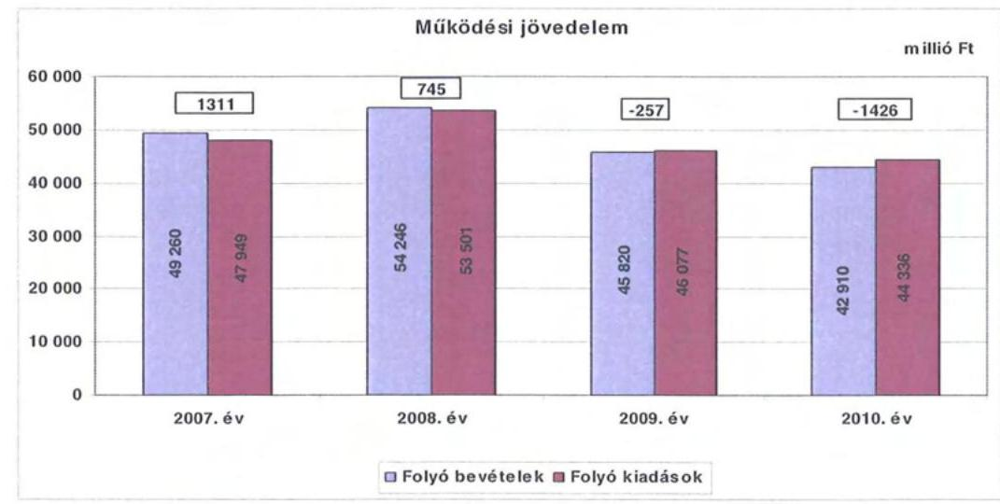

A folyó költségvetés egyenlege (a múködési forrástöbblet) 2007-ben a folyó kiadások 2,7\%-át (1311 millió Ft-ot), 2008-ban 1,4\%-át ( 745 millió Ft-ot) jelentette. A következő évtől növekvő múködési forráshiány keletkezett az Önkormányzatnál, melynek mértéke 2009-ben 0,5\% ( 257 millió Ft), 2010-ben 3,2\% (1426 millió Ft) volt. A vizsgált időszakban a működési jövedelem 373 millió Ft megtakarítást mutatott, amely forrásul szolgált az Önkormányzat fennálló tőketörlesztési kötelezettségeinek teljesítéséhez, valamint fejlesztéseinek finanszírozásához. A 2007-2008. évek pozitív előjelű folyó költségvetési egyenlege ellenére az Önkormányzat folyószámla- és rulírozó hitel felvételére kényszerült egyrészt az átmeneti likviditási problémák kezelése, másrészt fejlesztési kiadásai finanszírozása miatt. A folyószámlahitel napi átlagos állománya 2007-2010. évek között 37\%-kal nőtt (1650 millió Ft-ról 2261 millió Ft-ra).

Az Önkormányzat kötelezettségein belül a rövid lejáratú kötelezettségek állománya 2007-ben 25,8\% volt, mely 2010-re 2,8 százalékponttal csökkent. Az Önkormányzat 2006. december 31-én fennálló pénz- és tőkepiaci kötelezettsége 10855 millió Ft-ról közel háromszorosára, 31549 millió Ft-ra

[^0]
[^0]:    ${ }^{43}$ A 2009-2010. években a Hulladékkezelési Konzorcium és a MITISZK bevételi főösszege a pénzmaradvány igénybevétele nélkül 1777 millió Ft és 482 millió Ft, kiadási főösszege 773 millió Ft és 90 millió Ft volt.

---

nőtt 2010-re a kötvénykibocsátások, valamint a hosszú- és rövid lejáratú hitelek állományának emelkedése miatt. Az összes kötelezettségen belül a hosszú lejáratú pénzintézeti kötelezettségek 2007-2010. évek között több mint 73,7\%kal (1431 millió Ft-tal) nőttek. A rövid lejáratú pénzintézeti kötelezettségek 2010-ben 4552 millió Ft-ot tettek ki, amely 3192 millió Ft-tal ( $334,7 \%$-kal) volt több a 2007. évi rövid lejáratú pénzintézeti kötelezettségállománynál. Az Önkormányzat szállítói tartozásállománya 2010. december 31-én 2567 millió Ft, ebből lejárt 1765 millió Ft, melyből 225,5 millió Ft 60 napon túli volt.

Az Önkormányzat pénzügyi kapacitása 2007-ben és 2008-ban pozitív értéket mutatott, 2009-ben és 2010-ben negatívvá vált. A nettó múködési jövedelem $^{44}$ értéke a folyó költségvetési pozíció mellett az adott költségvetési év adósságtörlesztésének hatását is tükrözi. A 373 millió Ft múködési jövedelem nem nyújtott elegendő forrást a vizsgált időszakban felmerülő hiteltörlesztésekre, melynek összege 1198 millió Ft volt. A nettó múködési jövedelem - 426-145-259-368 millió Ft összegű évenkénti hiteltörlesztés mellett - 2007-ben 885 millió Ft, 2010-ben -1795 millió Ft volt.

Az Önkormányzat (a CLF módszer alapján) fejlesztési kiadásai egy részének fedezete - változatlan nettó múködési jövedelem képződése mellett - nem látszik biztosítottnak.
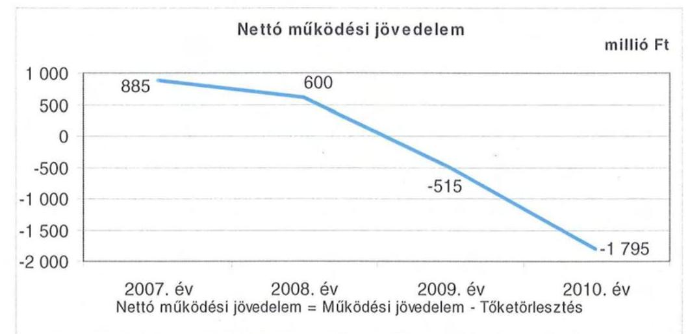

A 2007-2010. években az Önkormányzat felhalmozási költségvetésének egyenlege folyamatosan negatív összegű volt, amely magas pénzügyi kockázattal jár. A nettó múködési jövedelem folyamatos (és növekvő mértékű) csökkenése, illetve negatívvá válása - a trend változatlansága mellett - még feszített költségvetési gazdálkodás esetén is megkérdőjelezi a beruházások pénzügyi fenntarthatóságát ${ }^{45}$. Kiadáscsökkentő- és bevételnövelő intézkedések megtétele nélkül a tőketörlesztés szintjének - a felvett hitelek visszafizetési kötele-

[^0]
[^0]:    ${ }^{44}$ pénzügyi kapacitás
    ${ }^{45}$ Az minősül pénzügyileg fenntartható beruházásnak, amelynek múködtetésére az Önkormányzat nettó múködési jövedelme a következő években is fedezetet nyújt.

---

zettségének teljesítéséből adódó - ugrásszerű növekedése tovább ronthatja az Önkormányzat nettó működési jövedelmi pozícióját a következő években ${ }^{46}$.

A felhalmozási költségvetés egyenlegének 2007-2010. évek közötti alakulását a következő ábra szemlélteti:
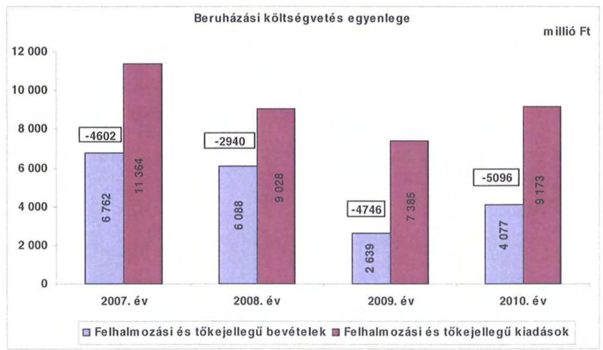

A felhalmozási forráshiánynak a felhalmozási és tőke jellegű kiadásokhoz viszonyított aránya 2007-ben 40,5\% (4602 millió Ft), 2008-ban 32,6\% (2940 millió Ft), 2009-ben 64,3\% (4746 millió Ft), 2010-ben 55,6\% (5096 millió Ft) volt. A felhalmozási forráshiány finanszírozása - tekintettel arra, hogy a 2007. év elején rendelkezésre álló nyitó pénzkészletet kötelezettségvállalás terhelte ${ }^{47}$, valamint a vizsgált időszakban jelentkező összes nettó múködési jövedelem ${ }^{48}$ negatív előjelű volt (-825 millió Ft) - a kötvénykibocsátásból származó bevételből, tartós hitelviszonyt megtestesítő értékpapír értékesítésből, hosszú lejáratú hitelekből, folyószámla- és rulírozó hitelből történt ${ }^{49}$.

Az Önkormányzat 2011. évi költségvetési rendeletében - a hagyományos költségvetési szerkezetben - tervezett bevételeinek és kiadásainak különbözete 3994 millió Ft finanszírozási igényt mutat. A hiányt további külső források bevonásával vagy megtakarítások elérésével tudja biztosítani.

[^0]
[^0]:    ${ }^{46}$ Az Önkormányzat hosszú lejáratú hiteleiből és kötvénykibocsátásból származó pénzintézeti kötelezettségei a 2011-2013. években (tőke- és kamattörlesztés) a korábbi évekhez képest várhatóan jelentősen emelkednek ( 2760 millió Ft, 6060715 EUR és 1531178 CHF).
    ${ }^{47}$ A 709 millió Ft összegű 2007. évi nyitó pénzkészletet meghaladták a múködési célú kötelezettségvállalások 2006. év végi záró állománya.
    ${ }^{48}$ Az ábrában megjelenő 2010. évi felhalmozási kiadásokban a Hulladékkezelési Konzorciumhoz kapcsolódó beruházások összege 976 millió Ft.
    ${ }^{49}$ Az évenkénti adatokat a jelentés 2. számú melléklete mutatja be.

---

A vizsgált időszakban keletkezett 17384 millió Ft felhalmozási forráshiányra a 2007. évi 709 millió Ft nyitó pénzkészlet, a 8000 millió Ft kötvénykibocsátásból származó bevétel, a 782 millió Ft tartós hitelviszonyt megtestesítő értékpapír értékesítés, a 6611 millió Ft hosszú lejáratú hitelfelvétel, valamint a rendelkezésre álló folyószámlahitelből igénybevett 1282 millió Ft nyújtott fedezetet.

A függő, átfutó, kiegyenlítő bevételek és kiadások 126 millió Ft-os és az Önkormányzat 2010. évi költségvetési számláinak 1482 millió Ft-os záró egyenle$\mathrm{ge}^{50}$ alatta maradt az ezzel szemben álló folyószámlahitel 2392 millió Ft-os és a finanszírozási célú likvid (rulírozó) hitel 2160 millió Ft-os állományának.

Az Önkormányzat évenkénti teljes finanszírozási igénye ${ }^{51}$ a CLF módszer szerint 2007-ben 3717 millió Ft, 2008-ban 2340 millió Ft, 2009-ben 5261 millió Ft, 2010-ben 6891 millió Ft volt, amelyet a finanszírozási célú bevételek és kiadások egyenlege biztosított.

Az Önkormányzat finanszírozási múveletei 2007-2010. évekbeli egyenlegének alakulását a következő ábra szemlélteti:
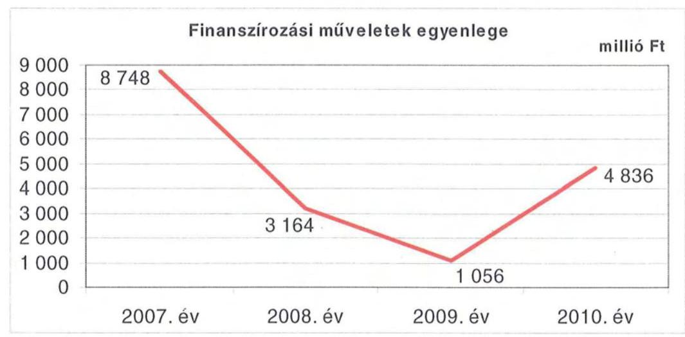

A finanszírozási többlet azt jelzi, hogy az éves költségvetések végrehajtása során szükség volt az előző években keletkezett pénzmaradvány igénybevételén túl külső forrás igénybevételére is.

Az Önkormányzat zárszámadási rendeleteiben bemutatott múködési és fejlesztési hiányról ${ }^{52}$ a jelentés 1 . számú melléklete nyújt tájékoztatást. A rendeletek a vizsgált időszakban minden évben forráshiányt jeleztek.

A vizsgált időszakban a kötelezettségek (passzív pénzügyi elszámolások nélkül) 23986 millió Ft-ról 35971 millió Ft-ra emelkedtek, amely együtt járt a kamatkiadások növekedésével. Az Önkormányzat 2007-2010. évek között összesen 4535 millió Ft kamatot fizetett meg. Az átmenetileg szabad pénzeszkö-

[^0]
[^0]:    ${ }^{50}$ Ebben a társulások pénzeszköze 59 millió Ft volt.
    ${ }^{51}$ a nettó múködési jövedelem és a beruházási költségvetés eredője
    ${ }^{52}$ Nincs kötelező előírás a működési- és fejlesztési hiány megállapításának módjára.

---

zei lekötéséből elért kamatbevétel a teljes kamatráfordítás 39,6\%-át (1795 millió Ft) tette ki.

Az Önkormányzat kamatbevételeinek és kamatkiadásainak alakulását a következő ábra mutatja:
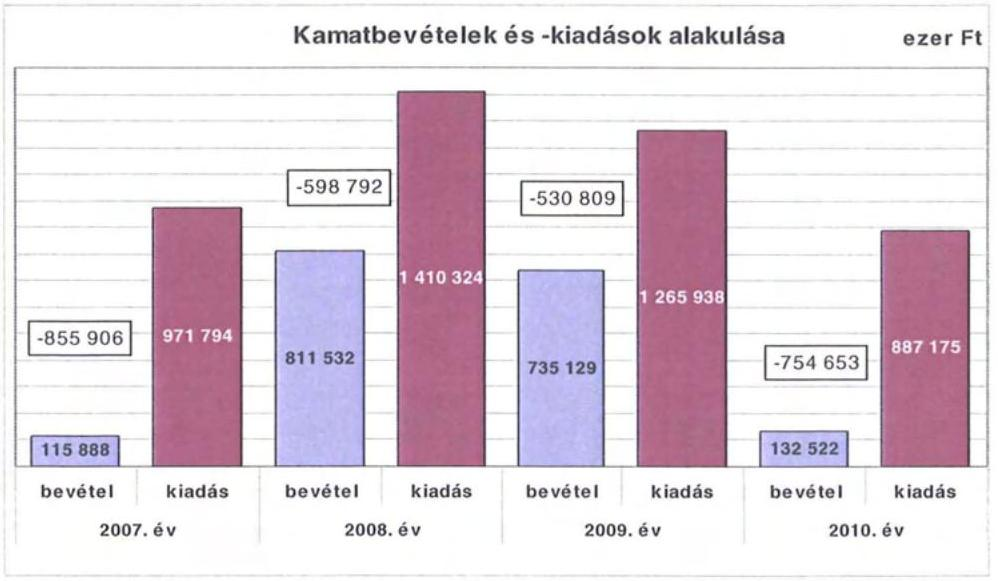

# 2.2. Az Önkormányzat bevételeinek alakulása 

Az Önkormányzat 2007-2010. évek között realizált OEP támogatás nélküli főbb bevételei összetételének változását a következő grafikon mutatja be:
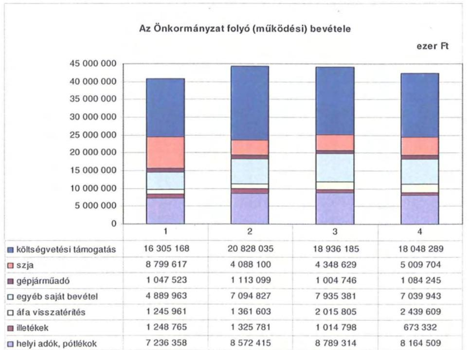

---

Az Önkormányzat összes folyó (működési) bevétele 2007-ről 2008-ra 8,9\%kal, 3611 millió Ft-tal nőtt, majd ezt követően a 2008. évi szinthez képest csökkent. A folyó bevételek 2010-ben 2007-hez viszonyítva 4,1\%-kal, 1687 millió Fttal emelkedtek.

Az Önkormányzat költségvetési támogatásai a 2007. évi 16305 millió Ftról 2008-ra 20828 millió Ft-ra, 27,7\%-kal emelkedtek, ugyanakkor 2008-tól az szja normatív módon elosztott részéből nyújtott támogatás megszűnt. A költségvetési támogatás összege 2008-ról 2009-re 18936 millió Ft-ra, 2010-re pedig 18048 millió Ft-ra csökkent a központi támogatáselosztás változása, illetve az ellátotti létszám csökkenése következtében.

Az átengedett szja összege a 2007. évről a 2008. évre 53,6\%-kal, 4712 millió Ft-tal csökkent a normatív hozzájárulások finanszírozásának változása miatt. Az Önkormányzat az előző évihez képest 2009-ben 6,4\%-kal (261 millió Ft-tal), 2010-ben további 16,2\%-kal ( 661 millió Ft-tal) kapott több átengedett szja-t. A kedvező változást 2007-2009. évek között az évről évre folyamatosan növekvő helyben maradó szja (8\%) összege, illetve 2010-ben az iparűzési adóerőképesség csökkenése következtében a jövedelemkülönbség mérséklésének növekedése okozta.

A gépjármúadóból származó bevételek a vizsgált időszakban megközelítőleg azonos bevételi forrást biztosítottak az Önkormányzatnak, az adóból befolyó összeg 1084 millió Ft volt a 2010. évben, 3,4\%-kal ( 36 millió Ft-tal) több a 2007. évhez képest, annak ellenére, hogy a 2010. évben átlagosan 15\%-kal növekedett fizetendő adó mértéke.

Az egyéb saját bevételek növekedését 2007-ről 2009-re az intézményi múködési bevételek és az egyéb sajátos bevételek - MIK bérleményszolgáltatás bevétele - emelkedése eredményezte ${ }^{53}$. Az egyéb saját bevételek 2007-től 2009-ig folyamatosan növekedtek - 4890 millió Ft-ról 7935 millió Ft-ra -, majd 2010-ben 11,3\%-kal, 895 millió Ft-tal csökkentek az előző évhez viszonyítva.

Az áfa visszatérítés bevételek mértéke a 2007. évi 1246 millió Ft-ról folyamatos növekedést mutatva, 2010. évre 2440 millió Ft-ra, megközelítőleg kétszeresére emelkedett, melyben szerepet játszott a beruházások magas volumene.

Az illetékbevétel 2008-ra 6,2\%-kal, 77 millió Ft-tal növekedett az előző évhez képest. Ezt követően évről évre folyamatos csökkenés következett be az előző év bevételeihez viszonyítva. A csökkenés mértéke a vizsgált időszakban 46,1\%, 576 millió Ft volt. Az illetékbevételek csökkenését alapvetően a gazdasági recesszió következtében visszaesett ingatlanforgalom, illetve a törvényi szabályozás változásában biztosított kedvezmények okozták.

[^0]
[^0]:    ${ }^{53}$ A MIK bérleményszolgáltatási tevékenysége következtében az Önkormányzatnál realizálódott eredmény elhanyagolható volt, tekintettel arra, hogy az évek során összesen 82 millió Ft bevételi többlet keletkezett. A bevételek és kiadások nettó összege 2008-ban és 2009-ben megegyezett ( 1290 millió Ft és 1803 millió Ft) volt, 2010-ben pedig az 1747 millió Ft bevételel 1665 millió Ft szolgáltatási díj állt szemben, melyből pénzforgalmilag csak a különbözetet rendezték.

---

A helyi adók, pótlékok bevételei az OEP nélkül számított folyó bevételek 19,2\%-át ( 8165 millió Ft) tették ki 2010-ben. A helyi adóbevétel a 2007. évi 7235 millió Ft-ról 2010-re 12,9\%-kal, 8165 millió Ft-ra emelkedett. A növekedésben az iparűzési adóbevételek változása nem játszott jelentős szerepet, mivel annak emelkedése a két év viszonylatában csupán 220 millió Ft volt. Ennek alapvető oka a 2009. évben bekövetkezett gazdasági recesszió, melynek hatására a 2010. évi iparűzési adóbevétel a 2008-2009-es szintről megközelítően 900 millió Ft-tal csökkent.

Az Önkormányzat által bevezetett három helyi adónemből származó bevételek - iparűzési adó, építményadó és idegenforgalmi adó - a vizsgált időszakban mintegy ötödét tették ki a folyó bevételeknek. Az iparűzési adó mértéke 2007 és 2010 között változatlanul a Hatv-ben rögzített maximummal megegyező, 2\%os szintű volt, az építményadó mértékét minden évben azonos összegben - 100 $\mathrm{Ft} / \mathrm{m}^{2}$ - emelték, míg 2010-ben elérte az $1000 \mathrm{Ft} / \mathrm{m}^{2}$-t, mely megközelítőleg 20\%-kal maradt el a törvényi maximumtól. Az idegenforgalmi adó mértékét az Önkormányzat évről évre emelte, minden évben közelítve a törvényi maximumot. Az adó mértéke 2007-ben 340 Ft, 2008-ban 360 Ft, 2009-ben 380 Ft, 2010-ben 400 Ft volt vendégéjszakánként.

A helyi adóbevételeken belül az iparűzési adó évről évre elérte annak háromnegyedét (2007-ben 5724 millió Ft, 2008-ban 6704 millió Ft, 2009-ben 6864 millió Ft, 2010-ben 5944 millió Ft volt), az építményadó megközelítette az egynegyedét, míg az idegenforgalmi adó minden évben 1\%-os szint alatt maradt. Az Önkormányzatnak a 2007-2009. években visszafizetési kötelezettsége keletkezett az iparűzési adóerő-képességének alakulása miatt, mivel a ténylegesen befolyt iparűzési adó összege meghaladta az adott évi tervezettet. A jövedelemdifferenciálódás különbözetéből fakadóan az Önkormányzat szja-ból való részesedése 2007-ben 390t-tal, 2008-ban 499 millió Ft-tal és 2009-ben 76 millió Ft-tal csökkent. A 2010. évben a realizált iparűzési adóbevétel a tervezett szint alatt maradt, ennek következtében a jövedelemdifferenciálódás mérsékléseként az Önkormányzat 262 millió Ft többlettámogatásban részesült.

Az építményadó az Önkormányzat évenkénti bevételnövelő intézkedései - az adó mértékének növelése - kihatásaként folyamatos növekedést mutatott, a 2007. évi 1442 millió Ft-ról 49\%-kal emelkedve elérte a 2150 millió Ft-os szintet. Az idegenforgalmi adóbevétel összege 2010-ben 71 millió Ft-ot ért el, mindössze 1\%-os növekedést mutatva a 2007. évi szinthez képest.

Az Önkormányzat 25\% feletti tulajdoni részesedésű gazdasági társaságai közül a hulladékgazdálkodást végző gazdasági társaságtól kapott a 2007. évben 64 millió Ft, a Holdingtól pedig 2007-2010. évek között összesen 280 millió Ft osztalékot. Az Önkormányzat a vizsgált időszakban kapott osztalékról nem mondott le.

---

Az Önkormányzat felhalmozási bevételei a vizsgált időszakban a következők voltak:

|  |  |  |  | azar Ft |
| :--: | :--: | :--: | :--: | :--: |
| Megnevezés | 2007. év   tény | 2008. év   tény | 2009. év   tény | 2010. év   tény |
| Tárgyi eszköz értékesítés | 862608 | 945862 | 322864 | 502295 |
| Egyéb saját tökebevétel | 1265595 | 1408334 | 844574 | 626916 |
| Államháztartáson belülröl kapott támogatás | 3776732 | 2360067 | 1362201 | 2779130 |
| EU-tól és külföldről kapott támogatások | 0 | 0 | 2448 | 0 |
| Államháztartáson kívülröl kapott támogatás | 857121 | 1374169 | 106888 | 168834 |
| Összes felhalmozási bevétel | 6762056 | 6088432 | 2638975 | 4077175 |

Az Önkormányzat felhalmozási bevételei 2009-ig folyamatosan csökkentek, ennek mértéke elérte a $61 \%$-ot, 4123 millió Ft-ot, majd 2010-re az előző évhez viszonyítva 1438 millió Ft-tal növekedtek.

A tárgyi eszközök értékesítéséből - amely magában foglalta az önkormányzati lakások és helyiségek értékesítésének bevételét is - a vizsgált időszakban összesen 2634 millió Ft bevétele származott az Önkormányzatnak, melynek több mint kétharmada az első két évben realizálódott.

Az államháztartáson belülről kapott támogatásokból - mely tartalmazta az irányító szervezeteken keresztül kapott EU-s támogatásokat is - 2007-2010. évek között összesen 10278 millió Ft bevétele származott az Önkormányzatnak. A fejlesztési célú támogatásokból útfelújításokat, a Diósgyőri Gimnázium épületbővítését és rekonstrukcióját, energiaracionalizálást szolgáló felújításokat, a Ferenczi Sándor Egészségügyi Szakközépiskola épületbővítését és rekonstrukcióját, multifunkcionális kulturális központ és hangversenyterem létesítését, új hulladéklerakó építését, városi villamosvasút-fejlesztést valósítottak meg.

Az államháztartáson kívülről kapott támogatások 2008. évi emelkedésében szerepet játszott a panelprogram kapcsán a társasházi és lakossági önrészek befizetése, a parkolóhelyek megváltásával, valamint a Diósgyőri Stadion rekonstrukciójával kapcsolatos bevételek.

Az önkormányzati feladatokat ellátó gazdasági társaságok a feladatellátásból származó bevételeikből - hulladékkezelés, vízművek, tömegközlekedés, távhő szolgáltatás, vagyonüzemeltetés, parkolási díj - nem adtak át az Önkormányzatnak. A gazdasági társaságok önkormányzati feladatellátásból származó bevételei folyamatosan emelkedtek, 2007-ben 21591 millió Ftot, 2008-ban 22766 millió Ft-ot, 2009-ben 23652 millió Ft-ot, 2010-ben 24181 millió Ft-ot tettek ki, melyekben az önkormányzati hozzájárulás részaránya 2007-ben 11,5\% (2483 millió Ft), 2008-ban 11,5\% (2618 millió Ft), 2009-ben 13,0\% (3075 millió Ft) és 2010-ben 16,0\% (3869 millió Ft) volt.

A feladatellátásban résztvevő gazdasági társaságok közül árbevételük alapján a legjelentősebbek az ingatlankezelést, a távhőszolgáltatást, a vízszolgáltatást és a tömegközlekedést végzők voltak, melyek a Holding irányítása alatt álltak. A Holding és tagvállalatainak konszolidálás előtti együttes nettó árbevétele 2010-ben 23806 millió Ft, üzemi (üzleti) tevékenységük eredménye -

---

117 millió Ft volt. A gazdasági társaságok adatait részletezve a 4. számú melléklet tartalmazza.

A Holding és tagvállalatainak eredménytartaléka 2010 végén 9 millió Ft, konszolidálás előtti mérleg szerinti eredménye - 770 millió Ft volt. A tagvállalatok közül a legnagyobb veszteséget a tömegközlekedést ( 1391 millió Ft-ot) és az ingatlankezelést ( 556 millió Ft-ot) végző gazdasági társaság halmozta fel, a legmagasabb eredményt pedig a vízszolgáltató ( 722 millió Ft-ot) érte el.

# 2.3. Az Önkormányzat kiadásainak alakulása 

Az Önkormányzat folyó kiadásai főbb jogcímek szerinti bontásban az alábbiak voltak:

|  |  |  |  |  |
| :-- | --: | --: | --: | --: |
| Megnevezés | 2007. év | 2008. év | 2009. év | 2010. év |
| Folyó kiadások | 47948507 | 53501471 | 46076582 | 44336387 |
| Müködési kiadások (kamatkiadás nélkül) | 38672525 | 44508642 | 37395780 | 35371574 |
| Államháztartáson belülre átadott pénzeszközök | 777060 | 139304 | 144825 | 106618 |
| Transzferkiadások | 7302028 | 7262509 | 6982852 | 7746707 |
| -ebből: vállalkozásoknak | 3889188 | 3845584 | 3425695 | 4039084 |
| EU-nak, illetve külföldre | 0 | 5020 | 9492 | 3952 |
| magánszemélyeknek | 3102485 | 2984240 | 3134027 | 3289714 |
| nonprofit szervezeteknek | 7302026 | 7262509 | 6982852 | 7746707 |
| Kamatkiadások | 971794 | 1410324 | 1265938 | 887175 |
| Előző évi pénzmaradványátadás | 214000 | 176926 | 287187 | 220034 |

Az Önkormányzat folyó kiadásai 2008-ban 11,6\%-kal - 5552 millió Fttal - növekedtek 2007-hez képest, majd ezt követően folyamatosan csökkentek. A csökkenés alapvető oka az egészségügyi intézmények 2009. február 28-ai gazdasági társaságba történő kiszervezése volt. A folyó kiadások halmozott öszszege 2007-2010. évek között 191863 millió Ft-ot ért el.

|  |  |  |  |  |
| :-- | --: | --: | --: | --: |
| Megnevezés | 2007. év | 2008. év | 2009. év | 2010. év |
| Személyi juttatások | 19910563 | 20742082 | 16979745 | 16070763 |
| Munkaadót terhelő járulékok | 6460670 | 6661216 | 5198692 | 4250201 |
| Dologi kiadások | 11495201 | 16352119 | 14361600 | 14340912 |
| Egyéb folyó kiadások | 194027 | 215010 | 177322 | 382960 |
| Müködési célú pénzeszkózátadás | 4265776 | 4293819 | 3862222 | 4469212 |

A folyó kiadásokon belül a személyi juttatások és járulékok aránya - az egészségügyi intézmények gazdasági társaságba szervezése és az álláshely megszüntetések miatt - a vizsgált időszakban a 2007. évi 55,2\%-ról 2010-re 45,8\%-ra csökkent, ezzel összefüggésben a személyi juttatások összege 19911 millió Ft-ról 16071 millió Ft-ra mérséklődött.

A dologi kiadások az Önkormányzatnál 2008-ban 41,2\%-kal, 4857 millió Ft-tal növekedtek a 2007. évhez viszonyítva, annak ellenére, hogy 2007-ben intézmények megszüntetéséről és átszervezéséről döntött a Közgyűlés. A növekedést a bérleményszolgáltatással kapcsolatos kiadások, a gyógyszerbeszerzések kiadásainak emelkedése, valamint a közüzemi díjak emelkedése okozta. Az egészségügyi intézmények 2009. évi kiszervezése következtében a dologi kiadások csökkentek.

---

Müködési célú pénzeszközátadások történtek a vizsgált időszakban az Önkormányzat öt többségi tulajdonú gazdasági társasága, továbbá művészeti és sportegyesületek, valamint a Hulladékkezelő Konzorcium részére, összességében 11872 millió Ft összegben. A vizsgált időszakban a tömegközlekedési, a városgazdálkodási, a sportiskolai, a vízszolgáltatási és a kommunikációs feladat ellátását végző önkormányzati gazdasági társaságok részesültek a müködési célú pénzeszközátadásokból kiemelkedő mértékben. A tömegközlekedést végző gazdasági társaság részére átadott pénzeszközökből az Önkormányzat 540 millió Ft-ot biztosított, a helyi közösségi közlekedés állami támogatása pedig 613 millió Ft volt.

Az Önkormányzat által a 2007-2010. években a gazdasági társaságok részére átadott pénzeszközök alakulását mutatja a következő ábra:
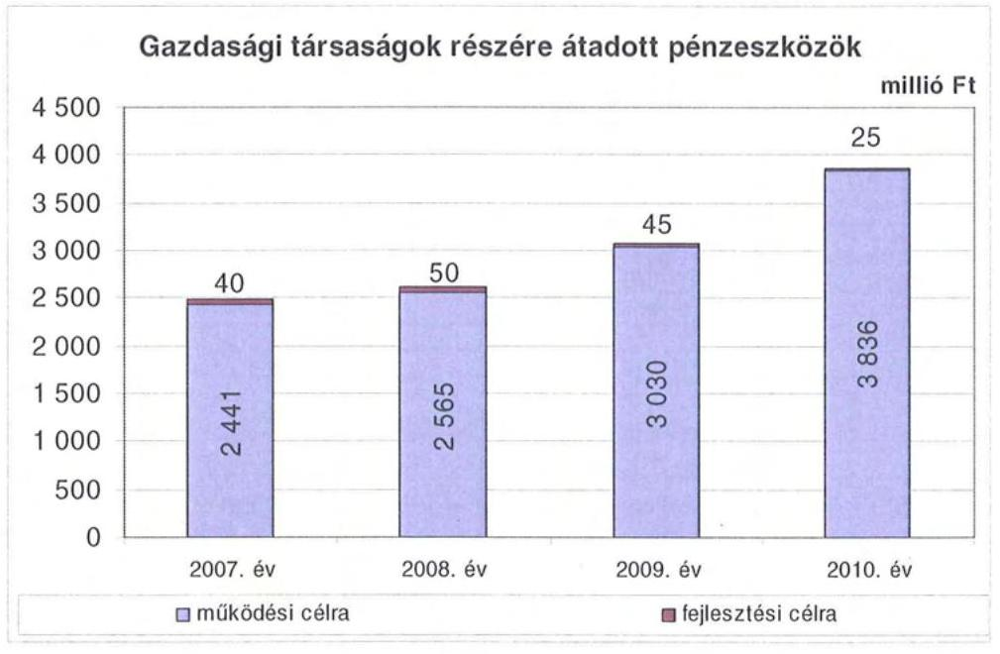

Az önkormányzati feladatellátásban résztvevő gazdasági társaságoknak nyújtott működési célú pénzeszköz átadás a vizsgált években folyamatosan, a 2007. évi 2441 millió Ft-ról 2010-re 3836 millió Ft-ra, 57,1\%-kal emelkedett. Az Önkormányzat a vizsgált időszakban felhalmozási céllal összesen 160 millió Ft-ot adott át gazdasági társaságai részére.

Az Önkormányzat Kórház nélküli működési kiadásai a vizsgált időszakban a következőképpen alakultak:
ezer Ft

| Megnevezés | 2007. év | 2008. év | 2009. év | 2010. év |
| :--: | :--: | :--: | :--: | :--: |
| Folyó (müködési) kiadások | 39112708 | 43203196 | 44056035 | 44336387 |
| Müködési kiadások (kamatkiadás nélkül) | 29836726 | 34210367 | 35375233 | 35374715 |
| Kamatkiadás | 971794 | 1410324 | 1265938 | 887175 |
| Személyi juttatások | 16420853 | 17290627 | 16005959 | 16070763 |
| Munkaadót terhelő járulékok | 5388177 | 5524776 | 4876843 | 4250201 |
| Dologi kiadások | 8052797 | 11230984 | 13742227 | 14340912 |
| Egyéb folyó kiadások | 161895 | 142621 | 167950 | 382960 |
| Müködési célú pénzeszközátadás | 4265776 | 4293819 | 3862222 | 4469212 |

---

Az egészségügyi intézmények, majd azok 2009. évi kiszervezését követően a Kórház nélkül teljesített 2007. évi 39113 millió Ft folyó (működési) kiadások 2010-re 44336 millió Ft-ra, 13,4\%-kal emelkedtek. Az egészségügyi intézmények, illetve a Kórház nélküli kiadásokban tapasztalt tendenciák a közoktatási, a szociális és gyermekvédelmi, a közművelődési intézményekben, a Tűzoltóságnál és a Polgármesteri hivatalban biztosított feladatellátás finanszírozásánál jelentkeztek.

Az egészségügyi intézmények, illetve a Kórház nélkül az Önkormányzat által teljesített személyi juttatások 2008-ig növekedést mutattak, majd 2009-ben 7,4\%-kal, 1285 millió Ft-tal csökkentek, 2010-ben pedig 0,4\%-kal, 65 millió Fttal nőttek az előző évhez képest. A dologi kiadások 2007-2010. évek között 2008-ra 39,5\%-kal (3178 millió Ft-tal), 2009-re 22,4\%-kal (2511 millió Ft-tal) és 2010-re 4,4\%-kal (599 millió Ft-tal) emelkedtek az előző évhez viszonyítva.

Az Önkormányzat kamatkiadások nélküli működési kiadásai 2008-ra 15,1\%kal, 5835 millió Ft-tal növekedtek az előző évhez viszonyítva. Az egészségügyi intézmények nélkül számított működési kiadások ugyanakkor 14,7\%-kal, 4373 millió Ft-tal emelkedtek. Az Önkormányzat az egészségügyi intézmények működési kiadásaira 973 millió Ft-ot fordított, fejlesztésre 18 millió Ft kiadást teljesített 2009. február 28-ig, ezt követően az egészségügyi feladatellátást végző gazdasági társaság (Kórház) részére működési célra 96 millió Ft, felhalmozási célra - jegyzett tőkeként - 20 millió Ft pénzeszközt adott át ${ }^{54}$.

Az egészségügyi intézmények, illetve a Kórház részére 2007-2009. évek között átadott működési és fejlesztési célú pénzeszközök alakulását mutatja a következő ábra:
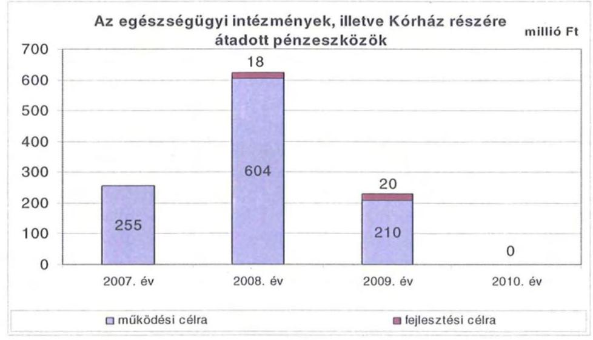

[^0]
[^0]:    ${ }^{54}$ Az egészségügyi intézmények működésének finanszírozására az OEP-támogatás szolgál, míg a fejlesztési kiadások fedezetét az önkormányzatoknak kell biztosítani intézményeik számára. Az OEP-támogatás összege 2007-ben 8038 millió Ft, 2008-ban 9422 millió Ft, míg 2009. február 28-ig 1330 millió Ft volt.

---

A vizsgált években az Önkormányzat összesen 1107 millió Ft-ot adott át az egészségügyi intézményeknek, illetve 2009 márciusától a Kórháznak, melyből 38 millió Ft felhalmozási célú pénzeszközátadás volt. A 2009-ben átadott pénzeszközökből 114 millió Ft-ot az egészségügyi feladatellátás kiszervezését megelőzően a MEK-nek adták át működési célra.

Az Önkormányzat 2007-2010. évek közötti folyó (működési) és felhalmozási célú kiadásai alakulását, a teljesített kiadások felhasználásnak arányait a következő ábra szemlélteti:
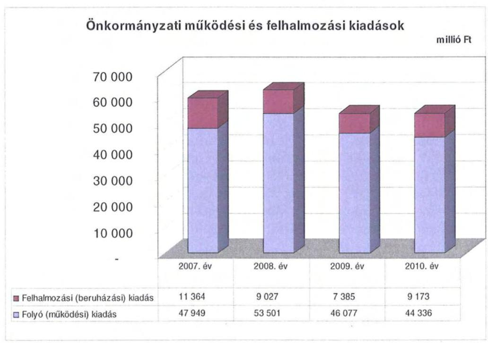

A felhalmozási kiadások 2007-2009. évek között csökkentek, majd 2010-ben emelkedtek az előző évhez viszonyítva, összességében pedig a vizsgált időszakban 36949 millió Ft-ot tettek ki. A teljesített összes működési- és felhalmozási kiadás arányának változásában 2007-2010. évek között elmozdulás figyelhető meg, a felhalmozási kiadások aránya 19,2\%-ról, 11364 millió Ft-ról 17,1\%-ra (a kiadások az egészségügyi feladatellátást végző gazdasági társaság adatait nem tartalmazzák), 9173 millió Ft-ra csökkent. Az Önkormányzat felhalmozási kiadásai között a Hulladékkezelő Konzorcium mint társult feladatellátás beruházásához kapcsolódóan 2009-ben 39 millió Ft-ot, 2010-ben 20 millió Ft-ot mutatott ki.

Az Önkormányzat 2007-2010. évek között megvalósított fejlesztései között intézményi épületek felújítása, korszerűsítése, bővítése, akadálymentesítése, új hulladéklerakó építése (társulásos feladatellátásban), útrekonstrukció, energiaracionalizálás, partfalszakadások helyreállítása, multifunkcionális kulturális központ és hangversenyterem létesítése, diagnosztikai központ kialakítása, informatikai fejlesztések szerepeltek.

A 2007-2010. években megvalósított, 2010. december 31-ig befejezett fejlesztésekre a vizsgált időszakban 19204 millió Ft kiadást teljesített az Önkormányzat, melyek teljes bekerülési költsége 30867 millió Ft volt. A fejlesztési

---

forrás megoszlása 17,7\%, 5453 millió Ft saját bevétel, 13,9\%, 4278 millió Ft hitel, $11,8 \%$, 3643 millió Ft kötvényből származó bevétel, $26,8 \%$, 8287 millió Ft EU-s támogatás és $29,8 \%$, 9206 millió Ft-ot hazai támogatás volt. A teljes bekerülési költség a tervezett 28663 millió Ft-hoz képest 2204 millió Ft-tal, 7,7\%-kal emelkedett. A 2007-2010. évek között a 10 millió Ft teljes bekerülési költség feletti befejezett beruházások és felújítások száma 142 volt, amelyből 13 fejlesztéshez EU-s forrásokat is igénybe vettek. A fejlesztések részletes adatait a 3/a. számú melléklet tartalmazza.

Az időszak legmagasabb összegű befejezett fejlesztései egyéb intézményi beruházások és felújítások ( 4112 millió Ft), energiaracionalizálási beruházások panelprogram - (1147 millió Ft), a Ferenczi Sándor Egészségügyi Szakközépiskola épületbővítéses rekonstrukciója ( 623 millió Ft) voltak.

A befejezett fejlesztések közül 2007-2010. évek között a legnagyobb kiadású az alábbi három beruházás volt:

A 2007. évtől kezdődött intézményi beruházások és felújítások kiadásait 602 millió Ft saját bevételből, 190 millió Ft kötvényből származó bevételből, 3320 millió Ft-ot pedig EU-s támogatásból finanszírozták ${ }^{55}$.

A 2005. évben kezdődött energiaracionalizálási program megvalósításának teljes bekerülési költsége 2235 millió Ft volt, melyet 759 millió Ft saját bevételből, 739 millió Ft hitelből és 737 millió Ft hazai támogatásból finanszíroztak. A program megvalósítására 2007-2010. évek között 1147 millió Ft-ot fordítottak ${ }^{56}$.

A Ferenczi Sándor Egészségügyi Szakközépiskola épületbővítéses rekonstrukciója a 2006. évben kezdődött, a beruházás teljes bekerülési költsége 1095 millió Ft volt. 2007-2010. évek között 623 millió Ft-ot fordítottak az intézmény átépítésére, melyet 122 millió Ft saját bevételből, 126 millió Ft hitelből és 847 millió Ft hazai támogatásból finanszíroztak ${ }^{57}$.

A vizsgált időszakban a társulásokhoz kapcsolódó fejlesztések közül a Hulladékkezelési Konzorcium beruházásának megvalósítására - Hejőpapiban kialakított hulladéklerakó - az Önkormányzat 2007-2010. évek között 1331 millió Ft felhalmozási célú kiadást teljesített. Az aktivált fejlesztés 733/1000-ed része ( 976 millió Ft) az Önkormányzat tulajdonát képezi. A MITISZK szervezeti kereteinek kialakítására pedig a 2010. évben 67 millió Ft fejlesztési kiadást teljesítettek.

A 2010. december 31-én folyamatban lévő fejlesztések tervezett teljes bekerülési költsége 28115 millió Ft volt. Ebből 117 millió Ft kiadást 2006. december 31-ig, 15795 millió Ft-ot 2007-2010. évek között teljesített az Önkormányzat. A felújítások és beruházások teljesített kiadásaiból 4768 millió Ft-ot saját bevételből, 4430 millió Ft-ot hitelből, 1760 millió Ft-ot kötvényből származó bevételből, 2931 millió Ft-ot EU-s támogatásból 2023 millió Ft-ot hazai támogatásból

[^0]
[^0]:    ${ }^{55}$ Az egyéb intézményi beruházásokról és felújításokról az Önkormányzat 6/2007. (III. 7.) számú és a 2/2008. (III. 12.) számú rendeleteiben döntött.
    ${ }^{56}$ A fejlesztésről az 5/2005. (III. 10.) számú rendeletben döntöttek.
    ${ }^{57}$ A beruházásról a Közgyűlés az X-287/60757/2004. számú határozatával döntött.

---

finanszíroztak. A folyamatban lévő fejlesztések részletes adatait a 3/b. számú melléklet tartalmazza.

A folyamatban lévő fejlesztések közül kiemelkedő költségigényű a 2006. évi energiaracionalizálási beruházás - panelprogram -, az Integrált Városfejlesztési Stratégia fejlesztése (a Városháza komplex rekonstrukciója, a belvárosi sétány kialakítása), a Miskolci Egyetem területén megvalósult versenyuszoda építése, az Avasi Gimnázium épületbővítése és rekonstrukciója, a DiósgyőrLillafüred kiemelt turisztikai nagyprojekt, valamint a Miskolc városi villamosvasút fejlesztése.

A folyamatban lévő fejlesztések közül 2007-2010. évek között a legnagyobb kiadású az alábbi három beruházás volt:

A 2006. évben kezdődő energiaracionalizálási program megvalósítására 5311 millió Ft-ot fordítottak ${ }^{58}$. A beruházási kiadásokat 1832 millió Ft saját bevételből, 1739 millió Ft hitelből és 1739 millió Ft hazai támogatásból finanszírozták.

Az Integrált Városfejlesztési Stratégiában szereplő fejlesztésekre 2377 millió Ft-ot fordítottak, melyet 953 millió Ft saját bevételből, 68 millió Ft hitelből és 1356 millió Ft hazai támogatásból finanszíroztak ${ }^{59}$.

A versenyuszoda építésére 1410 millió Ft-ot fordítottak ${ }^{60}$. A felhasznált forrásokból 398 millió Ft saját bevétel, 362 millió Ft kötvény, 650 millió Ft EU-s támogatás volt.

Az Önkormányzat 2010. december 31-én folyamatban lévő fejlesztési feladataihoz kapcsolódó, a 2010. évet követő kötelezettségvállalásainak összege a 3/c melléklet adatai szerint 15226 millió Ft, amelynek forrása 299 millió Ft saját bevétel, 4470 millió Ft hitel, 2597 millió Ft kötvény, 7207 millió Ft EU-s és 653 millió Ft hazai támogatás.

Az Önkormányzat által beadott kilenc, elbírálás alatti pályázati forrásból megvalósuló fejlesztésének tervezett bekerülési költsége összesen 9378 millió Ft. A beruházások kiadásait $11,3 \%, 1062$ millió Ft saját bevételből, $6,8 \%, 635$ millió Ft hitelből, $87,0 \%, 8158$ millió Ft uniós támogatásból és $0,4 \%, 36$ millió Ft hazai támogatásból tervezik finanszírozni. A tervezett beruházások közül a Miskolc Város meglévő szennyvízcsatorna hálózatának bővítésére benyújtott pályázat a legmagasabb költségigényű, 3540 millió Ft. Az elbírálás alatt lévő fejlesztések részletes adatait a 3/d. számú melléklet tartalmazza.

Az Önkormányzat fejlesztési tevékenysége a pályázati kiírások által nagyban befolyásolt, mert a jelentkező működési forráshiány és saját felhalmozási bevételei alacsony szintje miatt beruházásokat csak külső források, EU-s és hazai támogatások elnyerése esetén tud megvalósítani. A felhalmozási

[^0]
[^0]:    ${ }^{58}$ a Közgyűlés a V-119/16.508/2006. számú határozata
    ${ }^{59}$ A fejlesztésről a VI-97/13.541/2007. számú közgyűlési határozatban döntöttek.
    ${ }^{60}$ A fejlesztésről a Közgyűlés a VI-126/13.588/2007. számú határozatával döntött.

---

kiadások saját forrása döntő részét is fejlesztési hitelekből és felhalmozási célú kötvénykibocsátásból finanszírozta.

# 3. A KÖTELEZETTSÉGEK BEMUTATÁSA 

### 3.1. A pénzintézetek felé fennálló kötelezettségek alakulása

Az Önkormányzat pénzintézeti kötelezettségeinek állománya 2006. december 31-től 2010. december 31-ig 2,9-szeresére, 10855 millió Ft-ról 32031 millió Ft-ra nőtt ${ }^{61}$.

A 2010. év végi 32031 millió Ft-os állományból 23908 millió Ft felhalmozási célú hosszú lejáratú, 4552 millió Ft rövid lejáratú hitelből állt, valamint 3571 millió Ft volt az árfolyamváltozás hatása.
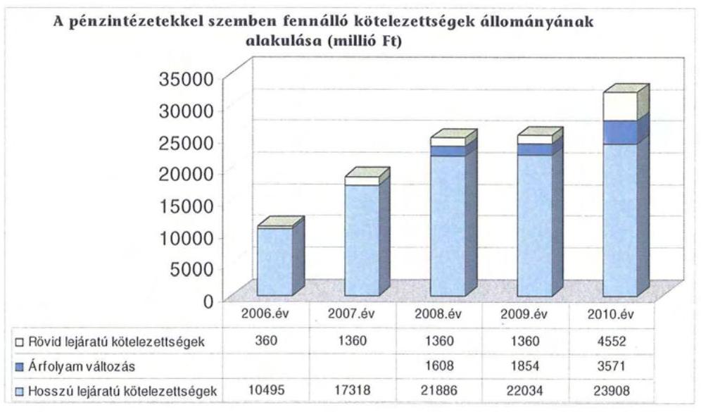

Az árfolyamváltozás hatása is befolyásolja a kötelezettségek alakulását, azonban annak mértéke előre pontosan nem határozható meg, csak várakozásokon alapuló tendenciák jelezhetők. Annak megítéléséről, hogy a devizában kibocsátott kötvényekért és felvett hitelekért kapott forinthoz képest a kötvények visszavásárlásakor, illetve a hitelek visszafizetésekor jelentkező forintkötelezettség többletkiadást (árfolyamveszteség) vagy megtakarítást (árfolyamnyereség) eredményez-e a futamidő végén, a teljes kötelezettség rendezését követően lehet képet alkotni. Mindaddig, amíg törlesztési kötelezettség nem áll fenn (türelmi idő, moratórium), a tőkére vonatkoztatva nem értelmezhető sem az árfolyamveszteség, sem az árfolyamnyereség. Ugyanakkor a számviteli szabályok meghatározzák, hogy az árfolyam különbözetet év végén a kötelezettségek vagy követelések között a könyvviteli mérlegben nyilván kell tartani, azonban az árfolyam különbözet valójában nem realizált.

[^0]
[^0]:    ${ }^{61}$ A 32031 millió Ft-os pénzintézeti kötelezettségállomány a 2010. évi múködési költségvetési kiadás $73 \%$-a.

---

Az Önkormányzat a forráshiány kezelése érdekében a 2007-2010. évi költségvetési rendeletekben ÖNHIKI igénybevételével, múködési és felhalmozási célú hitelfelvétellel, valamint pénzmaradvány igénybevétellel számolt. A múködési forráshiány kezelése érdekében minden évben döntött az éves költségvetés elfogadásakor ÖNHIKI-pályázat benyújtásáról, valamint rövid lejáratú hitel - fo-lyószámla- és rulírozó hitel - igénybevételéről. A felhalmozási hiány kezelésére a Közgyűlés szintén az éves költségvetés elfogadásakor döntött hosszú lejáratú fejlesztési hitelek felvételéről és a 2008. évi kötvénykibocsátásról. Év közben döntött a Közgyűlés a 2007. évi kötvény kibocsátásáról a Gazdasági Bizottság indítványára, valamint 2009. márciusban a korábban felvett, nem kedvezményes feltételű fejlesztési hitelek devizahitellé történő átalakításáról. További évközi döntést igényelt a lakóingatlanok kényszerértékesítésével összefüggő, ingatlanvásárlásra felvett 100 millió Ft összegű fejlesztési hitel, melyre a 2009. évi költségvetési rendelet félévi módosításakor került sor.

Az Önkormányzat pénzintézeti kötelezettségvállalásaira minden esetben közgyűlési döntés alapján került sor. A kötelezettségvállalásból származó források felhasználási céljait meghatározták. A Közgyűlés döntéseit megalapozó előterjesztések az éven túli kötelezettségvállalás visszafizetési forrásainak minden esetben a saját bevételeket jelölték meg. Az előterjesztések nem tartalmazták az éven túli deviza alapú és változó kamatozású kötelezettségvállalások árfolyam- és kamatkockázatának a bemutatását. Az előterjesztésekben nem tértek ki az adósságszolgálati korlát bemutatására, azonban az éves költségvetési rendeletek kimutatást tartalmaztak a bankhitelekről és azok hiteldíjáról addig az évig bezárólag, ameddig az utolsó hitel le nem jár ${ }^{62}$. Az adósságot keletkeztető kötelezettségvállalással megvalósított felhalmozási kiadás esetleges bevételnövelő, illetve kiadáscsökkentő vonzatát, továbbá ennek a fejlesztéshez, felújításhoz vállalt kötelezettségek visszafizetési forrásként való számbavételét nem vizsgálták.

Az Önkormányzat adósságot keletkeztető kötelezettségvállalásának felső határát a 2007-2010. években nem lépték túl. Az adósságot keletkeztető kötelezettségvállalás felső határa az áttekintett időszakban 5,8 és 8,7 milliárd Ft között változott. A Közgyűlés a likviditási és eladósodási problémák kezelésére likviditási koncepciót, stratégiát nem készített az áttekintett időszakban.

[^0]
[^0]:    ${ }^{62}$ Például a 2011. évi költségvetésben 2035-ig bemutatták a várható pénzintézeti kötelezettségeket (tőketörlesztést és hiteldíjat).

---

Az Önkormányzatnak 2010. december 31-én CHF-ben fennálló hosszú lejáratú adósságot keletkeztető kötelezettségvállalása az alábbi volt:

| Megnevezés | Kibocsátás idópontja | Összeg CHF | Kibocsátási árfolyam | Kamat (referencia kamat+ kamatfelár) | Felhasználás célja |
| :--: | :--: | :--: | :--: | :--: | :--: |
| Miskolc Fejlesztéséért 2007-2013 Kötvény | 2007.12.10 | 32808399 | 152,4 | 6 havi CHF LIBOR $+0,33 \%$ | 2007-2013. között EU támogatású beruházások önrészének biztosítása |
| Miskolc 2008. Kötvény | 2008.07.16 | 21234428 | 141,28 | 6 havi CHF LIBOR $+1,25 \%$ | A 2008. évi költségvetésben jóváhagyott fejlesztések önrészének biztosítása |

A pénzügyi egyensúly megteremtése érdekében az Önkormányzat két kötvényt bocsátott ki a vizsgált időszakban. Az elsőt 2007. decemberben 32808399 CHF összegben, 15 éves futamidővel, 10 év türelmi idő és féléves kamatperiódus mellett. A kötvényből 2403 millió Ft-ot használtak fel kizárólag felhalmozási célra, ebből 1686 millió Ft-ot településfejlesztési feladatok, 549 millió Ft-ot egészségügyi beruházások és 168 millió Ft-ot az oktatási intézmények beruházásaihoz. A kötvényből rendelkezésre álló forrás 2597 millió Ft volt 2010. december 31-én, melyből 2397 millió Ft-ot az EU-s támogatások előfinanszírozásába bevontak.

A második kötvénykibocsátás 2008 júliusában történt 21234428 CHF összegben, 20 éves futamidővel, 10 év türelmi idő és féléves kamatperiódus mellett. A kötvénykibocsátás céljaként a 2008. évi költségvetésben jóváhagyott fejlesztések önrészének biztosítását jelölték meg. A kötvény felhasználása megtörtént, 18 főbb célt valósítottak meg ennek segítségével.

A kötvények esetében csak a kamattörlesztés kezdődött meg, a tőketörlesztési kötelezettség 2018. évtől válik esedékessé. A CHF-ben fennálló pénzintézeti kötelezettsége után 2011. március 31-ig 3229112 CHF kamatot ( 540 millió Ft) fizetett meg az Önkormányzat.

A hosszú lejáratú felhalmozási célra felvett HUF hitelek közül 2009-ben hetet átváltottak 302,5 forintos árfolyamon EUR alapúra. Az 1999-2004. évek között felvett nem kedvezményes kamatozású 5,9 milliárd Ft összegű fejlesztési hiteleiket váltották ki ezzel a konstrukcióval, a kamatterheik csökkentése érdekében.

Az Önkormányzatnak 2010. december 31-én EUR-ban fennálló hosszú lejáratú adósságot keletkeztető kötelezettségvállalásai a következők voltak:

---

| Megnevezés | Szerződéskötés időpontja | Összeg   EUR | Lehivási árfolyam | Kamat (referencia kamat+ kamatfelár) | Felhasználás célja: |
| :--: | :--: | :--: | :--: | :--: | :--: |
| 107/98-019/99/ B sz. | 2009.03.26 | 528925,60 | 302,5 Ft/EUR | 3 havi   EURIBOR $+4,4 \%$ | Autóbusz beszerzés és utak felújítása 1999 évben |
| 135/99/B sz. | 2009.03.26 | 661157,00 | 302,5 Ft/EUR | 3 havi   EURIBOR $+4,4 \%$ | Ütépítés, felszínl vízelvezetés, csatornázás, ivóvíz, iskola   bőv.,autóbusz.besz. 2000.évben |
| Ö-3400-2000-0090/B sz. | 2009.03.26 | 661157,00 | 302,5 Ft/EUR | 3 havi   EURIBOR $+4,4 \%$ | Utak,parkoló,DAM ing.,Sportközpont rek.,autóbusz b., óvoda |
| Ö-3400-2001-0044/B sz. | 2009.03.26 | 1666115,64 | 302,5 Ft/EUR | 3 havi   EURIBOR $+4,4 \%$ | 2001.évi költségvetésben meghatározott fejlesztési feladatok megvalósítása |
| Ö-3400-2002-0029/B sz. | 2009.03.26 | 3517355,24 | 302,5 Ft/EUR | 3 havi   EURIBOR $+4,4 \%$ | 2002.évi költségvetésben meghatározott fejlesztési feladatok megvalósítása |
| Ö-3400-2003-0025/B sz. | 2009.03.26 | 5877685,80 | 302,5 Ft/EUR | 3 havi   EURIBOR $+4,4 \%$ | 2003.évi költségvetésben meghatározott fejlesztési feladatok megvalósítása |
| Ö-3400-2004-0077/B sz. | 2009.03.26 | 6611570,15 | 302,5 Ft/EUR | 3 havi   EURIBOR $+4,4 \%$ | 2004.évi költségvetésben meghatározott fejlesztési feladatok megvalósítása |

Jelenleg 31 HUF alapú hosszú lejáratú fejlesztési hitele van az Önkormányzatnak, ebből nyolc hitel esetében a fennálló hitelkeretből 2010. december 31-ig nem történt lehívás, jellemzően a 2010. decemberben kötött hitelszerződések esetében.

---

Az Önkormányzatnak 2010. december 31-én HUF-ban fennálló hosszú lejáratú adósságot keletkeztető kötelezettségvállalásai a következők voltak:
ezer Ft-ban

| Megnevezés | Kibocsátás   időpontja | Összeg | Kamat (referencia   kamatc kamatfeláé) | Felhasználás célja: |
| :--: | :--: | :--: | :--: | :--: |
| Ö-3400-2005-0039 sz. | 2005.06.14 | 1980000 | 3 havi EURIBOB+1,54\% | 2005. évi költségvetésben meghatározott fejlesztési   feladatok megvalósítása |
| Ö-3400-2005-0208 sz. | 2006.02.20 | 17390 | 3 havi EURIBOB+1,09\% | Ady Endre Művelődési ház felújítása |
| Ö-3400-2005-0192 sz. | 2006.02.20 | 176400 | 3 havi EURIBOB+1,07\% | Pansé épületek felújítása 2006.évben |
| Ö-1-2-06-3400-0315-3 sz. | 2006.05.15 | 184000 | 3 havi BUBOB+0,10\% | Avus kilátó, Diógegrári vár dbakfelüggitás, piac, temetü,   vadkapark rek., ongonoczers |
| Ö-3400-2006-0074/5 sz. | 2006.08.10 | 638000 | 3 havi EURIBOB+1.04\% | Panséépületek rekonstrukciója |
| Ö-3400-2006-0074/1 sz. | 2006.08.10 | 56910 | 3 havi EURIBOB+1.01\% | Kömyezetvédelmi célú beruházások |
| Ö-3400-2006-0074/2 sz. | 2006.08.10 | 778867 | 3 havi EURIBOB+1.55\% | Infrastruktúra általános überuházás |
| Ö-3400-2006-0074/4 sz. | 2006.08.10 | 126964 | 3 havi EURIBOB+1.02\% | Kulturális infrastruktúra beruházás |
| Ö-3400-2006-0074/3 sz. | 2006.08.10 | 63865 | 3 havi EURIBOB+1.51\% | Közoktatás célú infrastruktúra beruházás |
| Ö-1-2-07-3400-0689-011 sz. | 2007.06.28 | 744609 | 3 havi BUBOB+0,4\% | Kulturális infrastruktúra beruházás |
| Ö-3400-2007-0115 sz. | 2007.08.02 | 219217 | 3 havi EURIBOB+1.45\% | Panséépületek rekonstrukciója |
| Ö-3400-2007-0114/1 sz. | 2007.08.02 | 750566 | 3 havi EURIBOB+1.95\% | Általános infrastruktúra beruházás |
| Ö-3400-2007-0114/2 sz. | 2007.08.02 | 532182 | 3 havi EURIBOB+1.95\% | Kituoktatás célú beruházás |
| Ö-3400-2007-0114/3 sz. | 2007.08.02 | 13489 | 3 havi EURIBOB+1.45\% | Kulturális célú beruházás |
| Ö-3400-2007-0114/7 sz. | 2007.08.02 | 63519 | 3 havi EURIBOB+1.45\% | Egészségügyi célú beruházás |
| GAP-040895 sz. | 2008.07.08 | 1435000 | 3 havi EURIBOB+1.70\% | Panséépületek rekonstrukciója |
| Ö-1-2-09-3400-1124-3 sz. | 2009.12.29 | 960541 | 3 havi EURIBOB+2.50\% | Panséépületek rekonstrukciója |
| BHU76D 33209002 sz. | 2010.02.25 | 441284 | 3 havi EURIBOB+2.43\% | Infrastruktusális beruházások |
| BHU76D 33209007 sz. | 2010.02.25 | 157102 | 3 havi EURIBOB+1,93\% | Informatikai közmüléylezetés |
| BHU7D 33209003 sz. | 2010.02.25 | 60731 | 3 havi EURIBOB+1,93\% | Kituoktatás célú beruházás |
| BHU7D033209001 sz. | 2010.02.25 | 57600 | 3 havi EURIBOB+1,93\% | Kömyezetvédelmi célú beruházások |
| 47/2010/KOTB sz. | 2010.01.28 | 169028 | 3 havi BUBOB+2,39\% | 2009. évi költségvetésben meghatározott fejlesztési   feladatok megvalósítása |
| ONK-0197-2010-7 | 2010.12.17 | 0 | 3 havi EURIBOB+REO1+1,1\% | Informatikai célú fejlesztések megvalósítása |
| ONK-0197-2010-RER | 2010.12.17 | 0 | 3 havi EURIBOB+1,85\% | Sikeres Magyarországért Bérlakás fejlesztés |
| ONK-0197-2010-RER | 2010.12.17 | 374711 | 3 havi BUBOB+2,48\% | 2010. évi költségvetésben meghatározott fejlesztési   feladatok megvalósítása |
| ONK-0197-2010-ÖKtF-2 | 2010.12.17 | 0 | 3 havi   EURIBOB+REO2+1,55\% | Általános infrastruktúra beruházás |
| ONK-0197-2010-ÖKtF | 2010.12.17 | 0 | 3 havi   EURIBOB+REO1+1,10\% | Kömyezetvédelmi célú beruházások |
| ONK-0197-2010-6 | 2010.12.17 | 0 | 3 havi   EURIBOB+REO1+1,10\% | Egészségügyi célú beruházás |
| ONK-0197-2010-8 | 2010.12.17 | 0 | 3 havi   EURIBOB+REO1+1,10\% | UMFI pályázatok önrészések biztosítása |
| ONK-0197-2010-4 | 2010.12.17 | 0 | 3 havi   EURIBOB+REO1+1,10\% | Kulturális célú beruházások |
| ONK-0197-2010-ÖKtF-3 | 2010.12.17 | 0 | 3 havi   EURIBOB+REO1+1,10\% | Kituoktatás célú beruházás |

Az Önkormányzat 2009. évi pénzintézet váltását követően a számlavezető a kötvényeket lejegyző pénzintézet lett, mely egy HUF alapú hitelt is biztosított. Az Önkormányzat a devizában fennálló pénzintézeti kötelezettségeiből 2975 ezer CHF, 1946 ezer EUR (összesen 1037 millió Ft) kamatot és egyéb költséget fi-

---

zetett, tőkét még nem törlesztett. A HUF-ban fennálló kötelezettségekből 7008 millió Ft tőkét, kamatot és egyéb költséget teljesített.

Az Önkormányzat múködésének pénzügyi egyensúlyát a vizsgált időszakban csak folyószámlahitel és rulírozó hitel igénybevételével tudta biztosítani. A folyószámlahitel és a rulírozó hitel alakulását az alábbi táblázat mutatja be:

|  |  |  |  |  | ezer Ft-ban |
| :--: | :--: | :--: | :--: | :--: | :--: |
| Megnevezés | 2007. év | 2008. év | 2009. év | 2010. év | 2011. március   31. |
| I. Folyószámlahitel |  |  |  |  |  |
| A folyószámlahitel keretösszege január 1-jén | 2000000 | 2500000 | - | 3000000 | 3000000 |
| Teljesített kamat és egyéb költség | 99291 | 122400 | 142639 | 116163 | 34672 |
| II. Rulirozó hitel |  |  |  |  |  |
| Igénybevett hitel összesen: | 2365500 | 2920000 | 600000 | 1000000 | - |
| Visszufizetett hitel összesen: | 1005500 | 2920000 | 600000 | 200000 | - |
| teljesített kamat és egyéb költség | 67602 | 89865 | 116140 | 94686 | 33750 |

A folyószámlahitellel zárt napok száma növekedett, a 2007. évi 341 napról 2010-re 362 napra nőtt, gyakorlatilag egész évben fennállt, annak átlagos napi állománya a 2007. évi 1650 millió Ft-ról 2011. március 31-re 2336 millió Ft-ra emelkedett.

A folyószámlahitel mellett éven belüli lejáratú rulírozó hitel igénybevétele ${ }^{63}$ is szükségessé vált a folyamatos múködés biztosításához. A rulírozó hitel folyamatosan fennállt, azonban minden évben újrakötötték. A rendelkezésre bocsátott hitelkeret 360 millió és 2160 millió Ft között változott. Az év végén fennálló rulírozó hitelállomány a 2006. évi 360 millió Ft-ról 2010-re 2160 millió Ft-ra emelkedett. A rulírozó hitelekkel kapcsolatban a 2007. január 1. és 2011. március 31. között 402 millió Ft kamatkiadás merült fel.

A rövid lejáratú hitelek (folyószámlahitel és rulírozó hitel) kondíciói a következők voltak ${ }^{64}$ :

| Megnevezés | Kamat (referencia+ kamatfelár) |
| :--: | :--: |
| Folyószámlahitel |  |
| 2007-2008. év | 3 havi BUBOR -1,5\% |
| 2009-2010. év | 3 havi BUBOR -1,01\% |
| 2011. év | 3 havi BUBOR $+0,4 \%$ |
| Rulirozó hitel |  |
| 2007-2008. év | 3 havi BUBOR -1,5\% |
| 2009-2010. év | 3 havi BUBOR -1,01\% |
| 2011. év | 3 havi BUBOR $+0,4 \%$ |

[^0]
[^0]:    ${ }^{63}$ A hitel céljaként a rövid lejáratú finanszírozás biztosítását jelölték meg. 64

    | MNB BUBOR fixing (átlagkamat) \%-ban |  |  |  |  |
    | :--: | :--: | :--: | :--: | :--: |
    | 2007. évi | 2008. évi | 2009. évi | 2010. évi | 2011.március   31-ig |
    | 7,75 | 8,87 | 8,64 | 5,5 | 6,03 |

---

A folyószámlahitelhez kapcsolódóan egyéb költség címen az Önkormányzatnak díjakat nem kellett fizetnie. A folyószámlahitel és a rulírozó hitel kamatfelára 1,9 százalékponttal emelkedett a vizsgálattal érintett időszak alatt.

Az áttekintett időszakot múködési forráshiány jellemezte. A folyamatos likviditási problémák finanszírozása 2007-től 2011. március 31-ig összesen 917 millió Ft kamatráfordítással járt.

Az Önkormányzat munkabér-megelőlegezési hitelt a vizsgált időszakban nem vett igénybe.

Az Önkormányzat 2007-2011. március 31. között az átmenetileg szabad pénzeszközei forgatásából 1692 millió Ft kamatbevételt realizált, melyből 1300 millió Ft származott a kötvény kibocsátásából, a többi a Polgármesteri hivatal bankszámláin rendelkezésre állt forrás befektetéséből. A kötvény kibocsátásából származó kamatbevételből az Önkormányzat fedezni tudta a kötvény kamatfizetésére fordított 540 millió Ft-ot, a különbözetként adódó 760 millió Ftot működési célra fordították.

A 2007. és 2008. évben kibocsátott kötvények, valamint a 2010-ben EUR alapúra átváltott fejlesztési hitelek esetében a kamatfizetési kötelezettségek alakulását jelentősen befolyásolta és jelenleg is befolyásolja a kibocsátáskori és az utolsó kamatfizetéskori referenciakamatok változása, melyet az alábbi táblázat mutat be:

| Megnevezés | Kibocsátási, lehívási | Utolsó fizetéskori | Változás \% |
| :--: | :--: | :--: | :--: |
|  | alapkamat \% |  |  |
| 6 havi CHF LIBOR | 2,80667 | 0,24 | $-91,8$ |
| 6 havi CHF LIBOR | 2,95167 | 0,24 | $-91,8$ |
| 3 havi EURIBOR | 1,556 | 0,687 | $-44,3$ |

Az alapkamat mértékének alakulása jelentős hatással van az adott devizanemben kifejezett, a teljes futamidőre számított, várható kamatkötelezettség nagyságára.

Az Önkormányzat a CHF-ben fennálló pénzintézeti kötelezettsége után 2011. március 31-ig 3229112 CHF ( 540 millió Ft), az EUR alapú fejlesztési hitelei után 2210664 EUR ( 823 millió Ft) kamatot fizetett meg.

Az Önkormányzat HUF-ban fennálló hosszú lejáratú hitelei után - az utolsó ismert kamatmértékkel számítva - a 2011-2013. években 923 millió Ft, 2014-től 1605 millió Ft kamat kötelezettség várható. A EUR-ban fennálló hitelek számított kamatterhe a 2011-2013. évekre 3284135 EUR, 2014-től 3351911 EUR. A kötvénykötelezettség után várhatóan fizetendő kamat a 2011-2013. években 1531178 CHF, 2014-től 4632579 CHF.

---

# 3.2. Szállítók felé fennálló kötelezettségek alakulása 

Az Önkormányzat és gazdasági társaságai lejárt szállítói tartozásai és egyéb kiadás elmaradásai alakulását a következő táblázat tartalmazza:
ezer Ft-ban

| Megnevezés | 2007. | 2008. | 2009. | 2010. |
| :--: | :--: | :--: | :--: | :--: |
|  | december 31. | december 31. | december 31. | december 31. |
| Lejárt szállitói tartozás | 1790753 | 1339858 | 697780 | 1765050 |
| ebből Kórház | 1088998 | 624296 |  |  |
| Egyéb kiadás elmaradás |  |  |  |  |
| Gazdasági társaságok   lejárt szállitói tartozása | 527423 | 834990 | 2052706 | 2506625 |
| ebből Kórház |  |  | 1217169 | 993996 |

Az Önkormányzat 2007. december 31-ei Kórház nélküli lejárt szállítói tartozása 702 millió Ft-ról 2010. december 31-re 1765 millió Ft-ra nőtt, 2011. március 31-re ez további jelentős emelkedést mutatott ${ }^{65}$, 2557 millió Ft-ra nőtt. A 2011. március 31-ei lejárt szállítói tartozásból 1193 millió Ft terhelte a Polgármesteri hivatalt és 1364 millió Ft az intézményeket. A Polgármesteri hivatal legnagyobb összegű lejárt tartozása, 320 millió Ft a Holding 100\%-os tulajdonában lévő Miskolci Városgazda felé állt fenn 2011. március 31-én.

Az Önkormányzat és intézményei 2011. március 31-ei lejárt 2557 millió Ft-os szállítói tartozásállományának 28\%-a ( 705 millió Ft) 30 nap alatti, 17\%-a (439 millió Ft) 31 és 60 nap közötti, $44 \%$-a ( 1123 millió Ft) 61 és 90 nap közötti, $11 \%$-a ( 290 millió Ft) 91 és 365 nap közötti, éven túli tartozásállománya nem volt.

Egyéb kiadás elmaradása az Önkormányzatnak 2010. december 31-én nem volt. A kiadás elmaradás 2011. március 31-én 71 millió Ft volt, amely a Tűzoltóság által ki nem fizetett túlmunkából, valamint a túlmunka megváltásának távolléti díjai miatt keletkezett.

A Kórház - amely 2009. február 28-ig intézményként, azt követően gazdasági társaságként múködik - lejárt szállítói tartozásállománya 2007-2010. évek között 1089 millió Ft-ról 994 millió Ft-ra csökkent, 2011. március 31-re 1004 millió Ft-ra nőtt.

[^0]
[^0]:    ${ }^{65}$ A lejárt szállítói tartozások emelkedését a pályázati források segítségével megvalósuló beruházások előfinanszírozása okozta.

---

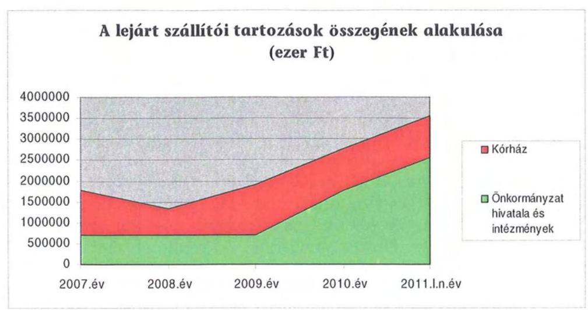

A Kórház 2011. március 31-ei lejárt 1004 millió Ft-os szállítói tartozásállományának 22\%-a (226 millió Ft) 30 nap alatti, 19\%-a (193 millió Ft) 31 és 60 nap közötti, 19\%-a (187 millió Ft) 61 és 90 nap közötti 40\%-a (397 millió Ft) 91 és 365 nap közötti, éven túli tartozásállománya nem volt.

Az Önkormányzat gazdasági társaságainak (Kórház nélkül) lejárt szállítói tartozása 2010. év végén 1513 millió Ft, 2011. március 31-én 1381 millió Ft volt, melyből a 75\%-ot meghaladó tulajdoni részarányú gazdasági társaságok lejárt határidejú szállítói tartozásállománya 780 millió Ft-ot tett ki.

A Polgármesteri hivatal, valamint az önkormányzati intézmények szállítói, illetve a polgármester a helyszíni vizsgálat idejéig nem kezdeményeztek adósságrendezési eljárást, fizetés-átütemezést.

# 3.3. Egyéb kötelezettségek alakulása 

Az Önkormányzat a vizsgált időszakban lízingszerződést nem kötött.
Az Önkormányzat az áttekintett időszakban 6200 millió Ft erejéig vállalt készfizető kezességet két kizárólagos tulajdonú gazdasági társasága érdekében. A MIHŐ érdekében 2008. márciusban történt a kezességvállalás 4200 millió Ft erejéig annak érdekében, hogy a MIHŐ meg tudja vásárolni a Miskolci Fütőerőmú Kft-t ${ }^{66}$. A Holding likviditásának céljából a Közgyűlés 2010. szeptemberben 2000 millió Ft erejéig készfizető kezességet vállalt annak érdekében, hogy a Holding folyószámla-hitelkeretét a pénzintézet 4000 millió Ft-ról 6000 millió Ft-ra emelje ${ }^{67}$. A kezességvállalások miatt nem keletkezett fizetési kötelezettsége az Önkormányzatnak. Garanciavállalás miatt az Önkormányzatnak nincs kötelezettsége.

[^0]
[^0]:    ${ }^{66}$ A MIHŐ 2011 áprilisában az erre a célra felvett hitelét visszafizette, ezért az Önkormányzat készfizető kezessége megszűnt.
    ${ }^{67}$ Az Önkormányzat készfizető kezességet a 4000 millió Ft feletti folyószámla-hitel öszszegére vállalt.

---

Az Önkormányzat PPP-konstrukció keretében egy beruházást végez, jelenleg folyamatban van a Ferenczi Sándor Egészségügyi Szakközépiskola tornatermének építése. A beruházás megvalósításához a kötelezettségvállalás 2007. decemberben történt 547 millió Ft összegben. A kötelezettség teljesítése a beruházás befejezését követően, terveik szerint 2011-től kezdődik és 15 éven keresztül áll fenn évi 36 millió Ft-ot ${ }^{68}$ meghaladó összegben. A PPP-beruházás felülvizsgálata az Önkormányzat részéről folyamatban van.

Az önkormányzati döntésen alapuló elengedett követelések összege 105 millió Ft volt az áttekintett időszakban. A Közgyűlés 2011. februárban döntött arról, hogy a 33,4\%-os önkormányzati részesedésű Miskolci Piac Zrt. felé fennálló követelésből elengednek 56 millió Ft földhasználati díjat, valamint a tagi kölcsönként nyújtott 85 millió Ft-ból 49 millió Ft-ot. Az Önkormányzat által biztosított adómentesség nem elengedett követelés, azonban ennek az öszszegnek a kivetéséről és beszedéséről lemondtak. Ennek összege 2007-ben 430 millió Ft, 2008-ban 103 millió Ft, 2009-ben 101 millió Ft és 2010-ben 99 millió volt.

A vizsgált időszakban 22 esetben 144 millió Ft összegben nyújtott az Önkormányzat kölcsönt az intézményeinek különféle pályázatok előfinanszírozásához kapcsolódóan. A nyújtott kölcsönök összege 1 millió és 65 millió Ft között változott. Civil szervezeteknek hét alkalommal 20 millió Ft összegű kölcsönt nyújtottak 300 ezer Ft-tól 7 millió Ft-ig, szintén pályázatok megvalósításához. Az intézmények és a civil szervezetek a kapott kölcsönöket visszafizették. Más önkormányzatoknak, egyéb államháztartáson belüli és kívüli szervezeteknek kölcsönt nem nyújtottak.

Az Önkormányzat gazdasági társaságoknak 943 millió Ft kölcsönt nyújtott 17 alkalommal kulturális programokhoz, fesztiválok lebonyolításához, munkavállalókkal szembeni fizetési kötelezettségek teljesítésére, utófinanszírozású pályázat megvalósításához és egy alkalommal tagi kölcsönként. A Miskolci Piac Zrt. részére 2009. augusztusban nyújtott 85 millió Ft tagi kölcsönből 2011. februárban a Közgyűlés elengedett 49 millió Ft-ot. A fennmaradó 36 millió Ft összeget, annak ellenére, hogy a szerződésben foglalt határidő lejárt, a gazdasági társaság nem fizette vissza.

Az Önkormányzat jelzálogjoggal, elidegenítési és terhelési tilalommal terhelt 28 ingatlanjára 10611 millió Ft jelzálogjog került bejegyzésre. Ebből 21 forgalomképes, hat korlátozottan forgalomképes és egy forgalomképtelen ingatlanra. A forgalomképes vagyonra 8207 millió Ft jelzálogjogot jegyeztek be. A korlátozottan forgalomképes törzsvagyonra 2401 millió Ft, a forgalomképtelen törzsvagyonra 3,5 millió $\mathrm{Ft}^{69}$ összegben jegyeztek be jelzálogot.

[^0]
[^0]:    ${ }^{68}$ A kötelezettségvállalás összege minden évben a 15 éves időtartam alatt a szerződés szerinti fogyasztói árindex alapú indexálási módszer alkalmazásával módosításra kerül.
    ${ }^{69}$ A jelzálogszerződés támogatási feltétel volt, azt az Önkormányzat 2007. márciusban kötötte az Önkormányzati és Területfejlesztési Minisztériummal a Miskolc Avastetői Szabadidőpark felújításának támogatásához kapcsolódva.

---

A 2010. évi ingatlanvagyon leltárösszesítő szerint a forgalomképes ingatlanok nettó értéke 17934 millió Ft, melynek 11,2\%-a (2013 millió Ft), a korlátozottan forgalomképes ingatlanok nettó értéke 35145 millió Ft, melynek 3,2\%-a (1139 millió Ft), a forgalomképtelen ingatlanok nettó értéke 101933 millió Ft, melynek 0,003\%-a (305 millió Ft) jelzáloggal terhelt.
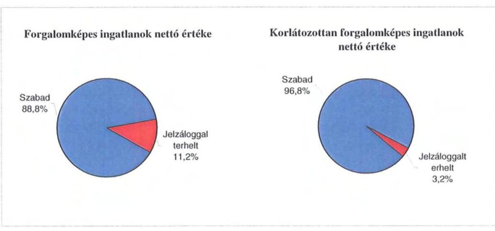

Az Önkormányzat becsült piaci értéken nem tartja nyilván az ingatlanait. ,A számviteli nyilvántartásokban 2010. december 31 -én kimutatott nettó értéket egyes esetekben többszörösen meghaladja a bejegyzett jelzálogjog összege. A jelzálogjoggal terhelt 21 forgalomképes ingatlan 2013 millió Ft nettó értékére 8207 millió Ft jelzálogjogot, a 6 korlátozottan forgalomképes ingatlan 1139 millió Ft nettó értékére 2401 millió Ft jelzálogjogot, a forgalomképtelen ingatlan 305 millió Ft nettó értékére 3,5 millió Ft jelzálogjogot jegyeztek be.

Az Önkormányzat kötelezettségeinek állományát 2010. december 31-én és várható alakulását a kötelezettségek lejáratáig az alábbi táblázat részletezi:

| Megnevezés | Állomány 2010. dec. 31 -én |  |  | Várható kötelezettség 2011. 2013. években |  |  | Várható kötelezettség 2014.   évet követően |  |  |
| :--: | :--: | :--: | :--: | :--: | :--: | :--: | :--: | :--: | :--: |
|  | HUE-ban   (millió Ftban) | Devizítban (összege) |  |  | HUE-ban (millió Ft-ban) |  |  |  |  |
| Pénzintézeti kötelezettségek |  |  |  |  |  |  |  |  |  |
| Hozzasi lejáratú bérelek | 10002 |  |  | HUE | 2760 |  | HUE | 9770 |  |
| Hozzasi lejáratú bérelek |  |  | 19523967 | HUE |  |  | 0000724 |  | 20099209 |
| Szlovény (Mekkelt 2007-2013. és Miekelt 2008.) |  |  | 54042827 | CHF |  |  | 1531178 |  | 58675407 |
| Folyószámlakból | 2392 |  |  | HUE | 2392 |  | HUE |  |  |
| Sedecsés lehet | 2160 |  |  |  | 2160 |  |  |  |  |
| Pénzintézeti kötelezettségek összesen HUE-ben | 14554 |  |  | HUE | 7312 |  | HUE | 9770 |  |
| Pénzintézeti kötelezettségek összesen EUR-ben |  |  | 19523967 | EUR |  |  | 0000715 |  | 20099209 |
| Pénzintézeti kötelezettségek összesen CHF-ben |  |  | 54042827 | CHF |  |  | 1531178 |  | 58675407 |
| Biztosítékok |  |  |  |  |  |  |  |  |  |
| Kezetszég | 2200 |  |  | HUE |  |  |  |  |  |
| Szállítási tartozás | 2367 |  |  | HUE |  |  |  |  |  |
| Egyéb kiadás elmozzadás |  |  |  | HUE | 71 |  | HUE |  |  |
| Egyéb kötelezettségek |  |  |  |  |  |  |  |  |  |
| CHF bomlátatná kötelezettségvek | 547 |  |  | HUE | 109 |  | HUE | 437 |  |
| CIF és egyéb szervek felé fennálló kötelezettségek | 76 |  |  | HUE | 76 |  | HUE |  |  |
| Legzete végeznek lezzet de ki nem tüzített kötelezettségek* | 23 |  |  | HUE | 23 |  | HUE |  |  |

Az Önkormányzat 2010. december 31-én fennálló összes (pénzintézeti, szállítói, valamint egyéb) kötelezettsége 23947 millió Ft, 54042827 CHF és 19523967 EUR volt, amelyből a 2011-2013. években 7591 millió Ft, 1531178 CHF és 6060715 EUR kötelezettsége keletkezik. Ennek teljesítésére figyelembe vehető a 1482 millió Ft összegű pénzeszköz- és a 2011 millió Ft mérlegben kimutatott

---

követelésállomány ${ }^{70}$. Szükség esetén rendelkezésre áll 17934 millió Ft nettó értékű forgalomképes ingatlanvagyon, melyből 2013 millió Ft a pénzintézeti kötelezettséghez kapcsolódóan jelzáloggal terhelt. Az Önkormányzat tájékoztatása szerint a kötelezettségek fedezetének biztosítása érdekében további egyensúlyt javító intézkedéseket terveznek.

A további évekre szóló jelenleg ismert pénzintézeti kötelezettségei 10207 millió Ft, 58675407 CHF és 20099 EUR. Ezekre az Önkormányzat tájékoztatása szerint a saját bevételek, illetve bevételnövelő és kiadáscsökkentő intézkedések nyújtanak majd fedezetet.

A gazdasági társaságok pénzintézeti, lízing, szállítói, valamint a jogerős végzéssel lezárt, de ki nem fizetett kötelezettségeinek állományát 2010. december 31-én és várható alakulását a kötelezettségek lejáratáig a következő táblázat mutatja be:

| Megnevezés | $\begin{gathered} \text { Allomány } \\ 2010 . \\ \text { dec. } 31 \text { èn } \end{gathered}$ |  |  | Várható kötelezettség 2011-2013. |  |  | Várható kötelezettség 2014. évet |  |  |
| :--: | :--: | :--: | :--: | :--: | :--: | :--: | :--: | :--: | :--: |
|  | $\begin{gathered} \text { HUE-ban } \\ \text { (millio Ft- } \\ \text { ban) } \end{gathered}$ | Dvrizában (összege) | Dovizan   em | HUE-ban (millio Ft   ban) | Dvrizában (összege) | Dovizan   em | HUE-ban (millio Ft-ban) | Dvrizában (összege) | Dovizana   m |
| Pénzintézeti kötelezettségek |  |  |  |  |  |  |  |  |  |
| Hosszál kiászon kötelek | 7070 |  | HUE | 6108 |  | HUE | 2020 |  | HUE |
| Kárólagzék |  | 22500000 | CHF |  | 2562708 | CHF |  | 27069432 | CHF |
| Főgátadásba- és egyéb elvöd lejáratú kötelek | 6010 |  | HUE | 6010 |  | HUE |  |  | HUE |
| Pénzintézeti kötelezettségek összesen | 11081 | 22500000 |  | 11119 | 2562708 |  | 2020 | 27069432 |  |
| Üzleg kötelezettségek | 94 |  | HUE | 73 |  | HUE | 23 |  | HUE |
| Szállítói tartozás | 8463 |  | HUE | 8463 |  | HUE |  |  |  |
| Jogérés végzéssel lezárt de ki nem fizetett kötelezettségek | 31 |  | HUE | 31 |  | HUE |  |  |  |

Az Önkormányzat gazdasági társaságai közül a Holding 100\%-os tulajdonában lévő MIK két alkalommal bocsátott ki kötvényt. Első alkalommal 2005-ben 12500000 CHF összegben, második alkalommal 2006-ban 10000000 CHF összegben. A kötvényeket 2018-ban kell egy összegben visszafizetni, ami kockázatot hordoz magában, addig csak kamatfizetési kötelezettség keletkezik.

Az Önkormányzat minősített többségi befolyással rendelkező gazdasági társaságai hitel, kötvény, lízing, szállítói, valamint a jogerős végzéssel lezárt, de ki nem fizetett kötelezettségeinek állománya 2010. december 31-én 21673 millió Ft-ból és 22500000 CHF-ből tevődött össze. A 2011-2013. években esedékes kötelezettségek várható összege devizánként 20686 millió Ft és 2562708 CHF. A 2014-től várható kötelezettség összegét 2053 millió Ft és 27069432 CHF alkotja.

Az Önkormányzat korlátlan felelősséggel tartozik felszámolás esetén a gazdasági társaságokról szóló 2006. évi IV. törvény 54. § (2) bekezdése alapján azon gazdasági társaságának a kötelezettségeiért, amelyben az Önkormányzat az 52. § (2) bekezdése szerint a szavazatok legalább 75\%-ával rendelkezik, így minősített befolyás szerzőnek minősül. Továbbá a csődeljárásról és a felszámolási eljárásról szóló 1991. évi XLIX. törvény 63. § (2) bekezdése alapján a kizáróla-

[^0]
[^0]:    ${ }^{70}$ A kötvénykibocsátásból származó pénzmaradvány 2597 millió Ft-os összegét a fejlesztési kötelezettségek jövőbeni forrásaként már figyelembe vettek.

---

gos önkormányzati tulajdonú gazdasági társaságának minden olyan kötelezettségéért, amelynek kielégítését a felszámolási eljárás során az adós társaság vagyona nem fedez, ha a hitelezőinek a felszámolási eljárás során benyújtott keresete alapján a bíróság - az adós társaság felé érvényesített tartósan hátrányos üzletpolitikájára figyelemmel - megállapítja az Önkormányzat korlátlan és teljes felelősségét. Felszámolás esetén a hitelezők által benyújtott kereset alapján a bíróság összességében 21673 millió Ft, továbbá 22500000 CHF összegű korlátlan és teljes felelősséget állapíthat meg a kötelezettségekkel érintett legalább 75\%-ban tulajdonában lévő gazdasági társaságaival kapcsolatban.

Az Önkormányzat a 2007-2010. években a tárgyi eszközök után együttesen 19271 millió Ft összegú értékcsökkenést mutatott ki, amelynek összege 2007-ben 10144 millió Ft, 2008-ban 2572 millió Ft, 2009-ben 2744 millió Ft és 2010-ben 3811 millió Ft volt. Önkormányzat eszközállományának bruttó értéke $1 \%$-kal, 183157 millió Ft-ra nőtt, nettó értéke $2 \%$-kal, 157235 millió Ft-ra csökkent 2007-ről 2010-re. Az önkormányzati szintű használhatósági fok mutató négy év alatt 3 százalékponttal, $89 \%$-ról $86 \%$-ra csökkent az egyes eszközcsoportoknál különböző mértékkel elszámolt értékcsökkenés hatására, ezzel az eszközök avultsága növekedett. Ezen belül az ingatlanoknak, vagyoni értékű jogoknak $93 \%$-ról $89 \%$-ra, a gépeknek, berendezéseknek, felszereléseknek $35 \%$ ról $25 \%$-ra, a járműveknek $41 \%$-ról $29 \%$-ra és az átadott eszközöknek $88 \%$-ról $86 \%$-ra csökkent a használhatósági foka. Ezt a csökkenést nem ellensúlyozta az immateriális javak, az ingatlanok, vagyoni értékű jogok, járművek, átadott eszközök 2007-ről 2010-re megemelkedett bruttó értéke sem.

Az Önkormányzat évente a költségvetés készítés előtt felmérette a karbantartási, felújítási szükségletet, annak eldöntése céljából, hogy a következő év költségvetésébe a pénzügyi lehetőségek figyelembevételével megtörténhessen a karbantartási, felújítási igények rangsorolása az eszközök elhasználódása, értékcsökkenése fedezetének biztosítása érdekében. A felújításokra, az eszközök pótlására a pénzügyi lehetőségek függvényében, elsősorban az intézmények működőképességének biztosítása figyelembevételével került sor. A 2007-2010. években a felhalmozási kiadásokból eszközpótlásra (rekonstrukcióra, felújításra) az Önkormányzat kimutatása szerint 2722 millió Ft-ot fordítottak a beruházások, felújítások 2010. december 31-ig pénzügyileg teljesített kiadásaiból. A 2007-2010. években elszámolt 19271 millió Ft értékcsökkenésnek a $14,1 \%$-át fordították az eszközök pótlására.

Az Önkormányzatnak 49 jogerős határozattal (végzéssel, ítélettel) nem lezárt peres eljárása van, melyből 2058 millió Ft jövőbeni fizetési kötelezettsége keletkezhet. A nem lezárt peres eljárásból 40 esetben az Önkormányzat és kilenc esetben az intézmények érintettek. A jogerős határozattal (végzéssel, ítélettel) lezárt, de ki nem fizetett 26 peres eljárásból 23 millió Ft a kötelezettsége és 22 millió Ft a követelése.

Az Önkormányzat 75\%-ot, vagy azt meghaladó tulajdoni hányadú gazdasági társaságainál a jogerős határozattal nem lezárt peres eljárásaiból 134 millió Ft lehet a jövőbeni fizetési kötelezettség. A jogerős határozattal lezárt, de ki nem fizetett 81 peres eljárásból 31 millió Ft a kötelezettség és 22 millió Ft a követelés.

---

A gazdasági társaságok lejárt vevőkövetelése ezt lényegesen meghaladja, 3257 millió Ft, azonban ez a követelés nincs peresítve.

# 4. A PÉNZÜGYI EGYENSÚLY MEGTEREMTÉSE ÉrDEKÉBEN HOZOTT INTÉZKEDÉSEK 

A Közgyűlés az Önkormányzat működőképességének hosszú távú fenntartása érdekében a vizsgált időszakban bevételnövelő és kiadáscsökkentő döntéseket hozott.

A 2007-2010. évek kiadáscsökkentő intézkedéseinek hatása beavatkozási területenként:
adatok: ezer Ft-ban

| Az érvényesített kiadás-   csökkentés területei | Személyi   juttatások és   járulékai | Dologi,   múködési   kiadások | Pénzeszköz   átadások, tó-   mogatások | Összesen |
| :-- | :--: | :--: | :--: | :--: |
| A Közgyűlést érintően | 0 | 0 | 0 | 0 |
| A Polgármesteri hivatalnál | 0 | 0 | 0 | 0 |
| Az intézményeknél | 1244032 | 124611 | 0 | 1368643 |
| Összesen | $\mathbf{1 2 4 4 0 3 2}$ | $\mathbf{1 2 4 6 1 1}$ | $\mathbf{0}$ | $\mathbf{1 3 6 8 6 4 3}$ |

Az Önkormányzat kiadáscsökkentő és bevételnövelő intézkedések meghozatalával a feladatellátás szakmai színvonalának megtartása mellett kiemelten a pénzügyi helyzet javítását kívánta elérni. Az Önkormányzat kimutatása szerint a vizsgált időszakban a kiadáscsökkentő intézkedések hatásaként összesen 1369 millió Ft megtakarítást értek el, melynek 89,2\%-a, 1221 millió Ft az átszervezéssel és feladatmegszüntetéssel együtt járó létszámcsökkentések - mint alább részletezett intézkedéscsoport - eredménye.

A Közgyűlés döntése alapján 2007-ben átszervezték a közoktatási intézményhálózatot. Ennek keretében megszüntetésre került egy tagóvoda, egy tagiskola és egy középiskolai kollégium, valamint integráltak kettő általános iskolát és kettő művészetoktatási intézményt, továbbá 23 főzökonyhát melegítő konyhává minősítettek át, illetve óvodai csoportokat vontak össze. A döntés eredményeként a vizsgált időszakban 653 millió Ft megtakarítást értek el.

A Közgyűlés 2008. évi döntése alapján a 2008-2009-es nevelési évben az óvodai csoportok számát öttel, a nevelésben résztvevő alkalmazotti létszámot 30 fővel, az általános iskolai osztályok számát 27 -tel, az alkalmazotti létszámot összességében 35 fővel csökkentették, mely 38 pedagógusi állás megszüntetésével és 3 egyéb álláshely létesítésével járt. Ugyanebben a nevelési évben a középiskolák osztályainak számát 20-szal csökkentették, melynek vonzataként 22 álláshely szűnt meg. A megtakarítás összege 152 millió Ft volt.

A 2009. évben a Közgyűlés felülvizsgálta a város közoktatásának feladatellátási, intézményhálózat múködtetési és fejlesztési tervét, melynek eredményeként az I. számú Óvodai Gazdasági Szervezetet megszüntette, nyolc tagóvoda önálló óvodába történő beolvadását engedélyezte. A változások következményeként az óvodai csoportok száma 208 -ról 204-re csökkent, az alkalmazotti létszám 812 főről 759 főre csökkent. Az általános iskolai osztályok számát összességében 14gyel csökkentették (a nappali osztályok száma 18 -cal csökkent, az esti osztályoké 4 -gyel nőtt). Az iskolaotthonos osztályok száma öttel csökkent, a napközi ottho-

---

nosé eggyel nőtt. A változásokat az alkalmazotti létszám is követte, összesen 114gyel dolgoztak kevesebben az általános iskolákban a 2009/2010-es tanévtől, akik közül 35 fő volt a pedagógus. Az engedélyezett nappali tagozatos középiskolai osztályok száma nyolccal csökkent, míg az esti kettővel, a levelező 19-cel nőtt. A kollégiumi csoportok számát hárommal csökkentették. A középiskolák alkalmazotti létszáma 45 fővel csökkent, akik közül 16 volt pedagógus. A döntések eredményeként 269 millió Ft kiadási megtakarítást értek el. A kötelező úszásoktatás feladatellátását átszervezték, a 2009/2010-es tanévtől a feladatokat az Önkormányzat nonprofit kft-je látta el, mely a vizsgált időszakban 97 millió Ft kiadáscsökkenést jelentett.

A 2010. évben kettővel csökkent az óvodai csoportok száma, mely változás nem járt az alkalmazotti létszám csökkenésével. Az általános iskolai osztályok számát 11-gyel, az alkalmazotti létszámot 21 fővel csökkentették, akik közül 19 pedagógus volt. A 2010/2011-es tanévre a MITISZK létrehozását követően megváltoztak a középiskolai oktatás feladatellátásának keretei, a változás következtében öszszességében a nappali tagozatos osztályok száma hárommal, az esti tagozatosé kettővel, a levelezőé eggyel csökkent. A tanévtől az indítható kollégiumi csoportok számát kettővel csökkentették. A pedagógusok létszámát 34-gyel csökkentették, az egyéb alkalmazottak létszámát viszont héttel növelték. A döntések eredményeként 50 millió Ft kiadási megtakarítást értek el.

A további, 10,8\%-os kiadási megtakarítást eredményező döntések közül a jelentősebbek voltak a többletjuttatások, tiszteletdíjak csökkentése az intézményeknél, a beszerzési szerződések felülvizsgálatából eredő megtakarítás, valamint a portaszolgálat kiszervezése, melyekkel összességében 148 millió Ft kiadáscsökkenést értek el.

A 2011-es költségvetési évben további kiadáscsökkentő intézkedéseket hoztak, melyek hatásaként 212 millió Ft megtakarítást terveztek. A tervezett kiadási megtakarítások 26\%-át ( 55 millió Ft) létszámcsökkentő intézkedések, 57\%-át (120 millió Ft) többletjuttatások - cafetéria elemek -, 17\%-át ( 37 millió Ft) tiszteletdíjak, közbeszerzés következtében jelentkező kiadások csökkenése eredményeként várják.

A 2011/2012-es nevelési-, illetve tanévben a Közgyűlés 11-gyel kevesebb óvodai csoport fenntartását vállalta, 33 fővel kevesebb alkalmazotti létszám mellett. Az általános iskolák esetében az osztályok száma 13-mal csökkent, mely 16 pedagógusi álláshely megszüntetésével járt együtt. A középiskoláknál kettő nappali és három esti tagozatos osztályt szüntettek meg, valamint a kollégiumi csoportok számát is csökkentették öttel, az álláshelyek száma azonban csak egy fővel csökkent, mivel kettő szakközépiskola alkalmazotti létszámát 43 fővel bővítették.

A létszámcsökkentő intézkedések következtében az Önkormányzat kimutatása szerint 2007. január 1. és 2010. december 31. között az intézményeknél 2425 álláshelyet szüntettek meg, mellyel 1221 millió Ft kiadást takarítottak meg. Az egészségügyi intézményeknél 2009-ben 1866 álláshelyet szüntettek meg, azonban 1755 főt a gazdasági társaságba szervezett egészségügyi feladatellátásban továbbfoglalkoztattak.

---

A létszámcsökkenést ágazatonként - kiszűrve az egészségügyi feladatellátás gazdasági társaságba szervezésének hatását - a következő ábra szemlélteti:

| Megnevezés (odatok tő-ben) | Közoktatás | Szociális és gyermekvédelme | Egészségügy | Polgármesteri hivatal | Egyéb | Összesen |
| :--: | :--: | :--: | :--: | :--: | :--: | :--: |
| Megszüntetett álláshelyek száma | 529 | 2 | 136 |  | 3 | 667 |
| előzői: üzes álláshelyek száma |  |  |  |  |  |  |
| szakmai álláshelyek száma | 316 |  | 111 |  |  | 427 |
| intézmény-üzemeltetéssel kapcsolatos álláshelyek száma | 213 | 2 | 25 |  | 3 | 243 |
| 2007. jamaír 1 -jén indító létszám | 5321 | 1347 | 1891 | 577 | 726 | 9862 |
| 2010. december 31-én záró létszám | 4792 | 1002 | 0 | 581 | 724 | 7099 |

A helyi szervezési intézkedések végrehajtásához az Önkormányzat - kimutatása szerint - a 2007-2010. években 575 millió Ft központi költségvetési támogatásban részesült. A támogatás felhasználásával 387 fő álláshelyet tartósan leépített. Az intézkedések és az egészségügyi feladatellátás gazdasági társaságba való kiszervezésének hatására az Önkormányzat 2007. január 1-jei átlaglétszáma 2010. december 31-re 28\%-kal, 7099 főre csökkent. 2007-ben 203, 2008ban 87, 2009-ben 196 és 2010-ben 43, összességében 529 álláshelyet szüntettek meg a közoktatásban. A szociális és gyermekjóléti területen 2008-ban csökkentették az intézmény-üzemeltetéssel kapcsolatos álláshelyek számát. Az egészségügyi feladatellátásban 2007-ben szüntettek meg 25 intézményüzemeltetéssel kapcsolatos álláshelyet, majd 2009-ben a gazdasági társaságba szervezést megelőzően 111 szakmai álláshelyet. Egyéb ágazati területen, a Miskolc Városi Szabadidőközpontban 2009-ben az álláshelyek számát hárommal csökkentették.

A kiadáscsökkentő intézkedések mellett az Önkormányzat 2007-2010. évek között az alábbiakban számszerűsített bevételnövelő intézkedéseket tette:
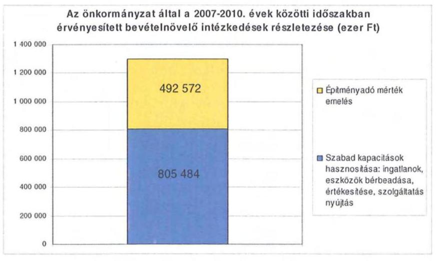

Az Önkormányzat - kimutatásai szerint - intézkedései eredményeként összesen 1298 millió Ft-tal növelte a bevételeit. A szabad kapacitások hasznosítása eredményeként ingatlanok és eszközök bérbeadásából, értékesítéséből és szolgáltatásnyújtásból 805 millió Ft bevétele keletkezett az Önkormányzatnak,

---

melyből 515 millió Ft a Polgármesteri hivatalnál, 290 millió Ft pedig az intézményeknél realizálódott. További jelentős, 493 millió Ft-os bevételnövekedést eredményezett a vizsgált időszakban az építményadó mértékének Közgyűlés általi évenkénti megemelése, melyet a müködés finanszírozásában bekövetkezett kedvezőtlen változások tettek szükségessé.

A 2011. évben az építményadó mértékének további emeléséből 120 millió Ft bevételi többletet terveztek.

A költségvetési támogatások és átengedett bevételek, valamint az illetékbevételek a 2007. évhez viszonyítva a vizsgált időszakban összességében 4145 millió Ft-tal csökkentek ${ }^{71}$. Az Önkormányzat által 2007 és 2010 között kimutatott 1369 millió Ft-os kiadási megtakarítás és az 1298 millió Ft-os bevételnövelés összességében $64,3 \%$-os mértékben kompenzálta a támogatások és bevételek kiesését.

# 5. A HELYI ÖNKORMÁNYZATOK GAZDÁLKODÁSI RENDSZERÉNEK 2008. ÉVI ELLENŐRZÉSE SORÁN A PÉNZÜGYI EGYENSÚLY JAVÍTÁSÁRA TETT SZABÁLYSZERŰSÉGI ÉS CÉLSZERŰSÉGI JAVASLATOK HASZNOSULÁSA 

Az ÁSZ az Önkormányzat gazdálkodási rendszerét a 2008. évben ellenőrizte átfogó jelleggel, melyben tíz szabályszerűségi és kettő célszerűségi javaslatot tett. A szabályszerűségi javaslatok közül egy vonatkozott a pénzügyi egyensúly javítására. A jelentést a Közgyűlés a 2009. március 5 -én tartott ülésén megismerte. A javaslatok megvalósítására intézkedési tervet készítettek, amely teljes körűen tartalmazta a javaslatokat, meghatározta a feladatok elvégzéséért felelősöket és a feladatok elvégzésének határidejét.

A jegyzőnek javasoltuk, „intézkedjen annak érdekében, hogy az Ötv. 88. § (1) bekezdés b) pontja elöírása alapján kötvény fedezetéül önkormányzati törzsvagyon és a normatív állami hozzájárulás, az állami támogatás, a személyi jövedelemadó, valamint az államháztartáson belülről müködési célra átvett bevételek ne legyenek felhasználhatóak". A javaslat végrehajtásáról a főosztályvezető a Pü. 26.067/2010. számú, 2010. január 25-én kelt levelében tájékoztatta a jegyzőt, mely szerint újabb kötvénykibocsátásra nem került sor, a figyelemfelhívás megtörtént.

Budapest, 2011. december „2Z."

Melléklet: $\quad 9 \mathrm{db}$
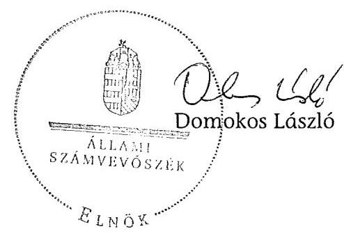

[^0]
[^0]:    ${ }^{71}$ A 2007. évhez képest 2008-ban a költségvetési támogatások és átengedett bevételek összege 19 millió Ft-tal növekedtek, 2009-ben 1721 millió Ft-tal, 2010-ben 1868 millió Ft-tal visszaestek. Az illetékbevételek a vizsgált időszakban összességében 576 millió Ft-tal csökkentek.

---

.

---

Miskolc Megyei Jogú Város Önkormányzat

1.sz. melléklet a V-3041/2011. sz. jelentéshez

Működési és felhalmozási célú hiány/többlet az önkormányzat rendeleteiben

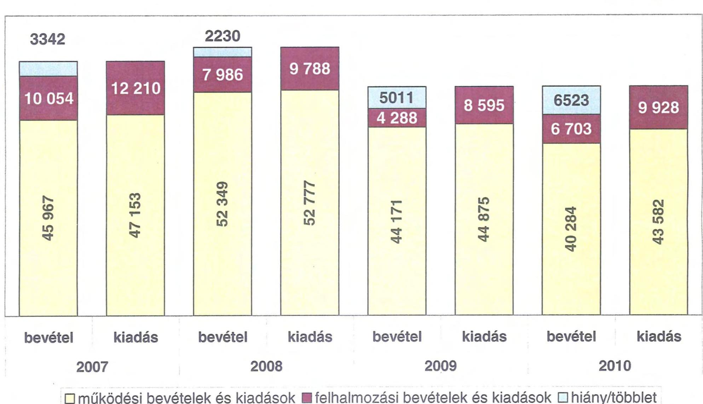

|  |   |   |   |   |   |   |   |   |
| --- | --- | --- | --- | --- | --- | --- | --- | --- |
|  3342 |  |  | 2230 |  |  |  |  |   |
|  10 054 | 12 210 |  | 7 986 | 9 788 | 5011 | 8 595 | 6523 | 9 928  |
|   |  |  |  |  | 4 288 |  | 6 703 |   |
|   |  |  |  |  | 44 173 |  | 40 284 |   |
|   |  |  |  |  |  |  |  | 43 52  |
|  45 969 | 5 115 |  | 52 349 | 5 777 |  |  |  |   |
|   |  |  |  |  | 44 173 |  |  |   |

|  bevétel | kiadás | bevétel | kiadás | bevétel | kiadás | bevétel | kiadás  |
| --- | --- | --- | --- | --- | --- | --- | --- |
|  2007 |  | 2008 |  | 2009 |  | 2010 |   |

☐ működési bevételek és kiadások ☑ felhalmozási bevételek és kiadások ☐ hiány/többlet

---

# 1. FOLYÓ KÖLTSÉGVETÉS*

|  2007. | 2008. | 2009. | 2010.  |
| --- | --- | --- | --- |
|  13.1. Saját működési bevételek | 13.196.100 | 16.999.491 | 18.285.121  |
|  13.2. Kültségvetési támogatás | 16.305.168 | 18.828.935 | 18.936.185  |
|  13.3. Szengedett bevételek | 9.847.162 | 5.201.286 | 5.353.415  |
|  13.4. Sihambázisztáson belüliől kapott támogatások | 9.554.074 | 10.877.979 | 2.848.423  |
|  13.5. EU-nő és külföldről kapott bevételek | 11.928 | 11.641 | 215  |
|  13.6. Sihambázisztáson késüliől kapott bevételek | 118.810 | 147.193 | 109.548  |
|  13.7. Előző évi pénzmunakvány átvétel | 224.205 | 180.692 | 207.187  |
|  13.8. Folyó bevételek = 1.1.1.+1.1.2.+1.1.3.+1.1.4.+1.1.5.+1.1.6.+1.1.7. | 49.259.625 | 54.246.319 | 45.819.896  |
|  13.9. Működési kiadások komatkísakban nélkül | 38.672.525 | 43.508.642 | 37.395.788  |
|  13.10. Sihambázisztáson belüli átadott pénzcsukciók | 777.060 | 139.304 | 144.823  |
|  13.11. Állathozásoknak | 3.889.188 | 5.845.284 | 3.425.695  |
|  13.12. EU-nak, illetve kéjűtőire | 0 | 5.028 | 9.452  |
|  13.13. Nagámezsodásos | 3.102.485 | 2.984.240 | 3.134.027  |
|  13.14. Szegedélyeszeresztetése | 349.313 | 427.665 | 413.638  |
|  13.15. Tisznoláskiadások (= 1.2.3.1+1.2.3.2+1.2.3.3+1.2.3.4) | 7.302.026 | 7.262.509 | 6.982.852  |
|  13.16. Komatkísálozik | 971.794 | 1.410.324 | 1.263.938  |
|  13.17. Előző évi pénzmunakvány átadás | 225.102 | 180.692 | 207.187  |
|  13.18. Folyó kiadások = 1.2.1.+1.2.2.+1.2.3.+1.2.4.+1.2.5. | 47.948.507 | 53.501.471 | 46.076.582  |
|  13.19. Folyó költségvetés egyenlege MŰKÖDÉSI JÖVEDELEM (1.1. - 1.2.) | 1.311.118 | 744.848 | -256.686  |
|  2. FELHALMOZÁSI KÖLTSÉGVETÉS** |  |  |   |
|  2.1.1. Saját tőhelyezésünk | 2.128.203 | 2.354.196 | 1.167.438  |
|  2.1.2. Sihambázisztáson belüliől kapott támogatások | 3.776.733 | 2.360.967 | 1.362.281  |
|  2.1.3. EU-nő és külföldről kapott támogatások | 0 | 0 | 2.448  |
|  2.1.4. Sihambázisztáson késüliől kapott támogatások | 857.121 | 1.374.169 | 106.888  |
|  2.1.1. Felhalmozásai bevételek (= 2.1.1.+2.1.2+2.1.3+2.1.4.) | 6.762.056 | 6.088.432 | 2.638.975  |
|  2.1.2. Saját beruházási kiadás állva | 7.652.020 | 3.273.044 | 3.028.911  |
|  2.1.3. Saját felújítási kiadás állva | 417.730 | 361.719 | 449.746  |
|  2.2.1. Sihambázisztáson belüli átadott pénzcsukció | 1.418.402 | 239.965 | 49.774  |
|  2.2.2. EU-nak és külföldnek adott pénzcsukciók | 274 | 0 | 0  |
|  2.2.3. Sihambázisztáson késület adott pénzcsukciók | 1.875.939 | 4.828.017 | 1.814.886  |
|  2.2.4. Befektetési célú részesedések vásárlása | 0 | 25.216 | 20.800  |
|  2.2.5. Felhalmozásai kiadások (= 2.2.1.+2.2.2.+2.2.3.+2.2.4.+2.2.5.+2.2.6.) | 11.364.465 | 9.027.961 | 7.385.117  |
|  2.3. Felhalmozásai költségvetés egyenlege (2.1. - 2.2.) | -4.602.409 | -2.939.325 | -4.746.142  |
|  3. Finanszírozási műveletek nélküli (GFS) pozíció(1.3.+2.3.) | -3.291.291 | -2.194.681 | -5.002.828  |
|  4. Finanszírozási műveletek |  |  |   |
|  4.1. Hitelbővétel | 3.248.137 | 1.712.885 | 406.617  |
|  4.2. Hitelbővítés | 426.000 | 144.696 | 258.786  |
|  4.3. Forgatási és befektetési célú értékpapírok kibocsátása | 5.000.000 | 5.000.000 | 0  |
|  4.4. Forgatási és befektetési célú értékpapírok beválása | 0 | 0 | 0  |
|  4.5. Forgatási és befektetési célú értékpapírok ártábesítása | 451.250 | 110.390 | 110.390  |
|  4.6. Forgatási és befektetési célú értékpapírok vásárlása | 0 | 0 | 0  |
|  4.7. Egyéb finanszírozási bevételek (légső, átfizet, kiegészítési) | 1.365.207 | 1.479.924 | 358.730  |
|  4.8. Egyéb finanszírozási kiadások (légső, átfizet, kiegészítési) | 800.819 | 32.077 | -438.844  |
|  4.9. Finanszírozási műveletek egyenlege (4.1. - 4.2.+4.3.-4.4+4.5.-4.6.+4.7.-4.8.) | 8.747.865 | 3.163.579 | 1.055.795  |
|  5. Tárgyévi pénzügyi pozíció változás (1.3.+ 2.3.+4.9.) | 5.456.574 | 968.898 | -3.947.033  |
|  6. Nettó működési jövedelem opallódási jövedelem (1.3.) - tőhetörlesztés (4.2+4.4) | 885.118 | 600.158 | -515.472  |
|  7. LÉGÉSZÉGÓS ÁRATOK |  |  |   |
|  Összes kötelezettség | 23.986.099 | 28.979.050 | 28.681.217  |
|  ebből rövid hjárcsít | 6.189.986 | 5.136.854 | 4.572.846  |
|  Összes szállítói kötelezettség | 2.498.162 | 2.047.063 | 1.526.685  |
|  ebből hjárt (tansiórványból) | 1.790.719 | 1.339.850 | 697.780  |
|  Pén és tőlegelai kötelezettség (adósság) | 18.677.607 | 24.853.136 | 25.247.802  |
|  ebből rövid hjárcsít | 1.504.698 | 1.618.786 | 1.728.547  |
|  PPP szerződéses állomány jövedeleken (tansiórványból) | 0 | 0 | 0  |
|  ebből hjárt szolgáltatási díj adatti kötelezettség | 0 | 0 | 0  |
|  Folyóvalódásbővétel napf átlagos állománya (tansiórványból) | 1649680 | 1822787 | 1834421  |
|  Elővöléssel napf átlagos állománya (tansiórványból) | 1151685 | 1401644 | 1360000  |
|  Vásárlabérőbbő napf átlagos állománya (tansiórványból) | 0 | 0 | 0  |
|  Keresség és genomfavállalások (tansiórványból) | 0 | 4.200.000 | 4.200.000  |
|  Jogcéls bírósági tőletekből adatai kötelezettségek (tansiórványból) | 11.958 | 293 | 9.020  |
|  Finanszírozásba bevezéselt eszközök | 6.474.614 | 7.334.226 | 3.277.987  |
|  Tartós kötelezettségi megbízásból értékpapírok és végi állománya | 327.858 | 218.572 | 109.286  |
|  Hosszú hjárcsít kunkhóriák és végi állománya | 0 | 0 | 0  |
|  Értékpapírok és végi állománya | 0 | 0 | 0  |
|  Pénzcsukciók (látagos pénzcsukciók nélküli) és végi állománya | 6.140.756 | 7.115.654 | 3.168.621  |

- Bevételében nem térít, a kiadásokban nem jelenít meg az amortizáció, a vagyoni helyzetet ** Bevételében vagyon megfelelne és bővítése kiválítási övriznek.

---

Mixtxis Megsel Jogji Város Önkormányzata

10. számúctlak

sz Önkormányzat 2017-2018 óvódban megvalósított, 2018. december 31-ig befejezett fejlesztések forrásokszatátérét

1. számú Tanisítvány az Önkormányzat 2017-2018 óvódban megvalósított, 2018. december 31-ig befejezett fejlesztések forrásokszatátérét

|   |  |  |  |  |  |  |  |  |  |  |  |  |  |  |  |  |  |  |  |  |  |  |  |  |  |  |  |  |  |  |  |  |  |  |  |  |  |  |  |  |  |  |  |  |  |  |  |  |  |  |  |  |  |  |  |  |  |  |  |  |  |  |  |  |  |  |  |  |  |  |  |  |  |  |  |  |  |  |  |  |  |  |  |  |  |  |  |  |  |  |  |  |  |  |  |  |  |  |  | 

---

Miskolc Megyei Jingi Város Önkormányzata

10. számú tanárhány az Önkormányzat 2007-2019 érzékén megvalósított, 2019. december 31-ig befejezett fejlesztésén forrásközszintételei

|   |  |  |  |  |  |  |  |  |  |  |  |  |  |  |  |  |  |  |  |  |  |  |  |  |  |  |  |  |  |  |  |  |  |  |  |  |  |  |  |  |  |  |  |  |  |  |  |  |  |  |  |  |  |  |  |  |  |  |  |  |  |  |  |  |  |  |  |  |  |  |  |  |  |  |  |  |  |  |  |  |  |  |  |  |  |  |  |  |  |  |  |  |  |  |  |  |  |  |  |  | 

---

Miskolc Mogyor. Jagi: Vörös Önkormányzata

10. számú mebléte a V-0041/2011. kl. jöződéses

sz Önkormányzat 2007-2010 Évekűen megvalósított, 2010. december 31-ig befejezett fejlesztését forrásisszabitás(ki)

|   |  |  |  |  |  |  |  |  |  |  |  |  |  |  |  |  |  |  |  |  |  |  |  |  |  |  |  |  |  |  |  |  |  |  |  |  |  |  |  |  |  |  |  |  |  |  |  |  |  |  |  |  |  |  |  |  |  |  |  |  |  |  |  |  |  |  |  |  |  |  |  |  |  |  |  |  |  |  |  |  |  |  |  |  |  |  |  |  |  |  |  |  |  |  |  |  |  |  |  |  |

---

Miklós Magyar Jugó Vörös Önkormányzata

1. számú tanúsítvány az Önkormányzat 2007-2010 években megvalósított, 2010. december 31-ig befolyított fejlesztések forrásászorátétérül

|   |  |  |  |  |  |  |  |  |  |  |  |  |  |  |  |  |  |  |  |  |  |  |  |  |  |  |  |  |  |  |  |  |  |  |  |  |  |  |  |  |  |  |  |  |  |  |  |  |  |  |  |  |  |  |  |  |  |  |  |  |  |  |  |  |  |  |  |  |  |  |  |  |  |  |  |  |  |  |  |  |  |  |  |  |  |  |  |  |  |  |  |  |  |  |  |  |  |  |  | 

---

Mátulő látogás: Jogi Vírus Önkormányzata

10. sajand. tanúsításra

es Önkormányzat 2007-2010 évadban megvalósított, 2010. december 31-ig befejezett fejlesztéses forrás(isszabítatok)ő

|   |  |  |  |  |  |  |  |  |  |  |  |  |  |  |  |  |  |  |  |  |  |  |  |  |  |  |  |  |  |  |  |  |  |  |  |  |  |  |  |  |  |  |  |  |  |  |  |  |  |  |  |  |  |  |  |  |  |  |  |  |  |  |  |  |  |  |  |  |  |  |  |  |  |  |  |  |  |  |  |  |  |  |  |  |  |  |  |  |  |  |  |  |  |  |  |  |  |  |  | 

---

Miskolc Megyel Jogji Város Önkormányzata

10. számú mobilitár a V.0041/2011. vs. jcterőzkést

10. számú Tanisítvány az Önkormányzat 2007-2015 évadáén megvalósított, 2015. december 31-ig befejezett fejlesztások forrásfeszatételéről

|   |  |  |  |  |  |  |  |  |  |  |  |  |  |  |  |  |  |  |  |  |  |  |  |  |  |  |  |  |  |  |  |  |  |  |  |  |  |  |  |  |  |  |  |  |  |  |  |  |  |  |  |  |  |  |  |  |  |  |  |  |  |  |  |  |  |  |  |  |  |  |  |  |  |  |  |  |  |  |  |  |  |  |  |  |  |  |  |  |  |  |  |  |  |  |  |  |  |  |  | 

---

|   |  |  |  |  |  |  |  |  |  |  |  |  |  |  |  |  |  |  |  |  |  |  |  |  |  |  |  |  |  |  |  |  |  |  |  |  |  |  |  |  |  |  |  |  |  |  |  |  |  |  |   |
| --- | --- | --- | --- | --- | --- | --- | --- | --- | --- | --- | --- | --- | --- | --- | --- | --- | --- | --- | --- | --- | --- | --- | --- | --- | --- | --- | --- | --- | --- | --- | --- | --- | --- | --- | --- | --- | --- | --- | --- | --- | --- | --- | --- | --- | --- | --- | --- | --- | --- | --- | --- | --- | --- | --- | --- |
|   |  |  |  |  |  |  |  |  |  |  |  |  |  |  |  |  |  |  |  |  |  |  |  |  |  |  |  |  |  |  |  |  |  |  |  |  |  |  |  |  |  |  |  |  |  |  |  |  |  |  |  |   |
|   |  |  |  |  |  |  |  |  |  |  |  |  |  |  |  |  |  |  |  |  |  |  |  |  |  |  |  |  |  |  |  |  |  |  |  |  |  |  |  |  |  |  |  |  |  |  |  |  |  |  |  |   |
|   |  |  |  |  |  |  |  |  |  |  |  |  |  |  |  |  |  |  |  |  |  |  |  |  |  |  |  |  |  |  |  |  |  |  |  |  |  |  |  |  |  |  |  |  |  |  |  |  |  |  |  |   |
|   |  |  |  |  |  |  |  |  |  |  |  |  |  |  |  |  |  |  |  |  |  |  |  |  |  |  |  |  |  |  |  |  |  |  |  |  |  |  |  |  |  |  |  |  |  |  |  |  |  |  |  |   |
|   |  |  |  |  |  |  |  |  |  |  |  |  |  |  |  |  |  |  |  |  |  |  |  |  |  |  |  |  |  |  |  |  |  |  |  |  |  |  |  |  |  |  |  |  |  |  |  |  |  |  |  |   |
|   |  |  |  |  |  |  |  |  |  |  |  |  |  |  |  |  |  |  |  |  |  |  |  |  |  |  |  |  |  |  |  |  |  |  |  |  |  |  |  |  |  |  |  |  |  |  |  |  |  |  |  |   |
|   |  |  |  |  |  |  |  |  |  |  |  |  |  |  |  |  |  |  |  |  |  |  |  |  |  |  |  |  |  |  |  |  |  |  |  |  |  |  |  |  |  |  |  |  |  |  |  |  |  |  |  |   |
|   |  |  |  |  |  |  |  |  |  |  |  |  |  |  |  |  |  |  |  |  |  |  |  |  |  |  |  |  |  |  |  |  |  |  |  |  |  |  |  |  |  |  |  |  |  |  |  |  |  |  |  |   |
|   |  |  |  |  |  |  |  |  |  |  |  |  |  |  |  |  |  |  |  |  |  |  |  |  |  |  |  |  |  |  |  |  |  |  |  |  |  |  |  |  |  |  |  |  |  |  |  |  |  |  |  |   |
|   |  |  |  |  |  |  |  |  |  |  |  |  |  |  |  |  |  |  |  |  |  |  |  |  |  |  |  |  |  |  |  |  |  |  |  |  |  |  |  |  |  |  |  |  |  |  |  |  |  |  |  |   |
|   |  |  |  |  |  |  |  |  |  |  |  |  |  |  |  |  |  |  |  |  |  |  |  |  |  |  |  |  |  |  |  |  |  |  |  |  |  |  |  |  |  |  |  |  |  |  |  |  |  |  |  |   |
|   |  |  |  |  |  |  |  |  |  |  |  |  |  |  |  |  |  |  |  |  |  |  |  |  |  |  |  |  |  |  |  |  |  |  |  |  |  |  |  |  |  |  |  |  |  |  |  |  |  |  |  |   |
|   |  |  |  |  |  |  |  |  |  |  |  |  |  |  |  |  |  |  |  |  |  |  |  |  |  |  |  |  |  |  |  |  |  |  |  |  |  |  |  |  |  |  |  |  |  |  |  |  |  |  |  |   |
|   |  |  |  |  |  |  |  |  |  |  |  |  |  |  |  |  |  |  |  |  |  |  |  |  |  |  |  |  |  |  |  |  |  |  |  |  |  |  |  |  |  |  |  |  |  |  |  |  |  |  |  |   |
|   |  |  |  |  |  |  |  |  |  |  |  |  |  |  |  |  |  |  |  |  |  |  |  |  |  |  |  |  |  |  |  |  |  |  |  |  |  |  |  |  |  |  |  |  |  |  |  |  |  |  |  |   |
|   |  |  |  |  |  |  |  |  |  |  |  |  |  |  |  |  |  |  |  |  |  |  |  |  |  |  |  |  |  |  |  |  |  |  |  |  |  |  |  |  |  |  |  |  |  |  |  |  |  |  |  |   |
|   |  |  |  |  |  |  |  |  |  |  |  |  |  |  |  |  |  |  |  |  |  |  |  |  |  |  |  |  |  |  |  |  |  |  |  |  |  |  |  |  |  |  |  |  |  |  |  |  |  |  |  |   |
|   |  |  |  |  |  |  |  |  |  |  |  |  |  |  |  |  |  |  |  |  |  |  |  |  |  |  |  |  |  |  |  |  |  |  |  |  |  |  |  |  |  |  |  |  |  |  |  |  |  |  |  |   |
|   |  |  |  |  |  |  |  |  |  |  |  |  |  |  |  |  |  |  |  |  |  |  |  |  |  |  |  |  |  |  |  |  |  |  |  |  |  |  |  |  |  |  |  |  |  |  |  |  |  |  |  |   |
|   |  |  |  |  |  |  |  |  |  |  |  |  |  |  |  |  |  |  |  |  |  |  |  |  |  |  |  |  |  |  |  |  |  |  |  |  |  |  |  |  |  |  |  |  |  |  |  |  |  |  |  |   |
|   |  |  |  |  |  |  |  |  |  |  |  |  |  |  |  |  |  |  |  |  |  |  |  |  |  |  |  |  |  |  |  |  |  |  |  |  |  |  |  |  |  |  |  |  |  |  |  |  |  |  |  |  |   |
|   |  |  |  |  |  |  |  |  |  |  |  |  |  |  |  |  |  |  |  |  |  |  |  |  |  |  |  |  |  |  |  |  |  |  |  |  |  |  |  |  |  |  |  |  |  |  |  |  |  |  |  |  |   |
|   |  |  |  |  |  |  |  |  |  |  |  |  |  |  |  |  |  |  |  |  |  |  |  |  |  |  |  |  |  |  |  |  |  |  |  |  |  |  |  |  |  |  |  |  |  |  |  |  |  |  |  |  |   |
|   |  |  |  |  |  |  |  |  |  |  |  |  |  |  |  |  |  |  |  |  |  |  |  |  |  |  |  |  |  |  |  |  |  |  |  |  |  |  |  |  |  |  |  |  |  |  |  |  |  |  |  |  |   |
|   |  |  |  |  |  |  |  |  |  |  |  |  |  |  |  |  |  |  |  |  |  |  |  |  |  |  |  |  |  |  |  |  |  |  |  |  |  |  |  |  |  |  |  |  |  |  |  |  |  |  |  |  |  |   |
|   |  |  |  |  |  |  |  |  |  |  |  |  |  |  |  |  |  |  |  |  |  |  |  |  |  |  |  |  |  |  |  |  |  |  |  |  |  |  |  |  |  |  |  |  |  |  |  |  |  |  |  |  |  |   |
|   |  |  |  |  |  |  |  |  |  |  |  |  |  |  |  |  |  |  |  |  |  |  |  |  |  |  |  |  |  |  |  |  |  |  |  |  |  |  |  |  |  |  |  |  |  |  |  |  |  |  |  |  |  |   |
|   |  |  |  |  |  |  |  |  |  |  |  |  |  |  |  |  |  |  |  |  |  |  |  |  |  |  |  |  |  |  |  |  |  |  |  |  |  |  |  |  |  |  |  |  |  |  |  |  |  |  |  |  |  |   |
|   |  |  |  |  |  |  |  |  |  |  |  |  |  |  |  |  |  |  |  |  |  |  |  |  |  |  |  |  |  |  |  |  |  |  |  |  |  |  |  |  |  |  |  |  |  |  |  |  |  |  |  |  |  |   |
|   |  |  |  |  |  |  |  |  |  |  |  |  |  |  |  |  |  |  |  |  |  |  |  |  |  |  |  |  |  |  |  |  |  |  |  |  |  |  |  |  |  |  |  |  |  |  |  |  |  |  |  |  |  |   |
|   |  |  |  |  |  |  |  |  |  |  |  |  |  |  |  |  |  |  |  |  |  |  |  |  |  |  |  |  |  |  |  |  |  |  |  |  |  |  |  |  |  |  |  |  |  |  |  |  |  |  |  |  |  |   |
|   |  |  |  |  |  |  |  |  |  |  |  |  |  |  |  |  |  |  |  |  |  |  |  |  |  |  |  |  |  |  |  |  |  |  |  |  |  |  |  |  |  |  |  |  |  |  |  |  |  |  |  |  |  |   |
|   |  |  |  |  |  |  |  |  |  |  |  |  |  |  |  |  |  |  |  |  |  |  |  |  |  |  |  |  |  |  |  |  |  |  |  |  |  |  |  |  |  |  |  |  |  |  |  |  |  |  |  |  |  |   |
|   |  |  |  |  |  |  |  |  |  |  |  |  |  |  |  |  |  |  |  |  |  |  |  |  |  |  |  |  |  |  |  |  |  |  |  |  |  |  |  |  |  |  |  |  |  |  |  |  |  |  |  |  |  |   |
|   |  |  |  |  |  |  |  |  |  |  |  |  |  |  |  |  |  |  |  |  |  |  |  |  |  |  |  |  |  |  |  |  |  |  |  |  |  |  |  |  |  |  |  |  |  |  |  |  |  |  |  |  |  |   |
|   |  |  |  |  |  |  |  |  |  |  |  |  |  |  |  |  |  |  |  |  |  |  |  |  |  |  |  |  |  |  |  |  |  |  |  |  |  |  |  |  |  |  |  |  |  |  |  |  |  |  |  |  |  |   |
|   |  |  |  |  |  |  |  |  |  |  |  |  |  |  |  |  |  |  |  |  |  |  |  |  |  |  |  |  |  |  |  |  |  |  |  |  |  |  |  |  |  |  |  |  |  |  |  |  |  |  |  |  |  |   |
|   |  |  |  |  |  |  |  |  |  |  |  |  |  |  |  |  |  |  |  |  |  |  |  |  |  |  |  |  |  |  |  |  |  |  |  |  |  |  |  |  |  |  |  |  |  |  |  |  |  |  |  |  |  |   |
|   |  |  |  |  |  |  |  |  |  |  |  |  |  |  |  |  |  |  |  |  |  |  |  |  |  |  |  |  |  |  |  |  |  |  |  |  |  |  |  |  |  |  |  |  |  |  |  |  |  |  |  |  |  |   |
|   |  |  |  |  |  |  |  |  |  |  |  |  |  |  |  |  |  |  |  |  |  |  |  |  |  |  |  |  |  |  |  |  |  |  |  |  |  |  |  |  |  |  |  |  |  |  |  |  |  |  |  |  |  |   |
|   |  |  |  |  |  |  |  |  |  |  |  |  |  |  |  |  |  |  |  |  |  |  |  |  |  |  |  |  |  |  |  |  |  |  |  |  |  |  |  |  |  |  |  |  |  |  |  |  |  |  |  |  |  |   |
|   |  |  |  |  |  |  |  |  |  |  |  |  |  |  |  |  |  |  |  |  |  |  |  |  |  |  |  |  |  |  |  |  |  |  |  |  |  |  |  |  |  |  |  |  |  |  |  |  |  |  |  |  |  |   |
|   |  |  |  |  |  |  |  |  |  |  |  |  |  |  |  |  |  |  |  |  |  |  |  |  |  |  |  |  |  |  |  |  |  |  |  |  |  |  |  |  |  |  |  |  |  |  |  |  |  |  |  |  |  |   |
|   |  |  |  |  |  |  |  |  |  |  |  |  |  |  |  |  |  |  |  |  |  |  |  |  |  |  |  |  |  |  |  |  |  |  |  |  |  |  |  |  |  |  |  |  |  |  |  |  |  |  |  |  |  |   |
|   |  |  |  |  |  |  |  |  |  |  |  |  |  |  |  |  |  |  |  |  |  |  |  |  |  |  |  |  |  |  |  |  |  |  |  |  |  |  |  |  |  |  |  |  |  |  |  |  |  |  |  |  |  |   |
|   |  |  |  |  |  |  |  |  |  |  |  |  |  |  |  |  |  |  |  |  |  |  |  |  |  |  |  |  |  |  |  |  |  |  |  |  |  |  |  |  |  |  |  |  |  |  |  |  |  |  |  |  |  |   |
|   |  |  |  |  |  |  |  |  |  |  |  |  |  |  |  |  |  |  |  |  |  |  |  |  |  |  |  |  |  |  |  |  |  |  |  |  |  |  |  |  |  |  |  |  |  |  |  |  |  |  |  |  |  |  |   |
|   |  |  |  |  |  |  |  |  |  |  |  |  |  |  |  |  |  |  |  |  |  |  |  |  |  |  |  |  |  |  |  |  |  |  |  |  |  |  |  |  |  |  |  |  |  |  |  |  |  |  |  |  |  |  |   |
|   |  |  |  |  |  |  |  |  |  |  |  |  |  |  |  |  |  |  |  |  |  |  |  |  |  |  |  |  |  |  |  |  |  |  |  |  |  |  |  |  |  |  |  |  |  |  |  |  |  |  |  |  |  |  |   |
|   |  |  |  |  |  |  |  |  |  |  |  |  |  |  |  |  |  |  |  |  |  |  |  |  |  |  |  |  |  |  |  |  |  |  |  |  |  |  |  |  |  |  |  |  |  |  |  |  |  |  |  |  |  |  |   |
|   |  |  |  |  |  |  |  |  |  |  |  |  |  |  |  |  |  |  |  |  |  |  |  |  |  |  |  |  |  |  |  |  |  |  |  |  |  |  |  |  |  |  |  |  |  |  |  |  |  |  |  |  |  |  |   |
|   |  |  |  |  |  |  |  |  |  |  |  |  |  |  |  |  |  |  |  |  |  |  |  |  |  |  |  |  |  |  |  |  |  |  |  |  |  |  |  |  |  |  |  |  |  |  |  |  |  |  |  |  |  |  |   |
|   |  |  |  |  |  |  |  |  |  |  |  |  |  |  |  |  |  |  |  |  |  |  |  |  |  |  |  |  |  |  |  |  |  |  |  |  |  |  |  |  |  |  |  |  |  |  |  |  |  |  |  |  |  |  |   |
|   |  |  |  |  |  |  |  |  |  |  |  |  |  |  |  |  |  |  |  |  |  |  |  |  |  |  |  |  |  |  |  |  |  |  |  |  |  |  |  |  |  |  |  |  |  |  |  |  |  |  |  |  |  |  |   |
|   |  |  |  |  |  |  |  |  |  |  |  |  |  |  |  |  |  |  |  |  |  |  |  |  |  |  |  |  |  |  |  |  |  |  |  |  |  |  |  |  |  |  |  |  |  |  |  |  |  |  |  |  |  |  |   |
|   |  |  |  |  |  |  |  |  |  |  |  |  |  |  |  |  |  |  |  |  |  |  |  |  |  |  |  |  |  |  |  |  |  |  |  |  |  |  |  |  |  |  |  |  |  |  |  |  |  |  |  |  |  |  |   |
|   |  |  |  |  |  |  |  |  |  |  |  |  |  |  |  |  |  |  |  |  |  |  |  |  |  |  |  |  |  |  |  |  |  |  |  |  |  |  |  |  |  |  |  |  |  |  |  |  |  |  |  |  |  |  |  |   |
|   |  |  |  |  |  |  |  |  |  |  |  |  |  |  |  |  |  |  |  |  |  |  |  |  |  |  |  |  |  |  |  |  |  |  |  |  |  |  |  |  |  |  |  |  |  |  |  |  |  |  |  |  |  |  |  |  |   |
|   |  |  |  |  |  |  |  |  |  |  |  |  |  |  |  |  |  |  |  |  |  |  |  |  |  |  |  |  |  |  |  |  |  |  |  |  |  |  |  |  |  |  |  |  |  |  |  |  |  |  |  |  |  |  |  |   |
|   |  |  |  |  |  |  |  |  |  |  |  |  |  |  |  |  |  |  |  |  |  |  |  |  |  |  |  |  |  |  |  |  |  |  |  |  |  |  |  |  |  |  |  |  |  |  |  |  |  |  |  |  |  |  |  |  |   |
|   |  |  |  |  |  |  |  |  |  |  |  |  |  |  |  |  |  |  |  |  |  |  |  |  |  |  |  |  |  |  |  |  |  |  |  |  |  |  |  |  |  |  |  |  |  |  |  |  |  |  |  |  |  |  |  |  |  |   |
|   |  |  |  |  |  |  |  |  |  |  |  |  |  |  |  |  |  |  |  |  |  |  |  |  |  |  |  |  |  |  |  |  |  |  |  |  |  |  |  |  |  |  |  |  |  |  |  |  |  |  |  |  |  |  |  |  |  |  |   |
|   |  |  |  |  |  |  |  |  |  |  |  |  |  |  |  |  |  |  |  |  |  |  |  |  |  |  |  |  |  |  |  |  |  |  |  |  |  |  |  |  |  |  |  |  |  |  |  |  |  |  |  |  |  |  |  |  |  |  |   |
|   |  |  |  |  |  |  |  |  |  |  |  |  |  |  |  |  |  |  |  |  |  |  |  |  |  |  |  |  |  |  |  |  |  |  |  |  |  |  |  |  |  |  |  |  |  |  |  |  |  |  |  |  |  |  |  |  |  |  |  |   |
|   |  |  |  |  |  |  |  |  |  |  |  |  |  |  |  |  |  |  |  |  |  |  |  |  |  |  |  |  |  |  |  |  |  |  |  |  |  |  |  |  |  |  |  |  |  |  |  |  |  |  |  |  |  |  |  |  |  |  |  |   |
|   |  |  |  |  |  |  |  |  |  |  |  |  |  |  |  |  |  |  |  |  |  |  |  |  |  |  |  |  |  |  |  |  |  |  |  |  |  |  |  |  |  |  |  |  |  |  |  |  |  |  |  |  |  |  |  |  |  |  |  |  |   |
|   |  |  |  |  |  |  |  |  |  |  |  |  |  |  |  |  |  |  |  |  |  |  |  |  |  |  |  |  |  |  |  |  |  |  |  |  |  |  |  |  |  |  |  |  |  |  |  |  |  |  |  |  |  |  |  |  |  |  |  |  |  |  |  |   |
|   |  |  |  |  |  |  |  |  |  |  |  |  |  |  |  |  |  |  |  |  |  |  |  |  |  |  |  |  |  |  |  |  |  |  |  |  |  |  |  |  |  |  |  |  |  |  |  |  |  |  |  |  |  |  |  |  |  |  |  |  |  |  |  |  |  |  |   |
|   |  |  |  |  |  |  |  |  |  |  |  |  |  |  |  |  |  |  |  |  |  |  |  |  |  |  |  |  |  |  |  |  |  |  |  |  |  |  |  |  |  |  |  |  |  |  |  |  |  |  |  |  |  |  |  |  |  |  |  |  |  |  |  |  |  |  |  |  |   |
|   |  |  |  |  |  |  |  |  |  |  |  |  |  |  |  |  |  |  |  |  |  |  |  |  |  |  |  |  |  |  |  |  |  |  |  |  |  |  |  |  |  |  |  |  |  |  |  |  |  |  |  |  |  |  |  |  |  |  |  |  |  |  |  |  |  |  |  |  |  |  |   |
|   |  |  |  |  |  |  |  |  |  |  |  |  |  |  |  |  |  |  |  |  |  |  |  |  |  |  |  |  |  |  |  |  |  |  |  |  |  |  |  |  |  |  |  |  |  |  |  |  |  |  |  |  |  |  |  |  |  |  |  |  |  |  |  |  |  |  |  |  |  |  |  |   |
|   |  |  |  |  |  |  |  |  |  |  |  |  |  |  |  |  |  |  |  |  |  |  |  |  |  |  |  |  |  |  |  |  |  |  |  |  |  |  |  |  |  |  |  |  |  |  |  |  |  |  |  |  |  |  |  |  |  |  |  |  |  |  |  |  |  |  |  |  |  |  |  |  |   |
|   |  |  |  |  |  |  |  |  |  |  |  |  |  |  |  |  |  |  |  |  |  |  |  |  |  |  |  |  |  |  |  |  |  |  |  |  |  |  |  |  |  |  |  |  |  |  |  |  |  |  |  |  |  |  |  |  |  |  |  |  |  |  |  |  |  |  |  |  |  |  |  |  |  |  |  |   |
|   |  |  |  |  |  |  |  |  |  |  |  |  |  |  |  |  |  |  |  |  |  |  |  |  |  |  |  |  |  |  |  |  |  |  |  |  |  |  |  |  |  |  |  |  |  |  |  |  |  |  |  |  |  |  |  |  |  |  |  |  |  |  |  |  |  |  |  |  |  |  |  |  |  |  |  |  |  |  |  |  |  |  |  |   |
|   |  |  |  |  |  |  |  |  |  |  |  |  |  |  |  |  |  |  |  |  |  |  |  |  |  |  |  |  |  |  |  |  |  |  |  |  |  |  |  |  |  |  |  |  |  |  |  |  |  |  |  |  |  |  |  |  |  |  |  |  |  |  |  |  |  |  |  |  |  |  |  |  |  |  |  |  |  |  |  |  |  |  |  |  |  |  |  |  |  |  |  |  |  |  |  |  |  |  |  |  |

---

|   |  |  |  |  |  |  |  |  |  |  |  |  |  |  |  |  |  |  |  |  |  |  |  |  |  |  |  |  |  |  |  |  |  |  |  |  |  |  |  |  |  |  |  |  |  |  |  |  |  |  |  |  |  |  |  |  |  |  |  |  |  |  |  |  |  |  |  |  |  |  |  |  |  |  |  |  |  |  |  |  |  |  |  |  |  |  |  |  |  |  |  |  |  |  |  |  |  |  |  |  |  | 

---

Widmis Mogun Jingi Uttimi Örhamdinyane

3.6. adacid indikator

a) Örhamdinyani 2016. december 31-dn Kripamalban 06-8 Kripamtini istrakstaitras kapcsolidõ kötelezettsiigelndi összegedalidõ (A 2015. december 31-ig teijestõni pärsõggi adacid alakszõsimõ)

|   |  |  |  |  |  |  |  |  |  |  |  |  |  |  |  |  |  |  |  |  |  |  |  |  |  |  |  |  |  |  |  |  |  |  |  |  |  |  |  |  |  |  |  |  |  |  |  |  |  |  |   |
| --- | --- | --- | --- | --- | --- | --- | --- | --- | --- | --- | --- | --- | --- | --- | --- | --- | --- | --- | --- | --- | --- | --- | --- | --- | --- | --- | --- | --- | --- | --- | --- | --- | --- | --- | --- | --- | --- | --- | --- | --- | --- | --- | --- | --- | --- | --- | --- | --- | --- | --- | --- | --- |
|   |  |  |  |  |  |  |  |  |  |  |  |  |  |  |  |  |  |  |  |  |  |  |  |  |  |  |  |  |  |  |  |  |  |  |  |  |  |  |  |  |  |  |  |  |  |  |  |  |  |   |
|   |  |  |  |  |  |  |  |  |  |  |  |  |  |  |  |  |  |  |  |  |  |  |  |  |  |  |  |  |  |  |  |  |  |  |  |  |  |  |  |  |  |  |  |  |  |  |  |  |   |
|   |  |  |  |  |  |  |  |  |  |  |  |  |  |  |  |  |  |  |  |  |  |  |  |  |  |  |  |  |  |  |  |  |  |  |  |  |  |  |  |  |  |  |  |  |  |  |  |  |   |
|   |  |  |  |  |  |  |  |  |  |  |  |  |  |  |  |  |  |  |  |  |  |  |  |  |  |  |  |  |  |  |  |  |  |  |  |  |  |  |  |  |  |  |  |  |  |  |  |   |
|   |  |  |  |  |  |  |  |  |  |  |  |  |  |  |  |  |  |  |  |  |  |  |  |  |  |  |  |  |  |  |  |  |  |  |  |  |  |  |  |  |  |  |  |  |  |  |  |  |   |
|   |  |  |  |  |  |  |  |  |  |  |  |  |  |  |  |  |  |  |  |  |  |  |  |  |  |  |  |  |  |  |  |  |  |  |  |  |  |  |  |  |  |  |  |  |  |  |  |  |   |
|   |  |  |  |  |  |  |  |  |  |  |  |  |  |  |  |  |  |  |  |  |  |  |  |  |  |  |  |  |  |  |  |  |  |  |  |  |  |  |  |  |  |  |  |  |  |  |  |  |   |
|   |  |  |  |  |  |  |  |  |  |  |  |  |  |  |  |  |  |  |  |  |  |  |  |  |  |  |  |  |  |  |  |  |  |  |  |  |  |  |  |  |  |  |  |  |  |  |  |  |   |
|   |  |  |  |  |  |  |  |  |  |  |  |  |  |  |  |  |  |  |  |  |  |  |  |  |  |  |  |  |  |  |  |  |  |  |  |  |  |  |  |  |  |  |  |  |  |  |  |  |   |
|   |  |  |  |  |  |  |  |  |  |  |  |  |  |  |  |  |  |  |  |  |  |  |  |  |  |  |  |  |  |  |  |  |  |  |  |  |  |  |  |  |  |  |  |  |  |  |  |  |   |
|   |  |  |  |  |  |  |  |  |  |  |  |  |  |  |  |  |  |  |  |  |  |  |  |  |  |  |  |  |  |  |  |  |  |  |  |  |  |  |  |  |  |  |  |  |  |  |  |  |   |
|   |  |  |  |  |  |  |  |  |  |  |  |  |  |  |  |  |  |  |  |  |  |  |  |  |  |  |  |  |  |  |  |  |  |  |  |  |  |  |  |  |  |  |  |  |  |  |  |  |   |
|   |  |  |  |  |  |  |  |  |  |  |  |  |  |  |  |  |  |  |  |  |  |  |  |  |  |  |  |  |  |  |  |  |  |  |  |  |  |  |  |  |  |  |  |  |  |  |  |  |   |
|   |  |  |  |  |  |  |  |  |  |  |  |  |  |  |  |  |  |  |  |  |  |  |  |  |  |  |  |  |  |  |  |  |  |  |  |  |  |  |  |  |  |  |  |  |  |  |  |  |   |
|   |  |  |  |  |  |  |  |  |  |  |  |  |  |  |  |  |  |  |  |  |  |  |  |  |  |  |  |  |  |  |  |  |  |  |  |  |  |  |  |  |  |  |  |  |  |  |  |  |   |
|   |  |  |  |  |  |  |  |  |  |  |  |  |  |  |  |  |  |  |  |  |  |  |  |  |  |  |  |  |  |  |  |  |  |  |  |  |  |  |  |  |  |  |  |  |  |  |  |  |   |
|   |  |  |  |  |  |  |  |  |  |  |  |  |  |  |  |  |  |  |  |  |  |  |  |  |  |  |  |  |  |  |  |  |  |  |  |  |  |  |  |  |  |  |  |  |  |  |  |  |   |
|   |  |  |  |  |  |  |  |  |  |  |  |  |  |  |  |  |  |  |  |  |  |  |  |  |  |  |  |  |  |  |  |  |  |  |  |  |  |  |  |  |  |  |  |  |  |  |  |  |   |
|   |  |  |  |  |  |  |  |  |  |  |  |  |  |  |  |  |  |  |  |  |  |  |  |  |  |  |  |  |  |  |  |  |  |  |  |  |  |  |  |  |  |  |  |  |  |  |  |  |   |
|   |  |  |  |  |  |  |  |  |  |  |  |  |  |  |  |  |  |  |  |  |  |  |  |  |  |  |  |  |  |  |  |  |  |  |  |  |  |  |  |  |  |  |  |  |  |  |  |  |   |
|   |  |  |  |  |  |  |  |  |  |  |  |  |  |  |  |  |  |  |  |  |  |  |  |  |  |  |  |  |  |  |  |  |  |  |  |  |  |  |  |  |  |  |  |  |  |  |  |  |   |
|   |  |  |  |  |  |  |  |  |  |  |  |  |  |  |  |  |  |  |  |  |  |  |  |  |  |  |  |  |  |  |  |  |  |  |  |  |  |  |  |  |  |  |  |  |  |  |  |  |   |
|   |  |  |  |  |  |  |  |  |  |  |  |  |  |  |  |  |  |  |  |  |  |  |  |  |  |  |  |  |  |  |  |  |  |  |  |  |  |  |  |  |  |  |  |  |  |  |  |  |   |
|   |  |  |  |  |  |  |  |  |  |  |  |  |  |  |  |  |  |  |  |  |  |  |  |  |  |  |  |  |  |  |  |  |  |  |  |  |  |  |  |  |  |  |  |  |  |  |  |  |   |
|   |  |  |  |  |  |  |  |  |  |  |  |  |  |  |  |  |  |  |  |  |  |  |  |  |  |  |  |  |  |  |  |  |  |  |  |  |  |  |  |  |  |  |  |  |  |  |  |  |   |
|   |  |  |  |  |  |  |  |  |  |  |  |  |  |  |  |  |  |  |  |  |  |  |  |  |  |  |  |  |  |  |  |  |  |  |  |  |  |  |  |  |  |  |  |  |  |  |  |  |   |
|   |  |  |  |  |  |  |  |  |  |  |  |  |  |  |  |  |  |  |  |  |  |  |  |  |  |  |  |  |  |  |  |  |  |  |  |  |  |  |  |  |  |  |  |  |  |  |  |  |   |
|   |  |  |  |  |  |  |  |  |  |  |  |  |  |  |  |  |  |  |  |  |  |  |  |  |  |  |  |  |  |  |  |  |  |  |  |  |  |  |  |  |  |  |  |  |  |  |  |  |   |
|   |  |  |  |  |  |  |  |  |  |  |  |  |  |  |  |  |  |  |  |  |  |  |  |  |  |  |  |  |  |  |  |  |  |  |  |  |  |  |  |  |  |  |  |  |  |  |  |  |   |
|   |  |  |  |  |  |  |  |  |  |  |  |  |  |  |  |  |  |  |  |  |  |  |  |  |  |  |  |  |  |  |  |  |  |  |  |  |  |  |  |  |  |  |  |  |  |  |  |  |   |
|   |  |  |  |  |  |  |  |  |  |  |  |  |  |  |  |  |  |  |  |  |  |  |  |  |  |  |  |  |  |  |  |  |  |  |  |  |  |  |  |  |  |  |  |  |  |  |  |  |   |
|   |  |  |  |  |  |  |  |  |  |  |  |  |  |  |  |  |  |  |  |  |  |  |  |  |  |  |  |  |  |  |  |  |  |  |  |  |  |  |  |  |  |  |  |  |  |  |  |  |   |
|   |  |  |  |  |  |  |  |  |  |  |  |  |  |  |  |  |  |  |  |  |  |  |  |  |  |  |  |  |  |  |  |  |  |  |  |  |  |  |  |  |  |  |  |  |  |  |  |  |   |
|   |  |  |  |  |  |  |  |  |  |  |  |  |  |  |  |  |  |  |  |  |  |  |  |  |  |  |  |  |  |  |  |  |  |  |  |  |  |  |  |  |  |  |  |  |  |  |  |  |   |
|   |  |  |  |  |  |  |  |  |  |  |  |  |  |  |  |  |  |  |  |  |  |  |  |  |  |  |  |  |  |  |  |  |  |  |  |  |  |  |  |  |  |  |  |  |  |  |  |  |   |
|   |

---

.

---

|   |  |  |  |  |  |  |  |  |  |  |  |  |  |  |  |  |  |  |  |  |  |  |  |  |  |  |  |  |  |  |  |  |  |  |  |  |  |  |  |  |  |  |  |  |  |   |
| --- | --- | --- | --- | --- | --- | --- | --- | --- | --- | --- | --- | --- | --- | --- | --- | --- | --- | --- | --- | --- | --- | --- | --- | --- | --- | --- | --- | --- | --- | --- | --- | --- | --- | --- | --- | --- | --- | --- | --- | --- | --- | --- | --- | --- | --- | --- | --- |
|   |  |  |  |  |  |  |  |  |  |  |  |  |  |  |  |  |  |  |  |  |  |  |  |  |  |  |  |  |  |  |  |  |  |  |  |  |  |  |  |  |  |  |  |  |  |   |
|   |  |  |  |  |  |  |  |  |  |  |  |  |  |  |  |  |  |  |  |  |  |  |  |  |  |  |  |  |  |  |  |  |  |  |  |  |  |  |  |  |  |  |  |  |   |
|   |  |  |  |  |  |  |  |  |  |  |  |  |  |  |  |  |  |  |  |  |  |  |  |  |  |  |  |  |  |  |  |  |  |  |  |  |  |  |  |  |  |  |  |  |   |
|   |  |  |  |  |  |  |  |  |  |  |  |  |  |  |  |  |  |  |  |  |  |  |  |  |  |  |  |  |  |  |  |  |  |  |  |  |  |  |  |  |  |  |  |  |   |
|   |  |  |  |  |  |  |  |  |  |  |  |  |  |  |  |  |  |  |  |  |  |  |  |  |  |  |  |  |  |  |  |  |  |  |  |  |  |  |  |  |  |  |  |  |   |
|   |  |  |  |  |  |  |  |  |  |  |  |  |  |  |  |  |  |  |  |  |  |  |  |  |  |  |  |  |  |  |  |  |  |  |  |  |  |  |  |  |  |  |  |  |   |
|   |  |  |  |  |  |  |  |  |  |  |  |  |  |  |  |  |  |  |  |  |  |  |  |  |  |  |  |  |  |  |  |  |  |  |  |  |  |  |  |  |  |  |  |  |   |
|   |  |  |  |  |  |  |  |  |  |  |  |  |  |  |  |  |  |  |  |  |  |  |  |  |  |  |  |  |  |  |  |  |  |  |  |  |  |  |  |  |  |  |  |  |   |
|   |  |  |  |  |  |  |  |  |  |  |  |  |  |  |  |  |  |  |  |  |  |  |  |  |  |  |  |  |  |  |  |  |  |  |  |  |  |  |  |  |  |  |  |  |   |
|   |  |  |  |  |  |  |  |  |  |  |  |  |  |  |  |  |  |  |  |  |  |  |  |  |  |  |  |  |  |  |  |  |  |  |  |  |  |  |  |  |  |  |  |  |   |
|   |  |  |  |  |  |  |  |  |  |  |  |  |  |  |  |  |  |  |  |  |  |  |  |  |  |  |  |  |  |  |  |  |  |  |  |  |  |  |  |  |  |  |  |  |   |
|   |  |  |  |  |  |  |  |  |  |  |  |  |  |  |  |  |  |  |  |  |  |  |  |  |  |  |  |  |  |  |  |  |  |  |  |  |  |  |  |  |  |  |  |  |   |
|   |  |  |  |  |  |  |  |  |  |  |  |  |  |  |  |  |  |  |  |  |  |  |  |  |  |  |  |  |  |  |  |  |  |  |  |  |  |  |  |  |  |  |  |  |   |
|   |  |  |  |  |  |  |  |  |  |  |  |  |  |  |  |  |  |  |  |  |  |  |  |  |  |  |  |  |  |  |  |  |  |  |  |  |  |  |  |  |  |  |  |  |   |
|   |  |  |  |  |  |  |  |  |  |  |  |  |  |  |  |  |  |  |  |  |  |  |  |  |  |  |  |  |  |  |  |  |  |  |  |  |  |  |  |  |  |  |  |  |   |
|   |  |  |  |  |  |  |  |  |  |  |  |  |  |  |  |  |  |  |  |  |  |  |  |  |  |  |  |  |  |  |  |  |  |  |  |  |  |  |  |  |  |  |  |  |   |
|   |  |  |  |  |  |  |  |  |  |  |  |  |  |  |  |  |  |  |  |  |  |  |  |  |  |  |  |  |  |  |  |  |  |  |  |  |  |  |  |  |  |  |  |  |   |
|   |  |  |  |  |  |  |  |  |  |  |  |  |  |  |  |  |  |  |  |  |  |  |  |  |  |  |  |  |  |  |  |  |  |  |  |  |  |  |  |  |  |  |  |  |   |
|   |  |  |  |  |  |  |  |  |  |  |  |  |  |  |  |  |  |  |  |  |  |  |  |  |  |  |  |  |  |  |  |  |  |  |  |  |  |  |  |  |  |  |  |  |   |
|   |  |  |  |  |  |  |  |  |  |  |  |  |  |  |  |  |  |  |  |  |  |  |  |  |  |  |  |  |  |  |  |  |  |  |  |  |  |  |  |  |  |  |  |  |   |
|   |  |  |  |  |  |  |  |  |  |  |  |  |  |  |  |  |  |  |  |  |  |  |  |  |  |  |  |  |  |  |  |  |  |  |  |  |  |  |  |  |  |  |  |  |   |
|   |  |  |  |  |  |  |  |  |  |  |  |  |  |  |  |  |  |  |  |  |  |  |  |  |  |  |  |  |  |  |  |  |  |  |  |  |  |  |  |  |  |  |  |  |   |
|   |  |  |  |  |  |  |  |  |  |  |  |  |  |  |  |  |  |  |  |  |  |  |  |  |  |  |  |  |  |  |  |  |  |  |  |  |  |  |  |  |  |  |  |  |   |
|   |  |  |  |  |  |  |  |  |  |  |  |  |  |  |  |  |  |  |  |  |  |  |  |  |  |  |  |  |  |  |  |  |  |  |  |  |  |  |  |  |  |  |  |  |   |
|   |  |  |  |  |  |  |  |  |  |  |  |  |  |  |  |  |  |  |  |  |  |  |  |  |  |  |  |  |  |  |  |  |  |  |  |  |  |  |  |  |  |  |  |  |   |
|   |  |  |  |  |  |  |  |  |  |  |  |  |  |  |  |  |  |  |  |  |  |  |  |  |  |  |  |  |  |  |  |  |  |  |  |  |  |  |  |  |  |  |  |  |   |
|   |  |  |  |  |  |  |  |  |  |  |  |  |  |  |  |  |  |  |  |  |  |  |  |  |  |  |  |  |  |  |  |  |  |  |  |  |  |  |  |  |  |  |  |  |   |
|   |  |  |  |  |  |  |  |  |  |  |  |  |  |  |  |  |  |  |  |  |  |  |  |  |  |  |  |  |  |  |  |  |  |  |  |  |  |  |  |  |  |  |  |  |   |
|   |  |  |  |  |  |  |  |  |  |  |  |  |  |  |  |  |  |  |  |  |  |  |  |  |  |  |  |  |  |  |  |  |  |  |  |  |  |  |  |  |  |  |  |  |   |
|   |  |  |  |  |  |  |  |  |  |  |  |  |  |  |  |  |  |  |  |  |  |  |  |  |  |  |  |  |  |  |  |  |  |  |  |  |  |  |  |  |  |  |  |  |   |
|   |  |  |  |  |  |  |  |  |  |  |  |  |  |  |  |  |  |  |  |  |  |  |  |  |  |  |  |  |  |  |  |  |  |  |  |  |  |  |  |  |  |  |  |  |   |
|   |  |  |  |  |  |  |  |  |  |  |  |  |  |  |  |  |  |  |  |  |  |  |  |  |  |  |  |  |  |  |  |  |  |  |  |  |  |  |  |  |  |  |  |  |   |
|   |

---

|  11.12.2017 11.12.2017 11.12.2017 11.12.2017 11.12.2017 11.12.2017 |  |  |  |  |  |  |  |  |  |  |  |  |  |  |  |  |  |  |  |  |  |  |  |  |  |  |  |  |  |  |  |  |  |  |  |  |  |  |  |  |   |
| --- | --- | --- | --- | --- | --- | --- | --- | --- | --- | --- | --- | --- | --- | --- | --- | --- | --- | --- | --- | --- | --- | --- | --- | --- | --- | --- | --- | --- | --- | --- | --- | --- | --- | --- | --- | --- | --- | --- | --- | --- | --- |
|   |  |  |  |  |  |  |  |  |  |  |  |  |  |  |  |  |  |  |  |  |  |  |  |  |  |  |  |  |  |  |  |  |  |  |  |  |  |  |  |  |   |
|   |  |  |  |  |  |  |  |  |  |  |  |  |  |  |  |  |  |  |  |  |  |  |  |  |  |  |  |  |  |  |  |  |  |  |  |  |  |  |  |  |   |
|   |  |  |  |  |  |  |  |  |  |  |  |  |  |  |  |  |  |  |  |  |  |  |  |  |  |  |  |  |  |  |  |  |  |  |  |  |  |  |  |  |   |
|   |  |  |  |  |  |  |  |  |  |  |  |  |  |  |  |  |  |  |  |  |  |  |  |  |  |  |  |  |  |  |  |  |  |  |  |  |  |  |  |  |   |
|   |  |  |  |  |  |  |  |  |  |  |  |  |  |  |  |  |  |  |  |  |  |  |  |  |  |  |  |  |  |  |  |  |  |  |  |  |  |  |  |  |   |
|   |  |  |  |  |  |  |  |  |  |  |  |  |  |  |  |  |  |  |  |  |  |  |  |  |  |  |  |  |  |  |  |  |  |  |  |  |  |  |  |  |   |
|   |  |  |  |  |  |  |  |  |  |  |  |  |  |  |  |  |  |  |  |  |  |  |  |  |  |  |  |  |  |  |  |  |  |  |  |  |  |  |  |  |   |
|   |  |  |  |  |  |  |  |  |  |  |  |  |  |  |  |  |  |  |  |  |  |  |  |  |  |  |  |  |  |  |  |  |  |  |  |  |  |  |  |  |   |
|   |  |  |  |  |  |  |  |  |  |  |  |  |  |  |  |  |  |  |  |  |  |  |  |  |  |  |  |  |  |  |  |  |  |  |  |  |  |  |  |  |   |
|   |  |  |  |  |  |  |  |  |  |  |  |  |  |  |  |  |  |  |  |  |  |  |  |  |  |  |  |  |  |  |  |  |  |  |  |  |  |  |  |  |   |
|   |  |  |  |  |  |  |  |  |  |  |  |  |  |  |  |  |  |  |  |  |  |  |  |  |  |  |  |  |  |  |  |  |  |  |  |  |  |  |  |  |   |
|   |  |  |  |  |  |  |  |  |  |  |  |  |  |  |  |  |  |  |  |  |  |  |  |  |  |  |  |  |  |  |  |  |  |  |  |  |  |  |  |  |   |
|   |  |  |  |  |  |  |  |  |  |  |  |  |  |  |  |  |  |  |  |  |  |  |  |  |  |  |  |  |  |  |  |  |  |  |  |  |  |  |  |  |   |
|   |  |  |  |  |  |  |  |  |  |  |  |  |  |  |  |  |  |  |  |  |  |  |  |  |  |  |  |  |  |  |  |  |  |  |  |  |  |  |  |  |   |
|   |  |  |  |  |  |  |  |  |  |  |  |  |  |  |  |  |  |  |  |  |  |  |  |  |  |  |  |  |  |  |  |  |  |  |  |  |  |  |  |  |   |
|   |  |  |  |  |  |  |  |  |  |  |  |  |  |  |  |  |  |  |  |  |  |  |  |  |  |  |  |  |  |  |  |  |  |  |  |  |  |  |  |  |   |
|   |  |  |  |  |  |  |  |  |  |  |  |  |  |  |  |  |  |  |  |  |  |  |  |  |  |  |  |  |  |  |  |  |  |  |  |  |  |  |  |  |   |
|   |  |  |  |  |  |  |  |  |  |  |  |  |  |  |  |  |  |  |  |  |  |  |  |  |  |  |  |  |  |  |  |  |  |  |  |  |  |  |  |  |   |
|   |  |  |  |  |  |  |  |  |  |  |  |  |  |  |  |  |  |  |  |  |  |  |  |  |  |  |  |  |  |  |  |  |  |  |  |  |  |  |  |  |   |
|   |  |  |  |  |  |  |  |  |  |  |  |  |  |  |  |  |  |  |  |  |  |  |  |  |  |  |  |  |  |  |  |  |  |  |  |  |  |  |  |  |   |
|   |  |  |  |  |  |  |  |  |  |  |  |  |  |  |  |  |  |  |  |  |  |  |  |  |  |  |  |  |  |  |  |  |  |  |  |  |  |  |  |  |   |
|   |  |  |  |  |  |  |  |  |  |  |  |  |  |  |  |  |  |  |  |  |  |  |  |  |  |  |  |  |  |  |  |  |  |  |  |  |  |  |  |  |   |
|   |  |  |  |  |  |  |  |  |  |  |  |  |  |  |  |  |  |  |  |  |  |  |  |  |  |  |  |  |  |  |  |  |  |  |  |  |  |  |  |  |   |
|   |  |  |  |  |  |  |  |  |  |  |  |  |  |  |  |  |  |  |  |  |  |  |  |  |  |  |  |  |  |  |  |  |  |  |  |  |  |  |  |  |   |
|   |  |  |  |  |  |  |  |  |  |  |  |  |  |  |  |  |  |  |  |  |  |  |  |  |  |  |  |  |  |  |  |  |  |  |  |  |  |  |  |  |   |
|   |  |  |  |  |  |  |  |  |  |  |  |  |  |  |  |  |  |  |  |  |  |  |  |  |  |  |  |  |  |  |  |  |  |  |  |  |  |  |  |  |   |
|   |  |  |  |  |  |  |  |  |  |  |  |  |  |  |  |  |  |  |  |  |  |  |  |  |  |  |  |  |  |  |  |  |  |  |  |  |  |  |  |  |   |
|   |  |  |  |  |  |  |  |  |  |  |  |  |  |  |  |  |  |  |  |  |  |  |  |  |  |  |  |  |  |  |  |  |  |  |  |  |  |  |  |  |   |
|   |  |  |  |  |  |  |  |  |  |  |  |  |  |  |  |  |  |  |  |  |  |  |  |  |  |  |  |  |  |  |  |  |  |  |  |  |  |  |  |  |   |
|   |  |  |  |  |  |  |  |  |  |  |  |  |  |  |  |  |  |  |  |  |  |  |  |  |  |  |  |  |  |  |  |  |  |  |  |  |  |  |  |  |   |
|   |  |  |  |  |  |  |  |  |  |  |  |  |  |  |  |  |  |  |  |  |  |  |  |  |  |  |  |  |  |  |  |  |  |  |  |  |  |  |  |  |   |
|   |

---

|   |  |  |  |  |  |  |  |  |  |  |  |  |  |  |  |  |  |  |  |  |  |  |  |  |  |  |  |  |  |  |  |  |  |  |  |  |  |  |  |  |  |  |  |  |  |   |
| --- | --- | --- | --- | --- | --- | --- | --- | --- | --- | --- | --- | --- | --- | --- | --- | --- | --- | --- | --- | --- | --- | --- | --- | --- | --- | --- | --- | --- | --- | --- | --- | --- | --- | --- | --- | --- | --- | --- | --- | --- | --- | --- | --- | --- | --- | --- |
|   |  |  |  |  |  |  |  |  |  |  |  |  |  |  |  |  |  |  |  |  |  |  |  |  |  |  |  |  |  |  |  |  |  |  |  |  |  |  |  |  |  |  |  |  |   |
|   |  |  |  |  |  |  |  |  |  |  |  |  |  |  |  |  |  |  |  |  |  |  |  |  |  |  |  |  |  |  |  |  |  |  |  |  |  |  |  |  |  |  |  |  |   |
|   |  |  |  |  |  |  |  |  |  |  |  |  |  |  |  |  |  |  |  |  |  |  |  |  |  |  |  |  |  |  |  |  |  |  |  |  |  |  |  |  |  |  |  |  |   |
|   |  |  |  |  |  |  |  |  |  |  |  |  |  |  |  |  |  |  |  |  |  |  |  |  |  |  |  |  |  |  |  |  |  |  |  |  |  |  |  |  |  |  |  |  |   |
|   |  |  |  |  |  |  |  |  |  |  |  |  |  |  |  |  |  |  |  |  |  |  |  |  |  |  |  |  |  |  |  |  |  |  |  |  |  |  |  |  |  |  |  |  |   |
|   |  |  |  |  |  |  |  |  |  |  |  |  |  |  |  |  |  |  |  |  |  |  |  |  |  |  |  |  |  |  |  |  |  |  |  |  |  |  |  |  |  |  |  |  |   |
|   |  |  |  |  |  |  |  |  |  |  |  |  |  |  |  |  |  |  |  |  |  |  |  |  |  |  |  |  |  |  |  |  |  |  |  |  |  |  |  |  |  |  |  |  |   |
|   |  |  |  |  |  |  |  |  |  |  |  |  |  |  |  |  |  |  |  |  |  |  |  |  |  |  |  |  |  |  |  |  |  |  |  |  |  |  |  |  |  |  |  |  |   |
|   |  |  |  |  |  |  |  |  |  |  |  |  |  |  |  |  |  |  |  |  |  |  |  |  |  |  |  |  |  |  |  |  |  |  |  |  |  |  |  |  |  |  |  |  |   |
|   |  |  |  |  |  |  |  |  |  |  |  |  |  |  |  |  |  |  |  |  |  |  |  |  |  |  |  |  |  |  |  |  |  |  |  |  |  |  |  |  |  |  |  |  |   |
|   |  |  |  |  |  |  |  |  |  |  |  |  |  |  |  |  |  |  |  |  |  |  |  |  |  |  |  |  |  |  |  |  |  |  |  |  |  |  |  |  |  |  |  |  |   |
|   |  |  |  |  |  |  |  |  |  |  |  |  |  |  |  |  |  |  |  |  |  |  |  |  |  |  |  |  |  |  |  |  |  |  |  |  |  |  |  |  |  |  |  |  |   |
|   |  |  |  |  |  |  |  |  |  |  |  |  |  |  |  |  |  |  |  |  |  |  |  |  |  |  |  |  |  |  |  |  |  |  |  |  |  |  |  |  |  |  |  |  |   |
|   |  |  |  |  |  |  |  |  |  |  |  |  |  |  |  |  |  |  |  |  |  |  |  |  |  |  |  |  |  |  |  |  |  |  |  |  |  |  |  |  |  |  |  |  |   |
|   |  |  |  |  |  |  |  |  |  |  |  |  |  |  |  |  |  |  |  |  |  |  |  |  |  |  |  |  |  |  |  |  |  |  |  |  |  |  |  |  |  |  |  |  |   |
|   |  |  |  |  |  |  |  |  |  |  |  |  |  |  |  |  |  |  |  |  |  |  |  |  |  |  |  |  |  |  |  |  |  |  |  |  |  |  |  |  |  |  |  |  |   |
|   |  |  |  |  |  |  |  |  |  |  |  |  |  |  |  |  |  |  |  |  |  |  |  |  |  |  |  |  |  |  |  |  |  |  |  |  |  |  |  |  |  |  |  |  |   |
|   |  |  |  |  |  |  |  |  |  |  |  |  |  |  |  |  |  |  |  |  |  |  |  |  |  |  |  |  |  |  |  |  |  |  |  |  |  |  |  |  |  |  |  |  |   |
|   |  |  |  |  |  |  |  |  |  |  |  |  |  |  |  |  |  |  |  |  |  |  |  |  |  |  |  |  |  |  |  |  |  |  |  |  |  |  |  |  |  |  |  |  |   |
|   |  |  |  |  |  |  |  |  |  |  |  |  |  |  |  |  |  |  |  |  |  |  |  |  |  |  |  |  |  |  |  |  |  |  |  |  |  |  |  |  |  |  |  |  |   |
|   |  |  |  |  |  |  |  |  |  |  |  |  |  |  |  |  |  |  |  |  |  |  |  |  |  |  |  |  |  |  |  |  |  |  |  |  |  |  |  |  |  |  |  |  |   |
|   |  |  |  |  |  |  |  |  |  |  |  |  |  |  |  |  |  |  |  |  |  |  |  |  |  |  |  |  |  |  |  |  |  |  |  |  |  |  |  |  |  |  |  |  |   |
|   |  |  |  |  |  |  |  |  |  |  |  |  |  |  |  |  |  |  |  |  |  |  |  |  |  |  |  |  |  |  |  |  |  |  |  |  |  |  |  |  |  |  |  |  |   |
|   |  |  |  |  |  |  |  |  |  |  |  |  |  |  |  |  |  |  |  |  |  |  |  |  |  |  |  |  |  |  |  |  |  |  |  |  |  |  |  |  |  |  |  |  |   |
|   |  |  |  |  |  |  |  |  |  |  |  |  |  |  |  |  |  |  |  |  |  |  |  |  |  |  |  |  |  |  |  |  |  |  |  |  |  |  |  |  |  |  |  |  |   |
|   |  |  |  |  |  |  |  |  |  |  |  |  |  |  |  |  |  |  |  |  |  |  |  |  |  |  |  |  |  |  |  |  |  |  |  |  |  |  |  |  |  |  |  |  |   |
|   |  |  |  |  |  |  |  |  |  |  |  |  |  |  |  |  |  |  |  |  |  |  |  |  |  |  |  |  |  |  |  |  |  |  |  |  |  |  |  |  |  |  |  |  |   |
|   |  |  |  |  |  |  |  |  |  |  |  |  |  |  |  |  |  |  |  |  |  |  |  |  |  |  |  |  |  |  |  |  |  |  |  |  |  |  |  |  |  |  |  |  |   |
|   |  |  |  |  |  |  |  |  |  |  |  |  |  |  |  |  |  |  |  |  |  |  |  |  |  |  |  |  |  |  |  |  |  |  |  |  |  |  |  |  |  |  |  |  |   |
|   |  |  |  |  |  |  |  |  |  |  |  |  |  |  |  |  |  |  |  |  |  |  |  |  |  |  |  |  |  |  |  |  |  |  |  |  |  |  |  |  |  |  |  |  |   |
|   |  |  |  |  |  |  |  |  |  |  |  |  |  |  |  |  |  |  |  |  |  |  |  |  |  |  |  |  |  |  |  |  |  |  |  |  |  |  |  |  |  |  |  |  |   |
|   |  |  |  |  |

---

.

---

Miskolc Megyei Jmjsi Vörös Önkormányzata 12. számú Tanisítvány az Önkormányzat beadott, elbírálás alatti pályázati forrásból megvalósuló fejlesztéséhez kapcsolódó kötelezettség-vállalásainak összegzéséről az 10.6.2011. sz. jelentőshez

|  |   |   |   |   |   |   |   |   |   |   |   |   |   |   |   |   |   |   |   |   |   |   |   |   |
| --- | --- | --- | --- | --- | --- | --- | --- | --- | --- | --- | --- | --- | --- | --- | --- | --- | --- | --- | --- | --- | --- | --- | --- | --- |
|   |  |  |  |  |  |  |  |  |  |  |  |  |  |  |  |  |  |  |  |  |  |  |  |   |
|   |  |  |  |  |  |  |  |  |  |  |  |  |  |  |  |  |  |  |  |  |  |  |  |   |
|   |  |  |  |  |  |  |  |  |  |  |  |  |  |  |  |  |  |  |  |  |  |  |  |   |
|   |  |  |  |  |  |  |  |  |  |  |  |  |  |  |  |  |  |  |  |  |  |  |  |   |
|   |  |  |  |  |  |  |  |  |  |  |  |  |  |  |  |  |  |  |  |  |  |  |  |   |
|   |  |  |  |  |  |  |  |  |  |  |  |  |  |  |  |  |  |  |  |  |  |  |  |   |
|   |  |  |  |  |  |  |  |  |  |  |  |  |  |  |  |  |  |  |  |  |  |  |  |   |
|   |  |  |  |  |  |  |  |  |  |  |  |  |  |  |  |  |  |  |  |  |  |  |  |   |
|   |  |  |  |  |  |  |  |  |  |  |  |  |  |  |  |  |  |  |  |  |  |  |  |   |
|   |  |  |  |  |  |  |  |  |  |  |  |  |  |  |  |  |  |  |  |  |  |  |  |   |
|   |  |  |  |  |  |  |  |  |  |  |  |  |  |  |  |  |  |  |  |  |  |  |  |   |
|   |  |  |  |  |  |  |  |  |  |  |  |  |  |  |  |  |  |  |  |  |  |  |  |   |
|   |  |  |  |  |  |  |  |  |  |  |  |  |  |  |  |  |  |  |  |  |  |  |  |   |
|   |  |  |  |  |  |  |  |  |  |  |  |  |  |  |  |  |  |  |  |  |  |  |  |   |
|   |  |  |  |  |  |  |  |  |  |  |  |  |  |  |  |  |  |  |  |  |  |  |  |   |
|   |  |  |  |  |  |  |  |  |  |  |  |  |  |  |  |  |  |  |  |  |  |  |  |   |
|   |  |  |  |  |  |  |  |  |  |  |  |  |  |  |  |  |  |  |  |  |  |  |  |   |
|   |  |  |  |  |  |  |  |  |  |  |  |  |  |  |  |  |  |  |  |  |  |  |  |   |
|   |  |  |  |  |  |  |  |  |  |  |  |  |  |  |  |  |  |  |  |  |  |  |  |   |
|   |  |  |  |  |  |  |  |  |  |  |  |  |  |  |  |  |  |  |  |  |  |  |  |   |
|   |  |  |  |  |  |  |  |  |  |  |  |  |  |  |  |  |  |  |  |  |  |  |  |   |
|   |  |  |  |  |  |  |  |  |  |  |  |  |  |  |  |  |  |  |  |  |  |  |  |   |
|   |  |  |  |  |  |  |  |  |  |  |  |  |  |  |  |  |  |  |  |  |  |  |  |   |
|   |  |  |  |  |  |  |  |  |  |  |  |  |  |  |  |  |  |  |  |  |  |  |  |   |
|   |  |  |  |  |  |  |  |  |  |  |  |  |  |  |  |  |  |  |  |  |  |  |  |   |
|   |  |  |  |  |  |  |  |  |  |  |  |  |  |  |  |  |  |  |  |  |  |  |  |   |
|   |  |  |  |  |  |  |  |  |  |  |  |  |  |  |  |  |  |  |  |  |  |  |  |   |
|   |  |  |  |  |  |  |  |  |  |  |  |  |  |  |  |  |  |  |  |  |  |  |  |   |
|   |  |  |  |  |  |  |  |  |  |  |  |  |  |  |  |  |  |  |  |  |  |  |  |   |
|   |  |  |  |  |  |  |  |  |  |  |  |  |  |  |  |  |  |  |  |  |  |  |  |   |
|   |  |  |  |  |  |  |  |  |  |  |  |  |  |  |  |  |  |  |  |  |  |  |  |   |
|   |

---

.

---

Miskolc Megyei Jogú Város Önkormányzata 4. sz. melléklet a V-3041/2011. sz. jelentőshez

Az önkormányzati feladatok ellátásában résztvevő gazdasági társaságok 4. sz. melléklet a V-3041/2011. sz. jelentőshez

|  Gazdasági társaság megnevezése | önkormányzat | önkormányzat gazdasági társaságokat | saját töre, jegyzet töre áránya | időzések huzadása | önként vállalt feladatok | hozsus rejthető feladatok | távigérő | saját szállító állományok | műszabál támogatás | felháznosási támogatás  |
| --- | --- | --- | --- | --- | --- | --- | --- | --- | --- | --- |
|   |  |  |  |  |  |  |  |  | 2007. | 2008.  |
|   |  |  |  |  |  |  |  |  | 2008. | 2009.  |
|  1. 100%-os helyjével irányadó gazdasági társaságok: |  |  |  |  |  |  |  |  |  |   |
|  Miskolc Juddag Zrt. | 100% |  | 0,00 |  | 17496 | 0 | 0 | 0 | 0 | 0  |
|  Miskolc Ingatlangazdálodó Zrt. |  | 100% | 2,13 | 18138 |  | 3010 | 10 | 107 | 0 | 0  |
|  Miskolc Hásodgálaté KR |  | 100% | 1,23 | 2000 |  | 3065 | 0 | 10 | 0 | 0  |
|  Miskolci Bendázó és Szolgáltató KR. |  | 100% |  |  | 0 | 0 | 0 | 204 | 0 | 0  |
|  Miskolci Kommunikációs Hosprofiś KR. |  | 100% | 0,73 |  | 10 | 0 | 10 | 4 | 150 | 150  |
|  Miskolci Terletéket KR. |  | 100% | 0,8 |  | 1140 | 238 | 0 | 7 | 0 | 0  |
|  Miskolci Városgazdó Hosprofiś KR. |  | 100% | 22,97 | 54 |  | 0 | 0 | 170 | 731 | 861  |
|  Miskolc Lapolcs Fajszabai KR. |  | 100% | 0,88 |  | 741 | 0 | 0 | 7 | 0 | 0  |
|  Miskolci Törös KR. |  | 100% | 1,2 | 5960 |  | 0 | 0 | 43 | 0 | 0  |
|  Miskolci Város Kézkezdési Zrt. |  | 100% | 0,56 | 1999 |  | 1360 | 53 | 174 | 1361 | 1344  |
|  Régió Park Parkolási KR. |  | 100% | 172,57 |  | 0 | 1428 | 0 | 0 | 0 | 0  |
|  SZOCSZ-PRODUKY KR. |  | 100% | 2,37 |  | 0 | 50 | 0 | 10 | 0 | 0  |
|  CINE-MIS Hosprofiś KR. | 100% |  | 0,7 |  | 36 | 0 | 0 | 0 | 12 | 14  |
|  Miskolci Operafesztivál Hosprofiś KR. | 100% |  |  |  |  | 0 | 0 | 13 | 158 | 145  |
|  MITEIZE Hosprofiś KR. | 100% |  | 10,23 |  |  | 0 | 0 | 0 | 0 | 68  |
|  Miskolci Semmelweis Igaza Egészségügyi Központ Hosprofiś KR. | 100% |  | 0,00 | 9480 |  | 0 | 15 | 954 | 0 | 0  |
|  Miskolc Városi Sportiskola Hosprofiś KR. | 100% |  | 0,25 | 27 |  | 0 | 0 | 22 | 0 | 0  |
|  Miskolci Városfejlesztési KR. | 100% |  | 54,55 |  | 47 | 0 | 0 | 0 | 0 | 0  |
|  100%-os helyjével irányadó gazdasági társaságok összesen |  |  |  | 43569 | 19493 | 12095 | 94 | 1707 | 2412 | 2534  |
|  2. 75-99%-os helyjével irányadó gazdasági társaságok: |  |  |  |  |  |  |  |  |  |   |
|  75-99%-os helyjével irányadó gazdasági társaságok összesen |  |  |  | 0 | 0 | 0 | 0 | 0 | 0 | 0  |
|  75% felelő helyjével irányadó gazdasági társaságok összesen |  |  |  | 42 508 | 19 493 | 12 085 | 94 | 1 707 | 2 412 | 2 534  |

---

Miskolc Megyei Jogú Város Önkormányzata 4. sz. melléklet a V-3041/2011. sz. jelentőshez

Az önkormányzati feladatok ellátásában résztvevő gazdasági társaságok

milliá Pk-ban) 2010. december 31-án

|  Gazdasági társaság megnevezése | önkormányzati | önkormányzati gazdasági társaságának | saját tőke, réguszti tőke aránya | kötelező feladathoz | önként vállalt feladathoz | hossati kéjéreki feladatok, szövényűek | Szinghől | lejárt szállítás állományok | működési támogatás | felháznodási támogatás  |
| --- | --- | --- | --- | --- | --- | --- | --- | --- | --- | --- |
|   | tulajdon hányada |  |  |  |  |  |  |  |  | 2007.  |
|  36. 01-74%-es tulajdon hányadó gazdasági társaságok |  |  |  |  |  |  |  |  |  | 2010.  |
|  tőke |  |  |  |  |  |  |  |  |  | 2007.  |
|  01-74%-es tulajdon hányadó gazdasági társaságok összesen |  |  |  |  |  |  |  |  |  | 2010.  |
|  34. 25-55%-es tulajdon hányadó gazdasági társaságok |  |  |  |  |  |  |  |  |  | 2010.  |
|  Energia AG |  | 50% | 1,22 | 0 |  | 0 | 44 | 3 | 0 | 0  |
|  AVE Miskolc Kft. |  | 45% | 6,84 | 76 |  | 0 |  | 364 | 0 | 0  |
|  Miskolc Pias Fejlesztő és Üzemafező Kft. | 33,4% |  | 0,14 |  | 207 | 2077 | 0 | 230 | 0 | 0  |
|  DSM Nonprofit Kft. | 25,74% |  | 0,62 |  | 40 | 0 | 11 | 66 | 20 | 20  |
|  25-55%-es tulajdon hányadó gazdasági társaságok összesen |  |  |  |  | 76 | 247 | 2 077 | 55 | 682 | 38  |
|  V. egyéb, közfeladatot ellátó gazdasági társaságok |  |  |  |  |  |  |  |  |  |   |
|  Törőszobacsi Kft. |  | 0% |  |  |  |  |  |  |  |   |
|  egyéb, közfeladatot ellátó gazdasági társaságok összesen |  |  |  |  |  |  |  |  |  |   |
|  Köszesen |  |  |  |  |  |  |  |  |  |   |

2. oldal, összesen: 2

---

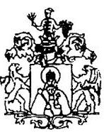

MISKOLC MEGYEI JOGÚ VÁROS POLGÁRMESTERE

Pü: 432-5/2011.

Állami Számvevőszék Elnöke
Domokos László úr

Budapest

Tisztelt Elnök Úr!

ÁLLAMI SZÁMVEVŐSZÉK
86941
Érke: 2011 SEPPI 08.
Tktatú: ...... ..................
Melléklet: .............................................

Aldó Hel
Herdó Fs Leard.
Mellékletel
12. 09.12.

A Miskolc Megyei Jogú Város Önkormányzata pénzügyi helyzetének ellenőrzéséről szóló
jelentés tervezetét megkaptuk és tanulmányoztuk.

A jelentés-tervezetben foglaltak összességében valós képet adnak az önkormányzat pénzügyi
helyzetéről, bemutatják az elmúlt évek kedvezőtlen folyamatait és a megoldásra váró
problémákat.

A vizsgálatot végző számvevők munkáját köszönöm.

A jelentés-tervezetben foglaltakhoz további észrevételt nem kívánok tenni, kiegészítésre nem
teszek javaslatot.

Miskolc, 2011. augusztus 24.

Tisztelettel

Dr. K r i z a Ákos

Levélcím: 3525 Miskolc, Városház tér 8.
www.miskolc.hu

Telefon:46/512-700
email: polgarmester@miskolcph.hu

---

.

---

# Elnök   ÁLLAMI   SZÁMVEVÖSZÉK 

Ikt.szám: V-3039-08/2011.

## Dr. Kriza Ákos úr,   polgármester

Miskolc Megyei Jogú Város Önkormányzata

## Miskolc

## Tisztelt Polgármester Úr!

Köszönettel vettem Miskolc Megyei Jogú Város Önkormányzata pénzügyi helyzetének ellenőrzéséről készített jelentés-tervezethez megküldött tájékoztató levelét.
Köszönöm Polgármester úrnak és munkatársainak az ellenőrzés során tanúsított hozzáállását, amellyel az önkormányzatról készített pénzügyi helyzetelemzés elkészítését segítették.

Budapest, 2011. december "22.".
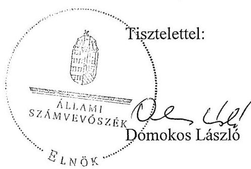

---

.