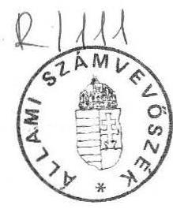
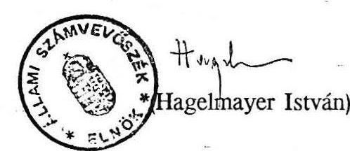

6407. szám

# Allami sáámtueböséé 

## JELENTÉS

az Állami Vagyonügynökség 1991. évi tevékenységéról

---

# A vizsgálatot végezték: 

| dr. Borisz József | számvevő tanácsos |
| :-- | :-- |
| Lőrinc Alajos | számvevő tanácsos |
| Majorosné dr. Locskai Noémi | számvevő tanácsos |
| Makkai Mária | számvevő tanácsos |
| dr. Molnár Barnabás | számvevő tanácsos |
| Németh Béláné | számvevő tanácsos |
| Rundik János | számvevő tanácsos |
| Szűcs Ivánné | számvevő |

A jelentést összeállította:

Harsányi Sándor
számvevő főtanácsos

---

# Tartalomjegyzék 

BEVEZETÉS ..... 1
MEGÁLLAPÍTÁSOK ..... 2

1. Vagyonkezelés, vagyonhasznosítás, az állami vagyon értékesítése ..... 2
2. A vállalati kezdeményezésú átalakulások és társaságalapítások ..... 5
3. Az állami vagyonügynökség közvetlen irányításával megvalósuló privatizációs programok ..... 6
4. Az előprivatizációs törvény végrehajtása ..... 7
4.1. Az előprivatizáció 1991. évi eredményei ..... 8
4.2. Előprivatizáció alóli kivonási kisérletek ..... 9
5. Az Állami Vagyonügynökség privatizációs bevételei és kiadásai ..... 10
5.1. A bevételek és kiadások szabályozottsága 1991-ben ..... 10
5.2. Az 1991. évi bevételek alakulása ..... 11
5.3. Az 1991. évi kiadások alakulása ..... 11
6. Alapitói jogok gyakorlása, vállalati biztosok kinevezése, államigazgatási felügyelet alá vonás ..... 14
7. Az Állami Vagyonügynökség szervezete, müködésének főbb jellemzői ..... 15
KÖVETKEZTETÉSEK, AJÁNLÁSOK ..... 16
MELLÉKLET:
8. sz. táblázat
9. sz. táblázat

---

# JELENTÉS 

az Állami Vagyonügynökség 1991. évi tevékenységéről

## BEVEZETÉS

Az Állami Vagyonügynökségről és a hozzá tartozó vagyon kezeléséről és hasznosításáról szóló 1990. évi VII. törvény 19. §-ának (1) bekezdése előírja, hogy a Kormány évente - az előző évi állami költségvetés végrehajtásáról szóló törvényjavaslat előterjesztésével egyidejűleg - köteles az Országgyűlésnek beszámolni az Állami Vagyonügynökség tevékenységéről, a hozzá tartozó állami vagyon alakulásáról, hasznosításának eredményéről és a vagyonpolitikai irányelvek végrehajtásáról. Ugyanezen paragrafus (3) bekezdése szerint "a beszámolóhoz mellékelni kell az Állami Számvevőszék elnökének jelentését a Vagyonügynökség tevékenységéről". Az Állami Vagyonügynökség 1991. évi tevékenységének a központi költségvetéssel és társadalombiztosítással való összefüggéseiről az Országgyűlésnek - a 6405. és a 6406. számon - benyújtott, szintén törvényi kötelezettségen alapuló jelentéseink adnak számot.

Az Állami Számvevőszéknek az Állami Vagyonügynökség 1991. évi tevékenységéről szóló jelentését a következők alapozzák meg:
-Az ÁSZ 1990. évi vizsgálata során tett javaslatok végrehajtására vonatkozó vagyonügynökségi belső ellenőrzési jelentés, illetve annak szúrópróbáin alapuló vizsgálata.
— Konkrét privatizációs ügyletek vizsgálatai. 1991-1992-ben az ÁSZ részletesen vizsgálta a Harmónia Kereskedelmi Vállalat, a Belvárosi Vendéglátó Vállalat, az IKARUS-CSEPEL Autó Vállalatok privatizációját, és elvégezte a Gerbeaud-ház privatizálásának ellenőrzését, utóellenőrzését is. E vizsgálatok alapján ugyan nem ítélhető meg az ÁVÜ teljes tevékenysége, de ha az így szerzett tapasztalatokat összevetjük az ÁVÜ különböző részlegeinél megállapított tényekkel, akkor bizonyos következtetések levonhatók.

---

- Az Állami Vagyonügynökség részlegeinél a tevékenységi körökre vonatkozó helyszíni ellenőrzés. Az Állami Számvevőszék nem folytat minden évben átfogó, a költségvetési gazdálkodás egészére is kiterjedő vizsgálatot az Állami Vagyonügynökségnél. Mivel ilyen vizsgálatra a múlt évben sor került, s az mintegy fél évet a jelen beszámolási időszakból is átfogott, most a közvetlenül végzett helyszíni ellenőrzések terjedelme -.amely azonban minden lényeges tevékenységi területre kiterjed - tudatosan szerényebb volt.
- Az Állami Vagyonügynökségről folyamatosan kapott információk és a publikált statisztikai adatok elemzése, illetve felhasználása. Ez az információbázis - miután döntően nem ellenőrzési célból készül - elsősorban összefüggések, tendenciák felismerésére, megerősítésére alkalmas.

# MEGÁLLAPÍTÁSOK 

A Kormány beszámolója áttekinthető, több esetben azonban túl leegyszerűsítő (pl. vagyonkezelés, előprivatizáció) és nem kellően igazodik az Állami Vagyonügynökségről szóló 1990. évi VII. törvény struktúrájához. Egyes témák - mint pl. az államigazgatási felügyelet alá vonás, vállalati biztosok kinevezése -, a Beszámolóban egyáltalán nem szerepelnek. Folyama-. tokra lehet belőle következtetni, de azok súlya, hatásmechanizmusa rejtve marad.

A Beszámoló időhorizontja most már a költségvetési zárszámadáshoz igazodik - ennek hiányát az előző évi számvevőszéki vizsgálat kifogásolta -, azaz az 1991. évet fogja át, és csak ott lép túl 1992-re, ahol az indokolt.

## 1. Vagyonkezelés, vagyonhasznosítás, az állami vagyon értékesítése

A vagyonkezelés, vagyonhasznosítás, az állami vagyon értékesítésének egyes kérdésével a Kormány beszámolója a II/1. "A kínálati oldal jellemző adata és tapasztalata" címszó alatt foglalkozik. Táblázatos formában a 3. sz. melléklet mutatja be az ÁVÜ-hoz tartozó állami vagyont.

A könyvelés adatai szerint az ÁVÜ 1991. december 31-én 123 társaságban 144 Mrd Ft vagyonnal rendelkezett. Azokban a társaságokban lévő állami vagyon van itt nyilvántartva, amely társaságok hiteles alapszabályával, társaságí szerződésével az ÁVÜ rendelkezik, a cégbejegyzés megtörtént, illetve amely társaságok részvényeit kinyomtatták és azok ténylegesen az ügynökség tulajdonában vannak.
A 144 Mrd Ft állami vagyon $10 \%$-a ( 15 Mrd Ft ) kft-kben lévő üzletrész, $90 \%$-a (129 Mrd Ft) részvénytársaságokban lévő ÁVÜ érdekeltség.

---

1991. év során a könyvelés adatai szerint $3,8 \mathrm{Mrd}$ Ft vagyonelvonás történt (1. sz. melléklet).

Az 1991. évi vagyonmérleg adatait az 1. sz. táblázatunk tartalmazza.
A vagyonmérlegben felvázolt adatokat a Beszámoló nem, csak az ÁVÜ éves mérlegbeszámolója tartalmazza, amit az ÁVÜ hivatalosan megküldött a Pénzügyminisztériumba. Ez ellenőrizhető módon, egyedi nyilvántartás szerint tartalmazza az ÁVÜ érdekeltségeit társaságonként, az azokban bekövetkezett évközi változások nyomonkövethetők.

A Beszámoló 3. sz. mellékletében közölt, "Az Állami Vagyonügynökséghez tartozó vagyon" 1991. év adatait a vizsgálathoz rendelkezésre bocsátott számítógépes feldolgozás nem támasztotta alá. Ez ugyanis 1992. január 23-ai állapotot tükröz, adatai nem egyeznek meg a Beszámolóban szerepeltetett adatokkal.

A számítógépes adatfeldolgozás alapbizonylata az a formalizált zárójelentés, amit a tranzakciót végző igazgatóságok illetékes munkatársa tölt ki az ÁVÜ-n belüli értékhatártól függő - döntést követően. Ennek dokumentumai: a döntés, a szerződés és a társaság alapszabálya vagy annak tervezete. A zárójelentések megbízhatósága azonban eltérő, az ügyintézőtől, a tranzakció jellegétől, az elkészítés, számítógépre történő feladás időpontjától függően változó pontosságú és tartalmú. Ez elsősorban tájékoztató jellegű feldolgozás. Azt a célt szolgálja, hogy gyors információt adjon a különböző igazgatóságok számára a kárpótlásra, kezelésbe adásra, ellenérték nélküli vagyonátadásra a privatizációra rendelkezésre álló vagyontömegről. Belső munkaanyagnak tekinthető, adatai nem pontosak.

Például a COMPACK-DOUWE EGBERTS Rt esetében az 1992. január 23-ai összeállítás 4430,08 MFt ÁVÜ részesedést mutat, melyen kivásárlási opció van. Ezzel szemben a könyvelés adatai szerint a részvénytársaságban az ÁVÜ részesedése 4311,69 MFt, melynek teljes vételára 1991. évben befolyt az ÁVÜ-höz.

Az Állami Vagyonügynökség tehát a hozzá tartozó állami vagyonról kétféle összesítést vezet:
—Az alapszabályban, társasági szerződésben szereplő, cégbíróságon bejegyzett társaságokban meglévő ÁVÜ részesedést tartalmazót. Ezt mutatja a mérlegbeszámolóban szereplő 144 Mrd Ft-os vagyonérték.
-A másik összesítés a különböző igazgatóságokon megjelent (értékhatártól függően valamilyen szintű vezetői döntés eredményeként lezárt témaként szerepeltetett) adatokat mutatja be társaságonként. Ezek 1991. év végi összértéke az ÁVÜ beszámoló szerint 332,9 Mrd Ft-ot tett ki. Az 1992. január 23-ai összesí tés szerint ez már 375,5 Mrd Ft volt. Ez utóbbinak az összetétele állt a vizsgálatot végzők rendelkezésére.

---

Egyik vagyonnyilvántartás sem tekinthető az ÁVÜ szempontjából teljeskörűnek. Az 1991. évi különböző jellegű vagyonelvonások (állóeszközök, forgóeszközök, részvények) könyvelése nem szabályozott, esetleges.

Például az 1991. március 27-ei igazgatótanácsi ülés 17. sz. határozatában döntött a Magyar Lóverseny KV vagyonelvonásáról. Ennek nyilvántartásba vétele nem történt meg. Ugyancsak nem jelenik meg az ÁVÜ nyilvántartásaiban az "irodaház" akcióból származó vagyontömeg sem.

Ezeket a vagyonelemeket a Beszámoló alapját képező számítógépes kimutatás nem is tartalmazza. Egyik kimutatás sem tartalmazza azokat a részvényeket, üzletrészeket, amelyek az előprivatizációs törvény hatályba lépésével szálltak át az Állami Vagyonügynökségre. Ennek nagyságrendje mintegy 7 Mrd Ft. Ezt külön az Előprivatizációs Igazgatóság gyűjti, de az ÁVÜ összesített vagyonkimutatásában nem szerepel.

Az ÁVÜ-höz tartozó vagyontömeg valahol a két kimutatás közötti értéket képviseli. Szükséges lenne eldönteni, hogy a vagyon nyilvántartásba vételét milyen aktushoz kötik (pl. társaságalapítás) és csak azt követően lehessen a vagyont a kimutatásokban szerepeltetni. Az éves beszámolóban csak ellenőrzött, minden igazgatóságra kiterjedő, összesített adatok szerepeltetése volna kívánatos.

A Beszámoló 3. sz. mellékletében jelzett átalakulás után értékesített 18 Mrd Ft vagyonrészből $9,8 \mathrm{Mrd}$ Ft volt ellenőrizhető azon társaságoknál, amelyeknek a készletre vétele a könyvelésben megtörtént, majd az értékesítés is dokumentált volt, a vételár befolyt.

A vagyonkezeléssel és vagyonhasznosítással a beszámoló 13. oldala foglalkozik és azt alapvetően mint problémamentes tevékenységet mutatja be. A számvevőszéki vizsgálat ezzel kapcsolatban megállapította, hogy a vagyonkezelést az ÁVÜ 1991-ben is közvetlenül gyakorolta, bár ezt az ÁVÜ-ről szóló törvény csak kivételesen és átmenetileg engedi meg. A közvetlen vagyonkezelést az ÁVÜ úgy gyakorolta, hogy munkatársai a társaságok rendkívüli és évzáró közgyűlésein képviselték az állam tulajdonosi érdekeit.

A vagyonkezelésre - az 1990. évi VII. tv. 22. § (3) bekezdése szerint - a meghirdetett vagyonrészek értékét nyilvántartott szakértővel köteles az ÁVÜ megállapíttatni. Ezzel szemben a második vagyonkezelői pályázatában szereplő társaságokról az ÁVÜ csupán tájékoztató jellegű összeállítást készíttetett, a társaságok pénzügyi helyzetét a pályázók nem ismerték.

A CO-NEXUS Rt-vel 1992. január 1-től, 5 éves időtartamra megkötött vagyonkezelési szerződés a társaságok 1991. évi eredménye alapján közös megegyezéssel lehetővé teszi a vagyonérték módosítását, amennyiben csőd vagy felszámolási eljárás megindítása válik szükségessé, és ez a portfolió egészének jelentős leértékelődését eredményezi. Nem tér

---

ki azonban arra, hogy mi történjen a társaságok 1991. évi gazdálkodása után fizetendő, ÁVÜ részére járó osztalékkal.

A társaságok 1991. évi mérlegbeszámolóiból megállapítható, hogy három társaságnál nem volt mód osztalék fizetésre. Egy társaság veszteségesen gazdálkodott (vesztesége: $10,9 \mathrm{MFt}$ ). A többi társaság együttesen 292,5 MFt osztalékot fizetett 1991. év után. Az 1992. január 1-től hatályos szerződés mellett az 1991. évi eredmények után járó osztalékot az ÁVÜ átengedte a vagyonkezelőnek.

Az 1990. évi VII. tv. 23. § (3) bekezdése alapján a pályázatok eredményét és annak megfelelően a kezelésbe adás megtörténtét a döntés indokolásával együtt haladéktalanul közzé kell tenni. Zártkörű (meghívásos) pályázat esetében ezeket az adatokat a pályázókkal közvetlenül kell ismertetni. Ezzel szemben az ÁVŨ a vagyonkezelési szerződést üzleti titoknak minősítette.

Összefoglalóan megállapítható, hogy az Állami Vagyonügynökség Igazgatótanácsa a második vagyonkezelési pályázat kiírásakor nem határozta meg a vagyonkezelési stratégiát és technikát, a vállalt pénzügyi garanciákat és biztosítási rendszereket, a díjazásra vonatkozó javaslatokat. Ebből adódóan a beérkezett pályázatok eltérőek voltak és egymással nem összemérhetők.

A megkötött vagyonkezelési szerződésekben az ÁVÜ részére jelentős kockázatok rejlenek.

A Beszámoló az 1991. évi vagyonmozgással kapcsolatosan sem foglalkozik a Magyar Befektetési és Fejlesztési Rt (MBF Rt) részére történő vagyonátadással, holott ennek a szervezetnek a későbbiekben jelentős szerepe lesz a privatizációs folyamatban. Az MBF Rt-t 1991. november 27 -én alapította az ÁVÜ, az ÁFI és a Szerencsejáték Rt. Az ÁVÜ apportját képező társasági részesedéseket nem vezették ki az ÁVŨ nyilvántartásaiból. Az 1992. január 23 -ai vagyonkimutatásban is szerepelnek az MBF Rt részére átadandó társasági részesedések, melyek névértéke 1.946 MFt , névértéken felüli értéke 931 MFt . A részvények átadása az MBF Rt részére 1992. március 23 -án történt meg. Az ÁVŨ a társaság alapításakor az apportját képező portfóliót nem bocsátotta a társaság rendelkezésére.
2. A vállalati kezdeményezésű átalakulások és társaságalapítások

A Beszámoló csak érintőlegesen foglalkozik az ÁVŨ vállalati kezdeményezésű privatizációjával kapcsolatos tevékenységének értékelésével, jellemzésével, holott ez nagyságrendjénél fogva jelentős terület.

---

A számvevőszéki vizsgálat alapján a vállalati kezdeményezésű privatizációs folyamat fő jellemzőit a következőkben foglaljuk össze:
-A vállalati privatizációs kezdeményezések, valamint az ÁVÜ által elbírált tranzakciók a tárgyidőszakban jelentősen megnövekedtek. Az ÁVÜ megalakulását követően 1990. év II-IV. negyedévében összesen 27 átalakulást fogadtak el, az 1991. év során vállalati és/vagy befektetői kezdeményezésre már összesen 153 átalakulási ügy zárult le. Az átalakult vállalatok könyv szerinti vagyona 167,3 Mrd Ft-ot tett ki, az átalakulási akcióban elismert vagyoni érték 240,01 Mrd Ft volt. Az év során mindössze 11 átalakulási kezdeményezést utasítottak el. 1991. december 31 -én összesen 176 vállalati kezdeményezésű átalakulás volt folyamatban, a vállalatok könyv szerinti vagyona 129,7 Mrd Ft volt.
-A vagyonvédelmi akciók esetében a jóváhagyott társaságalapítások, illetve az alapítással összefüggő vagyonértékesítések száma 97, míg az engedélyezett egyéb vagyoneladások száma 169 volt. Összesen 266 vagyonvédelmi ügyletet hagytak jóvá 1991. év során, szemben a megelőző év 9 hónapjában elbírált 84 vagyonvédelmi ügylettel. A vagyonvédelmi ügyletekkel összefüggő vagyon könyv szerinti értéke $21,74 \mathrm{Mrd} \mathrm{Ft}$ volt, a tranzakcióban elfogadott értéke 38,0 Mrd Ft-ot tett ki. Az év során összesen 12 vagyonvédelmi ügyletet utasítottak el.
—Az ÁVÜ a jelentős ügyszám bővülést létszám bővítéssel, belső szervezéssel, valamint a privatizációs infrastruktúra fejlesztésével, rugalmasan hidalta át. Erre utal az a körülmény, hogy az elbírálások átlagos átfutási ideje számottevően nem növekedett. A vagyonvédelmi ügyek elbírálásának átlagos időszükséglete 1990-ben 4,37 hó, 1991ben 4,73 hó volt, a vagyonvédelmi ügyletek feldolgozásának időszükséglete pedig 1,26 hó-ról csak 1,31 hó-ra növekedett.
—Összhangban a megnövekedett számban elbírált privatizációs kezdeményezéssel, az év során az állam privatizációs bevétele is jelentősen növekedett. Míg 1990. év során mindössze 670 M Ft bevétele keletkezett, a tárgyidőszakban 29,77 Mrd Ft privatizációs bevétel származott a vagyon értékesítéséből. Az ÁVÜ hatáskörébe került vagyon hozadéka 940 M Ft-ot tett ki. A 29,77 Mrd Ft vagyonértékesítési árbevétel $80,9 \%$-a devizában, $15,7 \%$-a Ft készpénzben, $3,4 \%$-a Ft hitelben jelentkezett (egzisztencia és privatizációs hitelkonstrukciók igénybevételével).
3. Az állami vagyonügynökség közvetlen irányításával megvalósuló privatizációs programok

A Beszámoló a 14. oldalon nagyon röviden foglalkozik az ún. állami kezdeményezésű programok helyzetével. Ezeknek részletes leírását a 6. sz. melléklete tartalmazza. A beszámoló az állami kezdeményezésű programoknál folytatott privatizáció eredményeit "nem kedvezőek"-nèk minősíti. A beszámoló ezel túlmenően érdemi értékelést nem ad.

---

Az ÁSZ megvizsgálta az első privatizációs program (EPP), a második privatizációs program (MPP), az építőipari privatizációs program (ÉPP), az extra privatizációs program (ExPP), a külkereskedelmi vállalatok privatizációs programja, a bor-program helyzetét.

- Az aktív privatizációs programok lebonyolítása általában lassú vagy lassan halad, azzal jellemezhető, hogy az egyes programok kezdik élni önálló életüket, s az ÁVÜ nem tudott élni az aktivizálás lehetőségeivel. Ehhez nem gyakorolt érdemi ráhatást a privatizációs folyamatokra, az ügyek is jórészt önmaguk életét élik, az ÁVÜ jobbára csak "szemmel tartja" az egyes ügyeket.
- A befolyásolás körülményeit és nehézségeit figyelembe véve az ÁVÜ igyekezett a programszerű lebonyolítás tartalmi és formai határait elmosni, hogy tevékenysége inkább a közreműködés felé tolódjon el. Az aktív befolyásoló tevékenység háttérbe szorult, az ÁVÜ inkább a konzultatív szerepre vállalkozott. Hozzásegítette ehhez a szervezetet az a körülmény is, hogy a kormányzati munkamegosztás megváltozott, és az alapítás óta bizonyos súlypontáthelyeződések is bekövetkeztek, továbbá új feladatként jelent meg a kárpótlási ügyek szervezése és irányítása.

Míg az előző évi beszámoló kapcsán végzett vizsgálat során az ÁSZ azt állapította meg, hogy az ÁVÜ tevékenysége magán viseli az induló szervezetek beindításával összefüggő jegyeket, addig az 1991. év tevékenységének vizsgálata kapcsán már az a jellemző, hogy csökkent - talán túl korán - az aktivizáló szerepe és inkább a hivatali munkastílus jegyei ismerhetők fel. Az ügyek bevárása, nem pedig az aktív ráhatás és befolyásolás a fő. jellemző.

# 4. Az előprivatizációs törvény végrehajtása 

A Beszámoló az előprivatizáció helyzetét sommásan, nem a privatizáció - folyamatban elfoglalt - súlyának megfelelően mutatja be (12. oldal).

A számvevőszéki vizsgálat arra terjed ki, hogy az Állami Vagyonügynökség a kiskereskedelmi, a vendéglátóipari és a fogyasztási szolgáltató tevékenységet végző állami vállalatok vagyonának privatizálásáról szóló 1990. évi LXXIV. tv. előírásait 1991. évben hogyan hajtotta végre. Kiemelten:
— hány üzlet privatizálása fejeződött be 1991-ben, a befolyt vételár összege, az elszámolt kiadások szabályszerűsége és mértéke;
— az Országgyűlés Gazdasági Bizottsága részére - az előprivatizáció meggyorsítására az ÁVÜ által készített intézkedési terv végrehajtásának ellenőrzése;
— mintavételes vizsgálat arról, hogy tapasztalhatók-e egyes vállalatok részéről az előprivatizáció alóli kivonási kisérletek;

---

- a versenyeztetés, az árverések szabályossága, a lebonyolítással megbízott szervezetek múködésének az ÁVÜ részéről történő beszámoltatása és a közreműködésük költségeinek feltárása.

# 4.1. Az előprivatizáció 1991. évi eredményei 

1991. évben 2120 üzlet privatizálása fejeződött be. Ebből több mint 1700 üzletet árveréssel értékesítettek. Az eladások összértéke 5,1 Mrd Ft-ot tett ki. Ezen túlmenően az 1990. évi LXXIV. törvény 14. §-ának (1) bekezdése alapján az Állami Vagyonügynökségre átszállt részesedésből 731.624 eFt vagyontömeget értékesítettek. Az előprivatizációval kapcsolatos kiadások 190 MFt voltak. A kiadásokat a vagyonértékelésekre, az árverések lebonyolítására, a szerződéses üzletvezetők szerződéses boltokba eszközölt pótlólagos beruházásai visszafizetésére fordították. A kiadások döntő részét kitevő vagyonértékelési és árverési költségek - mely általában az üzlet értékesítéséből származó bevétel $4 \%$-a körüli összeg - teljes összegét a licit nyertesével, mint privatizációs költséget megtéríttetik. A vagyonértékelő cégeket pályázat útján választották ki.

Az előprivatizációs hitelhez való jutás feltételeiben hozott kedvező változtatások hatására az előprivatizáció felgyorsult, de még így is elmarad a kívánalmaktól.

Az előprivatizációt a hitelgarancia intézményének kibővítése tovább gyorsíthatná. Az első és a második árverésen az árverésre bocsátott boltok kétharmada talál gazdára. Az eladási árak a kikiáltási árakat $34 \%$-kal meghaladták. A vállalkozók által felvett hitel 1,8 Mrd Ft volt. Az árverések ÁVÜ által - az Ipari és Kereskedelmi Minisztérium egyetértését bíró - belsőleg leszabályozott formában, zárt rendszerben folynak. Az ÁVÜ az árverések megszervezésével majd kizárólag az érintett vállalatokat bízza meg díj ellenében. Külön beszámolta tást részükre nem alkalmaz. Sikertelen árverés után is az ÁVÜ szabja meg a kikiáltási árat. A megbízottak csak lebonyolítók.

Az ÁVÜ és az Ipari és Kereskedelmi Minisztérium 1992. januárjában beszámolt az Országgyűlés Gazdasági Bizottsága részére az előprivatizációs törvény 1991. évi végrehajtásáról. Megállapítható, hogy a 10.240 privatizálandó kereskedelmi és szolgáltató egységből közel 2000 db nem állami tulajdonban álló ingatlanban működik. Privatizálásuk rövid időn belül kikerül az állami vállalati szférából. A 4700 db szerződéses és bérletes formában üzemeltetett üzletből várhatóan 1700 egység privatizációjára az előprivatizációs törvény által előírt két éves terminus lejártát követően kerülhet sor.

900 db üzletnél nem az árverést, hanem a törvényben biztosított más privatizációs technika alkalmazását tartják célszerűnek (nem nyílt árusításu üzletek, tanboltok).
1000 db - előprivatizáció alá tartozó - üzlet privatizációjára a vállalatok egészének gazdasági társasággá való alakulása keretében kerül sor, kivonva ezen egységeket az előprivatizáció alól. A törvény erre lehetőséget biztosít. Az ÁVÜ-nek - figyelembe véve

---

a törvény által előírt két éves határidőt - 1992. január 1-től még mintegy 3000 üzlet értékesítését kell kezdeményeznie.

Sikeres jogszabálymódosító kezdeményezése volt az ÁVÜ-nek a bérelt üzlethelyiségek bérleti jogviszonyában a jogutódlás elismerésére, a szerződéses üzemelésű üzletek eltérő privatizálására, a hitelezési lehetőségek javítására.

# 4.2. Előprivatizáció alóli kivonási kisérletek 

Mintavételes eljárással a Corsó Cipőkereskedelmi Vállalat 2 kiskereskedelmi üzleténél, a Fővárosi Ruházati Szolgáltató Vállalat 7 kiskereskedelmi üzleténél, a Cipőbolt Vállalat 12 kiskereskedelmi üzleténél vizsgáltuk annak körülményét, hogy ezeknél az egységeknél az érintett vállalatok részéről nem történt-e az előprivatizáció alóli kivonási kisérlet.

Megállapítottuk, hogy a Corsó Cipőkereskedelmi Vállalat két üzletét az előprivatizáció alapján értékesítették.

A Fővárosi Ruházati Szolgáltató Vállalat érintett 7 db üzletét az ÁVÜ 1991-1992. években értékesíti.

A Cipőbolt Vállalat a vizsgált 12 kiskereskedelmi üzlet használati jogát 1989. V. hó 3-án mellékszolgáltatásként, érték nélkül, az általa és a Salamander Import-Export GmbH-val közösen alapított FÔNICIA Kereskedelmi Kft-be vitte be, 46 továbbikiskereskedelmi egységgel együtt. Az érték nélküli mellékszolgáltatás ellenértékeként - ezt is csak kizárólag az alapítást követő első nyolc üzleti évre vonatkozóan - a Cipőbolt Vállalat $5 \%$ ponttal magasabb nyereségfelosztást ért el a törzsbetétek arányát figyelembe véve.
A társasági szerződésnek a magyar fél kárára egyértelműen megállapítható, ismertetett kikötés nem volt jogszabályilag tiltott, ezért jogilag nem támadható. A Cipőbolt Vállalatot az ÁVÜ időközben államigazgatási felügyelet alá is vonta. A Főnicia Kft-n belüli tulajdoni arány változatlan fenntartása vagy feladása esetén is az ÁVÜ-nek meg kell kisérelnie az 58 db kiskereskedelmi egység piaci értéken, a társaság törzstőkéjében a magyar fél javára való elismertetését.

Az előprivatizáció alóli kivonási kisérletek megállapítása érdekében az ÁVÜ 1992-ben felülvizsgálja valamennyi vállalati - törvényi kötelezettségen alapuló - bejelentés valódiságát.

---

# 5. Az Állami Vagyonügynökség privatizációs bevételei és kiadásai 

A Beszámoló 18. oldala foglalkozik a privatizációs bevételek és kiadások helyzetével, a struktúrát pedig annak 7. sz. melléklete foglalja össze. A számvevőszéki vizsgálat a Beszámolónál nagyobb mértékben és mélységben terjedt ki e területre. Ennek eredményeit a következőkben foglaljuk össze:

Az Állami Vagyonügynökség bevételeit és kiadásait a többször módosított 1990. évi VII. törvény szabályozza általános érvénnyel. E törvény szerint a Vagyonpolitikai Irányelvek - melynek végrehajtása az ÁVÜ feladata - az egyes évekre konkrétan meghatározzák, hogy a bevételeket mire lehet felhasználni. A hivatkozott törvény írja elő azt is, hogy az Állami Vagyonügynökség szervezetének költségvetését el kell különíteni a Vagyonügynökség bevételeitől és kiadásaitól. Ugyancsak törvényi kötelezettség, hogy a Vagyonügynökségnek Kormány által jóváhagyott, az eljárási szabályokat is magába foglaló müködési szabályzattal kell rendelkeznie.

### 5.1. A bevételek és kiadások szabályozottsága 1991-ben

1991-re szóló, új Vagyonpolitikai Irányelveket az Országgyűlés nem hagyott jóvá, hanem az 1990. évi Ideiglenes Vagyonpolitikai Irányelvek hatályát hosszabbította meg 1991. szeptember 30-ig. A bevételek felhasználását elsősorban ez szabályozta. Ezt követően 1991-ben hatályos Vagyonpolitikai Irányelvek nem voltak, csak tervezetek készültek.

A bevételek egy részének felhasználását egyéb törvények is előírták, Az 1991. évi költségvetésről szóló 1990. évi CIV. törvény rendelkezett az önkormányzatoknak visszajuttatandó privatizációs bevételekről. A kiskereskedelmi, a vendéglátóipari és fogyasztási szolgáltató tevékenységet végző állami vállalatok vagyonának privatizálásáról szóló 1990. évi LXXIV. törvény pedig szabályozta, hogy azon szerződéses üzletek értékesítéséből származó bevételekből, melynek nem az üzlet vezetője a nyertese, azt a részt, amellyel beruházása folytán az üzlet értéke megnövekedett, az üzlet vezetője részére vissza kell fizetni.

Az Állami Vagyonügynökség szervezetének és a bevételek, valamint kiadásoknak bankszámlák szerinti elkülönítése megtörtént.

A Vagyonügynökség Kormány által jóváhagyott, az eljárási szabályokat is magába foglaló müködési szabályzattal - a többszöri előterjesztés ellenére - nem rendelkezett és ma sem rendelkezik. A szervezeti és müködési szabályzat tervezetében a bevételek felhasználásánál az utalványozási jogosultságot szerepeltették, a gyakorlati munkában azt alkalmazzák. Sem a tervezetben, sem pedig más szabályzatban nem szabályozzák viszont, hogy az utalványozás mi alapján és milyen módon történhet. Az sem szabályozott, hogy a bevételek és kiadások tekintetében kinek (mely szervezeti

---

egységnek) mi a feladata, hogyan történjen a különféle szerződési kötelezettségek nyilvántartása, teljesülésük figyelemmel kisérése, adott esetben kinek, mikor és hogyan kell intézkednie. Az egyértelmű feladatmeghatározás, a szabályozás elkerülhetetlen ahhoz, hogy a bevételek és kiadások rendszere egységes, zárt és ellenőrizhető legyen.

Az Állami Vagyonügynökség a bevételek és kiadások könyveléséhez számlarenddel és annak szöveges magyarázatával rendelkezik. Mindez azonban nem elégséges ahhoz, hogy a szervezet működési kiadásai és a privatizációs bevételek felhasználása a gyakorlati munkában is egyértelműen szétváljon, a kettő keveredése ne forduljon elő.

# 5.2. Az 1991. évi bevételek alakulása 

Az Állami Vagyonügynökség 1991-re 40-50 milliárd-Ft privatizációs bevétellel számolt. Az 1991. január 1.-december 31. között ténylegesen befolyt (pénzforgalmilag teljesült) bevétel - a Vagyonügynökség beszámolójában szerepeltetettel egyezően összesen 31.380,4 M Ft.

A bevételek $78,4 \%$-a, 24.605,4 millió Ft devizáért történő értékesítés eredménye. Egzisztencia hitel igénybevétele (az ebből származó privatizációs bevétel) 1991-ben 1.013,4 millió Ft volt.

A bevételek többi része
— vagyonhozadékból
$909,6 \mathrm{M} \mathrm{Ft}$,
— bérleti díjból
$9,7 \mathrm{M} \mathrm{Ft}$,
— előprivatizációból és egyéb
Ft-ért történő értékesítésből
$4.842,3 \mathrm{M} \mathrm{Ft}$
származott.
Az egyes tételek az MNB-nél vezetett megfelelő számlákon jelentek meg. E számlák törvényi szabályozás szerint nem kapcsolódtak az állami forgóalaphoz és a bevételek a folyó költségvetésbe sem épültek be.

### 5.3. Az 1991. évi kiadások alakulása

A privatizációs bevételek felhasználását, azaz a kiadások jogcímeit törvények, valamint a Vagyonpolitikai Irányelvek határozzák meg. 1991-ben (január 1-től december 31-ig) a ténylegesen teljesített (a bankszámlákon leterhelt) kiadás - a beszámolóban szerepeltettel egyezően - 26.758,4 M Ft volt.

---

Ebből:

- társaságoknak visszautalt
- önkormányzatoknak utalt
- üzletvezetőknek utalt

906,5 M Ft
$1.370,6 \mathrm{M} \mathrm{Ft}$
$23,4 \mathrm{M} \mathrm{Ft}$
volt.

Mindhárom kiadás törvényi előíráson alapult.
Az 1991. szeptember 30-ig hatályos Vagyonpolitikai Irányelvek szerint lehetséges kiadások az alábbiak voltak:

- a bevételek azon részét, melyet kedvezményes privatizációs konstrukció keretében finanszíroztak közvetlenül az államadósság törlesztésére kell fordítani;
- a fennmaradó bevételből 1 milliárd Ft a Vállalkozásfejlesztési Alapítvány részére átutalható;
- 0,5 Mrd Ft-tal pedig a Vagyonügynökségnél intervenciós célú tartalékalapot kell létrehozni;
- az e célok után fennmaradó bevételrészről az Országgyűlés a Vagyonügynökség javaslata alapján dönt.

A Vállalkozásfejlesztési Alapítvány részére az 1 Mrd Ft-ot, valamint az intervenciós célú tartalékalapba 0,5 Mrd Ft-ot sem 1990-ben, sem 1991-ben nem utaltak át.

A kedvezményes privatizációs konstrukció keretében nyújtott hitelből származó bevételt - 1.013,4 MFt-ot - automatikusan az Irányelveknek megfelelően az államadósság törlesztésére fordítottak.

A Vagyonügynökség beszámolójában és a könyvelés adatai szerint is államadósság törlesztésére összesen 22.368,7 millió Ft-ot utaltak át.

Ez az alábbi adósságok törlesztését jelentette:

- forgóalapjuttatási hitel
$3.394,7 \mathrm{M} \mathrm{Ft}$
- 1982.évi deficithitel miatti tartozás
$2.750,0 \mathrm{M} \mathrm{Ft}$
- 1983.évi deficithitel miatti tartozás
$715,0 \mathrm{M} \mathrm{Ft}$
- 1984.évi deficithitel miatti tartozás
$1.800,0 \mathrm{M} \mathrm{Ft}$
- 1985.évi deficithitel miatti tartozás
$1.709,0 \mathrm{M} \mathrm{Ft}$
- TB Alap számla javára átutalás
$12.000,0 \mathrm{M} \mathrm{Ft}$

---

A forgóalapjuttatási hitel törlesztése tartalmazza az Egzisztenciahitel igénybevételével befolyt bevételek felhasználását is.

A Társadalombiztosítási Alap részére történő átutalás a Pénzügyminisztérium intézkedése nyomán valósult meg. Levelük szerint az állami költségvetés állampolgári jogú családi pótlék miatt keletkezett tartozását rendezték ezzel az összeggel kormányhatározat alapján.
A Kormány 3493/1991. sz. határozatának 3. pontja az alábbiakat tartalmazza:
"Az állami költségvetés családi pótlékkal kapcsolatos tartozását a Vagyonpolitikai Irányelvekhez kapcsolódóan, az 1991-1992-es privatizációs bevételekből 13 Mrd Ft értékben kell megtéríteni."

Az átutalás időpontjában hatályos Vagyonpolitikai Irányelvek nem voltak, a rendezésre vonatkozó törvényi szabályozás az átutalást követően jeleñt meg.

A kiadások között szerepel 163,9 M Ft befektetés privatizációs bevételekből. Ez négy társaságnál jelentkezik, mint ÁVÜ törzstőke, nevezetesen:

Nemzeti Lóverseny Kft
1 M Ft
Hajógyári Sziget Vagyonkezelő Kft.
161 M Ft
Belvárosi Irodaház Kft
0,9 M Ft
PRI-MAN Kft.
1 M Ft

A privatizációs bevételek ilyen célú felhasználásáról sem törvények, sem a hatályos Vagyonpolitikai Irányelvek nem rendelkeztek.

Tartós betét címszó alatt jelenik meg 800 millió Ft kiadás. Megjelenési formáját tekintve valóban lekötött betét, azonban tartalmát illetően privatizációhoz kapcsolódó bankgarancia fedezete.

A privatizációs bevételek ilyen célú felhasználásáról sem törvények, sem a hatályos Vagyonpolitikai Irányelvek nem rendelkeztek.

A Beszámoló szerint 14 esetben vállaltak garanciát. Ezek felső határa több esetben azonos, vagy minimális értékkel kisebb csak, mint a privatizációs bevétel volt az adott cégnél. Ilyen például: Lehel-Elektrolux, Chinoin-Sanofi, United Biscuits-Győri Keksz, Compack-Sara Lee. A garanciavállalások felső határa 14 milliárd Ft és az emiatti fizetési kötelezettség a privatizációs bevételek felhasználási lehetőségeit befolyásolja, a tisztánlátás érdekében indokolt a garanciavállalások tételes áttekintése.

A kiadások fennmaradó része az ún. privatizációs költségek és az ÁFA (1.125,3 M Ft).A privatizációs költségek jogcímei jogszabályokban csak részben, belső szabályzatban pedig nem rendezettek. Ez is hozzájárult ahhoz, hogy a költségként elszámolt

---

tételek között az ÁVÜ múködési kiadásait jelentő összegek is szerepelnek. Így a belföldi kiküldetési költségek között az ÁVÜ saját dolgozóinak kiküldetési költségei, az egyéb anyagjellegủ kiadások között pedig gépkocsi költség, állófogadás, sajtótájékoztató miatti kiadások jelennek meg.

A múködési kiadásokat jelentő tételek privatizációs bevételek terhére történő elszámolása nem megengedhető, ezért a könyvelés ÁVÜ részéről történő tételes felülvizsgálata és az alapján a helyesbítés elkerülhetetlen, a szabályozás nem halasztható.
6. Alapítói jogok gyakorlása, vállalati biztosok kinevezése, államigazgatási felügyelet alá vonás

Az Állami Vagyonügynökség tevékenységében jelentős szerepe van (kellene, hogy legyen) az alapítói jogok gyakorlásának, az államigazgatási felügyelet alá vonás és a vállalati biztosok kinevezése rendszerének. Erről a Beszámoló nem tesz említést. A számvevőszéki vizsgálat ezirányú tapasztalatait a következőkben foglaljuk össze:
—Az ÁVÜ Igazgatótanácsa 1991. évben 58 esetben élt az államigazgatási felügyelet alá vonás eszközével, döntő többségében azért, mert a vállalatvezetés magatartása az átalakítás - privatizáció - sikerét veszélyeztette, valamint a vagyonvesztés lehetőségét kívánták ezzel megakadályozni. Az illetékes minisztériumokkal egyeztetett vélemény alapján vállalati biztosok kinevezésére is sor került azokban az esetekben, amikor a korábbi vállalati igazgató együttműködési készséget nem biztosított az ÁVÜ-vel.
—Az államigazgatási felügyelet alá vonást követő időszak munkafolyamata nem szabályozott, nem ellenőrzött, ezért nem is múködik megfelelően. Az ÁVÜ 1990. évi tevékenységének vizsgálata alapján tett megállapításaink ezért változatlanul fennállnak. Az ÁVÜ tulajdonosi jogait e területen nem látja el kellő hatékonysággal.
$=1990$. évben államigazgatási felügyelet alá vont 24 vállalat, majd 1991. évben további 58 vállalat átalakulása - privatizációja - csupán 16 esetben fejeződött be.
$=$ A vállalati biztosok feladatmeghatározását csupán 11 esetben mutatták be. A többieknél a munkaszerződést kaptuk meg, amely nem konkrét feladat előírását,hanem munkajogi felsorolást tartalmaz.
$=$ A vállalati biztosok beszámoltatása alkalomszerű, ötletszerű, nem következetes. 1991. évről írásbeli beszámoló jelentést az ÁVÜ munkatársai bemutatni nem tudtak.

---

- Az ÁVÜ Igazgatótanácsa 1991. évben az államigazgatási felügyelet alá vonás határozatával egyidőben rögzítette a vállalati biztos feladatait. Határozatot hozott arról, hogy pl.
$=$ a privatizációs koncepciót el kell készíteni az Autótechnika-nál, a Mobil-nál, a Habselyem Kötöttárugyárnál;
$=$ a Mezőfalvi Mezőgazdasági Kombinátnál 3 hónapon belül válságkezelő programot kell készíteni;
$=$ a Rábatex Vállalatnál 1992. I. 31-ig a privatizációra vonatkozó javaslatot el kell készíteni;
$=$ a Kőporc vállalatnál ugyanezt a feladatot kapta a vállalati biztos.
Az Igazgatótanácsi határozatok végrehajtását az ÁVÜ munkatársai nem tudták dokumentálni.

A döntési és a végrehajtási szint közötti kapcsolat az ÁVÜ-nél ezen a téren nem megfelelő. Az ellenőrzési pontokat a munkafolyamatokba nem építették be. E feladatkörben a mai napig sem tapasztalható javulás, holott erre már előző vizsgálatban is felhívtuk a figyelmet.

Az államigazgatási felügyelet alá vont vállalatok vagyonvédelméről, az értékesítések eredményességéről az információ teljes hiánya, a szabályozatlan, szervezetlen tevékenység miatt nem lehet képet adni.

Az ellenőrzés alatt az 1991. évben államigazgatási felügyelet alá vont vállalatokról (58) kapott információ nem volt teljeskörü. (Az ÁVÜ 52 vállalatról adott tájékoztatást.)

# 7. Az Állami Vagyonügynökség szervezete, müködésének föbb jellemzői 

Az Állami Vagyonügynökség 1991-ben némileg stabilabb jogszabályi környezetben működött, mint 1990-ben. Az egyik legnagyobb gondot az okozta, hogy az ÁVÜ tevékenységét szabályozó legfontosabb jogszabályt, a Vagyonpolitikai Irányelveket, az Országgyűlés nem hagyta jóvá. Mindez a privatizációs tevékenységet továbbra is önmaguk által meghatározott pályára terelte, és továbbra is a törvényi felhatalmazást meghaladó szélességre húzta szét az ÁVÜ tevékenységi körét.

1991-re is jellemző volt - ezt már az 1990-ben végzett számvevőszéki vizsgálat is rögzítette -, hogy az ÁVÜ teljesítőképessége nincs összhangban kibővített tevékenységi körével. Ennek következményei többek között abban jelennek meg, hogy

---

- az Igazgatótanács döntéseit az apparátus többször nem hajtotta végre;
- a megkötött szerződések egyes esetekben eltérnek az Igazgatótanács által meghatározott paraméterektől;
- a versenyeztetés tisztaságát garantáló szabályok 1991-ben hiányoztak;
- a privatizációs szerződések tartalmilag kiérleletlenek, a vevők tényleges anyagi helyzetéről több esetben nincs kontrollált ismeret;
- a szerződések egy részének teljesítését nem követik nyomon;
- továbbra sem rendezett a vállalati biztosok megbízásának rendszere.

Az Állami Vagyonügynökség feladata és szervezete permanens változásban van. Ezzel összefüggésben továbbra sincs Kormány által jóváhagyott alapító okirata. Továbbra is ideiglenes szervezeti szabályzat alapján működik. Ugyanakkor tapasztalható, hogy a szervezeti változások a feladatváltozások irányába hatottak, és jó irányba változott az irányítási koncepció is. A személyi állományában jelentős a fluktuáció. A menedzsment és annak hatásköre jelentős változáson ment keresztül.

A létszám és jövedelem 1991. évi helyzetét a 2. sz. táblázatunk szemlélteti.

# KÖVETKEZTETÉSEK, AJÁNLÁSOK 

Mivel az ÁSZ már második alkalommal készít jelentést az ÁVŰ tevékenységéről, alkalma van bizonyos tendenciák jelzésére.

Az ÁSZ jelentés szélesebb síkú, mint amit címe jelez: megkísérli a magyar privatizáció helyzetét bemutatni. Tájékoztat arról, hogy a sok hiba és az ÁVŰ múködésében rejlő gyengeségek ellenére a folyamat előrehaladt. Megállapítható ugyanakkor az is, hogy
—az Állami Vagyonügynökség 1991. szeptember 30 -áig az ideiglenes Vagyonpolitikai Irányelvek alapján - amely a gazdasági változáshoz már nem igazodott - illetve 1991. októberétől pedig érvényes, az Országgyűlés által jóváhagyott Vagyonpolitikai Irányelvek nélkül folytatta tevékenységét;
—a termelés zsugorodásával, a nagyobb vállalatokat, iparágakat sújtó piacvesztéssel gyorsul a vállalatok vagyonának leértékelődése, a vevő van jobb pozicióban, ami által olyan garanciákat erőszakol ki, ami egyértelműen előnytelen. A több mint 14 Mrd Ft-os garanciavállalás lényegében csökkentheti a privatizációs bevételt;

---

- a privatizációval nem lehet rövidtávú gazdasági gondokat megoldani, az ebből származó - a folyamat kiszélesedésével növekvő - bevételek még a költségvetés napi gondjainak enyhítésére sem elégségesek, s kétségtelen az is, hogy több esetben a perspektívával rendelkező, nyereséges állami vállalatok még az ÁVÜ létrehozása előtt, spontán módon alakultak úgy át, hogy abból az államnak bevétele nem származott (pl. Harmónia Kereskedelmi Vállalat, Belvárosi Vendéglátó Vállalat);
- a beszámolási időszakban hiányzott a Kormány egységes privatizációs politikája, az ÁVÜ sorozatosan került bele olyan ügyekbe, amelyek meghaladták kompetenciáját, s az anyagi érdekek kényszerủ szorításában rövidtávú érdekeket követett;
- az ÁVÜ szervezete, teljesítőképessége - a lényegi szervezeti módosulások, létszámfejlesztés ellenére - ma sem adekvát a feladatokkal.

# Ajánlások az Állami Vagyonügynökségnek 

Az Állami Vagyonügynökség jövőbeni múködésének keretfeltételei az ún. privatizációs törvénycsomag elfogadásával, továbbá az új Vagyonpolitikai Irányelvek jövőbeni országgyúlési határozattá válásával 1991. évhez képest alapvetően megváltoznak. A változó körülmények ellenére az ÁSZ szükségesnek látja, hogy az Állami Vagyonügynökség
— dolgozza ki a szervezet alapító okiratát, és nyújtsa be jóváhagyásra a Kormánynak. Az alapító okirat alapján dolgozza ki és nyújtsa be jóváhagyásra az Igázgatótanácsnak szervezeti és müködési szabályzatát;
— alakítsa ki az Állami Vagyonügynökséghez tartozó állami vagyon kimutatásának áttekinthető és pontosságot biztosító megoldását;
— tekintse át ismételten a vagyonkezelési tevékenységet és belső szabályzatát készítse el;
— szabályozza a bevételek és kiadások tekintetében a szervezeti egységek feladatát, oldja meg a különféle szerződési kötelezettségek nyilvántartását, a teljesítés állandó figyelemmel kisérésének problémáját;
— rendezze belső szabályozásában a privatizációs költségek jogcímeit;
— vizsgálja felül az 1991. évi müködési kiadásokat, azokat egyértelműen különítse el, és ennek figyelembevételével rendezze a privatizációs bevételek terhére történt elszámolásokat;

---

- rendezze a döntési és végrehajtási színt közötti kapcsolatokat az alapítói jogok megfelelő gyakorlása érdekében;
- dolgozza ki és múködtesse az államigazgatási felügyelet alá vont vállalatok vagyonvédelméhez, továbbá az értékesítések eredményessége kimutatásához szükséges belső információ rendszerét;
- egységesítse a vállalati kötelezettségek, adósságok átruházására irányuló vagyoni tranzakciók döntéselőkészítési és lebonyolítási metodikáját, határozza meg a dokumentálási kötelezettség minimumát;
- kezdeményezze a pályázati rendszer átfogó szabályozását. A szabályozásnak olyan irányba célszerű hatnia, hogy a nyilvános pályázat váljon általános formává, zártkörű versenyeztetés pedig csak kivételesen, indokolt esetben történjen;
- segítse elő a kínálat bővítését, valamint a hazai ipari szakmai befektetők lehetőségeinek növelését a privatizálandó vállalatok szervezeti kereteinek lebontásával;
- építse ki a belső ellenőrzés komplex rendszerét, amely mind a döntéselőkészítő, mind a végrehajtó folyamatába szervesen beépül.

Budapest, 1992. augusztus

Melléklet: 2 db táblázat

---

1991. évi vagyonmérleg
(Millió Ft-ban)

| Megnevezés | 1991. évi nyitóállomány | Növekedés átalakulásból és vagyonelvonásból | Csökkenés értékesítésből | 1991. évi záró állomány |
| :--: | :--: | :--: | :--: | :--: |
| Kft-kben lévő üzletrész | 787,8 | 15.648,2 | 1.612,5 | 14.823,5 |
| Rt-kben lévő érdekeltség | 70.687,3 | 66.060,1 | 8.266,0 | 128.521,4 |
| Egyéb (banki, részvény elvonás) | -- | 966,0 | -- | 966,0 |
| Összesen: | 71.475,1 | 82.674,3 | 9.878,5 | 144.310,9 |

Vagyonelvonás

| Kft üzletrész | $1.004,5$ |
| :-- | --: |
| Állóeszköz (3 Rt-től) | $1.826,0$ |
| Elöprivatizáció során | 178,0 |
| Banki részvények | 225,3 |
| Investor | 100,0 |
| Club Tihany | 462,7 |
| Összesen: | $3.796,5$ |

---

AZ 1991. ÉVI TERVEZETT ÉS TÉNYLEGES JÖVEDELMEK ALAKULÁSA

|  MEGNEVEZÉS | 1991. évi | jóváhagyott | elöirányzat | 1991. tényleges | jövedelmek a bérkö1tség | alapján  |
| --- | --- | --- | --- | --- | --- | --- |
|   | Érdemi*
föfoglalk. | Egyéb
föfoglalk. | Föfoglalk.
dolg.össz. | Érdemi *
föfoglalk. | Egyéb
föfoglalk. | Föfoglalk.
dolg.össz. .  |
|  1.Átlaglétsz(fö) | 80 | 47 | 127 | 83 | 35 | 118  |
|  2.Éves bér(eFt) | 72297 | 11957 | 88254 | 66308 | 10797 | 77105  |
|  3.Éves jut. (eFt) | 34968 | 1932 | 36900 | 31762 | 2956 | 34718  |
|  4.Össz. jöv. (eFt) | 107265 | 17889 | 125154 | 98070 | 13753 | 111823  |
|  5.Átlagbér
(1 fö havi) eFt | 75,31 | 28,29 | 57,91 | 66,57 | 25,71 | 54,45  |
|  6.Átlagjuta lom
(1 fö havi) eFt | 36,42 | 3,43 | 24,21 | 31,89 | 7,04 | 24,52  |
|  7.Átlag jövedelem
(1 fö havi) eFt | 111,73 | 31,72 | 82,12 | 98,46 | 32,75 | 78,97  |

- A táblázat szerint érdemi föfoglalkozású a szigorúan szakmai feladatokat ellátó ügyvezető igazgató és helyettese, igazgató, főtanácsos, tanácsos és munkatárs. A közölt bér,- és létszámadatok a nyugdí jas dolgozók adatait nem tartalmazzák.