ÁLLAMI
SZÁMVEVŐSZÉK

# JELENTÉS 

Nagykanizsa Megyei Jogú Város Önkormányzata pénzügyi helyzetének ellenőrzéséről (43/3)

---

# Számvevői Iroda 

Iktatószám: V-3042-07/2011.
Témaszám: 1015
Vizsgálat-azonosító szám: V056041

## Az ellenőrzést felügyelte:

Dr. Varga Sándor
számvevő igazgató-helyettes
Az ellenőrzést vezette:
Renkó Zsuzsanna
számvevő tanácsos
Az ellenőrzést végezték:

| Csepreginé Tancsik | Groholy Andrásné | Reichert Margit |
| :-- | :-- | :-- |
| Erzsébet | Hangyál Márta | számvevő |
| számvevő tanácsos | számvevő tanácsos |  |

A témához kapcsolódó eddig készített számvevőszéki jelentés:
címe
sorszáma
Jelentés a Nagykanizsa Megyei Jogú Város Önkormányzata gaz- 0952
dálkodási rendszerének 2009. évi ellenőrzéséről

---

# TARTALOMJEGYZÉK 

BEVEZETÉS ..... 5
I. ÖSSZEGZŐ MEGÁLLAPÍTÁSOK, KÖVETKEZTETÉSEK, JAVASLATOK ..... 16
II. RÉSZLETES MEGÁLLAPÍTÁSOK ..... 26

1. Az Önkormányzat kötelező és önként vállalt feladatai ..... 26
2. A pénzügyi egyensúlyi helyzet alakulása ..... 32
2.1. A múködési és a felhalmozási egyensúly alakulása ..... 32
2.2. Az Önkormányzat bevételeinek alakulása ..... 38
2.3. Az Önkormányzat kiadásainak alakulása ..... 41
3. Kötelezettségek bemutatása ..... 46
3.1. A pénzintézetek felé fennálló kötelezettségek alakulása ..... 46
3.2. Szállítók felé fennálló kötelezettségek alakulása ..... 51
3.3. Egyéb kötelezettségek alakulása ..... 52
4. A pénzügyi egyensúly megteremtése érdekében hozott intézkedések ..... 54
5. A helyi önkormányzatok gazdálkodási rendszerének 2009. évi ellenőrzése során a pénzügyi egyensúly javítására tett szabályszerűségi és célszerűségi javaslatok hasznosulása ..... 57

---

# MELLÉKLETEK 

1. számú melléklet
2. számú melléklet
3. a számú melléklet
4. b számú melléklet
5. c számú melléklet
6. d számú melléklet
7. számú melléklet
8. számú melléklet

A működési és felhalmozási célú hiány/többlet alakulása az Önkormányzat rendeleteiben

Az Önkormányzat bevételeinek és kiadásainak, adósságszolgálatának alakulásáról
Az Önkormányzat 2007-2010 években megvalósított, 2010. december 31-ig befejezett fejlesztései forrásösszetételéről
Az Önkormányzat 2010. december 31-én folyamatban lévő fejlesztési feladataihoz kapcsolódó kötelezettségeinek összegzéséről (A 2010. december 31-ig teljesített pénzügyi adatok alakulásáról)
Az Önkormányzat 2010. december 31-én folyamatban lévő fejlesztési feladataihoz kapcsolódó 2010. évet követő kötelezettségvállalásainak összegzéséről (A folyamatban lévő fejlesztések 2010. utáni kötelezettségvállalásairól)

Az Önkormányzat beadott, elbírálás alatti pályázati forrásból megvalósuló fejlesztéseihez kapcsolódó kötelezettségvállalásainak összegzéséről
Az önkormányzati feladatok ellátásában részt vevő gazdasági társaságokról
Nagykanizsa Megyei Jogú Város Önkormányzat Polgármesterének észrevétele
Nagykanizsa Megyei Jogú Város Önkormányzat Polgármesterének észrevételére adott válasz

---

# RÖVIDÍTÉSEK JEGYZÉKE 

## Törvények

Áht.
ÁSZ tv.

Csődtv.
Gt.
Htv.

Ötv.

## Rendeletek

SzMSz

## Szórövidítések

APEH
áfa
Ámr (régi)
ÁSZ
BM
EDP hiány/egyenleg
EU
jegyzö
GDP
Hivatal
Kincstár
Kórház
Közgyúlés
KSH
NAV
NGM
NSP Hulladékkezelő Kft.
OEP
Önkormányzat
az államháztartásról szóló 1992. évi XXXVIII. törvény az Állami Számvevőszékről szóló 1989. évi XXXVIII. törvény (2011. július 1-jétől az Állami Számvevőszékről szóló 2011. LXVI. törvény)
a csődeljárásról és felszámolási eljárásról szóló 1991. évi XLIX. Törvény
a gazdasági társaságokról szóló 2006. évi IV. törvény
a helyi önkormányzatok és szerveik, a köztársasági megbízottak, valamint egyes centrális alárendeltségú szervek feladat- és hatásköreiről szóló 1991. évi XX. törvény
a helyi önkormányzatokról szóló 1990. évi LXV. törvény

Nagykanizsa Megyei Jogú Város Önkormányzatának 18/2007. (IV. 23.) számú rendelete a Szervezeti és Múködési Szabályzatáról

Adó- és Pénzügyi Ellenőrzési Hivatal
általános forgalmi adó
az államháztartás múködési rendjéről szóló 217/1998. (XII. 30.) Kormány rendelet

Állami Számvevőszék
Belügyminisztérium
Uniós módszertan szerinti maastrichti kritériumoknak megfelelő számítás szerinti hiány/egyenleg
Európai Unió
Nagykanizsa Megyei Jogú Város Önkormányzatának Jegyzője
bruttó hazai termék
Nagykanizsa Megyei Jogú Város Önkormányzat Polgármesteri Hivatala
Magyar Államkincstár
Kanizsai Dorottya Kórház
Nagykanizsa Megyei Jogú Város Közgyúlése
Központi Statisztikai Hivatal
Nemzeti Adó és Vámhivatal
Nemzetgazdasági Minisztérium
Nagykanizsa - Saubermacher Pannonia Hulladéklerakót Üzemeltető Kft.
Országos Egészségbiztosítási Pénztár
Nagykanizsa Megyei Jogú Város Önkormányzat

---

polgármester
PPP konstrukció

Szennyvíztársulás
szja
Szociális Foglalkoztató
Nonprofit Kft.
Uszoda Kft.
TISZK Nonprofit Kft.
Vagyongazdálkodási Zrt.
VIA Nonprofit Zrt.
Vöröskereszt

Nagykanizsa Megyei Jogú Város Önkormányzat polgármestere
Public Private Partnership (Partnerségi együttmúködés közfeladatok ellátására a magánszektor bevonásával)
Nagykanizsai Regionális Szennyvíztársulás
személyi jövedelemadó
Nagykanizsai Szociális Foglalkoztató Nonprofit Kft.
Kanizsa Uszoda Kft.
Nagykanizsa és Térsége TISZK Nonprofit Kft.
Nagykanizsa Vagyongazdálkodási és Szolgáltató Zrt.
VIA Kanizsa Nonprofit Zrt.
Magyar Vöröskereszt Zala Megyei Szervezete

---

# JELENTÉS 

## Nagykanizsa Megyei Jogú Város Önkormányzata pénzügyi helyzetének ellenőrzéséről

## BEVEZETÉS

Az Állami Számvevőszék 2011. évtől érvényes stratégiája új irányt szabott a helyi önkormányzatok gazdálkodásának ellenőrzésében is. Az ÁSZ - küldetése és jövőképe szerint - szilárd szakmai alapokra támaszkodva értékteremtő ellenőrzéseivel és helyzetelemzéseivel az államháztartás egészében, így a helyi önkormányzati alrendszerben is elő kívánja segíteni a közpénzek és a közvagyon szabályos, gazdaságos, hatékony és eredményes hasznosítását. Ennek részeként - a 2010. évi államháztartási hiány alakulásának összetevőire is figyelemmel folyamatban van az önkormányzati alrendszer pénzügyi helyzetelemzése.

Az NGM 2011 áprilisában közzétett adatai szerint ${ }^{1}$ a 2010. évi 1036,2 milliárd Ft összegű 3,8\%-os EDP (maastrichti kritériumok szerinti, Túlzott Hiány Eljárás keretében kimutatott) hiánycél nem volt tartható, az önkormányzati alrendszer tervezettet meghaladó hiánya miatt a GDP arányában kifejezett államháztartási hiány $4,2 \%$-ra emelkedett.

Az önkormányzatok 2010 első három negyedévi költségvetési jelentése szerinti pénzforgalmi hiány 97 milliárd Ft-os összege nem indokolta az önkormányzati alrendszer 190 milliárd Ft-ra becsült hiányának 2010. év végi felülvizsgálatát. A helyi önkormányzatok 2011. januári gyorsjelentése alapján a pénzforgalmi hiány már 247,7 milliárd Ft-ot tett ki. Az alrendszer hiánya így a tervezett $0,7 \%$-kal szemben magasabb, $0,9 \%$-os szinten realizálódott. Az 57,7 milliárd Ft hiánytöbblet alakulásában - a Tájékoztató szerint - az iparűzési adó elmaradása, a gépjárműadó, az illetékek és más bevételek tervezettnél alacsonyabb összegben való teljesülése volt a meghatározó.

Magyarország a Széll Kálmán Terv célkitűzései alapján² aktualizált Konvergencia Programjában a középtávú (2011-2015. évek) költségvetési pálya kijelölése során 2011-re a kormányzati szektor EDP módszertan szerinti egyenlegét $+2 \%$ -

[^0]
[^0]:    ${ }^{1}$ NGM Tájékoztatás Magyarország Strukturális Reformprogramjának végrehajtásáról (2011. április 1.). A Tájékoztató évente két alkalommal - április és október hónapban jelenik meg.
    ${ }^{2}$ Az államháztartás 2011. évi egyenlege - a magán nyugdíjpénztárakból az állami nyugdíipillérbe való visszatérés egyszeri vagyonhatása következtében - 4\%-os többletet mutatna. A Széll Kálmán Tervben foglalt egyszeri intézkedések - a MÁV, a BKV adósságrendezése, a PPP projektek kiváltása - összességében a GDP 2\%-ával csökkentik a várható többlet mértékét.

---

ban jelölte meg. Az egyenlegcél megfogalmazásakor az önkormányzati alrendszer tervezett hiányát a 2011. évi költségvetésben szereplő $0,3 \%$-kal szemben $0,5 \%$-os arányban határozták meg ${ }^{3}$. A hiánycélok meghatározása jelzi, hogy az önkormányzati alrendszerben 2011-ben fokozott figyelmet kell fordítani a pénzügyi egyensúlyi helyzet alakulására.

Az államháztartás helyi szintjén a 23 megyei jogú városi önkormányzatnak az általuk ellátott közszolgáltatások volumenére való tekintettel kiemelt szerepe van, e települések népessége összességében meghaladja a kétmillió főt ${ }^{4}$. A települések népességét az alábbi diagram szemlélteti:
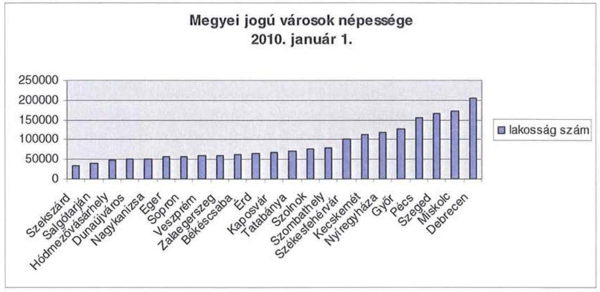

A megyei jogú városi önkormányzatok ${ }^{5}$ kötelező feladatellátását többlépcsős törvényi előírások határozzák meg. A feladatokra vonatkozó szabályozás első szintjét az Ötv. ${ }^{6}$, a második szintet a hatáskörí7, a harmadik szintet a további ágazati, szakmai (egyebek mellett az oktatási, egészségügyi, szociális és egyéb ágazati feladatok ellátásának szakmai szabályait rögzítő) törvények adják.

A megyei jogú városi önkormányzatok - az Ötv-ből közvetlenül levezethető települési feladatok mellett körzeti közszolgáltatásokat is ellátnak. A megyei

[^0]
[^0]:    ${ }^{3}$ A Magyar Köztársaság 2011. évi költségvetéséről szóló 2010. évi CLXIX. törvény Általános indokolásának III. fejezete, valamint Magyarország Konvergencia Programja 2011-2015. (2011. április) Táblázatok rész, 2. táblázat Âllamháztartás összefoglaló adatai szerint.
    ${ }^{4}$ A megyei jogú városok népességét a 4/2011. (I. 31.) NGM rendelet 1. sz. mellékletében foglalt 2010. január 1-i adatok alapján vettük figyelembe.
    ${ }^{5}$ Az Ötv. 61. § (1) bekezdése alapján a megyeszékhely város a törvény erejénél fogva megyei jogú, ugyanakkor az Országgyúlés az ötvenezernél nagyobb népességű városokat a képviselőtestület kérelmére megyei jogú várossá nyilváníthatja. Ez utóbbi körbe 5 város tartozik, közülük 2 (Hódmezővásárhely, Dunaújváros) népessége 2010. január 1-ére már ötvenezer fő alá csökkent.
    ${ }^{6}$ az Ötv. 8. és 61. §-ában foglaltak szerint
    ${ }^{7}$ a Htv.

---

jogú városi cím elsősorban többlet kötelezettségekkel jár, a megyei jogú városnak önmagának kell gondoskodnia mindazokról a feladatokról, amelyek más települési önkormányzatok esetében a megyei önkormányzat feladatát képezik. Ide sorolható többek közt a középfokú oktatási intézmények fenntartása, a közművelődési, könyvtári és levéltári szolgáltatás, a társadalombiztosítás finanszírozása mellett a kórházi és a rendelőintézeti szakellátás, a szociális és egyes gyermekvédelmi feladatok ellátása. Ezeket a feladatokat (intézményeket) a megyei jogú város - más városoktól eltérően - nem adhatja át a megyei önkormányzatnak, azonban az Ötv. lehetőséget biztosít arra, hogy a megyei önkormányzattal megállapodjék a feladatellátás megosztásában.

Az önkormányzat, így a megyei jogú város is, maga határozza meg, hogy - a lakosság igényei alapján, anyagi lehetőségei függvényében - mely feladatokat, milyen mértékben és módon, mely szervezeti keretek közt lát el. A szervezetalakítás szabadsága a megyei jogú városok esetében azzal járt, hogy mind a kötelező közszolgáltatásoknál (különösen a településüzemeltetés, vagyongazdálkodás), mind pedig az önként vállalt feladataik ellátásában - elsősorban a sport és kulturális szolgáltatások területein - a gazdasági társaságok kiemelt fontosságú szerephez jutottak. Ily módon a gazdálkodás, a pénzügyi helyzet kockázatai közvetlenül kikerültek ugyan az önkormányzati alrendszerből, azonban sérülhet az ellátási felelősség figyelemmel kísérése és érvényesítése, a közpénzek felhasználásának transzparenciája. Mindezek együttvéve - a beszámolók konszolidálásának hiányában - növelik a megyei jogú városok pénzügyi helyzetének megítélésében rejlő kockázatokat.

Az áttekintett időszakban az önkormányzati feladatok ellátásának keretet biztosító forrásszabályozás elvei lényegesen nem változtak.

A megyei jogú városok önkormányzatainak mozgásterét, az önkormányzatok feladatellátásra vonatkozó döntéseit a központi költségvetéstől való függőség mellett jelentősen befolyásolja a helyi adókivetési jog gyakorlása ${ }^{8}$. A helyi adók rendszere a közszolgáltatások finanszírozásához szükséges források megteremtésének, bővítésének eszköze, amely a gazdasági válság, a jogszabályi környezet, az adópolitika változása, az adóhatóságok tevékenysége következtében differenciáltan érinti a települési önkormányzatokat ${ }^{9}$.

A települési önkormányzatok saját folyó bevételeinek keretében elszámolt, különböző jogcímeken kivetett helyi adók - iparűzési adó, építmény és telekadó, idegenforgalmi adó, vállalkozók és magánszemélyek kommunális adója -2007-2010 között eltérő módon emelkedtek. A helyi adókból származó bevételek realizált összege országos szinten 2007-2009 között folyamatosan, 505,3 milliárd Ft-ról 566,3 milliárd Ft-ra emelkedett, majd a gazdasági válság hatásai következtében 2010-re 542,6 milliárd Ft-ra esett vissza. A helyi adók ré-

[^0]
[^0]:    ${ }^{8}$ a helyi adókról szóló 1990. évi C. törvény szabályai szerint
    ${ }^{9}$ Az Állami Számvevőszék 2010 decemberében közzétett 1031. számú jelentésében értékelte a helyi adók rendszerében a hatékonyság és az eredményesség érvényesülését.

---

szesedése az önkormányzatok saját folyó bevételein belül 2007-2010 között 2,5 százalékponttal csökkent ${ }^{10}$.

A megyei jogú városok saját folyó bevétele 2007-ben 191,5 milliárd Ft volt, 2008-ban 223,1, 2009-ben 225,4, 2010-ben 223,5 milliárd Ft-ot tett ki. A helyi adóbevételekből való részesedésük 2007-ben 110,5 milliárd Ft (21,9\%), 2008ban 128,3 milliárd Ft (23,2\%), 2009-ben 124,4 milliárd Ft (22\%), 2010-ben 118,7 milliárd Ft (részaránya a 2007. évivel azonosan $21,9 \%$ ) volt. E realizált adóbevételek a megyei jogú városok saját folyó bevételeinek 2007-ben 57,7, 2008-ban 57,5, 2009-ben 55,2, 2010-ben 53,1\%-át jelentették. A helyi adóbevételek 2007-ről 2010-re kimutatott 4,6 százalékpontos csökkenése annak ellenére következett be, hogy a megyei jogú városok saját folyó bevétele 2010-ben $16,7 \%$-kal haladta meg a 2007. évit.

A helyi adókon belül a települések gazdasági helyzetének egyik fokmérője az elért helyi iparűzési adóbevétel, amely a megyei jogú városok körében erőteljes - a település nagyságrendtől is függő ${ }^{11}$ - különbségeket mutat. A helyi iparűzési adóbevétel és annak egy lakosra vetített összegének 2007. és 2010. évi alakulását az alábbi diagramok szemléltetik:
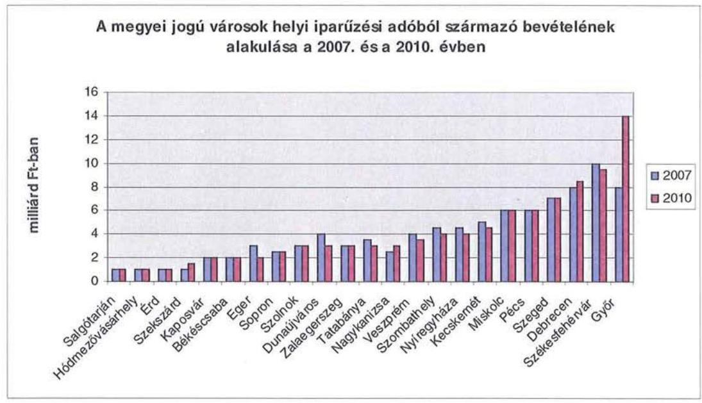

[^0]
[^0]:    ${ }^{10}$ A helyi adó bevételek saját folyó bevételekből való részesedése országosan 2007-ben $55,3 \%, 2010$-ben $52,8 \%$ volt.
    ${ }^{11}$ A 100 ezer fő feletti népességű megyei jogú városok csoportjába Debrecen, Miskolc, Szeged, Pécs, Győr, Nyíregyháza, Kecskemét, Székesfehérvár tartozik. Nem megyeszékhely megyei jogú város Érd, Sopron, Nagykanizsa, Dunaújváros, Hódmezővásárhely.

---

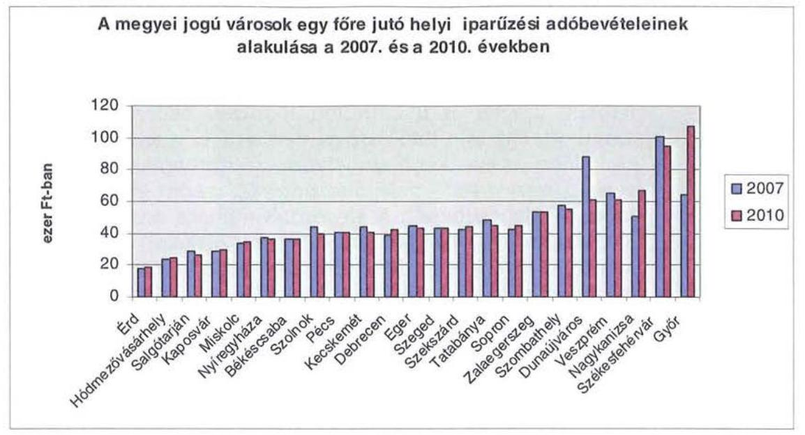

A megyei jogú városi önkormányzatok saját bevételein belül második legjelentősebb elem az illetékbevétel. A 2010. évben befolyt 39,2 milliárd Ft illetékbevétel a 2006. évben realizált 71,1 milliárd Ft illetékbevétel alig több mint $55 \%$-a. A jelentős visszaesést döntően az ingatlanpiac stagnálása, majd visszaesése, illetve egyes illetékkedvezmények bevezetése okozta. A kieső bevételek pótlására az önkormányzati alrendszer szintjén történtek intézkedések, 2010ben 5 milliárd Ft-ot, 2011-ben 1,2 milliárd Ft-ot ellentételezett a központi költségvetés. A megyei jogú városok önkormányzatai az önkormányzati alrendszer szintjén realizált illetékbevételből 2007-ben 13,6 milliárd Ft-tal (23,3\%-kal), 2008-ban 15,3 milliárd Ft-tal ( $22,7 \%$-kal), 2009-ben 12,6 milliárd Ft-tal ( $21,5 \%$ kal), 2010-ben 7,9 milliárd Ft-tal ( $20,2 \%$-kal) részesedtek ${ }^{12}$. Az összes befolyt illetékbevételből a megyei jogú városok részesedése 2009-ről 2010-re mindössze 1,3 százalékponttal csökkent, ugyanakkor a realizált illetékbevétel csökkenése a $37,3 \%$-ot ( 4,7 milliárd Ft) is elérte.

Az önkormányzati alrendszer átengedett bevételei közül a személyi jövedelemadóból való részesedés makroszintű szabályozása a vizsgált időszakban nem változott. A települési önkormányzatokat a településre kimutatott személyi jövedelemadó $8 \%$-a közvetlenül, míg $32 \%$-a külön szabályozott visszaosztási rendben illeti meg. A visszaosztás a jövedelem differenciálódás mérséklésével párosul, rendje a lakóhelyen maradó személyi jövedelemadóhoz és az iparúzési adó-erőképességhez ${ }^{13}$ igazodik, annak részletszabályait a mindenkori költségvetési törvény 4. számú melléklete határozza meg. A jövedelemdifferenciálódás

[^0]
[^0]:    ${ }^{12}$ Az illetékek kivetésének és beszedésének joga 2006. december 31-ig a megyei önkormányzatok feladata volt, amelyet a 2007. évtől az APEH (2011. január 1-jétől NAV) vett át. Az önkormányzati illetékrészesedési szabályok változatlanok maradtak, azonban az illetékbeszedés költségeit az önkormányzatok illetékbevételeiből átlagos (a megyei jogú városoknál $8,5 \%$-os) kulcsot alkalmazva vonták le.
    ${ }^{13}$ Az iparúzési adóerő-képesség egy potenciális, átlagos erőfeszítés mellett elérhető (a települési önkormányzat iparúzési adóelőlegét meghatározó adóalap 1,4\%-ának megfelelő számított) bevétel.

---

szabályai kétirányúak, a kiegészítés és a visszatartás feltételeit egyaránt meghatározták:

- Amennyiben az önkormányzatot közvetlenül megillető személyi jövedelemadó bevétel és a számított iparűzési adóerő-képesség együttesen számított, egy főre jutó összege nem érte el a település méretéhez kapcsolódóan az évenkénti szabályozás szerinti változó összeget, a költségvetés a részesedést - település nagyság szerint eltérően meghatározott szintig - kiegészítette ${ }^{14}$. A kiegészítés fajlagos összege 2007-2010 között 37500 Ft-ról 48010 Ft-ra ( 10510 Ft-tal, 28\%-kal) emelkedett. Az előzőeken túl a jövedelem differenciálódás szabályozása egyes térségi (középiskolai, szakiskolai, szakképző intézményi, kollégiumi) feladatok ellátásának függvényében további kiegészítő hozzájárulást biztosított.
- Amennyiben az egy főre számított személyi jövedelemadó és az iparűzési adóerő-képesség együttes összege a település nagyságrendjéhez rendelt értékhatárt több mint $25 \%$-kal (2010-től 20\%-kal) meghaladta, az egy főre jutó összeg sávonként differenciált módon ${ }^{15}$ visszavonásra került az önkormányzatot megillető normatív állami hozzájárulás összegéből.

Az önkormányzatok személyi jövedelemadó bevétele 2007-ben 494,3 milliárd Ft, 2008-ban 558,6 milliárd Ft, 2009-ben 639,5 milliárd Ft, 2010-ben 681,2 milliárd Ft volt, az időszak alatt összegében 186,9 milliárd Ft-tal, 37,8\%kal emelkedett, miközben az szja bevétel átengedett bevételeken belüli részesedése 1,8 százalékponttal emelkedett.

A megyei jogú városok önkormányzatainak személyi jövedelemadó részesedése az alrendszer átengedett személyi jövedelemadó bevételeiből 2007-ben 77,6 milliárd Ft-ot ( $15,7 \%$-ot), 2008-ban 105,4 milliárd Ft-ot ( $18,9 \%$-ot), 2009ben 122,9 milliárd Ft-ot ( $19,2 \%$-ot), 2010-ben 136,6 milliárd Ft-ot ( $20,1 \%$-ot) tett ki. A realizált szja bevétel a megyei jogú városoknál az időszak alatt folyamatosan emelkedett, a 2010-ben realizált adóbevétel 59,0 milliárd Ft-tal (76\%) volt magasabb a 2007. évinél, az átengedett bevételeken belüli részesedése 2010-re 5,1 százalékponttal haladta meg a 2007. évi részarányt ${ }^{16}$. A részesedés alapjául szolgáló szja településenként eltérő, az egy adózóra jutó szja 2009. évi adatait ${ }^{17}$ a következő ábra szemlélteti.

[^0]
[^0]:    ${ }^{14}$ A megyei jogú városok esetében a jövedelemkülönbségek mérséklésénél figyelembe veendő lakosonkénti értékhatár 2007-ben 37500 Ft, 2008-ban 42385 Ft, 2009-ben 45933 Ft, 2010-ben 48010 Ft volt.
    ${ }^{15}$ A sávos értékhatár 2010-től 20\%-os intervallumonként, 120\% felett a visszatartást $25 \%$-tól $90 \%$-os mértékig rögzíti. Amennyiben a település nagyságrendhez rendelt értékhatár összege az önkormányzatnál eléri vagy meghaladja a 200\%-ot, az egy főre jutó összeg $90 \%$-a levonásra kerül. Az értékhatár sávjai 2010 előtt $25 \%$-os léptékűek voltak, a levonási arányok az ellenőrzött időszakban nem változtak.
    ${ }^{16}$ E bevételek a megyei jogú városok átengedett bevételeiben 2007-ben 84,7, 2008-ban 87,7, 2009-ben 89,7, 2010-ben 89,8\%-os részarányt jelentettek.
    ${ }^{17}$ Adatforrás: KSH Megyei Jogú Városok a Közép Dunántúlon 2009. kiadványa, 4.1. sz. összehasonlító tábla.

---

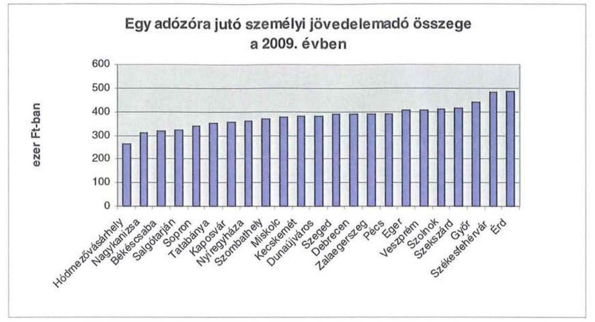

Az átengedett bevételek második legjelentősebb eleme a gépjármúadó, amelynek bevételi szabályozása az ellenőrzött időszakban nem változott, az adóbevétel teljes összege az önkormányzatot illeti meg. A gépjármúadó alapját, mértékét ${ }^{18}$ és egyes mentességi kategóriákat érintő módosítások 2010. január 1-től következtek be, amelyek az egyes adótételek esetében átlagosan $15 \%$-os emelkedéssel jártak.

A gépjármúadó beszedéséből származó bevétel az önkormányzati alrendszer szintjén 2007-ben 62,4 milliárd Ft, 2008-ban 65,7 milliárd Ft, 2009-ben 63,8 milliárd Ft, 2010-ben 71,1 milliárd Ft volt, az adóbevétel egésze 2007-hez képest 8,7 milliárd Ft-tal, 13,9\%-kal emelkedett. A gépjármú-adóztatás szabályainak változása 2010-ben 7,3 milliárd Ft többletet eredményezett. A megyei jogú városok gépjármúadó bevétele a 2007. évi 14,0 milliárd Ft-ról 2010-re 15,5 milliárd Ft-ra, 10,7\%kal emelkedett. A bevétel-növekedés összegéből 1,4 milliárd Ft a 2010. évi adózási szabályok következménye.

A megyei jogú városok önkormányzatai 2007-2010 között rendelkezésre álló forrásainak alakulását a következő ábra szemlélteti:

[^0]
[^0]:    ${ }^{18}$ A gépjármúadóról szóló 1991. évi LXXXII. törvény 7. § (1) bekezdésében foglalt adómértékek változása.

---

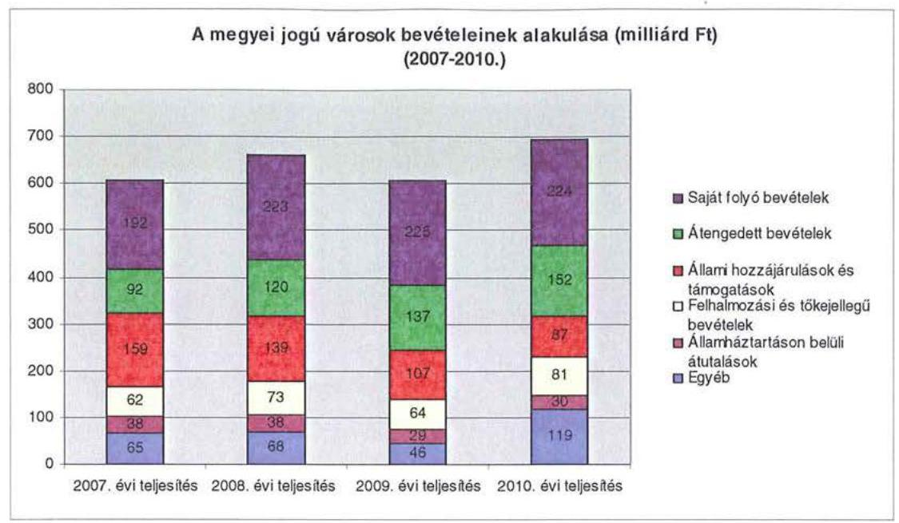

A megyei jogú városok saját folyó bevételeinek - amelyek fơbb elemei: a helyi adók, az illetékbevételek, az intézményi térítési díjak, a kamatbevételek részaránya a 2007. évi összbevételen ( 608 milliárd Ft) belül 32\% volt. A 2010. évi összbevétel 693 milliárd Ft-os összegéből a saját folyó bevételek aránya miközben összege 2007-ről 2010-re 32 milliárd Ft-tal emelkedett - nem változott.

Az átengedett bevételek, amelyek a megyei jogú városok önkormányzatainál döntően a személyi jövedelemadó és a gépjármúadó részesedést jelenti, az összbevételen belül a 2007. évi 92 milliárd Ft-ról (15\%) 152 milliárd Ft-ra nőtt, részesedése 7 százalékponttal emelkedett. A 60 milliárd Ft-os növekedésből 59 milliárd Ft-ot az szja részesedés emelkedése okozott.

Az állami hozzájárulások és támogatások - amelyek főbb elemei: főként az ellátotti létszámhoz kötődő normatív állami hozzájárulások, központosított előirányzatok - a 2007. évi 159 milliárd Ft-ról (26\%-os részarányról) 2010-re 87 milliárd Ft-ra ( $13 \%$-os részarányra) estek vissza.

A felhalmozási és tőkejellegú bevételek - tárgyi eszközök (ingatlanok és ingóságok), föld és immateriális javak, részesedések értékesítése, EU-tól átvett pénzeszközök - a 2007. évi 62 milliárd Ft-ról (10\%-os részarányról) 2010-re 81 milliárd Ft-ra ( $12 \%$-os részarányra) emelkedtek.

Az államháztartáson belüli átutalások részesedése 2007-ben 38 milliárd Ft volt. 2010. év végére 8 milliárd Ft-tal csökkent, részaránya 6\%-ról 2010-ben 4\%-ra változott. Ez a bevételi kategória tartalmazza az Egészségbiztosítási Alaptól és az elkülönített állami pénzalapoktól átvett forrásokat. A 2010ben e címen elszámolt bevétel a megyei jogú városoknál 22 milliárd Ft-ot tett ki.

Az egyéb, pénzmaradványból, vállalkozási bevételekből, államháztartáson kívülről származó átutalásokból, a hitelekből, a hosszú és rövid lejáratú értékpapírok értékesítéséből származó bevételek részesedése a 2007-2010. évek vi-

---

szonylatában 11\%-ról 17\%-ra emelkedett. Ez utóbbiak 2010. évi beszámoló szerinti összevont teljesítése 119 milliárd Ft volt ${ }^{19}$.

Mindezeket figyelembe véve a megyei jogú városok 2007. és 2010. évi forrásöszszetételének megoszlását az alábbi ábra szemlélteti:

A megyei jogú városok 2007. és 2010. évi forrásösszetétele
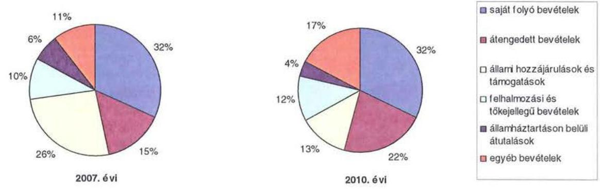

Az önkormányzati alrendszer pénzügyi helyzetértékelése során új elemzési módszereket alkalmaz az ellenőrzés. A hagyományos költségvetési szerkezet helyett az önkormányzat pénzügyi helyzetét a CLF módszerrel mutatjuk be, amelynek lényegét és számításának módszerét a 2.1. pontban, és a jelentés 2 . számú mellékletében ismertetjük részletesen.

Az új módszereken alapuló helyzetértékelés fontosságát az adja, hogy a helyi önkormányzatok bruttó adósságállománya ${ }^{20}$ a 2010. évi költségvetési beszámoló alapján 1248 milliárd Ft-ot tett ki. Az adósságállomány koncentráltságát jelzi ${ }^{21}$, hogy ebből a 23 megyei jogú város részesedése 338 milliárd Ft volt, amely a fővárosi és kerületi önkormányzatok adósságának figyelmen kívül hagyásával számított 2010. évi 977 milliárd Ft összegű bruttó adósságállomány $34,6 \%$-át jelentette. Az adósságállomány több mint fele - 501 milliárd Ft - a 19 megyei önkormányzatnál és a 23 megyei jogú városnál jelentkezett.

[^0]
[^0]:    ${ }^{19}$ Az egyéb bevételek összege 2007-2010 között eltérő módon változott, 2007-ben 65 milliárd Ft, 2008-ban 68 milliárd Ft volt, 2009-ben 46 milliárd Ft-ra esett vissza, majd 2010-ben több mint két és félszeresére, 119 milliárd Ft-ra emelkedett.
    ${ }^{20}$ A bruttó adósságállomány 2010. év végi összege magában foglalja a fejlesztési és a működési célú kötvénykibocsátások, a beruházási és fejlesztési hitelek, a működési célú hosszú lejáratú hitelek, a rövid lejáratú hitelek, váltótartozások miatti kötelezettségek teljes (2011-ben, illetve az azt követő években esedékes) állományát.
    ${ }^{21}$ A megyei jogú városok adósságállománya összegében ugyan elmarad az egyéb városok összesített adósságától [(ez utóbbiak részesedése 382,6 milliárd Ft (39,2\%)], azonban az egyéb városok száma 304. A fővárosi és a kerületi önkormányzatok nélküli adósságállományból a 19 megyei önkormányzat 163 milliárd Ft-tal ( $16,8 \%$-kal), míg a nagyközségek, községek együttesen 93 milliárd Ft-tal ( $9,5 \%$-kal) részesednek.

---

A megyei jogú városok 338 milliárd Ft-os adósságállományából 175 milliárd Ft $(51,8 \%)$ a 8 legnagyobb, 100 ezer fő feletti népességű város tartozása. Az 5 nem megyeszékhely megyei jogú város bruttó adósságállománya 70 milliárd Ft-ot ( $20,7 \%$-ot), az előző két csoportba nem tartozó további 10 megyei jogú város adóssága 93 milliárd Ft-ot ( $27,5 \%$-ot) tett ki.
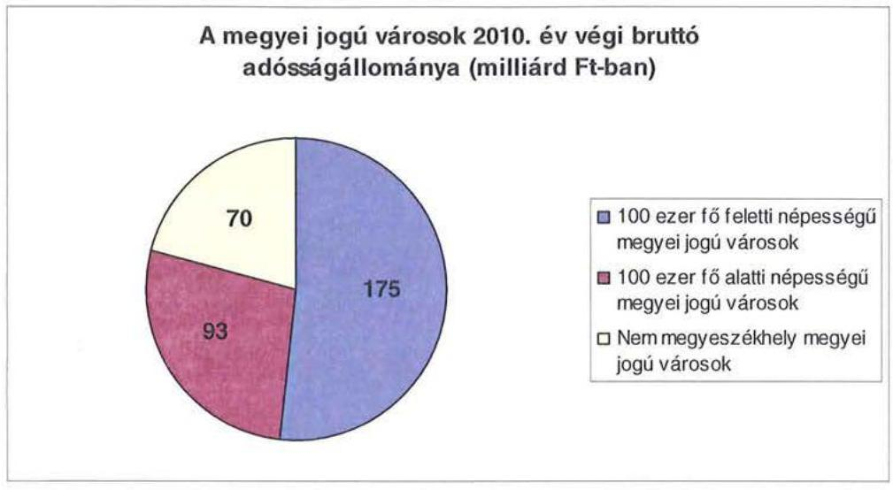

A mérlegben kimutatott bruttó adósságállomány mellett az önkormányzatok számára az eszközállomány múszaki állapotának megőrzése is kötelezettségekkel jár. Az elhasználódott eszközök pótlására forrást biztosító amortizációs (felújítási) alap képzésének ${ }^{22}$ elmaradása maga után vonhatja a feladatellátást kiszolgáló tárgyi eszközök állagának erőteljes romlását. Emellett a 2007-2013as időszakra meghirdetett, vissza nem térítendő EU-s fejlesztési forrásokhoz való hozzájutás lehetősége felerősítette az önkormányzati alrendszer fejlesztési igényeit, amelyek a felhalmozási költségvetési hiány folyamatos emelkedésén túl - az előírt jövőbeni fenntartási kötelezettség miatt - tovább terhelhetik az önkormányzatok költségvetését ${ }^{23}$.

Az ÁSZ a 2011. évi ellenőrzési tervében 43. számú, az Önkormányzatok gazdálkodásai rendszerének ellenőrzése részeként egy időben, egymással párhuzamosan tekinti át, és elemzi a 23 megyei jogú városi önkormányzat pénzügyi helyzetét. A gazdálkodás szabályszerűségét az ÁSZ az előző évek során ebben az önkormányzati körben is ellenőrizte, ezért jelen vizsgálatunk erre nem tér ki. A jelentés a megyei jogú városok sajátos feladatellátási és forrásszabályozási

[^0]
[^0]:    ${ }^{22}$ Erre a jelenlegi szabályozási környezetben nem kötelezi semmilyen előírás az önkormányzatokat.
    ${ }^{23}$ Az Állami Számvevőszék 2011 júniusában közzétett 1108. számú, a helyi önkormányzatok fejlesztési célú támogatási rendszerének ellenőrzéséről szóló jelentésében feltárta a fejlesztési folyamatok problémáit. A helyi önkormányzatok elsősorban azokat a fejlesztéseket valósították meg, amelyekhez támogatást lehetett igényelni. A fejlesztési célok közül a magasabb támogatás intenzitású pályázatokat részesítették előnyben. A fejlesztéssel megvalósuló létesítmények jövőbeli üzemeltetésének várható ráfordításait az önkormányzatok $71,9 \%$-a nem mérte fel.

---

helyzetére tekintettel az önkormányzatok pénzügyi helyzetét, illetve az ezzel összefüggő korábbi ÁSZ javaslatok megvalósítását mutatja be.

Az ellenőrzés a 2007. január 1. - 2010. december 31. közötti időszakot öleli fel.
A vizsgálat jogszabályi alapját az Állami Számvevőszékről ${ }^{24}$ szóló 1989. évi XXXVIII. törvény 2. § (3), (5), (6) és (9) bekezdései, az Ötv. 92. § (1) bekezdése, az Áht. 104. § (3), és 120/A. § (1) bekezdése előírásai képezik.

[^0]
[^0]:    ${ }^{24}$ 2011. július 1-jétől az Állami Számvevőszékről szóló 2011. évi LXVI. törvény 5. § (2)(5) bekezdései

---

# I. ÖSSZEGZŐ MEGÁLLAPÍTÁSOK, KÖVETKEZTETÉSEK, JAVASLATOK 

Az Önkormányzat - adatszolgáltatása szerint - a Kórház nélküli 2010. évi múködési költségvetési kiadásaiból ( 11552 millió Ft) 10460 millió Ft-ot ( $91 \%$ ) a kötelező feladatok, 1092 millió Ft-ot (9\%) az önként vállalt feladatok ellátására fordított. A kötelező és önként vállalt feladatok részarányának megállapítása az Önkormányzat kimutatása alapján történt. Az Önkormányzat önként vállalt feladatának tekinti a szórakoztató, szabadidős és sporttevékenységet, városi rendezvények szervezését, rehabilitációs foglalkoztatást, a kistérségi könyvtári ellátást, a civil szervezetek, alapítványok, gazdasági társaságok részére múködési hozzájárulás biztosítását. A Közgyűlés az SzMSz-ben meghatározta a kötelezően ellátandó és az önként vállalt feladatai körét, azonban az egyes feladatok lehatárolása és számbavétele nem az SzMSz-ben foglaltak szerint, hanem jogszabályi hivatkozással, a törvényi szabályozásnak megfelelően történt.

Az Önkormányzat feladatellátásának szervezeti struktúráját a következő ábra szemlélteti:
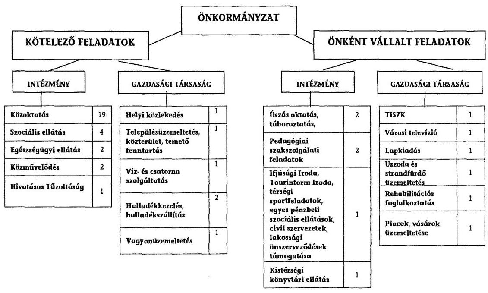

Az Önkormányzat feladatait 2010. december 31-én (a Polgármesteri hivatallal együtt) 30 költségvetési szervvel és kilenc $25 \%$ feletti tulajdoni hányadú gazdasági társaságával, továbbá három - az önkormányzattól tulajdonosi szempontból független gazdasági társaság közreműködésével látta el. Az intézményszervezeti átalakítások és intézményi összevonások következtében a feladatellátás telephelyeinek száma a 2006. évi 131-ről 2010-re 139-re nőtt.

---

Az Önkormányzat múködési kiadásokra 2010-ben 11099 millió Ft-ot fordított, amely 1152 millió Ft-tal ( $12 \%$-kal) haladta meg a 2007. évi ráfordításokat. A múködési kiadások 68\%-át az intézményi körben realizálták. E kiadások fedezetéül szolgáló bevételi források 2007. és 2010. években jellemző összesített arányait a következő ábra szemlélteti:
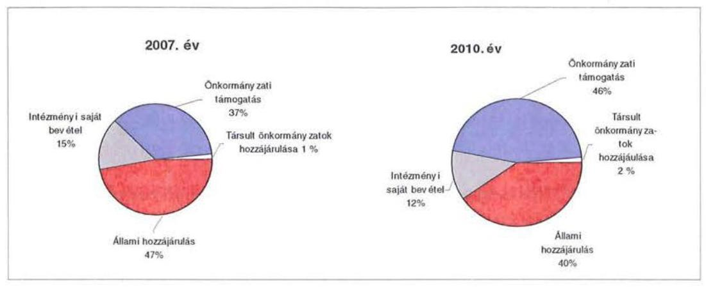

Az egyes közszolgáltatások feladatellátásában részvevő ágazati intézménycsoportok forrásösszetételének bevételi jogcímenkénti alakulását a következő ábra szemlélteti:
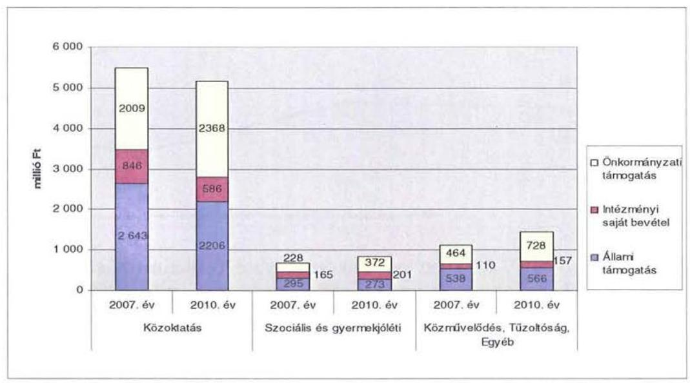

Az Önkormányzat az áttekintett időszakban kórház fenntartásáról is gondoskodott. A Kórház számára összesen 656 millió Ft támogatást biztosított, amelyből múködési célra 551 millió Ft-ot, fejlesztési célra 105 millió Ft-ot adott át. A múködési támogatásból 241 millió Ft központi költségvetésből származó (bérpolitikai intézkedések) támogatás továbbadása volt. A fejlesztési támogatások a Kórház gép-műszer beszerzéseihez kapcsolódtak.

Az Önkormányzat 6 gazdasági társaságban rendelkezik kizárólagos tulajdonnal, 2 gazdasági társaságban 50-75\% közötti, egyben 25-50\% közötti tulajdoni hányaddal. A gazdasági társaságok a város- és vagyonüzemeltetési, lakásgazdálkodási, helyi tömegközlekedési, víz- és csatornaszolgáltatási, hulla-

---

dékszállítási és -kezelési közszolgáltatási területen kaptak szerepet az önkormányzat feladatellátásában. A gazdasági társaságok múködésükhöz a 2010. évben összesen 323 millió Ft rendszeres múködési, 91 millió Ft eseti müködési, valamint 62 millió Ft fejlesztési célú pénzeszközt kaptak az Önkormányzattól. A müködési célú pénzeszközök 82\%-át ( 341 millió Ft-ot) - melyből 296 millió Ft (71\%) a központi költségvetési támogatás továbbadása volt - a városüzemeltetési és helyi tömegközlekedési feladatot ellátó 2 társaság kapta.

A társaságok a saját tőke jegyzet tőke aránya az áttekintett időszakban -0,1 és 17,9\% között volt. Az Önkormányzat a többségi tulajdonú gazdasági társaságai 2007-2010. évek között keletkezett veszteségének feltöltésére 94 millió Ft - a városüzemeltetési feladatokat ellátó gazdasági társaság részére 89 millió Ft, a lapkiadást végző társasága részére 5 millió Ft - pótbefizetést teljesített.

A folyó költségvetés egyenlege (müködési jövedelem) 2007-2010. évek között müködési forrástöbbletet mutatott ${ }^{25}$, mely fedezni tudta a tárgyévben jelentkező törlesztési kötelezettségeket, így az Önkormányzat pénzügyi kapacitása (nettó müködési jövedelme) is pozitív értékű volt.
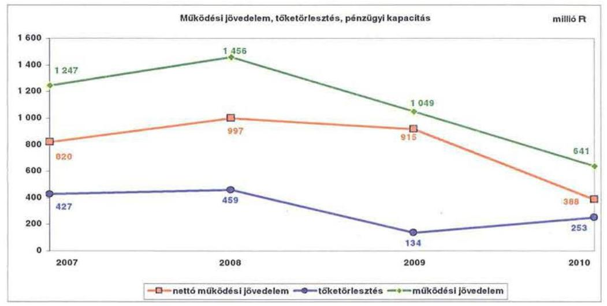

A 2007-2010. években az Önkormányzat felhalmozási költségvetésének egyenlege folyamatosan negatív összegű volt, amely 2007-2010 között összesen 4352 millió Ft felhalmozási forráshiányt okozott.

A pénzügyi egyensúly fenntartása külső források bevonásával volt biztosítható. A 2007-2010. években 1273 millió Ft hitelt törlesztettek. Az adósságszolgálat, továbbá a felhalmozási forráshiány 2007-2010 között 5625 millió Ft-ot tett ki, amelyre az időszakban képződő 4393 millió Ft müködési többlet (müködési jövedelem), valamint a 2007. január 1-jén rendelkezésre álló 450 millió Ft pénzkészlet szolgált fedezetül. A további pénzeszközöket 3236 millió Ft hitel felvételével teremtették meg. A kialakult pénzügyi helyzet pozitív nettó müködési jö-

[^0]
[^0]:    ${ }^{25}$ 2007-ben a folyó bevételek 7,3\%-át (1247 millió Ft-ot), 2008-ban 8,1\%-át (1456 millió Ft-ot), 2009-ben 6,3\%-át (1049 millió Ft-ot), 2010-ben 3,9\%-át (641 millió Ft-ot) jelentette a müködési jövedelem.

---

vedelmet eredményező gazdálkodás mellett teszi elkerülhetővé további külső források bevonását, az eladósodás növekedését.

A vizsgált időszakban az Önkormányzatnál helyi iparűzési adót, valamint építményadót állapítottak meg, 2008-tól az építményadó mértékét belterületi építmények esetében 66,7\%-kal ( 300 Ft -ról 500 Ft -ra) megemelték, valamint bevezették a vendégéjszakák utáni idegenforgalmi adót. A helyi adókból és pótlékokból származó bevételek aránya 2007-2010 között 20\% körül mozgott a folyó (múködési) bevételekben. A pótlékkal, bírsággal növelt helyi adó bevétel a 2007. évi 2794 millió Ft-ról 2010. évben 3772 millió Ft-ra ( $35 \%$-kal, 978 millió Ft-tal) nőtt. A helyi adóbevételek $90 \%$-át az iparűzési adó tette ki, amelynek mértékét a helyi adókról szóló törvényben rögzített maximális mértékben állapították meg. A helyi adók növekedését az iparűzési adó 798 millió Ft-os és az építményadó 176 millió Ft-os növekedése eredményezte. A vendégéjszakák utáni idegenforgalmi adót 2008-tól vezette be az Önkormányzat, melyből a 2010. évben 4 millió Ft bevételt realizált.

A befejezett fejlesztések jelentős részét pénzintézeti forrásokból finanszírozták. A 2007-2010. évek időszakában 6430 millió Ft értékű fejlesztés és felújítás forrása 3017 millió Ft hitelfelvétel ( $46,9 \%$ ), 2592 millió Ft EU-s támogatás ( $40,3 \%$ ), 688 millió Ft hazai támogatás ( $10,7 \%$ ), valamint 133 millió Ft saját forrás $(2,1 \%)$ volt. A 2010. december 31-én folyamatban lévő fejlesztési feladatok végrehajtására 847 millió Ft kiadást teljesítettek, amelyre hitel felvételéből 218 millió Ft-ot ( $25,7 \%$ ), EU-s támogatásból 629 millió Ft-ot ( $74,3 \%$ ) fordítottak.

Az Önkormányzat 2010. december 31-én folyamatban lévő fejlesztési feladatok kötelezettség-vállalásainak összege 5507 millió Ft volt, melyet 4510 millió Ft-ot ( $81,9 \%$ ) EU-s támogatásból, valamint 997 millió Ft hitelfelvételből ( $18,1 \%$ ) terveznek biztosítani, ehhez rendelkezésre áll az Önkormányzat 1108 millió Ft összegű fejlesztési hitelkeret maradványa.
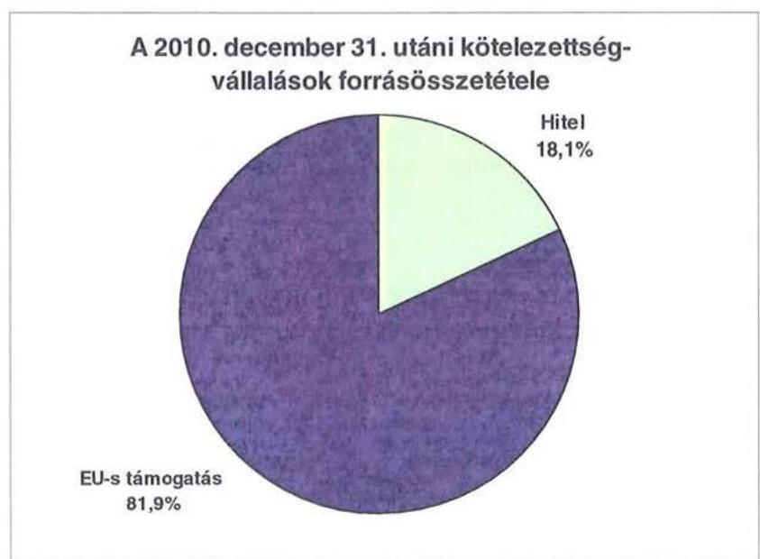

---

Az Önkormányzat egy beadott, elbírálás alatt álló pályázatának tervezett teljes bekerülési költsége 25 millió Ft, amelyet 5 millió Ft hitelből és 20 millió Ft hazai támogatásból terveznek megvalósítani. Az Önkormányzat vállalt kötelezettségeit - a saját bevételeken túl - a fennálló követelésállományból származó forrásai felhasználásával és a jelzáloggal nem terhelt forgalomképes ingatlanvagyon szükség szerinti értékesítéséből származó bevételből kívánja előteremteni.

Az Önkormányzat mérleg szerinti pénzintézeti kötelezettsége a 2006. év végéről a 2010. év végére, 2636 millió Ft-ról 5384 millió Ft-ra nőtt, amelyből az árfolyamváltozás miatti különbözet 551 millió Ft volt. A fennálló pénzintézeti kötelezettségek 16 hosszú lejáratú hitelből és folyószámlahitel igénybevételéből keletkeztek. A Közgyűlés 2011. június 30-i ülésén 3000 millió Ft fejlesztési célú kötvény kibocsátásáról döntött, felhatalmazták a polgármestert a pénzintézeti ajánlatok bekérésére. A szerződéskötés előtt, a határozat szerint a Közgyűlés az - ajánlatok függvényében - újratárgyalja és dönt a kötvény kibocsátásáról.

Az Önkormányzat kötelezettségvállalásaira közgyűlési döntés alapján került sor, azonban az előterjesztésekben nem mutatták be a visszafizetés forrásait, valamint a kamat- és - a devizaalapú kötelezettségeket érintő - árfolyamkockázatot.

Az Önkormányzat hosszú lejáratú fejlesztési hiteleiből panelházak felújításához, valamint hazai és EU-s támogatással megvalósított fejlesztésekhez biztosított önerőt, hulladékkezelő rendszer kialakítását, az út- és intézményi felújításokat, a közvilágítás korszerűsítését, valamint területvásárlásokat finanszírozott.

Az Önkormányzat a devizában fennálló pénzintézeti kötelezettségeiből 1873 ezer CHF ( 337 millió Ft) tőkét törlesztett, kamatot és egyéb költséget fizetett. A HUF-ban fennálló kötelezettségekből 1459 millió Ft tőkét, kamatot és egyéb költséget teljesített. Az Önkormányzat a hitelek igénybevételéből származó forrásokat 2010. év végéig a céloknak megfelelően használta fel. A 20072010. években átmenetileg szabad pénzeszközelből 280 millió Ft kamatbevételt realizált. A kamatbevételeket a hitelek kamatfizetésére fordították. Az Önkormányzat számlavezető bankot 2007 decemberében váltott. A hosszú lejáratú hitelek felvétele korábban, és ezt követően is a pályázat keretében kiválasztott, a legkedvezőbb feltételekkel folyósító - a számlavezető banktól eltérő - pénzintézetnél történt.

Az Önkormányzat működésének pénzügyi egyensúlyát a vizsgált időszakban folyószámlahitel igénybevételével tudta biztosítani.

A folyószámlahitel igénybevétele a 2007-2010. években az alábbiak szerint alakult:

| Megnevezés | 2007. év | 2008. év | 2009. év | 2010. év |
| :--: | :--: | :--: | :--: | :--: |
| Keretösszeg január 1-én | 800,00 | 1100,00 | 1100,00 | 1100,00 |
| Átlagos napt állomány | 509 | 248 | 151 | 194 |
| Folyószámla hitellel zárt napok száma (nap) | 309 | 184 | 45 | 71 |
| 2010. december 31-i egyenleg (állomány) | - | - | - | 113 |

---

A likviditás biztosítása az ellenőrzött időszakban az Önkormányzatnak 55 millió Ft kamatkiadást okozott.

Az Önkormányzat 2010. év végi szállítói tartozása 373 millió Ft, melyből a lejárt tartozás 16 millió Ft volt. Az Önkormányzat intézményeinél és a Polgármesteri hivatalnál nem mutattak ki 30 napot meghaladó, szállítók felé fennálló kötelezettséget. Az egyéb kiadáselmaradása 891 millió Ft volt, melynek folyamatosan növekvő mértékét az európai uniós támogatások terhére kiutalt és fel nem használt előlegek okozták.

Az Önkormányzat a Szennyvíztársulás által a szennyvíz-csatornázási program megvalósításához felvett hitel igénybevételéhez készfizető kezességet vállalt, 22 millió Ft összegben. A Szennyvíztársulás a hitelt visszafizette, így 2010. év végére kezességgel kapcsolatos kötelezettsége az Önkormányzatnak nem volt. A gazdasági társaságok részére az Önkormányzat kölcsönt nem nyújtott.

A Közgyűlés a folyószámlahitel és fejlesztési hitelek biztosítékaként jelzálogjog alapításához és bejegyzéséhez nem járult hozzá.

Az Önkormányzat kötelezettségeinek 2010. december 31-i állományát és várható alakulását a kötelezettségek lejáratáig a következő táblázat szemlélteti:

Az Önkormányzat kötelezettségeinek állománya 2010. december 31-én és várható alakulása a kötelezettségek lejáratáig

| Megnevezés | Állomány 2010. dec. 31 -én |  |  | Várható kötelezettség 2011. 2013. években |  |  | Várható kötelezettség 2014. évet követően |  |  |
| :--: | :--: | :--: | :--: | :--: | :--: | :--: | :--: | :--: | :--: |
|  | HUF-ban (millió Ftban) | Devizában (összegy, ezer CHF-ban) | Deviz(10100) | HUF-ban (millió Ftban) |  |  |  |  |  |
|  |  |  |  |  |  |  |  |  |  |
| Pénzintézeti kötelezettségek |  |  |  |  |  |  |  |  |  |
| Hosszék lejáratú kötelek | 2189 |  | HUF | 382 |  | HUF | 1806 |  | HUF |
| Hosszék lejáratú kötelek |  | 12800 | 1302 |  | 2183 | CHF |  | 11635 | CHF |
| Folyószámbátétel | 113 |  | HUF | 113 |  | HUF |  |  | HUF |
| Medzitőzet kötelezettségek összesen HUF-ban | 2302 |  | HUF | 496 |  | HUF | 1806 |  | HUF |
| Medzitőzet kötelezettségek összesen CHF-ban |  | 12800 | CHF |  | 2163 | CHF |  | 11635 | CHF |
| Szállítót tartozás | 373 |  | HUF | 373 |  | HUF |  |  | HUF |
| Egyéb kizobó elmozeretés | 691 |  | HUF | 691 |  | HUF |  |  | HUF |
| Egyéb kötelezettségek |  |  |  |  |  |  |  |  |  |
| CS-6 és egyéb szervek felé fennálló kötelezettségek |  |  | HUF | 6 |  | HUF |  |  |  |
| Kötelezettségek összesen HUF-ban | 2666 |  | HUF | 1769 |  | HUF | 1800 |  | HUF |
| Kötelezettségek összesen CHF-ban |  | 12800 | 1302 |  | 2163 | CHF |  | 11635 | HUF |

Az Önkormányzatnak pénzintézetekkel szemben fennálló kötelezettsége a 2010. év végén 2302 millió Ft és 13800 ezer CHF volt. Ezek várható kötelezettsége (tőke, kamat és egyéb költség) a legutóbbi kamatfizetés feltételei alapján a 2011. évtől 2302 millió Ft, továbbá 13800 ezer CHF. Az Önkormányzatnak a 2011. évben szállítói tartozások és egyéb kiadás elmaradások rendezésére 1264 millió Ft fizetési kötelezettsége keletkezett. Az Önkormányzat kötelezettségeinek forrásait nem számszerüsítette. A 2011-2013. években jelentkező kötelezettségek teljesítésére figyelembe vehető 574 millió Ft mérlegben kimutatott követelésállomány, 3651 millió Ft forgalomképes ingatlanvagyon. A 2014. évet követő kötelezettségek teljesítésére figyelembe vehető az Önkormányzat forgalomképes ingatlanvagyona, valamint a helyi adók mértékének emeléséből, újabb adónemek bevezetéséből, a kedvezmények csökkentéséből származó többlet helyi adóbevétel. Az Önkormányzat tájékoztatása szerint figyelembe vehető további források „a mindenkori költségvetési rendeletekben megtervezett önkormányzati saját bevételek". A CLF módszer szerint a

---

múködési jövedelem azonban a mutatkozó tendencia (2010. évi 641 millió Ft) alapján nem nyújt fedezetet az önkormányzati kötelezettségek biztosítására.

Az Önkormányzat minősített többségi tulajdonú társaságai kötelezettségeinek 2010. december 31-i állományát és várható alakulását a kötelezettségek lejáratáig a következő táblázat mutatja be:

| Megnevezés | Állomány 2010. dec.31-én |  |  | Várható kötelezettség 2011. 2013. évekkem |  |  | Várható kötelezettség 2014.   évet követően |  |  |
| :--: | :--: | :--: | :--: | :--: | :--: | :--: | :--: | :--: | :--: |
|  | HUF-ban   (millió Ft-   ben) | Devizitban   (összge, ezer ...   ben) |  |  | HUF-ban   (millió Ft-   ben) | Devizitban   (összge, ezer ...   ben) |  | HUF-ban   (millió Ft-   ben) | Devizitban (összge, ezer ...   ben) | Deviz   orens |
| Szállítói tartozás | 44 |  | HUF | 44 |  | HUF |  |  |  |

Az önkormányzati kötelezettségek növekedése mellett a minősített többségi tulajdonú társaságok kötelezettségei is befolyásolhatják az Önkormányzat pénzügyi egyensúlyát. A társaságoknak a 2011. évtől 44 millió Ft szállítói tartozást kell rendezniük. Kockázatot hordoz, ha a társaságok fenti kötelezettségeiket nem teljesítik és a Gt. és a Csődtv. rendelkezései alapján - a jogszabályokban foglalt feltételek bekövetkezése esetén - a bíróság az Önkormányzat korlátlan és teljes felelősségét megállapítja.

Az Önkormányzat költségvetési támogatásból, átengedett bevételekből, és illeték bevételekből származó bevételei a 2007. évhez képest az időszak egészét tekintve összességében 1674 millió Ft-tal csökkentek, melynek ellensúlyozása érdekében az Önkormányzat folytatta az előző években elkezdett - kiadáscsökkentő és bevételnövelést eredményező - intézkedéseit. A 2007-2010. években tett intézkedések hatására 723 millió Ft bevételi többletet, továbbá 1471 millió Ft kiadáscsökkenést mutattak ki, ezáltal az Önkormányzat pénzügyi helyzetét javították. A kiadáscsökkentések 58\%-a az elrendelt álláshely megszüntetések eredménye. Az álláshely csökkentő intézkedések 2007-2010 között a Hivatalnál és az intézményeinél összesen 335 álláshely (ebből 44 üres álláshely) megszüntetését jelentették. Egyes közszolgáltatási területeken azonban feladatbővülések is voltak, amelyek álláshely és egyben létszámnövekedéssel is jártak. Ennek következtében az időszak álláshelyeinek száma 236 fővel csökkent. A bevételnövelő intézkedések az építményadó mértékének megemeléséhez, az idegenforgalmi adó és a költségalapú lakbér bevezetéséhez, szabad kapacitások kihasználásához és szponzori hozzájárulások igénybevételéhez kapcsolódtak.

Az utóellenőrzés a pénzügyi egyensúly javítására tett egy szabályszerűségi és egy célszerűségi javaslat hasznosulására terjedt ki. Az Önkormányzat a javaslatokat hasznosította.

Az Önkormányzat pénzügyi helyzetét összegezve a következők emelhetők ki:

A 2007-2010. években az Önkormányzat múködési kockázatát csökkentette a pozitív folyó költségvetési egyenleg, a minimális lejárt szállítói tartozásállomány. Az önként vállalt feladatok aránya alapvetően nem befolyásolta az Önkormányzat múködésének biztonságát. A múködési bevételek évente biztosították a múködési kiadások és az adósságszolgálat finanszírozását, a likviditás biztosítása folyószámlahitel igénybevételével történt. A gazdasági társaságok

---

szerepe a közüzemi közfeladat-ellátásban meghatározó volt. A gazdasági társaságok által ellátott feladatstruktúra letisztított, átlátható, a múködési kockázatot nem növelte.

A vizsgált időszakban az Önkormányzat felhalmozási bevételeinek és kiadásainak egyenlege negatív volt, a pénzügyi hiány rendezésének forrásai a pénzmaradvány igénybevételével, hazai és EU-s támogatásokkal, valamint hitelfelvétellel biztosítottak voltak. A fejlesztési célú kötelezettségvállalásoknál a jövőben teljesítendő kifizetésekre a fedezet rendelkezésre áll (hitelek, EU támogatások, saját forrás), ezért az nem jelentett kockázatot a felhalmozási kiadások finanszírozásában.

A pénzintézeti és egyéb kötelezettségek teljesítésének kockázatát növelte, hogy a 2010. december 31-én fennálló kötelezettségek visszafizetésének fedezetét, annak forrásait nem számszerúsítették. A kockázatot csökkentheti, hogy az Önkormányzat forgalomképes ingatlanvagyona szükség esetén felhasználható az adósságszolgálat visszafizetésére.

Az önkormányzati bevételt csökkentő központi intézkedések hatását az ellenőrzött időszakban kiegyenlítette az Önkormányzat kiadáscsökkentő és bevételnövelő intézkedéseinek eredménye.

Az Állami Számvevőszékről szóló 2011. évi LXVI. törvény 33. § (1) bekezdésében foglaltak értelmében a jelentésben foglalt megállapításokhoz kapcsolódó intézkedési tervet köteles az ellenőrzött szervezet vezetője összeállítani és azt a jelentés kézhezvételétől számított harminc napon belül az ÁSZ részére megküldeni. Amennyiben az intézkedési tervet határidőben nem küldi meg a szervezet, vagy az továbbra sem elfogadható, az ÁSZ elnöke a hivatkozott törvény 33. § (3) bekezdés a)-b) pontjaiban foglaltakat érvényesítheti.

Az ellenőrzés intézkedést igénylő javaslatai:

# a Polgármesternek 

1. a Közgyűlés elé terjesztendő intézkedési terv írja elő a működés pénzügyi egyensúlyának hosszú távú fenntarthatósága érdekében - felelősök és határidők megjelölésével - olyan program készítését, amely tartalmazza az alábbiakat:
a) bevételszerző lehetőségek feltárását, különösen a helyi adópolitikai célok meghatározását és számszerúsítését, a bérleti díjak és a térítési díjak megállapítását, felülvizsgálatát, a követelések behajtását, az egyéb sajátos bevételek növelésének lehetőségét;
b) a folyamatban lévő és a tervezett beruházások teljes körű felülvizsgálatát;
c) egyéb kiadási kötelezettségek teljes körű felülvizsgálatát;
d) az intézkedések következtében jelentkező pénzügyi többlet, illetve az egyszeri bevételek tartalékba helyezését, elkülönített kezelését az adósságszolgálat teljesítése érdekében;

---

e) az adósságszolgálat szerkezetének áttekintését, a támogatás előfinanszírozás átláthatóbbá tételét;
f) az önként vállalt feladatok terjedelmének, tartalmának felülvizsgálatát azok finanszírozhatósága szempontjából, a kötelező feladatellátás elsődlegességének biztosítása érdekében, a gazdasági program áttekintésével összhangban;
g) az intézkedések eredményei legalább évenkénti áttekintésének előírását;
2. mutassa be félévente - a szokásos beszámoló keretében - a Közgyűlésnek:
a) az Önkormányzat és a minősített többségi tulajdonú gazdasági társaságai aktuális pénzügyi helyzetét;
b) legalább három évre kitekintően a kötelezettségek teljes körére szóló finanszírozási tervet, amely figyelembe veszi a kötelezettség éven belüli és túli felmerülését, a források számszerúsített megjelölésével;
c) az Önkormányzat folyamatban lévő és tervezett fejlesztéseihez szükséges belső és külső források rendelkezésre állását, és ebből a szempontból értékelje az Önkormányzat beruházásait;
3. intézkedjen a beruházásokkal létrehozott létesítmények múködtetését és jövőbeni fenntarthatóságát biztosító megalapozott források költségvetési rendeletekben történő feltüntetéséről;
4. mutassa be a Közgyűlésnek évente a zárszámadási rendelet előterjesztésében az értékcsökkenés összegét, és ezzel összevetve az elhasználódott eszközök pótlására fordított tényleges kiadásokat, az eszközök elhasználódási fokának alakulását;
5. kezdeményezze, hogy az Önkormányzat számára jóváhagyott osztalék felvételre kerüljön a pénzügyi helyzetének javítása, adósságszolgálatának törlesztése, valamint a kötelező közszolgáltatási feladatot ellátó gazdasági társaságai esetleges veszteségének rendezése érdekében;
6. mutassa be a Közgyűlésnek a fejlesztési társulási tagságból, gesztorságból eredő, az Önkormányzat pénzügyi egyensúlyát befolyásoló kockázatokat, és azok mérséklését szolgáló szervezeti és egyéb intézkedéseket;

# Jegyzönek 

1. kísérje figyelemmel a jövőbeni várható - árfolyam-, kamat- valamint visszafizetési kockázatokat, és legalább félévente tájékoztassa a Közgyűlést azok alakulásáról;
2. kísérje figyelemmel az Önkormányzat folyószámlahitel szerződésének lejáratát, intézkedjék a folyószámlahitel lejáratkori visszafizetéséről;
3. gondoskodjon, hogy a jövőben az adósságot keletkeztető kötelezettségvállalásokról szóló közgyűlési előterjesztések tételesen tartalmazzák a visszafizetés forrásait, valamint legalább 3 éves kitekintéssel mutassák be a kamat és árfolyamkockázat várható kihatásait;

---

4. kísérje folyamatosan figyelemmel - a tulajdonosi jogkört gyakorlók közremúködésével - a minősített többségi tulajdonú gazdasági társaságok kötelezettségeinek alakulását, az Önkormányzat likviditására, pénzügyi-egyensúlyi helyzetére gyakorolt hatását;
5. gondoskodjon a Polgármesteri hivatal és a további költségvetési szervek lejárt szállítói tartozásai okainak feltárásáról, azonnali intézkedések megtételéről a lejárt tartozások mielőbbi rendezése érdekében.

---

# II. RÉSZLETES MEGÁLLAPÍTÁSOK 

## 1. Az ÖNKORMÁNYZAT KÖTELEZŐ ÉS ÖNKÉNT VÁLLALT FELADATAI

Nagykanizsa Megyei Jogú Város Önkormányzata a 2010. évi teljesített kiadásainak, 17055 millió Ft-nak, a 6,4\%-át 1092 millió Ft-ot fordította önként vállalt feladatainak ellátására. A 2011. évben 5,1\%-kal magasabb összeget, 1148 millió Ft-ot tervezett az önként vállalt feladatok kiadásaira. Az Önkormányzat önként vállalt feladatai: városi televíziós műsorszolgáltatás, számítástechnikai és irodatechnikai szolgáltatás, városi papíralapú médiaszolgáltatás, uszoda és strandfürdő üzemeltetés, úszásoktatás, nyári táboroztatás, közalkalmazottak és köztisztviselők nem kötelező juttatásai, városi rendezvények szervezése, kistérségi könyvtári ellátás, egyes pénzbeli szociális ellátások biztosítása, rehabilitációs foglalkoztatás, valamint pénzeszközöket adott át lakossági önszerveződések, civil szervezet, egyesületek, gazdasági társaságok múködéséhez.

A kötelező és önként vállalt feladatainak körét az Önkormányzat az SzMSzében meghatározta, azonban az egyes feladatok besorolásának szabályozása pontositásra szorul.

Az SzMSz ${ }^{26}$ szerint az önkormányzat önként vállalt feladata a kollégiumi ellátás, a középiskolai és szakiskolai oktatás, az alapfokú művészeti oktatás, a kórházi szakellátás és fekvőbeteg ellátás, melyek az ágazati jogszabályok alapján kötelezően ellátandó feladatok, azonban ezen feladatokat az Önkormányzat - ellentétesen az SzMSz-ében foglaltakkal - kötelező feladatként látja el, veszi számításba.

Az Önkormányzat 2010. évi elemi beszámolója szerint a 11099 millió Ft - főbb feladatonként teljesített - múködési kiadásaiból 10433 millió Ft-ot (94\%) a kötelező feladatok, 606 millió Ft-ot (6\%) az önként vállalt feladatok ellátására fordított.

A teljesített 2010. évi múködési kiadások finanszírozása 8\%-ban (944 millió Ft) intézményi saját bevételből, 30\%-ban ( 3507 millió Ft) állami hozzájárulásból, 61\%-ban ( 7090 millió Ft) önkormányzati forrásból, valamint egy százalékban ( 112 millió Ft) a feladatok közös ellátására társult önkormányzatok hozzájárulásából történt. A finanszírozási forrásokon belül a költségvetési hozzájárulás részaránya 6,1 százalékponttal, 464 millió Ft-tal csökkent, az önkormányzati hozzájárulás 8,3 százalékponttal, 1321 millió Ft-tal emelkedett a 2007. évihez képest ${ }^{27}$.

[^0]
[^0]:    ${ }^{26}$ a 18/2007. (IV. 23.) számú rendelet 7. § (3) bekezdése
    ${ }^{27}$ A 2007. évben folyósított állami támogatás összege 3970 millió Ft, az önkormányzati hozzájárulás összege 5769 millió Ft volt.

---

A 2010. évi múködési kiadások kötelező feladatonkénti megoszlását és azok finanszírozási arányait az alábbi táblázat mutatja be:

Az Önkormányzat 2010. évi múködési kiadásai és finanszírozási arányai főbb feladatonként*

| Ellátott feladat | Müködési kiadás összesen (millió Ft) | Kötelező feladatok kiadásainak részaránya \% | Müködési bevételek összesen (millió Ft) | Állami támogatás részaránya $\%$ | Intézményi saját bevétei részaránya \% | Önkormányzati támogatás részaránya \% |
| :--: | :--: | :--: | :--: | :--: | :--: | :--: |
| Övodák | 851 | 98 | 851 | 36 | 13 | 51 |
| Általános iskolák | 2044 | 98 | 1964 | 36 | 11 | 52 |
| Gimnáziumok | 800 | 98 | 818 | 48 | 15 | 37 |
| Szakközépiskolák, szakképző intézmények | 1469 | 98 | 1458 | 52 | 8 | 40 |
| Kollégiumok | 88 | 98 | 88 | 47 | 20 | 33 |
| Szociális intézmények | 727 | 97 | 748 | 30 | 27 | 42 |
| Gyermekjóléti intézmények | 110 | 97 | 127 | 36 | 0 | 47 |
| Közművelődési intézmények | 524 | 99 | 578 | 0 | 23 | 71 |
| Hivutásos   Tủzoltóság | 429 | 92 | 436 | 94 | 1 | 5 |
| Egyéb intézmények | 471 | 46 | 498 | 31 | 4 | 60 |
| Intézmények összesen | 7513 | 93 | 7566 | 40 | 12 | 46 |
| Polgármesteri Hivutalban kimutatott feladatok müködési kiadásai | 3586 | 94 | 4087 | 11 | 0 | 89 |
| Müködési kiadások összesen | 11099 | 94 | 11653 | 30 | 8 | 61 |

* A táblázat nem tartalmazza a Kórház, az Egészségügyi Alapellátás, a kisebbségi önkormányzatok, a Tourinform Iroda és a Szennyviztársulás müködési kiadásait, valamint a társulásban ellátott feladatokhoz, a társult önkormányzatok által nyújtott támogatások részarányát.

A közoktatási ágazatban az összes múködési kiadás 2007-ről 2010. évre 45 millió Ft-tal ( $0,9 \%$-kal) emelkedett, ugyanakkor az állami hozzájárulás öszszege 436 millió Ft-tal ( $16,5 \%$-kal) csökkent. Az ellátottak létszáma 154 fővel ( $1,6 \%$-kal) csökkent, az egy óvodásra, tanulóra jutó kiadás összege 13080 Ft-tal ( $2,5 \%$-kal) emelkedett, állami támogatással való lefedettsége 8,7 százalékponttal, 40879 Ft-tal csökkent.

A szociális és gyermekjóléti (bölcsődei) ellátások kiadásai 124 millió Fttal ( $20,5 \%$-kal) növekedtek, az állami hozzájárulás összege 22 millió Ft-tal ( $9 \%$ kal) csökkent. Az intézményekben ellátottak létszáma 73 fővel ( $9,9 \%$-kal) csökkent, az egy ellátottra jutó kiadások összege 275998 Ft-tal ( $33,8 \%$-kal) emelkedett, melynek állami támogatással való lefedettsége $41,5 \%$-ról $31,34 \%$-ra, 10,2 százalékponttal csökkent.

A közművelődési intézmények kiadásai 183 millió Ft-tal ( $53,6 \%$-kal) növekedtek, a mozgókönyvtári feladatok társulásban történő ellátása következtében. A költségekhez a Nagykanizsai Többcélú Kistérségi Társulás az áttekintett időszakban 136 millió Ft-ot adott át, amely $74,6 \%$-ban ellensúlyozta a kiadások növekedését.

---

A Hivatásos Tüzoltóság kiadásai növekedésénél, 77 millió Ft-nál (22\%) nagyobb mértékben, 119 millió Ft-tal, 40,9\%-kal emelkedett az állami hozzájárulás összege, a lefedettsége 12,9 százalékponttal emelkedett.

Az Önkormányzat kötelező és önként vállalt feladatai körében a vizsgált időszakban nem történt változás. Kötelező és önként vállalt feladatait ${ }^{28} 2010$. december 31 -én 30 költségvetési szervvel, 9 gazdasági társasággal, valamint ellátási szerződéssel egy alapítvány, 2 társadalmi szervezet, külön megállapodással 2 megyei önkormányzat, közszolgáltatási szerződéssel 3 gazdasági társaság, továbbá egy Szennyvíztársulás útján látta el.

Az Önkormányzat által fenntartott költségvetési szervekből mindössze a Kórház és a Hivatal önállóan múködő és gazdálkodó költségvetési szerv. A 28 önállóan múködő költségvetési szerv gazdálkodási feladatait a Hivatal végzi. Az intézmények - alapító okirataik szerint - összesen 139 telephelyen múködnek. Az intézmény-összevonások, átszervezések, gazdasági társaságba történő feladatátadás következtében az intézmények száma a vizsgált időszakban tizenhárommal csökkent, a telephelyek száma azonban nyolccal emelkedett, elsősorban a településrészi önkormányzatoknál kialakított közösségi terek, fiókkönyvtárak, valamint a társulásban ellátott közoktatási és szociális feladatok társult önkormányzatokban lévő telephelyei, illetve a sportpálya tulajdonjogának megszerzése következtében. Az ellátott feladatok köre a szervezeti változások ellenére nem csökkent.

A Közgyűlés az önállóan múködő óvodákat ${ }^{29}$ megszüntetve, egy központi óvodát hozott létre, a Zsigmondy Vilmos Szakképző Iskola egy telephelyét megszüntette, három közművelődési intézményt két intézménnyé vont össze, a jogszabályi változás következtében a szociális foglalkoztató intézményt megszüntette ${ }^{30}$, az Ingatlankezelő Intézményt szintén megszüntette ${ }^{31}$.

Az Önkormányzat feladatait 2010. december 31-én az alábbi intézménystruktúrával látta el:

- az egészségügyi feladatokat a Kórház, továbbá a 26 telephelyen múködő Egészségügyi Alapellátási Intézmény biztosítja;
- szociális és gyermekjóléti feladatok ellátása 4 intézményben (Egyesített Bölcsőde, Családsegítő és Gyermekvédelmi Központ, Egyesített Szociális Intézmény, Fogyatékkal Élők Integrált Intézménye) 14 telephelyen történik;
- a közoktatási feladatokat 19 intézményben, 61 telephelyen látják el (egy pedagógiai szakszolgálat, egy szakképző iskola, 2 gimnázium és szakközépiskola, 2 szakközépiskola, egy kollégium, egy alapfokú művészetoktatási intézmény, 7 általános iskola, 3 általános iskola és óvoda, egy óvoda);

[^0]
[^0]:    ${ }^{28}$ A kötelező és önként vállalt feladatok megbontása az Önkormányzat - évente a költségvetés és zárszámadás készítése során, jogszabályi hivatkozással elkészített - saját besorolása alapján történt.
    ${ }^{29}$ 136/2008. (IV. 24.) számú határozattal, 2008. augusztus 1-jével
    ${ }^{30}$ 187/2007. (V. 31) számú határozattal, 2007. június 30-ával
    ${ }^{31}$ 365/2008. (IX. 30.) számú határozattal, 2008. december 31-ével

---

- közművelődési feladatokat lát el 2 intézmény (könyvtár és a kulturális központ).

Az Önkormányzat gesztorságával 2005. július 6-án alakult a Szennyvíztársulás, melynek feladata Nagykanizsán és a környező 14 csatornázatlan településen megfelelő szennyvízelvezetés és kezelés feladatainak hatékonyabb megvalósítása.

Az Önkormányzat az önként vállalt és a kötelező feladatait 9 gazdasági társasággal látja el, valamint kötelező közszolgáltatási feladatainak ellátására 3 gazdasági társasággal, valamint egy egyéni vállalkozóval kötött közszolgáltatási szerződést. Az Önkormányzat területén hőszolgáltatás nem múködik. A gazdasági társaságok főbb jellemzőit a jelentés 4. számú melléklete tartalmazza.

Az Önkormányzat a közszolgáltatási feladatainak ellátásához nyolc többségi tulajdonú gazdasági társaságot alapított. A 100\%-ban önkormányzati tulajdonú VIA Nonprofit Zrt. kötelező feladatként látja el a közterületek fenntartását, gondozását, a temetők üzemeltetését, a köztisztasági feladatokat. Az Önkormányzat önként vállalt feladatai közül ellátja az informatikai szolgáltatást, parkolók, piacok, vásárok üzemeltetését. A vagyonüzemeltetési, lakásgazdálkodási önkormányzati kötelező feladatokat a Vagyongazdálkodási Zrt. végzi.

Az Önkormányzat 100\%-os tulajdonában lévő társaságai közül 4 önként vállalt feladatot lát el:

- szociális és rehabilitációs foglalkoztatást a Szociális Foglalkoztató Nonprofit Kft.,
- uszoda és strandfürdő üzemeltetést az Uszoda Kft.,
- televíziós műsort szolgáltat a Kanizsa TV Kft.,
- lapkiadást a Kanizsa Újság Kft. végzi.

A szakképzés, ezen belül a gyakorlati oktatás hatékonyabb megszervezése érdekében létrehozott TISZK Nonprofit Kft-ben az önkormányzati tulajdoni hányada $70 \%$ ( 1672 ezer Ft), a hulladéklerakó üzemeltetését végző Nagykanizsa Saubermacher Pannonia Hulladéklerakót Üzemeltető Kft-ben az Önkormányzat tulajdoni hányada $58 \%$ ( 4640 ezer Ft).

Kisebbségi tulajdonnal rendelkezik az Önkormányzat a víz- és csatornaszolgáltatást végző Délzalai Víz- és Csatornamú Zrt-ben, ahol az önkormányzati tulajdon nagysága 330530 ezer Ft, ami 47,6\%-os részesedésnek felel meg. Az önkormányzati tulajdonú víz- és szennyvízcsatorna hálózaton, Üzemeltetői szerződés ${ }^{32}$ alapján, a Délzalai Víz- és Csatornamú Zrt. szolgáltat.

[^0]
[^0]:    ${ }^{32}$ 2003. július 1-jén kötött

---

Közszolgáltatási feladatokat - tömegközlekedés, kéményseprő ipari szolgáltatás, folyékonyhulladék-kezelés - látnak el az Önkormányzat tulajdonosi részesedése nélkül a Zala Volán Közlekedési Zrt., a Füstfaragók Kft. és a Talajerő Nagykanizsa egyéni vállalkozás.

Az önkormányzat államháztartáson kívüli szervezetek, egyház, egyéb civil szervezetek részére feladatot nem adott át. Az egyes szociális és gyermekjóléti feladatok teljes körű biztosítása érdekében azonban az Önkormányzat ellátási szerződést kötött a Máltai Szeretetszolgálattal családi napközi ${ }^{33}$, a Völgy Alapítvánnyal pszichiátriai betegek részére nappali ellátás nyújtására ${ }^{34}$, pszichiátriai betegek közösségi ellátásának biztosítására ${ }^{35}$, a Vöröskereszttel Hajléktalan szálló és Családok átmeneti otthona múködtetésre ${ }^{36}$, valamint jelzőrendszeres házi segítségnyújtás biztosítására.

Az államháztartáson kívüli szervezetek mellett az Önkormányzat külön megállapodást kötött a Zala Megyei Önkormányzattal ${ }^{37}$ az otthont nyújtó és utógondozó gyermekvédelmi feladatok, a Somogy Megyei Önkormányzattal a hallássérült gyermekek ${ }^{38}$ ellátására.

Az Önkormányzat 100\%-os tulajdonában álló 6 gazdasági társasága közül 4 társaság saját tőke összege 2010. évben - az eredményes múködés következtében - meghaladta a jegyzett tőke összegét. Egy társaság esetében a saját tőke jegyzett tőkéhez viszonyított aránya negatív, egy társaság esetében pedig a jegyzett tőkénél kisebb volt a saját tőke összege. E társaságok vonatkozásában az Önkormányzatnak 2011. I. félévében összesen 8 millió Ft tőkepótlási kötelezettsége keletkezett. A gazdasági társaságok saját tőke, jegyzett tőke arányát a jelentés 4. számú melléklete mutatja be.

A többségi tulajdonú gazdasági társaságoknál a vizsgált időszakban, a saját tőke - jegyzett tőke aránya -0,1 és $17,9 \%$ között alakult. Az Önkormányzat, mint tulajdonos a többségi tulajdonú gazdasági társaságalnak beszámolóit az ellenőrzött időszakban évente jóváhagyta, a veszteséggel gazdálkodóknál a saját tőke pótlásáról a beszámolók jóváhagyásával egy időben rendelkezett. Az Önkormányzat a többségi tulajdonú gazdasági társaságai 2007-2010. évek között keletkezett veszteségének feltöltésére 94129 ezer Ft pótbefizetést teljesített ${ }^{39}$.

[^0]
[^0]:    ${ }^{33}$ 309/2007. (X. 25.) számú határozattal, 2008. január 1-jétől
    ${ }^{34}$ 367/2007. (XI. 29.) számú határozattal, 2008. január 1-jétől
    ${ }^{35}$ 339/2005. (XII. 31.) számú határozattal, 2006. január 1-jétől
    ${ }^{36}$ 2001. január 1-től múködteti a Vöröskereszt a Hajléktalan szállót és a Családok átmeneti otthonát
    ${ }^{37}$ 157/2010. (III. 30.) számú határozattal, 2010. július 1-jétől
    ${ }^{38}$ 98/2011. (III. 31.) számú határozattal
    ${ }^{39}$ Az Önkormányzat a VIA Kht-t, illetve 2009. január 1-től Zrt-t 2008. évi veszteségének fedezetére 58310 ezer Ft, a 2009. évi veszteségeihez 24851 ezer Ft, a 2010. évre 5626 ezer Ft tőkepótló juttatásban részesítette. A Kanizsai Újság Kft-nek a 2009. és a 2010. évi gazdálkodásához kapcsolódóan 3075 ezer Ft, valamint 2267 ezer Ft veszteségpótló pénzeszközt adott át.

---

Az önkormányzati feladatellátásban részt vevő gazdasági társaságok más gazdasági társaságokban nem szereztek érdekeltséget.

Az áttekintett időszak alatt csőd-, illetve felszámolási eljárás az önkormányzati érdekeltségű gazdasági társaságokkal szemben nem indult. A Közgyűlés három alkalommal döntött a kizárólagos tulajdonában lévő gazdasági társaságok átszervezéséről.

A Nagykanizsa Régió Ipari Park és Logisztikai Központ Kft. 2008. szeptember 30ával átalakult egyszemélyes zártkörű részvénytársasággá. Az átalakulással létrejött társaság - általános jogutódként - Nagykanizsa Vagyongazdálkodási és Szolgáltató Zrt. néven folytatta tovább a kft tevékenységi körébe korábban tartozó feladatokat. Ugyanakkor a Közgyűlés jóváhagyta az Ingatlankezelési Intézmény, mint költségvetési szerv megszüntetését ${ }^{40}$ azzal, hogy tevékenységét az átalakulással létrehozott Vagyongazdálkodási Zrt. látja el, amely a vagyoni jogok és kötelezettségek tekintetében is a megszüntetett intézmény jogutódja.

A Közgyűlés három közhasznú társaságának egyesítésével ${ }^{41}$, azok jogutódjaként, feladataik ellátására létrehozta a VIA Nonprofit Zrt-t.

A Nagykanizsai Szociális Foglalkoztató Kht. 2009. január 1-jével Nonprofit Kft-vé alakult.

A kizárólagos tulajdonú gazdasági társaságai közül kettőnek a bevételeit érintően rendelkezett az Önkormányzat ár- és díjmegállapításra vonatkozóan jogokkal, illetve hatáskörrel ${ }^{42}$. A Vagyongazdálkodási Zrt-nél az önkormányzati tulajdonú lakások lakbérének, illetve a lakás- és nem lakás célú ingatlanok bérleti díjai, a VIA Nonprofit Zrt. által ellátott feladatok közül a parkolási díjak, a vásárcsarnok bérleti díjai, valamint a közterület használati díjak önkormányzati rendeletben rögzítettek voltak.

Az Önkormányzat azoknál a közfeladatot ellátó gazdasági társaságoknál, ahol tulajdonosi részesedéssel nem rendelkezett - szilárd és folyékony hulladékkezelés, -szállítás, kéményseprési díjak - a közszolgáltatási szerződésekben rögzítette, hogy a feladatellátással kapcsolatban a vállalkozó az önkormányzati rendeletekben megállapított mértékű díjakat jogosult kiszámlázni. A víz- és csatornadíjakat is önkormányzati rendeletben rögzítették, az ármegállapítás rendjét az üzemeltetési szerződés tartalmazza.

A közfeladatok ellátására létrehozott gazdasági társaságoknak vagyonátadás, illetve vagyonkezelésbe adás az ellenőrzött időszakban nem történt, feladataik ellátásához üzemeltetésre, használatba kapták az önkormányzati tulajdont. A 8 többségi tulajdonú gazdasági társaságnál - a társaságok által nyújtott adatszolgáltatás alapján készített 4. számú melléklet szerint - az önkormányzati kötelező és önként vállalt feladatokhoz rendelt 2010. évi év végi nettó vagyon összesen 3982 millió Ft volt. A gazdasági társaságok

[^0]
[^0]:    ${ }^{40}$ 2008. november 15. napjával
    ${ }^{41}$ 2008. december 31. napjával egyesült a VIA Kanizsa Kht., a KanizsaNet 2000 Informatikai Kht. és a Nagykanizsai Gazdaságfejlesztő Kht.
    ${ }^{42}$ Az árak megállapításáról szóló 1990. évi LXXXVII. törvény alapján.

---

hosszú lejáratú hitelből, kötvényből fennálló kötelezettséggel nem rendelkeztek, a lejárt szállítói állományból adódó kötelezettségük összesen 64 millió Ft volt.

Az áttekintet időszakban két intézmény megszüntetésén kívül az Önkormányzat intézményt, illetve feladatot nem adott és nem vett át más önkormányzattól, társulástól, egyháztól, gazdasági társaságtól és egyéb szervezettől.

A Közgyűlés a vizsgált időszakban két intézményt megszüntetett, feladataik ellátásáról a továbbiakban az Önkormányzat többségi tulajdonú gazdasági társaságai gondoskodtak. Az Önkormányzat a feladat-átadások költségvetési kiadásokra gyakorolt hatását az áttekintett időszakban 2153 millió Ft-ban mutatta ki. Az intézkedések bevételi kihatásai 1762 millió Ft saját bevétel csökkenést jelentettek, ugyanakkor az Önkormányzat 135 millió Ft-ot átadott a feladatot ellátó gazdasági társaságoknak.

A Közgyűlés 2007. évben - jogszabályi változások következtében - megszüntette ${ }^{43}$ a Szociális Foglalkoztató intézményt, 18 főt és az intézmény feladatait a Nagykanizsai Szociális Kht ${ }^{44}$, vette át. A rehabilitációs foglalkoztatás biztosításához az Önkormányzat a 2007. évben 18 millió Ft, a 2008. évben 18 millió Ft-ot, a 2009. évben 24 millió Ft-ot, a 2010. évben 30 millió Ft-ot, összesen 90 millió Ft-ot biztosított.

Az Ingatlankezelési Intézmény megszűntetéséről, feladatainak és dolgozóinak (50 fő) a Vagyongazdálkodási Zrt-be történő átadásáról a Közgyűlés 2008. évben döntött ${ }^{45}$, a feladatok ellátáshoz a 2008. évben 15 millió Ft, a 2009. évben 30 millió Ft, összesen 45 millió Ft pénzeszközt adott át.

# 2. A PÉNZÜGYI EGYENSÚLYI HELYZET ALAKULÁSA 

### 2.1. A múködési és a felhalmozási egyensúly alakulása

A hagyományos költségvetési szerkezet helyett az önkormányzat pénzügyi helyzetét a CLF módszerrel mutatjuk be, amelyben jobban elkülönülnek a vagyonnal kapcsolatos bevételek és kiadások az önkormányzati feladatokkal kapcsolatos közvetlen működtetési bevételektől és kiadásoktól. A módszer következetesen elkülöníti a folyó és a felhalmozási költségvetés bevételeit és kiadásait, azok költségvetési egyenlegeit. A saját folyó bevételek, valamint a saját felhalmozási bevételek nem tartalmazzák az előző évi pénzmaradványok felhasználásából származó pénzforgalom nélküli bevételeket ${ }^{46}$.

A folyó költségvetés egyenlege, a működési jövedelem megmutatja, hogy az önkormányzat éves folyó bevétele fedezetet biztosít-e a kötelező és önként vállalt feladatellátáshoz kapcsolódó éves folyó kiadására. A múködési jövedelem negatív értéke pénzügyileg fenntarthatatlan helyzetet jelez. A mutató pozitív

[^0]
[^0]:    ${ }^{43}$ 187/2007. (V. 31.) számú határozattal, 2007. június 30 -ai hatállyal
    ${ }^{44}$ A Szociális Foglalkoztató Kht. 2008. január 1-jétől nonprofit Kft-ként múködik.
    ${ }^{45} 271 / 2008$. (VII. 14.), valamint a 365/2008. (IX. 30.) számú közgyűlési határozatok
    ${ }^{46}$ A költségvetési években kialakuló hiány finanszírozása az előző években képzett tartalékok felhasználásával is történhet.

---

értéke forrástöbbletet mutat, amely forrásul szolgálhat az önkormányzat fennálló kötelezettségei megfizetéséhez, valamint fejlesztéseihez.

A felhalmozási költségvetés pozitív értéke felhalmozási többletet mutat, amely a jövőbeni fejlesztések forrását biztosíthatja. Amennyiben a folyó költségvetési hiány finanszírozása a felhalmozási többletből történik, ez vagyonfelélésnek tekinthető. Amennyiben a felhalmozási költségvetés többlete fejlesztési célú hitelek, kötvények adósságszolgálatát finanszírozza, az változatlan vagyontömeg mellett, a korábban megelőlegezett tőkebevételek valós realizációjának tekinthető. A felhalmozási deficit által generált finanszírozási igény önmagában nem jár pénzügyi kockázattal, a pénzügyileg fenntartható beruházásokhoz kapcsolódó kötelezettségvállalás (adósságszolgálat) körültekintő költségvetési gazdálkodással teljesíthető.

A módszer a pénzügyi kapacitás fogalmát helyezi a középpontba. Az adós hitelfelvételi képessége, hosszú távú fizetőképessége vagy bonitása a pénzügyi kapacitással, ezen belül is a nettó múködési jövedelemmel jellemezhető. A nettó múködési jövedelem negatív értéke az egyes költségvetési években jelentkező adósságszolgálat túlzott mértékére utal ${ }^{47}$. A nettó működési jövedelem negatív értékének felhalmozási többletből, vagy további hitelből történő finanszírozása pénzügyileg nem fenntartható gazdálkodást vetít előre. A pozitív értéket mutató nettó múködési jövedelem fejlesztési kiadások fedezetét biztosíthatja, illetve a folyamatosan, évenként képződő pozitív nettó működési jövedelemből meghatározható a jövőben vállalható, teljesíthető éves adósságszolgálat, ily módon az a hitelösszeg, amely - a többi tényezőt, feltételt adottnak tekintve visszafizetési kockázat nélkül felvehető.
A CLF módszer alapján a pénzügyi kapacitás mértéke az Önkormányzat összevont, nettósított, a központi információs rendszerbe a Kincstáron keresztül leadott éves költségvetési beszámolójának 80-as űrlapjában szerepeltetett adatok alapján került meghatározásra.

[^0]
[^0]:    ${ }^{47}$ Kivéve, ha annak finanszírozására a korábbi években képzett tartalékok fedezetet nyújtanak.

---

CLF módszer szerinti önkormányzati adatok

| Megnevezés | 2007 | 2008 | 2009 | 2010 |
| :--: | :--: | :--: | :--: | :--: |
| Folyó bevételek | 17018236 | 17973367 | 16567522 | 16433916 |
| Folyó kiadások | 15771192 | 16517606 | 15518294 | 15793237 |
| Múködési jövedelem | 1247044 | 1455761 | 1049228 | 640679 |
| Nettó müködési jövedelem =müködési jövedelem - tüketörlesztés | 819523 | 997155 | 915360 | 388097 |
| Felhalmozási bevételek | 1151180 | 651855 | 807507 | 768102 |
| Felhalmozási kiadások | 3258484 | 1893558 | 1317504 | 1261469 |
| Felhalmozási költségvetés egyenlege | $-2107304$ | $-1241703$ | $-509997$ | $-493367$ |
| Finanszírozási múveletek nélküli (GFS) pozíció = múködési jövedelem + beruházási költségvetés egyenlege | $-860266$ | 214058 | 539231 | 147312 |
| Finanszírozási múveletek egyenlege | 954714 | 73592 | 180552 | $-386175$ |
| Tárgyévi pénzügyi pozíció változás | 94454 | 287650 | 719783 | $-238863$ |
| Egyéb tájékoztató adatok |  |  |  |  |
| Összes kötelezettség* | 4526436 | 4495194 | 5143788 | 6650716 |
| -ebből rövid lejáratú | 1283958 | 887948 | 1238104 | 1640748 |
| Folyószámlahitel napi átlagos állománya** | 508719 | 248351 | 150579 | 193695 |
| Likvidhitel napi átlagos állománya** |  |  |  |  |
| Munkabérhitel napi átlagos állománya** |  |  |  |  |
| Finanszírozásba vonható eszközök: | 544615 | 832265 | 1552030 | 1313109 |
| Tartós hitelviszonyt megtestesítő értékpapírok év végi állománya | 0 | 0 | 345 | 287 |
| Hosszú lejáratú bankbetétek év végi állománya | 0 | 0 | 0 | 0 |
| Értékpapírok év végi állománya | 363 | 363 | 0 | 0 |
| Pénzeszközök (idegen pénzeszközök nélkül) év végi állománya | 544252 | 831902 | 1551685 | 1312822 |

* Az összes kötelezettséget a passzív pénzügyi elszámolások nélkül vettük figyelembe, mert a passzívák a pénzmaradványelszámolás tétetei közé tartoznak.
**A folyószámla-, likvid- és munkabérhitel átlagos állományát 365 napos nevezeốvel számítottuk.
Az Önkormányzat részletes pénzügyi adatait a jelentés 2. számú melléklete tartalmazza.

A CLF módszer szerint figyelembe vett folyó és felhalmozási bevételek és kiadások alakulását számottevően nem befolyásolta, hogy azok az Önkormányzat gesztor szerepéből adódóan a Szennyvíztársulás adatait is tartalmazzák ${ }^{48}$.

[^0]
[^0]:    ${ }^{48}$ A 2007-2010. években a Szennyvíztársulás bevételi föösszege a pénzmaradvány igénybevétele nélkül 2007-ben 86 millió Ft, 2008-ban 37 millió Ft, 2009-ben 67millió Ft, 2010-ben 86 millió Ft, kiadási föösszege 2007-ben 172 millió Ft, 2008-ban 44 millió Ft, 2009-ben 62 millió Ft, 2010-ben 42 millió Ft volt.

---

A vizsgált időszakban az Önkormányzat folyó költségvetési egyenlege, müködési jövedelme pozitív összegú volt, melynek alakulását a következő ábra szemlélteti:
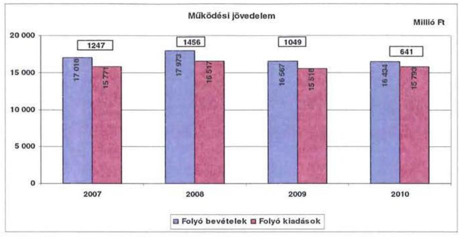

A folyó költségvetés pozitív egyenlege (a múködési forrástöbblet) 2007ben a folyó bevétlek 7,3\%-át ( 1247 millió Ft-ot), 2008-ban 8,1\%-át ( 1456 millió Ft-ot), 2009-ben 6,3\%-át (1049 millió Ft-ot), 2010-ben 3,9\%-át (641 millió Ftot) jelentette. A vizsgált időszakban a múködési jövedelem 4393 millió Ft többletet mutatott, amely forrásul szolgálhatott az Önkormányzat fennálló tőketörlesztési kötelezettségeinek teljesítéséhez, valamint fejlesztéseinek finanszírozásához.

A pozitív előjelű folyó költségvetési egyenleg ellenére az Önkormányzat folyószámlahitel felvételére kényszerült az átmeneti likviditási problémák kezelése miatt. A folyószámlahitel napi átlagos állománya kedvezően mozdult el, 20072010 között több mint 60\%-kal csökkent (509 millió Ft-ról 194 millió Ft-ra).

Az Önkormányzat pénzügyi kapacitása a vizsgált időszakban a múködési jövedelemhez hasonlóan pozitív értéket mutatott. A nettó müködési jövedelem ${ }^{49}$ értéke a folyó költségvetési pozíció mellett az adott költségvetési év adósságtörlesztésének hatását is tükrözi. A vizsgált időszakban keletkező 4393 millió Ft múködési jövedelemnek 29\%-át (1273 millió Ft) tette ki a fejlesztési célú hitelekhez kapcsolódó tőketörlesztés, amelynek kifizetését követően 3120 millió Ft nettó múködési jövedelme keletkezett az Önkormányzatnak.

A nettó múködési jövedelem - az évenkénti tőketörlesztés ${ }^{50}$ csökkenése mellett -2007-ben 820 millió Ft, 2008-ban 997 millió Ft, 2009-ben 915 millió Ft, 2010ben 388 millió Ft volt. A pénzügyi kapacitás 2008. évi javulását a múködési jövedelem növekedése, a 2008-hoz viszonyított folyamatos csökkenését a folyó bevételek és kiadások különbségéből származó múködési jövedelem csökkenése mellett a 2009. és a 2010. évben a tőketörlesztés csökkenése okozta.

[^0]
[^0]:    ${ }^{49}$ pénzügyi kapacitás
    ${ }^{50}$ Az Önkormányzat tőketörlesztési kötelezettsége 2007-2010 között 427-459-134253 millió Ft volt.

---

Az Önkormányzatnak (a CLF módszer alapján) a fejlesztési kiadások egy részének fedezete - pozitív nettó múködési jövedelem képződése mellett - biztosítottnak látszik. Továbbá információul szolgál a jövőben vállalható, teljesíthető adósságszolgálat mértékéről.
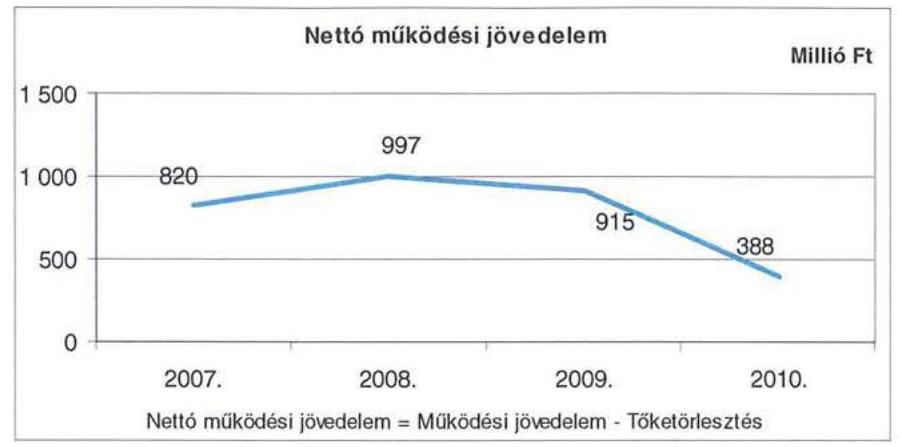

A 2007-2010. években az Önkormányzat felhalmozási költségvetésének egyenlege folyamatosan negatív összegű volt, amely takarékos költségvetési gazdálkodás és pénzügyileg fenntartható ${ }^{51}$ beruházások esetén nem jár magas pénzügyi kockázattal.

A felhalmozási költségvetés egyenlegének alakulását évről évre a következő ábra szemlélteti:
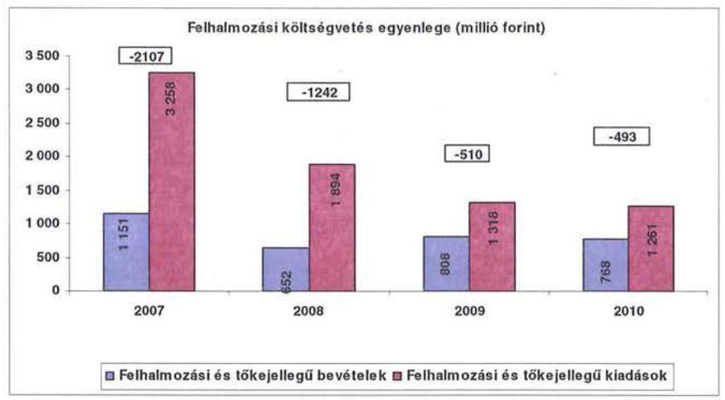

A felhalmozási forráshiánynak a felhalmozási és tőke jellegű kiadásokhoz viszonyított aránya 2007-ben 64,7\% (2107 millió Ft), 2008-ban 65,6\% (1242 millió Ft), 2009-ben 38,7\% (510 millió Ft), 2010-ben 39,1\% (493 millió Ft) volt.

A 2011. évi költségvetési rendeletben - a hagyományos költségvetési szerkezetben - az Önkormányzat tervezett bevételeinek és kiadásainak negatív különbö-

[^0]
[^0]:    ${ }^{51}$ Az minősül pénzügyileg fenntartható beruházásnak, amelynek múködtetésére az Önkormányzat nettó múködési jövedelme még fedezetet nyújt.

---

zete 3491 millió Ft teljes finanszírozási igényt mutat, a hiányt hitelek felvételével tudják biztosítani.

A vizsgált időszakban képződött 3120 millió Ft nettó múködési jövedelem az összes felhalmozási forráshiány 71,7\%-ára nyújtott volna fedezetet, azonban abból csak 1116 millió Ft került felhasználásra, mivel arra az Önkormányzat 3236 millió Ft összegű fejlesztési hitelt vett fel, melynek következtében a pénzeszközök állománya közel 2,5-szeresére, a 2007. évi 544 millió Ft-ról 2010. december 31 -ére 1313 millió Ft-ra nőtt.

Az Önkormányzat teljes finanszírozási igénye ${ }^{52}$ a CLF módszer szerint folyamatosan csökkenő tendenciát mutatott, 2007-ben 1288 millió Ft, 2008-ban 245 millió Ft, 2009-ben 405 millió Ft, 2010-ben 105 millió Ft volt. Ennek finanszírozását a finanszírozási célú bevételek, valamint a pénzmaradvány igénybevétele biztosította.

Az önkormányzat finanszírozási műveletei 2007-2010. évekbeli egyenlegének alakulását a következő ábra szemlélteti:
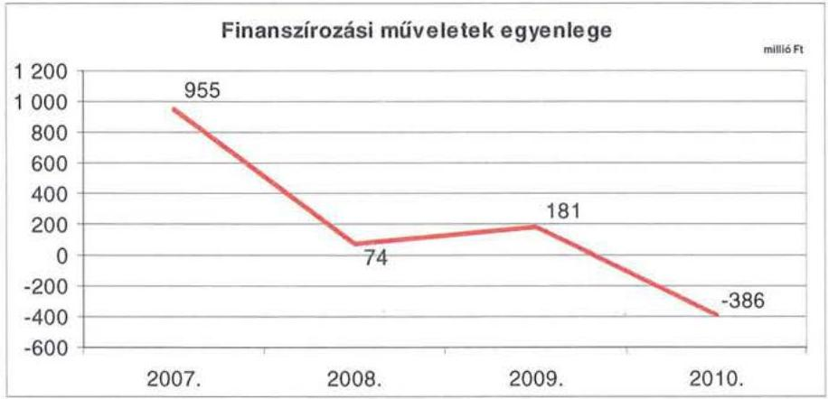

A vizsgált időszakban együttesen jelentkező finanszírozási többlet azt jelzi, hogy az éves költségvetések végrehajtása során szükség volt a pénzkészlet felhasználásán túl külső finanszírozás igénybevételére is. A külső források igénybevétele azonban csökkenő tendenciát mutat az Önkormányzatnál.

Az Önkormányzat zárszámadási rendeleteiben a múködési többletet és a fejlesztési hiányt/többletet a hagyományos költségvetési szerkezet alapján mutatta be ${ }^{53}$, amelyet a jelentés 1. számú melléklete szemléltet. A 2007-2010. évi zárszámadási rendeletekben pénzügyi többletet mutattak ki.

A vizsgált időszakban a kötelezettségek ${ }^{54} 4526$ millió Ft-ról 6651 millió Ft-ra emelkedtek. Az Önkormányzat kötelezettségein belül a 2007-2010 közötti időszakban a rövid lejáratú kötelezettségek állománya 20-30\% között volt. Az Önkormányzat 2006. december 31-én fennálló pénz- és tőkepiaci kötelezettsége

[^0]
[^0]:    ${ }^{52}$ a nettó múködési jövedelem és a felhalmozási költségvetés eredője
    ${ }^{53}$ Nincs kötelező előírás a múködési és fejlesztési hiány megállapításának módjára.
    ${ }^{54}$ passzív pénzügyi elszámolások nélkül

---

2636 millió Ft-ról több mint kétszeresére, 5384 millió Ft-ra nőtt a hosszú lejáratú hitelfelvétel miatt. Az összes kötelezettségen belül a hosszú lejáratú pénzintézeti kötelezettségek 2007-2010 között 54,7\%-kal (1771 millió Ft-tal) nőttek.

A rövid lejáratú kötelezettségek 2010-ben 1641 millió Ft-ot tettek ki, amely 357 millió Ft-tal ( $27,8 \%$ ) több a 2007. évi rövid lejáratú kötelezettségállománynál. Az Önkormányzat 2007-ben 82 millió Ft lejárt szállítói tartozásállománynyal rendelkezett, 2010. év végi állomány 16 millió Ft volt.

Az Önkormányzat 2010. évi záró pénzkészlete 1313 millió Ft volt ${ }^{55}$, amelynek teljes összege - az Önkormányzat kimutatása szerint - kötelezettséggel terhelt.

A kötelezettségek növekedése ellenére a kamatbevételek és kiadások aránya pozitív irányban mozdult el. Az Önkormányzatot terhelő 2010. évi kamatkiadás összege 93 millió Ft volt, amely 57,6\%-a a 2007. évben elszámolt 159 millió Ft összegű kamatkiadásnak. A kamatkiadások csökkenését a folyószámlahitel napi átlagos állományának csökkenése okozta. Az átmenetileg szabad pénzeszközökön realizált kamatbevétel 2010. évi összege több mint négyszerese volt a 2007. évben realizált bevételnek. A bevételek az ellenőrzött időszakban csak a 2010. évben haladták meg a kiadásokat, ebben az évben a pozitív különbözet 14 millió Ft volt.

Az Önkormányzat kamatbevételeinek és kamatkiadásainak alakulását a következő ábra mutatja:
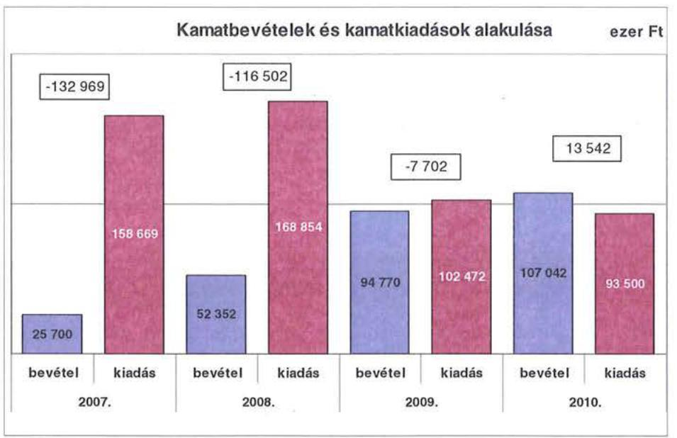

# 2.2. Az Önkormányzat bevételeinek alakulása 

Az Önkormányzat realizált folyó (múködési) bevétele 2007-ről 2008-ra 955 millió Ft-tal ( $5,6 \%$-kal) nőtt a saját működési bevételek és a költségvetési támogatások növekedése miatt, a további két évben 1539 millió Ft-tal (8,6\%-

[^0]
[^0]:    ${ }^{55}$ Ebben a Szennyvíztársulás pénzeszköze 22 millió Ft volt.

---

kal) csökkent a költségvetési támogatás és a saját működési bevételek csökkenése miatt. 2007-2010 között a folyó bevételek harmadát kitevő saját működési bevételek 461 millió Ft-tal ( $8,9 \%$-kal), a negyedét kitevő költségvetési támogatások 96 millió Ft-tal ( $2,1 \%$-kal) növekedtek az átengedett bevételek 1011 millió Ft-os csökkenése mellett.

Az Önkormányzat 2007-2010 között realizált bevételeinek főbb jogcímek szerinti adatait az alábbi grafikon mutatja be:
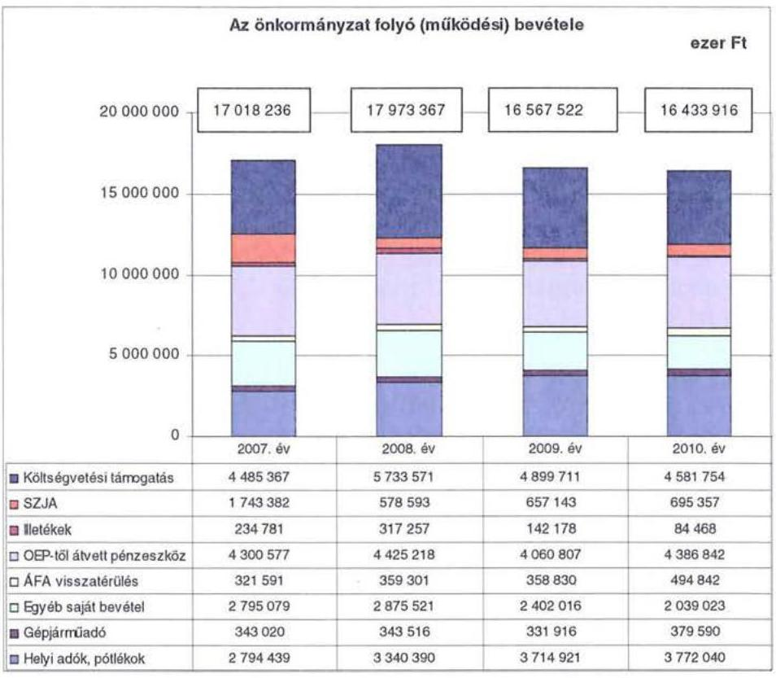

A helyi adók és pótlékok - melyek bevételeken belüli részaránya 16,4\%-ról 23\%-ra növekedett - 978 millió Ft-tal ( $35 \%$-kal) nőttek. Az Önkormányzat iparúzési adóerő képessége 2007-ről 2010-re 565 millió Ft-tal, 30,4\%-kal, a személyi jövedelemadó 185 millió Ft-tal, 36,3\%-kal növekedett. Az iparúzési adó 2008. évi 384 millió Ft-os, 2009. évi 379 millió Ft-os növekedése nem az Önkormányzat intézkedése miatt, hanem jogszabályváltozás ${ }^{56}$ és az adózók eredményei hatására következett be. Az Önkormányzat 2008. január 1-jétől idegenforgalmi adót vezetett be, melyből évente 4 millió Ft bevétele származott. Az építményadó mértékének 2008. évi 300 Ft-ról 500 Ft-ra történő emelése az adó összegét évente 176 millió Ft-tal ( $80 \%$-kal) növelte.

Az Önkormányzat illetékbevétele 2008-ra az előző évihez képest 82 millió Fttal nőtt, azonban a további években fokozatosan csökkent 317 millió Ft-ról 84 millió Ft-ra az ingatlanpiac stagnálása, majd visszaesése miatt.

[^0]
[^0]:    ${ }^{56}$ A helyi adókról szóló törvényt módosító 2007.évi CXXVI. törvény 2008. január 1-jétől 2009. július 1-jéig az adóalap új megosztását vezette be, ami az Önkormányzat számára kedvezőbb volt.

---

Az áfa visszatérülés összege 2007-ről 2010-re 173 millió Ft-tal 11,7\%-kal növekedett, amely döntően a fordított áfa - 2010. évben 217 millió Ft - elszámolásához kapcsolódott.

Az átengedett szja összege a 2007. évről a 2008. évre 66,8\%-kal, 1165 millió Ft-tal csökkent, mivel a személyi jövedelemadó normatív módon elosztott része a költségvetési törvény alapján a támogatások közé került.

A költségvetési támogatás a 2008. évi 27,6\%-os (1248 millió Ft) növekedést követően folyamatosan csökkent. Az előző évihez képest 2009-ben 14,5\%-kal (834 millió Ft-tal), 2010-ben 6,5\%-kal ( 318 millió Ft) kapott kevesebb forrást az Önkormányzat az államtól ezen a jogcímen. A változást a normatíváknak a járulékváltozások miatti központi csökkentése mellett a közoktatási és a szociális ágazatban az ellátotti létszám ${ }^{57}$ visszaesése idézte elő.

A gépjármúadó mértéke 2007-2010 között 37 millió Ft-tal (10,8\%-kal) növekedett, a 2007. és a 2008. években azonos szinten volt, a 2009. évi csökkenést követően 2010-ben emelkedett. A gépjármúadó alapját, mértékét és egyes mentességi kategóriákat érintő módosítások 2010. január 1-től átlagosan 15\%-os emeléssel jártak.

Az egyéb saját bevételek - az OEP bevételek nélkül - a vizsgált években 2795 millió Ft-ról 2039 millió Ft-ra, 27\%-kal csökkentek. Az intézmények múködési bevétele 2007 és 2010 között 466 millió Ft-tal ( $25,4 \%$-kal) csökkent. A Szociális Foglalkoztató Intézmény a hasonló nevú nonprofit Kft-be, az Ingatlankezelési Intézmény a Vagyongazdálkodási Zrt-be olvadt be, a két intézkedés a 2009 és a 2010. években a saját bevétel 770 millió Ft-os csökkenését okozta.

Az egyéb bevételeken belül az OEP-től átvett pénzeszköz 86 millió Ft-tal, 2,0\%kal növekedett 2007-2010 között.

Az Önkormányzat a tulajdonosi részesedései után a gazdasági társaságoktól osztalékot nem vett fel, az önkormányzati tulajdonú gazdasági társaságok nyereséges gazdálkodásából származó bevételét - ami a vizsgált időszakban 118 millió Ft volt - beszámolójuk jóváhagyásával egy időben eredménytartalékba helyezte. A 2010. évi beszámolóban szereplő 25470 ezer Ft-os osztalékok, üzemeltetési és koncessziós díjak - bevétel a bruttó elszámolás elve alapján elszámolt, víz- és csatornahálózat üzemeltetése után kiszámlázott üzemeltetési díj, melyet az Önkormányzat az Üzemeltetési szerződése szerint visszaforgatott a vízi-közmúvagyon fejlesztésére, az eszközök felújítására.

[^0]
[^0]:    ${ }^{57}$ Az ellátottak száma a közoktatási intézményekben 154 fővel, a szociális intézményekben 73 fővel csökkent a vizsgált időszak alatt.

---

Az Önkormányzat felhalmozási bevétele a vizsgált időszakban a következőképpen alakult:

|  |  |  |  |  |
| :-- | --: | --: | --: | --: |
| Megnevezés | 2007. év   tény | 2008. év   tény | 2009. év   tény | 2010. év   tény |
| Tárgyi eszköz értékesítés | 237079 | 181845 | 40974 | 75232 |
| Egyéb saját tőkebevétel | 114868 | 48414 | 8016 | 93374 |
| Államháztartáson belülről   kapott támogatás | 634555 | 328252 | 697100 | 539128 |
| EU-tól és külföldről kapott   támogatások | 0 | 224 | 0 | 0 |
| Államháztartáson kívülről   kapott támogatás | 164678 | 93120 | 61417 | 60368 |
| Összes felhalmozási bevétel | 1151180 | 651855 | 807507 | 768102 |

Az Önkormányzat összes felhalmozási célú bevétele a 2010. évben 768 millió Ft volt, amely 383 millió Ft-tal ( $33,3 \%$-kal) volt alacsonyabb a 2007. évinél. Az összes bevételből minden vizsgált évre jellemzően jelentős részarányt ${ }^{58}$ képvisel az államháztartáson belülről kapott támogatás, mely az intézményi rekonstrukciókhoz, felújításokhoz kapott támogatás. A tárgyi eszköz értékesítés bevételét 222 millió Ft-tal növelte a 2007. és 2008. években az Ipari Park kialakításához eladott terület. A 2007. évről a 2010. évre 162 millió Ft-tal (harmadára) csökkent a tárgyi eszköz értékesítés bevétele, 104 millió Ft-tal, $63,3 \%$-kal az államháztartáson kívülről kapott támogatás.

# 2.3. Az Önkormányzat kiadásainak alakulása 

Az Önkormányzat működési kiadásai főbb jogcímek szerinti bontásban az alábbiak voltak:

Nagykanizsa Megyei Jogú Város Önkormányzata müködési kiadásai

|  |  |  |  |  |
| :-- | --: | --: | --: | --: |
| Megnevezés | 2007. | 2008. | 2009. | 2010. |
| Folyó kiadások | 15771192 | 16517606 | 15518294 | 15793237 |
| Müködési kiadások (kamatkiadás nélkül) | 14146623 | 14856866 | 13965713 | 13936232 |
| Államháztartáson belülre átadott pénzeszközök | 227534 | 233094 | 52593 | 85395 |
| Transzferkiadások | 795029 | 1141595 | 1129310 | 1340236 |
| -ebből: vállalkozásoknak | 133056 | 356840 | 174334 | 165940 |
| EU-nak, illetve külföldre | 5100 | 5200 | 5450 | 5550 |
| magánszemélyeknek | 494373 | 609583 | 759452 | 974449 |
| nonprofit szervezeteknek | 162500 | 169972 | 190074 | 194297 |
| Kamatkiadások | 158669 | 168854 | 102472 | 93500 |
| Előző évi pénzmaradvány átadás | 443337 | 117197 | 268206 | 337874 |

[^0]
[^0]:    ${ }^{58}$ Az államháztartáson belülről kapott támogatások 2007. évben 49,9\%-át, 2008. évben $30,8 \%$-át, 2009. évben $54,4 \%$-át, 2010. évben $54,1 \%$-át jelentették a teljesített bevételnek.

---

Az Önkormányzat folyó kiadásai 2007-ről 2008-ra 746 millió Ft-tal (4,7\%-kal) nőttek, 2008-ról 2009-re 999 millió Ft-tal (6\%-kal) csökkentek, 2010-re 227 millió Ft-tal nőttek. A vizsgált időszak alatt, a működési kiadások 210 millió Ft-tal ( $1,5 \%$-kal), az államháztartáson belüli pénzeszközátadások 142 millió Ft-tal ( $62,5 \%$-kal) csökkentek, a transzferkiadásokon belül a magánszemélyeknek kifizetett társadalom- és szociálpolitikai juttatások 494 millió Ft-ról 974 millió Ftra, közel kétszeresére növekedtek.

Az Önkormányzat 2010-ben a múködési költségvetés 51,4\%-át (8111 millió Ftot) személyi juttatásokra és a munkaadókat terhelő járulékokra fordította, az üzemeltetést, intézményfenntartást biztosító dologi kiadásokra 35,5\% jutott ( 5600 millió Ft). A múködési kiadásokon belül a személyi juttatások és járulékok aránya a vizsgált időszakban folyamatosan csökkent, 2007-ben 55,1\%, (8696 millió Ft) 2008-ban 54,8\% (9049 millió Ft) 2009-ben 54,0\% (8377 millió Ft) volt.

| Megnevezés | 2007. | 2008. | 2009. | 2010. |
| :-- | --: | --: | --: | --: |
| Személyi juttatások | 6578356 | 6850775 | 6429094 | 6422313 |
| Munkaadót terhelő járulékok | 2117383 | 2198102 | 1948120 | 1688540 |
| Dologi kiadások | 5532978 | 5719307 | 5483173 | 5600397 |
| Egyéb folyó kiadások | 98726 | 71722 | 76733 | 210009 |
| Múködési célú pénzeszkózátadás | 528502 | 778189 | 429725 | 460416 |

A személyi juttatások 2007-ről 2008-ra 272 millió Ft-tal (4,1\%-kal) növekedtek az egyszeri központi kereset-kiegészítés és az óvodai átszervezéshez kapcsolódó végkielégítések miatt. 2009-ben és 2010-ben csökkentek az előző évihez képest a személyi kiadások. A végrehajtott létszámcsökkentések 236 fővel, az Ingatlankezelő Intézmény megszüntetése 50 fővel, a Szociális Foglalkoztató megszüntetése 18 fővel járult hozzá a vizsgált időszakban a létszám csökkenéséhez. A vizsgált időszakban a munkaadókat terhelő járulékok jelentős, 429 millió csökkenése következett be, amely egyrészt a kifizetett személyi juttatások, másrészt a járulékok mértékének csökkenésével volt összefüggésben. A járulékok csökkenése miatt felszabaduló forrásokat azonban a kormányzat az önkormányzati alrendszernek nyújtott állami támogatásokból levonásba helyezte, így a járulékcsökkenés az Önkormányzatnál érdemi megtakarítást nem eredményezett, mivel az állami támogatás csökkenésével járt együtt.

A dologi kiadások 3,4\%-kal (186 millió Ft-tal) emelkedtek 2007-ről 2008-ra, melyet a Kórház orvosainak vállalkozóvá válása miatt a szolgáltatási kiadás növekedése, valamint az energia áremelkedése és a kötelező élelmezési norma emelése okozott. 2009-re csökkent, 2010-re ismét növekedett a dologi kiadások összege. Az egyéb folyó kiadások 2007-ről 2008-ra 27 millió Ft-tal csökkent, majd 2010-re növekedett. A múködési célú pénzeszköz átadás 2008-ban 250 millió Ft-tal ( $47,2 \%$-kal) növekedett 2007-hez viszonyítva. A VIA Kanizsa Kht. részére költségek ellentételezésére 82 millió Ft-ot és a közcélú foglalkoztatáshoz 50 millió Ft-ot, a gazdasági társaságok veszteségrendezésére 58 millió Ftot, TISZK-nek 36 millió Ft-ot adott át az Önkormányzat.

---

Az Önkormányzat múködési kiadásait a Kórház adatai nélkül mutatja az alábbi táblázat:

Nagykanizsa Megyei Jogú Város Önkormányzata müködési kiadásai Kórházi fekvőbetegellátás nélküli adatok
ezer Ft

| Megnevezés | 2007. | 2008. | 2009. | 2010. |
| :-- | --: | --: | --: | --: |
| Folyó (müködési) kiadások | 11403366 | 11912459 | 11188279 | 11551945 |
| Müködési kiadások (kamatkiadás nélkül) | 9778797 | 10221719 | 9635698 | 9694940 |
| Kamatkiadás | 158669 | 168854 | 102472 | 93500 |
| Személyi juttatások | 4825934 | 5056671 | 4756931 | 4766282 |
| Munkaadót terhelő járulékok | 1544459 | 1610557 | 1425116 | 1239676 |
| Dologi kiadások | 3532400 | 3524748 | 3386434 | 3524711 |
| Egyéb folyó kiadások | 66069 | 50623 | 59903 | 159929 |

A Kórházon kívüli intézményekben a múködési kiadások felét a személyi juttatások és a munkaadókat terhelő járulékok, $30 \%$-át a dologi kiadások teszik ki. A 2007. évről 2010. évre 60 millió Ft-tal, 1,2\%-kal csökkentek a személyi juttatások. A vizsgált időszak második felében a munkaadókat terhelő járulékok jelentős ${ }^{59}$ csökkenése következett be, amely egyrészt a kifizetett személyi juttatások, másrészt a járulékok mértékének csökkenésével volt összefüggésben.

Az Önkormányzat Kórház nélküli dologi kiadásai 2007-2010 között nyolc millió Ft-tal, 0,2\%-kal csökkentek. Az önkormányzati kiadásokban nőtt a kórházi kiadások aránya az egyéb fenntartott intézményekben felmerülő kiadásokhoz képest. A Kórház nélküli teljesített 2007. évi müködési kiadások (11 403 millió Ft) az összes müködési kiadás $74,2 \%$-át tették ki, ez az arány 2010 végére $73,1 \%$-ra ( 11552 millió Ft-ra) csökkent.

Az Önkormányzat 2007-2010 között a Kórház múködési kiadásaihoz ${ }^{60}$ 551 millió Ft-tal járult hozzá, amelyet központosított állami támogatásokból fedezett. A kórházi múködési pénzeszközátadások a központi bérpolitikai intézkedésekhez, a létszámcsökkentésekhez kapcsolódó többletköltség fedezetéhez, a 13. havi juttatások kifizetéséhez, kereset-kiegészítésekhez kapcsolódtak. Ezeknek a kiadásoknak a fedezete így nem OEP támogatás, hanem egyéb, az Önkormányzat által igénybe vett központi támogatás volt.

A kórházak müködésének finanszírozására az OEP támogatás szolgál, míg a fejlesztési kiadások fedezetét az önkormányzatoknak kell biztosítani intézményeik számára. A müködési célú önkormányzati támogatáson felül 2007-2010 között 105 millió Ft-ot adott a Közgyűlés a Kórháznak fejlesztési célra, amely a felhalmozási kiadások mindössze felét fedezte ${ }^{61}$.

[^0]
[^0]:    ${ }^{59}$ 2010. évi teljesítés szinten 305 millió Ft-os csökkenés a 2007. évhez képest
    ${ }^{60}$ intézményi finanszírozás formájában
    ${ }^{61}$ a Kórház fejlesztési kiadásokra 2007-2010 között 225 millió Ft-ot fordított

---

A támogatások évenkénti alakulását a következő grafikon mutatja be.
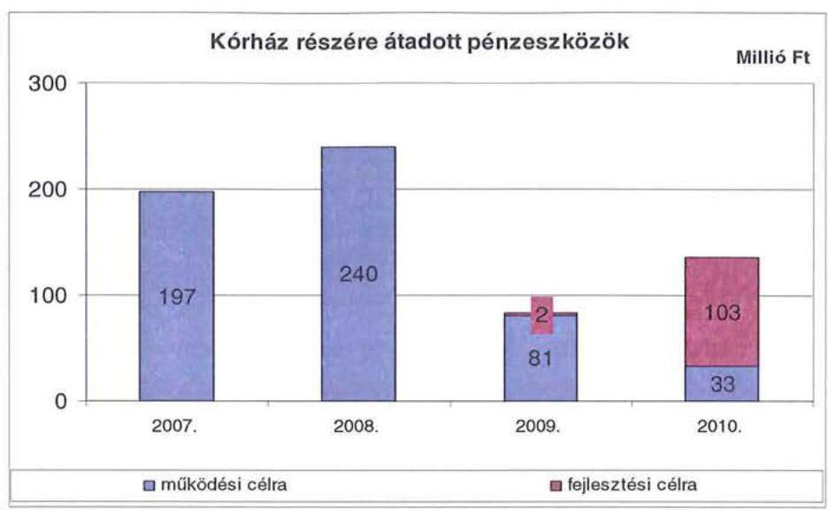

Az Önkormányzat pénzügyi helyzetének alakulására hatással voltak a gazdasági társaságok részére átadott pénzeszközök, melyek alakulását az alábbi tábla mutatja:
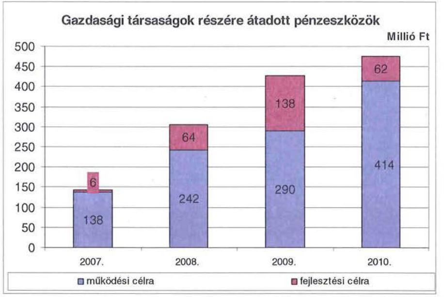

A 25\%-ot meghaladó önkormányzati tulajdonú, valamint egy közfeladatot ellátó, nem önkormányzati tulajdonú gazdasági társaság kiadásaihoz a vizsgált időszakban 1084 millió Ft müködési - melyből 532 millió Ft központi költségvetési támogatás ${ }^{62}$ - és 270 millió Ft fejlesztési célú pénzeszközt adott át az Önkormányzat. A gazdasági társaságoknak müködési és felhalmozási célra át-

[^0]
[^0]:    ${ }^{62}$ Az Önkormányzat a közcélú és közhasznú foglalkoztatás támogatásához a VIA Kanizsa Nonprofit Zrt. részére a 2008. évben 116 millió Ft, a 2009. évben 258 millió Ft központi támogatást, a Zala Volán Közlekedési Zrt. részére a helyi tömegközlekedés támogatására 158 millió Ft központi támogatást adott át.

---

adott pénzeszközök alakulását a jelentés 4. számú melléklete mutatja be. A 75\%-ot meghaladó önkormányzati tulajdonú gazdasági társaságok közül 4 társaság részére a 2007-2010. években összesen 104 millió Ft tőkepótlást teljesített az Önkormányzat, melyből 3 gazdasági társasága veszteségrendezésére 87 millió Ft-ot biztosított.

A 75\%-ot meghaladó önkormányzati tulajdonú gazdasági társaságok belföldi értékesítésének nettó árbevételéhez viszonyítva a legmagasabb önkormányzati pénzeszközátadásban a 2010. évben a Szociális Foglalkoztató Nonprofit Kft, valamint a Kanizsa Újság részesült, 32 millió Ft (38,2\%), illetve 21,6 millió Ft $(646,7 \%)$ összegben.

A CLF módszer szerint figyelembe vett múködési és felhalmozási kiadások alakulását, a teljesített kiadások múködési és felhalmozási célú felhasználásának összegeit az alábbi ábra mutatja:
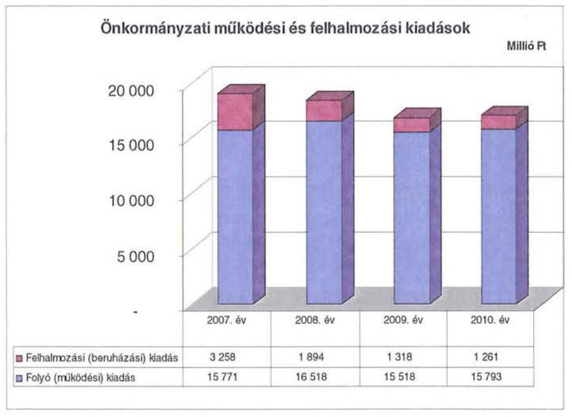

A múködési és felhalmozási kiadások arányának változásában 2007-2010 között a felhalmozási kiadások arányának folyamatos csökkenése figyelhető meg. A felhalmozási kiadások részaránya 17,1\%-ról 7,5\%-ra csökkent.

Az Önkormányzat 2007-2010. években megvalósított, illetve 2010. december 31-én fennálló, valamint az elbírálás alatt lévő fejlesztési feladatokhoz kapcsolódó kötelezettségeinek összegzését, valamint forrásmegoszlását a jelentés 3.a-d mellékletei tartalmazzák.

Az Önkormányzatnál a 2007-2010. években összesen 24 db 10 millió Ft feletti beruházás és 18 db 10 millió Ft feletti felújítás fejeződött be. A vizsgált időszakban befejezett, 6430 millió Ft értékű fejlesztés forrásmegoszlása: 2592 millió Ft EU-s támogatás ( $40,3 \%$ ), 133 millió Ft saját forrás ( $2,1 \%$ ), 3017 millió Ft hitel $(46,9 \%)$ és 688 millió Ft hazai támogatás ( $10,7 \%$ ) volt.

---

Ezen időszakban az Önkormányzat legmagasabb bekerülési költségű beruházásai a következők voltak:

- a Kórház „E" és „B" épületének rekonstrukciója 1413 millió Ft teljes bekerülési költséggel. A beruházást 2003-ban kezdték el és 2007. december 31 -én fejezték be. A fejlesztés forrásösszetétele: 552 millió Ft hitel, 836 millió Ft EU-s támogatás és 25 millió Ft saját bevétel volt;
- a volt Thury György Laktanya területének rehabilitációja, mellyel megvalósulhatott a terület funkcióváltása a városrészben. Az 1086 millió Ft bekerülési költségű fejlesztés 2006-ban kezdődött és 2007-ben fejeződött be. A beruházás forrása 917 millió Ft EU-s támogatás, 133 millió Ft hazai támogatás és 36 millió Ft hitel volt;
- a Rozgonyi Úti Általános iskola rekonstrukciója a 2007. évben kezdődött és a 2008. évben fejeződött be, melynek teljes bekerülési költsége 859 millió Ft volt. A fejlesztés forrását 148 millió Ft hitelből és 711 millió Ft EU-s támogatásból biztosították.

A 2010. december 31-én folyamatban lévő 10 fejlesztés teljes bekerülési költsége 6354 millió Ft, amelyből 2010. december 31-éig 847 millió Ft kiadást teljesítettek (forrása 218 millió Ft hitel és 629 millió Ft EU-s pályázati pénzeszköz volt). A fejlesztések 2010. december 31-e utáni kötelezettsége 5507 millió Ft, melynek forrása 997 millió Ft hitel és 4510 millió Ft EU-s támogatás.

Az Önkormányzat egy fejlesztési feladathoz nyújtott be pályázatot, melyek teljes bekerülési költsége 25 millió Ft, a fejlesztéseket 5 millió Ft hitelből és 20 millió Ft hazai támogatásból tervezik megvalósítani.

# 3. KÖTELEZETTSÉGEK BEMUTATÁSA 

### 3.1. A pénzintézetek felé fennálló kötelezettségek alakulása

Az Önkormányzat pénzintézeti kötelezettségeinek állománya 2006. december 31-től 2010. december 31-ig 104\%-kal, 2636 millió Ft-ról 5384 millió Ft-ra nőtt. A fennálló pénzintézeti kötelezettségei folyószámlahitel állományból és hosszú lejáratú hitel igénybevételéből keletkeztek. A vizsgált időszakban adósságszolgálatra az Önkormányzat 1796 millió Ft-ot teljesített, amelyből a kamatkiadás 523 millió Ft volt. Az Önkormányzat felhalmozási forráshiányának rendezésére, illetve felújítási és fejlesztési céljainak megvalósítása érdekében a kötvény kibocsátás lehetőségével az ellenőrzött időszakban nem élt. A Közgyűlés 2011. június 30 -ai ülésén 3000 millió Ft fejlesztési célú kötvény kibocsátásáról döntött, melynek során felhatalmazta a polgármestert a kötvénykibocsátásához szükséges lépések megtételére, a pénzintézetektől az ajánlatok bekérésére. A határozat szerint a szerződés megkötését megelőzően, a Közgyűlés - az ajánlatok függvényében - újratárgyalja az ügyet és dönt a kötvény kibocsátásáról.

---

A fejlesztési célok megvalósításához fejlesztési célú hiteleket vett igénybe.
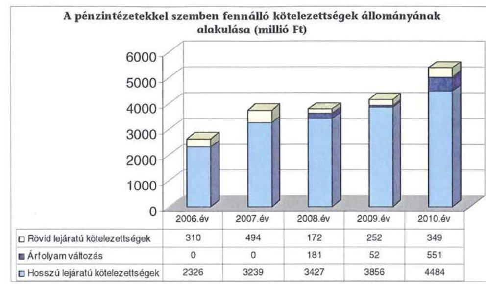

Az Önkormányzat 2011. március 31-én HUF-ban fennálló hosszú lejáratú pénzintézeti kötelezettségei az alábbiak voltak:

| Megnevezés | Hitelszerzödés idöpontja | Összeg millió Ftban | Kamat (referencia kamat+ kamatfelár) | Felhasználás célja: |
| :--: | :--: | :--: | :--: | :--: |
| OTP Bank Rt.   hosszú lejáratú   fejlesztési hitel   OTP Bank Rt.   hosszú lejáratú   fejlesztési hitel | $\begin{aligned} & 2005.07 .15 \\ & 2005.07 .15 \end{aligned}$ | $\begin{aligned} & 100 \\ & 1122 \end{aligned}$ | 3 havi EURIBOR + $1 \%$   3 havi EURIBOR + $1,5 \%$ | Nagytérségi hulladékkezelő rendszer kialakítása forgalom technikai beavatkozások, út és intézményi felújítások. Társasházak korszerűsítéséhez, felújításához kapcsolódó önkormányzati támogatás finanszírozásához Társasház energiatakarékos korszerüsitéséhez, felújításához kapcsolódó önkormányzati támogatás finanszírozásához Társasház energiatakarékos korszerüsitéséhez, felújításához kapcsolódó önkormányzati támogatás finanszírozásához   „Panel plusz" hitelcél megvalósításának finanszírozása |
| OTP Bank Nyrt.   hosszú lejáratú   fejlesztési hitel | 2006.10.16 | 481 | 3 havi EURIBOR + $1,1 \%$ |  |
| OTP Bank Nyrt.   hosszú lejáratú   fejlesztési hitel | 2007.01.08 | 3 | 3 havi EURIBOR + $1,1 \%$ |  |
| OTP Bank Nyrt.   hosszú lejáratú   fejlesztési hitel   UNICREDIT Bank   Hungary Zrt.   hosszú lejáratú   fejlesztési hitel   UNICREDIT Bank   Hungary Zrt.   hosszú lejáratú   fejlesztési hitel | 2007.05.14   2007.08.01   2009.12.23   2009.12.23 | $\begin{gathered} 10 \\ 260 \\ 901 \\ 112 \end{gathered}$ | 3 havi EURIBOR + $1,072 \%$   3 havi EURIBOR + $1,49 \%$   3 havi EURIBOR + $1,89 \%$ | KEOP,ROP,TIOP programok önrészének finanszírozásához Pályázati támogatással megvalósuló felújítások, fejlesztések finanszírozása |

---

| UNICREDIT Bank Hungary Zrt. hosszú lejáratú fejlesztési hitel Raiffeisen Bank Zrt. hosszú lejáratú fejlesztési hitel Raiffeisen Bank Zrt. hosszú lejáratú fejlesztési hitel | $\begin{aligned} & 2009.12 .23 \\ & 2010.12 .20 \end{aligned}$ | $\begin{aligned} & 127 \\ & 179 \\ & 443 \end{aligned}$ | 3 havi EURIBOR + $2,39 \%$   3 havi EURIBOR + MFB RKO2 $+0,49 \%$   3 havi EURIBOR + MFB RKO2 $+0,49 \%$   3 havi EURIBOR + MFB RKO2 $+0,49 \%$   3 havi BUBOR + $0,9 \%$ | Kózutak építése, Közvilágitás korszerüsítése, intézmények felújitásának finanszirozása Infrastrukturális beruházások finanszírozásához   ROP,TIOP programok saját forrás finanszírozásához Intézményi felújítások, EU pályázattal megvalósitott beruházások saját forrásának finanszírozásához |
| Raiffeisen Bank Zrt. hosszú lejáratú fejlesztési hitel | 2010.12 .20 | 500 |  |  |

Az Önkormányzat pénzintézeti kötelezettségvállalásaira minden esetben közgyűlési döntés alapján került sor. A kötelezettségvállalásból származó források felhasználási céljait meghatározták. Az adósságszolgálat felső határáról az éves költségvetési rendelettervezetek előterjesztésekor tájékoztatták a Közgyűlést és az adósságot keletkeztető kötelezettségvállalásoknál annak felső határát betartották.

Az Önkormányzat a 16 megkötött hitelszerződése közül négynél svájci frank alapú hitelt vett fel. Ezeknél a szerződéseknél a deviza árfolyamváltozás hatása is befolyásolja a kötelezettségek alakulását, azonban annak mértéke előre pontosan nem határozható meg, csak várakozásokon alapuló tendenciák jelezhetők. Annak megítéléséről, hogy a hitelek visszafizetésekor jelentkező forint kötelezettség többletkiadást (árfolyamveszteség) vagy kiadáscsökkenést (árfolyamnyereség) eredményez a futamidő végén, a teljes kötelezettség rendezését követően lehet képet alkotni. Mindaddig, amíg törlesztési kötelezettség nem áll fenn (türelmi idő, moratórium), a tőkére vonatkoztatva nem értelmezhető sem az árfolyamveszteség, sem az árfolyamnyereség. Ugyanakkor a számviteli szabályok meghatározzák, hogy az árfolyam különbözetet év végén a kötelezettségek vagy követelések között a könyvviteli mérlegben nyilván kell tartani, azonban árfolyam különbözet ebben az esetben ténylegesen nem képződött. Három, devizában fennálló hitel esetében az Önkormányzatnál megkezdődött a tőketörlesztés, a szerződéseknél összességében az eddigi 164 millió Ft-os tőkefizetés után az Önkormányzatnak 16 millió Ft árfolyamvesztesége keletkezett, ami a visszafizetett tőke $9,8 \%$-a volt.

---

Az Önkormányzat 2010. december 31-én CHF-ben fennálló hosszú lejáratú pénzintézeti kötelezettségei (13 800328 CHF ) az alábbiak voltak ${ }^{63}$ :

| Megnevezés | Kibocsátás, illetve szerződéskötés időpontja | Összeg CHF | Kibocsátási, vagy lehivási árfolyam | Kamat (referencia kamat+ kamatfelár) | Felhasználás célja: |
| :--: | :--: | :--: | :--: | :--: | :--: |
| Hosszú lejáratú hitel | 2005.09.29 | 1369898 | 162,06 | 3 havi CHF   LIBOR $+0,487 \%$ | ipari park közmưvesítése |
| Hosszú lejáratú hitel | 2006.05.08 | 4436779 | 175,53 | 3 havi CHF   LIBOR $+0,147 \%$ | Csónakázó-tó eu projekt |
| Hosszú lejáratú hitel | 2007.08.01 | 3904972 | 153 | 3 havi CHF   LIBOR $+0,029 \%$ | TERMOFOR   témények   felújítása |
| Hosszú lejáratú hitel | 2008.09.24 | 4088678 | 173,91 | 3 havi CHF   LIBOR $+0,887 \%$ | Infrastruktúrála beruházások |

Az adósságot keletkeztető kötelezettségvállalással megvalósított felhalmozási kiadások esetleges bevételt növelő, illetve kiadást csökkentő vonzatát, illetve ennek a fejlesztéshez, felújításhoz vállalt kötelezettségek visszafizetési forrásként való számbavételét a Közgyűlés nem vizsgálta. A költségvetési rendelet mellékletében bemutatatták a lejáratig fizetendő tőketörlesztés és kamatok összegeit. Az előterjesztések azonban nem tartalmazták a törlesztések forrásainak bemutatását. Az adósságállomány kezelésére vonatkozó koncepciót nem készítettek.

Az 51\%-ot meghaladó önkormányzati tulajdonú gazdasági társaságok közül hosszú lejáratú hitelállománnyal az ellenőrzött időszakban kizárólag az NSP Hulladékkezelő Kft. rendelkezett. A társaság a hulladéklerakó építéséhez vett igénybe 50 millió Ft hosszú lejáratú hitelt a 2008. évben. A társaság 2009. november 20-án a fennálló adósságállományt egy összegben kiegyenlítette.

Az Önkormányzat a müködtetési feladatainak finanszírozását a vizsgált időszakban csak folyószámlahitel igénybevételével tudta biztosítani. A folyószámlahitel alakulását az alábbi táblázat mutatja be:
millió Ft-ban

| Megnevezés | 2007. év | 2008. év | 2009. év | 2010. év | 2011. már-   cius 31. |
| :-- | :--: | :--: | :--: | :--: | :--: |
| I. Folyószámlahitel |  |  |  |  |  |
| a folyószámlahitel keretösszege   január 1-jén | 800 | 1100 | 1100 | 1100 | 1100 |
| teljesített kamat és egyéb költség | 36 | 11 | 2 | 2 | 4 |

Az Önkormányzatnak a 2007. év végén 371 millió Ft folyószámlahitel tartozása volt, a 2008-2009. év végén folyószámla hitelállománnyal nem rendelkezett. A 2010. december 31-én fennálló folyószámlahitel kötelezettség 113 millió Ft-ot

[^0]
[^0]:    ${ }^{63}$ A 2010. december 31-én CHF-ben fennálló kötelezettségek összegének módosítása, az Önkormányzat kérésére, a 2011. szeptember 19-én megküldött, javított tanúsítványok alapján történt.

---

tett ki a folyószámlahitel év végi - hitelszerződés szerinti lejáratkori ${ }^{64}$ rendezése nem történt meg.

A folyószámlahitel kondíciói és egyéb költségei a következők voltak: ${ }^{65}$

| Megnevezés | Kamat (referencia+ kamatfelár | Egyéb költség |
| :--: | :--: | :--: |
| Folyószámlahitel |  |  |
| 2007. év | 3 havi BUBOR $+0,149 \%$ | X |
| 2008.-2011. év | 1 havi BUBOR $+0,189 \%$ | X |

A folyószámlahitellel zárt napok száma a 2007. évben 309 nap, míg a 2010. évben 71 nap volt, a folyószámlahitel átlagos napi állománya ${ }^{66}$ a 2007. évi 509 millió Ft-ról 2010. évre 194 millió Ft-ra, $62 \%$-kal csökkent. A vizsgált időszakban folyamatosan kevesebb volt a folyószámlahitellel zárt napok száma és a hitel átlagos napi állománya is, ami a kamatkiadások csökkenését is eredményezte. A folyószámlahitel igénybevétele az Önkormányzatnak a 2007től 2011. március 31-ig összesen 55 millió Ft kamatkiadást eredményezett. A felhalmozási költségvetésének hiányát az Önkormányzat a múködési jövedelem forrástöbblete mellett, hosszú lejáratú hitelek felvételével finanszírozta. A 2009. évi költségvetésének jóváhagyásakor a Közgyűlés úgy döntött, hogy a költségvetés végrehajtása során a tervezett felhalmozási bevételek realizálását megelőzően, a kiadások teljesítésére kötelezettséget nem vállalnak. Ennek megfelelően javult az Önkormányzat likviditási helyzete, csökkent a folyószámlahitellel terhelt napok száma.

[^0]${ }^{66}$ Fennálló folyószámla hitelállomány/365 nap

[^0]:    ${ }^{64}$ A hitelszerződés szerinti lejárat tárgy év december 31, amennyiben a lejáratot megelőző 60 nappal nem történik meg a felmondása - a bank hozzájárulása esetén - a futamidő automatikusan további egy évvel meghosszabbodik.
    ${ }^{65}$ A referencia kamatok az alábbiak szerint alakultak:

---

# 3.2. Szállítók felé fennálló kötelezettségek alakulása 

Az Önkormányzat és gazdasági társaságai lejárt szállítói tartozásainak és egyéb kiadás-elmaradásainak alakulását az alábbi táblázat tartalmazza:

|  |  |  |  | millió Ft-ban |
| :--: | :--: | :--: | :--: | :--: |
| Megnevezés | 2007.   december 31. | 2008.   december 31. | 2009.   december 31. | 2010.   december 31. |
| Mérleg szerinti szállítói   kötelezettség | 439 | 371 | 223 | 373 |
| Lejárt szállítói tartozás | 82 | 29 | 35 | 16 |
| ebből Kórház | 1 | 2 | 1 | 0 |
| Gazdasági társaságok*   lejárt szállítói tartozása | 84 | 20 | 99 | 64 |
| Egyéb kiadás-elmaradás | 342 | 321 | 756 | 891 |
| Tartozásállomány   összesen: | 865 | 712 | 1078 | 1328 |

* Az Önkormányzat többségi tulajdonú gazdasági társaságai

A 2010. december 31-i mérlegekben kimutatott szállítói kötelezettség 373 millió Ft volt, ebből a le nem járt tartozásállomány 357 millió Ft-ot tett ki. Az Önkormányzat fenntartásában működő Kórház az Önkormányzat tájékoztatása szerint 2010. december 31-én mindössze 115 ezer Ft lejárt szállítói tartozás állománnyal rendelkezett.
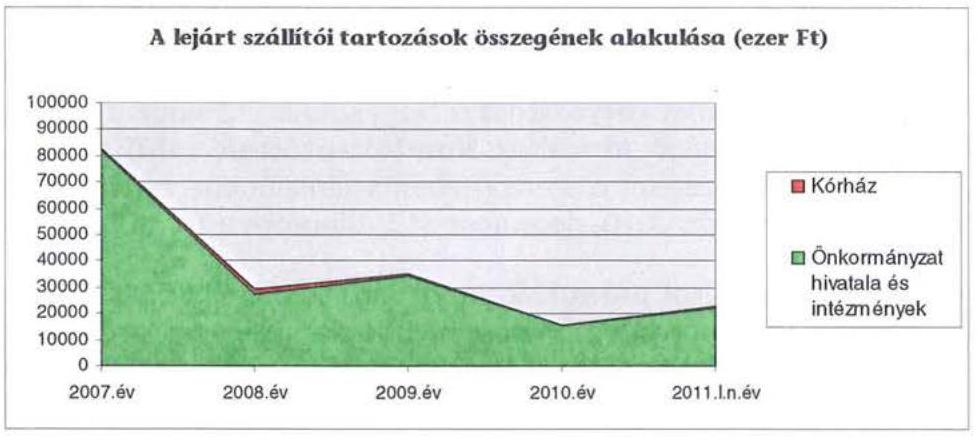

Az Önkormányzat lejárt szállítói tartozása 2007. december 31. és 2010. december 31. között 80\%-kal, 82 millió Ft-ról 16 millió Ft-ra csökkent. Az Önkormányzat egyéb kiadás-elmaradása ezzel ellentétesen, 342 millió Ft-ról 891 millió Ft-ra ( $161 \%$-kal) növekedett. Ennek a folyamatosan növekvő mértékét az okozta, hogy az európai uniós támogatással megvalósuló projektekhez a kiutalt előlegek év végi állományával szemben a kiadásokat a befejezetlen feladatoknál nem tudták elszámolni, így a számviteli nyilvántartásokban a fel nem használt előlegeket mint kiadás-elmaradást kellett nyilvántartani.

Az Önkormányzat 75\% feletti tulajdoni hányadú gazdasági társaságainak 2010. december 31-én lejárt 44 millió Ft szállítói tartozásállományából a 30 nap alatti 27 millió Ft ( $61 \%$ ) volt, a 30 napot meghaladó 13 millió Ft (30\%), a 61-90-nap közötti lejárt tartozásállomány egy millió Ft (2\%), 3 millió Ft (7\%)

---

tartozásállomány pedig meghaladta a 91 napot. A gazdasági társaságok lejárt szállító állományát a jelentés 4. számú melléklete mutatja be.

# 3.3. Egyéb kötelezettségek alakulása 

Az Önkormányzat a vizsgált időszakban nem kötött lizingszerződést és PPP konstrukció keretében nem valósitott meg fejlesztést.

Az Önkormányzat, az ellenőrzött időszakban a Szennyvíztársulás által a szennyvíz csatornázási program megvalósításához felvett 22 millió Ft társulati hitelre 2007. augusztus 1-jén garanciát és kezességet vállalt. A társulat a hitelt visszafizette, így 2010. december 31-én garancia- és kezességvállalásból fennálló hosszú távú kötelezettsége az Önkormányzatnak már nem volt.

Az Önkormányzat 2010. december 31-én 1641 millió Ft rövid lejáratú kötelezettségállománnyal rendelkezett, ebből az egyéb rövid lejáratú kötelezettségek 1155 millió Ft-ot tettek ki ${ }^{67}$. Ennek a $72 \%$-a, 831 millió Ft a támogatási programok előlege és az előfinanszírozás miatti kötelezettségekből tevődött öszsze. A beruházási és fejlesztési célú hitelek következő évet terhelő törlesztő részletei 260 millió Ft-ot, a helyi adó túlfizetése miatti kötelezettségek 60 millió Ftot jelentettek az egyéb kötelezettségek állományából.

A Közgyűlés a 352/2007. (XII. 20.) számú ${ }^{68}$, az 57/2010. (II. 02.) számú ${ }^{69}$ és a 35/2011. (I. 27.) ${ }^{70}$ számú határozatokkal összesen 10 millió Ft behajthatatlan követelés elengedéséről és azok mérlegből való törléséről döntött.

A Közgyűlés az ellenőrzött időszakban egy alkalommal 17 millió Ft kamatmentes kölcsönt folyósított a Nagykanizsa, Csengery u. 8. szám alatti múemléki védettségű társasház homlokzatának felújításához. A törlesztőrészletek megfizetését a szerződésben vállalt ütemezés szerint teljesítette a társasház, a kölcsön 2010. december 31-i állománya 16 millió Ft volt.

Az Önkormányzat hat alkalommal járult hozzá korlátozottan forgalomképes, vegyes (önkormányzati és magán) tulajdonú, illetve kizárólag önkormányzati tulajdonban lévő társasházi ingatlanokon, elidegenítési és terhelési tilalom bejegyzéséhez. Az elidegenítési és terhelési tilalmakat mindegyik esetben a Magyar Állam javára, a panellakások felújításának vissza nem térítendő támogatás igénybevételéhez kapcsolódóan jegyezték be. Az ingatlanokon összességében 630 millió Ft értékű jelzálogjog bejegyzése történt.

[^0]
[^0]:    ${ }^{67}$ A fennmaradó a folyószámlahitel állomány 113 millió Ft és a szállítói tartozásállomány 373 millió Ft.
    ${ }^{68}$ Hat gazdasági társaság 1513 ezer Ft behajthatatlan bérleti dij tartozását, 35 magánszemély behajthatatlan helyi adó tartozását, összesen 598 ezer Ft-ot.
    ${ }^{69}$ Hat gazdasági társaság behajthatatlan bérleti dij és magánszemélyek lakáskölcsön tartozás elengedése 7136 ezer Ft értékben.
    ${ }^{70}$ Két esetben bérmunka, egy esetben lakáskölcsön tartozás 525 ezer Ft értékben.

---

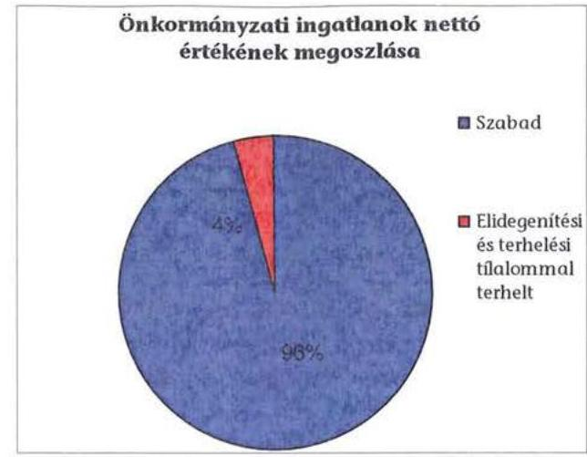

Az Önkormányzat nyilatkozata szerint forgalomképes ingatlanára jelzálogjogot, elidegenítési és terhelési tilalmat a vizsgált időszakban nem jegyeztek be. A jelzálogjoggal terhelt korlátozottan forgalomképes ingatlanok számviteli nyilvántartás szerinti nettó értéke 2010. december 31 -én 614 millió Ft, becsült értéke pedig 1276 millió Ft volt, amelyekre 630 millió Ft összegű vissza nem térítendő támogatás erejéig jegyezték be az elidegenítési és terhelési tilalmat. Az Önkormányzat ingatlanainak könyvszerinti nettó értéke 13917 millió Ft, melyből a terhelt ingatlanok számvitelben nyilvántartott nettó értéke 614 millió Ft ( $4 \%$ ) volt.

Az Önkormányzat kötelezettségeinek állományát 2010. december 31-én és várható alakulását a kötelezettségek lejáratáig az alábbi táblázat részletezi:

Az Önkormányzat kötelezettségeinek állománya 2010. december 31-én és
várható alakulása a kötelezettségek lejáratáig

| Megnevezés | Állomány 2010. dec. 31 -én |  |  | Várható kötelezettség 2011. 2013. években |  |  | Várható kötelezettség 2014. évet követően |  |  |
| :--: | :--: | :--: | :--: | :--: | :--: | :--: | :--: | :--: | :--: |
|  | HUF-ban (millió Ftban) | Devizitban (összege, ezet CHF-ben) | Oaviz   unem | HUF-ban (millió Ftban) | Devizitban (összege, ezet CHF-ben) | Oaviz   unem | HUF-ban (millió Ft. ban) | Devizitban (összege, ezet CHF-ben) | Oaviz   unem |
| Píazintézeti kötelezettségeh |  |  |  |  |  |  |  |  |  |
| Hosszú lejáratú hitleték | 2189 |  | HUF | 202 |  | HUF | 1806 |  | HUF |
| Hosszú lejáratú hitleték |  | 13000 | CHF |  | 2165 | CHF |  | 11635 | CHF |
| Folyószámlakötél | 112 |  | HUF | 112 |  | HUF |  |  | HUF |
| Píazintézeti kötelezettségek összesen HUF-ban | 2202 |  | HUF | 696 |  | HUF | 1806 |  | HUF |
| Píazintézeti kötelezettségek összesen CHF-ban |  | 13000 | CHF |  | 2165 | CHF |  | 11635 | CHF |
| Szállítók tartozás | 373 |  | HUF | 373 |  | HUF |  |  | HUF |
| Egyéb kiadós elmenedés | 891 |  | HUF | 891 |  | HUF |  |  | HUF |
| Egyéb kötelezettségek |  |  |  |  |  |  |  |  |  |
| Út \& és egyéb szervek hitt bencülte kötelezettségek |  |  | HUF | 8 |  | HUF |  |  | HUF |
| Kötelezettségek összesen HUF-ban | 3566 |  | HUF | 1768 |  | HUF | 1896 |  | HUF |
| Kötelezettségek összesen CHF-ben |  | 13000 | CHF |  | 2165 | CHF |  | 11635 | HUF |

Az Önkormányzat kötelezettségeinek állománya 2010. december 31-én 2675 millió Ft-ből és 13800328 CHF-ből tevődött össze. Ebből a 2011-2013-ban esedékes kötelezettségek várható összege 877 millió Ft és 2165149 CHF. A 2013 után várható kötelezettség összegét az 1806 millió Ft hosszú lejáratú hitel és a 11635179 CHF hiteltartozás és azok költsége alkotja. Az Önkormányzat a kötelezettségek finanszírozását a saját bevételéből tervezi megoldani.

---

Az Önkormányzat minősített többségi tulajdonú társaságai kötelezettségeinek állománya 2010. december 31 -én és várható alakulása a kötelezettségek lejáratáig

| Megnevezés | Állomány 2010. dec.31-én |  |  | Várható kötelezettség 20112013. években |  |  | Várható kötelezettség 2014. évet követően |  |  |
| :--: | :--: | :--: | :--: | :--: | :--: | :--: | :--: | :--: | :--: |
|  | HUF-ban   (millió Ft   ban) | Dertzában   (összege) | Dertz   (esen) | HUF-ban   (millió Ft   ban) | Dertzában   (összege) | Dertz   (esen) | HUF-ban   (millió Ft   ban) | Dertzában   (összege) | Dertz   (esen) |
| Szállítót tartozó | 44 |  | HUF | 44 |  | HUF |  |  | HUF |

A gazdasági társaságok hosszú lejáratú kötelezettséggel 2010. december 31én nem rendelkeztek, szállítói tartozásállományuk 64 millió Ft volt ebből a 75\% feletti tulajdoni hányadú társaságok 44 millió Ft-os szállítói kötelezettségállománnyal rendelkeztek.
A vizsgált időszakban nem történt meg annak felmérése, hogy az eszközök elhasználódásának, amortizációjának pótlása milyen kötelezettséget jelent az Önkormányzat számára. Az Önkormányzat a 2007-2010. években a tárgyi eszközök után 9391 millió Ft összegű értékcsökkenést számolt el, ugyanakkor felújításra és eszközpótlásra az értékcsökkenés összege 22,2\%ának megfelelő összeget ( 2081 millió Ft-ot) fordított. Az Önkormányzat eszközállományának használhatósági foka ${ }^{71}$ a vizsgált időszakban folyamatosan csökkent, a 2010. év végén $76,9 \%$ volt. Kiemelkedően növekedett az ellenőrzött időszakban a járművek elhasználódási szintje ( $47 \%$-al), ami az eszközpótlás elmaradásából és az eszközcsoportnál alkalmazott amortizációs kulcsból adódott.

Az Önkormányzat és intézménye ${ }^{72}$ alperesként kilenc, a többségi tulajdonú ${ }^{73}$ gazdasági társaságai három, a Kórház nyolc folyamatban lévő peres eljárásban érdekelt. Az Önkormányzat számára jövőbeni fizetési kötelezettséget jelentő eljárások közül a legjelentősebb a Tűzoltóság 58 dolgozójának munkaügyi pere, melyben 22 millió Ft elmaradt illetmény és annak a 2007. évtől felhalmozott kamatai iránt indítottak keresetet a munkavállalók. A Kórház I. fokú eljárásban folyamatban lévő kártérítési pereinek összértéke 90 millió Ft. A kártérítési összegek, a jogalap megítélése esetén is, változhatnak, a kártérítésekre fedezetet nyújtó biztosítással az intézmény rendelkezik. Az Önkormányzatnak az ellenőrzött időszakban két jogerőre emelkedett, bírósági ítélettel lezárt peres ügye volt. Felperesként - késedelmi kamat megfizetése tárgyában - fizetési meghagyás benyújtásával indított eljárás lezárásával, jogerősen az Önkormányzatnak 1079 ezer Ft-ot ítélt meg a Bíróság.

# 4. A PÉNZÜGYI EGYENSÚLY MEGTEREMTÉSE ÉrDEKÉBEN HOZOTT INTÉZKEDÉSEK 

A Közgyűlés évenként a költségvetési tervjavaslat elfogadása során a költségvetési hiány csökkentése érdekében áttekintette a feladatai ellátáshoz szükséges

[^0]
[^0]:    ${ }^{71}$ nettó érték/bruttó érték (\%)
    ${ }^{72}$ Hivatásos Tűzoltóság
    ${ }^{73} 75 \%$ feletti tulajdonú

---

kiadások és bevételek mértékét, összetételének változtatási lehetőségét. Továbbá bevételnövelő és kiadáscsökkentő intézkedésekről döntött.

A 2007-2010. években végrehajtott kiadáscsökkentő és bevételnövelő intézkedések kiemelten az Önkormányzat pénzügyi helyzetének javítását célozták.

A 2007-2010. évi beavatkozás területei
ezer Ft-ban

| Az érvényesített   kiadáscsökkentés   területei | Személyi   juttatások és   járulékai | Dologi,   múködési   kiadások | Pénzeszköz   átadások,   támogatások | Összesen |
| :-- | :--: | :--: | :--: | :--: |
| Az intézményeknél | 831707 | 245168 | 0 | 1076875 |
| A Hivatalnál | 210225 | 155020 | 0 | 365245 |
| A Közgyűlés múködésénél | 3326 | 0 | 25773 | 29099 |
| ÖSSZESEN: | 1045258 | 400188 | 25773 | 1471219 |

Létszámcsökkentési döntések eredményeként 2007-2010 között az Önkormányzat 861 millió Ft, a helyettesítésekkel kapcsolatosan 55 millió Ft, a közgyűlési tagok számának csökkentésével 3 millió Ft kiadáscsökkenést mutatott ki.

Az egészségügyi ellátó rendszer fejlesztéséről szóló 2006. évi CXXXII. törvény a Kórházat súlyponti intézményként jelölte meg 360 aktív és 142 krónikus ágy biztosításával, amely a Kórház korábbi struktúrájához viszonyítva 156 aktív ágy elvonását jelentette. A Közgyűlés 149/2007. (IV. 26.) számú határozatával, elfogadva a Kórház operatív programját, hozzájárult a csoportos létszámleépítéshez, összesen 100 fő létszámcsökkentéshez, valamint 39 üres álláshely megszüntetéséhez. Az intézkedés a nyilvántartások szerint 577 millió Ft kiadáscsökkenést eredményezett.

A Közgyűlés a közoktatási intézmények vonatkozásában évente áttekintette a nevelési évben/tanévben indítható csoportok, osztályok számát, létszámigényét, valamint a kötelező óraszámok alakulását, melynek alapján a vizsgált időszakban 153 fő létszámcsökkentésről döntött. Az intézkedések hatásaként 149 millió Ft kiadáscsökkentést mutattak ki.

A Kórház a cafetéria, valamint az egyéb, feltételtől függő pótlékok csökkentésével a személyi juttatásoknál 15 millió Ft, a beszerzési szerződések felülvizsgálata következtében a dologi kiadásoknál 243 millió Ft kiadáscsökkenésről adott számot.

A Közgyűlés munkacsoportot hozott létre a 2009. és a 2010. évi költségvetésekben mutatkozó hiány mérséklése érdekében. A munkacsoport javaslatára a Közgyűlés a 2009. évi kiadási előirányzatokat 286 millió Ft-tal, a 2010. évi előirányzatokat 7,9 millió Ft-tal csökkentette ${ }^{74}$.

A munkacsoport javaslatára a Közgyűlés az intézmények 2009. évi előirányzatait 93 millió Ft-tal, a Hivatal előirányzatait 175 millió Ft-tal, a Közgyűlés kiadásait 18 millió Ft-tal csökkentette, ezen belül a személyi juttatásokat és járulékokat

[^0]
[^0]:    ${ }^{74}$ A Közgyűlés a 127/2009. (III. 26.) és a 424/2010. (IX. 7.) számú határozatokkal fogadta el a munkacsoport hiánycsökkentő javaslatait.

---

111 millió Ft-tal, a dologi kiadásokat 157 millió Ft-tal, a pénzeszköz átadásokat 25,8 millió Ft-tal visszafogta.

A 2011. évre vonatkozóan meghozott kiadáscsökkentő intézkedések eredményeként várhatóan 113 millió Ft-tal csökkenek a kiadások, a többletjuttatások visszafogása, a közgyűlési tagok számának változása, valamint villamos ener-gia-szolgáltató váltás következtében. A tervezett kiadáscsökkentésből 63 millió Ft személyi jellegű, 50 millió Ft dologi kiadás.

Az Önkormányzat 2007-2010.éveket érintő létszámcsökkentésének alakulása

| Megnevezés (odatok fô-ben) |  | Közoktatás | Szociális és gyermekvéd elem | Egészségügy | Polgármesteri hivatal | Egyéb | Összesen |
| :--: | :--: | :--: | :--: | :--: | :--: | :--: | :--: |
| Megszüntetett álláshelyek száma |  | 157,82 | 0 | 169,8 | 7 | 1 | 335,62 |
| ebből | üres álláshelyek száma | 4,69 | 0 | 39 | 0 | 0 | 43,69 |
|  | szokmai álláshelyek száma | 145,13 | 0 | 68 | 6 | 1 | 220,13 |
|  | intézmény-üzemeltetéssel kapcsolatos álláshelyek száma | 8 | 0 | 62,8 | 1 | 0 | 71,8 |
| 2007. január 1-jén indító létszám |  | 1423,07 | 242,75 | 1033,75 | 225 | 195,5 | 3120,07 |
| 2010. december 31-én záró létszám |  | 1372,08 | 246,25 | 867,95 | 214 | 184,5 | 2884,78 |

A létszámcsökkentő intézkedések következtében 2007-2010 között a Hivatalnál és az Intézményeknél összesen 335,6 álláshelyet szüntettek meg. A helyi szervezési intézkedések végrehajtásához az Önkormányzat az áttekintett időszak alatt 252 millió Ft központi költségvetési támogatásban részesült, amelynek felhasználásával 138 fő álláshelyet tartósan leépített. A létszámcsökkenés 58,9\%-ához ( 198 fő) központi támogatás nem kapcsolódott, mert az üres álláshelyek megszüntetésén felül az érintett dolgozók egy része nyugállományba vonult, prémium évekre ment, valamint 2008. évben a Kórházban végrehajtott, 8 főt érintő létszámcsökkentés költségeihez sem kapcsolódott állami támogatás. A Közgyűlés által engedélyezett 2007. évi 3120 létszám a 2010. évre 2885 fôre - a megszüntetett álláshelyek számánál kisebb mértékben - 235 fốvel ( $7,5 \%$-kal) csökkent. Az eltérés a közoktatási intézményeknél mutatkozik annak következtében, hogy a Közgyűlés több alkalommal döntött álláshelyek bővítéséről a feladatellátásban mutatkozó szakmai igények következtében.

Az általános iskolai és a középfokú oktatásban a tanulólétszám emelkedése miatt osztályok, napközi csoportok indítása vált szükségessé, nappali és esti tagozaton új képzések indultak, a kollégiumban éjszaki ügyeletet vezettek be.

A kiadáscsökkentő intézkedések mellett az Önkormányzat a következő számszerúsített bevételnövelő intézkedéseket tette.

---

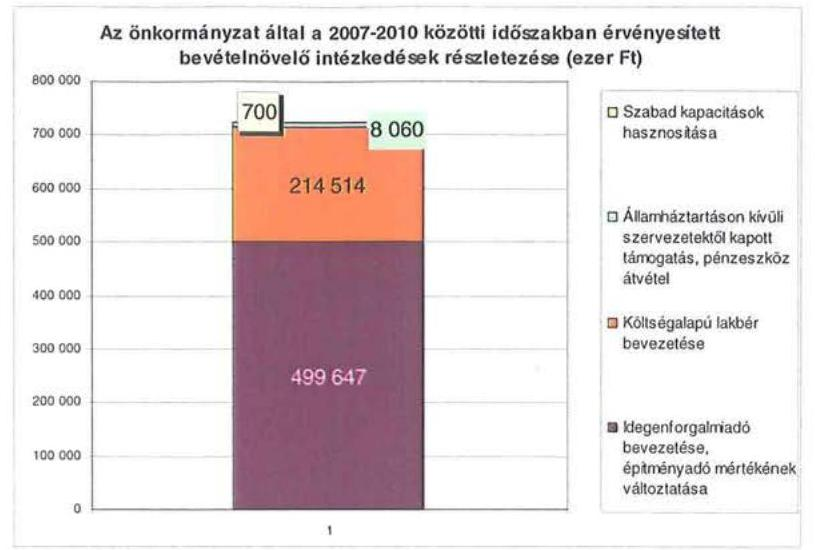

A bevétel növelésére irányuló intézkedések számszerűsített összege 723 millió Ft volt, az építményadó mértékének 200 Ft-tal történő megemelése, az idegenforgalmi adó és a költségalapú lakbér ${ }^{75}$ 2008. évi bevezetése, szabad kapacitások hasznosítása, szponzori támogatások eredményeként.

Az áttekintett időszakban az Önkormányzat kiadáscsökkentő és bevételnövelő intézkedései eredményeként összesen 2194 millió Ft kiadáscsökkenést és többletbevételt számolt el, amely $31,1 \%$-kal meghaladta és ezzel ellensúlyozta a költségvetési támogatások és az átengedett bevételek 1514 millió Ft-os, valamint az illetékbevételek 160 millió Ft-os, 2007. évhez viszonyított, együttesen 1674 millió Ft-os csökkenését.

# 5. A HELYI ÖNKORMÁNYZATOK GAZDÁLKODÁSI RENDSZERÉNEK 2009. ÉVI ELLENŐRZÉSE SORÁN A PÉNZÜGYI EGYENSÚLY JAVÍTÁSÁRA TETT SZABÁLYSZERŰSÉGI ÉS CÉLSZERŰSÉGI JAVASLATOK HASZNOSULÁSA 

Az ÁSZ az Önkormányzat gazdálkodását a 2009. évben ellenőrizte átfogó jelleggel. A pénzügyi egyensúly javítása érdekében egy célszerúségi és egy szabályszerűségi javaslatot tett. A számvevőszéki jelentést a Közgyűlés megtárgyalta, az intézkedési tervet 725/2009. (XII. 22.) számú határozatával elfogadta.

A jogszabályi előírások maradéktalan betartása érdekében javasoltuk a jegyzőnek, hogy „gondoskodjon az Ámr. 139. §(1) bekezdésében elöírtak alapján az Önkormányzat pénzállományának alakulását bemutató likviditási terv szükség szerinti aktualizálásáról".

A munka színvonalának javítása érdekében javasoltuk a jegyzőnek: „tájékoztassa - évente végzett számítások alapján - a Közgyűlést, hogy a hosszú lejáratú

[^0]
[^0]:    ${ }^{75}$ A költségalapú lakbér bevezetéséből származó többletbevétel 2009. évtől az Önkormányzat 100\%-os tulajdonában lévő Vagyongazdálkodási Zrt-nél realizálódott.

---

adósságot keletkeztető kötelezettségvállalásokból adódó tőke és kamatfizetési kötelezettségét az Önkormányzat milyen feltételek biztositása mellett tudja teljesiteni".

A jegyzőnek tett két javaslat hasznosítása céljából a 2009 évi költségvetési rendelet módosítása során, majd azt követően évente a költségvetés tárgyalása során a polgármester Közgyűlés elé terjesztette az aktualizált likviditási tervet, valamint tájékoztatta a Közgyűlést a hosszú lejáratú adósságot keletkeztető kötelezettségek teljesítésének feltételeiről.

Budapest, 2011. december „ 22 . "

Melléklet: $\quad 9 \mathrm{db}$
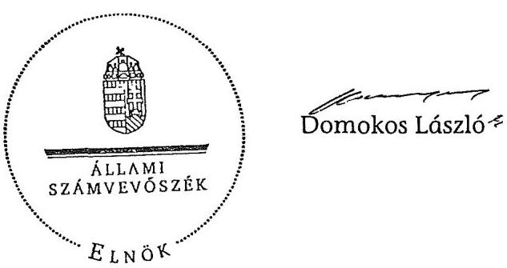

---

Nagykanizsa Megyei Jogú Város Önkormányzata

1. számú melléklet a V-3004-37-04. számú jelentéshez

Működési és felhalmozási célú hiány/többlet az Önkormányzat rendeleteiben

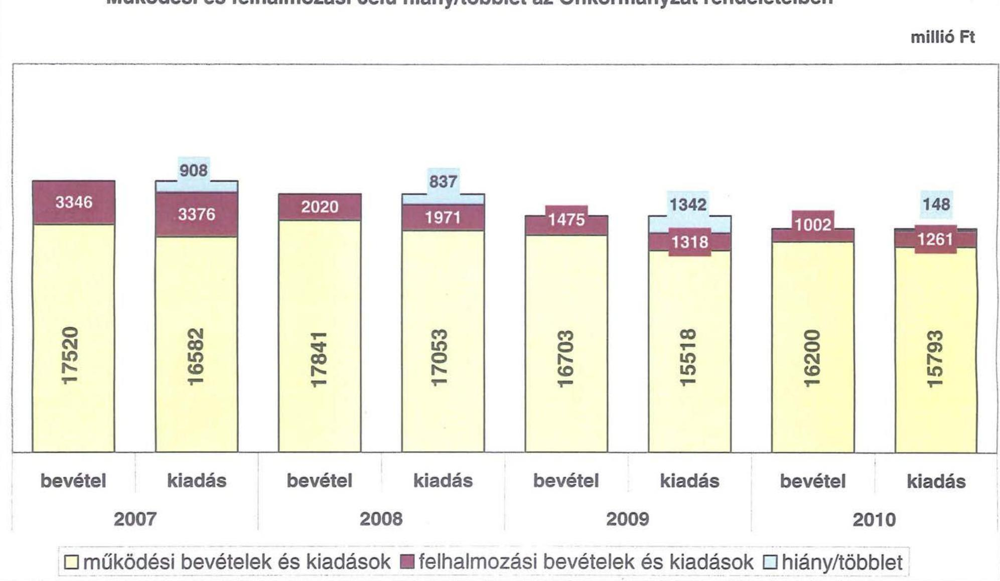

|   | 17529 | 17539 | 17582 | 17593  |
| --- | --- | --- | --- | --- |
|  |   |   |   |   |
|  |   |   |   |   |
|  |   |   |   |   |
|  |   |   |   |   |
|  |   |   |   |   |
|  |   |   |   |   |
|  |   |   |   |   |
|  |   |   |   |   |
|  |   |   |   |   |
|  |   |   |   |   |
|  |   |   |   |   |
|  |   |   |   |   |
|  |   |   |   |   |
|  |   |   |   |   |
|  |   |   |   |   |
|  |   |   |   |   |
|  |   |   |   |   |
|  |   |   |   |   |
|  |   |   |   |   |
|  |   |   |   |   |
|  |   |   |   |   |
|  |   |   |   |   |
|  |   |   |   |   |
|  |   |   |   |   |
|  |   |   |   |   |
|  |   |   |   |   |
|  |   |   |   |   |
|  |   |   |   |   |
|  |   |   |   |   |
|  |   |   |   |   |
|  |   |   |   |   |

---

Az Önkormányzat bevételeinek és kiadásainak, adószágyaságátalanak alakulásáról

|  1. FOLYÓ KÖLTSÉGVETÉS* | 2007. | 2008. | 2009. | 2010.  |
| --- | --- | --- | --- | --- |
|  1.1.1. Saját működési bevételek | 5 151 554 | 6 163 284 | 5 865 967 | 5 612 568  |
|  1.1.2. Költségvetési támogatás | 4 485 367 | 2 733 371 | 4 899 711 | 4 581 754  |
|  1.1.3. Keresedési bevételek | 2 086 348 | 522 158 | 309 188 | 1 075 135  |
|  1.1.4. Állandóáztartáson belülről kapott támogatások | 4 813 834 | 4 914 022 | 4 478 728 | 4 810 650  |
|  1.1.5. EU-nő és külföldből kapott bevételek | 4 350 | 50 | 321 | 50  |
|  1.1.6. Állandóáztartáson kívülről kapott bevételek | 33 270 | 123 085 | 65 401 | 8 477  |
|  1.1.7. Ehlal évi pénzmaradvány átvétel | 443 337 | 117 197 | 268 200 | 337 874  |
|  1.1. Folyó bevételek =1.1.1.+1.1.2.+1.1.3.+1.1.4.+1.1.5.+1.1.6.+1.1.7. | 17 018 236 | 17 973 367 | 16 567 522 | 16 433 918  |
|  1.2.1. Működési kiadások komafőindások nélkül | 14 146 623 | 14 856 866 | 13 965 713 | 13 936 232  |
|  1.2.2. Állandóáztartáson belülre átadott pénzeszközök | 227 534 | 233 094 | 55 593 | 85 203  |
|  1.2.2.1. műbalkozásoknak | 133 056 | 356 840 | 174 334 | 165 940  |
|  1.2.2.2. EU-nok, illetve külföldre | 2 100 | 2 200 | 2 450 | 2 250  |
|  1.2.2.3. magáncsomfizetését | 494 373 | 609 583 | 759 452 | 974 449  |
|  1.2.2.4. mogyorót szervezetekezt | 162 500 | 169 972 | 190 074 | 194 297  |
|  1.2.3. Fennelkektartások (=1.2.3.1+1.2.3.2+1.2.3.3+1.2.3.4) | 795 029 | 1 141 395 | 1 129 310 | 1 340 236  |
|  1.2.4. Komafőindások | 158 669 | 168 854 | 192 472 | 93 506  |
|  1.2.5. Ehlal évi pénzmaradvány átvétel | 443 337 | 117 197 | 268 200 | 337 874  |
|  1.2. Folyó kiadások = 1.2.3.+1.2.2.+1.2.3.+1.2.4.+1.2.5. | 15 771 592 | 16 517 096 | 15 510 294 | 15 793 237  |
|  1.3. Folyó költségvetés egyenlege MŰKÖDÉSI JÖVEDELEM (1.1. - 1.2.) | 1 247 044 | 1 455 761 | 1 049 228 | 640 679  |
|  2. FELHALMOZÁSI KÖLTSÉGVETÉS** |  |  |  |   |
|  2.1.1. Saját töbeltevételét | 351 947 | 230 159 | 48 990 | 168 606  |
|  2.1.2. Állandóáztartáson belülről kapott támogatások | 634 593 | 328 352 | 697 100 | 539 128  |
|  2.1.3. EU-nő és külföldről kapott támogatások | 0 | 214 | 0 | 0  |
|  2.1.4. Állandóáztartáson kívülről kapott támogatások | 164 670 | 93 120 | 61 417 | 60 368  |
|  2.1. Felhalmozási bevételek (=2.1.1.+2.1.2+2.1.3+2.1.4.) | 1 151 100 | 651 855 | 807 507 | 768 102  |
|  2.2.1. Saját beveléséről kiadás állva | 2 358 308 | 1 190 330 | 622 715 | 700 791  |
|  2.2.2. Saját felújítási kiadás állva | 297 221 | 224 551 | 362 497 | 416 932  |
|  2.2.3. Állandóáztartáson belülre átadott pénzeszköz | 68 601 | 103 051 | 27 150 | 0  |
|  2.2.4. EU-nok és külföldnek adott pénzeszközök | 0 | 0 | 200 | 0  |
|  2.2.5. Állandóáztartáson kívülre adott pénzeszközök | 574 350 | 372 718 | 204 936 | 143 746  |
|  2.2.6. Befektetési célú részeszékok vásárlása | 0 | 2 500 | 0 | 0  |
|  2.2. Felhalmozási kiadások (=2.2.1.+2.2.2.+2.2.3.+2.2.4.+2.2.5.+2.2.6.) | 3 258 484 | 1 893 558 | 1 317 504 | 1 261 469  |
|  2.3. Felhalmozási költségvetés egyenlege (2.1. - 2.2.) | -2 107 304 | -1 241 703 | -509 997 | -493 367  |
|  3. Finanszírozási műveletek nélküli (GFS) pozíció(1.3.+2.3.) | -860 260 | 214 058 | 539 231 | 147 312  |
|  4. Finanszírozási műveletek |  |  |  |   |
|  4.1. Hitelbővétel | 1 524 593 | 324 744 | 461 454 | 925 443  |
|  4.2. Hitelbizészítés | 427 521 | 458 606 | 133 868 | 352 582  |
|  4.3. Forgalási és befektetési célú értékpapírok kibocsátása | 0 | 0 | 0 | 0  |
|  4.4. Forgalási és befektetési célú értékpapírok beválása | 0 | 0 | 0 | 0  |
|  4.5. Forgalási és befektetési célú értékpapírok értékesítése | 0 | 0 | 0 | 0  |
|  4.6. Forgalási és befektetési célú értékpapírok vásárlása | 0 | 0 | 0 | 0  |
|  4.7. Egyéb finanszírozási bevételek (függő, áthusi, kiegysedési) | 36 489 | 111 089 | 337 | -417 698  |
|  4.8. Egyéb finanszírozási kiadások (függő, áthusi, kiegysedési) | 178 867 | -96 363 | 147 371 | 641 298  |
|  4.9. Finanszírozási műveletek egyenlege (4.1. - 4.2.+4.3.-4.4+4.5.-4.6.+4.7.-4.8.) | 954 714 | 73 592 | 180 552 | -386 175  |
|  5. Tárgyési pozíció(1.3.+ 2.3.+4.9.) | 94 454 | 287 650 | 719 783 | -238 863  |
|  6. Nettó működési jövedelem =működési jövedelem (1.3.) - tüketicízkezés (4.2+4.4) | 819 523 | 997 155 | 915 360 | 380 097  |
|  TÁJÉKOZTATÓ ADATOK |  |  |  |   |
|  Összes kötelezettség | 4 526 436 | 4 495 194 | 5 143 788 | 6 650 716  |
|  ebből rövid hjátrata | 1 283 950 | 887 940 | 1 238 104 | 1 640 740  |
|  Összes szállási kötelezettség | 659 405 | 371 169 | 223 604 | 372 817  |
|  ebből lejárt (tambólványból) | 82 393 | 26 983 | 55 147 | 15 633  |
|  Pénz és tőkepleri kötelezettség (szibiság) | 3 733 350 | 3 709 626 | 4 160 034 | 5 383 839  |
|  ebből rövid hjátrata | 494 152 | 175 132 | 254 350 | 373 870  |
|  PPP sorraldéses állomány jelszévtében (tambólványból) | 0 | 0 | 0 | 0  |
|  ebből lejárt szolgáltatási díj adati kötelezettség | 0 | 0 | 0 | 0  |
|  Folyózásmódott napf átlagos állománya (tambólványból) | 500719 | 248 551 | 150579 | 193695  |
|  Lövidőötti napf átlagos állománya (tambólványból) | 0 | 0 | 0 | 0  |
|  Hozásdíséttötti napf átlagos állománya (tambólványból) | 0 | 0 | 0 | 0  |
|  Részség és garanciavállalások (tambólványból) | 21984 | 21984 | 0 | 0  |
|  Jegyrő́s fénisági feltekeköd adatai kötelezettségek (tambólványból) | 0 | 0 | 0 | 1079  |
|  Finanszírozásba bevombató eszközök | 544 615 | 832 265 | 1 552 030 | 1 313 109  |
|  Törö́s kötelezettség megbízásból értékpapírok | 0 | 0 | 345 | 207  |
|  Hozati hjátrata huzásbizétek | 0 | 0 | 0 | 0  |
|  Érttőpapírok | 763 | 763 | 0 | 0  |
|  Pénzeszközök (áltagos pénzeszközök nélküli) | 544 252 | 831 902 | 1 551 685 | 1 312 822  |

- Revéselésben nem tétel, a kiadásában nem jelzék meg az amentizáció, a vagyoni helyszíni ** Revéselésben vagyon megfelelően itt felvétlen kiadását.

---

# Az Önkormányzat 2007-2015 években megvalósított, 2015. december 31-ig befejezett fejlesztéssel forrásékszabálnáról

|  Fejlesztési feladat (beruházás, felújítás) |  |  |  |  |  |  |  |  |  |  |  |  |  |  |  |  |  |  |  |  |  |  |  |  |  |  |  |  |  |  |  |  |  |  |  |  |  |  |  |  |  |  |  |  |  |  |  |  |  |  |  |  |  |  |  |  |  |  |  |  |  |  |  |  |  |  |  |  |  |  |  |  |  |  |  |  |  |  |  |  |  |  |  |  |  |  |  |  |  |  |  |  |  |  |  |  |  |  |  | 

---

# A2 Önkormányzat 2007-2010 években megvalósított, 2010. december 31-ig befejezett fejlesztései forrásásozottintéiről

|  Fejlesztési feladat (beruházás, felújítás) |  |  |  |  |  |  |  |  |  |  |  |  |  |  |  |  |  |  |  |  |  |  |  |  |  |  |  |  |  |  |  |  |  |  |  |  |  |  |  |  |  |  |  |  |  |  |  |  |  |  |  |  |  |  |  |  |  |  |  |  |  |  |  |  |  |  |  |  |  |  |  |  |  |  |  |  |  |  |  |  |  |  |  |  |  |  |  |  |  |  |  |  |  |  |  |  |  |  |  | 

---

Nagatartóra Megyei Jogú Város Önkormányzata

SZL számú meblélet a V-3542/2017. számú jelentékek

Az Önkormányzat 2010. december 31-én folyamatos lévő fejlesztési feladatalhoz kapcsolódó kötelezettségének összegzéviőről (A 2010. december 31-ig teljesített pénzügyi adatok alakulásáról)

szor Pi-ban

|   |  |  |  |  |  |  |  |  |  |  |  |  |  |  |  |  |  |  |  |  |  |  |  |  |  |  |  |  |  |  |  |  |  |  |  |  |  |  |  |  |  |  |  |  |  |  |  |  |  |  |  |  |  |  |  |  |  |  |  |  |  |  |  |  |  |  |  |  |  |  |  |  |  |  |  |  |  |  |  |  |  |  |  |  |  |  |  |  |  |  |  |  |  |  |  |  |  |  |  |  | 

---

A: Önkormányzat 2010. december 31-én folyamatos lévő fejlesztési feladatokhoz kapcsolódó 2010. évad követő kötelezettség-vállalásainak összegzéséről (A folyamatos lévő fejlesztések 2010. utáni kötelezettség-vállalásáról)

|  |   |   |   |   |   |   |   |   |   |   |   |   |   |   |   |   |   |   |   |   |   |   |   |   |   |   |   |   |   |   |   |   |   |   |
| --- | --- | --- | --- | --- | --- | --- | --- | --- | --- | --- | --- | --- | --- | --- | --- | --- | --- | --- | --- | --- | --- | --- | --- | --- | --- | --- | --- | --- | --- | --- | --- | --- | --- |
|   |  |  |  |  |  |  |  |  |  |  |  |  |  |  |  |  |  |  |  |  |  |  |  |  |  |  |  |  |  |  |  |  |   |
|   |  |  |  |  |  |  |  |  |  |  |  |  |  |  |  |  |  |  |  |  |  |  |  |  |  |  |  |  |  |  |  |  |   |
|   |  |  |  |  |  |  |  |  |  |  |  |  |  |  |  |  |  |  |  |  |  |  |  |  |  |  |  |  |  |  |  |  |   |
|   |  |  |  |  |  |  |  |  |  |  |  |  |  |  |  |  |  |  |  |  |  |  |  |  |  |  |  |  |  |  |  |  |   |
|   |  |  |  |  |  |  |  |  |  |  |  |  |  |  |  |  |  |  |  |  |  |  |  |  |  |  |  |  |  |  |  |  |   |
|   |  |  |  |  |  |  |  |  |  |  |  |  |  |  |  |  |  |  |  |  |  |  |  |  |  |  |  |  |  |  |  |  |   |
|   |  |  |  |  |  |  |  |  |  |  |  |  |  |  |  |  |  |  |  |  |  |  |  |  |  |  |  |  |  |  |  |  |   |
|   |  |  |  |  |  |  |  |  |  |  |  |  |  |  |  |  |  |  |  |  |  |  |  |  |  |  |  |  |  |  |  |  |   |
|   |  |  |  |  |  |  |  |  |  |  |  |  |  |  |  |  |  |  |  |  |  |  |  |  |  |  |  |  |  |  |  |  |   |
|   |  |  |  |  |  |  |  |  |  |  |  |  |  |  |  |  |  |  |  |  |  |  |  |  |  |  |  |  |  |  |  |  |   |
|   |  |  |  |  |  |  |  |  |  |  |  |  |  |  |  |  |  |  |  |  |  |  |  |  |  |  |  |  |  |  |  |  |   |
|   |  |  |  |  |  |  |  |  |  |  |  |  |  |  |  |  |  |  |  |  |  |  |  |  |  |  |  |  |  |  |  |  |   |
|   |  |  |  |  |  |  |  |  |  |  |  |  |  |  |  |  |  |  |  |  |  |  |  |  |  |  |  |  |  |  |  |  |   |
|   |  |  |  |  |  |  |  |  |  |  |  |  |  |  |  |  |  |  |  |  |  |  |  |  |  |  |  |  |  |  |  |  |   |
|   |  |  |  |  |  |  |  |  |  |  |  |  |  |  |  |  |  |  |  |  |  |  |  |  |  |  |  |  |  |  |  |  |   |
|   |  |  |  |  |  |  |  |  |  |  |  |  |  |  |  |  |  |  |  |  |  |  |  |  |  |  |  |  |  |  |  |  |   |
|   |  |  |  |  |  |  |  |  |  |  |  |  |  |  |  |  |  |  |  |  |  |  |  |  |  |  |  |  |  |  |  |  |   |
|   |  |  |  |  |  |  |  |  |  |  |  |  |  |  |  |  |  |  |  |  |  |  |  |  |  |  |  |  |  |  |  |  |   |
|   |  |  |  |  |  |  |  |  |  |  |  |  |  |  |  |  |  |  |  |  |  |  |  |  |  |  |  |  |  |  |  |  |   |
|   |  |  |  |  |  |  |  |  |  |  |  |  |  |  |  |  |  |  |  |  |  |  |  |  |  |  |  |  |  |  |  |  |   |
|   |  |  |  |  |  |  |  |  |  |  |  |  |  |  |  |  |  |  |  |  |  |  |  |  |  |  |  |  |  |  |  |  |   |
|   |  |  |  |  |  |  |  |  |  |  |  |  |  |  |  |  |  |  |  |  |  |  |  |  |  |  |  |  |  |  |  |  |   |
|   |  |  |  |  |  |  |  |  |  |  |  |  |  |  |  |  |  |  |  |  |  |  |  |  |  |  |  |  |  |  |  |  |   |
|   |  |  |  |  |  |  |  |  |  |  |  |  |  |  |  |  |  |  |  |  |  |  |  |  |  |  |  |  |  |  |  |  |   |
|   |  |  |  |  |  |  |  |  |  |  |  |  |  |  |  |  |  |  |  |  |  |  |  |  |  |  |  |  |  |  |  |  |   |
|   |  |  |  |  |  |  |  |  |  |  |  |  |  |  |  |  |  |  |  |  |  |  |  |  |  |  |  |  |  |  |  |  |   |
|   |  |  |  |  |  |  |  |  |  |  |  |  |  |  |  |  |  |  |  |  |  |  |  |  |  |  |  |  |  |  |  |  |   |
|   |  |  |  |  |  |  |  |  |  |  |  |  |  |  |  |  |  |  |  |  |  |  |  |  |  |  |  |  |  |  |  |  |   |
|   |  |  |  |  |  |  |  |  |  |  |  |  |  |  |  |  |  |  |  |  |  |  |  |  |  |  |  |  |  |  |  |  |   |
|   |  |  |  |  |  |  |  |  |  |  |  |  |  |  |  |  |  |  |  |  |  |  |  |  |  |  |  |  |  |  |  |  |   |
|   |  |  |  |  |  |  |  |  |  |  |  |  |  |  |  |  |  |  |  |  |  |  |  |  |  |  |  |  |  |  |  |  |   |

---

### Az Önkormányzat beadott, elbírálás alatti pályázati forrásból megvalósuló fejlesztéséhez kapcsolódó kötelezettség-vállalásainak összegzéséről

|  Fejlesztési feladat (beruházás, felújítás) |  |  | Beruházás, felújítás |  |  |  |  |  |  |  |  |  |  |  |  |  |  |  |  |  |  |  |  |  |  |  |  |  |  |  |  |  |  |  |  |  |  |  |  |  |  |  |  |  |  |  |  |  |  |  |  |  |  |  |  |  |  |  |  |  |  |  |  |  |  |  |  |  |  |  |  |  |  |  |  |  |  |  |  |  |  |  |  |  |  |  |  |  |  |  |  |  |  |  |  |  |  |  |  |  |  |  | 

---

.

---

## 4. számú melléklet a V-3042/2011. számú jelentéshez

## Az önkormányzati feladatok ellátásában résztvevő gazdasági társaságokról

|  Gazdasági társaság
megnevezése |  |  |  |  |  |  |  |  |  |  |  |  |  |  |  |  |  |  |  |  |  |  |  |  |  |  |  |  |  |  |  |  |  |  |  |  |  |  |  |  |  |  |  |  |  |  |  |  |  |  |  |  |  |  |  |  |  |  |  |  |  |  |  |  |  |  |  |  |  |  |  |  |  |  |  |  |  |  |  |  |  |  |  |  |  |  |  |  |  |  |  |  |  |  |  |  |  |  |  | 

---

.

---

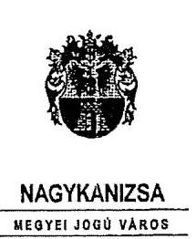

NAGYKANIZSA
MESYEI JOGÚ VÁROS

## POLGÁRMESTERE

Ikt.szám:4/ 551-7/2011.

Tárgy: Észrevétel jelentés-tervezetre

Állami Számvevőszék

Domokos László elnök

Tisztelt Elnök Úr!

Áttekintettük a Nagykanizsa Megyei Jogú Város Önkormányzata pénzügyi helyzetének 2011. júliusi ellenőrzéséről készített jelentés-tervezetet, melyre vonatkozóan az alábbi észrevételt tesszük:

Áttekintettük a Nagykanizsa Megyei Jogú Város Önkormányzata pénzügyi helyzetének 2011. júliusi ellenőrzéséről készített jelentés-tervezetet, melyre vonatkozóan az alábbi észrevételt tesszük:

A 2007-2010-es évek időszakát Városunk esetében a címzett támogatással megvalósuló fejlesztések befejező szakasza mellett a részben uniós támogatásból finanszírozott kis és közepes méretű beruházások, felújítások jellemezték. A tavalyi év már az idén kiteljesedő, több milliárdos hosszabb távú fejlesztési projektek előkészítésének, megkezdésének jegyében telt, vagyis elmondható, hogy a város fejlődése szempontjából rendkívül látványos esztendők előtt állunk.

Ez a változás finanszírozási szempontból is rendkívül komoly próbatétel elé állítja az Önkormányzatot, a helyzetet felismerve az elmúlt évek gazdálkodása során lehetőségeinkhez mérten igyekeztünk pénzügyi tartalékot képezni. Az elmúlt évek gazdálkodási folyamatait, mutatóit ez a várakozás alapvetően meghatározta, és ezt a helyzetet a jövőre vonatkozó középtávú gazdálkodási tendenciák alakulásának elemzésekor is figyelembe szükséges venni.

Az ún. CLF módszerrel számított nettó működési jövedelem pozitív alakulásában jelentős szerepet játszanak a vízvezeték-hálózat használatából befolyó bevételek, amelyekből az Önkormányzat jelenlegi vízvezeték felújításait, és kiemelten a térségi szennyvízcsatorna hálózat kiépítését célzó, idén induló, uniós támogatású nagyprojekt önrészét finanszírozza. Szintén a fenti működési jellegű jövedelem kategóriába kerültek besorolásra a 2007-2008-as évek nagyberuházásainak címzett támogatásai, amelyek a vonatkozó időszak hagyományos szemléletű beszámolóinak felhalmozási hiányát csökkentették.

Önkormányzatunk az elmúlt éveket rendre jelentős összegű pénzkészlettel, és ezzel párhuzamosan éven túli lejáratú hitel igénybe vételével zárta.

Ez a kettősség elsősorban a támogatások célhoz kötött felhasználását szigorúan előíró pályázati rendszerből ered, bizonyos esetekben pedig a tartalékolt összeg kedvező befektetésével az Önkormányzat többletbevételt tudott realizálni.

A pénzügyi ellenőrzésről készített jelentés-tervezetben az Önkormányzat deviza alapú hitelállományához kapcsolódó árfolyamveszteség 16 millió Ft értékben került számszerűsítésre, amely a pénzügyileg realizált többlet ráfordítás mutatója, a számviteli törvény előírásainak megfelelően a naptári év fordulónapjával előírt átértékelés alapján azonban ez az érték jóval nagyobb.

8800 NAGYKANIZSA, ÉRZSZÉET TÉR 7. TELEFOK: 00-93/500-701

---

2010. december 31-én a fordulónapi MNB CHF árfolyam alapján ezen a jogcímen 551 millió forint került elszámolásra, és a jelentés-tervezetben szereplő 5,4 milliárd forintos pénzintézeti kötelezettség ezt az átértékelést tartalmazza, ilyen formában pedig árfolyamváltozásból eredő különbözetnek tekinthetö. Ez, a valóságban egyelöre nem realizált, jelentös veszteségelem szerepel az Önkormányzat mérlegében, az árfolyamkockázat bemutatása tehát ebben az esetben a törvénybe épített kötelezettség.

A kamat és árfolyam változásában rejlő kockázat elemzése mindezek mellett folyamatos, a számítógépes nyilvántartás lehetővé teszi valamennyi hitel teljes futamidő alatti adósságszolgálatának kamat- és árfolyamváltozás függvényében történő átszámítását. Így egy kiemelkedően magas árfolyamváltozás is modellezhető. Ezen módszemek köszönhetően az Önkormányzat még az idei magas svájci frank árfolyam mellett sem kényszerül kiadási előirányzat növelésére.

A zömmel 15-20 éves futamidejú hitelek visszafizetésének pontos forrása nem került számszerüsitésre, de a potenciális bevételi elemek megvitatása, illetve az azok rendelkezésre állásában rejlő kockázat évről-évre ismertetésre kerül. Az önkormányzati hitelek futamidő alatt várható tőke- és kamatfizetési kötelezettsége rendszeresen kimutatásra és a Közgyülés elé terjesztésre került.

Az elmúlt években valóban történtek olyan átszervezések Városunkban, amelyek a müködési forma megváltoztatása révén a racionalizálás irányába hatottak. Az intézményi álláshelyek száma több esetben jelentősen csökkent, a feladatellátáshoz rendelt létszám változásának megállapításához viszont az új foglalkoztatási formára is figyelemmel kell lenni jogutódként létrejött gazdasági társaságoknál. Általában ugyanis a valóban jelentös kiadáscsökkenés mellett a feladat ellátása más jogcímen és valóban kisebb összegben, de továbbra is igénybe veszi az önkormányzat pénzügyi kapacitását.

Az Önkormányzat jelentös müködési kiadás csökkentő intézkedéseket készít elő ez év öszétől. Folyamatos feladatnak tekintjük mind müködési, mind pedig felhalmozási oldalon a hosszú távú fenntarthatóság érvényesülését, melynek fontosságát a CLF módszerrel számított müködési jövedelem alakulásában mutatkozó tendencia is erősíti. Az Önkormányzat az önként vállalt feladatok folyamatos felülvizsgálatával, a pénzügyi lehetőségek, mint mérlegelési szempont mind nagyobb érvényesítésével igyekszik a hosszú távú pénzügyi egyensúly feltételeit megteremteni.

Nagykanizsa, 2011. augusztus 25.
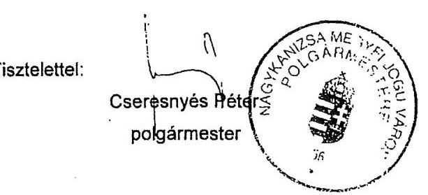

---

# Cseresnyés Péter úr 

polgármester
Nagykanizsa Megyei Jogú Város Önkormányzata
Nagykanizsa

## Tisztelt Polgármester Úr!

Köszönettel vettem a Nagykanizsa Megyei Jogú Város Önkormányzata pénzügyi helyzetének ellenőrzéséről készült jelentés-tervezet megállapításaival kapcsolatos észrevételeit. Az Ön által tett észrevételeket megvizsgáltuk, álláspontunkról az alábbiakban tájékoztatom.

A jelentés-tervezetben 16 millió Ft árfolyamveszteségként a tőketörlesztésekhez kapcsolódóan, az Önkormányzatot terhelő, a ténylegesen kimutatható árfolyamveszteséget számszerüsítettük, ami természetesen nem egyezik meg a számviteli szabályoknak megfelelően évvégén átértékelt és a mérlegben nyilvántartott deviza alapú kötelezettségek árfolyam különbözetével.

A devizában fennálló kötelezettségek év végi állományára vonatkozó észrevételét elfogadva az összegző (20. oldal 1. bekezdés) erre vonatkozó részét, valamint a jelentés 3.1 pontjának első szövegközi ábráját módosítottuk. A rövid lejáratú és hosszúlejáratú pénzintézeti kötelezettségek év végi állományát korrigáltuk az elszámolt árfolyamveszteség összegével, melyet az árfolyamváltozás soron bemutattuk.

Tájékoztatom továbbá, hogy a felhalmozási hitelek 2010. december 31-ei állományát - az Önök által pontosított tanúsítványok alapján - kérésüknek megfelelően a jelentésben módosítottuk.

Köszönöm Polgármester Úrnak és munkatársainak az ellenőrzés során tanúsított hozzáállását, amellyel az önkormányzat pénzügyi helyzetelemzés elkészítését segítették.

Budapest, 2011. december "22.".
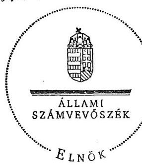

Tisztelettel:

## Domokos László

---

.