ÁLLAMI
SZÁMVEVŐSZÉK

# JELENTÉS 

Zalaegerszeg Megyei Jogú Város Önkormányzata pénzügyi helyzetének ellenőrzéséről (43/3)

---

# Számvevői Iroda 

Iktatószám: V-3054-07/2011.
Témaszám: 1015
Vizsgálat-azonosító szám: V056053.
Az ellenőrzést felügyelte:
Dr. Varga Sándor
számvevő igazgató-helyettes
Az ellenőrzést vezette:
Renkó Zsuzsanna
számvevő tanácsos
Az ellenőrzést végezték:
Dér Lívia Pálfiné Pusztai Magdolna Ritecz Tibor
számvevő tanácsos számvevő tanácsos számvevő tanácsos

A témához kapcsolódó eddig készített számvevőszéki jelentések:
címe
sorszáma
Jelentés a Zalaegerszeg Megyei Jogú Város Önkormányzata gaz- 0852 dálkodási rendszerének 2008. évi ellenőrzéséről

---

# TARTALOMJEGYZÉK 

BEVEZETÉS ..... 5
I. ÖSSZEGZŐ MEGÁLLAPÍTÁSOK, KÖVETKEZTETÉSEK, JAVASLATOK ..... 16
II. RÉSZLETES MEGÁLLAPÍTÁSOK ..... 25

1. Az Önkormányzat kötelező és önként vállalt feladatai ..... 25
2. Pénzügyi egyensúlyi helyzet alakulása ..... 31
2.1. A működési és felhalmozási egyensúly alakulása ..... 31
2.2. Az Önkormányzat bevételeinek alakulása ..... 38
2.3. Az Önkormányzat kiadásainak alakulása ..... 43
3. Kötelezettségek bemutatása ..... 48
3.1. A pénzintézetek felé fennálló kötelezettségek alakulása ..... 48
3.2. Szállítók felé fennálló kötelezettségek állománya ..... 51
3.3. Egyéb kötelezettségek alakulása ..... 52
4. A pénzügyi egyensúly megteremtése érdekében hozott intézkedések ..... 56
5. A helyi önkormányzatok gazdálkodási rendszerének 2008. évi ellenőrzése során a pénzügyi egyensúly javítására tett szabályszerűségi és célszerűségi javaslatok hasznosulása ..... 59

---

# MELLÉKLETEK 

1. számú A működési és felhalmozási célú hiány/többlet alakulása az Önkormányzat rendeleteiben
2. számú Az Önkormányzat bevételeinek és kiadásainak, adósságszolgálatának alakulásáról
3.a számú Az Önkormányzat 2007-2010. években megvalósított, 2010. december 31-ig befejezett fejlesztései forrásösszetételéről
3.b számú Az Önkormányzat 2010. december 31-én folyamatban lévő fejlesztési feladataihoz kapcsolódó kötelezettségeinek összegzéséről
3.c számú Az Önkormányzat 2010. december 31-én folyamatban lévő fejlesztési feladataihoz kapcsolódó 2010. évet követő kötelezettség-vállalásainak összegzéséről
3. d számú Az Önkormányzat beadott, elbírálás alatti pályázati forrásból megvalósuló fejlesztéseihez kapcsolódó kötelezettség-vállalásainak összegzéséről
4. számú Az önkormányzati feladatok ellátásában résztvevő gazdasági társaságokról

---

# RÖVIDÍTÉSEK JEGYZÉKE 

| Törvények |  |
| :--: | :--: |
| Áht. | az államháztartásról szóló 1992. évi XXXVIII. törvény |
| ÁSZ tv. | az Állami Számvevőszékről szóló 1989. évi XXXVIII. törvény (2011. július 1-jétől az Állami Számvevőszékről szóló 2011. LXVI. törvény) |
| Csődtv. | a csődeljárásról és felszámolási eljárásról szóló 1991. évi XLX. törvény |
| Gt. | a gazdasági társaságokról szóló 2006. évi IV. törvény |
| Htv. | a helyi önkormányzatok és szerveik, a köztársasági megbízottak, valamint egyes centrális alárendeltségű szervek feladat- és hatásköreiről szóló 1991. évi XX. törvény |
| Ötv. | a helyi önkormányzatokról szóló 1990. évi LXV. törvény |
| Számv. tv. | a számvitelről szóló 2000. évi C. törvény |
| Rendeletek |  |
| Áhsz. | az államháztartás szervezetei beszámolási és könyvvezetési kötelezettségének sajátosságairól szóló 249/2000. (XII. 24.) Korm. rendelet |
| SzMSz | Zalaegerszeg Megyei Jogú Város Önkormányzatának többször módosított 6/2007. (II. 9.) számú rendelete a Szervezeti és Működési Szabályzatáról |
| Szórövidítések |  |
| áfa | általános forgalmi adó |
| ÁROP | Államreform Operatív Program |
| ÁSZ | Állami Számvevőszék |
| beruházási társulás | Önkormányzati Társulás Zalaegerszeg és környéke csatornahálózat és szennyvíz tisztítótelep fejlesztésére |
| BM | Belügyminisztérium |
| EDP hiány/egyenleg | Uniós módszertan szerinti maastrichti kritériumoknak megfelelő számítás szerinti hiány/egyenleg |
| EU | Európai Unió |
| GDP | Bruttó hazai termék |
| jegyző | Zalaegerszeg Megyei Jogú Város Önkormányzatának jegyzője |
| Közgyűlés | Zalaegerszeg Megyei Jogú Város Önkormányzat Közgyűlése |
| NAV | Nemzeti Adó és Vámhivatal |
| NYDOP | ÚMFT Nyugat-Dunántúli Operatív Program |
| Önkormányzat | Zalaegerszeg Megyei Jogú Város Önkormányzata |
| PPP konstrukció | Public Private Partnership (Partnerségi együttműködés közfeladatok ellátására a magánszektor bevonásával) |
| polgármester | Zalaegerszeg Megyei Jogú Város Önkormányzat polgármestere |

---

| Polgármesteri hivatal | Zalaegerszeg Megyei Jogú Város Önkormányzat Polgármesteri Hivatala |
| :-- | :-- |
| szja | Személyi jövedelemadó |
| TISZK | Észak-Zalai Térségi Integrált Szakképző Központ Kiemelten Közhasznú Kht. |
| ÚMFT | Új Magyarország Fejlesztési Terv |

---

# JELENTÉS 

## Zalaegerszeg Megyei Jogú Város Önkormányzata pénzügyi helyzetének ellenőrzéséről

## BEVEZETÉS

Az Állami Számvevőszék 2011. évtől érvényes stratégiája új irányt szabott a helyi önkormányzatok gazdálkodásának ellenőrzésében is. Az ÁSZ - küldetése és jövőképe szerint - szilárd szakmai alapokra támaszkodva értékteremtő ellenőrzéseivel és helyzetelemzéseivel az államháztartás egészében, így a helyi önkormányzati alrendszerben is elő kívánja segíteni a közpénzek és a közvagyon szabályos, gazdaságos, hatékony és eredményes hasznosítását. Ennek részeként - a 2010. évi államháztartási hiány alakulásának összetevőire is figyelemmel folyamatban van az önkormányzati alrendszer pénzügyi helyzetelemzése.

Az NGM 2011 áprilisában közzétett adatai szerint ${ }^{1}$ a 2010. évi 1036,2 milliárd Ft összegű 3,8\%-os EDP (maastrichti kritériumok szerinti, Túlzott Hiány Eljárás keretében kimutatott) hiánycél nem volt tartható, az önkormányzati alrendszer tervezettet meghaladó hiánya miatt a GDP arányában kifejezett államháztartási hiány 4,2%-ra emelkedett.

Az önkormányzatok 2010 első három negyedévi költségvetési jelentése szerinti pénzforgalmi hiány 97 milliárd Ft-os összege nem indokolta az önkormányzati alrendszer 190 milliárd Ft-ra becsült hiányának 2010. évi végi felülvizsgálatát. A helyi önkormányzatok 2011. januári gyorsjelentése alapján a pénzforgalmi hiány már 247,7 milliárd Ft-ot tett ki. Az alrendszer hiánya így a tervezett 0,7%-kal szemben magasabb, 0,9%-os szinten realizálódott. Az 57,7 milliárd Ft hiánytöbblet alakulásában - a Tájékoztató szerint - az iparűzési adó elmaradása, a gépjárműadó, az illetékek és más bevételek tervezettnél alacsonyabb összegben való teljesülése volt a meghatározó.

Magyarország a Széll Kálmán Terv célkitűzései alapján² aktualizált Konvergencia Programjában a középtávú (2011-2015. évek) költségvetési pálya kijelölése során 2011-re a kormányzati szektor EDP módszertan szerinti egyenlegét $+2 \%$ -

[^0]
[^0]:    ${ }^{1}$ NGM Tájékoztatás Magyarország Strukturális Reformprogramjának végrehajtásáról (2011. április 1). A Tájékoztató évente két alkalommal - április és október hónapban jelenik meg.
    ${ }^{2}$ Az államháztartás 2011. évi egyenlege - a magán nyugdíjpénztárakból az állami nyugdíjpillérbe való visszatérés egyszeri vagyonhatása következtében - 4\%-os többletet mutatna. A Széll Kálmán Tervben foglalt egyszeri intézkedések - a MÁV, a BKV adósságrendezése, a PPP projektek kiváltása - összességében a GDP 2\%-ával csökkentik a várható többlet mértékét.

---

ban jelölte meg. Az egyenlegcél megfogalmazásakor az önkormányzati alrendszer tervezett hiányát a 2011. évi költségvetésben szereplő 0,3%-kal szemben 0,5%-os arányban határozták meg ${ }^{3}$. A hiánycélok meghatározása jelzi, hogy az önkormányzati alrendszerben 2011-ben fokozott figyelmet kell fordítani a pénzügyi egyensúlyi helyzet alakulására.

Az államháztartás helyi szintjén a 23 megyei jogú városi önkormányzatnak az általuk ellátott közszolgáltatások volumenére való tekintettel kiemelt szerepe van, e települések népessége összességében meghaladja a kétmillió főt ${ }^{4}$. A települések népességét az alábbi diagram szemlélteti:
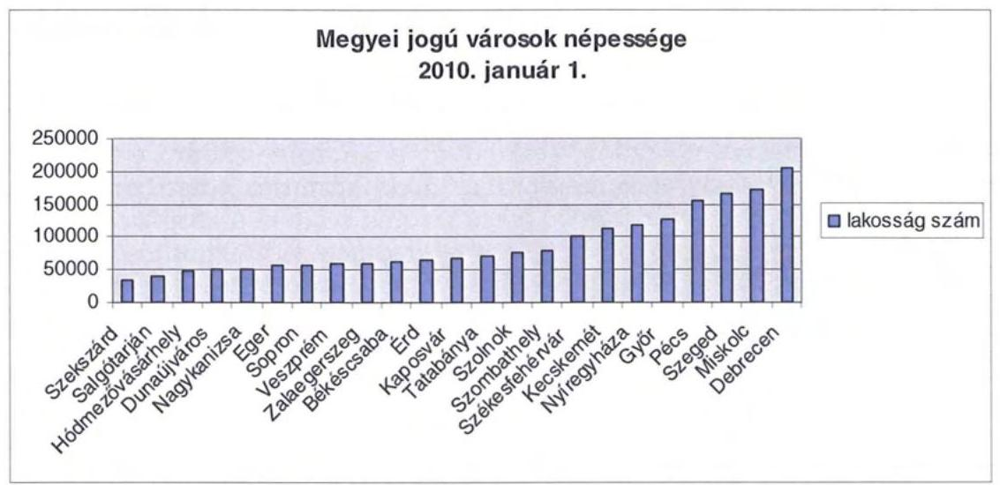

A megyei jogú városi önkormányzatok ${ }^{5}$ kötelező feladatellátását többlépcsős törvényi előírások határozzák meg. A feladatokra vonatkozó szabályozás első szintjét az Ötv. ${ }^{6}$, a második szintet a hatásköri7, a harmadik szintet a további ágazati, szakmai (egyebek mellett az oktatási, egészségügyi, szociális és egyéb ágazati feladatok ellátásának szakmai szabályait rögzítő) törvények adják.

A megyei jogú városi önkormányzatok - az Ötv-ből közvetlenül levezethető települési feladatok mellett körzeti közszolgáltatásokat is ellátnak. A megyei

[^0]
[^0]:    ${ }^{3}$ A Magyar Köztársaság 2011. évi költségvetéséről szóló 2010. évi CLXIX. törvény Általános indoklásának III. fejezete, valamint Magyarország Konvergencia Programja 2011-2015. (2011. április) Táblázatok rész, 2. táblázat Államháztartás összefoglaló adatai szerint.
    ${ }^{4}$ A megyei jogú városok népességét a 4/2011. (I. 31.) NGM rendelet 1. sz. mellékletében foglalt 2010. január 1-i adatok alapján vettük figyelembe.
    ${ }^{5}$ Az Ötv. 61. § (1) bekezdése alapján a megyeszékhely város a törvény erejénél fogva megyei jogú, ugyanakkor az Országgyűlés az ötvenezernél nagyobb népességű városokat a képviselőtestület kérelmére megyei jogú várossá nyilváníthatja. Ez utóbbi körbe 5 város tartozik, közülük 2 (Hódmezővásárhely, Dunaújváros) népessége 2010. január 1-ére már ötvenezer fő alá csökkent.
    ${ }^{6}$ az Ötv. 8. és 61. §-ában foglaltak szerint
    ${ }^{7}$ a Htv.

---

jogú városi cím elsősorban többlet kötelezettségekkel jár, a megyei jogú városnak önmagának kell gondoskodnia mindazokról a feladatokról, amelyek más települési önkormányzatok esetében a megyei önkormányzat feladatát képezik. Ide sorolható többek közt a középfokú oktatási intézmények fenntartása, a közművelődési, könyvtári és levéltári szolgáltatás, a társadalombiztosítás finanszírozása mellett a kórházi és a rendelőintézeti szakellátás, a szociális és egyes gyermekvédelmi feladatok ellátása. Ezeket a feladatokat (intézményeket) a megyei jogú város - más városoktól eltérően - nem adhatja át a megyei önkormányzatnak, azonban az Ötv. lehetőséget biztosít arra, hogy a megyei önkormányzattal megállapodjék a feladatellátás megosztásában.

Az önkormányzat, így a megyei jogú város is, maga határozza meg, hogy - a lakosság igényei alapján, anyagi lehetőségei függvényében - mely feladatokat, milyen mértékben és módon, mely szervezeti keretek közt lát el. A szervezetalakítás szabadsága a megyei jogú városok esetében azzal járt, hogy mind a kötelező közszolgáltatásoknál (különösen a településüzemeltetés, vagyongazdálkodás), mind pedig az önként vállalt feladataik ellátásában - elsősorban a sport és kulturális szolgáltatások területein - a gazdasági társaságok kiemelt fontosságú szerephez jutottak. Ily módon a gazdálkodás, a pénzügyi helyzet kockázatai közvetlenül kikerültek ugyan az önkormányzati alrendszerből, azonban sérülhet az ellátási felelősség figyelemmel kísérése és érvényesítése, a közpénzek felhasználásának transzparenciája. Mindezek együttvéve - a beszámolók konszolidálásának hiányában - növelik a megyei jogú városok pénzügyi helyzetének megítélésében rejlő kockázatokat.

Az áttekintett időszakban az önkormányzati feladatok ellátásának keretet biztosító forrásszabályozás elvei lényegesen nem változtak.

A megyei jogú városok önkormányzatainak mozgásterét, az önkormányzatok feladatellátásra vonatkozó döntéseit a központi költségvetéstől való függőség mellett jelentősen befolyásolja a helyi adókivetési jog gyakorlása ${ }^{8}$. A helyi adók rendszere a közszolgáltatások finanszírozásához szükséges források megteremtésének, bővítésének eszköze, amely a gazdasági válság, a jogszabályi környezet, az adópolitika változása, az adóhatóságok tevékenysége következtében differenciáltan érinti a települési önkormányzatokat ${ }^{9}$.

A települési önkormányzatok saját folyó bevételeinek keretében elszámolt, különböző jogcímeken kivetett helyi adók - iparűzési adó, építmény és telekadó, idegenforgalmi adó, vállalkozók és magánszemélyek kommunális adója -2007-2010 között eltérő módon emelkedtek. A helyi adókból származó bevételek realizált összege országos szinten 2007-2009 között folyamatosan, 505,3 milliárd Ft-ról 566,3 milliárd Ft-ra emelkedett, majd a gazdasági válság hatásai következtében 2010-re 542,6 milliárd Ft-ra esett vissza. A helyi adók részesedése

[^0]
[^0]:    ${ }^{8}$ a helyi adókról szóló 1990. évi C. törvény szabályai szerint
    ${ }^{9}$ Az Állami Számvevőszék 2010 decemberében közzétett 1031. számú jelentésében értékelte a helyi adók rendszerében a hatékonyság és az eredményesség érvényesülését.

---

az önkormányzatok saját folyó bevételein belül 2007-2010 között 2,5 százalékponttal csökkent ${ }^{10}$.

A megyei jogú városok saját folyó bevétele 2007-ben 191,5 milliárd Ft volt, 2008-ban 223,1, 2009-ben 225,4, 2010-ben 223,5 milliárd Ft-ot tett ki. A helyi adóbevételekből való részesedésük 2007-ben 110,5
 milliárd Ft (21,9\%), 2008-ban 128,3 milliárd Ft (23,2\%), 2009-ben 124,4 milliárd Ft (22\%), 2010-ben 118,7 milliárd Ft (részaránya a 2007. évivel azonosan 21,9\%) volt. E realizált adóbevételek a megyei jogú városok saját folyó bevételeinek 2007-ben 57,7, 2008-ban 57,5, 2009-ben 55,2, 2010-ben 53,1\%-át jelentették. A helyi adóbevételek 2007-ről 2010-re kimutatott 4,6 százalékpontos csökkenése annak ellenére következett be, hogy a megyei jogú városok saját folyó bevétele 2010-ben $16,7 \%$-kal haladta meg a 2007. évit.

A helyi adókon belül a települések gazdasági helyzetének egyik fokmérője az elért helyi iparűzési adóbevétel, amely a megyei jogú városok körében erőteljes - a település nagyságrendtől is függő ${ }^{11}$ - különbségeket mutat. A helyi iparűzési adóbevétel és annak egy lakosra vetített összegének 2007. és 2010. évi alakulását az alábbi diagramok szemléltetik:
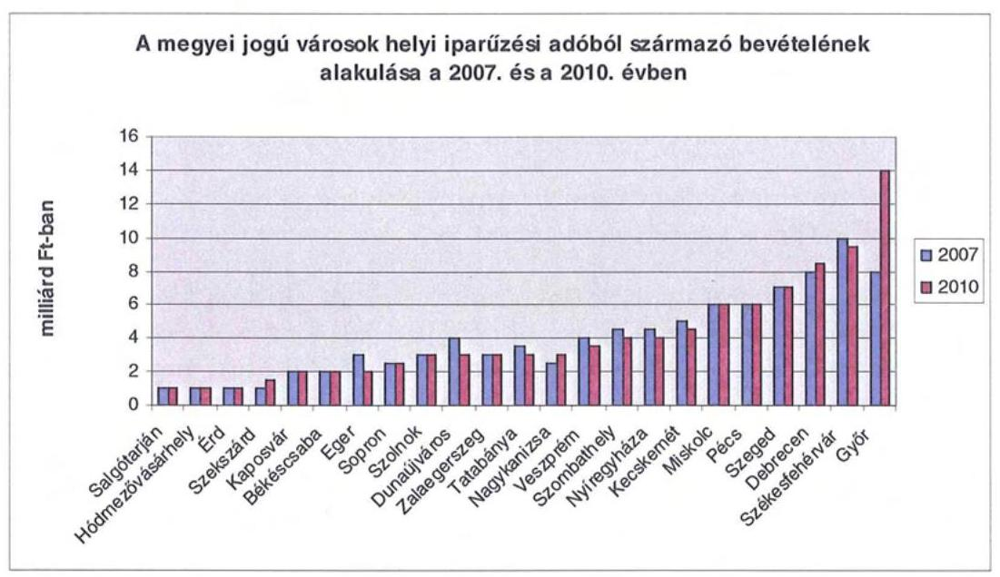

[^0]
[^0]:    ${ }^{10}$ A helyi adó bevételek saját folyó bevételekből való részesedése országosan 2007-ben $55,3 \%, 2010$-ben $52,8 \%$ volt.
    ${ }^{11}$ A 100 ezer fő feletti népességű megyei jogú városok csoportjába Debrecen, Miskolc, Szeged, Pécs, Győr, Nyíregyháza, Kecskemét, Székesfehérvár tartozik. Nem megyeszékhely megyei jogú város Érd, Sopron, Nagykanizsa, Dunaújváros, Hódmezővásárhely.

---

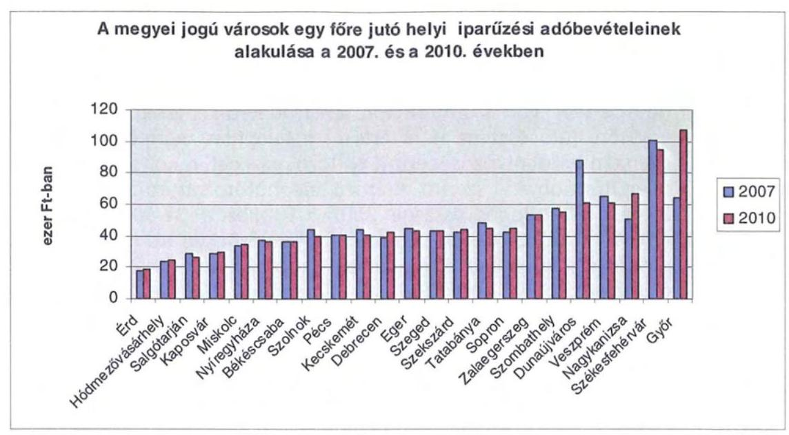

A megyei jogú városi önkormányzatok saját bevételein belül második legjelentősebb elem az illetékbevétel. A 2010. évben befolyt 39,2 milliárd Ft illetékbevétel a 2006. évben realizált 71,1 milliárd Ft illetékbevétel alig több mint $55 \%$-a. A jelentős visszaesést döntően az ingatlanpiac stagnálása, majd visszaesése, illetve egyes illetékkedvezmények bevezetése okozta. A kieső bevételek pótlására az önkormányzati alrendszer szintjén történtek intézkedések, 2010-ben 5 milliárd Ft-ot, 2011-ben 1,2 milliárd Ft-ot ellentételezett a központi költségvetés. A megyei jogú városok önkormányzatai az önkormányzati alrendszer szintjén realizált illetékbevételből 2007-ben 13,6 milliárd Ft-tal (23,3\%-kal), 2008-ban 15,3 milliárd Ft-tal (22,7\%-kal), 2009-ben 12,6 milliárd Ft-tal (21,5\%-kal), 2010-ben 7,9 milliárd Ft-tal (20,2\%-kal) részesedtek ${ }^{12}$. Az összes befolyt illetékbevételből a megyei jogú városok részesedése 2009-ről 2010-re mindössze 1,3 százalékponttal csökkent, ugyanakkor a realizált illetékbevétel csökkenése a $37,3 \%$-ot ( 4,7 milliárd Ft) is elérte.

Az önkormányzati alrendszer átengedett bevételei közül a személyi jövedelemadóból való részesedés makroszintű szabályozása a vizsgált időszakban nem változott. A települési önkormányzatokat a településre kimutatott személyi jövedelemadó $8 \%$-a közvetlenül, míg $32 \%$-a külön szabályozott visszaosztási rendben illeti meg. A visszaosztás a jövedelem differenciálódás mérséklésével párosul, rendje a lakóhelyen maradó személyi jövedelemadóhoz és az iparűzési adó-erőképességhez ${ }^{13}$ igazodik, annak részletszabályait a mindenkori költségvetési törvény 4. számú melléklete határozza meg. A jövedelemdifferenciálódás

[^0]
[^0]:    ${ }^{12}$ Az illetékek kivetésének és beszedésének joga 2006. december 31-ig a megyei önkormányzatok feladata volt, amelyet a 2007. évtől az APEH (2011. január 1-jétől NAV) vett át. Az önkormányzati illetékrészesedési szabályok változatlanok maradtak, azonban az illetékbeszedés költségeit az önkormányzatok illetékbevételeiből átlagos (a megyei jogú városoknál $8,5 \%$-os) kulcsot alkalmazva vonták le.
    ${ }^{13}$ Az iparűzési adóerő-képesség egy potenciális, átlagos erőfeszítés mellett elérhető (a települési önkormányzat iparűzési adóelőlegét meghatározó adóalap 1,4\%-ának megfelelő számított) bevétel.

---

szabályai kétirányúak, a kiegészítés és a visszatartás feltételeit egyaránt meghatározták:

- Amennyiben az önkormányzatot közvetlenül megillető személyi jövedelemadó bevétel és a számított iparűzési adóerő-képesség együttesen számított, egy főre jutó összege nem érte el a település méretéhez kapcsolódóan az évenkénti szabályozás szerinti változó összeget, a költségvetés a részesedést település nagyság szerint eltérően meghatározott szintig - kiegészítette ${ }^{14}$. A kiegészítés fajlagos összege 2007-2010 között 37500 Ft-ról 48010 Ft-ra (10 510 Ft-tal, 28\%-kal) emelkedett. Az előzőeken túl a jövedelem differenciálódás szabályozása egyes térségi (középiskolai, szakiskolai, szakképző intézményi, kollégiumi) feladatok ellátásának függvényében további kiegészítő hozzájárulást biztosított.
- Amennyiben az egy főre számított személyi jövedelemadó és az iparűzési adóerő-képesség együttes összege a település nagyságrendjéhez rendelt értékhatárt több mint $25 \%$-kal (2010-től 20\%-kal) meghaladta, az egy főre jutó összeg sávonként differenciált módon ${ }^{15}$ visszavonásra került az önkormányzatot megillető normatív állami hozzájárulás összegéből.

Az önkormányzatok személyi jövedelemadó bevétele 2007-ben 494,3 milliárd Ft, 2008-ban 558,6 milliárd Ft, 2009-ben 639,5 milliárd Ft, 2010-ben 681,2 milliárd Ft volt, az időszak alatt összegében 186,9 milliárd Ft-tal, 37,8\%-kal emelkedett, miközben az szja bevétel átengedett bevételeken belüli részesedése 1,8 százalékponttal emelkedett.

A megyei jogú városok önkormányzatainak személyi jövedelemadó részesedése az alrendszer átengedett személyi jövedelemadó bevételeiből 2007-ben 77,6 milliárd Ft-ot ( $15,7 \%$-ot), 2008-ban 105,4 milliárd Ft-ot ( $18,9 \%$-ot), 2009-ben 122,9 milliárd Ft-ot ( $19,2 \%$-ot), 2010-ben 136,6 milliárd Ft-ot ( $20,1 \%$-ot) tett ki. A realizált szja bevétel a megyei jogú városoknál az időszak alatt folyamatosan emelkedett, a 2010-ben realizált adóbevétel 59,0 milliárd Ft-tal (76\%) volt magasabb a 2007. évinél, az átengedett bevételeken belüli részesedése 2010-re 5,1 százalékponttal haladta meg a 2007. évi részarányt ${ }^{16}$. A részesedés alapjául szolgáló szja településenként eltérő, az egy adózóra jutó szja 2009. évi adatait ${ }^{17}$ a következő ábra szemlélteti.

[^0]
[^0]:    ${ }^{14}$ A megyei jogú városok esetében a jövedelemkülönbségek mérséklésénél figyelembe veendő lakosonkénti értékhatár 2007-ben 37500 Ft, 2008-ban 42385 Ft, 2009-ben 45933 Ft, 2010-ben 48010 Ft volt.
    ${ }^{15}$ A sávos értékhatár 2010-től 20\%-os intervallumonként, 120\% felett a visszatartást $25 \%$-tól $90 \%$-os mértékig rögzíti. Amennyiben a település nagyságrendhez rendelt értékhatár összege az önkormányzatnál eléri vagy meghaladja a 200\%-ot, az egy főre jutó összeg $90 \%$-a levonásra kerül. Az értékhatár sávjai 2010 előtt $25 \%$-os léptékűek voltak, a levonási arányok az ellenőrzött időszakban nem változtak.
    ${ }^{16}$ E bevételek a megyei jogú városok átengedett bevételeiben 2007-ben 84,7, 2008-ban 87,7, 2009-ben 89,7, 2010-ben 89,8\%-os részarányt jelentettek.
    ${ }^{17}$ Adatforrás: KSH Megyei Jogú Városok a Közép Dunántúlon 2009. kiadványa, 4.1. sz. összehasonlító tábla.

---

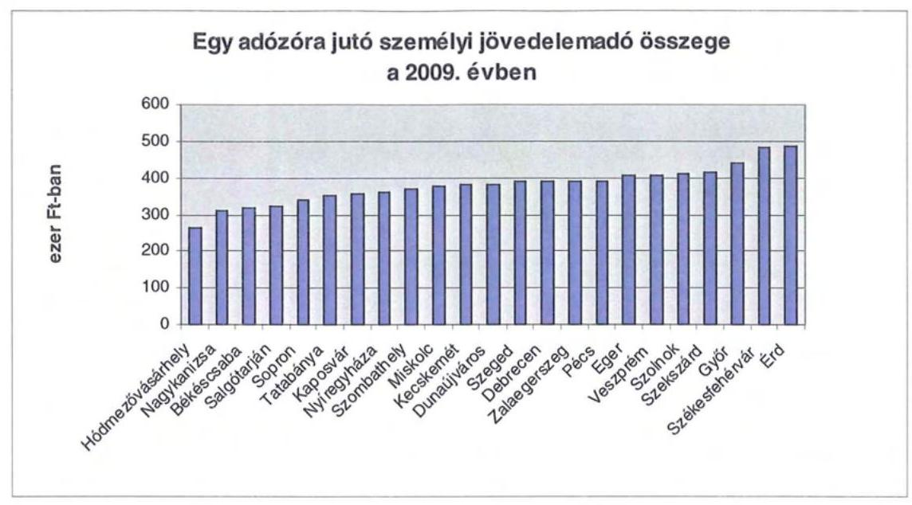

Az átengedett bevételek második legjelentősebb eleme a gépjárműadó, amelynek bevételi szabályozása az ellenőrzött időszakban nem változott, az adóbevétel teljes összege az önkormányzatot illeti meg. A gépjárműadó alapját, mértékét ${ }^{18}$ és egyes mentességi kategóriákat érintő módosítások 2010. január 1-től következtek be, amelyek az egyes adótételek esetében átlagosan $15 \%$-os emelkedéssel jártak.

A gépjárműadó beszedéséből származó bevétel az önkormányzati alrendszer szintjén 2007-ben 62,4 milliárd Ft, 2008-ban 65,7 milliárd Ft, 2009-ben 63,8 milliárd Ft, 2010-ben 71,1 milliárd Ft volt, az adóbevétel egésze 2007-hez képest 8,7 milliárd Ft-tal, 13,9\%-kal emelkedett. A gépjármű-adóztatás szabályainak változása 2010-ben 7,3 milliárd Ft többletet eredményezett. A megyei jogú városok gépjárműadó bevétele a 2007. évi 14,0 milliárd Ft-ról 2010-re 15,5 milliárd Ft-ra, 10,7\%-kal emelkedett. A bevételnövekedés összegéből 1,4 milliárd Ft a 2010. évi adózási szabályok következménye.

A megyei jogú városok önkormányzatai 2007-2010 között rendelkezésre álló forrásainak alakulását a következő ábra szemlélteti:

[^0]
[^0]:    ${ }^{18}$ A gépjárműadóról szóló 1991. évi LXXXII. törvény 7. § (1) bekezdésében foglalt adómértékek változása.

---

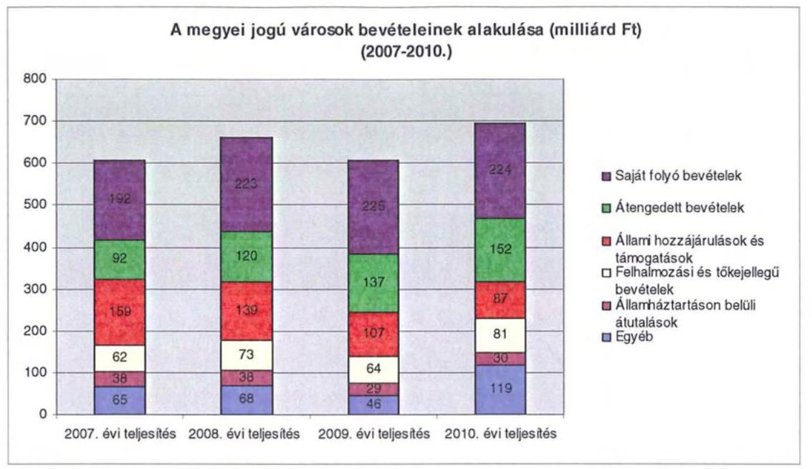

A megyei jogú városok saját folyó bevételeinek - amelyek főbb elemei: a helyi adók, az illetékbevételek, az intézményi térítési díjak, a kamatbevételek - részaránya a 2007. évi összbevételen ( 608 milliárd Ft) belül 32\% volt. A 2010. évi összbevétel 693 milliárd Ft-os összegéből a saját folyó bevételek aránya - miközben összege 2007-ről 2010-re 32 milliárd Ft-tal emelkedett - nem változott.

Az átengedett bevételek, amelyek a megyei jogú városok önkormányzatainál döntően a személyi jövedelemadó és a gépjárműadó részesedést jelenti, az összbevételen belül a 2007. évi 92 milliárd Ft-ról (15\%) 152 milliárd Ft-ra nőtt, részesedése 7 százalékponttal emelkedett. A 60 milliárd Ft-os növekedésből 59 milliárd Ft-ot az szja részesedés emelkedése okozott.

Az állami hozzájárulások és támogatások - amelyek főbb elemei: főként az ellátotti létszámhoz kötődő normatív állami hozzájárulások, központosított előirányzatok - a 2007. évi 159 milliárd Ft-ról (26\%-os részarányról) 2010-re 87 milliárd Ft-ra ( $13 \%$-os részarányra) estek vissza.

A felhalmozási és tőkejellegű bevételek - tárgyi eszközök (ingatlanok és ingóságok), föld és immateriális javak, részesedések értékesítése, EU-tól átvett pénzeszközök - a 2007. évi 62 milliárd Ft-ról (10\%-os részarányról) 2010-re 81 milliárd Ft-ra ( $12 \%$-os részarányra) emelkedtek.

Az államháztartáson belüli átutalások részesedése 2007-ben 38 milliárd Ft volt. 2010. év végére 8 milliárd Ft-tal csökkent, részaránya 6\%-ról 2010-ben $4 \%$-ra változott. Ez a bevételi kategória tartalmazza az Egészségbiztosítási Alaptól és más elkülönített állami pénzalapoktól átvett forrásokat. A 2010-ben e címen elszámolt bevétel a megyei jogú városoknál 22 milliárd Ft-ot tett ki.

Az egyéb, pénzmaradványból, vállalkozási bevételekből, államháztartáson kívülről származó átutalásokból, a hitelekből, a hosszú és rövid lejáratú értékpapírok értékesítéséből származó bevételek részesedése a 2007-2010. évek vi-

---

szonylatában 11\%-ról 17\%-ra emelkedett. Ez utóbbiak 2010. évi beszámoló szerinti összevont teljesítése 119 milliárd Ft volt ${ }^{19}$.

Mindezeket figyelembe véve a megyei jogú városok 2007. és 2010. évi forrásöszszetételének megoszlását az alábbi ábra szemlélteti:

A megyei jogú városok 2007. és 2010. évi forrásösszetétele
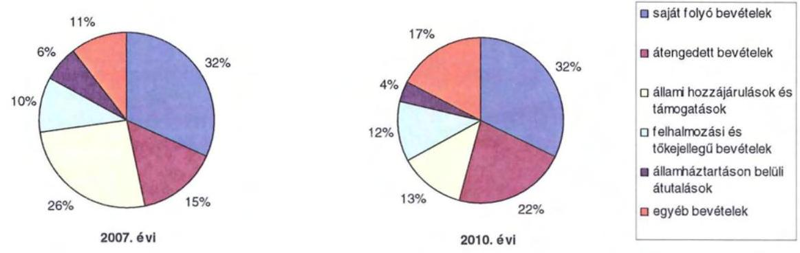

Az önkormányzati alrendszer pénzügyi helyzetértékelése során új elemzési módszereket alkalmaz az ellenőrzés. A hagyományos költségvetési szerkezet helyett az önkormányzat pénzügyi helyzetét a CLF módszerrel mutatjuk be, amelynek lényegét és számításának módszerét a 2.1. pontban, és a jelentés 2. számú mellékletében ismertetjük részletesen.

Az új módszereken alapuló helyzetértékelés fontosságát az adja, hogy a helyi önkormányzatok bruttó adósságállománya ${ }^{20}$ a 2010. évi költségvetési beszámoló alapján 1248 milliárd Ft-ot tett ki. Az adósságállomány koncentráltságát jelzi ${ }^{21}$, hogy ebből a 23 megyei jogú város részesedése 338 milliárd Ft volt, amely a fővárosi és kerületi önkormányzatok adósságának figyelmen kívül hagyásával számított 2010. évi 977 milliárd Ft összegű bruttó adósságállomány $34,6 \%$-át jelentette. Az adósságállomány több mint fele - 501 milliárd Ft - a 19 megyei önkormányzatnál és a 23 megyei jogú városnál jelentkezett.

[^0]
[^0]:    ${ }^{19}$ Az egyéb bevételek összege 2007-2010 között eltérő módon változott, 2007-ben 65 milliárd Ft, 2008-ban 68 milliárd Ft volt, 2009-ben 46 milliárd Ft-ra esett vissza, majd 2010-ben több mint két és félszeresére, 119 milliárd Ft-ra emelkedett.
    ${ }^{20}$ A bruttó adósságállomány 2010. év végi összege magában foglalja a fejlesztési és a működési célú kötvénykibocsátások, a beruházási és fejlesztési hitelek, a működési célú hosszú lejáratú hitelek, a rövid lejáratú hitelek, váltótartozások miatti kötelezettségek teljes (2011-ben, illetve az azt követő években esedékes) állományát.
    ${ }^{21}$ A megyei jogú városok adósságállománya összegében ugyan elmarad az egyéb városok összesített adósságától [(ez utóbbiak részesedése 382,6 milliárd Ft (39,2\%)], azonban az egyéb városok száma 304. A fővárosi és a kerületi önkormányzatok nélküli adósságállományból a 19 megyei önkormányzat 163 milliárd Ft-tal ( $16,8 \%$-kal), míg a nagyközségek, községek együttesen 93 milliárd Ft-tal (9,5\%-kal) részesednek.

---

A megyei jogú városok 338 milliárd Ft-os adósságállományából 175 milliárd Ft $(51,8\%)$ a 8 legnagyobb, 100 ezer fő feletti népességű város tartozása. Az 5 nem megyeszékhely megyei jogú város bruttó adósságállománya 70 milliárd Ft-ot (20,7\%-ot), az előző két csoportba nem tartozó további 10 megyei jogú város adóssága 93 milliárd Ft-ot (27,5\%-ot) tett ki.
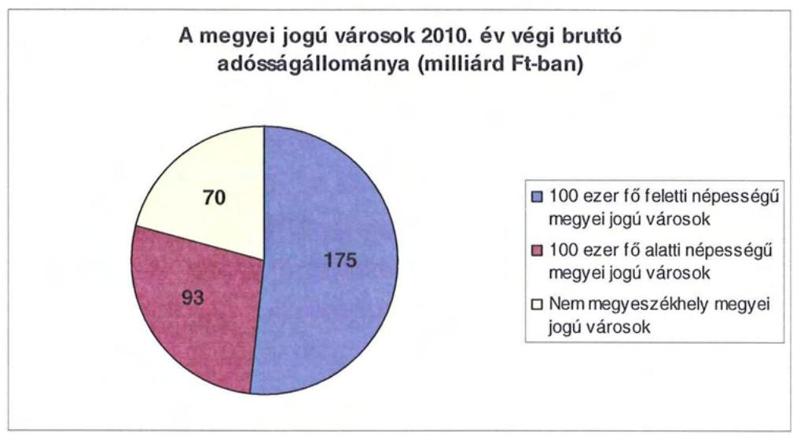

A mérlegben kimutatott bruttó adósságállomány mellett az önkormányzatok számára az eszközállomány műszaki állapotának megőrzése is kötelezettségekkel jár. Az elhasználódott eszközök pótlására forrást biztosító amortizációs (felújítási) alap képzésének ${ }^{22}$ elmaradása maga után vonhatja a feladatellátást kiszolgáló tárgyi eszközök állagának erőteljes romlását. Emellett a 2007-2013-as időszakra meghirdetett, vissza nem térítendő EU-s fejlesztési forrásokhoz való hozzájutás lehetősítette az önkormányzati alrendszer fejlesztési igényeit, amelyek a felhalmozási költségvetési hiány folyamatos emelkedésén túl - az előírt jövőbeni fenntartási kötelezettség miatt - tovább terhelhetik az önkormányzatok költségvetését ${ }^{23}$.

Az ÁSZ a 2011. évi ellenőrzési tervében 43. számú, az Önkormányzatok gazdálkodási rendszerének ellenőrzése részeként egy időben, egymással párhuzamosan tekinti át, és elemzi a 23 megyei jogú városi önkormányzat pénzügyi helyzetét. A gazdálkodás szabályszerűségét az ÁSZ az előző évek során ebben az önkormányzati körben is ellenőrizte, ezért jelen vizsgálatunk erre nem tér ki. A jelentés a megyei jogú városok sajátos feladatellátási és forrásszabályozási helyzeté-

[^0]
[^0]:    ${ }^{22}$ Erre a jelenlegi szabályozási környezetben nem kötelezi semmilyen előírás az önkormányzatokat.
    ${ }^{23}$ Az Állami Számvevőszék 2011 júniusában közzétett 1108. számú, a helyi önkormányzatok fejlesztési célú támogatási rendszerének ellenőrzéséről szóló jelentésében feltárta a fejlesztési folyamatok problémáit. A helyi önkormányzatok elsősorban azokat a fejlesztéseket valósították meg, amelyekhez támogatást lehetett igényelni. A fejlesztési célok közül a magasabb támogatás intenzitású pályázatokat részesítették előnyben. A fejlesztéssel megvalósuló létesítmények jövőbeli üzemeltetésének várható ráfordításait az önkormányzatok 71,9\%-a nem mérte fel.

---

re tekintettel az önkormányzatok pénzügyi helyzetét, illetve az ezzel összefüggő korábbi ÁSZ javaslatok megvalósítását mutatja be.

Az ellenőrzés a 2007. január 1. - 2010. december 31. közötti időszakot öleli fel.
A vizsgálat jogszabályi alapját az Állami Számvevőszékről szóló 1989. évi XXXVIII. törvény 2. § (3), (5), (6) és (9) bekezdései ${ }^{24}$, az Ötv. 92. § (1) bekezdése, az Áht. 104. § (3), és 120/A. § (1) bekezdése előírásai képezik.

[^0]
[^0]:    ${ }^{24}$ 2011. július 1-jétől az Állami Számvevőszékről szóló 2011. évi LXVI. törvény 5. § (2)(5) bekezdései

---

# I. ÖSSZEGZŐ MEGÁLLAPÍTÁSOK, KÖVETKEZTETÉSEK, JAVASLATOK 

Az Önkormányzat - adatszolgáltatása szerint - a tárgyév működési költségvetési kiadásaiból (14 839 millió Ft) 12 693 millió Ft-ot (85,5\%) a kötelező feladatok, 2146 millió Ft-ot (14,5\%) az önként vállalt feladatok ellátására fordított. A kötelező és önként vállalt feladatok részarányának megállapítása az Önkormányzat SzMSz szerinti besorolásának megfelelően készült. Az Önkormányzat önként vállalt feladatai vegyes profilú közművelődési intézmények, színház, egészségügyi GESZ, idegenforgalmi és turisztikai iroda, családi intézet, vásárcsarnok működtetéséhez, munkahelyi étkeztetéshez, ingatlan, termál és tófürdő üzemeltetéshez, oktatási ösztöndíjakhoz, szórakoztató és szabadidős tevékenységekhez, rendezvények szervezéséhez kapcsolódnak, valamint támogatást nyújt civil szervezetek, alapítványok működéséhez.

Az Önkormányzat feladatellátásának szervezeti struktúráját a következő ábra szemlélteti:
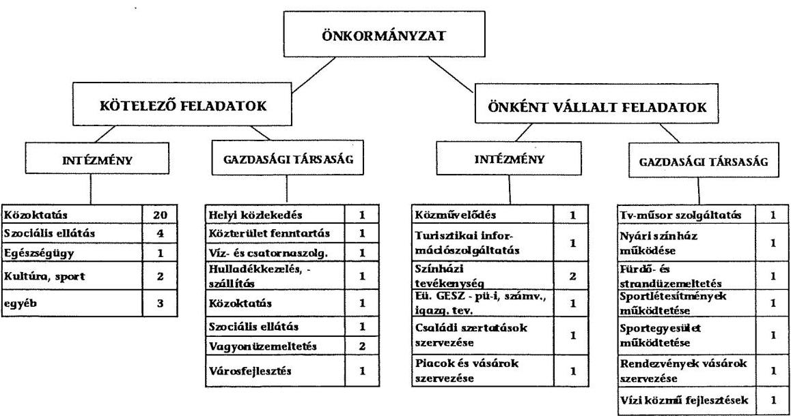

Az Önkormányzat feladatait 2010. december 31-én (a Polgármesteri hivatallal együtt) 37 költségvetési szervvel és 15 gazdasági társaságával (25\% feletti tulajdoni hányadú), továbbá egy az Önkormányzattól tulajdonosi szempontból független gazdasági társaság közreműködésével látta el. Az intézmények száma 2007-2010. között egy kulturális intézmény megszüntetése és átvétele következtében alakult ki, a feladatellátás telephelyeinek száma a 2006. évi 127-ről 2010-re 124-re csökkent.

Az Önkormányzat működési kiadásokra 2010-ben 14 839 millió Ft-ot fordított, amely 1110 millió Ft-tal (8\%-kal) haladta meg a 2007. évi ráfordításokat. A működési kiadások 62,3\%-át az intézményi körben realizálták.

---

A kiadások fedezetéül szolgáló bevételi források 2007. és 2010. években jellemző összesített arányait a következő ábra szemlélteti:
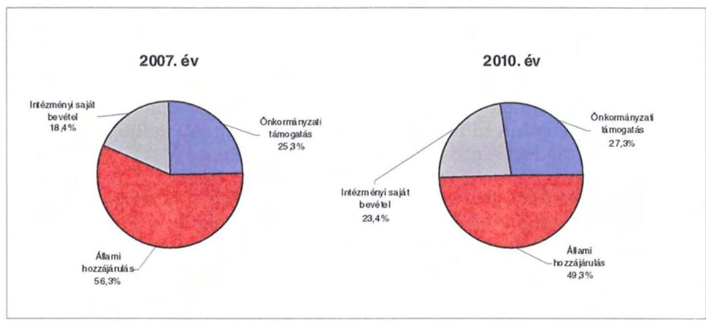

Az egyes közszolgáltatások feladatellátásában résztvevő ágazati intézménycsoportok forrásösszetételének bevételi jogcímenkénti alakulását a következő ábra szemlélteti:
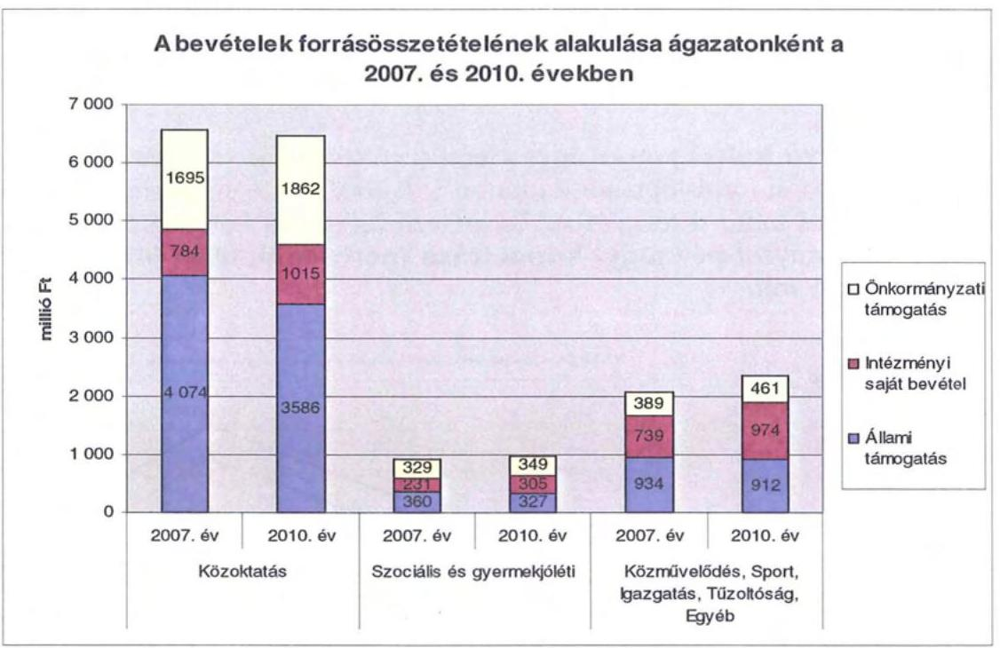

Az Önkormányzat 10 gazdasági társaságban rendelkezik kizárólagos tulajdonnal, egy gazdasági társaságban 75\% feletti, két gazdasági társaságban 51-74\% közötti, egyben 25-50\% közötti tulajdoni hányaddal. Az Önkormányzat feladatellátásában részt vesz egy olyan gazdasági társaság is, amely az Önkormányzat gazdasági társaságának kizárólagos tulajdonában van. Tömegközlekedési feladatát egy tulajdoni részesedéssel nem rendelkező gazdasági társaság végezte. A Közgyűlés 2011. évtől két kizárólagos önkormányzati tulajdonú gazdasági társaságnak szintén két kizárólagos önkormányzati tulajdonú gazdasági társaságba történő beolvadását határozta el. A gazdasági társasá-

---

gok a helyi közlekedés, a közterület fenntartás, a víz- és csatornaszolgáltatás, a hulladékkezelés és szállítás, a vagyonüzemeltetés, a városfejlesztés, a szakképzés, a közfoglalkoztatás, a televízió műsorszolgáltatás, a nyári színházi tevékenység, a strand és sportcélú létesítmények üzemeltetése, sportegyesület működtetése, továbbá rendezvények, vásárok szervezése területeken kaptak szerepet az önkormányzat feladatellátásában. A gazdasági társaságok működésükhöz a 2010. évben összesen 247 millió Ft rendszeres működési, 71 millió Ft eseti működési támogatást és 0,5 millió Ft fejlesztési támogatást kaptak az Önkormányzattól. A működési támogatás 18,8\%-át (80 millió Ft-ot) a sportegyesület működtetését végző gazdasági társaság kapta.

A társaságok pénzügyi helyzete stabil volt, a saját tőke jegyzett tőke aránya három gazdasági társaság kivételével meghaladta a 100\%-ot. A televízió műsorszolgáltatást, a nyári színházi tevékenységet és sportegyesület működtetését végző gazdasági társaságnál mutatott a saját tőke jegyzett tőke arány negatív értéket. Az Önkormányzat a korábbi évek veszteségei miatt a saját tőke biztosítása érdekében televízió műsorszolgáltatást végző gazdasági társaságnál 2007-ben 2 millió Ft, 2010-ben további 2 millió Ft pótbefizetést rendelt el, valamint a jegyzett tőkéjét leszállította 0,5 millió Ft-ra. A fizető parkolók üzemeltetését ellátó gazdasági társaságnál 2010-ben 5 millió Ft pótbefizetést teljesített, továbbá a jegyzett tőkét 9,5 millió Ft-tal leszállította 0,5 millió Ft-ra. A sportlétesítmények üzemeltetését végző gazdasági társaságot az Önkormányzat 2008-ban 1 millió Ft, 2010-ben 73 millió Ft tőketartalék juttatásban részesítette, és a törzstőkéjét 0,7 millió Ft-tal megemelte. A sportegyesület működtetését végző gazdasági társaságnál 10 millió Ft tőkeemelést hajtottak végre a 2010. évben.

A folyó költségvetés egyenlege (működési jövedelem) 2007-2010 között működési forrástöbbletet mutatott ${ }^{25}$. A 2007-2010. években a működési többlet fedezni tudta a tárgyévben jelentkező törlesztési kötelezettségeket, így az Önkormányzat pénzügyi kapacitása (nettó működési jövedelme) is pozitív értékű volt.
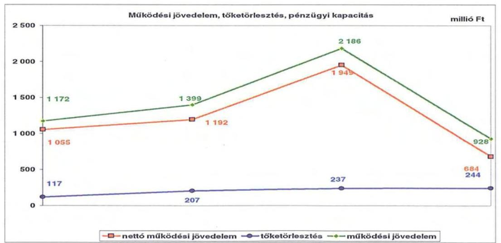

[^0]
[^0]:    ${ }^{25}$ 2007-ben a folyó bevételek 7,9\%-át (1172 millió Ft-ot), 2008-ban 8,7\%-át (1399 millió Ft-ot), 2009-ben 13,3\%-át (2186millió Ft-ot), 2010-ben 5,9\%-át (928 millió Ft-ot) jelentette a működési jövedelem.

---

A 2007-2010. években az Önkormányzat felhalmozási költségvetésének egyenlege folyamatosan negatív összegű volt, amely 2007-2010. között összesen 6126 millió Ft felhalmozási forráshiányt okozott.

A pénzügyi egyensúly fenntartása külső források bevonásával volt biztosítható. A 2007-2010. években 805 millió Ft hitelt törlesztettek. Az adósságszolgálat, továbbá a felhalmozási forráshiány 2007-2010. között 6931 millió Ft-ot tett ki, amelyre az időszakban képződő 5685 millió Ft működési megtakarítás (működési jövedelem) szolgált fedezetül. A további pénzeszközöket fejlesztési célú hitel felvételével teremtették meg.

A vizsgált időszakban Önkormányzatnál a helyi iparűzési adó, a vendégéjszakák utáni idegenforgalmi adó volt megállapítva. A helyi iparűzési adó mértéke 2007-2010. években nem változott, a személyenként és vendégéjszakánként fizetendő idegenforgalmi adó összege 2007-2009. években 347 Ft volt, amely a 2010. évtől 350 Ft-ra emelkedett. A helyi adókból és pótlékokból származó bevételek aránya 2007-2010 között 20,3-23,8\% körül mozgott a folyó (működési) bevételekben. A pótlékkal, bírsággal növelt helyi adó bevétel a 2007. évi 3180 millió Ft-ról 2010. évben 3917 millió Ft-ra (0,5\%-kal, 17 millió Ft-tal) növekedett. A helyi adóbevételek jelentős részét az iparűzési adó tette ki, amelynek mértéke a helyi adókról szóló törvényben rögzített maximális mértékben került megállapításra. Új helyi adónemet a vizsgált időszakban az Önkormányzat nem vetett ki.

Az Önkormányzatnál a befejezett fejlesztések 2007-2010. évek között teljesített együttes kiadása 5854 millió Ft volt, a korábbi időszakban ezekkel kapcsolatban 708 millió Ft-os ráfordítás jelentkezett. A fejlesztésekkel kapcsolatos kifizetések forrása 4685 millió Ft saját bevétel (71,4\%), 1201 millió Ft hitel (18,3\%), 641 millió Ft EU-s (9,8\%), és 35 millió Ft hazai támogatás (0,5\%) volt. A 2010. december 31-én folyamatban lévő fejlesztési feladatok végrehajtására 17 353 millió Ft kiadást teljesítettek, amelyet 285 millió Ft hitelből (1,6%), 10 830 millió Ft EU-s támogatásból (62,4\%), 2587 millió Ft hazai támogatásokból (14,9%), és 3651 millió Ft saját bevételből (21,1\%) finanszírozták.

Az Önkormányzat 2010. december 31-én folyamatban lévő fejlesztési feladatok kötelezettség-vállalásainak összege 2608 millió Ft volt, amelyből 1480 millió Ft-ot saját forrásból, 885 millió Ft-ot EU-s támogatásból és 243 millió Ft-ot a megkötött hitelkeret szerződésekből terveznek biztosítani.

---

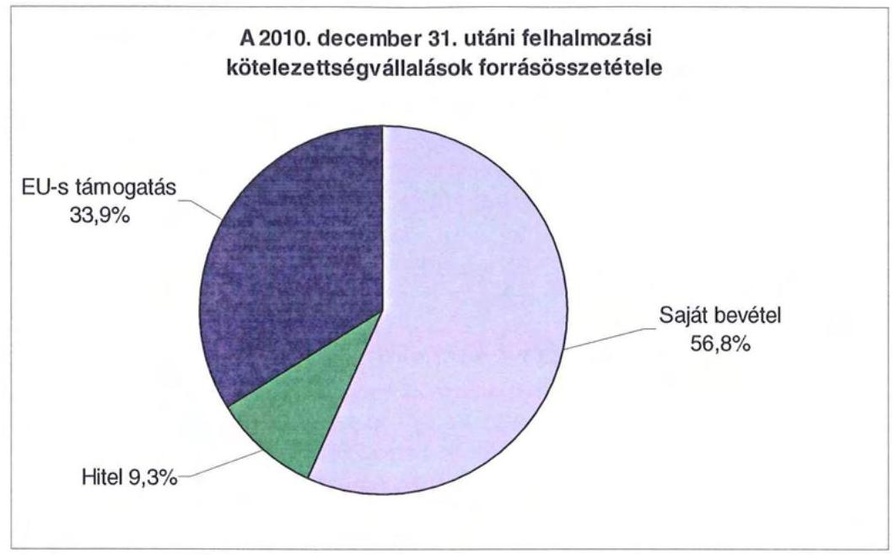

Az Önkormányzat beadott, elbírálás alatti pályázati forrásból három projektet tervez megvalósítani, melyek tervezett összköltsége 240 millió Ft, a saját bevételből származó forrásrész 21,3\% (51 millió Ft), a hazai támogatás aránya 78,7\% (189 millió Ft).

Az Önkormányzat mérleg szerinti pénzintézeti kötelezettsége a 2006. év végéről a 2010. év végére, 1633 millió Ft-ról 2149 millió Ft-ra nőtt. A fennálló pénzintézeti kötelezettségek 13 hosszú lejáratú hitel igénybevételéből keletkeztek. A 2011. évben a helyszíni vizsgálat alatt döntött a Közgyűlés a ZTE Kosárlabda Klub Kft. saját tőke helyzetének rendezése érdekében a 41,8 millió Ft hitelállományának átvállalásáról továbbá arról, hogy részt vesz 55 millió Ft összeg erejéig a saját tőkéjének rendezésében.

Az Önkormányzat kötelezettségvállalásaira közgyűlési döntés alapján került sor, azonban az előterjesztésekben nem mutatták be a visszafizetés forrásait, a várható kamat és tőkefizetési kötelezettséget, valamint a kamat- és - a devizaalapú kötelezettségeket érintő - árfolyamkockázatot.

Az Önkormányzat a fejlesztési hiteleiből lakóépületek energiatakarékos korszerűsítését és felújítását, infrastruktúrafejlesztést, útépítési munkákat, körforgalmi csomópontépítéseket, valamint szennyvíztelep korszerűsítést finanszírozott.

A HUF-ban fennálló kötelezettségekből 1212 millió Ft tőkét, kamatot és egyéb költséget teljesített. Az Önkormányzat a hitelek igénybevételéből származó forrásokat 2010. év végéig a céloknak megfelelően felhasználta, pénzintézeti kötelezettségvállalásai hat bank között megosztva jelentkeztek.

Az Önkormányzat működésének pénzügyi egyensúlyát a vizsgált időszakban folyószámlahitel igénybevétele nélkül tudta biztosítani.

Az Önkormányzat 2010. év végi szállítói tartozása 169 millió Ft, melyből a lejárt tartozás 4 millió Ft volt. A lejárt szállítói tartozásállomány többségében 30 nap alatti volt, a 61-90 nap közötti tartozás 12 ezer Ft összegben keletkezett,

---

amely egy intézménynél fordult elő. Egyéb kiadáselmaradást az Önkormányzat nem mutatott ki.

Az Önkormányzat a vizsgált időszakban két lízingszerződést kötött amelyből az Idősek Otthona kialakítását és mozgáskorlátozott játszótér építését irányozták elő. Az Önkormányzat a vizsgált időszakban PPP konstrukció keretében fejlesztést nem hajtott végre.
 végre. Készfizető kezességet vállaltak a 2007-2010. években hitelek igénybevételéhez, mélyparkoló építéséhez, kialakításához, tartós forgóeszköz finanszírozásához, pénzügyi reorganizáció elősegítéséhez 918 millió Ft összegben. Az Önkormányzat kezességgel kapcsolatos kötelezettsége a 2010. év végére 402 millió Ft-ra csökkent, amely a gazdasági társaságai részére a hitelekhez vállalt kezességhez kapcsolódtak. A gazdasági társaságok részére egy alkalommal összesen 17 millió Ft összegben, a civil szervezeteknek négy alkalommal, összesen 31,6 millió Ft összegben adott át pénzeszközt az Önkormányzat.

A fejlesztési hitelek biztosítékaként jelzálogjog alapítására és bejegyzésére nem került sor. A jelzálogjogot valamint az elidegenítési és terhelési tilalmat bejegyző határozatok nem pénzintézeti kötelezettségvállaláshoz, hanem állami támogatásokhoz, ingyenes vagyonátadásokhoz kapcsolódóan történtek.

Az Önkormányzat kötelezettségeinek 2010. december 31-i állományát és várható alakulását a kötelezettségek lejáratáig a következő táblázat szemlélteti:
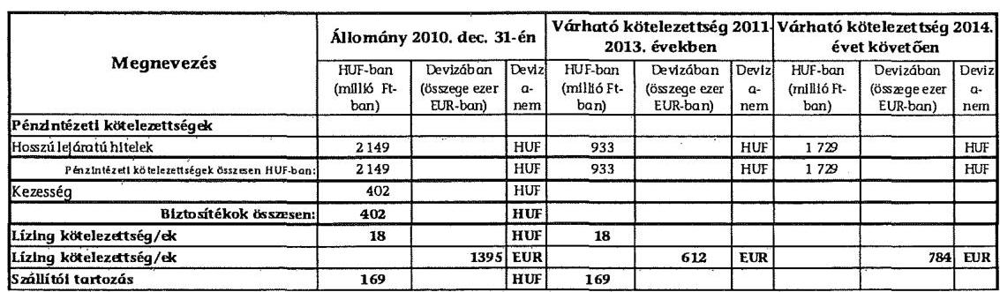

Az Önkormányzatnak pénzintézetekkel szemben fennálló kötelezettsége a 2010. év végén 2149 millió Ft volt, ezek várható kötelezettsége (tőke, kamat és egyéb költség) a legutóbbi kamatfizetés feltételei alapján a 2011-2013. években 933 millió Ft. Az Önkormányzatnak a 2011. évben szállítói tartozások rendezése, címén 169 millió Ft fizetési kötelezettsége keletkezett. A kezességvállalásaiból adódóan 402 millió Ft összegű terhe jelentkezhet, amennyiben a társaságok kötelezettségeiket nem teljesítik. Lízingkötelezettsége 2010. év végén 1395 ezer EUR és 18 millió Ft volt, a 2011-2013 években 18 millió Ft és 612 ezer EUR a fizetendő lízingdíj tartozása. A várható összes kötelezettség teljesítésére figyelembe vehető a 2011-2013. években a 331 millió Ft értékpapír állomány és kamata, 1420 millió Ft mérlegben kimutatott követelésállomány. Az Önkormányzat 2014. évet követő ismert kötelezettsége 1729 millió Ft és 784 ezer EUR melynek forrását nem nevesítették, azonban a fedezetét jelentheti a 10904 millió Ft forgalomképes ingatlanvagyon, amelyet pénzintézeti kötelezettséghez kapcsolódóan jelzálog nem terhel, továbbá az önkormányzati saját bevételek.

---

Az Önkormányzat minősített többségi tulajdonú társaságai kötelezettségeinek 2010. december 31-i állományát és várható alakulását a kötelezettségek lejáratáig a következő táblázat mutatja be:

| Megnevezés | Állomány 2010. dec.31-én |  |  | Várható kötelezettség 2011. |  |  | Várható kötelezettség 2014.   évet követően |  |  |
| :--: | :--: | :--: | :--: | :--: | :--: | :--: | :--: | :--: | :--: |
|  | HUF-ban   (millió Ft-   ban) | Devizióban   (összege ezer   CHF-ban) |  | HUF-ban   (millió Ft-   ban) |  |  |  |  |  |
| Pénzintézeti kötelezettségek |  |  |  |  |  |  |  |  |  |
| Hozzati kötelezettségek | 33 | 1443 | CHF | 13 |  | 57.5 CHF | 18 | 868 | CHF |
| Pénzintézeti kötelezettségek összesen: | 33 | 1443 | CHF | 13 |  | 57.5 CHF | 18 | 868 | CHF |
| Üzleg kötelezettségek |  | 28 | CHF |  |  | 28 CHF |  | 0 | CHF |
| Szállítói tartozás | 733 |  | HUF | 733 |  | HUF |  |  |  |

Az önkormányzati kötelezettségek növekedése mellett a minősített többségi tulajdonú társaságok kötelezettségei is befolyásolhatják az Önkormányzat pénzügyi egyensúlyát. A társaságoknak a 2011. évtől 15 millió Ft és 575 ezer CHF pénzintézeti kötelezettséget, 28 ezer CHF lízing és 733 millió Ft szállítói tartozást kell rendezniük. Felszámolás esetén ezek nem teljesítése miatt a bíróság korlátlan és teljes felelősséget állapíthat meg az Önkormányzat terhére.

Az Önkormányzat költségvetési támogatásból, átengedett bevételekből, és illeték bevételekből származó bevételei a 2007. évhez képest az időszak egészét tekintve összességében 230 millió Ft-tal csökkentek. Ennek ellensúlyozása érdekében az Önkormányzat folytatta az előző években elkezdett - kiadás megtakarítást és bevételnövelést eredményező - intézkedéseit. A 2007-2010. években tett intézkedések hatására 424 millió Ft bevételi többletet, továbbá 854 millió Ft kiadási megtakarítást mutattak ki, ezáltal a kieső forrásokat pótolták, emellett az Önkormányzat pénzügyi helyzetét javították. A kiadási megtakarítások 59,8\%-a az elrendelt álláshely csökkentések eredménye. Az álláshely csökkentő intézkedések 2007-2010. évek között a Polgármesteri hivatalnál és az intézményeinél összesen 217,7 álláshely (ebből 17,0 üres álláshely) megszüntetését jelentették. Egyes közszolgáltatási területeken azonban feladatbővülések is voltak, amelyek álláshely és egyben létszámnövekedéssel is jártak. Ennek következtében az időszak álláshelyeinek száma 105 fővel csökkent. A bevételnövelő intézkedések szabad kapacitások kihasználásához, szolgáltatások díjkötelessé tételéhez, átmenetileg szabad pénzeszközök lekötéséhez kapcsolódtak.

Az utóellenőrzés a pénzügyi egyensúly javítására tett két szabályszerűségi és egy célszerűségi javaslat hasznosítására terjedt ki. A javaslatokat az intézkedési terv szerinti határidőben teljesítették.

Az Önkormányzat pénzügyi helyzetét összegezve a következők emelhetők ki:

A 2007-2010. években az Önkormányzat működési kockázatát csökkentette a pozitív folyó költségvetési egyenleg, a minimális lejárt szállítói tartozásállomány. Az önként vállalt feladatok aránya, illetve a 2008-ban átvett kulturális intézmény fenntartása alapvetően nem befolyásolta az Önkormányzat működésének biztonságát. A működési bevételek évente biztosították a működési kiadások és az adósságszolgálat finanszírozását, a likviditás biztosítása folyószámlahitel igénybevétele nélkül történt. A gazdasági társaságok szerepe a közüzemi közfeladat-ellátásban meghatározó volt. A gazdasági társaságok által

---

ellátott feladatstruktúra letisztított, átlátható, a működési kockázatot nem növelte.

A vizsgált időszakban az Önkormányzat felhalmozási bevételeinek és kiadásainak egyenlege hiányt mutatott, ennek fedezete a pénzmaradvány igénybevételével és hitelfelvétellel biztosított volt. A fejlesztési célú kötelezettségvállalásoknál a jövőben teljesítendő kifizetésekre a fedezet rendelkezésre áll (hitelek, előző évek pénzmaradványa, EU támogatások, saját forrás), ezért felhalmozási kockázatot nem jelentett.

A pénzintézeti és egyéb kötelezettségek teljesítésének kockázatát növelte, hogy a 2010. december 31-én fennálló kötelezettségek visszafizetésének fedezetét a saját bevételben jelölték meg, a 2007-2010. években nem számszerűsítették annak forrásait. A kockázatot csökkentheti, hogy az Önkormányzat forgalomképes ingatlanvagyona szükség esetén felhasználható az adósságszolgálat visszafizetésére.

Az önkormányzati bevételt csökkentő központi intézkedések hatását az ellenőrzött időszakban kiegyenlítette az Önkormányzat kiadáscsökkentő és bevételnövelő intézkedéseinek eredménye.

Az Állami Számvevőszékről szóló 2011. évi LXVI. törvény 33. § (1) bekezdésében foglaltak értelmében a jelentésben foglalt megállapításokhoz kapcsolódó intézkedési tervet köteles az ellenőrzött szervezet vezetője összeállítani és azt a jelentés kézhezvételétől számított harminc napon belül az ÁSZ részére megküldeni. Amennyiben az intézkedési tervet határidőben nem küldi meg a szervezet, vagy az továbbra sem elfogadható, az ÁSZ elnöke a hivatkozott törvény 33. § (3) bekezdés a)-b) pontjaiban foglaltakat érvényesítheti.

Az ellenőrzés intézkedést igénylő javaslatai:

# a Polgármesternek 

1. a Közgyűlés elé terjesztendő intézkedési terv írja elő a működés pénzügyi egyensúlyának hosszú távú fenntarthatósága érdekében - felelősök és határidők megjelölésével - olyan program készítését, amely tartalmazza az alábbiakat:
a) bevételszerző lehetőségek feltárását, különösen a helyi adópolitikai célok meghatározását és számszerűsítését, a bérleti díjak és a térítési díjak megállapítását, felülvizsgálatát, a követelések behajtását, az egyéb sajátos bevételek növelésének lehetőségét;
b) a folyamatban lévő és a tervezett beruházások teljes körű felülvizsgálatát;
c) egyéb kiadási kötelezettségek teljes körű felülvizsgálatát;
d) az intézkedések következtében jelentkező pénzügyi többlet, illetve az egyszeri bevételek tartalékba helyezését, elkülönített kezelését az adósságszolgálat teljesítése érdekében;
e) az adósságszolgálat szerkezetének áttekintését;

---

f) az intézményi struktúra felülvizsgálatát, átalakítását;
g) az önként vállalt feladatok terjedelmének, tartalmának felülvizsgálatát azok finanszírozhatósága szempontjából, a kötelező feladatellátás elsődlegességének biztosítása érdekében, a gazdasági program áttekintésével összhangban;
h) az intézkedések eredményei legalább évenkénti áttekintésének előírását;
2. mutassa be félévente - a szokásos beszámoló keretében - a Közgyűlésnek:
a) az Önkormányzat és a minősített többségi tulajdonú gazdasági társaságai aktuális pénzügyi helyzetét, az Önkormányzatnak a gazdasági társaságai felé fennálló követeléseit, nyújtott kölcsöneit;
b) legalább három évre kitekintően a kötelezettségek teljes körére szóló finanszírozási tervet, amely figyelembe veszi a kötelezettség éven belüli és túli felmerülését, a források számszerűsített megjelölésével;
c) az Önkormányzat folyamatban lévő és tervezett fejlesztéseihez szükséges belső és külső források rendelkezésre állását, és ebből a szempontból értékelje az Önkormányzat beruházásait;
3. intézkedjen a beruházásokkal létrehozott létesítmények működtetését és jövőbeni fenntarthatóságát biztosító megalapozott források költségvetési rendeletekben történő feltüntetéséről;
4. mutassa be a Közgyűlésnek évente a zárszámadási rendelet előterjesztésében az értékcsökkenés összegét, és ezzel összevetve az elhasználódott eszközök pótlására fordított tényleges kiadásokat, az eszközök elhasználódási fokának alakulását;

# a jegyzőnek 

1. kísérje figyelemmel a jövőbeni várható - árfolyam-, kamat- valamint visszafizetési kockázatokat, továbbá a mérlegen kívüli tételek (kezességvállalás), kockázatait, és legalább félévente tájékoztassa a Közgyűlést azok alakulásáról;
2. gondoskodjon, hogy a jövőben az adósságot keletkeztető kötelezettségvállalásokról szóló közgyűlési előterjesztések tételesen tartalmazzák a visszafizetés forrásait, valamint legalább 3 éves kitekintéssel mutassák be a kamat és árfolyamkockázat várható kihatásait.

---

# II. RÉSZLETES MEGÁLLAPÍTÁSOK 

## 1. Az ÖNKORMÁNYZAT KÖTELEZŐ ÉS ÖNKÉNT VÁLLALT FELADATAI

Az Önkormányzat 2010. évi beszámolója szerint a tárgyévi költségvetési kiadásainak $85,5 \%$-át, ( 12693 millió Ft-ot) a kötelező, 14,5\%-át (2146 millió Ft-ot) az önként vállalt feladatok ellátására fordította ${ }^{26}$. Az Önkormányzat önként vállalt feladatai vegyes profilú közművelődési intézmények, színház, egészségügyi GESZ, idegenforgalmi és turisztikai iroda, családi intézet, vásárcsarnok működtetéséhez, munkahelyi étkeztetéshez, ingatlan, termál és tófürdő üzemeltetéshez, oktatási ösztöndíjakhoz, szórakoztató és szabadidős tevékenységekhez, rendezvények szervezéséhez kapcsolódnak, valamint támogatást nyújt civil szervezetek, alapítványok működéséhez.

A Közgyűlés SzMSz-ben szabályozta a kötelezően ellátandó és az önként vállalt feladatait. Az Önkormányzat SzMSz-ében kötelező feladatait az Ötv. által meghatározottnak tekinti, az önként vállalt feladatokat az SzMSz 8. § (3) bekezdése részletesen taglalta.

Az Önkormányzat 2010. évi működési kiadásai és azok finanszírozási arányait szemlélteti a következő táblázat főbb feladatonként:

| Ellátott feladat | Működési kiadás összesen (millió Ft) | Kötelező feladatok kiadásainak részaránya | Működési bevétel összesen (millió Ft) | Állami támogatás   \% | Intézményi saját bevétel részaránya | Önkormányzati   támogatás részaránya |
| :--: | :--: | :--: | :--: | :--: | :--: | :--: |
| Óvodák | 954 | 100 | 1003 | 41 | 14 | 45 |
| Általános iskolák | 2244 | 100 | 2282 | 47 | 16 | 37 |
| Gimnáziumok | 853 | 100 | 904 | 63 | 20 | 17 |
| Szakközépiskolák, szakképző intézmények | 1794 | 100 | 1908 | 68 | 15 | 17 |
| Kollégiumok | 321 | 100 | 366 | 60 | 15 | 25 |
| Szociális intézmények | 496 | 100 | 541 | 28 | 38 | 34 |
| Gyermekjóléti intézmények | 413 | 100 | 440 | 40 | 22 | 38 |
| Közművelődési intézmények | 1146 | 7 | 1238 | 33 | 41 | 26 |
| Sportlétesítmények | 93 | 100 | 101 | 40 | 21 | 39 |
| Igazgatási intézmények | 0 |  | 0 | |  |  |
| --- | --- |
| Hivatásos   Tűzoltóság | 474 | 100 | 479 | 93 | 7 |  |
| Egyéb intézmények | 450 | 61 | 529 | 5 | 76 | 19 |
| Intézmények összesen | 9238 |  | 9790 | 49 | 24 | 27 |
| Polgármesteri Hivatalban kezelt feladatok működési kiadásai | 5601 | 84 | 5753 | 32 | 68 |  |
| Működési kiadások összesen | 14839 |  | 15543 | 43 | 40 | 17 |

[^0]
[^0]:    ${ }^{26}$ Az önként vállalt feladatok részarányának megállapítása az Önkormányzat adatszolgáltatásán alapul.

---

A kötelező feladatokon belül a két legnagyobb kiadás a 9238 millió Ft összegű intézményi feladatok működési kiadása - amely az összes működési kiadás $62 \%$-át -, valamint a Polgármesteri hivatalban ellátott feladatok 5601 millió Ft összegű működési kiadása, amely az összes működési kiadás $38 \%$-át tette ki. Az intézmények működtetéséhez az Önkormányzat 2672 millió Ft támogatással (amely az összes bevétel 17,2\%-a) járult hozzá.

Az intézményi feladatokon belül a közoktatási feladatokra fordított 6167 millió Ft az összes működési kiadás $42 \%$-át tette ki, a működéshez az Önkormányzat 1862 millió Ft támogatást nyújtott, amely az összes bevétel $28,8 \%$-a volt. A szociális intézményi és gyermekjóléti feladatokra fordított 909 millió Ft az összes működési kiadás $6 \%$-át tette ki, amelyhez 349 millió Ft működési támogatást nyújtott az Önkormányzat, ez az ágazat összes működési bevételének 35,6\%-a. A közművelődési intézményi feladatokra fordított 1146 millió Ft az összes működési kiadás $8 \%$-át tette ki, amelyhez 321 millió Ft működési támogatást nyújtott az Önkormányzat, ez az ágazat összes bevételének 26\%-a. A hivatásos tűzoltóságra fordított 474 millió Ft az összes működési kiadás 3\%-át tette ki, amelyhez az Önkormányzat támogatást nem nyújtott. Az egyéb intézményi feladatellátásra fordított 450 millió Ft az összes működési kiadás 3\%-a volt, amelyhez az Önkormányzat 2672 millió Ft támogatást nyújtott, amely az összes bevétel $18,8 \%$-a volt.

Az Önkormányzat kötelező és önként vállalt működési kiadásainak aránya a 2007. évről 2010-re nem változott ${ }^{27}$. A működési kiadások önkormányzati szinten $8 \%$-kal ( 1110 millió Ft-tal) növekedtek, ez a Polgármesteri hivatalnál 25,5\%-os ( 1138 millió Ft-os) növekedést, az intézményeknél 0,3\%-os ( 28 millió Ft-os) csökkenést jelentett.

A működési bevételek forrásösszetételét tekintve az állami támogatások önkormányzati szinten 9,4\%-kal, 693 millió Ft-tal csökkentek 2007-ről 2010-re, ez a Polgármesteri hivatal esetében 7,6\%-os, 150 millió Ft-os, az intézményeknél 10,1\%-os, 543 millió Ft-os csökkenést jelentett. A saját bevételek 29,3\%-kal, 1411 millió Ft-tal növekedtek önkormányzati szinten, ami a Polgármesteri hivatalnál 871 milliós, az intézményeknél 540 millió Ft-os növekedésből adódott. Az intézmények csökkenő állami támogatását a saját bevételek növekedése és az önkormányzati támogatás növekedése ellensúlyozta, utóbbi 10,7\%-kal, 259 millió Ft-tal nőtt 2007-ről 2010-re.

Az Önkormányzat éves költségvetési kiadásainak ${ }^{28}$ szerkezetét tekintve 2010-ben a járulékokkal növelt személyi juttatások és a dologi kiadások 13264 millió Ft-os összegén belül meghatározó arányt (39,2\%) a közoktatási

[^0]
[^0]:    ${ }^{27}$ A 2007. és 2008. évben a kötelező feladatok kiadásainak aránya 85,4\%, az önként vállalt feladatok kiadásainak aránya 14,6\%, a 2009. évben a kötelező feladatok kiadásainak aránya $84,5 \%$, az önként vállalt feladatok kiadásainak aránya $15,5 \%$, a 2010. évben a kötelező feladatok kiadásainak aránya $85,5 \%$, az önként vállalt feladatok kiadásainak aránya $14,5 \%$ volt.
    ${ }^{28}$ Az Önkormányzat járulékokkal növelt személyi és dologi kiadásainak ágazatonkénti megbontása a BM részére készített, 2010. december 31-i adatokkal kiegészített adatszolgáltatás kigyűjtéséből származik.

---

célokra elszámolt 5193 millió Ft kiadás jelentette. Közművelődési feladatokra 1146 millió Ft-ot ( $8,6 \%$ ), szociális és gyermekvédelmi célokra 871 millió Ft-ot $(6,6 \%)$, egészségügyi feladatokra 261 millió Ft-ot ( $2,0 \%$-ot), igazgatási és egyéb nem kiemelt ágazati feladatokra 5793 millió Ft-ot ( $43,7 \%$-ot) fordítottak. Ez utóbbin belül meghatározóak voltak a Polgármesteri hivatalban ellátott feladatok működési kiadásai ( 5601 millió Ft ).

Az Önkormányzat kötelező és önként vállalt feladatai körében a vizsgált időszakban nem történt változás. Kötelező és önként vállalt feladatait ${ }^{29} 2010$. december 31-én 37 költségvetési szervvel és 16 gazdasági társasággal látta el.

Kötelező feladatot lát el a költségvetési szervek közül 22 önállóan működő és gazdálkodó, továbbá nyolc önállóan működő költségvetési szerv, alapító okirataik szerint összesen 109 telephelyen működnek. Közoktatási feladatokat 20 intézmény lát el, ebből négy óvoda 15 telephellyel, 7 általános iskola 13 telephellyel, hét középiskola 18 telephellyel, egy kollégium három telephellyel, továbbá egy speciális szakiskola és egységes gyógypedagógiai módszertani intézmény. Szociális és gyermekvédelmi feladatok ellátása négy intézményben (egy bölcsődei ellátást végző egyesített intézmény, egy családsegítő és gyermekjóléti intézmény, egy alapszolgáltatásokat és szakosított ellátásokat biztosító gondozási központ, továbbá fogyatékosok részre nappali ellátást nyújtó intézmény) 14 telephelyen történik. Egészségügyi feladatokat az Egészségügyi Alapellátási Intézmény végez. A kulturális és sport feladatokat 15 telephelyen két intézmény lát el (könyvtár, sportlétesítmény gondnokság). A feladatellátásban részt vesz az Óvodai Intézmények Gazdasági Ellátó Szervezete, továbbá a Hivatásos Önkormányzati Tűzoltóság. Igazgatási feladatokat lát el a Polgármesteri hivatal.

A kötelező feladatainak ellátásában részt vesz kilenc gazdasági társasága, amelyek közül hatnak kizárólagos, kettőnek többségi tulajdonosa az Önkormányzat, míg - tömegközlekedési feladatát - egy tulajdoni részesedéssel nem rendelkező gazdasági társaság végezte. A munkanélküliek foglalkoztatásával, a közterületek tisztításával, a parkfenntartással, a temetők üzemeltetésével, a hulladékszállítással és elhelyezéssel, a vagyonüzemeltetéssel, a településfejlesztéssel, a fizető parkolók üzemeltetésével kapcsolatos feladatokat hat kizárólagos tulajdonú gazdasági társaság látta el. A víz- és csatornaszolgáltatási feladatokat egy $79 \%$-os tulajdoni részesedésű, a szakképzési feladatokat egy $55 \%$ os tulajdoni részarányú gazdasági társaság végezte.

Az Önkormányzat önként vállalt feladatainak (közművelődés, turisztikai információs szolgáltatás, színház, bábszínház, egészségügyi intézmények gazdasági ellátó szervezete, családi szertartások, ünnepek szervezése, piaci tevékenység) ellátásában hét intézmény vesz részt, saját gazdasági társaságai közül hét lát el önként vállalt feladatokat. Az Önkormányzat önként vállalt feladatai közül televízió műsor-szolgáltatást, nyári színházi tevékenységet, strand és fürdő szolgáltatási feladatokat, sportcélú létesítmények működtetését és hasznosítását négy kizárólagos tulajdonú gazdasági társaság, sportegyesület működte-

[^0]
[^0]:    ${ }^{29}$ A kötelező és önként vállalt feladatok megbontása az Önkormányzat saját besorolása alapján történt.

---

tését egy 71\%-os önkormányzati tulajdonban lévő gazdasági társaság, rendezvények, vásárok szervezését egy 40\%-os önkormányzati tulajdonosi részesedésű gazdasági társaság végzi. Vízi közmű beruházási és felújítási munkák bonyolításában az Önkormányzat 79\%-os tulajdoni részesedésű gazdasági társaságának kizárólagos tulajdonában lévő Kft vesz részt.

Az Önkormányzat 17 gazdasági társaságban rendelkezik részesedéssel, amelyek közül 13-nak az Önkormányzat a többségi tulajdonosa, 25-50\% közötti üzletrésze egy társaságban, $25 \%$ alatti részesedése három gazdasági társaságban van, amelyek közül egy sem látott el önkormányzati közszolgáltatást. Ezeknél a társaságoknál a részesedés mértéke 0,005\% és 1,74\% között volt.

A 13 gazdasági társaságból 10 társaságnak kizárólagos tulajdonosa az Önkormányzat, egy társaságban 75-99\% közötti részesedéssel, két társaságban részesedése 51-74\% között volt a 2010. év végén. A többségi tulajdonú gazdasági társaságok közül a 79\%-os részesedésű gazdasági társaságnak 21\%-ban, az 55\%-os tulajdoni részesedésű gazdasági társaságban 45\% mértékben más önkormányzatok, egy 71\%-os részesedésű társaságban 29\% erejéig gazdasági társaságok és magánszemélyek voltak tulajdonosok. Az Önkormányzat feladatellátásában részt vett egy olyan gazdasági társaság is, amelyben az Önkormányzat gazdasági társaságának kizárólagos tulajdoni részesedése volt.

Az Önkormányzat többségi tulajdonában lévő gazdasági társaságoknál a vizsgált időszakban az alábbi átszervezések történtek:

- a két kizárólagos tulajdoni részesedésű Kft egyesülésével 2007-ben létrehozták a sportcélú létesítmények működtetését és hasznosítását végző gazdasági társaságot;
- a nyári színházi tevékenységet végző kft-t, 0,5 millió Ft jegyzett tőkével 2008-ban alapították;
- a városrehabilitációs feladatokra 2009. február 1-jén alapított kft-t 20 millió Ft jegyzett tőkével hozták létre, amely 2010. július 31-i időponttal beolvadt a kizárólagos önkormányzati tulajdonú városfejlesztési feladatokat végző gazdasági társaságba;
- 2011-ben a Közgyűlés két kizárólagos önkormányzati tulajdonú gazdasági társaságnak szintén két kizárólagos önkormányzati tulajdonú gazdasági társaságba történő beolvadását határozta el.

A gazdasági társaságok saját tőkéje 2010. december 31-én 7429 millió Ft (ezen belül a kizárólagos önkormányzati tulajdonban lévő társaságok saját tőkéje 1859 millió Ft), a jegyzett tőkéjük 3560 millió Ft (ezen belül a kizárólagos önkormányzati tulajdonban lévő társaságok jegyzett tőkéje 720 millió Ft) volt. A legnagyobb saját tőkével a helyi tömegközlekedési tevékenységet végző gazdasági társaság rendelkezett 4250 millió Ft összegben, jegyzett tőkéje 2279 millió Ft volt a 2010. év végén. A víz- és csatornaszolgáltatási feladatokat ellátó gazdasági társaság saját tőkéje 1315 millió Ft, jegyzett tőkéje 500 millió Ft volt. További jelentős, 496 millió Ft saját tőkével rendelkezett a hulladékkezelést és szállítást végző Kft, amelynek a jegyzett tőkéje 95 millió Ft.

---

Az Önkormányzat a korábbi évek veszteségei miatt a saját tőke biztosítása érdekében egy kizárólagos önkormányzati tulajdonban álló gazdasági társaságnál 2007-ben 2 millió Ft, 2010-ben további 2 millió Ft pótbefizetést rendelt el, valamint a jegyzett tőkéjét leszállította 0,5 millió Ft-ra. Egy kizárólagos önkormányzati tulajdonban álló gazdasági társaságnál 2010-ben 5 millió Ft pótbefizetést teljesített, továbbá a jegyzett tőkét 9,5 millió Ft-tal leszállította 0,5 millió Ft-ra. Egy kizárólagos önkormányzati tulajdonban álló gazdasági társaságot az Önkormányzat 2008-ban 1 millió Ft, 2010-ben 73 millió Ft tőketartalék juttatásban részesítette, és a törzstőkéjét 0,7 millió Ft-tal megemelte. Egy 51-74\% közötti tulajdoni részesedésű gazdasági társaságnál 10 millió Ft tőkeemelést hajtottak végre a 2010. évben.

Az ellenőrzési időszak alatt csőd, illetve felszámolási eljárás az önkormányzati érdekeltségű gazdasági társaságokkal szemben nem indult.

A gazdasági társaságoknál a saját tőke jegyzett tőke aránya változó képet mutatott.

#### Abstract

A gazdasági társaságok közül 2010-ben két kizárólagos tulajdonú továbbá egy $51-74 \%$-a tulajdoni hányadú társaságnál mutatott a saját tőke jegyzett tőke arány negatív értéket, négynél 1 értéket, egy kizárólagos, egy $25 \%$ feletti tulajdoni hányadúnál és egy egyéb közfeladatot ellátónál a 2-öt, egy $75 \%$ felettinél a hármat, egy kizárólagos és egy $51-74 \%$-os tulajdoni hányadúnál a 4-et, egy kizárólagos tulajdonú társaságnál az 5-öt, további egy-egynél a 30-at és a 60-at meghaladta.

A gazdasági társaságok által ellátott közszolgáltatásokhoz kapcsolódó szolgáltatási és egyéb díjak (hulladék- és folyékony hulladékszállítási, temetkezési, ivóvíz szolgáltatási, szennyvízelvezetési, parkolási, helyi tömegközlekedési, lakás- és helyiségbérlet, valamint a közterület-használati díj) megállapítása a Közgyűlés feladat- és hatáskörébe tartozik, azok meghatározása önkormányzati rendelettel történik. A szolgáltatási díjakra tekintettel csak egy gazdasági társaság részesül önkormányzati támogatásban a helyi tömegközlekedési díjak miatt, amelyet az Önkormányzat - figyelemmel a mindenkor hatályos miniszteri rendeletben meghatározott központi költségvetésből nyújtott támogatásra is - a társasággal kötött támogatási szerződés alapján
 állapít meg.

Az Önkormányzati kötelező és önként vállalt feladatokhoz rendelt 2010. évi év végi nettó vagyon összesen 26907 millió Ft, amelyből 24551 millió Ft ( $91,2 \%$ ) a kötelező feladatokhoz rendelt és 2356 millió Ft ( $8,8 \%$ ) az önként vállalt feladatokhoz rendelt nettó vagyon. Az összes nettó vagyonból 19038 millió Ft-ot ( $70,7 \%$-ot) képviselt a $75 \%$ feletti tulajdoni részesedésű gazdasági társaság vagyona, amelyből a társaság 394 millió Ft-ot tulajdonába kapott, 12382 millió Ft üzemeltetésre, 6262 millió Ft vagyonkezelésre átvett vagyon volt.

A gazdasági társaságok tulajdonába adott 2010. év végi nettó vagyon összesen 1209 millió Ft volt, amelyből 1071 millió Ft ( $88,6 \%$ ) a kötelező, 138 millió Ft ( $11,4 \%$ ) az önként vállalt önkormányzati feladatokra kimutatott vagyon. A társaságok üzemeltetésre 19435 millió Ft értékű nettó vagyont vettek át. Az Önkormányzat egy 75\% feletti tulajdoni részesedésű gazdasági társasága mutatott ki a társaság vagyonkezelésébe adott év végi nettó vagyonállományt. A vagyonkezelési szerződés szerint a felújítási és rekonstruk-

---

ciós munkák forrása a társaság által elszámolt amortizáció. Amennyiben az adott évben elszámolt értékcsökkenést nem használják fel a rekonstrukciós és felújítási munkák forrásaként a fennmaradt érték erejéig tartalékot kell képezni. A vagyonkezelésbe adott eszközök után a gazdasági társaság évente az értékcsökkenés összegének megfelelő közmű felújítást valósított meg. (A gazdasági társaságok részletes adatait a 4. számú melléklet tartalmazza.)

Az Önkormányzat közszolgáltatási feladatellátása körében az autóbusszal végzett helyi közforgalmú személyszállításban részt vett egy gazdasági társaság, amelyben az Önkormányzat tulajdonosi részesedéssel nem rendelkezett. Az Önkormányzat a feladatellátásra a társasággal közszolgáltatási szerződést kötött, és külön megállapodásban rendelkezett a működési támogatás nyújtásának feltételeiről. A társaság az Önkormányzattól a feladatellátásra 20072010 között összesen 360 millió Ft támogatásban ${ }^{30}$ részesült.

Az önkormányzat államháztartáson kívüli szervezetek, egyház, egyéb civil szervezetek részére feladatot nem adott át. Azonban az egyes oktatási és szociális feladatok teljes körű biztosítása érdekében az Önkormányzat a Zala Megyei Önkormányzattal a súlyos és halmozottan fogyatékos gyermekek fejlesztő iskolai oktatására, a Gyermekeinkért 2000 Alapítvánnyal óvodai feladatok ellátására, a Magyar Vöröskereszttel a hajléktalanok nappali melegedője, átmeneti szállása, éjjeli menedékhelye, utcai szociális munka, továbbá családi átmeneti otthon működtetésre kötöttek megállapodást.

A vizsgált időszakban az Önkormányzatnál jelentős intézmény átalakításokra nem került sor, változás a kulturális intézmények számában történt. 2007-ben megszűnt a Városi Hangverseny és Kiállító terem, feladatait a Keresztúry Dezső Általános Művelődési Központ vette át. A 2008. évben a Zala Megyei Önkormányzattól átvették a korábbiakban is közös fenntartású Griff Bábszínházat, az intézmény működéséhez az állami támogatáson felül szükséges kiadásokat $60-40 \%$-os arányban biztosítják.

A teljesített működési kiadások ( 14839 millió Ft) finanszírozása 42,7\%-ban állami hozzájárulásból ( 6643 millió Ft ), $40,1 \%$-ban intézményi saját bevételből ( 6228 millió Ft), és $17,2 \%$-ban önkormányzati forrásból ( 2672 millió Ft) történt. A finanszírozási forrásokon belül a költségvetési hozzájárulás részaránya 7,7 százalékponttal, 693 millió Ft-tal csökkent, a saját bevételek részaránya 7,0 százalékponttal, 1411 millió Ft-tal, az Önkormányzati hozzájárulás részaránya 0,6 százalékponttal, 259 millió Ft-tal emelkedett a 2007. évihez képest.

A közoktatási ágazatban az összes működési kiadás 2007-ről 2010. évre 246 millió Ft-tal, 3,8\%-kal, az állami hozzájárulás összege 488 millió Ft-tal, $12 \%$-kal csökkent. Az ellátottak létszáma 685 fővel, 4,9\%-kal csökkent.

[^0]
[^0]:    ${ }^{30}$ Az összeg tartalmazza a központi költségvetésből nyújtott 224 millió Ft normatív támogatást.

---

A közoktatási intézmények közül az általános iskolák, a gimnáziumok, a szakközépiskolák, szakképző intézmények, és a kollégiumok esetében 2-14\%-kal (összesen 290 millió Ft-tal) csökkentek a működési kiadások 2007-ről 2010-re. Az óvodák esetében 4,8\%-os ( 44 millió Ft) növekedést mutatott ki az Önkormányzat.

A szociális és gyermekjóléti ellátások kiadásai 3 millió Ft-tal, 0,3\%-kal csökkentek, az állami hozzájárulás összege 34 millió Ft-tal 9,4\%-kal csökkent. Az intézményekben ellátottak létszáma 94 fővel, 11,5\%-kal csökkent, az egy ellátottra jutó kiadások összege 142111 Ft-tal, 12,7\%-kal növekedett.

A közművelődési intézmények kiadásai 168 millió Ft-tal, 17,2\%-kal növekedtek, az állami hozzájárulás összege 19 millió Ft-tal, 4,4\%-kal csökkent, a kiadások állami támogatással való lefedettsége 43,2\%-ról 35,2\%-ra, 8 százalékponttal csökkent. A Hivatásos Tűzoltóság kiadásai 17 millió Ft-tal, 3,8\%-kal, az állami hozzájárulás összege 5 millió Ft-tal, 1,1\%-kal növekedett.

Az önkormányzati intézményekben ellátottak száma 2007-ről 2010-re 5,3\%-kal, 779 fővel csökkent. A csökkenéshez hozzájárult az általános iskolások 443 fős, a szakközép- és szakiskolások számának 209 fős, a kollégisták számának 102 fős és a szociális intézményekben ellátottak számának 94 fős csökkenése, ezt csekély mértékben ellensúlyozta az óvodások 43 fős és a gimnazisták 26 fős növekedése.

A foglalkoztatottak száma önkormányzati szinten 5\%-kal, 130 fővel (intézményeknél 123 fő, Polgármesteri hivatalnál 7 fő) csökkent. Az óvodában 4, a sportlétesítményeknél 1, a tűzoltóságnál 9 fővel nőtt, míg az általános iskolákban 57, a gimnáziumokban 9, a szakközép- és szakiskolákban 23, a kollégiumokban 9, a szociális és gyermekjóléti intézményeknél 31, a közművelődési intézményeknél 5, az egyéb intézményeknél 3 fővel csökkent a foglalkoztatotti létszám.

# 2. PÉNZÜGYI EGYENSÚLYI HELYZET ALAKULÁSA 

### 2.1. A működési és felhalmozási egyensúly alakulása

A hagyományos költségvetési szerkezet helyett az Önkormányzat pénzügyi helyzetét a CLF módszerrel mutatjuk be, amelyben jobban elkülönülnek a vagyonnal kapcsolatos bevételek és kiadások a feladatokkal kapcsolatos közvetlen működtetési bevételektől és kiadásoktól. A módszer következetesen elkülöníti a folyó és a felhalmozási (beruházási) költségvetés bevételeit és kiadásait, azok költségvetési egyenlegeit. A saját folyó bevételek, valamint a saját felhalmozási bevételek nem tartalmazzák az előző évi pénzmaradványok felhasználásából származó pénzforgalom nélküli bevételeket ${ }^{31}$.

[^0]
[^0]:    ${ }^{31}$ A költségvetési években kialakuló hiány finanszírozása az előző években képzett tartalékok felhasználásával is történhet.

---

A folyó költségvetés egyenlege, a működési jövedelem megmutatja, hogy az önkormányzat éves folyó bevétele fedezetet biztosít-e a kötelező és önként vállalt feladatellátáshoz kapcsolódó éves folyó kiadására. A működési jövedelem negatív értéke pénzügyileg fenntarthatatlan helyzetet jelez. A mutató pozitív értéke megtakarítást mutat, amely forrásul szolgálhat az önkormányzat fennálló kötelezettségei megfizetéséhez, valamint fejlesztéseihez.

A felhalmozási költségvetés pozitív értéke felhalmozási többletet mutat, amely a jövőbeni fejlesztések forrását biztosíthatja. Amennyiben a folyó költségvetési hiány finanszírozása a felhalmozási többletből történik, ez szűkebb értelemben vagyonfelélésnek tekinthető. Amennyiben a felhalmozási költségvetés megtakarítása fejlesztési célú hitelek, kötvények adósságszolgálatát finanszírozza, az változatlan vagyontömeg mellett, a korábban megelőlegezett tőkebevételek valós realizációjának tekinthető. A felhalmozási deficit által generált finanszírozási igény önmagában nem jár pénzügyi kockázattal, a pénzügyileg fenntartható beruházásokhoz kapcsolódó kötelezettségvállalás (adósságszolgálat) takarékos költségvetési gazdálkodással teljesíthető.

A módszer a pénzügyi kapacitás fogalmát helyezi a középpontba. Az adós hitelfelvételi képessége, hosszú távú fizetőképessége vagy bonitása a pénzügyi kapacitással, ezen belül is a nettó működési jövedelemmel jellemezhető. A nettó működési jövedelem negatív értéke az egyes költségvetési években jelentkező adósságszolgálat túlzott mértékére utal ${ }^{32}$. A nettó működési jövedelem negatív értékének felhalmozási többletből, vagy további hitelből történő finanszírozása pénzügyileg nem fenntartható gazdálkodást vetít előre. A pozitív értéket mutató nettó működési jövedelem fejlesztési kiadások fedezetét biztosíthatja, illetve a folyamatosan, évenként képződő pozitív nettó működési jövedelemből meghatározható a jövőben vállalható, teljesíthető éves adósságszolgálat, ily módon az a hitelösszeg, amely - a többi tényezőt, feltételt adottnak tekintve - visszafizetési kockázat nélkül felvehető.

A CLF módszer alapján a pénzügyi kapacitás mértéke az önkormányzat összevont, nettósított, a központi információs rendszerbe a Kincstáron keresztül leadott éves költségvetési beszámolójának 80-as űrlapjában szerepeltetett adatok alapján került meghatározásra.

[^0]
[^0]:    ${ }^{32}$ Kivéve, ha annak finanszírozására a korábbi években képzett tartalékok fedezetet nyújtanak.

---

# CLF módszer szerinti önkormányzati adatok 

|  |  |  |  | ezer Ft |
| :--: | :--: | :--: | :--: | :--: |
| Megnevezés | 2007 | 2008 | 2009 | 2010 |
| Folyó bevételek | 14900354 | 16021302 | 16406475 | 15765308 |
| Folyó kiadások | 13728551 | 14622771 | 14220025 | 14837107 |
| Működési jövedelem | 1171803 | 1398531 | 2186270 | 928201 |
| Nettó működési jövedelem=működési jövedelem - tőketörlesztés | 1055473 | 1191839 | 1948667 | 683962 |
| Felhalmozási bevételek | 4284302 | 6405603 | 3754230 | 3845443 |
| Felhalmozási kiadások | 5954650 | 8429339 | 4972946 | 5059348 |
| Felhalmozási költségvetés egyenlege | $-1670348$ | $-2023736$ | $-1218716$ | $-1213905$ |
| Finanszírozási műveletek nélküli (GFS) pozíció | $-498545$ | $-625205$ | 967554 | $-285704$ |
| Finanszírozási műveletek egyenlege | 233645 | 598483 | 170490 | $-135409$ |
| Tárgyévi pénzügyi pozíció változás | $-264900$ | $-26722$ | 1138044 | $-421113$ |
| Egyéb tájékoztató adatok |  |  |  |  |
| Összes kötelezettség | 4138432 | 4227975 | 4503605 | 3824700 |
| -ebből rövid lejáratú | 1787379 | 1941812 | 1164351 | 1153560 |
| Folyószámlahitel napi átlagos állománva |  |  |  |  |
| Likvidhitel napi átlagos állománya |  |  |  |  |
| Munkabérhitel napi átlagos állománya |  |  |  |  |
| Finanszírozásba vonható eszközök: | 3351429 | 2512338 | 3634655 | 2853543 |
| Tartós hitelviszonyt megtestesítő értékpapírok év végi állománva | 0 | 0 | 0 | 0 |
| Hosszú lejáratú bankbetétek év végi állománya | 0 | 0 | 0 | 0 |
| Értékpapírok év végi állománya | 1602319 | 789950 | 774223 | 414224 |
| Pénzeszközök (idegen pénzeszközök nélküli év végi állománva | 1749110 | 1722388 | 2860432 | 2439319 |

A részletes adatokat a jelentés 2. számú melléklete mutatja be.
A CLF módszer szerint figyelembe vett folyó és felhalmozási bevételek és kiadások alakulását befolyásolta, hogy azok az Önkormányzat gesztor szerepéből adódóan a társulás - döntően felhalmozási bevételekből és kiadásokból álló adatait is tartalmazzák ${ }^{33}$.

A vizsgált időszakban az Önkormányzat folyó költségvetési egyenlege, működési jövedelme pozitív összegű volt, melynek alakulását a következő ábra szemlélteti:

[^0]
[^0]:    ${ }^{33}$ A beruházási társulás bevételi főösszege a 2007. évben 3779 millió Ft, a 2008. évben 5701 millió Ft, a 2009. évben 3505 millió Ft, a 2010. évben 3636 millió Ft, kiadási főösszege a 2007. évben 3471 millió Ft, a 2008. évben 5592 millió Ft, a 2009. évben 2769 millió Ft, a 2010. évben 3283 millió Ft volt.

---

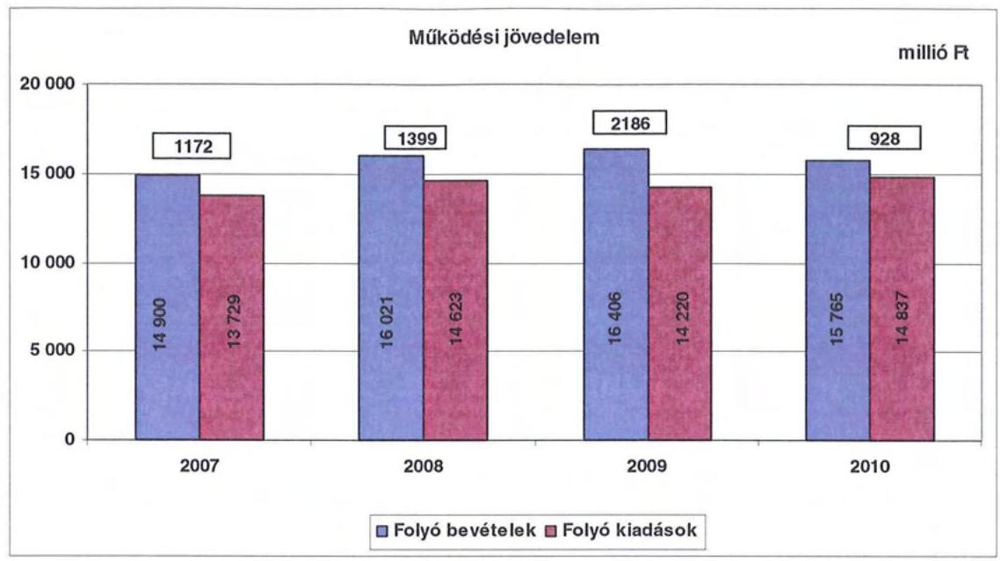

A folyó költségvetés egyenlege (a működési forrástöbblet) 2007-ben a folyó kiadások 8,5\%-át (1172 millió Ft-ot), 2008-ban 9,6\%-át (1399 millió Ft-ot), 2009-ben 15,4\%-át (2186 millió Ft-ot), 2010-ben 6,3\%-át (928 millió Ft-ot) jelentette. A vizsgált időszakban a működési jövedelem 5685 millió Ft megtakarítást mutatott,
 amely forrásul szolgálhatott az Önkormányzat fennálló tőketörlesztési kötelezettségeinek teljesítéséhez, valamint fejlesztéseinek finanszírozásához.

Az Önkormányzatnak folyamatosan pozitív előjelű folyó költségvetési egyenlege volt, folyószámla- és egyéb likvid hitel felvételére nem került sor.

Az Önkormányzat kötelezettségein belül a 2007-2010. években a rövid lejáratú kötelezettségek állománya a 2010. év végére $30,2 \%$ volt, a 2007. évi $43,2 \%$-os aránnyal szemben. Az Önkormányzat 2006. december 31-én fennálló pénz- és tőkepiaci kötelezettsége 2010-re 1633 millió Ft-ról 516 millió Ft-tal ( $31,6 \%$-kal), 2149 millió Ft-ra növekedett. Az összes kötelezettségen belül a hosszú lejáratú pénzintézeti kötelezettségek 2007-2010 között 1,5\%-kal (27 millió Ft-tal) nőttek.

A rövid lejáratú pénzintézeti kötelezettségek ${ }^{34}$ 2010-ben 255 millió Ft-ot tettek ki, amely 69 millió Ft-tal ( $36,8 \%$-kal) több a 2007. évi rövid lejáratú pénzintézeti kötelezettségállománynál. Az Önkormányzat a vizsgált időszakban nem rendelkezett számottevő mértékű lejárt szállítói tartozásállománnyal (2010. év december 31-én 4 millió Ft volt).

Az Önkormányzat 2010. évi záró pénzkészlete 2439 millió Ft volt, amelynek $66,2 \%$-a kötelezettséggel terhelt.

Az Önkormányzat pénzügyi kapacitása a vizsgált időszakban csökkent, de folyamatosan pozitív értéket mutatott. A nettó működési jövedelem ${ }^{35}$ értéke a

[^0]
[^0]:    ${ }^{34}$ A hosszú lejáratú hitelek következő évet terhelő törlesztő részletei.
    ${ }^{35}$ pénzügyi kapacitás

---

folyó költségvetési pozíció mellett az adott költségvetési év adósságtörlesztésének hatását is tükrözi. Az 5685 millió Ft működési jövedelemnek 14,2\%-át (805 millió Ft) tette ki a fejlesztési célú hitelekhez kapcsolódó tőketörlesztés, amelynek kifizetését követően 4880 millió Ft nettó működési jövedelme keletkezett az Önkormányzatnak.

A nettó működési jövedelem - az évenkénti tőketörlesztés ${ }^{36}$ megduplázódása mellett - 2007-ben 1055 millió Ft, 2008-ban 1192 millió Ft, 2009-ben 1949 millió Ft, 2010-ben 684 millió Ft volt. A pénzügyi kapacitás 2007-hez viszonyított javulását 2008-2009. évek között a folyó bevételek és kiadások különbségéből származó működési jövedelem növekedése, 2010. évre történő romlását annak csökkenése okozta.

Az Önkormányzatnak (a CLF módszer alapján) a fejlesztési kiadások egy részének fedezete - a 2010. évihez viszonyítva, változatlan nettó működési jövedelem képződése mellett - biztosítottnak látszik. Továbbá információul szolgál a jövőben vállalható teljesíthető adósságszolgálat mértékéről.
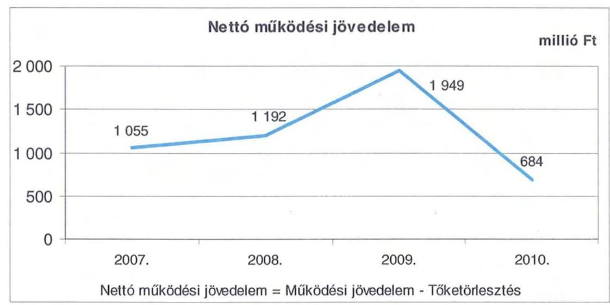

A 2007-2010. években az Önkormányzat felhalmozási költségvetésének egyenlege folyamatosan negatív összegű volt, amely takarékos költségvetési gazdálkodás és pénzügyileg fenntartható beruházások esetén nem jár magas pénzügyi kockázattal.

[^0]
[^0]:    ${ }^{36}$ Az Önkormányzat tőketörlesztési kötelezettsége a 2007. évben 117 millió Ft, a 2008. évben 207 millió Ft, a 2009. évben 237 millió Ft, a 2010. évben 244 millió Ft volt.

---

A beruházási költségvetés egyenlegének alakulását évről évre a következő ábra szemlélteti:
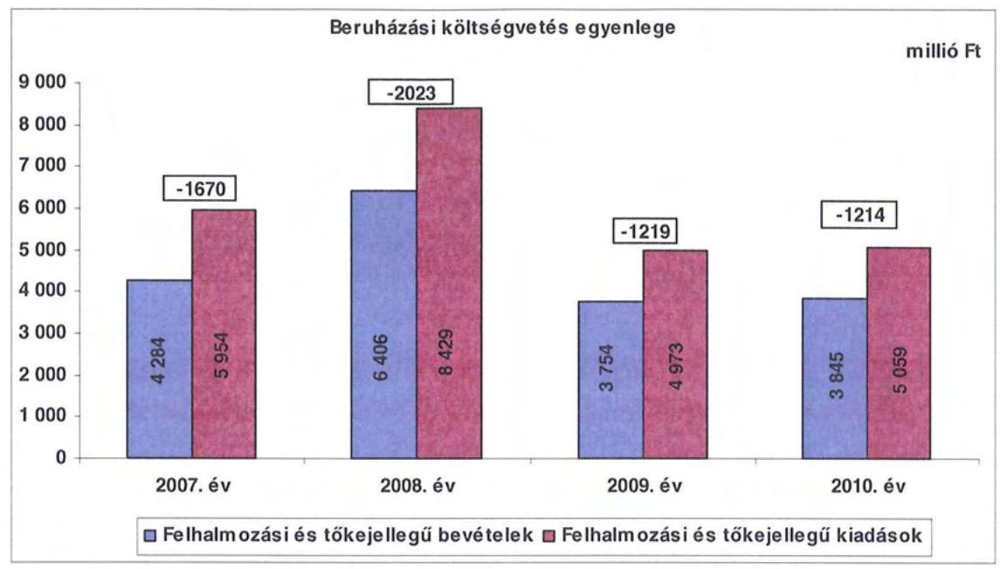

A felhalmozási forráshiány a felhalmozási és tőke jellegű kiadásokhoz viszonyított aránya 2007-ben 28,0\% (1670 millió Ft), 2008-ban 24,0\% (2023 millió Ft), 2009-ben 24,5\% (1219 millió Ft), 2010-ben 24,0\% (1214 millió Ft) volt.

A felhalmozási forráshiány finanszírozása a 2007. év elején rendelkezésre álló nyitó pénzkészletből, a működési jövedelem felhasználásából, valamint fejlesztési célú hitelekből történt. A vizsgált időszakban jelentkező összes felhalmozási forráshiány ( 6126 millió Ft) 79,7\%-ára nyújtott fedezetet a nettó működési jövedelem ${ }^{37}$.

Az Önkormányzat 2011. évi költségvetési rendeletében - a hagyományos költségvetési szerkezetben - tervezett bevételeinek és kiadásainak különbözete 2602 millió Ft negatív teljes finanszírozási igényt mutat, melyet finanszírozhat a 2010. évi 2439 millió Ft záró pénzkészlet. A fennmaradó 163 millió Ft hiányt azonban további hitelek felvételével tudja biztosítani az Önkormányzat.

A vizsgált időszakban keletkezett 6126 millió Ft felhalmozási forráshiányra a képződött 4880 millió Ft nettó működési jövedelem, valamint a felvett fejlesztési hitelek nyújtottak fedezetet.

A függő, átfutó, kiegyenlítő bevételek és kiadások 135 millió Ft-os negatív egyenlegének finanszírozásával az Önkormányzat 2439 millió Ft pénzkészlettel zárta a 2010. évet.

[^0]
[^0]:    ${ }^{37}$ Az ábrában megjelenő felhalmozási kiadásokban a társuláshoz kapcsolódó beruházások összege a 2007. évben 3401 millió Ft, a 2008. éven 5486 millió Ft, a 2009. évben 2693 millió Ft, a 2010. évben 2485 millió Ft.

---

Az Önkormányzat évenkénti teljes finanszírozási igénye ${ }^{38}$ a CLF módszer szerint 2007-ben 615 millió Ft, 2008-ban 832 millió Ft, 2010-ben 530 millió Ft volt, amelynek finanszírozását a finanszírozási célú bevételek és kiadások egyenlege biztosította. Az Önkormányzatnak a 2009. évben a nettó működési jövedelem és a felhalmozási költségvetés eredőjeként 730 millió Ft többlete keletkezett.

Az önkormányzat finanszírozási műveletei egyenlegének 2007-2010. évekbeli alakulását a következő ábra szemlélteti:
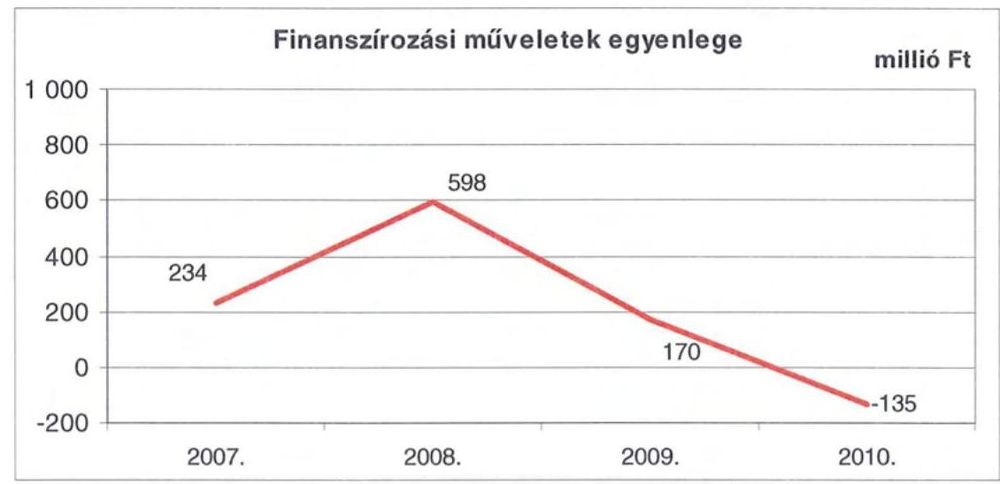

A finanszírozási többlet azt jelzi, hogy az éves költségvetések végrehajtása során szükség volt az előző években keletkezett pénzmaradvány igénybevételén túl külső finanszírozás igénybevételére is. A finanszírozási célú műveleteket a vizsgált időszakban a jelentés 2. számú mellékletének 4.1-4.8 pontjai részletezik.

Az Önkormányzat a költségvetési hiányt a 2007. évi zárszámadási rendeletében a hagyományos költségvetési szerkezettől eltérően ${ }^{39}$, a 2008-2010. évi zárszámadási rendeleteiben a hagyományos költségvetési szerkezet alapján mutatta be ${ }^{40}$, amelyről a jelentés 1. számú melléklete nyújt tájékoztatást. A fentiek szerint a rendeletekben pénzügyi többletet mutattak ki.

A vizsgált időszakban a kötelezettségek (passzív pénzügyi elszámolások nélkül) 4138 millió Ft-ról 3825 millió Ft-ra csökkentek, amely együtt járt a kamatkiadások csökkenésével.

A 2007-2010. évek között az Önkormányzat összesen 479 millió Ft kamatot fizetett meg, mely az átmenetileg szabad pénzeszközeiből elért 718 millió Ft kamatbevétel $66,8 \%$-át tette ki.

[^0]
[^0]:    ${ }^{38}$ a nettó működési jövedelem és a beruházási költségvetés eredője
    ${ }^{39}$ Annak meghatározásakor az adósságszolgálati kiadásokat és a hitelfelvételből, valamint értékpapír értékesítésből származó finanszírozási célú bevételeket a működési és felhalmozási bevételek részének tekintette.
    ${ }^{40}$ Nincs kötelező előírás a működési és fejlesztési hiány megállapításának módjára.

---

Az Önkormányzat kamatbevételeinek és kamatkiadásainak alakulását a következő ábra mutatja:
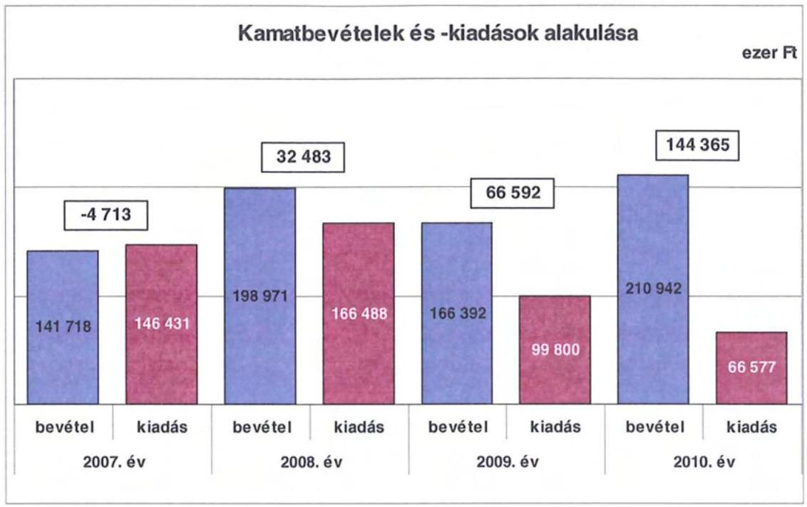

# 2.2. Az Önkormányzat bevételeinek alakulása 

Az Önkormányzat 2007-2010. évek közötti folyó működési bevételi jogcímeinek számszaki adatait az alábbi grafikon mutatja be:
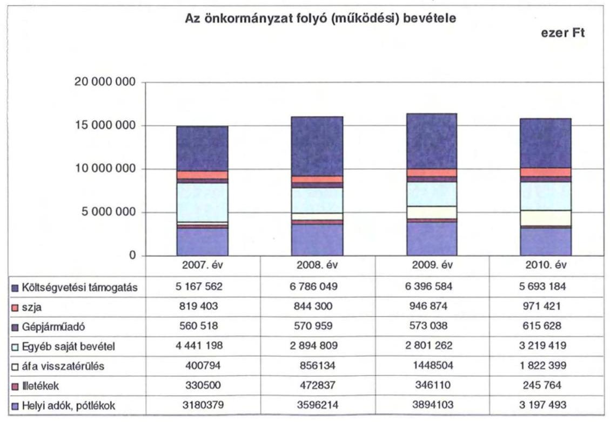

---

Az Önkormányzat 2007-2010. évek között realizált folyó (működési) bevétele 865 millió Ft-tal ( $5,8 \%$-kal) növekedett.

A folyó bevételek jelentős részét képezi a költségvetési támogatás, ennek aránya a 2007. évben 34,7\%, a 2008. évben 42,4\%, a 2009. évben 38,9\%, a 2010. évben $36,1 \%$ volt. Az állami támogatások összege a 2008. évi $31,3 \%$-os ( 1618 millió Ft) növekedést követően a központi forráskivonás hatására ${ }^{41}$ folyamatosan és jelentős mértékben csökkent. Az előző évihez képest 2009-ben 5,7\%-kal (389 millió Ft-tal), 2010-ben 11\%-kal (703 millió Ft) kapott kevesebb forrást az Önkormányzat az államtól ezeken a jogcímeken. A központi támogatás részét képező normatív támogatások 2008-2009. évek között 84 millió Ft-tal, 2010-2009. évek között ennél erőteljesebben, 488 millió Ft-tal csökkentek. Ezt a normatíváknak a járulékváltozások miatti központi csökkentése, valamint a közoktatási ágazat ellátotti létszámának visszaesése idézte elő.

Az Önkormányzat iparűzési adóerőképessége 2010. évre 19,6\%-kal, 2575 millió Ft-ra nőtt a 2007. évi 2152 millió Ft-hoz képest. Az Önkormányzat személyi jövedelemadó bevétele ezzel párhuzamosan 2010. évre 2007. évhez képest 152 millió Ft-tal ( $18,6 \%$-kal) növekedett. A személyi jövedelemadó bevétel az Önkormányzat folyó (működési) bevételének közel azonos nagyságú arányát jelentette a vizsgált években ${ }^{42}$.

A gépjárműadóból származó bevétel 2007-ről 2010-re 9,8\%-kal, 55 millió Ft-tal emelkedett ${ }^{43}$.

Az Önkormányzat egyéb saját bevételei a vizsgált időszakban változóan alakultak. A 2007. évi 4441 millió Ft-ról a 2008. évre 2895 millió Ft-ra, 34,8\%-kal (1546 millió Ft-tal), 2009-re 3,2\%-kal ( 94 millió Ft-tal) csökkentek, míg 2010-re 14,9\%-kal (418 millió Ft-tal) növekedtek az előző évhez képest. Az Önkormányzat saját működési bevételeinek részét képező intézményi működési bevételek 2007-2010. évek között 54,7\%-kal (1355 millió Ft-tal) emelkedtek ez részben az ellátotti térítési díjak emeléséből adódott.

Az áfa visszatérítésből származó bevételek összege az előző évhez képest 2008-ra 113,6\%-kal (455 millió Ft-tal), a 2009. évre 69\%-kal (592 millió Ft-tal), a 2010. évre 20,5\%-kal ( 374 millió Ft-tal) nőtt. Az áfa visszatérítésből származó bevétel emelkedésének egy része a fordított áfa elszámolásához kapcsolódott, amely mind a bevételi, mind a kiadási oldalon megjelent.

Az illetékbevétel a vizsgált időszakban változó tendenciát mutatott. A 2008. évben 43,1\%-kal (142 millió Ft-tal) növekedett 2007. évhez viszonyítva, majd azt követően folyamatosan csökkent az előző évhez képest. A 2008-ról 2009-re 26,8\%-os csökkenés ( 127 millió Ft), a 2009-ről 2010-re 29\%-os csökkenés (100 millió Ft) következett be. Az illetékbevétel az Önkormányzat folyó (működési) bevételének közel azonos nagyságú arányát jelentette a 2007. évben (2,2\%), a

[^0]
[^0]:    ${ }^{41}$ a 2007. évi bázishoz képest
    ${ }^{42}$ A 2007. évben 5,5\%, a 2008. évben 5,3\%, a 2009. évben 5,8\%, a 2010. évben 6,2\%.
    ${ }^{43}$ A gépjárműadót érintő módosítások 2010. január 1-től következtek be, amely az egyes adótételek esetében átlagosan 15\%-os emelkedéssel járt.

---

2008. évben (2,9\%) és a 2009. évben (2,1\%), ez az arány a 2010. évre 1,6\%-ra csökkent.

A Közgyűlés a helyi adók közül a helyi iparűzési adót ${ }^{44}$ és az idegenforgalmi adót ${ }^{45}$ vezette be már a korábbi években, a vizsgált időszakban új adónem bevezetésére nem került sor. A helyi iparűzési adó mértéke 2007-2010. években nem változott. Az állandó jelleggel végzett tevékenység után fizetendő iparűzési adót a bevezethető adómérték $2 \%$-os maximumában határozták meg. Az ideiglenes jelleggel végzett tevékenység után fizetendő iparűzési adó mértékét a piaci és vásározó kiskereskedelem vonatkozásában napi 1000 Ft-ban, egyéb tevékenységek esetében naptári naponként 5000 Ft-ban rögzítették. A helyi adórendelet 2010. év végi módosítása során ${ }^{46}$ az ideiglenes jelleggel végzett tevékenységek közül a piaci és vásározó kiskereskedelmet kivették és a fizetendő iparűzési adó mértékét 2011. január 1-től egységesen naptári naponként 5000 Ft-ban rögzítették. A személyenként és vendégéjszakánként fizetendő idegenforgalmi adó összege 2007-2009. években 347 Ft volt, amely 2010. évtől 350 Ft-ra emelkedett.

Az Önkormányzatnál a helyi adóbevétel a 2008-2009. években az előző évhez képest jelentősen, 13,1\%-kal (416 millió Ft-tal), illetve 8,3\%-kal (298 millió Ft-tal) növekedett. A helyi adóbevétel a 2010. évben a 2009. évhez képest jelentősen, 17,9\%-kal (697 millió Ft-tal) csökkent. A helyi adóbevétel aránya az Önkormányzat folyó (működési) bevételéhez képest a 2007-2009. években csekély mértékben nőtt, azt követően csökkent ${ }^{47}$. Az iparűzési adó 2008. évi 366 millió Ft-os, 2009. évi 346 millió Ft-os növekedése nem az Önkormányzat intézkedése miatt, hanem jogszabályváltozás ${ }^{48}$ és az adózók árbevételeinek növekedése hatására következett be.

Az Önkormányzat a tulajdonosi részesedései után a 2007-2010 között 32 millió Ft osztalékot vett fel, amely 2007-2008. években három-három, 2010. évben két kizárólagos tulajdonú, továbbá egy $25 \%$ részesedés alatti gazdasági társaság befizetéséből adódott. Az Önkormányzat a 2009. évben gazdasági társaságoktól osztalékot nem vett fel, az kizárólagos tulajdonú önkormányzati társaságok 2008. évi gazdálkodásából származó nyereséget, beszámolójuk jóváhagyásával egyidőben eredménytartalékba helyezték.

[^0]
[^0]:    ${ }^{44}$ Az Önkormányzat helyi iparűzési adóról szóló többször módosított 17/1991. (XII. 12.) számú, illetve a többször módosított 56/2007. (XII. 28.) számú rendeletei.
    ${ }^{45}$ Az Önkormányzat idegenforgalmi adóról szóló többször módosított 61/2004. (XII. 23.) számú rendelete.
    ${ }^{46}$ Az Önkormányzat 48/2010. (XII. 23.) számú rendelete a helyi iparűzési adóról szóló 56/2007. (XII. 28.) számú rendelet módosításáról.
    ${ }^{47}$ A helyi adóbevétel aránya a 2007. évben 21,3\%, a 2008. évben 22,4\%, a 2009. évben $23,8 \%$, a 2010. évben $20,3 \%$ volt.
    ${ }^{48}$ A helyi adókról szóló törvényt módosító 2007. évi CXXVI. törvény 2008. január 1-jétől 2009. július 1-jéig az adóalap új megosztását vezette be, ami az Önkormányzat számára kedvezőbb volt.

---

Az ellátott közfeladatok alapján kiemelt (hulladékkezelés, vízmű, vagyonüzemeltetés) tevékenységet végző öt gazdasági társaság bevételei a 2007. évi 5212 millió Ft-ról 2010. évre 6132 millió Ft-ra, 17,7\%-kal nőttek. A 2007. évi bevételekből 1855 millió Ft-ot ( $35,6 \%$-ot) a négy kizárólagos önkormányzati tulajdonú, 5212 millió Ft-ot ( $64,4 \%$-ot) egy $75 \%$ feletti tulajdoni részesedésű gazdasági társaság realizált. A 2010. évben a négy kizárólagos tulajdonú gazdaság 2397 millió Ft bevételt ért el, a bevételekből való részesedés aránya 39,1\%-ra nőtt. A 75\% feletti önkormányzati tulajdonú gazdaság 2010. évi 3735 millió Ft összegű bevétele a 2007. évhez képest $11,3 \%$-kal nőtt, azonban az összes bevételből való részesedése $60,9 \%$-ra csökkent.

A bevételeiből három gazdasági társaság adott át az Önkormányzat részére. A két kizárólagos önkormányzati tulajdonú társaság a fizetőparkolóként kijelölt várakozóhelyek közterület használati díja, továbbá eszközhasználati díj címén 2007-ben 132 millió Ft-ot, 2008-ban 155 millió Ft-ot, 2009-ben 154 millió Ft-ot, 2010-ben 194 millió Ft-ot utalt át az Önkormányzat részére. A 75\% feletti tulajdoni részesedésű gazdasági társaság 2007-2010 között összesen 1957 millió Ft-ot adott át az Önkormányzatnak fejlesztési díj címén.

A vizsgált években a kiemelt közfeladatot ellátó gazdasági társaságok működési és felhalmozási célú önkormányzati támogatást nem kaptak.

Az Önkormányzat által a gazdasági társaságok részére működési és fejlesztési célra átadott pénzeszközök alakulását az alábbi diagram mutatja be a 20072010. évekre:
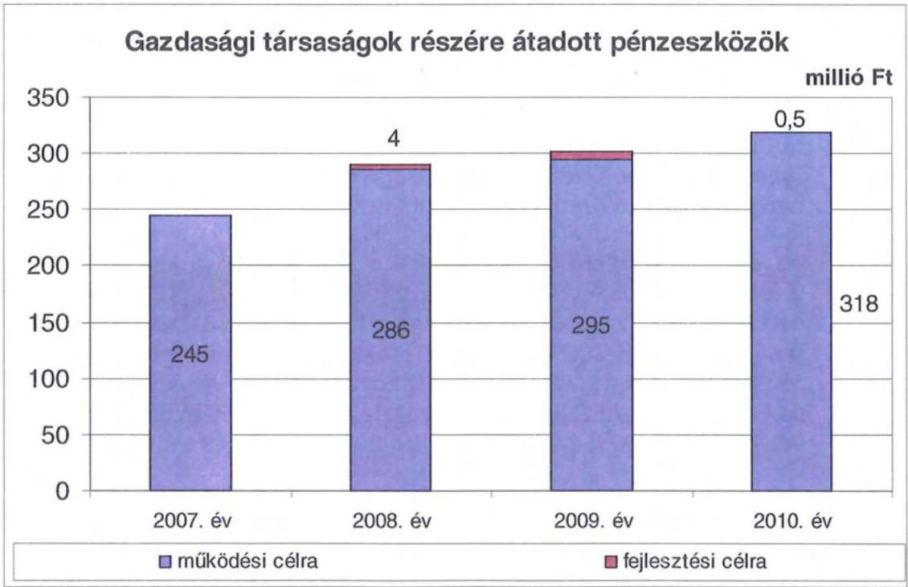

Az önkormányzati feladatellátásban résztvevő gazdasági társaságoknak működési célra átadott pénzeszköz a vizsgált években folyamatosan növekedett, a 2007. évi 245 millió Ft-ról 2010-re 29,8\%-kal, 318 millió Ft-ra változott. A 20072010 között fejlesztési célra átadott pénzeszközök az összes támogatás mindössze $1 \%$-át tette ki.

---

A 2010. évben az Önkormányzattól működési célra négy kizárólagos önkormányzati tulajdonú gazdasági társaság kapott támogatást. A kapott támogatásnak az összes bevételükhöz viszonyított aránya 13,6\% és 57,6\% között változott. Az Önkormányzattól 2010-ben még további két 51-74\%-os tulajdoni részesedésű gazdasági társaság kapott működési támogatást. A kapott támogatások összes bevételükhöz viszonyított aránya 10,7\%, illetve $41,8 \%$ volt.

Az Önkormányzat felhalmozási bevételei a vizsgált időszakban a következők voltak:

| Megnevezés | 2007. év   tény | 2008. év   tény | 2009. év   tény | 2010. év   tény |
| :-- | --: | --: | --: | --: |
| Tárgyi eszköz értékesítés | 155752 | 755994 | 356144 | 125402 |
| Egyéb saját tőkebevétel | 57982 | 384704 | 342301 | 151375 |
| Államháztartáson belülről   kapott támogatás | 3849466 | 4698378 | 2576573 | 2971078 |
| EU-tól és külföldről kapott   támogatások | 0 | 0 | 0 | 0 |
| Államháztartáson kívülről   kapott támogatás | 221102 | 566527 | 479212 | 597588 |
| Összes felhalmozási bevétel | 4284302 | 6405603 | 3754230 | 3845443 |

A felhalmozási bevételek alakulása változatos képet mutat, 2007-ről 2008-ra 2121 millió Ft-tal ( $49,5 \%$-kal) nőtt, majd 2009-ben az előző évhez viszonyítva 2651 millió Ft-tal ( $41,4 \%$-kal) csökkent, aztán ismét emelkedett 91 millió Ft-tal ( $2,4 \%$-kal). A változást a tárgyi eszköz értékesítéséből és a támogatásokból származó bevételek alakulása okozta. Az Önkormányzat összes felhalmozási célú bevétele a 2010. évben 3845 millió Ft volt, amely 439 millió Ft-tal ( $10,2 \%$-kal) volt alacsonyabb a 2007. évinél.

Az Önkormányzatnak tárgyi eszköz értékesítéséből a vizsgált időszakban 1393 millió Ft bevétele keletkezett, amelyből 1047 millió Ft-ot önkormányzati ingatlanok eladásából értek el. A legjelentősebb ingatlanértékesítésekre a 2008. évben került sor 669 millió Ft összegben.

Az egyéb saját tőkebevételek ${ }^{49}$ a vizsgált időszakban változó tendenciát mutatott. A 2008. évben több mint öt és félszeresével ( 327 millió Ft-tal) növekedett 2007. évhez viszonyítva, majd azt követően csökkent az előző évekhez képest. A 2008-ról 2009-re 11\%-os csökkenés ( 42 millió Ft), a 2009-ről 2010-re 55,8\%-os csökkenés ( 191 millió Ft) következett be. Az egyéb saját tőkebevételek az Önkormányzat felhalmozási bevételének a 2007. évben 1,4\%-át, a 2008. évben 6\%-át, a 2009. évben 9,1\%-át, a 2010. évben 3,9\%-át jelentette.

Az államháztartáson belülről és kívülről kapott felhalmozási célú támogatások pályázati forrásokból megvalósuló projektekhez kapcsolódtak, ezekből 2007-2010. években 15960 millió Ft bevétel származott.

[^0]
[^0]:    ${ }^{49}$ Önkormányzati lakások, egyéb helyiségek értékesítéséből, cseréjéből, tartós részesedések értékesítéséből, valamint támogatási kölcsönök államháztartáson kívülről történő visszatérüléséből származó bevételek.

---

Az Önkormányzat és 41 további önkormányzat részvételével 2005. évben önkormányzati társulást hoztak létre Zalaegerszeg és környéke csatornahálózat és szennyvíz tisztítótelep fejlesztésére. A társulás a megvalósítani kívánt fejlesztésre ${ }^{50}$ a 2007. évben 3060 millió Ft, a 2008. évben 5222 millió Ft, a 2009. évben 2130 millió Ft, a 2010. évben 2012 millió Ft pályázati támogatásban részesült. Az Önkormányzat szennyvíz csatornázási beruházásokhoz kapcsolódó kiadási, bevételi részaránya $73,5 \%$ volt. A társulás által a vizsgált években kapott 12424 millió Ft támogatás az Önkormányzat által államháztartáson belülről és kívülről kapott felhalmozási célú támogatásokon belüli aránya $77,8 \%$ volt.

# 2.3. Az Önkormányzat kiadásainak alakulása 

Az Önkormányzat működési kiadásai főbb jogcímek szerinti bontásban az alábbiak voltak:
ezer Ft

| Megnevezés | 2007. | 2008. | 2009. | 2010. |
| :--: | :--: | :--: | :--: | :--: |
| folyó kiadások | 13728551 | 14622771 | 14220205 | 14837107 |
| Működési kiadások (kamatkiadás nélkül) | 12246675 | 13036521 | 12576338 | 13197684 |
| Államháztartáson belülre átadott pénzeszközök | 141777 | 161174 | 213134 | 163618 |
| Transzferkiadások | 1190588 | 1255118 | 1261609 | 1404774 |
| ebből: vállalkozásoknak | 331421 | 350670 | 327477 | 355632 |
| EU-nak, illetve külföldre | 230 | 220 | 0 | 0 |
| magánszemélyeknek | 512702 | 528584 | 641358 | 724005 |
| nonprofitszervezeteknek | 346235 | 375644 | 292774 | 325137 |
| Kamatkiadások | 146431 | 166488 | 99800 | 66577 |
| Előző évi pénzmaradvány átadás | 3080 | 3470 | 69324 | 4454 |

Az Önkormányzat működési (folyó) kiadásai ${ }^{51}$ 2007-ről 2010-re 8,1\%-kal (1109 millió Ft-tal) nőttek. A kiadásoknak túlnyomó részét (évente mintegy $89 \%$-át) képezi a kamatkiadás nélküli működési kiadás, amelynek összege - a működési (folyó) kiadással párhuzamosan - 2007-ről 2010-re 7,8\%-kal (951 millió Ft-tal) nőtt.

A transzferkiadások 2007-2010. évek között 18\%-kal (214 millió Ft-tal) emelkedtek. A transzferkiadások a működési (folyó) kiadások közel azonos nagyságú arányát jelentette a 2007. évben ( $8,7 \%$ ), a 2008. évben ( $8,6 \%$ ) és a 2009. évben ( $8,9 \%$ ) ez az arány a 2010. évre $9,5 \%$-ra növekedett.

A kamatkiadások 2007-ről 2010-re 54,5\%-kal (80 millió Ft-tal) csökkentek ezek aránya a működési (folyó) kiadásokhoz képest csekély mértékű, a 2007. évben $1,1 \%$, a 2008. évben $1,1 \%$, a 2009. évben $0,7 \%$, a 2010. évben $0,4 \%$ volt.

Az előző évi pénzmaradvány átadás összege 2007-2009. évek között folyamatosan nőtt, majd 2010-ben jelentős mértékben, 93,6\%-kal (65 millió Ft-tal) csökkent 2009. évhez képest. A többi évhez képest kiugróan magas, a 2009. évi 69 millió Ft-os nagyság az intézmények 2008. évi szabad pénzmaradványából történt 50 millió Ft-os elvonásból adódott.

[^0]
[^0]:    ${ }^{50}$ Zalaegerszeg Kohéziós Alap projekt.
    ${ }^{51}$ A beruházási társuláshoz kapcsolódó, nem az Önkormányzathoz tartozó kiadási részarány a vizsgált években $26,5 \%$ volt.

---

A folyó kiadások közel 100\%-át kitevő kiemelt működési előirányzatok teljesítési adatait az alábbi táblázat tartalmazza:
ezer Ft

| Megnevezés | 2007. | 2008. | 2009. | 2010. |
| :-- | --: | --: | --: | --: |
| Személyi juttatások | 6256297 | 6647859 | 6200760 | 6032882 |
| Munkaadót terhelő járulékok | 1987166 | 2083986 | 1840346 | 1591754 |
| Dologi kiadások | 4084412 | 4363441 | 4536632 | 5456606 |
| Egyéb folyó kiadások | 65231 | 107759 | 98406 | 183021 |
| Működési célú pénzeszközátadás | 827046 | 922656 | 904570 | 855042 |

Az Önkormányzat 2010-ben a folyó kiadások 51,4\%-át (7625 millió Ft) személyi juttatásokra és a munkaadókat terhelő járulékokra fordította, az üzemeltetést, intézményfenntartást biztosító dologi kiadások aránya 36,8\% (5457 millió Ft) volt.

A személyi juttatások 2008-ban 6,3\%-kal (392 millió Ft-tal) nőttek az előző évhez képest, azt követően minden évben csökkentek a létszámcsökkentések miatt. A 2010. évben a 2007. évben teljesített kiadásoknál 3,6\%-kal (223 millió Ft) lett alacsonyabb.

A vizsgált időszakban a munkaadókat terhelő járulékok jelentős ${ }^{52}$ csökkenése következett be, amely egyrészt a kifizetett személyi juttatások, másrészt a járulékok mértékének csökkenésével volt összefüggésben. A járulékok csökkenése miatt felszabaduló forrásokat azonban a kormányzat az önkormányzati alrendszernek nyújtott állami támogatásokból levonásba helyezte, így a járulékcsökkenés az Önkormányzat pénzügyi pozíciójában érdemi változást nem eredményezett.

A személyi juttatások és a munkaadókat terhelő járulékok 2008-ban 5,9\%-kal (488 millió Ft-tal) növekedtek az előző évhez képest, azt követően minden évben csökkentek. A működési kiadásokon belül a személyi juttatások és járulékok aránya a vizsgált időszakban 2007-ben 60\%, 2008-ban 59,7\%, 2009-ben 56,5\% volt, 2010-ben $51,4 \%$ volt.

Az Önkormányzat dologi kiadásai 2007-2010. évek között folyamatosan emelkedtek, 2007-ről 2010-re 33,6\%-kal (1372 millió Ft-tal) nőttek. A legerőteljesebb növekedés 2009-ről 2010-re ( 920 millió Ft) következett be. Ezzel párhuzamosan az egyéb folyó kiadások 2010. évre 2007. évhez képest csaknem megháromszorozódtak ${ }^{53}, 118$ millió Ft-tal nőttek.

A speciális célú támogatások között mind a társadalom és szociálpolitikai juttatások, mind a működési célú pénzeszközátadások, mind pedig az ellátottak pénzbeli juttatásának összege emelkedett. Az Önkormányzat lakosainak romló szociális helyzetét jelzi, hogy 2010-ben a szociális juttatások összege a 2007. évihez viszonyítva 210 millió Ft-tal (41,2\%-kal) volt magasabb. Emellett a működési célú pénzeszközátadások 2008-ban 11,6\%-kal (96 millió Ft-tal) nőttek az előző évhez képest, azt követően minden évben csökkentek. Összességében

[^0]
[^0]:    ${ }^{52}$ 2010. évi teljesítés szinten 19,9\%-os, 395 millió Ft-os csökkenés.
    ${ }^{53}$ Ennek egy része a fordított ÁFA elszámolásához kapcsolódott, amely a bevételi oldalon is megjelent.

---

2010-ben a 2007. évben teljesített kiadásoknál 3,4\%-kal (28 millió Ft) magasabbak. Az ellátás szervezeti kereteiben nem történt lényeges változás ezen időszakban.

A működési és felhalmozási kiadások arányának változásában 2007-2010 között hullámzás figyelhető meg, a felhalmozási kiadások aránya a 2008. évi értéket nem számítva csökkenő tendenciát mutattak, 2010-ben 4,8 százalékponttal csökkentek a 2007. évihez viszonyítva. A felhalmozási kiadások aránya 30,2\%-ról (5954 millió Ft-ról) 25,4\%-ra (5059 millió Ft-ra csökkent) ${ }^{54}$.

A kiadások megoszlásának alakulását a következő grafikon szemlélteti:
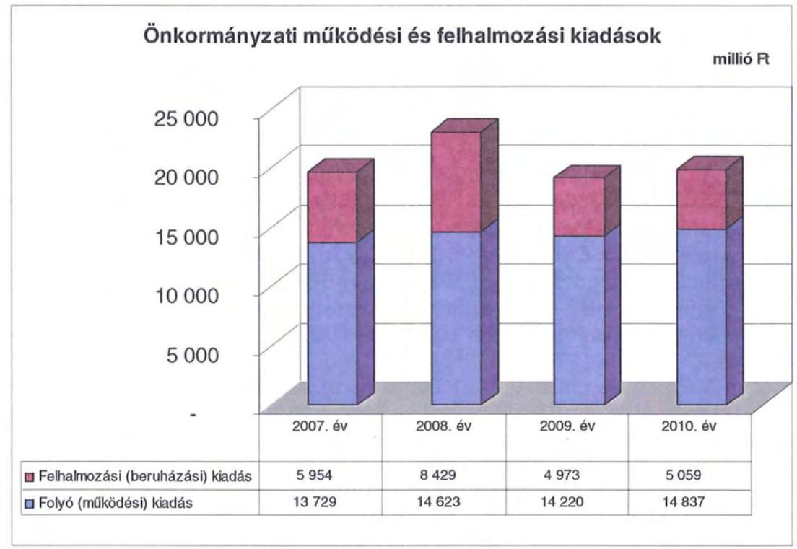

A vizsgált időszakban a beruházási társulás működési kiadási összege a 2007. évben 70 millió Ft, a 2008. évben 107 millió Ft, a 2009. évben 76 millió Ft, a 2010. évben 797 millió Ft, felhalmozási kiadási összege a 2007. évben 3401 millió Ft, a 2008. évben 5486 millió Ft, a 2009. évben 2693 millió Ft, a 2010. évben 2485 millió Ft volt. Az Önkormányzat beruházási társuláshoz kapcsolódó kiadási részaránya 73,5\% volt.

A 2007-2010. évek között megvalósított, 2010. december 31-ig befejezett, 10 millió Ft teljes bekerülési költség feletti felújítások száma 33 volt, ezek közül háromhoz kaptak pályázati támogatást, a többit saját bevételből és hitelből fedezték. Egy felújításhoz EU-s (35 millió Ft), két felújításhoz hazai támogatás (12 millió Ft) kapcsolódott.

[^0]
[^0]:    ${ }^{54}$ A beruházási társulás nélkül a csökkenés 3,8 százalékpont. Az arány 26,9\%-ról (5052 millió Ft-ról) 23,1\%-ra (4400 millió Ft-ra) csökkent.

---

A befejezett felújításokra a 10 millió Ft egyedi bekerülési értéket el nem érő munkákkal együtt 1878 millió Ft-ot költöttek, a 2006. december 31-ig teljesített kiadások 60 millió Ft-ot tettek ki. A felújítások forrását 207 millió Ft hitel (11\%), 35 millió Ft EU-s támogatás (1,9\%), 12 millió Ft hazai támogatás (0,6\%), 1624 millió Ft önkormányzati saját bevétel (86,5\%) képezte. A felújítások tényleges ráfordításai együttesen nem érték el a tervezett összeget, 9 millió Ft-tal alatta maradtak.

A 2007-2010 között megvalósított, 2010. december 31-ig befejezett, 10 millió Ft teljes bekerülési költség feletti fejlesztések száma 45 volt, a 10 millió Ft egyedi bekerülési értéket el nem érő munkákkal együtt ezekre 4684 millió Ft-ot költöttek, a 2006. december 31-ig teljesített kiadások 647 millió Ft-ot tettek ki. A megvalósított fejlesztések forrását 994 millió Ft hitel (21,2\%), 605 millió Ft EU-s támogatás (12,9\%), 23 millió Ft hazai támogatás (0,5\%), 3061 millió Ft önkormányzati saját bevétel (65,4\%) képezte. A fejlesztések tényleges ráfordításai sem érték el együttesen a tervezett összeget, 98 millió Ft-tal alatta maradtak.

Az Önkormányzatnál megvalósult felújítási és beruházási munkálatok 20072010. évek között teljesített együttes kiadása 5854 millió Ft volt, a korábbi időszakban ezekkel kapcsolatban 708 millió Ft-os ráfordítás jelentkezett. A kifizetések 18,3\%-át hitelből (1201 millió Ft), 9,8\%-át EU-s (641 millió Ft), és 0,5\%-át hazai támogatásokból (35 millió Ft) finanszírozták. A fennmaradó 71,4\%-ra a saját bevételek (4685 millió Ft) nyújtottak fedezetet. A befejezett munkák teljesített kiadása együttesen 107 millió Ft-tal volt kevesebb, mint a tervezett összeg.

A 2010. december 31-én folyamatban lévő felújítások, és fejlesztések tervezett bekerülési költsége együttesen 20552 millió Ft, ebből 2010. év végéig 17353 millió Ft-ot teljesítettek, a még fennálló kifizetési kötelezettség ezekkel kapcsolatban várhatóan 2608 millió Ft lesz. Így a várható teljes bekerülési költség 591 millió Ft-tal (2,9\%-kal) marad el a tervezett bekerülési költségtől. A 2010. december 31-ig teljesített kifizetések 1,6\%-át hitelből (285 millió Ft), 62,4\%-át EU-s támogatásból (10830 millió Ft), 14,9\%-át hazai támogatásokból (2587 millió Ft), és 21,1\%-át saját bevételből (3651 millió Ft) finanszírozták. A 2010. december 31-e után fennálló kifizetési kötelezettség 9,3\%-át hitelből (243 millió Ft), 33,9\%-át EU-s támogatásból (885 millió Ft), és 56,8\%-át saját bevételből (1480 millió Ft) tervezik finanszírozni. Összességében a felújítások, fejlesztések teljes megvalósulásakor, a már teljesített és a még várható kifizetések 2,6\%-ára hitel (528 millió Ft), 58,7\%-ára EU-s támogatás (11715 millió Ft), 13\%-ára hazai támogatások (2587 millió Ft), és 25,7\%-ára saját bevétel (5131 millió Ft) biztosít fedezetet.

A pályázati forrásokból megvalósuló projektek közül kiemelkedik a 2005. évben megkezdett, beruházási társulás keretében megvalósuló Zalaegerszeg Kohéziós Alap projekt, melynek célja Zalaegerszeg és környéke csatornahálózatának és szennyvíztisztító telepének fejlesztése. Az Önkormányzat szennyvíz-csatornázási beruházásokhoz kapcsolódó kiadási, bevételi részaránya 73,5\%. A projekt várható teljes bekerülési költsége 14001 millió Ft, ebből 2007-2010. években 13662 millió Ft-ot teljesítettek. A projekt várható teljes bekerülési költségének 75\%-át EU-s támogatásból (10501 millió Ft), 18,5\%-át ha-

---

zai támogatásokból (2587 millió Ft), és 6,5\%-át saját bevételből (913 millió Ft) finanszírozzák.

Az Önkormányzat beadott, elbírálás alatti pályázati forrásból három projektet tervez megvalósítani, melyek tervezett összköltsége 240 millió Ft, a saját bevételből származó forrásrész 21,3\% (51 millió Ft), a hazai támogatás aránya 78,7\% (189 millió Ft).

Az Önkormányzat 2007-2010. években megvalósított, illetve 2010. december 31-én fennálló fejlesztési feladatokhoz kapcsolódó kötelezettségeinek összegzését a 3.a.,b.,c.,d. számú mellékletek tartalmazzák.

Ezen időszakban a három legmagasabb bekerülési költségű beruházás a következő volt:

- a Zalaegerszeg Északi Iparterület előközművesítési munkái - I. ütem Infrastruktúra kiépítése 287 millió Ft teljes bekerülési költséggel. Az Önkormányzat a projekthez 83 millió Ft támogatást ${ }^{55}$ nyert. A beruházást 2009-ben kezdték el és 2010. évben fejezték be. A fejlesztés forrásösszetétele: 181 millió Ft hitel (63%), 83 millió Ft EU-s támogatás (28,7%) és 24 millió Ft saját bevétel (8,3%) volt.
- Inkubátorház létrehozása 411 millió Ft teljes bekerülési költséggel. Az Önkormányzat a projekthez EU-s támogatást ${ }^{56}$ nyert. A beruházást 2008-ban kezdték el és 2010. évben fejezték be. A fejlesztés forrásösszetétele: 80 millió Ft hitel (19,4%), 327 millió Ft EU-s támogatás (79,7%) és 4 millió Ft saját bevétel (0,9%) volt.
- az EU-s támogatással megvalósuló Belváros-rehabilitációs program I. üteme projekt várható bekerülési költsége - az ellenőrzés időpontjában ismert információk alapján - 508 millió Ft. A projekttel kapcsolatban 2010. december 31-ig 269 millió Ft-került kifizetésre, a még fennálló kifizetési kötelezettség várhatóan 239 millió Ft lesz. A 2010. év végéig teljesített kifizetéseket EU-s támogatásból finanszírozták, az ezt követően fennálló kifizetési kötelezettség 28,5\%-át hitelből (68 millió Ft), és 71,5\%-át EU-s támogatásból (171 millió Ft) tervezik finanszírozni. Az eredetileg tervezett forrásösszetétel 26,7\% hitel, 69,8\% EU-s támogatás, és 3,4\% saját bevétel volt.

Az Önkormányzat fejlesztési tevékenysége a pályázati kiírások által nagyban befolyásolt, és saját felhalmozási bevételei alacsony szintje miatt beruházásokat csak külső források, EU-s és hazai támogatások elnyerése esetén tud megvalósítani. A felhalmozási kiadások önrészének forrásait is részben fejlesztési hitelből finanszírozta.

[^0]
[^0]:    ${ }^{55}$ NYDOP-1.3.1-2F-2009-0003.
    ${ }^{56}$ NYDOP-1.3.1-2F-2009-0004.

---

# 3. KÖTELEZETTSÉGEK BEMUTATÁSA 

### 3.1. A pénzintézetek felé fennálló kötelezettségek alakulása

Az Önkormányzat pénzintézeti kötelezettségeinek állománya ${ }^{57}$ 2006. december 31-től 2010. december 31-ig 31,6\%-kal nőtt, 1633 millió Ft-ról 2149 millió Ft-ra. Fennálló pénzintézeti kötelezettségei hosszú lejáratú hitelek igénybevételéből keletkeztek. A közbeszerzési eljárás keretében történt meg a legkedvezőbb hitelajánlatot nyújtó pénzintézet kiválasztása. Az Önkormányzat pénzintézeti kötelezettségvállalásai hat bank között megosztva jelentkeztek.

Az Önkormányzat pénzintézetekkel szemben fennálló kötelezettség-állományát a 2007-2010. években az alábbi diagram szemlélteti:
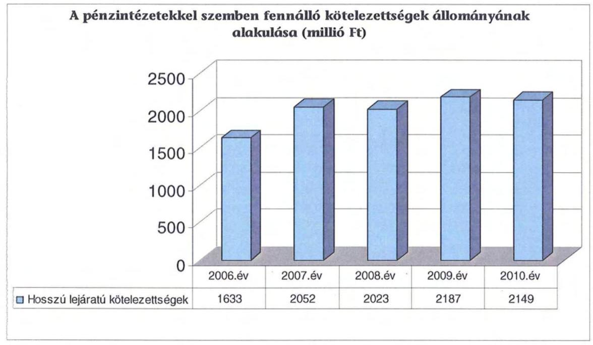

Az ellenőrzött időszakban az Önkormányzat kötvényt, váltót nem bocsátott ki.

Az Önkormányzat pénzintézeti kötelezettségvállalásaira minden esetben közgyűlési döntés alapján került sor. A kötelezettségvállalásokból származó források felhasználási céljait meghatározták. Az Önkormányzatnál a hitelfelvételek előterjesztésében nem mutatták be a teljes futamidőre eső tőkeés kamatfizetési kötelezettségek részletezését, fedezetét, forrását nem jelölték meg, azonban a kötelezettségek teljesítésének költségvetésben való megtervezését vállalták.

A Közgyűlésnek az adósságszolgálati korlátot nem mutatták be, azonban a zárszámadási rendeletekben ${ }^{58}$ részletezték a hitelek, lízingkö-

[^0]
[^0]:    ${ }^{57}$ A pénzintézeti kötelezettségek állománya a lízingből származó kötelezettségek nélkül számítva.
    ${ }^{58}$ A zárszámadási rendeletek (2007-2010. években) 18. számú melléklete tartalmazta.

---

telezettségek tárgyévi záró állományát, és a későbbi évek tőkefizetési kötelezettségeinek nagyságát. Az Önkormányzat adósságot keletkeztető kötelezettségvállalásának felső határát a 2007-2010. években nem lépte túl.

Az Önkormányzatnál a helyszíni vizsgálat ideje alatt a ZTE Kosárlabda Klub Kft saját tőke helyzetének a rendezése érdekében döntött a Közgyűlés 41,8 millió Ft hitelállományának átvállalásáról.

Az Önkormányzatnak 2010. december 31-én devizában fennálló adósságot keletkeztető kötelezettségvállalása nem volt.

A forintban fennálló adósságot keletkeztető kötelezettségvállalásokat az alábbi táblázat mutatja be:

| Megnevezés | Szerződés. kötés időpontja | Összeg ezer Ft | Kamat (referencia kamat+ kamatfelár) | Felhasználás célja: |
| :--: | :--: | :--: | :--: | :--: |
| 1. sz. Hosszúlejáratú Fejlesztési hitel | 2005.08.05 | 1209491 | 3 havi EURIBOR $+1,4355 \%$ | Fejlesztési Hitelprograminfrastrukturális fejlesztések |
| 2. sz. Hosszúlejáratú Fejlesztési hitel | 2008.09.22 | 158800 | 3 havi EURIBOR $+3 \%$ | Infrastruktúmfejlesztés |
| 3. sz. Hosszúlejáratú Fejlesztési hitel | 2008.09.22 | 16500 | 3 havi EURIBOR $+2,3 \%$ | Infrastruktúmfejlesztés |
| 4. sz. Hosszúlejáratú Fejlesztési hitel | 2007.08.24 | 207000 | 3 havi EURIBOR $+1,5487 \%$ | Útépítési munkák, csomópont építések |
| 5. sz. Hosszúlejáratú Fejlesztési hitel | 2006.06.01 | 350000 | 3 havi EURIBOR $+1,47 \%$ | Közművesítés, útépítés |
| 6. sz. Hosszúlejáratú Fejlesztési hitel | 2006.05.12 | 267000 | 3 havi EURIBOR$0,21 \%$ | Lakóépületekfelújítása, konzervürsitése |
| 7. sz. Hosszúlejáratú Fejlesztési hitel | 2007.01.04 | 45000 | 3 havi EURIBOR $+1,07 \%$ | Infrastruktúmfejlesztés |
| 8. sz. Hosszúlejáratú Fejlesztési hitel | 2009.05.15 | 716018 | 3 havi EURIBOR $+1,42 \%$ | Infrastruktúmfejlesztés |
| 9. sz. Hosszúlejáratú Fejlesztési hitel | 2009.05.15 | 180000 | 3 havi EURIBOR $+2,31 \%$ | Infrastruktúmfejlesztés |
| 10. sz. Hosszúlejáratú Fejlesztési hitel | 2007.03.30 | 135000 | 3 havi EURIBOR $+1,4 \%$ | Körforgalmi csomópont építése |
| 11. sz. Hosszúlejáratú Fejlesztési hitel | 2010.08.04 | 451367 | 3 havi EURIBOR $+0,48 \%$ | Infrastruktúmfejlesztés |
| 12. sz. Hosszúlejáratú Működési hitel | 2005.06.22 | 140000 | 3 havi BUBOR $+0,5 \%$ | ZTE Football CLUB működési kiadások finanszírozása |
| 13. sz. PHARE kamatmentes | 1997.07.09 | 151508 | 0\% | Szennyvíztelep korszerűsítés |

Az Önkormányzat a vizsgált időszakot megelőzően 2118 millió Ft összegben kötött hosszú lejáratú hitelszerződéseket. A pénzintézeti kötelezettségállomány növekedését az eredményezte, hogy a 2007-2010. években nyolc alkalommal, összesen 1910 millió Ft összegben kötöttek újabb hitelszerződéseket, amelyből 2010. december 31-ig 893 millió Ft-ot (46,7\%) vettek igénybe. Az alacsony hitel-igénybevétel oka, hogy a 2009. évben 716 millió Ft összegben és a 2010. évben 451 millió Ft összegben megkötött hitelkeret szerződésekből 2010. december 31-ig 345 millió Ft-ot és 6 millió Ft-ot hívtak le, így a hitelkeretek kihasználtsága 2010. december 31-én $48,2 \%$-os, illetve $1,3 \%$-os volt.

Az Önkormányzat 2007. évet megelőzően felvett hiteleket útépítéshez, kerékpárút építéshez, intézményi felújításokhoz, körforgalmi út építéséhez használták fel (1. sz. hitel). A 2006. évben kötött hitelszerződésekből (5. és 6. számú hitelek) az Északi Ipari Park előközművesítését, és a Széchenyi tér átépítését, valamint a lakóépületek energiatakarékos korszerűsítését és felújítását végezték el. A városi szennyvíztisztító telep korszerűsítésére (13. sz. hitel) és a sportfeladatokat ellátó

---

gazdasági társaság működési hitelének átvállalására (12. sz. hitel) történt a hitelek felhasználása.

Az Önkormányzat a 2007. évben a „Sikeres Magyarországért" Panel Plusz Hitelprogram keretében infrastruktúra-fejlesztéshez, valamint közútépítési feladatok ellátásához kapcsolódóan kötött összesen 387 millió Ft keretösszegű hitelszerződéseket. A hitelkeretekből fennálló tőketartozás 2010. december 31-én 266 millió Ft volt. A hiteleket (4.sz. és a 10. sz. hitelek) útszakasz átépítésére, körforgalmi csomópont kialakítására, a Panel-program keretében (7. sz. hitel) infrastruktúra fejlesztésre fordították.

A 2008. évben csomópont kapacitásnövelő beruházásához, iparterület belső infrastruktúrájának építéséhez, az ÁROP támogatással megvalósuló infrastruktúra fejlesztéshez szükséges önrész biztosításához 176 millió Ft összegű hitelkeretszerződéseket kötött, amelyekből a 2010. december 31-én fennálló tartozásállománya 96 millió Ft volt. A hiteleket (3. sz. hitel) kerékpárút építéshez valamint (2. sz. hitel) iparterület közművesítéshez, csomópont átépítéshez használták fel.

A 2009. évben az ÚMFT operatív programjai keretében meghirdetett pályázatokhoz szükséges önrészek biztosításához kötött hitelkeret-szerződéseket az Önkormányzat összesen 896 millió Ft összegben, amelyekből 2010. december 31-ig 525 millió Ft-ot használtak fel. A hitelekből (8. sz. hitel) akadálymentesítést, csapadékvíz-elvezető hálózat rekonstrukcióját, inkubátorház létrehozását, közvilágítási rendszer energiatakarékos korszerűsítését, valamint (9. sz. hitel) nyílászárók, padlóburkolat cseréjét hajtották végre.

A 2010. évben egy hitelkeret-szerződést kötöttek 451 millió Ft összegben az ÚMFT operatív programjai keretében meghirdetett pályázatokhoz szükséges önrészek biztosításához a hitelkeretből év végéig 6 millió Ft-ot hívtak le, amit (11. sz. hitel) az intézményének infrastrukturális fejlesztésére fordítottak.

Az Önkormányzat a HUF-ban fennálló hosszú lejáratú kötelezettségei címén 2010. december 31-ig összesen 794 millió Ft tőkét, 372 millió Ft kamatot és 46 millió Ft egyéb költséget ${ }^{59}$ fizetett ki. Hitelei közül a tőketörlesztést a 2. sz. hitelnél a 2011. évben, a 3, 8, 9. és 11. sz. hiteleknél 2013-2014-2015. években kell megkezdenie az Önkormányzatnak.

Az Önkormányzat működésének pénzügyi egyensúlyát folyószámlahitel és munkabér-megelőlegezési hitel igénybevétele nélkül tudta biztosítani a 20072010. években.

A jelenleg fennálló kamatfizetési kötelezettségek alakulását jelentősen befolyásolta és jelenleg is befolyásolja a hitelfelvételkor, és az utolsó kamatfizetéskor alkalmazott referenciakamatok változása.

| Megnevezés | Kibocsátási, lehivási | Utolsó fizetéskori | Változás \% |
| :--: | :--: | :--: | :--: |
|  | alapkomat $\%$ |  |  |
| 1. sz. Hosszúlejáratú hitel (3 havi EURIBOR) | 3,5375 | 1,231 | $-65,2$ |
| 2. sz. Hosszúlejáratú hitel (3 havi EURIBOR) | 7,947 | 1,231 | $-84,5$ |
| 4. sz. Hosszúlejáratú hitel (3 havi EURIBOR) | 5,7127 | 1,231 | $-78,5$ |
| 12. sz. Hosszúlejáratú hitel (3 havi BUBOR) | 9,83 | 7,85 | $-20,1$ |

[^0]
[^0]:    ${ }^{59}$ Projektvizsgálati díj címén fizettek ki.

---

Az alapkamat mértékének alakulása jelentős hatással volt a teljes futamidőre számított, várható kamatkötelezettség nagyságára. A referenciakamatok 20072008. években voltak a legmagasabbak, ehhez képest 2009. évre nagyarányú ${ }^{60}$ csökkenés (-81\%) következett be, amely után 2011. évben minimális mértékben változott a kamat mértéke. A kamatfelár a vizsgált időszakban nem módosult.

Amennyiben a referenciakamat a vizsgált időszakban változatlan marad, az Önkormányzatnak a fennálló hitelállománya után a lehívási referenciakamattal számolva 2010. december 31-ig a kamatfizetési kötelezettsége 483 millió Ft, a változások miatt 111 millió Ft-tal kevesebb fizetési kötelezettséget kellett teljesítenie.

# 3.2. Szállítók felé fennálló kötelezettségek állománya 

Az Önkormányzat szállítói tartozásállománya az áttekintett időszakban változó képet mutatott, az előző évhez viszonyítottan a 2008. és a 2010. években csökkent, míg 2009. és a 2010. években nőtt. A szállítói tartozásállomány a 2007. évi 417 millió Ft-ról a 2010. év végére 169 millió Ft-ra mérséklődött. A szállítói kötelezettség állománya a 2007. évi 4636 millió Ft összes kötelezettségállományon belül 9\%-ot, a 2010. évi 3937 millió Ft összes kötelezettség állományon belül $4,3 \%$-ot képviselt.

A gazdasági társaságok szállítói tartozásállománya a 2007. évi 571 millió Ft-ról a 2010. évre 760 millió Ft-ra, 33\%-kal nőtt. A szállítói tartozás növekedése három kizárólagos tulajdoni részesedésű gazdasági társaság kivételével valamennyi $75 \%$ tulajdoni hányad feletti gazdasági társaságnál megfigyelhető volt. Az ellenőrzött időszakban egy kizárólagos tulajdoni részesedésű gazdasági társaság szállítói tartozás állományában szerepelt 13 millió Ft fizetési átütemezéssel érintett állomány. A víz és csatornadíjakból adódó szállítói kötelezettségek kiegyenlítésére a gazdasági társaság 2011. január 1-től egy éves időtartamra, havi törlesztéssel részletfizetési megállapodást kötött. A fizetési átütemezés díjaként 110 ezer Ft-ban állapodtak meg a szolgáltatóval.

Az Önkormányzatnak és gazdasági társaságainak lejárt szállítói tartozásai alakulását az alábbi táblázat tartalmazza (ezer Ft-ban):

| Megnevezés | 2007. év | 2008. év | 2009. év | 2010. év |
| :--: | :--: | :--: | :--: | :--: |
|  | december 31. | december 31. | december 31. | december 31. |
| Lejárt szállítói tartozás | 3312 | 6880 | 4441 | 3701 |
| Egyéb kiadás elmaradás | - | - | - | - |
| Gazdasági társaságok lejárt   szállítói tartozása | 6718 | 56049 | 32635 | 47741 |

Az Önkormányzat év végi lejárt szállítói tartozásállománya a 20072008. évek között 3 millió Ft-ról 7 millió Ft-ra emelkedett, a 2009-2010. években 4 millió Ft-ra csökkent. A lejárt szállítói tartozásállomány többségében 30 nap alatti volt, a 61-90 nap közötti tartozás a 2007. évben 40 ezer Ft, a 2010. évben 12 ezer Ft, a 90 napon túli tartozás 2009. évben 218 ezer Ft összegben keletke-

[^0]
[^0]:    ${ }^{60}$ A 2008. évi 7,947\% referenciakamathoz képest 2009. május 15-én 1,52\% volt.

---

zett, amely egy intézménynél fordult elő. Egyéb kiadáselmaradást az Önkormányzat nem mutatott ki.

A gazdasági társaságok lejárt szállítói tartozása az előző évhez viszonyítottan a 2008. évben 56 millió Ft-ra, nyolcszorosára növekedett, majd 2009re 33 millió Ft-ra, $41 \%$-kal csökkent, és 2010-re 48 millió Ft-ra, $45 \%$-kal nőtt. A 2007. évi lejárt szállítói tartozásállomány 42,9\%-a (3 millió Ft) 30 nap alatti, $57,1 \%$-a (4 millió Ft) 31 és 60 nap közötti tartozás volt. Az adatszolgáltatás szerint a 2010. évi lejárt szállítói tartozás három kizárólagos tulajdonú gazdasági társaságnál keletkezett, melynek mindössze 10,4\% (5 millió Ft) volt 30 nap alatti. A 31-60 nap közötti tartozás 33,4\%-ra (16 millió Ft-ra) 61-90-nap közötti tartozás $35,4 \%$-ra (17 millió Ft-ra), a 91 és 365 nap közötti tartozás $20,8 \%$-ra (10 millió Ft-ra) alakult.

# 3.3. Egyéb kötelezettségek alakulása 

Az Önkormányzatnak a vizsgált időszakban két lízingszerződésből állt fenn fizetési kötelezettsége:

- A 2005. október 28-án aláírt lízingszerződésben az Idősek Otthona kialakítását határozták meg. A fizetendő lízingdíj devizaneme EUR, futamideje 10 év, a kamat 3 hónapos EURIBOR alapján került meghatározásra. A 10 év alatt megfizetendő lízingdíj összege (tőke és kamat együtt) a szerződéskötéskor 2993 ezer EUR, a 2010. december 31-én fennálló tartozása 1395 ezer EUR (389 millió Ft) volt.
- A 2007. november 30-án megkötött lízingszerződés a „Bóbita" mozgáskorlátozott játszótér építését irányozta elő. A lízinget HUF-ban kell öt év alatt megfizetnie az Önkormányzatnak, amelynek összege a szerződéskötéskor 80 millió Ft volt, a 2010. december 31-én fennálló fizetési kötelezettsége pedig 18 millió Ft-ra csökkent.

A lízingszerződések alapján 2010. december 31-én az Önkormányzatnak 18 millió Ft és 1395 ezer EUR összegű szerződés szerinti kötelezettsége állt fenn, a 2011-2013. években 18 millió Ft, 612 ezer EUR (170 millió Ft) és 2014. évtől a futamidő végéig 784 ezer EUR (219 millió Ft) a teljesítendő lízingdíj tartozása.

Az Önkormányzat PPP konstrukció keretében fejlesztést nem valósított meg.
A vizsgált időszakban 918 millió Ft összegben készfizető kezességet vállalt az Önkormányzat a hitelek biztosítékaként. A hiteleket, mélyparkoló építéséhez parkoló kialakításához a ZTE Kosárlabda Klub Kft pénzügyi reorganizációjának elősegítéséhez és a ZTE Football Club Rt. tartós forgóeszköz finanszírozásához kötötték meg. Helytállási kötelezettsége áll fenn az Önkormányzatnak, amennyiben az adós fizetési kötelezettségét nem tudja teljesíti. Az Önkormányzatnak 2010. december 31-ig a készfizető kezességvállalásból 402 millió Ft kötelezettsége áll fenn.

---

A vizsgált időszakban az elengedett követelések bruttó összege nem haladta meg az egy millió Ft-ot.

A 2007-2010. években egy gazdasági társaság részére, és a civil szervezeteknek négy alkalommal adtak át visszafizetési kötelezettséggel pénzeszközt, összesen 31,6 millió Ft összegben. Az Önkormányzat a kizárólagos tulajdoni részesedésű Zalaegerszegi Városfejlesztő Zrt-vel, 49 millió Ft összegű keretmegállapodást írt alá, amelyből 2009. január 5-én 17 millió Ft-ot nyújtottak a „Béta" Projekt ${ }^{61}$ előkészítésével kapcsolatos feladatok ellátására. A kölcsön lejárata 2009. április 30-a volt, annak visszafizetése megtörtént. A civil szervezetek közül a Zala Megyei Népművészeti Egyesület részére a pályázat megelőlegezésére 4,6 millió Ft összegben nyújtott visszatérítendő kamatmentes támogatást az Önkormányzat 2013. június 30-ai visszafizetési határidővel. A társasházak és az Evangélikus Egyházközösség részére a vizsgált időszakban összesen 10 millió Ft visszatérítendő támogatást nyújtottak, amit az épületrészek és berendezések felújításához és korszerűsítéséhez, a településtörténeti, és a helyi építészeti környezet, továbbá a helyi védettség alá tartozó értékek megóvásához vettek igénybe.

A vizsgálat ideje alatt döntött arról a Közgyűlés, hogy részt vesz 55 millió Ft összeg erejéig a ZTE Kosárlabda Klub Kft negatív saját tőkéjének rendezésében. Az Önkormányzat mint a Kft többségi tulajdonosa a tőkerendezésre megszavazott 55 millió Ft összeg forrását átmenetileg az Önkormányzat saját pénzeszközeiből biztosítja, végleges forrását pedig középlejáratú forgóeszközhitel felvételével tervezi megteremteni. A hitel visszafizetésének jövőbeni fedezetét a ZTE Kosárlabda Klub Kft változatlan költségvetési támogatása mellett tervezi megvalósítani.

Az Önkormányzat az intézményei részére a 2007-2010. években összesen 25,4 millió Ft összegben nyújtott visszatérítendő támogatást, amit az intézmények pályázathoz szükséges pénzeszközeinek megelőlegezésére használták fel. Az oktatási intézmények a sportfeladatok és a prémiumévek program résztvevőinek költségeit finanszírozták, az egészségügyi intézmény a szociális területen dolgozó szakemberek képzését támogatta.

A jelzálogjogot, valamint az elidegenítési és terhelési tilalmat bejegyző határozatok nem pénzintézeti kötelezettségvállaláshoz kapcsolódtak. A bejegyzések állami támogatásokhoz ${ }^{62}$, ingyenes sportcélú tulajdon átadásokhoz ${ }^{63}$ vonatkozóan történtek.

[^0]
[^0]:    ${ }^{61}$ A „Béta" elnevezésű vállalkozás üzemcsarnok felépítését jelenti, a kiszolgáló infrastruktúrával együtt.
    ${ }^{62}$ Többek között a Gazdasági és Közlekedési Minisztérium, az Állami Fejlesztési Intézet Rt., az Oktatási Minisztérium által nyújtott támogatások.
    ${ }^{63}$ A Kincstári Vagyoni Igazgatóság által bejegyzett kötelezettségvállalás.

---

Az Önkormányzatnál a forgalomképes ingatlanok nettó értékének 14\%-át, 1499 millió Ft-ot tesz ki a jelzálogjoggal terhelt forgalomképes ingatlanok nettó értéke, ezért a jelzálogjog bejegyzések érdemben nem korlátozzák az Önkormányzat rendelkezési jogát a forgalomképes ingatlanjai felett. Az Önkormányzatnál 2010. december 31-én a korlátozottan forgalomképes 486 millió Ft együttes nettó értékű ingatlanon volt - támogatási szerződéshez, ingyenes vagyonátadáshoz kapcsolódó - jelzálogjog bejegyzés 163 millió Ft értékben, összhangban az Ötv. 79. § (2) bekezdés b) pontjában és a vagyongazdálkodási rendeletben foglaltakkal.

A forgalomképes és korlátozottan forgalomképes ingatlanok nettó értékének százalékos megoszlását a jelzáloggal terhelt és nem terhelt ingatlanok között az alábbi ábra szemlélteti:
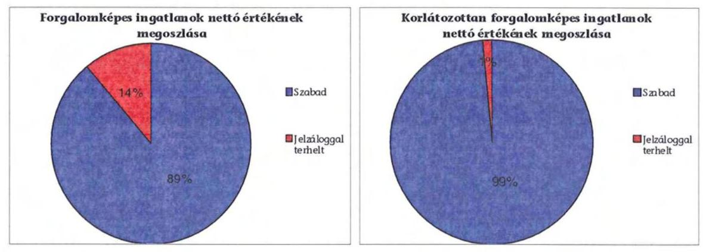

Az Önkormányzat kötelezettségeinek állományát 2010. december 31-én és várható alakulását a kötelezettségek lejáratáig az Önkormányzat kimutatása szerint az alábbi táblázat részletezi:

| Megnevezés | Állomány 2010. dec. 31-én |  |  | Várható kötelezettség 2011. 2013. években |  |  | Várható kötelezettség 2014.   évet követően |  |  |  |
| :--: | :--: | :--: | :--: | :--: | :--: | :--: | :--: | :--: | :--: | :--: |
|  | HUF-ban   (millió Ft-   ban) | Devizitban   (összegy ezer   EUR-ban) | Orcia   a-   zese) | HUF-ban   (millió Ft-   ban) | Devizitban   (összegy ezer   EUR-ban) | Orcia   a-   zese) | HUF-ban   (millió Ft-   ban) |  |  |  |
| Pénzintézeti kötelezettségek |  |  |  |  |  |  |  |  |  |  |
| Hosszú bízóntólhítsék | 2149 |  | HUF | 933 |  | HUF | 1720 |  |  | HUF |
| Pénzintézet kötelezettségek összesen HUF-ban | 2149 |  | HUF | 933 |  | HUF | 1720 |  |  | HUF |
| Kezecség | 402 |  | HUF |  |  |  |  |  |  |  |
| Biztosítékok összesen | 402 |  | HUF |  |  |  |  |  |  |  |
| Lizing kötelezettség/ok | 10 |  | HUF | 10 |  |  |  |  |  |  |
| Lizing kötelezettség/ok |  | 1395 | EUR |  | 612 | EUR |  |  |  | EUR EUR |
| Szállítói tartozás | 169 |  | HUF | 169 |  |  |  |  |  |  |

Az Önkormányzatnak pénzintézetekkel szemben fennálló kötelezettsége a 2010. év végén 2149 millió Ft volt, ezek várható kötelezettsége (tőke, kamat és egyéb költség) a legutóbbi kamatfizetés feltételei alapján a 2011-2013.években 933 millió Ft. Az Önkormányzatnak a 2011. évben szállítói tartozások rendezése, címén 169 millió Ft fizetési kötelezettsége keletkezett. A kezességvállalásaiból adódóan 402 millió Ft összegű terhe jelentkezhet, amennyiben a társaságok kötelezettségeiket nem teljesítik. Lizingkötelezettsége 2010. év végén 1395 ezer EUR és 18 millió Ft volt, a 2011-2013 években 18 millió Ft és 612 ezer EUR a fizetendő lízingdíj tartozása. A várható összes kötelezettség teljesítésére figyelembe vehető a 2011-2013.években a 331 millió Ft értékpapír állomány és kamata, 1420 millió Ft mérlegben kimutatott követelésállomány.

---

Az Önkormányzat 2014. évet követő ismert kötelezettsége 1729 millió Ft és 784 ezer EUR melynek forrását nem nevesítették, azonban a fedezetét jelentheti a 10904 millió Ft forgalomképes ingatlanvagyon, amelyet pénzintézeti kötelezettséghez kapcsolódóan jelzálog nem terhel, továbbá az önkormányzati saját bevételek.

Az Önkormányzat pénzügyi, vagyoni helyzetére közvetetten hatást gyakorol a minősített többségi tulajdonú gazdasági társaságainak adósságállománya is. Az önkormányzati kötelezettségek növekedése mellett a minősített többségi tulajdonú társaságok kötelezettségei is befolyásolhatják az Önkormányzat pénzügyi egyensúlyát.

A gazdasági társaságok adatszolgáltatása alapján kötelezettségállományukat 2010. december 31-én és annak várható alakulását a kötelezettségek lejáratáig a következő táblázatban mutatjuk be:

| Megnevezés | Állomány 2010. dec. 31 -én |  |  | Várható kötelezettség 2011. 2013. években |  |  | Várható kötelezettség 2014. évet követőon |  |  |
| :--: | :--: | :--: | :--: | :--: | :--: | :--: | :--: | :--: | :--: |
|  | HUF-ban (millió ftban) | Devizióan (összege ezer CHF-ban) |  | Oruig (10000) | HUF-ban (millió Ftban) | Deviziónan (összege ezer CHF-ban) | Oruig (10000) | HUF-ban (millió Ftban) | Deviziónan (összege ezer CHF-ban) | Oruig (10000) |
| Pénzintézeti kötelezettségek |  |  |  |  |  |  |  |  |  |
| Noncol lejáratú hórelek | 33 | 1443 | CHF |  | 15 | 575 | CHF | 18 | 864 | CHF |
| Pénzintézeti kötelezettségek összesen: | 33 | 1443 | CHF |  | 15 | 575 | CHF | 18 | 864 | CHF |
| Üzleg kötelezettségök |  | 28 | CHF |  |  | 28 | CHF |  | 0 | CHF |
| Szállitól tartozó | 733 |  | HUF |  | 733 |  | HUF |  |  |  |

A társaságoknak a 2011. évtől 15 millió Ft és 575 ezer CHF pénzintézeti kötelezettséget, 28 ezer CHF lízing és 733 millió Ft szállítói tartozást kell rendezniük. Felszámolás esetén ezek nem teljesítése miatt a bíróság korlátlan és teljes felelősséget állapíthat meg az Önkormányzat terhére.

Az Önkormányzat korlátlan felelősséggel tartozik felszámolás esetén a gazdasági társaságokról szóló 2006. évi IV. törvény 54. § (2) bekezdése alapján azon gazdasági társaságának, amelyben az Önkormányzat az 52. § (2) bekezdése szerint a szavazatok legalább 75\%-ával rendelkezik, így minősített befolyás szerzőnek minősül, továbbá a csődeljárásról és a felszámolási eljárásról szóló 1991. évi XLIX. törvény 63. § (2) bekezdése alapján a kizárólagos önkormányzati tulajdonú gazdasági társaságának minden olyan kötelezettségéért, amelynek kielégítését a felszámolási eljárás során az adós társaság vagyona nem fedez, ha a hitelezőinek a felszámolási eljárás során benyújtott keresete alapján a bíróság - az adós társaság felé érvényesített tartósan hátrányos üzletpolitikájára figyelemmel - megállapítja az önkormányzat korlátlan és teljes felelősségét. Az Önkormányzat számára pénzügyi kockázatot jelent, hogy felszámolás esetén a bíróság megállapíthatja az Önkormányzat korlátlan és teljes felelősségét a 33 millió Ft, továbbá 1471 ezer CHF tőke és kamat kötelezettségekkel érintett egy $79 \%$-os tulajdoni hányadú gazdasági társaság és annak Kftje után, továbbá egy kizárólagos önkormányzati tulajdonú gazdasági társaság után.

Az Önkormányzat a 2007-2010. években a tárgyi eszközök után együttesen 7120 millió Ft összegű értékcsökkenést mutatott ki, amelynek összege 2007-ben 1659 millió Ft, 2008-ban 1754 millió Ft, 2009-ben 1864 millió Ft és 2010-ben 1843 millió Ft volt. Az Önkormányzat eszközállományának bruttó értéke $19\%$-kal, 121525 millió Ft-ra, nettó értéke $17,5 \%$-kal, 108923 millió Ft-ra

---

emelkedett 2007. évről a 2010. évre. Az önkormányzati szintű használhatósági fok mutató négy év alatt mindössze egy százalékponttal, $91 \%$-ról $90 \%$-ra csökkent az egyes eszközcsoportoknál különböző mértékkel elszámolt amortizáció hatására. A használhatósági fok mutatók a vizsgált időszakban a legnagyobb mértékben a gépek, berendezések, felszerelések, járművek és az immateriális javak eszközcsoportokban változtak, ahol 5-7 százalékpont között csökkent a mutató értéke.

A vizsgált időszakban nem történt meg annak felmérése, hogy az eszközök elhasználódásának, pótlásának biztosítása mekkora forrásokat igényel az Önkormányzatnál. A felújításokra, az eszközök pótlására az Önkormányzat pénzügyi lehetőségének a függvényében, kimutatásai alapján elsősorban az intézmények működőképességének biztosítása érdekében, illetve a szakhatósági előírások alapján került sor.

Az Önkormányzatnál a 2007-2010. években felújításra az elszámolt értékcsökkenésnek $21,9 \%$-át ( 1557 millió Ft) fordították. Az elhasználódott eszközök pótlására az Önkormányzat tartalékot nem képzett, külön alapot ${ }^{64}$ nem hozott létre. A felhalmozási kiadásokból eszközpótlásra (rekonstrukcióra, felújításra) 166 millió Ft-ot fordított 2010. december 31-ig az Önkormányzat. A 2010. december 31-én folyamatban lévő fejlesztési feladatokhoz kapcsolódóan 2758 millió Ft-ot terveztek az elhasználódott eszközök pótlására.

Az Önkormányzat és intézményei jelenleg négy folyamatban lévő kártérítési perhez kapcsolódó peres eljárásban érintettek alperesként. Az Önkormányzat terhére kimutatott perérték 1,7 millió Ft volt. Jogerős határozattal lezárt, de ki nem fizetett kötelezettsége nem volt az Önkormányzatnak. Az adatszolgáltatás alapján a gazdasági társaságok folyamatban lévő vagy lezárt peres eljárásban alperesként nem voltak érintettek.

# 4. A PÉNZÜGYI EGYENSÚLY MEGTEREMTÉSE ÉRDEKÉBEN HOZOTT INTÉZKEDÉSEK 

A közgyűlési előterjesztések szerint a 2007-2010. évek költségvetési koncepciói feladatként jelölték meg a működési célú költségvetési kiadások csökkentését. A 2007-2010. években végrehajtott kiadáscsökkentő és bevételnövelő intézkedések a feladatellátás racionalizálását, szakmai színvonalának emelését, de kiemelten az Önkormányzat pénzügyi helyzetének javítását célozták. A legjelentősebb mértékű kiadási megtakarítást az álláshelycsökkentésekkel érték el, emellett sikerült megőrizniük az intézmények gazdálkodásának stabilitását.

Az Önkormányzat adatszolgáltatása szerint a 2007-2010. években kiadáscsökkentő intézkedések eredményeként 854 millió Ft megtakarítást realizált.

[^0]
[^0]:    ${ }^{64}$ Az Önkormányzat a jogszabályi előírások szerint erre nincs kötelezve.

---

A kiadáscsökkentő intézkedések hatását beavatkozási területenként az alábbi táblázat szemlélteti:
ezer Ft

| Érvényesített kiadáscsökkentés területei | Személyi juttatás és járulékai | Dologi működési kiadások | Pénzeszköz átadások, támogatások | Összesen |
| :--: | :--: | :--: | :--: | :--: |
| Az intézményeknél | 614834 | 22292 |  | 637126 |
| A Közgyűlés működése | 13920 |  | 133556 | 147476 |
| A Polgármesteri hivatalnál | 13733 | 55700 |  | 69433 |
| Összesen | 642487 | 77992 | 133556 | 854035 |

Az intézményeknél 637 millió Ft megtakarítást számszerűsítettek a kiadáscsökkentő intézkedések eredményeként. Az intézményi kiadási megtakarításokból 537 millió Ft-ot ( $84,3 \%$ ) létszámcsökkentési döntésekkel - üres álláshelyek megszüntetésével, létszámleépítéssel, kötelező óraszám emelésével -, további 100 millió Ft-ot ( $15,7 \%$ ) többletjuttatások csökkentésével - cafetéria elemek, pótlékok, jutalom elvonása, helyettesítés miatti megtakarítás -, beszerzési szerződések felülvizsgálatával, karbantartási, takarítási kiadások csökkentésével indokolt az Önkormányzat.

Az Önkormányzat a Közgyűlés működési körében a tiszteletdíjak 2009-2010. évek közötti csökkentése ${ }^{65}$, továbbá a civil szervezetek támogatására fordított kiadások csökkentése eredményeként ért el 147 millió Ft összegű megtakarítást, amely az összes kiadáscsökkentés, a 854 millió Ft 17,3\%-a volt.

A kiadáscsökkentések eredményeként a Polgármesteri hivatalban kimutatott megtakarítás 69 millió Ft volt, amelyből 13 millió Ft a helyettesítés miatti kiadás megtakarításból, 55 millió Ft a villamosenergia központosított beszerzéséből, 1 millió Ft a portaszolgálat kiszervezéséből adódott.

Kiadáscsökkentő intézkedések eredményeként a 2011. évben az Önkormányzat létszámcsökkentésből, juttatások csökkentéséből 108 millió Ft megtakarítást tervez.

A létszámcsökkentő intézkedések következtében 2007-2010 között a Polgármesteri hivatalnál és intézményeknél összesen 217,7 álláshelyet ${ }^{66}$, ebből 17,0 üres álláshelyet szüntettek meg, a 2007. január 1-jei 2639,8 fő átlaglétszám 8,2\%-át. Az álláshelycsökkenésből 117,7 (54,1\%) a szakmai álláshely, 83,0 (38,1\%) intézményüzemeltetéssel kapcsolatos álláshely volt.

[^0]
[^0]:    ${ }^{65}$ A Közgyűlés tagjainak tiszteletdíját meghatározó szorzószám a 2007. évi 2,6-ról 2009. március 1-től 2,34-re, 2010. október 15-től 2,6-ra módosult.
    ${ }^{66}$ A részmunkaidős álláshelyek teljes munkaidős álláshelyekre átszámításra kerültek.

---

A 2007-2010. években végrehajtott létszámcsökkenés eredményét az alábbi táblázat szemlélteti:

| Megnevezés (adatok fő-ben) |  | Közoktatás | Szociális és gyermekvédelem | Egészségügy | Polgármesteri hivatal | Egyéb | Összesen |
| :--: | :--: | :--: | :--: | :--: | :--: | :--: | :--: |
| Megszüntetett álláshelyek száma |  | 174,2 | 29,5 |  |  | 14,0 | 217,7 |
| ebből: | üres álláshelyek száma | 1,0 | 13,0 |  |  | 3,0 | 17,0 |
|  | szakmai álláshelyek száma | 109,7 | 2,0 |  |  | 6,0 | 117,7 |
|  | intézmény-üzemeltetéssel kapcsolatos álláshelyek száma | 64,5 | 14,5 |  |  | 4,0 | 83,0 |
| 2007. január 1-jén indító létszám |  | 1689,3 | 345,0 | 53,0 | 214,0 | 338,5 | 2639,8 |
| 2010. december 31-én záró létszám |  | 1576,8 | 319,5 | 56,0 | 217,0 | 365,5 | 2534,8 |

A helyi szervezési intézkedésekhez kapcsolódóan a 2007-2010. években 269 millió Ft központosított támogatást igényelt az Önkormányzat, amelyből 254 millió Ft támogatásban részesült. A támogatás felhasználásával tartósan leépített létszám a 2007-2010. években 116,3 fő volt. A közoktatásban 106,3 fő ( $91,4 \%$ ), a szociális és gyermekjóléti ellátásban 8 fő ( $6,9 \%$ ), az egyéb ágazatban 2 fő ( $1,7 \%$ ) létszámleépítésre került sor.

A létszámcsökkentés eredményeként az Önkormányzat 2007. január 1-jei foglalkoztatott létszáma 2639,8 főről 2010. december 31-re 2534,8 főre, 4\%-kal csökkent.
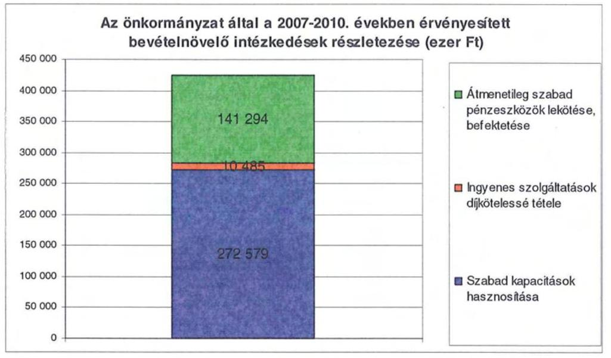

A bevételnövelésre irányuló intézkedések számszerűsített összegének (424 millió Ft) 39,6\%-át az intézményeknél mutatták ki az ingatlanok, eszközök bérbeadásából, szolgáltatások díjkötelessé tételéből. A Polgármesteri hivatalnál az átmenetileg szabad pénzeszközök lekötéséből, befektetéséből, illetve az ingatlanok, eszközök bérbeadásából származó bevételnövekedés 59,0\%-át ( 250 millió Ft) szerepeltették.

Az Önkormányzat kiadáscsökkentő és bevételnövelő intézkedései eredményeként 2007-2010. évek között összesen 1278 millió Ft megtakarítást és többletbevételt számolt el, és ezzel ellensúlyozta a költségvetési támogatások, az átenge-

---

dett bevételek és az illetékbevételek 2007. évhez viszonyított, együttesen 230 millió Ft-os csökkenését.

Az Önkormányzat költségvetési szervei mellett a gazdasági társaságainál is történtek költségcsökkentő intézkedések. A gazdasági társaságok működésének racionalizálása érdekében a megosztott szolgáltatások rendszerének kialakítására és működtetésére, valamint a tevékenységi körök közötti átfedések megszűntetésére együttműködési megállapodásokat és keretszerződéseket kötöttek. Az együttműködés kilenc önkormányzati gazdasági társaság között jött létre. Az együttműködés területei a közös cash-pool rendszer létrehozására és működtetésére, a központi beszerzési rendszerre, a közös pályázati, valamint marketing- és PR szolgáltatásokra terjedt ki. A közös cash-pool rendszer keretében egy kereskedelmi banknál azonos kondíciókkal történő számlavezetésre került sor. A pénzügyi együttműködésből cégcsoport szinten mintegy 16 millió Ft megtakarítást mutattak ki. Emellett a gazdasági társaságok takarékosabb gazdálkodással, bevételnöveléssel évi 33 millió Ft befizetését vállalták az Önkormányzat részére.

# 5. A HELYI ÖNKORMÁNYZATOK GAZDÁLKODÁSI RENDSZERÉNEK 2008. ÉVI ELLENŐRZÉSE SORÁN A PÉNZÜGYI EGYENSÚLY JAVÍTÁSÁRA TETT SZABÁLYSZERŰSÉGI ÉS CÉLSZERŰSÉGI JAVASLATOK HASZNOSULÁSA 

Az ÁSZ az Önkormányzat gazdálkodási rendszerét a 2008. évben ellenőrizte átfogó jelleggel. A jelentésében 13 szabályszerűségi és 10 célszerűségi javaslatot tett. A javaslatok közül a pénzügyi egyensúly javítására két szabályszerűségi és egy célszerűségi javaslat vonatkozott.

A jegyzőnek tett szabályszerűségi javaslat volt, hogy:

- „tegye meg a szükséges intézkedéseket annak érdekében, hogy a költségvetési rendelettervezetben a költségvetési bevételek és kiadások főösszegének megállapítása az Áht. 8/A. § (7) bekezdés alapján a finanszírozási célú pénzügyi műveletek bevételei-kiadásai nélkül történjen".
- „az európai uniós fejlesztések bevételi és kiadási előirányzatait az Áht. 69.§ (1) bekezdése alapján, továbbá - Ámr. 29. § (1) bekezdés d), g) és k) pontjában foglaltaknak megfelelően - az európai uniós forrásokkal támogatott felhalmozási kiadásokat feladatonként, a több éves kihatással járó feladatok előirányzatait éves bontásban, továbbá az európai uniós támogatással megvalósuló programok bevételi és kiadási előirányzatait önkormányzati szinten elkülönítetten tervezzék."

A munka színvonalának javítása érdekében javasoltuk a jegyzőnek, hogy

- „gondoskodjon a költségvetés tervezésének megalapozottsága érdekében, hogy az előző évről áthúzódó feladatok ellátásához teljesíthető bevételeket és kiadásokat, különös tekintettel a beruházási és felújítási feladatok áthúzódó üteméhez kapcsolódó előirányzatokra tervezzék meg".

A javaslatok megvalósítására intézkedési tervet készítettek. A jelentést a Közgyűlés a 2009. március 12-én tartott ülésén megismerte és elfogadta az ÁSZ jelentésben foglaltak végrehajtására készített, felelősöket és határidőket is tartalmazó intézkedési tervet.

---

A pénzügyi egyensúly javítására vonatkozó szabályszerűségi és célszerűségi javaslatokat megvalósították. A hiányosságok megszüntetése érdekében készített intézkedési tervben foglaltak alapján 2009. évtől a költségvetési bevételek és kiadások főösszegei nem tartalmazták a finanszírozási célú pénzügyi műveletek bevételeit és kiadásait, az európai uniós előirányzatokat az Ámr. előírásai szerint elkülönítetten tervezték. A 2009. évi és az azt követő évek költségvetései az előző évi pénzmaradvánnyal kapcsolatos bevételeket és kiadásokat tartalmazták.

Budapest, 2011. december „22."

Melléklet: $\quad 7 \mathrm{db}$
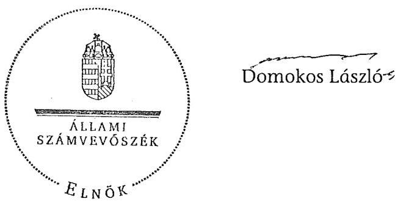

---

# A működési és felhalmozási célú hiány/többlet alakulása az Önkormányzat rendeleteiben

|  Fejlesztés | 2007 | 2008 | 2009 | 2010  |
| --- | --- | --- | --- | --- |
|  Fejlesztés | 1 058 | 1 058 | 1 058 | 1 058  |
|  Kiadás | 8 122 | 8 122 | 8 122 | 8 122  |
|  Bevétel | 8 171 | 8 171 | 8 171 | 8 171  |
|  Kiadás | 8 949 | 8 949 | 8 949 | 8 949  |
|  Bevétel | 8 949 | 8 949 | 8 949 | 8 949  |
|  Kiadás | 14 466 | 14 466 | 14 466 | 14 466  |
|  Bevétel | 14 746 | 14 746 | 14 746 | 14 746  |
|  Kiadás | 14 746 | 14 746 | 14 746 | 14 746  |
|  Bevétel | 14 746 | 14 746 | 14 746 | 14 746  |
|  Kiadás | 14 746 | 14 746 | 14 746 | 14 746  |
|  Bevétel | 14 746 | 14 746 | 14 746 | 14 746  |
|  Kiadás | 14 746 | 14 746 | 14 746 | 14 746  |
|  Bevétel | 14 746 | 14 746 | 14 746 | 14 746  |
|  Kiadás | 14 746 | 14 746 | 14 746 | 14 746  |
|  Bevétel | 14 746 | 14 746 | 14 746 | 14 746  |
|  Kiadás | 14 746 | 14 746 | 14 746 | 14 746  |
|  Bevétel | 14 746 | 14 746 | 14 746 | 14 746  |
|  Kiadás | 14 746 | 14 746 | 14 746 | 14 746  |
|  Bevétel | 14 746 | 14 746 | 14 746 | 14 746  |
|  Kiadás | 14 746 | 14 746 | 14 746 | 14 746  |
|  Bevétel | 14 746 | 14 746 | 14 746 | 14 746  |
|  Kiadás | 14 746 | 14 746 | 14 746 | 14 746  |
|  Bevétel | 14 746 | 14 746 | 14 746 | 14 746  |
|  Kiadás | 14 746 | 14 746 | 14 746 | 14 746  |
|  Bevétel | 14 746 | 14 746 | 14 746 | 14 746  |
|  Kiadás | 14 746 | 14 746 | 14 746 | 14 746  |
|  Bevétel | 14 746 | 14 746 | 14 746 | 14 746  |
|  Kiadás | 14 746 | 14 746 | 14 746 | 14 746  |
|  Bevétel | 14 746 | 14 746 | 14 746 | 14 746  |
|  Kiadás | 14 746 | 14 746 | 14 746 | 14 746  |
|  Bevétel | 14 746 | 14 746 | 14 746 | 14 746  |
|  Kiadás | 14 746 | 14 746 | 14 746 | 14 746  |
|  Bevétel | 14 746 | 14 746 | 14 746 | 14 746  |
|  Kiadás | 14 746 | 14 746 | 14 746 | 14 746  |
|  Bevétel | 14 746 | 14 746 | 14 746 | 14 746  |
|  Kiadás | 14 746 | 14 746 | 14 746 | 14 746  |
|  Bevétel | 14 746 | 14 746 | 14 746 | 14 746  |
|  Kiadás | 14 746 | 14 746 | 14 746 | 14 746  |
|  Bevétel | 14 746 | 14 746 | 14 746 | 14 746  |
|  Kiadás | |  14 746 | 14 746 | 14 746 | 14 746  |
|  Bevétel | 14 746 | 14 746 | 14 746 | 14 746  |
|  Kiadás | 14 746 | 14 746 | 14 746 | 14 746  |
|  Bevétel | 14 746 | 14 746 | 14 746 | 14 746  |
|  Kiadás | 14 746 | 14 746 | 14 746 | 14 746  |
|  Bevétel | 14 746 | 14 746 | 14 746 | 14 746  |
|  Kiadás | 14 746 | 14 746 | 14 746 | 14 746  |
|  Bevétel | 14 746 | 14 746 | 14 746 | 14 746  |
|  Kiadás | 14 746 | 14 746 | 14 746 | 14 746  |
|  Bevétel | 14 746 | 14 746 | 14 746 | 14 746  |
|  Kiadás | 14 746 | 14 746 | 14 746 | 14 746  |
|  Bevétel | 14 746 | 14 746 | 14 746 | 14 746  |
|  Kiadás | 14 746 | 14 746 | 14 746 | 14 746  |
|  Bevétel | 14 746 | 14 746 | 14 746 | 14 746  |
|  Kiadás | 14 746 | 14 746 | 14 746 | 14 746  |
|  Bevétel | 14 746 | 14 746 | 14 746 | 14 746  |
|  Kiadás | 14 746 | 14 746 | 14 746 | 14 746  |
|  Bevétel | 14 746 | 14 746 | 14 746 | 14 746  |
|  Kiadás | 14 746 | 14 746 | 14 746 | 14 746  |
|  Bevétel | 14 746 | 14 746 | 14 746 | 14 746  |
|  Kiadás | 14 746 | 14 746 | 14 746 | 14 746  |
|  Bevétel | 14 746 | 14 746 | 14 746 | 14 746  |
|  Kiadás | 14 746 | 14 746 | 14 746 | 14 746  |
|  Bevétel | 14 746 | 14 746 | 14 746 | 14 746  |
|  Kiadás | 14 746 | 14 746 | 14 746 | 14 746  |
|  Bevétel | 14 746 | 14 746 | 14 746 | 14 746  |
|  Kiadás | 14 746 | 14 746 | 14 746 | 14 746  |
|  Bevétel | 14 746 | 14 746 | 14 746 | 14 746  |
|  Kiadás | 14 746 | 14 746 | 14 746 | 14 746  |
|  Bevétel | 14 746 | 14 746 | 14 746 | 14 746  |
|  Kiadás | 14 746 | 14 746 | 14 746 | 14 746  |
|  Bevétel | 14 746 | 14 746 | 14 746 | 14 746  |
|  Kiadás | 14 746 | 14 746 | 14 746 | 14 746  |
|  Bevétel | 14 746 | 14 746 | 14 746 | 14 746  |
|  Kiadás | 14 746 | 14 746 | 14 746 | 14 746  |
|  Bevétel | 14 746 | 14 746 | 14 746 | 14 746  |
|  Kiadás | 14 746 | 14 746 | 14 746 | 14 746  |
|  Bevétel | 14 746 | 14 746 | 14 746 | 14 746  |
|  Kiadás | 14 746 | 14 746 | 14 746 | 14 746  |
|  Bevétel | 14 746 | 14 746 | 14 746 | 14 746  |
|  Kiadás | 14 746 | 14 746 | 14 746 | 14 746  |
|  Bevétel | 14 746 | 14 746 | 14 746 | 14 746  |
|  Kiadás | 14 746 | 14 746 | 14 746 | 14 746  |
|  Bevétel | 14 746 | 14 746 | 14 746 | 14 746  |
|  Kiadás | 14 746 | 14 746 | 14 746 | 14 746  |
|  Bevétel | 14 746 | 14 746 | 14 746 | 14 746  |
|  Kiadás | 14 746 | 14 746 | 14 746 | 14 746  |
|  Bevétel | 14 746 | 14 746 | 14 746 | 14 746  |
|  Kiadás | 14 746 | 14 746 | 14 746 | 14 746  |
|  Bevétel | 14 746 | 14 746 | 14 746 | 14 746  |
|  Kiadás | 14 746 | 14 746 | 14 746 | 14 746  |
|  Bevétel | 14 746 | 14 746 | 14 746 | 14 746  |
|  Kiadás | 14 746 | 14 746 | 14 746 | 14 746  |
|  Bevétel | 14 746 | 14 746 | 14 746 | 14 746  |
|  Kiadás | 14 746 | 14 746 | 14 746 | 14 746  |
|  Bevétel | 14 746 | 14 746 | 14 746 | 14 746  |
|  Kiadás | 14 746 | 14 746 | 14 746 | 14 746  |
|  Bevétel | 14 746 | 14 746 | 14 746 | 14 746  |
|  Kiadás | 14 746 | 14 746 | 14 746 | 14 746  |
|  Bevétel | 14 746 | 14 746 | 14 746 | 14 746  |
|  Kiadás | 14 746 | 14 746 | 14 746 | 14 746  |
|  Bevétel | 14 746 | 14 746 | 14 746 | 14 746  |
|  Kiadás | 14 746 | 14 746 | 14 746 | 14 746  |
|  Bevétel | 14 746 | 14 746 | 14 746 | 14 746  |
|  Kiadás | | 14 746 | 14 746 | 14 746 | 14 746 |
|---|---|---|---|---|
| Bevétel | 14 746 | 14 746 | 14 746 | 14 746 |
| Kiadás | 14 746 | 14 746 | 14 746 | 14 746 |
| Bevétel | 14 746 | 14 746 | 14 746 | 14 746 |
| Kiadás | 14 746 | 14 746 | 14 746 | 14 746 |
| Bevétel | 14 746 | 14 746 | 14 746 | 14 746 |
| Kiadás | 14 746 | 14 746 | 14 746 | 14 746 |
| Bevétel | 14 746 | 14 746 | 14 746 | 14 746 |
| Kiadás | 14 746 | 14 746 | 14 746 | 14 746 |
| Bevétel | 14 746 | 14 746 | 14 746 | 14 746 |
| Kiadás | 14 746 | 14 746 | 14 746 | 14 746 |
| Bevétel | 14 746 | 14 746 | 14 746 | 14 746 |
| Kiadás | 14 746 | 14 746 | 14 746 | 14 746 |
| Bevétel | 14 746 | 14 746 | 14 746 | 14 746 |
| Kiadás | 14 746 | 14 746 | 14 746 | 14 746 |
| Bevétel | 14 746 | 14 746 | 14 746 | 14 746 |
| Kiadás | 14 746 | 14 746 | 14 746 | 14 746 |
| Bevétel | 14 746 | 14 746 | 14 746 | 14 746 |
| Kiadás | 14 746 | 14 746 | 14 746 | 14 746 |
| Bevétel | 14 746 | 14 746 | 14 746 | 14 746 |
| Kiadás | 14 746 | 14 746 | 14 746 | 14 746 |
| Bevétel | 14 746 | 14 746 | 14 746 | 14 746 |
| Kiadás | 14 746 | 14 746 | 14 746 | 14 746 |
| Bevétel | 14 746 | 14 746 | 14 746 | 14 746 |
| Kiadás | 14 746 | 14 746 | 14 746 | 14 746 |
| Bevétel | 14 746 | 14 746 | 14 746 | 14 746 |
| Kiadás | 14 746 | 14 746 | 14 746 | 14 746 |
| Bevétel | 14 746 | 14 746 | 14 746 | 14 746 |
| Kiadás | 14 746 | 14 746 | 14 746 | 14 746 |
| Bevétel | 14 746 | 14 746 | 14 746 | 14 746 |
| Kiadás | 14 746 | 14 746 | 14 746 | 14 746 |
| Bevétel | 14 746 | 14 746 | 14 746 | 14 746 |
| Kiadás | 14 746 | 14 746 | 14 746 | 14 746 |
| Bevétel | 14 746 | 14 746 | 14 746 | 14 746 |
| Kiadás | 14 746 | 14 746 | 14 746 | 14 746 |
| Bevétel | 14 746 | 14 746 | 14 746 | 14 746 |
| Kiadás | 14 746 | 14 746 | 14 746 | 14 746 |
| Bevétel | 14 746 | 14 746 | 14 746 | 14 746 |
| Kiadás | 14 746 | 14 746 | 14 746 | 14 746 |
| Bevétel | 14 746 | 14 746 | 14 746 | 14 746 |
| Kiadás | 14 746 | 14 746 | 14 746 | 14 746 |
| Bevétel | 14 746 | 14 746 | 14 746 | 14 746 |
| Kiadás | 14 746 | 14 746 | 14 746 | 14 746 |
| Bevétel | 14 746 | 14 746 | 14 746 | 14 746 |
| Kiadás | 14 746 | 14 746 | 14 746 | 14 746 |
| Bevétel | 14 746 | 14 746 | 14 746 | 14 746 |
| Kiadás | 14 746 | 14 746 | 14 746 | 14 746 |
| Bevétel | 14 746 | 14 746 | 14 746 | 14 746 |
| Kiadás | 14 746 | 14 746 | 14 746 | 14 746 |
| Bevétel | 14 746 | 14 746 | 14 746 | 14 746 |
| Kiadás | 14 746 | 14 746 | 14 746 | 14 746 |
| Kiadás | 14 746 | 14 746 | 14 746 | 14 746 |
| Kiadás | 14 746 | 14 746 | 14 746 | 14 746 |
| Kiadás | 14 746 | 14 746 | 14 746 | 14 746 |
| Kiadás | 14 746 | 14 746 | 14 746 | 14 746 |
| Kiadás | 14 746 | 14 746 | 14 746 | 14 746 |
| Kiadás | 14 746 | 14 746 | 14 746 | 14 746 |
| Kiadás | 14 746 | 14 746 | 14 746 | 14 746 |
| Kiadás | 14 746 | 14 746 | 14 746 | 14 746 |
| Kiadás | 14 746 | 14 746 | 14 746 | 14 746 |
| Kiadás | 14 746 | 14 746 | 14 746 | 14 746 |
| Kiadás | 14 746 | 14 746 | 14 746 | 14 746 |
| Kiadás | 14 746 | 14 746 | 14 746 | 14 746 |
| Kiadás | 14 746 | 14 746 | 14 746 | 14 746 |
| Kiadás | 14 746 | 14 746 | 14 746 | 14 746 |
| Kiadás | 14 746 | 14 746 | 14 746 | 14 746 |
| Kiadás | 14 746 | 14 746 | 14 746 | 14 746 |
| Kiadás | 14 746 | 14 746 | 14 746 | 14 746 |
| Kiadás | 14 746 | 14 746 | 14 746 | 14 746 |
| Kiadás | 14 746 | 14 746 | 14 746 | 14 746 |
| Kiadás | 14 746 | 14 746 | 14 746 | 14 746 |
| Kiadás | 14 746 | 14 746 | 14 746 | 14 746 |
| Kiadás | 14 746 | 14 746 | 14 746 | 14 746 |
| Kiadás | 14 746 | 14 746 | 14 746 | 14 746 |
| Kiadás | 14 746 | 14 746 | 14 746 | 14 746 |
| Kiadás | 14 746 | 14 746 | 14 746 | 14 746 |
| Kiadás | 14 746 | 14 746 | 14 746 | 14 746 |
| Kiadás | 14 746 | 14 746 | 14 746 | 14 746 |
| Kiadás | 14 746 | 14 746 | 14 746 | 14 746 |
| Kiadás | 14 746 | 14 746 | 14 746 | 14 746 |
| Kiadás | 14 746 | 14 746 | 14 746 | 14 746 |
| Ki

---

# Zalaegerszegi Megyei Jogú Város Önkormányzata

| Az Önkormányzat bevételeinek és kiadásainak, adósságszolgálatának alakulása |  |  |  |   |
| --- | --- | --- | --- | --- |
| 1. FOLYÓ KÖLTSÉGVETÉS* | 2007 | 2008 | 2009 | 2010 |
| 1.1.1. Saját működési bevételei | 4 265 041 | 4 806 959 | 7 567 452 | 7 606 655 |
| 1.1.2. Költségvetési támogatás | 5 167 562 | 6 786 049 | 6 396 584 | 5 693 104 |
| 1.1.3. Amagadási bevételei | 2 735 124 | 1 415 338 | 1 520 642 | 1 587 359 |
| 1.1.4. Állambázatáti bevételű kapott támogatások | 655 443 | 855 007 | 802 927 | 791 827 |
| 1.1.5. EU-tól és külföldről kapott bevételei | 12 914 | 14 187 | 5 463 | 0 |
| 1.1.6. Állambázatáti bevételű kapott bevételei | 63 190 | 80 201 | 44 680 | 82 594 |
| 1.1.7. Előző ési pénzmeredvány átvétel | 3 000 | 3 478 | 69 324 | 4 454 |
| 1.1. Folyó bevételek +1.1.1.+1.1.2.+1.1.3.+1.1.4.+1.1.5.+1.1.6.+1.1.7. | 14 900 354 | 16 031 902 | 16 406 475 | 15 765 368 |
| 1.2.1. Működési kiadások kamarkiadások nélkül | 12 346 472 | 13 036 511 | 12 576 338 | 13 197 664 |
  1.2.2. Állami bázisú átadott pénzeszközök | 141 777 | 161 174 | 313 124 | 163 618  |
|  1.2.2.1. vállalkozásoknak | 521 421 | 200 670 | 327 477 | 225 132  |
|  1.2.2.2. EU-nak, illetve kétfelőlév | 270 | 220 | 0 | 0  |
|  1.2.2.3. magánszemély fizetésen | 512 701 | 528 584 | 641 268 | 724 001  |
|  1.2.2.4. meglévő szervezeteknek | 346 235 | 375 644 | 392 774 | 325 137  |
|  1.2.3. Tavaszfokkadások (+1.2.3.1+1.2.3.2+1.2.3.3+1.2.3.4) | 1 190 588 | 1 255 118 | 1 361 685 | 1 404 774  |
|  1.2.4. Kamatkiadások | 146 431 | 166 488 | 99 800 | 66 277  |
|  1.2.5. Előző évi pénzmaradvány átadás | 3 000 | 3 478 | 69 324 | 4 454  |
|  1.3. Folyó kiadások + 1.3.1.+1.2.2.+1.2.3.+1.2.4.+1.2.5. | 13 728 551 | 14 633 771 | 14 230 207 | 14 837 357  |
|  1.3. Folyó költségvetés egyenlege MŰKÖDÉSI JÖVÉDELEM (1.1. - 1.2.) | 1 171 865 | 1 398 531 | 2 186 276 | 928 201  |
|  2. FELHALMOZÁSI (beruházási) KÖLTSÉGVETÉS** |  |  |  |   |
|  2.1.1. Saját előbevételéi | 213 734 | 1 140 698 | 698 447 | 276 777  |
|  2.1.2. Állami bázisú bevételű kapott támogatások | 3 849 466 | 4 698 378 | 2 576 577 | 2 971 078  |
|  2.1.3. EU-tól és külföldről kapott támogatások | 0 | 0 | 0 | 0  |
|  2.1.4. Állami bázisú bevételű kapott támogatások | 221 182 | 566 527 | 479 212 | 597 588  |
|  2.1.1. Felhalmozás (beruházási) bevételek (+2.1.1.+2.1.2+2.1.3+2.1.4.) | 4 284 302 | 6 485 003 | 3 754 230 | 3 845 443  |
|  2.1.2. Saját beruházási kiadás állásai | 4 543 101 | 7 808 035 | 3 934 095 | 4 020 347  |
|  2.2.2. Saját felújítási kiadás állásai | 442 982 | 547 833 | 637 001 | 549 466  |
|  2.2.3. Állami bázisú átadott pénzeszköz | 415 125 | 527 994 | 547 001 | 585 006  |
|  2.2.4. EU-nak és külföldnek adott pénzeszközök | 0 | 0 | 0 | 0  |
|  2.2.5. Állami bázisú bevételű adott pénzeszközök | 520 442 | 494 887 | 134 842 | 90 529  |
|  2.2.6. Keltekintési célú részesedések vételéhez | 0 | 600 | 20 000 | 84 000  |
|  2.3. Felhalmozás (beruházási) kiadások (+2.3.1.+2.3.2.+2.3.3.+2.3.4.+2.3.5.+2.3.6.) | 5 954 650 | 8 429 339 | 4 972 946 | 5 859 348  |
|  2.3. Beruházási költségvetés egyenlege (2.1. - 2.2.) | -1 670 348 | -3 023 736 | -1 218 716 | -1 213 905  |
|  3. Finanszírozási műveletek nélküli (GFS) pozíció(1.3.+2.3.) | -498 545 | -625 205 | 967 554 | -585 704  |
|  4. Finanszírozási műveletek |  |  |  |   |
|  4.1. Hitelfelvétel | 535 444 | 156 540 | 376 762 | 206 325  |
|  4.2. Hitelfelvételre | 116 339 | 206 692 | 237 693 | 244 239  |
|  4.3. Forgatási és belkötetési célú értékpapírok kibocsátása | 0 | 0 | 0 | 0  |
|  4.4. Forgatási és belkötetési célú értékpapírok beváltása | 0 | 0 | 0 | 0  |
|  4.5. Forgatási és belkötetési célú értékpapírok értékesítése | 142 781 | 812 307 | 15 727 | 360 007  |
|  4.6. Forgatási és belkötetési célú értékpapírok vételítése | 0 | 0 | 0 | 0  |
|  4.7. Egyéb finanszírozási bevételek (függő, átfizető, kiegészítői) | -190 177 | 15 720 | 49 961 | -431 237  |
|  4.8. Egyéb finanszírozási kiadások (függő, átfizető, kiegészítői) | 130 073 | 179 462 | 25 257 | 26 270  |
|  4.9. Finanszírozási műveletek egyenlege (4.1. - 4.2.+4.3.-4.4+4.5.-4.6.+4.7.-4.8.) | 233 645 | 598 483 | 170 498 | -135 409  |
|  5. Tárgyévi pénzügyi pozíció változás (1.3.+ 2.3.+4.9.) | -264 906 | -26 712 | 1 138 044 | -421 113  |
|  6. Nettó működési jövedelem rendelkezési jövedelem (1.3.) - tőketörlesztés (4.2+4.4) | 1 055 473 | 1 191 839 | 1 948 667 | 683 962  |
|  TÁJÉKOZTATÓ ADATOK |  |  |  |   |
|  Összes költségvettség | 4 120 432 | 6 227 975 | 4 503 685 | 3 824 709  |
|  ebből rövid kiejtés | 1 787 379 | 1 941 812 | 1 164 351 | 1 153 508  |
|  Összes külföldi költségvettség | 416 673 | 187 740 | 351 090 | 168 912  |
|  ebből kiejtés (monolványtól) | 0 | 0 | 0 | 0  |
|  Pénz és tőkepiaci költségvettség (szórtyság) | 2 022 408 | 2 022 626 | 2 186 646 | 2 148 732  |
|  ebből rövid kiejtés | 186 401 | 212 743 | 244 002 | 254 932  |
|  PPP sorraldónál bátvalóvá költségvettség állomásoz | 0 | 0 | 0 | 0  |
|  ebből kiejtés szolgáltatási díj méztó költségvettség | 0 | 0 | 0 | 0  |
|  Felzétszámlabító napá állogás állománya (monolványtól) | 0 | 0 | 0 | 0  |
|  Lifestélytel napá állogás állománya (monolványtól) | 0 | 0 | 0 | 0  |
|  Hisszkabítélővé napá állogás állománya (monolványtól) | 0 | 0 | 0 | 0  |
|  Keresség és garanciaszerződések (monolványtól) | 240 511 | 260 020 | 220 795 | 40 199  |
|  Jogszék kérésig ödöszéből adódó költségvettségek (monolványtól) | 0 | 0 | 0 | 0  |
|  Finanszírozásba bevadásulás | 2 351 429 | 2 512 338 | 3 634 633 | 2 853 543  |
|  Tartók kötsésésemest megtartadál értékpapírok és vége állománya | 0 | 0 | 0 | 0  |
|  Hozzok kiejtés kockázatát és vége állománya | 0 | 0 | 0 | 0  |
|  Értékpapírok és vége állománya | 1 602 319 | 789 950 | 774 213 | 414 224  |
|  Pénzeszközök (főleges pénzeszközök nélküli) és vége állománya | 1 749 110 | 1 722 380 | 2 809 432 | 2 439 319  |

- Beszámolóban nem térül, a kiadásukban nem jelenik meg az amortizáció, a vagyoni helyzetet az egyenleg befolyásolja

* Beszámolóban vagyon megőrzésre és bővítésre fordítható források.

---

|   |  |  |  |  |  |  |  |  |  |  |  |  |  |  |  |  |  |  |  |  |  |  |  |  |  |  |  |  |  |  |  |  |  |  |  |  |  |  |  |  |  |  |  |  |  |  |  |  |  |  |   |
| --- | --- | --- | --- | --- | --- | --- | --- | --- | --- | --- | --- | --- | --- | --- | --- | --- | --- | --- | --- | --- | --- | --- | --- | --- | --- | --- | --- | --- | --- | --- | --- | --- | --- | --- | --- | --- | --- | --- | --- | --- | --- | --- | --- | --- | --- | --- | --- | --- | --- | --- | --- | --- | --- |
|   |  |  |  |  |  |  |  |  |  |  |  |  |  |  |  |  |  |  |  |  |  |  |  |  |  |  |  |  |  |  |  |  |  |  |  |  |  |  |  |  |  |  |  |  |  |  |  |  |  |  |   |
|   |  |  |  |  |  |  |  |  |  |  |  |  |  |  |  |  |  |  |  |  |  |  |  |  |  |  |
 | | | | | | | | | | | | | | | | | | | | | | | | |
| | | | | | | | | | | | | | | | | | | | | | | | | | | | | | | | | | | | | | | | | | | | | | | | | | | | |
| | | | | | | | | | | | | | | | | | | | | | | | | | | | | | | | | | | | | | | | | | | | | | | | | | | | |
| | | | | | | | | | | | | | | | | | | | | | | | | | | | | | | | | | | | | | | | | | | | | | | | | | | | |
| | | | | | | | | | | | | | | | | | | | | | | | | | | | | | | | | | | | | | | | | | | | | | | | | | | | |
| | | | | | | | | | | | | | | | | | | | | | | | | | | | | | | | | | | | | | | | | | | | | | | | | | | | |
| | | | | | | | | | | | | | | | | | | | | | | | | | | | | | | | | | | | | | | | | | | | | | | | | | | | |
| | | | | | | | | | | | | | | | | | | | | | | | | | | | | | | | | | | | | | | | | | | | | | | | | | | | |
| | | | | | | | | | | | | | | | | | | | | | | | | | | | | | | | | | | | | | | | | | | | | | | | | | | | |
| | | | | | | | | | | | | | | | | | | | | | | | | | | | | | | | | | | | | | | | | | | | | | | | | | | | |
| | | | | | | | | | | | | | | | | | | | | | | | | | | | | | | | | | | | | | | | | | | | | | | | | | | | |
| | | | | | | | | | | | | | | | | | | | | | | | | | | | | | | | | | | | | | | | | | | | | | | | | | | | |
| | | | | | | | | | | | | | | | | | | | | | | | | | | | | | | | | | | | | | | | | | | | | | | | | | | | |
| | | | | | | | | | | | | | | | | | | | | | | | | | | | | | | | | | | | | | | | | | | | | | | | | | | | |
| | | | | | | | | | | | | | | | | | | | | | | | | | | | | | | | | | | | | | | | | | | | | | | | | | | | |
| | | | | | | | | | | | | | | | | | | | | | | | | | | | | | | | | | | | | | | | | | | | | | | | | | | | |
| | | | | | | | | | | | | | | | | | | | | | | | | | | | | | | | | | | | | | | | | | | | | | | | | | | |
| | | | | | | | | | | | | | | | | | | | | | | | | | | | | | | | | | | | | | | | | | | | | | | | | | | |
| | | | | | | | | | | | | | | | | | | | | | | | | | | | | | | | | | | | | | | | | | | | | | | | | | | |
| | | | | | | | | | | | | | | | | | | | | | | | | | | | | | | | | | | | | | | | | | | | | | | | | | | |
| | | | | | | | | | | | | | | | | | | | | | | | | | | | | | | | | | | | | | | | | | | | | | | | | | | |
| | | | | | | | | | | | | | | | | | | | | | | | | | | | | | | | | | | | | | | | | | | | | | | | | | | |
| | | | | | | | | | | | | | | | | | | | | | | | | | | | | | | | | | | | | | | | | | | | | | | | | | | |
| | | | | | | | | | | | | | | | | | | | | | | | | | | | | | | | | | | | | | | | | | | | | | | | | | | |
| | | | | | | | | | | | | | | | | | | | | | | | | | | | | | | | | | | | | | | | | | | | | | | | | | | |
| | | | | | | | | | | | | | | | | | | | | | | | | | | | | | | | | | | | | | | | | | | | | | | | | | | |
| | | | | | | | | | | | | | | | | | | | | | | | | | | | | | | | | | | | | | | | | | | | | | | | | | | |
| | | | | | | | | | | | | | | | | | | | | | | | | | | | | | | | | | | | | | | | | | | | | | | | | | | |
| | | | | | | | | | | | | | | | | | | | | | | | | | | | | | | | | | | | | | | | | | | | | | | | | | | |
| | | | | | | | | | | | | | | | | | | | | | | | | | | | | | | | | | | | | | | | | | | | | | | | | | | |
| | | | | | | | | | | | | | | | | | | | | | | | | | | | | | | | | | | | | | | | | | | | | | | | | | | | | | | | | | | | | | | | | | | | |
| | | | | | | | | | | | | | | | | | | | | | | | | | | | | | | | | | | | | | | | | | | | | | | | | | | | |
| | | | | | | | | | | | | | | | | | | | | | | | | | | | | | | | | | | | | | | | | | | | | | | | | | | | |
| | | | | | | | | | | | | | | | | | | | | | | | | | | | | | | | | | | | | | | | | | | | | | | | | | | | |
| | | | | | | | | | | | | | | | | | | | | | | | | | | | | | | | | | | | | | | | | | | | | | | | | | | | |
| | | | | | | | | | | | | | | | | | | | | | | | | | | | | | | | | | | | | | | | | | | | | | | | | | | | |
| | | | | | | | | | | | | | | | | | | | | | | | | | | | | | | | | | | | | | | | | | | | | | | | | | | | |
| | | | | | | | | | | | | | | | | | | | | | | | | | | | | | | | | | | | | | | | | | | | | | | | | | | | |
| | | | | | | | | | | | | | | | | | | | | | | | | | | | | | | | | | | | | | | | | | | | | | | | | | | | |
| | | | | | | | | | | | | | | | | | | | | | | | | | | | | | | | | | | | | | | | | | | | | | | | | | | | |
| | | | | | | | | | | | | | | | | | | | | | | | | | | | | | | | | | | | | | | | | | | | | | | | | | | | |
| | | | | | | | | | | | | | | | | | | | | | | | | | | | | | | | | | | | | | | | | | | | | | | | | | | | |
| | | | | | | | | | | | | | | | | | | | | | | | | | | | | | | | | | | | | | | | | | | | | | | | | | | | |
| | | | | | | | | | | | | | | | | | | | | | | | | | | | | | | | | | | | | | | | | | | | | | | | | | | | |
| | | | | | | | | | | | | | | | | | | | | | | | | | | | | | | | | | | | | | | | | | | | | | | | | | | | |
| | | | | | | | | | | | | | | | | | | | | | | | | | | | | | | | | | | | | | | | | | | | | | | | | | | | |
| | | | | | | | | | | | | | | | | | | | | | | | | | | | | | | | | | | | | | | | | | | | | | | | | | | | | | | | | | | | | | | | |
| | | | | | | | | | | | | | | | | | | | | | | | | | | | | | | | | | | | | | | | | | | | | | | | | | | | | |
| | | | | | | | | | | | | | | | | | | | | | | | | | | | | | | | | | | | | | | | | | | | | | | | | | | | | |
| | | | | | | | | | | | | | | | | | | | | | | | | | | | | | | | | | | | | | | | | | | | | | | | | | | | | |
| | | | | | | | | | | | | | | | | | | | | | | | | | | | | | | | | | | | | | | | | | | | | | | | | | | | | |
| | | | | | | | | | | | | | | | | | | | | | | | | | | | | | | | | | | | | | | | | | | | | | | | | | | | | |
| | | | | | | | | | | | | | | | | | | | | | | | | | | | | | | | | | | | | | | | | | | | | | | | | | | | | |
| | | | | | | | | | | | | | | | | | | | | | | | | | | | | | | | | | | | | | | | | | | | | | | | | | | | | |
| | | | | | | | | | | | | | | | | | | | | | | | | | | | | | | | | | | | | | | | | | | | | | | | | | | | | |
| | | | | | | | | | | | | | | | | | | | | | | | | | | | | | | | | | | | | | | | | | | | | | | | | | | | | |
| | | | | | | | | | | | | | | | | | | | | | | | | | | | | | | | | | | | | | | | | | | | | | | | | | | | | |
| | | | | | | | | | | | | | | | | | | | | | | | | | | | | | | | | | | | | | | | | | | | | | | | | | | | | |
| | | | | | | | | | | | | | | | | | | | | | | | | | | | | | | | | | | | | | | | | | | | | | | | | | | | | |
| | | | | | | | | | | | | | | | | | | | | | | | | | | | |
 | | | | | | | | | | | | | | | | | | | | | | | | |
| | | | | | | | | | | | | | | | | | | | | | | | | | | | | | | | | | | | | | | | | | | | | | | | | | | | | | | |
| | | | | | | | | | | | | | | | | | | | | | | | | | | | | | | | | | | | | | | | | | | | | | | | | | | | | | | | |
| | | | | | | | | | | | | | | | | | | | | | | | | | | | | | | | | | | | | | | | | | | | | | | | | | | | | | | | | |
| | | | | | | | | | | | | | | | | | | | | | | | | | | | | | | | | | | | | | | | | | | | | | | | | | | | | | | | | | |
| | | | | | | | | | | | | | | | | | | | | | | | | | | | | | | | | | | | | | | | | | | | | | | | | | | | | | | | | | | |
| | | | | | | | | | | | | | | | | | | | | | | | | | | | | | | | | | | | | | | | | | | | | | | | | | | | | | | | | | | | |
| | | | | | | | | | | | | | | | | | | | | | | | | | | | | | | | | | | | | | | | | | | | | | | | | | | | | | | | | | | | | |
| | | | | | | | | | | | | | | | | | | | | | | | | | | | | | | | | | | | | | | | | | | | | | | | | | | | | | | | | | | | | | |
| | | | | | | | | | | | | | | | | | | | | | | | | | | | | | | | | | | | | | | | | | | | | | | | | | | | | | | | | | | | | | | |
| | | | | | | | | | | | | | | | | | | | | | | | | | | | | | | | | | | | | | | | | | | | | | | | | | | | | | | | | | | | | | | | |
| | | | | | | | | | | | | | | | | | | | | | | | | | | | | | | | | | | | | | | | | | | | | | | | | | | | | | | | | | | | | | | | | |
| | | | | | | | | | | | | | | | | | | | | | | | | | | | | | | | | | | | | | | | | | | | | | | | | | | | | | | | | | | | | | | | | | |
| | | | | | | | | | | | | | | | | | | | | | | | | | | | | |
 |  |  |  |  |  |  |  |  |  |  |  |  |  |  |  |  |  |  |  |  |  |  |  |  |  |  |  |  |  |  |  |  |  |  |  |  |  |  |  |  |   |
|   |  |  |  |  |  |  |  |  |  |  |  |  |  |  |  |  |  |  |  |  |  |  |  |  |  |  |  |  |  |  |  |  |  |  |  |  |  |  |  |  |  |  |  |  |  |  |  |  |  |  |  |  |  |  |  |  |  |  |  |  |  |  |  |  |  |  |  |  |  |  |   |
|   |  |  |  |  |  |  |  |  |  |  |  |  |  |  |  |  |  |  |  |  |  |  |  |  |  |  |  |  |  |  |  |  |  |  |  |  |  |  |  |  |  |  |  |  |  |  |  |  |  |  |  |  |  |  |  |  |  |  |  |  |  |  |  |  |  |  |  |  |  |  |  |  |  |   |
|   |  |  |  |  |  |  |  |  |  |  |  |  |  |  |  |  |  |  |  |  |  |  |  |  |  |  |  |  |  |  |  |  |  |  |  |  |  |  |  |  |  |  |  |  |  |  |  |  |  |  |  |  |  |  |  |  |  |  |  |  |  |  |  |  |  |  |  |  |  |  |  |  |  |  |  |  |  |  |  |  |  |   |
|   |  |  |  |  |  |  |  |  |  |  |  |  |  |  |  |  |  |  |  |  |  |  |  |  |  |  |  |  |  |  |  |  |  |  |  |  |  |  |  |  |  |  |  |  |  |  |  |  |  |  |  |  |  |  |  |  |  |  |  |  |  |  |  |  |  |  |  |  |  |  |  |  |  |  |  |  |  |  |  |  |  |  |  |  |  |   |
|   |  |  |  |  |  |  |  |  |  |  |  |  |  |  |  |  |  |  |  |  |  |  |  |  |  |  |  |  |  |  |  |  |  |  |  |  |  |  |  |  |  |  |  |  |  |  |  |  |  |  |  |  |  |  |  |  |  |  |  |  |  |  |  |  |  |  |  |  |  |  |  |  |  |  |  |  |  |  |  |  |  |  |  |  |  |  |  |  |  |  |  |  |  |  |  |  |  |  |  | 

---

| 28. Éditions Ld asphémaste |  |  |  |  |  |  |  |  |  |  |  |  |  |  |  |  |  |  |  |  |  |  |  |  |  |  |  |  |  |  |  |  |  |  |  |  |  |  |  |  |  |  |  |  |  |  |  |  |  |  |  |  |  |  |  |  |  |  |  |  |  |  |  |  |  |  |  |  |  |  |  |  |  |  |  |  |  |  |  |  |  |  |  |  |  |  |  |  |  |  |  |  |  |  |  |  |  |  |  |  |  |

---

Załączonego Urzędu Języki i Opłaty Ubezpieczenia

Załączonego Urzędu Języki i Opłaty Ubezpieczenia

## 3A. Ubezpieczenie Ubezpieczenia

| 1. Ubezpieczenie Ubezpieczenia |  |  |  |  |  |  |  |  |  |  |  |  |  |  |  |  |  |  |  |  |  |  |  |  |  |  |  |  |  |  |  |  |  |  |  |  |  |  |  |  |  |  |  |  |  |  |  |  |  |  |  |  |  |  |  |  |  |  |  |  |  |  |  |  |  |  |  |  |  |  |  |  |  |  |  |  |  |  |  |  |  |  |  |  |  |  |  |  |  |  |  |  |  |  |  |  |  |  |  |  |  |

---

# Zónarány Mégió Készítő Mégió Készítő Mégió Készítő Mégió Készítő Mégió Készítő Mégió Készítő Mégió Készítő Mégió Készítő Mégió Készítő Mégió Készítő Mégió Készítő Mégió Készítő Mégió Készítő Mégió Készítő Mégió Készítő Mégió Készítő Mégió Készítő Mégió Készítő Mégió Készítő Mégió Készítő Mégió Készítő Mégió Készítő Mégió Készítő Mégió Készítő Mégió Készítő Mégió Készítő Mégió Készítő Mégió Készítő Mégió Készítő Mégió Készítő Mégió Készítő Mégió Készítő Mégió Készítő Mégió Készítő Mégió Készítő Mégió Készítő Mégió Készítő Mégió Készítő Mégió Készítő Mégió Készítő Mégió Készítő Mégió Készítő Mégió Készítő Mégió Készítő Mégió Készítő Mégió Készítő Mégió Készítő Mégió Készítő Mégió Készítő Mégió Készítő Mégió Készítő Mégió Készítő Mégió Készítő Mégió Készítő Mégió Készítő Mégió Készítő Mégió Készítő Mégió Készítő Mégió Készítő Mégió Készítő Mégió Készítő Mégió Készítő Mégió Készítő Mégió Készítő Mégió Készítő Mégió Készítő Mégió Készítő Mégió Készítő Mégió Készítő Mégió Készítő Mégió Készítő Mégió Készítő Mégió Készítő Mégió Készítő Mégió Készítő Mégió Készítő Mégió Készítő Mégió Készítő Mégió Készítő Mégió Készítő Mégió Készítő Mégió Készítő Mégió Készítő Mégió Készítő Mégió Készítő Mégió Készítő Mégió Készítő Mégió Készítő Mégió Készítő Mégió Készítő Mégió Készítő Mégió Készítő Mégió Készítő Mégió Készítő Mégió Készítő Mégió Készítő Mégió Készítő Mégió Készítő Mégió Készítő Mégió Készítő Mégió Készítő Mégió Készítő Mégió Készítő Mégió Készítő Mégió Készítő Mégió Készítő Mégió Készítő Mégió Készítő Mégió Készítő Mégió Készítő Mégió Készítő Mégió Készítő Mégió Készítő Mégió Készítő Mégió Készítő Mégió Készítő Mégió Készítő Mégió Készítő Mégió Készítő Mégió Készítő Mégió Készítő
 Régió Készítő Régió Készítő Régió Készítő Régió Készítő Régió Készítő Régió Készítő Régió Készítő Régió Készítő Régió Készítő Régió Készítő Régió Készítő Régió Készítő Régió Készítő Régió Készítő Régió Készítő Régió Készítő Régió Készítő Régió Készítő Régió Készítő Régió Készítő Régió Készítő Régió Készítő Régió Készítő Régió Készítő Régió Készítő Régió Készítő Régió Készítő Régió Készítő Régió Készítő Régió Készítő Régió Készítő Régió Készítő Régió Készítő Régió Készítő Régió Készítő Régió Készítő Régió Készítő Régió Készítő Régió Készítő Régió Készítő Régió Készítő Régió Készítő Régió Készítő Régió Készítő Régió Készítő Régió Készítő Régió Készítő Régió Készítő Régió Készítő Régió Készítő Régió Készítő Régió Készítő Régió Készítő Régió Készítő Régió Készítő Régió Készítő Régió Készítő Régió Készítő Régió Készítő Régió Készítő Régió Készítő Régió Készítő Régió Készítő Régió Készítő Régió Készítő Régió Készítő Régió Készítő Régió Készítő Régió Készítő Régió Készítő Régió Készítő Régió Készítő Régió Készítő Régió Készítő Régió Készítő Régió Készítő Régió Készítő Régió Készítő Régió Készítő Régió Készítő Régió Készítő Régió Készítő Régió Készítő Régió Készítő Régió Készítő Régió Készítő Régió Készítő Régió Készítő Régió Készítő Régió Készítő Régió Készítő Régió Készítő Régió Készítő Régió Készítő Régió Készítő Régió Készítő Régió Készítő Régió Készítő Régió Készítő Régió Készítő Régió Készítő Régió Készítő Régió Készítő Régió Készítő Régió Készítő Régió Készítő Régió Készítő Régió Készítő Régió Készítő Régió Készítő Régió Készítő Régió Készítő Régió Készítő Régió Készítő Régió Készítő Régió Készítő Régió Készítő Régió Készítő Régió Készítő Régió Készítő Régió Készítő Régió Készítő Régió Készítő Régió Készítő Régió Készítő Régió Készítő Régió Készítő Régió Készítő Régió Készítő Régió Készítő Régió Készítő Régió Készítő Régió Készítő Régió Készítő Régió Készítő Régió Készítő Régió Készítő Régió Készítő Régió Készítő Régió Készítő Régió Készítő Régió Készítő Régió Készítő Régió Készítő Régió Készítő Régió Készítő Régió Készítő Régió Készítő Régió Készítő Régió Készítő Régió Készítő Régió Készítő Régió Készítő Régió Készítő Régió Készítő Régió Készítő Régió Készítő Régió Készítő Régió Készítő Régió Készítő Régió Készítő Régió Készítő Régió Készítő Régió Készítő Régió Készítő Régió Készítő Régió Készítő Régió Készítő Régió Készítő Régió Készítő Régió Készítő Régió Készítő Régió Készítő Régió Készítő Régió Készítő Régió Készítő Régió Készítő Régió Készítő Régió Készítő Régió Készítő Régió Készítő Régió Készítő Régió Készítő Régió Készítő Régió Készítő Régió Készítő Régió Készítő Régió Készítő Régió Készítő Régió Készítő Régió Készítő Régió Készítő Régió Készítő Régió Készítő Régió Készítő Régió Készítő Régió Készítő Régió Készítő Mégió Készítő Mégió Készítő Mégió Készítő Mégió Készítő Mégió Készítő Mégió Készítő Mégió Készítő Mégió Készítő Mégió Készítő Mégió Készítő Mégió Készítő Mégió Készítő Mégió Készítő Mégió Készítő Mégió Készítő Mégió Készítő Mégió Készítő Mégió Készítő Mégió Készítő Mégió Készítő Mégió Készítő Mégió Készítő Mégió Készítő Mégió Készítő Mégió Készítő Mégió Készítő Mégió Készítő Mégió Készítő Mégió Készítő Mégió Készítő Mégió Készítő Mégió Készítő Mégió Készítő Mégió Készítő Mégió Készítő Mégió Készítő Mégió Készítő Mégió Készítő Mégió Készítő Mégió Készítő Mégió Készítő Mégió Készítő Mégió Készítő Mégió Készítő Mégió Készítő Mégió Készítő Mégió Készítő Mégió Készítő Mégió Készítő Mégió Készítő Mégió Készítő Mégió Készítő Mégió Készítő Mégió Készítő Mégió Készítő Mégió Készítő Mégió Készítő Mégió Készítő Mégió Készítő Mégió Készítő Mégió Készítő Mégió Készítő Mégió Készítő Mégió Készítő Mégió Készítő Mégió Készítő Mégió Készítő Mégió Készítő Mégió Készítő Mégió Készítő Mégió Készítő Mégió Készítő Mégió Készítő Mégió Készítő Mégió Készítő Mégió Készítő Mégió Készítő Mégió Készítő Mégió Készítő Mégió Készítő Mégió Készítő Mégió Készítő Mégió Készítő Mégió Készítő Mégió Készítő Mégió Készítő Mégió Készítő Mégió Készítő Mégió Készítő Mégió Készítő Mégió Készítő Mégió Készítő Mégió Készítő Mégió Készítő Mégió Készítő Mégió Készítő Mégió Készítő Mégió Készítő Mégió Készítő Mégió Készítő Mégió Készítő Mégió Készítő Mégió Készítő Mégió Készítő Mégió Készítő Mégió Készítő Mégió Készítő Mégió Készítő Mégió Készítő Mégió Készítő Mégió Készítő Mégió Készítő Mégió Készítő Mégió Készítő Mégió Készítő Mégió Készítő Mégió Készítő Mégió Készítő Mégió Készítő Mégió Készítő Mégió Készítő Mégió Készítő Mégió Készítő Mégió Készítő Mégió Készítő Mégió Készítő Mégió Készítő Mégió Készítő Mégió Készítő Mégió Készítő Mégió Készítő Mégió Készítő Mégió Készítő Mégió Készítő Mégió Készítő Mégió Készítő Mégió Készítő Mégió Készítő Mégió Készítő Mégió Készítő Mégió Készítő Mégió Készítő Mégió Készítő Mégió Készítő Mégió Készítő Mégió Készítő Mégió Készítő Mégió Készítő Mégió Készítő Mégió Készítő Mégió Készítő Mégió Készítő Mégió Készítő Mégió Készítő Mégió Készítő Mégió Készítő Mégió Készítő Mégió Készítő Mégió Készítő Mégió Készítő Mégió Készítő Mégió Készítő Mégió Készítő Mégió Készítő Mégió Készítő Mégió Készítő Mégió Készítő Mégió Készítő Mégió Készítő Mégió Készítő Mégió Készítő Mégió Készítő Mégió Készítő Mégió Készítő Mégió Készítő Mégió Készítő Mégió Készítő Mégió Készítő Mégió Készítő Mégió Készítő Mégió Készítő Mégió Készítő Mégió Készítő Mégió Készítő Mégió Készítő Mégió Készítő Mégió Készítő Mégió Készítő Mégió Készítő Mégió Készítő Mégió Készítő Mégió Készítő Mégió Készítő Mégió Készítő Mégió Készítő Mégió Készítő Mégió Készítő Mégió Készítő Mégió Készítő Mégió Készítő Mégió Készítő Mégió Készítő Mégió Készítő Mégió Készítő Mégió Készítő Mégió Készítő Mégió Készítő Mégió Készítő Mégió Készítő Mégió Készítő Mégió Készítő Mégió Készítő Mégió Készítő Mégió Készítő Mégió Készítő Mégió Készítő Mégió Készítő Mégió Készítő Mégió Készítő Mégió Készítő Mégió Készítő Mégió Készítő Mégió Készítő Mégió Készítő Mégió Készítő Mégió Készítő Mégió Készítő Mégió Készítő Mégió Készítő Mégió Készítő Mégió Készítő Mégió Készítő Mégió Készítő Mégió Készítő Mégió Készítő Mégió Készítő Mégió Készítő Mégió Készítő Mégió Készítő Mégió Készítő Mégió Készítő Mégió Készítő Mégió Készítő Mégió Készítő Mégió Készítő Mégió Készítő Mégió Készítő Mégió Készítő Mégió Készítő Mégió Készítő Mégió Készítő Mégió Készítő Mégió Készítő Mégió Készítő Mégió Készítő Mégió Készítő Mégió Készítő Mégió Készítő Mégió Készítő Mégió Készítő Mégió Készítés Készítés Készítés Készítés Készítés Készítés Készítés Készítés Készítés Készítés Készítés Készítés Készítés Készítés Készítés Készítés Készítés Készítés Készítés Készítés Készítés Készítés Készítés Készítés Készítés Készítés Készítés Készítés Készítés Készítés Készítés Készítés Készítés Készítés Készítés Készítés Készítés Készítés Készítés Készítés Készítés Készítés Készítés Készítés Készítés Készítés Készítés Készítés Készítés Készítés Készítés Készítés Készítés Készítés Készítés Készítés Készítés Készítés Készítés Készítés Készítés Készítés Készítés Készítés Készítés Készítés Készítés

---

### Az Önkormányzat beadott, elbírálás alatti pályázati forrásból megvalósuló fejlesztéseihez kapcsolódó kötelezettség-vállalásainak összegzéséről

|  Fejlesztési feladat (beruházás, felújítás) |  |  | Beruházás, felújítás |  |  | Teljes
bekerülési
kötség
(terv)1) |  | A teljes
bekerülési
kötségtől
eszközpótlást
a tervezett
összeg | 2010. dec.
31-ig
feljebb
kiadás2) | 2010. utánra
vállalt
kötelezettség
(terv/terv/terv/el
+10) |  | 2010. december 31-e utáni kötelezettség-vállalások forrásösszetétele |  |  |  |  |  |  |  |  |  |  |  |  |  |  |  |  |  |  |  |  |  |  |  |  |  |  |  |  |  |  |  |  |  |  |  |  |  |  |  |  |  |  |  |  |  |  |  |  |  |  |  |  |  |  |  |  |  |  |  |  |  |  |  |  |  |  |  |  |  |  |  |  |  |  |  |  |  |  |  |  |  |  |  |  |  |  |  |  |  |  |  |  |  |  |  |  |  |  |  |  |

---

.

---

# Az önkormányzati feladatok ellátásában résztvevő gazdasági társaságokról

|  Gazdasági társaság megnevezése | 2010. december 31-én | a gazdasági társaságnak szerződéses kötelezettségre, feladat ellátási szerződésre alapozottan az önkormányzat költségvetéséből nyújtott  |
| --- | --- | --- |
|   | önkormányzat | önkormányzat  |
|   |  | gazdasági  |
|   |  | társaságának  |
|   |  | tulajdoni hányada  |
|  I. 100%-os tulajdoni hányadú gazdasági társaságok: |  |   |
|  Kontakt Humán Kft | 100% | 31  |
|  Városgazdálkodási Kft | 100% | 2  |
|  Zala-Depo Kft | 100% | 5  |
|  LÉSZ Kft | 100% | 1  |
|  Parkoló Gazda Kft | 100% | 1  |
|  Városfejlesztő Zrt | 100% | 1  |
|  Városi Televízió Kft | 100% | -3  |
|  Kvártályház Kft | 100% | -2  |
|  Strand Kft | 100% | 4  |
|  Sportcsarnok és Stadion Kft | 100% | 64  |
|  Control-Zala Kft | 100% | 1  |
|  100%-os tulajdoni hányadú gazdasági társaságok összesen | 1000% | 100%  |
|  II. 75-99%-os tulajdoni hányadú gazdasági társaságok: |  |   |
|  Zalavíz Zrt | 79% | 3  |
|  75-99%-os tulajdoni hányadú gazdasági társaságok összesen | 79% | 0%  |
|  75% feletti tulajdoni hányadú gazdasági társaságok összesen | 1079% | 100%  |
|  III. 51-74%-os tulajdoni hányadú gazdasági társaságok: |  |   |
|  Észak-zalai TISZK | 55% | 5  |
|  ZTE Kosárlabda Klub Kft | 71% | -36  |
|  51-74%-os tulajdoni hányadú gazdasági társaságok összesen | 126% | 0%  |

---

|  IV. 25-50%-os tulajdoni hányadú gazdasági társaságok: |  |  |  |  |  |  |  |  |  |  |  |  |  |  |  |  |  |   |
| --- | --- | --- | --- | --- | --- | --- | --- | --- | --- | --- | --- | --- | --- | --- | --- | --- | --- | --- |
|  Vásár Kft | 40% |  | 2 |  | 7 |  |  |  |  |  |  |  |  |  |  |  |  |   |
| 25-50%-os tulajdoni
hányadú gazdasági
társaságok összesen | 40% | 0% | 2 | 0 | 7 | 0 | 0 | 0 | 0 | 0 | 0 | 0 | 0 | 0 | 0 | 0 | 0 | 0  |
|  V. egyéb, közfeladatot ellátó gazdasági társaságok: |  |  |  |  |  |  |  |  |  |  |  |  |  |  |  |  |  |   |
|  Zala Volán Zrt | 0% |  | 2 |  |  |  |  |  |  | 90 | 90 | 90 | 91 |  |  |  |  |   |
|  egyéb, közfeladatot ellátó
gazdasági társaságok
összesen | 0% | 0% | 2 | 0 | 0 | 0 | 0 | 0 | 90 | 90 | 90 | 91 | 0 | 0 | 0 | 0 | 0 | 0  |
|  Összesen | 1245% | 100% | 82 | 24 551 | 2 356 | 398 | 8 | 48 | 245 | 286 | 295 | 318 | 0 | 4 | 6 | 1 |  |   |

---

# ZALAEGERSZEG MEGYEI JOGÚ VÁROS POLGÁRMESTERÉTŐL 

$527-4 / 2011$.
Hiv.szám: V-3004-37-7/2011.

Állami Számvevőszék
Domokos László elnök úr részére
1364 Budapest
Pf.: 54

Tisztelt Elnök Úr!

Zalaegerszeg Megyei Jogú Város Önkormányzata pénzügyi helyzetének ellenőrzéséről szóló jelentés-tervezetet áttanulmányoztuk, észrevételt, kiegészítést nem kívánunk tenni.

Zalaegerszeg, 2011. augusztus 23.

Tisztelettel:
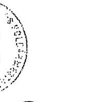
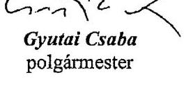

Gyutai Csaba
polgármester

---

.

---

# ELNÖK   ÁLLAMI   SZÁMVEVŐSZÉK 

Ikt.szám: V-3054-07/2011.

## Gyutai Csaba úr,   polgármester

Zalaegerszeg Megyei Jogú Város Önkormányzata

## Zalaegerszeg

## Tisztelt Polgármester Úr!

Köszönettel vettem Zalaegerszeg Megyei Jogú Város Önkormányzata pénzügyi helyzetének ellenőrzéséről készített jelentés-tervezethez megküldött levelét.
Köszönöm Polgármester úrnak és munkatársainak az ellenőrzés során tanúsított hozzáállását, amellyel az önkormányzatról készített pénzügyi helyzetelemzés elkészítését segítették.

Budapest, 2011. december " 22 ".

---

.