ÁLLAMI
SZÁMVEVŐSZÉK

# JELENTÉS 

Pécs Megyei Jogú Város Önkormányzata pénzügyi helyzetének ellenőrzéséről (43/3)

---

# Számvevői Iroda 

Iktatószám: V-3044-07/2011.
Témaszám: 1015
Vizsgálat-azonosító szám: V056043

## Az ellenőrzést felügyelte:

Dr. Varga Sándor
számvevő igazgató-helyettes

## Az ellenőrzést vezette:

## Renkó Zsuzsanna

számvevő tanácsos

## Az ellenőrzést végezték:

Dr. Ernst László
számvevő tanácsos

## Alexovics Ágota

számvevő tanácsos

## Koczor László

számvevő tanácsos

## Pappné Dr. Szamosi

Éva
számvevő tanácsos

## A témához kapcsolódó eddig készített számvevőszéki jelentések:

## címe

Jelentés Pécs Megyei Jogú Város Önkormányzata gazdálkodási rendszerének átfogó ellenőrzéséről

Pécs Megyei Jogú Város Önkormányzata gazdálkodási rendszerének 2010. évi ellenőrzéséről

---

# TARTALOMJEGYZÉK 

BEVEZETÉS ..... 7
I. ÖSSZEGZŐ MEGÁLLAPÍTÁSOK, KÖVETKEZTETÉSEK, JAVASLATOK ..... 18
II. RÉSZLETES MEGÁLLAPÍTÁSOK ..... 29

1. Az Önkormányzat kötelező és önként vállalt feladatai ..... 29
2. Pénzügyi egyensúlyi helyzet alakulása ..... 37
2.1. A működési és a felhalmozási egyensúly alakulása ..... 37
2.2. Az Önkormányzat bevételeinek alakulása ..... 44
2.3. Az Önkormányzat kiadásainak alakulása ..... 48
3. Kötelezettségek bemutatása ..... 52
3.1. A pénzintézetek felé fennálló kötelezettségek alakulása ..... 52
3.2. Szállítók felé fennálló kötelezettségek alakulása ..... 59
3.3. Egyéb kötelezettségek alakulása ..... 60
4. A pénzügyi egyensúly megteremtése érdekében hozott intézkedések ..... 64
5. A helyi önkormányzatok gazdálkodási rendszerének 2010. évi ellenőrzése során a pénzügyi egyensúly javítására tett szabályszerűségi és célszerűségi javaslatok hasznosulása ..... 68

---

# MELLÉKLETEK 

1. számú Működési és felhalmozási hiány/többlet az önkormányzat rendeleteiben melléklet
2. számú Kimutatás az Önkormányzat bevételeinek és kiadásainak, adósságszolgálatának alakulásáról
3. számú Az Önkormányzat 2007-2010 években megvalósított, illetve 2010. december 31-ig befejezett fejlesztési forrásösszetételéről
4. számú Az Önkormányzat 2010. december 31-én folyamatban lévő fejlesztési fel- melléklet adataihoz kapcsolódó kötelezettségeinek összegzéséről
5. számú Az Önkormányzat 2010. december 31-én folyamatban lévő fejlesztési fel- melléklet adataihoz kapcsolódó 2010. évet követő kötelezettség-vállalásainak összegzéséről
6. számú Az Önkormányzat beadott elbírálás alatti pályázati forrásból megvalósuló melléklet fejlesztéseihez kapcsolódó kötelezettség-vállalásainak összegzéséről
7. számú Az önkormányzati feladatok ellátásában részt vevő gazdasági társaságokról
8. számú Az Önkormányzat által kötött hitelszerződések alapján 2010. december 31-én forintban fennálló pénzintézeti kötelezettség
9. számú Pécs Megyei Jogú Város Önkormányzat Polgármesterének észrevétele
10. számú Pécs Megyei Jogú Város Önkormányzat Polgármesterének észrevételére adott válasz

---

# RÖVIDÍTÉSEK JEGYZÉKE 

## Törvények

Áht.
ÁSZ tv. ${ }_{1}$

ÁSZ tv. ${ }_{2}$
Htv.

Ötv.
Számv. tv.

## Rendeletek

Áhsz.

SzMSz
2007. évi költségvetési rendelet
2008. évi költségvetési rendelet
2009. évi költségvetési rendelet
2010. évi költségvetési rendelet
2011. évi költségvetési rendelet
2007. évi zárszámadási rendelet
2008. évi zárszámadási rendelet
az államháztartásról szóló 1992. évi XXXVIII. törvény az Állami Számvevőszékről szóló 1989. évi XXXVIII. törvény (2011. július 1-jétől az Állami Számvevőszékről szóló 2011. LXVI. törvény)
az Állami Számvevőszékről szóló 2011. évi LXVI. törvény a helyi önkormányzatok és szerveik, a köztársasági megbízottak, valamint egyes centrális alárendeltségű szervek feladat- és hatásköreiről szóló 1991. évi XX. törvény a helyi önkormányzatokról szóló 1990. évi LXV. törvény A számvitelről szóló 2000. évi C. törvény

Az államháztartás szervezetei beszámolási és könyvvezetési kötelezettségének sajátosságairól szóló 249/2000. (XII. 24.) Korm. rendelet

Pécs Megyei Jogú Város Önkormányzatának Szervezeti és Működési Szabályzatáról szóló 16/2011. (IV. 27.) számú önkormányzati rendelet a 17/2007. (IV. 30.) számú rendelet módosításáról
Pécs Megyei Jogú Város Önkormányzatának 6/2007. (II. 20.) számú rendelete az Önkormányzat 2007. évi költségvetéséről
Pécs Megyei Jogú Város Önkormányzatának 2/2008. (II. 20.) számú rendelete az Önkormányzat 2008. évi költségvetéséről
Pécs Megyei Jogú Város Önkormányzatának 3/2009. (II. 16.) számú rendelete az Önkormányzat 2009. évi költségvetéséről
Pécs Megyei Jogú Város Önkormányzatának 3/2010. (II. 15.) számú rendelete az Önkormányzat 2010. évi költségvetéséről
Pécs Megyei Jogú Város Önkormányzatának 10/2011. (III. 12.) számú rendelete az Önkormányzat 2007. évi költségvetéséről
Pécs Megyei Jogú Város Önkormányzatának 16/2008. (IV. 28.) számú rendelete az Önkormányzat 2007. évi költségvetésének végrehajtásáról
Pécs Megyei Jogú Város Önkormányzatának 8/2009. (IV. 21.) számú rendelete az Önkormányzat 2008. évi költségvetésének végrehajtásáról
Pécs Megyei Jogú Város Önkormányzatának 12/2010. (IV. 17.) számú rendelete az Önkormányzat 2009. évi költségvetésének végrehajtásáról

---

2010. évi zárszámadási rendelet

## Szórövidítések

Adóügyi osztály
áfa
APEH
ÁSZ
BM
CHF
DDRFT
EDP hiány/egyenleg
EKF
EU
főjegyző
gazdasági program $_{1}$
gazdasági program $_{2}$

GDP
GESZ
Integrál Szociális Intézmény
jegyző
Költségvetési bizottság
Közgyűlés
Központi Menza
NAV
Önkormányzat
Pécs Holding Zrt.
Pénzügyi bizottság
polgármester
Polgármesteri hivatal
PPP konstrukció
PTE

Pécs Megyei Jogú Város Önkormányzatának 15/2011. (IV. 27.) számú rendelete az Önkormányzat 2010. évi költségvetésének végrehajtásáról

Pécs Megyei Jogú Város Önkormányzata Polgármesteri Hivatal Pénzügyi Főosztályának Adóügyi Osztálya
általános forgalmi adó
Adó és Pénzügyi Ellenőrzési Hivatal
Állami Számvevőszék
Belügyminisztérium
svájci frank
Dél-Dunántúli Regionális Fejlesztési Társulás
Uniós módszertan szerinti maastrichti kritériumoknak megfelelő számítás szerinti hiány/egyenleg
Európa Kulturális Fővárosa
Európai Unió
Pécs Megyei Jogú Város Önkormányzatának címzetes főjegyzője
Pécs Megyei Jogú Város Önkormányzata Közgyűlésének 132/2007. (IV. 5.) számú határozata a 2007-2010 évekre vonatkozó gazdasági programjáról
Pécs Megyei Jogú Város Önkormányzata Közgyűlésének 159/2011. (IV. 21.) számú határozata a 2011-2014 évekre vonatkozó gazdasági programjáról
bruttó hazai össztermék
Gazdasági Ellátó és Szolgáltató Szervezet
Pécs Megyei Jogú Város Önkormányzatának Integrál Szociális Intézménye
Pécs Megyei Jogú Város Önkormányzatának jegyzője
Pécs Megyei Jogú Város Önkormányzatának Költségvetési Bizottsága
Pécs Megyei Jogú Város Önkormányzatának Közgyűlése
Középiskolai Központi Menza
Nemzeti Adó és Vámhivatal
Pécs Megyei Jogú Város Önkormányzata
Pécs Holding Városi Vagyonkezelő Zrt.
Pécs Megyei Jogú Város Önkormányzatának Pénzügyi Bizottsága
Pécs Megyei Jogú Város Önkormányzatának polgármestere
Pécs Megyei Jogú Város Önkormányzatának Polgármesteri Hivatala
Public Private Partnership (Partnerségi együttműködés közfeladatok ellátására a magánszektor bevonásával)
Pécsi Tudományegyetem

---

Sportlétesítmények
Igazgatósága
Szakképzési Társulás
szja
Társulás

Pécs Megyei Jogú Város Sportlétesítmények Igazgatósága
PANNON Szakképzés Szervezési Társulás
személyi jövedelemadó
Mecsek-Dráva Regionális Szilárdhulladék Kezelő Rendszer Létrehozását Célzó Önkormányzati Társulás

---

.

---

# JELENTÉS 

## Pécs Megyei Jogú Város Önkormányzata pénzügyi helyzetének ellenőrzéséről

## BEVEZETÉS

Az Állami Számvevőszék 2011. évtől érvényes stratégiája új irányt szabott a helyi önkormányzatok gazdálkodásának ellenőrzésében is. Az ÁSZ - küldetése és jövőképe szerint - szilárd szakmai alapokra támaszkodva értékteremtő ellenőrzéseivel és helyzetelemzéseivel az államháztartás egészében, így a helyi önkormányzati alrendszerben is elő kívánja segíteni a közpénzek és a közvagyon szabályos, gazdaságos, hatékony és eredményes hasznosítását. Ennek részeként - a 2010. évi államháztartási hiány alakulásának összetevőire is figyelemmel - folyamatban van az önkormányzati alrendszer pénzügyi helyzetelemzése.

Az NGM 2011 áprilisában közzétett adatai szerint ${ }^{1}$ a 2010. évi 1036,2 milliárd Ft összegű, 3,8\%-os EDP (maastrichti kritériumok szerinti, Túlzott Hiány Eljárás keretében kimutatott) hiánycél nem volt tartható, az önkormányzati alrendszer tervezettet meghaladó hiánya miatt a GDP arányában kifejezett államháztartási hiány 4,2\%-ra emelkedett.

Az önkormányzatok 2010 első három negyedévi költségvetési jelentése szerinti pénzforgalmi hiány 97 milliárd Ft-os összege nem indokolta az önkormányzati alrendszer 190 milliárd Ft-ra becsült hiányának 2010. évi végi felülvizsgálatát. A helyi önkormányzatok 2011. januári gyorsjelentése alapján a pénzforgalmi hiány már 247,7 milliárd Ft-ot tett ki. Az alrendszer hiánya így a tervezett 0,7\%-kal szemben magasabb, 0,9\%-os szinten realizálódott. Az 57,7 milliárd Ft hiánytöbblet alakulásában - a Tájékoztató szerint - az iparűzési adó elmaradása, a gépjárműadó, az illetékek és más bevételek tervezettnél alacsonyabb összegben való teljesülése volt a meghatározó.

Magyarország a Széll Kálmán Terv célkitűzései alapján ${ }^{2}$ aktualizált Konvergencia Programjában a középtávú (2011-2015. évek) költségvetési pálya kijelölése során 2011-re a kormányzati szektor EDP módszertan szerinti egyenlegét +2\%-ban jelölte meg. Az egyenlegcél megfogalmazásakor az önkormányzati alrendszer tervezett hiányát a 2011. évi költségvetésben szereplő 0,3\%-kal szemben 0,5\%-os arányban határozták meg ${ }^{3}$. A hiánycélok meghatározása jelzi, hogy az önkormányzati alrendszerben 2011-ben fokozott figyelmet kell fordítani a pénzügyi egyensúlyi helyzet alakulására.

Az államháztartás helyi szintjén a 23 megyei jogú városi önkormányzatnak az általuk ellátott közszolgáltatások volumenére való tekintettel kiemelt szerepe van, e települések népessége összességében meghaladja a kétmillió főt ${ }^{4}$. A települések népességét az alábbi diagram szemlélteti:
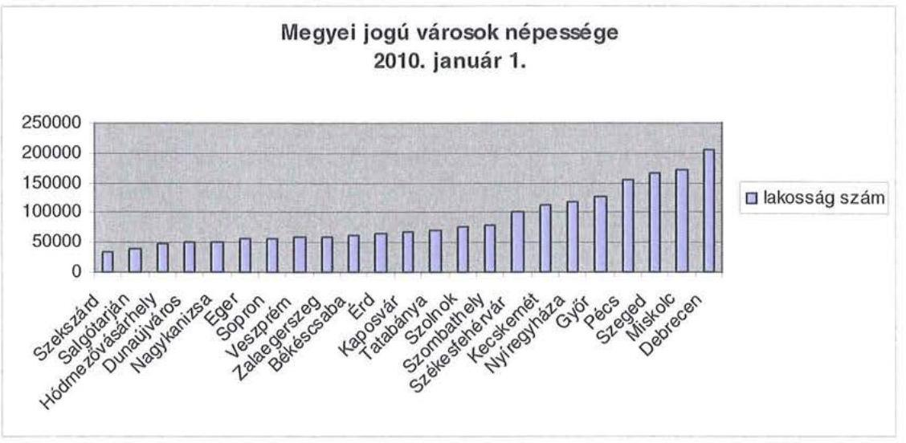

A megyei jogú városi önkormányzatok ${ }^{5}$ kötelező feladatellátását többlépcsős törvényi előírások határozzák meg. A feladatokra vonatkozó szabályozás első szintjét az Ötv. ${ }^{6}$, a második szintet a hatásköri ${ }^{7}$, a harmadik szintet a további ágazati, szakmai (egyebek mellett az oktatási, egészségügyi, szociális és egyéb ágazati feladatok ellátásának szakmai szabályait rögzítő) törvények adják.

A megyei jogú városi önkormányzatok - az Ötv-ből közvetlenül levezethető települési feladatok mellett - körzeti közszolgáltatásokat is ellátnak. A megyei

[^0]
[^0]:    ${ }^{1}$ NGM Tájékoztatás Magyarország Strukturális Reformprogramjának végrehajtásáról (2011. április 1). A Tájékoztató évente két alkalommal - április és október hónapban - jelenik meg.
    ${ }^{2}$ Az államháztartás 2011. évi egyenlege - a magán nyugdíjpénztárakból az állami nyugdíjpillérbe való visszatérés egyszeri vagyonhatása következtében - 4\%-os többletet mutatna. A Széll Kálmán Tervben foglalt egyszeri intézkedések - a MÁV, a BKV adósságrendezése, a PPP projektek kiváltása - összességében a GDP 2\%-ával csökkentik a várható többlet mértékét.

---

jogú városi cím elsősorban többlet kötelezettségekkel jár, a megyei jogú városnak önmagának kell gondoskodnia mindazokról a feladatokról, amelyek más települési önkormányzatok esetében a megyei önkormányzat feladatát képezik. Ide sorolható többek közt a középfokú oktatási intézmények fenntartása, a közművelődési, könyvtári és levéltári szolgáltatás, a társadalombiztosítás finanszírozása mellett a kórházi és a rendelőintézeti szakellátás, a szociális és egyes gyermekvédelmi feladatok ellátása. Ezeket a feladatokat (intézményeket) a megyei jogú város - más városoktól eltérően - nem adhatja át a megyei önkormányzatnak, azonban az Ötv. lehetőséget biztosít arra, hogy a megyei önkormányzattal megállapodjék a feladatellátás megosztásában.

Az önkormányzat, így a megyei jogú város is, maga határozza meg, hogy - a lakosság igényei alapján, anyagi lehetőségei függvényében - mely feladatokat, milyen mértékben és módon, mely szervezeti keretek közt lát el. A szervezetalakítás szabadsága a megyei jogú városok esetében azzal járt, hogy mind a kötelező közszolgáltatásoknál (különösen a településüzemeltetés, vagyongazdálkodás), mind pedig az önként vállalt feladataik ellátásában - elsősorban a sport és kulturális szolgáltatások területein - a gazdasági társaságok kiemelt fontosságú szerephez jutottak. Ily módon a gazdálkodás, a pénzügyi helyzet kockázatai közvetlenül kikerültek ugyan az önkormányzati alrendszerből, azonban sérülhet az ellátási felelősség figyelemmel kísérése és érvényesítése, a közpénzek felhasználásának transzparenciája. Mindezek együttvéve - a beszámolók konszolidálásának hiányában - növelik a megyei jogú városok pénzügyi helyzetének megítélésében rejlő kockázatokat.

Az áttekintett időszakban az önkormányzati feladatok ellátásának keretet biztosító forrásszabályozás elvei lényegesen nem változtak.

A megyei jogú városok önkormányzatainak mozgásterét, az önkormányzatok feladatellátásra vonatkozó döntéseit a központi költségvetéstől való függőség mellett jelentősen befolyásolja a helyi adókivetési jog gyakorlása ${ }^{3}$ A Magyar Köztársaság 2011. évi költségvetéséről szóló 2010. évi CLXIX. törvény Általános indoklásának III. fejezete, valamint Magyarország Konvergencia Programja 2011-2015. (2011. április) Táblázatok rész, 2. táblázat Államháztartás összefoglaló adatai szerint.
    ${ }^{4}$ A megyei jogú városok népességét a 4/2011. (I. 31.) NGM rendelet 1. sz. mellékletében foglalt 2010. január 1-i adatok alapján vettük figyelembe.
    ${ }^{5}$ Az Ötv. 61. § (1) bekezdése alapján a megyeszékhely város a törvény erejénél fogva megyei jogú, ugyanakkor az Országgyűlés az ötvenezernél nagyobb népességű városokat a képviselőtestület kérelmére megyei jogú várossá nyilváníthatja. Ez utóbbi körbe 5 város tartozik, közülük 2 (Hódmezővásárhely, Dunaújváros) népessége 2010. január 1-ére már ötvenezer fő alá csökkent.
    ${ }^{6}$ az Ötv. 8. és 61. §-ában foglaltak szerint
    ${ }^{7}$ a Htv.

 }^{8}$. A helyi adók rendszere a közszolgáltatások finanszírozásához szükséges források megteremtésének, bővítésének eszköze, amely a gazdasági válság, a jogszabályi környezet, az adópolitika változása, az adóhatóságok tevékenysége következtében differenciáltan érinti a települési önkormányzatokat ${ }^{9}$.

A települési önkormányzatok saját folyó bevételeinek keretében elszámolt, különböző jogcímeken kivetett helyi adók - iparűzési adó, építmény és telekadó, idegenforgalmi adó, vállalkozók és magánszemélyek kommunális adója - 2007-2010 között eltérő módon emelkedtek. A helyi adókból származó bevételek realizált összege országos szinten 2007-2009 között folyamatosan, 505,3 milliárd Ft-ról 566,3 milliárd Ft-ra emelkedett, majd a gazdasági válság hatásai következtében 2010-re 542,6 milliárd Ft-ra esett vissza. A helyi adók részesedése

[^0]
[^0]:    ${ }^{8}$ a helyi adókról szóló 1990. évi C. törvény szabályai szerint
    ${ }^{9}$ Az Állami Számvevőszék 2010 decemberében közzétett 1031. számú jelentésében értékelte a helyi adók rendszerében a hatékonyság és az eredményesség érvényesülését.

---

az önkormányzatok saját folyó bevételein belül 2007-2010 között 2,5 százalékponttal csökkent ${ }^{10}$.

A megyei jogú városok saját folyó bevétele 2007-ben 191,5 milliárd Ft volt, 2008-ban 223,1, 2009-ben 225,4, 2010-ben 223,5 milliárd Ft-ot tett ki. A helyi adóbevételekből való részesedésük 2007-ben 110,5 milliárd Ft (21,9%), 2008-ban 128,3 milliárd Ft (23,2%), 2009-ben 124,4 milliárd Ft (22%), 2010-ben 118,7 milliárd Ft (részaránya a 2007. évivel azonosan 21,9%) volt. E realizált adóbevételek a megyei jogú városok saját folyó bevételeinek 2007-ben 57,7, 2008-ban 57,5, 2009-ben 55,2, 2010-ben 53,1%-át jelentették. A helyi adóbevételek 2007-ről 2010-re kimutatott 4,6 százalékpontos csökkenése annak ellenére következett be, hogy a megyei jogú városok saját folyó bevétele 2010-ben 16,7%-kal haladta meg a 2007. évit.

A helyi adókon belül a települések gazdasági helyzetének egyik fokmérője az elért helyi iparűzési adóbevétel, amely a megyei jogú városok körében erőteljes - a település nagyságrendtől is függő ${ }^{11}$ - különbségeket mutat. A helyi iparűzési adóbevétel és annak egy lakosra vetített összegének 2007. és 2010. évi alakulását az alábbi diagramok szemléltetik:
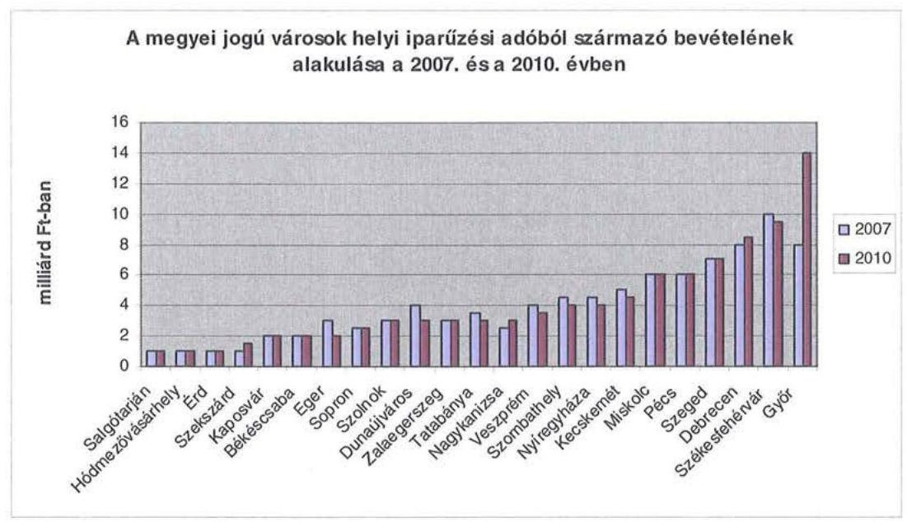

[^0]
[^0]:    ${ }^{10}$ A helyi adó bevételek saját folyó bevételekből való részesedése országosan 2007-ben 55,3%, 2010-ben 52,8% volt.
    ${ }^{11}$ A 100 ezer fő feletti népességű megyei jogú városok csoportjába Debrecen, Miskolc, Szeged, Pécs, Győr, Nyíregyháza, Kecskemét, Székesfehérvár tartozik. Nem megyeszékhely megyei jogú város Erd, Sopron, Nagykanizsa, Dunaújváros, Hódmezővásárhely.

---

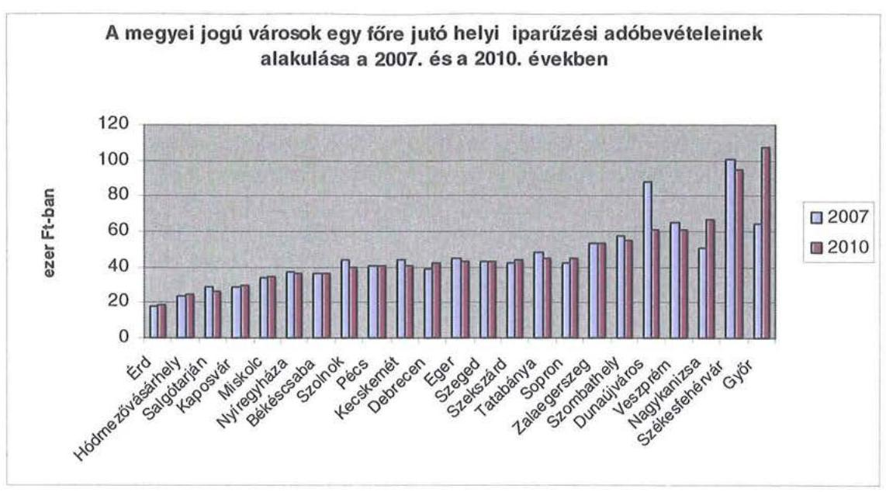

A megyei jogú városi önkormányzatok saját bevételein belül második legjelentősebb elem az illetékbevétel. A 2010. évben befolyt 39,2 milliárd Ft illetékbevétel a 2006. évben realizált 71,1 milliárd Ft illetékbevétel alig több mint 55%-a. A jelentős visszaesést döntően az ingatlanpiac stagnálása, majd visszaesése, illetve egyes illetékkedvezmények bevezetése okozta. A kieső bevételek pótlására az önkormányzati alrendszer szintjén történtek intézkedések, 2010-ben 5 milliárd Ft-ot, 2011-ben 1,2 milliárd Ft-ot ellentételezett a központi költségvetés. A megyei jogú városok önkormányzatai az önkormányzati alrendszer szintjén realizált illetékbevételből 2007-ben 13,6 milliárd Ft-tal (23,3%-kal), 2008-ban 15,3 milliárd Ft-tal (22,7%-kal), 2009-ben 12,6 milliárd Ft-tal (21,5%-kal), 2010-ben 7,9 milliárd Ft-tal (20,2%-kal) részesedtek ${ }^{12}$. Az összes befolyt illetékbevételből a megyei jogú városok részesedése 2009-ről 2010-re mindössze 1,3 százalékponttal csökkent, ugyanakkor a realizált illetékbevétel csökkenése a 37,3%-ot (4,7 milliárd Ft) is elérte.

Az önkormányzati alrendszer átengedett bevételei közül a személyi jövedelemadóból való részesedés makroszintű szabályozása a vizsgált időszakban nem változott. A települési önkormányzatokat a településre kimutatott személyi jövedelemadó 8%-a közvetlenül, míg 32%-a külön szabályozott visszaosztási rendben illeti meg. A visszaosztás a jövedelem differenciálódás mérséklésével párosul, rendje a lakóhelyen maradó személyi jövedelemadóhoz és az iparűzési adó-erőképességhez ${ }^{13}$ igazodik, annak részletszabályait a mindenkori költségvetési törvény 4. számú melléklete határozza meg. A jövedelemdifferenciálódás

[^0]
[^0]:    ${ }^{12}$ Az illetékek kivetésének és beszedésének joga 2006. december 31-ig a megyei önkormányzatok feladata volt, amelyet a 2007. évtől az APEH (2011. január 1-jétől NAV) vett át. Az önkormányzati illetékrészesedési szabályok változatlanok maradtak, azonban az illetékbeszedés költségeit az önkormányzatok illetékbevételeiből átlagos (a megyei jogú városoknál 8,5%-os) kulcsot alkalmazva vonták le.
    ${ }^{13}$ Az iparűzési adóerő-képesség egy potenciális, átlagos erőfeszítés mellett elérhető (a települési önkormányzat iparűzési adóelőlegét meghatározó adóalap 1,4%-ának megfelelő számított) bevétel.

---

szabályai kétirányúak, a kiegészítés és a visszatartás feltételeit egyaránt meghatározták:

- Amennyiben az önkormányzatot közvetlenül megillető személyi jövedelemadó bevétel és a számított iparűzési adóerő-képesség együttesen számított, egy főre jutó összege nem érte el a település méretéhez kapcsolódóan az évenkénti szabályozás szerinti változó összeget, a költségvetés a részesedést település nagyság szerint eltérően meghatározott szintig kiegészítette ${ }^{14}$. A kiegészítés fajlagos összege 2007-2010 között 37500 Ft-ról 48010 Ft-ra (10 510 Ft-tal, 28%-kal) emelkedett. Az előzőeken túl a jövedelem differenciálódás szabályozása egyes térségi (középiskolai, szakiskolai, szakképző intézményi, kollégiumi) feladatok ellátásának függvényében további kiegészítő hozzájárulást biztosított.
- Amennyiben az egy főre számított személyi jövedelemadó és az iparűzési adóerő-képesség együttes összege a település nagyságrendjéhez rendelt értékhatárt több mint 25%-kal (2010-től 20%-kal) meghaladta, az egy főre jutó összeg sávonként differenciált módon ${ }^{15}$ visszavonásra került az önkormányzatot megillető normatív állami hozzájárulás összegéből.

Az önkormányzatok személyi jövedelemadó bevétele 2007-ben 494,3 milliárd Ft, 2008-ban 558,6 milliárd Ft, 2009-ben 639,5 milliárd Ft, 2010-ben 681,2 milliárd Ft volt, az időszak alatt összegében 186,9 milliárd Ft-tal, 37,8%-kal emelkedett, miközben az szja bevétel átengedett bevételeken belüli részesedése 1,8 százalékponttal emelkedett.

A megyei jogú városok önkormányzatainak személyi jövedelemadó részesedése az alrendszer átengedett személyi jövedelemadó bevételeiből 2007-ben 77,6 milliárd Ft-ot (15,7%-ot), 2008-ban 105,4 milliárd Ft-ot (18,9%-ot), 2009-ben 122,9 milliárd Ft-ot (19,2%-ot), 2010-ben 136,6 milliárd Ft-ot (20,1%-ot) tett ki. A realizált szja bevétel a megyei jogú városoknál az időszak alatt folyamatosan emelkedett, a 2010-ben realizált adóbevétel 59,0 milliárd Ft-tal (76%) volt magasabb a 2007. évinél, az átengedett bevételeken belüli részesedése 2010-re 5,1 százalékponttal haladta meg a 2007. évi részarányt ${ }^{16}$. A részesedés alapjául szolgáló szja településenként eltérő, az egy adózóra jutó szja 2009. évi adatait ${ }^{17}$ a következő ábra szemlélteti.

[^0]
[^0]:    ${ }^{14}$ A megyei jogú városok esetében a jövedelemkülönbségek mérséklésénél figyelembe veendő lakosonkénti értékhatár 2007-ben 37500 Ft, 2008-ban 42385 Ft, 2009-ben 45933 Ft, 2010-ben 48010 Ft volt.
    ${ }^{15}$ A sávos értékhatár 2010-től 20%-os intervallumonként, 120% felett a visszatartást 25%-tól 90%-os mértékig rögzíti. Amennyiben a település nagyságrendhez rendelt értékhatár összege az önkormányzatnál eléri vagy meghaladja a 200%-ot, az egy főre jutó összeg 90%-a levonásra kerül. Az értékhatár sávjai 2010 előtt 25%-os léptékűek voltak, a levonási arányok az ellenőrzött időszakban nem változtak.
    ${ }^{16}$ E bevételek a megyei jogú városok átengedett bevételeiben 2007-ben 84,7, 2008-ban 87,7, 2009-ben 89,7, 2010-ben 89,8%-os részarányt jelentettek.
    ${ }^{17}$ Adatforrás: KSH Megyei Jogú Városok a Közép Dunántúlon 2009. kiadványa, 4.1. sz. összehasonlító tábla.

---

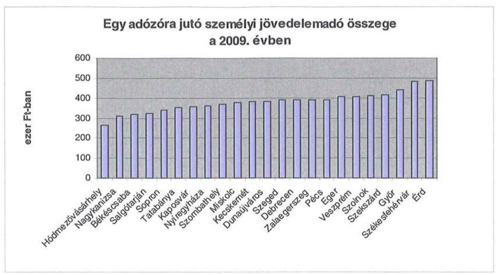

Az átengedett bevételek második legjelentősebb eleme a gépjárműadó, amelynek bevételi szabályozása az ellenőrzött időszakban nem változott, az adóbevétel teljes összege az önkormányzatot illeti meg. A gépjárműadó alapját, mértékét ${ }^{18}$ és egyes mentességi kategóriákat érintő módosítások 2010. január 1-től következtek be, amelyek az egyes adótételek esetében átlagosan 15%-os emelkedéssel jártak.

A gépjárműadó beszedéséből származó bevétel az önkormányzati alrendszer szintjén 2007-ben 62,4 milliárd Ft, 2008-ban 65,7 milliárd Ft, 2009-ben 63,8 milliárd Ft, 2010-ben 71,1 milliárd Ft volt, az adóbevétel egésze 2007-hez képest 8,7 milliárd Ft-tal, 13,9%-kal emelkedett. A gépjármű-adóztatás szabályainak változása 2010-ben 7,3 milliárd Ft többletet eredményezett. A megyei jogú városok gépjárműadó bevétele a 2007. évi 14,0 milliárd Ft-ról 2010-re 15,5 milliárd Ft-ra, 10,7%-kal emelkedett. A bevételnövekedés összegéből 1,4 milliárd Ft a 2010. évi adózási szabályok következménye.

A megyei jogú városok önkormányzatai 2007-2010 között rendelkezésre álló forrásainak alakulását a következő ábra szemlélteti:

[^0]
[^0]:    ${ }^{18}$ A gépjárműadóról szóló 1991. évi LXXXII. törvény 7. § (1) bekezdésében foglalt adómértékek változása.

---

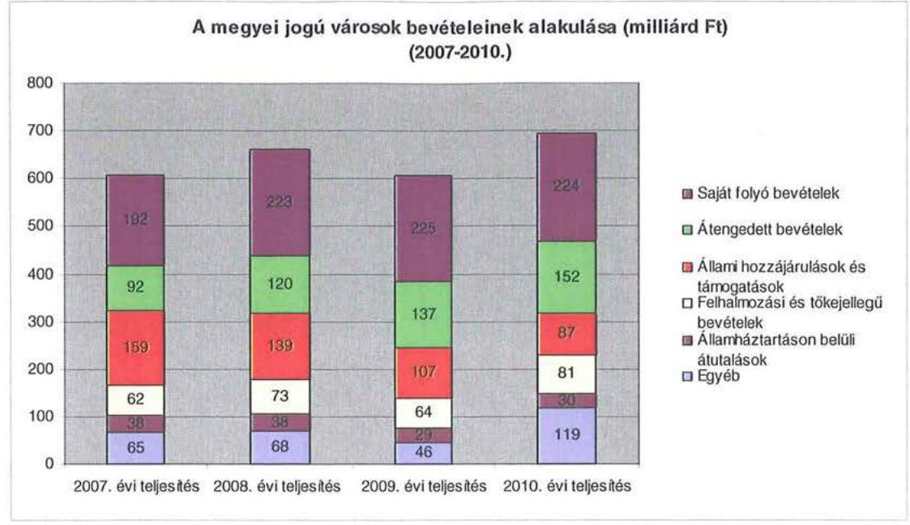

A megyei jogú városok saját folyó bevételeinek - amelyek főbb elemei: a helyi adók, az illetékbevételek, az intézményi térítési díjak, a kamatbevételek - részaránya a 2007. évi összbevételen (608 milliárd Ft) belül 32% volt. A 2010. évi összbevétel 693 milliárd Ft-os összegéből a saját folyó bevételek aránya - miközben összege 2007-ről 2010-re 32 milliárd Ft-tal emelkedett - nem változott.

Az átengedett bevételek, amelyek a megyei jogú városok önkormányzatainál döntően a személyi jövedelemadó és a gépjárműadó részesedést jelenti, az összbevételen belül a 2007. évi 92 milliárd Ft-ról (15%) 152 milliárd Ft-ra nőtt, részesedése 7 százalékponttal emelkedett. A 60 milliárd Ft-os növekedésből 59 milliárd Ft-ot az szja részesedés emelkedése okozott.

Az állami hozzájárulások és támogatások - amelyek főbb elemei: főként az ellátotti létszámhoz kötődő normatív állami hozzájárulások, központosított előirányzatok - a 2007. évi 159 milliárd Ft-ról (26%-os részarányról) 2010-re 87 milliárd Ft-ra (13%-os részarányra) estek vissza.

A felhalmozási és tőkejellegű bevételek - tárgyi eszközök (ingatlanok és ingóságok), föld és immateriális javak, részesedések értékesítése, EU-tól átvett pénzeszközök - a 2007. évi 62 milliárd Ft-ról (10%-os részarányról) 2010-re 81 milliárd Ft-ra (12%-os részarányra) emelkedtek.

Az államháztartáson belüli átutalások részesedése 2007-ben 38 milliárd Ft volt. 2010. év végére 8 milliárd Ft-tal csökkent, részaránya 6%-ról 2010-ben 4%-ra változott. Ez a bevételi kategória tartalmazza az Egészségbiztosítási Alaptól és más elkülönített állami pénzalapoktól átvett forrásokat. A 2010-ben e címen elszámolt bevétel a megyei jogú városoknál 22 milliárd Ft-ot tett ki.

Az egyéb, pénzmaradványból, vállalkozási bevételekből, államháztartáson kívülről származó átutalásokból, a hitelekből, a hosszú és rövid lejáratú értékpapírok értékesítéséből származó bevételek részesedése a 2007-2010. évek viszonylatában 11%-ról 17%-ra emelkedett. Ez utóbbiak 2010. évi beszámoló szerinti összevont teljesítése 119 milliárd Ft volt ${ }^{19}$.

Mindezeket figyelembe véve a megyei jogú városok 2007. és 2010. évi forrásöszszetételének megoszlását az alábbi ábra szemlélteti:

A megyei jogú városok 2007. és 2010. évi forrásösszetétele
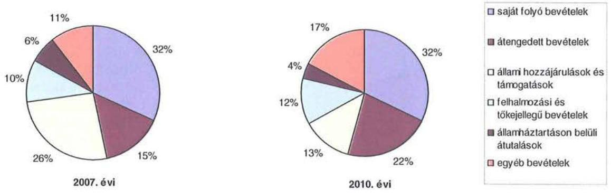

Az önkormányzati alrendszer pénzügyi helyzetértékelése során új elemzési módszereket alkalmaz az ellenőrzés. A hagyományos költségvetési szerkezet helyett az önkormányzat pénzügyi helyzetét a CLF módszerrel mutatjuk be, amelynek lényegét és számításának módszerét a 2.1. pontban, és a jelentés 2. számú mellékletében ismertetjük részletesen.

Az új módszereken alapuló helyzetértékelés fontosságát az adja, hogy a helyi önkormányzatok bruttó adósságállománya ${ }^{20}$ a 2010. évi költségvetési beszámoló alapján 1248 milliárd Ft-ot tett ki. Az adósságállomány koncentráltságát jelzi ${ }^{21}$, hogy ebből a 23 megyei jogú város részesedése

 338 milliárd Ft volt, amely a fővárosi és kerületi önkormányzatok adósságának figyelmen kívül hagyásával számított 2010. évi 977 milliárd Ft összegű bruttó adósságállomány 34,6%-át jelentette. Az adósságállomány több mint fele - 501 milliárd Ft - a 19 megyei önkormányzatnál és a 23 megyei jogú városnál jelentkezett.

[^0]
[^0]:    ${ }^{19}$ Az egyéb bevételek összege 2007-2010 között eltérő módon változott, 2007-ben 65 milliárd Ft, 2008-ban 68 milliárd Ft volt, 2009-ben 46 milliárd Ft-ra esett vissza, majd 2010-ben több mint két és félszeresére, 119 milliárd Ft-ra emelkedett.
    ${ }^{20}$ A bruttó adósságállomány 2010. év végi összege magában foglalja a fejlesztési és a működési célú kötvénykibocsátások, a beruházási és fejlesztési hitelek, a működési célú hosszú lejáratú hitelek, a rövid lejáratú hitelek, váltótartozások miatti kötelezettségek teljes (2011-ben, illetve az azt követő években esedékes) állományát.
    ${ }^{21}$ A megyei jogú városok adósságállománya összegében ugyan elmarad az egyéb városok összesített adósságától [(ez utóbbiak részesedése 382,6 milliárd Ft (39,2\%)], azonban az egyéb városok száma 304. A fővárosi és a kerületi önkormányzatok nélküli adósságállományból a 19 megyei önkormányzat 163 milliárd Ft-tal (16,8%-kal), míg a nagyközségek, községek együttesen 93 milliárd Ft-tal (9,5%-kal) részesednek.

---

A megyei jogú városok 338 milliárd Ft-os adósságállományából 175 milliárd Ft (51,8%) a 8 legnagyobb, 100 ezer fő feletti népességű város tartozása. Az 5 nem megyeszékhely megyei jogú város bruttó adósságállománya 70 milliárd Ft-ot (20,7%-ot), az előző két csoportba nem tartozó további 10 megyei jogú város adóssága 93 milliárd Ft-ot (27,5%-ot) tett ki.
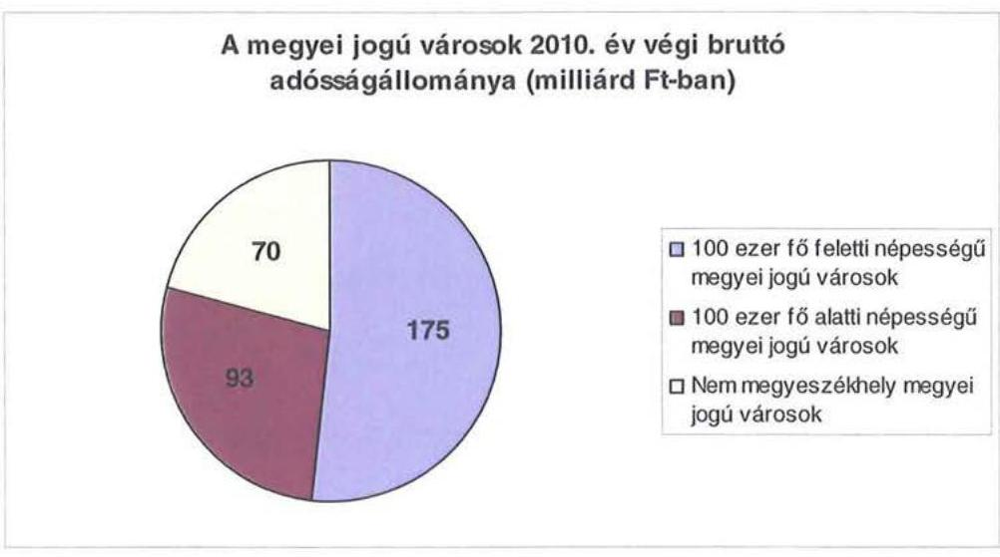

A mérlegben kimutatott bruttó adósságállomány mellett az önkormányzatok számára az eszközállomány műszaki állapotának megőrzése is kötelezettségekkel jár. Az elhasználódott eszközök pótlására forrást biztosító amortizációs (felújítási) alap képzésének ${ }^{22}$ elmaradása maga után vonhatja a feladatellátást kiszolgáló tárgyi eszközök állagának erőteljes romlását. Emellett a 2007-2013-as időszakra meghirdetett, vissza nem térítendő EU-s fejlesztési forrásokhoz való hozzájutás lehetősége felerősítette az önkormányzati alrendszer fejlesztési igényeit, amelyek a felhalmozási költségvetési hiány folyamatos emelkedésén túl - az előírt jövőbeni fenntartási kötelezettség miatt - tovább terhelhetik az önkormányzatok költségvetését ${ }^{23}$.

Az ÁSZ a 2011. évi ellenőrzési tervében 43. számú, az Önkormányzatok gazdálkodási rendszerének ellenőrzése részeként egy időben, egymással párhuzamosan tekinti át, és elemzi a 23 megyei jogú városi önkormányzat pénzügyi helyzetét. A gazdálkodás szabályszerűségét az ÁSZ az előző évek során ebben az önkormányzati körben is ellenőrizte, ezért jelen vizsgálatunk erre nem tér ki. A jelentés a megyei jogú városok sajátos feladatellátási és forrásszabályozási

[^0]
[^0]:    ${ }^{22}$ Erre a jelenlegi szabályozási környezetben nem kötelezi semmilyen előírás az önkormányzatokat.
    ${ }^{23}$ Az Állami Számvevőszék 2011 júniusában közzétett 1108. számú, a helyi önkormányzatok fejlesztési célú támogatási rendszerének ellenőrzéséről szóló jelentésében feltárta a fejlesztési folyamatok problémáit. A helyi önkormányzatok elsősorban azokat a fejlesztéseket valósították meg, amelyekhez támogatást lehetett igényelni. A fejlesztési célok közül a magasabb támogatás intenzitású pályázatokat részesítették előnyben. A fejlesztéssel megvalósuló létesítmények jövőbeli üzemeltetésének várható ráfordításait az önkormányzatok 71,9%-a nem mérte fel.

---

helyzetére tekintettel az önkormányzatok pénzügyi helyzetét, illetve az ezzel összefüggő korábbi ÁSZ javaslatok megvalósítását mutatja be.

Az ellenőrzés a 2007. január 1. - 2010. december 31. közötti időszakot öleli fel.
A vizsgálat jogszabályi alapját az Állami Számvevőszékről szóló 1989. évi XXXVIII. törvény 2. § (3), (5), (6) és (9) bekezdései ${ }^{24}$, az Ötv. 92. § (1) bekezdése, az Áht. 104. § (3), és 120/A. § (1) bekezdése előírásai képezik.

[^0]
[^0]:    ${ }^{24}$ 2011. július 1-jétől az Állami Számvevőszékről szóló 2011. évi LXVI. törvény 5. § (2)(5) bekezdései.

---

# I. ÖSSZEGZŐ MEGÁLLAPÍTÁSOK, KÖVETKEZTETÉSEK, JAVASLATOK 

Az Önkormányzat - adatszolgáltatása szerint - a tárgyév működési költségvetési kiadásaiból (39992 millió Ft) 28179 millió Ft-ot (70%) a kötelező feladatok, 11813 millió Ft-ot (30%) az önként vállalt feladatok ellátására fordított. A kötelező és önként vállalt feladatok részarányának megállapítása az Önkormányzat költségvetési szervei alapító okirataiban foglaltaknak megfelelően készült. Az Önkormányzat önként vállalt feladatnak tekinti az általános iskolákban, gimnáziumokban a két tanítási nyelvű oktatást, az előkészítő osztályok működtetését, a szociális ellátásban a szociális foglalkoztatást, a házi szakápolást, a családok átmenti otthonának biztosítását. Az Önkormányzat önként vállalt feladatokat lát el a közművelődés és a sport területén. Az Önkormányzat önként vállalt feladatainak meghatározásakor figyelemmel volt arra az Ötv-ben foglalt előírásra, hogy rendelkezik mindazokkal az intézményi feltételekkel, amelyek biztosítják, hogy a területén saját hatáskörében a megyei önkormányzat számára előírt kötelező feladatokat is ellássa.

Az Önkormányzat feladatellátásának szervezeti struktúráját a következő ábra szemlélteti:

Az Önkormányzat feladatellátásának szervezeti struktúrája
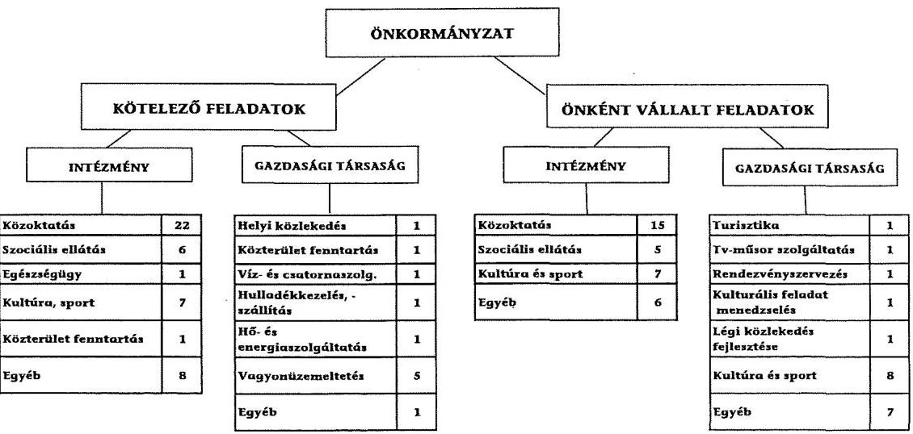

Az Önkormányzat feladatait 2010. december 31-én (a Polgármesteri hivatallal együtt) 45 költségvetési szervvel és 31 - 25% feletti tulajdoni hányadú - gazdasági társaságával látta el. Az intézményszervezeti átalakítások és intézményi összevonások következtében a feladatellátás telephelyeinek száma a 2006. évi 213-ról 2010-re 257-re nőtt.

Az Önkormányzat működési kiadásokra 2010-ben 39992 millió Ft-ot fordított, amely 5564 millió Ft-tal (16%-kal) haladta meg a 2007. évi ráfordításokat. A működési kiadások 89%-át az intézményi körben realizálták. E kiadások fede-

---

zetéül szolgáló bevételi források 2007. és 2010. években jellemző összesített arányait a következő ábra szemlélteti:
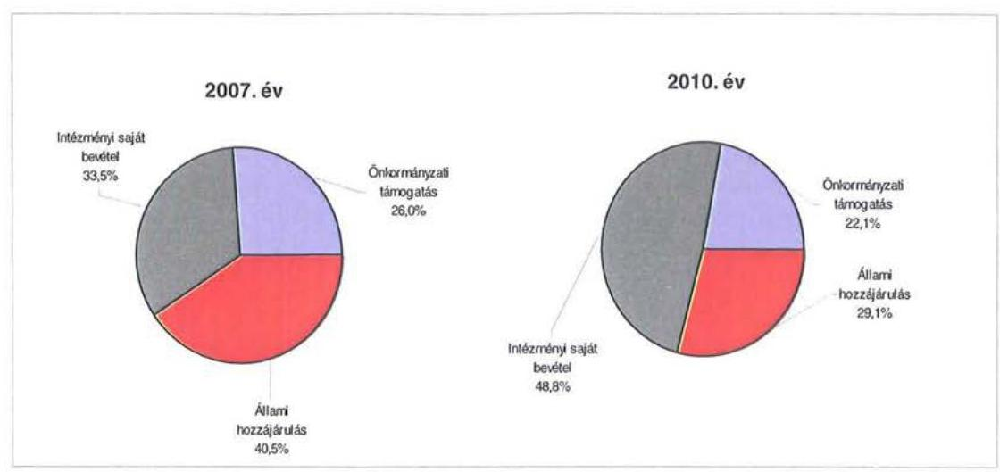

Az egyes közszolgáltatások feladatellátásában részt vevő ágazati intézménycsoportok forrásösszetételének bevételi jogcímenkénti alakulását a következő ábra szemlélteti:
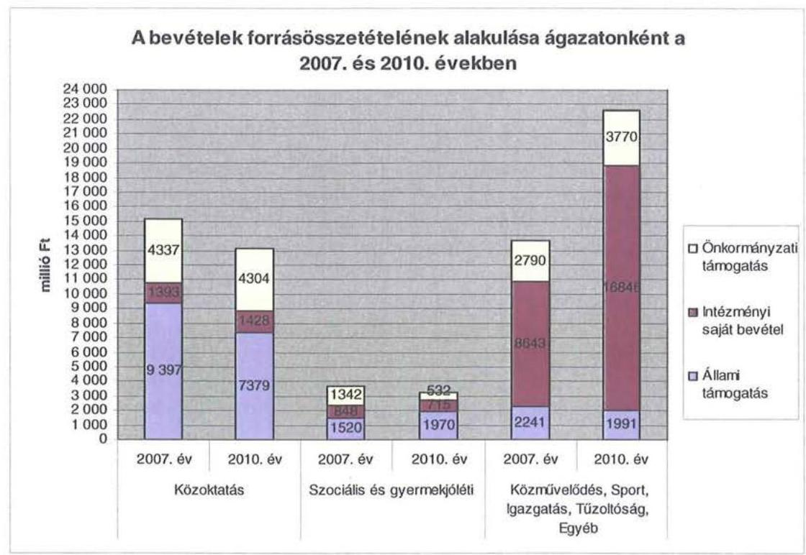

Az ellenőrzött időszakban az egyes intézménytípusoknál a bevételek összetételét tekintve megállapíthatjuk, hogy a közoktatási intézményekben csökkent, a szociális és gyermekjóléti intézményekben pedig növekedett a normatív állami hozzájárulások aránya. Ezzel összefüggésben az önkormányzati támogatás igénye az egyes intézménytípusokban változott. Az önkormányzati támogatás részaránya 2-5 százalékponttal növekedett a közoktatási intézményeknél, a szociális intézményeknél pedig 19-24 százalékponttal csökkent.

---

Az Önkormányzat 13 gazdasági társaságban rendelkezik kizárólagos tulajdonnal, öt gazdasági társaságban 75% feletti, hét gazdasági társaságban 50-75% közötti, hatban 25-50% közötti tulajdoni hányaddal. A gazdasági társaságok a helyi közlekedésben, a közterület fenntartásban, a víz- és csatornaszolgáltatásban, a hulladékkezelésben és szállításban, a hőszolgáltatásban és a vagyonüzemeltetésben kaptak szerepet az Önkormányzat kötelező feladatellátásában. A gazdasági társaságok működésükhöz a 2010. évben összesen 1585 millió Ft rendszeres működési, 148 millió Ft eseti működési pénzeszköz átadást és 262 millió Ft fejlesztési pénzeszköz átadást kaptak az Önkormányzattól. A működési pénzeszköz átadás 32%-át (560 millió Ft-ot) a Pécsi Közlekedési Zrt. társaság kapta.

Az Önkormányzat többségi tulajdonában lévő társaságok pénzügyi helyzete stabil, ezek saját tőkéje 2010. december 31-én 40367 millió Ft, jegyzett tőkéje 15627 millió Ft, a saját tőke-jegyzett tőke aránya 258% volt. Az áttekintett időszakban jelentősebb mértékű tőkejuttatásban részesült a Pécs Holding Zrt., amely 2008-ban az önkormányzati cégek egységes vállaltirányítási rendszerének kialakítása során 5634 millió Ft nem pénzbeli hozzájárulást, apportot kapott. A 2010. évben három többségi tulajdonú gazdasági társaság (Pécs Holding Zrt, Biokom Kft., Tettye Forrásház Zrt.) 225 millió Ft tőkejuttatásban részesült. A Pécsi Rendezvényszervező Nonprofit Kft. a 2010. évben tevékenységet nem folytatott, korábban felvett hitelei kamatainak törlesztése és az elszámolt értékcsökkenés költségként merült fel, amely 218 millió Ft veszteséget okozott, csökkentve a saját tőkét, amelyet 2011 végéig a tulajdonosnak tőkejuttatással rendezni kell. Az Önkormányzat tulajdoni részesedéssel rendelkező gazdasági társaságai közül a helyszíni ellenőrzés időszakában egyik sem állt átszervezés, csődeljárás alatt.

A folyó költségvetés egyenlege (a működési jövedelem) 2007-ben működési forráshiányt, 2008-ban és 2009-ben működési forrástöbbletet mutatott, 2010-ben azonban, az Önkormányzat ismét működési forráshiányos volt ${ }^{25}$. A 2007-2010. években az Önkormányzat pénzügyi kapacitása (nettó működési jövedelme) negatív értékű volt, a 2008-2009. években a működési megtakarítások sem tudták fedezni a tárgyévben jelentkező törlesztési kötelezettséget. A 2008. évben az adósságszolgálat hirtelen növekedését az okozta, hogy a meglévő hitelállományt visszafizették, amelynek fedezete a 6000 millió Ft-os kötvénykibocsátás volt. A 2007-2010. években a folyó bevételek nem nyújtottak fedezetet a folyó kiadásokra, a működési egyensúly nem volt biztosított.

[^0]
[^0]:    ${ }^{25}$ 2007-ben a negatív működési jövedelem a 4%-át (1472 millió Ft-ot), 2010-ben az 1%-át (575 millió Ft-ot) tette ki a folyó kiadásoknak. 2008-ban és 2009-ben a pozitív működési jövedelem egyaránt 2%-át (720 millió Ft-ot, illetve 723 millió Ft-ot) jelentette a folyó bevételeknek.

---

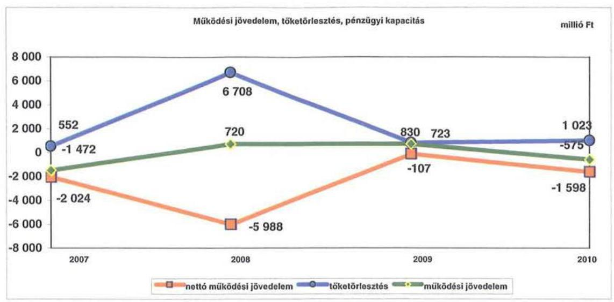

A 2007-2010. években az Önkormányzat felhalmozási költségvetésének egyenlege folyamatosan negatív összegű volt, amely 2007-2010 között 19132 millió Ft felhalmozási forráshiányt okozott. A pénzügyi egyensúly fenntartása külső források bevonásával volt biztosítható. A 2007-2010. években 9113 millió Ft hitelt törlesztettek. Az adósságszolgálat, továbbá a felhalmozási forráshiány 2007-2010 között 28245 millió Ft-ot tett ki, amelyre a 2007. január 1-jén rendelkezésre álló 2894 millió Ft pénzkészlet szolgált fedezetül. A további pénzeszközöket 19351 millió Ft hitel felvételével, továbbá 6000 millió Ft kötvény kibocsátásával teremtették meg. A kialakult pénzügyi helyzet pozitív nettó működési jövedelmet eredményező gazdálkodás mellett teszi elkerülhetővé további külső források bevonását, az eladósodás növekedését.

A vizsgált időszakban az Önkormányzatnál helyi iparűzési adó, építményadó, 2008. január 1-jétől a vendégéjszakák utáni idegenforgalmi adó volt megállapítva. 2008. évtől az Önkormányzat szűkítette az iparűzési adókedvezményben részesülők körét, az építményadó esetében megszüntették a személygépkocsi tárolók adómentességét, az adó mértékét 200 Ft/m²-ről 450 Ft/m²-re, a vállalkozók esetében 300 Ft/m²-ről 500 Ft/m²-re emelte. 2010. évtől az idegenforgalmi adó esetében megszüntette a 70 év feletti személyek adómentességét. A helyi adókból és pótlékokból származó bevételek aránya 2007-2010 között 22-20% körül mozgott a folyó (működési) bevételekben. A pótlékkal, bírsággal növelt helyi adó bevétel a 2007. évi 7223 millió Ft-ról 2010. évben 7749 millió Ft-ra (3,1%-kal, 526 millió Ft-tal) nőtt. A helyi adóbevételek több mint háromnegyed részét az iparűzési adó tette ki, amelynek mértéke a helyi adókról szóló törvényben rögzített maximális mértékben került megállapításra. A helyi adók növekedését főként az építményadó 52,3%-os, 452 millió Ft-os növekedése okozta, az iparűzési adó növekedése 6%, 38 millió Ft volt.

A befejezett fejlesztések jelentős részét pénzintézeti forrásokból fedezték. A 2007-2010. évek időszakában 37105 millió Ft értékű fejlesztés és felújítás forrása 9853 millió Ft hitelfelvétel (27%) volt. A 2010. december 31-én folyamatban lévő fejlesztési feladatok végrehajtására 17180 millió Ft kiadást teljesítettek, amelyre hitelből 5969 millió Ft-ot (35%) fordítottak.

---

Az Önkormányzatnál a 2010. december 31-én folyamatban lévő fejlesztési feladatok kötelezettségvállalásainak összege 9484 millió Ft volt, amelyből 1805 millió Ft-ot saját forrásból, 6454 millió Ft-ot EU-s támogatásból és 565 millió Ft-ot hitelkeretből (még rendelkezésre álló forrásból), 660 millió Ft-ot hazai támogatással terveznek
 biztosítani. A tervezett saját források rendelkezésre állását azonban az Önkormányzat jelenlegi pénzügyi helyzete nem igazolja. Mindez kockázatot jelent a vállalt fejlesztések jövőbeni finanszírozhatósága szempontjából.
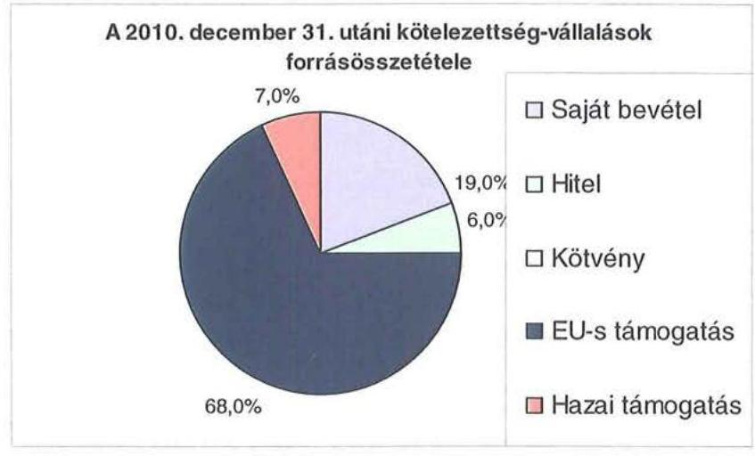

Az Önkormányzat által beadott, elbírálás alatt álló pályázatok tervezett teljes bekerülési költsége 1590 millió Ft volt, amelyhez 730 millió Ft idegen forrást kívánnak bevonni, ugyanakkor a működési költségvetésben megtakarítást 2010-ben nem sikerült elérni. Az Önkormányzat vállalt kötelezettségeit - a saját bevételeken túl - a fennálló követelésállományból származó forrásai (1532 millió Ft) felhasználásával és a jelzáloggal nem terhelt forgalomképes ingatlanvagyon szükség szerinti értékesítéséből származó bevételből kívánja előteremteni.

Az Önkormányzat mérleg szerinti pénzintézeti kötelezettsége a 2006. év végéről a 2010. év végére, 13743 millió Ft-ról 37854 millió Ft-ra nőtt, amelyből az árfolyamváltozás miatti különbözet 3638 millió Ft volt. A fennálló pénzintézeti kötelezettségek egy kötvény kibocsátásából, 52 hosszú lejáratú hazai és egy hosszú lejáratú külföldi hitelből, a megszűnt víziközmű társulásoktól átvett hitelállományból, valamint 2010. év végén fennálló folyószámlahitel állományból keletkeztek.

Az Önkormányzat kötelezettségvállalásaira közgyűlési döntés alapján került sor. Az előterjesztések - számszerűsítés nélkül - tartalmazták a visszafizetés forrásait, nem mutatták be a várható kamatkötelezettség összegét. A deviza alapú hitel felvételének és a kötvény kibocsátásának döntései előtt a kamatkockázatot vizsgálták, a különböző devizák várható árfolyamváltozásait a kötvény kibocsátása előtt a pénzintézeti ajánlatok alapján tekintették át, a teljes futamidőre azonban a kamat- és árfolyamkockázat várható kihatásait nem mutatták be.

Az Önkormányzat kötvényt a működési hitelek törlesztési kötelezettségeinek előfinanszírozására, valamint fejlesztések finanszírozása céljából bocsátott ki.

---

A külföldi pénzintézettől és a hazai pénzintézetektől felvett fejlesztési hiteleiből kiemelten az EKF program kulcsprojektjeihez biztosított önerőt, a Sopianae terv és a Világörökség II. program felhalmozási kiadásait finanszírozta, valamint a panelházak felújításához, az intézményi rekonstrukciókhoz, a közvilágítás korszerűsítéséhez, az utak és közterületek felújításához rendelt forrást.

Az Önkormányzat 2010. december 31-ig a 39215686 CHF-ben fennálló pénzintézeti kötelezettségével összefüggően 3262745 CHF (601 millió Ft) kamatot, valamint 35 millió Ft egyéb költséget fizetett, a 39000000 EUR-ban fennálló pénzintézeti kötelezettségéből 1375970 EUR (382 millió Ft) kamatot, valamint 96 millió Ft egyéb költséget fizetett. A HUF-ban fennálló kötelezettségekből 8948 millió Ft tőketörlesztést, kamatot és egyéb költséget teljesített. Az Önkormányzat a kötvény kibocsátásából és a hitelek igénybevételéből származó forrásokat 2010. év végéig a céloknak megfelelően felhasználta. A kibocsátott kötvény lejegyzése és a fennálló forint alapú hitelek folyósítása három kivételével (39 215 686 CHF és 10 468 millió Ft) a számlavezető pénzintézet által történt, amely kockázatot jelentett a banki befolyás növekedése miatt az Önkormányzat számára.

Az Önkormányzat működésének pénzügyi egyensúlyát a vizsgált időszakban folyószámlahitel igénybevételével tudta biztosítani.

A folyószámlahitel igénybevétele a 2007-2010. években az alábbiak szerint alakult:

| Megnevezés | 2007. év | 2008. év | 2009. év | 2010. év |
| :--: | :--: | :--: | :--: | :--: |
| Keretösszeg január 1-jén | 6000 | 7000 | 5000 | 7000 |
| Átlagos napi állomány | 4385 | 3353 | 11 | 1982 |
| Folyószámla hitellel zárt napok száma (nap) | 365 | 251 | 1 | 283 |
| 2010. december 31-i egyenleg (állomány) | $x$ | $x$ | $x$ | 4266 |

A likviditás biztosítása az Önkormányzatnak 732 millió Ft kamatkiadást okozott.

Az Önkormányzat 2010. év végi szállítói tartozása 566 millió Ft, melyből a lejárt tartozás 204 millió Ft volt. Az egyéb kiadáselmaradása három millió Ft-ot tett ki. A lejárt tartozások 51%-a (104 millió Ft) meghaladta a 91 napot. A 91 napon túli szállítói tartozásokon belül a Társulás szállítói állománya 18 millió Ft volt, az uniós finanszírozású projekteknél pedig a közreműködő szervezetek által történő közvetlen kifizetések miatti szállítói tartozás 86 millió Ft-ot tett ki. Az Önkormányzatnak, mint gesztornak nem volt feladata tájékoztatni a Társulást a lejárt szállítói tartozásairól.

Az Önkormányzat mérlegében a 2010. december 31-ei állapot szerint kimutatott 1,2 millió Ft lízingdíj tartozás két intézmény kötelezettségét jelentette, gépjármű lízingelése miatt. A fizetési kötelezettség teljesítése a 2011-2013. években esedékes. A 2010. évi költségvetési beszámolóban az egyéb hosszú lejáratú kötelezettségek között vette számba az Önkormányzat a Pécs-Pogány Repülőteret Működtető Kft. közszolgáltatási tevékenységgel kapcsolatos 354 millió Ft követelését. Az Önkormányzat a gazdasági társaságai részére hitelek igénybevételéhez, vállalkozói szerződésben vállalt kötelezettséghez, 14 víziközmű társu-

---

lás hiteleihez, valamint uniós finanszírozású projekt támogatási szerződéséhez készfizető kezességet vállalt 8243 millió Ft összegben. A 2010. év végére kezességgel kapcsolatos kötelezettsége 6693 millió Ft-ra csökkent.

A Közgyűlés a folyószámlahitel és fejlesztési hitelek biztosítékaként 126 db, 6422 millió Ft - számviteli nyilvántartás szerinti nettó értékű - jelzálogjog alapításához és bejegyzéséhez járult hozzá. Ebből a 2010. december 31-én 122 bejegyzés volt érvényben. Az Önkormányzat összes forgalomképes ingatlanának 2010. december 31-ei könyvszerinti nettó értéke 18131 millió Ft-t tett ki, melyből a jelzáloggal terhelt 99 ingatlan nettó értéke 5217 millió Ft (28,8%) volt. A korlátozottan forgalomképes ingatlanainak könyvszerinti nettó értéke 18285 millió Ft volt, melyből 13 ingatlanon volt jelzálog, melynek értéke 211 millió Ft (1,2%) volt. Tekintettel arra, hogy az Önkormányzat három gazdasági társasága hiteleinek fedezetéül korlátozottan forgalomképes ingatlanjait ajánlotta fel, nem vette figyelembe az Ötv. 88. § (1) bekezdés b) pontjában előírtakat.

Az Önkormányzat kötelezettségeinek 2010. december 31-i állományát és várható alakulását a kötelezettségek lejáratáig a következő táblázat szemlélteti:

| Megnevezés | Állomány 2010. dec. 31-én |  |  | Várható kötelezettség 2011-2013.   években |  |  | Várható kötelezettség 2014. évet   követően |  |  |
| :--: | :--: | :--: | :--: | :--: | :--: | :--: | :--: | :--: | :--: |
|  | HUF-ban   (millió Ft-ban) | Devizában   (összeg, ezer EUR   ban/CHF-ban) | Deviza   nem | HUF-ban   (millió Ft-ban) | Devizában   (összeg, ezer   EUR-ban/CHF-   ban) | Deviza   nem | HUF-ban   (millió Ft-   ban) | Devizában   (összeg, ezer EUR   ban/CHF-ban) | Deviza   nem |
| Pénzintézeti kötelezettségek |  |  |  |  |  |  |  |  |  |
| Hosszú lejáratú hitelek | 13944 |  | HUF | 6752 |  | HUF | 16183 |  | HUF |
| Hosszú lejáratú hitel |  | 39020 | EUR |  | 1694 | EUR |  | 46029 | EUR |
| Követelés (Hoz 2020) |  | 39266 | CHF |  | 7201 | CHF |  | 41359 | CHF |
| Követelésbővülés | 4266 |  | HUF | 4266 |  | HUF |  |  | HUF |
| Pénzintézeti kötelezettségek összesen HUF-ban | 18210 |  | HUF | 11018 |  | HUF | 16187 |  | HUF |
| Pénzintézeti kötelezettségek összesen CHF-ban |  | 39216 | CHF |  | 7201 | CHF |  | 41359 | CHF |
| Pénzintézeti kötelezettségek összesen EUR-ban |  | 39000 | EUR |  | 1694 | EUR |  | 46029 | EUR |
| Gülag kötelezettségek | 1 |  | HUF | 1 |  | HUF |  |  |  |
| Szállítók tartozásai | 560 |  | HUF | 560 |  | HUF |  |  |  |
| Egyéb kötelezettségek | 672 |  | HUF | 672 |  | HUF |  |  |  |
| CS k-ös egyéb szervek bírói bocsátói kötelezettségek | 334 |  | HUF | 334 |  | HUF |  |  |  |
| Jogi végzéssel lezárt be- és nem fizetett kötelezettségek* | 3 |  | HUF | 3 |  | HUF |  |  |  |

* A peres eljárásokra marasztaló ítéletek a 2011. januári állapotot tükrözik.
** Egyéb előirányzat Ft-ban.
Az Önkormányzatnak pénzintézetekkel szemben fennálló kötelezettsége a 2010. év végén 18210 millió Ft, 39000 ezer EUR és 39216 ezer CHF volt. Ezek várható kötelezettsége (tőke, kamat és egyéb költség) a legutóbbi kamatfizetés feltételei alapján a 2011. évtől 27223 millió Ft, továbbá 47703 ezer EUR és 48650 ezer CHF. Az Önkormányzatnak a 2011. évben szállítói, lízing tartozások és egyéb kiadás-elmaradások rendezése, valamint jogerős végzéssel lezárt, de ki nem fizetett kötelezettségek címén 1596 millió Ft fizetési kötelezettsége keletkezett. A kezességvállalásaiból adódóan 6693 millió Ft összegű terhe jelentkezhet, amennyiben a társaságok és a társulások a kötelezettségeiket nem teljesítik. A 2011-2013. években várható kötelezettség teljesítésére figyelembe vehető 1532 millió Ft mérlegben kimutatott követelésállomány, 18131 millió Ft könyvszerinti nettó értékű forgalomképes ingatlanvagyon, melyből 5217 millió Ft nettó értékű ingatlan vagyon a pénzintézeti kötelezettségekhez kapcsolódóan jelzáloggal terhelt. A 2014. évet követő kötelezettségeknek a teljesítésére figyelembe vehetők továbbá az évenkénti ki-

---

adáscsökkentő intézkedések megtakarításai, valamint a tervezett ütemben megvalósuló ingatlan értékesítések bevétele, amelyet azonban nem számszerűsítettek. Az Önkormányzat tájékoztatása szerint a fentieken felül figyelembe vehető források „a mindenkori költségvetési rendeletekben megtervezett önkormányzati saját bevételek". A CLF módszer szerint a működési jövedelem (2008. évi 720 millió Ft, 2009. évi 723 millió Ft, 2010. évi -575 millió Ft) azonban várhatóan nem nyújt fedezetet az önkormányzati kötelezettségek biztosítására.

Az Önkormányzat minősített többségi tulajdonú társaságai kötelezettségeinek 2010. december 31-i állományát és várható alakulását a kötelezettségek lejáratáig a következő táblázat mutatja be:

| Megnevezés | Állomány 2010. dec.31-én |  |  | Várható kötelezettség 2011-2013. években |  |  | Várható kötelezettség 2014. évet követően |  |  |
| :--: | :--: | :--: | :--: | :--: | :--: | :--: | :--: | :--: | :--: |
|  | HUF-ben (millió Ft-ban) | Devizában (összeg, ezer EUR, harp/CHF-ben) | Deviza   név | HUF-ben (millió Ft-ban) | Devizában (összeg, ezer EUR, harp/CHF-ben) | Deviza   név | HUF-ben (millió Ft-ban) | Devizában (összeg, ezer EUR, harp/CHF-ben) | Deviza   név |
| Pénzintézeti kötelezettségek |  |  |  |  |  |  |  |  |  |
| Hosszú lejáratú hitelek | 4369 |  | HUF | 3979 |  | HUF | 1409 |  | HUF |
| Hosszú lejáratú hitelek |  | 1078 | EUR |  | 956 | EUR |  |  |  |

 |  | 360 | EUR |
| Pénzintézeti kötelezettségek összesen HUF-ben | 4.369 |  | HUF | 3.979 |  | 14,0 | 1409 |  | 19,8 |
| Pénzintézeti kötelezettségek összesen EUR-ben |  | 1.078 | EUR |  | 966 | EUR |  | 360 | EUR |
| Üzemelő kötelezettségek HUF-ben | 80 |  | HUF | 87 |  | 14,0 | 25 |  | 19,8 |
| Üzemelő kötelezettségek CHF-ben |  | 368 | CHF |  | 308 | CHF |  |  |  |
| Üzemelő kötelezettségek EUR-ben |  | 2.116 | EUR |  | 513 | EUR |  | 1.033 | EUR |
| Szállítói tartozás | 1.626 |  | HUF | 1.626 |  | 14,0 |  |  |  |
| Jogerős végzéssel lezárult eszközpótlási kötelezettségek* | 508 |  | HUF | 508 |  |  |  |  |  |

* A per eljátszásával vonatkozó adatok a 2011. júniusi állapotot tükrözik.

Az önkormányzati kötelezettségek növekedése mellett a minősített többségi tulajdonú társaságok kötelezettségei is befolyásolhatják az Önkormányzat pénzügyi egyensúlyát. A társaságoknak a 2011. évtől 5388 millió Ft, 1216 ezer EUR pénzintézeti kötelezettséget, 80 millió Ft, 368 ezer CHF és 2116 ezer EUR lízinget és 1626 millió Ft szállítói tartozást, valamint 504 millió Ft jogerős végzéssel lezárt, de ki nem fizetett kötelezettséget kell rendezniük. Ezek nem teljesítése esetén a bíróság korlátlan és teljes felelősséget állapíthat meg az Önkormányzat terhére.

A vizsgált időszakban nem történt meg a teljes körű felmérése annak, hogy az elhasználódott eszközök pótlása milyen kötelezettséget jelent az Önkormányzat számára. Az Önkormányzat - kimutatása alapján - a 2007-2010. években a befektetett tárgyi eszközei után 9498 millió Ft összegű értékcsökkenést számolt el, felújításra összesen 1746 millió Ft-ot, az értékcsökkenés 18,4%-ának megfelelő összeget fordított. Az Önkormányzat kimutatásai szerint a 2007-2010. években megvalósított, 2010. december 31-ig befejezett fejlesztéseinek forrásaiból - 37105 millió Ft-ból - eszközpótlásra 224 millió Ft-ot fordított. Folyamatban lévő fejlesztési kiadásaiból - 17180 millió Ft-ból - eszközpótlásra 19 millió Ft-ot teljesített. Az eszközök használhatósági foka a felújítások, beruházások ellenére a vizsgált években csökkenő tendenciájú, 2007-ben 88,0%, 2008-ban 88,0%, 2009-ben 86,5%, valamint 2010-ben 84,8% volt. A 2010 után befejeződő fejlesztéseknél eszközpótlásra várhatóan 196 millió Ft-ot fordítanak.

Az Önkormányzat költségvetési támogatásból, átengedett bevételekből és illetékekből származó bevételei a 2007. évhez képest az időszak egészét tekintve összességében 384 millió Ft-tal csökkentek. Ennek ellensúlyozása érdekében az Önkormányzat folytatta az előző években elkezdett - kiadási megtakarítást és

---

bevételnövelést eredményező - intézkedéseit. A 2007-2010. években tett intézkedések hatására 101 millió Ft bevételi többletet, továbbá 993 millió Ft kiadási megtakarítást mutattak ki, ezáltal pótolták a kieső forrásokat, és emellett javították az Önkormányzat pénzügyi helyzetét. A kiadási megtakarítások 71,4%-a az elrendelt álláshely-csökkentések eredménye. Az álláshely-csökkentő intézkedések hatására 2007-2010 között a Hivatal és az intézmények álláshelyeinek száma összesen 699 fővel (ebből hat üres álláshely) csökkent. A bevételnövelő intézkedések ingatlanok, eszközök bérbeadásához kapcsolódtak. A 2009. évben a pénzügyi helyzet javítása érdekében az Önkormányzat megbízást adott a Város operacionális auditálásának elvégzésére, melynek alapján a 2011. évben további kiadáscsökkentő és bevételnövelő intézkedéseket hoztak.

Az utóellenőrzés a helyi önkormányzatok gazdálkodási rendszerének 2010. évi ellenőrzése során a pénzügyi egyensúly javítására az ÁSZ jelentésében tett három szabályszerűségi javaslatra terjedt ki, amelyeket hasznosítottak.

Az Önkormányzat pénzügyi helyzetét összegezve a következők emelhetők ki:

A 2007-2010. években az Önkormányzat működési kockázatát növelte a negatív nettó működési jövedelem és a lejárt szállítói tartozásállomány. A működési bevételek ezen évek egyikében sem biztosították a működési kiadások és az adósságszolgálat finanszírozását, a likviditás biztosítása folyószámlahitel igénybevételével történt. A gazdasági társaságok szerepe a közüzemi közfeladat-ellátásban meghatározó volt. A gazdasági társaságok eladósodása növelte a pénzügyi kockázatot.

A vizsgált időszakban az Önkormányzat felhalmozási költségvetése pénzügyi hiányt mutatott, ennek forrásai a 2007. évi nyitó pénzkészlettel és hitelfelvétellel biztosítottak voltak. A fejlesztési célú kötelezettségvállalások jövőben teljesítendő kifizetései tekintetében a nettó működési jövedelem negatív értéke a felhalmozási kockázatot növeli. A hosszú lejáratú kötelezettségek finanszírozásának 2010. évet követő forrása a 2011-2012. években biztosítottnak látszik, azt követően a forrásokat az Önkormányzat nem számszerűsítette.

A pénzintézeti és egyéb kötelezettségek teljesítésének kockázatát növelte, hogy a 2010. december 31-én fennálló kötelezettségek visszafizetésének fedezetét nem határozták meg a 2012 utáni évekre. A kockázatot csökkentheti az Önkormányzat 2010. évi követelésállománya, és forgalomképes ingatlanvagyona szükség esetén hasznosítható az adósságszolgálat teljesítésére.

Az önkormányzati bevételt csökkentő központi intézkedések hatását az ellenőrzött időszakban ellensúlyozta az Önkormányzat kiadáscsökkentő és bevételnövelő intézkedéseinek eredménye. A polgármester tájékoztatása szerint a pénzügyi egyensúly javítása, fenntartása érdekében - a helyszíni vizsgálatot követően - számos intézkedést tett az Önkormányzat. A bevételek elmaradása miatt a 2011. évi költségvetésben végrehajtott korrekciók hatása 473 millió Ft volt (előirányzatok zárolása, térítési díjak emelése, adókedvezmények felülvizsgálata, intézmények átadása). Ezen túl több, a banki finanszírozással kapcsolatos megállapodás is született egyes hitelek, kötvények törlesztésének átütemezésére,

---

amely összességében 1,7 milliárd Ft 2011-2013 között esedékes adósságszolgálat későbbi időszakra történő átütemezését eredményezte.

Az Állami Számvevőszékről szóló 2011. évi LXVI. törvény 33. § (1) bekezdésében foglaltak értelmében a jelentésben foglalt megállapításokhoz kapcsolódó intézkedési tervet köteles az ellenőrzött szervezet vezetője összeállítani és azt a jelentés kézhezvételétől számított harminc napon belül az ÁSZ részére megküldeni. Amennyiben az intézkedési tervet határidőben nem küldi meg a szervezet, vagy az továbbra sem elfogadható, az ÁSZ elnöke a hivatkozott törvény 33. § (3) bekezdés a)-b) pontjaiban foglaltakat érvényesítheti.

Az ellenőrzés intézkedést igénylő javaslatai:

# a Polgármesternek 

1. a Közgyűlés elé terjesztendő intézkedési terv írja elő a működés pénzügyi egyensúlyának gyors helyreállítása és hosszú távú fenntarthatósága érdekében - felelősök és határidők megjelölésével - olyan program készítését, amely tartalmazza az alábbiakat:
a) bevételnövelő lehetőségek feltárását, különösen a helyi adópolitikai célok meghatározását és számszerűsítését, a bérleti díjak és a térítési díjak megállapítását, felülvizsgálatát, a követelések behajtását, az egyéb sajátos bevételek növelésének lehetőségét;
b) a folyamatban lévő és a tervezett beruházások teljes körű felülvizsgálatát;
c) egyéb kiadási kötelezettségek teljes körű felülvizsgálatát;
d) az intézkedések következtében jelentkező pénzügyi többlet, illetve az egyszeri bevételek tartalékba helyezését, elkülönített kezelését az adósságszolgálat teljesítése érdekében;
e) az adósságszolgálat szerkezetének áttekintését, a likviditás menedzselését, a támogatás előfinanszírozás átláthatóbbá tételét;
f) az intézményi gazdálkodás felülvizsgálatát;
g) az önként vállalt feladatok finanszírozhatóságának áttekintését a kötelező feladatellátás elsődlegességének biztosítása érdekében, a gazdasági program áttekintésével összhangban;
h) az intézkedések eredményei legalább évenkénti áttekintésének előírását;
2. mutassa be félévente - a szokásos beszámoló keretében - a Közgyűlésnek:
a) az Önkormányzat és a minősített többségi tulajdonú gazdasági társaságai aktuális pénzügyi helyzetét, az Önkormányzatnak a gazdasági társaságai felé fennálló követeléseit, nyújtott kölcsöneit;

---

b) legalább három évre kitekintően a kötelezettségek teljes körére szóló finanszírozási tervet, amely figyelembe veszi a kötelezettség éven belüli és túli felmerülését, a források számszerűsített megjelölésével;
c) az Önkormányzat folyamatban lévő és tervezett fejlesztéseihez szükséges belső és külső források rendelkezésre állását, és ebből a szempontból értékelje az Önkormányzat beruházásait;
3. intézkedjen a beruházásokkal létrehozott létesítmények működtetését és jövőbeni fenntarthatóságát biztosító megalapozott források költségvetési rendeletekben történő feltüntetéséről;
4. mutassa be a Közgyűlésnek évente a zárszámadási rendelet előterjesztésében az értékcsökkenés összegét, és ezzel összevetve az elhasználódott eszközök pótlására fordított tényleges kiadásokat, az eszközök elhasználódási fokának alakulását;
5. kezdeményezze, hogy az Önkormányzat számára jóváhagyott osztalék felvételre kerüljön a pénzügyi helyzetének javítása, adósságszolgálatának törlesztése érdekében;

# a jegyzőnek 

1. kísérje figyelemmel a jövőbeni várható - árfolyam-, kamat- valamint visszafizetési kockázatokat, továbbá a mérlegen kívüli tételek (kezességvállalás, garancia és helytállási kötelezettségvállalás) kockázatait, és legalább félévente tájékoztassa a Közgyűlést azok alakulásáról;
2. gondoskodjon, hogy a jövőben az adósságot keletkeztető kötelezettségvállalásokról szóló közgyűlési előterjesztések tételesen tartalmazzák a visszafizetés forrásait, valamint legalább 3 éves kitekintéssel mutassák be a kamat- és árfolyamkockázat várható kihatásait;
3. kísérje folyamatosan figyelemmel - a tulajdonosi jogkört gyakorlók közreműködésével - a minősített többségi tulajdonú gazdasági társaságok kötelezettségeinek alakulását, az Önkormányzat likviditására, pénzügyi egyensúlyi helyzetére gyakorolt hatását;
4. gondoskodjon a Polgármesteri hivatal és a további költségvetési szervek lejárt szállítói tartozásai okainak feltárásáról, azonnali intézkedések megtételéről a lejárt tartozások mielőbbi rendezése érdekében;
5. intézkedjen a Polgármesteri hivatal és a további költségvetési szervek peres eljárásokból adódó kötelezettségei teljesítése érdekében a szükséges fedezet elkülönítéséről, a finanszírozási tervben történő figyelembevétel mellett;
6. tájékoztassa legalább negyedévenként a Társulást a lejárt szállítói állomány összegéről és kezdeményezze a Társulási Tanácsnál annak rendezését.

---

# II. RÉSZLETES MEGÁLLAPÍTÁSOK 

## 1. Az ÖNKORMÁNYZAT KÖTELEZŐ ÉS ÖNKÉNT VÁLLALT FELADATAI

Az Önkormányzat kötelező feladatait az Ötv. és az ágazati törvények figyelembe vételével állapította meg, míg az önként vállalt feladatok terjedelmét az éves költségvetési rendeletei szerint az anyagi lehetőségei függvényében határozta meg. Az Önkormányzat csak az SZMSZ 2011. áprilisi módosítása során $^{26}$ határozta meg vállalt feladatait, azok ellátásának módját és mértékét.

Az Önkormányzat 2010. évi zárszámadási rendelete szerint 39992 millió Ft működési célú költségvetési kiadásból 28179 millió Ft-ot (70%-ot) a kötelező feladatok ellátására, 11813 millió Ft-ot (30%) az önként vállalt feladatok ellátására fordított. A 2011. évi tervadatok alapján az önként vállalt feladatok aránya nem változott.

A 2010. évben az önként vállalt feladatok aránya a közművelődés területén 85%, a sport területén 100%, a közoktatásban 10%, a szociális ellátásban 8% volt.

A közoktatásban az általános iskoláknál önként vállalt feladatként látják el a két tanítási nyelvű oktatást, a közoktatási típusú sportiskolai feladatokat, a városi úszás oktatást, az előkészítő osztályok működtetését, városi énekkar működtetését, csoportbontás miatti többletórák tartását, speciális nevelési-oktatási feladatokat, a közcélú foglalkoztatást; a gimnáziumokban egy évfolyamon előkészítő oktatást, az Arany János Tehetséggondozó Programot, a két tanítási nyelvű oktatást, a drámatagozatos oktatást, zeneművészeti, képzőművészeti, iparművészeti, táncművészeti oktatást; a szakközépiskolákban, szakképző intézményekben egy évfolyamon előkészítő oktatást, iskolarendszeren kívüli szakmai oktatást, iskolarendszeren kívüli nem szakmai oktatást, szakmai vizsgák szervezését, közcélú foglalkoztatást, középiskolai levelező oktatást; a kollégiumok az Arany János Tehetséggondozó Programot, a szálláshely szolgáltatást és a közcélú foglalkoztatást.

A szociális intézmények által ellátott önként vállalt feladatok a szociális foglalkoztatás, a házi szakápolás, a közcélú foglakoztatás; a gyermekjóléti intézmények önként vállalt feladatként látják el a családok átmeneti otthonának biztosítását, módszertani bölcsőde és hetes bölcsőde működtetését, házi gyermekfelügyeletet, nevelőszülői hálózat működtetését, felnőttoktatást és közcélú foglalkoztatást.

[^0]
[^0]:    $^{26}$ 16/2011. (IV. 27.) számú önkormányzati rendelet a Szervezeti és Működési Szabályzatról szóló 17/2007. (IV. 30.) számú rendelet módosításáról

---

A 2010. évi működési
 kiadások kötelező feladatonkénti megoszlását és azok finanszírozási arányait az alábbi táblázat mutatja be:

| Eltátott feladat | Működési kiadás összesen (millió Ft) | Kötelező feladatok kiadásainak részaránya | Működési bevétel összesen (millió Ft) | Állami támogatás részarány $n$ $\%$ | Intézményi saját bevétel részaránya $\%$ | Önkormányzati támogatás részaránya $\%$ |
| :--: | :--: | :--: | :--: | :--: | :--: | :--: |
| Óvodák | 1387 | 100 | 1399 | 62 | 2 | 36 |
| Általános iskolák | 4620 | 88 | 4700 | 60 | 3 | 33 |
| Gimnáziumok | 1743 | 93 | 1820 | 56 | 12 | 32 |
| Szakközépiskolák, szakképző intézmények | 4488 | 73 | 4725 | 52 | 18 | 30 |
| Kollégiumok | 443 | 90 | 467 | 49 | 22 | 29 |
| Szociális intézmények | 1932 | 92 | 2029 | 58 | 27 | 15 |
| Gyermekjóléti intézmények | 1166 | 92 | 1189 | 67 | 15 | 18 |
| Közművelődési intézmények | 2613 | 15 | 2836 | 23 | 39 | 38 |
| Sportlétesítmények | 145 | 0 | 160 | 42 | 31 | 27 |
| Igazgatási intézmények | 11101 | 100 | 13228 | 4 | 96 | 0 |
| Hivatásos   Tűzoltóság | 618 | 100 | 648 | 88 | 10 | 2 |
| Egyéb intézmények | 5394 | 69 | 5734 | 4 | 50 | 46 |
| Intézmények összesen | 35630 | 76 | 38933 | 29 | 49 | 22 |
| Polgármesteri Hivatalban kezelt feladatok működési kiadásai | 4342 | 0 | 740 | 0 | 100 | 0 |
| Működési kiadások összesen | 39992 | 70 | 39675 | 28 | 50 | 22 |

Az ellenőrzött időszakban nem változott a kötelező és önként vállalt feladatok részaránya a közoktatási intézményeknél, a szociális intézményeknél, a gyermekjóléti intézményeknél, a közművelődési intézményeknél, a sportlétesítményeknél, az Igazgatási intézményeknél, a Hivatásos Tűzoltóságnál és a Polgármesteri hivatalban kezelt feladatok támogatásánál. Az egyéb intézményeknél $^{27}$ a kötelező feladatok részaránya növekedett, az önként vállalt feladatok részaránya csökkent, mivel a 2007. évi 4518 millió Ft működési kiadásból 2395 millió Ft-ot, 53%-ot fordítottak kötelező, 2123 millió Ft-ot, 47%-ot önként vállalt feladatokra $^{28}$.

A közoktatásban 2010-ben teljesített 12681 millió Ft kiadásból 11362 millió Ft-ot, 89,6%-ot a kötelező feladatokra, 1319 millió Ft-ot, 10,4%-ot az önként vállalt feladatokra fordítottak. Az ellenőrzött időszakban a közoktatásban a kötelező és önként vállalt feladatok aránya nem változott, mivel 2007-ben teljesített 14419 ezer Ft kiadásból 12919 ezer Ft-ot, 89,6%-ot használtak fel kötelező feladatokra, 1500 millió Ft-ot, 10,4%-ot önként vállalt feladatokra.

A 2010. évben a szociális intézmények 1932 millió Ft-os működési kiadásukból 1777 millió Ft-ot, 92%-ot kötelező feladatokra, 155 millió Ft-ot, 8%-ot önként vállalt feladatokra, a gyermekjóléti intézmények 1166 millió Ft-os működési kiadá-

[^0]
[^0]:    $^{27}$ tartalmazza a GESZT, az integrált egyéb intézményeket
    $^{28}$ a BM adatszolgáltatás figyelembe vételével

---

sukból 1072 millió Ft-ot, 92%-ot kötelező feladatokra, 94 millió Ft-ot, 8%-ot önként vállalt feladatokra fordítottak.

A közművelődési intézmények 2613 millió Ft működési kiadásukból 392 millió Ft-ot, 15%-ot kötelező feladatokra, 2221 millió Ft-ot, 85%-ot önként vállalt feladatokra, a sportlétesítmények 145 millió Ft-os működési kiadásukat teljes egészében, 100%-ban önként vállalt feladatokra használták fel.

Az igazgatási intézmények 11101 millió Ft-os működési kiadásukat teljes egészében, a Hivatásos Tűzoltóság 618 millió Ft-os működési kiadását szintén 100%-ban kötelező feladatokra fordította.

Az egyéb intézmények 5394 millió Ft működési kiadásukból 3722 millió Ft-ot, 69%-ot kötelező feladatokra, 1672 millió Ft-ot, 31%-ot önként vállalt feladatokra, a Polgármesteri hivatalban kezelt feladatok 4342 millió Ft működési kiadását teljes egészében, 100%-ban önként vállalt feladatokra fordították.

Az ellenőrzött időszakban az egyes intézménytípusoknál a bevételek összetételét tekintve megállapíthatjuk, hogy a közoktatási intézményekben csökkent, a szociális és gyermekjóléti intézményekben pedig növekedett a normatív állami hozzájárulások aránya. Ezzel összefüggésben az önkormányzati támogatás igénye az egyes intézménytípusokban változott. Az önkormányzati támogatás részaránya 2-5 százalékponttal növekedett a közoktatási intézményeknél, a szociális intézményeknél pedig 19-24 százalékponttal csökkent.

Az óvodáknál a 2010. évi 1398 millió Ft összes bevételből az önkormányzati támogatás 36% részarányt képviselt, míg a 2007. évben az 1560 millió Ft összes bevételből csak 31%-ot.

Az általános iskolák 2010. évi összes bevétele 4700 millió Ft volt, amelynek 35%-át önkormányzati támogatás biztosította, a 2007. évi 4205 millió Ft-os összes bevételnek 30%-át.

A gimnáziumok 2010. évi 1820 millió Ft összes bevételéből az önkormányzati támogatás 32% részarányt képviselt, a 2007. évben a 2067 millió Ft-os összes bevételből 30%-ot.

A szakközépiskolák, szakképző intézmények 2010. évi összes bevétele 4725 millió Ft volt, amelynek 30%-át önkormányzati támogatás biztosította, a 2007. évben a 6850 millió Ft összes bevételnek csak 27%-át.

A kollégiumoknál a 2010. évi 467 millió Ft összes bevételből az önkormányzati támogatás 29% részarányt képviselt, a 2007. évben a 444 millió Ft összes bevételből 27%-ot.

A szociális intézmények 2010. évi összes bevétele 2029 millió Ft volt, amelynek 15%-át önkormányzati támogatás biztosította, a 2007. évben a 2606 millió Ft összes bevétel 34%-át.

A gyermekjóléti intézményeknél a 2010. évi 1189 millió Ft összes bevételből az önkormányzati támogatás 18% részarányt képviselt, a 2007. évben az 1105 millió Ft összes bevételből 42%-ot.

---

A közművelődési intézményeknél a 2010. évi 2836 millió Ft összes bevételből az önkormányzati támogatás 38% volt, 2007. évi 2298 millió Ft összes bevételből 45%.

A sportlétesítmények 2010. évi 160 millió Ft-os összes bevételéből 27% az önkormányzati támogatás részaránya, 2007-ben a 244 millió Ft összes bevételből 1% volt.

A Hivatásos Tűzoltóság 2010. évi 648 millió Ft összes bevételéből 2% az önkormányzati támogatás aránya, 2007-ben a 600 millió Ft összes bevételből 5% volt.

Az egyéb intézmények 2010. évi összes bevétele 5734 millió Ft volt, amelyből 46% az önkormányzati támogatás aránya, a 2007. évben a 4832 millió Ft összes bevételből 36% volt.

Az Önkormányzat 39992 millió Ft összes működési kiadására 28%-ban (11 198 millió Ft) állami hozzájárulás, 50%-ban (19 996 millió Ft) intézményi saját bevétel, 22%-ban ( 8798 millió Ft) önkormányzati támogatás nyújtott fedezetet. A 2007. évben a 34428 millió Ft összes működési kiadás 40%-át (13 771 millió Ft) állami hozzájárulásból, 34%-át (11 706 millió Ft) intézményi saját bevételből, 26%-át ( 8951 millió Ft) önkormányzati támogatásból finanszírozták. Az állami támogatás részaránya 2010-ben a 2007. évhez viszonyítva jelentősen, 12 százalékponttal csökkent.

Az Önkormányzat kötelező és önként vállalt feladatait 2010-ben intézményeivel, gazdasági társaságokkal és kiszervezéssel látta el.

A kötelező feladatok közül a közoktatást 22 intézménye, a szociális ellátást 6 intézménye, az egészségügyi ellátást 1 intézménye, a kulturális és sport feladatokat 7 intézménye, az egyéb feladatokat 8 intézménye, a helyi közlekedést, a közterület fenntartást, a víz- és csatornaszolgáltatást, a hulladékkezelést és szállítást, a hő- és energiaszolgáltatást 1-1 gazdasági társasága, a vagyonüzemeltetést 5 gazdasági társasága, egyéb feladatokat 1 gazdasági társasága útján látta el. A kötelező feladatokat az Önkormányzat 45 intézménye és 11 gazdasági társasága útján látta el, az önként vállalt feladatokban 33 intézménye és 20 gazdasági társasága vett részt $^{29}$. Az általános iskoláknál, az óvodáknál, szociális és kulturális intézményeknél végrehajtott átszervezések miatt a telephelyek száma a 2006. évi 159-ről 2010-re 257-re, 61%-kal nőtt, mivel a korábbi önálló intézmények telephelyként működtek tovább.

Az Önkormányzat 100%-os tulajdonú gazdasági társaságának a Pécs Holding Zrt-nek 12 gazdasági társasága van, amelyek közül 6-ban a Zrt. 100%-os tulajdoni részesedéssel rendelkezik és a további 6 társaságban többségi tulajdonos. A Pécs Holding Zrt. társaságai is részt vesznek a feladatellátásban. A kötelező önkormányzati feladatok közül a Pécs Holding Zrt. látja el a vagyonüzemeltetés egy részét, az e csoportba gazdasági társaságok látják el a helyi közlekedési feladatokat, a köztemető fenntartását, a közterület fenntartást, vagyonüzemeltetési feladatokat. A többségi tulajdonú önkormányzati gazdasági társaságok

[^0]
[^0]:    $^{29}$ Az Önkormányzat 33 intézménye kötelező és önként vállalt feladatokat is ellát.

---

biztosítják a víz- és csatornaszolgáltatást, a hulladékkezelést, szállítást, a hőszolgáltatást, vagyonüzemeltetést.

Kiszervezett feladatként ellátási szerződések alapján közalapítványok, alapítványok végezték a narkomán fiatalok ellátását, az esélyegyenlőség elősegítését, a hajléktalanok ellátását, a halmozottan fogyatékosok és a középsúlyos értelmi fogyatékos fiatalok ellátását, szociális étkeztetés biztosítását. Egyesületek végezték súlyos és halmozottan súlyos gyermekek és fiatalkorúak ellátását, fogyatékos személyek támogató szolgálatának működtetését, tanyagondnoki szolgáltatást, családok számára átmeneti otthoni szolgáltatás nyújtását. A feladatok kiszervezése 2007 előtt megtörtént, azokban az áttekintett időszakban nem volt változás.

Az önkormányzati intézmények száma 2010-ben 45 volt, 2007-ben 76, az ellenőrzött időszakban 31-el csökkent. A közoktatási intézmények számát összevonásokkal a Közgyűlés 2008-ban 25-tel csökkentette, a demográfiai folyamatokból eredő kihívásokhoz való alkalmazkodás, a hatékonyabb, szakszerűbb és fenntarthatóbb közoktatási szerkezet kialakítása érdekében és hozta létre az integrált intézményeket. A Közgyűlés az általános iskolák átszervezése során döntött $^{30}$ 16 általános iskola jogutódlással történő megszűntetéséről és más általános iskolához csatolásáról. A Közgyűlés döntést hozott $^{31}$ az óvodák működésének átszervezéséről, amely során más óvodához csatolással, jogutódlással megszűntetett 9 óvodát. A Közgyűlés 2008 júniusában döntött $^{32}$ a Pécsi Egészségügyi Szakiskola átadásáról a Pécsi Tudományegyetem részére, 2009 áprilisában döntött $^{33}$ középiskolai Központi Menza jogutód nélküli megszűntetéséről. A Közgyűlés 2007 novemberében döntött $^{34}$ az időseket ellátó szociális intézményrendszer átszervezéséről, úgy hogy 2008. január 1-től összevonta a város fenntartásában működő szociális intézményrendszert. A Közgyűlés 2008 novemberében hozott döntést a megyei és városi könyvtár integrációjáról, amely következtében 2010. január 1-től a kulturális intézmények száma eggyel csökkent.

A 2010. évben az Önkormányzat önállóan működő és gazdálkodó intézményei között két társulás volt, a Mecsek-Dráva Regionális Szilárdhulladék Kezelő Rendszer Létrehozását Célzó Önkormányzati Társulás és a PANNON Szakképzés Szervezési Társulás.

Az Önkormányzat 25%-os tulajdoni részesedés feletti gazdasági társaságainak száma 2010-ben 31 volt (4. számú melléklet), a 2007. évi 35-tel szemben.

A gazdasági társaságok száma hattal csökkent, mert a Pécsi Fürdő Kft. és a Pécsi Ipari Park Zrt. beolvadással $^{35}$, a Pécsi Filmünnep Nonprofit Kft., a Pécsi Fejlesztési

[^0]
[^0]:    $^{30}$ a Közgyűlés 187/2007. (IV. 20.) számú határozata
    $^{31}$ a Közgyűlés 188/2007. (IV. 20.) számú határozata
    $^{32}$ a Közgyűlés 368/2008. (VI. 26.) számú határozata
    $^{33}$ a

 Közgyűlés 164/2009. (IV. 16.) számú határozata
    ${ }^{34}$ a Közgyűlés 484/2007. (XI. 08.) számú határozata
    ${ }^{35}$ Ezek a gazdasági társaságok a Pécs Holding Zrt.-be olvadtak be a Közgyűlés 288/2010. (VI. 24.) számú határozata alapján.

---

Kft. és a Pécsi Vízmű vagyont Működtető Kft. végelszámolással megszűnt, a PMFC Sport Kft.-ben külső vállalkozó törzstőke emelése miatt az Önkormányzat tulajdoni részaránya 25% alá csökkent. Az áttekintett időszakban két új gazdasági társaságot hozott létre az Önkormányzat. A Közgyűlés 2009. októberi döntésével ${ }^{36}$ 5 millió Ft-os alaptőkével 2009. október 1. napjától megalapította az egyszemélyes tulajdonát képező Tettye Forrásház Pécsi Városi Víziközmű Üzemeltetési Zrt.-t az Önkormányzat tulajdonában lévő víziközművek működtetésének kizárólagos jogával. A Közgyűlés 2010. novemberében döntést hozott ${ }^{37}$ az Önkormányzat kizárólagos tulajdonában lévő, Tüke Busz Közösségi Közlekedési Zrt. 2010. december 1. napjával történő megalapításáról 5 millió Ft-os alaptőkével.

Az államháztartáson kívüli szervezetek közül kizárólag egyháznak adott át feladatot az Önkormányzat. A Közgyűlés 2010. májusában döntött ${ }^{38}$ a Keleti Városrészi Óvoda Vadász utcai Tagóvodájának megszűntetéséről és átadásáról a Baranyai Református Egyházmegyének. A Tagóvoda átadása a Baranyai Református Egyházmegye kérésére történt. A városban az óvodai férőhelyek nem változnak, az óvodai nevelés gazdagabbá válik a református óvoda működésével. Az intézkedés hatására az Önkormányzat működési kiadása 34 millió Ft-tal, az önkormányzati támogatás 16 millió Ft-tal csökken éves szinten.

Az Önkormányzatnak összesen 38 gazdasági társaságban volt üzletrésze a 2010. év végén. A többségi önkormányzati tulajdonban lévő gazdasági társaságok száma 25, melyből 12 az egységes irányítás érdekében létrehozott, 100%-ban az Önkormányzat tulajdonában álló Pécs Holding Zrt. keretén belül működött. Az Önkormányzatnak 6 gazdasági társaságban volt 25-50% között (4. számú melléklet), 7 gazdasági társaságban pedig 25% alatti tulajdoni részesedése.

Az Önkormányzat többségi tulajdonú gazdasági társaságainál 2010. december 31-én a saját tőke-jegyzett tőke aránya 258% volt, amely a 2006. december 31-i 239%-os arányhoz viszonyítva kismértékű pozitív változást mutat. A 25-50% önkormányzati tulajdoni részesedéssel rendelkező gazdasági társaságoknál 2010. december 31-én a saját tőke-jegyzett tőke aránya -44%, amely azonban a 2006. december 31-i -340%-os arányhoz képest pozitív változást jelez. Az áttekintett időszakban jelentősebb mértékű tőkejuttatásban részesült a Pécs Holding Zrt., amely 2008-ban az önkormányzati cégek egységes vállalatirányítási rendszerének kialakítása során 5634 millió Ft nem pénzbeli hozzájárulást, apportot kapott. A 2010. évben három többségi tulajdonú gazdasági társaság 225 millió Ft tőkejuttatásban részesült. A Pécsi Rendezvényszervező Nonprofit Kft. a 2010. évben tevékenységet nem folytatott, korábban felvett hitelei kamatainak törlesztése és az elszámolt értékcsökkenés költségként merült fel, amely 218 millió Ft veszteséget okozott, csökkentve a saját tőkét, amelyet 2011 végéig a tulajdonosnak tőkejuttatással rendezni kell.

A tulajdonosi összetételt tekintve a 25 többségi önkormányzati tulajdonú gazdasági társaság közül 13-ban - ezek közül 7-ben közvetlenül, 6-ban közvetetten

[^0]
[^0]:    ${ }^{36}$ a Közgyűlés 455/2009. (X. 01.) számú határozata
    ${ }^{37}$ a Közgyűlés 458/2010. (XI. 18.) számú határozata
    ${ }^{38}$ a Közgyűlés 192/2010. (V. 13.) számú határozata

---

- az Önkormányzat 100%-os tulajdoni részesedéssel rendelkezik. A többségi önkormányzati tulajdonú gazdasági társaságokban az Önkormányzat mellett egyes esetekben 10% alatti tulajdonnal rendelkeznek más önkormányzatok, társulások, valamint változó nagyságú, 15%-ot meghaladó tulajdonrésszel rendelkeznek államháztartáson kívüli körbe tartozó gazdasági társaságok.

Az Önkormányzat tulajdoni részesedéssel rendelkező gazdasági társaságai közül a helyszíni ellenőrzés időszakában egyik sem állt átszervezés, csődeljárás alatt.

Az áttekintett időszakban a gazdasági társaságok által beszedett díjakkal kapcsolatban az Önkormányzat ár- vagy díjmegállapító szerepköre érvényesült. Az Önkormányzat rendeletben szabályozta a köztemető fenntartásának díjait ${ }^{39}$, menetrend szerinti helyi autóbusz-közlekedési viteldíjakat ${ }^{40}$, az önkormányzati tulajdonú közüzemi vízműből szolgáltatott ivóvízért, illetőleg a csatornahasználatért fizetendő díjakat ${ }^{41}$, a települési folyékony hulladék ideiglenes elhelyezéséről, elszállításáról, ártalommentes végleges elhelyezéséről, az erre vonatkozó közszolgáltatási díjat ${ }^{42}$, a települési szilárd hulladék kezelésével kapcsolatos közszolgáltatást, annak kötelező igénybevételét és díját ${ }^{43}$, a távhőszolgáltatás díját ${ }^{44}$. Az Önkormányzat pénzügyi helyzetét kedvezőtlenül befolyásolta, hogy a helyi közlekedési feladatok ellátására megállapított díjak nem nyújtottak fedezetet a költségekre, ezért a vizsgált időszakban 1832 millió Ft működési pénzeszköz átadást nyújtott a feladat ellátásához, illetve hulladékgazdálkodáshoz biztosított 150 millió Ft díjkompenzációt.

Az Önkormányzat többségi tulajdonú gazdasági társaságainál a társaságok által nyújtott adatszolgáltatás alapján az önkormányzati kötelező és önként vállalt feladatokhoz rendelt 2010. év végi nettó vagyon összesen 13942 millió Ft, amelyből 10068 millió Ft (72,2%) volt a kötelező feladatokhoz rendelt és 3874 millió Ft (27,8%) az önként vállalt feladatokhoz rendelt nettó vagyon. A 25-50% önkormányzati tulajdoni részesedéssel rendelkező gazdasági társaságok 365 millió Ft 2010. év végi nettó vagyont mutattak ki, amely önként vállalt feladatok ellátását szolgálta. Vagyonkezelésbe vett kötelező feladatokhoz rendelt 2010. év végi vagyonállományt egy gazdasági társaság, Pécsi Holding Zrt. mutatott ki 161 millió Ft összegben. Az üzemeltetésre átvett 2010. év végi nettó vagyon 80 millió Ft volt, amely az ivóvízellátáshoz, kötelező önkormányzati feladathoz kapcsolódott.

Az áttekintett időszakban az Önkormányzat nem vett át feladatot más önkormányzattól, társulástól, egyháztól, gazdasági társaságtól, egyéb szervezettől, ugyanezen időszakban 5 feladatot adott át, egyet más önkormányzatnak, egyet egyháznak, kettőt társulásnak, egyet egyéb szervezetnek.

[^0]
[^0]:    ${ }^{39}$ a többször módosított 42/2005. (XI. 29.) számú önkormányzati rendelet
    ${ }^{40}$ az Önkormányzat 47/2008. (XII. 15.) számú rendelete
    ${ }^{41}$ az Önkormányzat 38/2009. (X. 27.) számú rendelete
    ${ }^{42}$ az Önkormányzat 51/2009. (XII. 21.) számú rendelete
    ${ }^{43}$ az Önkormányzat 20/2010. (VI. 25.) számú rendelete
    ${ }^{44}$ az Önkormányzat 2/2010. (I. 22.) számú rendelete

---

- A Közgyűlés 2007. júniusában döntött ${ }^{45}$ a Dél-dunántúli Önkormányzati Regionális Társulás Társulási Megállapodásának és Alapító Okiratának módosításáról, melynek keretében a gesztori (a felügyeleti és gazdaságipénzügyi) feladatok ellátását átadta a Baranya Megyei Önkormányzat Hivatalának, amely az Önkormányzat kimutatásai szerint az áttekintett időszakban 19 millió Ft kiadás megtakarítást eredményezett.
- A Közgyűlés 2008. májusában hozott döntést ${ }^{46}$ az EKF program keretében a megyei és a városi könyvtár integrációjáról. A közgyűlési döntés szerint a kötelező feladatként meghatározott települési közkönyvtári ellátást a Baranya Megyei Önkormányzattal közösen intézményfenntartó társulási formában látja el 2010. január 1. napjától a Dél-Dunántúli Regionális Könyvtár- és Tudásközpont megvalósítása érdekében. Az intézkedés 2010-ben az új intézmény önkormányzati támogatása az Önkormányzat kimutatásai szerint 104 millió Ft többletkiadást okozott az Önkormányzatnak, ezt követően a 2011. évtől évente 278 millió Ft a többletkiadás.
- A Közgyűlés 2008. júniusában döntött ${ }^{47}$ a Pécsi Szociális és Egészségügyi Szakképző Iskola átadásáról a Pécsi Tudományegyetem részére. A feladatátadással az Önkormányzatnál a középfokú oktatási intézmények tanulóinak száma 281 fővel csökkent. Az intézményátadás az Önkormányzat kimutatásai szerint 104 millió Ft kiadás megtakarítást eredményezett.
- A Közgyűlés 2010. májusában hozott döntést ${ }^{48}$ a Keleti Városrészi Óvoda Vadász utcai Tagóvodájának megszűntetéséről és átadásáról a Baranyai Református Egyházmegyének haszonkölcsön szerződés keretében. A feladatátadással az új intézménybe átkerülő gyermekek száma 64 fő, az önkormányzati óvodában pedig 7 óvodapedagógus és 7 nem pedagógus álláshelyet szűntettek meg, amely 2010-ben az Önkormányzat kimutatásai szerint 39 millió Ft kiadás megtakarítással járt.
- A Közgyűlés 2010. júniusában döntött ${ }^{49}$ a PANNON Szakképzési Szervezési Társulás gesztori feladatának átadásáról a Baranya Megyei Önkormányzatnak. A gesztori (intézményfenntartói) feladatok átadásának időpontját 2010. július 1-jével határozta meg és a társulás munkaszervezete álláshely számát 3,25-tel csökkentette. Az intézkedéssel az Önkormányzat kimutatásai szerint 2010-ben 24 millió Ft kiadás megtakarítást értek el.

Az Önkormányzat különböző intézménytípusaiban a közszolgáltatásokat igénybevevők száma a 2010. évben összesen 26861 fő, a 2007. évben összesen 30122 fő volt, 3261 fővel, 10,8%-kal csökkent.

Az ellátottak száma a közoktatásban 2010-ben 24312 fő, 2007-ben 26980 fő volt, 2668 fővel, 9,9%-kal csökkent, amely a kedvezőtlen demográfiai változá-

[^0]
[^0]:    ${ }^{45}$ a Közgyűlés 265/2007. (VI. 07.) számú határozata
    ${ }^{46}$ a Közgyűlés 268/2008. (V. 29.) számú határozata
    ${ }^{47}$ a Közgyűlés 368/2008. (VI. 26.) számú határozata
    ${ }^{48}$ a Közgyűlés 192/2010. (V. 13.) számú határozata
    ${ }^{49}$ a Közgyűlés 287/2010. (VI. 24.) számú határozata

---

sok miatt történt. Az általános iskolában tanulók száma 2010-ben 8732 fő, 2007-ben 9583 fő, a létszámcsökkenés 851 fő, 8,9% volt. A gimnáziumokban 2010-ben a tanulók száma 1977 fő, 2007-ben 2338 fő volt, 361 fővel, 15,4%-kal csökkent. A szakközépiskolákban, szakképző intézményekben 2010-ben a tanulók száma 8457 fő, 2007-ben 10131 fő volt, amely 1674 fős, 16,5%-os csökkenésnek felel meg. Ezzel ellentétes tendencia figyelhető meg két intézménytípusnál. Az óvodai ellátottak száma 2010-ben 4597 fő, 2007-ben 4408 fő volt, 189 fővel, 4,3%-kal növekedett. A kollégiumi ellátottak száma 2010-ben 549 fő, 2007-ben 520 fő volt, amely 29 fős, 0,6%-os növekedést jelent.

A szociális intézményekben ellátottak száma 2010-ben 1606 fő, 2007-ben 2262 fő volt, 656 fővel, 29%-kal csökkent. A gyermekjóléti intézményekben ellátottak száma 2010-ben 943 fő, 2007-ben 880 fő volt, amely 63 fővel, 7,2%-kal növekedett.

# 2. PÉNZÜGYI EGYENSÚLYI HELYZET ALAKULÁSA 

### 2.1. A működési és a felhalmozási egyensúly alakulása

A hagyományos költségvetési szerkezet helyett az önkormányzat pénzügyi helyzetét a CLF módszerrel mutatjuk be, amelyben jobban elkülönülnek a vagyonnal kapcsolatos bevételek és kiadások az önkormányzati feladatokkal kapcsolatos közvetlen működtetési bevételektől és kiadásoktól. A módszer következetesen elkülöníti a folyó és a felhalmozási (beruházási) költségvetés bevételeit és kiadásait, azok költségvetési egyenlegeit. A saját folyó bevételek, valamint a saját felhalmozási bevételek nem tartalmazzák az előző évi pénzmaradványok felhasználásából származó pénzforgalom nélküli bevételeket ${ }^{50}$.

A folyó költségvetés egyenlege, a működési jövedelem megmutatja, hogy az önkormányzat éves folyó bevétele fedezetet biztosít-e a kötelező és önként vállalt feladatellátáshoz kapcsolódó éves folyó kiadására. A működési jövedelem negatív értéke pénzügyileg fenntarthatatlan helyzetet jelez. A mutató pozitív értéke megtakarítást mutat, amely forrásul szolgálhat az önkormányzat fennálló kötelezettségei megfizetéséhez, valamint fejlesztéseihez.

A felhalmozási költségvetés pozitív értéke felhalmozási többletet mutat, amely a jövőbeni fejlesztések forrását biztosíthatja. Amennyiben a folyó költségvetési hiány finanszírozása a felhalmozási többletből történik, ez szűkebb értelemben vagyonfelélésnek tekinthető. Amennyiben a felhalmozási költségvetés megtakarítása fejlesztési célú hitelek, kötvények adósságszolgálatát finanszírozza, az változatlan vagyontömeg mellett, a korábban megelőlegezett tőkebevételek valós realizációjának tekinthető. A felhalmozási deficit által generált finanszírozási igény önmagában nem
 jár pénzügyi kockázattal, a pénzügyileg fenntartható beruházásokhoz kapcsolódó kötelezettségvállalás (adósságszolgálat) prudens költségvetési gazdálkodással teljesíthető.

[^0]
[^0]:    ${ }^{50}$ A költségvetési években kialakuló hiány finanszírozása az előző években képzett tartalékok felhasználásával is történhet.

---

A módszer a pénzügyi kapacitás fogalmát helyezi a középpontba. Az adós hitelfelvételi képessége, hosszú távú fizetőképessége vagy bonitása a pénzügyi kapacitással, ezen belül is a nettó működési jövedelemmel jellemezhető. A nettó működési jövedelem negatív értéke az egyes költségvetési években jelentkező adósságszolgálat túlzott mértékére utal ${ }^{51}$. A nettó működési jövedelem negatív értékének felhalmozási többletből, vagy további hitelből történő finanszírozása pénzügyileg nem fenntartható gazdálkodást vetít előre. A pozitív értéket mutató nettó működési jövedelem fejlesztési kiadások fedezetét biztosíthatja, illetve a folyamatosan, évenként képződő pozitív nettó működési jövedelemből meghatározható a jövőben vállalható, teljesíthető éves adósságszolgálat, ily módon az a hitelösszeg, amely - a többi tényezőt, feltételt adottnak tekintve - visszafizetési kockázat nélkül felvehető.
A CLF módszer alapján a pénzügyi kapacitás mértéke az önkormányzat összevont, nettósított, a központi információs rendszerbe a Kincstáron keresztül leadott éves költségvetési beszámolójának 80-as űrlapjában szerepeltetett adatok alapján került meghatározásra.

# CLF módszer szerinti önkormányzati adatok 

|  |  |  |  |  | ezer Ft |
| :--: | :--: | :--: | :--: | :--: | :--: |
| Megnevezés | 2007 | 2008 | 2009 | 2010 |  |
| Folyó bevételek | 32955409 | 39087580 | 38786178 | 39411750 |  |
| Folyó kiadások | 34427736 | 38367880 | 38063292 | 39986434 |  |
| Működési jövedelem | $-1472327$ | 719700 | 722886 | $-574684$ |  |
| Nettó működési jövedelem = működési jövedelem - tőketörlesztés | $-2023959$ | $-5988051$ | $-107081$ | $-1598133$ |  |
| Felhalmozási bevételek | 3634886 | 8689352 | 11183560 | 12333292 |  |
| Felhalmozási kiadások | 6847673 | 10855856 | 16156072 | 21113172 |  |
| Felhalmozási költségvetés egyenlege | $-3212787$ | $-2166504$ | $-4972512$ | $-8779880$ |  |
| Finanszírozási műveletek nélküli (GFS) pozíció/működési jövedelem = beruházási költségvetés egyenlege | $-4685114$ | $-1446804$ | $-4249626$ | $-9354564$ |  |
| Finanszírozási műveletek egyenlege | 5394460 | 9366765 | 266489 | 4498732 |  |
| Tárgyévi pénzügyi pozíció változás | 709346 | 7919961 | $-3983137$ | $-4855832$ |  |
| Egyéb tájékoztató adatok |  |  |  |  |  |
| Összes kötelezettség* | 21290117 | 32615124 | 34170495 | 39446814 |  |
| -ebből rövid lejáratú | 8242225 | 3211078 | 3149882 | 7022859 |  |
| Folyószámlahitel napi átlagos állománya** | 4384836 | 3352719 | 11554 | 1982170 |  |
| Likvidhitel napi átlagos állománya** | 0 | 0 | 0 | 0 | 0 |
| Munkabérhitel napi átlagos állománya** | 0 | 0 | 0 | 0 | 0 |
| Egyéb finanszírozásba vonható eszközök: | 3603205 | 11523166 | 8140029 | 2542423 |  |
| Tartós hitelviszonyt megtestesítő értékpapírok év végi állománya | 0 | 0 | 0 | 0 | 0 |
| Hosszú lejáratú bank betétek év végi állománya | 3603205 | 11523166 | 7540029 | 2542423 |  |
| Értékpapírok év végi állománya | 0 | 0 | 600000 | 0 | 0 |
| Pénzeszközök (idegen pénzeszközök nélkül) év végi állománya | 1273587 | 1524366 | 1380849 | 952313 |  |

* Az összes kötelezettséget passzív pénzügyi elszámolások nélkül vettük figyelembe, mert a passzívák a pénzmaradvány elszámolás tételei közé tartoznak.
** a folyószámla-, likvid-, és munkabérhitel átlagos állományát 365 napos nevezővel számítottuk.

[^0]
[^0]:    ${ }^{51}$ Kivéve, ha annak finanszírozására a korábbi években képzett tartalékok fedezetet nyújtanak.

---

A részletes adatokat a jelentés 2. számú melléklete mutatja be.
A CLF módszer szerint figyelembe vett folyó és felhalmozási bevételek és kiadások alakulását befolyásolta, hogy azok az Önkormányzat gesztor szerepéből adódóan a társulások ${ }^{52}$ - döntően felhalmozási bevételekből és kiadásokból álló - adatait is tartalmazzák ${ }^{53}$.

A vizsgált időszakban az Önkormányzat folyó költségvetési egyenlege, működési jövedelme változó volt, melynek alakulását a következő ábra szemlélteti:
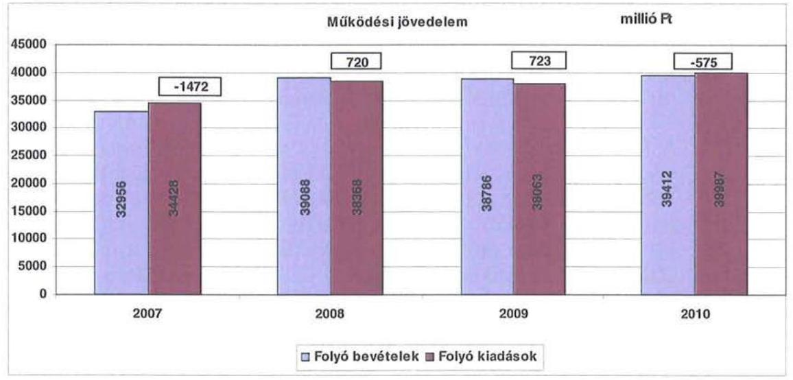

A folyó költségvetés a 2007. és a 2010. évben működési forráshiányos volt. A működési forráshiány 2007-ben a folyó kiadások 4,3%-át (1472 millió Ft-ot), 2010-ban 1,4%-át (575 millió Ft-ot) tette ki. A 2008-2009. évben a folyó költségvetés működési többletet mutatott, 2008-ban, valamint 2009-ben egyaránt a folyó bevételek 1,8%-át (720 millió Ft-ot, illetve 723 millió Ft-ot) jelentette. A vizsgált időszakban a működési jövedelem -604 millió Ft hiányt mutatott, amelynek forrása az Önkormányzat folyószámlahitele volt. A folyószámlahitel napi átlagos állománya 2007-2010 között változó, 2007-ben 4385 millió Ft, 2008-ban 3353 millió Ft, 2009-ben 12 millió Ft, 2010-ben 1982 millió Ft volt.

Az Önkormányzat kötelezettségein belül a 2007-2010 közötti időszakban a rövid lejáratú kötelezettségek állománya az összes kötelezettségen belül csökkent, 2010-ben 17,8% volt, a 2007. évi 38,7%-os aránnyal szemben. Az Önkormányzat 2006. december 31-én fennálló pénz és tőkepiaci kötelezettsége 13743 millió Ft-ról több mint két és félszeresére, 37854 millió Ft-ra nőtt a hosszú lejáratú hitelfelvétel, kötvénykibocsátás miatt. Az összes kötelezettségen belül a hosszú lejáratú pénzintézeti kötelezettségek 2007-2010 között több mint 98%-kal (19 031 millió Ft-tal) nőttek.

A rövid lejáratú pénzintézeti kötelezettségek 2010-ben 5784 millió Ft-ot tettek ki, amely 219 millió Ft-tal (5,6%) kevesebb a 2007. évi rövid lejáratú pénzintézeti kötelezettségállománynál. A vizsgált időszakban az Önkormányzat lejárt szállítói tartozásállománya kis mértékben 6%-kal, 12 millió Ft-tal növekedett (2010. év december 31-én 204 millió Ft volt).

Az Önkormányzat 2010. évi záró pénzkészlete 2542 millió Ft volt ${ }^{54}$, amelynek az Önkormányzat beszámolója szerint 100%-a kötelezettséggel terhelt.

Az Önkormányzat pénzügyi kapacitása a vizsgált időszakban negatív értéket mutatott. A nettó működési jövedelem ${ }^{55}$ értéke a folyó költségvetési pozíció mellett az adott költségvetési év adósságtörlesztésének hatását is tükrözi.

A folyó költségvetés egyenlegének és a tőketörlesztésre fordított összegeknek évenkénti különbözete (nettó működési jövedelem) negatív egyenlege az Önkormányzat rossz pénzügyi helyzetét tükrözi. Az Önkormányzat pénzügyi kapacitása a vizsgált időszakban összességében 9717 millió Ft finanszírozási igényt jelentett a működtetésben jelentkező hiány és a tőketörlesztés miatt. A 2007. évi nettó működési jövedelem -2024 millió Ft volt, a 2008. évi -5 988 millió Ft nettó működési jövedelem kialakulását a 6708 millió Ft összegű hiteltörlesztés okozta, a hiteltörlesztés fedezeteként a 6000 millió Ft értékű kötvénykibocsátás szolgált. Az Önkormányzat hiteltörlesztése 2009-ben 830 millió Ft, 2010-ben 1023 millió Ft volt. A pénzügyi kapacitás 2010. évi romlását a folyó bevételek és kiadások különbségéből származó működési hiány okozta. Az Önkormányzat eladósodása növeli a gazdálkodási kockázatot, veszélyezteti a kötelező feladatok ellátását, a gazdálkodás stabilitását.

[^0]
[^0]:    ${ }^{54}$ Ebben a Társulás pénzeszköze 31 millió Ft volt.
    ${ }^{55}$ pénzügyi kapacitás

---

Az Önkormányzat nettó működési jövedelmének alakulását az alábbi ábra szemlélteti:
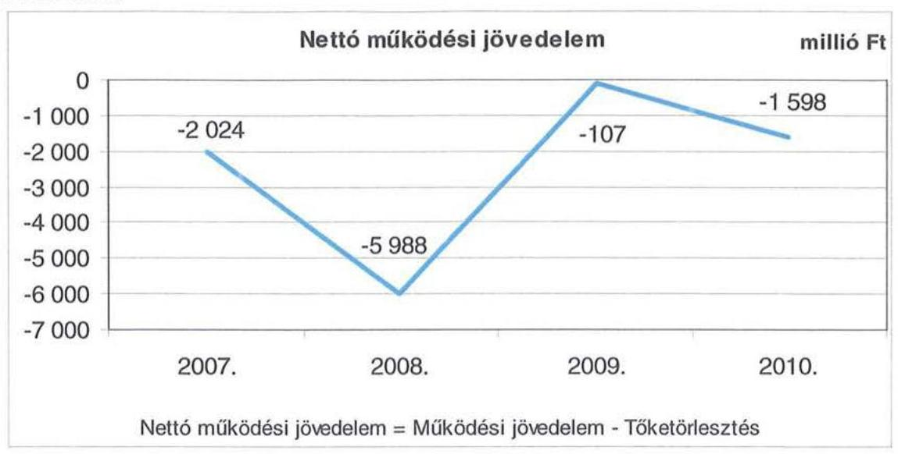

A 2007-2010. években az Önkormányzat felhalmozási költségvetésének egyenlege folyamatosan negatív összegű volt, amely prudens költségvetési gazdálkodás és pénzügyileg fenntartható ${ }^{56}$ beruházások esetén is magas pénzügyi kockázattal jár, mivel a 2010. évben már az Önkormányzat működési jövedelme is negatív előjelű volt.

A felhalmozási költségvetés egyenlegének alakulását 2007. évről 2010. évre a következő ábra szemlélteti:
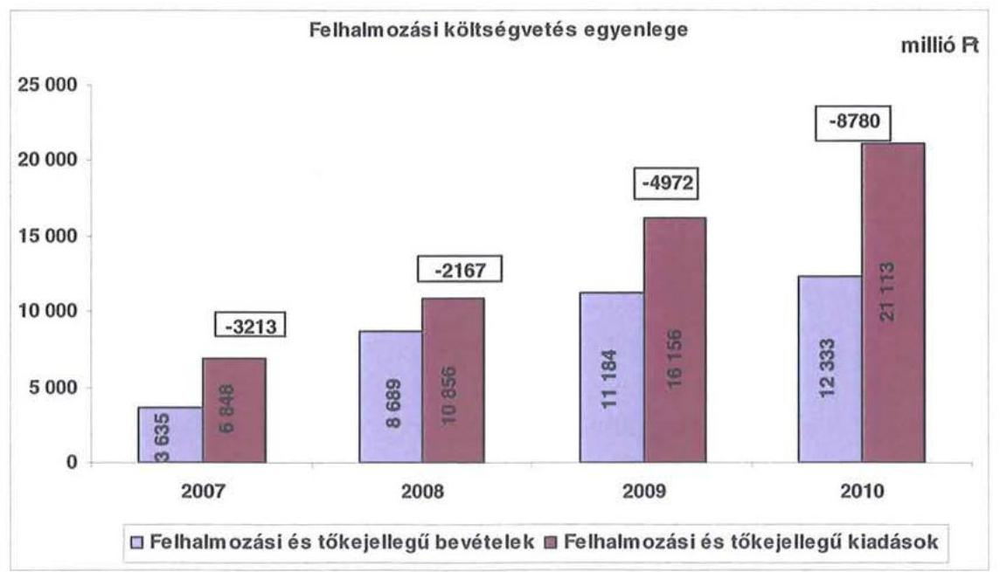

[^0]
[^0]:    ${ }^{56}$ Az minősül pénzügyileg fenntartható beruházásnak, amelynek működtetésére az Önkormányzat nettó működési jövedelme a következő években is fedezetet nyújt.

---

A felhalmozási forráshiánynak a felhalmozási és tőke jellegű kiadásokhoz viszonyított aránya 2007-ben 46,9% (3213 millió Ft), 2008-ban 20,0% (2167 millió Ft), 2009-ben 30,8% (4972 millió Ft), 2010-ben 41,6% (8780 millió Ft) volt.

A felhalmozási forráshiány finanszírozása a 2007. év elején rendelkezésre álló nyitó pénzkészletből, valamint a folyószámla- és fejlesztési célú hitelekből történt ${ }^{57}$.

Az Önkormányzat 2011. évi költségvetési rendeletében tervezett bevételeinek és kiadásainak különbözete 2296 millió Ft finanszírozási többletet mutat.

A vizsgált időszakban keletkezett 19132 millió Ft felhalmozási forráshiányra a 2894 millió Ft 2007. évi nyitó pénzkészlet, valamint a felvett 7258 ezer Ft összegű fejlesztési hitel, továbbá a rendelkezésre álló folyószámlahitelből igénybe vett 8980 millió Ft nyújtott fedezetet az Önkormányzat kimutatása szerint. Az Önkormányzat 2542 millió Ft pénzkészlettel zárta a 2010. évet, a függő, átfutó, kiegyenlítő bevételek és kiadások egyenlege 81 millió Ft volt.

Az Önkormányzat évenkénti teljes finanszírozási igénye ${ }^{58}$ a CLF módszer szerint 2007-ben 5237 millió Ft, 2008-ban 8155 millió Ft, 2009-ben 5080 millió Ft, 2010-ben 10378 millió Ft volt, amelynek finanszírozását a finanszírozási célú bevételek és kiadások egyenlege, valamint az előző évek pénzmaradványának igénybevétele biztosította.

Az önkormányzat finanszírozási műveletei 2007-2010. évekbeli egyenlegének alakulását a következő ábra szemlélteti:
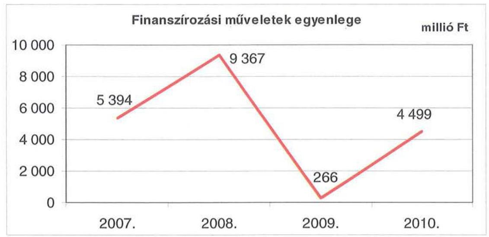

A finanszírozási többlet azt jelzi, hogy az éves költségvetések végrehajtása során szükség volt az előző években keletkezett pénzmaradvány igénybevételén túl külső finanszírozás igénybevételére is. A finanszírozási célú műveleteket a

[^0]
[^0]:    ${ }^{57}$ Az évenkénti adatokat a jelentés 2. számú melléklete mutatja be.
    ${ }^{58}$ a nettó működési jövedelem és a beruházási költségvetés eredője

---

vizsgált időszakban a jelentés 2. számú mellékletének 4.1-4.8 pontjai részletezik.

Az önkormányzat zárszámadási rendeletében bemutatta ${ }^{59}$, a működési és fejlesztési hiányt, amelyről a jelentés 1. számú melléklete nyújt tájékoztatást. A zárszámadási rendeletek 2007-2010 évre forráshiányt jeleztek.

A vizsgált időszakban a kötelezettségek (passzív pénzügyi elszámolások nélkül) 21290 millió Ft-ról 39447 millió Ft-ra emelkedtek, amely együtt járt a kamatkiadások növekedésével.

A 2007-2010. évek között az önkormányzat összesen 5820 millió Ft kamatot fizetett meg. Az átmenetileg szabad pénzeszközein realizált kamatbevétel, a teljes kamatráfordítás 43,1%-át (2511 millió Ft) tette ki.

Az Önkormányzat kamatbevételeinek és kamatkiadásainak alakulását a következő ábra mutatja:
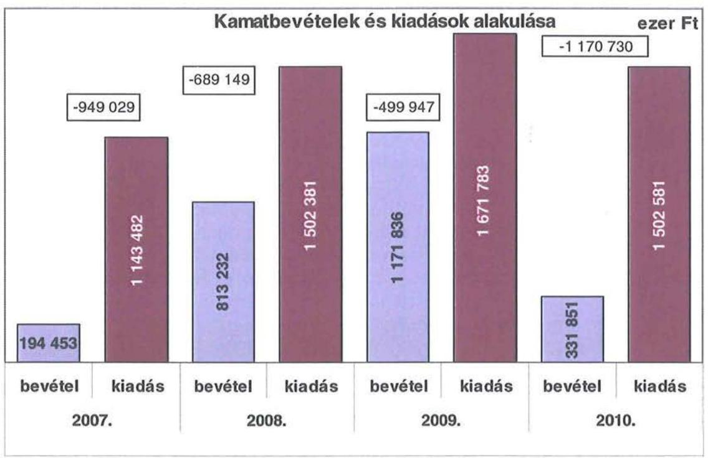

A 2011. évre az Önkormányzat a kamatkiadások további emelkedésével kalkulál, a költségvetési rendeletben tervezett 1867,8 millió Ft kamatráfordítás 12,4%-kal, 365,2 millió Ft-tal haladhatja meg a 2010. évit.

[^0]
[^0]:    ${ }^{59}$ Nincs kötelező előírás a működési és fejlesztési hiány megállapításának módjára.

---

# 2.2. Az Önkormányzat bevételeinek alakulása 

Az Önkormányzat folyó
 (működési) bevétele a 2007. évi 32955 millió Ft-ról 20%-kal, 39412 millió Ft-ra növekedett. Az Önkormányzat 2007-2010. évek között realizált főbb folyó (működési) bevételi jogcímeinek számszaki adatait a következő ábra mutatja be:
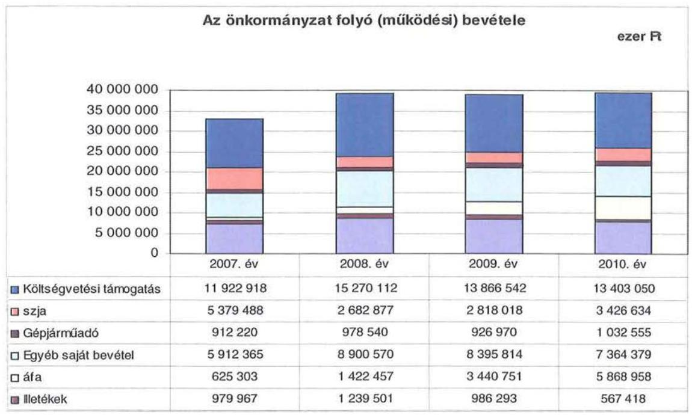

A költségvetési támogatások 2008-ban 21,8%-kal, 3347 millió Ft-tal növekedtek. A 2007. évhez viszonyítva a legnagyobb mértékű növekedés három jogcímnél volt, a feladatmutatóhoz kötött normatív támogatások 1086 millió Ft-tal, a normatív kötött felhasználású támogatások 1164 millió Ft-tal növekedtek, valamint egyéb központi támogatásként 949 millió Ft-ot kapott az Önkormányzat. A költségvetési támogatásoknál a 2009. évben 1403 millió Ft, 9,2%-os csökkenés következett be. A csökkenést alapvetően a feladatmutatóhoz kötött normatív támogatások 330 millió Ft-os csökkenése, illetve egyéb központi támogatás hiánya - az Önkormányzat 2009. évben nem kapott - generálta. A költségvetési támogatások 2010-ben tovább csökkentek 464 millió Ft-tal, 3,3%-kal. A csökkenés nagy részét három jogcím változása eredményezte, a feladatmutatóhoz kötött normatív támogatások 1133 millió Ft-tal csökkentek, a normatív kötött felhasználású támogatások 246 millió Ft-tal, a központosított előirányzatok 447 millió Ft-tal nőttek. Az Önkormányzat társadalombiztosítási alapból származó bevétele 2007-ben 1643 millió Ft, 2010-ben 1804 millió Ft volt.

Az szja a 2008. évi 2697 millió Ft (50,1%-os) csökkenését követően (2008. évben megszűnt az szja normatív módon elosztott része ${ }^{60}$ ) 2009. és 2010. évben növekedett. Az előző évihez képest 2009-ben 135 millió Ft-tal (5%-kal), 2010-ben további 609 millió Ft-tal (21,6%-kal) kapott több támogatást az Önkormányzat az államtól ezeken a jogcímen. Az Önkormányzat jövedelemkülönbség mérséklése címen járó költségvetési támogatása 2007. évben 475 millió Ft, 2008. évben 690 millió Ft, 2009. évben 512 millió Ft, 2010. évben 1070 millió Ft volt.

Az Önkormányzat gépjárműadóból származó bevétele 2007-2010. években nőtt, 2007-ben 912 millió Ft, 2008-ban 979 millió Ft, 2009-ben 927 millió Ft-ra csökkent, 2010-ben 1033 millió Ft volt. A gépjárműadó bevételének növekedése 2007-ről 2010-re 13,3% volt.

Az Önkormányzat egyéb saját bevételei között szerepelnek az intézményi működési bevételek mellett a hozam- és kamatbevételek, az államháztartáson kívülről átvett bevételek. Az intézményi bevételek 2007-2010. között 91 millió Ft-tal nőttek. A hozam- és kamatbevételek összege 2007-ben 194 millió Ft, 2010-ben 332 millió Ft volt ${ }^{61}$. Az államháztartáson kívülről átvett bevételek 2007-ben 180 millió Ft-ot, 2010-ben 388 millió Ft-ot tettek ki ${ }^{62}$.

Az Önkormányzat a vizsgált években két gazdasági társaságától kapott osztalékot ${ }^{63}$, 2007. évben 11 millió Ft-ot, 2008. évben 80 millió Ft-ot, 2009. évben 8 millió Ft-ot, 2010. évben 4 millió Ft-ot.

Az Önkormányzat áfa-visszatérülése a megvalósított fejlesztések és beruházások miatt a 2007. évi 625 millió Ft-ról 2010. évre 3032 millió Ft-ra nőtt. Az Önkormányzat 2010-ben fordított áfa címen 2837 millió Ft bevételhez jutott.

Az illetékbevétel a vizsgált időszakban 2008-ban növekedett, amikor az előző évihez képest 26,5%-kal (260 millió Ft-tal) nőtt. 2008-ról 2009-re 20,4%-os (254 millió Ft) csökkenés következett be, majd a 2010. évben jelentősen mérséklődött ${ }^{64}$, az előző évhez viszonyítva a csökkenés 42,5%-os (419 millió Ft) volt.

A helyi adókból, pótlékokból származó bevétel 2007-2010. között növekedett 526 millió Ft-tal (3,1%-kal). A növekedés 2007-ről 2008-ra 1371 millió Ft volt, 2009-ben a bevétel 242 millió Ft-tal csökkent. Az Önkormányzat iparűzési adó bevétele 2007-ben 6220 millió Ft, 2008-ban 7136 millió Ft, 2009-ben 6944 millió Ft, 2010-ben 6258 millió Ft volt, az adóbevétel 2007-2010. között 6%-kal, 38 millió Ft-tal ${ }^{65}$ nőtt. A 2008. évtől az Önkormányzat szűkítette az adókedvezményben részesülők körét ${ }^{66}$, az adó mértékét változatlanul hagyta. A vizsgált

[^0]
[^0]:    ${ }^{61}$ A 2008. évi hozam és kamatbevételek összege 813 millió Ft, 2009. évben 1172 millió Ft volt.
    ${ }^{62}$ Az államháztartáson kívülről átvett bevételek összege 2008-ban 186 millió Ft, 2009-ben 685 millió Ft volt.
    ${ }^{63}$ Az egyik gazdasági társaságban az Önkormányzat részesedése 25% alatti volt.
    ${ }^{64}$ A 2009. évi 986 millió Ft-ról 2010. évre 567 millió Ft-ra.
    ${ }^{65}$ Az Önkormányzat az iparűzési adóról szóló 67/2002. (XII. 13.) számú rendeletét a Közgyűlés a 46/2007. (XII. 28.) számú rendeletével módosította.
    ${ }^{66}$ Megszűnt az Önkormányzat részben vagy egészben tulajdonát képező sportvállalkozások adómentessége, valamint azon vállalkozók adómentessége, akinek az 1991. évi iparűzési adórendelet adókedvezményt, illetve adómentességet biztosított.

---

években az iparűzési adónál a maximális adómértéket, 2%-ot állapítottak meg.

Az Önkormányzat a helyi adó bevételeinek növelésére 2007-2010-ben intézkedéseket tett ${ }^{67}$, ennek keretében módosították az építményadó rendeletet. A módosítás során csökkentették a lakás, lakóház adómentes hasznos alapterületét, megszüntették a személygépkocsi tárolók adómentességét, az adó mértékét 200 Ft/m²-ről 450 Ft/m²-re, vállalkozók esetében 300 Ft/m²-ről 500 Ft/m²-re emelték. A módosítások eredményeként az Önkormányzat építményadó bevétele a 2007. évi 865 millió Ft-ról 2010. évre 1317 millió Ft-ra nőtt, a növekedés 52,3% volt.

Az Önkormányzat Közgyűlése 2008. január 1-jétől bevezette ${ }^{68}$ az idegenforgalmi adót, az adó mértékét személyenként és vendégéjszakánként 350 Ft-ban határozta meg. Adómentességet állapított meg a 18 év alatti és 70 év feletti személyek részére, amit 2010. január 1-jétől a Közgyűlés megszüntette ${ }^{69}$. Az Önkormányzat idegenforgalmi adó bevétele 2007. évben 28 millió Ft, 2010. évben 69 millió Ft volt. A 2010. évi idegenforgalmi adó bevételre hatással volt az EKF programok következtében jelentősen megnőtt turistaforgalom is ${ }^{70}$.

Az Önkormányzat Közgyűlése a 48/2010. (XII. 20.) számú rendeletével bevezette új adóként a telekadót 2011. január 1-jétől ${ }^{71}$.

Az Önkormányzat felhalmozási bevételei a vizsgált időszakban a következők voltak:
ezer Ft

| Megnevezés | 2007. év   tény | 2008. év   tény | 2009. év   tény | 2010. év   tény |
| :-- | :--: | :--: | :--: | :--: |
| Tárgyi eszköz értékesítés | 400505 | 5126374 | 1741187 | 1086846 |
| Egyéb saját tökebevétel | 180357 | 108915 | 45179 | 42417 |
| Államháztartáson belülről   kapott támogatás | 2793596 | 2613562 | 8764513 | 10964832 |
| EU-tól és külföldről kapott   támogatások | 87535 | 0 | 0 | 1400 |
| Államháztartáson kívülről   kapott támogatás | 172893 | 840501 | 632681 | 237797 |
| Összes felhalmozási bevétel | 3634886 | 8689352 | 11183560 | 12333292 |

[^0]
[^0]:    ${ }^{67}$ A Közgyűlés a 45/2007. (XII. 28.) számú rendeletével módosította az Önkormányzat építményadóról szóló 70/2002. (XII. 13.) számú rendeletét
    ${ }^{68}$ A Közgyűlés a 48/2007. (XII. 28.) számú rendeletével vezette be az idegenforgalmi adót
    ${ }^{69}$ A Közgyűlés a 45/2009. (XII. 21.) számú rendeletével a 70 év feletti személyek adómentességét megszüntette.
    ${ }^{70}$ A 2008. évi idegenforgalmi adó bevétel 52 millió Ft, a 2009. évi 47 millió Ft volt.
    ${ }^{71}$ Az Önkormányzat 2011-re telekadó címen 30 millió Ft-ot tervezett.

---

A felhalmozási bevételek 2007-ről 2010-re 8698 millió Ft-tal, több mint három és félszeresére nőttek.

Az Önkormányzat tárgyi eszközök értékesítéséből származó bevétele a 2007-2010. években változóan alakult. Az Önkormányzat a stratégiai ingatlancsomagját 2008-ban értékesítette egy spanyol társaság részére. Az ingatlancsomag teljes vételára 5486,8 millió Ft volt. A vételárat a vevő több részletben fizette, 2008-ban 4115,1 millió Ft-ot, 2009-ben 1371,7 millió Ft-ot.

Az államháztartáson belüli támogatás a 2009. évben 6051 millió Ft-tal, a 2010. évben 2200 millió Ft-tal nőtt az előző évi támogatáshoz képest. Az államháztartáson belüli támogatások a 2010. évben az EKF program keretében megvalósuló beruházásokhoz (Közterek és parkok újjáélesztése I.-II. ütem, Pécsi Konferencia és Koncertközpont, Zsolnay Kulturális Negyed, Dél-Dunántúli Regionális Könyvtár és Tudásközpont, valamint a Nagy Kiállítótér-Múzeum utca projektek) kapcsolódtak.

Az államháztartáson kívülről kapott támogatások 2008. és 2009. évi növekedését a vízi közművek átvétele okozta. A vízi közművek átvétele 2009. évben befejeződött, az államháztartáson kívülről kapott támogatások 2010. évben így jelentősen visszaestek, közel 400 millió Ft-tal.

A legalább 25%-ban önkormányzati tulajdonú 31 gazdasági társaság, illetve azoknak legalább 25% tulajdoni arányú gazdasági társasága közül a négy nagy közszolgáltatási feladatokat ellátó, valamint egy ipari tevékenységet végző gazdasági társaság együttes bevételei a 2007-2010. években 86-83%-át (20 533 millió Ft és 20878 millió Ft közötti éves bevétel) tették ki a 31 társaság bevételének. A gazdasági társaságok bevételein ${ }^{72}$ belül az önkormányzati működési pénzeszközök aránya folyamatosan nőtt: 2007-ben 3,5%, 2008-ban 3,9%, 2009-ben 6%, 2010-ben 6,4% volt.

[^0]
[^0]:    ${ }^{72}$ A gazdasági társaságok összes bevétele 2007. évben 23957 millió Ft, 2008. évben 26139 millió Ft, 2009. évben 25889 millió Ft, 2010. évben 25080 millió Ft volt.

---

# 2.3. Az Önkormányzat kiadásainak alakulása 

Az Önkormányzat folyó kiadásai főbb jogcímek szerinti bontásban az alábbiak voltak:

|  |  |  |  | ezer Ft |
| :--: | :--: | :--: | :--: | :--: |
| Megnevezés | 2007. | 2008. | 2009. | 2010. |
| Folyó kiadások | 34427736 | 38367880 | 38063292 | 39986434 |
| Működési kiadások (kamatkiadás nélkül) | 29434467 | 31567644 | 30774242 | 31617703 |
| Államháztartáson belülre átadott pénzeszközök | 91428 | 56618 | 124144 | 414876 |
| Transzferkiadások | 3439076 | 3596537 | 4782727 | 5664500 |
| -ebből: vállalkozásoknak | 2004976 | 1834592 | 2848334 | 3576619 |
| EU-nak, illetve külföldre | 1000 | 3000 | 3000 | 500 |
| magánszemélyeknek | 936376 | 1151349 | 1313737 | 1627839 |
| nonprofit szervezeteknek | 498724 | 607596 | 617656 | 459542 |
| Kamatkiadások | 1143482 | 1502361 | 1671783 | 1502581 |
| Előző évi pénzmaradvány átadás | 319283 | 1644700 | 710396 | 786774 |

Az Önkormányzat folyó kiadásai 2007-ről 2010-re mindössze 16,1%-kal nőttek (34428 millió Ft-ról 39986 millió Ft-ra), ezen belül a működési kiadások 2184 millió Ft-tal, 7,4%-kal nőttek. A vállalkozásoknak átadott pénzeszközök a 2008. évről a 2009. évre 1014 millió Ft-tal, a 2009. évről a 2010. évre 728 millió Ft-tal nőttek. Az átadott pénzeszközök növekedése az EKF marketing és programszervezések kiadásaiból adódtak.

Az Önkormányzat 2010. évben turizmusfejlesztési támogatások címen gazdasági társaságoknak összesen 1807 millió Ft pénzeszközt adott át.

Az Önkormányzat folyó kiadásai főbb kiadásnemenkénti (nem teljes körű) bontásban az alábbiak voltak:

|

 |  |  |  | ezer Ft |
| :--: | :--: | :--: | :--: | :--: |
| Megnevezés | 2007. | 2008. | 2009. | 2010. |
| Személyi juttatások | 16111317 | 16451527 | 15395309 | 14905105 |
| Munkaadót terhelő járulékok | 5082291 | 5138973 | 4588075 | 3912492 |
| Dologi kiadások | 7881882 | 8951076 | 8838067 | 9063751 |
| Egyéb folyó kiadások | 263290 | 435061 | 361025 | 777508 |
| Működési célú pénzeszközátadás | 2526077 | 2468325 | 3478644 | 4047394 |

A folyó kiadásokon belül személyi juttatások és a munkaadókat terhelő járulékok aránya a 2010. évben 47,1% (18 818 millió Ft) volt. Az üzemeltetést, intézményfenntartást biztosító dologi kiadásokra 22,7% jutott (9064 millió Ft). A működési kiadásokon belül a személyi juttatások és járulékok és a dologi kiadások aránya más szerveknek átadott feladatok, az álláshely csökkentések miatt a vizsgált időszakban csökkent. A 2007. évben a folyó kiadásokon belül személyi juttatások és a munkaadókat terhelő járulékok 21194 millió Ft-ot, 61,6%-ot tettek ki, a dologi kiadások aránya 22,9%, 7882 millió Ft volt. A dologi kiadások az Önkormányzatnál 2010-ben a 2007. évi szinthez 15%-kal nőttek, 1182 millió Ft-tal. A dologi kiadások 2010. évben tartalmazták a fordított áfa-t is, melynek összege 2837 millió Ft volt, a fordított áfa nélküli dologi kiadások csökkentek 2007. évhez viszonyítva 653 millió Ft-tal.

---

A működési célú pénzeszközátadások részaránya az összes folyó kiadáson belül a 2007. évi 7,3%-ról, 2526 millió Ft-ról 2010. évre 11,1%-ra 4047 millió Ft-ra változott. Az önkormányzati feladatokat ellátó gazdasági társaságoknak átadott működési pénzeszközök a 2007-2010. évek között 760 millió Ft-tal, 89%-kal nőttek.

Az Önkormányzat által a gazdasági társaságok részére nyújtott működési és felhalmozási pénzeszközök alakulását az alábbi diagram mutatja be a 2007-2010. évekre:
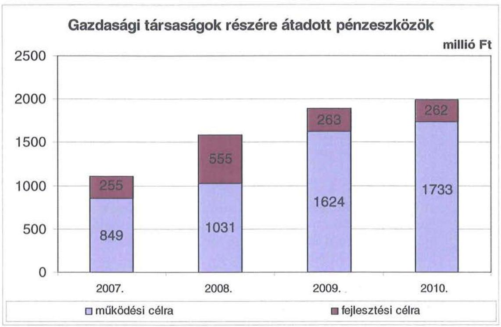

Az önkormányzati feladatellátásban részt vevő gazdasági társaságoknak nyújtott pénzeszközök a vizsgált években növekedtek, a 2007. évi 1104 millió Ft-ról 2008-ra 44%-kal, 1586 millió Ft-ra, 2009-re 19%-kal, 1887 millió Ft-ra, és 2010-re 6%-kal, 1995 millió Ft-ra változott.

Az Önkormányzat 2007-2010. évi a gazdasági társaságainak nyújtott működési és felhalmozási pénzeszközöket a 4. számú melléklet mutatja be.

Az átadott működési pénzeszközök az összes pénzeszközökön belül 2007 évben 77%-a, 849 millió Ft, 2008 évben 65%-a, 1031 millió Ft, 2009 évben 86%-a, 1624 millió Ft, 2010 évben 87%-a, 1733 millió Ft voltak.

A folyó működési és felhalmozási kiadások alakulását, a teljesített kiadások működési és felhalmozási felhasználásának arányait az alábbi ábra mutatja be:

---

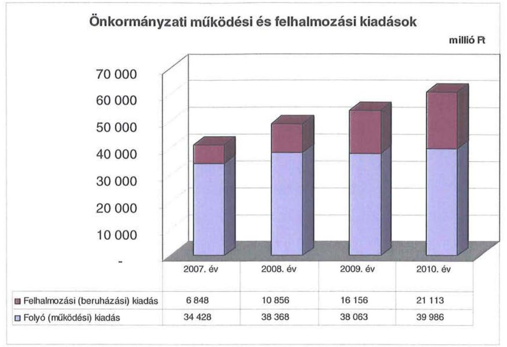

A folyó (működési) és felhalmozási kiadások arányának változásában a 2007-2010. évek között elmozdulás figyelhető meg. A felhalmozási kiadások aránya a 2007. évi 17%-ról 2008. évre 22%-ra nőtt, 2009-ben 30%-ra, majd 2010-re 35%-ra emelkedett.

Az Önkormányzat a 2007-2010. években 54285 millió Ft összköltségű fejlesztéseket tervezett saját erőből és az EU-s forrásokra benyújtott pályázatok segítségével. Az Önkormányzatnál 2007-2010. években európai uniós támogatásokra összesen 58 pályázat benyújtásáról döntöttek. A pályázatok közül 43 támogatásban részesült, három pályázatuk elbírálása folyamatban volt.

A 2007-2010. évben az Önkormányzat megvalósított és folyamatban lévő kiemelt infrastrukturális beruházásai az alábbiak:

- Déli autóbusz pályaudvar megépítése; Sopianae terv keretében út felújítások, körforgalmi csomópontok kiépítése;
- EKF keretében közterek és parkok felújítása I.-II. ütem, ISPA program keretében ivóvíz- és szennyvízcsatorna hálózat kiépítése, pellérdi szennyvíztisztító rekonstrukció;
- Apáczai Csere János Nevelési Központ felújítása, intézmények akadálymentesítése, Miroslav Krleža Oktatási Központ felújítása, Csokonai Általános Iskola felújítása, bővítése.

Az Önkormányzatnál 2006-2010. évben befejezett fejlesztési feladatok összes költségvetési kiadása 37105 millió Ft volt, amelyből a beruházások összege 35252 millió Ft (95%) és a felújítások összege 1853 millió Ft (5%) volt.

---

A projektek döntő többsége utófinanszírozású beruházás volt, megvalósításukhoz a források hitelek igénybevételével álltak rendelkezésre.

A 3/a melléklet adatai szerint befejezett 37105 millió Ft értékű fejlesztés forrás megoszlása 15787 millió Ft EU-s támogatás (43%), 5382 millió Ft hazai támogatás (14%), 6083 millió Ft saját bevétel (16%) és 9853 millió Ft hitel (27%) volt. A 2006. december 31-ig teljesített kiadások összege 4579 millió Ft volt. A 2007-2010. években teljesített kiadások összege 32526 millió Ft volt, a tervezett kiadásokhoz képest 405 millió Ft-tal kevesebb volt a teljesített kiadások összege.

Az Önkormányzat 2010. december 30-án folyamatban lévő fejlesztési feladatainak nagysága a 3/b melléklet adatai szerint 17180 millió Ft volt, amelynek forrása 6234 millió Ft EU-s támogatás (36%), saját bevétel 2464 millió Ft (14%), hazai támogatás 2513 millió Ft (15%) és 5969 millió Ft hitel (35%) volt.

A 2010. december 31-én folyamatban lévő és a 2010. évet követő kötelezettségeinek összege a 3/c melléklet adatai szerint 9484 millió Ft volt, amelynek forrása 6454 millió Ft EU-s támogatás (68%), saját bevétel 1805 millió Ft (19%), 565 millió Ft hitel (6%) és 660 millió Ft hazai támogatás (7%) volt.

Az Önkormányzatnak 1590 millió Ft összegű, három elbírálás alatti pályázati forrásból tervezett fejlesztési feladata volt. A források még nem álltak az Önkormányzat rendelkezésére, a pályázati elbírálások és a közbeszerzési eljárások a helyszíni ellenőrzés időszakában folyamatban voltak.

Az Önkormányzat három legnagyobb megvalósult beruházásából kettő az EKF-hez kapcsolódott:

Pécsi Konferencia és Koncertközpont tervezett bekerülési költsége 8590 millió Ft volt, a beruházás kezdete 2009. év volt, a létesítmény műszaki átadása 2010-ben volt. A beruházás pénzügyi elszámolása még nem történt meg. A 2010. december 31-ig teljesített kiadás 7548 millió Ft volt. A 2010. december 31 után fennálló kötelezettség 929 millió Ft, a projekt várható tényleges bekerülési értéke 8477 millió Ft, az eltérés a tervezett bekerülési költséghez viszonyítva 113 millió Ft megtakarítás. A teljesített 7548 millió Ft kiadás forrásösszetétele 4160 millió Ft EU-s támogatás (55%), saját bevétel 875 millió Ft (12%), 2332 millió Ft hitel (31%) és 181 millió Ft hazai támogatás (2%) volt. A 2010. december 31 után kötelezettség-vállalás forrásösszetétele EU-s támogatás 534 millió Ft saját bevétel 186 millió Ft, 27 millió Ft hitel és 182 millió Ft hazai támogatás. ${ }^{73}$

Közterek és parkok újjáélesztése II. ütem tervezett bekerülési költsége 5330 millió Ft volt, a beruházás kezdete 2008. év volt, a létesítmény műszaki átadása 2010-ben volt. A beruházás pénzügyi elszámolása még nem fejeződött be. A 2010. december 31-ig teljesített kiadás 5423 millió Ft volt. A 2010. december 31 után fennálló kötelezettség 553 millió Ft, a projekt várható bekerülési értéke 5977 millió Ft, a költség túllépés a tervezett bekerülési költséghez viszonyítva 647 millió Ft. A teljesített 5423 millió Ft kiadás forrásösszetétele 3473 millió Ft EU-s támogatás (64%), 1783 millió Ft hitel (33%) és 167 millió Ft hazai támogatás (3%) volt. A 2010. december 31 után kötelezettség-vállalás forrásösszetétele EU-s támogatás 314 millió Ft, 140 millió Ft hitel és 100 millió Ft hazai támogatás.

ISPA II/B ütem szennyvíz beruházás tervezett bekerülési költsége 3180 millió Ft, a beruházás kezdete 2000. év volt, a projekt 2010-ben fejeződött be. A 2010. december 31-ig teljesített tényleges bekerülési költség 3162 millió Ft volt, a megtakarítás 18 millió Ft. A teljesített 3162 millió Ft kiadás forrásösszetétele 1581 millió Ft EU-s támogatás (50%), 316 millió Ft saját bevétel (10%) és 1265 millió Ft hazai támogatás (40%) volt.

Az EKF keretében megvalósult és befejezés előtt álló kulturális létesítmények a Pécsi Konferencia és Koncertközpont, a Dél-dunántúli Regionális Könyvtár és Tudásközpont, a Nagy Kiállítótér és a Zsolnay Kulturális Negyed fenntarthatósága bizonytalan, mivel a tervezett bevételi források és a felmerülő működési kiadások eltérhetnek a tényleges bevételektől és kiadásoktól.

Az Önkormányzat működési és felhalmozási kiadásai között a Társulás kiadása elenyésző részt tett ki 2007-2010. évben. A működési kiadása 2007. évben 204 millió Ft, 2008. évben 280 millió Ft, 2009. évben 389 millió Ft, 2010. évben 157 millió Ft volt. A felhalmozási kiadásokon belül a Mecsek-Dráva Regionális Szilárdhulladék Kezelő Rendszer Létrehozását Célzó Önkormányzati Társulás kiadásai az Önkormányzatra eső kiadásokon kívül 2007-2010-ben összesen 407 millió Ft volt.

# 3. KÖTELEZETTSÉGEK BEMUTATÁSA 

### 3.1. A pénzintézetek felé fennálló kötelezettségek alakulása

Az Önkormányzat pénzintézeti kötelezettségeinek állománya 2006. december 31-től 2010. december 31-ig 2,8-szorosára nőtt, 13743 millió Ft-ról 37854 millió Ft-ra. Fennálló pénzintézeti kötelezettségei kötvény kibocsátásából, hosszúlejáratú hazai és külföldi, valamint folyószámlahitel igénybevételéből és a megszűnt víziközmű társulásoktól átvett hitelállományból keletkeztek.

Az Önkormányzat pénzintézetek felé fennálló kötelezettség-állományát a 2007-2010. években az alábbi ábra szemlélteti:

---

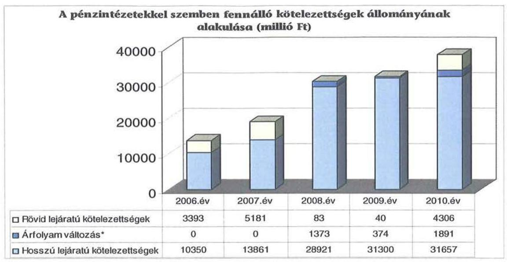

Rövid lejáratú hitelt az Önkormányzat nem vett fel. A rövid lejáratú kötelezettségek között szerepelnek - az Önkormányzat költségvetésében számba vett Társulás rövid lejáratú hitelállományai 2007-től évenkénti bontásban 45-83-40-40 millió Ft összegben.

A pénzintézeti kötelezettségek állományának 2006. december 31-e és 2010 közötti 24111 millió Ft-os növekedését döntően befolyásolta, hogy:

- az Önkormányzat hazai pénzintézetekkel a 2007-2010 között hat hitelszerződésben összesen 7689 millió Ft hosszú lejáratú hitel felvételéről állapodott meg. Ebből 2010. december 31-ig 5737 millió Ft-ot fordított fejlesztésre,
- a 2007 előtt kötött hét hitelszerződése alapján 2007-2010 között 71 millió Ft hosszú lejáratú hitelt vett igénybe,
- 2008-ban 39215686 CHF - 6000 millió Ft - összegben kötvényt bocsátott ki,
- 2008-ban kötött hitelszerződés alapján külföldi pénzintézettől 39000000 EUR - 9965 millió Ft - hitelt vett fel,
- a folyószámlahitel állománya 873 millió Ft-tal nőtt, 4266 millió Ft-ra változott, valamint
- 3638 millió Ft-ot tett ki a devizában fennálló kötelezettségei CHF és EUR árfolyamváltozása.

Az árfolyamváltozás hatása befolyásolja a kötelezettségek alakulását, azonban annak mértéke előre pontosan nem határozható meg, csak várakozásokon alapuló tendenciák jelezhetők. Annak megítéléséről, hogy a devizában kibocsátott kötvény és felvett hitel kapott forinthoz képest a kötvény visszavásárlásakor, illetve a hitel visszafizetésekor jelentkező forint kötelezettség többletkiadást (árfolyamveszteség) vagy megtakarítást (árfolyamnyereség) eredményez a futamidő végén, a teljes kötelezettség rendezését követően lehet képet alkotni. Mindaddig, amíg törlesztési kötelezettség nem áll fenn (türelmi idő, moratórium), a tőkére vonatkoztatva nem értelmezhető sem az árfolyamveszteség, sem az árfolyamnyereség. Ugyanakkor a számviteli szabályok meghatározzák, hogy az árfolyam különbözetet év végén a kötelezettségek vagy követelések között a könyvviteli mér-

---

legben nyilván kell tartani, azonban az árfolyam különbözet valójában pénzügyileg nem realizálódott.

A 2007-2010. években az Önkormányzat a forráshiány, az adósság kezelése érdekében a feladatátadásokon felül bevételnövelő és kiadást csökkentő intézkedéseket hozott, költségvetési rendeleteiben működési és felhalmozási célú hitelfelvétellel, valamint pénzmaradvány igénybevételével és értékpapír értékesítéssel számolt, valamint kötvény kibocsátásról döntött. A költségvetés végrehajtása során jelentkező likviditási problémák kezelésére a 2007-2010. években a Közgyűlés az évenkénti költségvetési
 rendeletekben és végrehajtásukról szóló határozataiban rendelkezett az Önkormányzat és a számlavezető között az átmeneti likviditási problémák kezelésére létrejött szerződések módosítására és meghosszabbítására lejáratkor. Az Önkormányzat 2009-ben a feladatellátó rendszer átvilágításáról döntött annak érdekében, hogy a feltárt problémák megszűntetésére, kezelésére hozott döntései segítsék elő a pénzügyi egyensúly feltételeinek megteremtését.

A 2007-2010. években az Önkormányzat pénzintézeti kötelezettségvállalásaira minden esetben közgyűlési döntés alapján került sor. A kötelezettségvállalásból származó források felhasználási céljait meghatározták. A Közgyűlés döntéseit megalapozó előterjesztések tartalmazták - számszerűsítés nélkül - a kötelezettségvállalás visszafizetési forrásai, az Önkormányzat már meglévő és 20 évre kimutatott adósságrendezési kötelezettségei, valamint az adósságszolgálati korlát bemutatását. Az előterjesztések nem tartalmazták a várható kamatkötelezettség összegét. A deviza alapú hitelfelvétel és a kötvénykibocsátás döntései előtt a kamatkockázatot vizsgálták, a különböző devizák várható árfolyamváltozásait a kötvény kibocsátása előtt a pénzintézeti ajánlatok alapján tekintették át, a teljes futamidőre azonban a kamat- és árfolyamkockázat várható kihatásait nem mutatták be.

A hazai finanszírozású hosszú lejáratú hitelek szerződéskötése előtt minden esetben közbeszerzési eljárást folytattak le.

Az Önkormányzat az adósságot keletkeztető kötelezettségvállalásának felső határát a vizsgált időszakban nem lépte túl.

Az adósságot keletkeztető kötelezettségvállalással megvalósított felhalmozási kiadások esetleges bevételnövelő, illetve kiadáscsökkentő vonzatát elsősorban az EU-s finanszírozású projektek megvalósíthatósági tanulmányában vizsgálták, ugyanakkor a fejlesztéshez, felújításhoz vállalt kötelezettségek visszafizetési forrásaként nem nevesítették. Az Önkormányzat a 2011-2014. évekre szóló gazdasági programjában kiemelt feladatként határozta meg többek között a likviditás biztosítását, az adósságállomány optimalizálását. A gazdasági programban rögzített feladatok végrehajtására az éves költségvetési rendeletekben intézkednek.

Az Önkormányzat HUF-ban fennálló pénzintézeti kötelezettségei közül 2010. december 31-én:

- a megszűnt víziközmű társulatoktól átvett hitelállomány (összesen 11 aktuális szerződés) 177 millió Ft,

---

- a hazai pénzintézetekkel kötött hitelszerződések (az 5. számú melléklet szerint összesen 52 aktuális szerződés) alapján összesen 17429 millió Ft volt. Ebből a felhasználható keret 2010. december 31-én 502 millió Ft-ot tett ki.

A 2007-2010. évek között az Önkormányzat a hazai pénzintézetek felé a hosszú lejáratú hitelek után 3853 millió Ft tőketörlesztést, valamint 4288 millió Ft kamatkiadást teljesített.

Az Önkormányzat a lehívott hiteleket - kimutatása alapján - a hitelcéloknak megfelelően használta fel.

Az Önkormányzat 2010. december 31-én CHF-ben fennálló, adósságot keletkeztető kötelezettségvállalása az alábbi volt:

| Megnevezés | Kibocsátás   időpontja | Összeg   CHF | Kibocsátási   árfolyam | Kamat (referencia   kamat+ kamatfelár) | Felhasználás célja: |
| :--: | :--: | :--: | :--: | :--: | :--: |
| PÉCS 2028 Kötvény | 2008. 05. 22 | 39215686 | 153 | 6 havi CHF LIBOR +2,2 % | folyószámla hitelállomány és   hosszú lejáratú működési hitel   kiváltására, fejlesztési célokra |

A kötvénykibocsátásból származó 6000 millió Ft bevételből az Önkormányzat 2000 millió Ft-ot a korábban felvett folyószámlahitel törlesztésére fordított. A fennmaradó 4000 millió Ft bankszámlapénzként állt rendelkezésre az Önkormányzat számára, melyet 2010. december 31-ig - fejlesztési célokra - részletekben vett igénybe.

Az Önkormányzat a dematerizált kötvényekről szóló okiratban vállalta, hogy a kötvénykibocsátás bevételéből legalább 2000 millió Ft-ot fordít folyószámlahitel állományának törlesztésére és ezen felül pedig fejlesztési kiadásainak teljesítésére. A pénzintézet feltételként a 2000 millió Ft folyószámlahitel törlesztését várta el, illetve azt, hogy az Önkormányzat a 4000 millió Ft-ot a pénzintézetnél helyezi el. Ez utóbbi forrás tényleges igénybevételi rendjét szabályozták. A 4000 millió Ft céltól eltérő felhasználás szankcionálására előírás nem volt, mivel a pénzintézet az előírt dokumentumok alapján engedélyezte a forrás fejlesztési célú felhasználását.

A kötvénykibocsátás bevételéből 2010. december 31-én már nem állt rendelkezésre szabad pénzeszköz a Polgármesteri hivatal tájékoztatása szerint. A kibocsátott kötvény lejegyzése és a fennálló forint alapú hitelek folyósítása három kivételével (39215686 CHF és 10468 millió Ft) a számlavezető pénzintézet által történt, amely kockázatot jelentett a banki befolyás növekedése miatt az Önkormányzat számára.

---

Az Önkormányzat 2010. december 31-én EUR-ban fennálló, adósságot keletkeztető kötelezettségvállalása az alábbi volt:

| Megnevezés | Szerződékötés   időpontja | Összeg   EUR | Lehivási   árfolyam | Kamat (referencia   kamat+ kamatfelár) | Felhasználás célja: |
| :--: | :--: | :--: | :--: | :--: | :--: |
| Magyarország-Pécs-   Európa Kulturális   Fővárosa 2010 -B | 2008. 05. 19 | 39000000 | 233,35 | 3 havi EURIBOR+0,13% | EKF beruházások   finanszírozása |

Az Önkormányzat az EKF program kulcsprojektjei önerejének biztosítására, valamint a Sopianae terv és a Világörökség II. program felhalmozási kiadásainak fedezetére 2008. május 19-én 39 millió EUR - 9965 millió Ft - összegű hitelszerződést kötött a Kormány kezességvállalása mellett. Az állami garanciavállalásról 2008. május 21-én a pénzügyminiszter és az Önkormányzat megállapodást kötött, amelyben rögzítették, hogy az EKF kulcsprojektek önerején kívüli fejlesztésekhez kapcsolódó 27 millió EUR hitelösszeggel megegyező összegben az Önkormányzat biztosítékot bocsát a Kormány rendelkezésére ${ }^{74}$. Az EUR alapú hitelfelvételből az Önkormányzat 2008-ban 1933 millió Ft-ot, 2009-ben 3131 millió Ft-ot és 2010-ben 3753 millió Ft-ot beruházások finanszírozására használt fel. 2010. december 31-én a felhasználható szabad forrás az EUR-ban felvett hitel esetében 1148 millió Ft volt.

Az Önkormányzat 2010. december 31-ig a CHF-ben fennálló pénzintézeti kötelezettségével összefüggően 3262745 CHF (601 millió Ft) kamatot, valamint 35 millió Ft egyéb költséget fizetett. Az EUR-ban fennálló pénzintézeti kötelezettségéből 1375970 EUR (382 millió Ft) kamatot, valamint 96 millió Ft egyéb költséget fizetett.

Az Önkormányzat 2007-2010 között a kötvényforrás után 27 millió Ft kamatbevételt, az EUR-ban felvett hitel után 420 millió Ft kamatbevételt realizált. A kamatbevételek a 2010. december 31-ig a kötvény kibocsátással és az EUR-ban felvett hitellel összefüggő realizált kamatkiadások összegének 4,5-109,9%-át tették ki.

Az Önkormányzat működésének pénzügyi egyensúlyát a vizsgált időszakban csak folyószámlahitel igénybevételével tudta biztosítani. A folyószámlahitel alakulását - ezer Ft-ban - az alábbi táblázat mutatja be:

| Megnevezés | 2007. év | 2008. év | 2009. év | 2010. év |
| :--: | :--: | :--: | :--: | :--: |
| I. Folyószámlahitel |  |  |  |  |
| a folyószámlahitel keretösszege január 1-jén | 6000000 | 7000000 | 5000000 | 7000000 |
| teljesített kamat és egyéb költség | 352257 | 269358 | 7461 | 121677 |

[^0]
[^0]:    ${ }^{74}$ Az Önkormányzat biztosítékként 59 ingatlant ajánlott fel összesen 7299 millió Ft becsült értéken. Az Önkormányzat kimutatása alapján három ingatlan forgalomképtelen vagyontárgy volt.

---

Az Önkormányzatnak a folyószámlahitel igénybevétele 2007-2010 között összesen 751 millió Ft terhet jelentett ${ }^{75}$.

A folyószámlahitel kondíciói és egyéb költségei a következők voltak ${ }^{76}$:

| Megnevezés | Kamat (referencia+ kamatfelár) | Egyéb költség |
| :--: | :--: | :--: |
| Folyószámlahitel |  |  |
| 2007. év | 3 havi BUBOR +0,1 % | 0,00 % |
| 2008. év | 3 havi BUBOR +0,1 % |  |
|  | 3 havi BUBOR +0,6 % |  |
| 2009. év | 3 havi BUBOR +0,6 % | kezelési díj 0,5 %, rendelkezésre   tartás 0,25 % |
|  | 3 havi BUBOR +3,0 % |  |
|  | 1 havi BUBOR +3,0 % |  |
| 2010. év | 1 havi BUBOR +3,0 % |  |

A folyószámlahitel kamatfelára 2009-ben 0,6%-ról 3%-ra növekedett, valamint a pénzintézet kezelési- és rendelkezésre tartási díjról határozott. A változást a gazdasági válság negatív pénzpiaci hatásával indokolta a számlavezető pénzintézet.

A 2009. évben az előző évi kötvénykibocsátásra tekintettel az Önkormányzat egy napot zárt folyószámlahitellel és az átlagos napi állomány 11 millió Ft volt $^{77}$.

A folyószámlahitel átlagos napi állománya a 2009-ben volt a legalacsonyabb, 11 millió Ft, 2007-ben volt a legmagasabb, 4385 millió Ft összegben. Az Önkormányzat a 2007-ben 365, a 2008-ban 251, 2009-ben egy, valamint 2010-ben 283 napot zárt folyószámlahitellel. A folyószámlahitel 2010. december 31-ei záró állománya 4266 millió Ft volt. Az áttekintett időszakot jellemző működési hiány, a folyamatos likviditási problémák finanszírozása (folyószámlahitel) az Önkormányzatnak a 2007-től 2010. december 31-ig összesen 732 millió Ft kamatráfordítást jelentett ${ }^{78}$. Az Önkormányzat a vizsgált időszakban munkabér megelőlegezési és egyéb likvidhitelt nem vett fel.

[^0][^1]
[^0]:    ${ }^{75}$ 2011. január 1-jén a folyószámla keret 7000 millió Ft volt, a kamat mértékét 1 havi BUBOR +3,0 %-ban rögzítették. A kezelési díj és rendelkezésre tartási díj mértékét 0,5 0,25 %-ban írták elő. 2011. I. negyedévében a folyószámlahitel igénybevétele 112 millió Ft-ot jelentett az Önkormányzat számára.
    ${ }^{76}$ A referencia kamat az alábbiak szerint alakult:

[^1]:    ${ }^{77}$ Ennek ellenére a Közgyűlés az EKF beruházásokkal kapcsolatos várható kifizetések zökkenőmentes lebonyolítása érdekében a 499/2009. (X. 22.) számú határozatával kezdeményezte a folyószámlahitel keretének 7000 millió Ft-ra történő megemelését.
    ${ }^{78}$ 2011. I. negyedévében a kamatráfordítás 107 millió Ft volt.

---

A kötvény és az EUR-ban felvett hitel esetében a kamatfizetési kötelezettségek alakulását jelentősen befolyásolta a kibocsátáskori és az utolsó kamatfizetéskori referencia kamatok változása, melyet az alábbi táblázat mutat be:

| Megnevezés | Kibocsátási, lehívási | 2010. évi utolsó   fizetéskori | Változás % |
| :-- | --: | --: | --: |
|  | alapkamat % |  |  |
| 6 havi CHF LIBOR | 2,88 | 0,24 | -91,7 |
| 3 havi EURIBOR | 4,86 | 1,85 | -61,9 |

Az Önkormányzat utolsó kamatfizetési kötelezettsége a 6 havi CHF LIBOR-ú kötvénynél 2010. szeptember 22-én, a 3 havi EURIBOR-ú hitelnél 2010. december 15-én volt.

Amennyiben a referencia kamat nem változott volna, a Pécs 2028 kötvény után a kibocsátáskori referencia kamattal számolva az Önkormányzatnak 2010. december 31-ig 4980390 CHF (917 millió Ft) kamatfizetési kötelezettsége jelentkezett volna. A kamatváltozások miatt az Önkormányzatnak 1717645 CHF-el (316 millió Ft-tal) kevesebb fizetési kötelezettséget kellett teljesítenie, mint amivel a szerződés megkötésekor számolnia kellett.

A Pécs 2028 Kötvény vonatkozásában a Közgyűlés a 304/2010. (V. 24.) számú határozatával hozzájárult a kamatozás módjának módosítására irányuló pénzügyi műveletek engedélyezésére, hogy a kamatterhek 10 évre legfeljebb 2,3%-os mértékben kerüljenek rögzítésre. Az egyedi kamatcsere ügylet pénzintézeti egyeztetése során a kamat mértékét 2%-ban rögzítették.

Az Önkormányzat forint alapú hosszú lejáratú hitelei közül 2010. december 31-én két hitelnek 3 havi EURIBOR volt a referencia kamata. A referencia kamat 2009 októberétől 2010. év végéig mindkét hitelnél 0,48 mértékben nőtt, a kamatfelár nem változott. Az alapkamat mértékének alakulása jelentős hatással van az adott devizanemben kifejezett, a teljes futamidőre számított, várható kamatkötelezettség nagyságára. A két hitelnél a 2009-2010-ben összesen 11,5 millió Ft kamatkiadást
 számoltak el. Az induló és változatlan kamat mértékkel számolva a kamatkiadás 11,1 millió Ft-ot tett ki. A 2010. december 31-én az Önkormányzat által kötött élő hitelszerződések alapján törlesztett kamat összege 4185 millió Ft volt. Változatlan kamatmértékkel számolva a kamatok összege 4021 millió Ft-ot tett ki. Az alapkamatok és kamatfelárak mértékének változása - az 5. számú melléklet szerint - az érintett hiteleknél 164 millió Ft többlet terhet jelentett az Önkormányzat számára.

Az Önkormányzatnak HUF-ban fennálló hosszú lejáratú hitelei után az utolsó ismert kamatmértékkel számolva a 2011-2013. években 3059 millió Ft, 2013 után 5919 millió Ft kamat kötelezettsége jelentkezhet. A CHF-ben fennálló kötvény várható számított kamatterhe a 2011-2013. évekre 2758903 CHF és 2013. utáni évekre is 6675948 CHF. Az EUR-ban felvett hitel után várhatóan fizetendő kamat összege a 2011-2013. években 1694027 EUR, a 2013. utáni években 7009450 EUR.

---

A Közgyűlés 2011-ben költségvetési rendeletének megalkotásakor 2762 millió Ft rövid lejáratú hitel igénybevételéről döntött. Az ellenőrzés időszakában hitelszerződést nem írtak alá. A helyszíni vizsgálat alatt további hitel igénybevételről, illetve kötvénykibocsátásról szóló döntést nem készítettek elő, de a folyószámlahitel keretének 10000 millió Ft-ra történő emeléséről tárgyalásokat folytattak a számlavezető pénzintézettel.

Az Önkormányzat pénzintézetek felé fennálló kötelezettségeinek növekedése fokozódó kockázatot jelentenek és kedvezőtlenül hatnak a pénzügyi egyensúly kialakulására.

# 3.2. Szállítók felé fennálló kötelezettségek alakulása 

Az Önkormányzatnak és gazdasági társaságainak lejárt szállítói tartozásai, és egyéb kiadás elmaradásai alakulását az alábbi táblázat tartalmazza (ezer Ftban):

| Megnevezés | 2007 | 2008 | 2009 | 2010 |
| :-- | --: | --: | --: | --: |
|  | december 31. | december 31. | december 31. | december 31. |
| Lejárt szállítói tartozás | 191565 | 373369 | 115756 | 204303 |
| Egyéb kiadás elmaradás | 0 | 0 | 0 | 3288 |
| Gazdasági társaságok lejárt   szállítói tartozása | 445249 | 452828 | 1479065 | 3237331 |
| Tartozásállomány összesen: | $\mathbf{6 3 6 8 1 4}$ | $\mathbf{8 2 6 1 9 7}$ | $\mathbf{1 5 9 4 8 2 1}$ | $\mathbf{3 4 4 4 9 2 2}$ |

Az Önkormányzat lejárt szállítói tartozása az áttekintett időszakban a 2007. december 31-ei 192 millió Ft-ról 2009. december 31-re 116 millióra csökkent, majd 2010. hasonló időszakához képest 204 millió Ft-ra nőtt. Az összes rövid lejáratú kötelezettségekhez viszonyítva a lejárt szállítói tartozások aránya a 2007. december 31-ei 2,3\%-ról 2010. december 31-re 2,9\%-ra változott. Az Önkormányzat 2011. március 31-én fennálló lejárt szállítói tartozásából 200 millió Ft-ból az éven túli állomány nyolc millió Ft-ot tett ki, a 2010. év végi hasonló állományhoz képest 29 millió Ft-tal csökkent.

A 2010. december 31-i mérlegben kimutatott szállítói kötelezettség 566 millió Ft volt, amelyből 204 millió Ft (36\%) lejárt tartozás volt. A lejárt szállítói állomány a gazdálkodás likviditási problémáira mutat rá. Egyéb kiadás elmaradás az önkormányzati nyilvántartások alapján a 2010. december 31-ei állapot szerint - peres eljárásokból fennálló függő kötelezettség - három millió Ft volt.

Az Önkormányzatnál a 2010. év végén kimutatott lejárt szállítói és egyéb kiadáselmaradás kötelezettségére fedezetet részben a mérlegben kimutatott 1532 millió Ft követelésállomány, illetve a Polgármesteri hivatal szabad folyószámlahitel kerete nyújthat.

Az Önkormányzat legalább 75\%-os tulajdonosi részesedéssel rendelkező gazdasági társaságai (kimutatásuk alapján) lejárt szállítói kötelezettsége a 2007. december 31-ei 303 millió Ft-ról 850 millió Ft-ra nőtt. Ebből egy gazdasági társaság részesedése 617 millió Ft-ot, 72,6\%-t képviselt. Ez utóbbi gazdasági társaságnál a lejárt szállítói állomány elsősorban bérleti díjtartozás az Önkormányzat és egy 100\%-os önkormányzati tulajdonban lévő gazdasági társaság

---

felé. Az ellenőrzés időszakában az érintett felek egyeztetéseket folytattak a tartozás kompenzálásának megoldására.

# 3.3. Egyéb kötelezettségek alakulása 

Az Önkormányzat mérlegében 2010. december 31-ei állapot szerint kimutatott 1,2 millió Ft lízingdíj tartozás két intézmény kötelezettségét jelentette, gépjármű lízingelése miatt. A fizetési kötelezettség teljesítése a 2011-2013. években esedékes.

A 2010. évi költségvetési beszámolóban az egyéb hosszú lejáratú kötelezettségek között vette számba az Önkormányzat a Pécs-Pogány Repülőteret Működtető Kft. 354 millió Ft követelését. A kifizetési kötelezettség az Önkormányzat számára kockázatot jelent. Pénzügyi egyensúlyi helyzetére kedvezőtlenül hat.

A Közgyűlés a 303/2009. (VI. 11.) számú határozatával döntött arról, hogy a Kft-vel kötött közszolgáltatási szerződés alapján fennálló pénzügyi kompenzációs követelést elismeri és ellentételezéséről a mindenkori költségvetési lehetőségeihez mérten rendelkezik. A kompenzáció gyakorlatilag a közszolgáltatási tevékenység ellátása során felmerülő veszteség kiegyenlítése, melynek számítási módját külön szabályozták.

A 2010. december 31-ei állapot szerint az egyéb rövid lejáratú kötelezettségek a pénzintézeti kötelezettségeken kívül 672 millió Ft-ot tettek ki, mely között szerepeltette az Önkormányzat kiemelten a nemzeti támogatási programok, a helyi adó túlfizetése, támogatási programok előlege miatti kötelezettségeket.

Az Önkormányzatnak a vizsgált időszakban garancia- és kezességvállalással kapcsolatos teljesített fizetési kötelezettsége nem volt, de a kezességvállalási kötelezettségének az összege 8243 millió Ft volt.

Az Önkormányzat 2007-2010 között 8243 millió Ft összegű kezességvállalást tartott nyilván 14 víziközmű társulás és két gazdasági társaság hitelei, egy gazdasági társaság vállalkozói szerződésben vállalt kötelezettsége, valamint uniós finanszírozású projekt támogatási szerződésében előírtak alapján. 2010. december 31-én a le nem járt kezességvállalási kötelezettségének összege 6693 millió Ft volt.

Az Önkormányzat PPP konstrukció keretében nem végzett beruházást.
A vizsgált időszakban államháztartáson belüli és kívüli szervezetek részére kölcsönt nem nyújtott, gazdasági társaságnak tagi és egyéb kölcsönt nem adott.

Az Önkormányzat 2007-2010 között 8,8 millió Ft követelést engedett el. Az elengedett követeléseken belül a Költségvetési bizottság döntése alapján 0,5 millió Ft volt a víziközmű érdekeltségi hozzájárulás és 2,1 millió Ft volt a bérleti díj elengedése. A helyi adókövetelések méltányosságból történő elengedéséről az Adóügyi osztály döntött, a 2007-2010. években összesen 6,2 millió Ft összegben.

---

Az Önkormányzat 126 jelzáloggal és egyidejűleg elidegenítési és terhelési tilalommal érintett ingatlannal rendelkezett a 2007-2010. években. Ebből 2010. december 31-én 122 bejegyzés volt érvényben. A jelzálogjoggal terhelt ingatlanok számviteli nyilvántartás szerinti nettó értéke 2010. december 31-én 5750 millió Ft volt. Az Önkormányzat összes forgalomképes ingatlanának könyvszerinti nettó értéke 18131 millió Ft-t tett ki, melyből a jelzáloggal terhelt 99 ingatlan nettó értéke 5217 millió Ft ( $28,8 \%$ ) volt. A korlátozottan forgalomképes ingatlanok könyv szerinti nettó értéke 18285 millió Ft volt, melyből 13 ingatlanon volt jelzálog, azok értéke 211 millió Ft ( $1,2 \%$ ) volt. Tekintettel arra, hogy az Önkormányzat három gazdasági társasága hiteleinek fedezetéül korlátozottan forgalomképes ingatlanjait ajánlotta fel ${ }^{79}$, nem vette figyelembe az Ötv. 88. § (1) bekezdés b) pontjában előírtakat.

A forgalomképtelen ingatlanok könyvszerinti nettó értéke 65007 millió Ft-ot tett ki, melyből a jelzáloggal terhelt 10 ingatlan könyvszerinti nettó értéke 322 millió Ft (0,5\%) volt ${ }^{80}$.

A vagyonkataszterben 2001. évi becsült értéken nyilvántartott forgalomképes ingatlanok értéke 33739 millió Ft volt, melyből a jelzáloggal terhelt ingatlanok becsült értéke 7927 millió Ft-ot tett ki. A forgalomképes ingatlanok becsült értékének százalékos megoszlását a jelzáloggal terhelt és nem terhelt ingatlanok között az alábbi ábra szemlélteti:
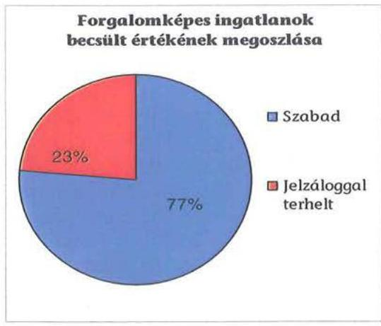

[^0]
[^0]:    ${ }^{79}$ a 200/2008. (IV. 24.) számú, az 529/2009. (XI. 26.) számú és a 202/2010. (VI. 3.) számú határozataival,
    ${ }^{80}$ A 2010-ben lefolytatott ÁSZ ellenőrzés már felhívta az Önkormányzat figyelmét, hogy az EUR-ban felvett hitelnél a fedezettként felajánlott vagyontárgy a törzsvagyon körébe tartozik, ezért annak felajánlása az Ötv. 88. § (1) bekezdés b) pontjába ütközik. Az ÁSZ ellenőrzés az érintett törvénysértések elkerülésére a főjegyző részére javaslatot tett.

---

Az Önkormányzat - kimutatása alapján - kötelezettségeinek állományát 2010. december 31-én és várható alakulását a kötelezettségek lejártáig az alábbi táblázat részletezi Ft-ban:

| Megnevezés | Állomány 2010. dec. 31-én |  |  | Várható kötelezettség 2011-2013.   években |  |  | Várható kötelezettség 2014. év   követően |  |  |
| :--: | :--: | :--: | :--: | :--: | :--: | :--: | :--: | :--: | :--: |
|  | HUF-ben   (millió Ft-ban) | Devizában   (összeg) | Deviza   név | HUF-ben   (millió Ft-ban) | Devizában   (összeg) | Deviza   név | HUF-ben   (millió Ft-   ban) | Devizában   (összeg) | Deviza   név |
| Pénzintézeti kötelezettségek |  |  |  |  |  |  |  |  |  |
| Hosszú lejáratú hitelek | 11944 |  |  | 6737 |  |  | 16183 |  |  |
| Hosszú lejáratú hitelek |  | 39000000 | CHF |  | 1094027 | EUR |  | 40000400 | CHF |
| Kötvény (Ftcs 2020) |  | 39215686 | CHF | 120 | 7201353 | EUR | 4 | 41359382 | CHF |
| Rövid lejáratú hitelek | 2360 |  |  | 1204 |  |  |  |  |  |
| Pénzintézeti kötelezettségek összesen HUF-ben | 14304 |  |  | 7941 |  |  | 16183 |  |  |
| Pénzintézeti kötelezettségek összesen CHF-ben |  | 39215686 | CHF |  | 7201353 | EUR |  | 41359102 | CHF |
| Pénzintézeti kötelezettségek összesen EUR-ben |  | 39000000 | EUR |  | 1694027 | EUR |  | 46009450 | EUR |
| Üzemeltetési kötelezettségek | 1 |  |  | 1 |  |  |  |  |  |
| Szállítói tartozások | 166 |  |  | 366 |  |  |  |  |  |
| Egyéb kötelezettségek | 673 |  |  | 673 |  |  |  |  |  |
| CS 4-es egyéb szervek felé fennálló kötelezettségek | 354 |  |  | 354 |  |  |  |  |  |
| Jogi végzéssel lezárt de ki nem fizetett kötelezettségek* | 3 |  |  | 3 |  |  |  |  |  |

*A pont. díjazáshoz vonatkozó adatok a 2011. januári állapotot tükrözik.
** Egyéb oldaltartásán Ft-ban.
Az Önkormányzat 2010. december 31-én fennálló összes (pénzintézeti, szállítói, jogerős végzéssel lezárt, de ki nem fizetett, gazdasági társaság felé fennálló, valamint egyéb) kötelezettsége: 14304 millió Ft, 39215686 CHF és 39000000 EUR volt, amelyből a 2011-2013. években 7941 millió Ft, 7291353 CHF és 1694027 EUR kötelezettsége keletkezik. Ennek teljesítésére figyelembe vehető 1532 millió
 Ft mérlegben kimutatott követelésállomány, valamint 12914 millió Ft jelzáloggal nem terhelt forgalomképes ingatlan vagyon.

A hosszúlejáratú hitelek állománya 2006. december 31-én 10350 millió Ft volt. A 2007-2010-ben kötött hat hosszúlejáratú hitelszerződés alapján az összesen 7689 millió Ft hitelkeretből 2007-ben 3000 millió Ft-ot, 2008-ban 1499 millió Ft-ot, 2009-ben 862 millió Ft-ot, valamint 2010-ben 376 millió Ft-ot (összesen 5737 millió Ft-ot) fordított az Önkormányzat fejlesztésre. A 2007 előtt kötött hét hosszúlejáratú hitelszerződés alapján 2007-ben 70 millió Ft-ot, 2008-ban egy millió Ft-ot tett ki az igénybe vett összeg. Az Önkormányzat 2008-ban 39215686 CHF (6000 millió Ft) összegben kötvényt bocsátott ki és külföldi pénzintézettel 39000000 EUR (9965 millió Ft) hosszúlejáratú fejlesztési célú hitelszerződést kötött. A kötvénykibocsátás bevételéből 2010. december 31-én szabad pénzeszköz nem állt az Önkormányzat rendelkezésére. Az EUR-ban kötött hosszúlejáratú hitelszerződés alapján 2008-ban 36000000 EUR-ot, 2009-ben 3000000 EUR-ot vett igénybe az Önkormányzat. Az EUR alapú hitelfelvételből az Önkormányzat 2008-ban 1933 millió Ft-ot, 2009-ben 3131 millió Ft-ot és 2010-ben 3753 millió Ft-ot beruházások finanszírozására használt fel. Növelte még a kötelezettségek állományát, hogy folyószámlahitel állománya a 2006. év végi 3393 millió Ft-ról 2010. hasonló időszakára 4266 millió Ft-ra nőtt, valamint a 2008-2010-ben 3638 millió Ft-ot tett ki a devizában fennálló hosszúlejáratú hitel és kötvény CHF és EUR árfolyamváltozása. Az Önkormányzat a lehívott hiteleket - kimutatása alapján - a hitelcéloknak megfelelően használta fel. A hazai pénzintézetekkel kötött hosszúlejáratú hitelszerződések alapján 2010. december 31-én a rendelkezésre álló szabad keret 502 millió Ft, az EUR-ban felvett hitel esetében a felhasználható forrás 1148 millió Ft volt.

A további évekre szóló, a helyszíni ellenőrzés időszakában ismert pénzintézeti kötelezettségei: 16187 millió Ft, 41359182 CHF és 46009450 EUR. Ezekre az

---

Önkormányzat tájékoztatása szerint figyelembe vehető források: a saját bevétel növelése, az évenkénti kiadáscsökkentő intézkedések megtakarításai, a tervezett ütemben megvalósuló ingatlan értékesítések bevétele. A forrásokat az Önkormányzat a 2011-2012. évi likviditási terveiben számba vette, de középtávra nem számszerűsítette.

Az Önkormányzat minősített többségi tulajdonú gazdasági társaságai - kimutatásai alapján - kötelezettségeinek állományát 2010. december 31-én és várható alakulását a kötelezettségek lejártáig az alábbi táblázat mutatja be:

| Mogyavasio | Allomány 2010. dec.31-én |  |  | Várható kötelezettség 2011-2012.   években |  |  | Várható kötelezettség 2016. évet   követően |  |  |
| :--: | :--: | :--: | :--: | :--: | :--: | :--: | :--: | :--: | :--: |
|  | HUF-ban   (millió Ft-ban) | Devizában   (összegs) | Devizs   nem | HUF-ban   (millió Ft-ban) | Devizában   (összegs) | Devizs   nem | HUF-ban   (millió Ft-   beni) | Devizában   (összegs) | Devizs   nem |
| Pénzintétét kötelezettségek |  |  |  |  |  |  |  |  |  |
| Hozzosi eljárata kötelező | 4389 |  | 169 | 3379 |  | 169 | 1409 |  | 169 |
| Hozzosi lejáratú kötelező |  | 1077940 | 108 |  | 936233 | 108 |  | 260136 | 108 |
| Pénzintététi kötelezettségek (hozzosi HUF-ban) | 6389 |  | 169 | 3379 |  | 169 | 1409 |  | 169 |
| Pénzintététi kötelezettségek (hozzosi EUR-ban) |  | 1077940 | 108 |  | 936233 | 108 |  | 260136 | 108 |
| Üzling kötelezettségek HUF-ban | 60 |  | 169 | 37 |  | 169 | 23 |  | 169 |
| Üzling kötelezettségek CHF-ban |  | 368304 | 110 |  | 368304 | 110 |  |  |  |
| Üzling kötelezettségek EUR-ban |  | 2113678 | 108 |  | 312909 | 108 |  | 1602749 | 108 |
| Szállítói tartozás | 1626 |  | 169 | 1626 |  | 169 |  |  |  |
| Jogerős végzéssel lezárt és ki nem fizetett   kötelezettségek* | 504 |  | 169 | 504 |  |  |  |  |  |

* A press eljárásokra vonatkozó órátból a 2011. jókóval állogolód fơliródik.
2010. december 31-én az Önkormányzat minősített többségi tulajdonú gazdasági társaságainak hosszú lejáratú hitel állománya 4389 millió Ft-ból és 1077940 EUR-ból, lízing állománya 80 millió Ft-ból, 368304 CHF-ből és 2115678 EUR-ból, szállítói tartozása 1626 millió Ft-ból, valamint jogerős végzéssel lezárt, de ki nem fizetett kötelezettsége 504 millió Ft-ból tevődött össze. Ebből a 2011-2013-ban esedékes kötelezettségek várható összege 6166 millió Ft, 1469144 EUR és 368304 CHF. A 2013 után várható kötelezettségek összegét devizában 1432 millió Ft és 1862905 EUR alkotja. A gazdasági társaságok kötvényt nem bocsátottak ki.

Az Önkormányzat korlátlan felelősséggel tartozik felszámolás esetén a gazdasági társaságokról szóló 2006. évi IV. törvény 54. § (2) bekezdése alapján azon gazdasági társaságának, amelyben az 52. § (2) bekezdése alapján a szavazatok legalább 75\%-ával rendelkezik, illetve a csődeljárásról és felszámolási eljárásról szóló 1991. évi XLIX. törvény 63. § (2) bekezdése alapján a kizárólagos önkormányzati tulajdonú gazdasági társaságának minden olyan kötelezettségéért, amelynek kielégítését a felszámolási eljárás során az adós társaság vagyona nem fedez, ha a hitelezőinek a felszámolási eljárás során benyújtott keresete alapján a bíróság - az adós társaság felé érvényesített tartósan hátrányos üzletpolitikájára figyelemmel - megállapítja az Önkormányzat korlátlan és teljes felelősségét. Felszámolás esetén a hitelezők által benyújtott kereset alapján a bíróság összességében 7598 millió Ft, 3332049 EUR és 368304 CHF összegű korlátlan és teljes felelősséget állapíthat meg a kötelezettségekkel érintett nyolc 100%-os, egy 91%-os, valamint egy 95%-os önkormányzati tulajdonú gazdasági társaság kötelezettségei után.

A vizsgált időszakban nem történt meg a teljes körű felmérése annak, hogy az elhasználódott eszközök pótlása milyen kötelezettséget jelent az Önkormányzat számára. Az Önkormányzat - kimutatása alapján - a 2007-2010. években a befektetett tárgyi eszközei után 9498 millió Ft összegű érték-

---

csökkenést számolt el, felújításra összesen 1746 millió Ft-t, az elszámolt értékcsökkenés 18,4%-át fordította. (A számvitelben elszámolt értékcsökkenés összegéből alapot nem különített el.) A számvitelben elszámolt beruházás összege 38475 millió Ft volt. Az Önkormányzat kimutatásai szerint a 2007-2010 években megvalósított, 2010. december 31-ig befejezett fejlesztéseiből - 37105 millió Ft-ból - eszközpótlásra 224 millió Ft-ot fordított. Folyamatban lévő fejlesztési feladataiból - 17180 millió Ft-ból - eszközpótlásra 19 millió Ft-ot teljesített. Az eszközök használhatósági foka a felújítások, beruházások ellenére a vizsgált években csökkenő tendenciájú, 2007-ben 88,0%, 2008-ban 88,0%, 2009-ben 86,5%, valamint 2010-ben 84,8% volt. A 2010 után befejeződő fejlesztéseknél várhatóan eszközpótlásra 196 millió Ft-ot fordítanak.

Az Önkormányzat és intézményei - kimutatása alapján - az ellenőrzés időszakában 46 peres eljárásban voltak érintettek, ebből alperesként 18 eljárásban vettek részt. A folyamatban lévő peres eljárások tekintetében alperesként (17 eljárás) a kimutatott nem végleges perérték 138 millió Ft, felperesként (25 eljárás) a kimutatott nem végleges perérték 90 millió Ft volt. A folyamatban lévő alperesi eljárások között szerepelnek a tűzoltók túlmunkája után járó, valamint a különböző kártérítésekből adódó perek. Az Önkormányzat jogerős határozattal lezárt, de pénzügyileg nem teljesített kötelezettsége (egy eljárás) három millió Ft illetmény-különbözet volt $^{81}$. Felperesként három eljárásban a követelését jogerős végzéssel 0,7 millió Ft-ban határozták meg.

Az Önkormányzat legalább 75%-os tulajdoni hányadú gazdasági társaságainak kimutatása alapján jogerős határozattal le nem zárt alperesi eljárásainak nem végleges perértéke 1365 millió Ft volt, mely elsősorban kártérítési és munkaügyi perekből adódott. A jogerős határozattal lezárt, de pénzügyileg nem teljesített kötelezettség 504 millió Ft-ot tett ki. A kötelezettség kiemelten munkabér és járulékai, megbízási díj, munkaadói járulék, valamint vállalkozói díj fizetéséből tevődött össze.

# 4. A PÉNZÜGYI EGYENSÚLY MEGTEREMTÉSE ÉRDEKÉBEN HOZOTT INTÉZKEDÉSEK 

A jelentésben szereplő CLF modellben bemutatott 2010. évi működési és felhalmozási hiány mindamellett alakult ki, hogy a vizsgált időszakban az Önkormányzat folyamatosan intézkedéseket tett, hogy alkalmazkodjon a támogatási rendszer változása miatti forráscsökkenéshez. Ennek érdekében kiadáscsökkentő és bevételnövelő döntéseket hozott.

A kiadáscsökkentő és bevételnövelő intézkedések megtétele a pénzügyi helyzet javítását és a gazdálkodás átláthatóbbá tételét célozta. A legjelentősebb mértékű kiadáscsökkentést a személyi juttatások területén érték el.

[^0]
[^0]:    $^{81}$ Az ellenőrzés időszakában az illetmény különbözetet számfejtették és utalásra továbbították.

---

A 2007-2010. évek kiadáscsökkentő intézkedéseinek hatását beavatkozási területenként az alábbiak részletezik:

A 2007-2010. évi beavatkozások területei
ezer Ft-ban

| Az érvényesített kiadáscsökkentés területei | Személyi juttatások és járulékai | Dologi, működési kiadások | Pénzeszköz átadások, támogatások | Összesen |
| :--: | :--: | :--: | :--: | :--: |
| Az intézményeknél | 566369 | 0 | 0 | 566369 |
| A Közgyűlés működése | 44891 | 0 | 268019 | 312910 |
| A Polgármesteri hivatalnál | 113970 | 0 | 0 | 113970 |
| ÖSSZESEN | 725230 | 0 | 268019 | 993249 |

A takarékossági intézkedések hatásaként együttesen 993 millió Ft kiadáscsökkentést mutatott ki az Önkormányzat a 2007-2010. években, melyből az intézmények körében kimutatott megtakarítási intézkedések 566 millió Ft összeget, az összes megtakarítás 57%-át eredményezték. A kiadáscsökkentések teljes mértékben a személyi juttatásoknál és járulékoknál realizálódtak, amelyek az átszervezések és álláshely csökkentési intézkedések eredményeként alakultak ki.

Az intézményi feladatok racionalizálásáról, álláshely megszüntetésekről a Közgyűlés döntött, de az ezekhez készített előterjesztésekben a tervezett intézkedések várható (számszerűsített) eredményeit nem mutatták be.

A Közgyűlés működési körében végrehajtott intézkedések 313 millió Ft mértékű kiadáscsökkenést (az összes megtakarítás 31,5%-át) okoztak a 2007-2010. években. A Közgyűlés lecsökkentette a civil szervezeteknek nyújtott támogatások összegét $^{82}$, ami a vizsgált időszakban 268 millió Ft (85,7%) megtakarítást eredményezett. A Közgyűlés és a bizottsági tagok létszámának és a tiszteletdíjak csökkentéséből $^{83}$ 45 millió Ft (14,3%) megtakarítás realizálódott. Az intézkedéseket helyi szintű döntések alapozták meg.

A Polgármesteri hivatal átszervezése és a hozzá kapcsolódó álláshely megszüntetések 114 millió Ft megtakarítást eredményeztek a kimutatásaik szerint, ami az önkormányzati szinten keletkezett kiadáscsökkentés 11,5%-át teszi ki.

Az álláshely megszüntetések következtében a kimutatásaik szerint 709 millió Ft kiadáscsökkenés keletkezett (az önkormányzati szintű kiadáscsökkenés 71,4%-a). A 2007-2010. évek között Közgyűlés által hozott döntések $^{84}$ alapján a

[^0]
[^0]:    $^{82}$ A 2007-2010. évi költségvetési rendeletekben.
    $^{83}$ A helyi önkormányzati képviselők tiszteletdíját a 39/2008 (XI. 26.) számú önkormányzati rendeletben 104000 Ft-ról 93600
 Ft-ra csökkentették.
    ${ }^{84}$ Az 57/2007. (II. 15.) számú, a 319/2007. (VI. 21.) számú, a 72/2007. (III. 1.) számú, a 216/2007. (V. 3.) számú, a 320/2008. (VI. 19.) számú, a 321/2008. (VI. 19.) számú, a 475/2008. (X. 9.) számú határozattal módosított 136/2008. (III. 27.) számú, a 30/2009. (I. 22.) számú, a 39/2009. (II. 12.) számú, a 142/2009. (III. 26.) számú, a 143/2009. (III. 26.) számú, a 341/2009. (VI. 18.) számú, a 240/2009. (V. 21.) számú, a 207/2009. (V. 7.) számú és a 189/2010. (IV. 29.) számú közgyűlési határozat alapján.

---

Polgármesteri Hivatalnál és az intézményeknél összesen 699 álláshelyet (ebből hat üres állást) szüntettek meg, amelyből 555 álláshely (79,3%) ágazati szakmai, 163 álláshely (23,4%) intézmény-üzemeltetéshez, fenntartáshoz, gazdasági ügyek intézéséhez kapcsolódó álláshely volt.

A központi intézkedések ${ }^{85}$ figyelembevételével felülvizsgálták az Önkormányzat által működtetett általános iskolák létszámkereteit és meghatározták a 2007/2008. tanévre szóló pedagógus álláshelyeit. A Hajnóczy József Kollégium Kodály Zoltán úti tagintézményi konyha üzemeltetésének átszervezése következményeként 14 fő közalkalmazotti jogviszonyát szüntették meg, valamint a Pécsi Ifjúsági Központ álláshelyeit lecsökkentették 3 fővel. A Közgyűlés az oktatási intézmények átszervezésén és a közművelődési intézmények szervezeti átalakításán felül az Önkormányzat óvodáiban 2008. július 1-i hatállyal szüntetett meg álláshelyeket. Az Önkormányzat többcélú intézményeit érintő létszámcsökkentés alapján három közoktatási intézmény álláshelyeit csökkentették összesen 10,5 fővel. A Mecsekaljai Iskola felnőttoktatási tevékenységének racionalizálásával összefüggésben 2009. szeptember 1-től csökkentették az intézmény álláshelyeinek számát 5,77-el, valamint az Önkormányzat közoktatási intézményeiben 2009. július 1-i hatállyal szüntettek meg további álláshelyeket. A 2010. évben a közoktatási intézmények szervezeti átalakításai további álláshely megszüntetésekkel jártak.

A vizsgált időszakban a Közgyűlés az Integrált Szociális Intézmény és az Integrált Nappali Szociális Intézmény engedélyezett álláshelyeinek számát is lecsökkentette. A Pécsi Kulturális Központ engedélyezett álláshelyeinek számának csökkentésével párhuzamosan a közművelődési intézmények álláshelyeinek számát is több alkalommal felülvizsgálták.

Az Egyesített Egészségügyi Intézményekben az engedélyezett álláshelyek számát a 2008. évben 16 fővel csökkentették, a 2009. évben további öt álláshelyet szüntettek meg.

A végrehajtott intézményi átszervezéseken túl a Polgármesteri hivatal álláshelyeinek számát a 2007. évben 43 fővel, a 2009. évben öt fővel csökkentették. A Polgármesteri hivatal átalakítása a 2010. évben 86 álláshely megszüntetésével járt. A 2010. évi választásokat követően a képviselők létszáma 37 főről 25 főre csökkent.

[^0]
[^0]:    ${ }^{85}$ A közoktatásról szóló 1993. évi LXXIX. törvény 1. számú mellékletében meghatározott pedagógus kötelező óraszámok 20-ról 22-re emelkedtek 2007. szeptember 1-től.

---

A 2007-2010. években végrehajtott álláshely csökkentés eredményét az alábbi táblázat szemlélteti:

Az Önkormányzat 2007-2010. éveket érintő létszámcsökkentésének alakulása

| Megnevezés (adatok fő-ben) |  | Közoktatás | Szociális és gyermekvédelem | Egészségügy | Polgármesteri hivatal | Egyéb | Összesen |
| :--: | :--: | :--: | :--: | :--: | :--: | :--: | :--: |
| Megszüntetett álláshelyek száma |  | 410 | 15 | 21 | 134 | 119 | 699 |
| ebből: üres álláshelyek száma |  | 0 | 6 | 0 | 0 | 0 | 6 |
|  | szakmai álláshelyek száma | 358 | 6 | 4 | 134 | 53 | 555 |
|  | intézmény-üzemeltetéssel kapcsolatos álláshelyek száma | 77 | 3 | 17 | 0 | 66 | 163 |
| 2007. január 1-jén indító létszám |  | 4169 | 1008 | 458 | 435 | 801 | 6871 |
| 2010. december 31-én záró létszám |  | 3551 | 1013 | 437 | 318 | 695 | 6014 |

A helyi szervezési intézkedések végrehajtásához a 2007-2010. években az Önkormányzat 612 millió Ft központi költségvetési támogatásban részesült, amelynek felhasználásával 322 fő létszámot tartósan leépített.

A helyi intézkedések hatására az Önkormányzat 2007. január 1-i átlaglétszáma 2010. december 31-re 857 fővel 12,5%-kal csökkent. A létszámcsökkentések után a dolgozók nem kerültek az Önkormányzat tulajdonában lévő gazdasági társaságoknál továbbfoglalkoztatásra.

A kiadáscsökkentő intézkedések mellett a 2007-2010. években az Önkormányzat bevételnövelő intézkedései hatására ingatlanok, eszközök bérbeadásából 101 millió Ft többletbevételt értek el, amelyből 87 millió Ft a 2010. évben realizálódott a kimutatásaik szerint.

Az Önkormányzat a végrehajtott kiadáscsökkentő és bevételnövelő intézkedéseivel ellensúlyozni tudta a csökkenő állami támogatások hatását. A 2007-2010. évek között a kimutatásaik szerint 384 millió Ft-tal csökkenő költségvetési támogatásokhoz, átengedett bevételekhez és illetékbevételhez képest 711 millió Ft-tal (185%-kal) több megtakarítást tudtak elérni. Az Önkormányzat a pénzügyi helyzet javítása érdekében 2009. november 13-án szerződést kötött a Város operacionális auditálásának elvégzésére.

A szerződés tárgya az Önkormányzat és intézményei, a Polgármesteri hivatal, a Pécsi Holding Városi Vagyonkezelő Zrt. és az Önkormányzat tulajdonában álló egyéb gazdasági társaságok és szervezetek működésének, feladatellátásának átvilágítása, ezek eredményei alapján szervezetfejlesztési anyagok kidolgozása, megvalósítási tervek készítése, szabályzatok megalkotása, szervezetfejlesztési lépések nyomon követése, támogatása, továbbá a vagyongazdálkodás átvilágítása, költségvetési tervezés, adótanácsadás volt.

Az átvilágítást követően megállapították, hogy a korábbi intézményszervezet fenntartása, az intézmények elhelyezkedése jelentős túlfoglalkoztatást eredményezett, valamint megnövelte a dologi kiadások fajlagos mértékét és az adórendszer változatlan hagyása miatt jelentős bevételektől esett el az Önkormányzat.

---

Az auditálás alapján a 2011-2014. évekre vonatkozó gazdasági program x-ben a 2011. évtől megfogalmazott szervezetkorszerűsítési, feladatszűkítési követelményeket és a finanszírozások felülvizsgálatát javasolták. Az előírt feladatellátási és gazdálkodási szigorítás mellett célul tűzték ki az Önkormányzat bevételtermelő képességének folyamatos erősítését. A közszolgáltatások nagyarányú felülvizsgálata után a helyzetelemzés alapján szükségessé vált a kötelező és az önként vállalt feladatok finanszírozásának a csökkentése. Megállapították, hogy szét kell választani a kötelező, valamint az önköltségi alapon finanszírozott nem kötelező feladatokat, meg kell fizettetni a szolgáltatások valóságos ellenértékét. A kiadások csökkentése és a hatékonyabb feladatellátás érdekében az érintett szervezetek együttműködési lehetőségeit javasolták. Rögzítették, hogy felül kell vizsgálni az Önkormányzat által nyújtott szolgáltatások díjait, az intézmények díjbevételeit, a helyi adók mértékét.

A dokumentum hatására meghozott intézkedések alapján a 2011. évre 1131 millió Ft kiadáscsökkentést és 30 millió Ft bevételnövelést terveztek. A Közgyűlés a 2011. évi költségvetési rendeletben további 366 millió Ft-tal (32,4%) csökkentette a civil szervezetek támogatását. A 2011. évben a cafetéria elemek csökkentése 331 millió Ft-tal (18,7%), a Polgármesteri hivatal és a feladatellátás átszervezése pedig 320 millió Ft-tal (18,0%) csökkenti a személyi juttatásokat és járulékait.

A bevételek növelése érdekében a Közgyűlés döntött ${ }^{86}$ a telekadó bevezetéséről, melyből a 2011. évben 30 millió Ft (10,7%) többletbevételt terveztek.

A vizsgált időszakban az átszervezések, a takarékossági intézkedések szakmai feladatellátásra gyakorolt hatását, valamint a megtakarítások teljesülését a Pénzügyi bizottság értékelte.

# 5. A HELYI ÖNKORMÁNYZATOK GAZDÁLKODÁSI RENDSZERÉNEK 2010. ÉVI ELLENŐRZÉSE SORÁN A PÉNZÜGYI EGYENSÚLY JAVÍTÁSÁRA TETT SZABÁLYSZERŰSÉGI ÉS CÉLSZERŰSÉGI JAVASLATOK HASZNOSULÁSA 

Az ÁSZ az Önkormányzat gazdálkodási rendszerét a 2010. évben ellenőrizte átfogó jelleggel. A gazdálkodási rendszer korábbi ellenőrzése során tett javaslatok közül a pénzügyi egyensúly javítására vonatkozott három szabályszerűségi javaslat volt. A javaslatok megvalósítása érdekében a közgyűlés elfogadta az ÁSZ jelentésben foglaltak végrehajtására készített, felelősöket és határidőket is tartalmazó intézkedési tervet.

Az ellenőrzés során tett pénzügyi egyensúly javítására vonatkozó javaslatok 100%-át hasznosították.

A szabályszerűségi javaslatokra megtett intézkedések eredményképpen gondoskodtak arról, hogy a folyószámlahitel meghosszabbítása során Pénzügyi Bizottság vizsgálta a hitelfelvétel indokait és gazdasági megalapozottságát. A 2011. évi költségvetési rendelettervezetben gondoskodtak arról, hogy a költség-

[^0]
[^0]:    ${ }^{86}$ A 48/2010. (XII. 20.) számú rendeletében.

---

vetés bevétele ne tartalmazzon finanszírozási célú bevételeket, a költségvetési bevételek, kiadások különbségét jelentő hiány összegét tartalmazza, valamint gondoskodtak arról, hogy tartalmazza a többéves kihatással járó döntések számszerűsítését évenként, összesítve és annak szöveges indoklását.

Budapest, 2011. december „22."

Melléklet: $\quad 10 \mathrm{db}$
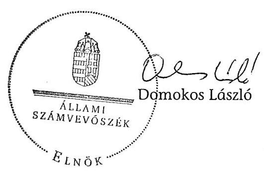

---

.

---

Pécs Megyei Jogú Város Önkormányzata

1. számú melléklet

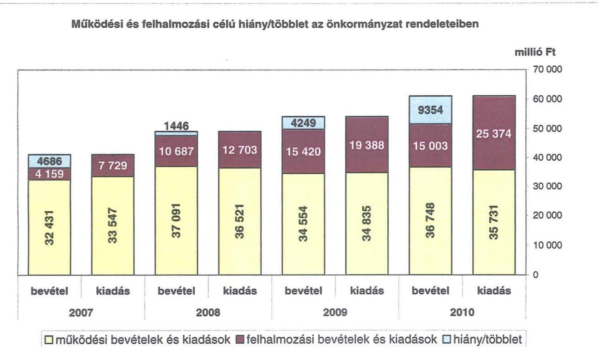

---

|  1. FOLYÓ KÖLTSÉGVETÉS* | 2007 | 2008 | 2009 | 2010  |
| --- | --- | --- | --- | --- |
|  1.1.1. Saját működési bevételek | 11905911 | 15256794 | 16926484 | 17545823  |
|  1.1.3. Költségvetési támogatás | 11922910 | 15270112 | 15866942 | 13483000  |
|  1.1.5. Kifizetési bevételek | 6291731 | 5061472 | 2744900 | 4459191  |
|  1.1.4. Állandó tartáson belülről kapott támogatások | 1624596 | 1999138 | 2076023 | 3726021  |
|  1.1.5. EU-s és külföldről kapott bevételek | 30554 | 49210 | 416640 | 6523  |
|  1.1.6. Állandó tartáson kívülről kapott bevételek | 144840 | 156348 | 270739 | 381064  |
|  1.1.7. Ebből évi pénzmaradvány átvétel | 29815 | 1714479 | 692762 | 890129  |
|  1.1. Folyó bevételek =1.1.1.+1.1.2.+1.1.3.+1.1.4.+1.1.5.+1.1.6.+1.1.7. | 32502449 | 32087550 | 38756175 | 32411736  |
|  1.2.1. Működési kiadások kamatkiadások nélkül | 29434467 | 31567644 | 30774242 | 31617703  |
|  1.2.2. Állandó tartáson belülre átadott pénzeszközök | 91428 | 50610 | 124144 | 414876  |
|  1.2.3.1. vállalkozásoknak | 2084976 | 1834592 | 2040334 | 3576619  |
|  1.2.3.2. EU-nak, illetve külföldre | 1860 | 2000 | 2000 | 200  |
|  1.2.3.3. magánszemélyeknek | 556576 | 1121345 | 1313737 | 1627834  |
|  1.2.3.4. nem állami szervezeteknek | 496724 | 607596 | 617656 | 459543  |
|  1.2.5. Többéves kiadások (=1.2.3.1+1.2.3.2+1.2.3.3+1.2.3.4) | 3139076 | 3596537 | 4083737 | 5664200  |
|  1.2.4. Kamatkiadások | 1143482 | 1502381 | 1671783 | 1502381  |
|  1.2.5. Ebből évi pénzmaradvány átadás | 319283 | 1644700 | 710396 | 786774  |
|  1.2. Folyó kiadások = 1.2.1.+1.2.2.+1.2.3.+1.2.4.+1.2.5. | 34427734 | 38367800 | 38063292 | 42586434  |
|  1.3. Folyó költségvetés egyenlege működési jövedelemből (1.1. - 1.2.) | -1922500 | -6280250 | -6907117 | -10174700  |
|  2. FELHALMOZÁSI KÖLTSÉGVETÉS** |  |  |  |   |
|  2.1.1. Saját többletforrások | 580862 | 5235289 | 1786366 | 1129363  |
|  2.1.2. Állandó tartáson belülről kapott támogatások | 2793594 | 2613562 | 8764515 | 10964832  |
|  2.1.3. EU-s és külföldről kapott támogatások | 87235 | 0 | 0 | 1400  |
|  2.1.4. Állandó tartáson kívülről kapott támogatások | 172893 | 848501 | 632081 | 237797  |
|  2.1. Felhalmozási bevételek (=2.1.1.+2.1.2+2.1.3+2.1.4.) | 3634886 | 8689352 | 11183560 | 12333292  |
|  2.2.1. Saját beruházási kiadások | 4422305 | 7257668 | 14863255 | 19356665  |
|  2.2.2. Saját felújítási kiadások | 740066 | 515699 |

 | 586375 | 671349  |
|  2.2.3. Állandótartáson belülre átadott pénzeszköz | 48445 | 35615 | 114007 | 55155  |
|  2.2.4. EU-s és külföldnek adott pénzeszközök | 3750 | 0 | 0 | 0  |
|  2.2.5. Állandótartáson kívülre adott pénzeszközök | 1292653 | 1793474 | 508238 | 657842  |
|  2.2.6. Befektetési célú részesedések vásárlása | 340450 | 1255808 | 83400 | 172160  |
|  2.2. Felhalmozói kiadások (=2.2.1.+2.2.2.+2.2.3.+2.2.4.+2.2.5.+2.2.6.) | 6847673 | 10855856 | 16156072 | 21113172  |
|  2.3. Felhalmozói költségvetés egyenlege (2.1. - 2.2.) | -3212787 | -2166504 | -4972512 | -8779880  |
|  3. Finanszírozási műveletek nélküli (GFS) pozíció (1.3.+2.3.) | -4685114 | -1446804 | -4249626 | -9354564  |
|  4. Finanszírozási műveletek |  |  |  |   |
|  4.1. Hitelfelvétel | 5858741 | 10668438 | 1739331 | 5129880  |
|  4.2. Hitellevélviszítés | 551632 | 8707751 | 829987 | 1023445  |
|  4.3. Forgatási és befektetési célú értékpapírok kibocsátása | 0 | 6000000 | 0 | 0  |
|  4.4. Forgatási és befektetési célú értékpapírok beváltása | 0 | 0 | 0 | 0  |
|  4.5. Forgatási és befektetési célú értékpapírok értékesítése | 83007 | 0 | 0 | 600000  |
|  4.6. Forgatási és befektetési célú értékpapírok vásárlása | 0 | 0 | 600000 | 0  |
|  4.7. Egyéb finanszírozási bevételek (Hajgó, átfizet, kiegészítési) | 86575 | 421315 | 31019 | -1559003  |
|  4.8. Egyéb finanszírozási kiadások (Hajgó, átfizet, kiegészítési) | 82291 | 1015238 | 93894 | -1151306  |
|  4.9. Finanszírozási műveletek egyenlege (4.1. - 4.2.+4.3.-4.4+4.5.-4.6.+4.7.-4.8.) | 5394460 | 9366765 | 266489 | 4498732  |
|  5. Tárgyévi pénzügyi pozíció változás (1.3.+ 2.3.+4.9.) | 709346 | 7919961 | -3983137 | -4855832  |
|  6. Nettó működési jövedelem =működési jövedelem (1.3.) - tőketöbblet (4.2+4.4) | -2023959 | -5988051 | -107081 | -1598133  |
|  7. TÁRGÉVI ADATOK |  |  |  |   |
|  Összes kötelezettség | 21 206 117 | 32 625 124 | 34 176 492 | 24 446 814  |
|  ebből rövid lejáratú | 8 242 225 | 3 211 076 | 2 149 882 | 7 022 859  |
|  Összes eszközök kötelezettség | 965 483 | 805 940 | 965 463 | 965 559  |
|  ebből lejárt (nemleltározott) | 191 565 | 372 365 | 115 750 | 204 303  |
|  Piros és tilkapási kötelezettség (adószeg) | 19 042 132 | 38 377 216 | 31 714 234 | 27 854 218  |
|  ebből rövid lejáratú | 6 003 626 | 976 760 | 992 530 | 5 784 397  |
|  FFP szerződésből származó kötelezettség állománya | 0 | 0 | 0 | 0  |
|  ebből lejárt szolgáltatási díj emeli kötelezettség | 0 | 0 | 0 | 0  |
|  Pályaszámlakétel majd átlagon állománya (nemleltározott) | 4 384 836 | 3 352 715 | 11 554 | 1 982 170  |
|  Rövid lejáratú majd átlagon állománya (nemleltározott) | 0 | 0 | 0 | 0  |
|  Hosszú lejáratú majd átlagon állománya (nemleltározott) | 0 | 0 | 0 | 0  |
|  Kezesség és garanciavállalások (nemleltározott) | 0 | 0 | 0 | 0  |
|  Jegybanki bírósági költségekből adódó kötelezettségek (nemleltározott) | 0 | 0 | 0 | 3 953  |
|  Finanszírozásba bevonható eszközök | 2 603 203 | 11 523 160 | 8 140 029 | 2 542 423  |
|  Tartás kötelezettség megtestesítői értékpapírok és végi állománya | 0 | 0 | 0 | 0  |
|  Hosszú lejáratú bankbetétek és végi állománya | 0 | 0 | 0 | 0  |
|  Értékpapírok és végi állománya | 0 | 0 | 600 000 | 0  |
|  Főszereközök (tárgyévi pénzeszközök nélküli) és végi állománya | 1 273 587 | 1 524 366 | 1 386 844 | 952 313  |

- Bevételében nem több, a kiadásokban nem jöveti meg az amortizáció, a vagyoni helyzet ** Bevételében vagyon megterhelése és felvétele kiadások

---

|   |  |  |  |  |  |  |  |  |  |  |  |  |  |  |  |  |  |  |  |  |  |  |  |  |  |  |  |  |  |  |  |  |  |  |  |  |  |  |  |  |  |  |  |  |  |  |   |
| --- | --- | --- | --- | --- | --- | --- | --- | --- | --- | --- | --- | --- | --- | --- | --- | --- | --- | --- | --- | --- | --- | --- | --- | --- | --- | --- | --- | --- | --- | --- | --- | --- | --- | --- | --- | --- | --- | --- | --- | --- | --- | --- | --- | --- | --- | --- | --- |
|   |  |  |  |  |  |  |  |  |  |  |  |  |  |  |  |  |  |  |  |  |  |  |  |  |  |  |  |  |  |  |  |  |  |  |  |  |  |  |  |  |  |  |  |  |  |   |
|   |  |  |  |  |  |  |  |  |  |  |  |  |  |  |  |  |  |  |  |  |  |  |  |  |  |  |  |  |  |  |  |  |  |  |  |  |  |  |  |  |  |  |  |  |  |   |
|   |  |  |  |  |  |  |  |  |  |  |  |  |  |  |  |  |  |  |  |  |  |  |  |  |  |  |  |  |  |  |  |  |  |  |  |  |  |  |  |  |  |  |  |  |  |   |
|   |  |  |  |  |  |  |  |  |  |  |  |  |  |  |  |  |  |  |  |  |  |  |  |  |  |  |  |  |  |  |  |  |  |  |  |  |  |  |  |  |  |  |  |  |  |   |
|   |  |  |  |  |  |  |  |  |  |  |  |  |  |  |  |  |  |  |  |  |  |  |  |  |  |  |  |  |  |  |  |  |  |  |  |  |  |  |  |  |  |  |  |  |  |   |
|   |  |  |  |  |  |  |  |  |  |  |  |  |  |  |  |  |  |  |  |  |  |  |  |  |  |  |  |  |  |  |  |  |  |  |  |  |  |  |  |  |  |  |  |  |  |   |
|   |  |  |  |  |  |  |  |  |  |  |  |  |  |  |  |  |  |  |  |  |  |  |  |  |  |  |  |  |  |  |  |  |  |  |  |  |  |  |  |  |  |  |  |  |  |   |
|   |  |  |  |  |  |  |  |  |  |  |  |  |  |  |  |  |  |  |  |  |  |  |  |  |  |  |  |  |  |  |  |  |  |  |  |  |  |  |  |  |  |  |  |  |  |   |

 |  |  |  |  |  |  |  |  |  |  |  |  |  |  |  |  |  |  |  |  |  |  |  |  |  |  |  |  |  |  |   |
|   |  |  |  |  |  |  |  |  |  |  |  |  |  |  |  |  |  |  |  |  |  |  |  |  |  |  |  |  |  |  |  |  |  |  |  |  |  |  |  |  |  |  |  |  |  |   |
|   |  |  |  |  |  |  |  |  |  |  |  |  |  |  |  |  |  |  |  |  |  |  |  |  |  |  |  |  |  |  |  |  |  |  |  |  |  |  |  |  |  |  |  |  |  |   |
|   |  |  |  |  |  |  |  |  |  |  |  |  |  |  |  |  |  |  |  |  |  |  |  |  |  |  |  |  |  |  |  |  |  |  |  |  |  |  |  |  |  |  |  |  |  |   |
|   |  |  |  |  |  |  |  |  |  |  |  |  |  |  |  |  |  |  |  |  |  |  |  |  |  |  |  |  |  |  |  |  |  |  |  |  |  |  |  |  |  |  |  |  |  |   |
|   |  |  |  |  |  |  |  |  |  |  |  |  |  |  |  |  |  |  |  |  |  |  |  |  |  |  |  |  |  |  |  |  |  |  |  |  |  |  |  |  |  |  |  |  |  |   |
|   |  |  |  |  |  |  |  |  |  |  |  |  |  |  |  |  |  |  |  |  |  |  |  |  |  |  |  |  |  |  |  |  |  |  |  |  |  |  |  |  |  |  |  |  |  |   |
|   |  |  |  |  |  |  |  |  |  |  |  |  |  |  |  |  |  |  |  |  |  |  |  |  |  |  |  |  |  |  |  |  |  |  |  |  |  |  |  |  |  |  |  |  |  |   |
|   |  |  |  |  |  |  |  |  |  |  |  |  |  |  |  |  |  |  |  |  |  |  |  |  |  |  |  |  |  |  |  |  |  |  |  |  |  |  |  |  |  |  |  |  |  |   |
|   |  |  |  |  |  |  |  |  |  |  |  |  |  |  |  |  |  |  |  |  |  |  |  |  |  |  |  |  |  |  |  |  |  |  |  |  |  |  |  |  |  |  |  |  |  |   |
|   |  |  |  |  |  |  |  |  |  |  |  |  |  |  |  |  |  |  |  |  |  |  |  |  |  |  |  |  |  |  |  |  |  |  |  |  |  |  |  |  |  |  |  |  |  |   |
|   |  |  |  |  |  |  |  |  |  |  |  |  |  |  |  |  |  |  |  |  |  |  |  |  |  |  |  |  |  |  |  |  |  |  |  |  |  |  |  |  |  |  |  |  |  |   |
|   |  |  |  |  |  |  |  |  |  |  |  |  |  |  |  |  |  |  |  |  |  |  |  |  |  |  |  |  |  |  |  |  |  |  |  |  |  |  |  |  |  |  |  |  |  |   |
|   |  |  |  |  |  |  |  |  |  |  |  |  |  |  |  |  |  |  |  |  |  |  |  |  |  |  |  |  |  |  |  |  |  |  |  |  |  |  |  |  |  |  |  |  |  |   |
|   |  |  |  |  |  |  |  |  |  |  |  |  |  |  |  |  |  |  |  |  |  |  |  |  |  |  |  |  |  |  |  |  |  |  |  |  |  |  |  |  |  |  |  |  |  |   |
|   |  |  |  |  |  |  |  |  |  |  |  |  |  |  |  |  |  |  |  |  |  |  |  |  |  |  |  |  |  |  |  |  |  |  |  |  |  |  |  |  |  |  |  |  |  |   |
|   |  |  |  |  |  |  |  |  |  |  |  |  |  |  |  |  |  |  |  |  |  |  |  |  |  |  |  |  |  |  |  |  |  |  |  |  |  |  |  |  |  |  |  |  |  |   |
|

 |  |  |  |  |  |  |  |  |  |  |  |  |  |  |  |  |  |  |  |  |  |  |  |  |  |  |  |  |  |  |  |  |  |  |  |  |  |  |  |  |  |  |  |  |  |   |
|   |  |  |  |  |  |  |  |  |  |  |  |  |  |  |  |  |  |  |  |  |  |  |  |  |  |  |  |  |  |  |  |  |  |  |  |  |  |  |  |  |  |  |  |  |  |   |
|   |  |  |  |  |  |  |  |  |  |  |  |  |  |  |  |  |  |  |  |  |  |  |  |  |  |  |  |  |  |  |  |  |  |  |  |  |  |  |  |  |  |  |  |  |  |   |
|   |  |  |  |  |  |  |  |  |  |  |  |  |  |  |  |  |  |  |  |  |  |  |  |  |  |  |  |  |  |  |  |  |  |  |  |  |  |  |  |  |  |  |  |  |  |   |
|   |  |  |  |  |  |  |  |  |  |  |  |  |  |  |  |  |  |  |  |  |  |  |  |  |  |  |  |  |  |  |  |  |  |  |  |  |  |  |  |  |  |  |  |  |  |   |
|   |  |  |  |  |  |  |  |  |  |  |  |  |  |  |  |  |  |  |  |  |  |  |  |  |  |  |  |  |  |  |  |  |  |  |  |  |  |  |  |  |  |  |  |  |  |   |
|   |  |  |  |  |  |  |  |  |  |  |  |  |  |  |  |  |  |  |  |  |  |  |  |  |  |  |  |  |  |  |  |  |  |  |  |  |  |  |  |  |  |  |  |  |  |   |
|   |  |  |  |  |  |  |  |  |  |  |  |  |  |  |  |  |  |  |  |  |  |  |  |  |  |  |  |  |  |  |  |  |  |  |  |  |  |  |  |  |  |  |  |  |  |   |
|   |  |  |  |  |  |  |  |  |  |  |  |  |  |  |  |  |  |  |  |  |  |  |  |  |  |  |  |  |  |  |  |  |  |  |  |  |  |  |  |  |  |  |  |  |  |   |
|   |  |  |  |  |  |  |  |  |  |  |  |  |  |  |  |  |  |  |  |  |  |  |  |  |  |  |  |  |  |  |  |  |  |  |  |  |  |  |  |  |  |  |  |  |  |   |
|   |  |  |  |  |  |  |  |  |  |  |  |  |  |  |  |  |  |  |  |  |  |  |  |  |  |  |  |  |  |  |  |  |  |  |  |  |  |  |  |  |  |  |  |  |  |   |
|   |  |  |  |  |  |  |  |  |  |  |  |  |  |  |  |  |  |  |  |  |  |  |  |  |  |  |  |  |  |  |  |  |  |  |  |  |  |  |  |  |  |  |  |  |  |   |
|   |  |  |  |  |  |  |  |  |  |  |  |  |  |  |  |  |  |  |  |  |  |  |  |  |  |  |  |  |  |  |  |  |  |  |  |  |  |  |  |  |  |  |  |  |  |   |
|   |  |  |  |  |  |  |  |  |  |  |  |  |  |  |  |  |  |  |  |  |  |  |  |  |  |  |  |  |  |  |  |  |  |  |  |  |  |  |  |  |  |  |  |  |  |   |
|   |  |  |  |  |  |  |  |  |  |  |  |  |  |  |  |  |  |  |  |  |  |  |  |  |  |  |  |  |  |  |  |  |  |  |  |  |  |  |  |  |  |  |  |  |  |   |
|   |  |  |  |  |  |  |  |  |  |  |  |  |  |  |  |  |  |  |  |  |  |  |  |  |  |  |  |  |  |  |  |  |  |  |  |  |  |  |  |  |  |  |  |  |  |   |
|   |  |  |  |  |  |  |  |  |  |  |  |  |  |  |  |  |  |

 |  |  |  |  |  |  |  |  |  |  |  |  |  |  |  |  |  |  |  |  |  |  |  |  |  |  |  |  |   |
|   |  |  |  |  |  |  |  |  |  |  |  |  |  |  |  |  |  |  |  |  |  |  |  |  |  |  |  |  |  |  |  |  |  |  |  |  |  |  |  |  |  |  |  |  |  |  |   |
|   |  |  |  |  |  |  |  |  |  |  |  |  |  |  |  |  |  |  |  |  |  |  |  |  |  |  |  |  |  |  |  |  |  |  |  |  |  |  |  |  |  |  |  |  |  |  |   |
|   |  |  |  |  |  |  |  |  |  |  |  |  |  |  |  |  |  |  |  |  |  |  |  |  |  |  |  |  |  |  |  |  |  |  |  |  |  |  |  |  |  |  |  |  |  |  |   |
|   |  |  |  |  |  |  |  |  |  |  |  |  |  |  |  |  |  |  |  |  |  |  |  |  |  |  |  |  |  |  |  |  |  |  |  |  |  |  |  |  |  |  |  |  |  |  |   |
|   |  |  |  |  |  |  |  |  |  |  |  |  |  |  |  |  |  |  |  |  |  |  |  |  |  |  |  |  |  |  |  |  |  |  |  |  |  |  |  |  |  |  |  |  |  |  |   |
|   |  |  |  |  |  |  |  |  |  |  |  |  |  |  |  |  |  |  |  |  |  |  |  |  |  |  |  |  |  |  |  |  |  |  |  |  |  |  |  |  |  |  |  |  |  |  |  |   |
|   |  |  |  |  |  |  |  |  |  |  |  |  |  |  |  |  |  |  |  |  |  |  |  |  |  |  |  |  |  |  |  |  |  |  |  |  |  |  |  |  |  |  |  |  |  |  |  |   |
|   |  |  |  |  |  |  |  |  |  |  |  |  |  |  |  |  |  |  |  |  |  |  |  |  |  |  |  |  |  |  |  |  |  |  |  |  |  |  |  |  |  |  |  |  |  |  |  |   |
|   |  |  |  |  |  |  |  |  |  |  |  |  |  |  |  |  |  |  |  |  |  |  |  |  |  |  |  |  |  |  |  |  |  |  |  |  |  |  |  |  |  |  |  |  |  |  |  |   |
|   |  |  |  |  |  |  |  |  |  |  |  |  |  |  |  |  |  |  |  |  |  |  |  |  |  |  |  |  |  |  |  |  |  |  |  |  |  |  |  |  |  |  |  |  |  |  |  |   |
|   |  |  |  |  |  |  |  |  |  |  |  |  |  |  |  |  |  |  |  |  |  |  |  |  |  |  |  |  |  |  |  |  |  |  |  |  |  |  |  |  |  |  |  |  |  |  |  |   |
|   |  |  |  |  |  |  |  |  |  |  |  |  |  |  |  |  |  |  |  |  |  |  |  |  |  |  |  |  |  |  |  |  |  |  |  |  |  |  |  |  |  |  |  |  |  |  |  |   |
|   |  |  |  |  |  |  |  |  |  |  |  |  |  |  |  |  |  |  |  |  |  |  |  |  |  |  |  |  |  |  |  |  |  |  |  |  |  |  |  |  |  |  |  |  |  |  |  |   |
|   |  |  |  |  |  |  |  |  |  |  |  |  |  |  |  |  |  |  |  |  |  |  |  |  |  |  |  |  |  |  |  |  |  |  |  |  |  |  |  |  |  |  |  |  |  |  |  |   |
|   |  |  |  |  |  |  |  |  |  |  |  |  |  |  |  |  |  |  |  |  |  |  |  |  |  |  |  |  |  |  |  |  |  |  |  |  |  |  |  |  |  |  |  |  |  |  |  |   |
|   |  |  |  |  |  |  |  |  |  |  |  |  |  |  |  |  |  |  |  |  |  |  |  |  |  |  |  |  |  |  |  |  |  |  |  |  |  |  |  |  |  |  |  |  |  |  |  |   |

 |  |  |  |  |  |  |  |  |  |  |  |  |  |  |  |  |  |  |  |  |  |  |  |   |
|   |  |  |  |  |  |  |  |  |  |  |  |  |  |  |  |  |  |  |  |  |  |  |  |  |  |  |  |  |  |  |  |  |  |  |  |  |  |  |  |  |  |  |  |  |  |  |  |   |
|   |  |  |  |  |  |  |  |  |  |  |  |  |  |  |  |  |  |  |  |  |  |  |  |  |  |  |  |  |  |  |  |  |  |  |  |  |  |  |  |  |  |  |  |  |  |  |  |   |
|   |  |  |  |  |  |  |  |  |  |  |  |  |  |  |  |  |  |  |  |  |  |  |  |  |  |  |  |  |  |  |  |  |  |  |  |  |  |  |  |  |  |  |  |  |  |  |  |   |
|   |  |  |  |  |  |  |  |  |  |  |  |  |  |  |  |  |  |  |  |  |  |  |  |  |  |  |  |  |  |  |  |  |  |  |  |  |  |  |  |  |  |  |  |  |  |  |  |   |
|   |  |  |  |  |  |  |  |  |  |  |  |  |  |  |  |  |  |  |  |  |  |  |  |  |  |  |  |  |  |  |  |  |  |  |  |  |  |  |  |  |  |  |  |  |  |  |  |   |
|   |  |  |  |  |  |  |  |  |  |  |  |  |  |  |  |  |  |  |  |  |  |  |  |  |  |  |  |  |  |  |  |  |  |  |  |  |  |  |  |  |  |  |  |  |  |  |  |   |
|   |  |  |  |  |  |  |  |  |  |  |  |  |  |  |  |  |  |  |  |  |  |  |  |  |  |  |  |  |  |  |  |  |  |  |  |  |  |  |  |  |  |  |  |  |  |  |  |   |
|   |  |  |  |  |  |  |  |  |  |  |  |  |  |  |  |  |  |  |  |  |  |  |  |  |  |  |  |  |  |  |  |  |  |  |  |  |  |  |  |  |  |  |  |  |  |  |  |  |   |
|   |  |  |  |  |  |  |  |  |  |  |  |  |  |  |  |  |  |  |  |  |  |  |  |  |  |  |  |  |  |  |  |  |  |  |  |  |  |  |  |  |  |  |  |  |  |  |  |  |   |
|   |  |  |  |  |  |  |  |  |  |  |  |  |  |  |  |  |  |  |  |  |  |  |  |  |  |  |  |  |  |  |  |  |  |  |  |  |  |  |  |  |  |  |  |  |  |  |  |  |   |
|   |  |  |  |  |  |  |  |  |  |  |  |  |  |  |  |  |  |  |  |  |  |  |  |  |  |  |  |  |  |  |  |  |  |  |  |  |  |  |  |  |  |  |  |  |  |  |  |  |   |
|   |  |  |  |  |  |  |  |  |  |  |  |  |  |  |  |  |  |  |  |  |  |  |  |  |  |  |  |  |  |  |  |  |  |  |  |  |  |  |  |  |  |  |  |  |  |  |  |  |  |   |
|   |  |  |  |  |  |  |  |  |  |  |  |  |  |  |  |  |  |  |  |  |  |  |  |  |  |  |  |  |  |  |  |  |  |  |  |  |  |  |  |  |  |  |  |  |  |  |  |  |  |  |   |
|   |  |  |  |  |  |  |  |  |  |  |  |  |  |  |  |  |  |  |  |  |  |  |  |  |  |  |  |  |  |  |  |  |  |  |  |  |  |  |  |  |  |  |  |  |  |  |  |  |  |  |  |   |
|   |  |  |  |  |  |  |  |  |  |  |  |  |  |  |  |  |  |  |  |  |  |  |  |  |  |  |  |  |  |  |  |  |  |  |  |  |  |  |  |  |  |  |  |  |  |  |  |  |  |  |  |  |   |
|   |  |  |  |  |  |  |  |  |  |  |  |  |  |  |  |  |  |  |  |  |  |  |  |  |  |  |  |  |  |  |  |  |  |  |  |  |  |  |  |  |  |  |  |  |  |  |  |  |  |  |  |  |   |

 |  |  |  |  |  |  |  |  |  |  |  |  |  |  |  |  |  |  |  |  |  |  |  |  |  |  |  |  |  |  |  |  |  |  |  |  |  |  |  |  |  |  |  |  |  |  |  |  |   |
|   |  |  |  |  |  |  |  |  |  |  |  |  |  |  |  |  |  |  |  |  |  |  |  |  |  |  |  |  |  |  |  |  |  |  |  |  |  |  |  |  |  |  |  |  |  |  |  |  |  |  |  |  |  |   |
|   |  |  |  |  |  |  |  |  |  |  |  |  |  |  |  |  |  |  |  |  |  |  |  |  |  |  |  |  |  |  |  |  |  |  |  |  |  |  |  |  |  |  |  |  |  |  |  |  |  |  |  |  |  |   |
|   |  |  |  |  |  |  |  |  |  |  |  |  |  |  |  |  |  |  |  |  |  |  |  |  |  |  |  |  |  |  |  |  |  |  |  |  |  |  |  |  |  |  |  |  |  |  |  |  |  |  |  |  |  |   |
|   |  |  |  |  |  |  |  |  |  |  |  |  |  |  |  |  |  |  |  |  |  |  |  |  |  |  |  |  |  |  |  |  |  |  |  |  |  |  |  |  |  |  |  |  |  |  |  |  |  |  |  |  |  |   |
|   |  |  |  |  |  |  |  |  |  |  |  |  |  |  |  |  |  |  |  |  |  |  |  |  |  |  |  |  |  |  |  |  |  |  |  |  |  |  |  |  |  |  |  |  |  |  |  |  |  |  |  |  |  |   |
|   |  |  |  |  |  |  |  |  |  |  |  |  |  |  |  |  |  |  |  |  |  |  |  |  |  |  |  |  |  |  |  |  |  |  |  |  |  |  |  |  |  |  |  |  |  |  |  |  |  |  |  |  |  |   |
|   |  |  |  |  |  |  |  |  |  |  |  |  |  |  |  |  |  |  |  |  |  |  |  |  |  |  |  |  |  |  |  |  |  |  |  |  |  |  |  |  |  |  |  |  |  |  |  |  |  |  |  |  |  |   |
|   |  |  |  |  |  |  |  |  |  |  |  |  |  |  |  |  |  |  |  |  |  |  |  |  |  |  |  |  |  |  |  |  |  |  |  |  |  |  |  |  |  |  |  |  |  |  |  |  |  |  |  |  |  |   |
|   |  |  |  |  |  |  |  |  |  |  |  |  |  |  |  |  |  |  |  |  |  |  |  |  |  |  |  |  |  |  |  |  |  |  |  |  |  |  |  |  |  |  |  |  |  |  |  |  |  |  |  |  |  |   |
|   |  |  |  |  |  |  |  |  |  |  |  |  |  |  |  |  |  |  |  |  |  |  |  |  |  |  |  |  |  |  |  |  |  |  |  |  |  |  |  |  |  |  |  |  |  |  |  |  |  |  |  |  |  |   |
|   |  |  |  |  |  |  |  |  |  |  |  |  |  |  |  |  |  |  |  |  |  |  |  |  |  |  |  |  |  |  |  |  |  |  |  |  |  |  |  |  |  |  |  |  |  |  |  |  |  |  |  |  |  |   |
|   |  |  |  |  |  |  |  |  |  |  |  |  |  |  |  |  |  |  |  |  |  |  |  |  |  |  |  |  |  |  |  |  |  |  |  |  |  |  |  |  |  |  |  |  |  |  |  |  |  |  |  |  |  |   |
|   |  |  |  |  |  |  |  |  |  |  |  |  |  |  |  |  |  |  |  |  |  |  |  |  |  |  |  |  |  |  |  |  |  |  |  |  |  |  |  |  |  |  |  |  |  |  |  |  |  |  |  |  |  |   |

 |  |  |  |  |  |  |  |  |  |  |  |  |  |  |  |  |  |  |  |  |  |  |  |  |  |  |  |  |  |  |  |  |   |
|   |  |  |  |  |  |  |  |  |  |  |  |  |  |  |  |  |  |  |  |  |  |  |  |  |  |  |  |  |  |  |  |  |  |  |  |  |  |  |  |  |  |  |  |  |  |  |  |  |  |  |  |  |  |  |  |  |  |  |  |  |  |  |  |  |  |  |  |  |  |  |  |  |  |  |  |  |  |  |   |
|   |  |  |  |  |  |  |  |  |  |  |  |  |  |  |  |  |  |  |  |  |  |  |  |  |  |  |  |  |  |  |  |  |  |  |  |  |  |  |  |  |  |  |  |  |  |  |  |  |  |  |  |  |  |  |  |  |  |  |  |  |  |  |  |  |  |  |  |  |  |  |  |  |  |  |  |  |  |  |  |  |  |  |  |  |  |  |  |  |  |  |  |  |  |  |  |  |   |
|   |  |  |  |  |  |  |  |  |  |  |  |  |  |  |  |  |  |  |  |  |  |  |  |  |  |  |  |  |  |  |  |  |  |  |  |  |  |  |  |  |  |  |  |  |  |  |  |  |  |  |  |  |  |  |  |  |  |  |  |  |  |  |  |  |  |  |  |  |  |  |  |  |  |  |  |  |  |  |  |  |  |  |  |  |  |  |  |  |  |  |  |  |  |  |  |  |  |  |  |  |  |   |
|   |  |  |  |  |  |  |  |  |  |  |  |  |  |  |  |  |  |  |  |  |  |  |  |  |  |  |  |  |  |  |  |  |  |  |  |  |  |  |  |  |  |  |  |  |  |  |  |  |  |  |  |  |  |  |  |  |  |  |  |  |  |  |  |  |  |  |  |  |  |  |  |  |  |  |  |  |  |  |  |  |  |  |  |  |  |  |  |  |  |  |  |  |  |  |  |  |  |  |  |  |  |   |
|   |  |  |  |  |  |  |  |  |  |  |  |  |  |  |  |  |  |  |  |  |  |  |  |  |  |  |  |  |  |  |  |  |  |  |  |  |  |  |  |  |  |  |  |  |  |  |  |  |  |  |  |  |  |  |  |  |  |  |  |  |  |  |  |  |  |  |  |  |  |  |  |  |  |  |  |  |  |  |  |  |  |  |  |  |  |  |  |  |  |  |  |  |  |  |  |  |  |  |  |  |  |   |
|   |  |  |  |  |  |  |  |  |  |  |  |  |  |  |  |  |  |  |  |  |  |  |  |  |  |  |  |  |  |  |  |  |  |  |  |  |  |  |  |  |  |  |  |  |  |  |  |  |  |  |  |  |  |  |  |  |  |  |  |  |  |  |  |  |  |  |  |  |  |  |  |  |  |  |  |  |  |  |  |  |  |  |  |  |  |  |  |  |  |  |  |  |  |  |  |  |  |  |  |  |  |   |

---

|   |  |  |  |  |  |  |  |  |  |  |  |  |  |  |  |  |  |  |  |  |  |  |  |  |  |  |  |  |  |  |  |  |  |  |  |  |  |  |  |  |  |  |  |  |  |  |  |  |  |  |  |  |  |  |  |  |  |  |  |  |  |  |  |  |  |  |  |  |  |  |  |  |  |  |  |  |  |  |  |  |  |  |  |  |  |  |  |  |  |  |  |  |  |  |  |  |  |  |  |  |  | 

---

Fővárosi Megyei Jogú Város Önkormányzata

Az Önkormányzat 2019. december 31-i út feljogosítási távú fejlesztési feladatokhoz kapcsolódó kötelezettségének teljesítéséről (A 2019. december 31-ig teljesített pénzügyi adatok alakulásáról)

|  |   |   | 
 |   |   |   |   |   |   |   |   |   |   |   |   |   |   |   |   |   |   |   |   |   |   |   |   |   |   |   |   |   |   |   |   |   |   |   |   |   |   |   |   |   |   |   |   |   |   |   |   |   |   |   |   |   |   |   |   |   |   |   |   |   |   |   |   |   |   |   |   |   |   |   |   |   |   |   |   |   |   |   |   |   |   |   |   |   |   |   |   |   |   |   |   |   |   |   |   |  

---

|  |   |   |   |   |   |   |   |   |   |   |   |   |   |   |   |   |   |   |   |   |   |   |   |   |   |   |   |   |   |   |   |   |   |   |   |   |   |   |   |   |   |   |   |   |   |   |   |   |   |   |   |   |   |   |   |   |   |   |   |   |   |   |   |   |   |   |   |   |   |   |   |   |   |   |   |   |   |   |   |   |   |   |   |   |   |   |   |   |   |   |   |   |   |   |   |   |   |   |   |   |   |   |  

---

## Az Önkormányzat beadott, elbírálás alatti pályázati forrásból megvalósuló fejlesztéseihez kapcsolódó kötelezettség-vállalásainak összegzéséről

|  Fejlesztési feladat (beruházás, felújítás) |  |  |  |  |  |  |  |  |  |  |  |  |  |  |  |  |  |  |  |  |  |  |  |  |  |  |  |  |  |  |  |  |  |  |  |  |  |  |  |  |  |  |  |  |  |  |  |  |  |  |  |  |  |  |  |  |  |  |  |  |  |  |  |  |  |  |  |  |  |  |  |  |  |  |  |  |  |  |  |  |  |  |  |  |  |  |  |  |  |  |  |  |  |  |  |  |  |  |  |  |  |  |  |
| --- | --- | --- | --- | --- | --- | --- | --- | --- | --- | --- | --- | --- | --- | --- | --- | --- | --- | --- | --- | --- | --- | --- | --- | --- | --- | --- | --- | --- | --- | --- | --- | --- | --- | --- | --- | --- | --- | --- | --- | --- | --- | --- | --- | --- | --- | --- | --- | --- | --- | --- | --- | --- | --- | --- | --- | --- | --- | --- | --- | --- | --- | --- | --- | --- | --- | --- | --- | --- | --- | --- | --- | --- | --- | --- | --- | --- | --- | --- | --- | --- | --- | --- | --- | --- | --- | --- | --- | --- | --- | --- | --- | --- | --- | --- | --- | --- | --- | --- | --- | --- | ---

---

.

---

# Az önkormányzati feladatok ellátásában résztvevő gazdasági társaságokról

|  Gazdasági társaság
megnevezése | Önkormányzati | Önkormányzati
gazdasági
társaságoknak | SZJH TÖSK
SZJH TÖSK
szánya | KÉSZ
KÉSZ
KÉSZ
MÁSZ
MÁSZ | Önkormányzati
százaléka | Önkormányzati
százaléka | Személyi
százaléka | Önkormányzati
százaléka | Személyi
százaléka | Személyi
százaléka | Személyi
százaléka | Személyi
százaléka | Személyi
százaléka | Személyi
százaléka | Személyi
százaléka | Személyi
százaléka | Személyi
százaléka | Személyi
százaléka  |
| --- | --- | --- | --- | --- | --- | --- | --- | --- | --- | --- | --- | --- | --- | --- | --- | --- |
|   |  |  |  |  |  |  |  |  |  |  |  |  |  |  |  |   |
|   |  |  |  |  |  |  |  |  |  |  |  |  |  |  |  |   |
|  1. 100%-es tulajdoni hányadú gazdasági társaságok: |  |  |  |  |  |  |  |  |  |  |  |  |  |  |  |   |
|  Pécs Holding Városi
Végponkészítő Zrt. | 100% | 0% | 419% | 2 089 500 | 0 | 2 122 | 590 | 198 | 0 | 0 | 27 310 | 60 000 | 0 | 25 845 | 14 886 | 48 053  |
|  Pécsi Állatlant és Akvárium
Tembhúm Nonprofit Kft. | 0% | 100% | 380% | 0 | 118 233 | 0 | 0 | 0 | 0 | 0 | 0 | 0 | 0 | 0 | 0 | 0  |
|  Pécs TV Kommunikációs Kft. | 0% | 100% | 68% | 0 | 111 773 | 0 | 0 | 15 | 133 064 | 121 064 | 73 250 | 0 | 0 | 0 | 0 | 0  |
|  Pécs Médiaköppert Kft. | 0% | 100% | 551% | 0 | 3 972 | 0 | 2 | 0 | 16 000 | 32 000 | 162 415 | 181 000 | 0 | 0 | 0 | 0  |
|  Pécsi Temelkezési Kft. | 0% | 100% | 425% | 0 | 0 | 0 | 2 | 1 | 0 | 0 | 0 | 0 | 415 | 1 400 | 850 | 80  |
|  Pécsi Városponkészítő
Nonprofit Kft. | 0% | 100% | 854% | 83 182 | 0 | 0 | 0 | 0 | 18 016 | 9 000 | 6 532 | 8 178 | 0 | 0 | 0 | 0  |
|  Pécsi Rendezvényszervező
Nonprofit Kft. | 0% | 100% | 435 10% | 0 | 0 | 1 445 | 0 | 11 | 0 | 0 | 0 | 0 | 0 | 0 | 0 | 0  |
|  Pécsi Városfejlesztési
Nonprofit Kft. | 100% | 0% | 201% | 0 | 0 | 0 | 0 | 0 | 87 000 | 350 643 | 428 699 | 363 501 | 0 | 0 | 0 | 0  |
|  Önkívig-Önkvelgészítő
Nonprofit Kft. | 100% | 0% | 99% | 0 | 71 000 | 300 | 0 | 8 | 0 | 0 | 17 800 | 71 000 | 0 | 0 | 0 | 0  |
|  Tellye Fordalság Zrt. | 100% | 0% | 165% | 80 000 | 0 | 800 | 0 | 617 | 0 | 0 | 40 000 | 0 | 0 | 0 | 0 | 0  |
|  Pécsi Hamadás Színház
Nonprofit Kft. | 100% | 0% | 551% | 0 | 33 703 | 0 | 0 | 0 | 50 000 | 50 000 | 60
 000 | 60 000 | 0 | 0 | 0 | 0  |
|  Pécsi Sport Nonprofit Zrt. | 100% | 0% | 129% | 6 433 | 0 | 0 | 0 | 0 | 0 | 0 | 0 | 123 705 | 0 | 0 | 0 | 0  |
|  Tüke Busz Közösségi
Közlekedési Kft. | 100% | 0% | 100% | 0 | 0 | 0 | 0 | 0 | 0 | 0 | 0 | 0 | 0 | 0 | 0 | 0  |
|  100%-os tulajdoni hányadú
gazdasági társaságok
összesen: |  |  |  | 2 259 115 | 338 681 | 4 057 | 594 | 850 | 354 080 | 562 707 | 816 010 | 867 384 | 415 | 27 240 | 15 536 | 48 083  |
|  2. 75-89%-es tulajdoni hányadú gazdasági társaságok: |  |  |  |  |  |  |  |  |  |  |  |  |  |  |  |   |
|  Hőfi Horizont Kft. | 0% | 75% | 100% | 0 | 3 157 081 | 0 | 0 | 0 | 0 | 0 | 0 | 0 | 0 | 0 | 0 | 0  |
|  Innovációs és Technológiai
Fejlesztési Nonprofit Kft. | 6% | 91% | 129% | 0 | 0 | 22 | 0 | 0 | 0 | 0 | 0 | 0 | 0 | 0 | 0 | 0  |
|  BOROM Pécsi
Környezetvédelmi Kft. | 50% | 0% | 421% | 1 505 584 | 0 | 0 | 157 | 0 | 0 | 0 | 0 | 0 | 0 | 0 | 0 | 0  |
|  IGUNET 2000 Nonprofit Kft. | 84% | 0% | 85% | 0 | 0 | 0 | 0 | 0 | 0 | 43 100 | 32 400 | 12 500 | 0 | 0 | 0 | 0  |
|  Pécsi Országos Színház
Fesztivál Nonprofit Kft. | 83% | 0% | 1839% | 0 | 0 | 0 | 0 | 0 | 70 200 | 75 000 | 75 000 | 75 000 | 0 | 0 | 0 | 0  |
|  75-89%-es tulajdoni
hányadú gazdasági
társaságok összesen: |  |  |  | 1 505 584 | 3 157 081 | 22 | 157 | 0 | 70 200 | 110 100 | 107 400 | 87 500 | 0 | 0 | 0 | 0  |
|  75%-nál nagyobb tulajdoni
hányadú gazdasági
társaságok összesen: |  |  |  | 3 764 699 | 3 495 762 | 4 089 | 751 | 850 | 424 280 | 680 807 | 922 410 | 954 884 | 410 | 27 240 | 15 536 | 48 083  |

---

|  Gazdasági társaság
megnevezése | 2010. december 31-én |  |  |  |  |  |  |  | a gazdasági társaságnak szerződéses kötelezettségre, feladatellátási szerződésre alapozottan
az önkormányzat költségvetéséből nyújtott |  |  |  |  |  |  |  |  |   |
| --- | --- | --- | --- | --- | --- | --- | --- | --- | --- | --- | --- | --- | --- | --- | --- | --- | --- | --- |
|   | önkormányzat | önkormányzat
gazdasági
társaságának
feladatba | saját tőke,
jegyzett tőke
aránya | kötelező
feladathoz | önként vállalt
feladathoz | hosszú lejáratú
hitelből,
kötvényből | Színből |  |  |  | működési támogatás |  |  |  |  |  |  |  |   |
|   | tulajdonhányad |  |  |  |  |  |  |  | működési kötelezettség |  | 2021. | 2026. | 2029. | 2010. | 2021. | 2026. | 2029. | 2010. |   |
|  III. 51-74%-es tulajdoni hányadú gazdasági társaságok: |  |  |  |  |  |  |  |  |  |  |  |  |  |  |  |  |  |  |   |
|  Pécs-Pogányi Repülőtér
Működtető Kft. | 0% | 59% | 105% | 0 | 520 801 | 707 | 0 |  | 0 | 16 500 | 0 | 0 | 88 000 | 35 300 | 212 636 | 209 676 | 171 584 |  |   |
|  Jászai-Corner Kft. | 0% | 51% | -2139% | 0 | 0 | 99 | 0 |  | 36 | 0 | 0 | 0 | 0 | 0 | 0 | 0 | 0 |  |   |
|  Zsolnay Porcelángyár
Zrt. | 0% | 51% | 108% | 0 | 0 | 259 | 0 |  | 45 | 0 | 0 | 0 | 0 | 0 | 0 | 0 | 0 |  |   |
|  PETAV Pécsi Távfűtő Kft. | 51% | 0% | 140% | 4 642 673 | 0 | 197 | 0 |  | 0 | 0 | 0 | 0 | 0 | 0 | 0 | 0 | 0 |  |   |
|  TÉDESM Pécs Nonprofit Kft. | 59% | 0% | 1275% | 0 | 57 467 | 0 | 0 |  | 0 | 5 760 | 0 | 35 000 | 28 000 | 0 | 0 | 0 | 4 500 |  |   |
|  Pécsi Közlekedési Zrt. | 0% | 51% | 41% | 1 560 922 | 0 | 0 | 6 |  | 2 272 | 411 612 | 300 000 | 560 000 | 560 000 | 219 000 | 315 000 | 0 | 0 |  |   |
|  Szigeti Garázs Kft. | 52% | 0% | -321% | 0 | 0 | 0 | 0 |  | 4 | 0 | 0 | 0 | 0 | 0 | 0 | 0 | 0 |  |   |
|  51-74%-es tulajdoni
hányadú gazdasági
társaságok összesen |  |  |  | 6 303 595 | 598 318 | 1 262 | 6 |  | 2 357 | 433 862 | 300 000 | 595 000 | 676 000 | 254 300 | 527 636 | 209 676 | 176 084 |  |   |
|  IV. 25-50%-es tulajdoni hányadú gazdasági társaságok: |  |  |  |  |  |  |  |  |  |  |  |  |  |  |  |  |  |  |   |
|  Pécsi Vörös Zrt.* |  |  |  |  |  |  |  |  |  |  |  |  |  |  |  |  |  |  |   |
|  PEAC Késfaludok Kft. | 33% | 0% | 67% | 0 | 0 | 0 | 0 |  | 0 | 0 | 0 | 0 | 0 | 0 | 0 | 0 | 0 |  |   |
|  Pécsi Női Köszönet Kft. | 49% | 0% | -115% | 0 | 0 | 0 | 0 |  | 30 | 0 | 0 | 55 316 | 55 925 | 0 | 0 | 0 | 0 |  |   |
|  Pivitét Marketing Kft. | 49% | 0% | 107% | 0 | 0 | 0 | 0 |  | 0 | 41 000 | 50 500 | 60 200 | 45 000 | 0 | 0 | 0 | 0 |  |   |
|  Orfű Pécsirió Nonprofit Kft. | 27% | 0% | 90% | 0 | 364 698 | 119 | 0 |  | 0 | 0 | 0 | 500 | 1 301 | 0 | 0 | 38 082 | 38 081 |  |   |
|  Pécsi Egészségügyi
Intézmény Központ Zrt. | 28% | 0% | 143% | 0 | 0 | 0 | 0 |  | 0 | 0 | 0 | 0 | 0 | 0 | 0 | 0 | 0 |  |   |
|  25-50%-es tulajdoni
hányadú gazdasági
társaságok összesen |  |  |  | 0 | 364 698 | 119 | 0 |  | 30 | 41 000 | 50 500 | 106 016 | 102 226 | 0 | 0 | 38 082 | 38 081 |  |   |
|  V. egyéb, közfelületet ellátó gazdasági társaságok: |  |  |  |  |  |  |  |  |  |  |  |  |  |  |  |  |  |  |  |   |
|  |   |   |   |   |   |   |   |   |   |   |   |   |   |   |   |   |   |   |   |
|  |   |   |

   |   |   |   |   |   |   |   |   |   |   |   |   |   |   |   |   |
|  |   |   |   |   |   |   |   |   |   |   |   |   |   |   |   |   |   |   |   |
|  |   |   |   |   |   |   |   |   |   |   |   |   |   |   |   |   |   |   |   |
|  |   |   |   |   |   |   |   |   |   |   |   |   |   |   |   |   |   |   |   |
|  |   |   |   |   |   |   |   |   |   |   |   |   |   |   |   |   |   |   |   |
|  |   |   |   |   |   |   |   |   |   |   |   |   |   |   |   |   |   |   |   |
|  |   |   |   |   |   |   |   |   |   |   |   |   |   |   |   |   |   |   |   |
|  |   |   |   |   |   |   |   |   |   |   |   |   |   |   |   |   |   |   |   |
|  |   |   |   |   |   |   |   |   |   |   |   |   |   |   |   |   |   |   |   |
|  |   |   |   |   |   |   |   |   |   |   |   |   |   |   |   |   |   |   |   |
|  |   |   |   |   |   |   |   |   |   |   |   |   |   |   |   |   |   |   |   |
|  |   |   |   |   |   |   |   |   |   |   |   |   |   |   |   |   |   |   |   |
|  |   |   |   |   |   |   |   |   |   |   |   |   |   |   |   |   |   |   |   |
|  |   |   |   |   |   |   |   |   |   |   |   |   |   |   |   |   |   |   |   |
|  |   |   |   |   |   |   |   |   |   |   |   |   |   |   |   |   |   |   |   |
|  |   |   |   |   |   |   |   |   |   |   |   |   |   |   |   |   |   |   |   |
|  |   |   |   |   |   |   |   |   |   |   |   |   |   |   |   |   |   |   |   |
|  |   |   |   |   |   |   |   |   |   |   |   |   |   |   |   |   |   |   |   |
|  |   |   |   |   |   |   |   |   |   |   |   |   |   |   |   |   |   |   |   |
|  |   |   |   |   |   |   |   |   |   |   |   |   |   |   |   |   |   |   |   |
|  |   |   |   |   |   |   |   |   |   |   |   |   |   |   |   |   |   |   |   |
|  |   |   |   |   |   |   |   |   |   |   |   |   |   |   |   |   |   |   |   |
|  |   |   |   |   |   |   |   |   |   |   |   |   |   |   |   |   |   |   |   |
|  |   |   |   |   |   |   |   |   |   |   |   |   |   |   |   |   |   |   |   |
|  |   |   |   |   |   |   |   |   |   |   |   |   |   |   |   |   |   |   |   |
|  |   |   |   |   |   |   |   |   |   |   |   |   |   |   |   |   |   |   |   |
|  |   |   |   |   | 

  |   |   |   |   |   |   |   |   |   |   |   |   |   |   |
|  |   |   |   |   |   |   |   |   |   |   |   |   |   |   |   |   |   |   |   |
|  |   |   |   |   |   |   |   |   |   |   |   |   |   |   |   |   |   |   |   |

---

#### Az Önkormányzat által kötött hitelszerződések alapján 2010. december 31-én forintban fennálló pénzintézeti kötelezettség

|  Sorszám | Megnevezés | Szerződéskötés időpontja | Összeg | Komut (referencia komut/komutfelü) | Alapítomány % Lehívást | 2010. évi atolok fizetéskor | 2010. évi atolok fizetéskor | Változás | Komutfelü 2010. évi atolok fizetéskor | Változás | Felhasználás elője |
| --- | --- | --- | --- | --- | --- | --- | --- | --- | --- | --- | --- |
|  1. | Beruházási hitelkezdmény (2400 millió Ft) | 2003.03.01 | 39 559 548 | 3 havi BURGRAH,4% | 6,49 | 6,62 | 0,13 | 0,4 | 2,5 | 2,1 | IIFA beruházás előkészítés |
|  2. | Beruházási hitelkezdmény (2400 millió Ft) | 2003.03.20 | 103 423 000 | 3 havi BURGRAH,4% | 6,45 | 6,62 | 0,17 | 0,4 | 2,5 | 2,1 | Istármány rekonstrukció |
|  3. | Beruházási hitelkezdmény (2400 millió Ft) | 2003.03.12 | 299 095 990 | 3 havi BURGRAH,4% | 7,13 | 6,62 | -0,51 | 0,4 | 2,5 | 2,1 | Mogyorós szerkezeti táromány mogyorásához |
|  4. | Beruházási hitelkezdmény (2400 millió Ft) | 2003.06.24 | 35 855 000 | 3 havi BURGRAH,4% | 9,5 | 6,62 | -2,88 | 0,4 | 2,5 | 2,1 | Istármány felújítás, szeffizetésére |
|  5. | Beruházási hitelkezdmény (2400 millió Ft) | 2003.07.10 | 111 788 875 | 3 havi BURGRAH,4% | 9,62 | 6,62 | -3 | 0,4 | 2,5 | 2,1 | Kísérvilágítás konszefőfokja |
|  6. | Beruházási hitelkezdmény (2400 millió Ft) | 2003.07.31 | 172 729 104 | 3 havi BURGRAH,4% | 9,66 | 6,62 | -3,04 | 0,4 | 2,5 | 2,1 | Puszta felújítás |
|  7. | Beruházási hitelkezdmény (2400 millió Ft) | 2003.08.12 | 12 000 000 | 3 havi BURGRAH,4% | 9,63 | 6,62 | -3,01 | 0,4 | 2,5 | 2,1 | Lépcsőfelújítás |
|  8. | Beruházási hitel | 2003.09.16 | 132 442 937 | 6 havi BURGRAH | 12,4 | 5,25 | -7,15 | 1 | 1 | 0 | "Beruházás a 21. Indonéz iskolában" pályázat keretében beruházás |
|  9. | Beruházási hitelkezdmény (2400 millió Ft) | 2003.09.25 | 9 377 410 | 3 havi BURGRAH,4% | 9,51 | 6,62 | -2,89 | 0,4 | 2,5 | 2,1 | Tározóvíz felújítás |
|  10. | Beruházási hitelkezdmény (2400 millió Ft) | 2003.10.27 | 909 764 000 | 3 havi BURGRAH,4% | 9,46 | 6,62 | -2,84 | 0,4 | 2,5 | 2,1 | Reptéri fejlesztés |
|  11. | Beruházási hitelkezdmény (2400 millió Ft) | 2003.12.17 | 44 000 000 | 3 havi BURGRAH,4% | 12,27 | 6,62 | -5,65 | 0,4 | 2,5 | 2,1 | Üzemlégkészítés |
|  12. | Beruházási hitel | 2003.12.22 | 53 106 928 | 3 havi BURGRAH,4% | 12,39 | 6,62 | -5,77 | 0,4 | 2,5 | 2,1 | Öntözőfelújítás |
|  13. | Beruházási hitelkezdmény (2400 millió Ft) | 2003.12.22 | 19 878 234 | 3 havi BURGRAH,4% | 9,36 | 6,62 | -2,74 | 0,4 | 2,5 | 2,1 | Pusztai helycsőlőtűen, pincsvizsgálati és házitási munkák |
|  14. | Beruházási hitelkezdmény (2400 millió Ft) | 2003.12.23 | 21 669 638 | 3 havi BURGRAH,4% | 12,39 | 6,62 | -5,77 | 0,4 | 2,5 | 2,1 | Tározóvíz energizálásokhoz felújítása |
|  15. | Beruházási hitelkezdmény (2400 millió Ft) | 2004.03.01 | 93 286 183 | 3 havi BURGRAH,4% | 11,8 | 8,72 | -3,08 | 0,4 | 0,4 | 0 | Délszögi iskola rekonstrukciója |
|  16. | Beruházási hitelkezdmény (2400 millió Ft) | 2004.05.04 | 6 048 795 | 3 havi BURGRAH,4% | 11,74 | 6,62 | -5,12 | 0,4 | 2,5 | 2,1 | Tározóvíz energizálásokhoz felújítása |
|  17. | Beruházási hitelkezdmény (2400 millió Ft) | 2004.06.09 | 40 000 000 | 3 havi BURGRAH,4% | 11,39 | 6,62 | -4,77 | 0,4 | 2,5 | 2,1 | Izolációs szing felújítása |
|  18. | Beruházási hitelkezdmény (2400 millió Ft) | 2004.06.16 | 52 000 000 | 3 havi BURGRAH,4% | 11,5 | 6,62 | -4,88 | 0,4 | 2,5 | 2,1 | Általános zónás felújítása |
|  19. | Beruházási hitelkezdmény (2400 millió Ft) | 2004.06.23 | 149 599 000 | 3 havi BURGRAH,4% | 4,34 | 5,25 | 0,91 | 0,4 | 0,4 | 0 | Délszögi felújítása |
|  20. | Beruházási hitelkezdmény (2400 millió Ft) | 2004.07.02 | 577 500 000 | 3 havi BURGRAH,4% | 11,52 | 6,62 | -4,9 | 0,4 | 2,5 | 2,1 | Reptéri lénybejárásak és navigációs modusz fejlesztése |
|  21. | Beruházási hitelkezdmény (2400 millió Ft) | 2004.07.19 | 263 269 827 | 3 havi BURGRAH,4% | 11,38 | 6,62 | -4,76 | 0,4 | 2,5 | 2,1 | Puszta felújítás |
|  22. | Beruházási hitelkezdmény (2400 millió Ft) | 2004.08.03 | 86 643 678 | 3 havi BURGRAH,4% | 5,11 | 5,25 | 0,14 | 0,4 | 0,4 | 0 | Délszögi felújítása |
|  23. | Beruházási hitelkezdmény (2400 millió Ft) | 2004.08.03 | 30 000 000 | 3 havi BURGRAH,4% | 11,21 | 6,62 | -4,59 | 0,4 | 2,5 | 2,1 | Füvesülők szövás állásnak megújítása |
|  24. | Beruházási hitelkezdmény (2400 millió Ft) | 2004.08.19 | 5 125 000 | 3 havi BURGRAH,4% | 11,17 | 6,62 | -4,55 | 0,4 | 2,5 | 2,1 | Távszögi kinyom felújítása |
|  25. | Beruházási hitelkezdmény (2400 millió Ft) | 2004.08.24 | 6 000 000 | 3 havi BURGRAH,4% | 11,01 | 6,62 | -4,39 | 0,4 | 2,5 | 2,1 | Általános zónás rekonstrukciója |
|  26. | Beruházási hitelkezdmény (2400 millió Ft) | 2004.09.09 | 120 062 188 | 3 havi BURGRAH,4% | 11,02 | 6,62 | -4,4 | 0,4 | 2,5 | 2,1 | Kísérvilágítás rekonstrukciója |
|  27. | Beruházási hitelkezdmény (2400 millió Ft) | 2004.10.04 | 8 000 000 | 3 havi BURGRAH,4% | 10,87 | 6,62 | -4,25 | 0,4 | 2,5 | 2,1 | Rezsuklás és fejlesztése |
|  28. | Beruházási hitelkezdmény (2400 millió Ft) | 2004.10.26 | 18 415 610 | 3 havi BURGRAH,4% | 10,51 | 6,62 | -3,89 | 0,4 | 2,5 | 2,1 | Puszta és tározóvíz felújítás |
|  29. | Beruházási hitelkezdmény (2400 millió Ft) | 2004.11.10 | 21 000 000 | 3 havi BURGRAH,4% | 10,29 | 6,62 | -3,67 | 0,4 | 2,5 | 2,1 | Igazgatási millióba |
|  30. | Beruházási hitelkezdmény (2400 millió Ft) | 2004.11.16 | 314 989 873 | 3 havi BURGRAH,4% | 10,09 | 6,62 | -3,47 | 0,4 | 2,5 | 2,1 | IIFA beruházás |
|  31. | Beruházási hitelkezdmény (2400 millió Ft) | 2004.11.22 | 20 762 000 | 3 havi BURGRAH,4% | 9,8 | 6,62 | -3,18 | 0,4 | 2,5 | 2,1 | Pusztai helycsőlőtűen |
|  32. | Beruházási hitelkezdmény (2400 millió Ft) | 2004.11.29 | 240 000 000 | 3 havi BURGRAH,4% | 9,72 | 6,62 | -3,1 | 0,4 | 2,5 | 2,1 | El, alaptőke esetén |
|  33. | Beruházási hitelkezdmény (2400 millió Ft) | 2004.12.01 | 82 000 000 | 3 havi BURGRAH,4% | 9,7 | 6,62 | -3,08 | 0,4 | 2,5 | 2,1 | Öntözőtisztítás, zámlájába, közterülsőt felújítás |
|  34. | Beruházási hitelkezdmény (2400 millió Ft) | 2004.12.17 | 124 390 926 | 3 havi BURGRAH,4% | 9,51 | 9,12 | -0,39 | 0,4 | 0,4 | 0 | Kísérvilágítás konszefőfokja, responldárja elvszétív, látszítás felújítás, ekkuklai kp. fokozattudatája, tározóvíz energizálásokhoz felújítása, forgalomkezdés kp. fejlesztése |

---

|  35. | Beruházási üzletlenet (2000 millió Ft) | 2004.12.27 | 45 182 000 | 3 havi BURGRAZ,4% | 3,11 | 5,25 | 2,14 | 0,4 | 0,4 | 0 | Százaközépítés |
| --- | --- | --- | --- | --- | --- | --- | --- | --- | --- | --- | --- |
|  36. | Beruházási üzletlenet (2000 millió Ft) | 2005.09.05 | 288 226 960 | 5,94% | 5,94 | 7,44 | 1,5 | 0 | 0 | 0 | Ingatlanvásárlás, IIFA beruházás, Iskolaépület, Számlák, |
|   |  |  |  |  |  |  |  |  |  |  |  |
|  37. | Beruházási üzletlenet (2000 millió Ft) | 2005.09.05 | 122 984 000 | 5,94% | 5,94 | 7,44 | 1,5 | 0 | 0 | 0 | Számlák, Bérlakásépítés |
|  38. | Beruházási üzletlenet (2000 millió Ft) | 2005.09.05 | 250 000 000 | 5,94% | 5,94 | 7,44 | 1,5 | 0 | 0 | 0 |

 | Fényeszköz átadás  |
|   |  |  |  |  |  |  |  |  |  |  | Számlatigézettségben  |
|   |  |  |  |  |  |  |  |  |  |  | rekonstrukcióküldésre  |
|  39. | Beruházási üzletlenet (2000 milliói Ft) | 2005.09.09 | 321 547 000 | 5,94% | 5,94 | 7,44 | 1,5 | 0 | 0 | 0 | Lakáskonstrukció  |
|  40. | Beruházási üzletlenet (2000 milliói Ft) | 2005.10.28 | 322 000 000 | 5,94% | 5,94 | 7,44 | 1,5 | 0 | 0 | 0 | Bi. alaptőke emelés  |
|  41. | Beruházási üzletlenet (2000 milliói Ft) | 2005.11.02 | 195 320 808 | 5,94% | 5,94 | 7,44 | 1,5 | 0 | 0 | 0 | Fűtés, bármiféle  |
|   |  |  |  |  |  |  |  |  |  |  | rekonstrukcióküldő  |
|  42. | Beruházási üzletlenet (2000 milliói Ft) | 2005.11.11 | 58 243 000 | 5,94% | 5,94 | 7,44 | 1,5 | 0 | 0 | 0 | Oktatási ép.  |
|   |  |  |  |  |  |  |  |  |  |  | rekonstrukcióküldő,  |
|   |  |  |  |  |  |  |  |  |  |  | főanyagi  |
|  43. | Beruházási üzletlenet (2000 milliói Ft) | 2005.11.11 | 609 088 880 | 5,94% | 5,94 | 7,44 | 1,50 | 0 | 0 | 0 | Istállófehérsüljék,  |
|   |  |  |  |  |  |  |  |  |  |  | rekonstrukcióküldő,  |
|   |  |  |  |  |  |  |  |  |  |  | tésztakereszelés,  |
|   |  |  |  |  |  |  |  |  |  |  | végleges pénzeszköz  |
|  44. | Beruházási üzletlenet (2000 milliói Ft) | 2005.11.24 | 679 200 268 | 5,94% | 5,94 | 7,44 | 1,50 | 0 | 0 | 0 | Felbukkanó és  |
|   |  |  |  |  |  |  |  |  |  |  | felújítási közelség  |
|   |  |  |  |  |  |  |  |  |  |  | finanszírozás  |
|  45. | Beruházási üzletlenet (2000 milliói Ft) | 2005.11.24 | 16 736 994 | 5,94% | 5,94 | 7,44 | 1,50 | 0 | 0 | 0 | Készényfelújítás,  |
|   |  |  |  |  |  |  |  |  |  |  | tűzrendvédelmi felújítás  |
|  46. | Beruházási üzletlenet (2000 milliói Ft) | 2005.11.29 | 110 009 150 | 5,94% | 5,94 | 7,44 | 1,50 | 0 | 0 | 0 | IIFA beruházás  |
|  47. | Beruházási hitel | 2006.07.03 | 4 000 000 000 | 6,85% | 6,85 | 6,1 | -0,75 | 0,06 | 0,06 | 0 | Feljesztés elő  |
|   |  |  |  |  |  |  |  |  |  |  | szolgáltatás  |
|   |  |  |  |  |  |  |  |  |  |  | beruházások  |
|  48. | Beruházási hitel | 2007.07.17 | 3 000 000 000 | 6,75% | 6,75 | 8,24 | 1,49 | 0 | 0 | 0 | Beruházási célok  |
|   |  |  |  |  |  |  |  |  |  |  | finanszírozás  |
|  49. | Beruházási üzletlenet (2000 milliói Ft) | 2008.07.30 | 2 829 158 000 | 3 havi BUBR+2,25% | 10,81 | 7,62 | -3,19 | 2,25 | 2,25 | 0 | Feljesztés elő  |
|   |  |  |  |  |  |  |  |  |  |  | szolgáltatás  |
|   |  |  |  |  |  |  |  |  |  |  | beruházások  |
|  50. | Beruházási üzletlenet (748 milliói) | 2009.10.07 | 280 793 270 | 3 havi EURIBOR+0,75% | 3,5 | 3,63 | 0,13 | 0,75 | 0,75 | 0 | Feljesztés elő  |
|   |  |  |  |  |  |  |  |  |  |  | szolgáltatás  |
|   |  |  |  |  |  |  |  |  |  |  | beruházások  |
|  51. | Beruházási üzletlenet (10 milliói) | 2009.10.07 | 4 666 514 | 3 havi EURIBOR+0,75% | 2,5 | 2,63 | 0,13 | 0,75 | 0,75 | 0 | Szemlézett és  |
|   |  |  |  |  |  |  |  |  |  |  | jóváhagyott  |
|  52. | Beruházási üzletlenet (102 milliói Ft) | 2009.11.19 | 72 316 229 | 3 havi BUBR+0,75% | 7,43 | 5,37 | -2,06 | 3,75 | 3,75 | 0 | Szemlézett és  |
|   |  |  |  |  |  |  |  |  |  |  | jóváhagyott  |
|   |  |  |  |  |  |  |  |  |  |  | beruházások  |
|   |  |  |  |  |  |  |  |  |  |  | finanszírozás  |
|   |  |  |  |  |  |  |  |  |  |  | DÁTUMSZERŰ  |
|   |  |  | 17 829 256 817 |  |  |  |  |  |  |  |   |

---

PÉCS MEGYEI JOGÚ VÁROS POLGÁRMESTERE

Szám: 03-3/596/2011.

ÁLLAMI SZÁMVEVŐSZÉK 8593
Érkezési időpont: 2011 AUG 26.
Iktatószám: $\qquad$
Megküldte: $\qquad$
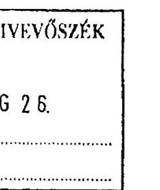

Tárgy: A V-3004-37-7/2011. sz. Jelentés-tervezettel kapcsolatos észrevételek
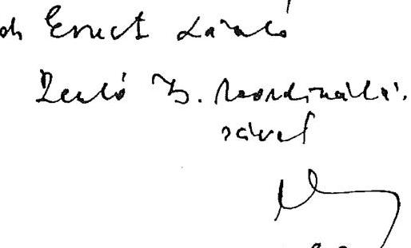

# Az Emut adatai! 

## Az előzőek ismeretében.

## Tisztelt Elnök Úr!

A Pécs Megyei Jogú Város Önkormányzata pénzügyi helyzetének ellenőrzéséről (43/3) készített V-3004-37-7/2011. sz. Jelentés-tervezet áttanulmányozását követően az abban foglaltakkal összefüggésben az alábbi észrevételt tesszük, illetve tájékoztatjuk a városunk pénzügyi helyzetének javítását szolgáló 2011. évi intézkedéseinkről:
1.) A Jelentés-tervezet 21. oldalán az Önkormányzat 2010. év végén fennálló, 60 napot meghaladó szállítói tartozásaival kapcsolatos megállapítással összefüggésben (miszerint a Polgármester a helyi önkormányzatok adósságrendezési eljárásáról szóló 1996. évi XXV. tv. 5.§ (2) bekezdésében foglaltak ellenére nem kezdeményezett adósságrendezési eljárást) kérjük figyelembe venni az alábbi indokolást:
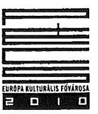

II-7621 PÉCS - Széchenyi tér 1. - Postacím: II-7602 Pécs - Pf. 58.
Telefon: +36 (72) 533-M00*. 533-M07 - Fax: +36 (72) 212049

---

Az Önkormányzat 2010. év végi szállítói tartozásából a lejárt tartozás 204 millió Ft volt. A 91 napot meghaladó tartozások egyrészt a Polgármesteri Hivatalhoz, másrészt pedig a Mecsek-Dráva Regionális Szilárdhulladék Kezelő Rendszer Létrehozását Célzó Önkormányzati Társuláshoz kapcsolódtak. Ez utóbbi társulásnak Pécs M.J.V. Önkormányzata látja el a gesztori feladatait, ezért szerepelnek adatai az összesített adatok között.
A Polgármesteri Hivatalnál kimutatott lejárt szállítói tartozások nem tekinthetők valódi lejárt tartozásoknak, mivel ezek a Pécs Európa Kulturális Fóvárosa projekthez kapcsolódó pályázatok szállítói finanszírozásából adódnak. Ezen számlák támogatási összegének kifizetése (a számla támogatáson felüli összege kifizetésének igazolása mellett) közvetlenül a szállító, vagy az engedményes bankszámlájára történik a közreműködő szerv útján, melynek rendezése időben eltolódik, így az Önkormányzattól független.
A számlák Önkormányzat által fedezett önrészének kifizetése határidőre megtörtént.
2.) Tájékoztatás Pécs Megyei Jogú Város 2011. évben megvalósított és előkészített intézkedéseiről a gazdálkodás stabilitását illető lépésekről, beleértve a tervezett megoldásokat is.
2010. év tavaszán az önkormányzatnál lezajlott átvilágításokat követően gyors ütemben elindult a Város stabilitásának megteremtését célzó átalakítások megvalósítása. Eközben a 2010-es évet az Európa Kulturális Fóvárosa rendezvénysorozat lebonyolítása, valamint az ehhez kapcsolódó beruházások befejezése és az ezek kapcsán felmerülő finanszírozási problémák tisztázása is jellemezte.

Mindennek ellenére a 2010. év finanszírozási problémák nélkül zajlott, a Város rendelkezésére álló 7 milliárd forintos folyószámla hitelkeret az előzetes tervekkel szemben 2011. június végéig fedezetet nyújtott a működés és a kisebb megkezdett fejlesztések finanszírozására is.

Csak kiemelés szerűen és jellemzésül az alábbiakban részletezzük a megtett intézkedéseket.

- 2009. év őszén pótköltségvetést készített az Önkormányzat, amelyben az előző jogszabályhoz képest kevesebb hiánnyal és jelentős centralizált döntésekkel elérte azt, hogy a 2009. évi költségvetési hiány a tervezetthez képest csökkent, de még így is a 3 milliárdot meghaladó finanszírozási hiány jelentkezett.
- A 2010. évben már a költségvetés elfogadásakor jelentős megszorításokat irányzott elő az Önkormányzat, amelyek végrehajtása jórészt megtörtént, illetve előkészítette az Önkormányzat a 2011. évi változásokat.

---

A 2010. évi költségvetés végrehajtásához átmeneti költségvetési rendeletet léptetett életbe, amely úgy a Polgármesteri Hivatal által kezelt előirányzatokra, mint az intézményekre, de a vállalati kör egy részére is nagyobb fegyelmet követelő takarékos gazdálkodás körülményeit valósította meg.

- Átszervezésre került a Polgármesteri Hivatal, amely megközelítőleg 100 fős létszámcsökkenést jelentett, természetesen úgy, hogy ezek valós hatásai részben 2011-ben, kisebb részben 2012. évben jelentenek igazi megtakarításokat.
- Kidolgozásra kerültek és a Közgyűlés el is fogadta a Hivatal, az intézmények, a vállalatok átszervezését, valamint a fejlesztés és

 a városműködtetés új koncepcióját.
- Minden terület vonatkozásában egyszerűbb, költségtakarékosabb megoldások kerültek elfogadásra nem titkoltan jelentős ellenállások, illetőleg időhúzó taktikák körülményei között.
- Megvalósult az OTP NYRt-re alapozott cash-pool rendszer alapját képező Elszámolóház (Pécs Városi Költségvetési Központi Elszámoló Szervezet), amelynek felállítása az intézmények döntő többségének biztosít szolgáltatásokat és az ehhez kapcsolódó, a gazdasági munkakörök átszervezése folytán 2011. január 1-jével végrehajtott létszámleépítések meghaladják a 40 főt.
- Elkészült a vagyonkataszter megfelelő szoftvere és a Város vagyonának felmérése megkezdődött.
- Az intézmények területén megvalósultak a legalapvetőbb átcsoportosítások, de elsődlegesen azok, amelyek az EKF kapcsán létrejött nagy intézmények megtöltésére szolgálnak, tehát kulturális, művelődési területek, ahol jelentős ingatlanok is felszabadulnak.
- A sportlétesítmények és működés területén létrejött az egységes működtető szervezet, várhatóan 10-15%-os költségmegtakarítást eredményezve ezen a komplex területen.
- A szociális intézményhálózat (bentlakásos ellátás) átadásra került a Baptista Egyháznak 2011. évben, de ennek előkészítése meglehetősen hosszú folyamatot vett igénybe.

---

- Az oktatási intézmények vonatkozásában nem lehet előbb megvalósítani a létszámleépítéseket és működési racionalizálásokat, csak 2011. szeptemberétől. Döntött a Közgyűlés arról, hogy első lépésben a racionalizálási lépések mellett 112 fő elbocsájtására kerül sor.
- Az oktatási intézmények területén a megszüntetések szükségessége még számítás alatt van, de erre is sor fog kerülni 2012. év folyamán, várhatóan szeptemberi belépéssel.
- A vállalatok területén a legnagyobb változások azt eredményezték, hogy a Város vagyonközpontja, fejlesztő szervezete és működtető rendszere kialakításra került és a BIOKOM bázisán létrejött a „stadtwerke" típusú lényegesen olcsóbb és hatékonyabb városüzemeltető szervezet.
- Kiemelkedően jó eredménynek tartjuk, hogy az EKF lebonyolítására és végrehajtására létrejött szervezetek gyakorlatilag úgy szűntek meg, hogy az új feladatellátási struktúrába beintegrálásra kerültek és a még megmaradó feladatokat is ezek a szervezetek viszik tovább.
- A költségvetési gazdálkodás területén jelentős szigorításokat és e mellett centralizációt hajtottunk végre, amelynek eredményeként a folyó költségvetési hiány a tervezett szint alatt marad, de a központi finanszírozások elmaradása miatt az elképzeltnél több likvid forrás ideiglenes igénybevételére került sor.
- A költségvetési gazdálkodásban eddig elért megtakarítás több mint 2 milliárd forint, amely összegekből finanszírozni tudtuk az EKF által igényelt működési többletkiadásokat, de ezekkel az összegekkel a következő évben már csak töredékében kell számolni, tehát más feladatok finanszírozására szolgálhatnak, vagy megtakarításként jelentkeznek.
- Szükséges még megoldani néhány terület átszervezését, amely átszervezésekről a 2011. évi költségvetéshez elkészített és jóváhagyott határozati javaslatsor intézkedett.
- A felsoroltak mellett az Önkormányzat folyamatosan csökkentette az államháztartáson kívülre adott támogatásokat és a nem kötelező feladatok ellátását folyamatosan a minimális szintre kívánja csökkenteni, megfelelő térítési díjak mellett, valamint tevékenységi privatizációkkal kísérli meg segíteni a fenntartható Önkormányzat kereteinek kialakítását.
- Tovább folytatja a Város a tevékenységek át, illetőleg kiszervezését civil szervezetek és igazolt egyházak felé, de a várható változások függvényében

---

a megyei önkormányzattal történő együttműködések is a Város elképzelését jelentik.

- A vállalati átalakítások területén megtörtént lépések már eddig is igazolták az előzetes várakozásokat, de a jelentősebb közszolgáltatásokat biztosító vállalatok helyzetének rendezése nem valósult meg, és várhatóan 2011. évben ezekre nem is kerül sor vagy csak 1-2 vállalat esetében.
- Mindemellett a 2011. évben a Városban gyakorlatilag leálltak a fejlesztések, csak a legszükségesebb karbantartásokról és felújításokról gondoskodik az Önkormányzat.
- A megtett és megteendő intézkedések mellett azonban jól látszik, hogy a jelenlegi finanszírozási szerkezet meg kell, hogy maradjon, de lényegesen kisebb mértékben, azaz a hosszú távú finanszírozás mellett és ezek törlesztésével együtt szükséges lesz hosszabb távon Pécs Városának 4-5 milliárd forint közötti rövid lejáratú finanszírozásra az elkövetkezendő 3-4 évben.
- A 2011. évben jelentkező finanszírozási gondok megoldása mellett is szükség lesz az átmeneti költségvetési gazdálkodási szabályok alkalmazására ugyanúgy, mint 2009. évben, de ennek eredményeként már a végső és fenntartható közszolgáltatási szerkezet kialakítására kerülhet sor.

# Tisztelt Elnök Úr! 

Kérem, hogy a jelentés véglegesítése során észrevételeinket figyelembe venni és a végleges jelentésbe beépíteni szíveskedjék.

Pécs, 2011. augusztus 15.

---

.

---

# Dr. Páva Zsolt úr, 

polgármester
Pécs Megyei Jogú Város Önkormányzata
Pécs

## Tisztelt Polgármester Úr!

Köszönettel vettem Pécs Megyei Jogú Város Önkormányzata pénzügyi helyzetének ellenőrzéséről készített jelentés-tervezethez megküldött észrevételét, valamint a pénzügyi helyzet javítását szolgáló 2011. évi intézkedésekről szóló tájékoztatását. Pontosító észrevételére az Állami Számvevőszékről szóló 2011. évi LXVI. törvény 29. § (3) bekezdése alapján az alábbi választ adom.

A közbenső egyeztetés során a polgármester által tett észrevétel szerint:
„1.) A Jelentés-tervezet 21. oldalán az Önkormányzat 2010. év végén fennálló, 60 napot meghaladó szállítói tartozásaival kapcsolatos megállapítással összefüggésben (miszerint a Polgármester a helyi önkormányzatok adósságrendezési eljárásáról szóló 1996. évi XXV. Tv. 5. § (2) bekezdésében foglaltak ellenére nem kezdeményezett adósságrendezési eljárást) kérjük figyelembe venni az alábbi indokolást: Az Önkormányzat 2010. év végi szállítói tartozásából a lejárt tartozás 204 millió Ft volt. A 91. napot meghaladó tartozások egyrészt a Polgármesteri Hivatalhoz, másrészt pedig a Mecsek-Dráva Regionális Szilárdhulladék Kezelő Rendszer Létrehozását Célzó Önkormányzati Társuláshoz kapcsolódtak. Ez utóbbi társulásnak Pécs M.J.V. Önkormányzata látja el a gesztori feladatait, ezért szerepelnek adatai az összesített adatok között. A Polgármesteri Hivatalnál kimutatott lejárt szállítói tartozások nem tekinthetők valódi lejárt tartozásoknak, mivel ezek a Pécs Európa Kulturális Fővárosa projekthez kapcsolódó pályázatok szállítói finanszírozásából adódnak. Ezen számlák támogatási összegének kifizetése (a számla támogatáson felüli összege kifizetésének igazolása mellett) közvetlenül a szállító, vagy az engedményes bankszámlájára történik a közreműködő szerv útján, melynek rendezése időben eltolódik, így az Önkormányzattól független. A számlák Önkormányzat által fedezett önrészének kifizetése határidőre megtörtént."

A közbenső egyeztetés során az Önkormányzattól bekért további információk alapján az észrevételt - a jelentésben rögzítendő új javaslat mellett - elfogadjuk. Figyelembe vettük, hogy a 104 millió Ft 91 napot meghaladó szállítói tartozásból 18 millió Ft a Társulás tartozása és az Önkormányzatnak nem volt feladata jelezni a Társulás felé a lejárt szállítói tartozások összegét. Ezért javasoljuk, hogy az Önkormányzat tájékoztassa a Társulást a lejárt szállítói tartozások összegéről, valamint annak rendezéséről.

---

Levele alapján figyelembe vettük továbbá, hogy az Önkormányzat által leigazolt számlák támogatási részét a közreműködő szervezet határidőre nem teljesíti.

A 2011. évi intézkedések bemutatását elfogadtuk, amelyeket azonban a jelentésbe nem építünk be.

Köszönöm Polgármester Úrnak és munkatársainak az ellenőrzés során tanúsított hozzáállását, amellyel az Önkormányzatról készített pénzügyi helyzetelemzés elkészítését segítették.

Budapest, 2011. december 22.
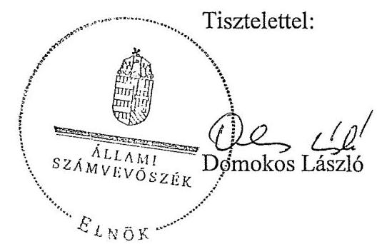

---

.

---

.
