# ÁLLAMI   SZÁMVEVŐSZÉK 

## JELENTÉS

## Salgótarján Megyei Jogú Város Önkormányzata pénzügyi helyzetének ellenőrzéséről (43/3)

---

# Számvevői Iroda 

Iktatószám: V-3045-09/2011.
Témaszám: 1015
Vizsgálat-azonosító szám: V056044

## Az ellenőrzést felügyelte:

Dr. Varga Sándor
számvevő igazgató-helyettes
Az ellenőrzést vezette:
Renkó Zsuzsanna
számvevő tanácsos
Az ellenőrzést végezték:
Bocsi Sándor
számvevő tanácsos
Lakatos József
számvevő

Baksa Anikó
számvevő
Szilágyi Nándorné
számvevő

A témához kapcsolódó eddig készített számvevőszéki jelentés:
címe
sorszáma
Jelentés Salgótarján Megyei Jogú Város Önkormányzata gazdálkodási rendszerének 2008. évi ellenőrzéséről

---

# TARTALOMJEGYZÉK 

BEVEZETÉS ..... 5
I. ÖSSZEGZŐ MEGÁLLAPÍTÁSOK, KÖVETKEZTETÉSEK, JAVASLATOK ..... 16
II. RÉSZLETES MEGÁLLAPÍTÁSOK ..... 26

1. Az Önkormányzat kötelező és önként vállalt feladatai ..... 26
2. Pénzügyi egyensúlyi helyzet alakulása ..... 32
2.1. A működési és felhalmozási egyensúly alakulása ..... 32
2.2. Az Önkormányzat bevételeinek alakulása ..... 40
2.3. Az Önkormányzat kiadásainak alakulása ..... 43
3. Kötelezettségek bemutatása ..... 48
3.1. A pénzintézetek felé fennálló kötelezettségek alakulása ..... 48
3.2. Szállítók felé fennálló kötelezettségek alakulása ..... 55
3.3. Egyéb kötelezettségek alakulása ..... 56
4. A pénzügyi egyensúly megteremtése érdekében hozott intézkedések ..... 61
5. A helyi önkormányzatok gazdálkodási rendszerének 2008. évi ellenőrzése során a pénzügyi egyensúly javítására tett szabályszerűségi és célszerűségi javaslatok hasznosulása ..... 65

---

# MELLÉKLETEK 

1. számú Működési és felhalmozási célú hiány/többlet az Önkormányzat rendeletmellékletében
2. számú Kimutatás az Önkormányzat 2007-2010. évi bevételeinek és kiadásainak melléklet alakulásáról
3.a számú Az Önkormányzat 2007-2010. években megvalósított, 2010. december 31-ig befejezett fejlesztéseinek forrásösszetételéről melléklet
3.b számú Az Önkormányzat 2010. december 31-én folyamatban lévő fejlesztési felmelléklet adataihoz kapcsolódó kötelezettségeinek összegzéséről
3.c számú Az Önkormányzat 2010. december 31-én folyamatban lévő fejlesztési felmelléklet adataihoz kapcsolódó 2010. évet követő kötelezettségvállalásainak összegzéséről
3.d számú Az Önkormányzat beadott, elbírálás alatti pályázati forrásból megvalósuló fejlesztéseihez kapcsolódó kötelezettségvállalásainak összegzéséről melléklet
3. számú Az önkormányzati feladatok ellátásában részt vevő gazdasági társaságokról melléklet
4. számú Salgótarján Megyei Jogú Város Önkormányzat Polgármesterének észrevétele
5. számú
Salgótarján Megyei Jogú Város Önkormányzat Polgármesterének észrevételére adott válasz

---

# RÖVIDÍTÉSEK JEGYZÉKE 

## Törvények

Áht.
ÁSZ tv.

Htv.

Ötv.
1996. évi XXV. tv.

## Rendeletek

SzMSz
2007. évi költségvetési rendelet

2008. évi költségvetési rendelet

2009. évi költségvetési rendelet

2010. évi költségvetési rendelet

2011. évi költségvetési rendelet

2007. évi zárszámadási rendelet

2008. évi zárszámadási rendelet

2009. évi zárszámadási rendelet

2010. évi zárszámadási rendelet

## Szórövidítések

áfa
APEH
ÁSZ
az államháztartásról szóló 1992. évi XXXVIII. törvény az Állami Számvevőszékről szóló 1989. évi XXXVIII. törvény (2011. július 1-jétől az Állami Számvevőszékről szóló 2011. LXVI. törvény)
a helyi önkormányzatok és szerveik, a köztársasági megbízottak, valamint egyes centrális alárendeltségű szervek feladat- és hatásköreiről szóló 1991. évi XX. törvény
a helyi önkormányzatokról szóló 1990. évi LXV. törvény
a helyi önkormányzatok adósságrendezési eljárásáról szóló 1996. évi XXV. törvény

Az Önkormányzat és Szervei Szervezeti és Működési Szabályzatáról szóló 7/2007. (III. 27.) számú rendelet
Salgótarján Megyei Jogú Város Önkormányzatának 2/2007. (II. 13.) számú rendelete a 2007. év költségvetéséről
Salgótarján Megyei Jogú Város Önkormányzatának 5/2008. (II. 12.) számú rendelete a 2008. év költségvetéséről
Salgótarján Megyei Jogú Város Önkormányzatának 8/2009. (II. 12.) számú rendelete a 2009. év költségvetéséről
Salgótarján Megyei Jogú Város Önkormányzatának 3/2010. (II. 15.) számú rendelete a 2010. év költségvetéséről
Salgótarján Megyei Jogú Város Önkormányzatának 9/2011. (II. 17.) számú rendelete a 2011. év költségvetéséről
Salgótarján Megyei Jogú Város Önkormányzatának 17/2008. (IV. 29.) számú rendelete a 2007. évi költségvetésének zárszámadásáról
Salgótarján Megyei Jogú Város Önkormányzatának 21/2009. (IV. 28.) számú rendelete a 2008. évi költségvetésének zárszámadásáról
Salgótarján Megyei Jogú Város Önkormányzatának 12/2010. (IV. 27.) számú rendelete a 2009. évi költségvetésének zárszámadásáról
Salgótarján Megyei Jogú Város Önkormányzatának 17/2011. (IV. 28.) számú rendelete a 2010. évi költségvetésének zárszámadásáról
általános forgalmi adó
Adó- és Pénzügyi Ellenőrzési Hivatal
Állami Számvevőszék

---

| BM | Belügyminisztérium |
| :--: | :--: |
| CÉDE | Céljellegű decentralizált támogatás |
| EDP hiány/egyenleg | uniós módszertan szerinti maastrichti kritériumoknak megfelelő számítás szerinti hiány/egyenleg |
| EU | Európai Unió |
| jegyző | Salgótarján Megyei Jogú Város jegyzője |
| Gazdasági Program | Salgótarján Megyei Jogú Város Önkormányzata 2007-2018. évekre vonatkozó Gazdasági Programja, melyet a Közgyűlés a 35/2007. (III. 27.) számú határozatával elfogadott |
| GDP | bruttó hazai termék |
| Közgyűlés | Salgótarján Megyei Jogú Város Önkormányzatának Közgyűlése |
| KSH | Központi Statisztikai Hivatal |
| LEKI | Leghátrányosabb helyzetű kistérségek felzárkóztatásának támogatása |
| NAV | Nemzeti Adó és Vámhivatal |
| NGM | Nemzetgazdasági Minisztérium |
| OEP | Országos Egészségbiztosítási Pénztár |
| Önkormányzat polgármester | Salgótarján Megyei Jogú Város Önkormányzata Salgótarján Megyei Jogú Város polgármestere |
| Polgármesteri hivatal | Salgótarján Megyei Jogú Város Önkormányzatának Polgármesteri Hivatala |
| PPP konstrukció | Public Private Partnership (Partnerségi együttműködés közfeladatok ellátására a magánszektor bevonásával) |
| szja | személyi jövedelemadó |
| társulások | Nógrád Megyei Szakképzés-szervezési Társulás és Kelet-Nógrád Hulladékhasznosító Társulás |
| többcélú kistérségi társulás | Salgótarjáni Kistérség Többcélú Társulása |
| TEKI | Területi kiegyenlítést szolgáló fejlesztési támogatás |
| TEUT | Települési önkormányzati szilárd burkolatú belterületi közutak burkolat-felújításának támogatása |
| TRFC | Terület- és régiófejlesztési célelőirányzat |

---

# JELENTÉS 

## Salgótarján Megyei Jogú Város Önkormányzata pénzügyi helyzetének ellenőrzéséről

## BEVEZETÉS

Az Állami Számvevőszék 2011. évtől érvényes stratégiája új irányt szabott a helyi önkormányzatok gazdálkodásának ellenőrzésében is. Az ÁSZ – küldetése és jövőképe szerint – szilárd szakmai alapokra támaszkodva értékteremtő ellenőrzéseivel és helyzetelemzéseivel az államháztartás egészében, így a helyi önkormányzati alrendszerben is elő kívánja segíteni a közpénzek és a közvagyon szabályos, gazdaságos, hatékony és eredményes hasznosítását. Ennek részeként – a 2010. évi államháztartási hiány alakulásának összetevőire is figyelemmel – folyamatban van az önkormányzati alrendszer pénzügyi helyzetelemzése.

Az NGM 2011. áprilisában közzétett adatai szerint ${ }^{1}$ a 2010. évi 1036,2 milliárd Ft összegű 3,8%-os EDP (maastrichti kritériumok szerinti, Túlzott Hiány Eljárás keretében kimutatott) hiánycél nem volt tartható, az önkormányzati alrendszer tervezettet meghaladó hiánya miatt a GDP arányában kifejezett államháztartási hiány 4,2%-ra emelkedett.

Az önkormányzatok 2010. első három negyedévi költségvetési jelentése szerinti pénzforgalmi hiány 97 milliárd Ft-os összege nem indokolta az önkormányzati alrendszer 190 milliárd Ft-ra becsült hiányának 2010. évi végi felülvizsgálatát. A helyi önkormányzatok 2011. januári gyorsjelentése alapján a pénzforgalmi hiány már 247,7 milliárd Ft-ot tett ki. Az alrendszer hiánya így a tervezett 0,7%-kal szemben magasabb, 0,9%-os szinten realizálódott. Az 57,7 milliárd Ft hiánytöbblet alakulásában – a Tájékoztató szerint – az iparűzési adó elmaradása, a gépjárműadó, az illetékek és más bevételek tervezettnél alacsonyabb összegben való teljesülése volt a meghatározó.

Magyarország a Széll Kálmán Terv célkitűzései alapján ${ }^{2}$ aktualizált Konvergencia Programjában a középtávú (2011-2015. évek) költségvetési pálya kijelölése során 2011-re a kormányzati szektor EDP módszertan szerinti egyenlegét +2%-ban jelölte meg. Az egyenlegcél megfogalmazásakor az önkormányzati alrendszer tervezett hiányát a 2011. évi költségvetésben szereplő 0,3%-kal szemben 0,5%-os arányban határozták meg ${ }^{3}$. A hiánycélok meghatározása jelzi, hogy az önkormányzati alrendszerben 2011-ben fokozott figyelmet kell fordítani a pénzügyi egyensúlyi helyzet alakulására.

Az államháztartás helyi szintjén a 23 megyei jogú városi önkormányzatnak az általuk ellátott közszolgáltatások volumenére való tekintettel kiemelt szerepe van, e települések népessége összességében meghaladja a kétmillió főt ${ }^{4}$. A települések népességét az alábbi diagram szemlélteti:
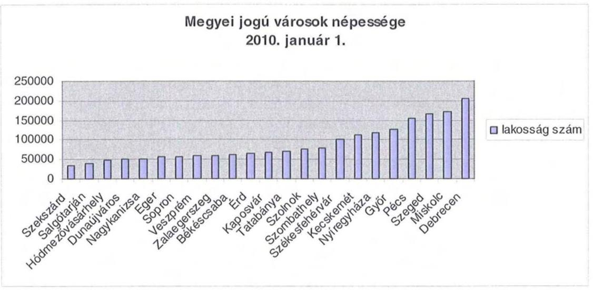

A megyei jogú városi önkormányzatok ${ }^{5}$ kötelező feladatellátását többlépcsős törvényi előírások határozzák meg. A feladatokra vonatkozó szabályozás első szintjét az Ötv. ${ }^{6}$, a második szintet a hatásköri ${ }^{7}$, a harmadik szintet a további ágazati, szakmai (egyebek mellett az oktatási, egészségügyi, szociális és egyéb ágazati feladatok ellátásának szakmai szabályait rögzítő) törvények adják.

A megyei jogú városi önkormányzatok – az Ötv-ből közvetlenül levezethető települési feladatok mellett – körzeti közszolgáltatásokat is ellátnak. A megyei

[^0]
[^0]:    ${ }^{1}$ NGM Tájékoztatás Magyarország Strukturális Reformprogramjának végrehajtásáról (2011. április 1.). A Tájékoztató évente két alkalommal – április és október hónapban – jelenik meg.
    ${ }^{2}$ Az államháztartás 2011. évi egyenlege – a magán nyugdíjpénztárakból az állami nyugdíjpillérbe való visszatérés egyszeri vagyonhatása következtében – 4%-os többletet mutatna. A Széll Kálmán Tervben foglalt egyszeri intézkedések – a MÁV, a BKV adósságrendezése, a PPP projektek kiváltása – összességében a GDP 2%-ával csökkentik a várható többlet mértékét.

[^0]
[^0]:    ${ }^{3}$ A Magyar Köztársaság 2011. évi költségvetéséről szóló 2010. évi CLXIX. törvény Általános indoklásának III. fejezete, valamint Magyarország Konvergencia Programja 2011-2015. (2011. április) Táblázatok rész, 2. táblázat Államháztartás összefoglaló adatai szerint.
    ${ }^{4}$ A megyei jogú városok népességét a 4/2011. (I. 31.) NGM rendelet 1. sz. mellékletében foglalt 2010. január 1-i adatok alapján vettük figyelembe.
    ${ }^{5}$ Az Ötv. 61. § (1) bekezdése alapján a megyeszékhely város a törvény erejénél fogva megyei jogú, ugyanakkor az Országgyűlés az ötvenezernél nagyobb népességű városokat a képviselőtestület kérelmére megyei jogú várossá nyilváníthatja. Ez utóbbi körbe 5 város tartozik, közülük 2 (Hódmezővásárhely, Dunaújváros) népessége 2010. január 1-ére már ötvenezer fő alá csökkent.
    ${ }^{6}$ az Ötv. 8. és 61. §-ában foglaltak szerint
    ${ }^{7}$ a Htv.

jogú városi cím elsősorban többlet kötelezettségekkel jár, a megyei jogú városnak önmagának kell gondoskodnia mindazokról a feladatokról, amelyek más települési önkormányzatok esetében a megyei önkormányzat feladatát képezik. Ide sorolható többek közt a középfokú oktatási intézmények fenntartása, a közművelődési, könyvtári és levéltári szolgáltatás, a társadalombiztosítás finanszírozása mellett a kórházi és a rendelőintézeti szakellátás, a szociális és egyes gyermekvédelmi feladatok ellátása. Ezeket a feladatokat (intézményeket) a megyei jogú város – más városoktól eltérően – nem adhatja át a megyei önkormányzatnak, azonban az Ötv. lehetőséget biztosít arra, hogy a megyei önkormányzattal megállapodjék a feladatellátás megosztásában.

Az önkormányzat, így a megyei jogú város is, maga határozza meg, hogy – a lakosság igényei alapján, anyagi lehetőségei függvényében – mely feladatokat, milyen mértékben és módon, mely szervezeti keretek közt lát el. A szervezetalakítás szabadsága a megyei jogú városok esetében azzal járt, hogy mind a kötelező közszolgáltatásoknál (különösen a településüzemeltetés, vagyongazdálkodás), mind pedig az önként vállalt feladataik ellátásában – elsősorban a sport és kulturális szolgáltatások területein – a gazdasági társaságok kiemelt fontosságú szerephez jutottak. Ily módon a gazdálkodás, a pénzügyi helyzet kockázatai közvetlenül kikerültek ugyan az önkormányzati alrendszerből, azonban sérülhet az ellátási felelősség figyelemmel kísérése és érvényesítése, a közpénzek felhasználásának transzparenciája. Mindezek együttvéve – a beszámolók konszolidálásának hiányában – növelik a megyei jogú városok pénzügyi helyzetének megítélésében rejlő kockázatokat.

Az áttekintett időszakban az önkormányzati feladatok ellátásának keretet biztosító forrásszabályozás elvei lényegesen nem változtak.

A megyei jogú városok önkormányzatainak mozgásterét, az önkormányzatok feladatellátásra vonatkozó döntéseit a központi költségvetéstől való függőség mellett jelentősen befolyásolja a helyi adókivetési jog gyakorlása ${ }^{8}$. A helyi adók rendszere a közszolgáltatások finanszírozásához szükséges források megteremtésének, bővítésének eszköze, amely a gazdasági válság, a jogszabályi környezet, az adópolitika változása, az adóhatóságok tevékenysége következtében differenciáltan érinti a települési önkormányzatokat ${ }^{9}$.

A települési önkormányzatok saját folyó bevételeinek keretében
 elszámolt, különböző jogcímeken kivetett helyi adók - iparűzési adó, építmény és telekadó, idegenforgalmi adó, vállalkozók és magánszemélyek kommunális adója - 2007-2010 között eltérő módon emelkedtek. A helyi adókból származó bevételek realizált összege országos szinten 2007-2009 között folyamatosan, 505,3 milliárd Ft-ról 566,3 milliárd Ft-ra emelkedett, majd a gazdasági válság hatásai következtében 2010-re 542,6 milliárd Ft-ra esett vissza. A helyi adók részesedése

[^0]
[^0]:    ${ }^{8}$ a helyi adókról szóló 1990. évi C. törvény szabályai szerint
    ${ }^{9}$ Az Állami Számvevőszék 2010 decemberében közzétett 1031. számú jelentésében értékelte a helyi adók rendszerében a hatékonyság és az eredményesség érvényesülését.

---

az önkormányzatok saját folyó bevételein belül 2007-2010 között 2,5 százalékponttal csökkent ${ }^{10}$.

A megyei jogú városok saját folyó bevétele 2007-ben 191,5 milliárd Ft volt, 2008-ban 223,1, 2009-ben 225,4, 2010-ben 223,5 milliárd Ft-ot tett ki. A helyi adóbevételekből való részesedésük 2007-ben 110,5 milliárd Ft (21,9%), 2008-ban 128,3 milliárd Ft (23,2%), 2009-ben 124,4 milliárd Ft (22%), 2010-ben 118,7 milliárd Ft (részaránya a 2007. évivel azonosan 21,9%) volt. E realizált adóbevételek a megyei jogú városok saját folyó bevételeinek 2007-ben 57,7, 2008-ban 57,5, 2009-ben 55,2, 2010-ben 53,1%-át jelentették. A helyi adóbevételek 2007-ről 2010-re kimutatott 4,6 százalékpontos csökkenése annak ellenére következett be, hogy a megyei jogú városok saját folyó bevétele 2010-ben 16,7%-kal haladta meg a 2007. évit.

A helyi adókon belül a települések gazdasági helyzetének egyik fokmérője az elért helyi iparűzési adóbevétel, amely a megyei jogú városok körében erőteljes - a település nagyságrendtől is függő ${ }^{11}$ - különbségeket mutat. A helyi iparűzési adóbevétel és annak egy lakosra vetített összegének 2007. és 2010. évi alakulását az alábbi diagramok szemléltetik:
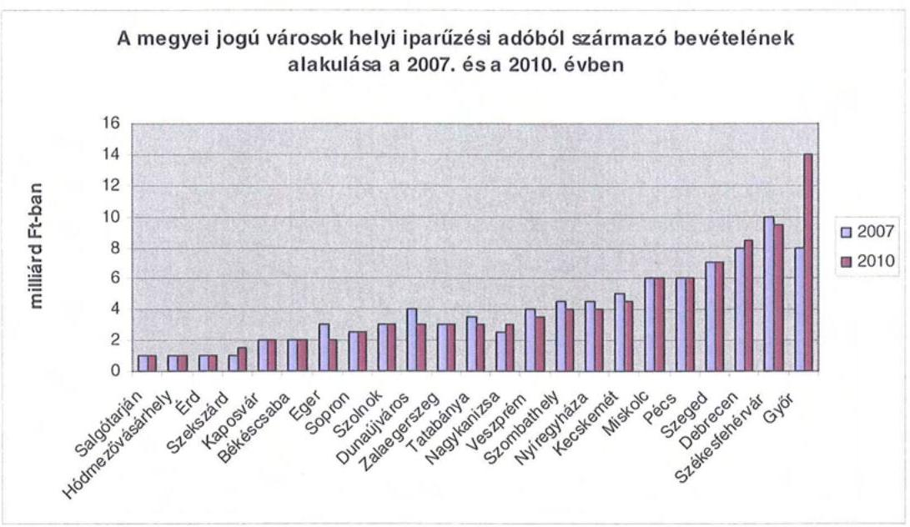

[^0]
[^0]:    ${ }^{10}$ A helyi adó bevételek saját folyó bevételekből való részesedése országosan 2007-ben 55,3%, 2010-ben 52,8% volt.
    ${ }^{11}$ A 100 ezer fő feletti népességű megyei jogú városok csoportjába Debrecen, Miskolc, Szeged, Pécs, Győr, Nyíregyháza, Kecskemét, Székesfehérvár tartozik. Nem megyeszékhely megyei jogú város Érd, Sopron, Nagykanizsa, Dunaújváros, Hódmezővásárhely.

---

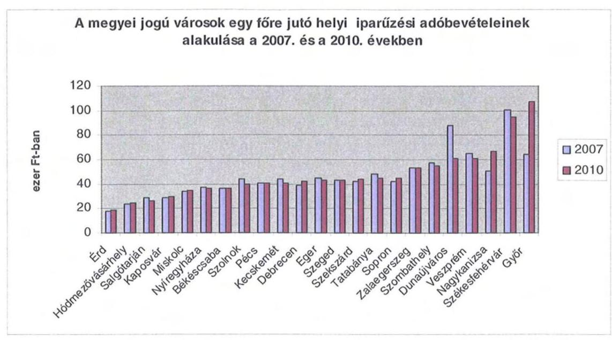

A megyei jogú városi önkormányzatok saját bevételein belül második legjelentősebb elem az illetékbevétel. A 2010. évben befolyt 39,2 milliárd Ft illetékbevétel a 2006. évben realizált 71,1 milliárd Ft illetékbevétel alig több mint 55%-a. A jelentős visszaesést döntően az ingatlanpiac stagnálása, majd visszaesése, illetve egyes illetékkedvezmények bevezetése okozta. A kieső bevételek pótlására az önkormányzati alrendszer szintjén történtek intézkedések, 2010-ben 5 milliárd Ft-ot, 2011-ben 1,2 milliárd Ft-ot ellentételezett a központi költségvetés. A megyei jogú városok önkormányzatai az önkormányzati alrendszer szintjén realizált illetékbevételből 2007-ben 13,6 milliárd Ft-tal (23,3%-kal), 2008-ban 15,3 milliárd Ft-tal (22,7%-kal), 2009-ben 12,6 milliárd Ft-tal (21,5%-kal), 2010-ben 7,9 milliárd Ft-tal (20,2%-kal) részesedtek ${ }^{12}$. Az összes befolyt illetékbevételből a megyei jogú városok részesedése 2009-ről 2010-re mindössze 1,3 százalékponttal csökkent, ugyanakkor a realizált illetékbevétel csökkenése a 37,3%-ot (4,7 milliárd Ft) is elérte.

Az önkormányzati alrendszer átengedett bevételei közül a személyi jövedelemadóból való részesedés makroszintű szabályozása a vizsgált időszakban nem változott. A települési önkormányzatokat a településre kimutatott személyi jövedelemadó 8%-a közvetlenül, míg 32%-a külön szabályozott visszaosztási rendben illeti meg. A visszaosztás a jövedelem differenciálódás mérséklésével párosul, rendje a lakóhelyen maradó személyi jövedelemadóhoz és az iparűzési adó-erőképességhez ${ }^{13}$ igazodik, annak részletszabályait a mindenkori költségvetési törvény 4. számú melléklete határozza meg. A jövedelemdifferenciálódás

[^0]
[^0]:    ${ }^{12}$ Az illetékek kivetésének és beszedésének joga 2006. december 31-ig a megyei önkormányzatok feladata volt, amelyet a 2007. évtől az APEH (2011. január 1-jétől NAV) vett át. Az önkormányzati illetékrészesedési szabályok változatlanok maradtak, azonban az illetékbeszedés költségeit az önkormányzatok illetékbevételeiből átlagos (a megyei jogú városoknál 8,5%-os) kulcsot alkalmazva vonták le.
    ${ }^{13}$ Az iparűzési adóerő-képesség egy potenciális, átlagos erőfeszítés mellett elérhető (a települési önkormányzat iparűzési adóelőlegét meghatározó adóalap 1,4%-ának megfelelő számított) bevétel.

---

szabályai kétirányúak, a kiegészítés és a visszatartás feltételeit egyaránt meghatározták:

- Amennyiben az önkormányzatot közvetlenül megillető személyi jövedelemadó bevétel és a számított iparűzési adóerő-képesség együttesen számított, egy főre jutó összege nem érte el a település méretéhez kapcsolódóan az évenkénti szabályozás szerinti változó összeget, a költségvetés a részesedést település nagyság szerint eltérően meghatározott szintig - kiegészítette ${ }^{14}$. A kiegészítés fajlagos összege 2007-2010 között 37500 Ft-ról 48010 Ft-ra (10 510 Ft-tal, 28%-kal) emelkedett. Az előzőeken túl a jövedelem differenciálódás szabályozása egyes térségi (középiskolai, szakiskolai, szakképző intézményi, kollégiumi) feladatok ellátásának függvényében további kiegészítő hozzájárulást biztosított.
- Amennyiben az egy főre számított személyi jövedelemadó és az iparűzési adóerő-képesség együttes összege a település nagyságrendjéhez rendelt értékhatárt több mint 25%-kal (2010-től 20%-kal) meghaladta, az egy főre jutó összeg sávonként differenciált módon ${ }^{15}$ visszavonásra került az önkormányzatot megillető normatív állami hozzájárulás összegéből.

Az önkormányzatok személyi jövedelemadó bevétele 2007-ben 494,3 milliárd Ft, 2008-ban 558,6 milliárd Ft, 2009-ben 639,5 milliárd Ft, 2010-ben 681,2 milliárd Ft volt, az időszak alatt összegében 186,9 milliárd Ft-tal, 37,8%-kal emelkedett, miközben az szja bevétel átengedett bevételeken belüli részesedése 1,8 százalékponttal emelkedett.

A megyei jogú városok önkormányzatainak személyi jövedelemadó részesedése az alrendszer átengedett személyi jövedelemadó bevételeiből 2007-ben 77,6 milliárd Ft-ot (15,7%-ot), 2008-ban 105,4 milliárd Ft-ot (18,9%-ot), 2009-ben 122,9 milliárd Ft-ot (19,2%-ot), 2010-ben 136,6 milliárd Ft-ot (20,1%-ot) tett ki. A realizált szja bevétel a megyei jogú városoknál az időszak alatt folyamatosan emelkedett, a 2010-ben realizált adóbevétel 59,0 milliárd Ft-tal (76%) volt magasabb a 2007. évinél, az átengedett bevételeken belüli részesedése 2010-re 5,1 százalékponttal haladta meg a 2007. évi részarányt ${ }^{16}$. A részesedés alapjául szolgáló szja településenként eltérő, az egy adózóra jutó szja 2009. évi adatait ${ }^{17}$ a következő ábra szemlélteti.

[^0]
[^0]:    ${ }^{14}$ A megyei jogú városok esetében a jövedelemkülönbségek mérséklésénél figyelembe veendő lakosonkénti értékhatár 2007-ben 37500 Ft, 2008-ban 42385 Ft, 2009-ben 45933 Ft, 2010-ben 48010 Ft volt.
    ${ }^{15}$ A sávos értékhatár 2010-től 20%-os intervallumonként, 120% felett a visszatartást 25%-tól 90%-os mértékig rögzíti. Amennyiben a település nagyságrendhez rendelt értékhatár összege az önkormányzatnál eléri vagy meghaladja a 200%-ot, az egy főre jutó összeg 90%-a levonásra kerül. Az értékhatár sávjai 2010 előtt 25%-os léptékűek voltak, a levonási arányok az ellenőrzött időszakban nem változtak.
    ${ }^{16}$ E bevételek a megyei jogú városok átengedett bevételeiben 2007-ben 84,7, 2008-ban 87,7, 2009-ben 89,7, 2010-ben 89,8%-os részarányt jelentettek.
    ${ }^{17}$ Adatforrás: KSH Megyei Jogú Városok a Közép Dunántúlon 2009. kiadványa, 4.1. sz. összehasonlító tábla.

---

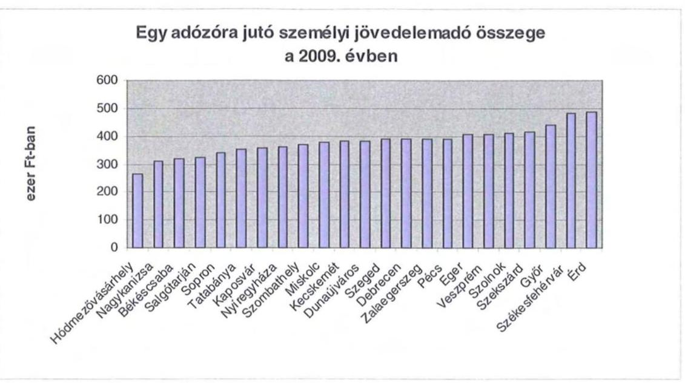

Az átengedett bevételek második legjelentősebb eleme a gépjárműadó, amelynek bevételi szabályozása az ellenőrzött időszakban nem változott, az adóbevétel teljes összege az önkormányzatot illeti meg. A gépjárműadó alapját, mértékét ${ }^{18}$ és egyes mentességi kategóriákat érintő módosítások 2010. január 1-től következtek be, amelyek az egyes adótételek esetében átlagosan 15%-os emelkedéssel jártak.

A gépjárműadó beszedéséből származó bevétel az önkormányzati alrendszer szintjén 2007-ben 62,4 milliárd Ft, 2008-ban 65,7 milliárd Ft, 2009-ben 63,8 milliárd Ft, 2010-ben 71,1 milliárd Ft volt, az adóbevétel egésze 2007-hez képest 8,7 milliárd Ft-tal, 13,9%-kal emelkedett. A gépjármű-adóztatás szabályainak változása 2010-ben 7,3 milliárd Ft többletet eredményezett. A megyei jogú városok gépjárműadó bevétele a 2007. évi 14,0 milliárd Ft-ról 2010-re 15,5 milliárd Ft-ra, 10,7%-kal emelkedett. A bevételnövekedés összegéből 1,4 milliárd Ft a 2010. évi adózási szabályok következménye.

A megyei jogú városok önkormányzatai 2007-2010 között rendelkezésre álló forrásainak alakulását a következő ábra szemlélteti:

[^0]
[^0]:    ${ }^{18}$ A gépjárműadóról szóló 1991. évi LXXXII. törvény 7. § (1) bekezdésében foglalt adómértékek változása.

---

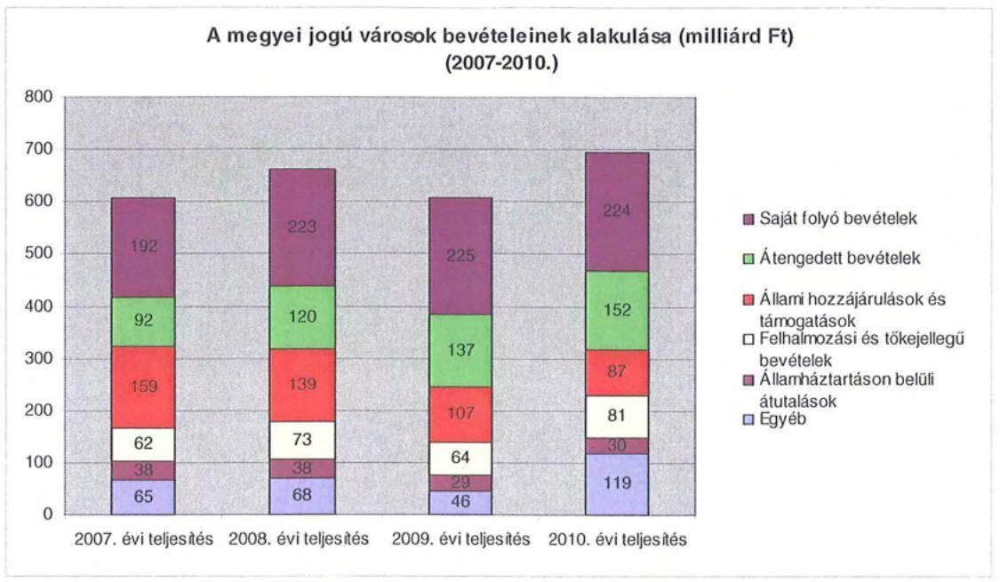

A megyei jogú városok saját folyó bevételeinek - amelyek főbb elemei: a helyi adók, az illetékbevételek, az intézményi térítési díjak, a kamatbevételek részaránya a 2007. évi összbevételen (608 milliárd Ft) belül 32% volt. A 2010. évi összbevétel 693 milliárd Ft-os összegéből a saját folyó bevételek aránya - miközben összege 2007-ről 2010-re 32 milliárd Ft-tal emelkedett - nem változott.

Az átengedett bevételek, amelyek a megyei jogú városok önkormányzatainál döntően a személyi jövedelemadó és a gépjárműadó részesedést jelenti, az összbevételen belül a 2007. évi 92 milliárd Ft-ról (15%) 152 milliárd Ft-ra nőtt, részesedése 7 százalékponttal emelkedett. A 60 milliárd Ft-os növekedésből 59 milliárd Ft-ot az szja részesedés emelkedése okozott.

Az állami hozzájárulások és támogatások - amelyek főbb elemei: főként az ellátotti létszámhoz kötődő normatív állami hozzájárulások, központosított előirányzatok - a 2007. évi 159 milliárd Ft-ról (26%-os részarányról) 2010-re 87 milliárd Ft-ra (13%-os részarányra) estek vissza.

A felhalmozási és tőkejellegű bevételek - tárgyi eszközök (ingatlanok és ingóságok), föld és immateriális javak, részesedések értékesítése, EU-tól átvett pénzeszközök - a 2007. évi 62 milliárd Ft-ról (10%-os részarányról) 2010-re 81 milliárd Ft-ra (12%-os részarányra) emelkedtek.

Az államháztartáson belüli átutalások részesedése 2007-ben 38 milliárd Ft volt. 2010. év végére 8 milliárd Ft-tal csökkent, részaránya 6%-ról 2010-ben 4%-ra változott. Ez a bevételi kategória tartalmazza az Egészségbiztosítási Alaptól és más elkülönített állami pénzalapoktól átvett forrásokat. A 2010-ben e címen elszámolt bevétel a megyei jogú városoknál 22 milliárd Ft-ot tett ki.

Az egyéb, pénzmaradványból, vállalkozási bevételekből, államháztartáson kívülről származó átutalásokból, a hitelekből, a hosszú és rövid lejáratú értékpapírok értékesítéséből származó bevételek részesedése a 2007-2010. évek viszonylatában 11%-ról 17%-ra emelkedett. Ez utóbbiak 2010. évi beszámoló szerinti összevont teljesítése 119 milliárd Ft volt ${ }^{19}$.

Mindezeket figyelembe véve a megyei jogú városok 2007. és 2010. évi forrásöszszetételének megoszlását az alábbi ábra szemlélteti:

A megyei jogú városok 2007. és 2010. évi forrásösszetétele
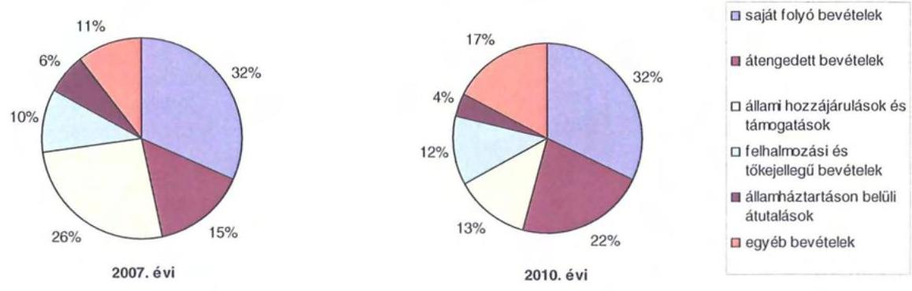

Az önkormányzati alrendszer pénzügyi helyzetértékelése során új elemzési módszereket alkalmaz az ellenőrzés. A hagyományos költségvetési szerkezet helyett az önkormányzat pénzügyi helyzetét a CLF módszerrel mutatjuk be, amelynek lényegét és számításának módszerét a 2.1. pontban, és a jelentés 2. számú mellékletében ismertetjük részletesen.

Az új módszereken alapuló helyzetértékelés fontosságát az adja, hogy a helyi önkormányzatok bruttó adósságállománya ${ }^{20}$ a 2010. évi költségvetési beszámoló alapján 1248 milliárd Ft-ot tett ki. Az adósságállomány koncentráltságát jelzi ${ }^{21}$, hogy ebből a 23 megyei jogú város részesedése 338 milliárd Ft volt, amely a fővárosi és kerületi önkormányzatok adósságának figyelmen kívül hagyásával számított 2010. évi 977 milliárd Ft összegű bruttó adósságállomány 34,6%-át jelentette. Az adósságállomány több mint fele - 501 milliárd Ft - a 19 megyei önkormányzatnál és a 23 megyei jogú városnál jelentkezett.

[^0]
[^0]:    ${ }^{19}$ Az egyéb bevételek összege 2007-2010 között eltérő módon változott, 2007-ben
 65 milliárd Ft, 2008-ban 68 milliárd Ft volt, 2009-ben 46 milliárd Ft-ra esett vissza, majd 2010-ben több mint két és félszeresére, 119 milliárd Ft-ra emelkedett.
    ${ }^{20}$ A bruttó adósságállomány 2010. év végi összege magában foglalja a fejlesztési és a működési célú kötvénykibocsátások, a beruházási és fejlesztési hitelek, a működési célú hosszú lejáratú hitelek, a rövid lejáratú hitelek, váltótartozások miatti kötelezettségek teljes (2011-ben, illetve az azt követő években esedékes) állományát.
    ${ }^{21}$ A megyei jogú városok adósságállománya összegében ugyan elmarad az egyéb városok összesített adósságától [(ez utóbbiak részesedése 382,6 milliárd Ft (39,2\%)], azonban az egyéb városok száma 304. A fővárosi és a kerületi önkormányzatok nélküli adósságállományból a 19 megyei önkormányzat 163 milliárd Ft-tal (16,8\%-kal), míg a nagyközségek, községek együttesen 93 milliárd Ft-tal (9,5\%-kal) részesednek.

---

A megyei jogú városok 338 milliárd Ft-os adósságállományából 175 milliárd Ft (51,8\%) a 8 legnagyobb, 100 ezer fő feletti népességű város tartozása. Az 5 nem megyeszékhely megyei jogú város bruttó adósságállománya 70 milliárd Ft-ot (20,7\%-ot), az előző két csoportba nem tartozó további 10 megyei jogú város adóssága 93 milliárd Ft-ot (27,5\%-ot) tett ki.
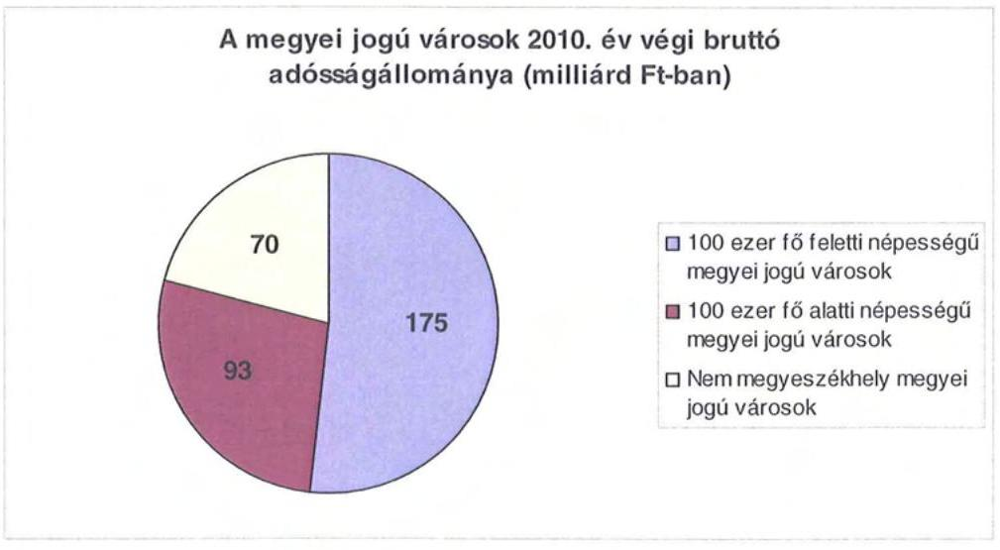

A mérlegben kimutatott bruttó adósságállomány mellett az önkormányzatok számára az eszközállomány műszaki állapotának megőrzése is kötelezettségekkel jár. Az elhasználódott eszközök pótlására forrást biztosító amortizációs (felújítási) alap képzésének ${ }^{22}$ elmaradása maga után vonhatja a feladatellátást kiszolgáló tárgyi eszközök állagának erőteljes romlását. Emellett a 2007-2013-as időszakra meghirdetett, vissza nem térítendő EU-s fejlesztési forrásokhoz való hozzájutás lehetősége felerősítette az önkormányzati alrendszer fejlesztési igényeit, amelyek a felhalmozási költségvetési hiány folyamatos emelkedésén túl - az előírt jövőbeni fenntartási kötelezettség miatt - tovább terhelhetik az önkormányzatok költségvetését ${ }^{23}$.

Az ÁSZ a 2011. évi ellenőrzési tervében 43. számú, az Önkormányzatok gazdálkodási rendszerének ellenőrzése részeként egy időben, egymással párhuzamosan tekinti át, és elemzi a 23 megyei jogú városi önkormányzat pénzügyi helyzetét. A gazdálkodás szabályszerűségét az ÁSZ az előző évek során ebben az önkormányzati körben is ellenőrizte, ezért jelen vizsgálatunk erre nem tér ki. A jelentés a megyei jogú városok sajátos feladatellátási és forrásszabályozási helyzeté-

[^0]
[^0]:    ${ }^{22}$ Erre a jelenlegi szabályozási környezetben nem kötelezi semmilyen előírás az önkormányzatokat.
    ${ }^{23}$ Az Állami Számvevőszék 2011 júniusában közzétett 1108. számú, a helyi önkormányzatok fejlesztési célú támogatási rendszerének ellenőrzéséről szóló jelentésében feltárta a fejlesztési folyamatok problémáit. A helyi önkormányzatok elsősorban azokat a fejlesztéseket valósították meg, amelyekhez támogatást lehetett igényelni. A fejlesztési célok közül a magasabb támogatás intenzitású pályázatokat részesítették előnyben. A fejlesztéssel megvalósuló létesítmények jövőbeli üzemeltetésének várható ráfordításait az önkormányzatok 71,9\%-a nem mérte fel.

---

re tekintettel az önkormányzatok pénzügyi helyzetét, illetve az ezzel összefüggő korábbi ÁSZ javaslatok megvalósítását mutatja be.

Az ellenőrzés a 2007. január 1. - 2010. december 31. közötti időszakot öleli fel.
A vizsgálat jogszabályi alapját az Állami Számvevőszékről szóló 1989. évi XXXVIII. törvény 2. § (3), (5), (6) és (9) bekezdései ${ }^{24}$, az Ötv. 92. § (1) bekezdése, az Áht. 104. § (3), és 120/A. § (1) bekezdése előírásai képezik.

[^0]
[^0]:    ${ }^{24}$ 2011. július 1-jétől az Állami Számvevőszékről szóló 2011. évi LXVI. törvény 5. § (2)(5) bekezdése

---

# I. ÖSSZEGZŐ MEGÁLLAPÍTÁSOK, KÖVETKEZTETÉSEK, JAVASLATOK 

Az Önkormányzat - adatszolgáltatása szerint - működési költségvetési kiadásaiból (9777 millió Ft) 9321 millió Ft-ot (95\%) a kötelező feladatok, 456 millió Ft-ot (5\%) az önként vállalt feladatok ellátására fordított. A kötelező feladatok megállapítása az Önkormányzat SzMSz szerinti besorolásának megfelelően készült, az SzMSz az önként vállalt feladatokat nem nevesítette. Az önkormányzat legjellemzőbb önként vállalt feladatai az ingatlanhasznosítás, televíziós műsorszolgáltatási tevékenység és a civil szervezetek támogatása.

Az Önkormányzat feladatellátásának szervezeti struktúráját a következő ábra szemlélteti:
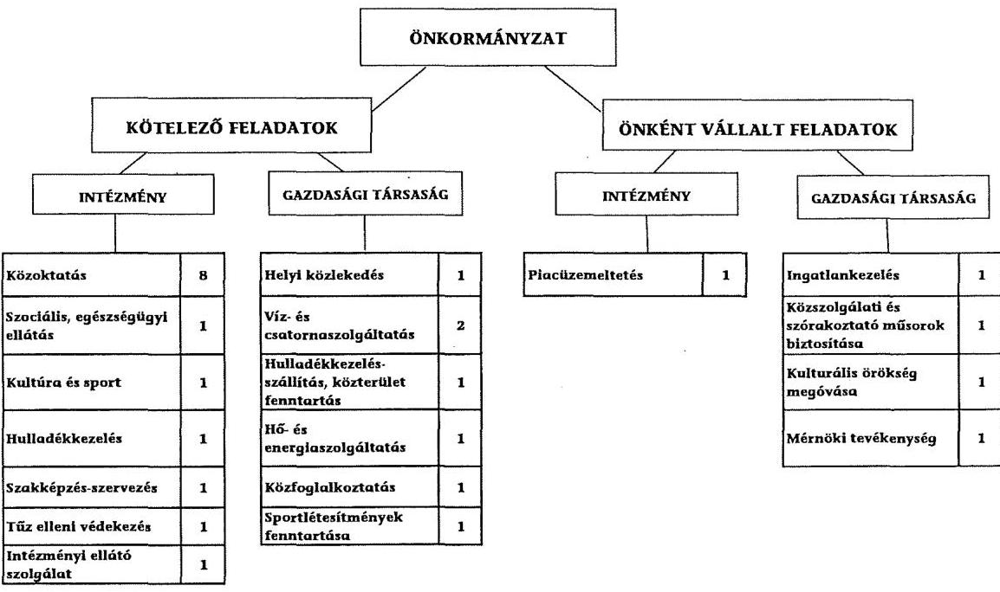

Az Önkormányzat feladatait 2010. december 31-én (a Polgármesteri hivatallal együtt) 16 költségvetési szervvel és tíz 25\% feletti tulajdoni hányadú gazdasági társaságával, továbbá egy - az önkormányzattól tulajdonosi szempontból független gazdasági társaság közreműködésével látta el. Az Önkormányzat az áttekintett időszakban szakképzési közszolgáltatási feladatát integrálta a gesztorságával létrehozott szakképzés-szervezési társulásba. Az intézményszervezeti átalakítások és intézményi összevonások következtében a feladatellátás telephelyeinek száma a 2006. évi 78-ról 2010-re 97-re nőtt.

Az Önkormányzat működési kiadásokra 2010-ben 9777 millió Ft-ot fordított, amely 785 millió Ft-tal (8,7\%-kal) haladta meg a 2007. évi ráfordításokat. A működési kiadások 62\%-át az intézményi körben realizálták.

---

E kiadások fedezetéül szolgáló bevételi források 2007. és 2010. években jellemző összesített arányait a következő ábra szemlélteti:
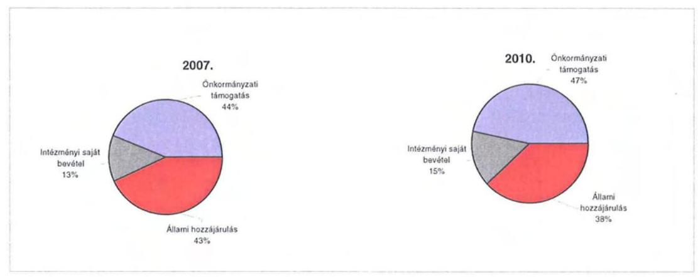

Az intézmények kiadásait 2010-ben 38\%-ban fedezte állami támogatás, ez a támogatási arány 5 százalékponttal elmaradt a 2007. évi állami támogatási részaránytól. Az Önkormányzat a kieső forrásokat az intézményi saját bevételek és az önkormányzati támogatás részarányának növelésével pótolta. Az egyes közszolgáltatások feladatellátásában résztvevő ágazati intézménycsoportok forrásösszetételének bevételi jogcímenkénti alakulását a következő ábra szemlélteti:
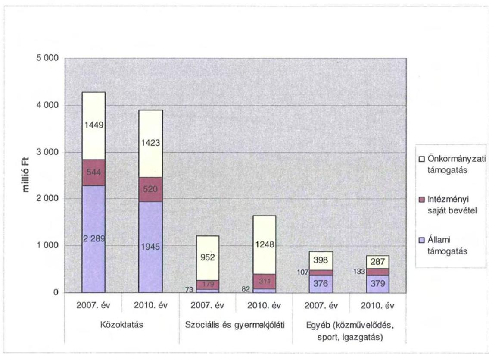

Az Önkormányzat hét gazdasági társaságban rendelkezik kizárólagos tulajdonnal, egy gazdasági társaságban 75\% feletti, egy gazdasági társaságban 50-75\% közötti, egyben 25-50\% közötti tulajdoni hányaddal. A gazdasági társaságok ingatlanhasznosítás, távhőszolgáltatás, közfoglalkoztatás, ivóvízellá-

---

tás, szennyvízelvezetés, sportlétesítmény üzemeltetés, közterület-fenntartás, hulladékkezelés, kulturális örökség megóvása, mérnöki tevékenység területén kaptak szerepet az önkormányzat feladatellátásában. Az Önkormányzat a közfeladatait ellátó gazdasági társaságok működéséhez a 2010. évben összesen 767 millió Ft rendszeres működési, 28 millió Ft eseti működési és 8 millió Ft fejlesztési pénzeszközt adott át. A működési pénzeszköz átadás 73\%-át (557 millió Ft-ot) a közfoglalkoztatás lebonyolítását végző társaság kapta. A sportlétesítményeket üzemeltető társaság pénzügyi helyzetének javítására az Önkormányzat eseti pénzeszköz átadásként 28 millió Ft-ot biztosított.

A társaságok pénzügyi helyzete alapvetően stabil. A saját tőke- jegyzett tőke arányánál - két társaság kivételével - nem történt kedvezőtlen változás. A sportlétesítményeket üzemeltető társaság felhalmozódó fizetési kötelezettségének teljesítésére nyújtott eseti pénzeszköz átadás közvetetten hozzájárult a saját tőke arányának javulásához. Az Önkormányzat 44\% tulajdoni részaránnyal bír a kulturális örökségvédelmi feladatokat ellátó társaságban, mely működőképességének helyreállítására az Önkormányzat 2010-ben 2,5 millió Ft törzstőke emelést hajtott végre.

A folyó költségvetés egyenlege (működési jövedelem) 2007-2010 között működési forrástöbbletet mutatott, melynek összege az utolsó évben volt a legalacsonyabb (85 millió Ft). A tőketörlesztés összege lendületesen emelkedett, 2010-ben 910 millió Ft-ot tett ki. A működési megtakarítások egyik évben sem fedezték a tárgyévben jelentkező tőketörlesztési kötelezettségeket, így az Önkormányzat pénzügyi kapacitása (nettó működési jövedelme) évről-évre növekvő mértékű negatív értéket mutatott, 2010-ben 825 millió Ft-tal haladta meg a tőketörlesztés a működési jövedelmet.
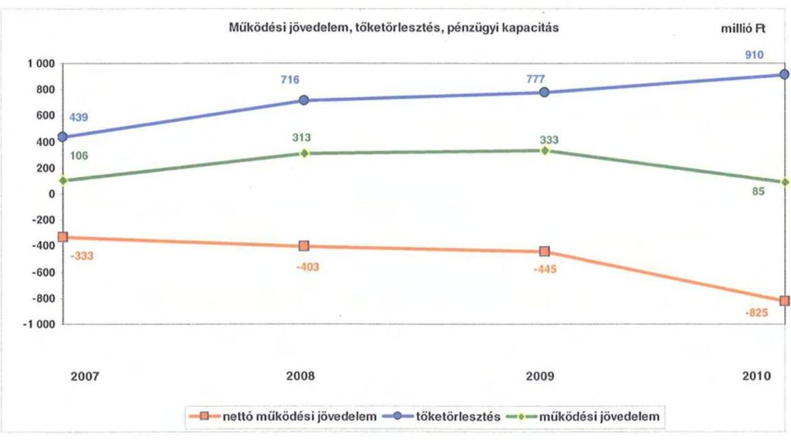

---

A 2007-2010. években az Önkormányzat felhalmozási költségvetésének egyenlege folyamatosan negatív összegű volt, amely 2007-2010. között összesen 1566 millió Ft felhalmozási forráshiányt okozott.

A pénzügyi egyensúly fenntartása külső források bevonásával volt biztosítható. A 2007-2010. években 2842 millió Ft hitelt törlesztettek. Az adósságszolgálat, továbbá a felhalmozási forráshiány 2007-2010. között 4408 millió Ft-ot tett ki, amelyre az időszakban képződő 837 millió Ft működési megtakarítás (működési jövedelem), valamint a 2007. január 1-jén rendelkezésre álló 1113 millió Ft pénzkészlet szolgált fedezetül. A további pénzeszközöket 3727 millió Ft hitel felvételéből teremtették meg. A kialakult pénzügyi helyzet pozitív nettó működési jövedelmet eredményező gazdálkodás mellett teszi elkerülhetővé további külső források bevonását, az eladósodás növekedését.

A vizsgált időszakban Önkormányzat helyi iparűzési adót, építményadót és a vendégéjszakák utáni idegenforgalmi adót vetett ki. A helyi adókból és pótlékokból származó bevételek aránya a folyó (működési) bevételekben 2007-2010 között 16,9\%-ról folyamatosan csökkent 13,9\%-ra, a 2007. évi 1543 millió Ft-ról 2010. évben 1377 millió Ft-ra. A helyi adóbevételek háromnegyed részét az iparűzési adó tette ki, amelynek mértéke a helyi adókról szóló törvényben rögzített maximális mértékben került megállapításra. A helyi adók csökkenését az iparűzési adó 100 millió Ft-os és az építményadó 60 millió Ft-os visszaesése okozta. Új helyi adónemet a vizsgált időszakban az Önkormányzat nem vetett ki, az adók mértékét nem változtatták.

A befejezett fejlesztések jelentős részét pénzintézeti forrásokból finanszírozták. A 2007-2010. évek időszakában a 3360 millió Ft értékű fejlesztés és felújítás forrása 837 millió Ft hitelfelvétel (25\%) volt. A 2010. december 31-én folyamatban lévő fejlesztési feladatok végrehajtására 775 millió Ft kiadást teljesítettek, amelyre hitelből 337 millió Ft-ot (44\%) fordítottak.

Az Önkormányzat 2010. december 31-én folyamatban lévő fejlesztési feladatok kötelezettség-vállalásainak összege 1197 millió Ft volt, amelyből 58 millió Ft-ot saját forrásból, 623 millió Ft-ot EU-s támogatásból, 141 millió Ft-ot hazai támogatásból és 375 millió Ft-ot a már megkötött hitelszerződésekből terveznek biztosítani. A tervezett saját forrás a 2011. évi költségvetésen belül rendelkezésre áll.

---

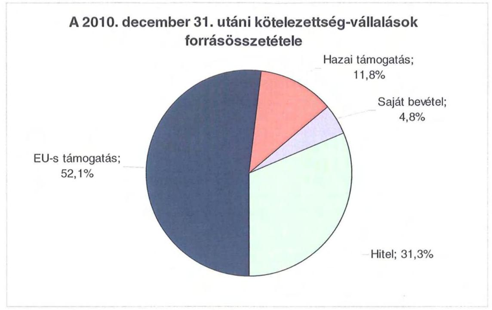

Az Önkormányzat által beadott, elbírálás alatt álló pályázatok tervezett teljes bekerülési költsége 40 millió Ft, amelyhez idegen forrást már nem kívánnak bevonni, ugyanakkor 2010-ben a működési költségvetésben minimális (0,9\%) megtakarítást értek el (85 millió Ft). Az Önkormányzat vállalt kötelezettségeit a saját bevételeken túl - a fennálló követelésállományból származó forrásai felhasználásával (571 millió Ft) kívánja előteremteni.

Az Önkormányzat mérleg szerinti pénzintézeti kötelezettsége a 2006. év végéről a 2010. év végére 1782 millió Ft-ról 3232 millió Ft-ra nőtt, amelyből az árfolyamváltozás miatti különbözet 468 millió Ft volt. A fennálló pénzintézeti kötelezettségek 13 hosszú lejáratú hitelből és egyéb likvidhitel igénybevételéből keletkeztek. A 2011. évi költségvetési rendeletben jóváhagyott 2420 millió Ft hitelfelvétel az előző évi 1644 millió Ft-hoz képest 776 millió Ft, 47\%-os növekedést jelent.

Az Önkormányzat kötelezettségvállalásaira közgyűlési döntés alapján került sor, az előterjesztések tartalmazták a tőkefizetési kötelezettségek többéves hatását, azonban nem mutatták be a visszafizetés forrásait, a várható kamatfizetési kötelezettséget, valamint a kamat- és a devizaalapú kötelezettségeket érintő árfolyamkockázatot.

Az Önkormányzat fejlesztési hiteleiből az éves költségvetési rendeleteiben meghatározott fejlesztési feladatai megvalósítását finanszírozta, többek között a TISZK létrehozását, Városi Sportcsarnok beruházáshoz saját erő biztosítását, iskola felújítást.

Az Önkormányzat a devizában fennálló CHF pénzintézeti kötelezettségeiből 6035 ezer CHF (1248 millió Ft) tőkét törlesztett és 62 millió Ft kamatot fizetett, az EUR pénzintézeti kötelezettségeiből pedig 213 ezer EUR (60 millió Ft) tőkét és 25 millió Ft kamatot. A fejlesztési hitelekkel kapcsolatban 57 millió Ft egyéb költséget fizettek ki a 2007-2010. években. Az Önkormányzat a hitelek igény-

---

bevételéből származó forrásokat 2010. év végéig a céloknak megfelelően felhasználta. A 2007-2010 években átmenetileg szabad pénzeszközeiből 324 millió Ft kamatbevételt realizált. A kamatbevételeket a működési kiadásokra fordították. Az Önkormányzat számlavezető bankot 2006 januárjában váltott. A számlavezető bankkal hét, további négy pénzintézettel hét alkalommal kötött hitelszerződést. A 2010. december 31-i hitelszerződések alapján a számlavezető bank hitelállománya 37,8\%-os (9368 ezer CHF és 1303 ezer EUR) arányt képviselt, melyből
 a 2011. december 31-én 5720 ezer CHF hitel lejárata miatt ez az arány 23,7%-ra (3648 ezer CHF és 1303 ezer EUR) csökken.

Az Önkormányzat működésének pénzügyi egyensúlyát a vizsgált időszakban elsősorban éven belüli működési célú hitel - egyéb likvidhitel - igénybevételével biztosította, 2007. évben 400 millió Ft, 2008-2009. években 500-500 millió Ft, 2010. évben 710 millió Ft felvételével. Az egyéb likvidhitel átlagos napi állománya a 2007. évben volt a legalacsonyabb, 196 millió Ft, a 2010. évben volt a legmagasabb, 580 millió Ft. Folyószámlahitelt a 2009. évben kilenc napra vett igénybe, éves átlagos állománya három millió Ft volt. A likviditás biztosítása az Önkormányzatnak 115 millió Ft kamatkiadást okozott.

Az Önkormányzat 2010. év végi szállítói tartozása 421 millió Ft, melyből a lejárt tartozás 340 millió Ft volt, amelyet a 2011. 1. negyedévében megfizettek. Átütemezett tartozás, egyéb kiadáselmaradás nem volt.

Az Önkormányzatnak egy önkormányzati tulajdonú garzonház energiatakarékossági korszerűsítését, felújítását célzó pályázati sajáterő biztosításához kapcsolódó tőke- és kamatfizetési kötelezettsége 2010. év végén 264 millió Ft volt, amely a 2011-2013. években 83 millió Ft, a 2014-2021. években 181 millió Ft tőke- és kamatfizetési kötelezettséget jelent. Az Önkormányzat 2004. évben 250 millió Ft kölcsönt vett fel 20 éves lejáratra egy többségi tulajdonú gazdasági társaságától, amely a 2011-2013. években 60 millió Ft, a 2014-2024. években 135 millió Ft fizetési kötelezettséget jelent a várható éves osztalékok terhére.

Az Önkormányzat gazdasági társaságai részére folyószámla- és egyéb hitel igénybevételéhez, a víziközmű társulata hiteléhez a szennyvízberuházás megvalósításához összességében 1375 millió Ft készfizető kezességet vállalt. 2010. év végére kezességgel kapcsolatos kötelezettség 1135 millió Ft-ra csökkent. Egy gazdasági társasága részére két alkalommal összesen három millió Ft összegben adott át pénzeszközt visszafizetési kötelezettséggel az Önkormányzat.

A Közgyűlés négy fejlesztési hitel biztosítékaként 77 millió Ft - számviteli nyilvántartás szerinti nettó értékű - jelzálogjog alapításához és bejegyzéséhez járult hozzá. A jelzálogszerződésekkel érintett ingatlanok a forgalomképes ingatlanok nettó értékének 15,5%-át jelenti.

---

Az Önkormányzat kötelezettségeinek 2010. december 31-i állományát és várható alakulását a kötelezettségek lejáratáig a következő táblázat szemlélteti:

| Megnevezés | Állomány 2010. dec. 31-én |  |  | Várható kötelezettség 2011. 2013. években |  |  | Várható kötelezettség 2014. évet követően |  |  |
| :--: | :--: | :--: | :--: | :--: | :--: | :--: | :--: | :--: | :--: |
|  | $\begin{aligned} & \text { HUF-ban } \\ & \text { (millió Ft. } \\ & \text { ban) } \end{aligned}$ | Devizában (ezer CHF-ben, ezer EUR-ban) | Deviza | HUF-ban (millió Ft. ban) | $\begin{aligned} & \text { Devizában } \\ & \text { (ezer } \\ & \text { CHF-ben, } \\ & \text { ezer EUR- } \\ & \text { ban) } \end{aligned}$ | Deviza | $\begin{aligned} & \text { HUF-ban } \\ & \text { (millió Ft. } \\ & \text { ban) } \end{aligned}$ | $\begin{aligned} & \text { Devizában } \\ & \text { (ezer } \\ & \text { CHF-ben, } \\ & \text { ezer EUR- } \\ & \text { ban) } \end{aligned}$ | Deviza |
| Pénzintézeti kötelezettségek |  |  |  |  |  |  |  |  |  |
| Hosszú lejáratú hitelek |  | 2366 | CHF |  | 2322 | CHF |  | 2168 | CHF |
| Hosszú lejáratú hitelek |  | 4629 | EUR |  | 2123 | EUR |  | 2316 | EUR |
| Egyéb kötelezettség | 723 |  | HUF | 723 |  | HUF |  |  |  |
| Pénzintézeti kötelezettségek összesen HUF-ban | 723 |  | HUF | 723 |  | HUF |  |  | HUF |
| Pénzintézeti kötelezettségek összesen CHF-ben |  | 2366 | CHF |  | 2322 | CHF |  | 2108 | CHF |
| Pénzintézeti kötelezettségek összesen EUR-ben |  | 4429 | EUR |  | 2123 | EUR |  | 2214 | EUR |
| Biztosítékok |  |  |  |  |  |  |  |  |  |
| Kezesség | 1135 |  | HUF |  |  |  |  |  |  |
| Biztosítékok összesen | 1135 |  | HUF |  |  |  |  |  |  |
| Szállítói tartozás | 421 |  | HUF | 421 |  | HUF |  |  |  |
| Egyéb kötelezettségek | 254 |  | HUF | 80 |  | HUF | 101 |  | HUF |
| Az és az egyéb szervek 2013. fennálló kötelezettségei | 193 |  | HUF | 60 |  | HUF | 135 |  | HUF |

Az Önkormányzat pénzintézetekkel szemben fennálló kötelezettsége a 2010. év végén 723 millió Ft, 5366 ezer CHF és 4429 ezer EUR volt. Ezek várható kötelezettsége (tőke, kamat és egyéb költség) a legutóbbi kamatfizetés feltételei alapján a 2011. évtől 723 millió Ft, továbbá 5520 ezer CHF és 5437 ezer EUR. A kötelezettségek 2010. december 31-i állománya alapján az Önkormányzatnak 2011-ben 421 millió Ft szállítói tartozást, továbbá a 2011. évtől egyéb kötelezettségek címén 459 millió Ft fizetési kötelezettséget kell teljesíteni. A kezességvállalásaiból adódóan 1135 millió Ft összegű terhe jelentkezhet, amennyiben egy társasága és a víziközmű társulata kötelezettségeiket nem teljesítik. A 2011-2013. években várható kötelezettség teljesítésére figyelembe vehető 524 millió Ft pénzmaradvány, 340 millió Ft áthúzódó pályázati forrás, 571 millió Ft mérlegben kimutatott követelésállomány, 3736 millió Ft forgalomképes ingatlanvagyon, melyből 241 millió Ft a pénzintézeti kötelezettségekhez kapcsolódóan jelzáloggal terhelt. A 2014 utáni 2198 ezer CHF, 3314 ezer EUR, valamint 316 millió Ft kötelezettség teljesítésének forrása az önkormányzat részéről nem számszerűsített. Ennek hiányában elsősorban a korábbi években a kötelezettségek teljesítésére be nem vont ingatlanvagyon jöhet szóba fedezetként. Az Önkormányzat tájékoztatása szerint figyelembe vehető további források „a mindenkori költségvetési rendeletekben megtervezett önkormányzati saját bevételek". A CLF módszer szerint az adósságszolgálat teljesítésének forrása lehet a működési jövedelem, azonban a mutatkozó tendencia - a nettó működési jövedelem 2010. évi -825 millió Ft-os állománya - alapján várhatóan nem nyújt fedezetet az önkormányzati kötelezettségek biztosítására.

Az Önkormányzat minősített többségi tulajdonú társaságai kötelezettségeinek 2010. december 31-i állományát és várható alakulását a kötelezettségek lejáratáig a következő táblázat mutatja be:

| Megnevezés | Állomány 2010. dec.31-én |  |  | Várható kötelezettség 2011. 2013. években |  |  | Várható kötelezettség 2014. évet követően |  |  |
| :--: | :--: | :--: | :--: | :--: | :--: | :--: | :--: | :--: | :--: |
|  | HUF-ban (millió Ft. ban) | Devizában (ezer CHF-ben) | Deviza | HUF-ban (millió Ft. ban) | $\begin{aligned} & \text { Devizában } \\ & \text { (ezer } \\ & \text { CHF-ben) } \end{aligned}$ | Deviza | $\begin{aligned} & \text { HUF-ban } \\ & \text { (millió Ft. } \\ & \text { ban) } \end{aligned}$ | $\begin{aligned} & \text { Devizában } \\ & \text { (ezer } \\ & \text { CHF-ben) } \end{aligned}$ | Deviza |
| Pénzintézeti kötelezettségek |  |  |  |  |  |  |  |  |  |
| Hosszú lejáratú hitelek | 527 |  | HUF | 528 |  | HUF | 3 |  | HUF |
| Folyószámla és egyéb rövid lejáratú hitelek | 176 |  | HUF | 176 |  | HUF |  |  |  |
| Pénzintézeti kötelezettségek összesen | 809 |  | HUF | 809 |  | HUF | 4 |  | HUF |
| Üzleti kötelezettségek | 4 |  | HUF | 4 |  | HUF | 4 |  | HUF |
| Üzleti kötelezettségek |  |  |  |  |  |  |  |  |  |
| Szállítói tartozás | 253 |  | HUF | 253 |  | HUF |  |  |  |

---

Az önkormányzati kötelezettségek növekedése mellett a minősített többségi tulajdonú társaságok kötelezettségei is befolyásolhatják az Önkormányzat pénzügyi egyensúlyát. A társaságoknak a 2011. évtől 536 millió Ft pénzintézeti kötelezettséget, kilenc millió Ft és kilenc ezer CHF lízinget, valamint 263 millió Ft szállítói tartozást kell rendezniük. A lejárt szállítói tartozás 125 millió Ft, amelynek 4%-a (öt millió Ft) meghaladta a 91 napot. Kockázatot jelent, ha ezek nem teljesítése esetén a bíróság korlátlan és teljes felelősséget állapít meg az Önkormányzat terhére.

Az Önkormányzat költségvetési támogatásból, átengedett bevételekből és illetékbevételekből származó bevételei a 2007. évhez képest az időszak egészét tekintve összességében növekedtek. Ennek ellenére az Önkormányzat a 2007-2010. években kiadási megtakarítást és bevételnövelést eredményező intézkedéseket hozott. A 2007-2010. években tett intézkedések hatására 7 millió Ft bevételi többletet, továbbá 896 millió Ft kiadási megtakarítást mutattak ki, ezáltal az önkormányzat pénzügyi helyzetét javították. A kiadási megtakarítások 97%-a az elrendelt álláshely-csökkentések eredménye. Az álláshely-csökkentő intézkedések 2007-2010. között a Hivatalnál és az intézményeinél összesen 189 álláshely (ebből 6 üres álláshely) megszüntetését jelentették. Egyes közszolgáltatási területeken azonban feladatbővülések is voltak, amelyek álláshely- és egyben létszámnövekedéssel is jártak. Ennek következtében az időszak során az álláshelyek száma 169 fővel csökkent. A bevételnövelő intézkedések térítési díjak emeléséhez és polgári védelmi feladatok ellátására kötött megállapodásokhoz kapcsolódtak.

Az utóellenőrzés a pénzügyi egyensúly javítására vonatkozó egy szabályszerűségi és egy célszerűségi javaslat hasznosítására terjedt ki. Egy javaslatot az intézkedési terv szerinti határidőben hasznosítottak, egy - a rövid lejáratú működési-, illetve folyószámlahitelek igénybevétele előtti gazdaságossági számítások készítésére vonatkozó - javaslat hasznosítása nem történt meg.

Az Önkormányzat pénzügyi helyzetét összegezve a következők emelhetők ki:

A 2007-2010. években az Önkormányzat működési kockázatát növelte a negatív nettó működési jövedelem, a működés biztonságát az önként vállalt feladatok aránya is hátrányosan befolyásolta. A működési bevételek 2007-2010.
 években nem biztosították a működési kiadások és az adósságszolgálat finanszírozását, a fizetőképesség elérése érdekében növekvő mértékű egyéb likviditási hitel igénybevételére volt szükség. A gazdasági társaságok szerepe a közüzemi közfeladat-ellátásban meghatározó volt. A gazdasági társaságok által ellátott feladatstruktúra a működési kockázatot nem növelte.

A vizsgált időszakban az Önkormányzat felhalmozási bevételeinek és kiadásainak egyenlege hiányt mutatott, amelyet pénzmaradvány igénybevételével és hitelfelvétellel finanszíroztak. A fejlesztési célú kötelezettségvállalásoknál a jövőben teljesítendő kifizetésekre a fedezet rendelkezésre áll (hitelek, előző évek pénzmaradványa, EU támogatások, saját forrás), ezért az felhalmozási kockázatot nem jelentett.

---

A pénzintézeti és egyéb kötelezettségek teljesítésének kockázatát növelte, hogy a 2010. december 31-én fennálló kötelezettségek visszafizetésének fedezetét a saját bevételben jelölték meg, azonban nem számszerúsítették annak forrásait. A kockázatot csökkentheti, hogy az Önkormányzat forgalomképes ingatlanvagyona szükség esetén felhasználható az adósságszolgálat teljesítésére.

Az Önkormányzat az ellenőrzött időszakban kiadáscsökkentő és bevételnövelő intézkedései eredményeként javította pénzügyi helyzetét.

A polgármester tájékoztatása szerint a helyszíni ellenőrzést követően saját hatáskörben tett intézkedések 66 millió Ft-tal javították a 2011. évi költségvetés pénzügyi egyensúlyát.

Az Állami Számvevőszékről szóló 2011. évi LXVI. törvény 33. § (1) bekezdésében foglaltak értelmében a jelentésben foglalt megállapításokhoz kapcsolódó intézkedési tervet köteles az ellenőrzött szervezet vezetője összeállítani és azt a jelentés kézhezvételétől számított harminc napon belül az ÁSZ részére megküldeni. Amennyiben az intézkedési tervet határidőben nem küldi meg a szervezet, vagy az továbbra sem elfogadható, az ÁSZ elnöke a hivatkozott törvény 33. § (3) bekezdés a)-b) pontjaiban foglaltakat érvényesítheti.

Az ellenőrzés intézkedést igénylő javaslatai:

# a Polgármesternek 

1. a Közgyűlés elé terjesztendő intézkedési terv írja elő a működés pénzügyi egyensúlyának közép távon történő helyreállítása és hosszú távú fenntarthatósága érdekében - felelősök és határidők megjelölésével - olyan program készítését, amely tartalmazza az alábbiakat:
a) bevételszerző lehetőségek feltárását, különösen a helyi adópolitikai célok meghatározását és számszerúsítését, a bérleti díjak és a térítési díjak megállapítását, felülvizsgálatát, a követelések behajtását, az egyéb sajátos bevételek növelésének lehetőségét;
b) a folyamatban lévő és a tervezett beruházások teljes körű felülvizsgálatát;
c) egyéb kiadási kötelezettségek teljes körű felülvizsgálatát;
d) az intézkedések következtében jelentkező pénzügyi többlet, illetve az egyszeri bevételek tartalékba helyezését, elkülönített kezelését az adósságszolgálat teljesítése érdekében;
e) az intézményi struktúra felülvizsgálatát, átalakítását;
f) az önként vállalt feladatok terjedelmének, tartalmának felülvizsgálatát azok finanszírozhatósága szempontjából, a kötelező feladatellátás elsődlegességének biztosítása érdekében, a gazdasági program áttekintésével összhangban;
g) az intézkedések eredményei legalább félévenkénti áttekintésének előírását;

---

2. mutassa be félévente - a szokásos beszámoló keretében - a Közgyűlésnek:
a) az Önkormányzat és a minősített többségi tulajdonú gazdasági társaságai aktuális pénzügyi helyzetét, az Önkormányzatnak a gazdasági társaságai felé fennálló követeléseit;
b) legalább három évre kitekintően a kötelezettségek teljes körére szóló finanszírozási tervet, amely figyelembe veszi a kötelezettség éven belüli és túli felmerülését, a források számszerúsított megjelölésével;
c) az Önkormányzat folyamatban lévő és tervezett fejlesztéseihez szükséges belső és külső források rendelkezésre állását, és ebből a szempontból értékelje az Önkormányzat beruházásait;
3. intézkedjen a beruházásokkal létrehozott létesítmények működtetését és jövőbeni fenntarthatóságát biztosító megalapozott források költségvetési rendeletekben történő feltüntetéséről;
4. mutassa be a Közgyűlésnek évente a zárszámadási rendelet előterjesztésében az értékcsökkenés összegét, és ezzel összevetve az elhasználódott eszközök pótlására fordított tényleges kiadásokat, az eszközök elhasználódási fokának alakulását;
5. mutassa be a Közgyűlésnek az intézményfenntartó társulási tagságból, gesztorságból eredő, az Önkormányzat pénzügyi egyensúlyát befolyásoló kockázatokat, és azok mérséklését szolgáló intézkedéseket;

# a jegyzőnek 

1. kísérje figyelemmel a jövőbeni várható - árfolyam-, kamat- valamint visszafizetési kockázatokat, továbbá a mérlegen kívüli tételek (kezességvállalás, garancia és helytállási kötelezettségvállalás) kockázatait, és legalább félévente tájékoztassa a Közgyűlést azok alakulásáról;
2. gondoskodjon, hogy a jövőben az adósságot keletkeztető kötelezettségvállalásokról szóló közgyűlési előterjesztések tételesen tartalmazzák a visszafizetés forrásait, valamint legalább 3 éves kitekintéssel mutassák be a kamat és árfolyamkockázat várható kihatásait;
3. kísérje folyamatosan figyelemmel - a tulajdonosi jogkört gyakorlók közreműködésével - a minősített többségi tulajdonú gazdasági társaságok kötelezettségeinek alakulását, az Önkormányzat likviditására, pénzügyi-egyensúlyi helyzetére gyakorolt hatását.

---

# II. RÉSZLETES MEGÁLLAPÍTÁSOK 

## 1. Az ÖNKORMÁNYZAT KÖTELEZŐ ÉS ÖNKÉNT VÁLLALT FELADATAI

Az Önkormányzat 2010. évi elemi beszámolója szerint a 9777 millió Ft működési célú költségvetési kiadásból 9321 millió Ft-ot (95%) a kötelező feladatok, 456 millió Ft-ot (5%) az önként vállalt feladatok ellátására fordított. A 2011. évi tervadatok alapján az összes költségvetési kiadás 10%-át, 1088 millió Ft-ot irányozták elő önként vállalt feladatok megvalósítására, ami az előző évhez képest 4 százalékpontos aránycsökkenést jelent. Az Önkormányzat jellemző önként vállalt feladatai ingatlanhasznosítás, televízió műsor-szolgáltatási, környezetvédelmi és kulturális örökségvédelmi, mérnöki tevékenység, civil szervezetek támogatása.

A számvevőszéki jelentés-tervezetre a polgármester észrevételében módosítást kért, mely szerint: „A megállapítás pontosítását kérjük, hiszen az ingatlanhasznosítás esetünkben csupán a vásár és piacfenntartást jelenti"

Az észrevétel nem veszi figyelembe, hogy az Önkormányzat feladatai közül nem csak a Vásárcsarnok lát el ingatlanhasznosítást, hanem a Salgó Vagyon Kft. is. Az Önkormányzat 11/2010. (I.26.) Öh. számú határozata alapján módosított és egységes szerkezetben foglalt alapító okirata értelmében a Salgó Vagyon Kft. ingatlanhasznosítást is végez, mivel a társaság tevékenységi körei között szerepel a saját tulajdonú ingatlan adásvétele, a saját tulajdonú, bérelt ingatlan bérbeadása is.

A számvevőszéki jelentés-tervezetre tett polgármesteri észrevétel kitért az alábbiakra: „A feladatellátás csak bizonyos esetekben önként vállalt feladat. (pl. a Salgótarjáni Városfejlesztő Kft. esetében, amely társaság egy önkormányzati projekthez kapcsolódóan lát el lebonyolítói - mérnöki feladatokat".

Az észrevétel ellenére továbbra is fenntartjuk álláspontunkat, hogy a mérnöki tevékenység nem kötelező önkormányzati feladat. Már az észrevétel is elismerte, hogy bizonyos esetekben önként vállalt feladat, de nem tért ki arra, hogy milyen jogszabályi előírás alapján, milyen feladatot értenek kötelezően ellátandó mérnöki tevékenységnek.

A kötelező feladataikat az Önkormányzat Szervezeti és Működési Szabályzatában rögzítette, ezek körét az Ötv. és az ágazati törvények által meghatározottaknak tekintik. Az önként vállalt feladataikat az SzMSz nem tartalmazta, nagyságát az éves költségvetési rendeletekben határozták meg.

[^0]
[^0]:    ${ }^{25}$ Az elemi beszámoló adata a felhalmozási kamattal és a pénzforgalom nélküli kiadásokkal tér el a folyó kiadásoktól.

---

Az Önkormányzat 2010. évi működési kiadásai és finanszírozási arányai több feladatonként

| Ellátott feladat | Működési kiadás összesen (millió Ft) | Kötelező feladat részaránya % | Bevétel összesen (millió Ft) | Állami támogatás részaránya % | Intézményi saját bevétel részaránya % | Önkormányzati támogatás részaránya % |
| :--: | :--: | :--: | :--: | :--: | :--: | :--: |
| Óvodák | 689 | 100 | 701 | 39 | 10 | 51 |
| Általános iskolák | 1893 | 100 | 1929 | 46 | 10 | 44 |
| Gimnáziumok | 569 | 100 | 602 | 57 | 18 | 25 |
| Szakközépiskolák, szakképző intézmények | 630 | 100 | 660 | 66 | 24 | 10 |
| Kollégiumok |  |  |  |  |  |  |
| Szociális intézmények | 1489 | 100 | 1641 | 5 | 19 | 76 |
| Gyermekjóléti intézmények |  |  |  |  |  |  |
| Közművelődési intézmények | 193 | 100 | 196 | 0 | 38 | 62 |
| Sportlétesítmények |  |  |  |  |  |  |
| Igazgatási intézmények |  |  |  |  |  |  |
| Hivatalos Tűzoltóság | 407 | 100 | 418 | 91 | 7 | 2 |
| Egyéb intézmények | 171 | 100 | 185 | 0 | 16 | 84 |
| Intézmények összesen | 6045 | 100 | 6332 | 38 | 15 | 47 |
| Polgármesteri Hivatalban kezelt feladatok működési kiadásai | 3732 | 82 | 4132 | 54 | 10 | 36 |
| Működési kiadások összesen | 9777 | 93 | 10464 | 44 | 13 | 43 |

A kötelező feladatokon belül a 6045 millió Ft összegű intézményi feladatok működési kiadása az összes működési kiadás 62%-át, a Polgármesteri hivatalban ellátott feladatok 3732 millió Ft összegű működési kiadása az összes működési kiadás 38%-át tette ki. Az intézmények működtetéséhez az Önkormányzat 2958 millió Ft támogatással (amely az összes bevétel 28%-a) járult hozzá.

Az intézményi feladatokon belül a közoktatási feladatokra fordított 3783 millió Ft az összes működési kiadás 39%-át tette ki, a működéshez az Önkormányzat 1423 millió Ft támogatást nyújtott, amely az összes bevétel 13%-a volt. Volumenében a legnagyobb támogatást (849 millió Ft-ot) az általános iskolai feladatokhoz nyújtotta az Önkormányzat. A tanulólétszám 8%-os csökkenése miatti állami hozzájárulás visszaesése 2007-2010 között az önkormányzati támogatás 5 százalékpontos emelkedését tette szükségessé (39%-ról 44%-ra). A többi közoktatási intézménynél az állami támogatás kiadásokon belüli részaránya számottevően nem változott.

A közművelődési intézményi feladatokra az Önkormányzat 2010-ben 2007-hez képest 48 millió Ft-tal kevesebb összeget fordított saját egyéb bevételeiből, mivel a feladatok egyre nagyobb arányát finanszírozta intézményi saját bevétel.

A polgármester által tett észrevétel kifogásolta a megállapítást: „A megállapítás akkor lenne helytálló, ha változatlan kiadási színvonal lenne. A kiadási színvonal azonban 2007-től 2010-ig 33 millió Ft-tal csökkent. Az intézmény saját bevételének aránya a feladatfinanszírozásban 2007-2010-ig 24%, 22,4%, 28,4% és 25,3% volt. A 2009. évi kiugróan magas arány oka, hogy jelentős összegű egyszeri ÁFA bevételt realizáltak jogszabályi változásból adódóan."

---

#### Abstract

Az észrevétel ellenére a megállapításon nem szükséges változtatnunk, mivel az adatok reálisak, az önkormányzati támogatás abszolút összegű csökkenése mellett pedig „a feladatok egyre nagyobb arányát finanszírozta intézményi saját bevétel" mondatrésszel a forrásösszetétel relatív változásaira is utaltunk. Az ellenőrzés egyik célja volt annak bemutatása, hogy a feladatellátás módjában bekövetkező változások milyen hatást gyakoroltak az Önkormányzat pénzügyi helyzetének alakulására. Ebben nem elhanyagolható tényező, hogy az Önkormányzat a vizsgált időszak végén 48 millió Ft-tal kevesebb összeget fordított saját egyéb bevételeiből az említett ágazat intézményeinek finanszírozására. Az észrevételben szereplő saját bevételi arány évenkénti adatait az Önkormányzat által aláírt 1. számú tanúsítvány és az észrevételhez csatolt újabb 1. számú tanúsítvány sem tartalmazta. Az Önkormányzat által megadott és a tanúsítványokban lévő adatsor szerint az intézményi saját bevétel megoszlása 2007. és 2010. között 27,0%, 24,4%, 32,6% és 38,2%, amely adatok a megállapításunkat alátámasztják.

A bővülő szociális és gyermekvédelmi intézményi feladatokhoz négy év alatt 4 százalékponttal nagyobb mértékben vonták be az intézményi saját bevételeket, így az önkormányzati támogatások aránya (a 2007. évi 79%-ról 2010-re 76%-ra) csökkent.

A 10464 millió Ft összegű összes működést szolgáló bevétel 61%-a volt az intézmények 6332 millió
 Ft összegű bevétele, amelyből 2406 millió Ft (38%) volt az állami támogatás, 964 millió Ft (15%) az intézményi saját bevétel és 2958 millió Ft (47%) az önkormányzati támogatás.

Az összes önkormányzati intézményi bevételen belül az intézményi feladatellátáshoz kapcsolható állami támogatás összege folyamatosan csökkent, a 2007. évi 2738 millió Ft-ról 2010-re 2406 millió Ft-ra, aránya a 2007. évi 43%-ról az időszak végére 5 százalékponttal esett vissza. Az aránycsökkenés valamennyi intézménytípusnál jellemző volt.

Az Önkormányzat az állami forrásokból kieső forrásokat az intézményi saját bevételek és az önkormányzati támogatás részarányának növelésével pótolta, 2007–2010 között az intézményi saját bevételek 830 millió Ft-ról 964 millió Ft-ra emelkedtek, ami 2,2 százalékpont aránynövekedést jelentett. Az önkormányzati támogatások 2799 millió Ft-ról 2958 millió Ft-ra nőttek, aránynövekedésük 2,7 százalékpont volt. Az általános iskolai oktatás volt a legnagyobb volumenű önkormányzati feladat, és itt volt a legjelentősebb arányú az állami hozzájárulás visszaesése. Ilyen célra négy év alatt 209 millió Ft-tal alacsonyabb összeg került az Önkormányzathoz, ezáltal 5,4 százalékponttal csökkent az általános iskolai kiadások finanszírozásánál az állami hozzájárulás részaránya. A kiesést alapvetően az önkormányzati egyéb pénzeszközökből kellett fedezni. A középfokú közoktatási feladatoknál szintén jellemző volt az állami hozzájárulás csökkenése. A gimnáziumoknál a 28 millió Ft-os, 0,8 százalékpontos csökkenést az intézményi saját bevételekkel, a szakközépiskolák, szakképző intézményeknél a 111 millió Ft-os, 2,1 százalékpontos visszaesését alapvetően az önkormányzati támogatások aránynövelésével sikerült pótolni. Az óvodáknál

[^0]
[^0]:    ${ }^{26}$ Az elemi beszámoló működési bevétel adata és a CLF folyó bevétel adata a fejlesztési kamatbevétel összegével és a pénzforgalom nélküli bevételekkel tér el egymástól.

---

és a szociális intézményeknél is jellemző volt kismértékű, 2 százalékpont alatti állami hozzájárulás részaránycsökkenés, amit az intézményi saját bevételek növelésével ellensúlyozni lehetett. A hivatásos tűzoltóság fenntartásánál minimálisan, 1,1 százalékponttal, 3 millió Ft-tal emelkedett az állami hozzájárulás aránya, illetve összege.

Az áttekintett időszakban a szakközépiskolák, valamint a szociális és gyermekvédelmi intézmények kivételével az ellátotti létszám évente folyamatosan ugyan, de összevontan elhanyagolható mértékben csökkent. Az összes ellátott száma a 2007. évi 8478 főről 2010-re 35 fővel lett kevesebb, amely a közoktatás tanulólétszámának 185 fős csökkenéséből és a szociális intézmények ellátottainak 150 fős emelkedésből adódott. A szakközépiskolai létszám emelkedését a népesség korösszetételének változása, a szociális és gyermekvédelmi intézményekben ellátottak létszámnövekedését az Önkormányzat szerint a krízis helyzetbe került gyermekek számának emelkedése okozta.

Az Önkormányzat a kötelező és az önként vállalt feladatait ${ }^{27}$ a 2010. december 31-ei adatok szerint 16 költségvetési szervvel és tíz többségi tulajdonú gazdasági társasággal látta el. A költségvetési szervek száma a 2006. évihez viszonyítva 23-ról 16-ra, 30%-kal csökkent.

Kötelező feladatot lát el 14 költségvetési szerv, melyből nyolc önállóan működő és gazdálkodó. Az intézmények összesen 97 telephelyen működnek, az ugyanebben az intézményi szerkezetben 2007. január 1-jén működő 78 telephellyel szemben. Szociális, gyermekvédelmi és egészségügyi feladatokat egy önállóan működő és gazdálkodó intézmény lát el, telephelyeinek száma a vizsgált időszakban 32%-kal, 19-ről 25-re emelkedett, elsősorban a védőnői tanácsadói telephelyek számának és az Önkormányzat által működtetett háziorvosi körzetek számának növekedése miatt. Közoktatási feladatot 2007. január 1-jén egy önállóan gazdálkodó és 16 részben önállóan gazdálkodó költségvetési szerv látott el, ugyanezt a feladatot 2010. december 31-én nyolc önállóan működő intézmény: egy összevont óvoda, egy központi általános iskola és diákotthon, négy gimnáziumi, szakközépiskolai, szakiskolai feladatot ellátó középfokú közoktatási intézmény, egy fogyatékosokat ellátó óvoda, általános iskola és szakiskola, amely pedagógiai szakszolgálatot is végez, valamint egy zeneiskola látta el. A 2007-ben végrehajtott, közoktatási intézményeket érintő átszervezések eredményeként a tagintézmények száma héttel nőtt, miközben 17-ről nyolcra csökkent a közoktatási feladatokat ellátó költségvetési szervek száma. A kulturális, közművelődési és konferencia-szervezési feladatok ellátása egy intézmény feladatkörébe tartozik, az elmúlt négy évben itt nem volt szervezeti változás.

Kommunális hulladéklerakói, rekultivációs feladatok ellátására 14 település társulást hozott létre, melynek gesztori feladatait az Önkormányzat végzi. A társulás 2009 decemberében az Önkormányzat önállóan működő és gazdálkodó költségvetési szerveként került besorolásra. Szakképzés-szervezési feladatokra, szakma-gyakorlati teendők ellátására hozták létre a költségvetési szervként

[^0]
[^0]:    ${ }^{27}$ A kötelező és önként vállalt feladatok megbontása az Önkormányzat saját besorolása alapján történt.

---

besorolt szakképzés-szervezési társulást, melynek az Önkormányzaton kívül tagjai: a Nógrád Megyei Önkormányzat, a balassagyarmati, a szécsényi, a nógrádsápi települési önkormányzatok. A Polgármesteri hivatal igazgatási feladatokat lát el, egy intézményt a közoktatási intézmények gazdasági ellátó szolgáltatására alapítottak, a hivatásos önkormányzati tűzoltóság szintén költségvetési intézményként működik.

Az önként vállalt feladatok aránya 5%, amely a működés biztonságát hátrányosan befolyásolta.

A számvevőszéki jelentés-tervezetre a polgármester észrevételében módosítást kért, mely szerint „Az önként vállalt feladatokra vonatkozóan mellékletben megküldött, pontosított 1. számú tanúsítvány alapján nem helytálló, hogy a működés biztonságát hátrányosan befolyásolta az önként vállalt feladatok magas aránya."

Megállapításunkat továbbra is fenntartjuk, mivel az Önkormányzat pénzügyegyensúlyi helyzetét a módosított tanúsítványban szereplő önként vállalt feladatok aránya is hátrányosan befolyásolta.

# Az Önkormányzat tulajdoni részesedéssel rendelkezik tíz gazdasági társaságban, amelyek részt vesznek a kötelező és önként vállalt feladatainak ellátásában. 

Az Önkormányzat többségi tulajdonnal kilenc társaságban rendelkezik.

- Hét társaság esetében az Önkormányzat 100%-ban tulajdonos, a Salgótarjáni Csatornamű Szolgáltató Kft-ben a tulajdonosi részarány 89,6%, a Salgótarján Környéke Vízmű Kft-ben 66,6%. A társaságok saját tőke-jegyzett tőke alakulásában - a Létesítmény és Sport Nonprofit Kft. kivételével - nem történt lényegi változás, minden társaságnál meghaladta a saját tőke a jegyzett tőke arányát és a vizsgált időszakban sem mutatható ki kedvezőtlen irányú változás. A társaságok saját tőke - jegyzett tőke aránya 2010-ben 1,12 és 6,57 között alakult. A Létesítmény és Sport Nonprofit Kft. helyzete 2010-re javult, amikor az Önkormányzat a Nonprofit Kft. felhalmozódó kötelezettségeinek teljesítésére 28 millió Ft összegű többlettámogatást nyújtott.
- A két nem 100%-ban önkormányzati tulajdonú társaságnál önkormányzatok és egy gazdasági társaság ${ }^{28}$ a társtulajdonosok.

A gazdasági társaságoknak nincsenek további bejegyzett gazdasági társaságai. Jelenleg egyik társaság sem áll átszervezés, csődeljárás alatt. Az általuk beszedett szolgáltatási díjakra vonatkozóan a vizsgált időszakban minden esetben érvényesült az Önkormányzat ár-, vagy díjmegállapító szerepe. Vagyonkezelésbe adott eszköz egyetlen társaságnál sincs. A közszolgáltatást végző társaságok - a vízmű kivételével - a tulajdonukba lévő eszközök után elszámolt értékcsökkenésnél nagyobb összegű pótlást hajtottak végre.

[^0]
[^0]:    ${ }^{28}$ A csatornamű esetében egy befektetési és szaktanácsadó kft., a vízmű esetében pedig 26 települési önkormányzat a társtulajdonos.

---

Az Önkormányzat egy társaságban, a Nógrádi Geopark Nonprofit Kft-ben nem többségi tulajdonos, 44% a tulajdoni részaránya. Az Önkormányzat társtulajdonosai két gazdasági társaság, valamint három többcélú kistérségi társulás.

A környezetvédelemre és a kulturális örökségvédelemre alapított társaság saját tőkéje 74%-a jegyzett tőkéjének. A jelenleg 9 millió Ft jegyzett tőkével rendelkező gazdasági társaság működőképességének helyreállítása a megalakulástól állandó probléma. Az Önkormányzat ezért 2010-ben határozatot hozott a törzstőke 2,5 millió Ft-os megemelésére, ezáltal a tulajdoni részesedés aránya 25%-ról 44%-ra emelkedett. Az Önkormányzat számára pénzügyi kockázatot jelent a társaság, annak ellenére, hogy nem döntő befolyással rendelkező tulajdonos, mivel 2010. december 31-én 2,6 millió Ft 91 napon túli lejárt szállítói tartozást mutattak ki.

A helyi tömegközlekedés feladatát szolgáltatási szerződés alapján a Nógrád Volán Zrt. látja el. Az Önkormányzatnak a társaságban tulajdoni részaránya nincs. A gazdasági társaságnak - szerződéses kötelezettsége teljesítéseként - az Önkormányzat az elmúlt négy évben összességében 383 millió Ft működési pénzeszköz átadást teljesített. A támogatásból az Önkormányzati saját forrással fedezett összeg 193 millió Ft volt, az ezen felüli részt az állami támogatásként vette igénybe és adta tovább a gazdasági társaságnak.

Az önkormányzati feladatellátásban az intézmények és gazdasági társaságok mellett szolgáltatási szerződéssel kiszervezett/kiszerződött intézményi ellátások nem működtek.

A vizsgált időszakban intézményi átadás-átvétel nem történt. Feladatot (idősek nappali ellátása, óvodai ellátás) adtak át ${ }^{29}$ a várostól 2006-ban levált településnek. A többcélú kistérségi társulás számára adták át az idősek nappali ellátását kistérségi intézményben történő működtetésre ${ }^{30}$. A települési önkormányzat részére átadott feladatok 2007 és 2010 között összességében 162 millió Ft-tal csökkentették a kiadási szintet. Az Önkormányzat kimutatása szerint négy év alatt összességében 123 millió önkormányzati pénzeszközt takarítottak meg, amelyet a feladatellátás miatt jelentkező kiadások finanszírozásához kellett volna biztosítani a feladathoz társuló állami hozzájáruláson felül. Az önkormányzati társulás részére átadott szociális feladatok szintén csökkentették az Önkormányzat finanszírozási terheit, számításaik szerint a vizsgált időszakban 182 millió Ft-tal kisebb összeget kellett az Önkormányzatnak saját forrásaiból finanszírozásra fordítania.

Az államháztartáson kívüli szervezeteknek (egyház, civil szervezet) feladatátadás a vizsgált időszakban nem volt.

[^0]
[^0]:    ${ }^{29}$ a 27/2007. (II. 13.) és a 133/2007. (VI. 26.) Öh. számú határozat alapján
    ${ }^{30}$ A feladatátadásról az Önkormányzat a 6/2007. (I. 30.) Öh. számú és a 66/2007. (IV. 17.) Öh. számú határozataiban döntött.

---

# 2. PÉNZÜGYI EGYENSÚLYI HELYZET ALAKULÁSA 

### 2.1. A működési és felhalmozási egyensúly alakulása

A hagyományos költségvetési szerkezet helyett az Önkormányzat pénzügyi helyzetét a CLF módszerrel mutatjuk be, amelyben jobban elkülönülnek a vagyonnal kapcsolatos bevételek és kiadások az önkormányzati feladatokkal kapcsolatos közvetlen működtetési bevételektől és kiadásoktól. A módszer következetesen elkülöníti a folyó és a felhalmozási költségvetés bevételeit és kiadásait, azok költségvetési egyenlegeit. A saját folyó bevételek, valamint a saját felhalmozási bevételek nem tartalmazzák az előző évi pénzmaradványok felhasználásából származó pénzforgalom nélküli bevételeket ${ }^{31}$.

A folyó költségvetés egyenlege, a működési jövedelem megmutatja, hogy az Önkormányzat éves folyó bevétele fedezetet biztosít-e a kötelező és önként vállalt feladatellátáshoz kapcsolódó éves folyó kiadására. A működési jövedelem negatív értéke pénzügyileg fenntarthatatlan helyzetet jelez. A mutató pozitív értéke megtakarítást mutat, amely forrásul szolgálhat az Önkormányzat fennálló kötelezettségei megfizetéséhez, valamint fejlesztéseihez.

A felhalmozási költségvetés pozitív értéke felhalmozási többletet mutat, amely a jövőbeni fejlesztések forrását biztosíthatja. Amennyiben a folyó költségvetési hiány finanszírozása a felhalmozási többletből történik, ez szűkebb értelemben vagyonfelélésnek tekinthető. Amennyiben a felhalmozási költségvetés megtakarítása fejlesztési célú hitelek, kötvények adósságszolgálatát finanszírozza, az változatlan vagyon tömeg mellett, a korábban megelőlegezett tőkebevételek valós realizációjának tekinthető. A felhalmozási deficit által generált finanszírozási igény önmagában nem jár pénzügyi kockázattal, a pénzügyileg fenntartható beruházásokhoz kapcsolódó kötelezettségvállalás (adósságszolgálat) körültekintő költségvetési gazdálkodással teljesíthető.

A módszer a pénzügyi kapacitás fogalmát helyezi a középpontba. Az adós hitelfelvételi képessége, hosszú távú fizetőképessége vagy bonitása a pénzügyi kapacitással, ezen belül is a nettó működési jövedelemmel jellemezhető. A nettó működési jövedelem negatív értéke az egyes költségvetési években jelentkező adósságszolgálat túlzott mértékére utal ${ }^{32}$. A nettó működési jövedelem negatív értékének felhalmozási többletből, vagy további hitelből történő finanszírozása pénzügyileg nem fenntartható gazdálkodást vetít
 előre. A pozitív értéket mutató nettó működési jövedelem fejlesztési kiadások fedezetét biztosíthatja, illetve a folyamatosan, évenként képződő pozitív nettó működési jövedelemből meghatározható a jövőben vállalható, teljesíthető éves adósságszolgálat, ily módon az a hitelösszeg, amely - a többi tényezőt, feltételt adottnak tekintve - visszafizetési kockázat nélkül felvehető.

[^0]
[^0]:    ${ }^{31}$ A CLF módszer a finanszírozásba bevonható pénzeszközök év végi állományának változását a vizsgált időszak működési, felhalmozási és finanszírozási pénzforgalmi bevételek és kiadások egyenlegéből vezeti le.
    ${ }^{32}$ Kivéve, ha annak finanszírozására a korábbi években képzett tartalékok fedezetet nyújtanak.

---

A CLF módszer alapján a pénzügyi kapacitás mértéke az Önkormányzat összevont, nettósított, a központi információs rendszerbe a Magyar Államkincstáron keresztül leadott éves költségvetési beszámolójának 80-as űrlapjában szerepeltetett adatok alapján került meghatározásra.

# A CLF módszer szerinti önkormányzati adatok 

|  |  |  |  | ezer Ft |
| :--: | :--: | :--: | :--: | :--: |
| Megnevezés | 2007. | 2008. | 2009. | 2010. |
| Folyó bevételek | 9145113 | 9947630 | 9737380 | 9919211 |
| Folyó kiadások | 9039306 | 9634887 | 9404585 | 9833607 |
| Működési jövedelem | 105807 | 312743 | 332795 | 85604 |
| Nettó működési jövedelem =működési jövedelem - tőketörlesztés | $-332717$ | $-402864$ | $-444571$ | $-824603$ |
| Felhalmozási bevételek | 1051807 | 487909 | 637980 | 1020530 |
| Felhalmozási kiadások | 1299801 | 824597 | 813263 | 1826107 |
| Felhalmozási költségvetés egyenlege | $-247994$ | $-336688$ | $-175283$ | $-805577$ |
| Finanszírozási műveletek nélküli (GFS) pozíció = működési jövedelem + felhalmozási költségvetés egyenlege | $-142187$ | $-23945$ | 157512 | $-719973$ |
| Finanszírozási műveletek egyenlege | 273222 | $-20840$ | 116334 | 498399 |
| Tárgyévi pénzügyi pozíció változás | 131035 | $-44785$ | 273846 | $-221574$ |
| Egyéb tájékoztató adatok |  |  |  |  |
| Összes kötelezettség ${ }^{*}$ | 3006509 | 3119494 | 3219374 | 4485716 |
| -ebből rövid lejáratú | 898097 | 1007285 | 1076721 | 1719545 |
| Folyószámlahitel napi átlagos állománya ${ }^{* *}$ | 0 | 0 | 2993 | 0 |
| Likvidhitel napi átlagos állománya ${ }^{* *}$ | 196257 | 398748 | 493515 | 579988 |
| Munkabérhitel napi átlagos állománya ${ }^{* *}$ | 0 | 0 | 0 | 0 |
| Finanszírozásba vonható eszközök: | 1382628 | 1291630 | 1519262 | 1251475 |
| Tartós hitelviszonyt megtestesítő értékpapírok év végi állománya | 138640 | 92427 | 46213 | 0 |
| Hosszú lejáratú bankbetétek év végi állománya | 0 | 0 | 0 | 0 |
| Értékpapírok év végi állománya | 0 | 0 | 0 | 0 |
| Pénzeszközök (idegen pénzeszközök nélkül) év végi állománya | 1243988 | 1199203 | 1473049 | 1251475 |

* Az összes kötelezettséget a passzív pénzügyi elszámolások nélkül vettük figyelembe, mert a passzívák a pénzmaradvány elszámolás tételei közé tartoznak.
** A likvid- és a folyószámlahitel átlagos állományát 365 napos nevezővel számítottuk.
A bevételi és kiadási jogcímek részletes adatait a jelentés 2. számú melléklete mutatja be.

A CLF módszer szerint figyelembe vett önkormányzati folyó és felhalmozási bevételek és kiadások alakulását befolyásolta, hogy azok az Önkormányzat gesztorszerepéből adódóan két költségvetési szervként működő társulás - döntően felhalmozási bevételekből és kiadásokból álló - adatait is tartalmazzák ${ }^{33}$. Bár a

[^0]
[^0]:    ${ }^{33}$ A társulások bevételi főösszege a pénzmaradvány igénybevétele nélkül 2008. évben 67 millió Ft, 2009. évben 714 millió Ft, 2010. évben 776 millió Ft. A kiadási főösszegük 2008. évben 16 millió Ft, 2009. évben 340 millió Ft, 2010. évben 887 millió Ft volt.

---

társulások összes bevétele és kiadása jelentősen elmarad az Önkormányzat bevételi és kiadási főösszegétől, a működési és felhalmozási egyenlegre gyakorolt hatásuk miatt a főbb bevételi, kiadási és egyenleg adatoknál a társulásokra vonatkozó információkat is közöljük.

A 2008. évben létrehozott Nógrád Megyei Szakképzés-szervezési Társulás és a Kelet-Nógrád Hulladék Rekultivációs Társulás kiemelt adatai: működési jövedelmük összege 2008. évben 6 millió Ft, 2009. évben 141 millió Ft, míg 2010. évben -41 millió Ft. A felhalmozási költségvetés egyenlege 2008. évben 45 millió Ft, 2009. évben 237 millió Ft és 2010. évben -72 millió Ft. A társulásoknál adósságszolgálattal kapcsolatos kiadás nem merült fel, a finanszírozási tételekben kizárólag függő, átfutó bevételek és kiadások szerepelnek.

A vizsgált időszakban az Önkormányzat folyó költségvetési egyenlege, működési jövedelme minden évben pozitív előjelű volt, melynek alakulását a következő ábra szemlélteti:
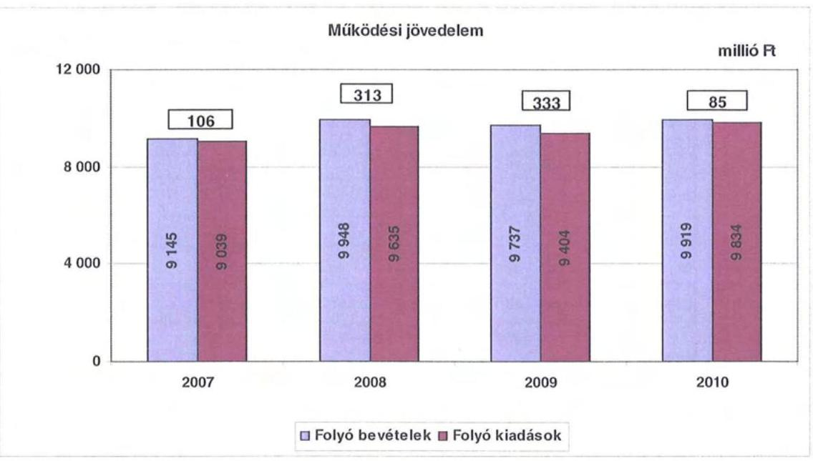

A folyó költségvetés egyenlege (a működési többlet) a vizsgált években átlagosan a folyó kiadások 2,2\%-ának felelt meg, míg a 2008-2009. években ez az arány meghaladta a $3 \%$-ot. 2010. évben a folyó kiadások bevételeket meghaladó mértékű növekedése miatt a működési többlet kiadásokhoz mért aránya $0,9 \%$-ra csökkent.

2007-2010 között a működési jövedelem összesen 837 millió Ft többletet mutatott, amely azonban az Önkormányzat fennálló tőketörlesztési kötelezettségeinek (2842 millió Ft) csak egy részére tudott fedezetet nyújtani. Emiatt a tőketörlesztéssel csökkentett működési jövedelem (nettó működési jövedelem) minden évben negatív egyenlegű volt. Mindez azt jelzi, hogy az Önkormányzat képződő működési jövedelme nem elegendő a korábban vállalt tőketörlesztési kötelezettségei teljesítésére.

---

A pozitív előjelű folyó költségvetési egyenleg ellenére az Önkormányzat a vizsgált időszakban jelentős összegű (összesen 3727 millió Ft) hitelfelvételre kényszerült. Folyószámlahitelt kizárólag 2009-ben, 9 napig vett igénybe, a napi átlagos hitelállomány 3 millió Ft volt. A fizetési problémák kezelését, ideértve az adósságszolgálat miatt jelentkező tartós hiányt az Önkormányzat döntően, 2110 millió Ft egyéb likvidhitel igénybevételével finanszírozta. A likvidhitelek 2010. évi 580 millió Ft-os napi átlagos állománya a 2007. évi érték közel háromszorosának felelt meg. 2010-ben a működési forráshiány pótlására további 490 millió Ft hosszú lejáratú (6 éves futamidejű) működési célú hitel felvételére is sor került.

A pénzügyi helyzet kedvezőtlen alakulása miatt az Önkormányzat összes kötelezettségén belül a 2007. év végi állományhoz képest 2010. év végére a rövid lejáratú kötelezettségek összege 898 millió Ft-ról 1720 millió Ft-ra, részarányuk 29,9\%-ról 38,3\%-ra emelkedett. A rövid lejáratú kötelezettségek 2010. december 31-én fennálló állománya 820 millió Ft-tal, $91 \%$-kal volt több a 2006. december 31-én fennálló rövid lejáratú kötelezettségállománynál.

Az Önkormányzatnak 2007. december 31-én 1907 millió Ft pénzintézeti kötelezettsége volt, amely az időszak végére 3232 millió Ft-ra nőtt a rövid és hosszú lejáratú hitelállomány bővülése és az elszámolt árfolyamveszteség miatt. A hosszú lejáratú pénzintézeti kötelezettségek az érintett évek alatt 764 millió Ft-tal, több mint $60 \%$-kal nőttek.

Az Önkormányzat a 2007-2009. években nem mutatott ki számottevő mértékű lejárt szállítói tartozásállományt, a 2010. év végén fennálló 340 millió Ft, az összes szállítói állomány $80 \%$-a az EU projektek kiadásaihoz kapcsolódott, amelyek 2011. I. negyedévben teljesültek.

Az Önkormányzat 2010. évi záró pénzkészlete 1251 millió Ft volt ${ }^{34}$. A tárgyévi 915 millió Ft pénzmaradványból 391 millió Ft, 43\% szerződéses kötelezettségek alapján feladattal terhelt.

Az Önkormányzat pénzügyi kapacitása a vizsgált időszakban negatív értéket mutatott. A nettó működési jövedelem ${ }^{35}$ értéke a folyó költségvetési pozíció mellett az adott költségvetési év adósságtörlesztésének hatását is tükrözi. A 2007-2010 között realizált 837 millió Ft működési jövedelem közel háromszorosát tette ki az Önkormányzat által hiteltörlesztésre fordított 2842 millió Ft, így a nettó működési egyenleg (deficit) összege -2005 millió Ft volt.

[^0]
[^0]:    ${ }^{34}$ Ebben a társulások pénzeszköze 314 millió Ft volt.
    ${ }^{35}$ pénzügyi kapacitás

---

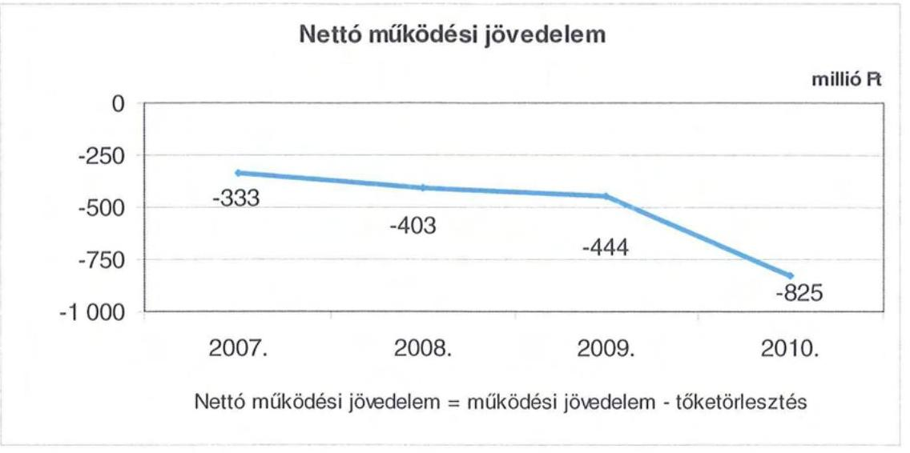

A vizsgált időszak éveiben képződő folyó költségvetési egyenleg egyik évben sem fedezte az Önkormányzat által a költségvetési hiány finanszírozására felvett növekvő összegű hitelekből adódó törlesztési kötelezettség ${ }^{36}$ terheit. 2010. évben a működési jövedelem 248 millió Ft-os visszaesése, illetve a hiteltörlesztés 133 millió Ft-os növekedése eredményeként a negatív értékű nettó működési jövedelem az előző évihez képest közel megduplázódott.

A pénzügyi kapacitás tartósan negatív tendenciája miatt az Önkormányzat rövid lejáratú költségvetési forráshiány finanszírozására felvett hitelei döntőrészt az adósságszolgálat fedezetének biztosítására szolgáltak. A nettó működési jövedelem negatív értékének további hitelből történő finanszírozása pénzügyileg nem fenntartható gazdálkodást vetít előre.

A 2007-2010. években az Önkormányzat felhalmozási költségvetésének egyenlege folyamatosan negatív összegű volt, amely körültekintő költségvetési gazdálkodás és pénzügyileg fenntartható ${ }^{37}$ beruházások esetén elvileg nem járna magas pénzügyi kockázattal, ha a felhalmozási hiányra forrásként rendelkezésre álló nettó működési jövedelem fedezetet nyújtana. Az Önkormányzat korábbi eladósodása miatt azonban a felhalmozási kiadások finanszírozására felszabadítható források nem keletkeztek a folyó költségvetésben.

[^0]
[^0]:    ${ }^{36}$ Az önkormányzat tőketörlesztési kötelezettsége 2007. évben 439 millió Ft, 2008. évben 716 millió Ft, 2009. évben 777 millió Ft, 2010. évben 910 millió Ft volt.
    ${ }^{37}$ Az minősül pénzügyileg fenntartható beruházásnak, amelynek működtetésére az Önkormányzat nettó működési jövedelme a következő években is fedezetet nyújt.

---

A felhalmozási költségvetés egyenlegének alakulását 2007-2010 között a következő ábra szemlélteti:
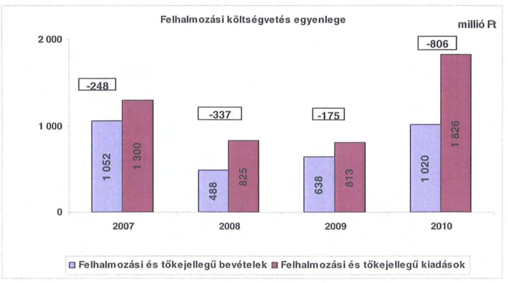

A 2007-2010. közötti évekre kimutatott 1566 millió Ft felhalmozási forráshiánynak a felhalmozási és tőke jellegű kiadásokhoz viszonyított aránya az egyes évek között változó tendenciát mutat: 2007-ben 19,1\%, 2008-ban 40,8\%, 2009-ben 21,5\% és 2010-ben 44,1\%. A 2010. évi kiugró mértékű hiány döntően a felújítási kiadások 864 millió Ft-os növekedéséből adódott ${ }^{38}$.

A vizsgált időszakban keletkezett 1566 millió Ft felhalmozási hiányra az értékpapír eladásból származó 291 millió Ft bevétel, 1127 millió Ft fejlesztési hitel, illetve a rövid lejáratú hitelkeretből felvett 148 millió Ft-os összeg nyújtott fedezetet $^{39}$.

A finanszírozásba bevonható pénzeszközök állománya 2007. január 1-jéhez képest a vizsgált időszak végére 1113 millió Ft-ról 1251 millió Ft-ra nőtt. A -2005 millió Ft nettó működési jövedelemhez képest az Önkormányzat 2600 millió Ft működési hitelt vett fel. A függő, átfutó, kiegyenlítő tételek -309 millió Ft-os egyenlege forráskivonást, hitellel történő finanszírozást eredményezett. Az 1566 millió Ft fejlesztési hiány fedezetének biztosításához 1127 millió Ft hitelből, 291 millió Ft értékpapír eladásból származó pénzeszköz került felhasználásra. Az Önkormányzatnál a CLF módszer szerinti működési és a felhalmozási hiány összege eltér a fedezetként megjelölt hitelforrás összegétől, amely azt jelenti, hogy a fejlesztési deficit finanszírozásába a működési hitelkeretből lehívott rész is bevonásra került.

Az Önkormányzat 2011. évre elfogadott költségvetési rendeletében a bevételek és kiadások különbözete 3027 millió Ft hiányt mutat, melynek finanszírozását

[^0]
[^0]:    ${ }^{38}$ Az ábrában megjelenő 2010. évi felhalmozási kiadásokban a társulásokhoz kapcsolódik 582 millió Ft.
    ${ }^{39}$ Az évenkénti adatokat a jelentés 2. számú melléklete mutatja be.

---

607 millió
 Ft pénzmaradvány felhasználással, illetve 2420 millió Ft hitel felvételével tervezik megoldani.

Az ÁSZ tv. 29. § (2) bekezdése alapján a számvevőszéki jelentés-tervezet költségvetési bevételek és kiadások különbözetének finanszírozására vonatkozó javaslatára a polgármester észrevételt tett, mely szerint: „A javaslat pontosítását kérjük, mivel a kötelezettségek teljes körére vonatkozó kiadásokat nem lehet meghatározni, hiszen a későbbi időszakokban változó kötelezettségek nem ismertek, így a források számszerűsített megjelölése sem lehetséges. A finanszírozási terv a költségvetési tervezés szakmai feladataihoz kapcsolódik. A jelenlegi helyzetben, amikor azt sem lehet tudni, hogy milyen feladatok maradnak az Önkormányzatnál, nem látjuk értelmét három évre előre finanszírozási terv készítésének. Mivel az államháztartási törvény korábbi 70. § (3) bekezdése az önkormányzati költségvetés működési és fejlesztési szektorának elkülönített bemutatását a tárgyévet követő két évben jelölte meg, kérjük, hogy a javasolt feladat esetében is két évre kitekintően kerüljön meghatározásra amennyiben a javaslatukat továbbra is fenntartják."

Az Áht. 71. § (2) hatályos szövege szerint a polgármester a költségvetési rendelettervezet benyújtásakor előterjeszti azokat a rendelettervezeteket is, amelyek a javasolt előirányzatokat megalapozzák, bemutatja a többéves elkötelezettséggel járó kiadási tételek későbbi évekre vonatkozó kihatásait. Mivel az Áht. 71. § (2) bekezdés a kötelezettségek bemutatását időhatár nélkül írja elő, ezért az ÁSZ nem látja szükségesnek az eredeti javaslat módosítását.

Az Önkormányzat évenkénti teljes finanszírozási igénye ${ }^{40}$ a CLF módszer szerint 2007-ben 581 millió Ft, 2008-ban 740 millió Ft, 2009-ben 619 millió Ft, 2010-ben 1631 millió Ft volt, amelynek finanszírozását a finanszírozási célú bevételek és kiadások egyenlege biztosította.

Az Önkormányzat finanszírozási műveletei egyenlegének alakulását a következő ábra szemlélteti:
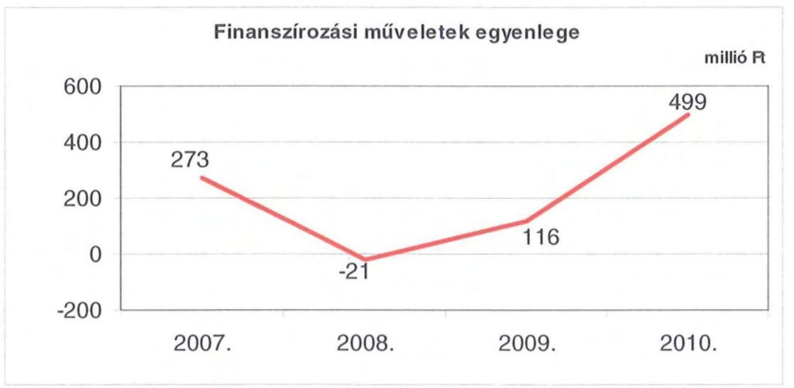

[^0]
[^0]:    ${ }^{40}$ a nettó működési jövedelem és a fejlesztési költségvetés eredője

---

A finanszírozási többlet növekedése azt jelzi, hogy az éves költségvetések végrehajtása során az előző években keletkezett pénzmaradvány igénybevételén túl egyre nagyobb súllyal volt szükség külső finanszírozás igénybevételére.

Az Önkormányzat zárszámadási rendeleteiben felhalmozási és működési egyensúlyát a CLF módszertől eltérő módon mutatta be ${ }^{41}$, amelyről a jelentés 1. számú melléklete nyújt tájékoztatást. A működési és felhalmozási bevételek és kiadások eltérő szempontú figyelembevétele következtében minden évben működési és a 2010. év kivételével felhalmozási többletet mutattak ki.

A vizsgált időszakban a passzív pénzügyi elszámolások nélküli kötelezettségek 3007 millió Ft-ról 4486 millió Ft-ra emelkedtek, amely együtt járt a kamatkiadások növekedésével.

Az Önkormányzat 2007-2010 között összesen 250 millió Ft kamatot fizetett meg. A 2010. évben kifizetett kamatok összege 44%-kal haladta meg a 2007. évit. Az Önkormányzat átmenetileg szabad pénzeszközein realizált kamatbevétele a négy év során 324 millió Ft volt.

Az Önkormányzat kamatbevételeinek és kamatkiadásainak alakulását a következő ábra mutatja:
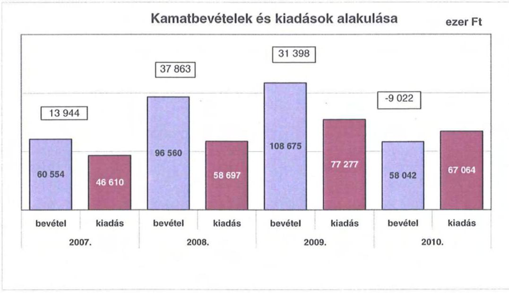
2011. évre az Önkormányzat költségvetési rendeletében 186 millió Ft kamatráfordítással kalkulált, amely a 2010. évhez képest 119 millió Ft-os, 177%-os mértékű növekedést jelent.

[^0]
[^0]:    ${ }^{41}$ Nincs kötelező előírás a működési és fejlesztési hiány megállapításának módjára.

---

# 2.2. Az Önkormányzat bevételeinek alakulása 

Az Önkormányzat 2010. évi 9919 millió Ft működési bevétele 774 millió Ft-tal, 8,5%-kal haladta meg a 2007. évit. A működési bevételeken belül a saját és az állami bevételek dinamikája eltérő. A gazdasági válság következtében visszaeső helyi adó- és illetékbevételek miatt 2009. évtől a saját bevételek csökkenése következett be, a 2010. évi összes saját működési bevétel 121 millió Ft-tal, 4,1%-kal marad el a 2007. évitől. A költségvetési támogatás és az átengedett központi bevételek együtt 2007. évről 2010. évre 433 millió Ft, 7,4% növekedést mutatnak.

A társulásoknál elszámolt tételek ${ }^{42}$ az Önkormányzat működési bevételének alakulására meghatározó befolyást nem gyakoroltak.
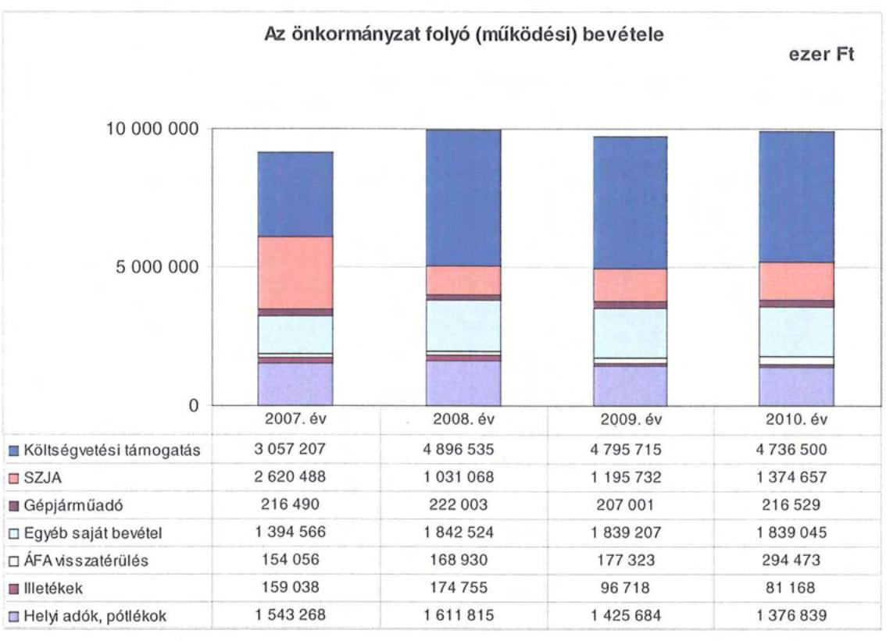

A működési bevételek meghatározó részét a költségvetési támogatás és az átengedett központi adók teszik ki, együttes részesedésük 2010. évben 64% volt, amely az érintett időszak során érdemben nem változott.
2010. évben a költségvetési támogatásból a feladatmutatóhoz kötött normatív hozzájárulások összege 2430 millió Ft volt, amelynél az ellátotti létszám kedvezőtlen alakulása miatt az előző évhez képest 7,8%-os csökkenés következett be. Ezt megelőzően 2008. évben az szja normatív módon elosztott részének beépítése miatt 13,7%-os növekedés, míg a 2009. évben 0,9%-os csökkenés történt. Az Önkormányzat feladatátadásainak - Somoskőújfalu Község részére óvoda, idősek nappali ellátása, kistérségi többcélú társulás részére idősek nappali ellátása - a normatív állami hozzájárulásból származó bevételi kihatása - csökkenése - a négy évre vetítve az Önkormányzat számításai alapján összesen 47 millió Ft.
2010. évben az átengedett szja bevételen belül a helyben maradó 481 millió Ft támogatási rész 66 millió Ft-tal, 15,9%-kal haladta meg a 2007. évi szintet, míg a jövedelemkülönbség mérséklés jogcímen folyósított 894 millió Ft támogatás esetében a növekedés mértéke 54,1%. A jövedelemkülönbség ${ }^{43}$ önkormányzati szintje 2010. évben 31093 Ft, az országos értékhatár 58,3%-ának felelt meg, míg ez az arány 2007-ben még 71% volt. A térség kedvezőtlen gazdasági helyzetéből adódóan gyenge iparűzési adóerő-képesség a gazdasági válság miatt tovább romlott, 2010. évi összege 762817 ezer Ft a 2007. évi szint 93,6%-ának felelt meg.

A gépjárműadóból 2010-ben befolyt 217 millió Ft a 2007. évi bevétel szintjén teljesült. 2009. évben a gazdasági válság miatt az adóköteles gépjárműállomány 10%-os csökkenéséből adódóan 15 millió Ft bevétel visszaesés, míg 2010. évben az adótörvény-módosításban kalkulált mértéktől kisebb, 10 millió Ft-nak megfelelő, 4,6%-os növekedés tapasztalható ${ }^{44}$.

Az Önkormányzat 2010. évben realizált 1839 millió Ft egyéb folyó bevétele 444 millió Ft-tal, 31,9%-kal haladta meg a 2007. évi szintet, amelyből 2008. évben az előző évi pénzmaradvány-átvétel 325 millió Ft-os többletének köszönhetően kiugró mértékű, 32,1%-os növekedés, majd ezt követően stagnálás figyelhető meg. A működési célra átvett pénzeszközökből 2010. évben befolyt 670 millió Ft 401 millió Ft-tal, 150%-kal nőtt 2007. évhez képest. A növekedés döntően a társulások által elszámolt bevételek dinamikájából adódott. Az Önkormányzat működési bevételeiben szereplő OEP támogatás (2007. évben 90 millió Ft, 2008. évben 100 millió Ft, 2009. évben 127 millió Ft, 2010. évben 136 millió Ft) az egészségügyi alapellátás finanszírozásához kapcsolódott.

A 2010. évi 294 millió Ft áfa visszatérülésből származó bevétel 140 millió Ft-tal, 91%-kal haladja meg a 2007. évit. A bevétel-növekedés döntően a 2010. évi 109 millió Ft fordított áfa elszámolásból adódott.

Az Önkormányzat valamennyi vizsgált évben realizált osztalékbevételt, melynek összege 2007. évben 23 millió Ft, 2008. évben 33 millió Ft, 2009. évben 22 millió Ft és 2010. évben 15 millió Ft volt. Az osztalék jogcímen befolyt bevétel meghatározó része minden évben egy vállalkozástól származott. Osztalékra való jogosultságáról az Önkormányzat egyik évben sem mondott le.

[^0]
[^0]:    ${ }^{43}$ Az egy lakosra jutó, helyben maradó szja és a helyi iparűzési adóerő-képesség együttes összege.
    ${ }^{44}$ A gépjárműadóról szóló 1991. évi LXXXII. törvény 7. § (1) bekezdésének 2010. január 1-jétől hatályos módosítása az egyes adótételek esetében átlagosan 15%-os emelkedést eredményezett.

---

A 2010. évi 81 millió Ft illetékbevétel a 2007. évi 159 millió Ft 51%-ának felel meg, ennek megfelelően az illetékek folyó bevételek összegéből való részesedése a 2007. évi 1,7%-ról 0,8%-ra csökkent. 2008. évet követően a jogszabálymódosítás következtében csökkenő illetékmérték, illetve növekvő kedvezmények miatt, továbbá a gazdasági válság hatására visszaeső ingatlanpiac következtében az illetékbevétel jelentős visszaesése következett be.

A helyi adók folyó bevételeken belüli részaránya a 2007. évi 17%-ról, a 2008. évi növekedést követően 2010-re 14%-ra csökkent. A befolyt bevétel kedvezőtlen alakulása döntően a legnagyobb bevételi jogcímet jelentő iparűzési adó gazdasági válság miatt bekövetkezett csökkenő tendenciájával magyarázható. A vizsgált évek alatt az adónemek száma és az egyes adónemek esetében az adó mértéke ${ }^{45}$ nem változott.

A helyi adókból és pótlékokból befolyt bevétel alakulása a vizsgált évek során:

|  |  |  |  |  |
| :-- | --: | --: | --: | --: |
| Megnevezés | 2007. év | 2008. év | 2009. év | 2010. év |
| iparűzési adó | 1147375 | 1234222 | 1056427 | 1047830 |
| Építményadó | 367060 | 347993 | 338449 | 306409 |
| Idegenforgalmi adó* | 2242 | 2913 | 3918 | 6053 |
| Vállalkozók kommunális adója* | 21 | - | - | - |
| Bírság, pótlékok | 26570 | 26687 | 26890 | 16547 |
| Helyi adóbevétel, pótlékok összesen | 1543268 | 1611815 | 1425684 | 1376839 |

*: A 2010. évi többletbevétel az ellenőrzések során megállapított adókülönbözet beszedéséből adódott.
**: Az adónemben korábbi évekről fennálló hátralék beszedéséből származó bevétel.
Az Önkormányzat felhalmozási bevételei a vizsgált időszakban az alábbiak:
ezer Ft

| Megnevezés | 2007. év   tény | 2008. év   tény | 2009. év   tény | 2010. év   tény |
| :-- | --: | --: | --: | --: |
| Tárgyi eszköz értékesítés | 10782 | 22664 | 36244 | 10656 |
| Egyéb saját tökebevétel | 131502 | 87314 | 67104 | 64448 |
| Államháztartáson belülről   kapott támogatás * | 727517 | 315049 | 415291 | 798306 |
| EU-tól és külföldről kapott   támogatások | 0 | 0 | 0 | 0 |
| Államháztartáson kívülről   kapott támogatás | 182006 | 62882 | 119341 | 147120 |
| Összes felhalmozási bevétel | 1051807 | 487909 | 637980 | 1020530 |

* Tartalmazza a támogatásértékű felhalmozási bevétel fejezeti kezelésű előirányzattól EU-s programra jogcímen elszámolt támogatásokat is.

[^0]
[^0]:    ${ }^{45}$ A helyi adók jelenlegi mértéke: az iparűzési adó állandó jellegű tevékenységnél az adóalap 2%-a, ideiglenes tevékenységnél 5000 Ft/naptári nap, építményadónál az ingatlan övezeti besorolásától függően 650-910 Ft/m²/év, idegenforgalmi adónál személyenként és vendégéjszakánként 200 Ft.

---

A táblázatban szereplő adatok a 2008-2010. években tartalmazzák a társulások felhalmozási tételeit ${ }^{46}$ is.

Az Önkormányzatnak tárgyi eszköz értékesítéséből egyik évben sem származott számottevő bevétele. Az államháztartáson belülről kapott felhalmozási pénzeszközökből 2010-ben 392 millió Ft, 2009-ben 343 millió Ft a társulások által elszámolt támogatás. Az Önkormányzat fejlesztéseihez elnyert EU előirányzatból származó támogatásait államháztartáson belülről átvett pénzeszközként számolta el.

Az államháztartáson kívülről átvett pénzeszközök 2010. évben 35 millió Ft-tal, 19%-kal maradnak el a 2007. évi szinttől. 2007. évben kiugró nagyságrendű tétel volt a
 Garzonház felújításához kapcsolódó 147 millió Ft társasházi forrás átvétele. 2009-2010. években a társulások pénzeszköz átvételei (115 és 118 millió Ft) képezik a bevételi jogcím összegének meghatározó részét.

# 2.3. Az Önkormányzat kiadásainak alakulása 

Az Önkormányzat 2010. évi folyó kiadásai 2007. évhez képest 9039 millió Ftról 9834 millió Ft-ra, 8,8%-kal nőttek. A teljesítés alakulását számottevően nem befolyásolták a társulások 2008. évtől jelentkező folyó kiadásai, 2008. évben 7 millió Ft, 2009. évben 89 millió Ft, 2010. évben 307 millió Ft. A vizsgált időszakot érintő önkormányzati feladatátadások - óvodai nevelés, idősek nappali ellátása - folyó kiadásokra gyakorolt kihatása az Önkormányzat adatszolgáltatása alapján 380 millió Ft kiadás csökkenés.

Az Önkormányzat folyó kiadásai főbb jogcímek szerinti részletezésben az alábbiak szerint alakultak:

| Megnevezés | 2007. | 2008. | 2009. | 2010. |
| :--: | :--: | :--: | :--: | :--: |
| Folyó kiadások | 9039306 | 9634887 | 9404585 | 9833607 |
| Működési kiadások (kamatkiadás nélkül) | 7534900 | 7856976 | 7351791 | 7598192 |
| Államháztartáson belülre átadott pénzeszközök | 85973 | 97730 | 111611 | 125541 |
| Transzferkiadások | 1332452 | 1455470 | 1780264 | 1944274 |
| -ebből: vállalkozásoknak | 345893 | 375136 | 663513 | 813160 |
| EU-nak, illetve külföldre | 0 | 0 | 0 | 0 |
| magánszemélyeknek | 855332 | 941418 | 991127 | 1048538 |
| nonprofit szervezeteknek | 131227 | 138916 | 125624 | 82576 |
| Kamatkiadások | 46610 | 58697 | 77277 | 67064 |
| Előző évi pénzmaradvány átadás | 39371 | 166014 | 83642 | 98536 |

A kamat nélküli működési kiadások egyes évek közötti hullámzó változására egyedi okok hatottak. A 2008. évi növekedés döntőrészt az előző évi maradvány visszafizetés jogcímen elszámolt 322 millió Ft-ból adódott. A 2010. évi növekedés forrása a társulások tevékenységének bővüléséből és a fordított áfa elszámolásból adódó többletkiadás volt. A fenti tételek nélkül a működési kiadásokra csökkenő tendencia volt jellemző.

[^0]
[^0]:    ${ }^{46}$ A társulások felhalmozási bevételei 2008. évben 53 millió Ft, 2009. évben 484 millió Ft, 2010. évben 510 millió Ft.

---

A kamat nélküli működési kiadások jogcímenkénti alakulását az alábbi táblázat tartalmazza:

|  |  |  |  | ezer Ft |
| :-- | --: | --: | --: | --: |
| Megnevezés | 2007. | 2008. | 2009. | 2010. |
| Személyi juttatások | 3 802 475 | 3 784 015 | 3 551 831 | 3 575 646 |
| Munkaadót terhelő járulékok | 1 208 764 | 1 194 761 | 1 063 597 | 933 344 |
| Dologi kiadások | 2 347 103 | 2 440 653 | 2 576 853 | 2 957 431 |
| Egyéb folyó kiadások kamat nélkül * | 176 558 | 437 547 | 159 510 | 131 771 |
| Működési célú pénzeszközátadás | 1 418 425 | 1 553 200 | 1 891 875 | 2 069 815 |

* A 2009. évi adatból az előző évi maradvány visszafizetése 321722 ezer Ft.

Az intézményátszervezési intézkedésekből adódó létszám- és álláshely csökkentések következményeként 2007. évhez képest a személyi juttatások összegében 227 millió Ft, 6%-os visszaesés következett be. Az egyes intézményeknél jelentős mértékben eltér a személyi juttatások 2007-2010 közötti változásának mértéke. Az oktatási intézményeknél 11,8%-os csökkenés tapasztalható, az egészségügyi és szociális központ esetében a személyi juttatások nagyságrendje lényegében változatlan, az egyéb önálló intézményeknél csupán 0,4%-os növekedés történt, szemben a Polgármesteri hivatallal, ahol 3,8%-kal haladja meg a személyi juttatások 2010. évi összege a 2007. évit. Önkormányzati szinten a társulások nélkül számított átlagos statisztikai állományi létszám 2006. december 31-én 1484 fő, míg 2010. év végén 1248 fő volt.

A munkaadókat terhelő járulékok 2010. évi összege 275 millió Ft-tal, 22,8%-kal marad el a 2007. évi szinttől, amelyben a létszámleépítések, továbbá 2009. évtől a foglalkoztatókat terhelő társadalombiztosítási járulék-mérték csökkenés, illetve a tételes egészségügyi hozzájárulás megszűnés hatása együttesen jelenik meg.

Az intézmények dologi kiadásai 2007-2010 között folyamatosan növekvő tendenciát mutatnak, a 2010. évben teljesített dologi kiadások (2957 millió Ft) 26,0%-kal haladták meg a 2007. évi szintet. 2008. évtől a társulások működéséből adódó tételek (2008. évben 3 millió Ft, 2009. évben 47 millió Ft, 2010. évben 240 millió Ft) is hozzájárultak a többletkiadáshoz. Ezen túl a fordított áfa elszámolás miatti többlet 2010. évben 95 millió Ft volt.

A kamatkiadások alakulásában az Önkormányzat hitelállományának növekedésével párhuzamosan emelkedő tendencia figyelhető meg. A 2010. évben kifizetett 67 millió Ft kamat összege a 2007. évihez képest 43,9%-os növekedést jelent.

A működési kiadások 20%-át kitevő transzferkiadások jogcímei közül meghatározó nagyságrendű a szociális ellátásokra, támogatásokra fordított 2010. évi 1049 millió Ft, ezen túl a vállalkozások működésének támogatása. Valamennyi - nem csak az önkormányzati közfeladatot ellátó - vállalkozás részére 2010. évben elszámolt 813 millió Ft működési célú pénzeszközátadás 2009-től megfigyelhető dinamikája döntően a közfoglalkoztatási programok bővülése miatt a foglalkoztatást szervező nonprofit kft. részére átadott támogatás növekedéséből adódott.

---

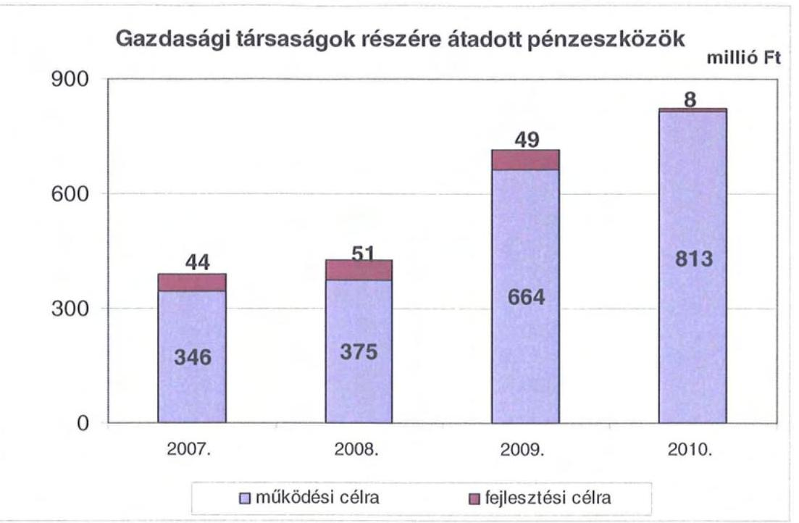

A működési célú pénzeszközátadások meghatározó része az önkormányzati feladatokat ellátó társaságok részére került kifizetésre. A legalább 25%-ban önkormányzati tulajdonban lévő tíz vállalkozás 2010. évi 6046 millió Ft bevételének 11,9%-át jelentette az önkormányzattól működésük és fejlesztéseik támogatására összesen átvett 718 millió Ft. A fenntartói támogatások bevételeiken belüli részaránya 2007. évben mindössze 5,8% volt. A 2007. évről 2010. évre a társaságok bevétele 1238 millió Ft-tal, 25,7%-kal nőtt, ezzel szemben az önkormányzati támogatás növekménye 440 millió Ft, 158% volt.

Az önkormányzati feladatokat ellátó gazdasági társaságok részére folyósított támogatások adatait a 4. számú melléklet mutatja be.

Fejlesztési célú pénzeszközök (a 2007-2008. évek kivételével) kizárólag a Salgótarjáni Csatornamű Kft. részére kerültek átadásra. Az Önkormányzat és a Kft. között létrejött 20 éves futamidejű bérleti szerződés alapján az Önkormányzat a tulajdonában lévő szennyvíz-hálózathoz tartozó eszközök és szennyvíztelep Csatornamű Kft. részére történő bérbeadásából származó bevétel 50%-át fejlesztési célra fordítandó támogatásként visszajuttatja a cég részére, a 2007-2010. évek alatt összesen 146 millió Ft-ot adott át erre a célra.

Az Önkormányzat költségvetési kiadásaiból 2010. évben a működési célúak aránya 84%, a felhalmozási kiadások aránya 16% volt, míg a 2008-2009. években a fejlesztések alacsonyabb nagyságrendje miatt a működési kiadások részaránya elérte a 92%-ot.

---

A működési és felhalmozási kiadások megoszlását a következő ábra szemlélteti:
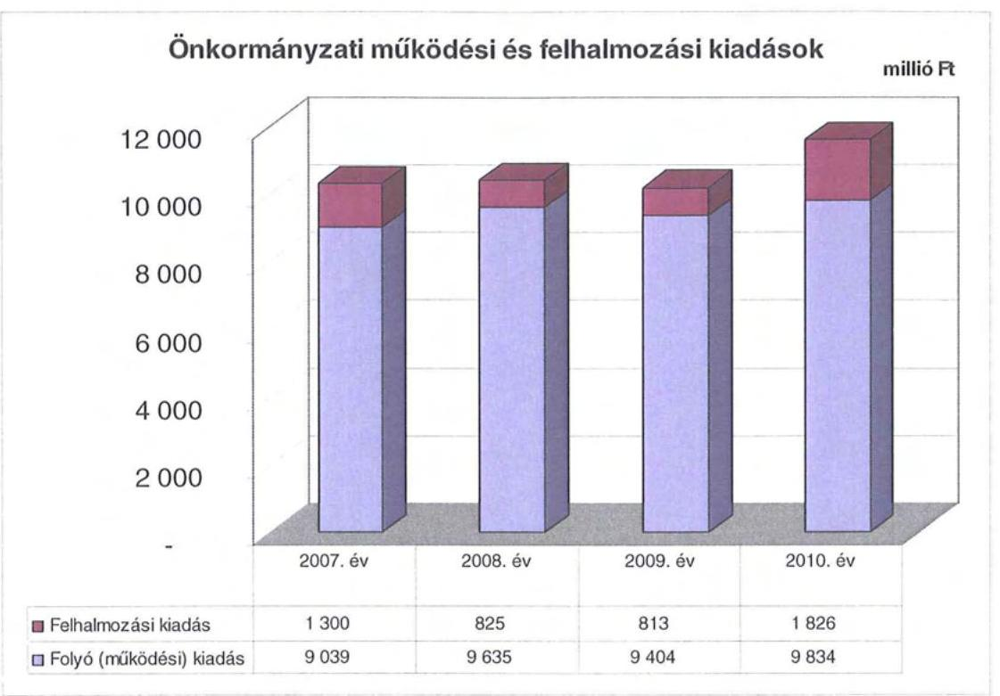

Az Önkormányzat a 2007-2010. években megvalósított, illetve 2010. december 31-én folyamatban lévő, valamint az elbírálás alatt lévő fejlesztési feladatokhoz kapcsolódó kötelezettségeinek összegzését a jelentés 3.a - 3.d számú mellékletei tartalmazzák.

Az Önkormányzat 2007-2010 között befejezett felújítások és beruházások eredményeként összesen 3360 millió Ft bekerülési költségű fejlesztést hajtott végre, melynek forrásösszetétele: saját bevétel 1365 millió Ft (41%), hitelfelvétel 837 millió Ft (25%), EU támogatás 444 millió Ft (13%) és egyéb hazai támogatás 714 millió Ft (21%).

A megvalósított felhalmozási kiadások jellemzően az oktatási intézmények felújítása, akadálymentesítése, a garzonház felújítása, a városi sportcsarnok és buszpályaudvar rekonstrukciója, útfelújítások, szennyvízközmű beruházáshoz kapcsolódtak.

A három legmagasabb bekerülési költségű fejlesztés a vizsgált időszakban a következő volt:

- A sportcsarnok rekonstrukciója 2007. évben kezdődött és 2008-ban fejeződött be. Az 580 millió Ft bekerülési költségből az önkormányzati saját forrás 70 millió Ft, a felvett hitel 65 millió Ft, továbbá a Nemzeti Sporthivatal Terület és Régiófejlesztési Célelőirányzatából elnyert támogatás 445 millió Ft volt.
- Az autóbusz pályaudvar 2006-ban kezdődő rekonstrukciója 355 millió Ft-ba került, amelyhez az Önkormányzat a ROP 2.1.3 Helyi tömegközlekedés infrastruktúrájának fejlesztési EU előirányzatból 287 millió Ft-ot nyert el, ezenfelül saját forrásból 68 millió Ft-ot fordított a fejlesztésre.

- A garzonház felújítási, korszerűsítési projekt 2007. évben került átadásra. A 253 millió Ft bekerülési költség finanszírozásához az Önkormányzat saját forrásait 147 millió Ft, társasháztól átvett pénzeszköz egészítette ki.

A 10 millió Ft feletti befejezett fejlesztések száma összesen 46, az összes bekerülési értékük 2670 millió Ft, az összes fejlesztési kiadás 79%-a. A fenti projektek közül 19 esetben részesült az Önkormányzat uniós, illetve hazai pályázati támogatásban. A három kiemelt projekten kívül az Önkormányzat állati hulladék ártalmatlanító építéséhez a KIOP 1.2.0-F EU előirányzatból 77 millió Ft-ot, oktatási intézményeinek akadálymentesítéséhez az ÉMOP 4.2.2 EU előirányzatból 20 millió Ft-ot, útfelújításokhoz az ÉMOP 3.1.2./B EU előirányzatból 60 millió Ft-ot nyert el.

A hazai támogatási rendszerből az Önkormányzat útfelújításokhoz, szennyvízcsatorna beruházáshoz, intézményi felújításokhoz a LEKI előirányzatból 171 millió Ft-ot, TEKI fejlesztési támogatást 20 millió Ft összegben és TEUT támogatási keretből 78 millió Ft-ot nyert el. Az uniós, illetve hazai támogatások bevonásával megvalósult fejlesztési feladatoknál a támogatottság mértéke átlagosan 76% volt.

A 2010. év végén folyamatban lévő fejlesztési feladatokra az Önkormányzat 2010. évben 775 millió Ft-ot fordított, amelyből 100 millió Ft saját bevétel (13%), 337 millió Ft (44%) hitelfelvétel, 273 millió Ft (35%) uniós és 65 millió Ft (8%) hazai támogatás volt.

A folyamatban lévő fejlesztésekhez kapcsolódó, 2010. évet követően esedékessé váló kötelezettségek összege: 1197 millió Ft, amelyből 58 millió Ft a saját bevétel, 375 millió Ft a hitelfelvétel, 623 millió Ft az EU támogatás és 141 millió Ft az egyéb hazai forrás összege.

Az Önkormányzat beadott, elbírálás alatti pályázati forrásból megvalósuló fejlesztéseihez kapcsolódó jövőbeni kötelezettségvállalás kizárólag 2011. évre 40 millió Ft-ot jelent, melynek jogcímei között hitelfelvétel nem szerepel, kizárólag 4 millió Ft saját bevétel és 36 millió Ft hazai támogatás.

Az összes felhalmozási kiadásban 2008. évtől megjelentek az önkormányzati beruházási társulások fejlesztései ${ }^{47}$ is. A társulások nélkül kimutatott kiadásokon belül 2010. évben a működési célúak aránya 88,5%, a fejlesztési kiadásoké 11,5% volt. A társulások fejlesztéseinek figyelembevétele nélkül a felhalmozási kiadások részarányában 2009. évben 2,3, 2010. évben 4,1 százalékpontnak megfelelő eltérés mutatható ki.

[^0]
[^0]:    ${ }^{47}$ A társulások összes felhalmozási kiadása 2008. évben 9 millió Ft, 2009. évben 247 millió Ft és 2010. évben 582 millió Ft, melyből a beruházások és felújítások összege 2008. évben 8 millió Ft, 2009. évben 158 millió Ft és 2010. évben 456 millió Ft.

---

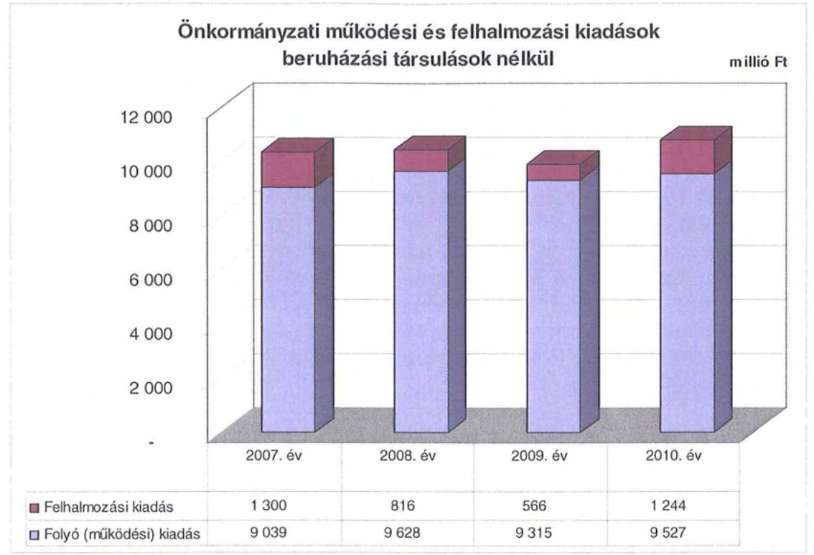

A beruházási társulások 2008-2010. évi fejlesztési kiadásaiból a felújítások, beruházások összege 622 millió Ft volt.

A TISZK tanműhely felújítások bekerülési költsége 438 millió Ft, integrált irányítási szoftver, informatikai, gépészeti eszközök és számítástechnikai és egyéb eszközök beszerzése 170 millió Ft.

A Kelet - Nógrád Hulladék Rekultivációs Társulás részére pályázati anyagok, tervdokumentáció kiadásai: 14 millió Ft.

# 3. KÖTELEZETTSÉGEK BEMUTATÁSA 

### 3.1. A pénzintézetek felé fennálló kötelezettségek alakulása

Az Önkormányzat pénzintézeti kötelezettségeinek állománya 2006. december 31-től

 2010. december 31-ig közel duplájára (1,8 szeresére) nőtt, 1782 millió Ft-ról 3232 millió Ft-ra. A vizsgált időszakban fennálló pénzintézeti kötelezettségei elsősorban deviza alapú, hosszú lejáratú fejlesztési és működési célú hitelek, valamint a rövid lejáratú működési célú hitelek felvételéből keletkeztek. A devizában felvett hitelek kötelezettsége év végi könyvviteli mérleg szerinti értékének meghatározásakor az árfolyamváltozás miatti év végi értékelést a 2008-2010. években elvégezték.

---

Az Önkormányzat pénzintézeteknél fennálló kötelezettség-állományát a 2007-2010. években az alábbi ábra szemlélteti:
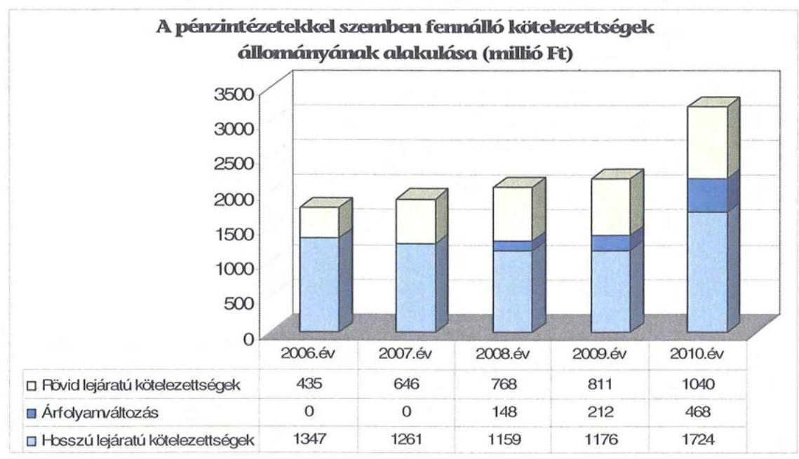

A pénzintézeti kötelezettségek állományának 2007-2010 közötti növekedését döntően befolyásolta, hogy

- az Önkormányzat 2007-2010 között 12 alkalommal hosszú lejáratú fejlesztési célú hitelszerződésben összesen 2244 millió Ft hitelkeret igényvételére állapodott meg. Ebből 2010. december 31-ig 1552 millió Ft hitelt hívott le;
- a 2007. év előtt kötött egy hosszú lejáratú fejlesztési hitelszerződésből a 2007. évben 65 millió Ft hitelt vett igénybe;
- a 2010. évben egy hosszú lejáratú működési hitelszerződésből 447 millió Ft hitelt vett igénybe.

Az árfolyamváltozás hatása is befolyásolja a kötelezettségek alakulását, azonban annak mértéke előre pontosan nem határozható meg, csak várakozásokon alapuló tendenciák jelezhetők. Annak megítéléséről, hogy a devizában felvett hitelekért kapott forinthoz képest a hitelek visszafizetésekor jelentkező forint kötelezettség többletkiadást (árfolyamveszteség) vagy megtakarítást (árfolyamnyereség) eredményez a futamidő végén, a teljes kötelezettség rendezését követően lehet képet alkotni. Mindaddig, amíg törlesztési kötelezettség nem áll fenn (türelmi idő, moratórium), a tőkére vonatkoztatva nem értelmezhető sem az árfolyamveszteség, sem az árfolyamnyereség. Ugyanakkor a számviteli szabályok meghatározzák, hogy az árfolyamkülönbözetet év végén a kötelezettségek vagy követelések között a könyvviteli mérlegben nyilván kell tartani, azonban az árfolyamkülönbözet valójában nem realizálódott.

Az Önkormányzat pénzintézeti kötelezettségvállalásairól, illetve azok mértékéről minden esetben a Közgyűlés döntött a 2007-2011. évek költségvetési rendeletei elfogadásakor, amelyek 6. számú mellékleteiben a többéves kihatással járó hitelfelvételek tőketartozásait hagyták jóvá.

---

A Közgyűlés az éves költségvetési rendeletek elfogadásakor a kötelezettségvállalásból származó források felhasználási célját csak általánosan - működési, felhalmozási feladatokra -, a kötelezettségvállalás visszafizetése forrásaként az éves költségvetési rendeletekben meghatározott bevételeket összességében határozta meg. A kötelezettségvállaláskor a közgyűlési előterjesztések tartalmazták a teljes futamidőre várható tőkefizetési kötelezettségeket, azonban a teljes futamidő kamatfizetési kötelezettségeit, továbbá az árfolyam- és kamatkockázatokat nem mutatták be. A megkötött szerződések alapján a hitelekhez kapcsolódó kötelezettségvállalások teljes futamidőre várható kamat- és tőkefizetési kötelezettségeit az Önkormányzat 2007-2010. évek költségvetési rendeletei ${ }^{48}$ és zárszámadása ${ }^{49}$ minden esetben tartalmazták.

A számvevőszéki jelentés-tervezetre a polgármester észrevételt tett, mely szerint: „A költségvetési rendelet elfogadásának időszakában nem lehet meghatározni a kamatfizetési kötelezettség mértékét, hiszen az a közbeszerzési eljárás lefolytatását követően, versenyben alakul ki. A futamidőben évenként fizetendő kamatösszegeket jelentősen befolyásolja az állandóan változó árfolyam, illetve a kamatösszeg alapján jelentő alapkamat (EURIBOR, CHF LIBOR). Ennek bizonytalansága szintén nem teszi lehetővé a futamidőn belül várható kamatkötelezettségeknek a költségvetési rendelet elfogadásának időszakában meghatározó éves mértékeit."

Továbbra is fenntartjuk, hogy pénzintézeti kötelezettségvállalásra szóló döntés a 2007-2010. évek költségvetési rendeletei elfogadásakor történt meg és ezekben nem mutatták ki a tárgyévre vonatkozó hitelfelvételi döntések többéves kihatású várható kamatfizetési kötelezettségeit.

Az Önkormányzat a 2007-2011. évek költségvetési rendeletei elfogadásával egyidejűleg nem mutatta be az adósságot keletkeztető kötelezettségvállalások felső határát, azonban annak vizsgálatát a könyvvizsgálói jelentések tartalmazták. Az Önkormányzat adósságot keletkeztető, az Ötv. 88. §-ában előírt éves kötelezettségvállalásának felső határát a 2007-2010. években nem lépte túl, azonban a 2011. évi költségvetési rendeletben tervezett hitelfelvételek már meghaladják a kötelezettségvállalási korlát felső határát.

A számvevőszéki jelentés-tervezetre a polgármester észrevételében a 2011. évre vonatkozó mondatrész törlését kérte, mely szerint: „A hatályos költségvetési rendelet megfelel az Ötv. 88. §-ában meghatározott felső határnak".

A mondatrész nem töröljük, mivel a Közgyűlés a 2011. évi költségvetési rendelet elfogadásakor a hitelfelvételről úgy döntött, hogy az nem felelt meg az Ötv. 88. §-ában előírtaknak. Az ellenőrzés a 2007. január 1. - 2010. december 31. közötti időszakot ölelte fel, de a jövőbeni kockázatok feltárása érdekében a 2011. március 31-ig hatályos időszakot is vizsgálta, melynek megfelelt a megállapításunk. Ezt követő időszakban elfogadott rendeletmódosítások értékelése nem tartozott az ellenőrzés feladatkörébe.

[^0]
[^0]:    ${ }^{48}$ Az 5. számú táblázat lejárat szerint, a 6. számú táblázat eszközök szerint, a 7. számú táblázat hitelezők szerint tartalmazta az Önkormányzat hitelállományát, a 8. számú táblázat pedig az ezekhez kapcsolódó kamatfizetési kötelezettségeket.
    ${ }^{49}$ A 10. számú táblázat lejárat szerint, a 11. számú táblázat eszközök szerint, a 12. számú táblázat hitelezők szerint tartalmazta az Önkormányzat hitelállományát, a 13. számú táblázat pedig az ezekhez kapcsolódó kamatfizetési kötelezettségeket.

---

A megkötött valamennyi hitelszerződésben az igénybe vehető keret összegét HUF-ban határozták meg, valamint a törlesztési kötelezettségek ütemezését is.

Az Önkormányzat részére a hiteleket nyújtó pénzintézetek a szerződésekben lehetőséget biztosítottak arra, hogy a hitelkereteket (a lehívási értesítők és nyilatkozatok alapján) HUF-ban, EUR-ban, vagy CHF-ben vegye igénybe, illetve tartsa nyilván. Az Önkormányzat a hiteleket CHF-ben, illetve EUR-ban vette igénybe. A 2005-2006. években igénybe vett hitelek esetében, melyek CHF-ben kerültek lehívásra, a pénzintézet referencia kamata 3 havi CHF LIBOR volt és kamatfelárként -0,7%-ot határoztak meg. Ennek előnye volt, hogy amennyiben az alapkamat és a kamatfelár együttesen negatív előjelű volt, akkor az Önkormányzatnak a hitel igénybevétele után nem kellett kamatfizetési kötelezettséget teljesíteni. Négy hosszú lejáratú devizahitel után - ezek a 2005-2006. években kötött szerződések voltak - 1,15 % kezelési költséget számított fel a pénzintézet, amelynek terhelése az összes hitelállomány és az árfolyam megadása mellett történt az Önkormányzat költségvetési számlájára.

Az Önkormányzat CHF-ben fennálló hosszú lejáratú fejlesztési célú hitelszerződései 2010. december 31-én az alábbiak voltak:

| Megnevezés | Szerződéskötés időpontja | Összeg   CHF | Lehivási árfolyam | Kamat (referencia kamat+   kamatfelár) | Felhasználás célja: |
| :--: | :--: | :--: | :--: | :--: | :--: |
| Hosszú lejáratú hitel 8801001 | 2005.12.22 | 5720043 | 160,1 | 3 havi CHF LIBOR -0,70 % | Bankváltást követően tőketartozás kiváltására |
| Több devizanemben igénybe vehető beruházási hitel 8805001 | 2005.12.22 | 925926 | 162 | 3 havi CHF LIBOR -0,70 % | Felhalmozási feladatokhoz |
| Beruházási hitel 8803001 | 2005.12.21 | 1704898 | 161,3 | 3 havi CHF LIBOR -0,70 % | Felhalmozási feladatok finanszírozása |
| Több devizanemben igénybe vehető beruházási hitel 880001 | 2006.12.29 | 421804 | 154,1 | 3 havi CHF LIBOR -0,70 % | Város Sportcsarnok beruházáshoz saját erő biztosítása |
| Több devizanemben igénybe vehető beruházási hitel 8808001 | 2008.08.12 | 595274 | 167,99 | 3 havi CHF LIBOR +   1,8 % | Salgótarján és környékének Egészséges Környezetet Alapítvány támogatására (cennsyyizberuházás megvalósítása) |
| Hitelkeret szerződés GA-035964 | 2007.09.18 | 1315530 | 152,03 | 3 havi CHF LIBOR + 0,18 | Beruházási célú fejlesztések finanszírozása |
| Hitelkeret szerződés GA-0401958 | 2008.08.12 | 861722 | 174,07 | 3 havi CHF LIBOR + 0,84 % | Beruházási célú fejlesztések finanszírozása |

Az Önkormányzatnak 2010. december 31-én CHF-ben nyilvántartott pénzintézeti kötelezettsége hét szerződés alapján keletkezett. A hét és további kettő, amelyek 2010. december 31-én lejártak - szerződés alapján az Önkormányzat 2056 millió Ft hitelt vett fel, amelyből a 2007-2010. években a hitelfelvétel 450 millió Ft volt. A hosszú lejáratú fejlesztési célú hitelszerződések alapján 11400269 CHF hitelt vett igénybe, a 2007-2010. években 2627598 CHF-et, amelyből 2010. december 31-ig 6034600 CHF (1248 millió Ft) összeget visszafizetett és 62 millió Ft kamatot megfizetett. A tőkefizetés utáni árfolyamveszteség 325 millió Ft volt 2010. december 31-ig.

---

Az Önkormányzat 2010. december 31-én EUR-ban fennálló hosszú lejáratú fejlesztési és működési célú hitelszerződései az alábbiak voltak:

| Megnevezés | Szerződéskötés időpontja | Összeg EUR | Lehivási árfolyam | Kamat (referencia kamat+ kamatfelár) | Felhasználás célja: |
| :--: | :--: | :--: | :--: | :--: | :--: |
| Kölcsönszerződés   MBD-SALG-MC-03/2009. | 2009.07.10 | 742942 | 269,2-278,4 | 3 havi EURIBOR + 4,0 % | Beruházások, fejlesztések finanszírozása |
| Több devizanemben igénybe vehető beruházási hitel 8B09001 | 2009.03.18 | 225516 | 260,66 | 3 havi EURIBOR + 2,95 % | TISZK létrehozása |
| Több devizanemben igénybe vehető beruházási hitel 5FD-MUN-08-0175/1 | 2009.03.18 | 1077426 | 269,16 | 3 havi EURIBOR + 2,95 % | SKÁID Kodály Z. tagiskola komplex, Arany J. tagiskola részleges felújítása |
| Kölcsönszerződés   MBD-SALG-MC-02/2009. | 2009.07.10 | 195451 | 281,4-270,7 | 3 havi EURIBOR + 6,0 % | Beruházások, fejlesztések finanszírozása |
| Hitelszerződés devizahitel igénybevételéhez -   Működés   1-2-10-4100-0194-7 | 2010.06.10 | 1725352 | 284 | 3 havi EURIBOR + 3,75 % | Költségvetés működési hiányának finanszírozása |
| Hitelkeret szerződés G1A-8DD-052080 | 2010.06.11 | 665288 | 278-265,06 | 3 havi EURIBOR + 3,45 % | Beruházások, felújítások megvalósításához |

Az Önkormányzatnak 2010. december 31-én EUR-ban nyilvántartott pénzintézeti kötelezettsége hat szerződés alapján keletkezett és további kettő hitelre kötött szerződést, amelyből még nem történt lehívás. A hat szerződés alapján az Önkormányzat a vizsgált időszakban 1132 millió Ft hitelt vett fel. Öt hosszú lejáratú fejlesztési és egy működési célú hitelszerződés alapján 4085894 EUR hitelt vett igénybe, amelyből 2010. december 31-ig 213001 EUR (60 millió Ft) összeget visszafizetett és 25 millió Ft kamatot megfizetett. A tőkefizetés utáni árfolyamveszteség 14 millió Ft volt 2010. december 31-ig.

A G1A-8DD-052080. számú hitelszerződésből 556326 EUR lehívása a 2011. év első félévében történt meg. A fentieken túl további kettő szerződés megkötésével vállalt EUR-ban kötelezettséget az Önkormányzat, amelyekből hitellehívás nem volt. 2010. 06. 11-én a „Sikeres Magyarországért" Önkormányzati Infrastruktúrafejlesztési Hitelprogram keretében megvalósuló város- és településrehabilitáció projekthez 68 millió Ft hitelkeretre, a 2010. 06. 10-én az Új Magyarország Fejlesztési Terv operatív programjai keretében meghirdetett Észak-dél irányú kerékpárút építése pályázati önrészének biztosításához 22 millió Ft hitelkeretre kötött szerződést, amely kölcsönök rendelkezésre tartási ideje 2011. december 31-én jár le.

Az Önkormányzat 2010. december 31-én Ft-ban fennálló hosszú lejáratú fejlesztési célú hitelszerződése az alábbi volt:

| Megnevezés | Szerződéskötés   időpontja | Összeg   Ft | Kamat   (referencia   kamat+   kamatfelár) | Felhasználás célja: |
| :-- | :--: | :--: | :--: | :--: |
| Kölcsönszerződés a   "Sikeres Magyarországért   Önkormányzati   Infrastruktúrafejlesztési   program" keretében | 2009.07.30 | 425000000 | 3 havi EURIBOR   +1,75 % | Felhalmozási hitel |

---

Az Önkormányzatnak 2009. július 30-án megkötött szerződéséből lehívás nem történt, az Új Magyarország Fejlesztési Terv operatív programjai keretében meghirdetett
 pályázatokhoz szükséges önerő biztosítására tervezik felhasználni a hitelt.

Az igénybe vett hiteleket, melyekből hosszú lejáratú 1127 millió Ft fejlesztési célú és 490 millió Ft működési célú volt, a 2007-2010. években a szerződésekben rögzített céloknak megfelelően használták fel. A 2007-2010. években az Önkormányzat a hosszú lejáratú fejlesztési célú hitelek törlesztésére 1181 millió Ft-ot, a kamatokra 128 millió Ft-ot teljesített, a hosszú lejáratú működési célú hitelére 43 millió Ft előtörlesztést és 11 millió Ft kamatkiadást. A hosszú lejáratú fejlesztési hitelekkel kapcsolatban 57 millió Ft egyéb költséget fizettek ki a 2007-2010. években, amelynek hitelenkénti elkülönítésére analitikus nyilvántartást nem vezettek, a tényleges, egy-egy hitelhez kapcsolható fizetési kötelezettséget nem mutatták ki.

Az Önkormányzat összes kötelezettségekhez viszonyítva a pénzintézeti kötelezettségek arányának folyamatos növekedése (2007. évi 63,4%-ról 2010. évre 72%-ra) az Önkormányzat eladósodottságának növekedését jelzi, ezen belül a rövid lejáratú hiteltörlesztési kötelezettségek arányának növekedése (2007. évi 21,5%-ról 2010. évre 26,9%-ra) az esedékes fizetési kondíciók romlását eredményezte. A hiteltörlesztési kötelezettségek a 2008-2010. években az előző évekhez viszonyítva folyamatosan emelkedtek, mely tendencia az EUR-ban felvett hitelek esetében 2011-2013. évek kötelezettségeire, valamint a 2014-től a futamidő végéig tovább folytatódik. A fennálló hitelek után a 2008. évtől negyedévenként a főkönyvi könyvelésben rögzítették az árfolyamváltozás miatti árfolyamveszteséget, melynek állománya 2010. december 31-én 339 millió Ft. Az RB 01001 azonosító számú 915 millió Ft-os CHF-ben igénybevett hitel 2011. december 29-én lejár, amelyhez kapcsolódó árfolyamveszteség - 2010. december 31-i állománya 154 millió Ft - kifizetése jelentős terhet jelent az Önkormányzat számára.

A számvevőszéki jelentés-tervezetre a polgármester észrevételében az utolsó mondat elhagyását, vagy módosítását kérte, mely szerint: „Ez a megállapítás nem helytálló, mivel a 154 millió Ft árfolyamveszteség fedezet az adósságszolgálatokat finanszírozó előirányzatban lett megtervezve (Költségvetési rendelet IV. Polgármesteri Hivatal fejezet, 14. cím) mint tőketartozás, és még ezen túlmenően került elkülönítésre 30 millió Ft általános tartalék (Költségvetési rendelet IV. Polgármesteri Hivatal fejezet, 17. cím). A veszteség kifizetéséhez a szükséges előirányzat rendelkezésre áll."

A megállapításunkat módosítjuk, de egyben jelezzük, hogy az adósságszolgálatokat finanszírozó előirányzat (Költségvetési rendelet IV. Polgármesteri Hivatal fejezet, 14. cím) a tőketartozásokat tartalmazhatja. A számviteli szabályok értelmében az árfolyamveszteséget elkülönítetten kell kimutatni.

Az Önkormányzat működésének pénzügyi egyensúlyát a vizsgált időszakban elsősorban éven belüli működési célú hitel - egyéb likvidhitel igénybevételével biztosította. A 2009. évben kilenc napra vett igénybe folyószámlahitelt ${ }^{50}$. Az Önkormányzatnak 2008. év január 1-jén nem volt folyószámlahitel szerződése, azonban a 2008. február 29-én megkötött szerződés 200 millió Ft-os hitelkerete után három millió Ft kezelési költséget fizetett.

A folyószámla- és az egyéb likvidhitel alakulását az alábbi táblázat mutatja be:
ezer Ft-ban

| Megnevezés | 2007. év | 2008. év | 2009. év | 2010. év | 2011.   március 31. |
| :-- | :--: | :--: | :--: | :--: | :--: |
| I. Folyószámlahitel |  |  |  |  |  |
| a folyószámlahitel keretösszege január 1-jén | 300000 | - | 200000 | 200000 | 200000 |
| teljesített kamat és egyéb költség |  | 3000 | 230 | 3000 | 3 |
| II. Egyéb likvidhitel |  |  |  |  |  |
| Igénybe vett hitel összesen: | 400000 | 500000 | 500000 | 710000 | - |
| teljesített kamat és egyéb költség | 3718 | 14175 | 44387 | 44485 | - |

A folyószámla ${ }^{51}$ - és egyéb likvidhitelek kondíciói és egyéb költségei a következők voltak:

| Megnevezés | Kamat (referencia+ kamatfelár | Egyéb költség |
| :--: | :--: | :--: |
| Folyószámlahitel |  |  |
| 2007-2011. év | 1 napi BUBOR - $1 \%$ | kezelési költség a keret 1,5%-a |
| Egyéb likvidhitel |  |  |
| 2007-2008. év | 3 havi CHF LIBOR $+0,08 \%$ | $x$ |
| 2009. év | 3 havi EURIBOR $+6 \%$ | $x$ |
| 2010. év | 3 havi EURIBOR $+1,95 \%$ | $x$ |

Az Önkormányzat számlavezető pénzintézete 2006. január 1-jétől tíz évre került megbízásra. Hiteleket más pénzintézetektől is vettek igénybe a közbeszerzési eljárások eredményeként. Az Önkormányzat a 2007-2010. években a munkabérek kifizetéséhez nem vett igénybe munkabér megelőlegezési hitelt.

Az egyéb likvidhitel átlagos napi állománya a 2007. évben volt a legalacsonyabb, 196 millió Ft, a 2010. évben volt a legmagasabb, 580 millió Ft, melyet az Önkormányzat saját bevételeinek csökkenése és a működési kiadások (kamatkiadás, közüzemi szolgáltatások) növekedése okozott. Az Önkormányzat tájékoztatása szerint az egyéb likvidhitelt a kedvezőbb kondícióik ${ }^{52}$ miatt vette igénybe, de erre a napi állomány figyelembevételével számítást nem végeztek.

Az áttekintett időszakot jellemző működési hiány, a folyamatos működési feladatok finanszírozása (egyéb likvid hitellel és 2009. évben folyószámlahitellel)

[^0][^1]
[^0]:    ${ }^{50}$ Átlagos napi állománya az igénybe vett napokra 121 millió Ft, éves szinten három millió Ft volt.
    ${ }^{51}$ A folyószámla referencia kamat az alábbiak szerint alakult:

[^1]:    ${ }^{52}$ A számlavezető pénzintézet 2007. évi közlése alapján az alapkamat Ft-ban 7,83%, a 3 havi CHF LIBOR 1,3475% és a 3 havi EURIBOR 3,004% volt.

---

az Önkormányzatnak a 2007. évtől 2011. március 31-ig összesen 109 millió Ft kamatkiadást eredményezett. Az Önkormányzatnak a felvett egyéb likvidhitelek visszafizetése a 2007. évben 194 millió Ft, a 2008. évben 458 millió Ft, a 2009. évben 497 millió Ft, a 2010. évben pedig 512 millió Ft kötelezettséget jelentett.

A jelenleg fennálló hosszú lejáratú fejlesztési és működési hitelek utáni kamatfizetési kötelezettségek alakulását jelentősen befolyásolta és jelenleg is befolyásolja a hitelfelvételkor és az utolsó kamatfizetéskor alkalmazott referencia kamatok változása. Az Önkormányzat a 2007-2010. években a hitelek után 249 millió Ft kamatkiadást teljesített. A 2007-2010. évek kamatkiadásaiból a működési célúak aránya növekvő tendenciájú volt, a 2007. évi 12,8%-ról (6 millió Ft) a 2010. évre 65,7%-ra (44 millió Ft) változott. A kamatkiadás a 2007. évi 46 millió Ft-ról 2010-re 44%-kal növekedett 67 millió Ft-ra, amelyet a növekvő hitelállomány és a működési célú hitelek kamatkondícióinak ${ }^{53}$ változása, továbbá az alapkamatok lehívási és utolsó fizetéskori eltérése okozott. A kamatváltozás hatását az alábbi táblázat mutatja be:

| Megnevezés | Lehivási | Utolsó fizetéskori | Változás \% |
| :-- | --: | --: | --: |
|  | alapkamat \% |  |  |
| 3 havi CHF LIBOR | 1,2183 | 1,01083 | $83,0 \%$ |
| 3 havi EURIBOR. | 6,87 | 7 | $101,9 \%$ |

Az Önkormányzat négy gazdasági társasága vett igénybe gazdálkodásához folyószámlahitelt. Egy 75%-ot meghaladó tulajdoni arányú gazdasági társaság folyószámlahitelének átlagos napi állománya 37 millió Ft-ról 84 millió Ft-ra emelkedett. A növekvő tendenciájú folyószámlahitel fizetési kockázatot jelent az Önkormányzatnak.

# 3.2. Szállítók felé fennálló kötelezettségek alakulása 

Az Önkormányzatnak és gazdasági társaságainak lejárt szállítói tartozásait az alábbi táblázat tartalmazza (ezer Ft-ban):

| Megnevezés | 2007. | 2008. | 2009. | 2010. |
| :-- | --: | --: | --: | --: |
|  | december 31. | december 31. | december 31. | december 31. |
| Lejárt szállítói tartozás | 21546 | 2184 | 7006 | 340088 |
| Gazdasági társaságok   lejárt szállítói tartozása | 91592 | 179949 | 123055 | 136313 |

Az Önkormányzat 2010. december 31-i mérlegben kimutatott szállítói kötelezettsége 421 millió Ft volt, melyből a lejárt tartozásállomány 340 millió Ft. Az Önkormányzat lejárt szállítói tartozás 2007. december 31-i állománya 22 millió Ft-ról 2010. december 31-ére 340 millió Ft-ra növekedett, a 2008-2009. években azonban nem volt számottevő. A lejárt szállítói kötelezettségek 30 nap alatti tartozások voltak, egyéb kiadás elmaradás nem volt a vizsgált

[^0]
[^0]:    ${ }^{53}$ A 2007. évi 3 havi CHF LIBOR + 0,08%-ról a 2010. évre 3 havi EURIBOR +1,95%-ra változott a hitelszerződés szerinti kamat mértéke.

---

időszakban. 2011. március 31-én lejárt szállítói tartozás állomány nem volt, mert a szállítói tartozások elsősorban pályázati forrásból megvalósuló feladatokat tartalmaztak, a tartozások kiegyenlítése 2011. I. negyedévében megtörtént.

Egy gazdasági társaságnak a szállítói tartozásokból a 2007. évben 59 millió Ft, a 2009. évben 100 millió Ft átütemezett kiadás-állománya volt.

A 75%-os tulajdoni hányadot meghaladó gazdasági társaságok 2007. december 31-i lejárt szállítói tartozás állománya 60 millió Ft volt, mely 2010. december 31-ére 125 millió Ft-ra (208,3%-ra) nőtt. Négy társaságnál a 2010. december 31-én fennálló 125 millió Ft tartozásból 87 millió Ft a 30 nap alatti, és négy millió Ft az éven túli tartozás, amely utóbbi kettő gazdasági társaságot érint. A 30 napot meghaladó 34 millió Ft lejárt tartozásállomány 55,9%-a, 19 millió 31-60 nap közötti, 41,2%-a, 14 millió Ft 61-90 nap közötti és 2,9%-a, egy millió Ft pedig 91-365 nap közötti.

# 3.3. Egyéb kötelezettségek alakulása 

Az Önkormányzatnak egy önkormányzati tulajdonú garzonház energiatakarékossági korszerűsítését, felújítását célzó pályázati sajáterő biztosításához kapcsolódó tőke- és kamatfizetési kötelezettsége jelentkezett. A 2007-2010. években összesen 125 millió Ft, amely a 2011-2013. években 53 millió Ft tőke, 30 millió kamat, továbbá a 2014-2021. évekre 142 millió Ft tőke és 39 millió Ft kamat, összesen 264 millió Ft fizetési kötelezettséget jelent.

A Közgyűlés 2005. évi határozatában ${ }^{54}$ döntött egy garzonház felújítását célzó pályázat benyújtásáról, amelyben vállalta az eredményes részvétel esetén a társasház által felvett hitel törlesztésében való közreműködést. A társasház a felújítás megvalósítása érdekében 2006. szeptember 29-én 211 millió Ft összegű kölcsönszerződést írt alá a Panel plusz program keretében, továbbá 41 millió Ft-nak megfelelő CHF devizakölcsön szerződést. A szerződést a társasház képviseletében az Önkormányzat vagyonkezeléssel megbízott társasága kötötte, az Önkormányzat záradékban vállalt kötelezettséget - készfizető kezességvállalás nélkül -, hogy a hitel visszafizetéshez szükséges forrást (tőke és kamat) a költségvetésében évente elkülöníti, és azt külön megállapodás alapján a társasház rendelkezésére bocsátja.

Az Önkormányzat 2004. évben a 75% tulajdoni hányadot meghaladó többségi tulajdonában álló Csatornamű Kft-től 250 millió Ft kölcsönt ${ }^{55}$ vett fel 20 éves lejáratra. A Csatornamű Kft. a kölcsönt az általa felvett bankhitelből nyújtotta, a kölcsön felvételéhez az Önkormányzat többségi tulajdonosként azzal a feltétellel járult hozzá, hogy a Csatornamű Kft. az eszközeit a kölcsön felvételével összefüggésben nem terheli meg. A kölcsönszerződés szerint az Önkormányzatnak nyújtott kölcsön kamata megegyezik a Csa-

[^0]
[^0]:    ${ }^{54}$ 287/2005. (XII. 15.) számú határozat
    ${ }^{55}$ A kölcsönszerződés és a hozzá kapcsolódó együttműködési megállapodás kelte 2004. szeptember 28, lejárata

 2024. december 31.

---

tornámű Kft. által felvett bankhitel kamatával. Az Önkormányzat a kölcsönszerződésben vállalta, hogy a felvett kölcsönt és kamatait a Csatornamű Kft. által a kölcsönszerződés futamideje alatt fizetendő osztalékokból törleszti. A Csatornamű Kft. kisebbségi tulajdonosa a kölcsönszerződésben vállalta, hogy amennyiben az Önkormányzatot megillető osztalékok a kölcsönszerződés futamideje alatt nem fedezik a felvett kölcsön és kamatainak törlesztését, a hátralékos összeget a kölcsönt adónak megfizeti. Elszámolás alapján az Önkormányzat 2010. december 31-ig 55 millió Ft kölcsöntörlesztést teljesített, a fennálló 195 millió Ft tartozás törlesztését a 2011-2013. években 60 millió Ft, a 2014-2024. években 135 millió Ft várható osztalék figyelembevételével tervezte.

Az Önkormányzat PPP konstrukció keretében nem végzett beruházást, lízingszerződést a kötelező feladatellátáshoz kapcsolódóan nem kötött.

Az Önkormányzatnak a vizsgált időszakban garancia- és kezességvállalással kapcsolatos hosszú távú kötelezettségvállalása 1375 millió Ft volt, amelyből 1130 millió Ft a Salgótarján, Vizslás, Kazár és Mátraszele Csatornamű Társulat szennyvízberuházás megvalósításához kedvezményes társulati hitel visszafizetésére és járulékaira, 240 millió Ft a Tarjánhő Kft. tartozásának átütemezéséhez és öt millió Ft a Létesítmény és Sport Kft. folyószámlahiteléhez történt kezességvállaláshoz kapcsolódott. A kezességvállalásokról a Közgyűlés döntött, melyekből 240 millió Ft kezességvállalás 2009. december 31-ig volt érvényes, az öt millió Ft kezességvállalásról évente - a tárgyévet megelőző év november 5-ig - döntenek, azonban az 1130 millió Ft-os kezességvállalás 2011. év végén jár le, így annak fizetési kockázata 2011. év végéig fennáll.

A vizsgált időszakban az elengedett követelések összege 103 millió Ft volt, melyekről a Közgyűlés közvetett módon, a helyi rendeletben ${ }^{56}$ szabályozottan, vagy közvetlenül, egyedi határozatokkal döntött. A 2007-2010. években az adózás rendjéről szóló 2003. évi XCII. törvény 134. § szabályai alapján 34 millió Ft helyi adózással kapcsolatos követelést ${ }^{57}$, egyedi Közgyűlési határozatok alapján 69 millió Ft követelést ${ }^{58}$ minősítettek behajthatatlannak.

Az Önkormányzat a 2008-2009. években összesen 14 millió Ft pénzeszközt adott át kötelező feladatainak ellátása érdekében, a társulásban működő TISZK intézményének, TÁMOP-os pályázatból eredő kötelezettségeinek teljesítéséhez, 2,5-2,4 év visszafizetési kötelezettség mellett. A Közgyűlés két gazdasági társasága részére visszafizetési kötelezettséggel pénzeszköz átadásáról döntött a kötelező feladatellátáshoz kapcsolódó, pályázati forrásból megvalósuló feladatok saját erő és támogatás megelőlegező részének biztosítására, összességében 119,5 millió Ft összegben. Egy Kft. 2009. évben 1,5 millió Ft-ot kapott kettő, 2010. évben 1,2 millió Ft-ot egy évi visszafizetési kötelezettség mellett, mely utóbbit a 2010. évben visszafizette. A Közgyűlés határozattal döntött a Foglalkoztatási Kft. 117 millió Ft pénzeszköz átadásáról is, melyet a 2011. évben közfoglalkoztatási pályázati források megelőlegezésére engedélyeztek felhasználni, nyolc hónapos visszafizetési kötelezettség mellett, aminek teljesítése nem jelent jövőbeni kockázatot.

Az Önkormányzat a keretbiztosítéki jelzálogszerződésben, 1406 millió Ft összértékű négy fejlesztési célú hiteléhez a törlesztés biztosítékaként hozzájárult 66 db forgalomképes ingatlanon jelzálogjog alapításához és bejegyzéséhez, melynek lejárati ideje 2016. december 16-a. A jelzálogjoggal terhelt ingatlanok számviteli nyilvántartás szerinti nettó értéke 2010. december 31-én 77 millió Ft, becsült értéke ${ }^{59}$ pedig 241 millió Ft volt. Az Önkormányzat összes forgalomképes ingatlanvagyonának könyvszerinti nettó értéke 498 millió Ft, amelyből a terhelt ingatlanok aránya 15,5 %.

A forgalomképes ingatlanok becsült értékének százalékos megoszlását a jelzáloggal terhelt és nem terhelt ingatlanok között az ábra szemlélteti:
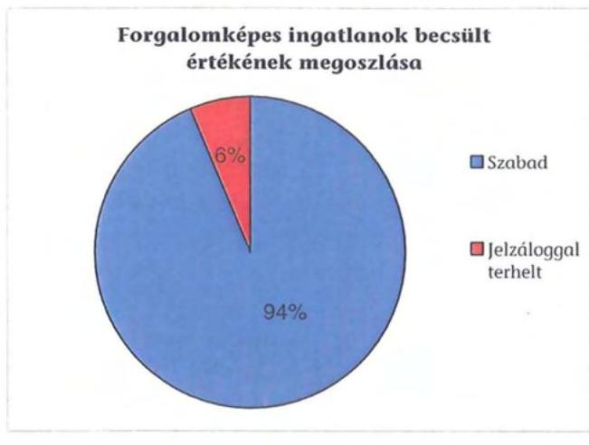

Az Önkormányzat kötelezettségeinek állományát 2010. december 31-én és várható alakulását a kötelezettségek lejáratáig a következő táblázat részletezi:

| Megnevezés | Állomány 2010. dec. 31-én |  |  | Várható kötelezettség 2011. 2013. években |  |  | Várható kötelezettség 2014.   évet követően |  |  |
| :--: | :--: | :--: | :--: | :--: | :--: | :--: | :--: | :--: | :--: |
|  | HUF-ban   (millió Ft   ban) | Devizában   (összeg) | Devizanem | HUF-ban   (millió Ft   ban) | Devizában   (összeg) | Devizanem | HUF-ban   (millió Ft   ban) | Devizában   (összeg) | Devizanem |
| Pénzintézeti kötelezettségek |  |  |  |  |  |  |  |  |  |
| Hosszú lejáratú hitelek |  | 2363659 | 12 H |  | 2221676 | 12 H |  | 2197587 | 12 H |
| Hosszú lejáratú hitelek |  | 2429219 | 25 H |  | 2122347 | 25 H |  | 2312766 | 25 H |
| Egyéb lejáratú | 722 |  | HUF | 722 |  | HUF |  |  |  |
| Pénzintézeti kötelezettségek összesen HUF-ban | 722 |  | HUF | 722 |  | HUF |  |  | HUF |
| Pénzintézeti kötelezettségek összesen CHF-ben |  | 2363659 | 12 H |  | 2221676 | 12 H |  | 2197587 | 12 H |
| Pénzintézeti kötelezettségek összesen EUR-ban |  | 2429219 | 25 H |  | 2122347 | 25 H |  | 2312766 | 25 H |
| Biztosítékok |  |  |  |  |  |  |  |  |  |
| Szerezés | 1132 |  | HUF |  |  |  |  |  |  |
| Biztosítékok összesen | 1132 |  | HUF |  |  |  |  |  |  |
| Tőke visszafizetés | 421 |  | HUF | 421 |  | HUF |  |  |  |
| Egyéb kötelezettségek | 264 |  | HUF | 83 |  | HUF | 181 |  | HUF |
| 1-2-4-én egyéb szervek kell biztosítót   kötelezettségek | 195 |  | HUF | 60 |  | HUF | 135 |  | HUF |

[^0]
[^0]:    ${ }^{56}$ A Közgyűlés által jóváhagyott helyi adó rendelet, valamint a vagyonrendelet.
    ${ }^{57}$ Építményadó, gépjárműadó, iparűzési adó, vállalkozók kommunális adója, valamint az ezekhez kapcsolódó pótlékok, bírságok.
    ${ }^{58}$ Az Önkormányzat tulajdonát képező ingatlanokkal kapcsolatos lakossági lakbér- és közüzemi díj, földbérleti díj, illetve közüzemi bérleti díjak.

---

Az Önkormányzat kötelezettségeinek állománya 2010. december 31-én 2738 millió Ft-ból, 5365669 CHF-ből és 4829219 EUR-ból tevődött össze. Ebből a 2011-2013-ban esedékes kötelezettségek várható összege devizánként 1287 millió Ft, 3321676 CHF és 2122547 EUR. A 2013 után várható kötelezettség összege 316 millió Ft, 2197587 CHF és 3313766 EUR, a hosszú lejáratú egy működési célú és tíz fejlesztési célú hitel, valamint két egyéb kötelezettségvállalás miatt. A 2011-2013. évek fizetési kötelezettségei teljesítésére figyelembe vehető 524 millió Ft egyéb pénzmaradvány, 340 millió Ft-os pályázati források, további tervezett működési célú hitelfelvételek és osztalékbevétel, valamint 571 millió Ft mérlegben kimutatott követelésállomány és 3736 millió Ft becsült értékű forgalomképes ingatlanvagyon, amelyből 241 millió a pénzintézeti kötelezettséghez kapcsolódóan jelzáloggal terhelt. A további évekre szóló jelenleg ismert pénzintézeti kötelezettségek teljesítésére az Önkormányzat tájékoztatása szerint figyelembe vehető források az évente képződő többletbevételek, sajátos felhalmozási és tőkejellegű bevételek.

Az Önkormányzat pénzügyi, vagyoni helyzetére közvetetten hatást gyakorol gazdasági társaságainak adósságállománya. A gazdasági társaságok adatszolgáltatása alapján hosszú lejáratú kötelezettségeit 2010. december 31-én és annak várható alakulását a lejáratig a következő táblázatban mutatjuk be:

| Megnevezés | Állomány 2010. dec.31-én |  |  | Várható kötelezettség 2011-2013. években |  |  | Várható kötelezettség 2014. évet követően |  |
| :--: | :--: | :--: | :--: | :--: | :--: | :--: | :--: | :--: |
|  | $\begin{gathered} \text { HUF-ban } \\ \text { (millió Ft- } \\ \text { ban) } \end{gathered}$ | Devizában (összeg) | Devizanem | $\begin{gathered} \text { HUF-ban } \\ \text { (millió Ft- } \\ \text { ban) } \end{gathered}$ | Devizában (összeg) | Devizanem | $\begin{gathered} \text { HUF-ban } \\ \text { (millió Ft- } \\ \text { ban) } \end{gathered}$ | Devizában (összeg) | Devizanem |
| Pénzintézeti kötelezettségek |  |  |  |  |  |  |  |  |
| Hosszú lejáratú kötelezettségek | 327 |  | HUF | 238 |  | HUF | 4 |  | HUF |
| Rövid lejáratú és egyéb rövid lejáratú kötelezettségek | 179 |  | HUF | 131 |  | HUF |  |  |  |
| Pénzintézeti kötelezettségek összesen | 506 |  | HUF | 369 |  | HUF | 4 |  | HUF |
| Lízing kötelezettségek | 6 |  | HUF | 7 |  | HUF | 2 |  | HUF |
| Lízing kötelezettségek |  | 8654 | CHF |  | 8654 | CHF |  |  |  |
| Szállítói tartozás | 263 |  | HUF | 263 |  | HUF |  |  |  |

A legalább 75%-ban önkormányzati tulajdonban lévő gazdasági társaságok pénzintézeti kötelezettségeinek állománya 2010. december 31-én 503 millió Ft, lízing kötelezettsége hat millió Ft és 8654 CHF, továbbá szállítói tartozása 263 millió Ft volt. Ebből a 2011-2013. években esedékes pénzintézeti kötelezettségek várható összege 534 millió Ft - melyből 2011 júniusáig 94 millió Ft hitelt visszafizettek -, valamint hét millió Ft lízing-kötelezettség és egy gazdasági társaság 2011 májusában megfizetett lízing-kötelezettsége 8654 CHF. A 2013. után várható kötelezettség összegét négy millió Ft tőke- és kamatfizetési kötelezettség alkotja. A gazdasági társaságok kötvényt nem bocsátottak ki. A gazdasági társaságok hosszú lejáratú kötelezettségeiről a 4. számú melléklet ad részletes tájékoztatást.

A jelentés-tervezet I. Összegző megállapítások, következtetések, javaslatok fejezet 3. a) számú polgármesternek címzett javaslata szerint a szokásos beszámoló keretében, félévente be kell mutatni a Közgyűlésnek az Önkormányzat és minősített többségi tulajdonú gazdasági társaságai aktuális pénzügyi helyzetét.

A polgármester az alábbi észrevételt tette a javaslattal kapcsolatban:„Kérjük a javaslatot pontosítani a tekintetben, hogy a gazdasági társaságok vonatkozásában a számvitelről szóló 2000. évi C. törvény 88. §-a szerint a kiegészítő mellékletre meghatározott vagy/és az államháztartás működési rendjéről szóló 292/2009.(XII.19.) 238. § és a 23. számú melléklet szerinti adattartalommal készüljön-e a tájékoztatás."

---

Az ÁSZ álláspontjának megfelelően a Közgyűlés hivatkozott tájékoztatásával kapcsolatban a
 javaslat tartalmi követelményt fogalmazott meg, ugyanis konkrét formai követelmény előírására nincs jogszabályi lehetőség. A javaslat lényege, hogy a Közgyűlés számára az Önkormányzat és a gazdasági társaságok pénzügyi helyzetére, a finanszírozási kockázatokra kiterjedő aktuális információk álljanak rendelkezésre. Az évközi beszámoló, az éves beszámoló és a zárszámadás fordulónapjához képest a Közgyűlés részére történő előterjesztés több hónappal később történik meg a számvitelről szóló 2000. évi C. törvény és az Áht. vonatkozó előírásai alapján. A fenti időszakban a gazdálkodás körülményeiben, a pénzpiaci folyamatokban olyan mértékű változások következhetnek be, amelyek nélkül a féléves, illetve éves beszámolóban szereplő adatok nem értékelhetők reálisan. Erre való tekintettel rendelkezik úgy a javaslat, hogy a kérdéses előterjesztések tárgyalásával egyidejűleg a pénzügyi helyzetre vonatkozó aktuális információk kerüljenek bemutatásra.

Az Önkormányzat a 2007-2010. években a befektetett eszközök után együttesen 3039 millió Ft értékcsökkenést számolt el, amely a 2007. évi 822 millió Ft-ról 2010. évre 689 millió Ft-ra, 16%-kal csökkent. A vizsgált években a befejezett beruházások 2161 millió Ft és az aktivált felújítások 1199 millió Ft bekerülési költsége összesen 3360 millió Ft volt, amely az elszámolt amortizáció 111%-ának felelt meg.
2007. évről 2010. évre az Önkormányzat tárgyi eszköz állományának bruttó értéke 22615 millió Ft-ról 25000 millió Ft-ra, 11%-kal nőtt az Önkormányzat befejezett fejlesztéseinek - útfelújítások, szennyvízcsatorna beruházás, sportcsarnok, autóbusz-pályaudvar rekonstrukció - eredményeként. Az elszámolt értékcsökkenés állományának növekedése 2058 millió Ft, 41%, a 2010. év végi összege 7096 millió Ft volt. Fentiek hatására a tárgyi eszközök nettó értéke a 2007. december 31-i 17577 millió Ft-ról a 2010. december 31-re 17904 millió Ft-ra, 2%-kal (327 millió Ft) növekedett.

Az eszközök avultságát, elhasználódottságát kifejező nettó érték/bruttó érték arány a négy év alatt hat százalékponttal, 78%-ról 72%-ra csökkent, a befektetett eszközök bruttóérték-növekedését (10%) meghaladó mértékben növekvő értékcsökkenés (41%) miatt.

Az Önkormányzat és intézményei, valamint gazdasági társaságai alperesként 18 folyamatban lévő peres eljárásban érintettek. Az Önkormányzat terhére kimutatott perérték 864 millió Ft, amelynek 85,8%-a, 741 millió Ft a Somoskőújfalu Község Önkormányzata önállóvá válása miatti vagyoni követelés, 9,6%-a, 83 millió Ft hat kártérítési perhez, 2,8%-a, 24 millió Ft az Önkormányzattal szembeni gyermekvédelmi szakellátáshoz kapcsolódó öt perhez kapcsolódott. A fennmaradó hat peres eljárást munkaügyi per (három), közigazgatási határozat felülvizsgálata (kettő), és szerződés érvénytelenségének megállapítása (egy) tárgyakban indították az Önkormányzattal és intézményeivel, valamint társaságaival szemben. Az Önkormányzat egy többségi és egy 100%-os tulajdonában lévő gazdasági társasága két-két kártérítési perben érintett, amelyek perértéke összesen egy millió Ft. Jogerős határozattal lezárt és ki nem fizetett kötelezettsége nincs az önkormányzatnak.

A jelentés-tervezet I. Összegző megállapítások, következtetések, javaslatok fejezet 4. számú jegyzőnek címzett javaslata szerint a finanszírozási tervben történő figyelembevétel mellett intézkedjen a Polgármesteri hivatal és a további költségvetési szervek peres eljárásokból adódó kötelezettségek teljesítése érdekében a szükséges fedezet elkülönítéséről.

A polgármester a számvevőszéki jelentés-tervezetre tett észrevételében kérte a javaslat elhagyását, mely szerint: „A javaslattal kapcsolatosan az alábbi problémák jelentkeztek: - a jegyzőnek nincs hatásköre a kért intézkedés megtételére; - a peresített követelések megalapozottságát, számszerűsítését nem lehet bizonyossággal meghatározni; - indokolatlan az önkormányzati feladatellátás kapcsolódó kiadásainak aszerinti kategorizálása, hogy peresített, vagy nem peresített; - a peresített, de nem megítélt követelések összegszerű tervezhetőségének bizonytalansága miatt a finanszírozási tervben szerepeltetendő összeg is indokolatlan. „

A javaslat elhagyását nem fogadjuk el, mert a jegyző az Áht. 71.§-ában előírtak szerint felelős a költségvetési rendelet-tervezet elkészítéséért. A folyamatban lévő peresített követelések összegszerűségének figyelembevételét továbbra is indokoltnak tartjuk, mert az eljárás végén, pervesztés esetén fizetési kötelezettség keletkezik, melynek teljesítésére az általános tartalék nyújthat fedezetet.

# 4. A PÉNZÜGYI EGYENSÚLY MEGTEREMTÉSE ÉRDEKÉBEN HOZOTT INTÉZKEDÉSEK 

A jelentésben szereplő CLF módszer szerint bemutatott működési hiány mindamellett alakult ki, hogy a vizsgált időszakban az Önkormányzat folyamatosan kiadáscsökkentő és bevételnövelő döntéseket hozott.

A 2007-2010. évek kiadáscsökkentő intézkedéseinek Önkormányzat által kimutatott hatásai beavatkozási területenként az alábbiak voltak:
ezer Ft

| Az érvényesített kiadás-   csökkentés területei | Személyi   juttatások és   járulékai | Dologi, mú-   ködési ki-   adások | Pénzeszköz   átadások,   támogatá-   sok | Összesen |
| :-- | :--: | :--: | :--: | :--: |
| Az intézményeknél | 868693 | 14739 | - | 883432 |
| A Közgyűlés működése | - | 10509 | - | 10509 |
| A Hivatalnál | - | 2051 | - | 2051 |
| ÖSSZESEN | 868693 | 27299 | - | 895992 |

A 2007-2010. évek alatt meghozott kiadáscsökkentő intézkedések a gazdálkodás átláthatóbbá tételét, az Önkormányzat pénzügyi helyzetének a javítását, valamint a feladatellátás szakmai színvonalának emelését célozták. A legjelentősebb mértékű kiadási megtakarítást a nyilvántartások szerint a foglalkoztatottak létszámának csökkentésével érték el, ezáltal sikerült megőrizni az intézmények gazdálkodásának és működésének stabilitását.

Az Önkormányzat gazdasági programjában ${ }^{60}$ megfogalmazott intézményhálózat működtetési elvek szerint 2007-ben megkezdődött az intézményeket érintő átszervezések végrehajtása, melyről a Közgyűlés 2007-től kezdődően több alkalommal döntött. Az átszervezések célja az intézményi struktúrának a szolgáltatási igényekhez, a demográfiai változások következtében csökkenő tanulólétszámhoz való igazítása, a kihasználtság növelése, a költséghatékony intézményrendszer kialakítása volt.

[^0]
[^0]:    ${ }^{60}$ A gazdasági program 2011-2014 közötti időszakra vonatkozó kiegészítését a Közgyűlés a 102/2011. (V. 26.) számú határozatával fogadta el.

---

tási igényekhez, a demográfiai változások következtében csökkenő tanulólétszámhoz való igazítása, a kihasználtság növelése, a költséghatékony intézményrendszer kialakítása volt.

Az intézményi integrációról és a feladatok racionalizálásáról a Közgyűlés a 2007. évi és az azt követő költségvetési koncepciók kialakítását követően több alkalommal döntött. A döntéseket megalapozó előterjesztésekben a tervezett intézkedések indokait, feladatellátásra gyakorolt várható eredményeit bemutatták. Az intézményi integrációk, átszervezések és összevonások végrehajtásához kikérték a szakmai szervezetek véleményét és lefolytatták a jogszabályban előírt egyeztetéseket. Az Közgyűlés által az önkormányzat gazdálkodásának és az intézményhálózat működésének átszervezésére, racionalizálására hozott döntések ${ }^{61}$ a következő területeket érintették:

- A 2007. évi költségvetési koncepcióban megfogalmazták az oktatási-nevelési terület működtetésére vonatkozó elképzeléseket. Az általános- és középiskolai oktatásban csökkenő tanulólétszámot prognosztizáltak, emiatt az intézmények kihasználtságának javítását tervezték. Az 2007. évi költségvetési koncepcióban megfogalmazottak végrehajtása érdekében elfogadott intézkedési terv részletesen meghatározta az intézményhálózat átszervezésével kapcsolatos feladatokat. Ezek keretében 2007. július 1-jei hatállyal az előzőleg önálló intézményként működő Óvodai Igazgatóságot az Oktatási Intézmények Gazdasági Szolgálata keretébe építették, a korábbi nyolc általános iskola integrációjával létrehozták a Salgótarjáni Központi Általános Iskola és Diákotthon részben önállóan gazdálkodó költségvetési szervet, melyhez az általános iskolák tagintézményként kapcsolódtak, továbbá szervezeti összevonásra került sor két-két középiskola esetében is. A határozatban előírt átszervezésekhez kapcsolódóan a Közgyűlés összesen 93 főt érintő végleges létszámcsökkentést rendelt el a közoktatási ágazat területére vonatkozóan. A határozatban rögzítették azt is, hogy a létszámcsökkentéssel érintett dolgozók további foglalkoztatására az Önkormányzat költségvetési szerveinél és gazdasági társaságainál nincs lehetőség.
- Az Önkormányzat a 2007. évben a somoskőújfalui lakosságot érintően az óvodai ellátás, valamint az időskorú személyek nappali ellátásának feladatát a Somoskőújfalu Község Önkormányzatával kötött megállapodás keretében átadta, valamint az időskorú személyek nappali ellátásának feladatát a Salgótarjáni Kistérség Többcélú Társulásával kötött megállapodás keretében biztosította.
- A 2008. évi költségvetési koncepcióban megfogalmazottak végrehajtása érdekében a Közgyűlés a működés racionalizálása érdekében elrendelte az óvodai és általános iskolai feladatellátás felülvizsgálatát, valamint további végleges létszámcsökkentésről döntött.

[^0]
[^0]:    ${ }^{61}$ A szervezési és költségcsökkentési döntéseket a Közgyűlés a 283/2006. (XII. 12.), a 17/2007. (II. 13.), a 38/2007. (III. 27.), a 135/2007. (III. 27), a 164/2007. (VI. 26.), a 220/2007. (XI. 27), a 8/2008. (II. 12.), 18/2009. (II. 12.), és a 19/2010. (II. 15.) számú határozataival fogadta el.

---

- A Közgyűlés az óvodai feladatellátási helyek felülvizsgálatát követően telephely megszüntetésről döntött és rögzítette a 2010/2011 tanévben indítható óvodai csoportok és általános iskolai osztályok számát, valamint az általános iskolai osztályok indításának lehetőségét a közoktatásról szóló 1993. évi LXXIX. törvény 3. számú mellékletében meghatározott átlaglétszámok eléréséhez kötötte.

Az egyes intézkedések elemenkénti számszerűsített kihatásáról nem állt rendelkezésre információ.

A 2007-2010. években végrehajtott intézményátszervezések, feladatváltozások, valamint a takarékossági és racionalizálási intézkedések hatásaként az Önkormányzat kimutatása szerint együttesen 896 millió Ft kiadási megtakarítás keletkezett, melyből 869 millió Ft (97,0%) létszámcsökkenések következtében, 27 millió Ft (3,0%) pedig a dologi kiadásoknál és feladatátrendezések miatt bekövetkezett csökkenéssel jelentkezett.

A 2007-2010. években önkormányzati szinten kimutatott 896 millió Ft hatású megtakarítási intézkedésekből 883 millió Ft-ot (98,5%) az intézmények körében, 11 millió Ft-ot (1,3%) a Közgyűlés működési körében az egyes önként vállalt feladatok csökkentésével, valamint 2 millió Ft-ot (0,2%) az igénybe vett távközlési szolgáltatásoknál a Hivatalnál érvényesítettek. Az intézményi megtakarításokon belül 868 millió Ft-ot (98,3%-ot) tettek ki a személyi juttatások (ezen belül a létszámcsökkentések hatásán túl a bérekhez kapcsolódó egyes pótlékok megszüntetése, visszavonása) és járulékok terén realizált megtakarítások, és 15 millió Ft (1,7%) volt a dologi kiadásoknál elért megtakarítás.

A létszámcsökkentő intézkedések eredményeként 2007-2010 között az Önkormányzat intézményeinél összesen 189 álláshelyet szüntettek meg, melyből 124 álláshely, az összes megszüntetett álláshely 65,6%-a ágazati szakmai álláshely volt, 59 álláshely, 31,2% intézményüzemeltetéshez, fenntartáshoz, gazdasági ügyek intézéséhez kapcsolódott, továbbá megszüntettek hat üres álláshelyet, mely az összes megszüntetett álláshely 3,2%-át tette ki.

A 2007-2010. évek között végrehajtott létszámcsökkenés eredményét a következő táblázat mutatja be:

| Megnevezés (adatok főben) |  | Közoktatás | Egészségügy | Polgármesteri hivatal | Egyéb | Összesen |
| :--: | :--: | :--: | :--: | :--: | :--: | :--: |
| Megszüntetett álláshelyek száma |  | 178 | - | - | 13 | 189 |
| iddolt: üres álláshelyek száma |  | - | - | - | 6 | 6 |
|  | szakmai álláshelyek száma | 117 | - | - | 7 | 124 |
|  | intézmény-üzemeltetéssel kapcsolatos álláshelyek száma | 59 | - | - | - | 59 |
| 2007. január 1-jén indító létszám |  | 1076 | 89 | 152 | 148 | 1465 |
| 2010. december 31-én záró létszám |  | 900 | 87 | 161 | 148 | 1298 |

A helyi létszámcsökkentési, átszervezési intézkedések végrehajtásához az Önkormányzat a 2007-2010. években összesen 208 millió Ft központi költségvetési támogatásban részesült, mely megegyezett az igényelt támogatással. A támogatás felhasználásával tartósan leépített 91 álláshelyet, amely a létszámcsökkenés 48,1%-át tette ki. 97 fő esetében a létszámcsökkenéshez központi támogatás nem kapcsolódott. A létszámcsökkentési és szervezési intézkedések hatá-

---
 1-jei 1465 főről 2010. december 31-re összesen 169 fővel, 11,5%-kal 1296 főre csökkent.

A Közgyűlés döntései ${ }^{62}$ alapján 2011. első negyedévében további megtakarítási intézkedések történtek. A Közgyűlés elrendelte az önkormányzati tulajdonban lévő, nem költségvetési szervek által használt helyiségek használati feltételeinek felülvizsgálatát, az önkormányzati költségvetési szervek által használt helyiségek önkormányzati szintű racionalizálását, az Önkormányzat és szervei különféle szervezetekben fennálló tagságának felülvizsgálatát, valamint végleges létszámcsökkentést rendelt el közoktatási és közművelődési intézményeknél. A 2011. évre tervezett 104 millió Ft kiadási megtakarításból 97 millió Ft $(93,3 \%)$ a személyi juttatások és a hozzá kapcsolódó járulékok csökkenéséből, 7 millió Ft $(6,7 \%)$ pedig a dologi kiadások tervezett csökkentéséből ered. Az elhatározott megtakarítási intézkedésekből 49 millió Ft (47,1%) az intézményrendszert érinti, 32 millió Ft (30,8%) a Hivatal működtetéséhez kapcsolódik, míg a Közgyűlés 23 millió Ft $(22,1 \%)$ részaránnyal szerepel.

A kiadáscsökkentő intézkedések mellett az Önkormányzat az alábbiakban számszerűsített bevételnövelő intézkedéseket tette:
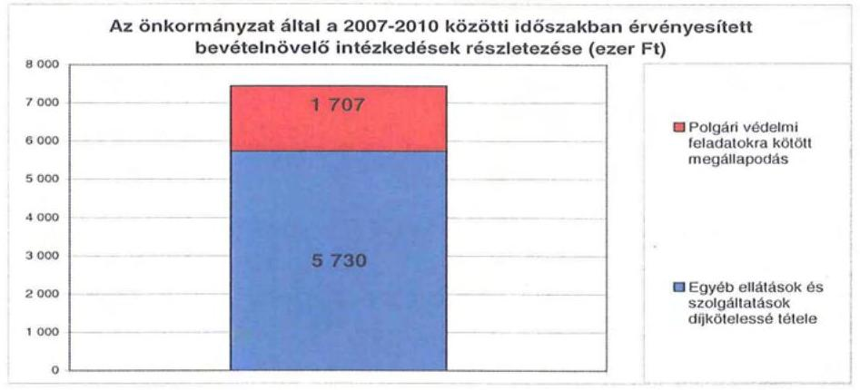

Az Önkormányzat bevételnövelésre irányuló döntései a pénzügyi egyensúlyi helyzetre érdemi hatást nem gyakoroltak. A 2007-2010. évek között a bevétel növekedését eredményező, önkormányzati kezdeményezésű intézkedések 7,4 millió Ft összegéből 5,7 millió Ft (77,0%) az intézmények gyermekélelmezési térítési díjainak, a zeneiskolai térítési díjak és egyéb szolgáltatások díjának növekedéséből, 1,7 millió Ft (23%) pedig a polgári védelmi feladatok ellátására egyes önkormányzatokkal kötött megállapodásokból származott. A 2011. évre önkormányzati szinten 517 ezer Ft bevétel növekedést terveztek a polgári védelmi feladatok ellátására kötött megállapodások eredményeként.

A jelentéstervezet I. Összegző megállapítások, következtetések, javaslatok fejezet 2. d) számú polgármesternek címzett javaslata szerint a pénzügyi egyensúly helyreállítása, illetve fenntarthatósága érdekében készítendő operatív terv keretében gondoskodni kell az intézkedések révén elért bevételi többlet tartalékba helyezéséről az adósságszolgálat teljesítése érdekében.

[^0]
[^0]:    ${ }^{62}$ A 228/2010. (XII. 16.) és 28/2011. (II. 17.) számú határozatok alapján.

---

A fenti javaslatra a polgármester az alábbi észrevételt tette: „Az intézkedések következtében jelentkező pénzügyi többletet, illetve egyszeri bevételeket nem lehet kiragadni az aktuális éves költségvetés fedezeti rendszeréből, hiszen az év folyamán bevételcsökkenés, illetve kiadásnövekedés is bekövetkezhet, ezáltal az intézkedési terv miatt keletkezett bevételi többlet, illetve esetleges egyszeri bevétel feloldódik a költségvetés fedezeti rendszerében. Az intézkedési terv alapján keletkező bevételi többletből, illetve az egyszeri bevételből csupán azt lehet tartalékba helyezni, amely az aktuális év költségvetésének folyó működésének finanszírozásához nem szükséges. Az előzőek alapján a megjelölt javaslatot az alábbiak szerint javasoljuk módosítani: az intézkedések következtében jelentkező pénzügyi többletnek, illetve az egyszeri bevételeknek az önkormányzat kötelező feladatai ellátásához, valamint a jogszabályon, bírósági vagy más hatósági határozaton, és a korában tett kötelezettségvállaláson alapuló fizetési kötelezettségek teljesítéséhez nem szükséges részének tartalékba helyezését, elkülönített kezelését az adósságszolgálat teljesítése érdekében;"

Az ÁSZ álláspontja szerint az észrevételben foglaltak nem indokolják a javaslat módosítását, azt továbbra is fenntartjuk. A 2. pontban megfogalmazott operatív terv elkészítésének és végrehajtásának lényege, hogy az Önkormányzat fokozottan törekedjen pénzügyi egyensúlyának középtávú helyreállítása, illetve hosszú távú fenntarthatósága érdekében az adósságállomány csökkentésére. Ennek részeként fogalmazza meg a kérdéses javaslat, hogy az intézkedések hatására képződő bevételi többletet az Önkormányzat tartalékként kezelje és abból ne működési, fejlesztési többletkiadásait finanszírozza. Az Önkormányzat fizetőképességének megőrzése és az adósságszolgálati terhek hosszú távú teljesíthetősége céljából a fenti többletforrások a költségvetési hiány, ezáltal a külső finanszírozási igény csökkentését szolgálják.

Az Önkormányzat költségvetési támogatásokból, átengedett bevételekből és illetékekből származó bevételei 2008-2010 között a 2007. évhez viszonyítva összesen 869 millió Ft-tal növekedtek. Az Önkormányzat kimutatása szerint a kiadáscsökkentő és bevételnövelő intézkedések együttes hatásaként 2007-2010 között további 903 millió Ft-tal javította pénzügyi helyzetét.

Az Önkormányzat az átszervezések, a takarékossági intézkedések szakmai feladatellátásra gyakorolt hatását a belső ellenőrzések keretében célzottan nem vizsgálta, azonban a személyi és tárgyi feltételek rendelkezésre állását és a feladatellátás szakmai teljesítését a rendszerellenőrzések és az intézményi beszámoltatások keretében értékelték és azt a racionalizálások eredményeként javuló tendenciájúnak minősítették.

# 5. A HELYI ÖNKORMÁNYZATOK GAZDÁLKODÁSI RENDSZERÉNEK 2008. ÉVI ELLENŐRZÉSE SORÁN A PÉNZÜGYI EGYENSÚLY JAVÍTÁSÁRA TETT SZABÁLYSZERŰSÉGI ÉS CÉLSZERŰSÉGI JAVASLATOK HASZNOSULÁSA 

Az ÁSZ 2008. évi jelentésében az Önkormányzat részére szabályszerűségi és célszerűségi javaslatokat fogalmazott meg. A jelentést a Közgyűlés a 2008. október 28-ai ülésén elhangzott tájékoztatás keretében megismerte. A javaslatok megvalósítására intézkedési tervet készítettek, amely tartalmazta a javaslatokat, meghatározta a feladatok elvégzéséért felelősöket és a feladatok elvégzésének határidejét.

---

A pénzügyi egyensúly javítására a jegyző részére egy szabályszerűségi és egy célszerűségi javaslat vonatkozott, melyek közül a szabályszerűségi javaslatot: „gondoskodjon arról, hogy a költségvetési rendelettervezetben a költségvetés bevételi és kiadási főösszegének megállapítása az Áht. 8/A. § (7) bekezdés alapján a finanszírozási célú pénzügyi műveletek bevételei-kiadásai nélkül történjen" az intézkedési terv szerinti határidőben, a 2009. évi és az azt követő költségvetési rendeletek elkészítésénél hasznosították.

A munka színvonalának javítása érdekében javasoltuk a jegyzőnek, hogy: „végeztessen gazdaságossági számításokat a rövid lejáratú működési-, illetve folyószámlahitel igénybevétele előtt a hitelek éves szintű kamatkiadásainak összehasonlítására az Önkormányzat pénzügyi egyensúlyi helyzetének javítása és a célszerű döntés megalapozása érdekében". Az intézkedési terv a javaslattal kapcsolatban feladatot, felelőst és határidőt nem tartalmazott és a javaslat hasznosítására nem került sor.

Budapest, 2011. december „22.,"

Melléklet: $\quad 9 \mathrm{db}$
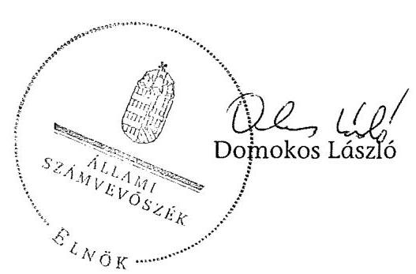

---

Salgótarján Megyei Jogú Város Önkormányzat

1. számú melléklet

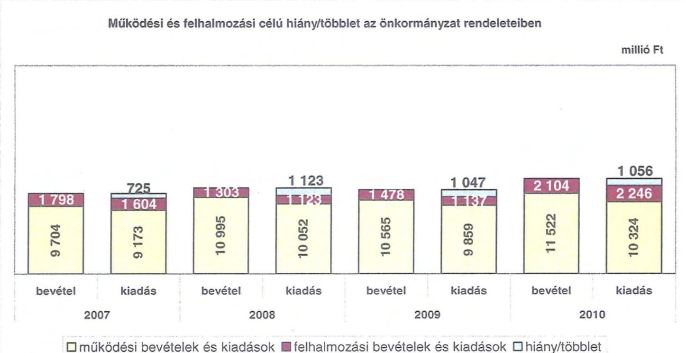

---

# 1. FOLYÓ KÖLTSÉGVETÉS*

|   | 2007. | 2008. | 2009. | 2010.  |
| --- | --- | --- | --- | --- |
|  1.1.1. Saját működési bevételek | 2 942 342 | 3 081 610 | 2 844 972 | 2 821 045  |
|  1.1.2. Költségvetési támogatás | 3 057 207 | 4 896 535 | 4 795 715 | 4 736 500  |
|  1.1.3. Átvezetett bevételek | 2 837 006 | 1 253 071 | 1 402 751 | 1 591 205  |
|  1.1.4. Állami büdzsétől kapott támogatások | 230 868 | 340 224 | 562 645 | 623 761  |
|  1.1.5. EU-tól és külföldről kapott bevételek | 1 025 | 239 | 159 | 4 580  |
|  1.1.6. Állami büdzsétől kívülről kapott bevételek | 37 286 | 11 991 | 40 800 | 42 000  |
|  1.1.7. Előző évi pénzmaradvány átvétel | 39 379 | 363 960 | 90 338 | 100 120  |
|  1.1. Folyó bevételek = 1.1.1.+1.1.2.+1.1.3.+1.1.4.+1.1.5.+1.1.6.+1.1.7. | 9 145 113 | 9 947 630 | 9 737 280 | 9 919 211  |
|  1.2.1. Működési kiadások kamatkiadások nélkül | 7 524 900 | 7 856 976 | 7 351 791 | 7 598 193  |
|  1.2.2. Állami büdzsére átadott pénzeszközök | 85 973 | 97 730 | 111 611 | 125 541  |
|  1.2.3.1. Vállalkozásoknak | 345 893 | 375 136 | 663 513 | 813 160  |
|  1.2.3.2. EU-nak, illetve külföldre | 0 | 0 | 0 | 0  |
|  1.2.3.3. Megjegyezetteknek | 855 332 | 941 418 | 991 127 | 1 048 538  |
|  1.2.3.4. Egyéb kifizetések | 131 237 | 138 916 | 125 624 | 82 576  |
|  1.2.4. Többi kifizetés (=1.2.3.1+1.2.3.2+1.2.3.3+1.2.3.4) | 1 332 492 | 1 455 470 | 1 700 264 | 1 944 274  |
|  1.2.4. Kamatkiadások | 46 618 | 58 697 | 77 277 | 67 064  |
|  1.2.5. Előző évi pénzmaradvány átadás | 39 371 | 166 014 | 83 642 | 98 530  |
|  1.2. Folyó kiadások = 1.2.1.+1.2.2.+1.2.3.+1.2.4.+1.2.5. | 9 039 306 | 9 634 887 | 9 404 585 | 9 833 607  |
|  1.3. Folyó költségvetés egyenlege MŰKÖDÉSI JÖVEDELEM (1.1. - 1.2.) | 105 807 | 312 743 | 332 795 | 85 604  |
|  2. FELHALMOZÁSI KÖLTSÉGVETÉS** |  |  |  |   |
|  2.1.1. Saját tökebevételek | 142 284 | 109 978 | 103 348 | 75 104  |
|  2.1.2. Állami büdzsétől kapott támogatások | 727 517 | 315 049 | 415 291 | 798 306  |
|  2.1.3. EU-tól és külföldről kapott támogatások | 0 | 0 | 0 | 0  |
|  2.1.4. Állami büdzsétől kívülről kapott támogatások | 182 006 | 62 882 | 119 341 | 147 120  |
|  2.1. Felhalmozási bevételek (=2.1.1.+2.1.2+2.1.3+2.1.4.) | 1 051 807 | 487 909 | 637 980 | 1 020 530  |
|  2.2.1. Saját beruházási kiadások | 733 081 | 560 894 | 316 838 | 449 935  |
|  2.2.2. Saját felújítási kiadások | 507 063 | 199 809 | 284 473 | 1 193 678  |
|  2.2.3. Állami büdzsére átadott pénzeszközök | 14 825 | 9 309 | 159 153 | 126 664  |
|  2.2.4. EU-nak és külföldnek adott pénzeszközök | 0 | 0 | 0 | 0  |
|  2.2.5. Állami büdzsétől kívülre adott pénzeszközök | 44 832 | 52 085 | 52 807 | 52 330  |
|  2.2.6. Befektetési célú értékpapírok vásárlása | 0 | 2 500 | 0 | 3 500  |
|  2.2. Felhalmozási kiadások (=2.2.1.+2.2.2.+2.2.3.+2.2.4.+2.2.5.+2.2.6.) | 1 299 801 | 824 597 | 813 263 | 1 826 107  |
|  2.3. Felhalmozási költségvetés egyenlege (2.1. - 2.2.) | -247 994 | -236 688 | -175 283 | -805 577  |
|  3. Finanszírozási műveletek nélküli (GFS) pozíció(1.3.+2.3.) | -142 187 | -23 945 | 157 512 | -719 973  |
|  4. Finanszírozási műveletek |  |  |  |   |
|  4.1. Hitel felvétel | 565 000 | 687 984 | 830 744 | 1 643 510  |
|  4.2. Hitel visszafizetés | 438 524 | 715 607 | 777 366 | 910 207  |
|  4.3. Forgatási és befektetési célú értékpapírok kibocsátása | 0 | 0 | 0 | 0  |
|  4.4. Forgatási és befektetési célú értékpapírok beválása | 0 | 0 | 0 | 0  |
|  4.5. Forgatási és befektetési célú értékpapírok értékesítése | 149 550 | 46 680 | 46 680 | 48 017  |
|  4.6. Forgatási

 és befektetési célú értékpapírok vásárlása | 0 | 0 | 0 | 0  |
|  4.7. Egyéb finanszírozási bevételek (függő, átfunk, kiegyenlítő) | -2 826 | 21 878 | 18 997 | -273 323  |
|  4.8. Egyéb finanszírozási kiadások (függő, átfunk, kiegyenlítő) | -22 | 41 775 | 2 721 | 9 599  |
|  4.9. Finanszírozási műveletek egyenlege (4.1. - 4.2.+4.3.-4.4+4.5.-4.6.+4.7.-4.8.) | 273 222 | -20 840 | 116 334 | 498 399  |
|  5. Tárgyévi pénzügyi pozíció változás (1.3.+ 2.3.+4.9.) | 131 025 | -44 785 | 273 846 | -221 574  |
|  6. Nettó működési jövedelem =működési jövedelem (1.3.) - többletveszteség (4.3+4.4) | -332 717 | -402 864 | -444 571 | -824 603  |
|  TÁJÉKOZTATÓ ADATOK |  |  |  |   |
|  Összes kötelezettség | 3 006 509 | 3 119 494 | 3 219 374 | 4 485 716  |
|  ebből rövid lejáratú | 898 097 | 1 007 289 | 1 076 721 | 1 719 545  |
|  Összes szállítói kötelezettség | 28 222 | 15 713 | 90 803 | 424 441  |
|  ebből lejárt (tanúsítványból) | 21 546 | 2 184 | 7 096 | 340 088  |
|  Pénz és időzügyi kötelezettség (adósság) | 1 906 766 | 2 075 396 | 2 199 338 | 3 231 521  |
|  ebből rövid lejáratú | 645 407 | 770 093 | 823 773 | 1 306 618  |
|  PPP szerződéses állomány játékértéken (tanúsítványból) | 0 | 0 | 0 | 0  |
|  ebből lejárt szolgáltatási díj miatti kötelezettség | 0 | 0 | 0 | 0  |
|  Folyószámlahitel napi átlagos állománya (tanúsítványból) | 0 | 0 | 2 993 | 0  |
|  Lízingszerződések napi átlagos állománya (tanúsítványból) | 196 257 | 398 748 | 493 515 | 579 988  |
|  Munkahívás napi átlagos állománya (tanúsítványból) | 0 | 0 | 0 | 0  |
|  Későfizetés és garanciavállalások (tanúsítványból) | 1 050 000 | 1 130 000 | 1 375 000 | 1 135 000  |
|  Jogerős bírósági ítéletből adódó kötelezettségek (tanúsítványból) | 0 | 0 | 0 | 0  |
|  Finanszírozásba bevont eszközök: | 1 382 628 | 1 291 630 | 1 519 262 | 1 251 475  |
|  Tartós kötelezettség megnevezési értékpapírok és végi állománya | 138 640 | 92 427 | 40 313 | 0  |
|  Hosszú lejáratú bankhitel és végi állománya | 0 | 0 | 0 | 0  |
|  Értékpapírok és végi állománya | 0 | 0 | 0 | 0  |
|  Pénzeszközök (idegen pénzeszközök nélkül) és végi állománya | 1 343 980 | 1 199 203 | 1 473 049 | 1 251 475  |

- Bevételeiben nem teszi, a kiadásokban nem jelenti meg az amortizáció, a vagyoni helyzetet ** Bevételeiben vagyon megőrzésre és hívás céljára fordított források

  |  |  |  |  |  |   |
|   |  |  |  |  |  |  |  |  |  |  |  |  |  |  |  |  |  |  |  |  |  |  |  |  |  |  |  |  |  |  |  |  |  |  |  |  |  |  |  |  |  |  |  |   |
|   |  |  |  |  |  |  |  |  |  |  |  |  |  |  |  |  |  |  |  |  |  |  |  |  |  |  |  |  |  |  |  |  |  |  |  |  |  |  |  |  |  |  |  |   |
|   |  |  |  |  |  |  |  |  |  |  |  |  |  |  |  |  |  |  |  |  |  |  |  |  |  |  |  |  |  |  |  |  |  |  |  |  |  |  |  |  |  |  |  |   |
|   |  |  |  |  |  |  |  |  |  |  |  |  |  |  |  |  |  |  |  |  |  |  |  |  |  |  |  |  |  |  |  |  |  |  |  |  |  |  |  |  |  |  |  |   |
|   |  |  |  |  |  |  |  |  |  |  |  |  |  |  |  |  |  |  |  |  |  |  |  |  |  |  |  |  |  |  |  |  |  |  |  |  |  |  |  |  |  |  |  |   |
|   |  |  |  |  |  |  |  |  |  |  |  |  |  |  |  |  |  |  |  |  |  |  |  |  |  |  |  |  |  |  |  |  |  |  |  |  |  |  |  |  |  |  |  |   |
|   |  |  |  |  |  |  |  |  |  |  |  |  |  |  |  |  |  |  |  |  |  |  |  |  |  |  |  |  |  |  |  |  |  |  |  |  |  |  |  |  |  |  |  |   |
|   |  |  |  |  |  |  |  |  |  |  |  |  |  |  |  |  |  |  |  |  |  |  |  |  |  |  |  |  |  |  |  |  |  |  |  |  |  |  |  |  |  |  |  |   |
|   |  |  |  |  |  |  |  |  |  |  |  |  |  |  |  |  |  |  |  |  |  |  |  |  |  |  |  |  |  |  |  |  |  |  |  |  |  |  |  |  |  |  |  |   |
|   |  |  |  |  |  |  |  |  |  |  |  |  |  |  |  |  |  |  |  |  |  |  |  |  |  |  |  |  |  |  |  |  |  |  |  |  |  |  |  |  |  |  |  |   |
|   |  |  |  |  |  |  |  |  |  |  |  |  |  |  |  |  |  |  |  |  |  |  |  |  |  |  |  |  |  |  |  |  |  |  |  |  |  |  |  |  |  |  |  |   |
|   |  |  |  |  |  |  |  |  |  |  |  |  |  |  |  |  |  |  |  |  |  |  |  |  |  |  |  |  |  |  |  |  |  |  |  |  |  |  |  |  |  |  |  |   |
|   |  |  |  |  |  |  |  |  |  |  |  |  |  |  |  |  |  |  |  |  |  |  |  |  |  |  |  |  |  |  |  |  |  |  |  |  |  |  |  |  |  |  |  |   |
|   |  |  |  |  |  |  |  |  |  |  |  |  |  |  |  |  |  |  |  |  |  |  |  |  |  |  |  |  |  |  |  |  |  |  |  |  |  |  |  |  |  |  |  |   |
|   |  |  |  |  |  |  |  |  |  |  |  |  |  |  |  |  |  |  |  |  |  |  |  |  |  |  |  |  |  |  |  |  |  |  |  |  |  |  |  |  |  |  |  |   |
|   |  |  |  |  |  |  |  |  |  |  |  |  |  |  |  |  |  |  |  |  |  |  |  |  |  |  |  |  |  |  |  |  |  |  |  |  |  |  |  |  |  |  |  |   |
|   |  |  |  |  |  |  |  |  |  |  |  |  |  |  |  |  |  |  |  |  |  |  |  |  |  |  |  |  |  |  |  |  |  |  |  |  |  |  |  |  |  |  |  |   |
|   |  |  |  |  |  |  |  |  |  |

  |  |  |  |  |  |  |  |  |  |  |  |  |  |  |  |  |  |  |  |  |  |  |  |  |  |  |  |  |  |  |  |  |  |   |
|   |  |  |  |  |  |  |  |  |  |  |  |  |  |  |  |  |  |  |  |  |  |  |  |  |  |  |  |  |  |  |  |  |  |  |  |  |  |  |  |  |  |  |  |   |
|   |  |  |  |  |  |  |  |  |  |  |  |  |  |  |  |  |  |  |  |  |  |  |  |  |  |  |  |  |  |  |  |  |  |  |  |  |  |  |  |  |  |  |  |   |
|   |  |  |  |  |  |  |  |  |  |  |  |  |  |  |  |  |  |  |  |  |  |  |  |  |  |  |  |  |  |  |  |  |  |  |  |  |  |  |  |  |  |  |  |   |
|   |

---

|   |  |  |  |  |  |  |  |  |  |  |  |  |  |  |  |  |  |  |  |  |  |  |  |  |  |  |  |  |  |  |  |  |  |  |  |  |  |  |  |  |  |  |  |   |
| --- | --- | --- | --- | --- | --- | --- | --- | --- | --- | --- | --- | --- | --- | --- | --- | --- | --- | --- | --- | --- | --- | --- | --- | --- | --- | --- | --- | --- | --- | --- | --- | --- | --- | --- | --- | --- | --- | --- | --- | --- | --- | --- | --- | --- | --- | --- | --- | --- | --- | --- | --- |
|   |  |  |  |  |  |  |  |  |  |  |  |  |  |  |  |  |  |  |  |  |  |  |  |  |  |  |  |  |  |  |  |  |  |  |  |  |  |  |  |  |  |  |  |  |  |  |  |  |  |   |
|   |  |  |  |  |  |  |  |  |  |  |  |  |  |  |  |  |  |  |  |  |  |  |  |  |  |  |  |  |  |  |  |  |  |  |  |  |  |  |  |  |  |  |  |  |  |  |  |  |  |   |
|   |  |  |  |  |  |  |  |  |  |  |  |  |  |  |  |  |  |  |  |  |  |  |  |  |  |  |  |  |  |  |  |  |  |  |  |  |  |  |  |  |  |  |  |  |  |  |  |  |  |   |
|   |  |  |  |  |  |  |  |  |  |  |  |  |  |  |  |  |  |  |  |  |  |  |  |  |  |  |  |  |  |  |  |  |  |  |  |  |  |  |  |  |  |  |  |  |  |  |  |  |   |
|   |  |  |  |  |  |  |  |  |  |  |  |  |  |  |  |  |  |  |  |  |  |  |  |  |  |  |  |  |  |  |  |  |  |  |  |  |  |  |  |  |  |  |  |  |  |  |  |  |   |
|   |  |  |  |  |  |  |  |  |  |  |  |  |  |  |  |  |  |  |  |  |  |  |  |  |  |  |  |  |  |  |  |  |  |  |  |  |  |  |  |  |  |  |  |  |  |  |  |  |   |
|   |  |  |  |  |  |  |  |  |  |  |  |  |  |  |  |  |  |  |  |  |  |  |  |  |  |  |  |  |  |  |  |  |  |  |  |  |  |  |  |  |  |  |  |  |  |  |  |  |   |
|   |  |  |  |  |  |  |  |  |  |  |  |  |  |  |  |  |  |  |  |  |  |  |  |  |  |  |  |  |  |  |  |  |  |  |  |  |  |  |  |  |  |  |  |  |  |  |  |  |   |
|   |  |  |  |  |  |  |  |  |  |  |  |  |  |  |  |  |  |  |  |  |  |  |  |  |  |  |  |  |  |  |  |  |  |  |  |  |  |  |  |  |  |  |  |  |  |  |  |  |   |
|   |  |  |  |  |  |  |  |  |  |  |  |  |  |  |  |  |  |  |  |  |  |  |  |  |  |  |  |  |  |  |  |  |  |  |  |  |  |  |  |  |  |  |  |  |  |  |  |  |   |
|   |  |  |  |  |  |  |  |  |  |  |  |  |  |  |  |  |  |  |  |  |  |  |  |  |  |  |  |  |  |  |  |  |  |  |  |  |  |  |  |  |  |  |  |  |  |  |  |  |   |

 |  |  |  |  |  |  |  |  |  |  |  |  |  |  |  |  |  |  |  |  |  |  |  |  |  |  |  |  |  |  |  |  |  |  |  |  |  |  |  |  |  |   |
|   |  |  |  |  |  |  |  |  |  |  |  |  |  |  |  |  |  |  |  |  |  |  |  |  |  |  |  |  |  |  |  |  |  |  |  |  |  |  |  |  |  |  |  |  |  |  |  |  |   |
|   |  |  |  |  |  |  |  |  |  |  |  |  |  |  |  |  |  |  |  |  |  |  |  |  |  |  |  |  |  |  |  |  |  |  |  |  |  |  |  |  |  |  |  |  |  |  |  |  |   |
|   |  |  |  |  |  |  |  |  |  |  |  |  |  |  |  |  |  |  |  |  |  |  |  |  |  |  |  |  |  |  |  |  |  |  |  |  |  |  |  |  |  |  |  |  |  |  |  |  |   |
|   |  |  |  |  |  |  |  |  |  |  |  |  |  |  |  |  |  |  |  |  |  |  |  |  |  |  |  |  |  |  |  |  |  |  |  |  |  |  |  |  |  |  |  |  |  |  |  |  |   |
|   |  |  |  |  |  |  |  |  |  |  |  |  |  |  |  |  |  |  |  |  |  |  |  |  |  |  |  |  |  |  |  |  |  |  |  |  |  |  |  |  |  |  |  |  |  |  |  |  |   |
|   |  |  |  |  |  |  |  |  |  |  |  |  |  |  |  |  |  |  |  |  |  |  |  |  |  |  |  |  |  |  |  |  |  |  |  |  |  |  |  |  |  |  |  |  |  |  |  |  |   |
|   |  |  |  |  |  |  |  |  |  |  |  |  |  |  |  |  |  |  |  |  |  |  |  |  |  |  |  |  |  |  |  |  |  |  |  |  |  |  |  |  |  |  |  |  |  |  |  |  |   |
|   |  |  |  |  |  |  |  |  |  |  |  |  |  |  |  |  |  |  |  |  |  |  |  |  |  |  |  |  |  |  |  |  |  |  |  |  |  |  |  |  |  |  |  |  |  |  |  |  |   |
|   |  |  |  |  |  |  |  |  |  |  |  |  |  |  |  |  |  |  |  |  |  |  |  |  |  |  |  |  |  |  |  |  |  |  |  |  |  |  |  |  |  |  |  |  |  |  |  |  |   |
|   |  |  |  |  |  |  |  |  |  |  |  |  |  |  |  |  |  |  |  |  |  |  |  |  |  |  |  |  |  |  |  |  |  |  |  |  |  |  |  |  |  |  |  |  |  |  |  |  |   |
|   |  |  |  |  |  |  |  |  |  |  |  |  |  |  |  |  |  |  |  |  |  |  |  |  |  |  |  |  |  |  |  |  |  |  |  |  |  |  |  |  |  |  |  |  |  |  |  |  |   |
|   |  |  |  |  |  |  |  |  |  |  |  |  |  |  |  |  |  |  |  |  |  |  |  |  |  |  |  |  |  |  |  |  |  |  |  |  |  |  |  |  |  |  |  |  |  |  |  |  |   |
|   |  |  |  |  |  |  |  |  |  |  |  |  |  |  |  |  |  |  |  |  |  |  |  |  |  |  |  |  |  |  |  |  |  |  |  |  |  |  |  |  |  |  |  |  |  |  |  |  |   |
|   |  |  |  |  |  |  |  |  |  |  |  |  |  |  |  |  |  |  |  |  |  |  |  |  |  |  |  |  |  |  |  |  |  |  |  |  |  |  |  |  |  |  |  |  |  |  |  |  |   |
|   |  |  |  |  |  |  |  |  |  |  |  |  |  |  |  |  |  |  |  |  |  |  |  |  |  |  |  |  |  |  |  |  |  |  |  |  |  |  |  |  |  |  |  |  |  |  |  |  |   |

 |  |  |  |  |  |  |   |
|   |  |  |  |  |  |  |  |  |  |  |  |  |  |  |  |  |  |  |  |  |  |  |  |  |  |  |  |  |  |  |  |  |  |  |  |  |  |  |  |  |  |  |  |  |  |  |  |  |   |
|   |  |  |  |  |  |  |  |  |  |  |  |  |  |  |  |  |  |  |  |  |  |  |  |  |  |  |  |  |  |  |  |  |  |  |  |  |  |  |  |  |  |  |  |  |  |  |  |  |   |
|   |  |  |  |  |  |  |  |  |  |  |  |  |  |  |  |  |  |  |  |  |  |  |  |  |  |  |  |  |  |  |  |  |  |  |  |  |  |  |  |  |  |  |  |  |  |  |  |  |   |
|   |  |  |  |  |  |  |  |  |  |  |  |  |  |  |  |  |  |  |  |  |  |  |  |  |  |  |  |  |  |  |  |  |  |  |  |  |  |  |  |  |  |  |  |  |  |  |  |  |   |
|   |  |  |  |  |  |  |  |  |  |  |  |  |  |  |  |  |  |  |  |  |  |  |  |  |  |  |  |  |  |  |  |  |  |  |  |  |  |  |  |  |  |  |  |  |  |  |  |  |   |
|   |  |  |  |  |  |  |  |  |  |  |  |  |  |  |  |  |  |  |  |  |  |  |  |  |  |  |  |  |  |  |  |  |  |  |  |  |  |  |  |  |  |  |  |  |  |  |  |  |   |
|   |  |  |  |  |  |  |  |  |  |  |  |  |  |  |  |  |  |  |  |  |  |  |  |  |  |  |  |  |  |  |  |  |  |  |  |  |  |  |  |  |  |  |  |  |  |  |  |  |   |
|   |  |  |  |  |  |  |  |  |  |  |  |  |  |  |  |  |  |  |  |  |  |  |  |  |  |  |  |  |  |  |  |  |  |  |  |  |  |  |  |  |  |  |  |  |  |  |  |  |   |
|   |

---

Satisfakció Magyar, Arpád Város Önkormányzata 3.3. az. számú tájékoztató

Az Önkormányzat 2018. december 31-én folyamatosan lévő fejlesztési feladatához kapcsolódó kötelezettségének összegéről (A 2019. december 31-ig teljesített pénzügyi adatok alakulásáról)

|   |  |  |  |  |  |  |  |  |  |  |  |  |  |  |  |  |  |  |  |  |  |  |  |  |  |  |  |  |  |  |  |  |  |  |  |  |  |  |  |  |  |  |  |  |  |  |  |  |  |  |  |  |  |  |  |  |  |  |  |  |  |  |  |  |  |  |  |  |  |  |  |  |  |  |  |  |  |  |  |  |  |  |  |  |  |  |  |  |  |  |  |  |  |  |  |  |  |  |  |  | 

---

Az Önkormányzat 2015. december 31-én folyamatban lévő fejlesztési feladathoz kapcsolódó 2015. évre szóló kötelezettség-vállalásainak összegéről (a folyamatban lévő fejlesztések 2015. célra kötelezettségvállalásokról)

|  |   |   |   |   |   |   |   |   |   |   |   |   |   |   |   |   |   |   |   |   |   |   |   |   |   |   |   |   |   |   |   |   |   |   |
| --- | --- | --- | --- | --- | --- | --- | --- | --- | --- | --- | --- | --- | --- | --- | --- | --- | --- | --- | --- | --- | --- | --- | --- | --- | --- | --- | --- | --- | --- | --- | --- | --- | --- |
|   |  |  |  |  |  |  |  |  |  |  |  |  |  |  |  |  |  |  |  |  |  |  |  |  |  |  |  |  |  |  |  |  |   |
|   |  |  |  |  |  |  |  |  |  |  |  |  |  |  |  |  |  |  |  |  |  |  |  |  |  |  |  |  |  |  |  |  |   |
|   |  |  |  |  |  |  |  |  |  |  |  |  |  |  |  |  |  |  |  |  |  |  |  |  |  |  |  |  |  |  |  |  |   |
|   |  |  |  |  |  |  |  |  |  |  |  |  |  |  |  |  |  |  |  |  |  |  |  |  |  |  |  |  |  |  |  |  |   |
|   |  |  |  |  |  |  |  |  |  |  |  |  |  |  |  |  |  |  |  |  |  |  |  |  |  |  |  |  |  |  |  |  |   |

 |  |  |   |
|---|---|---|
|   |  |  |  |  |  |  |  |  |  |  |  |  |  |  |  |  |  |  |  |  |  |  |  |  |  |  |  |  |  |  |  |  |   |
|   |  |  |  |  |  |  |  |  |  |  |  |  |  |  |  |  |  |  |  |  |  |  |  |  |  |  |  |  |  |  |  |  |   |
|   |  |  |  |  |  |  |  |  |  |  |  |  |  |  |  |  |  |  |  |  |  |  |  |  |  |  |  |  |  |  |  |  |   |
|   |  |  |  |  |  |  |  |  |  |  |  |  |  |  |  |  |  |  |  |  |  |  |  |  |  |  |  |  |  |  |  |  |   |
|   |  |  |  |  |  |  |  |  |  |  |  |  |  |  |  |  |  |  |  |  |  |  |  |  |  |  |  |  |  |  |  |  |   |
|   |  |  |  |  |  |  |  |  |  |  |  |  |  |  |  |  |  |  |  |  |  |  |  |  |  |  |  |  |  |  |  |  |   |
|   |  |  |  |  |  |  |  |  |  |  |  |  |  |  |  |  |  |  |  |  |  |  |  |  |  |  |  |  |  |  |  |  |   |
|   |  |  |  |  |  |  |  |  |  |  |  |  |  |  |  |  |  |  |  |  |  |  |  |  |  |  |  |  |  |  |  |  |   |
|   |  |  |  |  |  |  |  |  |  |  |  |  |  |  |  |  |  |  |  |  |  |  |  |  |  |  |  |  |  |  |  |  |   |
|   |  |  |  |  |  |  |  |  |  |  |  |  |  |  |  |  |  |  |  |  |  |  |  |  |  |  |  |  |  |  |  |  |   |
|   |  |  |  |  |  |  |  |  |  |  |  |  |  |  |  |  |  |  |  |  |  |  |  |  |  |  |  |  |  |  |  |  |   |
|   |  |  |  |  |  |  |  |  |  |  |  |  |  |  |  |  |  |  |  |  |  |  |  |  |  |  |  |  |  |  |  |  |   |
|   |  |  |  |  |  |  |  |  |  |  |  |  |  |  |  |  |  |  |  |  |  |  |  |  |  |  |  |  |  |  |  |  |   |
|   |  |  |  |  |  |  |  |  |  |  |  |  |  |  |  |  |  |  |  |  |  |  |  |  |  |  |  |  |  |  |  |  |   |
|   |  |  |  |  |  |  |  |  |  |  |  |  |  |  |  |  |  |  |  |  |  |  |  |  |  |  |  |  |  |  |  |  |   |
|   |  |  |  |  |  |  |  |  |  |  |  |  |  |  |  |  |  |  |  |  |  |  |  |  |  |  |  |  |  |  |  |  |   |
|   |  |  |  |  |  |  |  |  |  |  |  |  |  |  |  |  |  |  |  |  |  |  |  |  |  |  |  |  |  |  |  |  |   |
|   |  |  |  |  |  |  |  |  |  |  |  |  |  |  |  |  |  |  |  |  |  |  |  |  |  |  |  |  |  |  |  |  |   |
|   |  |  |  |  |  |  |  |  |  |  |  |  |  |  |  |  |  |  |  |  |  |  |  |  |  |  |  |  |  |  |  |  |   |
|   |  |  |  |  |  |  |  |  |  |  |  |  |  |  |  |  |  |  |  |  |  |  |  |  |  |  |  |  |  |  |  |  |   |
|   |  |  |  |  |  |  |  |  |  |  |  |  |  |  |  |  |  |  |  |  |  |  |  |  |  |  |  |  |  |  |  |  |   |
|   |  |  |  |  |  |  |  |  |  |  |  |  |  |  |  |  |  |  |  |  |  |  |  |  |  |  |  |  |  |  |  |  |   |
|   |  |  |  |  |  |  |  |  |  |  |  |  |  |  |  |  |  |  |  |  |  |  |  |  | 

 |  |  |  |  |  |  |  |   |
|   |  |  |  |  |  |  |  |  |  |  |  |  |  |  |  |  |  |  |  |  |  |  |  |  |  |  |  |  |  |  |  |  |   |
|   |  |  |  |  |  |  |  |  |  |  |  |  |  |  |  |  |  |  |  |  |  |  |  |  |  |  |  |  |  |  |  |  |   |
|   |  |  |  |  |  |  |  |  |  |  |  |  |  |  |  |  |  |  |  |  |  |  |  |  |  |  |  |  |  |  |  |  |   |

---

# Az Önkormányzat beadott, elbírálás alatti pályázati forrásból megvalósuló fejlesztéséhez kapcsolódó kötelezettség-vállalásainak összegzéséről

|  Fejlesztési feladat (beruházás, felújítás) |  |  | Beruházás, felújítás |  |  |  |  |  |  |  |  |  |  |  |  |  |  |  |  |  | azer Ft/ben  |
| --- | --- | --- | --- | --- | --- | --- | --- | --- | --- | --- | --- | --- | --- | --- | --- | --- | --- | --- | --- | --- | --- |
|   |  |  |  |  |  |  |  |  |  |  |  |  |  |  |  |  |  |  |  |  | jogszabályban  |
|  Szigetszeres száma | Megnevezése | Készülési határozat száma | beadete |  |  |  |  |  |  |  |  |  |  |  |  |  |  |  |  |  | Fegtett szakmai támogatás  |
|  1 | 2 | 3 | 4 | 5 | 6 | 7 | 8 | 9 | 10 | 11 | 12 | 13 | 14 | 15 | 16 | 17 | 18 | 19 | 20 | 21 | 22  |
|  1. Felújítások |  |  |  |  |  |  |  |  |  |  |  |  |  |  |  |  |  |  |  |  |   |
|  2 | 3 | 4 | 5 | 6 | 7 | 8 | 9 | 10 | 11 | 12 | 13 | 14 | 15 | 16 | 17 | 18 | 19 | 20 | 21 | 22 | 23  |
|  2 Arany János Tagiskola nyílászáró csere 5. ütem |  | 84/2011 (IV.28) | 2011-08-01 | 2011-11-30 |  | 32 053 | 0 | 0 | 32 053 | 3 205 | 0 | 0 | 0 | 0 | 0 | 28 848 |  |  |  |  | 0  |
|  3 10 millió Ft alatti felújítások30 |  | 84/2011 (IV.28) | 2011-08-01 | 2011-11-30 |  | 7 676 | 0 | 0 | 7 676 | 769 | 0 | 0 | 0 | 0 | 0 | 6 908 |  |  |  |  | 0  |
|  4. Felújítások összesen |  |  |  |  |  | 39 729 | 0 | 0 | 39 729 | 3 973 |  |  |  |  |  | 35 756 |  |  |  |  |   |
|  5. Fejlesztések |  |  |  |  |  |  |  |  |  |  |  |  |  |  |  |  |  |  |  |  |   |
|  6 10 millió Ft alatti fejlesztések30 |  |  |  |  |  | 0 | 0 | 0 | 0 | 0 | 0 | 0 | 0 | 0 | 0 | 0 | 0 | 0 | 0 | 0 | 0  |
|  7. Fejlesztések összesen: |  |  |  |  |  |  |  |  |  |  |  |  |  |  |  |  |  |  |  |  |   |
|  8. Mindösszesen: |  |  |  |  |  | 39 729 | 0 | 0 | 39 729 | 3 973 | 0 | 0 | 0 | 0 | 0 | 35 756 |  |  |  |  | 0  |

---

.

---

## 4. sz. melléklet

## **Az önkormányzati feladatok ellátásában részt vevő gazdasági társaságokról**

|  Gazdasági társaság megnevezése |  |  |  |  |  |  |  |  |  | a gazdasági társaságnak szerződéses kötelezettségre, feladat ellátási szerződésre alapozottan az önkormányzat költségvetéséből nyújtott |  |  |  |  |  |  |  |  |   |
| --- | --- | --- | --- | --- | --- | --- | --- | --- | --- | --- | --- | --- | --- | --- | --- | --- | --- | --- | --- |
|   | Önkormányzat | Önkormányzati gazdasági társaságok | saját tőke, jegyzett tőke aránya | kötelező feladathoz | Önként vállalt feladathoz | hosszú lejáratú felelősség, kötvényből | Szingből | lejárt szállító állományból | működési támogatás | felhámozási támogatás |  |  |  |  |  |  |  |  |   |
|   | tulajdoni hányada |  |  |  |  |  |  |  | 2007. | 2008. | 2009. | 2010. | 2007. | 2008. | 2009. | 2010. |  |  |   |
|  I. 100%-os tulajdoni hányadú gazdasági társaságok: |  |  |  |  |  |  |  |  |  |  |  |  |  |  |  |  |  |  |   |
|  VGÜ Salgótarján Városgazdálkodási és Üzemeltetési Kft. | 100% |  | 165% | 665 |  | 31 |  | 15 | 2 | 1 | 2 | 1 | 0 | 0 | 0 | 0 |  |  |   |
|  Tarjánhő Szolgáltató Elosztó Kft. | 100% |  | 320% | 127 |  | 228 | 2 | 39 | 0 | 0 | 4 | 0 | 0 | 0 | 0 | 0 |  |  |   |
|  Salgó Vagyon Kft. | 100% |  | 375% |  | 1 470 | 38 | 3 | 44 | 0 | 0 | 0 | 0 | 0 | 0 | 0 | 0 |  |  |   |
|  Salgótarján Városfejlesztő Kft. | 100% |  | 417% |  | 1 |  |  | 0 | 0 | 0 | 0 | 0 | 0 | 0 | 0 | 0 |  |  |   |
|  Salgótarján Foglalkoztatási Nonprofit Kft. | 100% |  | 237% | 3 |  | 1 |  |  | 127 | 144 | 417 | 557 | 0 | 0 | 0 | 0 |  |  |   |
|  Létesítmény és Sport Nonprofit Kft. | 100% |  | 112% | 32 |  |  |  |  | 87 | 97 | 105 | 127 | 0 | 0 | 0 | 0 |  |  |   |
|  Salgótarján Városi Televízió Nonprofit Kft. | 100% |  | 512% |  | 8 |  |  |  | 19 | 23 | 25 | 24 | 0 | 0 | 0 | 0 |  |  |   |
|  100%-os tulajdoni hányadú gazdasági társaságok összesen |  | 0% |  | 827 | 1 479 | 298 | 5 | 98 | 235 | 265 | 553 | 709 | 0 | 0 | 0 | 0 |  |  |   |
|  II. 75-99%-os tulajdoni hányadú gazdasági társaságok: |  |  |  |  |  |  |  |  |  |  |  |  |  |  |  |  |  |  |   |
|  Salgótarján Csatornavíz Szolgáltató Kft. | 90% |  | 631% | 4 706 |  | 29 | 3 | 27 |
 | 0 | 0 | 0 | 0 | 43 | 46 | 49 | 8 |  |  |   |
| 75-99%-os tulajdoni hányadú gazdasági társaságok összesen | 90% | 0% | 631% | 4 706 | 0 | 29 | 3 | 27 | 0 | 0 | 0 | 0 | 43 | 46 | 49 | 8 |  |  |   |
| 75% feletti tulajdoni hányadú gazdasági társaságok összesen | 90% | 0% |  | 5 533 | 1 479 | 327 | 8 | 125 | 235 | 265 | 553 | 709 | 43 | 46 | 49 | 8 |  |  |   |
| III. 51-74%-os tulajdoni hányadú gazdasági társaságok: |  |  |  |  |  |  |  |  |  |  |  |  |  |  |  |  |  |  |   |
| Salgótarján és Környéke Vízmű Kft. | 67% |  | 0% | 849 | 0 | 0 | 0 | 8 | 0 | 0 | 0 | 0 | 0 | 0 | 0 | 0 |  |  |   |
| 51-74%-os tulajdoni hányadú gazdasági társaságok összesen | 67% | 0% | 0% | 849 | 0 | 0 | 0 | 8 | 0 | 0 | 0 | 0 | 0 | 0 | 0 | 0 |  |  |   |
| IV. 25-50%-os tulajdoni hányadú gazdasági társaságok: |  |  |  |  |  |  |  |  |  |  |  |  |  |  |  |  |  |  |   |
| Novokrsó-Négrád Gespark Nonprofit Kft. | 44% |  | -74% |  | 4 |  |  | 3 | 0 | 0 | 0 | 0 | 0 | 0 | 0 | 0 |  |  |   |
| 25-50%-os tulajdoni hányadú gazdasági társaságok összesen | 44% | 0% | -74% | 0 | 4 | 0 | 0 | 3 | 0 | 0 | 0 | 0 | 0 | 0 | 0 | 0 |  |  |   |
| V. egyéb, közfeladatot ellátó gazdasági társaságok: |  |  |  |  |  |  |  |  |  |  |  |  |  |  |  |  |  |  |   |
| Négrád VOLÁN Zrt. | 0% |  |  |  |  |  |  |  | 102 | 100 | 95 | 86 | 0 | 0 | 0 | 0 |  |  |   |
| egyéb, közfeladatot ellátó gazdasági társaságok összesen | 0% | 0% | 0% | 0 | 0 | 0 | 0 | 0 | 102 | 100 | 95 | 86 | 0 | 0 | 0 | 0 |  |  |   |
| Összesen |  | 0% |  | 6 381 | 1 483 | 327 | 8 | 136 | 337 | 365 | 648 | 795 | 43 | 46 | 49 | 8 |  |  |   |

---

.

---

Szám: 31687-1/2011.

# ÁLLAMI SZÁMVEVŐSZÉK ÜGYVITELI IRODA 

$3659 / 11$
Erk.: $A: 02011$

## Jktatószám:   Melleklet:

## Állami Számvevőszék   Domokos László

elnök részére

Budapest
Apáczai Csere János utca 10.
1052

Tárgy: Az önkormányzat pénzügyi helyzetének ellenőrzéséről készült jelentés-tervezet véleményezése
Hiv. sz.: V-3004-37-7/2011.
Mell.: - Észrevételek

- 1. sz. tanúsítvány és melléklete (pontosított)
- 2. sz. tanúsítvány (pontosított)

## Docii 4

Lali z, lormhuller -
12.011

## Tisztelt Elnök Úr!

Az Állami Számvevőszéktől 2011. július 27-én érkezett, a Salgótarján Megyei Jogú Város Önkormányzata pénzügyi helyzetének ellenőrzéséről szóló (43/3. számú) jelentés-tervezetet áttanulmányoztuk. Mellékelten megküldöm a jelentés-tervezettel kapcsolatos észrevételeinket, valamint az önkormányzati adatszolgáltatás felülvizsgálata alapján pontosított 1. és 2. számú tanúsítványt.
Kérem az Elnök Urat, hogy a végleges jelentést az észrevételeink és a pontosított adatok figyelembevételével szíveskedjen elkészíteni.

Salgótarján, 2011. augusztus 25.
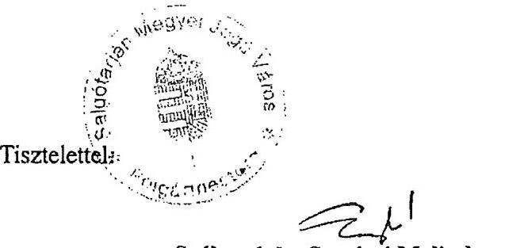

Székyné dr. Sztrémi Melinda
polgármester

---

.

---

# Észrevételek 

a Állami Számvevőszéknek Salgótarján Megyei Jogú Város Önkormányzata pénzügyi ellenőrzéséről szóló (43/3 számú) jelentés-tervezetéhez

## I. Összegző megállapítások, következtetések, javaslatok fejezethez

A jelentés megállapítja, hogy az önkormányzat működési költségvetési kiadásaiból 1.331 millió forintot (14%) az önként vállalt feladatok ellátására fordított. (16. oldal)
A jelentés alapját képező 1. számú tanúsítvány tartalmát az ÁSZ jelentés-tervezetének megküldését követően felülvizsgáltuk. Ennek eredményeként elkészítettük a pontosított 1. számú tanúsítványt és annak kiegészítését, amelyeket mellékelten megküldünk.
A tanúsítvány pontosított adatai alapján az alábbi szövegszerű javaslatot tesszük:
Az Önkormányzat - adatszolgáltatása szerint - 2010-ben a működési költségvetési kiadásaiból (9777 millió Ft) 9321 millió Ft-ot (95%) a kötelező feladatok, 456 millió Ft-ot (5%) az önként vállalt feladatok ellátására fordított.

A jelentés megállapítja, hogy többek között a legjellemzőbb önként vállalt feladatai az ingatlanhasznosítás, a sportlétesítmények fenntartása. (16. oldal)
A megállapítás pontosítását kérjük, hiszen az ingatlanhasznosítás esetünkben csupán a vásár és piacfenntartást jelenti.
Kérjük tehát, hogy az első szakasz utolsó mondatában az ingatlanhasznosítás szó után zárójelbe a (vásár és piacfenntartás) kerüljön.

A sportlétesítmény fenntartási feladata az ellenőrzési jelentés megállapításával szemben kötelező önkormányzati feladat, hiszen a sportról szóló 2004. évi I. törvény 55.§ (1) bekezdésének c) pontja szerint a települési önkormányzat fenntartja és működteti a tulajdonát képező sportlétesítményeket.
Ebből adódóan a mondatból töröljék azt, hogy a sportlétesítmény fenntartása önként vállalt önkormányzati feladat.
Ezen az oldalon megjelenített szervezeti struktúrában az önként vállalt feladatok közül a sportlétesítmények fenntartását kérjük áthelyezni a kötelező feladatok közé a gazdasági társaságok feladataihoz.

---

A jelentés megállapítja, hogy az intézmény szervezeti átalakítások és intézményi összevonások következtében a feladatellátás telephelyeinek száma a 2006. évi 78-ról 2010-re 99-re nőtt. (16. oldal)

A megállapítás pontosítása szükséges, így a mondatot a következők szerint kérjük módosítani:
A vizsgált időszakban jelentős intézmény szervezeti átalakítások és intézményösszevonások történtek. A feladatellátás telephelyeinek száma 2006. évi 78-ról 2010-re 97-re nőtt. (A pontosított 2. számú tanúsítvány mellékelve)

A jelentés megállapítja, hogy a pénzintézeti kötelezettségvállalásokat engedélyező közgyűlési előterjesztések nem tartalmazták a várható kamat- és tőkefizetési kötelezettséget. (20. oldal)

A mindenkori költségvetési rendelet tervezet 6. számú melléklete (többéves kihatással járó döntések) bemutatja a tervezett hitelösszeg előrekalkulált visszafizetési ütemeit. Ezt a jelentés is elismeri a 48. oldalon.
Ebből adódóan tehát kérjük, hogy a megállapításokból töröljék azt, hogy az előterjesztések nem tartalmazták a várható tőkefizetési kötelezettséget.

A költségvetési rendelet elfogadásának időszakában nem lehet meghatározni a kamatfizetési kötelezettség mértékét, hiszen az a közbeszerzés eljárás lefolytatását követően, versenyben alakul ki. A futamidőben évenként fizetendő kamatösszegeket jelentősen befolyásolja az állandóan változó árfolyam, illetve a kamatösszeg alapját jelentő alapkamat (EURIBOR, CHF LIBOR). Ennek bizonytalansága szintén nem teszi lehetővé a futamidőn belül várható kamatkötelezettségeknek a költségvetési rendelet elfogadásának időszakában meghatározható éves mértékeit.
Ebből adódóan kérjük, hogy a megállapításból töröljék azt, hogy az előterjesztések nem tartalmazzák a várható kamatfizetési kötelezettségeket.

A jelentés megállapítja, hogy a 2007-2010. években az önkormányzat működési biztonságát az önként vállalt feladatok aránya hátrányosan befolyásolta. (Az önkormányzat pénzügyi helyzetének összegzése 23. oldal)
Az önként vállalt feladatokra vonatkozóan mellékletben megküldött, pontosított 1. számú tanúsítvány alapján nem helytálló, hogy a működés biztonságát hátrányosan befolyásolta az önként vállalt feladatok magas aránya.

---

Ebből adódóan kérjük, hogy a megállapítást ennek megfelelően pontosítsák.

# Az ellenőrzés megállapításainak hasznosítására irányuló javaslatok részhez a polgármesternek 

2. d) pontban meghatározott javaslathoz

A javaslat, az intézkedések következtében jelentkező pénzügyi többlet, illetve az egyszeri bevétel tartalékba helyezéséről, elkülönített kezeléséről rendelkezik az adósságszolgálat teljesítése érdekében.
Az intézkedések következtében jelentkező pénzügyi többletet, illetve egyszeri bevételeket nem lehet kiragadni az aktuális éves költségvetés fedezeti rendszeréből, hiszen az év folyamán bevételcsökkenés, illetve kiadásnövekedés is bekövetkezhet, ezáltal az intézkedési terv miatt keletkezett bevételi többlet, illetve esetleges egyszeri bevétel feloldódik a költségvetés fedezeti rendszerében.
Az intézkedési terv alapján keletkező bevételi többletből, illetve az egyszeri bevételből csupán azt lehet tartalékba helyezni, amely az aktuális év költségvetésének folyó működésének finanszírozásához nem szükséges.

Az előzőek alapján a megjelölt javaslatot az alábbiak szerint javasoljuk módosítani:
d) az intézkedések következtében jelentkező pénzügyi többletnek, illetve az egyszeri bevételeknek az önkormányzat kötelező feladatai ellátásához, valamint a jogszabályon, bírósági vagy más hatósági határozaton, és a korábban tett kötelezettségvállaláson alapuló fizetési kötelezettségek teljesítéséhez nem szükséges részének tartalékba helyezését, elkülönített kezelését az adósságszolgálat teljesítése érdekében;
2. e) pontban meghatározott javaslathoz

A javaslat többek között arról rendelkezik, hogy a támogatás előfinanszírozásának átláthatóbbá tételét át kell tekinteni.
A feladat értelmezésre szorul, illetve mivel az ellenőrzés nem érintette ezt a feladatot, nem volt e tekintetben megállapítás, kérjük ne írják elő feladatként.
3. a) pontban meghatározott javaslathoz

A javaslat arról rendelkezik, hogy félévente be kell mutatni az önkormányzat és a minősített többségi tulajdonú gazdasági társaságai aktuális pénzügyi helyzetét.

---

Kérjük a javaslatot pontosítani a tekintetben, hogy a gazdasági társaságok vonatkozásában a számvitelről szóló 2000. évi C. törvény 88.§-a szerint a kiegészítő mellékletre meghatározott, vagy/és az államháztartás működési rendjéről szóló 292/2009. (XII.19.) Korm. rendelet 238.§ és a 23. számú melléklet szerinti adattartalommal készüljön-e a tájékoztatás.
3. b) pontban meghatározott javaslathoz

A javaslat arról rendelkezik, hogy félévente be kell mutatni legalább három évre kitekintően a kötelezettségek teljes körére szóló finanszírozási tervet, amely figyelembe veszi a kötelezettség éven belüli és túli felmerülését, a források számszerűsített megjelölésével.
A javaslat pontosítását kérjük, mivel a kötelezettségek teljes körére vonatkozó kiadásokat nem lehet meghatározni, hiszen a későbbi időszakokban változó kötelezettségek nem ismertek, így a források számszerűsített megjelölése sem lehetséges.
A finanszírozási terv a költségvetési tervezés szakmai feladataihoz kapcsolódik. A jelenlegi helyzetben, amikor azt sem lehet tudni, hogy milyen feladatok maradnak az önkormányzatnál, nem látjuk értelmét három évre előre finanszírozási terv készítésének. Mivel az államháztartási törvény korábbi 70.§ (3) bekezdése az önkormányzati költségvetés működési és fejlesztési szektorának elkülönített bemutatását a tárgyévet követő két évben jelölte meg, kérjük hogy a javasolt feladat esetében is két évre kitekintően kerüljön meghatározásra amennyiben a javaslatukat továbbra is fenntartják.

# a jegyzőnek 

4. pontban meghatározott javaslathoz

A javaslat arról rendelkezik, hogy a jegyző intézkedjen a Polgármesteri Hivatal és a további költségvetési szervek peres eljárásokból adódó kötelezettségek teljesítése érdekében a szükséges fedezet elkülönítéséről.
 a finanszírozási tervben történő figyelembevétel mellett.
A javaslattal kapcsolatosan az alábbi problémák jelentkeznek:

- a jegyzőnek nincs hatásköre a kért intézkedés megtételére,
- a peresített követelések megalapozottságát, számszerűsítését nem lehet bizonyossággal meghatározni,

---

- indokolatlan az önkormányzati feladatellátás kapcsolódó kiadásainak aszerinti kategorizálása, hogy peresített vagy nem peresített,
- a peresített, de nem megítélt követelések összegszerű tervezhetőségének bizonytalansága miatt a finanszírozási tervben szerepeltetendő összeg is indokolatlan.
Az előzőek alapján a peres eljárások következményeivel kapcsolatosan jelentős a bizonytalanság, illetve indokolatlan pénzlekötések valósulhatnak meg, amely további forráshiányt generálna, javasoljuk a javaslat elhagyását.

# II. Részletes megállapítások, 1. Az önkormányzat kötelező és önként vállalt feladatai fejezethez 

A jelentés megállapítja, hogy az önkormányzat jellemző önként vállalt feladata a sportlétesítmény fenntartása. (26. oldal)
Az összegző megállapítások, következtetések, javaslatok fejezetben az önként vállalt feladatokhoz fűzött véleményeltérést fenntartjuk, lásd a 16. oldalhoz fűzött megjegyzéseket.
Ebből adódóan a mondatból töröljék azt, hogy a sportlétesítmény fenntartása önként vállalt önkormányzati feladat. Kérjük a 26. oldalon található táblázatnak az 1. számú tanúsítvány alapján történő átdolgozását.

A jelentés megállapítja, hogy az önkormányzat jellemző önként vállalt feladata a mérnöki tevékenység. (26. oldal)
A feladatellátás csak bizonyos esetekben önként vállalt önkormányzati feladat. (pl. a Salgótarjáni Városfejlesztő Kft. esetében, amely társaság egy önkormányzati projekthez kapcsolódóan lát el lebonyolítói - mérnöki feladatokat.)
Ebből adódóan a mondatból töröljék azt, hogy a mérnöki tevékenység önként vállalt önkormányzati feladat.

A jelentés megállapítja, hogy a közművelődési intézményi feladatokra az önkormányzat 2010-ben 2007-hez képest 48 millió Ft-tal kevesebb összeget fordított saját egyéb bevételeiből, mivel a feladatok egyre nagyobb arányát finanszírozta intézményi saját bevétel. (27. oldal)
A megállapítás akkor lenne helytálló, ha változatlan kiadási színvonal lenne. A kiadási színvonal azonban 2007-től 2010-ig 33 millió Ft-tal csökkent. Az intézmény saját bevételének aránya a feladatfinanszírozásban 2007-2010-ig 24%, 22,4%, 28,4% és 25,3%

---

volt. A 2009. évi kiugróan magas arány oka, hogy jelentős összegű egyszeri ÁFA bevételt realizáltak jogszabályi változásból adódóan.
Mivel az állítás nem helytálló, kérjük ezen megállapítás elhagyását, vagy módosítását.

A jelentés megállapítja, hogy a szociális, gyermekvédelmi és egészségügyi feladatokat egy önállóan működő és gazdálkodó intézmény lát el, telephelyeinek száma a vizsgált időszakban 42%-kal, 19-ről 27-re emelkedett, elsősorban a védőnői tanácsadói telephelyek számának és az önkormányzat által működtetett háziorvosi körzetek számának növekedése miatt. (28. oldal)
A telephelyek száma nem pontosan került meghatározásra, ezért a mellékelten megküldött pontosított 2. számú tanúsítvány alapján az alábbi módosítást kérjük:
... telephelyeinek száma a vizsgált időszakban 32%-kal, 19-ről 25-re emelkedett, ...

A telephelyek számának változtatása következtében változik az intézmények összes telephelyeinek száma is. Az intézményi összes telephelyek számát 99 db-ban állapították meg, amely a változás következtében 97-re módosul.
Ebből adódóan kérjük, hogy a telephelyek számát a 28. oldalon is korrigálják, hiszen a helyes szám 97 db.

A jelentés megállapítja, hogy a 2007-ben végrehajtott, közoktatási intézményeket érintő átszervezések eredményeként héttel nőtt a tagintézmények száma. (28. oldal)
A megállapítás nem pontos, hiszen közben csökkent is a költségvetési szervek száma. A mondatot az alábbi tartalommal javasoljuk szerepeltetni:
A 2007-ben végrehajtott, közoktatási intézményeket érintő átszervezések eredményeként héttel nőtt a tagintézmények száma, miközben 17-ről 8-ra csökkent az önállóan működő és gazdálkodó, illetve önállóan működő közoktatási feladatokat ellátó költségvetési szervek száma.

A jelentés megállapítja, hogy a pénzintézeti kötelezettségvállaláskor a közgyűlési előterjesztések nem tartalmazták a teljes futamidő várható kamat- és tőkefizetési kötelezettséget. (48. oldal)
Pontatlan a jelentés megfogalmazása, tekintettel arra, hogy a Közgyűlés nem a kötelezettségvállalásról, hanem a kötelezettségvállalásra történő felhatalmazásról dönt.

---

A kötelezettségvállalásra való felhatalmazás a mindenkori költségvetési rendelet tervezet 6. számú melléklete (többéves kihatással járó döntések) bemutatja a tervezett hitelösszeg előrekalkulált visszafizetési ütemeit. Ezt ugyanezen az oldalon meg is állapítják amikor azt írják, hogy az önkormányzat a 2007-2010. évekre szóló költségvetési rendeletei 6. számú mellékletében mutatta be a többéves kihatással járó döntések éves bontásban, amelyben a pénzintézeti kötelezettségvállalások tőketartozásait bemutatták.
Ebből adódóan tehát kérjük, hogy a megállapításokból töröljék azt, hogy a közgyűlési előterjesztések nem tartalmazták a teljes futamidő várható tőkefizetési kötelezettségeit.

A költségvetési rendelet elfogadásának időszakában nem lehet meghatározni a kamatfizetési kötelezettség mértékét, hiszen az a közbeszerzés eljárás lefolytatását követően, versenyben alakul ki. A futamidőben évenként fizetendő kamatösszegeket jelentősen befolyásolja az állandóan változó árfolyam, illetve a kamatösszeg alapját jelentő alapkamat (EURIBOR, CHF LIBOR). Ennek bizonytalansága szintén nem teszi lehetővé a futamidőn belül várható kamatkötelezettségeknek a költségvetési rendelet elfogadásának időszakában meghatározható éves mértékeit.
Ebből adódóan kérjük, hogy a megállapításból töröljék azt, hogy a közgyűlési előterjesztések nem tartalmazzák teljes futamidő várható kamatfizetési kötelezettségeit.

A jelentés megállapítja, hogy az önkormányzat adósságot keletkeztető, az Ötv. 88.§-ában előírt éves kötelezettségvállalásának felső határát a 2007-2010. években nem lépte túl, azonban a 2011. évi költségvetési rendeletben tervezett hitelfelvételek már meghaladják a kötelezettségvállalási korlát felső határát. (48. oldal)
A hatályos költségvetési rendelet megfelel az Ötv. 88.§-ában meghatározott felső határnak. Kérjük a mondatból töröljék azt a mondatrészt, hogy a 2011. évi költségvetési rendeletben tervezett hitelfelvételek már meghaladják a kötelezettségvállalási korlát felső határát.

A jelentés megállapítja, hogy a 915 millió Ft-os CHF-ben igénybevett hitel 2011. december 29-én lejár, melynek tervezett árfolyamveszteségének 2010. december 31-i állománya 154 millió Ft, melynek kifizetése jelentős terhet jelent az önkormányzat számára, mert csak 30 millió Ft tartalékot tervezett. (51. oldal)
Ez a megállapítás nem helytálló, mivel a 154 millió Ft árfolyamveszteség fedezete az adósságszolgálatokat finanszírozó előirányzatban lett megtervezve (Költségvetési rendelet IV. Polgármesteri Hivatal fejezet, 14. cím) mint tőketartozás, és még ezen túlmenően került

---

elkülönítésre 30 millió Ft általános tartalék (Költségvetési rendelet IV. Polgármesteri Hivatal fejezet, 17. cím).

A veszteség kifizetéséhez a szükséges előirányzat rendelkezésre áll.
Az előzőek alapján kérjük a mondat elhagyását, vagy módosítását.

A jelentés az intézményhálózat működésének átszervezésére, racionalizálására hozott döntések területeinek felsorolásának első pontjában Salgótarjáni Központi Általános Iskolát említ. (59. oldal)

Az intézmény megnevezése helyesen a következő:
Salgótarjáni Központi Általános Iskola és Diákotthon

Salgótarján, 2011. augusztus 25.

Székyné dr. Strémi Melinda
polgármester
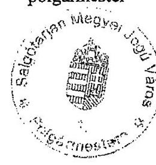

Gaál Zoltán
jegyző
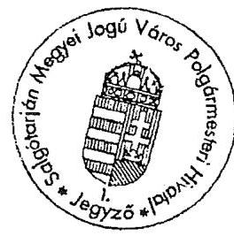

---

# Székyné dr. Sztrémi Melinda úrhölgy   polgármester   Salgótarján Megyei Jogú Város Önkormányzat 

## Salgótarján

## Tisztelt Polgármester Asszony!

Köszönettel vettem a Salgótarján Megyei Jogú Város Önkormányzata pénzügyi egyensúlyi helyzetének ellenőrzéséről szóló jelentés-tervezetre tett észrevételeit, valamint az önkormányzati adatszolgáltatás felülvizsgálata során pontosított 1. és 2. számú tanúsítványt.

A pontosított adatok és az észrevételében leírtak figyelembevételével módosítottuk a kötelező és az önként vállalt feladatokat és az intézményszervezeti átalakításokra vonatkozó összegző és a részletes megállapításainkat. Szintén elfogadtuk a várható tőkefizetési kötelezettségek közgyűlés számára történő bemutatására és az árfolyamveszteség kifizetéséhez szükséges előirányzat meglétére vonatkozó észrevételeit. A Polgármester Asszony érvei alapján töröltük a javaslatok közül a támogatás előfinanszírozásának átláthatóbbá tételére és a peres eljárásokból adódó kötelezettség fedezetének elkülönítésére vonatkozó javaslatainkat. Észrevétele alapján pontosítottuk a Salgótarjáni Központi Általános Iskola és Diákotthon nevét.

A jelentés-tervezetben rögzített megállapításokkal, javaslatokkal kapcsolatban tett következő észrevételeit az alábbi indokok miatt nem tudom elfogadni.

- Azt a megállapításunkat, miszerint az Önkormányzatnak az ingatlanhasznosítás az egyik jellemző önként vállalt feladata, nem szükséges módosítanunk, mert az észrevétel nem veszi figyelembe, hogy ingatlanhasznosítást a Salgó Vagyon Kft. is ellát. Az Önkormányzat 11/2010. (I. 26.) Öh. számú határozata alapján módosított és egységes szerkezetben foglalt alapító okirata értelmében a Salgó Vagyon Kft. tevékenységi körei között szerepel a saját tulajdonú ingatlan adásvétele, a saját tulajdonú, bérelt ingatlan bérbeadása is.
- Továbbra is fenntartjuk azt a megállapításunkat, miszerint a pénzintézeti kötelezettségvállalásokat engedélyező közgyűlési előterjesztések nem tartalmazták a teljes futamidő várható kamatfizetési kötelezettségeit. A 2007-2010. évek költségvetési rendeleteihez kapcsolódó a „Többéves kihatással járó döntések éves bontásban" elnevezésű 6. számú mellékletekben a tervezett hitelfelvételből adódó tőkefizetési

---

kötelezettségeit mutatták be, de azok nem tartalmazták a kamatfizetési kötelezettségeket.

- Indokolatlan megváltoztatnunk „a működés biztonságát az önként vállalt feladatok aránya is hátrányosan befolyásolta" megállapításunkat. Az Önkormányzat pénzügyegyensúlyi helyzetét a módosított tanúsítványban szereplő önként vállalt feladatok 456 millió Ft-os összegű, 5%-os aránya is hátrányosan befolyásolta, tekintettel a nettó működési jövedelem növekvő negatív összegére (2007-ben -332,7 millió Ft, 2008-ban -402,9 millió Ft, 2009-ben -444,6 millió Ft, 2010-ben -824,6 millió Ft).
- Az észrevételben foglaltak nem indokolják azon javaslatunk módosítását, amely az intézkedések következtében jelentkező pénzügyi többlet, illetve az egyszeri bevételek tartalékba helyezését, elkülönített kezelését célozta meg. A javaslataink 2. pontjában megfogalmazott operatív terv elkészítésének és végrehajtásának lényege, hogy az Önkormányzat fokozottan törekedjen pénzügyi egyensúlyának középtávú helyreállítása, illetve hosszú távú fenntarthatósága érdekében az adósságállomány csökkentésére. Ennek érdekében szükségesnek tartjuk, hogy az intézkedések hatására képződő bevételi többletet az Önkormányzat tartalékként kezelje és abból ne működési, fejlesztési többletkiadásait finanszírozza. Az Önkormányzat fizetőképességének megőrzése és az adósságszolgálati terhek hosszú távú teljesíthetősége céljából a fenti többletforrások a költségvetési hiány, ezáltal a külső finanszírozási igény csökkentését szolgálják.
- A minősített többségi tulajdonú gazdasági társaságok pénzügyi helyzetének bemutatását célzó javaslatunkat nem szükséges módosítanunk, mert a javaslat azt kívánja elérni, hogy a Közgyűlés számára az Önkormányzat és a gazdasági társaságok pénzügyi helyzetére és a finanszírozási kockázatokra aktuális információk álljanak rendelkezésre. Az évközi beszámoló, az éves beszámoló és a zárszámadás fordulónapjához képest a Közgyűlés részére történő előterjesztés több hónappal később történik meg. A fenti időszakban a gazdálkodás körülményeiben, a pénzpiaci folyamatokban olyan mértékű változások következhetnek be, amelyek nélkül a féléves, illetve éves beszámolóban szereplő adatok nem értékelhetők reálisan. Erre való tekintettel rendelkezik úgy a javaslat, hogy a kérdéses előterjesztések tárgyalásával egyidejűleg a pénzügyi helyzetre vonatkozó aktuális információk kerüljenek bemutatásra.
- A kötelezettségek teljes körére szóló három évre kitekintő finanszírozási tervre vonatkozó javaslatunkat továbbra is fenntartjuk, mivel az Államháztartásról szóló 1992. évi XXXVIII. törvény 71. § (2) bekezdése a kötelezettségek bemutatását időhatár nélkül írja elő. A hivatkozott bekezdés hatályos szövege szerint a polgármester a költségvetési rendelettervezet benyújtásakor előterjeszti azokat a rendelettervezeteket is, amelyek a javasolt előirányzatokat megalapozzák, bemutatja a többéves elkötelezettséggel járó kiadási tételek későbbi évekre vonatkozó kihatásait.
- A mérnöki tevékenység sem kötelező feladata az Önkormányzatnak, mivel már az észrevétel is elismerte, hogy bizonyos esetekben önként vállalt feladat, de nem tért ki

---

arra, hogy milyen jogszabályi előírás alapján, milyen feladatot értenek kötelezően ellátandó mérnöki tevékenységnek.

- A közművelődési intézményi feladatokra fordított önkormányzati források elemzésében leírtakat továbbra is fenntartjuk. Az ellenőrzés egyik célja éppen annak bemutatása volt, hogy a feladatellátás módjában bekövetkező változások milyen hatást gyakoroltak az Önkormányzat pénzügyi helyzetének alakulására. Az Önkormányzat pénzügyi egyensúlyi helyzetét javította, hogy 2010-ben 2007-hez képest 48 millió Ft-tal kevesebb összeget fordított saját egyéb bevételeiből, mivel a feladatok egyre nagyobb arányát finanszírozta intézményi saját bevétel. Ezt bizonyítja az észrevételéhez csatolt módosított 1. számú tanúsítvány is, amely szerint a közművelődési intézmények intézményi saját bevételeinek megoszlása 2007. és 2010. között 27,0%,
 23,4 %, 32,6 % és 38,2 % volt.
- A kötelezettségvállalás felső határát érintő észrevételét nem tudjuk elfogadni, mert az adósságot keletkeztető, az Ötv. 88. §-ában előírt éves kötelezettségvállalás felső határát meghaladta az Önkormányzat a 2011. évi költségvetési rendeletben tervezett hitelfelvételi döntése. Az ellenőrzés a 2007. január 1. - 2010. december 31. közötti időszakot ölelte fel, de a jövőbeni kockázatok feltárása érdekében a 2011. március 31-ig hatályos időszakot is vizsgálta, melynek megfelelt a megállapításunk. Ezt követő időszakban elfogadott rendeletmódosítások értékelése nem tartozott az ellenőrzés feladatkörébe.

Köszönöm Polgármester Asszony és munkatársai ellenőrzés során tanúsított hozzáállását, amellyel az ellenőrzés megvalósításában részt vettek, azt segítették.

Budapest, 2011. december 22.
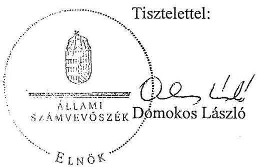

---

.
