ÁLLAMI
SZÁMVEVŐSZÉK

# JELENTÉS 

Sopron Megyei Jogú Város Önkormányzata pénzügyi helyzetének ellenőrzéséről (43/3)

---

# Számvevői Iroda 

Iktatószám: V-3046-14/2011.
Témaszám: 1015
Vizsgálat-azonosító szám: V056045

## Az ellenőrzést felügyelte:

Dr. Varga Sándor
számvevő igazgató-helyettes
Az ellenőrzést vezette:
Renkó Zsuzsanna
számvevő tanácsos
Az ellenőrzést végezték:

| Varga József | Bencsik Árpád | Kiss Rita Teréz |
| :-- | :-- | :-- |
| számvevő tanácsos | számvevő | számvevő tanácsos |

A témához kapcsolódó eddig készített számvevőszéki jelentések:
címe
sorszáma
Jelentés Sopron Megyei Jogú Város Önkormányzata gazdálkodási 0940
rendszerének 2009. évi ellenőrzéséről

---

# TARTALOMJEGYZÉK 

BEVEZETÉS ..... 5
I. ÖSSZEGZŐ MEGÁLLAPÍTÁSOK, KÖVETKEZTETÉSEK, JAVASLATOK ..... 16
II. RÉSZLETES MEGÁLLAPÍTÁSOK ..... 27

1. Az Önkormányzat által ellátott közszolgáltatások feltételei, szervezeti keretei, kötelező és önként vállalt feladatai ..... 27
2. Pénzügyi egyensúlyi helyzet alakulása ..... 31
2.1. A működési és felhalmozási egyensúly alakulása ..... 31
2.2. Az Önkormányzat bevételeinek alakulása ..... 39
2.3. Az Önkormányzat kiadásainak alakulása ..... 42
3. Kötelezettségek bemutatása ..... 47
3.1. A pénzintézetek felé fennálló kötelezettségek alakulása ..... 47
3.2. Szállítók felé fennálló kötelezettségek alakulása ..... 56
3.3. Egyéb kötelezettségek alakulása ..... 57
4. A pénzügyi egyensúly megteremtése érdekében hozott intézkedések ..... 61
5. A helyi önkormányzatok gazdálkodási rendszerének 2009. évi ellenőrzése során a pénzügyi egyensúly javítására tett szabályszerűségi és célszerűségi javaslatok hasznosulása ..... 67

---

# MELLÉKLETEK 

1. számú melléklet
2. számú melléklet
3. számú melléklet
4. számú melléklet
5. számú melléklet
5. számú melléklet
5. számú melléklet
5. számú melléklet

Működési és felhalmozási hiány/többlet az Önkormányzat rendeleteiben

Kimutatás az Önkormányzat bevételeinek és kiadásainak, adósságszolgálatának alakulásáról

Az Önkormányzat 2007-2010 években megvalósított, 2010. december 31-ig befejezett fejlesztései forrásösszetételéről
Az Önkormányzat 2010. december 31-én folyamatban lévő fejlesztési feladataihoz kapcsolódó kötelezettségeinek összegzéséről
Az Önkormányzat 2010. december 31-én folyamatban lévő fejlesztési feladataihoz kapcsolódó 2010. évet követő kötelezettség-vállalásainak összegzéséről
Az Önkormányzat beadott, elbírálás alatti pályázati forrásból megvalósuló fejlesztéseihez kapcsolódó kötelezettség-vállalásainak összegzéséről
Az önkormányzati feladatok ellátásában résztvevő gazdasági társaságokról

Sopron Megyei Jogú Város Önkormányzat Polgármesterének észrevétele

Sopron Megyei Jogú Város Önkormányzat Polgármesterének észrevételére adott válasz

---

# RÖVIDÍTÉSEK JEGYZÉKE 

| Törvények |  |
| :--: | :--: |
| Áht. | az államháztartásról szóló 1992. évi XXXVIII. törvény |
| ÁSZ tv. | az Állami Számvevőszékről szóló 1989. évi XXXVIII. törvény (2011. július 1-jétől az Állami Számvevőszékről szóló 2011. LXVI. törvény) |
| Art. | Az adózás rendjéről szóló 2003. évi XCII. törvény |
| Csődtv. | A csődeljárásról és a felszámolási eljárásról szóló 1991. évi XLIX. törvény |
| Gt. | A gazdasági társaságokról szóló 2006. évi IV. törvény |
| Htv. | a helyi önkormányzatok és szerveik, a köztársasági megbízottak, valamint egyes centrális alárendeltségű szervek feladat- és hatásköreiről szóló 1991. évi XX. törvény |
| Ötv. | a helyi önkormányzatokról szóló 1990. évi LXV. törvény |
| Rendeletek |  |
| SzMSz | Sopron Megyei Jogú Város Önkormányzatának többször módosított 18/2007.(VI. 1.) számú rendelete az Önkormányzat Szervezeti és Működési Szabályairól |
| Szórövidítések |  |
| APEH | Adó- és Pénzügyi Ellenőrzési Hivatal |
| áfa | általános forgalmi adó |
| ÁSZ | Állami Számvevőszék |
| BM | Belügyminisztérium |
| EDP hiány/egyenleg | Uniós módszertan szerinti maastrichti kritériumoknak megfelelő számítás szerinti hiány/egyenleg |
| EU | Európai Unió |
| GDP | Bruttó hazai termék |
| Jegyző | Sopron Megyei Jogú Város jegyzője |
| Kórház | Sopron Mjv. Erzsébet Kórház, DEO-EC Oktató Kórháza |
| Közgyűlés | Sopron Megyei Jogú Város Önkormányzatának Közgyűlése |
| KSH | Központi Statisztikai Hivatal |
| NAV | Nemzeti Adó- és Vámhivatal |
| NGM | Nemzetgazdasági Minisztérium |
| OEP | Országos Egészségbiztosítási Pénztár |
| Önkormányzat | Sopron Megyei Jogú Város Önkormányzat |
| Polgármester | Sopron Megyei Jogú Város polgármestere |
| Polgármesteri hivatal | Sopron Megyei Jogú Város Polgármesteri Hivatala |
| PPP konstrukció | Public Private Partnership (Partnerségi együttműködés közfeladatok ellátására a magánszektor bevonásával) |
| szja | Személyi jövedelemadó |

---

.

---

# JELENTÉS 

## Sopron Megyei Jogú Város Önkormányzata pénzügyi helyzetének ellenőrzéséről

## BEVEZETÉS

Az Állami Számvevőszék 2011. évtől érvényes stratégiája új irányt szabott a helyi önkormányzatok gazdálkodásának ellenőrzésében is. Az ÁSZ - küldetése és jövőképe szerint - szilárd szakmai alapokra támaszkodva értékteremtő ellenőrzéseivel és helyzetelemzéseivel az államháztartás egészében, így a helyi önkormányzati alrendszerben is elő kívánja segíteni a közpénzek és a közvagyon szabályos, gazdaságos, hatékony és eredményes hasznosítását. Ennek részeként - a 2010. évi államháztartási hiány alakulásának összetevőire is figyelemmel - folyamatban van az önkormányzati alrendszer pénzügyi helyzetelemzése.

Az NGM 2011 áprilisában közzétett adatai szerint ${ }^{1}$ a 2010. évi 1036,2 milliárd Ft összegű 3,8\%-os EDP (maastrichti kritériumok szerinti, Túlzott Hiány Eljárás keretében kimutatott) hiánycél nem volt tartható, az önkormányzati alrendszer tervezettet meghaladó hiánya miatt a GDP arányában kifejezett államháztartási hiány 4,2\%-ra emelkedett.

Az önkormányzatok 2010 első három negyedévi költségvetési jelentése szerinti pénzforgalmi hiány 97 milliárd Ft-os összege nem indokolta az önkormányzati alrendszer 190 milliárd Ft-ra becsült hiányának 2010. évi végi felülvizsgálatát. A helyi önkormányzatok 2011. januári gyorsjelentése alapján a pénzforgalmi hiány már 247,7 milliárd Ft-ot tett ki. Az alrendszer hiánya így a tervezett 0,7\%-kal szemben magasabb, 0,9\%-os szinten realizálódott. Az 57,7 milliárd Ft hiánytöbblet alakulásában - a Tájékoztató szerint - az iparűzési adó elmaradása, a gépjárműadó, az illetékek és más bevételek tervezettnél alacsonyabb összegben való teljesülése volt a meghatározó.

Magyarország a Széll Kálmán Terv célkitűzései alapján² aktualizált Konvergencia Programjában a középtávú (2011-2015. évek) költségvetési pálya kijelölése során 2011-re a kormányzati szektor EDP módszertan szerinti egyenlegét +2\%-

[^0]
[^0]:    ${ }^{1}$ NGM Tájékoztatás Magyarország Strukturális Reformprogramjának végrehajtásáról (2011. április 1). A Tájékoztató évente két alkalommal - április és október hónapban - jelenik meg.
    ${ }^{2}$ Az államháztartás 2011. évi egyenlege - a magán nyugdíjpénztárakból az állami nyugdíjpillérbe való visszatérés egyszeri vagyonhatása következtében - 4\%-os többletet mutatna. A Széll Kálmán Tervben foglalt egyszeri intézkedések - a MÁV, a BKV adósságrendezése, a PPP projektek kiváltása - összességében a GDP 2\%-ával csökkentik a várható többlet mértékét.

---

ban jelölte meg. Az egyenlegcél megfogalmazásakor az önkormányzati alrendszer tervezett hiányát a 2011. évi költségvetésben szereplő 0,3\%-kal szemben 0,5\%-os arányban határozták meg ${ }^{3}$. A hiánycélok meghatározása jelzi, hogy az önkormányzati alrendszerben 2011-ben fokozott figyelmet kell fordítani a pénzügyi egyensúlyi helyzet alakulására.

Az államháztartás helyi szintjén a 23 megyei jogú városi önkormányzatnak az általuk ellátott közszolgáltatások volumenére való tekintettel kiemelt szerepe van, e települések népessége összességében meghaladja a kétmillió főt ${ }^{4}$. A települések népességét az alábbi diagram szemlélteti:
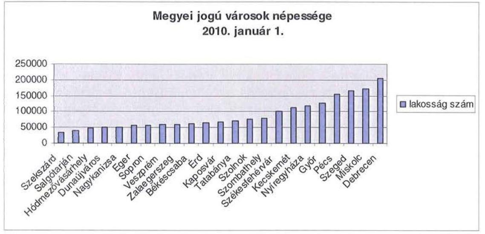

A megyei jogú városi önkormányzatok ${ }^{5}$ kötelező feladatellátását többlépcsős törvényi előírások határozzák meg. A feladatokra vonatkozó szabályozás első szintjét az Ötv. ${ }^{6}$, a második szintet a hatásköri7, a harmadik szintet a további ágazati, szakmai (egyebek mellett az oktatási, egészségügyi, szociális és egyéb ágazati feladatok ellátásának szakmai szabályait rögzítő) törvények adják.

A megyei jogú városi önkormányzatok - az Ötv-ből közvetlenül levezethető települési feladatok mellett - körzeti közszolgáltatásokat is ellátnak. A megyei

[^0]
[^0]:    ${ }^{3}$ A Magyar Köztársaság 2011. évi költségvetéséről szóló 2010. évi CLXIX. törvény Általános indoklásának III. fejezete, valamint Magyarország Konvergencia Programja 2011-2015. (2011. április) Táblázatok rész, 2. táblázat Államháztartás összefoglaló adatai szerint.
    ${ }^{4}$ A megyei jogú városok népességét a 4/2011. (I. 31.) NGM rendelet 1. sz. mellékletében foglalt 2010. január 1-i adatok alapján vettük figyelembe.
    ${ }^{5}$ Az Ötv. 61. § (1) bekezdése alapján a megyeszékhely város a törvény erejénél fogva megyei jogú, ugyanakkor az Országgyűlés az ötvenezernél nagyobb népességű városokat a képviselőtestület kérelmére megyei jogú várossá nyilváníthatja. Ez utóbbi körbe 5 város tartozik, közülük 2 (Hódmezővásárhely, Dunaújváros) népessége 2010. január 1-jére már ötvenezer fő alá csökkent.
    ${ }^{6}$ az Ötv. 8. és 61. §-ában foglaltak szerint
    ${ }^{7}$ a Htv.

---

jogú városi cím elsősorban többlet kötelezettségekkel jár, a megyei jogú városnak önmagának kell gondoskodnia mindazokról a feladatokról, amelyek más települési önkormányzatok esetében a megyei önkormányzat feladatát képezik. Ide sorolható többek közt a középfokú oktatási intézmények fenntartása, a közművelődési, könyvtári és levéltári szolgáltatás, a társadalombiztosítás finanszírozása mellett a kórházi és a rendelőintézeti szakellátás, a szociális és egyes gyermekvédelmi feladatok ellátása. Ezeket a feladatokat (intézményeket) a megyei jogú város - más városoktól eltérően - nem adhatja át a megyei önkormányzatnak, azonban az Ötv. lehetőséget biztosít arra, hogy a megyei önkormányzattal megállapodjék a feladatellátás megosztásában.

Az önkormányzat, így a megyei jogú város is, maga határozza meg, hogy - a lakosság igényei alapján, anyagi lehetőségei függvényében - mely feladatokat, milyen mértékben és módon, mely szervezeti keretek közt lát el. A szervezetalakítás szabadsága a megyei jogú városok esetében azzal járt, hogy mind a kötelező közszolgáltatásoknál (különösen a településüzemeltetés, vagyongazdálkodás), mind pedig az önként vállalt feladataik ellátásában - elsősorban a sport és kulturális szolgáltatások területein - a gazdasági társaságok kiemelt fontosságú szerephez jutottak. Ily módon a gazdálkodás, a pénzügyi helyzet kockázatai közvetlenül kikerültek ugyan az önkormányzati alrendszerből, azonban sérülhet az ellátási felelősség figyelemmel kísérése és érvényesítése, a közpénzek felhasználásának transzparenciája. Mindezek együttvéve - a beszámolók konszolidálásának hiányában - növelik a megyei jogú városok pénzügyi helyzetének megítélésében rejlő kockázatokat.

Az áttekintett időszakban az önkormányzati feladatok ellátásának keretet biztosító forrásszabályozás elvei lényegesen nem változtak.

A megyei jogú városok önkormányzatainak mozgásterét, az önkormányzatok feladatellátásra vonatkozó döntéseit a központi költségvetéstől való függőség mellett jelentősen befolyásolja a helyi adókivetési jog gyakorlása ${ }^{8}$. A helyi adók rendszere a közszolgáltatások finanszírozásához szükséges források megteremtésének, bővítésének eszköze, amely a gazdasági válság, a jogszabályi környezet, az adópolitika változása, az adóhatóságok tevékenysége következtében differenciáltan érinti a települési önkormányzatokat ${ }^{9}$.

A települési önkormányzatok saját folyó bevételeinek keretében elszámolt, különböző jogcímeken kivetett helyi adók - iparűzési adó, építmény- és telekadó, idegenforgalmi adó, vállalkozók és magánszemélyek kommunális adója - 2007-2010 között eltérő módon emelkedtek. A helyi adókból származó bevételek realizált összege országos szinten 2007-2009 között folyamatosan, 505,3 milliárd Ft-ról 566,3 milliárd Ft-ra emelkedett, majd a gazdasági válság hatásai következtében 2010-re 542,6 milliárd Ft-ra esett vissza. A helyi adók részesedése

[^0]
[^0]:    ${ }^{8}$ a helyi adókról szóló 1990. évi C. törvény szabályai szerint
    ${ }^{9}$ Az Állami Számvevőszék 2010 decemberében közzétett 1031. számú jelentésében értékelte a helyi adók rendszerében a hatékonyság és az eredményesség érvényesülését.

---

az önkormányzatok saját folyó bevételein belül 2007-2010 között 2,5 százalékponttal csökkent ${ }^{10}$.

A megyei jogú városok saját folyó bevétele 2007-ben 191,5 milliárd Ft volt, 2008-ban 223,1, 2009-ben 225,4, 2010-ben 223,5 milliárd Ft-ot tett ki. A helyi adóbevételekből való részesedésük 2007-ben 110,5
 milliárd Ft (21,9%), 2008-ban 128,3 milliárd Ft (23,2%), 2009-ben 124,4 milliárd Ft (22%), 2010-ben 118,7 milliárd Ft (részaránya a 2007. évivel azonosan 21,9%) volt. E realizált adóbevételek a megyei jogú városok saját folyó bevételeinek 2007-ben 57,7, 2008-ban 57,5, 2009-ben 55,2, 2010-ben 53,1%-át jelentették. A helyi adóbevételek 2007-ről 2010-re kimutatott 4,6 százalékpontos csökkenése annak ellenére következett be, hogy a megyei jogú városok saját folyó bevétele 2010-ben 16,7%-kal haladta meg a 2007. évit.

A helyi adókon belül a települések gazdasági helyzetének egyik fokmérője az elért helyi iparűzési adóbevétel, amely a megyei jogú városok körében erőteljes - a település nagyságrendtől is függő $^{11}$ - különbségeket mutat. A helyi iparűzési adóbevétel és annak egy lakosra vetített összegének 2007. és 2010. évi alakulását az alábbi diagramok szemléltetik:
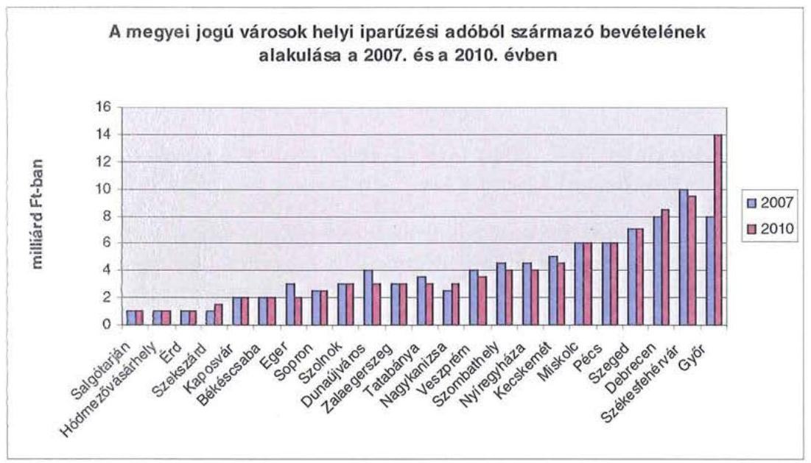

[^0]
[^0]:    $^{10}$ A helyi adó bevételek saját folyó bevételekből való részesedése országosan 2007-ben 55,3%, 2010-ben 52,8% volt.
    $^{11}$ A 100 ezer fő feletti népességű megyei jogú városok csoportjába Debrecen, Miskolc, Szeged, Pécs, Győr, Nyíregyháza, Kecskemét, Székesfehérvár tartozik. Nem megyeszékhely megyei jogú város Érd, Sopron, Nagykanizsa, Dunaújváros, Hódmezővásárhely.

---

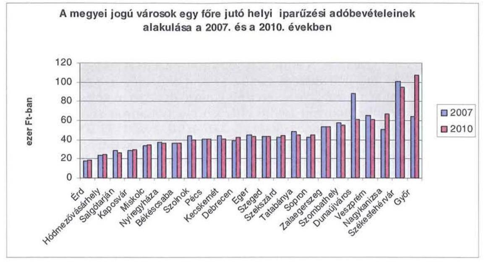

A megyei jogú városi önkormányzatok saját bevételein belül második legjelentősebb elem az illetékbevétel. A 2010. évben befolyt 39,2 milliárd Ft illetékbevétel a 2006. évben realizált 71,1 milliárd Ft illetékbevétel alig több mint 55%-a. A jelentős visszaesést döntően az ingatlanpiac stagnálása, majd visszaesése, illetve egyes illetékkedvezmények bevezetése okozta. A kieső bevételek pótlására az önkormányzati alrendszer szintjén történtek intézkedések, 2010-ben 5 milliárd Ft-ot, 2011-ben 1,2 milliárd Ft-ot ellentételezett a központi költségvetés. A megyei jogú városok önkormányzatai az önkormányzati alrendszer szintjén realizált illetékbevételből 2007-ben 13,6 milliárd Ft-tal (23,3%-kal), 2008-ban 15,3 milliárd Ft-tal (22,7%-kal), 2009-ben 12,6 milliárd Ft-tal (21,5%-kal), 2010-ben 7,9 milliárd Ft-tal (20,2%-kal) részesedtek $^{12}$. Az összes befolyt illetékbevételből a megyei jogú városok részesedése 2009-ről 2010-re mindössze 1,3 százalékponttal csökkent, ugyanakkor a realizált illetékbevétel csökkenése a 37,3%-ot (4,7 milliárd Ft) is elérte.

Az önkormányzati alrendszer átengedett bevételei közül a személyi jövedelemadóból való részesedés makroszintű szabályozása a vizsgált időszakban nem változott. A települési önkormányzatokat a településre kimutatott személyi jövedelemadó 8%-a közvetlenül, míg 32%-a külön szabályozott visszaosztási rendben illeti meg. A visszaosztás a jövedelem differenciálódás mérséklésével párosul, rendje a lakóhelyen maradó személyi jövedelemadóhoz és az iparűzési adó-erőképességhez $^{13}$ igazodik, annak részletszabályait a mindenkori költségvetési törvény 4. számú melléklete határozza meg. A jövedelemdifferenciálódás

[^0]
[^0]:    $^{12}$ Az illetékek kivetésének és beszedésének joga 2006. december 31-ig a megyei önkormányzatok feladata volt, amelyet a 2007. évtől az APEH (2011. január 1-jétől NAV) vett át. Az önkormányzati illetékrészesedési szabályok változatlanok maradtak, azonban az illetékbeszedés költségeit az önkormányzatok illetékbevételeiből átlagos (a megyei jogú városoknál 8,5%-os) kulcsot alkalmazva vonták le.
    $^{13}$ Az iparűzési adóerő-képesség egy potenciális, átlagos erőfeszítés mellett elérhető (a települési önkormányzat iparűzési adóelőlegét meghatározó adóalap 1,4%-ának megfelelő számított) bevétel.

---

szabályai kétirányúak, a kiegészítés és a visszatartás feltételeit egyaránt meghatározták:

- Amennyiben az önkormányzatot közvetlenül megillető személyi jövedelemadó bevétel és a számított iparűzési adóerő-képesség együttesen számított, egy főre jutó összege nem érte el a település méretéhez kapcsolódóan az évenkénti szabályozás szerinti változó összeget, a költségvetés a részesedést település nagyság szerint eltérően meghatározott szintig kiegészítette $^{14}$. A kiegészítés fajlagos összege 2007-2010 között 37500 Ft-ról 48010 Ft-ra (10 510 Ft-tal, 28%-kal) emelkedett. Az előzőeken túl a jövedelem differenciálódás szabályozása egyes térségi (középiskolai, szakiskolai, szakképző intézményi, kollégiumi) feladatok ellátásának függvényében további kiegészítő hozzájárulást biztosított.
- Amennyiben az egy főre számított személyi jövedelemadó és az iparűzési adóerő-képesség együttes összege a település nagyságrendjéhez rendelt értékhatárt több mint 25%-kal (2010-től 20%-kal) meghaladta, az egy főre jutó összeg sávonként differenciált módon $^{15}$ visszavonásra került az önkormányzatot megillető normatív állami hozzájárulás összegéből.

Az önkormányzatok személyi jövedelemadó bevétele 2007-ben 494,3 milliárd Ft, 2008-ban 558,6 milliárd Ft, 2009-ben 639,5 milliárd Ft, 2010-ben 681,2 milliárd Ft volt, az időszak alatt összegében 186,9 milliárd Ft-tal, 37,8%-kal emelkedett, miközben az szja bevétel átengedett bevételeken belüli részesedése 1,8 százalékponttal emelkedett.

A megyei jogú városok önkormányzatainak személyi jövedelemadó részesedése az alrendszer átengedett személyi jövedelemadó bevételeiből 2007-ben 77,6 milliárd Ft-ot (15,7%-ot), 2008-ban 105,4 milliárd Ft-ot (18,9%-ot), 2009-ben 122,9 milliárd Ft-ot (19,2%-ot), 2010-ben 136,6 milliárd Ft-ot (20,1%-ot) tett ki. A realizált szja bevétel a megyei jogú városoknál az időszak alatt folyamatosan emelkedett, a 2010-ben realizált adóbevétel 59,0 milliárd Ft-tal (76%) volt magasabb a 2007. évinél, az átengedett bevételeken belüli részesedése 2010-re 5,1 százalékponttal haladta meg a 2007. évi részarányt $^{16}$. A részesedés alapjául szolgáló szja településenként eltérő, az egy adózóra jutó szja 2009. évi adatait $^{17}$ a következő ábra szemlélteti.

[^0]
[^0]:    $^{14}$ A megyei jogú városok esetében a jövedelemkülönbségek mérséklésénél figyelembe veendő lakosonkénti értékhatár 2007-ben 37500 Ft, 2008-ban 42385 Ft, 2009-ben 45933 Ft, 2010-ben 48010 Ft volt.
    $^{15}$ A sávos értékhatár 2010-től 20%-os intervallumonként, 120% felett a visszatartást 25%-tól 90%-os mértékig rögzíti. Amennyiben a település nagyságrendhez rendelt értékhatár összege az önkormányzatnál eléri vagy meghaladja a 200%-ot, az egy főre jutó összeg 90%-a levonásra kerül. Az értékhatár sávjai 2010 előtt 25%-os léptékűek voltak, a levonási arányok az ellenőrzött időszakban nem változtak.
    $^{16}$ E bevételek a megyei jogú városok átengedett bevételeiben 2007-ben 84,7, 2008-ban 87,7, 2009-ben 89,7, 2010-ben 89,8%-os részarányt jelentettek.
    $^{17}$ Adatforrás: KSH Megyei Jogú Városok a Közép Dunántúlon 2009. kiadványa, 4.1. sz. összehasonlító tábla.

---

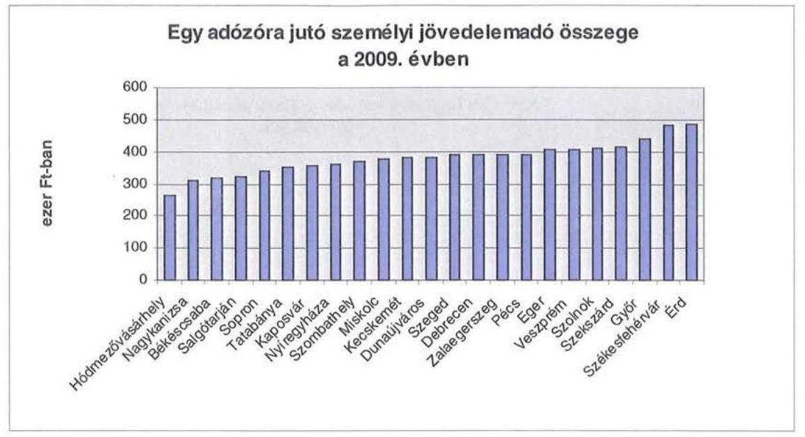

Az átengedett bevételek második legjelentősebb eleme a gépjárműadó, amelynek bevételi szabályozása az ellenőrzött időszakban nem változott, az adóbevétel teljes összege az önkormányzatot illeti meg. A gépjárműadó alapját, mértékét $^{18}$ és egyes mentességi kategóriákat érintő módosítások 2010. január 1-től következtek be, amelyek az egyes adótételek esetében átlagosan 15%-os emelkedéssel jártak.

A gépjárműadó beszedéséből származó bevétel az önkormányzati alrendszer szintjén 2007-ben 62,4 milliárd Ft, 2008-ban 65,7 milliárd Ft, 2009-ben 63,8 milliárd Ft, 2010-ben 71,1 milliárd Ft volt, az adóbevétel egésze 2007-hez képest 8,7 milliárd Ft-tal, 13,9%-kal emelkedett. A gépjárműadózás szabályainak változása 2010-ben 7,3 milliárd Ft többletet eredményezett. A megyei jogú városok gépjárműadó bevétele a 2007. évi 14,0 milliárd Ft-ról 2010-re 15,5 milliárd Ft-ra, 10,7%-kal emelkedett. A bevétel növekedés összegéből 1,4 milliárd Ft a 2010. évi adózási szabályok következménye.

[^0]
[^0]:    $^{18}$ A gépjárműadóról szóló 1991. évi LXXXII. törvény 7. § (1) bekezdésében foglalt adómértékek változása.

---

A megyei jogú városok önkormányzatai 2007-2010 között rendelkezésre álló forrásainak alakulását a következő ábra szemlélteti:
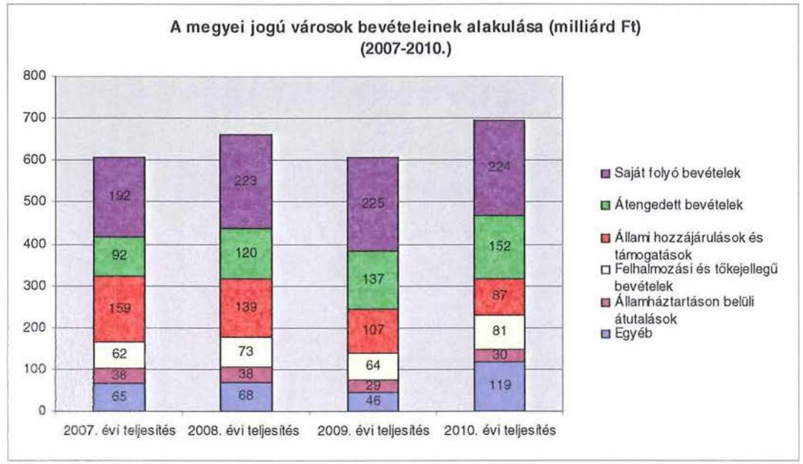

A megyei jogú városok saját folyó bevételeinek - amelyek főbb elemei: a helyi adók, az illetékbevételek, az intézményi térítési díjak, a kamatbevételek - részaránya a 2007. évi összbevételen (608 milliárd Ft) belül 32% volt. A 2010. évi összbevétel 693 milliárd Ft-os összegéből a saját folyó bevételek aránya - miközben összege 2007-ről 2010-re 32 milliárd Ft-tal emelkedett - nem változott.

Az átengedett bevételek, amelyek a megyei jogú városok önkormányzatainál döntően a személyi jövedelemadó és a gépjárműadó részesedést jelenti, az összbevételen belül a 2007. évi 92 milliárd Ft-ról (15%) 152 milliárd Ft-ra nőtt, részesedése 7 százalékponttal emelkedett. A 60 milliárd Ft-os növekedésből 59 milliárd Ft-ot az szja részesedés emelkedése okozott.

Az állami hozzájárulások és támogatások - amelyek főbb elemei: főként az ellátotti létszámhoz kötődő normatív állami hozzájárulások, központosított előirányzatok - a 2007. évi 159 milliárd Ft-ról (26%-os részarányról) 2010-re 87 milliárd Ft-ra (13%-os részarányra) estek vissza.

A felhalmozási és tőkejellegű bevételek - tárgyi eszközök (ingatlanok és ingóságok), föld és immateriális javak, részesedések értékesítése, EU-tól átvett pénzeszközök - a 2007. évi 62 milliárd Ft-ról (10%-os részarányról) 2010-re 81 milliárd Ft-ra (12%-os részarányra) emelkedtek.

Az államháztartáson belüli átutalások részesedése 2007-ben 38 milliárd Ft volt. 2010. év végére 8 milliárd Ft-tal csökkent, részaránya 6%-ról 2010-ben 4%-ra változott. Ez a bevételi kategória tartalmazza az Egészségbiztosítási Alaptól és más elkülönített állami pénzalapoktól átvett forrásokat. A 2010-ben e címen elszámolt bevétel a megyei jogú városoknál 22 milliárd Ft-ot tett ki.

---

Az egyéb, pénzmaradványból, vállalkozási bevételekből, államháztartáson kívülről származó átutalásokból, a hitelekből, a hosszú és rövid lejáratú értékpapírok értékesítéséből származó bevételek részesedése a 2007-2010. évek viszonylatában 11%-ról 17%-ra emelkedett. Ez utóbbiak 2010. évi beszámoló szerinti összevont teljesítése 119 milliárd Ft volt $^{19}$.

Mindezeket figyelembe véve a megyei jogú városok 2007. és 2010. évi forrásösszetételének megoszlását az alábbi ábra szemlélteti:

A megyei jogú városok 2007. és 2010. évi forrásösszetétele
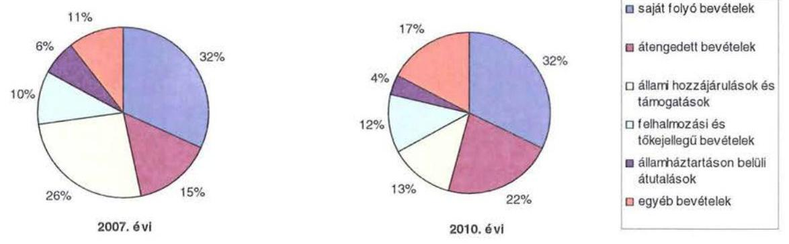

Az önkormányzati alrendszer pénzügyi helyzetértékelése során új elemzési módszereket alkalmaz az ellenőrzés. A hagyományos költségvetési szerkezet helyett az Önkormányzat pénzügyi helyzetét a CLF módszerrel mutatjuk be, amelynek lényegét és számításának módszerét a 2.1. pontban, és a jelentés 2. számú mellékletében ismertetjük részletesen.

Az új módszereken alapuló helyzetértékelés fontosságát az adja, hogy a helyi önkormányzatok bruttó adósságállománya $^{20}$ a 2010. évi költségvetési beszámoló alapján 1248 milliárd Ft-ot tett ki. Az adósságállomány koncentráltságát jelzi $^{21}$, hogy ebből a 23 megyei jogú város részesedése 338 milliárd Ft volt, amely a fővárosi és kerületi önkormányzatok adósságának figyelmen kívül hagyásával számított 2010. évi 977 milliárd Ft összegű bruttó adósságállomány 34,6%-át jelentette. Az adósságállomány több mint fele - 501 milliárd
 Ft - a 19 megyei önkormányzatnál és a 23 megyei jogú városnál jelentkezett.

A megyei jogú városok 338 milliárd Ft-os adósságállományából 175 milliárd Ft (51,8%) a 8 legnagyobb, 100 ezer fő feletti népességű város tartozása. Az 5 nem megyeszékhely megyei jogú város bruttó adósságállománya 70 milliárd Ft-ot (20,7%-ot), az előző két csoportba nem tartozó további 10 megyei jogú város adóssága 93 milliárd Ft-ot (27,5%-ot) tett ki.
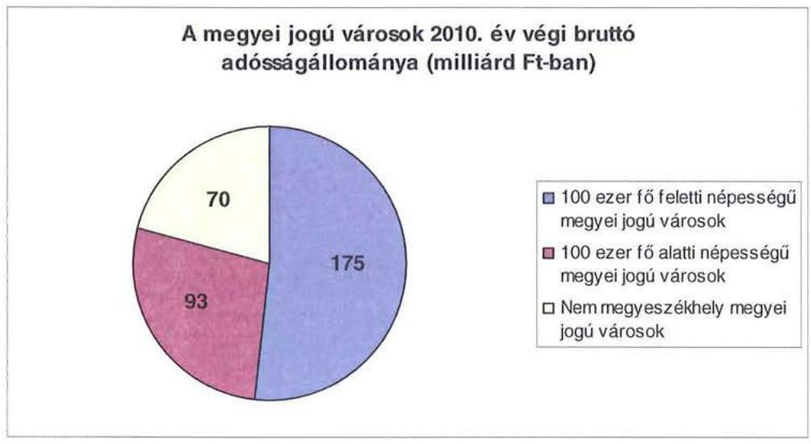

A mérlegben kimutatott bruttó adósságállomány mellett az önkormányzatok számára az eszközállomány műszaki állapotának megőrzése is kötelezettségekkel jár. Az elhasználódott eszközök pótlására forrást biztosító amortizációs (felújítási) alap képzésének $^{22}$ elmaradása maga után vonhatja a feladatellátást kiszolgáló tárgyi eszközök állagának erőteljes romlását. Emellett a 2007-2013-as időszakra meghirdetett, vissza nem térítendő EU-s fejlesztési forrásokhoz való hozzájutás lehetősége felerősítette az önkormányzati alrendszer fejlesztési igényeit, amelyek a felhalmozási költségvetési hiány folyamatos emelkedésén túl - az előírt jövőbeni fenntartási kötelezettség miatt - tovább terhelhetik az önkormányzatok költségvetését $^{23}$.

Az ÁSZ a 2011. évi ellenőrzési tervében 43. számú, az Önkormányzatok gazdálkodási rendszerének ellenőrzése részeként egy időben, egymással párhuzamosan tekinti át, és elemzi a 23 megyei jogú városi önkormányzat pénzügyi helyzetét. A gazdálkodás szabályszerűségét az ÁSZ az előző évek során ebben az önkor-

[^0]
[^0]:    $^{22}$ Erre a jelenlegi szabályozási környezetben nem kötelezi semmilyen előírás az önkormányzatokat.
    $^{23}$ Az Állami Számvevőszék 2011. júniusában közzétett 1108. számú, a helyi önkormányzatok fejlesztési célú támogatási rendszerének ellenőrzéséről szóló jelentésében feltárta a fejlesztési folyamatok problémáit. A helyi önkormányzatok elsősorban azokat a fejlesztéseket valósították meg, amelyekhez támogatást lehetett igényelni. A fejlesztési célok közül a magasabb támogatás intenzitású pályázatokat részesítették előnyben. A fejlesztéssel megvalósuló létesítmények jövőbeli üzemeltetésének várható ráfordításait az önkormányzatok 71,9%-a nem mérte fel.

---

mányzati körben is ellenőrizte, ezért jelen vizsgálatunk erre nem tér ki. A jelentés a megyei jogú városok sajátos feladatellátási és forrásszabályozási helyzetére tekintettel az önkormányzatok pénzügyi helyzetét, illetve az ezzel összefüggő korábbi ÁSZ javaslatok megvalósítását mutatja be.

Az ellenőrzés a 2007. január 1. - 2010. december 31. közötti időszakot öleli fel.
A vizsgálat jogszabályi alapját az Állami Számvevőszékről szóló 1989. évi XXXVIII. törvény $^{24}$ 2. § (3), (5), (6) és (9) bekezdései, az Ötv. 92. § (1) bekezdése, az Áht. 104. § (3), és 120/A. § (1) bekezdése előírásai képezik.

[^0]
[^0]:    $^{24}$ 2011. július 1-jétől az Állami Számvevőszékről szóló 2011. évi LXVI. törvény 5. § (2)(5) bekezdései

---

# I. ÖSSZEGZŐ MEGÁLLAPÍTÁSOK, KÖVETKEZTETÉSEK, JAVASLATOK 

Az Önkormányzat - adatszolgáltatása szerint - a 2010. év kórház nélküli működési költségvetési kiadásaiból (12899 millió Ft) 6965 millió Ft-ot (54%) a kötelező feladatok, 5934 millió Ft-ot (46%) az önként vállalt feladatok ellátására fordított. A kötelező és önként vállalt feladatok részarányának megállapítása az Önkormányzat SzMSz szerinti besorolásának megfelelően készült. Az Önkormányzat a színházfenntartás, sporttámogatás, turisztika, város rehabilitáció mellett önként vállalt feladatnak tekinti a gimnáziumok, szakközépiskolák és szakképző intézmények, valamint a kollégium fenntartását is. Az Önkormányzat önként vállalt feladatainak meghatározásakor nem volt figyelemmel arra az Ötv-ben foglalt előírásra, hogy - a megyei jogú várossá való nyilvánítás törvényi előírásainak megfelelve - rendelkezik mindazokkal az intézményi feltételekkel, amelyek biztosítják, hogy a területén saját hatáskörében a megyei önkormányzat számára előírt kötelező feladatokat is ellássa.

Az Önkormányzat feladatellátásának szervezeti struktúráját a következő ábra szemlélteti:
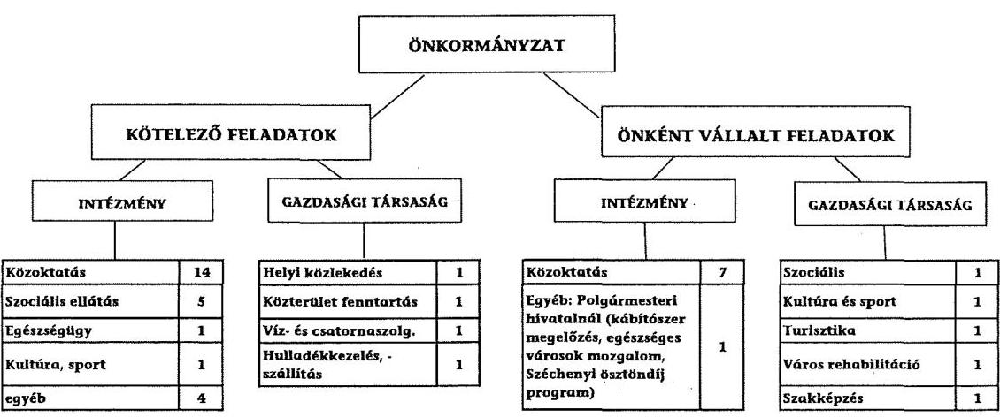

Az Önkormányzat feladatait 2010. december 31-én (a Polgármesteri hivatallal együtt) 33 költségvetési szervvel és tíz 25% feletti tulajdoni hányadú gazdasági társaságával, továbbá egy - az önkormányzattól tulajdonosi szempontból független gazdasági társaság közreműködésével látta el. Az Önkormányzat az áttekintett időszakban egy közszolgáltatási feladatát (gyermekjóléti ellátások) integrálta a gesztorságával létrehozott intézményfenntartó társulásba. Az áttekintett időszakban az intézményszervezeti átalakítások és intézményi összevonások következtében a feladatellátás telephelyeinek száma a 2006. évi 81-ről 2010-re 90-re nőtt.

Az Önkormányzat működési kiadásokra 2010-ben 12899 millió Ft-ot fordított, amely 469 millió Ft-tal (3,8%-kal) haladta meg a 2007. évi ráfordításokat. A működési kiadásoknak 2007-ben 55,8%-át, 2010-ben 51,1%-át az intézményi körben realizálták.

---

E kiadások fedezetéül szolgáló bevételi források 2007 és 2010. években jellemző összesített arányait a következő ábra szemlélteti:
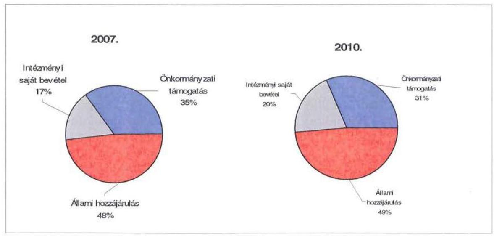

Az egyes közszolgáltatások feladatellátásában részvevő ágazati intézménycsoportok forrásösszetételének bevételi jogcímenkénti alakulását a következő ábra szemlélteti:
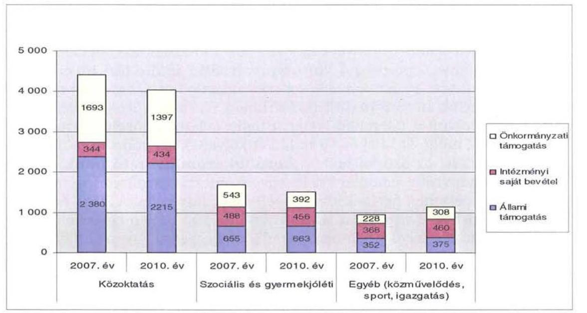

Az Önkormányzat az áttekintett időszakban kórház fenntartásáról is gondoskodott. A Kórház számára összesen 859 millió Ft pénzeszközt adott át, ebből működési célra 637 millió Ft-ot, fejlesztési célra 222 millió Ft-ot. A működési célúból 330 millió Ft a központi költségvetésből származó (bérpolitikai intézkedések) támogatás továbbadása volt. A fejlesztési célú pénzeszközátadások a Kórház gép-műszer beszerzéseihez kapcsolódtak.

Az Önkormányzat öt gazdasági társaságban rendelkezik kizárólagos tulajdonnal, egy gazdasági társaságban 75% feletti, két gazdasági társaságban 50-75% közötti, kettőben 25-50% közötti tulajdoni hányaddal. Egy kizárólagos

---

önkormányzati tulajdonú gazdasági társaság leányvállalatánál folyamatban van a tulajdonos gazdasági társaságba történő beolvadás, mely az anyavállalat jelentős tőketartaléka miatt jelenleg nem jelent az Önkormányzat számára pénzügyi kockázatot. A gazdasági társaságok a közterület fenntartásban, vagyonüzemeltetésben, a hulladékkezelésben, víz-és csatornaszolgáltatásban, a helyi tömegközlekedésben, szociális, kulturális és sportfeladatok ellátásában, a város rehabilitáció és a szakképzés területén, kaptak szerepet az Önkormányzat feladatellátásában. A gazdasági társaságok működésükhöz a 2010. évben összesen 862 millió Ft rendszeres működési, 11 millió Ft eseti működési célú pénzeszközt és 72 millió Ft fejlesztési célú pénzeszközt kaptak az Önkormányzattól, melyből 299 millió Ft az állami támogatás továbbutalása volt. 2010-ben a működési célú pénzeszköz 20,0%-át (175 millió Ft-ot) egy sportcélú feladatokat ellátó, kisebbségi önkormányzati tulajdonú gazdasági társaság kapta, amelynél a korábbi években a saját tőke, jegyzett tőke aránya 100% alatt volt, ezért a veszteség rendezésére a 2009. évben kapott 7,7 millió Ft-ot az Önkormányzattól. Ezen túl két gazdasági társaságnál fordult elő, hogy a saját tőke, jegyzett tőke aránya 100% alá $^{25}$ került, de azokban tőkeemelésre nem került sor. A jelentősebb kötelezettségekkel rendelkező kizárólagos önkormányzati tulajdonú gazdasági társaság saját tőkéje a jegyzett tőke háromszorosát (311%) meghaladó, az összes kötelezettségénél nagyobb összegű saját vagyonnal rendelkezett 2010. december 31-én.

A folyó költségvetés egyenlege (működési jövedelem) 2007-2009 között működési forrástöbbletet mutatott, 2010-ben azonban, az Önkormányzat működési forráshiányos volt $^{26}$. A 2007-2008. években a működési megtakarítások fedezni tudták a tárgyévben jelentkező törlesztési kötelezettségeket, így az Önkormányzat pénzügyi kapacitása (nettó működési jövedelme) is pozitív értékű volt. A 2009. évben az adósságszolgálat növekedése miatt a pénzügyi kapacitás negatívvá vált (-3367 millió Ft), mivel a csekély összegű működési megtakarítás (58 millió Ft) nem tudta fedezni a tőketörlesztési kötelezettséget (3342 millió Ft hitel és 83 millió Ft kötvény). Az adósságszolgálat hirtelen növekedését az okozta, hogy a korábbi számlavezető bank kötelezte az Önkormányzatot fennálló hitelei egy részének $^{27}$ visszafizetésére, mivel azok esetében szerződési feltételként szerepelt a számlavezetés. A 2010. évben a működési jövedelem is negatívvá vált (-512 millió Ft), a folyó bevételek nem nyújtottak fedezetet a folyó kiadásokra, a működési egyensúly nem volt biztosított.

[^0]
[^0]:    $^{25}$ Egyik kizárólagos önkormányzati tulajdonú gazdasági társaság saját tőkéje 106 millió Ft, a jegyzett tőkéje 138 millió Ft, a másik, 40%-os önkormányzati tulajdonú gazdasági társaság saját tőkéje 9,2 millió Ft, jegyzett tőkéje 10 millió Ft.
    $^{26}$ A működési jövedelem 2007-ben a folyó kiadások 2,4%-át (418 millió Ft-ot), 2008-ban 3,3%-át (601 millió Ft-ot), 2009-ben 0,3%-át (58 millió Ft-ot) érte el, 2010-ben azonban a folyó kiadások 2,8%-ára nem volt fedezet (-512 millió Ft volt a működési jövedelem).
    $^{27}$ A visszafizetési kötelezettség két fejlesztési hitelt nem érintett.

---

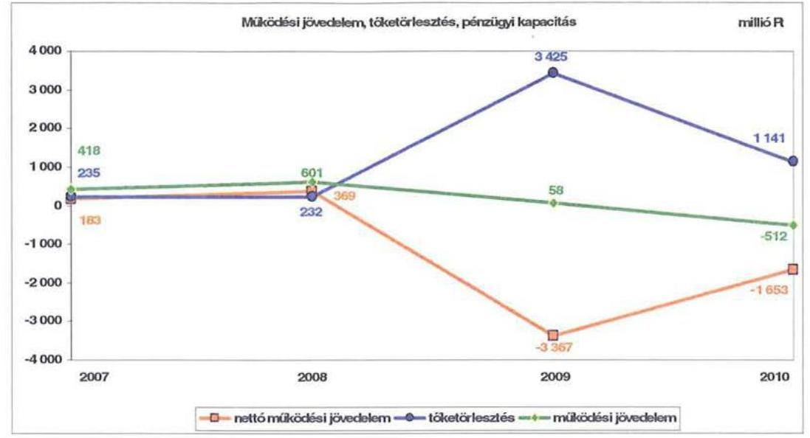

A 2007-2010. években az Önkormányzat felhalmozási költségvetésének egyenlege folyamatosan negatív összegű volt, amely 2007-2010. között összesen 10222 millió Ft felhalmozási forráshiányt okozott.

A pénzügyi egyensúly fenntartása külső források bevonásával volt biztosítható. A 2007-2010. években 4751 millió Ft hitelt törlesztettek, továbbá 282 millió Ft volt a kötvény beváltása miatt fizetendő kötelezettség. Az adósságszolgálat, továbbá a felhalmozási forráshiány 2007-2010. között 15254 millió Ft-ot tett ki, amelyre az időszakban képződő 565 millió Ft működési megtakarítás (működési jövedelem), valamint a 2007. január 1-jén rendelkezésre álló 2468 millió Ft pénzkészlet szolgált fedezetül. A további pénzeszközöket 2930 millió Ft hitel felvételével, továbbá 10336 millió Ft kötvény kibocsátásával teremtették meg. A kialakult pénzügyi helyzet pozitív nettó működési jövedelmet eredményező gazdálkodás mellett teszi elkerülhetővé további külső források bevonását, az eladósodás növekedését.

A vizsgált időszakban Önkormányzat helyi iparűzési adót, építményadót, vállalkozók kommunális adóját, vendégéjszakák utáni idegenforgalmi adót vetett ki, megszüntették az üdülőépületek utáni építményadót, és 1,5%-kal emelték meg a vendégéjszakák utáni idegenforgalmi adó mértékét. A helyi adókból és pótlékokból származó bevételek aránya 2007-2010 között 20% körül mozgott a folyó (működési) bevételekben. A pótlékkal, bírsággal növelt helyi adó bevétel a 2007. évi 4202 millió Ft-ról 2010. évben 4038 millió Ft-ra (4,0%-kal, 166 millió Ft-tal) csökkent. A helyi adóbevételek háromnegyed részét az iparűzési adó tette ki, amelynek mértéke a helyi adókról szóló törvényben rögzített maximális mértékben került megállapításra. A helyi adók csökkenését az iparűzési adó 262 millió Ft-os visszaesése okozta, amelyet a más adónemeknél tapasztalható növekedés nem tudott ellensúlyozni. Új helyi adónemet a vizsgált időszakban az Önkormányzat nem vetett ki.

A befejezett fejlesztések jelentős részét pénzintézeti forrásokból fedezték. A 2007-2010. évek időszakában 11623 millió Ft értékű fejlesztés és felújítás forrása 8065 millió Ft kötvény értékesítéséből származó bevétel (69,4%) és 671 millió Ft hitelfelvétel (5,7%) mellett 92 millió Ft EU-s támogatás (0,8%), 800 millió Ft

---

hazai támogatás (6,9%) és 1995 millió Ft saját (17,2%) bevétel volt. A 2010. december 31-én folyamatban lévő fejlesztési feladatok végrehajtására 2796 millió Ft - ebből a 2007-2010. években 2578 millió Ft - kifizetést teljesítettek, amelyre a kötvény értékesítésének bevételéből 1851 millió Ft-ot (71,8%), hitelből 620 millió Ft-ot (24%) és EU-s támogatásból 107 millió Ft-ot (4,2%) fordítottak.

Az Önkormányzat 2010. december 31-én fennálló, fejlesztésekkel kapcsolatos kötelezettség-vállalásainak összege 14101 millió Ft volt, amelyből 2201 millió Ft-ot (15,6%) saját forrásból, 11477 millió Ft-ot (81,4%) EU-s támogatásból és 423 millió Ft-ot (3%) korábban kibocsátott kötvény értékesítéséből származó bevételéből terveztek biztosítani. Hazai támogatással a fejlesztések megvalósításához nem számoltak. A tervezett saját források rendelkezésre állását azonban az Önkormányzat jelenlegi pénzügyi helyzete nem igazolja. Mindez kockázatot jelent a vállalt fejlesztések jövőbeni finanszírozhatósága szempontjából.
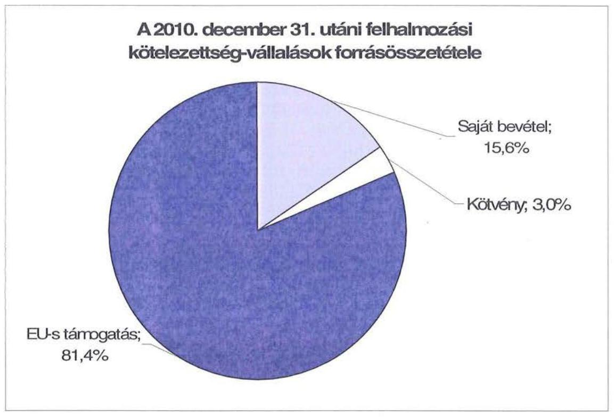

Az
 Önkormányzat által beadott, elbírálás alatt álló pályázatok tervezett teljes bekerülési költsége 2310 millió Ft volt, amelyhez idegen forrást már nem kívánnak bevonni, ugyanakkor a működési költségvetésben megtakarítást 2010-ben nem sikerült elérni. Az Önkormányzat vállalt kötelezettségeit - a saját bevételeken túl - a fennálló követelésállományból származó forrásai felhasználásával (1170 millió Ft) és a jelzáloggal nem terhelt forgalomképes ingatlanvagyon (10724 millió Ft) szükség szerinti értékesítéséből származó bevételből kívánja előteremteni.

---

Az Önkormányzat mérleg szerinti pénzintézeti kötelezettsége a 2006. év végéről 2,4 szeresére nőtt a 2010. év végére, 6945 millió Ft-ról 16749 millió Ftra. A fennálló pénzintézeti kötelezettségek öt kötvény kibocsátásból, kettő hosszú lejáratú hitelből és folyószámlahitel igénybevételéből keletkeztek.

Az Önkormányzat kötelezettségvállalásaira közgyűlési döntés alapján került sor, azonban az előterjesztésekben nem mutatták be a visszafizetés forrásait, a várható kamat és tőkefizetési kötelezettséget, valamint a kamat- és a devizaalapú kötelezettségeket érintő árfolyamkockázatot.

Az Önkormányzat kötvényeket korábbi kötvény és hiteleinek törlesztése, beruházások és felújítások finanszírozása, valamint bírói letét képzése céljából bocsátott ki. Fejlesztési hiteleiből panelházak felújításához biztosított önerőt, valamint mélygarázsépítést finanszírozott.

Az Önkormányzat devizában fennálló pénzintézeti kötelezettségeiből (18 499 224 CHF) 8 598 768 CHF (1564 millió Ft) tőkét törlesztett, kamatot és egyéb költséget fizetett. A HUF-ban fennálló (11 831 millió Ft) kötelezettségekből 3295 millió Ft tőkét, kamatot és egyéb költséget teljesített. Az Önkormányzat a kötvények kibocsátásából és a hitelek igénybevételéből származó forrásokat 2010. év végéig a céloknak megfelelően felhasználta. A 2007-2010. években átmenetileg szabad pénzeszközeiből 967 millió Ft kamatbevételt realizált, melyből 384 millió Ft származott a kötvénybevételek befektetéséből. A kamatbevételeket a kötvények kamatfizetésére fordították. Az Önkormányzat számlavezető bankot 2009. májusában váltott. A számlavezető bank váltását megelőzően, illetve azt követően kibocsátott kötvények lejegyzése és a hitelek folyósítása 2-2 kivétellel (1831 millió Ft, és 8 621 643 CHF) a számlavezető pénzintézet által történt, amely kockázatot jelentett a banki feltételek összevonása miatt az Önkormányzat számára.

Az Önkormányzat működésének pénzügyi egyensúlyát a vizsgált időszakban folyószámlahitel és két alkalommal egy-egy hónapos időszakra felvett (1000 millió és 500 millió Ft) rövidlejáratú hitel igénybevételével tudta biztosítani.

A folyószámlahitel igénybevétele a 2007-2010. években az alábbiak szerint alakult:

| Megnevezés | 2007. év | 2008. év | 2009. év | 2010. év |
| :--: | :--: | :--: | :--: | :--: |
| Keretösszeg január 1-jén | 2279 | 2279 | 2800 | 2800 |
| Átlagos napi állomány | 1359 | 2048 | 1823 | 1977 |
| Folyószámla hitellel zárt napok száma (nap) | 365 | 366 | 317 | 365 |
| 2010. december 31-i egyenleg (állomány) | $x$ | $x$ | $x$ | 1458 |

A likviditás biztosítása az Önkormányzatnak 2653 millió Ft kamatkiadást okozott. Ugyanakkor a 2008. évben folyószámláját az Önkormányzat devizában vezette (CHF), amely a napi árfolyamkülönbségekből adódóan 465 millió Ft árfolyamnyereséget eredményezett.

---

Az Önkormányzat 2010. év végi szállítói tartozása 1219 millió Ft, melyből a lejárt 801 millió Ft volt. Az átütemezett tartozások összege 41 millió Ft, egyéb kiadás elmaradása 2 millió Ft volt. A lejárt tartozások 13,6%-a (109 millió Ft) meghaladta a 91 napot. Az Önkormányzat gazdálkodásában kockázatot jelent, hogy nem intézkedtek, amikor a helyi önkormányzatok adósságrendezési eljárásáról szóló 1996. évi XXV. törvény 4. § (2) bekezdésében foglalt feltételek fennálltak.

Az Önkormányzat gazdasági társaságai részére folyószámla- és egyéb hitelek igénybevételéhez, kötvény kibocsátásához, az intézmények energetikai beruházásához, üzemeltetéséhez készfizető kezességet vállalt 2754 millió Ft összegben. A 2010. év végére kezességgel kapcsolatos kötelezettség 1535 millió Ftra csökkent. A gazdasági társaságok részére 3 alkalommal összesen 13 millió Ft összegben nyújtott kölcsönt az Önkormányzat.

A Közgyűlés a folyószámlahitel és fejlesztési hitelek biztosítékaként 3032 millió Ft - számviteli nyilvántartás szerinti nettó értékű - jelzálogjog alapításához és bejegyzéséhez járult hozzá. A jelzálogszerződésekkel érintett ingatlanok a forgalomképes ingatlanok 22%-át jelenti.

Az Önkormányzat kötelezettségeinek 2010. december 31-i állományát és várható alakulását a kötelezettségek lejáratáig a következő táblázat szemlélteti:

| Megnevezés | Állomány 2010. dec. 31-én |  |  | Várható kötelezettség 2011-2013. években |  |  | Várható kötelezettség 2014. év után |  |  |
| :--: | :--: | :--: | :--: | :--: | :--: | :--: | :--: | :--: | :--: |
|  | $\begin{aligned} & \text { HUF-ban } \\ & \text { (millió Ft- } \\ & \text { ban) } \end{aligned}$ | Devizában (összeg, ezer CHF-ban) | Deviza (1000) | $\begin{aligned} & \text { HUF-ban } \\ & \text { (millió Ft- } \\ & \text { ban) } \end{aligned}$ | Devizában (összeg, ezer CHF-ban) | Deviza (1000) | $\begin{aligned} & \text { HUF-ban } \\ & \text { (millió Ft- } \\ & \text { ban) } \end{aligned}$ | Devizában (összeg, ezer CHF-ban) | Deviza (1000) |
| Pénzintézeti kötelezettségek |  |  |  |  |  |  |  |  |  |
| Hosszú lejáratú kötelezettség | 1497 |  | 1007 | 428 |  | 1007 | 1233 |  | 1007 |
| Kötvény (Lejárat 2013. Lejárat 2021) | 10080 |  | 1007 | 2851 |  | 1007 | 16278 |  | 1007 |
| Kötvény (Lejárat, Lejárat 2026. Lejárat 2027) |  | 17041 | CHF |  | 3621 | CHF |  | 14805 | CHF |
| Folyószámlahitel | 1458 |  | 1007 | 1458 |  | 1007 |  |  | 1007 |
| Pénzintézeti kötelezettségek összesen HUF-ban | 12955 |  | 1007 | 4757 |  | 1007 | 17811 |  | 1007 |
| Pénzintézeti kötelezettségek összesen CHF-ban |  | 17041 | CHF |  | 3621 | CHF |  | 14805 | CHF |
| Működési költségek |  |  |  |  |  |  |  |  |  |
| Számlázás | 1333 |  | 1007 |  |  |  |  |  |  |
| Működési költségek összesen | 1295 |  | 1007 |  |  |  |  |  |  |
| Szállítói tartozás | 1219 |  | 1007 | 1219 |  | 1007 |  |  |  |
| Egyéb kiadás elmaradás | 2 |  | 1007 | 2 |  | 1007 |  |  |  |
| Egyéb kötelezettségek |  |  |  |  |  |  |  |  |  |
| Jogerős végzéssel hozott de ki nem fizetett kötelezettségek | 3 |  | 1007 | 3 |  | 1007 |  |  |  |

Az Önkormányzatnak pénzintézetekkel szemben fennálló kötelezettsége a 2010. év végén 12955 millió Ft és 17041 ezer CHF volt. Ezek várható kötelezettsége (tőke, kamat és egyéb költség) a legutóbbi kamatfizetés feltételei alapján a 2011. évtől 22348 millió Ft, továbbá 18426 ezer CHF. Az Önkormányzatnak a 2011. évben szállítói tartozások és egyéb kiadás elmaradások rendezése, valamint jogerős végzéssel lezárt, de ki nem fizetett kötelezettségek címén 1224 millió Ft fizetési kötelezettsége keletkezett. A kezességvállalásaiból adódóan 1535 millió Ft összegű terhe jelentkezhet, amennyiben a társaságok és intézményeik kötelezettségeiket nem teljesítik. A várható összes kötelezettség teljesítésére figyelembe vehető 1170 millió Ft mérlegben kimutatott követelésállomány és 13756 millió Ft forgalomképes ingatlanvagyon, melyből a 3032 millió Ft a pénzintézeti kötelezettségekhez kapcsolódóan jelzáloggal terhelt. Az Önkormányzat tájékoztatása szerint figyelembe vehető további források „a mindenkori költségvetési rendeletekben megtervezett önkormányzati saját bevételek". A

---

saját bevételek kötelezettségek teljesítésére történő figyelembevétele azonban kockázatos, mert a CLF módszer szerint számított működési jövedelem a 2007-től mutatkozó csökkenő tendencia (2010. évben -512 millió Ft) alapján azokra nem nyújt fedezetet.

Az Önkormányzat minősített többségi tulajdonú társaságai kötelezettségeinek 2010. december 31-i állományát és várható alakulását a kötelezettségek lejáratáig a következő táblázat mutatja be:

| Megnevezés | Állomány 2010. dec. 31-én |  |  | Várható kötelezettség 2011-2013. években |  |  | Várható kötelezettség 2014. év után |  |  |
| :--: | :--: | :--: | :--: | :--: | :--: | :--: | :--: | :--: | :--: |
|  | $\begin{aligned} & \text { HUF-ban } \\ & \text { (millió Ft- } \\ & \text { ban) } \end{aligned}$ | Devizában (összeg, szám - ban) | Egység (szám) | HUF-ban (millió Ft- ban) | Devizában (összeg, szám - ban) | Egység (szám) | $\begin{aligned} & \text { HUF-ban } \\ & \text { (millió Ft- } \\ & \text { ban) } \end{aligned}$ | Devizában (összeg, szám - ban) | Egység (szám) |
| Kóvész (Átlagos, 2009) | 512 |  | HUF | 282 |  | HUF | 445 |  | HUF |
| Polgárőrség- és egyéb rövid lejáratú hitelek | 521 |  | HUF | 521 |  | HUF |  |  |  |
| Pénzintézeti kötelezettségek összesen: | 1034 |  | HUF | 804 |  | HUF | 445 |  | HUF |
| Üzemelő kötelezettségek | 81 |  | HUF | 81 |  | HUF | 4 |  | HUF |
| Szállítói tartozás | 1266 |  | HUF | 1266 |  | HUF |  |  |  |

Az önkormányzati kötelezettségek növekedése mellett a minősített többségi tulajdonú társaságok kötelezettségei is befolyásolhatják az Önkormányzat pénzügyi egyensúlyát. A társaságoknak a 2011. évtől 1249 millió Ft pénzintézeti kötelezettséget, 85 millió Ft lízinget és 1266 millió Ft szállítói tartozást kell rendezniük. Kockázatot hordoz, ha ezek nem teljesítése miatt a bíróság korlátlan és teljes felelősséget állapít meg az Önkormányzat terhére.

Az Önkormányzat költségvetési támogatásból, átengedett bevételekből, és illetékbevételekből származó bevételei a 2007. évhez képest az időszak egészét tekintve összességében nem csökkentek. Ennek ellenére az Önkormányzat folytatta az előző években elkezdett kiadási megtakarítást és bevételnövelő intézkedéseit. A 2007-2010. években tett intézkedések hatására 2111 millió Ft bevételi többletet, továbbá 388 millió Ft kiadási megtakarítást mutattak ki, ezáltal az Önkormányzat pénzügyi helyzetét javították, a kieső
 forrásokat részben pótolták, de a működési költségek között kimutatott kamatkiadások növekedését nem tudták ellensúlyozni. A kiadási megtakarítások 85%-a az elrendelt álláshely-csökkentések eredménye. Az álláshely-csökkentő intézkedések 2007-2010. között a Polgármesteri hivatalnál és az intézményeknél összesen 105 álláshely (ebből 100 üres álláshely) megszüntetését jelentették. Egyes közszolgáltatási területeken azonban feladatbővülések is voltak, amelyek álláshely- és egyben létszámnövekedéssel is jártak. Ennek következtében az időszak álláshelyeinek száma 39 fővel csökkent. A bevételnövelő intézkedések szabad kapacitások kihasználásához, ingatlanok értékesítéséhez, térítési díjak emeléséhez, átmenetileg szabad pénzeszközök lekötéséhez kapcsolódtak.

Az utóellenőrzés a pénzügyi egyensúly javítására tett három szabályszerűségi és egy célszerűségi javaslat hasznosítására terjedt ki. Két javaslatot az intézkedési terv szerinti határidőben teljesítettek, azonban továbbra is likvid hitelként mutattak ki az Önkormányzat mérlegében rövid lejáratú hiteleket is. Nem tájékoztatták a Közgyűlést arról, hogy az Önkormányzat pénzintézeti kötelezettségeit milyen feltételek mellett tudja teljesíteni.

---

Az Önkormányzat pénzügyi helyzetét összegezve a következők emelhetők ki:

A 2007-2010. években az Önkormányzat működési kockázatát növelte a csökkenő, majd a 2010. évben negatív folyó költségvetési egyenleg, az emelkedő összegű és jelentős mértékű szállítók felé fennálló kötelezettség. A működési bevételek a 2010. évben nem biztosították a működési- és a kamatkiadások finanszírozását. A likviditás biztosítása érdekében az Önkormányzatnak mind a négy évben volt folyószámlahitele, aminek - a 2009. év kivételével - az év minden napján volt záróállománya. A gazdasági társaságok szerepe a közüzemi közfeladat-ellátásban meghatározó volt. A gazdasági társaságok szállítók felé fennálló kötelezettségei, azon belül a lejárt kötelezettségek emelkedése növelte a pénzügyi kockázatot.

A vizsgált időszakban az Önkormányzat felhalmozási költségvetése pénzügyi hiányt mutatott, ennek forrásai kötvénykibocsátással és hitelfelvétellel biztosítottak voltak. A fejlesztési célú kötelezettségvállalások jövőben teljesítendő kifizetései tekintetében a nettó működési jövedelem negatív értéke a felhalmozási kockázatot növeli. A hosszú lejáratú kötelezettségek finanszírozásának forrását a 2011. év ${ }^{28}$ utáni időszakra az Önkormányzat nem számszerűsítette.

Pénzintézeti és egyéb kötelezettségek teljesítésének kockázatát növeli, hogy a 2010. december 31-én fennálló kötelezettségek visszafizetésének fedezetét a saját bevételben jelölték meg, nem számszerűsítették annak forrásait. A kockázatot csökkentheti az Önkormányzat 2010. évi követelésállománya, és forgalomképes ingatlanvagyona szükség esetén felhasználható az adósságszolgálat visszafizetésére.

A Polgármester tájékoztatása szerint a helyszíni ellenőrzést követően saját hatáskörben tett intézkedések hatására az Önkormányzat már 2012-ben több mint 670 millió Ft többletbevételhez juthat és közel 500 millió Ft kiadási megtakarítást érhet el, pénzügyi helyzete ennek megfelelően javulhat. Az intézkedések várható hatása azonban nem teszi szükségtelenné a megállapítások alapján intézkedési terv készítését és annak nyomon követését.

Az Állami Számvevőszékről szóló 2011. évi LXVI. törvény 33. § (1) bekezdésében foglaltak értelmében a jelentésben foglalt megállapításokhoz kapcsolódó intézkedési tervet köteles az ellenőrzött szervezet vezetője összeállítani és azt a jelentés kézhezvételétől számított harminc napon belül az ÁSZ részére megküldeni. Amennyiben az intézkedési tervet határidőben nem küldi meg a szervezet, vagy - kijavításra, kiegészítésre visszaküldött terv esetében - az továbbra sem elfogadható, az ÁSZ elnöke a hivatkozott törvény 33. § (3) bekezdés a)-b) pontjaiban foglaltakat érvényesítheti.

[^0]
[^0]:    ${ }^{28}$ Az Önkormányzat 2011. évi költségvetése csak a 2011. évi forrásokat tartalmazza.

---

Az ellenőrzés intézkedést igénylő javaslatai:

# a Polgármesternek 

1. a Közgyűlés elé terjesztendő intézkedési terv írja elő a működés pénzügyi egyensúlyának gyors helyreállítása és hosszú távú fenntarthatósága érdekében - felelősök és határidők megjelölésével - olyan program készítését, amely tartalmazza az alábbiakat:
a) bevételszerző lehetőségek feltárását, különösen a helyi adópolitikai célok meghatározását és számszerűsítését, a bérleti díjak és a térítési díjak megállapítását, felülvizsgálatát, a követelések behajtását, az egyéb sajátos bevételek növelésének lehetőségét;
b) a folyamatban lévő és a tervezett beruházások, egyéb kiadási kötelezettségek teljes körű felülvizsgálatát;
c) az intézkedések következtében jelentkező pénzügyi többlet, illetve az egyszeri bevételek tartalékba helyezését, elkülönített kezelését az adósságszolgálat teljesítése érdekében;
d) az adósságszolgálat szerkezetének áttekintését, a likviditás-menedzselést, a támogatás előfinanszírozás átláthatóbbá tételét;
e) az intézményi struktúra és gazdálkodás felülvizsgálatát;
f) az önként vállalt feladatok finanszírozhatóságának áttekintését a kötelező feladatellátás elsődlegességének biztosítása érdekében, a gazdasági program áttekintésével összhangban;
g) az intézkedések eredményeinek legalább félévenkénti áttekintésének előírását;
2. mutassa be félévente - a szokásos beszámoló keretében - a Közgyűlésnek:
a) az Önkormányzat és a minősített többségi tulajdonú gazdasági társaságai aktuális pénzügyi helyzetét, az Önkormányzatnak a gazdasági társaságai felé fennálló követeléseit;
b) legalább három évre kitekintően a kötelezettségek teljes körére szóló finanszírozási tervet, amely figyelembe veszi a kötelezettség éven belüli és túli felmerülését, a források számszerűsített megjelölésével;
c) az Önkormányzat folyamatban lévő és tervezett fejlesztéseihez szükséges belső és külső források rendelkezésre állását, és ebből a szempontból értékelje az Önkormányzat beruházásait;
3. kezdeményezze, hogy az Önkormányzatot megillető osztalék felvételre kerüljön a pénzügyi helyzetének javítása, adósságszolgálatának törlesztése érdekében;
4. tájékoztassa legalább évente a Közgyűlést az Önkormányzat garancia- és kezességvállalásairól, a kötelezettség érvényesítése esetén a soron következő ülésen;

---

5. tájékoztassa a Közgyűlést a szállítók felé fennálló kötelezettségek teljesítésének elmaradásáról, illetve tegyen intézkedéseket a helyi önkormányzatok adósságrendezési eljárásáról szóló 1996. évi XXV. törvény 4. § (2) bekezdésében foglalt feltételek bekövetkezésének elkerülésére;
6. mutassa be a Közgyűlésnek évente a zárszámadási rendelet előterjesztésében az értékcsökkenés összegét, és ezzel összevetve az elhasználódott eszközök pótlására fordított tényleges kiadásokat, az eszközök elhasználódási fokának alakulását;
7. mutassa be a Közgyűlésnek az intézményfenntartó társulási tagságból, gesztorságból eredő, az Önkormányzat pénzügyi egyensúlyát befolyásoló kockázatokat, és azok mérséklését szolgáló intézkedéseket;
8. mutassa be a Közgyűlésnek a fejlesztési társulási tagságból, gesztorságból eredő, az Önkormányzat pénzügyi egyensúlyát befolyásoló kockázatokat, és azok mérséklését szolgáló szervezeti és egyéb intézkedéseket;
a Jegyzönek, hogy:
9. kísérje figyelemmel a jövőbeni várható - árfolyam-, kamat- valamint visszafizetési kockázatokat, továbbá a mérlegen kívüli tételek (kezességvállalás, garancia és helytállási kötelezettségvállalás) kockázatait, és legalább félévente tájékoztassa a Közgyűlést azok alakulásáról;
10. gondoskodjon, hogy a jövőben az adósságot keletkeztető kötelezettségvállalásokról szóló közgyűlési előterjesztések tételesen tartalmazzák a visszafizetés forrásait, valamint legalább 3 éves kitekintéssel mutassák be a kamat és árfolyamkockázat várható kihatásait;
11. gondoskodjon az Önkormányzat likviditási helyzetéhez igazodóan a folyószámla hitelkeretről, annak jóváhagyásához készítsen közgyűlési előterjesztést;
12. kísérje folyamatosan figyelemmel - a tulajdonosi jogkört gyakorlók közreműködésével - a minősített többségi tulajdonú gazdasági társaságok kötelezettségeinek alakulását, az Önkormányzat likviditására, pénzügyi-egyensúlyi helyzetére gyakorolt hatását;
13. gondoskodjon a Polgármesteri hivatal és a további költségvetési szervek lejárt szállítói tartozásai okainak feltárásáról, azonnali intézkedések megtételéről a lejárt tartozások mielőbbi rendezése érdekében;
14. készítsen közgyűlési előterjesztést a jogerős határozattal lezárt peres eljárásokból adódó kötelezettségek teljesítése érdekében a szükséges fedezet biztosításáról és elkülönítéséről;
15. közgyűlési döntés alapján intézkedjen a Polgármesteri hivatal és a további költségvetési szervek peres eljárásokból adódó kötelezettségek teljesítése érdekében a szükséges fedezet elkülönítéséről, a finanszírozási tervben történő figyelembevétel mellett;
16. gondoskodjon az Önkormányzat gazdálkodásának 2009. évi vizsgálatáról szóló jelentésben megfogalmazott és még nem teljesült javaslatok hasznosításáról.

---

# II. RÉSZLETES MEGÁLLAPÍTÁSOK 

## 1. Az ÖNKORMÁNYZAT ÁLTAL ELLÁTOTT KÖZSZOLGÁLTATÁSOK FELTÉTELEI, SZERVEZETI KERETEI, KÖTELEZŐ ÉS ÖNKÉNT VÁLLALT FELADATAI

Az Önkormányzat - adatszolgáltatása szerint - a tárgyévi kórház nélküli működési költségvetési kiadásainak (12899 millió Ft) 54%-át a kötelező, 46%-át az önként vállalt ${ }^{29}$ feladatok ellátására fordította. A kötelező és önként vállalt feladatok részarányának megállapítása az Önkormányzat adatszolgáltatásán alapul, amely a feladatellátás SzMSz szerinti besorolásának megfelelően készült.

Az Önkormányzat 2010. évi működési kiadásai és azok finanszírozási arányait szemlélteti a következő - önkormányzati adatszolgáltatáson alapuló - táblázat főbb feladatonként:

Az Önkormányzat 2010. évi működési kiadásai és finanszírozási arányai főbb feladatonként

| Ellátott feladat | Működési kiadás összesen (millió Ft) | Kötelező feladatok kiadásainak részaránya % | Működési bevétel összesen (millió Ft) | Állami támogatás részaránya % | Intézményi saját bevétel részaránya % | Önkormányzati támogatás részaránya % |
| :--: | :--: | :--: | :--: | :--: | :--: | :--: |
| Övodák | 733 | 100 | 737 | 47 | 12 | 41 |
| Általános iskolák | 1633 | 79 | 1653 | 51 | 10 | 59 |
| Gimnáziumok | 292 | 0 | 294 | 58 | 11 | 31 |
| Szakközépiskolák, szakképző intézmények | 1160 | 0 | 1190 | 67 | 10 | 23 |
| Kollégiumok | 171 | 0 | 171 | 32 | 16 | 52 |
| Szociális intézmények | 1048 | 100 | 1061 | 42 | 35 | 23 |
| Gyermekjóléti intézmények | 446 | 100 | 450 | 48 | 19 | 33 |
| Közművelődési intézmények | 142 | 100 | 140 | 25 | 16 | 59 |
| Egyéb intézmények | 973 | 182 | 1003 | 34 | 44 | 32 |
| Intézmények összesen | 6600 | 69 | 6701 | 49 | 19 | 31 |

Az Önkormányzatnál a kötelező feladatok működési kiadásainak aránya a 2007. évről 2010-re nem változott.

Az ellenőrzés során elvégeztünk egy számítást, amelyben a gimnázium, a szakközépiskolák, a kollégium, a pedagógiai szakszolgálat, az egyes intézményekben folyó művészetoktatás, valamint a vagyonátadási megállapodásban vállalt kórház működtetésének kiadásait (4585 millió Ft összegben) kötelezően ellátott feladatnak tekintettük. A számítás alapján 2010-ben az Önkormányzat által kötelezően ellátott feladatokra fordított kiadások aránya 78%-a volt az összes kiadásnak.

A működési kiadások önkormányzati szinten 3,8%-kal (469 millió Ft) növekedtek, ez a Polgármesteri hivatalnál ellátott feladatoknál 14,7%-os (809 millió Ft-os) növekedést, az intézményeknél 4,9%-os (340 millió Ft-os) csökkenést jelentett. A közoktatási intézmények közül az óvodák, az általános iskolák, szakközépiskolák, kollégium esetében 4-10%-kal (összesen 365 millió Ft-tal) csökkentek a működési kiadások 2007-ről 2010-re, a gimnáziumok esetében mutatott ki minimális 3,2%-os (9 millió Ft) növekedést az Önkormányzat. A szociális és a közművelődési intézmények kiadásai is csökkentek, a szociális intézményeknél 183 millió (14,8%-os), a közművelődési intézményeknél 12 millió Ft-os 7,8%-os csökkenést mutattak ki. Kis mértékben, 22 millió Ft-tal (5,2%) nőttek a gyermekjóléti intézmények, valamint 14 millió Ft-tal (4,3%) a hivatásos tűzoltóság kiadásai. Az intézmények közül egyedül az egyéb ágazatban mutattak ki nagyobb növekedést 175 millió Ft (38,1%), amely az IGSZ 2008. évi létrehozásával függött össze.

A működési bevételek ${ }^{30}$ önkormányzati szinten 7,0%-kal (930 millió) Ft-tal csökkentek. Az intézményeknél 350 millió Ft (5,0%), a Polgármesteri hivatalban ellátott feladatoknál 580 millió Ft (9,3%) volt a csökkenés. A működési bevételek ${ }^{31}$ forrásösszetételét tekintve az állami támogatások önkormányzati szinten 9,6%-kal, 435 millió Ft-tal csökkentek
 2007-ről 2010-re, ez a Polgármesteri hivatal esetében 26,4%-os, 301 millió Ft-os, az intézményeknél 4,1%-os, 134 millió Ft-os csökkenést jelentett. A saját bevételek 10,6%-kal, 637 millió Ft-tal csökkentek önkormányzati szinten, ami a Polgármesteri hivatal 787 millió Ft-os bevételi csökkenéséből, valamint az intézményi saját bevételek 150 millió Ft-os növekedésből adódott. Az állami hozzájárulás aránya az egészségügyi ellátás nélkül vizsgált ellátások vonatkozásában 34%-ról 33%-ra, az intézményi saját bevétel 45%-ról 44%-ra csökkent, az önkormányzati támogatásé 21%-ról 23%-ra nőtt.

Az önkormányzati intézményekben - Kórház nélkül - ellátottak száma 2007-ről 2010-re 3%-kal, 240 fővel nőtt, a kollégiumi ellátás kivételével valamennyi intézménytípusnál $^{32}$ növekedés tapasztalható.

Az óvodás, általános iskolás és középiskolás ellátottak létszámnövekedésének oka, hogy a város lakosságszáma, ezen belül - az országos tendenciával ellentétben - a fiatalkorú lakosok száma növekszik.

[^0]
[^0]:    $^{30}$ Az Önkormányzat 2010. évi működési kiadásait és bevételeit főbb feladatonként bemutató táblázatban az adatok a működési bevételek a pénzmaradvány összegét nem tartalmazzák.
    $^{31}$ Az elemi beszámoló működési bevétel adata és a CLF folyó bevétel adata a felhalmozási célú áfa visszatérülés teljes összegével, valamint az Önkormányzat által fejlesztési kamatnak minősített kamatbevétel összegével, továbbá a követelés elengedés miatt elszámolt bevétel figyelmen kívül hagyása miatt tér el egymástól.
    $^{32}$ A középiskolai oktatásban részesülők száma együttesen növekedett, de ezen belül a gimnáziumi tanulók száma 143 fővel (17,1%) csökkent.

---

A település lakónépessége 2006-ról 2010-re 58005 főről 62033 főre nőtt, ezen belül a 0-18 évesek száma 11014 főről 11659 főre.

Az egy ellátottra jutó fajlagos kiadások 2007. és 2010. között a közoktatási ágazaton belül az óvodák és az általános iskolák $^{33}$, szakközépiskolák esetében csökkentek, a kollégium és a gimnázium esetében növekedtek.

A fajlagos kiadások az óvodáknál 562 ezer Ft/főről 502 ezer Ft/főre (10,7%-kal), az általános iskoláknál 596 ezer Ft/főről 528 ezer Ft/főre (11,4%-kal), a szakközépiskoláknál 513 ezer Ft/főről 417 ezer Ft/főre (18,7%-kal) csökkentek, a kollégiumnál 766 ezer Ft/főről 909 ezer Ft/főre (18,7%-kal) a gimnáziumnál 339 ezer Ft/főről 422 ezer Ft/főre (24,5%-kal) nőttek.

Az állami támogatásnál a közoktatási területen 3-45 ezer Ft/fő mértékű csökkenés, az önkormányzati támogatásnál - a gimnázium és a kollégium $^{34}$ kivételével - 40-80 ezer Ft/fő mértékű csökkenés volt tapasztalható. A szociális és gyermekjóléti intézmények fajlagos kiadásainál csökkenés következett be, a kiadások mérséklése az állami támogatás és az önkormányzati támogatás csökkenésével járt együtt.

A szociális intézmények fajlagos kiadásai 1502 ezer Ft/főről 1263 ezer Ft/főre, a gyermekjóléti intézményeké 2132 ezer Ft/főről 1993 ezer Ft/főre csökkentek. (Az állami támogatás fajlagos csökkenése 24 ezer Ft/fő, illetve 11 ezer Ft/fő, az önkormányzati támogatásé 178 ezer Ft/fő, illetve 122 ezer Ft/fő).

Az intézményeknél $^{35}$ 69 fővel csökkent, míg a Polgármesteri hivatalnál 66 fővel bővült $^{36}$ a létszám. Az óvodában 18, az általános iskolákban 31, a szakközépiskolákban 9, kollégiumban 13, a szociális intézményeknél 29, a közművelődési intézménynél 6 fővel csökkent, míg a gimnáziumokban 1, a tűzoltóságnál 8, az egyéb intézményekben (IGSZ) 28 fővel bővült a foglalkoztatottak száma.

Az Önkormányzat a kötelező és önként vállalt feladatok körét az SzMSz-ében $^{37}$ rögzítette a feladatellátás alapjául szolgáló jogszabály és a feladatot ellátó szerv megjelölésével. Az Önkormányzat a megyék számára kötelezően ellátandó feladatokat az önként vállalt feladatok közé sorolta be.

Az Önkormányzat a kötelező és az önként vállalt feladatait 2010. december 31-én 33 költségvetési szervvel, valamint tíz - 25% feletti tulajdoni hányadú - gazdasági társasággal, továbbá egy, az Önkormányzattól független gazdasági társasággal látja el. Az Önkormányzat még öt gazdasági társaságban rendelkezik 25% alatti tulajdoni hányaddal, de ezek a gazdasági társaságok nem önkormányzati közfeladatokat látnak el.

[^0]
[^0]:    $^{33}$ Az iskolák adatai tartalmazzák a művészetoktatási tevékenységet is.
    $^{34}$ A gimnázium esetében 64 ezer Ft/fővel, a kollégium esetében 194 ezer Ft/fővel nőtt az önkormányzati támogatás.
    $^{35}$ Kórház nélkül
    $^{36}$ Az egészségügyi alapellátási feladatokat a Polgármesteri hivatalba helyezték át.
    $^{37}$ SzMSz 7. számú melléklete.

---

Az Önkormányzat által fenntartott költségvetési szervek közül 2006-ban 25 önállóan, 12 részben önállóan gazdálkodott, az átszervezések eredményeként 2010-ben 3 önállóan működő és gazdálkodó, 30 önállóan működő költségvetési szerv működött. Az intézmények összevonásával azonban nőtt a telephelyek száma, - alapító okirataik szerint - a 2006. évi 81 telephely 2010-re 90-re emelkedett.

Az Önkormányzat feladatait az alábbi intézménystruktúrával látja el:

- egészségügyi feladatokat egy intézmény, a Kórház $^{38}$ végez;
- szociális és gyermekvédelmi feladatokat - kötelező feladatként - öt intézmény végez, továbbá egy gazdasági társaság szociális foglalkoztatást lát el;
- közoktatási feladatot 21 intézmény lát el;
- kulturális feladatokat egy intézmény (Könyvtár) lát el kötelező feladatként, továbbá egy gazdasági társaság önként vállalt feladatként;
- sport feladatokat önként vállalt feladatként két gazdasági társaság lát el;
- igazgatási feladatokat lát el a Polgármesteri hivatal;
- egyéb feladatot három intézmény lát el (IGSZ, Központi Gyermekkonyha, Tűzoltóság) továbbá hat 25% feletti önkormányzati tulajdoni hányadú gazdasági társaság és egy olyan gazdasági társaság (Kisalföld Volán Zrt.), amelyben az Önkormányzat nem tulajdonos. Közülük kötelező feladatot (helyi közlekedés, közterület fenntartás, víz- és csatornaszolgáltatás, hulladékkezelés) négy, önként vállalt feladatot (város-rehabilitáció, turisztika, szakképzés) három gazdasági társaság lát el.

Az Önkormányzat az áttekintett időszakban a gyermekjóléti feladatok ellátását integrálta a gesztorságával létrehozott intézményfenntartó társulásba. Más önkormányzattól, önkormányzati társulástól, központi költségvetési szervtől, egyháztól, egyéb szervezettől feladatot nem vett át.

Az Önkormányzat kizárólagos tulajdonában öt gazdasági társaság van, továbbá három társaságban rendelkezik 50% feletti tulajdoni hányaddal, ezek közül egyben 80% a tulajdoni hányada. Az Önkormányzatnak két gazdasági társaságban van 25-50% közötti tulajdoni hányada.

Az Önkormányzat gazdasági társaságai közül egy - 100%-os tulajdonú társasága - rendelkezik leányvállalatokkal, de azok az önkormányzati feladatellátásban nem vesznek részt. Egy leányvállalatnál folyamatban van a tulajdonos gazdasági társaságba történő beolvadás.

A vizsgált időszakban az Önkormányzat gazdasági társaságainál nem volt csődeljárás.

[^0]
[^0]:    $^{38}$ Az alap-egészségügyi feladatok irányítását a Polgármesteri hivatal látja el.

---

Az önkormányzati közszolgáltatási feladatellátásban még két gazdasági társaság működött közre, feladataik (kéményseprő-ipari szolgáltatás, temetőfenntartás) finanszírozásában az Önkormányzat nem vett részt.

A gazdasági társaságok által ellátott közszolgáltatásokhoz kapcsolódó szolgáltatási és egyéb díjak (hulladék- és folyékony hulladékszállítási, temetkezési, távhő-szolgáltatási, ivóvíz szolgáltatási, szennyvízelvezetési, parkolási, helyi tömegközlekedési, lakás- és helyiségbérlet, valamint a közterület-használati díj) megállapítása a Közgyűlés feladat- és hatáskörébe tartozik, azok meghatározása önkormányzati rendelettel történt. A szolgáltatási díjakra tekintettel csak helyi tömegközlekedést biztosító gazdasági társaság részére adott át pénzeszközt a helyi tömegközlekedési díjak megállapítása miatt, amelyet az Önkormányzat figyelemmel a mindenkor hatályos miniszteri rendeletben meghatározott központi költségvetésből nyújtott támogatásra is - a társasággal kötött támogatási szerződés alapján állapított meg.

Üzemeltetésre átadott vagyont az Önkormányzat négy kft-nél mutatott ki, melyek üzemeltetési szerződéseken alapulnak.

Valamennyi 25% feletti tulajdonosi részesedésű gazdasági társaságnál a mérleg főösszege nőtt 2010. és 2006. év viszonyításában. A saját tőke, jegyzett tőke aránya a vizsgált időszakban három gazdasági társaságnál csökkent 100% alá. Esetükben a társasági szerződésben, illetve az alapító okiratban rendelkeztek a pótbefizetési kötelezettségről, illetve a tőkeleszállításról. E gazdasági társaságok közül egyik gazdasági társaság - melynél az Önkormányzat kisebbségi tulajdoni hányaddal rendelkezik - a 2009. évben veszteségrendezésre kapott 7,7 millió Ft-ot az Önkormányzattól, annak saját tőkéje 2010 végén meghaladta a jegyzett tőke összegét. A másik két társaságnál nem került sor tőkeemelésre. Egyik - kizárólagos önkormányzati tulajdonú - gazdasági társaság saját tőkéje 106 millió Ft, a jegyzett tőkéje 138 millió Ft, a másik - 40%-os önkormányzati tulajdonú - gazdasági társaság saját tőkéje 9,2 millió Ft, jegyzett tőkéje 10 millió Ft.

A jelentősebb kötelezettségekkel rendelkező, kizárólagos önkormányzati tulajdonú gazdasági társaság saját tőkéje a jegyzett tőke háromszorosát (311%) meghaladó, az összes kötelezettségénél nagyobb összegű saját vagyonnal rendelkezett 2010. december 31-én, de lejárt szállítói kötelezettsége miatt kockázatot jelenthet.

Az önkormányzati feladatok ellátásában résztvevő gazdasági társaságokról a jelentés 4. számú melléklete nyújt részletes tájékoztatást.

# 2. PÉNZÜGYI EGYENSÚLYI HELYZET ALAKULÁSA 

### 2.1. A működési és felhalmozási egyensúly alakulása

A hagyományos költségvetési szerkezet helyett az Önkormányzat pénzügyi helyzetét a CLF módszerrel mutatjuk be, amelyben jobban elkülönülnek a vagyonnal kapcsolatos bevételek és kiadások a feladatokkal kapcsolatos közvetlen működtetési bevételektől és kiadásoktól. A módszer következetesen elkülöníti a folyó és a felhalmozási (beruházási) költségvetés bevételeit és kiadásait,

---

azok költségvetési egyenlegeit. A saját folyó bevételek, valamint a saját felhalmozási bevételek nem tartalmazzák az előző évi pénzmaradványok felhasználásából származó pénzforgalom nélküli bevételeket.

A folyó költségvetés egyenlege, a működési jövedelem megmutatja, hogy az Önkormányzat éves folyó bevétele fedezetet biztosít-e a kötelező és önként vállalt feladatellátáshoz kapcsolódó éves folyó kiadására. A működési jövedelem negatív értéke pénzügyileg fenntarthatatlan helyzetet jelez, a mutató pozitív értéke megtakarítást mutat, amely forrásul szolgálhat az Önkormányzat fennálló kötelezettségei megfizetéséhez, valamint fejlesztéseihez.

A felhalmozási költségvetés pozitív értéke felhalmozási többletet mutat, amely a jövőbeni fejlesztések forrását biztosíthatja. Amennyiben a folyó költségvetési hiány finanszírozása a felhalmozási többletből történik, ez szűkebb értelemben vagyonfelélésnek tekinthető. Amennyiben a felhalmozási költségvetés megtakarítása fejlesztési célú hitelek, kötvények adósságszolgálatát finanszírozza, az változatlan vagyontömeg mellett, a korábban megelőlegezett tőkebevételek valós realizációjának tekinthető. A felhalmozási deficit által generált finanszírozási igény önmagában nem jár pénzügyi kockázattal, amennyiben a pénzügyileg fenntartható beruházásokhoz kapcsolódó kötelezettségvállalás (adósságszolgálat) felelős költségvetési gazdálkodással teljesíthető.

A módszer a pénzügyi kapacitás fogalmát helyezi a középpontba. Az adós hitelfelvételi képessége, hosszú távú fizetőképessége vagy bonitása a pénzügyi kapacitással, ezen belül is a nettó működési jövedelemmel jellemezhető. A nettó működési jövedelem negatív értéke az egyes költségvetési években jelentkező adósságszolgálat túlzott mértékére utal $^{39}$. A nettó működési jövedelem negatív értékének felhalmozási többletből, vagy további hitelből történő finanszírozása pénzügyileg nem fenntartható gazdálkodást vetít előre. A pozitív értéket mutató nettó működési jövedelem fejlesztési kiadások fedezetét biztosíthatja, illetve a „folyamatosan, évenként képződő pozitív nettó működési jövedelemből meghatározható" a jövőben vállalható, teljesíthető éves adósságszolgálat, ily módon az a hitelösszeg, amely - a többi tényezőt, feltételt adottnak tekintve - visszafizetési kockázat nélkül felvehető.

A CLF módszer alapján a pénzügyi kapacitás mértéke az Önkormányzat összevont, nettósított, a központi információs rendszerbe a MÁK-on keresztül leadott éves költségvetési beszámolójának 80-as űrlapjában szerepeltetett adatok alapján került meghatározásra.

[^0]
[^0]:    $^{39}$ Kivéve, ha annak finanszírozására a korábbi években képzett tartalékok fedezetet nyújtanak.

---

# CLF módszer szerinti önkormányzati adatok 

|  |  |

  |  | ezer Ft |
| :--: | :--: | :--: | :--: | :--: |
| Megnevezés | 2007 | 2008 | 2009 | 2010 |
| Folyó bevételek | 17174073 | 18710453 | 18216414 | 17699613 |
| Folyó kiadások | 16756452 | 18109003 | 18158122 | 18211650 |
| Működési jövedelem | 417621 | 601450 | 58292 | -512037 |
| Nettó működési jövedelem =működési jövedelem - tőketörlesztés | 183109 | 369697 | -3366860 | -1653461 |
| Felhalmozási bevételek | 2227067 | 1581822 | 1777348 | 1286558 |
| Felhalmozási kiadások | 4271900 | 4109786 | 4645932 | 4066626 |
| Felhalmozási költségvetés egyenlege | -2044833 | -2527964 | -2868584 | -2780068 |
| Finanszírozási műveletek nélküli (GFS) pozíció=működési jövedelem+felhalmozási költségvetés egyenlege | -1627212 | -1926514 | -2810292 | -3292105 |
| Finanszírozási műveletek egyenlege | 743174 | 1201981 | 4502562 | 1258953 |
| Tárgyévi pénzügyi pozíció változás | -884038 | -724533 | 1692270 | -2033152 |
| Egyéb tájékoztató adatok |  |  |  |  |
| Összes kötelezettség* | 9531437 | 11749111 | 16656698 | 19004968 |
| -ebből rövid lejáratú | 3985409 | 5340260 | 5051125 | 4256666 |
| Folyószámlahitel napi átlagos állománya ** | 1359063 | 2048330 | 1822649 | 1977477 |
| Likvidhitel napi átlagos állománya** | 0 | 0 | 0 | 0 |
| Munkabérhitel napi átlagos állománya** | 0 | 0 | 0 | 0 |
| Finanszírozásba vonható eszközök: | 1583655 | 859122 | 2551392 | 518240 |
| Tartós hitelviszonyt megtestesítő értékpapírok év végi állománya | 0 | 0 | 0 | 0 |
| Hosszú lejáratú bankbetétek év végi állománya | 0 | 0 | 0 | 0 |
| Értékpapírok év végi állománya | 0 | 0 | 0 | 0 |
| Pénzeszközök (idegen pénzeszközök nélkül) év végi állománya | 1583655 | 859122 | 2551392 | 518240 |

* Az összes kötelezettséget passzív pénzügyi elszámolások nélkül vettük figyelembe, mert a passzívák a pénzmaradvány elszámolás tételei közé tartoznak.
** A folyószámla-, likvid- és munkabérhitel átlagos napi állományát 365 napos nevezővel számítottuk.

A 2007-2010 közötti időszakban az Önkormányzat kiadásainak és bevételeinek főbb jogcímek szerinti alakulását a jelentés 2. számú melléklete tartalmazza.

A CLF módszer szerint figyelembe vett folyó és felhalmozási bevételek és kiadások alakulását számottevően nem befolyásolta, hogy azok az Önkormányzat gesztor szerepéből adódóan a 2009. és a 2010. évben a társulások - döntően felhalmozási bevételekből és kiadásokból álló - adatait is tartalmazzák ${ }^{40}$.

[^0]
[^0]:    ${ }^{40}$ A 2009-2010. években a társulások bevételi főösszege a pénzmaradvány igénybevétele nélkül 19-29 millió Ft, kiadási főösszege 9-27 millió Ft volt.

---

A vizsgált időszakban az Önkormányzat folyó költségvetési egyenlege, működési jövedelme 2007-2009-ig pozitív összegű volt, majd a 2010. évben negatív egyenleget mutatott. Ennek alakulását a következő ábra szemlélteti:
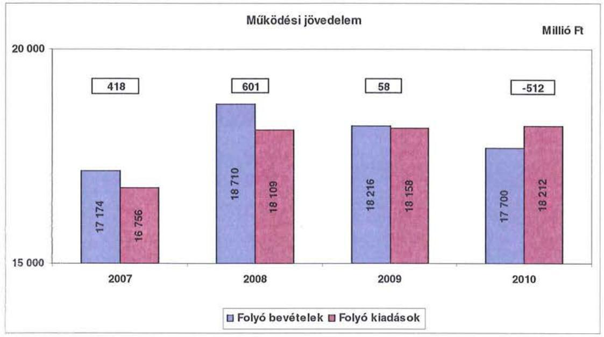

A folyó költségvetés egyenlege, (a működési forrástöbblet) 2007-ben a folyó kiadások 2,4%-át (418 millió Ft-ot), 2008-ban 3,3%-át (601 millió Ft-ot), 2009-ben 0,3%-át (58 millió Ft-ot) jelentette, 2010-ben viszont a folyó kiadások 2,9%-ára (512 millió Ft) nem volt működési jövedelemből származó fedezet, ami pénzügyileg nem fenntartható helyzetet okozott. A 2007-2009. évben a működési jövedelem 1077 millió Ft megtakarítást mutatott, amely forrásul szolgálhatott az Önkormányzat fennálló tőketörlesztési kötelezettségeinek teljesítéséhez, valamint fejlesztéseinek finanszírozásához.

A 2007-2009. közötti pozitív előjelű folyó költségvetési egyenleg ellenére, továbbá a 2010. évi negatív költségvetési egyenleg miatt az Önkormányzat folyamatosan folyószámlahitel igénybevételére kényszerült egyrészt az átmeneti likviditási problémák kezelése, másrészt a kialakult működési hiánya és fejlesztési kiadásai finanszírozása miatt. Az Önkormányzat a vizsgált években 2009. év kivételével, amikor 317 napon - 365 napon vett igénybe folyószámlahitelt. A folyószámlahitel napi átlagos állománya ${ }^{41}$ 2007-ről 2008-ra emelkedett 1359 millió Ft-ról 2048 millió Ft-ra (50,7%-kal), majd 2009-re 1823 millió Ft-ra (11,0%) mérséklődött, 2010-re 1977 millió Ft-ra (8,4%) emelkedett. A teljes időszak alatti változás 618 millió Ft (45,5%) növekedés.

Az Önkormányzat kötelezettségein belül a rövid lejáratú kötelezettségek állománya 2007-2010 között 272 millió Ft-tal nőtt, annak ellenére, hogy aránya az összes kötelezettségen belül a 2009. évi emelkedést követően majdnem felére

[^0]
[^0]:    ${ }^{41}$ A ténylegesen folyószámlahitellel zárt napokra számított átlagos állomány 2007-2009. évek között emelkedett 1359 millió Ft-ról 2099 millió Ft-ra (54,5%-kal), majd 2010-ben mérséklődött 1977 millió Ft-ra.

---

csökkent (41,8%-ról 22,4%-ra), aminek oka a hosszú lejáratú kötelezettségek emelkedése. Az Önkormányzat 2007. december 31-én fennálló pénz és tőkepiaci kötelezettsége 7937 millió Ft-ról több mint duplájára, 16749 millió Ft-ra nőtt a kötvénykibocsátás és a folyószámlahitel állományának emelkedése miatt. Az összes kötelezettségen belül a hosszú lejáratú pénzintézeti kötelezettségek 2007-2010 között több mint 65,9%-kal (9202 millió Ft-tal) nőttek.

A rövid lejáratú kötelezettségeken belül a szállítói állomány mérsékelten (5,3%-kal) emelkedett, 2010-ben 1219 millió Ft-ot tett ki. A lejárt szállítói tartozásállomány azonban 2007. évi 64 millió Ft-ról 2010-re 801 millió Ft-ra ${ }^{42}$ nőtt.

Az Önkormányzat 2010. évi záró pénzkészlete 518 millió Ft volt, amely teljes mértékben kötelezettséggel terhelt.

Az Önkormányzat pénzügyi kapacitása 2008-ban és 2009-ben pozitív, 2009-2010-ben negatív értéket mutatott. A nettó működési jövedelem ${ }^{43}$ értéke a folyó költségvetési pozíció mellett az adott költségvetési év adósságtörlesztésének hatását is tükrözi. A 2009. évben a hiteltörlesztés jelentősen, 3342 millió Ft-ra megemelkedett abból adódóan, hogy az Önkormányzat pénzintézetet váltott, a korábbi hiteleket - két fejlesztési célú hitel kivételével - lejárttá tette a korábbi pénzintézet. A hitel visszafizetése mellett esedékes volt 83 millió Ft értékpapír beváltása a korábban kibocsátott kötvény miatt. A visszafizetés forrását csak 7000 millió Ft összegű kötvény kibocsátásával tudta biztosítani, amit hiteltörlesztésre is felhasznált. Ez jelentősen hatott a nettó működési jövedelemre, amely ebből adódóan 3367 millió Ft-ra csökkent a 2009. évben.

A nettó működési jövedelem - a tőketörlesztések évenkénti változásából adódóan - 2007-ben 183 millió Ft, 2008-ban 369 millió Ft volt, de azt követően negatív, 2009-ben -3367 millió Ft, 2010-ben -1653 millió Ft, így az időszak együttes nettó működési jövedelme -4468 millió Ft volt. A pénzügyi kapacitás 2007-hez viszonyított romlását - a folyó bevételek és kiadások különbségéből származó működési jövedelem csökkenése mellett - a hiteltörlesztés növekedése okozta.

Az Önkormányzatnál (a CLF módszer alapján) a fejlesztési kiadások fedezete negatív nettó működési jövedelem képződése mellett - csak a 2009-ben és a 2010. évben kibocsátott kötvények bevonásával volt biztosított. A nettó működési jövedelem negatív értéke azt mutatja, hogy a jövőben teljesítendő adósságszolgálat változatlan működési jövedelem képződése mellett nem biztosítható, további adósságszolgálati kötelezettség nem vállalható.

[^0]
[^0]:    ${ }^{42}$ Az egyéb kiadás elmaradással együtt 803 millió Ft-ra.
    ${ }^{43}$ pénzügyi kapacitás

---

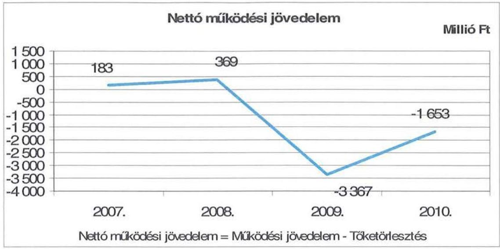

A 2007-2010. években az Önkormányzat felhalmozási költségvetésének egyenlege folyamatosan negatív összegű volt, amely a 2009. és 2010. évi negatív előjelű működési jövedelem miatt pénzügyileg nem fenntartható helyzetet okozott.

A felhalmozási költségvetés egyenlegének alakulását évről évre a következő ábra szemlélteti:
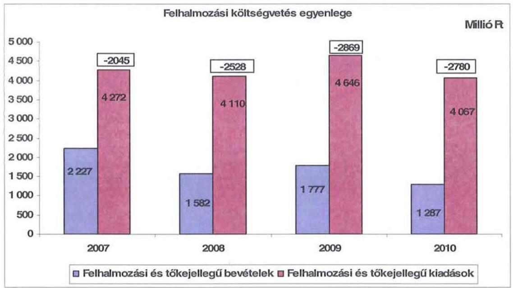

A felhalmozási forráshiánynak a felhalmozási és tőke jellegű kiadásokhoz viszonyított aránya 2007-ben 47,9% (2045 millió Ft), 2008-ban 61,5% (2528 millió Ft), 2009-ben 61,8% (2869 millió Ft), 2010-ben 68,3% (2780 millió Ft) volt.

---

A felhalmozási forráshiány finanszírozása a 2007. év elején rendelkezésre álló nyitó pénzkészletből, a nettó működési jövedelem felhasználásából, valamint a folyószámla- és fejlesztési célú kötvénykibocsátásból történt ${ }^{44}$. A vizsgált időszakban összesen 10221 millió felhalmozási forráshiány keletkezett, melynek csupán 5,4%-ára (553 millió Ft) nyújtott fedezetet a pozitív előjelű nettó működési jövedelem ${ }^{45}$.

A függő, átfutó, kiegyenlítő bevételek és kiadások 114 millió Ft-os negatív egyenlegének a folyószámlahitel állományból történő finanszírozásával az Önkormányzat 518 millió Ft pénzkészlettel zárta a 2010. évet.

A tőketörlesztések növekedése miatt a 2009. évben kiugróan negatív volt a nettó működési jövedelem, amely a 2010. évre csökkent ugyan, de továbbra is negatív egyenlegű, így nem biztosít fedezetet sem a folyó, sem a felhalmozási kiadásokhoz. A kialakult pénzügyi helyzet csak felelős, pozitív működési jövedelmet eredményező gazdálkodás mellett teszi elkerülhetővé további pénzügyi források bevonását, az eladósodás növekedését.

Az Önkormányzat évenkénti teljes finanszírozási igénye ${ }^{46}$ a CLF módszer szerint 2007-ben 4455 millió Ft, 2008-ban 4479 millió Ft, 2009-ben 1278 millió Ft, 2010-ben 2414 millió Ft volt - amelynek finanszírozását a nettó jövedelmen túl - a 2009-ben és 2010-ben kibocsátott kötvény igénybevételével tudták biztosítani.

Az Önkormányzat finanszírozási műveletei 2007-2010. évekbeli egyenlegének alakulását a következő ábra szemlélteti:
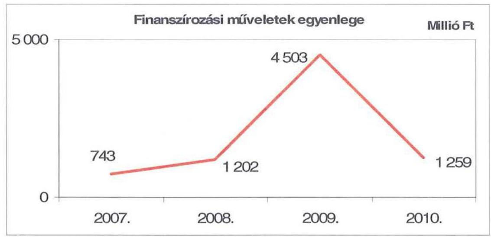

A finanszírozási többlet azt jelzi, hogy az éves költségvetések végrehajtása során szükség volt az előző években keletkezett pénzmaradvány igénybevételén

[^0]
[^0]:    ${ }^{44}$ Az évenkénti adatokat a jelentés 2. számú melléklete mutatja be.
    ${ }^{45}$ Az ábrában megjelenő felhalmozási kiadásokban a társuláshoz kapcsolódó beruházások összege a 2009. évben 6 millió Ft, a 2010. évben 26 millió Ft.
    ${ }^{46}$ A nettó működési jövedelem és a beruházási költségvetés eredője.

---

túl külső finanszírozás igénybevételére is. A 2009. évi növekedést nagyrészt a 7000 millió Ft összegű kötvénykibocsátásból származó finanszírozási célú bevétel, valamint a 3342 millió Ft hiteltörlesztés (finanszírozási célú kiadás) okozta.

Az Önkormányzat zárszámadási rendeletében a működési és fejlesztési hiányt az elemzésünkben használt CLF módszertől eltérő módon mutatta be ${ }^{47}$, amelyet a jelentés 1. számú melléklete szemléltet. A rendeletek közül a 2007. évi zárszámadás jelzett működési forráshiányt, a további években többletet mutattak ki.

A vizsgált időszakban a kötelezettségek (passzív pénzügyi elszámolások nélkül) 9531 millió Ft-ról közel duplájára, 19005 millió Ft-ra emelkedtek, amely együtt járt a kamatkiadások növekedésével is.

A 2007-2010 között az Önkormányzat összesen 2641 millió Ft kamatot fizetett. Az átmenetileg szabad pénzeszközein realizált kamatbevétel, a teljes kamatráfordítás 36,6%-át (967 millió Ft) tette ki. A kamatkiadások minden évben meghaladták a kamatbevételeket kivéve 2008-ban, amikor a folyószámlahitelt devizában vették fel és 465 millió Ft árfolyamnyereséget realizált az Önkormányzat.

Az Önkormányzat kamatbevételeinek és kamatkiadásainak alakulását a következő ábra mutatja:
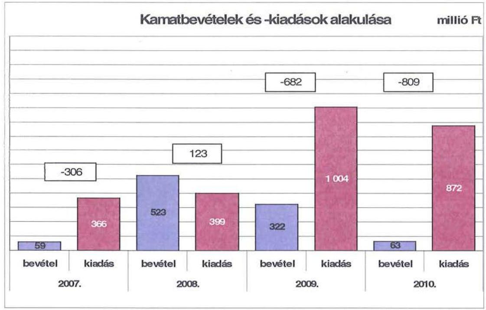

A 2011. évre az Önkormányzat a kamatkiadások növekedésével kalkulál, a költségvetési rendeletben tervezett 1027,2 millió Ft kamatráfordítás 17,8%-kal, 155,3 millió Ft-tal több a 2010. évi teljesítésnél. A kamatkiadások növekedése pedig kedvezőtlenül érinti a működési jövedelem alakulását.

[^0]
[^0]:    ${ }^{47}$ Nincs kötelező előírás a működési és fejlesztési hiány megállapításának módjára.

---

# 2.2. Az Önkormányzat bevételeinek alakulása 

Az Önkormányzat működési bevétele a 2007. évi 17174 millió Ft-ról 2010-re (mindössze 3,1%-kal 526 millió Ft-tal) 17700 millió Ft-ra emelkedett.

Az Önkormányzat 2007-2010 között realizált, főbb működési bevételi jogcímeinek számszaki adatait
 az alábbi grafikon mutatja be:
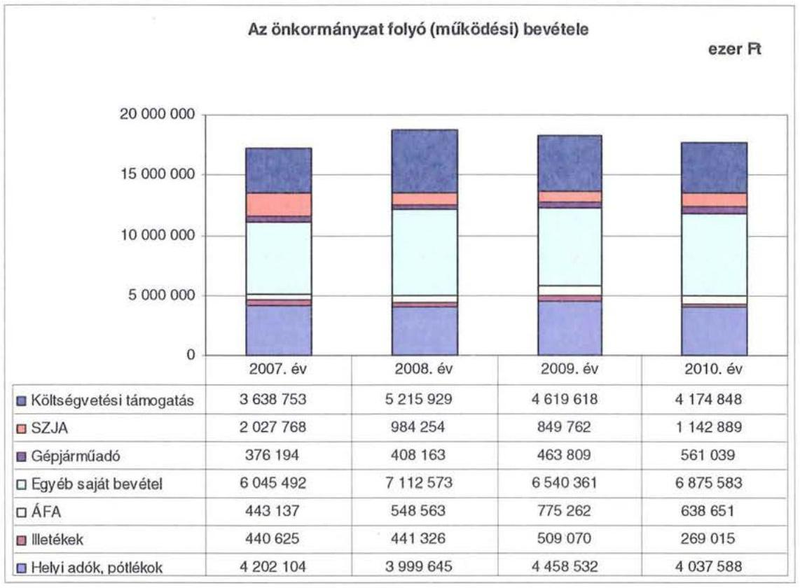

Az átengedett szja és az állami támogatások együttes összege a 2008. évi 534 millió Ft-os, 9,4%-os növekedést követően folyamatosan, de egyre kisebb mértékben csökkent. Az előző évihez képest 2009-ben 11,8%-kal (731 millió Ft-tal), 2010-ben további 2,8%-kal (152 millió Ft-tal) kapott kevesebb forrást az Önkormányzat az államtól ezeken a jogcímeken. A 2007. évihez viszonyított csökkenés 349 millió Ft (6,2%).

Az Önkormányzat iparűzési adóerő-képessége 2007-től 2009-ig nőtt (1589 millió Ft, 1675 millió Ft, 2037 millió Ft), majd a 2010. évben csökkenés következett be (1855 millió Ft). Az Önkormányzat emiatt a jövedelemkülönbség mérséklésére a 2007-2010. közötti időszakban 185 millió Ft, 328 millió Ft, 113 millió Ft, 391 millió Ft szja kiegészítést kapott.

A gépjárműadó bevétel 2007-2010. év között 185 millió Ft-tal (49,2%-kal) növekedett, a 2010. évi növekedésben szerepet játszott a gépjárműadó alapját, mértékét és egyes mentességi kategóriákat érintő törvényi módosításból adódó emelkedés, amelynek központilag kalkulált átlagos növekedése 15% körüli volt.

---

Az Önkormányzat - Kórház nélkül számított egyéb intézményi működési bevételei ${ }^{48}$ - 2007-2010 között 152 millió Ft-tal, 6,5%-kal nőttek. Ezen belül az osztalékbevételek 26 millió Ft-ot, 37 millió Ft-ot, 27 millió Ft-ot, 27 millió Ft-ot tettek ki, melyek főként a Víz-és Csatornaműtől származtak, melyben az Önkormányzat tulajdoni hányada 64,7%. (Emellett évente 1 millió Ft, illetve 1 millió Ft alatti osztalék realizálódott a Nyugat-Pannon Regionális Fejlesztési Zrt-től és 2007-ben a Forrás Nyrt-től). Az Önkormányzat 75% feletti tulajdoni hányadú társaságainál osztalékot nem fizettek, a közgyűlési határozat alapján a társaságok taggyűlése arról határozott, hogy az eredményt eredménytartalékba helyezik.

Az Önkormányzat áfa bevétele a 2007. évi 443 millió Ft-ról 639 millió Ft-ra emelkedett (44,2%), de 2009-ben ezt meghaladó, 775 millió Ft áfa bevételt számolt el az Önkormányzat, amelyből 2008-ban 98 millió, 2009-ben 193 millió Ft, 2010-ben 128 millió Ft volt a fordított áfa ${ }^{49}$ alapján elszámolt bevétel. A 2009. évi magasabb bevétel oka a nagyobb arányú ingatlan és közműfelújítás.

Az illetékbevétel a vizsgált időszakban 2009-ig növekedett, majd a 2010. évben jelentősen visszaesett, az előző évhez viszonyítva a csökkenés 47,2%-os (140 millió Ft) volt. Az illetékbevételeknél a 2007. évhez viszonyítva 2010-re 172 millió Ft-os, 39,0%-os csökkenés következett be.

Az Önkormányzat működési bevételének 20% körüli arányát (4 milliárd Ft) alkotják a helyi adó bevételek. Az Önkormányzat helyi iparűzési adót, építményadót, vállalkozók kommunális adóját, vendégéjszakák utáni idegenforgalmi adót vetett ki. Az adó mértékében a vizsgált időszakban két kisebb változás történt.

Az idegenforgalmi adó a 2008. évtől vendégéjszakánként 335 Ft-ról 340 Ft-ra nőtt, azóta változatlan. Az építményadónál pedig az üdülők után fizetendő adót (a korábbi években 400 Ft/m²) 2009-től megszüntették.

A helyi adóbevételek háromnegyed részét az iparűzési adó teszi ki. Az Önkormányzatnál a pótlékkal, bírsággal növelt helyi adó bevétel a 2010. évben a 2007. évhez képest 4,0%-kal (166 millió Ft-tal) csökkent, az egyes évek között váltakozva csökkenés, illetve növekedés következett be. A 2010. és a 2009. év viszonyításánál is csökkenés tapasztalható, amelynek legjelentősebb tétele az iparűzési adó 262 millió Ft-os (9%-os) csökkenése.

[^0]
[^0]:    ${ }^{48}$ A Kórház működési bevétele 2007. évben 3707 millió Ft, 2010. évben 4385 millió Ft volt.
    ${ }^{49}$ A fordított áfa építéshatósági engedély köteles ingatlan beruházásokhoz kapcsolódott. Az Önkormányzat könyvelésében mind a bevételi, mind a kiadási oldalon megjelenik.

---

Az Önkormányzat felhalmozási bevételei 2007-2010 között 2227 millió Ft-ról 1287 millió Ft-ra (42,2%-kal, 940 millió Ft-tal) csökkentek, melynek elemei a következők szerint alakultak:
ezer Ft

| Megnevezés | 2007. év   tény | 2008. év   tény | 2009. év   tény | 2010. év   tény |
| :-- | :--: | :--: | :--: | :--: |
| Tárgyi eszköz értékesítés | 177420 | 202332 | 410326 | 65022 |
| Egyéb saját tőkebevétel | 543559 | 579211 | 453521 | 634453 |
| Államháztartáson belülről   kapott támogatás | 893023 | 246438 | 772325 | 407142 |
| EU-tól és külföldről kapott   támogatások | 288716 | 320665 | 21364 | 2270 |
| Államháztartáson kívülről   kapott támogatás | 324349 | 233176 | 119812 | 177671 |
| Összes felhalmozási bevétel | 2227067 | 1581822 | 1777348 | 1286558 |

A tárgyi eszköz értékesítésből származó bevétel 2009-ben volt kiemelkedően magas, amikor beruházáshoz kapcsolódóan értékesített földterületet és gépet az Önkormányzat, 2010-re azonban jelentősen visszaesett, mert az Önkormányzat a piacon elérhető alacsony árakon ${ }^{50}$ nem kívánt ingatlanokat értékesíteni. Az államháztartáson belülről kapott támogatás a szennyvízberuházás megvalósításához kapott támogatás miatt volt magasabb 2007-ben és 2009-ben a beruházás ütemezése szerint. Az EU támogatások a szennyvíztisztító beruházáshoz és a Deák tér felújításához kapcsolódtak a 2007-2008. években. Az államháztartáson kívülről kapott támogatás meghatározó része a városban letelepedő cégek közműfejlesztési hozzájárulásából származott.

Állami támogatás címzett támogatásként a 2007. évben Kórház gépműszer beszerzéséhez, valamint a 2007-2009. években a Széchenyi Gimnázium épületének rekonstrukciójához kapcsolódott.

Az Önkormányzat a központi költségvetésből a 2007. évben 372 millió Ft, a 2008. évben 238 millió Ft, a 2009. évben 45 millió Ft, a 2010. évben 85 millió Ft felhalmozási támogatást kapott.

Az Önkormányzat központi költségvetésből származó bevételei (költségvetési támogatás, szja, gépjárműadó, illetékek) a vizsgált években a 2007. évhez viszonyítottan - az egyes évek 2007-hez viszonyított eltéréseit összesítve - 190 millió Ft-tal növekedtek.

Az előbbi különbözet számítással a felhalmozási költségvetési támogatások összege 749 millió Ft-tal csökkent, a költségvetési működési támogatás és szja együttes összege 737 millió Ft-tal, a gépjárműadóé 304 millió Ft-tal emelkedett, az illetékbevételek 102 millió Ft-tal csökkentek.

[^0]
[^0]:    ${ }^{50}$ A Közgyűlés értékbecslés alapján meghatározta az értékesítésre tervezett ingatlanok kikiáltási árait, de a meghirdetett áron arra nem jelentkeztek vevők.

---

# 2.3. Az Önkormányzat kiadásainak alakulása 

Az Önkormányzat folyó kiadásai ${ }^{51}$ a 2007. évihez képest a 2010. év végére 1456 millió Ft-tal, 8,7%-kal nőttek.

Az Önkormányzat működési kiadásai főbb jogcímek szerinti bontásban az alábbiak voltak:

|  |  |  |  | millió Ft |
| :--: | :--: | :--: | :--: | :--: |
| Megnevezés | 2007. | 2008. | 2009. | 2010. |
| Folyó kiadások | 16756 | 18109 | 18158 | 18212 |
| Működési kiadások (kamatkiadás nélkül) | 14685 | 15730 | 15544 | 15537 |
| Államháztartáson belülre átadott pénzeszközök | 37 | 29 | 79 | 99 |
| Transzferkiadások | 1554 | 1763 | 1523 | 1687 |
| -ebből: vállalkozásoknak | 968 | 1167 | 971 | 1127 |
| EU-nak, illetve külföldre | 0 | 0 | 1829 | 3 |
| magánszemélyeknek | 456 | 468 | 444 | 451 |
| nonprofit szervezeteknek | 130 | 130 | 107 | 106 |
| Kamatkiadások | 366 | 399 | 1004 | 872 |
| Előző évi pénzmaradvány átadás | 115 | 188 | 7 | 17 |

Az Önkormányzat a működési költségvetésből a 2007. évben 8716 millió Ft-ot (52,0%), a 2010. évben 8430 millió Ft-ot (46,3%) személyi juttatásokra és a munkaadókat terhelő járulékokra fordított, az üzemeltetést, intézményfenntartást biztosító dologi és folyó kiadásokra a 2007. évben 5969 millió Ft (35,6%), 2010-ben 7088 millió Ft (38,9%) jutott.

Az Önkormányzat folyó kiadásai főbb kiadásnemek szerinti bontásban az alábbiak voltak:

|  |  |  |  | millió Ft |
| :--: | :--: | :--: | :--: | :--: |
| Megnevezés | 2007. | 2008. | 2009. | 2010. |
| Személyi juttatások | 6614 | 6953 | 6794 | 6662 |
| Munkaadót terhelő járulékok | 2102 | 2196 | 2028 | 1768 |
| Dologi kiadások | 5882 | 5908 | 6634 | 6900 |
| Egyéb folyó kiadások | 87 | 673 | 74 | 188 |
| Működési célú pénzeszközátadás | 1100 | 1298 | 1090 | 1239 |

A személyi juttatások és járulékok a 2008. évben 433 millió Ft-tal (5,0%) nőttek az előző évhez képest, azt követően minden évben csökkentek. A 2010. évben teljesített személyi juttatások és járulékok a 2007. évben teljesített kiadásoknál 286 millió Ft-tal (3,3%) voltak alacsonyabbak. A személyi juttatások 48 millió Ft-tal (0,7%) növekedtek, a munkaadókat terhelő járulékok körében a 2007. évről a 2010. évre 334 millió Ft-os (15,9%) csökkenés következett be, a járulékok mértékének mérséklődése hatására.

A dologi kiadások önkormányzati szinten a 2010. évben a 2007. évinél 1018 millió Ft-tal (17,3%) voltak magasabbak. A 2009. év kivételével ${ }^{52}$ minden évben infláció alatti mértékben nőttek a dologi kiadások. A 2009. évi inflációt

[^0]
[^0]:    ${ }^{51}$ a CLF módszerrel számított
    ${ }^{52}$ Ebben a költségvetési évben az előző évhez képest a dologi kiadások 726 millió Ft-os, 12,2%-os növekedése következett be.

---

meghaladó kiadások a szolgáltatások és áfa kiadások növekedése mellett a hitelekkel kapcsolatos egyéb költségek emelkedéséből származtak.

A működési célú pénzeszközátadások összege a 2007. évről a 2010. évre 139 millió Ft-tal (12,6%) nőtt. Ezen belül az önkormányzati feladatellátásban résztvevő gazdasági társaságoknak átadott pénzeszköz a 2009. évben mérsékelten csökkent, 2007. és a 2010. év viszonylatában 171 millió Ft-tal nőtt, a növekedés 24,4%-os. A 2007. évi átadott pénzeszközből 415 millió Ft-ot, a 2010. éviből 574 millió Ft-ot finanszírozott az Önkormányzat saját forrásból.

Az Önkormányzat a 2007-2010. években rendszeresen három saját tulajdonú gazdasági társaságának adott át pénzeszközt működési célra. Közülük a színházi és kulturális feladatokat ellátó gazdasági társaság kapta 2007-ben az átadott pénzeszköz 61,3%-át (430 millió Ft, melyből 238 millió Ft az állami támogatás), 2010-ben 52,9%-át (451 millió Ft, amelyből 234 millió Ft volt az állami támogatás). A gazdasági társaságoknak átadott pénzeszközök közül meghatározó még a sportfeladatokat ellátó egyik gazdasági társaságnak önkormányzati forrásból nyújtott rendszeres pénzeszköz átadás, amely a 2007. évben 125 millió Ft-ot (17,8%), a 2010. évben 175 millió Ft-ot (20,0%) jelentett. Az Önkormányzat másik sportfeladatot ellátó - 50% feletti tulajdoni hányadú - gazdasági társaságának átadott pénzeszköz 2007-ben 5,0%-ot (35 millió Ft), a 2010. évben 7,7%-ot (67 millió Ft) tett ki, melynek finanszírozása önkormányzati forrásból történt. Fentieken túl a közlekedési feladatokat ellátó gazdasági társaságnak adtak át rendszeresen pénzeszközt, 2007-ben 105 millió Ft-ot, 2010-ben 145 millió Ft-ot, amelynek része a központi költségvetésből származó hozzájárulás is (2007-ben 42 millió Ft, 2010-ben 41 millió Ft).
 Rendszeresen még két gazdasági társaságnak történt közcélúak foglalkoztatása miatt pénzeszközátadás (2007-ben 7 millió Ft, 2010-ben 24 millió Ft), amelynek forrása állami támogatás volt.

Az Önkormányzat által a gazdasági társaságok részére nyújtott működési és felhalmozási célú pénzeszközátadás alakulását az alábbi diagram mutatja be 2007-2010. évekre:
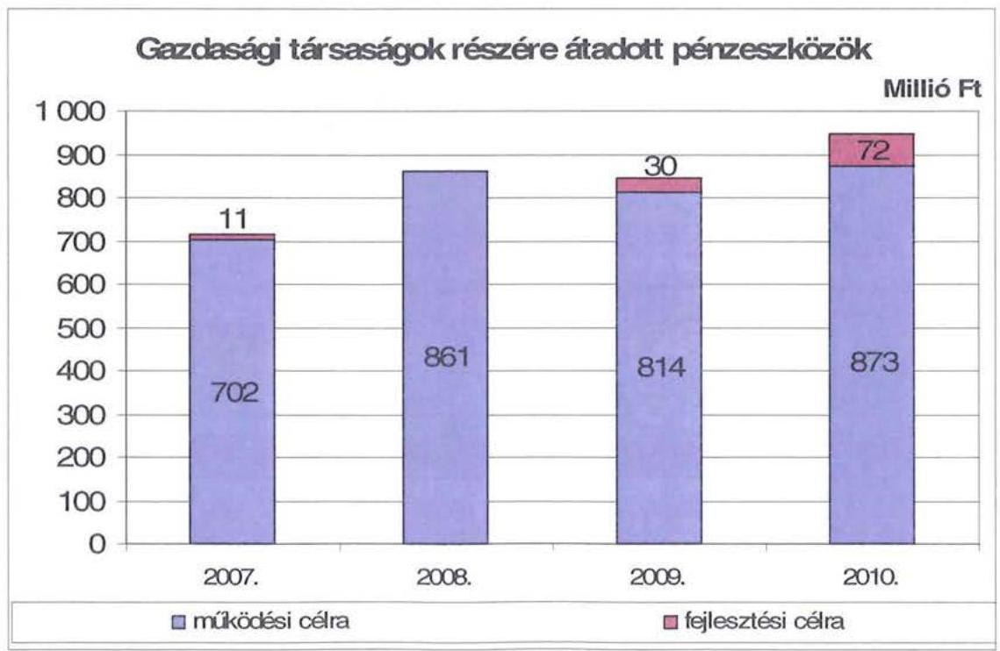

---

Az önkormányzati működési kiadásokon belül a kórházi kiadások súlya némileg nőtt az egyéb fenntartott intézményekben felmerülő kiadásokhoz képest. A Kórház teljesített működési kiadásai a 2007. évben az Önkormányzat összes működési kiadásából 3967 millió Ft-ot ( $23,7 \%$ ) tettek ki. Ugyanez az érték a 2010. év végére 4585 millió Ft-ra ( $25,2 \%$ ) nőtt.

Az Önkormányzat Kórház nélküli működési kiadásai a vizsgált időszakban a következőképpen alakultak:

| Megnevezés | 2007. | 2008. | 2009. | 2010. |
| :--: | :--: | :--: | :--: | :--: |
| Folyó (működési) kiadások | 12789 | 13694 | 13726 | 13627 |
| Működési kiadások (kamatkiadás nélkül) | 10718 | 11314 | 11161 | 11095 |
| Kamatkiadás | 366 | 399 | 1004 | 872 |
| Személyi juttatások | 4890 | 5068 | 4862 | 4721 |
| Munkaadót terhelő járulékok | 1547 | 1589 | 1437 | 1241 |
| Dologi kiadások | 4218 | 4030 | 4748 | 4828 |
| Egyéb folyó kiadások | 62 | 627 | 49 | 143 |
| Működési célú pénzeszközátadás | 1100 | 1298 | 1090 | 1239 |

A Kórház nélkül számított működési kiadások 2010. és 2007. viszonylatában az Önkormányzat összesített kiadásainál kisebb arányban, 838 millió Ft-tal ( $6,6 \%$-kal) nőttek. A 2007-2010. években a Kórház nélküli kiadásokon belül a személyi juttatások és járulékok 475 millió Ft-tal ( $7,4 \%$-kal) csökkentek. A Kórházban azonos időszakban 189 millió Ft összegű növekedés ( $8,3 \%$ ) volt. A Kórház nélküli dologi kiadások 610 millió Ft-tal ( $14,5 \%$-kal) növekedtek. A Kórház dologi kiadásai ennél nagyobb arányban, 408 millió Ft-tal ( $24,5 \%$-kal) emelkedtek.

A Kórháznak átadott pénzeszközök évenkénti alakulását az alábbi grafikon szemlélteti:
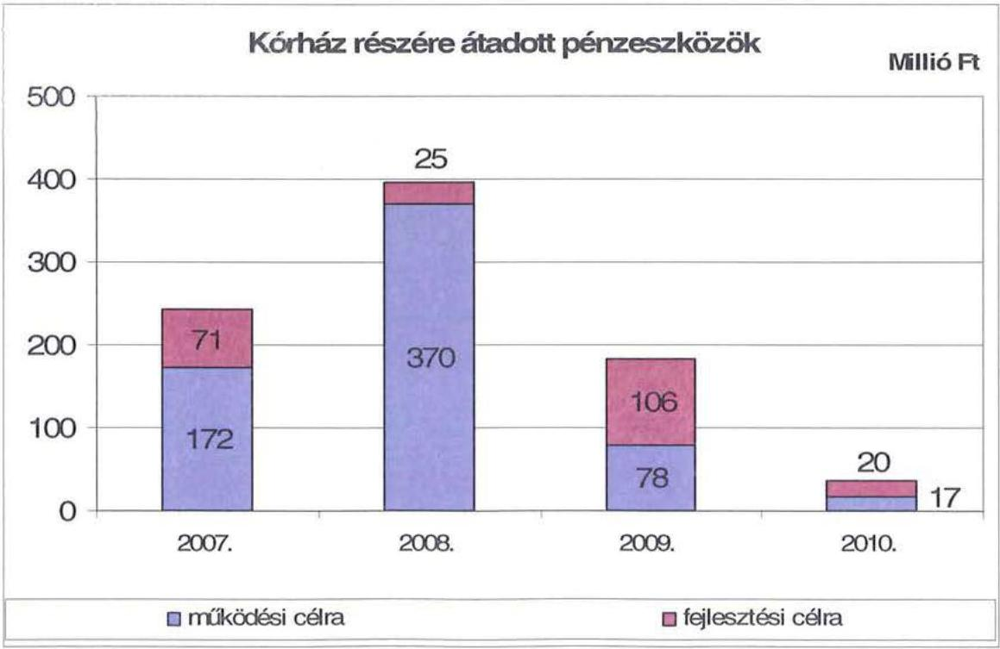

---

A vizsgált években az Önkormányzat összesen 859 millió Ft pénzeszközt adott át a Kórháznak, amelyből működési célra 637 millió Ft-ot, fejlesztési célra 222 millió Ft-ot adtak át. A működési célú pénzeszközátadásból 330 millió Ft központi költségvetésből származó (bérpolitikai intézkedések) támogatás továbbadása volt. A fejlesztési célú pénzeszköz átadások a Kórház gép-műszer beszerzéseihez kapcsolódtak.

A folyó (működési) és felhalmozási kiadások alakulását, a teljesített kiadások működési és felhalmozási felhasználásának arányait az alábbi ábra mutatja be:
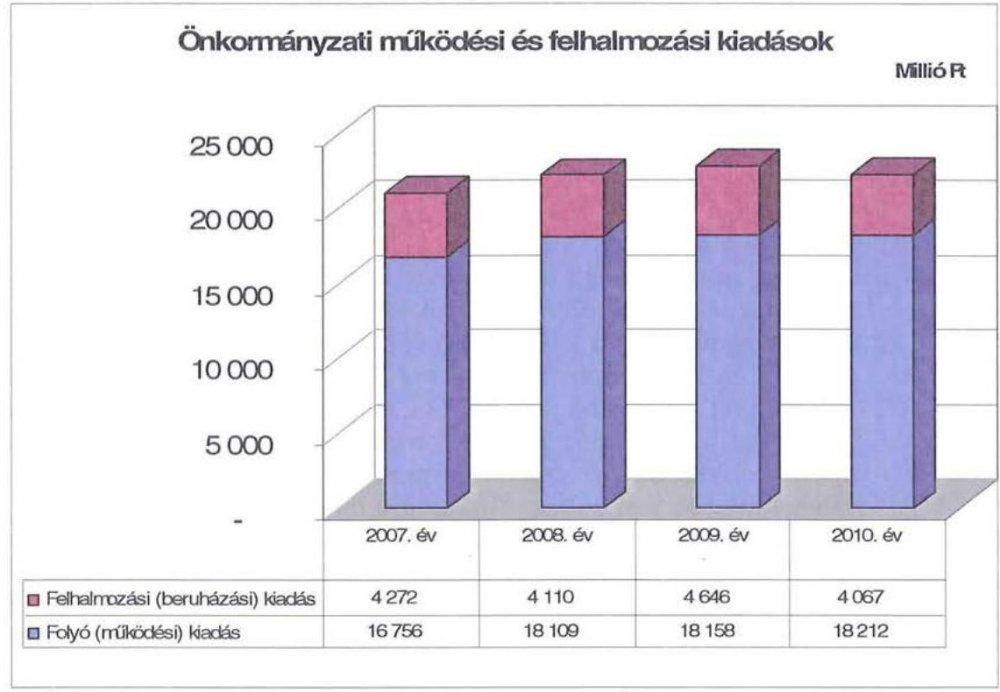

A folyó (működési) és felhalmozási kiadások arányának változásában 2007-2010. évek közötti lényeges elmozdulás nem figyelhető meg. A felhalmozási kiadások aránya 18-20\% körül mozgott, a működési kiadások 80-82\%-ot tettek ki. A folyó és felhalmozási kiadások együttes összegéből a társulások folyó és felhalmozási kiadásai 2009-ben 7 millió Ft-ot, 2010-ben 27 millió Ft-ot tettek ki, arányuk az összes kiadáson belül elhanyagolható volt.

Az Önkormányzatnál 2006-2010. évben befejezett fejlesztési feladatok összes költségvetési kiadása 12820 millió Ft volt, amelyből a 2006. évben 1196 millió Ft-ot, a 2007-2010. években 11623 millió Ft kifizetést teljesítettek. Ebből a 2007-2010. években a fejlesztések összege 7766 millió Ft ( $66,8 \%$ ) és a felújítások összege 3857 millió Ft (33,2\%) volt. A befejezett 11623 millió Ft értékű fejlesztés, felújítás forrásaként 1995 millió Ft saját bevétel (17,2\%), 92 millió Ft EU-s támogatás ( $0,8 \%$ ), 800 millió Ft hazai támogatás ( $6,9 \%$ ), 8065 millió Ft kötvény értékesítéséből származó bevétel ( $69,4 \%$ ), és 671 millió Ft hitelfelvétel $(5,7 \%)$ szerepelt. (3/a. számú melléklet)

---

Az Önkormányzat 2010. december 31-én folyamatban lévő fejlesztési feladatainak nagysága 2796 millió Ft volt, amelyből 2578 millió Ft összeget 2007-2010. években teljesített. Ennek forrása 107 millió Ft EU-s támogatás ( $4,2 \%$ ), kötvény kibocsátásból származó 1851 millió Ft bevétel ( $71,8 \%$ ), és 620 millió Ft hitelfelvétel ( $24 \%$ ) volt.

A 2007., a 2009. és a 2010. évben kötvény kibocsátásból származó bevételeket felújításra, hitelkiváltásra, fejlesztésre használták fel, illetve bírói letétbe helyezték ${ }^{53}$. Az Önkormányzat 2010. december 31-én folyamatban lévő kötelezettségvállalásainak összege 14101 millió Ft volt, amelyhez 2201 millió Ft saját forrásból ( $15,6 \%$ ), 11477 millió Ft EU-s támogatásból ( $81,4 \%$ ) és 423 millió Ft kötvény értékesítésből származó bevétel (3\%) szerepelt. (3/b-c melléklet)

A fejlesztések forrásához igénybevett 9916 millió Ft értékű kötvény kibocsátás és az 1715 millió Ft értékű hitelfelvétel a 2025. évig évente milliárdos nagyságrendű hosszú távú kötelezettséget jelent az Önkormányzat számára. Az Önkormányzat a vizsgált időszakban működését, pénzügyi egyensúlyát - a 3.1. pontban részletezettek szerint - csak folyószámlahitel igénybevételével tudta biztosítani, amely mellett a 2010. évre lejárt szállítói tartozása és egyéb kiadás elmaradása is (a 3.2. pontban leírtak szerint) 803 millió Ft-ra növekedett. Emiatt az Önkormányzat a 2310 millió Ft összegű, elbírálás alatti pályázatait - egy felújítást és három fejlesztést - 295 millió Ft saját bevételből (12,8\%), 1958 millió Ft EU-s támogatásból ( $84,7 \%$ ) és 57 millió Ft hazai támogatásból ( $2,5 \%$ ) tervezte megvalósítani. A források a helyszíni vizsgálat befejezésekor még nem álltak az Önkormányzat rendelkezésére, a pályázati elbírálások ekkor még folyamatban voltak. (3/d számú melléklet).

A fejlesztésekhez kapcsolódó kötelezettségek teljesítéséhez az Önkormányzat - az önkormányzati rendeletekben megtervezett saját bevételeken túl - a 2010. évben 1170 millió Ft kimutatott követelésállományt, a 13756 millió Ft összes forgalomképes vagyont kívánja szükség szerint igénybe venni. Ezt a forrást venné azonban igénybe az Önkormányzat - a 3.1. pontban leírtak szerint a lejárt szállítói tartozásállomány (a 2010. év végén 801 millió Ft) és a pénzintézeti kötelezettségeinek (a 2010. év végén 16749 millió Ft) teljesítéséhez is. Mindez várhatóan pénzügyileg nem fenntartható helyzetet fog eredményezni.

Az Önkormányzat kiemelt infrastrukturális fejlesztései közül a legnagyobb költségigényű az alábbi három beruházás volt:

- A Közgyűlés döntését követően ${ }^{54}$ a Széchenyi Gimnázium rekonstrukciója indult el (a Gimnázium felújítása, valamint az udvar rendezése) a 2007. évben. A pályázat során 513 millió Ft összegű címzett támogatást vettek igénybe, amelyhez 149 millió Ft forrást hitelfelvétellel biztosítottak. Az építési projekt lebonyolításához közbeszerzést folytattak le, amelynek ajánlati

[^0]
[^0]:    ${ }^{53}$ A felhasználás részletezését a jelentés 3.1. pontja tartalmazza.
    ${ }^{54} 71 / 2005$. (III. 31.), a 72/2005. (III.31.), a 73/2005. (III. 31), a 139/2005. (III. 31), és a 243/2006. (IX. 22). számú határozatok

---

felhívását 2006. 07. 14-én a KÉ 80. számában tették közzé és a nyertessel 2006. október 10-én kötöttek szerződést a beruházás lebonyolítására. A beruházás befejezésére a 2009. évben került sor.

- A Sopron csatornázási és szennyvíztisztítási programját ${ }^{55}$ az előkészítést követően a 2004. évben kezdték meg és 2010. évben fejezték be ${ }^{56}$. A beruházást 629 millió Ft összeggel teljesítették, amelynek forrása 620 millió Ft hitelfelvételből és 9 millió Ft kötvénykibocsátás bevételéből származott. A Sopron régió Csatornázási és szennyvíztisztítási programhoz kapcsolódó csatornaépítés után az utak teljes körű helyreállítását az Önkormányzat saját forrásból biztosította.
- A Város-rehabilitációs fejlesztés I. ütemét ${ }^{57}$ a 2009. évben kezdték meg és várhatóan 2012. évben fejezik be. A becsült költsége 490 millió Ft, amelyből 2010. december 31-ig 281 millió Ft összeget fizettek ki 184 millió Ft összegben kötvény kibocsátásából származó bevételből és 97 millió Ft összegben EU-s támogatásból. (A beruházás tartalmazta a Kulcspont kávézó kialakítását, a Fő téri utca burkolat felújítását a Fő téri közmű cseréjével és a Tűztorony szerkezeti megerősítésével, a Múzeumi információs és Fogadóközpont és a Várfalsétány kialakítását.)

Amennyiben a beadott pályázatok az Önkormányzat elvárásainak megfelelően teljesülnek, a megkezdett projektek és a benyújtott pályázatok beruházásainak jövőbeni kötelezettsége teljesíthető. Ehhez azonban a fennálló hosszú távú kötelezettségek mellett az elbírálás alatti pályázatok tekintetében 295 millió Ft, a folyamatban lévő beruházások tekintetében 23 millió Ft saját bevételből származó forrást szükséges előteremteni. A folyamatban lévő és tervezett fejlesztések fennálló kötelezettsége 318 millió Ft, amely az Önkormányzat 2010. évi saját bevételeinek ( 5565 millió Ft) 5,7\%-a, így közvetlenül a pénzügyi egyensúly szempontjából a folyamatban lévő pályázatoknak biztosított a fedezete.

# 3. KÖTELEZETTSÉGEK BEMUTATÁSA 

### 3.1. A pénzintézetek felé fennálló kötelezettségek alakulása

Az Önkormányzat pénzintézeti kötelezettségeinek állománya 2006. december 31-től 2010. december 31-ig közel 2,4 szeresére nőtt 6945 millió Ft-ról 16749 millió Ft-ra. Az Önkormányzat pénzintézeti kötelezettségei a 2007-2010. években hosszú lejáratú hitelek igénybevételéből, kötvények kibocsátásából,

[^0]
[^0]:    ${ }^{55}$ 18/2001. (I. 25) és a 65/2002. (II. 28) számú határozatok
    ${ }^{56}$ A 2001/HU/16/P/PE011 számú „Sopron régiócsatornázási és szennyvíztisztítási program" tárgyú Kohéziós Alap projekt a 1386/2002/EK Bizottsági rendelet 9. és 13. cikke szerint - ISPA keretében került lebonyolításra, amely tartalmazta a szennyvíztisztító telep építését, szennyvízcsatorna hálózat fejlesztését az ellátatlan területeken, szennyvízcsatorna hálózat fejlesztését a meglévő csatornahálózaton.
    ${ }^{57}$ 54/2008. (II. 28.) és a 127/2008. (V. 9.) számú határozatok

---

valamint folyószámlahitelek ${ }^{58}$ igénybevételéből keletkeztek. A pénzintézeti kötelezettségek állománya a vizsgált időszak alatt jelentősen átrendeződött. A vizsgált időszakban hosszú lejáratú hitelt az Önkormányzat ugyan nem vett igénybe, de együttesen 2227 ezer CHF és 10000 millió Ft összegben bocsátott ki kötvényeket, amelyek bevételéből részben kiváltotta korábbi hiteleit. A hitelkiváltás oka az volt, hogy a hitelek nyújtója feltételként határozta meg a számlavezetést, de közgyűlési döntés alapján 2009. május 1-jén az Önkormányzat számlavezető bankot ${ }^{59}$ váltott. A váltás miatt soron kívül visszafizetett fejlesztési hitelek összege 1652 millió Ft volt, melynek hatására a kötelezettségeken belül a kötvények aránya emelkedett, egyúttal a futamidő hosszabbodott. A kötelezettségek növekedésén belül meghatározó volt a hosszú lejáratú kötelezettségek emelkedése, ezért a rövid lejáratú kötelezettségek összegének szinten tartása mellett is csökkent azok aránya. A pénzintézeti kötelezettségek között a rövid lejáratúak aránya 2006-ban $31 \%$ volt, ami a 2010. évben nem érte el a $12 \%$-ot.

A Polgármester észrevételében nem értett egyet azzal a megállapítással, hogy az Önkormányzat adósságállománya az ellenőrzött időszak elején 6945 millió Ft volt. Észrevételük szerint 2006. október 6-án, az önkormányzati választásokkor az Önkormányzat adósságállománya 13 milliárd Ft volt. Észrevétele nem megalapozott, mert az ÁSZ jelentéstervezetben szereplő 6,945 milliárd Ft az Önkormányzatnak a 2006. december 31-én a pénzintézetekkel szemben fennálló, az éves költségvetési beszámoló könyvviteli mérlegében szerepeltetett kötelezettségállománya. Az ellenőrzés - alkalmazkodva az önkormányzatok országos eladósodási folyamatához - a programban megjelölt időszakra tett megállapításokat, függetlenül az önkormányzati választási ciklustól.

A
 Közgyűlés a 2007-2011. I. negyedévében három alkalommal ${ }^{60}$ határozott kötvénykibocsátásról.

A Sopron 2027 Kötvényt 2007. október 3-án bocsátották ki 2227 ezer CHF névértékben (336 millió Ft), 20 év futamidővel, 3 év türelmi idővel, változó (6 havi CHF LIBOR $+0,39\%$ kamatfelár) kamatozással. A kötvénykibocsátás szervezőjének a CIB Bankot választotta az Önkormányzat, a számlavezető bankja akkor az OTP Nyrt. volt. A kötvények visszavásárlása 35 részletben történik, melyből a vizsgálat időpontjáig két, a szerződésben ütemezett visszavásárlás történt meg. A kötvénykibocsátás célja a „Panel Plus" elnevezésű programhoz felvett hitel kiváltása volt.

A Sopron 2033 Kötvényt 2009. január 9-én bocsátották ki 7000 millió Ft összegben, 25 év futamidővel, ebből három év türelmi idő, majd évenként két részletben, változó, a futamidő végén növekvő összegben összesen 44 alkalommal váltja vissza az Önkormányzat. A kötvény kamata változó, 6 havi BUBOR $+1,15\%$ kamatfelár. A kötvénykibocsátásból származó bevételt több részletben felhalmozási célra, fejlesztések finanszírozására fordította az Önkormányzat, de ebből fi-

[^0]
[^0]:    ${ }^{58}$ A 2007-2010. években fennálló folyószámlahitelek a bankszámla-vezetési szerződéshez kapcsolódtak. A költségvetési számlát-vezető pénzintézet 2009. május 1-jén változott.
    ${ }^{59}$ Az OTP Nyrt. helyett az ERSTE Bankkal kötött szerződést az Önkormányzat.
    ${ }^{60}$ A Közgyűlés 227/2007. (VI. 28.) számú, 375/2008. (XI. 27.) számú, valamint 190/2010. (VI. 25.) számú határozataival döntött kötvénykibocsátásról.

---

nanszírozta a bankváltáskor esedékessé tett fejlesztési hitelek visszafizetését is együttesen 1661 millió Ft összegben. A szerződés lehetővé teszi, hogy az Önkormányzat által megelőlegezett fejlesztési célú kiadások alapján felhasználjon a kötvény értékesítéséből származó bevételekből.

A Sopron 2025 Kötvényt 2010. július 22-én bocsátották ki 3000 millió Ft összegben, 15 év futamidővel, 2011. első negyedévétől kezdődően évenként két részletben, a futamidő végéig állandó évi 200 millió Ft tőketartozás visszavásárlásával, 30 alkalommal váltja vissza az Önkormányzat. A kötvény kamata változó, 6 havi BUBOR $+2,4\%$ kamatfelár, ami az előző évinél 1,25 százalékponttal rosszabb feltételt jelent. A kötvénykibocsátásból származó bevételből a mélygarázs ügyében folyó egyeztetések miatt 1000 millió Ft-ot bírói letétbe helyezett. A 2010. évben esedékes fejlesztési célú hitelek adósságszolgálati terheinek fizetésére 307 millió Ft-ot, 1693 millió Ft-ot fejlesztésekre használt fel az Önkormányzat.

A kötvények kibocsátását lebonyolító pénzintézet kiválasztása ajánlattétel bekérése alapján történt. Az ajánlatokat az első két kötvénykibocsátáskor öt, illetve hat banktól kértek, de csak három bank tett ajánlatot. A 3000 millió Ft összegű kötvény kibocsátásának előkészítésekor újabb ajánlatot már csak a korábban ajánlatot küldő három banktól ${ }^{61}$ kértek. A kötvény-kibocsátást szervező pénzintézetek lejegyezték a teljes kötvényállományt, a szerződésben rögzítették a kötvények bevételének felhasználására vonatkozó megállapodást, az Önkormányzat a megállapodásban foglalt célokra használta fel a bevételeket.

A folyamatosan csökkenő banki érdeklődés az Önkormányzatot nehéz helyzetbe hozta. Az ERSTE Bank 2010. május 21-én tett ajánlata alapján a Közgyűlés meghozta 169/2010. (V. 27.) számú határozatát a 3000 millió Ft összegű kötvény kibocsátásáról az ajánlott kondíciókkal. A döntésről értesítette az ERSTE Bankot, ahonnan 2010. június 18-án arról tájékoztatták az Önkormányzatot, hogy „a görög költségvetési válság pénzpiacokra gyakorolt hatásainak következtében 15 éves futamidő és 2011. március 31-én kezdődő egyenletes félévi törlesztés" esetén tudják a szerződést megkötni. Az eredeti ajánlatban 25 év volt a futamidő és a tőketörlesztésre három év türelmi időt határoztak meg. Az Önkormányzat a változásokat 190/2010. (VI. 25.) számú határozatával elfogadta, a korábbi határozatát visszavonta.

A 2009. május 1-jétől az Önkormányzat számláját vezető ERSTE Bankkal 2010-ben megkötött folyószámlahitel szerződés 2011. június 15-én járt le, ezért annak újrakötésére kezdtek tárgyalásokat. A Közgyűlés 99/2011. (IV. 28.) számú határozatával adott felhatalmazást a Polgármesternek, hogy a szerződést változatlan feltételekkel további egy évre - 2012. június 15-ig - megkösse.

A hitel keretösszege 2800 millió Ft, a hitel kamata 1 havi BUBOR $+1,5\%$ kamatfelár, a rendelkezésre tartási jutalék $0,5\%$/év.

[^0]
[^0]:    ${ }^{61}$ Erste Bank, K&H Bank, Volksbank

---

Az ismertetett - pénzintézetek felé fennálló - kötelezettségek változását mutatja be következő grafikon:
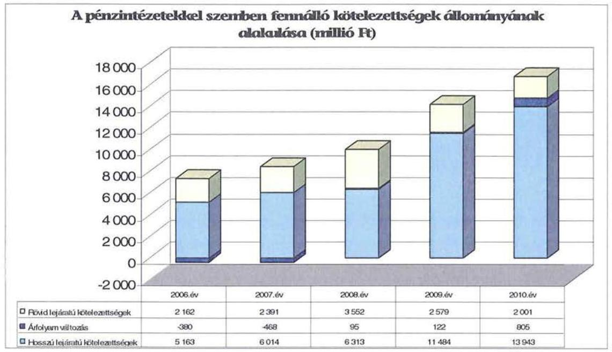

A kötelezettségek alakulását az árfolyamváltozás hatása is befolyásolja, azonban annak mértéke előre pontosan nem határozható meg. A számviteli nyilvántartásokban kimutatott, az aktuális árfolyamok alapján képzett árfolyam-különbözetek a tényleges tőketörlesztés időpontjában érvényes árfolyam függvényében nőhetnek, vagy csökkenhetnek.

Annak megítéléséről, hogy a devizában kibocsátott kötvényekért és felvett hitelekért kapott forinthoz képest a kötvények visszavásárlásakor, illetve a hitelek visszafizetésekor jelentkező forint kötelezettség többletkiadást (árfolyamveszteséget) vagy megtakarítást (árfolyamnyereséget) eredményez-e a futamidő végén, a teljes kötelezettség rendezését követően lehet képet alkotni. Mindaddig, amíg törlesztési kötelezettség nem áll fenn (türelmi idő, moratórium), a tőkére vonatkoztatva nem értelmezhető sem az árfolyamveszteség, sem az árfolyamnyereség. Ugyanakkor a számviteli szabályok meghatározzák, hogy az árfolyam különbözetet év végén a kötelezettségek vagy követelések között a könyvviteli mérlegben nyilván kell tartani, azonban az árfolyam különbözet valójában még nem realizálódott.

Az Önkormányzat deviza alapú kötelezettségei közül a 2007-2010. években - a vizsgált időszakot megelőzően keletkezett kötelezettségeket is számításba véve - két CHF alapú hosszúlejáratú hitelt törlesztett és három kötvényből vásárolt vissza a kibocsátáskori ütemezésnek megfelelően. A hitelek esetében árfolyamnyereséget és árfolyamveszteséget egyaránt realizáltak. A 2007-2010 közötti években a deviza alapú hitelek kiváltásra kerültek, ezért azokon 2009. április 27-ig - 4 millió Ft árfolyamnyereség és 113 millió Ft árfolyamveszteség egyenlegeként - 109 millió Ft volt az árfolyamveszteség. Három CHF alapú kötvény tőketörlesztése esetében csak árfolyamveszteséget realizált az Önkormányzat együttesen 21 millió Ft összegben.

---

A devizaalapú kötelezettségek adósságszolgálati terheit jelentősen befolyásolja a kamatszint, ami a kiváltott hitelek esetében is lényegesen alacsonyabb volt, mint a Ft alapú hitelek irányadó kamata. A referencia kamatok közötti különbséggel számolva az Önkormányzat számára az elszámolt árfolyamveszteség nem okozott többletkiadást ahhoz képest, ha ugyanez a kötelezettség forintban áll fenn, és a forint hitelekre jellemző magasabb kamatot fizet. (Természetesen számításunkban nem tudtuk figyelembe venni, hogy Ft alapú kötelezettségnél a referenciakamathoz viszonyítva milyen eltéréseket (kamatfelár, egyéb költség) rögzítettek volna a szerződésben.)

Az Önkormányzat pénzintézeti kötelezettségvállalásaira minden esetben közgyűlési döntés alapján került sor. A kötelezettségvállalásból származó források felhasználási céljait meghatározták. A három kötvénykibocsátás előkészítéseként készült előterjesztéshez csatolták a könyvvizsgáló véleményét, amely azt tartalmazta, hogy vizsgálták az adósságszolgálati korlát, valamint a teljes futamidőre a várható kamat-és tőketörlesztési kötelezettség alakulását, pénzügyi fedezetét, de a számítások nem képezték az előterjesztés részét.

A Közgyűlés döntéseit megalapozó előterjesztések nem tartalmazták a kötelezettségvállalás visszafizetési forrásainak, valamint - a teljes futamidőre a várható kamat- és tőkefizetési kötelezettségeinek a bemutatását. Az adósságot keletkeztető kötelezettségvállalás felső határán belül maradhat az Önkormányzat az elkövetkező években is, mert a 2010. év végén pénzintézetekkel szemben fennálló adósságtörlesztés időszakát 2033-ig hosszabbították meg a kötvénykibocsátással.

Az Önkormányzat hitel és kötvénykibocsátásból származó kötelezettségeit (várható kamat és egyéb költség nélkül) a futamidő teljes hosszára bemutatták, de a visszafizetések forrásait nem számolták, a költségvetésben a gördülő tervezés keretében nem mutatták be. A költségvetési helyzet és a finanszírozhatóság több alkalommal is Közgyűlés elé került. A munkába bevontak egy kockázatkezelő vállalkozást ${ }^{62}$ is. A 2008 novemberében tárgyalt előterjesztés három változatot is vizsgált. A megállapítás az volt, hogy a „szcenáriók adatainak elemzéséből levonható következtetés - feltételezve a működés színvonalának takarékos gazdálkodás melletti megtartását és a szükséges beruházási feladatok megvalósítását - hogy az Önkormányzat forrásbevonási igényét, ezáltal az adósságállóság szintjét döntően nem az egyes szcenáriókban feltételezett paraméterek alakulása, hanem az önkormányzatok állami költségvetési finanszírozása határozza meg". A szakmai vélemény szerint az Önkormányzat pénzügyi helyzetére nem a helyi döntések, hanem az állami költségvetés alakulása gyakorol jelentősebb hatást.

A Polgármester észrevétele szerint „a 2008. szeptember 25-ei közgyűlésen szerepelt „Előterjesztés Sopron Megyei Jogú Város Önkormányzatának 2008-2010. évi várható költségvetési helyzetéről, és a szükséges forráselvonásról" című előterjesztés, melynek mellékletét képezte a MATRISK Kockázatkezelő és Tanácsadó Kft. „Döntéstámogatás Sopron Megyei Jogú Város középtávú finanszírozási tervéhez" című tanulmánya, amely részletesen tartalmazta a hiányolt információkat." Az észrevétel nem megalapozott, mert a helyszíni vizsgálat idején áttekintettük a 2008. szeptember 25-én tárgyalt előterjesztést, annak elkészítésénél felhasznált tanácsadói anyagot és a könyvvizsgálói véleményt is. A jelentés megállapította, hogy a finanszírozásról közgyűlési döntés született, de kifogásolta, hogy a lejárat teljes időszakára és a visszafi-

[^0]
[^0]:    ${ }^{62}$ MatRisk Kockázatkezelő és Szolgáltató Kft-t.

---

zetés lehetséges forrásaira a döntés nem tért ki. Megállapításunkat továbbra is fenntartjuk, mert azokban a 2010. év utáni időszakra vonatkozó adatok nem szerepelnek, annak ellenére, hogy a határozati javaslat szerint kibocsátandó kötvény futamideje 25 év. Az elemzés elsősorban azt a célt szolgálta, hogy a forrásigény kielégítésére milyen konstrukciót válasszon az önkormányzat. Az előterjesztéshez csatolt könyvvizsgálói vélemény több következtetést is megfogalmazott, köztük az adósságállomány alakulásának félévenkénti elemzését. Az adósságállomány lejáratához igazodó, hosszú távú hatásvizsgálat, az adósság visszafizetését bemutató elemzés azonban a helyszíni ellenőrzés befejezéséig nem készült.

Az adósságot keletkeztető kötelezettségvállalással megvalósított felhalmozási kiadások esetleges bevételnövelő, illetve kiadáscsökkentő vonzatát azoknál a fejlesztéseknél vizsgálták, amelyek forrása részben pályázati pénzeszköz volt, azonban itt sem elemezték a vállalt kötelezettségek megtérülését.

Az Önkormányzat a 2007-ben kibocsátott kötvény bevételét teljes összegében az iparosított technológiájú lakóépületek (panelházak) felújításának önkormányzati önrészt biztosító hitelének kiváltására használta fel. A 2009. évben kibocsátott kötvény bevételeiből 1000 millió Ft-ot rövidlejáratú hitel törlesztésére, 1652 millió Ft-ot a számlavezető bank váltása miatt lejárttá tett fejlesztési hiteleinek törlesztésére, a fennmaradó 4348 millió Ft-ot fejlesztésre fordította. A 2010. évben kibocsátott kötvényből származó 3000 millió Ft-ból 1000 millió Ft-ot bírói letétben helyezett el, 307 millió Ft-ból fejlesztési hitelek esedékes adósságszolgálati kötelezettségét teljesítette, 1693 millió Ft-ból fejlesztési feladatait finanszírozta.

Az Önkormányzat mélygarázs építésére a kivitelező SPT Mélygarázs Kft-vel ráépítési jog és földhasználati jog alapításáról szerződést kötött. A megváltozott összetételű Közgyűlés döntése alapján e szerződés semmisségének megállapítása iránt indított eljárást az Önkormányzat, mint felperes. A perben a Legfelsőbb Bíróság Pfv.I.21.446/2008/12. számú ítéletében megállapította, hogy a földterület tulajdonosaként az Önkormányzat szerezte meg az épített mélygarázs tulajdonjogát, a gazdagodás mértékéről azonban - mivel ekkor az eredeti állapot helyreállítását az Önkormányzat mint felperes nem kérte - külön perben kell majd megállapítani. Az SPT Mélygarázs Kft. időközben felszámolás alá került, a Kft-n belül a tulajdonviszonyok rendezetlensége, a Kft. és a Sopronbank Burgenland Zrt. között létrejött engedményezés megtámadása miatt az Önkormányzat előtt nem volt egyértelmű, hogy a jogosulatlan gazdagodás miatti kifizetést kinek a részére kell teljesítenie. A jogosult személyének bizonytalansága miatt került sor a bírói letétbe helyezésre, a további esetleges költségek és kamatkiadások elkerülése érdekében.

Az Önkormányzat a működését nem volt képes saját bevételekből
 finanszírozni, ezért folyószámlahitelt vett igénybe. A szerződés szerint 2009. június 17-ig folyószámlahitelt maximum 2279 millió Ft összeghatárig vehetett igénybe, amit az előbbi dátumtól kezdődően 2800 millió Ft-ra emeltek. A ténylegesen igénybevett hitel átlagos állománya egy-egy évben 1359 millió és 2048 millió Ft között változott. Munkabér megelőlegezési hitelt az Önkormányzat nem vett igénybe.

---

A bemutatott hitelekből és kötvényekből történt törlesztéseket követően a 2010. december 31-én CHF-ben fennálló adósságot keletkeztető kötelezettségvállalások az alábbiak voltak:

| Megnevezés | Kibocsátás,   illetve | Összeg   CHF | Kibocsátási, vagy   lebivási árfolyam | Kamat (referencia   kamat+ kamatfelár) | Felhasználás célja: |
| :-- | :--: | :--: | :--: | :--: | :--: |
| Sopron 2026 kötvény | 2006. 07. 21 | 9879412 | 179,43 | 6 havi CHF LIBOR+0,85% | 2006. évi költségvetésben   meghatározott fejlesztések   finanszírozása |
| Sopron kötvény | 2006. 07. 28 | 6392434 | 178,45 | 6 havi CHF LIBOR+0,75% | Önkormányzati   beruházások |
| Sopron 2027 kötvény | 2007. 10. 03 | 2227378 | 151,07 | 6 havi CHF LIBOR+0,39% | Panel program hitelkiváltás |

Az Önkormányzat 2010. december 31-én forintban fennálló adósságot keletkeztető kötelezettségvállalásai a következők voltak:

| Megnevezés | Kibocsátás   időpontja | Összeg   millió Ft-ban | Kamat   (referencia   kamat+   kamatfelár) | Felhasználás célja: |
| :-- | :--: | :--: | :--: | :--: |
| Raiffeisen hitel (Sopron   hátulsó u. 10-12) | 2004. 04. 22 | 250 | 3 havi   BUBOR+0,25% | Mélygarázs építés |
| Raiffeisen hitel (Sopron   hátulsó u. 10-12) | 2004. 04. 22 | 1581 | 3 havi   EURIBOR+1,625% | Mélygarázs építés |
| Sopron 2033 kötvény | 2009. 01. 09 | 7000 | 6 havi   BUBOR+1,15% | Fejlesztések finanszírozása   és a bankváltás miatt   hitelek kiváltása |
| Sopron 2025 kötvény | 2010. 07. 22 | 3000 | 6 havi BUBOR+2,4% | Mélygarázs vételhez bírói   letét, fejlesztési hitelek,   kötvények törlesztése,   fejlesztés finanszírozása. |

Az egyes kötelezettségek bemutatásakor ismertetett célokra 2010. december 31-ig az Önkormányzat valamennyi forrást felhasználta.

A devizában fennálló pénzintézeti kötelezettségeiből 2007-2010 években 5907794 CHF (1088 millió Ft) tőkét törlesztett és 2537590 CHF (441 millió Ft) kamatot, valamint 153384 CHF (28 millió Ft) és 7 millió Ft egyéb költséget fizetett. A HUF-ban fennálló kötelezettségekből 1658 millió Ft tőkét, 1614 millió Ft kamatot és egyéb költség $^{63}$ címén 23 millió Ft-ot fizetett.

Az Önkormányzat 2007-2010. december 31. között az átmenetileg szabad pénzeszközein 967 millió Ft kamatbevételt realizált $^{64}$, melyből 342 millió Ft származott a kötvénybevételek befektetéséből, 465 millió Ft árfolyamnyereségből, amit a 2008-ban CHF-ben vezetett folyószámlahitelen realizált és 120 millió Ft az elkülönített bankszámlákon rendelkezésre állt forrás befektetéséből $^{65}$.

[^0]
[^0]:    $^{63}$ Szervezési díj, jegyzési garanciavállalási díj, folyamatos ügynöki díj.
    $^{64}$ Ebből a Polgármesteri hivatal 936 millió Ft-ot.
    $^{65}$ Lakásalap számla, parkoló alap számla, megszűnt víziközmű társulatok számláinak kamatbevételei.

---

A kötvénybevételek $^{66}$ befektetéséből származó kamatbevételt az Önkormányzat a kötvények kamatfizetésére $^{67}$ fordította.

Az Önkormányzat a vizsgált időszakban működését, pénzügyi egyensúlyát csak folyószámlahitel igénybevételével tudta biztosítani, amelyek alakulását az alábbi táblázat mutatja be:

|  |  |  |  |  | ezer Ft-ban |
| :--: | :--: | :--: | :--: | :--: | :--: |
| Megnevezés | 2007. év | 2008. év | 2009. év | 2010. év | 2011.   május 31. |
| I. Folyószámlahitel |  |  |  |  |  |
| a folyószámlahitel keretösszege január 1-jén | 2279000 | 2279000 | 2279000 | 2800000 | 2800000 |
| teljesített kamat és egyéb költség | 113073 | 105377 | 196997 | 144527 | 35478 |

A folyószámlahitel kondíciói és egyéb költségei a következők voltak $^{68}$:

| Megnevezés | Kamat (referencia+ kamatfelár) | Egyéb költség |
| :--: | :--: | :--: |
| Folyószámlahitel |  |  |
| 2007. év | 1 havi BUBOR +0,2% | 0,25% rend. tart. jutalék |
| 2008. év | 1 havi BUBOR +0,5% | 0,25% rend. tart. jutalék |
| 2008. 02. 28 | 3 havi CHF LIBOR +0,5% | 0,2% rend. tart. jutalék |
| 2008. 11. 15 | 3 havi BUBOR +2,5% | 0,5% rend. tart. jutalék |
| 2009. év | 3 havi BUBOR +2,5% | 0,5% rend. tart. jutalék |
| 2009. 06. 17 | 1 havi BUBOR +1,5% | 0,5% rend. tart. jutalék |
| 2010. év | 1 havi BUBOR +1,5% | 0,5% rend. tart. jutalék |
| 2011. év | 1 havi BUBOR +1,5% | 0,5% rend. tart. jutalék |

A 2007-2008. és a 2010. években az Önkormányzat az év minden napján igénybe vett folyószámlahitelt, a 2009. évben 317 napon keresztül állt fenn folyószámlahitel tartozása. Az átlagos napi állomány a 2007. évben volt a legalacsonyabb, 1359 millió Ft, és 2009-ben volt a legmagasabb, 2048 millió Ft. A 2010. december 31-i folyószámlahitel tartozás 1458 millió Ft volt. Az áttekintett időszakot jellemző működési hiány, a folyamatos likviditási problémák finanszírozása - a fejlesztésekhez felvett hitelek, kibocsátott kötvények kamataival együtt - 2007-től 2010. december 31-ig összesen 2641 millió Ft kamatkiadást okozott. Az Önkormányzat a folyószámlahitel mellett 2008. december 17. és 2009. január 15. között 1000 millió Ft rövidlejáratú hitelt vett igénybe, amelynek a kamata kilencmillió Ft volt, a kezelési költség egymillió Ft. A 2009. évben még egy alkalommal, május 20. és június 17. között 500 millió Ft likvidhitelt vett igénybe, amelynek kamata 2,3 millió Ft volt kezelési és egyéb költség nélkül.

[^0]
[^0]:    $^{66}$ Az Önkormányzat a Sopron 2025 Kötvény bevételének befektetéséből 26651 ezer Ft, a Sopron 2033 Kötvény bevételének befektetéséből 314657 ezer Ft, a Sopron Kötvény bevételének befektetéséből 24800 ezer Ft. A 2006. évben a Sopron 2026 Kötvény bevételének befektetéséből 17453 ezer Ft kamatbevételt számolt el.
    $^{67}$ A 2007-2010. közötti időszakban együttesen 1490 millió Ft kamatot fizetett az Önkormányzat a kibocsátott kötvények után.
    $^{68}$ A referencia kamat az alábbiak szerint alakult:

    | MNB BUBOR fixing (átlagkamat) %-ban |  |  |  |
    | :--: | :--: | :--: | :--: |
    | Referenciakamat | 2007. évi | 2008. évi | 2009. évi | 2010. évi |
    | 3 havi BUBOR | 7,75 | 8,87 | 8,64 | 5,5 |
    | 1 havi BUBOR | 7,83 | 8,75 | 8,66 | 5,74 |

---

Lízingkötelezettséget az Önkormányzat nem tartott nyilván. 25% feletti tulajdoni hányadú társaságai közül a kizárólagos önkormányzati tulajdonban lévő Sopron Holding lízingelt eszközöket, amelyeknek állománya 2007-ben 109 millió, 2010-ben 81 millió Ft volt.

Az Önkormányzatnál a jelenleg fennálló kötvények és a hitelek esetében a kamatfizetési kötelezettségek alakulását jelentősen befolyásolta és jelenleg is befolyásolja a kibocsátáskori és az utolsó kamatfizetéskor ismert referencia kamatok változása, melyet az alábbi táblázat mutat be:

| Megnevezés | Kibocsátási, lehívási | Utolsó fizetéskori | Változás % |
| :--: | :--: | :--: | :--: |
|  | alapkamat % |  |  |
| 6 havi CHF LIBOR (Sopron 2026) | 0,45 | 0,99 | 120,0% |
| 6 havi CHF LIBOR (Sopron) | 3,22 | 0,99 | -69,3% |
| 4 havi EURIBOR (Sopron 2027) | 3,26 | 0,63 | -80,7% |
| 6 havi BUBOR (Sopron 2033) | 9,88 | 6,64 | -32,8% |
| 6 havi EURIBOR (Sopron 2025) | 5,49 | 7,89 | 43,7% |

Az Önkormányzat 2011. évi utolsó kamatfizetési kötelezettsége a kötvények esetében március 30. volt.

A kamatváltozások hatását a deviza alapú kötelezettségeknél módosította a devizaárfolyam változása.

Az Önkormányzat 2011-2014. évekre szóló gazdasági programját - az Ötv-ben előírt időszak után - 2011. május 20-án fogadta el. A program szerint az elkövetkező négy évre jelentős hitelfelvétellel $^{69}$ nem számol, ugyanakkor a tőke- és kamatszolgálat biztosítását, a fejlesztési források önrészének kigazdálkodását, a közösségi tér legalább jelenlegi színvonalon történő működtetését tartja a legfontosabb célkitűzésének.

A program számol a működési területen elérhető megtakarításokkal, amelyeket beruházásokra kívánnak fordítani. A program bemutatja a hitel és kötvényállományt, tartalmazza az adósságszolgálati terheket a program idejére, de részletesen nem mutatja be az adósságszolgálat forrásösszetételét.

[^0]
[^0]:    $^{69}$ A Jegyző tájékoztatása alapján ezen azt értik, hogy a korábbi folyószámlahitel összegét meghaladó tartós kötelezettségvállalást nem terveznek, legfeljebb egy-egy beruházás támogatásának megelőlegezéséhez szükséges rövidlejáratú hitel felvételét.

---

# 3.2. Szállítók felé fennálló kötelezettségek alakulása 

Az Önkormányzat és gazdasági társaságai lejárt szállítói tartozásainak, és egyéb kiadás elmaradásainak alakulását az alábbi táblázat tartalmazza:

|  |  |  |  | ezer Ft-ban |
| :--: | :--: | :--: | :--: | :--: |
| Megnevezés | 2007. | 2008. | 2009. | 2010. |
|  | december 31. | december 31. | december 31. | december 31. |
| Lejárt szállítói tartozás | 63796 | 327690 | 729967 | 800709 |
| Gazdasági társaságok | 257335 | 333547 | 395793 | 367420 |
| Egyéb kiadás elmaradás | - | 754 | 2005 | 1722 |
| Tartozásállomány | 321131 | 661991 | 1127765 | 1169851 |

Az Önkormányzat 2010. december 31-i mérlegben kimutatott szállítói kötelezettség 1219 millió Ft volt. A le nem járt tartozásállomány ennek mindössze 34,3%-a, 419 millió Ft volt, amelynek 57,0%-a (239 millió Ft) a Polgármesteri hivatal tartozása volt. Az Önkormányzatnál a 2010. év végén kimutatott szállítói kötelezettségre fedezetet a mérlegben kimutatott 1170 millió Ft követelésállomány nyújtott.

Az Önkormányzat lejárt szállítói tartozása és egyéb kiadás elmaradása 2007-ről 2010-re 12,5 szeresére, 64 millió Ft-ról 803 millió Ft-ra növekedett.

Az Önkormányzat 2011. március 31-i lejárt szállítói tartozásállományából 256 millió Ft (az állomány 62,2%-a) meghaladta a 31 napot, ebből 186 millió Ft (a lejárt állomány 45,1%-a) 91 napon túli volt. A szállítók felé fennálló tartozásállományból ebben az időpontban 183 millió Ft-ot tett ki az átütemezett tartozások összege. Az Önkormányzat intézményeinél és a Polgármesteri hivatalnál a 2007-2010. évben a folyamatosan növekvő lejárt szállítói tartozások miatt
 a helyi önkormányzatok adósságrendezési eljárásáról szóló 1996. évi XXV. törvény 5. § (2) bekezdésében foglaltak ellenére - a Polgármester nem kezdeményezett adósságrendezési eljárást.

A Polgármester észrevétele szerint „a polgármesternek akkor kell tájékoztatnia a pénzügyi bizottságot, illetve összehívnia a közgyűlést a fizetési kötelezettség rendezése vagy adósságrendezési eljárás megindítása céljából, ha a fenti törvény 4. § (2) bekezdés a)-d) pontjában foglalt helyzet áll fenn. Önkormányzatunk esetében azonban nem állnak fenn ezek a feltételek, mivel a teljesített szerződések esetében csak a garanciális visszatartás összege nem került kifizetésre a vállalkozási dijból, amely még emiatt nem vált esedékessé, az önkormányzat saját társaságaival szemben fennállt tartozások minden esetben szóbeli megállapodással átütemezésre kerültek, ezen felül pedig csak a vitatott követelések teljesítésére nem került sor, elismert tartozást mindig időre fizettük." Az észrevétel nem megalapozott, mert az Áht. 100/C. § (3) bekezdésének előírása szerint az államháztartás szervezetei kötelezettséget csak írásban vállalhatnak, a szállításra vonatkozó szerződések kötelezettségvállalásnak minősülnek, azért azok csak írásban módosíthatók. Tekintettel arra, hogy a fizetési határidőre vonatkozó rendelkezések a szerződés részét képezik, ezért értelemszerűen az írásbeliség annak módosításakor is kötelező.

Egyéb kiadás elmaradás 2008-tól fordult elő, összege nem haladta meg a 2 millió Ft-ot, ami késedelmi kamattartozásból származott.

---

A gazdasági társaságok 2010. december 31-én 1835 millió Ft szállítói tartozással rendelkeztek, melyből 367 millió Ft volt a lejárt tartozás. Az Önkormányzat 75%-nál magasabb tulajdoni hányadú gazdasági társaságainak szállítói állománya - azonos mérési időpontban - 1266 millió Ft, amelyből a lejárt szállítói tartozásállomány 324 millió Ft.

Az Önkormányzat határidőn belül nem teljesített kötelezettségei és kezességvállalásai kockázatot jelentenek, mert adósságrendezési eljárásban - a követelés tulajdonosának kezdeményezésére - az Önkormányzat korlátlan felelősségét állapíthatja meg a bíróság a Gt. 54. § (2) bekezdése alapján, amennyiben minősített befolyásszerzőnek ${ }^{70}$ minősül.

A Polgármesteri hivatal és Kórház ${ }^{71}$ nélküli intézmények lejárt szállítói tartozásait szemlélteti a következő grafikon:
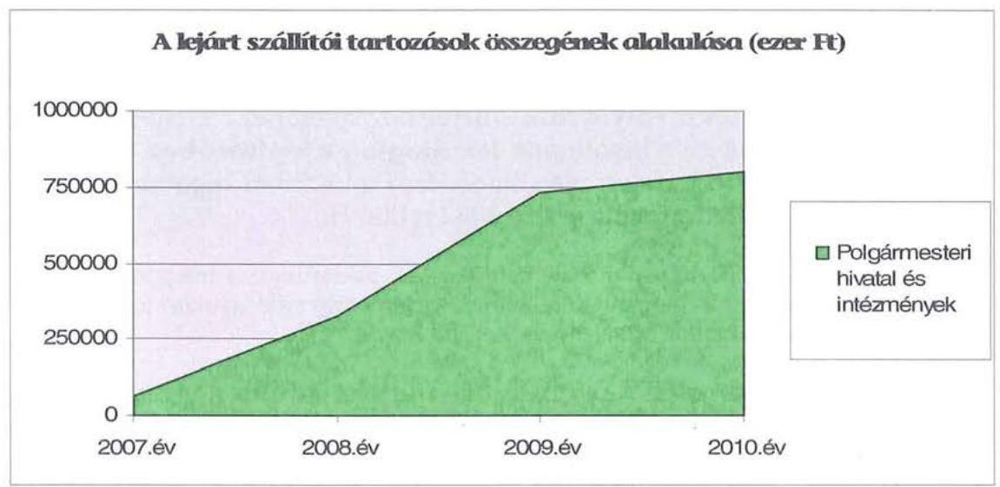

# 3.3. Egyéb kötelezettségek alakulása 

Az Önkormányzat a 2007-2011. I. negyedévében PPP konstrukció keretében nem végzett beruházást.

Az Önkormányzat intézményei és a 25%-ot meghaladó tulajdoni hányadú gazdasági társaságai részére készfizető kezességet vállalt folyószámla- és egyéb hitelek igénybevételéhez. A vizsgálat időszakában 2754 millió Ft tartozásállományra vállalt kezességet az Önkormányzat. Az összes kezességvállalás 54,1%-a (1490 millió Ft) a Sopron Holding hitelfelvételeihez és kötvénykibocsátásához kapcsolódott, amely gazdasági társaság az Önkormányzat kizárólagos tulajdonában lévő gazdasági társaság. Jelentős összegű még az intézményi

[^0]
[^0]:    ${ }^{70}$ A Gt. 52. § (2) bekezdése alapján minősített többséget biztosító befolyásnak számít, ha a minősített befolyásszerző az ellenőrzött társaságban - közvetlenül vagy közvetve - a szavazatok legalább hetvenöt százalékával rendelkezik.
    ${ }^{71}$ A Kórház 2007-2010. évi mérlegeiben kimutatott kötelezettségeiben nem szerepelt határidőre ki nem fizetett, szállítók felé fennálló kötelezettség.

---

energia racionalizációhoz ${ }^{72}$ kapcsolódó 675 millió Ft összegre szóló kezességvállalás. A kezességvállalás beváltására 2007-2010. években nem került sor. Az eredeti kötelezettség megszűnése miatt 2010. december 31-ig a kezességvállalás összege 1535 millió Ft-ra csökkent, amelyből 675 millió Ft az önkormányzati intézmények, 860 millió Ft az önkormányzati tulajdoni hányaddal működő gazdasági társaságok kötelezettségeihez kapcsolódott.

Az Önkormányzat 2007-2010 között egy 80%-os tulajdoni hányadú gazdasági társaság részére 3 alkalommal összesen 13 millió Ft-ot adott át visszafizetési kötelezettséggel. Ebből 10 millió Ft összegben a felhalmozási célú projektekhez, egy esetben működésre 3 millió Ft-ot, amelyeknek visszafizetésére még nem került sor.

A vizsgált időszakban a Közgyűlés követelés elengedésről nem döntött. A behajthatatlan követelések leírása előtt a pénzügyi bizottság előterjesztést tárgyal meg, amelyben bemutatják a követelés történetét, a behajtásra tett intézkedéseket, azok eredménytelenségének okait.

A Közgyűlés a folyószámlahitel megkötéséhez 26, fejlesztési hitelek biztosítékaként 3 db ingatlanon jelzálogjog alapításához és bejegyzéséhez járult hozzá. A jelzálog megállapodásokkal érintett ingatlanok számviteli nyilvántartás szerinti nettó értéke 3032 millió Ft.

Az Önkormányzat üzlethelyiségeket, raktárakat, a mélygarázst, lakóházakat és más a törzsvagyon körébe nem tartozó vagyontárgyakon járult hozzá jelzálogjog alapításához és bejegyzéséhez.

Az összes forgalomképes ingatlan vagyonnyilvántartás szerinti értéke a 2010. év végén 13756 millió Ft volt, melyből a jelzáloggal terhelt ingatlanok 3032 millió Ft-os (22%-os) értéket képviseltek.

[^0]
[^0]:    ${ }^{72}$ Az Önkormányzat intézményeinél energia csökkentést célzó beruházásokat és szolgáltatásként energiaracionalizáló eljárásokat végzett egy vállalkozás, amelynek költségeit a megtakarításból kell finanszírozni, amire az Önkormányzat vállalt kezességet.

---

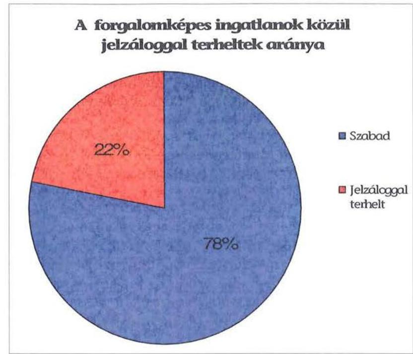

Az Önkormányzat a meglévő értékes ingatlanait bérbeadással hasznosította, azok tulajdonjogának megtartása mellett.

Az Önkormányzat pénzügyi helyzetére a most ismert, pénzintézetekkel szemben fennálló kötelezettségek 2033-ig hatást gyakorolnak. A kötelezettségállomány jelentősebb része HUF-ban keletkezett, amelyre az árfolyamváltozások közvetlen hatást nem gyakorolnak.

Az Önkormányzat kötelezettségeinek állománya 2010. december 31-én és várható alakulása a kötelezettségek lejáratáig

| Megnevezés | Állomány 2010. dec. 31-én |  |  | Várható kötelezettség 2011-2013.   években |  |  | Várható kötelezettség 2014-től a   feloldó végéig |  |  |
| :--: | :--: | :--: | :--: | :--: | :--: | :--: | :--: | :--: | :--: |
|  | $\begin{aligned} & \text { HUF-ban (ezer Ft } \\ & \text { ban) } \end{aligned}$ | Devizában   (bruttó) | Devizában | HUF-ban (ezer   Ft ban) |  |  |  |  |  |
| Hosszú lejáratú hitelek | 1496895 |  |  | 428373 |  |  | HUF | 1332396 |  | HUF |
| Kötvények Ft alapú | 10000000 |  |  | 2850629 |  |  | HUF | 16277826 |  | HUF |
| Kötvények devizában |  | 17040882 | CHF |  |  | 3620586 | CHF |  | 14804523 | CHF |
| Folyószámlahitelek | 1438060 |  | HUF | 1438060 |  |  |  |  |  |  |
| Kezesség | 1332 |  | HUF |  |  |  |  |  |  |  |
| Szállítói tartozás összege | 1219433 |  | HUF | 1219433 |  |  |  |  |  |  |
| ebből lejárt tartozás | 800709 |  | HUF | 800709 |  |  |  |  |  |  |
| Összesen HUF-ban | 14174388 |  | HUF | 4956585 |  |  | HUF | 17610422 |  | HUF |
| Összesen CHF-ban |  | 17040882 | CHF |  |  | 3620586 | CHF |  | 14804523 | CHF |

Az Önkormányzat pénzügyi, vagyoni helyzetére közvetetten hatást gyakorol gazdasági társaságainak adósságállománya is. A gazdasági társaságok adatszolgáltatása alapján hitelfelvételből és kötvénykibocsátásból származó kötelezettségállományát a 2010. december 31-i állapot szerint és annak várható alakulását a kötelezettségek lejáratáig a következő táblázatban mutatjuk be:

A gazdasági társaságok hosszú lejáratú kötelezettségeinek állománya 2010. december 31-én és várható alakulása a kötelezettségek lejáratáig

| Megnevezés | Állomány 2010. dec. 31-én |  |  | Várható kötelezettség 2011-2013.   években (ezer Ft ban) |  |  | Várható kötelezettség 2014-től a   években (ezer   Ft ban) |  |  | Várható kötelezettség 2014-től a   években (ezer   Ft ban) |  |
| :--: | :--: | :--: | :--: | :--: | :--: | :--: | :--: | :--: | :--: | :--: | :--: |
|  | HUF-ban (ezer Ft   ban) |  |  |  |  |  |  |  |  |  |  |
|  |  |  |  |  |  |  |  |  |  |  |  |
| MI Kötvény Ft | 512860 |  |  | 282928 |  |  |  | 445037 |  |  |  |
| Szabereport | 60000 |  |  | 60000 |  |  |  |  |  |  |  |
| Szabereport | 40000 |  |  | 24000 |  |  |  | 16000 |  |  |  |
| Összesen: HUF-ban | 612860 |  |  | 366928 |  |  |  | 461037 |  |  |  |

---

A 2010. december 31-én fennálló 613 millió Ft-os hosszú lejáratú kötelezettség állományból legjelentősebb az Önkormányzat kizárólagos tulajdonában lévő Sopron Holding 2009 novemberében kibocsátott 600 millió Ft összegű kötvénye, amelyből több korábbi hitelt váltott ki 503 millió Ft értékben, a fennmaradó összeget gépparkjának fejlesztésére fordította. A kötvények teljes visszavásárlására, a kibocsátási szerződés ütemezése szerint a 2019. év végéig kerül sor.

Az Önkormányzat intézményei energiafelhasználásának racionalizálásához és gazdasági társaságai hitelfelvételéhez 2007-2010 között 2754 millió Ft értékben vállalt kezességet, amelyből 2010. december 31-én 1535 millió Ft összegű kezesség volt érvényben.

A vizsgált időszakban nem történt meg annak felmérése, hogy az eszközök elhasználódásának pótlása mekkora forrásokat igényel az Önkormányzatnál. A felújításokra, az eszközök pótlására az Önkormányzat pénzügyi lehetőségének függvényében, elsősorban az intézmények működőképességének biztosítása, illetve a szakhatósági előírások figyelembevételével került sor, de a nagyszámú belvárosi ingatlan a műemléki védelem miatt jelentős ráfordítást igényelt.

Az Önkormányzat a 2007-2010. években a tárgyi eszközök után 5916 millió Ft összegű értékcsökkenést számolt el, ugyanakkor felújításra ennek az összegnek a 65,2%-át (3857 millió Ft-ot) fordították. Az elhasználódott eszközök pótlására az Önkormányzat tartalékot nem képzett, külön alapot nem hozott létre.

Az eszközök avultsága növekedett, mivel az önkormányzati szintű használhatósági fok mutató aránya négy év alatt három százalékponttal, 78%-ról 75%-ra csökkent az egyes eszközcsoportoknál különböző mértékkel elszámolt amortizáció elsődleges hatására. Legjobban elhasználódtak a gépek, berendezések (24%-ról 15%-ra csökkent), ezt követik a járművek (32%-ról 30%-ra csökkent), az ingatlanok elhasználódása 89%-ról 85%-ra csökkent. Az üzemeltetésre átadott eszközök elhasználódása csökkent, 75%-ról 76%-ra emelkedett használhatósági fokuk.

Az Önkormányzat és intézményei a vizsgálat időpontjában a jogerős határozattal nem lezárt peres eljárásokban 559 millió Ft perértékben voltak érintettek alperesként, amelyből 142 millió Ft hét kórházi perhez kapcsolódott. Államigazgatási jogkörben okozott kár ${ }^{73}$ címén 219 millió Ft megfizetéséért perelték az Önkormányzatot. Ebben az ügyben a Legfelsőbb Bíróság új eljárásra kötelezte az első fokú bíróságot.

Egy 185 millió Ft összegű kártérítési
 perben az első fokú eljárás az Önkormányzat pernyertességével zárult, de fellebbezés miatt az ítélőtábla döntésére várnak. Felperesként 552 millió Ft összegben érintett az Önkormányzat, amelyből 326 millió Ft szerződés érvénytelenítésének megállapításához kapcsolódik, az eljárás első fokon bizonyítási szakban van. 163 millió Ft értékben jogalap

[^0]
[^0]:    ${ }^{73}$ Építési engedély visszavonására került sor, mert a kivitelezés során eltértek az engedélyben foglalt előírásoktól.

---

nélküli gazdagodás miatt folyik peres eljárás első fokon. További, még folyamatban lévő, értékben nem meghatározható peres ügyben 9 esetben alperesként, 3 esetben felperesként érintett az Önkormányzat. A kórházi perek esetében járadékigényt is bejelentettek, amelynek összege nem ismert. Egy védjegyügyben indított perben ellenérdekű félként érintett az Önkormányzat, ahol perérték nem szerepel.

Jogerős határozattal lezárt, de nem teljesített fizetési kötelezettsége 2,5 millió Ft összegben keletkezett az Önkormányzatnak, és 22 millió Ft összegben van követelése, ebből 20 millió Ft a perköltség.

# 4. A PÉNZÜGYI EGYENSÚLY MEGTEREMTÉSE ÉRDEKÉBEN HOZOTT INTÉZKEDÉSEK 

A jelentésben szereplő CLF módszer szerinti költségvetési támogatás 2007. évi értékéhez viszonyított 2008-2010. évi összesített növekménye ellensúlyozta a CLF módszer szerint kimutatott átengedett bevételek, illetve illetékbevételek 2007. évi értékéhez viszonyított 2008-2010. évi értékeinek összesített csökkenését. ${ }^{74}$

A költségvetési támogatások 2007. évi értékéhez képest a 2008-2010. évek elemi beszámolójának 16. úrlapjai szerint az Önkormányzat jelentős növekményt mutatott ki a normatív hozzájárulások soron (2336 millió Ft), a normatív kötött felhasználású támogatások soron (1130 millió Ft), az egyéb központi támogatás soron (398 millió Ft). A normatívák növekedését az intézményrendszer költségvetési törvényekhez igazodó intézményszervezetet és feladatot érintő szervezeti változások végrehajtása eredményezte.

A Családsegítő Intézetet Szociális Szolgáltató Intézménnyé alakították és a házi segítségnyújtás szolgáltatással kiegészítették. A feladatok bővülése között szerepelt a Kozmutza Flóra Gyógypedagógiai Módszertani Intézmény fejlesztő iskolai oktatása. Az Önkormányzat gesztorságával működtették a 2007. évben megszűnő Gyermekjóléti Központ helyett a Sopron és Környéke Gyermekjóléti Szolgálat és Családsegítő Szolgáltató Központot, amely - társulásos feladatellátása - a vizsgált időszakban kibővült a gyermekek átmeneti otthona, továbbá a gyermekvédelmi szakellátás szolgáltatásával.

Az országosan tapasztalható gyerekszám-csökkenés miatti állami normatív hozzájárulás csökkenése Sopronban nem volt tapasztalható. A gyereklétszám-csökkenéssel veszélyeztetett intézmények tagintézmény-rendszerben összevonásra kerültek, így a Fenyő Téri Általános Iskola a Brennbergi Általános Iskola tagiskolájaként, a Középiskolai Kollégium a Soproni Idegenforgalmi, Kereskedelmi Vendéglátó Szakközépiskola tagintézményeként működött. A Zöld Ág Bölcsődében két ütemben, a Kőműves Közi Bölcsődében és a Halász utcai óvodában férőhely-bővítést végeztek.

[^0]
[^0]:    ${ }^{74}$ A költségvetési támogatás 2007. évi értékéhez képest a 2008-2010. évek költségvetési támogatásai összege 3094 millió Ft-tal nőtt, míg az átengedett bevételek 2007. évi értékéhez képest a 2008-2010. évek átengedett bevételeinek értéke összesen 2802 millió Ft-tal, illetékbevételek a 2008-2010. évek viszonylatában a 2007. évi értékéhez pedig 102 millió Ft-tal csökkentek.

---

Annak ellenére, hogy a 2007-2010. években költségvetési támogatások és az átengedett bevételek, illetve illetékek tekintetében a finanszírozási rendszer változása az Önkormányzatnál forráscsökkenést nem okozott, az Önkormányzat az előző években elkezdett kiadási megtakarítást és bevételnövelő intézkedéseket folytatta azért, hogy pénzügyi helyzetét javítsa.

A kiadáscsökkentő és bevételnövelő intézkedések megtétele a gazdálkodás átláthatóbbá tételét, valamint a feladatellátás szakmai színvonalának, a pénzügyi helyzetnek a javítását célozták.

A 2007-2010. években az intézményátszervezések, a feladatváltozások, valamint a takarékossági intézkedések hatásaként együttesen 388 millió Ft összegű kiadáscsökkenést mutattak ki, melynek 85%-a, 331 millió Ft kapcsolódott létszám- és megüresedett álláshely-csökkentésekhez, feladatátszervezésekhez, helyettesítésekhez és képviselői tiszteletdíjak összességének csökkenéséhez.

A 2007-2010. évek kiadáscsökkentő intézkedéseinek hatását beavatkozási területenként a következő táblázat tartalmazza (adatai millió Ft-ban szerepelnek):

| Az érvényesített kiadás-   csökkentés térületei | Személyi   juttatások   és járulékai | Dologi,   működési   kiadások | Pénzeszköz   átadások,   támogatások | Összesen |
| :-- | :--: | :--: | :--: | --: |
| A Közgyűlés működése | 8 |  |  | 8 |
| A Hivatalnál | 48 | 2 |  | 50 |
| Az intézményeknél | 273 | 57 |  | 330 |
| Összesen | $\mathbf{3 2 9}$ | $\mathbf{5 9}$ | $\mathbf{0}$ | $\mathbf{3 8 8}$ |

A feladatmegszüntetéssel, átszervezéssel járó létszámcsökkentés az intézményeknél 273 millió Ft megtakarítást eredményezett a személyi juttatások és járulékaik, továbbá 57 millió Ft kiadáscsökkenést idézett elő a dologi kiadások terén.

A 2007. június 30-ával a Szociális Foglalkoztató átalakult KHT-vé, ezzel együtt 9 fő további foglalkoztatását biztosították és egy fő álláshely megszüntetésre került. A Közgyűlés a közoktatási álláshelyek számát 2007. szeptember 1-től 50 fővel csökkentette ${ }^{75}$, ebből négy betöltött álláshely megszüntetésre került. Az összesen 5 fő költségeinek megtérítése érdekében a Közgyűlés támogatás-igényléséről döntött ${ }^{76}$. A létszámleépítés a 2007-2010. években a személyi kiadások/juttatások és járulékai kifizetések keretében az Önkormányzat kimutatása szerint 33 millió Ft megtakarítást eredményezett. A Közgyűlés 2009. március 1-től 31 betöltetlen üres álláshely megszüntetéséről ${ }^{77}$

[^0]
[^0]:    ${ }^{75}$ 44/2007. (III. 29.) és a 205/2007. (VI. 28.) számú határozatok
    ${ }^{76}$ 239/2007. (IX. 27.) számú határozat
    ${ }^{77}$ A 25/2009. (II. 26.) számú határozat értelmében a döntés a következő intézményeket érintette: Egyesített Szociális Intézmény, Szociális Szolgáltató Intézmény, Napszak Integrált Intézmény, Egyesített Bölcsődék, Handler Nándor Szakképző Iskola, Soproni Idegenforgalmi, Kereskedelmi és Vendéglátó Szakképző Iskola és Kollégium, Vas- és Villamosipari Szakképző Iskola és Gimnázium, Széchenyi István Városi Könyvtár.

---

döntött, amely döntést követően a 2007-2010. évek időszakában 65 millió Ft, a 2011. év első negyedévében 8 millió Ft kiadáscsökkenést eredményezett a személyi juttatások és a járulékaik terén.

A Közgyűlés a Fenyő Téri Általános Iskola a Brennbergi Általános Iskola tagiskolájaként történő további működtetését határozta el ${ }^{78}$, amelynek következményeként a vezetők száma csökkent és 2007. évben négy üres álláshely szűnt meg. Ez az intézkedés az Önkormányzat kimutatása szerint a 2007-2010. évekre vonatkozóan 132 millió Ft személyi és járulékai, továbbá 42 millió Ft dologi kiadáscsökkenést jelentett, majd a 2011. év első negyedévére vonatkozóan 9 millió Ft személyi és járulékai, továbbá 3 millió Ft dologi kiadáscsökkenést mutattak ki.

A Közgyűlés a Soproni Idegenforgalmi, Kereskedelmi Vendéglátó Szakközépiskola és a Középiskolai Kollégium összevonását kezdeményezte ${ }^{79}$. Az intézmény-átalakításnak elsősorban szakmai okai voltak, de a 2010. évig üres álláshelyeket nem töltöttek be, illetve a vezetők száma csökkent. Az átszervezéssel a 2008-2010. években 43 millió Ft személyi juttatások és járulékai kiadáscsökkenést eredményezett az Önkormányzat nyilvántartásai szerint.

A Közgyűlés az Egészségügyi Alapellátási Igazgatóságát megszüntette ${ }^{80}$, minden feladatát a Polgármesteri Hivatal vette át a dolgozók további foglalkoztatásával együtt. A döntés előterjesztésében évi 5-10 millió Ft megtakarítással terveztek évente, amely a döntést követő időszakban a dologi kiadások terén a 2007-2010. években 15 millió Ft, a 2011. év első negyedévében egymillió Ft dologi megtakarítást mutattak ki.

A Közgyűlés megszüntette ${ }^{81}$ az Intézményi Gondnokságot, amely ellátta az óvodák, az Egészségügyi Alapellátási Központ és a Gyermekjóléti Szolgáltatási Központ pénzügyi-számviteli humán erőforrással kapcsolatos feladatait. Az intézmény megszüntetésével együtt létrehozták az Intézmények Gazdasági Szolgálatát, amely ellátta az összes intézmény személyi és pénzügyi-számviteli feladatait. A döntés előterjesztésében 20 fő létszámcsökkentéssel számoltak, de ez átalakítás az Önkormányzat szempontjából inkább feladat-ellátási szakmai előnyöket jelentett.

A Közgyűlés a Gyermekjóléti Központ intézményét feladataival együtt integrálta ${ }^{82}$ a Sopron és Környéke Gyermekjóléti szolgálat és Családsegítő Központba, amelyet kistérségi társulásban gesztorként üzemeltettek. (Ez az intézmény a 2010. évtől a gyermekek átmeneti otthona és a gyermekvédelmi szakellátás szociális feladatot látta el.)

[^0]
[^0]:    ${ }^{78}$ 187/2007. (VI. 28.) számú határozat
    ${ }^{79}$ 133/2008. (V. 26.) és a 204-206/2008. (VI. 26.) számú határozatok
    ${ }^{80}$ 312/2007. (XI. 29.) számú határozat
    ${ }^{81}$ 134-137/2008. (V. 29.) számú határozat
    ${ }^{82}$ 6-7/2007. (I. 25.) számú határozat

---

A Közgyűlés létrehozta ${ }^{83}$ a Pedagógiai Szakszolgálati Központot, amely intézmény az iskoláktól 7 fő munkavállalót vett át, így intézményi szinten ez a döntés pénzügyi szempontból előnyökkel nem járt.

A további intézkedések összesen 58 millió Ft kiadás-megtakarítást eredményeztek.

A GYES-en, GYED-en lévő alkalmazottak helyettesítésével, illetve feladataiknak átszervezésével a vizsgált időszakban 48 millió Ft összegű megtakarítást mutattak ki a Polgármesteri hivatalnál.

A Közgyűlés alpolgármesteri megbízatásról szóló lemondás elfogadásáról döntött ${ }^{84}$, illetve ezzel összefüggő képviselő-választásokról. Ezt követően 2010. októberében a képviselők száma 26 főről 18 főre, a nem képviselő bizottsági tagok száma 18 főről 12 főre csökkent. A tiszteletdíjak és járulékaik, valamint az ehhez kapcsolódó költségtérítés általány csökkenése a 2007-2010. évek időszakában nyolc millió Ft, a 2011. év I. negyedévében további négy millió Ft kiadáscsökkenést eredményezett.

Jegyzői utasítások és intézkedések ${ }^{85}$ eredményeként 30 féle folyóirat és CD megrendelésének lemondása történt meg, amelynek hatására a 2010. évben 2 millió Ft, a 2011. év első negyedévében 1 millió Ft kiadáscsökkenést mutattak ki.

A végrehajtott megtakarítási intézkedésekből 8 millió Ft kiadáscsökkentést a Közgyűlésnél (2,1%), 50 millió Ft kiadáscsökkentést a Polgármesteri hivatalnál (13%) és 330 millió Ft kiadáscsökkentést az intézményeknél (84,9%) mutattak ki. A Polgármesteri hivatalnál a helyettesítések és a feladatátszervezések következtében 48 millió Ft összegű (a Polgármesteri hivatal kiadás-csökkentésének a 95,5%-a) kiadáscsökkentést mutattak ki, míg létszámcsökkentés, a költségvetésben bérrel és járulékkal tervezett üres álláshelyek megszüntetése az intézményeknél 273 millió Ft összegű (az intézmények kiadás-csökkentésének 82,7%-a) kiadás-csökkenést eredményezett.

Az Önkormányzatnál 2007. január 1-én az engedélyezett álláshelyek száma 3109 fő volt. Az álláshely-csökkentő intézkedések következtében 2007-2010. év végére a Polgármesteri hivatalnál és az intézményeinél összesen 105 álláshelyet, ebből 14 szakmai üres álláshelyet szüntettek meg. A vizsgált időszakban 5 betöltött álláshely leépítéssel tartós megszüntetésre került. Az átszervezések hatására - amely létszámleépítést, üres álláshelyek megszüntetését, továbbá a feladatbővülésekkel együtt járó létszámemelkedést is tartalmazott - a 2010. decemberi záró létszám 3070 főre változott.

Az átszervezés következtében az Önkormányzat másik intézményénél, vagy a Polgármesteri hivatalnál továbbfoglalkoztatásra kerülő közalkalmazottak, vagy köztisztviselők nem szerepelnek az 5 fő leépített létszámban.

[^0]
[^0]:    ${ }^{83}$ 221/2010. (VIII. 26.) számú határozat
    ${ }^{84}$ 126/2009. (IV. 30.) számú határozat
    ${ }^{85}$ Ikt.szám: 40467/2010.

---

Az álláshely-csökkenés ágazatonkénti megoszlását az alábbi táblázat szemlélteti (az adatok álláshely-számban szerepelnek):

| Megnevezés (adatok fő-ben) |  | Közoktatás | Szociális és gyermekvédelem | Egészségügy |

 | Polgár-   mesteri   hivatal | Egyéb | Össze-   sen |
| :-- | :-- | :-- | :-- | :-- | :-- | :-- | :-- |
| Megszüntetett álláshelyek száma | 81 | 24 |  |  |  | 105 |  |
| ebből: | üres álláshelyek száma | 77 | 14 |  |  |  | 91 |
|  | szakmai álláshelyek száma | 4 | 10 |  |  |  | 14 |
|  | intézmény-üzemeltetéssel kapcsolatos   álláshelyek száma |  |  |  |  |  |  |
| 2007. január 1-jén indító létszám | 1150 | 500 | 1019 | 237 | 203 | 3109 |  |
| 2010. december 31-én záró létszám | 1043 | 454 | 1025 | 306 | 242 | 3070 |  |

A helyi szervezési intézkedések végrehajtásához az Önkormányzat az áttekintett időszak alatt 6 millió Ft központi költségvetési támogatásban részesült.

Az Önkormányzatnál 2011. első negyedévében folytatódtak a megtakarítási intézkedések, amelynek hatására 163 millió Ft kiadáscsökkentést mutattak ki, ebből 122 millió Ft összegű megtakarítást a 2011. évi költségvetési rendelet ${ }^{86}$ előírása szerint az intézmények önkormányzati támogatásának csökkentésével értek el. Összesen 5 millió Ft (az összes kiadáscsökkentés 3,2%-a) dologi, működési kiadás csökkentése, 158 millió Ft (az összes kiadáscsökkentés 96,8%-a) személyi juttatásokat érintő kiadás csökkentése volt.

A kiadáscsökkentő intézkedések mellett az Önkormányzat az alábbi ábrában számszerűsített - jelentősebb - bevételnövelő intézkedéseket tette (az adatokat millió Ft-ban tüntettük fel):
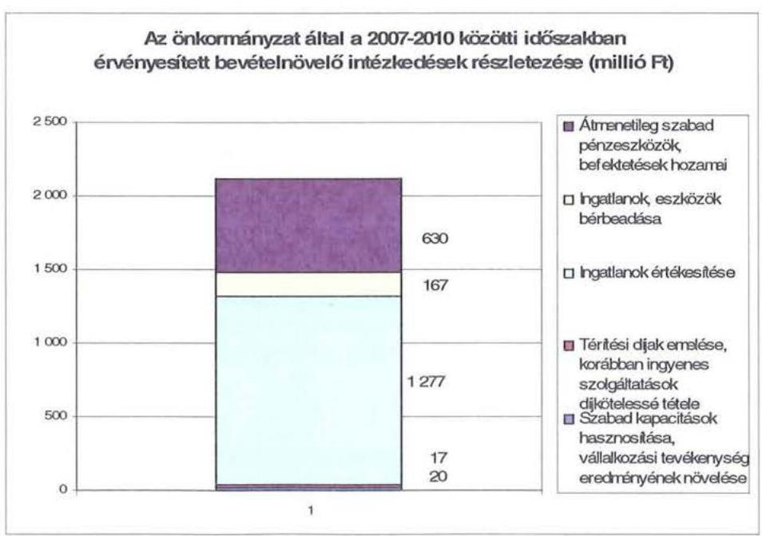

[^0]
[^0]:    ${ }^{86}$ 6/2011 (II. 28.) számú önkormányzati rendelet

---

A 2007-2010. évek időszakában realizált 2111 millió Ft-os bevételnövelésre irányuló intézkedésekből 167 millió Ft-ot (7,9%) ingatlanok, eszközök bérbeadásából ${ }^{87}$ realizálták.

A Közgyűlésnél kimutatott 152 millió Ft a Vízmű bérleti díjának emelkedéséből adódott, míg az intézmények a csökkenő állami és önkormányzati támogatás ellensúlyozására helyiségeiket adták ki mindösszesen 14 millió Ft értékben.

Az intézmények bérleti díjak mellett lehetőségeiktől függően szabad kapacitásaikat kihasználva a 2007-2010. évek időszakában 20 millió Ft összegű bevételt (0,9%) értek el.

A bevételnövelő szolgáltatások között a jelentősebbek a „zöld kártya" készítés, a lépcsőházfestés, az IGSZ könyvviteli szolgáltatása, továbbá tanfolyam és konferenciák szervezései, illetve a külsős étkezési díjak bevételei voltak.

A Közgyűlés a működés szempontjából feleslegessé vált ingatlanjaiból 1277 millió Ft értékben (60,6%) a 2007-2010. években, illetve a 2011. év első negyedévében 185 millió Ft összegben a döntést követően ${ }^{88}$ értékesítette.

Az értékesített ingatlanok között önkormányzati lakások, garázsok, külterületi földek, belterületi ingatlanok szerepeltek.

Az önkormányzati intézmények közül a bölcsődéknél jelentkezett a térítési díj emeléséből és a férőhelyszám emelkedéséből származó 2007. évi bevételekhez viszonyított 17 millió Ft összegű (0,8%) bevétel növekedés.

Átmenetileg szabad pénzeszközök lekötése, befektetése a bevételekből nominálisan 630 millió Ft bevétel növekedést eredményezett (a bevételnövelő intézkedések összegének 29,8%-át) a 2007-2010. évek viszonylatában.

A szabad pénzeszközök lekötéséből, befektetéséből származó bevételek a megszűnt vízi közművekhez, a Lakásalaphoz, Parkoló alaphoz kapcsolódtak és nem tartalmazza a kötvények ellenértéke halasztott (vissza)fizetésig keletkező kamatokat.

Az Önkormányzat az átszervezések, a takarékossági intézkedések szakmai feladatellátásra gyakorolt hatását nem vizsgálta.

A 2007. évi értékéhez képest a költségvetési támogatások, az átengedett bevételek, illetve az illetékek a 2008-2010. években nominálisan 190 millió Ft-tal növekedtek, így a kiadáscsökkentő és bevételnövelő intézkedések végrehajtásával nem az állami támogatások csökkenő hatását, hanem az Önkormányzat pénzügyi helyzetét javították, a megemelkedett kamatkiadásokat azonban

[^0]
[^0]:    ${ }^{87}$ A Közgyűlés az ingatlanok bérbeadásával történő hasznosításáról hozott határozatai közül a jelentősebbek: 304-305/2007. (XI. 29.), 151/2008. (XII. 22.), 296/2008. (X. 30.), 300/2009. (IX. 29.)
    ${ }^{88}$ 39/2007. (II. 22.), 215/2007. (VI. 28.), 268/2007. (IX. 27.), 124/2008. (IV. 24.) 245/2008. (VIII. 6.), 265/2008. (VIII. 25.), 326/2008. (X. 30.), 12-14/2009. (II. 26.), 56-57/2009. (III. 26.), 105-107/2009. (IV. 30), 351/2010. (XII. 23.), 71-72/2011. (IV. 28.), 62/2011. (IV. 28.), 351/2010. (XII. 23.), 71-72/2011. (IV. 28.), 62/2011. (IV. 28.)

---

nem tudták ellentételezni, ezért a működési egyenleg 2010-ben hiányt mutatott.

# 5. A HELYI ÖNKORMÁNYZATOK GAZDÁLKODÁSI RENDSZERÉNEK 2009. ÉVI ELLENŐRZÉSE SORÁN A PÉNZÜGYI EGYENSÚLY JAVÍTÁSÁRA TETT SZABÁLYSZERŰSÉGI ÉS CÉLSZERŰSÉGI JAVASLATOK HASZNOSULÁSA 

Az ÁSZ a jelentésében három szabályszerűségi és egy célszerűségi javaslatot tett. A jelentést a Közgyűlés a 2009. december 17-ei ülésén megismerte és a feltárt hiányosságok megszüntetése érdekében a 417/2009. (XII. 17.) számú határozatával elfogadta a felelősök és a határidők megjelölésével elkészített intézkedési tervet, amelyet a 92/2010. (IV. 20.) számú határozattal módosított.

Az előterjesztés ${ }^{89}$ tartalmazta, hogy az ÁSZ 2010. március 10-én érkezett levelében jelezte, hogy a Közgyűlés 417/2009. (XII. 17.) számú határozatával elfogadott intézkedési terv módosítását indokoltnak tartja, mivel a 2006. évi ellenőrzés még nem hasznosított javaslatainak teljesítése érdekében intézkedéseket nem fogalmaztak meg.

A három szabályszerűségi és egy célszerűségi javaslat az intézkedési terv készítésére, a költségvetési rendeletek előterjesztéseiben az európai uniós forrással megvalósuló célok és programok bevételeinek elkülönítésére, a folyószámlahitelnek az Önkormányzat költségvetési rendeletében likvid hitelként az Ötv. 88. § (3) bekezdés d) pontjában foglaltak szerinti elszámolására, továbbá a Közgyűlés - a hosszú lejáratú, adósságot keletkeztető kötelezettségvállalásokból adódó tőke és kamatfizetési kötelezettségét feltételek biztosításának teljesítéséről szóló - tájékoztatására vonatkozott.

A polgármesternek tett javaslat az intézkedési terv elfogadásával 2009. december 12-én, a Jegyzőnek a költségvetési rendeletek előterjesztéseire vonatkozó javaslat, - amely az európai uniós forrással megvalósuló célok és programok bevételeinek elkülönített nyilvántartására vonatkozott - 2011. február 28-án a 2011. évi költségvetés elfogadásával teljesült.

Nem teljesült az Ötv. 88. § (3) bekezdés d) pontjában foglaltak szerinti javaslat, mely szerint „likvid hitelként kizárólag - éven belül felvett és visszafizetett hiteleket számolják el a könyvekben", ugyanis a 2011. évi költségvetésben ${ }^{90}$ és 2010. évi zárszámadásban ${ }^{91}$ a likvid hitelek között nem csak az éven belüli hiteleket vették figyelembe, hanem a december 31-én fennálló rövid lejáratú hiteleket is. Nem teljesült az a javaslat, amely szerint évente végzett számítások alapján a Közgyűlést tájékoztatnia kellett az Önkormányzat eladósodásának növekedésére figyelemmel arról, hogy a hosszú lejáratú, adósságot keletkeztető kötelezettségvállalásokból adódó tőke és kamatfizetési kötelezettségét az Önkormányzat milyen feltételek biztosítása mellett tudja teljesíteni. A 2010. évi

[^0]
[^0]:    ${ }^{89}$ Ügyiratszám: 40391-2/2010.
    ${ }^{90}$ 6/2011. (II. 28.) számú rendelet
    ${ }^{91}$ 17/2011. (V. 2.) számú rendelet

---

zárszámadás 29. számú melléklete tartalmazta a több éves kihatású kötelezettségvállalások - köztük az adósságot keletkeztető kötelezettségvállalásokból adódó tőke és kamatfizetési kötelezettségek - bemutatását, de annak forrását nem, továbbá nem rögzítették azokat a feltételeket, amelyek mellett a kötelezettségek forrását tudják biztosítani.

A Polgármester észrevételében nem értett egyet azzal a megállapítással, hogy nem teljesült a fenti javaslat, hivatkozva arra, hogy az Áht. 71.§ (3) bekezdésnek előírásait az egyes gazdasági és pénzügyi tárgyú törvények megalkotásáról, illetve módosításáról szóló 2010. évi XC. törvény 2010. augusztus 15-től hatályon kívül helyezte, ebből adódóan az Önkormányzat helyesen járt el. Az Állami Számvevőszék Sopron Megyei Jogú Város Önkormányzata gazdálkodási rendszerének 2009. évi ellenőrzéséről készített jelentésében célszerűségi javaslatként és nem jogszabályi hivatkozással fogalmazta meg a javaslatát, amelynek megvalósításával megfelelő tájékoztatást tudnának adni a Közgyűlés számára a hosszú lejáratú, adósságot keletkeztető kötelezettségvállalásokból adódó tőke és kamatfizetési kötelezettség jövőbeni teljesíthetőségéről. Az Áht. az önkormányzatokra vonatkozóan megszüntette a következő két év előirányzatainak kötelező bemutatását, de nem változott a 71. § (2) bekezdésének azon rendelkezése, hogy a többéves elkötelezettséggel járó kiadási tételek későbbi évekre vonatkozó kihatásait be kell mutatni. A törvény 118. § (1) bekezdésének 2. b) pontja előírja, hogy az önkormányzat rendeletében meghatározott módon kell bemutatni a többéves kihatással járó döntések számszerűsítését évenkénti bontásban és összesítve. Az évenkénti kötelezettség bemutatásának akkor van jelentősége, ha annak teljesítéséhez szükséges forrásokat is számba veszik.

Budapest, 2011. december 22.
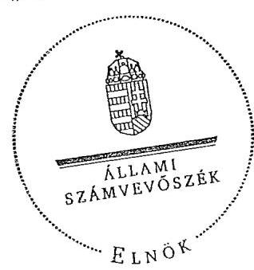

Domokos László*

Melléklet: $\quad 9 \mathrm{db}$

---

Sopron Megyei Jogú Város Önkormányzat

Működési és felhalmozási célú hiány/többlet az önkormányzat rendeleteiben

|  |   |   |   |   |   |   |   |
| --- | --- | --- | --- | --- | --- | --- | --- |
|  4 517 | 2 355 | 1 394 | 785 | 2 672 | 441 | 4 743 | 2 521  |
|   | 2 339 |  |  |  | 2 425 |  | 2 941  |
|  22 223 | 22 046 | 23 505 | 22 991 | 22 407 | 22 213 | 23 302 | 22 583  |
|  |   |   |   |   |   |   |   |
|  bevétel | kiadás | bevétel | kiadás | bevétel | kiadás | bevétel | kiadás  |
|   | 2007 |  | 2008 |  | 2009 |  | 2010  |

☐ működési bevételek és kiadások ☐ felhalmozási bevételek és kiadások ☐ hiány/többlet

---

|  Sopron Megyei Jogú Város Önkormányzata |  |  |  |   |
| --- | --- | --- | --- | --- |
|  1. FOLYÓ KÖLTSÉGVETÉS* | 2007. | 2008. | 2009. | 2010.  |
|  1.1.1. Saját működési bevételek | 6 907 552 | 7 361 723 | 7 928 685 | 6 869 865  |
|  1.1.2. Költségvetési támogatás | 3 638 753 | 5 215 929 | 4 619 618 | 4 174 848  |
|  1.1.3. Szingedett bevételek | 2 404 015 | 1 392 533 | 1 313 588 | 1 703 962  |
|  1.1.4. Állandáztsztáson belülről kapott támogatások | 4 092 127 | 4 590 799 | 4 313 267 | 4 906 948  |
|  1.1.5. Elő-nii és külföldről kapott bevételek | 0 | 0 | 0 | 8 412  |
|  1.1.6. Állandáztsztáson kívülről kapott bevételek | 17 846 | 18 996 | 34 131 | 18 454  |
|  1.1.7. Előző évi pénzmeredvény átvétel | 113 700 | 188 473 | 7 125 | 17 124  |
|  1.2. Folyó bevételek =1.1.1.+1.1.2.+1.1.3.+1.1.4.+1.1.5.+1.1.6.+1.1.7. | 17 174 073 | 18 710 453 | 18 211 214 | 17 689 671 |

 | 18 216 414 | 17 699 613  |
|  1.2.1. Működési kiadások kamatkísérdások nélkül | 14 684 730 | 15 729 704 | 15 544 398 | 15 536 965  |
|  1.2.2. Állandóállományon belülre átadott pénzeszközök | 37 416 | 28 862 | 78 905 | 98 832  |
|  1.2.3.1. vállalkozásoknak | 968 238 | 1 167 365 | 971 118 | 1 127 083  |
|  1.2.3.2. Elő-nek, illetve külföldre | 0 | 0 | 1 829 | 2 632  |
|  1.2.3.3. magánszemélyeknek | 455 856 | 464 830 | 443 741 | 450 843  |
|  1.2.3.4. negyedik szervezeteknek | 129 794 | 130 401 | 106 801 | 106 230  |
|  1.2.5. Termoforkindások (=1.2.3.1+1.2.3.2+1.2.3.3+1.2.3.4) | 1 553 878 | 1 762 596 | 1 523 489 | 1 686 780  |
|  1.2.6. Kamatkísérdások | 365 599 | 399 368 | 1 004 205 | 871 941  |
|  1.2.7. Előző évi pénzeszközök átadás | 114 829 | 188 473 | 7 125 | 17 124  |
|  1.3. Folyó kiadások = 1.2.1.+1.2.2.+1.2.3.+1.2.4.+1.2.5. | 16 756 455 | 18 109 003 | 18 158 122 | 18 211 650  |
|  1.4. Folyó költségvetés egyenlege MŰKÖDÉSI JÖVEDELEM (1.1. - 1.2.) | 417 621 | 601 450 | 58 292 | -512 037  |
|  2. FELHALMOZÁSI KÖLTSÉGVETÉS** |  |  |  |   |
|  2.1.1. Saját tökéletesítések | 720 979 | 781 543 | 863 847 | 699 475  |
|  2.1.2. Állandóállományon belülről kapott támogatások | 893 023 | 246 438 | 772 225 | 407 142  |
|  2.1.3. Elő-nii és külföldről kapott támogatások | 288 716 | 320 665 | 21 364 | 2 270  |
|  2.1.4. Állandóállományon kívülről kapott támogatások | 224 349 | 233 176 | 119 812 | 177 671  |
|  2.1.1. Felhalmozási bevételek (=2.1.1.+2.1.2+2.1.3+2.1.4.) | 2 227 067 | 1 581 822 | 1 777 348 | 1 286 558  |
|  2.2.1. Saját beruházási kiadások | 2 780 391 | 2 152 798 | 2 140 618 | 2 858 722  |
|  2.2.2. Saját felújítási kiadások | 670 340 | 1 159 649 | 1 670 725 | 768 646  |
|  2.2.3. Állandóállományon belülre átadott pénzeszközök | 263 895 | 267 687 | 634 260 | 169 033  |
|  2.2.4. Elő-nek és külföldnek adott pénzeszközök | 0 | 0 | 0 | 0  |
|  2.2.5. Állandóállományon kívülre adott pénzeszközök | 384 310 | 526 982 | 193 329 | 269 625  |
|  2.2.6. Befektetési célú részesedések vásárlása | 172 964 | 2 670 | 7 000 | 600  |
|  2.3. Felhalmozási kiadások (=2.3.1.+2.3.2.+2.3.3.+2.3.4.+2.3.5.+2.3.6.) | 4 271 906 | 4 109 786 | 4 645 932 | 4 066 626  |
|  2.4. Felhalmozási költségvetés egyenlege (2.1. - 2.2.) | -2 044 833 | -2 527 964 | -2 868 584 | -2 780 068  |
|  3. Finanszírozási műveletek nélküli (GFS) pozíció(1.3.+2.3.) | -1 627 212 | -1 926 514 | -2 810 292 | -3 292 105  |
|  4. Finanszírozási műveletek |  |  |  |   |
|  4.1. Hitelfelvétel | 670 455 | 1 692 702 | 566 409 | 0  |
|  4.2. Hitelteljesítés | 234 512 | 231 753 | 2 342 340 | 942 227  |
|  4.3. Forgatási és befektetési célú értékpapírok kibocsátása | 236 000 | 0 | 7 000 000 | 7 000 000  |
|  4.4. Forgatási és befektetési célú értékpapírok beválása | 0 | 0 | 82 812 | 199 197  |
|  4.5. Forgatási és befektetési célú értékpapírok értékváltozása | 0 | 0 | 0 | 0  |
|  4.6. Forgatási és befektetési célú értékpapírok vásárlása | 0 | 0 | 0 | 0  |
|  4.7. Egyéb finanszírozási bevételek (Függő, átfizet, kiegyenlítés) | 19 339 | 36 598 | 178 288 | -356 725  |
|  4.8. Egyéb finanszírozási kiadások (Függő, átfizet, kiegyenlítés) | 48 108 | 295 566 | -183 017 | 242 890  |
|  4.9. Finanszírozási műveletek egyenlege (4.1. - 4.2.+4.3.-4.4+4.5.-4.6.+4.7.-4.8.) | 743 174 | 1 201 981 | 4 502 562 | 1 258 953  |
|  5. Tárgyévi pénzügyi pozíció változás (1.3.+ 2.3.+4.9.) | -884 038 | -724 533 | 1 692 270 | -2 033 152  |
|  6. Nettó működési jövedelem =működési jövedelem (1.3.) - tőketörlesztés (4.2+4.4) | 183 109 | 369 697 | -3 366 860 | -1 653 461  |
|  TÁJÉKOZTATÓ ADATOK |  |  |  |   |
|  Összes kötelezettség | 9 531 437 | 11 749 111 | 16 656 698 | 19 004 968  |
|  ebből rövid lejáratú | 3 985 400 | 5 340 260 | 5 051 125 | 4 256 666  |
|  Összes esedékes kötelezettség | 1 158 313 | 1 170 792 | 1 578 916 | 1 219 433  |
|  ebből kijárt (tanúsítványból) | 63 796 | 327 690 | 729 967 | 800 709  |
|  Pénz és tartozás kötelezettség (udósági) | 7 937 136 | 9 960 905 | 14 184 535 | 16 748 619  |
|  ebből rövid lejáratú | 2 391 098 | 3 552 054 | 2 578 952 | 2 001 318  |
|  PPP szerződéses állomány jelesítése (tanúsítványból) | 0 | 0 | 0 | 0  |
|  ebből kijárt szolgáltatási díj mint kötelezettség | 0 | 0 | 0 | 0  |
|  Folyószámlahitel napi átlagos állománya (tanúsítványból) | 1 359 063 | 2 048 330 | 1 822 649 | 1 977 477  |
|  Likviditási napi átlagos állománya (tanúsítványból) | 0 | 0 | 0 | 0  |
|  Hunkabérkétel napi átlagos állománya (tanúsítványból) | 0 | 0 | 0 | 0  |
|  Kezesség és garanciavállalások (tanúsítványból) | 1 309 004 | 1 359 004 | 2 639 004 | 2 689 004  |
|  Jogerős kivételi feltételekből adódó kötelezettségek (tanúsítványból) | 0 | 0 | 0 | 2 505  |
|  Finanszírozásba bevonható eszközök: | 1 583 655 | 859 122 | 2 551 392 | 518 240  |
|  Tartós kötelezettségi megkötésű értékpapírok és végi állománya | 0 | 0 | 0 | 0  |
|  Hosszú lejáratú funkciók és végi állománya | 0 | 0 | 0 | 0  |
|  Értékpapírok és végi állománya | 0 | 0 | 0 | 0  |
|  Pénzeszközök (idegen pénzeszközök nélküli) és végi állománya | 1 583 655 | 859 122 | 2 551 392 | 518 240  |

- Revízióban szerepel, a kiadásokban nem jelenik meg az amortizáció, a vagyoni helyzet az egyenleget befolyásolja

* Revízióban vagyon megőrzése és növelése fordításai források.

---

|   |  |  |  |  |  |  |  |  |  |  |  |  |  |  |  |  |  |

---

|  43. | Ministerie van Sociale Zaken | 2008 | 2007 | 10.376 | 10.942 | -4.553 | 289.937 | 10.942 | 0 | 0 | 0 | 0 | 0 | 0 | 15376 | 12642 | -4254 | 0 | 0 | 0 | 0 | 0 | 0 | 0 | 0 | 0 | 0 | 0 | 0 | 0 | 0 | 0 | 0 | 0 | 0 | 0 | 0 | 0 | 0 | 0 | 0 | 0 | 0 | 0 | 0 | 0 | 0 | 0 | 0 | 0 | 0 | 0 | 0 | 0 | 0 | 0 | 0 | 0 | 0 | 0 | 0 | 0 | 0 | 0 | 0 | 0 | 0 | 0 | 0 | 0 | 0 | 0 | 0 | 0 | 0 | 0 | 0 | 0 | 0 | 0 | 0 | 0 | 0 | 0 | 0

---

### 20.12.2020

|   |  |  |  |  |  |  |  |  |  |  |  |  |  |  |  |  |  |

  |  |  |  |  |  |  |  |  |  |  |  |  |  |  |  |  |  |  |  |   |
|---|---|---|---|---|---|---|---|---|---|---|---|---|---|---|---|---|---|---|---|---|
|   |  |  |  |  |  |  |  |  |  |  |  |  |  |  |  |  |  |  |  |  |  |  |  |  |  |  |  |  |  |  |  |  |  |  |  |  |   |
|   |  |  |  |  |  |  |  |  |  |  |  |  |  |  |  |  |  |  |  |  |  |  |  |  |  |  |  |  |  |  |  |  |  |  |  |  |   |
|   |  |  |  |  |  |  |  |  |  |  |  |  |  |  |  |  |  |  |  |  |  |  |  |  |  |  |  |  |  |  |  |  |  |  |  |  |   |
|   |  |  |  |  |  |  |  |  |  |  |  |  |  |  |  |  |  |  |  |  |  |  |  |  |  |  |  |  |  |  |  |  |  |  |  |  |   |
|   |  |  |  |  |  |  |  |  |  |  |  |  |  |  |  |  |  |  |  |  |  |  |  |  |  |  |  |  |  |  |  |  |  |  |  |  |   |
|   |  |  |  |  |  |  |  |  |  |  |  |  |  |  |  |  |  |  |  |  |  |  |  |  |  |  |  |  |  |  |  |  |  |  |  |  |   |
|   |  |  |  |  |  |  |  |  |  |  |  |  |  |  |  |  |  |  |  |  |  |  |  |  |  |  |  |  |  |  |  |  |  |  |  |  |   |
|   |  |  |  |  |  |  |  |  |  |  |  |  |  |  |  |  |  |  |  |  |  |  |  |  |  |  |  |  |  |  |  |  |  |  |  |  |   |
|   |  |  |  |  |  |  |  |  |  |  |  |  |  |  |  |  |  |  |  |  |  |  |  |  |  |  |  |  |  |  |  |  |  |  |  |  |   |
|   |  |  |  |  |  |  |  |  |  |  |  |  |  |  |  |  |  |  |  |  |  |  |  |  |  |  |  |  |  |  |  |  |  |  |  |  |   |
|   |  |  |  |  |  |  |  |  |  |  |  |  |  |  |  |  |  |  |  |  |  |  |  |  |  |  |  |  |  |  |  |  |  |  |  |  |   |
|   |  |  |  |  |  |  |  |  |  |  |  |  |  |  |  |  |  |  |  |  |  |  |  |  |  |  |  |  |  |  |  |  |  |  |  |  |   |
|   |  |  |  |  |  |  |  |  |  |  |  |  |  |  |  |  |  |  |  |  |  |  |  |  |  |  |  |  |  |  |  |  |  |  |  |  |   |
|   |  |  |  |  |  |  |  |  |  |  |  |  |  |  |  |  |  |  |  |  |  |  |  |  |  |  |  |  |  |  |  |  |  |  |  |  |   |
|   |  |  |  |  |  |  |  |  |  |  |  |  |  |  |  |  |  |  |  |  |  |  |  |  |  |  |  |  |  |  |  |  |  |  |  |  |   |
|   |  |  |  |  |  |  |  |  |  |  |  |  |  |  |  |  |  |  |  |  |  |  |  |  |  |  |  |  |  |  |  |  |  |  |  |  |   |
|   |  |  |  |  |  |  |  |  |  |  |  |  |  |  |  |  |  |  |  |  |  |  |  |  |  |  |  |  |  |  |  |  |  |  |  |  |   |
|   |  |  |  |  |  |  |  |  |  |  |  |  |  |  |  |  |  |  |  |  |  |  |  |  |  |  |  |  |  |  |  |  |  |  |  |  |   |
|   |  |  |  |  |  |  |  |  |  |  |  |  |  |  |  |  |  |  |  |  |  |  |  |  |  |  |  |  |  |  |  |  |  |  |  |  |   |
|   |  |  |  |  |  |  |  |  |  |  |  |  |  |  |  |  |  |  |  |  |  |  |  |  |  |  |  |  |  |  |  |  |  |  |  |  |  

 |
|   |  |  |  |  |  |  |  |  |  |  |  |  |  |  |  |  |  |  |  |  |  |  |  |  |  |  |  |  |  |  |  |  |  |  |  |  |   |
|   |  |  |  |  |  |  |  |  |  |  |  |  |  |  |  |  |  |  |  |  |  |  |  |  |  |  |  |  |  |  |  |  |  |  |  |  |   |
|   |  |  |  |  |  |  |  |  |  |  |  |  |  |  |  |  |  |  |  |  |  |  |  |  |  |  |  |  |  |  |  |  |  |  |  |  |   |
|   |  |  |  |  |  |  |  |  |  |  |  |  |  |  |  |  |  |  |  |  |  |  |  |  |  |  |  |  |  |  |  |  |  |  |  |  |   |
|   |  |  |  |  |  |  |  |  |  |  |  |  |  |  |  |  |  |  |  |  |  |  |  |  |  |  |  |  |  |  |  |  |  |  |  |  |   |
|   |  |  |  |  |  |  |  |  |  |  |  |  |  |  |  |  |  |  |  |  |  |  |  |  |  |  |  |  |  |  |  |  |  |  |  |  |   |
|   |  |  |  |  |  |  |  |  |  |  |  |  |  |  |  |  |  |  |  |  |  |  |  |  |  |  |  |  |  |  |  |  |  |  |  |  |   |
|   |  |  |  |  |  |  |  |  |  |  |  |  |  |  |  |  |  |  |  |  |  |  |  |  |  |  |  |  |  |  |  |  |  |  |  |  |   |
|   |  |  |  |  |  |  |  |  |  |  |  |  |  |  |  |  |  |  |  |  |  |  |  |  |  |  |  |  |  |  |  |  |  |  |  |  |   |
|   |  |  |  |  |  |  |  |  |  |  |  |  |  |  |  |  |  |  |  |  |  |  |  |  |  |  |  |  |  |  |  |  |  |  |  |  |   |
|   |  |  |  |  |  |  |  |  |  |  |  |  |  |  |  |  |  |  |  |  |  |  |  |  |  |  |  |  |  |  |  |  |  |  |  |  |   |
|   |  |  |  |  |  |  |  |  |  |  |  |  |  |  |  |  |  |  |  |  |  |  |  |  |  |  |  |  |  |  |  |  |  |  |  |  |   |

---

|   |  |  |  |  |  |  |  |  |  |  |  |  |  |  |  |  |  |  |  |  |  |  |  |  |  |  |  |  |  |  |  |  |  |  |  |  |  |  |  |  |   |
|---|---|---|---|---|---|---|---|---|---|---|---|---|---|---|---|---|---|---|---|---|---|---|---|---|---|---|---|---|---|---|---|---|---|---|---|---|---|---|---|---|---|---|---|
|   |  |  |  |  |  |  |  |  |  |  |  |  |  |  |  |  |  |  |  |  |  |  |  |  |  |  |  |  |  |  |  |  |  |  |  |  |  |  |  |   |
|   |  |  |  |  |  |  |  |  |  |  |  |  |  |  |  |  |  |  |  |  |  |  |  |  |  |  |  |  |  |  |  |  |  |  |  |  |  |  |  |   |
|   |  |  |  |  |  |  |  |  |  |  |  |  |  |  |  |  |  |  |  |  |  |  |  |  |  |  |  |  |  |  |  |  |  |  |  |  |  |  |  |   |
|   |  |  |  |  |  |  |  |  |  |  |  |  |  |  |  |  |  |  |  |  |  |  |  |  |  |  |  |  |  |  |  |  |  |  |  |  |  |  |  |   |
|   |  |  |  |  |  |  |  |  |  |  |  |  |  |  |  |  |  |  |  |  |  |  |  |  |  |  |  |  |  |  |  |  |  |  |  |  |  |  |  |   |
|   |  |  |  |  |  |  |  |  |  |  |  |  |  |  |  |  |  |  |  |  |  |  |  |  |  |  |  |  |  |  |  |  |  |  |  |  |  |  |  |   |

  |  |  |  |  |  |  |  |  |  |   |
|   |  |  |  |  |  |  |  |  |  |  |  |  |  |  |  |  |  |  |  |  |  |  |  |  |  |  |  |  |  |  |  |  |  |  |  |  |  |  |  |  |   |
|   |  |  |  |  |  |  |  |  |  |  |  |  |  |  |  |  |  |  |  |  |  |  |  |  |  |  |  |  |  |  |  |  |  |  |  |  |  |  |  |  |   |
|   |  |  |  |  |  |  |  |  |  |  |  |  |  |  |  |  |  |  |  |  |  |  |  |  |  |  |  |  |  |  |  |  |  |  |  |  |  |  |  |  |   |
|   |  |  |  |  |  |  |  |  |  |  |  |  |  |  |  |  |  |  |  |  |  |  |  |  |  |  |  |  |  |  |  |  |  |  |  |  |  |  |  |  |   |
|   |  |  |  |  |  |  |  |  |  |  |  |  |  |  |  |  |  |  |  |  |  |  |  |  |  |  |  |  |  |  |  |  |  |  |  |  |  |  |  |  |   |
|   |  |  |  |  |  |  |  |  |  |  |  |  |  |  |  |  |  |  |  |  |  |  |  |  |  |  |  |  |  |  |  |  |  |  |  |  |  |  |  |  |   |
|   |  |  |  |  |  |  |  |  |  |  |  |  |  |  |  |  |  |  |  |  |  |  |  |  |  |  |  |  |  |  |  |  |  |  |  |  |  |  |  |  |   |
|   |  |  |  |  |  |  |  |  |  |  |  |  |  |  |  |  |  |  |  |  |  |  |  |  |  |  |  |  |  |  |  |  |  |  |  |  |  |  |  |  |   |
|   |  |  |  |  |  |  |  |  |  |  |  |  |  |  |  |  |  |  |  |  |  |  |  |  |  |  |  |  |  |  |  |  |  |  |  |  |  |  |  |  |   |
|   |  |  |  |  |  |  |  |  |  |  |  |  |  |  |  |  |  |  |  |  |  |  |  |  |  |  |  |  |  |  |  |  |  |  |  |  |  |  |  |  |   |
|   |  |  |  |  |  |  |  |  |  |  |  |  |  |  |  |  |  |  |  |  |  |  |  |  |  |  |  |  |  |  |  |  |  |  |  |  |  |  |  |  |   |
|   |  |  |  |  |  |  |  |  |  |  |  |  |  |  |  |  |  |  |  |  |  |  |  |  |  |  |  |  |  |  |  |  |  |  |  |  |  |  |  |  |   |
|   |  |  |  |  |  |  |  |  |  |  |  |  |  |  |  |  |  |  |  |  |  |  |  |  |  |  |  |  |  |  |  |  |  |  |  |  |  |  |  |  |   |
|   |  |  |  |  |  |  |  |  |  |  |  |  |  |  |  |  |  |  |  |  |  |  |  |  |  |  |  |  |  |  |  |  |  |  |  |  |  |  |  |  |   |
|   |  |  |  |  |  |  |  |  |  |  |  |  |  |  |  |  |  |  |  |  |  |  |  |  |  |  |  |  |  |  |  |  |  |  |  |  |  |  |  |  |   |
|   |  |  |  |  |  |  |  |  |  |  |  |  |  |  |  |  |  |  |  |  |  |  |  |  |  |  |  |  |  |  |  |  |  |  |  |  |  |  |  |  |   |
|   |  |  |  |  |  |  |  |  |  |  |  |  |  |  |  |  |  |  |  |  |  |  |  |  |  |  |  |  |  |  |  |  |  |  |  |  |  |  |  |  |   |
|   |  |  |  |  |  |  |  |  |  |  |  |  |  |  |  |  |  |  |  |  |  |  |  |  |  |  |  |  |  |  |  |  |  |  |  |  |  |  |  |  |   |
|   |  |  |  |  |  |  |  |  |  |  |  |  |  |

  |  |  |  |  |  |  |  |  |  |  |  |  |  |  |  |  |  |  |  |  |  |  |  |  |  |  |   |
|   |  |  |  |  |  |  |  |  |  |  |  |  |  |  |  |  |  |  |  |  |  |  |  |  |  |  |  |  |  |  |  |  |  |  |  |  |  |  |  |  |   |
|   |  |  |  |  |  |  |  |  |  |  |  |  |  |  |  |  |  |  |  |  |  |  |  |  |  |  |  |  |  |  |  |  |  |  |  |  |  |  |  |  |   |
|   |  |  |  |  |  |  |  |  |  |  |  |  |  |  |  |  |  |  |  |  |  |  |  |  |  |  |  |  |  |  |  |  |  |  |  |  |  |  |  |  |   |
|   |  |  |  |  |  |  |  |  |  |  |  |  |  |  |  |  |  |  |  |  |  |  |  |  |  |  |  |  |  |  |  |  |  |  |  |  |  |  |  |  |   |
|   |  |  |  |  |  |  |  |  |  |  |  |  |  |  |  |  |  |  |  |  |  |  |  |  |  |  |  |  |  |  |  |  |  |  |  |  |  |  |  |  |   |
|   |  |  |  |  |  |  |  |  |  |  |  |  |  |  |  |  |  |  |  |  |  |  |  |  |  |  |  |  |  |  |  |  |  |  |  |  |  |  |  |  |   |
|   |

---

## Az Önkormányzat beadott, elbírálás alatti pályázati forrásból megvalósuló fejlesztéséhez kapcsolódó kötelezettség-vállalásainak összegzéséről

|  Fejlesztési feladat (beruházás, felújítás) |  |  |  | Beruházás, felújítás |  |  |  |  |  |  |  |  |  |  |  |  |  |  |  |  |  |  |  |  |  |  |  |  |  |  |  |  |  |  |  |  |  |  |  |  |  |  |  |  |  |  |  |  |  |  |  |  |  |  |  |  |  |  |  |  |  |  |  |  |  |  |  |  |  |  |  |  |  |  |  |  |  |  |  |  |  |  |  |  |  |  |  |  |  |  |  |  |  |  |  |  |  |  |  |  |  |  |  |  |  |  |  |  |  |  |  |  |  |  |  |  |  |  |  |  |  |  |  |  |  |  |  |  |  |  |  |  |  |  |   |
| --- | --- | --- | --- | --- | --- | --- | --- | --- | --- | --- | --- | --- | --- | --- | --- | --- | --- | --- | --- | --- | --- | --- | --- | --- | --- | --- | --- | --- | --- | --- | --- | --- | --- | --- | --- | --- | --- | --- | --- | --- | --- | --- | --- | --- | --- | --- | --- | --- | --- | --- | --- | --- | --- | --- | --- | --- | --- | --- | --- | --- | --- | --- | --- | --- | --- | --- | --- | --- | --- | --- | --- | --- | --- | --- | --- | --- | --- | --- | --- | --- | --- | --- | --- | --- | --- | --- | --- | --- | --- | --- | --- | --- | --- | --- | --- | --- | --- | --- | --- | --- | --- | --- | --- | --- | --- | --- | --- | --- | --- | --- | --- | --- | --- | --- | --- | --- | --- | --- | --- | --- | --- | --- | --- | --- | --- | --- | --- | --- | --- | --- | --- | --- | --- | --- |   |

---

.

---

# Az önkormányzati feladatok ellátásában résztvevő gazdasági társaságokról

|  Gazdasági társaság megnevezése | 2010. december 31-én | a gazdasági társaságnak szerződéses kötelezettségre, feladat ellátási szerződésre alapozottan az önkormányzat költségvetéséből nyújtott  |
| --- | --- | --- |
|   | önkormányzat | önkormányzat gazdasági társaságának  |
|   |  | tulajdona  |
|  9. 100%-os tulajdoni hányadú gazdasági társaságok: |  |   |
|  FORENO NONPROFIT KFT | 176 |   |
|  Sopron Holding Vagyonkezelő Zrt. | 624 |   |
|  Pro Kultúra Sopron Nonprofit Kft. | 38 |   |
|  STKH Sopron és Térsége Kft. | 138 |   |
|  Soproni Városfejlesztési Kft. | 3 |   |
|  100%-os tulajdoni hányadú gazdasági társaságok összesen | 979 | 0  |
|  II. 75-89%-os tulajdoni hányadú gazdasági társaságok: |  |   |
|  Sopron TISZK Szakképzés-Szervezési Nonprofit Kft. | 2 |   |
|  75-89%-os tulajdoni hányadú gazdasági társaságok összesen | 2 | 0  |
|  78% feletti tulajdoni hányadú gazdasági társaságok összesen | 981 | 0  |
|  III. 51-74%-os tulajdoni hányadú gazdasági társaságok: |  |   |
|  Sopron és Környéke Víz- és Csatornancz Zrt. | 331 |   |
|  FKL Sportszolgáltató Kft. | 5 |   |
|  51-74%-os tulajdoni hányadú gazdasági társaságok összesen | 335 | 0  |
|  IV. 25-50%-os tulajdoni hányadú gazdasági társaságok: |  |   |
|  Raabelsport Kft. | 5 |   |
|  Sopron Régió Turisztikai Közhasznú Nonprofit Kft. | 4 |   |
|  1. oldal, összesen: 2 |  |   |

---

# Az önkormányzati feladatok ellátásában résztvevő gazdasági társaságokról

|  Gazdasági társaság megnevezése | 2010. december 31-én | a gazdasági társaságnak szerződéses kötelezettségre, feladat ellátási szerződésre alapozottan az önkormányzat költségvetéséből nyújtott  |
| --- | --- | --- |
|   | önkormányzat | önkormányzat az alapozottan  |
|   |  | és  |
|  25-50%-os tulajdoni hányadú gazdasági társaságok összesen | 9 | 0  |
|  V. egyéb, közfeladatot ellátó gazdasági társaságok: |  |   |
|  Kisalltód Volán Zrt. | 0 |   |
|  |   |   |
|  |   |   |
|  |   |   |
|  |   |   |
|  |   |   |
|  |   |   |
|  |   |   |
|  |   |   |
|  |   |   |
|  |   |   |
|  |   |   |
|  |   |   |
|  |   |   |
|  |   |   |
|  |   |   |
|  |   |   |
|  |   |   |
|  |   |   |
|  |   |   |
|  |   |   |
|  |   |   |
|  |   |   |
|  |   |   |
|  |   |   |
|  |   |   |
|  |   |   |
|  |   |   |
|  |   |   |
|  |   |   |
|  |   |   |

---

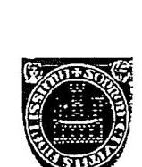

# Sopron Megyei Jogú Város

**Dr. Fodor Tamás polgármester**

**Polgármesteri Hivatal · Sopron, Fő tér 1.**

Hiv szám: V-3004-37-7/2011

**Állami Számvevőszék**

**Domokos László Elnök úr**

**Budapest**

Apáczai Cs. J. u. 10.

1052

Tisztelt Elnök Úr!

Sopron Megyei Jogú Város Önkormányzata pénzügyi helyzetének ellenőrzéséről szóló jelentés-tervezet észrevételezését a mellékletben elkészítettük.

Kérem, T. Elnök urat, hogy részletesen kifejtett javaslatainkat mérlegelni szíveskedjen.

Sopron, 2011. szeptember 06.

Üdvözlettel:

Dr. Fodor Tamás
 polgármester

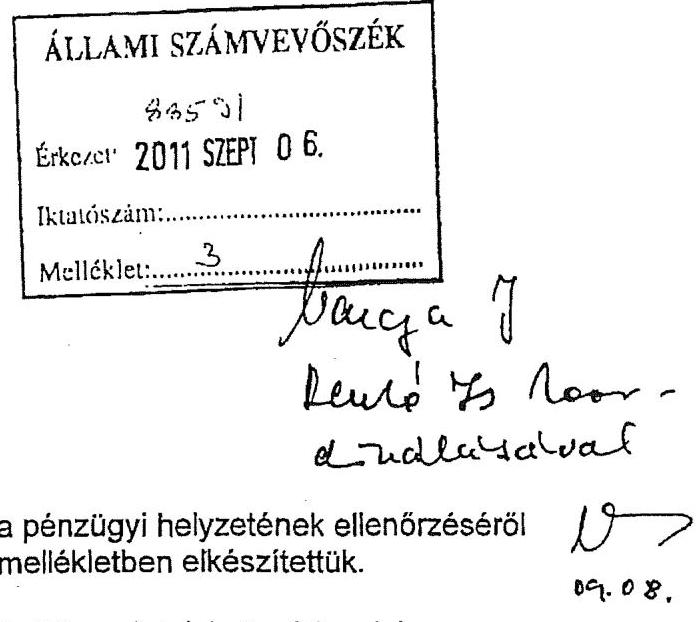

postacím: 9401 Sopron, Pf. 127 · telefon: +36 99/515-101 · telefax: +36 99/330-452

internet: www.sopron.hu · e-mail: polgarmester@sopron-ph.hu

---

.

---

# Állami Számvevőszék 

1052 Budapest
Apáczai Csere János u. 10.

## Domokos László

Elnök Úr részére

## Sopron Megyei Jogú Város Önkormányzatának észrevételei az Állami Számvevőszéki 2011. júliusi jelentés-tervezethez

## Tisztelt Elnök Úr!

Az Állami Számvevőszék V-3004-37-7/2011. ikt.sz. jelentés-tervezetét áttanulmányoztuk, mellyel kapcsolatosan észrevételeink az alábbiak.

## Összefoglalóan

A települési önkormányzatok, különösen a megyei jogú városok a magyar nemzeti identitásunk történelmi letéteményesei, kulturális, közéleti, politikai, gazdasági zászlóshajói. A nemzet jövedelmei, bevételei is összességében döntően az önkormányzatok szintjén képződnek. Az önkormányzati testületeknek minden időben a városukról kell, és kellett gondoskodni. Voltak olyan időszakok, amikor a központi állam gyakorlatilag nem működött, és ilyenkor a nemzetet a települési önkormányzatok jelentették, a közfeladatokat ők látták el. 1919-től 1922-ig, a népszavazásig Sopron lényegében semmilyen államhoz nem tartozott, és az önkormányzat akkor is felelősen biztosította az elvárható közszolgáltatásokat.

Sopron 734 éve szabad királyi város, 1991-től megyei jogú város, a nemzet identikus és fontos része, a leghűségesebb város, Széchenyi városa, a szabadság városa, amelynek megyéjét és területeit elcsatolták, vasfüggönnyel körbezárták. A határátlépés (Páneurópai Piknik 1989) eseménye volt az első lépés a berlini fal leomlásához, Németország majd Európa újraegyesítéséhez.

A nemzet és a polgári értékek iránti elkötelezettségét számtalanszor bizonyította. Két soproni képviselő dolgozik az Európai Parlamentben, három a magyar Országgyűlésben.

2006-ban súlyosan eladósodott várost vettünk át hibás, és törvénytelen beruházásokkal, ügyletekkel. A teljes adósság 13 milliárd Ft-ra rúgott. Az első félévben hat nagyértékű pert

---

indítottunk. Tettük mindezt a közvagyon védelmében és az elherdált milliárdok visszaszerzéséért. A polgári ügyeket részben jogerősen, részben eddigi folyamatában megnyertük, amivel reálértékben milliárdokat (több mint három milliárdot) tudtunk megtakarítani a városnak.

A „több pénzt az önkormányzatoknak több pénzt az embereknek" jelszóból nem lett semmi, hanem ellenkezőleg egyre több feladatot kaptunk, egyre kevesebb finanszírozással.

A város működését, és fejlődését, úgy kellett biztosítanunk, hogy az utóbbi években már a normatíva a feladatok felét sem finanszírozta, mivel az eltelt 8 évben áthárították az államadósság egy részét az önkormányzatokra. Az önkormányzatoknak kiszervezték az államadósságot -amit az ÁSZ is minden évben a költségvetési törvény véleményezésekor kifogásolt. Ez a kiszervezett államadósság az önkormányzaton egyoldalúan nem kérhető számon.

Így kellett biztosítani a közszolgáltatásokat, melyek európai léptékben is példátlan arányban az önkormányzatokhoz kerültek Magyarországon, továbbá biztosítani a 2007-2013 időszakra az európai uniós pályázatokhoz szükséges önrészt, illetve saját fejlesztési forrásokat. Mindeközben törvényességi felügyelet a Közigazgatási Hivatalok helyzetének megváltoztatása miatt, lényegében nem volt. Az utolsó négy évben súlyos pénzügyi, majd gazdasági világválság alakult ki külföldön, és itthon. Ebben az ellentmondásos, válságos helyzetben kellett talpon maradni.

A kétharmados történelmi felhatalmazás elnyerésében a választók valamilyen mértékben a mi álhatatos, helyénvaló önkormányzati tevékenységünket is elismerték a 2010. évi 75%-os felhatalmazással.

Mindazonáltal köszönjük a szakmai észrevételeket és szeretnénk is azokat reális keretek között, intézkedési tervben megvalósítani. Az ellenőrzés új vizsgálati módszerének bevezetésével talán helyesebb következtetéseket lehetne levonni, ha nemcsak az utolsó 3 évet ölelné fel a vizsgálat, hanem a fő adatok tekintetében az eltelt 21 évet. Ezzel, a folyamatok dinamikájára is fény derülhetne, amely egyben a jó megoldásokat is meg tudná mutatni.

Általánosságban megoldásként javasoljuk az új viszonyoknak megfelelő egységes és világos önkormányzati törvényi szabályozást. Kérjük, a világosan a kötelezően és önként vállalt feladatokat szabályozni, meghatározni a gazdálkodás feltételeit, a működési és felhalmozási bevételeket, kiadásokat, az adósságfelvétel körülményeit, önkormányzati közpénzügyi törvényi szabályozást.

# Észrevételek: 

Az önkormányzati jogok gyakorlása, a szubszidiaritás, a szervezet alakítás szabadsága, a szerződéskötés szabadsága, óriási szabadság, ami szinte alig korlátozható érdemben anélkül, hogy az önkormányzatiság alapjoga ne sérüljön.

---

A saját bevételeket, átengedett bevételeket, normatívákat egyszerűbben kell szabályozni, az átláthatóság és az összehasonlíthatóság érdekében, ugyanígy a költségvetési rendeletet és a zárszámadást.

Kezelni kell a szabályosan külföldön dolgozó, ottani GDP-t termelő, ott adózó soproni vendégmunkás soproni lakos adókiesését.

Az amortizáció képzésére lehetőségeink korlátozottak, eddig ilyen előírás nem volt.
Fontos lenne, hogy az önkormányzatoknak kiszervezett államadósság kezelésére vonatkozóan az ÁSZ a kormánynak is tenne javaslatot.

# Részletes észrevételek: 

1. A vizsgált időszakban a bevételek reálértékben nem növekedtek, hanem csökkentek, miközben folyamatosan normatív fedezet nélküli feladatokat volt kénytelen ellátni az önkormányzat: lényegesen csökkent az állami hozzájárulás és támogatás és csökkent a helyi adóbevétel (iparűzési adó, illetékbevétel, stb.)
2. Sopron városa az európai pályázati források megjelenése előtt semmilyen lényeges fejlesztésben nem tudott részt venni. Ezt megelőzően a rendszerváltásig a vasfüggöny (határsáv) miatt mindenben elzárt terület volt. 2007-től sikeresen pályáztunk az európai forrásokra azzal, a céllal, hogy a több évtizedes elmaradásunkat végre bepótoljuk. Jelenleg a pályázati forrásokból 11,4 Mrd forint összegben lévő beruházás folyik, a fenti céloknak megfelelően.
3. Adósság állomány 2006. október 6-án az önkormányzati választás átadás-átvételi jegyzőkönyv alapján 8 milliárd forint volt, ehhez jött hozzá még a Petőfi téri forgalomképtelen mélygarázs visszabérlési kötelezettségéből származó fizetési kötelezettség, amely 25 év alatt közel 4 milliárd forint fizetést jelentett volna. Azaz a tényleges hitelállomány a FÉSZ hitelfelvétellel (Sopron Holding által felvett hitel) 13 milliárd forint volt az ÁSZ jelentés-tervezetben szereplő 6.945 milliárd forinttal szemben. Az említett törvénytelen mélygarázsszerződést hivatalba lépésünket követően 2007-ben bíróságon megtámadtuk, hogy visszaszerezzük a városnak az eredetileg forgalomképtelen vagyonát. A Legfelsőbb Bíróság 2009-ben nekünk ítélte a mélygarázst a bérleti szerződésünket pedig megsemmisítette. Ezzel a közel 4 milliárdos szerződéses kötelezettség alól megszabadult az önkormányzat. Helyette csak a meggazdagodásunkat kellett megfizetni, amelyet 1 milliárd forint formájában bírói letétbe helyeztünk. Közel 3 milliárd forintot sikerült a soproniaknak bírósági úton visszaperelni. Részletes kimutatás szerint: A jelentés-tervezet 47. oldalán megállapítja, hogy az önkormányzat pénzintézeti kötelezettség állománya 2,4-szeresére növekedett, de nem veszi figyelembe a 2006. évi önkormányzati választásokat követően készített és a Közgyűlés elé is beterjesztett átadás-átvételi eljárás során rögzített tényszámokat. (Csatoljuk az előterjesztést és mellékleteit.) Az Önkormányzat és gazdasági

---

társaságainak pénzintézeti és kezességvállalásai az átadás-átvétel időpontjához viszonyítva az alábbiak szerint alakultak

# Önkormányzat és gazdasági társaságai pénzintézeti és egyéb kötelezettség állományának alakulása 

adatok eFt-ban

| Megnevezés | Átadás-átvétel*   (2006. okt.4.) | Zárszámadás (2010. évről) |
| :--: | :--: | :--: |
| Önkormányzat |  |  |
| Fejlesztési hitelek | 2469300 | 1495895 |
| Kötvénykibocsátás | 2913393 | 13794663 |
| Folyószámla hitel | 1489657 | 1458060 |
| Összesen | 6872350 | 16748618 |
| Sopron Holding Zrt. |  |  |
| Hosszú lejáratú kötelezettség | 922465 | 675136 |
| Rövid lejáratú hitel | 114906 | 592022 |
| Összesen | 1037371 | 1267158 |
| STKH Kft. |  |  |
| Hosszú lejáratú kötelezettség | 101844 | 194969 |
| Rövid lejáratú hitel | 10000 | 196404 |
| Összesen | 111844 | 391373 |
| Pro Kultúra Kht. |  |  |
| Hosszú lejáratú kötelezettség | 287943 | 0 |
| Rövid lejáratú hitel | 0 | 31040 |
| Összesen | 287943 | 31040 |
| Hitel és egyéb kötelezettség összesen | 8309508 | 18438189 |
| Önkormányzati kezességvállalás | 756151 | 911946 |
| Petőfi téri mélygarázs | 4000000 | 0 |
| Mindösszesen | 13065659 | 19350135 |

*2006.09.30. fordulónap

---

4. A soproni önkormányzat mindent megtett, hogy a korábbi városvezetés által elkótyavetyélt városi vagyont visszaszerezze. Ezért 2007-ben pereket indítottunk. Ennek eredménye lett a Petőfi téri mélygarázs visszaszerzése magántulajdonból önkormányzati tulajdonba. A Legfelsőbb Bíróság három ügyünkben az önkormányzatnak adott igazat, ezzel eddig a hat ügyből hármat megnyertünk a többi bírói szakaszban van. A három sikeres ügy kapcsán több mint 3 milliárd forint összegben voltunk pernyertesek az erkölcsi és morális elégtétel mellett (,Jó erkölcsbe ütköző" ítélet egy telekügyben). A további függőben lévő perek vitatott perértéke 778 millió forint, melyet az önkormányzat jelenleg visszaperel.
5. 2006-2010 között Sopron MJ Városnak azért kellett felvenni kötvény formájában 7 majd 3 milliárd forintot, hogy 2010-ig tudjuk finanszírozni a város fejlesztését illetve a korábbi hitelek adósság-szolgálatát. Az adósság-szolgálat több mint fele (56%) 2006 előtti kötelezettségvállalás, amelyet fizetni kell. Így a 7 Mrd forintból csak 4,5 Mrd maradt a fejlesztések finanszírozására. A 3 milliárd forint kötvényből 1,7 Mrd-ot kényszerű OTP-hitelkiváltásra, 1 Mrd-t a Petőfi téri mélygarázs bírói letétjére fordítottuk. Összességében 2007-2011 időszakban a 10 Mrd kötvény alig fele (4,8 Mrd) állt rendelkezésre tényleges fejlesztési célra.
6. Az ÁSZ jelentéstervezete I. fejezet 19. oldalán észrevételezték, hogy „az önkormányzat kötelezettségvállalásaira közgyűlési döntés alapján került sor, azonban az előterjesztésekben nem mutatták be a visszafizetés forrásait, a várható kamat- és tőkefizetési kötelezettséget, valamint a kamat- és devizaalapú kötelezettségeket érintő árfolyamkockázatot". A megállapítással szemben a 2008. szeptember 25-ei közgyűlésen szerepelt „Előterjesztés Sopron Megyei Jogú Város Önkormányzatának 2008-2010. évi várható költségvetési helyzetéről, és a szükséges forrásbevonásról" című előterjesztés, melynek mellékletét képezte a MATRISK Kockázatkezelő és Tanácsadó Kft. „Döntéstámogatás Sopron Megyei Jogú Város középtávú finanszírozási tervéhez" című tanulmánya, amely részletesen tartalmazta a hiányolt információkat. Dokumentum mellékelve.
7. Az ÁSZ jelentéstervezete I. fejezet 24. oldalán a jegyzőnek tett javaslatok közül az 1. és 2. javaslatot elfogadjuk. A 3-7. javaslat azonban nézetünk szerint olyan intézkedéseket javasol a jegyzőnek, amelyre nem, vagy csak részben terjed ki a hatásköre:
8. Az államháztartásról szóló 1992. évi XXXVIII. törvény szerint a jegyző hatáskörébe a költségvetési koncepció (70. §), költségvetési rendelettervezet (71. §), zárszámadási rendelettervezet (82. §) elkészítése, és a vagyonkezelő számára az adatszolgáltatás módjának meghatározása (105/B. §) tartozik. A helyi önkormányzatokról szóló 1990. évi LXV. törvény 90. § (1) bekezdése szerint a helyi önkormányzat gazdálkodásának biztonságáért a képviselő-testület, a gazdálkodás szabályszerűségéért a polgármester felelős. A jegyző csupán azt köteles jelezni a képviselő-testületnek, a bizottságnak és a polgármesternek, ha a döntésüknél jogszabálysértést észlel (36. § (3) bekezdés), ezen felül köteles olyan pénzügyi irányítási és ellenőrzési rendszert működtetni, mely biztosítja a helyi önkormányzat rendelkezésére álló források szabályszerű,

---

szabályozott, gazdaságos, hatékony és eredményes felhasználását, illetve köteles gondoskodni a belső ellenőrzés működtetéséről (92. § (4)-(5) bekezdés).
9. A 3. pontban javasolt folyószámla hitelkeretről való gondoskodás a közgyűlés hatáskörébe tartozik.
10. A 4. pont szerint a gazdasági társaságok kötelezettségeinek alakulását, az önkormányzat likviditására, pénzügyi-egyensúlyi helyzetére gyakorolt hatását a jegyző azért nem tudja figyelemmel kísérni, mert az önkormányzat gazdasági társaságai felett tulajdonosi jogokat a közgyűlés, illetve átruházott hatáskörben a polgármester gyakorol, a jegyzőnek nincs jogosultsága arra, hogy a társaságoktól kötelezettségeikre, pénzügyi helyzetükre vonatkozóan adatot kérjen.
11. Az 5-7. pontokban megfogalmazott feladatokban a jegyző csak az általa irányított/vezetett Polgármesteri Hivatal tekintetében járhat el, mert helyi önkormányzat által alapított „további költségvetési szervek" tekintetében a jegyzőnek nincs
 joga, se hatásköre, se illetékessége a jelzett intézkedések foganatosítására.
12. A II. fejezet Részletes megállapítások 56. oldalán szerepel, hogy „a lejárt szállítói tartozások miatt a helyi önkormányzatok adósságrendezési eljárásáról szóló 1996. évi XXV. törvény 5. § (2) bekezdésében foglaltak ellenére a polgármester nem kezdeményezett adósságrendezési eljárást. A fenti törvény 5. § (1) bekezdése szerint a polgármesternek akkor kell tájékoztatnia a pénzügyi bizottságot, illetve összehívnia a közgyűlést a fizetési kötelezettség rendezése vagy adósságrendezési eljárás megindítása céljából, ha a fenti törvény 4. § (2) bekezdés a)-d) pontjában foglalt helyzet áll fenn. Önkormányzatunk esetében azonban nem álltak fenn ezek a feltételek, mivel a teljesített szerződések esetében csak a garanciális visszatartás összege nem került kifizetésre a vállalkozási díjból, amely még emiatt nem vált esedékessé, az önkormányzat saját társaságaival szemben fennállt tartozások minden esetben szóbeli megállapodással átütemezésre kerültek, ezen felül pedig csak a vitatott követelések teljesítésére nem került sor, elismert tartozást mindig időre fizettünk.
13. A II. fejezet Részletes megállapítások 59. oldal negyedik bekezdésében leírják, hogy az önkormányzat korlátlan és teljes felelősséggel tartozik azon gazdasági társaságok kötelezettségéért, amelyek társaságokban közvetlenül vagy közvetve a szavazatok legalább 75%-ával rendelkezik. Az ott leírtakról az önkormányzat tudomással bír, a gazdasági társaságai felé fennálló kötelezettségeiről (kezességvállalás) az erre való figyelemfelhívást köszönettel elfogadjuk, de kérjük, hogy az ezzel kapcsolatos következtetést „ha és amennyiben" az anyagból törölni szíveskedjenek.
14. A II. fejezet Részletes megállapítások 60. oldal az önkormányzat és intézményeinek a vizsgálat időpontjában jogerősen le nem zárt peres eljárásait elemezte. Tévesen került bele az anyagba, hogy az önkormányzatot államigazgatási jogkörben okozott kár címén 219 M Ft összegben marasztalta el a bíróság. Ez helyesen a következő: a pertárgy értéke 218.590 E Ft, első- és másodfokon az önkormányzat a pert megnyerte, jelenleg az ügy a Legfelsőbb Bíróságon van.

---

15. A II. fejezet Részletes megállapítások 66. oldalán a Jegyző részére tett javaslat 8. pontja értelmében nem teljesültek az Ötv. 88.§. (3) bekezdés d) pontjában foglaltak. A hivatkozott jogszabályhely értelmében a likvid hitel: éven belül felvett és visszafizetett, a közszolgáltatási és államigazgatási feladatok folyamatos működtetéséhez felvett hitel. Sopron Megyei Jogú Városnak több éve, folyamatosan van likvid hitele, melyhez kapcsolódóan a folyószámlahitel szerződés mindig 1 évre kerül megkötésre. A lejárat időpontjában visszafizetésre, majd ugyanezen a napon ismételten felvételre kerül. A könyvvezetés során év végével a folyószámlahitel állomány, mint Rövid lejáratú kötelezettség/Rövid lejáratú hitel/Likvid hitel került kimutatásra, mellyel az Önkormányzat a fentiekben hivatkozott jogszabályban foglaltakat nem tartotta be. A Sztv. és az Áht. rendelkezéseit figyelembe véve, valamint az ÁSZ által megfogalmazottakat az Önkormányzat akkor járt volna el helyesen, ha a könyvvezetés és az év végi mérleg összeállítása során figyelembe veszi a Sztv. 16. §. (3) bekezdésében (tartalom elsődlegessége a formával szemben számviteli alapelvet: az ügyleteket tényleges gazdasági tartalmának megfelelően kell besorolni és elszámolni), az Áht. 7§. (1) és (3) bekezdésében (Az államháztartás egyes alrendszereiben a gazdálkodást az éves költségvetés alapján kell folytatni. A költségvetési év megegyezik a naptári évvel.), továbbá az Áhsz. 26. §. (1) bekezdésében (a kötelezettségeket be kell sorolni, hosszú és rövid lejáratú kötelezettségek közé) foglaltakat. Mivel az önkormányzat által felvett hitel nem költségvetési éven (naptári éven) belüli lejáratú, ezért tartós adósságot keletkeztető kötelezettségvállalás. Ilyen értelmezést jelenleg az államháztartás szervezeteinek könyvvezetését segítő Módszertani útmutató sem tartalmaz, így az önkormányzat a könyveiben a szerződések időtartamát illetve a megkötött szerződés típusát figyelembe véve döntött az alkalmazott nyilvántartás és elszámolás mellett. A jövőbeni félreértések elkerülése érdekében szükségesnek ítéljük meg - figyelembe véve az önkormányzatok pénzügyi helyzetét - ezen értelmezések jogszabályban vagy legalább az évente kiadott Módszertani útmutatóban való egyértelműsítését.
16. További megállapítás, hogy nem teljesült az a javaslat, amely szerint évente végzett számítások alapján a Közgyűlést tájékoztatni kellett a több éves kihatású kötelezettségvállalásokról és azok pénzügyi forrásairól, feltételeiről. A több éves kihatású kötelezettségvállalásokat az önkormányzat költségvetési és zárszámadásai tartalmazzák a tárgyévre és az azt követő 2 évre kibontva, a hátralévő időszakokra egy összegben és összesítve. Az elmúlt években az Áht. 71. §. (3) bekezdése értelmében a költségvetési rendeletnek tartalmaznia kellett a működési és felhalmozási kiadások alakulását külön bemutató mérlegét a tárgyévre és azt követő 2 évre vonatkozóan közgazdasági jogcím szerinti bontásban, így az adósságot keletkeztető kötelezettségek forrása véleményünk szerint bemutatásra került. Ezt a rendelkezést hatálytalanította a 2010. évi XC. tv. 65.§ (1) bekezdése 2010. augusztus 15-i hatállyal. Így a 2011. évi költségvetési rendelet ilyen jellegű kimutatást már nem tartalmazott. Az Áht 118.§-ában foglaltak nem írják elő egyértelműen a források konkrét bemutatását, így az Önkormányzat véleményünk szerint a jogszabálynak megfelelően járt el.

---

Tisztelt Elnök Úr!
Kérem, hogy az általunk részletesen kifejtett észrevételeinket a végleges számvevőszéki jelentésben figyelembe venni szíveskedjen.

Végezetül szeretnék megköszönni Elnök úrnak és munkatársainak a rendkívül alapos és korrekt módon lefolytatott vizsgálatot. Biztosak vagyunk abban, hogy az alapos ellenőrzés hozzá fog járulni az önkormányzatunk megújulásához és továbbfejlődéséhez.

Sopron, 2011. augusztus 26.
Tisztelettel:
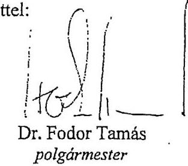

Dr. Fodor Tamás
polgármester

---

# Dr. Fodor Tamás úr 

polgármester
Sopron Megyei Jogú Város Önkormányzata
Sopron

## Tisztelt Polgármester Úr!

Köszönettel vettem észrevételeit a Sopron Megyei Jogú Város Önkormányzata pénzügyi helyzetének ellenőrzéséről készített jelentés-tervezetben foglalt megállapításokra. Az összefoglalóban szereplő javaslatait megfontolom, amennyiben vizsgálatunk alapján azok kormányzati intézkedéseket igényelnek, javaslatot teszünk a kormány részére.

Alábbi észrevételei az ellenőrzés módszertanához, illetve általános, mindenkire alkalmazott elveihez kapcsolódtak, így azokat figyelembe venni nem tudtuk:

1. észrevétel: A vizsgált időszakra vonatkozó változásokat ellenőrzésünk során nominálértéken vizsgáltuk. A vizsgálat részét képezte az ellátott feladatok áttekintése, a feladatellátásra fordított kiadások számítása. A normatív támogatás csak a feladatellátáshoz történő hozzájárulás, a finanszírozás többcsatornás, annak része egyebek mellett az önkormányzatok saját bevétele is.

7-11. észrevétel: Az észrevételek egységesen a jegyzőnek címzett javaslatokra vonatkoznak, amelyek közül a 4. pontban a gazdasági társaságok kötelezettségeinek figyelemmel kísérése esetében a tulajdonosi jogokat gyakorlók bevonásával javasoltuk a jegyzői intézkedést, ami megítélésünk szerint biztosítható. Az 5. pontban a polgármesteri hivatalra és az intézményekre vonatkozóan a szállítói tartozások figyelemmel kísérésére hívtuk fel a figyelmet, ami olyan gazdálkodási feladat, amelynek a számviteli rend megfelelő kialakításával tehet eleget, amit az 1991. évi XX. törvény 140. § (1) bekezdésének c) pontja jegyzői hatáskörbe utal.
13. észrevétel: Azokban az esetekben, amikor a gazdasági társaságban az önkormányzat minősített befolyásszerzőnek tekinthető a gazdasági társaságokról szóló 2006. évi IV. törvény alapján, akkor minden ellenőrzött önkormányzat figyelmét felhívtuk az ebből származó kockázatra. A figyelemfelhívás abban az esetben is megtörtént, ha az önkormányzat erről tudomással bírt, így a jelentések egységessége miatt a várható következmények jelentésben történő rögzítését indokoltnak tartjuk.

Részletes észrevételei közül az alábbiak nem állnak ellentétben a jelentés-tervezet megállapításaival, így azokat a jelentés-tervezetben nem szerepeltettük.

---

2. észrevétel: Sopron város elmaradt fejlesztéseinek pótlására tett erőfeszítéseiket méltányolom, a vizsgálat azonban azt igazolta, hogy ez jelentősen megterhelte az önkormányzat költségvetését, növelte a város eddig sem elhanyagolható mértékű eladósodását, jelentéstervezetünk ennek kezelésére hívja fel a figyelmet.
3. észrevétel: A kötvények kibocsátásából elért bevételek felhasználása során a jelentés 48. oldalán olvasható, hogy 1000 millió Ft bírói letétbe került, azért, hogy abból - bírósági döntés alapján - teljesíthető legyen a vagyongyarapodás kifizetése. A további perek annyiban képezték részét az ellenőrzésnek, amennyiben hatást gyakorolnak, vagy gyakorolhatnak az önkormányzat pénzügyi helyzetére. Ennek érdekében kértünk tanúsítványt az önkormányzat perbeli szerepéről, a per értékéről és a perek állásáról a vizsgálat idején. Észrevétele megállapításainknak nem mond ellent, és nem befolyásolja azokat.
4. észrevétel: Az észrevételben részletezett felhasználás az észrevétellel megegyezően a jelentésben is szerepel. A kötvények bevételeiből a korábbi hitelek kiváltására fordított összeget és a mélygarázs miatti bírói letétet is tartalmazza a jelentés 48. oldala.
5. észrevétel: Nem vitatja, hogy a folyószámlahitel évek óta folyamatosan fennáll, így nem a költségvetési éven belül jelentkező bevételek és kiadások ütemkülönbségének finanszírozására szolgált. Az egységes megítélésre vonatkozó javaslatát köszönettel vettem, a jogalkotásra történő felhívás során hasznosítjuk.

Alábbi észrevételét elfogadom, azzal a jelentés-tervezetet módosítottuk:
7-11. észrevétel: Ezekben a jegyzőnek tett javaslatok közül a 3. 6. és 7. pontra tett észrevételt elfogadom, a jelentés javaslataiban pontosításra kerültek a jegyzőnek a - döntés előkészítésére, illetve közgyűlési döntés végrehajtására vonatkozó - feladatai.
14. észrevétel: Az államigazgatási jogkörben okozott kár ügyében hozott korábbi bírósági ítéleteket a jelentésből töröljük, abban csak a vizsgálat időpontjában érvényes állapotot - az ügy a Legfelsőbb Bíróságon van - valamint a perértéket - 219 millió Ft - rögzítjük.

Alábbi észrevételei nem megalapozottak, ezért azokat nem fogadom el:
3. észrevétel: Az észrevétel szerint az Önkormányzat adósságállománya 2006. október 6-án, az önkormányzati választásokkor 13 milliárd Ft volt, ellentétben a jelentés-tervezetben szereplő 6,945 milliárd Ft-tal. Észrevétele nem megalapozott, mert az ÁSZ jelentés-tervezetben szereplő 6,945 milliárd Ft az Önkormányzatnak a 2006. december 31-én a pénzintézetekkel szemben fennálló, az éves költségvetési beszámoló könyvviteli mérlegében szerepeltetett kötelezettség állománya. Az ellenőrzés - alkalmazkodva az önkormányzatok országos eladósodási folyamatához - a programban megjelölt időszakra tett megállapításokat, függetlenül az önkormányzati választási ciklustól.
6. észrevétel: A helyszíni vizsgálat idején áttekintettük a 2008. szeptember 25-én tárgyalt előterjesztést, annak elkészítésénél felhasznált tanácsadói anyagot és a könyvvizsgálói véleményt is. A jelentés megállapította, hogy a finanszírozásról közgyűlési döntés született, de

---

kifogásolta, hogy a lejárat teljes időszakára és a visszafizetés lehetséges forrásaira a döntés nem tért ki. Megállapításunkat a mellékelt dokumentumok ismételt áttanulmányozása után is fenntartjuk, mert azokban a 2010. év utáni időszakra vonatkozó adatok nem szerepelnek, annak ellenére, hogy a határozati javaslat szerint kibocsátandó kötvény futamideje 25 év. Az elemzés elsősorban azt a célt szolgálta, hogy a forrásigény kielégítésére milyen konstrukciót válasszon az önkormányzat. Az előterjesztéshez csatolt könyvvizsgálói vélemény több következtetést is megfogalmazott, köztük az adósságállomány alakulásának félévenkénti elemzését. Az adósságállomány lejáratához igazodó, hosszú távú hatásvizsgálat, az adósság visszafizetését bemutató elemzés azonban a helyszíni ellenőrzés befejezéséig nem készült.
12. észrevétel: Az észrevétel nem megalapozott, mert az Áht. 100/C. § (3) bekezdésének előírása szerint az államháztartás szervezetei kötelezettséget csak írásban vállalhatnak, a szállításra vonatkozó szerződések kötelezettségvállalásnak minősülnek, azért azok csak írásban módosíthatók. Tekintettel arra, hogy a fizetési határidőre vonatkozó rendelkezések a szerződés részét képezik, ezért értelemszerűen az írásbeliség ebben az esetben is kötelező.
16. észrevétel: Az Állami Számvevőszék Sopron Megyei Jogú Város Önkormányzata gazdálkodási rendszerének 2009. évi ellenőrzéséről készített jelentésében célszerűségi javaslatként és nem jogszabályi hivatkozással fogalmazta meg a javaslatát, amelynek megvalósításával megfelelő tájékoztatást tudnának adni a Közgyűlés számára a hosszú lejáratú, adósságot keletkeztető kötelezettségvállalásokból adódó tőke és kamatfizetési kötelezettség jövőbeni teljesíthetőségéről. Az Államháztartásról szóló 1992.
 évi XXXVIII. törvény az önkormányzatokra vonatkozóan megszüntette a következő két év előirányzatainak kötelező bemutatását, de nem változott a 71. § (2) bekezdésének azon rendelkezése, hogy a többéves elkötelezettséggel járó kiadási tételek későbbi évekre vonatkozó kihatásait be kell mutatni. A törvény 118. § (1) bekezdésének 2. b) pontja előírja, hogy az önkormányzat rendeletében meghatározott módon kell bemutatni a többéves kihatással járó döntések számszerűsítését évenkénti bontásban és összesítve. Az évenkénti kötelezettség bemutatásának akkor van jelentősége, ha annak teljesítéséhez szükséges forrásokat is számba veszik.

Örömömre szolgált, hogy a jelentés-tervezetben szereplő megállapítások és javaslatok alapján intézkedéseket tett.

Köszönöm Polgármester Úrnak és munkatársainak az ellenőrzés során tanúsított hozzáállását, amellyel a pénzügyi helyzetelemzés elkészítését segítették.

Budapest, 2011. december "J2.".
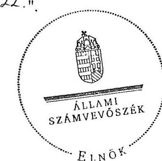

Tisztelettel:

Domokos László

---

.
