# ÁLLAMI   SZÁMVEVŐSZÉK 

## JELENTÉS

Szeged Megyei Jogú Város Önkormányzata pénzügyi helyzetének ellenőrzéséről (43/3)

---

# Számvevői Iroda 

Iktatószám: V-3047-13/2011.
Témaszám: 1015
Vizsgálat-azonosító szám: V056046

## Az ellenőrzést felügyelte:

Dr. Varga Sándor
számvevő igazgató-helyettes
Az ellenőrzést vezette:
Renkó Zsuzsanna
számvevő tanácsos
Az ellenőrzést végezték:

| Csiszárné dr. Kosik Mária | Kisapáti Angéla | Palágyiné dr. Gömöri Katalin |
| :-- | :-- | :-- |
| számvevő tanácsos | számvevő tanácsos | számvevő |

A témához kapcsolódó eddig készített számvevőszéki jelentés:
címe
sorszáma
Jelentés a Szeged Megyei Jogú Város Önkormányzata gazdálkodási 1033
rendszerének 2010. évi ellenőrzéséről

---

# TARTALOMJEGYZÉK 

BEVEZETÉS ..... 7
I. ÖSSZEGZŐ MEGÁLLAPÍTÁSOK, KÖVETKEZTETÉSEK, JAVASLATOK ..... 18
II. RÉSZLETES MEGÁLLAPÍTÁSOK ..... 29

1. Az Önkormányzat kötelező és önként vállalt feladatai ..... 29
2. Pénzügyi egyensúlyi helyzet alakulása ..... 33
2.1. A működési és felhalmozási egyensúly alakulása ..... 33
2.2. Az Önkormányzat bevételeinek alakulása ..... 40
2.3. Az Önkormányzat kiadásainak alakulása ..... 43
3. Kötelezettségek bemutatása ..... 49
3.1. A pénzintézetek felé fennálló kötelezettségek alakulása ..... 49
3.2. Szállítók felé fennálló kötelezettségek alakulása ..... 56
3.3. Egyéb kötelezettségek alakulása ..... 56
4. A pénzügyi egyensúly megteremtése érdekében hozott intézkedések ..... 62
5. A helyi önkormányzatok gazdálkodási rendszerének 2010. évi ellenőrzése során a pénzügyi egyensúly javítására tett szabályszerűségi és célszerűségi javaslatok hasznosulása ..... 66

---

# MELLÉKLETEK 

1. számú A működési és felhalmozási célú hiány/többlet alakulása az Önkormányzat zárszámadási rendeleteiben
2. számú Az Önkormányzat bevételeinek és kiadásainak, adósságszolgálatának alakulásáról
3. számú Az Önkormányzat 2007-2010 években megvalósított, 2010. december 31-ig befejezett fejlesztései forrásösszetételéről
4. számú Az Önkormányzat 2010. december 31-én folyamatban lévő fejlesztési feladataihoz kapcsolódó kötelezettségeinek összegzéséről
5. számú Az Önkormányzat 2010. december 31-én folyamatban lévő fejlesztési feladataihoz kapcsolódó 2010. évet követő kötelezettség-vállalásainak összegzéséről
6. számú Az Önkormányzat beadott, elbírálás alatti pályázati forrásból megvalósuló fejlesztéseihez kapcsolódó kötelezettség-vállalásainak összegzéséről
7. számú Az önkormányzati feladatok ellátásában résztvevő gazdasági társaságokról
8. számú Szeged Megyei Jogú Város Önkormányzat Polgármesterének észrevétele
9. számú Szeged Megyei Jogú Város Önkormányzat Polgármesterének észrevételére adott válasz

---

# RÖVIDÍTÉSEK JEGYZÉKE 

## Törvények

Áht.
ÁSZ tv.

Htv.

Ötv.
Számv. tv.

## Rendeletek

Áhsz.
$\dot{A}mr_{2}$
Önkormányzati SzMSz
vagyongazdálkodási rendelet
2007. évi költségvetési rendelet
2007. évi zárszámadási rendelet
2008. évi költségvetési rendelet
2008. évi zárszámadási rendelet
2009. évi költségvetési rendelet
2010. évi költségvetési rendelet
az államháztartásról szóló 1992. évi XXXVIII. törvény az Állami Számvevőszékről szóló 2011. évi LXVI. törvény (2011. július 1-jétől az Állami Számvevőszékről szóló 2011. LXVI. törvény)
a helyi önkormányzatok és szerveik, a köztársasági megbízottak, valamint egyes centrális alárendeltségű szervek feladat- és hatásköreiről szóló 1991. évi XX. törvény
a helyi önkormányzatokról szóló 1990. évi LXV. törvény a számvitelről szóló 2000. évi C. törvény
az államháztartás szervezetei beszámolási és könyvvezetési kötelezettségének sajátosságairól szóló 249/2000. (XII. 24.) Korm. rendelet
az államháztartás működési rendjéről szóló 292/2009. (XII. 19.) Korm. rendelet

Szeged Megyei Jogú Város Önkormányzatának 23/1995. (VI. 16.) számú rendelete az Önkormányzat és Szervei Szervezeti és Működési Szabályzatáról
Szeged Megyei Jogú Város Önkormányzatának 25/2003. (VI. 27.) számú rendelete az Önkormányzat vagyona feletti rendelkezési jog gyakorlásának szabályairól

Szeged Megyei Jogú Város Önkormányzatának 8/2007. (II. 23.) számú rendelete az Önkormányzat 2007. évi költségvetéséről
Szeged Megyei Jogú Város Önkormányzatának 18/2008. (IV. 18.) számú rendelete az Önkormányzat 2007. évi zárszámadásáról
Szeged Megyei Jogú Város Önkormányzatának 7/2008. (II. 21.) számú rendelete az Önkormányzat 2008. évi költségvetéséről
Szeged Megyei Jogú Város Önkormányzatának 11/2009. (IV. 8.) számú rendelete az Önkormányzat 2008. évi zárszámadásáról
Szeged Megyei Jogú Város Önkormányzatának 4/2009. (III. 3.) számú rendelete az Önkormányzat 2009. évi költségvetéséről
Szeged Megyei Jogú Város Önkormányzatának 17/2010. (V. 12.) számú rendelete az Önkormányzat 2009. évi zárszámadásáról
Szeged Megyei Jogú Város Önkormányzatának 8/2010. (II. 24.) számú rendelete az Önkormányzat 2010. évi költségvetéséről

---

2010. évi zárszámadási rendelet

2011. évi költségvetési rendelet

## Szórövidítések

áfa
ÁSZ
BM
EDP hiány/egyenleg

EU
DAOP
Drogcentrum
főjegyző
gazdasági program

GDP
hivatali SzMSz

Kórház
Közgazdasági iroda
Közgyűlés
NAV
Önkormányzat
panelprogram
polgármester
Polgármesteri hivatal
Szegedi Vadaspark
Kollégium
szja
Szociális iroda
társulás $_{1}$

Szeged Megyei Jogú Város Önkormányzatának 20/2011. (VI. 1.) számú rendelete az Önkormányzat 2010. évi zárszámadásáról
Szeged Megyei Jogú Város Önkormányzatának 8/2011. (III. 2.) számú rendelete az Önkormányzat 2011. évi költségvetéséről
általános forgalmi adó
Állami Számvevőszék
Belügyminisztérium
Uniós módszertan szerinti maastrichti kritériumoknak megfelelő számítás szerinti hiány/egyenleg
Európai Unió
ÚMFT Dél-alföldi Operatív Program
dr. Farkasinszky Terézia Ifjúsági Drogcentrum
Szeged Megyei Jogú Város Önkormányzatának címzetes főjegyzője
Szeged Megyei Jogú Város Önkormányzata Közgyűlésének 665/2007. (XII. 14.) számú határozata Szeged Megyei Jogú Város 2007-2010. évi gazdasági programjáról
Bruttó hazai termék
Polgármesteri Hivatal Szervezeti és Működési Szabályzata, amelyet a Jogi, Ügyrendi és Közbiztonsági Bizottság a 4267-35/2006. (II. 7.) számú határozatával hagyott jóvá
Szeged Megyei Jogú Város Önkormányzatának Kórháza
Szeged Megyei Jogú Város Önkormányzat Polgármesteri Hivatalának Közgazdasági Irodája
Szeged Megyei Jogú Város Önkormányzat Közgyűlése
Nemzeti Adó és Vámhivatal
Szeged Megyei Jogú Város Önkormányzata
Iparosított technológiával épült lakóépületek széndioxidkibocsátás csökkentést és energia-megtakarítást eredményező korszerűsítésének, felújításának támogatása
Szeged Megyei Jogú Város Önkormányzat polgármestere
Szeged Megyei Jogú Város Önkormányzat Polgármesteri Hivatala
Szeged Megyei Jogú Város Önkormányzat Szegedi Vadaspark Intézménye
Szeged Megyei Jogú Város Önkormányzat Szegedi Városi Kollégium Intézménye
személyi jövedelemadó
Szeged Megyei Jogú Város Önkormányzat Polgármesteri Hivatalának Szociális, Családvédelmi és Egészségügyi Irodája
Szeged és Térsége Területfejlesztési Társulás

---

társulás ${ }_{2}$
Többcélú Társulás

Dél-alföldi Térségi Hulladékgazdálkodási Társulás Szegedi Kistérség Többcélú Társulása

---

.

---

# JELENTÉS 

## Szeged Megyei Jogú Város Önkormányzata pénzügyi helyzetének ellenőrzéséről

## BEVEZETÉS

Az Állami Számvevőszék 2011. évtől érvényes stratégiája új irányt szabott a helyi önkormányzatok gazdálkodásának ellenőrzésében is. Az ÁSZ – küldetése és jövőképe szerint – szilárd szakmai alapokra támaszkodva értékteremtő ellenőrzéseivel és helyzetelemzéseivel az államháztartás egészében, így a helyi önkormányzati alrendszerben is elő kívánja segíteni a közpénzek és a közvagyon szabályos, gazdaságos, hatékony és eredményes hasznosítását. Ennek részeként – a 2010. évi államháztartási hiány alakulásának összetevőire is figyelemmel – folyamatban van az önkormányzati alrendszer pénzügyi helyzetelemzése.

Az NGM 2011. áprilisában közzétett adatai szerint ${ }^{1}$ a 2010. évi 1036,2 milliárd Ft összegű 3,8%-os EDP (maastrichti kritériumok szerinti, Túlzott Hiány Eljárás keretében kimutatott) hiánycél nem volt tartható, az önkormányzati alrendszer tervezettet meghaladó hiánya miatt a GDP arányában kifejezett államháztartási hiány 4,2%-ra emelkedett.

Az önkormányzatok 2010. első három negyedévi költségvetési jelentése szerinti pénzforgalmi hiány 97 milliárd Ft-os összege nem indokolta az önkormányzati alrendszer 190 milliárd Ft-ra becsült hiányának 2010. évi végi felülvizsgálatát. A helyi önkormányzatok 2011. januári gyorsjelentése alapján a pénzforgalmi hiány már 247,7 milliárd Ft-ot tett ki. Az alrendszer hiánya így a tervezett 0,7%-kal szemben magasabb, 0,9%-os szinten realizálódott. Az 57,7 milliárd Ft hiánytöbblet alakulásában – a Tájékoztató szerint – az iparűzési adó elmaradása, a gépjárműadó, az illetékek és más bevételek tervezettnél alacsonyabb összegben való teljesülése volt a meghatározó.

Magyarország a Széll Kálmán Terv célkitűzései alapján ${ }^{2}$ aktualizált Konvergencia Programjában a középtávú (2011-2015. évek) költségvetési pálya kijelölése során 2011-re a kormányzati szektor EDP módszertan szerinti egyenlegét +2%-

[^0]
[^0]:    ${ }^{1}$ NGM Tájékoztatás Magyarország Strukturális Reformprogramjának végrehajtásáról (2011. április 1.). A Tájékoztató évente két alkalommal – április és október hónapban – jelenik meg.
    ${ }^{2}$ Az államháztartás 2011. évi egyenlege – a magán nyugdíjpénztárakból az állami nyugdíjpillérbe való visszatérés egyszeri vagyonhatása következtében – 4%-os többletet mutatna. A Széll Kálmán Tervben foglalt egyszeri intézkedések – a MÁV, a BKV adósságrendezése, a PPP projektek kiváltása – összességében a GDP 2%-ával csökkentik a várható többlet mértékét.

---

ban jelölte meg. Az egyenlegcél megfogalmazásakor az önkormányzati alrendszer tervezett hiányát a 2011. évi költségvetésben szereplő 0,3%-kal szemben 0,5%-os arányban határozták meg ${ }^{3}$. A hiánycélok meghatározása jelzi, hogy az önkormányzati alrendszerben 2011-ben fokozott figyelmet kell fordítani a pénzügyi egyensúlyi helyzet alakulására.

Az államháztartás helyi szintjén a 23 megyei jogú városi önkormányzatnak az általuk ellátott közszolgáltatások volumenére való tekintettel kiemelt szerepe van, e települések népessége összességében meghaladja a kétmillió főt ${ }^{4}$. A települések népességét az alábbi diagram szemlélteti:
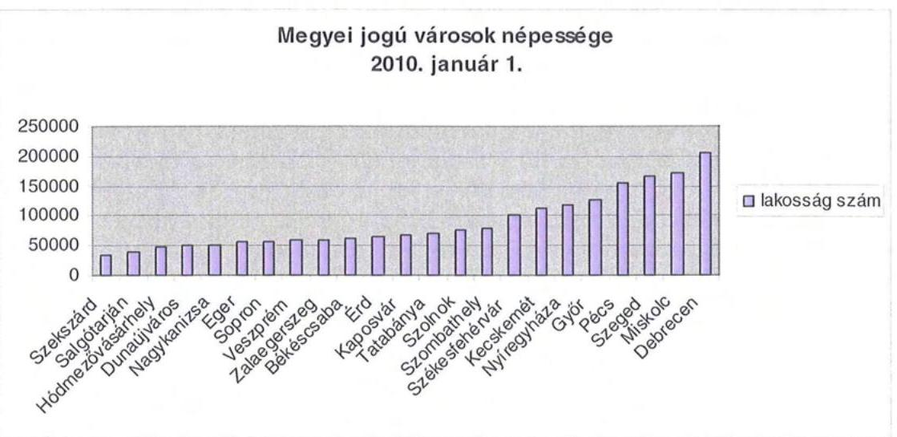

A megyei jogú városi önkormányzatok ${ }^{5}$ kötelező feladatellátását többlépcsős törvényi előírások határozzák meg. A feladatokra vonatkozó szabályozás első szintjét az Ötv. ${ }^{6}$, a második szintet a hatásköri ${ }^{7}$, a harmadik szintet a további ágazati, szakmai (egyebek mellett az oktatási, egészségügyi, szociális és egyéb ágazati feladatok ellátásának szakmai szabályait rögzítő) törvények adják.

A megyei jogú városi önkormányzatok – az Ötv-ből közvetlenül levezethető települési feladatok mellett – körzeti közszolgáltatásokat is ellátnak. A megyei

[^0]
[^0]:    ${ }^{3}$ A Magyar Köztársaság 2011. évi költségvetéséről szóló 2010. évi CLXIX. törvény Általános indoklásának III. fejezete, valamint Magyarország Konvergencia Programja 2011-2015. (2011. április) Táblázatok rész, 2. táblázat Államháztartás összefoglaló adatai szerint.
    ${ }^{4}$ A megyei jogú városok népességét a 4/2011. (I. 31.) NGM rendelet 1. sz. mellékletében foglalt 2010. január 1-i adatok alapján vettük figyelembe.
    ${ }^{5}$ Az Ötv. 61. § (1) bekezdése alapján a megyeszékhely város a törvény erejénél fogva megyei jogú, ugyanakkor az Országgyűlés az ötvenezernél nagyobb népességű városokat a képviselőtestület kérelmére megyei jogú várossá nyilváníthatja. Ez utóbbi körbe 5 város tartozik, közülük 2 (Hódmezővásárhely, Dunaújváros) népessége 2010. január 1-ére már ötvenezer fő alá csökkent.
    ${ }^{6}$ az Ötv. 8. és 61. §-ában foglaltak szerint
    ${ }^{7}$ a Htv.

---

jogú városi cím elsősorban többlet kötelezettségekkel jár, a megyei jogú városnak önmagának kell gondoskodnia mindazokról a feladatokról, amelyek más települési önkormányzatok esetében a megyei önkormányzat feladatát képezik. Ide sorolható többek közt a középfokú oktatási intézmények fenntartása, a közművelődési, könyvtári és levéltári szolgáltatás, a társadalombiztosítás finanszírozása mellett a kórházi és a rendelőintézeti szakellátás, a szociális és egyes gyermekvédelmi feladatok ellátása. Ezeket a feladatokat (intézményeket) a megyei jogú város – más városoktól eltérően – nem adhatja át a megyei önkormányzatnak, azonban az Ötv. lehetőséget biztosít arra, hogy a megyei önkormányzattal megállapodjék a feladatellátás megosztásában.

Az önkormányzat, így a megyei jogú város is, maga határozza meg, hogy – a lakosság igényei alapján, anyagi lehetőségei függvényében – mely feladatokat, milyen mértékben és módon, mely szervezeti keretek közt lát el. A szervezetalakítás szabadsága a megyei jogú városok esetében azzal járt, hogy mind a kötelező közszolgáltatásoknál (különösen a településüzemeltetés, vagyongazdálkodás), mind pedig az önként vállalt feladataik ellátásában – elsősorban a sport és kulturális szolgáltatások területein – a gazdasági társaságok kiemelt fontosságú szerephez jutottak. Ily módon a gazdálkodás, a pénzügyi helyzet kockázatai közvetlenül kikerültek ugyan az önkormányzati alrendszerből, azonban sérülhet az ellátási felelősség figyelemmel kísérése és érvényesítése, a közpénzek felhasználásának transzparenciája. Mindezek együttvéve – a beszámolók konszolidálásának hiányában – növelik a megyei jogú városok pénzügyi helyzetének megítélésében rejlő kockázatokat.

Az áttekintett időszakban az önkormányzati feladatok ellátásának keretet biztosító forrásszabályozás elvei lényegesen nem változtak.

A megyei jogú városok önkormányzatainak mozgásterét, az önkormányzatok feladatellátásra vonatkozó döntéseit a központi költségvetéstől való függőség mellett jelentősen befolyásolja a helyi adókivetési jog gyakorlása ${ }^{8}$. A helyi adók rendszere a közszolgáltatások finanszírozásához szükséges források megteremtésének, bővítésének eszköze, amely a gazdasági
 válság, a jogszabályi környezet, az adópolitika változása, az adóhatóságok tevékenysége következtében differenciáltan érinti a települési önkormányzatokat ${ }^{9}$.

A települési önkormányzatok saját folyó bevételeinek keretében elszámolt, különböző jogcímeken kivetett helyi adók - iparűzési adó, építmény és telekadó, idegenforgalmi adó, vállalkozók és magánszemélyek kommunális adója - 2007-2010 között eltérő módon emelkedtek. A helyi adókból származó bevételek realizált összege országos szinten 2007-2009 között folyamatosan, 505,3 milliárd Ft-ról 566,3 milliárd Ft-ra emelkedett, majd a gazdasági válság hatásai következtében 2010-re 542,6 milliárd Ft-ra esett vissza. A helyi adók ré-

[^0]
[^0]:    ${ }^{8}$ a helyi adókról szóló 1990. évi C. törvény szabályai szerint
    ${ }^{9}$ Az Állami Számvevőszék 2010 decemberében közzétett 1031. számú jelentésében értékelte a helyi adók rendszerében a hatékonyság és az eredményesség érvényesülését.

---

szesedése az önkormányzatok saját folyó bevételein belül 2007-2010 között 2,5 százalékponttal csökkent ${ }^{10}$.

A megyei jogú városok saját folyó bevétele 2007-ben 191,5 milliárd Ft volt, 2008-ban 223,1, 2009-ben 225,4, 2010-ben 223,5 milliárd Ft-ot tett ki. A helyi adóbevételekből való részesedésük 2007-ben 110,5 milliárd Ft (21,9%), 2008-ban 128,3 milliárd Ft (23,2%), 2009-ben 124,4 milliárd Ft (22%), 2010-ben 118,7 milliárd Ft (részaránya a 2007. évivel azonosan 21,9%) volt. E realizált adóbevételek a megyei jogú városok saját folyó bevételeinek 2007-ben 57,7, 2008-ban 57,5, 2009-ben 55,2, 2010-ben 53,1%-át jelentették. A helyi adóbevételek 2007-ről 2010-re kimutatott 4,6 százalékpontos csökkenése annak ellenére következett be, hogy a megyei jogú városok saját folyó bevétele 2010-ben 16,7%-kal haladta meg a 2007. évit.

A helyi adókon belül a települések gazdasági helyzetének egyik fokmérője az elért helyi iparűzési adóbevétel, amely a megyei jogú városok körében erőteljes - a település nagyságrendtől is függő ${ }^{11}$ - különbségeket mutat. A helyi iparűzési adóbevétel és annak egy lakosra vetített összegének 2007. és 2010. évi alakulását az alábbi diagramok szemléltetik:
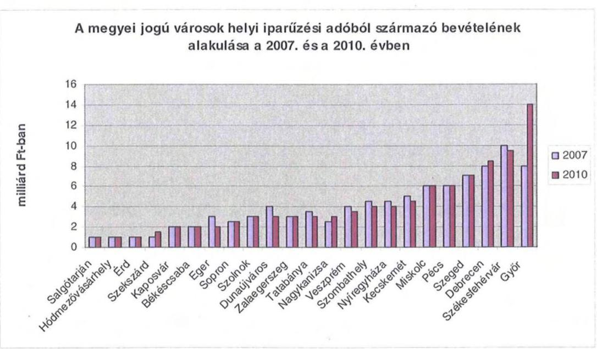

[^0]
[^0]:    ${ }^{10}$ A helyi adó bevételek saját folyó bevételekből való részesedése országosan 2007-ben 55,3%, 2010-ben 52,8% volt.
    ${ }^{11}$ A 100 ezer fő feletti népességű megyei jogú városok csoportjába Debrecen, Miskolc, Szeged, Pécs, Győr, Nyíregyháza, Kecskemét, Székesfehérvár tartozik. Nem megyeszékhely megyei jogú város Érd, Sopron, Nagykanizsa, Dunaújváros, Hódmezővásárhely.

---

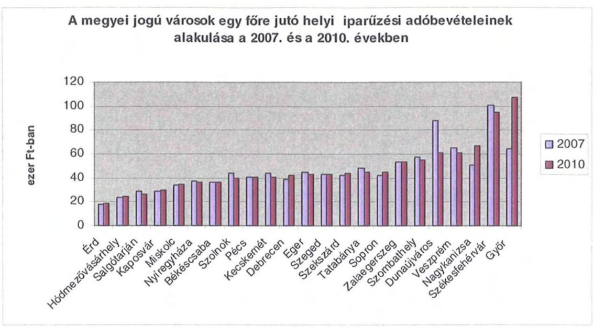

A megyei jogú városi önkormányzatok saját bevételein belül második legjelentősebb elem az illetékbevétel. A 2010. évben befolyt 39,2 milliárd Ft illetékbevétel a 2006. évben realizált 71,1 milliárd Ft illetékbevétel alig több mint 55%-a. A jelentős visszaesést döntően az ingatlanpiac stagnálása, majd visszaesése, illetve egyes illetékkedvezmények bevezetése okozta. A kieső bevételek pótlására az önkormányzati alrendszer szintjén történtek intézkedések, 2010-ben 5 milliárd Ft-ot, 2011-ben 1,2 milliárd Ft-ot ellentételezett a központi költségvetés. A megyei jogú városok önkormányzatai az önkormányzati alrendszer szintjén realizált illetékbevételből 2007-ben 13,6 milliárd Ft-tal (23,3%-kal), 2008-ban 15,3 milliárd Ft-tal (22,7%-kal), 2009-ben 12,6 milliárd Ft-tal (21,5%-kal), 2010-ben 7,9 milliárd Ft-tal (20,2%-kal) részesedtek ${ }^{12}$. Az összes befolyt illetékbevételből a megyei jogú városok részesedése 2009-ről 2010-re mindössze 1,3 százalékponttal csökkent, ugyanakkor a realizált illetékbevétel csökkenése a 37,3%-ot (4,7 milliárd Ft) is elérte.

Az önkormányzati alrendszer átengedett bevételei közül a személyi jövedelemadóból való részesedés makroszintű szabályozása a vizsgált időszakban nem változott. A települési önkormányzatokat a településre kimutatott személyi jövedelemadó 8%-a közvetlenül, míg 32%-a külön szabályozott visszaosztási rendben illeti meg. A visszaosztás a jövedelem differenciálódás mérséklésével párosul, rendje a lakóhelyen maradó személyi jövedelemadóhoz és az iparűzési adó-erőképességhez ${ }^{13}$ igazodik, annak részletszabályait a mindenkori költségvetési törvény 4. számú melléklete határozza meg. A jövedelemdifferenciálódás

[^0]
[^0]:    ${ }^{12}$ Az illetékek kivetésének és beszedésének joga 2006. december 31-ig a megyei önkormányzatok feladata volt, amelyet a 2007. évtől az APEH (2011. január 1-jétől NAV) vett át. Az önkormányzati illetékrészesedési szabályok változatlanok maradtak, azonban az illetékbeszedés költségeit az önkormányzatok illetékbevételeiből átlagos (a megyei jogú városoknál 8,5%-os) kulcsot alkalmazva vonták le.
    ${ }^{13}$ Az iparűzési adóerő-képesség egy potenciális, átlagos erőfeszítés mellett elérhető (a települési önkormányzat iparűzési adóelőlegét meghatározó adóalap 1,4%-ának megfelelő számított) bevétel.

---

szabályai kétirányúak, a kiegészítés és a visszatartás feltételeit egyaránt meghatározták:

- Amennyiben az önkormányzatot közvetlenül megillető személyi jövedelemadó bevétel és a számított iparűzési adóerő-képesség együttesen számított, egy főre jutó összege nem érte el a település méretéhez kapcsolódóan az évenkénti szabályozás szerinti változó összeget, a költségvetés a részesedést település nagyság szerint eltérően meghatározott szintig kiegészítette ${ }^{14}$. A kiegészítés fajlagos összege 2007-2010 között 37500 Ft-ról 48010 Ft-ra (10 510 Ft-tal, 28%-kal) emelkedett. Az előzőeken túl a jövedelem differenciálódás szabályozása egyes térségi (középiskolai, szakiskolai, szakképző intézményi, kollégiumi) feladatok ellátásának függvényében további kiegészítő hozzájárulást biztosított.
- Amennyiben az egy főre számított személyi jövedelemadó és az iparűzési adóerő-képesség együttes összege a település nagyságrendjéhez rendelt értékhatárt több mint 25%-kal (2010-től 20%-kal) meghaladta, az egy főre jutó összeg sávonként differenciált módon ${ }^{15}$ visszavonásra került az önkormányzatot megillető normatív állami hozzájárulás összegéből.

Az önkormányzatok személyi jövedelemadó bevétele 2007-ben 494,3 milliárd Ft, 2008-ban 558,6 milliárd Ft, 2009-ben 639,5 milliárd Ft, 2010-ben 681,2 milliárd Ft volt, az időszak alatt összegében 186,9 milliárd Ft-tal, 37,8%-kal emelkedett, miközben az szja bevétel átengedett bevételeken belüli részesedése 1,8 százalékponttal emelkedett.

A megyei jogú városok önkormányzatainak személyi jövedelemadó részesedése az alrendszer átengedett személyi jövedelemadó bevételeiből 2007-ben 77,6 milliárd Ft-ot (15,7%-ot), 2008-ban 105,4 milliárd Ft-ot (18,9%-ot), 2009-ben 122,9 milliárd Ft-ot (19,2%-ot), 2010-ben 136,6 milliárd Ft-ot (20,1%-ot) tett ki. A realizált szja bevétel a megyei jogú városoknál az időszak alatt folyamatosan emelkedett, a 2010-ben realizált adóbevétel 59,0 milliárd Ft-tal (76%) volt magasabb a 2007. évinél, az átengedett bevételeken belüli részesedése 2010-re 5,1 százalékponttal haladta meg a 2007. évi részarányt ${ }^{16}$. A részesedés alapjául szolgáló szja településenként eltérő, az egy adózóra jutó szja 2009. évi adatait ${ }^{17}$ a következő ábra szemlélteti.

[^0]
[^0]:    ${ }^{14}$ A megyei jogú városok esetében a jövedelemkülönbségek mérséklésénél figyelembe veendő lakosonkénti értékhatár 2007-ben 37500 Ft, 2008-ban 42385 Ft, 2009-ben 45933 Ft, 2010-ben 48010 Ft volt.
    ${ }^{15}$ A sávos értékhatár 2010-től 20%-os intervallumonként, 120% felett a visszatartást 25%-tól 90%-os mértékig rögzíti. Amennyiben a település nagyságrendhez rendelt értékhatár összege az önkormányzatnál eléri vagy meghaladja a 200%-ot, az egy főre jutó összeg 90%-a levonásra kerül. Az értékhatár sávjai 2010 előtt 25%-os léptékűek voltak, a levonási arányok az ellenőrzött időszakban nem változtak.
    ${ }^{16}$ E bevételek a megyei jogú városok átengedett bevételeiben 2007-ben 84,7, 2008-ban 87,7, 2009-ben 89,7, 2010-ben 89,8%-os részarányt jelentettek.
    ${ }^{17}$ Adatforrás: KSH Megyei Jogú Városok a Közép Dunántúlon 2009. kiadványa, 4.1.sz. összehasonlító tábla.

---

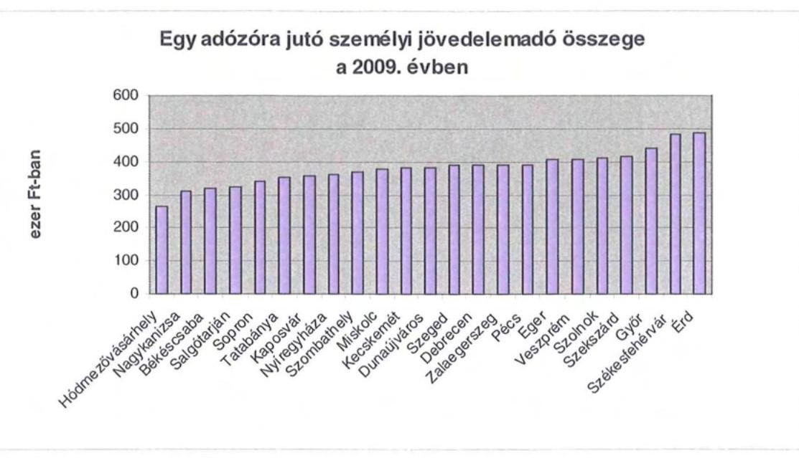

Az átengedett bevételek második legjelentősebb eleme a gépjárműadó, amelynek bevételi szabályozása az ellenőrzött időszakban nem változott, az adóbevétel teljes összege az önkormányzatot illeti meg. A gépjárműadó alapját, mértékét ${ }^{18}$ és egyes mentességi kategóriákat érintő módosítások 2010. január 1-től következtek be, amelyek az egyes adótételek esetében átlagosan 15%-os emelkedéssel jártak.

A gépjárműadó beszedéséből származó bevétel az önkormányzati alrendszer szintjén 2007-ben 62,4 milliárd Ft, 2008-ban 65,7 milliárd Ft, 2009-ben 63,8 milliárd Ft, 2010-ben 71,1 milliárd Ft volt, az adóbevétel egésze 2007-hez képest 8,7 milliárd Ft-tal, 13,9%-kal emelkedett. A gépjármű-adóztatás szabályainak változása 2010-ben 7,3 milliárd Ft többletet eredményezett. A megyei jogú városok gépjárműadó bevétele a 2007. évi 14,0 milliárd Ft-ról 2010-re 15,5 milliárd Ft-ra, 10,7%-kal emelkedett. A bevételnövekedés összegéből 1,4 milliárd Ft a 2010. évi adózási szabályok következménye.

A megyei jogú városok önkormányzatai 2007-2010 között rendelkezésre álló forrásainak alakulását a következő ábra szemlélteti:

[^0]
[^0]:    ${ }^{18}$ A gépjárműadóról szóló 1991. évi LXXXII. törvény 7. § (1) bekezdésében foglalt adómértékek változása.

---

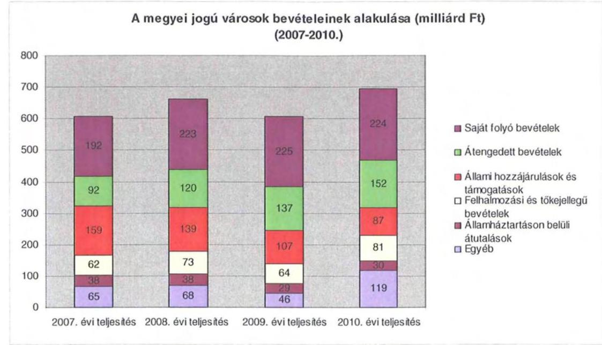

A megyei jogú városok saját folyó bevételeinek - amelyek főbb elemei: a helyi adók, az illetékbevételek, az intézményi térítési díjak, a kamatbevételek részaránya a 2007. évi összbevételen (608 milliárd Ft) belül 32% volt. A 2010. évi összbevétel 693 milliárd Ft-os összegéből a saját folyó bevételek aránya - miközben összege 2007-ről 2010-re 32 milliárd Ft-tal emelkedett - nem változott.

Az átengedett bevételek, amelyek a megyei jogú városok önkormányzatainál döntően a személyi jövedelemadó és a gépjárműadó részesedést jelentik, az összbevételen belül a 2007. évi 92 milliárd Ft-ról (15%) 152 milliárd Ft-ra nőttek, részesedésük 7 százalékponttal emelkedett. A 60 milliárd Ft-os növekedésből 59 milliárd Ft-ot az szja részesedés emelkedése okozott.

Az állami hozzájárulások és támogatások - amelyek főbb elemei: főként az ellátotti létszámhoz kötődő normatív állami hozzájárulások, központosított előirányzatok - a 2007. évi 159 milliárd Ft-ról (26%-os részarányról) 2010-re 87 milliárd Ft-ra (13%-os részarányra) estek vissza.

A felhalmozási és tőkejellegű bevételek - tárgyi eszközök (ingatlanok és ingóságok), föld és immateriális javak, részesedések értékesítése, EU-tól átvett pénzeszközök - a 2007. évi 62 milliárd Ft-ról (10%-os részarányról) 2010-re 81 milliárd Ft-ra (12%-os részarányra) emelkedtek.

Az államháztartáson belüli átutalások részesedése 2007-ben 38 milliárd Ft volt. 2010. év végére 8 milliárd Ft-tal csökkent, részaránya 6%-ról 2010-ben 4%-ra változott. Ez a bevételi kategória tartalmazza az Egészségbiztosítási Alaptól és más elkülönített állami pénzalapoktól átvett forrásokat. A 2010-ben e címen elszámolt bevétel a megyei jogú városoknál 22 milliárd Ft-ot tett ki.

Az egyéb, pénzmaradványból, vállalkozási bevételekből, államháztartáson kívülről származó átutalásokból, a hitelekből, a hosszú és rövid lejáratú értékpapírok értékesítéséből származó bevételek részesedése a 2007-2010. évek viszonylatában 11%-ról 17%-ra emelkedett. Ez utóbbiak 2010. évi beszámoló szerinti összevont teljesítése 119 milliárd Ft volt ${ }^{19}$.

Mindezeket figyelembe véve a megyei jogú városok 2007. és 2010. évi forrásöszszetételének megoszlását az alábbi ábra szemlélteti:

A megyei jogú városok 2007. és 2010. évi forrásösszetétele
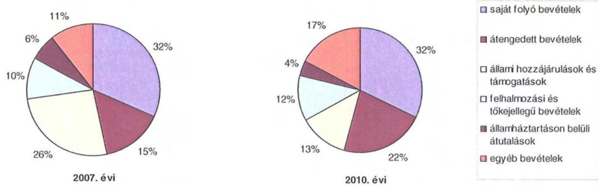

Az önkormányzati alrendszer pénzügyi helyzetértékelése során új elemzési módszereket alkalmaz az ellenőrzés. A hagyományos költségvetési szerkezet helyett az önkormányzat pénzügyi helyzetét a CLF módszerrel mutatjuk be, amelynek lényegét és számításának módszerét a 2.1. pontban, és a jelentés 2. számú mellékletében ismertetjük részletesen.

Az új módszereken alapuló helyzetértékelés fontosságát az adja, hogy a helyi önkormányzatok bruttó adósságállománya ${ }^{20}$ a 2010. évi költségvetési beszámoló alapján 1248 milliárd Ft-ot tett ki. Az adósságállomány koncentráltságát jelzi ${ }^{21}$, hogy ebből a 23 megyei jogú város részesedése 338 milliárd Ft volt, amely a fővárosi és kerületi önkormányzatok adósságának figyelmen kívül hagyásával számított 2010. évi 977 milliárd Ft összegű
 bruttó adósságállomány 34,6%-át jelentette. Az adósságállomány több mint fele - 501 milliárd Ft - a 19 megyei önkormányzatnál és a 23 megyei jogú városnál jelentkezett.

[^0]
[^0]:    ${ }^{19}$ Az egyéb bevételek összege 2007-2010 között eltérő módon változott, 2007-ben 65 milliárd Ft, 2008-ban 68 milliárd Ft volt, 2009-ben 46 milliárd Ft-ra esett vissza, majd 2010-ben több mint két és félszeresére, 119 milliárd Ft-ra emelkedett.
    ${ }^{20}$ A bruttó adósságállomány 2010. év végi összege magában foglalja a fejlesztési és a működési célú kötvénykibocsátások, a beruházási és fejlesztési hitelek, a működési célú hosszú lejáratú hitelek, a rövid lejáratú hitelek, váltótartozások miatti kötelezettségek teljes (2011-ben, illetve az azt követő években esedékes) állományát.
    ${ }^{21}$ A megyei jogú városok adósságállománya összegében ugyan elmarad az egyéb városok összesített adósságától [(ez utóbbiak részesedése 382,6 milliárd Ft (39,2\%)], azonban az egyéb városok száma 304. A fővárosi és a kerületi önkormányzatok nélküli adósságállományból a 19 megyei önkormányzat 163 milliárd Ft-tal (16,8%-kal), míg a nagyközségek, községek együttesen 93 milliárd Ft-tal (9,5%-kal) részesednek.

---

A megyei jogú városok 338 milliárd Ft-os adósságállományából 175 milliárd Ft (51,8%) a 8 legnagyobb, 100 ezer fő feletti népességű város tartozása. Az 5 nem megyeszékhely megyei jogú város bruttó adósságállománya 70 milliárd Ft-ot (20,7%-ot), az előző két csoportba nem tartozó további 10 megyei jogú város adóssága 93 milliárd Ft-ot (27,5%-ot) tett ki.
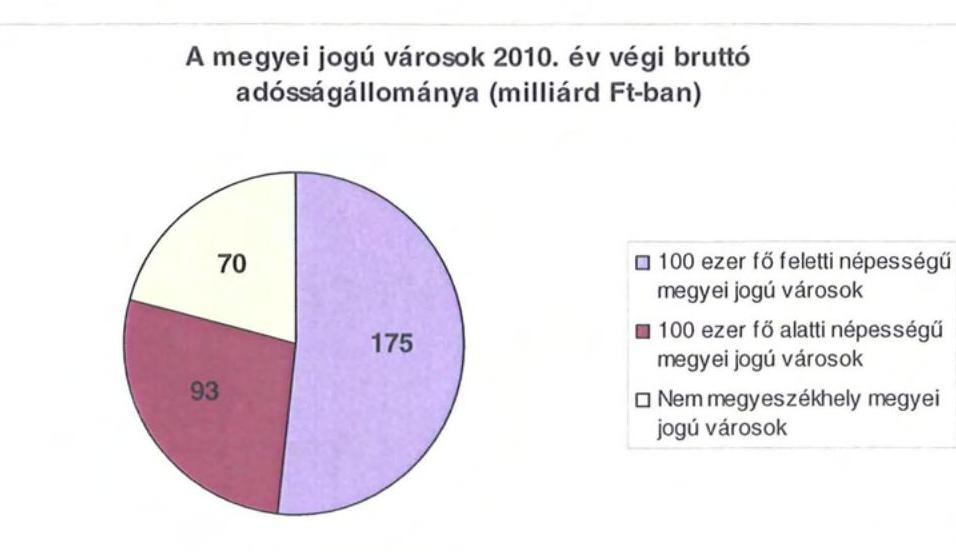

A mérlegben kimutatott bruttó adósságállomány mellett az önkormányzatok számára az eszközállomány műszaki állapotának megőrzése is kötelezettségekkel jár. Az elhasználódott eszközök pótlására forrást biztosító amortizációs (felújítási) alap képzésének ${ }^{22}$ elmaradása maga után vonhatja a feladatellátást kiszolgáló tárgyi eszközök állagának erőteljes romlását. Emellett a 2007-2013-as időszakra meghirdetett, vissza nem térítendő EU-s fejlesztési forrásokhoz való hozzájutás lehetősége felerősítette az önkormányzati alrendszer fejlesztési igényeit, amelyek a felhalmozási költségvetési hiány folyamatos emelkedésén túl - az előírt jövőbeni fenntartási kötelezettség miatt - tovább terhelhetik az önkormányzatok költségvetését ${ }^{23}$.

Az ÁSZ a 2011. évi ellenőrzési tervében 43. számú, az Önkormányzatok gazdálkodási rendszerének ellenőrzése részeként egy időben, egymással párhuzamosan tekinti át, és elemzi a 23 megyei jogú városi önkormányzat pénzügyi helyzetét. A gazdálkodás szabályszerűségét az ÁSZ az előző évek során ebben az önkormányzati körben is ellenőrizte, ezért jelen vizsgálatunk erre nem tér ki. A jelentés a megyei jogú városok sajátos feladat-ellátási és forrásszabályozási helyze-

[^0]
[^0]:    ${ }^{22}$ Erre a jelenlegi szabályozási környezetben nem kötelezi semmilyen előírás az önkormányzatokat.
    ${ }^{23}$ Az Állami Számvevőszék 2011 júniusában közzétett 1108. számú, a helyi önkormányzatok fejlesztési célú támogatási rendszerének ellenőrzéséről szóló jelentésében feltárta a fejlesztési folyamatok problémáit. A helyi önkormányzatok elsősorban azokat a fejlesztéseket valósították meg, amelyekhez támogatást lehetett igényelni. A fejlesztési célok közül a magasabb támogatás intenzitású pályázatokat részesítették előnyben. A fejlesztéssel megvalósuló létesítmények jövőbeli üzemeltetésének várható ráfordításait az önkormányzatok 71,9%-a nem mérte fel.

---

tére tekintettel az önkormányzatok pénzügyi helyzetét, illetve az ezzel összefüggő korábbi ÁSZ javaslatok megvalósítását mutatja be.

Az ellenőrzés a 2007. január 1. - 2010. december 31. közötti időszakot öleli fel.
A vizsgálat jogszabályi alapját az Állami Számvevőszékről szóló 1989. évi XXXVIII. törvény 2. § (3), (5), (6) és (9) bekezdései ${ }^{24}$, az Ötv. 92. § (1) bekezdése, az Áht. 104. § (3), és 120/A. § (1) bekezdése előírásai képezik.

[^0]
[^0]:    ${ }^{24}$ 2011. július 1-jétől az Állami Számvevőszékről szóló 2011. évi LXVI. törvény 5. § (2)(5) bekezdése

---

# I. ÖSSZEGZŐ MEGÁLLAPÍTÁSOK, KÖVETKEZTETÉSEK, JAVASLATOK 

Az Önkormányzat - adatszolgáltatása szerint - a tárgyév működési költségvetési kiadásaiból (37353 millió Ft) 27033 millió Ft-ot (72%) a kötelező feladatok, 10320 millió Ft-ot (28%) az önként vállalt feladatok ellátására fordított. Kötelező feladatait az Ötv. és az ágazati törvények által meghatározottnak tekinti, az önként vállalt feladatokról a Közgyűlés évente, a költségvetési rendelet megalkotásával egyidejűleg határozatban döntött. Az önkormányzat a kötelező feladatok ellátása mellett önként vállalt feladatnak tekinti a színház, szimfonikus zenekar, felnőtt- és egyéb oktatás, szálláshely szolgáltatás, ingatlanhasznosítás, szociális idősotthoni emelt szintű szolgáltatás, városmarketing, civil szervezetek támogatása, pályázati, beruházási előkészítő feladatokat. Gazdasági társaságai útján látja el a piacüzemeltetési, a strand- és fürdőszolgáltatási, a turisztikai, a rendezvényszervezési, az informatikai fejlesztési és a televízió műsorszolgáltatási - önként vállalt - feladatokat. Az Önkormányzat önként vállalt feladatainak meghatározásakor figyelemmel volt arra az Ötvben foglalt előírásra, hogy rendelkezik mindazokkal az intézményi feltételekkel, amelyek biztosítják, hogy a területén saját hatáskörében a megyei önkormányzat számára előírt kötelező feladatokat is ellássa.

Az Önkormányzat feladatellátásának szervezeti struktúráját a következő ábra szemlélteti:
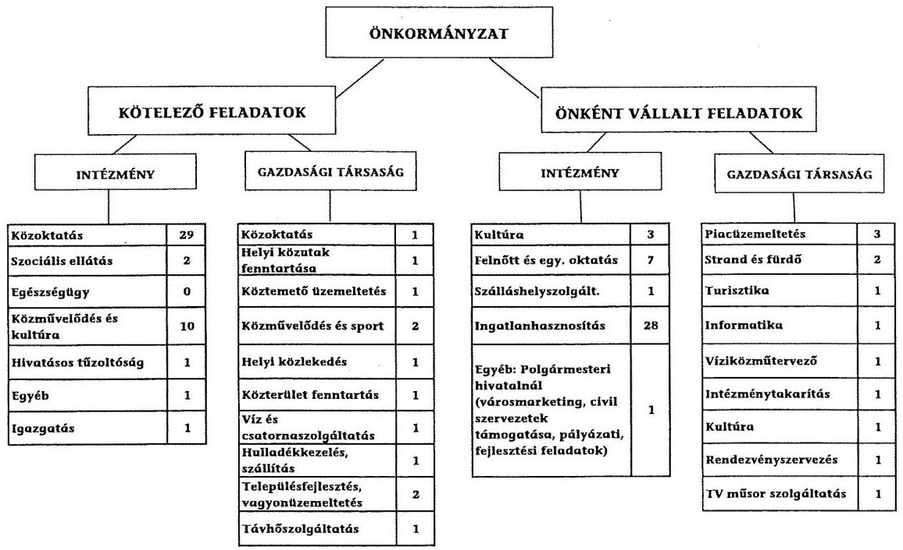

Az Önkormányzat feladatait 2010. december 31-én (a Polgármesteri hivatallal együtt) 47 költségvetési szervvel és 21 többségi tulajdoni hányadú gazdasági társaságával, két olyan gazdasági társasággal, amely az Önkormányzat társaságainak 25% feletti tulajdoni hányadában volt, továbbá egy - az önkormány-

---

zattól tulajdonosi szempontból független gazdasági társaság közreműködésével látta el. Az Önkormányzat az áttekintett időszakban a közoktatási feladatokból négy intézményt, továbbá a szociális alap és szakosított ellátásokat, a gyermekvédelmi közszolgáltatási feladatok közül a gyermekjóléti központ feladatait és a gyermekek átmeneti gondozását ellátó intézményeket átadta a Többcélú Társulásnak. A sportfeladatokat gazdasági társasága útján látja el. Az intézmények megszüntetése, összevonása és átadása következtében a feladatellátás telephelyeinek száma a 2006. évi 375-ről 2010-re 201-re csökkent.

Az Önkormányzat működési kiadásokra 2010-ben 37353 millió Ft-ot fordított, amely 4398 millió Ft-tal (13%-kal) haladta meg a 2007. évi ráfordításokat. A működési kiadások 59%-át az intézményi körben realizálták. E kiadások fedezetéül szolgáló bevételi források 2007. és 2010. években jellemző összesített arányait a következő ábra szemlélteti:
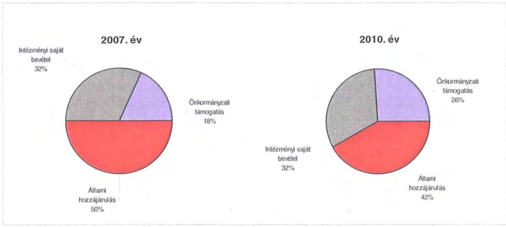

Az egyes közszolgáltatások feladatellátásában résztvevő ágazati intézménycsoportok forrásösszetételének bevételi jogcímenkénti alakulását a következő ábra szemlélteti:
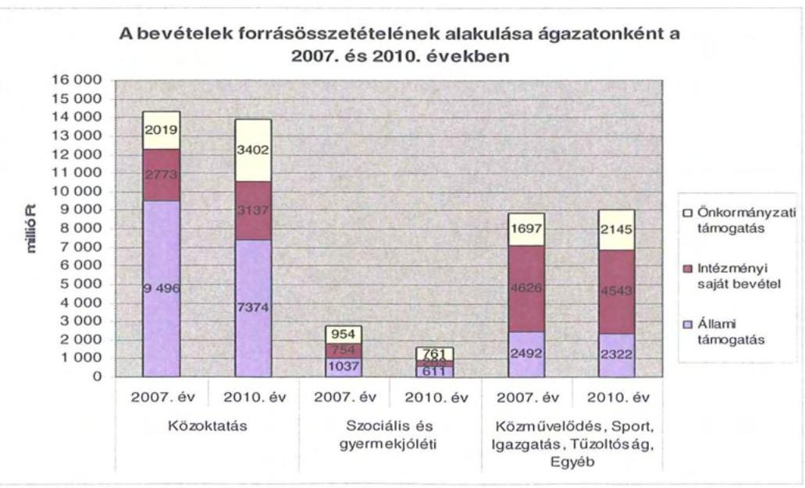

---

Az Önkormányzat 2010. december 31-én 13 gazdasági társaságban rendelkezik kizárólagos tulajdonnal, 3 gazdasági társaságban 75% feletti, 5 gazdasági társaságban 50-75% közötti tulajdoni hányaddal. A gazdasági társaságok közoktatási, helyi közutak és közterületek fenntartása, helyi közlekedési, víz- és csatornaszolgáltatási, köztemető üzemeltetési, hulladékkezelés és -szállítási, településfejlesztési, vagyonüzemeltetési, sport, közművelődési és távhőszolgáltatási területen kaptak szerepet az önkormányzati kötelező feladatellátásban. Működésükhöz a 2010. évben összesen 4753 millió Ft rendszeres működési és 617 millió Ft fejlesztési pénzeszközt kaptak az Önkormányzattól. Az átadott működési pénzeszköz 28%-át (1346 millió Ft-ot) a köztisztasági, közterület-fenntartási és hulladékgazdálkodási kötelező feladatokat ellátó nonprofit kft. kapta.

A gazdasági társaságoknál a saját tőke jegyzett tőke arányának átlaga 4,5 volt. A víz- és csatornaszolgáltatási, továbbá a távhőszolgáltatási feladatokat ellátó gazdasági társaságoknál ez az arány öt fölött volt. Ez az arány (0,8) a közművelődési feladatokat ellátó nonprofit kft-nél volt a legrosszabb. Az Önkormányzat veszteségrendezésre 2007-2010. években nem nyújtott tőkepótlást gazdasági társaságainak, továbbá 2010. december 31-én nem volt ilyen kötelezettségvállalása. Gazdasági társaságaival szemben nem kezdeményeztek csődeljárást. A kötelező közszolgáltatást ellátó tíz gazdasági társaság közül három mérleg szerinti eredménye volt negatív (a távhőszolgáltatási feladatokat ellátó kft-nek 189 millió Ft, a sport és fürdő feladatokat ellátó kft-nek 68 millió Ft, a közművelődési feladatokat ellátó nonprofit kft-nek 19 millió Ft volt a vesztesége), ezek közül kettő részesült 609, illetve 163 millió Ft működési célra átadott pénzeszközben.

A folyó költségvetés egyenlege (működési jövedelem) 2007-2010 között működési forrástöbbletet mutatott ${ }^{25}$. A 2007-2010. években a működési többletek fedezni tudták a tárgyévben jelentkező törlesztési kötelezettségeket, így az Önkormányzat pénzügyi kapacitása (nettó működési jövedelme) is pozitív értékű volt.

[^0]
[^0]:    ${ }^{25}$ A működési jövedelem 2007-ben a folyó bevételek 8%-át (3384 millió Ft-ot), 2008-ban 11%-át (4525 millió Ft-ot), 2009-ben 12%-át (4526 millió Ft-ot) és 2010-ben 8%-át (3276 millió Ft-ot) jelentette.

---

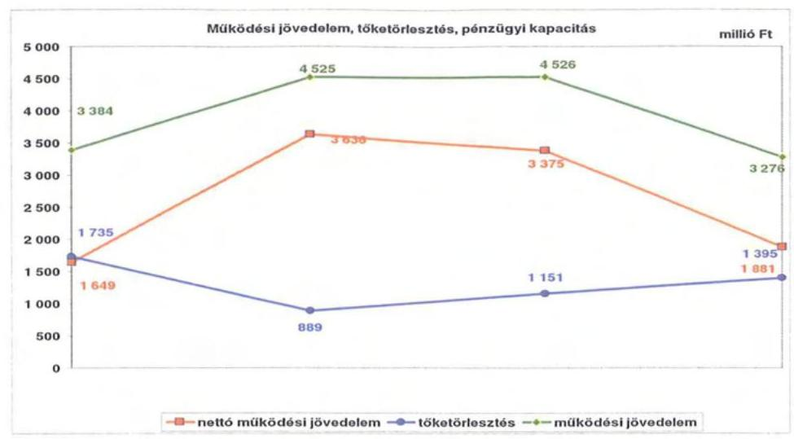

A 2007-2010. években az Önkormányzat felhalmozási költségvetésének egyenlege folyamatosan negatív összegű volt, amely 2007-2010. között összesen 23446 millió Ft felhalmozási forráshiányt okozott.

A pénzügyi egyensúly fenntartása külső források bevonásával biztosítható volt. A 2007-2010. években 5170 millió Ft hitelt törlesztettek. Az adósságszolgálat, továbbá a felhalmozási forráshiány 2007-2010. között 28616 millió Ft-ot tett ki, amelyre az időszakban képződő 15711 millió Ft működési többlet (működési jövedelem), valamint a 2007. január 1-jén rendelkezésre álló 2626 millió Ft pénzkészlet szolgált fedezetül. A további pénzeszközöket 6720 millió Ft hitel lehívásával, 2010. december 31-én 2774 millió Ft folyószámlahitel hitel igénybevételével, továbbá 2500 millió Ft kötvény kibocsátásával teremtették meg. Az Önkormányzatnál a 2007-2010. években a nettó működési jövedelem pozitív volt. A pénzügyi egyensúly hosszú távú fenntarthatósága továbbra is megfontolt, körültekintő gazdálkodást igényel az Önkormányzat részéről az intézmények működésének, az adósságszolgálat (tőke- és kamatfizetés) finanszírozhatóságának biztosítása érdekében.

A vizsgált időszakban az Önkormányzatnál helyi iparűzési adó, építményadó és vendégéjszakák utáni idegenforgalmi adó adónemeket vezettek be. A helyi adókból és pótlékokból származó bevételek aránya 2007-2010 között 21-26% körül mozgott a folyó (működési) bevételekben. A pótlékkal, bírsággal növelt helyi adó bevétel a 2007. évi 9447 millió Ft-ról 2010. évben 9968 millió Ft-ra (6%-kal, 521 millió Ft-tal) emelkedett. A helyi adóbevételek háromnegyed részét az iparűzési adó tette ki, amelynek mértéke a helyi adókról szóló törvényben rögzített maximális mértékben került megállapításra. A helyi adóbevétel 2007-ről 2010-re az építményadó mértékének évenkénti emelése miatt növekedett. Új helyi adónemet a vizsgált időszakban az Önkormányzat nem vetett ki.

A 2007-2010. évek időszakában a befejezett fejlesztések 95%-át európai uniós és hazai támogatásokból, valamint saját forrásból finanszírozták. A befejezett 57256 millió Ft értékű fejlesztés forrás megoszlása 12799 millió Ft EU-s támogatás (22%), 21159 millió Ft hazai támogatás (37%), 20649 millió Ft saját bevétel (36%) és 2648 millió Ft hitel (5%) volt.

---

Az Önkormányzat 2010. év végén folyamatban lévő fejlesztési feladataira 2010. december 31-ig kifizetett összeg 13188 millió Ft volt, amelyet 6271 millió Ft EU-s támogatásból, 4521 millió Ft saját bevételből, 1263 millió Ft hazai támogatásból és 1133 millió Ft hitelből (9%) biztosítottak. A források a fejlesztések esetében az EU-s és a hazai támogatásoknál utólagosan állnak rendelkezésre, ezért az Önkormányzat a hosszú lejáratú hitelek felvételével finanszírozza a beruházási munkálatokat.
2010. december 31-én folyamatban lévő és a 2010. évet követő kötelezettségvállalásainak összege 17120 millió Ft, melynek forrásösszetétele az alábbi:
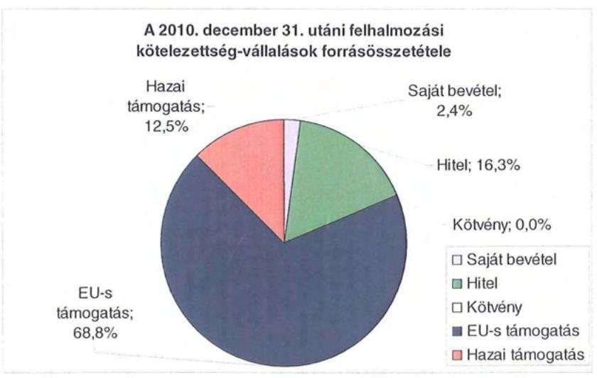

Az Önkormányzat által beadott, elbírálás alatt álló pályázatok tervezett teljes bekerülési költsége 3039 millió Ft volt, amelyhez 1830 millió Ft európai uniós támogatás és 317 millió Ft hazai támogatás igénylése iránt nyújtottak be pályázatot, amelyhez a már meglévő hitelszerződések alapján a még fel nem használt hitelkeretből 369 millió Ft hitel igénybe vételét tervezik.

Az Önkormányzat mérleg
 szerinti pénzintézeti kötelezettsége a 2006. év végéről a 2010. év végére 14145 millió Ft-ról 24072 millió Ft-ra nőtt, amelyből az árfolyamváltozás miatti különbözet 1052 millió Ft volt. A fennálló pénzintézeti kötelezettségek egy kötvénykibocsátásból, tíz hosszú lejáratú hitelből, kettő rövid lejáratú rulírozó (egyéb likvid) hitelből és folyószámlahitel igénybevételéből keletkeztek. Az Önkormányzat a 2011. évben döntést hozott további három hitel igénybevételéről, illetve egy kötvény kibocsátásáról, amely alapján a hiteleknél a közbeszerzési eljárás, a kötvénykibocsátás esetében a szerződéskötés folyamatban van.

A 2007-2010. években az Önkormányzat hosszú lejáratú pénzintézeti kötelezettségvállalásaira közgyűlési döntés alapján került sor. A kötelezettségvállalásokból származó források felhasználási céljait meghatározták, betartották a fedezet megjelölésére vonatkozó helyi és központi előírásokat. Az Önkormányzat az adósságot keletkeztető kötelezettségvállalásának felső határát nem lépte túl.

---

Az Önkormányzat a megvalósult kötvénykibocsátás bevételéből az önkormányzati tulajdonú gazdasági társaságok beruházásainak finanszírozását biztosítja. Fejlesztési hiteleiből panelházak felújításához biztosít forrást, továbbá az önkormányzati beruházások pályázati önrészét finanszírozza.

Az Önkormányzat 2010. december 31-ig a devizában fennálló hosszú lejáratú pénzintézeti kötelezettségeiből 19455 ezer CHF (3463 millió Ft) és 258 ezer EUR (72 millió Ft) tőkét törlesztett, kamatot fizetett. A HUF-ban fennálló hosszú lejáratú kötelezettségekből 2150 millió Ft tőkét és kamatot teljesített.

Az Önkormányzat a hitelek igénybevételéből származó forrásokat 2010. év végéig a céloknak megfelelően felhasználta. A kötvénybevételből a tervezett célokra 937 millió Ft-ot vett igénybe. A kötvényből származó bevétel 63%-át, 1563 millió Ft-ot a kötvénykibocsátáskor meghatározott felhalmozási célokra még nem használták fel, azt a folyamatban lévő beruházásokhoz a szükséges ütemezésben veszik igénybe. A fel nem használt kötvénykibocsátásból származó bevételt 2011. március 31-én a folyószámlán tartották és likviditási gondjaik enyhítésére, a folyószámlahitel csökkentésére elszámolták.

Az Önkormányzat a 2007-2010. években átmenetileg szabad pénzeszközeiből 1683 millió Ft kamatbevételt realizált, amelyből 1,7 millió Ft származott a kötvénybevételek befektetéséből. A kamatbevételeket működtetésre fordították.

Az Önkormányzat a vizsgált időszakban nem váltott számlavezető bankot. A 2010. év végén fennálló kötelezettségből a kibocsátott kötvények lejegyzését és a hosszú lejáratú hitelek folyósítását nem a számlavezető pénzintézet biztosította az Önkormányzat részére. A számlavezető bank folyószámlahitelt és egyéb likvid (rulírozó) hitelt nyújtott az Önkormányzatnak.

Az Önkormányzat működésének pénzügyi egyensúlyát a vizsgált időszakban folyószámlahitel és egyéb likvid (rulírozó) hitel igénybevételével tudta biztosítani.

A folyószámlahitel igénybevétele a 2007-2010. években az alábbiak szerint alakult:

| Megnevezés | 2007. év | 2008. év | 2009. év | 2010. év |
| :--: | :--: | :--: | :--: | :--: |
| Keretösszeg január.1-jén | 2980 | 2980 | 2980 | 2980 |
| Átlagos napi állomány | 121 | 328 | 831 | 492 |
| Folyószámla hitellel zárt napok száma (nap) | 150 | 139 | 277 | 268 |
| 2010. december 31-i egyenleg (állomány) | $x$ | $x$ | $x$ | 2774 |

A folyószámlahitel napi átlagos állománya 2011. I. negyedévében 1392 millió Ft-ra növekedett az utófinanszírozás miatt megelőlegezett EU-s támogatások hatására. A likviditás biztosítása az Önkormányzatnak 440 millió Ft kamatkiadást okozott.

A 2007-2010. években az Önkormányzat az év minden napján rulírozó hitelt vett igénybe, annak napi átlagos állománya a 2007. évi 4,2 milliárd Ft-ról a 2010. évre 5,4 milliárd Ft-ra emelkedett. Hitelcélként mindig az előző szerződéssel felvett rulírozó hitel visszafizetését jelölték meg. A rulírozó hitelekkel kapcsolatban 580 millió Ft kamatkiadás merült fel.

---

Az Önkormányzat 2010. év végi szállítói tartozása 843 millió Ft, amelyből a lejárt tartozás 4 millió Ft volt. A lejárt tartozások 30 nap alattiak voltak.

Az Önkormányzat a 2007-2010. években nem vállalt készfizető kezességet, nem tett garanciavállalást és nem hajtott végre PPP konstrukció keretében fejlesztést. A 2010. év végén fennálló, kezességgel kapcsolatos kötelezettség 1362 millió Ft volt, amely a 2007. évet megelőzően a Csatorna Társulat, illetve egy önkormányzati tulajdonú gazdasági társaság által felvett beruházási hitelekhez tett kezességvállalásokból keletkezett. A gazdasági társaságok részére hét alkalommal összesen 1886 millió Ft összegben adott át pénzeszközt az Önkormányzat.

A Közgyűlés fejlesztési hitel biztosítékaként 47 millió Ft értékű jelzálogjog bejegyzéséhez járult hozzá egy forgalomképes, 113 millió Ft számviteli nyilvántartás szerinti nettó értékű ingatlanán. A jelzálogszerződéssel érintett ingatlan a forgalomképes ingatlanok 2%-át jelenti. Beruházási támogatásokhoz kapcsolódva további hat, korlátozottan forgalomképes, 4994 millió Ft együttes nettó értékű ingatlanra történt 3572 millió Ft értékben jelzálogbejegyzés, amely a korlátozottan forgalomképes ingatlanok 5%-át jelenti.

Az Önkormányzat kötelezettségeinek 2010. december 31-i állományát és várható alakulását a kötelezettségek lejáratáig a következő táblázat szemlélteti:
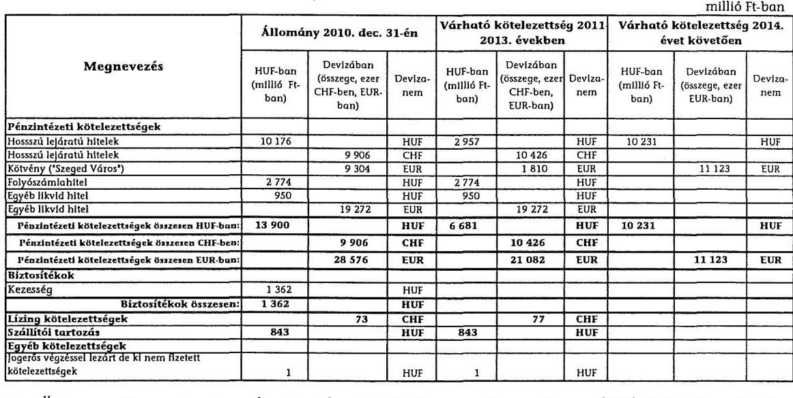

Az Önkormányzatnak pénzintézetekkel szemben fennálló kötelezettsége a 2010. év végén 13900 millió Ft, 9906 ezer CHF és 28576 ezer EUR volt. Ezek várható kötelezettsége (tőke, kamat) a legutóbbi kamatfizetés feltételei alapján a 2011-2013. években 6681 millió Ft, 10426 ezer CHF és 21082 ezer EUR, amelynek teljesítésére figyelembe vehető 1273 millió Ft mérlegben kimutatott követelésállomány és 6418 millió Ft forgalomképes ingatlanvagyon. A 2014. évet követően az Önkormányzat várható kötelezettsége 10231 millió Ft és 11123 ezer EUR. Az Önkormányzat tájékoztatása szerint figyelembe vehető források az éves költségvetési rendeletekben megtervezett önkormányzati saját bevételek, amelyeket a fennálló kötelezettségek futamidejének végéig számszerűsített. Az Önkormányzatnak a 2011-2013. években szállítói tartozások és jogerős végzéssel lezárt, de ki nem fizetett kötelezettségek címén 844 millió Ft, lízing kötelezettség címén 77 ezer CHF fizetési kötelezettsége ke-

---

letkezett. A kezességvállalásaiból adódóan 1362 millió Ft összegű terhe jelentkezhet, amennyiben egy társasága és a Csatorna Társulat kötelezettségeiket nem teljesítik.

Az Önkormányzat minősített többségi tulajdonú társaságai kötelezettségeinek 2010. december 31-i állományát és várható alakulását a kötelezettségek lejáratáig a következő táblázat mutatja be:
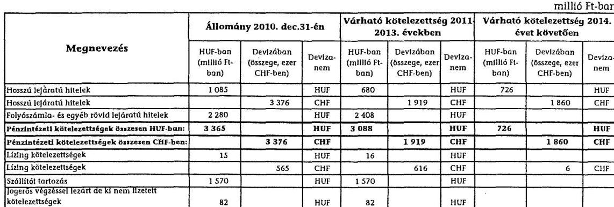

Az önkormányzati kötelezettségek növekedése mellett a minősített többségi tulajdonú társaságok kötelezettségei is befolyásolhatják az Önkormányzat pénzügyi egyensúlyát. A társaságoknak a 2011. évtől 3814 millió Ft és 3779 ezer CHF pénzintézeti kötelezettséget, 16 millió Ft és 622 ezer CHF lízing, 1570 millió Ft szállítói tartozást, valamint 82 millió Ft jogerős végzéssel lezárt, de ki nem fizetett kötelezettséget kell rendezniük. Ezek nem teljesítése kockázatot hordoz, ha - csőd- és felszámolási eljárásban - a bíróság megállapítja az Önkormányzat korlátlan és teljes felelősségét.

Az Önkormányzat költségvetési támogatásból, átengedett bevételekből, és illeték bevételekből származó bevételei a 2007. évhez képest az időszak egészét tekintve összességében 1893 millió Ft-tal csökkentek. Ennek ellensúlyozására az Önkormányzat kiadáscsökkentő és bevételnövelő intézkedéseket tett. A 2007-2010. években tett intézkedések hatására 2001 millió Ft bevételi többletet, továbbá 1450 millió Ft kiadási megtakarítást mutattak ki, ezáltal az Önkormányzat pénzügyi helyzetét javították. A kiadási megtakarítások 82%-a az elrendelt álláshely csökkentések eredménye. Az álláshely csökkentő intézkedések 2007-2010. között a Hivatalnál és az intézményeinél összesen 2055 álláshely megszüntetését jelentették. A bevételnövelő intézkedések szabad kapacitások kihasználásához, ingatlanok bérbeadásához, térítési, bérleti díjak, helyi adók mértékének emeléséhez kapcsolódtak.

Az utóellenőrzés során az Önkormányzat gazdálkodási rendszerének korábbi ellenőrzése során tett javaslatok közül a pénzügyi egyensúly javítására vonatkozott három szabályszerűségi és egy célszerűségi javaslat hasznosulását ellenőriztük. A javaslatokban megfogalmazott feladatokat, elvárásokat 100%-ban hasznosították.

---

Az Önkormányzat pénzügyi helyzetét összegezve a következők emelhetők ki:

A 2007-2010. években az Önkormányzat működési kockázatát a folyó költségvetés pozitív egyenlege, a minimális lejárt szállítói tartozásállomány csökkentette. Pénzügyi kockázatot jelez a folyószámlahitel záró állományának és napi átlagos állományának növekedése, valamint a folyamatosan fennálló rulírozó hitelállomány.

A működési kockázatot növelheti, likviditási nehézséget idézhet elő az Önkormányzatnál a 2011. évre tervezett kiemelkedő volumenű fejlesztések támogatásainak előfinanszírozása.

Az Önkormányzat pénzügyi helyzetére befolyást gyakorol az önként vállalt feladatok működési célú költségvetési kiadásokon belüli aránya. A gazdasági társaságok szerepe a közfeladat-ellátásban meghatározó volt, az általuk ellátott feladatstruktúra letisztított, átlátható. A gazdasági társaságok közfeladat ellátása a működési kockázatot nem növelte, mivel közüzemi közszolgáltatási feladatokat (közút- és közterület-fenntartás, hulladékgazdálkodás, víz- és csatornaszolgáltatás, vagyonüzemeltetés, településfejlesztés, köztemető üzemeltetés, helyi közlekedés) látnak el.

A vizsgált időszakban az Önkormányzat felhalmozási bevételeinek és kiadásainak egyenlege növekvő mértékben pénzügyi hiányt mutatott, ennek forrása a működési jövedelemből, hitelfelvételből, pénzmaradvány igénybevételével biztosított volt. Az Önkormányzat kimutatásai szerint a fejlesztési célú kötelezettségvállalásoknál a jövőben teljesítendő kifizetésekre a fedezet rendelkezésre áll, ezért az a felhalmozási kockázatot nem növelte.

A pénzintézeti és egyéb kötelezettségek teljesítésének kockázatát csökkenti, hogy az Önkormányzat rendelkezik - szükség esetén adósságszolgálat teljesítésére is felhasználható - forgalomképes ingatlanvagyonnal és - a 2010. évi ÁSZ ellenőrzés javaslatára - az adósságszolgálat teljes futamidejére az éves önkormányzati bevételeket és kiadásokat bemutató előterjesztést készített a fennálló pénzintézeti kötelezettségekre vonatkozóan a 2011. június 30-i Közgyűlésre.

Az önkormányzati bevételt csökkentő központi intézkedések hatását az ellenőrzött időszakban javították az Önkormányzat kiadáscsökkentő és bevételnövelő intézkedései.

A polgármester tájékoztatása szerint a helyszíni ellenőrzést követően a bevételek növelésére tett intézkedések eredményeként 620 millió Ft-tal javult a 2011. évi költségvetés pénzügyi egyensúlya.

Az Állami Számvevőszékről szóló 2011. évi LXVI. törvény 33. § (1) bekezdésében foglaltak értelmében a jelentésben foglalt megállapításokhoz kapcsolódó intézkedési tervet köteles az ellenőrzött szervezet vezetője összeállítani és azt a jelentés kézhezvételétől számított harminc napon belül az ÁSZ részére megküldeni. Amennyiben az intézkedési tervet határidőben nem küldi meg a szerve-

---

zet, vagy az továbbra sem elfogadható, az ÁSZ elnöke a hivatkozott törvény 33. § (3) bekezdés a)-b) pontjaiban foglaltakat érvényesítheti.

Az ellenőrzés intézkedést igénylő javaslatai:

# a Polgármesternek 

1. a Közgyűlés elé terjesztendő intézkedési terv írja elő a működés pénzügyi egyensúlyának közép távon történő helyreállítása és hosszú távú fenntarthatósága érdekében - felelősök és határidők megjelölésével - olyan program készítését, amely tartalmazza az alábbiakat:
a) bevételszerző lehetőségek feltárását, különösen a bérleti díjak és a térítési díjak megállapítását, felülvizsgálatát, a követelések behajtását, az egyéb sajátos bevételek növelésének lehetőségét;
b) az intézkedések következtében jelentkező pénzügyi többlet, illetve az egyszeri bevételek tartalékba helyezését, elkülönített kezelését az adósságszolgálat teljesítése érdekében;
c) az adósságszolgálat szerkezetének áttekintését, a likviditás-menedzselést, a támogatás előfinanszírozás átláthatóbbá tételét;
d) az önként vállalt feladatok terjedelmének, tartalmának felülvizsgálatát azok finanszírozhatósága szempontjából, a kötelező feladatellátás elsődlegességének biztosítása érdekében, a gazdasági program áttekintésével összhangban;
e) az intézkedések eredményeinek legalább évenkénti áttekintésének előírását;
2. mutassa be félévente - a szokásos beszámoló keretében - a Közgyűlésnek:
a) az Önkormányzat és a minősített többségi tulajdonú gazdasági társaságai aktuális pénzügyi helyzetét, az Önkormányzatnak a gazdasági társaságai felé fennálló követeléseit, nyújtott kölcsöneit;
b) legalább három évre kitekintően a kötelezettségek teljes körére szóló finanszírozási tervet, amely figyelembe veszi a kötelezettség éven belüli és túli felmerülését, a források számszerűsített megjelölésével;
c) az Önkormányzat folyamatban lévő és tervezett fejlesztéseihez szükséges belső és külső források rendelkezésre állását, és ebből a szempontból értékelje az Önkormányzat beruházásait;
3. mutassa be a Közgyűlésnek évente a zárszámadási rendelet előterjesztésében az értékcsökkenés összegét, és ezzel összevetve az elhasználódott eszközök pótlására fordított tényleges kiadásokat, az eszközök elhasználódási fokának alakulását;
4. kísérje folyamatosan
 figyelemmel – a tulajdonosi jogkört gyakorlók közreműködésével – a minősített többségi tulajdonú gazdasági társaságok kötelezettségeinek alakulását, az Önkormányzat likviditására, pénzügyi-egyensúlyi helyzetére gyakorolt hatását;

---

# a főjegyzőnek

1. érvényesítse az adósságot keletkeztető kötelezettségvállalások során az Ötv. 88. § (1) bekezdés b) pontjának előírását, mely szerint hitel, kötvény fedezetéül az Önkormányzat törzsvagyona nem használható fel.

---

# II. RÉSZLETES MEGÁLLAPÍTÁSOK

## 1. Az ÖNKORMÁNYZAT KÖTELEZŐ ÉS ÖNKÉNT VÁLLALT FELADATAI

Az Önkormányzat a 2010. évi elemi beszámolója alapján a 37353 millió Ft működési célú költségvetési kiadásból 27033 millió Ft-ot (72%) a kötelező feladatok, 10320 millió Ft-ot (28%) az önként vállalt feladatok ellátására mutatott ki ${ }^{26}$. A 2011. évi tervadatok alapján az önként vállalt feladatokra 8167 millió Ft jut, amely a 31982 millió Ft összegű összes költségvetési kiadás 26%-a. Ez 2 százalékponttal kevesebb az előző évhez képest.

A 2010. évi működési kiadások kötelező feladatonkénti megoszlását és azok finanszírozási arányait az alábbi táblázat mutatja be:

| Ellátott feladat | Működési kiadás összesen (millió Ft) | Kötelező feladat kiadásainak részaránya % | Működési bevétel összesen (millió Ft) | Állami támogatás részaránya % | Intézményi saját bevétel részaránya % | Önkormányzati támogatás részaránya % |
| :--: | :--: | :--: | :--: | :--: | :--: | :--: |
| Óvodák | 2776 | 100 | 2919 | 43 | 19 | 38 |
| Általános iskolák | 4298 | 78 | 4640 | 48 | 22 | 30 |
| Gimnáziumok | 1178 | 77 | 1291 | 68 | 23 | 9 |
| Szakközépiskolák, szakképző intézmények | 3910 | 77 | 4192 | 60 | 23 | 17 |
| Kollégiumok | 774 | 67 | 871 | 57 | 33 | 10 |
| Szociális intézmények | 680 | 100 | 707 | 25 | 16 | 59 |
| Gyermekjóléti intézmények | 886 | 100 | 929 | 47 | 16 | 37 |
| Közművelődési intézmények | 3101 | 29 | 3288 | 17 | 45 | 38 |
| Sportlétesítmények | 0 | 0 | 0 | 0 | 0 | 0 |
| Igazgatási intézmények | 3009 | 100 | 3759 | 30 | 70 | 0 |
| Hivatásos tűzoltóság | 665 | 100 | 671 | 92 | 5 | 3 |
| Egyéb intézmények | 872 | 100 | 1291 | 0 | 33 | 67 |
| Intézmények összesen | 22149 | 79 | 24558 | 42 | 32 | 26 |
| Polgármesteri Hivatalban ellátott feladatok működési kiadásai | 15204 | 62 | 13359 | 13 | 73 | 14 |
| Működési kiadások összesen | 37353 | 72 | 37917 | 32 | 46 | 22 |

[^0]
[^0]:    ${ }^{26}$ A %-os arányok kiszámítása az Önkormányzat által kitöltött 1. számú tanúsítványban szereplő számadatok alapján történt.

---

Az Önkormányzat az intézményi feladatok működési kiadására 22149 millió Ft-ot (az összes működési kiadás 59%-a), a Polgármesteri hivatalban ellátott feladatok működési kiadására 15204 millió Ft-ot (az összes működési kiadás 41%-a) mutatott ki.

Az Önkormányzat 37917 millió Ft összes működést szolgáló bevételén ${ }^{27}$ belül az állami támogatás részaránya 12100 millió Ft összeggel 32%-ot, a saját bevétel részaránya 17664 millió Ft összeggel 46%-ot, az önkormányzati támogatás 8153 millió Ft összeggel 22%-ot képviselt.

Az összes működést szolgáló bevételnek 65%-a volt az intézmények 24558 millió Ft összegű bevétele, amelyből 10307 millió Ft (42%) volt az állami támogatás, 7943 millió Ft (32%) az intézményi saját bevétel, továbbá 6308 millió Ft (26%) az önkormányzati támogatás.

Az állami hozzájárulások – a 2007. évi 14475 millió Ft-ról 2010-re 12100 millió Ft-ra történő – csökkenésével párhuzamosan növekedett az önkormányzati támogatás összege (a 2007. évi 4670 millió Ft-ról a 2010. évre 8153 millió Ft-ra).

Az áttekintett időszakban az óvodák és a gyermekjóléti intézmények kivételével az ellátotti létszám évente folyamatosan csökkent, az összes ellátott száma a 2007. évről a 2010. évre 31857 főről 28361 főre, 3496 fővel (11%-kal) csökkent.

Az Önkormányzat az Ötv-ben és más törvényekben meghatározott kötelező feladatainak ellátásáról az intézmények és gazdasági társaságok alapító okirataiban, illetve társasági szerződéseiben, a többcélú társulással kötött társulási megállapodásban, továbbá az egyetemmel, civil szervezetekkel, gazdálkodó szervezetekkel kötött feladat-ellátási megállapodás útján gondoskodott. Ezekben a dokumentumokban rögzítette az önként vállalt feladatok ellátására vonatkozó rendelkezéseket is.

A Közgyűlés évente a költségvetési rendelet megalkotásával egyidejűleg határozatban, a 2011. évre vonatkozóan az Önkormányzat Szervezeti és Működési szabályzatának függelékében döntött ${ }^{28}$ azokról a feladatokról, amelyeket tárgyévi költségvetésében az általa jóváhagyott előirányzat mértékig lát el.

Az Önkormányzat kötelező és önként vállalt feladatai körében a vizsgált időszakban nem történt változás. Kötelező és önként vállalt feladatait 2010. de-

[^0]
[^0]:    ${ }^{27}$ Az elemi beszámoló működési bevétel adata és a CLF folyó bevétel adata a felhalmozási célú áfa visszatérülés teljes összegével, valamint az Önkormányzat által fejlesztési kamatnak minősített kamatbevétel összegével, továbbá a követelés elengedés miatt elszámolt bevétel figyelmen kívül hagyása miatt tér el egymástól.
    ${ }^{28}$ A kötelező és önként vállalt feladatokat az Önkormányzat az 56/2007. (II. 16.) számú, az 50/2008. (II. 15.) számú, a 26/2009. (II. 27.) számú, a 42/2010. (II. 19.) számú határozatokban az Ötv-ben és ágazati törvényekben foglaltakkal összhangban sorolta be.

---

cember 31-én 47 költségvetési szervvel (Polgármesteri hivatallal együtt) és 21 gazdasági társasággal látta el.

Kötelező feladatot lát el a költségvetési szervek közül nyolc önállóan működő és gazdálkodó, továbbá 36 önállóan működő költségvetési szerv. Közoktatási feladatokat 29 intézmény lát el, ebből egy óvoda 51 telephellyel, 20 általános iskola 25 telephellyel, hét középiskola 22 telephellyel, egy kollégium hat telephellyel. Az Önkormányzat szociális területen a 2009. évtől saját intézmény fenntartásával csak a fogyatékos személyek ápolását-gondozását, gyermekjóléti és gyermekvédelmi területen a bölcsődei, az otthont nyújtó (gyermekotthon, nevelőszülői hálózat) és az utógondozói ellátást végzi összesen 23 telephelyen. Az egészségügyi közfeladatokat 2007. október 1-jétől a Szegedi Tudományegyetem végzi feladat-ellátási szerződés alapján. A kulturális feladatokra 60 telephelyen 10 intézményt tart fenn az Önkormányzat, amelyek közül hét művelődési ház, három egyéb kulturális intézmény (könyvtár, gyermekház, vadaspark). A hivatásos tűzoltósági feladatokat egy intézmény látta el. Az Önkormányzat a nevelési-oktatási intézmények gazdasági feladataira egy szolgáltató intézményt szervezett, amely 11 telephelyen működik. Igazgatási feladatokat végez a Polgármesteri hivatal.

Az Önkormányzat kötelező feladatainak ellátásában részt vesz kilenc gazdasági társasága. A helyi közutak és közterületek fenntartását, valamint a hulladékkezelési feladatokat ugyanaz a gazdasági társasága látja el.

A hulladékkezelési feladatokban (kommunális szilárd és folyékony hulladék gyűjtése, szállítása, elhelyezése, veszélyes hulladék gyűjtése, szállítása, ártalmatlanítása, elhelyezése) részt vesz a Csongrád Megyei Településtisztasági Kft. is, amelyben a Környezetgazdálkodási Nonprofit Kft. 80%-os tulajdoni hányaddal rendelkezik.

A köztemető fenntartási feladatokat a Testamentum Kft., a helyi közlekedési, parkolás feladatokat a Közlekedési Kft. látja el. A sport feladatokat a Sport és Fürdő Kft. végzi, a kulturális feladatok ellátásában az intézményeken kívül közreműködik egy gazdasági társasága (Ifjúsági Ház Nonprofit Kft.). A víz- és csatornaszolgáltatási feladatokra szervezték a Vízmű Zrt-t, a távhőszolgáltatási feladatokra a Hőszolgáltató Kft-t. A vagyonüzemeltetési feladatokat az IKV Zrt. látja el, a településfejlesztési feladatokban a Pólus Nonprofit Kft. vesz részt.

Az Önkormányzat önként vállalt feladatainak (kulturális, amely színházi, szimfonikus zenekari feladatokat jelent, felnőtt- és egyéb oktatás, szálláshely szolgáltatás, ingatlanhasznosítás, szociális idősotthoni emelt szintű szolgáltatás) ellátásában 31 intézmény, a Polgármesteri hivatal és egy magánfenntartó gazdasági társaság vesz részt. A Polgármesteri hivatalban ellátják a városmarketing, a civil szervezetek támogatása, a pályázati, beruházási előkészítő feladatokat. Saját gazdasági társaságai közül 12 végez önként vállalt feladatokat: a piacok üzemeltetésében vesz részt három gazdasági társasága, strand és fürdő szolgáltatási feladatokra szerveztek két társaságot, a vízi közmű tervező, a turisztikai, az informatikai fejlesztési, az intézménytakarítási, a szabadtéri színházi, a rendezvényszervezési, a televízió műsor-szolgáltatási feladatokra egy-egy gazdasági társaságot hozott létre az Önkormányzat. Az Önkormányzat pénzügyi egyensúlyának fenntarthatóságára hosszú távon kihatással lehet az

---

önként vállalt feladatokra fordított működési kiadások arányának nagysága (amely 2010-ben 28%) az összes működési kiadáson belül.

Az Önkormányzatnak 2010. december 31-én 35 gazdasági társaságban van üzletrésze, illetve részesedése, amelyek közül 21 áll az Önkormányzat többségi tulajdonában, 25-51% közötti üzletrésze, részesedése egy társaságban sem volt, 25% alatti volt a részesedése 14 gazdasági társaságban, amelyek közül egy sem látott el önkormányzati közszolgáltatást. Ezeknél a társaságoknál a részesedés mértéke 0,01% és 24,69% között volt. Az önkormányzati feladatot ellátó gazdasági társaságok részletes adatait a jelentés 4. számú melléklete tartalmazza.

A 4. számú mellékletben bemutatottak szerint a 21 gazdasági társaságból 13 társaságban 100%-ban tulajdonos az Önkormányzat, kettő társaságban 75% feletti (96,67%, illetve 87,55%), egy társaságban 75% a tulajdoni hányada. A Közgyűlés előtt évente csak a kizárólagos önkormányzati tulajdonú gazdasági társaságok számoltak be. A 16 gazdasági társaságnál a társaságok által nyújtott adatszolgáltatás alapján az önkormányzati kötelező és önként vállalt feladatokhoz rendelt 2010. év végi nettó vagyon 10166 millió Ft, amelyből 5674 millió Ft (56%) a kötelező feladatokhoz, 4492 millió Ft (44%) az önként vállalt feladatokhoz rendelt nettó vagyon. A kötelező közszolgáltatást ellátó tíz gazdasági társaság közül három mérleg szerinti eredménye volt negatív a 2010. évben (a Hőszolgáltató Kft-nek 189 millió Ft, a Sport és Fürdők Kft-nek 68 millió Ft, az Ifjúsági Ház Nonprofit Kft-nek 19 millió Ft volt a vesztesége), ezek közül kettő (a Sport és Fürdők Kft. és az Ifjúsági Ház Nonprofit Kft.) részesült 609, illetve 163 millió Ft működési támogatásban.

Az Önkormányzat feladatellátásában részt vett két olyan gazdasági társaság is, amelyek az Önkormányzat gazdasági társaságainak 25% feletti tulajdoni hányadában voltak. Az Önkormányzat közszolgáltatási feladatellátása körében az autóbusszal végzett helyi közforgalmú személyszállításban részt vett a Tisza Volán Közlekedési és Szolgáltató Zrt. is, amelyben az Önkormányzat tulajdonosi részesedéssel nem rendelkezett. Az Önkormányzat a feladatellátásra a társasággal közszolgáltatási szerződést kötött, amelyben meghatározta az elismert, korrigált szolgáltatási költségszint nettó összegét és külön kereskedelmi szerződésben rendelkezett a működési támogatás nyújtásának feltételeiről.

Az Önkormányzat a 2007-2010. közötti időszakban számos kötelező feladatot adott át más szervezetnek. Az Önkormányzat 2007-ben adta át kötelező egészségügyi feladatait (a járóbeteg-szakellátást 3548 szakorvosi óraszámmal, a fekvőbeteg-szakellátást 581 kórházi ággyal) a Szegedi Tudományegyetemnek. Az Önkormányzat a közoktatási feladatokból a 2007. évben egy óvodai telephelyet adott át a római katolikus egyháznak, 110 fő ellátotti létszámmal. A 2007. és 2009. években egy-egy általános iskolát adott át a
 Többcélú Társulásnak összesen 791 tanulóval, 2009-ben egy gimnáziumot 489 fő tanulóval. A 2007. évben feladatátadást jelentett a 264 fő sajátos nevelési igényű és fogyatékos gyermek ellátását, továbbá a pedagógiai szakszolgálati feladatokat is ellátó általános iskola Többcélú Társulásnak történt átadása. A szociális alapszolgáltatások kötelező feladatai közül a szociális étkeztetést, a házi segítségnyújtást, a családsegítést, a pszichiátriai betegek közösségi

---

ellátását 2007. január 1-jétől a Többcélú Társulás végzi feladatátadási szerződéssel. Az utcai szociális munkát civil szervezettel (egyesülettel) kötött ellátási szerződés útján látja el az Önkormányzat. A szociális nappali ellátások közül az idősek, hajléktalanok, fogyatékosok ellátását a 2007. évtől, a szenvedélybetegek ellátását a 2009. évtől a Többcélú Társulás keretében végzi. A szociális szakosított ellátások kötelező feladatai közül az átmeneti szakosított ellátásokat (átmeneti szállás, éjjeli menedékhely) a 2007. évtől, az idősek otthona, szenvedélybetegek rehabilitációs otthoni ellátását a 2009. évtől a Többcélú Társulás keretében látja el. A 2009. évi feladatátadások kettő személyes gondoskodást nyújtó szociális intézmény átadását jelentették 1022 fő gondozotti létszámmal. A gyermekjóléti és gyermekvédelmi alapellátások kötelező feladatai közül a gyermekjóléti központ feladatot, a gyermekek átmeneti gondozását 2007. január 1-jétől a Többcélú Társulás keretében végzi. A sport feladatokat 2008 júliusa óta gazdasági társasága (Sport és Fürdők Kft.) útján, továbbá magánszemélyek, nonprofit szervezetek támogatásával látja el.

Az Önkormányzat az áttekintett időszakban közszolgáltatási feladatot nem vett át más önkormányzattól, társulástól, egyháztól, gazdasági társaságtól, egyéb szervezettől.

Az Önkormányzat intézményszerkezetét átalakította, a 2006. december 31-én fenntartott 71 intézmény száma 2010. december 31-ére az intézménymegszüntetések, összevonások, átadások hatására 47-re csökkent.

Az intézményi feladat-átadások a költségvetési kiadásoknál a 2007-2010. években 6986 millió Ft összegű kiadáscsökkenést eredményeztek, amelyek a személyi juttatásoknál, járulékainál és a dologi kiadásoknál együttesen 7938 millió Ft kiadáscsökkenéssel, a pénzeszközátadásoknál 952 millió Ft kiadásnövekedéssel jártak. Az intézkedések bevételi kihatásai 6868 millió Ft bevételcsökkenést jelentettek, mivel az állami támogatás 1244 millió Ft-tal, a saját bevétel - a feladatátadások miatt - 5624 millió Ft-tal csökkent. A feladatátadások összességében 118 millió Ft megtakarítással jártak. Az Önkormányzat számára a Többcélú Társulásnak történő feladatátadás addig előnyös, ameddig a társulás a feladatellátásra magasabb összegű állami normatívára jogosult.

# 2. PÉNZÜGYI EGYENSÚLYI HELYZET ALAKULÁSA 

### 2.1. A működési és felhalmozási egyensúly alakulása

A hagyományos költségvetési szerkezet helyett az önkormányzat pénzügyi helyzetét a CLF módszerrel mutatjuk be, amelyben jobban elkülönülnek a vagyonnal kapcsolatos bevételek és kiadások a feladatokkal kapcsolatos közvetlen működtetési bevételektől és kiadásoktól. A módszer következetesen elkülöníti a folyó és a felhalmozási költségvetés bevételeit és kiadásait, azok költségvetési egyenlegeit. A saját folyó bevételek, valamint a saját felhalmozási bevé-

---

telek nem tartalmazzák az előző évi pénzmaradványok felhasználásából származó pénzforgalom nélküli bevételeket ${ }^{29}$.

A folyó költségvetés egyenlege, a működési jövedelem megmutatja, hogy az önkormányzat éves folyó bevétele fedezetet biztosít-e a kötelező és önként vállalt feladatellátáshoz kapcsolódó éves folyó kiadására. A működési jövedelem negatív értéke pénzügyileg fenntarthatatlan helyzetet jelez. A mutató pozitív értéke megtakarítást mutat, amely forrásul szolgálhat az önkormányzat fennálló kötelezettségei megfizetéséhez, valamint fejlesztéseihez.

A felhalmozási költségvetés pozitív értéke felhalmozási többletet mutat, amely a jövőbeni fejlesztések forrását biztosíthatja. Amennyiben a folyó költségvetési hiány finanszírozása a felhalmozási többletből történik, ez szűkebb értelemben vagyonfelélésnek tekinthető. Amennyiben a felhalmozási költségvetés megtakarítása fejlesztési célú hitelek, kötvények adósságszolgálatát finanszírozza, az változatlan vagyontömeg mellett, a korábban megelőlegezett tőkebevételek valós realizációjának tekinthető. A felhalmozási deficit által generált finanszírozási igény önmagában nem jár pénzügyi kockázattal, a pénzügyileg fenntartható beruházásokhoz kapcsolódó kötelezettségvállalás (adósságszolgálat) előrelátó, tudatos költségvetési gazdálkodással teljesíthető.

A módszer a pénzügyi kapacitás fogalmát helyezi a középpontba. Az adós hitelfelvételi képessége, hosszú távú fizetőképessége vagy bonitása a pénzügyi kapacitással, ezen belül is a nettó működési jövedelemmel jellemezhető. A nettó működési jövedelem negatív értéke az egyes költségvetési években jelentkező adósságszolgálat túlzott mértékére utal ${ }^{30}$. A nettó működési jövedelem negatív értékének felhalmozási többletből, vagy további hitelből történő finanszírozása pénzügyileg nem fenntartható gazdálkodást vetít előre. A pozitív értéket mutató nettó működési jövedelem fejlesztési kiadások fedezetét biztosíthatja, illetve a folyamatosan, évenként képződő pozitív nettó működési jövedelemből meghatározható a jövőben vállalható, teljesíthető éves adósságszolgálat, ily módon az a hitelösszeg, amely - a többi tényezőt, feltételt adottnak tekintve - visszafizetési kockázat nélkül felvehető.
A CLF módszer alapján a pénzügyi kapacitás mértéke az önkormányzat összevont, nettósított, a központi információs rendszerbe a MÁK-on keresztül leadott éves költségvetési beszámolójának 80-as űrlapjában szerepeltetett adatok alapján került meghatározásra.

[^0]
[^0]:    ${ }^{29}$ A költségvetési években kialakuló hiány finanszírozása az előző években képzett tartalékok felhasználásával is történhet.
    ${ }^{30}$ Kivéve, ha annak finanszírozására a korábbi években képzett tartalékok fedezetet nyújtanak.

---

# CLF módszer szerinti önkormányzati adatok 

| Megnevezés | 2007 | 2008 | 2009 | 2010 |
| :--: | :--: | :--: | :--: | :--: |
| Folyó bevételek | 44028016 | 39435891 | 38927595 | 40908220 |
| Folyó kiadások | 40643776 | 34911145 | 34401642 | 37631993 |
| Működési jövedelem | 3384240 | 4524746 | 4525953 | 3276227 |
| Nettó működési jövedelem =működési jövedelem - tőketörlesztés | 1648912 | 3635632 | 3375055 | 1881525 |
| Felhalmozási (beruházási) bevételek | 8352452 | 7119379 | 5869051 | 8360805 |
| Felhalmozási (beruházási) kiadások | 12042167 | 12238689 | 10326231 | 18541148 |
| Beruházási költségvetés egyenlege | $-3689715$ | $-5119310$ | $-4457180$ | $-10180343$ |
| Finanszírozási műveletek nélküli (GFS) pozíció = működési jövedelem + beruházás költségvetés egyenlege | $-305475$ | $-594564$ | 68773 | $-6904116$ |
| Finanszírozási műveletek egyenlege | 403074 | 2216409 | 879874 | 5195741 |
| Tárgyévi pénzügyi pozíció változás | 97599 | 1621845 | 948647 | $-1708375$ |
| Egyéb tájékoztató adatok |  |  |  |  |
| Összes kötelezettség* | 18589210 | 20885589 | 21285023 | 25783348 |
| -ebből rövid lejáratú | 9183003 | 10827253 | 11273387 | 12083429 |
| Folyószámlahitel napi átlagos állománya** | 120690 | 327789 | 830552 | 491550 |
| Likvidhitel napi átlagos állománya** | 4173000 | 4628000 | 5010000 | 5374600 |
| Munkabérhitel napi átlagos állománya** | 0 | 0 | 0 | 0 |
| Egyéb finanszírozásba vonható eszközök: | 4824091 | 6605244 | 6913865 | 4740778 |
| Tartós hitelviszonyt megtestesítő értékpapírok év végi állománya | 883236 | 1398693 | 1073270 | 936548 |
| Hosszú lejáratú bankbetétek év végi állománya | 0 | 0 | 0 | 0 |
| Értékpapírok év végi állománya | 1274617 | 918468 | 603865 | 275875 |
| Pénzeszközök (idegen pénzeszközök nélküli) év végi állománya | 2666238 | 4288083 | 5236730 | 3528355 |

* Az összes kötelezettséget a passzív pénzügyi elszámolások nélkül vettük figyelembe, mert a passzívák a pénzmaradvány-elszámolás tételei közé tartoznak.
** A folyószámla-, likvid- és munkabérhitel átlagos állományát 365 napos nevezővel számítottuk. A likvidhitel sorban a rulírozóhitelek napi átlagos állományát szerepeltetjük.

A részletes adatokat a jelentés 2. számú melléklete mutatja be. A CLF módszer szerint figyelembe vett folyó és felhalmozási bevételek és kiadások alakulását elhanyagolható mértékben befolyásolta, hogy azok az Önkormányzat gesztor szerepéből adódóan a társulás$_{1,2}$ adatait is tartalmazzák ${ }^{31}$.

[^0]
[^0]:    ${ }^{31}$ A 2007-2010. években a társulás$_{1,2}$ bevételi főösszege a pénzmaradvány igénybevétele nélkül 2007-ben 3 millió Ft, 2008-ban 7 millió Ft, 2009-ben 11 millió Ft, 2010-ben 25 millió Ft, kiadási főösszege 2007-ben 1 millió Ft, 2008-ban 3 millió Ft, 2009-ben 6 millió Ft és 2010-ben 18 millió Ft volt.

---

A vizsgált időszakban az Önkormányzat folyó költségvetési egyenlege, működési jövedelme pozitív összegű volt, melynek alakulását a következő ábra szemlélteti:
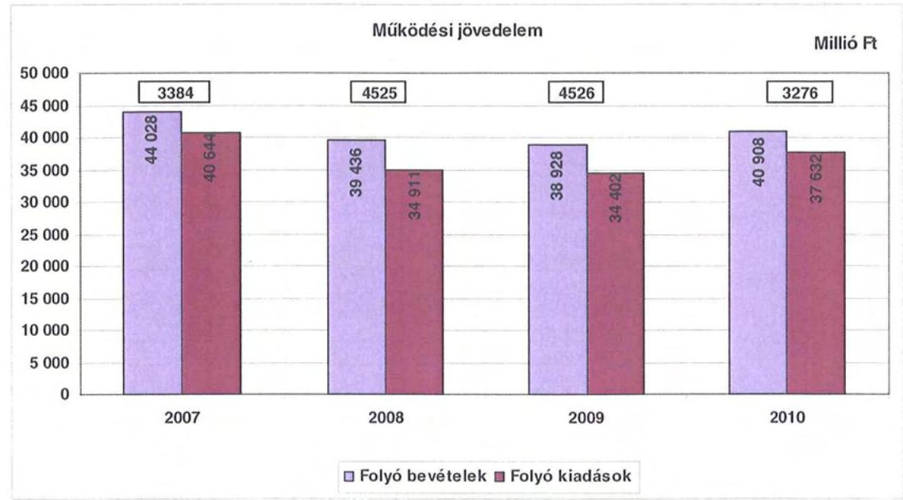

A folyó költségvetés egyenlege (a működési forrástöbblet) 2007-ben a folyó bevételek 8%-át (3384 millió Ft-ot), 2008-ban 11%-át (4525 millió Ft-ot), 2009-ben 12%-át (4526 millió Ft-ot), 2010-ben 8%-át (3276 millió Ft-ot) jelentette. A vizsgált időszakban a működési jövedelem 15711 millió Ft megtakarítást mutatott, amely forrásul szolgálhatott az Önkormányzat fennálló tőketörlesztési kötelezettségeinek teljesítéséhez, valamint fejlesztéseinek finanszírozásához.

A pozitív előjelű folyó költségvetési egyenleg ellenére az Önkormányzat folyószámla- és egyéb likvid hitel felvételére kényszerült egyrészt az átmeneti likviditási problémák kezelése, másrészt fejlesztési kiadásai finanszírozása miatt. A folyószámlahitel napi átlagos állománya 2007-2010 között több mint négyszeresére (121 millió Ft-ról 492 millió Ft-ra), az egyéb likvid (rulírozó) hitelek napi átlagos állománya 29%-kal (4173 millió Ft-ról 5375 millió Ft-ra) nőtt.

Az Önkormányzat kötelezettségein belül a 2007-2009 közötti időszakban a rövid lejáratú kötelezettségek állományának aránya 49%-ról 53%-ra, összege 9183 millió Ft-ról 11273 millió Ft-ra változott, majd 2010-re az arány 47%-ra csökkent, miközben az összeg 12083 millió Ft-ra nőtt. Az Önkormányzat 2007. december 31-én fennálló pénz- és tőkepiaci kötelezettsége 2010-re 14566 millió Ft-ról 65%-kal, 24072 millió Ft-ra nőtt a hosszú lejáratú hitelfelvétel, a kötvénykibocsátás, a folyószámlahitel állományának emelkedése ${ }^{32}$ és az elszámolt árfolyamváltozás miatt. Az összes kötelezettségen belül a hosszú lejáratú pénzintézeti kötelezettségek 2007-2010 között 46%-kal (4302 millió Ft-tal) nőttek.

[^0]
[^0]:    ${ }^{32}$ A folyószámlahitelből 2007-ben nem volt év végi állomány, 2010-ben annak év végi állománya 2774 millió Ft volt.

---

A közbenső adategyeztetés során a polgármester - a működés pénzügyi egyensúlyának középtávon ható helyreállítása és hosszú távú fenntarthatósága érdekében a hat hónapon belüli operatív terv készítésére és annak legalább félévenkénti áttekintésére vonatkozó javaslattal kapcsolatosan - észrevétellel élt az alábbiak szerint:
„A vizsgálat több helyen is megemlíti, önkormányzatunk folyó költségvetési egyenlege, működési jövedelme pozitív volt, ezért nem indokolt „a működés pénzügyi egyensúlyának középtávon ható helyreállítása" szövegezés és a félévente való áttekintés."

Az észrevételt részben fogadtuk el, mivel a jelentéstervezet vizsgált időszakra vonatkozó megállapításai (többek között az, hogy a pozitív előjelű költségvetési egyenleg ellenére az Önkormányzat folyószámla és egyéb likvid hitel felvételére kényszerült, a rövid lejáratú kötelezettség-állománya nőtt, a hosszú lejáratú kötelezettségen belül a hosszú lejáratú pénzintézeti kötelezettségek növekedtek) indokolják a működés pénzügyi egyensúlyának középtávon ható helyreállítására tett javaslatunkat, továbbá az intézkedések eredményeinek legalább évenkénti áttekintését.

A rövid lejáratú pénzintézeti kötelezettségek 2010-ben 10375 millió Ft-ot tettek ki, amely 5204 millió Ft-tal (101%) több a 2007. évi rövid lejáratú pénzintézeti kötelezettségállománynál. Az Önkormányzat a 2007-2010. években nem rendelkezett számottevő mértékű lejárt szállítói tartozásállománnyal. A 2006. év végi 203 millió Ft-ról 2007. év végére 13 millió Ft-ra csökkent a lejárt szállítói tartozás a járóbeteg- és fekvőbeteg-szakellátás Szegedi Tudományegyetemnek történt átadását követően.

Az Önkormányzat 2010. évi záró pénzkészlete 3528 millió Ft volt ${ }^{33}$, amelynek 22%-a kötelezettséggel terhelt.

Az Önkormányzat
 pénzügyi kapacitása a vizsgált időszakban pozitív értéket mutatott. A nettó működési jövedelem ${ }^{34}$ értéke a folyó költségvetési pozíció mellett az adott költségvetési év adósságtörlesztésének hatását is tükrözi. A 15711 millió Ft működési jövedelemnek 33%-át ( 5170 millió Ft) tette ki a hitelekhez kapcsolódó tőketörlesztés, amelynek kifizetését követően 10541 millió Ft nettó működési jövedelme keletkezett az Önkormányzatnak.

A nettó működési jövedelem - évről évre változó nagyságrendű tőketörlesztés ${ }^{35}$ mellett - 2007-ben 1649 millió Ft, 2008-ban 3636 millió Ft, 2009-ben 3375 millió Ft, 2010-ben 1881 millió Ft volt. A pénzügyi kapacitás 2009-hez viszonyított romlását 2010-re döntően a folyó bevételek és kiadások különbségéből származó működési jövedelem csökkenése okozta.

Az Önkormányzatnál (a CLF módszer alapján) a fejlesztési kiadások egy részének fedezete - a képződött nettó működési jövedelemből - biztosítottnak látszik. Továbbá információul szolgál a jövőben vállalható teljesíthető adósságszolgálat mértékéről.

[^0]
[^0]:    ${ }^{33}$ Ebben a társulások pénzeszköze 19 millió Ft volt.
    ${ }^{34}$ pénzügyi kapacitás
    ${ }^{35}$ Az Önkormányzat tőketörlesztési kötelezettsége 2007-ben 1735 millió Ft, 2008-ban 889 millió Ft, 2009-ben 1151 millió Ft és 2010-ben 1395 millió Ft volt.

---

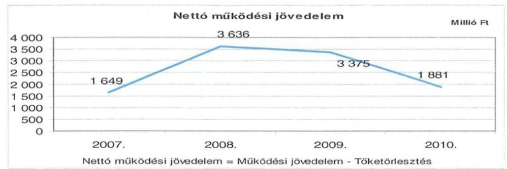

A 2007-2010. években az Önkormányzat felhalmozási költségvetésének egyenlege folyamatosan negatív összegű volt, amely előrelátó, tudatos költségvetési gazdálkodás és pénzügyileg fenntartható ${ }^{36}$ beruházások esetén nem jár magas pénzügyi kockázattal.

A beruházási költségvetés egyenlegének alakulását évről évre a következő ábra szemlélteti:
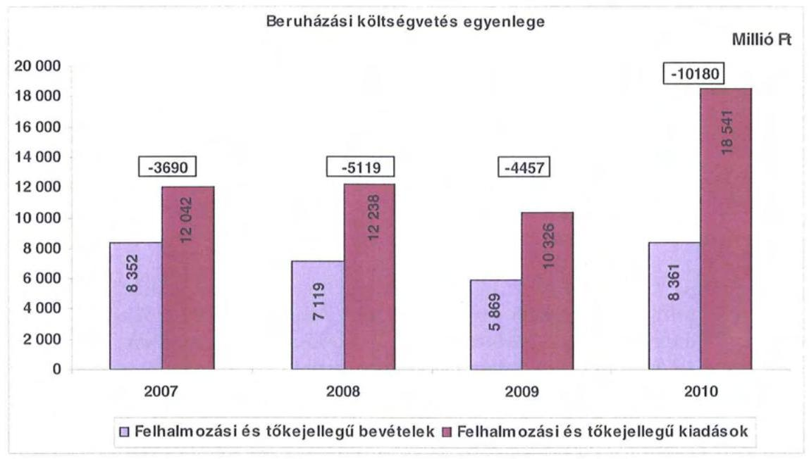

A felhalmozási forráshiánynak a felhalmozási és tőke jellegű kiadásokhoz viszonyított aránya 2007-ben 31% ( 3690 millió Ft), 2008-ban 42% ( 5119 millió Ft), 2009-ben 43% (4457 millió Ft), 2010-ben 55% (10 180 millió Ft) volt.

A felhalmozási forráshiány finanszírozása a 2007. év elején rendelkezésre álló nyitó pénzkészletből, a nettó működési jövedelem felhasználásából, valamint a folyószámla- és fejlesztési célú hitelekből történt ${ }^{37}$. A vizsgált időszakban jelent-

[^0]
[^0]:    ${ }^{36}$ Az minősül pénzügyileg fenntartható beruházásnak, amelynek működtetésére az Önkormányzat nettó működési jövedelme a következő években is fedezetet nyújt.
    ${ }^{37}$ Az évenkénti adatokat a jelentés 2. számú melléklete mutatja be.

---

kező összes felhalmozási forráshiány ( 23446 millió Ft) 45%-ára nyújtott fedezetet a nettó működési jövedelem ${ }^{38}$.

A vizsgált időszakban keletkezett 23446 millió Ft felhalmozási forráshiányra a képződött 10541 millió Ft nettó működési jövedelem, a 2626 millió Ft 2007. évi nyitó pénzkészlet, valamint a felvett 6720 millió Ft összegű fejlesztési hitel, a rendelkezésre álló folyószámlahitel, továbbá a likvid (rulirozó) hitel nyújtott fedezetet.

A függő, átfutó, kiegyenlítő bevételek és kiadások 701 millió Ft-os negatív egyenlegének folyószámlahitelből ${ }^{39}$ történő finanszírozásával az Önkormányzat 3528 millió Ft pénzkészlettel zárta a 2010. évet.

Az Önkormányzat évenkénti teljes finanszírozási igénye ${ }^{40}$ a CLF módszer szerint 2007-ben 2041 millió Ft, 2008-ban 1483 millió Ft, 2009-ben 1082 millió Ft, 2010-ben 8299 millió Ft volt, amelynek finanszírozását a finanszírozási célú bevételek és kiadások egyenlege, valamint az előző évek pénzmaradványának igénybevétele biztosította.

Az Önkormányzat finanszírozási műveletei 2007-2010. évekbeli egyenlegének alakulását a következő ábra szemlélteti:
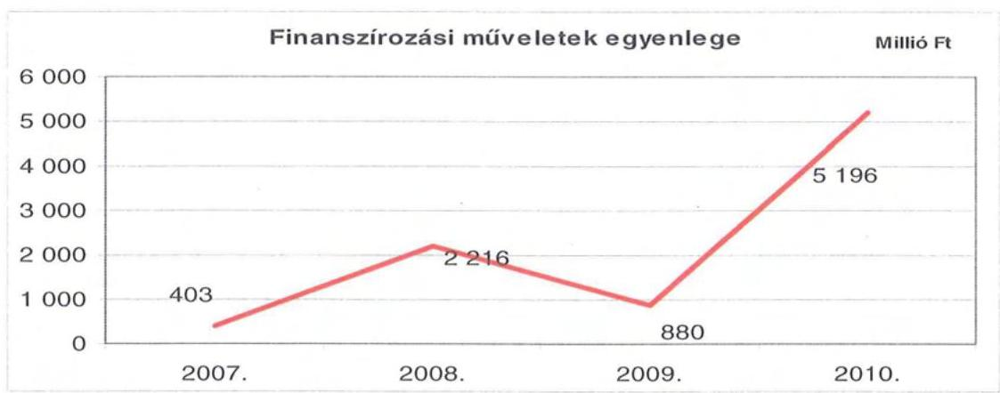

A finanszírozási többlet azt jelzi, hogy az éves költségvetések végrehajtása során szükség volt az előző években keletkezett pénzmaradvány igénybevételén túl külső finanszírozás igénybevételére is.

Az Önkormányzat 2007-2009. évi zárszámadási rendeletében nem határozta meg a felhalmozási, illetve működési bevételek és kiadások főösszegét, nem rögzítette a működési és fejlesztési célú pénzügyi hiányt ${ }^{41}$, a költségvetési bevé-

[^0]
[^0]:    ${ }^{38}$ Az ábrában megjelenő 2010. évi felhalmozási kiadásokban a társulásokhoz kapcsolódó beruházások összege 9 millió Ft.
    ${ }^{39}$ Az Önkormányzat folyószámlahitel állománya 2774 millió Ft-tal nőtt 2007-2010 között.
    ${ }^{40}$ a nettó működési jövedelem és a beruházási költségvetés egyenlegeinek összege
    ${ }^{41}$ Nincs kötelező előírás a működési és fejlesztési többlet, hiány megállapításának módjára.

---

telek és kiadások számításánál az Áht-ban foglaltak ellenére figyelembe vette a finanszírozási célú pénzügyi műveleteket is. Emiatt a 2007-2009. évi zárszámadási rendelet szerinti összes bevételt és kiadást működési célú bevételként és kiadásként szemlélteti az 1. számú melléklet. A zárszámadási rendeletek bevételei és kiadásai a 2007-2009. évekre pénzügyi többletet, a 2010. évre pénzügyi hiányt ${ }^{42}$ eredményeztek.

A vizsgált időszakban a kötelezettségek (passzív pénzügyi elszámolások nélkül) 18589 millió Ft-ról 25783 millió Ft-ra emelkedtek, amely együtt járt a kamatkiadások növekedésével.

A 2007-2010. évek között az Önkormányzat összesen 2676 millió Ft kamatot fizetett meg. Az átmenetileg szabad pénzeszközök befektetéséből, lekötéséből realizált kamatbevétel, a teljes kamatráfordítás 63%-át (1683 millió Ft) tette ki.
Az Önkormányzat kamatbevételeinek és kamatkiadásainak alakulását a következő ábra mutatja:
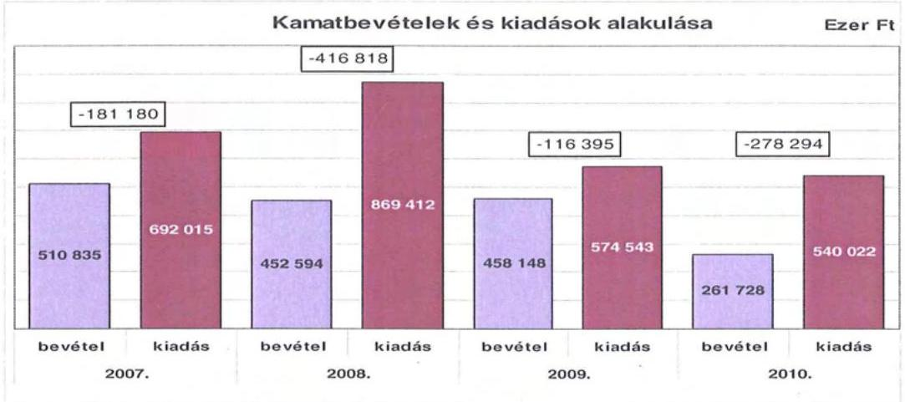

# 2.2. Az Önkormányzat bevételeinek alakulása 

Az Önkormányzat folyó bevételei 2007-ről 2010-re 7%-kal, 44028 millió Ft-ról 40908 millió Ft-ra változtak döntően az egészségügyi, oktatási és szociális feladatokat ellátó intézmények átadásának bevételcsökkentő, illetve a fordított áfa elszámolás ${ }^{43}$ 2008-2010. évi bevételnövelő együttes hatására.
Az Önkormányzat 2007-2010. évek között realizált főbb folyó (működési) bevételi jogcímeinek számszaki adatait az alábbi táblázat részletezi és grafikon mutatja be:

[^0]
[^0]:    ${ }^{42}$ A 2010. évi zárszámadási rendeletben az Önkormányzat már elkülönítette a működési, felhalmozási célú költségvetési bevételeket, kiadásokat, a költségvetési bevételektől és kiadásoktól a finanszírozási célú pénzügyi műveleteket, megállapította a pénzügyi hiányt.
    ${ }^{43}$ A fordított áfa elszámolás azt jelenti, hogy az áfa működési mechanizmusával ellentétben értékesítéskor nem az eladó fizeti meg a számlában foglalt összeg után az áfát, hanem a vevő (jelen esetben az Önkormányzat vagy intézménye). A fordított áfa elszámolás bevétel- és kiadásnövelő pénzügyi kihatása 2008-ban 157 millió Ft, 2009-ben 546 millió Ft, 2010-ben 2238 millió Ft, együttesen 2941 millió Ft volt.

---

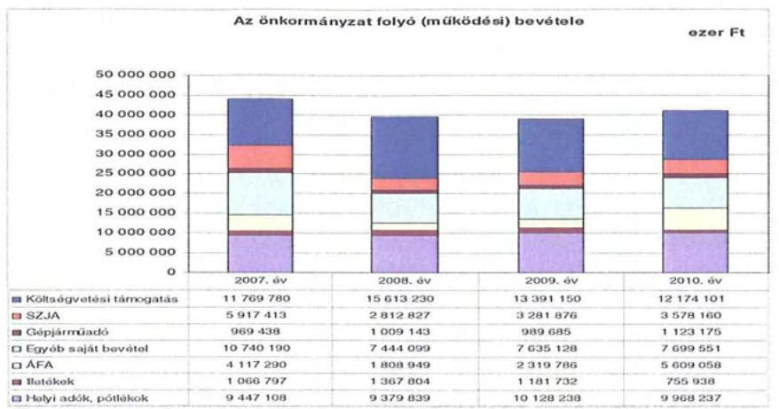

Az Önkormányzat költségvetési támogatásai - amelyek döntő mértékben működési támogatások voltak - a 2007-ről 2008-ra 33%-kal, 15613 millió Ft-ra növekedtek a központi támogatáselosztás változása, majd 2008-ról 2010-re 22%-kal, 12174 millió Ft-ra csökkentek a feladatátadások, illetve az ellátotti létszám csökkenése következtében.

A 2007. évről a 2010. évre az átengedett szja 40%-os, 2339 millió Ft-os csökkenését elsősorban az okozta, hogy 2008-tól a költségvetési törvény alapján nem az átengedett szja-ból finanszírozták a tűzoltóság által ellátott feladatokat és a korábbi években szja-ból finanszírozott normatív hozzájárulásokat. Az átengedett szja összegét kedvezően befolyásolta a 2007-2010 között évről évre folyamatosan növekvő iparűzési adóerő-képesség és lakhelyen maradó szja (8%) összege.

A gépjárműadóból származó bevétel 2007-ről 2010-re 16%-kal, 1123 millió Ft-ra emelkedett az ellenőrzési-végrehajtási munka, illetve 2010. január 1-től a gépjárműadó alapjának, mértékének változása következtében.

Az Önkormányzat egyéb saját bevételei ${ }^{44}$ a 2007. évi 10740 millió Ft-ról 2010-re 7700 millió Ft-ra, 28%-kal csökkentek elsősorban az egészségügyi feladatokra átvett pénzeszközök - 2007. évi intézményátadás miatti - csökkenése következtében.

Az Önkormányzat 2007-2010 között évről évre növekvő összegben kapott osztalékot a gazdasági társaságokban lévő tulajdonrésze alapján. A kapott osztalék összege a 2007. évben három társaságtól 314 millió Ft, 2008-ban négy társaságtól 396 millió Ft, 2009-ben hat társaságtól 526 millió Ft, 2010-ben három társaságtól 427 millió Ft volt. Az egyes években kapott osztalék 94-100%-a a vízmű- és piac üzemeltetést végző három gazdasági társaságától származott. Az Önkormányzat osztalékról nem mondott le. Azok a nyereséges társaságok, amelyek nem fizettek osztalékot, adózás utáni eredményüket eredménytartalékba helyezték.

[^0]
[^0]:    ${ }^{44}$ Az egyéb saját bevételek részét képezték az intézményi működési bevételek, a hozamés kamatbevételek, az osztalék, a talajterhelési díj, a vagyoni értékű jog értékesítése, az államháztartáson belülről és kívülről átvett pénzeszközök, előző évi pénzmaradvány átvétele.

---

Az áfa bevétel összege az előző évhez képest 2008-ra 56%-kal, 1809 millió Ft-ra csökkent a 2007. évi egyszeri, felhalmozási célú 3130 millió Ft áfa visszatérülés következtében ${ }^{45}$. Az áfa bevétel a 2008. évről a 2010. évre több mint háromszorosára, 5609 millió Ft-ra emelkedett a fordított áfa elszámolás hatására.

Az Önkormányzat illetékbevétele 2007-ről 2008-ra 1368 millió Ft-ra, 28%-kal növekedett. A befolyt illetékbevételben - az ingatlanpiac visszaesése és egyes illetékkedvezmények bevezetése következtében - a 2008. évről a 2010. évre 612 millió Ft, 45%-os csökkenés következett be.

Az Önkormányzatnál a helyi adókból és pótlékokból származó bevételek aránya a folyó (működési) bevételekben a 2007. évi 21%-ról ${ }^{46}$ ( 9447 millió Ft-ról) a 2010. évre 24%-ra ( 9968 millió Ft-ra) emelkedett. A helyi adóbevételek a 2007. évről 2010. évre 5,5%-kal, 521 millió Ft-tal növekedtek döntően az építményadó mértékének évenkénti emelése hatására.

Az Önkormányzat a 2007-2010. években három helyi adónemet, a helyi iparűzési adót, az építményadót és az idegenforgalmi adót alkalmazott. Az iparűzési adónál a maximális adómértéket, 2%-ot állapított meg a vizsgált években. Az építményadó mértéke a 2007. évi 900 Ft/m²-ről 2008-ra 971 Ft/m²-re, 2009-re 1050 Ft/m²-re változott, 2010-ben nem módosult. Az idegenforgalmi adó mértéke 2007-ről 2010-re 27%-kal, 380 Ft/éj/főre emelkedett, azonban az Önkormányzat idegenforgalmi adóból származó bevételének aránya a helyi adó bevételekben alacsony - 0,8-0,9%, 72-76 millió Ft közötti összeg - volt.

Az Önkormányzat felhalmozási bevételei a vizsgált időszakban a következőképpen alakultak:
ezer Ft-ban

| Megnevezés | 2007. év | 2008. év | 2009. év | 2010. év |
| :-- | --: | --: | --: | --: |
| Tárgyi eszköz értékesítés | 2286703 | 2716739 | 1502482 | 1553690 |
| Egyéb saját tőkebevétel | 79502 | 86508 | 210911 | 601104 |
| Államháztartáson belülről   kapott támogatás | 4999952 | 3810787 | 3867681 | 6035550 |
| EU-tól és külföldről kapott   támogatások | 0 | 0 | 0 | 0 |
| Államháztartáson kívülről   kapott támogatás | 986295 | 505345 | 287977 | 170461 |
| Összes felhalmozási bevétel | 8352452 | 7119379 | 5869051 | 8360805 |

A vizsgált években a felhalmozási célú bevételek jelentős ingadozását döntően befolyásolta az államháztartáson belülről kapott - pályázati - támogatások együttes összegének évről évre változó alakulása, illetve a tárgyi eszköz értékesítés bevételének visszaesése. Az Önkormányzat tárgyi eszköz-értékesítésből származó bevétele - amely magába foglalja az önkormányzati lakások, helyi-

[^0]
[^0]:    ${ }^{45}$ A CLF módszerben tényezőjövedelemként a folyó bevételek között vettük figyelembe.
    ${ }^{46}$ A 2007. évi alacsonyabb, 21%-os arányt a folyó bevételek részét képező, felhalmozási célú áfa visszatérülésből származó 3130 millió Ft eseti bevétel okozta.

---

ségek értékesítésének bevételét is - 2007-ről 2010-re 32%-kal, 1554 millió Ft-ra csökkent, mivel a tervezett ingatlanértékesítések (pl. I. kórház épülete) nem történtek meg.

# 2.3. Az Önkormányzat kiadásainak alakulása 

Az Önkormányzat folyó kiadásai főbb jogcímek szerinti bontásban az alábbiak
 voltak:
ezer Ft-ban

| Megnevezés | 2007. | 2008. | 2009. | 2010. |
| :--: | :--: | :--: | :--: | :--: |
| Folyó kiadások | 40643776 | 34911145 | 34401642 | 37631993 |
| Működési kiadások (kamatkiadás nélkül) | 28763684 | 26093481 | 24545172 | 26874183 |
| Államháztartáson belülre átadott pénzeszközök | 3688973 | 626162 | 852169 | 1190332 |
| Transzferkiadások | 5987272 | 5988148 | 6606652 | 7206302 |
| -ebből: vállalkozásoknak | 1746480 | 2140854 | 2433081 | 2542351 |
| EU-nak, illetve külföldre | 0 | 0 | 0 | 0 |
| magánszemélyeknek | 1544780 | 1614420 | 1886077 | 2191147 |
| nonprofit szervezeteknek | 2696012 | 2232874 | 2287494 | 2472804 |
| Kamatkiadások | 692015 | 869412 | 574543 | 540022 |
| Előző évi pénzmaradvány átadás | 1511832 | 1333942 | 1823106 | 1821154 |

Az Önkormányzat folyó kiadásai 2007-ről 2009-re 15%-kal (6242 millió Ft-tal), ezen belül a működési kiadások 15%-kal, 4219 millió Ft-tal csökkentek elsősorban a 2007. évben a 3130 millió Ft felhalmozási célú áfa visszatérülés közreműködő szervezetnek történt, a működési célú államháztartáson belüli pénzeszközátadások között elszámolt továbbutalásával. A folyó kiadásokra csökkentő hatással voltak 2007-ben a Szegedi Tudományegyetemnek átadott egészségügyi feladatok, a Többcélú Társulásnak és az egyháznak átadott szociális, közoktatási feladatok, 2008-2009-ben a saját gazdasági társaságnak átadott sportfeladatok, a Többcélú Társulásnak átadott szociális és közoktatási feladatok, továbbá a létszámcsökkentésre tett intézkedések. A folyó kiadások 2009-ről 2010-re tapasztalt növekedését döntően a fordított áfa elszámolás miatti kiadás okozta.
Az Önkormányzat folyó kiadásai főbb kiadásnemek szerinti bontásban az alábbiak voltak:
ezer Ft-ban

| Megnevezés | 2007. | 2008. | 2009. | 2010. |
| :--: | :--: | :--: | :--: | :--: |
| Személyi juttatások | 14685208 | 12941373 | 11530315 | 11647594 |
| Munkaadót terhelő járulékok | 4709987 | 4139244 | 3515675 | 3104575 |
| Dologi kiadások | 9148710 | 8628327 | 9326398 | 11506997 |
| Egyéb folyó kiadások | 207076 | 363271 | 164257 | 576550 |
| Működési célú pénzeszközátadás | 9676245 | 6614310 | 7458821 | 8396634 |

A folyó kiadásokon belül a személyi juttatások és járulékok aránya - a más szervnek átadott feladatok, az álláshely csökkentések miatt - a vizsgált időszakban a 2007. évi 48%-ról 2010-re 39%-ra csökkent. Az Önkormányzat dologi kiadásai 2007-ről 2008-ra 6%-kal, 520 millió Ft-tal szintén visszaestek elsősorban a feladatátadások következtében. A dologi kiadások 2008-ról 2010-

---

re bekövetkezett 2879 millió Ft-os emelkedését döntően a fordított áfa elszámolása miatti kiadás okozta.

A működési célú pénzeszközátadások részaránya ${ }^{47}$ az összes folyó kiadásokon belül a 2007. évi 17%-ról 2010. évre 22%-ra, 8397 millió Ft-ra változott elsősorban a Többcélú Társulásnak a szociális intézmények működtetéséhez és a közoktatási feladatok ellátásához nyújtott támogatás, illetve az önkormányzati feladatokat ellátó gazdasági társaságoknak átadott működési célú pénzeszközök ${ }^{48}$ emelkedésének hatására.

Az önkormányzati folyó kiadásokon belül a kórházi kiadások - a Szegedi Tudományegyetemnek történt 2007. évi feladatátadás miatt - csak a 2007. évben jelentek meg. Az Önkormányzat Kórház nélküli működési kiadásai a vizsgált időszakban a következőképpen alakultak:
ezer Ft-ban

| Megnevezés | 2007. | 2008. | 2009. | 2010. |
| :-- | --: | --: | --: | --: |
| Folyó (működési) kiadások | 38269193 | 34911145 | 34401642 | 37631993 |
| Működési kiadások (kamatkiadás nélkül) | 26392833 | 26093481 | 24545172 | 26874183 |
| Kamatkiadás | 692015 | 869412 | 574543 | 540022 |
| Személyi juttatások | 13660861 | 12941373 | 11530315 | 11647594 |
| Munkaadót terhelő járulékok | 4378829 | 4139244 | 3515675 | 3104575 |
| Dologi kiadások | 8143258 | 8628327 | 9326398 | 11506997 |
| Egyéb folyó kiadások | 197182 | 363271 | 164257 | 576550 |
| Működési célú pénzeszközátadás | 9672513 | 6614310 | 7458821 | 8396634 |

A Kórház kiadásai nélkül a folyó kiadások, működési kiadások, személyi juttatások változása 2007-ről 2010-re csökkenést mutatott elsősorban a járóbetegszakellátás, a közoktatási, szociális és sport feladatok más szervezetnek történő átadása, az álláshely-csökkentések miatt.

A Kórház likviditási problémáinak kezelése/csökkentése érdekében 2007. évben - mint önkormányzati költségvetési szerv - 23 millió támogatást kapott az Önkormányzattól. Ezt követően a Szegedi Tudományegyetemmel az egészségügyi feladatok átadására kötött megállapodás alapján az Önkormányzat 2007-ben 24 millió Ft támogatást nyújtott az átadás miatti végkielégítésekre, 71 millió Ft-ot egészségügyi fejlesztési feladatokra, 2008-ban 3 millió Ft-ot a 2007. évi 13. havi illetmény elszámolására, továbbá 2008-tól évi 100 millió Ft-ot egészségügyi fejlesztési feladatokra.

A Kórháznak, majd a Szegedi Tudományegyetemnek nyújtott kórházi támogatások évenkénti alakulását az alábbi grafikon szemlélteti:

[^0]
[^0]:    ${ }^{47}$ A működési célú pénzeszközátadások és folyó kiadások 2007. évi összegénél figyelmen kívül hagytuk a működési célú pénzeszközátadások között elszámolt 3130 millió Ft felhalmozási célú eseti áfa visszatérülés közreműködő szervezetnek történt tovább. utalását.
    ${ }^{48}$ A gazdasági társaságok adatszolgáltatása alapján.

---

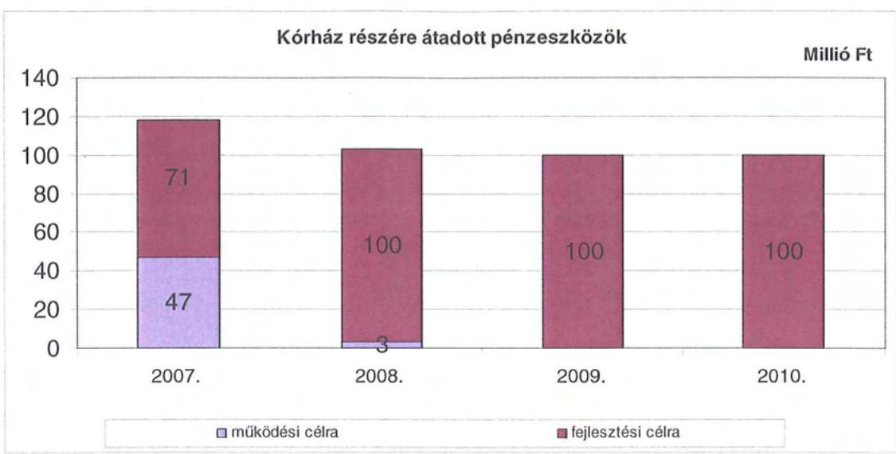

A vizsgált években az Önkormányzat összesen 421 millió Ft támogatást nyújtott a Kórháznak, illetve a Szegedi Tudományegyetemnek, amelyből működési célra 50 millió Ft-ot, fejlesztési célra 371 millió Ft-ot fordítottak.
Az Önkormányzat által a gazdasági társaságok részére nyújtott működési és felhalmozási támogatások ${ }^{49}$ alakulását az alábbi diagram mutatja be a 2007-2010. évekre:
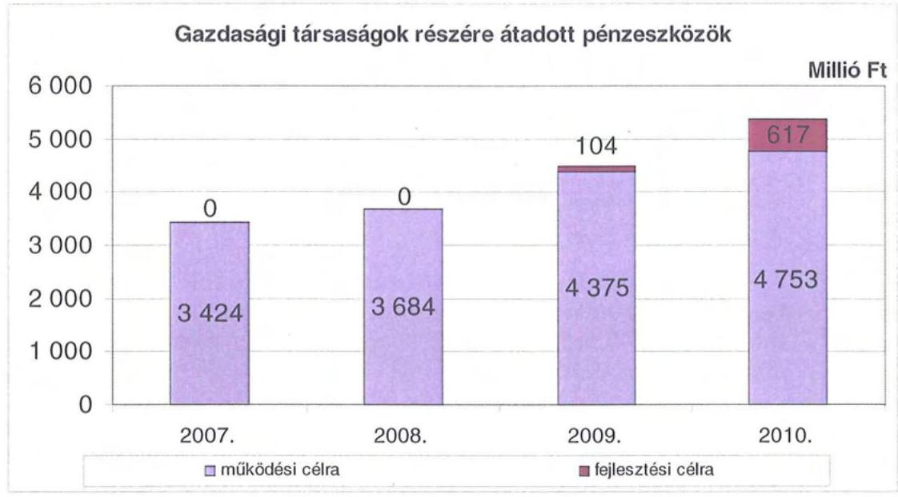

Az önkormányzati feladatellátásban résztvevő gazdasági társaságoknak átadott pénzeszközök évről évre növekvő összege az Önkormányzat pénzügyi helyzetének, működési jövedelmének alakulását befolyásolta, azonban a működési jövedelem 2007-2010 közötti változását döntően a feladatátadások és a

[^0]
[^0]:    ${ }^{49}$ A társaságok adatszolgáltatása szerinti önkormányzati támogatás magába foglalja az Önkormányzat által működési és felhalmozási célú pénzeszközátadásként nyújtott támogatást, illetve a társaságok által a közfeladatok ellátásáért leszámlázott és az Önkormányzat által dologi kiadásként kifizetett összegeket.

---

központi forráselosztás változása okozta. A 2007-2010 években 1535 millió Ft tőkejuttatást (döntően tőkeemelések beruházási célokra) nyújtott az Önkormányzat nyolc gazdasági társaságának. Az Önkormányzat 2007-2010. években veszteségrendezésre nem nyújtott tőkepótlást a gazdasági társaságainak.

A legalább 25%-os önkormányzati tulajdoni hányadú 21 gazdasági társaság, illetve azoknak legalább 25% tulajdoni hányadú két gazdasági társasága, és egy közfeladatot ellátó nem önkormányzati tulajdonú társaság közül - az ellátott közfeladatok alapján kiemelt - hat társaságból ${ }^{50}$ csak három, a Környezetgazdálkodási Nkft., a Közlekedési Kft. és Tisza Volán Zrt. részére adott át pénzeszközt az Önkormányzat a 2007-2010. években. A gazdasági társaságoknak átadott működési és felhalmozási célú pénzeszközök alakulását a jelentés 4. számú melléklete mutatja be.

A folyó (működési) és felhalmozási kiadások alakulását, a teljesített kiadások működési és felhalmozási célú felhasználásának arányait az alábbi ábra mutatja be:
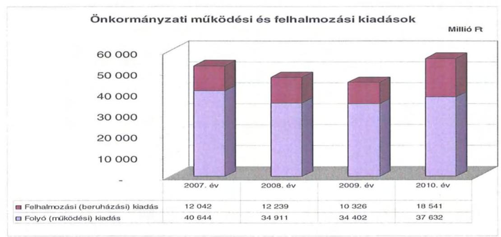

A folyó (működési) és felhalmozási kiadások arányának változásában 2007-2010 évek között elmozdulás figyelhető meg. A felhalmozási kiadások aránya 2007-ről 2008-ra 23%-ról 26%-ra nőtt, 2009-ben 23%-ra csökkent, majd 2010-re 33%-ra emelkedett.

Az Önkormányzat 2007-2010. években megvalósított, illetve 2010. december 31-én fennálló, valamint az elbírálás alatt lévő fejlesztési feladatokhoz kapcsolódó kötelezettségeinek összegzését a jelentés 3/a-d. számú mellékletei tartalmazzák.

Az Önkormányzat 2007. évtől 2010. december 31-ig 57147 millió Ft összköltségű fejlesztéseket tervezett saját erős és az európai uniós forrásokra benyújtott

[^0]
[^0]:    ${ }^{50}$ Az ellátandó közfeladatok alapján a hőszolgáltatást, a park- és közterület-gondozást, a helyi közlekedést, az ingatlankezelést, a víz- és szennyvízkezelést végző részben vagy egészben önkormányzati tulajdonú társaságok, illetve egy nem önkormányzati tulajdonú, azonban helyi közlekedést végző társaság került a kiemelt körbe.

---

pályázatok segítségével. Az Önkormányzatnál 2007-2010. években európai uniós támogatásokra összesen 85 pályázat benyújtásáról döntöttek. A pályázatok közül 65 támogatásban részesült, négy pályázatuk elbírálása folyamatban volt.

A 2007-2010. években az Önkormányzat megvalósított és folyamatban lévő kiemelt infrastrukturális beruházásai az alábbiak:

- elektromos tömegközlekedés fejlesztése; Tarján Víctorony-téri közlekedés fejlesztése; Vásárhelyi Pál utca komplex felújítása; külterületi szakaszon kerékpárút kialakítása, autóbusz megállóhelyek létesítése; körforgalmi csomópont kiépítése;
- város-rehabilitáció I. projekt, amely 4 szakaszból áll; város-rehabilitáció II. projekt, amely 3 szakaszból áll; AGÓRA TIOP hő-, hűtési-, villamos energia igények kielégítése megújuló energiaforrásokkal;
- általános iskolák és óvodák, bölcsődék felújítása, akadálymentesítése; Szegedi Logisztikai Szolgáltató Központ kialakítása; árvízvédelmi rendszer, Vadaspark fejlesztése a Szeged-Temesvár közös együttműködési program keretén belül; iparosított technológiával készült épületek felújítása; színház energetikai korszerűsítése.

Az ágazati beruházások a következő területeket érintették: úthálózat rekonstrukció, közvilágítás-fejlesztés, egészségügyi, szociális, kulturális és sport célú beruházások és intézményi felújítások.

Az Önkormányzatnál a 2006-2010. években befejezett fejlesztési feladatok összes költségvetési kiadása 57256 millió Ft volt, amelyből a beruházások összege 49523 millió Ft (86,5%) és a felújítások összege 7733 millió Ft (13,5%) volt. A projektek döntő többsége utófinanszírozású beruházás volt, megvalósításukhoz a források hitelek igénybevételével álltak rendelkezésre.

A befejezett 57256 millió Ft értékű fejlesztés forrás megoszlása 12799 millió Ft EU-s támogatás (22%), 21160 millió Ft hazai támogatás (37%), 20649 millió Ft saját bevétel (36%) és 2648 millió Ft hitel (5%) volt. A 2006. december 31-ig teljesített kiadások összege 30403 millió Ft, a 2007-2010. években teljesített kiadások összege 26853 millió Ft volt.

Az Önkormányzat 2010. év végén folyamatban lévő fejlesztési feladataira 2010. december 31-ig kifizetett összeg 13188 millió Ft volt, amelynek forrása 6271 millió Ft EU-s támogatás (47%), saját bevétel 4521 millió Ft (34%), hazai támogatás 1263 millió Ft (10%) és 1133 millió Ft hitel (9%) volt. A források a fejlesztések esetében az EU-s és a hazai támogatásoknál utólagosan álltak rendelkezésre, ezért az Önkormányzat hosszú lejáratú hitelekből finanszírozta a beruházási munkálatokat.
2010. december 31-én folyamatban lévő és a 2010. évet követő kötelezettség-vállalásainak összege a 3/c. számú melléklet adatai szerint 17120 millió Ft volt, amelynek forrása 11784 millió Ft EU-s támogatás (68,8%), 2786 millió Ft hitel (16,3%), 2146 millió Ft hazai támogatás (12,5%) és 404 millió Ft saját bevétel (2,4%) volt.

---

Az Önkormányzat által beadott, elbírálás alatt álló pályázatok tervezett teljes bekerülési költsége 3039 millió Ft volt, amelyhez 1830 millió Ft Európai Uniós támogatás és 317 millió Ft hazai támogatás igénylése iránt nyújtottak be pályázatot, amelyhez a már meglévő hitelszerződések alapján a még fel nem használt hitelkeretből 369 millió Ft hitel igénybe vételét tervezik. A források még nem álltak az Önkormányzat rendelkezésére, a pályázati elbírálások és a közbeszerzési eljárások folyamatban voltak.

Az Önkormányzat kiemelt infrastrukturális fejlesztései közül a legnagyobb költségigényű az alábbi három beruházás volt:

- Szeged Város elektromos tömegközlekedésének fejlesztéséről a 602/2005. (XI. 11.) számú határozatával döntött a Közgyűlés. Az NFT 2007-2013. Közlekedési Operatív Programjának „A városi kötött pályás közlekedés fejlesztése" tárgyú pályázati felhívására az Önkormányzat és a Szegedi Közlekedési Kft. konzorciuma pályázatot nyújtott be, amit a kormány elfogadott. A projekt tervezett

 bekerülési költsége 18612 millió Ft, amelyből 2010. december 31-ig 9517 millió Ft-ot fizettek ki. Ebből saját bevétel 1578 millió Ft (16,6%), hitel 1062 millió Ft (11,2%), európai uniós támogatás 5712 millió Ft (60,0%) és hazai támogatás 1165 millió Ft (12,2%). A projekt folyamatban van, a várható befejezése 2012. év júniusa;
- A Közgyűlés az 526/2010. (XII. 10.) számú határozatával döntött Szeged városközpontjának funkcióbővítő fejlesztéséről. A projekt teljes összege: 2647 millió Ft, ebből saját forrás: 926 millió Ft (35%), a támogatás összege 1541 millió Ft (65%) volt. A projektben kedvezményezett konzorciumi partner a Szegedi Vásár és Piac Kft.;
- A Közgyűlés az 526/2010 (XII. 10.) számú határozatával fogadta el a Szeged Biopolisz Park - Egyetemi városrész közterületeinek rehabilitációját. A fejlesztést európai uniós támogatásból tervezik megvalósítani a DAOP-5.1.2/C-09-2f-2010-0002 azonosító számú város-rehabilitációs projekt keretében.

A projekt kivitelezésére a Szegedi Tudományegyetemmel konzorciumi szerződést kötöttek. A projekt bekerülési összege 2500 millió Ft, ebből a saját forrás 812 millió Ft (32,5%), a támogatás összege 1688 millió Ft (67,5%), ezen belül az EU támogatás aránya 85%, a hazai társfinanszírozás aránya 15%. A projekt kedvező elbírálásáról szóló értesítést az Önkormányzat 2011. május 30-án kapta meg, azonban a támogatási szerződést még nem kötötték meg.
A projekt megvalósítását saját kockázatára az Önkormányzat megkezdte. 2011. május 27-ig a következő ráfordítások történtek: közmű rekonstrukció 534 millió Ft, Szeged Pólus Nonprofit Kft. projektmenedzsment díja 4 millió Ft, előkészítéssel kapcsolatos költségek (tanulmányok, tervek, engedélyek, ingatlanvásárlás) 279 millió Ft, összesen 817 millió Ft. Ennek költsége nagyságrendileg megegyezik a teljes projekt saját forrásának összegével.

---

# 3. KÖTELEZETTSÉGEK BEMUTATÁSA 

### 3.1. A pénzintézetek felé fennálló kötelezettségek alakulása

Az Önkormányzatnak 2006. december 31-én 14145 millió Ft pénzintézeti kötelezettség$^{51}$ állománya volt, amely a 2010. évre 24072 millió Ft-ra emelkedett. A 2010. év végén fennálló pénzintézeti kötelezettségei egy kötvénykibocsátásból, tíz hosszú lejáratú hitelből, kettő rulírozó (likvid) hitelből és a 2010. év végén fennálló folyószámlahitel állományból keletkeztek.
Az Önkormányzat pénzintézeteknél fennálló kötelezettség-állományát a 2007-2010. években az alábbi ábra szemlélteti$^{52}$:
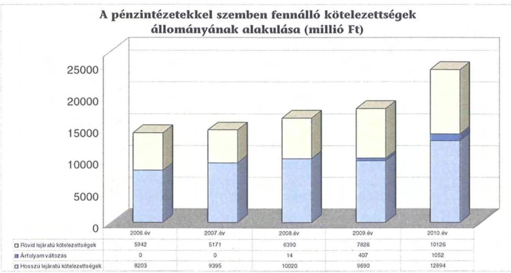

A pénzintézeti kötelezettségek állományának 2006-2010 közötti 70%-os, 9927 millió Ft-os növekedését döntően befolyásolta, hogy

- az Önkormányzat 2007-2010 között két alkalommal, négy hosszú lejáratú hitelszerződésben összesen 9870 millió Ft hitelkeret igényvételére állapodott meg. Ebből 2010. december 31-ig 4967 millió Ft hitelt hívott le;
- a 2007. év előtt kötött négy hosszú lejáratú hitelszerződése alapján 2007-2010 között 1753 millió Ft hitelt vett igénybe;
- 2010-ben 2500 millió Ft összegben felhalmozási célú kötvényt bocsátott ki;

[^0]
[^0]:    $^{51}$ A pénzintézeti kötelezettségek állománya a lízingből származó kötelezettségek nélkül számítva.
    $^{52}$ Az ábrában mind a rövid, mind a hosszú lejáratú kötelezettségek mérlegértékét csökkentettük az árfolyamváltozás összegével.

---

- A 2007. év végén az Önkormányzatnál még nem volt a folyószámlahitelnek záró állománya, a 2010. év végén azonban 2774 millió Ft folyószámlahitel állománnyal rendelkezett;
- 1052 millió Ft összegben számolt el a devizában fennálló rövid és hosszú lejáratú hitelek és a kötvény év végi értékelésekor CHF és EUR árfolyamváltozást. Az év végi értékeléskor elszámolt árfolyamveszteség 2007-ben nem volt, a 2008. évi 14 millió Ft-ról 2010-re 1052 millió Ft-ra történt növekedését a CHF és EUR árfolyamok emelkedése mellett az EUR-ban történt 2010. évi kötvénykibocsátás okozta.

Az árfolyamváltozás hatása is befolyásolja a kötelezettségek alakulását, azonban annak mértéke előre pontosan nem határozható meg, csak várakozásokon alapuló tendenciák jelezhetők. Annak megítéléséről, hogy a devizában felvett hitelért, kibocsátott kötvényért kapott forinthoz képest a hitel visszafizetésekor, a kötvény visszavásárlásakor jelentkező forint-kötelezettség többletkiadást (árfolyamveszteség) vagy megtakarítást (árfolyamnyereség) eredményez-e a futamidő végén, a teljes kötelezettség rendezését követően lehet képet alkotni. Mindaddig, amíg törlesztési kötelezettség nem áll fenn (türelmi idő), a tőkére vonatkoztatva nem értelmezhető sem az árfolyamveszteség, sem az árfolyamnyereség. Ugyanakkor a hitel és a kötvény-kötelezettség mérlegforduló-napi értékeléséből adódó különbözetet - amennyiben az összevontan jelentős összegű - az Áhsz. 33. § (2) bekezdés c) pontja alapján, ha árfolyamveszteség, akkor kötelezettségállomány növekedéseként és saját tőke csökkenéseként, ha árfolyamnyereség, akkor kötelezettségállomány csökkenéseként és saját tőke növekedésként kell a mérlegben kimutatni. Ez a mérlegforduló-napi értékelésből adódó (árfolyam) különbözet azonban valójában pénzügyileg nem realizálódott.

Az Önkormányzat a forráshiány kezelése érdekében a 2007-2010. évi költségvetési rendeletekben működési és felhalmozási célú hitelfelvétellel, pénzmaradvány igénybevétellel, értékpapír-értékesítéssel számolt. A költségvetés végrehajtása során jelentkező likviditási problémák kezelése érdekében a Közgyűlés rendeletben felhatalmazta a polgármestert - legfeljebb 8430 millió Ft összegben - folyószámla- és rulírozó hitel felvételére, illetve a kapcsolódó szerződések meghosszabbítására lejáratkor. Előírta havonta a tárgyhónapra, és a tárgyhót követő egy hónapra a tárgyhót megelőző hó 25-éig likviditási terv készítését.

Az Önkormányzat a meglévő adósságállomány kezelésére, átalakítására a 2007-2010. években intézkedést nem tett. A Polgármesteri hivatal részéről a Közgyűlés 2011. június 30-i ülésére készítettek előterjesztést az Önkormányzat adósságállományának helyzetéről, a tervezett törlesztésről, annak fedezetéről a futamidő végéig.

A 2007-2010. években az Önkormányzat hosszú lejáratú pénzintézeti kötelezettségvállalásaira (négy hitelfelvétel, egy kötvénykibocsátás) közgyűlési döntés alapján került sor. A kötelezettségvállalásból származó források felhasználási céljait meghatározták, betartották a fedezet megjelölésre vonatkozó helyi és központi előírásokat. A Közgyűlés kötvénykibocsátásról szóló döntéseit megalapozó előterjesztések a sajátos működési és felhalmozási bevételeket jelölték meg a kötvénykibocsátásból származó kötelezettség visszafizetésének forrásaként. Az Önkormányzat az adósságot keletkeztető kötelezettségvállalásának felső határát a 2007-2010. években hozott hitelfelvételi, kötvény-

---

kibocsátási döntésekkel nem lépte túl. A halasztott tőketörlesztési kötelezettség eredményeként a tárgyévi kötelezettségvállalás nem haladta meg 2007-2010-ben az éves adósságot keletkeztető kötelezettségvállalás felső határának 1%-át. A Közgyűlés a likviditási és eladósodási problémák kezelésére likviditási koncepciót, stratégiát nem készített a 2007-2010. években.

Az Önkormányzat a 2011. évben döntést hozott további hitelek igénybevételéről, illetve kötvénykibocsátásról.

A Közgyűlés a 252/2011. (V. 27.) számú határozatban döntött

- 1905 millió Ft összegben zártkörű kötvénykibocsátásról önkormányzati, intézményi és céges beruházásokra, 15 éves futamidőre, 3 havi EURIBOR+3,25% kamatmértékkel, 3 év kötvénytörlesztés türelmi idő mellett. A kötvénykibocsátást végző bank kiválasztása megtörtént, a vonatkozó szerződéseket a helyszíni ellenőrzési megkezdéséig nem kötötték meg. A kötvénykibocsátás tervezett időpontja legkésőbb 2011. július 30.;
- 2000 millió Ft 20 éves futamidejű fejlesztési hitel felvételéről konkrétan meghatározott önkormányzati beruházások céljára, továbbá 515 és 445 millió Ft 15 éves futamidejű hitelek felvételéről panellakások rekonstrukciójára. A helyszíni ellenőrzés idején a hiteleket nyújtó bank kiválasztására vonatkozó közbeszerzési eljárás volt folyamatban.

Az Önkormányzat 2010. december 31-én Ft-ban fennálló hosszú lejáratú hitelszerződéseit az alábbi táblázat mutatja be:
ezer Ft-ban

| Megnevezés | Szerződéskötés időpontja | Összeg | Kamat (referencia kamats kamatfelár) | Felhasználás célja: |
| :--: | :--: | :--: | :--: | :--: |
| Hosszú lejáratú hitel | 2005. 05. 30 | 3850000 | 3 havi EURIBOR +1,445% | Belsővízrendezés, folyamatban lévő oktatási, szociális intézményi beruházás, közlekedési infrastrukturális fejlesztés, oktatási intézmények tervezett felújítása, úthálózat rekonstrukciója |
| Hosszú lejáratú hitel | 2005. 12. 27 | 896000 | 3 havi EURIBOR +0,1% | A Lokációtá állami támogatásokról szóló 12/2001. (I. 31.) Korm. rendelet 28. § és 35. § (1) bekezdése alapján megtárgyalt pályázathoz, a költségek legfeljebb 2/3-ának megfelelő mértékű önkormányzati támogatás hitellel történő biztosítása |
| Hosszú lejáratú hitel | 2006. 03. 30 | 504000 | 3 havi EURIBOR +1,055% | Paneltechnológiával épült épületek energiatakarékos korszerűsítése, felújítása |
| Hosszú lejáratú hitel | 2006. 05. 12 | 1345500 | 3 havi EURIBOR +1,545% | Közutak építése, megújuló energiaforrások hasznosításával kapcsolatos beruházások, közvilágítási és önkormányzati intézmények belső világítás hálózatának fejlesztése, korszerűsítése, önkormányzati tulajdonú létesítmények felújítása, egyéb rendezési tervekhez kapcsolódó infrastrukturális beruházások, város- és településrehabilitáció, egyéb, a kötelező és önként vállalt feladatok teljesítéséhez szükséges infrastrukturális beruházások |
| Hosszú lejáratú hitel | 2007. 05. 08 | 2370000 | 3 havi EURIBOR +1,037% | Paneltechnológiával épült épületek energiatakarékos korszerűsítése, felújítása |
| Hosszú lejáratú hitel | 2009. 05. 06 | 1500000 | 3 havi EURIBOR +2,2% | Paneltechnológiával épült lakóépületek energiatakarékos korszerűsítése, felújítása |
| Hosszú lejáratú hitel | 2009. 05. 06 | 1000000 | 3 havi EURIBOR +2,9% | Sikeres Magyarországért Önkormányzati Infrastruktúrafejlesztési Hitelprogram 2. Hitelcélja keretében (Általános beruházási célok) megvalósuló beruházások finanszírozása |
| Hosszú lejáratú hitel | 2009. 05. 06 | 5000000 | 3 havi EURIBOR +2,4% | Sikeres Magyarországért Önkormányzati Infrastruktúrafejlesztési Hitelprogram 8. Hitelcélja keretében az ÜMTT keretében megbízott pályázatokhoz szükséges óvadék biztosítása |

---

Az Önkormányzat 2010. december 31-én fennálló hitelszerződések közül a 3850 és 1346 millió Ft keretösszegű hitelek teljes összegét a vállalt hitelcélra igénybe vette. A két hitelhez kapcsolódóan hiteltörlesztésre 826 millió Ft-ot, kamatfizetésre 564 millió Ft-ot fordított 2010. év végéig.

A 896 millió Ft-os hitelkeret 99,7%-át, 893 millió Ft-ot, az 504 millió Ft-os hitelkeret 67%-át, 338 millió Ft-ot, a 2370 millió Ft-os hitelkeret 93%-át, 2206 millió Ft-ot hívtak le a 2006-2009. években. A lehívott összegeket a hitelcélnak megfelelően használták fel. A hitelkeretek maradványát nem vették igénybe a 2010. évben. A három hitelnél hiteltörlesztésre 392 millió Ft-ot, kamatfizetésre 323 millió Ft-ot fizetett ki az Önkormányzat 2010. év végéig.

A három, 2009. május 6-án kötött hitelszerződés esetében 2010. december 31-én az együttesen 7500 millió Ft-os hitelkeret 37%-át, 2761 millió Ft-ot vették csak igénybe$^{53}$. A fennmaradó hitelkeretek igénybevétele 2011-ben folyamatosan történik. A hitelek törlesztése - a türelmi idő miatt - még nem kezdődött meg, 2010. év végéig 45 millió Ft kamatot fizetett ki az Önkormányzat a három hitelhez kapcsolódóan.

Az Önkormányzat 2010. december 31-ig a nyolc Ft-ban fennálló hitelére összeségében 1218 millió Ft törlesztést és 932 millió Ft kamatfizetést teljesített. A Ft-hiteleket egyéb fizetési kötelezettség nem terhelte.

Az Önkormányzat CHF-ben fennálló hosszú lejáratú hitelszerződése 2010. december 31-én az alábbi volt:

CHF-ben

| Megnevezés | Szerződéskötés   időpontja | Összeg | Lehivási árfolyam | Kamat (referencia kamats-   kamatfelár) | Felhasználás célja: |
| :--: | :--: | :--: | :--: | :--: | :--: |
| Hosszú lejáratú hitel | 2004. 10. 05 | 5057768 | 158,17 | 3 havi CHF LIBOR +0,1% | Beruházás fejlesztési hitel önkormányzati tulajdonú   (mikrohullámú építés, felújítás (fehérvári u., Tímár u., Semsey u.,   Külsey u. rekonstrukciója) |

Az Önkormányzat a 2004. október 5-án kötött hosszú lejáratú hitelszerződés alapján 5057768 CHF hitelt vett igénybe, amelyből 2010. december 31-ig 3023560 CHF (547 millió Ft) összeget visszafizetett és
 475171 CHF (82 millió Ft) kamatot megfizetett. A tőkefizetés utáni árfolyamveszteség 2010. december 31-ig 18 millió Ft volt.

Az Önkormányzat a lehívott forint- és devizahiteleket a hitelcélnak megfelelően teljes egészében felhasználta. A hosszú lejáratú forint- és devizahiteleket nyújtó pénzintézetek nem voltak azonosak az Önkormányzat számlavezetőjével.

[^0]
[^0]:    ${ }^{53}$ Az Önkormányzat 2010. december 31-ig az 1500 millió Ft-os hitelkeret 53%-át, 793 millió Ft-ot, az 1000 millió Ft-os hitelkeret 94%-át, 938 millió Ft-ot, az 5000 millió Ft-os hitelkeret 21%-át, 1030 millió Ft-ot hívott le a hitelcéloknak megfelelő célokra.

---

Az Önkormányzat 2010. december 31-én EUR-ban fennálló hosszú lejáratú hitelszerződése és kötvénykibocsátása az alábbi volt:

EUR-ban

| Megnevezés | Kibocsátás, illetve szerződéskötés időpontja | Összeg | Kibocsátást vagy felhívást árfolyam | Kamat (referencia kamat+ kamatfelár) | Felhasználás céljai |
| :--: | :--: | :--: | :--: | :--: | :--: |
| Hosszú lejáratú hitel | 2003. 12. 10 | 13856733 | 252,2826 | 3 havi EURIBOR + 0,15% | Beruházási fejlesztési hitel |
| Szeged Város Kötvény | 2010. 02. 24 | 9303840 | 268,70625 | 3 havi EURIBOR + 3,08% | Az önkormányzat 100%-os tulajdonban lévő gazdasági társaságok részére a hazai és uniós pályázatokhoz szükséges pénzügyi önrész biztosítása |

A 2003-ban felvett hitelt a 2004. december 1-én kelt szerződésmódosítással többdevizás hitellé alakították, majd ez alapján 2005. február 22-én 1,5583 CHF/EUR keresztárfolyamon 21655279 CHF-re váltották át. A hitelhez kapcsolódóan további devizanemváltás nem volt a vizsgált időszakban. 2010. december 31-ig a hitelhez kapcsolódóan 13783567 CHF (2464 millió Ft) tőketörlesztést és 2172711 CHF (370 millió Ft) kamatfizetést teljesítettek. A 2010. december 31-ig végrehajtott tőketörlesztés után 16 millió Ft árfolyamnyereséget és 225 millió Ft árfolyamveszteséget számoltak el.

Az Önkormányzat által 2010. február 24-én 2500 millió Ft (9,3 millió EUR) összegben kibocsátott „Szeged Város” kötvényből származó bevétel terhére - a tervezett felhasználásának megfelelően - 2010-ben átadtak 487 millió Ft-ot a Közlekedési Kft. részére a KÖZOP elektromos tömegközlekedés projekt, 450 millió Ft-ot a Vásár és Piac Kft. részére a DAOP Mars téri piac és környékének rendezése projekt önerejének biztosítására.

A kötvényből származó bevétel 63%-át, 1563 millió Ft-ot a kötvénykibocsátáskor meghatározott felhalmozási célokra még nem használták fel, azt a folyamatban lévő beruházásokhoz a szükséges ütemezésben veszik igénybe. A fel nem használt kötvénybevételt 2011. március 31-én a folyószámlán tartották és likviditási gondjaik enyhítésére, a folyószámlahitel csökkentésére elszámolták. A kötvénykibocsátáshoz kapcsolódóan 2010. december 31-ig 257809 EUR (72 millió Ft) kamatfizetést teljesítettek. A kötvénykibocsátás dokumentációjában az eredeti felhasználási céltól történő eltérő felhasználás a kibocsátó bank részéről nem volt tiltott, az eltérő felhasználáshoz nem kötődött előzetes banki engedélyezési kötelezettség vagy banki szankció.
Az Önkormányzat a 2010. február 24-én kibocsátott kötvény bevétel befektetéséből 1,7 millió Ft hozamot, kamatbevételt ért el ${ }^{54}$, amely a kötvények 2011. március 31-ig teljesített kamatfizetésének (98 millió Ft) 1,7%-át tette ki. A bevételt az Önkormányzat intézményrendszerében a folyó kiadásokra fordították, illetve másodlagos hatásként a kamatbevétel folyószámlára utalásával annak aktuális állományát csökkentették. A kötvény törlesztése első alkalommal - a türelmi idő miatt - 2013. május 15-én esedékes. A kötvénykibocsátó pénzintézet nem volt azonos az Önkormányzat számlavezetőjével.
Az Önkormányzat működésének pénzügyi egyensúlyát a vizsgált időszakban csak folyószámlahitel és rulírozó hitelek igénybevételével tudta biztosítani.

A folyószámlahitel keret alakulását az alábbi táblázat mutatja be:
ezer Ft-ban

| Megnevezés | 2007. év | 2008. év | 2009. év | 2010. év | 2011.   március 31. |
| :-- | --: | --: | --: | --: | --: |
| I. Folyószámlahitel |  |  |  |  |  |
| a folyószámlahitel keretösszege január 1-jén | 2980000 | 2980000 | 2980000 | 2980000 | 2980000 |
| teljesített kamat és egyéb költség | 144045 | 47668 | 136703 | 81911 | 29725 |

A folyószámlahitel kondíciói a következők voltak ${ }^{55}$:

| Megnevezés | Kamat (referencia+ kamatfelár) |
| :--: | :--: |
| 2007-2008. év | 1 havi BUBOR + 0,1% |
| 2009-2011. év | 1 havi BUBOR + 1,2% |

A folyószámlahitelhez kapcsolódóan egyéb költség címen az Önkormányzatnak díjakat nem kellett fizetnie. A folyószámlahitel kamatfelára 1,1 százalékponttal emelkedett 2009-től.

Az Önkormányzat 2007-ben 150, 2008-ban 139 napon keresztül vett igénybe folyószámlahitelt. 2008-ról 2009-re közel kétszeresére, 277 napra nőtt a folyószámlahitellel zárt napok száma, amely 2010-re 268 napra csökkent. A 2011. évben 79 napon volt folyószámlahitel igénybevétel az Önkormányzatnál. Az átlagos napi állomány a 2007. évben volt a legalacsonyabb, 121 millió Ft, 2010-re 492 millió Ft-ra nőtt és 2011. I. negyedévben volt a legmagasabb, 1392 millió Ft. Az Önkormányzat a közel 3 milliárd Ft folyószámlahitel keretet 2007-2010-ben nem vette igénybe teljes egészében, a folyószámlahitel 2010. évi záró állománya 2774 millió Ft volt. Az áttekintett időszakot jellemző likviditási problémák részben folyószámlahitellel történő finanszírozása az Önkormányzatnak 2007-től 2011. március 31-ig összesen 440 millió Ft kamatráfordítást eredményezett.

Az Önkormányzat a 2007-2010. években a folyószámlahitelen kívül többdevizás ${ }^{56}$ rulírozó hitelt vett igénybe az egy éves futamidőre, folyamatosan ${ }^{57}$ 4500 millió és 950 millió Ft rulírozó hitelkeretre évente újra megkötött két szerződés alapján. A rulírozó hitelállomány a 2007-2010. években és 2011. I. negyedévben minden naptári napon, folyamatosan fennállt.

Az igénybevett rulírozó hitelek közül a 4500 millió Ft keretösszegű rulírozó hitel az igénybevétel folyamatossága miatt már nem rövid lejáratú, likviditási hitel, hanem hosszú lejáratú hitel volt, mivel egy évnél hosszabb időn át folyamatosan fennállt, ezért ez a rulírozó hitel az Ötv. 88. § (3) bekezdés d) pontjában foglaltak alapján nem tekinthető likvidhitelnek. A folyamatosan fennálló - első alkalommal 2003-ban felvett - rulírozó hitel napi átlagos állománya a 2007. évi 4,2 milliárd Ft-ról 2010-re 5,4 milliárd Ft-ra emelkedett.

A rulírozó hitelszerződésekben hitelcélként mindig az előző szerződéssel felvett rulírozó hitelállomány visszafizetését jelölték meg. Így a folyószámlahitelnél kedvezőbb kamatozású, 4500 millió Ft-os rulírozó hitelkeret a vizsgált időszak - a 2007-2011. év előtti években - teljesített működési és felhalmozási kiadásokat finanszírozta meg. A rulírozó hitel - új felvétel nélküli, végleges - visszafizetése még nem történt meg. Az év végén fennálló rulírozó hitelállomány a 2007. évi 4500 millió Ft-ról - a 950 millió Ft-os további hitelkeret igénybevétele és a 4500 millió Ft-os hitelkeretnél elszámolt árfolyamveszteség hatására - 6322 millió Ft-ra emelkedett. A rulírozó hitelekkel kapcsolatban 2007. január 1. és 2011. március 31. között 580 millió Ft kamatkiadás merült fel.

Az Önkormányzat a folyószámla- és egyéb likvid (rulírozó) hitelekre a számlavezető bankjával kötött hitelszerződést. Az Önkormányzatnak munkabér megelőlegezési hitele a vizsgált időszakban nem volt.

A jelenleg fennálló hosszú lejáratú fejlesztési hitelekből és a kötvényből származó kötelezettségek esetében a referencia kamatok változása jelentősen befolyásolta és jelenleg is befolyásolja a kamatfizetési kötelezettségek alakulását. A referenciakamatok 2007. január 1-jétől tekintve 2008. októberben voltak a legmagasabbak ${ }^{58}$, ehhez képest 2009. év elejére zuhanásszerű csökkenés következett be, amely után 2011. júniusig minimális mértékben változott. Ezt tükrözte a hosszú lejáratú hitelek után fizetett kamat változása is, amely a 2007. évi 649 millió Ft-ról a következő években folyamatosan csökkent, 2008-ban 619 millió Ft, 2009-ben 462 millió Ft, 2010-ben 456 millió Ft volt. A kamatfelár a vizsgált időszakban a két hosszú lejáratú CHF hitel esetében - 2005. február 22-től 0,15%-ról 0,35%-ra, illetve 2009. február 10-től 0,1%-ról 2,0%-ra - módosult.

[^0]
[^0]:    ${ }^{57}$ A 2007-2010. években a rulírozó hitelszerződések folyamatosan fennálltak, mivel az ugyanahhoz a hitelkerethez tartozó, adott évi rulírozó hitelszerződésnél a hitel lejárat időpontja megegyezett a következő hitelszerződés hitel igénybevételi időszakának kezdő időpontjával.
    ${ }^{58}$ 2008. október hónapban a 3 havi EURIBOR meghaladta az 5%-ot, a 3 havi CHF LIBOR meghaladta a 3%-ot. 2009. január hónapra a 3 havi EURIBOR 2% alá, a 3 havi CHF LIBOR 0,5% alá süllyedt. A 3 havi EURIBOR 2011-től emelkedett minimálisan 1% fölé. A 3 havi CHF LIBOR tartósan 0,5% alatt volt 2009-től 2011 júniusáig.

---

# 3.2. Szállítók felé fennálló kötelezettségek alakulása

Az Önkormányzat és gazdasági társaságai lejárt szállítói tartozásának alakulását az alábbi táblázat tartalmazza:
ezer Ft-ban

| Megnevezés | 2007.   december 31. | 2008.   december 31. | 2009.   december 31. | 2010.   december 31. |
| :-- | :--: | :--: | :--: | :--: |
| Lejárt szállítói tartozás | 12969 | 18024 | 5992 | 4121 |
| Gazdasági társaságok   lejárt szállítói tartozása | 97693 | 103331 | 332796 | 164017 |

Az Önkormányzat lejárt szállítói tartozása 13 millió Ft-ról 4 millió Ft-ra csökkent, ugyanakkor a 75% tulajdoni hányadot meghaladó gazdasági társaságai lejárt szállítói tartozása 2007. december 31-ről 2010. december 31-re 98 millió Ft-ról 164 millió Ft-ra nőtt.

A 2010. december 31-i önkormányzati szintű mérlegben kimutatott le nem járt szállítói kötelezettség 843 millió Ft volt. Az Önkormányzatnál a 2010. év végén kimutatott szállítói kötelezettségre fedezetet a 2011. évi bevételek nyújthatnak.

A 2007-2010. évek között az önkormányzati lejárt szállítói tartozást az intézmények tartozásállománya képezte, amely a 2007. évtől lecsökkent. Az Önkormányzatnak 2010. december 31-én 30 nap feletti lejárt szállítói tartozása nem volt, a 4 millió Ft lejárt szállítói tartozásállomány 30 nap alatti, intézményi tartozás volt.

Az Önkormányzat gazdasági társaságai 2010. december 31-én lejárt 164 millió Ft szállítói tartozásállományából 30 nap
 alatti 92 millió Ft (56%) volt. A 31–60 nap közötti lejárt tartozásállomány 25 millió Ft (15%), a 61–90 nap közötti 32 millió Ft (20%) volt. 15 millió Ft (9%) lejárt szállítói tartozás pedig meghaladta a 91 napot.

Az Önkormányzat többségi tulajdonában lévő gazdasági társaságok közül 2010. december 31-én négy gazdasági társaság rendelkezett 30 napon túli lejárt szállítói tartozással.

### 3.3. Egyéb kötelezettségek alakulása

Az Önkormányzat a vizsgált időszakban öt lízingszerződést kötött személygépkocsi beszerzésére. A fizetendő lízingdíj devizaneme CHF, futamideje 3–5 év volt. A lízingdíjból 2010. december 31-én fennálló – a 2011–2013. években esedékes – tőketartozás 72 737 CHF volt.

Az Önkormányzat a vizsgált időszakban PPP konstrukció keretében fejlesztést nem hajtott végre, és nem tett garanciavállalást. Az Önkormányzat által 2010. december 31-én nyilvántartott kezességvállalás 1362 millió Ft-os összege a Csatorna Társulat által vízvezeték-, szennyvízcsatorna-építés, belterületi vízrendezés céljára felvett beruházási hitelhez, illetve a Sport és Fürdők Kft. beruházási hiteléhez – a 2007. év előtt – tett kezességvállalásból adódik.

---

Az Önkormányzatnál az elengedett követelések összege a 2007. évi 15 millió Ft-ról 2010-re több mint kétszeresére, 35 millió Ft-ra emelkedett. A 2007–2009. években az elengedett követelések közel 100%-át, 2010-ben 61%-át (21 millió Ft) a polgármester és az Egészségügyi és Szociális bizottság által elengedett, visszafizetésre előírt szociális ellátásokból származó követelések, illetve a jegyző által elengedett építményadóból, helyi iparűzési adóból, gépjárműadóból, pótlékból, bírságból és visszafizetésre előírt szociális ellátásokból származó követelések képezték. Az elengedett követelések összegének 2009. évi 22 millió Ft-ról 2010-re bekövetkezett rendkívüli, 59%-os emelkedését a Közgyűlés által elengedett 14 millió Ft bérleti díj-tartozás okozta.

Az Önkormányzat a 2007–2010. években, illetve 2011. március 31-ig három alkalommal adott át visszafizetési kötelezettséggel pénzeszközt saját költségvetési szerve, a Szegedi Vadaspark részére. A 2007-ben nyújtott 34 millió Ft beruházási és működési kiadásokra, a 2010-ben 0,8 évre nyújtott 24 millió Ft és a 2011-ben 1,1 évre nyújtott 13 millió Ft pályázati projekt előfinanszírozására kapta az intézmény. A 2007-ben nyújtott összeget teljes egészében 2009-ben fizette vissza a Szegedi Vadaspark. Az Önkormányzat követelése 2010. december 31-én 24 millió Ft volt. A 2010-ben és 2011-ben átadott pénzeszköz visszafizetése a helyszíni ellenőrzés időpontjáig nem volt esedékes.

Az Önkormányzat az átmeneti likviditási nehézségek finanszírozására 50 millió Ft visszafizetendő támogatást nyújtott a Tisza Volán Sportclub Hivatásos Kézilabda Szakosztályának 4,5 év időtartamra. A visszafizetés határideje 2014. június 29. Az Önkormányzat más önkormányzatoknak, egyéb államháztartáson belüli és kívüli szervezeteknek nem nyújtott kölcsönt.

Az Önkormányzat 2007. január 1. és 2011. március 31. között a 100%-os önkormányzati tulajdoni hányadú hat gazdasági társaságának együttesen 1886 millió Ft tagi kölcsönt folyósított, amelyek célja a likviditás biztosítása, állami támogatás megelőlegezése, pályázati önerő biztosítása, illetve ingatlanok felújítása volt. A 2010. december 31-i tagi kölcsön állomány 1099 millió Ft, amelynek 66%-a, 721 millió Ft a Vásár és Piac Kft. tartozása volt.

A Vásár és Piac Kft. részére 2009-ben 952 millió Ft tagi kölcsönkeretet biztosított az Önkormányzat a Városrehabilitáció (Mars tér, piaccsarnok) DAOP-projekt saját forrásának és állami támogatásának megelőlegezésére, a projektelemek költségének fedezetére. Ebből a 2010. év végéig 721 millió Ft-ot, 2011. I. negyedévében 231 millió Ft-ot vettek igénybe. A kölcsön futamideje 3,5 év, lejárata 2012. december 31.

A Közlekedési Kft. 2009-ben 864 millió Ft-os tagi kölcsön keretet kapott az Önkormányzattól az elektromos tömegközlekedés KÖZOP-projekt – Kft. által – megvalósítandó projektelemei áfát nem tartalmazó költségeinek – önerő – fedezetére. A tagi kölcsönkeretből 2010. december 31-ig 478,9 millió Ft-ot vett igénybe, ugyanakkor 2010-ben vissza is fizetett 478,5 millió Ft-ot. Így az év végén fennálló kölcsöntartozása 0,4 millió Ft volt, amelyhez 2011. I. negyedévében további 58 millió Ft-ot hívott le a keretből. A kölcsön futamideje 3,5 év, lejárata 2012. december 31.

Az Önkormányzat hét jelzálogjoggal és egyidejűleg elidegenítési és terhelési tilalommal érintett ingatlannal rendelkezett a helyszíni ellenőrzés megkezdésekor, amelyek 2010. december 31-i nettó értéke 5107 millió Ft, a jelzálog nagysága 3619 millió Ft volt. Ebből forgalomképes ingatlan a vagyongazdálkodási rendelet szerint egy 113 millió Ft nettó értékű lakóház ingatlan volt, amelyre az Ötv. 88. § (1) bekezdés b) pontjában foglaltakat betartva – 47 millió Ft értékben 2007-ben jegyeztek be keretbiztosítéki jelzálogjogot panel- és beruházási hitel biztosítékaként. A forgalomképes ingatlanok nettó értékének 2%-át, 113 millió Ft-ot tesz ki a jelzáloggal terhelt forgalomképes ingatlan nettó értéke, ezért a jelzálogjog bejegyzések érdemében nem korlátozzák az Önkormányzat rendelkezési jogát a forgalomképes ingatlanjai felett, azok igénybevételét, értékesítését az Önkormányzat pénzügyi helyzetének javításához. A helyszíni ellenőrzés megkezdésekor hat korlátozottan forgalomképes, 4994 millió Ft együttes nettó értékű ingatlanon volt – támogatási szerződéshez kapcsolódó jelzálogbejegyzés 3572 millió Ft értékben összhangban az Ötv. 79. § (2) bekezdés b) pontjában és a vagyongazdálkodási rendeletben foglaltakkal.

A forgalomképes és korlátozottan forgalomképes ingatlanok nettó értékének százalékos megoszlását a jelzáloggal terhelt és nem terhelt ingatlanok között az alábbi ábra szemlélteti:
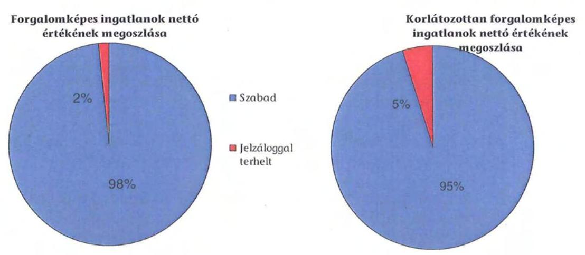

Az Önkormányzat kötelezettségeinek 2010. december 31-i állományát és várható alakulását a kötelezettségek lejáratáig a következő táblázat szemlélteti:
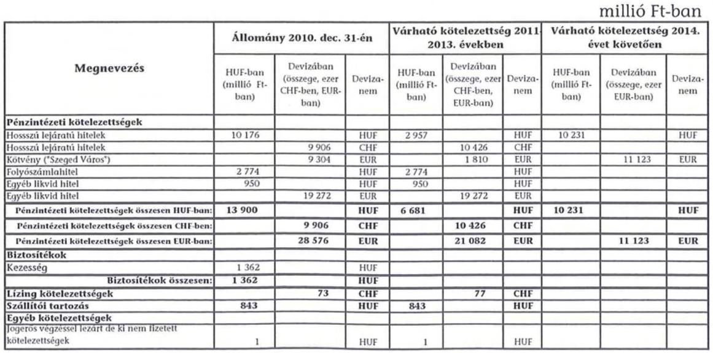

---

Az Önkormányzatnak pénzintézetekkel szemben fennálló kötelezettsége a 2010. év végén 13 900 millió Ft, 9906 ezer CHF és 28 576 ezer EUR volt. Ezek várható kötelezettsége (tőke, kamat) a legutóbbi kamatfizetés feltételei alapján a 2011–2013. években 6681 millió Ft, 10 426 ezer CHF és 21 082 ezer EUR. A 2014. évet követően az Önkormányzat várható kötelezettsége 10 231 millió Ft és 11 123 ezer EUR. Az Önkormányzatnak a 2011–2013. években szállítói tartozások és a jogerős végzéssel lezárt, de ki nem fizetett kötelezettségek címén 844 millió Ft, lízing kötelezettség címén 77 ezer CHF fizetési kötelezettsége keletkezett. A kezességvállalásaiból adódóan 1362 millió Ft összegű terhe jelentkezhet, amennyiben egy társasága és a Csatorna Társulat kötelezettségeiket nem teljesítik. A várható összes kötelezettség teljesítésére figyelembe vehető 1273 millió Ft mérlegben kimutatott követelésállomány, 6418 millió Ft forgalomképes ingatlanvagyon, melyből 113 millió Ft a pénzintézeti kötelezettségekhez kapcsolódóan jelzáloggal terhelt. Az Önkormányzat a kötelezettségek finanszírozását a saját bevételéből tervezi megoldani, amelyeket a fennálló kötelezettségek futamidejének végéig számszerűsített${ }^{59}$. Az Önkormányzat gazdasági társaságtól és egyéb szervezettől kölcsönt nem kapott, a gazdasági társaságai veszteségrendezésére 2010. december 31-én nem volt kötelezettségvállalása.

Az Önkormányzat minősített többségi (legalább 75%-os) tulajdonú gazdasági társaságai kötelezettségeinek 2010. december 31-i állományát és várható alakulását a kötelezettségek lejáratáig a következő táblázat mutatja be:
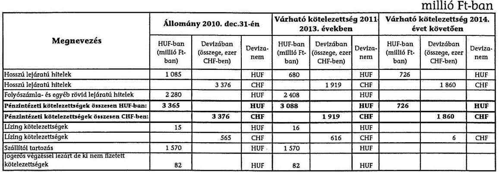

Az önkormányzati kötelezettségek növekedése mellett a minősített többségi tulajdonú társaságok kötelezettségei is befolyásolhatják az Önkormányzat pénzügyi egyensúlyát.

A közbenső adategyeztetés során a polgármester a harmadik javaslatot – az Önkormányzat és a minősített többségi tulajdonú gazdasági társaságai aktuális pénzügyi helyzetének, az Önkormányzat gazdasági társaságai felé fennálló követeléseinek, nyújtott kölcsöneinek, a kötelezettségek teljes körére szóló finanszírozási terv, az Önkormányzat folyamatban lévő és tervezett fejlesztéseihez szükséges belső és külső források rendelkezésre állásának félévenkénti bemutatását észrevételében az alábbiak szerint kifogásolta:

[^0]
[^0]:    ${ }^{59}$ A Közgyűlés 2011. június 30-i ülésére készített, a 2011. évi költségvetés 2. számú módosításáról szóló előterjesztés „III. Tájékoztatás a hosszú lejáratú kötelezettségvállalásokból adódó tőke- és kamatfizetési kötelezettségekről" pontjában bemutatottak szerint.

---

„A gazdasági események fő zárása évente jelentkezik, ezért az összegző, rendszerező adatok bemutatására éves periódust javaslunk.”

Az észrevételt nem fogadtuk el, mivel az Önkormányzat működésének középtávon ható egyensúlya és hosszú távú fenntarthatósága érdekében – az éves beszámolón felül – indokolt az Áht. 79. § (1) bekezdésében és az Ámr. ${ }_{2}$ 238. §-ában előírt féléves beszámoló keretében is az általunk javasolt területek bemutatása, értékelése.

A gazdasági társaságok pénzintézetekkel szemben fennálló kötelezettsége a 2010. év végén 3365 millió Ft és 3376 ezer CHF volt, továbbá lízingből 15 millió Ft és 565 CHF, szállítói tartozásból 1570 millió Ft, jogerős végzéssel lezárt, de ki nem fizetett kötelezettségből 82 millió Ft tartozása volt. A társaságoknak a 2011. évtől 3814 millió Ft és 3779 ezer CHF pénzintézeti kötelezettséget, 16 millió Ft és 622 ezer CHF lízinget, 1570 millió Ft szállítói tartozást, valamint 82 millió Ft jogerős végzéssel lezárt, de ki nem fizetett kötelezettséget kell rendezniük. Az Önkormányzat számára pénzügyi kockázatot jelent, ha felszámolás esetén a bíróság megállapítja az Önkormányzat korlátlan és teljes felelősségét a fenti kötelezettségekkel érintett egy 88%-os tulajdoni hányadú és hat kizárólagos önkormányzati tulajdonú gazdasági társaság esetében.

Az Önkormányzat korlátlan felelősséggel tartozik felszámolás esetén a gazdasági társaságokról szóló 2006. évi IV. törvény 54. § (2) bekezdése alapján azon gazdasági társaságának, amelyben az Önkormányzat az 52. § (2) bekezdése szerint a szavazatok legalább 75%-ával rendelkezik, így minősített befolyásszerzőnek minősül, továbbá a csődeljárásról és a felszámolási eljárásról szóló 1991. évi XLIX. törvény 63. § (2) bekezdése alapján a kizárólagos önkormányzati tulajdonú gazdasági társaságának minden olyan kötelezettségéért, amelynek kielégítését a felszámolási eljárás során az adós társaság vagyona nem fedez, ha a hitelezőinek a felszámolási eljárás során benyújtott keresete alapján a bíróság – az adós társaság felé érvényesített tartósan hátrányos üzletpolitikájára figyelemmel – megállapítja az önkormányzat korlátlan és teljes felelősségét.

A közbenső adategyeztetés során a polgármester észrevétele szerint:
„Az önkormányzat kötelező és önként vállalt feladatainak egy részét végezteti el a gazdasági társaságai által. Az irányító tevékenységet a Közgyűlés gyakorolja. A tartósan hátrányos üzletpolitika az ellenőrzött gazdasági társaság vagyoni helyzetére kedvezőtlen kihatású, hosszabb időszakot felölelő, célzatosan folytatott irányító tevékenységet jelent, és nem egy-egy szerződéses kapcsolatot érintő döntés meghozatalát. Ennek megállapítására a felszámolási eljárás során hitelezői kereset alapján bírósági határozattal van lehetőség. Ezek alapján nem tartom reálisnak azt a sajátos feltételezést, hogy a bíróság megállapítsa a korlátlan és teljes felelősséget az esetlegesen felszámolás alá eső önkormányzati társaságoknál, ezért a pénzügyi kockázat az önkormányzat részéről jelentéktelen. Ezt megerősíti az is, hogy az Ötv. 80. § (3) bekezdés szerint az önkormányzat csak olyan vállalkozásban vehet részt, amelyben felelőssége nem haladja meg vagyoni hozzájárulásának mértékét.”

Az észrevételt nem fogadtuk el az alábbiakban kifejtettek miatt.
A jelentéstervezetben nem minősítettük a pénzügyi kockázat mértékét azzal összefüggésben, hogy az Önkormányzat gazdasági társasága felszámolása esetén a bíróság megállapíthatja az Önkormányzat korlátlan és teljes felelősségét, hanem feltártuk a kockázat lehetőségét a gazdasági társaságok pénzintézetekkel szemben fennálló kötelezettségei, szállítói tartozásai, jogerős végzéssel lezárt, de ki

---

nem fizetett kötelezettségei vonatkozásában. Erre tekintettel irreleváns az Önkormányzat azon érvelése, amely szerint a pénzügyi kockázat az Önkormányzat részéről jelentéktelen. Az észrevételnek az Ötv. 80. § (3) bekezdésére történő hivatkozása azért nem helytálló, mert az Ötv-hez képest a gazdasági társaságokról szóló 2006. évi IV. törvény és a csődeljárásról és felszámolási eljárásról szóló 1991. évi XLIX. törvény olyan speciális szabályokat
 tartalmaznak, amelyek elsődlegesek az Ötv. hivatkozott általános előírásaival szemben.

Az Önkormányzat a 2007–2010. években a tárgyi eszközök után együttesen 15430 millió Ft értékcsökkenést számolt el. A 2008–2010. években a tárgyévben elszámolt értékcsökkenés 2008-ban 38%-ának (1651 millió Ft), 2009-ben 37%-ának (1829 millió Ft), 2010-ben 38%-ának (1855 millió Ft) megfelelő összeget aktiváltak felújításként az Önkormányzatnál. A 2007-ben aktivált 1068 millió Ft felújítás alapján számított aránytalanul kedvező 91%-os mutatót az egészségügyi vagyon átadása és két ingatlan értékesítése miatt kivezetett értékcsökkenés torzító hatása eredményezte.

Az Önkormányzat eszközállományának bruttó értéke 7%-kal, 287754 millió Ft-ra, nettó értéke 2%-kal, 249190 millió Ft-ra emelkedett 2007-ről 2010-re. Az önkormányzati szintű használhatósági fok mutató négy év alatt négy százalékponttal, 91%-ról 87%-ra csökkent – az eszközök folyamatosan növekvő bruttó értéke ellenére – az egyes eszközcsoportoknál különböző mértékkel elszámolt amortizáció hatására. Ezzel az eszközök avultsága növekedett.

Az Önkormányzat évente felmértette a karbantartási, felújítási szükségletet, annak eldöntése céljából, hogy a következő év költségvetésébe a pénzügyi lehetőségek figyelembevételével megtörténhessen a karbantartási, felújítási igények rangsorolása az eszközök elhasználódása, amortizációja fedezetének biztosítása érdekében. A felújításokra, az eszközök pótlására elsősorban az intézmények működőképességének biztosítása, illetve a szakhatósági előírások figyelembevételével került sor. A 2007–2010. években folyamatban lévő beruházások, felújítások 2010. december 31-ig pénzügyileg teljesített kiadásaiból az Önkormányzat 20517 millió Ft-ot fordított 2010. december 31-ig eszközpótlásra (rekonstrukcióra, felújításra), amely a 2007–2010. években elszámolt 15430 millió Ft amortizációt 33%-kal haladta meg.

Az Önkormányzat és intézményei jelenleg 23 folyamatban lévő peres eljárásban érintettek alperesként. Az Önkormányzat terhére kimutatott perérték 1078 millió Ft, amelynek 30%-a, 326 millió Ft öt kártérítési perhez, 54%-a, 583 millió Ft az Önkormányzattal szembeni három tulajdonjogi perhez, 10%-a 107 millió Ft az Önkormányzati Tűzoltóság ellen túlszolgálati díj tárgyban indított perhez kapcsolódott. A fennmaradó 14 peres eljárást birtokháborítás (egy db), munkaügyi per (négy db), közigazgatási határozat felülvizsgálata (négy db), közigazgatási per (három db), szavatossági igény (egy db) és szerződés érvényessége (egy db) tárgyakban indították az Önkormányzattal és intézményeivel szemben.

Jogerős határozattal lezárt, de nem teljesített fizetési kötelezettsége 502 ezer Ft összegben keletkezett az Önkormányzatnak az Önkormányzati Tűzoltóság, mint alperes ellen egyéb anyagi juttatás tárgyban indított per alapján. A döntés ellen felülvizsgálati kérelmet nyújtottak be a Legfelsőbb Bírósághoz, kérve a végrehajtás felfüggesztését is.

---

# 4. A PÉNZÜGYI EGYENSÚLY MEGTEREMTÉSE ÉRDEKÉBEN HOZOTT INTÉZKEDÉSEK 

A közgyűlési előterjesztés szerint az elfogadott 2007. évi költségvetési koncepció feladatként jelölte meg az intézmények átalakításának és feladatellátásának áttekintését. Kiemelt feladatként jelölte meg a Közgyűlés, hogy a lehető legnagyobb költségvetési megtakarítások elérése érdekében olyan intézményi struktúra jöjjön létre, melynek során az alapfeladatok ellátása nem sérülhet, de ellátásuk hatékonysága emellett javul. Az intézkedés hatásaként elsősorban a személyi kiadások csökkenéséből adódó megtakarítást, ezen felül takarékosabb, ellenőrizhetőbb gazdálkodást vártak.

A kiadáscsökkentő és bevételnövelő intézkedések a gazdálkodás átláthatóbbá tételét, valamint a feladatellátás szakmai színvonalának, de kiemelten a pénzügyi helyzet javítását célozták. A 2007–2010. évek kiadáscsökkentő intézkedéseinek hatását beavatkozási területenként az alábbiak részletezik:
ezer Ft-ban

| Az érvényesített kiadás-   csökkentés területei | Személyi   juttatások   és járulékai | Dologi,   működési   kiadások | Pénzeszköz   átadások,   támogatások | Összesen |
| :-- | :--: | :--: | :--: | :--: |
| A Közgyűlésnél | - | - | - | - |
| A Hivatalnál | - | - | - | - |
| Az intézményeknél | 1196462 | 294796 | -40373 | 1450885 |
| ÖSSZESEN | 1196462 | 294796 | -40373 | 1450885 |

A Közgyűlés az Önkormányzat gazdálkodása, alaptevékenysége ellátásának hosszabb távú ésszerűsítésére vonatkozóan az alábbi intézkedéseket tette:

- az energetikai rendszer korszerűsítése;
- a távközlési kiadások csökkentése érdekében felmerülő egyszeri kiadások minimalizálása;
- létszámleépítés;
- a közbeszerzésekkel kapcsolatos kiadáscsökkentő intézkedési programcsomag;
- bevételt növelő intézkedések.

A legjelentősebb mértékű kiadási megtakarítást a létszámleépítésekkel érték el, amivel sikerült megőrizniük intézményeik gazdálkodásának stabilitását.

Az Önkormányzat a 2007–2010. években az intézményi átszervezések, a feladatváltozások, valamint a takarékossági intézkedések hatásaként együttesen 1451 millió Ft kiadási megtakarítást mutatott ki, ebből 1196 millió Ft (82%) a létszámcsökkentésekből származott.

---

Az Önkormányzat a 2010. évben további kiadási megtakarítást ért el az energetikai és távközlési területen lefolytatott közbeszerzési eljárás eredményeként megkötött szerződések alapján a gáz-, villamos energia, üzemanyag, távközlési szolgáltatóknál. Az energia szabadpiaci beszerzése 2008-ban nyílt meg, 2009-től pedig kötelezővé vált, ezt kihasználva az Önkormányzat, mint gesztor ajánlatkérő 2008-tól folyamatosan folytatott beszerzési és közbeszerzési eljárást az intézményei és a kizárólagos tulajdonában levő társaságai nevében $^{60}$ az energia szektorban.

A 2007–2010. években a 295 millió Ft dologi megtakarításból a közbeszerzési intézkedések következtében összesen 287 millió Ft megtakarítása keletkezett. Ebből gázenergia felhasználás terén 30 millió Ft, villamos energia felhasználás terén 221 millió Ft, üzemanyag-beszerzés terén 8 millió Ft, távközlési szolgáltatás terén 28 millió Ft.

A 2011. évben a lefolytatott közbeszerzési eljárások alapján megkötött szerződések szerint összesen 336 millió Ft kiadási megtakarítás keletkezik. Ebből gázenergia felhasználás terén 54 millió Ft, villamos energia felhasználás terén 242 millió Ft, üzemanyag beszerzés terén 9 millió Ft, távközlési szolgáltatás terén 31 millió Ft kiadási megtakarítás várható.

A 2011. évre összesen 466 millió Ft kiadás megtakarítást terveztek önkormányzati szinten, ennek 76%-a (355 millió Ft) dologi megtakarítás, amely elsősorban az energia megtakarításból, 24%-a (111 millió Ft) a személyi juttatások és járulékai, valamint a támogatások megtakarításából származik. A 2011. évben hivatali szinten az önként vállalt feladatok csökkentésének hatására az önkormányzati segélyre vonatkozó a 6/2011. (III. 11.) számú rendelet módosításával csökkentették a segélyre fordítható összeget, valamint költségvetési rendeletükben az egyes keretek összegét (fogyatékos-ügyi keret, szociális- és gyermekvédelmi keret, prémium feladat).

Az Önkormányzatnál a fenntarthatóságot és fejlődőképességet biztosító, intézményhálózatot érintő struktúraváltás a gazdasági programjában megfogalmazott elvárások szerint 2007-ben elindult. A Közgyűlés elrendelte a közoktatási, szociális intézmények átszervezését. Ennek következtében létszámcsökkentés, bevételnövelő, feladatátadási-átvételi intézkedések történtek saját intézményein belül.

Az Önkormányzatnál a 2007–2010. évek között a 2006. december 31-én meglévő intézményeinél a költségtakarékos és méretgazdaságos feladatellátás megteremtése érdekében végrehajtott átszervezés során a Közgyűlés az intézményei számát csökkentette. Az összevonások kapcsán jelentősen, 41%-kal csökkent a közoktatási intézmények száma 49-ről 29-re, ezen belül az általános iskolák száma 27-ről 20-ra, a középiskolák száma 19-ről 7-re. A Közgyűlés a járó- és fekvőbeteg ellátást átadta a Szegedi Tudományegyetemnek.

[^0]
[^0]:    $^{60}$ Az önkormányzati szintű kiadási megtakarítás meghatározása az intézmények és a gazdasági társaságok adatszolgáltatása alapján történt.

---

Az Önkormányzat által a 2007–2010. években végrehajtott létszámcsökkentések alakulását a következő táblázat mutatja:

| Megnevezés (adatok fő-ben) |  |  | Szociális és gyermekvédelem | Egészségügy | Polgármesteri hivatal | Egyéb | Összesen |
| :--: | :--: | :--: | :--: | :--: | :--: | :--: | :--: |
| Megszüntetett álláshelyek száma |  | 481 | 367 | 1117 | -3 | 93 | 2053 |
| ebből: | üres álláshelyek száma | 0 | 0 | 0 | 0 | 0 | 0 |
|  | szakmai álláshelyek száma | 389 | 198 | 955 | -3 | 29 | 1568 |
|  | intézmény-üzemeltetéssel kapcsolatos álláshelyek száma | 92 | 169 | 162 | 0 | 64 | 487 |
| 2007. január 1-jén indító létszám |  | 3533 | 870 | 1117 | 515 | 749 | 6784 |
| 2010. december 31-én záró létszám |  | 3052 | 503 | 0 | 518 | 656 | 4729 |

Az intézményeket érintő átszervezések következtében a 2007. évi induló 6784 foglalkoztatott létszám a 2010. évre 4729 főre csökkent. A megszüntetett álláshelyek száma a 2007–2010. években 2055 darab volt. A létszámcsökkenés az egészségügyben 1117 fő (54%) volt, a közoktatásban 481 fő (23%), a szociális és gyermekvédelemnél 367 fő (18%) és az Önkormányzat egyéb területén 93 fő (5%) volt. A létszámcsökkentéssel, átszervezéssel, feladatmegszüntetéssel járó döntések eredményeként 1196 millió Ft kiadási megtakarítást értek el a személyi juttatásokból és annak járulékaiból.

A létszámcsökkentéshez igénybevett támogatás 306 millió Ft volt a 2007–2010. években, a támogatás felhasználásával tartósan leépített létszám 222 fő volt az Önkormányzatnál.

A 2007–2008. évi költségvetési rendeletekkel egyidejűleg az Önkormányzat a kiadási megtakarítást eredményező intézkedésekről határozatban döntött, azonban ezek pénzügyi kihatását a döntés évében eredeti előirányzatként nem tervezték meg. Az Önkormányzatnál a teljesített költségvetési bevételek és kiadások főösszege a 2007. évről a 2010. évre folyamatosan csökkent, elsősorban a Szegedi Tudományegyetemnek és a Többcélú Társulásnak átadott egészségügyi, közoktatási és szociális feladatok hatása miatt.

A bevételnövelő intézkedések hatására a 2007–2010. években 2001 millió Ft bevételt realizált az Önkormányzat, amelynek 9%-át (174 millió Ft-ot) ingatlanok, eszközök bérbeadásából, 5%-át (103 millió Ft-ot) a térítési díjak emeléséből és a korábban térítésmentes szolgáltatások és egyéb ellátások díjkötelessé tételével, 31%-át (612 millió Ft-ot) különböző adónemek emeléséből és 55%-át (1112 millió Ft-ot) tömegközlekedési jegyek, bérlettérítések, parkolási díjak emeléséből érték el.

---

Az önkormányzat által 2007–2010 közötti időszakban érvényesített bevételnövelő intézkedések részletezése
adatok ezer Ft-ban

| A bevételnövelés területei | Az önkormányzat közgyűlésének működése | Az önkormányzat polgármesteri hivatala | Az önkormányzat intézményei | Összesen |
| :--: | :--: | :--: | :--: | :--: |
| Ingatlanok, eszközök bérbeadása | - | - | 173917 | 173917 |
| Térítési díjak emelése, korábban ingyenes szolgáltatások díjkötelessé tétele | - | - | 102805 | 102805 |
| Adóemelés (építményadó, idegenforgalmi adó) | 612128 | - | - | 612128 |
| Tömegközlekedési jegy és bérlettérítés emelése, parkolási bevételek | - | 1111982 | - | 1111982 |
| Összesen | 612128 | 1111982 | 276722 | 2000832 |

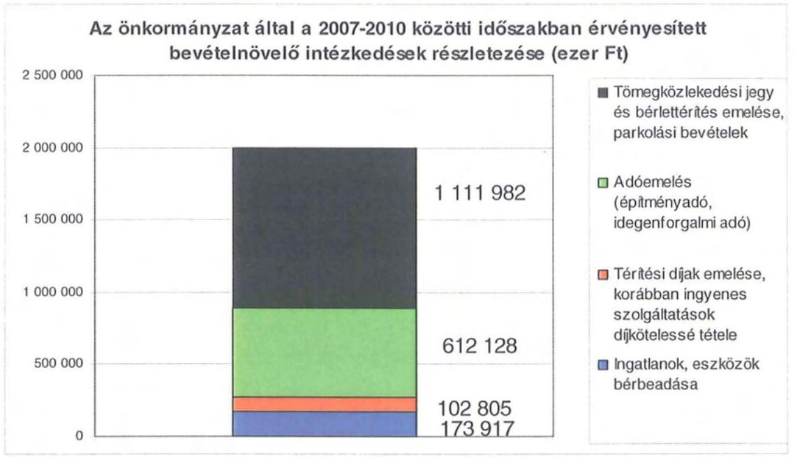

A 2011. évben tervezett bevételnövelő intézkedések várt eredményét 1048 millió Ft-ban határozta meg az Önkormányzat, amelynek 95,9%-át, 1005 millió Ft-ot a térítési díjak emeléséből, a korábban térítésmentes szolgáltatások és egyéb ellátások díjkötelessé tételével és 3,4%-át, 43 millió Ft-ot a szabadkapacitások hasznosításával ingatlanok, eszközök bérbeadásából tervezték.

Az Önkormányzat a központi intézkedések hatására 2007-ről 2010-re a költségvetési támogatásból, az átengedett és az illeték bevételekből jelentkező

---

1893 millió Ft bevételkiesést $^{61}$ a kiadáscsökkentő és bevételnövelő intézkedéseivel ellentételezte.

# 5. A HELYI ÖNKORMÁNYZATOK GAZDÁLKODÁSI RENDSZERÉNEK 2010. ÉVI ELLENŐRZÉSE SORÁN A PÉNZÜGYI EGYENSÚLY JAVÍTÁSÁRA TETT SZABÁLYSZERŰSÉGI ÉS CÉLSZERŰSÉGI JAVASLATOK HASZNOSULÁSA 

Az ÁSZ az Önkormányzat gazdálkodási rendszerét a 2010. évben ellenőrizte átfogó jelleggel. A gazdálkodási rendszer korábbi ellenőrzése során tett javaslatok közül a pénzügyi egyensúly javítására vonatkozott három szabályszerűségi és egy célszerűségi javaslat.

A főjegyzőnek tett
 szabályszerűségi javaslat volt, hogy

- „gondoskodjon a költségvetési rendelettervezet elkészítésénél arról, hogy abban az európai uniós támogatással megvalósuló feladatok bevételi és kiadási előirányzatai az Ámr. 36. § (1) bekezdés l) pontjának megfelelően elkülönítetten szerepeljenek”;
- „intézkedjen annak érdekében, hogy az Önkormányzat költségvetési rendeletének végrehajtása során likvid hitelként az Ötv. 88. § (3) bekezdés d) pontjában foglaltakat figyelembe véve - csak az éven belül felvett és visszafizetett - hiteleket számolják el a könyvviteli nyilvántartásokban”;
- „készítsen az Ámr. 201. § (1) bekezdésének megfelelő likviditási koncepciót, és végezze el a likvid hitel éven belüli visszafizetési lehetőségének részletes vizsgálatát, továbbá annak eredményéről tájékoztassa a Közgyűlést”.

A munka színvonalának javítása érdekében javasoltuk a főjegyzőnek, hogy

- „tájékoztassa - évente végzett számítások alapján - a Közgyűlést az Önkormányzat eladósodásának növekedésére figyelemmel arról, hogy a hosszú lejáratú, adósságot keletkeztető kötelezettségvállalásokból adódó tőke- és kamatfizetési kötelezettségét az Önkormányzat milyen feltételek biztosítása mellett tudja teljesíteni”.

A javaslatok megvalósítása érdekében a számvevői jelentés átvételét követő 8 napon belül a főjegyző a 81152-1/2010. szám alatt intézkedést rendelt el, továbbá a Közgyűlés a 49/2011. (II. 25.) számú határozatával elfogadta az ÁSZ jelentésben foglaltak végrehajtására készített, felelősöket és határidőket is tartalmazó intézkedési tervet.

Az ellenőrzés során a pénzügyi egyensúly javítására tett javaslatok 100%-át hasznosították. A megtett intézkedések hatására megvalósultak az európai uniós támogatással megvalósuló feladatok bevételi és kiadási előirányzatainak a költségvetési rendeletben történő bemutatására, a likvid hitelek könyvviteli nyilvántartásokban történő szabályszerű elszámolására vonatkozó szabálysze-

[^0]
[^0]:    ${ }^{61}$ A költségvetési támogatásból, az átengedett bevételekből és az illeték bevételekből származó bevételek változását minden évben 2007-hez viszonyítottuk, majd azokat összegeztük. Ezt a kumulált összeget (1893 millió Ft) viszonyítottuk az elért kiadási megtakarítások (1450 millió Ft) és bevételi többletek (2001 millió Ft) szintén kumulált összegéhez.

---

rűségi javaslatok. A likviditási koncepció készítésére vonatkozó szabályszerűségi javaslat végrehajtásának határidejét az intézkedési terv 2011. június 30-án írta elő. A főjegyző gondoskodott arról, hogy a Közgazdasági iroda elkészítse a Közgyűlés 2011. június 30-ai ülésére a likviditási koncepcióra vonatkozó - a szabályszerűségi javaslat végrehajtására készített - előterjesztést. A célszerűségi javaslat végrehajtásának határidejét az intézkedési terv szintén 2011. június 30-án jelölte meg. A főjegyző gondoskodott arról, hogy a Közgazdasági iroda elkészítse a Közgyűlés 2011. június 30-ai ülésére a hosszú lejáratú adósságot keletkeztető kötelezettségvállalásokból adódó tőke- és kamatfizetési kötelezettségek teljesítési feltételeinek bemutatására vonatkozó előterjesztést.

Budapest, 2011. december „22.”

Melléklet: $\quad 9 \mathrm{db}$
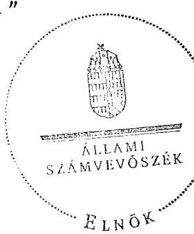

Domokos László

---

.

---

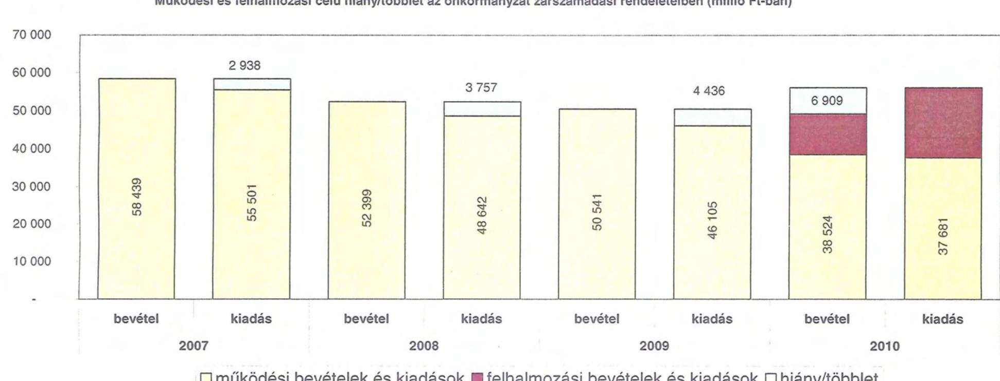

# Működési és felhalmozási célú hiány/többlet az önkormányzat zárszámadási rendeleteiben (millió Ft-ban)

|  2007 | 2008 | 2009 | 2010  |
| --- | --- | --- | --- |
|  2007 | 2008 | 2009 | 2010  |

☐ működési bevételek és kiadások ☑ felhalmozási bevételek és kiadások ☐ hiány/többlet

---

|  1. FOLYÓ KÖLTSÉGVETÉS* | 20017. | 20020. | 20030. | 20101.  |
| --- | --- | --- | --- | --- |
|  1.1.1. Saját működési bevételek | 19 583 847 | 17 707 615 | 18 465 934 | 20 972 370  |
|  1.1.2. Költségvetési támogatás | 11 769 780 | 15 613 239 | 13 391 150 | 12 174 101  |
|  1.1.3. Szorgatból bevételek | 6 887 542 | 3 822 177 | 4 271 874 | 4 701 404  |
|  1.1.4. Állandóáttartáson belülről kapott támogatások | 4 127 238 | 823 305 | 851 964 | 1 025 860  |
|  1.1.5. EU-tól és külföldről kapott bevételek | 3 045 | 314 | 0 | 0  |
|  1.1.6. Állandóáttartáson késülről kapott bevételek | 142 052 | 135 108 | 123 935 | 213 331  |
|  1.1.7. Félső évi pénzmunzdvány átvétel | 1 513 512 | 1 333 942 | 1 822 738 | 1 821 154  |
|  1.1. Folyó bevételek = 1.1.1.+1.1.2.+1.1.3.+1.1.4.+1.1.5.+1.1.6.+1.1.7. | 44 028 016 | 39 435 891 | 38 927 595 | 40 808 228  |
|  1.2.1. Működési kiadások immatkialások nélkül | 28 763 684 | 26 093 481 | 24 545 172 | 26 874 183  |
|  1.2.2. Állandóáttartáson belülre átadott pénzeszközök | 3 688 973 | 626 162 | 852 169 | 1 190 332  |
|  1.2.3.1. vállalkozásoknak | 1 746 480 | 2 140 854 | 2 433 081 | 2 542 351  |
|  1.2.3.2. EU-nok, illetve külföldre | 0 | 0 | 0 | 0  |
|  1.2.3.3. magánszenefizeknek | 1 544 780 | 1 614 420 | 1 886 077 | 2 191 147  |
|  1.2.3.4. mogenyél szervezetének | 2 696 012 | 2 232 074 | 2 287 494 | 2 472 804  |
|  1.2.4. Troncsferkiadások (=1.2.3.1+1.2.3.2+1.2.3.3+1.2.3.4) | 5 987 272 | 5 988 148 | 6 606 652 | 7 206 302  |
|  1.2.4 Kereszközdések | 692 015 | 869 412 | 574 543 | 540 022  |
|  1.2.5. Félső évi pénzmunzdvány átadás | 1 511 832 | 1 333 942 | 1 823 106 | 1 821 154  |
|  1.2. Folyó kiadások = 1.2.1.+1.2.2.+1.2.3.+1.2.4.+1.2.5. | 40 643 776 | 34 911 145 | 34 401 642 | 37 631 993  |
|  1.3. Folyó költségvetés egyezsége MŰKÖDÉSI JÖVEDELEM (1.1. - 1.2.) | 3 384 240 | 4 524 746 | 4 525 953 | 3 276 227  |
|  2.1.1. Saját többsvételek | 2 366 205 | 2 803 247 | 1 713 393 | 2 154 794  |
|  2.1.2. Állandóáttartáson belülről kapott támogatások | 4 999 952 | 3 810 787 | 3 867 681 | 4 035 550  |
|  2.1.3. EU-tól és külföldről kapott támogatások | 0 | 0 | 0 | 0  |
|  2.1.4. Állandóáttartáson késülről kapott támogatások | 986 295 | 505 345 | 287 977 | 170 461  |
|  2.1. Felhuhmuszási (beruházási) bevételek (=2.1.1.+2.1.2+2.1.3+2.1.4.) | 8 352 452 | 7 119 379 | 5 869 051 | 8 360 805  |
|  2.2.1. Saját beruházási kiadás állával | 7 952 804 | 6 134 911 | 5 262 207 | 11 802 923  |
|  2.2.2. Saját felújítási kiadás állával | 1 387 859 | 2 220 766 | 2 475 244 | 2 799 588  |
|  2.2.3. Állandóáttartáson belülre átadott pénzeszköz | 183 523 | 336 081 | 880 463 | 1 182 396  |
|  2.2.4. EU-nok és külföldnek adott pénzeszközök | 0 | 0 | 0 | 0  |
|  2.2.5. Állandóáttartáson késülre adott pénzeszközök | 2 485 281 | 3 389 351 | 1 541 507 | 1 805 809  |
|  2.2.6. Befektetési célú részesedések vásárlása | 32 408 | 157 580 | 166 410 | 950 430  |
|  2.2. Felhuhmuszási (beruházási) kiadások (=2.2.1.+2.2.2.+2.2.3.+2.2.4.+2.2.5.+2.2.6.) | 12 042 167 | 12 238 689 | 10 326 231 | 18 541 148  |
|  2.3. Beruházási költségvetés egyezsége (2.1. - 2.2.) | -3 689 715 | -5 119 310 | -4 457 189 | -10 180 343  |
|  3. Finanszírozási műveletek nélküli (GFS) pozíciói (1.3.+2.3.) | -305 475 | -594 564 | 68 773 | -6 904 116  |
|  4. Finanszírozási műveletek |  |  |  |   |
|  4.1. Hitelbérétel | 2 150 577 | 2 738 245 | 1 552 636 | 4 295 648  |
|  4.2. Hitelbérlesztés | 1 735 328 | 889 114 | 1 150 898 | 1 394 702  |
|  4.3. Forgalási és befektetési célú értékpapírok kibocsátása | 0 | 0 | 0 | 2 500 000  |
|  4.4. Forgalási és befektetési célú értékpapírok beváltása | 0 | 0 | 0 | 0  |
|  4.5. Forgalási és befektetési célú értékpapírok értékesítése | 933 821 | 439 071 | 847 319 | 1 069 619  |
|  4.6. Forgalási és befektetési célú értékpapírok vásárlása | 1 079 412 | 595 503 | 218 846 | 563 859  |
|  4.7. Egyéb finanszírozási bevételek (függő, átfutó, közgyedítő) | 41 790 | -549 671 | -141 036 | -705 785  |
|  4.8. Egyéb finanszírozási kiadások (függő, átfutó, közgyedítő) | -91 618 | -1 073 381 | 9 301 | 5 180  |
|  4.9. Finanszírozási műveletek egyezsége (4.1. - 4.2.+4.3.-4.4+4.5.-4.6.+4.7.-4.8.) | 403 074 | 2 216 409 | 879 874 | 5 195 741  |
|  5. Tárgyévi pénzügyi pozíció változás (1.3.+ 2.3.+4.9.) | 97 599 | 1 621 845 | 948 647 | -1 708 375  |
|  6. Nettó működési jövedelem =működési jövedelem (1.3.) - tüketörlesztés (4.2+4.4) | 1 648 912 | 3 635 632 | 3 375 055 | 1 881 525  |
|  TÁJÉKOZTATÓ ADATOK |  |  |  |   |
|  Összes kötelezettség | 18 589 210 | 20 885 589 | 21 285 023 | 25 783 348  |
|  ebből rövid kijárató | 9 183 003 | 10 827 253 | 11 273 387 | 12 083 429  |
|  Összes ezállító kötelezettség | 921 344 | 483 435 | 1 650 080 | 842 869  |
|  ebből kijárt (tamódványból) | 12 969 | 18 024 | 2 992 | 4 121  |
|  Pénz és tőknálati kötelezettség (adószági) | 14 565 916 | 16 424 166 | 17 922 681 | 24 071 940  |
|  ebből rövid kijárató | 5 171 562 | 6 390 232 | 7 922 921 | 10 375 310  |
|  PPP sorralléken állomány jelenértékes (tamódványból) | 0 | 0 | 0 | 0  |
|  ebből kijárt szolgáltatási díj

 miatti kötelezettség | 0 | 0 | 0 | 0  |
|  Folyószámlából napi átlagos állománya (táblázatból) | 120 690 | 327 789 | 830 552 | 491 550  |
|  Lűvállalásból napi átlagos állománya (táblázatból) | 4 173 000 | 4 628 000 | 5 010 000 | 5 374 690  |
|  Hunktőrfélét napi átlagos állománya (táblázatból) | 0 | 0 | 0 | 0  |
|  Keresztesség és garanciavállalások (táblázatból) | 0 | 0 | 0 | 0  |
|  Jogerős bizonylati időszakból adódó kötelezettségek (táblázatból) | 0 | 0 | 0 | 502  |
|  Finanszírozásba bevonható eszközök | 4 824 091 | 6 605 244 | 6 913 865 | 4 740 778  |
|  Tartás kötelezettség megtestesítő értékpapírok és végé állománya | 883 236 | 1 398 693 | 1 073 270 | 936 548  |
|  Összes kijárató hunkhötétek és végé állománya | 0 | 0 | 0 | 0  |
|  Értékpapírok és végé állománya | 1 274 617 | 918 468 | 603 865 | 275 875  |
|  Pénzeszközök (idegen pénzeszközök nélküli) és végé állománya | 2 666 238 | 4 288 083 | 5 236 730 | 3 528 355  |

---

|   |  |  |  |  |  |  |  |  |  |  |  |  |  |  |  |  |  |  |  |  |  |  |  |  |  |  |  |  |  |  |  |  |  |  |  |  |  |  |  |  |  |  |  |  |  |  |  |  |  |  |  |  |  |  |  |  |  |  |  |  |  |  |  |  |  |  |  |  |  |  |  |  |  |  |  |  |  |  |  |  |  |  |  |  |  |  |  |  |  |  |  |  |  |  |  |  |  |  |  |  |  |  |  |  |  |  |  |  | 

---

|   |  |  |  |  |  |  |  |  |  |  |  |  |  |  |  |  |  |  |  |  |  |  |  |  |  |  |  |  |  |  |  |  |  |  |  |  |  |  |  |  |  |  |  |  |  |  |  |  |  |  |  |  |  |  |  |  |  |  |  |  |  |  |  |  |  |  |  |  |  |  |  |  |  |  |  |  |  |  |  |  |  |  |  |  |  |  |  |  |  |  |  |  |  |  |  |  |  |  |  |  |  |  |  |  |  |  |  |  | 

---

|  |   |   |   |   |   |   |   |   |   |   |   |   |   |   |   |   |   |   |   |   |   |   |   |   |   |   |   |   |   |   |   |
| --- | --- | --- | --- | --- | --- | --- | --- | --- | --- | --- | --- | --- | --- | --- | --- | --- | --- | --- | --- | --- | --- | --- | --- | --- | --- | --- | --- | --- | --- | --- | --- |
|   |  |  |  |  |  |  |  |  |  |  |  |  |  |  |  |  |  |  |  |  |  |  |  |  |  |  |  |  |  |  |   |
|   |  |  |  |  |  |  |  |  |  |  |  |  |  |  |  |  |  |  |  |  |  |  |  |  |  |  |  |  |  |  |   |
|   |  |  |  |  |  |  |  |  |  |  |  |  |  |  |  |  |  |  |  |  |  |  |  |  |  |  |  |  |  |  |   |
|   |  |  |  |  |  |  |  |  |  |  |  |  |  |  |  |  |  |  |  |  |  |  |  |  |  |  |  |  |  |  |   |
|   |  |  |  |  |  |  |  |  |  |  |  |  |  |  |  |  |  |  |  |  |  |  |  |  |  |  |  |  |  |  |   |
|   |  |  |  |  |  |  |  |  |  |  |  |  |  |  |  |  |  |  |  |  |  |  |  |  |  |  |  |  |  |  |   |
|   |  |  |  |  |  |  |  |  |  |  |  |  |  |  |  |  |  |  |  |  |  |  |  |  |  |  |  |  |  |  |   |
|   |  |  |  |  |  |  |  |  |  |  |  |  |  |  |  |  |  |  |  |  |  |  |  |  |  |  |  |  |  |  |   |
|   |  |  |  |  |  |  |  |  |  |  |  |  |  |  |  |  |  |  |  |  |  |  |  |  |  |  |  |  |  |  |   |
|   |  |  |  |  |  |  |  |  |  |  |  |  |  |  |  |  |  |  |  |  |  |  |  |  |  |  |  |  |  |  |   |
|   |  |  |  |  |  |  |  |  |  |  |  |  |  |  |  |  |  |  |  |  |  |  |  |  |  |  |  |  |  |  |   |
|   |  |  |  |

  |  |  |  |  |  |  |  |  |  |  |  |  |  |  |  |  |  |  |  |  |  |  |  |  |  |  |   |
|   |  |  |  |  |  |  |  |  |  |  |  |  |  |  |  |  |  |  |  |  |  |  |  |  |  |  |  |  |  |  |   |
|   |  |  |  |  |  |  |  |  |  |  |  |  |  |  |  |  |  |  |  |  |  |  |  |  |  |  |  |  |  |  |   |
|   |  |  |  |  |  |  |  |  |  |  |  |  |  |  |  |  |  |  |  |  |  |  |  |  |  |  |  |  |  |  |   |
|   |  |  |  |  |  |  |  |  |  |  |  |  |  |  |  |  |  |  |  |  |  |  |  |  |  |  |  |  |  |  |   |
|   |  |  |  |  |  |  |  |  |  |  |  |  |  |  |  |  |  |  |  |  |  |  |  |  |  |  |  |  |  |  |   |
|   |  |  |  |  |  |  |  |  |  |  |  |  |  |  |  |  |  |  |  |  |  |  |  |  |  |  |  |  |  |  |   |
|   |  |  |  |  |  |  |  |  |  |  |  |  |  |  |  |  |  |  |  |  |  |  |  |  |  |  |  |  |  |  |   |
|   |  |  |  |  |  |  |  |  |  |  |  |  |  |  |  |  |  |  |  |  |  |  |  |  |  |  |  |  |  |  |   |
|   |  |  |  |  |  |  |  |  |  |  |  |  |  |  |  |  |  |  |  |  |  |  |  |  |  |  |  |  |  |  |   |
|   |  |  |  |  |  |  |  |  |  |  |  |  |  |  |  |  |  |  |  |  |  |  |  |  |  |  |  |  |  |  |   |
|   |  |  |  |  |  |  |  |  |  |  |  |  |  |  |  |  |  |  |  |  |  |  |  |  |  |  |  |  |  |  |   |
|   |  |  |  |  |  |  |  |  |  |  |  |  |  |  |  |  |  |  |  |  |  |  |  |  |  |  |  |  |  |  |   |
|   |  |  |  |  |  |  |  |  |  |  |  |  |  |  |  |  |  |  |  |  |  |  |  |  |  |  |  |  |  |  |   |
|   |  |  |  |  |  |  |  |  |  |  |  |  |  |  |  |  |  |  |  |  |  |  |  |  |  |  |  |  |  |  |   |
|   |  |  |  |  |  |  |  |  |  |  |  |  |  |  |  |  |  |  |  |  |  |  |  |  |  |  |  |  |  |  |   |
|   |  |  |  |  |  |  |  |  |  |  |  |  |  |  |  |  |  |  |  |  |  |  |  |  |  |  |  |  |  |  |   |
|   |  |  |  |  |  |  |  |  |  |  |  |  |  |  |  |  |  |  |  |  |  |  |  |  |  |  |  |  |  |  |   |
|   |  |  |  |  |  |  |  |  |  |  |  |  |  |  |  |  |  |  |  |  |  |  |  |  |  |  |  |  |  |  |   |
|  

---

|   |  |  |  |  |  |  |  |  |  |  |  |  |  |  |  |  |  |  |  |  |  |  |  |  |  |  |  |  |  |  |  |  |  |  |  |  |  |  |  |  |  |  |  |  |  |  |  |  |  |  |  |  |  |  |  |  |  |  |  |  |  |  |  |  |  |  |  |  |  |  |  |  |  |  |  |  |  |  |  |  |  |  |  |  |  |  |  |  |  |  |  |  |  |  |  |  |  |  |  |  |  |  |

---

|   |  |  |  |  |  |  |  |  |  |  |  |  |  |  |  |  |  |  |  |  |  |  |  |  |  |  |  |  |  |  |  |  |  |  |  |  |  |  |  |  |  |  |  |  |  |  |  |  |  |  |  |  |  |  |  |  |  |  |  |  |  |  |  |  |  |  |  |  |  |  |  |  |  |  |  |  |  |  |  |  |  |  |  |  |  |  |  |  |  |  |  |  |  |  |  |  |  |  |  |  |  |  |
 |  |  |  |  |  |  |  |  |  |  |  |  |  |  |  |  |  |  |  |  |  |  |  |  |  |  |  |  |  |  |  |  |  |  |  |  |  |  |  |  |  |  |  |  |  |  |  |  |  |  |  |  |  |  |  |  |  |  |  |  |  |  |  |  |  |  |  |  |  |  |  |  |  |  |  |  |  |  |  |  |  |  |  |  |  |  |  |  |  |  |  |  |  |  |  |  |  |  |  |  |  |

---

|  20.12.2019, 01.06.2020 |  |  |  |  |  |  |  |  |  |  |  |  |  |  |  |  |  |  |  |  |  |  |  |  |  |  |  |  |  |  |  |  |  |  |  |  |  |  |  |  |  |  |  |  |  |  |  |  |  |  |  |  |  |  |  |  |  |  |  |  |  |  |  |  |  |  |  |  |  |  |  |  |  |  |  |  |  |  |  |  |  |  |  |  |  |  |  |  |  |  |  |  |  |  |  |  |  |  |  |  |

---

Szeged Megye Jogi Egyesület Önkombinációja

Az Önkombináció 2015. december 31-én felülvizsgált lévő fejlesztési feladatokhoz kapcsolódó feltételrendszerének összegzése (d-2016. december 31-ig teljesítési pénzügyi eszköz eszközletező).

|   |  |  |  |  |  |  |  |  |  |  |  |  |  |  |  |  |  |  |  |  |  |  |  |  |  |  |  |  |  |  |  |  |  |  |  |  |  |  |  |  |  |  |  |  |  |  |  |  |  |  |  |  |  |  |  |  |  |  |  |  |  |  |  |  |  |  |  |  |  |  |  |  |  |  |  |  |  |  |  |  |  |  |  |  |  |  |  |  |  |  |  |  |  |  |  |  |  |  |  |  |

---

|  |   |   |   |   |   |   |   |   |   |   |   |   |   |   |   |   |   |   |   |   |   |   |   |   |   |   |   |   |   |   |   |   |   |   |   |   |   |   |   |   |   |   |   |   |   |   |   |   |   |   |   |   |   |   |   |   |   |   |   |   |   |   |   |   |   |   |   |   |   |   |   |   |   |   |   |   |   |   |   |   |   |   |   |   |   |   |   |   |   |   |   |   |   |   |   |   |   |   |   |   |   |

---

# Az Önkormányzat beadott, elbírálás alatti pályázati forrásból megvalósuló fejlesztéseihez kapcsolódó kötelezettség-vállalásainak összegzéséről

|  Fejlesztési feladat (beruházás, felújítás) |  |  |  | Beruházás, felújítás |  |  |  |  |  |  |  |  |  |  |  |  |  |  |  |  |  |  |  |  |  |  |  |  |  |  |  |  |  |  |  |  |  |  |  |  |  |  |  |  |  |  |  |  |  |  |  |  |  |  |  |  |  |  |  |  |  |  |  |  |  |  |  |  |  |  |  |  |  |  |  |  |  |  |  |  |  |  |  |  |  |  |  |  |  |  |  |  |  |  |  |  |  |  |  |  |  |  |  | 

---

.

---

## Az önkormányzati feladatok ellátásában résztvevő gazdasági társaságokról

|  Gazdasági társaság
megnevezése | önkormányzat | önkormányzat
gazdasági
társaságának | saját tőke,
jegyzett tőke
részvény | kötelező
feladathoz | önként vállalt
feladathoz | hosszú lejáratú
hitel,
kötvényből | Színből | lejárt szállítói
állományból | működési támogatás | felhalmozási támogatás  |
| --- | --- | --- | --- | --- | --- | --- | --- | --- | --- | --- |
|   |  |  |  |  |  |  |  |  | 2007. | 2008.  |
|  1. 100%-os tulajdoni hányadú gazdasági társaságok: |  |  |  |  |  |  |  |  |  |   |
|  Szeged Pólus Nonprofit Kft. | 100% |  | 8,3 | 25 | 0 | 0 | 0 | 0 | 55 | 50  |
|  Szegedi Sport és Fürdők Kft. | 100% |  | 0,9 | 632 | 345 | 535 | 0 | 7 | 220 | 371  |
|  Szegedi Ifjúsági Ház Nonprofit Kft. | 100% |  | 0,8 | 190 | 0 | 0 | 0 | 17 | 88 | 109  |
|  Szegedi Környezetgazdálkodási Nonprofit Kft. | 100% |  | 1,6 | 278 | 278 | 531 | 0 | 40 | 1 082 | 1 017  |
|  Szegedi Közlekedési Kft. | 100% |  | 1,4 | 3 515 | 1 640 | 404 | 140 | 40 | 680 | 810  |
|  Szegedi Szabadidő Nonprofit Kft. | 100% |  | 7,8 | 0 | 53 | 0 | 0 | 8 | 290 | 313  |
|  Szegedi Testamentum Kft. | 100% |  | 1,5 | 80 | 158 | 0 | 0 | 0 | 0 | 0  |
|  Szegedi Városkép Kft. | 100% |  | 24,1 | 0 | 87 | 5 | 0 | 0 | 0 | 0  |
|  Szegedi Vásár és Piac Kft. | 100% |  | 0,9 | 0 | 775 | 151 | 0 | 0 | 0 | 0  |
|  SZINT Kft. | 100% |  | 5,2 | 0 | 52 | 7 | 0 | 0 | 530 | 568  |
|  Városi Televízió Nonprofit Kft. | 100% |  | 2,0 | 0 | 125 | 0 | 0 | 0 | 100 | 100  |
|  IKV Zrt. | 100% |  | 1,0 | 954 | 451 | 0 | 0 | 50 | 0 | 0  |
|  PITEK Zrt. | 100% |  | 2,6 | 0 | 264 | 0 | 0 | 0 | 79 | 79  |
|  100%-os tulajdoni hányadú gazdasági társaságok összesen: |  |  | 4,5 | 5 674 | 4 228 | 1 633 | 140 | 162 | 3 125 | 3 417  |
|  II. 75-99%-os tulajdoni hányadú gazdasági társaságok: |  |  |  |  |  |  |  |  |  |   |
|  Szeged és Társasága Turisztikai Nonprofit Kft. | 97% |  | 9,3 | 0 | 30 | 0 | 0 | 0 | 44 | 48  |
|  Dorozsmai Nagybani Piac Kft. | 88% |  | 5,5 | 0 | 128 | 203 | 0 |

 0 | 0 | 0  |
|  Szegedi Vízközmű Fejlesztő és Működtető Zrt. | 75% |  | 2,2 | 0 | 106 | 0 | 0 | 2 | 0 | 0  |
|  75-99%-os tulajdoni hányadú gazdasági társaságok összesen |  |  | 5,6 | 0 | 264 | 203 | 0 | 2 | 44 | 48  |
|  75% feletti tulajdoni hányadú gazdasági társaságok: |  |  | 5,0 | 5 674 | 4 492 | 1 836 | 140 | 164 | 3 169 | 3 465  |
|  III. 51-74%-os tulajdoni hányadú gazdasági társaságok: |  |  |  |  |  |  |  |  |  |   |
|  Cserepes Sor Piac Kft. | 73% |  | 7,6 | 0 | 17 | 0 | 0 | 0 | 0 | 0  |
|  1000 Mester Nonprofit Kft. | 68% |  | 1,0 | 83 | 0 | 0 | 0 | 0 | 0 | 0  |
|  Ligetőzítő Kft. | 53% | 27% | 0,6 | 0 | 804 | 3 064 | 0 | 80 | 0 | 0  |

1. oldal, összesen: 2

---

# Az önkormányzati feladatok ellátásában résztvevő gazdasági társaságokról

|  Gazdasági társaság
megnevezése |  |  |  |  |  |  |  |  |  | a gazdasági társaságnak szerződéses kötelezettségre, feladatellátási szerződésre alapozottan
az önkormányzat költségvetéséből nyújtott |  |  |  |  |  |  |  |  |  |  |  |  |  |  |   |
| --- | --- | --- | --- | --- | --- | --- | --- | --- | --- | --- | --- | --- | --- | --- | --- | --- | --- | --- | --- | --- | --- | --- | --- | --- |
|   |  | önkormányzat | önkormányzat
gazdasági
társaságának | saját tőke,
jegyzett tőke
aránya | kötelező
feladathoz | önként vállalt
feladathoz | hosszú lejáratú
hitelből,
kövénytől | lóogból | lejárt szállító
állományok | működési támogatás |  |  |  |  |  |  |  |  |  |  |  |  |  |  |   |
|   |  | tulajdoni hányada |  |  |  |  |  |  |  |  |  |  |  |  |  |  |  |  |  |  |  |  |  |   |
|   | Szegedi Hőszolgáltató Kft. |  |  |  |  |  |  |  |  |  |  |  |  |  |  |  |  |  |  |  |  |  |  |   |
|   | Szegedi Vízmű Zrt. | 51% |  | 5,2 | 523 | 0 | 345 | 0 | 1 007 | 0 | 0 | 0 | 0 | 0 | 0 | 0 | 0 | 0 | 0 | 0 | 0 | 0 | 0 |   |
|   | Szegedi Vízmű Zrt. | 51% |  | 5,3 | 20 689 | 0 | 0 | 0 | 1 | 0 | 0 | 0 | 0 | 0 | 0 | 0 | 0 | 0 | 0 | 0 | 0 | 0 | 0 |   |
|   | 81-74%-os tulajdoni
hányadú gazdasági
társaságok összesen |  |  | 3,9 | 27 295 | 821 | 3 409 | 0 | 1 088 | 0 | 0 | 0 | 16 | 0 | 0 | 0 | 0 | 0 | 0 | 0 | 0 | 0 | 0 |   |
|   | IV. 25-50%-os tulajdoni hányadú gazdasági társaságok: |  |  |  |  |  |  |  |  |  |  |  |  |  |  |  |  |  |  |  |  |  |  |  |   |
|   | 25-50%-os tulajdoni
hányadú gazdasági
társaságok összesen |  |  |  | 0 | 0 | 0 | 0 | 0 | 0 | 0 | 0 | 0 | 0 | 0 | 0 | 0 | 0 | 0 | 0 | 0 | 0 | 0 |   |
|   | V. egyéb, közfeladatot ellátó gazdasági társaságok: |  |  |  |  |  |  |  |  |  |  |  |  |  |  |  |  |  |  |  |  |  |  |  |   |
|   | Tisza Volán Zrt. |  |  | 1,9 |  |  | 0 | 0 | 0 | 255 | 219 | 347 | 516 | 0 | 0 | 0 | 0 | 0 | 0 | 0 | 0 | 0 | 0 |   |
|   | Csongrád Megyei
Településfizetési Kft. a) |  | 78% | 2,8 |  |  | 0 | 0 | 0 | 0 | 0 | 0 | 0 | 0 | 0 | 0 | 0 | 0 | 0 | 0 | 0 | 0 | 0 |   |
|   | Tisza-Maros Kft. a) |  | 48% | 0,9 |  |  | 0 | 0 | 0 | 0 | 0 | 0 | 0 | 0 | 0 | 0 | 0 | 0 | 0 | 0 | 0 | 0 | 0 |   |
|   | Egyéb, közfeladatot ellátó
gazdasági társaságok
összesen |  |  | 1,8 | 0 | 0 | 0 | 0 | 0 | 255 | 219 | 347 | 516 | 0 | 0 | 0 | 0 | 0 | 0 | 0 | 0 | 0 | 0 |   |
|   | Összesen |  |  | 3,6 | 32 969 | 5 313 | 2 245 | 140 | 1 252 | 3 454 | 3 684 | 4 375 | 4 753 | 0 | 0 | 154 | 617 |  |  |  |  |  |  |  |   |

a) Szegedi Sport és Fürdők Kft. a Ligetfürdő Kft. 27%-os tulajdonosa.

a² Szegedi Környezetgazdálkodási Nonprofit Kft. a Csongrád Megyei Településfizetési Kft 78%-os tulajdonosa.

a³ Szegedi Vízközmű Fejlesztő és Működtető Zrt. a Tisza-Maros Kft. 48%-os tulajdonosa.

---

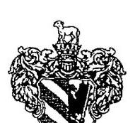

ÁLLAMI SZÁMVEVŐSZÉK
85 sol
Érkezési időpont: 2011 AUG 29.

Szeged Megyei Jogú Város Polgármestere
6745 Szeged, Pf. 473.

Melléklet: 3.

Domokos László
Elnök úr részére

Állami Számvevőszék
1364 Budapest
Pf. 54.

Tisztelt Elnök úr!

iktsz.: 68326/2011
Tárgy: Visszajelzés a V-3047-001/2011. számú
számvevőszéki jelentéshez
Vizsgálatazonosítószám: V056046
Melléklet: 1., 10., 20. tanúsítvány

08.30.

Szeged Megyei Jogú Város Önkormányzata pénzügyi helyzetének ellenőrzéséről megküldött V-3047-001/2011. számú számvevőszéki jelentés-tervezetet megkaptuk.

Engedje meg, hogy köszönetet mondjak az átfogó vizsgálat pontos és tényszerű megállapításaiért. A Számvevőszék jelentése ismét megerősíti azon törekvésünket, hogy továbbra is a helyes gazdálkodási úton járunk.

A vizsgálat során megismert elemzéseket és ezeknek a közgazdaságtani rendszerezettségét nagyon hasznosnak ítéljük. Az elemzés rávilágít azon nehézségek mélyebb összefüggéseire, amelyeket eddig is ismertünk, de egyúttal olyan új módszereket és megközelítési módokat ismertünk meg a Számvevőszék részéről, amiket szeretnénk a későbbiek során is folyamatosan használni és továbbfejleszteni.

## I / A jelentés-tervezetben foglaltakra tett észrevételek

### 16. oldal

Javaslom, hogy a jelentésben megemlített százalékszámításokra vonatkozóan legyen egy általános megjegyzés beillesztve, miszerint a jelentésben lévő arányosítás forint számai nem a százalékokból származnak, hanem a tanúsítványok részösszegzéseiből.

### 17. oldal

A 1. sz. tanúsítvány 13. sor önkormányzati intézmények 2007. évi bevételeinek megoszlási arányát módosítottuk, ezért kérjük ennek megfelelően a jelentésben a 2007. év kördiagram adatainak pontosítását (helyesen intézményi saját bevétel 32%, önkormányzati támogatás 18%, állami támogatás 50%). Mellékelten küldjük a módosított 1. sz. tanúsítványt aláírva.

### 18. oldal

Első mondatát javaslom pontosítani, hogy az Önkormányzat jelenleg rendelkezik 13 kizárólagos önkormányzati tulajdonú társasággal, ugyanis a vizsgált időszakban ez a szám változott.

### 22. oldal 1. bekezdés

A 20. sz. tanúsítvány adatait módosítottuk, ezért kérjük ennek megfelelően a jelentésben az adatok pontosítását. Mellékelten küldjük a módosított 20. sz. tanúsítványt aláírva.

### 27. oldal 5. bekezdés

„Az óvodás ellátottak létszámnövekedésének oka, hogy a város lakosság száma növekszik, sok a fiatal betelepülő az egyetem vonzása miatt. A gyermekjóléti intézményekben ellátottak létszám növekedését a

---

felnőtt lakosság szociális, mentális helyzetének romlása okozza, ami miatt egyre több gyermek kerül krízis helyzetbe."

Álláspontom szerint a bölcsődei ellátásban résztvevő gyermekek számának növekedéséből nem szabad egyértelműen a felnőtt lakosság szociális és mentális helyzetének romlására következtetni, ezért kérjük a 27. oldal 5. bekezdés utolsó mondatának elhagyását.

# 29. oldal 3. bekezdés 

Az önkormányzat a vizsgálat befejezésének időpontjára már csak 34 társaságban rendelkezett üzletrésszel, mert a Heavytex Kft. időközben megszűnt. Továbbá kérem a bekezdés utolsó mondatát kiegészíteni arra, hogy a 4. sz. táblázat csak az önkormányzati feladatellátásban résztvevő társaságokat mutatja be.

## 30. oldal 4. bekezdés közepe

Az intézkedések bevételi hatásai helyesen 6868 millió Ft, ezért kérjük ennek megfelelő javítását a jelentésben.

## 38. oldal 5. bekezdés

A 2010. évi osztalék helyesen 427 millió Ft, ezért kérjük ennek megfelelő javítását a jelentésben.

## 43. oldal 2. bekezdés

A Tisza-Volán Zrt. részére az Önkormányzat nem nyújt támogatást. Normatíva elszámolás és közszolgáltatási szerződés alapján történik pénzeszköz átadás, de a többi társaságával azonos támogatási forrást nem kap a Zrt. A „nyújtott támogatást" szóhasználat helyett az „átadott pénzeszközt" szövegrészre kérjük a javítást.

##
 Az 53. oldal 4. bekezdés

Az Önkormányzat lejárt szállítói tartozásállományát az intézményi lejárt tartozások képezték, ezért a fentiek helyett javaslom az alábbiak szerint javítani a jelentés 53. oldal 4. bekezdésében foglaltakat:
"A 2007-2010. évek között az önkormányzati lejárt szállítói tartozást az intézmények tartozásállománya képezte, amely 2007. évtől lecsökkent. Az Önkormányzatnak 2010. december 31-én 30 nap feletti lejárt szállítói tartozása nem volt, a 4 millió Ft szállítói lejárt tartozásállomány 30 nap alatti volt intézményi tartozásként."

## 57. oldal 1. és 2. második bekezdése:

„Az Önkormányzat számára pénzügyi kockázatot jelent, hogy felszámolás esetén a bíróság megállapíthatja az Önkormányzat korlátlan és teljes felelősségét a fenti kötelezettségekkel érintett egy 88%-os tulajdoni hányadú és hat kizárólagos önkormányzati tulajdonú gazdasági társaság után.

Az Önkormányzat korlátlan felelősséggel tartozik felszámolás esetén a gazdasági társaságokról szóló 2006. évi IV. törvény 54. § (2) bekezdése alapján azon gazdasági társaságának, amelyben az Önkormányzat az 52. § (2) bekezdése szerint a szavazatok legalább 75%-ával rendelkezik, így minősített befolyásszerzőnek minősül, továbbá a csődeljárásról és a felszámolási eljárásról szóló 1991. évi XLIX. törvény 63. § (2) bekezdése alapján a kizárólagos önkormányzati tulajdonú gazdasági társaságának minden olyan kötelezettségéért, amelynek kielégítését a felszámolási eljárás során az adós társaság vagyona nem fedez, ha a hitelezőinek a felszámolási eljárás során benyújtott keresete alapján a bíróság - az adós társaság felé érvényesített tartósan hátrányos üzletpolitikájára figyelemmel - megállapítja az önkormányzat korlátlan és teljes felelősségét."

Az önkormányzat kötelező és önként vállalt feladatainak egy részét végezteti el a gazdasági társaságai által. Az irányító tevékenységet a Közgyűlés gyakorolja. A tartósan hátrányos üzletpolitika az ellenőrzött gazdasági társaság vagyoni helyzetére kedvezőtlen kihatású, hosszabb időszakot felölelő, célzatosan folytatott irányító tevékenységet jelent, és nem egy-egy szerződéses kapcsolatot érintő döntés meghozatalát. Ennek megállapítására a felszámolási eljárás során hitelezői kereset alapján bírósági határozattal van lehetőség.
Ezek alapján nem tartom reálisnak azt a sajátos feltételezést, hogy a bíróság megállapítsa a korlátlan és teljes felelősséget az esetlegesen felszámolás alá eső önkormányzati társaságoknál, ezért a pénzügyi kockázat az önkormányzat részéről jelentéktelen.

---

Ezt megerősíti az is, hogy az Ötv. 80. § (3) bekezdése szerint az önkormányzat csak olyan vállalkozásban vehet részt, amelyben felelőssége nem haladja meg vagyoni hozzájárulásának mértékét.

# 3/a táblázat fejlesztések 

A 10. sz. tanúsítvány adatait módosítottuk, ezért kérjük ennek megfelelően a jelentésben az adatok pontosítását. Mellékelten küldjük a módosított 10. sz. tanúsítványt aláírva.

## II./ Polgármesternek tett javaslatokra tett észrevételek

II./1.
„1. küldje meg a Közgyűlés által jóváhagyott intézkedési tervet az Állami Számvevőszék részére a jelentés kézhezvételétől számított 30 napon belül az Állami Számvevőszékről szóló 2011. évi LXVI. törvény 33. § (1) bekezdése alapján;"

Javasolom, hogy az Állami Számvevőszékről szóló 2011. évi LXVI. törvény 33. § (1) bekezdésében megfogalmazottakkal összhangban kerüljön az intézkedési terv megküldésre az Állami Számvevőszék számára.
II./2.
„2. a Közgyűlés elé terjesztendő intézkedési terv írja elő a működés pénzügyi egyensúlyának középtávon ható helyreállítása és hosszú távú fenntarthatósága érdekében hat hónapon belül operatív terv készítését felelősök és határidők megjelölésével -, amely tartalmazza az alábbiakat:" [...]
ill.
,,e) az intézkedések eredményeinek legalább félévenkénti áttekintésének előírását"
A vizsgálat több helyen is megemlíti, önkormányzatunk folyó költségvetési egyenlege, működési jövedelme pozitív volt, ezért nem indokolt „a működés pénzügyi egyensúlyának középtávon ható helyreállítása" szövegezés és a félévente való áttekintés. A következő megfogalmazást javasoljuk:
„2. a Közgyűlés elé terjesztendő intézkedési terv írja elő a működés hosszú távú fenntarthatósága érdekében hat hónapon belül operatív terv készítését - felelősök és határidők megjelölésével -, amely tartalmazza az alábbiakat:"[...]
,,e) az intézkedések eredményeinek legalább évenkénti áttekintésének előírását"
II./3.
„3. mutassa be félévente - a szokásos beszámoló keretében - a Közgyűlésnek:
a) az Önkormányzat és a minősített többségi tulajdonú gazdasági társaságai aktuális pénzügyi helyzetét, az Önkormányzatnak a gazdasági társaságai felé fennálló követeléseit, nyújtott kölcsöneit;
b) legalább három évre kitekintően a kötelezettségek teljes körére szóló finanszírozási tervet, amely figyelembe veszi a kötelezettség éven belüli és túli felmerülését, a források számszerűsített megjelölésével;
c) az Önkormányzat folyamatban lévő és tervezett fejlesztéseihez szükséges belső és külső források rendelkezésre állását, és ebből a szempontból értékelje az Önkormányzat beruházásait;"

A gazdasági események fő zárása évente jelentkezik, ezért az összegző, rendszerező adatok bemutatására éves periódust javaslunk:
„3. mutassa be évente - a szokásos beszámoló keretében - a Közgyűlésnek:" [...]

---

# III./ Főjegyzőnek tett javaslat 

,, 1. kísérje folyamatosan figyelemmel - a tulajdonosi jogkört gyakorlók közreműködésével - a minősített többségi tulajdonú gazdasági társaságok kötelezettségeinek alakulását, az Önkormányzat likviditására, pénzügyi-egyensúlyi helyzetére gyakorolt hatását."
A minősített többségi tulajdonú gazdasági társaságokra a jegyzőnek sem jogalapja, sem befolyása, sem számonkérési lehetősége nincs. Ezt a feladatot a polgármesterhez, mint a tulajdonosi jogokat gyakorló személyhez javasolt telepíteni.

Egyúttal szeretném megköszönni a munkatársainak az ellenőrzés során tanúsított segítő és együttműködő hozzáállását, melynek segítségével az önkormányzat szakmai-pénzügyi munkáját még alaposabban és továbbra is magas színvonalon tudjuk elvégezni.

Szeged, 2011. augusztus 25.

Tisztelettel
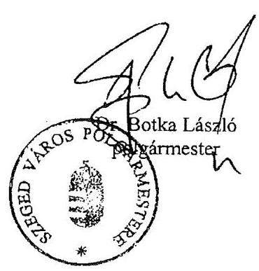

---

# Dr. Botka László úr 

polgármester
Szeged Megyei Jogú Város Önkormányzata

## Szeged

## Tisztelt Polgármester Úr!

Köszönettel vettem észrevételeit a Szeged Megyei Jogú Város Önkormányzata pénzügyi helyzetének ellenőrzéséről készített jelentés-tervezetben foglalt megállapításokra. Az észrevételek feldolgozása, szakmai értékelése megtörtént, melynek eredményéről az alábbiakban tájékoztatom:

1. A közbenső egyeztetés során a polgármester által tett észrevétel szerint:
„L/ A jelentés-tervezetben foglaltakra tett észrevételek 16. oldal: Javasolom, hogy a jelentésben megemlített százalékszámításokra vonatkozóan legyen egy általános megjegyzés beillesztve, miszerint a jelentésben lévő arányosítás forint számai nem a százalékokból származnak, hanem a tanúsítványok részösszegzéseiből."
Az észrevételt elfogadtuk. A jelentéstervezet részletes megállapításainál a 26. oldalon (közzétételre kerülő jelentés 29. oldalán) lábjegyzetben feltüntettük „A %-os arányok kiszámítása az Önkormányzat által kitöltött 1. számú tanúsítványban szereplő számadatok alapján történt." mondatot.
2. A közbenső egyeztetés során a polgármester által tett észrevétel szerint:
„L/ A jelentés-tervezetben foglaltakra tett észrevételek 17. oldal: A 1. sz. tanúsítvány 13. sor önkormányzati intézmények 2007. évi bevételeinek megoszlási arányát módosítottuk, ezért kérjük ennek megfelelően a jelentésben a 2007. év kördiagram adatainak pontosítását (helyesen intézményi saját bevétel 32%, önkormányzati támogatás 18%, állami támogatás 50%). Mellékelten küldjük a módosított 1. sz. tanúsítványt aláírva.
Az észrevétel mellékleteként megküldött, javított 1. számú tanúsítványnak megfelelően pontosítottuk a működési kiadások fedezetéül szolgáló bevételi források arányait szemléltető kördiagram 2007. évi adatait.
3. A közbenső egyeztetés során a polgármester által tett észrevétel szerint:

---

„1/ A jelentés-tervezetben foglaltakra tett észrevételek 18. oldal: Első mondatát javaslom pontosítani, hogy az Önkormányzat jelenleg rendelkezik 13 kizárólagos önkormányzati tulajdonú társasággal, ugyanis a vizsgált időszakban ez a szám változott."

Az észrevételt elfogadtuk, ezért a jelentéstervezet és a közzétételre kerülő jelentés 20. oldalának első bekezdését „Az Önkormányzat 2010. december 31-én 13 gazdasági társaságban..." szövegre pontosítottuk.
4. A közbenső egyeztetés során a polgármester által tett észrevétel szerint:
„1/ A jelentés-tervezetben foglaltakra tett észrevételek 22. oldal 1. bekezdés: A 20. sz. tanúsítvány adatait módosítottuk, ezért kérjük ennek megfelelően a jelentésben az adatok pontosítását. Mellékelten küldjük a módosított 20. sz. tanúsítványt aláírva."
Az észrevétel mellékleteként megküldött, javított - az Önkormányzat jelzálogjoggal, elidegenítési és terhelt ingatlanjairól szóló - 20. számú tanúsítványnak megfelelően a korlátozottan forgalomképes ingatlanok számviteli nyilvántartás szerinti nettó értékét 4959 millió Ft-ról 4994 millió Ft-ra, a jelzáloggal érintett ingatlanok számát 6-ról 7-re, nettó értékét 5072 millió Ft-ról 5107 millió Ft-ra pontosítottuk a jelentéstervezet összegző megállapításainál a 22. oldalon és a részletes megállapításoknál az 55. oldalon (közzétételre kerülő jelentés 24. és 57. oldalán).
5. A közbenső egyeztetés során a polgármester által tett észrevétel szerint:
„1/ A jelentés-tervezetben foglaltakra tett észrevételek 27. oldal 5. bekezdés: Az óvodás ellátottak létszámnövekedésének oka, hogy a város lakosság száma növekszik, sok a fiatal betelepülő az egyetem vonzása miatt. A gyermekjóléti intézményekben ellátottak létszám növekedését a felnőtt lakosság szociális, mentális helyzetének romlása okozza, ami miatt egyre több gyermek kerül krízis helyzetbe. Álláspontom szerint a bölcsődei ellátásban résztvevő gyermekek számának növekedéséből nem szabad egyértelműen a felnőtt lakosság szociális és mentális helyzetének romlására következtetni, ezért kérjük a 27. oldal 5. bekezdés utolsó mondatának elhagyását."
Az észrevételt elfogadtuk és töröltük a jelentés-tervezetből a 27. oldal 5. bekezdésének utolsó két mondatát.
6. A közbenső egyeztetés során a polgármester által tett észrevétel szerint:
„1/ A jelentés-tervezetben foglaltakra tett észrevételek 29. oldal 3. bekezdés: Az önkormányzat a vizsgálat befejezésének időtartamára már csak 34 társaságban rendelkezett üzletrésszel, mert a Heavytex Kft. időközben megszűnt. Továbbá kérem a bekezdés utolsó mondatát kiegészíteni arra, hogy a 4. sz. táblázat csak az önkormányzati feladatellátásban résztvevő társaságokat mutatja be."
Az észrevételt elfogadtuk, ezért a jelentéstervezet 29. oldal 3. bekezdésének (közzétételre kerülő jelentés 32. oldal 2. bekezdés) első mondatát pontosítottuk a „2010. december 31-én" szöveggel, továbbá a bekezdés utolsó mondatát kiegészítettük „Az önkormányzati feladatot ellátó gazdasági..." szöveggel.
7. A közbenső egyeztetés során a polgármester által tett észrevétel szerint:

---

„I/ A jelentés-tervezetben foglaltakra tett észrevételek 30. oldal 4. bekezdés: Az intézkedések bevételi hatásai helyesen 6868 millió Ft, ezért kérjük ennek megfelelő javítását a jelentésben."
Az észrevételt elfogadtuk és a jelentéstervezet 33. oldal 4. bekezdésében (közzétételre kerülő jelentés 31. oldal utolsó bekezdés) az intézkedések bevételi hatásait 6868 millió Ft összegre pontosítottuk.
8. A közbenső egyeztetés során a polgármester által tett észrevétel szerint:
„I/ A jelentés-tervezetben foglaltakra tett észrevételek 38. oldal 5. bekezdés: A 2010. évi osztalék helyesen 427 millió Ft, ezért kérjük ennek megfelelő javítását a jelentésben."
Az észrevételt elfogadtuk és a jelentéstervezet 38. oldal 5. bekezdésében (közzétételre kerülő jelentés 41. oldal utolsó részbekezdés) a 2010. évi osztalékot a helyes 427 millió Ft összegre javítottuk.
9. A közbenső egyeztetés során a polgármester által tett észrevétel szerint:
„I/ A jelentés-tervezetben foglaltakra tett észrevételek 43. oldal 2. bekezdés: A Tisza-Volán Zrt. részére az Önkormányzat nem nyújt támogatást. Normatív elszámolás és közszolgáltatási szerződés alapján történik pénzeszköz átadás, de a többi társasággal azonos támogatási forrást nem kap a Zrt. A „nyújtott támogatást" szóhasználat helyett az „adott át pénzeszközt" szövegrészre kérjük a javítást."
Az észrevételt elfogadtuk és a jelentéstervezet 43. oldal 2. bekezdésében (közzétételre kerülő jelentés 46. oldal 2. bekezdés) a „nyújtott támogatás" szöveget a helyes „adott át pénzeszközt" kifejezésre módosítottuk.
10. A jelentéstervezet 53. oldal 4. bekezdésében foglaltakra tett észrevételét - amely szerint „az Önkormányzatnak 2010. december 31-én 30 nap feletti lejárt szállítói tartozása nem volt, a 4 millió Ft szállítói lejárt tartozásállomány 30 nap alatti volt intézményi tartozásként" - elfogadtuk és a jelentéstervezet 53. oldal 4. bekezdését (közzétételre kerülő jelentés 56. oldal 4. bekezdés) az észrevételben és az Önkormányzat által becsatolt alátámasztó dokumentumban foglaltaknak megfelelően módosítottuk.
11. A közbenső egyeztetés során a polgármester
 által tett észrevétel szerint:
„I/ A jelentés-tervezetben foglaltakra tett észrevételek 57. oldal 1. és 2. bekezdése: „Az Önkormányzat számára pénzügyi kockázatot jelent, hogy felszámolás esetén a bíróság megállapíthatja az Önkormányzat korlátlan és teljes felelősségét a fenti kötelezettségekkel érintett egy 88%-os tulajdoni hányadú és hat kizárólagos önkormányzati tulajdonú gazdasági társaság után. Az Önkormányzat korlátlan felelősséggel tartozik felszámolás esetén a gazdasági társaságokról szóló 2006. évi IV. törvény 54. § (2) bekezdése alapján azon gazdasági társaságának, amelyben az Önkormányzat az 52. § (2) bekezdése szerint a szavazatok legalább 75%-ával rendelkezik, így minősített befolyásszerzőnek minősül, továbbá a csődeljárásról és a felszámolási eljárásról szóló 1991. évi XLIX. törvény 63. § (2) bekezdése alapján a kizárólagos önkormányzati tulajdonú gazdasági társaságának minden olyan kötelezettségéért, amelynek kielégítését a felszámolási eljárás során az adós társaság vagyona nem fedez, ha a hitelezőinek a felszámolási eljárás során benyújtott keresete alapján a bíróság - az adós társaság felé érvényesített tartósan hátrányos üzletpolitikájára figyelemmel - megállapítja az önkormányzat korlátlan és teljes felelősségét."

---

Az önkormányzat kötelező és önként vállalt feladatainak egy részét végezteti el a gazdasági társaságai által. Az irányító tevékenységet a Közgyűlés gyakorolja. A tartósan hátrányos üzletpolitika az ellenőrzött gazdasági társaság vagyoni helyzetére kedvezőtlen kihatású, hosszabb időszakot felölelő, célzatosan folytatott irányító tevékenységet jelent, és nem egy-egy szerződéses kapcsolatot érintő döntés meghozatalát. Ennek megállapítására a felszámolási eljárás során hitelezői kereset alapján bírósági határozattal van lehetőség. Ezek alapján nem tartom reálisnak azt a sajátos feltételezést, hogy a bíróság megállapítsa a korlátlan és teljes felelősséget az esetlegesen felszámolás alá eső önkormányzati társaságoknál, ezért a pénzügyi kockázat az önkormányzat részéről jelentéktelen. Ezt megerősíti az is, hogy az Ötv. 80. § (3) bekezdés szerint az önkormányzat csak olyan vállalkozásban vehet részt, amelyben felelőssége nem haladja meg vagyoni hozzájárulásának mértékét."
Az észrevételt nem fogadtuk el az alábbiakban kifejtettek miatt:
A jelentés-tervezetben nem minősítettük a pénzügyi kockázat mértékét azzal összefüggésben, hogy az Önkormányzat gazdasági társaságának felszámolása esetén a bíróság megállapíthatja az Önkormányzat korlátlan és teljes felelősségét, hanem feltártuk a kockázat lehetőségét a gazdasági társaságok pénzintézetekkel szemben fennálló kötelezettségei, szállítói tartozásai, jogerős végzéssel lezárt, de ki nem fizetett kötelezettségei vonatkozásában. Erre tekintettel irreleváns az Önkormányzat azon érvelése, amely szerint a pénzügyi kockázat az Önkormányzat részéről jelentéktelen. Az észrevételnek a helyi önkormányzatokról szóló 1990. évi LXV. törvény (a továbbiakban: Ötv.) 80. § (3) bekezdésére történő hivatkozása azért nem helytálló, mert az Ötv-hez képest a gazdasági társaságokról szóló 2006. évi IV. törvény és a csődeljárásról és felszámolási eljárásról szóló 1991. évi XLIX. törvény olyan speciális szabályokat tartalmaznak, amelyek elsődlegesek az Ötv. hivatkozott általános előírásaival szemben (közzétételre kerülő jelentés 60-61. oldalán).
12. A közbenső egyeztetés során a polgármester által tett észrevétel szerint:
„1/ A jelentés-tervezetben foglaltakra tett észrevételek 3/a táblázat fejlesztések: A 10. sz. tanúsítvány adatait módosítottuk, ezért kérjük ennek megfelelően a jelentésben az adatok pontosítását. Mellékelten küldjük a módosított 10. sz. tanúsítványt aláírva."
Az észrevételt elfogadtuk és a polgármester kérésének megfelelően - a 10. számú tanúsítványban foglaltak szerint - módosítottuk a jelentéstervezet 3/a. számú mellékletét.
13. A közbenső egyeztetés során a Polgármesternek címzett javaslatokra tett észrevételek:
„1. küldje meg a Közgyűlés által jóváhagyott intézkedési tervet az Állami Számvevőszék részére a jelentés kézhezvételétől számított 30 napon belül az Állami Számvevőszékről szóló 2011. évi LXVI. törvény 33. § (1) bekezdése alapján;"

Javasolom, hogy az Állami Számvevőszékről szóló 2011. évi LXVI. törvény 33. § (1) bekezdésében megfogalmazottakkal összhangban kerüljön az intézkedési terv megküldésre az Állami Számvevőszék számára."
Észrevételével kapcsolatban tájékoztatjuk, hogy az intézkedést nem igényel, mert a jelentéstervezetben tett javaslatunk megfelel az ÁSZ tv. 33. § (1) bekezdésében foglaltaknak.

---

14. A közbenső egyeztetés során a Polgármesternek címzett javaslatokra tett észrevételek:
„2. a Közgyűlés elé terjesztendő intézkedési terv írja elő a működés pénzügyi egyensúlyának középtávon ható helyreállítása és hosszú távú fenntarthatósága érdekében hat hónapon belül operatív terv készítését - felelősök és határidők megjelölésével -, amely tartalmazza az alábbiakat:" [...] ill.
„e) az intézkedések eredményeinek legalább félévenkénti előírását".
A vizsgálat több helyen is megemlíti, önkormányzatunk folyó költségvetési egyenlege, működési jövedelme pozitív volt, ezért nem indokolt „a működés pénzügyi egyensúlyának középtávon ható helyreállítása" szövegezés és a félévente való áttekintés. A következő megfogalmazást javasoljuk:
„2. a Közgyűlés elé terjesztendő intézkedési terv írja elő a működés hosszú távú fenntarthatósága érdekében hat hónapon belül operatív terv készítését - felelősök és határidők megjelölésével -, amely tartalmazza az alábbiakat:"[...]
„e) az intézkedések eredményeinek legalább évenkénti előírását".
A jelentés-tervezetben a működés pénzügyi egyensúlyának középtávon ható helyreállítására és az intézkedések eredményeinek legalább félévenkénti áttekintésére vonatkozó javaslattal kapcsolatos észrevételt elfogadtuk és a pénzügyi egyensúly hosszú távú fenntarthatósága érdekében tett intézkedések évenkénti áttekintésére módosítottuk a javaslatot.
15. A közbenső egyeztetés során a Polgármesternek címzett javaslatokra tett észrevételek:
„3. mutassa be félévente - a szokásos beszámoló keretében - a Közgyűlésnek:
a) az Önkormányzat és a minősített többségi tulajdonú gazdasági társaságai aktuális pénzügyi helyzetét, az Önkormányzatnak a gazdasági társaságai felé fennálló követeléseit, nyújtott kölcsöneit;
b) legalább három évre kitekintően a kötelezettségek teljes körére szóló finanszírozási tervet, amely figyelembe veszi a kötelezettség éven belüli és túli felmerülését, a források számszerűsített megjelölésével;
c) az Önkormányzat folyamatban lévő és tervezett fejlesztéseihez szükséges belső és külső források rendelkezésre állását, és ebből a szempontból értékelje az Önkormányzat beruházásait;"
A gazdasági események fő zárása évente jelentkezik, ezért az összegző, rendszerező adatok bemutatására éves periódust javaslunk:
„3. mutassa be évente - a szokásos beszámoló keretében - a Közgyűlésnek:" [...]"
Az észrevételt nem fogadtuk el, mivel a működés pénzügyi egyensúlyának hosszú távú fenntarthatósága érdekében - az éves beszámolón felül - indokolt az államháztartásról szóló 1992. évi XXXVIII. törvény 79. § (1) bekezdésében és az államháztartás működési rendjéről szóló 292/2009. (XII. 19.) Korm. rendelet 238. §-ában előírt féléves beszámoló keretében is az általunk javasolt területek bemutatása, értékelése.
16. A közbenső egyeztetés során a Főjegyzőnek címzett javaslatra tett észrevétel:

---

„1. kísérje folyamatosan figyelemmel - a tulajdonosi jogkört gyakorlók közreműködésével - a minősített többségi tulajdonú gazdasági társaságok kötelezettségeinek alakulását, az Önkormányzat likviditására, pénzügyi-egyensúlyi helyzetére gyakorolt hatását."
„A minősített többségi tulajdonú gazdasági társaságokra a jegyzőnek sem jogalapja, sem befolyása, sem számonkérésre lehetősége nincs. Ezt a feladatot a polgármesterhez, mint a tulajdonosi jogokat gyakorló személyhez javasolt telepíteni."
Az észrevételt elfogadtuk és a minősített többségi tulajdonú gazdasági társaságok kötelezettségeinek alakulására, kötelezettségeiknek az Önkormányzat likviditására, pénzügyi egyensúlyi helyzetére gyakorolt hatására tett javaslatot a Polgármesternek címeztük.
Köszönöm Polgármester Úrnak és munkatársainak az ellenőrzés során tanúsított hozzáállását, amellyel az Önkormányzatról készített pénzügyi helyzetelemzés elkészítését segítették.

Budapest, 2011. december 22.
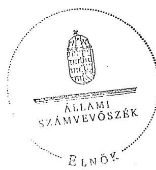

Tisztelettel:

Domokos László

---

.

---

.
