ÁLLAMI
SZÁMVEVŐSZÉK

# JELENTÉS 

Szekszárd Megyei Jogú Város Önkormányzata pénzügyi helyzetének ellenőrzéséről (43/3)

---

# Számvevői Iroda 

Iktatószám: V-3048-08/2011.
Témaszám: 1015
Vizsgálat-azonosító szám: V056046

## Az ellenőrzést felügyelte:

Dr. Varga Sándor
számvevő igazgató-helyettes
Az ellenőrzést vezette:
Renkó Zsuzsanna
számvevő tanácsos
Az ellenőrzést végezték:
Péntek László
számvevő tanácsos

## A témához kapcsolódó eddig készített számvevőszéki jelentés:

## címe

Jelentés a Szekszárd Megyei Jogú Város Önkormányzata gazdálkodási rendszerének 2008. évi ellenőrzéséről

## Eigner György Zoltán

számvevő tanácsos

## sorszáma

0829

---

# TARTALOMJEGYZÉK 

BEVEZETÉS ..... 5
I. ÖSSZEGZŐ MEGÁLLAPÍTÁSOK, KÖVETKEZTETÉSEK JAVASLATOK ..... 16
II. RÉSZLETES MEGÁLLAPÍTÁSOK ..... 27

1. Az Önkormányzat kötelező és önként vállalt feladatai ..... 27
2. A pénzügyi egyensúlyi helyzet alakulása ..... 34
2.1. A múködési és a felhalmozási egyensúly alakulása ..... 34
2.2. Az Önkormányzat bevételeinek alakulása ..... 41
2.3. Az Önkormányzat kiadásainak alakulása ..... 46
3. Kötelezettségek bemutatása ..... 50
3.1. A pénzintézetek felé fennálló kötelezettségek alakulása ..... 50
3.2. Szállítók felé fennálló kötelezettségek alakulása ..... 56
3.3. Egyéb kötelezettségek alakulása ..... 58
4. A pénzügyi egyensúly megteremtése érdekében hozott intézkedések ..... 64
5. A helyi önkormányzatok gazdálkodási rendszerének 2008. évi ellenőrzése során a pénzügyi egyensúly javítására tett szabályszerűségi és célszerűségi javaslatok hasznosulása ..... 66

---

# MELLÉKLETEK 

1. számú Múködési és felhalmozási célú hiány/többlet az Önkormányzat rendeleteiben melléklet
2. számú Kimutatás az Önkormányzat 2007-2010. évi bevételeinek és kiadásainak melléklet alakulásáról
3.a számú Az Önkormányzat 2007-2010. években megvalósított, 2010. december 31-ig melléklet befejezett fejlesztéseinek forrásösszetételéről
3.b számú Az Önkormányzat 2010. december 31-én folyamatban lévő fejlesztési feladataihoz kapcsolódó kötelezettségeinek összegzéséről
3.c számú Az Önkormányzat 2010. december 31-én folyamatban lévő fejlesztési feladataihoz kapcsolódó 2010. évet követő kötelezettségvállalásainak összegzéséről
3.d számú Az Önkormányzat beadott, elbírálás alatti pályázati forrásból megvalósuló melléklet fejlesztéseihez kapcsolódó kötelezettségvállalásainak összegzéséről
4. számú Az önkormányzati feladatok ellátásában résztvevő gazdasági társaságok melléklet adatai
5. számú Szekszárd Megyei Jogú Város Önkormányzat Polgármesterének észrevétele melléklet
6. számú Szekszárd Megyei Jogú Város Önkormányzat Polgármesterének észrevételére melléklet adott válasz

---

# RÖVIDÍTÉSEK JEGYZÉKE 

## Törvények

Áht.
ÁSZ tv.

Csődtv.
Gt.
Htv.

Ötv.
Számv. tv.

## Rendeletek

Ámr.
SzMSz

## Szórövidítések

áfa
Alisca Terra Kft.
APEH
ÁSZ
BM
EDP hiány/egyenleg
EU
GDP
Polgármesteri hivatal
KESZ
Közgyűlés
KSH
NAV
NGM
Önkormányzat
szja
Vízmű Kft.
az államháztartásról szóló 1992. évi XXXVIII. törvény az Állami Számvevőszékről szóló 1989. évi XXXVIII. törvény (2011. július 1-jétől az Állami Számvevőszékről szóló 2011. LXVI. törvény)
a csődeljárásról és felszámolási eljárásról szóló 1991. évi XLIX. törvény
a gazdasági társaságokról szóló 2006. évi IV. törvény
a helyi önkormányzatok és szerveik, a köztársasági megbízottak, valamint egyes centrális alárendeltségű szervek feladat- és hatásköreiről szóló 1991. évi XX. törvény
a helyi önkormányzatokról szóló 1990. évi LXV. törvény
a számvitelről szóló 2000. évi C. törvény
az államháztartás múködési rendjéről szóló 217/1998. (XII. 30.) Korm. rendelet

Szekszárd Megyei Jogú Város Önkormányzatának 10/2000. (IV. 17.) számú rendelete az Önkormányzat Szervezeti és Múködési Szabályzatáról
általános forgalmi adó
Alisca Terra Hulladékgazdálkodási Kft.
Adó- és Pénzügyi Ellenőrzési Hivatal
Állami Számvevőszék
Belügyminisztérium
Uniós módszertan szerinti maastrichti kritériumoknak megfelelő számítás szerinti hiány/egyenleg
Európai Unió
Bruttó hazai termék
Szekszárd Megyei Jogú Város Önkormányzat Polgármesteri Hivatala
Szekszárd Megyei Jogú Város Önkormányzatának Költségvetési Elszámoló Szervezete (2011. január 31-ig)
Szekszárd Megyei Jogú Város Önkormányzatának Közgyűlése
Központi Statisztikai Hivatal
Nemzeti Adó és Vámhivatal
Nemzetgazdasági Minisztérium
Szekszárd Megyei Jogú Város Önkormányzata
személyi jövedelemadó
Szekszárdi Víz- és Csatornamú Kft.

---

.

---

# JELENTÉS 

## Szekszárd Megyei Jogú Város Önkormányzata pénzügyi helyzetének ellenőrzéséről

## BEVEZETÉS

Az Állami Számvevőszék 2011. évtől érvényes stratégiája új irányt szabott a helyi önkormányzatok gazdálkodásának ellenőrzésében is. Az ÁSZ - küldetése és jövőképe szerint - szilárd szakmai alapokra támaszkodva értékteremtő ellenőrzéseivel és helyzetelemzéseivel az államháztartás egészében, így a helyi önkormányzati alrendszerben is elő kívánja segíteni a közpénzek és a közvagyon szabályos, gazdaságos, hatékony és eredményes hasznosítását. Ennek részeként - a 2010. évi államháztartási hiány alakulásának összetevőire is figyelemmel folyamatban van az önkormányzati alrendszer pénzügyi helyzetelemzése.

Az NGM 2011 áprilisában közzétett adatai szerint ${ }^{1}$ a 2010. évi 1036,2 milliárd Ft összegű, 3,8\%-os EDP (maastrichti kritériumok szerinti, Túlzott Hiány Eljárás keretében kimutatott) hiánycél nem volt tartható, az önkormányzati alrendszer tervezettet meghaladó hiánya miatt a GDP arányában kifejezett államháztartási hiány 4,2\%-ra emelkedett.

Az önkormányzatok 2010 első három negyedévi költségvetési jelentése szerinti pénzforgalmi hiány 97 milliárd Ft-os összege nem indokolta az önkormányzati alrendszer 190 milliárd Ft-ra becsült hiányának 2010. évi végi felülvizsgálatát. A helyi önkormányzatok 2011. januári gyorsjelentése alapján a pénzforgalmi hiány már 247,7 milliárd Ft-ot tett ki. Az alrendszer hiánya így a tervezett $0,7 \%$-kal szemben magasabb, $0,9 \%$-os szinten realizálódott. Az 57,7 milliárd Ft hiánytöbblet alakulásában - a Tájékoztató szerint - az iparűzési adó elmaradása, a gépjárműadó, az illetékek és más bevételek tervezettnél alacsonyabb összegben való teljesülése volt a meghatározó.

Magyarország a Széll Kálmán Terv célkitűzései alapján² aktualizált Konvergencia Programjában a középtávú (2011-2015. évek) költségvetési pálya kijelölése során 2011-re a kormányzati szektor EDP módszertan szerinti egyenlegét

[^0]
[^0]:    ${ }^{1}$ NGM Tájékoztatás Magyarország Strukturális Reformprogramjának végrehajtásáról (2011. április 1). A Tájékoztató évente két alkalommal - április és október hónapban jelenik meg.
    ${ }^{2}$ Az államháztartás 2011. évi egyenlege - a magán nyugdíjpénztárakból az állami nyugdíjpillérbe való visszatérés egyszeri vagyonhatása következtében - 4\%-os többletet mutatna. A Széll Kálmán Tervben foglalt egyszeri intézkedések - a MÁV, a BKV adósságrendezése, a PPP projektek kiváltása - összességében a GDP 2\%-ával csökkentik a várható többlet mértékét.

---

+ 2\%-ban jelölte meg. Az egyenlegcél megfogalmazásakor az önkormányzati alrendszer tervezett hiányát a 2011. évi költségvetésben szereplő 0,3\%-kal szemben 0,5\%-os arányban határozták meg ${ }^{3}$. A hiánycélok meghatározása jelzi, hogy az önkormányzati alrendszerben 2011-ben fokozott figyelmet kell fordítani a pénzügyi egyensúlyi helyzet alakulására.

Az államháztartás helyi szintjén a 23 megyei jogú városi önkormányzatnak az általuk ellátott közszolgáltatások volumenére való tekintettel kiemelt szerepe van, e települések népessége összességében meghaladja a kétmillió főt ${ }^{4}$. A települések népességét az alábbi diagram szemlélteti:
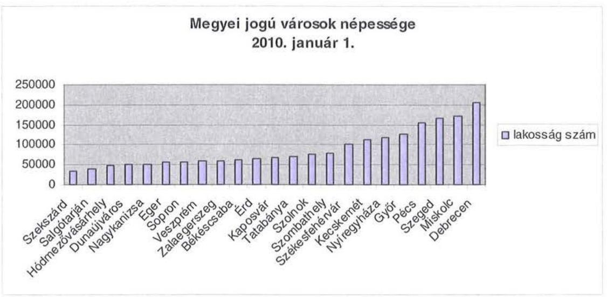

A megyei jogú városi önkormányzatok ${ }^{5}$ kötelező feladatellátását többlépcsős törvényi előírások határozzák meg. A feladatokra vonatkozó szabályozás első szintjét az Ötv. ${ }^{6}$, a második szintet a hatásköri7, a harmadik szintet a további ágazati, szakmai (egyebek mellett az oktatási, egészségügyi, szociális és egyéb ágazati feladatok ellátásának szakmai szabályait rögzítő) törvények adják.

A megyei jogú városi önkormányzatok - az Ötv-ből közvetlenül levezethető települési feladatok mellett körzeti közszolgáltatásokat is ellátnak. A megyei

[^0]
[^0]:    ${ }^{3}$ A Magyar Köztársaság 2011. évi költségvetéséről szóló 2010. évi CLXIX. törvény Általános indoklásának III. fejezete, valamint Magyarország Konvergencia Programja 2011-2015. (2011. április) Táblázatok rész, 2. táblázat Államháztartás összefoglaló adatai szerint.
    ${ }^{4}$ A megyei jogú városok népességét a 4/2011. (I. 31.) NGM rendelet 1. sz. mellékletében foglalt 2010. január 1-i adatok alapján vettük figyelembe.
    ${ }^{5}$ Az Ötv. 61. § (1) bekezdése alapján a megyeszékhely város a törvény erejénél fogva megyei jogú, ugyanakkor az Országgyűlés az ötvenezemél nagyobb népességű városokat a képviselőtestület kérelmére megyei jogú várossá nyilváníthatja. Ez utóbbi körbe 5 város tartozik, közülük 2 (Hódmezővásárhely, Dunaújváros) népessége 2010. január 1-ére már ötvenezer fő alá csökkent.
    ${ }^{6}$ az Ötv. 8. és 61. §-ában foglaltak szerint
    ${ }^{7}$ a Htv.

---

jogú városi cím elsősorban többlet kötelezettségekkel jár, a megyei jogú városnak önmagának kell gondoskodnia mindazokról a feladatokról, amelyek más települési önkormányzatok esetében a megyei önkormányzat feladatát képezik. Ide sorolható többek közt a középfokú oktatási intézmények fenntartása, a közművelődési, könyvtári és levéltári szolgáltatás, a társadalombiztosítás finanszírozása mellett a kórházi és a rendelőintézeti szakellátás, a szociális és egyes gyermekvédelmi feladatok ellátása. Ezeket a feladatokat (intézményeket) a megyei jogú város - más városoktól eltérően - nem adhatja át a megyei önkormányzatnak, azonban az Ötv. lehetőséget biztosít arra, hogy a megyei önkormányzattal megállapodjék a feladatellátás megosztásában.

Az önkormányzat, így a megyei jogú város is, maga határozza meg, hogy - a lakosság igényei alapján, anyagi lehetőségei függvényében - mely feladatokat, milyen mértékben és módon, mely szervezeti keretek közt lát el. A szervezetalakítás szabadsága a megyei jogú városok esetében azzal járt, hogy mind a kötelező közszolgáltatásoknál (különösen a településüzemeltetés, vagyongazdálkodás), mind pedig az önként vállalt feladataik ellátásában - elsősorban a sport és kulturális szolgáltatások területein - a gazdasági társaságok kiemelt fontosságú szerephez jutottak. Ily módon a gazdálkodás, a pénzügyi helyzet kockázatai közvetlenül kikerültek ugyan az önkormányzati alrendszerből, azonban sérülhet az ellátási felelősség figyelemmel kísérése és érvényesítése, a közpénzek felhasználásának transzparenciája. Mindezek együttvéve - a beszámolók konszolidálásának hiányában - növelik a megyei jogú városok pénzügyi helyzetének megítélésében rejlő kockázatokat.

Az áttekintett időszakban az önkormányzati feladatok ellátásának keretet biztosító forrásszabályozás elvei lényegesen nem változtak.

A megyei jogú városok önkormányzatainak mozgásterét, az önkormányzatok feladatellátásra vonatkozó döntéseit a központi költségvetéstől való függőség mellett jelentősen befolyásolja a helyi adókivetési jog gyakorlása ${ }^{8}$. A helyi adók rendszere a közszolgáltatások finanszírozásához szükséges források megteremtésének, bővítésének eszköze, amely a gazdasági válság, a jogszabályi környezet, az adópolitika változása, az adóhatóságok tevékenysége következtében differenciáltan érinti a települési önkormányzatokat ${ }^{9}$.

A települési önkormányzatok saját folyó bevételeinek keretében elszámolt, különböző jogcímeken kivetett helyi adók - iparűzési adó, építmény és telekadó, idegenforgalmi adó, vállalkozók és magánszemélyek kommunális adója -2007-2010 között eltérő módon emelkedtek. A helyi adókból származó bevételek realizált összege országos szinten 2007-2009 között folyamatosan, 505,3 milliárd Ft-ról 566,3 milliárd Ft-ra emelkedett, majd a gazdasági válság hatásai következtében 2010-re 542,6 milliárd Ft-ra esett vissza. A helyi adók részesedése

[^0]
[^0]:    ${ }^{8}$ a helyi adókról szóló 1990. évi C. törvény szabályai szerint
    ${ }^{9}$ Az Állami Számvevőszék 2010 decemberében közzétett 1031. számú jelentésében értékelte a helyi adók rendszerében a hatékonyság és az eredményesség érvényesülését.

---

az önkormányzatok saját folyó bevételein belül 2007-2010 között 2,5 százalékponttal csökkent ${ }^{10}$.

A megyei jogú városok saját folyó bevétele 2007-ben 191,5 milliárd Ft volt, 2008-ban 223,1, 2009-ben 225,4, 2010-ben 223,5 milliárd Ft-ot tett ki. A helyi adóbevételekből való részesedésük 2007-ben 110,5 milliárd Ft (21,9\%), 2008ban 128,3 milliárd Ft (23,2\%), 2009-ben 124,4 milliárd Ft (22\%), 2010-ben 118,7 milliárd Ft (részaránya a 2007. évivel azonosan 21,9\%) volt. E realizált adóbevételek a megyei jogú városok saját folyó bevételeinek 2007-ben 57,7, 2008-ban 57,5, 2009-ben 55,2, 2010-ben 53,1\%-át jelentették. A helyi adóbevételek 2007-ről 2010-re kimutatott 4,6 százalékpontos csökkenése annak ellenére következett be, hogy a megyei jogú városok saját folyó bevétele 2010-ben $16,7 \%$-kal haladta meg a 2007. évit.

A helyi adókon belül a települések gazdasági helyzetének egyik fokmérője az elért helyi iparűzési adóbevétel, amely a megyei jogú városok körében erőteljes - a település nagyságrendtől is függő ${ }^{11}$ - különbségeket mutat. A helyi iparűzési adóbevétel és annak egy lakosra vetített összegének 2007. és 2010. évi alakulását az alábbi diagramok szemléltetik:
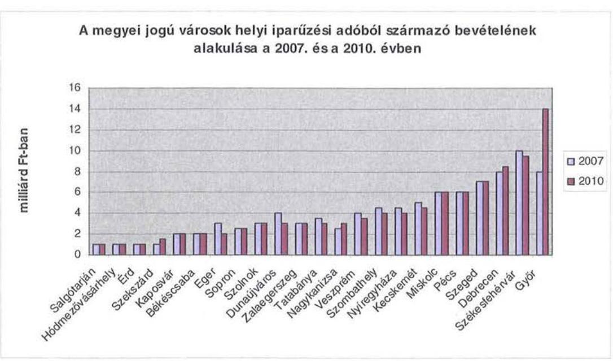

[^0]
[^0]:    ${ }^{10}$ A helyi adó bevételek saját folyó bevételekből való részesedése országosan 2007-ben $55,3 \%, 2010$-ben $52,8 \%$ volt.
    ${ }^{11}$ A 100 ezer fő feletti népességű megyei jogú városok csoportjába Debrecen, Miskolc, Szeged, Pécs, Győr, Nyíregyháza, Kecskemét, Székesfehérvár tartozik. Nem megyeszékhely megyei jogú város Érd, Sopron, Nagykanizsa, Dunaújváros, Hódmezővásárhely.

---

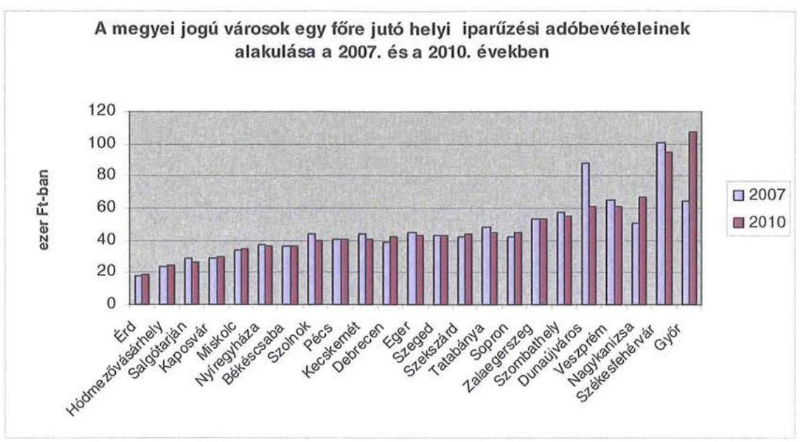

A megyei jogú városi önkormányzatok saját bevételein belül második legjelentősebb elem az illetékbevétel. A 2010. évben befolyt 39,2 milliárd Ft illetékbevétel a 2006. évben realizált 71,1 milliárd Ft illetékbevétel alig több mint $55 \%$-a. A jelentős visszaesést döntően az ingatlanpiac stagnálása, majd visszaesése, illetve egyes illetékkedvezmények bevezetése okozta. A kieső bevételek pótlására az önkormányzati alrendszer szintjén történtek intézkedések, 2010ben 5 milliárd Ft-ot, 2011-ben 1,2 milliárd Ft-ot ellentételezett a központi költségvetés. A megyei jogú városok önkormányzatai az önkormányzati alrendszer szintjén realizált illetékbevételből 2007-ben 13,6 milliárd Ft-tal (23,3\%-kal), 2008-ban 15,3 milliárd Ft-tal ( $22,7 \%$-kal), 2009-ben 12,6 milliárd Ft-tal ( $21,5 \%$ kal), 2010-ben 7,9 milliárd Ft-tal ( $20,2 \%$-kal) részesedtek ${ }^{12}$. Az összes befolyt illetékbevételből a megyei jogú városok részesedése 2009-ről 2010-re mindössze 1,3 százalékponttal csökkent, ugyanakkor a realizált illetékbevétel csökkenése a $37,3 \%$-ot ( 4,7 milliárd Ft) is elérte.

Az önkormányzati alrendszer átengedett bevételei közül a személyi jövedelemadóból való részesedés makroszintű szabályozása a vizsgált időszakban nem változott. A települési önkormányzatokat a településre kimutatott személyi jövedelemadó $8 \%$-a közvetlenül, míg $32 \%$-a külön szabályozott visszaosztási rendben illeti meg. A visszaosztás a jövedelem differenciálódás mérséklésével párosul, rendje a lakóhelyen maradó személyi jövedelemadóhoz és az iparűzési adó-erőképességhez ${ }^{13}$ igazodik, annak részletszabályait a mindenkori költségvetési törvény 4. számú melléklete határozza meg. A jövedelemdifferenciálódás

[^0]
[^0]:    ${ }^{12}$ Az illetékek kivetésének és beszedésének joga 2006. december 31-ig a megyei önkormányzatok feladata volt, amelyet a 2007. évtől az APEH (2011. január 1-jétől NAV) vett át. Az önkormányzati illetékrészesedési szabályok változatlanok maradtak, azonban az illetékbeszedés költségeit az önkormányzatok illetékbevételeiből átlagos (a megyei jogú városoknál $8,5 \%$-os) kulcsot alkalmazva vonták le.
    ${ }^{13}$ Az iparűzési adóerő-képesség egy potenciális, átlagos erőfeszítés mellett elérhető (a települési önkormányzat iparűzési adóelőlegét meghatározó adóalap 1,4\%-ának megfelelő számított) bevétel.

---

szabályai kétirányúak, a kiegészítés és a visszatartás feltételeit egyaránt meghatározták:

- Amennyiben az önkormányzatot közvetlenül megillető személyi jövedelemadó bevétel és a számított iparűzési adóerő-képesség együttesen számított, egy főre jutó összege nem érte el a település méretéhez kapcsolódóan az évenkénti szabályozás szerinti változó összeget, a költségvetés a részesedést település nagyság szerint eltérően meghatározott szintig - kiegészítette ${ }^{14}$. A kiegészítés fajlagos összege 2007-2010 között 37500 Ft-ról 48010 Ft-ra (10 510 Ft-tal, 28\%-kal) emelkedett. Az előzőeken túl a jövedelem differenciálódás szabályozása egyes térségi (középiskolai, szakiskolai, szakképző intézményi, kollégiumi) feladatok ellátásának függvényében további kiegészítő hozzájárulást biztosított.
- Amennyiben az egy főre számított személyi jövedelemadó és az iparűzési adóerő-képesség együttes összege a település nagyságrendjéhez rendelt értékhatárt több mint $25 \%$-kal (2010-től 20\%-kal) meghaladta, az egy főre jutó összeg sávonként differenciált módon ${ }^{15}$ visszavonásra került az önkormányzatot megillető normatív állami hozzájárulás összegéből.

Az önkormányzatok személyi jövedelemadó bevétele 2007-ben 494,3 milliárd Ft, 2008-ban 558,6 milliárd Ft, 2009-ben 639,5 milliárd Ft, 2010-ben 681,2 milliárd Ft volt, az időszak alatt összegében 186,9 milliárd Ft-tal, 37,8\%kal emelkedett, miközben az szja bevétel átengedett bevételeken belüli részesedése 1,8 százalékponttal emelkedett.

A megyei jogú városok önkormányzatainak személyi jövedelemadó részesedése az alrendszer átengedett személyi jövedelemadó bevételeiből 2007-ben 77,6 milliárd Ft-ot ( $15,7 \%$-ot), 2008-ban 105,4 milliárd Ft-ot ( $18,9 \%$-ot), 2009ben 122,9 milliárd Ft-ot ( $19,2 \%$-ot), 2010-ben 136,6 milliárd Ft-ot ( $20,1 \%$-ot) tett ki. A realizált szja bevétel a megyei jogú városoknál az időszak alatt folyamatosan emelkedett, a 2010-ben realizált adóbevétel 59,0 milliárd Ft-tal (76\%) volt magasabb a 2007. évinél, az átengedett bevételeken belüli részesedése 2010-re 5,1 százalékponttal haladta meg a 2007. évi részarányt ${ }^{16}$. A részesedés alapjául szolgáló szja településenként eltérő, az egy adózóra jutó szja 2009. évi adatait ${ }^{17}$ a következő ábra szemlélteti.

[^0]
[^0]:    ${ }^{14}$ A megyei jogú városok esetében a jövedelemkülönbségek mérséklésénél figyelembe veendő lakosonkénti értékhatár 2007-ben 37500 Ft, 2008-ban 42385 Ft, 2009-ben 45933 Ft, 2010-ben 48010 Ft volt.
    ${ }^{15}$ A sávos értékhatár 2010-től 20\%-os intervallumonként, 120\% felett a visszatartást $25 \%$-tól $90 \%$-os mértékig rögzíti. Amennyiben a település nagyságrendhez rendelt értékhatár összege az önkormányzatnál eléri vagy meghaladja a $200 \%$-ot, az egy főre jutó összeg $90 \%$-a levonásra kerül. Az értékhatár sávjai 2010 előtt $25 \%$-os léptékűek voltak, a levonási arányok az ellenőrzött időszakban nem változtak.
    ${ }^{16}$ E bevételek a megyei jogú városok átengedett bevételeiben 2007-ben 84,7, 2008-ban 87,7, 2009-ben 89,7, 2010-ben 89,8\%-os részarányt jelentettek.
    ${ }^{17}$ Adatforrás: KSH Megyei Jogú Városok a Közép Dunántúlon 2009. kiadványa, 4.1. sz. összehasonlító tábla.

---

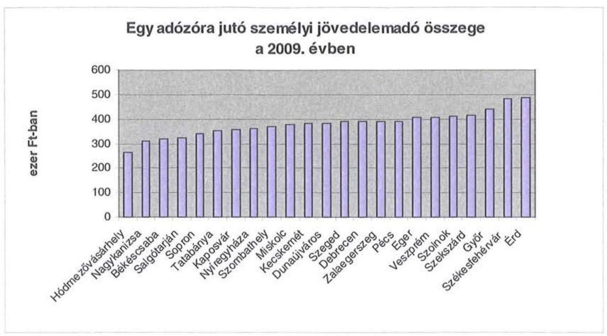

Az átengedett bevételek második legjelentősebb eleme a gépjármúadó, amelynek bevételi szabályozása az ellenőrzött időszakban nem változott, az adóbevétel teljes összege az önkormányzatot illeti meg. A gépjármúadó alapját, mértékét ${ }^{18}$ és egyes mentességi kategóriákat érintő módosítások 2010. január 1-től következtek be, amelyek az egyes adótételek esetében átlagosan $15 \%$-os emelkedéssel jártak.

A gépjármúadó beszedéséből származó bevétel az önkormányzati alrendszer szintjén 2007-ben 62,4 milliárd Ft, 2008-ban 65,7 milliárd Ft, 2009-ben 63,8 milliárd Ft, 2010-ben 71,1 milliárd Ft volt, az adóbevétel egésze 2007-hez képest 8,7 milliárd Ft-tal, 13,9\%-kal emelkedett. A gépjármú-adóztatás szabályainak változása 2010-ben 7,3 milliárd Ft többletet eredményezett. A megyei jogú városok gépjármúadó bevétele a 2007. évi 14,0 milliárd Ft-ról 2010-re 15,5 milliárd Ft-ra, 10,7\%kal emelkedett. A bevételnövekedés összegéből 1,4 milliárd Ft a 2010. évi adózási szabályok következménye.

A megyei jogú városok önkormányzatai 2007-2010 között rendelkezésre álló forrásainak alakulását a következő ábra szemlélteti:

[^0]
[^0]:    ${ }^{18}$ A gépjármúadóról szóló 1991. évi LXXXII. törvény 7. § (1) bekezdésében foglalt adómértékek változása.

---

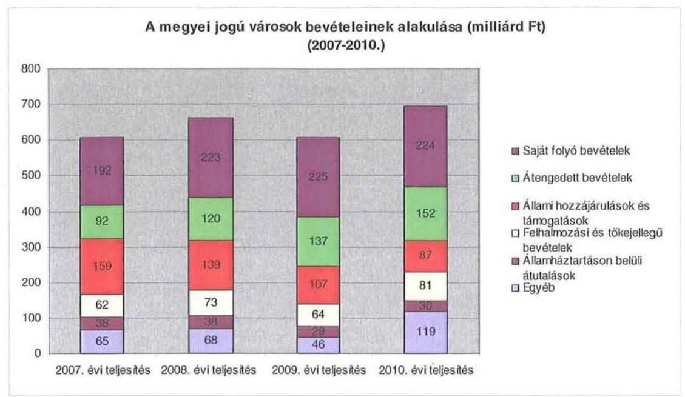

A megyei jogú városok saját folyó bevételeinek - amelyek főbb elemei: a helyi adók, az illetékbevételek, az intézményi térítési díjak, a kamatbevételek részaránya a 2007. évi összbevételen ( 608 milliárd Ft) belül 32\% volt. A 2010. évi összbevétel 693 milliárd Ft-os összegéből a saját folyó bevételek aránya miközben összege 2007-ről 2010-re 32 milliárd Ft-tal emelkedett - nem változott.

Az átengedett bevételek, amelyek a megyei jogú városok önkormányzatainál döntően a személyi jövedelemadó és a gépjárműadó részesedést jelenti, az összbevételen belül a 2007. évi 92 milliárd Ft-ról (15\%) 152 milliárd Ft-ra nőtt, részesedése 7 százalékponttal emelkedett. A 60 milliárd Ft-os növekedésből 59 milliárd Ft-ot az szja részesedés emelkedése okozott.

Az állami hozzájárulások és támogatások - amelyek főbb elemei: főként az ellátotti létszámhoz kötődő normatív állami hozzájárulások, központosított előirányzatok - a 2007. évi 159 milliárd Ft-ról (26\%-os részarányról) 2010-re 87 milliárd Ft-ra ( $13 \%$-os részarányra) estek vissza.

A felhalmozási és tőkejellegú bevételek - tárgyi eszközök (ingatlanok és ingóságok), föld és immateriális javak, részesedések értékesítése, EU-tól átvett pénzeszközök - a 2007. évi 62 milliárd Ft-ról (10\%-os részarányról) 2010-re 81 milliárd Ft-ra ( $12 \%$-os részarányra) emelkedtek.

Az államháztartáson belüli átutalások részesedése 2007-ben 38 milliárd Ft volt. 2010. év végére 8 milliárd Ft-tal csökkent, részaránya 6\%-ról 2010-ben 4\%-ra változott. Ez a bevételi kategória tartalmazza az Egészségbiztosítási Alaptól és más elkülönített állami pénzalapoktól átvett forrásokat. A 2010-ben e címen elszámolt bevétel a megyei jogú városoknál 22 milliárd Ft-ot tett ki.

Az egyéb, pénzmaradványból, vállalkozási bevételekből, államháztartáson kívülről származó átutalásokból, a hitelekből, a hosszú és rövid lejáratú értékpa-

---

pírok értékesítéséből származó bevételek részesedése a 2007-2010. évek viszonylatában 11\%-ról 17\%-ra emelkedett. Ez utóbbiak 2010. évi beszámoló szerinti összevont teljesítése 119 milliárd Ft volt ${ }^{19}$.

Mindezeket figyelembe véve a megyei jogú városok 2007. és 2010. évi forrásöszszetételének megoszlását az alábbi ábra szemlélteti:

A megyei jogú városok 2007. és 2010. évi forrásösszetétele
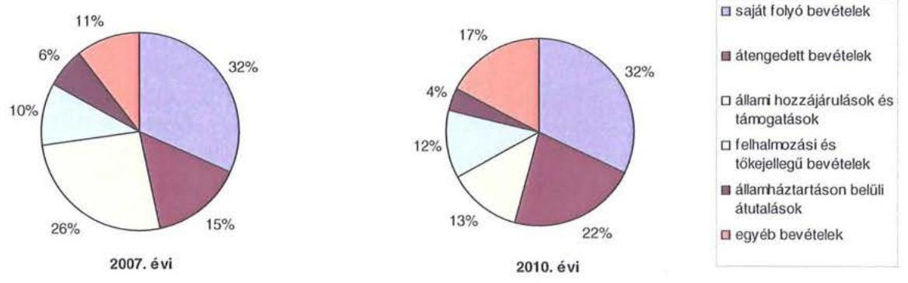

Az önkormányzati alrendszer pénzügyi helyzetértékelése során új elemzési módszereket alkalmaz az ellenőrzés. A hagyományos költségvetési szerkezet helyett az önkormányzat pénzügyi helyzetét a CLF módszerrel mutatjuk be, amelynek lényegét és számításának módszerét a 2.1. pontban, és a jelentés 2. számú mellékletében ismertetjük részletesen.

Az új módszereken alapuló helyzetértékelés fontosságát az adja, hogy a helyi önkormányzatok bruttó adósságállománya ${ }^{20}$ a 2010. évi költségvetési beszámoló alapján 1248 milliárd Ft-ot tett ki. Az adósságállomány koncentráltságát jelzi ${ }^{21}$, hogy ebből a 23 megyei jogú város részesedése 338 milliárd Ft volt, amely a fővárosi és kerületi önkormányzatok adósságának figyelmen kívül hagyásával számított 2010. évi 977 milliárd Ft összegű bruttó adósságállomány $34,6 \%$-át jelentette. Az adósságállomány több mint fele - 501 milliárd Ft - a 19 megyei önkormányzatnál és a 23 megyei jogú városnál jelentkezett.

[^0]
[^0]:    ${ }^{19}$ Az egyéb bevételek összege 2007-2010 között eltérő módon változott, 2007-ben 65 milliárd Ft, 2008-ban 68 milliárd Ft volt, 2009-ben 46 milliárd Ft-ra esett vissza, majd 2010-ben több mint két és félszeresére, 119 milliárd Ft-ra emelkedett.
    ${ }^{20}$ A bruttó adósságállomány 2010. év végi összege magában foglalja a fejlesztési és a működési célú kötvénykibocsátások, a beruházási és fejlesztési hitelek, a működési célú hosszú lejáratú hitelek, a rövid lejáratú hitelek, váltótartozások miatti kötelezettségek teljes (2011-ben, illetve az azt követő években esedékes) állományát.
    ${ }^{21}$ A megyei jogú városok adósságállománya összegében ugyan elmarad az egyéb városok összesített adósságától [(ez utóbbiak részesedése 382,6 milliárd Ft (39,2\%)], azonban az egyéb városok száma 304. A fővárosi és a kerületi önkormányzatok nélküli adósságállományból a 19 megyei önkormányzat 163 milliárd Ft-tal ( $16,8 \%$-kal), míg a nagyközségek, községek együttesen 93 milliárd Ft-tal ( $9,5 \%$-kal) részesednek.

---

A megyei jogú városok 338 milliárd Ft-os adósságállományából 175 milliárd Ft $(51,8 \%)$ a 8 legnagyobb, 100 ezer fő feletti népességű város tartozása. Az 5 nem megyeszékhely megyei jogú város bruttó adósságállománya 70 milliárd Ft-ot (20,7\%-ot), az előző két csoportba nem tartozó további 10 megyei jogú város adóssága 93 milliárd Ft-ot ( $27,5 \%$-ot) tett ki.
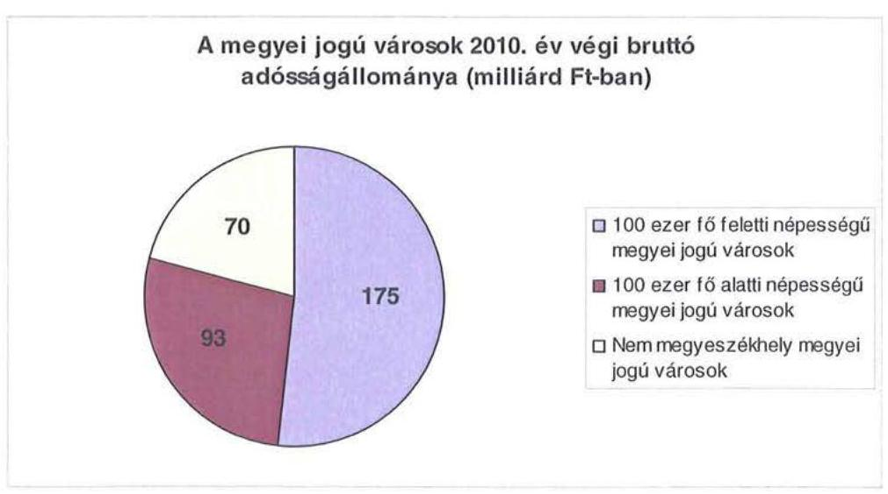

A mérlegben kimutatott bruttó adósságállomány mellett az önkormányzatok számára az eszközállomány műszaki állapotának megőrzése is kötelezettségekkel jár. Az elhasználódott eszközök pótlására forrást biztosító amortizációs (felújítási) alap képzésének ${ }^{22}$ elmaradása maga után vonhatja a feladatellátást kiszolgáló tárgyi eszközök állagának erőteljes romlását. Emellett a 2007-2013as időszakra meghirdetett, vissza nem térítendő EU-s fejlesztési forrásokhoz való hozzájutás lehetősége felerősítette az önkormányzati alrendszer fejlesztési igényeit, amelyek a felhalmozási költségvetési hiány folyamatos emelkedésén túl - az előírt jövőbeni fenntartási kötelezettség miatt - tovább terhelhetik az önkormányzatok költségvetését ${ }^{23}$.

Az ÁSZ a 2011. évi ellenőrzési tervében 43. számú, az Önkormányzatok gazdálkodási rendszerének ellenőrzése részeként egy időben, egymással párhuzamosan tekinti át, és elemzi a 23 megyei jogú városi önkormányzat pénzügyi helyzetét. A gazdálkodás szabályszerűségét az ÁSZ az előző évek során ebben az önkormányzati körben is ellenőrizte, ezért jelen vizsgálatunk erre nem tér ki. A jelentés a megyei jogú városok sajátos feladatellátási és forrásszabályozási helyzeté-

[^0]
[^0]:    ${ }^{22}$ Erre a jelenlegi szabályozási környezetben nem kötelezi semmilyen előírás az önkormányzatokat.
    ${ }^{23}$ Az Állami Számvevőszék 2011 júniusában közzétett 1108. számú, a helyi önkormányzatok fejlesztési célú támogatási rendszerének ellenőrzéséről szóló jelentésében feltárta a fejlesztési folyamatok problémáit. A helyi önkormányzatok elsősorban azokat a fejlesztéseket valósították meg, amelyekhez támogatást lehetett igényelni. A fejlesztési célok közül a magasabb támogatás intenzitású pályázatokat részesítették előnyben. A fejlesztéssel megvalósuló létesítmények jövőbeli üzemeltetésének várható ráfordításait az önkormányzatok $71,9 \%$-a nem mérte fel.

---

re tekintettel az önkormányzatok pénzügyi helyzetét, illetve az ezzel összefüggő korábbi ÁSZ javaslatok megvalósítását mutatja be.

Az ellenőrzés a 2007. január 1. - 2010. december 31. közötti időszakot öleli fel.
A vizsgálat jogszabályi alapját az Állami Számvevőszékről szóló 1989. évi XXXVIII. törvény 2. § (3), (5), (6) és (9) bekezdései ${ }^{24}$, az Ötv. 92. § (1) bekezdése, az Áht. 104. § (3), és 120/A. § (1) bekezdése előírásai képezik.

[^0]
[^0]:    ${ }^{24}$ 2011. július 1-jétől az Állami Számvevőszékről szóló 2011. évi LXVI. törvény 5. § (2)-(5) bekezdései

---

# I. ÖSSZEGZŐ MEGÁLLAPÍTÁSOK, KÖVETKEZTETÉSEK JAVASLATOK 

Az Önkormányzat - adatszolgáltatása szerint - a tárgyév múködési költségvetési kiadásaiból ( 7654 millió Ft) 7394 millió Ft-ot ( $96,6 \%$ ) a kötelező feladatok, 260 millió Ft-ot ( $3,4 \%$ ) az önként vállalt feladatok ellátására fordított. A kötelező és önként vállalt feladatok részarányának megállapítása az Önkormányzat SzMSz és költségvetési rendelete szerinti besorolásnak megfelelően készült. Az Önkormányzat önként vállalt feladatnak tekinti a turizmusfejlesztés feladatot.

Az Önkormányzat feladatellátásának szervezeti struktúráját a következő ábra szemlélteti:
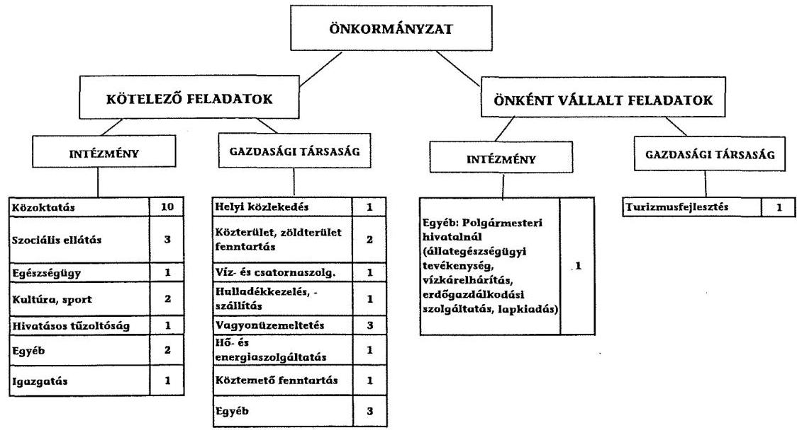

Az Önkormányzat a feladatait ${ }^{25}$ 2010. december 31-én (a Polgármesteri hivatallal együtt) 20 költségvetési szervvel és kilenc $25 \%$ feletti tulajdoni hányadú gazdasági társaságával, továbbá öt - az Önkormányzattól tulajdonosi szempontból független gazdasági társaság közreműködésével látta el. Az Önkormányzat az áttekintett időszakban az alapfokú nevelés-oktatás közszolgáltatási feladatát integrálta a gesztorságával létrehozott intézményfenntartó társulásokba. Az intézményszervezeti átalakítások és intézményi összevonások következtében a feladatellátás telephelyeinek száma a 2006. évi 51-ről 2010-re 66-ra nőtt.

[^0]
[^0]:    ${ }^{25}$ A kötelező és önként vállalt feladatok megosztása az Önkormányzat adatszolgáltatása alapján történt.

---

Az Önkormányzat múködési kiadásokra 2010-ben 7654 millió Ft-ot fordított, amely 742 millió Ft-tal (10,7\%-kal) haladta meg a 2007. évi ráfordításokat. A múködési kiadások 66\%-át az intézményi körben realizálták. E kiadások fedezetéül szolgáló bevételi források 2007. és 2010. években jellemző összesített arányait a következő ábra szemlélteti:
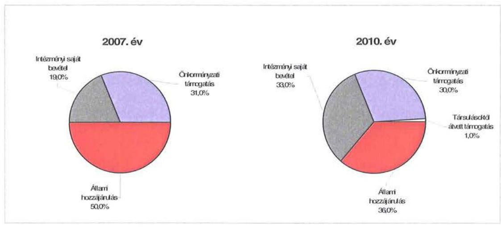

Az egyes közszolgáltatások feladatellátásában részvevő ágazati intézménycsoportok forrásösszetételének bevételi jogcímenkénti alakulását a következő ábra szemlélteti:
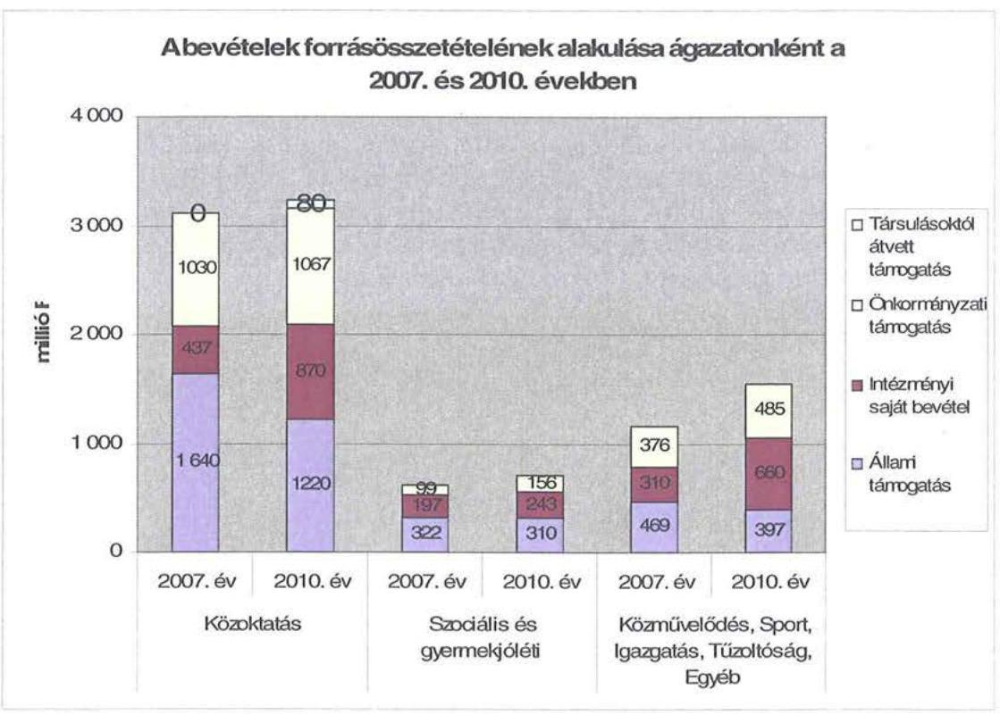

---

Az Önkormányzat hat gazdasági társaságban rendelkezik kizárólagos tulajdonnal, egy gazdasági társaságban 75\% feletti, két gazdasági társaságban 50-75\% közötti tulajdoni hányaddal. A gazdasági társaságok a víz és csatornaszolgáltatásban, a hulladékkezelés és szállításban, továbbá a gyermekétkeztetésben és a településfejlesztésben kaptak szerepet az önkormányzat feladatellátásában. Az Önkormányzat az önkormányzati tulajdonnal rendelkező gazdasági társaságok múködéséhez pénzeszközt nem adott át, fejlesztési célú forrásként az áttekintett időszakban összesen 153 millió Ft-ot biztosított.

A kilenc gazdasági társaság közül hat társaság pénzügyi helyzete stabil, melyeknél a saját tőke összege meghaladja a jegyzett tőke összegét, közülük egy társaság esetében az Önkormányzat - infrastrukturális fejlesztés céljából - tőkeemelést hajtott végre. Az Önkormányzat kizárólagos tulajdonában álló társaságok közül három - veszteségesen múködő - társaság esetében az Önkormányzatnak 2011-ben - a gazdasági társaságok 2010. évi beszámolói alapján számítottan - 18,4 millió Ft tőkepótlási kötelezettsége keletkezett. E három társaság közül az Önkormányzat pénzügyi egyensúlyára kockázatot jelent a Diákétkeztetési Kft. - folyamatban lévő beruházásai és az árbevételt meghaladó költségei miatt kialakult - bizonytalan pénzügyi helyzete, a társaság 595 millió Ft összegű hitelállománya és 56 millió Ft összegű lejárt szállítói tartozása.

A folyó költségvetés egyenlege (múködési jövedelem) a 2007-2010. években múködési forrástöbbletet mutatott ${ }^{26}$. A múködési többlet - a 2007. év kivételével - fedezni tudta a tárgyévben jelentkező törlesztési kötelezettségeket. Az Önkormányzat pénzügyi kapacitása (nettó múködési jövedelme) a 2007. évben negatív, a 2008-2010. években pozitív értékű volt. A nettó működési jövedelem 2007. évi negatív értékét (-358 millió Ft) a 661 millió Ft összegű működési hitelek évközi visszafizetése okozta. A nettó múködési jövedelem a 2008. évben 17 millió Ft, a 2009. évben 43 millió Ft, a 2010. évben 54 millió Ft összegű tőketörlesztés mellett 2008-ban 432 millió Ft, 2009-ben 463 millió Ft, 2010-ben 7 millió Ft volt. A pénzügyi kapacitás 2009-hez viszonyított 2010. évi romlását a folyó bevételek és kiadások különbségéből származó múködési jövedelemcsökkenés, továbbá az előző évinél nagyobb összegű tőketörlesztés okozta.

[^0]
[^0]:    ${ }^{26}$ 2007-ben a folyó bevételek 4,2\%-át (303 millió Ft-ot), 2008-ban 5,8\%-át (449 millió Ft-ot), 2009-ben 6,5\%-át (506 millió Ft-ot), 2010-ben 0,8\%-át (61 millió Ft-ot) jelentette.

---

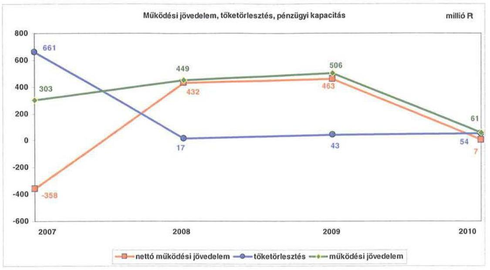

A 2007-2010. években az Önkormányzat felhalmozási költségvetésének egyenlege folyamatosan negatív összegű volt, amely 2007-2010 között összesen 3569 millió Ft felhalmozási forráshiányt okozott.

A pénzügyi egyensúly fenntartása külső források bevonásával volt biztosítható. A 2007-2010. években 775 millió Ft hitelt törlesztettek. Az adósságszolgálat, továbbá a felhalmozási forráshiány 2007-2010 között 4344 millió Ft-ot tett ki, amelyre az időszakban képződő 1319 millió Ft működési többlet (múködési jövedelem), valamint a 2007. január 1-jén rendelkezésre álló 55 millió Ft pénzkészlet szolgált fedezetül. A további pénzeszközöket 83 millió Ft fejlesztési hitel, 202 millió Ft folyószámlahitel igénybe vételével, valamint 2425 millió Ft kötvénykibocsátásból származó bevételből és 260 millió Ft gazdasági társasági kölcsönből biztosították. A kialakult pénzügyi helyzet pozitív nettó múködési jövedelmet eredményező gazdálkodás mellett teszi elkerülhetővé további külső források bevonását, az eladósodás növekedését.

Az Önkormányzat a helyi adók közül a magánszemélyek kommunális adóját, a vállalkozók kommunális adóját, a helyi iparűzési adót, valamint az idegenforgalmi adót vezette be. A magánszemélyek kommunális adóját 2008. január 1-jétől, a vállalkozók kommunális adóját 2011. január 1-jétől megszüntették. A helyi adókból és pótlékokból származó bevétel az összes folyó (múködési) bevételen belül csökkenő arányú volt, a 2007. évben 22,0\%-kal, a 2010. évben 20,3\%-kal részesedett. A pótlékkal, bírsággal növelt helyi adó bevétel öszszege a 2007-2010. években jelentős mértékben nem változott, a 2007. évi 1590 millió Ft-ról a 2010. évben 1569 millió Ft-ra (1,3\%-kal, 21 millió Ft-tal) csökkent. A helyi adóbevételek döntő részét (2010-ben 97,1\%-át, 1524 millió Ft-ot) az iparűzési adó tette ki, amelynek mértéke a helyi adókról szóló törvényben rögzített maximális mértékben került megállapításra. A helyi adókból származó bevétel csökkenését a magánszemélyek kommunális adójának a megszüntetése okozta, amelyet az iparűzési adónál tapasztalható növekedés nem tudott ellensúlyozni. Új helyi adónemet a vizsgált időszakban az Önkormányzat nem vetett ki.

---

A befejezett fejlesztések jelentős részét saját bevételből, valamint hazai- és európai uniós támogatásokból finanszírozták. A 2007-2010 közötti időszakban a 4293 millió Ft bekerülési költségú fejlesztés és felújítás forrását 1931 millió Ft (45\%) saját bevétel, 1629 millió Ft (38\%) hazai támogatás, 390 millió Ft (9\%) európai uniós támogatás, 240 millió Ft (5,6\%) kötvénykibocsátásból származó bevétel és 103 millió Ft (2,4\%) hosszú lejáratú hitel képezte. A 2010. december 31-én folyamatban lévő fejlesztési feladatok végrehajtására 680 millió Ft kiadást teljesítettek, amelyre a kötvény bevételéből 392 millió Ft-ot ( $57,7 \%$-ot), hitelből 32 millió Ft-ot ( $4,7 \%$-ot), európai uniós támogatásból 69 millió Ft-ot ( $10,1 \%$-ot), saját bevételből 186 millió Ft-ot ( $27,4 \%$-ot), hazai támogatásból 1 millió Ft-ot ( $0,1 \%$-ot) fordítottak.

Az Önkormányzatnál a 2010. december 31-én folyamatban lévő fejlesztési feladatok kötelezettség-vállalásainak összege 4304 millió Ft volt, amelyre jelenleg 2 millió Ft saját forrás és 4204 millió Ft európai uniós támogatás áll rendelkezésre, a fennmaradó 98 millió Ft kiadás fedezetére 8 millió Ft-ot - elbírálás alatti - európai uniós támogatásból és 90 millió Ft-ot újabb hitelből terveznek biztosítani.
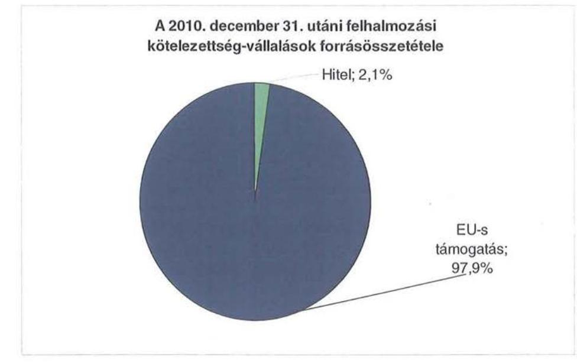

Az Önkormányzat által beadott, elbírálás alatt álló pályázatok tervezett teljes bekerülési költsége 7613 millió Ft volt, annak forrásaként 5578 millió Ft európai uniós támogatást, 10 millió Ft hazai támogatást, 2016 millió Ft hitelt és 9 millió Ft saját bevételt vettek számításba. A 2011. évi költségvetési rendeletben 500 millió Ft fejlesztési hitel felvételét tervezték. További nagy összegű hitelek felvétele - tekintettel a kötvénykibocsátással kapcsolatos, 2012. évtől esedékessé váló tőketörlesztési kötelezettségre is - az Önkormányzat pénzügyi helyzetének további romlását vonhatja maga után, mivel a képződő múködési jövedelem nem nyújt fedezetet további tőketörlesztések finanszírozására.

Az Önkormányzat pénzintézeti kötelezettsége a 2006. év végéről a 2010. év végére 751 millió Ft-ról 4863 millió Ft-ra nőtt, ebből az árfolyamváltozás miatti különbözet 1332 millió Ft volt, melyet az Önkormányzat a mérlegében - a Számv. tv. előírása ellenére - nem mutatott ki. A fennálló pénzintézeti kötelezettségek fejlesztési és múködési célú kötvénykibocsátásból, egy hosszú lejáratú

---

hitelből valamint folyószámlahitel igénybevételéből keletkeztek. Az Önkormányzat a 2011. év júniusában újabb, 215 millió Ft összegű fejlesztési célú hitelt vett igénybe. Az Önkormányzat eladósodásának hatására a hitelt nyújtó pénzintézet a hitel biztosítékaként jelzálogjog bejegyzését írta elő. Ezen biztosítékot a korábbi hitelek nyújtása során nem igényelte.

Az Önkormányzat kötelezettségvállalásaira közgyűlési döntés alapján került sor, azonban az előterjesztésekben nem mutatták be a visszafizetés forrásait, a várható kamat- és tőkefizetési kötelezettséget, valamint a kamat- és - a devizaalapú kötelezettségeket érintő - árfolyamkockázatot.

Az Önkormányzat kötvényeket a folyószámla- és munkabérhiteleinek kiváltása, - közszolgáltatást végző társaságokban - üzletrészvásárlás, valamint beruházások finanszírozása céljából bocsátott ki. A fejlesztési hitelből közútépítéseket, valamint önkormányzati létesítmények felújítását finanszírozta.

Az Önkormányzat a devizában fennálló 19453133 CHF (kibocsátáskori árfolyamon 3000 millió Ft) pénzintézeti kötelezettségei után 1288185 CHF ( 226 millió Ft) kamatot fizetett, a tőketörlesztés első alkalommal 2012. október 15-én esedékes. A HUF-ban fennálló hosszú lejáratú kötelezettségéből 97 millió Ft tőkét, kamatot és egyéb költséget fizetett. Az Önkormányzat a kötvények kibocsátásából és a hitel igénybevételéből származó forrásokat a céloknak megfelelően használta fel, a kötvénykibocsátásból származó bevételből a 2010. év végén 385 millió Ft - lekötött betétként - még rendelkezésre állt. A 2007-2010 években átmenetileg szabad pénzeszközeiből ténylegesen 171 millió Ft kamatbevételt realizált, melyből 107 millió Ft származott a kötvénybevételek befektetéséből. A kamatbevételeket a kötvények kamatfizetésére fordították.

Az Önkormányzat múködésének pénzügyi egyensúlyát - a 2008. év és a 2009. év első félévétől eltekintve - folyószámlahitel igénybevételével tudta biztosítani.

A folyószámlahitel igénybevétele a 2007-2010. években az alábbiak szerint alakult:

| Megnevezés | 2007. év | 2008. év | 2009. év | 2010. év * |
| :--: | :--: | :--: | :--: | :--: |
| Keretösszeq január 1-ién | 600 | 600 | - | 200 |
| Átlagos napi állomány | 241 | 3 | 54 | 273 |
| Folyószámla hitellel zárt napok száma (nap) | 365 | 53 | 155 | 365 |
| 2010. december 31-i egyenleq (állomány) | $x$ | $x$ | $x$ | 335 |

*A folyószámlahitel-keretet 2010. március 10-én 600 millió Ft-ra, július 20-án 800 millió Ft-ra emelték.
A likviditás biztosítása az Önkormányzatnak a 2007-2010. évek között 40 millió Ft kamatkiadást okozott. Az átlagos napi állomány 2011. első negyedévében tovább emelkedett ( 488 millió Ft), 2011. március 31-ig további 10 millió Ft kamatkiadása jelentkezett az Önkormányzatnak.

Az Önkormányzat 2010. év végi szállítói tartozása 409 millió Ft, melyből 329 millió Ft lejárt határidejű volt. A lejárt tartozások 28\%-a ( 91 millió Ft) meghaladta a 91 napot. Az Önkormányzatnál a 60 napot meghaladó, szállítók felé fennálló kötelezettségek miatt - a helyi önkormányzatok adósságren-

---

dezési eljárásáról szóló törvényben foglaltak ellenére - a Polgármester nem kezdeményezett adósságrendezési eljárást.

A pénzintézeti kötelezettségeken felül az Önkormányzatnak a kizárólagos tulajdonú gazdasági társaságától múködési célra kapott kölcsönök alapján a 2010. év végén 260 millió Ft hosszú lejáratú kölcsöntartozása állt fenn.

Az Önkormányzat gazdasági társaságai hitel- és bankgarancia szerződéseire készfizető kezességet vállalt 897 millió Ft összegben. A 2010. év végére a kezességvállalással kapcsolatos kötelezettség 788 millió Ft-ra csökkent. Gazdasági társaság részére az áttekintett időszakban egy alkalommal, 24 millió Ft pénzeszközt adott át visszafizetési kötelezettséggel az Önkormányzat.

A Közgyűlés a 2011. évben felvett, 215 millió Ft összegű beruházási hitel biztosítékaként hozzájárult 328 millió Ft becsült értékủ ( 235 millió Ft - számviteli nyilvántartás szerinti - nettó értékű) ingatlanon jelzálogjog alapításához és bejegyzéséhez. A jelzálogszerződéssel érintett öt ingatlan közül - az Önkormányzat ingatlan nyilvántartása szerint - kettő a korlátozottan forgalomképes, egy a forgalomképtelen törzsvagyon körébe tartozik, a forgalomképes vagyoni körbe történő ársorolásukról a jelzálogszerződés megkötéséig a Közgyűlés nem gondoskodott. A jelzálogszerződéssel érintett forgalomképes ingatlanok becsült értéke a forgalomképes ingatlanvagyon $2 \%$-át jelentik, a korlátozottan forgalomképes és forgalomképtelen ingatlanvagyon becsült értékéből 0,7\%-ot képviselnek a jelzáloggal terhelt ingatlanok.

Az Önkormányzat kötelezettségeinek 2010. december 31-i állományát és várható alakulását a kötelezettségek lejártáig a következő táblázat szemlélteti:
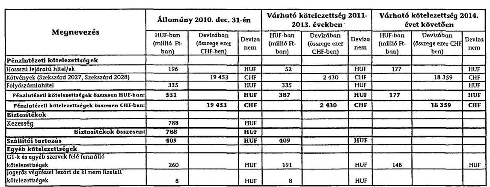

Az Önkormányzat pénzintézetekkel szemben fennálló kötelezettsége a 2010. év végén 531 millió Ft és 19453 ezer CHF volt. Ezek várható kötelezettsége (tőke, kamat és egyéb költség) a legutóbbi kamatfizetés feltételei alapján a 2011. évtől a futamidők végéig 564 millió Ft, valamint 20789 ezer CHF. A gazdasági társaságától kapott kölcsön várható tőke és kamatfizetési kötelezettsége a 2011. évtől további 308 millió Ft. Ezeken felül az Önkormányzatnak a szállítói tartozások rendezése és a jogerős végzéssel lezárt, de ki nem fizetett kötelezettségek, valamint a gazdasági társasága veszteségpótlására vállalt kötelezettség címén a 2011. évre 448 millió Ft kötelezettsége keletkezett. A kezességvállalásaiból adódóan 788 millió Ft összegű terhe jelentkezhet, amennyiben a társaságok kötelezettségeiket nem teljesítik. Az Önkormányzat a jövőbeni kötelezett-

---

ségeinek forrásait nem határozta meg. A 2011-2013 között esedékes kötelezettségek teljesítésére figyelembe vehető 248 millió Ft mérlegben kimutatott követelésállomány, 21 millió Ft tervezett kamatbevétel, és a Polgármesteri hivatal szabad folyószámlahitel-kerete, továbbá 3685 millió Ft becsült értékủ forgalomképes ingatlanvagyon, melyből 82 millió Ft a pénzintézeti kötelezettséghez kapcsolódóan jelzáloggal terhelt. Ezek fedezetet nyújthatnak a kötelezettségekre. A 2014. évtől a futamidők végéig esedékes - jelenleg ismert pénzintézeti és egyéb - kötelezettségekre figyelembe vehető forrás lehet az évről évre keletkező CLF módszer szerinti múködési jövedelem, amelynek összege azonban 2010-re minimális összegűre ( 61 millió Ft-ra) csökkent, valamint az Önkormányzat forgalomképes vagyonának egy része. Ezek alapján, hosszútávon a kötelezettségek teljesítése bizonytalan.

Az Önkormányzat minősített többségi tulajdonú társaságai kötelezettségeinek 2010. december 31-i állományát és várható alakulását a kötelezettségek lejáratáig a következő táblázat mutatja be:

| Megnevezés | Állomány 2010. dec.31-én |  |  | Várható kötelezettség 20112013. években |  |  | Várható kötelezettség 2014.   évet követően |  |  |
| :--: | :--: | :--: | :--: | :--: | :--: | :--: | :--: | :--: | :--: |
|  | HUll ben   (millió Ft-   ben) | Dertidíban   (bompi) | Dertan   nem | HUll ben   (millió Ft   ben) | Dertidíban   (bompi) | Dertan   nem | HUll ben   (millió Ft   ben) | Dertidíban   (bompi) | Dertan   nem |
| Pénzintézeti kötelezettségek |  |  |  |  |  |  |  |  |  |
| Hosszú lejáratú tételok | 486 |  | 100 F | 182 |  | 100 F | 368 |  | 100 F |
| Kötvény (Czehorszent 2010) |  | 4.366 | C0F |  |  | 1.229 | 220 F |  | 2.229 | 220 F |
|  |  |  |  |  |  | 100 F | 9 |  | 100 F |
| Húvól lejáratú tételok | 102 |  | 100 F | 127 |  | 100 F |  |  |  |
| Pénzintézeti kötelezettségek összesen 2010-ban | 289 |  | 100 F | 210 |  | 100 F | 268 |  | 100 F |
| Pénzintézeti kötelezettségek összesen 1910-ban |  | 4.366 | C0F |  |  | 1.229 | C0F |  | 2.229 | 191 F |
| Szállitót tartozó | 402 |  | 100 F | 202 |  | 100 F |  |  |  |

Az önkormányzati kötelezettségek növekedése mellett a minősített többségi tulajdonú társaságok kötelezettségei is befolyásolhatják az Önkormányzat pénzügyi egyensúlyát. A társaságoknak a 2011. évtől 878 millió Ft és 4759 ezer CHF pénzintézeti kötelezettséget és 402 millió Ft szállítói tartozást kell rendezniük. Kockázatot hordoz a társaságok fenti kötelezettségei, ha a Gt. és a Csődtv. rendelkezései alapján - a jogszabályokban foglalt feltételek bekövetkezésekor nem teljesítés esetén a bíróság az Önkormányzat korlátlan és teljes felelősségét állapítja meg.

Az Önkormányzat nem vizsgálta, hogy az elhasználódott eszközök pótlása milyen kötelezettséget jelent számára. Az Önkormányzat 2007-2010 között a tárgyi eszközök után 2633 millió Ft értékcsökkenést számolt el, felújításra 1251 millió Ft-ot fordított, az eszközök használhatósági foka az áttekintett időszakban $89 \%$-ról $84 \%$-ra, 5 százalékponttal csökkent.

Az Önkormányzat költségvetési támogatásból, átengedett bevételekből, és illeték bevételekből származó bevételei a 2007. évhez képest az időszak egészét tekintve összességében 1095 millió Ft-tal csökkentek. Ennek ellensúlyozása érdekében az Önkormányzat folytatta az előző években elkezdett - kiadási megtakarítást és bevételnövelést eredményező - intézkedéseit. A 20072010. években tett intézkedések hatására 658,8 millió Ft bevételi többletet, továbbá 960 millió Ft kiadási megtakarítást mutattak ki, ezáltal az Önkormányzat pénzügyi helyzetét javították. A kiadási megtakarítások $91,2 \%$-a az elrendelt álláshely csökkentések eredménye. Az álláshely csökkentő intézkedések 2007-2010. között a Polgármesteri hivatalnál és az intézményeinél összesen

---

259 álláshely (ebből 7 üres álláshely) megszüntetését jelentették A bevételnövelő intézkedések ingatlanok értékesítéséhez kapcsolódtak.

Az utóellenőrzés a korábbi ÁSZ ellenőrzés által a pénzügyi egyensúly javítására tett négy szabályszerűségi és egy célszerűségi javaslat hasznosítására irányult. A négy szabályszerűségi javaslat közül hármat hasznosítottak, egyet nem valósítottak meg. Nem intézkedtek annak érdekében, hogy a kötvény fedezetéül az Önkormányzat törzsvagyona és az Ötv-ben meghatározott bevételei ne legyenek felhasználhatóak. A célszerűségi javaslat hasznosítására nem történt intézkedés.

Az Önkormányzat pénzügyi helyzetét összegezve a következők emelhetők ki:

A 2007-2010. években az Önkormányzat múködési kockázatát csökkentette a pozitív folyó költségvetési egyenleg. A kockázatot növelte a lejárt szállítói tartozás nagysága, valamint a növekvő mértékben igénybevett folyószámlahitel. Az önként vállalt feladatok aránya alapvetően nem befolyásolta az Önkormányzat működésének biztonságát. A működési bevételek a 2007. év kivételével biztosították a működési kiadások és az adósságszolgálat finanszírozását. A gazdasági társaságok szerepe a közüzemi közfeladat-ellátásban meghatározó, az általuk ellátott feladatstruktúra átlátható volt. A gazdasági társaságok eladósodása, valamint a hitel- és bankgarancia szerződéseikhez az önkormányzati készfizető kezességvállalás növelte a pénzügyi kockázatot.

A vizsgált időszakban az Önkormányzat felhalmozási bevételeinek és kiadásainak egyenlege pénzügyi hiányt mutatott, ennek fedezete kötvénykibocsátással, hitel és kölcsön igénybevételével biztosított volt. A fejlesztési célú kötelezettségvállalások jövőben teljesítendő kifizetései tekintetében a nettó működési jövedelem alacsony értéke, valamint a tervezett újabb hitelfelvételek a felhalmozási kiadások finanszírozásának kockázatát növelik.

A pénzintézeti és egyéb kötelezettségek teljesítésének kockázatát növelte, hogy a 2010. december 31-én fennálló kötelezettségek visszafizetésének fedezetét a saját bevételben jelölték meg, nem számszerűsítették annak forrásait. A kockázatot csökkentheti, hogy az Önkormányzat 2010. évi követelésállománya, és forgalomképes ingatlanvagyona szükség esetén felhasználható az adósságszolgálat teljesítésére.

Az önkormányzati bevételt csökkentő központi intézkedések hatását az ellenőrzött időszakban ellensúlyozta az Önkormányzat kiadáscsökkentő és bevételnövelő intézkedéseinek eredménye.

Az Állami Számvevőszékről szóló 2011. évi LXVI. törvény 33. § (1) bekezdésében foglaltak értelmében a jelentésben foglalt megállapításokhoz kapcsolódó intézkedési tervet köteles az ellenőrzött szervezet vezetője összeállítani és azt a jelentés kézhezvételétől számított harminc napon belül az ÁSZ részére megküldeni. Amennyiben az intézkedési tervet határidőben nem küldi meg a szervezet, vagy az továbbra sem elfogadható, az ÁSZ elnöke a hivatkozott törvény 33. § (3) bekezdés a)-b) pontjaiban foglaltakat érvényesítheti.

---

Az ellenőrzés intézkedést igénylő javaslatai:

# a Polgármesternek 

1. a Közgyűlés elé terjesztendő intézkedési terv írja elő a működés pénzügyi egyensúlyának közép távon történő helyreállítása és hosszú távú fenntarthatósága érdekében - felelősök és határidők megjelölésével - olyan program készítését, amely tartalmazza az alábbiakat:
a) bevételszerző lehetőségek feltárását, különösen a helyi adópolitikai célok meghatározását és számszerűsítését, a követelések behajtását, az egyéb sajátos bevételek növelésének lehetőségét;
b) a folyamatban lévő és a tervezett beruházások teljes körű felülvizsgálatát;
c) egyéb kiadási kötelezettségek teljes körű felülvizsgálatát;
d) az intézkedések következtében jelentkező pénzügyi többlet, illetve az egyszeri bevételek tartalékba helyezését, elkülönített kezelését az adósságszolgálat teljesítése érdekében;
e) az adósságszolgálat szerkezetének áttekintését, a likviditás menedzselést, a támogatás előfinanszírozás átláthatóbbá tételét;
f) az intézkedések eredményei legalább félévenkénti áttekintésének előírását;
2. mutassa be félévente - a szokásos beszámoló keretében - a Közgyűlésnek:
a) az Önkormányzat és a minősített többségi tulajdonú gazdasági társaságai aktuális pénzügyi helyzetét;
b) legalább három évre kitekintően a kötelezettségek teljes körére szóló finanszírozási tervet, amely figyelembe veszi a kötelezettség éven belüli és túli felmerülését, a források számszerűsített megjelölésével;
c) az Önkormányzat folyamatban lévő és tervezett fejlesztéseihez szükséges belső és külső források rendelkezésre állását, és ebből a szempontból értékelje az Önkormányzat beruházásait;
3. intézkedjen a beruházásokkal létrehozott létesítmények működtetését és jövőbeni fenntarthatóságát biztosító megalapozott források költségvetési rendeletekben történő feltüntetéséről;
4. mutassa be a Közgyűlésnek évente a zárszámadási rendelet előterjesztésében az értékcsökkenés összegét, és ezzel összevetve az elhasználódott eszközök pótlására fordított tényleges kiadásokat, az eszközök elhasználódási fokának alakulását.
a jegyzőnek, hogy :
5. kísérje figyelemmel a jövőbeni várható - árfolyam-, kamat- valamint visszafizetési kockázatokat, továbbá a mérlegen kívüli tételek (kezességvállalás, garancia és helyt-

---

állási kötelezettségvállalás) kockázatait, és legalább félévente tájékoztassa a Közgyűlést azok alakulásáról;
2. gondoskodjon, hogy a jövőben az adósságot keletkeztető kötelezettségvállalásokról szóló közgyűlési előterjesztések tételesen tartalmazzák a visszafizetés forrásait, valamint legalább 3 éves kitekintéssel mutassák be a kamat és árfolyamkockázat várható kihatásait;
3. gondoskodjon az Önkormányzat likviditási helyzetéhez igazodó folyószámla hitelkeretről;
4. kísérje folyamatosan figyelemmel - a tulajdonosi jogkört gyakorlók közreműködésével - a minősített többségi tulajdonú gazdasági társaságok kötelezettségeinek alakulását, az Önkormányzat likviditására, pénzügyi-egyensúlyi helyzetére gyakorolt hatását;
5. gondoskodjon a Polgármesteri hivatal és a további költségvetési szervek lejárt szállítói tartozásai okainak feltárásáról, azonnali intézkedések megtételéről a lejárt tartozások mielőbbi rendezése érdekében;
6. biztosítsa, hogy az Önkormányzat a devizában fennálló kötelezettségeit a Számv. tv. 60. § (2) bekezdése előírásának, valamint az Önkormányzat Számviteli Politikájában foglaltaknak megfelelően a mérlegben a mérleg fordulónapján érvényes devizaárfolyamon számított forint értéken mutassa ki;
7. érvényesítse az adósságot keletkeztető kötelezettségvállalások során az Ötv. 88. § (1) bekezdés b) pontjának előírását, mely szerint hitel, kötvény fedezetéül az Önkormányzat törzsvagyona és - a likvid hitel kivételével - a normatív állami hozzájárulás, az állami támogatás, az szja, valamint az államháztartáson belülről múködési célra átvett bevételek nem használhatók fel.

---

# II. RÉSZLETES MEGÁLLAPÍTÁSOK 

## 1. Az ÖNKORMÁNYZAT KÖTELEZŐ ÉS ÖNKÉNT VÁLLALT FELADATAI

Az Önkormányzat 2010. évi elemi beszámolója szerint 7654 millió Ft működési célú költségvetési kiadásainak 96,6\%-át, 7394 millió Ft-ot a kötelező, 3,4\%-át, 260 millió Ft-ot az önként vállalt feladatok ellátására fordította. A 2011. évi tervadatok alapján az önként vállalt feladatokra az összes költségvetési kiadás 2,8\%-a (217 millió Ft) jut.

A 2010. évi müködési kiadások kötelező feladatonkénti megoszlását és azok finanszírozási arányait - az Önkormányzat tanúsítványa alapján - az alábbi táblázat mutatja be:

Az Önkormányzat 2010. évi müködési kiadásai és finanszírozási arányai fóbb feladatonként

| Ellátott feladat | Müködési kiadás összesen (millió Ft) | Kötelező feladatok kiadásának részaránya \% | Müködési bevétel összesen (millió Ft) | Állami támogatás részaránya $\%$ | Intézményi saját bevétel részaránya $\%$ | Önkormányzati (és társulástól kapott) támogatás részaránya $\%$ |
| :--: | :--: | :--: | :--: | :--: | :--: | :--: |
| Övodák* | 632 | 100 | 665 | 37 | 19 | 44 |
| Általános iskolák | 1668 | 100 | 1814 | 35 | 31 | 34 |
| Gimnástumok | 468 | 100 | 539 | 47 | 30 | 23 |
| Szakköztpiskolák, szakképzö intézmények | 0 | 0 | 0 | 0 | 0 | 0 |
| Kollégiumok | 138 | 100 | 138 | 66 | 15 | 19 |
| Szociális intézmények | 536 | 100 | 554 | 48 | 42 | 10 |
| Gyermekjüléti intézmények | 152 | 100 | 155 | 29 | 7 | 64 |
| Közmüvelődési intézmények | 199 | 100 | 205 | 0 | 42 | 58 |
| Sportlétesítmények | 63 | 100 | 77 | 0 | 48 | 52 |
| Tüzoltóság | 345 | 100 | 336 | 96 | 4 | 0 |
| Igazgatási intézmények | 215 | 100 | 215 | 21 | 10 | 69 |
| Egyéb intézmények** | 635 | 100 | 709 | 4 | 71 | 25 |
| Intézmények összesen | 5051 | 100 | 5407 | 36 | 33 | 31 |
| Polgármesteri Hivatalban ellátott feladatok müködési kiadásai | 2603 | 90 | 3240 | 8 | 0 | 92 |
| Müködési kiadások összesen | 7654 | 96 | 8647 | 25 | 21 | 34 |

A kötelező feladatokon belül a 2010. évben a két legnagyobb kiadás az 5051 millió Ft összegű intézményi feladatok müködési kiadása -, amely az összes müködési kiadás 66\%-át -, valamint a Polgármesteri hivatalban ellátott feladatok 2603 millió Ft összegű müködési kiadása, amely az összes müködési kiadás $34 \%$-át tette ki. Az intézmények működtetéséhez az Önkormányzat 1628 millió Ft támogatással (amely az intézmények összes bevételének 30\%-a) járult hozzá. Az intézményi feladatokon belül a közoktatási feladatokra fordított

---

2906 millió Ft az összes működési kiadás 38\%-át tette ki, a működéshez az Önkormányzat 987 millió Ft támogatást nyújtott, amely az ágazat működési költségeinek 34\%-a volt. A legkisebb, 27 millió Ft összegű működési támogatást a kollégiumí feladatok ellátásához biztosítottak, ez a feladat működési kiadásának $20 \%$-a volt.

Az óvodai feladatokhoz az Önkormányzat 290 millió Ft támogatást biztosított, mely a működési kiadások 632 millió Ft összegén belül 46\%-ot jelentett. Az óvodák 665 millió Ft működési bevételén belül az állami hozzájárulás részaránya 247 millió Ft összeggel 37\%-ot, az intézményi saját bevétel részaránya 126 millió Ft összeggel 19\%-ot, az önkormányzati támogatás 290 millió Ft összeggel 43,7\%-ot, az intézményfenntartó társulásoktól átvett 2 millió Ft 0,3\%-ot képviselt.

Az általános iskolai feladatokhoz 547 millió Ft támogatást nyújtott az Önkormányzat, ez az 1668 millió Ft összegű működési kiadások 32,8\%-a volt. Az általános iskolák 1814 millió Ft működési bevételének 35\%-át ( 629 millió Ft-ot) állami hozzájárulás, $31 \%$-át ( 560 millió Ft-ot) intézményi saját bevétel, $30 \%$-át ( 547 millió Ft-ot) önkormányzati támogatás, $4 \%$-át ( 78 millió Ft-ot) intézményfenntartó társulásoktól átvett támogatás finanszírozta.

A gimnáziumoknak 123 millió Ft támogatást adtak a működéshez, ami 26,3\%-os arány a működési kiadásaikon belül. A működési bevételek 539 millió Ft összegén belül az állami hozzájárulás részaránya 253 millió Ft összeggel $47 \%$-ot, az intézményi saját bevétel részaránya 163 millió Ft összeggel 30\%-ot, az önkormányzati támogatás 123 millió Ft összeggel 23\%-ot képviselt.

A szociális intézményi feladatokra fordított 536 millió Ft működési kiadáson belül az 56 millió Ft önkormányzati támogatás 10\%-os részarányt jelentett. A szociális intézmények összes működési bevételének 554 millió Ft összegén belül az állami hozzájárulás 266 millió Ft (48\%), az intézményi saját bevétel 231 millió Ft (42\%), az önkormányzati támogatás 56 millió Ft (10\%) volt.

A gyermekjóléti feladatokra fordított 152 millió Ft működési kiadás 66\%-át (100 millió Ft) az önkormányzati támogatás tette ki. A működési bevételek 155 millió Ft összegén belül az állami hozzájárulás összege 44 millió Ft (29\%), az intézményi saját bevételek összege 11 millió Ft (7\%), az önkormányzati támogatás összege 100 millió Ft (64\%) volt.

A közmúvelődési intézményi és sportfeladatokra fordított 262 millió Ft működési kiadásra az önkormányzati támogatás 159 millió Ft összege 60,7\%ban biztosított fedezetet. A működési bevételek 282 millió Ft összegén belül az intézményi saját bevételek 123 millió Ft-ot ( $44 \%$-ot), az önkormányzati támogatás 159 millió Ft-ot ( $56 \%$-ot) jelentett.

---

A hivatásos tűzoltóságra fordított 345 millió Ft működési kiadás fedezete állami hozzájárulás és intézményi saját bevétel volt, működési támogatást az Önkormányzat a tűzoltósági feladatok ellátására nem nyújtott.

Az Önkormányzat összes működési bevételéből 62,5\% volt az intézmények ( 5407 millió Ft) bevétele, amelyből 1927 millió Ft (36\%) volt az állami támogatás, 1773 millió Ft (33\%) az intézményi saját bevétel és 1628 millió Ft (30\%) az önkormányzati támogatás, 80 millió Ft (1\%) a társulásoktól átvett támogatás volt. Az Önkormányzat összes működési bevételén belül az állami támogatás részaránya 2200 millió Ft összeggel $25 \%$-ot, az intézményi saját bevétel részaránya 1773 millió Ft összeggel $21 \%$-ot, az önkormányzati támogatás 4507 millió Ft összeggel $52 \%$-ot, az intézményfenntartó társulásoktól átvett 167 millió Ft $2 \%$-ot képviselt.

Az összes önkormányzati intézményi bevételeken belül a 2008. évben az állami támogatás összege és aránya ( 2284 millió Ft összegben $43 \%$-os arányt) képviselt, 7 százalékponttal csökkent az előző évihez ( 2431 millió Ft összeg, $50 \%$-os arány) képest.

A 2009. évtől az állami hozzájárulás összege és aránya a tűzoltóság kivételével (ahol 2009-2010 között állami hozzájárulás-csökkenés mellett 2,6\%-os támogatási arány-növekedés volt) minden intézménytípusnál évről évre csökkenő tendenciát mutatott. A 2009. évről a 2010. évre az állami hozzájárulások csökkenésével párhuzamosan növekedett az önkormányzati támogatás összege és aránya (a 2009. évi 1297 millió Ft-ról (ami $26 \%$-os arányt képviselt) a 2010. évre 1628 millió Ft-ra (amely $30 \%$-os arány).

Az Önkormányzat 2010. évi 8647 millió Ft múködési bevételéből 62,5\% volt az intézmények 5407 millió Ft összegű bevétele, amelyből 1927 millió Ft (36\%) volt az állami támogatás, 1707 millió Ft (31\%) az önkormányzati (és társulástól átvett) támogatás részaránya, az intézményi saját bevétel 1773 millió Ft $(33 \%)$.

Az Önkormányzat összes múködési bevétele a 2007. évről a 2010. évre 21,8\%kal, 1550 millió Ft-tal emelkedett, melynek az önkormányzati támogatás 1146 millió Ft-os ( $34 \%$-os) emelkedése volt az oka. Az állami hozzájárulás összege 19\%-kal, 515 millió Ft-tal csökkent. Az Önkormányzat összes múködési bevételét az intézményi saját bevétel a 2007. évben 13\%-ban, a 2010. évben 21\%ban finanszírozta, az önkormányzati támogatás $47 \%$-ról $52 \%$-ra történő emelkedése mellett.

Az áttekintett időszakban az önkormányzati közszolgáltatások kiadásai, a közszolgáltatásokat igénybevevő ellátottak száma, és a közszolgáltatások biztosításához kapcsolódó fajlagos mutatók jelentősen változtak.

A közoktatási ágazat múködési kiadásainak összege a 2007. évről a 2010. évre 9,9\%-kal, 294 millió Ft-tal csökkent, ezen belül a személyi jellegú kiadások 26,6\%-kal, 611 millió Ft-tal csökkentek, a dologi kiadások 47,5\%-kal, azaz 317 millió Ft-tal emelkedtek. Az ágazat intézményeiben a 2010. évben ellátottak összlétszáma 5446 fő volt, mely 12,5\%-kal, 778 fővel alacsonyabb a 2007. évi ellátotti létszámnál. A személyi jellegú kiadások csökkenésében döntő szerepet

---

a 2008. évben a Bezerédj Szakközépiskola a Tolna Megyei Önkormányzat fenntartásába történő átadása okozta, kisebb részben a Rózsa kollégium integrálása az I. Béla Gimnáziumhoz, valamint a - fogyatékos gyermekek oktatását végző - Szivárvány Iskola integrálása a Baka István Általános Iskolához.

Az óvodákban ellátottak létszáma 15,7\%-kal, 141 fővel emelkedett, a működési kiadások 13,9\%-kal, 77 millió Ft-tal emelkedtek. Egy óvodai ellátottra jutó kiadás összege a 2007. évben 617 ezer Ft volt, amely a 2010. évre 608 ezer Ft-ra, 1,5\%-kal csökkent. Az óvodai neveléshez kapcsolódó összes bevétel a 2007. évről a 2010. évre 1,2\%-kal emelkedett, jelentősen elmaradt az ellátottak számának 15,7\%-os emelkedésétől. Az óvodai nevelés működési kiadásait az állami hozzájárulás a 2007. évben 39\%-ban, a 2010. évben 37\%-ban fedezte.

Az általános iskolákban az ellátotti létszám alig változott (2,7\%-kal, 8182 fôre emelkedett), azonban a kiadások 10,6\%-kal, 161 millió Ft-tal nőttek, az összes bevétel 14,6\%-os, 231 millió Ft összegű emelkedése mellett. A bevételek növekedésében az intézményi saját bevételek 158\%-os növekedése számottevő. A kiadásokra az állami hozzájárulás csökkenő arányban nyújtott fedezetet, a 2007. évben 49,1\%-ban, a 2010. évben 34,7\%-ban.

A gimnáziumokban az ellátottak létszáma 5\%-kal, 52 fővel emelkedett, ennél nagyobb mértékben, $25 \%$-kal, 94 millió Ft-tal nőttek a kiadások, melyekre az állami hozzájárulás csökkenő arányban, a 2007. évben 71,7\%-ban, a 2010. évben 46,9\%-ban biztosított fedezetet. A csökkenő állami hozzájárulás miatt az önkormányzati támogatás aránya a 2010. évre 4,5 százalékponttal 22,8\%-ra, 123 millió Ft-ra, az intézményi saját bevétel aránya 20,2 százalékponttal $30,3 \%$-ra, 163 millió Ft-ra emelkedett.

A szociális és gyermekvédelmi ellátásra fordított múködési kiadások öszszege 11,7\%-kal, azaz 70 millió Ft-tal emelkedett, melyen belül a személyi jellegű kiadások összege 4,3\%-kal, 17 millió Ft-tal csökkent, a dologi kiadások öszszege $45,5 \%$-kal, azaz 87 millió Ft-tal emelkedett. A szociális intézményekben ellátottak létszáma 49 fővel ( $6,2 \%$-kal), a múködési kiadások 62 millió Ft-tal ( $12,9 \%$-kal) emelkedtek, ezzel párhuzamosan a bevételek 13,8\%-kal, 67 millió Ft-tal nőttek. A múködési kiadásokat finanszírozó állami hozzájárulások aránya a 2010. évben $45,1 \%$ volt, mely 8,7 százalékpontos csökkenést mutat a 2007. évhez viszonyítva, ezzel szemben az önkormányzati támogatás aránya 55,9\%-kal emelkedett, a 2010. évben 156 millió Ft volt.

Az Önkormányzat kötelező feladatai közül az egészségügy múködési kiadásai a 2007. évről a 2010. évre mindössze 0,4\%-kal emelkedtek, a személyi jellegű kiadások 10\%-os, azaz 11,5 millió Ft összegű csökkenése mellett a dologi kiadások $22,4 \%$-kal, azaz 12,1 millió Ft-tal emelkedtek.

A közmúvelődés és sport feladatok múködési kiadásai a vizsgált időszakban 8,8\%-kal, 25 millió Ft-tal csökkentek, a személyi jellegű kiadások 37,6\%-os, 53 millió Ft-tal történő mérséklődése, és a dologi kiadások 20,1\%-kal, 28 millió Fttal történő emelkedése következtében. A múködési kiadásokra a 2007. évben még 13,7\%-ban fedezetet biztosított az állami támogatás, a 2010. évben az ágazat múködési költségeihez a központi költségvetési támogatás nem járult hozzá.

---

Az Önkormányzat az Ötv. 8. § (1) bekezdésében és más törvényekben meghatározott kötelező feladatainak ellátásáról az intézmények és gazdasági társaságok alapító okirataiban, illetve társasági szerződéseiben, gazdálkodó szervezetekkel kötött feladatellátási megállapodás útján gondoskodott. Az Önkormányzat a kötelező feladatainak körét az SzMSz-ben rögzítette, az önként vállalt feladatai köréről (állategészségügyi tevékenység, vízkárelhárítás, erdőgazdálkodási szolgáltatás, lapkiadás) és finanszírozásáról a 2010. évi költségvetési rendeletben rendelkezett.

Az Önkormányzat a kötelező és az önként vállalt feladatait 2010. december 31-én 20 költségvetési szervvel és 14 gazdasági társasággal látta el.

Az Önkormányzat fenntartásában 2006. december 31-én 3 önállóan gazdálkodó és 20 részben önállóan gazdálkodó költségvetési szerv múködött, összesen 51 telephelyen. A 2010. december 31-i állapot szerint az Önkormányzat által fenntartott költségvetési szervek közül 3 önállóan múködő és gazdálkodó költségvetési szerv, 17 intézmény pedig önállóan múködő költségvetési szerv volt, az intézmények - alapító okirataik szerint - összesen 66 telephelyen múködtek, az intézmények száma $13 \%$-kal csökkent, a telephelyek száma $29,4 \%$-kal emelkedett.

Az Önkormányzat kötelező feladatainak ellátásában 13 gazdasági társaság vesz részt, melyből ötnek kizárólagos, háromnak többségi - ebből egynek $75 \%$-ot meghaladó részesedéssel - tulajdonosa, ezen felül öt - önkormányzati részesedéssel nem rendelkező - gazdasági társaság közül három közszolgálati szerződés alapján, kettő gazdasági társaság vállalkozói szerződés alapján látott el kötelező feladatot. Önként vállalt turisztikai feladatait kizárólagos önkormányzati részesedéssel rendelkező gazdasági társasága végzi. Az Önkormányzat a 2007. évben üzletrész átruházási szerződések keretében szerzett kizárólagos tulajdoni hányadot a Vízmú Kft-ben, valamint az Alisca Terra Kft-ben. Az Önkormányzat a Vízmú Kft. 44,11\%-os tulajdoni hányadáért 410 millió Ft, az Alisca Terra Kft. 49,83\% tulajdoni hányadáért 440 millió Ft kifizetést teljesített. A gazdasági társaságok üzletrész megvásárlását az Önkormányzat a feladatellátás hatékonyságának növelésével és a szolgáltatási terület bővülésével indokolta.

Az Önkormányzat a kötelező feladatait ellátó gazdasági társaságai közül kizárólagos tulajdoni részesedéssel rendelkezik a víz és csatornaszolgáltatást, a hulladékkezelést és szállítást, valamint a vagyonüzemeltetést végző gazdasági társaság közül kettőben, továbbá a gyermekétkeztetést és a településfejlesztést ellátó gazdasági társaságokban. Többségi tulajdoni részesedéssel rendelkezik további kettő - vagyonüzemeltetési feladatokat végző és a kémény-seprő-ipari szolgáltatást végző - gazdasági társaságban.

Önkormányzati tulajdoni részesedéssel nem rendelkező 5 gazdasági társaság közül három közszolgálati szerződés keretében vesz részt a hő- és energiaszolgáltatással, a helyi közlekedéssel, a köztemető fenntartással kapcsolatos feladatok ellátásában, a közterület, illetve zöldfelület fenntartással kapcsolatos feladatok ellátását, 2 gazdasági társaság vállalkozási szerződés alapján végzi.

---

Az Önkormányzat államháztartáson kívüli szervezeteknek (egyház, egyéb civil szervezetek) a vizsgált időszakban feladatot nem adott és nem vett át.

Az önkormányzati részesedéssel rendelkező gazdasági társaságok közül 2011. május hónapban egy sem állt átszervezés, illetve csődeljárás alatt.

Az Önkormányzat többségi részesedésű gazdasági társaságainak saját tőkéje 2010. december 31-én 2881 millió Ft, a jegyzett tőkéjük 1956 millió Ft volt. Az Önkormányzat az áttekintett időszakban összesen 335,6 millió Ft összegben tőkeemelést hajtott végre a Szekszárdi Ipari Park Kft. (infrastrukturális beruházás céljából), a Szekszárdi Diákétkeztetési Kft. (konyhaberuházás céljából), és a Szekszárdi Turisztikai Kft-nél. Tőkepótlási kötelezettsége a 2011. évre vonatkozóan összesen 18,4 millió Ft összegben keletkezett ${ }^{27}$ a Szekszárdi Diákétkeztetési Kft., a Szekszárdi Turisztikai Kft., és a Szekszárdi Városfejlesztési Kft. esetében, a társaságok veszteséges gazdálkodása miatt.

A gazdasági társaságok által ellátott közszolgáltatásokhoz kapcsolódó szolgáltatási és egyéb díjak (hulladék- és folyékony hulladékszállítási, temetkezési, ivóvízszolgáltatási, szennyvízelvezetési, parkolási, helyi tömegközlekedési, la-kás- és helyiségbérlet, kéményseprő-ipari szolgáltatás, valamint a közterülethasználati díj) megállapítása a Közgyűlés feladat- és hatáskörébe tartozik, azok meghatározása önkormányzati rendelettel történik. A szolgáltatási díjakra tekintettel csak a Gemenc Volán Kft. kapott önkormányzati forrást, amelyet az Önkormányzat - figyelemmel a mindenkor hatályos miniszteri rendeletben meghatározott központi költségvetésből nyújtott támogatásra is - a társasággal kötött szerződés alapján állapított meg.

Az önkormányzati részesedéssel rendelkező gazdasági társaságoknál a társaságok által nyújtott adatszolgáltatás alapján az önkormányzati kötelező feladatokhoz rendelt 2010. év végi nettó vagyon összesen 2966 millió Ft, a gazdasági társaságok hosszú lejáratú hitelből, kötvényből fennálló kötelezettsége összesen 1360 millió Ft, a lejárt szállítói állományból adódó kötelezettségük összesen 87 millió Ft.

A kizárólagos önkormányzati tulajdonban álló 6 - melyből 5 társaság a kötelező, egy társaság önként vállalt feladatot lát el - gazdasági társaság közül 3 társaság saját tőke összege - az eredményes múködés következtében jelentősen meghaladja a jegyzett tőke összegét, 3 társaság esetében a saját tőke jegyzett tőkéhez viszonyított aránya - a saját tőke összege miatt - negatív, e társaságok vonatkozásában az Önkormányzatnak a 2011. évben összesen 18,4 millió Ft tőkepótlási kötelezettsége keletkezett. A kizárólagos önkormányzati részesedésű gazdasági társaságok hosszú lejáratú hitelből, kötvényből fennálló kötelezettsége összesen 1360 millió Ft, a lejárt szállítói tartozásból adódó kötelezettségük összesen 87 millió Ft. A víz- és csatornaszolgáltatást, valamint a hulladékszállítást,- kezelést végző társaságok rendelkeznek összesen 7 további gazdasági társaságban $25 \%$-ot meghaladó részesedéssel, e kapcsolt vállalkozá-

[^0]
[^0]:    ${ }^{27}$ A Közgyűlés 9/2011. (V. 18.) számú határozatában döntött a veszteségpótlás érdekében a Diákétkeztetési Kft. tőketartalékának 31 millió Ft-tal történő emeléséről.

---

sok az Önkormányzat illetékességi területén a feladatellátásban nem vettek részt.

A 75\%-ot meghaladó önkormányzati részesedésű, vagyonkezelést végző gazdasági társaságban az Önkormányzat 99\%-os részesedése mellett 1\%-ban az Önkormányzat kizárólagos önkormányzati részesedésű gazdasági társasága a tulajdonos, a kötelező feladathoz rendelt nettó vagyona 2010. év végén 259 millió Ft volt. A társaság saját tőke-jegyzett tőke aránya önkormányzati tőkejuttatást nem indokol, múködési, felhalmozási célú pénzeszközátadásban az áttekintett időszakban nem részesült. Az Önkormányzat a társaságban a 2008. évben az ipari park területének infrastrukturális fejlesztése céljából 253 millió Ft összegű tőkeemelést hajtott végre. A társaság más gazdasági társaságban részesedéssel nem rendelkezik.

A 75\% önkormányzati részesedést el nem érő 2 gazdasági társaság kötelező feladathoz rendelt nettó vagyona 104 millió Ft. Az Önkormányzat a kötelező kéményseprő-ipari közszolgáltatást ellátó gazdasági társaságban - további 25 önkormányzat és egy magánszemély tulajdonos mellett - $64 \%$ részesedéssel, a vagyonkezelői feladatokat ellátó társaságban - más gazdasági társaság tulajdonos mellett - $67 \%$ részesedéssel rendelkezik. E két társaság saját tőke öszszege meghaladja a jegyzett tőke összegét, önkormányzati tőkejuttatás nem indokolt, a társaságok az áttekintett időszakban múködési, illetve felhalmozási célú pénzeszközátadásban nem részesült.

Az Önkormányzat közszolgáltatási feladatellátása körében az autóbusszal végzett helyi közforgalmú személyszállításban részt vett a Gemenc Volán Zrt. is, amelyben az Önkormányzat tulajdonosi részesedéssel nem rendelkezett. Az Önkormányzat a feladatellátásra a társasággal közszolgáltatási szerződést kötött, amelyben meghatározta, hogy a társaságot illeti a közszolgáltatásból eredő valamennyi bevétel, és a központi költségvetésből az Önkormányzatnak juttatott közlekedési célú normatív támogatás. Az Önkormányzat a társaságnak a 2010. évben 30 millió Ft múködési célú pénzeszközt adott át. A távhőszolgáltatást az Alfa Nova Kft. látja el, melyben az Önkormányzat részesedéssel nem rendelkezik. A társaság az Önkormányzat tulajdonában álló 3 fűtőmű és a kapcsolódó távhőrendszer üzemeltetését, karbantartását, fejlesztését bérüzemeltetési szerződés keretében látja el 1999. óta. A köztemető fenntartásával kapcsolatos feladatokat az önkormányzati részesedéssel nem rendelkező Panteon Kft. közszolgálati kegyeleti szerződés alapján látja el.

A gazdasági társaságoknak az Önkormányzat költségvetési egyensúlyára gyakorolt hatása számottevő a gazdasági társaságok száma, azokban való részesedése, valamint a minősített befolyásszerző korlátlan felelőssége miatt. Az Önkormányzat pénzügyi helyzetének alakulása szempontjából kockázatot hordoz a társaságoknak a 2010. év végén fennállt hosszú lejáratú hitelekből, kötvényből, továbbá a lejárt szállítói tartozásokból adódó összesen 1447 millió Ft összegű kötelezettsége.

---

Az áttekintett időszakban az önkormányzati intézményszerkezetet érintően három változás történt.

A vizsgált időszakban a Közgyűlés a közoktatási ágazatra vonatkozóan döntött az intézmény-szerkezetet érintően változásról, a 175/2008. (VI. 5.) számú határozata alapján egy szakközépiskola fenntartói jogát 2008. szeptember1-jétől a megyei TISZK kialakítása érdekében átadta a Tolna Megyei Önkormányzatnak. A feladatátadás az Önkormányzat által fenntartott közoktatási intézmények csökkenését okozta, mely az Önkormányzat múködési kiadásaiban az áttekintett időszakban - az Önkormányzat kimutatása szerint - 775 millió Ft ki-adás-megtakarítást jelentett, a feladatátadással kapcsolatos bevételcsökkenést az Önkormányzat nem számszerúsítette.

A Közgyűlés a 2007. évben döntött az intézményi konyhák megszüntetéséről, és a Diákétkeztetési kft. létrehozásáról. A feladatkiszervezés költségvetési kiadásra gyakorolt hatásai közül az Önkormányzat csak a személyi jellegű kiadások csökkenését, valamint a dologi kiadások emelkedését számszerúsítette, a dologi kiadásokban elért megtakarítást, a feladatkiszervezést követő bevételcsökkenést nem számszerúsítették. További, intézmény-szerkezetet érintő változás volt 2007-2010 között a kollégium, valamint egy általános iskola integrálása, melyek a közszolgáltatások ellátására, továbbá az Önkormányzat költségvetési helyzetére gyakorolt hatása nem számottevő.

# 2. A PÉNZÜGYI EGYENSÚLYI HELYZET ALAKULÁSA 

### 2.1. A múködési és a felhalmozási egyensúly alakulása

A hagyományos költségvetési szerkezet helyett az Önkormányzat pénzügyi helyzetét a CLF módszerrel mutatjuk be, amelyben jobban elkülönülnek a vagyonnal kapcsolatos bevételek és kiadások az önkormányzati feladatokkal kapcsolatos közvetlen múködtetési bevételektől és kiadásoktól. A módszer következetesen elkülöníti a folyó és a felhalmozási költségvetés bevételeit és kiadásait, azok költségvetési egyenlegeit. A saját folyó bevételek, valamint a saját felhalmozási bevételek nem tartalmazzák az előző évi pénzmaradványok felhasználásából származó pénzforgalom nélküli bevételeket ${ }^{28}$.

A folyó költségvetés egyenlege, a működési jövedelem megmutatja, hogy az Önkormányzat éves folyó bevétele fedezetet biztosít-e a kötelező és önként vállalt feladatellátáshoz kapcsolódó éves folyó kiadására. A múködési jövedelem negatív értéke pénzügyileg fenntarthatatlan helyzetet jelez. A mutató pozitív értéke forrástöbbletet mutat, amely forrásul szolgálhat az önkormányzat fennálló kötelezettségei megfizetéséhez, valamint fejlesztéseihez.

[^0]
[^0]:    ${ }^{28}$ A költségvetési években kialakuló hiány finanszírozása az előző években képzett tartalékok felhasználásával is történhet.

---

A felhalmozási költségvetés pozitív értéke felhalmozási többletet mutat, amely a jövőbeni fejlesztések forrását biztosíthatja. Amennyiben a folyó költségvetési hiány finanszírozása a felhalmozási többletből történik, ez szűkebb értelemben vagyonfelélésnek tekinthető. Amennyiben a felhalmozási költségvetés megtakarítása fejlesztési célú hitelek, kötvények adósságszolgálatát finanszírozza, az változatlan vagyontömeg mellett, a korábban megelőlegezett tőkebevételek valós realizációjának tekinthető. A felhalmozási deficit által generált finanszírozási igény önmagában nem jár pénzügyi kockázattal, a pénzügyileg fenntartható beruházásokhoz kapcsolódó kötelezettségvállalás (adósságszolgálat) takarékos költségvetési gazdálkodással teljesíthető.

A módszer a pénzügyi kapacitás fogalmát helyezi a középpontba. Az adós hitelfelvételi képessége, hosszú távú fizetőképessége vagy bonitása a pénzügyi kapacitással, ezen belül is a nettó működési jövedelemmel jellemezhető. A nettó múködési jövedelem negatív értéke az egyes költségvetési években jelentkező adósságszolgálat túlzott mértékére utal ${ }^{29}$. A nettó múködési jövedelem negatív értékének felhalmozási többletből, vagy további hitelből történő finanszírozása pénzügyileg nem fenntartható gazdálkodást vetít előre. A pozitív értéket mutató nettó múködési jövedelem fejlesztési kiadások fedezetét biztosíthatja, illetve a folyamatosan, évenként képződő pozitív nettó múködési jövedelemből meghatározható a jövőben vállalható, teljesíthető éves adósságszolgálat, ily módon az a hitelösszeg, amely - a többi tényezőt, feltételt adottnak tekintve visszafizetési kockázat nélkül felvehető.
A CLF módszer alapján a pénzügyi kapacitás mértéke az önkormányzat összevont, nettósított, a központi információs rendszerbe a Kincstáron keresztül leadott éves költségvetési beszámolójának 80-as űrlapjában szerepeltetett adatok alapján került meghatározásra.

[^0]
[^0]:    ${ }^{29}$ Kivéve, ha annak finanszírozására a korábbi években képzett tartalékok fedezetet nyújtanak.

---

# CLF módszer szerinti önkormányzati adatok

|  Megnevezés | 2007 | 2008 | 2009 | 2010  |
| --- | --- | --- | --- | --- |
|  Folyó bevételek | 7216076 | 7800707 | 7738388 | 7746566  |
|  Folyó kiadások | 6913262 | 7352013 | 7231666 | 7686185  |
|  Müködési jövedelem | 302814 | 448694 | 506722 | 60381  |
|  Nettó müködési jövedelem =müködési jövedelem - tőketörlesztés | $-357994$ | 431804 | 463210 | 6869  |
|  Felhalmozási bevételek | 611876 | 821510 | 238215 | 145181  |
|  Felhalmozási kiadások | 2064679 | 1686820 | 757690 | 875745  |
|  Felhalmozási költségvetés egyenlege | $-1452803$ | $-865310$ | $-519475$ | $-730564$  |
|  Finanszírozási múveletek nélküli (GFS) pozíció=müködési jövedelem+beruházás költségvetés egyenlege | $-1149989$ | $-416616$ | $-12753$ | $-670183$  |
|  Finanszírozási műveletek egyenlege | 1469689 | 857747 | 167880 | 249374  |
|  Tárgyévi pénzügyi pozíció változás | 319700 | 441131 | 155217 | $-420809$  |
|  Egyéb tájékoztató adatok |  |  |  |   |
|  Összes kötelezettség* | 2971077 | 3926939 | 3376291 | 4414393  |
|  -ebből rövid lejáratú | 738019 | 707340 | 932811 | 1027229  |
|  Folyószámlahitel napi átlagos állománya** | 240520 | 2995 | 54355 | 272877  |
|  Likvidhitel napi átlagos állománya** | 0 | 0 | 0 | 0  |
|  Munkabérhitel napi átlagos állománya** | 102136 | 12110 | 44833 | 0  |
|  Finanszírozásba vonható eszközök: | 374867 | 815998 | 971125 | 550316  |
|  Tartós hitelviszonyt megtestesítő értékpapírok év végi állománya | 0 | 0 | 0 | 0  |
|  Hosszú lejáratú bankbetétek év végi állománya | 0 | 0 | 0 | 0  |
|  Értékpapírok év végi állománya | 0 | 0 | 0 | 0  |
|  Pénzeszközök év végi állománya (idegen pénzeszközök nélkül) | 374867 | 815998 | 971125 | 550316  |

---

A vizsgált időszakban az Önkormányzat folyó költségvetési egyenlege, müködési jövedelme pozitív összegú volt, melynek alakulását a következő ábra szemlélteti:
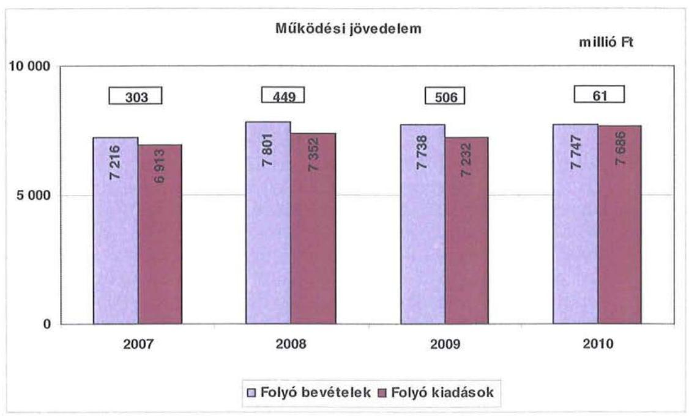

A folyó költségvetés egyenlege (a múködési forrástöbblet) 2007-ben a folyó bevételek 4,2\%-át (303 millió Ft-ot), 2008-ban 5,8\%-át (449 millió Ft-ot), 2009-ben 6,5\%-át (506 millió Ft-ot), 2010-ben 0,8\%-át (61 millió Ft-ot) jelentette. A vizsgált időszakban a müködési jövedelem 1319 millió Ft többletet mutatott, amely forrásul szolgált az Önkormányzat fennálló tőketörlesztési kötelezettségeinek teljesítéséhez, valamint fejlesztéseinek finanszírozásához.

A pozitív előjelű folyó költségvetési egyenleg ellenére az Önkormányzat folyó-számla- és munkabérhitel felvételére kényszerült egyrészt az átmeneti likviditási problémák kezelése, másrészt fejlesztési kiadásai finanszírozása miatt. A folyószámlahitel napi átlagos állománya a 2007. évi 241 millió Ft-ról a 2008. évre 3 millió Ft-ra csökkent, majd a 2009. évben 54 millió Ft-ra emelkedett, a 2010. évben pedig 273 millió Ft-ra nőtt.

Az Önkormányzat kötelezettségein belül a rövid lejáratú kötelezettségek aránya 2008-ban az előző évi $24,8 \%$-ról $18,0 \%$-ra csökkent, 2009-ben $27,6 \%$, 2010-ben $23,3 \%$ volt. Az Önkormányzat 2007. december 31-én fennálló pénz és tőkepiaci kötelezettsége 2240 millió Ft-ról 3791 millió Ft-ra ( $69,2 \%$-kal) nőtt elsősorban a 2008. évi 1000 millió Ft összegű kötvénykibocsátás, valamint a 2010. december 31-én fennálló 335 millió Ft összegű folyószámlahitel állomány miatt.

A rövid lejáratú kötelezettségek 2010-ben 1027 millió Ft-ot tettek ki, amely 289 millió Ft-tal ( $39,2 \%$ ) több a 2007. évi rövid lejáratú kötelezettségállománynál. Az Önkormányzat lejárt szállítói tartozásállománya 2007. december 31-i 22 millió Ft-tal szemben 2010. december 31-én 329 millió Ft volt.

---

Az Önkormányzat 2010. évi záró pénzkészlete 550 millió Ft volt, amely teljes egészében kötelezettséggel terhelt.

Az Önkormányzat pénzügyi kapacitása a 2007. évben negatív, a 2008-2010. években pozitív értéket mutatott. A nettó múködési jövedelem ${ }^{30}$ értéke a folyó költségvetés egyenlege mellett az adott költségvetési év adósságtörlesztésének hatását is tükrözi. Az 1319 millió Ft működési jövedelemnek 58,8\%-át (775 millió Ft) tette ki a működési és a fejlesztési célú hitelekhez kapcsolódó tőketörlesztés, amelynek kifizetését követően 544 millió Ft nettó működési jövedelme keletkezett az Önkormányzatnak.

A nettó működési jövedelem 2007. évi negatív értékét (-358 millió Ft) a 661 millió Ft összegű működési hitelek évközi visszafizetése okozta. A nettó működési jövedelem 2008-2010 között - a 2008. évi 17 millió Ft, a 2009. évi 43 millió Ft, a 2010. évi 54 millió Ft összegű tőketörlesztés mellett - 2008-ban 432 millió Ft, 2009-ben 463 millió Ft, 2010-ben 7 millió Ft volt. A pénzügyi kapacitás 2009hez viszonyított 2010. évi romlását a folyó bevételek és kiadások különbségéből származó működési jövedelem csökkenés (445 millió Ft), továbbá az előző évinél 11 millió Ft-tal magasabb összegű tőketörlesztés okozta.

Az Önkormányzatnál (a CLF módszer alapján) - változatlan nettó működési jövedelem mellett - a fejlesztési kiadásokra nem képződik fedezet.
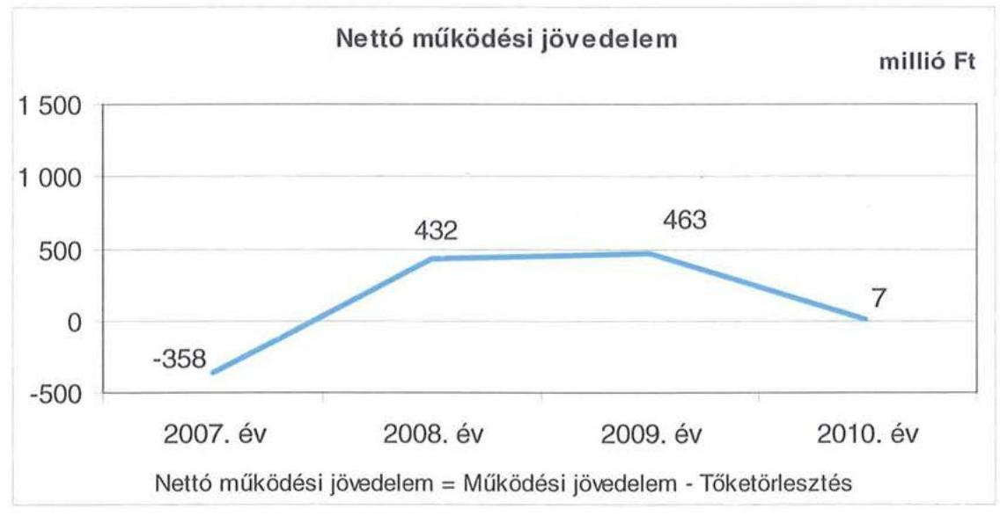

A 2007-2010. években az Önkormányzat felhalmozási költségvetésének egyenlege folyamatosan negatív összegű volt, amely takarékos költségvetési gazdálkodás és pénzügyileg fenntartható ${ }^{31}$ beruházások esetén nem jár magas pénzügyi kockázattal, amennyiben a felhalmozási hiányra a nettó múködési jövedelem fedezetet nyújt.

[^0]
[^0]:    ${ }^{30}$ pénzügyi kapacitás
    ${ }^{31}$ Az minősül pénzügyileg fenntartható beruházásnak, amelynek működtetésére az Önkormányzat nettó működési jövedelme a következő években is fedezetet nyújt.

---

A felhalmozási költségvetés egyenlegének alakulását évről évre a következő ábra szemlélteti:
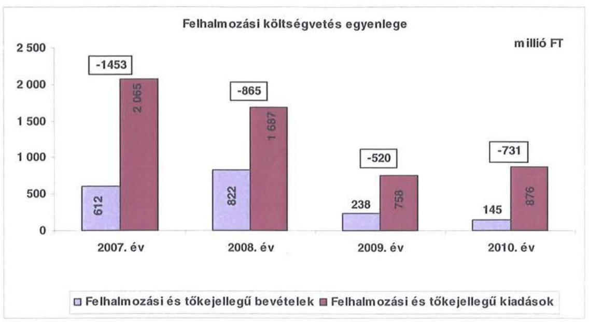

A felhalmozási forráshiánynak a felhalmozási és tőke jellegű kiadásokhoz viszonyított aránya 2007-ben 70,4\% (1453 millió Ft), 2008-ban 51,3\% (865 millió Ft), 2009-ben 68,6\% (520 millió Ft), 2010-ben 83,4\% (731 millió Ft) volt.

A vizsgált időszakban jelentkező összes felhalmozási forráshiány (3569 millió Ft) 15,2\%-ára nyújtott fedezetet az 544 millió Ft nettó múködési jövedelem. A felhalmozási forráshiányra a képződött nettó működési jövedelmen kívül a 2007. évi 55 millió Ft nyitó pénzkészlet, a kötvényből származó bevételből 2425 millió Ft, a 83 millió Ft fejlesztési hitel, a 202 millió Ft folyószámlahitel és a 260 millió Ft gazdasági társasági kölcsön nyújtott fedezetet.

A függő, átfutó, kiegyenlítő bevételek és kiadások 133 millió Ft-os negatív egyenlegének a folyószámlahitel állomány ${ }^{32}$ további részéből történő finanszírozásával az Önkormányzat 550 millió Ft pénzkészlettel zárta a 2010. évet.

Az Önkormányzat 2011. évi költségvetési rendeletében - a hagyományos költségvetési szerkezetben - tervezett bevételeinek és kiadásainak negatív különbözete 2048 millió Ft finanszírozási igényt mutat, melyet részben finanszírozhat a 2010. évi 550 millió Ft záró pénzkészlet. A fennmaradó 1498 millió Ft hiány fedezetét azonban további hitelek felvételével tudja biztosítani az Önkormányzat.

[^0]
[^0]:    ${ }^{32}$ Az Önkormányzat 2010. december 31-i folyószámlahitel állománya 335 millió Ft volt.

---

Az Önkormányzat évenkénti teljes finanszírozási igénye ${ }^{33}$ a CLF módszer szerint 2007-ben 1811 millió Ft, 2008-ban 433 millió Ft, 2009-ben 56 millió Ft, 2010-ben 724 millió Ft volt, amelynek finanszírozását a finanszírozási célú bevételek és kiadások egyenlege biztosította.

Az Önkormányzat finanszírozási műveletei 2007-2010. évekbeli egyenlegének alakulását a következő ábra szemlélteti:
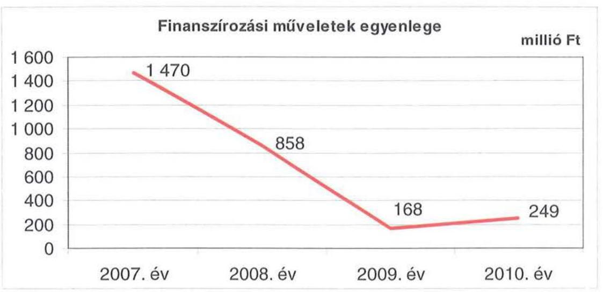

A vizsgált időszakban együttesen jelentkező finanszírozási többlet azt jelzi, hogy az éves költségvetések végrehajtása során szükség volt a pénzkészlet felhasználásán túl külső finanszírozás igénybevételére is. A finanszírozási célú műveleteket a vizsgált időszakban a jelentés 2. számú mellékletének 4.1-4.8 pontjai részletezik.

Az Önkormányzat zárszámadási rendeletében a múködési többletet és a fejlesztési hiányt a hagyományos költségvetési szerkezettől eltérően mutatta be ${ }^{34}$, amelyet a jelentés 1. számú melléklete szemléltet. A 2007-2010. évek zárszámadási rendeleteiben évről évre pénzügyi többletet mutatott ki.

A vizsgált időszakban a kötelezettségek (passzív pénzügyi elszámolások nélkül) 2971 millió Ft-ról 4414 millió Ft-ra emelkedtek, amely együtt járt a kamatkiadások növekedésével.

[^0]
[^0]:    ${ }^{33}$ a nettó múködési jövedelem és a beruházási költségvetés eredője
    ${ }^{34}$ A 2007-2009. évi zárszámadási rendeletben a múködési és a felhalmozási célú költségvetési bevételek és kiadások között figyelembe vették a finanszírozási célú pénzügyi műveleteket is. A 2010. évi zárszámadási rendeletben a múködési célú bevételek és kiadások mérlege nem tartalmazta a finanszírozási célú pénzügyi műveleteket.

---

A 2007-2010 között az Önkormányzat összesen 340 millió Ft kamatot fizetett meg. Az átmenetileg szabad pénzeszközei lekötésével elért kamatbevétel a teljes kamatkiadás $48,2 \%$-át ( 164 millió Ft ) tette ki.

Az Önkormányzat kamatbevételeinek és kamatkiadásainak alakulását a következő ábra mutatja:
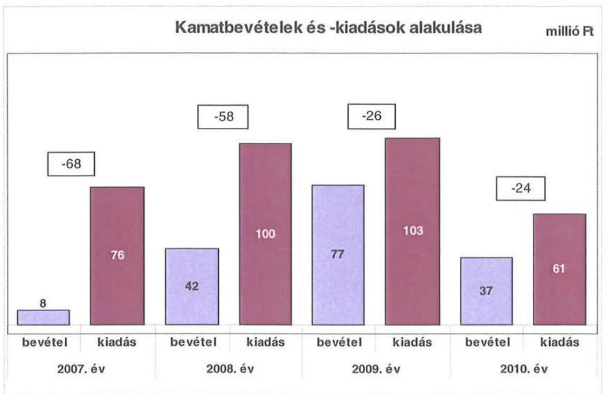

Az Önkormányzat a 2011. évi költségvetési rendeletben 84 millió Ft kamatkiadást tervezett, ami 23 millió Ft-tal ( $37,7 \%$-kal) meghaladja a 2010. évi kamatráfordítást.

A 2007-2010 közötti időszakban az Önkormányzat kiadásai és bevételei főbb jogcímek szerinti alakulását a jelentés 2 . számú melléklete tartalmazza.

# 2.2. Az Önkormányzat bevételeinek alakulása 

Az Önkormányzat összes folyó bevétele a 2007. évi 7216 millió Ft-ról a 2010. évre 7747 millió Ft-ra, 531 millió Ft-tal ( $7,4 \%$-kal) nőtt. A folyó bevételek 2007ről 2008-ra 585 millió Ft-tal ( $8,1 \%$-kal) nőttek, azt követően évente kis mértékben változtak, 2009-ben 63 millió Ft-tal ( $0,8 \%$-kal) csökkentek, 2010-ben 54 millió Ft-tal ( $0,1 \%$-kal) növekedtek. A 2008. évi növekedést elsősorban az egyéb saját bevételek növekedése eredményezte. A bevételek 2009. és 2010. évi alakulásában a költségvetési támogatás - 328 millió Ft, illetve 178 millió Ft összegű csökkenése játszott meghatározó szerepet.

---

Az Önkormányzat által a 2007-2010. években realizált folyó (müködési) bevételeinek számszaki adatait a következő ábra mutatja be:
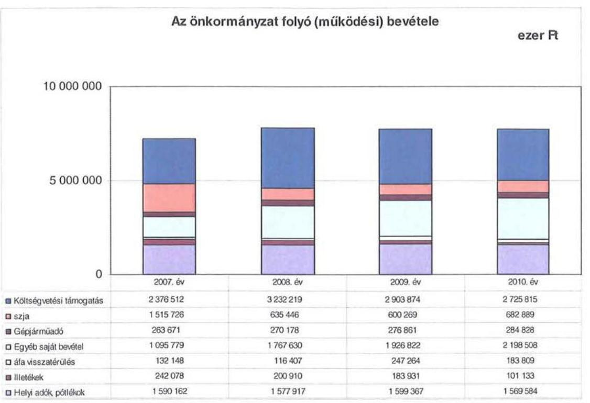

Az összes folyó bevételen belül a legnagyobb összeget a költségvetési támogatás és az szja normatív módon elosztott része tette ki, azok együttes öszszege azonban évről évre csökkent, a 2007. évben 3357 millió Ft (46,5\%), míg a 2010. évben 2726 millió Ft ( $35,2 \%$ ) volt. E bevételek 2007-2010 között 631 millió Ft-tal ( $18,8 \%$-kal) csökkentek.

Az átengedett központi adók közül az Önkormányzatnak az szja helyben maradó részéből (8\%) a 2007. évben 459 millió Ft, a 2008. évben 503 millió Ft, a 2009. évben 584 millió Ft, a 2010. évben 592 millió Ft bevétele származott. Az Önkormányzat iparűzési adóerőképessége a 2007. évben 929 millió Ft, a 2008. évben 1010 millió Ft, a 2009. évben 1121 millió Ft, a 2010. évben 1100 millió Ft volt. A lakhelyen maradó szja és az iparűzési adóerőképesség együttes, egy lakosra jutó összege egyik évben sem érte el a településtípus jellemző átlagos szintjét, ezért az Önkormányzat kiegészítő támogatásban részesült a központi költségvetésből. A kiegészítés összege a 2007. évben 77 millió Ft, a 2008. évben 132 millió Ft, a 2009. évben 16 millió Ft, a 2010. évben 91 millió Ft volt.

A folyó bevételeken belül az illetékbevétel összege és részaránya nem számottevő, 2007-ben 242 millió Ft (3,4\%), 2008-ban 201 millió Ft (2,6\%), 2009ben 184 millió Ft (2,4\%), 2010-ben 101 millió Ft (1,3\%) volt.

Az Önkormányzatnak a költségvetési támogatásból, az szja-ból, valamint az illetékekből származó bevétele 2007-2010 között 4135 millió Ft-ról 3510 millió Ft-ra - összesen 625 millió Ft-tal ( $15,1 \%$-kal) - csökkent.

---

A gépjármúadóból származó bevétel 2007-ben 264 millió Ft volt, annak öszszege a 2008. évben 6 millió Ft-tal, a 2009. évben 7 millió Ft-tal, a 2010. évben 8 millió Ft-tal nőtt, a 2010. évi 285 millió Ft az összes folyó bevétel 3,7\%-át tette ki.

Az egyéb saját bevételek összege a 2007. évi 1096 millió Ft-ról 2010-re 2199 millió Ft-ra nőtt, melyben az intézmények és a Polgármesteri hivatal által múködési célra átvett pénzeszközök 683 millió Ft-os növekedése volt a meghatározó. Az átmenetileg szabad pénzeszközök lekötéséből 2007-ben 8 millió Ft, 2008ban 42 millió Ft, 2009-ben 77 millió Ft, 2010-ben 37 millió Ft kamatbevételt értek el.

Az áfa visszatérülés összege évente eltérően alakult, a 2007. évi 132 millió Ft $1,8 \%$-kal, a 2010. évi 184 millió Ft $2,4 \%$-kal részesedett a folyó bevételek összegéből.

A saját bevételek meghatározó részét kitevő helyi adóbevételek összege a 2007-2010. években jelentős mértékben nem változott, a 2007. évi 1590 millió Ft-ról a 2010. évben 1569 millió Ft-ra csökkent. A helyi adókból származó bevétel az összes folyó bevételen belül csökkenő arányú volt, a 2007. évben 22,0\%kal, a 2010. évben 20,3\%-kal részesedett.

Az Önkormányzat a rendeleteiben a helyi adók közül a magánszemélyek kommunális adója, a vállalkozók kommunális adója, a helyi iparűzési adó, valamint az idegenforgalmi adó bevezetéséről és azok helyi szabályairól rendelkezett.

A 2007. július 1-jéig fizetett magánszemélyek kommunális adójának mértéke a lakóingatlanok esetében a törvényi maximummal egyezett meg, a telek után az adó mértéke az adómaximum $50 \%$-a volt. Az Önkormányzat pénzügyi egyensúlyi helyzetének javítása érdekében szükségesnek tartotta megvizsgálni az ingyenes hulladékszállítás és a magánszemélyeket terhelő kommunális adó összefüggéseit. A vizsgálat alapján a Közgyűlés döntött a közszolgáltatás díjkötelessé tételéről és a magánszemélyek kommunális adófizetési kötelezettségének 2007. július 1-jétől történő felfüggesztéséről, majd ezen adónem 2008. január 1jétől történő megszüntetéséről. Az Önkormányzat a 2006. évben a lakossági hulladékszállítás ellenértékeként 117 millió Ft (+áfa) összeget fizetett meg a szolgáltatást végző Alisca Terra Kft-nek, a 2007. évre ezen kiadás 22 millió Ft-os növekedésével számoltak. A magánszemélyek által fizetett kommunális adóból az Önkormányzatnak 2006-ban 108 millió Ft, 2007-ben (az I. félévre) 57 millió Ft bevétele származott.

A vállalkozók kommunális adójának mértéke 2007-2010 között a helyben foglalkoztatottak korrigált átlagos statisztikai állományi létszámára vetített 2 ezer Ft/év volt. A vállalkozók által fizetett kommunális adóból az Önkormányzatnak 2007-ben 30 millió Ft, 2008-ban 31 millió Ft, 2009-ben 29 millió Ft, 2010ben 27 millió Ft bevétele volt. Az adózás rendjéről szóló 2003. évi XCII. törvény

---

32. § (1) bekezdésének hatályon kívül helyezése ${ }^{35}$ miatt az Önkormányzat a vállalkozók kommunális adójára vonatkozó helyi rendeletet 2011. január 1jétől hatályon kívül helyezte, a megszüntetett adó miatti bevételkiesés ellentételezésére más helyi adót nem vezetett be.

Az állandó jelleggel végzett iparűzési tevékenység esetén fizetendő helyi iparúzési adó mértéke a vizsgált időszakban a törvényben meghatározott adómaximumnak felelt meg. Az ideiglenes jelleggel végzett iparűzési tevékenység esetén fizetendő adó mértékét a Közgyűlés - a 2010. évi ÁSZ vizsgálat megállapítása szerint - törvénysértő módon határozta meg egységesen 2,5 ezer Ft/naptári napban, a 2010. január 1-jétől hatályos helyi szabályozás azonban már megfelelt a törvényi előírásoknak. A helyi iparűzési adóból származó bevétel a gazdasági válság ellenére növekvő tendenciát mutatott, 2007-ben 1481 millió Ft, 2008-ban 1507 millió Ft, 2009-ben 1549 millió Ft, 2010-ben 1524 millió Ft volt.

Az idegenforgalmi adóról szóló helyi rendelet alapján a tartózkodás után fizetendő adó mértéke $250 \mathrm{Ft} /$ vendégéjszaka volt. Ezen adóból az Önkormányzat a 2007-2010. években évi 1-2 millió Ft bevételt ért el.

Az Önkormányzat 2007-2010. években teljesített felhalmozási bevételeit az alábbi táblázat mutatja be:

|  |  |  |  |  |
| :-- | --: | --: | --: | --: |
| Megnevezés | 2007. év tény | 2008. év tény | 2009. év tény | 2010. év tény |
| Tárgyi eszköz értékesítés | 82113 | 154541 | 23801 | 47358 |
| Egyéb saját tőkebevétel | 19726 | 398435 | 52530 | 6273 |
| Államháztartáson belülről   kapott támogatás | 350455 | 155854 | 140680 | 70879 |
| EU-tól és külföldről kapott   támogatások | 0 | 0 | 20205 | 20113 |
| Államháztartáson kívülről   kapott támogatás | 159582 | 112680 | 999 | 558 |
| Összes felhalmozási bevétel | 611876 | 821510 | 238215 | 145181 |

Az Önkormányzat felhalmozási bevételei 2007-ről 2008-ra 612 millió Ft-ról 822 millió Ft-ra ( $34,3 \%$-kal) nőttek, a 2009-2010. években erőteljesen csökkenő tendenciát mutattak. A felhalmozási bevételek a 2009. évben 584 millió Ft-tal ( $71 \%$-kal), a 2010. évben 93 millió Ft-tal ( $39,1 \%$-kal) csökkentek az előző évhez képest, a 2010. évben a 2007. évinek kevesebb, mint egy negyedét (145 millió Ft) tették ki. A 2008. évi növekedést az Ipari Park Kft. részére - fejlesztési célokra - nyújtott 390 millió Ft összegű kölcsön visszafizetése eredményezte. A bevételek 2008. utáni csökkenésének oka egyrészt az volt, hogy a korábbi időszakban indított beruházásokhoz megítélt központi támogatások igénybevétele a 2007. évben megtörtént, másrészt az európai uniós és hazai támogatásokkal megvalósuló, folyamatban lévő fejlesztésekhez kapcsolódó támogatások felhasználására nagyrészt 2010. után kerül sor.

[^0]
[^0]:    ${ }^{35}$ Hatályon kívül helyezte az egyes gazdasági és pénzügyi tárgyú törvények megalkotásáról, illetve módosításáról szóló 2010. évi XC. törvény 36. § (2) bekezdése.

---

A felhalmozási kiadások finanszírozásában az Önkormányzat tárgyi eszközeinek értékesítéséből származó bevételek részaránya nem volt jelentős. A tárgyi eszközök értékesítéséből elért bevétel összege a 2007-2010. években évi 24-155 millió Ft között váltakozott.

Az Önkormányzat a kizárólagos, illetve a többségi tulajdonában lévő gazdasági társaságok közül a 2007-2010. években három társaság gazdálkodott nyereségesen. A Szekszárdi Vagyonkezelő Kft. részére az Önkormányzat - tekintettel a Felügyelő Bizottság javaslatára és az eredmény alacsony összegére ${ }^{36}$ - osztalékfizetési kötelezettséget nem írt elő. A 2007. év folyamán visszavásárolt két társaság ${ }^{37}$ a 2008. évben összesen 20 millió Ft, a 2009. évben 150 millió Ft, a 2010. évben 100 millió Ft osztalékot fizetett az Önkormányzatnak.

A Közgyűlés határozatában ${ }^{38}$ döntött arról, kötelezi a Vízmú Kft-t, hogy 2009. augusztus 10-től - jegybanki alapkamattal és öt éves futamidővel - 200 millió Ft összegű kölcsönt nyújtson az Önkormányzat részére. A Közgyűlés a korábbi határozatát a 2010. évben módosította ${ }^{39}$, és abban, mint a Vízmú Kft. kizárólagos tulajdonosa úgy rendelkezett, hogy a 2010. augusztus 5 -én esedékes 40 millió Ft törlesztő részletet a gazdasági társaság minősítse át működési célú pénzeszközátadássá. Egyúttal jóváhagyta a kölcsön 160 millió Ft-ra módosított összegét, és rögzítette, hogy az Önkormányzat az első évre fizetendő kamatot az eredeti szerződési feltételeknek megfelelően - 200 millió Ft összeg után - fizeti meg. A határozatban foglaltak végrehajtásáért felelős polgármester a Közgyűlés 2010. november 25-i ülésén arról számolt be, hogy a Polgármesteri hivatal a közgyűlési határozatot megküldte a gazdasági társaságnak.

Az Önkormányzat kizárólagos tulajdonában lévő gazdasági társaságok közül 2007-2010 között a legnagyobb árbevételt a Vízmú Kft. érte el. A gazdasági társaságnál az értékesítés nettó árbevétele a 2007. évi 988 millió Ft-tal szemben a 2010. évben 1214 millió Ft volt. Az Önkormányzat a 2007-2008. években és 2010-ben a költségvetéséből - strandfejlesztés céljára - évente 15 millió Ft pénzeszközt adott át a gazdasági társaság részére. Az önkormányzati pénzeszközátadások a Vízmú Kft. éves árbevételének 1,2-1,5\%-át tették ki. A Szekszárdi Ipari Park Kft. az Önkormányzat által 2008-ban nyújtott 58 millió Ft fejlesztési célú pénzeszközátadást az ÁSZ részére nyújtott adatszolgáltatásban - a bevételei között - nem tüntette fel, a gazdasági társaság által kimutatott összes tárgyévi bevétel 25 millió Ft volt. A Szekszárdi Diákétkeztetési Kft. részére 2010-ben átadott 50 millió Ft fejlesztési forrás a gazdasági társaság éves bevételének ( 966 millió Ft) az 5,2\%-át tette ki.

[^0]
[^0]:    ${ }^{36}$ A gazdasági társaság mérleg szerinti eredménye 2006-ban 1 millió Ft, 2007-ben 5 millió Ft, 2008-ban 9 millió Ft, 2010-ben 4 millió Ft volt.
    ${ }^{37}$ Alisca Terra Kft. és Vízmú Kft.
    ${ }^{38}$ A Közgyűlés 185/2009. (VII. 29.) számú határozata.
    ${ }^{39}$ A Közgyűlés 122/2010. (VI. 24.) számú határozata.

---

# 2.3. Az Önkormányzat kiadásainak alakulása 

Az Önkormányzat 2007-2010. években teljesített folyó kiadásai főbb jogcímek szerinti bontásban az alábbiak voltak:

|  |  |  |  | ezer Ft |
| :-- | --: | --: | --: | --: |
| Megnevezés | 2007. év | 2008. év | 2009. év | 2010. év |
| Folyó kiadások | 6913262 | 7352013 | 7231666 | 7686185 |
| Müködési kiadások (kamatkiadás nélkül) | 6191929 | 6229509 | 6330537 | 6847073 |
| Államháztartáson belülre átadott   pénzeszközök | 70160 | 75609 | 125534 | 36365 |
| Transzferkiadások | 465546 | 481505 | 444111 | 473109 |
| -ebből: vállalkozásoknak | 33940 | 38784 | 30390 | 45636 |
| EU-nak, illetve külföldre | 38 | 409 | 0 | 0 |
| magánszemélyeknek | 335043 | 359049 | 338085 | 330131 |
| nonprofit szervezeteknek | 96525 | 83263 | 75636 | 67342 |
| Kamatkiadások | 75707 | 100212 | 102960 | 60592 |
| Előző évi pénzmaradvány átadás | 109920 | 465178 | 228524 | 269046 |

Az Önkormányzat folyó kiadásai 2007. december 31-ről 2010. december 31-re 6913 millió Ft-ról 7686 millió Ft-ra (11,2\%-kal) nőttek. A múködési kiadások (kamatkiadások nélkül) a 2007. évben 6192 millió Ft-ot, a 2010. évben 6847 millió Ft-ot tettek ki, a 655 millió Ft összegű növekedés elsősorban a dologi kiadások, valamint az egyéb folyó kiadások növekedésére vezethető vissza.

|  |  |  |  | ezer Ft |
| :-- | --: | --: | --: | --: |
| Megnevezés | 2007. év | 2008. év | 2009. év | 2010. év |
| Személyi juttatások | 3083344 | 2999611 | 2802559 | 2978645 |
| Munkaadót terhelő járulékok | 970755 | 938188 | 821998 | 773385 |
| Dologi kiadások | 2082433 | 2129196 | 2583082 | 2918792 |
| Egyéb folyó kiadások | 53182 | 148302 | 111931 | 155734 |
| Múködési célú pénzeszközátadás | 313561 | 664639 | 460945 | 421806 |

A múködési kiadások jelentős részét kitevő személyi juttatások 2007-2010 között 3083 millió Ft-ról 2979 millió Ft-ra (3,4\%-kal) csökkentek, az intézményátadás, az álláshely megszüntetések, valamint az egyéb kiadási megtakarítást célzó intézkedések végrehajtása következtében.

Az Önkormányzatnál 2007-2010 között a dologi kiadások folyamatosan emelkedtek, a 2007. évi 2082 millió Ft-ról 2010-ben 2919 millió Ft-ra (40,2\%kal) nőttek. A dologi kiadások és az egyéb folyó kiadások együttes összege a 2010. évi teljesítési adatok alapján meghaladta a személyi juttatások összegét. A dologi kiadások jelentős mértékű növekedése elsősorban az intézményi telephelyek számának növekedésére, egyes intézmény-üzemeltetési feladatok kiszervezésére, valamint a szolgáltatási kiadások (energia költségek, közüzemi díjak) összegének - az áremelések miatti - emelkedésére vezethető vissza.

A múködési célú pénzeszközátadások összege 2007-2010 között évente eltérően alakult, a 2008. évben 351 millió Ft-tal növekedett, a 2009. évben 204 millió Ft-tal, míg a 2010. évben 39 millió Ft-tal csökkent az előző évhez képest,

---

a négy év alatt összesen 1861 millió Ft-ot tett ki. A legnagyobb összegű támogatást az Illyés Gyula Megyei Könyvtárnak biztosították, 2007-2010 között 159 millió Ft összegben. A folyó kiadásokon belül a múködési célú pénzeszközátadások összege és részaránya évente nem jelentős, a 2010. évben 422 millió Ft $(5,5 \%)$ volt.

Az Önkormányzat 2007-2010. években teljesített folyó (múködési) és felhalmozási kiadásait az alábbi grafikon mutatja be:
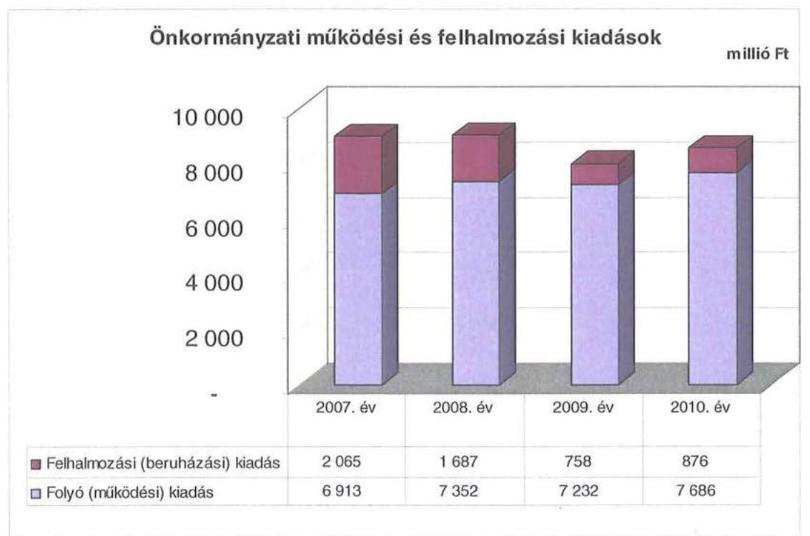

Az Önkormányzat összes kiadásán belül a felhalmozási kiadások ${ }^{40}$ mértéke és részaránya 2007-2009 között folyamatosan csökkent, a 2010. évben kismértékben emelkedett. A felhalmozási kiadások a 2007. évi 2065 millió Ft-tal szemben 2010-ben 876 millió Ft-ot tettek ki, az összes kiadáson belüli részarányuk 2007-ben 23,0\%, 2010-ben 10,2\% volt.

A 2007. évi felhalmozási célú kiadások nagyságrendjének alakulásában jelentős szerepe volt az Önkormányzat tartós részesedés vásárlásának. A korábbi időszakban privatizált Vízmú Kft. és Alisca Terra Kft. üzletrészeinek visszavásárlására - a kötvénykibocsátásból származó bevételből - 850 millió Ft-ot fordítottak, így a két gazdasági társaság ismét az Önkormányzat kizárólagos tulajdonába került. Az Önkormányzat az általa a 2007. évben alapított Szekszárdi Diákétkeztetési Kft. és Szekszárdi Turisztikai Kft. törzstőkéjébe 20 millió Ft, illetve 6 millió Ft befizetést teljesített.

[^0]
[^0]:    ${ }^{40}$ Az Önkormányzat beruházási társulásban, konzorciumban gesztorként nem vett részt, ezért a felhalmozási kiadásai között más önkormányzatok fejlesztéseivel kapcsolatos kiadások nem szerepelnek.

---

Az Önkormányzat által a 2007-2010. években a saját és a nem önkormányzati tulajdonú gazdasági társaságok részére nyújtott múködési és felhalmozási célú pénzeszközátadások az alábbi diagram mutatja be:
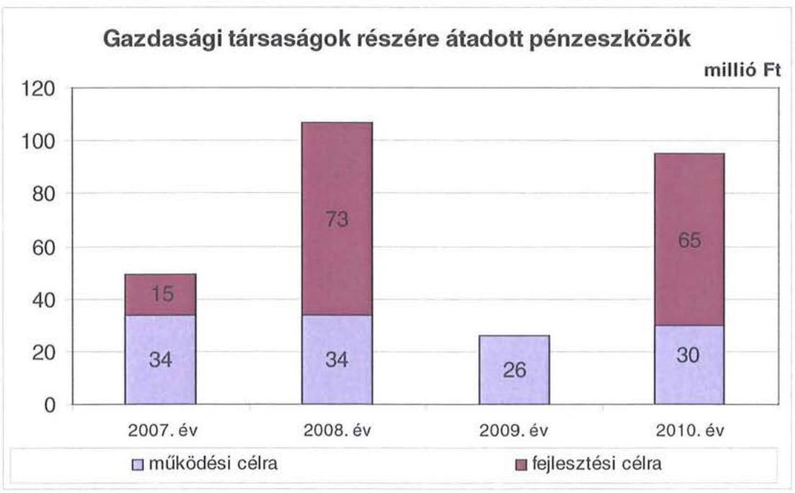

Szekszárdon a helyi közösségi közlekedést - az Önkormányzattal kötött közszolgáltatási szerződés alapján - a Gemenc Volán Zrt. végzi. Az Önkormányzat a saját bevételei terhére a 2007-2008. években 20-20 millió Ft, a 2009. évben 15 millió Ft, a 2010. évben 14 millió Ft múködési célú pénzeszközt adott át a Gemenc Volán Zrt. részére. A központi költségvetésből biztosított és a szolgáltatónak továbbutalt állami támogatás összege a 2007. és a 2008. évben 14-14 millió Ft, a 2009. évben 11 millió Ft, a 2010. évben 16 millió Ft volt. Az Önkormányzat a Gemenc Volán Zrt-nek nyújtott múködési célú pénzeszközátadáson kívül esetenként a kizárólagos, illetve többségi tulajdonában lévő gazdasági társaságok fejlesztéseihez járult hozzá pénzeszközátadással (infrastrukturális beruházás, strandfejlesztés, illetve konyhai komplexum kialakítása céljára). A gazdasági társaságok részére átadott fejlesztési célú források a 2007. évben 15 millió Ft-ot, a 2008. évben 73 millió Ft-ot, a 2010. évben 65 millió Ft-ot tettek ki.

Az Önkormányzatnál a 2007-2010. években befejezett felújítások, beruházások bekerülési költsége összesen 4293 millió Ft volt, az azokkal kapcsolatos kiadásokból 2006. december 31-ig 1775 millió Ft-ot, 2007-2010 között 2518 millió Ftot teljesítettek. A felhalmozási kiadások fedezetét 1931 millió Ft saját bevétel, 103 millió Ft hosszú lejáratú hitel, 240 millió Ft kötvénykibocsátásból származó bevétel, 390 millió Ft európai uniós támogatás, valamint 1629 millió Ft hazai támogatás képezte. A fejlesztések körében intézményi rekonstrukciók, akadálymentesítések, körfogalom, kerékpárutak létesítése, infrastrukturális beruházások, garzonház építése valósult meg, valamint ingatlanvásárlásra került sor. Az Önkormányzat 2007-2010. években befejezett fejlesztési feladatainak részletes adatait a jelentés 3/a. számú melléklete tartalmazza.

---

A 2007-2010. években befejezett fejlesztések közül a legnagyobb volumenű a Babits Mihály Művelődési Ház rekonstrukciója volt. Az 550 millió Ft összegű munkák finanszírozása 488 millió Ft címzett támogatásból és 62 millió Ft saját forrásból történt, az azzal kapcsolatos kifizetésekből azonban csak 2 millió Ft teljesítése húzódott át a 2007. évre.

A 2007-2010. években a legnagyobb összegű fejlesztési kiadást - 323 millió Ftot - a Séd patak mederrendezésére teljesítették. A munkák teljes költsége 338 millió Ft volt, annak finanszírozásához 272 millió Ft hazai támogatást (címzett támogatást) és a kötvénykibocsátásból származó bevételből 66 millió Ft-ot használtak fel.

A korszerű utasforgalmi szolgáltatások feltételeinek megteremtését célzó fejlesztés a 2005-2007. években valósult meg. A beruházás tényleges bekerülési költsége 370 millió Ft volt, melynek finanszírozása 240 millió Ft európai uniós támogatásból, 56 millió Ft saját bevételből és 74 millió Ft kötvényből származó bevételből történt.

Az Önkormányzat kimutatása szerint 2010. december 31-én nyolc - 10 millió Ft érték feletti - fejlesztési feladat megvalósítása volt folyamatban, melyek tervezett bekerülési költsége összesen 5914 millió Ft (Vármegyeháza és környékének felújítása, Multifunkcionális közösségi központ kialakítása, történelmi városmag funkcióbővítő fejlesztése, a város hosszú távon egészséges ivóvízzel való ellátása, csatornahálózat bővítések). A 10 millió Ft alatti, folyamatban lévő fejlesztések tervezett költsége 3 millió Ft. A folyamatban lévő felújítások, fejlesztések forrásaként 1090 millió Ft saját bevételt, 275 millió Ft hitelt, 180 millió Ft kötvényből származó bevételt és 4372 millió Ft európai uniós támogatást vettek számításba.

A folyamatban lévő fejlesztésekre 2010. december 31-ig 680 millió Ft kiadást teljesítettek, melynek forrása 186 millió Ft saját bevétel, 32 millió Ft hitel, 392 millió Ft kötvénykibocsátásból származó bevétel, 69 millió Ft európai uniós támogatás és 1 millió Ft hazai támogatás volt.

A tervezett 5917 millió Ft-tal szemben a fejlesztések várható teljes bekerülési költsége 4984 millió Ft, melyből 4304 millió Ft pénzügyi fedezetét az Önkormányzatnak 2011-ben és az azt követő években kell biztosítania. Az Önkormányzat adatszolgáltatása szerint a 2010 utánra vállalt pénzügyi kötelezettségek teljesítéséhez jelenleg 2 millió Ft saját forrás és 4204 millió Ft európai uniós támogatás áll rendelkezésre, a fennmaradó 98 millió Ft kiadást 8 millió Ft európai uniós támogatásból és 90 millió Ft hitelből fogják finanszírozni. Az Önkormányzat 2010. december 31-én folyamatban lévő fejlesztéseinek részletes adatait a jelentés 3/b-3/c. számú mellékletei tartalmazzák.

Az Önkormányzat adatszolgáltatása szerint a beadott, elbírálás alatti pályázati forrásból megvalósuló fejlesztések tervezett teljes bekerülési költsége 7613 millió Ft, azok forrásaként 5578 millió Ft európai uniós támogatást, 10 millió Ft hazai támogatást, 2016 millió Ft hitelt és mindössze 9 millió Ft saját bevételt vettek számításba. A beadott, elbírálás alatti pályázati forrásból megvalósuló fejlesztések részletes adatait a jelentés 3/d. számú melléklete tartalmazza.

---

A 2011. évi költségvetési rendeletben 500 millió Ft fejlesztési hitel felvételét tervezték, további nagy összegű hitelek felvétele - tekintettel a kötvénykibocsátással kapcsolatos, 2012. évtől esedékessé váló tőketörlesztési kötelezettségre is - az Önkormányzat pénzügyi helyzetének további romlását vonhatja maga után, mivel a képződő múködési jövedelem nem nyújt fedezetet további tőketörlesztések finanszírozására.

# 3. KÖTELEZETTSÉGEK BEMUTATÁSA 

### 3.1. A pénzintézetek felé fennálló kötelezettségek alakulása

Az Önkormányzat pénzintézeti kötelezettségeinek állománya 2006. december 31-től 2010. december 31-ig 751 millió Ft-ról 4863 millió Ft-ra, közel 6,5 szeresére nőtt. A 2010. év végén fennálló pénzintézeti kötelezettségei 196 millió Ft hosszú lejáratú hitelből, 3105 millió Ft fejlesztési célú kötvénykibocsátásból, 1227 millió Ft múködési célú kötvénykibocsátásból, valamint 335 millió Ft év végi folyószámlahitel állományból, továbbá az időközben jelentkező árfolyamváltozásból ${ }^{41}$ keletkeztek.
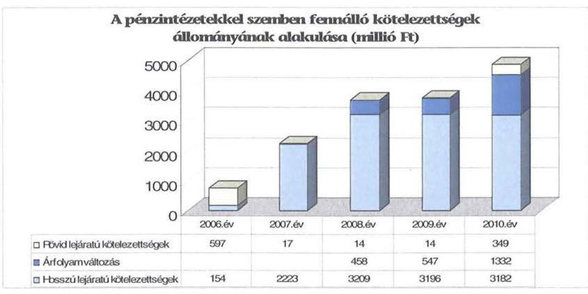

Az árfolyamváltozás hatása befolyásolja a kötelezettségek alakulását, azonban annak mértéke előre pontosan nem határozható meg, csak várakozásokon alapuló tendenciák jelezhetők. Annak megítéléséről, hogy a devizában kibocsátott kötvényekért kapott forinthoz képest a kötvények visszavásárlásakor jelentkező forintkötelezettség többletkiadást (árfolyamveszteség) vagy megtakarítást (árfolyamnyereség) eredményez a futamidő végén, a teljes kötelezettség rendezését követően lehet képet alkotni. Mindaddig, amíg törlesztési kötelezettség nem áll fenn (türelmi idő, moratórium), a tőkére vonatkoztatva nem értel-

[^0]
[^0]:    ${ }^{41}$ Az Önkormányzat a vizsgált időszakban - a Számv.tv. 60. § (2) bekezdésében foglalt előírás ellenére - a devizában fennálló kötelezettségeit a mérlegben nem a mérlegfor-duló-napján érvényes devizaárfolyamon számított forintértéken, hanem kibocsátáskori Ft névértéken mutatta ki. A grafikonban rögzített árfolyamváltozás a devizában fennálló kötelezettségek alapján, az ellenőrzés által - az adott év december 31-i MNB deviza középárfolyam alapján - megállapított összeg.

---

mezhető sem az árfolyamveszteség, sem az árfolyamnyereség. Ugyanakkor a számviteli szabályok meghatározzák, hogy az árfolyam-különbözetet év végén a kötelezettségek vagy követelések között a könyvviteli mérlegben nyilván kell tartani, azonban az árfolyamkülönbözet valójában nem realizált.

Az Önkormányzat pénzintézeti kötelezettségvállalásaira minden esetben közgyűlési döntés alapján került sor, azonban a pénzintézet kiválasztása nem minden esetben versenyeztetés útján történt. A döntések során a kötelezettségvállalásból származó források felhasználási céljait meghatározták, azonban a kötelezettségvállalás alapján keletkező fizetési kötelezettség teljesítésének forrásait nem nevesítették, az adósságot keletkeztető kötelezettségvállalással megvalósított felhalmozási kiadások esetleges bevételnövelő, illetve kiadáscsökkentő vonzatát a fejlesztésekhez vállalt kötelezettségek visszafizetési forrásaként nem számszerúsítették.

A Közgyűlés döntéseit megalapozó előterjesztések nem tartalmazták a teljes futamidő alatt várható kamat- és tőkefizetési kötelezettség, valamint a kamat- és árfolyamkockázat bemutatását. Az előterjesztésekben nem tértek ki az adósságszolgálati korlát bemutatására sem, így a Közgyűlés ennek figyelembevétele nélkül döntött, azonban az Önkormányzat adósságot keletkeztető kötelezettségvállalásának felső határát egyik vizsgált évben sem lépték túl.

A pénzintézeti kötelezettségeken felül az Önkormányzatnak - a kizárólagos önkormányzati tulajdonú gazdasági társaságától múködési célra kapott kölcsönök miatt - további rövid és hosszú lejáratú kötelezettsége ${ }^{42}$ állt fenn, a 2009. év végén összesen 200 millió Ft, a 2010. év végén összesen 260 millió Ft összegben. Így összességében a - pénzintézetekkel és a saját tulajdonú gazdasági társaságaival szemben fennálló - kötvénykibocsátásokból, hitel és kölcsön felvételekből származó kötelezettsége 2010. december 31-én 5123 millió Ft volt, mely a 2006. év végi kötelezettségének több mint 6,8-szerese.

- A Vízmú Kft. és az Önkormányzat között 2009. augusztus 5-én létrejött Kölcsönszerződés szerint ${ }^{43}$ a Vízmú Kft. 200 millió Ft kölcsönt ${ }^{44}$ biztosított az Önkormányzatnak öt éves futamidővel, jegybanki alapkamattal, évente egyenlő összegű törlesztési kötelezettséggel. A kölcsönből 2010. december 31-én 160 millió Ft kötelezettsége állt fenn az Önkormányzatnak.
- Az Önkormányzat a 257/2010. (XI.25.) számú határozatában döntött arról, hogy kötelezi a Vízmú Kft-t, hogy 100 millió Ft-ot vissza nem térítendő támogatásként átadjon az Önkormányzatnak, a 288/2010. (XII.16.) számú határozattal korábbi határozatát módosította, és felhatalmazta a kölcsönadó gazdasági társaságot, hogy kössön megállapodást az Önkormányzattal 100 millió Ft kölcsön adásáról, 5 éves futamidőre, jegybanki alapkamattal. A kamat fize-

[^0]
[^0]:    ${ }^{42}$ A gazdasági társaságától kapott kölcsönöket az Önkormányzat a mérlegben a múködési célú hosszú lejáratú hitelek között mutatta ki.
    ${ }^{43}$ Az Önkormányzat a 185/2009. (VII.29.) számú határozattal hagyta jóvá.
    ${ }^{44}$ Az Önkormányzat a 2009. évi költségvetési rendeletében 200 millió Ft múködési célú pénzeszközátvételt szerepeltetett. A Közgyűlés 185/2009. (VII.29.) számú határozatában úgy döntött, hogy a költségvetési rendeletben szereplő pénzeszközátvétel helyett 5 éves futamidejú kölcsönt vesz fel a Vízmú Kft-től.

---

tése évente, a tőketörlesztés - előtörlesztési lehetőség mellett - a kölcsön lejáratakor esedékes.

Az áttekintett időszakban a Vízmú Kft eszköz- és pénzgazdálkodása kiegyensúlyozott volt, az adózott eredményéből eredménytartalékot képzett, eredménytartaléka 2010. december 31-én 210 millió Ft volt. Az adott kölcsönök a társaság közszolgáltatási feladatainak ellátását, a gazdálkodás biztonságát - a szolgáltatási díjak emelése mellett - nem veszélyeztették.

Az Önkormányzat 2010. december 31-én CHF-ben fennálló adósságot keletkeztető kötelezettségvállalásai az alábbi voltak:

| Megnevezés | Kibocsátás, illetve szerződéshittés időpontja | Összeg   CHF | Kibocsátási, vagy tehivási árfolyom | Kamat (referencia kamat+ kamatfelár) | Felhasználás célja: |
| :--: | :--: | :--: | :--: | :--: | :--: |
| Szekszárd 2027 Kötvény | 2007.06 .11 | 13063357 | 153,1 | 6 havi CHF LIBOR $=0,3 \%$ | Folyószámla- és munkabér hitel kiváltása, fejlesztési feladatok finanszírozása, közszolgáltató társaságok visszavásárlása |
| Szekszárd 2028 Kötvény | 2008.04 .23 | 6389776 | 156,5 | 6 havi CHF LIBOR $=0,73 \%$ | Fejlesztési feladatok finanszírozása |

A Szekszárd 2027 Kötvény kibocsátásának célja a folyószámla- és munkabérhitel kiváltása, közszolgáltató gazdasági társaságok visszavásárlása és fejlesztési feladatok forrásának biztosítása volt. Az Önkormányzat a kötvénykibocsátásból származó bevételt, a meghatározott célokra, a 2007-2008. években teljes egészében felhasználta, 600 millió Ft-ot a fennálló folyószámlahitel refinanszírozására, 250 millió Ft-ot a munkabérhitel kiváltására, 850 millió Ft-ot - kötelező közszolgáltatásokat végző gazdasági társaságokban - üzletrész vásárlás$\mathrm{ra}^{45}, 300$ millió Ft-ot a fejlesztési feladatok finanszírozására fordított.

A Szekszárd 2028 Kötvény kibocsátásának célja az Önkormányzat fejlesztési feladataihoz forrás biztosítása volt. A kötvénykibocsátásból származó bevételből az Önkormányzat a 2008-2010. években 615 millió Ft összegben fejlesztési feladatainak finanszírozását biztosította, a kötvénykibocsátásból származó bevételből 2010. december 31-én 385 millió Ft - lekötött betétként - még rendelkezésre állt. A kötvénykibocsátások dokumentációiban az eredeti felhasználási céltól eltérő felhasználás a kibocsátó bankok részéről nem volt tiltott, az eltérő felhasználáshoz nem kötődött banki szankció.

Az Önkormányzat a devizában fennálló pénzintézeti kötelezettségeiből - 2010. december 31-ig - 1288185 CHF kamatot fizetett, a kamatfizetések időpontjaiban érvényes - a szerződésekben meghatározott - CHF/HUF konverziós árfolyamok alapján az összes teljesített kötelezettség 226 millió Ft volt. A tőketörlesztés első alkalommal a Szekszárd 2027 Kötvény esetében 2012. október 15én, a Szekszárd 2028 Kötvény esetében 2013. október 15-én esedékes.

[^0]
[^0]:    ${ }^{45}$ Az üzletrészvásárlásokkal került kizárólagos Önkormányzati tulajdonba az ivóvíz- és csatornaszolgáltatást biztosító Vízmú Kft. és a köztisztasági és településtisztasági feladatokat ellátó Alisca Terra Kft.

---

Az Önkormányzat 2010. december 31-én forintban fennálló adósságot keletkeztető pénzintézeti kötelezettségvállalása az alábbi volt:
ezer Ft-ban

| Megnevezés | Szerződéskötés   idöpontja | Összeg | Kamat (referencia   kamat+ kamatfelár) | Felhasználás célja: |
| :-- | :--: | :--: | :-- | :-- |
| Önkormányzati Fejlesztési   Hitelprogram keretében   nyújtott kölcsön | 2005.07 .04 | 250000 | 3 havi EURIBOR $+1,5 \%$ | kózutak építése,   önkormányzati   létesítmények felújítása |

Az Önkormányzat a HUF-ban fennálló, hosszú lejáratú pénzintézeti kötelezettségéből - 2010. december 31-ig - 54 millió Ft tőkét törlesztett, és 42 millió Ft kamatot, valamint 0,5 millió Ft egyéb költséget ${ }^{46}$ fizetett.

Az Önkormányzat 2007-2010. december 31. között az átmenetileg szabad pénzeszközein - az Önkormányzat kimutatása szerint - 164 millió Ft kamatbevételt realizált, melyből 100 millió Ft keletkezett a kötvény kibocsátásából származó forrás befektetéséből és 64 millió Ft az elszámolási számlák pozitív egyenlegeinek látra szóló kamataiból.

Az Önkormányzat a Szekszárd 2028 Kötvény kibocsátásából származó bevétel átmenetileg szabad részét - változó futamidőkre, a betétlekötések lejáratakor új lekötéseket kezdeményezve - a kötvénykibocsátást lebonyolító pénzintézetnél folyamatosan lekötött betétben tartotta. A befektetéséből származó kamatbevételt, valamint az esedékes kamatkifizetéseket nem a ténylegesen realizált, illetve teljesített összegekben mutatta ki a könyvelésében. Kamatbevételként nem számolták el a 2008. október 15-i kamatfizetés teljesítéséhez felhasznált, 47584 CHF realizált betétkamatot, és ezen összeggel kevesebbet számoltak el a kötvény után teljesített kamatkiadásként is. A további kamatfizetéseknél kamatkiadásként a ténylegesen teljesített CHF kamat Ft ellenértéke helyett a teljesítés fedezetének biztosítására átvezetett összegeket számolták el, a tényleges kamatok és az átvezetett összegek különbözeteivel pedig a kötvény befektetéséből ténylegesen származó kamatbevételt korrigálták. Ennek következtében mind a kötvény után teljesített kamatkiadás, mind a kötvényből származó bevétel befektetéséből realizált kamatbevétel ténylegesen 7 millió Ft-tal több volt, mint az Önkormányzat könyvviteli elszámolásában szereplő összegek.

A kötvény kibocsátásából létrejött forrás befektetéséből ténylegesen realizált 107 millió Ft kamatbevétel a kötvények után ténylegesen teljesített 226 millió Ft kamatfizetésnek $47 \%$-át tette ki. A kamatbevételt az Önkormányzat a kötvények után teljesítendő kamatok fizetésére használta fel.

Az Önkormányzat müködésének pénzügyi egyensúlyát a vizsgált időszakban folyószámla- és munkabérhitel igénybevételével tudta biztosítani. A folyószámlahitel és a munkabér-megelőlegezési hitel alakulását az alábbi táblázat mutatja be:

[^0]
[^0]:    ${ }^{46}$ projektvizsgálati dí címén.

---

| Megnevezés | 2007. év | 2008. év | 2009. év | 2010. év | 2011.   március 31. |
| :-- | --: | --: | --: | --: | --: |
| I. Folyószámlahitel |  |  |  |  |  |
| a folyószámlahitel keretősszege január 1-jén | 600000 | 600000 | - | 300000 | 1000000 |
| teljesített kamat és egyéb költség | 20646 | 35 | 2811 | 16346 | 10422 |
| II. Munkabér-megelölegezési hitel |  |  |  |  |  |
| Igénybevett hitel összesen: | 1500000 | 650000 | 708000 | - | - |
| teljesített kamat és egyéb költség | 9176 | 3301 | 5737 | - | - |

A folyószámlahitel és munkabér-megelőlegezési hitelek kondíciói és egyéb költségei a következők voltak ${ }^{47}$ :

| Megnevezés | Kamat (referencia+ kamatfelár) | Egyéb költség |
| :--: | :--: | :--: |
| Folyószámlahitel |  |  |
| 2007-2008. év | 3 havi BUBOR $+0,2 \%$ | $0,25 \%$ kez.ktsg. |
| 2009-2011. év | 1 havi BUBOR $+2,8 \%$ | $0,25 \%$ kez.ktsg. $+0,25 \%$   rend.tart.jutalék |
| Munkabér megelőlegezési hitel |  |  |
| 2007. év | 3 havi BUBOR $+1 \%$ | $x$ |
| 2008. év | 3 havi BUBOR $+1 \%$,   júliustól 3 havi BUBOR $+1,5 \%$,   októberiól 3 havi BUBOR $+1,2 \%$ | $x$ |
| 2009. év | 1 havi BUBOR $+3 \%$, | $x$ |

Az Önkormányzat a 2007. évben fennálló tartós folyószámlahitel tartozását a Szekszárd 2027 Kötvény kibocsátásából származó forrásból törlesztette, ezt követően a folyószámlahitel-keretét megszüntette. A folyószámlahitel-keret 2009. évi - 300 millió Ft keretösszegű - megnyitása, és a hitelkeret összegének 2010. évi megemelése ${ }^{48}$ - az Önkormányzat tájékoztatása szerint - a folyamatosan csökkenő normatív állami támogatások, és az illetékbevétel csökkenése miatti bevételkiesések okozta likviditási nehézségek áthidalása érdekében vált szükségessé. A folyószámlahitel-keret 2011. évi további emelését a város rehabilitációs projekthez kapcsolódóan megvalósított fejlesztések számlái támogatástartalmának megelőlegezése tette szükségessé.

A vizsgált időszakban a folyószámlahitel igénybevételével zárt napok száma a 2008. évben volt a legalacsonyabb (53 nap), a 2010. évben és a 2011. év I. negyedévében az Önkormányzat minden nap igénybe vett folyószámlahitelt. Az átlagos napi állomány a 2008. évben volt a legalacsonyabb, 3 millió Ft, a 2011. év I. negyedévében volt a legmagasabb, 448 millió Ft. Az áttekintett időszakot jellemző likviditási problémák folyószámlahitellel történő finanszírozása az Önkormányzatnak a 2007. január 1-jétől 2011. március 31-ig terjedő idő-

[^0]
[^0]:    ${ }^{47}$ A referencia kamatok az alábbiak szerint alakultak:

    | MNB BUBOR fixing (átlagkamat) \%-ban |  |  |  |  |
    | :-- | :-- | :-- | :-- | :-- |
    | Referetencia kamat | 2007. évi | 2008. évi | 2009. évi | 2010. évi | 2011.március   31-ig |
    | 3 havi BUBOR | 7,75 | 8,87 | 8,64 | 5,5 | 6,03 |
    | 1 havi BUBOR | 7,83 | 8,75 | 8,66 | 5,47 | 5,94 |

    48 A folyószámlahitel-keretet 2010. március 10-én 600 millió Ft-ra, 2010. július 20-án 800 millió Ft-ra emelték.

---

szakban összesen 50 millió Ft kamat- és egyéb kiadást okozott. Az Önkormányzat folyószámlahitele 2010. december 31 -én 335 millió Ft volt.

A likviditási nehézségek miatt az Önkormányzat 2007 és 2009 között a munkabérek kifizetéséhez munkabér-megelölegezési hitelt vett igénybe. A 2007. évben hat alkalommal, alkalmanként 250 millió Ft, a 2008. évben hét alkalommal, alkalmanként átlagosan 93 millió Ft, a 2009. évben négy alkalommal, alkalmanként átlagosan 177 millió Ft munkabér-megelőlegezési hitele volt az Önkormányzatnak. Az igénybevett munkabér-megelőlegezési hitelek után kamat címén az Önkormányzat összesen 18 millió Ft-ot fizetett ki. A 2010. évben és a 2011. év első negyedévében az Önkormányzat munkabérmegelőlegezési hitelt nem vett igénybe.

A jelenleg fennálló - kötvénykibocsátásokból és hosszú lejáratú hitelfelvételből adódó - kötelezettségekből a kamatfizetési kötelezettségek alakulását jelentősen befolyásolta - és a jövőbeni fizetési kötelezettségeket is befolyásolja - a referenciakamatok változása, melyet az alábbi táblázat mutat be:

| Megnevezés | Kibocsátási, lehivási | Utolsó fizetéskor | Változás \% |
| :--: | :--: | :--: | :--: |
|  | alapkamat \% |  |  |
| 6 havi CHF LIBOR | 2,63 | 0,24 | $-90,9$ |
| 3 havi EURIBOR* | 2,104 | 1,011 | $-51,9$ |

* A 3 havi EURIBOR mértéke a 2005-2009. évek között emelkedett

A 6 havi CHF LIBOR-hoz, mint referenciakamathoz kötött kötvényt az Önkormányzat két alkalommal bocsátott ki, a táblázatban a korábbi kötvénykibocsátás időpontjában érvényes alapkamat szerepel. Az Önkormányzat utolsó kamatfizetési kötelezettsége a 6 havi CHF LIBOR-os kötvények után 2011. április 15-én, a 3 havi EURIBOR-u hitelnél 2011. március 31-én volt.

A deviza alapú kötelezettségei esetében - amennyiben a kötvények kibocsátása óta a referenciakamat nem változott volna - az Önkormányzatnak a kibocsátáskor érvényes referencia kamattal számolva 1833597 CHF ( 328 millió Ft) fizetési kötelezettsége jelentkezett volna, azonban a kamatcsökkenés következtében ténylegesen 545412 CHF-fel ( 102 millió Ft-tal) kevesebb fizetési kötelezettséget kellett teljesítenie ${ }^{49}$.

Az Önkormányzatnak a deviza alapú kötelezettségei után, minden feltétel - referenciakamatok mértéke és CHF/HUF árfolyam - változatlansága esetén, a kamatfizetési kötelezettsége 282 millió Ft lett volna a ténylegesen teljesített 226 millió Ft-tal szemben, így az Önkormányzatnak a kibocsátáskori feltételekhez képest - a csökkenő kamatmértékek következtében jelentkező 102 millió Ft kötelezettségcsökkenés, és az árfolyam emelkedése miatti 46 millió Ft kötelezettségnövekedés alapján - a kamat- és árfolyamváltozás eredőjeként 56 millió Ft-tal kevesebb fizetési kötelezettséget kellett teljesítenie.

[^0]
[^0]:    ${ }^{49}$ A forint összegek meghatározása a kamatfizetésekkor érvényes tényleges árfolyamok alapján történt.

---

A HUF-ban fennálló kötelezettségei esetében a hitel felvételekor érvényes referenciakamattal számolva 35 millió Ft kamatfizetési kötelezettsége keletkezett volna az Önkormányzatnak, a kamatváltozások következtében ténylegesen 7 millió Ft-tal - 2\%-kal - többet, 42 millió Ft kamatfizetést kellett teljesítenie.

Az Önkormányzatnál a helyszíni vizsgálat alatt további egy, 215 millió Ft öszszegű, HUF alapú, hosszú lejáratú, változó kamatozású, beruházási hitel igénybevételéről döntöttek ${ }^{50}$.

A 2011. június 21 -én aláírt szerződés szerint a hitel lejárata 2030. december 15., a hitelkeret rendelkezésre tartási periódusa a kölcsönszerződés közokiratba foglalásától 2011. szeptember 30-ig tart. A hitel kamatlába változó, 3 havi EURIBOR+RKO1 ${ }^{51}+1,5 \%$ kamatfelár. A tőketörlesztés és kamatfizetés negyedévente, a negyedév utolsó hónapjának 15. napján esedékes, a tőketörlesztésre a hitelt folyósító pénzintézet 2014. március 14 -ig türelmi időt biztosít. A kamaton felül egyéb költség nem terheli az adóst. A hitel biztosítékaként első ranghelyű ingatlan jelzálogjog bejegyzésére kerül sor öt Önkormányzati tulajdonú ingatlanra.

A 2010. december 31-én fennálló, hosszú lejáratú pénzintézeti kötelezettségei miatt az Önkormányzatnak - a jelenlegi kamatmértékekkel - a 2011-2013. években várhatóan 2429926 CHF és 52 millió Ft, a 2014. évtől a futamidők végéig 18359264 CHF és 177 millió Ft fizetési kötelezettsége keletkezik. A gazdasági társaságától kapott kölcsönök után a 2011-2013. években 160 millió Ft, a 2014. évtől 148 millió Ft kamatot és törlesztést kell teljesítenie.

Az Önkormányzat 2011-2014. évekre szóló gazdasági programjában célként megfogalmazták az Önkormányzat pénzügyi egyensúlyának fenntartását és rögzítették, hogy a kötvények 2012-ben kezdődő tőketörlesztéséhez a forrásokat a költségvetésben biztosítani kell, azonban a számításba vehető forrásokat nem nevesítették. A központi forrásszabályozás alapján folyamatosan csökkenő normatív állami támogatások és növekvő intézményi kiadások miatt általános igényként megfogalmazták az intézményrendszer finanszírozásának átvilágítását, a kiadások ésszerűsítését, azonban - a pénzügyi egyensúly fenntartása, a meglévő adósságállomány kezelése, a várható kötelezettségek teljesítéséhez szükséges források biztosítása érdekében - konkrét feladatokat meghatározó adósságkezelési programot, illetve likviditási koncepciót nem készítettek.

# 3.2. Szállítók felé fennálló kötelezettségek alakulása 

Az Önkormányzat 2010. december 31-i mérlegben kimutatott szállítói kötelezettsége 409 millió Ft volt, melyből a le nem járt tartozásállomány 80 millió Ft, az összes tartozás 19,6\%-a. Az Önkormányzatnál a 2010. év végén kimutatott szállítói kötelezettségre fedezetet részben a mérlegben kimutatott 248 millió Ft követelésállomány nyújthat, illetve a Polgármesteri hivatal szabad folyó-

[^0]
[^0]:    ${ }^{50}$ A Közgyűlés 38/2010. (III. 4.), 103/2010. (V. 13.), 151/2010. (VI. 24.), valamint a 108/2011. (V. 26.) számú határozataival módosított 277/2009. (XII. 17.) számú határozata.
    ${ }^{51}$ A Magyar Fejlesztési Bank refinanszírozási kamatfelára, melyet a bank jogosult évente egyoldalúan meghatározni.

---

számlahitel kerete. Az Önkormányzat 2010. év végén nem rendelkezett szabad pénzmaradvánnyal, a költségvetési beszámolójában kimutatott pénzmaradványa kötelezettségvállalással terhelt.

Az Önkormányzat és gazdasági társaságai lejárt szállítói tartozásai, és egyéb kiadás-elmaradásai alakulását az alábbi táblázat tartalmazza:

| Megnevezés | 2007. | 2008. | 2009. | ezer Ft-ban   2010. |
| :--: | :--: | :--: | :--: | :--: |
|  | december 31. | december 31. | december 31. | december 31. |
| Lejárt szállitói tartozás | 21885 | 33403 | 340614 | 328962 |
| Egyéb kiadás elmaradás | - | - | - | - |
| Gazdasági társaságok lejárt szállitói   tartozása | 4392 | 120551 | 85340 | 86792 |
| ebből: legalább 75\%-ban Önkormányzati   tulajdonú gazdasági társaságok lejárt   szállitóo tartozása | 4392 | 120551 | 85336 | 86575 |

Az Önkormányzat lejárt szállítói tartozása az áttekintett időszakban 22 millió Ft-ról 329 millió Ft-ra növekedett. A lejárt szállítói tartozásállomány a 2011. évben tovább emelkedett, 2011. március 31-én 380 millió Ft volt. A 2010. december 31-én fennálló, összes lejárt szállítói tartozásállományból 156 millió Ft ( $47,5 \%$ ) nem haladja meg a 30 napot, 59 millió Ft ( $18,1 \%$ ) 31 és 60 nap közötti, 23 millió Ft ( $6,9 \%$ ) 61 és 90 nap közötti, 90 millió Ft ( $27,4 \%$ ) 91 és 365 nap közötti és 0,5 millió Ft ( $0,2 \%$ ) éven túli tartozásállomány. Az Önkormányzatnál a 60 napot meghaladó, szállítók felé fennálló kötelezettségek miatt - a helyi önkormányzatok adósságrendezési eljárásáról szóló 1996. évi XXV. törvény 5. § (2) bekezdésében foglaltak ellenére - a Polgármester nem kezdeményezett adósságrendezési eljárást.

Az Önkormányzat gazdasági társaságainak lejárt szállítói tartozása 2007 és 2010 között 4 millió Ft-ról 87 millió Ft-ra - közel 22 szeresére - növekedett, melynek 64\%-a, 56 millió Ft a Szekszárdi Diákétkeztetési Kft. tartozása.

A Szekszárdi Diákétkeztetési Kft. szállítói tartozásállománya és ezen belül a lejárt szállítói tartozás az áttekintett időszakban erőteljesen növekedett, a folyamatban lévő beruházások és - az árbevételt meghaladó költségek miatt - a likviditási helyzet romlásának következményeként.

Az Önkormányzatnak 2010. december 31-én egyéb kiadás elmaradása nem volt, a 2011. március 31-én fennálló egyéb kiadás elmaradása ${ }^{52}$ nem érte el a 8 millió Ft-ot.

Az Önkormányzat a 2008-2010. években, gazdasági társaságok és civil szervezetek részére rövid lejáratú kölcsönöket nyújtott, összesen 24 millió Ft összegben, melyekből 2010. december 31-én 1,6 millió Ft követelése állt fenn.

- Az Önkormányzat a Szekszárdi Turisztikai Kft. részére 2008. december 23-án egy éves lejáratra 22 millió Ft kölcsönt nyújtott a Munkácsy Kiállítás szervezésének és lebonyolításának költségeihez, melyet a Kft. a kölcsönszerződés szerint a 2009. évben visszafizetett.

[^0]
[^0]:    ${ }^{52}$ Jogerős bírósági ítélet alapján fizetendő bér és járulékai, melyre a jogosult végrehajtást kért.

---

- A Szekszárdi Junior Stars Big Band alapítványnak 2009. október 2-án, külföldi fellépés költségeihez, valamint a Sani Luludy Közhasznú érdekvédelmi egyesületnek 2010. szeptember 23-án a Szekszárdi Cinka Panna Tanoda múködéséhez, összesen 2 millió Ft kölcsönt nyújtott, melyből 2010. december 31-én 1,6 millió Ft követelése állt fenn az Önkormányzatnak.

# 3.3. Egyéb kötelezettségek alakulása 

Az Önkormányzat PPP konstrukció keretében nem végzett beruházást, lízingszerződést nem kötött. A vizsgált időszakban kezességvállalással kapcsolatos hosszú távú kötelezettségvállalása 788 millió Ft-ban állt fenn, az önkormányzati többségi tulajdonú gazdasági társaságok pénzintézeti hiteleihez, illetve bankgarancia szerződéseihez kapcsolódóan, mely az Önkormányzat pénzügyi kockázatát növeli.

A szekszárdi Diákétkeztetési Kft. által felvett összesen 595 millió Ft hitelre, valamint a Szekszárdi Vagyonkezelő Kft. által felvett 85 millió Ft hitelre, továbbá a Szekszárdi Ipari Park Kft. pályázati forrás bevonásával megvalósított fejlesztéséhez kapott forrás erejéig a Kft. által kötött bankgarancia-szerződésre a beruházás befejezéséig a bankgarancia teljes összegére, azt követően 2014.08.15-ig 50\%-ára (108 millió Ft-ra) az Önkormányzat készfizető kezességet vállalt.

A 2007-2010. évek között az elengedett követelések bruttó összege 126 millió Ft volt, melyből 80 millió Ft ( $63,5 \%$ ) helyi adókövetelés és kapcsolódó bírságok, pótlékok törlése volt méltányosság, elévülés, illetve behajthatatlanság címén.

Az Önkormányzat a 2011. évi hosszú lejáratú beruházási hitel felvétele során, a június 21-én aláírt hitelszerződés megkötésekor - 215 millió Ft hitel és járulékai erejéig - hozzájárult összesen öt önkormányzati tulajdonú ingatlanon jelzálogjog alapításához és bejegyzéséhez. A jogi biztosítékként felajánlott ingatlanok számviteli nyilvántartás szerinti nettó értéke 2010. december 31-én 235 millió Ft, bruttó értéke 254 millió Ft volt, becsült értékük 328 millió Ft.

A jogi biztosítékként felajánlott öt ingatlan közül - az Önkormányzat ingatlan nyilvántartása szerint - kettő a korlátozottan forgalomképes ${ }^{53}$, egy a forgalomképtelen ${ }^{54}$ törzsvagyon részét képezi, azonban egyik ingatlan sem tartozik azon ingatlanok körébe, melyek törvény erejénél fogva tartoznak a forgalomképtelen, illetve korlátozottan forgalomképes önkormányzati törzsvagyon körébe, kötelező feladatellátást nem szolgálnak, a Közgyűlés saját hatáskörben dönthet a forgalomképes vagyoni körbe történő átsorolásukról, azonban erről a jelzálogszerződés megkötéséig az Önkormányzat nem gondoskodott. Az összes korlátozottan forgalomképes és forgalomképtelen törzsvagyon könyv szerinti bruttó értéke 30756 millió Ft, becsült értéke 36334 millió Ft, melyből a jelzáloggal terhelt ingatlanok 246 millió Ft-os becsült értéke 0,7\%-ot képvisel.

A közbenső egyeztetés során a polgármester által tett észrevétel szerint: „A tervezet 18. oldalán a következő megállapítás szerepel: A jelzálogszerződéssel érintett öt ingat-

[^0]
[^0]:    ${ }^{53}$ Irodaházként működő, bérbe adott épület, valamint használaton kívüli sporttelep.
    ${ }^{54}$ Beépítetlen földterület (funkcióját vesztett, valamikori vásártér).

---

lan közül - az Önkormányzat ingatlan nyilvántartása szerint - kettő a korlátozottan forgalomképes, egy a korlátozottan forgalomképtelen törzsvagyon körébe tartozik, a forgalomképes vagyoni körbe történő átsorolásukról a jelzálogszerződés megkötéséig a Közgyülés gondoskodott.

A helyi önkormányzatokról szóló 1990. évi LXV. törvény 79. § (2) bekezdése a következőket tartalmazza: a törzsvagyon körébe tartozó tulajdon vagy forgalomképtelen, vagy korlátozottan forgalomképes:
a) forgalomképtelenek a helyi közutak és mütárgyaik, a terek, parkok - a 68/D. §-ban foglalt kivétellel - és minden más ingatlan és ingó dolog, amelyet törvény vagy a helyi önkormányzat forgalomképtelennek nyilvánít;
b) korlátozottan forgalomképesek a közmúvek, intézmények és középületek, továbbá a helyi önkormányzat által meghatározott ingatlanok és ingók. A törzsvagyon korlátozottan forgalomképes tárgyairól törvény vagy a helyi önkormányzat rendeletében meghatározott feltételek szerint lehet rendelkezni.

Szekszárd Megyei Jogú Város Önkormányzatának az önkormányzat vagyonáról és a vagyongazdálkodás szabályairól szóló 31/2004. (XII.1.) rendeletének (továbbiakban: rendelet) 2010. május 5. napjától hatályos 5. § (5) bekezdése alapján a korlátozottan forgalomképes vagyontárgyak hitel felvételéhez biztosítékul bevonhatóak. Mindezekre tekintettel a Közgyülés a korlátozottan forgalomképes vagyontárgy hitel fedezethez történő bevonásáról jogszerúen rendelkezhetett.

A Szekszárd, Aranytó u. 16. szám alatti ingatlan, természetben a belterület 3787 hrsz-ú ingatlan vásártér, gazdasági épület megnevezésú.

Álláspontunk szerint az ingatlan jellegénél fogva a rendelet 3. sz. mellékletének 1. b.) pontjába, a forgalomképes bel- és külterületi ingatlanok mezőgazdasági múvelésre vagy egyéb hasznosításra alkalmas földterületek vagyonrészbe tartozik, tekintettel arra, hogy a Közgyülés nem sorolta a rendelet 1. sz. mellékletében meghatározott forgalomképtelen vagyontárgyak közé. Vagyonnyilvántartásukban ezen egy ingatlan négy törzslapon szerepel, melyek a következők:

2801 betonos vásártér, béke telep forgalomképes
3104 vásártér kerítés forgalomképes
3302 Vásártér, betonút, vízelvezető, szennyvíz nem forgalomképes
1388 Földterület Aranytó utca (vásártér) nem forgalomképes
Véleményünk szerint a vagyonkataszter készítésénél téves minősítéssel látták el a 2801es, és a 3104-es törzslapot. A törzslapon feltüntetésre került az ingatlanon lévő betonút, víz- és szennyvíz csatorna, ezért feltehetően a vagyonkataszter készítését végző cég tévesen minősítette - az egyébként egy helyrajzi szám alatt szereplő - egységes ingatlant. Az 2,2041 ha nagyságú ingatlanon a betonút 2.596 m2-t képvisel, míg 712 méter vízelvezető és szennyvíz csatorna található, így a törzsvagyon körébe tartozó vagyontárgyak az adott ingatlanon lényegesen kisebb részt képviselnek, nem ez a meghatározó jellegükben, ezért sem minősíthető ezen ingatlan forgalomképtelenek.

Tisztelettel kérem Elnök Urat, hogy a megállapítást tájékoztatásomnak megfelelően szíveskedjenek korrigálni."

---

Az észrevétel nem megalapozott, mivel a korlátozottan forgalomképes besorolású vagyontárgyak a törzsvagyon részét képezik, és az Ötv. 88. § (1) bekezdés b) pontjának előírása alapján hitel fedezetéül az önkormányzati törzsvagyon nem használható fel. Az Önkormányzat vagyongazdálkodási rendeletének 5. § (5) bekezdésében foglalt szabályozás magasabb szintű jogszabályba (Ötv.) ütközik, ezért az alapján a Közgyűlés nem rendelkezhetett jogszerűen a korlátozottan forgalomképes vagyontárgyak hitel fedezethez történő bevonásáról. Nem képezheti a hitel fedezetét a 3787 hrsz-ü ingatlan sem, mivel az, illetve annak egy része a vagyongazdálkodási rendelet 1. számú mellékletének részét képező ingatlanvagyon nyilvántartás, továbbá az Önkormányzat által az ÁSZ ellenőrzéshez adott 20. számú tanúsítvány szerint is a forgalomképtelen törzsvagyonba tartozik. Az előzőek alapján továbbra is fenntartjuk azt a megállapítást, hogy a jogi biztosítékként felajánlott ingatlanok forgalomképes vagyoni körbe történő átsorolásáról a jelzálogszerződés megkötéséig a Közgyűlés nem gondoskodott.

Az Önkormányzat összes forgalomképes ingatlanának könyvszerinti bruttó értéke 2961 millió Ft, becsült értéke 3685 millió Ft, melyből a jelzálogjoggal terhelt forgalomképes ingatlanok 82 millió Ft-os becsült értéke mindössze 2\%-ot képvisel, ezért a jelzálogjog bejegyzések érdemben nem korlátozzák az Önkormányzat rendelkezési jogát a forgalomképes ingatlanjai felett, azok igénybevételét, értékesítését az Önkormányzat pénzügyi helyzetének javításához, jövőbeni kötelezettségeinek teljesítéséhez.

Az Önkormányzat eladósodása és jelzálog-kötelezettségei között összefüggés állapítható meg, mivel a 2011. évi hitelszerződés biztosítékaként a pénzintézet már jelzálogjog alapítását és bejegyzését írta elő. Ezen biztosítékot a korábbi hitelek nyújtása során nem igényelte.
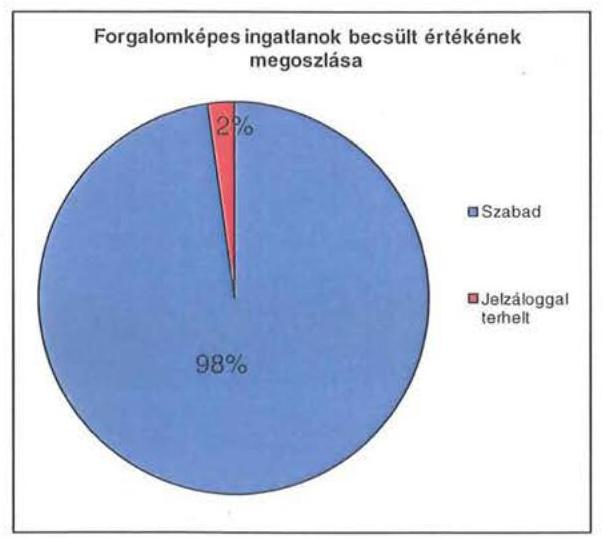

Az Önkormányzat kötelezettségeinek állományát 2010. december 31-én és várható alakulását a kötelezettségek lejártáig az alábbi táblázat részletezi:

---

| Megnevezés | Allomány 2010. dec. 31 -én |  |  | Várható kötelezettség 20112015. években |  |  | Várható kötelezettség 2014.   évet követően |  |  |
| :--: | :--: | :--: | :--: | :--: | :--: | :--: | :--: | :--: | :--: |
|  | $\begin{aligned} & \text { HUF-ban } \\ & \text { (militá } 31- \\ & \text { ben) } \end{aligned}$ | Osvizéban (összege) | Osvizet   nem | HUF-ban   (militá 31-   ben) | Osvizéban (összege) | Osvizet   nem | $\begin{aligned} & \text { HUF-ban } \\ & \text { (militá 31- } \\ & \text { ben) } \end{aligned}$ | Osvizéban (összege) | Osvizet   nem |
| Pénzintézeti kötelezettségek |  |  |  |  |  |  |  |  |  |
| Pénzinté lejáratú bérésé | 196 |  | HUF | 64 |  | HUF | 177 |  | HUF |
| Szérebapok (Szebesésé 2017. Szekesésé 2018) |  | 19432153 | CHF |  | 2429926 | CHF |  | 18329264 | CHF |
| Legesedésézetésé | 335 |  | HUF | 535 |  | HUF |  |  |  |
| Pénzintézeti kötelezettségek összesen HUF-ben | 521 |  | HUF | 587 |  | HUF | 177 |  | HUF |
| Pénzintézeti kötelezettségek összesen CHF-ben |  | 19433153 | CHF |  | 2429926 | CHF |  | 18329264 | CHF |
| Hizbettékok |  |  |  |  |  |  |  |  |  |
| Észesség | 166 |  | HUF |  |  |  |  |  |  |
| Biztositékok összesen | 788 |  | HUF |  |  |  |  |  |  |
| Szállítói tartozás | 409 |  | HUF | 409 |  | HUF |  |  |  |
| Jogcél kötelezettségek |  |  |  |  |  |  |  |  |  |
| a 15 -a és egyéb szervek felé fennálló kötelezettségek | 260 |  | HUF | 191 |  | HUF | 148 |  | HUF |
| Jogcéls végzéssel hozlat és ki nem fizetett kötelezettsége ${ }^{55}$ | 8 |  | HUF | 8 |  | HUF |  |  |  |

* A peres eljárásokra vonatkozó adatok a 2011. júzúni állapotot tükelnek

Az Önkormányzat 2010. december 31-én fennálló összes kötelezettségállománya alapján a 2011-2013. években az esedékes fizetési kötelezettségek várható összege 2429926 CHF és 995 millió Ft. A devizában fennálló fizetési kötelezettség a kötvények esedékes tőke- és kamatfizetési kötelezettsége. A forintban jelentkező fizetési kötelezettséget 387 millió Ft-ban a hosszú lejáratú és a folyószámlahitel, 160 millió Ft összegben a kizárólagos önkormányzati tulajdonú gazdasági társasága felé fennálló kölcsöntartozás esedékes tőketörlesztése és kamatfizetése, 31 millió Ft-ban gazdasági társasága veszteségpótlására vállalt kötelezettsége ${ }^{55}$, további 409 millió Ft-ban az év végi szállítói állomány, valamint 8 millió Ft összegben jogerős bírósági ítélet miatti kötelezettség alkotja.

A 2014. évtől a futamidők végéig várható kötelezettsége 325 millió Ft összegben a hosszú lejáratú hitel és a gazdasági társaságától kapott kölcsön, 18359264 CHF összegben a kötvények esedékes tőketörlesztési és kamatfizetési kötelezettségéből adódik.

Az Önkormányzat a jövőbeni kötelezettségeinek forrásait nem határozta meg. A 2011-2013 között esedékes kötelezettségek lehetséges forrásaként - az ellenőrzés megállapításai szerint - figyelembe vehető 248 millió Ft mérlegben kimutatott követelésállomány és 21 millió Ft tervezett kamatbevétel, valamint a Polgármesteri hivatal szabad folyószámlahitel-kerete, továbbá 3685 millió Ft becsült értékú forgalomképes ingatlanvagyon, melyből 82 millió Ft a pénzintézeti kötelezettséghez kapcsolódóan jelzáloggal terhelt. Ezek fedezetet nyújthatnak a kötelezettségekre. A további évekre szóló, jelenleg ismert pénzintézeti és egyéb kötelezettségekre figyelembe vehető forrás - az ellenőrzés megállapításai szerint - az évről évre keletkező múködési jövedelem lehet, amely azonban a 2010. évre minimális összegűre ( 61 millió Ft-ra) csökkent, valamint az Önkormányzat forgalomképes vagyonának egy része. Ezek alapján, hosszútávon a kötelezettségek teljesítése bizonytalan.

[^0]
[^0]:    ${ }^{55}$ A Közgyűlés 91/2011. (V. 18.) számú határozata

---

A legalább 75\%-os Önkormányzati tulajdonban lévő gazdasági társaságok kötelezettségeinek állományát 2010. december 31-én, és várható alakulását a kötelezettségek lejártáig az alábbi táblázat részletezi:

| Megnevezés | Állomány 2010. dec.31-én |  |  | Várható kötelezettség 20112013. években |  |  | Várható kötelezettség 2014.   évet követően |  |  |
| :--: | :--: | :--: | :--: | :--: | :--: | :--: | :--: | :--: | :--: |
|  | $\begin{gathered} \text { 2010-ban } \\ \text { (millió Ft- } \\ \text { ben) } \end{gathered}$ | Dovizában (összegi) | Doviza   2010. | 2010-ban   (millió Ft-   ben) | Dovizában (összegi) | Doviza   2010.   2010. | 2010-ban   (millió Ft-   ben) | Dovizában (összegi) | Doviza   2010. |
| Pénzintézeti kötelezettségek |  |  |  |  |  |  |  |  |  |
| Hosszú lejáratú hitefiek | 286 |  | 2010 | 182 |  | 2010 | 202 |  | 2010 |
| Kötvény (Csatornamú 202) |  | 4366375 | 2010 |  | 1229252 | 2010 |  | 2229928 | 2010 |
| Rövid lejáratú hitefiek |  |  |  | 1 |  | 2010 | 2 |  | 2010 |
| Pénzintézeti kötelezettségek összesen 2010-ban | 286 |  | 2010 | 310 |  | 2010 | 202 |  | 2010 |
| Pénzintézeti kötelezettségek összesen 2010-ben |  | 4366375 | 2010 |  | 1229252 | 2010 |  | 2229928 | 2010 |
| Szállítót tartozó | 402 |  | 2010 | 402 |  | 2010 |  |  |  |

A CHF-ben fennálló kötelezettség a Vízmú Kft. által kibocsátott kötvényből, a forintban fennálló pénzintézeti kötelezettségek az Alisca Terra Kft., a Szekszárdi Vagyonkezelő Kft., és a Szekszárdi Diákétkeztetési Kft. által felvett fejlesztési célú hitelekből keletkeztek.

- A Vízmú Kft. 2008. 04.24.-én CHF alapú, változó kamatozású (3 havi CHF LIBOR $+1,2 \%$ kamatfelár) kötvényt bocsátott ki. A „Csatornamú 2023" Kötvény futamideje 15 év, a kamat és tőkefizetés a kibocsátás negyedévének utolsó napjától, negyedévente esedékes, a 2010. december 31-én fennálló tőketartozás 4366375 CHF volt.
- Az Alisca Terra Kft. 2008. január 15-én 30000 ezer Ft összegű, 3 éves futamidejú, változó kamatozású (RIVHK ${ }^{56}-1,75 \%$ ) hitelt vett igénybe, melyből 2010. december 31-én 2500 ezer Ft tőketartozás állt fenn, a hitel 2011-ben teljes kiegyenlítésre kerül.
- A Szekszárdi Vagyonkezelő Kft. 2010. október 18-án 85000 ezer Ft változó kamatozású (3 havi BUBOR $+2,4 \%$ ), 10 éves futamidejú hitelt vett fel, melyből a 2010. december 31-én fennálló tőketartozás 82875 ezer Ft volt.
- A Szekszárdi Diákétkeztetési Kft. a 2010. szeptember 3-án megkötött 594707 ezer Ft összegű bankhitel-keretszerződés alapján, három hitelszerződéssel 2010. december 31-ig összesen 504036 ezer Ft hitelt vett igénybe, a 2011. év I. negyedév végéig a fennmaradó 90671 ezer Ft hitelösszeg folyósítása is megtörtént. A hitelek változó kamatozásúak ${ }^{57}$, kettő 15 éves futamidejú, a 120529 ezer Ft összegű hitel rövid lejáratú, teljes kiegyenlítése a 2011. évben esedékes.

A gazdasági társaságok 2010. december 31-én fennálló, illetve a december 31ig megkötött hitelszerződések alapján a helyszíni ellenőrzés megkezdéséig keletkezett összes ismert pénzintézeti kötelezettségállománya ${ }^{58}$ után a jövőbeni kamat és tőketörlesztési, valamint egyéb díjfizetési kötelezettség a 2011-2013. évek között 310 millió Ft és 1229252 CHF , további kötelezettségként jelentke-

[^0]
[^0]:    ${ }^{56}$ Raiffeisen Irányadó Vállalati Hitelkamatláb.
    57 A 361586 ezer Ft összegű hitel kamata 3 havi EURIBOR + 4\% kamatfelár, a 112592 ezer Ft összegű hitel kamata 3 havi BUBOR $+4,6 \%$ kamatfelár, a 120529 ezer Ft összegű hitel kamata 1 havi BUBOR $+4,6 \%$ kamatfelár.
    ${ }^{58}$ A jövőbeni várható kötelezettségeket a 2010. december 31-ig megkötött hitelszerződések alapján a helyszíni ellenőrzés megkezdéséig igénybevett hitelösszegek alapján határoztuk meg.

---

zik 402 millió Ft év végén fennálló szállítói tartozás. A 2014. évtől a futamidők végéig - az ismert pénzintézeti kötelezettségek alapján - a várható fizetési kötelezettség összesen 568 millió Ft és 3529928 CHF.

Az Önkormányzat korlátlan felelősséggel tartozik felszámolás esetén a gazdasági társaságokról szóló 2006. évi IV. törvény 54. § (2) bekezdésének megfelelően a legalább 75\%-os tulajdoni hányadú gazdasági társaságának (amelyben az 52. § (2) bekezdése alapján a szavazatok legalább 75\%-ával rendelkezik), illetve a csődeljárásról és a felszámolási eljárásról szóló 1991. XLIIX törvény 63. § (2) bekezdése alapján a kizárólagos önkormányzati tulajdonú gazdasági társaság minden olyan kötelezettségéért, amelynek kielégítését a felszámolási eljárás során az adós társaság vagyona nem fedez, ha a hitelezőinek a felszámolási eljárás során benyújtott keresete alapján a bíróság - az adós társaság felé érvényesített tartósan hátrányos üzletpolitikájára figyelemmel - megállapítja az önkormányzat korlátlan és teljes felelősségét. Az Önkormányzat számára pénzügyi kockázatot jelent, hogy felszámolás esetén a bíróság megállapíthatja az Önkormányzat korlátlan és teljes felelősségét a kötelezettségekkel érintett hét - 75\%-ot meghaladóan önkormányzati tulajdonban lévő - gazdasági társaság összes fent részletezett kötelezettsége után.

A helyszíni ellenőrzés lezárásának időpontjában hét olyan bírósági eljárás van folyamatban ${ }^{59}$, melyekből az Önkormányzatnak alperesként, elmarasztaló jogerős ítéletek esetén - a perértékek alapján - 25 millió Ft kötelezettsége keletkezhet, mely összeg az Önkormányzat gazdálkodásában alacsony kockázatot jelent, mert a 2011. évre tervezett múködési célú költségvetési kiadásoknak ( 7832 millió Ft) mindössze $0,3 \%$-át jelenti.

A vizsgált időszakban az Önkormányzatnál nem történt meg annak felmérése, hogy az eszközök elhasználódása, amortizációja fedezetének biztosítása mekkora forrásokat igényel. Az Önkormányzat a 2007-2010. években a tárgyi eszközök után együttesen 2633 millió Ft összegű értékcsökkenést számolt el, a felújítási kiadások között 1251 millió Ft-ot, a kimutatott értékcsökkenésnek $47,5 \%$-át számolták el. Az elhasználódott eszközök pótlására az Önkormányzat tartalékot nem képzett, külön alapot nem hozott létre ${ }^{60}$, a felújításokra, eszközök pótlására elsősorban az intézmények működőképességének biztosítása érdekében, illetve a szakhatósági előírások figyelembevételével - döntően a pályázati rendszerből elnyerhető források által meghatározottan az Önkormányzat pénzügyi lehetőségeinek függvényében került sor. Az Önkormányzat befektetett tárgyi eszközeinek használhatósági foka ${ }^{61}$ az áttekintett időszakban 5 százalékponttal, $89 \%$-ról $84 \%$-ra csökkent.

[^0]
[^0]:    ${ }^{59}$ Hat munkaügyi és egy kártérítési per.
    ${ }^{60}$ Amortizációs alap képzésére az önkormányzatokat jogszabály nem kötelezi.
    ${ }^{61}$ A befektetett tárgyi eszközök nettó értékének és bruttó értékének aránya.

---

# 4. A PÉNZÜGYI EGYENSÚLY MEGTEREMTÉSE ÉrDEKÉBEN HOZOTT INTÉZKEDÉSEK 

Az Önkormányzat folyamatosan intézkedéseket tett, hogy alkalmazkodjon a finanszírozási rendszer változása miatti forráscsökkenéshez. Ennek érdekében bevételnövelő és kiadáscsökkentő döntéseket hozott.

A 2007-2010. években végrehajtott kiadáscsökkentő és bevételnövelő intézkedések a feladatellátás racionalizálását, szakmai színvonalának emelését, de kiemelten az Önkormányzat pénzügyi helyzetének javítását célozták. A legjelentősebb mértékű kiadási megtakarítást az álláshely csökkentésekkel érték el, emellett sikerült megőrizniük az intézmények gazdálkodásának stabilitását.

A kiadáscsökkentő intézkedések hatását beavatkozási területenként az alábbi táblázat szemlélteti ${ }^{62}$ :

| Érvényesített   kiadáscsökkentés   területei | Személyi   juttatás és   járulékai | Dologi   múködési   kiadások | Pénzeszköz   átadások,   támogatások | Összesen |
| :-- | --: | --: | --: | --: |
| Az intézményeknél | -1379588 | 513358 |  | -866230 |
| A Közgyűlés múködése | 0 | 0 | 0 | 0 |
| A Polgármesteri hivatalnál | -93878 | 0 |  | -93878 |
| Összesen | -1473466 | 513358 | 0 | $\mathbf{- 9 6 0 1 0 8}$ |

Az intézményeknél 866230 ezer Ft megtakarítást számszerűsítettek a kiadáscsökkentő intézkedések eredményeként. Az intézmények vonatkozásában az áttekintett időszakban a személyi juttatások és járulékaik - a létszámcsökkentési döntések eredményeként - 1379588 ezer Ft-tal csökkentek, melyet üres álláshelyek megszüntetésével, illetve átszervezéssel indokolt az Önkormányzat. Az egyes intézmény-üzemeltetési feladatok kiszervezése, a feladat elvégzésére kötött szerződések egyúttal a dologi kiadások 513358 ezer Ft összegű emelkedését vonták maguk után, így az intézményi megtakarítások összességében 866230 ezer Ft összegben realizálódtak.

A kiadáscsökkentések eredményeként a Polgármesteri hivatalban kimutatott megtakarítás 94 millió Ft volt, amelynek teljes összege létszámcsökkentési döntésen alapult. A 2007-2010. években végrehajtott kiadáscsökkentő intézkedések hatásaként összesen 960 millió Ft megtakarítás volt kimutatható.

[^0]
[^0]:    ${ }^{62}$ A táblázat negatív előjellel mutatja be a tényleges kiadáscsökkentés hatását, a pozitív előjelű számok a dologi működési kiadások - a kiszervezett feladatokra kötött szerződések miatti - többletkiadását mutatják.

---

A 2007-2010. éveket érintő létszámcsökkentő intézkedéseit beavatkozási területenként az alábbiak részletezik:

| Megnevezés (adatok fő-ben) |  | Közoktatás | Szociális és gyermekvédelem | Egészségigy | Polgármesteri hivatal | Egyéb | Összesen |
| :--: | :--: | :--: | :--: | :--: | :--: | :--: | :--: |
| Megszüntetett álláshelyek száma |  | 199,5 | 11,5 | 3 | 14 | 31 | 259 |
| ebből: | üres álláshelyek száma | 7 |  |  |  |  | 7 |
|  | szakmai álláshelyek száma | 92 |  |  | 14 |  | 106 |
|  | intézmény-üzemeltetéssel kapcsolatos álláshelyek száma | 100,5 | 11,5 | 3 |  | 31 | 146 |
| 2007. január 1-jén indító létszám |  | 793,5 | 165,5 | 32 | 165 | 164 | 1320 |
| 2010. december 31-én záró létszám |  | 594 | 154 | 29 | 151 | 133 | 1061 |

A létszámcsökkentő intézkedések következtében 2007-2011 között a Polgármesteri hivatalnál és az intézményeknél összesen 259 álláshelyet (ebből 7 üres állást) szüntettek meg, a 2007. évi induló létszám 19,6\%-át, amelynek $41 \%$-a (106 fő) ágazati szakmai, $56 \%$-a (146 fő) intézményüzemeltetéshez, fenntartáshoz kapcsolódó álláshely volt.

A helyi szervezési intézkedések végrehajtásához az Önkormányzat az áttekintett időszak alatt 60 millió Ft központi költségvetési támogatásban részesült, amelynek felhasználásával 117 fő álláshelyet tartósan leépített. A létszámcsökkenés $54,8 \%$-ához ( 142 fő) központi támogatás nem kapcsolódott, mivel a dolgozókat az Önkormányzat gazdasági társaságainál továbbfoglalkoztatták.

Az Önkormányzatnál a bevételnövelésre irányuló intézkedések kizárólag az önkormányzati tulajdonú ingatlanok, területek értékesítéséhez kapcsolódtak, melyek számszerűsített összege az áttekintett időszakban az Önkormányzat kimutatása szerint 658,8 millió Ft volt.

---

Az önkormányzat által a 2007-2010. években érvényesített bevételnövelő intézkedések részletezése
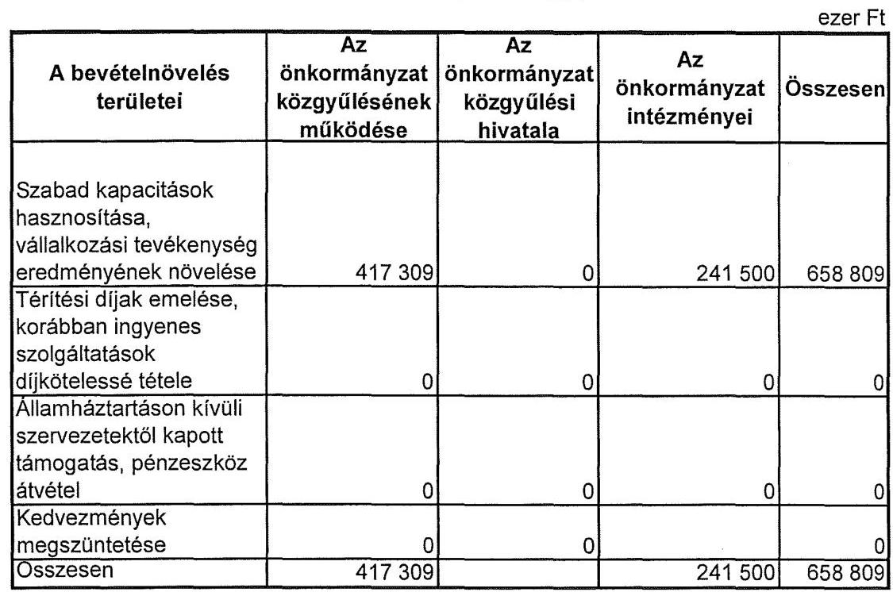

A bevételnövelésre irányuló intézkedések számszerúsített összegének ( 659 millió Ft) 36,7\%-a az intézményeknél, 63,3\%-a Polgármesteri hivatalnál realizálódott önkormányzati ingatlanok, területek eladásából. A 2011. évben a bevételnövelő intézkedésekhez kapcsolódó tervezett többletbevétel összege összesen 51 millió Ft.

Az Önkormányzat kimutatása szerint a kiadáscsökkentő és bevételnövelő intézkedései összességében 1618,8 millió Ft-ot eredményeztek. Az Önkormányzat központi költségvetési támogatása, az átengedett bevételek, valamint az illeték bevételek összege évente folyamatosan csökkent, e kieső források összege az áttekintett időszakban 1095 millió Ft volt. Az Önkormányzat a csökkenő állami támogatások és átengedett bevételek hatását a kiadáscsökkentő és bevételnövelő intézkedésekkel ellensúlyozta.

# 5. A HELYI ÖNKORMÁNYZATOK GAZDÁLKODÁSI RENDSZERÉNEK 2008. ÉVI ELLENŐRZÉSE SORÁN A PÉNZÜGYI EGYENSÚLY JAVÍTÁSÁRA TETT SZABÁLYSZERŰSÉGI ÉS CÉLSZERŰSÉGI JAVASLATOK HASZNOSULÁSA 

Az ÁSZ az Önkormányzat gazdálkodási rendszerét 2008. évben ellenőrizte átfogó jelleggel. A számvevőszéki ellenőrzés megállapításait, javaslatait a Közgyűlés a 2008. szeptember 25-i ülésén megtárgyalta, és jóváhagyta ${ }^{63}$ a hiá-

[^0]
[^0]:    ${ }^{63}$ a Közgyűlés 247/2008. (IX. 25.) számú határozata

---

nyosságok megszüntetésére készített intézkedési tervet. Az utóellenőrzés a korábbi ÁSZ ellenőrzés során a pénzügyi egyensúly javítására tett négy szabályszerűségi és egy célszerűségi javaslat hasznosítására irányult.

A négy szabályszerűségi javaslat közül hármat hasznosítottak, egyet nem valósítottak meg. A 2008. évi költségvetési rendeletben - annak szeptember 25-i módosítása során - az ÁSZ javaslatának megfelelően szerepeltették az európai uniós forrásokkal megvalósuló fejlesztések tárgyévi kiadási előirányzatait, továbbá a többéves kihatással járó feladatok között bemutatták az európai uniós támogatásokkal megvalósuló fejlesztési feladatokat számszerúsítve, éves bontásban. Az ÁSZ javaslata alapján 2009. január 1-jétől kiegészítették a KESZ FEUVE szabályzatát az intézményi pénzmaradványok megállapítása szabályszerűségének, az eredeti és a módosított előirányzatok, valamint a teljesítések eltérései indokoltságának, az intézményi számszaki beszámolók belső összhangjának felülvizsgálatával.

Az ÁSZ az Ötv. 88. § (1) bekezdés b) pontjának előírása alapján intézkedés megtételét javasolta annak érdekében, hogy a kötvény fedezetéül az Önkormányzat törzsvagyona és a normatív állami hozzájárulás, az állami támogatás, az szja, valamint az államháztartáson belülről működési célra átvett bevételek ne legyenek felhasználhatóak. A kötvény fedezetéül felajánlott azonnali beszedési megbízásokkal kapcsolatosan az Önkormányzat - a K\&H Bank írásos tájékoztatása alapján - intézkedés megtételét nem tartotta szükségesnek. A javaslatnak az intézkedési tervből történő kihagyását az ÁSZ nem fogadta el, az ezzel kapcsolatos álláspontjáról az ÁSZ elnöke a 2008. november 28 -án kelt levelében értesítette a polgármestert.

A célszerűségi javaslat a felhalmozási célú bevételek és kiadások körültekintő tervezésére irányult. A javaslat hasznosítására az intézkedési tervben nem határoztak meg feladatot. A Közgyűlés részére készített előterjesztésben rögzítették, hogy a költségvetés készítése során a lehető legnagyobb körültekintéssel tervezik a felhalmozási célú bevételeket és kiadásokat.

Budapest, 2011. december „ 4 "

Melléklet: $\quad 9 \mathrm{db}$
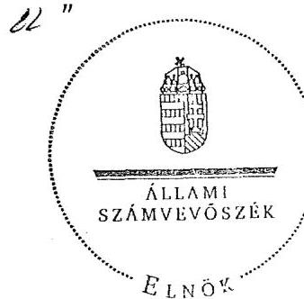

Domokos László
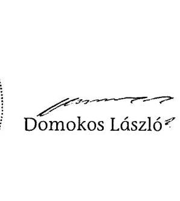

---

.

---

Szekszárd Megyei Jogú Város Önkormányzat

1. sz. melléklet

Működési és felhalmozási célú hiány/többlet az önkormányzat rendeleteiben

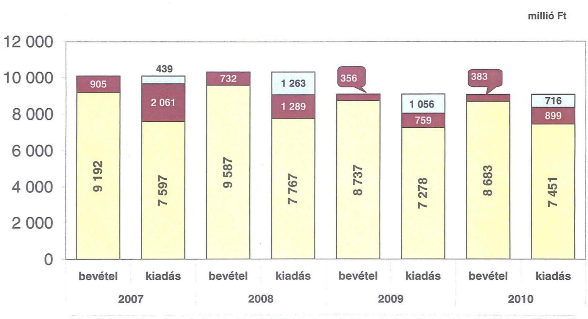

millió Ft

|   | bevétel | kiadás | bevétel | kiadás | bevétel | kiadás | bevétel | kiadás  |
| --- | --- | --- | --- | --- | --- | --- | --- | --- |
|   | 12 000 | 905 | 2 061 | 732 | 1 263 | 356 | 1 056 | 716  |
|   | 8 000 | 6 000 | 439 | 2 061 | 1 289 | 759 | 2 099 | 899  |
|   | 6 000 | 4 000 | 265 | 2 061 | 1 263 | 759 | 2 099 | 899  |
|   | 2 000 | 0 | 0 | 0 | 0 | 0 | 0 | 0  |

|   | bevétel | kiadás | bevétel | kiadás | bevétel | kiadás | bevétel | kiadás  |
| --- | --- | --- | --- | --- | --- | --- | --- | --- |
|   | 2007 | 2008 | 2009 | 2010 |  |  |  |   |

működési bevételek és kiadások felhalmozási bevételek és kiadások hiány/többlet

---

|  1. FOLYÓ KÖLTSÉGVETÉS* | 2007. év | 2008. év | 2009. év | 2010. év  |
| --- | --- | --- | --- | --- |
|  1.1.1. Saját működési bevételek | 2 584 761 | 2 594 421 | 3 069 190 | 2 940 811  |
|  1.1.2. Költségvetési támogatás | 2 376 511 | 2 232 219 | 2 903 874 | 2 725 815  |
|  1.1.3. Anegedett bevételek | 1 779 487 | 905 895 | 877 220 | 967 887  |
|  1.1.4. Állombázatráson belülről kapott támogatások | 337 265 | 573 897 | 692 665 | 781 087  |
|  1.1.5. EU-nő és külföldről kapott bevételek | 694 | 1 705 | 8 390 | 0  |
|  1.1.6. Állombázatráson kívülről kapott bevételek | 27 641 | 27 393 | 18 525 | 61 920  |
|  1.1.7. Előző évi pénzmozdvány átvetet | 105 920 | 465 178 | 228 524 | 269 046  |
|  1.1. Folyó bevételek = 1.1.1.+1.1.2.+1.1.3.+1.1.4.+1.1.5.+1.1.6.+1.1.7. | 7 216 076 | 7 809 707 | 7 738 388 | 7 746 566  |
|  1.2.1. Működési kiadások komatkiadások nélkül | 6 191 929 | 6 229 505 | 6 330 537 | 6 847 073  |
|  1.2.2. Állombázatráson belülre átadott pénzeselektől | 70 160 | 75 605 | 125 534 | 36 363  |
|  1.2.2.1. vállalkozásaknál | 33 940 | 38 784 | 30 306 | 45 636  |
|  1.2.2.2. EU-nak, illetve külföldre | 38 | 405 | 0 | 0  |
|  1.2.2.3. magáncseneljesknek | 335 043 | 359 049 | 338 085 | 360 131  |
|  1.2.3.4. megezői szervezetének | 96 525 | 83 263 | 75 636 | 67 242  |
|  1.2.4. Tizenoforkiadások (=1.2.3.1+1.2.3.2+1.2.3.3+1.2.3.4) | 465 546 | 481 505 | 444 111 | 473 109  |
|  1.2.5. Kismélkiadások | 75 707 | 100 212 | 102 960 | 60 592  |
|  1.2.6. Előző évi pénzmozdvány átadás | 109 920 | 465 178 | 228 524 | 269 046  |
|  1.3. Folyó kiadások = 1.2.1.+1.2.2.+1.2.3.+1.2.4.+1.2.5. | 6 913 262 | 7 352 015 | 7 231 666 | 7 686 185  |
|  1.3. Folyó költségvetés egyenlege MŰKÖDÉSI JÖVEDELEM (1.1. - 1.2.) | 302 814 | 448 694 | 506 722 | 60 381  |
|  2. FELHALMOZÁSI KÖLTSÉGVETÉS** |  |  |  |   |
|  2.1.1. Saját tökebevételek | 101 839 | 552 976 | 76 331 | 53 631  |
|  2.1.2. Állombázatráson belülről kapott támogatások | 350 455 | 155 854 | 140 680 | 70 879  |
|  2.1.3. EU-nő és külföldről kapott támogatások | 0 | 0 | 20 205 | 20 113  |
|  2.1.4. Állombázatráson kívülről kapott támogatások | 159 582 | 112 680 | 999 | 558  |
|  2.1. Felhalmozási bevételek (=2.1.1.+2.1.2+2.1.3+2.1.4.) | 611 876 | 821 510 | 238 215 | 145 181  |
|  2.2.1. Saját forrokézási kiadás átfayal | 700 614 | 356 951 | 316 514 | 419 688  |
|  2.2.2. Saját felajátási kiadás átfayal | 313 876 | 520 684 | 306 466 | 241 923  |
|  2.2.3. Állombázatráson belülre átadott pénzeselek | 38 684 | 48 995 | 72 382 | 46 068  |
|  2.2.4. EU-nak és külföldnek adott pénzeselektől | 0 | 0 | 0 | 0  |
|  2.2.5. Állombázatráson kívülre adott pénzeselektől | 132 200 | 489 477 | 37 319 | 92 966  |
|  2.2.6. Befektetési célú részesedések vásárlása | 879 305 | 270 713 | 25 009 | 75 100  |
|  2.3. Felhalmozási kiadások (=2.2.1.+2.2.2.+2.2.3.+2.2.4.+2.2.5.+2.2.6.) | 2 064 679 | 1 686 820 | 757 690 | 875 745  |
|  2.3. Felhalmozási költségvetés egyenlege (2.1. - 2.2.) | -1 452 803 | -865 310 | -519 475 | -730 564  |
|  3. Finanszírozási műveletek nélküli (GFS) pozíció(1.3.+2.3.) | -1 149 989 | -416 616 | -12 753 | -670 183  |
|  4. Finanszírozási műveletek |  |  |  |   |
|  4.1. Hitelfelvétel | 149 521 | 0 | 230 000 | 435 352  |
|  4.2. Hitelfelvételre | 660 808 | 16 890 | 43 512 | 53 512  |
|  4.3. Forgatási és befektetési célú értékpapírok kibocsátása | 2 000 000 | 1 000 000 | 0 | 0  |
|  4.4. Forgatási és befektetési célú értékpapírok bevidéése | 0 | 0 | 0 | 0  |
|  4.5. Forgatási és befektetési célú értékpapírok értékesítése | 0 | 0 | 0 | 0  |
|  4.6. Forgatási és befektetési célú értékpapírok vásárlása | 0 | 0 | 0 | 0  |
|  4.7. Egyéb finanszírozási bevételek (függő, átfizet, kiegyenlítő) | 5 561 | -3 825 | -14 452 | -178 514  |
|  4.8. Egyéb finanszírozási kiadások (függő, átfizet, kiegyenlítő) | 24 585 | 121 538 | 4 156 | -46 048  |
|  4.9. Finanszírozási műveletek egyenlege (4.1. - 4.2.+4.3.-4.4+4.5.-4.6.+4.7.-4.8.) | 1 469 689 | 857 747 | 167 880 | 249 374  |
|  5. Tárgyévi pénzügyi pozíció változás (1.3.+ 2.3.+4.9.) | 319 700 | 441 131 | 155 127 | -420 809  |
|  6. Nettó működési jövedelem =működési jövedelem (1.3.) - töketörlesztés (4.2+4.4) | -357 994 | 431 804 | 463 210 | 6 869  |
|  TÁJÉKOZTATÓ ADATOK |  |  |  |   |
|  Összes kötelezettség | 2 971 077 | 3 926 930 | 4 295 590 | 4 414 393  |
|  ebből rövid hjávető | 738 019 | 707 340 | 932 811 | 1 027 229  |
|  Összes szállási kötelezettség | 431 466 | 387 766 | 537 616 | 409 243  |
|  ebből kijárt (tanáróvámpívő) | 0 | 0 | 0 | 0  |
|  Pénz és időegtesi kötelezettség (adósság) | 2 239 866 | 3 222 976 | 3 409 464 | 3 791 303  |
|  ebből rövid hjávető | 16 890 | 13 512 | 53 512 | 408 863  |
|  PPP nevelőfelből hátralévé kötelezettség állomány |  |  |  |   |
|  ebből kijárt (anfajlhatási díj) miatti kötelezettség |  |  |  |   |
|  Felcészésfoklási napi időgjes állománya (tanáróvámpívő) | 240 520 | 2995 | 54 353 | 27 287  |
|  Likvidfokt napi időgjes állománya (tanáróvámpívő) |  |  |  |   |
|  Mambahárfokt napi időgjes állománya (tanáróvámpívő) | 102 136 | 12 110 | 44 833 | 0  |
|  Keztség és garanciaválhdások (tanáróvámpívő) | 0 | 0 | 108 662 | 679 707  |
|  Jegyrőz bírósági felteletekől adódó kötelezettségek (tanáróvámpívő) | 0 | 0 | 0 | 0  |
|  Finanszírozásba beosztató zsebősök | 374 867 | 815 998 | 971 125 | 550 316  |
|  Tartós hőrévizetszet megintéződő értékpapírok és végi állománya | 0 | 0 | 0 | 0  |
|  Hozzót hjávető kockfustétek és végi állománya | 0 | 0 | 0 | 0  |
|  Értékpapírok és végi állománya | 0 | 0 | 0 | 0  |
|  Pénzeselekők és végi állománya (idegen pénzeselekők nélkül) | 374 867 | 815 998 | 971 125 | 550 316  |

- Bevételekben nem tétül, a kiadásokban nem jelenik meg az amortizáció, a vagyoni helyzetet az egység befolyásolja

* Bevételekben vagyon megőrzésre és hővítésre fordítható források.

---

Szekesźni Węgiel Jogi Vízva Österménysola

Sz. казка неділя

|   |  |  |  |  |  |  |  |  |  |  |  |  |  |  |  |  |  |  |  |  |  |  |  |  |  |  |  |  |  |  |  |  |  |  |  |  |  |  |  |  |  |  |  |  |  |  |  |  |  |  |  |  |  |  |  |  |  |  |  |  |  |  |  |  |  |  |  |  |  |  |  |  |  |  |  |  |  |  |  |  |  |  |  |  |  |  |  |  |  |  |  |  |  |  |  |  |  |  |  | 

---

|   |  |  |  |  |  |  |  |  |  |  |  |  |  |  |  |  |  |  |  |  |  |  |  |  |  |  |  |  |  |  |  |  |  |  |  |  |  |  |  |  |  |  |  |  |  |  |  |  |  |  |  |  |  |  |  |  |  |  |  |  |  |  |  |  |  |  |  |  |  |  |  |  |  |  |  |  |  |  |  |  |  |  |  |  |  |  |  |  |  |  |  |  |  |  |  |  |  |  |  |  |  | 

---

# As Önkormányzat 2010. december 31-ös folyamatban lévő fejlesztési feladatokos kapcsolódó kötelezettségeinek összegzéséről

(A 2010. december 31-ig teljesített pénzügyi adatok alakulásáról)

|   |  |  |  |  |  |  |  |  |  |  |  |  |  |  |  |  |  |  |  |  |  |  |  |  |  |  |  |  |  |  |  |  |  |  |  |  |  |  |  |  |  |  |  |  |   |
| --- | --- | --- | --- | --- | --- | --- | --- | --- | --- | --- | --- | --- | --- | --- | --- | --- | --- | --- | --- | --- | --- | --- | --- | --- | --- | --- | --- | --- | --- | --- | --- | --- | --- | --- | --- | --- | --- | --- | --- | --- | --- | --- | --- | --- | --- |
|   |  |  |  |  |  |  |  |  |  |  |  |  |  |  |  |  |  |  |  |  |  |  |  |  |  |  |  |  |  |  |  |  |  |  |  |  |  |  |  |  |  |  |  |   |
|   |  |  |  |  |  |  |  |  |  |  |  |  |  |  |  |  |  |  |  |  |  |  |  |  |  |  |  |  |  |  |  |  |  |  |  |  |  |  |  |  |  |  |  |   |
|   |  |  |  |  |  |  |  |  |  |  |  |  |  |  |  |  |  |  |  |  |  |  |  |  |  |  |  |  |  |  |  |  |  |  |  |  |  |  |  |  |  |  |  |   |
|   |  |  |  |  |  |  |  |  |  |  |  |  |  |  |  |  |  |  |  |  |  |  |  |  |  |  |  |  |  |  |  |  |  |  |  |  |  |  |  |  |  |  |  |   |
|   |  |  |  |  |  |  |  |  |  |  |  |  |  |  |  |  |  |  |  |  |  |  |  |  |  |  |  |  |  |  |  |  |  |  |  |  |  |  |  |  |  |  |  |   |
|   |  |  |  |  |  |  |  |  |  |  |  |  |  |  |  |  |  |  |  |  |  |  |  |  |  |  |  |  |  |  |  |  |  |  |  |  |  |  |  |  |  |  |  |   |
|   |  |  |  |  |  |  |  |  |  |  |  |  |  |  |  |  |  |  |  |  |  |  |  |  |  |  |  |  |  |  |  |  |  |  |  |  |  |  |  |  |  |  |  |   |
|   |  |  |  |  |  |  |  |  |  |  |  |  |  |  |  |  |  |  |  |  |  |  |  |  |  |  |  |  |  |  |  |  |  |  |  |  |  |  |  |  |  |  |  |   |
|   |  |  |  |  |  |  |  |  |  |  |  |  |  |  |  |  |  |  |  |  |  |  |  |  |  |  |  |  |  |  |  |  |  |  |  |  |  |  |  |  |  |  |  |   |
|   |  |  |  |  |  |  |  |  |  |  |  |  |  |  |  |  |  |  |  |  |  |  |  |  |  |  |  |  |  |  |  |  |  |  |  |  |  |  |  |  |  |  |  |   |
|   |  |  |  |  |  |  |  |  |  |  |  |  |  |  |  |  |  |  |  |  |  |  |  |  |  |  |  |  |  |  |  |  |  |  |  |  |  |  |  |  |  |  |  |   |
|   |  |  |  |  |  |  |  |  |  |  |  |  |  |  |  |  |  |  |  |  |  |  |  |  |  |  |  |  |  |  |  |  |  |  |  |  |  |  |  |  |  |  |  |   |
|   |  |  |  |  |  |  |  |  |  |  |  |  |  |  |  |  |  |  |  |  |  |  |  |  |  |  |  |  |  |  |  |  |  |  |  |  |  |  |  |  |  |  |  |   |
|   |  |  |  |  |  |  |  |  |  |  |  |  |  |  |  |  |  |  |  |  |  |  |  |  |  |  |  |  |  |  |  |  |  |  |  |  |  |  |  |  |  |  |  |   |
|   |  |  |  |  |  |  |  |  |  |  |  |  |  |  |  |  |  |  |  |  |  |  |  |  |  |  |  |  |  |  |  |  |  |  |  |  |  |  |  |  |  |  |  |   |
|   |  |  |  |  |  |  |  |  |  |  |  |  |  |  |  |  |  |  |  |  |  |  |  |  |  |  |  |  |  |  |  |  |  |  |  |  |  |  |  |  |  |  |  |   |
|   |  |  |  |  |  |  |  |  |  |  |  |  |  |  |  |  |  |  |  |  |  |  |  |  |  |  |  |  |  |  |  |  |  |  |  |  |  |  |  |  |  |  |  |   |
|   |  |  |  |  |  |  |  |  |  |  |  |  |  |  |  |  |  |  |  |  |  |  |  |  |  |  |  |  |  |  |  |  |  |  |  |  |  |  |  |  |  |  |  |   |
|   |  |  |  |  |  |  |  |  |  |  |  |  |  |  |  |  |  |  |  |  |  |  |  |  |  |  |  |  |  |  |  |  |  |  |  |  |  |  |  |  |  |  |  |   |
|   |  |  |  |  |  |  |  |  |  |  |  |  |  |  |  |  |  |  |  |  |  |  |  |  |  |  |  |  |  |  |  |  |  |  |  |  |  |  |  |  |  |  |  |   |
|   |  |  |  |  |  |  |  |  |  |  |  |  |  |  |  |  |  |  |  |  |  |  |  |  |  |  |  |  |  |  |  |  |  |  |  |  |  |  |  |  |  |  |  |   |
|   |  |  |  |  |  |  |  |  |  |  |  |  |  |  |  |  |  |  |  |  |  |  |  |  |  |  |  |  |  |  |  |  |  |  |  |  |  |  |  |  |  |  |  |   |
|   |  |  |  |  |  |  |  |  |  |  |  |  |  |  |  |  |  |  |  |  |  |  |  |  |  |  |  |  |  |  |  |  |  |  |  |  |  |  |  |  |  |  |  |   |
|   |  |  |  |  |  |  |  |  |  |  |  |  |  |  |  |  |  |  |  |  |  |  |  |  |  |  |  |  |  |  |  |  |  |  |  |  |  |  |  |  |  |  |  |   |
|   |  |  |  |  |  |  |  |  |  |  |  |  |  |  |  |  |  |  |  |  |  |  |  |  |  |  |  |  |  |  |  |  |  |  |  |  |  |  |  |  |  |  |  |   |
|   |  |  |  |  |  |  |  |  |  |  |  |  |  |  |  |  |  |  |  |  |  |  |  |  |  |  |  |  |  |  |  |  |  |  |  |  |  |  |  |  |  |  |  |   |
|   |  |  |  |  |  |  |  |  |  |  |  |  |  |  |  |  |  |  |  |  |  |  |  |  |  |  |  |  |  |  |  |  |  |  |  |  |  |  |  |  |  |  |  |   |
|   |  |  |  |  |  |  |  |  |  |  |  |  |  |  |  |  |  |  |  |  |  |  |  |  |  |  |  |  |  |  |  |  |  |  |  |  |  |  |  |  |  |  |  |   |
|   |  |  |  |  |  |  |  |  |  |  |  |  |  |  |  |  |  |  |  |  |  |  |  |  |  |  |  |  |  |  |  |  |  |  |  |  |  |  |  |  |  |  |  |   |
|   |  |  |  |  |  |  |  |  |  |  |  |  |  |  |  |  |  |  |  |  |  |  |  |  |  |  |  |  |  |  |  |  |  |  |  |  |  |  |  |  |  |  |  |   |
|   |  |  |  |  |  |  |  |  |  |  |  |  |  |  |  |  |  |  |  |  |  |  |  |  |  |  |  |  |  |  |  |  |  |  |  |  |  |  |  |  |  |  |  |   |
|   |

---

Eszcautori Hingon: Argo Vávos Örüsunároydó

Az Örüsunároylat 2015. december 31-én folyamatban lévő fejlesztési feladatokhoz Assosztikát 2015. évet követő kötelezettség-nájadkozható ésszorgolvairól (a folyamatban lévő fejlesztések 2015. oldal kötelezettség-nélkövetiél)

Aba Tízlet

|   |  |  |  |  |  |  |  |  |  |  |  |  |  |  |  |  |  |  |  |  |  |  |  |  |  |  |  |  |  |  |  |  |  |  |  |  |  |  |  |  |  |  |  |  |  |  |  |  |  |  |  |  |  |  |  |  |  |  |  |  |  |  |  |  |  |  |  |  |  |  |  |  |  |  |  |  |  |  |  |  |  |  |  |  |  |  |  |  |  |  |  |  |  |  |  |  |  |  |  | 

---

Szekszárd Megyei Jogú Város Önkormányzata

Az Önkormányzat beadott, elbírálás alatti pályázati forrásból megvalósuló fejlesztéseihez kapcsolódó kötelezettség-vállalásainak összegzéséről

szer Ft-ban

|   |  |  |  |  |  |  |  |  |  |  |  |  |  |  |  |  |  |  |  |  |  |  |  |  |  |  |  |  |  |  |  |  |  |  |  |  |  |  |  |  |  |  |  |  |  |  |  |  |  |  |  |  |   |
| --- | --- | --- | --- | --- | --- | --- | --- | --- | --- | --- | --- | --- | --- | --- | --- | --- | --- | --- | --- | --- | --- | --- | --- | --- | --- | --- | --- | --- | --- | --- | --- | --- | --- | --- | --- | --- | --- | --- | --- | --- | --- | --- | --- | --- | --- | --- | --- | --- | --- | --- | --- | --- | --- | --- | --- | --- | --- | --- |
|   |  |  |  |  |  |  |  |  |  |  |  |  |  |  |  |  |  |  |  |  |  |  |  |  |  |  |  |  |  |  |  |  |  |  |  |  |  |  |  |  |  |  |  |  |  |  |  |  |  |  |  |  |   |
|   |  | Fejlesztési feladat (beruházás, felújítás) |  |  |  |  |  |  |  |  |  |  |  |  |  |  |  |  |  |  |  |  |  |  |  |  |  |  |  |  |  |  |  |  |  |  |  |  |  |  |  |  |  |  |  |  |  |  |  |  |  |   |
|   |  |  |  |  |  |  |  |  |  |  |  |  |  |  |  |  |  |  |  |  |  |  |  |  |  |  |  |  |  |  |  |  |  |  |  |  |  |  |  |  |  |  |  |  |  |  |  |  |  |  |  |   |
|   |  |  |  |  |  |  |  |  |  |  |  |  |  |  |  |  |  |  |  |  |  |  |  |  |  |  |  |  |  |  |  |  |  |  |  |  |  |  |  |  |  |  |  |  |  |  |  |  |  |  |  |   |
|   |  |  |  |  |  |  |  |  |  |  |  |  |  |  |  |  |  |  |  |  |  |  |  |  |  |  |  |  |  |  |  |  |  |  |  |  |  |  |  |  |  |  |  |  |  |  |  |  |  |  |  |  |   |
|   |  |  |  |  |  |  |  |  |  |  |  |  |  |  |  |  |  |  |  |  |  |  |  |  |  |  |  |  |  |  |  |  |  |  |  |  |  |  |  |  |  |  |  |  |  |  |  |  |  |  |  |  |   |
|   |  |  |  |  |  |  |  |  |  |  |  |  |  |  |  |  |  |  |  |  |  |  |  |  |  |  |  |  |  |  |  |  |  |  |  |  |  |  |  |  |  |  |  |  |  |  |  |  |  |  |  |  |   |
|   |  |  |  |  |  |  |  |  |  |  |  |  |  |  |  |  |  |  |  |  |  |  |  |  |  |  |  |  |  |  |  |  |  |  |  |  |  |  |  |  |  |  |  |  |  |  |  |  |  |  |  |  |   |
|   |  |  |  |  |  |  |  |  |  |  |  |  |  |  |  |  |  |  |  |  |  |  |  |  |  |  |  |  |  |  |  |  |  |  |  |  |  |  |  |  |  |  |  |  |  |  |  |  |  |  |  |  |   |
|   |  |  |  |  |  |  |  |  |  |  |  |  |  |  |  |  |  |  |  |  |  |  |  |  |  |  |  |  |  |  |  |  |  |  |  |  |  |  |  |  |  |  |  |  |  |  |  |  |  |  |  |  |   |
|   |  |  |  |  |  |  |  |  |  |  |  |  |  |  |  |  |  |  |  |  |  |  |  |  |  |  |  |  |  |  |  |  |  |  |  |  |  |  |  |  |  |  |  |  |  |  |  |  |  |  |  |  |  |   |
|   |  |  |  |  |  |  |  |  |  |  |  |  |  |  |  |  |  |  |  |  |  |  |  |  |  |  |  |  |  |  |  |  |  |  |  |  |  |  |  |  |  |  |  |  |  |  |  |  |  |  |  |  |  |   |
|   |  |  |  |  |  |  |  |  |  |  |  |  |  |  |  |  |  |  |  |  |  |  |  |  |  |  |  |  |  |  |  |  |  |  |  |  |  |  |  |  |  |  |  |  |  |  |  |  |  |  |  |  |  |   |
|   |  |  |  |  |  |  |  |  |  |  |  |  |  |  |  |  |  |  |  |  |  |  |  |  |  |  |  |  |  |  |  |  |  |  |  |  |  |  |  |  |  |  |  |  |  |  |  |  |  |  |  |  |  |   |
|   |  |  |  |  |  |  |  |  |  |  |  |  |  |  |  |  |  |  |  |  |  |  |  |  |  |  |  |  |  |  |  |  |  |  |  |  |  |  |  |  |  |  |  |  |  |  |  |  |  |  |  |  |  |   |
|   |  |  |  |  |  |  |  |  |  |  |  |  |  |  |  |  |  |  |  |  |  |  |  |  |  |  |  |  |  |  |  |  |  |  |  |  |  |  |  |  |  |  |  |  |  |  |  |  |  |  |  |  |  |   |
|   |  |  |  |  |  |  |  |  |  |  |  |  |  |  |  |  |  |  |  |  |  |  |  |  |  |  |  |  |  |  |  |  |  |  |  |  |  |  |  |  |  |  |  |  |  |  |  |  |  |  |  |  |  |   |
|   |  |  |  |  |  |  |  |  |  |  |  |  |  |  |  |  |  |  |  |  |  |  |  |  |  |  |  |  |  |  |  |  |  |  |  |  |  |  |  |  |  |  |  |  |  |  |  |  |  |  |  |  |  |  |   |
|   |  |  |  |  |  |  |  |  |  |  |  |  |  |  |  |  |  |  |  |  |  |  |  |  |  |  |  |  |  |  |  |  |  |  |  |  |  |  |  |  |  |  |  |  |  |  |  |  |  |  |  |  |  |  |   |
|   |  |  |  |  |  |  |  |  |  |  |  |  |  |  |  |  |  |  |  |  |  |  |  |  |  |  |  |  |  |  |  |  |  |  |  |  |  |  |  |  |  |  |  |  |  |  |  |  |  |  |  |  |  |  |   |
|   |  |  |  |  |  |  |  |  |  |  |  |  |  |  |  |  |  |  |  |  |  |  |  |  |  |  |  |  |  |  |  |  |  |  |  |  |  |  |  |  |  |  |  |  |  |  |  |  |  |  |  |  |  |  |   |
|   |  |  |  |  |  |  |  |  |  |  |  |  |  |  |  |  |  |  |  |  |  |  |  |  |  |  |  |  |  |  |  |  |  |  |  |  |  |  |  |  |  |  |  |  |  |  |  |  |  |  |  |  |  |  |   |
|   |  |  |  |  |  |  |  |  |  |  |  |  |  |  |  |  |  |  |  |  |  |  |  |  |  |  |  |  |  |  |  |  |  |  |  |  |  |  |  |  |  |  |  |  |  |  |  |  |  |  |  |  |  |  |   |
|   |  |  |  |  |  |  |  |  |  |  |  |  |  |  |  |  |  |  |  |  |  |  |  |  |  |  |  |  |  |  |  |  |  |  |  |  |  |  |  |  |  |  |  |  |  |  |  |  |  |  |  |  |  |  |   |
|   |  |  |  |  |  |  |  |  |  |  |  |  |  |  |  |  |  |  |  |  |  |  |  |  |  |  |  |  |  |  |  |  |  |  |  |  |  |  |  |  |  |  |  |  |  |  |  |  |  |  |  |  |  |  |   |
|   |  |  |  |  |  |  |  |  |  |  |  |  |  |  |  |  |  |  |  |  |  |  |  |  |  |  |  |  |  |  |  |  |  |  |  |  |  |  |  |  |  |  |  |  |  |  |  |  |  |  |  |  |  |  |   |
|   |  |  |  |  |  |  |  |  |  |  |  |  |  |  |  |  |  |  |  |  |  |  |  |  |  |  |  |  |  |  |  |  |  |  |  |  |  |  |  |  |  |  |  |  |  |  |  |  |  |  |  |  |  |  |   |
|   |  |  |  |  |  |  |  |  |  |  |  |  |  |  |  |  |  |  |  |  |  |  |  |  |  |  |  |  |  |  |  |  |  |  |  |  |  |  |  |  |  |  |  |  |  |  |  |  |  |  |  |  |  |  |   |
|   |  |  |  |  |  |  |  |  |  |  |  |  |  |  |  |  |  |  |  |  |  |  |  |  |  |  |  |  |  |  |  |  |  |  |  |  |  |  |  |  |  |  |  |  |  |  |  |  |  |  |  |  |  |  |   |
|   |  |  |  |  |  |  |  |  |  |  |  |  |  |  |  |  |  |  |  |  |  |  |  |  |  |  |  |  |  |  |  |  |  |  |  |  |  |  |  |  |  |  |  |  |  |  |  |  |  |  |  |  |  |  |   |
|   |  |  |  |  |  |  |  |  |  |  |  |  |  |  |  |  |  |  |  |  |  |  |  |  |  |  |  |  |  |  |  |  |  |  |  |  |  |  |  |  |  |  |  |  |  |  |  |  |  |  |  |  |  |  |   |
|   |  |  |  |  |  |  |  |  |  |  |  |  |  |  |  |  |  |  |  |  |  |  |  |  |  |  |  |  |  |  |  |  |  |  |  |  |  |  |  |  |  |  |  |  |  |  |  |  |  |  |  |  |  |  |   |
|   |  |  |  |  |  |  |  |  |  |  |  |  |  |  |  |  |  |  |  |  |  |  |  |  |  |  |  |  |  |  |  |  |  |  |  |  |  |  |  |  |  |  |  |  |  |  |  |  |  |  |  |  |  |  |   |
|   |  |  |  |  |  |  |  |  |  |  |  |  |  |  |  |  |  |  |  |  |  |  |  |  |  |  |  |  |  |  |  |  |  |  |  |  |  |  |  |  |  |  |  |  |  |  |  |  |  |  |  |  |  |  |   |
|   |  |  |  |  |  |  |  |  |  |  |  |  |  |  |  |  |  |  |  |  |  |  |  |  |  |  |  |  |  |  |  |  |  |  |  |  |  |  |  |  |  |  |  |  |  |  |  |  |  |  |  |  |  |  |   |
|   |  |  |  |  |  |  |  |  |  |  |  |  |  |  |  |  |  |  |  |  |  |  |  |  |  |  |  |  |  |  |  |  |  |  |  |  |  |  |  |  |  |  |  |  |  |  |  |  |  |  |  |  |  |  |   |
|   |  |  |  |  |  |  |  |  |  |  |  |  |  |  |  |  |  |  |  |  |  |  |  |  |  |  |  |  |  |  |  |  |  |  |  |  |  |  |  |  |  |  |  |  |  |  |  |  |  |  |  |  |  |  |   |
|   |  |  |  |  |  |  |  |  |  |  |  |  |  |  |  |  |  |  |  |  |  |  |  |  |  |  |  |  |  |  |  |  |  |  |  |  |  |  |  |  |  |  |  |  |  |  |  |  |  |  |  |  |  |  |   |
|   |  |  |  |  |  |  |  |  |  |  |  |  |  |  |  |  |  |  |  |  |  |  |  |  |  |  |  |  |  |  |  |  |  |  |  |  |  |  |  |  |  |  |  |  |  |  |  |  |  |  |  |  |  |  |   |
|   |  |  |  |  |  |  |  |  |  |  |  |  |  |  |  |  |  |  |  |  |  |  |  |  |  |  |  |  |  |  |  |  |  |  |  |  |  |  |  |  |  |  |  |  |  |  |  |  |  |  |  |  |  |  |   |
|   |  |  |  |  |  |  |  |  |  |  |  |  |  |  |  |  |  |  |  |  |  |  |  |  |  |  |  |  |  |  |  |  |  |  |  |  |  |  |  |  |  |  |  |  |  |  |  |  |  |  |  |  |  |  |   |
|   |  |  |  |  |  |  |  |  |  |  |  |  |  |  |  |  |  |  |  |  |  |  |  |  |  |  |  |  |  |  |  |  |  |  |  |  |  |  |  |  |  |  |  |  |  |  |  |  |  |  |  |  |  |  |   |
|   |  |  |  |  |  |  |  |  |  |  |  |  |  |  |  |  |  |  |  |  |  |  |  |  |  |  |  |  |  |  |  |  |  |  |  |  |  |  |  |  |  |  |  |  |  |  |  |  |  |  |  |  |  |  |   |
|   |  |  |  |  |  |  |  |  |  |  |  |  |  |  |  |  |  |  |  |  |  |  |  |  |  |  |  |  |  |  |  |  |  |  |  |  |  |  |  |  |  |  |  |  |  |  |  |  |  |  |  |  |  |  |   |
|   |  |  |  |  |  |  |  |  |  |  |  |  |  |  |  |  |  |  |  |  |  |  |  |  |  |  |  |  |  |  |  |  |  |  |  |  |  |  |  |  |  |  |  |  |  |  |  |  |  |  |  |  |  |  |   |
|   |  |  |  |  |  |  |  |  |  |  |  |  |  |  |  |  |  |  |  |  |  |  |  |  |  |  |  |  |  |  |  |  |  |  |  |  |  |  |  |  |  |  |  |  |  |  |  |  |  |  |  |  |  |  |   |
|   |  |  |  |  |  |  |  |  |  |  |  |  |  |  |  |  |  |  |  |  |  |  |  |  |  |  |  |  |  |  |  |  |  |  |  |  |  |  |  |  |  |  |  |  |  |  |  |  |  |  |  |  |  |  |   |
|   |  |  |  |  |  |  |  |  |  |  |  |  |  |  |  |  |  |  |  |  |  |  |  |  |  |  |  |  |  |  |  |  |  |  |  |  |  |  |  |  |  |  |  |  |  |  |  |  |  |  |  |  |  |  |   |
|   |

---

.

---

## Az önkormányzati feladatok ellátásában résztvevő gazdasági társaságokról

|  Gazdasági társaság
megnevezése |  |  |  |  |  |  |  |  |  |  |  |  |  |  |  |  |  |  |  |  |  |  |  |  |   |
| --- | --- | --- | --- | --- | --- | --- | --- | --- | --- | --- | --- | --- | --- | --- | --- | --- | --- | --- | --- | --- | --- | --- | --- | --- | --- |
|   |  |  |  |  |  |  |  |  |  |  |  |  |  |  |  |  |  |  | a gazdasági társaságnak szerződéses kötelezettségre, feladat ellátási szerződésre alapozottan
ez önkormányzat költségvetésából nyújtott |  |  |  |  |  |   |
|   |  | önkormányzat | önkormányzat
gazdasági
társaságának | saját tőke,
jegyzett tőke
eránya | kötelező
feladathoz | önként vátalt
feladathoz | hosszú lejáratú
hitetböl,
kövényből | lizingból | lejárt szállító
állományból |  | működési támogatás |  |  |  |  |  |  |  |  |  |  |  |  |  |  |   |
|   |  | tulaidont haluszás (%) |  |  |  |  |  |  |  |  |  |  |  |  |  |  |  |  |  |  |  |  |  |  |  |   |
|   |  |  |  |  |  |  |  |  |  |  |  |  |  |  |  |  |  |  |  |  |  |  |  |  |  |   |
|   |  |  |  |  |  |  |  |  |  |  |  |  |  |  |  |  |  |  |  |  |  |  |  |  |  |   |
|  0. 100%-os tulajdoni hányadó gazdasági társaságok: |  |  |  |  |  |  |  |  |  |  |  |  |  |  |  |  |  |  |  |  |  |  |  |  |  |   |
|  Alacsa Terra Kft. |  | 100% | 0% | 1,59 | 589 | 0 | 0 | 0 | 14 | 0 | 0 | 0 | 0 | 0 | 0 | 0 | 0 | 0 | 0 | 0 | 0 | 0 | 0 |  |  |   |
|  Szekszárd Víz-és Csatornannij Kft. |  | 100% | 0% | 1,64 | 1 114 | 0 | 891 | 0 | 7 | 0 | 0 | 0 | 0 | 0 | 0 | 0 | 0 | 0 | 0 | 0 | 0 | 0 | 0 |  |  |   |
|  Szekszárd Vagyonkezelő Kft. |  | 100% | 0% | 1,50 | 914 | 0 | 75 | 0 | 0 | 0 | 0 | 0 | 0 | 0 | 0 | 0 | 0 | 0 | 0 | 0 | 0 | 0 | 0 |  |  |   |
|  Szekszárd Turisztikai Kft. |  | 100% | 0% | -0,27 | 0 | -3 | 0 | 0 | 10 | 0 | 0 | 0 | 0 | 0 | 0 | 0 | 0 | 0 | 0 | 0 | 0 | 0 | 0 |  |  |   |
|  Szekszárd Városfejlesztési Kft. |  | 100% | 0% | -0,64 | -13 | 0 | 0 | 0 | 0 | 0 | 0 | 0 | 0 | 0 | 0 | 0 | 0 | 0 | 0 | 0 | 0 | 0 | 0 |  |  |   |
|  Szekszárd Diákélkeztetési Kft. |  | 100% | 0% | -0,03 | -1 | 0 | 394 | 0 | 56 | 0 | 0 | 0 | 0 | 0 | 0 | 0 | 0 | 0 | 0 | 0 | 0 | 0 | 0 |  |  |   |
|  100%-os tulajdoni hányadó
gazdasági társaságok
összesen |  |  |  | 2 603 | -3 | 1 360 | 0 | 87 | 0 | 0 | 0 | 0 | 0 | 0 | 0 | 0 | 0 | 0 | 0 | 0 | 0 | 0 | 0 |  |  |   |
|  0. 75-99%-os tulajdoni hányadó gazdasági társaságok: |  |  |  |  |  |  |  |  |  |  |  |  |  |  |  |  |  |  |  |  |  |  |  |  |  |   |
|  Szekszárd Ipori Park Kft. |  | 99% | 1% | 1,01 | 259 | 0 | 0 | 0 | 0 | 0 | 0 | 0 | 0 | 0 | 0 | 0 | 0 | 0 | 0 | 0 | 0 | 0 | 0 |  |  |   |
|  75-99%-os tulajdoni
hányadó gazdasági
társaságok összesen |  |  |  | 259 | 0 | 0 | 0 | 0 | 0 | 0 | 0 | 0 | 0 | 0 | 0 | 0 | 0 | 0 | 0 | 0 | 0 | 0 | 0 |  |  |   |
|  75% feletti tulajdoni
hányadó gazdasági
társaságok összesen |  |  |  | 2 862 | -3 | 1 360 | 0 | 87 | 0 | 0 | 0 | 0 | 0 | 0 | 0 | 0 | 0 | 0 | 0 | 0 | 0 | 0 | 0 |  |  |   |
|  0. 51-74%-os tulajdoni hányadó gazdasági társaságok: |  |  |  |  |  |  |  |  |  |  |  |  |  |  |  |  |  |  |  |  |  |  |  |  |  |   |
|  Caminos Kft. |  | 64% | 0% | 3,53 | 94 | 0 | 0 | 0 | 0 | 0 | 0 | 0 | 0 | 0 | 0 | 0 | 0 | 0 | 0 | 0 | 0 | 0 | 0 |  |  |   |
|  KT Olmamic Nonprofit Kft. |  | 67% | 0% | 1,05 | 10 | 0 | 0 | 0 | 1 | 0 | 0 | 0 | 0 | 0 | 0 | 0 | 0 | 0 | 0 | 0 | 0 | 0 | 0 |  |  |   |
|  51-74%-os tulajdoni
hányadó gazdasági
társaságok összesen |  |  |  | 104 | 0 | 0 | 0 | 1 | 0 | 0 | 0 | 0 | 0 | 0 | 0 | 0 | 0 | 0 | 0 | 0 | 0 | 0 | 0 |  |  |   |
|  0. 25-50%-os tulajdoni hányadó gazdasági társaságok: |  |  |  |  |  |  |  |  |  |  |  |  |  |  |  |  |  |  |  |  |  |  |  |  |  |   |
|  25-50%-os tulajdoni
hányadó gazdasági
társaságok összesen |  |  |  |  |  |  |  |  |  |  |  |  |  |  |  |  |  |  |  |  |  |  |  |  |  |   |
|  V. egyéb, közfeladatot ellátó gazdasági társaságok: |  |  |  |  |  |  |  |  |  |  |  |  |  |  |  |  |  |  |  |  |  |  |  |  |  |   |
|  Panteon Kft. |  | 0% | 0% |  | 0 | 0 | 0 | 0 | 0 | 0 | 0 | 0 | 0 | 0 | 0 | 0 | 0 | 0 | 0 | 0 | 0 | 0 | 0 |  |  |   |

1. oldal, összesen: 2

---

## Az önkormányzati feladatok ellátásában résztvevő gazdasági társaságokról

|  Gazdasági társaság
megnevezése | 2010. december 31-én | a gazdasági társaságnak szerződéses kötelezettségre, feladat ellátási szerződésre alapozottan
az önkormányzat költségvetéséből nyújtott  |
| --- | --- | --- |
|   | önkormányzat | önkormányzat
gazdasági
társaságának  |
|   |  | beigazadási
százszágy  |
|   |  | beigazadási
százszágy  |
|   |  | 2007.  |
|   |  | 2008.  |
|   |  | 2009.  |
|   |  | 2010.  |
|  Alfa Nova Kft. | 0% | 0%  |
|  Gemenc Volán Kft. | 0% | 0%  |
|  Egyéb, közfeladatot ellátó
gazdasági társaságok
összesen |  |   |
|  Összesen |  |   |

---

# SzekszÁrd Megyei Jogú Város PÖLGÁRMESTERE 

Ikt.sz: IV. 481-3/2011.

Hiv.sz.: V-3004-37-7/2010.

## Domokos László Úr   Elnök

Állami Számvevőszék

1052 Budapest
Apáczai Csere János u. 10.

Tárgy: Szekszárd Megyei Jogú Város Önkormányzata pénzügyi helyzetének ellenőrzéséről szóló jelentés
Melléklet: - db

## ÁLLAMI SZÁMVEVÔSZÉK

§5581
Érkeze: 2011 AUG 30.
Iktatószám: $\qquad$
Melléklet: $\qquad$
Hectace 2
keutó z. lovadnálarsalal
$09-01$
Tisztelt Elnök Úr!
Kézhez kaptam a tárgyban foglalt vizsgálat kapcsán készített jelentés-tervezetet, melyre a következő észrevételt kivánom tenni.

A tervezet 18. oldalán a következő megállapítás szerepel: „A jelzálogszerződéssel érintett öt ingatlan közül - az Önkormányzat ingatlan nyilvántartása szerint - kettő a korlátozottan forgalomképes, egy a korlátozottan forgalomképtelen törzsvagyon körébe tartozik, a forgalomképes vagyoni körbe történő átsorolásukról a jelzálogszerződés megkötéséig a Közgyülés nem gondoskodott."

A helyi önkormányzatokról szóló 1990. évi LXV. törvény 79. § (2) bekezdése a következőket tartalmazza: „a törzsvagyon körébe tartozó tulajdon vagy forgalomképtelen, vagy korlátozottan forgalomképes:
a) forgalomképtelenek a helyi közutak és mütárgyaik, a terek, parkok - a 68/D. §-ban foglalt kivétellel - és minden más ingatlan és ingó dolog, amelyet törvény vagy a helyi önkormányzat forgalomképtelennek nyilvánit;
b) korlátozottan forgalomképesek a közmüvek, intézmények és középületek, továbbá a helyi önkormányzat által meghatározott ingatlanok és ingók. A törzsvagyon korlátozottan forgalomképes tárgyairól törvény vagy a helyi önkormányzat rendeletében meghatározott feltételek szerint lehet rendelkezni."

Szekszárd Megyei Jogú Város Önkormányzatának az önkormányzat vagyonáról és a vagyongazdálkodás szabályairól szóló 31/2004. (XII.1.) rendeletének (továbbiakban: rendelet) 2010. május 5. napjától hatályos 5. § (5) bekezdése alapján a korlátozottan forgalomképes vagyontárgyak hitel felvételéhez biztosítékul bevonhatóak. Mindezekre tekintettel a Közgyülés a korlátozottan forgalomképes vagyontárgy hitel fedezethez történő bevonásáról jogszerűen rendelkezhetett.

---

A Szekszárd, Aranytó u. 16. szám alatti ingatlan, természetben a belterület 3787 hrsz-ú ingatlan vásártér, gazdasági épület megnevezésű.

Álláspontunk szerint az ingatlan jellegénél fogva a rendelet 3. sz. mellékletének 1. b.) pontjába, a forgalomképes bel- és külterületi ingatlanok mezőgazdasági müvelésre vagy egyéb hasznosításra alkalmas földterületek vagyonrészbe tartozik, tekintettel arra, hogy a Közgyűlés nem sorolta a rendelet 1. sz. mellékletében meghatározott forgalomképtelen vagyontárgyak közé.

Vagyonnyilvántartásukban ezen egy ingatlan négy törzslapon szerepel, melyek a következők:
2801 betonos vásártér, béke telep forgalomképes
3104 vásártér kerítés
forgalomképes
3302 vásártér, betonút, vízelvezető, szennyvíz nem forgalomképes
1388 földterület Aranytó utca (Vásártér) nem forgalomképes

Véleményünk szerint a vagyonkataszter készítésénél téves minősítéssel látták el a 2801-es, és a 3104-es törzslapot. A törzslapon feltüntetésre került az ingatlanon lévő betonút, víz- és szennyvíz csatorna, ezért feltehetően a vagyonkataszter készítését végző cég tévesen minősítette - az egyébként egy helyrajzi szám alatt szereplő - egységes ingatlant.

Az 2,2041 ha nagyságú ingatlanon a betonút 2.596 m2-t képvisel, míg 712 méter vízelvezető és szennyvíz csatorna található, így a törzsvagyon körébe tartozó vagyontárgyak az adott ingatlanon lényegesen kisebb részt képviselnek, nem ez a meghatározó jellegükben, ezért sem minősíthető ezen ingatlan forgalomképtelennek.

Tisztelettel kérem Elnök Urat, hogy a megállapítást tájékoztatásomnak megfelelően szíveskedjenek korrigálni.

Egyéb észrevételt a tervezettel kapcsolatban nem kívánok tenni.

Tájékoztatom Tisztelt Elnök Urat továbbá arról, hogy a jelentést a Közgyűlés 2011. szeptemberi rendes ülésén kívánom napirendre tűzni.

Kérem, tájékoztatásom szíves elfogadását.

Szekszárd, 2011. augusztus 25.

Üdvözlettel:

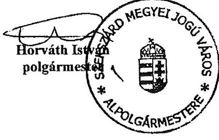

---

# Horváth István úr 

polgármester
Szekszárd Megyei Jogú Város Önkormányzata
Szekszárd

## Tisztelt Polgármester Úr!

Köszönettel vettem a Szekszárd Megyei Jogú Város Önkormányzat pénzügyi helyzetének ellenőrzéséről készült jelentés-tervezet megállapításaival kapcsolatos észrevételeit. Az Ön által tett észrevételeket megvizsgáltuk, álláspontunkról az alábbiakban tájékoztatom:

Polgármester úr észrevétele a jelentés-tervezet „I. Összegző megállapítások, következtetések, javaslatok" részben és a részletes megállapítások 3.3 pontjában szereplő - az Önkormányzat által a 2011. évben felvett 215 millió Ft összegủ beruházási hitel fedezeteként felajánlott ingatlanokkal kapcsolatos - megállapításunkra vonatkozott. Ön nem értett egyet azzal a megállapítással, mely szerint a jelzálogszerződéssel érintett öt ingatlan közül - az Önkormányzat ingatlan nyilvántartása szerint - kettő a korlátozottan forgalomképes, egy a forgalomképtelen törzsvagyon körébe tartozik, a forgalomképes vagyoni körbe történő ársorolásukról a jelzálogszerződés megkötéséig a Közgyűlés nem gondoskodott.

Polgármester úr álláspontja szerint az Önkormányzat hatályos vagyongazdálkodási rendeletében foglaltak alapján a Közgyűlés a korlátozottan forgalomképes vagyontárgyak hitel fedezethez történő bevonásáról jogszerűen rendelkezhetett. A 3787 hrsz-ú ingatlan jellegénél fogva a forgalomképes vagyonrészbe tartozik, tekintettel arra, hogy a Közgyűlés nem sorolta a vagyongazdálkodási rendelet 1. számú mellékletében meghatározott forgalomképtelen vagyontárgyak közé. A vagyonkataszter készítését végző cég feltehetően tévesen minősítette az ingatlant.

Az észrevétel nem megalapozott, mivel az érintett korlátozottan forgalomképes besorolású vagyontárgyak a törzsvagyon részét képezik, és az Ötv. 88. § (1) bekezdés b) pontjának előírása alapján hitel fedezetéül az önkormányzati törzsvagyon nem használható fel. Az Önkormányzat vagyongazdálkodási rendeletének 5. § (5) bekezdésében foglalt szabályozás magasabb szintű jogszabályba (Ötv.) ütközik, ezért az alapján a Közgyűlés nem rendelkezhetett jogszerűen a korlátozottan forgalomképes vagyontárgyak hitel fedezethez

---

történő bevonásáról. Nem képezheti a hitel fedezetét a 3787 hrsz-ú ingatlan sem, mivel az, illetve annak egy része a vagyongazdálkodási rendelet 1. számú mellékletének részét képező ingatlanvagyon nyilvántartás, továbbá az Önkormányzat által az ÁSZ ellenőrzéshez adott 20. számú tanúsítvány szerint is a forgalomképtelen törzsvagyonba tartozik. Az előzőek alapján továbbra is fenntartjuk azt a megállapítást, hogy a jogi biztosítékként felajánlott ingatlanok forgalomképes vagyoni körbe történő átsorolásáról a jelzálogszerződés megkötéséig a Közgyűlés nem gondoskodott. Az észrevétellel - az azzal kapcsolatos véleményünk fenntartása mellett - a jelentés 3.3. pontját kiegészítettük.

A törvényes állapot a vagyongazdálkodási rendelet módosításával és a törzsvagyonba tartozó vagyontárgyak forgalomképessé minősítésével helyreállítható.
Köszönöm Polgármester Úrnak és munkatársainak az ellenőrzés során tanúsított hozzáállását, amellyel az Önkormányzatról készített pénzügyi helyzetelemzés elkészítését segítették.

Budapest, 2011. december " 24 ".
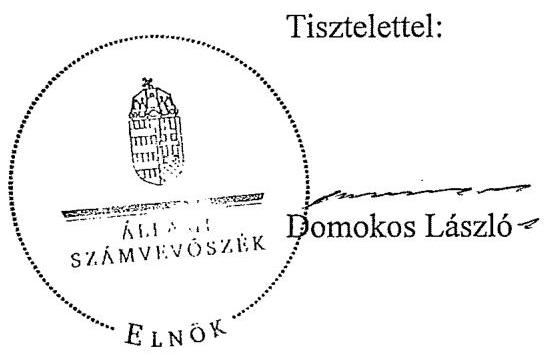

---

.

---

.