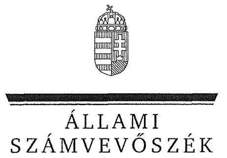

ÁLLAMI
SZÁMVEVŐSZÉK

# JELENTÉS 

Székesfehérvár Megyei Jogú Város Önkormányzata pénzügyi helyzetének ellenőrzéséről (43/3)

---

# Számvevői Iroda 

Iktatószám: V-3049-14/2011.
Témaszám: 1015
Vizsgálat-azonosító szám: V056047

## Az ellenőrzést felügyelte:

Dr. Varga Sándor
számvevő igazgató-helyettes
Az ellenőrzést vezette:
Renkó Zsuzsanna
számvevő tanácsos
Az ellenőrzést végezték:

| Szabó Leonóra | Bus András | Csényi István |
| :-- | :-- | :-- |
| számvevő | számvevő | számvevő tanácsos |

A témához kapcsolódó eddig készített számvevőszéki jelentés:
címe
sorszáma
Jelentés a Székesfehérvár Megyei Jogú Város Önkormányzata gazdálkodási rendszerének 2008. évi ellenőrzéséről

---

# TARTALOMJEGYZÉK 

BEVEZETÉS ..... 5
I. ÖSSZEGZŐ MEGÁLLAPÍTÁSOK, KÖVETKEZTETÉSEK, JAVASLATOK ..... 16
II. RÉSZLETES MEGÁLLAPÍTÁSOK ..... 26

1. Az Önkormányzat kötelező és önként vállalt feladatai ..... 26
2. A pénzügyi egyensúlyi helyzet alakulása ..... 30
2.1. A működési és a felhalmozási egyensúly alakulása ..... 30
2.2. Az Önkormányzat bevételeinek alakulása ..... 37
2.3. Az Önkormányzat kiadásainak alakulása ..... 40
3. Kötelezettségek bemutatása ..... 45
3.1. A pénzintézetek felé fennálló kötelezettségek alakulása ..... 45
3.2. Szállítók felé fennálló kötelezettségek alakulása ..... 51
3.3. Egyéb kötelezettségek alakulása ..... 52
4. A pénzügyi egyensúly megteremtése érdekében hozott intézkedések ..... 57
5. A helyi önkormányzatok gazdálkodási rendszerének 2008. évi ellenőrzése során a pénzügyi egyensúly javítására tett szabályszerűségi és célszerűségi javaslatok hasznosulása ..... 59

---

# MELLÉKLETEK 

1. számú Működési és felhalmozási hiány/többlet alakulása melléklet
2. számú Kimutatás az önkormányzat bevételeinek és kiadásainak, egyensúlyának melléklet alakulásáról
3. a. számú Az Önkormányzat 2007-2010 években megvalósított, illetve 2010. december 31-ig befejezett fejlesztéseinek forrásösszetétele
4. b. számú Az Önkormányzat 2010. december 31-én folyamatban lévő fejlesztési felmelléklet adataihoz kapcsolódó kötelezettségek
5. c. számú Az Önkormányzat 2010. december 31-én folyamatban lévő fejlesztési felmelléklet adataihoz kapcsolódó 2010. évet követő kötelezettségvállalások
6. d. számú Az Önkormányzat beadott, elbírálás alatti pályázati forrásból megvalósuló melléklet fejlesztéseihez kapcsolódó kötelezettségvállalások
7. számú Kimutatás az önkormányzati feladatok ellátásában részt vevő gazdasági melléklet társaságokról
8. számú Székesfehérvár Megyei Jogú Város Önkormányzat Polgármesterének észre-melléklet vétele
9. számú Székesfehérvár Megyei Jogú Város Önkormányzat Polgármesterének észrevételére adott válasz

---

# RÖVIDÍTÉSEK JEGYZÉKE 

## Törvények

Áht.
ÁSZ tv.

Csődtv.
Gt.
Htv.

Ötv.
Számv. tv.

## Rendeletek

SzMSz

## Szórövidítések

áfa
ÁSZ
BM
EDP hiány/egyenleg
EU
gazdasági program
GDP
Jegyző
Közgyűlés
KSH
MÁK
NAV
NGM
OEP
RFV ESCO Kft
Önkormányzat
polgármester
Polgármesteri hivatal
szja
kistérségi társulás
Társulás
az államháztartásról szóló 1992. évi XXXVIII. törvény az Állami Számvevőszékről szóló 1989. évi XXXVIII. törvény (2011. július 1-jétől az Állami Számvevőszékről szóló 2011. LXVI. törvény)
a csődeljárásról és felszámolási eljárásról szóló 1991. évi XLIX. törvény
a gazdasági társaságokról szóló 2006. évi IV. törvény
a helyi önkormányzatok és szerveik, a köztársasági megbízottak, valamint egyes centrális alárendeltségű szervek feladat- és hatásköreiről szóló 1991. évi XX. törvény
a helyi önkormányzatokról szóló 1990. évi LXV. törvény
a számvitelről szóló 2000. évi C. törvény

Székesfehérvár Megyei Jogú Város Önkormányzat többször módosított 5/1999. (III. 24.) számú rendelete Székesfehérvár Megyei Jogú Város Önkormányzat Szervezeti és Működési Szabályzatáról
általános forgalmi adó
Állami Számvevőszék
Belügyminisztérium
Uniós módszertan szerinti maastrichti kritériumoknak megfelelő számítás szerinti hiány/egyenleg
Európai Unió
Székesfehérvár Megyei Jogú Város 2011-2014. évre szóló Gazdasági Programja
Bruttó hazai termék
Székesfehérvár Megyei Jogú Város Jegyzője
Székesfehérvár Megyei Jogú Város Közgyűlése
Központi Statisztikai Hivatal
Magyar Államkincstár
Nemzeti Adó és Vámhivatal
Nemzetgazdasági Minisztérium
Országos Egészségbiztosítási Pénztár
RFV ESCO Beruházási Szolgáltató Kft.
Székesfehérvár Megyei Jogú Város Önkormányzata
Székesfehérvár Megyei Jogú Város Polgármestere
Székesfehérvár Megyei Jogú Város Polgármesteri Hivatala Személyi jövedelemadó
Székesfehérvári Többcélú Kistérségi Társulás
Székesfehérvár és Térsége Szennyvízcsatorna Hálózat Bővítési Önkormányzati Társulás

---

.

---

# JELENTÉS 

## Székesfehérvár Megyei Jogú Város Önkormányzata pénzügyi helyzetének ellenőrzéséről

## BEVEZETÉS

Az Állami Számvevőszék 2011. évtől érvényes stratégiája új irányt szabott a helyi önkormányzatok gazdálkodásának ellenőrzésében is. Az ÁSZ – küldetése és jövőképe szerint – szilárd szakmai alapokra támaszkodva értékteremtő ellenőrzéseivel és helyzetelemzéseivel az államháztartás egészében, így a helyi önkormányzati alrendszerben is elő kívánja segíteni a közpénzek és a közvagyon szabályos, gazdaságos, hatékony és eredményes hasznosítását. Ennek részeként – a 2010. évi államháztartási hiány alakulásának összetevőire is figyelemmel – folyamatban van az önkormányzati alrendszer pénzügyi helyzetelemzése.

Az NGM 2011. áprilisában közzétett adatai szerint ${ }^{1}$ a 2010. évi 1036,2 milliárd Ft összegű 3,8%-os EDP (maastrichti kritériumok szerinti, Túlzott Hiány Eljárás keretében kimutatott) hiánycél nem volt tartható, az önkormányzati alrendszer tervezettet meghaladó hiánya miatt a GDP arányában kifejezett államháztartási hiány 4,2%-ra emelkedett.

Az önkormányzatok 2010. első három negyedévi költségvetési jelentése szerinti pénzforgalmi hiány 97 milliárd Ft-os összege nem indokolta az önkormányzati alrendszer 190 milliárd Ft-ra becsült hiányának 2010. évi végi felülvizsgálatát. A helyi önkormányzatok 2011. januári gyorsjelentése alapján a pénzforgalmi hiány már 247,7 milliárd Ft-ot tett ki. Az alrendszer hiánya így a tervezett 0,7%-kal szemben magasabb, 0,9%-os szinten realizálódott. Az 57,7 milliárd Ft hiánytöbblet alakulásában – a Tájékoztató szerint – az iparűzési adó elmaradása, a gépjárműadó, az illetékek és más bevételek tervezettnél alacsonyabb összegben való teljesülése volt a meghatározó.

Magyarország a Széll Kálmán Terv célkitűzései alapján² aktualizált Konvergencia Programjában a középtávú (2011-2015. évek) költségvetési pálya kijelölése során 2011-re a kormányzati szektor EDP módszertan szerinti egyenlegét +2%-ban jelölte meg. Az egyenlegcél megfogalmazásakor az önkormányzati alrendszer tervezett hiányát a 2011. évi költségvetésben szereplő 0,3%-kal szemben 0,5%-os arányban határozták meg ${ }^{3}$. A hiánycélok meghatározása jelzi, hogy az önkormányzati alrendszerben 2011-ben fokozott figyelmet kell fordítani a pénzügyi egyensúlyi helyzet alakulására.

Az államháztartás helyi szintjén a 23 megyei jogú városi önkormányzatnak az általuk ellátott közszolgáltatások volumenére való tekintettel kiemelt szerepe van, e települések népessége összességében meghaladja a kétmillió főt ${ }^{4}$. A települések népességét az alábbi diagram szemlélteti:
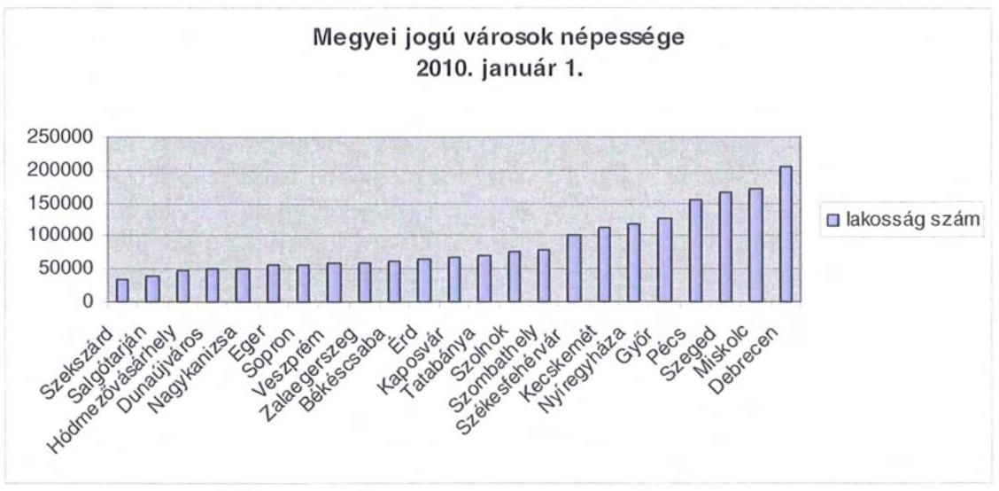

A megyei jogú városi önkormányzatok ${ }^{5}$ kötelező feladatellátását többlépcsős törvényi előírások határozzák meg. A feladatokra vonatkozó szabályozás első szintjét az Ötv. ${ }^{6}$, a második szintet a hatásköri ${ }^{7}$, a harmadik szintet a további ágazati, szakmai (egyebek mellett az oktatási, egészségügyi, szociális és egyéb ágazati feladatok ellátásának szakmai szabályait rögzítő) törvények adják.

A megyei jogú városi önkormányzatok – az Ötv-ből közvetlenül levezethető települési feladatok mellett – körzeti közszolgáltatásokat is ellátnak. A megyei

[^0]
[^0]:    ${ }^{1}$ NGM Tájékoztatás Magyarország Strukturális Reformprogramjának végrehajtásáról (2011. április 1.). A Tájékoztató évente két alkalommal – április és október hónapban – jelenik meg.
    ${ }^{2}$ Az államháztartás 2011. évi egyenlege – a magán nyugdíjpénztárakból az állami nyugdíjpillérbe való visszatérés egyszeri vagyonhatása következtében – 4%-os többletet mutatna. A Széll Kálmán Tervben foglalt egyszeri intézkedések – a MÁV, a BKV adósságrendezése, a PPP projektek kiváltása – összességében a GDP 2%-ával csökkentik a várható többlet mértékét.

[^0]
[^0]:    ${ }^{3}$ A Magyar Köztársaság 2011. évi költségvetéséről szóló 2010. évi CLXIX. törvény Általános indoklásának III. fejezete, valamint Magyarország Konvergencia Programja 2011-2015. (2011. április) Táblázatok rész, 2. táblázat Államháztartás összefoglaló adatai szerint.
    ${ }^{4}$ A megyei jogú városok népességét a 4/2011. (I. 31.) NGM rendelet 1. sz. mellékletében foglalt 2010. január 1-i adatok alapján vettük figyelembe.
    ${ }^{5}$ Az Ötv. 61. § (1) bekezdése alapján a megyeszékhely város a törvény erejénél fogva megyei jogú, ugyanakkor az Országgyűlés az ötvenezernél nagyobb népességű városokat a képviselőtestület kérelmére megyei jogú várossá nyilváníthatja. Ez utóbbi körbe 5 város tartozik, közülük 2 (Hódmezővásárhely, Dunaújváros) népessége 2010. január 1-ére már ötvenezer fő alá csökkent.
    ${ }^{6}$ az Ötv. 8. és 61. §-ában foglaltak szerint
    ${ }^{7}$ a Htv.

jogú városi cím elsősorban többlet kötelezettségekkel jár, a megyei jogú városnak önmagának kell gondoskodnia mindazokról a feladatokról, amelyek más települési önkormányzatok esetében a megyei önkormányzat feladatát képezik. Ide sorolható többek közt a középfokú oktatási intézmények fenntartása, a közművelődési, könyvtári és levéltári szolgáltatás, a társadalombiztosítás finanszírozása mellett a kórházi és a rendelőintézeti szakellátás, a szociális és egyes gyermekvédelmi feladatok ellátása. Ezeket a feladatokat (intézményeket) a megyei jogú város – más városoktól eltérően – nem adhatja át a megyei önkormányzatnak, azonban az Ötv. lehetőséget biztosít arra, hogy a megyei önkormányzattal megállapodjék a feladatellátás megosztásában.

Az önkormányzat, így a megyei jogú város is, maga határozza meg, hogy – a lakosság igényei alapján, anyagi lehetőségei függvényében – mely feladatokat, milyen mértékben és módon, mely szervezeti keretek közt lát el. A szervezetalakítás szabadsága a megyei jogú városok esetében azzal járt, hogy mind a kötelező közszolgáltatásoknál (különösen a településüzemeltetés, vagyongazdálkodás), mind pedig az önként vállalt feladataik ellátásában – elsősorban a sport és kulturális szolgáltatások területein – a gazdasági társaságok kiemelt fontosságú szerephez jutottak. Ily módon a gazdálkodás, a pénzügyi helyzet kockázatai közvetlenül kikerültek ugyan az önkormányzati alrendszerből, azonban sérülhet az ellátási felelősség figyelemmel kísérése és érvényesítése, a közpénzek felhasználásának transzparenciája. Mindezek együttvéve – a beszámolók konszolidálásának hiányában – növelik a megyei jogú városok pénzügyi helyzetének megítélésében rejlő kockázatokat.

Az áttekintett időszakban az önkormányzati feladatok ellátásának keretet biztosító forrásszabályozás elvei lényegesen nem változtak.

A megyei jogú városok önkormányzatainak mozgásterét, az önkormányzatok feladatellátásra vonatkozó döntéseit a központi költségvetéstől való függőség mellett jelentősen befolyásolja a helyi adókivetési jog gyakorlása ${ }^{8}$. A helyi adók rendszere a közszolgáltatások finanszírozásához szükséges források megteremtésének, bővítésének eszköze, amely a gazdasági válság, a jogszabályi környezet, az adópolitika változása, az adóhatóságok tevékenysége következtében differenciáltan érinti a települési önkormányzatokat ${ }^{9}$.

A települési önkormányzatok saját folyó bevételeinek keretében elszámolt, különböző jogcímeken kivetett helyi adók – iparűzési adó, építmény és telekadó, idegenforgalmi adó, vállalkozók és magánszemélyek kommunális adója – 2007-2010 között eltérő módon emelkedtek. A helyi adókból származó bevételek realizált összege országos szinten 2007-2009 között folyamatosan, 505,3 milliárd Ft-ról 566,3 milliárd Ft-ra emelkedett, majd a gazdasági válság hatásai következtében 2010-re 542,6 milliárd Ft-ra esett vissza. A helyi adók részesedése

[^0]
[^0]:    ${ }^{8}$ a helyi adókról szóló 1990. évi C. törvény szabályai szerint
    ${ }^{9}$ Az Állami Számvevőszék 2010. decemberében közzétett 1031. számú jelentésében értékelte a helyi adók rendszerében a hatékonyság és az eredményesség érvényesülését.

az önkormányzatok saját folyó bevételein belül 2007-2010 között 2,5 százalékponttal csökkent ${ }^{10}$.

A megyei jogú városok saját folyó bevétele 2007-ben 191,5 milliárd Ft volt, 2008-ban 223,1, 2009-ben 225,4, 2010-ben 223,5 milliárd Ft-ot tett ki. A helyi adóbevételekből való részesedésük 2007-ben 110,5 milliárd Ft (21,9%), 2008-ban 128,3 milliárd Ft (23,2%), 2009-ben 124,4 milliárd Ft (22%), 2010-ben 118,7 milliárd Ft (részaránya a 2007. évivel azonosan 21,9%) volt. E realizált adóbevételek a megyei jogú városok saját folyó bevételeinek 2007-ben 57,7, 2008-ban 57,5, 2009-ben 55,2, 2010-ben 53,1%-át jelentették. A helyi adóbevételek 2007-ről 2010-re kimutatott 4,6 százalékpontos csökkenése annak ellenére következett be, hogy a megyei jogú városok saját folyó bevétele 2010-ben 16,7%-kal haladta meg a 2007. évit.

A helyi adókon belül a települések gazdasági helyzetének egyik fokmérője az elért helyi iparűzési adóbevétel, amely a megyei jogú városok körében erőteljes – a település nagyságrendtől is függő ${ }^{11}$ – különbségeket mutat.
 A helyi iparűzési adóbevétel és annak egy lakosra vetített összegének 2007. és 2010. évi alakulását az alábbi diagramok szemléltetik:
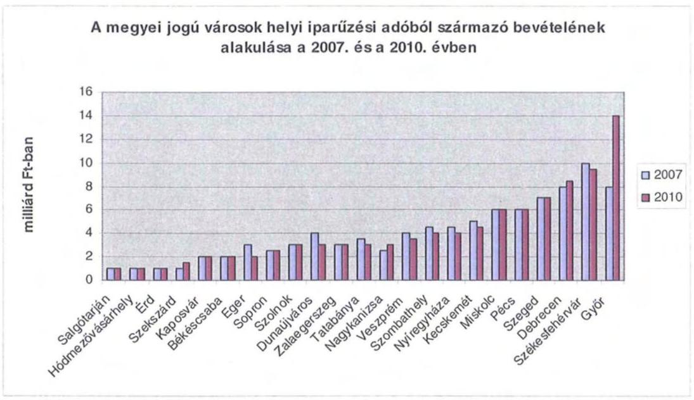

[^0]
[^0]:    ${ }^{10}$ A helyi adó bevételek saját folyó bevételekből való részesedése országosan 2007-ben 55,3 %, 2010-ben 52,8 % volt.
    ${ }^{11}$ A 100 ezer fő feletti népességű megyei jogú városok csoportjába Debrecen, Miskolc, Szeged, Pécs, Győr, Nyíregyháza, Kecskemét, Székesfehérvár tartozik. Nem megyeszékhely megyei jogú város Érd, Sopron, Nagykanizsa, Dunaújváros, Hódmezővásárhely.

---

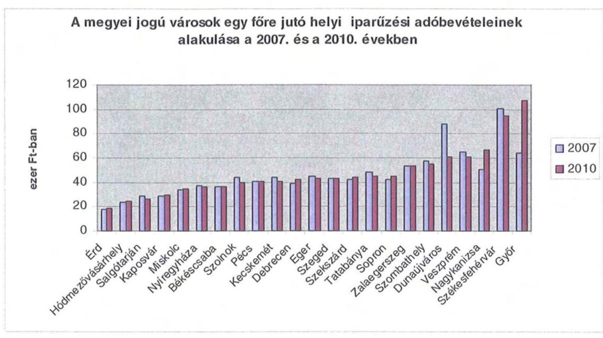

A megyei jogú városi önkormányzatok saját bevételein belül második legjelentősebb elem az illetékbevétel. A 2010. évben befolyt 39,2 milliárd Ft illetékbevétel a 2006. évben realizált 71,1 milliárd Ft illetékbevétel alig több mint 55 %-a. A jelentős visszaesést döntően az ingatlanpiac stagnálása, majd visszaesése, illetve egyes illetékkedvezmények bevezetése okozta. A kieső bevételek pótlására az önkormányzati alrendszer szintjén történtek intézkedések, 2010-ben 5 milliárd Ft-ot, 2011-ben 1,2 milliárd Ft-ot ellentételezett a központi költségvetés. A megyei jogú városok önkormányzatai az önkormányzati alrendszer szintjén realizált illetékbevételből 2007-ben 13,6 milliárd Ft-tal (23,3%-kal), 2008-ban 15,3 milliárd Ft-tal (22,7 %-kal), 2009-ben 12,6 milliárd Ft-tal (21,5 %-kal), 2010-ben 7,9 milliárd Ft-tal (20,2 %-kal) részesedtek ${ }^{12}$. Az összes befolyt illetékbevételből a megyei jogú városok részesedése 2009-ről 2010-re mindössze 1,3 százalékponttal csökkent, ugyanakkor a realizált illetékbevétel csökkenése a 37,3 %-ot (4,7 milliárd Ft) is elérte.

Az önkormányzati alrendszer átengedett bevételei közül a személyi jövedelemadóból való részesedés makroszintű szabályozása a vizsgált időszakban nem változott. A települési önkormányzatokat a településre kimutatott személyi jövedelemadó 8 %-a közvetlenül, míg 32 %-a külön szabályozott visszaosztási rendben illeti meg. A visszaosztás a jövedelem differenciálódás mérséklésével párosul, rendje a lakóhelyen maradó személyi jövedelemadóhoz és az iparűzési adó-erőképességhez ${ }^{13}$ igazodik, annak részletszabályait a mindenkori költségvetési törvény 4. számú melléklete határozza meg. A jövedelemdifferenciálódás

[^0]
[^0]:    ${ }^{12}$ Az illetékek kivetésének és beszedésének joga 2006. december 31-ig a megyei önkormányzatok feladata volt, amelyet a 2007. évtől az APEH (2011. január 1-jétől NAV) vett át. Az önkormányzati illetékrészesedési szabályok változatlanok maradtak, azonban az illetékbeszedés költségeit az önkormányzatok illetékbevételeiből átlagos (a megyei jogú városoknál 8,5 %-os) kulcsot alkalmazva vonták le.
    ${ }^{13}$ Az iparűzési adóerő-képesség egy potenciális, átlagos erőfeszítés mellett elérhető (a települési önkormányzat iparűzési adóelőlegét meghatározó adóalap 1,4%-ának megfelelő számított) bevétel.

---

szabályai kétirányúak, a kiegészítés és a visszatartás feltételeit egyaránt meghatározták:

- Amennyiben az önkormányzatot közvetlenül megillető személyi jövedelemadó bevétel és a számított iparűzési adóerő-képesség együttesen számított, egy főre jutó összege nem érte el a település méretéhez kapcsolódóan az évenkénti szabályozás szerinti változó összeget, a költségvetés a részesedést település nagyság szerint eltérően meghatározott szintig kiegészítette ${ }^{14}$. A kiegészítés fajlagos összege 2007-2010 között 37500 Ft-ról 48010 Ft-ra (10 510 Ft-tal, 28%-kal) emelkedett. Az előzőeken túl a jövedelem differenciálódás szabályozása egyes térségi (középiskolai, szakiskolai, szakképző intézményi, kollégiumi) feladatok ellátásának függvényében további kiegészítő hozzájárulást biztosított.
- Amennyiben az egy főre számított személyi jövedelemadó és az iparűzési adóerő-képesség együttes összege a település nagyságrendjéhez rendelt értékhatárt több mint 25 %-kal (2010-től 20%-kal) meghaladta, az egy főre jutó összeg sávonként differenciált módon ${ }^{15}$ visszavonásra került az önkormányzatot megillető normatív állami hozzájárulás összegéből.

Az önkormányzatok személyi jövedelemadó bevétele 2007-ben 494,3 milliárd Ft, 2008-ban 558,6 milliárd Ft, 2009-ben 639,5 milliárd Ft, 2010-ben 681,2 milliárd Ft volt, az időszak alatt összegében 186,9 milliárd Ft-tal, 37,8%-kal emelkedett, miközben az szja bevétel átengedett bevételeken belüli részesedése 1,8 százalékponttal emelkedett.

A megyei jogú városok önkormányzatainak személyi jövedelemadó részesedése az alrendszer átengedett személyi jövedelemadó bevételeiből 2007-ben 77,6 milliárd Ft-ot (15,7%-ot), 2008-ban 105,4 milliárd Ft-ot (18,9%-ot), 2009-ben 122,9 milliárd Ft-ot (19,2%-ot), 2010-ben 136,6 milliárd Ft-ot (20,1%-ot) tett ki. A realizált szja bevétel a megyei jogú városoknál az időszak alatt folyamatosan emelkedett, a 2010-ben realizált adóbevétel 59,0 milliárd Ft-tal (76%) volt magasabb a 2007. évinél, az átengedett bevételeken belüli részesedése 2010-re 5,1 százalékponttal haladta meg a 2007. évi részarányt ${ }^{16}$. A részesedés alapjául szolgáló szja településenként eltérő, az egy adózóra jutó szja 2009. évi adatait ${ }^{17}$ a következő ábra szemlélteti.

[^0]
[^0]:    ${ }^{14}$ A megyei jogú városok esetében a jövedelemkülönbségek mérséklésénél figyelembe veendő lakosonkénti értékhatár 2007-ben 37500 Ft, 2008-ban 42385 Ft, 2009-ben 45933 Ft, 2010-ben 48010 Ft volt.
    ${ }^{15}$ A sávos értékhatár 2010-től 20%-os intervallumonként, 120% felett a visszatartást 25%-tól 90%-os mértékig rögzíti. Amennyiben a település nagyságrendhez rendelt értékhatár összege az önkormányzatnál eléri vagy meghaladja a 200%-ot, az egy főre jutó összeg 90%-a levonásra kerül. Az értékhatár sávjai 2010 előtt 25%-os léptékűek voltak, a levonási arányok az ellenőrzött időszakban nem változtak.
    ${ }^{16}$ E bevételek a megyei jogú városok átengedett bevételeiben 2007-ben 84,7, 2008-ban 87,7, 2009-ben 89,7, 2010-ben 89,8%-os részarányt jelentettek.
    ${ }^{17}$ Adatforrás: KSH Megyei Jogú Városok a Közép-Dunántúlon 2009. kiadványa, 4.1.sz. összehasonlító tábla.

---

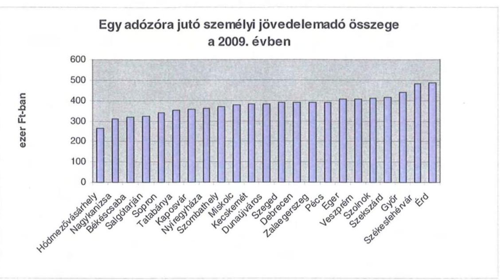

Az átengedett bevételek második legjelentősebb eleme a gépjárműadó, amelynek bevételi szabályozása az ellenőrzött időszakban nem változott, az adóbevétel teljes összege az önkormányzatot illeti meg. A gépjárműadó alapját, mértékét ${ }^{18}$ és egyes mentességi kategóriákat érintő módosítások 2010. január 1-től következtek be, amelyek az egyes adótételek esetében átlagosan 15 %-os emelkedéssel jártak.

A gépjárműadó beszedéséből származó bevétel az önkormányzati alrendszer szintjén 2007-ben 62,4 milliárd Ft, 2008-ban 65,7 milliárd Ft, 2009-ben 63,8 milliárd Ft, 2010-ben 71,1 milliárd Ft volt, az adóbevétel egésze 2007-hez képest 8,7 milliárd Ft-tal, 13,9%-kal emelkedett. A gépjármű-adóztatás szabályainak változása 2010-ben 7,3 milliárd Ft többletet eredményezett. A megyei jogú városok gépjárműadó bevétele a 2007. évi 14,0 milliárd Ft-ról 2010-re 15,5 milliárd Ft-ra, 10,7%-kal emelkedett. A bevételnövekedés összegéből 1,4 milliárd Ft a 2010. évi adózási szabályok következménye.

A megyei jogú városok önkormányzatai 2007-2010 között rendelkezésre álló forrásainak alakulását a következő ábra szemlélteti:

[^0]
[^0]:    ${ }^{18}$ A gépjárműadóról szóló 1991. évi LXXXII. törvény 7. § (1) bekezdésében foglalt adómértékek változása.

---

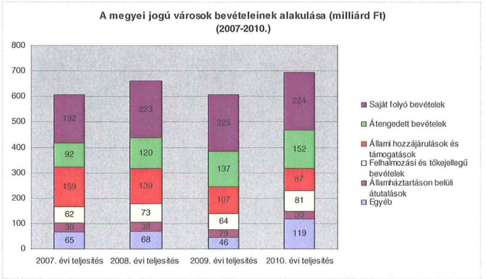

A megyei jogú városok saját folyó bevételeinek - amelyek főbb elemei: a helyi adók, az illetékbevételek, az intézményi térítési díjak, a kamatbevételek - részaránya a 2007. évi összbevételen (608 milliárd Ft) belül 32 % volt. A 2010. évi összbevétel 693 milliárd Ft-os összegéből a saját folyó bevételek aránya - miközben összege 2007-ről 2010-re 32 milliárd Ft-tal emelkedett - nem változott.

Az átengedett bevételek, amelyek a megyei jogú városok önkormányzatainál döntően a személyi jövedelemadó és a gépjárműadó részesedést jelenti, az összbevételen belül a 2007. évi 92 milliárd Ft-ról (15%) 152 milliárd Ft-ra nőtt, részesedése 7 százalékponttal emelkedett. A 60 milliárd Ft-os növekedésből 59 milliárd Ft-ot az szja részesedés emelkedése okozott.

Az állami hozzájárulások és támogatások - amelyek főbb elemei: főként az ellátotti létszámhoz kötődő normatív állami hozzájárulások, központosított előirányzatok - a 2007. évi 159 milliárd Ft-ról (26%-os részarányról) 2010-re 87 milliárd Ft-ra (13%-os részarányra) estek vissza.

A felhalmozási és tőkejellegű bevételek - tárgyi eszközök (ingatlanok és ingóságok), föld és immateriális javak, részesedések értékesítése, EU-tól átvett pénzeszközök - a 2007. évi 62 milliárd Ft-ról (10%-os részarányról) 2010-re 81 milliárd Ft-ra (12%-os részarányra) emelkedtek.

Az államháztartáson belüli átutalások részesedése 2007-ben 38 milliárd Ft volt. 2010. év végére 8 milliárd Ft-tal csökkent, részaránya 6%-ról 2010-ben 4%-ra változott. Ez a bevételi kategória tartalmazza az Egészségbiztosítási Alaptól és más elkülönített állami pénzalapoktól átvett forrásokat. A 2010-ben e címen elszámolt bevétel a megyei jogú városoknál 22 milliárd Ft-ot tett ki.

Az egyéb, pénzmaradványból, vállalkozási bevételekből, államháztartáson kívülről származó átutalásokból, a hitelekből, a hosszú és rövid lejáratú értékpapírok értékesítéséből származó bevételek részesedése a 2007-2010. évek viszonylatában 11%-ról 17%-ra emelkedett. Ez utóbbiak 2010. évi beszámoló szerinti összevont teljesítése 119 milliárd Ft volt ${ }^{19}$.

Mindezeket figyelembe véve a megyei jogú városok 2007. és 2010. évi forrásöszszetételének megoszlását az alábbi ábra szemlélteti:

A megyei jogú városok 2007. és 2010. évi forrásösszetétele
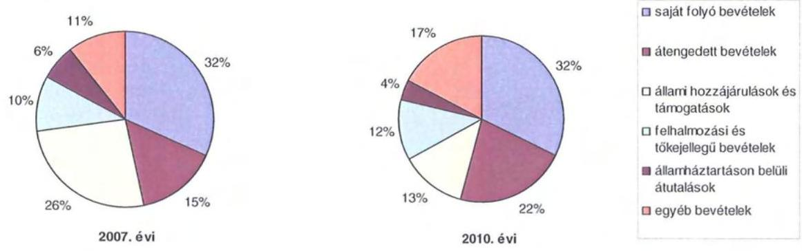

Az önkormányzati alrendszer pénzügyi helyzetértékelése során új elemzési módszereket alkalmaz az ellenőrzés. A hagyományos költségvetési szerkezet helyett az önkormányzat pénzügyi helyzetét a CLF módszerrel mutatjuk be, amelynek lényegét és számításának módszerét a 2.1. pontban, és a jelentés 2. számú mellékletében ismertetjük részletesen.

Az új módszereken alapuló helyzetértékelés fontosságát az adja, hogy a helyi önkormányzatok bruttó adósságállománya ${ }^{20}$ a 2010. évi költségvetési beszámoló alapján 1248 milliárd Ft-ot tett ki. Az adósságállomány koncentráltságát jelzi ${ }^{21}$, hogy ebből a 23 megyei jogú város részesedése 338 milliárd Ft volt, amely a fővárosi és kerületi önkormányzatok adósságának figyelmen kívül hagyásával számított 2010. évi 977 milliárd Ft összegű bruttó adósságállomány 34,6%-át jelentette. Az adósságállomány több mint fele - 501 milliárd Ft - a 19 megyei önkormányzatnál és a 23 megyei jogú városnál jelentkezett.

[^0]
[^0]:    ${ }^{19}$ Az egyéb bevételek összege 2007-2010 között eltérő módon változott, 2007-ben 65 milliárd Ft, 2008-ban 68 milliárd Ft volt, 2009-ben 46 milliárd Ft-ra esett vissza, majd 2010-ben több mint két és félszeresére, 119 milliárd Ft-ra emelkedett.
    ${ }^{20}$ A bruttó adósságállomány 2010. év végi összege magában foglalja a fejlesztési és a működési célú kötvénykibocsátások, a beruházási és fejlesztési hitelek, a működési célú hosszú lejáratú hitelek, a rövid lejáratú hitelek, váltótartozások miatti kötelezettségek teljes (2011-ben, illetve az azt követő években esedékes) állományát.
    ${ }^{21}$ A megyei jogú városok adósságállománya összegében ugyan elmarad az egyéb városok összesített adósságától [(ez utóbbiak részesedése 382,6 milliárd Ft (39,2%)], azonban az egyéb városok száma 304. A fővárosi és a kerületi önkormányzatok nélküli adósságállományból a 19 megyei önkormányzat 163 milliárd Ft-tal (16,8%-kal), míg a nagyközségek, községek együttesen 93 milliárd Ft-tal (9,5 %-kal) részesednek.

---

A megyei jogú városok 338 milliárd Ft-os adósságállományából 175 milliárd Ft (51,8%) a 8 legnagyobb, 100 ezer fő feletti népességű város tartozása. Az 5 nem megyeszékhely megyei jogú város bruttó adósságállománya 70 milliárd Ft-ot (20,7%-ot), az előző két csoportba nem tartozó további 10 megyei jogú város adóssága 93 milliárd Ft-ot (27,5 %-ot) tett ki.
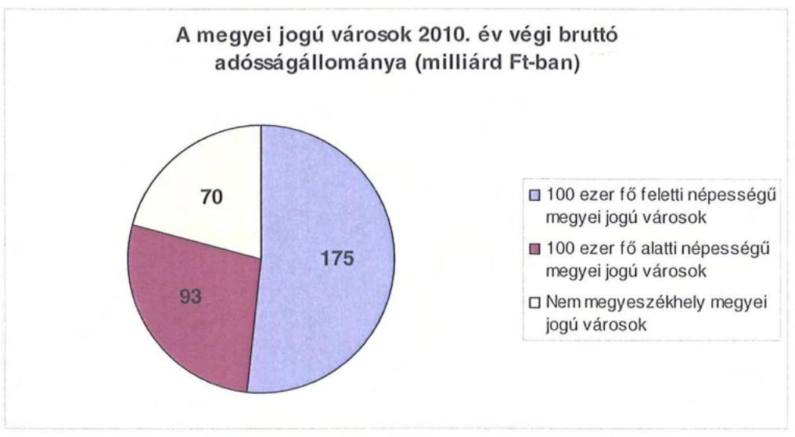

A mérlegben kimutatott bruttó adósságállomány mellett az önkormányzatok számára az eszközállomány műszaki állapotának megőrzése is kötelezettségekkel jár. Az elhasználódott eszközök pótlására forrást biztosító amortizációs (felújítási) alap képzésének ${ }^{22}$ elmaradása maga után vonhatja a feladatellátást kiszolgáló tárgyi eszközök állagának erőteljes romlását. Emellett a 2007-2013-as időszakra meghirdetett, vissza nem térítendő EU-s fejlesztési forrásokhoz való
 hozzájutás lehetősége felerősítette az önkormányzati alrendszer fejlesztési igényeit, amelyek a felhalmozási költségvetési hiány folyamatos emelkedésén túl - az előírt jövőbeni fenntartási kötelezettség miatt - tovább terhelhetik az önkormányzatok költségvetését ${ }^{23}$.

Az ÁSZ a 2011. évi ellenőrzési tervében 43. számú, az Önkormányzatok gazdálkodási rendszerének ellenőrzése részeként egy időben, egymással párhuzamosan tekinti át, és elemzi a 23 megyei jogú városi önkormányzat pénzügyi helyzetét. A gazdálkodás szabályszerűségét az ÁSZ az előző évek során ebben az önkormányzati körben is ellenőrizte, ezért jelen vizsgálatunk erre nem tér ki. A jelentés a megyei jogú városok sajátos feladatellátási és forrásszabályozási helyzetére tekintettel az önkormányzatok pénzügyi helyzetét, illetve az ezzel összefüggő korábbi ÁSZ javaslatok megvalósítását mutatja be.

Az ellenőrzés a 2007. január 1. - 2010. december 31. közötti időszakot öleli fel.
A vizsgálat jogszabályi alapját az Állami Számvevőszékről szóló 1989. évi XXXVIII. törvény 2. § (3), (5), (6) és (9) bekezdései ${ }^{24}$, az Ötv. 92. § (1) bekezdése, az Áht. 104. § (3), és 120/A. § (1) bekezdése előírásai képezik.

[^0]
[^0]:    ${ }^{24}$ 2011. július 1-jétől az Állami Számvevőszékről szóló 2011. LXVI. törvény 5. § (2)-(5) bekezdései

---

# I. ÖSSZEGZŐ MEGÁLLAPÍTÁSOK, KÖVETKEZTETÉSEK, JAVASLATOK 

Az Önkormányzat - adatszolgáltatása szerint - a 2010. évi működési költségvetési kiadásaiból (25583 millió Ft) 23281 millió Ft-ot (91%) a kötelező feladatok, 2302 millió Ft-ot (9%) az önként vállalt feladatok ellátására fordított. A kötelező és önként vállalt feladatok részarányának megállapítása az Önkormányzat SzMSz szerinti besorolásának megfelelően készült. Az önkormányzat a kötelező feladatok mellett önként vállalt feladatnak tekinti a színház, a képtár, a levéltár és az uszoda fenntartását is.

Az Önkormányzat feladatellátásának szervezeti struktúráját a következő ábra szemlélteti:
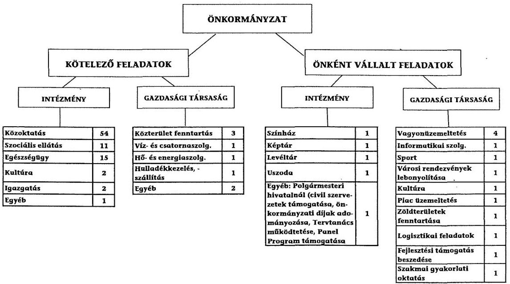

Az Önkormányzat feladatait 2010. december 31-én (a Polgármesteri hivatallal együtt) 89 költségvetési szervvel és a tizennégy 25% feletti tulajdoni hányadú gazdasági társaságával, továbbá három - az önkormányzattól tulajdonosi szempontból független - gazdasági társaság közreműködésével látta el. Az Önkormányzat az áttekintett időszakban kettő közszolgáltatási feladatát (családsegítő és gyermekjóléti szolgálat, jelzőrendszeres házi segítségnyújtás biztosításához szükséges segélyhívó készülékek üzemeltetése) integrálta a többcélú társulásba. Az intézményszervezeti átalakítások és intézményi összevonások következtében a feladatellátás telephelyeinek száma a 2006. évi 138-ról 2010-re 157-re nőtt.

Az Önkormányzat működési kiadásokra 2010-ben 25583 millió Ft-ot fordított, amely 1660 millió Ft-tal (7%-kal) haladta meg a 2007. évi ráfordításokat. A működési kiadások 65%-át az intézményi körben realizálták. E kiadások fedezetéül szolgáló bevételi források 2007. és 2010. években jellemző összesített arányait a következő ábra szemlélteti:

---

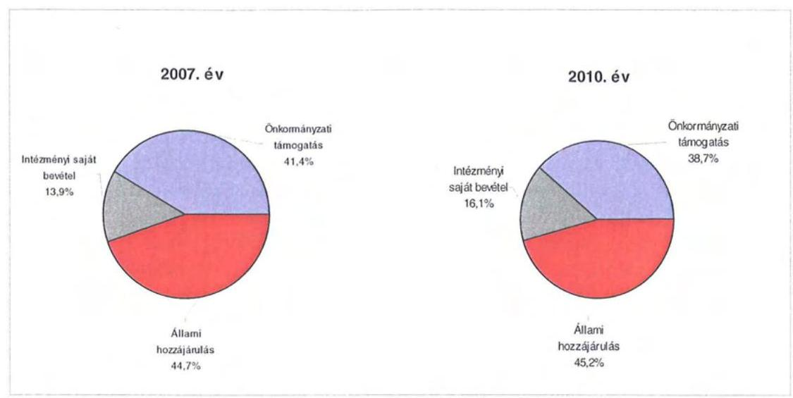

Az egyes közszolgáltatások feladatellátásában részvevő ágazati intézménycsoportok forrásösszetételének bevételi jogcímenkénti alakulását a következő ábra szemlélteti:
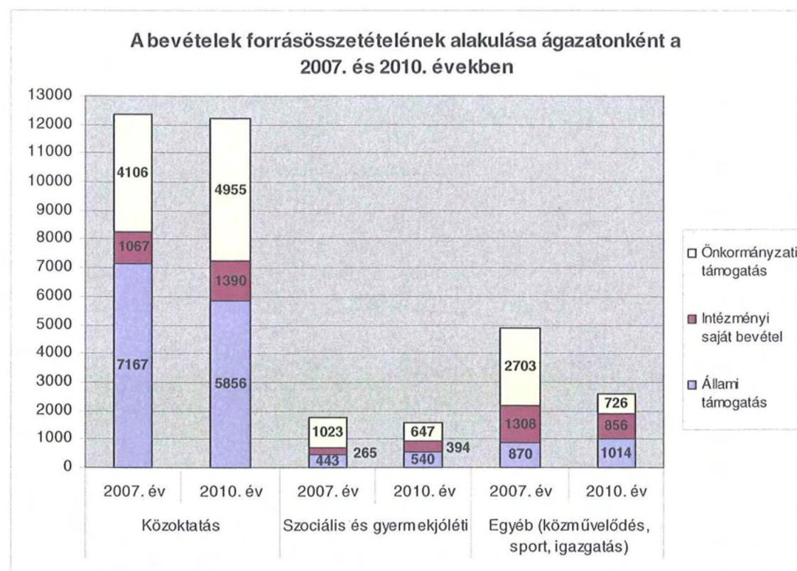

Az Önkormányzat hat gazdasági társaságban rendelkezik kizárólagos tulajdonossal, kettő gazdasági társaságban 75% feletti, kettő gazdasági társaságban 50-75% közötti, négyben 25-50% közötti tulajdoni hányaddal. A gazdasági társaságok a közterület fenntartásban, a víz-és csatornaszolgáltatásban, a hulladékkezelésben, a hő-és energiaszolgáltatásban, a vagyonüzemeltetésben kaptak szerepet az önkormányzat feladatellátásában. A gazdasági társaságok működésükhöz a 2010. évben összesen 2239 millió Ft működési és 149 millió Ft fejlesztési pénzeszközátadásban részesültek az Önkormányzattól. A működési célú

---

pénzeszközátadás 91%-át (2034 millió Ft-ot) a Székesfehérvár Városgondnoksága Kft. kapta.

A 2007-2010. évek között a gazdasági társaságoknál a saját tőke/jegyzett tőke aránya -5 és 23,41 között alakult, az Önkormányzat a veszteség feltöltésére pótbefizetést nem teljesített. A gazdasági társaságoknál az önkormányzati kötelező és önként vállalt feladatokhoz rendelt 2010. év végi nettó vagyon 33322 millió Ft volt, amelyből 32839 millió Ft (99%) a kötelező feladatokhoz, 483 millió Ft (1%) az önként vállalt feladatokhoz rendelt nettó vagyon. Az ellenőrzött időszak alatt csőd-, illetve felszámolási eljárás az önkormányzati érdekeltségű gazdasági társaságokkal szemben nem indult.

A folyó költségvetés egyenlege (működési jövedelem) 2007-2010 között működési forrástöbbletet mutatott ${ }^{25}$. A 2008-2009. években a működési megtakarítások fedezni tudták a tárgyévben jelentkező törlesztési kötelezettségeket, így az Önkormányzat pénzügyi kapacitása (nettó működési jövedelme) is pozitív értékű volt. A 2007. évben az adósságszolgálat nagysága miatt a pénzügyi kapacitás negatívvá vált (-2892 millió Ft), mivel a működési megtakarítás (2175 millió Ft) nem tudta fedezni a törlesztési kötelezettségeket (5067 millió Ft). Az adósságszolgálat növekedését a fejlesztési célú hitelek visszafizetése okozta, melynek forrása 28%-ban a kötvénykibocsátásból származó bevétel volt. A 2010. évben az adósságszolgálat növekedése miatt a pénzügyi kapacitás negatívvá vált (-1264 millió Ft), mivel a működési megtakarítás (531 millió Ft) nem fedezte a törlesztési kötelezettséget (195 millió Ft) és a lejárt kötvény visszafizetését (1700 millió Ft).
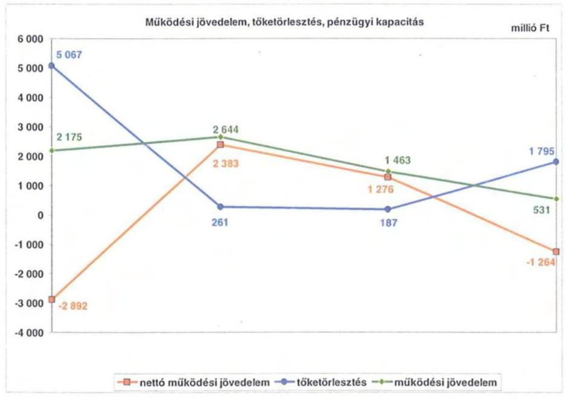

A 2007. és a 2009-2010. években az Önkormányzat felhalmozási költségvetésének egyenlege folyamatosan negatív összegű volt, amely 2007-2010. kö-

[^0]
[^0]:    ${ }^{25}$ 2007-ben a folyó bevételek 8,1%-át (2175 millió Ft-ot), 2008-ban 8,4%-át (2644 millió Ft-ot), 2009-ben 5,2%-át (1463 millió Ft-ot) és 2010-ben 2,0%-át (531 millió Ft-ot) jelentette a működési jövedelem.

---

zött összesen 8826 millió Ft felhalmozási forráshiányt okozott. A 2008. évben az Önkormányzat a felhalmozási költségvetésének egyenlege pozitív összegű volt (2584 millió Ft), ami 6242 millió Ft-ra csökkentette a vizsgált időszakban keletkezett felhalmozási forráshiányt.

A pénzügyi egyensúly fenntartása külső források bevonásával volt biztosítható. A 2007-2010. években 7311 millió Ft hitelt törlesztettek, továbbá 10580 millió Ft volt a kötvény beváltása miatt fizetendő kötelezettség. Az adósságszolgálat, továbbá a felhalmozási forráshiány 2007-2010. között 13553 millió Ft-ot tett ki, amelyre az időszakban képződő 6813 millió Ft működési megtakarítás (működési jövedelem), valamint a 2007. január 1-jén rendelkezésre álló 1438 millió Ft pénzkészlet szolgált fedezetül. A további pénzeszközöket 1451 millió Ft hitel felvételével, továbbá 10580 millió Ft kötvény kibocsátásával teremtették meg. A kialakult pénzügyi helyzet pozitív nettó működési jövedelmet eredményező gazdálkodás mellett teszi elkerülhetővé további külső források bevonását.

A vizsgált időszakban Önkormányzatnál helyi iparűzési adó és a vendégéjszakák utáni idegenforgalmi adó volt megállapítva. A helyi adókból és pótlékokból származó bevételek aránya 2007-2010 között 35% körül mozgott a folyó (működési) bevételeken belül. A pótlékkal, bírsággal növelt helyi adó bevétel a 2007. évi 10231 millió Ft-ról 2010. évben 9651 millió Ft-ra (5,7%-kal, 580 millió Ft-tal) csökkent. A helyi adóbevételek 99%-át az iparűzési adó tette ki, amelynek mértéke a helyi adókról szóló törvényben rögzített maximális mértékben került megállapításra. A helyi adók csökkenését az iparűzési adó 596 millió Ft-os visszaesése okozta, amelyet a pótlékok, bírságoknál tapasztalható növekedés nem tudott ellensúlyozni. Új helyi adónemet a vizsgált időszakban az Önkormányzat nem vetett ki, az építményadó bevezetésére a 2011. március 1-jei hatállyal került sor.

A befejezett fejlesztések 40%-át (7635 millió Ft-ot) pénzintézeti forrásokból finanszírozták. A 2007-2010. évek időszakában 18952 millió Ft értékű fejlesztés és felújítás forrása 6435 millió Ft kötvényből származó bevétel (34%), 1200 millió Ft hitelfelvétel (6%), 9514 millió Ft EU-s és hazai támogatás (50%), valamint 1803 millió Ft saját bevétel (10%) volt. A 2010. december 31-én folyamatban lévő fejlesztési feladatok végrehajtására 449 millió Ft kiadást teljesítettek, amelyre a kötvény bevételéből 25 millió Ft-ot (5,6%) fordítottak.

Az Önkormányzat 2010. december 31-én folyamatban lévő fejlesztési feladatok kötelezettség-vállalásainak összege 2267 millió Ft volt, amelynek forrását EU-s támogatásból biztosítják. Jelen ellenőrzés befejezéséig az Önkormányzat elállt a „Királyi sétány" projekt megvalósításától, melynek következtében a 2010. december 31-én folyamatban lévő fejlesztési kötelezettségvállalások összege 1 millió Ft-ra módosult.

Az Önkormányzat által beadott, elbírálás alatt álló pályázatok tervezett teljes bekerülési költsége 663 millió Ft volt, amelyhez idegen forrást már nem kívánnak bevonni. Az Önkormányzat vállalt kötelezettségeit - a saját bevételeken túl - a fennálló követelésállományból származó forrásai felhasználásával (1362 millió Ft) és a jelzáloggal nem terhelt forgalomképes ingatlanvagyon szükség szerinti értékesítéséből származó bevételből kívánja előteremteni.

---

Az Önkormányzat mérleg szerinti pénzintézeti kötelezettsége a 2006. év végéről a 2010. év végére 7511 millió Ft-ról 13281 millió Ft-ra nőtt, amelyből az árfolyamváltozás miatti különbözet 749 millió Ft volt. A fennálló pénzintézeti kötelezettségek hét kötvény kibocsátásából, három hosszú lejáratú hitel igénybevételéből és nyolc hosszú lejáratú hitel - kettő víziközmű társulat megszűnése miatti - átvállalásából keletkeztek.

Az Önkormányzat fennálló pénzintézeti kötelezettségvállalásaira közgyűlési döntések alapján került sor, azonban az előterjesztésekben részben mutatták be a teljes futamidőre várható kamatfizetési kötelezettséget, valamint a kamat- és - a devizaalapú kötelezettségeket érintő - árfolyamkockázatot.

Az Önkormányzat kötvényeket korábbi kötvénye és hiteleinek törlesztése, beruházások és felújítások finanszírozása céljából bocsátott ki. Fejlesztési hiteleiből bérlakásokat épített, panelházak felújításához biztosított önerőt, belterületi utakat újított fel, energiatakarékos épület-felújításokat, valamint intézményi felújításokat finanszírozott.

Az Önkormányzat a CHF-ben fennálló pénzintézeti kötelezettségéből 2010. december 31-ig tőkét nem törlesztett, de 1744 ezer CHF (301,8 millió Ft) kamatot, valamint a kötelezettséghez kapcsolóan 22,2 millió Ft egyéb díjat és költséget fizetett. A HUF-ban fennálló pénzintézeti kötelezettségéből 1838,3 millió Ft tőkét törlesztett ${ }^{26}$, emellett 2217,5 millió Ft kamatot és 57,1 millió Ft egyéb díjat, költséget fizetett. Az Önkormányzat a kötvények kibocsátásából és a hitelek igénybevételéből származó forrásokat 2010. év végéig a céloknak megfelelően felhasználta. A kötvény források befektetéséből származó kamatbevétele az Önkormányzatnak nem volt, mivel a kötvénykibocsátásokra az ismert fizetési kötelezettségek teljesítési határidejéhez igazodóan került sor. Az Önkormányzat számlavezető bankot az áttekintett időszakban nem váltott. A kibocsátott kötvények lejegyzése és a hitelek folyósítása négy kivételével (1718 millió Ft, és 9477 ezer CHF) a számlavezető pénzintézet által történt, amely kockázatot jelentett a banki befolyás növekedése miatt az Önkormányzat számára.

Az Önkormányzat az észrevételéhez csatolt mellékletben módosításra javasolta fenti bekezdés második mondatában és a jelentés 46. oldalának 4. bekezdésében szereplő 57,1 millió Ft-ot 79,3 millió Ft-ra. Az észrevétel nem helytálló, mivel az 57,1 millió Ft a HUF-ban fennálló pénzintézeti kötelezettségek után fizetett egyéb díj összegét, míg a 79,3 millió Ft - fenti bekezdés első mondatából láthatóan - a CHF-ben fennálló pénzintézeti kötelezettségek után fizetett 22,2 millió Ft díj összegét is tartalmazza.

Az Önkormányzat működésének pénzügyi egyensúlyát a 2007-2008. években folyószámlahitel igénybevételével tudta biztosítani, a 2009-2010. években a folyószámla hitelkeret rendelkezésre tartása a folyamatos finanszírozás biztonságát
 szolgálta. Az áttekintett időszakban az Önkormányzat munkabér megelőlegezési hitelt nem vett igénybe.

[^0]
[^0]:    ${ }^{26}$ Az Önkormányzat az áttekintett időszakban még - a 2010. december 31-én fennálló kötelezettségeihez kapcsolódón túl - összesen 3772,3 millió Ft hiteltörlesztést és 1700 millió Ft kötvény-visszavásárlást teljesített.

---

A folyószámlahitel igénybevétele a 2007-2010. években az alábbiak szerint alakult:

| Megnevezés | 2007. év | 2008. év | 2009. év | 2010. év |
| :-- | --: | --: | --: | --: |
| Keretösszeg | 1750 | 2200 | 900 | 800 |
| Átlagos napi állomány | 979 | 324 | - | - |
| folyószámlahitellel zárt napok száma (nap) | 320 | 131 | - | 3 |
| 2010. december 31-i egyenleg (állomány) | x | x | x | - |

A folyamatos likviditás biztosítása az Önkormányzatnak a 2007. évtől 2011. március 31-ig összesen 132,3 millió Ft kamatkiadást és egyéb költséget okozott.

Az Önkormányzat 2010. év végi szállítói tartozása 441 millió Ft, melyből a lejárt tartozás 83 millió Ft volt. Az egyéb kiadáselmaradása 23 millió Ft volt. A lejárt tartozások 0,8%-a (0,7 millió Ft) haladta meg a 91 napot. Az Önkormányzatnál az adósságrendezési eljárásról szóló törvény 4. § (2) bekezdés a)-b) pontjaiban rögzített feltételek fennálltak, mivel a hitelező kezdeményezhette volna a lejárt határidejű számlák miatt az adósságrendezési eljárást, amely az Önkormányzat működésének biztonsága tekintetében kockázatot hordoz.

Az Önkormányzatnak a PPP konstrukció keretében végrehajtott fejlesztési feladatokkal kapcsolatos kötelezettsége 3,8%-kal csökkent a 2007. január 1-jei 1537 millió Ft-ról a 2010. december 31-ig 1481 millió Ft-ra. A 2010. december 31-én fennálló 1481 millió Ft kötelezettsége négy projekt (60 db bérlakásos lakóépület és hozzá kapcsolódó út, parkoló, játszótér építése, 32 játszótér építése, felújítása, szabványosítása, 28 játszótér és 2 park építése, valamint Idősek Otthona kiviteli terveinek elkészítése és kivitelezése) előfinanszírozással történt megvalósítása során keletkezett.

Az Önkormányzatnak a vizsgált időszakban kettő kezességvállalással (16,6 millió Ft) és egy garanciavállalással (6423 millió Ft) kapcsolatos kötelezettségvállalása volt, 2010. december 31-én azonban garancia és kezességvállalással kapcsolatos kötelezettsége már nem állt fenn.

Az áttekintett időszakban az Önkormányzat lízingszerződést nem kötött. A 75%-ot meghaladó önkormányzati tulajdonú gazdasági társaságok közül két társaságnak - egy 99,13%-os és egy 100%-os önkormányzati tulajdonú gazdasági társaságnak - állt fenn gépjármű lízingszerződésből származó kötelezettsége 2010. december 31-én összesen 2 millió Ft összegben.

Az Önkormányzat 2007-2011. év I. negyedéve között intézményei, egyéb gazdasági társaságok és civil szervezetek számára nem nyújtott kölcsönt. A 25%-ot meghaladó tulajdoni részesedésű gazdasági társaságai részére ugyanakkor három alkalommal nyújtott kamatmentes tagi kölcsönt, egy projekt önkormányzati előfinanszírozása céljából 16 millió Ft-ot, egy esetben a működőképesség fenntartása 6 millió Ft-ot és egy esetben a végelszámolási költségek fedezésére 0,3 millió Ft-ot. A 16 millió Ft-ot a társaság határidőre visszafizette, a 0,3 millió Ft a felszámolási eljárásban megtérült. A működőképesség fenntartására adott 6 millió Ft összegű kölcsönből a társaság 3 millió Ft-ot nem fizetett vissza, ezt a követelését az Önkormányzat peres úton érvényesíti.

---

Az áttekintett időszakban a Közgyűlés két alkalommal, a Közgyűlés Gazdasági Szakbizottsága egy alkalommal döntött követelés elengedésről összesen 64,7 millió Ft összegben.

Az Önkormányzatnak pénzintézeti kötelezettségvállaláshoz kapcsolódó jelzálogjoggal terhelt ingatlana 2010. december 31-én nem volt.

Az Önkormányzat kötelezettségeinek 2010. december 31-i állományát és várható alakulását a kötelezettségek lejáratáig a következő táblázat szemlélteti:

| Megnevezés | Állomány 2010. dec. 31-én |  |  | Várható kötelezettség 2011. 2013. években |  |  | Várható kötelezettség 2014. évet követően |  |  |
| :--: | :--: | :--: | :--: | :--: | :--: | :--: | :--: | :--: | :--: |
|  | HUF-ban   (millió Ft-ban) | Destalitton (összegy, ezer CHF. ben) | $\begin{gathered} \text { Destal } \\ \text { unem } \end{gathered}$ | HUF-ban   (millió Ft-   ben) | Destalitton (összeg, ezer CHF-ben) | $\begin{gathered} \text { Destal } \\ \text { unem } \end{gathered}$ | HUF-ban (millió Ft-   ben) | Destalitton (összegy, ezer CHF. ben) | $\begin{gathered} \text { Destal } \\ \text { unem } \end{gathered}$ |
| Pénzintézeti kötelezettségek |  |  |  |  |  |  |  |  |  |
| Hosszú lejáratú kötelezettségek | 3027 |  | HUF | 1529 |  | HUF | 878 |  | HUF |
| Fedezetlen kötvény |  | 7636 | CHF |  | 405 | CHF |  | 7955 | CHF |
| Rövid lejáratú kötvény |  | 9477 | CHF |  | 421 | CHF |  | 9758 | CHF |
| Fedezetlen Pajesi kötvény | 1800 |  | HUF | 411 |  | HUF | 1847 |  | HUF |
| Széleskörű kötvény | 810 |  | HUF | 158 |  | HUF | 308 |  | HUF |
| Szert Lövdő kötvény | 1605 |  | HUF | 2114 |  | HUF | - |  | HUF |
| Szert letrőes kötvény | 1435 |  | HUF | 1807 |  | HUF | - |  | HUF |
| Albo Regis kötvény | 1700 |  | HUF | 464 |  | HUF | 2329 |  | HUF |
| Minősített kötelezettségek | 9472 |  | HUF | 6375 |  | HUF | 6122 |  | HUF |
| Pénzintézeti kötelezettségek |  | 17113 | CHF |  | 828 | CHF |  | 17723 | CHF |
| Szállítói tartozás | 441 |  | HUF | 441 |  | HUF |  |  |  |
| Egyéb kiadás elmaradás | 23 |  | HUF | 23 |  | HUF |  |  |  |
| Egyéb kötelezettségek |  |  |  |  |  |  |  |  |  |
| PPP beruházási kötelezettségek | 1481 |  | HUF | 600 |  | HUF | 681 |  | HUF |
| 174 ki egyéb szervek ből fennálló kötelezettségek | - | - |  | - | - |  | - |  | 0 |
| Jogelőreg végzéssel lezárt de ki nem fizetett kötelezettségek | 14 | - | HUF | 14 | - | HUF | - |  | 0 |

Az Önkormányzatnak pénzintézetekkel szemben fennálló kötelezettsége a 2010. év végén 9472 millió Ft és 17113 ezer CHF volt. Ezek várható kötelezettsége (tőke, kamat és egyéb költség) a legutóbbi kamatfizetés feltételei alapján a 2011. évtől 12497 millió Ft, továbbá 18581 ezer CHF. Az Önkormányzatnak a 2010. év végén szállítói tartozások és egyéb kiadás elmaradások rendezése, valamint jogerős végzéssel lezárt, de ki nem fizetett kötelezettségek címén 478 millió Ft fizetési kötelezettsége keletkezett. A PPP konstrukcióban megvalósított beruházásokhoz kapcsolódóan a 2010. év végén 1481 millió Ft kötelezettsége állt fenn az Önkormányzatnak. A 2010. december 31-én fennálló összes (pénzintézeti, szállítói, valamint egyéb) kötelezettsége: 11431 millió Ft és 17113 ezer CHF volt, amelyből a 2011-2013. években 7453 millió Ft és 828 ezer CHF kötelezettsége keletkezik. Ennek teljesítésére figyelembe vehető 5249,5 millió Ft egyéb pénzmaradvány, 0,6 millió Ft tartós hitelviszonyt megtestesítő értékpapír, 1362,4 millió Ft mérlegben kimutatott követelésállomány, 4590 millió Ft becsült értékű, pénzintézeti kötelezettséghez kapcsolódó jelzáloggal nem terhelt forgalomképes ingatlanvagyon. A további - a 2013. évet követő - évekre szóló jelenleg ismert pénzintézeti kötelezettségei: 7003 millió Ft és 17753 ezer CHF. Ezekre az Önkormányzat tájékoztatása szerint figyelembe vehető források: „a mindenkori költségvetési rendeletekben megtervezett önkormányzati saját bevételek" és a forgalomképes ingatlanok esetleges értékesítéséből származó bevétel.

Az Önkormányzat minősített többségi tulajdonú társaságai kötelezettségeinek 2010. december 31-i állományát és várható alakulását a kötelezettségek lejáratáig a következő táblázat mutatja be:

---

| Megnevezés | Állomány 2010. dec.31-én |  |  | Várható kötelezettség 2011-   2013. években |  |  | Várható kötelezettség 2014.   évet követően |  |  |
| :--: | :--: | :--: | :--: | :--: | :--: | :--: | :--: | :--: | :--: |
|  | HUF-ban (millió Ft-ban) | Devizában (összeg, ezer EUR-ban, illetve ezer CHF-ben) | Deviza (név) | HUF-ban (millió Ft-   ban) | Devizában (összeg, ezer EUR-ban, illetve ezer CHF-ben) | Deviza (név) | HUF-ban (millió Ft-   ban) | Devizában (összeg, ezer EUR-ban, illetve ezer CHF-ben) | Deviza (név) |
| Hitelintézeti kötelezettségek |  |  |  |  |  |  |  |  |  |
| Hitelintézeti kötelezettségek | 679 |  | HUF | 477 |  | HUF | 289 |  | HUF |
| Hitelintézeti és egyéb évforduló feladatok | 939 |  | HUF | 939 |  | HUF |  |  |  |
| Hitelintézeti kötelezettségek összesen | 1438 |  | HUF | 1438 |  | HUF | 289 |  | HUF |
| Üzleti kötelezettségek |  |  | EUR |  |  | EUR |  |  | EUR |
| Üzleti kötelezettségek |  |  | CHF |  |  | CHF |  |  | CHF |
| Szállítói tartozás | 308 |  | HUF | 308 |  | HUF |  |  |  |

Az önkormányzati kötelezettségek növekedése mellett a minősített többségi tulajdonú társaságok kötelezettségei is befolyásolhatják az Önkormányzat pénzügyi egyensúlyát. A társaságoknak a 2011. évtől 1715 millió Ft pénzintézeti kötelezettséget, 23 ezer EUR és 4 ezer CHF lízinget, valamint 504 millió Ft szállítói tartozást kell rendezniük. Kockázatot jelent, ha ezek nem teljesítése esetén a bíróság korlátlan és teljes felelősséget állapít meg az Önkormányzat terhére az ide vonatkozó jogszabályi feltétel megléte esetén.

Az Önkormányzat az észrevételéhez csatolt mellékletben módosításra javasolta fenti táblázatban és fenti bekezdés második mondatában szereplő szállítói tartozás összegének 504 millió
 Ft-ról, 1418 millió Ft-ra történő módosítását. Az észrevétel nem helytálló, mivel a táblázat címéből és a bekezdés első mondatából kitűnik, hogy az 504 millió Ft kizárólag a minősített többségi tulajdonú társaságok kötelezettségeit tartalmazza, nem pedig az összes társaságét.

Az Önkormányzat költségvetési támogatásból, átengedett bevételekből és illetékbevételekből származó bevételei a 2007. évhez képest az időszak egészét tekintve összességében nem csökkentek. Ennek ellenére az Önkormányzat folytatta az előző években elkezdett – kiadási megtakarítást és bevételnövelést eredményező – intézkedéseit. A 2007–2010. években tett intézkedések hatására 1321 millió Ft bevételi többletet, továbbá 3023 millió Ft kiadási megtakarítást mutattak ki, ezáltal az önkormányzat pénzügyi helyzetét javították. A kiadási megtakarítások 65%-a az elrendelt álláshely-csökkentések eredménye. Az álláshely-csökkentő intézkedések 2007–2010. között a Hivatalnál és az intézményeinél összesen 137 álláshely (ebből 21 üres álláshely) megszüntetését jelentették. A bevételnövelő intézkedések szabad kapacitások kihasználásához, átmenetileg szabad pénzeszközök lekötéséhez kapcsolódtak.

A helyi önkormányzatok gazdálkodási rendszerének 2008. évi ellenőrzése során az ÁSZ vizsgálat az Önkormányzat pénzügyi egyensúlyi helyzetének javítására szabályszerűségi és célszerűségi javaslatot nem tett.

Az Önkormányzat pénzügyi helyzetét összegezve a következők emelhetők ki:

A 2007–2010. években az Önkormányzat működési kockázatát csökkentette a pozitív folyó költségvetési egyenleg, a minimális lejárt szállítói tartozásállomány. Az önként vállalt feladatok aránya alapvetően nem befolyásolta az Önkormányzat működésének biztonságát. A működési bevételek évente biztosították a működési kiadások és a 2008–2009. években az adósságszolgálat finanszírozását. A likviditást 2007–2008. években folyószámlahitel igénybevételével biztosították. A gazdasági társaságok szerepe a közüzemi közfeladat-

---

ellátásban meghatározó volt. A gazdasági társaságok által ellátott feladatstruktúra letisztított, átlátható, a működési kockázatot nem növelte.

A vizsgált időszakban az Önkormányzat felhalmozási bevételek és kiadások egyenlege hiányt mutatott, ennek forrásai kötvénykibocsátással és hitelfelvétellel biztosítottak voltak. A fejlesztési célú kötelezettségvállalásoknál a jövőben teljesítendő kifizetésekre a fedezet rendelkezésre áll (EU támogatás), ezért az felhalmozási kockázatot nem jelent.

A pénzintézeti és egyéb kötelezettségek teljesítésének kockázatát növelte, hogy a 2010. december 31-én fennálló kötelezettségek visszafizetésének fedezetét a saját bevételben jelölték meg. A kockázatot csökkentheti, hogy az Önkormányzat forgalomképes ingatlanvagyona szükség esetén felhasználható az adósságszolgálat visszafizetésére.

Az önkormányzat bevétele a központi intézkedések hatására összességében nem csökkent.

Az Állami Számvevőszékről szóló 2011. évi LXVI. törvény 33. § (1) bekezdésében foglaltak értelmében a jelentésben foglalt megállapításokhoz kapcsolódó intézkedési tervet köteles az ellenőrzött szervezet vezetője összeállítani és azt a jelentés kézhezvételétől számított harminc napon belül az ÁSZ részére megküldeni. Amennyiben az intézkedési tervet határidőben nem küldi meg a szervezet, vagy az továbbra sem elfogadható, az ÁSZ elnöke a hivatkozott törvény 33. § (3) bekezdés a)–b) pontjaiban foglaltakat érvényesítheti.

Az ellenőrzés intézkedést igénylő javaslatai:

# a Polgármesternek 

1. a Közgyűlés elé terjesztendő intézkedési terv írja elő a működés pénzügyi egyensúlyának hosszú távú fenntarthatósága érdekében – felelősök és határidők megjelölésével – olyan program készítését, amely tartalmazza az alábbiakat:
a) bevételszerző lehetőségek feltárását, különösen a helyi adópolitikai célok meghatározását és számszerűsítését, a követelések behajtását, az egyéb sajátos bevételek növelésének lehetőségét;
b) az intézkedések következtében jelentkező pénzügyi többlet, illetve az egyszeri bevételek tartalékba helyezését, elkülönített kezelését az adósságszolgálat teljesítése érdekében;
c) az adósságszolgálat szerkezetének áttekintését;
d) az intézkedések eredményei legalább évenkénti áttekintésének előírását;
2. mutassa be félévente – a szokásos beszámoló keretében – a Közgyűlésnek:
a) az Önkormányzat és a minősített többségi tulajdonú gazdasági társaságai aktuális pénzügyi helyzetét, az Önkormányzatnak a gazdasági társaságai felé fennálló követeléseit, nyújtott kölcsöneit;

---

b) legalább három évre kitekintően a kötelezettségek teljes körére szóló finanszírozási tervet, amely figyelembe veszi a kötelezettség éven belüli és túli felmerülését, a források számszerűsített megjelölésével;
3. intézkedjen a beruházásokkal létrehozott létesítmények működtetését és jövőbeni fenntarthatóságát biztosító megalapozott források költségvetési rendeletekben történő feltüntetéséről;
4. mutassa be a Közgyűlésnek évente a zárszámadási rendelet előterjesztésében az értékcsökkenés összegét, és ezzel összevetve az elhasználódott eszközök pótlására fordított tényleges kiadásokat, az eszközök elhasználódási fokának alakulását;

# a jegyzőnek 

kísérje figyelemmel a jövőbeni várható – árfolyam-, kamat- valamint visszafizetési kockázatokat, továbbá a mérlegen kívüli tételek (kezességvállalás, garancia és helytállási kötelezettségvállalás) kockázatait, és legalább félévente tájékoztassa a Közgyűlést azok alakulásáról.

---

# II. RÉSZLETES MEGÁLLAPÍTÁSOK 

## 1. Az ÖNKORMÁNYZAT KÖTELEZŐ ÉS ÖNKÉNT VÁLLALT FELADATAI

Székesfehérvár Megyei Jogú Város Önkormányzata az Ötv-ben és más törvényekben meghatározott kötelező feladatainak ellátásáról az intézmények és gazdasági társaságok alapító okirataiban, illetve társasági szerződéseiben, a többcélú kistérségi társulással kötött társulási megállapodásban, civil szervezetekkel, gazdálkodó szervezetekkel kötött feladat-ellátási megállapodás útján gondoskodott. Az alábbi táblázat szerint az Önkormányzat a 2010. évi teljesített 25583 millió Ft működési célú költségvetési kiadásból 23281 millió Ft-ot (91%) a kötelező feladatok, 2302 millió Ft-ot (9%) az önként vállalt feladatainak ellátására fordított. A 2011. évi tervadatok alapján az önként vállalt feladatokra 2248 millió Ft jut, amely a 24976 millió Ft összegű összes költségvetési kiadás 9%-a. A költségvetési intézmények közül az Önkormányzat besorolása szerint az önként vállalt feladatait a színház, a képtár, a levéltár és az uszoda látja el. Az önként vállalt feladatok ellátásában részt vesz az Önkormányzat tíz gazdasági társasága.

A 2010. évi működési kiadások kötelező feladatonkénti megoszlását és azok finanszírozási arányait az alábbi táblázat mutatja be:

| Elidott feladat | Működési kiadás összesen (millió Ft) | Kötelező feladat kiadásainak részaránya % | Működési bevétel összesen (millió Ft) | Állami támogatás részaránya % | Intézményi saját bevétel részaránya % | Önkormányzati támogatás részaránya % |
| :--: | :--: | :--: | :--: | :--: | :--: | :--: |
| Övodák | 2025 | 100 | 1878 | 38 | 11 | 51 |
| Általános iskolák | 4683 | 100 | 4664 | 41 | 10 | 49 |
| Gimnáziumok | 1151 | 100 | 1142 | 56 | 8 | 36 |
| Szakközépiskolák, szakképző intézmények | 4007 | 100 | 4025 | 57 | 14 | 29 |
| Kollégiumok | 524 | 100 | 492 | 60 | 16 | 24 |
| Szociális intézmények | 1650 | 100 | 1581 | 34 | 25 | 41 |
| Gyermekjóléti intézmények | 0 | 0 | 0 | 0 | 0 | 0 |
| Közművelődési intézmények | 1245 | 21 | 1164 | 36 | 26 | 38 |
| Sportlétesítmények | 315 | 0 | 337 | 1 | 38 | 61 |
| Igazgatási intézmények | 0 | 0 | 0 | 0 | 0 | 0 |
| Hivatásos tűzoltóság | 602 | 100 | 609 | 87 | 10 | 3 |
| Egyéb intézmények | 487 | 100 | 486 | 12 | 75 | 13 |
| Intézmények összesen | 16690 | 92 | 16378 | 45 | 16 | 39 |
| Polgármesteri Hivatalban végzett feladatok működési kiadásai | 8893 | 86 | 16029 | 9 | 91 | 0 |
| Működési kiadások összesen | 25583 | 91 | 32407 | 28 | 53 | 19 |

A kötelező feladatokon belül a két legnagyobb kiadás a 16690 millió Ft összegű intézményi feladatok működési kiadása – amely az összes működési kiadás

---

65%-át –, valamint a Polgármesteri Hivatalban kezelt feladatok 8893 millió Ft összegű működési kiadása, amely az összes működési kiadás 35%-át tette ki. Az intézmények működtetéséhez az Önkormányzat és a társult önkormányzatok 6328 millió Ft támogatással járultak hozzá, amely az összes bevétel 39%-a.

Az intézményi feladatokon belül a közoktatási feladatokra fordított 12390 millió Ft az összes működési kiadás 48%-át tette ki, a működéshez az Önkormányzat és a társult önkormányzatok 4955 millió Ft támogatást nyújtottak, amely az ágazat összes bevételének 41%-a volt. Az óvodai feladatokhoz 952 millió Ft támogatást nyújtott az Önkormányzat, ami 51%-os támogatási arányt jelentett. Az általános iskolai feladatokhoz 2277 millió Ft támogatást nyújtott az Önkormányzat, mely a bevétel 49%-a volt. A gimnáziumoknak 415 millió Ft támogatást biztosított az Önkormányzat a működéshez, ami 36%-os támogatási arányt jelentett. A szakközépiskoláknak, szakképző intézményeknek 1174 millió Ft támogatást nyújtott az Önkormányzat, mely a bevétel 29%-a volt. A kollégiumi feladatok ellátásához 118 millió Ft összegű működési támogatást kellett biztosítani, ami 24%-os támogatási arányt jelentett.

A szociális intézmények kiadása 1650 millió Ft volt, amely az összes kiadás 6%-a, amelyhez az Önkormányzat 647 millió Ft támogatást nyújtott, ami 41%-os támogatási arányt jelentett.

A közművelődési intézményi feladatok 1245 millió Ft összegű kiadása az összes működési kiadás 5%-át tette ki, amelyhez 443 millió Ft működési támogatást nyújtott az Önkormányzat, ez az ágazat összes bevételének 38%-a.

A sportintézmények kiadása 315 millió Ft volt, amely az összes kiadás 1%-a, amelyhez az Önkormányzat 205 millió Ft támogatást nyújtott, ami az ágazat összes bevételének 61%-a.

A hivatásos tűzoltóság kiadása 602 millió Ft volt, amely az összes kiadás 2%-át tette ki, amelyhez 17 millió Ft működési támogatást nyújtott az Önkormányzat, ami 3%-os támogatási arányt jelent.

Az Önkormányzat 2010. évi 32407 millió Ft összegű, összes működést szolgáló bevételének 51%-a volt az intézmények (16378 millió Ft) bevétele, amelyből 7410 millió Ft (45%) volt az állami támogatás, 2640 millió Ft (16%) az intézményi saját bevétel és 6328 millió Ft (39%) az önkormányzati és a társult önkormányzatoktól átvett támogatás.

Az Önkormányzat a kötelező és önként vállalt feladatait 2010. december 31-én 89 költségvetési szervvel, 14 gazdasági társasággal, nem önkormányzati tulajdonú gazdasági társaságokkal kötött közszolgáltatási szerződéssel, továbbá társulások útján látta el. Az Önkormányzat által fenntartott költségvetési szervekből 39 önállóan működő és gazdálkodó, 50 önállóan működő költségvetési szerv. Az intézmények – alapító okiratuk szerint – összesen 157 telephelyen működnek. Az intézmény-összevonások, átszervezések, gazdasági társaságba történő feladatátadás következtében az intézmények száma a vizsgált időszakban héttel csökkent, a telephelyek száma tizenkilenccel emelkedett.

---

Kötelező feladatot lát el a költségvetési intézmények közül a közoktatási ágazatban 54 intézmény, melyből 22 óvoda, 20 általános iskola, 10 középiskola és két kollégium, összesen 74 telephelyen. A szociális és gyermekjóléti feladatok ellátása 11 intézményben, 23 telephelyen történik. Az egészségügyi feladatokat 15 egészségügyi alapellátási intézmény, a közművelődési feladatokat két intézmény biztosítja. Az igazgatási feladatokat a Polgármesteri hivatal és a szennyvízcsatorna-hálózat bővítésére létrejött önkormányzati társulás végzi. A hivatásos tűzoltósági feladatokat egy intézmény látja el. A kötelező feladatok ellátásában részt vesz hat gazdasági társaság, amelyek közül egynek 100%-ban, egynek 75% feletti, kettőnek 75% alatti többségi tulajdonosa az Önkormányzat. A közszolgáltatási feladatok jövőbeni hatékonyabbá tétele érdekében az Önkormányzat 2011. évben megvásárolta a DEPÓNIA Hulladékkezelő és Településtisztasági Korlátolt Felelősségű Társaság
 49%-os üzletrészét ${ }^{27}$ - ezzel 100%-os tulajdonossá válva - és a SZÉKOM Székesfehérvári Kommunális Zártkörűen Működő Részvénytársaság alaptőkéjének 64%-át megtestesítő részvényeket ${ }^{28}$, 90%-os többségi tulajdont szerezve.

Közszolgáltatási feladatot lát el az Önkormányzat illetékességi területén az önkormányzat tulajdoni részesedése nélkül - helyi tömegközlekedés, kéményseprő ipari szolgáltatás, folyékony hulladékkezelés - három gazdasági társaság.

A 2007-2010. évek között a gazdasági társaságoknál a saját tőke/jegyzett tőke aránya - 5 és 23,41 között alakult, az Önkormányzat a veszteség feltöltésére pótbefizetést nem teljesített ${ }^{29}$. Az Önkormányzat, mint tulajdonos a többségi tulajdonú gazdasági társaságainak beszámolóit az ellenőrzött időszakban évente jóváhagyta. A gazdasági társaságok részletes adatait a 4. sz. melléklet tartalmazza. A gazdasági társaságok által nyújtott adatszolgáltatás alapján az önkormányzati kötelező és önként vállalt feladatokhoz rendelt 2010. év végi nettó vagyon 33322 millió Ft, amelyből 32839 millió Ft (99%) a kötelező feladatokhoz, 483 millió Ft (1%) az önként vállalt feladatokhoz rendelt nettó vagyon. Az ellenőrzött időszak alatt csőd-, illetve felszámolási eljárás az önkormányzati érdekeltségű gazdasági társaságokkal szemben nem indult.

A gazdasági társaságok által ellátott közszolgáltatásokhoz kapcsolódó szolgáltatási és egyéb díjak (szilárd- és folyékony hulladékszállítási, temetkezési, távhő-szolgáltatási, ivóvíz szolgáltatási, szennyvízelvezetési, parkolási, helyi tömegközlekedési, lakás- és helyiségbérlet, valamint a közterület-használati díj, kéményseprési díj) megállapítása a Közgyűlés feladat- és hatáskörébe tartozik, azok meghatározása önkormányzati rendelettel történik. Az Önkormányzat azoknál a közfeladatot ellátó gazdasági társaságoknál - ahol tulajdonosi befolyással nem rendelkezett - helyi autóbusz közlekedés, folyékony hulladékkezelés, kéményseprési díjak a közszolgáltatási szerződésekben rögzítette, hogy a feladatellátással kapcsolatban a vállalkozó az önkormányzati rendeletekben megállapított mértékű díjakat jogosult beszedni. A helyi tömegközlekedési feladatok ellátásához az Önkormányzat a gazdasági társaság részére a 2010. év-

[^0]
[^0]:    ${ }^{27}$ A Közgyűlés 412/2011. (VI.16.) számú határozata.
    ${ }^{28}$ A Közgyűlés 413/2011. (VI.16.) számú határozata.
    ${ }^{29}$ A gazdasági társaságok adatszolgáltatása alapján.

---

ben 110 millió Ft működési pénzeszközátadást továbbá 150 millió Ft tőkejuttatást nyújtott, melyet a közszolgáltatási díjmegállapítás során figyelembe vettek.

Az Önkormányzat az áttekintett időszakban közszolgáltatási feladatot nem vett át más önkormányzattól, társulástól, egyháztól, gazdasági társaságtól, egyéb szervezettől. Feladatot nem adott át egyház, egyéb civil szervezetek részére.

A 2008. évtől a Családsegítő Központ és Gyermekjóléti Szolgálat fenntartói jogát átadta a kistérségi társulásnak, továbbá a 2009. évben megállapodást kötött a társulással a jelzőrendszeres házi segítségnyújtás biztosításához szükséges segélyhívó készülékek üzemeltetésére. A Közgyűlés a Városgondnokságot, mint intézményt megszüntette, valamennyi feladatát általános jogutódként a 2009. július 1-jétől létrehozott Székesfehérvár Városgondnoksága Kft látja el.

Az Önkormányzat a vizsgált időszakban intézményszerkezetét átalakította, a 2006. december 31-én fenntartott 96 intézmény 2010. december 31-ére az átszervezések, intézmény-összevonások hatására 89-re csökkent. A 2006. évben fenntartott 21 általános iskola a 2010. évre 20-ra, a 14 középiskola tíz intézményre csökkent.

Az Önkormányzat az intézményi és hivatali feladatátadások, átszervezések és a feladatátrendezések költségvetési kiadásokra gyakorolt hatását a 2007-2010. évek között 2723 millió Ft összegben mutatta ki, amelyből a kistérségi társulásnak átadott feladatok miatt a személyi juttatásokra és járulékaira 101 millió Ft, a dologi kiadásokra 25 millió Ft volt a csökkentő hatás. A Városgondnokság, mint intézmény megszüntetésénél 283 millió Ft személyi juttatás és járulék-kiadás csökkenést, 1667 millió Ft dologi kiadás csökkenést, az intézményi átszervezések hatásaként 555 millió Ft személyi juttatás és járulékkiadás csökkenést, 92 millió Ft dologi kiadás csökkenést mutattak ki. Az intézkedések bevételi kihatásai 756 millió Ft bevételcsökkenést jelentettek, mivel az intézményi feladatátadás miatt 208 millió Ft-tal csökkent az állami támogatás, az intézmény gazdasági társasággá történő átalakítása miatt 635 millió Ft-tal a saját bevétel. Az Önkormányzat az intézmények átszervezése miatt 295 millió Ft-tal kevesebb támogatást nyújtott a feladatok ellátásához, a feladatátadási és feladat-ellátási szerződésekben vállalt kötelezettségek miatt továbbra is összesen 381 millió Ft önkormányzati támogatást fizetett a területi önkormányzatnak, a többcélú kistérségi társulásnak és a gazdasági társaságnak. Az Önkormányzatnál a 2007-2010. évek között a feladatátadások és intézményátszervezések 1967 millió Ft kiadási megtakarítást eredményeztek. Az Önkormányzatnál a vizsgált időszakban egyéb kiszervezés, kiszerződés nem volt.

A 2007-2010. évek között az óvodák, a gimnáziumok és a szociális intézmények kivételével az ellátotti létszám évente folyamatosan csökkent, az összes ellátott száma a 2007. évről a 2010. évre 25713 főről 25167 főre, 546 fővel (2%-kal) csökkent. A város lakosságszáma a 2007. évről a 2010. évre 102344 főről 101707 főre, 637 fővel csökkent. Az ellátottak létszáma és a város lakosságszáma csökkenésének, valamint a központi támogatáselosztás változásának a hatására az állami hozzájárulás összege a 2007. évi 9251 millió Ft-ról a 2010.

---

évre 8912 millió Ft-ra, 339 millió Ft-tal (4%-kal) csökkent. Az önkormányzati és a társult önkormányzattól átvett támogatás összege a 2007. évi 7832 millió Ft-ról a 2010. évre 6328 millió Ft-ra, 1504 millió Ft-tal (19%-kal) csökkent. Az intézményi bevételek a 2007. évi 18330 millió Ft-ról a 2010. évre 17167 millió Ft-ra, 1163 millió Ft-tal (6%-kal) csökkentek, azonban az összes bevételen belüli aránya egy százalékponttal növekedett.

# 2. A PÉNZÜGYI EGYENSÚLYI HELYZET ALAKULÁSA 

### 2.1. A működési és a felhalmozási egyensúly alakulása

A hagyományos költségvetési szerkezet helyett az önkormányzat pénzügyi helyzetét a CLF módszerrel mutatjuk be, amelyben jobban elkülönülnek a vagyonnal kapcsolatos bevételek és kiadások az önkormányzati feladatokkal kapcsolatos közvetlen működtetési bevételektől és kiadásoktól. A módszer következetesen elkülöníti a folyó és a felhalmozási költségvetés bevételeit és kiadásait, azok költségvetési egyenlegeit. A saját folyó bevételek, valamint a saját felhalmozási bevételek nem tartalmazzák az előző évi pénzmaradványok felhasználásából származó pénzforgalom nélküli bevételeket ${ }^{30}$.

A folyó költségvetés egyenlege, a működési jövedelem megmutatja, hogy az önkormányzat éves folyó bevétele fedezetet biztosít-e a kötelező és önként vállalt feladatellátáshoz kapcsolódó éves folyó kiadására. A működési jövedelem negatív értéke pénzügyileg fenntarthatatlan helyzetet jelez. A mutató pozitív értéke megtakarítást mutat, amely forrásul szolgálhat az önkormányzat fennálló kötelezettségei megfizetéséhez, valamint fejlesztéseihez.

A felhalmozási költségvetés pozitív értéke felhalmozási többletet mutat, amely a jövőbeni fejlesztések forrását biztosíthatja. Amennyiben a folyó költségvetési hiány finanszírozása a felhalmozási többletből történik, ez szűkebb értelemben vagyonfelélésnek tekinthető. Amennyiben a felhalmozási költségvetés megtakarítása fejlesztési célú hitelek, kötvények adósságszolgálatát finanszírozza, az változatlan vagyontömeg mellett, a korábban megelőlegezett tőkebevételek valós realizációjának tekinthető. A felhalmozási deficit által generált finanszírozási igény önmagában nem jár pénzügyi kockázattal, a pénzügyileg fenntartható beruházásokhoz kapcsolódó kötelezettségvállalás (adósságszolgálat) körültekintő költségvetési gazdálkodással teljesíthető.

A módszer a pénzügyi kapacitás fogalmát helyezi a középpontba. Az adós hitelfelvételi képessége, hosszú távú fizetőképessége vagy bonitása a pénzügyi kapacitással, ezen belül is a nettó működési jövedelemmel jellemezhető. A nettó működési jövedelem negatív értéke az egyes költségvetési években jelentkező adósságszolgálat túlzott mértékére utal ${ }^{31}$. A nettó működési jövedelem negatív értékének felhalmozási többletből, vagy további hitelből történő finanszí-

[^0]
[^0]:    ${ }^{30}$ A költségvetési években kialakuló hiány finanszírozása az előző években képzett tartalékok felhasználásával is történhet.
    ${ }^{31}$ Kivéve, ha annak finanszírozására a korábbi években képzett tartalékok fedezetet nyújtanak.

---

rozása pénzügyileg nem fenntartható gazdálkodást vetít előre. A pozitív értéket mutató nettó működési jövedelem fejlesztési kiadások fedezetét biztosíthatja, illetve a folyamatosan, évenként képződő pozitív nettó működési jövedelemből meghatározható a jövőben vállalható, teljesíthető éves adósságszolgálat, ily módon az a hitelösszeg, amely - a többi tényezőt, feltételt adottnak tekintve - visszafizetési kockázat nélkül felvehető.

A CLF módszer alapján a pénzügyi kapacitás (nettó működési jövedelem) mértéke az önkormányzat összevont, nettósított, a központi információs rendszerbe a MÁK-on keresztül leadott éves költségvetési beszámolójának 80-as űrlapjában szerepeltetett adatok alapján került meghatározásra.

# CLF módszer szerinti önkormányzati adatok 

ezer Ft

| Megnevezés | 2007 | 2008 | 2009 | 2010 |
| :--: | :--: | :--: | :--: | :--: |
| Folyó bevételek | 26795000 | 31457266 | 28307322 | 26975004 |
| Folyó kiadások | 24620027 | 28813384 | 26843959 | 26443869 |
| Működési jövedelem | 2174973 | 2643882 | 1463363 | 531135 |
| Nettó működési jövedelem =működési jövedelem - tőketörlesztés | $-2892086$ | 2383263 | 1275672 | $-1264079$ |
| Felhalmozási bevételek | 4058019 | 9931559 | 2972371 | 1615560 |
| Felhalmozási kiadások | 8933507 | 7348007 | 5364667 | 3173466 |
| Felhalmozási költségvetés egyenlege | $-4875488$ | 2583552 | $-2392296$ | $-1557906$ |
| Finanszírozási műveletek nélküli (GFS) pozíció (1.3.+2.3.) | $-2700515$ | 5227434 | $-928933$ | $-1026771$ |
| Finanszírozási műveletek egyenlege | 2987458 | 937880 | 237263 | $-659805$ |
| Tárgyévi pénzügyi pozíció | 286943 | 6165314 | $-691570$ | $-1686576$ |
| Egyéb tájékoztató adatok |  |  |  |  |
| Összes kötelezettség* | 13634532 | 15198477 | 12198681 | 15829703 |
| -ebből rövid lejáratú | 2945323 | 2831692 | 3884687 | 2322495 |
| Folyószámlahitel napi átlagos állománya** | 858329 | 116241 | 0 | 1 |
| Likvidhitel napi átlagos állománya ** | 0 | 0 | 0 | 0 |
| Munkabérhitel napi átlagos állománya** | 0 | 0 | 0 | 0 |
| Kezesség és garanciavállalások | 16600 | 6422901 | 0 | 0 |
| Jogerős bírósági ítéletek ből adódó kötelezettségek | 0 | 0 | 0 | 14 |
| Egyéb finanszírozásba vonható eszközök: | 1438918 | 7603877 | 6912030 | 5225271 |
| Tartós hitelviszonyt megtestesítő értékpapírok év végi állománya | 1265 | 910 | 733 | 550 |
| Hosszú lejáratú bankbetétek év végi állománya | 0 | 0 | 0 | 0 |
| Értékpapírok év végi állománya | 0 | 0 | 0 | 0 |
| Pénzeszközök (idegen pénzeszközök nélkül) év végi állománya | 1437653 | 7602967 | 6911297 | 5224721 |

*Az összes kötelezettséget a passzív pénzügyi elszámolások nélkül vettük figyelembe, mert a passzívák a pénzmaradvány-elszámolás tételei közé tartoznak.
**A folyószámla-, a likvid- és munkabérhitel átlagos állományát 365 napos nevezővel számítottuk.
A CLF módszer szerint figyelembe vett folyó és felhalmozási bevételek és kiadások alakulását számottevően nem befolyásolta, hogy azok az Önkormányzat

---

gesztor szerepéből adódóan a Társulás - döntően felhalmozási bevételekből és kiadásokból álló - adatait is tartalmazzák ${ }^{32}$.

A vizsgált időszakban az Önkormányzat folyó költségvetési egyenlege, működési jövedelme minden évben pozitív összegű volt, melynek alakulását a következő ábra szemlélteti:
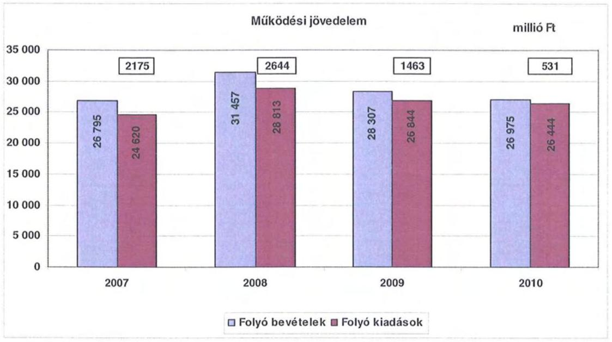

A folyó költségvetés egyenlege (a működési forrástöbblet) 2007-ben a folyó kiadások 8,8%-át (2175 millió Ft-ot), 2008-ban 9,2%-át (2644 millió Ft-ot), 2009-ben 5,5%-át (1463 millió Ft-ot), 2010-ben 2,0%-át (531 millió Ft-ot) jelentette. A vizsgált időszakban a működési jövedelem 6813 millió Ft megtakarítást mutatott,

 amely forrásul szolgálhatott az Önkormányzat fennálló tőketörlesztési kötelezettségeinek teljesítéséhez, valamint a 2008-2009. években a fejlesztéseinek finanszírozásához.

A pozitív előjelű folyó költségvetési egyenleg ellenére az Önkormányzat a 2007–2008. években folyószámlahitel felvételére kényszerült egyrészt az átmeneti likviditási problémák kezelése, másrészt fejlesztési kiadásai finanszírozása miatt. A folyószámlahitel napi átlagos állománya 2007. évi 979 millió Ft-ról, 2008. évben 324 millió Ft-ra csökkent, ugyanakkor a 2009. évben az Önkormányzat nem, a 2010. évben pedig három nap vette igénybe a rendelkezésre álló folyószámlahitel keretét.

Az Önkormányzat kötelezettségein belül a 2007–2009 közötti időszakban a rövid lejáratú kötelezettségek állománya 22%-ról (2945 millió Ft-ról) 24%-ra (3885 millió Ft-ra) emelkedett, majd 2010-re 15%-ra (2322 millió Ft-ra) csökkent. Az Önkormányzat 2006. december 31-én fennálló pénz és tőkepiaci köte-

[^0]
[^0]:    ${ }^{32}$ A társulás bevételi főösszege a pénzmaradvány igénybevétele nélkül a 2007. évben 94 millió Ft, a 2008. évben 51 millió Ft, a 2009. évben 29 millió Ft, a 2010. évben 34 millió Ft, kiadási főösszege a 2007. évben 93 millió Ft, a 2008. évben 49 millió Ft, a 2009–2010. években 21 millió Ft volt.

---

lezettsége 2010-re 77%-kal, 7511 millió Ft-ról 13281 millió Ft-ra nőtt, a kötvénykibocsátások, a hosszú lejáratú hitelfelvételek állományának emelkedése és az elszámolt árfolyamváltozás miatt ${ }^{33}$. Az összes kötelezettségen belül a hosszú lejáratú pénzintézeti kötelezettségek 2007–2010 között több mint 30,4%-kal (2856 millió Ft-tal) nőttek.

A rövid lejáratú kötelezettségek 2010-ben 2322 millió Ft-ot tettek ki, amely 21,1%-kal (623 millió Ft-tal) kevesebb a 2007. évi rövid lejáratú kötelezettségállománynál. Az Önkormányzat a vizsgált időszakban nem rendelkezett számottevő mértékű lejárt szállítói tartozásállománnyal (2010. év december 31-én 83 millió Ft volt).

Az Önkormányzat 2010. évi záró pénzkészlete 5225 millió Ft${ }^{34}$, költségvetési pénzmaradványa 5866 millió Ft volt, melynek 78%-a kötelezettséggel terhelt.

Az Önkormányzat pénzügyi kapacitása a 2007. és a 2010. években jelentősen negatív, a 2008–2009. években pedig pozitív értéket mutatott. A nettó működési jövedelem ${ }^{35}$ értéke a folyó költségvetési pozíció mellett az adott költségvetési év adósságtörlesztésének hatását is tükrözi. A vizsgált időszakban keletkező 6813 millió Ft működési jövedelem 93,2%-ban nyújtott fedezetet a jelentkező 5611 millió Ft fejlesztési célú hitelekhez kapcsolódó tőketörlesztésekre és az 1700 millió Ft kötvény visszafizetésére, melyek kifizetését követően negatív (-497 millió Ft) nettó működési jövedelme keletkezett az Önkormányzatnak.

A nettó működési jövedelem – évről évre csökkenő tőketörlesztés ${ }^{36}$ mellett – 2007-ben -2892 millió Ft, 2008-ban 2383 millió Ft, 2009-ben 1276 millió Ft és 2010-ben -1264 millió Ft volt. A pénzügyi kapacitás 2008. évhez viszonyított romlását 2009–2010 között a folyó bevételek és kiadások különbségéből származó működési jövedelem csökkenése mellett 2010-ben jelentkező magas törlesztési kötelezettség okozta.

Az Önkormányzatnak (a CLF módszer alapján) a 2008–2009. években a fejlesztési kiadások egy részének fedezete – a nettó működési jövedelem képződése mellett – biztosított volt. Továbbá információul szolgál a jövőben vállalható, teljesíthető adósságszolgálat mértékéről.

[^0]
[^0]:    ${ }^{33}$ A 2010. évben az árfolyamváltozás hatása 7,1%-os arányt, 749 millió Ft összeget képviselt a fennálló pénz és tőkepiaci kötelezettségeken belül, a kötvények több mint 70%-a forintban került kibocsátásra.
    ${ }^{34}$ Ebben a társulások pénzeszköze 13 millió Ft volt.
    ${ }^{35}$ pénzügyi kapacitás
    ${ }^{36}$ Az Önkormányzat tőketörlesztési kötelezettsége a 2007. évben 5067 millió Ft, a 2008. évben 261 millió Ft, a 2009. évben 188 millió Ft és a 2010. évben 95 millió Ft volt.

---

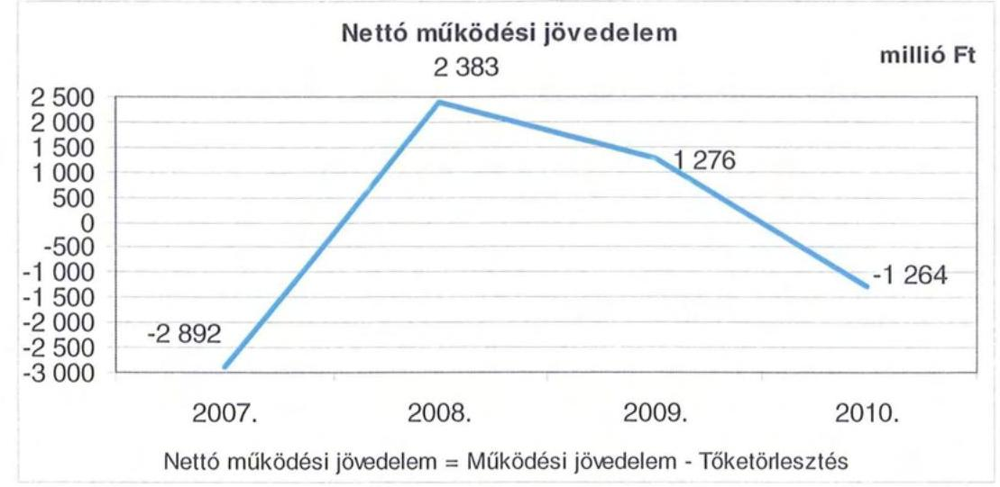

A 2007. és a 2009–2010. években az Önkormányzat felhalmozási költségvetésének egyenlege negatív összegű volt, amely körültekintő költségvetési gazdálkodás és pénzügyileg fenntartható ${ }^{37}$ beruházások esetén nem jár magas pénzügyi kockázattal, amennyiben a felhalmozási hiányra a nettó működési jövedelem fedezetet nyújtana.

A felhalmozási költségvetés egyenlegének alakulását évről évre a következő ábra szemlélteti:
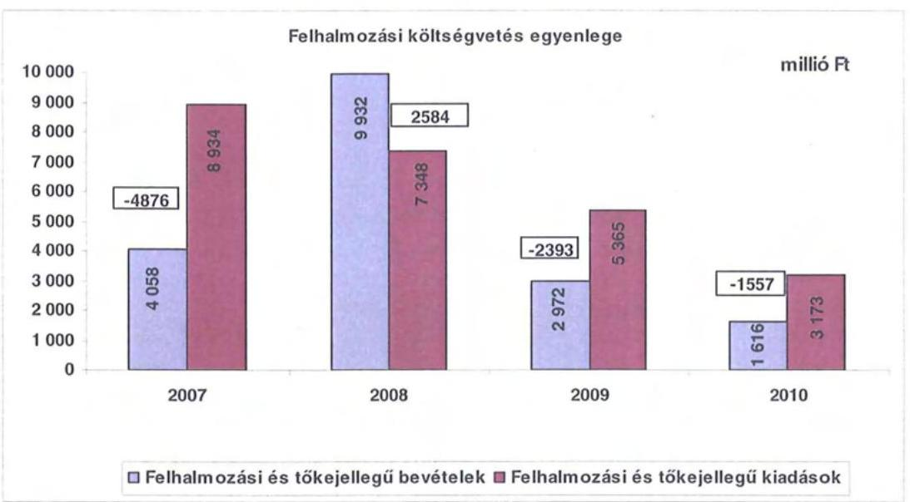

A felhalmozási forráshiánynak a felhalmozási és tőke jellegű kiadásokhoz viszonyított aránya 2007-ben 54,6% (4876 millió Ft), 2009-ben 44,6% (2393 millió Ft), 2010-ben 49,1% (1557 millió Ft) volt.

[^0]
[^0]:    ${ }^{37}$ Az minősül pénzügyileg fenntartható beruházásnak, amelynek működtetésére az Önkormányzat nettó működési jövedelme a következő években is fedezetet nyújt.

---

A vizsgált időszakban keletkezett 6242 millió Ft felhalmozási forráshiányra az 1150 millió Ft 2007. évi nyitó pénzkészlet, az 1451 millió Ft összegű fejlesztési hitel, továbbá a kötvénykibocsátásból származó 10580 millió Ft bevétel nyújtott fedezetet, mely együttesen meghaladja a fejlesztési forráshiányt, miközben a fejlesztési hitelek és kötvényforrások felhasználásra kerültek. Az Önkormányzat fejlesztési bevételeinek egy részét tartalékolta a későbbi fejlesztések finanszírozására, melynek köszönhetően a 2008. év végén 7603 millió Ft, a 2009. év végén 6911 millió Ft és a 2010. év végén pedig 5225 millió Ft volt a pénzeszközeinek állománya.

A függő, átfutó, kiegyenlítő bevételek és kiadások 581 millió Ft-os pozitív egyenlegéből adódóan az Önkormányzat 5225 millió Ft pénzkészlettel zárta a 2010. évet.

Az Önkormányzat 2011. évi költségvetési rendeletében a tervezett bevételek és kiadások különbözete 8098 millió Ft teljes finanszírozási igény (negatív értéket) mutat, melynek részbeni fedezete az előző évek pénzmaradványa lehet 4256 millió Ft összegben. A fennmaradó 3842 millió Ft hiányt a Közgyűlés által 2009. évben jóváhagyott, 506 millió Ft refinanszírozott hitel igénybevételével, valamint újabb 3336 millió Ft értékű fejlesztési célú hitel felvételével vagy kötvénykibocsátásával tudja biztosítani az Önkormányzat, amennyiben az úgynevezett „murvás parkoló” eladásához kapcsolódó mintegy 2700 millió Ft bankgarancia 2011. évi felszabadulására nem kerül sor, illetve egyéb lényeges változás nem következik be a tervezett bevételek és kiadások tekintetében.

Az Önkormányzat finanszírozási igénye ${ }^{38}$ a CLF módszer szerint 2007-ben 7768 millió Ft, 2009-ben 1117 millió Ft, 2010-ben 2822 millió Ft volt, amelynek forrását a finanszírozási célú bevételek és kiadások egyenlege, valamint az előző évi kötelezettséggel nem terhelt szabad pénzmaradvány biztosította. A 2008. évben 4967 millió Ft finanszírozási többlete volt.

Az önkormányzat finanszírozási műveletei 2007–2010. évekbeli egyenlegének alakulását a következő ábra szemlélteti:
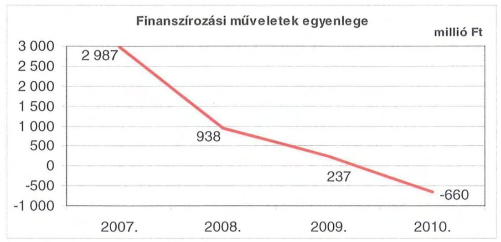

[^0]
[^0]:    ${ }^{38}$ a nettó működési jövedelem és a beruházási költségvetés eredője

---

A finanszírozási többlet azt jelzi, hogy az éves költségvetések végrehajtása során szükség volt az előző években keletkezett tartalékok igénybevételén túl, külső finanszírozás igénybevételére is.

Az Önkormányzat zárszámadási rendeletében a működési és fejlesztési hiányt bemutatta ${ }^{39}$, amelyről a jelentés 1. számú melléklete nyújt tájékoztatást. A rendeletek közül a 2007. évi zárszámadás jelzett -49 millió Ft forráshiányt, a 2008–2010. években többletet mutattak ki.

A kötelezettségek (passzív pénzügyi elszámolások nélkül) a 2007. december 31-i 13635 millió Ft-ról 2010. december 31-ére 15830 millió Ft-ra emelkedtek, amely együtt járt a kamatkiadások növekedésével.

A 2007–2010 között az önkormányzat összesen 3149 millió Ft kamatot fizetett meg. Az átmenetileg szabad pénzeszköze befektetéséből származó kamatbevétel, a teljes kamatráfordítás 39,6%-át (1247 millió Ft) tette ki.

Az Önkormányzat kamatbevételeinek és kamatkiadásainak alakulását a következő ábra mutatja:
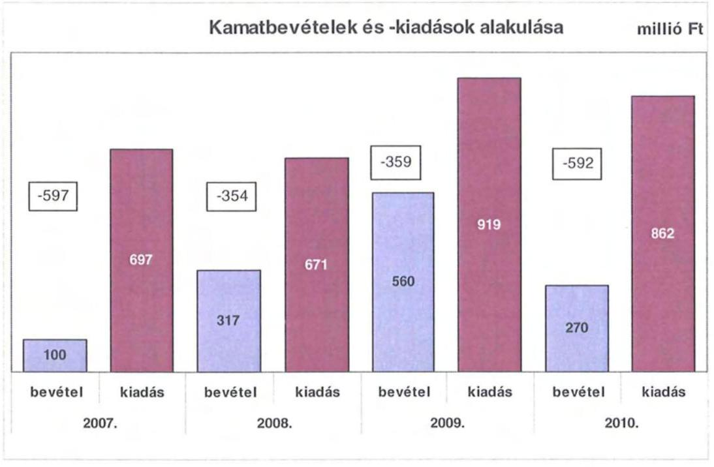

Minden évben jelentősen meghaladták – a 2007. évben hatszorosával, a 2010. évben kétszeresével – a kamatkiadások a kamatbevételeket. A 2011. évre az Önkormányzat a kamatkiadások további csökkentésével számol, a költségvetési rendeletben tervezett 762,9 millió Ft kamatráfordítás a 2010. évhez viszonyítva 11,5%-kal, várhatóan 99,1 millió Ft-tal lesz kevesebb.

[^0]
[^0]:    ${ }^{39}$ Nincs kötelező előírás a működési és fejlesztési hiány megállapításának módjára.

---

# 2.2. Az Önkormányzat bevételeinek alakulása 

Az Önkormányzat folyó és felhalmozási bevételei 2007-ről 2008-ra 34%-kal, 10536 millió Ft-tal növekedtek a helyi adók, a költségvetési támogatás, az ingatlanértékesítésekből származó bevételek és az ehhez kapcsolódó áfa bevételek emelkedéséből. A következő években a bevételek folyamatosan csökkentek az előző évhez viszonyítva 2009-re 24,4%-kal, 10110 millió Ft-tal, majd 2010-re további 8,6%-kal, 2689 millió Ft-tal, az ellátotti létszám, az intézményi átszervezések és az ingatlanértékesítésből származó bevételek jelentős mértékű csökkenése miatt.

Az Önkormányzat folyó (működési) bevétele 2007. évről 2010. évre 180 millió Ft-tal (0,7%-kal) növekedett.
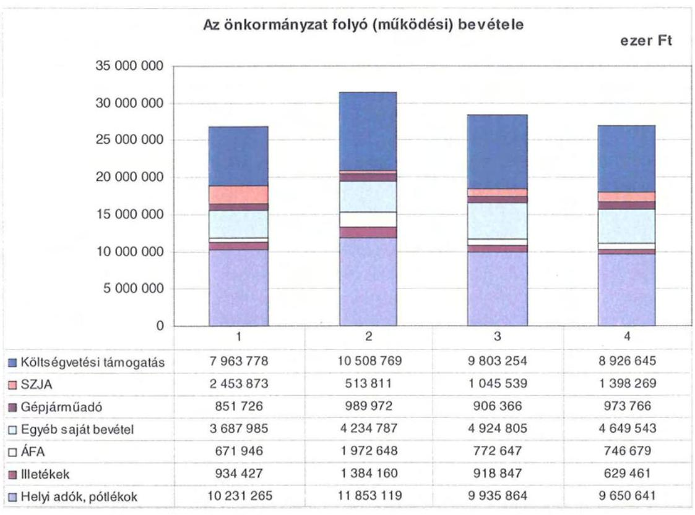

A központi költségvetésből kapott támogatások 2010-re a 2007-hez viszonyítva 0,9 százalékponttal, 93 millió Ft-tal csökkentek. Ezen belül az Önkormányzat működési célú költségvetési támogatásai a 2007. évi 7960 millió Ft-ról 2008-ra 10509 millió Ft-ra, 32%-kal nőttek, mivel 2008-tól nem az átengedett szja-ból, hanem költségvetési támogatásból finanszírozzák a teljes normatív állami hozzájárulást. A költségvetési támogatás összege 2008-ról 10509 millió Ft-ról 2009-re 9803 millió Ft-ra, majd 2010-re 8912 millió Ft-ra csökkent a központi támogatáselosztás változása, továbbá az ellátottak létszáma és a város lakosságszáma csökkenésének a hatására. A felhalmozási célú támogatások összege a 2007. évben 4 millió Ft és a 2010. évben 15 millió Ft volt felhalmozási célú központosított előirányzatból.

Az Önkormányzat észrevételében módosításra javasolta a 2007. évi központi költségvetésből kapott támogatások összegét, amit nem módosítunk, mivel a különbözetként kimutatott a 2007. évi 1817 millió Ft táblázatban szerepeltetett költségvetési támogatás összeg a jelentésben az átengedett szja bevételek között szerepel.

Az átengedett szja összege a 2007. évről a 2008. évre 79,1%-kal (1940 millió Ft) csökkent. Az Önkormányzat az előző évhez képest 2009-ben 103,5%-kal (532 millió Ft-tal), 2010-ben további 33,6%-kal (352 millió Ft-tal) kapott több átengedett szja-t. A kedvező változást a 2007–2010 között évről évre folyamatosan növekvő iparűzési adóerő-képesség okozta. A jövedelemkülönbség mérsékléséből adódóan a 2007. évben 711 millió Ft-tal, a 2008. évben -1372 millió Ft, a 2009. évben 1111 millió Ft-tal, és a 2010. évben -788 millió Ft-tal módosult a szja helyben maradó része.

A gépjárműadóból származó bevétel 2007-ről 2010-re 14%-kal, 974 millió Ft-ra emelkedett, a gépjárműadó alapjának, mértékének és az egyes mentességi kategóriákat érintő központi módosításoknak a következtében.

Az Önkormányzat egyéb saját folyó bevételei a vizsgált időszakban változóan alakultak. A 2007. évi 3688 millió Ft-ról a 2008. évre 4235 millió Ft-ra, 14,8%-kal, és 2009-re 4925 millió Ft-ra további 16,3%-kal növekedtek, míg 2010-re 4650 millió Ft-ra, 5,6%-kal csökkentek. Az egyéb saját folyó bevételek lényeges összetevőjét az intézményi működési bevétel ${ }^{40}$ összege képezte, amely 2007-ben 2519 millió Ft, 2008-ban 3932 millió Ft, 2009-ben 2485 millió Ft, 2010-ben 2237 millió Ft volt.

Az áfa bevételek, visszatérülések összege az előző évhez képest 2008-ra 193,6%-kal, 1301 millió Ft-tal emelkedett a tárgyi eszközök értékesítéséből származó áfa bevétel következtében. Az előző évhez képest a 2009. évre 60,8%-kal, 1200 millió Ft-tal, majd a 2010. évre további 3,4%-kal, 26 millió Ft-tal csökkent. Az áfa bevételből a 2010. évben 174 millió Ft volt a fordított áfa elszámolás ${ }^{41}$ hatása.

A folyó (működési) bevételen belül az Önkormányzat illetékbevétele 2007-ről 2010-re 305 millió Ft-tal, 33%-kal csökkent az ingatlanpiac visszaesése és egyes illetékkedvezmények bevezetése következtében.

Az Önkormányzat a 2007–2010. években három ${ }^{42}$ helyi adónemet, a helyi iparűzési
 adót, az idegenforgalmi adót és 2009. február 17-ig a luxusadót alkalmazta. Az iparűzési adónál a maximális adómértéket, 2%-ot, az idegenforgalmi adónál szintén a maximális adómértéket, 300 Ft/vendégéjszaka alkalmazták a vizsgált időszakban. Az iparűzési adó 2008. évi 1582 millió Ft-os növekedése nem az Önkormányzat intézkedése miatt, hanem jogszabályváltozás${ }^{43}$ és az adózók eredményei hatására következett be. Az Önkormányzat idegenforgalmi adóból származó bevétele a 2007. évhez viszonyítva nem változott, 9 millió Ft volt. A luxusadóból 2007-2009. években 0,1-0,9-0,4 millió Ft bevétele keletkezett az Önkormányzatnak.

[^0]
[^0]:    ${ }^{40}$ Működési ÁFA bevétel, ÁFA visszatérülés nélkül
    ${ }^{41}$ A fordított áfa elszámolása pénzügyi kihatása a 2010. évben 174 millió Ft, amely mind a bevételi, mind a kiadási oldalon megjelent.
    ${ }^{42}$ A saját bevételek növelése érdekében a Közgyűlés 2011. március 1-jei hatállyal bevezette az építményadót.

---

zás${ }^{43}$ és az adózók eredményei hatására következett be. Az Önkormányzat idegenforgalmi adóból származó bevétele a 2007. évhez viszonyítva nem változott, 9 millió Ft volt. A luxusadóból 2007-2009. években 0,1-0,9-0,4 millió Ft bevétele keletkezett az Önkormányzatnak.

Az Önkormányzatnál a helyi adókból és pótlékokból származó bevételek folyó (működési) bevételeken belül aránya csökkent a 2007. évi 38%-ról a 2010. évi 36%-ra. A helyi adóbevételek a 2007. évről 2010. évre 5,7%-kal, 580 millió Ft-tal csökkentek, mely az iparűzési adóból származó bevételek 596 millió Ft csökkenéséből adódott. Az Önkormányzat iparűzési adóból származó bevétele a 2008. évre 15,5%-kal, 1582 millió Ft-tal emelkedett, majd fokozatosan csökkent, 2009-évre 16,3%-kal, 1916 millió Ft-tal és 2010-re további 2,7%-kal, 262 millió Ft-tal. Az Önkormányzat a helyi adókból származó bevételek növelése érdekében a vizsgált időszakban nem tett intézkedést.

Az Önkormányzat 2007-2009 között változó összegben kapott osztalékot a gazdasági társaságokban lévő tulajdonrésze alapján. A kapott osztalék összege a 2007. évben kettő társaságtól 730 ezer Ft, 2008-ban egy társaságtól 49 ezer Ft, 2009-ben három társaságtól 80845 ezer Ft volt. Az egyes években kapott osztalék 93%-a (76 millió Ft) a hulladékkezelést végző gazdasági társaságtól származott. Az Önkormányzat osztalékról nem mondott le.

A tárgyévi pénzforgalmi működési bevételeket és kiadásokat összehasonlítva az Önkormányzat folyó bevételei minden évben fedezetet nyújtottak a folyó kiadások finanszírozására.

Az Önkormányzat felhalmozási bevételei a vizsgált időszakban a következőképpen alakultak:
ezer Ft-ban

| Megnevezés | 2007. év   tény | 2008. év   tény | 2009. év   tény | 2010. év   tény |
| :-- | --: | --: | --: | --: |
| Tárgyi eszköz értékesítés | 454951 | 6776929 | 308842 | 38596 |
| Egyéb saját tőkebevétel | 305545 | 305371 | 831465 | 195761 |
| Államháztartáson belülről   kapott támogatás | 1741400 | 1910529 | 986732 | 1074104 |
| EU-tól és külföldről kapott   támogatások | 0 | 517 | 0 | 6584 |
| Államháztartáson kívülről   kapott támogatás | 1556123 | 938213 | 845332 | 300515 |
| Összes felhalmozási bevétel | 4058019 | 9931559 | 2972371 | 1615560 |

A vizsgált években a felhalmozási bevételek a 2007. évi 4058 millió Ft-ról 2008-ban 145%-kal, 9932 millió Ft-ra emelkedtek, 2009-ben 70%-kal, 2972 millió Ft-ra, majd a 2010-ben 46%-kal, 1616 millió Ft-ra csökkentek az előző évhez

[^0]
[^0]:    ${ }^{43}$ A helyi adókról szóló törvényt módosító 2007.évi CXXVI. törvény 2008. január 1-jétől 2009. július 1-jéig az adóalap új megosztását vezette be, ami az Önkormányzat számára kedvezőbb volt.

---

viszonyítva. A felhalmozási bevételek jelentős ingadozását döntően a tárgyi eszközök értékesítéséből származó bevételek okozták. A 2008. évi növekedés a murvás parkoló értékesítéséből adódott, melynek hatására a felhalmozási költségvetés egyenlege pozitív volt, míg más években negatív. A felhalmozási bevételek alakulását befolyásolta az államháztartáson belülről és kívülről kapott pályázati - támogatások együttes összegének 2007-ről 2008. évre tapasztalt 14%-os, 448 millió Ft-os, a 2008-ról 2009-re 36%-os, 1017 millió Ft-os és a 2009-ről 2010-re további 451 millió Ft-os csökkenése.

Az Önkormányzat tárgyi eszköz-értékesítésből származó bevétele - amely magába foglalja az önkormányzati lakások, helyiségek értékesítésének bevételét is - 2007-ről 2010-re 91%-kal, 409 millió Ft-ra csökkent, mivel a tervezett ingatlanértékesítések nem történtek meg.

# 2.3. Az Önkormányzat kiadásainak alakulása 

Az Önkormányzat folyó és felhalmozási kiadásai 2007-ről 2008-ra 7,8%-kal, 2607 millió Ft-tal növekedtek, majd 2009-re 10,9%-kal, 3952 millió Ft-tal és 2010-re további 8%-kal, 2592 millió Ft-tal csökkentek, a működési és felhalmozási kiadások jelentős mértékű csökkenése következtében.

Az Önkormányzat folyó kiadásai főbb jogcímek szerinti bontásban az alábbiak voltak:
ezer Ft-ban

| Megnevezés | 2007. | 2008. | 2009. | 2010. |
| :--: | :--: | :--: | :--: | :--: |
| Folyó kiadások | 24620027 | 28813384 | 26843959 | 26443869 |
| Működési kiadások (kamatkiadás nélkül) | 21576515 | 25363542 | 21528242 | 20277142 |
| Államháztartáson belülre átadott pénzeszközök | 67042 | 141572 | 185411 | 153329 |
| Transzferkiadások | 1724585 | 1902147 | 3450193 | 4400673 |
| -ebből vállalkozásoknak | 373884 | 497411 | 2266658 | 2944817 |
| EU-nak, illetve külföldre | 0 | 0 | 0 | 0 |
| magánszemélyeknek | 446757 | 454494 | 537568 | 684204 |
| nonprofit szervezeteknek | 779481 | 890258 | 599420 | 738483 |
| Kamatkiadások | 697416 | 671523 | 918520 | 861647 |
| Előző évi pénzmaradvány átadás | 554469 | 734600 | 761593 | 751078 |

Az Önkormányzat folyó kiadásai 2007. december 31-ről 2010. december 31-re 7,5%-kal (24620 millió Ft-ról 26444 millió Ft-ra) emelkedtek, ezen belül a működési kiadások viszont 6%-kal, 1300 millió Ft-tal csökkentek.

Az Önkormányzat működési kiadásai (kamatkiadások nélkül) a vizsgált időszakban a következőképpen alakultak:
ezer Ft-ban

| Megnevezés | 2007. | 2008. | 2009. | 2010. |
| :--: | :--: | :--: | :--: | :--: |
| Személyi juttatások | 10930457 | 11707902 | 10643527 | 10258205 |
| Munkaadót terhelő járulékok | 3334029 | 3526541 | 3113412 | 2636751 |
| Dologi kiadások | 7073614 | 9930900 | 7575290 | 6981196 |
| Egyéb folyó kiadások | 211429 | 150775 | 145968 | 370985 |
| Előző évi maradvány visszafizetés | 26986 | 47424 | 60045 | 30005 |

Az Önkormányzat 2007-ben a működési költségvetés 66,1%-át (14 264 millió Ft-ot, 2010-ben a 63,6%-át (12 894 millió Ft-ot) fordította a személyi juttatásokra és a munkaadókat terhelő járulékokra, az üzemeltetést, intézményfenn-

---

tartást biztosító dologi és egyéb folyó kiadásokra 2007-ben 33,9% (7312 millió Ft) 2010-ben 36,4% (7383 millió Ft) jutott.

A személyi juttatások és járulékok a vizsgált időszakban 9,6%-kal, 1370 millió Ft-tal csökkentek a végrehajtott létszámcsökkentések, az intézmény megszüntetése következtében, továbbá a munkaadót terhelő járulékok csökkentése miatt. A 2007. december 31-i állapothoz képest a munkaadókat terhelő járulékok jelentős${ }^{44}$ csökkenése következett be, amely egyrészt a kifizetett személyi juttatások, másrészt a járulékok mértékének csökkenésével volt összefüggésben. A járulékok csökkenése miatt felszabaduló forrásokat azonban a kormányzat az önkormányzati alrendszernek nyújtott állami támogatásokból levonta, így a járulékcsökkenés az Önkormányzatnál érdemi megtakarítást nem eredményezett.

Az Önkormányzat dologi kiadásai a 2008. évben növekedtek, majd az azt következő években csökkentek az előző évhez viszonyítva. A 2010-ben a 2008. évi szintnél 30%-kal (2950 millió Ft-tal) voltak alacsonyabbak. A jelentős mértékű csökkenést az Önkormányzat a középfokú oktatási intézményeinek összevonásával, megszüntetésével, továbbá önkormányzati${ }^{45}$ feladatok ellátásának kiszervezésével érte el. A feladatok más formában történő ellátása önkormányzati szinten nem jelentett kiadási megtakarítást, mivel a dologi kiadások csökkenésével egyidejűleg emelkedett a működési célra átadott pénzeszközök folyó kiadásokon belüli aránya a kiszervezett feladatokhoz nyújtott önkormányzati támogatás miatt.

Az Önkormányzat által a gazdasági társaságok részére nyújtott működési és felhalmozási célú pénzeszközátadás alakulását a következő diagram mutatja be a 2007-2010. évekre:

[^0]
[^0]:    ${ }^{44}$ 2010. évi teljesítés szinten 697 millió Ft-os csökkenés a 2007. évhez képest
    ${ }^{45}$ Települési hulladék kezelése, köztisztasági tevékenység, város és községgazdálkodás, közvilágítás, vízkárelhárítás, közutak, hidak, alagutak üzemeltetése, piaci és vásári tevékenység, fizető parkolási rendszer üzemeltetése, szabadidős létesítmények üzemeltetése, önkormányzati vagyon kezelése, temetők fenntartása.

---

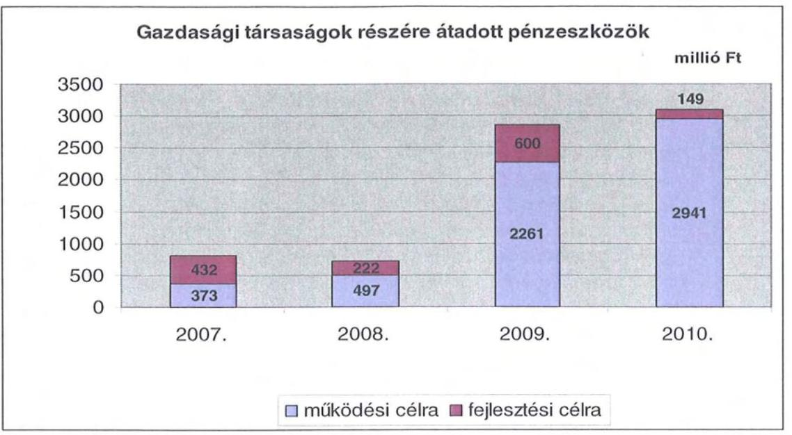

A gazdasági társaságoknak nyújtott működési célú pénzeszközátadás a vizsgált években folyamatosan növekedett, a 2007. évi 373 millió Ft-ról 2008-ra 33%-kal, 497 millió Ft-ra, 2009-re közel ötszörösére, 2261 millió Ft-ra és 2010-re további 30%-kal emelkedett, 2941 millió Ft-ra. Ezen belül az önkormányzati feladatok ellátásában résztvevő gazdasági társaságoknak nyújtott működési célú pénzeszközátadás a 2007. évi 207 millió Ft-ról a 2009. évre 1486 millió Ft-ra, majd a 2010. évre 2239 millió Ft-ra emelkedett. A 2009. évtől kiugróan magas növekedés az önkormányzati feladatok Székesfehérvár Városgondnoksága Nonprofit Kft-be történő kiszervezéséből adódott. A gazdasági társaság az üzemeltetési szerződésben megállapított feladatok finanszírozását a feladatellátásból származó bevételéből, az Önkormányzat részéről az általa, a vagyontárgyakkal összefüggésben megállapított bevétel beszedésének átengedéséből származó bevételből, továbbá a 2009-ben 1340 millió Ft és 2010-ben 2184 millió Ft működési célú pénzeszközök átvételéből biztosította.

A felhalmozási célú támogatások a beruházások függvényében változóan alakultak a vizsgált években. A 2007. évi 432 millió Ft-ról a 2010. évre 149 millió Ft-ra csökkentek. Ezen belül az önkormányzati feladatok ellátásában résztvevő gazdasági társaságoknak nyújtott felhalmozási célú pénzeszközátadások a 2007. évi 60 millió Ft-ról a 2010. évi több mint két és félszeresére, 149 millió Ft-ra emelkedtek. A Székesfehérvár Városgondnoksága Kft. a 149 millió Ft felhalmozási célra átvett pénzeszközből valósította meg a gazdasági társaság által elvégzett beruházási, felújítási feladatokat${ }^{46}$. Az önkormányzati feladatok ellátásában résztvevő gazdasági társaságoknak nyújtott pénzeszközátadások összesített adatait a 4. számú melléklet tartalmazza.

[^0]
[^0]:    ${ }^{46}$ Út, járda, parkoló, játszótérépítés, műfű sportpálya, térburkolat stb. összesen 102 felhalmozási - beruházási, felújítási - tétel.

---

Az Önkormányzat felhalmozási kiadásainak aránya az összes kiadáson belül - a 2009. évet kivéve - folyamatosan csökkent. A felhalmozási kiadások összes költségvetési kiadáshoz viszonyított aránya 2007-ben 26,6%- (8933 millió Ft) 2010-ben 10,7% (3173 millió Ft) volt. Az Önkormányzat tárgyi eszközeinek értékesítésből, kötvénykibocsátásból származó rendkívüli bevételeit, továbbá a felvett hosszú lejáratú hiteleit használta fel intézményei, továbbá az infrastruktúra fejlesztésére.

A működési és felhalmozási kiadások alakulását a vizsgált időszakban az alábbi ábra mutatja be:
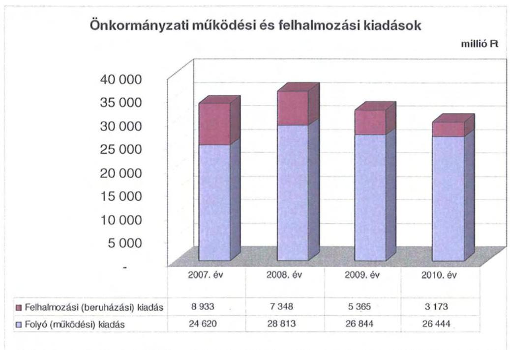

Az Önkormányzat 2007-2010. években együttesen 18952 millió Ft-ot fordított fejlesztéseinek finanszírozására, ennek 3,6%-a a 10 millió Ft egyedi beszerzési érték alatti fejlesztésekhez kapcsolódott. A 2007-2010 között a 74 darab 10 millió Ft egyedi beszerzési érték feletti befejezett beruházások és felújítások összértéke 18265 millió Ft, a 10 millió Ft alatti fejlesztések összértéke 687 millió Ft volt. Az Önkormányzat a 2007-2010. években megvalósított, 2010. december 31-éig befejezett fejlesztéseinek a forrását 6435 millió Ft összegben kötvénykibocsátásból származó bevétel, 1200 millió Ft összegben hitel, 1374 millió Ft összegben EU-s és 8140 millió Ft összegben hazai
 támogatás, valamint 1803 millió Ft összegben önkormányzati saját bevétel képezte.

A 2007–2010. évben az Önkormányzat megvalósított és folyamatban lévő kiemelt infrastrukturális beruházásai az alábbiak:

- a tömegközlekedés fejlesztése; Berényi út, Kosztolányi út, Virág út felújítása, Zobori utcai csapadékcsatorna és elektromos légvezeték építése, autóbusz-pályaudvar átépítése, Kisfalud–Dinnyés kerékpárút, Alsóvárosi kerékpárút építése, jelzőlámpás csomópont kiépítése Budai–Nagyszombati út kereszteződésénél;

---

- a szennyvízcsatorna-beruházás, Pöstényi út csapadékvíz-elvezetésének kiépítése;
- az általános iskolák és óvodák, bölcsődék felújítása, bővítése, akadálymentesítése, iparosított technológiával készült épületek felújítása, 28 játszótér és két park építése, jégcsarnok korszerűsítése, Maroshegyi sportpálya építése.

Ágazati beruházások a következő területeket érintették: úthálózat-rekonstrukció, egészségügyi, szociális, kulturális és sport célú beruházások és intézményi felújítások.

Ezen időszakban az Önkormányzat legmagasabb bekerülési költségű beruházásai a következők voltak:

- a társasházak energiatakarékos felújításának teljes bekerülési költsége – az iparosított technológiával épült lakóépületek energiatakarékos korszerűsítése, felújítása – a 2007–2010. években 10636 millió Ft volt. A felújításokat 2007-ben kezdték el és 2010. december 31-ig befejezték. A fejlesztés forrásösszetétele: 816 millió Ft hitel, 1878 millió Ft kötvénykibocsátásból származó bevétel, 7869 millió Ft hazai támogatás és 73 millió Ft saját bevétel volt. A társasházak energiatakarékos felújítására fordított összeg nem kerül aktiválásra, nem növeli az Önkormányzat, az államháztartás vagyonát;
- három épület páratlan összeolvadásából jött létre Székesfehérvár talán leggyönyörűbb építészeti alkotása, a Hiemer–Font–Caraffa épületegyüttes. A rekonstrukció II. ütemének teljes bekerülési költsége 777 millió Ft volt, mely 2006-ban kezdődött és 2008-ban fejeződött be. A beruházás forrása 22 millió Ft kötvénykibocsátásból származó bevétel, 698 millió Ft Norvég Finanszírozási Alapból nyújtott támogatás, 49 millió Ft hazai támogatás és 8 millió Ft önkormányzati saját bevétel volt;
- a Rádió u. 7. Idősek Otthona beruházás 2008-ban kezdődött és 2009-ben fejeződött be, melynek teljes bekerülési költsége 345 millió Ft volt, a fejlesztés forrását 70 millió Ft kötvénykibocsátásból származó bevételből és 275 millió Ft önkormányzati saját bevételből biztosították.

A folyamatban lévő tíz – 10 millió Ft feletti – fejlesztés és a 10 millió alatti felújítások és fejlesztések várható teljes bekerülési költsége 2716 millió Ft, melyből a 2010. december 31-éig teljesített kiadás 449 millió Ft volt. A teljesített fejlesztési kiadások forrása 109 millió Ft EU-s támogatás, 25 millió Ft kötvénykibocsátásból származó bevétel és 315 millió Ft saját bevétel volt. A Közgyűlés a 2011. május 31-i ülésén úgy döntött, hogy a 2266 millió Ft „Királyi Séta – Történelmi időutazás az ezeréves Székesfehérváron” című projekt megvalósítására kötött konzorciumi megállapodást, továbbá a Konzorcium és a Közreműködő Szervezetek között létrejött támogatási szerződést közös megegyezéssel 2011. június 3-án megszünteti. A folyamatban lévő beruházás megszüntetésére a projekt eredeti tartalommal történő megvalósítására kikötött határidő tarthatatlansága, valamint a konzorciumi partner forráshiánya miatt került sor. A fennmaradó 1 millió Ft befejezetlen beruházás 2011. évi forrása, mint EU-s támogatás rendelkezésre áll.

---

Az Önkormányzat hat fejlesztési feladathoz nyújtott be pályázatot 663 millió Ft teljes bekerülési költséggel, melyet 569 millió Ft EU-s és 40 millió Ft hazai támogatásból, valamint 54 millió Ft saját bevételből tervezik megvalósítani.

Az Önkormányzat a mintegy 1500 millió Ft tervezett bekerülési értékű „Agóra Pólus” projekt megvalósításától elállt, tekintettel a beruházás önrészére, a szükséges előfinanszírozás mértékére és a fenntarthatóságára. A vizsgálat eredményeképpen az Önkormányzat úgy ítélte meg, hogy a létrejövő komplexum jövőbeni fenntarthatóságához szükséges források várhatóan nem állnak majd rendelkezésre.

Az Önkormányzat 2007–2010. években megvalósított, illetve 2010. december 31-én fennálló fejlesztési feladatokhoz kapcsolódó kötelezettségeinek összegzését a 3. a. b. c. d. sz. mellékletek tartalmazzák.

# 3. KÖTELEZETTSÉGEK BEMUTATÁSA 

### 3.1. A pénzintézetek felé fennálló kötelezettségek alakulása

Az Önkormányzat pénzintézeti kötelezettségeinek állománya 2006. december 31-től 2010. december 31-ig közel 1,8-szeresére, 7511 millió Ft-ról 13281 millió Ft-ra nőtt. Fennálló pénzintézeti kötelezettségek kötvények kibocsátásából és hosszú lejáratú hitelek igénybevételéből keletkeztek.
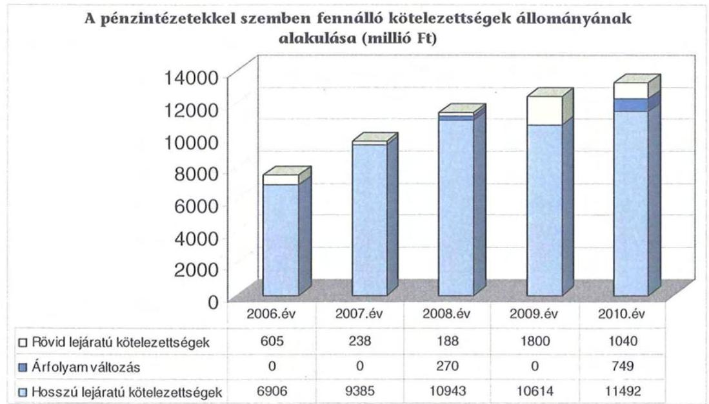

Az Önkormányzat a 2009. évben árfolyamváltozást nem számolt el.
Az árfolyamváltozás hatása is befolyásolja a kötelezettségek alakulását, azonban annak mértéke előre pontosan nem határozható meg, csak várakozásokon alapuló tendenciák jelezhetők.

Annak megítéléséről, hogy a devizában kibocsátott kötvényekért és felvett hitelekért kapott forinthoz képest a kötvények visszavásárlásakor, illetve a hitelek visszafizetésekor jelentkező forint kötelezettség többletkiadást (árfolyamveszteség) vagy megtakarítást (árfolyamnyereség) eredményez a futamidő végén, a teljes kötelezettség rendezését követően lehet képet alkotni. Mindaddig, amíg törlesztési kötelezettség nem áll fenn (türelmi idő, moratórium), a tőkére vonatkoztatva nem értelmezhető sem az árfolyamveszteség, sem az árfolyamnyereség. Ugyanakkor a Számv. tv. 60. § (4) bek. meghatározza, hogy az árfolyamkülönbözetet év végén a kötelezettségek vagy követelések között a könyvviteli mérlegben nyilván kell tartani, azonban az árfolyamkülönbözet valójában nem realizált.

Az Önkormányzat fennálló pénzintézeti kötelezettségvállalásaira közgyűlési döntés alapján került sor. A kötelezettségvállalásból származó források felhasználási céljait meghatározták. A Közgyűlés döntéseit megalapozó előterjesztések tartalmazták a teljes futamidő várható tőkefizetési kötelezettségeknek és a kötelezettségvállalás visszafizetési forrásainak bemutatását, de csak részben tartalmazták a teljes futamidő várható kamatfizetési kötelezettségeknek, az árfolyam- és kamatkockázatnak a bemutatását. Az előterjesztésekben kitértek az adósságszolgálati korlát bemutatására, a Közgyűlés döntéseit ennek figyelembevételével hozta meg.

Az Önkormányzat a kötelezettségvállalások során az adósságot keletkeztető kötelezettségvállalásának felső határát nem lépte túl.

Az adósságot keletkeztető kötelezettségvállalással megvalósított felhalmozási kiadások esetleges bevételt növelő, illetve kiadást csökkentő vonzatát, illetve ennek a fejlesztéshez, felújításhoz vállalt kötelezettségek visszafizetési forrásként való számbavételét nem vizsgálták.

Az Önkormányzat 2010. december 31-én CHF-ben fennálló adósságot keletkeztető kötelezettségvállalásai az alábbiak voltak:

| Megnevezés | Kibocsátás   időpontja | Összeg   CHF | Kibocsátási   árfolyam | Kamat (referencia   kamat+ kamatfelár) | Felhasználás   célja |
| :-- | :--: | :--: | :--: | :--: | :-- |
|  |  |  |  |  |  |
| Fehérvár Kötvény | 2005. 07. 25 | 7636404 | 176,13 | 6 havi CHFLBCR+1,49% | Beruházási   feladatok   finanszírozása |
|  |  |  |  |  |  |
| Vörösmarty Kötvény | 2007. 12. 21 | 9477274 | 152,47 | 6 havi CHFLBCR+1,20% | Fejlesztési célú   hitelek kiváltása |

A kötvények kibocsátásából származó forrásokat az Önkormányzat 100%-ban felhasználta. A Fehérvár Kötvény kibocsátásából származó bevétel 58,1%-át (781 millió Ft) szennyvízcsatorna-építés önerejének biztosítására, 41,9%-át (564 millió Ft) energiatakarékos épület-felújítás saját erejének biztosítására használták fel. A Vörösmarty Kötvény kibocsátásából származó bevétel 99,8%-át (1442 millió Ft) fejlesztési célú hitelek kiváltására, 0,2%-át (3 millió Ft) épület-felújításra használták fel. A Vörösmarty Kötvény lejegyzője nem az Önkormányzat számlavezető bankja volt.

---

Az Önkormányzat 2010. december 31-én HUF-ban fennálló adósságot keletkeztető kötelezettségvállalásai az alábbiak voltak:
ezer Ft-ban

| Megnevezés | Kibocsátás, illetve szerződéskötés időpontja | Összeg (ezer Ft) | Kamat (referencia kamat+ kamatfelár) | Felhasználás célja: |
| :--: | :--: | :--: | :--: | :--: |
| Fehérvári Panel Kötvény | 2007. 05. 18 | 1800000 | 6 havi BUBOR +1,49% | Beruházási feladatok finanszírozása |
| Székesfehérvár Kötvény | 2007. 07. 18 | 810000 | 6 havi BUBOR +0,45% | A 2007. évi fejlesztések finanszírozása |
| Szent László Kötvény | 2007. 12. 13 | 1695000 | 6 havi BUBOR +1,49% | Beruházási feladatok finanszírozása |
| Szent István Kötvény | 2007. 12. 13 | 1430000 | 6 havi BUBOR +1,49% | Beruházási feladatok finanszírozása |
| Alba Regia Kötvény | 2010. 01. 04 | 1700000 | 3 havi BUBOR +2,90% | A 2010. 01. 04-én esedékes kötvény visszafizetése |
| ONK-0019/2004. számú hosszúlejáratú hitel | 2004. 05. 17 | 624394 | 3 havi BUBOR +1,00% | 98 db önkormányzati bérlakás építése |
| 41355 számú hosszúlejáratú hitel | 2010. 03. 16 | 213955 | 3 havi EURIBOR +1,50% | „Panelprogram”   finanszírozása |
| FB-5/2009. számú hosszúlejáratú hitel | 2009. 11. 30 | 1187500 | 3 havi BUBOR +2,90% | Fejlesztési feladatok finanszírozása |
| FB-14/2007. számú hosszúlejáratú hitel | 2008. 04. 29 | 681 | változó, jelenleg 16% | Öreghegyi Beruházó Víziközmű Társulat megszünési miatti hitelátvállalás |
| FK-40/2004. számú hosszúlejáratú hitel | 2008. 04. 29 | 195 | változó, jelenleg 16% | Öreghegyi Beruházó Víziközmű Társulat megszünési miatti hitelátvállalás |
| FK-22/2007. számú hosszúlejáratú hitel | 2008. 04. 29 | 1733 | változó, jelenleg 16% | Öreghegyi Beruházó Víziközmű Társulat megszünési miatti hitelátvállalás |
| FK-8/2005. számú hosszúlejáratú hitel | 2008. 11. 28 | 1449 | változó, jelenleg 16% | Alsóvárosi Beruházó Víziközmű Társulat megszünési miatti hitelátvállalás |
| FK-7/2005. számú hosszúlejáratú hitel | 2008. 11. 28 | 452 | változó, jelenleg 16% | Alsóvárosi Beruházó Víziközmű Társulat megszünési miatti hitelátvállalás |
| FBH-3/2004. számú hosszúlejáratú hitel | 2008. 11. 28 | 3849 | változó, jelenleg 16% | Alsóvárosi Beruházó Víziközmű Társulat megszünési miatti hitelátvállalás |
| FBH-4/2004. számú hosszúlejáratú hitel | 2008. 11. 28 | 2617 | változó, jelenleg 16% | Alsóvárosi Beruházó Víziközmű Társulat megszünési miatti hitelátvállalás |
| FK-16/2003. számú hosszúlejáratú hitel | 2008. 11. 28 | 300 | változó, jelenleg 16% | Alsóvárosi Beruházó Víziközmű Társulat megszünési miatti hitelátvállalás |

---

A Fehérvári Panel Kötvény kibocsátásából származó bevétel 91%-át (1640 millió Ft) energiatakarékos épület-felújításra, 0,9%-át (15 millió Ft) egycsatornás gyűjtőkémény-építésre, 8,1%-át (145 millió Ft) lakásgazdálkodási alapfeladatok ellátására használták fel. A Székesfehérvár Kötvényből származó forrásból intézményi felhalmozási kiadásokat 324 millió Ft összegben (38,2%) és intézményi felújítási kiadásokat (486 millió Ft összegben (61,8%)) finanszíroztak. A Szent László Kötvény bevételéből különféle fejlesztési és felújítási feladatok megvalósítására került sor a 2007. és 2008. években. A Szent István Kötvény bevételét 100%-ban kilenc db különféle fejlesztési és felújítási hitel kiváltására, Az Alba Regia Kötvény kibocsátásából származó forrást teljes egészében a 2010. január 4-én esedékes Koronázó Város Kötvény visszafizetésére használták fel. A Székesfehérvár Kötvény lejegyzője nem az Önkormányzat számlavezető bankja volt.

Az ONK-0019/2004. számú hosszú lejáratú hitelkeretből (742,4 millió Ft) az Önkormányzat 693,8 millió Ft-ot vett igénybe, melyet 100%-ban 98 db bérlakás építésére használt fel. Az igénybe nem vett hitelkeret nem használható fel. A 41355. számú hosszú lejáratú hitelkeretből (720 millió Ft) az Önkormányzat 2011. január 1-jéig 214 millió Ft-ot hívott le, melyet 100%-ban a „Panelprogram” önkormányzati finanszírozására használt fel. A még igénybe vehető hitelkeret összege 506 millió Ft. Az FB-5/2009. számú hosszú lejáratú hitelkeretet (1200 millió Ft) 100%-ban igénybe vette az Önkormányzat, melynek 22%-a (264 millió Ft) belterületi utak felújítására, 70%-a (840 millió Ft) energiatakarékos épület-felújításokra, 8%-a (96 millió Ft)
 intézményi felújítások finanszírozására lett felhasználva.

Az Önkormányzat a kötvény kibocsátásból származó forrásait 100%ban felhasználta, a hosszú lejáratú hitelkeretekből a fel nem használt, még igénybe vehető keret összege 2011. december 31-én 506 millió Ft volt.

Az Önkormányzat a CHF-ban fennálló pénzintézeti kötelezettségéből 2010. december 31-ig tőkét nem törlesztett, de 1743879 CHF (301,8 millió Ft) kamatot, valamint a kötelezettséghez kapcsolóan 22,2 millió Ft egyéb díjat és költséget (22 millió Ft jegyzési garanciavállalási díjat, 0,2 millió Ft egyéb költséget) fizetett. A HUF-ban fennálló pénzintézeti kötelezettségéből 1838,8 millió Ft tőkét törlesztett ${ }^{47}$, emellett 2217,5 millió Ft kamatot és 57,1 millió Ft egyéb díjat, költséget (40,5 millió Ft jegyzési garanciavállalási díjat, 16,4 millió Ft ügynöki díjat, 0,2 millió Ft egyéb költséget) fizetett.

Az Önkormányzat 2007. január 1. - 2010. december 31. között az átmenetileg szabad pénzeszközein 1247,3 millió Ft kamatbevételt ért el. Az elért kamatbevétel kötvény forrás befektetéséből származó bevételt nem tartalmazott, mivel a kötvénykibocsátásokra az ismert fizetési kötelezettségek teljesítési határidejéhez igazodóan került sor.

[^0]
[^0]:    ${ }^{47}$ Az Önkormányzat az áttekintett időszakban még - a 2010. december 31-én fennálló kötelezettségeihez kapcsolódón túl - összesen 3772,3 millió Ft hiteltörlesztést és 1700 millió Ft kötvény-visszavásárlást teljesített.

---

Az Önkormányzat működésének pénzügyi egyensúlyát a 2007-2008. években folyószámlahitel igénybevételével tudta biztosítani, a 2009-2010. években a folyószámla hitelkeret rendelkezésre tartása csak a folyamatos finanszírozás biztonságát szolgálta. A vizsgált időszakban az Önkormányzat munkabér megelőlegezési hitelt nem vett igénybe. A folyószámlahitel alakulását az alábbi táblázat mutatja be:
ezer Ft-ban

| Megnevezés | 2007. év | 2008. év | 2009. év | 2010. év | 2011.   március 31. |
| :-- | :--: | :--: | :--: | :--: | :--: |
| I. Folyószámlahitel |  |  |  |  |  |
| a folyószámlahitel keretösszege január 1-jén | 1750000 | 2200000 | 900000 | 800000 | 600000 |
| teljesített kamat és egyéb költség | 91708 | 31681 | 6182 | 2377 | 371 |

A folyószámlahitel kondíciói és egyéb költségei a következők voltak ${ }^{48}$:

| Megnevezés | Kamat (referencia+ kamatfelár | Egyéb költség |
| :--: | :--: | :--: |
| Folyószámlahitel |  |  |
| 2007.01.01-2007.02.15 | 1 havi BUBOR +0,5% | kez.költség 0,02% |
| 2007.02.16-2007.12.31 | 1 havi BUBOR +1,0% | szerz.mód.díj 0,1% |
| 2008.01.01-2008.02.14 | 1 havi BUBOR +1,0% | szerz.mód.díj 0,1% |
| 2008.02.15-2008.12.17 | 1 havi BUBOR +1,0% | kez.költség 0,02% |
| 2008.12.18-2008.12.31 | 1 havi BUBOR +1,0% | 0,00% |
| 2009.01.01-2009.03.06 | 1 havi BUBOR +3,1% | rend.tart.1,1%,kez.k.0,02% |
| 2009.03.07-2009.12.31 | 1 havi BUBOR +2,2% | rend.tart. 0,7%,kez.k. 0,02% |
| 2010.01.04-2010.02.25 | 1 havi BUBOR +2,2% | rend.tart. 0,7% |
| 2010.02.26-2010.12.31 | 1 havi BUBOR +1,5% | rend.tart. 0,3% |
| 2011.01.03-2011.02.28 | 1 havi BUBOR +1,5% | rend.tart. 0,3% |
| 2011.02.28-2011.06.30 | 1 havi BUBOR +1,3% | rend.tart. 0,2% |

A 2007. január 1-jén fennálló 1750 millió Ft-os folyószámlahitel-keret 2011. március 31-ére közel egyharmada (600 millió Ft) lett. Az Önkormányzat a 2007. évben 320 napon át, a 2008. évben 131 napon át vett igénybe folyószámlahitelt. Az átlagos napi állomány ${ }^{49}$ a 2007. évben 979 millió Ft, a 2008. évben 323,9 millió Ft volt. A folyamatos likviditást a 2009-2011. év I. negyedévében az Önkormányzat működési célú bevételeiből biztosítani tudta. A 2009. évben folyószámlahitel igénybevételére nem került sor, 2010-ben is csupán 3 napon át volt igénybevétel, melynek átlagos napi állománya nem érte el a 0,2 millió Ft-ot. A 2011. év I. negyedévében összesen 2 napon át, átlagosan napi 0,2 millió Ft összegben történt igénybevétel. Az áttekintett időszakban a folyamatos likviditás biztosítása érdekében igénybe vett folyószámlahitel az Önkormányzatnak a 2007. évtől 2011. március 31-ig összesen 132,3 millió Ft kamat és egyéb költséget eredményezett.

[^0][^1]
[^0]:    ${ }^{48}$ A referencia kamat az alábbiak szerint alakult:

[^1]:    ${ }^{48}$ A referencia kamat az alábbiak szerint alakult:

    | M NB BUBOR fixing (átlagkamat) %-ban |  |  |  |  |
    | :--: | :--: | :--: | :--: | :--: |
    | Referenciakamat | 2007. évi | 2008. évi | 2009. évi | 2010. évi | 2011.március   31-ig |
    | 1 havi BUBOR | 7,83 | 8,75 | 8,66 | 5,47 | 5,94 |

[^1]:    ${ }^{49}$ A folyószámlahitellel zárt napok számának figyelembe vételével számított érték.

---

A referencia kamat mértékének alakulása jelentős hatással van az adott devizanemben kifejezett, a teljes futamidőre számított, várható kamatköltség nagyságára. Az Önkormányzat CHF-ben jelenleg fennálló kötvényei esetében a kamatfizetési kötelezettségek alakulását is jelentősen befolyásolta a referencia kamatok változása, melyet az alábbi táblázat mutat be:

| Megnevezés | Kibocsátási, lehivási | Utolsó fizetéskori   alapkamat % | Változás % |
| :--: | :--: | :--: | :--: |
| 6 havi CHF LIBOR   (Fehérvár Kötvény) | 1,7042 | 0,24 | -85,92% |
| 6 havi CHF LIBOR   (Vörösmarty Kötvény) | 2,8617 | 0,25667 | -91,03% |

A Fehérvár Kötvény esetében az utolsó kamatfizetési kötelezettség 2011. január 25-én, a Vörösmarty Kötvény esetében 2011. március 31-én volt.

Amennyiben a referenciakamat nem változott volna, az Önkormányzatnak kibocsátáskori referenciakamattal számolva - a két kötvény vonatkozásában 2011. március 31-ig 2461546 CHF (448 millió Ft) kamatfizetési kötelezettsége jelentkezett volna. A kamatváltozások miatt az Önkormányzatnak 581472 CHF-el (117,7 millió Ft-tal) kevesebb fizetési kötelezettséget kellett teljesítenie, mint amivel a szerződés megkötésekor számolnia kellett.

Az Önkormányzat 2010. december 31-én CHF-ben és HUF-ban fennálló kötvénykibocsátásból származó tőketörlesztési kötelezettségei (minden kötvény esetében) egy összegben esedékesek (2012. december 13-án 1430 millió Ft, 2013. december 13-án 1695 millió Ft, 2014. szeptember 30-án 1800 millió Ft, 2015. december 21-én 9477,3 ezer CHF, 2016. július 25-én 7636,4 ezer CHF, 2017. július 16-án 810 millió Ft, 2018. március 31-én 1700 millió Ft).

A helyszíni vizsgálat alatt további hitel-igénybevételről, illetve kötvénykibocsátásról szóló döntést nem készítettek elő.

Az Önkormányzat a 2011-2014. évekre szóló „Program az erős Székesfehérvárért" címet viselő gazdasági programjának XIII. pontjában többek között rögzítették, hogy:

- az Önkormányzat a következő években megalkotandó költségvetéseinek végrehajtása során törekedni kell arra, hogy lehetőség szerint az adósságállomány a költségvetési évek egésze tekintetében ne növekedjen. Egyúttal törekedni kell a meglévő hitel és kötvényállomány Önkormányzat számára kedvezőbb feltételű kiváltására;
- stabil gazdálkodás és gazdasági környezet esetén meg kell fontolni befektetési célú hitel, illetve kötvény igénybevételét, amennyiben a befektetés várható hozama vagy stratégiai értéke meghaladhatja a hitel, illetve kötvény költségét;

---

- az Önkormányzat jelenleg nincs abban a helyzetben, hogy bármely vagyonelemét értékesíteni volna kénytelen. Esetleges ingatlanértékesítési szándék esetén meg kell vizsgálni az ingatlanpiac hosszú távú alakulását.

# 3.2. Szállítók felé fennálló kötelezettségek alakulása 

Az Önkormányzat szállítói állománya 2007. december 31-től 2010. december 31-ig 60%-kal, 1105 millió Ft-ról 441 millió Ft-ra csökkent. A csökkenés nem volt folyamatos, 2008-ban az állomány 16%-kal, 175 millió Ft-tal növekedett. A 2007. december 31-i mérlegben kimutatott szállítói kötelezettségből a le nem járt tartozásállomány 713 millió Ft-ot, a 2010. december 31-i kötelezettségből 358 millió Ft-ot tett ki. Az Önkormányzatnál a 2010. év végén kimutatott szállítói kötelezettségre fedezetet a mérlegben kimutatott 1362,4 millió Ft követelésállomány nyújthat.

Az Önkormányzat lejárt szállítói tartozásainak és egyéb kiadás elmaradásainak, valamint a gazdasági társaságai lejárt szállítói tartozásainak alakulását az alábbi táblázat tartalmazza (ezer Ft-ban):

| Megnevezés | 2007. | 2008. | 2009. | 2010. |
| :-- | --: | --: | --: | --: |
|  | december 31. | december 31. | december 31. | december 31. |
| Lejárt szállítói tartozás | 391726 | 220694 | 519061 | 83018 |
| Egyéb kiadás elmaradás | 15887 | 9274 | 10809 | 23059 |
| Gazdasági társaságok   lejárt szállítói tartozása | 413292 | 158243 | 407596 | 314336 |

Az Önkormányzat lejárt szállítói tartozásai és egyéb kiadáselmaradásai az áttekintett időszakban változó képet mutattak. Állományuk az előző évhez viszonyítva a 2008. és a 2010. évben csökkent, míg 2009. évben nőtt. A tartozásállomány a 2007. évhez viszonyítva 2010. december 31-re közel egynegyedére 407,6 millióról 106,1 millióra csökkent.

A gazdasági társaságok 2010. december 31-én lejárt szállítói tartozásból a 75% és a feletti önkormányzati tulajdonban lévő gazdasági társaságok tartozása 30,9 millió Ft volt, erre a vonatkozó jogszabályok által meghatározott esetekben - jogutód nélküli megszűnés esetén - az Önkormányzat felelőssége áll fenn.

Az Önkormányzat 2010. december 31-i lejárt szállítói tartozásállományának 0,8%-a (649 ezer Ft) haladta meg a 90 napot. A 61-90 nap közötti állomány 0,5%-ot (389 ezer Ft), a 30-60 nap közötti állomány 2,1%-ot (1740 ezer Ft), a 30 nap alatti állomány pedig 96,6%-ot (80240 ezer Ft) képviselt a lejárt szállítói tartozásállományból. A gazdasági társaságok 2010. december 31-i lejárt szállítói tartozásállományának 24,4%-a (76698 ezer Ft) haladta meg a 90 napot. A 61-90 nap közötti állomány 11,2%-ot (35205 ezer Ft), a 30-60 nap közötti állomány 4,1%-ot (12888 ezer Ft), a 30 nap alatti állomány pedig 60,3%-ot (189 545 ezer Ft) képviselt. A lejárt szállítói tartozásokból a 30 napon belüli tartozások aránya 2007-ben 91,4%, 2008-ban 55,6%, 2009-ben 41,1%, 2010-ben 96,7%, a 60 napon belüli tartozások aránya 2007-ben 95,1%, 2008-ban 71,8%, 2009-ben 55,1%, 2010-ben 98,7% volt.

---

Az egyéb kiadás-elmaradásnál a 2010. év végéről a 2011. év I. negyedév végére 93,6%-os (21591 ezer Ft) csökkenés történt, ami zömében a rehabilitációs hozzájárulás megfizetése miatt következett be.

A Közgyűlés a lejárt szállítói kötelezettségek rendezésével a 2007-2010. években - egy eset kivételével - nem foglalkozott, az állomány csökkentése érdekében pénzügyi finanszírozási műveletekről nem döntött. Az áttekintett időszakban a szállítói tartozásokkal kapcsolatban fizetés átütemezésére az Önkormányzatnál egy esetben, a 2007. évben került sor. Az átütemezési megállapodással érintett tartozás összege 79753 ezer Ft volt.

A 25%-ot meghaladó önkormányzati tulajdonú gazdasági társaságok közül két társaságnál történt a szállítói tartozásokkal kapcsolatban fizetés átütemezés. Az egyik - 99,13%-os önkormányzati tulajdonú - társaság 2010-ben 64876 ezer Ft összegre, a másik - 100%-os önkormányzati tulajdonú - társaság 2007-ben 13290 ezer Ft, 2008-ban
 9013 ezer Ft, 2009-ben 68 ezer Ft, 2010-ben 2689 ezer Ft összegre kötött átütemezési megállapodást.

# 3.3. Egyéb kötelezettségek alakulása 

Az Önkormányzatnak a PPP konstrukció keretében végrehajtott fejlesztési feladatokkal kapcsolatos kötelezettsége 3,8%-kal csökkent a 2007. január 1-jei 1537 millió Ft-ról a 2010. december 31-ig 1481 millió Ft-ra. A 2010. december 31-én fennálló 1481 millió Ft kötelezettsége négy projekt megvalósítása során keletkezett. A Mura u. Bérlakás Konzorciummal kötött szerződés alapján épített 60 db bérlakásos lakóépület, út, parkoló, játszótér és közműbekötések kapcsán 973,1 millió Ft, a SZÉKOM Székesfehérvári Kommunális Zrt-vel 32 játszótér építésére, felújítására, szabványosítására kötött szerződés kapcsán 29,9 millió Ft, szintén a SZÉKOM Székesfehérvári Kommunális Zrt-vel 28 játszótér és 2 park építésére kötött szerződés kapcsán 235,5 millió Ft, a Szépház Építő Kft-vel a Székesfehérvár, Rádió u. 7. szám alatt létesített Idősek Otthona kiviteli terveinek elkészítésére és kivitelezésére kötött szerződés kapcsán 242,5 millió Ft kötelezettség állt fenn. A PPP konstrukcióban megvalósított fejlesztések miatt az Önkormányzatnak 2011-2013. között összesen 599,7 millió Ft, 2014-től további összesen 881,3 millió Ft fizetési kötelezettsége áll fenn.

A vizsgált időszakban kettő kezességvállalással és egy garanciavállalással kapcsolatos kötelezettségvállalás történt. Az Önkormányzat 2007. február 28-án készfizető kezességet vállalt egy 100%-os önkormányzati tulajdonú Kft 15 millió Ft-os éven belüli forgóeszköz hitelének visszafizetésére. A Kft a bank felé fizetési kötelezettségeit nem teljesítette, ezért pénzkövetelési igényét a bank (15 millió Ft tőke + 0,1 millió Ft kamat) 2008. január 17-én az Önkormányzat pénzforgalmi számlájának megterhelésével érvényesítette. A Közgyűlés határozatával 2009. december 3-án döntött a társaság részére vállalt készfizető kezességvállalásból származó követelése elengedéséről.

---

A 2007. augusztus 24-én kelt készfizető kezesi szerződéssel az Önkormányzat kezességet vállalt egy Víziközmű Társulat 1,6 millió Ft-os hitelének visszafizetésére. A készfizető kezesség érvényesítésére nem került sor. Az Önkormányzat 2008. február 7-én garanciát vállalt az Új Alba 2002 Ingatlanhasznosító és Vagyonkezelő Kft-vel kötött ingatlan adásvételi szerződésből eredő (így különösen a szerződéstől történő elállás esetén fennálló) fizetési kötelezettségeinek időben történő teljesítése biztosítékaként 6423 millió Ft összegben. A kötelezettség lejárt, a garancia beváltására nem került sor. Garancia és kezességvállalással kapcsolatos kötelezettsége 2010. december 31-én nem volt az Önkormányzatnak.

Az Önkormányzat az áttekintett időszakban lízingszerződést nem kötött.
Az Önkormányzat 2010. december 31-én fennálló kötelezettségeinek állományát és várható alakulását a kötelezettségek lejáratáig az alábbi táblázat szemlélteti:

| Megnevezés | Állomány 2010. dec. 31-én |  |  | Várható kötelezettség 2011. 2013. évben |  |  | Várható kötelezettség 2014. évet követően |  |  |
| :--: | :--: | :--: | :--: | :--: | :--: | :--: | :--: | :--: | :--: |
|  | HUF-ban (millió Ft-ban) | Destallton (összge) | Destil onem | HUF-ban (millió Ftban) | Destallton (összge) | Destil onem | HUF-ban (millió Ftban) | Destallton (összge) | Destil onem |
| Pénzintézeti kötelezettségek |  |  |  |  |  |  |  |  |  |
| Hosszú lejáratú hitelek | 2037 |  | HUF | 1559 |  | HUF | 878 |  | HUF |
| Fehérvár Kifsvény |  | 7636404 | CHF |  | 406861 | CHF |  | 7994997 | CHF |
| Várlomarty Kifsvény |  | 9477274 | CHF |  | 420680 | CHF |  | 9757854 | CHF |
| Fehérvárl Ronal Kifsvény | 1803 |  | HUF | 411 |  | HUF | 1887 |  | HUF |
| Szibadékhóvár Kifsvény | 850 |  | HUF | 158 |  | HUF | 998 |  | HUF |
| Szent Lásoló Kifsvény | 1655 |  | HUF | 2114 |  | HUF | - |  | HUF |
| Szent István Kifsvény | 1430 |  | HUF | 1669 |  | HUF | - |  | HUF |
| Alba Regina Kifsvény | 1703 |  | HUF | 464 |  | HUF | 2359 |  | HUF |
| Pénzintézeti kötelezettségek összesen HUF-ban | 9472 |  | HUF | 6375 |  | HUF | 6122 |  | HUF |
| Pénzintézeti kötelezettségek összesen CHF-ban |  | 17113678 | CHF |  | 827541 | CHF |  | 17752851 | CHF |
| Szállítási tartozások | 441 |  | HUF | 441 |  | HUF |  |  |  |
| Egyéb követelések | 23 |  | HUF | 23 |  | HUF |  |  |  |
| Egyéb kötelezettségek |  |  |  |  |  |  |  |  |  |
| FFP bocsánatkérő kötelezettségek | 1481 |  | HUF | 600 |  | HUF | 881 |  | HUF |
| Ségesik végzéssel kzáli de ki nem fizetett kötelezettségek* | 14 | - | HUF | 14 | - | HUF | - | 0 |  |

* A peres eljárásokra vonatkozó adatok a 2011. júniusi állapotot tükrözik.

Az Önkormányzat 75%-ot meghaladó tulajdonú gazdasági társaságai 2010. december 31-én fennálló kötelezettségeinek állományát és várható alakulását a kötelezettségek lejáratáig az alábbi táblázat szemlélteti:

| Megnevezés | Állomány 2010. dec.31-én |  |  | Várható kötelezettség 2011. 2013. évben |  |  | Várható kötelezettség 2014. évet követően |  |  |
| :--: | :--: | :--: | :--: | :--: | :--: | :--: | :--: | :--: | :--: |
|  | HUF-ban (millió Ft-ban) | Destallton (összge) | Destan em | HUF-ban (millió Ftban) | Destallton (összge) | Destanem | HUF-ban (millió Ftban) | Destallton (összge) | Destan em |
| Pénzintézeti kötelezettségek |  |  |  |  |  |  |  |  |  |
| Hosszú lejáratú hitelek | 679 |  | 0 | HUF | 477 | 0 | HUF | 299 | 0 HUF |
| Folyószámla- és egyéb rövid lejáratú hitelek | 939 |  | HUF | 939 |  | HUF |  |  |  |
| Pénzintézeti kötelezettségek összesen | 1618 |  | 0 | HUF | 1416 | 0 | HUF | 299 | 0 HUF |
| Lízing kötelezettségek |  | 22746153 |  | 1536 |  | 13301,91 | HUF |  | 9258,62 HUF |
| Lízing kötelezettségek |  | 1634,57 |  | CHF |  | 1524,57 | CHF |  | 0 |
| Szállítási tartozások | 504 |  | HUF | 304 |  | HUF |  |  |  |

A 75% feletti önkormányzati tulajdonú gazdasági társaságok közül 2010. december 31-én négy társaságnak - három 100%-os és egy 99,13%-os tulajdoni hányadú - állt fenn hosszú lejáratú hitel tartozása összesen 679 millió Ft összegben. A négy társaságnak a 2011-2013. között összesen mintegy 477

---

millió Ft, 2014-től pedig mintegy 299 millió Ft fizetési kötelezettsége keletkezik a hitelekhez kapcsolódóan. Egy 99,13%-os tulajdoni hányadú társaságnak állt fenn folyószámlahitel tartozása 2010. december 31-én 939 millió Ft összegben. Két társaságnak - egy 99,13%-os és egy 100%-os önkormányzati tulajdonú - állt fenn gépjármű lízingszerződésből származó kötelezettsége 2010. december 31-én. A két társaság lízingkötelezettsége 2010. december 31-én 22761 EUR és 3525 CHF volt, amelyből 2011-2013. között 13502 EUR és 3525 CHF, 2014-től 9259 EUR esedékes.

Az Önkormányzat korlátlan felelősséggel tartozik felszámolás esetén Gt. 54. § (2) bekezdése alapján a legalább 75%-os tulajdoni hányadú gazdasági társaságának, amelyben az 52. § (2) bekezdése alapján a szavazatok legalább 75%-ával rendelkezik, illetve a Csődtv. 63. § (2) bekezdése alapján a kizárólagos önkormányzati tulajdonú gazdasági társaságának minden olyan kötelezettségéért, amelynek kielégítését a felszámolási eljárás során az adós társaság vagyona nem fedez, ha a hitelezőinek a felszámolási eljárás során benyújtott keresete alapján a bíróság - az adós társaság felé érvényesített tartósan hátrányos üzletpolitikájára figyelemmel - megállapítja az önkormányzat korlátlan és teljes felelősségét. Felszámolás esetén a hitelezők által benyújtott kereset alapján a bíróság összességében 508 millió $\mathrm{Ft}^{50}$, 4403 EUR, továbbá 2799 CHF összegű korlátlan és teljes felelősséget állapíthat meg a kötelezettségekkel érintett kizárólagos önkormányzati tulajdonú gazdasági társaságok után.

Az Önkormányzat 2007-2011. év I. negyedéve között intézményei, egyéb gazdasági társaságok és civil szervezetek számára nem nyújtott kölcsönt.

A többségi tulajdonában lévő gazdasági társaságai részére három alkalommal nyújtott kamatmentes tagi kölcsönt:

- a 100%-os önkormányzati tulajdonú Gróf Széchenyi István TISZK Kht. számára a 2008. december 19-én kelt megállapodás alapján, „a HEFOP 3.2.2 projekt önkormányzati előfinanszírozása céljából" 2009. március 31-i visszafizetési határidővel 16 millió Ft-ot. A kölcsönt a társaság határidőre visszafizette;
- a 100%-ban önkormányzati tulajdonú Közép-Dunántúli Regionális Pedagógiai Szakmai Szolgáltató Nonprofit Közhasznú Kft. számára a 2008. október 1-jén kelt megállapodás alapján „a működőképesség fenntartása céljából" 2009. február 28-i visszafizetési határidővel, 6 millió Ft-ot. A kölcsönt a társaság határidőre nem fizette vissza, az Önkormányzat bírósági úton érvényesíti a még fennálló 3 millió Ft követelését;

[^0]
[^0]:    ${ }^{50}$ A korlátlan felelősség alapjául szolgáló összegek megállapítása a hosszú lejáratú kötelezettségek esetében a 2011-től várható fizetési kötelezettség alapján, a rövid lejáratú kötelezettségek esetében a 2010. december 31-én fennálló állomány figyelembe vételével történt.

---

- a 70%-ban önkormányzati tulajdonú PAGÁT Kft. „végelszámolás alatt" számára a 2009. november 20-án kelt szerződés alapján „a végelszámolási költségek fedezésére" 0,3 millió Ft összegű kamatmentes tagi kölcsönt nyújtott az Önkormányzat. A kölcsön a végelszámolás során megtérült.

Az áttekintett időszakban a Közgyűlés két alkalommal ${ }^{51}$, a Közgyűlés Gazdasági Szakbizottsága egy alkalommal ${ }^{52}$ döntött követelés elengedésről összesen 64,7 millió Ft összegben.

A Közgyűlés határozatával 2009. december 3-án döntött a Sóstói Stadion Kft. részére vállalt készfizető kezességvállalásból származó összesen 62,7 millió Ft követelés - benne a 2008. január 17-én érvényesített 15,1 millió Ft-os követeléssel - elengedéséről. A 2010. április 29-i közgyűlési döntés értelmében egy gazdasági társasággal szemben indított bírósági eljárás kapcsán született peren kívüli egyezség miatt az Önkormányzat elengedett 0,7 millió Ft követelést. A Közgyűlés Gazdasági Szakbizottsága a 2011. február 22-i ülésén döntött egy, az Önkormányzattal bérlői jogviszonyban álló gazdasági társaság bérleti
 díjtartozás elengedésre vonatkozó kérelméről, és határozatával a bérleti díj 65%-át (1,3 millió Ft) elengedte. Az intézmények vezetői a vizsgált időszakban összesen 0,1 millió Ft követelés (étkezési térítési díj és tornaterem bérleti díj) elengedéséről döntöttek.

Az Önkormányzatnak pénzintézeti kötelezettségvállaláshoz kapcsolódó jelzálogjoggal terhelt ingatlana 2010. december 31-én nem volt.

Az Önkormányzat 2010. december 31-én fennálló összes (pénzintézeti, szállítói, valamint egyéb) kötelezettsége: 11431 millió Ft és 17113678 CHF volt, amelyből a 2011-2013. években 7453 millió Ft és 827541 CHF kötelezettsége keletkezik. Ennek teljesítésére figyelembe vehető 5249,5 millió Ft egyéb pénzmaradvány, 0,6 millió Ft tartós hitelviszonyt megtestesítő értékpapír, 1362,4 millió Ft mérlegben kimutatott követelésállomány, 4590 millió Ft becsült értékű forgalomképes ingatlanvagyon.

A további évekre szóló jelenleg ismert pénzintézeti kötelezettségei: 7003 millió Ft és 17752851 CHF. Ezekre az Önkormányzat tájékoztatása szerint figyelembe vehető források: a képződő saját bevételek és a forgalomképes ingatlanok esetleges értékesítéséből származó bevétel.

A vizsgált időszakban nem történt meg annak felmérése, hogy az elhasználódott eszközök pótlása milyen kötelezettséget jelent az Önkormányzat számára. A felújításokra, az eszközök pótlására elsősorban az intézmények működőképességének biztosítása, illetve a szakhatósági előírások figyelembevételével került sor. Az Önkormányzat a 2007-2010. években a tárgyi eszközök után 6618 millió Ft összegű értékcsökkenést számolt el, ugyanakkor felújításra az elszámolt értékcsökkenés 34,2%-át (2262,5 millió Ft), az elhasználódott eszközök pótlására 3,1%-át (208,2 millió Ft) fordították. Az elhasználódott eszközök pótlására az Önkormányzat tartalékot nem képzett, külön alapot nem hozott létre${ }^{53}$.

Az Önkormányzat eszközállományának átlagos használhatósági foka 2007-2010. évek között 5,6 százalékponttal (80,8%-ról 75,2%-ra) csökkent. A használhatósági fok mutatója kiugróan alacsony a gépek, berendezések, felszerelések és a járművek eszközcsoportokban. A gépek, berendezések, felszerelések eszközcsoport - melynek bruttó értéke (4104 millió Ft) a 2010. év végén az összes bruttó eszközérték 5,7%-át tette ki - használhatósági foka a 2007. évi 33,4%-ról a 2010. évre 18,4%-ra csökkent. A járművek eszközcsoport - melynek bruttó értéke (920 millió Ft) a 2010. év végén az összes bruttó eszközérték 1,3%-át tette ki - használhatósági foka a 2007. évi 30,8%-ról a 2010. évre 12,8%-ra csökkent.

Az Önkormányzat hét, a 75%-ot meghaladó tulajdoni hányadú gazdasági társaságai összesen kettő, jogerős határozattal lezárt, de ki nem fizetett folyamatban lévő peres eljárásban érintettek. Az Önkormányzat alperesként 14 millió Ft kiadásra kötelezett, a gazdasági társaságai alperesként nem érintettek. Az Önkormányzat és intézményei 28 db, a 75%-ot meghaladó tulajdoni hányadú gazdasági társaságai összesen 21 db, jogerős határozattal nem lezárt folyamatban lévő peres eljárásban érintettek. Az Önkormányzat és intézményei perbeli pozícióját tekintve 18 esetben, a 75%-ot meghaladó tulajdoni hányadú gazdasági társaságai - három társaság - hét esetben alperesként érintettek a le nem zárt eljárásokban.

Az Önkormányzat és intézményei számára jövőbeni fizetési kötelezettséget jelentő eljárások közül a legjelentősebb, a Tűzoltóság dolgozóinak munkaügyi pere, melyben 39,9 millió Ft elmaradt illetmény (a heti 48 óra feletti szolgálatteljesítés után járó távolléti díj) és annak kamatai megfizetése iránt indítottak keresetet a munkavállalók${ }^{54}$.

A 75%-ot meghaladó tulajdoni hányadú gazdasági társaságok esetleges jövőbeni fizetési kötelezettségei a peres eljárásokból 199 millió Ft-ot tesznek ki. Ezen eljárások közül a legjelentősebb egy 100%-os önkormányzati tulajdonú társasággal szemben a NAV által indított eljárás, melynek perértéke 119 millió Ft. Ugyancsak jelentős perértéket képviselnek egy 99%-ot meghaladó önkormányzati tulajdonú társasággal szemben hibás teljesítés miatt (24,4 millió Ft), valamint rendkívüli felmondás jogellenességének megállapítása és anyagi következményeinek alkalmazása (48 millió Ft) miatt indított eljárások.

${ }^{53}$ Tartalék képzésére és külön alap létrehozására az Önkormányzatot nem kötelezi semmilyen előírás.
${ }^{54}$ A Tűzoltóság dolgozóinak munkaügyi perével kapcsolatos költségek nem az Önkormányzat költségvetését terhelik, tekintettel arra, hogy a hivatásos állomány foglalkoztatásával kapcsolatos kiadások fedezete a központi költségvetésből származik.

---

# 4. A PÉNZÜGYI EGYENSÚLY MEGTEREMTÉSE ÉRDEKÉBEN HOZOTT INTÉZKEDÉSEK 

A Közgyűlés évenként a költségvetési tervjavaslat előkészítése során a költségvetési hiány csökkentése érdekében áttekintette a feladatai ellátásához szükséges kiadások és bevételek mértékét, összetételét, változtatási lehetőségét, és bevételnövelő valamint kiadáscsökkentő intézkedéseket hozott.

A 2007-2010. években végrehajtott kiadáscsökkentő és bevételnövelő intézkedések kiemelten az Önkormányzat pénzügyi helyzetének javítását célozták.

| Az Önkormányzat 2007-2010. éveket érintő beavatkozási területei |  |  |  |  |
| :--: | :--: | :--: | :--: | :--: |
|  |  |  | értékadatok ezer Ft-ban |  |
| Az érvényesített kiadáscsökkentés területei | Személyi juttatások és járulékai | Dologi, működési kiadások | Pénzeszköz átadások, támogatások | Összesen |
| Az intézményeknél | 1043533 | 14749 | 0 | 1058282 |
| A Polgármesteri hivatalnál | 0 | 3012 | 0 | 3012 |
| Kiadáscsökkentő intézkedések összesen | 1043533 | 17761 | 0 | 1061294 |

A 2007-2010. évek között az Önkormányzat az intézményeket érintően a létszámcsökkentési döntések eredményeként 841028 ezer Ft, továbbá a Közoktatási ágazatban a tanórán kívüli egyéb juttatások csökkentése eredményeként 202505 ezer Ft személyi juttatások és járulékai megtakarítást mutatott ki.

A hivatali és az intézményi beszerzési szerződések felülvizsgálata következtében a takarítási szolgáltatás és a villamos energia dologi kiadásainál 17761 ezer Ft megtakarítást értek el. A 2007-2010. évek között a Közgyűlés működésében nem hoztak kiadáscsökkentő intézkedéseket.

Az Önkormányzat szerint a 2011. évre vonatkozóan meghozott kiadáscsökkentő intézkedések eredményeként várhatóan 105086 ezer Ft megtakarítás keletkezik, a többletjuttatások csökkentése, a Közgyűlési tagok számának változása, valamint a villamos energia-szolgáltató váltás következtében. A tervezett megtakarításból 58015 ezer Ft személyi jellegű, 47071 ezer Ft dologi kiadás. A közalkalmazottak nyugdíjazásával kapcsolatos döntés${ }^{55}$ a következő években - az eddigi kiadások ismeretében - várhatóan 110-170 millió Ft-os megtakarítást eredményezhet az Önkormányzat adott évi költségvetésében.

${ }^{55}$ A Közgyűlés 268/2011. (V. 12.) számú határozata.

---

Az Önkormányzat 2007-2010 közötti éveket érintő létszámcsökkentésének alakulását az alábbi táblázat mutatja be:

| Megnevezés (adatok fő-ben) |  | Közoktatás | Szociális és gyermekvédelem | Egészségügyi | Polgármesteri hivatal | Egyéb | Összesen |
| :--: | :--: | :--: | :--: | :--: | :--: | :--: | :--: |
| Megszüntetett álláshelyek száma |  | 131 | 2 | 1 | 0 | 3 | 137 |
| ebből | üres álláshelyek száma | 21 | 0 | 0 | 0 | 0 | 21 |
|  | szakmai álláshelyek száma | 99 | 3 | 0 | 0 | 3 | 104 |
|  | intézmény-üzemeltetéssel (kapcsolatos) álláshelyek száma | 11 | 0 | 1 | 0 | 0 | 12 |
| 2007. január 1-én eddigi létszám |  | 2803 | 473 | 126 | 293 | 310 | 4006 |
| 2010. december 31-én záró létszám |  | 3778 | 408 | 117 | 293 | 240 | 3838 |

A létszámcsökkentő intézkedések következtében 2007-2010 között az intézményeknél összesen 137 álláshelyet szüntettek meg. A Közgyűlés a közoktatási intézmények vonatkozásában évente áttekintette a nevelési évben/tanévben indítható csoportok, osztályok számát, létszámigényét, valamint a kötelező óraszámok alakulását, melynek alapján a vizsgált időszakban 99 szakmai álláshely, továbbá 11 intézményüzemeltetési álláshely megszüntetéséről döntött. A szociális és gyermekvédelmi, az egészségügyi valamint az egyéb ágazatokban nem történt számottevő mértékű létszámcsökkentés.

A helyi szervezési intézkedések végrehajtásához az Önkormányzat az áttekintett időszak alatt 69,8 millió Ft központi költségvetési támogatásban részesült, amelynek felhasználásával 116 fő álláshelyet tartósan leépített.

A kiadáscsökkentő intézkedések mellett az Önkormányzat az alábbiakban számszerűsített bevételnövelő intézkedéseket tett.
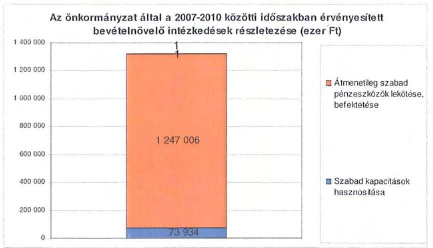

A bevételnövelésére irányuló intézkedések számszerűsített összege 1321 millió Ft volt az átmenetileg szabad pénzeszközök lekötése és a szabad kapacitások, ingatlanok és eszközök bérbeadása eredményeként. A jóváírt kamatbevétel kötvényforrás befektetéséből származó bevételt nem tartalmazott, mivel a kötvénykibocsátásokra az ismert fizetési kötelezettségek teljesítési határidejéhez igazodóan került sor.

---

Az Önkormányzat költségvetési támogatásból, átengedett bevételekből, és illetékbevételekből származó bevételei a 2007. évhez képest az időszak egészét tekintve összességében nem csökkentek, azonban az Önkormányzat folytatta az előző években elkezdett - kiadási megtakarítási és bevételnövelő - intézkedéseit. A 2007-2010. évek között a feladatátadások és intézményátszervezések 1967 millió Ft, az intézményeknél és a Polgármesteri hivatalnál elrendelt kiadáscsökkentő intézkedések 1061 millió Ft megtakarítást, a bevételnövelő intézkedések 1321 millió Ft többletbevételt eredményeztek az Önkormányzat kimutatása szerint.

# 5. A HELYI ÖNKORMÁNYZATOK GAZDÁLKODÁSI RENDSZERÉNEK 2008. ÉVI ELLENŐRZÉSE SORÁN A PÉNZÜGYI EGYENSÚLY JAVÍTÁSÁRA TETT SZABÁLYSZERŰSÉGI ÉS CÉLSZERŰSÉGI JAVASLATOK HASZNOSULÁSA 

Az Önkormányzat gazdálkodási rendszerét a 2008. évben ellenőrizte átfogó jelleggel. Az Önkormányzat pénzügyi egyensúlyi helyzetének javítására szabályszerűségi és célszerűségi javaslatot a vizsgálat nem tett.

Budapest, 2011. december 22.

Melléklet: 9 db
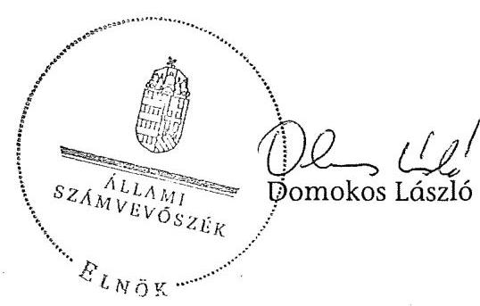

---

.

---

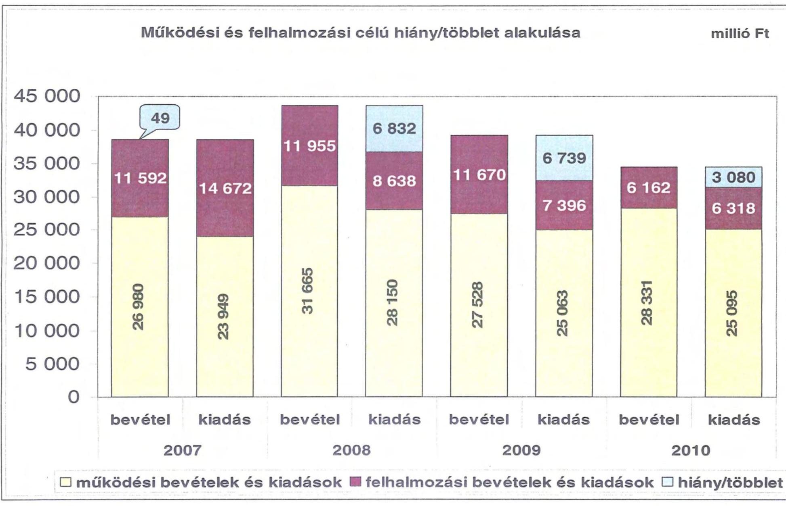

# Működési és felhalmozási célú hiány/többlet alakulása

| Működési és felhalmozási célú hiány/többlet alakulása | 2007 | 2008 | 2009 | 2010  |
| --- | --- | --- | --- | --- |
| 45 000 | 49 | 11 955 | 6 832 | 6 739  |
| 40 000 |  |  |  |   |
| 35 000 | 11 592 |  |  |   |
| 30 000 |  |  |  |   |
| 25 000 |  |  |  |   |
| 20 000 |  |  |  |   |
| 15 000 |  |  |  |   |
| 10 000 |  |  |  |   |
| 5 000 |  |  |  |   |
| 0 |  |  |  |   |

bevétel - 2007: kiadás - 2008: bevétel - 2009: kiadás

bevétel - 2010: kiadás

működési bevételek és kiadások

---

# **Kimutatás**

# az Önkormányzat bevételeinek és kiadásainak, egyensúlyának alakulásáról

| 1. FOLYÓ KÖLTSÉGVETÉS* | 2007. | 2008. | 2009. | 2010.  |
| --- | --- | --- | --- | --- |
| 1.1.1. Saját működési bevételek | 14 180 762 | 17 816 553 | 14 574 779 | 15 385 907  |
| 1.1.2. Költségvetési támogatás | 7 563 778 | 10 308 769 | 9 893
 254 | 8 926 645  |
|  1.1.3. Atergyobit bevételek | 5 305 770 | 1 594 142 | 1 952 039 | 2 372 212  |
|  1.1.4. Állambázisú támogatások | 721 519 | 795 884 | 717 452 | 956 021  |
|  1.1.5. EU-ról és külföldről kapott bevételek | 0 | 985 | 228 924 | 276 991  |
|  1.1.6. Állambázisú támogatások | 68 702 | 96 333 | 269 301 | 353 650  |
|  1.1.7. Előző év támogatás átvétel | 554 469 | 734 600 | 761 593 | 751 070  |
|  1.1. Folyó bevételek =1.1.1.+1.1.2.+1.1.3.+1.1.4.+1.1.5.+1.1.6.+1.1.7. | 26 795 008 | 31 457 266 | 28 307 322 | 26 975 004  |
|  1.2.1. Működési kiadások | 21 576 515 | 25 363 542 | 21 528 242 | 20 277 142  |
|  1.2.2. Állambázisú támogatások | 67 042 | 141 572 | 185 411 | 123 329  |
|  1.2.3.1. Költségszámlák | 498 347 | 557 295 | 2 313 205 | 2 944 817  |
|  1.2.3.2. EU-nak, illetve külföldre | 0 | 0 | 0 | 0  |
|  1.2.3.3. Magánnyomulíjak | 446 757 | 454 594 | 537 568 | 684 204  |
|  1.2.3.4. Amigmúlt nyereség | 779 481 | 890 250 | 599 420 | 771 652  |
|  1.2.4. Tisztségviselők | 1 724 585 | 1 962 147 | 3 450 193 | 4 400 673  |
|  1.2.5. Élelmezési kiadások | 697 416 | 671 523 | 918 520 | 861 647  |
|  1.2.6. Előző év támogatás átadás | 554 469 | 734 600 | 761 593 | 751 070  |
|  1.2. Folyó kiadások = 1.2.1.+1.2.2.+1.2.3.+1.2.4.+1.2.5. | 24 620 027 | 28 813 384 | 26 843 959 | 26 443 069  |
|  1.3. Folyó költségvetés egyenlege MŰKÖDÉSI JÖVEDELEM (1.1. - 1.2.) | 2 174 973 | 2 643 082 | 1 463 363 | 531 135  |
|  2. FELHALMOZÁSI KÖLTSÉGVETÉS** |  |  |  |   |
|  2.1.1. Saját többletbevételek | 760 496 | 7 082 300 | 1 140 307 | 534 357  |
|  2.1.2. Állambázisú támogatások | 1 741 406 | 1 910 529 | 986 732 | 1 074 104  |
|  2.1.3. EU-ról és külföldről kapott támogatások | 0 | 517 | 0 | 6 504  |
|  2.1.4. Állambázisú támogatások | 1 356 123 | 938 213 | 841 332 | 306 515  |
|  2.1.1. Felhalmozási bevételek (=2.1.1.+2.1.2+2.1.3+2.1.4.) | 4 058 019 | 9 931 559 | 2 972 371 | 1 611 160  |
|  2.1.2. Saját beruházási kiadás | 7 657 765 | 5 253 572 | 4 949 948 | 2 510 885  |
|  2.1.3. Saját felújítási kiadás | 414 970 | 900 035 | 433 862 | 307 666  |
|  2.1.4. Állambázisú támogatások | 2 408 | 4 597 | 18 326 | 12 112  |
|  2.1.5. EU-nak és külföldnek adott támogatások | 0 | 0 | 0 | 0  |
|  2.1.6. Állambázisú támogatások | 645 336 | 526 003 | 754 951 | 342 803  |
|  2.1.7. Befektetési célú részesedések vásárlása | 12 000 | 663 000 | 125 586 | 0  |
|  2.2. Felhalmozási kiadások (=2.2.1.+2.2.2.+2.2.3.+2.2.4.+2.2.5.+2.2.6.) | 8 933 507 | 7 348 007 | 5 364 667 | 3 173 466  |
|  2.3. Felhalmozási költségvetés egyenlege (2.1. – 2.2.) | -4 875 408 | 2 583 552 | -2 392 296 | -1 557 906  |
|  3. Finanszírozási műveletek nélküli (GFS) pozíció(1.3.+2.3.) | -2 700 515 | 5 227 434 | -928 933 | -1 026 771  |
|  4. Finanszírozási műveletek |  |  |  |   |
|  4.1. Hitelfelvétel | 0 | 36 980 | 1 200 000 | 213 955  |
|  4.2. Hitelfelvétel | 2 067 059 | 260 619 | 187 691 | 92 214  |
|  4.3. Forgatói és befektetési célú értékpapírok kibocsátása | 7 100 000 | 1 700 000 | 0 | 1 700 000  |
|  4.4. Forgatói és befektetési célú értékpapírok beváltása | 0 | 0 | 0 | 1 700 000  |
|  4.5. Forgatói és befektetési célú értékpapírok értékesítése | 0 | 0 | 0 | 0  |
|  4.6. Forgatói és befektetési célú értékpapírok vásárlása | 0 | 0 | 0 | 0  |
|  4.7. Egyéb finanszírozási bevételek (függő, átfutó, kiegészítési) | 1 168 734 | -307 992 | -739 471 | -817 713  |
|  4.8. Egyéb finanszírozási kiadások (függő, átfutó, kiegészítési) | 294 237 | 230 489 | 35 575 | -39 167  |
|  4.9. Finanszírozási műveletek egyenlege (4.1. – 4.2.+4.3.-4.4+4.5.-4.6.+4.7.-4.8.) | 2 987 458 | 937 880 | 237 263 | -659 805  |
|  5. Tárgyévi pénzügyi pozíció(1.3.+ 2.3.+4.9.) | 286 943 | 6 165 314 | -691 670 | -1 686 576  |
|  6. Nettó működési jövedelem =működési jövedelem (1.3.) - töketörlesztés (4.2+4.4) | -2 892 086 | 2 383 263 | 1 275 672 | -1 264 079  |
|  TÁJÉKOZTATÓ ADATOK |  |  |  |   |
|  Összes kötelezettség | 13 634 532 | 15 198 477 | 15 983 531 | 15 829 785  |
|  ebből rövid lejáratú | 2 945 323 | 2 831 692 | 2 884 687 | 2 322 495  |
|  Összes külföldi kötelezettség | 1 385 102 | 1 279 950 | 1 059 027 | 448 896  |
|  ebből lejárt (támogatásból) | 391 726 | 220 694 | 519 961 | 83 010  |
|  Pénz és pénzpiaci kötelezettség (adósí) | 9 623 449 | 11 401 075 | 12 413 384 | 13 281 445  |
|  ebből rövid lejáratú | 238 011 | 187 691 | 1 199 837 | 1 039 671  |
|  PPP szerződéses állomány jelenértében (támogatásból) | 1 454 157 | 1 935 563 | 1 730 838 | 1 481 052  |
|  ebből lejárt szolgáltatási díj adósság kötelezettség | 0 | 0 | 0 | 0  |
|  Folyószámlán lévő átlagon állománya (támogatásból) | 858 329 | 116 241 | 0 | 1  |
|  Lővöléslet átlagon állománya (támogatásból) | 0 | 0 | 0 | 0  |
|  Hűségkártyakötő (nap) átlagon állománya (támogatásból) | 0 | 0 | 0 | 0  |
|  Kereset és garanciavállalások (támogatásból) | 16 600 | 6 422 901 | 0 | 0  |
|  Jogcímen bírósági többiekötő adódó kötelezettségek (támogatásból) | 0 | 0 | 0 | 0  |
|  Finanszírozásba bevonható eszközök | 1 438 918 | 7 603 877 | 6 912 030 | 5 225 271  |
|  Tartós hitelviszonyt megtestesítő értékpapírok és végi állománya | 1 265 | 910 | 733 | 550  |
|  Hosszú lejáratú hitelkészletek és végi állománya | 0 | 0 | 0 | 0  |
|  Értékpapírok és végi állománya | 0 | 0 | 0 | 0  |
|  Fényeszközök (átlagon támogatások nélküli) és végi állománya | 1 437 653 | 7 602 987 | 6 911 297 | 5 224 721  |

- Revízióban nem táblázatos, a kiadásokban nem jelzik meg az amortizációt, a vagyoni helyzetet az egyenleg befolyásolja

* Revízióban vagyoni megfelelően és felvételek fordítható határok

---

Settimolaitrimo integro logi titeo Siviumimposi

Az Önkormányzat 2007-2010 Avóan megvalósítók, 2010. december 31-ig befejeződött kifizetésüket tartalmazó elszámolásaikra

|  |   |   |   |   |   |   |   |   |   |   |   |   |   |   |   |   |   |   |   |   |   |   |   |   |   |   |   |   |   |   |   |   |   |   |   |   |   |   |   |   |   |   |   |   |   |   |   |   |   |   |   |   |   |   |   |   |   |   |   |   |   |   |   |   |   |   |   |   |   |   |   |   |   |   |   |   |   |   |   |   |   |   |   |   |   |   |   |   |   |   |   |   |   |   | 

 |   |   |   |   |   |  

---

|  37. Török ből bak/frälse håller | 305/07 | 2007 | 2007 | 11 000 | 11 000 | 0 |  | 11 000 | 0 | 0 | 0 |  |  |  |  | 11 000 | 11 000 | 0 |  |  |  |  |  |  |  |  |   |
| --- | --- | --- | --- | --- | --- | --- | --- | --- | --- | --- | --- | --- | --- | --- | --- | --- | --- | --- | --- | --- | --- | --- | --- | --- | --- | --- | --- | --- |
|  38. Följeskiss förts av | 305/07 | 2007 | 2007 | 107 007 | 107 007 | 0 |  | 107 007 | 9 750 | 9 750 | 0 | 0 |  |  |  |  | 106 550 | 106 550 | 0 |  |  |  |  |  |  |  |  |   |
|  39. Måttlind dr b. M:V, törks | 305/07 | 2007 | 2007 | 11 000 | 11 000 | 0 |  | 11 000 | 0 | 0 | 0 |  |  |  |  |  | 11 000 | 11 000 | 0 |  |  |  |  |  |  |  |  |   |
|  40. Struholpsade behovs lokaler | 305/07 | 2007 | 2007 | 20 000 | 20 000 | 0 |  | 20 000 | 0 | 0 | 0 |  |  |  |  |  | 20 000 | 20 000 | 0 |  |  |  |  |  |  |  |  |   |
|  41. PÄKV | 305/07 | 2006 | 2006 | 300 230 | 777 000 | 43 170 | 9 400 | 799 000 | 21 550 | 7 840 | 23 170 |  |  |  |  |  | 31 200 | 31 850 | 0 | 308 130 | 308 130 | 0 | 45 280 | 45 280 | 0 |  | 0 |   |
|  42. Röd/lupkallmörk blå/före | 305/07 | 2007 | 2006 | 152 400 | 119 800 | 32 880 |  | 119 800 | 20 880 | 0 | 20 880 |  |  |  |  |  | 30 010 | 30 010 | 0 |  | 30 000 | 30 000 | 0 | 31 500 | 31 500 | 0 | 30 000 |   |
|  43. Österbär blö funktioförliften | 305/08 | 2008 | 2008 | 154 007 | 25 400 | 41 950 |  | 22 400 | 41 950 | 0 | 41 950 |  |  |  |  |  | 13 707 | 13 707 | 0 |  |  |  | 0 | 8 750 | 8 750 | 0 |  | 0 |   |
|  44. Sörra bad tillkoblat blå/före | 305/08 | 2008 | 2008 | 39 970 | 13 091 | 43 880 |  | 13 091 | 43 880 | 0 | 43 880 |  |  |  |  |  | 9 000 | 9 000 | 0 |  |  |  | 0 | 9 930 | 9 000 | 0 |  | 0 |   |
|  45. Jarmbollblå | 305/08 | 2008 | 2008 | 20 000 | 20 000 | 0 |  | 20 000 | 0 | 0 | 0 |  |  |  |  |  | 9 230 | 9 230 | 0 |  |  |  | 0 | 14 707 | 14 707 | 0 |  | 0 |   |
|  46. Måttlind/Örnda borikalk/ö farfär | 305/08 | 2003 | 2003 | 206 300 | 44 070 | 103 300 | 2 070 | 43 000 | 103 300 | 0 | 103 300 |  |  |  |  |  | 13 149 | 13 149 | 0 |  |  |  | 0 | 32 034 | 32 034 | 0 |  | 0 |   |
|  47. Töröhalver babastromfis tillåttföre | 305/08 | 2008 | 2008 | 13 831 | 13 831 | 0 |  | 13 831 | 0 | 0 | 0 |  |  |  |  |  | 13 831 | 13 831 | 0 |  |  |  | 0 |  |  | 0 |  | 0 |   |
|  48. Skolska v. St. de järveltsföljer | 305/08 | 2007 | 2006 | 62 700 | 17 891 | 64 851 |  | 17 851 | 64 851 | 0 | 64 851 |  |  |  |  |  | 17 851 | 17 851 | 0 |  |  |  | 0 |  |  | 0 |  | 0 |   |
|  49. Följett v. sommarbokförre | 305/08 | 2007 | 2006 | 135 000 | 28 850 | 164 454 |  | 28 850 | 164 454 | 0 | 164 454 |  |  |  |  |  | 27 360 | 27 360 | 0 |  |  |  | 0 | 1 200 | 1 200 | 0 |  | 0 |   |
|  50. Måttfölj. bak/frälse håller | 305/08 | 2008 | 2008 | 22 400 | 22 400 | 0 |  | 22 400 | 0 | 0 | 0 |  |  |  |  |  | 22 400 | 22 400 | 0 |  |  |  | 0 |  |  | 0 |  | 0 |   |
|  51. Måttfölj. havstabil by | 305/08 | 2008 | 2008 | 28 400 | 28 400 | 0 |  | 28 400 | 0 | 0 | 0 |  |  |  |  |  | 28 400 | 28 400 | 0 |  |  |  | 0 |  |  | 0 |  | 0 |   |
|  52. Följ. str. bak/frälse håller | 305/08 | 2008 | 2008 | 104 477 | 104 477 | 0 |  | 104 477 | 0 | 0 | 0 |  |  |  |  |  | 104 477 | 104 477 | 0 |  |  |  | 0 |  |  | 0 |  | 0 |   |
|  53. Måttlind v. St. byplan | 305/08 | 2008 | 2008 | 106 660 | 106 660 | 0 |  | 106 660 | 0 | 0 | 0 |  |  |  |  |  | 106 660 | 106 660 | 0 |  |  |  | 0 |  |  | 0 |  | 0 |   |
|  54. Rödlå v. T. tillbok tillförre | 305/2008 | 2008 | 2008 | 458 008 | 344 900 | 63 152 |  | 344 900 | 357 900 | 374 730 | 63 150 |  |  |  |  |  | 70 180 | 70 180 | 0 |  |  |  | 0 |  |  | 0 |  | 0 |   |
|  55. Samgripad dr.öljeskott blå/före | 305/2008 | 2008 | 2008 | 35 147 | 35 301 | 1 900 |  | 35 301 | 1 900 | 0 | 1 900 |  |  |  |  |  | 35 301 | 35 301 | 0 |  |  |  | 0 |  | 0 | 6 000 | 6 000 | 0 |  | 0  |
|  56. Frälja v. tillkomna blå/före | 305/2008 | 2008 | 2008 | 42 060 | 41 100 | 2 700 |  | 41 100 | 2 700 | 0 | 2 700 |  |  |  |  |  | 35 177 | 35 177 | 0 |  |  |  | 0 |  | 0 | 7 980 | 7 980 | 0 |  | 0  |
|  57. Följeskiss blå farb. farb. blå/före | 305/2008 | 2008 | 2008 | 42 030 | 39 739 | 3 007 |  | 39 739 | 3 007 | 0 | 3 007 |  |  |  |  |  | 37 000 | 37 000 | 0 |  |  |  | 0 |  | 0 | 2 500 |

 | 2 500 | 0 |  | 0  |
|  58. Törösk v. tillkomna blå/före | 305/2008 | 2008 | 2008 | 15 000 | 14 700 | 960 |  | 14 700 | 960 | 0 | 960 |  |  |  |  |  | 11 107 | 11 107 | 0 |  |  |  | 0 |  | 0 | 3 500 | 3 500 | 0 |  | 0  |
|  59. Vaxelsting dr.öljeskott blå/före | 305/2008 | 2008 | 2008 | 47 738 | 44 790 | 3 599 |  | 44 790 | 3 599 | 0 | 3 599 |  |  |  |  |  | 43 790 | 43 790 | 0 |  |  |  | 0 |  | 0 | 2 500 | 2 500 | 0 |  | 0  |
|  60. Vaspolytan dr.öljeskott blå/före | 305/2008 | 2008 | 2008 | 138 619 | 138 666 | 7 031 |  | 138 666 | 7 031 | 0 | 7 031 |  |  |  |  |  | 131 147 | 131 147 | 0 |  |  |  | 0 |  | 0 | 10 741 | 10 741 | 0 |  | 0  |
|  61. Vå dröslöte av 2 och 3-före | 305/2008 | 2009 | 2009 | 362 070 | 362 070 | 0 |  | 362 070 | 362 070 | 309 010 | 0 |  |  |  |  |  | 34 300 | 34 300 | 0 |  |  |  | 0 |  | 0 | 0 | 0 |  | 0 |   |
|  62. Söd. Röda v. funktioförliften | 305/2008 | 2007 | 2008 | 170 834 | 151 100 | 34 378 |  | 151 100 | 34 378 | 0 | 34 378 |  |  |  |  |  | 151 100 | 151 100 | 0 |  |  |  | 0 |  | 0 | 0 |  | 0 |   |
|  63. Måttlind dr.öljeskot | 305/2008 | 2008 | 2008 | 192 400 | 192 400 | 17 300 |  | 192 300 | 19 300 | 347 | 17 300 |  |  |  |  |  | 34 700 | 34 700 | 0 |  |  |  | 0 |  | 30 341 | 30 341 | 0 |  | 0 |   |
|  64. Värrvängd portföljer | 305/2008 | 2008 | 2008 | 138 370 | 135 370 | 0 |  | 135 370 | 0 | 0 | 0 |  |  |  |  |  | 135 370 | 135 370 | 0 |  |  |  | 0 |  | 0 | 0 | 0 |  | 0 |   |
|  65. Vägresvink följesköt/öljfär | 305/2008 | 2008 | 2008 | 280 740 | 110 870 | 142 061 |  | 110 870 | 142 061 | 0 | 142 061 |  |  |  |  |  | 110 870 | 110 870 | 0 |  |  |  | 0 |  | 0 | 0 | 110 870 | 0 |  |   |
|  66. Förlåda följeskot | 305/2008 | 2008 | 2008 | 287 000 | 106 800 | 200 070 |  | 106 800 | 200 070 | 0 | 200 070 |  |  |  |  |  | 106 800 | 106 800 | 0 |  |  |  | 0 |  | 0 | 0 | 0 |  | 0 |   |
|  67. Följeskot följeskot/öljskot | 305/2010 | 2010 | 2010 | 12 711 | 12 711 | 0 |  | 12 711 | 0 | 0 | 0 |  |  |  |  |  | 0 |  |  |  |  |  |  |  |  |  |  |  |  |   |

---

Szekedetekné: Megyei Jégú Város Önkormányzata

2/6. számú mellékleteik

Az Önkormányzat 2010. december 31-én folyamatosan lévő fejlesztési feladataikhoz kapcsolódó kötelezettségek

|  |   |   |   |   |   |   |   |   |   |   |   |   |   |   |   |   |   |   |   |   |   |   |   |   |   |   |   |   |   |   |   |
| --- | --- | --- | --- | --- | --- | --- | --- | --- | --- | --- | --- | --- | --- | --- | --- | --- | --- | --- | --- | --- | --- | --- | --- | --- | --- | --- | --- | --- | --- | --- |
|   |  |  |  |  |  |  |  |  |  |  |  |  |  |  |  |  |  |  |  |  |  |  |  |  |  |  |  |  |  |   |
|   |  |  |  |  |  |  |  |  |  |  |  |  |  |  |  |  |  |  |  |  |  |  |  |  |  |  |  |  |  |   |
|   |  |  |  |  |  |  |  |  |  |  |  |  |  |  |  |  |  |  |  |  |  |  |  |  |  |  |  |  |  |   |
|   |  |  |  |  |  |  |  |  |  |  |  |  |  |  |  |  |  |  |  |  |  |  |  |  |  |  |  |  |  |   |
|   |  |  |  |  |  |  |  |  |  |  |  |  |  |  |  |  |  |  |  |  |  |  |  |  |  |  |  |  |  |   |
|   |  |  |  |  |  |  |  |  |  |  |  |  |  |  |  |  |  |  |  |  |  |  |  |  |  |  |  |  |  |   |
|   |  |  |  |  |  |  |  |  |  |  |  |  |  |  |  |  |  |  |  |  |  |  |  |  |  |  |  |  |  |   |
|   |  |  |  |  |  |  |  |  |  |  |  |  |  |  |  |  |  |  |  |  |  |  |  |  |  |  |  |  |  |   |
|   |  |  |  |  |  |  |  |  |  |  |  |  |  |  |  |  |  |  |  |  |  |  |  |  |  |  |  |  |  |   |
|   |  |  |  |  |  |  |  |  |  |  |  |  |  |  |  |  |  |  |  |  |  |  |  |  |  |  |  |  |  |   |
|   |  |  |  |  |  |  |  |  |  |  |  |  |  |  |

 |  |  |  |  |  |  |  |  |  |  |  |  |  |  |  |   |
|   |  |  |  |  |  |  |  |  |  |  |  |  |  |  |  |  |  |  |  |  |  |  |  |  |  |  |  |  |  |   |
|   |  |  |  |  |  |  |  |  |  |  |  |  |  |  |  |  |  |  |  |  |  |  |  |  |  |  |  |  |  |   |
|   |  |  |  |  |  |  |  |  |  |  |  |  |  |  |  |  |  |  |  |  |  |  |  |  |  |  |  |  |  |   |
|   |  |  |  |  |  |  |  |  |  |  |  |  |  |  |  |  |  |  |  |  |  |  |  |  |  |  |  |  |  |   |
|   |  |  |  |  |  |  |  |  |  |  |  |  |  |  |  |  |  |  |  |  |  |  |  |  |  |  |  |  |  |   |
|   |  |  |  |  |  |  |  |  |  |  |  |  |  |  |  |  |  |  |  |  |  |  |  |  |  |  |  |  |  |   |
|   |  |  |  |  |  |  |  |  |  |  |  |  |  |  |  |  |  |  |  |  |  |  |  |  |  |  |  |  |  |   |
|   |  |  |  |  |  |  |  |  |  |  |  |  |  |  |  |  |  |  |  |  |  |  |  |  |  |  |  |  |  |   |
|   |  |  |  |  |  |  |  |  |  |  |  |  |  |  |  |  |  |  |  |  |  |  |  |  |  |  |  |  |  |   |
|   |  |  |  |  |  |  |  |  |  |  |  |  |  |  |  |  |  |  |  |  |  |  |  |  |  |  |  |  |  |   |
|   |  |  |  |  |  |  |  |  |  |  |  |  |  |  |  |  |  |  |  |  |  |  |  |  |  |  |  |  |  |   |
|   |  |  |  |  |  |  |  |  |  |  |  |  |  |  |  |  |  |  |  |  |  |  |  |  |  |  |  |  |  |   |
|   |  |  |  |  |  |  |  |  |  |  |  |  |  |  |  |  |  |  |  |  |  |  |  |  |  |  |  |  |  |   |
|   |  |  |  |  |  |  |  |  |  |  |  |  |  |  |  |  |  |  |  |  |  |  |  |  |  |  |  |  |  |   |
|   |  |  |  |  |  |  |  |  |  |  |  |  |  |  |  |  |  |  |  |  |  |  |  |  |  |  |  |  |  |   |
|   |  |  |  |  |  |  |  |  |  |  |  |  |  |  |  |  |  |  |  |  |  |  |  |  |  |  |  |  |  |   |
|   |  |  |  |  |  |  |  |  |  |  |  |  |  |  |  |  |  |  |  |  |  |  |  |  |  |  |  |  |  |   |
|   |  |  |  |  |  |  |  |  |  |  |  |  |  |  |  |  |  |  |  |  |  |  |  |  |  |  |  |  |  |   |
|   |  |  |  |  |  |  |  |  |  |  |  |  |  |  |  |  |  |  |  |  |  |  |  |  |  |  |  |  |  |   |
|   |  |  |  |  |  |  |  |  |  |  |  |  |  |  |  |  |  |  |  |  |  |  |  |  |  |  |  |  |  |   |
|   |

---

Sekció: “Alapadatok” 2010. december 31-én folyamatban lévő fejlesztési feladatukhoz kapcsolódó 2010. évi követő kiértékelő táblázatait

|   |  |  |  |  |  |  |  |  |  |  |  |  |  |  |  |  |  |  |  |  |  |  |  |  |  |  |  |  |  |  |  |  |  |  |  |  |  |  |  |  |  |  |  |  |  |  |  |  |  |  |  |  |  |  |  |  |  |  |  |  |  |  |  |  |  |  |  |  |  |  |  |  |  |  |  |  |  |  |  |  |  |  |  |  |  |  |  |  |  |  |  |  |  |  |  |  |  |  |  | 

---

Székesfehérvár Megyei Jogú Város Önkormányzata Az Önkormányzat beadott, elbírálás alatt lévő pályázati forrásból megvalósuló fejlesztéseihez kapcsolódó kötelezettségvállalások

|  |   |   |   |   |   |   |   |   |   |   |   |   |   |   |   |   |   |  
 |   |   |   |   |   |   |   |   |   |   |   |   |   |   |   |   |   |   |   |   |   |   |   |   |   |   |   |   |   |   |   |   |   |   |   |   |   |   |   |   |   |   |   |   |   |   |   |   |   |   |   |   |   |   |   |   |   |   |   |   |   |   |   |   |   |   |   |   |   |   |   |   |   |   |   |   |   |   |   |   |   |   |

---

.

---

## 4. számú melléklet

## **Kimutatás az önkormányzati feladatok ellátásában résztvevő gazdasági társaságokról**

|  Gazdasági társaság
megnevezése | önkormányzati | önkormányzati
gazdasági
társaságának
tulajdoni hányada | saját tőke,
jegyzett tőke
aránya | önként vállalt
feladathoz | hosszú lejáratú
hitelből,
kötvényből | hitelből | lejárt szállító
állományból | működési támogatás | felhalmozási támogatás  |
| --- | --- | --- | --- | --- | --- | --- | --- | --- | --- |
|   |  |  |  |  |  |  |  | 2007. | 2008.  |
|  1. 100%-os tulajdoni hányadú gazdasági társaságok: |  |  |  |  |  |  |  |  |   |
|  Fehérvár Média Centrum Kft. | 100% | 0 | -3,34 | 0 | 0 | 2 | 2 | 4 | 24  |
|  Oróf Széchenyi István
Gyakorlati Képzési Szervező
Közhasznú Nonprofit Kft. | 100% | 0 | 8,39 | 0 | 452 |  |  | 0 | 0  |
|  Önkormányzati informatikai
Központ Nonprofit Kft. | 100% | 0 | 1,17 | 0 | 0 |  |  | 0 | 98  |
|  Székesfehérvár
Csatornakivitelező Kft. | 100% | 0 | 2,89 | 26 069 | 0 | 300 |  | 11 | 0  |
|  Székesfehérvár Közszolgáltató
Nonprofit Kft. | 100% | 0 | 23,41 | 0 | 0 | 188 |  | 3 | 85  |
|  Székesfehérvár
Sárkányelégészítési Közhasznú
Nonprofit Kft. | 100% | 0 | 1,86 | 0 | 0 |  |  |  | 0  |
|  100%-os tulajdoni hányadú
gazdasági társaságok
összesen: |  |  |  | 26 069 | 482 | 490 | 2 | 18 | 207  |
|  II. 75-99%-os tulajdoni hányadú gazdasági társaságok: |  |  |  |  |  |  |  |  |   |
|  Székesfehérvár
Épületfenntartó és
Hőszolgáltató Zrt. | 99% | 0 | 2,88 | 0 | 0 | 190 | 5 | 13 |   |
|  Alba Regia Társasági Integrált
Szakképzés Szervezési
Közhasznú Nonprofit Kft. | 80% | 0 | 1,74 | 0 | 2 357 |  |  |  |   |
|  75-99%-os tulajdoni
hányadú gazdasági
társaságok összesen |  |  |  | 0 | 2 357 | 190 | 5 | 13 | 0  |
|  75% feletti tulajdoni
hányadú gazdasági
társaságok összesen |  |  |  | 26 069 | 2 809 | 680 | 7 | 31 | 207  |
|  III. 51-74%-os tulajdoni hányadú gazdasági társaságok: |  |  |  |  |  |  |  |  |   |
|  Fejérvíz Zrt. | 70% | 0 | 11,10 | 6 171 | 0 | 96 |  |  |   |
|  DÉPÓNA Hulladékgazdálkodási és
Tüzelőanyag-előállító Kft. | 51% | 0 | 11,48 | 599 | 0 | 15 |  | 85 |   |
|  51-74%-os tulajdoni
hányadú gazdasági
társaságok összesen |  |  |  | 6 770 | 0 | 111 | 0 | 85 | 0  |
|  IV. 25-50%-os tulajdoni hányadú gazdasági társaságok: |  |  |  |  |  |  |  |  |   |
|  Székesfehérvár Turisztikai
Közhasznú Nonprofit Kft. | 49% | 0 | 1,95 | 0 | 29 |  |  |  | 0  |
|  LOGISZTIKAI Kft. | 41% | 0 | 0,90 | 0 | 0 |  |  | 25 |   |

---

## 4. számú melléklet

## Kimutatás az önkormányzati feladatok ellátásában résztvevő gazdasági társaságokról

|  Gazdasági társaság
megnevezése | önkormányzati
társaságának
tulajdoni hányada |  |  | 2010. december 31-én |  |  |  |  |  | a gazdasági társaságnak szerződéses kötelezettségére, feladatellátási szerződésre alapozottan
az önkormányzat költségvetéséből nyújtott |  |  |  |  |  |  |  |   |
| --- | --- | --- | --- | --- | --- | --- | --- | --- | --- | --- | --- | --- | --- | --- | --- | --- | --- |
|   |  |  |  |  | önként vállalt
feladathoz |  | hosszú lejáratú
hitelből,
kötvényből |  |  |  | működési támogatás |  |  |  |  |  |   |
|   |  |  |  |  |  |  |  |  |  |  |  |  |  |  |  |  |   |
|   |  |  |  |  |  rendelt nettó vagyon |  |  |  |  |  |  |  |  |  |  |  |   |
|  Fejér Megyei Önkormányzatok
Tömegszállítási Kft. | 40% | 0 | 1,29 | 0 | 0 |  |  |  |  |  |  |  |  |  |  |  |   |
|  SZÉKOM Székesfehérvár
Kommunális Zrt. | 26% | 0 | 1,96 | 0 | 0 | 230 |  | 98 |  |  |  |  |  |  |  |  |   |
|  50%-os tulajdoni
hányadú gazdasági
társaságok összesen |  |  |  | 0 | 29 | 230 | 0 | 123 | 0 | 0 | 2 | 43 | 0 | 0 | 0 | 0 | 0  |
|  V. egyéb, közfeladatot ellátó gazdasági társaságok: |  |  |  |  |  |  |  |  |  |  |  |  |  |  |  |  |   |
|  |   |   |   |   |   |   |   |   |   |   |   |   |   |   |   |   |   |
|  |   |   |   |   |   |   |   |   |   |   |   |   |   |   |   |   |   |
|  |   |   |   |   |   |   |   |   |   |   |   |   |   |   |   |   |   |
|  |   |   |   |   |   |   |   |   |   |   |   |   |   |   |   |   |   |
|  |   |   |   |   |   |   |   |   |   |   |   |   |   |   |   |   |   |
|  |   |   |   |   |   |   |   |   |   |   |   |   |   |   |   |   |   |
|  |   |   |   |   |   |   |   |   |   |   |   |   |   |   |   |   |   |

  |
|  |   |   |   |   |   |   |   |   |   |   |   |   |   |   |   |   |   |
|  |   |   |   |   |   |   |   |   |   |   |   |   |   |   |   |   |   |
|  |   |   |   |   |   |   |   |   |   |   |   |   |   |   |   |   |   |
|  |   |   |   |   |   |   |   |   |   |   |   |   |   |   |   |   |   |
|  |   |   |   |   |   |   |   |   |   |   |   |   |   |   |   |   |   |
|  |   |   |   |   |   |   |   |   |   |   |   |   |   |   |   |   |   |
|  |   |   |   |   |   |   |   |   |   |   |   |   |   |   |   |   |   |
|  |   |   |   |   |   |   |   |   |   |   |   |   |   |   |   |   |   |
|  |   |   |   |   |   |   |   |   |   |   |   |   |   |   |   |   |   |
|  |   |   |   |   |   |   |   |   |   |   |   |   |   |   |   |   |   |
|  |   |   |   |   |   |   |   |   |   |   |   |   |   |   |   |   |   |
|  |   |   |   |   |   |   |   |   |   |   |   |   |   |   |   |   |   |
|  |   |   |   |   |   |   |   |   |   |   |   |   |   |   |   |   |   |
|  |   |   |   |   |   |   |   |   |   |   |   |   |   |   |   |   |   |
|  |   |   |   |   |   |   |   |   |   |   |   |   |   |   |   |   |   |
|  |   |   |   |   |   |   |   |   |   |   |   |   |   |   |   |   |   |
|  |   |   |   |   |   |   |   |   |   |   |   |   |   |   |   |   |   |
|  |   |   |   |   |   |   |   |   |   |   |   |   |   |   |   |   |   |
|  |   |   |   |   |   |   |   |   |   |   |   |   |   |   |   |   |   |
|  |   |   |   |   |   |   |   |   |   |   |   |   |   |   |   |   |   |
|  |   |   |   |   |   |   |   |   |   |   |   |   |   |   |   |   |   |
|  |   |   |   |   |   |   |   |   |   |   |   |   |   |   |   |   |   |
|  |   |   |   |   |   |   |   |   |   |   |   |   |   |   |   |   |   |
|  |   |   |   |   |   |   |   |   |   |   |   |   |   |   |   |   |   |

---

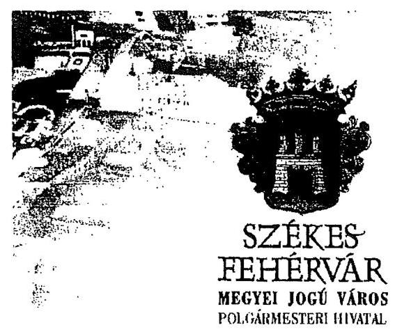

# Székesfehérvár Megyei Jogú Város Polgármestere 

8000 Székesfehérvár, Városház tér 1-2. Telefon: (22) 537-100, fax: (22) 316-569
E-mail: polgarmester@fehervar.hu
http://www.szekesfehervar.hu
Ügyiratszám: 90297/3/2011
Ügyintéző: Mészárosné Jasztrapszky Regina Tárgy: észrevétel

Állami Számvevőszék
Domokos László
Elnök Úr részére

## 1052 Budapest

Apáczai Csere János u. 10.

Tisztelt Elnök Úr!
Székesfehérvár Megyei Jogú Város Önkormányzata pénzügyi helyzetének ellenőrzéséről (43/3)" címú jelentés - tervezettel összefüggésben az alábbi megállapításokat, észrevételeket teszem szíves tájékoztatásul:

A jelentés-tervezetet (továbbiakban: tervezet) megalapozó tanúsítványok összeállítása a rendkívül rövid határidőre és a nagy mennyiségű, az önkormányzati gazdálkodás egészét felölelő adattartalomra tekintettel kizárólag a kirendelt Számvevők és a Polgármesteri Hivatalban közreműködő munkatársak problémamentes és hatékony együttműködésének volt köszönhető. A megfelelő feladat meghatározás és ütemezés ellenére azonban egyáltalán nem állt rendelkezésre elegendő idő az adatok egyeztetésére, ellenőrzésére, melyet a jelentéstervezet kézhezvételét követően igyekeztünk pótolni. A számszaki észrevételeink ennek megfelelően, levelem mellékleteként csatolásra kerülnek.

Kérem, hogy amennyiben van rá mód és elegendő idő, úgy a végleges jelentés összeállítása előtt szíveskedjenek Önök is a tételes ellenőrzést elvégezni. Amennyiben eltérés mutatkozik, úgy az ellenőrzés során közreműködő munkatársak az egyeztetésre természetesen rendelkezésre állnak.

A továbbiakban az alábbi megállapításokat ajánlom szíves figyelmébe:

## I. Módszertan

A tervezet szerint az ellenőrzés a 2007. január 1. - 2010. december 31. közötti időszakot öleli fel, azonban néhány megjegyzés erejéig 2011. évre vonatkozóan is tesz megállapításokat (pl.

---

a 2011. március 31. hatállyal bevezetett építményadó, illetve a „Királyi Séta" projekt megvalósításától való elállás révén jelentősen mérsékelt külső forrás igény).
Véleményünk szerint ez a módszer helyes, hiszen a gazdálkodás egy folyamat, amelyet az év végi statikus adatok önmagukban nem jellemezhetnek, így szükséges a vizsgált időszakban még nem számszerűsíthető, de az ellenőrzés befejezéséig elindult folyamatokat is rögzíteni.

Tekintettel arra, hogy a 2011. évre vonatkozó kitekintés nem terjed ki minden lényeges területre - a feldolgozásra rendelkezésre álló idő rövidsége okán -, ezért szükségesnek tartjuk az ellenőrzés céljával és javaslataival összhangban az alábbi lényegesebb, az Önkormányzat gazdálkodására jelentős hatással bíró - a tervezetben nem szereplő, a vizsgálat lezárásának idejéig meghozott - fontosabb döntéseket is szerepeltetni:

- az Önkormányzat - véleményünk szerint példaértékűen - jelentős lépéseket tett a közszolgáltatási feladatok jövőbeni hatékonyabbá tétele érdekében, amikor
 megvásárolta a DEPÓNIA Hulladékkezelő és Településtisztasági Korlátolt Felelősségű Társaság 49%-os üzletrészét (ezzel 100%-os tulajdonossá válva), és a SZÉKOM Székesfehérvári Kommunális Zártkörűen Működő Részvénytársaság alaptőkéjének 64%-át megtestesítő részvényeket (90%-os többségi tulajdont szerezve) mindösszesen 840 millió Ft-os vételáron,
- döntött a közalkalmazottak nyugdíjazásával kapcsolatos intézkedésekről, mely a következő években - az eddigi kiadások ismeretében - várhatóan 110-170 millió Ft-os megtakarítást eredményezhet az adott évi költségvetésekben,
- a tervezet egyik javaslatával összhangban, a mintegy 1.500 millió Ft tervezett bekerülési értékű „Agóra Pólus" projekt megvalósításától elállt Székesfehérvár. Tekintettel a beruházás önrészére, a szükséges előfinanszírozás mértékére és a fenntarthatóságra, a vizsgálat eredményeképpen az Önkormányzat úgy ítélte meg, hogy a létrejövő komplexum jövőbeni fenntartásához szükséges források várhatóan nem állnak majd rendelkezésére.
II. Összegző és részletező megállapítások fejezeteihez kapcsolódó észrevételek

1. Az Önkormányzatnál kimutatott szállítói tartozások, így a 60 napon túli szállítók állományaként kimutatott összeg is a polgármesteri hivatal és az önkormányzati intézmények (továbbiakban: költségvetési szervek) összevont tartozásállományából tevődnek össze.
Az államháztartás működési rendjéről szóló 292/2009. (XII.19.) kormányrendelet 167. §-a szerint a helyi önkormányzat képviselő-testülete - amennyiben a helyi önkormányzatok adósságrendezési eljárásáról szóló 1996. évi XXV. törvény 4. §-a szerinti adósságrendezési eljárást az önkormányzat vagy hitelezői nem kezdeményezték - a rendeletében szabályozott módon önkormányzati biztost rendel ki az irányítása alá tartozó költségvetési szervhez, ha annak elismert tartozásállománya az Áht.-ban, illetve az önkormányzat rendeletében meghatározott mértéket eléri.

Székesfehérvár Megyei Jogú Város Önkormányzata az Áht. 100/F. § (6) bekezdésében kapott felhatalmazás alapján alkotta meg az önkormányzati biztos kirendelésével kapcsolatos eljárás szabályairól szóló 13/2008.(III.26.) rendeletét (továbbiakban: önkormányzati rendelet).
Az önkormányzati rendelet 3. §-a szerint az önkormányzati biztos kirendelése akkor kötelező, ha a költségvetési szerv 30 napon túli tartozás állománya eléri az éves eredeti

---

költségvetési előirányzatának 10%-át, vagy a 100 millió Ft-ot és e tartozásállományát 30 nap alatt sem képes 30 nap alá szorítani.
Tekintve, hogy ezen feltételek a költségvetési szervek vonatkozásban nem álltak fenn, úgy véljük nem értelmezhető az adósságrendezési eljárásáról szóló 1996. évi XXV. törvény 5. § (2) bekezdése szerinti kötelezettség elmulasztása sem.

Fontosnak tartjuk hangsúlyozni a két jogszabályi rendelkezés közt meghúzódó aszinkront, ellentmondást, hiszen az adósságrendezési eljárásról szóló törvény szerint akár néhány tízezer forintos tartozás fennállása esetén is testületi ülést kellene összehívni, ugyanakkor - az államháztartási törvény felhatalmazása alapján - a képviselő testület rendeletben mondta ki, hogy csak akkor kíván a lejárt határidejű szállítói számlák kérdése tekintetében eljárni, ha az önkormányzati biztos kirendelésére vonatkozó kritériumok teljesülnek. Nyilván ez a felvetés csak az önkormányzat saját kezdeményezésű adósságrendezési eljárására igaz, nem vonatkozik arra az esetre, ha az eljárást a hitelező kezdeményezi.
2. A központi költségvetésből kapott támogatások esetében - 2007-2010. évek között - a 94 millió Ft-os csökkenésre vonatkozó megállapítással szemben az alábbi táblázat mutatja be a tényleges, egymással konzisztensen összehasonlítható támogatáscsökkenést:

| Költségvetési   támogatás | 2007 | 2008 | 2009 | 2010 | 2010. év a   2007-hez   viszonyítva |
| :--: | :--: | :--: | :--: | :--: | :--: |
| Normativ és   normativ   kötött   támogatás | 8722725 | 8504972 | 8327602 | 7726924 | -995.801   -11,41% |
| Központosított   támogatás | 755090 | 1094602 | 1112352 | 787964 | 32.874   4,35% |
| CÉDE, TEKI,   Cél-, színházi   és egyéb   központi   támogatás | 303056 | 909195 | 363300 | 411757 | 108.701   35,86% |
| Összesen* | 9780871 | 10508769 | 9803254 | 8926645 | -854.226   -8,7% |

* 2007. évben a Költségvetési támogatás összegéhez hozzáadódik 1817093 eFt, az SZJA normatív módon elosztott része, hiszen így kapjuk meg a beszámoló 31-es, 33-as, 51-es űrlapon szereplő támogatások teljes összegét.

3. A tervezet 33. oldal 3. bekezdése helyett az alábbi szövegrészt szükséges szerepeltetni, tekintettel arra, hogy Önkormányzatunk esetében a pénzkészlet - a finanszírozási korrekciók miatt - nem egyezik meg a tényleges pénzmaradvánnyal:
„Az Önkormányzat 2011. évi költségvetéséről szóló 3/2011. (II.28.) rendeletében tervezett bevételek és kiadások különbözete 8.098 millió Ft, melynek részbeni fedezete az előző évek működési és felhalmozási célú pénzmaradványa összesen 4.256 millió Ft összegben. A fennmaradó 3.842 millió Ft hiányt a Közgyűlés által 2009. évben jóváhagyott, 506 millió Ft-os refinanszírozott hitel felvételével, valamint újabb 3.336 millió Ft értékű fejlesztési célú hitel felvételével vagy kötvény kibocsátásával tudja biztosítani az Önkormányzat, amennyiben az ún. „murvás parkoló" eladásához kapcsolódó mintegy 2.700 millió Ft bankgarancia 2011. évi felszabadulására nem

---

kerül sor illetve egyéb lényeges változás nem következik be a tervezett bevételek és kiadások tekintetében."
4. A tervezet 54. oldalán a Tűzoltóság dolgozóinak munkaügyi perével kapcsolatosan fontos megjegyezni, hogy annak későbbiekben megállapított költségei nem az Önkormányzat költségvetését terhelik, tekintettel arra, hogy a hivatásos állomány foglalkoztatásával kapcsolatos kiadások fedezete a központi költségvetésből származik.
III. A Közgyűlésnek, a Polgármesternek, a Jegyzőnek tett javaslatokkal kapcsolatos észrevételek

1. Bár nem ismerjük a vizsgált megyei jogú városoknak tett javaslatokat, úgy véljük, hogy a tervezetben szereplő javaslatok egy része - amellett, hogy számos közülük célszerű, alapvetően elvárt feladat - általánosságban megfogalmazott, nem kizárólag Önkormányzatunkra vetített, hiszen eddigi gazdálkodási gyakorlatunkban - mint ahogy arra a jelentés több esetben is utal - jelen vannak. Ennek megfelelően - a működési pénzügyi egyensúly fenntarthatósága érdekében - az éves költségvetési koncepció és az adott évi költségvetési rendelet, majd annak módosításai, valamint a beszámolók előkészítése során a jelzett feltárásokat, elemzéseket, áttekintéseket (pl. bevételnövelés lehetőségei, követelés behajtás hatékonyabbá tétele, árfolyamkockázat vizsgálata) ugyan nem „programként" elnevezve, hanem folyamatainkba beépítve, bevált gyakorlatként alkalmazzuk.
2. A Polgármesternek tett, a jelentés 22. oldal 2.b) pontjában rögzített javaslata a közgyűlés hatáskörébe tartozik, ennek megfelelően a Közgyűlés a gazdálkodást is érintő döntések meghozatalakor egyedileg mérlegel és dönt a többletbevételek felhasználásáról.
3. Az adósságszolgálat szerkezetének áttekintése a vizsgált időszakot érintően átfogóan is megtörtént 2010., 2011. években is, melyről a képviselők is tájékoztatást kaptak, hiszen e nélkül nem készülhetett volna megalapozott költségvetés illetve nem lehetett volna dönteni a külső forrás bevonásának összegeiről. A 2007. évi hitel/kötvény kiváltás óta a pénzpiac mechanizmusai okán nem lett volna gazdaságos a szerkezet ismételt átalakítása. Napjainkban is folyik a folyamatba épült állománykezelés, amely kedvező változások esetén lehetővé teszi az azonnali reagálást.
4. A 23. oldal 3.b) pontban rögzített, három évre kitekintő finanszírozási terv kizárólag kiszámítható szabályozási környezetben tudná megfelelően segíteni az Önkormányzat hosszabb távú döntéseinek kellő megalapozását. A jelenlegi szabályozók, a forráselosztás állandó változása nem teszi lehetővé még az adott költségvetési évet követő év finanszírozási terv adatainak megalapozottságát sem, így csak formalitássá válhat egy ilyen dokumentum elkészítése. A szándék ellenére nem alapozná meg a Közgyűlés több évet érintő, egymásra épülő döntéseit. Ugyan ezen problémakör okán nem áll módjában a ma működő Önkormányzatoknak, hogy éves költségvetési rendeleteikben előre gondoskodjanak a „beruházásokkal létrehozott létesítmények.... jövőbeni fenntarthatóságáról". Azonban megjegyezni kívánom, hogy Önkormányzatunk a költségvetési rendeleteiben, a több éves kihatással járó döntések

---

kihatásainak bemutatásával és a három éves gördülő tervezéssel kísérletet tesz ezen elvárásnak megfelelni.
5. A jogszabályi előírások betartása mellett, a Közgyűlés elé beterjesztett intézkedési terv figyelembe veszi a javaslatokban előírtakat, azonban az Önkormányzatunknál már alkalmazott, gyakorlatba beépült folyamatokat, eljárásokat alapul véve határozza meg a valóban szükséges intézkedések körét.

Remélem, hogy általános és konkrét észrevételeinkkel hozzájárulunk a vizsgálat céljainak teljesüléséhez és, hogy a szolgáltatott nagy mennyiségű adattartalom elegendő információval szolgál a nagyvárosi önkormányzatok működésének megfelelő megítéléséhez.

Úgy vélem, hogy az elvégzett ellenőrzések alapján lehetővé válhat a nagyvárosok összehasonlítása, melynek megismerése, együttes áttekintése, kiértékelése elengedhetetlen az önkormányzatok további feladatainak, vagyonának meghatározásában, valamint a központi források és helyben szükséges intézkedések hozzárendelésében.

Ennek okán Székesfehérvár támogatja az önkormányzatok végleges és az azokat összefoglaló jelentések nyilvánosságra hozatalát.

Együttműködését előre is köszönöm.

Székesfehérvár, 2011. augusztus 26.

Tisztelettel:
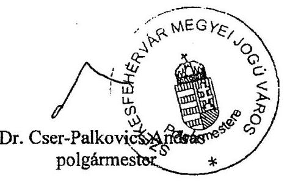

Melléklet: Egyeztetendő tételek listája

---

.

---

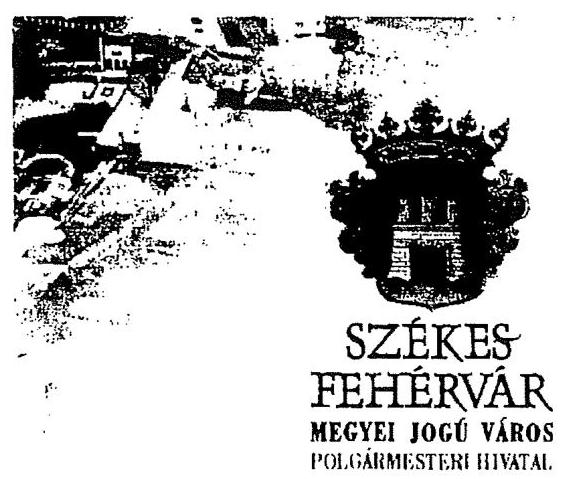

Székesfehérvár Megyei Jogú Város
Polgármestere
8000 Székesfehérvár, Városház tér 1-2. Telefon: (22) 537-100, fax: (22) 316-569
E-mail: polgarmester@fehervar.hu
http://www.szekesfehervar.hu
Ügyiratszám: 90297/3/2011
Tárgy: észrevétel melléklete

# MELLÉKLET A 90297/3/2011 IKTATÓSZÁMÚ ÉSZREVÉTELHEZ 

## Egyeztetendő tételek felsorolása:

1. 16. oldal 2. bekezdés, 26. oldal 3. bekezdés: ,.... a saját tőke/jegyzett tőke aránya -5,61 és -11,48, 5 és 23,41 között alakult..." A -5 adat a Fehérvár Médiacentrumhoz kapcsolódik 2007. évben, a 23,41 adat pedig a Székesfehérvári Közszolgáltató Nonprofit Kft.-hez 2010-ben.
2. 17. oldal 5. bekezdés „Az Önkormányzat 2010. december 31-én folyamatban lévő fejlesztési feladatok kötelezettség-vállalásainak összege 1.2267 millió Ft volt, amelynek forrását EU-s támogatásból és saját bevételből biztosítják."(Jelentéstervezet 3/c. sz. melléklet)
3. 18. oldal 4. bekezdés, és 46. oldal 4. bekezdés: „A HUF-ban fennálló pénzintézeti kötelezettségéből 1838,3/1838,8 millió Ft tőkét törlesztett, emellett 2217,5 millió Ft kamatot és 57.179,3 millió Ft egyéb díjat, költséget fizetett." A 46. oldalon így az egyéb díjak megbontása sem egyezik.
4. 21. oldal, táblázat: Szállítói tartozás sor, mindkét oszlopban 504 millió Ft helyett 1.418 millió Ft (az 5. számú mellékletek év végi szállítói tartozás sorának összesítése alapján)
5. 30. oldal 2. bekezdés „...2009-ben 5,1%-át/5,5%-át..."
6. 38. oldal 1. táblázat, magánszemélyeknek sor 2008. év 453.867/454.494 2010. év 682.879/684.204
7. 38. oldal 2. táblázat Egyéb folyó kiadások sor 2009. év 123.459/145.968 2010. év 355.434/370.985, Előző évi maradvány visszafizetés sor 2009. év 82.554/60.045 2010. év 45.556/30.005

Székesfehérvár, 2011. augusztus 26.
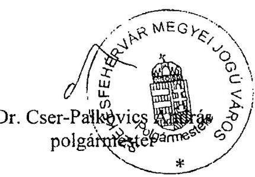

---

.

---

# Dr. Cser-Palkovics András úr   polgármestere

Székesfehérvár Megyei Jogú Város Önkormányzata

## Székesfehérvár

## Tisztelt Polgármester Úr!

Köszönettel vettem Székesfehérvár Megyei Jogú Város Önkormányzata pénzügyi helyzetének ellenőrzéséről készült jelentés-tervezetben foglaltakkal kapcsolatos észrevételeit, és tájékoztatom, hogy a Közgyűlés által hozott - a jelentésben még nem szereplő, de a vizsgálat lezárásának idejéig meghozott - fontosabb döntések a jelentésben az alábbi oldalakon beépítésre kerültek:

- a 28. oldal első bekezdésében közszolgáltatási feladatok jövőbeni hatékonyabbá tétele érdekében az Önkormányzat 2011. évben megvásárolta a DEPÓNIA Hulladékkezelő és Településtisztasági Korlátolt Felelősségű Társaság 49%-os üzletrészét - ezzel 100%-os tulajdonossá válva - és a SZÉKOM Székesfehérvári Kommunális Zártkörűen Működő Részvénytársaság alaptőkéjének 64%-át megtestesítő részvényeket, 90%-os többségi tulajdont szerezve;
- a 44. oldal utolsó bekezdésében az Önkormányzat a mintegy 1500 millió Ft tervezett bekerülési értékű „Agóra Pólus" projekt megvalósításáról elállt, tekintettel a beruházás önrészére, a szükséges előfinanszírozás mértékére és a fenntarthatóságára. A vizsgálat eredményeképpen az Önkormányzat úgy ítélte meg, hogy a létrejövő komplexum jövőbeni fenntarthatóságához szükséges források várhatóan nem állnak majd rendelkezésre;
- az 57. oldal utolsó bekezdésében a közalkalmazottak nyugdíjazásával kapcsolatos döntés a következő években - az eddigi kiadások ismeretében - várhatóan 110-170 millió Ft-os megtakarítást
 eredményezhet az Önkormányzat adott évi költségvetésében.

---

A lejárt határidejű szállítói állománnyal kapcsolatos észrevétele alapján a megállapításunkat a 21. oldal harmadik bekezdésében a következők szerint módosítottuk:

Az Önkormányzatnál az adósságrendezési eljárásról szóló törvény 4. § (2) bekezdés a)-b) pontjaiban rögzített feltételek fennálltak, mivel a hitelező kezdeményezhette volna a lejárt határidejű számlák miatt az adósságrendezési eljárást, amely az Önkormányzat működésének biztonsága tekintetében kockázatot hordoz.

Polgármester Úr észrevételét a jelentés 37. oldal utolsó bekezdésében kimutatott központi költségvetésből kapott támogatásokkal kapcsolatosan nem fogadjuk el, mert a különbözetként kimutatott 2007. évi 1817 millió Ft a jelentésben az átengedett szja bevételek között szerepel.

A jelentés 33. oldal harmadik bekezdését módosítottuk az Önök által javasolt szövegrésszel: az Önkormányzat 2011. évi költségvetési rendeletében a tervezett bevételek és kiadások különbözete 8098 millió Ft teljes finanszírozási igény (negatív értéket) mutat, melynek részbeni fedezete az előző évek pénzmaradványa lehet 4256 millió Ft összegben. A fennmaradó 3842 millió Ft hiányt a Közgyűlés által 2009. évben jóváhagyott, 506 millió Ft refinanszírozott hitel igénybevételével, valamint újabb 3336 millió Ft értékű fejlesztési célú hitel felvételével vagy kötvénykibocsátásával tudja biztosítani az Önkormányzat, amennyiben „murvás parkoló” eladásához kapcsolódó mintegy 2700 millió Ft bankgarancia 2011. évi felszabadulására nem kerül sor, illetve egyéb lényeges változás nem következik be a tervezett bevételek és kiadások tekintetében.

A jelentés 57. oldal 54. lábjegyzetét kiegészítettük a Tűzoltóság dolgozóinak munkaügyi perével kapcsolatosan nyújtott információval.

A pénzeszközök elkülönítésével kapcsolatos észrevételét elfogadjuk és javaslatunkat módosítottuk, mely szerint, a polgármester kezdeményezze a Képviselő-testületnél az intézkedések következtében jelentkező pénzügyi többletek, illetve az egyszeri bevételek tartalékba helyezését, elkülönített kezelését az adósságszolgálat teljesítése érdekében.

Észrevételével egyetértünk és töröltük az adósságszolgálat szerkezetének áttekintésével kapcsolatos javaslatunkat, mivel a 2010. és a 2011. évben is tájékoztatták a Képviselő-testületet az adósságszolgálat szerkezetének áttekintéséről.

Észrevétele alapján elfogadjuk és töröltük a beruházásokkal létrehozott létesítmények működtetésére és jövőbeni fenntarthatóságára vonatkozó javaslatunkat, mivel az Önkormányzat költségvetési rendeleteiben a több éves kihatással járó döntések kihatásait bemutatják, illetve a három éves gördülő tervezéssel kísérletet tesznek a javaslatunkban megfogalmazott elvárásoknak.

Az észrevételéhez csatolt melléklet 1. és 4-7. pontjaiban foglalt módosításokat a jelentéstervezetben átvezettük, a 3. pontban foglaltakat a jelentés 20. oldal negyedik bekezdésében foglaltak alapján, valamint a 4. pontban foglaltak módosítását a jelentés 23. oldalának első bekezdésében foglaltak alapján. az alábbiak alapján nem fogadjuk el.

---

A 2. pontban kifogásolt 2010. december 31-én folyamatban lévő fejlesztési feladatok kötelezettség-vállalásainak összegét a jelentés-tervezet mellékletében szereplő 2267 millió Ft-ra módosítottuk azzal a kiegészítéssel, hogy időközben az Önkormányzat elállt a „Királyi sétány” projekt megvalósításától, melynek következtében a mellékletben kimutatott 2010. december 31-én folyamatban lévő fejlesztési kötelezettség-vállalások összege a 2267 millió Ft-ról 1 millió Ft-ra módosult.

Örömömre szolgált, hogy a jelentés-tervezetben szereplő megállapítások és javaslatok alapján intézkedéseket tettek.

Köszönöm Polgármester Úrnak és munkatársainak az ellenőrzés során tanúsított hozzáállását, amellyel a pénzügyi helyzetelemzés elkészítését segítették.

Budapest, 2011. december 22.
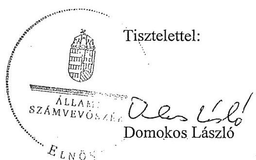

---

.
