# ÁLLAMI   SZÁMVEVŐSZÉK 

## JELENTÉS

## Szolnok Megyei Jogú Város Önkormányzata pénzügyi helyzetének ellenőrzéséről (43/3)

---

# Számvevői Iroda 

Iktatószám: V-3050-14/2011.
Témaszám: 1015
Vizsgálat-azonosító szám: V056049

## Az ellenőrzést felügyelte:

Dr. Varga Sándor
számvevő igazgató-helyettes

## Az ellenőrzést vezette:

## Renkó Zsuzsanna

számvevő tanácsos

## Az ellenőrzést végezték:

| Nyikon Zsigmondné | Szudi Ferencné | Nagy László Csaba |
| :-- | :-- | :-- |
| számvevő tanácsos | számvevő | számvevő tanácsos |

A témához kapcsolódó eddig készített számvevőszéki jelentések:
címe
sorszáma
Jelentés a Szolnok Megyei Jogú Város Önkormányzat gazdálkodási 1037
rendszerének 2010. évi átfogó ellenőrzéséről

---

# TARTALOMJEGYZÉK 

BEVEZETÉS ..... 5
I. ÖSSZEGZŐ MEGÁLLAPÍTÁSOK, JAVASLATOK ..... 16
II. RÉSZLETES MEGÁLLAPÍTÁSOK ..... 26

1. Az Önkormányzat kötelező és önként vállalt feladatai ..... 26
2. A pénzügyi egyensúlyi helyzet alakulása ..... 31
2.1. A múködési és a felhalmozási egyensúly alakulása ..... 31
2.2. Az Önkormányzat bevételeinek alakulása ..... 38
2.3. Az Önkormányzat kiadásainak alakulása ..... 40
3. Kötelezettségek bemutatása ..... 43
3.1. A pénzintézetek felé fennálló kötelezettségek alakulása ..... 43
3.2. Szállítók felé fennálló kötelezettségek alakulása ..... 48
3.3. Egyéb kötelezettségek alakulása ..... 49
4. A pénzügyi egyensúly megteremtése érdekében hozott intézkedések ..... 53
5. A helyi önkormányzatok gazdálkodási rendszerének 2010. évi ellenőrzése során a pénzügyi egyensúly javítására tett szabályszerűségi és célszerűségi javaslatok hasznosulása ..... 56

---

# MELLÉKLETEK 

1. számú A múködési és felhalmozási célú hiány alakulása az Önkormányzat rendeleteiben
2. számú Az Önkormányzat bevételeinek és kiadásainak, adósságszolgálatának alakulásáról
3. a számú Az Önkormányzat 2007-2010 években megvalósított, 2010. december 31-ig befejezett fejlesztései forrásösszetételéről
4. b számú Az Önkormányzat 2010. december 31-én folyamatban lévő fejlesztési feladataihoz kapcsolódó kötelezettségeinek összegzéséről
5. c számú Az Önkormányzat 2010. december 31-én folyamatban lévő fejlesztési feladataihoz kapcsolódó 2010. évet követő kötelezettség-vállalásainak összegzéséről
6. d számú Az Önkormányzat beadott, elbírálás alatti pályázati forrásból megvalósuló fejlesztéseihez kapcsolódó kötelezettség-vállalásainak összegzéséről
7. számú Az önkormányzati feladatok ellátásában részt vevő gazdasági társaságokról
8. számú Szolnok Megyei Jogú Város Önkormányzat Polgármesterének észrevétele
9. számú Szolnok Megyei Jogú Város Önkormányzat Polgármesterének észrevételére adott válasz

---

# RÖVIDÍTÉSEK JEGYZÉKE 

| Törvények |  |
| :--: | :--: |
| Áht. | az államháztartásról szóló 1992. évi XXXVIII. törvény |
| ÁSZ tv. | az Állami Számvevőszékről szóló 1989. évi XXXVIII. törvény (2011. július 1-jétől az Állami Számvevőszékről szóló 2011. LXVI. törvény) |
| Csődtv. | a csődeljárásról és a felszámolási eljárásról szóló 1991. évi XLIX. törvény |
| Gt. | A gazdasági társaságokról szóló 2006. évi IV. törvény |
| Ötv. | a helyi önkormányzatokról szóló 1990. évi LXV. törvény |
| Rendelet |  |
| Áhsz. | 249/2000. (XII. 24.) Korm.rendelet az államháztartás szervezetei beszámolási és könyvvezetési kötelezettségeinek sajátosságairól |
| SzMSz | a Szolnok Megyei Jogú Város Önkormányzat 31/2002. (XII. 19.) számú rendelete a Közgyűlés és Szervei Szervezeti és Müködési Szabályzatáról |
| Szórövidítések |  |
| Aba-Novák Kft. | Aba-Novák Kulturális Központ Nonprofit és Közhasznú Korlátolt Felelősségű Társaság |
| Alfa-Nova Kft. | ALFA-NOVA Energetikai Fejlesztő, Tervező és Vállalkozó Kft |
| APEH | Adó- és Pénzügyi Ellenőrzési Hivatal |
| ÁSZ | Állami Számvevőszék |
| BM | Belügyminisztérium |
| EDP hiány/egyenleg | Uniós módszertan szerinti maastrichti kritériumoknak megfelelő számítás szerinti hiány/egyenleg |
| EU | Európai Unió |
| ÉAOP | ÚMFT Észak-Alföldi Operatív Program |
| GDP | Bruttó hazai termék |
| Ipari Park Kft. | Szolnoki Ipari Park és Logisztikai Szolgáltató Központ Szolgáltató, üzemeltető és fejlesztő Korlátolt Felelősségű Társaság |
| Kincstár | Magyar Államkincstár |
| Közgyűlés | Szolnok Megyei Jogú Város Közgyűlése |
| KSH | Központi Statisztikai Hivatal |
| Munkalehetőség Kft. | „Munkalehetőség a Jövőért"Szolnok Nonprofit és Közhasznú Korlátolt Felelősségű Társaság |
| NGM | Nemzetgazdasági Minisztérium |
| Önkormányzat | Szolnok Megyei Jogú Város Önkormányzata |
| Polgármesteri Hivatal | Szolnok Megyei Jogú Város Önkormányzatának Polgármesteri Hivatala |
| PPP konstrukció | Public Private Partnership (Partnerségi együttmúködés közfeladatok ellátására a magánszektor bevonásával) |

---

| Remondis Szolnok Zrt. | Remondis Szolnok Zártkörú Részvénytársaság |
| :--: | :--: |
| Remondis Kétpó Kft. | Remondis Kétpó Hulladékgazdálkodási Korlátolt Felelősségú Társaság |
| Sportcentrum Kft. | Szolnoki Sportcentrum Sportiskola és Sportszervező Szolgáltató Nonprofit és Közhasznú Korlátolt Felelősségú Társaság |
| SzASzR | Szolnok-Abony-Szajol-Rákócziújfalu Települési Szilárd hulladéklerakó Önkormányzati Társulása |
| Szja | személyi jövedelemadó |
| Szolnok Tv Zrt. | Szolnok Televízió Zártkörúen múködő Részvénytársaság |
| Szollak Kft. | SZOLLAK Vagyonkezelő Korlátolt Felelősségú Társaság |
| Társulás | Szolnoki Kistérség Többcélú Társulása |
| TISZK | Jász-Nagykun-Szolnok Szakképzési-Szervezési Társulás |
| Városfejlesztő Zrt. | Szolnoki Városfejlesztő Zártkörűen Múködő Részvénytársaság |
| Víz-csatorna Zrt. | Víz-és Csatornamúvek Koncessziós Zrt. |
| Volán Zrt. | Jászkun Volán Zrt. |

---

# JELENTÉS 

## Szolnok Megyei Jogú Város Önkormányzata pénzügyi helyzetének ellenőrzéséről

## BEVEZETÉS

Az Állami Számvevőszék 2011. évtől érvényes stratégiája új irányt szabott a helyi önkormányzatok gazdálkodásának ellenőrzésében is. Az ÁSZ - küldetése és jövőképe szerint - szilárd szakmai alapokra támaszkodva értékteremtő ellenőrzéseivel és helyzetelemzéseivel az államháztartás egészében, így a helyi önkormányzati alrendszerben is elő kívánja segíteni a közpénzek és a közvagyon szabályos, gazdaságos, hatékony és eredményes hasznosítását. Ennek részeként - a 2010. évi államháztartási hiány alakulásának összetevőire is figyelemmel - folyamatban van az önkormányzati alrendszer pénzügyi helyzetelemzése.

Az NGM 2011 áprilisában közzétett adatai szerint ${ }^{1}$ a 2010. évi 1036,2 milliárd Ft összegű 3,8\%-os EDP (maastrichti kritériumok szerinti, Túlzott Hiány Eljárás keretében kimutatott) hiánycél nem volt tartható, az önkormányzati alrendszer tervezettet meghaladó hiánya miatt a GDP arányában kifejezett államháztartási hiány 4,2\%-ra emelkedett.

Az önkormányzatok 2010 első három negyedévi költségvetési jelentése szerinti pénzforgalmi hiány 97 milliárd Ft-os összege nem indokolta az önkormányzati alrendszer 190 milliárd Ft-ra becsült hiányának 2010. évi végi felülvizsgálatát. A helyi önkormányzatok 2011. januári gyorsjelentése alapján a pénzforgalmi hiány már 247,7 milliárd Ft-ot tett ki. Az alrendszer hiánya így a tervezett $0,7 \%$-kal szemben magasabb, $0,9 \%$-os szinten realizálódott. Az 57,7 milliárd Ft hiánytöbblet alakulásában - a Tájékoztató szerint - az iparűzési adó elmaradása, a gépjárműadó, az illetékek és más bevételek tervezettnél alacsonyabb összegben való teljesülése volt a meghatározó.

Magyarország a Széll Kálmán Terv célkitűzései alapján² aktualizált Konvergencia Programjában a középtávú (2011-2015. évek) költségvetési pálya kijelölése

[^0]
[^0]:    ${ }^{1}$ NGM Tájékoztatás Magyarország Strukturális Reformprogramjának végrehajtásáról (2011. április 1). A Tájékoztató évente két alkalommal - április és október hónapban jelenik meg.
    ${ }^{2}$ Az államháztartás 2011. évi egyenlege - a magán nyugdíjpénztárakból az állami nyugdíjpillérbe való visszatérés egyszeri vagyonhatása következtében - 4\%-os többletet mutatna. A Széll Kálmán Tervben foglalt egyszeri intézkedések - a MÁV, a BKV adósságrendezése, a PPP projektek kiváltása - összességében a GDP 2\%-ával csökkentik a várható többlet mértékét.

---

során 2011-re a kormányzati szektor EDP módszertan szerinti egyenlegét + 2\%ban jelölte meg. Az egyenlegcél megfogalmazásakor az önkormányzati alrendszer tervezett hiányát a 2011. évi költségvetésben szereplő $0,3 \%$-kal szemben $0,5 \%$-os arányban határozták meg ${ }^{3}$. A hiánycélok meghatározása jelzi, hogy az önkormányzati alrendszerben 2011-ben fokozott figyelmet kell fordítani a pénzügyi egyensúlyi helyzet alakulására.

Az államháztartás helyi szintjén a 23 megyei jogú városi önkormányzatnak az általuk ellátott közszolgáltatások volumenére való tekintettel kiemelt szerepe van, e települések népessége összességében meghaladja a kétmillió főt ${ }^{4}$. A települések népességét az alábbi diagram szemlélteti:
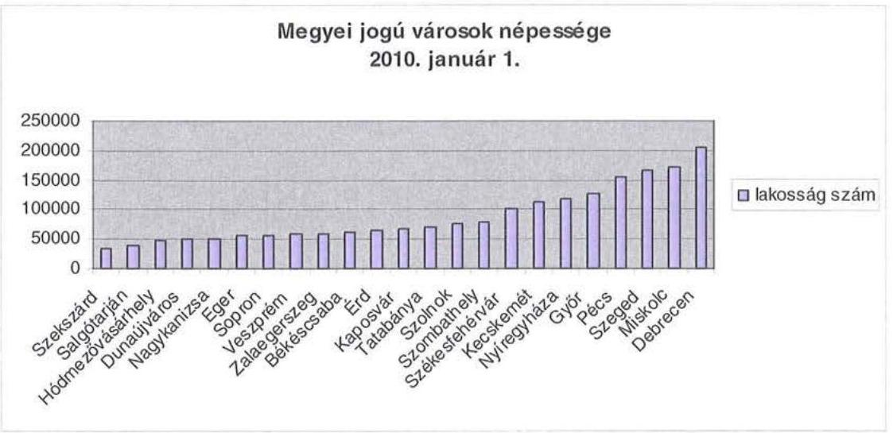

A megyei jogú városi önkormányzatok ${ }^{5}$ kötelező feladatellátását többlépcsős törvényi előírások határozzák meg. A feladatokra vonatkozó szabályozás első szintjét az Ötv. ${ }^{6}$, a második szintet a hatásköri7, a harmadik szintet a további ágazati, szakmai (egyebek mellett az oktatási, egészségügyi, szociális és egyéb ágazati feladatok ellátásának szakmai szabályait rögzítő) törvények adják.

[^0]
[^0]:    ${ }^{3}$ A Magyar Köztársaság 2011. évi költségvetéséről szóló 2010. évi CLXIX. törvény Általános indoklásának III. fejezete, valamint Magyarország Konvergencia Programja 2011-2015. (2011. április) Táblázatok rész, 2. táblázat Államháztartás összefoglaló adatai szerint.
    ${ }^{4}$ A megyei jogú városok népességét a 4/2011. (I. 31.) NGM rendelet 1. sz. mellékletében foglalt 2010. január 1-i adatok alapján vettük figyelembe.
    ${ }^{5}$ Az Ötv. 61. § (1) bekezdése alapján a megyeszékhely város a törvény erejénél fogva megyei jogú, ugyanakkor az Országgyúlés az ötvenezernél nagyobb népességú városokat a képviselőtestület kérelmére megyei jogú várossá nyilváníthatja. Ez utóbbi körbe 5 város tartozik, közülük 2 (Hódmezővásárhely, Dunaújváros) népessége 2010. január 1-ére már ötvenezer fő alá csökkent.
    ${ }^{6}$ az Ötv. 8. és 61. §-ában foglaltak szerint
    ${ }^{7}$ a Htv.

---

A megyei jogú városi önkormányzatok - az Ötv-ből közvetlenül levezethető települési feladatok mellett körzeti közszolgáltatásokat is ellátnak. A megyei jogú városi cím elsősorban többlet kötelezettségekkel jár, a megyei jogú városnak önmagának kell gondoskodnia mindazokról a feladatokról, amelyek más települési önkormányzatok esetében a megyei önkormányzat feladatát képezik. Ide sorolható többek közt a középfokú oktatási intézmények fenntartása, a közművelődési, könyvtári és levéltári szolgáltatás, a társadalombiztosítás finanszírozása mellett a kórházi és a rendelőintézeti szakellátás, a szociális és egyes gyermekvédelmi feladatok ellátása. Ezeket a feladatokat (intézményeket) a megyei jogú város - más városoktól eltérően - nem adhatja át a megyei önkormányzatnak, azonban az Ötv. lehetőséget biztosít arra, hogy a megyei önkormányzattal megállapodjék a feladatellátás megosztásában.

Az önkormányzat, így a megyei jogú város is, maga határozza meg, hogy - a lakosság igényei alapján, anyagi lehetőségei függvényében - mely feladatokat, milyen mértékben és módon, mely szervezeti keretek közt lát el. A szervezetalakítás szabadsága a megyei jogú városok esetében azzal járt, hogy mind a kötelező közszolgáltatásoknál (különösen a településüzemeltetés, vagyongazdálkodás), mind pedig az önként vállalt feladataik ellátásában - elsősorban a sport és kulturális szolgáltatások területein - a gazdasági társaságok kiemelt fontosságú szerephez jutottak. Ily módon a gazdálkodás, a pénzügyi helyzet kockázatai közvetlenül kikerültek ugyan az önkormányzati alrendszerből, azonban sérülhet az ellátási felelősség figyelemmel kísérése és érvényesítése, a közpénzek felhasználásának transzparenciája. Mindezek együttvéve - a beszámolók konszolidálásának hiányában - növelik a megyei jogú városok pénzügyi helyzetének megítélésében rejlő kockázatokat.

Az áttekintett időszakban az önkormányzati feladatok ellátásának keretet biztosító forrásszabályozás elvei lényegesen nem változtak.

A megyei jogú városok önkormányzatainak mozgásterét, az önkormányzatok feladatellátásra vonatkozó döntéseit a központi költségvetéstől való függőség mellett jelentősen befolyásolja a helyi adókivetési jog gyakorlása ${ }^{8}$. A helyi adók rendszere a közszolgáltatások finanszírozásához szükséges források megteremtésének, bővítésének eszköze, amely a gazdasági válság, a jogszabályi környezet, az adópolitika változása, az adóhatóságok tevékenysége következtében differenciáltan érinti a települési önkormányzatokat ${ }^{9}$.

A települési önkormányzatok saját folyó bevételeinek keretében elszámolt, különböző jogcímeken kivetett helyi adók - iparűzési adó, építmény és telekadó, idegenforgalmi adó, vállalkozók és magánszemélyek kommunális adója -2007-2010 között eltérő módon emelkedtek. A helyi adókból származó bevételek realizált összege országos szinten 2007-2009 között folyamatosan, 505,3 milliárd Ft-ról 566,3 milliárd Ft-ra emelkedett, majd a gazdasági válság hatásai következtében 2010-re 542,6 milliárd Ft-ra esett vissza. A helyi adók részesedése

[^0]
[^0]:    ${ }^{8}$ a helyi adókról szóló 1990. évi C. törvény szabályai szerint
    ${ }^{9}$ Az Állami Számvevőszék 2010 decemberében közzétett 1031. számú jelentésében értékelte a helyi adók rendszerében a hatékonyság és az eredményesség érvényesülését.

---

az önkormányzatok saját folyó bevételein belül 2007-2010 között 2,5 százalékponttal csökkent ${ }^{10}$.

A megyei jogú városok saját folyó bevétele 2007-ben 191,5 milliárd Ft volt, 2008-ban 223,1, 2009-ben 225,4, 2010-ben 223,5 milliárd Ft-ot tett ki. A helyi adóbevételekből való részesedésük 2007-ben 110,5 milliárd Ft (21,9\%), 2008ban 128,3 milliárd Ft (23,2\%), 2009-ben 124,4 milliárd Ft (22\%), 2010-ben 118,7 milliárd Ft (részaránya a 2007. évivel azonosan $21,9 \%$ ) volt. E realizált adóbevételek a megyei jogú városok saját folyó bevételeinek 2007-ben 57,7, 2008-ban 57,5, 2009-ben 55,2, 2010-ben 53,1\%-át jelentették. A helyi adóbevételek 2007-ről 2010-re kimutatott 4,6 százalékpontos csökkenése annak ellenére következett be, hogy a megyei jogú városok saját folyó bevétele 2010-ben $16,7 \%$-kal haladta meg a 2007. évit.

A helyi adókon belül a települések gazdasági helyzetének egyik fokmérője az elért helyi iparűzési adóbevétel, amely a megyei jogú városok körében erőteljes - a település nagyságrendtől is függőo ${ }^{11}$ - különbségeket mutat. A helyi iparűzési adóbevétel és annak egy lakosra vetített összegének 2007. és 2010. évi alakulását az alábbi diagramok szemléltetik:
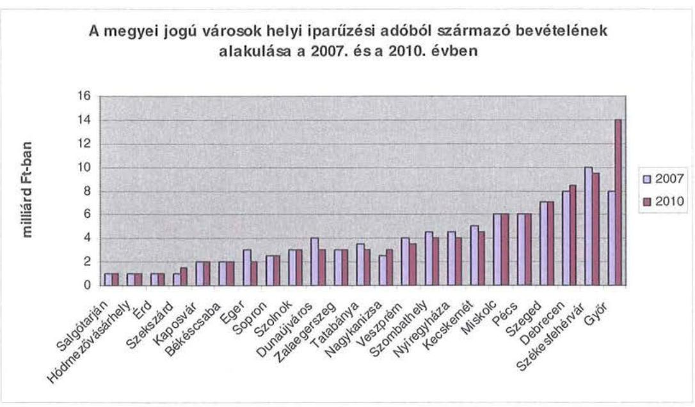

[^0]
[^0]:    ${ }^{10}$ A helyi adó bevételek saját folyó bevételekből való részesedése országosan 2007-ben $55,3 \%, 2010$-ben $52,8 \%$ volt.
    ${ }^{11}$ A 100 ezer fő feletti népességű megyei jogú városok csoportjába Debrecen, Miskolc, Szeged, Pécs, Győr, Nyíregyháza, Kecskemét, Székesfehérvár tartozik. Nem megyeszékhely megyei jogú város Érd, Sopron, Nagykanizsa, Dunaújváros, Hódmezővásárhely.

---

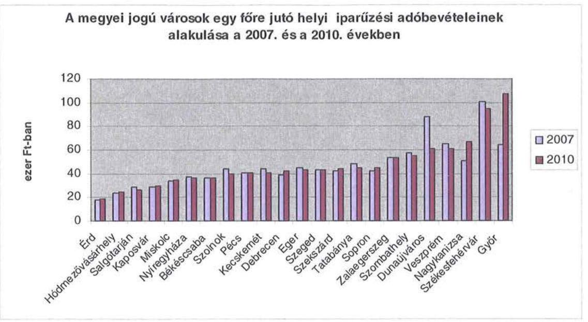

A megyei jogú városi önkormányzatok saját bevételein belül második legjelentősebb elem az illetékbevétel. A 2010. évben befolyt 39,2 milliárd Ft illetékbevétel a 2006. évben realizált 71,1 milliárd Ft illetékbevétel alig több mint $55 \%$-a. A jelentős visszaesést döntően az ingatlanpiac stagnálása, majd visszaesése, illetve egyes illetékkedvezmények bevezetése okozta. A kieső bevételek pótlására az önkormányzati alrendszer szintjén történtek intézkedések, 2010ben 5 milliárd Ft-ot, 2011-ben 1,2 milliárd Ft-ot ellentételezett a központi költségvetés. A megyei jogú városok önkormányzatai az önkormányzati alrendszer szintjén realizált illetékbevételből 2007-ben 13,6 milliárd Ft-tal (23,3\%-kal), 2008-ban 15,3 milliárd Ft-tal (22,7\%-kal), 2009-ben 12,6 milliárd Ft-tal (21,5\%$\mathrm{kal}), 2010$-ben 7,9 milliárd Ft-tal ( $20,2 \%$-kal) részesedtek ${ }^{12}$. Az összes befolyt illetékbevételből a megyei jogú városok részesedése 2009-ről 2010-re mindössze 1,3 százalékponttal csökkent, ugyanakkor a realizált illetékbevétel csökkenése a $37,3 \%$-ot ( 4,7 milliárd Ft) is elérte.

Az önkormányzati alrendszer átengedett bevételei közül a személyi jövedelemadóból való részesedés makroszintű szabályozása a vizsgált időszakban nem változott. A települési önkormányzatokat a településre kimutatott személyi jövedelemadó $8 \%$-a közvetlenül, míg $32 \%$-a külön szabályozott visszaosztási rendben illeti meg. A visszaosztás a jövedelem differenciálódás mérséklésével párosul, rendje a lakóhelyen maradó személyi jövedelemadóhoz és az iparűzési adó-erőképességhez ${ }^{13}$ igazodik, annak részletszabályait a mindenkori költségvetési törvény 4. számú melléklete határozza meg. A jövedelemdifferenciálódás

[^0]
[^0]:    ${ }^{12}$ Az illetékek kivetésének és beszedésének joga 2006. december 31-ig a megyei önkormányzatok feladata volt, amelyet a 2007. évtől az APEH (2011. január 1-jétől NAV) vett át. Az önkormányzati illetékrészesedési szabályok változatlanok maradtak, azonban az illetékbeszedés költségeit az önkormányzatok illetékbevételeiből átlagos (a megyei jogú városoknál $8,5 \%$-os) kulcsot alkalmazva vonták le.
    ${ }^{13}$ Az iparűzési adóerő-képesség egy potenciális, átlagos erőfeszítés mellett elérhető (a települési önkormányzat iparűzési adóelőlegét meghatározó adóalap 1,4\%-ának megfelelő számított) bevétel.

---

szabályai kétirányúak, a kiegészítés és a visszatartás feltételeit egyaránt meghatározták:

- Amennyiben az önkormányzatot közvetlenül megillető személyi jövedelemadó bevétel és a számított iparűzési adóerő-képesség együttesen számított, egy főre jutó összege nem érte el a település méretéhez kapcsolódóan az évenkénti szabályozás szerinti változó összeget, a költségvetés a részesedést település nagyság szerint eltérően meghatározott szintig - kiegészítette ${ }^{14}$. A kiegészítés fajlagos összege 2007-2010 között 37500 Ft-ról 48010 Ft-ra (10 510 Ft-tal, 28\%-kal) emelkedett. Az előzőeken túl a jövedelem differenciálódás szabályozása egyes térségi (középiskolai, szakiskolai, szakképző intézményi, kollégiumi) feladatok ellátásának függvényében további kiegészítő hozzájárulást biztosított.
- Amennyiben az egy főre számított személyi jövedelemadó és az iparűzési adóerő-képesség együttes összege a település nagyságrendjéhez rendelt értékhatárt több mint $25 \%$-kal (2010-től 20\%-kal) meghaladta, az egy főre jutó összeg sávonként differenciált módon ${ }^{15}$ visszavonásra került az önkormányzatot megillető normatív állami hozzájárulás összegéből.

Az önkormányzatok személyi jövedelemadó bevétele 2007-ben 494,3 milliárd Ft, 2008-ban 558,6 milliárd Ft, 2009-ben 639,5 milliárd Ft, 2010-ben 681,2 milliárd Ft volt, az időszak alatt összegében 186,9 milliárd Ft-tal, 37,8\%kal emelkedett, miközben az szja bevétel átengedett bevételeken belüli részesedése 1,8 százalékponttal emelkedett.

A megyei jogú városok önkormányzatainak személyi jövedelemadó részesedése az alrendszer átengedett személyi jövedelemadó bevételeiből 2007-ben 77,6 milliárd Ft-ot ( $15,7 \%$-ot), 2008-ban 105,4 milliárd Ft-ot ( $18,9 \%$-ot), 2009ben 122,9 milliárd Ft-ot ( $19,2 \%$-ot), 2010-ben 136,6 milliárd Ft-ot ( $20,1 \%$-ot) tett ki. A realizált szja bevétel a megyei jogú városoknál az időszak alatt folyamatosan emelkedett, a 2010-ben realizált adóbevétel 59,0 milliárd Ft-tal (76\%) volt magasabb a 2007. évinél, az átengedett bevételeken belüli részesedése 2010-re 5,1 százalékponttal haladta meg a 2007. évi részarányt ${ }^{16}$. A részesedés alapjául szolgáló szja településenként eltérő, az egy adózóra jutó szja 2009. évi adatait ${ }^{17}$ a következő ábra szemlélteti.

[^0]
[^0]:    ${ }^{14}$ A megyei jogú városok esetében a jövedelemkülönbségek mérséklésénél figyelembe veendő lakosonkénti értékhatár 2007-ben 37500 Ft, 2008-ban 42385 Ft, 2009-ben 45933 Ft, 2010-ben 48010 Ft volt.
    ${ }^{15}$ A sávos értékhatár 2010-től 20\%-os intervallumonként, 120\% felett a visszatartást $25 \%$-tól $90 \%$-os mértékig rögzíti. Amennyiben a település nagyságrendhez rendelt értékhatár összege az önkormányzatnál eléri vagy meghaladja a 200\%-ot, az egy főre jutó összeg $90 \%$-a levonásra kerül. Az értékhatár sávjai 2010 előtt $25 \%$-os léptékűek voltak, a levonási arányok az ellenőrzött időszakban nem változtak.
    ${ }^{16}$ E bevételek a megyei jogú városok átengedett bevételeiben 2007-ben 84,7, 2008-ban 87,7, 2009-ben 89,7, 2010-ben 89,8\%-os részarányt jelentettek.
    ${ }^{17}$ Adatforrás: KSH Megyei Jogú Városok a Közép Dunántúlon 2009. kiadványa, 4.1.sz. összehasonlító tábla.

---

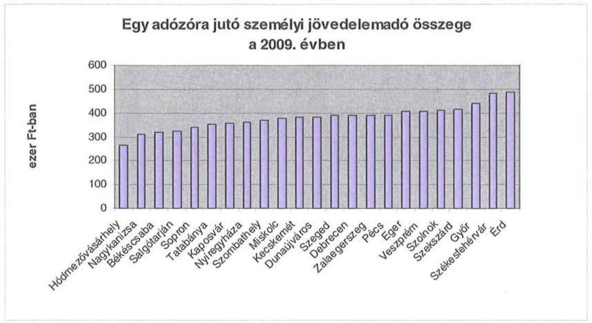

Az átengedett bevételek második legjelentősebb eleme a gépjármúadó, amelynek bevételi szabályozása az ellenőrzött időszakban nem változott, az adóbevétel teljes összege az önkormányzatot illeti meg. A gépjármúadó alapját, mértékét ${ }^{18}$ és egyes mentességi kategóriákat érintő módosítások 2010. január 1-től következtek be, amelyek az egyes adótételek esetében átlagosan $15 \%$-os emelkedéssel jártak.

A gépjármúadó beszedéséből származó bevétel az önkormányzati alrendszer szintjén 2007-ben 62,4 milliárd Ft, 2008-ban 65,7 milliárd Ft, 2009-ben 63,8 milliárd Ft, 2010-ben 71,1 milliárd Ft volt, az adóbevétel egésze 2007-hez képest 8,7 milliárd Ft-tal, 13,9\%-kal emelkedett. A gépjármúadóztatás szabályainak változása 2010-ben 7,3 milliárd Ft többletet eredményezett. A megyei jogú városok gépjármúadó bevétele a 2007. évi 14,0 milliárd Ft-ról 2010-re 15,5 milliárd Ft-ra, 10,7\%kal emelkedett. A bevételnövekedés összegéből 1,4 milliárd Ft a 2010. évi adózási szabályok következménye.

[^0]
[^0]:    ${ }^{18}$ A gépjármúadóról szóló 1991. évi LXXXII. törvény 7. § (1) bekezdésében foglalt adómértékek változása.

---

A megyei jogú városok önkormányzatai 2007-2010 között rendelkezésre álló forrásainak alakulását a következő ábra szemlélteti:
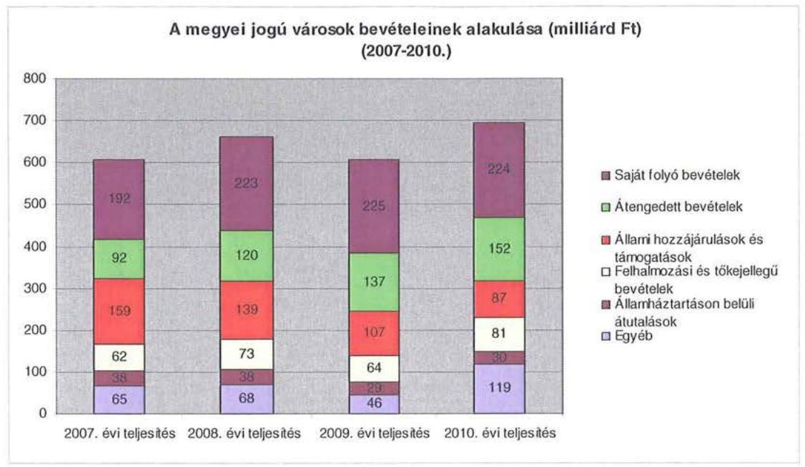

A megyei jogú városok saját folyó bevételeinek - amelyek főbb elemei: a helyi adók, az illetékbevételek, az intézményi térítési díjak, a kamatbevételek részaránya a 2007. évi összbevételen ( 608 milliárd Ft) belül 32\% volt. A 2010. évi összbevétel 693 milliárd Ft-os összegéből a saját folyó bevételek aránya miközben összege 2007-ről 2010-re 32 milliárd Ft-tal emelkedett - nem változott.

Az átengedett bevételek, amelyek a megyei jogú városok önkormányzatainál döntően a személyi jövedelemadó és a gépjármúadó részesedést jelenti, az összbevételen belül a 2007. évi 92 milliárd Ft-ról (15\%) 152 milliárd Ft-ra nőtt, részesedése 7 százalékponttal emelkedett. A 60 milliárd Ft-os növekedésből 59 milliárd Ft-ot az szja részesedés emelkedése okozott.

Az állami hozzájárulások és támogatások - amelyek főbb elemei: főként az ellátotti létszámhoz kötődő normatív állami hozzájárulások, központosított előirányzatok - a 2007. évi 159 milliárd Ft-ról (26\%-os részarányról) 2010-re 87 milliárd Ft-ra ( $13 \%$-os részarányra) estek vissza.

A felhalmozási és tőkejellegú bevételek - tárgyi eszközök (ingatlanok és ingóságok), föld és immateriális javak, részesedések értékesítése, EU-tól átvett pénzeszközök - a 2007. évi 62 milliárd Ft-ról (10\%-os részarányról) 2010-re 81 milliárd Ft-ra ( $12 \%$-os részarányra) emelkedtek.

Az államháztartáson belüli átutalások részesedése 2007-ben 38 milliárd Ft volt. 2010. év végére 8 milliárd Ft-tal csökkent, részaránya 6\%-ról 2010-ben 4\%-ra változott. Ez a bevételi kategória tartalmazza az Egészségbiztosítási Alaptól és más elkülönített állami pénzalapoktól átvett forrásokat. A 2010-ben e címen elszámolt bevétel a megyei jogú városoknál 22 milliárd Ft-ot tett ki.

---

Az egyéb, pénzmaradványból, vállalkozási bevételekből, államháztartáson kívülről származó átutalásokból, a hitelekből, a hosszú és rövid lejáratú értékpapírok értékesítéséből származó bevételek részesedése a 2007-2010. évek viszonylatában 11\%-ról 17\%-ra emelkedett. Ez utóbbiak 2010. évi beszámoló szerinti összevont teljesítése 119 milliárd Ft volt ${ }^{19}$.

Mindezeket figyelembe véve a megyei jogú városok 2007. és 2010. évi forrásöszszetételének megoszlását az alábbi ábra szemlélteti:

A megyei jogú városok 2007. és 2010. évi forrásösszetétele
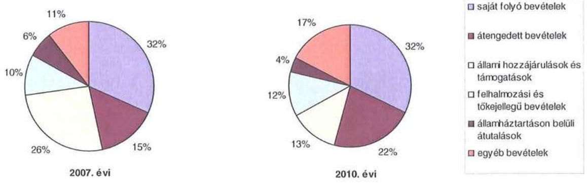

Az önkormányzati alrendszer pénzügyi helyzetértékelése során új elemzési módszereket alkalmaz az ellenőrzés. A hagyományos költségvetési szerkezet helyett az önkormányzat pénzügyi helyzetét a CLF módszerrel mutatjuk be, amelynek lényegét és számításának módszerét a 2.1. pontban, és a jelentés 2 . számú mellékletében ismertetjük részletesen.

Az új módszereken alapuló helyzetértékelés fontosságát az adja, hogy a helyi önkormányzatok bruttó adósságállománya ${ }^{20}$ a 2010. évi költségvetési beszámoló alapján 1248 milliárd Ft-ot tett ki. Az adósságállomány koncentráltságát jelzi ${ }^{21}$, hogy ebből a 23 megyei jogú város részesedése 338 milliárd Ft volt, amely a fővárosi és kerületi önkormányzatok adósságának figyelmen kívül hagyásával számított 2010. évi 977 milliárd Ft összegű bruttó adósságállomány $34,6 \%$-át jelentette. Az adósságállomány több mint fele -

[^0]
[^0]:    ${ }^{19}$ Az egyéb bevételek összege 2007-2010 között eltérő módon változott, 2007-ben 65 milliárd Ft, 2008-ban 68 milliárd Ft volt, 2009-ben 46 milliárd Ft-ra esett vissza, majd 2010-ben több mint két és félszeresére, 119 milliárd Ft-ra emelkedett.
    ${ }^{20}$ A bruttó adósságállomány 2010. év végi összege magában foglalja a fejlesztési és a működési célú kötvénykibocsátások, a beruházási és fejlesztési hitelek, a működési célú hosszú lejáratú hitelek, a rövid lejáratú hitelek, váltótartozások miatti kötelezettségek teljes (2011-ben, illetve az azt követő években esedékes) állományát.
    ${ }^{21}$ A megyei jogú városok adósságállománya összegében ugyan elmarad az egyéb városok összesített adósságától [(ez utóbbiak részesedése 382,6 milliárd Ft (39,2\%)], azonban az egyéb városok száma 304. A fővárosi és a kerületi önkormányzatok nélküli adósságállományból a 19 megyei önkormányzat 163 milliárd Ft-tal ( $16,8 \%$-kal), míg a nagyközségek, községek együttesen 93 milliárd Ft-tal ( $9,5 \%$-kal) részesednek.

---

501 milliárd Ft - a 19 megyei önkormányzatnál és a 23 megyei jogú városnál jelentkezett.

A megyei jogú városok 338 milliárd Ft-os adósságállományából 175 milliárd Ft $(51,8 \%)$ a 8 legnagyobb, 100 ezer fő feletti népességű város tartozása. Az 5 nem megyeszékhely megyei jogú város bruttó adósságállománya 70 milliárd Ft-ot (20,7\%-ot), az előző két csoportba nem tartozó további 10 megyei jogú város adóssága 93 milliárd Ft-ot ( $27,5 \%$-ot) tett ki.
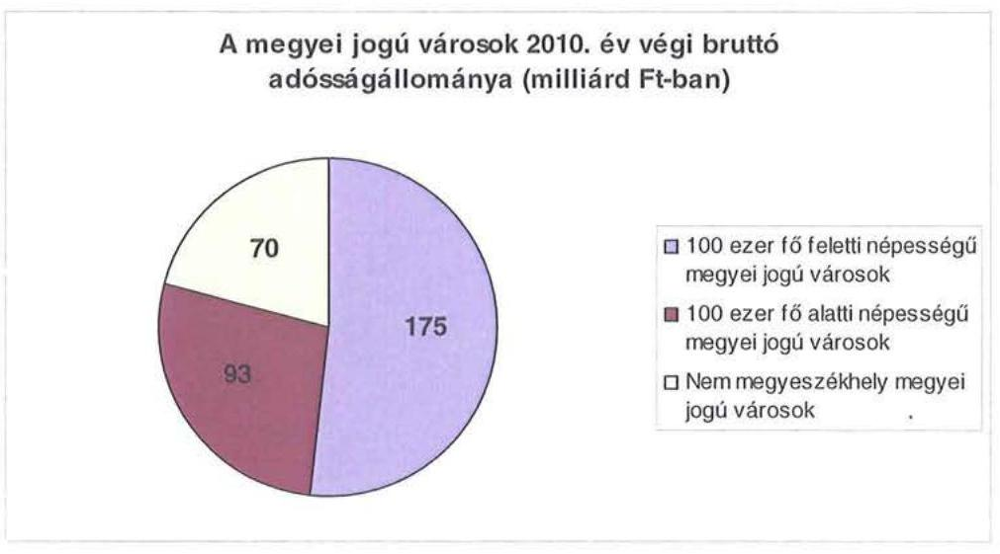

A mérlegben kimutatott bruttó adósságállomány mellett az önkormányzatok számára az eszközállomány műszaki állapotának megőrzése is kötelezettségekkel jár. Az elhasználódott eszközök pótlására forrást biztosító amortizációs (felújítási) alap képzésének ${ }^{22}$ elmaradása maga után vonhatja a feladatellátást kiszolgáló tárgyi eszközök állagának erőteljes romlását. Emellett a 2007-2013as időszakra meghirdetett, vissza nem térítendő EU-s fejlesztési forrásokhoz való hozzájutás lehetősége felerősítette az önkormányzati alrendszer fejlesztési igényeit, amelyek a felhalmozási költségvetési hiány folyamatos emelkedésén túl - az előírt jövőbeni fenntartási kötelezettség miatt - tovább terhelhetik az önkormányzatok költségvetését ${ }^{23}$.

Az ÁSZ a 2011. évi ellenőrzési tervében 43. számú, az Önkormányzatok gazdálkodási rendszerének ellenőrzése részeként egy időben, egymással párhuzamosan tekinti át, és elemzi a 23 megyei jogú városi önkormányzat pénzügyi helyzetét. A gazdálkodás szabályszerűségét az ÁSZ az előző évek során ebben az önkormányzati körben is ellenőrizte, ezért jelen vizsgálatunk erre nem tér ki. A jelen-

[^0]
[^0]:    ${ }^{22}$ Erre a jelenlegi szabályozási környezetben nem kötelezi semmilyen előírás az önkormányzatokat.
    ${ }^{23}$ Az Állami Számvevőszék 2011 júniusában közzétett 1108. számú, a helyi önkormányzatok fejlesztési célú támogatási rendszerének ellenőrzéséről szóló jelentésében feltárta a fejlesztési folyamatok problémáit. A helyi önkormányzatok elsősorban azokat a fejlesztéseket valósították meg, amelyekhez támogatást lehetett igényelni. A fejlesztési célok közül a magasabb támogatás intenzitású pályázatokat részesítették előnyben. A fejlesztéssel megvalósuló létesítmények jövőbeli üzemeltetésének várható ráfordításait az önkormányzatok $71,9 \%$-a nem mérte fel.

---

tés a megyei jogú városok sajátos feladatellátási és forrásszabályozási helyzetére tekintettel az önkormányzatok pénzügyi helyzetét, illetve az ezzel összefüggő korábbi ÁSZ javaslatok megvalósítását mutatja be.

Az ellenőrzés a 2007. január 1. - 2010. december 31. közötti időszakot öleli fel.
A vizsgálat jogszabályi alapját az Állami Számvevőszékről szóló 1989. évi XXXVIII. törvény 2. § (3), (5), (6) és (9) bekezdései ${ }^{24}$, az Ötv. 92. § (1) bekezdése, az Áht. 104. § (3), és 120/A. § (1) bekezdése előírásai képezik.

[^0]
[^0]:    ${ }^{24}$ 2011. július 1-jétől az Állami Számvevőszékről szóló 2011. évi LXVI. törvény 5. § (2)(5) bekezdései.

---

# I. ÖSSZEGZŐ MEGÁLLAPÍTÁSOK, JAVASLATOK 

Az Önkormányzat - adatszolgáltatása szerint - a múködési költségvetési kiadásaiból (20 247 millió Ft) 15793 millió Ft-ot (78\%) a kötelező feladatok, 4454 millió Ft-ot (22\%) az önként vállalt feladatok ellátására fordított. A kötelező és önként vállalt feladatok körét nem rögzítette, kötelező feladatait az Ötv. és az ágazati törvények által meghatározottnak tekintette. A 2011. évtől az önkormányzati SzMSz mellékletében elkülönítették a kötelező és önként vállalt feladatok körét. A kötelező és önként vállalt feladatok részarányának megállapítása az Önkormányzat besorolásának megfelelően készült. Az Önkormányzat önként vállalt feladatnak tekinti a kollégiumok fenntartását, valamint a kulturális feladatokat is.

Az Önkormányzat feladatellátásának szervezeti struktúráját a következő ábra szemlélteti:

Az Önkormányzat feladatellátásának szervezeti struktúrája
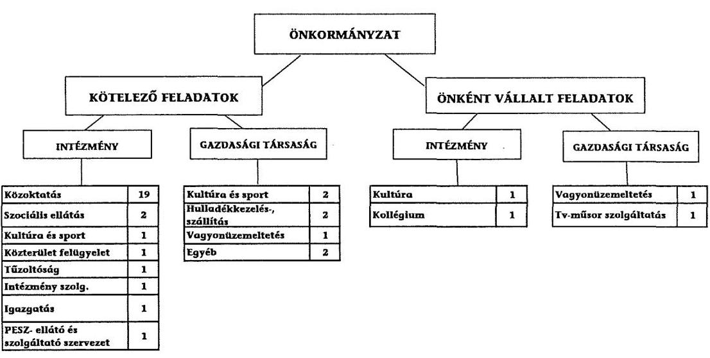

Az Önkormányzat feladatait 2010. december 31-én (a Polgármesteri hivatallal együtt) 29 költségvetési szervvel és nyolc $25 \%$ feletti tulajdoni hányadú gazdasági társaságával, továbbá három - az önkormányzattól tulajdonosi szempontból független gazdasági társaság közremúködésével látta el. Az intézményszervezeti átalakítások és intézményi összevonások következtében a feladatellátás telephelyeinek száma a 2006. évi 129-ről 2010-re 118-ra csökkent.

Az Önkormányzat múködési kiadásokra 2010-ben 20247 millió Ft-ot fordított, amely 755 millió Ft-tal haladta meg a 2007. évi ráfordításokat. A múködési kiadások 61,6\%-át az intézményi körben realizálták. E kiadások fedezetéül szolgáló bevételi források 2007. és 2010. években jellemző összesített arányait a következő ábra szemlélteti:

---

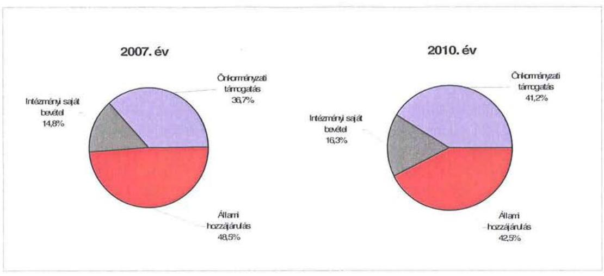

Az egyes közszolgáltatások feladatellátásában részt vevő ágazati intézménycsoportok forrásösszetételének bevételi jogcímenkénti alakulását a következő ábra szemlélteti:
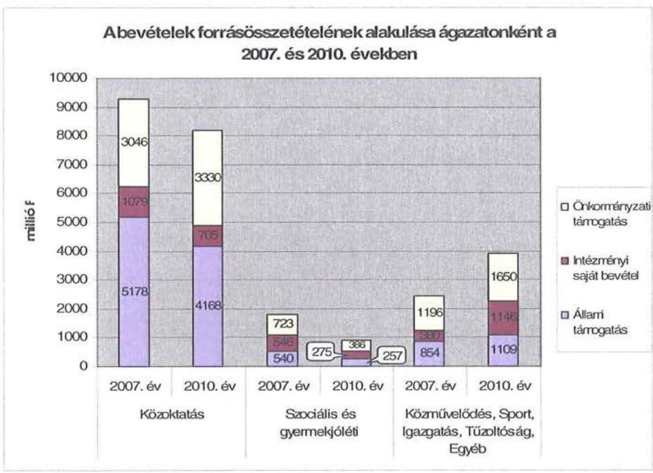

Az Önkormányzat hét gazdasági társaságban rendelkezik kizárólagos tulajdonnal, egyben 25-50\% közötti a tulajdoni hányada. A gazdasági társaságok vagyonüzemeltetésben, városfejlesztésben, kultúra és sport feladat ellátásában, hulladékszállításban és hulladéklerakó üzemeltetésben kaptak szerepet az Önkormányzat feladatellátásában. A gazdasági társaságok múködésükhöz a 2010. évben összesen 425 millió Ft rendszeres múködési, 449 millió Ft eseti múködési pénzeszköz átadásban és 0,2 millió Ft fejlesztési pénzeszköz átadásban részesültek az Önkormányzattól. A múködési pénzeszközátadás 52,5\%-át (459 millió Ft-ot) a kötelező feladatot ellátó Munkalehetőség a jövőért társaság kapta.

A 2010-ben a gazdasági társaságok saját tőke-jegyzett tőke aránya minden esetben meghaladta a $90 \%$-ot. A társaságok közül, a kulturális feladatot ellátó

---

Aba-Novák Kft-nek veszteséges gazdálkodására tekintettel az Önkormányzat 2008. évben 7,6 millió Ft tőkét juttatott, majd 2010. évben a gazdasági társaság jegyzett tőkéjét 0,5 millió Ft-ra leszállítatta. Az Önkormányzat kizárólagos tulajdonában álló Ipari Park Kft. 2008-2010. évek tartós likviditási problémája miatt, összesen 622 millió Ft tagi kölcsönben (2007. évben az apportként bevitt földterület infrastruktúrafejlesztéshez 294 millió Ft, a 2008. és 2009. években 164 - 164 millió Ft beruházási hitel törlesztéséhez) részesült. A társaság pénzügyi helyzete jelenleg sem stabil, 2010. december 31-én esedékes tőke- és kamatfizetését az átütemezett 2011. június 30-i időpontban sem teljesítette. 2010. év végén az Önkormányzat kizárólagos tulajdonnal rendelkező gazdasági társaságai közül ötnek volt lízingből fennálló kötelezettsége összesen 1209 millió Ft összegben, amelynek 98\%-a az Ipari Park Kft. kötelezettsége.

A folyó költségvetés egyenlege (múködési jövedelem) 2007. évben múködési forrástöbbletet mutatott, 2008-2010 között azonban az Önkormányzat működési forráshiányos volt ${ }^{25}$. A 2007. évben a működési megtakarítások fedezni tudták a tárgyévben jelentkező törlesztési kötelezettségeket, így az Önkormányzat pénzügyi kapacitása (nettó múködési jövedelme) is pozitív értékű volt. A 2008. évben a pénzügyi kapacitás negatívvá vált (-770 millió Ft), mivel a folyó költségvetés negatív egyenlegét (-386 millió Ft) tovább növelte az adósságszolgálat törlesztési kötelezettsége ( 384 millió Ft). A 2009. évben a pénzügyi kapacitás tovább romlott, mert az Önkormányzat elkezdte törleszteni egyik kötvényét, amely miatt az adósságszolgálata növekedett. A 2010. évben a működési jövedelem továbbra is negatív volt (-1433 millió Ft), a folyó bevételek nem nyújtottak fedezetet a folyó kiadásokra, a működési egyensúly nem volt biztosított.
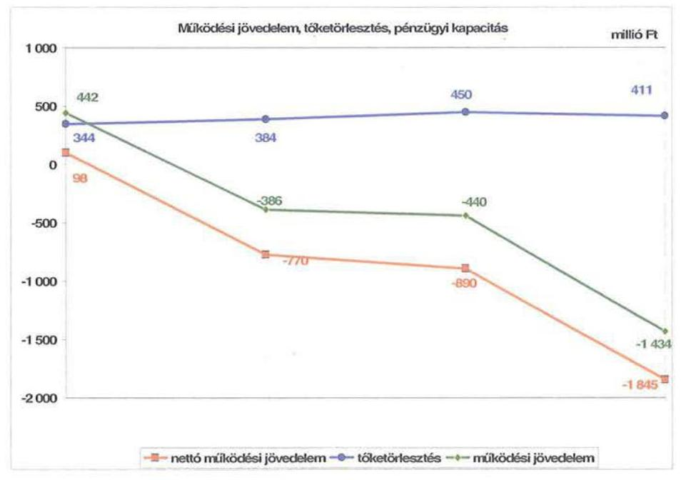

[^0]
[^0]:    ${ }^{25}$ 2007-ben a folyó bevételek 2,3\%-át (442 millió Ft-ot) jelentette, 2008-ban azonban a folyó kiadások 1,9\%-át (-386 millió Ft-ot), 2009-ben 2,2\%-át (-440 millió Ft-ot), 2010ben $6,8 \%$-át tette ki ( -1433 millió Ft) a negatív működési jövedelem.

---

A 2007-2010. években az Önkormányzat felhalmozási költségvetésének egyenlege folyamatosan negatív összegű volt, amely 2007-2010 között összesen 8539 millió Ft felhalmozási forráshiányt okozott.

A pénzügyi egyensúly fenntartása külső források bevonásával volt biztosítható. A 2007-2010. években 1387 millió Ft hitelt törlesztettek, továbbá 203 millió Ft volt a kötvény beváltása miatt fizetendő kötelezettség. Az adósságszolgálat, továbbá a felhalmozási forráshiány 2007-2010 között 10129 millió Ft-ot tett ki, amelyre az időszakban képződő 442 millió Ft működési többlet (működési jövedelem), valamint a 2007. január 1-jén rendelkezésre álló 728 millió Ft pénzkészlet szolgált fedezetül. A további pénzeszközöket 395 millió Ft fejlesztési hitel felvételével és a kötvénykibocsátásból igénybe vett 8564 millió Ft-ból teremtették meg. A kialakult pénzügyi helyzet pozitív nettó múködési jövedelmet eredményező gazdálkodás mellett teszi elkerülhetővé további külső források bevonását, az eladósodás növekedését.

A vizsgált időszakban az Önkormányzatnál helyi iparűzési adó, építményadó, vendégéjszakák utáni idegenforgalmi adó volt megállapítva. Az építményadó mértékét 2010-ben 10\%-kal megemelték. A helyi adókból és pótlékokból származó bevételek aránya 2007-2010 között 20\% körül mozgott a folyó (működési) bevételekben. A pótlékkal, bírsággal növelt helyi adó bevétel a 2007. évi 4097 millió Ft-tal szemben a 2010. évben 3903 millió Ft-ra (4,7\%-kal, 194 millió Ft-tal) csökkent. A helyi adóbevételek háromnegyed részét az iparűzési adó tette ki, amelynek mértéke a helyi adókról szóló törvényben rögzített maximális mértékben került megállapításra. A helyi adók csökkenését az iparűzési adó 319 millió Ft-os visszaesése okozta, amelyet a más adónemeknél tapasztalható növekedés nem tudott ellensúlyozni. Új helyi adónemet a vizsgált időszakban az Önkormányzat nem vezetett be.

A befejezett fejlesztések közel felét pénzintézeti forrásokból finanszírozták. A 2007-2010. évek időszakában 9944 millió Ft értékű fejlesztés és felújítás forrása 3386 millió Ft kötvényből származó bevétel (34,1\%), valamint 837 millió Ft hitelfelvétel ( $8,4 \%$ ), továbbá 4060 millió Ft ( $40,8 \%$ ) EU-s és hazai forrás, 1661 millió Ft ( $16,7 \%$ ) saját bevétel volt. A 2010. december 31-én folyamatban lévő fejlesztési feladatok végrehajtására 8247 millió Ft kiadást teljesítettek, amelyre a kötvény bevételéből 2785 millió Ft-ot (33,8\%), hitelből 15 millió Ft-ot ( $0,2 \%$ ), EU-s és hazai forrásból 5081 millió Ft-ot ( $61,6 \%$ ), saját bevételből 366 millió Ft-ot ( $4,4 \%$ ) fordítottak.

Az Önkormányzat 2010. december 31-én folyamatban lévő fejlesztési feladatok kötelezettség-vállalásainak összege 7282 millió Ft volt, amelyből 1075 millió Ft-ot saját forrásból, 6117 millió Ft-ot EU-s támogatásból és 90 millió Ft-ot hazai támogatásból terveznek biztosítani. A tervezett saját források rendelkezésre állását azonban az Önkormányzat jelenlegi pénzügyi helyzete nem igazolja. Mindez kockázatot jelent a vállalt fejlesztések jövőbeni finanszírozhatósága szempontjából.

---

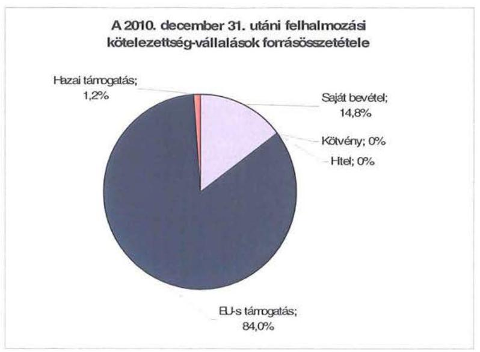

Az Önkormányzat által beadott, elbírálás alatt álló pályázatok tervezett teljes bekerülési költsége 995 millió Ft, amelyet 869 millió Ft EU-s és hazai támogatással terveznek megvalósítani, idegen forrást már nem kívánnak bevonni, ugyanakkor a múködési költségvetésben megtakarítást 2010-ben nem realizáltak, a saját forrást tételesen nem jelölték meg.

Az Önkormányzat mérleg szerinti pénzintézeti kötelezettsége a 2006. év végéről a 2010. év végére, 4301 millió Ft-ról 20182 millió Ft-ra nőtt, amelyből az árfolyamváltozás miatti különbözet 2629 millió Ft volt. A fennálló pénzintézeti kötelezettségek kettő kötvény kibocsátásából, 11 hosszú lejáratú hitelből és folyószámlahitel igénybevételéből keletkeztek.

Az Önkormányzat kötelezettségvállalásaira közgyűlési döntés alapján került sor, a kötelezettségvállalásokból származó források felhasználási céljait és a visszafizetésére a saját bevételeket meghatározták, azonban az előterjesztésekben nem mutatták be tételesen a visszafizetés forrásait. A kamat- és - a devizaalapú kötelezettségeket érintő - árfolyamkockázatot bemutatták.

Az Önkormányzat kötvényeket múködési kiadások, valamint beruházások és felújítások finanszírozása céljából bocsátotta ki.

Az Önkormányzat a 64070 ezer CHF-ben fennálló pénzintézeti kötelezettségeiből 140 millió Ft ( 766 ezer CHF) tőkét törlesztett, 810 millió Ft kamatot fizetett. Az 55000 ezer CHF kötvény tőketörlesztése 2011. szeptembertől kezdődik. A 11412 ezer EUR-ban fennálló kötvény és fejlesztési hitel visszafizetési kötelezettségeiből 1046 millió Ft tőkét és 286 millió Ft kamatot és egyéb díjat fizetett meg. A HUF-ban fennálló hitelállományból 257 millió Ft tőkét és kamatot teljesített. Az Önkormányzat a kötvények kibocsátásából és a hitelek igénybevételéből származó forrásokat 2010. év végéig a céloknak megfelelően felhasználta. A 2007-2010. években átmenetileg szabad pénzeszközeiből 2244 millió Ft kamatbevételt realizált, mely a kötvénybevételek befektetéséből származott. A kamatbevételeket a kötvények kamatfizetésére fordították. A két kötvénykibocsátás nem a számlavezető pénzintézetnél történt, azonban 2009. január 1jétől az Önkormányzat számlavezető bankja a második kötvénykibocsátást

---

(6742 ezer EUR) lebonyolító pénzintézet lett, amely kockázatot jelentett a banki befolyás növekedése miatt.

Az Önkormányzat múködésének pénzügyi egyensúlyát a vizsgált időszakban folyószámlahitel és két alkalommal egy-egy hónapos időszakra felvett ( 500 millió Ft) munkabérhitel igénybevételével tudta biztosítani. A likviditás biztosítása az Önkormányzatnak 488 millió Ft kamatkiadást okozott.

A folyószámlahitel igénybevétele a 2007-2010. években az alábbiak szerint alakult:

| Megnevezés | 2007. év | 2008. év | 2009. év | 2010. év |
| :--: | :--: | :--: | :--: | :--: |
| Keretösszeq január 1-tén | 1500 | 2500 | 2500 | 2500 |
| Átlagos majd állomány | 1296 | 1695 | 1608 | 2453 |
| Folyószámla hitellel zárt napok száma (nap) | 356 | 364 | 355 | 364 |
| 2010. december 31-i egyenleg (állomány) | $x$ | $x$ | $x$ | 2942 |

A folyószámlahitel keret összege 2011. március hónapban 3870 millió Ft-ra változott, és a vizsgálat ideje alatt a bankkal egyeztetéseket folytattak a hitelkeret 5000 millió Ft-ra növeléséről.

Az Önkormányzat 2010. év végi szállítói tartozása 1469 millió Ft, melyből a lejárt tartozás négy millió Ft volt, majd a 2011. I. negyedévben 53 millió Ft-ra nőtt. Az átütemezett tartozások összege 220 millió Ft, egyéb kiadáselmaradás az áttekintett időszakban nem volt.

Az Önkormányzat kettő gazdasági társasága részére fejlesztési hitel és lízing igénybevételéhez készfizető kezességet vállalt 1521 millió Ft összegben. A 2010. év végére kezességgel kapcsolatos kötelezettség 921 millió Ft-ra csökkent. Kettő gazdasági társsága részére négy alkalommal összesen 642 millió Ft öszszegben nyújtott tagi kölcsönt az Önkormányzat, amelyből 622 millió Ft követelése állt fenn.

A Közgyűlés vissza nem térítendő támogatások és fejlesztési hitel biztosítékaként 56 millió Ft - számviteli nyilvántartás szerinti nettó értékű - jelzálogjog alapításához és bejegyzéséhez járult hozzá, amely az üzemeltetésre átadott ingatlanok nélkül számított forgalomképes ingatlanok nettó értékének ( 1740 millió Ft) $3 \%$-át jelenti.

---

Az Önkormányzat kötelezettségeinek 2010. december 31-i állományát és várható alakulását a kötelezettségek lejáratáig a következő táblázat szemlélteti:

| Megnevezés | Állomány 2010. dec. 31-én |  |  | Várható kötelezettség 2011 2013. években |  |  | Várható kötelezettség 2014. évet követően |  |  |
| :--: | :--: | :--: | :--: | :--: | :--: | :--: | :--: | :--: | :--: |
|  | HUF-ban (millió Ft. ban) | Devizitban (összegy esze. ban) | Deviza nem | HUF-ban (millió Ft. ban) | Devizitban (összegy esze. ban) | Deviza nem | HUF-ban (millió Ft. ban) | Devizitban (összegy esze. ban) | Devizaa em |
| Pénzintézeti kötelezettségek |  |  |  |  |  |  |  |  |  |
| Hossard lejáratú kötelek | 486 |  | HUF | 182 |  | HUF | 388 |  | HUF |
| Hossard lejáratú kötelek |  | 8305 | CHF |  | 1637 | CHF |  | 6839 | CHF |
| Hossard lejáratú kötelek |  | 3347 | EUR |  | 2188 | EUR |  | 2042 | EUR |
| Kösvény (Szelmek MIV 2020/A) |  | 43080 | CHF |  | 3769 | CHF |  | 36850 | CHF |
| Kösvény (Szelmek Sport Park) |  | 3984 | EUR |  | 1511 | EUR |  | 4931 | EUR |
| Folyásolmóabitai | 3942 |  | HUF | 2942 |  | HUF |  |  | HUF |
| Pénzintézeti kötelezettségek összesen HUF-ban | 3428 |  | HUF | 3124 |  | HUF | 388 |  | HUF |
| Pénzintézeti kötelezettségek összesen CHF-ban |  | 63303 | CHF |  | 3426 | CHF |  | 62729 | CHF |
| Pénzintézeti kötelezettségek összesen EUR-ban |  | 9331 | EUR |  | 4099 | EUR |  | 6973 | EUR |
| Biztosítékok |  |  |  |  |  |  |  |  |  |
| Érsztség |  | 2399 | EUR |  |  |  |  |  |  |
| Biztosítékok összesen |  | 2399 | EUR |  |  |  |  |  |  |
| Szállítói tartozás | 1469 |  | HUF | 1469 |  | HUF |  |  |  |
| Egyéb kötelezettségek |  |  |  |  |  |  |  |  |  |
| Jogerős végzéssel lezzárt és ki nem fizetett kötelezettségek* | 57 |  | HUF | 57 |  | HUF |  |  |  |

* A paras eljárásokra vonatkozó adatok a 2011. jántasi állapotot tükelzik

Az Önkormányzatnak pénzintézetekkel szemben fennálló kötelezettsége a 2010. év végén 3428 millió Ft, 63305 ezer CHF és 9531 ezer EUR volt. Ezek várható kötelezettsége (tőke, kamat és egyéb költség) a legutóbbi kamatfizetés feltételei alapján a 2011. évtől 3512 millió Ft, továbbá 69155 ezer CHF és 11072 ezer EUR. Az Önkormányzatnak a 2011. évben szállítói tartozások rendezése, valamint jogerős végzéssel lezárt, de ki nem fizetett kötelezettségek címén 1526 millió Ft fizetési kötelezettsége keletkezett. A kezességvállalásaiból adódóan 3399 ezer EUR összegű terhe jelentkezhet, amennyiben a társaság a kötelezettségét nem teljesíti. Az Önkormányzat tájékoztatása szerint 2011-2013 években és azt követő időszakra figyelembe vehető forrásokat az Adósságkezelési Komplex Programban meghatározottak alapján a kiadások számottevő csökkentésével, valamint a vagyonhasznosítási és helyi adóbevételből tervezik biztosítani. A 2011-2013 években várható összes kötelezettség teljesítésének forrását nem számszerúsítették, a 2010. évi mérlegben kimutatott 1396 millió Ft követelésállomány és 648 millió Ft záró pénzkészlet, ezen időszak kötelezettségeire nem biztosít fedezetet. A 2014. évet követő várható pénzintézeti kötelezettségek teljesítésének forrása nem került összegszerűen meghatározásra. A kötelezettségek teljesítésére 5507 millió Ft forgalomképes ingatlanvagyon vonható be.

Az Önkormányzat minősített többségi tulajdonú társaságai kötelezettségeinek 2010. december 31-i állományát és várható alakulását a kötelezettségek lejáratáig a következő táblázat mutatja be:

| Megnevezés | Állomány 2010. dec.31-én |  |  | Várható kötelezettség 2011 2013. években |  |  | Várható kötelezettség 2014. évet követően |  |  |
| :--: | :--: | :--: | :--: | :--: | :--: | :--: | :--: | :--: | :--: |
|  | HUF-ban (millió Ft. ban) | Devizitban (összegy esze. ban) |  |  | HUF-ban (Ft. ban) |  |  |  |  |
|  |  |  |  |  |  |  |  |  |  |
| Ujling kötelezettségek | 20 |  | HUF |  | 20 |  | HUF |  | HUF |
| Ujling kötelezettségek |  | 12 |  |  | 14 |  |  |  | CHF |
| Ujling kötelezettségek |  | 3420 |  |  | 1074 |  |  |  | 2224 |
| Szállítói tartozás | 78 |  | HUF |  | 78 |  | HUF |  |  |
| Az önkormányzati kötelezettségek növekedése mellett a minősített többségi tulajdonú társaságok kötelezettségei is befolyásolhatják az Önkormányzat pénz- |  |  |  |  |  |  |  |  |  |

---

ügyi egyensúlyát. A társaságoknak a 2011. évtől 10 millió Ft, 14 ezer CHF, valamint 4298 ezer EUR lízing és 78 millió Ft szállítói tartozást kell rendezniük. Ezek nem teljesítése esetén a bíróság korlátlan és teljes felelősséget állapíthat meg az Önkormányzat terhére.

Az Önkormányzat költségvetési támogatásból, átengedett bevételekből, és illeték bevételekből származó bevételei a 2007. évhez képest az időszak egészét tekintve összességében csökkentek, a forráskiesés összességében a 1546 millió Ft volt. A 2007-2010. években tett intézkedések hatására kimutatott 475 millió Ft bevételi többlet, továbbá 5190 millió Ft kiadási megtakarítás a kieső forrásokat pótolta és az önkormányzat pénzügyi helyzetét javította. A kiadási megtakarítások $91 \%$-a az elrendelt álláshely csökkentések eredménye. Az álláshely csökkentő intézkedések hatására 2007-2010 között a Hivatalnál és az intézményeinél összesen 624 fővel csökkent. Egyes közszolgáltatási területeken azonban feladatbővülések is voltak, amelyek álláshely- és egyben létszámnövekedéssel is jártak. Ennek következtében az időszakban az álláshelyek száma 413 fővel (ebből 123 üres álláshely) csökkent. A bevételnövelő intézkedések a szabad kapacitások hasznosításából, az ingatlanok, eszközök bérbeadásából, illetve tanfolyamok szervezéséből, az építményadó díjtételének emeléséhez kapcsolódtak.

Az utóellenőrzés a pénzügyi egyensúly javítására tett kettő szabályszerűségi és egy célszerűségi javaslat hasznosításának vizsgálatára terjedt ki, amelyet az intézkedési terv szerinti határidőben teljesítettek.

Az Önkormányzat pénzügyi helyzetét összegezve a következők emelhetők ki:

A 2007-2010. években az Önkormányzat múködési kockázatát növelte a negatív nettó működési jövedelem. A működési bevételek 2008-2010. években nem biztosították a működési kiadások és az adósságszolgálat finanszírozását, a likviditás biztosítása növekvő mértékű folyószámlahitel igénybevételével történt. Az Önkormányzat a vizsgált időszakban a központi intézkedések hatására jelentkező bevételkiesést a kiadáscsökkentő és bevételnövelő intézkedéseivel ellentételezni tudta. A gazdasági társaságok szerepe a közüzemi közfeladatellátásban meghatározó volt. A gazdasági társaságok eladósodása növelte a pénzügyi kockázatot.

A vizsgált időszakban az Önkormányzat felhalmozási költségvetése pénzügyi hiányt mutatott, ennek forrásai kötvénykibocsátással és hitelfelvétellel biztosítottak voltak. A fejlesztési célú kötelezettségvállalások jövőben teljesítendő kifizetései tekintetében a nettó működési jövedelem negatív értéke a felhalmozási kockázatot növeli. A hosszú lejáratú kötelezettségek finanszírozásának 2010. évet követő forrása a 2011-2013. években és azt követően nem biztosított, azokat az Önkormányzat nem számszerúsítette.

A pénzintézeti és egyéb kötelezettségek teljesítésének kockázatát növelte, hogy a 2010. december 31-én fennálló kötelezettségek visszafizetésének fedezetét a saját bevételben jelölték meg, nem számszerúsítették annak forrásait. A kockázatot csökkentheti az Önkormányzat 2010. évi követelésállománya, a pénzügyi egyensúly helyreállítására elfogadott Adósságkezelési Komplex Prog-

---

ram alapján konkrét intézkedések meghozatala, továbbá a forgalomképes ingatlanvagyona szükség esetén hasznosítható az adósságszolgálat teljesítésére.

Az önkormányzati bevételt csökkentő központi intézkedések hatását az ellenőrzött időszakban ellensúlyozta az Önkormányzat kiadáscsökkentő és bevételnövelő intézkedéseinek eredménye.

Az Állami Számvevőszékről szóló 2011. évi LXVI. törvény 33. § (1) bekezdésében foglaltak értelmében a jelentésben foglalt megállapításokhoz kapcsolódó intézkedési tervet köteles az ellenőrzött szervezet vezetője összeállítani és azt a jelentés kézhezvételétől számított harminc napon belül az ÁSZ részére megküldeni. Amennyiben az intézkedési tervet határidőben nem küldi meg a szervezet, vagy az továbbra sem elfogadható, az ÁSZ elnöke a hivatkozott törvény 33. § (3) bekezdés a)-b) pontjaiban foglaltakat érvényesítheti.

Az ellenőrzés intézkedést igénylő javaslatai:

# a polgármesternek 

1. a Közgyűlés elé terjesztendő intézkedési terv írja elő a működés pénzügyi egyensúlyának gyors helyreállítása és hosszú távú fenntarthatósága érdekében - felelősök és határidők megjelölésével - olyan program készítését, amely tartalmazza az alábbiakat:
a) bevételszerző lehetőségek feltárását, különösen a helyi adópolitikai célok meghatározását és számszerűsítését, a bérleti díjak és a térítési díjak megállapítását, felülvizsgálatát, a követelések behajtását, az egyéb sajátos bevételek növelésének lehetőségét;
b) a folyamatban lévő és a tervezett beruházások teljes körű felülvizsgálatát;
c) egyéb kiadási kötelezettségek teljes körű felülvizsgálatát;
d) az intézkedések következtében jelentkező pénzügyi többlet, illetve az egyszeri bevételek tartalékba helyezését, elkülönített kezelését az adósságszolgálat teljesítése érdekében;
e) az adósságszolgálat szerkezetének áttekintését, a likviditás menedzselését, az Adósságkezelési Komplex Programban elfogadott, a pénzügyi egyensúly helyreállítását célzó - üzemgazdasági számításokkal alátámasztott - konkrét kiadáscsökkentő, illetve bevételnövelő intézkedéseket;
f) az önként vállalt feladatok finanszírozhatóságának áttekintését a kötelező feladatellátás elsődlegességének biztosítása érdekében, a gazdasági program áttekintésével összhangban;
g) az intézkedések eredményei legalább félévenkénti áttekintésének előírását;

---

2. mutassa be félévente - a szokásos beszámoló keretében - a Közgyűlésnek:
a) az Önkormányzat és a minősített többségi tulajdonú gazdasági társaságai aktuális pénzügyi helyzetét, az Önkormányzatnak a gazdasági társaságai felé fennálló követeléseit, nyújtott kölcsöneit;
b) legalább három évre kitekintően a kötelezettségek teljes körére szóló finanszírozási tervet, amely figyelembe veszi a kötelezettség éven belüli és túli felmerülését, a források számszerűsített megjelölésével;
c) az Önkormányzat folyamatban lévő és tervezett fejlesztéseihez szükséges belső és külső források rendelkezésre állását, és ebből a szempontból értékelje az Önkormányzat beruházásait;

# a jegyzőnek 

1. kísérje figyelemmel a jövőbeni várható - árfolyam-, kamat- valamint visszafizetési kockázatokat, továbbá a mérlegen kívüli tételek (kezességvállalás, garancia és helytállási kötelezettségvállalás) kockázatait, és legalább félévente tájékoztassa a Közgyűlést azok alakulásáról;
2. gondoskodjon, hogy a jövőben az adósságot keletkeztető kötelezettségvállalásokról szóló közgyűlési előterjesztések tételesen tartalmazzák a visszafizetés forrásait;
3. gondoskodjon az Önkormányzat likviditási helyzetéhez igazodó folyószámla hitelkeretről;
4. kísérje folyamatosan figyelemmel - a tulajdonosi jogkört gyakorlók közreműködésével - a minősített többségi tulajdonú gazdasági társaságok kötelezettségeinek alakulását, az Önkormányzat likviditására, pénzügyi egyensúlyi helyzetére gyakorolt hatását;
5. gondoskodjon a Polgármesteri hivatal lejárt szállítói tartozásai okainak feltárásáról, azonnali intézkedések megtételéről a lejárt tartozások mielőbbi rendezése érdekében;
6. intézkedjen a Polgármesteri hivatal és egy költségvetési szerv peres eljárásaiból adódó kötelezettségek teljesítése érdekében a szükséges fedezet elkülönítéséről, a finanszírozási tervben történő figyelembevétel mellett.

---

# II. RÉSZLETES MEGÁLLAPÍTÁSOK 

## 1. Az ÖNKORMÁNYZAT KÖTELEZŐ ÉS ÖNKÉNT VÁLLALT FELADATAI

Az Önkormányzat 2010. évi elemi beszámolója szerint a 20247 millió Ft múködési költségvetési kiadásból ${ }^{26} 15793$ millió Ft-ot (78\%) a kötelező feladatok, 4454 millió Ft-ot (22\%) az önként vállalt feladatok ellátására fordított. A 2011. évi tervadatok alapján az önként vállalt feladatokra 6399 millió Ft jut, amely a 16329 millió Ft összegű összes költségvetési kiadás 39\%-a. Ez 17 százalékponttal magasabb az előző évhez képest, mivel 2011. évtől a gimnázium és a szakközépiskola az Önkormányzat elkülönítése szerint önként vállalt feladatok közé tartozik.

A 2010. évi müködési kiadások kötelező feladatonkénti megoszlását és azok finanszírozási arányait az alábbi táblázat mutatja be:

Az Önkormányzat 2010. évi müködési kiadásai és finanszírozási arányai föbb feladatonként

| Ellátott feladat | Müködési kiadás összesen (millió Ft) | Kötelezö feladatok kiadásainak részaránya | Müködési bevétel összesen (millió Ft) | Allumi támogatás részarány $n$ $\%$ | Intézményi saját bevétel részaránya $\%$ | Onkormányzati támogatás részaránya $\%$ |
| :--: | :--: | :--: | :--: | :--: | :--: | :--: |
| Övodák | 1071 | 99 | 1096 | 49 | 2 | 49 |
| Általános iskolák | 2820 | 95 | 2891 | 47 | 6 | 47 |
| Gimnáziumok | 1057 | 100 | 1088 | 59 | 7 | 34 |
| Szakközépiskolák, szakképző intézmények | 2363 | 100 | 2504 | 52 | 16 | 32 |
| Kollégiumok | 544 | 0 | 623 | 49 | 7 | 44 |
| Szociális intézmények | 900 | 100 | 918 | 28 | 30 | 42 |
| Gyermekjöléti intézmények | 0 | 0 | 0 | 0 | 0 | 0 |
| Közmüvelődési intézmények | 1309 | 11 | 1315 | 27 | 35 | 38 |
| Sportlétesítmények | 0 | 0 | 0 | 0 | 0 | 0 |
| Igazgatási intézmények | 720 | 100 | 771 | 1 | 18 | 81 |
| Egyéb intézmények | 1176 | 100 | 1260 | 20 | 42 | 38 |
| Hivutásos   Tásolóóglu | 520 | 100 | 560 | 90 | 4 | 6 |
| Intézmények összesen | 12480 | 86 | 13026 | 43 | 16 | 41 |
| Polgármesteri Hivutalban kezelt feladatok müködési kiadásai | 7767 | 65 | 7767 | 26 | 0 | 74 |
| Müködési kiadások összesen | 20247 | 78 | 20793 | 37 | 10 | 53 |

[^0]
[^0]:    ${ }^{26}$ Az elemi beszámoló múködési bevétel adata és a CLF folyó bevétel adata az áfa viszszatérülés teljes összegével, valamint az Önkormányzat által fejlesztési kamatnak minősített kamatbevétel összegével, továbbá a követelés elengedés miatt elszámolt bevétel figyelmen kívül hagyásával tér el egymástól.

---

A 2010. évben az összes működési kiadás 61,6\%-át (12 480millió Ft) az intézmények működési kiadása tette ki.

Az intézmények a 2010. évben 86\%-ban kötelező feladatot láttak. A feladatfinanszírozásban az állami hozzájárulás aránya a vizsgált időszakban csökkent, 2007-ben az önkormányzati intézmények múködési kiadásaiból 6573 millió Ftot, 49,3\%-ot finanszírozott állami hozzájárulás, amely 2010-re 1039 millió Fttal 5\%-kal csökkent a központi forrásszabályozás kedvezőtlen változása miatt. Ugyanakkor javult a finanszírozásban az intézményi bevételek aránya 121 millió Ft-tal 1,5 százalékponttal, a fenntartói támogatás összege 400 millió Fttal 4,5 százalékponttal nőtt. A feladatellátás finanszírozásában az állami hozzájárulás legnagyobb arányú csökkenése a kollégiumoknál (20,8 százalékpont) és a gimnáziumoknál (11,4 százalékpont) következett be.

Az Önkormányzat 2010. évi múködési költségvetését a 7585 millió Ft állami támogatás $36,5 \%$-ban fedezte, amely a 2007. évi támogatással közel azonos volt ( 0,2 százalékponttal volt kevesebb), az intézményi saját bevétel 2126 millió $\mathrm{Ft}(10,2 \%)$, az önkormányzati támogatás 11082 millió Ft ( $53,3 \%$ ) volt.

A 2007-2010. években az Önkormányzat a kötelező és az önként vállalt feladatok körét nem rögzítette, kötelező feladatait az Ötv. és az ágazati törvények által meghatározottnak tekintette. A 2011. évtől az önkormányzati SzMSz mellékletében ${ }^{27}$ elkülönítette a kötelező és az önként vállalt feladatok körét.

Az Önkormányzat kötelező és önként vállalt feladatai ${ }^{28}$ körében a vizsgált időszakban nem történt változás 2010. december 31-én, a Polgármesteri hivatallal együtt 29 költségvetési szervvel és 9 gazdasági társasággal teljesítette feladatait.

Kötelező feladatot látott el a költségvetési szervek közül 6 önállóan működő és gazdálkodó, továbbá 23 önállóan működő költségvetési szerv összesen 118 telephelyen. Közoktatási feladatokat 20 intézmény végzett 58 telephellyel, ebből egy óvoda 22 telephellyel, 11 általános iskola 13 telephellyel, hat középiskola 17 telephellyel, egy kollégium öt telephellyel, fogyatékos oktatást 1 intézmény, egy telephelyen végez. A szociális feladatot lát el 2 intézmény 14 telephelyen. A kulturális feladatokat kettő intézmény 7 telephelyen végez. A hivatásos tűzoltósági feladatokat, a közterület felügyeletet, a Polgármesteri hivatal ellátó és szolgáltató feladatát egy-egy intézmény látta el. Az Önkormányzat a nevelésioktatási intézmények gazdasági feladatainak ellátására egy szolgáltató intézményt tart fenn. Igazgatási feladatokat a Polgármesteri hivatal lát el.

Az Önkormányzat kettő intézménye a Szolnoki Szigligeti Színház és a Kollégium 100\%-ban önként vállalt feladatot végez, amelynek 2010. évi költségvetési

[^0]
[^0]:    ${ }^{27}$ Az Önkormányzat 1/2011. (I.11.) számú rendelettel módosított SZMSZ 9. sz. melléklete - amelyben 11 feladatellátásra részletesen alábontva az önként vállalt és 12 feladatra részletezve a kötelező feladatot - határozta meg, amelyben a gimnázium, a szakközépiskola és szakképző intézmények feladatát a korábbi kötelező feladatok közül átsorolta önként vállalt feladatnak.
    ${ }^{28}$ A kötelező és önként vállalt feladatok megbontása az Önkormányzat saját besorolása alapján történt.

---

kihatása 1709 millió Ft volt. A Polgármesteri hivatal önként vállalt feladatai a parkfenntartáshoz, sport-, közművelődési és egyéb szervezetek támogatásához kapcsolódtak összesen 2718 millió Ft összegben. A gazdasági társaságok közül önként vállalt feladatot a közművelődési és a városüzemeltető gazdasági társaság folytat.

A 2007-2010. évek között az Önkormányzat szervezeti struktúrája jelentősen nem változott. Intézmény, feladat átvételére nem került sor. A Társulásnak 2008-ban történt feladatátadással a szociális ágazatban kettővel, 2010-ben az egyháznak átadott általános iskolával pedig eggyel csökkent az intézmények száma. A feladat átadásával a tanuló létszám 177 fővel, az ellátotti létszám 150 fővel lett kevesebb. A feladatellátás hatékonyságának növelése érdekében a Csarnok és Piac Intézményt 2007. szeptember 30-ával megszűntették és a piac üzemeltetésével azt a gazdasági társaságot bízták meg, amely az önkormányzati lakások és helyiségek üzemeltetési és fenntartási feladatát ellátta. Az intézmény megszüntetése a dolgozói létszám valós csökkenését jelentette, mivel a gazdasági társaság a dolgozókat nem vette át. A négy intézmény átadásának az Önkormányzat költségvetési helyzetére gyakorolt hatása pozitív, mivel a 2008-2010 között összesen 1839 millió Ft megtakarítást eredményezett, amely a 2010. évi múködési kiadások 9\%-a volt.

Az Önkormányzat kötelező és önként vállalt feladatainak ellátásában részt vett 9 gazdasági társaság, amelyek közül 7 az Önkormányzat kizárólagos tulajdona ${ }^{29}$, egyben a tulajdoni részesedése $45 \%{ }^{30}$, ez a társaság $49 \%$-ban résztulajdonosa annak a Kft-nek, amelyben az Önkormányzatnak 20,9\% tulajdona ${ }^{31}$ van. Az Önkormányzat feladatellátásában további három gazdasági társaság ${ }^{32}$ végez közszolgáltatást, amelyekben tulajdonnal az Önkormányzat nem rendelkezik. Az Önkormányzat kizárólagos tulajdonában lévő 7 gazdasági társaságnál a vizsgált időszakban átszervezés nem történt.

A gazdasági társaságok saját tőkéje 2010. december 31-én 2146 millió Ft (ezen belül a kizárólagos önkormányzati tulajdonban lévő társaságok saját tőkéje 1426 millió Ft), a jegyzett tőkéjük 1498 millió Ft (ezen belül a 100\%-os önkormányzati tulajdonban lévő társaságoké 1324 millió Ft) volt. Az Önkormányzat kizárólagos tulajdonába lévő gazdasági társaságok közül legnagyobb saját tőkével a vagyonüzemeltetési feladatot ellátó Ipari Park Kft. rendelkezik 1194 millió Ft összegben, jegyzett tőkéje 1229 millió Ft volt a 2010. év végén. A

[^0]
[^0]:    ${ }^{29}$ Szolnok Tv. Zrt., Városfejlesztő Zrt.(2008-ban alapította az Önkormányzat, mérnöki tevékenység, műszaki tanácsadás), Szollak Kft. (vagyonüzemeltetés, és parkoló üzemeltetés), Ipari Park Kft.(Logisztikai központot is üzemeltet), „Munkalehetőség"Kft., Sportcentrum Kft., Aba-Novák Kft. (kulturális, egyéb közösségi, társadalmi tevékenység),
    ${ }^{30}$ A Remondis Szolnok Zrt. (szilárd és folyékony hulladékszállítás), amelyben további tulajdonos még egy másik önkormányzat 3\%-kal, egy Társulás 1\%-kal és 51\%-kal egy gazdasági társaság
    ${ }^{31}$ A Remondis Kétpó Kft. (hulladéklerakó üzemeltetése), amelyben további 23 önkormányzatnak összesen 30,1\% tulajdoni részesedése van.
    ${ }^{32}$ Alfa Nova Kft. (hőenergia ellátás), Víz-és csatorna Zrt (víztermelés-, kezelés-, ellátásszennyvíz gyűjtése- kezelése, fürdőszolgáltatás, Volán Zrt. (Menetrendszerinti helyi közlekedés Szolnok városában)

---

2010-ben a gazdasági társaságok saját tőke-jegyzett tőke aránya minden esetben meghaladta a $90 \%$-ot. A 9 gazdasági társaság közül 2010-ben a saját tőke jegyzett tőke aránya kettőnél nem érte el az 1-et (az Ipari Park Kft-nél 0,97, a Városfejlesztő Zrt-nél 0,99 volt), négy társaságnál 1 és 4 közötti értéket mutatott, háromnál ez az érték 5-19 között volt.

A 2007-2010 között az önkormányzati tulajdonú gazdasági társaságokat érintően csődeljárás nem volt. A 2007. évben tőkeemelésben az önkormányzat kizárólagos tulajdonában álló Ipari Park Kft. részesült 371 millió Ft összegben. A tőkeemelést az Önkormányzat apporttal (művelési ág alól kivont terület) teljesítette.

Az Önkormányzat egy kizárólagos tulajdonát képező gazdasági társaságnak ${ }^{33}$ a 2008. évben a veszteség pótlására 7,6 millió Ft tőkejuttatást biztosított, majd 2010. évben a gazdasági társaság jegyzett tőkéje 2,5 millió Ft-tal leszállításra került. ${ }^{34}$

Az Önkormányzat az Ipari Park Kft. részére (2007. évben az apportként bevitt földterület infrastruktúra fejlesztéshez 294 millió Ft, a 2008. és 2009. években 164 - 164 millió Ft beruházási hitel törlesztéséhez) összesen 622 millió Ft tagi kölcsönt nyújtott. A 2010. december 31-én esedékes tőke és kamat viszszafizetését 2011. június 30-ra átütemezték ${ }^{35}$, de a teljesítés elmaradt.

A gazdasági társaságok által ellátott közszolgáltatásokhoz kapcsolódó szolgáltatási díjak (szilárd- és folyékony hulladékszállítási, távhő-, ivóvíz szolgáltatási, szennyvízelvezetési, parkolási, helyi tömegközlekedési, lakás- és helyiségbérlet, valamint a közterület-használati díj) megállapítása a Közgyűlés feladat- és hatáskörébe tartozik, azok meghatározása önkormányzati rendelettel történik. A szolgáltatási díjakra tekintettel a Volán Kft. részesül önkormányzati támogatásban a helyi tömegközlekedési díjak miatt, amelyet az Önkormányzat - figyelemmel a mindenkor hatályos miniszteri rendeletben meghatározott központi költségvetésből nyújtott támogatásra is - a társasággal kötött támogatási szerződés alapján állapít meg.

Az Önkormányzat a gazdasági társaságok feladatellátásához vagyonkezelésbe eszközöket nem adott. A vagyonkezelési feladatok ingatlanhasznosítási szerződésen alapulnak.

A 7 kizárólagos tulajdonú gazdasági társaságnál - a társaságok által nyújtott adatszolgáltatás alapján - az önkormányzati kötelező és önként vállalt feladatokhoz rendelt 2010. év végi nettó vagyona összesen 10934 millió Ft, amelyből 9879 millió Ft ( $90 \%$ ) a kötelező feladatokhoz és 1055 millió Ft (10\%) az önként vállalt feladatokhoz üzemeltetésre rendelt nettó vagyon. A társaságok tulajdonukba adott vagyont nem mutattak ki.

[^0]
[^0]:    ${ }^{33}$ Aba-Novák Kft. részére.
    ${ }^{34}$ Az Aba-Novák Kft. jegyzett tőkéjét 3 millió Ft-ról 0,5 millió Ft-ra leszállították.
    ${ }^{35}$ A Közgyűlés Z-66/2010. (XII.09.) sz. határozata.

---

A vizsgált időszakban az Önkormányzat kizárólagos tulajdonában álló gazdasági társaságoknak 3078 millió Ft pénzeszközt adott át, amely éves átlagban a költségvetés 3,8\%-a volt. A társaságok lejárt határidejú szállítói kötelezettségének (2010-ben 78 millió Ft) 41\%-át az Ipari Park Kft-ben mutatták ki. 2010. év végén hosszú lejáratú hitelük nem volt, a lízing kötelezettség állománya 1209 millió Ft volt, amelyből 1185 millió Ft az Ipari Park Kft. kamattal növelt lízing tartozása.

Az Önkormányzat közszolgáltatási feladatellátása körében az autóbusszal végzett helyi közforgalmú személyszállítást, a hő-energia biztosítását, a víztermelés-, kezelés-, ellátás, szennyvízgyűjtés, kezelés és fürdőszolgáltatást három gazdasági társaság végzi, amelyekben az Önkormányzat tulajdonosi részesedéssel nem rendelkezik. A távhő- szolgáltató társaság, és a víz-és csatorna szolgáltató társaság ${ }^{36}$ részére üzemeltetésre átadott vagyon 2010. év végi nettó értéke 428 millió Ft, illetve 8082 millió Ft volt. A helyi közforgalmú személyszállítást végző társaság ${ }^{37}$ részére az Önkormányzat vagyont (tulajdonba, kezelésbe, üzemeltetésre) nem adott át.

A távhő-szolgáltató, és a víz- és csatornaszolgáltató társaság koncessziós díjat fizet az Önkormányzat részére. A koncessziós díjak összegét az Önkormányzat a koncessziós megállapodásban foglaltak alapján ${ }^{38}$ fejlesztési célra átadja a gazdasági társaságok részére ${ }^{39}$.

Az Önkormányzat számára az Ipari Park Kft. pénzügyi kockázatot jelent. A gazdasági társaság lízing kötelezettségének 2010. év végi állománya 1185 millió Ft, amelynek törlesztéséhez a 2008. és a 2009. években az Önkormányzat tagi kölcsönt nyújtott. A 2007-2009. években nyújtott összesen 622 millió Ft tagi kölcsönt a társaság a meghosszabbított határidőre (2011. június 30.) nem tudta visszafizetni. A gazdasági társaságnak a 32 millió Ft lejárt szállítói kötelezettségéből a 2008., a 2009., és a 2010. években folyamatosan, nagyságrendileg nem jelentős összegű éven túli lejáratú szállítói állománya is van (2008. évben 223 ezer Ft, 2009. évben 216 ezer Ft, 2010. évben 223 ezer Ft). Mindez együttesen az Önkormányzat pénzügyi helyzetére negatív hatással van.

[^0]
[^0]:    ${ }^{36}$ A távhő-szolgáltatást az Alfa-Nova Kft., a víz-és csatorna szolgáltatást a Víz- és Csatorna Zrt.
    ${ }^{37}$ A helyi közúti személyszállítást a Volán Zrt. végzi.
    ${ }^{38}$ A Közgyűlés Z-130/2004. (XII.16.) sz. határozattal jóváhagyott koncessziós szerződésben a koncessziós díjat az 1995. június 23 -án kötött a koncessziós megállapodás alapján a víz- és csatorna-ellátás területén 1995. december 31-i állapotnak megfelelő, az 1996. július 1-jén megkötött és 2004. július 1-jén módosított Koncessziós szerződésben a városi távhő ellátó közművekre vonatkozóan 1996. július 1-jel állapotnak megfelelő vagyonleltár szerint 35 év üzemeltetésre (koncesszióba) adta az Önkormányzat az eszközöket. Az eszközök használatáért megállapított koncessziós díj (amely összeget képlet alapján határoztak meg) az Önkormányzat tulajdonában álló vagyontárgyak fejlesztésére fordítandó.
    ${ }^{39}$ A koncessziós díjat és a felújítás, beruházás költségét havonta kimutatja az Önkormányzat, amennyiben a koncessziós díj nem fedezi a felhalmozási kiadásokat, a különbözetet a következő koncessziós díj terhére számolják el.

---

# 2. A PÉNZÜGYI EGYENSÚLYI HELYZET ALAKULÁSA 

### 2.1. A múködési és a felhalmozási egyensúly alakulása

A hagyományos költségvetési szerkezet helyett az Önkormányzat pénzügyi helyzetét a CLF módszerrel mutatjuk be, amelyben jobban elkülönülnek a vagyonnal kapcsolatos bevételek és kiadások az önkormányzati feladatokkal kapcsolatos közvetlen múködtetési bevételektől és kiadásoktól. A módszer következetesen elkülöníti a folyó és a felhalmozási költségvetés bevételeit és kiadásait, azok költségvetési egyenlegeit. A saját folyó bevételek, valamint a saját felhalmozási bevételek nem tartalmazzák az előző évi pénzmaradványok felhasználásából származó pénzforgalom nélküli bevételeket ${ }^{40}$.

A folyó költségvetés egyenlege, a múködési jövedelem megmutatja, hogy az Önkormányzat éves folyó bevétele fedezetet biztosít-e a kötelező és önként vállalt feladatellátáshoz kapcsolódó éves folyó kiadására. A múködési jövedelem negatív értéke pénzügyileg fenntarthatatlan helyzetet jelez. A mutató pozitív értéke megtakarítást mutat, amely forrásul szolgálhat az Önkormányzat fennálló kötelezettségei megfizetéséhez, valamint fejlesztéseihez.

A felhalmozási költségvetés pozitív értéke felhalmozási többletet mutat, amely a jövőbeni fejlesztések forrását biztosíthatja. Amennyiben a folyó költségvetési hiány finanszírozása a felhalmozási többletből történik, ez szűkebb értelemben vagyonfelélésnek tekinthető. Amennyiben a felhalmozási költségvetés megtakarítása fejlesztési célú hitelek, kötvények adósságszolgálatát finanszírozza, az változatlan vagyontömeg mellett, a korábban megelőlegezett tőkebevételek valós realizációjának tekinthető. A felhalmozási deficit által generált finanszírozási igény önmagában nem jár pénzügyi kockázattal, a pénzügyileg fenntartható beruházásokhoz kapcsolódó kötelezettségvállalás (adósságszolgálat) körültekintő költségvetési gazdálkodással teljesíthető.

A módszer a pénzügyi kapacitás fogalmát helyezi a középpontba. Az adós hitelfelvételi képessége, hosszú távú fizetőképessége vagy bonitása a pénzügyi kapacitással, ezen belül is a nettó múködési jövedelemmel jellemezhető. A nettó múködési jövedelem negatív értéke az egyes költségvetési években jelentkező adósságszolgálat túlzott mértékére utal ${ }^{41}$. A nettó múködési jövedelem negatív értékének felhalmozási többletből, vagy további hitelből történő finanszírozása pénzügyileg nem fenntartható gazdálkodást vetít előre. A pozitív értéket mutató nettó múködési jövedelem fejlesztési kiadások fedezetét biztosíthatja, illetve a folyamatosan, évenként képződő pozitív nettó múködési jövedelemből meghatározható a jövőben vállalható, teljesíthető éves adósságszolgálat, ily módon az a hitelösszeg, amely - a többi tényezőt, feltételt adottnak tekintve visszafizetési kockázat nélkül felvehető.

[^0]
[^0]:    ${ }^{40}$ A költségvetési években kialakuló hiány finanszírozása az előző években képzett tartalékok felhasználásával is történhet.
    ${ }^{41}$ Kivéve, ha annak finanszírozására a korábbi években képzett tartalékok fedezetet nyújtanak.

---

A CLF módszer alapján a pénzügyi kapacitás mértéke az Önkormányzat összevont, nettósított, a központi információs rendszerbe a Kincstáron keresztül leadott éves költségvetési beszámolójának 80-as űrlapjában szerepeltetett adatok alapján került meghatározásra.

# CLF módszer szerinti önkormányzati adatok 

|  |  |  |  | ezer Ft |
| :--: | :--: | :--: | :--: | :--: |
| Megnevezés | 2007 | 2008 | 2009 | 2010 |
| Folyó bevételek | 19141585 | 19574691 | 19577131 | 19526702 |
| Folyó kiadások | 18699966 | 19960623 | 20016909 | 20960086 |
| Müködési jövedelem | 441619 | $-385932$ | $-439778$ | $-1433384$ |
| Nettó müködési jövedelem =müködési jövedelem - tóketörlesztés | 97438 | $-770232$ | $-889758$ | $-1844831$ |
| Felhalmozási bevételek | 1589696 | 1208491 | 1192210 | 2458473 |
| Felhalmozási kiadások | 4060651 | 3311667 | 3706656 | 3908858 |
| Felhalmozási költségvetés egyenlege | $-2470955$ | $-2103176$ | $-2514446$ | $-1450385$ |
| Finanszírozási múveletek nélküli (GFS) pozíció= müködési jövedelem + beruházási költségvetés egyenlege | $-2029336$ | $-2489108$ | $-2954224$ | $-2883769$ |
| Finanszírozási múveletek egyenlege | 3323045 | 2336163 | 4231204 | 291217 |
| Tárgyévi pénzügyi pozíció változás | 1293709 | $-152945$ | 1276980 | $-2592552$ |
| Egyéb tájékoztató adatok |  |  |  |  |
| Összes kötelezettség* | 14503586 | 17769121 | 19155477 | 22604795 |
| -ebből rövid lejáratú | 2776972 | 3084792 | 4591407 | 5955624 |
| Folyószámlahitel napi átlagos állománya** | 1295700 | 1695100 | 1608300 | 2543140 |
| Likvidhitel napi átlagos állománya** | 0 | 0 | 0 | 0 |
| Munkabérhitel napi átlagos állománya** | 0 | 0 | 62000 | 0 |
| Finanszírozásba vonható eszközök: | 6939705 | 5754251 | 3537046 | 649778 |
| Tartós hitelviszonyt megtestesítő értékpapírok év végi álománya | 4052 | 2431 | 2224 | 1519 |
| Hosszú lejáratú bankbetétek év végi álománya | 0 | 0 | 0 | 0 |
| Értékpapírok év végi álománya | 4913907 | 3883019 | 294011 | 0 |
| Pénzeszközök (idegen pénzeszközök nélküli év végi álománya | 2021746 | 1868801 | 3240811 | 648259 |

* Az összes kötelezettséget a passzív pénzügyi elszámolások nélkül vettük figyelembe, mert a passzívák a pénzmaradvány-elszámolás tételei közé tartoznak.
** A folyószámla- és munkabérmegelőlegezési hitel átlagos állományát 365 napos nevezővel számítottuk.
A részletes pénzügyi adatokat a jelentés 2. számú melléklete mutatja be.
A CLF módszer szerint figyelembe vett folyó és felhalmozási bevételek és kiadások alakulását befolyásolta, hogy azok az Önkormányzat gesztor szerepéből adódóan a TISZK és a SzASzR - döntően felhalmozási bevételekből és kiadásokból álló - adatait is tartalmazzák ${ }^{42}$.

[^0]
[^0]:    ${ }^{42}$ A 2009-2010. években a SzASzR és a TISZK bevételi főösszege a pénzmaradvány igénybevétele nélkül 907-300 millió Ft, kiadási főösszege 424-1201 millió Ft volt.

---

A vizsgált időszakban az Önkormányzat folyó költségvetési egyenlege, múködési jövedelme a 2007. évben még pozitív, 2008-2010-ben azonban negatív összegú volt, melynek alakulását a következő ábra szemlélteti:
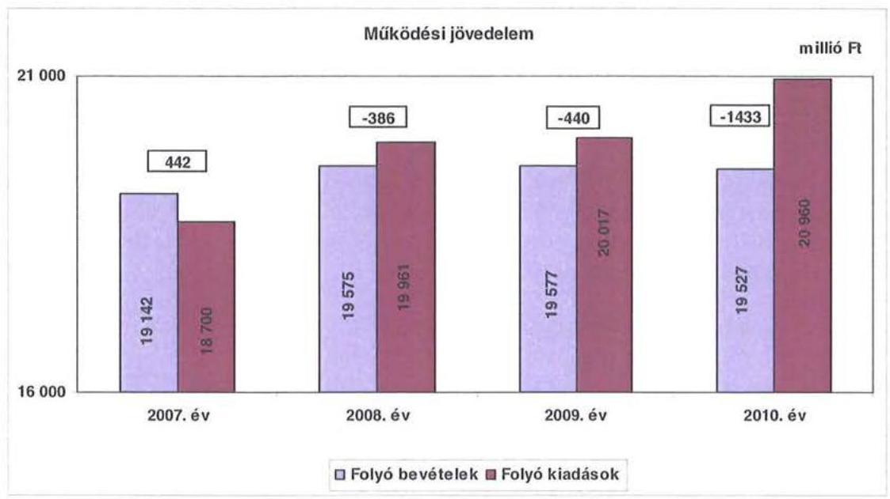

A folyó költségvetés egyenlege 2007. évben (múködési forrástöbblet) a folyó bevételek 2,3\%-át ( 442 millió Ft -ot) jelentette. A 2008-ban 386 millió Ft, 2009-ben 440 millió Ft, 2010-ben 1433 millió Ft volt a múködési forráshiány. A vizsgált időszakban a múködési jövedelem negatív egyenlege - a 2007. évi múködési forrástöbblet és a 2008-2010. évek forráshiánya - összességében 1817 millió Ft hiányt ${ }^{43}$ mutatott.

A 2007. évi pozitív előjelű folyó költségvetési egyenleg, valamint a 2008-2010. évek forráshiánya következtében az Önkormányzat a 2007-2010. években fo-lyószámla- és a 2009. évben munkabérhitel felvételére kényszerült egyrészt az átmeneti likviditási problémák kezelése, másrészt a negatív múködési jövedelem finanszírozása miatt. A folyószámlahitel napi átlagos állománya a vizsgált időszakban több mint kétszeresére nőtt ( 1296 millió Ft-ról 2543 millió Ftra).

Az Önkormányzat kimutatása szerint, összes kötelezettsége 2007-2010 között folyamatosan - 14504 millió Ft-ról, (55,9\%-kal) 22605 millió Ft-ra - növekedett. Az összes kötelezettségeken belül a rövid lejáratú kötelezettségek 2010-ben 5956 millió Ft-ot tettek ki, amely 3179 millió Ft-tal magasabb a 2007. évi rövid lejáratú kötelezettségállománynál, annak több mint kétszerese. Az Önkormányzat 2006. december 31 -én fennálló pénz és tőkepiaci kötelezettsége 4301 millió Ft-ról több mint négy és félszeresére, 20182 millió Ft-ra nőtt a kötvénykibocsátás és a folyószámlahitel állományának emelkedése miatt. Az öszszes kötelezettségen belül a - az elszámolt árfolyamváltozás nélkül számított hosszú lejáratú pénzintézeti kötelezettségek 10832 millió Ft-tal nőttek.

[^0]
[^0]:    ${ }^{43}$ Negatív előjelű múködési jövedelem.

---

Az Önkormányzat a vizsgált időszakban nem rendelkezett számottevő44 lejárt szállítói tartozásállománnyal.

Az Önkormányzat 2010. évi záró pénzkészlete 648 millió $\mathrm{Ft}^{45}$, amelynek 90\%-a kötelezettséggel terhelt volt.

Az Önkormányzat pénzügyi kapacitása a vizsgált időszakban - a 2007. év kivételével - negatív értéket mutatott. A nettó múködési jövedelem ${ }^{46}$ értéke a folyó költségvetési pozíció mellett az adott költségvetési év adósságtörlesztésének hatását is tükrözi. A 2007. évi 442 millió Ft múködési jövedelemnek 77,8\%át, 344 millió Ft-ot tett ki a fejlesztési célú hitelekhez kapcsolódó tőketörlesztés, amelynek kifizetését követően 98 millió Ft nettó működési jövedelme keletkezett az Önkormányzatnak. A pénzügyi kapacitás a tőketörlesztés teljesítését követően is megtakarítást mutatott.

A múködési jövedelem a 2008. évtől nem biztosított fedezetet a kötelező és önként vállalt feladatellátáshoz kapcsolódó éves folyó kiadásokra. A nettó múködési jövedelem a hiteltörlesztések hatása miatt 2008-2010 között ugyancsak negatív összegű volt ${ }^{47}$. Az Önkormányzat hiteltörlesztésére a múködési jövedelem nem tudott fedezetet nyújtani. Emiatt az Önkormányzat a hitelek törlesztését újabb hitelfelvétellel biztosította.

Az Önkormányzat a nettó működési jövedelem negatív értékét, egyrészt a folyószámlahitel állományának folyamatos növekedésével, másrészt a kötvényből vásárolt értékpapír állomány beváltásával finanszírozta, amely pénzügyileg nem fenntartható gazdálkodást vetít előre.

A 2007-2010 között összesen a nettó múködési jövedelem -3407 millió Ft volt. A pénzügyi kapacitás romlását a folyó bevételek és kiadások különbségéből származó múködési jövedelem csökkenése mellett a hiteltörlesztés növekedése okozta. A vizsgált időszakban jellemzően a folyó bevételek szinten tartása illetve visszaesése következett be, illetve a folyó kiadások 2260 ezer Ft-tal, 12,1\%kal nőttek.

Az Önkormányzatnál a múködési jövedelem - a 2007. év kivételével nem biztosított fedezetet a kötelező és önként vállalt feladatellátáshoz kapcsolódó éves folyó kiadásokra, így megtakarítás hiányában részben sem szolgálhat a fejlesztési kiadások fedezetéül. A nettó múködési jövedelem negatív értékének folyamatos emelkedése azt jelzi, hogy az Önkormányzat pénzügyi kapacitása évről évre romlott.

[^0]
[^0]:    ${ }^{44}$ Az Önkormányzatnak 2007-ben 29 millió Ft, 2008-ban 23 millió Ft, 2009-ben 251 millió Ft, 2010-ben 4 millió Ft lejárt szállítói tartozása volt.
    ${ }^{45}$ Ebben a TISZK pénzeszköze 260 millió Ft, a többi az intézményeknél volt.
    ${ }^{46}$ pénzügyi kapacitás
    ${ }^{47}$ A nettó múködési jövedelem 2008-ban -770 millió Ft, 2009-ben -890 millió Ft, 2010ben -1845 millió Ft volt.

---

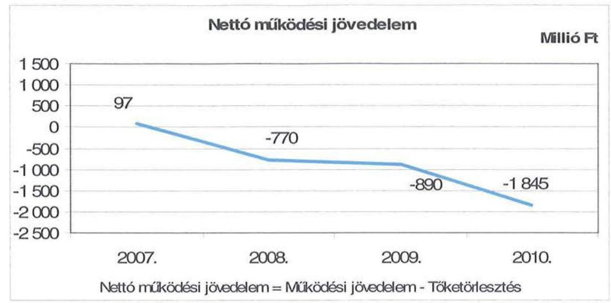

A 2007-2010. években az Önkormányzat felhalmozási költségvetésének egyenlege negatív összegú volt, amelynek fedezetét fejlesztési hitelek felvételével ${ }^{48}$ és kötvénykibocsátással teremtette meg. A múködési jövedelem negatív irányú elmozdulása miatt azonban az Önkormányzat gazdálkodásában jelenleg nem képződik meg a fedezete a hitelek miatt jelentkező adósságszolgálatnak.

A felhalmozási költségvetés egyenlegének alakulását évről évre a következő ábra szemlélteti:
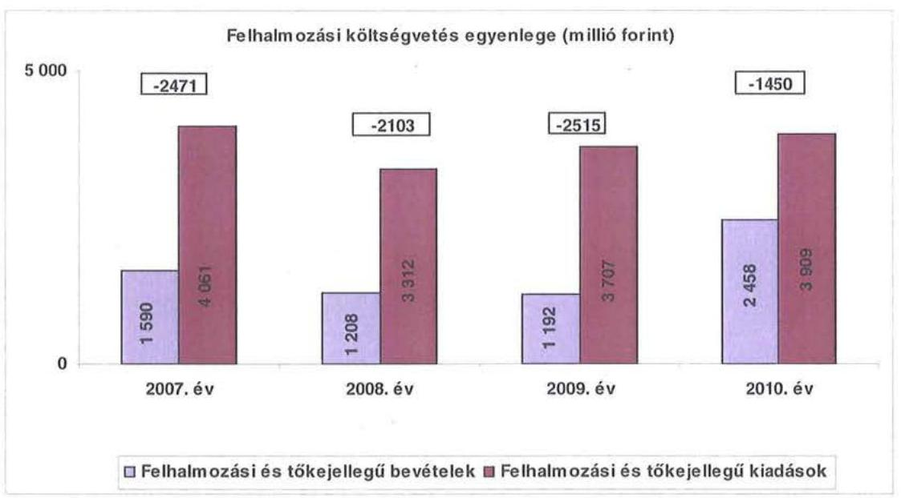

A felhalmozási forráshiánynak a felhalmozási és tőke jellegú kiadásokhoz viszonyított aránya 2007-ben 60,8\% (2471 millió Ft), 2008-ban 63,5\% (2103 millió Ft), 2009-ben 67,9\% (2515 millió Ft), 2010-ben 37,1\% (1450 millió Ft) volt.

[^0]
[^0]:    ${ }^{48}$ A 395 millió Ft összegű hosszú lejáratú hitelfelvétel korábbi években kötött hitelszerződések alapján még le nem hívott hitelösszegekhez kapcsolódott.

---

Az Önkormányzat 2011. évi költségvetési rendeletében - a hagyományos költségvetési szerkezetben - tervezett bevételeinek és kiadásainak különbözete 1915 millió Ft negatív teljes finanszírozási igényt mutat ki, melyet részben finanszíroz a 2010. évi 648 millió Ft záró pénzkészlet. A fennmaradó 1267 millió Ft hiányt azonban további hitelek felvételével tudná biztosítani az Önkormányzat. A kötvénykibocsátás bevételéből vásárolt értékpapírt az Önkormányzat 2010. év végére teljes egészében értékesítette.

A vizsgált időszakban jelentkező a CLF módszer alapján számított összes felhalmozási forráshiány 8539 millió Ft volt ${ }^{49}$, a forráshiányra a 728 millió Ft 2007. évi nyitó pénzkészlet, a 2007. évben képződött 442 millió Ft múködési jövedelem, valamint a felvett 395 millió Ft összegű fejlesztési hitel, továbbá a kötvénykibocsátásból igénybevett 6974 millió Ft nyújtott fedezetet.

A függő, átfutó, kiegyenlítő bevételek és kiadások 764 millió Ft-os negatív egyenlegének a folyószámlahitel állomány ${ }^{50}$ további részéből történő finanszírozásával az Önkormányzat 648 millió Ft pénzkészlettel zárta a 2010. évet.

Az Önkormányzat évenkénti teljes finanszírozási igénye ${ }^{51}$ a CLF módszer szerint 2007-ben 2374 millió Ft, 2008-ban 2873 millió Ft, 2009-ben 3404 millió Ft, 2010-ben 3295 millió Ft volt, amelynek finanszírozását a finanszírozási célú bevételek és kiadások egyenlege 2008. és a 2010. évben nem biztosította, ezért kényszerült az Önkormányzat a folyószámla hitelkeret folyamatos emelésére. Míg 2007. december 31-én a folyószámla hitelkeret 2500 millió Ft volt, addig 2010. december 31-re 3000 millió Ft-ra (20\%-kal) nőtt.

Az Önkormányzat finanszírozási műveletei 2007-2010. évekbeli egyenlegének alakulását a következő ábra szemlélteti:
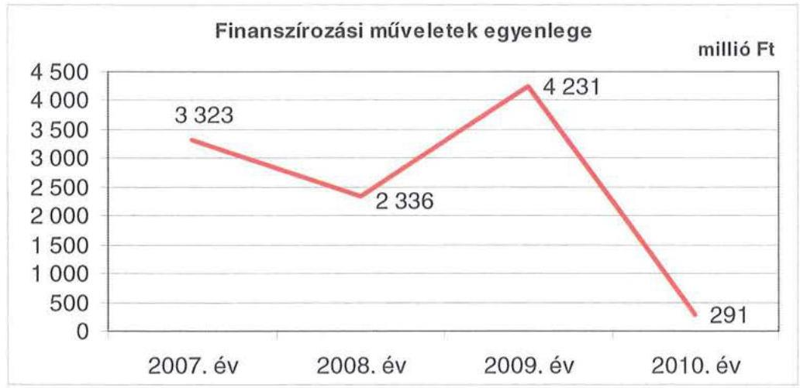

[^0]
[^0]:    ${ }^{49}$ Az ábrában megjelenő 2010. évi felhalmozási kiadásokban a TISZK-hez kapcsolódó beruházások összege 674 millió Ft.
    ${ }^{50}$ Az Önkormányzat év végén kimutatott folyószámlahitel állománya 2102 millió Fttal nőtt 2007-2010 között.
    ${ }^{51}$ A nettó múködési jövedelem és a beruházási költségvetés összevont egyenlege.

---

A finanszírozási többlet azt jelzi, hogy az éves költségvetések végrehajtása során szükség volt az előző években keletkezett pénzmaradvány igénybevételén túl külső finanszírozás igénybevételére is.

Az Önkormányzat zárszámadási rendeletében a múködési és fejlesztési hiányt a hagyományos költségvetési szerkezet alapján mutatta be ${ }^{52}$, amelyet a jelentés 1. számú melléklete szemléltet. A rendeletek 2007-2010. években forráshiányt mutattak ki.

A vizsgált időszakban a kötelezettségek (passzív pénzügyi elszámolások nélkül) 14504 millió Ft-ról 22605 millió Ft-ra emelkedtek ( $56 \%$-kal), amely együtt járt a kamatkiadások növekedésével.

A 2007-2010 között az Önkormányzat összesen 1710 millió Ft kamatot fizetett meg. Az átmenetileg szabad pénzeszközein realizált kamatbevétel, a teljes kamatráfordítást 31,2\%-kal ( 2244 millió Ft) haladta meg. Mindez annak eredménye, hogy az Önkormányzat a kibocsátott kötvény egy részét betétben, értékpapírban helyezte el, illetve pénzpiaci múveleteket végzett, amelynek következtében jelentős nagyságrendű kamatot tudott realizálni. A 2010. évben ez a tendencia megváltozott, már nem a kamatbevételek, hanem kamatkiadások öszszege volt a magasabb.

Az Önkormányzat kamatbevételeinek és kamatkiadásainak alakulását a következő ábra mutatja:
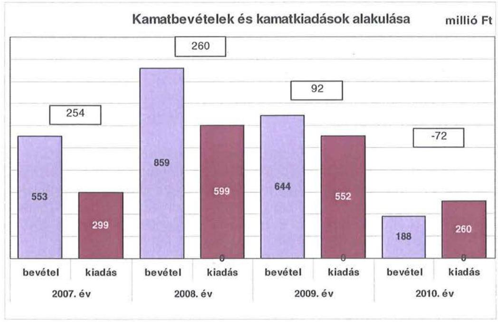

A 2011. évre az Önkormányzat az előző évekhez viszonyítva kevesebb kamatkiadással kalkulált a költségvetési rendeletben, 195,9 millió Ft felhalmozási kamatkiadást tervezett, múködési kamatkiadással annak ellenére nem szá-

[^0]
[^0]:    ${ }^{52}$ Nincs kötelező előírás a működési és fejlesztési hiány megállapításának módjára.

---

molt, hogy a negatív működési jövedelem finanszírozásához jelentős napi állománnyal folyószámlahitel felvételére kényszerült.

# 2.2. Az Önkormányzat bevételeinek alakulása 

Az összes folyó bevétel 2007-ben 19142 millió Ft, 2008-ban 19575 millió Ft, 2009-ben 19577 millió Ft, 2010-ben 19527 millió Ft volt, amely 385 millió Ftos, $2 \%$-os növekedést jelentett 2007-hez képest.

Az Önkormányzat 2007-2010 között realizált bevételi jogcímeinek számszaki adatait az alábbi grafikon mutatja be:
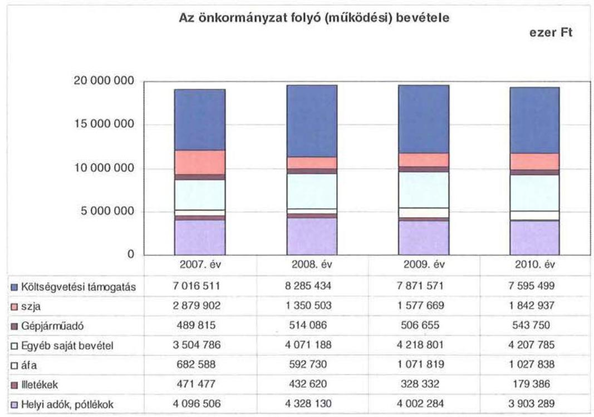

Az Önkormányzat működési célra felhasznált költségvetési támogatásai a 2007. évi 6540 millió Ft-ról 2010-re 7440 millió Ft-ra, 13,7\%-kal nőttek, amelyet a normatívák fajlagos értékének és az ellátotti létszám alakulása befolyásolt. Felhalmozási jellegű költségvetési támogatást a vizsgált időszakban 950 millió Ft összegben kapott. A költségvetési támogatás 2007. évről 2010. évre összességében 579 millió Ft-tal nőtt.

Az szja összege a 2007. évről a 2008. évre 53\%-kal, 1529 millió Ft-tal csökkent. Az Önkormányzat az előző évihez képest 2009-ben 16,8\%-kal (227 millió Fttal), 2010-ben további 16,8\%-kal (265 millió Ft-tal) kapott több átengedett szjat. A kedvező változást a 2007-2010 között évről évre folyamatosan növekvő, az adóerőképesség alapján számított - jövedelemkülönbség mérséklés címén kapott kiegészítés befolyásolta, amely 2007. évben 116 millió Ft-ról, 2010. évben 536 millió Ft-ra emelkedett.

A gépjármúadóból származó bevétel 2007-ről 2010-re 11\%-kal, 54 millió Ftra emelkedett, mert a 2010. évben az adó alapját, mértékét és mentességi kate-

---

góriáját érintő módosítások miatt átlagosan 15\%-kal növekedtek az egyes adótételek.

Az Önkormányzat egyéb saját folyó bevételei a vizsgált időszakban a 2007. évi 3505 millió Ft-ról a 2010. évre 4208 millió Ft-ra, 20\%-kal nőttek. Az egyéb saját folyó bevételek lényeges összetevőjét az intézményi múködési bevétel öszszege képezte, amely 2007-ről 2010-re bekövetkezett 20,7\%-os, 328 millió Ft-os növekedése a térítési díjak emelkedésével függött össze.

Az illetékbevétel a 2007. évhez képest 2010. évben 292 millió Ft-tal (62\%-kal) csökkent az ingatlanpiac visszaesése és egyes illetékkedvezmények bevezetése következtében.

Az Önkormányzatnál a helyi adókból és pótlékokból származó bevételek összege 2007-2010 között 3903-4097 millió Ft között alakult, amely 20-22\%-ot tett ki a folyó (múködési) bevételekből. A 2009-2010. évek alacsonyabb (20\%-os) arányát a folyó bevételek részét képező, felhalmozási célú áfa visszatérülésből származó bevétel okozta. A helyi adóbevételek a 2007. évről 2010. évre $4,7 \%$-kal, 194 millió Ft-tal csökkentek.

Az Önkormányzat a 2007-2010. években három helyi adónemet, a helyi iparúzési adót, az építményadót és az idegenforgalmi adót alkalmazta. Az iparúzési adónál az adó mértéke a maximális $2 \%$ volt. Az építményadó mértéke a 2007-2009. évek között $900 \mathrm{Ft} / \mathrm{m}^{2}$, 2010-ben $990 \mathrm{Ft} / \mathrm{m}^{2}$-re módosult. Az idegenforgalmi adó mértéke 2007-2010. években $200 \mathrm{Ft} /$ éj/fő volt.

Az Önkormányzat felhalmozási bevételei a vizsgált időszakban a következők voltak:

|  |  |  |  |  |
| :-- | --: | --: | --: | --: |
| Megnevezés | 2007. év   tény | 2008. év   tény | 2009. év   tény | 2010. év   tény |
| Tárgyi eszköz értékesítés | 5623 | 12615 | 5646 | 2218 |
| Egyéb saját tőkebevétel | 216560 | 233060 | 102916 | 230203 |
| Államháztartáson belülről   kapott támogatás | 1033684 | 748331 | 761785 | 1808936 |
| EU-tól és külföldről kapott   támogatások | 6164 | 0 | 50 | 0 |
| Államháztartáson kívülről   kapott támogatás | 327665 | 214485 | 321813 | 417116 |
| Összes felhalmozási bevétel | 1589696 | 1208491 | 1192210 | 2458473 |

Az Önkormányzat összes felhalmozási bevétele a 2007-2010. években 869 millió Ft-tal ( $54,7 \%$-kal) nőtt. Tárgyi eszköz értékesítéséből nem származott számottevő bevétele, és a 2007. évi 5,6 millió Ft-ról 2010-ben 2,2 millió Ft-ra csökkent. Egyéb saját tőkebevételei 2007-ről 2010-re 13,6 millió Ft-tal (6,3\%kal) nőttek. Az államháztartáson belülről kapott támogatás összege 775 millió Ft-tal ( $75,0 \%$-kal), az államháztartáson kívülről származó támogatás pedig 89,4 millió Ft-tal ( $27,3 \%$ ) növekedett. Az EU-tól és külföldről kapott támogatás -

---

a 2007. és a 2009. évek kivételével - nem járult hozzá az Önkormányzat felhalmozási bevételeihez, mert az uniós támogatásból megvalósuló fejlesztései pénzügyileg még nem fejeződtek be.

Az Önkormányzat osztalékbevétele az áttekintett időszakban összesen 177 millió Ft volt, amelyből a Remondis Szolnok Zrt. 2009. évben 69 millió Ftot, 2010. évben 90 millió Ft-ot, a Szollak Kft. 2010. évben 18 millió Ft juttatott az Önkormányzat részére.

# 2.3. Az Önkormányzat kiadásainak alakulása 

Az Önkormányzat múködési kiadásai az alábbiak voltak:

| Megnevezés | 2007. év | 2008. év | 2009. év | 2010. év |
| :--: | :--: | :--: | :--: | :--: |
| Folyó kiadások | 18699966 | 19960623 | 20016909 | 20960086 |
| Müködési kiadások (kamatkiadás nélkül) | 16249641 | 16418120 | 16419780 | 16618334 |
| Államháztartáson belülre átadott pénzeszközök | 151499 | 369214 | 329511 | 500332 |
| Transzferkiadások | 1713343 | 1825818 | 2194444 | 2748739 |
| -etiből: vállalkozásoknak | 528721 | 334792 | 1017391 | 1018305 |
| EU-nak, illetve külföldre | 0 | 0 | 0 | 0 |
| magánszemélyeknek | 598816 | 691804 | 907945 | 1363186 |
| nonprofit szervezeteknek | 585806 | 799222 | 269108 | 367253 |
| Kamatkiadások | 299471 | 598667 | 552495 | 259563 |
| Előző évl pénzmaradvány átadás | 286012 | 748804 | 520679 | 833118 |

Az Önkormányzat folyó kiadásai 2007-ről 2010-re 12,1\%-kal (2260 millió Ft-tal), müködési kiadásai 2,3\%-kal ( 369 millió Ft-tal) nőttek.

Az államháztartáson belülre átadott pénzeszközök 2007. évről 2010. évre 349 millió Ft-tal emelkedtek a szociális feladatok társulásnak történő átadása miatt.

Az Önkormányzat folyó kiadásai főbb kiadásnemek szerinti bontásban az alábbiak voltak:

|  |  |  |  |  |
| :-- | --: | --: | --: | --: |
| Megnevezés | 2007. év | 2008. év | 2009. év | 2010. év |
| Személyi juttatások | 8161882 | 8071761 | 7603200 | 7454867 |
| Munkaadót terhelő járulékok | 2597577 | 2552849 | 2298714 | 1579006 |
| Dologi kiadások | 5853021 | 6627910 | 7369005 | 7006578 |
| Egyéb folyó kiadások | 407012 | 242515 | 316697 | 244484 |
| Müködési célú pénzeszközátadás | 1274568 | 1503730 | 1620682 | 1895475 |

Az Önkormányzat 2010-ben a müködési kiadások 56,8\%-át - 9434 millió Ftot - személyi juttatásokra és a munkaadókat terhelő járulékokra fordította, mely összeg a 2007. évhez viszonyítva 1326 millió Ft-tal kevesebb, annak $87,7 \%$-a. Az üzemeltetést, intézményfenntartást biztosító dologi kiadásokra $42,2 \%$ ( 7006 millió Ft) jutott. A müködési kiadásokon belül a személyi juttatások és járulékok aránya a vizsgált időszakban folyamatosan csökkent.

A dologi kiadások az Önkormányzatnál a 2008. és a 2009. évben az előző évhez viszonyítva növekedtek, a 2007. évi 5853 millió Ft-ról 6628 millió Ft-ra

---

(13,2\%-kal), majd 7369 millió Ft-ra (további 11,2\%-kal). A növekedés mértéke mindkét évben meghaladta az infláció ${ }^{53}$ - amelynek ellentételezése a központi támogatáselosztásban nem jelentkezett - éves $6,1 \%$-os, illetve $4,2 \%$-os mértékét. Fedezetét az Önkormányzatnak kellett biztosítania.

A müködési célú pénzeszközátadások összesen a 2010. évben a 2007. évi szintet 621 millió Ft-tal haladták meg, amely $48,7 \%$-os növekedést jelent.

Az Önkormányzat a feladatok ellátásában részvevő gazdasági társaságok részére múködési célra átadott pénzeszközök összege minden évben növekedett, 2010-ben a 2007. év értékétől 90,8\%-kal (416 millió Ft-tal) magasabb volt. Fejlesztési célra a vizsgált időszakban az Önkormányzat összesen 466 millió Ft pénzeszközt adott át.

Az Önkormányzat által a gazdasági társaságai részére nyújtott müködési és felhalmozási pénzeszköz átadások alakulását az alábbi diagram mutatja be a 2007-2010. évekre:
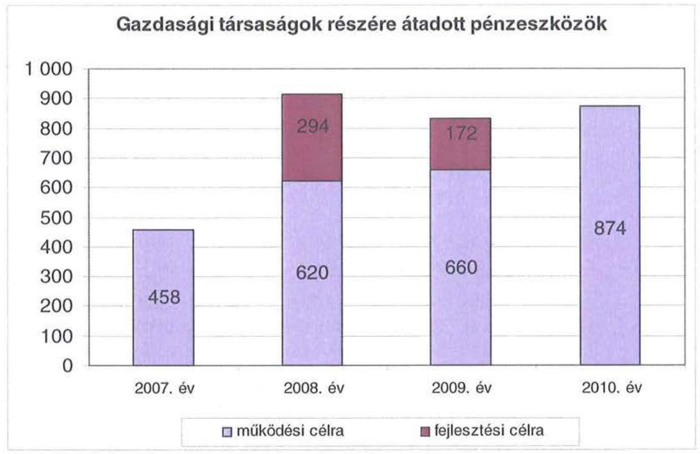

Az Önkormányzat müködési és felhalmozási kiadások aránya ${ }^{54}$ 2007-2010. években jelentősen nem változott. A felhalmozási kiadás 2007-ről 2010-re 4061 millió Ft-ról 3909 millió Ft-ra csökkent.

[^0]
[^0]:    ${ }^{53}$ KSH által közzétett fogyasztói-árindex a 2007-ben 108\%, 2008-ban 106,1\%, 2009-ben $104,2 \% 2010$-ben $104,9 \%$ volt.
    54

    | Megnevezés | 2007. év
tény | Arány
$\%$ | 2008. év
tény | Arány
$\%$ | 2009. év
tény | Arány
$\%$ | 2010. év
tény | Arány
$\%$ |
    | :--: | :--: | :--: | :--: | :--: | :--: | :--: | :--: |
    | 18700 | $82,2 \%$ | 19961 | $85,8 \%$ | 20017 | $84,4 \%$ | 20960 | $84,3 \%$ |
    | 4061 | $17,8 \%$ | 3312 | $14,2 \%$ | 3707 | $15,6 \%$ | 3909 | $15,7 \%$ |
    | 22761 | $100,0 \%$ | 23273 | $100,0 \%$ | 23724 | $100,0 \%$ | 24869 | $100,0 \%$ |

---

A múködési és felhalmozási kiadások alakulását a következő grafikon szemlélteti millió Ft-ban:
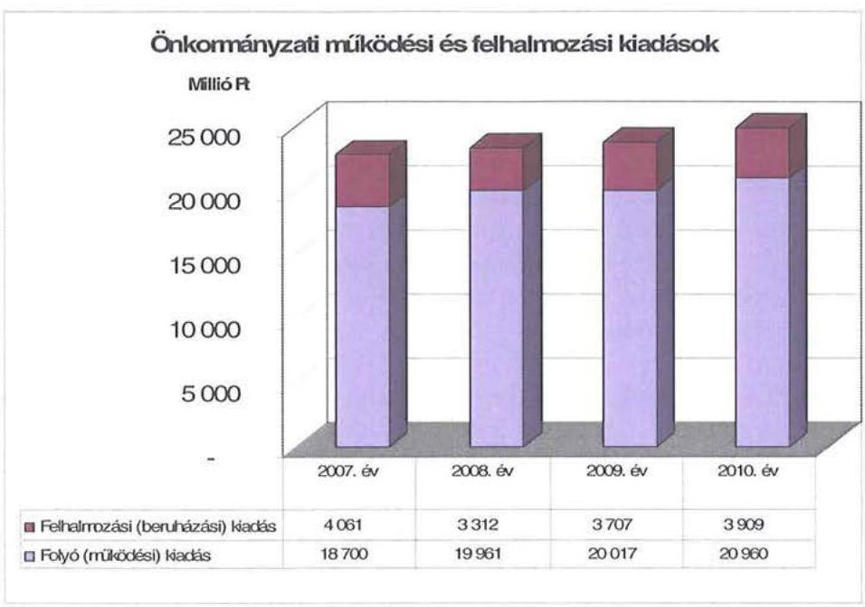

A 2007-2010. években együttesen 14989 millió Ft-ot fordított fejlesztéseinek finanszírozására.

Az Önkormányzat kimutatásai alapján ezen időszakban a három legmagasabb bekerülési költségű beruházás a következő volt:

- Európai uniós és hazai támogatással (58\%), valamint kötvénybevételből valósult meg Szolnok belvárosának rehabilitációja 1805 milliós Ft összegben.
- Az 1326 millió Ft bekerülési költségű fejlesztés 2003-ban kezdődött, a Városi Művelődési és Zenei Központ épületének rekonstrukciójára irányult és 1142 millió Ft ( $86 \%$-os) címzett támogatással valósult meg.
- A 688 millió Ft címzett támogatással 2007. évben fejeződött be a Gépipari Közlekedési Szakközépiskola épületének rekonstrukciója 853 millió Ft-os költséggel, $80 \%$ támogatásintenzitással.

A 2010. december 31-ig befejezett, 9944 millió Ft bekerülési költségű fejlesztések forrásmegoszlása 1904 millió Ft EU-s támogatás (19,1\%), 2156 millió Ft hazai támogatás ( $21,7 \%$ ), 3386 millió Ft kötvénybevétel ( $34,1 \%$ ), 1661 millió Ft saját bevétel ( $16,7 \%$ ), 837 millió Ft hitel ( $8,4 \%$ ) volt. A tényleges bekerülési értékből eszközpótlásra 453 millió Ft-ot fordítottak.

A folyamatban lévő fejlesztések többek között járda-, valamint útépítési, útfelújítási célokhoz, óvoda, iskola, kápolna felújításokhoz, valamint a „Szolnok a Tisza Fővárosa", az „Agóra a 21. század fénye"," Szandaszólősi Városrehabilitáció" programokhoz kapcsolódnak. A folyamatban lévő fejlesztések finanszírozását európai uniós és hazai forrásokból, hitelből és saját bevételből valósítják meg.

---

A folyamatban lévő fejlesztési feladatok várható bekerülési költsége 15524 millió Ft, amelyből a 2010 utánra vállalt kötelezettség 7282 millió Ft. A megkezdett beruházások 2010 utáni kötelezettségeinek támogatással nem fedezett részét, 1075 millió Ft-ot saját bevételből tervezik megvalósítani, amelynek teljesíthetősége jelentős kockázatot jelent, tekintettel az Önkormányzat forráshiányára.

Az elbírálás alatt lévő fejlesztések bekerülési értéke 995 millió Ft, amelyből az EU-s és hazai forrás 869 millió Ft.

Az Önkormányzat 2007-2010. években megvalósított, illetve 2010. december 31-én fennálló, valamint az elbírálás alatt lévő fejlesztési feladatokhoz kapcsolódó kötelezettségeinek összegzését a jelentés 3/a-d számú mellékletei tartalmazzák.

# 3. KÖTELEZETTSÉGEK BEMUTATÁSA 

### 3.1. A pénzintézetek felé fennálló kötelezettségek alakulása

Az Önkormányzat pénzintézeti kötelezettségeinek állománya 2006. december 31-ről 2010. december 31-re több mint négy és félszeresére, 4301 millió Ft-ról 20182 millió Ft-ra nőtt. Fennálló pénzintézeti kötelezettségei kötvények kibocsátásából, hosszú lejáratú hiteltartozásból, valamint folyószámlahitel igénybevételéből keletkeztek.

Az Önkormányzat pénzintézetekkel szemben fennálló kötelezettség-állományát a 2007-2010. években az alábbi ábra szemlélteti:
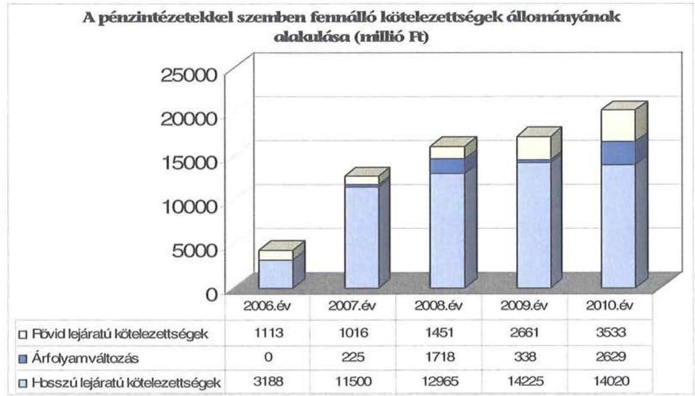

A kötelezettségek év végi alakulását az árfolyamváltozás hatása befolyásolja, azonban annak mértéke előre pontosan nem határozható meg, csak várakozásokon alapuló tendenciák jelezhetők.

---

Arról, hogy a devizában kibocsátott kötvényekért és felvett hitelekért kapott forinthoz képest a kötvények visszavásárlásakor, illetve a hitelek visszafizetésekor jelentkező forintkötelezettség többletkiadást (árfolyamveszteség) vagy megtakarítást (árfolyamnyereség) eredményez-e a futamidő végén, a teljes kötelezettség rendezését követően lehet képet alkotni. Mindaddig, amíg törlesztési kötelezettség nem áll fenn (türelmi idő, moratórium), a tőkére vonatkoztatva nem értelmezhető sem az árfolyamveszteség, sem az árfolyamnyereség. Ugyanakkor az Áhsz. 33. § (2) bekezdés c) pontja meghatározza, hogy az árfolyam különbözetet év végén a saját tőkével szemben kell elszámolni.

Az Önkormányzat pénzintézeti kötelezettségvállalásaira közgyűlési döntés alapján került sor. A kötelezettségvállalásból származó források felhasználási céljait meghatározták, a visszafizetésre a saját bevételeket jelölték meg, azonban az előterjesztésekben nem mutatták be tételesen a visszafizetés forrásait. A kamat- és - a devizaalapú kötelezettségeket érintő - árfolyamkockázatot bemutatták. Az Önkormányzat adósságot keletkeztető kötelezettségvállalásának felső határát 2007-2010. években nem lépte túl, az állandósult folyószámlahitel miatt 2011. évben tervszinten mindössze 209 millió Ft-tal marad alatta a kötelezettségvállalási korlát felső határának, amely magas kockázatot jelent a jövőben vállalható kötelezettségekre.

A Közgyűlés az adósság kezelése érdekében 2005-ben az aktív adósságszolgálati rendszer alkalmazásáról döntött ${ }^{55}$, amelynek keretében 2005-ben a beruházási hitelállományból hat HUF, kettő EUR alapú hitelt CHF alapúra, majd 2009. évben EUR alapúra váltották. A 2010. december 31-én nyilvántartott beruházási hitelek állományából kettő HUF, kettő CHF és hét EUR alapú volt.

Az Önkormányzat 2007. évben 8165 millió Ft, 2008. évben 1790 millió Ft értékben évközi döntéssel kötvényt bocsátott ki. A kötvénykibocsátások előkészítésekor az első kibocsátáskor négy, a második kibocsátásnál nyolc pénzintézettől kértek ajánlatot, és a beérkezett ajánlatokat összehasonlítva terjesztették a Közgyűlés elé. A két kötvénykibocsátás nem a számlavezető pénzintézetnél történt, azonban 2009. január 1-jétől az Önkormányzat számlavezető bankja a második kötvénykibocsátást lebonyolító pénzintézet lett, amely kockázatot jelentett a banki befolyás növekedése miatt. A kötvények visszafizetési forrásaként a saját bevételeket, ezen belül a helyi adóbevételeket jelölték meg.

A „Szolnok MJV 2030/A" kötvényt 2007. június 28-án zártkörűen bocsátották ki, futamideje 23 év, a tőketörlesztés négy év türelmi idő után kezdődik éves esedékességgel. A kötvénykibocsátásból származó bevételből 2007-2009 között múködési célra 3710 millió Ft-ot, 2007-2010 között felhalmozási célra 4990 millió Ft-ot terveztek fordítani. A „Szolnoki Ipari Park" elnevezésű, a Szolnoki Ipari Park Kft. pénzügyi kötelezettségének teljesítéséhez és az Ipari Park fejlesztéséhez ${ }^{56}$ szükséges források megteremtésére szóló kötvény 2008. december 22-én zártkörűen került kibocsátásra. A 2018. december 22-i lejáratú kötvény változó kamatozású, tőketörlesztésre türelmi idő nélkül került sor.

[^0]
[^0]:    ${ }^{55}$ A Közgyűlés 247/2005. (IV. 28.) és 248/2005. (IV. 28.) számú határozataiban döntött erről.
    ${ }^{56}$ A Közgyűlés 214/2008. (VII. 24.) és 312/2008. (IX. 25.) számú határozataiban döntött erről.

---

Az Önkormányzat kimutatása szerint 2007-2010. évek között a kötvénybevétel átmenetileg szabad pénzeszközeinek befektetésével összesen 1810 millió Ft nettó hozamot realizált. A kötvénykibocsátásból származó források szabadon, a pénzintézet korlátozása nélkül befektethetőek voltak. A két kibocsátásból származó, hozamokkal növelt kötvénybevételt az Önkormányzat 2010. december 31-ig felhasználta. Az első kötvénykibocsátásból ( 8165 millió Ft) és a 1537 millió nettó hozamból múködésre 3399 millió Ft-ot, fejlesztésre 6303 millió Ft-ot fordítottak. Az Ipari Park fejlesztésére kibocsátott kötvényből (1790 millió Ft) és a 272,7 millió Ft nettó hozamból az eredeti céltól eltérően múködésre 747,6 millió Ft-ot fordítottak, míg a fejlesztésre 1315,1 millió Ft-ot teljesítettek az eredetileg tervezett 1790 millió Ft-hoz képest. A kamathozammal növelt kötvénybevételből és likviditási problémák miatt összesen 4146,6 millió Ft-ot használtak fel múködési kiadások finanszírozására. A pénzintézetek a kibocsátásból származó forrás felhasználásához bejelentési, adatszolgáltatási kötelezettséget nem írtak elő.

Az Önkormányzat 2010. december 31-én CHF-ben fennálló adósságot keletkeztető kötelezettségvállalásai az alábbiak voltak:

| Megnevezés | Kibocsátás, illetve szerzödéskötés idöpontja | Összeg CHF | Kibocsátási, vagy lehivási árfolyam | Kamat (referencia kamat+ kamatfelár) | Felhasználás célja: |
| :--: | :--: | :--: | :--: | :--: | :--: |
| Beruházási hitel 2006. | 2006. 9. 18. | 7608497 | 155,77 | 3 havi CHF LIBOR $+0,145 \%$ | Városfejlesztés, intézményböljitás, a közigazgatás, logisztikai központ, panel plusz program célokra |
| Beruházási hitel | 2008. 11. 18. | 1462079 | 160,72 | 3 havi CHF LIBOR | Ütépítések 2005. |
| Szolnok MJV 2030/A* kötvény | 2007. 6. 28. | 55000000 | 158,18 | 6 havi CHF LIBOR $+0,5 \%$ | Müködésre, illetve fejlesztések megvalósítására |

A CHF-ben fennálló kötelezettségekből a beruházási hitelek után 2010. december 31-ig 140 millió Ft tőkét, 88 millió Ft kamatot fizettek. A ténylegesen realizált árfolyamveszteség 16 millió Ft. A Szolnok MJV 2030/A kötvény tőketörlesztése 2011. szeptembertől kezdődik, 2010. december 31-ig 722 millió Ft kamatot teljesítettek.

Az Önkormányzat 2010. december 31-én HUF-ban fennálló adósságot keletkeztető kötelezettségvállalásai az alábbiak voltak:

| Megnevezés | Szerződéskötés idöpontja | Összeg ezer Ft-ban | Kamat (referencia kamat+ kamatfelár) | Felhasználás célja: |
| :--: | :--: | :--: | :--: | :--: |
| Beruházási hitel | 2004.05.10 | 119000 | 6 havi BUBOR $+1 \%$ | Széchenyi Gimnázium tornacsornok |
| Fejlesztési hitel | 2005.11.18 | 507000 | 3 havi   EURIBOR $+1,549 \%$ | Ütépítések |

A HUF-ban fennálló kötelezettségek után 2010. december 31-ig 136,5 millió Ft tőkét, 120,3 millió Ft kamatot fizettek.

---

Az Önkormányzat 2010. december 31-én EUR-ban fennálló adósságot keletkeztető kötelezettségvállalásai az alábbiak voltak:

| Megnevezés | Kibocsátás, illetve szerződéskötés időpontja | Összeg EURO | Kibocsátási, vagy átváltási árfolyam | Kamat (referencia kamat+ kamatfelár) | Felhasználás célja: |
| :--: | :--: | :--: | :--: | :--: | :--: |
| „Szolnoki Ipori Park" kötvény | 2008. 12. 22. | 6742000 | 265,5 | 6 havi EURIBOR $+0,95 \%$ | Ipori Park fejlesztése |
| Baruházási hitel | 2009. 9. 30. | 338005 | 1,5105 EUR/CHF | 1 havi EURIBOR $+3,7 \%$ | Kordóbi hitel (tenseryvïztelep) más devizonsence történő átváltása |
| Baruházási hitel | 2009. 9. 30. | 171055 | 1,5105 EUR/CHF | 1 havi EURIBOR $+3,7 \%$ | Kordóbi hitel (sportezernok) más devizonsence történő átváltása |
| Baruházási hitel | 2009. 9. 30. | 164649 | 1,5105 EUR/CHF | 1 havi EURIBOR $+3,7 \%$ | Kordóbi hitel (tölpítés 2002) más devizonsence történő átváltása |
| Baruházási hitel | 2009. 9. 30. | 130707 | 1,5105 EUR/CHF | 1 havi EURIBOR $+3,7 \%$ | Kordóbi hitel (TVM bekötelny) más devizonsence történő átváltása |
| Baruházási hitel | 2009. 9. 30. | 752513 | 1,5105 EUR/CHF | 1 havi EURIBOR $+8 \%$ | Kordóbi hitel (tölpítésok 2003) más devizonsence történő átváltása |
| Baruházási hitel | 2009. 9. 30. | 2273721 | 1,5105 EUR/CHF | 1 havi EURIBOR $+8 \%$ | Kordóbi hitel más devizonsence történő átváltása |
| Baruházási hitel | 2009. 9. 30. | 839171 | 1,5105 EUR/CHF | 1 havi EURIBOR $+8 \%$ | Kordóbi hitel (tölpítések 2004)más devizonsence történő átváltása |

Az EUR-ban fennálló kötelezettségek után 2010. december 31-ig összesen 1046 millió Ft tőkét, 281 millió Ft kamatot, 5,3 millió Ft hitelkezelési díjat $(0,2 \%)$ fizettek. A ténylegesen realizált árfolyamveszteség 51 millió Ft.

A folyószámlahitelt a tervezett költségvetési hiány finanszírozására, valamint a bevételek kiadásoktól eltérő ütemben történő realizálása miatt vették fel. A folyószámlahitel és a munkabér-megelőlegezési hitel alakulását az alábbi táblázat mutatja be:

|  |  |  |  |  | eser Ft-ban |  |
| :--: | :--: | :--: | :--: | :--: | :--: | :--: |
| Megnevezés | 2007. év | 2008. év | 2009. év | 2010. év | 2011. márctus   31. |  |
| I. Folyószámlahitel |  |  |  |  |  |  |
| a folyószámlahiteti kevetösszege január 1-jén | 1500000 | 2500000 | 2500000 | 2500000 | 3870000 |  |
| teljesített kamat és egyéb költség | 106339 | 155489 | 154559 | 65710 | 44352 |  |
| II. Munkabér-megelőlegezési hitel |  |  |  |  |  |  |
| igénybevett hitel (szemver) | - | - | 1000000 | - | - |  |
| teljesített kamat és egyéb költség | - | - | 6063 | - | - |  |

A folyószámlahitel és munkabér megelőlegezési hitelek kondícióinak és egyéb költségeinek alakulását az alábbi táblázat szemlélteti ${ }^{57}$ :

| Megnevezés | Kamat (referencia+ kamatfelár) | Egyéb költség |
| :--: | :--: | :--: |
| Folyószámlahitel |  |  |
| 2007-2008. évek | 3 havi BUBOR $+0,15 \%$ | x |
| 2009-2011. évek | 3 havi BUBOR | x |
| Munkabér-megelőlegezési hitel |  |  |
| 2009. év | 3 havi BUBOR | x |

${ }^{57}$ A referencia kamat az alábbiak szerint alakult:

| MNB BUBOR fïring (állaghamat) \%-ban |  |  |  |  |  |
| :--: | :--: | :--: | :--: | :--: | :--: |
| Referetencia kamat | 2007. év | 2008. év | 2009. év | 2010. év | 2011.márctus   31.ig |
| 3 havi BUBOR | 7,75 | 8,87 | 8,64 | 5,3 | 6,03 |

---

Az Önkormányzat múködésének pénzügyi egyensúlyát a vizsgált időszakban csak folyószámlahitel igénybevételével tudta biztosítani. A fennálló tartós folyószámlahitel tartozását a 2007-2009. évek végén azért nem fizették vissza, mert a kötvénybevétel végleges felhasználásáig a befektetésekből származó kamatbevétel összege meghaladta a vissza nem fizetett likvidhitel után felszámított kamatkiadás összegét. A folyószámlahitel év végi állománya évről évre - a 2007. évi 731 millió Ft-ról a 2010. évre 2942 millió Ft-ra - növekedett a hitelkeret egyidejú emelése mellett.

Az Önkormányzatnál a 2007-2010. években a folyószámlahitellel zárt napok száma 355-364 nap között alakult. Az átlagos napi állomány folyamatosan emelkedett, a 2007. évben volt a legalacsonyabb, 1296 millió Ft, a 2010. évben volt a legmagasabb, 2453 millió Ft. Az állomány 2011. március 31-én meghaladta a 3031 millió Ft-ot. Az áttekintett időszakot jellemző múködési hiány miatt, a folyamatos likviditási problémák finanszírozására igénybevett folyószámlahitel az Önkormányzatnak a 2007-től 2011. március 31-ig összesen 526 millió Ft kamatkiadást okozott.

A tartós likviditási problémák miatt az Önkormányzatnál 2009. évben a január és a július havi munkabérek kifizetéséhez 500 millió Ft munkabérmegelölegezési hitelt vettek fel, amelyet a felvételt követő hónapban - a saját bevételekből és a normatív állami támogatásokból - visszafizettek. Kamatköltség címén az Önkormányzat a vizsgált időszakban a munkabérmegelőlegezési hitel után összesen hat millió Ft-ot fizetett ki.

Az alapkamat mértékének alakulása jelentős hatással van az adott devizanemben kifejezett, a teljes futamidőre számított, várható kamatkötelezettség nagyságára. Az Önkormányzat által kibocsátott kötvények esetében a kamat kötelezettségek alakulását jelentősen befolyásolta a kibocsátáskori és az utolsó kamatfizetési referencia kamatok változása, amelyet az alábbi táblázat mutat be:

| Megnevezés | Kibocsátási | Utolsó fizetéskori | Változás \% |
| :--: | --: | --: | --: |
|  | alapkamat \% |  |  |
| 6 havi CHF LIBOR | 2,79826 | 0,255 | $-90,9$ |
| 6 havi EURIBOR | 3,202 | 1,669 | $-47,9$ |

Az Önkormányzat utolsó kamatfizetési kötelezettsége a 6 havi CHF LIBOR-ú kötvény után 2011. március 31-én, a 6 havi EURIBOR-os kötvénynél 2011. április 30án volt.

Amennyiben a referencia kamat nem változott volna, az Önkormányzatnak kibocsátáskori referencia kamattal számolva 2011. március 31-ig 5459328 CHF (1011 millió Ft), illetve 469068 EUR (131 millió Ft) kamatfizetési kötelezettsége jelentkezett volna. A referenciakamatok változása miatt az Önkormányzatnak 1344264 CHF-el (289 millió Ft-tal), illetve 160273 EUR-al (44 millió Ft-tal) kevesebb fizetési kötelezettséget kellett teljesítenie.

Az Önkormányzatnál a helyszíni vizsgálat alatt további hitel igénybevételéről, illetve kötvénykibocsátásról szóló döntést nem készítettek elő, azonban a 2011.

---

évi költségvetési rendeletben ${ }^{58}$ a folyószámlahitel felső határát 4500 millió Ft, a munkabérhitel összegét 500 millió Ft-ban határozták meg. A 2011. március 21én aláírt folyószámlahitel szerződés-módosításban a hitelkeret összege 3870 millió Ft volt, és a vizsgálat ideje alatt a benyújtott hitelkérelem alapján a bankkal egyeztetéseket folytattak az 5000 millió Ft hitelkeret igénybevételéről.

Az Önkormányzatnál a pénzügyi egyensúly helyreállítására, a likviditás biztosítására 2011. május 26-án elfogadták a Város Adósságkezelési Komplex Programját (likviditási koncepciót), amelyben az Önkormányzat költségvetésének, pénzügyi egyensúlyának megteremtésére, az elkövetkezendő évek költségvetési egyensúlyának kialakítására vonatkozó elveket, irányokat fogalmaztak meg. A koncepciókban részletesen elemezték a likviditás helyzetét, a likviditás alakulását befolyásoló tényezőket és alternatívákat mutattak be a múködés racionalizálása érdekében.

# 3.2. Szállítók felé fennálló kötelezettségek alakulása 

Az Önkormányzatnál az áttekintett időszakban a szállítói tartozásállomány a 2010. évben volt a legmagasabb, 1469 millió Ft, amelyből 220 millió Ft-ot 2012. december 31-ig átütemeztek a fizetési határidő módosítása miatt. A 2009. december 31-i mérlegben a szállítói tartozás 997 millió Ft volt, amelyből a 91-365 nap közötti lejárt 20,5 millió Ft szállítói állomány keletkezésének elszámolás tartalmi oka volt a polgármester nyilatkozata ${ }^{59}$ szerint. A szállítói tartozás állománya 2011. március 31-én 1071 millió Ft.

Az Önkormányzat és intézményei, valamint gazdasági társaságai lejárt szállítói tartozásállományának alakulását az alábbi táblázat tartalmazza:
ezer Ft-ban

| Megnevezés | 2007. év | 2008. év | 2009. év | 2010. év |
| :-- | :--: | :--: | :--: | :--: |
|  | december 31. | december 31. | december 31. | december 31. |
| Lejárt szállitói tartozás | 28798 | 22486 | 250774 | 4226 |
| Gazdasági társaságok   lejárt szállitói tartozása | 415292 | 438171 | 709921 | 1007324 |

Az Önkormányzatnak 2007-ben 29 millió Ft, 2008. évben 22 millió Ft lejárt szállítói tartozása volt, a 2009. évi lejárt szállítói tartozás 250,7 millió Ft öszszege a 2010. évben négy millió Ft-ra, 98,3\%-ra csökkent, majd 2011. év I. negyedévben 53 millió Ft-ra nőtt. Egyéb kiadás elmaradás az áttekintett időszakban nem volt. A 2009. évi lejárt szállítói tartozásból 229,3 millió Ft 30 nap alatti, 21,4 millió Ft 91-365 nap, illetve éven túli volt. A 2011. március 31-i lejárt tartozásból 52,9 millió Ft 61-90 nap közötti, mert a városüzemeltetési feladatok ellátásához kapcsolódó számlákat benyújtották, azonban kifizetése nem történt meg a szerződés megkötésének elhúzódása miatt.

[^0]
[^0]:    ${ }^{58}$ A 2011. évi költségvetésről szóló 7/2011. (II. 25.) számú közgyűlési rendelet 4. § (7) bekezdése.
    ${ }^{59}$ A koncessziós szerződés alapján a koncessziós díj egy részét fejlesztésre fordítják, ezért az adott évre vállalt feladat és a képződött forrás egyeztetése miatt a következő évre húzódott át a számla kifizetése.

---

A 75\% feletti önkormányzati tulajdonban lévő gazdasági társaságok lejárt szállítói tartozásállománya 2010. december 31-én 78 millió Ft volt.

# 3.3. Egyéb kötelezettségek alakulása 

Az Önkormányzat a vizsgált időszakban intézményei részére kölcsönt nem nyújtott. A 100\% önkormányzati tulajdonban lévő két gazdasági társaságának összesen 642 millió Ft kölcsönt nyújtott, amelyből 2010. december 31én 622 millió Ft követelése állt fenn. A kölcsönből 622 millió Ft az Ipari Park Kft tagi kölcsöne ${ }^{60}$, amelynek visszafizetési határideje 2011. június 30.

Az Önkormányzatnak a vizsgált időszakban két gazdasági társaságánál volt garancia- és kezességvállalással kapcsolatos hosszú távú kötelezettségvállalása, 1521,1 millió Ft összegben.

Az Önkormányzat a Szolnok Tv Zrt 20,8 millió Ft-os hiteléhez, az Ipari Park Kft. az infrastruktúra fejlesztés részbeni finanszírozását célzó 493,8 millió Ft hitelszerződéséhez, valamint „Ingatlanfinanszírozási pénzügyi lizingszerződésből" adódó 1006,5 millió Ft kötelezettségére vállalt készfizető kezességet.

A 2010. év végén a még fennálló kezességvállalásként 921 millió Ft-ot ( 3399061 EUR) - és 232 millió Ft kamatot - mutattak ki az Ipari Park Kft-t érintően. A Közgyűlés Z-2/2011. (I. 26.) számú határozatában jóváhagyását adta 360 millió Ft készfizető kezességvállalásra az Ipari Park Kft. által kötendő lizingszerződésére. A lizingszerződést a vizsgálat ideje alatt nem kötötték meg.

Az Ipari Park Kft. által vállalt kötelezettségek miatt az Önkormányzatnak öszszességében 1281 millió Ft (ebből 921 millió Ft tény, 360 millió Ft szándék) kezességvállalása, illetve az Ipari Park Kft.-nek 622 millió Ft tagi kölcsön visszafizetési kötelezettsége van az Önkormányzat felé.

Az Önkormányzat PPP konstrukció keretében nem végzett beruházást.
Az Önkormányzatnak és intézményeinek a polgármester nyilatkozata alapján nem volt lizingszerződése.

Az Önkormányzatnak az áttekintett időszakban összesen 29,5 millió Ft elengedett követelése volt, amelyek bérleti díj, használati jog, lakbér, helységbérlet, ingatlanértékesítés, gondozási díj, adott kölcsön ${ }^{61}$ címén elengedett, közgyűlési döntéssel alátámasztott követelés elengedések voltak.

Az Önkormányzat hat forgalomképes ingatlanán szerepelt jelzálogjog bejegyzés, amelyeknek a számviteli nyilvántartás szerinti együttes nettó értéke 2010. december 31-én 56 millió Ft, a bejegyzett jelzálog nagysága 1125 millió Ft. Az

[^0]
[^0]:    ${ }^{60}$ Az Önkormányzat a tagi kölcsönt az infrastruktúra fejlesztésére vonatkozó számlatartozás kiegyenlítésére, valamint beruházások megvalósításához felvett hitel törlesztéséhez adta.
    ${ }^{61}$ Egy felszámolás alatt álló gazdasági társaságnak korábban nyújtott 7 millió Ft tagi kölcsön elengedése a 270/2007. (XI. 29.) közgyűlési határozat szerint.

---

Önkormányzat összes forgalomképes ingatlanának könyvszerinti nettó értéke 5563 millió Ft, amelyből az üzemeltetésre, kezelésre átadott (sportcentrum, logisztika, önkormányzati lakások) ingatlanok nettó értéke 3823 millió Ft, az ezt követően maradó forgalomképes ingatlanának könyvszerinti nettó értéke 1740 millió Ft volt. Az üzemeltetésre átadott ingatlanok nettó értéke nélkül számított vagyonértékből a jelzáloggal terhelt ingatlanok arányát a következő ábra szemlélteti:
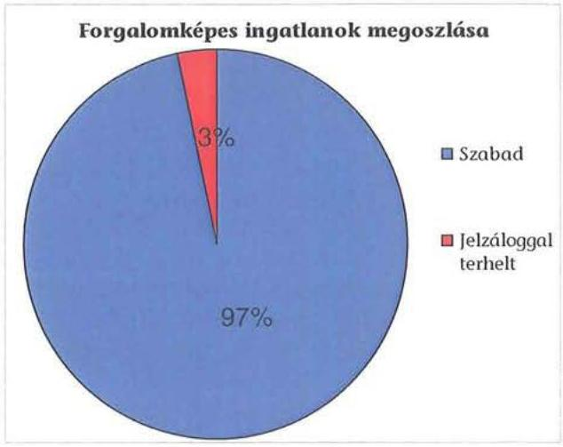

A 2011. március 21-én megkötött folyószámlahitel szerződés-módosításban a számlavezető pénzintézet 2000 millió Ft fedezeti értéken jelzálogszerződés kötelezettséget írt elő. A Közgyűlés 2011. május hónapban döntött ${ }^{62}$ a folyószámlahitel felvétel biztosítékául szükséges jelzálogjog (terhelés) alá vonandó ingatlanok köréről. A vizsgálat ideje alatt nem kötöttek meg ${ }^{63}$ a jelzálogszerződést a jelzáloggal kijelölt ingatlanok körének bankkal történő egyeztetése miatt. A jelzálogra kijelölt ingatlanok 2010. december 31-én nyilvántartott nettó könyv szerinti értéke 549 millió Ft volt, amely alapján a jelzáloggal terhelt forgalomképes vagyon aránya 3\%-ról 35\%-ra nő. Az Önkormányzat ingatlanait nem piaci értéken tartja nyilván, ezért a nettó könyv szerinti értéken nyilvántartott vagyon és a piaci értékre alapozott banki fedezeti érték nincs közvetlen összefüggésben.

A felújításokra, az eszközök pótlására az Önkormányzat beszámolóinak adatai szerint - a pályázati lehetőségeket kihasználva - a pénzügyi lehetőségének függvényében, elsősorban az intézmények működőképességének biztosítása, illetve a szakhatósági előírások figyelembevételével került sor. Az Önkormányzatnál minden év végén, a következő évi tervezéshez az intézmények műszaki állapotfelmérését elvégezték, azonban a vizsgált időszakban nem történt meg annak bemutatása, hogy az eszközök elhasználódásának pótlása milyen

[^0]
[^0]:    ${ }^{62}$ A Közgyűlés 145/2011. (V. 26.) számú határozata alapján.
    ${ }^{63}$ A jelzálogra kijelölt ingatlanok bank által felértékelt piaci értéke nem érte el az előírt jelzálogértéket, újabb ingatlanok kijelölése szükséges.

---

kötelezettséget ${ }^{64}$ jelent számára. Az Önkormányzat összes eszközének (immateriális javak, ingatlanok, gépek, járművek, átadott eszközök) használhatósági foka 2007-2010 között a bruttó érték 8012 millió Ft emelkedése ellenére 4,5 százalékponttal ( $85,7 \%$-ról $81,2 \%$-ra) csökkent az amortizáció növekedése miatt. A tárgyi eszközök bruttó értéke 2007-ről 2010-re 7898 millió Ft-tal, az eszközök után elszámolt értékcsökkenés 4815 millió Ft-tal emelkedett, amelynek következtében a tárgyi eszközök elhasználódási szintje 14\%-ról 18,3\%-ra emelkedett. Az Önkormányzat a 2007-2010. években a tárgyi eszközök után 6298 millió Ft összegű értékcsökkenést mutatott ki, ugyanakkor felújításra 4642 millió Ft-ot fordítottak, amely az amortizáció $73,7 \%$-a volt.

Az Önkormányzatnál és kettő intézményénél összesen 10 esetben jogerős határozattal nem lezárt peres eljárás van folyamatban, amelyből négy ügyben (kártérítési és munkaügyi) alperesi pozícióban áll. Az Önkormányzat terhére kimutatott perérték összesen 17 millió Ft.

Az Önkormányzat jogerős határozattal lezárt, de még ki nem fizetett kötelezettsége 57 millió Ft, amely a tűzoltók részére túlszolgálatért visszamenőlegesen megítélt illetmény. Ezen túlmenően az Önkormányzatnak 43 millió Ft jogerős, de jelenleg legfelsőbb bírósági szakaszban lévő tulajdonjog megállapítása iránti kötelezettsége van.

Az Önkormányzat hat esetben (munkaügyi, bérleti díjkövetelési, kártérítési perben) felperes, a le nem zárt ügyek perértéke összesen 56 millió Ft, míg a 25 határozattal lezárt esetben a részére meg nem fizetett perérték kilenc millió Ft.

Az Önkormányzat 100\%-os tulajdonában álló hat gazdasági társasága még le nem zárt ügyből három ügyben (perérték 19,5 millió Ft) alperesi, 102 esetben felperesi (perérték 24 millió Ft) pozícióban állnak. A jogerős határozattal lezárt, de ki nem fizetett peres eljárásokban három gazdasági társasága összesen 117 millió Ft-ot követel lakás kiürítése, parkolási díj, illetve vállalkozói díj követelése címen.

Az Önkormányzat gazdálkodására a még le nem zárt, illetve a jogerős ítélettel lezárt peres eljárásokban kimutatott kötelezettség kockázatot jelent.

[^0]
[^0]:    ${ }^{64}$ A 2011-2014. évekre szóló vagyongazdálkodási koncepcióban többek között megfogalmazták a vagyon elhasználódással (avulással) arányos vagyonpótlás követelményét.

---

Az Önkormányzatnak a 2011-2013. években, valamint a 2013. év után az alábbi táblázatban bemutatott kötelezettségei vannak:

Az Önkormányzat kötelezettségeinek állománya 2010. december 31-én és várható alakulása a kötelezettségek lejáratáig

| Megnevezés | Állomány 2010. dec. 31 -én |  |  | Várható kötelezettség 2011. 2013. években |  |  | Várható kötelezettség 2014. évet követően |  |  |
| :--: | :--: | :--: | :--: | :--: | :--: | :--: | :--: | :--: | :--: |
|  | $\begin{aligned} & \text { HUF-ban } \\ & \text { (millió Ft- } \\ & \text { ban) } \end{aligned}$ | Devizában (ünnege) | Deviza   nem | HUF-ban (millió Ftban) | Devizában (ünnege) | Deviza   nem | $\begin{aligned} & \text { HUF-ban } \\ & \text { (millió Ft- } \\ & \text { ban) } \end{aligned}$ | Devizában (ünnege) | $\begin{gathered} \text { Deviza } \\ \text { em } \end{gathered}$ |
| Pénzintézeti kötelezettségek |  |  |  |  |  |  |  |  |  |
| Hossack lejáratú kötelek | 486 |  | HUF | 182 |  | HUF | 398 |  | HUF |
| Hossack lejáratú kötelek |  | 8204791 | CHF |  | 1656466 | CHF |  | 6838019 | CHF |
| Hossack lejáratú kötelek |  | 3147233 | EUR |  | 2188099 | EUR |  | 2041680 | EUR |
| Kéletény (Szelmek MZV 2010/A) |  | 63000000 | CHF |  | 3769433 | CHF |  | 36890185 | CHF |
| Kéletény (Szelmek Ipsut Park) |  | 3981524 | EUR |  | 1910728 | EUR |  | 4930991 | EUR |
| Enlyőszékelcélétel | 2942 |  | HUF | 2942 |  | HUF |  |  | HUF |
| Pénzintézeti kötelezettségek összesen HUF-ban | 3428 |  | HUF | 3124 |  | HUF | 398 |  | HUF |
| Pénzintézeti kötelezettségek összesen CHF-ban |  | 63304791 | CHF |  | 5425921 | CHF |  | 63728804 | CHF |
| Pénzintézeti kötelezettségek összesen EUR-ban |  | 9530737 | EUR |  | 6098827 | EUR |  | 6972671 | EUR |
| Biztoslékok |  |  |  |  |  |  |  |  |  |
| Umexencia |  |  |  |  |  |  |  |  |  |
| Szecesafig |  | 3399061 | EUR |  |  |  |  |  |  |
| Biztoslékok összesen: |  | 3399061 | EUR |  |  |  |  |  |  |
| Szállítól tartozás | 1469 |  | HUF | 1469 |  | HUF |  |  |  |
| Segerés végzéssel hozást és ki nem fizetett kötelezettségek* | 57 |  | HUF | 57 |  | HUF |  |  |  |

* A pures eljárásokra vonatkozó adatok a 2011. júniusi állapotot tükrözik

Az Önkormányzat kötelezettségeinek állománya 2010. december 31-én 4954 millió Ft-ból, 63304791 CHF-ből és 12929818 EUR-ból tevődött össze. Ebből a 2011-2013. években esedékes tőke- és kamatkötelezettségeiből ${ }^{65}$ várhatóan 4650 millió Ft-ot, 5425922 CHF-et, 4098827 EUR-ot kell teljesítenie. A 2014-től számított várható kötelezettség 388 millió Ft-ban, 63728804 CHFben, 6972671 EUR-ban jelentkezik. A kötelezettségek finanszírozását az Adósságkezelési Komplex Programban meghatározottak szerint a kiadások számottevő csökkentésével, valamint a vagyonhasznosítási és helyi adóbevételből tervezik biztosítani.

A 100\%-ban önkormányzati tulajdonú gazdasági társaságok közül - kimutatásuk alapján - öt rendelkezett lizingszerződéssel, amely gépjármú, LED fal és tartozékai beszerzéshez, illetve ingatlan finanszírozásához kapcsolódtak.

A 100\%-ban önkormányzati tulajdonú gazdasági társaságoknak a 2011-2013. években, valamint a 2013. év után az alábbi táblázatban bemutatott kötelezettségei vannak:

Az Önkormányzat minősített többségi tulajdonú társaságai kötelezettségeinek állománya 2010. december 31-én és várható alakulása a kötelezettségek lejáratáig

| Megnevezés | Állomány 2010. dec.31-én |  |  | Várható kötelezettség 2011. 2013. években |  |  | Várható kötelezettség 2014. évet követően |  |  |
| :--: | :--: | :--: | :--: | :--: | :--: | :--: | :--: | :--: | :--: |
|  | HUF-ban (millió Ftban) | Devizában (ünnege) | Deviza   nem | HUF-ban (Ftban) | Devizában (ünnege) | Deviza   nem | HUF-ban (Ftban) | Devizában (ünnege) | $\begin{gathered} \text { Deviza } \\ \text { em } \end{gathered}$ |
| Szalag kötelezettségek | 10 |  | HUF | 10 |  | HUF | 2 |  | HUF |
| Szalag kötelezettségek |  | 12872 | CHF |  | 11152 | CHF |  |  | 1100 |
| Szalag kötelezettségek |  | 3420088 | EUR |  | 1075927 | EUR |  | 3224029 | EUR |
| Szállítól tartozás | 79 |  | HUF | 79 |  | HUF |  |  | HUF |

[^0]
[^0]:    ${ }^{65}$ A várható kamatkötelezettségeket a devizában fennálló kötelezettségeknél az utolsó kamatkondícióval számoltuk.

---

A 2010. december 31-én fennálló tartozásból a 100\%-ban önkormányzati tulajdonú gazdasági társaságok kötelezettsége forintban 88 millió Ft, svájci frankban 12875 CHF , euróban 3430046 EUR volt. A 2011-2013-ban esedékes kötelezettségek várható összege devizánként 88 millió Ft, 13755 CHF, 1073957 EUR. A 2013. után várható kötelezettség összegét kétmillió Ft és 3224029 EUR alkotja. Az Önkormányzat pénzügyi helyzetére - a gazdasági társaságok által kimutatott kötelezettségek közül - az Ipari Park Kft. önkormányzati kezességvállalással érintett ingatlanlízingje kockázatot jelenthet futamidejére (lejárat 2019. december), összegére (3 395342 EUR) való tekintettel.

Az Önkormányzat korlátlan felelősséggel tartozik felszámolás esetén a gazdasági társaságokról szóló 2006. évi IV. törvény 54. § (2) bekezdése alapján a legalább $75 \%$-os tulajdoni hányadú gazdasági társaságának, amelyben az 52. § (2) bekezdése alapján a szavazatok legalább $75 \%$-val rendelkezik, illetve a csődeljárásról és a felszámolási eljárásról szóló 1991. évi XLIX. törvény 63. § (2) bekezdése alapján a kizárólagos önkormányzati tulajdonú gazdasági társaságának minden olyan kötelezettségéért, amelynek kielégítését a felszámolási eljárás során az adós társaság vagyona nem fedez, ha a hitelezőinek a felszámolási eljárás során benyújtott keresete alapján a bíróság - az adós társaság felé érvényesített tartósan hátrányos üzletpolitikájára figyelemmel - megállapítja az Önkormányzat korlátlan és teljes felelősségét. Az Önkormányzat számára pénzügyi kockázatot jelent, hogy felszámolás esetén a bíróság megállapíthatja az Önkormányzat korlátlan és teljes felelősségét az összességében 80 millió Ft, továbbá 13755 CHF és 4297986 EUR összegű tőke és kamat kötelezettségekkel érintett, öt kizárólagos önkormányzati tulajdonú gazdasági társaság után.

# 4. A PÉNZÜGYI EGYENSÚLY MEGTEREMTÉSE ÉrDEKÉBEN HOZOTT INTÉZKEDÉSEK 

Az Önkormányzat a pénzügyi egyensúly megteremtése érdekében kiadáscsökkentő intézkedéseket tett. A 2007-2010. évek kiadáscsökkentő intézkedéseinek hatását beavatkozási területenként az alábbiak részletezik:

|  | adatok: ezer Ft-ban |  |  |  |
| :-- | :--: | :--: | :--: | :--: |
| Az érvényesített kiadás-   csökkentés területei | Személyi   juttatások és   járulékai | Dologi, mű-   ködési ki-   adások | Pénzeszköz-   átadások,   támogatások | Összesen |
| A Közgyűlés működése | 0 | 0 | 0 | 0 |
| Az Önkormányzat hiva-   talánál | 0 | 0 | 0 | 0 |
| Az intézményeknél | 4701197 | 206635 | 281774 | 5189606 |
| ÖSSZESEN | 4701197 | 206635 | 281774 | 5189606 |

A 2011. évtől meghozott kiadáscsökkentő intézkedések teljes éves hatása 143 millió Ft kiadási megtakarítás, amelyből 19 millió Ft a polgármesteri hivatal személyi jellegű megszorító intézkedéséhez kapcsolódik.

Az Önkormányzatnál a fenntarthatóságot biztosító, a közoktatási intézményhálózatot érintő Önkormányzati Intézkedési Tervről a 32/2007. (II. 22.) számú határozatban döntöttek. Az Intézkedési Terv végrehajtásának keretében a vizsgált időszakban az Önkormányzatnál intézményátszervezés, ezzel összhang-

---

ban létszámcsökkentés, bevételnövelő, feladatátadási intézkedések történtek, amelyek a 2007-2010. évek között összesen 5190 millió Ft kiadás megtakarítást eredményeztek.

Az áttekintett időszakban az intézmények szervezetének és feladatellátásának átalakítása az intézményátadásokkal együtt összesen 11 telephely megszüntetését is jelentette, valamint az alap- és középfokú oktatásban a tanulócsoportok számát csökkentették, a négy önálló óvodai igazgatóságot egy szervezeti egységbe vonták össze, az Egészségügyi Szolgálat feladatait a Bölcsődei Igazgatósághoz integrálták. A 2008 évben összevontak kettő általános iskolát, valamint kettő szakképző intézménybe a hét szakközépiskolát. A létszámcsökkentő intézkedések hatására az Önkormányzat 2007. január 1-jei átlaglétszám 3628 főről, 2010. december 31-re 3004 főre, $624^{66}$ fővel csökkent. A 2007-2010 között az önkormányzati intézményeknél összesen 413 álláshely - 2007. évben 312 fő, 2008. évben 37 fő, 2009. évben 24 fő és 2010. évben 40 fő - megszüntetésre került, ebből 123 üres álláshely, 196 fő szakmai, 94 fő intézményüzemeltetéshez kapcsolódó álláshely volt.

Az Önkormányzat 2007-2010.évcket éttntő létszámcsökkentésének alakulása

| Megnevezés (adatok fô-ben) |  | Közoktatás | Szociális és gyermekvédelem | Egészségügy |  | Polgármesteri hivatal | Egyéb | Összesen |
| :--: | :--: | :--: | :--: | :--: | :--: | :--: | :--: | :--: |
| Megszüntetett álláshelyek száma |  | 346 | 1 | 34 |  | 8 | 24 | 413 |
| ebböl: | üres álláshelyek száma | 116 | 0 | 6 |  | 0 | 1 | 123 |
|  | szakmai álláshelyek száma | 169 | 0 | 19 |  | 8 | 0 | 196 |
|  | intézmény-üzemeltetéssel kapcsolatos   ưlláshelyek száma | 61 | 1 | 9 |  | 0 | 23 | 94 |
| 2007. január 1-jén indító létszám |  | 2400 | 491 | 106 |  | 259 | 372 | 3628 |
| 2010. decembe 31-én záró létszám |  | 2063 | 42 | 267 |  | 261 | 370 | 3004 |

A helyi szervezési intézkedések végrehajtásához az Önkormányzat az áttekintett időszak alatt 450 millió Ft központi költségvetési támogatásban részesült, amelynek felhasználásával 201 fő álláshelyet tartósan leépített.

Az adóbevételhez kapcsolódó dolgozói érdekeltség alkalmazását 2010. január 1-jétől felfüggesztették, melynek számszerűsített megtakarítását nem mutatták ki.

A 2007-2010. években az intézményátszervezések, a feladatváltozások, valamint a takarékossági intézkedések hatásaként együttesen 5190 millió Ft kiadási megtakarítást mutatott ki az Önkormányzat ${ }^{67}$. Az intézményátszervezéshez és intézményátszervezésen túli álláshely megszüntetéshez 4701 millió Ft volt, a dologi kiadás megtakarításból 207 millió Ft származott, valamint az átadott oktatási intézményekhez összesen 282 millió Ft önkormányzati támogatás megszűnése is kapcsolódott. A Csarnok és Piac Intézmény átadása 230 millió Ft díjbevétel kiesést is jelentett.

[^0]
[^0]:    ${ }^{66}$ A 2007 évről 2010. évre a közalkalmazottak száma 630 fővel csökkent, a polgármesteri hivatal létszáma 6 fővel emelkedett.
    ${ }^{67}$ A kiadások csökkentését célzó intézkedések elmaradása esetén 2007-2010. évek között a számítások alapján 5190 millió Ft-tal magasabbak lettek volna az Önkormányzat kiadásai.

---

A kiadáscsökkentő intézkedések mellett az Önkormányzat az alábbiakban számszerűsített bevételnövelő intézkedéseket tette:
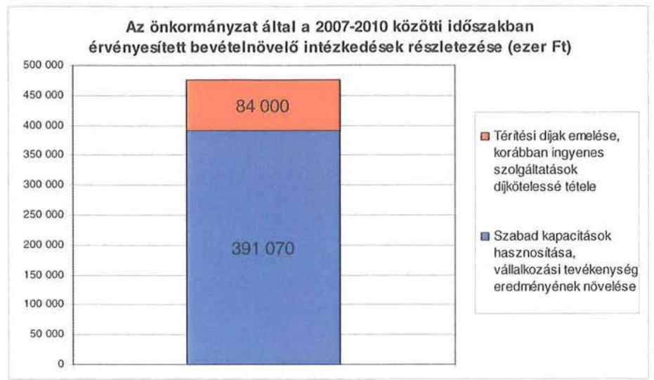

Az Önkormányzat növelte vagyonkihasználtságát a felszabaduló ingatlanok bérbeadásával. A bevételnövelésre irányuló intézkedések számszerúsített összegének ( 475 millió Ft) $82 \%$-át az intézményeknél mutatták ki a szabad kapacitások hasznosításából, az ingatlanok, eszközök bérbeadásából, illetve tanfolyamok szervezéséből. A Polgármesteri hivatalnál az építményadó díjtételének emelése 84 millió Ft bevétel-növekedést eredményezett.

# A 2011. évre bevételnövelő intézkedéseket nem terveztek önkormányzati szinten. 

A 2007. évhez viszonyítva a 2007-2010. évek között az Önkormányzat költségvetési támogatása összesen 2703 millió Ft-tal növekedett. A 2007. évhez viszonyítva a 2008-2010. években összesen 3775 millió Ft-tal kevesebb volt az átengedett bevételek összege, 474 millió Ft-tal volt kevesebb illetékbevételt realizáltak.

Az Önkormányzat a kiadáscsökkentő és bevételnövelő intézkedésekkel a csökkenő állami támogatások hatását ellensúlyozni tudta. Az Önkormányzatnál a költségvetési támogatások és átengedett bevételek összege 2008-ban 236,4 millió Ft-tal, 2,3\%-kal, 2009-ben 431 millió Ft-tal, 4,1\%-kal, a 2010. évi 404,4 millió Ft-tal, 3,9\%-kal volt alacsonyabb, mint 2007-ben. A kimutatások szerint összességében, az 1546 millió Ft forráskiesést figyelembe véve, az Önkormányzat kiadáscsökkentő és bevételnövelő intézkedései 4119 millió Ft megtakarítást eredményeztek.

---

Az átszervezések, a takarékossági intézkedések szakmai feladatellátásra gyakorolt hatását célzottan nem vizsgálták, erről belső ellenőrzési jelentések nem állnak rendelkezésre.

# 5. A HELYI ÖNKORMÁNYZATOK GAZDÁLKODÁSI RENDSZERÉNEK 2010. ÉVI ELLENŐRZÉSE SORÁN A PÉNZÜGYI EGYENSÚLY JAVÍTÁSÁRA TETT SZABÁLYSZERŰSÉGI ÉS CÉLSZERŰSÉGI JAVASLATOK HASZNOSULÁSA 

Az ÁSZ az Önkormányzat gazdálkodási rendszerét a 2010. évben ellenőrizte, amelyről a 1037/2010. számú ÁSZ jelentésben kettő szabályszerűségi és három célszerűségi javaslatot tett. A jelentést a Közgyűlés megtárgyalta és a 14/2011. (I. 26.) számú határozatában foglaltak alapján a polgármester és a jegyző együttes utasításával a feltárt hiányosságok megszüntetésére az intézkedési tervet kiadták. A I. 17031-1/2011. számú, 2011. március 16-ától hatályos intézkedési terv a javaslatokat teljes körűen tartalmazta, a feladatok elvégzéséért felelősöket és a feladatok elvégzésének határidejét meghatározták. A pénzügyi egyensúly javítására kettő szabályszerűségi és egy célszerűségi javaslat vonatkozott.

Utóellenőrzés keretében ellenőriztük az intézkedési tervben foglaltak végrehajtását, amely szerint a jegyző részére a pénzügyi egyensúlyra vonatkozó javaslatokat 100\%-ban hasznosították:

- „gondoskodjon az Önkormányzat költségvetési rendeletének végrehajtása során arról, hogy likvid hitelként csak az Ötv. 88.§. (3) bekezdés d) pontjában foglaltakat figyelembe véve - éven belül felvett és visszafizetett - hiteleket számoljanak el a könyvviteli nyilvántartásokban, valamint készítsen likviditási koncepciót, és végezze el a likvid hitel éven belüli visszafizetési lehetőségeinek részletes vizsgálatát, továbbá annak eredményéről tájékoztassa a Közgyűlést". A javaslat első része nem a pénzügyi egyensúlyra vonatkozott, második részének teljesítésére a Közgyűlés a 144/2011. (V. 26.) számú határozatával elfogadta a Város Adósságkezelési Komplex Programját (likviditási koncepciót);
- „gondoskodjon az Áht. 8/C. § (3)-(4) bekezdéseiben elöirtak alapján a költségvetéstervezési folyamatoknál, az intézmények költségvetési javaslatában az előző évi pénzmaradvány igénybevétele és az ehhez kapcsolódó előző évről áthúzódó, ismert kötelezettségek megtervezéséről". Az intézkedési tervben meghatározottak szerint a javaslat végrehajtását a költségvetési rendelettervezethez kapcsolódó tervezési feladatok ütemterve, illetve tervezési kézikönyv alapján tervezik megvalósítani;

---

- „tájékoztassa - évente végzett számítások alapján - a Közgyűlést, az Önkormányzat eladósodásának növekedésére figyelemmel arról, hogy a hosszú lejáratú, adósságot keletkeztető kötelezettségvállalásokból adódó tőke- és kamatfizetési kötelezettségét az Önkormányzat milyen feltételek biztosítása mellett tudja teljesíteni". Az Adósságkezelési Komplex Programban meghatározták azokat az irányokat, elveket, amelyek az adósságszolgálati terhek teljesítését biztosíthatják.

Budapest, 2011. december „ 22 . "

Melléklet: 9db
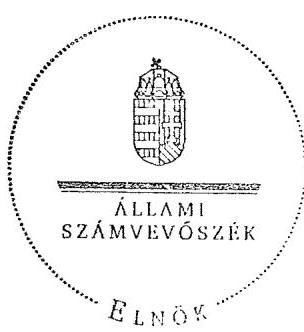

Domokos László

---

.

---

Szolnok Megyei Jogú Város Önkormányzata

1. számú melléklet

Működési és felhalmozási célú hiány az Önkormányzat rendeleteiben

|  |   |   |   |   |   |   |   |
| --- | --- | --- | --- | --- | --- | --- | --- |
|  2029 | 4068 | 2489 | 3780 | 2859 | 4157 | 2883 | 4349  |
|  2861 |  | 1935 |  | 2222 |  | 3291 |   |
|  17871 |  |  |  | 18661 |  | 18697 |   |
|  18693 |  |  |  | 18854 |  | 18697 |   |
|  18854 |  |  |  | 19498 |  | 20523 |   |
|  bevétel | kiadás | bevétel | kiadás | bevétel | kiadás | bevétel | kiadás  |
|  2007. év |  | 2008. év |  | 2009. év |  | 2010. év |   |

☐ működési bevételek és kiadások ☐ felhalmozási bevételek és kiadások ☐ hiány

---

# Az Önkormányzat bevételeinek és kiadásainak, adószágozolgálatának alakulásáról

|   |  |  |  |  | ezer 7.  |
| --- | --- | --- | --- | --- | --- |
|  1. FOLYÓ KÖLTSÉGYETÉS* | 2007. év | 2008. év | 2009. év | 2010. év |   |
|  1.1.1. Saját működési bevételek | 7 910 724 | 8 094 075 | 7 999 884 | 7 198 265 |   |
|  1.1.2. Költségvetési támogatás | 7 910 311 | 8 285 423 | 7 871 373 | 7 095 499 |   |
|  1.1.3. Anagoktól bevételek | 5 370 307 | 1 865 095 | 2 094 324 | 2 386 898 |   |
|  1.1.4. Allamhirtartóson belőlő/ő kapott támogatások | 507 474 | 526 372 | 1 939 910 | 1 586 435 |   |
|  1.1.5. Főviói és külföldről kapott bevételek | 248 | 438 | 810 | 0 |   |
|  1.1.6. Allamhirtartóson kiválódó kapott bevételek | 49 995 | 54 370 | 90 939 | 136 459 |   |
|  1.1.7. Fölső évi pénzmozdvány átvétel | 286 358 | 338 804 | 520 679 | 622 106 |   |
|  1.1. Folyó bevételek +1.1.1.+1.1.2.+1.1.3.+1.1.4.+1.1.5.+1.1.6.+1.1.7. | 19 141 585 | 19 574 691 | 19 577 131 | 19 536 702 |   |
|  1.2.1. Néhódési kiadások kompetícélének nélkül | 16 249 641 | 16 418 125 | 16 419 780 | 16 618 214 |   |
|  1.2.2. Allamhirtartóson belőlő/ő között pénzcsökcsök | 151 489 | 209 213 | 229 211 | 500 132 |   |
|  1.2.2.1. vállalkozásaknál | 520 722 | 235 792 | 1 937 392 | 1 018 300 |   |
|  1.2.2.2. El/unk, illetve külföldre | 0 | 0 | 0 | 0 |   |
|  1.2.2.3. magáncsomfizéknél | 598 834 | 691 804 | 907 943 | 1 363 101 |   |
|  1.2.2.4. mogyadó szervezetének | 265 806 | 799 323 | 269 108 | 267 253 |   |
|  1.2.3. Tizenokirkiadások (+1.2.3.1+1.2.3.2+1.2.3.3+1.2.3.4) | 1 712 343 | 1 825 018 | 2 194 444 | 2 748 730 |   |
|  1.2.4. Komatikutások | 269 471 | 598 667 | 552 495 | 259 563 |   |
|  1.2.5. Fölső évi pénzmozdvány átadás | 266 812 | 348 864 | 520 679 | 833 138 |   |
|  1.2. Folyó kiadások + 1.2.1.+1.2.2.+1.2.3.+1.2.4.+1.2.5. | 18 699 968 | 19 909 623 | 20 916 909 | 20 960 086 |   |
|  1.3. Folyó költségvetés egyenlege MÜKÖDÉSI JÖVEDELÉM (1.1. - 1.2.) | 441 619 | -385 932 | -439 778 | -1 433 384 |   |
|  2. FELHALMOZÁM KÖLTSÉGYETÉS** |  |  |  |  |   |
|  2.1.1. Saját többszerűek | 223 183 | 245 675 | 108 362 | 232 421 |   |
|  2.1.2. Allamhirtartóson belőlő/ő kapott támogatások | 1 833 694 | 748 253 | 761 703 | 1 808 939 |   |
|  2.1.3. Főviói és külföldről kapott támogatások | 6 164 | 0 | 50 | 0 |   |
|  2.1.4. Allamhirtartóson kiválódó kapott támogatások | 227 603 | 214 485 | 221 813 | 417 138 |   |
|  2.1. Felhalmozás bevételek (+2.1.1.+2.1.2+2.1.3+2.1.4.) | 1 589 696 | 1 208 491 | 1 192 310 | 2 450 473 |   |
|  2.2.1. Saját bevételei/ő kiadás állíval | 1 877 158 | 1 203 307 | 1 520 784 | 2 626 859 |   |
|  2.2.2. Saját külső/ő kiadás átlévél | 2 323 607 | 1 219 643 | 1 363 658 | 1 102 081 |   |
|  2.2.3. Allamhirtartóson belőlő/ő között pénzcsökcsök | 113 | 4 267 | 129 719 | 25 148 |   |
|  2.2.4. Főviói és külföldnek adott pénzcsökcsök | 0 | 0 | 0 | 0 |   |
|  2.2.5. Allamhirtartóson kiválót adott pénzcsökcsök | 659 642 | 864 550 | 484 393 | 154 370 |   |
|  2.2.6. Bafektetési célú részesedések vásárítása | 635 | 20 000 | 105 | 200 |   |
|  2.3. Felhalmozás kiadások (+2.2.1.+2.2.2.+2.2.3.+2.2.4.+2.2.5.+2.2.6.) | 4 008 651 | 3 311 667 | 3 706 656 | 2 908 858 |   |
|  2.3. Felhalmozás költségvetés egyenlege (2.1. - 2.2.) | -2 470 955 | -2 103 176 | -2 514 446 | -1 450 301 |   |
|  3. Finanszírozási műveletek nélküli (GFS) pozíció(1.3.+2.3.) | -1 029 330 | -1 499 108 | -2 954 324 | -2 083 769 |   |
|  4. Finanszírozási műveletek |  |  |  |  |   |
|  4.1. Hủzékévérel | 294 747 | 369 448 | 1 291 373 | 740 628 |   |
|  4.2. Hủzékvétesítés | 344 181 | 384 306 | 360 723 | 297 322 |   |
|  4.3. Forgatói és hőzékvétési célú értékpapírok kibocsátása | 8 164 750 | 1 750 001 | 0 | 0 |   |
|  4.4. Forgatói és hőzékvétési célú értékpapírok bevéltása | 0 | 0 | 59 257 | 114 127 |   |
|  4.5. Forgatói és hőzékvétési célú értékpapírok értékesítése | 7 250 | 891 088 | 3 892 372 | 330 237 |   |
|  4.6. Forgatói és hőzékvétési célú értékpapírok vásárítása | 1 913 907 | 0 | 0 | 0 |   |
|  4.7. Egyéb finanszírozási bevételek (függő, átfialó, kiegészítői) | -11 670 | 23 077 | -6 170 | -566 209 |   |
|  4.8. Egyéb finanszírozási kiadások (függő, átfialó, kiegészítői) | -33 964 | 153 151 | -806 382 | -158 934 |   |
|  4.9. Finanszírozási műveletek egyenlege (4.1. - 4.2.+4.3.-4.4+4.5.-4.6.+4.7.-4.8.) | 3 323 645 | 3 236 163 | 4 231 264 | 291 217 |   |
|  5. Tárgyévi pénzügyi pozíció válassás (1.3.+ 2.3.+4.9.) | 1 292 709 | -152 545 | 1 276 980 | -2 592 552 |   |
|  6. Nettó működési jövedelem «működési jövedelem (1.3.) - tüketérlesztés (4.2+4.4) | 97 438 | -770 233 | -889 758 | -1 844 831 |   |
|  7. TÁJÉKÖZTATÓ ADATOK |  |  |  |  |   |
|  Összes kötelezettség | 14 583 586 | 17 769 121 | 19 155 477 | 22 604 795 |   |
|  ebből rövid hijárunk | 1 776 972 | 3 094 793 | 4 591 407 | 2 955 624 |   |
|  Összes szállító kötelezettség | 724 743 | 691 485 | 996 848 | 1 468 996 |   |
|  ebből hijárt (tamiót-ánelső) | 21 758 | 23 205 | 259 774 | 2 259 |   |
|  Pénz és időszáza( kötelezettség tudóssági) | 12 741 187 | 16 124 046 | 17 223 618 | 20 181 893 |   |
|  ebből rövid hijárunk | 1 016 343 | 1 451 247 | 2 660 882 | 2 533 309 |   |
|  PPP nevelőben állomóny jövedelekhez (tamióitványló) | 0 | 0 | 0 | 0 |   |
|  ebből hijárt szolgáltatási díj miatti kötelezettség | 0 | 0 | 0 | 0 |   |
|  Feltvívatartásfelé majd átfogva állomóny a (tamióitványló) | 1 292 709 | 1 695 105 | 1 608 305 | 2 453 150 |   |
|  Likvidítést majd átfogva állomónya (tamióitványló) | 0 | 0 | 0 | 0 |   |
|  Önokülnélítést majd átfogva állomónya (tamióitványló) | 0 | 0 | 63 000 | 0 |   |
|  Resezség és garanciévállalások (tamióitványló) | 1 436 258 | 1 188 670 | 1 863 475 | 920 682 |   |
|  Jegemű kórizaig/működési adózó kötelezettségek (tamióitványló) | 0 | 0 | 0 | 57 600 |   |
|  Finanszírozásba bevondott szakkórik | 6 939 702 | 5 724 251 | 5 537 046 | 645 778 |   |
|  Ezetes hőzékvétesítés (tamióitványló) | 4 055 | 2 651 | 2 324 | 1 519 |   |
|  Hozzát hijárunk hordószék (tamióitványló) | 0 | 0 | 0 | 0 |   |
|  Érülipapírok és vágó állomóny | 1 913 907 | 3 885 019 | 394 011 | 0 |   |
|  Pénzcsökcsök (tátgai pénzcsökcsök nélküli) és vágó állomóny | 2 021 746 | 1 868 892 | 2 248 811 | 645 259 |   |

- Nevételekhez nem záró, a kiadásakhoz nem jelszék meg az amennyi, a vagyoni helyeset az egyezség befolyásolja.

* Nevételekhez vagyon megőrzésse és felvételse kiadálható önmínek.

---

Szénok kiegyei Jogú Város Önkormányzata

Az Önkormányzat 2007-2010. években megvalósított, 2010. december 31-ig befejezett fejlesztései forrásösszeleteléről

|  |   |   |   |   |   |   |   |   |   |   |   |   |   |   |   |   |   |   |   |   |   |   |   |   |   |   |   |   |   |   |   |   |   |   |   |   |   |   |   |   |   |   |   |   |   |   |   |   |   |   |   |   |   |   |   |   |   |   |   |   |   |   |   |   |   |   |   |   |   |   |   |   |   |   |   |   |   |   |   |   |   |   |   |   |   |   |   |   |   |   |   |   |   |   |   |   |   |   |   |   |   |   |   |   |   |   |   |   |   |   |   |   |  

---

Színhok Megyei Jogú Város Önkormányzata

Az Önkormányzat 2010. december 31-én folyamatban lévő fejlesztési feladataihoz kapcsolódó kötelezettségeinek összegzéséről (A 2010. december 31-ig teljesített pénzügyi adatok alakulásáról)

|  |   |   |   |   |   |   |   |   |   |   |   |   |   |   |   |   |   |   |   |   |   |   |   |   |   |   |   |   |   |   |
| --- | --- | --- | --- | --- | --- | --- | --- | --- | --- | --- | --- | --- | --- | --- | --- | --- | --- | --- | --- | --- | --- | --- | --- | --- | --- | --- | --- | --- | --- | --- |
|   |  |  |  |  |  |  |  |  |  |  |  |  |  |  |  |  |  |  |  |  |  |  |  |  |  |  |  |  |  |   |
|   |  |  |  |  |  |  |  |  |  |  |  |  |  |  |  |  |  |  |  |  |  |  |  |  |  |  |  |  |  |   |
|   |  |  |  |  |  |  |  |  |  |  |  |  |  |  |  |  |  |  |  |  |  |  |  |  |  |  |  |  |  |   |
|   |  |  |  |  |  |  |  |  |  |  |  |  |  |  |  |  |  |  |  |  |  |  |  |  |  |  |  |  |  |   |
|   |  |  |  |  |  |  |  |  |  |  |  |  |  |  |  |  |  |  |  |  |  |  |  |  |  |  |  |  |  |   |
|   |  |  |  |  |  |  |  |  |  |  |  |  |  |  |  |  |  |  |  |  |  |  |  |  |  |  |  |  |  |   |
|   |  |  |  |  |  |  |  |  |  |  |  |  |  |  |  |  |  |  |  |  |  |  |  |  |  |  |  |  |  |   |
|   |  |  |  |  |  |  |  |  |  |  |  |  |  |  |  |  |  |  |  |  |  |  |  |  |  |  |  |  |  |   |
|   |  |  |  |  |  |  |  |  |  |  |  |  |  |  |  |  |  |  |  |  |  |  |  |  |  |  |  |  |  |   |
|   |  |  |  |  |  |  |  |  |  |  |  |  |  |  |  |  |  |  |  |  |  |  |  |  |  |  |  |  |  |   |
|   |  |  |  |  |  |  |  |  |  |  |  |  |  |  |  |  |  |  |  |  |  |  |  |  |  |  |  |  |  |   |
|   |  |  |  |  |  |  |  |  |  |  |  |  |  |  |  |  |  |  |  |  |  |  |  |  |  |  |  |  |  |   |
|   |  |  |  |  |  |  |  |  |  |  |  |  |  |  |  |  |  |  |  |  |  |  |  |  |  |  |  |  |  |   |
|   |  |  |  |  |  |  |  |  |  |  |  |  |  |  |  |  |  |  |  |  |  |  |  |  |  |  |  |  |  |   |
|   |  |  |  |  |  |  |  |  |  |  |  |  |  |  |  |  |  |  |  |  |  |  |  |  |  |  |  |  |  |   |
|   |  |  |  |  |  |  |  |  |  |  |  |  |  |  |  |  |  |  |  |  |  |  |  |  |  |  |  |  |  |   |
|   |  |  |  |  |  |  |  |  |  |  |  |  |  |  |  |  |  |  |  |  |  |  |  |  |  |  |  |  |  |   |
|   |  |  |  |  |  |  |  |  |  |  |  |  |  |  |  |  |  |  |  |  |  |  |  |  |  |  |  |  |  |   |
|   |  |  |  |  |  |  |  |  |  |  |  |  |  |  |  |  |  |  |  |  |  |  |  |  |  |  |  |  |  |   |
|   |  |  |  |  |  |  |  |  |  |  |  |  |  |  |  |  |  |  |  |  |  |  |  |  |  |  |  |  |  |   |
|   |  |  |  |  |  |  |  |  |  |  |  |  |  |  |  |  |  |  |  |  |  |  |  |  |  |  |  |  |  |   |
|   |  |  |  |  |  |  |  |  |  |  |  |  |  |  |  |  |  |  |  |  |  |  |  |  |  |  |  |  |  |   |
|   |  |  |  |  |  |  |  |  |  |  |  |  |  |  |  |  |  |  |  |  |  |  |  |  |  |  |  |  |  |   |
|   |  |  |  |  |  |  |  |  |  |  |  |  |  |  |  |  |  |  |  |  |  |  |  |  |  |  |  |  |  |   |
|   |  |  |  |  |  |  |  |  |  |  |  |  |  |  |  |  |  |  |  |  |  |  |  |  |  |  |  |  |  |   |
|   |  |  |  |  |  |  |  |  |  |  |  |  |  |  |  |  |  |  |  |  |  |  |  |  |  |  |  |  |  |   |
|   |  |  |  |  |  |  |  |  |  |  |  |  |  |  |  |  |  |  |  |  |  |  |  |  |  |  |  |  |  |   |
|   |  |  |  |  |  |  |  |  |  |  |  |  |  |  |  |  |  |  |  |  |  |  |  |  |  |  |  |  |  |   |
|   |  |  |  |  |  |  |  |  |  |  |  |  |  |  |  |  |  |  |  |  |  |  |  |  |  |  |  |  |  |   |
|   |  |  |  |  |  |  |  |  |  |  |  |  |  |  |  |  |  |  |  |  |  |  |  |  |  |  |  |  |  |   |
|   |  |  |  |  |  |  |  |  |  |  |  |  |  |  |  |  |  |  |  |  |  |  |  |  |  |  |  |  |  |   |
|   |

---

Székeli Mégrel Jogi Város Önkormányzata

Az Önkormányzat 2010. december 31-én folyamatos lévő fejlesztési feladatlathoz kapcsolódó 2010. évet követő kötelezettség-vállalásainak összegzéséről (a folyamatban lévő fejlesztések 2010. utáni kötelezettségvállalásairól)

|   |  |  |  |  |  |  |  |  |  |  |  |  |  |  |  |  |  |  |  |  |  |  |  |  |  |  |  |  |  |  |  |  |  |  |  |  |  |  |  |  |  |  |  |  |  |  |  |  |  |  |  |  |  |  |  |  |  |  |  |  |  |  |  |  |  |  |  |  |  |  |  |  |  |  |  |  |  |  |  |  |  |  |  |  |  |  |  |  |  |  |  |  |  |  |  |  |  |  |  | 

---

Szolnok Megyei Jogú Város Önkormányzata

Az Önkormányzat beadott, elbírálás alatti pályázati forrásból megvalósuló fejlesztéseihez kapcsolódó kötelezettség-vállalásainak összegzéséről

szor Ft.hun

|  |   |   |   |   |   |   |   |   |   |   |   |   |   |   |   |   |   |   |   |   |   |   |   |   |   |   |   |
| --- | --- | --- | --- | --- | --- | --- | --- | --- | --- | --- | --- | --- | --- | --- | --- | --- | --- | --- | --- | --- | --- | --- | --- | --- | --- | --- | --- |
|   | Fejlesztési feladat (beruházás, felújítás) |  |  |  |  |  |  |  |  |  |  |  |  |  |  |  |  |  |  |  |  |  |  |  |  |  |   |
|  Sorszám | Megnevezése | Kész/öter
halászok
száma | bezdete |  |  |  |  |  |  |  |  |  |  |  |  |  |  |  |  |  |  |  |  |  |  |  |   |
|  1 | 2 | 3 | 4 | 5 | 6 | 7 | 8 | 9 | 10 | 11 | 12 | 13 | 14 | 15 | 16 | 17 | 18 | 19 | 20 |  |  |  |  |  |  |  |   |
|  1. | Felújítások |  |  |  |  |  |  |  |  |  |  |  |  |  |  |  |  |  |  |  |  |  |  |  |  |  |   |
|   | Utánpótlás-nevelésre, edzőtáborozásra, nyári sporttáborozásra, használó
épület felújítása 43391 |  |  |  |  |  |  |  |  |  |  |  |  |  |  |  |  |  |  |  |  |  |  |  |  |  |   |
|  2 |  |  |  |  |  |  |  |  |  |  |  |  |  |  |  |  |  |  |  |  |  |  |  |  |  |  |   |
|  3 | 10 mW0 Ft alatti felújítások |  |  |  |  |  |  |  |  |  |  |  |  |  |  |  |  |  |  |  |  |  |  |  |  |  |   |
|  4. | Felújítások összesen |  |  |  |  |  |  |  |  |  |  |  |  |  |  |  |  |  |  |  |  |  |  |  |  |  |   |
|  5. | Fejlesztések |  |  |  |  |  |  |  |  |  |  |  |  |  |  |  |  |  |  |  |  |  |  |  |  |  |   |
|   | ÉAOP-3.1.4/A-09-2010-0004 Decentrum építése, buszitbőik és
szalmúhelyek felújítása, utas-rájékoztató létidé beszerzése Szolnokon |  |  |  |  |  |  |  |  |  |  |  |  |  |  |  |  |  |  |  |  |  |  |  |  |  |  |   |
|  6 |  |  |  |  |  |  |  |  |  |  |  |  |  |  |  |  |  |  |  |  |  |  |  |  |  |  |  |   |
|  7 | ÉAOP-5.1.3-10-0036 "Gecslési tólév - nonsz"ő életetőben létesítése
Szolnokon Megjegyzés: Rpályázó a Szolnok Állatotthon Alaptivány,
SZMJV Önkormányzata konstoriáum zseiner |  |  |  |  |  |  |  |  |  |  |  |  |  |  |  |  |  |  |  |  |  |  |  |  |  |  |  |   |
|  8 |  |  |  |  |  |  |  |  |  |  |  |  |  |  |  |  |  |  |  |  |  |  |  |  |  |  |  |   |
|  9 | KEOP-1.2.0/B/10-2010-0042 Tiszaipúspóni-Szajol-Szolnok
szemnyirzsmezelése és szemnyirzészítása Rpályázó: Tiszaipúspóni-
SZajol-Szolnok Vízletemű Beruházási Társulás |  |  |  |  |  |  |  |  |  |  |  |  |  |  |  |  |  |  |  |  |  |  |  |  |  |  |  |   |
|  10 | 10 mW0 Ft alatti fejlesztések |  |  |  |  |  |  |  |  |  |  |  |  |  |  |  |  |  |  |  |  |  |  |  |  |  |  |   |
|  11. | Fejlesztések összesen: |  |  |  |  |  |  |  |  |  |  |  |  |  |  |  |  |  |  |  |  |  |  |  |  |  |  |   |
|  12. | Mindösszesen: |  |  |  |  |  |  |  |  |  |  |  |  |  |  |  |  |  |  |  |  |  |  |  |  |  |  |   |
|   |  |  |  |  |  |  |  |  |  |  |  |  |  |  |  |  |  |  |  |  |  |  |  |  |  |  |  |   |
|   |  |  |  |  |  |  |  |  |  |  |  |  |  |  |  |  |  |  |  |  |  |  |  |  |  |  |  |   |
|   |  |  |  |  |  |  |  |  |  |  |  |  |  |  |  |  |  |  |  |  |  |  |  |  |  |  |  |   |
|   |  |  |  |  |  |  |  |  |  |  |  |  |  |  |  |  |  |  |  |  |  |  |  |  |  |  |  |   |
|   |  |  |  |  |  |  |  |  |  |  |  |  |  |  |  |  |  |  |  |  |  |  |  |  |  |  |  |   |
|   |  |  |  |  |  |  |  |  |  |  |  |  |  |  |  |  |  |  |  |  |  |  |  |  |  |  |  |   |
|   |  |  |  |  |  |  |  |  |  |  |  |  |  |  |  |  |  |  |  |  |  |  |  |  |  |  |  |   |
|   |  |  |  |  |  |  |  |  |  |  |  |  |  |  |  |  |  |  |  |  |  |  |  |  |  |  |  |   |
|   |  |  |  |  |  |  |  |  |  |  |  |  |  |  |  |  |  |  |  |  |  |  |  |  |  |  |  |   |
|   |  |  |  |  |  |  |  |  |  |  |  |  |  |  |  |  |  |  |  |  |  |  |  |  |  |  |  |   |
|   |  |  |  |  |  |  |  |  |  |  |  |  |  |  |  |  |  |  |  |  |  |  |  |  |  |  |  |   |
|   |  |  |  |  |  |  |  |  |  |  |  |  |  |  |  |  |  |  |  |  |  |  |  |  |  |  |  |   |
|   |  |  |  |  |  |  |  |  |  |  |  |  |  |  |  |  |  |  |  |  |  |  |  |  |  |  |  |   |
|   |  |  |  |  |  |  |  |  |  |  |  |  |  |  |  |  |  |  |  |  |  |  |  |  |  |  |  |   |
|   |  |  |  |  |  |  |  |  |  |  |  |  |  |  |  |  |  |  |  |  |  |  |  |  |  |  |  |   |
|   |  |  |  |  |  |  |  |  |  |  |  |  |  |  |  |  |  |  |  |  |  |  |  |  |  |  |  |   |
|   |  |  |  |  |  |  |  |  |  |  |  |  |  |  |  |  |  |  |  |  |  |  |  |  |  |  |  |   |
|   |  |  |  |  |  |  |  |  |  |  |  |  |  |  |  |  |  |  |  |  |  |  |  |  |  |  |  |   |
|   |  |  |  |  |  |  |  |  |  |  |  |  |  |  |  |  |  |  |  |  |  |  |  |  |  |  |  |   |
|   |  |  |  |  |  |  |  |  |  |  |  |  |  |  |  |  |  |  |  |  |  |  |  |  |  |  |  |   |
|   |  |  |  |  |  |  |  |  |  |  |  |  |  |  |  |  |  |  |  |  |  |  |  |  |  |  |  |   |
|   |  |  |  |  |  |  |  |  |  |  |  |  |  |  |  |  |  |  |  |  |  |  |  |  |  |  |  |   |
|   |  |  |  |  |  |  |  |  |  |  |  |  |  |  |  |  |  |  |  |  |  |  |  |  |  |  |  |   |
|   |  |  |  |  |  |  |  |  |  |  |  |  |  |  |  |  |  |  |  |  |  |  |  |  |  |  |  |   |
|   |  |  |  |  |  |  |  |  |  |  |  |  |  |  |  |  |  |  |  |  |  |  |  |  |  |  |  |   |
|   |  |  |  |  |  |  |  |  |  |  |  |  |  |  |  |  |  |  |  |  |  |  |  |  |  |  |  |   |
|   |  |  |  |  |  |  |  |  |  |  |  |  |  |  |  |  |  |  |  |  |  |  |  |  |  |  |  |   |
|   |  |  |  |  |  |  |  |  |  |  |  |  |  |  |  |  |  |  |  |  |  |  |  |  |  |  |  |   |
|   |  |  |  |  |  |  |  |  |  |  |  |  |  |  |  |  |  |  |  |  |  |  |  |  |  |  |  |   |
|   |  |  |  |  |  |  |  |  |  |  |  |  |  |  |  |  |  |  |  |  |  |  |  |  |  |  |  |   |
|   |  |  |  |  |  |  |  |  |  |  |  |  |  |  |  |  |  |  |  |  |  |  |  |  |  |  |  |   |
|   |

---

Szolnok Megyei Jogú Város Önkormányzata 4. számú melléklet

Az önkormányzati feladatok ellátásában résztvevő gazdasági társaságokról

milliá Ft-ban!

|  Gazdasági társaság megnevezése | önkormányzat | önkormányzat gazdasági társaságának | saját tőke, jegyező tőke aránya | kötelező feladathoz | önként vállalt feladathoz | hosszú lejártól, hitelből, kölvényből | Szingből | lejárt szálítól állományból | működési támogatás | feladatvállalá támogatás  |
| --- | --- | --- | --- | --- | --- | --- | --- | --- | --- | --- |
|   |  |  |  |  |  |  |  |  | műköéni támogatás |   |
|   |  |  |  |  |  |  |  |  |  | 2007.  |
|  1. 100%-os tulajdoni hányadó gazdasági társaságok: |  |  |  |  |  |  |  |  |  |   |
|  Szolnok Ipani Park Kft. | 100% | 0% | 0,97 | 0 | 1055 | 0 | 1185 | 32 | 0 | 0  |
|  Szolnok TV Zrt. | 100% | 0% | 1,46 | 0 | 0 | 0 | 1,3 | 4 | 98 | 111  |
|  Munkalahetőség a Jövőért Nonprofit Kft. | 100% | 0% | 19,60 | 3 479 | 0 | 0 | 0,1 | 0 | 20 | 72  |
|  Aba-Norák Nonprofit Kft. | 100% | 0% | 11,47 | 1 163 | 0 | 0 | 0 | 2 | 178 | 232  |
|  Szolnoki Sportcentrum Nonprofit Kft. | 100% | 0% | 2,90 | 2 116 | 0 | 0 | 11 | 25 | 162 | 205  |
|  Szollak Kft. | 100% | 0% | 5,90 | 3 101 | 0 | 0 | 0 | 1 | 0 | 0  |
|  Szolnoki Városfejezztő Zrt. | 100% | 0% | 0,99 | 0 | 0 | 0 | 12 | 15 | 0 | 0  |
|  100%-os tulajdoni hányadó gazdasági társaságok összesen |  |  |  | 9 879 | 1 055 | 0 | 1 209 | 78 | 458 | 620  |
|  II. 75-99%-os tulajdoni hányadó gazdasági társaságok: |  |  |  |  |  |  |  |  |  |   |
|  75-99%-os tulajdoni hányadó gazdasági társaságok összesen | 0% | 0% | 0,00 | 0 | 0 | 0 | 0 | 0 | 0 | 0  |
|  75% felelő tulajdoni hányadó gazdasági társaságok összesen | 0% | 0% | 0,00 | 9 879 | 1 055 | 0 | 1 209 | 78 | 458 | 620  |
|  III. 51-74%-os tulajdoni hányadó gazdasági társaságok: |  |  |  |  |  |  |  |  |  |   |
|  51-74%-os tulajdoni hányadó gazdasági társaságok összesen | 0% | 0% | 0,00 | 0 | 0 | 0 | 0 | 0 | 0 | 0  |
|  IV. 25-50%-os tulajdoni hányadó gazdasági társaságok: |  |  |  |  |  |  |  |  |  |   |
|  Remondis Szolnok Zrt. | 45% | - | 4,09 | 0 | 477 | 0 | 0 | 43 | 0 | 0  |
|  25-50%-os tulajdoni hányadó gazdasági társaságok összesen | 45% | 0% | 4,09 | 0 | 477 | 0 | 0 | 43 | 0 | 0  |
|  V. egyéb, közfeladatot ellátó gazdasági társaságok: |  |  |  |  |  |  |  |  |  |   |
|  Remondis Képö Kft. | 21% | 45% | 4,27 | 912 | 0 | 284 | 0 | 0 | 0 | 0  |
|  Víz-és Csatornannivel Konceszólis Zrt. Szolnok | 0% |  |  | 8 082 | 0 | 0 | 0 | 1 | 0 | 0  |
|  Alfa-Nova Kft. Hilanargia | 0% |  |  | 428 |  | 0 | 0 | 864 |  |   |
|  Jászlun Vrtán Zrt. | 0% |  |  | 0 |  | 0 | 0 | 0 |  |   |
|  egyéb, közfeladatot ellátó gazdasági társaságok összesen |  |  |  | 9 422 | 0 | 284 | 0 | 885 | 0 | 0  |
|  Összesen | 45% | 0% | 4,09 | 18 201 | 1 532 | 284 | 1 209 | 1 507 | 458 | 620  |

---

.

---

# 5701 SITE MEGYEI JOGÚ VÁROS POLGÁRMESTERE 

## Állami Számvevőszék

3. Önkormányzati és Területi Ellenőrzési Igazgatóság
1052, Budapest Apáczai Csere János út 10.

## Renkó Zsuzsanna

Vizsgálatvezető részére

Tisztelt Vizsgálatvezető Asszony!
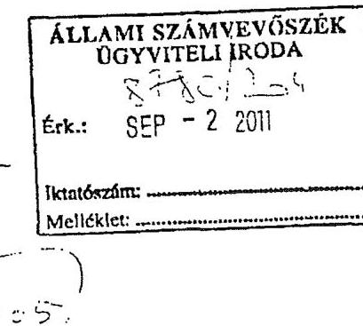

Az Állami Számvevőszék V-23050-005/2011. iktatószámú 1015. témaszámú ellenőrzési programjában lefolytatott vizsgálatáról - Szolnok Megyei Jogú Város Önkormányzata pénzügyi helyzetének ellenőrzéséről- készített számvevői jelentés 24. oldalán található javaslatokhoz az alábbi észrevételt kívánóm tenni.

## A Közgyülésnek címzett javaslatokhoz :

A kialakult gyakorlatunknak megfelelően gondoskodni fogunk a jelentés közgyűlési megtárgyalásáról.
A javaslatnak megfelelően az előterjesztett intézkedési tervet a Közgyűlés megtárgyalja és a megállapítások hasznosítása érdekében jóváhagyja.

## A polgármesternek címzett javaslatokhoz:

Már a jelentést megelőzően, 2011. július 6-án jegyzői intézkedés történt, melyben az ágazatoktól javaslatok bekérésére került sor az előirányzatok módosításának lehetőségeire.
A jegyzői intézkedés kiterjedt mind a müködési, mind a fejlesztési kiadásokra. Egyaránt foglalkozik a bevételi lehetőségek emelésével, valamint a kiadási oldal szűkítésével.
A feladat elvégzésére megjelölt felelősök a kötelezettség vállalásra jogosultak, előzetes határidőként augusztus 25. került kitüzésre.
További feladatként jelöltük meg a meglévő szerződéseink felülvizsgálatát, melyet szeptember 20-ig kell az érintetteknek áttekinteni.

A Közgyülés elé terjesztendő feladatokat úgy tervezzük összeállítani, hogy azzal a költségvetési koncepció főbb irányai már kijelölésre kerüljenek.

---

A beruházások forrásainak megjelölési kötelezettsége már most is szerepel a költségvetési rendeletünkben, azzal a kitétellel, hogy a pályázat benyújtása előtt az üzemeltető köteles nyilatkozni a fenntartási költségek biztosíthatóságáról.

Az önkormányzati feladatellátás eszközállományának elszámolt értékcsökkenésére vonatkozóan a 249/2000.( XII.24. ) Korm. rendelet nem tartalmaz bemutatási kötelezettséget. Az értékcsökkenés az elszámolás jelenlegi rendszerében nem jelenik meg visszapótlandó költségként. Ugyanakkor a vagyonkimutatás része a mindenkori zárszámadási rendeletnek, amelyben az eszközállomány nettó értéke eszközcsoportonként kimutatásra kerül. Az eszközök pótlásának forrása megegyezik a fejlesztési kiadások forrásával : vagy állami támogatás, vagy saját bevétel.

# A jegyzőnek címzett javaslatokhoz: 

A mérlegen kívüli kötelezettségek kimutatása az analitikában folyamatos, nagyságrendje csökkenő.

Az adósságot keletkeztető kötelezettség vállalások minden költségvetési rendeletben tételesen megjelölésre kerültek. A kamat- és árfolyamkockázat bemutatása a tervezés során alkalmazott árfolyamokon keresztül volt lehetséges.

Szolnok, 2011. augusztus 24.
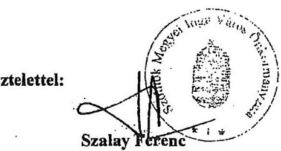

---

# Szalay Ferenc úr   polgármester 

Szolnok Megyei Jogú Város Önkormányzata

## Szolnok

## Tisztelt Polgármester Úr!

Köszönettel vettem a Szolnok Megyei Jogú Város Önkormányzata pénzügyi helyzetének ellenőrzéséről készített jelentés-tervezethez küldött észrevételét és a pénzügyi egyensúly helyreállítása érdekében tett intézkedésekről küldött tájékoztatást. Az értékelésük megtörtént, azokat elfogadtuk és beépítettük a jelentés-tervezetbe.

Az észrevételben és a tájékoztatásban foglaltakat - amely szerint már a jelentést megelőzően, 2011. július 6-án jegyzői intézkedés történt a kiadások csökkentésére, illetve a bevételek növelésére irányuló lehetőségek számbavételére - és a meghozott kiadáscsökkentő és bevételnövelő konkrét intézkedéseket elfogadtuk.

A befejezett beruházásokkal létrehozott létesítmények müködtetéséhez és jövőbeni fenntarthatóságát biztosító források költségvetési rendeletben való feltüntetésre vonatkozó javaslatunkra tett észrevételét elfogadtuk, és a javaslatot töröltük a jelentés-tervezetből.

Polgármester úrnak címzett értékcsökkenéssel kapcsolatos javaslatunkat az észrevétel alapján töröltük.

Köszönöm Polgármester úr és munkatársainak az ellenőrzés során tanúsított hozzáállását, amellyel az önkormányzatról készített pénzügyi helyzetelemzés elkészítését segítették.

Budapest, 2011. december "JZ ".
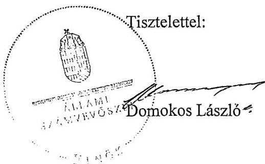

---

.