ÁLLAMI
SZÁMVEVŐSZÉK

# JELENTÉS 

Szombathely Megyei Jogú Város Önkormányzata pénzügyi helyzetének ellenőrzéséről (43/3)

---

# Számvevői Iroda 

Iktatószám: V-3051-09/2011.
Témaszám: 1015
Vizsgálat-azonosító szám: V056050

## Az ellenőrzést felügyelte:

Dr. Varga Sándor
számvevő igazgató-helyettes

## Az ellenőrzést vezette:

## Renkó Zsuzsanna

számvevő tanácsos

## Az ellenőrzést végezték:

| Kántor Ilona | Buús Zoltánné Hütter | Kámán Edina |
| :-- | :-- | :-- |
| számvevő tanácsos | Erzsébet | számvevő |
|  | számvevő tanácsos |  |

A témához kapcsolódó eddig készített számvevőszéki jelentés:
címe
sorszáma
Jelentés a Szombathely Megyei Jogú Város Önkormányzata gazdálkodási rendszerének 2007. évi átfogó ellenőrzéséről

---

# TARTALOMJEGYZÉK 

BEVEZETÉS ..... 5
I. ÖSSZEGZŐ MEGÁLLAPÍTÁSOK, KÖVETKEZTETÉSEK, JAVASLATOK ..... 16
II. RÉSZLETES MEGÁLLAPÍTÁSOK ..... 27

1. Az Önkormányzat kötelező és önként vállalt feladatai ..... 27
2. A pénzügyi egyensúlyi helyzet alakulása ..... 34
2.1. A működési és a felhalmozási egyensúly alakulása ..... 34
2.2. Az Önkormányzat bevételeinek alakulása ..... 41
2.3. Az Önkormányzat kiadásainak alakulása ..... 47
3. Kötelezettségek bemutatása ..... 53
3.1. A pénzintézetek felé fennálló kötelezettségek alakulása ..... 53
3.2. Szállítók felé fennálló kötelezettségek alakulása ..... 58
3.3. Egyéb kötelezettségek alakulása ..... 59
4. A pénzügyi egyensúly megteremtése érdekében hozott intézkedések ..... 63
5. A helyi önkormányzatok gazdálkodási rendszerének 2007. évi ellenőrzése során a pénzügyi egyensúly javítására tett szabályszerűségi és célszerűségi javaslatok hasznosulása ..... 67

---

# MELLÉKLETEK 

1. számú Működési és felhalmozási célú hiány/többlet alakulása
2. számú Kimutatás az Önkormányzat bevételeinek és kiadásainak alakulásáról
3.a. számú Az Önkormányzat 2007-2010 években megvalósított, 2010. december 31-ig befejezett fejlesztéseinek forrásösszetétele
3.b. számú Az Önkormányzat 2010. december 31-én folyamatban lévő fejlesztési feladataihoz kapcsolódó kötelezettségek
3.c. számú Az Önkormányzat 2010. december 31-én folyamatban lévő fejlesztési feladataihoz kapcsolódó 2010. évet követő kötelezettségvállalások
3.d. számú Az Önkormányzat beadott, elbírálás alatti pályázati forrásból megvalósuló fejlesztéseihez kapcsolódó kötelezettségvállalások
3. számú Kimutatás az önkormányzati feladatok ellátásában részt vevő gazdasági társaságokról
4. számú Szombathely Megyei Jogú Város Önkormányzat Polgármesterének észrevétele
5. számú Szombathely Megyei Jogú Város Önkormányzat Polgármesterének észrevételére adott válasz

---

# RÖVIDÍTÉSEK JEGYZÉKE 

## Törvények

Áht.
ÁSZ tv.

Csődtv.
Eü. tv.
Gt.
Gyvtv.
Helyi adó tv.
Htv.

Kbt.
Kmtv.
Ötv.
Szoc. tv.

## Rendeletek

SzMSz

## Szórövidítések

áfa
AGORA
ÁSZ
BM
CHF
EDP hiány/egyenleg
EU
EUR
FALCO KC Kft.
Forrásközpont Kft.
GDP
Haladás Kft.
Házkezelési Kft.
Hulladékgazdálkodási társulás
az államháztartásról szóló 1992. évi XXXVIII. törvény
az Állami Számvevőszékről szóló 1989. évi XXXVIII. törvény (2011. július 1-jétől az Állami Számvevőszékről szóló 2011. LXVI. törvény)
a csődeljárásról és a felszámolási eljárásról szóló 1991. évi XLIX. törvény
az egészségügyről szóló 1997. évi CLIV. törvény
a gazdasági társaságokról szóló 2006. évi IV. törvény
a gyermekek védelméről és a gyámügyi igazgatásról szóló 1997. évi XXXI. törvény
a helyi adókról szóló 1990. évi C. törvény
a helyi önkormányzatok és szerveik, a köztársasági megbízottak, valamint egyes centrális alárendeltségű szervek feladat- és hatásköreiről szóló 1991. évi XX. törvény
a közbeszerzésekről szóló 2003. évi CXXIX. törvény
a Magyar Köztársaság 2010. évi költségvetését megalapozó egyes törvények módosításáról szóló 2009. évi CIX. törvény
a helyi önkormányzatokról szóló 1990. évi LXV. törvény
a szociális igazgatásról és a szociális ellátásokról szóló 1993. évi III. törvény

Szombathely Megyei Jogú Város Közgyűlésének 27/2007. (XI. 29.) számú rendelete az Önkormányzat Szervezeti és Működési Szabályzatáról
általános forgalmi adó
AGORA Szombathelyi Kulturális és Turisztikai Központ
Állami Számvevőszék
Belügyminisztérium
svájci frank
Uniós módszertan szerinti maastrichti kritériumoknak megfelelő számítás szerinti hiány/egyenleg
Európai Unió
euro
FALCO KC Szombathely Kft.
Regionális Szociális Forrásközpont Nonprofit Kft.
bruttó hazai termék
Szombathelyi Haladás Labdarugó és Sportszolgáltató Kft.
Szombathelyi Önkormányzati Házkezelési Kft.
Nyugat-dunántúli Regionális Hulladékgazdálkodási Önkormányzati Társulás

---

ISEUM Tárház
ISPA projekt
jegyző
Kincstár
Közgyűlés
KSH
megyei önkormányzat
Mozi Kft.
MSH Rendezvényház Kht.
NAV
NGM
NYME
Önkormányzat
Önkormányzati hivatal
Parkfenntartási Kft.
polgármester
PPP konstrukció
Prenor Kft.
Savaria Rehab-Team Kft.
Savaria TISZK Kft.
Sportcsarnok
Sportközpont Kft.
szja
Színház Kft.
Szombathelyi Televízió Kft.
SZOVA Zrt.
Távhőszolgáltató Kft.
TEGYESZ
Városfejlesztési Kft.
Városgazdálkodási Kft.
VASIVÍZ Zrt.
Vasi Volán Zrt.

ISEUM SAVARIENSE Régészeti Műhely és Tárház
2003/HU/16/P/PE/021 „Szombathely Megyei Jogú Város Szennyvízelvezetési és tisztítási rendszerének fejlesztése" a kohéziós alap társfinanszírozásával
Szombathely Megyei Jogú Város Önkormányzatának jegyzői feladatokat ellátó aljegyzője
Magyar Államkincstár
Szombathely Megyei Jogú Város Önkormányzat Közgyűlése
Központi Statisztikai Hivatal
Vas Megyei Önkormányzat
Savaria Mozi Kft
Szombathelyi Művelődési és Sportház Rendezvényház Kht.
Nemzeti Adó és Vámhivatal
Nemzetgazdasági Minisztérium
Nyugat-magyarországi Egyetem
Szombathely Megyei Jogú Város Önkormányzata
Szombathely Megyei Jogú Város Önkormányzat Polgármesteri Hivatala
Szombathelyi Parkfenntartási és Temetkezési Kft.
Szombathely Megyei Jogú Város Önkormányzat polgármestere
Public Private Partnership (Partnerségi együttműködés közfeladatok ellátására a magánszektor bevonásával)
Prenor Kertészeti és Parképítő Kft.
Savaria Rehab-Team Szociális Szolgáltató és Foglalkoztatási Kiemelkedően Közhasznú Nonprofit Kft.
Savaria TISZK Szakképzés-szervezési Kiemelkedően Közhasznú Nonprofit Kft.
Aréna Savaria Sportcsarnok
Szombathelyi Sportközpont és Sportiskola Nonprofit Kft.
személyi jövedelemadó
Weöres Sándor Színház Nonprofit Kft.
Szombathelyi Televízió és Rádió Nonprofit Kft.
SZOVA Szombathelyi Vagyonhasznosító és Városgazdálkodási Zrt.
Szombathelyi Távhőszolgáltató Kft.
Vas Megyei Területi Gyermekvédelmi Szolgálat és Gyermekotthon
Savaria Városfejlesztési Kft.
Szombathelyi Városgazdálkodási Kft.
VASIVÍZ Vas megyei Víz- és Csatornamű Zrt.
Vasi Volán Közlekedési Zrt.

---

# JELENTÉS 

## Szombathely Megyei Jogú Város Önkormányzata pénzügyi helyzetének ellenőrzéséről

## BEVEZETÉS

Az Állami Számvevőszék 2011. évtől érvényes stratégiája új irányt szabott a helyi önkormányzatok gazdálkodásának ellenőrzésében is. Az ÁSZ – küldetése és jövőképe szerint – szilárd szakmai alapokra támaszkodva értékteremtő ellenőrzéseivel és helyzetelemzéseivel az államháztartás egészében, így a helyi önkormányzati alrendszerben is elő kívánja segíteni a közpénzek és a közvagyon szabályos, gazdaságos, hatékony és eredményes hasznosítását. Ennek részeként – a 2010. évi államháztartási hiány alakulásának összetevőire is figyelemmel – folyamatban van az önkormányzati alrendszer pénzügyi helyzetelemzése.

Az NGM 2011. áprilisában közzétett adatai szerint ${ }^{1}$ a 2010. évi 1036,2 milliárd Ft összegű 3,8%-os EDP (maastrichti kritériumok szerinti, Túlzott Hiány Eljárás keretében kimutatott) hiánycél nem volt tartható, az önkormányzati alrendszer tervezettet meghaladó hiánya miatt a GDP arányában kifejezett államháztartási hiány 4,2%-ra emelkedett.

Az önkormányzatok 2010. első három negyedévi költségvetési jelentése szerinti pénzforgalmi hiány 97 milliárd Ft-os összege nem indokolta az önkormányzati alrendszer 190 milliárd Ft-ra becsült hiányának 2010. évi végi felülvizsgálatát. A helyi önkormányzatok 2011. januári gyorsjelentése alapján a pénzforgalmi hiány már 247,7 milliárd Ft-ot tett ki. Az alrendszer hiánya így a tervezett 0,7%-kal szemben magasabb, 0,9%-os szinten realizálódott. Az 57,7 milliárd Ft hiánytöbblet alakulásában – a Tájékoztató szerint – az iparűzési adó elmaradása, a gépjárműadó, az illetékek és más bevételek tervezettnél alacsonyabb összegben való teljesülése volt a meghatározó.

Magyarország a Széll Kálmán Terv célkitűzései alapján² aktualizált Konvergencia Programjában a középtávú (2011-2015. évek) költségvetési pálya kijelölése

[^0]
[^0]:    ${ }^{1}$ NGM Tájékoztatás Magyarország Strukturális Reformprogramjának végrehajtásáról (2011. április 1.). A Tájékoztató évente két alkalommal – április és október hónapban – jelenik meg.
    ${ }^{2}$ Az államháztartás 2011. évi egyenlege – a magán nyugdíjpénztárakból az állami nyugdíjpillérbe való visszatérés egyszeri vagyonhatása következtében – 4%-os többletet mutatna. A Széll Kálmán Tervben foglalt egyszeri intézkedések – a MÁV, a BKV adósságrendezése, a PPP projektek kiváltása – összességében a GDP 2%-ával csökkentik a várható többlet mértékét.

---

során 2011-re a kormányzati szektor EDP módszertan szerinti egyenlegét +2%-ban jelölte meg. Az egyenlegcél megfogalmazásakor az önkormányzati alrendszer tervezett hiányát a 2011. évi költségvetésben szereplő 0,3%-kal szemben 0,5%-os arányban határozták meg ${ }^{3}$. A hiánycélok meghatározása jelzi, hogy az önkormányzati alrendszerben 2011-ben fokozott figyelmet kell fordítani a pénzügyi egyensúlyi helyzet alakulására.

Az államháztartás helyi szintjén a 23 megyei jogú városi önkormányzatnak az általuk ellátott közszolgáltatások volumenére való tekintettel kiemelt szerepe van, e települések népessége összességében meghaladja a kétmillió főt ${ }^{4}$. A települések népességét az alábbi diagram szemlélteti:
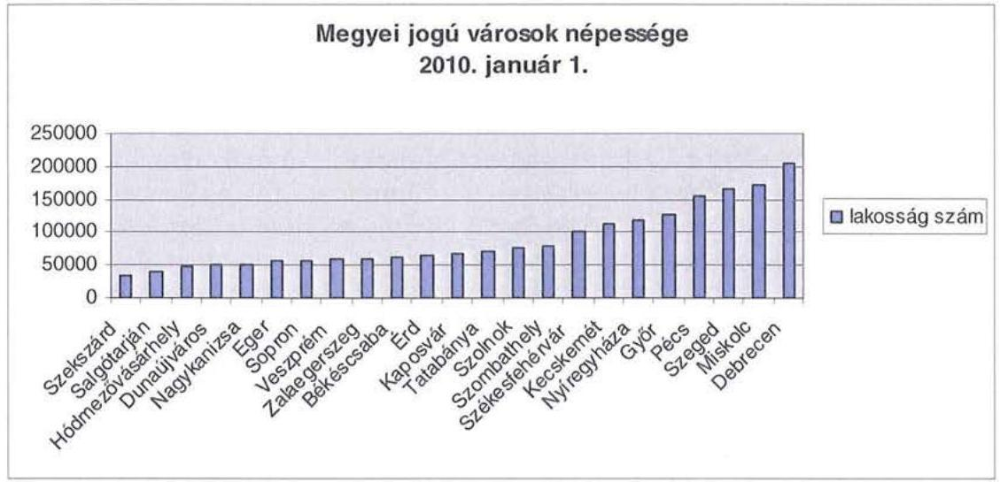

A megyei jogú városi önkormányzatok ${ }^{5}$ kötelező feladatellátását többlépcsős törvényi előírások határozzák meg. A feladatokra vonatkozó szabályozás első szintjét az Ötv. ${ }^{6}$, a második szintet a hatásköri7, a harmadik szintet a további ágazati, szakmai (egyebek mellett az oktatási, egészségügyi, szociális és egyéb ágazati feladatok ellátásának szakmai szabályait rögzítő) törvények adják.

[^0]
[^0]:    ${ }^{3}$ A Magyar Köztársaság 2011. évi költségvetéséről szóló 2010. évi CLXIX. törvény Általános indoklásának III. fejezete, valamint Magyarország Konvergencia Programja 2011-2015. (2011. április) Táblázatok rész, 2. táblázat Államháztartás összefoglaló adatai szerint.
    ${ }^{4}$ A megyei jogú városok népességét a 4/2011. (I. 31.) NGM rendelet 1. sz. mellékletében foglalt 2010. január 1-jei adatok alapján vettük figyelembe.
    ${ }^{5}$ Az Ötv. 61. § (1) bekezdése alapján a megyeszékhely város a törvény erejénél fogva megyei jogú, ugyanakkor az Országgyűlés az ötvenezernél nagyobb népességű városokat a képviselőtestület kérelmére megyei jogú várossá nyilváníthatja. Ez utóbbi körbe 5 város tartozik, közülük 2 (Hódmezővásárhely, Dunaújváros) népessége 2010. január 1-jére már ötvenezer fő alá csökkent.
    ${ }^{6}$ az Ötv. 8. és 61. §-ában foglaltak szerint
    ${ }^{7}$ a Htv.

---

A megyei jogú városi önkormányzatok – az Ötv-ből közvetlenül levezethető települési feladatok mellett – körzeti közszolgáltatásokat is ellátnak. A megyei jogú városi cím elsősorban többlet kötelezettségekkel jár, a megyei jogú városnak önmagának kell gondoskodnia mindazokról a feladatokról, amelyek más települési önkormányzatok esetében a megyei önkormányzat feladatát képezik. Ide sorolható többek közt a középfokú oktatási intézmények fenntartása, a közművelődési, könyvtári és levéltári szolgáltatás, a társadalombiztosítás finanszírozása mellett a kórházi és a rendelőintézeti szakellátás, a szociális és egyes gyermekvédelmi feladatok ellátása. Ezeket a feladatokat (intézményeket) a megyei jogú város – más városoktól eltérően – nem adhatja át a megyei önkormányzatnak, azonban az Ötv. lehetőséget biztosít arra, hogy a megyei önkormányzattal megállapodjék a feladatellátás megosztásában.

Az önkormányzat, így a megyei jogú város is, maga határozza meg, hogy – a lakosság igényei alapján, anyagi lehetőségei függvényében – mely feladatokat, milyen mértékben és módon, mely szervezeti keretek közt lát el. A szervezetalakítás szabadsága a megyei jogú városok esetében azzal járt, hogy mind a kötelező közszolgáltatásoknál (különösen a településüzemeltetés, vagyongazdálkodás), mind pedig az önként vállalt feladataik ellátásában – elsősorban a sport és kulturális szolgáltatások területein – a gazdasági társaságok kiemelt fontosságú szerephez jutottak. Ily módon a gazdálkodás, a pénzügyi helyzet kockázatai közvetlenül kikerültek ugyan az önkormányzati alrendszerből, azonban sérülhet az ellátási felelősség figyelemmel kísérése és érvényesítése, a közpénzek felhasználásának transzparenciája. Mindezek együttvéve – a beszámolók konszolidálásának hiányában – növelik a megyei jogú városok pénzügyi helyzetének megítélésében rejlő kockázatokat.

Az áttekintett időszakban az önkormányzati feladatok ellátásának keretet biztosító forrásszabályozás elvei lényegesen nem változtak.

A megyei jogú városok önkormányzatainak mozgásterét, az önkormányzatok feladatellátásra vonatkozó döntéseit a központi költségvetéstől való függőség mellett jelentősen befolyásolja a helyi adókivetési jog gyakorlása ${ }^{8}$. A helyi adók rendszere a közszolgáltatások finanszírozásához szükséges források megteremtésének, bővítésének eszköze, amely a gazdasági válság, a jogszabályi környezet, az adópolitika változása, az adóhatóságok tevékenysége következtében differenciáltan érinti a települési önkormányzatokat ${ }^{9}$.

A települési önkormányzatok saját folyó bevételeinek keretében elszámolt, különböző jogcímeken kivetett helyi adók – iparűzési adó, építmény és telekadó, idegenforgalmi adó, vállalkozók és magánszemélyek kommunális adója – 2007-2010 között eltérő módon emelkedtek. A helyi adókból származó bevételek realizált összege országos szinten 2007-2009 között folyamatosan, 505,3 milliárd Ft-ról 566,3 milliárd Ft-ra emelkedett, majd a gazdasági válság hatásai következtében 2010-re 542,6 milliárd Ft-ra esett vissza. A helyi adók ré-

[^0]
[^0]:    ${ }^{8}$

 a helyi adókról szóló 1990. évi C. törvény szabályai szerint
    ${ }^{9}$ Az Állami Számvevőszék 2010. decemberében közzétett 1031. számú jelentésében értékelte a helyi adók rendszerében a hatékonyság és az eredményesség érvényesülését.

---

szesedése az önkormányzatok saját folyó bevételein belül 2007-2010 között 2,5 százalékponttal csökkent ${ }^{10}$.

A megyei jogú városok saját folyó bevétele 2007-ben 191,5 milliárd Ft volt, 2008-ban 223,1, 2009-ben 225,4, 2010-ben 223,5 milliárd Ft-ot tett ki. A helyi adóbevételekből való részesedésük 2007-ben 110,5 milliárd Ft (21,9%), 2008-ban 128,3 milliárd Ft (23,2%), 2009-ben 124,4 milliárd Ft (22%), 2010-ben 118,7 milliárd Ft (részaránya a 2007. évivel azonosan 21,9%) volt. E realizált adóbevételek a megyei jogú városok saját folyó bevételeinek 2007-ben 57,7, 2008-ban 57,5, 2009-ben 55,2, 2010-ben 53,1%-át jelentették. A helyi adóbevételek 2007-ről 2010-re kimutatott 4,6 százalékpontos csökkenése annak ellenére következett be, hogy a megyei jogú városok saját folyó bevétele 2010-ben 16,7%-kal haladta meg a 2007. évit.

A helyi adókon belül a települések gazdasági helyzetének egyik fokmérője az elért helyi iparűzési adóbevétel, amely a megyei jogú városok körében erőteljes - a település nagyságrendtől is függő ${ }^{11}$ - különbségeket mutat. A helyi iparűzési adóbevétel és annak egy lakosra vetített összegének 2007. és 2010. évi alakulását az alábbi diagramok szemléltetik:
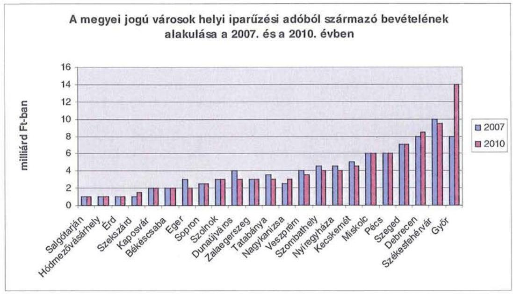

[^0]
[^0]:    ${ }^{10}$ A helyi adó bevételek saját folyó bevételekből való részesedése országosan 2007-ben 55,3%, 2010-ben 52,8% volt.
    ${ }^{11}$ A 100 ezer fő feletti népességű megyei jogú városok csoportjába Debrecen, Miskolc, Szeged, Pécs, Győr, Nyíregyháza, Kecskemét, Székesfehérvár tartozik. Nem megyeszékhely megyei jogú város Érd, Sopron, Nagykanizsa, Dunaújváros, Hódmezővásárhely.

---

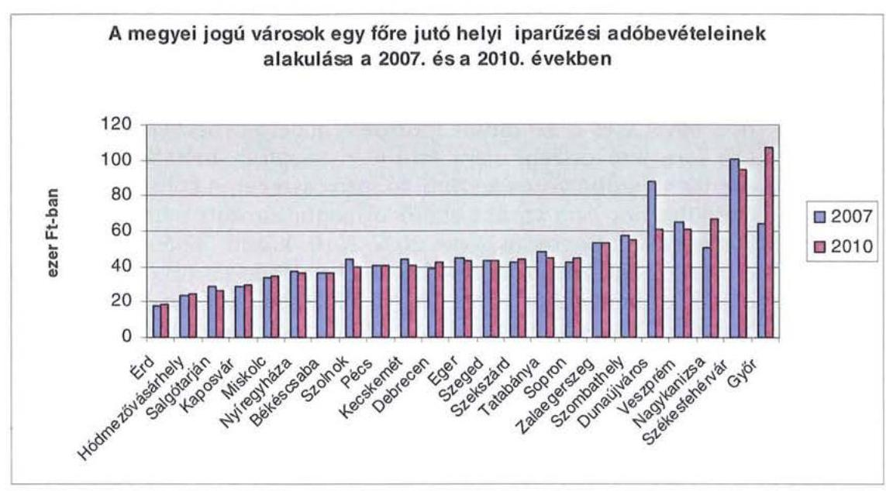

A megyei jogú városi önkormányzatok saját bevételein belül második legjelentősebb elem az illetékbevétel. A 2010. évben befolyt 39,2 milliárd Ft illetékbevétel a 2006. évben realizált 71,1 milliárd Ft illetékbevétel alig több mint 55%-a. A jelentős visszaesést döntően az ingatlanpiac stagnálása, majd visszaesése, illetve egyes illetékkedvezmények bevezetése okozta. A kieső bevételek pótlására az önkormányzati alrendszer szintjén történtek intézkedések, 2010-ben 5 milliárd Ft-ot, 2011-ben 1,2 milliárd Ft-ot ellentételezett a központi költségvetés. A megyei jogú városok önkormányzatai az önkormányzati alrendszer szintjén realizált illetékbevételből 2007-ben 13,6 milliárd Ft-tal (23,3%-kal), 2008-ban 15,3 milliárd Ft-tal (22,7%-kal), 2009-ben 12,6 milliárd Ft-tal (21,5%-kal), 2010-ben 7,9 milliárd Ft-tal (20,2%-kal) részesedtek ${ }^{12}$. Az összes befolyt illetékbevételből a megyei jogú városok részesedése 2009-ről 2010-re mindössze 1,3 százalékponttal csökkent, ugyanakkor a realizált illetékbevétel csökkenése a 37,3%-ot (4,7 milliárd Ft) is elérte.

Az önkormányzati alrendszer átengedett bevételei közül a személyi jövedelemadóból való részesedés makroszintű szabályozása a vizsgált időszakban nem változott. A települési önkormányzatokat a településre kimutatott személyi jövedelemadó 8%-a közvetlenül, míg 32%-a külön szabályozott visszaosztási rendben illeti meg. A visszaosztás a jövedelem differenciálódás mérséklésével párosul, rendje a lakóhelyen maradó személyi jövedelemadóhoz és az iparűzési adó-erőképességhez ${ }^{13}$ igazodik, annak részletszabályait a mindenkori költségvetési törvény 4. számú melléklete határozza meg. A jövedelemdifferenciálódás

[^0]
[^0]:    ${ }^{12}$ Az illetékek kivetésének és beszedésének joga 2006. december 31-ig a megyei önkormányzatok feladata volt, amelyet a 2007. évtől az APEH (2011. január 1-jétől NAV) vett át. Az önkormányzati illetékrészesedési szabályok változatlanok maradtak, azonban az illetékbeszedés költségeit az önkormányzatok illetékbevételeiből átlagos (a megyei jogú városoknál 8,5%-os) kulcsot alkalmazva vonták le.
    ${ }^{13}$ Az iparűzési adóerő-képesség egy potenciális, átlagos erőfeszítés mellett elérhető (a települési önkormányzat iparűzési adóelőlegét meghatározó adóalap 1,4%-ának megfelelő számított) bevétel.

---

szabályai kétirányúak, a kiegészítés és a visszatartás feltételeit egyaránt meghatározták:

- Amennyiben az önkormányzatot közvetlenül megillető személyi jövedelemadó bevétel és a számított iparűzési adóerő-képesség együttesen számított, egy főre jutó összege nem érte el a település méretéhez kapcsolódóan az évenkénti szabályozás szerinti változó összeget, a költségvetés a részesedést település nagyság szerint eltérően meghatározott szintig - kiegészítette ${ }^{14}$. A kiegészítés fajlagos összege 2007-2010 között 37500 Ft-ról 48010 Ft-ra (10 510 Ft-tal, 28%-kal) emelkedett. Az előzőeken túl a jövedelem differenciálódás szabályozása egyes térségi (középiskolai, szakiskolai, szakképző intézményi, kollégiumi) feladatok ellátásának függvényében további kiegészítő hozzájárulást biztosított.
- Amennyiben az egy főre számított személyi jövedelemadó és az iparűzési adóerő-képesség együttes összege a település nagyságrendjéhez rendelt értékhatárt több mint 25%-kal (2010-től 20%-kal) meghaladta, az egy főre jutó összeg sávonként differenciált módon ${ }^{15}$ visszavonásra került az önkormányzatot megillető normatív állami hozzájárulás összegéből.

Az önkormányzatok személyi jövedelemadó bevétele 2007-ben 494,3 milliárd Ft, 2008-ban 558,6 milliárd Ft, 2009-ben 639,5 milliárd Ft, 2010-ben 681,2 milliárd Ft volt, az időszak alatt összegében 186,9 milliárd Ft-tal, 37,8%-kal emelkedett, miközben az szja bevétel átengedett bevételeken belüli részesedése 1,8 százalékponttal emelkedett.

A megyei jogú városok önkormányzatainak személyi jövedelemadó részesedése az alrendszer átengedett személyi jövedelemadó bevételeiből 2007-ben 77,6 milliárd Ft-ot (15,7%-ot), 2008-ban 105,4 milliárd Ft-ot (18,9%-ot), 2009-ben 122,9 milliárd Ft-ot (19,2%-ot), 2010-ben 136,6 milliárd Ft-ot (20,1%-ot) tett ki. A realizált szja bevétel a megyei jogú városoknál az időszak alatt folyamatosan emelkedett, a 2010-ben realizált adóbevétel 59,0 milliárd Ft-tal (76%) volt magasabb a 2007. évinél, az átengedett bevételeken belüli részesedése 2010-re 5,1 százalékponttal haladta meg a 2007. évi részarányt ${ }^{16}$. A részesedés alapjául szolgáló szja településenként eltérő, az egy adózóra jutó szja 2009. évi adatait ${ }^{17}$ a következő ábra szemlélteti.

[^0]
[^0]:    ${ }^{14}$ A megyei jogú városok esetében a jövedelemkülönbségek mérséklésénél figyelembe veendő lakosonkénti értékhatár 2007-ben 37500 Ft, 2008-ban 42385 Ft, 2009-ben 45933 Ft, 2010-ben 48010 Ft volt.
    ${ }^{15}$ A sávos értékhatár 2010-től 20%-os intervallumonként, 120% felett a visszatartást 25%-tól 90%-os mértékig rögzíti. Amennyiben a település nagyságrendhez rendelt értékhatár összege az önkormányzatnál eléri vagy meghaladja a 200%-ot, az egy főre jutó összeg 90%-a levonásra kerül. Az értékhatár sávjai 2010 előtt 25%-os léptékűek voltak, a levonási arányok az ellenőrzött időszakban nem változtak.
    ${ }^{16}$ E bevételek a megyei jogú városok átengedett bevételeiben 2007-ben 84,7, 2008-ban 87,7, 2009-ben 89,7, 2010-ben 89,8%-os részarányt jelentettek.
    ${ }^{17}$ Adatforrás: KSH Megyei Jogú Városok a Közép-Dunántúlon 2009. kiadványa, 4.1. sz. összehasonlító tábla.

---

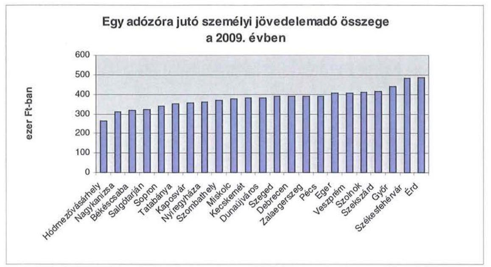

Az átengedett bevételek második legjelentősebb eleme a gépjárműadó, amelynek bevételi szabályozása az ellenőrzött időszakban nem változott, az adóbevétel teljes összege az önkormányzatot illeti meg. A gépjárműadó alapját, mértékét ${ }^{18}$ és egyes mentességi kategóriákat érintő módosítások 2010. január 1-jétől következtek be, amelyek az egyes adótételek esetében átlagosan 15%-os emelkedéssel jártak.

A gépjárműadó beszedéséből származó bevétel az önkormányzati alrendszer szintjén 2007-ben 62,4 milliárd Ft, 2008-ban 65,7 milliárd Ft, 2009-ben 63,8 milliárd Ft, 2010-ben 71,1 milliárd Ft volt, az adóbevétel egésze 2007-hez képest 8,7 milliárd Ft-tal, 13,9%-kal emelkedett. A gépjármű-adóztatás szabályainak változása 2010-ben 7,3 milliárd Ft többletet eredményezett. A megyei jogú városok gépjárműadó bevétele a 2007. évi 14,0 milliárd Ft-ról 2010-re 15,5 milliárd Ft-ra, 10,7%-kal emelkedett. A bevételnövekedés összegéből 1,4 milliárd Ft a 2010. évi adózási szabályok következménye.

A megyei jogú városok önkormányzatai 2007-2010 között rendelkezésre álló forrásainak alakulását a következő ábra szemlélteti:

[^0]
[^0]:    ${ }^{18}$ A gépjárműadóról szóló 1991. évi LXXXII. törvény 7. § (1) bekezdésében foglalt adómértékek változása.

---

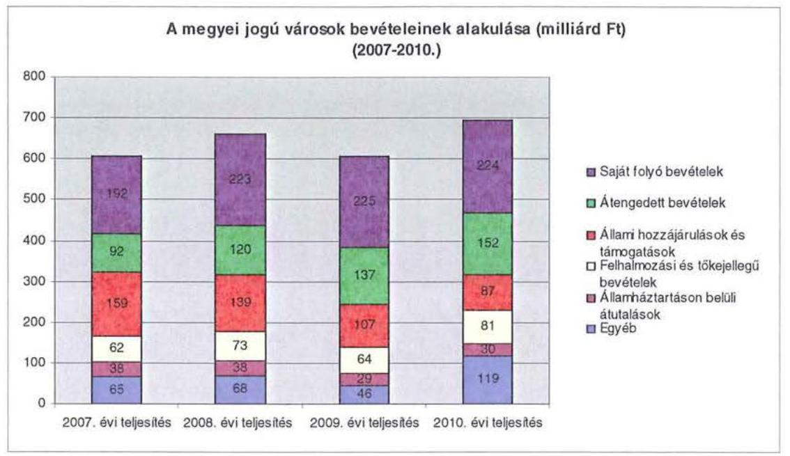

A megyei jogú városok saját folyó bevételeinek - amelyek főbb elemei: a helyi adók, az illetékbevételek, az intézményi térítési díjak, a kamatbevételek - részaránya a 2007. évi összbevételen (608 milliárd Ft) belül 32% volt. A 2010. évi összbevétel 693 milliárd Ft-os összegéből a saját folyó bevételek aránya - miközben összege 2007-ről 2010-re 32 milliárd Ft-tal emelkedett - nem változott.

Az átengedett bevételek, amelyek a megyei jogú városok önkormányzatainál döntően a személyi jövedelemadó és a gépjárműadó részesedést jelenti, az összbevételen belül a 2007. évi 92 milliárd Ft-ról (15%) 152 milliárd Ft-ra nőtt, részesedése 7 százalékponttal emelkedett. A 60 milliárd Ft-os növekedésből 59 milliárd Ft-ot az szja részesedés emelkedése okozott.

Az állami hozzájárulások és támogatások - amelyek főbb elemei: főként az ellátotti létszámhoz kötődő normatív állami hozzájárulások, központosított előirányzatok - a 2007. évi 159 milliárd Ft-ról (26%-os részarányról) 2010-re 87 milliárd Ft-ra (13%-os részarányra) estek vissza.

A felhalmozási és tőkejellegű bevételek - tárgyi eszközök (ingatlanok és ingóságok), föld és immateriális javak, részesedések értékesítése, EU-tól átvett pénzeszközök - a 2007. évi 62 milliárd Ft-ról (10%-os részarányról) 2010-re 81 milliárd Ft-ra (12%-os részarányra) emelkedtek.

Az államháztartáson belüli átutalások részesedése 2007-ben 38 milliárd Ft volt. 2010. év végére 8 milliárd Ft-tal csökkent, részaránya 6%-ról 2010-ben 4%-ra változott. Ez a bevételi kategória tartalmazza az Egészségbiztosítási Alaptól és más elkülönített állami pénzalapoktól átvett forrásokat. A 2010-ben e címen elszámolt bevétel a megyei jogú városoknál 22 milliárd Ft-ot tett ki.

Az egyéb, pénzmaradványból, vállalkozási bevételekből, államháztartáson kívülről származó átutalásokból, a hítelekből, a hosszú és rövid lejáratú értékpa-

---

pírok értékesítéséből származó bevételek részesedése a 2007-2010. évek viszonylatában 11%-ról 17%-ra emelkedett. Ez utóbbiak 2010. évi beszámoló szerinti összevont teljesítése 119 milliárd Ft volt ${ }^{19}$.

Mindezeket figyelembe véve a megyei jogú városok 2007. és 2010. évi forrásöszszetételének megoszlását az alábbi ábra szemlélteti:

A megyei jogú városok 2007. és 2010. évi forrásösszetétele
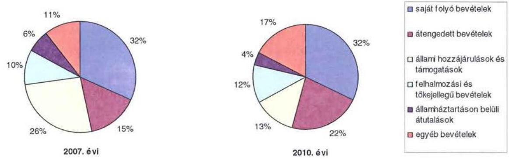

Az önkormányzati alrendszer pénzügyi helyzetértékelése során új elemzési módszereket alkalmaz az ellenőrzés. A hagyományos költségvetési szerkezet helyett az önkormányzat pénzügyi helyzetét a CLF módszerrel mutatjuk be, amelynek lényegét és számításának módszerét a 2.1. pontban, és a jelentés 2. számú mellékletében ismertetjük részletesen.

Az új módszereken alapuló helyzetértékelés fontosságát az adja, hogy a helyi önkormányzatok bruttó adósságállománya ${ }^{20}$ a 2010. évi költségvetési beszámoló alapján 1248 milliárd Ft-ot tett ki. Az adósságállomány koncentráltságát jelzi ${ }^{21}$, hogy ebből a 23 megyei jogú város részesedése 338 milliárd Ft volt, amely a fővárosi és kerületi önkormányzatok adósságának figyelmen kívül hagyásával számított 2010. évi 977 milliárd Ft összegű bruttó adósságállomány 34,6%-át jelentette. Az adósságállomány több mint fele - 501 milliárd Ft - a 19 megyei önkormányzatnál és a 23 megyei jogú városnál jelentkezett.

[^0]
[^0]:    ${ }^{19}$ Az egyéb bevételek összege 2007-2010 között eltérő módon változott, 2007-ben 65 milliárd Ft, 2008-ban 68 milliárd Ft volt, 2009-ben 46 milliárd Ft-ra esett vissza, majd 2010-ben több mint két és félszeresére, 119 milliárd Ft-ra emelkedett.
    ${ }^{20}$ A bruttó adósságállomány 2010. év végi összege magában foglalja a fejlesztési és a

 működési célú kötvénykibocsátások, a beruházási és fejlesztési hitelek, a működési célú hosszú lejáratú hitelek, a rövid lejáratú hitelek, váltótartozások miatti kötelezettségek teljes (2011-ben, illetve az azt követő években esedékes) állományát.
    ${ }^{21}$ A megyei jogú városok adósságállománya összegében ugyan elmarad az egyéb városok összesített adósságától [(ez utóbbiak részesedése 382,6 milliárd Ft (39,2\%)], azonban az egyéb városok száma 304. A fővárosi és a kerületi önkormányzatok nélküli adósságállományból a 19 megyei önkormányzat 163 milliárd Ft-tal ( $16,8 \%$-kal), míg a nagyközségek, községek együttesen 93 milliárd Ft-tal ( $9,5 \%$-kal) részesednek.

---

A megyei jogú városok 338 milliárd Ft-os adósságállományából 175 milliárd Ft $(51,8 \%)$ a 8 legnagyobb, 100 ezer fő feletti népességű város tartozása. Az 5 nem megyeszékhely megyei jogú város bruttó adósságállománya 70 milliárd Ft-ot ( $20,7 \%$-ot), az előző két csoportba nem tartozó további 10 megyei jogú város adóssága 93 milliárd Ft-ot ( $27,5 \%$-ot) tett ki.
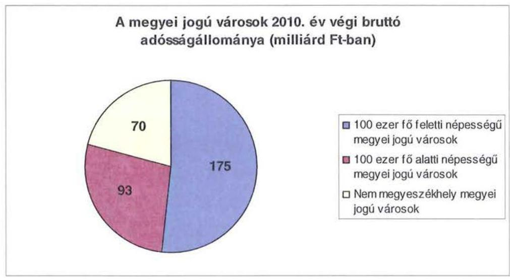

A mérlegben kimutatott bruttó adósságállomány mellett az önkormányzatok számára az eszközállomány műszaki állapotának megőrzése is kötelezettségekkel jár. Az elhasználódott eszközök pótlására forrást biztosító amortizációs (felújítási) alap képzésének ${ }^{22}$ elmaradása maga után vonhatja a feladatellátást kiszolgáló tárgyi eszközök állagának erőteljes romlását. Emellett a 2007-2013-as időszakra meghirdetett, vissza nem térítendő EU-s fejlesztési forrásokhoz való hozzájutás lehetősége felerősítette az önkormányzati alrendszer fejlesztési igényeit, amelyek a felhalmozási költségvetési hiány folyamatos emelkedésén túl - az előírt jövőbeni fenntartási kötelezettség miatt - tovább terhelhetik az önkormányzatok költségvetését ${ }^{23}$.

Az ÁSZ a 2011. évi ellenőrzési tervében 43. számú, az Önkormányzatok gazdálkodási rendszerének ellenőrzése részeként egy időben, egymással párhuzamosan tekinti át, és elemzi a 23 megyei jogú városi önkormányzat pénzügyi helyzetét. A gazdálkodás szabályszerűségét az ÁSZ az előző évek során ebben az önkormányzati körben is ellenőrizte, ezért jelen vizsgálatunk erre nem tér ki. A jelentés a megyei jogú városok sajátos feladatellátási és forrásszabályozási helyzeté-

[^0]
[^0]:    ${ }^{22}$ Erre a jelenlegi szabályozási környezetben nem kötelezi semmilyen előírás az önkormányzatokat.
    ${ }^{23}$ Az Állami Számvevőszék 2011. júniusában közzétett 1108. számú, a helyi önkormányzatok fejlesztési célú támogatási rendszerének ellenőrzéséről szóló jelentésében feltárta a fejlesztési folyamatok problémáit. A helyi önkormányzatok elsősorban azokat a fejlesztéseket valósították meg, amelyekhez támogatást lehetett igényelni. A fejlesztési célok közül a magasabb támogatás intenzitású pályázatokat részesítették előnyben. A fejlesztéssel megvalósuló létesítmények jövőbeli üzemeltetésének várható ráfordításait az önkormányzatok 71,9%-a nem mérte fel.

---

re tekintettel az önkormányzatok pénzügyi helyzetét, illetve az ezzel összefüggő korábbi ÁSZ javaslatok megvalósítását mutatja be.

Az ellenőrzés a 2007. január 1. - 2010. december 31. közötti időszakot öleli fel.
A vizsgálat jogszabályi alapját az Állami Számvevőszékről szóló 1989. évi XXXVIII. törvény 2. § (3), (5), (6) és (9) bekezdései ${ }^{24}$, az Ötv. 92. § (1) bekezdése, az Áht. 104. § (3), és 120/A. § (1) bekezdése előírásai képezik.

[^0]
[^0]:    ${ }^{24}$ 2011. július 1-jétől az Állami Számvevőszékről szóló 2011. LXVI. törvény 5. § (2)-(5) bekezdései

---

# I. ÖSSZEGZŐ MEGÁLLAPÍTÁSOK, KÖVETKEZTETÉSEK, JAVASLATOK 

Az Önkormányzat - adatszolgáltatása szerint - a 2010. év működési költségvetési kiadásaiból (20084 millió Ft) 15778 millió Ft-ot ( $78,6 \%$ ) a kötelező feladatok, 4306 millió Ft-ot ( $21,4 \%$ ) az önként vállalt feladatok ellátására fordított. A Közgyűlés az SzMSz-ben szabályozta a kötelezően ellátandó feladatait és hatásköreit, ugyanakkor az önként vállalt feladatok körét nem rögzítette, arról egyéb belső szabályzatokban sem rendelkezett. Az Önkormányzat adatszolgáltatása szerint önként vállalt feladata a sport és szabadidős tevékenységhez, kulturális és közművelődési feladatokhoz, felsőoktatási ösztöndíj pályázathoz, különféle tagdíjak befizetéséhez kapcsolódnak, valamint támogatást nyújt civil szervezetek, alapítványok működéséhez.

Az Önkormányzat feladatellátásának szervezeti struktúráját a következő ábra szemlélteti:
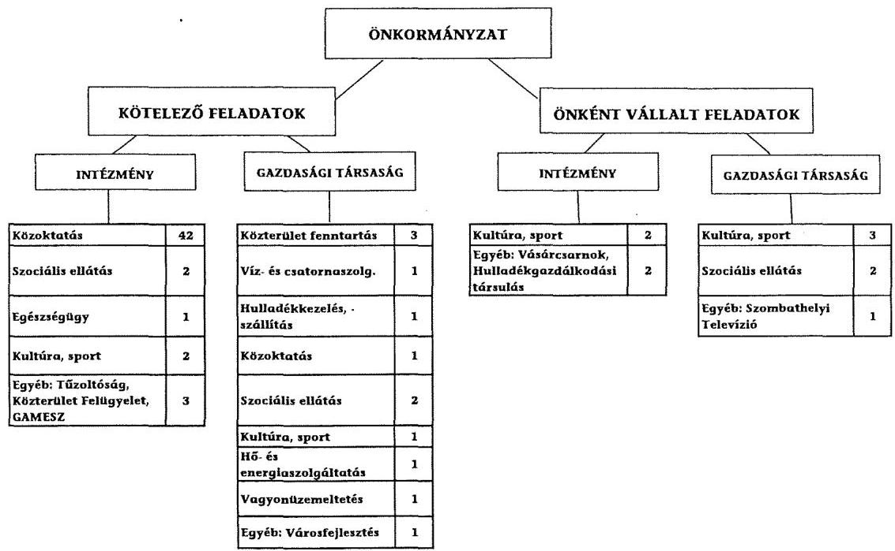

Az ábrában szereplő intézmények és gazdasági társaságok száma haladja meg azokat, mivel egy gazdasági társaság négyféle kötelező feladatellátásban is részt vett, valamint két intézmény és két gazdasági társaság kötelező és önként vállalt feladatot is ellátott.

Az Önkormányzat feladatait 2010. december 31-én (az Önkormányzati hivatallal együtt) 53 költségvetési szervvel és tizenhárom 25% feletti tulajdoni hányadú gazdasági társaságával, továbbá öt - az Önkormányzattól tulajdonosi szempontból független - gazdasági társaság közreműködésével látta el. Két költségvetési szerv a Szombathely és Térsége Szociális és Gyermekjóléti Intézményfenntartó Társulás közös fenntartású intézménye. Az intézményszervezeti átalakítások következtében a feladatellátás telephelyeinek száma a 2006. év végi 187-ről a 2010. év végére 193-ra nőtt.

---

Az Önkormányzat működési kiadásokra 2010-ben 20084 millió Ft-ot fordított, amely 1010 millió Ft-tal (5,3\%-kal) haladta meg a 2007. évi ráfordításokat. A 2010. évben a működési kiadások 56,3\%-át az intézményi körben mutatták ki. E kiadások fedezetéül szolgáló bevételi források 2007. és 2010. években jellemző összesített arányait a következő ábra szemlélteti:
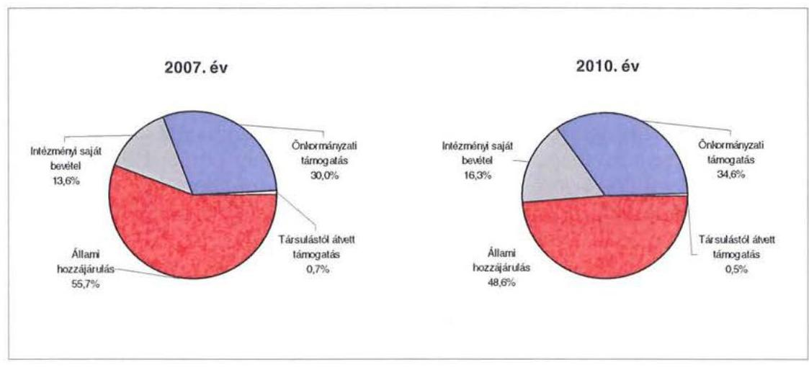

Az egyes közszolgáltatások feladatellátásában résztvevő ágazati intézménycsoportok forrásösszetételének bevételi jogcímenkénti alakulását a következő ábra szemlélteti:
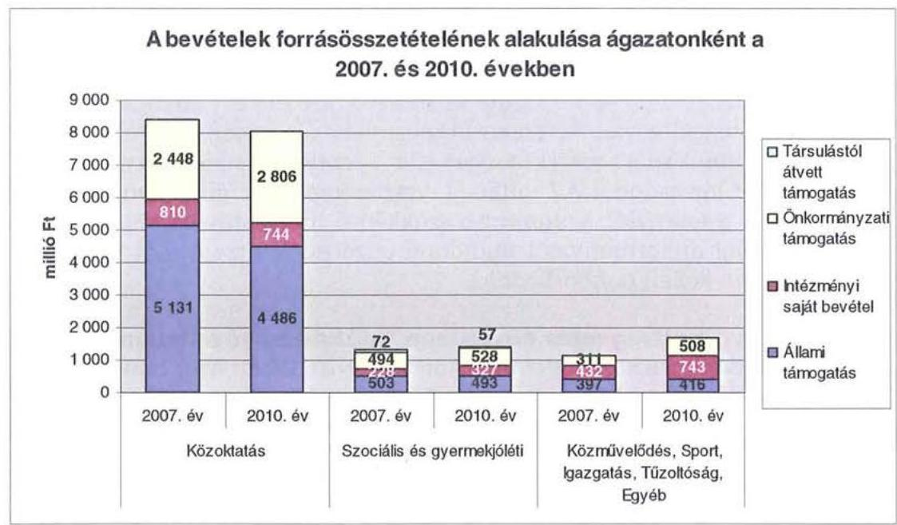

A működési célú állami hozzájárulások csökkenésével párhuzamosan évről évre növekedett az intézmények önkormányzati működési támogatásának összege és aránya, a 2007. évi 3253 millió Ft-ról a 2010. évre 18,1\%-kal, 3842 ezer Ft-ra.

---

Az Önkormányzat 10 gazdasági társaságban rendelkezik minősített többségi - amelyből kilenc gazdasági társaság kizárólagos önkormányzati tulajdonú -, két gazdasági társaságban többségi, és egy gazdasági társaságban 35\% tulajdoni hányaddal. Egy kizárólagos önkormányzati tulajdonú gazdasági társaság és a 35\%-os önkormányzati tulajdonú gazdasági társaságnak volt 25\% feletti tulajdoni hányada további gazdasági társaságokban, amelyek közül egy - hő és energiaszolgáltató - részt vett az Önkormányzat feladatellátásában.

A gazdasági társaságok sport, kultúra, szociális ellátás, vagyonüzemeltetés, víz és csatornaszolgáltatás, hulladékkezelés, hő és energiaszolgáltatás, közterület fenntartás közszolgáltatás területén kaptak szerepet az Önkormányzat feladatellátásában. A gazdasági társaságok működésükhöz a 2010. évben összesen 1013 millió Ft-ot, felhalmozásra 116 millió Ft-ot kaptak az Önkormányzattól. A működési célra átadott pénzösszeg 24,9\%-át (252 millió Ft-ot) a Színház Kft. kapta a 2010. évben.

A minősített többségi és a többségi önkormányzati tulajdonú gazdasági társaságok közül 2010. december 31-én kilencnél a saját tőke jegyzett tőke aránya 1 értéknél magasabb, kedvezőbb volt, kettőnél a mutató minimálisan 1 érték alá csökkent. Tartósan kedvezőtlen a pénzügyi helyzete a kosárlabda csapatot működtető Kft-nek. A veszteségrendezés ellenére a gazdasági társaság saját tőkéje a 2010. év végén -54,5 millió Ft, amelyhez hozzájárult az évek óta magas 2010. december 31-én 57 millió Ft - kötelezettség állománya. A gazdasági társaság a 2010. évet 55,7 millió Ft mérleg szerinti veszteséggel zárta. A vagyonüzemeltetési feladatokat ellátó gazdasági társaságnál annak ellenére, hogy a saját tőke jegyzett tőke aránya 1 értéknél magasabb, az arányszám évről évre csökkenést mutat, - 2007-ben 1,58, 2010-ben 1,04 volt - amely folyamatos tőkevesztésre utal. A gazdasági társaság a 2010. évet 750 millió Ft mérleg szerinti veszteséggel zárta. Az Önkormányzatnak a vizsgált időszakban tőkeemelésről egy futball sport tevékenységet ellátó többségi önkormányzati tulajdonú gazdasági társaságnál 8,7 millió Ft, veszteségfeltöltésről három - a kosárlabda csapatot, a televíziót, valamint a szakképző intézményeket integráló - minősített többségi önkormányzati tulajdonú gazdasági társaságnál 115,2 millió Ft összegben kellett gondoskodnia.

A folyó költségvetés egyenlege (működési jövedelem) 2007-2009 között működési forrástöbbletet mutatott, 2009-2010-ben azonban, az Önkormányzat működési forráshiányos volt ${ }^{25}$. A 2007-2008. években a működési többlet fedezni tudta a tárgyévben jelentkező törlesztési kötelezettségeket, így az Önkormányzat pénzügyi kapacitása (nettó működési jövedelme) is pozitív értékű volt. A 2009. évben a folyó kiadások csökkenését meghaladó arányú folyó bevétel csökkenés miatt a működési jövedelem negatív volt, amelynek következtében nem volt fedezet az éves törlesztési kötelezettség teljesítésére (699 millió Ft), így a pénzügyi kapacitás is negatívvá vált (-1078 millió Ft). A 2010. évben a folyó bevételek növekedését meghaladó arányú folyó kiadásnö-

[^0]
[^0]:    ${ }^{25}$ 2007-ben a folyó bevételek 7,5\%-át (1497 millió Ft-ot), 2008-ban 5,2\%-át (1135 millió Ft-ot) tette ki a működési forrástöbblet, azonban 2009-ben a folyó bevételek 2,0\%-át (379 millió Ft-ot), 2010-ben 2,8\%-át tette ki (543 millió Ft) a negatív működési jövedelem.

---

vekedés miatt a működési jövedelem ismét negatív volt (543 millió Ft), amelynek következtében nem volt fedezet a növekvő éves törlesztési kötelezettség teljesítésére (977 millió Ft), így a pénzügyi kapacitás is negatívvá vált (-1520 millió Ft).
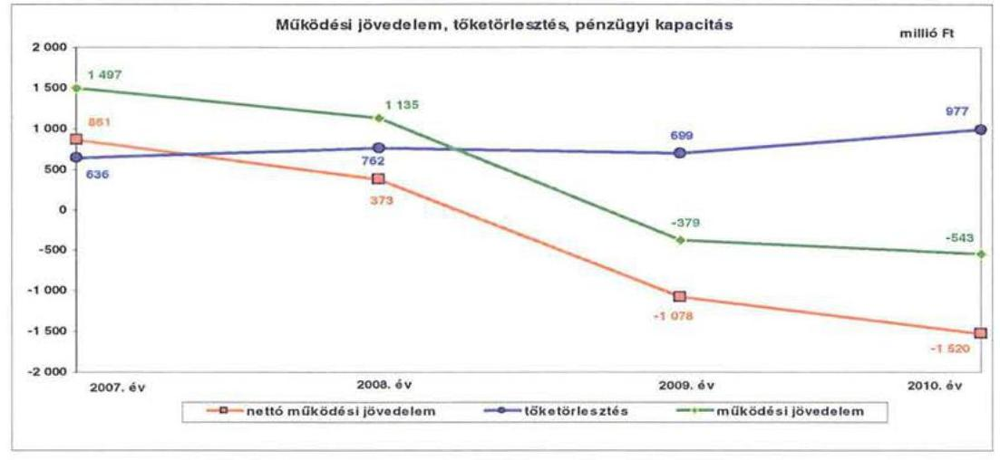

A 2007-2010. években az Önkormányzat felhalmozási költségvetésének egyenlege folyamatosan negatív összegű volt, amely 2007-2010 között összesen 7994 millió Ft felhalmozási forráshiányt okozott.

A pénzügyi egyensúly fenntartása külső források bevonásával volt biztosítható. A 2007-2010. években 3074 millió Ft hitelt törlesztettek. Az adósságszolgálat, továbbá a felhalmozási forráshiány 2007-2010 között 11067 millió Ft-ot tett ki, amelyre az időszakban képződő 1710 millió Ft működési többlet (működési jövedelem), valamint a 2007. január 1-jén rendelkezésre álló 1858 millió Ft pénzkészlet szolgált fedezetül. A további pénzeszközöket 10657 millió Ft hitel felvételével teremtették meg. A kialakult pénzügyi helyzet pozitív nettó működési jövedelmet eredményező gazdálkodás mellett teszi elkerülhetővé további külső források bevonását, az eladósodás növekedését.

A vizsgált időszakban az Önkormányzat a helyi iparűzési adót, építményadót, idegenforgalmi adót vetette ki. A bevételek növelése érdekében az idegenforgalmi adó és az építményadó mértékét emelték, változtak a mentességi és kedvezményi szabályok. A helyi adókból és pótlékokból származó bevételek aránya 2007-2010 között 26,3\% volt a folyó (működési) bevételek körében. A pótlékkal, bírsággal növelt helyi adóbevétel a 2007. évi 5098 millió Ft-ról 2010-re 5182 millió Ft-ra (1,6\%-kal, 84 millió Ft-tal) növekedett. A helyi adóbevételek átlagosan 85,1\%-át az iparűzési adó tette ki, amelynek mértéke a helyi adókról szóló törvényben rögzített maximális mértékben került megállapításra. A helyi adók növekedését az építményadó 278 millió Ft-os növekedése, és az iparűzési adó 195 millió Ft-os visszaesése határozta meg. Új helyi adónemet a vizsgált időszakban az Önkormányzat nem vetett ki.

A befejezett fejlesztések jelentős részét pénzintézeti forrásokból finanszírozták. A 2010. év végéig 5688 millió Ft értékben teljesített beruházás és felújítás forrása 1987 millió Ft hitelfelvétel (34,9\%) volt. A 2010. december 31-én folyamatban lévő fejlesztési feladatok végrehajtására 9605 millió Ft kiadást teljesítettek, amelyre hitelből 582 millió Ft-ot (6,1\%) fordítottak.

---

Az Önkormányzat 2010. december 31-én folyamatban lévő fejlesztési feladatok kötelezettség-vállalásainak összege 3700 millió Ft, amelyet 2077 millió Ft EU-s támogatásból, 74 millió Ft hazai támogatásból, valamint 1232 millió Ft saját bevételből, és 317 millió Ft összegű újabb hitel felvételéből terveznek biztosítani. A tervezett saját bevételek rendelkezésre állását azonban az Önkormányzat jelenlegi pénzügyi helyzete nem igazolja. Mindez kockázatot jelent a vállalt fejlesztések jövőbeni finanszírozhatósága szempontjából.
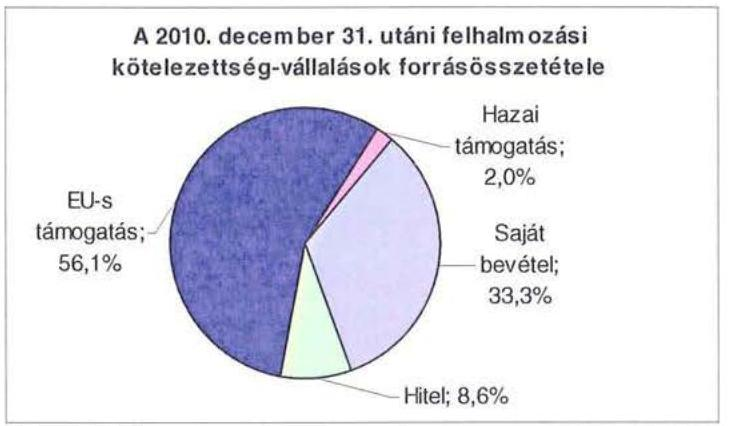

Az Önkormányzat által beadott, elbírálás alatt álló pályázatok tervezett teljes bekerülési költsége 62 millió Ft volt, amelyhez 8 millió Ft
 EU-s támogatást, és 41 millió Ft hazai támogatást kívántak igénybe venni, 13 millió Ft saját bevétel mellett.

Az Önkormányzat mérleg szerinti pénzintézeti kötelezettsége a 2006. év végéről a 2010. év végére, 5583 millió Ft-ról 15927 millió Ft-ra nőtt, amelyből az árfolyamváltozások miatti különbözet 2584 millió Ft (208 millió Ft árfolyamnyereség, 2792 millió Ft árfolyamveszteség) volt. A fennálló pénzintézeti kötelezettségek tizenhárom hosszú lejáratú hitelből és folyószámlahitel igénybevételéből keletkeztek.

Az Önkormányzat kötelezettségvállalásaira közgyűlési döntés alapján került sor, azonban az előterjesztésekben nem mutatták be a visszafizetés forrásait, valamint a kamat- és - a devizaalapú kötelezettségeket érintő - árfolyamkockázatot.

Az Önkormányzat éven túli hiteleiből beruházásokat és felújításokat finanszírozott, korábbi hiteleit törlesztette, valamint a működési kiadások fedezetére használta.

Az Önkormányzat a devizában fennálló pénzintézeti kötelezettségeiből 14609 ezer CHF (2738 millió Ft), valamint 257 ezer EUR (73 millió Ft) tőkét törlesztett, kamatot és egyéb költséget fizetett. A HUF-ban fennálló kötelezettségekből 1268 millió Ft tőkét, kamatot és egyéb költséget teljesített. Az Önkormányzat a hitelek igénybevételéből származó forrásokat 2010. év végéig a céloknak megfelelően felhasználta. A 2007-2010. években átmenetileg szabad pénzeszközeiből 482 millió Ft kamatbevételt ért el. Az Önkormányzat számlavezető bankot 2010. január hónapban váltott. A számlavezető pénzintézettel a szerződéskötést megelőzően kettő (3300 millió Ft), ezt követően egy hitelszerződés kötése (643 millió Ft) történt, amely a banki befolyás növekedése miatt kockázatot jelent az Önkormányzat számára.

Az Önkormányzat működésének pénzügyi egyensúlyát a vizsgált időszakban folyószámlahitel igénybevételével tudta biztosítani.

A folyószámlahitel igénybevétele a 2007-2010. években az alábbiak szerint alakult:

| Megnevezés | 2007. év | 2008. év | 2009. év | 2010. év |
| :--: | :--: | :--: | :--: | :--: |
| Keretösszeg január 1-jén | 2500,00 | 2500,00 | 2500,00 | 1700,00 |
| Átlagos napi állomány | 402 | 587 | 914 | 961 |
| Folyószámlahitellel zárt napok száma (nap) | 185 | 224 | 318 | 247 |
| 2010. december 31-i egyenleg (állomány) | $x$ | $x$ | $x$ | 1666 |

A likviditás biztosítása az Önkormányzatnak 162 millió Ft kamatkiadást okozott.

Az Önkormányzat 2010. év végi szállítói tartozása 924 millió Ft, amelyből a lejárt tartozás 40 millió Ft volt, a szállító állományból átütemezés nem történt. Az Önkormányzati hivatalnál a 60 napot meghaladó - amely azonos a 91 napon túli lejárt tartozással -, szállítók felé fennálló kötelezettség 0,4 millió Ft-os összege (1,0%) késedelmes számla beérkezés, illetve vitatott számlaösszeg miatt keletkezett, amely tételeket 2011. február hóban rendezték.

Az Önkormányzat 3 gazdasági társasága, 3 csatornamű társulat és 1 civil szervezet részére folyószámla- és egyéb hitelek igénybevételéhez készfizető kezességet vállalt 726 millió Ft, 617 ezer EUR és 900 ezer CHF összegben. A 2010. december 31-ére a kezességvállalással kapcsolatos kötelezettség 40 millió Ft-ra csökkent. A gazdasági társaságok részére öt alkalommal összesen 51 millió Ft összegben visszafizetési kötelezettséggel adott át pénzeszközt az Önkormányzat, amelyből a 2010. év végi állomány 14 millió Ft volt. Az Önkormányzat egyéb kölcsönt egy alkalommal, Söpte Község Önkormányzat részére nyújtott, amelynek állománya 2010. év végén 165 millió Ft volt.

A folyószámlahitel és fejlesztési hitelek biztosítékaként jelzálogjog alapításra és bejegyzéséhez nem volt szükség.

Az Önkormányzat kötelezettségeinek 2010. december 31-i állományát és várható alakulását a kötelezettségek lejáratáig a következő táblázat szemlélteti:

---

| Megnevezés | Állomány 2010. dec. 31-én |  |  | Várható kötelezettség 2011-2013. években |  |  | Várható kötelezettség 2014. év után |  |  |
| :--: | :--: | :--: | :--: | :--: | :--: | :--: | :--: | :--: | :--: |
|  | $\begin{aligned} & \text { HUF-ban } \\ & \text { (millió Ft- } \\ & \text { ban) } \end{aligned}$ | Devizában (összegesítve CHF, EUR-ban) | $\begin{aligned} & \text { Devizában } \\ & \text { (összegesítve } \\ & \text { CHF, EUR- } \\ & \text { ban) } \end{aligned}$ | $\begin{aligned} & \text { HUF-ban } \\ & \text { (millió Ft- } \\ & \text { ban) } \end{aligned}$ | $\begin{aligned} & \text { Devizában } \\ & \text { (összegesítve } \\ & \text { CHF, EUR- } \\ & \text { ban) } \end{aligned}$ | $\begin{aligned} & \text { Devizában } \\ & \text { (összegesítve } \\ & \text { CHF, EUR-ban) } \end{aligned}$ | $\begin{aligned} & \text { HUF-ban } \\ & \text { (millió Ft- } \\ & \text { ban) } \end{aligned}$ | $\begin{aligned} & \text { Devizában } \\ & \text { (összegesítve } \\ & \text { CHF, EUR-ban) } \end{aligned}$ |
| Pénzintézeti kötelezettségek |  |  |  |  |  |  |  |  |  |
| Hosszú lejáratú hitelek | 3064 |  | HUF | 2825 |  | HUF | 8011 |  | HUF |
| Hosszú lejáratú hitelek |  | 34029,0 | CHF |  | 17033 | CHF |  | 17521 | CHF |
| Hosszú lejáratú hitelek |  | 3828,0 | EUR |  | 1920 | EUR |  | 4102 | EUR |
| Folyószámlahitel | 1666 |  | HUF | 1666 |  | HUF |  |  | HUF |
| Nettó kötelezettségek összesen HUF-ban | 6730 |  | HUF | 4491 |  | HUF | 8011 |  | HUF |
| Nettó kötelezettségek összesen CHF-ban |  | 34029,0 | CHF |  | 17033 | CHF |  | 17521 | CHF |
| Nettó kötelezettségek összesen EUR-ban |  | 3828,0 | EUR |  | 1920 | EUR |  | 4102 | EUR |
| Biztosítékok |  |  |  |  |  |  |  |  |  |
| Kezesség | 40 |  | HUF |  |  |  |  |  |  |
| Biztosítékok összesen | 40 |  | HUF |  |  |  |  |  |  |
| Szállítói tartozás | 924 |  | HUF | 924 |  | HUF |  |  |  |

Az Önkormányzatnak pénzintézetekkel szemben fennálló kötelezettsége a 2010. év végén 6730 millió Ft, 34029 ezer CHF és 3828 ezer EUR volt. Ezek várható kötelezettsége (tőke, kamat és egyéb költség) a legutóbbi kamatfizetés feltételei alapján a 2011. évtől 12502 millió Ft, továbbá 34554 ezer CHF és 6513 ezer EUR. Az Önkormányzatnak a 2010. december 31-én fennálló szállítói tartozások címén a 2011. évre 924 millió Ft fizetési kötelezettsége keletkezett. A kezességvállalásaiból adódóan 40 millió Ft összegű terhe jelentkezhet, amennyiben a gazdasági társaság és a civil szervezet kötelezettségeiket nem teljesítik. Az Önkormányzatnak jogerős határozattal lezárt peres eljárásból adódóan kötelezettsége nem volt. A 2011-2013. években a várható összes kötelezettség teljesítésére figyelembe vehető a 2010. év végén fennálló 787 millió Ft követelésállomány, a jelzáloggal nem terhelt 9003 millió Ft forgalomképes ingatlanvagyon, továbbá újabb pénzintézeti kötelezettségvállalások, a meglévő hitelkeretek igénybevétele, és kisebb részben saját bevételek. A kötelezettségek forrásait a 2014. évet követően nem számszerűsítették. A CLF módszer szerint a 2009-2010. évek negatív működési jövedelme -379 millió Ft, 543 millió Ft -, azonban nem nyújt fedezetet az önkormányzati kötelezettségek biztosítására.

Az Önkormányzat minősített többségi tulajdonú gazdasági társaságai kötelezettségeinek 2010. december 31-i állományát és várható alakulását a kötelezettségek lejáratáig a következő táblázat mutatja be:

| Megnevezés | Állomány 2010. dec.31-én |  |  | Várható kötelezettség 2011-2013. években |  |  | Várható kötelezettség 2014. év után |  |  |
| :--: | :--: | :--: | :--: | :--: | :--: | :--: | :--: | :--: | :--: |
|  | HUF-ban (millió Ft-ban) | Devizában (összegesítve CHF, EUR-ban) | $\begin{aligned} & \text { Devizában } \\ & \text { (összegesítve } \\ & \text { CHF, EUR-ban) } \end{aligned}$ | $\begin{aligned} & \text { HUF-ban } \\ & \text { (millió Ft- } \\ & \text { ban) } \end{aligned}$ | $\begin{aligned} & \text { Devizában } \\ & \text { (összegesítve } \\ & \text { CHF, EUR- } \\ & \text { ban) } \end{aligned}$ | $\begin{aligned} & \text { Devizában } \\ & \text { (összegesítve } \\ & \text { CHF, EUR-ban) } \end{aligned}$ | $\begin{aligned} & \text { HUF-ban } \\ & \text { (millió Ft- } \\ & \text { ban) } \end{aligned}$ | $\begin{aligned} & \text { HUF-ban } \\ & \text { (millió Ft- } \\ & \text { ban) } \end{aligned}$ | $\begin{aligned} & \text { Devizában } \\ & \text { (összegesítve } \\ & \text { CHF, EUR-ban) } \end{aligned}$ |
| Kötvény |  | 32274 | CHF |  | 2168 | CHF |  | 20182 | CHF |
| Hosszú lejáratú hitelek | 160 |  | HUF | 156 |  | HUF | 21 |  | HUF |
| Hosszú lejáratú hitelek |  | 32 | EUR |  | 18 | EUR |  | 23 | EUR |
| Folyószámla- és egyéb rövid lejáratú hitelek | 10 |  | HUF | 10 |  | HUF |  |  |  |
| Nettó kötelezettségek összesen HUF-ban | 170 |  | HUF | 166 |  | HUF | 21 |  | HUF |
| Nettó kötelezettségek összesen CHF-ban |  | 32274 |  |  | 2168 |  |  | 20182 |  |
| Nettó kötelezettségek összesen EUR-ban |  | 32 |  |  | 18 |  |  | 23 |  |
| Szállítói tartozás | 655 |  | HUF | 655 |  | HUF |  |  |  |

Az önkormányzati kötelezettségek növekedése mellett a minősített többségi tulajdonú gazdasági társaságok kötelezettségei is befolyásolhatják az Önkormányzat pénzügyi egyensúlyát. A gazdasági társaságoknak a 2011. évtől
 187 millió Ft, 35350 ezer CHF, valamint 41 ezer EUR pénzintézeti kötelezettséget, és 655 millió Ft szállítói tartozást kell rendezniük, amelyből meghatározó a vagyonüzemeltetési feladatokat ellátó gazdasági társaság kötvény visszafizetésével összefüggő 2010. december 31-én fennálló 32274 ezer CHF tőkefizetési kötelezettsége. Kockázatot hordoz, ha a gazdasági társaságok ezen kötelezettségeiket nem teljesítik és a Gt. és a Csődtv. rendelkezései alapján - a jogszabályi feltételek bekövetkezése esetén - a bíróság korlátlan és teljes felelősséget állapít meg az Önkormányzat terhére.

Az Önkormányzat működési költségvetési támogatásból, átengedett bevételekből, és illetékbevételekből származó bevételei a 2007. évhez képest az időszak egészét tekintve összességében nem csökkentek. Ennek ellenére az Önkormányzat kiadási megtakarítást és bevételnövelő intézkedéseket hozott. A 2007-2010. években tett intézkedések hatására 496 millió Ft bevételi többletet, továbbá 1545,2 millió Ft kiadási megtakarítást mutattak ki, amelyek az Önkormányzat pénzügyi helyzetére kedvező hatással voltak. A kiadási megtakarítások 81,5 %-a az elrendelt álláshelycsökkentések eredménye. Az álláshelycsökkentő intézkedések 2007-2010 között az Önkormányzati hivatalnál és az intézményeinél összesen 215,2 álláshely (ebből 13 üres álláshely) megszüntetését jelentették. Egyes közszolgáltatási területeken azonban feladatbővülések is voltak, amelyek álláshely- és egyben létszámnövekedéssel is jártak. Ennek következtében az időszak álláshelyeinek száma 93 fővel csökkent. A helyi szervezési intézkedésekhez kapcsolódóan a 2007-2010. években 224 millió Ft támogatásban részesült az Önkormányzat, amellyel a tartósan leépített létszám 88 fő volt. A bevételnövelő intézkedések szabad kapacitások kihasználásához, helyi adók emeléséhez, önkormányzati bérlakások bérleti díj emeléséhez kapcsolódtak.

Az utóellenőrzés a pénzügyi egyensúly javítására tett két szabályszerűségi javaslat teljesítésének vizsgálatára terjedt ki. Az Önkormányzatnál az egyik szabályszerűségi javaslat megvalósult, a finanszírozási célú pénzügyi műveletekre vonatkozó másik javaslat azonban részben teljesült, mert a költségvetési rendeletekben a finanszírozási célú kiadásokat költségvetési kiadásként vették figyelembe.

Az Önkormányzat pénzügyi helyzetét összegezve a következők emelhetők ki:

A 2007-2010. években az Önkormányzat működési kockázatát növelte a 2009-2010. évi negatív nettó működési jövedelem. A működési bevételek 2009-2010. években nem biztosították a működési kiadások és az adósságszolgálat finanszírozását, a likviditás biztosítása növekvő mértékű folyószámlahitel és hosszú lejáratú működési célú hitel igénybevételével történt. Az Önkormányzat pénzügyi helyzetére negatív hatást gyakorolt az önként vállalt feladatok működési célú költségvetési kiadásokon belüli 21,4%-os aránya is.

A gazdasági társaságok szerepe az Önkormányzat közfeladat-ellátásában meghatározó. A többségi önkormányzati tulajdonú gazdasági társaságoknak az Önkormányzat költségvetési egyensúlyára gyakorolt hatása számottevő a gazdasági társaságok száma, azokban való részesedése, valamint a minősített többségi befolyásával összefüggő korlátlan felelőssége miatt. A vagyonüzemeltetési feladatokat ellátó gazdasági társaság kötvénykibocsátás miatti eladósodása, és egy sporttevékenységet folytató gazdasági társaság saját tőkéjéhez viszonyítottan magas kötelezettségállománya növeli a pénzügyi kockázatot.

Az Önkormányzat felhalmozási költségvetésének egyenlege a 2007-2010. években negatív volt. A pénzügyi hiány fedezete pénzmaradvány igénybevétel és hitel felvétel volt. A fennálló felhalmozási célú kötelezettségvállalásokra a jövőben a fedezet elsősorban további pénzintézeti kötelezettségvállalással biztosítható. A fejlesztési célú kötelezettségvállalások jövőben teljesítendő kifizetései tekintetében a nettó működési jövedelem negatív értéke a felhalmozási kiadások finanszírozásának kockázatát növeli.

A pénzintézeti kötelezettségek teljesítésének kockázatát növelte, hogy azok gyors ütemű növekedése ellenére, nem történt meg a visszafizetés forrásainak számszerűsítése, valamint a kötelezettségvállalást megelőzően a teljes futamidőre várható kamat és árfolyamkockázatok bemutatása. A pénzintézeti kockázatot mérsékelheti, hogy az Önkormányzat az adósságállomány kezelése érdekében a 2010. évben Önkormányzati Finanszírozási Programot dolgozott ki, továbbá a 2010. évi követelésállománya, és forgalomképes ingatlanvagyona szükség esetén felhasználható az adósságszolgálat mérséklésére.

A központi intézkedések miatt az Önkormányzat működési költségvetési támogatásból, átengedett bevételekből és illetékből származó bevételei nem csökkentek. A 2007-2010. években tett intézkedések az Önkormányzat pénzügyi helyzetére kedvező hatással voltak.

Mindezek alapján az Önkormányzat pénzügyi egyensúlyának fenntarthatósága rövid- és hosszú távon mielőbbi intézkedéseket igényel.

A polgármester tájékoztatása szerint a helyszíni vizsgálatot követően a tervezett bevétel bizonytalan teljesítése és a devizahitelek törlesztő részleteinek növekedése miatt a 2011. évi költségvetési rendelet módosításával 184 millió Ft kiadáscsökkentést hajtottak végre.

Az Állami Számvevőszékről szóló 2011. évi LXVI. törvény 33. § (1) bekezdésében foglaltak értelmében a jelentésben foglalt megállapításokhoz kapcsolódó intézkedési tervet köteles az ellenőrzött szervezet vezetője összeállítani és azt a jelentés kézhezvételétől számított harminc napon belül az ÁSZ részére megküldeni. Amennyiben az intézkedési tervet határidőben nem küldi meg a szervezet, vagy az továbbra sem elfogadható, az ÁSZ elnöke a hivatkozott törvény 33. § (3) bekezdés a)-b) pontjaiban foglaltakat érvényesítheti.

Az ellenőrzés intézkedést igénylő javaslatai:

# a Polgármesternek 

1. a Közgyűlés elé terjesztendő intézkedési terv írja elő a működés pénzügyi egyensúlyának gyors helyreállítása és hosszú távú fenntarthatósága érdekében - felelősök és határidők megjelölésével - olyan program készítését, amely tartalmazza az alábbiakat:
a) bevételszerző lehetőségek feltárását, különösen a helyi adópolitikai célok meghatározását és számszerűsítését, a bérleti díjak és a térítési díjak megállapítását, felülvizsgálatát, a követelések behajtását, az egyéb sajátos bevételek növelésének lehetőségét;

b) a folyamatban lévő és a tervezett beruházások teljes körű felülvizsgálatát;
c) a kiadási kötelezettségek teljes körű felülvizsgálatát;
d) az intézkedések következtében jelentkező pénzügyi többlet, illetve az egyszeri bevételek tartalékba helyezését, elkülönített kezelését az adósságszolgálat teljesítése érdekében;
e) az intézményi gazdálkodás felülvizsgálatát;
f) az önként vállalt feladatok finanszírozhatóságának áttekintését a kötelező feladatellátás elsődlegességének biztosítása érdekében, a gazdasági program áttekintésével összhangban;
g) az intézkedések eredményei legalább évenkénti áttekintésének előírását;
2. mutassa be félévente - a szokásos beszámoló keretében - a Közgyűlésnek:
a) az Önkormányzat és a minősített többségi tulajdonú gazdasági társaságai aktuális pénzügyi helyzetét, az Önkormányzat gazdasági társaságainak nyújtott kölcsöneit;
b) legalább három évre kitekintően a kötelezettségek teljes körére szóló finanszírozási tervet, amely figyelembe veszi a kötelezettség éven belüli és túli felmerülését, a források számszerűsített megjelölésével;
c) az Önkormányzat folyamatban lévő és tervezett fejlesztéseihez szükséges belső és külső források rendelkezésre állását, és ebből a szempontból értékelje az Önkormányzat beruházásait;
3. intézkedjen a beruházásokkal létrehozott létesítmények működtetését és jövőbeni fenntarthatóságát biztosító megalapozott források költségvetési rendeletekben történő feltüntetéséről;
4. mutassa be a Közgyűlésnek évente a zárszámadási rendelet előterjesztésében az értékcsökkenés összegét, és ezzel összevetve az elhasználódott eszközök pótlására fordított tényleges kiadásokat, az eszközök elhasználódási fokának alakulását;
5. mutassa be a Közgyűlésnek az intézményfenntartó társulási tagságból, gesztorságból eredő, az Önkormányzat pénzügyi egyensúlyát befolyásoló kockázatokat, és azok mérséklését szolgáló intézkedéseket;
6. kísérje folyamatosan figyelemmel - a tulajdonosi jogkört gyakorlók közreműködésével - a minősített többségi tulajdonú gazdasági társaságok kötelezettségeinek alakulását, az Önkormányzat likviditására, pénzügyi-egyensúlyi helyzetére gyakorolt hatását;

# a jegyzőnek 

1. gondoskodjon az önként vállalt feladatok körének rögzítéséről az SzMSz módosításában;

2. kísérje figyelemmel a jövőbeni várható - árfolyam-, kamat- valamint visszafizetési kockázatokat, és legalább félévente tájékoztassa a Közgyűlést azok alakulásáról;
3. gondoskodjon, hogy a jövőben az adósságot keletkeztető kötelezettségvállalásokról szóló közgyűlési előterjesztések tételesen tartalmazzák a visszafizetés forrásait, valamint legalább 3 éves kitekintéssel mutassák be a kamat és árfolyamkockázat várható kihatásait.

# II. RÉSZLETES MEGÁLLAPÍTÁSOK 

## 1. Az ÖNKORMÁNYZAT KÖTELEZŐ ÉS ÖNKÉNT VÁLLALT FELADATAI

Az Önkormányzat a 2010. évi elemi beszámolója szerint a működési költségvetési kiadásából 15778 millió Ft-ot (78,6 %) a kötelező, 4306 millió Ft-ot (21,4 %) az önként vállalt feladatok ellátására fordított. A 2011. évi tervadatok alapján az önként vállalt működési célú feladatokra 3782 millió Ft-ot (21,2 %) terveznek felhasználni, amely 0,2 százalékponttal (524 millió Ft-tal) kevesebb az előző évhez képest. Az Önkormányzat önként vállalt feladatai sport és szabadidős tevékenységhez, kulturális és közművelődési feladatokhoz, felsőoktatási ösztöndíjpályázathoz, különféle tagdíjak befizetéséhez kapcsolódnak, valamint támogatást nyújt civil szervezetek, alapítványok működéséhez.

A 2010. évi működési kiadások kötelező feladatonkénti megoszlását és azok finanszírozási arányait az - Önkormányzat adatszolgáltatása alapján - az alábbi táblázat mutatja be:

Az Önkormányzat 2010. évi működési kiadásai és finanszírozási arányai főbb feladatonként

| Eltátott feladat | Működési   kiadás   összesen   (millió Ft) | Kötelező   feladat   kiadásaink   részaránya | Működési   bevétel   összesen   (millió Ft) | Állami   támogatás   részaránya   % | Intézményi   saját bevétel   részaránya   % | Önkormányzati   támogatás   részaránya   % |
| :--: | :--: | :--: | :--: | :--: | :--: | :--: |
| Óvodák | 1042 | 100,5 | 1026 | 59,1 | 0,9 | 40,0 |
| Általános iskolák | 2840 | 100,5 | 2862 | 47,7 | 9,0 | 43,3 |
| Gimnáziumok | 430 | 100,0 | 426 | 59,8 | 14,9 | 25,3 |
| Szakközépiskolák,   szakképző intéz-   mények | 3855 | 100,0 | 3722 | 60,7 | 11,1 | 28,2 |
| Szociális   intézmények | 806 | 100,0 | 794 | 33,9 | 16,3 | 44,1 |
| Gyermekjóléti   intézmények | 636 | 100,0 | 611 | 36,7 | 32,3 | 29,1 |
| Közművelődési   intézmények | 386 | 50,0 | 323 | 2,2 | 53,4 | 44,4 |
| Egyéb intézmények | 878 | 81,0 | 885 | 0,8 | 59,2 | 40,0 |
| Tűzoltóság | 442 | 100,0 | 459 | 87,6 | 10,2 | 2,2 |
| Intézmények   összesen | 11315 | 96,8 | 11108 | 48,6 | 16,5 | 34,6 |
| Polgármesteri   hivatalban   kimutatott feladatok   működési kiadásai | 8769 | 55,0 | 7363 | 16,9 | 83,1 | 0,0 |
| Működési kiadá-   sok összesen | 20084 | 78,6 | 18471 | 35,9 | 43,0 | 20,6 |

[^0]
[^0]:    A Szombathelyi Kistérség Többcélú Társulástól átvett támogatás a szociális intézménynél 5,7 %, a gyermekjóléti intézménynél 1,9 %, az intézményeknél összesen 0,5 %, a működési kiadásoknál összesen 0,5 % volt a 2010. évben. A táblázatban a működési bevételek nem tartalmazzák az előző évi pénzmaradványt.

A Közgyűlés az SzMSz-ben szabályozta a kötelezően ellátandó feladatait és hatásköreit, ugyanakkor az önként vállalt feladatok körét nem rögzítette, arról egyéb belső szabályzatokban sem rendelkeztek.

Az Önkormányzat működési célú feladatainak ellátásához biztosított állami hozzájárulás összege a 2007. évi 7195 millió Ft-ról a 2010. évre 6638 millió Ft-ra csökkent, amely a 2007. évben az Önkormányzat 19074 millió Ft működési kiadásának 37,7%-ára, a 2010. évben a 20084 millió Ft működési kiadás 33,1%-ára nyújtott fedezetet.

A működési célú állami hozzájárulások csökkenésével párhuzamosan évről évre növekedett az intézmények önkormányzati működési támogatásának összege és aránya, a 2007. évi 3253 millió Ft-ról a 2010. évre 18,1%-kal, 3842 ezer Ft-ra. A működési bevételeken belül a működési célú önkormányzati támogatás aránya a 2007.
 évben 16,7\%, a 2010. évben $\mathbf{20,6 \%}$ volt. A közoktatási ágazatban az állami támogatás aránya a 2007. évi $61,2 \%$-ról (5131 millió Ft) a 2010. évre 5,4 százalékponttal $55,8 \%$-ra (4486 millió Ft) csökkent, amely következtében a működési célú önkormányzati támogatás a 2007. évi 2448 millió Ft-ról a 2010. évre 14,6\%-kal 2806 millió Ft-ra nőtt ${ }^{30}$. A szociális intézmény működési célú önkormányzati támogatása a 2007. évtől a 2010. évre 64 millió Ft-tal (22,5\%) 350 millió Ft-ra emelkedett, míg a Szombathelyi Kistérség Többcélú Társulás által biztosított támogatás összege a 2007. évről a 2010. évre 5 millió Ft-tal, a működési célú állami támogatás összege 28 millió Ft-tal csökkent. A gyermekjóléti intézménynek biztosított működési célú önkormányzati támogatás a férőhelybővüléssel összefüggő normatív támogatás (18 millió Ft) és az intézményi saját bevétel (50 millió Ft) emelkedése miatt a 2007. évi 208 millió Ft-ról a 2010. évre 178 millió Ft-ra csökkent. A Tűzoltóság működési bevételeiben az önkormányzati működési támogatás mértéke a 2007. évi 12 millió Ft-ról ($2,8\%$) a 2010. évre 10 millió Ft-ra ($2,2\%$) csökkent. A közművelődési intézmények bevételeiben az intézményi saját bevétel aránya a 2007. évi 38,4\%-ról, 82 millió Ft-ról a 2010. évre 53,4\%-ra, 172 millió Ft-ra nőtt, míg a működési célú önkormányzati támogatás aránya $59,6\%$-ról $44,4\%$-ra csökkent annak ellenére, hogy a támogatás mértéke 128 millió Ft-ról 143 millió Ft-ra emelkedett.

A közoktatási ágazatban foglalkoztatottak száma a 2007. évtől a 2010. évre - az ágazatot érintő átszervezések ellenére - mindössze $1\%$-kal (1947 főre) csökkent, az intézményekben ellátottak számának $2\%$-os - 18062 főről 17702 főre - csökkenése mellett. Az ágazatban a 2007. évben az egy ellátottra jutó működési bevételen belül az állami támogatás aránya 61,2\% (284 ezer Ft), az önkormányzati támogatás aránya 29,2\% (136 ezer Ft) volt, amely a 2010. évre 55,8\%-ra (253 ezer Ft) illetve 34,9\%-ra (159 ezer Ft) módosult. A szociális ellátás területén a feladatellátás szervezeti kereteinek változása a foglalkoztatottak számában 3,3\% (180 főről 174 főre) csökkenést eredményezett, az ellátottak számának 8,7\%-os (158 fő) növekedése

[^0]
[^0]:    ${ }^{29}$ Erre jogszabályi előírás jelenleg nem kötelezi az Önkormányzatot.
    ${ }^{30}$ A közoktatási ágazatban az intézményi saját működési bevételek 66 millió Ft-os $(8,1\%)$ csökkenésének oka, hogy az óvodák térítési díjbevétele és az étkeztetéssel kapcsolatos kiadások a 2010. évtől a Művelődési GAMESZ költségvetésében szerepelnek.

---

mellett. Az ágazatban az állami hozzájárulás 28 millió Ft-os csökkenése, valamint a működési kiadások összegének 100 millió Ft-os emelkedése az egy ellátottra jutó működési célú önkormányzati támogatás összegének 158 ezer Ft-ról 178 ezer Ft-ra történő 12,7\%-os emelkedését okozta. A gyermekjóléti intézménynél a foglalkoztatottak száma a 2007. évi 190 főről a 2010. évre nem változott, annak ellenére, hogy az ellátottak száma férőhelybővülések miatt 17,6\%-kal 461 főre emelkedett. Az egy ellátottra jutó állami hozzájárulás a 2007. évi 526 ezer Ft-ról a 2010. évre 7,6\%-kal 486 ezer Ft-ra, az egy ellátottra jutó működési önkormányzati támogatás 531 ezer Ft-ról 27,3\%-kal 386 ezer Ft-ra csökkent, míg az egy ellátottra jutó intézményi saját bevétel 52 ezer Ft-tal (13,8\%) nőtt.

Az Önkormányzat kötelező és önként vállalt feladatait 2010. december 31-én 53 költségvetési szervvel, valamint 13 gazdasági társasággal látta el. Az intézmények száma a 2006. év végi 61-ről a 2010. év végére 53-ra, a gazdasági társaságok száma 16-ról 13-ra csökkent. Az Önkormányzat 2010. december 31-én tíz gazdasági társaságban minősített többségi ${ }^{31}$, kettőben többségi, és egyben $35\%$-os befolyással rendelkezett. További hat gazdasági társaságban kisebbségi befolyása volt az Önkormányzatnak, amelyek az önkormányzati feladatellátásában nem vettek részt. Egy kizárólagos és egy $35\%$-os önkormányzati tulajdonú gazdasági társaságnak volt $25\%$ feletti tulajdoni hányada további gazdasági társaságokban, amelyek közül egy részt vett az Önkormányzat feladatellátásában. Az intézmények és az önkormányzati feladatellátásban résztvevő gazdasági társaságok - alapító okirataik szerint - 2010. december 31-én összesen 193 telephelyen működtek.

Az Önkormányzat kötelező és önként vállalt feladatokat ellátó intézményei közül egészségügyi feladatokat egy, szociális és gyermekvédelmi feladatokat két, közművelődési feladatokat két intézmény lát el. Közoktatási feladatokat 42 intézményben végzik (17 óvoda, 11 általános iskola, 13 középfokú oktatási és kollégiumi feladatot ellátó, továbbá egy fogyatékos oktatási feladatot ellátó intézmény), az egyéb feladatot ellátó intézmények ${ }^{32}$ száma öt, igazgatási feladatokat az Önkormányzati hivatal lát el.

Az Önkormányzat által fenntartott 53 költségvetési szerv közül 35 önállóan működő és gazdálkodó költségvetési szerv, 18 önállóan működő költségvetési szerv. Az önállóan működő és gazdálkodó költségvetési szervek közül kettő a Szombathely és Térsége Szociális és Gyermekjóléti Intézményfenntartó Társulás közös fenntartásában lévő intézmény. A Társulás működése során az intézmények közös fenntartásával kapcsolatos hatásköröket az Önkormányzat - mint gesztor önkormányzat - gyakorolja. A vizsgált időszakban az Önkormányzat és a megyei önkormányzat a kulturális és művészeti közfeladataikat együttmű-

[^0]
[^0]:    ${ }^{31}$ amelyből kilenc gazdasági társaság kizárólagos tulajdona az Önkormányzatnak
    ${ }^{32}$ A Városi Tűzoltóság, a Vásárcsarnok a Közterület Felügyelet, a Hulladékgazdálkodási társulás és egy intézmény gazdasági, műszaki ellátó szervezetként működik.

---

ködve, a Kulturális Intézményeket fenntartó Társulásban látták el ${ }^{33}$. Az intézmények, mint költségvetési szervek a megyei önkormányzat költségvetésén keresztül kapcsolódnak az államháztartás rendszeréhez. A fenntartói támogatást a társuló önkormányzatok a társulási megállapodásban rögzítetteknek megfelelően 50-50\%-ban biztosítják.

Az Önkormányzat a 2007-2010. években az intézmények és a gazdasági társaságok mellett feladat-ellátási szerződéssel is biztosította kötelező és önként vállalt feladatai ellátását.

Az ellenőrzött időszakban az Önkormányzatnál a pedagógiai szakszolgálati és pedagógiai szakmai szolgáltatási feladatok ellátását közoktatási feladat-ellátási megállapodással az NYME biztosította. A feladatok ellátásáért az Önkormányzat évente 39,5 millió Ft támogatást nyújtott. Az alapellátási ügyelet feladatainak működtetését ${ }^{34}$ az Országos Mentőszolgálat látta el. A feladat működtetésére az Egészségbiztosítási Alapból történő finanszírozáson túl az Önkormányzat az Országos Mentőszolgálatnak évente 34 millió Ft támogatást nyújtott. A szombathelyi illetőségű, átmeneti vagy tartós nevelésbe vett gyermekek és fiatal felnőttek ellátását ${ }^{35}$ feladat-ellátási szerződéssel a megyei önkormányzat biztosítja. Az Önkormányzat a 2009-2010. évek feladatellátásáért 150 millió Ft-ot fizetett ki. A feladatellátás biztosításában a 2010. évtől részt vesz az SOS-gyermekfalu Magyarországí Alapítvány is, amelynek évi 1,5 millió Ft - a 2010. évben időarányosan 750 ezer Ft - támogatást biztosított az Önkormányzat. A gyermekek átmeneti gondozását az Önkormányzat a TEGYESZ Gyermekotthonban, illetve annak átmeneti otthonában feladat-ellátási szerződés útján látja el, amelyhez a 2007-2010. években összesen 5 millió Ft-ot fizetett ki. A pszichiátriai betegek valamint a szenvedélybetegek ellátásával kapcsolatos szociális szolgáltatásokat ${ }^{36}$ feladatellátási szerződéssel a Szombathelyi Egyházmegyei Karitász biztosítja, amelyhez az Önkormányzat a 2007-2010. években összesen 152 millió Ft-ot biztosított. A fogyatékosok átmeneti otthonban történő gondozását ${ }^{37}$ a Magyarországí Evangélikus Egyházzal kötött feladat-ellátási szerződésben foglaltak szerint a Johanneum Evangélikus Diakónia Központ biztosítja. A feladatellátásához az Önkormányzat a 2007-2010. években összesen 3 millió Ft-ot biztosított.

Az Önkormányzat az áttekintett időszakban önkormányzatoktól, önkormányzati társulástól, központi költségvetési szervtől, egyháztól, egyéb szervezettől feladatot nem vett át, az előbbiekben felsorolt szervezeteknek feladatot nem adott át.

[^0]
[^0]:    ${ }^{33}$ A közösen fenntartott intézmények a Berzsenyi Dániel Megyei és Városi Könyvtár, a Mesebolt Bábszínház, a Szombathelyi Képtár, a Szombathelyi Szimfonikus Zenekar, az Ungaresca Táncegyüttes, a Megyei Művelődési és Ifjúsági Központ valamint a Smidt Múzeum.
    ${ }^{34}$ az Ötv. 8. § (4) bekezdése, valamint Eü. tv. 93. § (1)-(2) bekezdés szerint
    ${ }^{35}$ a Gyvtv. 94. § (2) bekezdése és a 95. §-a alapján
    ${ }^{36}$ a Szoc. tv. 90. § (2) bekezdése alapján
    ${ }^{37}$ a Szoc. tv. 87. § d. pontja szerint

---

Az Önkormányzat feladatellátásában résztvevő gazdasági társaságok számában bekövetkezett változások abból adódtak, hogy az Önkormányzat 2007-ben vagyonüzemeltetési, hulladékkezelési feladatok ellátására gazdasági társaságot alapított korábbi három jogelőd gazdasági társaságából ${ }^{38}$. A 2009. évben a távhőszolgáltatást ellátó gazdasági társaság 75\%-os üzletrésze is apportálásra került a vagyonüzemeltetési feladatokat ellátó gazdasági társaságba. A 2007. évben a Közgyűlés a város önálló színházának működtetésére gazdasági társaságot alapított, valamint a kulturális intézmények racionalizálásával kapcsolatosan három kizárólagos önkormányzati tulajdonban lévő gazdasági társaság megszüntetéséről döntött. A Közgyűlés a 2009. évben a város településfejlesztési feladatainak menedzselésére, a 2010. évben zöldfelületi területek fenntartására és a város tulajdonában álló temetők fenntartására és üzemeltetésére kettő gazdasági társaságot hozott létre. A 2007-2010. években alapított gazdasági társaságokban az Önkormányzat tulajdoni részaránya 100\%. A gazdasági társaságokra vonatkozó adatokat a jelentés 4. sz. melléklete tartalmazza részletesen.

Kizárólagos önkormányzati tulajdonban volt még 2010. december 31-én két sport tevékenységet ellátó és sportlétesítményt üzemeltető, két szociális feladat elvégzésében közreműködő - mentális, szenvedélybetegek bentlakásos ellátását, a hajléktalanok szociális ellátását, az idősek, fogyatékosok szociális ellátását biztosító -; és egy rádiós és televíziós tevékenységet ellátó gazdasági társaság ${ }^{39}$.

Az Önkormányzat 2010. december 31-én a kizárólagos önkormányzati tulajdonú gazdasági társaságokon túl egy gazdasági társaságban minősített többségi, két gazdasági társaságban többségi befolyással rendelkezett.

A szakképző intézményeket integráló gazdasági társaságban 97,17\% tulajdoni hányaddal az Önkormányzat és 2,83\% tulajdoni hányaddal a Vasi Szakmunkásképző és Oktatási Alapítvány rendelkezik. Az Önkormányzat 54,09\% tulajdoni részaránnyal rendelkezik a víz és csatornaszolgáltatást biztosító gazdasági társaságban. A gazdasági társaság további tulajdonosai a megyei önkormányzat (32 település képviseletében), és további 179 Vas megyei, egy Veszprém megyei és két Zala megyei önkormányzat. Egy sporttevékenységet ellátó gazdasági társaság $51\%$-ban az Önkormányzat, $44\%$ illetve $5\%$-ban további két gazdasági társaság tulajdonában van.

[^0]
[^0]:    ${ }^{38}$ A gazdasági társaság a 2009. évtől 75\%-os, illetve 25,37\%-os üzletrésszel rendelkezik további két (távhőszolgáltatást biztosító) gazdasági társaságban, amelyek közül a minősített többségi tulajdonban lévő gazdasági társaság részt vett az önkormányzati feladatellátásban.
    ${ }^{39}$ A Közgyűlés a 2011. évben a versenyképes és fenntartható turisztikai desztináció kialakítására és fejlesztésére nonprofit gazdasági társaságot hozott létre, amelyben az Önkormányzatnak 85\%, a Szombathely Kistérség Többcélú Társulásnak 5\%, a Szombathelyi Testvérvárosi Egyesületnek 10\%-os tulajdoni hányada van. A gazdasági társaság 2011. április 1-jén kezdte meg működését.

---

A minősített többségi és a többségi önkormányzati tulajdonú gazdasági társaságok (száma 12) saját tőkéje 2010. december 31-én 17687 millió Ft (ezen belül a kizárólagos önkormányzati tulajdonban lévő gazdasági társaságok saját tőkéje 4929 millió Ft), a jegyzett tőkéjük 12806 millió Ft (ezen belül
 a kizárólagos önkormányzati tulajdonban lévő gazdasági társaságok jegyzett tőkéje 4632 millió Ft volt.

Az Önkormányzatnak a vizsgált időszakban tőkeemelésről egy, veszteségfeltöltésről három gazdasági társaságnál kellett gondoskodnia ${ }^{40}$.

Egy sporttevékenységet folytató gazdasági társaságnál - nemzetközi előírások miatt - a 3 millió Ft összegű törzstőkét 20 millió Ft-ra kellett felemelni. A tulajdoni arányok alapján a jegyzett tőke emelésére az Önkormányzatnak 8,7 millió Ft-ot kellett biztosítania. Az Önkormányzat a kizárólagos tulajdonú rádiós és televíziós tevékenységet ellátó, a kizárólagos tulajdonú kosárlabda csapatot működtető, és a 97,17% tulajdoni hányadú szakképző intézményeket integráló gazdasági társaságainál a 2007-2009. éveket terhelő veszteségek rendezése érdekében a gazdasági társaságok törzstőkéjét 16,3 millió Ft-tal, 5,6 millió Ft-tal, valamint 2,5 millió Ft-tal lecsökkentette, és a fennmaradó veszteség rendezésére összesen 115,2 millió Ft pótbefizetést biztosított.

A minősített többségi és a többségi önkormányzati tulajdonú gazdasági társaságok közül 2010. december 31-én kilencnél a saját tőke jegyzett tőke aránya 1 értéknél magasabb, kedvezőbb volt, kettőnél a mutató minimálisan 1 érték alá csökkent. Tartósan kedvezőtlen a pénzügyi helyzete a kosárlabdacsapatot működtető Kft-nek. A veszteségrendezés ellenére a gazdasági társaság saját tőkéje a 2010. év végén -54,5 millió Ft, amelyhez hozzájárult az évek óta magas 2010. december 31-én 57 millió Ft-os kötelezettség állománya. A gazdasági társaság a 2010. évet 55,7 millió Ft mérleg szerinti veszteséggel zárta ${ }^{41}$.

A vagyonüzemeltetési feladatokat ellátó gazdasági társaságnál annak ellenére, hogy a saját tőke jegyzett tőke aránya 1 értéknél magasabb, az arányszám évről évre csökkenést mutatott - 2007-ben 1,58, 2010-ben 1,04 volt -, amely folyamatos tőkevesztésre utal. A gazdasági társaság eladósodottságának foka a 2007. évről a 2010. évre kedvezőtlenül 54,9%-ról 55,4%-ra változott, a kötelezettségek 22,6%-os (6463 millió Ft-ról 7927 millió Ft-ra) emelkedése miatt. A gazdasági társaság a 2010. évet 750 millió Ft mérleg szerinti veszteséggel zárta.

# A minősített többségi és a többségi önkormányzati tulajdonú gazdasági társaságoknak az Önkormányzat költségvetési egyensúlyára gyakorolt hatása számottevő, a gazdasági társaságok száma, azokban való részesedése, valamint a minősített többségi befolyásával összefüggő korlátlan felelőssége miatt. 

[^0]
[^0]:    ${ }^{40}$ a Közgyűlés 548/2009. (X. 29.), 525/2009. (X. 29.), 355/2010. (VI. 17.), 144/2008. (IV. 24.), 211/2009. (IV. 30.) számú határozatai alapján
    ${ }^{41}$ A Közgyűlés a gazdasági társaságnak a 2011. év I. félévében veszteségpótlás címén 34 millió Ft-ot biztosított.

---

Az Önkormányzat gazdasági társaságainál a helyszíni ellenőrzés befejezéséig csődeljárás nem volt folyamatban, átszervezés alatt nem álltak.

A települési szilárd hulladékszállítás és ártalmatlanítás díjait, a fizetőparkolók díjait, valamint a víz és csatornadíakat az Önkormányzat helyi rendeletekben határozta meg. A szolgáltatást biztosító gazdasági társaságok az Önkormányzattól rendszeres működési célú pénzeszköz átadásban nem részesültek, a kialakított díjrendszernek biztosítania kellett a gazdasági társaság ráfordításaira és a működéshez szükséges nyereségre a fedezetet. A két szociális feladatot ellátó gazdasági társaság által biztosított szolgáltatásokra megállapított intézményi térítési díjakat a Közgyűlés minden esetben, határozatban állapította meg.

A minősített többségi és a többségi önkormányzati tulajdonú gazdasági társaságok az Önkormányzattól vagyonkezelésbe vett vagyonnal nem rendelkeztek. Az Önkormányzattól üzemeltetésre átvett vagyonnal négy gazdasági társaság rendelkezik, az üzemeltetésre átvett 2010. év végi nettó vagyon összege 12394 millió Ft volt, amelyből 12175 millió Ft (98,2%) a kötelező, 219 millió Ft (1,8%) az önként vállalt önkormányzati feladatokra van kimutatva.

A minősített többségi és a többségi önkormányzati tulajdonú gazdasági társaságoknál - az általuk nyújtott adatszolgáltatás alapján - az önkormányzati kötelező és önként vállalt feladatokhoz rendelt 2010. év végi nettó vagyon összesen 22697 millió Ft, amelyből 21093 millió Ft (92,9%) a kötelező feladatokhoz rendelt és 1604 millió Ft (7,1%) az önként vállalt feladatokhoz rendelt nettó vagyon. A gazdasági társaságok adatszolgáltatása alapján a tulajdonukba adott 2010. év végi nettó vagyon összesen 5267 millió Ft, amelyből 4240 millió Ft (80,5%) a kötelező, 1027 millió Ft (19,5%) az önként vállalt önkormányzati feladatokra kimutatott vagyon.

Az Önkormányzat az ellenőrzött időszakban 35%-os részesedéssel rendelkezett egy parképítő gazdasági társaságban, amelyben saját tulajdoni részarányának összege 52,5 millió Ft volt. A Kft-ben 65%-ban magánszemélyek rendelkeznek még tulajdoni hányaddal ${ }^{42}$. A gazdasági társaság a 2007-2010. években közbeszerzést követően, vállalkozási szerződéssel látta el a közterületek fenntartását, a 2011. évben azonban már nem vesz részt az önkormányzati feladatellátásban. A gazdasági társaságnak az Önkormányzattól üzemeltetésre, vagyonkezelésbe vett vagyona nem volt.

Az Önkormányzat kisebbségi befolyással rendelkezik hat gazdasági társaságban. A gazdasági társaságok közül kettő felszámolás alatt áll, a gazdasági társaságok nyilvántartási értékének 100%-át, 5 millió Ft-ot, valamint 39,4 millió Ft-ot az Önkormányzat értékvesztésként elszámolta. A további négy gazdasági társaságban az Önkormányzat tulajdoni hányadának értéke összesen 113,6 millió Ft.

[^0]
[^0]:    ${ }^{42}$ A gazdasági társaság 75% tulajdonosi hányaddal rendelkezik egy Romániában bejegyzett kertészeti áruházban, amelyben 25%-ban egy román állampolgárságú magánszemély rendelkezik még tulajdoni üzletrésszel.

---

Az ellenőrzött időszakban az Önkormányzat ${ }^{43}$ a jogszabályi kötelezettségének eleget téve a helyi tömegközlekedést, a köztemetők fenntartását és üzemeltetését, a kéményseprő ipari szolgáltatást, valamint a lakossági települési folyékony hulladék gyűjtését és szállítását olyan gazdasági társaságokkal biztosította, amelyekben nem rendelkezett tulajdonnal. A közszolgáltatások ellátására az Önkormányzat egy személyszállítást végző, két kéményseprő ipari szolgáltatást végző, egy kegyeleti közszolgáltatást végző valamint egy folyékony hulladékot kezelő gazdasági társasággal kötött közszolgáltatási szerződést. A Közgyűlés ${ }^{44}$ helyi rendeletekben határozta meg közszolgáltatások díjait, a szolgáltatók a rendeletekben megállapított tarifákat alkalmazhatják.

A költségvetési intézmények száma a 2006. év végi 61-ről a saját hatáskörben végrehajtott átszervezések, megszüntetések, intézmény összevonások következtében a 2010. év végére 53-ra csökkent.

Az Önkormányzat az intézményi átszervezésekhez kapcsolódó megtakarítások költségvetési kiadásokra gyakorolt hatását az áttekintett időszakban 909,5 millió Ft összegben mutatta ki, amelyből 651,5 millió Ft a személyi juttatások és járulékaik, 258 millió Ft a dologi kiadásoknál jelentkezett. A megtakarítások 59,4%-a, 540 millió Ft a két általános iskola megszüntetéséhez kapcsolódott. Az átszervezések az állami támogatás összegére önkormányzati szinten nem voltak hatással, mivel az ellátottak (tanulók) az Önkormányzat más intézményeibe kerültek át, az ellátottak után a normatív állami támogatás ezen intézményeket illeti meg.

# 2. A PÉNZÜGYI EGYENSÚLYI HELYZET ALAKULÁSA 

### 2.1. A működési és a felhalmozási egyensúly alakulása

A hagyományos költségvetési szerkezet helyett az Önkormányzat pénzügyi helyzetét a CLF módszerrel mutatjuk be, amelyben jobban elkülönülnek a vagyonnal kapcsolatos bevételek és kiadások az önkormányzati feladatokkal kapcsolatos közvetlen működtetési bevételektől és kiadásoktól. A módszer következetesen elkülöníti a folyó és a felhalmozási költségvetés bevételeit és kiadásait, azok költségvetési egyenlegeit ${ }^{45}$. A saját folyó bevételek, valamint a saját felhalmozási bevételek nem tartalmazzák az előző évi pénzmaradványok felhasználásából származó pénzforgalom nélküli bevételeket ${ }^{46}$.

[^0]
[^0]:    ${ }^{43}$ az Ötv. 8. § (1) bekezdésében, valamint az egyes helyi közszolgáltatások kötelező igénybevételéről szóló 1995. évi XLII. tv. 1. § (1) bekezdésében foglaltak alapján
    ${ }^{44}$ az Ötv. 16. § (1) bekezdésében kapott felhatalmazás alapján valamint az árak megállapításáról szóló 1990. évi LXXXVII. tv. 7. §. (1) bekezdése alapján
    ${ }^{45}$ A CLF modell nem bontja meg működési és felhalmozási célú adósságszolgálatra a tárgyévben kifizetett tőketörlesztést és kamatot. Annak teljes összegét levonásba helyezi a működési forráshiány (nettó működési eredmény) meghatározásakor. A hitelfelvételek sem jelennek meg fejlesztési és működési célú bontásban.
    ${ }^{46}$ A költségvetési években kialakuló hiány finanszírozása az előző években a pénzmaradványból képzett tartalékok felhasználásával is történhet.

---

A folyó költségvetés egyenlege, a működési jövedelem megmutatja, hogy az Önkormányzat éves folyó bevétele fedezetet biztosít-e a kötelező és önként vállalt feladatellátáshoz kapcsolódó éves folyó kiadására. A működési jövedelem negatív értéke pénzügyileg fenntarthatatlan helyzetet jelez. A mutató pozitív értéke megtakarítást mutat, amely forrásul szolgálhat az Önkormányzat fennálló kötelezettségei megfizetéséhez, valamint fejlesztéséhez.

A felhalmozási költségvetés pozitív értéke felhalmozási többletet mutat, amely a jövőbeni fejlesztések forrását biztosíthatja. Amennyiben a folyó költségvetési hiány finanszírozása a felhalmozási többletből történik, ez szűkebb értelemben vagyonfelélésnek tekinthető. Amennyiben a felhalmozási költségvetés megtakarítása fejlesztési célú hitelek, kötvények adósságszolgálatát finanszírozza, akkor változatlan vagyontömeg mellett, a korábban megelőlegezett tőkebevételek valós realizációjának tekinthető. A felhalmozási deficit által generált finanszírozási igény önmagában nem jár pénzügyi kockázattal, a pénzügyileg fenntartható beruházásokhoz kapcsolódó kötelezettségvállalás (adósságszolgálat) körültekintő költségvetési gazdálkodással teljesíthető.

A módszer a pénzügyi kapacitás fogalmát helyezi a középpontba. Az adós hitelfelvételi képessége, hosszú távú fizetőképessége, vagy bonítása a pénzügyi kapacitással, ezen belül is a nettó működési jövedelemmel jellemezhető. A nettó működési jövedelem negatív értéke az egyes költségvetési években jelentkező adósságszolgálat túlzott mértékére utal ${ }^{47}$. A nettó működési jövedelem negatív értékének felhalmozási többletből, vagy további hitelből történő finanszírozása pénzügyileg nem fenntartható gazdálkodást vetít előre. A pozitív értéket mutató nettó működési jövedelem fejlesztési kiadások fedezetét biztosíthatja, illetve a folyamatosan, évenként képződő pozitív nettó működési jövedelemből meghatározható a jövőben vállalható, teljesíthető éves adósságszolgálat, ily módon az a hitelösszeg, amely - a többi tényezőt, feltételt adottnak tekintve - visszafizetési kockázat nélkül felvehető.

A CLF módszer alapján a pénzügyi kapacitás mértéke (nettó működési jövedelme) az Önkormányzat összevont, nettósított, a központi információs rendszerbe a Kincstáron keresztül leadott éves költségvetési beszámolójának 80-as űrlapjában szerepeltetett adatok alapján került meghatározásra.

[^0]
[^0]:    ${ }^{47}$ Kivéve, ha annak finanszírozására a korábbi években képzett tartalékok fedezetet nyújtanak.

---

# CLF módszer szerinti önkormányzati adatok 

|  |  |  |  | ezer Ft |
| :--: | :--: | :--: | :--: | :--: |
| Megnevezés | 2007 | 2008 | 2009 | 2010 |
| Folyó bevételek | 19844471 | 21919931 | 19420138 | 19596173 |
| Folyó kiadások | 18347937 | 20785393 | 19798962 | 20139025 |
| Működési jövedelem | 1496534 | 1134538 | -378824 | -542852 |
| Nettó működési jövedelem =működési jövedelem - tőketörlesztés | 860642 | 373461 | -1077918 | -1519843 |
| Felhalmozási bevételek | 2912331 | 1721519 | 2054813 | 2790337 |
| Felhalmozási kiadások | 4577177 | 3477423 | 3419638 | 5998415 |
| Felhalmozási költségvetés egyenlege | -1664846 | -1755904 | -1364825 | -3208078 |
| Finanszírozási műveletek nélküli (GFS) pozíció= működési jövedelem+felhalmozási költségvetés egyenlege | -168312 | -621366 | -1743649 | -3750930 |
| Finanszírozási műveletek egyenlege | 1232075 | 889710 | 2945103 | 1916710 |
| Tárgyévi pénzügyi pozíció változás | 1063763 | 268344 | 1201454 | -1834220 |
| Egyéb tájékoztató adatok |  |  |  |  |
| Összes kötelezettség* | 8542561 | 9808686 | 13009184 | 17395386 |

 |
| -ebből rövid lejáratú | 2542689 | 1914088 | 2111440 | 4363596 |
| Folyószámlahitel napi átlagos állománya | 402263 | 586511 | 914457 | 961250 |
| Folyószámlahitel napi átlagos állománya | 203887 | 359941 | 796705 | 650490 |
| Likvidhitel napi átlagos állománya | 0 | 0 | 0 | 0 |
| Munkabérhitel napi átlagos állománya | 0 | 0 | 0 | 0 |
| Kezesség és garanciavállalások | 253256 | 363369 | 400000 | 10000 |
| Jogerős bírósági ítéletekből adódó kötelezettségek | 0 | 0 | 0 | 0 |
| Finanszírozásba vonható eszközök: | 1858203 | 2126547 | 3328001 | 1493781 |
| Tartós hitelviszonyt megtestesítő értékpapírok év végi állománya | 0 | 0 | 0 | 0 |
| Hosszú lejáratú bankbetétek év végi állománya | 0 | 0 | 0 | 0 |
| Értékpapírok év végi állománya | 0 | 0 | 0 | 0 |
| Pénzeszközök év végi állománya (idegen pénzeszközök nélkül) | 1858203 | 2126547 | 3328001 | 1493781 |

* Az összes kötelezettséget a passzív pénzügyi elszámolások nélkül vettük figyelembe, mert a passzívák a pénzmaradvány-elszámolás tételei közé tartoznak.
* A folyószámla-, likvid- és munkabérhitel átlagos állományát 365 napos nevezővel számítottuk.
Az Önkormányzat részletes pénzügyi adatait a jelentés 2. számú melléklete tartalmazza.

---

A CLF módszer szerint figyelembe vett felhalmozási bevételek és kiadások alakulását befolyásolta, hogy azok az Önkormányzat gesztorszerepéből adódóan a Hulladékgazdálkodási társulás és az ISPA projekt - döntően felhalmozási bevételekből és kiadásokból álló - adatait is tartalmazzák ${ }^{48}$.

A 2007-2008. években az Önkormányzat folyó költségvetési egyenlege, működési jövedelme pozitív, a 2009-2010. években negatív összegű volt, amelyet a következő ábra szemléltet:
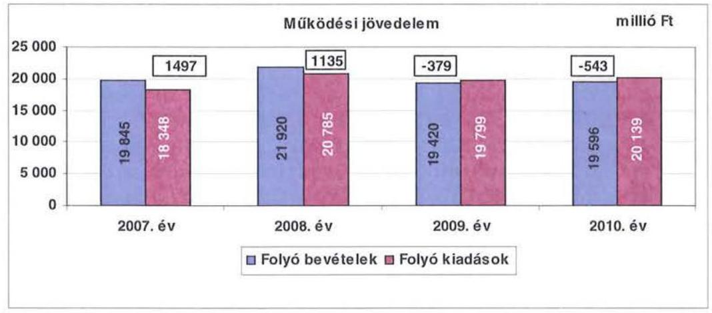

A folyó költségvetés egyenlege - a működési forrástöbblet - 2007-ben a folyó bevételek 7,5%-át (1497 millió Ft-ot), 2008-ban 5,2%-át (1135 millió Ft-ot) jelentette. A folyó költségvetés egyenlege - a működési forráshiány - a 2009. évben a folyó bevételek 2,0%-át (379 millió Ft-ot), a 2010. évben 2,8%-át (543 millió Ft-ot) tette ki. A 2007-2008. években keletkezett összes működési jövedelem 2632 millió Ft többletet mutatott, amely azokban az években részbeni forrásául szolgálhatott az Önkormányzat fennálló tőketörlesztési kötelezettségeinek teljesítéséhez, valamint fejlesztéseinek finanszírozásához.

A 2007-2008. években pozitív előjelű folyó költségvetési egyenleg ellenére az Önkormányzat folyószámlahitel felvételére kényszerült egyrészt a likviditási problémák kezelése, másrészt fejlesztési kiadásai finanszírozása miatt. A folyószámlahitel napi átlagos állománya - a folyószámlahitellel zárt naptári napok figyelembevételével - 2007-2010 között több mint kétszeresére nőtt (402 millió Ft-ról 961 millió Ft-ra) ${ }^{49}$.

Az Önkormányzat összes kötelezettségén belül meghatározó a hosszú lejáratú hitelekből eredő, amelynek összege a 2007. évben 6729 millió Ft (az összes kötelezettség 78,8%-a), a 2010. évben 14261 millió Ft (az összes kötelezettség 82,0%-a) volt. Az Önkormányzat 2007. december 31-én fennálló pénz és tőke-

[^0]
[^0]:    ${ }^{48}$ A 2007-2010. években a Hulladékgazdálkodási társulás és az ISPA projekt bevételeiből a csatlakozott települési önkormányzatokra jutó rész összesen 1142 millió Ft, a kiadásoké 987 millió Ft volt.
    ${ }^{49}$ A folyószámlahitel napi átlagos állománya - 365 napos nevezővel számolva - a 2007. évben 204 millió Ft, a 2008. évben 360 millió Ft, a 2009. évben 797 millió Ft, a 2010. évben 650 millió Ft volt.

---

piaci kötelezettsége 6729 millió Ft-ról 15927 millió Ft-ra (136,7%-kal) nőtt a 2010. év végére. A hosszú lejáratú hitelekből eredő kötelezettségek a 2010. év végére a 2007. év végét 7532 millió Ft-tal (111,9%-kal) haladták meg, miközben a korábban felvett hitelekből eredő rövid lejáratú fizetési kötelezettség 729 millió Ft-ról 1229 millió Ft-ra (68,6%-kal) emelkedett.

A rövid lejáratú kötelezettségek aránya az összes kötelezettség körében a 2007. évi 29,8%-ról a 2010. év végére 25,1%-ra mérséklődött, miközben összege 2543 millió Ft-ról 4364 millió Ft-ra emelkedett. A 2010. év végén fennálló rövid lejáratú kötelezettség jelentős emelkedését a folyószámlahitel (1666 millió Ft), a hitelek következő évet terhelő 68,6%-os növekedést mutató törlesztő részletei (1229 millió Ft), valamint a 14,5%-kal megnövekedett szállítói tartozásállomány (924 millió Ft) határozták meg.

Az Önkormányzat - a CLF módszer alapján számított - pénzügyi kapacitása ${ }^{50}$ a vizsgált időszak első felében pozitív, a második felében már negatív értéket mutatott. A nettó működési jövedelem ${ }^{51}$ értéke a működési jövedelem mellett az adott költségvetési év adósságtörlesztésének hatását is tükrözi. Az Önkormányzat költségvetési megtakarításai nem voltak elégségesek az adósságszolgálati kiadásokra, mert a 2007-2010. években keletkezett összesen 1710 millió Ft működési jövedelmet 79,8%-kal (3074 millió Ft) haladta meg a fejlesztési célú hitelekhez kapcsolódó tőketörlesztés, amelynek teljesítését követően 1364 millió Ft negatív nettó működési jövedelem keletkezett.

A nettó működési jövedelem - az évenkénti tőketörlesztés változása ${ }^{52}$ mellett - 2007-ben 861 millió Ft, 2008-ban 373 millió Ft volt, majd a pénzügyi kapacitás 2009-ben olyan mértékben romlott, hogy 1078 millió Ft, a 2010. évben 1520 millió Ft negatív nettó működési jövedelem keletkezett, alapvetően a folyó költségvetés egyenlegének (működési jövedelem) csökkenése, majd 2009-2010. évi deficitje miatt. A folyó költségvetési egyenleg (működési jövedelem) negatív értéke az Önkormányzat fejlesztéseihez felhasználható források elvesztését jelenti.

Az Önkormányzat - a CLF módszer alapján számított - fejlesztési kiadásainak fedezetét 2007. évben 89,9%-ban (1497 millió Ft), 2008. évben 64,6%-ban (1135 millió Ft) a folyó költségvetés biztosította. A 2009. évben a finanszírozási műveletek többletének 12,9%-a (379 millió Ft) a folyó költségvetést, 46,3%-a (1365 millió Ft) a beruházási költségvetést finanszírozta. A 2010. évben azonban már a finanszírozási műveletek többlete sem nyújtott elégséges forrást a folyó és a beruházási költségvetés egyensúlyának biztosításához, az Önkormányzat tárgyévi pozícióját 1834 millió Ft negatív eredménnyel zárta.

[^0]
[^0]:    ${ }^{50}$ Az Önkormányzat pénzügyi kapacitása a nettó működési jövedelemmel jellemezhető.
    ${ }^{51}$ nettó működési jövedelem = működési jövedelem - tőketörlesztés
    ${ }^{52}$ Az Önkormányzat tőketörlesztési kötelezettségéből adódóan a 2007. évben 636 millió Ft, a 2008. évben 761 millió Ft, a 2009. évben 699 millió Ft, a 2010. évben 977 millió Ft kiadást teljesített.

---

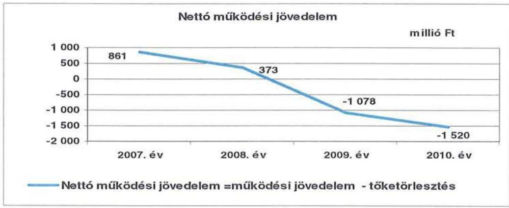

A 2007-2010. években az Önkormányzat felhalmozási költségvetésének egyenlege folyamatosan negatív összegű volt, amely körültekintő költségvetési gazdálkodás és pénzügyileg fenntartható ${ }^{53}$ beruházások esetén is pénzügyi kockázatot jelent, mivel az Önkormányzatnál a nettó működési jövedelem is negatív.

A felhalmozási költségvetés egyenlegének alakulását évről évre a következő ábra szemlélteti:
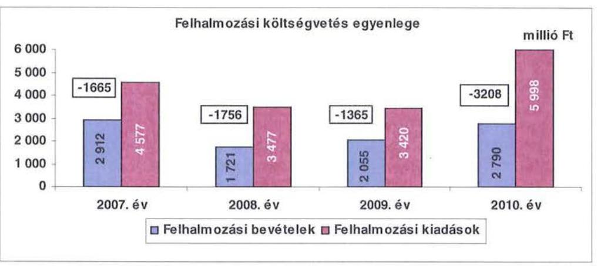

A felhalmozási forráshiánynak a felhalmozási kiadásokhoz viszonyított aránya 2007-ben 36,4% (1665 millió Ft), 2008-ban 50,5% (1756 millió Ft), 2009-ben 39,9% (1365 millió Ft), 2010-ben 53,5% (3208 millió Ft) volt. A vizsgált időszakban jelentkező összes felhalmozási forráshiány 7994 millió Ft volt, amelyből a 2007. évi felhalmozási hiány 51,7%-ára (861 millió Ft), a 2008. évi 21,3%-ra (373 millió Ft) nyújthatott fedezetet az akkor még pozitív értékű nettó működési jövedelem ${ }^{54}$. A 2009-2010. évi felhalmozási forráshiányra a negatív nettó működési jövedelem nem nyújthatott fedezetet. A felhalmozási forráshiány további finanszírozása a 2007-2010. években az előző évek pénzmaradvány-

[^0]
[^0]:    ${ }^{53}$ Az minősül pénzügyileg fenntartható beruházásnak, amelynek működtetésére az Önkormányzat nettó működési jövedelme a következő években is fedezetet nyújt.
    ${ }^{54}$ Az ábrában megjelenő 2007-2010. évi felhalmozási kiadásokban a Hulladékgazdálkodási társulás és az ISPA projekt kiadásaiból a társulásban, illetve a konzorciumban részvevő más települési önkormányzatokra jutó felhalmozási kiadás összege 987 millió Ft.

---

ból ${ }^{55}$, valamint hitelek igénybevételéből ${ }^{56}$ történt. A 2010. év végén rendelkezésre álló, a finanszírozásba bevonható szabad pénzmaradvány 31 millió Ft volt $^{57}$.

Az Önkormányzat 2011. évi költségvetési rendeletében tervezett bevételeinek és kiadásainak különbözete 4429 millió Ft finanszírozási hiányt mutat, amelyet a Közgyűlés döntése szerint finanszírozhat a 2010. évi és a korábbi években képződött 433 millió Ft pénzmaradvány ${ }^{58}$, az 1598 millió Ft működési, továbbá 2398 millió Ft felhalmozási célú hitelfelvétel.

Az Önkormányzat évenkénti teljes finanszírozási hiánya ${ }^{59}$ - a CLF módszer szerint számolva - 2007-ben 804 millió Ft, 2008-ban 1383 millió Ft, 2009-ben 2443 millió Ft, 2010-ben 4728 millió Ft volt, amelynek finanszírozását a finanszírozási célú bevételek és kiadások egyenlege a 2008. és 2010. években nem biztosította, ekkor a költségvetés hiánya 493 millió Ft, illetve 2811 millió Ft volt.

Az Önkormányzat finanszírozási műveletei 2007-2010. évekbeli egyenlegének alakulását a következő ábra szemlélteti:
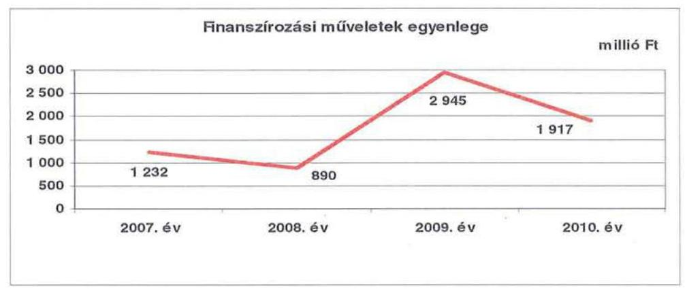

A finanszírozási többlet ${ }^{60}$ egyrészt azt jelzi, hogy az éves költségvetések végrehajtása során szükség volt az előző években keletkezett pénzmaradvány igény-

[^0]
[^0]:    ${ }^{55}$ A pénzmaradvány igénybevétele révén keletkezett felhalmozási célú forrásbevonás a 2007. évben 252 millió Ft, a 2008. évben 1510 millió Ft, a 2009. évben 1941 millió Ft, a 2010. évben 2437 millió Ft volt.
    ${ }^{56}$ Az összesen 10657 millió Ft felvett hitelből 1200 millió Ft működési célt szolgált.
    ${ }^{57}$ A 2010. évi záró pénzkészlet 1494 millió Ft volt, amely a folyószámlahitel 1666 millió Ft-os negatív, a függő, átfutó, kiegyenlítő bevételek és kiadások 678 millió Ft-os pozitív, valamint a finanszírozásból származó korrekciók 3 millió Ft-os negatív egyenlegének figyelembevételével 503 millió Ft pénzkészletet mutat (amelyből az előző évek pénzmaradványaiból képződött 84 millió Ft tartalék).
    ${ }^{58}$ Az előző évek pénzmaradványából működési célra 292 millió Ft-ot, felhalmozási célra 141 millió Ft-ot tervezett igénybe venni az Önkormányzat.
    ${ }^{59}$ a nettó működési jövedelem és a beruházási költségvetés eredője
    ${ }^{60}$ A felvett hitel összege a 2007. évben 1232 millió Ft-tal, a 2008. évben 890 millió Ft-tal, a 2009. évben 2945 millió Ft-tal, a 2010. évben 1917 millió Ft-tal haladta meg a hiteltörlesztés és az egyéb finanszírozási kiadások és bevételek együttes összegét.

---

bevételén túl külső - hitelből történő - finanszírozásra is ${ }^{61}$, másrészt, hogy a tárgyévben felvett hitel teljes nagyságrendjére a felhalmozási kiadások teljesítésének ütemkülönbsége miatt nem volt szükség a tárgyévben. A költségvetési beszámolók a pénzmaradvány igénybevétel figyelembevétele nélkül a 2007. évben 168 millió Ft, a 2008. évben 621 millió Ft, a 2009. évben 1744 millió és a 2010. évben 3751 millió Ft pénzügyi hiányt, a pénzmaradvány igénybevétel figyelembevételével a 2007. évben 1100 millió Ft, a 2008. évben 1917 millió Ft, a 2009. évben 919 millió Ft, és a 2010. évben 175 millió Ft pénzügyi többletet mutattak ki. Az Önkormányzat éves beszámolóiban megállapított működési

 és felhalmozási kiadásokat, a keletkezett pénzügyi többleteket a jelentés 1. számú melléklete mutatja be ${ }^{62}$.

A vizsgált időszakban az összes önkormányzati kötelezettség (passzív pénzügyi elszámolások nélkül) 8543 millió Ft-ról 17395 millió Ft-ra emelkedett, amely együtt járt a kamatkiadások 2007-ről 2010-re 144 millió Ft-tal ( $55,9 \%$-kal) történt növekedésével is. A 2007-2010 között az Önkormányzat összesen 1163 millió Ft kamatot fizetett meg. A fizetett kamatok a vizsgált időszak minden évében meghaladták a kamatbevételeket. Az átmenetileg szabad pénzeszközökből realizált kamatbevétel 482 millió Ft volt, amely a teljes kamatkiadás 41,4\%-át tette ki ${ }^{63}$. Az Önkormányzat kamatbevételeinek és kamatkiadásainak alakulását a következő ábra mutatja be:
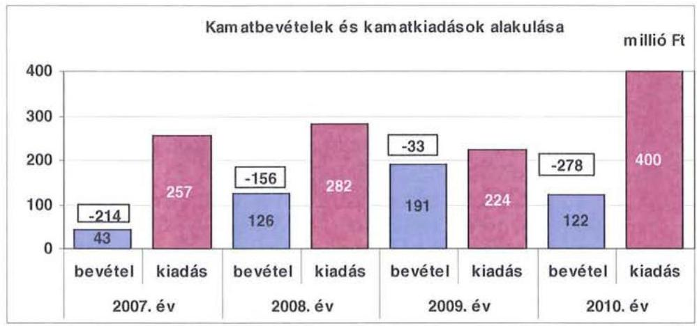

# 2.2. Az Önkormányzat bevételeinek alakulása 

Az Önkormányzat feladatai ellátása érdekében a 2007. évben 19844 millió Ft, a 2008. évben 21920 millió Ft, a 2009. évben 19420 millió Ft, a 2010. évben 19596 millió Ft működési bevételt teljesített. A működési bevételek körében leginkább meghatározó volt a költségvetési támogatás, amelynek összege a 2007. évi 7099 millió Ft-ról ( $35,8 \%$ ), a 2010. évben 6681 millió Ft-ra ( $34,1 \%$ ) mérséklődött. A működési bevételek között a második legnagyobb súllyal a helyi adókból beszedett bevétel bír, amelynek összege a 2007. évi 5098 millió Ft-ról (25,7\%), a 2010. évben 5182 millió Ft-ra (26,4\%) emelkedett.

Az Önkormányzat a 2007-2010 közötti időszakban realizált főbb folyó bevételi jogcímeinek számszaki adatait az alábbi grafikon mutatja be:
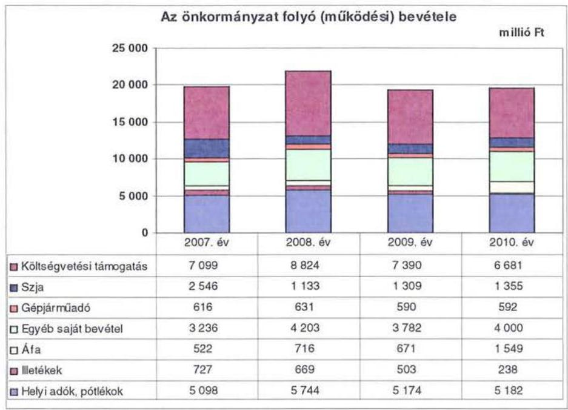

Az Önkormányzat költségvetési támogatása a 2007. évi 7099 millió Ft-ról 2008-ra 8824 millió Ft-ra ( $24,3 \%$-kal) növekedett. A költségvetési támogatás összege 2008-ról 2009-re 7390 millió Ft-ra, 2010-re 6681 millió Ft-ra mérséklődött a központi támogatás elosztásának változása, illetve az intézmények számának csökkenése következtében ${ }^{64}$. A költségvetési támogatásból a felhalmozási célú költségvetési támogatások összege a 2007. évben 1405 millió Ft, a 2008. évben 1051 millió Ft, a 2009. évben 48 millió Ft, a 2010. évben 43 millió Ft volt. Ezek döntő részét tette ki a - 2007. évben 1000 millió Ft, 2008. évben 850 millió Ft - színház megvalósításához kapott központi támogatás. Az szja összege a 2008. évre 1413 millió Ft-tal (55,5\%) csökkent, majd a 2009. évre 176 millió Ft-tal, a 2010. évre 46 millió Ft-tal növekedett az előző évekhez képest. Az szja összege a 2007. évhez viszonyítva 1191 millió Ft-tal (46,8\%-kal) lett alacsonyabb a 2010. évben. Az szja 2009-2010. évi - előző évhez viszonyítottan 15,5\%-os (176 millió Ft) és 3,5\%-os (46 millió Ft) - növekedésében a helyben maradó szja, valamint a 2010. évben az adóerőképesség változása játszott szerepet.

A gépjárműadóból származó bevétel 2007-ről 2010-re, a központilag meghatározott adómérték emelkedése ellenére 24 millió Ft-tal (3,9\%) mérséklődött alapvetően a gépjárművet vásárlók számának csökkenése következtében.

[^0]
[^0]:    ${ }^{64}$ Az Önkormányzat a 2007. évben 5694 millió Ft, a 2008. évben 7773 millió Ft, a 2009. évben 7342 millió Ft, a 2010. évben 6638 millió Ft működési célú költségvetési támogatásban részesült.

---

Az Önkormányzat egyéb saját bevételeinek összege a 2007. évhez képest a 2008. évben 967 millió Ft-tal ( $29,9 \%$ ) emelkedett, majd a 2009. évi 421 millió Ft-os ( $10,0 \%$ ) csökkenést követően a 2010. évben 218 millió Ft-tal ( $5,8 \%$ ) emelkedett. A változásban meghatározó szerepe volt az intézményi működési bevételeknek, a helyi adóhoz kapcsolódóan beszedett pótlékoknak, bírságoknak, díjaknak, az osztalékoknak, valamint az államháztartáson belülről kapott támogatásoknak.

Az Önkormányzat 2007-2010 között kapott osztalékának összege a 2007. évben négy gazdasági társaságtól 113 millió Ft, 2008-ban három gazdasági társaságtól 292 millió Ft, 2009-ben egy gazdasági társaságtól egy millió Ft, 2010-ben három gazdasági társaságtól 13 millió Ft volt. A kapott osztalék 76,7\%-a a városüzemeltetési feladatokat ellátó gazdasági társaságtól származott. Az Önkormányzat osztalékról nem mondott le. A három nyereséges gazdasági társaság, amelyek nem fizettek osztalékot, saját vezető testületi döntésük alapján az adózás utáni eredményét eredménytartalékba helyezte.

Az áfa bevételek ${ }^{65}$ összege az előző évhez képest 2008-ra 194 millió Ft-tal ( $37,1 \%$ ) növekedett, majd a következő évi 45 millió Ft-os ( $6,3 \%$ ) csökkenést követően a 2010. évben 878 millió Ft-tal ( $230,8 \%$ ) ismét növekedett, amely alapvetően a fordított áfa bevétel - 709 millió Ft - következménye volt. A fordított áfa elszámolásból adódó bevétel nem jelentett tényleges bevételi kapacitást, mivel ezzel azonos áfa kiadás teljesítési kötelezettsége keletkezik a központi költségvetés felé az Önkormányzatnak.

Az Önkormányzatnál az illetékbevétel a 2007-2010. években folyamatosan, jelentősen, 489 millió Ft-tal (a 2007. évi 32,7\%-ára) csökkent, amelyet döntően az ingatlanpiac stagnálása, majd visszaesése, illetve egyes illetékkedvezmények bevezetése okozott. Az Önkormányzat forráskiesése a 2007. évi illetékbevételhez viszonyítva 771 millió Ft volt. Az illetékbevételek a saját működési bevételekből a 2007. évben 8,4\%-kal, a 2010. évben 2,5\%-kal részesedtek.

Az Önkormányzat saját működési bevétele 2007-ben 8644 millió Ft volt, a 2008. évben 9979 millió Ft-ot, a 2009. évben 8848 millió Ft-ot, a 2010. évben 9677 millió Ft-ot tett ki. Az Önkormányzat saját működési bevételeinek körében meghatározó arányt (a 2007. évben 59,0\%-ot, a 2010. évben 53,5\%-ot ${ }^{66}$ ) képviselt a helyi adóbevétel, amely 2007-2008 között 5098 millió Ft-ról 5744 millió Ft-ra ( $12,7 \%$ ) emelkedett, majd a gazdasági visszaesés hatásai következtében 2009-re 5174 millió Ft-ra ( $9,9 \%$-kal) mérséklődött, 2010-re kis mértékben ismét ( 5182 millió Ft-ra) emelkedett. Az Önkormányzat helyi adókból és pótlékokból származó részesedése a folyó bevételeken belül 2007-2010 között átlagosan $26,3 \%$ volt. Az elért helyi iparűzési adóbevétel a 2007. évben 88,6\%-ot, a 2008. évben $84,9 \%$-ot, a 2009. évben $83,4 \%$-ot, a 2010. évben $83,5 \%$-ot ${ }^{67}$ tette ki a helyi adóbevételek között. A 2010. évben a 2007. évi alá csökkent a helyi iparűzési adóalap, ezért az Önkormányzat jövedelemkülönbség mérséklése címen 44 millió Ft támogatásban részesült.

Az Önkormányzatnak építményadóból, helyi iparűzési adóból és idegenforgalmi adóból keletkezett bevétele az ellenőrzött időszakban. Az Önkormányzat a 2007-2010. években az alábbi változásokat hajtotta végre a helyi adók tekintetében:

Az Önkormányzat 2008. január 1-jétől az építményadó - üzletek esetében $900 \mathrm{Ft} / \mathrm{m}^{2}$-ről $1080 \mathrm{Ft} / \mathrm{m}^{2}$-re, vállalkozási célú ingatlanok esetében $600 \mathrm{Ft} / \mathrm{m}^{2}$-ről $840 \mathrm{Ft} / \mathrm{m}^{2}$-re - és az idegenforgalmi adó - $300 \mathrm{Ft} /$ vendégéjszakáról $360 \mathrm{Ft} /$ vendégéjszakára - adómértékét felemelte, változtak a mentességi és kedvezményi körök, megszűnt a 2,5 millió Ft vállalkozási szintű adóalap alatti vállalkozásoknak nyújtott helyi iparűzési adóalap mentesség. A 2009. évben a bevezetett helyi adómérték nem változott, azonban a 2009. évtől a 2,5 millió Ft vállalkozási szintű adóalap kedvezmény ismét hatályba lépett. 2010. január 1-jétől adómérték változásra nem került sor, azonban a piaci vásározók részéről fizetendő ideiglenes jellegű iparűzési adófizetési kötelezettség 2010. március 5. napjától megszűnt.

Az Önkormányzat bevételi forrásait mérsékelte a 2007-2010. években a helyi iparűzési adó tekintetében biztosított mentességek ( 220 millió Ft ) és kedvezmények ( 359 millió Ft) hatása. További bevételkiesést jelentett, hogy a különféle végrehajtási cselekmények ellenére a 2010. évben kimutatott adóhátralékokból 467 millió Ft-ot (a hátralék 76,2\%-a) nem tudott behajtani az Önkormányzat.

Az egy $35 \%$-os részesedésű, továbbá a többségi és a minősített többségi önkormányzati tulajdonú gazdasági társaságok a vizsgált időszakban az Önkormányzat megbízásából beszedett bevételeikből összesen 4155 millió Ft-ot utaltak át, amellyel szemben az Önkormányzat tevékenységük ellátásáért 3777 millió Ft kiadást teljesített, így az Önkormányzat nettó bevétele 378 millió Ft volt. E gazdasági társaságok, illetve azok gazdasági társaságai közül ${ }^{68}$ a négy legnagyobb társaság nettó árbevétele az Önkormányzat valamennyi gazdasági társasága teljes nettó árbevételének 95,6\%-át (12 843 millió Ft), az összes bevétel $84,5 \%$-át (13 699 millió Ft) tette ki a 2010. évben.

A vagyonüzemeltetési feladatokat ellátó gazdasági társaság bevétele a 2010. évben 3504 millió Ft volt, amely a 2008. évi $84,6 \%$-a. A gazdasági társaságnak önkormányzati átadott pénzből forrása nem keletkezett. Önkormányzati megbízásból beszedett bevételeiből az Önkormányzatnak 2659 millió Ft-ot adott át a vizsgált időszakban ${ }^{69}$, amellyel szemben tevékenysége ellátásához az Önkormányzat 2416 millió Ft kiadást teljesített ${ }^{70}$. A gazdasági társaság 2010. évi adózott eredménye 750 millió Ft veszteség volt. A veszteség oka, hogy a működési nyereség nem tudta ellensúlyozni a 2007. évi kötvénykibocsátásból eredő árfolyamveszteséget, amelynek eredményeképpen a 2010. év végén 1279 millió Ft nem realizált, és 47 millió Ft realizált veszteség keletkezett. A gazdasági társaság likviditását rontja, hogy az üzemeltető a Sportcsarnok bérleti díját 2009 márciusa óta nem fizeti, ezért a 2010. év végére mintegy 20 millió Ft követelés halmozódott fel. A gazdasági társaságot fenyegető további likviditási kockázat a 2007. és a 2008. évben továbbértékesítési céllal vásárolt ingatlanok ${ }^{71}$ illetékkülönbözete ${ }^{72}$. Ha az ingatlanok értékesítésére az illetékkedvezmény nyújtása határidőjének végéig nem kerül sor, akkor 318 millió Ft összegű illetékfizetési kötelezettség terheli a gazdasági társaságot. A gazdasági társaság hosszú távú fizetőképességét veszélyezteti a kötvény visszafizetésével összefüggő 2010. december 31-én fennálló 32274154 CHF tőkefizetési kötelezettség is.

A víz- és csatornaszolgáltatást biztosító gazdasági társaság bevétele a 2007. évi 118,7\%-a ( 5260 millió Ft) volt a 2010. év végén. A vizsgált időszakban az összesen 251 millió Ft önkormányzati pénzeszköz átadásból keletkezett forrásból
 242 millió Ft fejlesztési célt szolgált. Az Önkormányzat részéről átadott pénz a gazdasági társaság bevételének 1,1-2,2%-a között változott. A gazdasági társaság önkormányzati megbízásból beszedett bevételeiből a 2007-2010. években 1117 millió Ft-ot adott át az Önkormányzatnak, amellyel szemben tevékenysége ellátásához az Önkormányzat a teljes átutalt összegre vonatkozóan kiadást teljesített ${ }^{73}$.

A parképítő gazdasági társaság bevétele a 2007. évi 90,4%-a (1433 millió Ft) volt a 2010. év végén. A gazdasági társaságnak a 2007-2010. évben önkormányzati pénzeszköz átadásból bevétele nem keletkezett. A gazdasági társaság az Önkormányzat számára ingatlanok bérleti díja címen 133 millió Ft-ot utalt át.

A távhőszolgáltatást ellátó gazdasági társaság bevétele a 2007. évi 116,5%-a (3502 millió Ft) volt a 2010. év végén. A gazdasági társaságnak a vizsgált időszakban önkormányzati pénzeszköz átadásból bevétele nem keletkezett. A gazdasági társaság önkormányzati megbízásból beszedett bevételeiből 244 millió Ft adott át a vizsgált időszakban, amellyel szemben tevékenysége ellátásához az Önkormányzat 243 millió Ft kiadást teljesített ${ }^{74}$.

Az Önkormányzat alaptevékenységükben sporttal foglalkozó - de bevételeiket tekintve nem jelentős nagyságrendű - gazdasági társaságai számára a 2007.

[^0]
[^0]:    ${ }^{70}$ helyiségek, lakások fenntartási költségeire, parkolók fenntartására
    ${ }^{71}$ A buszpályaudvar helyének kialakítására szánt ingatlan bekerülési költsége 1257 millió Ft, az ipari park ingatlanjainak bekerülési költsége 1282 millió Ft volt a 2010. év végén.
    ${ }^{72}$ Az ingatlanokat kedvezményes, 2%-os illetékkel vásárolták meg, ennek feltétele a két éven belüli továbbértékesítés lett volna. A kedvezmény a buszpályaudvar tekintetében 2011. szeptember 28-ig, az ipari park ingatlanjai vonatkozásában 2012. január 3-ig érvényes.
    ${ }^{73}$ Az Önkormányzathoz utalt társasági bevétel az ISPA projekt önerejéből, és szennyvízrendszer üzemeltetési díjából állt, amely bevételekkel azonos nagyságrendben fejlesztési kiadást teljesített az Önkormányzat.
    ${ }^{74}$ A faapríték üzem gépi berendezéseinek eladásából befolyt bevételt a társaság részére továbbutalta.

---

évben 55 millió Ft-tól - 62 millió Ft-ig terjedő összegű (bevételeik 42,7-74,6%-át kitevő), a 2010. évben 100 millió Ft-tól - 182 millió Ft-ig terjedő összegű (bevételeik 28,0-78,0%-át kitevő) kiadást teljesített.

A CLF modell alapján számított teljesített felhalmozási bevételek összege a költségvetésen belül a 2007. évben 2912 millió Ft (12,8%), a 2010. évben 2790 millió Ft (12,5%) volt. Az Önkormányzat felhalmozási bevételei a vizsgált időszakban a következőképpen alakultak:
ezer Ft

| Megnevezés | 2007. év tény | 2008. év tény | 2009. év tény | 2010. év tény |
| :--: | :--: | :--: | :--: | :--: |
| Tárgyi eszköz értékesítés | 211397 | 396073 | 317793 | 13064 |
| Egyéb saját tőkebevétel | 185742 | 131309 | 144198 | 87558 |
| Államháztartáson belülről kapott támogatás | 891585 | 328794 | 1512107 | 2480118 |
| EU-tól és külföldről kapott támogatások | 1260268 | 424390 | 130 | 147 |
| Államháztartáson kívülről kapott támogatás | 363339 | 440953 | 80585 | 209450 |
| Összes felhalmozási bevétel | 2912331 | 1721519 | 2054813 | 2790337 |

A tárgyi eszközök értékesítéséből származó bevétel a 2008. évben növekedett, majd a 2009. évben 19,8%-kal, a 2010. évben jelentős mértékben, 95,9%-kal csökkent ${ }^{75}$. E bevételi forrás a pénzügyi egyensúly megteremtésében nem játszott meghatározó szerepet, mivel az összes felhalmozási bevétel átlagosan 9,9%-át képezte a 2007-2010. években.

Az egyéb saját tőkebevételek körében meghatározó volt - a szociális lakástámogatási kölcsön, és a dolgozók munkáltatói kölcsönéből összetevődött támogatási kölcsönök visszatérülése, amely a 2007. évi 118 millió Ft-ról a 2010. évben 78 millió Ft-ra mérséklődött.

A felhalmozási célú bevételek változását döntően befolyásolta az államháztartáson belülről, az államháztartáson kívülről és az EU-tól kapott támogatások együttes összegének 2007-ről 2008-ra tapasztalt 1321 milliós Ft-os (52,5%-os) csökkenése, a 2008-ról a 2009-re 399 millió Ft-os (33,4%-os), a 2009-ről 2010-re történő 1097 millió Ft-os (68,9%-os) növekedése.

A 2007-2010. években az EU-tól kapott támogatások között meghatározó volt az ISPA projekt összesen 1688 millió Ft összegű támogatása. Az államháztartáson belülről kapott támogatások körében a 2009-2010. évben legjelentősebb volt az ISPA projektre (3088 millió Ft) juttatott támogatás, továbbá a 2009. évben az iparosított technológiával épült lakások felújítására nyert támogatás (528 millió Ft), a 2010. évben a történelmi városrész rekonstrukciójának támogatása (734 millió Ft)

[^0]
[^0]:    ${ }^{75}$ A 2007. évben 31 db, a 2008. évben 12 db, a 2009. évben 11 db, a 2010. évben 2 db ingatlan értékesítése valósult meg.

---

# 2.3. Az Önkormányzat kiadásainak alakulása 

Az Önkormányzat működési és felhalmozási kiadásai együttesen a 2008. évben 5,8%-kal (1338 millió Ft-tal), a 2009. évben 1,3%-kal (294 millió Ft), a 2010. évben 14,0%-kal (3212 millió Ft) haladták meg a 2007. évit, amely 22925 millió Ft volt.

Az Önkormányzat működési kiadásai főbb jogcímek szerinti bontásban az alábbiak voltak:
ezer Ft-ban

| Megnevezés | 2007. | 2008. | 2009. | 2010. |
| :--: | :--: | :--: | :--: | :--: |
| Folyó kiadások | 18347937 | 20785393 | 19798962 | 20139025 |
| Működési kiadások (kamatkiadás nélkül) | 15507328 | 17213009 | 16197700 | 16287457 |
| Államháztartáson belülre átadott pénzeszközök | 443351 | 539608 | 372081 | 384277 |
| Transzferkiadások | 1664038 | 2004955 | 2306797 | 2349609 |
| -ebből: vállalkozásoknak | 292176 | 592967 | 368230 | 446709 |
| EU-nak, illetve külföldre | 1650 | 850 | 1400 | 1200 |
| magánszemélyeknek | 430812 | 463569 | 641609 | 775151 |
| nonprofit szervezeteknek | 939400 | 947569 | 1295558 | 1126549 |
| Kamatkiadások | 256884 | 281585 | 223986 | 400506 |
| Előző évi pénzmaradvány átadás | 476336 | 746236 | 698398 | 717176 |

Az Önkormányzat folyó kiadásai a 2007. évihez képest a 2010. év végére 1791 millió Ft-tal, 9,8%-kal, ezen belül a működési kiadások 780 millió Ft-tal (5,0%-kal) nőttek. A működési kiadások növekedésében a dologi kiadások növekménye volt meghatározó, mivel a 2010. évben teljesített kiadások 1324 millió Ft-tal (25,3%) haladták meg a 2007. évit, alapvetően a fordított áfa elszámolásból adódóan, amelynek összege 707 millió Ft volt. A folyó kiadások növekményében a működési kiadások növekedésén túl, további meghatározó elem volt az Önkormányzat saját gazdasági társaságainak, a feladatellátásban résztvevő vállalkozásoknak átadott működési célú pénzeszközök növekménye, amelyek közül kiemelhető a Színház Kft. számára nyújtott 792 millió Ft, a Sportközpont Kft., a FALCO KC Kft., és a Haladás Kft. részére átadott összesen 1140 millió Ft.
ezer Ft-ban

| Megnevezés | 2007. | 2008. | 2009. | 2010. |
| :--: | :--: | :--: | :--: | :--: |
| Személyi juttatások | 7714765 | 8280205 | 7580789 | 7469482 |
| Munkaadót terhelő járulékok | 2471227 | 2619204 | 2307092 | 1991253 |
| Dologi kiadások | 5229460 | 6159823 | 6185368 | 6553281 |
| Egyéb folyó kiadások | 825096 | 1181598 | 1046835 | 1391123 |
| Működési célú pénzeszközátadás | 2107389 | 2544563 | 2678878 | 2733886 |

Az Önkormányzat a 2010. évben a folyó kiadásokból 9461 millió Ft-ot (47,0%) személyi juttatásokra és a munkaadókat terhelő járulékokra fordított, arányuk a 2007. évhez viszonyítva 8,5 százalékponttal (725 millió Ft) csökkent, alapvetően a létszámcsökkentések és feladatátszervezések következményeként.

Az üzemeltetést, intézményfenntartást biztosító dologi kiadásokra a 2010. évben 6553 millió Ft (32,5%) jutott, amely a 2007. évit 4 százalékponttal (1324 millió Ft-tal) haladta meg. A dologi kiadások növekményében leginkább

---

meghatározó a 2008. év volt, amikor az előző évhez képest 17,8%-os (930 millió Ft) növekedés következett be ${ }^{76}$. A dologi kiadások 2008. évi növekedésében meghatározó volt a városüzemeltetési, az út, híd fenntartási, intézményi karbantartási, lakás-és helyiségüzemeltetési, rendezvényszervezési kiadások emelkedése. Az Önkormányzat egyéb folyó kiadásokra a 2010. évben a működési kiadásokból 1391 millió Ft-ot (8,5%), a 2007. évben 825 millió Ft-ot (5,3%) fordított.

A működési célú pénzeszközátadások összege a 2010. évben 626 millió Ft-tal (29,7%-kal) haladta meg a 2007. évit, aránya a folyó kiadásokon belül 11,5%-ról 13,6%-ra növekedett. A növekményt alapvetően a gazdasági társaságok számára átadott pénzeszközök nagyságrendjének változása határozta meg.

Az Önkormányzat által a gazdasági társaságai számára működési, felhalmozási, tőkepótlási célra átadott pénzeszközök alakulását a 2007-2010. években az alábbi diagram mutatja be:
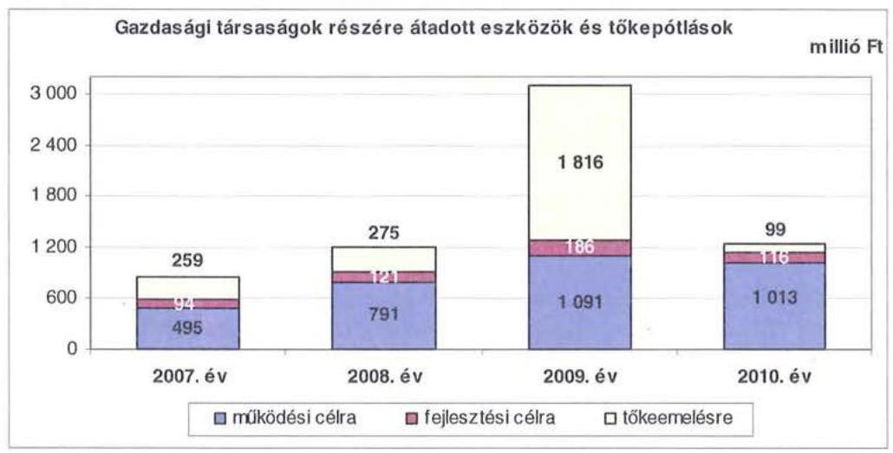

Az egy 35%-os tulajdoni hányadú, továbbá a többségi és a minősített többségi önkormányzati tulajdonú gazdasági társaságok számára a 2007-2010. években összesen 3551 millió Ft-ot adott át ${ }^{77}$, amelyből 3091 millió Ft a működést, 460 millió Ft a felhalmozási feladatok megvalósítását segítette. Az Önkormányzat három gazdasági társaság veszteségének rendezésére összesen 115 millió Ft pótbefizetést teljesített. Az Önkormányzat adatszolgáltatása szerint a legmagasabb összegű juttatásban a Színház Kft. (898 millió Ft) részesült a 2007-2010. évben. Kettő egyéb közfeladatot ellátó, nem önkormányzati tulajdonú gazdasági társaság számára működési célra 299 millió Ft-ot, fejlesztési célra 57 millió Ft-ot adott az Önkormányzat a vizsgált időszakban. A jegyzett tőkére, tőkeemelésre adott juttatás összesen 2474 millió Ft volt a vizsgált időszakban, amelyből a vagyonüzemeltetési feladatokat ellátó gazdasági társaság

[^0]
[^0]:    ${ }^{76}$ A dologi kiadások a 2009. évben 0,4%-kal (26 millió Ft), a 2010. évben 6,0%-kal (368 millió Ft) növekedtek az előző évhez viszonyítva.
    ${ }^{77}$ A évek sorrendjében juttatott összes támogatás a 2007. évben 801 millió Ft, a 2008. évben 1058 millió Ft, a 2009. évben 3005 millió Ft, a 2010. évben 1161 millió Ft volt.

---

számára a tőkeemelésre átadott nem pénzbeli apport értéke 2449 millió Ft volt. A vagyonüzemeltetési feladatokat ellátó gazdasági társaság tőkeemelésének oka a gazdasági társasággal egyesült más önkormányzati tulajdonú gazdasági társaságok tőkéjének átadása és ingatlanok apportálása volt ${ }^{78}$.

Az Önkormányzat a 2007. évben költségvetési kiadásaiból 4577 millió Ft-ot (20,0%), a 2008. évben 3477 millió Ft-ot (14,3%), a 2009. évben 3420 millió Ft-ot (14,7%), a 2010. évben 5998 millió Ft-ot (22,9%) fordított felhalmozási kiadások teljesítésére.
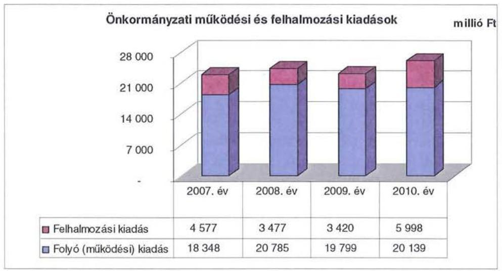

Az Önkormányzat költségvetésében elszámolt felhalmozási kiadások arányának változásában a 2007. évhez viszonyítva a 2008-2009. évben figyelhető meg 5,7 és 5,3 százalékpontos csökkenés, majd a 2010. évben 2,9 százalékpontos növekedés. Az Önkormányzat költségvetésében elszámolt felhalmozási kiadások tartalmazták a Hulladékgazdálkodási társulás és az ISPA projekt 2007-2010. évben elszámolt teljes kiadását, összesen 4786 millió Ft-ot. A két projektben lévő más önkormányzatokra jutó felhalmozási kiadás 987 millió Ft volt. Az Önkormányzat teljesített
 felhalmozási kiadásait 9,0%-ban saját bevétel (1487 millió Ft), 48,5%-ban támogatás (7992 millió Ft), 42,5%-ban hitel (7006 millió Ft) finanszírozta.

Az Önkormányzatnál a vizsgált időszakban befejezett és folyamatban lévő fejlesztések együttes tervezett bekerülési költsége 18304 millió Ft volt, amellyel szemben a 2007-2010. évben összesen 13944 millió Ft teljesítés történt. Az önkormányzati fejlesztések döntően intézményi épületek korszerűsítéséből, közterületek - utak, járdák - felújításából, belterületi vízrendezésből, földterületek, ingatlanok vásárlásából tevődtek össze.

[^0]
[^0]:    ${ }^{78}$ A gazdasági társaságba 2007. évben apportálásra került az Akacs Mihály utca 7. szám alatti ingatlan, amelynek apportértéke 259 millió Ft volt. A 2008. évben a gazdasági társaságba beolvadt a Claudius Ipari Park Kft., amelynek következtében 275 millió Ft tőkeemelésre került sor. A 2009. évben az Önkormányzat nem pénzbeli hozzájárulásként a Távhőszolgáltató Kft. 75%-os üzletrészének megfelelő összegű - 1816 millió Ft értékben alaptőke emelést hajtott végre. A 2010. évben két ingatlan apportálása történt meg, összesen 99 millió Ft-ban.

---

Az Önkormányzat befejezett fejlesztéseinek tervezett bekerülési költsége 5868 millió Ft, amelynek forrásmegoszlása 172 millió Ft EU-s támogatás (2,9%), 1726 millió Ft hazai támogatás (29,4%), 1953 millió Ft saját bevétel (33,3%) és 2017 millió Ft hitel (34,4%) volt. A felhalmozási feladatok megvalósítása érdekében a vizsgált időszakot megelőzően 440 millió Ft, a 2007-2010. években 5248 millió Ft kifizetést teljesítettek. A tervezett források közül a hazai támogatásból 7 millió Ft-tal, az EU-s támogatásból 107 millió Ft-tal kevesebbet kapott meg az Önkormányzat, a tervezett saját bevételekből 36 millió Ft, a hitelekből 30 millió Ft igénybevételére nem került sor.

Az Önkormányzat folyamatban lévő - a vizsgált időszak előtt, illetve a vizsgált időszakban megkezdett, de a 2010. évet követő időszakban befejezni tervezett beruházásainak tervezett bekerülési költsége 12436 millió Ft, amelyből a Hulladékgazdálkodási társulás és az ISPA projekt együttes tervezett bekerülési költsége 5133 millió Ft. A 2007-2010. évben teljesített összes kiadás 8696 millió Ft. Az Önkormányzat 2010. december 30-án folyamatban lévő fejlesztési feladatainak forrása 6600 millió Ft (53,1%) EU-s támogatás, 3362 millió Ft (27,0%) hazai támogatás, 1611 millió Ft (13,0%) saját bevétel, és 863 millió Ft (6,9%) hitel volt. A folyamatban lévő fejlesztések érdekében teljesített kiadás a 2007-2010. évben 8696 millió Ft, a 2010. év végéig összesen teljesített 9605 millió Ft volt. Az Önkormányzat 2010. december 31-én folyamatban lévő fejlesztési feladatok kötelezettség-vállalásainak összege 3700 millió Ft, amelyet 2077 millió Ft EU-s támogatásból, 74 millió Ft hazai támogatásból, valamint 1231 millió Ft saját bevételből, és 317 millió Ft összegű újabb hitel felvételéből terveznek biztosítani. A tervezett saját bevételek rendelkezésre állását azonban az Önkormányzat jelenlegi pénzügyi helyzete nem igazolja. Mindez kockázatot jelent a vállalt fejlesztések jövőbeni finanszírozhatósága szempontjából.

Az Önkormányzat a 2007-2010. években megvalósított, illetve a 2010. december 31-én fennálló fejlesztési feladataihoz kapcsolódó kötelezettségeinek összetételét a jelentés 3. a-d. számú mellékletei tartalmazzák.

Az Önkormányzat három legmagasabb bekerülési költségű beruházása az ISPA projekthez, az Iseum rekonstrukciójához és a városi kőszínház létrehozásához kapcsolódott.

A szennyvízelvezetési és tisztítási rendszerek fejlesztése érdekében 35 települési önkormányzat együttműködésével, az Önkormányzat gesztorságával valósult meg az ISPA projekt ${ }^{79}$. A projekt kivitelezése 2006. évben kezdődött meg, és 2010. évben műszakilag befejeződött, a 2011. évre az utolsó támogatás elszámolása húzódott át. A projekt teljes támogatható költsége 19820 ezer EUR (bruttó: 5239 millió Ft). A beruházás további, a támogatás szempontjából el nem számolható tervezett költsége nettó 385 ezer EUR (bruttó 113 millió Ft). A forrás megoszlása a következő: 60% EU-s támogatás, 30% központi költségvetési támogatás, 10% önrész volt. A beruházás érdekében felhasznált saját forrás 1985 ezer EUR (935 millió Ft), amelyből az Önkormányzat saját forrás része 1568 ezer EUR (1343 millió Ft) volt. A teljes bekerülési költségből az Önkor-

[^0]
[^0]:    ${ }^{79}$ A projekt előkészítéséről, a beruházási program elfogadásával a Közgyűlés a 126/2002. (IV. 25.) sz. határozatával döntött.

---

mányzat részesedése 15750 ezer EUR (bruttó 4572 millió Ft) volt ${ }^{80}$. Az önkormányzatok részéről saját forrás biztosítására nem volt szükség, mert a megvalósítást szabályozó konzorciumi szerződésnek megfelelően a csatornadijban 24 Ft/m³ ISPA önrészt határoztak meg, amelyet az üzemeltető szedett be, majd az Önkormányzat rendelkezésére bocsátotta.

Az Iseum rekonstrukciójának ${ }^{81}$ tervezett teljes bekerülési költsége 1594 millió Ft volt. Az Önkormányzat tervezett saját forrása 239 millió Ft (15%), az EU-s támogatás tervezett előirányzata 1355 millió Ft volt. Az Önkormányzat a teljes saját forrást hitelből tervezte biztosítani. A kivitelezés a 2009. évben kezdődött meg és műszakilag a 2010. évben befejeződött. A teljesített kifizetés összege 1125 millió Ft, ebből saját forrás 277 millió Ft, támogatás 848 millió Ft volt. A 2011. évben vállalt, a beruházáshoz kapcsolódó további kötelezettség ${ }^{82}$ 758 millió Ft, így a beruházás teljes bekerülési költsége várhatóan, a támogatási összeg változatlansága mellett, a saját források további megterhelésével összesen 1883 millió Ft, amely a tervezettet 18,1%-kal (289 millió Ft-tal) haladja meg.

Az Önkormányzat a város állandó kőszínházának építését több alkalommal tárgyalta ${ }^{83}$ és az építésre vonatkozóan tervpályázatot írt ki. Ennek során vált egyértelművé, hogy a tervezett kőszínház becsült kivitelezési költsége minimálisan 12 milliárd Ft-ra tehető, amelyhez az Önkormányzat a hiányzó önerőt biztosítani nem tudja, ezért az Önkormányzat a színház ideiglenes játszóhelye kialakítása érdekében egy ingatlan átalakításáról döntött ${ }^{84}$. A megvalósításhoz kizárólag állami támogatás - 1850 millió Ft - állt rendelkezésre ${ }^{85}$. A fejlesztéssel összefüggésben a 2008-2010. években 1183 millió Ft kiadást teljesítettek, a projekt műszakilag befejezett, de a 2011. évben a további várható kiadás összege 667 millió Ft${ }^{86}$.
${ }^{80}$ A projekt zárása a zárójelentés Európai Bizottsági jóváhagyással valósul meg, legkésőbb 2012. december 31-ei határidővel. Ezt követi az öt éves fenntartási időszak, amely alatt a konzorciumi szerződés alapján a beruházás az Önkormányzat tulajdonában marad.
${ }^{81}$ Az Önkormányzat a 25/2007. (I. 25.) számú határozatában elfogadta a Szombathelyi Történelmi-régészeti városrész kialakítása II. ütem az Iseum rekonstrukciója projekt kidolgozását és EU-s támogatással való megvalósítását.
${ }^{82}$ A beruházás része a II. Rákóczi Ferenc utca körforgalmának kialakítása és az út rekonstrukciója is, amelynek szerződéskötése folyamatban van.
${ }^{83}$ Az Önkormányzat a 253/2007. (V. 31.) számú határozatában döntött színházépítésről.
${ }^{84}$ 230/2009. (IV. 30.) számú határozat
${ }^{85}$ A Kormány a 2258/2007. (XII. 23.) határozatában 1 milliárd Ft, a 2177/2008. (XII. 18.) határozatában további 850 millió Ft támogatásról döntött, majd a 1043/2009. (IV. 8.) számú határozatával lehetővé tette a korábbi határozataival nyújtott támogatás felhasználását olyan módon, hogy ezzel a Szombathely, Akacs Mihály utca 7. szám alatti ingatlanon megteremthetővé váltak a Színház működéséhez szükséges feltételek.
${ }^{86}$ Az Önkormányzatnak a projekttel a Kormány részére 2011. december 31-ig kell elszámolnia.

---

Az Önkormányzat felhalmozási kiadásai között kezelt a Hulladékgazdálkodási társulás által megkezdett fejlesztés, amelynek az első üteme volt folyamatban a vizsgált időszakban. A 116 millió Ft összköltségű fejlesztés megvalósításához a 2010. évben 79 millió Ft támogatásban (a támogatott műszaki tartalom 85,0%-a) részesült az Önkormányzat. A projekt első fordulójában a társulás működési területén történő szelektív hulladékgyűjtés és a keletkezett hulladékhasznosítás műszaki feltételei megteremtésének előkészítését végzik el ${ }^{87}$. A 2010. évben a teljesített felhalmozási kiadás 11 millió Ft volt, amelyhez 2 millió Ft saját forrás biztosítása történt meg, amelyből az Önkormányzat részesedése 1 millió Ft volt. Az önkormányzatok részéről saját forrás biztosítására nem volt szükség, mert az annak megfelelő összeget a 2009. évtől beépítették a szolgáltatási díjba ${ }^{88}$.

Az Önkormányzat fejlesztési tevékenysége a pályázati kiírások által meghatározott, mivel a saját felhalmozási bevételeinek alacsony szintje miatt a beruházásokat, felújításokat csak külső források, uniós és hazai támogatások elnyerése esetén tudja megvalósítani. Az Önkormányzat a 2007-2010. években összesen 37 pályázatot nyújtott be EU-s és más központi források megszerzése érdekében. A benyújtott pályázatok közül 36 eredményes volt. A 2007-2010. évek között befejezett beruházások, felújítások saját forrásait 50,9%-ban (1987 millió Ft) fejlesztési hitelekből, 49,1%-át (1917 millió Ft) saját bevételeiből finanszírozta az Önkormányzat, a folyamatban lévők esetében 35,0%-ban (863 millió Ft) fejlesztési hitelek igénybevételét tervezi, 65% (1611 millió Ft) saját bevétel mellett.

Az Önkormányzat a 2011-2014. évekre vonatkozó gazdasági programjában a korábban elfogadott fejlesztéspolitikai dokumentumok ${ }^{89}$ figyelembevételével, az azokban megjelölt folyamatban lévő és meg nem valósult fejlesztési elképzelések elemzésével jelölte ki a városfejlesztés stratégiai irányait. A városfejlesztés tekintetében új hosszú távú városfejlesztési koncepcióról, a város történelmi, kulturális, épített örökségére épülő fejlesztésekről, ingatlan-rehabilitációról, továbbá jelentős zöldterületi és építészeti beruházást igénylő fejlesztések megvalósítását, a saját forrás biztosítása érdekében további fejlesztési hitelek felvételét határozta el.

[^0]
[^0]:    ${ }^{87}$ Az beruházás első fordulójának befejezési határideje 2012. április 29.
    ${ }^{88}$ A 2009. évben 300 Ft/fő működési hozzájárulást, 40 Ft/fő alapító vagyont, összesen 27 millió Ft értékben, 2010. évtől 600 Ft/fő, összesen 48 millió Ft összeget építettek be a lakossági díjakba.
    ${ }^{89}$ Az Önkormányzat az Integrált Városfejlesztési Stratégiáját 2008. évben fogadta el, amelyben kijelölésre kerültek a 2007-2013 között fejlesztendő területei: a belváros megújítása és a belváros északi részének fejlesztése, a belváros keleti részének fejlesztése a Piac területével együtt és a történelmi sétaút kialakítása az Iseum és a Ferences kert között, az új városliget, valamint a szociális céllal a Derkovits lakótelep és a Körmendi út mentén. További jelentős fejlesztendő terület a 11-es Huszár Laktanya hasznosítása, buszpályaudvar áthelyezése, lakóterületek fejlesztése.

---

# 3. KÖTELEZETTSÉGEK BEMUTATÁSA 

### 3.1. A pénzintézetek felé fennálló kötelezettségek alakulása

Az Önkormányzat pénzintézeti kötelezettségeinek állománya 2006. december 31-től 2010. december 31-ig 2,8 szeresére nőtt, 5583 millió Ft-ról 15927 millió Ft-ra. A változást a hosszú lejáratú hitelek, valamint a folyószámlahitel állományának emelkedése eredményezte, így a 2010. évi pénzintézeti kötelezettséget 14261 millió Ft hosszú lejáratú hitel - amelyből működési célú 1200 millió Ft - valamint a folyószámlahitel 1666 millió Ft-os állománya jelentette.
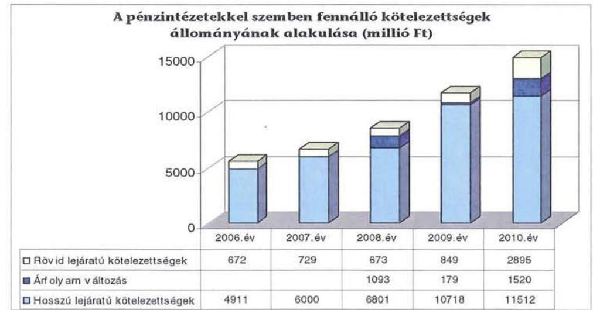

Az árfolyamváltozás hatása is befolyásolja a kötelezettségek alakulását, azonban annak mértéke előre pontosan nem határozható meg, csak várakozásokon alapuló tendenciák jelezhetők. Annak megítéléséről, hogy a devizában felvett hitelekért kapott forinthoz képest a hitelek visszafizetésekor jelentkező forintkötelezettség többletkiadást (árfolyamveszteség) vagy megtakarítást (árfolyamnyereség) eredményez-e a futamidő végén, a teljes kötelezettség rendezését követően lehet képet alkotni. Mindaddig, amíg törlesztési
 kötelezettség nem áll fenn (türelmi idő, moratórium), a tőkére vonatkoztatva nem értelmezhető sem az árfolyamveszteség, sem az árfolyamnyereség. A számviteli szabályok meghatározzák, hogy az árfolyamkülönbözetet év végén a kötelezettségek vagy követelések között a könyvviteli mérlegben nyilván kell tartani, azonban az árfolyamkülönbözet valójában nem realizált.

Az Önkormányzat a forráshiány kezelése érdekében a 2007-2010. évi költségvetési rendeletekben hosszú lejáratú hitelfelvétellel, pénzmaradvány igénybevétellel számolt. Az esetleges likviditási problémák áthidalása, a gazdálkodás biztonsága érdekében a 2007-2009. években felhatalmazták a polgármestert 2500 millió Ft folyószámlahitel felvételére. A 2010. évre a Közgyűlés 1700 millió Ft folyószámlahitel keret megkötését irányozta elő, amelyet 2010 szeptemberétől 2500 millió Ft-ra emelte.

A Közgyűlés a pénzügyi helyzet elemzését követően 2010. november 25-én az adósságállomány kezelése érdekében a 2014-ig terjedő időszakra Önkormányzati Finanszírozási Programot fogadott el. Ebben a gazdálkodás további racionalizálása mellett célként jelölték meg, hogy a város nettó hitelállománya a 2014. év végére nem haladhatja meg a 20 milliárd Ft-ot, a program értelmében 2012. évtől működési hiány már nem tervezhető, a fejlesztések a saját bevételek terhére történhetnek, a 2013. évtől hitel csak a tőketörlesztések fedezetére vehető igénybe.

A Polgármester - a jelentésben a Polgármester úrnak címzett 2. számú (a végleges jelentésben 1. számú) javaslatra tett - észrevétele szerint „Az új városvezetés észlelve a város súlyos pénzügyi helyzetét - azonnal intézkedett egy középtávú terv, az Önkormányzati Finanszírozási Program jóváhagyásáról." A Programhoz kapcsolódóan „Szombathely Megyei Jogú Város Önkormányzata Közgyűlése egyhangúlag fogadta el az 533/2010. (XI. 25.) Kgy. számú határozatát."... „a polgármester úrnak címzett 2. pontban meghatározott operatív terv elkészítését véleményünk szerint a fent említett 533/2010. (XI. 25.) Kgy. számú határozat meghozatalával és a 2011. évi költségvetésről szóló rendelet szigorú végrehajtásával az önkormányzat már megkezdte. A pénzügyi egyensúly helyreállítása érdekében már eddig is egy sor lépést tettünk, a 2012. évi költségvetési koncepció, és majd a rendelet további teendőket fogalmaz majd meg (helyi adó mérték változása, díj mértékek változása, önként vállalt feladatok további csökkentése), természetesen figyelembe véve a törvényi keretek addig bekövetkező változását és a központi feladat, illetve forrás szabályozást."

Elfogadjuk azt, hogy a Polgármester úrnak címzett 2. számú (a végleges jelentésben 1. számú) javaslatban meghatározott operatív terv (végleges jelentésben program) elkészítését az Önkormányzati Finanszírozási Program meghozatalával és a 2011. évi költségvetésről szóló rendelet szigorú végrehajtásával az Önkormányzat már megkezdte, továbbá a pénzügyi egyensúly helyreállítása érdekében intézkedéseket tett. Azonban az észrevétel nem megalapozott, mivel a döntések olyan tervezett rendszerét nem láttuk kidolgozottnak, amely egy - a felelősöket és határidőket is tartalmazó - összefoglaló dokumentumban jelenítené meg a bevételnövelő lehetőségek bemutatását - különösen a helyi adó potenciál meghatározását és kihasználását; a bérleti díjak és a térítési díjak megállapítását, felülvizsgálatát; a követelések behajtását; az egyéb sajátos bevételek növelésének lehetőségét -, a folyamatban lévő és a tervezett beruházások, a kiadási kötelezettségek teljes körű felülvizsgálatát; az intézkedések következtében jelentkező pénzügyi többlet, illetve az egyszeri bevételek tartalékba helyezését, elkülönített kezelését az adósságszolgálat teljesítése érdekében; az intézményi gazdálkodás felülvizsgálatát; az önként vállalt feladatok finanszírozhatóságának áttekintését a kötelező feladatellátás elsődlegességének biztosítása érdekében, a gazdasági programmal összhangban; valamint az intézkedések eredményeinek legalább évenkénti áttekintésének előírását.

Az Önkormányzat pénzintézeti kötelezettségvállalásai minden esetben közgyűlési döntés alapján történtek. A hitelkeretek összegét az éves költségvetésekben fogadták el, a hitelek tárgyát pedig a közbeszerzési kiírásokban rögzítették. A döntéseket megalapozó előterjesztések tartalmazták a kötelezettségvállalásnak a teljes futamidőre várható kamat- és tőkefizetési kötelezettségeit, viszont nem tartalmazták a kötelezettségvállalások visszafizetési forrásainak, az ár-folyam- és kamatkockázatoknak a bemutatását.

A Polgármester észrevétele szerint: „a jegyző úrnak címzett 1. pontban meghatározott feladat (jövőbeni árfolyam-, kamat-, visszafizetési kockázatok figyelemmel kísérése) véleményünk szerint olyan szakértelmet követel, amivel sem a jegyző, sem a polgármesteri hivatal nem rendelkezhet, kizárólag pénzügyi szakértők bevonásával lehet azt végrehajtani. A hatáskört tekintve felvetődik a polgármesterrel való közös felelősség kérdése."

A Jegyző úrnak címzett 1. számú (a végleges jelentésben 8. számú), az árfolyam-, kamat-, valamint visszafizetési kockázatok figyelemmel kísérésére és a Közgyűlés legalább félévente történő tájékoztatására vonatkozó javaslatra tett észrevételt nem fogadjuk el, azt továbbra is a jegyzőnek címezzük, mivel e feladatok hatásköri felelőse az Állami Számvevőszék által egységesen értelmezett álláspont szerint a jegyző.

A Közgyűlés döntéseiben kötelezettséget vállalt a felvett hitel és járulékainak megfizetésére, amit az adott év költségvetésébe betervezett és jóváhagyott. Az adósságszolgálati korlátot a döntésekkor figyelembe vették, ezt az áttekintett időszakban nem lépték túl.

Az Önkormányzatnál a helyszíni vizsgálat alatt kötvénykibocsátásról szóló döntést hoztak.

A Közgyűlés 2011. május 26-án döntött 2500 millió Ft összegű kötvény kibocsátásáról. A kiírt pályázat alapján a kötvényt 10 éves futamidővel, biztosíték nélkül, 3 havi BUBOR + 3,53%-os kamatfelárral 3 év kötvénytörlesztés türelmi idő mellett bocsátják ki. A kötvényt kibocsátó bank nem azonos a jelenlegi bankszámlavezetővel. A szerződéskötés a helyszíni ellenőrzés ideje alatt nem történt meg.

Az Önkormányzatnak 2010. december 31-én CHF-ben fennálló hosszú lejáratú kötelezettségvállalása az alábbi volt:

| Megnevezés | Szerződéskötés időpontja | Összeg CHF | Kibocsátási, vagy   lekötött árfolyam | Kamat (referencia kamat+ kamatfelár) | Felhasználás célja: |
| :--: | :--: | :--: | :--: | :--: | :--: |
| Hosszú lejáratú hitel 301200 | 2005. 08. 25 | 7743874 | 138,05 | 3 havi CHF LIBOR-0,03% | 06. hét beépítés |
| Hosszú lejáratú hitel 301700 | 2008. 07. 14 | 3333333 | 150 | 3 havi CHF LIBOR | hiteltörlesztés |
| Hosszú lejáratú hitel 301300 | 2005. 08. 25 | 6397321 | 161,45 | 3 havi CHF LIBOR-0,1% | sportcsarnok |
| Hosszú lejáratú hitel 301600 | 2007. 06. 20 | 12058738 | 147,9 | 3 havi CHF LIBOR-0,15% | intézmény-áttelepítés, hiteltörlesztés |
| Hosszú lejáratú hitel 301400 | 2006. 06. 15 | 12930625 | 176,11 | 3 havi CHF LIBOR-0,077% | Fő tér rekonstrukció, sportcsarnok építés, panelátjáró, beruházás, hiteltörlesztés |

Az Önkormányzatnak 2010. december 31-én EUR-ban fennálló hosszú lejáratú kötelezettségvállalása az alábbi volt:

| Megnevezés | Szerződéskötés időpontja | Összeg EUR | Kibocsátási, vagy   lekötött árfolyam | Kamat (referencia kamat+ kamatfelár) | Felhasználás célja: |
| :--: | :--: | :--: | :--: | :--: | :--: |
| Hosszú lejáratú hitel 301700 | 2008. 07. 14 | 5828439 | 261,8 | 3 havi EUREBOR | 06. parkolóprogram, úthoz rek., hiteltörlesztés |

A devizában fennálló pénzintézeti kötelezettségekből 12131100 CHF (2250 millió Ft) tőkét törlesztettek, valamint 2478218 CHF (488 millió Ft) és 257155 EUR (73 millió Ft) kamatot és egyéb költséget (rendelkezésre tartási jutalék, kezelési költség) fizettek a 2007-2010. években. A tőketörlesztés után elszámolt árfolyamveszteség 289 millió Ft volt.

Az Önkormányzatnak 2010. december 31-én HUF-ban fennálló hosszú lejáratú hitel állománya az alábbi volt:
ezer Ft-ban

| Megnevezés | Szerződéskötés   időpontja | Összeg   HUF | Kamat   (referencia | Felhasználás célja: |
| :-- | :--: | :--: | :--: | :-- |
| Hosszú lejáratú hitel 501710 | 2009. 05. 07 | 509000 | 1 havi   BUBOR +4,9873 % | ingatlanvásárlás |
| Hosszú lejáratú hitel 501811 | 2009. 07. 07 | 34825 | 3 havi   EURIBOR +1,7613 % | egészségügyi intézmény   felújítás |
| Hosszú lejáratú hitel 501812 | 2009. 07. 07 | 141550 | 3 havi   EURIBOR +1,7613 % | intézmény felújítás |
| Hosszú lejáratú hitel 501813 | 2009. 07. 07 | 358625 | 3 havi   EURIBOR +2,2613 % | út- és bérlakás felújítás |
| Hosszú lejáratú hitel 5018200   és 830 | 2009. 11. 19 | 2300000 | 3 havi   BUBOR +2.69 % | működésre, hiteltörlesztés |
| Hosszú lejáratú hitel 501840 | 2010. 09. 01 | 1355000 | 3 havi   BUBOR +3,3498 % | hiteltörlesztés |
| Hosszú lejáratú hitel 501800 | 2009. 07. 13 | 400000 | 3 havi EURIBOR+2.4   % | panelfelújítás |

A hosszú lejáratú hiteleket a megjelölt céloknak megfelelően vették igénybe. A 2007-2010. években a forintban fennálló kötelezettségek után 823 millió Ft tőkét, 445 millió Ft kamatot, és egyéb költséget (projektvizsgálati díj) fizettek. A hitelekből az Önkormányzat 5041 millió Ft-ot korábbi hiteleinek a kiváltására, 1200 millió Ft-ot pedig működési kiadások fedezetére fordított. Az Önkormányzat 2010. december 31-én további 2283 millió Ft hosszú lejáratú hitelkerettel rendelkezett, a rendelkezésre tartás határideje a 2011. évben jár le.

A 2007-2010. években összesen 482 millió Ft kamatbevételt realizáltak az intézmények és az Önkormányzati hivatal bankszámláin  rendelkezésre állt források után.

Az Önkormányzat működésének pénzügyi egyensúlyát a vizsgált időszakban csak folyószámlahitel igénybevételével tudta biztosítani. A folyószámlahitel alakulását az alábbi táblázat mutatja be:
ezer Ft-ban

| Megnevezés | 2007. év | 2008. év | 2009. év | 2010. év |
| :-- | :--: | :--: | :--: | :--: |
| I. Folyószámlahitel |  |  |  |  |
| a folyószámlahitel keretösszege január 1-jén | 2500000 | 2500000 | 2500000 | 1700000 |
| teljesített kamat és egyéb költség | 16504 | 32301 | 76489 | 36521 |

[^0]
[^0]:    ${ }^{90}$ meghatározóak voltak a támogatási előlegek

A folyószámlahitel kondícióinak és egyéb költségeinek alakulását az alábbi táblázat szemlélteti ${ }^{91}$ :

| Megnevezés | Kamat (referencia+ kamatfelár) | Egyéb költség |
| :--: | :--: | :--: |
| Folyószámlahitel |  |  |
| 2007. év | 3 havi BUBOR | - |
| 2008. év | 3 havi BUBOR | - |
| 2009. év | 3 havi BUBOR | - |
| 2010. év | 1,7 MRD: 1 havi BUBOR; 2010. 09. 01-től:   0,8 MRD: 1 havi BUBOR+2% | 0,50 % |

Az Önkormányzat bankszámla szerződése a 2009. évben lejárt, a közbeszerzési eljárás eredményeként 2010 januárjától új bankot választottak. A bankváltáskor csökkentették a folyószámlahitel keret összegét, majd 2010 szeptemberétől ismét 2500 millió Ft-ra emelkedett a hitelkeret. A folyószámla hitellel zárt napok száma jelentősen emelkedett a 2007. évi 185 napról 2009-re 318 napra, amely a 2010. évben 247 napra mérséklődött. A hitel napi átlagos állománya ${ }^{92}$ a 2007. évi 402 millió Ft-ról a 2010. évben 961 millió Ft-ra nőtt. A folyószámlahitel igénybevétele az Önkormányzatnak 2007-2010. években 162 millió Ft kamatkiadást okozott. A folyószámlahitel állománya 2010. december 31-én 1666 millió Ft volt, a korábbi években év végi állománnyal nem rendelkeztek. Ez a folyamat is a pénzügyi helyzet romlását jelzi.

Az Önkormányzat munkabér-megelőzési, illetve egyéb likviditási hitelt a 2007-2010. közötti időszakban nem vett igénybe, a helyszíni ellenőrzés befejezéséig folyamatban lévő kötelezettségvállalás sem történt.

A devizában fennálló hosszú lejáratú hitelek esetében a kamatfizetési kötelezettségek alakulását jelentősen befolyásolta és jelenleg is befolyásolja
 a kibocsátáskor és az utolsó kamatfizetéskor érvényes referencia kamat változása, amelyet az alábbi táblázat mutat be:

| Megnevezés | Lehivási | Utolsó fizetéskori | Változás \% |
| :--: | :--: | :--: | :--: |
| alapkamat \% |  |  |  |
| 3 havi CHF LIBOR 501200A | 0,875 | 0,25 | -71,4 |
| 3 havi CHF LIBOR 501300 | 0,80708 | 0,18 | -77,7 |
| 3 havi CHF LIBOR 501400 | 1,48333 | 0,18 | -87,8 |
| 3 havi CHF LIBOR 501200B | 2,5 | 0,25 | -90,0 |
| 3 havi CHF LIBOR 5017001 | 2,75 | 0,25 | -90,9 |
| 3 havi CHF LIBOR 501600 | 2,67 | 0,18 | -93,3 |
| 3 havi EURIBOR 5017002 | 3,5 | 1,25 | -64,3 |

[^0]
[^0]:    ${ }^{91}$ A referencia kamat az alábbi volt:

    | MNB BUBOR fioing (átlagkamat) \%-ban | | | | | | :--: | :--: | :--: | :--: | :--: | :--: | :--: | | Referetencia kamat | 2007. év | 2008. év | 2009. év | 2010. év | 2011. márucius   $31-\mathrm{ig}$ | | 1 havi BUBOR | 7,75 | 8,87 | 8,64 | 5,5 | 6,03 | | 1 havi BUBOR | 7,83 | 8,75 | 8,66 | 5,47 | 5,94 |

    92 fennálló folyószámla állomány/folyószámlahitellel zárt napok száma

---

A hitelfelvételkor érvényes referencia kamattal számolva a 2007-2010. években 2861252 CHF és 523744 EUR kamatfizetési kötelezettség keletkezett volna, azonban a referencia kamatok változása miatt az Önkormányzatnak ennél 387266 CHF és 266589 EUR összeggel kevesebb fizetési kötelezettséget kellett teljesítenie.

# 3.2. Szállítók felé fennálló kötelezettségek alakulása 

Az Önkormányzat mérleg szerinti szállítói kötelezettségének állománya a 2007. évi 806 millió Ft-ról folyamatos változást követően a 2010. év végére 924 millió Ft-ra növekedett, amely 14,6 % emelkedést jelent. Miután az Önkormányzat és intézményei összes kötelezettségeinek növekedési üteme meghaladta a szállítói állomány változását, így annak aránya az összes kötelezettségen belül a 2007. évi 8,9 %-ról a 2010. évre 5,3 %-ra csökkent.

Az Önkormányzat és gazdasági társaságai lejárt szállítói tartozása:

|  |  |  |  | ezer Ft-ban |
| :--: | :--: | :--: | :--: | :--: |
| Megnevezés | 2007.   december 31. | 2008.   december 31. | 2009.   december 31. | 2010.   december 31. |
| Lejárt szállítói tartozás | 39533 | 29692 | 23597 | 39899 |
| Gazdasági társaságok lejárt   szállítói tartozása | 270030 | 276768 | 277329 | 23023 |

Az Önkormányzat év végi lejárt szállítói tartozása a 2007. és a 2010. évben is 40 millió Ft volt. A lejárt szállítói tartozásokon belül meghatározó a 30 nap alatti elmaradás, a 2007. évben 63,1%-os, illetve a 2010. évben 98,9%-os arányával. A 2010. évben 91-365 nap közti tartozás egy 122 ezer Ft-os összegű vitatott tagdíj összege, valamint egy 300 ezer Ft-os későn érkezett számla volt. Éven túli elmaradást nem tartottak nyilván. Az Önkormányzat és intézményei szállítói kötelezettségeinek átütemezésére megállapodást nem kötöttek.

A gazdasági társaságok összesített mérleg szerinti szállítói kötelezettségének állománya a legalacsonyabb a 2007. évben volt, 974 millió Ft-tal, amely a 2010. évben 1079 millió Ft-ra emelkedett, ez a 2007. évhez viszonyítva 10,8%-os növekedést jelent. Az év végi lejárt szállítói tartozásállomány a 2007-2010. években meghaladta a 270 millió Ft-ot, amely a 2010. évre 23 millió Ft-ra csökkent. A 2010. év végére 91-365 nap közötti elmaradása egy 51%-ban önkormányzati tulajdonú gazdasági társaságnak volt 1475 ezer Ft értékben ${ }^{93}$. Éven túli elmaradás három, a 75%-os, vagy annál magasabb önkormányzati tulajdoni hányaddal rendelkező gazdasági társaságnak volt 478 ezer Ft összegben. Egyéb kiadási elmaradást egy kizárólagos önkormányzati tulajdonú gazdasági társaság mutatott ki 3973 ezer Ft összegben munkabér, járulék és szállítói tartozás miatt. Az adatok alapján megállapítható, hogy az Önkormányzat minősített többségi befolyásával rendelkező gazdasági társaságok lejárt szállítói tartozásállománya az Önkormányzat pénzügyi helyzetére kockázatot nem jelentett. A gazdasági társaságok szállító tartozásállományából fizetési átütemezés nem történt.

[^0]
[^0]:    ${ }^{93}$ A tartozást 2011. január 14-én kiegyenlítették.

---

# 3.3. Egyéb kötelezettségek alakulása 

Az Önkormányzat a 2007-2011. év I. negyedév időszakában 3 csatornamű társulat, 3 gazdasági társasága és egy civil szervezet felé vállalt kezességet hitelek biztosítékaként összesen 726 millió Ft, 617 ezer EUR és 900 ezer CHF értékben. A legnagyobb értékű kezességvállalás a Szombathelyi Távhőszolgáltató Kft. folyószámla hitele után volt 300-300 millió Ft összegben a 2008-2009. években. Devizában vállaltak kezességet a Savaria TISZK Kft felé támogatás megelőlegezési hitelhez. Fizetési kötelezettséget négy esetben kellett teljesíteni két csatornamű társulati hitel után 16 millió Ft összegben, amelyből megtérült 0,6 millió Ft. Fennálló kezességvállalás 2010. év végén 40 millió Ft volt, ebből 30 millió Ft a FALCO KC Kft-t, 10 millió Ft pedig a Mozgássérültek Vasakarat Sportklubját érintette, amelyek lejárata 2012. december 31., illetve 2011. május 20-a.

A 2007-2011. év I. negyedévében összesen 28,3 millió Ft követelés elengedés történt, amelynek 58 %-a, 16,5 millió Ft jogszabályok alapján a jegyző méltányossági jogkörébe tartozó helyi adó és gondozási díj elengedés volt. Helyi rendelet alapján a rendelet feltételeinek megfelelő közmű díjhátralékosok után a 2009. évben 10,9 millió Ft követelést töröltek. Ezen túl három esetben 0,9 millió Ft felmondási időre jutó bérleti díjat engedett el bizottság, vagy a Közgyűlés.

Tagi kölcsönt közgyűlési döntés alapján saját gazdasági társaságok részére nyújtottak az alapításkori likviditási gondok áthidalása érdekében. A Savaria TISZK részére a 2008. évben adott 20 millió Ft kölcsön megtérült. A gazdasági tevékenységüket a 2010. évben kezdő Savaria Városfejlesztési Kft. részére a 2010. évben adott 14 millió Ft, valamint a Szombathelyi Parkfenntartó és Temetkezési Kft-nek a 2011. évben nyújtott 40 millió Ft kölcsönök lejárata 2011. év vége. A Közgyűlés határozata alapján egyéb kölcsönt Söpte Község Önkormányzata részére nyújtottak területvásárlásra 165 millió Ft összegben. A kölcsön futamideje 25 év, négy év türelmi idővel. A kölcsön kamata azonos a jegybanki alapkamattal. Biztosítékként a kölcsön és járulékai erejéig az ingatlanra jelzálogjogot jegyeztettek be. Az érintett területre a két település közös gazdasági társaságot kívánt létrehozni ipartelepítés céljából, de a gazdasági válság miatt ez még nem valósult meg.

Az Önkormányzat PPP konstrukcióban nem vett részt, más szervezetnek kölcsönt nem nyújtott, garanciát nem vállalt, lízing szerződéssel nem rendelkezett.

Az Önkormányzatnál a 2007-2010. években kilenc ingatlanon volt jelzálogjog vagy/és elidegenítési és terhelési tilalom összesen 1134 millió Ft értékben. A terheléssel érintett ingatlanok nettó értéke 1585 millió Ft volt. A 2010. december 31-én fennálló jelzálogjog, valamint elidegenítési és terhelési tilalom összege 1003 millió Ft${ }^{94}$, amely 1546 millió Ft nettó értékű korlátozottan forgalomképes ingatlant érintett. A fennálló jelzálog, valamint elidegenítési és

[^0]
[^0]:    ${ }^{94}$ A jelzálogbejegyzésből meghatározó az új sportcsarnok építéséhez nyújtott 1000 millió Ft-os támogatáshoz kapcsolódó azonos összegű bejegyzés a sportcsarnokra, mely a 2021. évben jár le.

---

terhelési tilalom megterhelések minden esetben a pályázatoknak megfelelően a támogatásból épített, vagy felújított ingatlanra kerültek bejegyzésre: három oktatási intézményre, egy sportcsarnokra, valamint 81 lakásra a pályázatban előírt időtartamig való rendeltetésszerű használat biztosítására. Így az Önkormányzatnál jelzálogbejegyzés csak a támogatások igénybevétele miatt történt, hitelfelvétel miatti jelzálog-terhelés nem volt.
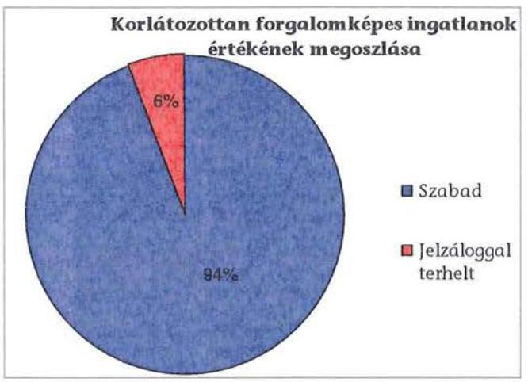

Az Önkormányzat korlátozottan forgalomképes ingatlanjainak nettó értéke 26864 millió Ft.

Az Önkormányzat kötelezettségeinek állománya 2010. december 31-én, valamint a várható kötelezettségek alakulása a lejáratáig:

| Megnevezés | Állomány 2010. dec. 31 -én |  |  | Várható kötelezettség 2011-2013. években |  |  | Várható kötelezettség 2014.   évet követően |  |  |
| :--: | :--: | :--: | :--: | :--: | :--: | :--: | :--: | :--: | :--: |
|  | HUF-ban (millió Ftban) | Devizában (összeg, ezer CHF, EUR-ban) | Deviza   (ezen) | HUF-ban (millió Ftban) | Devizában (összeg, ezer CHF, EUR-ban) | Deviza (ezen) | HUF-ban (millió Ftban) | Devizában (összeg, ezer CHF, EUR-ban) | Deviza (ezen) |
| Pénzintézeti kötelezettségek |  |  |  |  |  |  |  |  |  |
| Hosszú lejáratú hitelek | 2064 |  | HUF | 2825 |  | HUF | 8011 |  | HUF |
| Hosszú lejáratú hitelek |  | 34029,0 | CHF |  | 17023 | CHF |  | 17521 | CHF |
| Hosszú lejáratú hitelek |  | 2026,0 | EUR |  | 1920 | EUR |  | 4292 | EUR |
| Felszámolódóan | 1666 |  | HUF | 1666 |  | HUF |  |  | HUF |
| Pénzintézeti kötelezettségek összesen | 6730 |  | HUF | 4491 |  | HUF | 8011 |  | HUF |
| Pénzintézeti kötelezettségek összesen |  | 34029,0 | CHF |  | 17023 | CHF |  | 17521 | CHF |
| Pénzintézeti kötelezettségek összesen |  | 2026,0 | EUR |  | 1920 | EUR |  | 4292 | EUR |
| Biztosítékok |  |  |  |  |  |  |  |  |  |
| Kezesség | 40 |  | HUF |  |  |  |  |  |  |
| Biztosítékok összesen | 40 |  | HUF |  |  |  |  |  |  |
| Szállítói tartozás | 924 |  | HUF | 924 |  | HUF |  |  |  |

Az Önkormányzatnak pénzintézetekkel szemben fennálló kötelezettsége a 2010. év végén 6730 millió Ft, 34029 ezer CHF és 2026 ezer EUR volt. Ezek várható kötelezettsége (tőke, kamat és egyéb költség) a legutóbbi kamatfizetés feltételei alapján a 2011. évtől 4491 millió Ft, továbbá 17023 ezer CHF és 1920 ezer EUR. Az Önkormányzatnak a 2011. évben szállítói tartozások címén 924 millió Ft fizetési kötelezettsége keletkezett. A kezességvállalásaiból adódóan 40 millió Ft összegű terhe jelentkezhet, amennyiben a gazdasági társaság és a civil szervezet kötelezettségeiket nem teljesítik. A várható összes kötelezettség teljesítésére figyelembe vehető 787 millió Ft mérlegben kimutatott követelésállomány, 9003 millió Ft forgalomképes ingatlanvagyon, melyet pénzintézeti kötelezettségekhez kapcsolódóan jelzálog nem terhelt.
 Az Önkormányzat tájékoztatása szerint figyelembe vehető további források: elsődlegesen újabb hitelfelvétel, a meglévő hitelkeretek igénybevétele, és kisebb részben saját bevételek.

A gazdasági társaságok kötelezettségeinek állománya 2010. december 31-én, és a várható a kötelezettségek alakulása a lejáratáig ${ }^{95}$ :

| Megnevezés | Állomány 2010. dec.31-én |  |  | Várható kötelezettség 2011. 2013. években |  |  | Várható kötelezettség 2014.   évet követően |  |  |
| :--: | :--: | :--: | :--: | :--: | :--: | :--: | :--: | :--: | :--: |
|  | HUF-ban   (millió Ft-   ban) | Devizában (millió, ezer CHF, EUR-ban) | Deviza   (mennyiség) | HUF-ban (millió Ftban) | Devizában (millió, ezer CHF, EURban) | Deviza   (mennyiség) | HUF-ban (millió Ftban) | Devizában (millió, ezer CHF, EUR-ban) | Deviza   (mennyiség) |
| Kötvény |  | 32274 | CHF |  | 3168 | CHF |  | 30182 | CHF |
| Hosszú lejáratú hitelek | 160 |  | HUF | 156 |  | HUF | 21 |  | HUF |
| Hosszú lejáratú hitelek |  | 23 | EUR |  | 18 | EUR |  | 22 | EUR |
| Folyószámla- és egyéb rövid lejáratú hitelek | 10 |  | HUF | 10 |  | HUF |  |  |  |
| Mszterhelt kötelezettségek összesen HUF-ban | 170 |  | HUF | 166 |  | HUF | 21 |  | HUF |
| Mszterhelt kötelezettségek összesen CHF-ban |  | 32274 |  |  | 3168 |  |  | 30182 |  |
| Mszterhelt kötelezettségek összesen EUR-ban |  | 23 |  |  | 18 |  |  | 23 |  |
| Szállítói tartozás | 635 |  | HUF | 635 |  | HUF |  |  |  |

Az önkormányzati kötelezettségek növekedése mellett a minősített többségi tulajdonú gazdasági társaságok kötelezettségei is befolyásolhatják az Önkormányzat pénzügyi egyensúlyát. A gazdasági társaságoknak a 2011. évtől 187 millió Ft, 35350 ezer CHF, valamint 41 ezer EUR pénzintézeti kötelezettséget, és 655 millió Ft szállítói tartozást kell rendezniük. Ezek nem teljesítése esetén a bíróság korlátlan és teljes felelősséget állapíthat meg az Önkormányzat terhére. A gazdasági társaságoknak lízingszerződésük nem volt. A 2010. december 31-én kimutatott kötelezettségekből az Önkormányzat számára pénzügyi kockázatot jelenthet a vagyonüzemeltetési feladatokat ellátó kizárólagos önkormányzati tulajdonban lévő gazdasági társaság kötvénykibocsátása, amely kötelezettség a gazdasági társaságok kötelezettségeinek több mint 95%-át adta.

A Közgyűlés határozatban döntött a gazdasági társaságnál 5 milliárd Ft névértékű kötvény kibocsátásáról. A kibocsátás 2007. december 17-én megtörtént, 33007658 CHF értékben. A kötvénykibocsátás célja a kiemelt önkormányzati és gazdasági társasági projektek finanszírozása, valamint a kibocsátáskor meglévő hosszú lejáratú hitelállomány kiváltása volt, amelyek közül az utóbbira nem került sor. A kötvény lejárata 2032. december 18.

A kötvényből 2010. december 31-ig 2166 millió Ft-ot használtak fel közgyűlési döntéseknek megfelelően hat projekt ${ }^{96}$ finanszírozására. A fel nem használt összegeket betétként helyezték el, amelyekből 841 millió Ft kamatbevételt értek el, ebből 158 millió Ft-ot tőkére, 330 millió Ft-ot pedig kamatkiadásokra fordítottak. A kötvény után a 2011-2013. években 5168456 CHF, 2030-ig pedig további 30181577 CHF tőke- és kamatfizetési kötelezettség terheli a gazdasági társaságot. A kötvénytörlesztés terhei kihatással lehetnek az Önkormányzat pénzügyi helyzetére is, amit alátámaszt a 2010. évi kötvénybeszámoló is, mely szerint a 2012. évtől a törlesztés gondot jelenthet a gazdasági társaság számára.

A kötvénykibocsátás azért is kockázatot jelentett, mivel az Önkormányzat korlátlan felelősséggel tartozik felszámolás esetén a Gt. 54. § (2) bekezdése alapján

[^0]
[^0]:    ${ }^{95}$ A gazdasági társaságok 2014. évtől számolt kötelezettsége nem tartalmazza a kötvény kibocsátásából származó 2031. és 2032. évi kamatfizetési kötelezettséget.
    ${ }^{96}$ Ingatlanvásárlásokra, hulladéklerakó bővítésére, integrált városfejlesztésre, lakásépítésre

azon gazdasági társaságának, amelyben az Önkormányzat az 52. § (2) bekezdése szerint a szavazatok legalább 75%-ával rendelkezik, így minősített befolyásszerzőnek minősül, továbbá a Csődtv. 63. § (2) bekezdése alapján a kizárólagos önkormányzati tulajdonú gazdasági társasága minden olyan kötelezettségéért, amelynek kielégítését a felszámolási eljárás során az adós gazdasági társaság vagyona nem fedez, ha a hitelezőinek a felszámolási eljárás során benyújtott keresete alapján a bíróság - az adós gazdasági társaság felé érvényesített tartósan hátrányos üzletpolitikájára figyelemmel - megállapítja az önkormányzat korlátlan és teljes felelősségét. Felszámolás esetén a hitelezők által benyújtott kereset alapján a bíróság összességében 170 millió Ft, 33224 EUR, továbbá 32274154 CHF összegű korlátlan és teljes felelősséget állapíthat meg a kötelezettségekkel érintett három kizárólagos önkormányzati tulajdonú gazdasági társaság 2010. december 31-én fennálló pénzintézeti kötelezettségeiből adódóan.

A vizsgált időszakban az Önkormányzatnál nem történt meg annak felmérése, hogy az eszközök elhasználódása, amortizációja fedezetének biztosítása mekkora forrásokat igényel. Az elhasznált eszközök pótlására tartalékot nem képeztek, alapot nem hoztak létre ${ }^{97}$. Az Önkormányzat tárgyi eszközeinek bruttó értéke 2010. december végén 79579 millió Ft volt, amely a 2007. évit 11,1%-kal haladta meg. A 2007-2010. években kimutatott értékcsökkenés összege 5571 millió Ft volt. A legkevesebb értékcsökkenést a 2009. évben mutatták ki 1319 millió Ft-tal, míg a legtöbbet a 2010. évben 1460 millió Ft-tal. A tárgyévi felújítások ${ }^{98}$ összege a 2010. év kivételével nem érte el a tárgyévi értékcsökkenések összegét.

Az összes eszköz használhatósági foka a 2007. évi 85,9%-ról a 2010. évre 82,0%-ra csökkent, annak ellenére, hogy a bruttó érték minden eszközcsoportban nőtt. Ez azonban csak a járművek esetében biztosította a használhatósági fok emelkedését 21,7%-ról 24,8%-ra. A felújításokra, az eszközök pótlására a pénzügyi lehetőségek függvényében, elsősorban az intézmények működőképességének biztosítása érdekében került sor. A számvitelben elszámolt beruházások, felújítások összege a 2007-2010. években 13944 millió Ft, amely 150%-kal meghaladta az ugyanezen időszakban kimutatott értékcsökkenés összegét.

Az Önkormányzatnak bírósági ügyekben felperesként követelése nincs, alperesként jogerős határozattal le nem zárt 14 peres eljárásban az Önkormányzattal szembeni követelés 240 millió Ft, amelyből három tétel adja a perérték 99%-át.

Egy 178 millió Ft megfizetésére indított eljárásban peren kívüli egyezség várható. Ezen túl egy vállalkozás 44 millió Ft összegű elmaradt reklámhasználati díjat, illetve egy másik, pályázat miatt 16 millió Ft megbízási díjat perel, annak ellenére, hogy a megbízásra vonatkozóan írásbeli szerződéssel nem rendelkezik.

[^0]
[^0]:    ${ }^{97}$ Erre az Önkormányzatot jogszabály nem is kötelezi.
    ${ }^{98}$ A tárgyévi felújítások aránya a tárgyévi értékcsökkenéshez viszonyítva a 2007. évben 84%, a 2008. évben 49%, a 2009. évben 68%, a 2010. évben pedig 234% volt.

A gazdasági társaságokkal szemben alperesként, jogerős határozattal le nem zárt peres eljárások során 390 millió Ft-ot követelnek, amelynek 99%-a két eljáráshoz kapcsolódik. Egy kizárólagosan önkormányzati tulajdonban lévő gazdasági társasággal szembeni 280 millió Ft értékű kártérítés miatti perben II. rendű alperes az Önkormányzat, ezért a per kimenetele hatással lehet az Önkormányzat kötelezettségeire is. A másik esetben a perérték 106 millió Ft, szerződésszegéssel okozott kár miatt. A perek az elsőfokú eljárás szakaszában vannak. Jogerős határozattal lezárt ügyekben a gazdasági társaságoknak alperesként tartozásuk nincs.

# 4. A PÉNZÜGYI EGYENSÚLY MEGTEREMTÉSE ÉRDEKÉBEN HOZOTT INTÉZKEDÉSEK 

A jelentésben szereplő CLF modellben bemutatott 2009. és 2010. évi működési és 2007-2010. évi felhalmozási hiány amellett alakult ki, hogy a vizsgált időszakban az Önkormányzat folyamatosan intézkedéseket tett, hogy alkalmazkodjon a finanszírozási rendszer változása miatti forráscsökkenéshez. Ennek érdekében bevételnövelő és kiadáscsökkentő döntéseket hozott.

A kiadáscsökkentő és bevételnövelő intézkedések a gazdálkodás átláthatóbbá tételét, a feladatellátás szakmai színvonalának, valamint a pénzügyi helyzetnek a javítását célozták.

Az Önkormányzat az - általa készített kimutatások szerint - a 2007-2010. években kiadáscsökkentő intézkedések eredményeként 1545,2 millió Ft megtakarítást mutatott ki. A kiadáscsökkentő intézkedések hatását beavatkozási területenként az alábbi táblázat szemlélteti:

Az önkormányzat által 2007-2010 közötti időszakban érvényesített kiadáscsökkentő intézkedések részletezése

| Az érvényesített kiadáscsökkentés területei | Személyi   juttatások és   járulékai | Dologi,   működési   kiadások | Pénzeszköz   átadások,   támogatások | Összesen |
| :-- | :--: | :--: | :--: | :--: |
| A hivatalnál | 50154 | 10609 | 0 | 60763 |
| Az intézményeknél | 1209273 | 275120 | 0 | 1484393 |
| ÖSSZESEN | 1259427 | 285729 | 0 | 1545156 |

A kiadáscsökkentések eredményeként az Önkormányzati hivatalban kimutatott megtakarítás 60,8 millió Ft, amelyből 39,1 millió Ft (64,3%) az Önkormányzati hivatal átszervezéséhez kapcsolódó létszámcsökkentésből, 11,1 millió Ft (18,3%) az üres álláshelyek zárolásából, 7,1 millió Ft (11,7%) a beszerzési szerződések, 3,5 millió Ft (5,7%) a szolgáltatási szerződések felülvizsgálatából adódott.

Az önkormányzati szinten kimutatott megtakarítási intézkedésekből 1484,4 millió Ft-ot (96,1%) az intézmények körében érvényesítettek. Az intézményi kiadási megtakarításokból 909,5 millió Ft-ot (61,3%) intézmények átszervezésével, 572,1 millió Ft-ot (38,5%) további létszámcsökkentési döntésekkel - üres álláshelyek megszüntetésével, feladatmegszüntetéssel járó létszámcsökkentéssel, határozott idejű alkalmazások megszüntetésével, részmunkaidő bevezetésével -, valamint 2,8 millió Ft-ot (0,2%) beszerzési szerződések felülvizsgálatával kapcsolatos kiadások csökkentésével indokolt az Önkormányzat.

Az Önkormányzat 2007-2010 közötti időszakra szóló gazdasági programjában megfogalmazott elvárások szerint a 2007. évtől a Közgyűlés több alkalommal hozott intézmény-átszervezési döntéseket. A döntést előkészítő előterjesztések alapján az átszervezéseknek gazdasági (költségtakarékosabb, hatékonyabb működés) és szakmai (kiegyenlített szakmai színvonal biztosítása) indokai voltak.

A Közgyűlés a 2007. évben döntött a kulturális intézményhálózat racionalizálásáról. Az átszervezés célja az volt, hogy a város kulturális ellátottságát biztosító intézményeket, a Művészetek Házát, a Gyermekek Házát, valamint az MSH Rendezvényház Kht-t és a Mozi Kft-t egy gazdaságosan működtethető kulturális intézménnyé szervezzék. A feladatok ellátására az AGORA-t hozták létre. Az intézmények racionalizálása - az Önkormányzat kimutatása szerint - 2007-2010. években összesen 161,5 millió Ft kiadási megtakarítást eredményezett.

Az oktatási intézményhálózat racionalizálása során a Szentkirályi Általános Iskola és az Eötvös József Általános Iskola 2007-ben megszüntetésre került. A Szilágyi Erzsébet Kollégium és a Péterfy Sándor Kollégium 2007. július 31-vel megszűnt, és összevonták a jogutód Horváth Boldizsár Közgazdasági Informatikai Szakközépiskolával, illetve a Gépipari és Informatikai Műszaki Szakközépiskolával. A Simon István u. Általános Iskola, az Oladi Művelődési Központ és a Teleki Blanka Szakképző Iskola 2007. július 31-i megszűnésével egy új önállóan gazdálkodó intézmény, az Oladi Általános Művelődési Központ vette át
 a feladatokat. A Teleki Blanka Szakközépiskola Kollégiuma 2007. július 31. időponttal megszüntetésre került. Az oktatási ágazatban végrehajtott átszervezések hatásaként kimutatott megtakarítás összege 734,2 millió Ft volt.
2010. augusztus 31. napjával a Pálos Károly Családsegítő és Gyermekjóléti Szolgálat intézménye megszűnt, feladatait a jogutód Szociális Szolgáltató Központ látja el, amelynek elnevezése Pálos Károly Szociális Szolgáltató Központ és Gyermekjóléti Szolgálatra változott. Az Önkormányzat az intézmények összevonásával - a kimutatásai szerint - a 2007-2010. években 31,8 millió Ft megtakarítást ért el.

A 2007-2010. években az intézmények átszervezésével - a létszámcsökkentések hatásával is számolva - összesen 927,5 millió Ft megtakarítást mutatott ki az Önkormányzat, amelyet 18 millió Ft-tal mérsékelt az ISEUM Tárház alapításával kapcsolatos kiadások összege ${ }^{99}$. Az intézményi átszervezések eredményeképpen az ellenőrzött időszakban nyolccal csökkent az Önkormányzat által fenntartott költségvetési intézmények száma, ugyanakkor hattal emelkedett a telephelyek száma, mivel a megszüntetett költségvetési intézmények feladatellátási helyei többnyire telephelyként funkcionáltak tovább.

[^0]
[^0]:    ${ }^{99}$ A Közgyűlés a 363/2010. (VI. 17.) számú határozatával „Az Iseum rekonstrukciója" című projekt megvalósításának és fenntartásának biztosítása érdekében 2010. szeptember 1-jétől megalapította az ISEUM Tárházat.

---

Kiadáscsökkentő intézkedések eredményeként a 2011. évben az Önkormányzat 207 millió Ft megtakarítást tervez.

A tervezett megtakarításokból az Önkormányzati hivatalnál átszervezés miatti létszámcsökkentésből 67 millió Ft, intézmények átszervezéséből 63,5 millió Ft, beszerzési szerződések - irodaszerek, nyomtatványok - felülvizsgálatából 1,5 millió Ft, telefon szolgáltatási szerződés felülvizsgálatából 2 millió Ft, okmányiroda bérleti díjának csökkenéséből 10 millió Ft, a szociális juttatásoknál a támogatottak körének és a juttatások mértékének szűkítése miatt 63 millió Ft megtakarítás várható.

A Közgyűlés 2011-ben döntött arról, hogy az általános iskolák gazdálkodási szervezeti egységeit 2011. július 1-jével megszünteti, és a gazdálkodási feladataik ellátására a Művelődési GAMESZ-t jelölte meg. A Közgyűlés a Gépipari, Informatikai Műszaki Szakközépiskola és Kollégiumot, valamint a Savaria Szakközépiskola és Kollégiumot, mint önálló intézményeket 2011. július 31-vel beolvadással megszünteti, és a Puskás Tivadar Fém- és Villamosipari Szakképző Iskola és Kollégium tagintézményeként működteti tovább. A Közgyűlés a Szent-Györgyi Albert Középiskolát 2011. július 31-vel megszüntette.

Az intézményi átszervezéseket, megszüntetéseket érintő döntések előtt az Önkormányzat minden esetben végzett költségkihatásra vonatkozó háttérszámításokat, amelyek a közgyűlési előterjesztésbe beépítésre kerültek.

Az álláshely-csökkentő intézkedések következtében a 2007-2010 közötti években az Önkormányzati hivatalnál és az intézményeknél összesen 215,2 álláshelyet ${ }^{100}$ szüntettek meg, amelyből 139,9 (65,0%) szakmai, 62,3 (29,0%) intézményüzemeltetéshez, fenntartáshoz kapcsolódó álláshely, 13 (6,0%) üres álláshely volt.

Az Önkormányzat 2007-2010. éveket érintő létszámcsökkentésének alakulása

| Megnevezés (szintek tő-ben) |  | Közoktatás | Szociális és gyermekvédelem | Egészségügy | Polgármesteri hivatal | Egyéb | Összesen |
| :--: | :--: | :--: | :--: | :--: | :--: | :--: | :--: |
| Megszüntetett álláshelyek száma |  | 179,2 | 12,0 | 1,0 | 14,0 | 7,0 | 215,2 |
| 2008. 0 . üres álláshelyek száma |  | 7,0 | 1,0 | 1,0 | 2,0 | 2,0 | 13,0 |
|  | szakmai álláshelyek száma | 115,9 | 7,0 |  | 13,0 | 4,0 | 139,9 |
|  | intézmény-üzemeltetéssel kapcsolatos álláshelyek száma | 56,3 | 4,0 |  | 1,0 | 1,0 | 62,3 |
| 2007. június 1-jén indító létszám |  | 2068,0 | 370,0 | 71,0 | 300,0 | 186,0 | 2995,0 |
| 2010. december 31-én záró létszám |  | 1965,0 | 364,0 | 70,0 | 308,0 | 193,0 | 2962,0 |

A helyi szervezési intézkedésekhez kapcsolódóan a 2007-2010. években 224 millió Ft támogatásban részesült az Önkormányzat. A támogatás felhasználásával a nyilvántartások szerint tartósan leépített létszám 88 fő volt. Az Önkormányzat tájékoztatása szerint a létszámcsökkentéssel érintett dolgozók az Önkormányzati hivatalnál, az intézményeknél és a gazdasági társaságoknál nem kerültek továbfoglalkoztatásra.

[^0]
[^0]:    ${ }^{100}$ A részmunkaidős álláshelyek teljes munkaidős álláshelyekre átszámításra kerültek.

---

Az ellenőrzött időszakban az Önkormányzati hivatalnál és az intézményeknél feladatnövekedéssel, valamint új intézmények alapításával kapcsolatosan 122,2 álláshely létesítését engedélyezte a Közgyűlés.

A 42 közoktatási intézménynél elsősorban osztály illetve óvodai csoportok számának növekedése, gyógypedagógiai asszisztensek foglalkoztatása miatt került sor 50,2 fő létszámfejlesztésre. Az AGORA és az ISEUM Tárház alapítása 24 álláshely növekedést eredményezett. A megnövekedett feladatok ellátása érdekében a Tűzoltóságnál 15 fő, az Önkormányzati hivatalnál 24 fő, további intézményeknél 9 fő létszámnövekedést engedélyezett a Közgyűlés.

A fenti változások eredményeként az Önkormányzat 2007. január 1-jei indító létszáma 2995 főről 2010. december 31-re, 2902 főre (3,1%-kal) csökkent. A kiadáscsökkentő intézkedésekről hozott döntések során betartották a szakmai minimumlétszámra vonatkozó előírásokat, illetve nem veszélyeztették az ellátás színvonalát ${ }^{101}$.

A kiadáscsökkentő intézkedések mellett az Önkormányzat - a kimutatásai szerint - az alábbiakban számszerűsített bevételnövelő intézkedéseket tette:
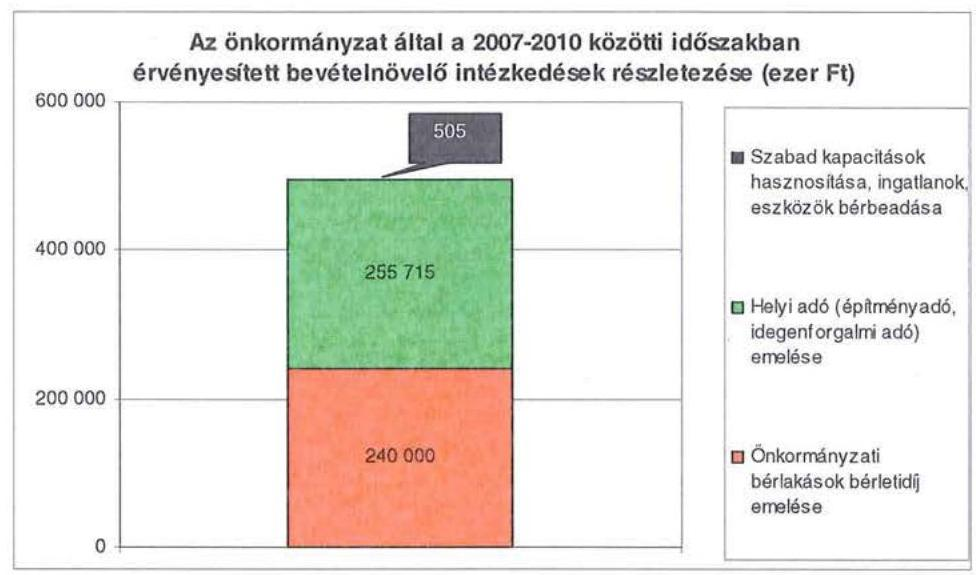

A bevételnövelésre irányuló intézkedések számszerűsített összegéből, ami 496 millió Ft volt, 256 millió Ft-ot (51,5%) jelentett a helyi adók (építményadó, idegenforgalmi adó) emeléséből - jelentés 2.2 pontjában részletezettek szerint származó bevétel. Az önkormányzati bérlakások bérleti díj emelése 240 millió Ft-tal (48,4%) részesült a bevétel-növekményből. Az ingatlanok bérbeadásából kimutatott bevétel 0,5 millió Ft (0,1%) az előzőekhez viszonyítva nem képviselt számottevő arányt.

A 2011. évre önkormányzati szinten mindössze 110 ezer Ft bevételi növekményt terveztek ingatlan bérbeadása címén.

[^0]
[^0]:    ${ }^{101}$ A 2011. év I. negyedévében további 30,5 álláshely megszüntetéséről döntött a Közgyűlés.

---

A 2007-2010. években összességében a működési célú költségvetési támogatások 4671 millió Ft-tal növekedtek, az átengedett bevételek 3875 millió Ft-tal, az illetékbevétel 771 millió Ft-tal csökkentek a 2007. évhez képest. Az Önkormányzat szempontjából forráskiesés nem volt, mivel e változások együttesen 25 millió Ft bevétel növekedést eredményeztek. A központi források együttes növekedése mellett az Önkormányzat kiadáscsökkentő és bevételnövelő intézkedéseivel 2041,2 millió Ft megtakarítást mutatott ki.

# 5. A HELYI ÖNKORMÁNYZATOK GAZDÁLKODÁSI RENDSZERÉNEK 2007. ÉVI ELLENŐRZÉSE SORÁN A PÉNZÜGYI EGYENSÚLY JAVÍTÁSÁRA TETT SZABÁLYSZERŰSÉGI ÉS CÉLSZERŰSÉGI JAVASLATOK HASZNOSULÁSA 

Az ÁSZ az Önkormányzat gazdálkodási rendszerét a 2007. évben ellenőrizte. Az ellenőrzésről készült jelentés megállapításairól a polgármester a Közgyűlést 2008. február 28-i ülésén tájékoztatta, a Közgyűlés intézkedési tervet fogadott el, határidők és felelősök megjelölésével. A jelentés az Önkormányzat pénzügyi egyensúlyi helyzetének javítására kettő szabályszerűségi javaslatot fogalmazott meg, amelyből egy valósult meg maradéktalanul.

Javasoltuk a jegyzőnek: biztosítsa, hogy a költségvetési rendelettervezetekben az Áht. 8/A. § (7) bekezdésében foglaltaknak megfelelően a finanszírozási célú pénzügyi műveleteket költségvetési hiányt módosító költségvetési kiadásként, illetve költségvetési bevételként ne vegyék figyelembe, továbbá gondoskodjon arról, hogy az Ámr. 29. § (1) bekezdés k) pontjának előírása alapján a költségvetési rendeletek tartalmazzák elkülönítetten az európai uniós támogatással megvalósuló programok, projektek bevételeit, kiadásait.

A költségvetési többletet, vagy hiányt módosító finanszírozási célú bevételek és kiadások költségvetési rendeletben történő elkülönített bemutatására vonatkozó javaslatunk részben teljesült, mivel a 2008-2011. évi költségvetések a finanszírozási célú kiadásokat költségvetési kiadásként tartalmazták.

Az EU-s támogatásokból finanszírozott programok elkülönített bemutatására vonatkozó javaslatunk megvalósult.

Budapest, 2011. december 2.

Melléklet:  9 db
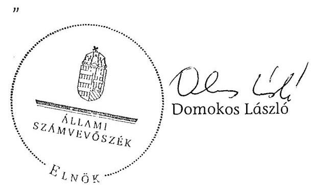

---

.

---

Szombathely Megyei Jogú Város Önkormányzata

1. sz. melléklet a V-3051-09/2011. számú jelentéshez

Működési és felhalmozási célú hiány/ többlet alakulása

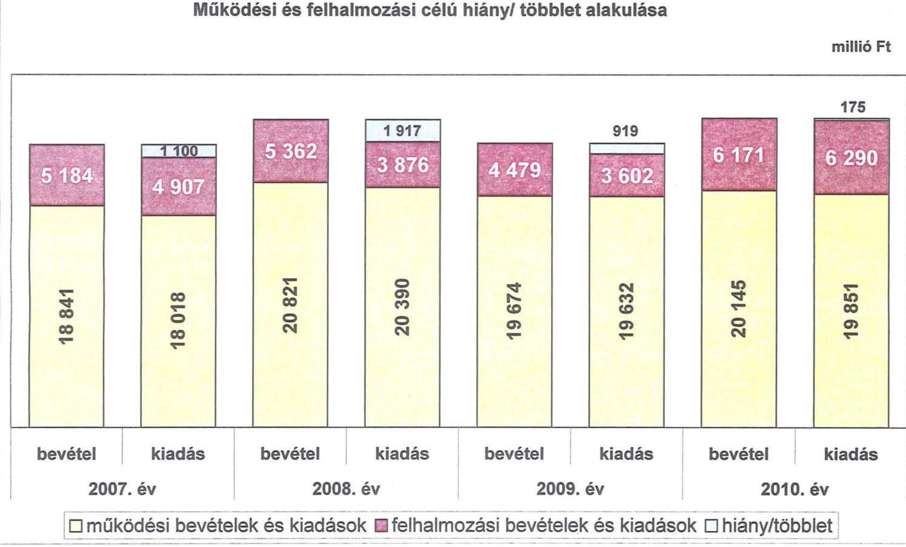

millió Ft

|  |   |   |   |   |   |   |   |   |
| --- | --- | --- | --- | --- | --- | --- | --- | --- |
|  6 184 | 1 100 | 5 362 | 1 917 | 4 479 | 919 | 6 171 | 175 | 6 290  |
|  18 841 | 4 907 | 20 821 | 20 390 | 19 674 | 19 632 | 5 454 | 5 515 | 5 515  |
|  bevétel | kiadás | bevétel | kiadás | bevétel | kiadás | bevétel | kiadás |   |
|   | 2007. év | 2008. év | 2009. év | 2010. év |  |  |  |   |

☐ működési bevételek és kiadások ☐ felhalmozási bevételek és kiadások ☐ hiány/többlet

---

|  Szombathely |  |  |  | szer Ft  |
| --- | --- | --- | --- | --- |
|  1. FOLYÓ KÖLTSÉGVETÉS* | 2007. | 2008. | 2009. | 2010.  |
|  1.1.1. Saját működési bevételek | 8 644 164 | 9 979 203 | 8 847 787 | 9 676 740  |
|  1.1.2. Költségvetési támogatás | 7 608 767 | 8 824 478 | 7 306 284 | 6 680 645  |
|  1.1.3. Átmunköt bevételek | 3 161 743 | 1 764 412 | 1 898 919 | 1 947 120  |
|  1.1.4. Áltomháztartáson belülről kapott támogatások | 208 929 | 482 782 | 507 291 | 487 194  |
|  1.1.5. EU-nii és külföldi áll kapott bevételek | 36 962 | 31 293 | 8 782 | 37 234  |
|  1.1.6. Áltomháztartáson kívülről kapott bevételek | 76 624 | 91 347 | 68 611 | 50 064  |
|  1.1.7. Eilszí és pásoniaszabvány átvétel | 475 662 | 746 236 | 606 398 | 717 176  |
|  1.1. Folyó bevételek = 1.1.1.+1.1.2.+1.1.3.+1.1.4.+1.1.5.+1.1.6.+1.1.7. | 19 844 471 | 21 919 931 | 19 420 138 | 19 896 173  |
|  1.2.1. Működési kiadások komarkiaiknak nélkül | 18 507 328 | 17 313 009 | 16 197 700 | 16 287 497  |
|  1.2.2. Áltomháztartáson belülre átadott pénzeszközök | 443 351 | 559 608 | 371 081 | 384 277  |
|  1.2.3.1. céltalbeszisségek | 292 176 | 592 967 | 368 138 | 446 709  |
|  1.2.3.2. EU-nak, illetve külföldre | 1 658 | 850 | 1 400 | 1 200  |
|  1.2.3.3. magáncsomollyebnek | 430 812 | 463 569 | 641 609 | 775 151  |
|  1.2.3.4. morgonlát szervszembenek | 929 400 | 947 569 | 1 295 550 | 1 126 549  |
|  1.2.4. Transferhizetések (=1.2.3.1+1.2.3.2+1.2.3.3+1.2.3.4) | 1 664 838 | 2 004 959 | 2 306 797 | 2 349 609  |
|  1.2.5. Komarkiaidások | 256 884 | 281 585 | 213 986 | 300 500  |
|  1.2.6. Eilszí és pásoniaszabvány átadás |

 476 336 | 746 236 | 698 398 | 717 176  |
|  1.2. Folyó kiadások = 1.2.1.+1.2.2.+1.2.3.+1.2.4.+1.2.5. | 18 347 937 | 20 785 393 | 19 798 962 | 20 130 025  |
|  1.3. Folyó költségvetés egyenlege MŰKÖDÉSI JÖVEDELEM (1.1. - 1.2.) | 1 496 534 | 1 134 538 | 378 824 | 542 852  |
|  2. FELHALMOZÁSI KÖLTSÉGVETÉS |  |  |  |   |
|  2.1.1. Saját ülkebevételek | 297 139 | 527 202 | 461 991 | 100 822  |
|  2.1.2. Államháztartáson belülről kapott támogatások | 891 585 | 228 794 | 1 512 107 | 2 480 118  |
|  2.1.3. EU-s és külföldről kapott támogatások | 1 265 205 | 424 398 | 130 | 147  |
|  2.1.4. Államháztartáson kívülről kapott támogatások | 363 339 | 440 953 | 80 585 | 209 450  |
|  2.1. Felhalmozási bevételek (=2.1.1.+2.1.2+2.1.3+2.1.4.) | 2 817 268 | 1 721 519 | 2 054 813 | 2 700 337  |
|  2.2.1. Saját beruházási kiadások | 2 564 947 | 1 924 291 | 1 521 627 | 1 692 691  |
|  2.2.2. Saját felújítási kiadások | 1 223 948 | 767 742 | 979 180 | 3 670 527  |
|  2.2.3. Államháztartáson belülre átadott pénzeszközök | 1 977 | 51 506 | 183 128 | 60 870  |
|  2.2.4. EU-nak és külföldnek adott pénzeszközök | - | 560 | - | -  |
|  2.2.5. Államháztartáson kívülre adott pénzeszközök | 752 775 | 1 092 899 | 726 933 | 283 819  |
|  2.2.6. Belkészítési célú részesedések vásárlása | 23 528 | 40 500 | 8 670 | 10 500  |
|  2.2. Felhalmozási kiadások (=2.2.1.+2.2.2.+2.2.3.+2.2.4.+2.2.5.+2.2.6.) | 4 577 177 | 3 877 423 | 3 419 638 | 5 798 415  |
|  2.3. Felhalmozási költségvetés egyenlege (2.1. - 2.2.) | -1 759 909 | -2 155 904 | -1 364 825 | -3 098 078  |
|  3. Finanszírozási műveletek nélküli (GFS) pozíció(1.3.+2.3.) | -1 263 375 | -1 021 366 | -986 001 | -2 555 226  |
|  4. Finanszírozási műveletek |  |  |  |   |
|  4.1. Hitel felvétel | 1 840 000 | 1 506 923 | 3 698 466 | 3 612 990  |
|  4.2. Hitel visszafizetés | 635 892 | 761 077 | 699 054 | 976 591  |
|  4.3. Forgatási és belkészítési célú értékpapírok kibocsátása | - | - | - | -  |
|  4.4. Forgatási és belkészítési célú értékpapírok beváltása | - | - | - | -  |
|  4.5. Forgatási és belkészítési célú értékpapírok vásárlása | - | - | - | -  |
|  4.6. Forgatási és belkészítési célú értékpapírok vásárlása | - | - | - | -  |
|  4.7. Egyéb finanszírozási bevételek (fügekből, átfunkcionálásból, kiegészítőkből) | 1 178 | 49 555 | 2 212 | 358 409  |
|  4.8. Egyéb finanszírozási kiadások (fügekből, átfunkcionálásból, kiegészítőkből) | 26 789 | 94 345 | 48 957 | 359 929  |
|  4.9. Finanszírozási műveletek egyenlege (4.1. - 4.2.+4.3.-4.4+4.5.-4.6.+4.7.-4.8.) | 1 232 075 | 889 710 | 2 945 103 | 2 216 710  |
|  5. Tárgyévi pénzügyi pozíció változás (1.3.+ 2.3.+4.9.) | -1 063 763 | -1 268 344 | 1 201 454 | 1 834 220  |
|  6. Nettó működési jövedelem=működési jövedelem (1.3.) - tőketöbblet | 860 642 | 373 461 | 1 077 918 | 1 519 843  |
|  TÁJÉKOZTATÓ ADATOK |  |  |  |   |
|  Összes kötelezettség | 8 542 561 | 9 808 681 | 13 009 184 | 17 395 386  |
|  ebből rövid lejáratú | 2 542 689 | 1 914 088 | 2 111 440 | 4 363 596  |
|  Összes eszköz és kötelezettség | 806 458 | 305 583 | 499 137 | 923 650  |
|  ebből lejárt (tanszfervárcskól) | 29 533 | 29 692 | 23 597 | 39 899  |
|  Feszített és tőkejellegű kötelezettség (adósság) | 1 728 754 | 8 567 376 | 11 746 137 | 15 930 429  |
|  ebből rövid lejáratú | 728 862 | 672 778 | 849 941 | 2 895 181  |
|  FFP szerződésből származó kötelezettség állomány | 0 | 0 | 0 | 0  |
|  ebből lejárt esedékességű díj mintájú kötelezettség | 0 | 0 | 0 | 0  |
|  Felcsúti napágyi átfutás állománya | 203 887 | 299 941 | 796 705 | 650 490  |
|  Látottabb napágyi átfutás állománya (tanszfervárcskól) | 0 | 0 | 0 | 0  |
|  Muskatárfelet napágyi átfutás állománya (tanszfervárcskól) | 0 | 0 | 0 | 0  |
|  Keresztény és panaszkezelési eljárások (tanszfervárcskól) | 253 291 | 363 365 | 400 000 | 10 000  |
|  Jogerős kivitelezési felbontásból adódó kötelezettségek (tanszfervárcskól) | 0 | 0 | 0 | 0  |
|  Finanszírozásba bevonható eszközök | 1 858 283 | 2 126 547 | 3 328 001 | 1 493 781  |
|  Tartós befektetések, értékpapírok év végi állománya | 0 | 0 | 0 | 0  |
|  Hosszú lejáratú követelések év végi állománya | 0 | 0 | 0 | 0  |
|  Értékpapírok év végi állománya | 0 | 0 | 0 | 0  |
|  Pénzeszközök év végi állománya (idegen pénzeszközök nélküli) | 1 858 283 | 2 126 547 | 3 328 001 | 1 493 781  |

- Bevételeikben nem szerepel, kiadásaikban nem jelennek meg az amortizációk, a vagyoni helyzetet az egység befolyásolja. ** Bevételeikben vagyonmegtartó és bővítő célú források szerepelnek.

---

|   |  |  |  |  |  |  |  |  |  |  |  |  |  |  |  |  |  |  |  |  |  |  |  |  |  |  |  |  |  |  |  |  |  |  |  |  |  |  |  |  |  |  |  |  |  |  |  |  |  |  |  |  |  |  |  |  |  |  |  |  |  |  |  |  |  |  |  |  |  |  |  |  |  |  |  |  |  |  |  |  |  |  |  |  |  |  |  |  |  |  |  |  |  |  |  |  |  |  |  |  |  |  | 

---

|  |   |   |   |   |   |   |   |   |   |   |   |   |   |   |   |   |   |   |   |   |   |   |   |   |   |   |   |   |   |
| --- | --- | --- | --- | --- | --- | --- | --- | --- | --- | --- | --- | --- | --- | --- | --- | --- | --- | --- | --- | --- | --- | --- | --- | --- | --- | --- | --- | --- | --- |
|   |  |  |  |  |  |  |  |  |  |  |  |  |  |  |  |  |  |  |  |  |  |  |  |  |  |  |  |  |   |
|  V |  |  |  |  |  |  |  |  |  |  |  |  |  |  |  |  |  |  |  |  |  |  |  |  |  |  |  |  |   |
|   |  |  |  |  |  |  |  |  |  |  |  |  |  |  |  |  |  |  |  |  |  |  |  |  |  |  |  |  |   |
|   |  |  |  |  |  |  |  |  |  |  |  |  |  |  |  |  |  |  |  |  |  |  |  |  |  |  |  |  | 

 |
|   |  |  |  |  |  |  |  |  |  |  |  |  |  |  |  |  |  |  |  |  |  |  |  |  |  |  |  |  |   |
|   |  |  |  |  |  |  |  |  |  |  |  |  |  |  |  |  |  |  |  |  |  |  |  |  |  |  |  |  |   |
|   |  |  |  |  |  |  |  |  |  |  |  |  |  |  |  |  |  |  |  |  |  |  |  |  |  |  |  |  |   |
|   |  |  |  |  |  |  |  |  |  |  |  |  |  |  |  |  |  |  |  |  |  |  |  |  |  |  |  |  |   |
|   |  |  |  |  |  |  |  |  |  |  |  |  |  |  |  |  |  |  |  |  |  |  |  |  |  |  |  |  |   |
|   |  |  |  |  |  |  |  |  |  |  |  |  |  |  |  |  |  |  |  |  |  |  |  |  |  |  |  |  |   |
|   |  |  |  |  |  |  |  |  |  |  |  |  |  |  |  |  |  |  |  |  |  |  |  |  |  |  |  |  |   |
|   |  |  |  |  |  |  |  |  |  |  |  |  |  |  |  |  |  |  |  |  |  |  |  |  |  |  |  |  |   |
|   |  |  |  |  |  |  |  |  |  |  |  |  |  |  |  |  |  |  |  |  |  |  |  |  |  |  |  |  |   |
|   |  |  |  |  |  |  |  |  |  |  |  |  |  |  |  |  |  |  |  |  |  |  |  |  |  |  |  |  |   |
|   |  |  |  |  |  |  |  |  |  |  |  |  |  |  |  |  |  |  |  |  |  |  |  |  |  |  |  |  |   |
|   |  |  |  |  |  |  |  |  |  |  |  |  |  |  |  |  |  |  |  |  |  |  |  |  |  |  |  |  |   |
|   |  |  |  |  |  |  |  |  |  |  |  |  |  |  |  |  |  |  |  |  |  |  |  |  |  |  |  |  |   |
|   |  |  |  |  |  |  |  |  |  |  |  |  |  |  |  |  |  |  |  |  |  |  |  |  |  |  |  |  |   |
|   |  |  |  |  |  |  |  |  |  |  |  |  |  |  |  |  |  |  |  |  |  |  |  |  |  |  |  |  |   |
|   |  |  |  |  |  |  |  |  |  |  |  |  |  |  |  |  |  |  |  |  |  |  |  |  |  |  |  |  |   |
|   |  |  |  |  |  |  |  |  |  |  |  |  |  |  |  |  |  |  |  |  |  |  |  |  |  |  |  |  |   |
|   |  |  |  |  |  |  |  |  |  |  |  |  |  |  |  |  |  |  |  |  |  |  |  |  |  |  |  |  |   |
|   |  |  |  |  |  |  |  |  |  |  |  |  |  |  |  |  |  |  |  |  |  |  |  |  |  |  |  |  |   |
|   |  |  |  |  |  |  |  |  |  |  |  |  |  |  |  |  |  |  |  |  |  |  |  |  |  |  |  |  |   |
|   |  |  |  |  |  |  |  |  |  |  |  |  |  |  |  |  |  |  |  |  |  |  |  |  |  |  |  |  |   |
|   |  |  |  |  |  |  |  |  |  |  |  |  |  |  |  |  |  |  |  |  |  |  |  |  |  |  |  |  |   |
|   |  |  |  |  |  |  |  |  |  |  |  |  |  |  |  |  |  |  |  |  |  |  |  |  |  |  |  |  |   |
|   |  |  |  |  |  |  |  |  |  |  |  |  |  |  |  |  |  |  |  |  |  |  |  |  |  |  |  |  |   |
|   |  |  |  |  |  |  |  |  |  |  |  |  |  |  |  |  |  |  |  |  |  |  |  |  |  |  |  |  |   |

 |  |  |  |  |  |   |
|---|---|---|---|---|---|
|   |  |  |  |  |  |  |  |  |  |  |  |  |  |  |  |  |  |  |  |  |  |  |  |  |  |  |  |  |   |
|   |  |  |  |  |  |  |  |  |  |  |  |  |  |  |  |  |  |  |  |  |  |  |  |  |  |  |  |  |   |
|   |  |  |  |  |  |  |  |  |  |  |  |  |  |  |  |  |  |  |  |  |  |  |  |  |  |  |  |  |   |
|  

---

|   |  |  |  |  |  |  |  |  |  |  |  |  |  |  |  |  |  |  |  |  |  |  |  |  |  |  |  |  |  |  |  |  |  |  |  |  |  |  |   |
|---|---|---|---|---|---|---|---|---|---|---|---|---|---|---|---|---|---|---|---|---|---|---|---|---|---|---|---|---|---|---|---|---|---|---|---|---|---|---|---|---|---|
|   |  |  |  |  |  |  |  |  |  |  |  |  |  |  |  |  |  |  |  |  |  |  |  |  |  |  |  |  |  |  |  |  |  |  |  |  |  |   |
|   |  |  |  |  |  |  |  |  |  |  |  |  |  |  |  |  |  |  |  |  |  |  |  |  |  |  |  |  |  |  |  |  |  |  |  |  |  |   |
|   |  |  |  |  |  |  |  |  |  |  |  |  |  |  |  |  |  |  |  |  |  |  |  |  |  |  |  |  |  |  |  |  |  |  |  |  |  |   |
|   |  |  |  |  |  |  |  |  |  |  |  |  |  |  |  |  |  |  |  |  |  |  |  |  |  |  |  |  |  |  |  |  |  |  |  |  |  |   |
|   |  |  |  |  |  |  |  |  |  |  |  |  |  |  |  |  |  |  |  |  |  |  |  |  |  |  |  |  |  |  |  |  |  |  |  |  |  |   |
|   |  |  |  |  |  |  |  |  |  |  |  |  |  |  |  |  |  |  |  |  |  |  |  |  |  |  |  |  |  |  |  |  |  |  |  |  |  |   |
|   |  |  |  |  |  |  |  |  |  |  |  |  |  |  |  |  |  |  |  |  |  |  |  |  |  |  |  |  |  |  |  |  |  |  |  |  |  |   |
|   |  |  |  |  |  |  |  |  |  |  |  |  |  |  |  |  |  |  |  |  |  |  |  |  |  |  |  |  |  |  |  |  |  |  |  |  |  |   |
|   |  |  |  |  |  |  |  |  |  |  |  |  |  |  |  |  |  |  |  |  |  |  |  |  |  |  |  |  |  |  |  |  |  |  |  |  |  |   |
|   |  |  |  |  |  |  |  |  |  |  |  |  |  |  |  |  |  |  |  |  |  |  |  |  |  |  |  |  |  |  |  |  |  |  |  |  |  |   |
|   |  |  |  |  |  |  |  |  |  |  |  |  |  |  |  |  |  |  |  |  |  |  |  |  |  |  |  |  |  |  |  |  |  |  |  |  |  |   |
|   |  |  |  |  |  |  |  |  |  |  |  |  |  |  |  |  |  |  |  |  |  |  |  |  |  |  |  |  |  |  |  |  |  |  |  |  |  |   |
|   |  |  |  |  |  |  |  |  |  |  |  |  |  |  |  |  |  |  |  |  |  |  |  |  |  |  |  |  |  |  |  |  |  |  |  |  |  |   |
|   |  |  |  |  |  |  |  |  |  |  |  |  |  |  |  |  |  |  |  |  |  |  |  |  |  |  |  |  |  |  |  |  |  |  |  |  |  |   |
|   |  |  |  |  |  |  |  |  |  |  |  |  |  |  |  |  |  |  |  |  |  |  |  |  |  |  |  |  |  |  |  |  |  |  |  |  |  |   |
|   |  | 

 |  |  |  |  |  |  |  |  |  |  |  |  |  |  |  |  |  |  |  |  |  |  |  |  |  |  |  |  |  |  |  |  |  |  |  |  |   |
|   |  |  |  |  |  |  |  |  |  |  |  |  |  |  |  |  |  |  |  |  |  |  |  |  |  |  |  |  |  |  |  |  |  |  |  |  |  |  |   |
|   |  |  |  |  |  |  |  |  |  |  |  |  |  |  |  |  |  |  |  |  |  |  |  |  |  |  |  |  |  |  |  |  |  |  |  |  |  |  |   |
|   |  |  |  |  |  |  |  |  |  |  |  |  |  |  |  |  |  |  |  |  |  |  |  |  |  |  |  |  |  |  |  |  |  |  |  |  |  |  |   |
|   |  |  |  |  |  |  |  |  |  |  |  |  |  |  |  |  |  |  |  |  |  |  |  |  |  |  |  |  |  |  |  |  |  |  |  |  |  |  |   |
|   |  |  |  |  |  |  |  |  |  |  |  |  |  |  |  |  |  |  |  |  |  |  |  |  |  |  |  |  |  |  |  |  |  |  |  |  |  |  |   |
|   |  |  |  |  |  |  |  |  |  |  |  |  |  |  |  |  |  |  |  |  |  |  |  |  |  |  |  |  |  |  |  |  |  |  |  |  |  |  |   |
|   |  |  |  |  |  |  |  |  |  |  |  |  |  |  |  |  |  |  |  |  |  |  |  |  |  |  |  |  |  |  |  |  |  |  |  |  |  |  |   |
|   |  |  |  |  |  |  |  |  |  |  |  |  |  |  |  |  |  |  |  |  |  |  |  |  |  |  |  |  |  |  |  |  |  |  |  |  |  |  |   |
|   |  |  |  |  |  |  |  |  |  |  |  |  |  |  |  |  |  |  |  |  |  |  |  |  |  |  |  |  |  |  |  |  |  |  |  |  |  |  |   |
|   |  |  |  |  |  |  |  |  |  |  |  |  |  |  |  |  |  |  |  |  |  |  |  |  |  |  |  |  |  |  |  |  |  |  |  |  |  |  |   |
|   |  |  |  |  |  |  |  |  |  |  |  |  |  |  |  |  |  |  |  |  |  |  |  |  |  |  |  |  |  |  |  |  |  |  |  |  |  |  |   |
|   |  |  |  |  |  |  |  |  |  |  |  |  |  |  |  |  |  |  |  |  |  |  |  |  |  |  |  |  |  |  |  |  |  |  |  |  |  |  |   |
|   |  |  |  |  |  |  |  |  |  |  |  |  |  |  |  |  |  |  |  |  |  |  |  |  |  |  |  |  |  |  |  |  |  |  |  |  |  |  |   |
|   |  |  |  |  |  |  |  |  |  |  |  |  |  |  |  |  |  |  |  |  |  |  |  |  |  |  |  |  |  |  |  |  |  |  |  |  |  |  |   |
|   |  |  |  |  |  |  |  |  |  |  |  |  |  |  |  |  |  |  |  |  |  |  |  |  |  |  |  |  |  |  |  |  |  |  |  |  |  |  |   |
|   |

---

|  1111111111111111111111111111111111111111111111111111111111111111111111111111111111111111111111111111111111111111111111111111111111111111111111111111111111111111111111111111111111111111111111111111111111

---

|   |  |  |  |  |  |  |  |  |  |  |  |  |  |  |  |  |  |  |  |  |  |  |  |  |  |  |  |  |  |  |  |  |  |  |  |  |  |  |  |  |  |  |  |  |  |   |
| --- | --- | --- | --- | --- | --- | --- | --- | --- | --- | --- | --- | --- | --- | --- | --- | --- | --- | --- | --- | --- | --- | --- | --- | --- | --- | --- | --- | --- | --- | --- | --- | --- | --- | --- | --- | --- | --- | --- | --- | --- | --- | --- | --- | --- | --- | --- | --- |
|   |  |  |  |  |  |  |  |  |  |  |  |  |  |  |  |  |  |  |  |  |  |  |  |  |  |  |  |  |  |  |  |  |  |  |  |  |  |  |  |  |  |  |  |  |  |   |
| 

  |  |  |  |  |  |  |  |  |  |  |  |  |  |  |  |  |  |  |  |  |  |  |  |  |  |  |  |  |  |  |  |  |  |  |  |  |  |  |  |  |  |  |  |  |  |   |
|   |  |  |  |  |  |  |  |  |  |  |  |  |  |  |  |  |  |  |  |  |  |  |  |  |  |  |  |  |  |  |  |  |  |  |  |  |  |  |  |  |  |  |  |  |  |   |
|   |  |  |  |  |  |  |  |  |  |  |  |  |  |  |  |  |  |  |  |  |  |  |  |  |  |  |  |  |  |  |  |  |  |  |  |  |  |  |  |  |  |  |  |  |  |   |
|   |  |  |  |  |  |  |  |  |  |  |  |  |  |  |  |  |  |  |  |  |  |  |  |  |  |  |  |  |  |  |  |  |  |  |  |  |  |  |  |  |  |  |  |  |  |   |
|   |  |  |  |  |  |  |  |  |  |  |  |  |  |  |  |  |  |  |  |  |  |  |  |  |  |  |  |  |  |  |  |  |  |  |  |  |  |  |  |  |  |  |  |  |  |   |
|   |  |  |  |  |  |  |  |  |  |  |  |  |  |  |  |  |  |  |  |  |  |  |  |  |  |  |  |  |  |  |  |  |  |  |  |  |  |  |  |  |  |  |  |  |  |   |
|   |  |  |  |  |  |  |  |  |  |  |  |  |  |  |  |  |  |  |  |  |  |  |  |  |  |  |  |  |  |  |  |  |  |  |  |  |  |  |  |  |  |  |  |  |  |   |
|   |  |  |  |  |  |  |  |  |  |  |  |  |  |  |  |  |  |  |  |  |  |  |  |  |  |  |  |  |  |  |  |  |  |  |  |  |  |  |  |  |  |  |  |  |  |   |
|   |  |  |  |  |  |  |  |  |  |  |  |  |  |  |  |  |  |  |  |  |  |  |  |  |  |  |  |  |  |  |  |  |  |  |  |  |  |  |  |  |  |  |  |  |  |   |
|   |  |  |  |  |  |  |  |  |  |  |  |  |  |  |  |  |  |  |  |  |  |  |  |  |  |  |  |  |  |  |  |  |  |  |  |  |  |  |  |  |  |  |  |  |  |   |
|   |  |  |  |  |  |  |  |  |  |  |  |  |  |  |  |  |  |  |  |  |  |  |  |  |  |  |  |  |  |  |  |  |  |  |  |  |  |  |  |  |  |  |  |  |  |   |
|   |  |  |  |  |  |  |  |  |  |  |  |  |  |  |  |  |  |  |  |  |  |  |  |  |  |  |  |  |  |  |  |  |  |  |  |  |  |  |  |  |  |  |  |  |  |   |
|   |  |  |  |  |  |  |  |  |  |  |  |  |  |  |  |  |  |  |  |  |  |  |  |  |  |  |  |  |  |  |  |  |  |  |  |  |  |  |  |  |  |  |  |  |  |   |
|   |  |  |  |  |  |  |  |  |  |  |  |  |  |  |  |  |  |  |  |  |  |  |  |  |  |  |  |  |  |  |  |  |  |  |  |  |  |  |  |  |  |  |  |  |  |   |
|   |  |  |  |  |  |  |  |  |  |  |  |  |  |  |  |  |  |  |  |  |  |  |  |  |  |  |  |  |  |  |  |  |  |  |  |  |  |  |  |  |  |  |  |  |  |   |
|   |  |  |  |  |  |  |  |  |  |  |  |  |  |  |  |  |  |  |  |  |  |  |  |  |  |  |  |  |  |  |  |  |  |  |  |  |  |  |  |  |  |  |  |  |  |   |
|   |  |  |  |  |  |  |  |  |  |  |  |  |  |  |  |  |  |  |  |  |  |  |  |  |  |  |  |  |  |  |  |

 |  |  |  |  |  |  |  |  |  |  |  |  |  |  |   |
|   |  |  |  |  |  |  |  |  |  |  |  |  |  |  |  |  |  |  |  |  |  |  |  |  |  |  |  |  |  |  |  |  |  |  |  |  |  |  |  |  |  |  |  |  |  |   |
|   |  |  |  |  |  |  |  |  |  |  |  |  |  |  |  |  |  |  |  |  |  |  |  |  |  |  |  |  |  |  |  |  |  |  |  |  |  |  |  |  |  |  |  |  |  |   |
|   |  |  |  |  |  |  |  |  |  |  |  |  |  |  |  |  |  |  |  |  |  |  |  |  |  |  |  |  |  |  |  |  |  |  |  |  |  |  |  |  |  |  |  |  |  |   |
|   |  |  |  |  |  |  |  |  |  |  |  |  |  |  |  |  |  |  |  |  |  |  |  |  |  |  |  |  |  |  |  |  |  |  |  |  |  |  |  |  |  |  |  |  |  |   |
|   |  |  |  |  |  |  |  |  |  |  |  |  |  |  |  |  |  |  |  |  |  |  |  |  |  |  |  |  |  |  |  |  |  |  |  |  |  |  |  |  |  |  |  |  |  |   |
|   |  |  |  |  |  |  |  |  |  |  |  |  |  |  |  |  |  |  |  |  |  |  |  |  |  |  |  |  |  |  |  |  |  |  |  |  |  |  |  |  |  |  |  |  |  |   |
|   |  |  |  |  |  |  |  |  |  |  |  |  |  |  |  |  |  |  |  |  |  |  |  |  |  |  |  |  |  |  |  |  |  |  |  |  |  |  |  |  |  |  |  |  |  |   |
|   |  |  |  |  |  |  |  |  |  |  |  |  |  |  |  |  |  |  |  |  |  |  |  |  |  |  |  |  |  |  |  |  |  |  |  |  |  |  |  |  |  |  |  |  |  |   |
|   |  |  |  |  |  |  |  |  |  |  |  |  |  |  |  |  |  |  |  |  |  |  |  |  |  |  |  |  |  |  |  |  |  |  |  |  |  |  |  |  |  |  |  |  |  |   |
|   |  |  |  |  |  |  |  |  |  |  |  |  |  |  |  |  |  |  |  |  |  |  |  |  |  |  |  |  |  |  |  |  |  |  |  |  |  |  |  |  |  |  |  |  |  |   |
|   |  |  |  |  |  |  |  |  |  |  |  |  |  |  |  |  |  |  |  |  |  |  |  |  |  |  |  |  |  |  |  |  |  |  |  |  |  |  |  |  |  |  |  |  |  |   |
|   |  |  |  |  |  |  |  |  |  |  |  |  |  |  |  |  |  |  |  |  |  |  |  |  |  |  |  |  |  |  |  |  |  |  |  |  |  |  |  |  |  |  |  |  |  |   |
|   |  |  |  |  |  |  |  |  |  |  |  |  |  |  |  |  |  |  |  |  |  |  |  |  |  |  |  |  |  |  |  |  |  |  |  |  |  |  |  |  |  |  |  |  |  |   |
|   |

---

|  11 |  |  |  |  |  |  |  |  |  |  |  |  |  |  |  |  |  |  |  |  |  |  |  |  |  |  |  |  |  |  |  |  |  |  |  |  |  |  |  |  |  |  |  |  |  |  |  |  |  |  |  |  |  |  |  |  |  |  |  |  |  |  |  |  |  |  |  |  |  |  |  |  |  |  |  |  |  |  |  |  |  |  |  |  |  |  |  |  |  |  |  |  |  |  |  |  |  |  |  |  |  |

---

Szombathely Megyei Jogú Város Önkormányzata

Az Önkormányzat beadott, elbírálás alatti pályázati forrásból megvalósuló fejlesztéseihez kapcsolódó kötelezettségvállalások

650-71-**0**kon

|   |  |  |  |  |  |  |  |  |  |  |  |  |  |  |  |  |  |  |  |  |  |  |  |  |  |  |  |  |  |  |  |  |  |  |  |  |  |  |  |  |  |  |  |  |  |  |  |  |

  |  |  |   |
|---|---|---|
| Fejlesztési feladat (beruházás, felújítás) |  |  |  |  |  |  |  |  |  |  |  |  |  |  |  |  |  |  |  |  |  |  |  |  |  |  |  |  |  |  |  |  |  |  |  |  |  |  |  |  |  |  |  |  |  |  |  |  |  |  |  |  |  |  |  |  |  |
|   |  |  |  |  |  |  |  |  |  |  |  |  |  |  |  |  |  |  |  |  |  |  |  |  |  |  |  |  |  |  |  |  |  |  |  |  |  |  |  |  |  |  |  |  |  |  |  |  |  |  |   |
|   |  |  |  |  |  |  |  |  |  |  |  |  |  |  |  |  |  |  |  |  |  |  |  |  |  |  |  |  |  |  |  |  |  |  |  |  |  |  |  |  |  |  |  |  |  |  |  |  |  |  |   |
|   |  |  |  |  |  |  |  |  |  |  |  |  |  |  |  |  |  |  |  |  |  |  |  |  |  |  |  |  |  |  |  |  |  |  |  |  |  |  |  |  |  |  |  |  |  |  |  |  |  |  |   |
|   |  |  |  |  |  |  |  |  |  |  |  |  |  |  |  |  |  |  |  |  |  |  |  |  |  |  |  |  |  |  |  |  |  |  |  |  |  |  |  |  |  |  |  |  |  |  |  |  |  |  |   |
|   |  |  |  |  |  |  |  |  |  |  |  |  |  |  |  |  |  |  |  |  |  |  |  |  |  |  |  |  |  |  |  |  |  |  |  |  |  |  |  |  |  |  |  |  |  |  |  |  |  |  |   |
|   |  |  |  |  |  |  |  |  |  |  |  |  |  |  |  |  |  |  |  |  |  |  |  |  |  |  |  |  |  |  |  |  |  |  |  |  |  |  |  |  |  |  |  |  |  |  |  |  |  |  |   |
|   |  |  |  |  |  |  |  |  |  |  |  |  |  |  |  |  |  |  |  |  |  |  |  |  |  |  |  |  |  |  |  |  |  |  |  |  |  |  |  |  |  |  |  |  |  |  |  |  |  |  |   |
|   |  |  |  |  |  |  |  |  |  |  |  |  |  |  |  |  |  |  |  |  |  |  |  |  |  |  |  |  |  |  |  |  |  |  |  |  |  |  |  |  |  |  |  |  |  |  |  |  |  |  |   |
|   |  |  |  |  |  |  |  |  |  |  |  |  |  |  |  |  |  |  |  |  |  |  |  |  |  |  |  |  |  |  |  |  |  |  |  |  |  |  |  |  |  |  |  |  |  |  |  |  |  |  |   |
|   |  |  |  |  |  |  |  |  |  |  |  |  |  |  |  |  |  |  |  |  |  |  |  |  |  |  |  |  |  |  |  |  |  |  |  |  |  |  |  |  |  |  |  |  |  |  |  |  |  |  |   |
|   |  |  |  |  |  |  |  |  |  |  |  |  |  |  |  |  |  |  |  |  |  |  |  |  |  |  |  |  |  |  |  |  |  |  |  |  |  |  |  |  |  |  |  |  |  |  |  |  |  |  |  |   |
|   |  |  |  |  |  |  |  |  |  |  |  |  |  |  |  |  |  |  |  |  |  |  |  |  |  |  |  |  |  |  |  |  |  |  |  |  |  |  |  |  |  |  |  |  |  |  |  |  |  |  |  |   |
|   |  |  |  |  |  |  |  |  |  |  |  |  |  |  |  |  |  |  |  |  |  |  |  |  |  |  |  |  |  |  |  |  |  |  |  |  |  |  |  |  |  |  |  |  |  |  |  |  |  |  |  |   |
|   |  |  |  |  |  |  |  |  |  |  |  |  |  |  |  |  |  |  |  |  |  |  |  |  |  |  |  |  |  |  |  |  |  |  |  |  |  |  |  |  |  |  |  |  |  |  |  |  |  |  |  |   |

 |  |  |  |  |  |  |  |  |  |   |
|---|---|---|---|---|---|---|---|---|---|---|---|---|---|---|---|---|---|---|---|---|---|---|---|---|---|---|---|---|---|---|---|---|---|---|---|---|---|---|---|---|---|---|---|---|---|---|---|---|---|---|---|---|---|---|---|---|---|---|---|
|   |  |  |  |  |  |  |  |  |  |  |  |  |  |  |  |  |  |  |  |  |  |  |  |  |  |  |  |  |  |  |  |  |  |  |  |  |  |  |  |  |  |  |  |  |  |  |  |  |  |  |  |   |
|   |  |  |  |  |  |  |  |  |  |  |  |  |  |  |  |  |  |  |  |  |  |  |  |  |  |  |  |  |  |  |  |  |  |  |  |  |  |  |  |  |  |  |  |  |  |  |  |  |  |  |  |   |
|   |  |  |  |  |  |  |  |  |  |  |  |  |  |  |  |  |  |  |  |  |  |  |  |  |  |  |  |  |  |  |  |  |  |  |  |  |  |  |  |  |  |  |  |  |  |  |  |  |  |  |  |   |
|   |  |  |  |  |  |  |  |  |  |  |  |  |  |  |  |  |  |  |  |  |  |  |  |  |  |  |  |  |  |  |  |  |  |  |  |  |  |  |  |  |  |  |  |  |  |  |  |  |  |  |  |   |
|   |  |  |  |  |  |  |  |  |  |  |  |  |  |  |  |  |  |  |  |  |  |  |  |  |  |  |  |  |  |  |  |  |  |  |  |  |  |  |  |  |  |  |  |  |  |  |  |  |  |  |  |   |
|   |  |  |  |  |  |  |  |  |  |  |  |  |  |  |  |  |  |  |  |  |  |  |  |  |  |  |  |  |  |  |  |  |  |  |  |  |  |  |  |  |  |  |  |  |  |  |  |  |  |  |  |   |
|   |  |  |  |  |  |  |  |  |  |  |  |  |  |  |  |  |  |  |  |  |  |  |  |  |  |  |  |  |  |  |  |  |  |  |  |  |  |  |  |  |  |  |  |  |  |  |  |  |  |  |  |   |
|   |  |  |  |  |  |  |  |  |  |  |  |  |  |  |  |  |  |  |  |  |  |  |  |  |  |  |  |  |  |  |  |  |  |  |  |  |  |  |  |  |  |  |  |  |  |  |  |  |  |  |  |   |
|   |  |  |  |  |  |  |  |  |  |  |  |  |  |  |  |  |  |  |  |  |  |  |  |  |  |  |  |  |  |  |  |  |  |  |  |  |  |  |  |  |  |  |  |  |  |  |  |  |  |  |  |   |
|   |  |  |  |  |  |  |  |  |  |  |  |  |  |  |  |  |  |  |  |  |  |  |  |  |  |  |  |  |  |  |  |  |  |  |  |  |  |  |  |  |  |  |  |  |  |  |  |  |  |  |  |   |
|   |  |  |  |  |  |  |  |  |  |  |  |  |  |  |  |  |  |  |  |  |  |  |  |  |  |  |  |  |  |  |  |  |  |  |  |  |  |  |  |  |  |  |  |  |  |  |  |  |  |  |  |   |
|   |  |  |  |  |  |  |  |  |  |  |  |  |  |  |  |  |  |  |  |  |  |  |  |  |  |  |  |  |  |  |  |  |  |  |  |  |  |  |  |  |  |  |  |  |  |  |  |  |  |  |  |   |
|   |  |  |  |  |  |  |  |  |  |  |  |  |  |  |  |  |  |  |  |  |  |  |  |  |  |  |  |  |  |  |  |  |  |  |  |  |  |  |  |  |  |  |  |  |  |  |  |  |  |  |  |   |
|   |  |  |  |  |  |  |  |  |  |  |  |  |  |  |  |  |  |  |  |  |  |  |  |  |  |  |  |  |  |  |  |  |  |  |  |  |  |  |  |  |  |  |  |  |  |  |  |  |  |  |  |   |
|   |  |  |  |  |  |  |  |  |  |  |  |  |  |  |  |  |  |  |  |  |  |  |  |  |  |  |  |  |  |  |  |  |  |  |  |  |  |  |  |  |  |  |  |  |  |  |  |  |  |  |  |   |

 |  |  |  |  |  |  |  |  |  |  |  |  |  |  |  |  |  |  |  |   |
|   |  |  |  |  |  |  |  |  |  |  |  |  |  |  |  |  |  |  |  |  |  |  |  |  |  |  |  |  |  |  |  |  |  |  |  |  |  |  |  |  |  |  |  |  |  |  |  |  |  |  |  |   |
|   |  |  |  |  |  |  |  |  |  |  |  |  |  |  |  |  |  |  |  |  |  |  |  |  |  |  |  |  |  |  |  |  |  |  |  |  |  |  |  |  |  |  |  |  |  |  |  |  |  |  |  |   |
|   |  |  |  |  |  |  |  |  |  |  |  |  |  |  |  |  |  |  |  |  |  |  |  |  |  |  |  |  |  |  |  |  |  |  |  |  |  |  |  |  |  |  |  |  |  |  |  |  |  |  |  |   |
|   |  |  |  |  |  |  |  |  |  |  |  |  |  |  |  |  |  |  |  |  |  |  |  |  |  |  |  |  |  |  |  |  |  |  |  |  |  |  |  |  |  |  |  |  |  |  |  |  |  |  |  |   |
|   |  |  |  |  |  |  |  |  |  |  |  |  |  |  |  |  |  |  |  |  |  |  |  |  |  |  |  |  |  |  |  |  |  |  |  |  |  |  |  |  |  |  |  |  |  |  |  |  |  |  |  |   |
|   |  |  |  |  |  |  |  |  |  |  |  |  |  |  |  |  |  |  |  |  |  |  |  |  |  |  |  |  |  |  |  |  |  |  |  |  |  |  |  |  |  |  |  |  |  |  |  |  |  |  |  |   |
|   |  |  |  |  |  |  |  |  |  |  |  |  |  |  |  |  |  |  |  |  |  |  |  |  |  |  |  |  |  |  |  |  |  |  |  |  |  |  |  |  |  |  |  |  |  |  |  |  |  |  |  |   |
|   |  |  |  |  |  |  |  |  |  |  |  |  |  |  |  |  |  |  |  |  |  |  |  |  |  |  |  |  |  |  |  |  |  |  |  |  |  |  |  |  |  |  |  |  |  |  |  |  |  |  |  |  |   |
|   |  |  |  |  |  |  |  |  |  |  |  |  |  |  |  |  |  |  |  |  |  |  |  |  |  |  |  |  |  |  |  |  |  |  |  |  |  |  |  |  |  |  |  |  |  |  |  |  |  |  |  |  |   |
|   |  |  |  |  |  |  |  |  |  |  |  |  |  |  |  |  |  |  |  |  |  |  |  |  |  |  |  |  |  |  |  |  |  |  |  |  |  |  |  |  |  |  |  |  |  |  |  |  |  |  |  |  |   |
|   |  |  |  |  |  |  |  |  |  |  |  |  |  |  |  |  |  |  |  |  |  |  |  |  |  |  |  |  |  |  |  |  |  |  |  |  |  |  |  |  |  |  |  |  |  |  |  |  |  |  |  |  |   |
|   |  |  |  |  |  |  |  |  |  |  |  |  |  |  |  |  |  |  |  |  |  |  |  |  |  |  |  |  |  |  |  |  |  |  |  |  |  |  |  |  |  |  |  |  |  |  |  |  |  |  |  |  |   |
|   |  |  |  |  |  |  |  |  |  |  |  |  |  |  |  |  |  |  |  |  |  |  |  |  |  |  |  |  |  |  |  |  |  |  |  |  |  |  |  |  |  |  |  |  |  |  |  |  |  |  |  |  |   |
|   |  |  |  |  |  |  |  |  |  |  |  |  |  |  |  |  |  |  |  |  |  |  |  |  |  |  |  |  |  |  |  |  |  |  |  |  |  |  |  |  |  |  |  |  |  |  |  |  |  |  |  |  |   |

 |  |  |  |  |  |  |  |  |  |  |  |  |  |  |  |  |  |  |  |  |  |  |  |  |  |  |  |  |  |  |  |  |  |  |  |  |   |
|   |  |  |  |  |  |  |  |  |  |  |  |  |  |  |  |  |  |  |  |  |  |  |  |  |  |  |  |  |  |  |  |  |  |  |  |  |  |  |  |  |  |  |  |  |  |  |  |  |  |  |  |  |   |
|   |  |  |  |  |  |  |  |  |  |  |  |  |  |  |  |  |  |  |  |  |  |  |  |  |  |  |  |  |  |  |  |  |  |  |  |  |  |  |  |  |  |  |  |  |  |  |  |  |  |  |  |  |  |   |
|   |  |  |  |  |  |  |  |  |  |  |  |  |  |  |  |  |  |  |  |  |  |  |  |  |  |  |  |  |  |  |  |  |  |  |  |  |  |  |  |  |  |  |  |  |  |  |  |  |  |  |  |  |  |   |
|   |  |  |  |  |  |  |  |  |  |  |  |  |  |  |  |  |  |  |  |  |  |  |  |  |  |  |  |  |  |  |  |  |  |  |  |  |  |  |  |  |  |  |  |  |  |  |  |  |  |  |  |  |  |   |
|   |  |  |  |  |  |  |  |  |  |  |  |  |  |  |  |  |  |  |  |  |  |  |  |  |  |  |  |  |  |  |  |  |  |  |  |  |  |  |  |  |  |  |  |  |  |  |  |  |  |  |  |  |  |   |
|   |  |  |  |  |  |  |  |  |  |  |  |  |  |  |  |  |  |  |  |  |  |  |  |  |  |  |  |  |  |  |  |  |  |  |  |  |  |  |  |  |  |  |  |  |  |  |  |  |  |  |  |  |  |   |
|   |  |  |  |  |  |  |  |  |  |  |  |  |  |  |  |  |  |  |  |  |  |  |  |  |  |  |  |  |  |  |  |  |  |  |  |  |  |  |  |  |  |  |  |  |  |  |  |  |  |  |  |  |  |   |
|   |  |  |  |  |  |  |  |  |  |  |  |  |  |  |  |  |  |  |  |  |  |  |  |  |  |  |  |  |  |  |  |  |  |  |  |  |  |  |  |  |  |  |  |  |  |  |  |  |  |  |  |  |  |   |
|   |  |  |  |  |  |  |  |  |  |  |  |  |  |  |  |  |  |  |  |  |  |  |  |  |  |  |  |  |  |  |  |  |  |  |  |  |  |  |  |  |  |  |  |  |  |  |  |  |  |  |  |  |  |   |
|   |  |  |  |  |  |  |  |  |  |  |  |  |  |  |  |  |  |  |  |  |  |  |  |  |  |  |  |  |  |  |  |  |  |  |  |  |  |  |  |  |  |  |  |  |  |  |  |  |  |  |  |  |  |   |
|   |  |  |  |  |  |  |  |  |  |  |  |  |  |  |  |  |  |  |  |  |  |  |  |  |  |  |  |  |  |  |  |  |  |  |  |  |  |  |  |  |  |  |  |  |  |  |  |  |  |  |  |  |  |   |
|   |  |  |  |  |  |  |  |  |  |  |  |  |  |  |  |  |  |  |  |  |  |  |  |  |  |  |  |  |  |  |  |  |  |  |  |  |  |  |  |  |  |  |  |  |  |  |  |  |  |  |  |  |  |  |   |
|   |  |  |  |  |  |  |  |  |  |  |  |  |  |  |  |  |  |  |  |  |  |  |  |  |  |  |  |  |  |  |  |  |  |  |  |  |  |  |  |  |  |  |  |  |  |  |  |  |  |  |  |  |  |  |   |
|   |  |  |  |  |  |  |  |  |  |  |  |  |  |  |  |  |  |  |  |  |  |  |  |  |  |  |  |  |  |  |  |  |  |  |  |  |  |  |  |  |  |  |  |  |  |  |  |  |  |  |  |  |  |  |   |

 |  |  |  |  |  |  |  |  |  |  |  |  |  |  |  |  |  |  |  |  |  |  |  |   |
|   |  |  |  |  |  |  |  |  |  |  |  |  |  |  |  |  |  |  |  |  |  |  |  |  |  |  |  |  |  |  |  |  |  |  |  |  |  |  |  |  |  |  |  |  |  |  |  |  |  |  |  |  |  |  |  |  |   |
|   |  |  |  |  |  |  |  |  |  |  |  |  |  |  |  |  |  |  |  |  |  |  |  |  |  |  |  |  |  |  |  |  |  |  |  |  |  |  |  |  |  |  |  |  |  |  |  |  |  |  |  |  |  |  |  |  |   |
|   |  |  |  |  |  |  |  |  |  |  |  |  |  |  |  |  |  |  |  |  |  |  |  |  |  |  |  |  |  |  |  |  |  |  |  |  |  |  |  |  |  |  |  |  |  |  |  |  |  |  |  |  |  |  |  |  |   |
|   |  |  |  |  |  |  |  |  |  |  |  |  |  |  |  |  |  |  |  |  |  |  |  |  |  |  |  |  |  |  |  |  |  |  |  |  |  |  |  |  |  |  |  |  |  |  |  |  |  |  |  |  |  |  |  |  |   |
|   |  |  |  |  |  |  |  |  |  |  |  |  |  |  |  |  |  |  |  |  |  |  |  |  |  |  |  |  |  |  |  |  |  |  |  |  |  |  |  |  |  |  |  |  |  |  |  |  |  |  |  |  |  |  |  |  |   |
|   |  |  |  |  |  |  |  |  |  |  |  |  |  |  |  |  |  |  |  |  |  |  |  |  |  |  |  |  |  |  |  |  |  |  |  |  |  |  |  |  |  |  |  |  |  |  |  |  |  |  |  |  |  |  |  |  |   |
|   |  |  |  |  |  |  |  |  |  |  |  |  |  |  |  |  |  |  |  |  |  |  |  |  |  |  |  |  |  |  |  |  |  |  |  |  |  |  |  |  |  |  |  |  |  |  |  |  |  |  |  |  |  |  |  |  |   |
|   |  |  |  |  |  |  |  |  |  |  |  |  |  |  |  |  |  |  |  |  |  |  |  |  |  |  |  |  |  |  |  |  |  |  |  |  |  |  |  |  |  |  |  |  |  |  |  |  |  |  |  |  |  |  |  |  |   |
|   |  |  |  |  |  |  |  |  |  |  |  |  |  |  |  |  |  |  |  |  |  |  |  |  |  |  |  |  |  |  |  |  |  |  |  |  |  |  |  |  |  |  |  |  |  |  |  |  |  |  |  |  |  |  |  |  |  |   |
|   |  |  |  |  |  |  |  |  | 

 |  |  |  |  |  |  |  |  |  |  |  |  |  |  |  |  |  |  |  |  |  |  |  |  |  |  |  |  |  |  |  |  |  |  |  |  |  |  |  |  |  |  |  |  |  |  |  |  |  |  |  |  |  |  |  |  |  |  |  |  |  |  |  |  |  |  |  |  |  |  |  |  |  |  |  |  |  |  |  |  |  |  |  |  |  |  |  |  |  |  | 

---

.

---

## 4. számú melléklet

## **Kimutatás az önkormányzati feladatok ellátásában részt vevő gazdasági társaságokról**

|  Gazdasági társaság
megnevezése | önkormányzati feladatok ellátásához kapcsolódó feladattípusok |  |  |  |  |  |  |  |  |  |  |  |  |  |  |  |  |  |  |  |  |  |  |  |  |  |  |  |  |  |  |  |  |  |  |  |  |  |  |  |  |  |  |  |  |  |  |  |  |  |  |  |  |  |  |  |  |  |  |  |  |  |  |  |  |  |  |  |  |  |  |  |  |  |  |  |  |  |  |  |  |  |  |  |  |  |  |  |  | 

---

|  Gazdasági társaság
megnevezése | 2010. december 31-én | a gazdasági társaságnak szerződéses kötelezettségre, feladatellátási szerződésre alapozottan az önkormányzat költségvetéséből nyújtott  |
| --- | --- | --- |
|   | önkormányzati gazdasági társaságának tulajdoni hányada |  jegyzett tőke arányai  |
|   |  | hivatott nettó vagyon  |
|  25-50%-os tulajdonhányadú gazdasági társaságok összesen |  |   |
|  V. egyéb, közfeladatot ellátó gazdasági társaságok |  |   |
|  Vasi Volán Zrt. | 0% | 0%  |
|  Vas megyei Önkormányzat Vagyonkezelő Kft. | 0% | 0%  |
|  Vasi Füstforgók Kft. | 0% | 0%  |
|  Vas Megyei Kéményseprés és Tüzeléstechnikai Kft. | 0% | 0%  |
|  Sárvár Pannon-Víz Kft. | 0% | 0%  |
|  Egyéb, közfeladatot ellátó gazdasági társaságok összesen |  |   |
|  Összesen |  |   |

---

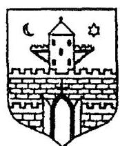

Szombathely Megyei Jogú Város POLGÁRMESTERE

Ikt.szám: 60.289-9/2011.

Állami Számvevőszék Domokos László Elnök Úr

Budapest
Apáczai Csere János utca 10.

1052

# Tisztelt Elnök Úr!

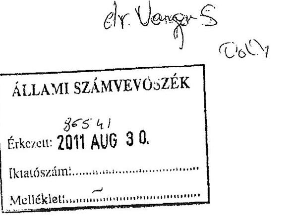

**ÁLLAMI SZÁMVEVŐSZÉK**

**85541**

**Érkezet: 2011. AUG 30.**

**Iktatószám:**

**Melléklet:**

**12**

**091.01.**

Ezúton szeretném megköszönni Szombathely Megyei Jogú Város Önkormányzata pénzügyi helyzetének ellenőrzése során végzett tevékenységüket és a korrekt, objektív megállapításaikat.

I. Az ellenőrzés megállapításaira az alábbi kiegészítést tesszük:

Az ellenőrzés a 2007. január 1. - 2010. december 31. közötti időszakot ölelte fel. Az új városvezetés - észlelve a város súlyos pénzügyi helyzetét - azonnal intézkedett egy középtávú terv, az Önkormányzati Finanszírozási Program jóváhagyásáról. Ezt a programot az Önök jelentése is megemlíti. Szombathely Megyei Jogú Város Önkormányzata Közgyűlése egyhangúlag fogadta el az 533/2010. (XI. 25.) Kgy. számú határozatát, melyben a következőkről döntött:

- Szombathely Megyei Jogú Város Önkormányzata nettó hitelállománya 2010-2014. ciklusban nem haladhatja meg a 20 milliárd Ft-ot.

- A 2011. évi költségvetést maximum 0,5 milliárd Ft összegű működési hiánnyal lehet tervezni, amelyre banki finanszírozást kell igénybe venni.

- 2012. évben már nem lehet működési hiányt elfogadni, hiszen annak finanszírozása már nem fér bele az előző pontokban meghatározott keretekbe.

- 2013. évtől kizárólag az adósságszolgálat tőketörlesztésére lehet újabb banki forrásokat bevonni, mivel a megcélzott adósságállomány felső határa csak így biztosítható.

- A fejlesztésekre 2012. évtől már csak a saját bevételek terhére lehet kötelezettséget vállalni és kifizetést eszközölni.

Telefon: 06 94/520 - 124
Fax: 06 94/313 - 172
www.szombathely.hu

---

A Közgyűlés a program első lépéseként mindennek szellemében fogadta el a város 2011. évi költségvetési rendeletét.

A 2011. évi működési hiány szintjét a bevételek reális számbavétele mellett a kiadások nagymértékű csökkentésével, racionalizálással, létszámcsökkentéssel sikerült elérnünk. (oktatási intézmények gazdasági integrációja 2011. július 1-től, Szakképző Iskolák összevonása, Gimnázium megszüntetése, Polgármesteri Hivatal költségcsökkentése létszámcsökkentéssel, szociális rendeletben adott juttatások jövedelemhatárok jelentős szigorítása, Kulturális és sport kiadások csökkentése) Ezen felül a város szorosan együttműködik a helyi gazdasági élet szereplőivel, prioritásként kezelve a gazdaságfejlesztés elősegítését, hiszen ez is jelentősen szolgálja a programunk maradéktalan végrehajtását.

A városvezetés eltökélt szándéka, hogy a programban meghatározottakhoz képest bármilyen irányú elmozdulás esetén azonnal korrekciót fog alkalmazni. A negatív irányú események esetén további szigorításra fog sor kerülni, az intézkedések következtében jelentkező pénzügyi többletet pedig az adósság csökkentésére fordítjuk.

Mindezen lépések megalapozzák azt a folyamatot, amely alapján 2012. évtől a működéshez már nem lesz szükség külső finanszírozásra.

# Véleményünk szerint az önként megkezdett, egyhangú döntéssel elfogadott program és a jelentés észrevételei egy irányba mutatnak. 

II. Az ellenőrzés javaslataira az alábbi észrevételeket tesszük:
a.) a polgármester úrnak címzett 2. pontban meghatározott operatív terv elkészítését véleményünk szerint a fent említett 533/2010. (XI. 25.) Kgy. számú határozat meghozatalával és a 2011. évi költségvetésről szóló rendelet szigorú végrehajtásával az önkormányzat már megkezdte. A pénzügyi egyensúly helyreállítása érdekében már eddig is egy sor lépést tettünk, a 2012. évi költségvetési koncepció, és majd a rendelet további teendőket fogalmaz majd meg (helyi adó mérték változása, díj mértékek változása, önként vállalt feladatok további csökkentése), természetesen figyelembe véve a törvényi keretek addig bekövetkező változását, és a központi feladat, illetve forrás szabályozást. Kérdésünk: ezen folyamatokon felül javasolják egy külön operatív terv elkészítését? Amennyiben igen, akkor viszont pontosítást kérünk az Önök által javasolt konkrét pénzügyi keretszámokról, amelyekhez viszont a saját programunkat természetesen a Közgyűlés által igazítanunk kell.
b.) a jegyző úrnak címzett 1. pontban meghatározott feladat (jövőbeni árfolyam-, kamat-, visszafizetési kockázatok figyelemmel kísérése) véleményünk szerint olyan szakértelmet követel, amivel sem a jegyző, sem a polgármesteri hivatal nem rendelkezhet, kizárólag pénzügyi szakértők bevonásával lehet azt végrehajtani. A hatáskört tekintve felvetődik a polgármesterrel való közös felelősség kérdése.
c.) a jegyző úrnak címzett 3. pontban meghatározott feladat (gazdasági társaságok kötelezettségeinek alakulásának figyelemmel kísérése) véleményünk szerint nem jegyzői, hanem polgármesteri hatáskör.

Kérem, hogy az észrevételeinket elfogadni szíveskedjék.

Szombathely, 2011. augusztus 26.
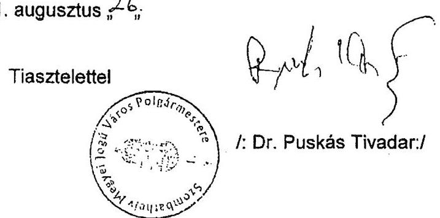

---

.

---

# Dr. Puskás Tivadar úr   polgármester 

Szombathely Megyei Jogú Város Önkormányzata

## Szombathely

## Tisztelt Polgármester Úr!

Köszönettel vettem a Szombathely Megyei Jogú Város Önkormányzata pénzügyi helyzetének ellenőrzéséről készített jelentés-tervezetben foglalt megállapításokra vonatkozó kiegészítését a pénzügyi egyensúly érdekében tett intézkedésekről.

Örömmel értesültem arról, hogy a Közgyűlés által jóváhagyott Önkormányzati Finanszírozási Program több olyan intézkedést tartalmaz, amely a pénzügyi egyensúly megteremtését szolgálja.

A jelentés-tervezetben szereplő javaslatok a végleges jelentésben az Állami Számvevőszékről szóló, a 2011. július 1-jén hatályba lépett 2011. évi LXVI. törvény 33. § (1) bekezdése alapján új szerkezetben jelennek meg. Ennek következtében a jelentés-tervezet javaslatainak száma és sorrendje módosult.

Polgármester úr által tett észrevételekre az alábbi választ adjuk:
$>$ Elfogadjuk azt, hogy a Polgármester úrnak címzett 2. számú (a végleges jelentésben 1. számú) javaslatban meghatározott operatív terv (végleges jelentésben program) elkészítését az Önkormányzati Finanszírozási Program meghozatalával és a 2011. évi költségvetésről szóló rendelet szigorú végrehajtásával az Önkormányzat már megkezdte, továbbá a pénzügyi egyensúly helyreállítása érdekében intézkedéseket tett. Ennek ellenére a döntések olyan tervezett rendszerét nem láttuk kidolgozottnak, amely egy - a felelősöket és határidőket is tartalmazó - összefoglaló dokumentumban jelenítené meg a bevételnövelő lehetőségek bemutatását - különösen a helyi adó potenciál meghatározását és kihasználását; a bérleti díjak és a térítési díjak megállapítását, felülvizsgálatát; a követelések behajtását; az egyéb sajátos bevételek növelésének lehetőségét -, a folyamatban lévő és a tervezett beruházások, a kiadási kötelezettségek teljes körű felülvizsgálatát; az intézkedések következtében jelentkező pénzügyi többlet, illetve az egyszeri bevételek tartalékba helyezését, elkülönített kezelését az adósságszolgálat teljesítése érdekében; az intézményi gazdálkodás felülvizsgálatát; az önként vállalt feladatok finanszírozhatóságának áttekintését a kötelező feladatellátás elsődlegességének biztosítása érdekében, a gazdasági programmal összhangban; valamint az intézkedések eredményeinek legalább évenkénti áttekintésének előírását.
$>$ A Jegyző úrnak címzett 1. számú (a végleges jelentésben 8. számú), az árfolyam-, kamat-, valamint visszafizetési kockázatok figyelemmel kísérésére és a Közgyűlés legalább félévente történő tájékoztatására vonatkozó javaslatot továbbra is a jegyzőnek címezzük, mivel e feladatok hatásköri felelőse az Állami Számvevőszék által egységesen értelmezett álláspont szerint a jegyző.
$>$ A Jegyző úrnak címzett 3. számú (a végleges jelentésben 6. számú), a gazdasági társaságok kötelezettségeinek alakulásának figyelemmel kísérésére vonatkozó javaslatra vonatkozó észrevételt elfogadjuk, a végleges jelentésben azt a Polgármester úrnak címezzük.

Kérem, hogy a jelentés-tervezetben tett megállapításokat, javaslatokat a későbbiek során hasznosítani szíveskedjenek.

Köszönöm Polgármester úrnak és munkatársainak az ellenőrzés során tanúsított hozzáállását, amellyel az Önkormányzatról készített pénzügyi helyzetelemzés elkészítését segítették.

Budapest, 2011. december 5.
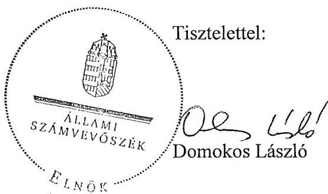

---

.

---

.
