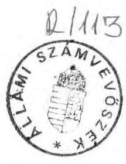
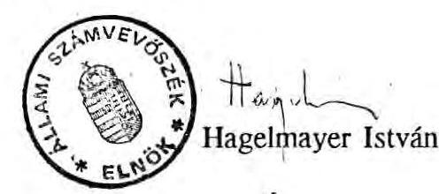
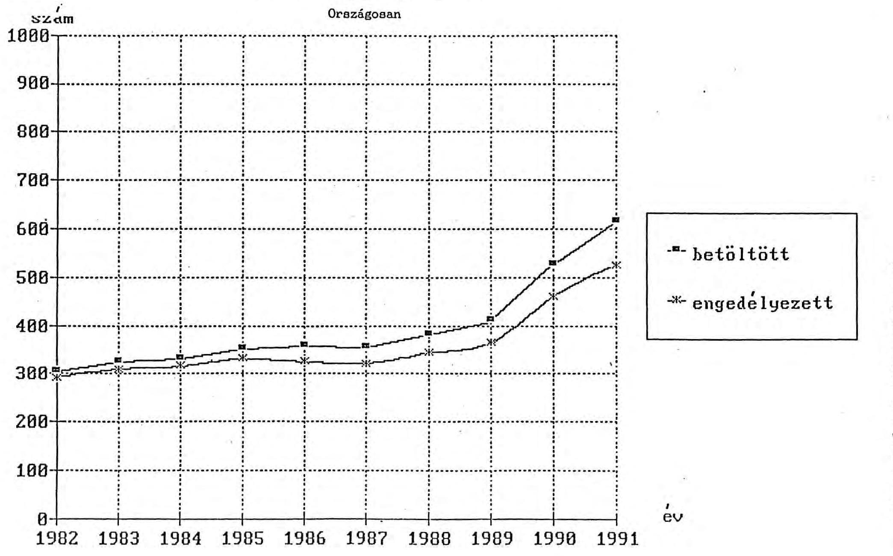

# Allami Számbeböséé 

## JELENTÉS

a Magyar Köztársaság Ügyészsége fejezet pénzügyi-gazdasági ellenőrzéséről

---

Az ellenőrzést végezték:

Dr. Gálik Jenő
Gömöri József
Révész János
Szilas István
számvevő tanácsos
számvevő
számvevő tanácsos
számvevő

Az ellenőrzést vezette:

Hudik Zoltán
főtanácsos

---

# Jelentés 

## a Magyar Köztársaság Ügyészsége fejezet pénzügyi-gazdasági ellenőrzéséről

Az állami költségvetésben a Magyar Köztársaság Ügyészsége fejezet előző két évi előirányzatához képest mintegy kétszeres növekedést jelentett az 1991. évre eredetileg jóváhagyott 1.765,2 millió Ft-ot kitevő kiadási főösszeg. (Ez az év folyamán a különböző előirányzat változtatásokat figyelembevéve $1.690,4$ millió Ft-ra módosult.) A támogatási előirányzat relatívan jelentős mértékủ emelését alapvetően az ágazati és célfeladatokra - ezen belül meghatározóan az "Előmeneteli- és bérrendszer", valamint a "Nyomozó hivatalok felállítása" alcímeken - biztosította a költségvetés. Az 1992. évi állami költségvetésben a fejezet lényegében az engedélyezett automatizmusok és az áthúzódó célfeladatok hatásainak figyelembevételével - 2.389,7 millió Ft kiadási főösszeggel szerepelt.

A költségvetési fejezet szervezeti részeit képezik a Legfőbb Ügyészség, a fővárosi és 19 megyei főügyészség, a 113 helyi (városi, ill. kerületi) ügyészség, 5 regionális szervezésű Ügyészségi Nyomozó Hivatal és kirendeltségeik, a hivatali üdülők, valamint az Országos Kriminalisztikai és Kriminológiai Intézet (OKKrI.) A Katonai Főügyészséget a katonai ügyészségekkel a törvényi szabályozás az ügyészi szervezethez sorolja, de gazdálkodási szempontból nem tartoznak a fejezethez.

Az ellenőrzés célja a Magyar Köztársaság Ügyészségének müködése során ellátandó feladatok és az azokhoz rendelt pénzforrások összhangjának, valamint a gazdálkodásban a törvényességi, célszerűségi követelmények érvényesítésének megítélése volt. A fejezet külön címeként kezelt OKKrI esetében a vizsgálat a gazdálkodási kérdések mellett érintette a kutatási tevékenység hasznosulását is.

Az 1989-91. évek gazdálkodására és az 1992. évi költségvetés megalapozottságára kiterjedően helyszíni ellenőrzésekre került sor a Legfőbb Ügyészségen, a Fővárosi Főügyészségen, a Borsod-Abaúj-Zemplén megyei Főügyészségen, a Pest-megyei Főügyészségen, a Somogy megyei Főügyészségen és az OKKrI- nál.

---

# 1. 

## Részletes megállapítások

## 1. GAZDÁLKODÁSI RENDSZER ÉRTÉKELÉSE

## 1.1/ Feladatok, a szervezeti rendszer és a gazdálkodási feltételek összhangja

Az ügyészség feladatait általánosságban a Magyar Köztársaság Alkotmánya (XI. fejezet), részleteiben - szervezeti tagozódásra, ügyészekről szóló rendelkezésekre kiterjedően - a többször módosított 1972. évi V. törvény határozta meg. A törvényi felhatalmazás, valamint a háttérszabályozás - a Munka Törvénykönyvéről szóló 1967. évi II. tv. végrehajtására az igazságszolgáltatási dolgozókra vonatkozóan kiadott 38/1973. (XII.27.) MT rendelet - alapján a Legfőbb Ügyész 1/1980. sz. utasításában (a továbbiakban: 1/1980. Legf.Ü. sz. utasítás) meghatározta az ügyészségek szervezetetét, általános és különös szabályait. Az ügyészségi dolgozókat érintő kérdéseket az Ügyészségi Szolgálati Szabályzatról szóló 10/1982. sz. utasítása rögzítette.

A közszolgálati törvény elfogadásával ez év júliusától a háttérjogszabályok hatályon kívül kerültek, ami elő́sorban az ügyészek szolgálati viszonyának átmeneti szabályozatlanságát eredményezte.

Költségvetési gazdálkodás szempontjából a fejezetnek öt költségvetési intézménye van: a Legfőbb Ügyészség Irányító Szervezete, a Legfőbb Ügyészség Gazdálkodó Szervezete, Hivatali Üdülők Intézménycsoport, Területi Ügyészségek Intézménycsoport és az OKKrI. Az állami költségvetés fejezetrendje (1991. óta) a Legfőbb Ügyészség, Területi Ügyészségek és OKKrI címeket különbözteti meg. A fejezeti kezelésű előirányzatok a Legfőbb Ügyészség Irányító Szervezeténél találhatók.

A Legfőbb Ügyészség nemcsak fejezetgazda, de maga is operatívan gazdálkodó költségvetési intézmény. A Legfőbb Ügyészség Pénzügyi Főosztálya (továbbiakban: Pénzügyi Főosztály) ennek megfelelően látja el az intézményi színtű gazdálkodási tevékenységet a Legfőbb Ügyészség Gazdálkodó Szervezete, a Hivatali Üdülők, és részben a Területi Ügyészségek Intézménycsoportok esetében is, a fejezeti irányítást az OKKrI felé. Ezenkivül hozzátartozik a Legfőbb Ügyészség Irányító Szervezete is, amely elsősorban technikai jellegű, finanszírozási feladatot lát el.

Az egyes pénzügyi kihatásokkal járó gazdálkodási jogköröket legutóbb 1991. júliusában szabályozták írásban, amiben a jogszabályi előírásoknak és a gyakorlati követelményeknek

---

megfelelően rögzítették a Legfőbb Ügyész, a gazdálkodásért felelős helyettese, valamint a pénzügyi főosztályvezető jogosítványait.

A Pénzügyi Főosztály az 1989-ben kiadott ügyrend szerinti szervezeti felállásban végzi munkáját, ami eltér a még hatályos 1/1980. Legf.Ü. sz. utasítással előírt felépítéstől. Az ügyrendi változtatásokról a társfőosztályokat értesítették, de az új vezetői helyekre a kinevezések csak részben történtek meg, éppen arra az ellentmondásos helyzetre tekintettel, hogy a szervezeti szabályzat módosítására de jure nem került sor. (Pl. műszaki és ellátó ov. esetében.) A főosztály munkatársai nem rendelkeznek névre szóló és/vagy aktualizált munkaköri leírásokkal (amely egyébként az ügyészségek pénzügyi szerveteinél általános jelenség), meglehetősen esetleges az ügyrendben található státuszok munkaköri leírásainak és a konkrét dolgozók tevékenységének egymáshoz rendelése. Ezt nem indokolhatja a munka operativítása által szükségessé tett rugalmassági igény sem.

Nem szabályozták az utalványozás és érvényesítés rendjét, a vizsgálat kezdeményezésére ennek korrekt rendezése megtörtént.

A gazdálkodási feladatokat ellátó állomány jól felkészült, általában hosszabb szakmai költségvetési gyakorlattal rendelkező dolgozókból áll. Kedvezőtlen feltételeket idézett elő, hogy több kulcspozíció - a tett erőfeszítések ellenére - huzamos ideje nem került feltöltésre (két osztályvezetői hely 2-3 éve, az SZJA-előadói és a belső ellenőri hely közel 4 éve betöltetlen!).

Megállapítható volt, hogy a költségvetési tervezésre, beszámolásra vonatkozó alapvető előírásokat teljesítették. Ezekről és az évközbeni folyamatokról (egyes konkrét témákról) a felső vezetést tájékoztatták megjegyezve, hogy viszonylag kevés számú ilyen jellegű dokumentum készült.

A főügyészségek - mint részben önálló költségvetési intézmények - saját gazdálkodó apparátussal rendelkeznek (általában 2-3 fő, a fővárosnál 6 fő.) A helyi ügyészségeken egyéb tevékenysége mellett az irodavezető látja el a pénzügyi feladatokat is.

A Legfőbb Ügyészség főosztályaival és az alárendelt szervekkel a munkakapcsolatok nyomonkövethetők, jól dokumentáltak az új bértörvény bevezetésénél, a nyomozó hivatalok és új helyi ügyészségek létesítésénél egyaránt. A Pénzügyi Főosztály szakmai irányító tevékenységének színvonalát emelhetné azonban a rendszeres orientáló tevékenység, a szakmai segítségnyújtás, figyelembevéve, hogy a vizsgált időszakban nem rendeztek az ügyészségi szervek pénzügyi vezetői részére közös munkaösszejövetelt, intézményesített (belső) továbbképzést. Ezek megtartását szükségszerűvé teszi a jogszabályi változások következtében az egységes gyakorlat kialakítása, emellett találkozik az érintettek igényével is.

---

# 1.2/ A költségvetési tervezés és finanszírozás rendje 

A pénzforgalmi bevételek alakulásából, összetételéből kitűnik, hogy 1989. és 1991. között a több mint kétszeres növekedés mellett lényegében a költségvetési támogatás ilyen mértékủ emelkedéséről volt szó, a saját bevételek aránya elenyésző. (1989: 2,4 \%, 1990: 1,8 \%, 1991: $0,9 \%)$.

A saját bevétel tervezett előirányzata 1989-1992. években változatlanul 1,6 millió Ft. Ezt nagyobb részt előre nem látható események miatt - rendszeresen túlteljesítették, 1991-ben pl. $350 \%$-kal. Ekkor 6 millió Ft bevétel realizálódott, amelynek döntő többségét ( 4,8 millió Ft) a gépkocsik étékesítéséből származó összeg jelentette. A túlteljesítés 1992. évben is várhatóan bekövetkezik, tekintettel a leadott szolgálati fegyverek értékesítéséből befolyó 1,5 millió Ft-ra.

A fejezet költségvetési támogatási előirányzata 1989-ben 667,8 millió, 1990-ben 869,9 millió, 1991-ben pedig 1.763,6 millió Ft volt. Az 1991. évi jelentős növekedés lényegében az ágazati és célfeladatok miatt következett be, a kiadási előirányzat 44,6 \%-át tette ki. Ugyanakkor a költségvetési egyensúlyt javító intézkedések keretében 14,7 millió Ft az év végén zárolásra került.

Az ágazati és célfeladatok között a bér és előmeneteli törvény hatására 537,4 millió Ft-ot, a nyomozó hivatalok felállításával kapcsolatos kiadásokra 115,0 millió Ft-ot, az új helyi ügyészségek létesítésére 48,0 millió Ft-ot, a büntetőeljárási törvény tervezett módosítása miatti többlet kiadásokra 86,4 millió Ft-ot, mindösszesen: 786,8 millió Ft-ot irányoztak elő.

A büntetőeljárási törvény módosításával kapcsolatos feladatra már 1990-ben 32 millió Ft volt beállítva a fejezet költségvetésébe, amely akkor évközben elvonásra került. A feladat 1991-ben sem realizálódott, ezért az előirányzat maradványként került elvonásra, de az 1992. évi költségvetés ágazati és célfeladatai között ismét 90,1 millió Ft-tal került jóváhagyásra. Az egyéb célfeladatok (nyomozó hivatalok és helyi ügyészségek felállítása) 1991. évi előirányzatait csak az adott célra használták fel.

A fejezet pénzügyi lehetőségeinek évközi bővítését jelentette a jóváhagyott előző évi pénzmaradványok felhasználása. Ezek nagysága a költségvetési támogatáshoz képest csupán $1-2 \%$, így hatásuk jelentéktelen (l. és 2 . sz. melléklet).

A fejezet 1989-ben 41 millió Ft, 1990-ben 51,1 millió Ft pótelőirányzatot kapott. Az előbbit a személyi és tárgyi feltételek javítása, az utóbbit a nyomozó hivatalok felállításával kapcsolatos kiadások indokolták.

A költségvetési intézmények (címek) közötti átcsoportosításra belső tényezők hatására ritkán került sor. Nagyobb összegű átcsoportosítás ( 650 millió Ft) 1991-ben történt, ennek $83 \%$-át kitevő összeg ágazati célfeladatokról a területi ügyészség címre került, mivel a költségvetés

---

szerkezeti rendje következtében a bértörvény 1991. évi áthúzódó hatását fedező összeg eredetileg az ágazati és célfeladatok közé került beállításra. Így gazdálkodási szempontból az átcsoportosítás csupán formainak tekinthető.

A fejezet 1992. évi kiadási tételei az engedélyezett automatizmusokon kivül az előző évi célfeladatok áthúzódó hatásai miatt szükséges szintrehozások és a büntetőeljárásról szóló törvény tervezett módosítására beállított eszközbeszerzés, létszám-többletigény következtében nőttek. Ezek tükrében a tervszámok elfogadhatónak tekinthetők, de a költségvetés jelenlegi beszámolási rendjére, információs rendszerére tekintettel érzékelhetők a tervezés korlátai is.

A területi ügyészségek jelentik az ügyészi szervezet és tevékenység gerincét, pénzfelhasználásuk évente szinte változatlanul a fejezet kiadási előirányzatának négyötödét reprezentálja. Ugyanakkor az egyes föügyészségek részére visszaigazolt költségvetési alapokmányok együttesen csak a Területi Ügyészségek Intézménycsoport költségvetésének 10 \%-át tették ki.

A Pénzügyi Főosztály - ez esetben mint az intézménycsoport pénzügyi szervezete ennyit adott át évente a föügyészségeknek, ezzel gazdálkodhattak elvileg szabadon. A szabad gazdálkodás tovább szükült az összeg mintegy 50 \%-ára, mivel az állandóan növekvő és rendszeresen jelentkező rezsiköltségeket is ebből a forrásból egyenlítették ki.

Az intézménycsoport összkiadásainak nagy részét - mint a fejezet esetében is - a béralap és társadalombiztosítási járulék teszi ki. Ezt a már említett csekély rész kivételével a Pénzügyi Főosztály kezeli, ott folyik a főügyészségeken feladott bizonylatok alapján a számfejtés.

A Pénzügyi Főosztály vezetője által kiadott - általában kevés konkrét szempontot, irányelvet tartalmazó - körlevél ad alapot a szervezeteknek a következő évi igényük megtervezéséhez (az említett 10 \%-nak megfelelő rovat és tételrend szerinti bontásban.) A költségvetési egyeztető tárgyalásokat általában a Pénzügyi Főosztály, valamint az adott főügyész és pénzügyi vezetője részvételével folytatják le. (Ez sem kötelező előírás, az OKKrI költségvetése pl. enélkül került meghatározásra 1989-1991. között.) Ekkor került sor az előirányzat rendezésre is, annak véglegezésére, hogy a főügyészség a tárgyévre jóváhagyott (esetleg módosított) költségvetési alapokmányához képest év végéig milyen tételeken ér el megtakarítást, vagy igényel pótelőirányzatot. (Az egyes főügyészségek közötti évközbeni átcsoportosítás, pótelőirányzat biztosítás joga a pénzügyi főosztályvezetőt illeti meg.) Az állóeszközök és felújítási igények vonatkozásában is a Pénzügyi Főosztály mérlegelése és álláspontja a döntő.

Belső szabályozás ad lehetőséget arra, hogy a számítástechnikai szakfeladatot ellátó szervezet (Ügyészségi Számítástechnika-alkalmazási és Információs Központ) főosztályi besorolása ellenére kvázi-főügyészségként gazdálkodjon az ilyen célra elkülönített költség-

---

vetési keret felett. (1/1980. Legf. Ü. sz. ut. 15/A. § (6) bek.) Ez a keret a külső (KSH) forrásból finanszírozott számítástechnikai eszközbeszerzések működési költségeinek biztosítását szolgálta, nagyságrendje évente az eszközbeszerzésekre fordított összeg alig egyhatodát tette ki.

A számítástechnikai szakfeladat költségvetési terv- és tényszámainak alakulásából (teljesülések 1989: 58 \%, 1990: 68 \%, 1991: 61\%) megállapítható volt, hogy a javuló tendencia mellett a tervezés megalapozottsága még mindig nem kielégítő.

# 2. A KÖLTSÉGVETÉS VÉGREHAJTÁSÁNAK TAPASZTALATAI 

## 2.1. Létszám- és bérgazdálkodás

A létszámgazdálkodás az ügyészség gazdálkodásában megkülönböztetett jelentőséggel bír, mivel egyfelől a fejezet költségvetésének döntő hányadát kitevő bér és társadalombiztosítási járulék erőforrás oldalát jelenti, másfelől a szervezet felépítése is az ügyészi munka, az ügyészi állományú dolgozók leghatékonyabb felhasználását célozza. A jelenlegi tendenciák arra utalnak, hogy az ügyészség a közeli jövőben reálisan nem számolhat jelentős ügyészi létszámbővüléssel. Ha a pálya vonzóbbá is válik a kezdők számára, több évbe telik amire ennek hatása a gyakorlati munkában érezhetővé válik.

Az ügyészi állomány összetételében jelentős eltolódásként érzékelhető az állomány fiatalodása, kisebb mértékű a közvetlenül a nyugdíj előtt állók arányának növekedése. A jelenségnek vannak kedvező hatásai - fogékonyság a változó társadalmi környezethez igazodó jogi megoldások iránt, a növekvő affinitás az új technikai eszközök használatára, a fokozott terhelhetőség - de a reális étékelésnél nem hagyható figyelmen kivül, hogy általában az 5-6 éves szakmai gyakorlattal rendelkező ügyész tekinthető az elvárások szempontjából "teljes értékűnek".

1982-1991. között az 5 évnél kevesebb igazságügyi szakmai gyakorlattal rendelkezők aránya $7,9 \%$-ról $27,2 \%$-ra növekedett. A 20 évnél több gyakorlattal rendelkezők aránya összességében úgy csökkent $49,9 \%$-ról $32,1 \%$-ra, hogy a csoporton belül kétszereződött azok száma, akiknek gyakorlata a 29 évet is meghaladta.

További strukturális változás következett be a női munkaerő arányainak növekedésével, ami nem a szakmai munka szempontjából érdemel figyelmet, hanem azért, mert jelenleg pl. a női ügyészek egytizede van tartósan távol szülési szabadság, GYES és GYED miatt. (A női munkaerő aránya 1991-re 46,2 \%-ra nőtt, a 30 éven aluli korosztályban részarányukat már $61,4 \%$.)

Az ügyészség létrehozása óta centarlizáltan működő szervezet. Ez alapvetően az ügyészi törvény előírásaiból fakad, a hatályos belső szabályozás (1/1980. Legf.Ü. sz. ut. 32. §. (1) bek.)

---

is kiemeli. Ennek megfelelően a szervezeti- működési rend(szer) "ügyész-centrikus". A létszám- és bérgazdálkodás 1988. évi szabályozásánál állománycsoportonként került meghatározásra az egyes ügyészi szervezetek engedélyezett létszáma. Az egyes kategóriákon belül az adott egység vezetője (főosztályvezető, főügyész, OKKrI igazgatója) döntheti el konkrétan hány főt, milyen formában, milyen munkakörben foglalkoztat.

Az engedélyezett ügyészi létszám évtizedeken keresztül ezer fő volt, az 1980-as évek közepétől lassan emelkedett. (1989. januárjában 1059 fő, 1992. elején pedig 1177 fő.)

A státuszok emelését a terjedelemben és volumenben megnövekedett ügyészi feladatok indokolták, öszefüggésben pl.a jogállamíság kiépítését szolgáló sarkalatos törvényekkel, de különösen a bűnözés emelkedésével járó ügyforgalom növekedéssel (3/a. sz. melléklet).

Álláshely bővítéssel járt az Ügyészségi Nyomozó Hivatalok felállítása, amit a Minisztertanács 1990. március 1-jei hatállyal rendelt el. Ehhez a pótlólagos költségvetési támogatás terhére felemelték a státuszok számát, a Katonai Ügyészség belügyi állományából is átadásra kerültek álláshelyek, továbbá átcsoportosítottak az eredetileg a területi ügyészségek állományában lévő nyomozó ügyészi létszámból.

Az érdemi ügyintéző tevékenységet ellátó állomány a nyomozó ügyészeken kivül nyomozókból áll. A nyomozóállomány színvonalában egyértelműen pozitív változást eredményez, hogy lehetőség szerint felsőfokú végzettségűekkel töltik fel a helyeket. Ugyanakkor a nyomozó ügyészi helyek feltöltöttségét tekintve 1992. I. n. évében 20 \%-os volt a hiány. Átmeneti megoldásként a jogi egyetemi tanulmányokat folytató, vagy végzett, de szakvizsgával még nem rendelkező nyomozókat - akik egyébként nyomozói "túlbetöltést" jelentenek - az üres nyomozó ügyészi állások terhére alkalmazzák. Ezzel a betöltési hiány $9 \%$-ra való mérséklése látszólagos, a működési feltételek javultak, de a végleges megoldás tovább húzódik.

A tényleges ügyészi létszám az 1980-as évek közepéig szinte teljes feltöltöttséget jelentett, a szervezetből alapvetőn természetes okok folytán történt a kiválás, ezt az új ügyészi kinevezések képesek voltak kompenzálni. A pályaelhagyás 1984-től, de különösen 1989. végétől felgyorsult. Ez utóbbinál már közrejátszott az ügyészség bizonytalanná váló társadalmi és alkotmányjogi helyzete is. Ez azt eredményezte, hogy az ügyész hiány arányaiban kétszerese a bírák körében tapasztalhatónak.

A főállású ügyészek tekintetében a létszámhiány 1989-ben - éves átlagban - 11,8 \%-os volt, 1990-ben már 14,9 \%, 1991-ben pdig 16,5 \%, az 1992. április 1-i állapot szerint 17,3 \%.

Mindezek teszik szükségessé, hogy egyre növekvő számban foglalkoztassanak részfoglalkozású (nyugdíjas) ügyészeket. Arányuk éves átlaglétszámra számítva az ügyészi állomány 3-4 \%-át tette ki.) Jogi helyzetük és díjazásuk teljesen azonos a főállású ügyészekével.

A létszámgazdálkodás gondjait növelte az ügyérkezések abszolut növekedése mellett, hogy az egy státusztra jutó ügyforgalom értéke (munkateher) a területi ügyészségek között is

---

eltérően emelkedett. (3/b.sz. mellélet) A létszám arányosításában csak elvi lehetőségként kezelhetők az újonnan létrehozott státuszok legnagyobb ügyforgalmú helyekre történő koncentrálása, vagy a meglévő álláshelyek munkaterhek szerinti újrafelosztása. A kivitelezhetőség akadálya pl. a főváros esetében, hogy az egész ügyészi szervezetben 1989-91. között létrehozott új státuszok együttesen sem oldanák meg a problémát. A másik alternativánál a relative kedvezőbb mutókkal rendelkező főügyészségek (Zala, Tolna, Vas megyékben stb.) státuszának csökkentése a ténylegesen betöltött helyek megszüntetését jelentené. A jelenlegi mobilitási, elhelyezkedési stb. helyzet miatt aligha várható el reálisan és teremthetők meg arra a feltételek, hogy ügyészeket föügyészségek közötti átcsoportosítani lehetne.

A sok éves tapasztalat szerint az ügyészi utánpótlás, az ügyészi pályára való felkészülés igazán eredményesen csak a szervezeten belül - a fogalmazó képzés keretében - valósítható meg. (A fogalmazói helyek betöltöttsége várhatóan ez évben lesz teljes a korábbi évek 50 \% körüli mutatójával szemben.) A fogalmazói utápótlás célszérű megoldása, hogy a jogi egyetemek III-IV. éves hallgatóival tanulmányi ösztöndíj szerződést kötnek. Ezzel kapcsolatos problémák, hogy a hallgatók körében nem túlságosan ismert az ügyészi tevékenység, de korlátozó tényezőként hat a központi ösztöndíj keretből fejezet rendelkezésére bocsátott összegek nagyságrendje.

Az ösztöndíra központilag megállapított költségvetési keretösszeg kezelóje jelenleg a művelődési tárca. Legfőbb Ügyészség részére biztosított keretősszegek (1990: 600 ezer Ft, 1991: 650 ezer Ft, 1992. előirányzat: 700 ezer Ft) relative egyre kevesebb hallgató ösztöndiját fedezik.

A hatályos rendelkezés (2/1985. (II.16.) MM sz. rend. 3. § (1) bek.) tiltja, hogy a központi ösztöndíjkeret terhére "budapesti munkahely betöltése érdekében felsőfokú oktatási intézmény hallgatójával" szerződést kössenek, holott az ügyészek esetében éppen a fővárosban a legsúlyosabb a létszámhiány. Ennek áthídalására a Legfőbb Ügyészség saját költségvetési támogatása terhére képezett keretet 1989: 50 ezer Ft, 1991: 100 ezer Ft, azonban ezek felhasználása csak 20, illetve $70 \%$-os volt. Az ilyen mértékű kihasználatlanság részben visszavezethető az érintett főosztályok kommunikációs nehézségeire, de összefügg a tanulmányi év és a pénzügyi költségvetési év "időszámításbeli" különbségével is. Továbbá nem éltek azzal a lehetőséggel, hogy amennyiben Budapesten - az érdeklődés hiánya miatt - nem tudtak megfelelő számban tanulmányi szerződést kötni, más jogi egyetemek hallgatóit keressék meg.

Az egyes ügyészi állások pályázati úton való betöltését az 1991. évi LXII. törvény írta elő. A törvény 24/A. §. (1) bek. alapján pályázat útján kell betölteni: a Legfőbb Ügyészségen a legfőbb ügyész helyettesi és a főosztályvezető ügyészi állásokat; a megyei (fővárosi) főügyészségeken a főügyészi és főügyészhelyettesi állásokat; a helyi (városi) ügyészségeken és a fővárosi kerületi ügyészségeken a vezető ügyészi állásokat. A pályázatok elbírálása, a kinevezések (a városi és a kerületi vezető ügyészek kivételével) a helyszíni ellenőrzés lezárásáig megtörténtek.

---

A vizsgált időszakra esett a fejezet bérgazdálkodási elveinek alapvető megváltoztatása. Az Országgyűlés által elfogadott, a bírák, ügyészek, a bírósági és az ügyészségi dolgozók előmeneteléről és javadalmazásáról szóló 1990. évi LXXXVIII. törvény egzakt módon rögzítette a besorolás kritériumait. A korábbiaktól eltérően a szubjektivizmus lehetősége gyakorlatilag kiiktatásra került, mert a bevezetett bérrendszer a szervezeti hierarchiában betöltött hely és a szolgálati idő kombinációján alapul. Emellett jól preferálja a pályakezdőket, ami az utánpótlás szempontjából lényeges.

Az ügyészség a besorolásokat szabályszerűen végezte. Azok helyességét mutatta, hogy a dolgozók kevesebb mint $1 \%$-a találta azt sérelmesnek és fordult Munkaügyi Döntőbizottsághoz, illetve bírósághoz, a döntések /ítéletek is az ügyészséget igazolták.

Állománycsoportok közötti bérviszonyok, az átlagbérek és átlagkeresetek évenkénti változása is differenciált. Az ügyészek és nem ügyészek (tisztviselők, ügykezelők) átlagbérei 1989-1992. első negyedév között kb. 2,5-szeresére emelkedtek, a fizikai állományúaké csak kétszeres, a fogalmazóké pedig még kisebb növekedést mutat. Az átlagkeresetek vonatkozásában hasonló tendenciák figyelhetők meg mint az átlagbéreknél, csak magasabb színvonalon, erősebb dinamikával (5. sz. melléklet).

Az évenkénti változások alapján kimutatható, hogy 1990-ben az előző évhez képest az átlagbérek emelkedése gyakorlatilag azonos növekedést hozott az ügyészségi dolgozóknál, kivéve a fogalmazókat, ahol ennek csak a felét. Az 1991-es bértörvény hatására a fogalmazók bére is jelentősen emelkedett, de az előzőek miatt, relative alacsonyabb bázis alapján.

A bértörvény hatálya alá nem tartozó fizikai dolgozók körében tapasztalható bizonyos feszültségekre tekintettel a Legfőbb Ügyész a központi bérautomatizmuson túlmenő fejlesztést engedélyezett, így a fizikaiak bérének "kompenzációja" 1992. első negyedévében megtörtént.

A bérrendszer merevségét a jutalmazás lehetőségei bizonyos mértékig korrigálni képesek. A bérarányokat determináló bértörvénnyel ellentétben a jutalmazási keretek felhasználásával befolyásolható kereseti viszonyok meghatározása a fejezet hatáskörébe tartozik. Az ügyészség nem élt azzal a lehetőséggel, hogy a fogalmazók és ügyészek közötti - a vizsgált időszakban egyre kedvezőtlenebbé váló - kereseti arányokat saját lehetőségei keretében javítsa.

Az 1989. évi arányok biztosítása 1992. I. n. évben az előző évihez képest 49,4 \%-os növekedést tett volna szükségessé, ami a ténylegeshez képest kb. 10 ezer Ft/fő pótlólagos juttatást jelentene. Ez a fejezet rendelkezésére álló jutalmazási források 2-3 \%-os lekötését eredményezné.

Az ügyészségi dolgozók keresete (állománycsoporttól függetlenül) a béreket 1989-ben 17 \%-kal, 1990-ben 22 \%-kal, 1991-ben 26 \%-kal, 1992. I. n.évében már $36 \%$-kal (a fogalmazók esetében azonban csak $18 \%$-kal) haladta meg, következésképpen a béren kivüli juttatások

---

súlya növekedett. Ez fejezet szinten is kimutatható. 1989-ben a béralap 15 \%-át, 1990-ben már $18 \%$-át, 1991-ben pedig több mint $20 \%$-át használták jutalmazásra, összefüggésben a tényleges feltöltöttség alakulásával.

A jutalmazás forrásait a pénzügy jól prognosztizálta, helyesen mérték fel. Az üres álláshelyek alapbérét rendszeresen karbantartották.

A helyi jutalomkeretet 1989. óta az engedélyezett álláshelyek alapján számítják. Az állománycsoportok közötti átcsoportosításra nincs lehetőség. (Az 1990. eleji bérfejlesztés során kivételesen engedélyezték ezt, de csupán 3 föügyészség élt vele.) Hasonlóan nem lehetséges átcsoportosítás az ügyészségek és a nyomozó hivatalok között sem.
1985. óta alkalmazzák a helyettesítési jutalom intézményét, a díjalap nagysága 1988-1990. között változatlan volt ügyészek esetében 3 ezer Ft/fő/hó, egyéb kategóriákban differenciáltan kisebb. Azóta ez az ügyészeknél 6 ezer Ft/fő/hóra nőtt, de a legkisebb ügyészi személyi alapbér már 34 ezer Ft. A karbantartás hiányát egyrészt azzal indokolták, hogy ha nagyságát megemelnék, úgy csökkentenék a jutalomkereteket, másrészről pedig a tervezett bérreform bizonytalan költségfedezetére hivatkoztak.

Az ügyészi létszámhiány rendkivül egyenetlenül oszlik meg. A helyettesítés címén kifizetett díjazás tendenciájában igazolódik az ügyészi létszámhiányhoz, de aránya a "jutalmak"-on belül sem jelentős, a bérköltséghez viszonyítva pedig elenyésző (a legmagasabb érték is $1 \%$ alatt van). (6. és 7. sz. melléklet).

A létszámhiány $5 \%$ alatt van Zala, Tolna, Baranya megye esetében (sőt Csongrád, Győr-Sopron-Moson, továbbá Heves megye teljesen feltöltött), miközben Budapesten $25 \%$-os, Komárom-Esztergom megyében $28 \%$-os, Nógrádban $32 \%$-os, Somogyban pedig egyenesen $36 \%$-os. Ezt figyelembevéve jelenlegi jutalmazási rendszer különösen kedvezőtlenül érinti a Fővárosi Főügyészséget. Ez a szervezet 1991-ben a létszámhiány miatt a föügyészségen képződő bérmegtakarításnak csak a felét kapta vissza a fejezet által centralizált összegből.

Ezek alapján nem megalapozott az a félelem, hogy a helyettesítési díjalap akár többszörösére történő emelése is jelentősen csökkentené az egyéb "jutalmazási" formák fedezetéül szolgáló bérmegtakarításokat.

Külföldi kiküldetésekre évente 160-300 ezer deviza Ft körüli összegeket használtak fel, a tervelőirányzatokhoz képest ez 40,7\% és 50,9 \% közötti felhasználást jelentett. A külföldi kiküldetések Ft vonzata 1991-ben elérte az 1,6 millió Ft-ot. (1990-ben volt a külföldi kiküldetések minimuma, összesen 8 utazásra került sor, 1991-ben: 31 kiutazás történt, ez év első negyedévében 12 utazás realizálódott.)

---

Az ideiglenes külföldi kiküldetést teljesítők költségtérítését - a 28/1990. (XII. 27.) PM. sz. rendelet előírásaihoz igazodóan - szabályozta a 3/1991. Legf.Ü. sz. utasítás. A végrehajtást illetően szabálytalanságot az ellenőrzés nem tapasztalt.

A kiküldetési elképzelések és a pénzügyi lehetőségek olykor markánsan eltérnek egymástól (mint pl. 1991. márciusában). Pénzügyi Főosztály általában igyekszik takarékosságra szorítani az érintett szervezeteket, de mivel a döntés nem a főosztály kompetenciája, ez a törekvés kevés eredménnyel jár. A külföldi kiküldetések jelenlegi technikai bonyolítása két szervezeti egységet (Titkárság és Pénzügyi Főosztály) érint, az átfedésekre, többletmunkákra tekintettel ennek racionalizálása célszerű.

A Legfőbb Ügyészség - mint fejezetgazda - a reprezentációs lehetőségekkel jól gazdálkodott, a reprezentációról, annak képzéséről és elszámolásáról szóló 3O/1987. (VI.3O.) PM. sz. és a 4/1991. (II.13.) PM. sz. rendeletek előírásainak betartásával járt el.

A vizsgált időszakban a reprezentációra fordítható összeg - a tervezés szintjén - alig változott. (Legf.Ü.: 700 ezer Ft, Területi Ügy.: 140-200 ezer Ft, OKKrI: 10 ezer Ft). A területi ügyészségek esetében történt előirányzat emelés, amit 1990-ben a nyomozóhivatalok és új kerületi (városi) ügyészségek létrehozása indokolt.

Szakértői díjak és egyéb bérjellegű kifizetések között lényegében a fordítói és leírói díjak szerepeltek, amelyek évenkénti összege jelentős emelkedést mutat. Az Országos Fordító és Fordításhitelesítő Irodának (OFFI) 1989-ben mintegy 1,5 millió Ft-ot, 1991-ben közel 10 millió Ft-ot fizettek ki, az 1992. évre prognosztizált összeg már 14 millió Ft volt. A nagyértékű növekedés az OFFI fordítási díjainak drasztikus emelésével, valamint az ügyiratszám emelkedésével (1989-ben: 800 db, 1991-ben: 4000 db) hozható összefüggésbe. A hitelesítést nem igénylő fordítói tevékenységet belső szabályozás (1/1980. Legf.Ü. sz. ut. 15. §. (2) bek.) alapján a Legfőbb Ügyészség Titkársága szervezi. Ezzel a megoldással több előny is jár, költségkímélő, gyorsabb, szakszerűbb.

Megállapítható volt, hogy egyes ügyészek - igen rövid időszakon belül - túl sok megbízást kaptak, annak teljesítése munkaidőn kívül úgyszólván lehetetlen. Még a helyszíni ellenőrzés időszakában intézkedés történt a fordítói tevékenységet is végzők egyenletesebb terhelése érdekében. A díjelszámolásokban a vizsgálat szabálytalanságot nem tapasztalt.

# 2.2/ Dologi és eszközgazdálkodás 

1989. és 1991. között erőteljes lépések történtek - a technikai és dologi színvonal elmaradottságának csökkentésére, ennek ellenére a tervezési munka a teljesítés nagyfokú eltérése miatt nem tűnik megalapozottnak. A problémák és azok jelentősége már a vizsgált időszakot megelőző években felszínre került. Az "ügyészség helyzetéről, működési személyi és tárgyi

---

feltételeiről" szóló 1988. évi MT előterjesztés is felvetette és átfogóan elemezte a technikai ellátottság helyzetét, legtöbb megállapítása jelenleg is érvényes.

Felmerült az írógépállomány korszerütlensége, a videokamerák, de legalább a lejátszók szükségessége, a távbeszélő ellátottság szük keresztmetszetei, stb.

A kormány részére 1990. októberében összeállított - az ügyészségek helyzetéről szóló előterjesztésben az 1991. évi fejlesztési igények között irodatechnikai gépek beszerzésére (közte 300 db elektromos írógép, 140 db másológép) 69 millió Ft-ot, a telefonhálózat bővítésére 76,6 millió Ft-ot kértek. (A jóváhagyott 1991. évi költségvetés szerint az ügyészség összes dologi kiadásaira 270 millió Ft jutott.) A beszerzések nagyságrendje általában messze elmaradt a szükségletek mögött. Az igényeket igyekeztek kielégíteni, de az ellátást praktikus szempontok (mint pl. a megyei főügyészségek elsődleges ellátása) és nem ügyvitelszervezői elemzések számvetései alapozták meg.

Az Ügyészségi Nyomozó Hivatalok működési feltételeinek további javítását indokoltan tekintik az ez évi költségvetési tervjavaslatban egyik fő feladatnak, mivel az átvett technikai eszközök színvonala, állaga meglehetősen rossz volt (többet selejtezni kellett). Meg kell jegyezni, hogy az új beszerzések következtében a nyomozóhivatalok technikai ellátottsága így is relativan jobb mint az ügyészségeké általában. Az elhelyezési körülményeik viszont átlagosak, sőt a Budapesti Nyomozó Hivatal esetében kifejezetten rossz.

Az ügyészi munkában kiemelkedő fontosságú a távbeszélő ellátottság. A helyi ügyészségek közel $10 \%$-a nincs a crossbar hálózatba kapcsolva. Ezek közül néhány (a Pest megyei föügyészséghez tartozó Dabas, Nagykáta és Monor, valamint a BAZ megyei Szikszó) csak rendkivül körülményes és időigényes postai távhívással érhető el. Esetükben a kommunikáiós gondok átmeneti megoldását jelentheti a BM vonalak telepítése. Az ügyészségekre már telepített BM vonalak felszerelésére annak idején alapvetően bűnügyi munkával összefüggésben került sor, de a reális mérlegeléshez hozzátartozik, hogy ezeket a kifejezetten ügyészségek közötti kapcsolat tartásában is használják. A BM kezdetben ingyenesen bocsátotta az ügyészségek rendelkezésére a vonalait (bár a fejlesztési terhek egy részét áthárította), 1991-től viszont a postai tarifadíjak emelése miatt a költségmentesség megszűntetését kezdeményezte. Az ügyészség az igénybevételével arányos költséghozzájárulás átvállalásaként az 1992. évi költségvetési javaslatában 20 millió Ft-ot tervezett előirányozni. A PM-mel folytatott költségvetési egyeztető tárgyaláson ez elfogadásra nem került, így ennek finanszírozási kérdése az 1991. évi pénzmaradvány viszaigazolásáig függőben maradt.

A beruházások és az 50 ezer Ft-ot meghaladó költségű felújítások fölött teljes egészében a központ diszponál. A nagyobb értékű beszerzéseket a Legfőbb Ügyészség maga intézi és csak az eszközöket adja át, vagy a konkrét célra (pl. új ügyészségek berendezési tárgyai) biztosított keretből a főügyészség bonyolítja a beszerzést de a számlát a Legfőbb Ügyészség egyenlíti ki. Ezt követően ott szabályszerűen bevételezésre kerül az adott eszköz, majd a

---

főügyészség felé kiadásba helyezik, ahol újra csak bevételezik. Ez a bürokratikus gyakorlat párhuzamos nyilvántartásokat és kétszeres munkalekötést eredményez.

1989-1990. években még rendelkeztek "Középtávú Állóeszközgazdálkodási Terv"-vel, ez idő alatt 69,5 millió Ft összegű felhasználást terveztek, a teljesítés 39,7 millió Ft-ot tett ki. Az eltérést döntően a keretátadási összegek tervezett és tényleges mértéke közötti különbség okozta, 1991-ben a tervkészítési kötelezettséget eltörölték, így a KSH részére készített beruházási statisztikából volt megállapítható, hogy 30,6 millió Ft pénzügyi teljesítés történt (2 millió Ft építési beruházás, 28,6 millió Ft gépi beruházás).

A helyi ügészségek létesítésére felhasználásra került továbbá 48 millió Ft összegű céle1őirányzat is. Az új ügyészségek - kunszentmiklósi, bonyhádi és fonyódi kivételével - a korábbi gyakorlatot követve a bíróságokkal közös épületben nyertek elhelyezést. Mivel nincs jogszabályi kötöttség hogy a bíróságok és ügyészségek illetékességi területének egybe kell esnie, így felvetődik feltételnül szükséges-e minden új bíróság mellé helyi ügyészséget is létesíteni, de ilyen értelmű alternativ számvetések nem készültek.

Ennek hiányát külső tényezők magyarázzák, amelyek alapvetően nem társadalmi és egyéb ráhatások, hanem a kulcskérdés az elhelyezés. Az ellenőrzés tapasztalatai is alátámasztották, hogy az ügyészség szakmai és/vagy gazdasági szempontból nem optimális megoldásokat is kénytelen volt elfogadni, mert csak így tudta megoldani az adott elhelyezési gondokat. Az ésszerűbb létszámbővítés helyett esetenként kisebb szervezeti egységeket kellett létrehozni, azokat szükségszerűen előbb-utóbb megfelelő színvonalú felszereléssel kell ellátni, mert az adott épületben, de akár az adott városban sem találtak irodabővítési lehetőséget.

Az ügyészi szervezetnél végzett felújítási, karbantartási tevékenység döntő részénél (50 ezer Ft feletti munkák estében) a szervezés felügyelete, a kivitelezések ellenőrzése túlzottan centralizáltan, minimális személyi feltétel biztosítás mellett történt (8. sz. melléklet).

A Legfőbb Ügyészség Balatonlellei üdülő rekonstrukció és felújítás I. üteme ez évben befejeződött, ennek kivitelezési költségét 32-34 millió Ft-ban prognosztizálták, a tényleges összeg 36 millió Ft körül realizálódik. (A II-ik ütem kiviteli terveinek elkészítésére a megbízást már kiadták.) A kiviteli, illetve átadási munkálatok helyszíni ellenőrzése szabálytalanságot nem tapasztalt. Nem vitatható a rekonstrukció indokoltsága, de figyelembevéve, hogy felemésztette az 1991. és 1992. évek teljes állóeszköz felújítási előirányzatát, a pénzforrások szűkében csak elvi kérdés lehet annak közgazdasági megítélése, hogy az üdülő rekonstrukciója, vagy 30-35 területi ügyészség műszaki állapotának javítása szolgálta volna jobban az alaptevékenség színvonalasabb ellátását.

A helyszíni ellenőrzés időtartama alatt egyetlen helyen, Kunszentmiklóson folyt beruházási - építési munka, a tervek szerint 5,3 millió Ft költséggel. Megállapítható volt, hogy a beruházás előkészítése, lebonyolítása és műszaki ellenőrzése a szabályoknak megfelelően történt, a készültségi fok és a rész-számlák tartalma egymásnak megfelelt.

---

A hivatali üdülők intézménycsoportra fordított kiadások összességében emelkedő tendenciát mutattak. A balatonlellei kivételével a többi üdülőre eszközölt ráfordítások viszont nem emelkedtek (1989: 587 ezer Ft, 1991: 518 ezer Ft). A felhasználható forrásokat a központi kezelésű balatonlellei üdülő rekonstrukciójára összpontosították, de szempont volt az is, hogy általában az üdülők kihasználtságának csökkenésével arányosan kevesebbet fordítottak a dologi kiadásokra. Következésképpen az üdülők állaga leromlott, különösen föügyészségi kezelésben működő hétvégi ház a Mályi tónál és a balatonfonyódi üdülő (BAZ megye, ill. Főváros).

#### Abstract

A fonyódi üdülőben pl. legutóbb 1985-ben végeztek felújítási tevékenységet, az állagromlás mértéke már gátja az üdülési tevékenység folytatásának. A föügyészségi kezelésű üdülők felújításával, állagvédelmével kapcsolatban a föügyészségek gazdálkodási felelőssége formális, mivel a centralizált gazdálkodás velejárója, hogy a forrásfelhasználásról döntő tervtárgyalásokon a szűkös lehetőségek között a központi elképzelések érvényesülnek.

Az épületfenntartási tevékenységre egyrészt kihat az, hogy az ügyészség - az esetek túlnyomó többségében - nem saját tulajdonú ingatlanban üzemel, így kénytelen belemenni olyan szerződéskötésbe is, amelyet a tulajdonosi, vagy kezelői jog birtokosa előír. Másrészt a szűkös pénzforrások jelentettek határokat, amelyek esetenként indokolt felújítások, karbantartások elmaradásában öltöttek testet. Általánosságban és fejezetszinten is gondosan mérlegelték a fenntartási tevékenységgel kapcsolatos tennivalókat, mégis előfordult, hogy olyan munkálatok maradtak el, amelyek már-már veszélyeztetik az alaptevékenység ellátását (dabasi, ráckevei és veszprémi városi ügyészségek).

A fejezetnél a gépkocsiállomány teljes lecserélésére 1991-ben került sor, csatlakozva az államigazgatás területén a Miniszterelnöki Hivatal szervezésében lezajlott gépkocsi tipusváltáshoz. Saját forrás terhére 26 db VW Golf és 3 db VW Passat tipusú gépkocsit szereztek be 28,8 millió Ft értékben. Külső forrás terhére további 25 db VW Golf tipusú gépkocsi került az ügyészségi szervezetek használatába, ötéves időtartamra évenkénti cserével. Öt év elteltével a teljes gépkocsi állomány saját forrású finanszírozását tervezik. A külső forrás terhére használatba vett gépkocsik nyilvántartása számvitelileg nem rendezett. (A nullás számlaosztályba sorolás javasolható.) A használt gépkocsik leadása, értékesítése szabályosan, az előírások betartásával történt.

A gépkocsik üzemeltetése, a felvett - üzemanyagvásárlás célját szolgáló - pénzek elszámolása a rendeletek és szabályzatok által megszabott keretek között zajlott. Az elszámolások szúrópróbaszerű ellenőrzése szabálytalanságot nem tapasztalt.

A Legfőbb Ügyészség gépkocsijavító műhelye az 1992. I. negyedévi állapot szerint mintegy 1,2 millió Ft értékű raktárkészlettel rendelkezett, ennek közel $65 \%$-a a lecserélt gépkocsi tipusokhoz (Polski Fiat, Lada) használható alkatrész. A tipusváltást követő készletértékesítés még nem járt eredménnyel, ezért megoldása nagyobb figyelmet igényel. Célszerű áttekinteni továbbá a javítómühely technikai korszerűsítésének lehetőségeit. A pénzforrások figyelem-

---

bevételével indokolt mérlegelni a külső szervizszolgáltatások kiválthatóságát, saját műszerés géppark fejlesztése útján.

Sajátos helyzetet idézett elő, hogy a Legfőbb Ügyészség fegyverviselésre jogosult dolgozóit még az 1950-es évek Honvédelmi Tanácsa határozatai alapján szolgálati lőfegyverrel, lőszerrel, fegyverzeti anyagokkal látták el. 1991. augusztusában - a Legfőbb Ügyész kezdeményezésére történt felülvizsgálat eredményeként és a BM közremüködésével - a fegyverzeti anyagokat begyűjtötték és az illetékes rendőri szerveknek átadták ideiglenes tárolásra. Tekintettel arra, hogy a rendőri szervek részére megőrzésért 1992. áprilisától térítési díjat kell fizetni (115/1991. (IX.10.) Korm. sz. hat.), a Legfőbb Ügyészség helyesen kezdeményezte a feleslegessé vált fegyverzeti anyagok értékesítését. A FÉG Fegyvergyártó Kft-vel a szerződés 1992. március 31-én realizálódott, a várható bevétel 1,5 millió Ft. Nehezítette a fegyverzeti anyagok értékesítését, hogy a fegyveres szerveknél már rendszerből kivont kézi lőfegyverekről és régi lőszerekről volt szó. (A lőszer megsemmisítés még külön költséget is jelentett volna.)

# 2.3/ Az OKKrI gazdálkodása és kutatási tevékenysége 

## Gazdálkodási rendszer értékelése

Az Országos Kriminológiai és Kriminalisztikai Intézet (OKKrI, korábbi elnevezése Országos Kriminalisztikai Intézet) alapításáról a 2OO4/1960. (I.6.) Korm. határozat rendelkezett. A 3/1971. sz. Legfőbb ügyészi utasítással kiadott, még hatályos Szervezeti és Müködési Szabályzata ma már korszerűtlen, több tekintetben pontatlan, elnagyolt. Az intézet profilját meghatározó kriminológiai és kriminalisztikai terület feladatát tárgyalja ugyan a dokumentum, de az elérendő cél és megfogalmazása 1990-tól nem tekinthető valóságosnak. A pénzügyi-gazdasági terület szabályozása sem lép túl az általánosságok színtjén, így alkalmatlan a felelősség érvényesítésére, nem tisztázott a belső ellenőrzés kérdése. További hiányosságok hogy a költségvetési szervek gazdasági szervezetére kötelezően előírt (19/1980. (IX.27.) PM rendelet 4. §. (3) bek.) ügyrenddel a Pénzügyi Csoport nem rendelkezik és nem készültek munkaköri leírások.

Az OKKrI az ügyészségi szervezeten belül önálló, maradványérdekeltségủ költségvetési szervként szerepel. Ez a besorolás kétséges, mivel a jogszabályi fekltételeknek - egyebek mellett éppen az önálló bérgazdálkodási jogkör hiánya miatt - az intézmény nem felelt meg.

Ezt a megállapítást formailag oldja az ellenőrzött időszakban bekövetkezett jogszabály változás azzal, hogy az új rendelkezés (4/1991. (II.13.) PM sz. rend.) nem definiálja az önálló költségvetési szerv gazdálkodási kritériumait.

A helyzet ilyen alakulásánál a belső szabályozást (1/1980. Legf.Ü. sz. ut. 17. §. (3) bek.) vették alapul, eszerint a Pénzügyi Főosztály látja el az ügyészi szervezet központi bérszámfejtésé-

---

nek és központi könyvelésének feladatait. Ezáltal az állami pénzügyekről szóló 1979. évi II.tv-t módosító 1990. évi CIV. törvény 54. §-ában szereplő, az előirányzat átcsoportosításra meghatározott jogosítványok sem érvényesülhettek.

Az OKKrI sajátos helyzetére utal, hogy tevékenységének KSH besorolása szerint kutatóhelynek minősül, a költségvetési intézmények e kategóriájára meghatározott gazdálkodási szabályokkal. E körbe tartoznak a más kutatóhelytől kapott állami megbízások, valamint ezek finanszírozásáért átvett pénzeszközök kezelésére vonatkozó szabályok.

Az OKKrI gazdálkodására, ezen belül az intézményi költségvetés tervezésének módjára, ütemezésére a Legfőbb Ügyész, illetve az intézet igazgatója általános szabályozást nem adott ki. A fejezet centralizált gazdálkodásából adódóan - a bázisszemléletű tervezés alapján, évenként kiadott központi intézkedés szerint - a tárgyév várható felhasználásait figyelembevéve készültek el az intézet tervjavaslatai. Az OKKrI esetében is jellemzően a költségvetési előirányzatok több mint $80 \%$-át a béralap és tb járulék tette ki, így 1989-92. között a 16-36 millió Ft nagyságrendű kiadási előirányzatok mellett az intézet feladata évente 1,8-2,4 millió Ft dologi előirányzat megtervezésére korlátozódott.

A tervezés gyenge pontja az intézményi bevételeknél jelentkezett. Saját bevételt a más szervek részére végzett szakértői tevékenység díjaiból, a költségtérítésekből realizálhattak. (1989-92. években már nem is terveztek saját bevételt.)

A költségvetési előirányzatok alakulását tekintve az alapokmányok szerint a vizsgált időszakban - az előző év adatához viszonyítva - az intézet működési kiadásainak 89,1 \%-os, 16,4 \%-os, $4,7 \%$-os, illetve $107,7 \%$-os növekménye mutatható ki ( 9 . sz. melléklet). Volumenét tekintve a növekedés több mint négyszeres volt, az 1988. évi 7,6 millió Ft-ról 1992-re 36,5 millió Ft-ra emelkedett. Az előző évekhez viszonyított erőteljes növekmény 1989-ben, illetve 1991-ben a központi bérfejlesztések hatásával, továbbá az intézet elhelyezésére szolgáló ingatlan indokolt felújításának költségeivel hozható összefüggésbe.

Az előmenetelt és javadalmazást meghatározó 1990. évi LXXXVIII. törvény hatálybalépéséig az OKKrI kutatói ügyészi besorolásban voltak. A jelzett tv. és 1991. évi módosítása tisztviselő kategóriába helyezte az állományt. A fizetési osztályba, illetve kategóriába sorolás az előírt végzettség, a szolgálati idő függvényében történt. A törvény szerinti besorolásokkal a személyi alapbérek jelentősen emelkedtek, azonban az ügyészi kategóriában elérhető magasabb alapbérek és pótlékok elmaradását presztizsveszteségként kezelték.

A működési kiadások között a dologi költségek csökkenő arányának következménye az intézet eszközeinek, laboratóriumi gépeinek és felszereléseinek technikai színvonalában tapasztalt visszaesés. Ezt támasztja alá, hogy az éves beszámolók adatai szerint a gépek, berendezések záró nettó értéke a bruttó érték százalékában az 1989. évi, egyébként is alacsony $24 \%$-ról 1991-re $14 \%$-ra csökkent.

---

A pénzfelhasználás szabályait az intézetnél általában betartották. A korábbi igazgató részére rendszeresen beszerzett és havonta elszámolt napilappal, valamint a reprezentációs keret egy részével kapcsolatosan jelentéktelen összegű, de mégis céltól eltérő pénzfelhasználás, továbbá indokolatlan utazási bérlet hozzájárulás volt megállapítható.

A vizsgált időszakra esett az intézet elhelyezésére szolgáló ingatlan tetőcseréje és csatornajavítása. Az épület belső felújításához szükséges forrásokat ez évben biztosították, a munkálatok a helyszíni vizsgálatok idején a szerződésekben rögzített ütemezésnek megfelelően folyamatban voltak.

Az 1989-ben végzett tetőcsere során az OKKrI helyesen ismerte fel a bontási hulladék hasznosításával elérhető bevételi lehetőséget. A kivitelezőtől átvett lemez értékesítéséből származott az 1989. évi 19 ezer Ft ár- és díjbevétel.

Ugyanakkor számottevő bevételtől esett el az OKKrI azáltal, hogy múzeumi mütárgyak különféle vizsgálatát végezték el térítésmentesen (IO. sz. melléklet). Azzal, hogy a szakértői tevékenységre megállapított díjazásra az intézet a vizsgált években 30,43 , illetve 41 esetben nem tartott igényt, megsértették a 3/1986. (II.21.) IM sz. rendelet előírásait, továbbá az OKKrI igazgatójának tárgyban kiadott többször módosított VIII-3/1967 sz. utasítását.

A térítésmentesen elvégzett vizsgálatok - amelyek az 1-2 órás időtartamtól adott esetben több napon át is tartottak, az ennek megfelelő gépi üzemóra és energia költség mellett - azt jelentették, hogy a kiadások nem azon a helyen kerültek elszámolásra, ahol az igények felmerültek.

Az OKKrI térítés ellenében végzett évi 2-3 vizsgálatából 1990-ben 12 ezer Ft, 1991-ben 24 ezer Ft bevételt realizált. Ezek díjtételeinél viszont megállapítható, hogy nem fedezik a ráfordításokat, mivel a hivatkozott IM rendelet szerint elszámolható öszeg nem veszi figyelembe sem a vizsgálat idő́rtamát, sem az energiaigényét.

Az OKKrI közreműködött a Társadalmi beilleszkedési zavarok (TBZ) című kutatási programban, ennek átvett pénzeszközeivel kapcsolatos szerződéseket az MTA Pszichológiai Intézetével eredetileg 1986-1990. végéig terjedő időszakra kötötték. Ez, valamint az 1991. végéig szóló szerződés hosszabbítás alakilag megfelelt a költségvetési gazdálkodási rend szerint működő kutatóhelyek gazdálkodási rendjéről szóló PM rendelet és utasítás előírásainak. Az állami megbízási szerződés mellékletei szerint azonban - formálisan, mégis szabálytalanul - az OKKrI is hozzá kívánt járulni a feladat pénzügyi finanszírozásához a megbízó által biztosított forrásokkal egyező összegekkel. (ll. sz. melléklet).

A vállalás formális, mert az OKKrI költségvetési támogatásából ilyen célú felhasználás nem volt. Ugyanakkor szabálytalan, mivel a költségvetési szerv kiadási előirányzatának emelésére az ár- és díjbevételi előirányzat egyidejű növelésével kerülhetett volna sor. (19/1980. (IX.27.) PM rendelet 24. §. (3) bekezdés.) Tekintve, hogy ez nem történt meg, költségvetési támogatás többletet terveztek.

---

Kifogásolható még, hogy csak az 1986-88 közötti időszakban teljesült, a szerződéshosszabbításnál már nem a 19/1980. (IX.27.) PM rendelet megbízóra vonatkozó előírása, miszerint köteles az általa biztosított összegekről a feladat megoldásához szükséges részletekre (bér, bérjellegű, dologi) bontva rendelkezni. Így a pénzfelhasználás szabályszerűsége, célszerűsége a megbízó részéről sem lehetett ellenőrízhető. A TBZ kutásokra átvett, az intézetnél elkülönítetten kezelt pénzeszközök felhasználásáról a megbízóval az elszámolás évenkén megtörtént, kifogásokat nem emeltek.

# A kutatások hasznosulása 

Az intézet munkatársai két főirányban - a kriminológia területén évi 11-13, a kriminalisztika területén évi 7-12 témakörben - végeztek kutatásokat, esetenként törvényelőkészítő munkában is közreműködtek, továbbá szakértői vélemények készítésére is sor került.

A kriminológia a bűnözés okaival, az ellene folytatott eljárásokkal, a megelőzés lehetőségeivel foglalkozik, a kriminalisztika a bűnelkövetések módjait, eszközeit, a felderítés módszereit kutatja.

A definícióból adódóan a területet érintő valamennyi intézmény érdekelt a kutatási feladatok helyes meghatározásában, az eredményességben.

Az alapító határozat szerint az igazgató tanácsadó szerve a Tudományos Tanács. Alapvető feladata az intézet kutatómunkájának segítése a fő célkitűzések meghatározásában, az eredmények gyakorlati hasznosításában. A Tudományos Tanács félévenként ülésezett és véleményezte az OKKrI kutatási terveit, valamint a beszámolókat.

A Tudományos Tanács elnöke a Legfőbb Ügyész, tagjai a Legf.Ü., az IM, a BM, a Legfelsőbb Bíróság, a Népjóléti Minisztérium, az MTA, valamint az ELTE Állam- és Jogtudományi Kara kijelölt képviselői.

Összetételéből adódóan a Tudományos Tanács elvileg garanciát jelentett arra, hogy a kutatási feladatok a bűnüldöző szervek, az ügyészségek, valamint az oktatási és kutatási műhelyek igényeit tükrözzék.

A kutatás és a gyakorlat szorosabb kapcsolatának szükségességére utal azonban, hogy a helyi ügyészségek az OKKrI munkáját hiányosan ismerik. Az OKKrI Tájékoztató és más publikációk szélesebb körben történő terjesztése növelheti a kutatások hasznosságát.

A különböző szervezetekkel történő együttműködéseket, kevés kivételtől (MT, OKBT) eltekintve nem rögzítették szerződésekben. Az intézet kutatói állományából 8-9 fő vett részt oktatói munkában. Az érintett intézmények: ELTE, KLTE, Gyógypedagógiai Főiskola, Képzőművészeti Főiskola, Rendőrtiszti Főiskola. Az OKKrI az elmúlt években mintegy 10-15 tudományos társaságban és bizottságban volt képviselve. Több szaklap (Magyar Jog, Magyar Pszichológiai Szemle) szerkesztő bizottságának munkájában is résztvettek.

---

A felsorolt tevékenységek továbbá a külföldön és belföldön megjelent jelentős számú publikáció (l2. sz. melléklet) a kutatók erkölcsi és esetenként anyagi, de mindenképpen a kutatóhely erkölcsi elismerését jelentették. Az OKKrI számottevő bevételt ezekből nem realizált. Ez egyfelől a feladatok alapkutatási jellegéből adódott. Másfelől közrejátszott az a szemlélet is, hogy az intézet munkatervi feladatait a költségvetésből biztosított forrásokból oldja meg.

# 2.4/ Ügyészségi Számítástechnika-alkalmazási és Információs Központ müködési feltételei 

A számítástechnikával foglalkozó szervezeti egység a Legfőbb Ügyészség Titkárságának részeként Központi Információs Csoport néven jött létre 1980-ban, a feladatok bővülése miatt 1981-től mint osztály működött. A 19/1990. Legf.Ü. sz. utasítás, alapján kiváltak a titkárság szervezetéből és megalakult a főosztályi besorolású - a büntetőjogi szakterületet irányító Legfőbb Ügyész helyettes felügyelete alatt működő - Ügyészségi Számítástechnika-alkalmazási és Információs Központ. A új szervezeti felálláshoz igazodó ügyrendet még nem készítették el, a munkavégzés alapjának az "Ig. 23/1987. számú "A Legfőbb Ügyészség Titkárságának ügyrendjé"-t tekintették.

A szervezeti felépítés tagozódása megfelel a számítóközpontok funkcionális követelményeinek. A szervezet két egymástól távollévő épületben került elhelyezésre, létszáma a vizsgált időszakban 44-46 fő között mozgott. A megosztott elhelyezés, mely a vezetőt nagy távolságra tette a főosztály tagjainak és a számítástechnikai érdemi munka nagy hányadától, megnehezíti a szervezet irányítását, a vezető közvetlen részvételét az esetleges helyi problémák megoldásában.

A számítóközpont feladatai között kiemelt jelentőségű az Egységes Rendőrségi Ügyészségi Bűnügyi Statisztikai Rendszer (ERÜBS) adatainak nyilvántartása, feldolgozása az ügyészség igényeinek megfelelő, valamint a feldolgozott adatok kiadványban való megjelentetése. A feldolgozást a BM és a Legfőbb Ügyészség közösen végzi. Az adatrögzítés 1990. márciusáig a Számítástechnikai és Ügyvitelszervező Vállalatnál (SZÜV) és a BM finanszírozásában történt, ezt követően a BRFK, illetve a megyei RFK-k végzik. A kapott adatok további feldolgozásának költségei terhelik a Legfőbb Ügyészséget. A bűnügyi statisztikához kapcsolódó feldolgozás a Vádiratokat nyilvántartó ("V") rendszer, ennél a területi ügyészségeken mágneses adathordozókra felvitt adatokat adják át a számítóközpontnak.

A programrendszerek másik csoportja az ügyészség belső információinak tárolására, feldolgozására, nyilvántartására szolgál. Ezek közül jelentős norma és gépidőt köt le a Személyzeti nyilvántartó és Bérszámfejtő rendszer. Kisebb időigénnyel, ráfordítással üzemelnek az Ügyészségi Ügyforgalmi Statisztika, vendégkönyvek adatait feldolgozó, az ügyészek fegyvernyilvántartását feldolgozó és az általános címnyilvántartó és kiadvány elosztó rendszerek. Számítógépre vitték az ún. ügyészséget érintő sajtóközleményeket és a szakirodalmi tevékenységének elvére.

---

kenységet átfogó alrendszereket. (Megszüntették 1991. január 1-jei hatállyal a bűntetőjogi törv. óvások számítástechnikai bázisú információs rendszerét.)

Számítástechnikai beruházások pénzügyi fedezetét KSH forrásból biztosították. Az állami költségvetésben évente erre a célra meghatározott keret elosztásáról és felhasználásának engedélyezéséről a KSH elnöke döntött. Erre a KSH elnökének a 1017/1985. (III.2O.) számú MT határozat 4. pontja adott felhatalmazást. Az a gyakorlat alakult ki, hogy a Legfőbb Ügyészség meghatározta a gépigényét, ennek pénzügyi kihatását, a KSH pedig a kért pénzügyi keretet biztosította.

A finanszírozás rendjében 1992. január 1-től lényeges változás állt be. Az eddigi igénybejelentés helyett pályázati rendszert vezettek be. Csak az elfogadott pályázatokra biztosítanak pénzügyi fedezetet. A központ 1992. évre benyújtott pályázata sorsáról a helyszíni vizsgálat lezárásáig tájékoztatást nem kapott. Az elbírálás elhúzódása átmeneti nehézségekkel jár, mivel a KSH forrás helyett a fejezet költségvetése sem biztosított fedezetet.

A vizsgált időszakban KSH forrásból összesen mintegy 98,5 millió Ft értékben történt számítástechnikai eszközbeszerzés. Ezek telepítési hely szerinti megoszlása a következő:

Beszerzett eszközök elhelyezése értékben (ezer Ft)

|  Év | Legfőbb
Ügyészség | Számító-
központ | Megyei
városi ügyészség | Összesen  |
| --- | --- | --- | --- | --- |
|  1989 | 470.0 | 13.122 .2 | 7.634 .8 | $\mathbf{2 1 . 2 2 7 . 0}$  |
|  1990 | 230.0 | 3.970 .3 | 26.174 .2 | $\mathbf{3 0 . 3 7 4 . 5}$  |
|  1991 | 3.279 .3 | 6.702 .6 | 36.900 .1 | $\mathbf{4 6 . 8 8 2 . 0}$  |
|  Össz.: | $\mathbf{3 . 9 7 9 . 3}$ | $\mathbf{2 3 . 7 9 5 . 1}$ | $\mathbf{7 0 . 7 0 9 . 1}$ | $\mathbf{9 8 . 4 8 3 . 5}$  |

A rendelkezésre bocsátott pénzeszközök három eszközcsoport között kerültek felhasználásra: TPA gépcsalád bővítésére, PC gépek beszerzésére és kisebb volumenben egyéb eszközök beszerzésére (13. sz. melléklet).

A számítástechnika ügyészi szervezet munkájában történő alkalmazásával kapcsolatban általánosságban megállapítható, hogy az eszközbeszerzések megelőzték a kellő részletességű rendszerszervező munkát. Ez éreztette hatását egyrészt a korábbi években, a nem kifejezetten nagy tömegű adatfeldolgozási feladatokra kifejlesztett TPA gépcsalád melletti döntésnél (megjegyezve, hogy a döntésben szerepe volt a beruházást finanszírozó KSH orientációjának is), másrészt az utóbbi években a korszerű PC számítógépekre történt áttérésnél az eszközök kapacitás kihasználtságában mutatkozó jelentős eltérésekben.

[^0] [^0]: Legmagasabb a kihasználtság a számítóközpontban, ahol egyrészt a TPA mentesítésére a bűnügyi statisztika egyes feldolgozásait PC-kre tették, másrészt új feldolgozások indultak. Itt inkább a feladatokhoz biztosított szükös létszámhelyzet jelent feszítő

---

gondokat, ennek egyik megelőzési feltétele éppen a körültekintő előkészitő, szervezőmunka lehetett volna.

A föügyészségeken található gépekre a bűnügyi statisztikai rendszer - az adott föügyészséget érintő - elemeit adaptálták. Ezek egy része lekérdező rendszer (bűncselekményenkénti, vagy tettes szerinti visszakeresés), másrésze adatrögzítő munka (vádirat lapok felvitele).

Néhány kivételtől eltekintve kihasználatlan az ügyészségeken elhelyezett 122 gép. Ennek fő oka, hogy ezeket szövegszerkesztő programmal telepítették, de összefügg a létszámhiánnyal és a hiányos számítógépismeretekkel. (Utólagos tájékoztatás szerint f.év júliusától az ügyészségeken beindították az un. igazgatási ügyvitel rendszerét).

A szervezőmunka nem kellő súlyú kezelésére vezethető vissza, hogy a technikai és a személyi feltételek ennyire eltérnek egymástól. Ebben szerepe lehet annak is, hogy a technikai feltételek forrásigénye nem az ügyészséget terhelte, ellentétben a létszámbiztosítás és a szakképzés költségével.

A számítóközpont munkatársai jelentős munkát fordítottak koncepcionális feladatok kidolgozására, mint pl. az ügyészségi mikroszámítógépes ügyviteli rendszer esetében. A megvalósítási folyamatot visszavetette az "ügyészi általános törvényességi felügyelet" koncepcionális módosulásával együttjáró feladatmódosítás (áttérés a büntetőjogi szakterület számítógépes ügyviteli rendszerének előkészítésére). A számítógépes információs rendszerek létesítésének ilyen jellegű akadályai utólag objektiv tényezőként értékelhetők. Ugyanakkor szükséges felhívni a figyelmet arra, hogy a mikrószámítógépes fejlesztési elképzelések dokumentációi között - a kellő részletezéssel megadott felhasználói (ügyészi) előírások és eszközháttér (anyagi erőforrás- szükséglet) ellenére - nem találhatók a rendszer üzembeállítását, üzemelését megnyugtató módon, teljeskörűen alátámasztó adatok.

Ezek közül kiemelhető a telepítés és üzemeltetés személyi jellegű erőforrás szükséglete (létszámfejlesztés, kiképzési terv), a megvalósítás ütemterve (alrendszerek kidolgozásának sorrendje), a teljes rendszer (kidolgozás, bevezetés, üzemeltetés) költségigénye, forrás biztosítása, amelyekre ugyanúgy az előkészítő munka szerves részeként célszerű kitérni.

# 3. SZÁMVITELI REND, BIZONYLATI FEGYELEM, ELLENŐRZÉS 

A számvitellel kapcsolatos tevékenységet a törvényekben, rendeletekben meghatározott előírások szerint végezték, illetve végzik (925/1987. PM XII. sz. közlemény, 53/1988. (XII.24.) PM. rendelet, 1991. évi XVIII. törvény). A költségvetési beszámolók a területi ügyészségek havonként elkészített pénzforgalmi jelentéseire és a központilag, de költségvetési intézményenként könyvelt gazdasági eseményekre épülnek. A fökönyvi és analitikus könyvelés egyezőségéről, leltárral való alátámasztásáról, a mérleg valódiságáról a vizsgálat meggyőződött.

---

Átmeneti nehézségekkel járt a számviteli törvény (1991. évi XVIII. tv.) előírásainak betartása, mivel azok 1992. január 1-én léptek életbe, de a PM csak márciusban adta ki a "Kitöltési Útmutató"-t a központi költségvetési szervek részletes előirányzatainak összeállításához. Ezért az év első három hónapjában a régi számviteli előírásoknak megfelelően rögzítették a gazdasági eseményeket. Az Útmutató megjelenése után a központilag készített ún. "Költségvetési Szótár" alapján, amit valamennyi területi ügyészség megkapott, az I. n. év könyvelését átdolgozták. A területi ügyészségek csak részben önálló költségvetési szervek, így kettős könyvvitel vezetésére nem kötelezettek (a pénzforgalmi jelentéseik alapján a központban történik a könyvelés). Megfontolásra javasolható - pl. a számítástechnika alkalmazásának kiterjesztésénél - a kettős könyvvitelre történő áttérés a területi ügyészségek esetében is.

A számviteli csoportnál fókönyvi, valamint a folyószámla könyvelésben (lakásépítési kölcsön) már felhasználásra kerültek a mikroszámítógépek. Az ügyészi alaptevékenység folyamatban lévő számítógépesítése mellett figyelembe vehető, hogy a PC-k alkalmazásának a pénzügyi szakterületen is további lehetőségei és igényei vannak.

Az 1990. évi személyi jövedelemadó (SZJA) elszámolása során nem az adóigazgatási jogszabályok szerint jártak el azzal, hogy a keletkezett adóhátralékot (472.591 Ft) - az APEH-nak történt átutalást követően - az érintett munkavállalóktól az előírt két részlet helyett hat részletben vonták le. Ezáltal a költségvetési juttatás terhére nyújtottak kamatmentes hitelt az érintetteknek. Ilyen jellegű szociális megfontolások érvényesítésére a jogszabályok nem adnak lehetőséget a gazdálkodó szervezetek részére.

Az első két részlet levonása után (1991. május-június hó) még 278.129 Ft tartozása volt a dolgozóknak a fejezet felé.

A leltározásokat a 13/1985. (IV.2O.) PM. sz., illetve az ezt módosító 42/1989. (XII.5.) PM. sz. rendelet előírásai szerint végezték.Ennek megfelelően "Leltározási Szabályzat"-tal rendelkeznek, az abban rögzítettek igazodnak a jogszabályi rendelkezésekhez.

Az 1989-től érvényes "Készletek selejtezési jegyzőkönyve" nyomtatványok szabályszerűek, könnyen értelmezhetők. Ezzel szemben az "Állami tulajdonban lévő felesleges vagyontárgyak hasznosítása" c. szabályzat - amely még 1985-ben került kiadásra - elavult, több hivatkozott jogszabály időközben hatályát vesztette.

A lefolytatott leltározásoknál és selejtezéseknél - a számítóközpont mágneslemez egységeinek selejtezését kivéve - az ellenőrzés kifogásolnivalót nem tapasztalt.

A számítógépközpontban 1990. VII. 11-én - 652/1990. sz. selejtezési jegyzőkönyv tanúsága szerint - a 231. számlacsoportban szereplő "új számítástechnikai eszközök" elnevezésű cikkcsoportból kiselejteztek $33 \mathrm{db} 2.5 \mathrm{Mb}$-os mágneslemezt, valamint 2 db beállítólemezt, összesen 173.547 Ft értékben.

Ez esetben a probléma forrása alapvetően a helytelen eszközválasztás volt. (13. sz. melléklet: Az ügyészi információs rendszer eszközbeszerzései.) A selejtezés már szükségszerű megol-

---

dásnak tekinthető, mivel az eszközök használhatatlanok, eladhatatlanok. A megsemmisítésükre vonatkozó állásfoglalás 1990. óta húzódik!

A Legfőbb Ügyészség belső ellenőrének hiánya egyre erőteljesebben érezteti negativ hatását a felügyeleti jellegű és belső ellenőrzésben egyaránt. A vizsgált időszakban a Számviteli és Ellenőrzési Csoport vezetője látta el ezeket a feladatokat a pénzügyi főosztályvezető által jóváhagyott ellenőrzési terv szerint.

A föügyészségeken, a helyi ügyészségeknél végzett felügyeleti jellegű és célellenőrzései kiterjedtek a pénzügyi nyilvántartásokra, a bizonylati fegyelemre és a könyvelés helyességére, a pénz és értékcikk kezelésére, a területi ügyészségek szintjén végzett SZJA és társadalombiztosítási elszámolásokra és a föügyészségek ellenőrzési tevékenységére. A költségvetési előirányzatok tervezése, azok megalapozottságának vizsgálata, felhasználása már csak esetenként képezte az ellenőrzés tárgyát.

Különösen az utóbbi időben - a számvitellel kapcsolatos vezetői feladatok megnövekedése miatt - nem sikerült a felügyeleti ellenőrzéseket a két évenkénti előírt ütemezésben végrehajtani. (Pl. a Fővárosi Főügyészség és az OKKrI ellenőrzésére utoljára 1987-ben került sor. Az 1991/92-es ellenőrzési tervben foglalt 14 felügyeleti ellenőrzésből eddig részarányosan csak 3 valósult meg.)

A végrehajtott ellenőrzések megállapításainak írásba foglalása, a tapasztalatok hasznosítására, a feltárt hiányosságok kijavítására tett intézkedések kevés kivétellel az előírásoknak megfeleltek.

Az elmaradt ellenőrzéseket a legnagyobb igyekezetük mellett sem pótolhatják a munkafolyamatba épített ellenőrzések, vagy a fokozottabb vezetői ellenőrzések. Különösen hiányzott az átfogó értékelés a Legfőbb Ügyészség gazdálkodási tevékenységéről.

A belső ellenőr hiánya, illetve az ellenőrzést végző csoportvezető leterheltsége sem adhat magyarázatot arra, hogy a Legfőbb Ügyészség házipénztárának ellenőrzésére legutóbb 1991. októberében került sor.

A tapasztalt hiányosságok összefüggésbe hozhatók azzal is, hogy alapvető szabályzatok több fontos területen elavultak (Pl. az 1986-ban kiadott Ellenőrzési Szabályzat), illetve hiányoznak. A házipénztár kezelésének szabályozatlansága különösen azért kifogásolható, mivel az erre vonatkozó 99/1982. (XII.28.) PM. rendeletet a 2/1990. (I.31.) PM. rendelet hatálytalanította, így az azzal kapcsolatos szabályozási kötelezettség a gazdálkodó szervet terheli.

---

# II. 

## Következtetések, javaslatok

Az utóbbi években az ügyészi szervezet jelentős változásokat élt meg. A szervezeti változások (Ügyészségi Nyomozó Hivatalok felállítása, új városi ügyészségek létesítése) mellett komoly lépések történtek az ügyészségi dolgozók bérezésének javítására, előmenetelének szabályozására. Ezek függvényében nagy mértékben emelkedett a fejezet részére juttatott költségvetési támogatás.

A változási folyamat még egyáltalán nem tekinthető befejezettnek, hiszen éppen az ügyészség alkotmányos helyzetének, feladatkörének és múködésének főbb elemeire vonatkozó - politikailag is egyeztetett - koncepcionális döntés, valamint az azt követő szabályozás várat magára. A Legfőbb Ügyészség a kérdéskör szabályozására - beleértve az ügyészségi szolgálati viszonyról szóló törvényjavaslatot - un. jogszabály tervezet-csomagot készített, amely f.év májusában került az igazságügyi tárcához. Az érdemi döntés meghozatala az új Munka Törvénykönyve f. év júliusától történt hatálybalépésével vált sürgetővé, hangsúlyozottan a szolgálati viszony szabályozását illetően.

A fejezet gazdálkodásához a szervezeti felépítést az ellenőrzés alkalmasnak ítélte, annak fenntartásával, hogy a szabályozásbeli ellentmondásosságokat, hiányosságokat fel kell számolni (biztosítani kell a belső utasítások, ügyrendek, munkaköri leírások összhangját) és láthatóan az eddigieknél nagyobb figyelmet igényel a gazdálkodásban kulcspoziciónak számító álláshelyek feltöltése.

Az ügyészi szervezet gazdálkodásának irányítása, szervezése erősen centralizált. Tény, hogy sajátos helyzetet idéznek elő: a költségvetési előirányzatok rendkivül magas (több mint 80 \%-os bér- és tb. járulék hányada, az ügyészségi infrastruktura javítását szolgáló beruházási keret fejezet szinten rendelkezésre álló minimális összegei ( 1992 -ben 10 millió Ft), továbbá az is, hogy a megyei (fővárosi) főügyészségek több mint kétharmada a bíróságok kezelésében lévő épületekben nyert elhelyezést. Ezek a tényezők valóban a központosítás mellett szólnak, ugyanakkor az ellenőrzés rámutatott azokra a pontokra, (anyag és eszközbeszerzések, felújítások stb.) ahol túlzottnak ítélte a központi akarat érvényesülését.

Az önálló gazdálkodás feltételei a figyelembevehető mutatók alapján - létszám, költségvetési volumen, egységek száma, stb. - a Fővárosi Főügyészségen tekinthető kialakultnak. Indokoltnak látszik áttekinteni a nagyobb önállóság lehetőségét más területi ügyészségeknél is (elsősorban ott, ahol regionális feladattal nyomozó hivatalok múködnek). Természetesen a legkedvezőbb gazdálkodási feltételek az ügyészség alkotmányos helyzetének végleges rendezését követően határozhatók meg.

---

A sajátosságokból adódóan a szervezet létszám- és bérgazdálkodása kiemelkedő jelentőséggel bír, az 1989-től felgyorsult pályaelhagyások következtében a gazdálkodás legkritikusabb kérdésévé vált. (A főállású ügyészek létszámhiánya ez évben elérte a 17,3 \%-ot.) A bírák, ügyészek, bírósági és ügyészségi dolgozók előmeneteléről, javadalmazásáról szóló törvényi szabályozás pályaelhagyást visszafogó hatása csak átmenetileg volt érzékelhető, az alapvetően pozitivan értékelt szabályozásban megmaradt néhány negativ elem is. Így pl. a rendszer a pályakezdőket preferálja, amikor a frissen kinevezett ügyészt ugyanannyira értékeli, mint a négy éve ott dolgozót. Egyetértve a preferálásra irányuló jogalkotási szándékkal, a bérrendszert oldottabbá lehetne tenni közbenső (esetleg a két évet elismerő) lépcsőfok beiktatásával. A vezetői utánpótlásra hat kedvezőtlenül, hogy a bérrendszer feltételei alapján érdemesebb a szervezeti hierarchia magasabb színtjén beosztott ügyésznek lenni, mint a helyi ügyészségeken vezető pozíciót betölteni.

Tudatos törekvések eredményeként mintegy tíz évre visszamenőleg az ügyészi kinevezések átlagosan kétharmada a fogalmazói körből történt. Ezért lényeges a fogalmazói kereseti arányok alakulásának és a fogalmazói utánpótlás helyzetének fokozottabb figyelemmel kisérése. Továbbra is hasznosnak ítélhető a központilag (művelődési tárca által) megállapított ösztöndíj keretek és a fejezet saját költségvetése terhére - a központi támogatás korlátainak áthídalására - képzett keretek együttes felhasználása, növelhető azonban ezek kihasználtsága.

A technikai ellátás rendjét a területi szervek évente felterjesztett igényeinek - a pénzügyi forráslehetőségek figyelembevételével történő - rangsorolása jelenti, ami az ellátottság alacsony színtjén még kevésbé jár problémákkal. Ebben a fázisban elegendőnek tűnik pl az a rendező elv is, hogy a főügyészségek másológépei egyidejüleg ellátják a megyeszékhelyen működő városi ügyészségek másolási igényeit is. Az ügyvitelszervezésen alapuló ellátás a jelenlegi gyakorlatnál az írásmunka racionalizálás komplex kezelésével nyújtana kedvezőbb megoldást, mivel nemcsak az egyes munkafázisok, hanem a teljes ügyviteli folyamat gépesíthetőségét tekintené át az igény- és forrásoldalról egyaránt.

Hasonlóan eszközbeszerzés-orientált a számítástechnika mintegy tíz évre visszatekintő alkalmazása az ügyészi munkában, ami valószínűsíthetően az eszközbeszerzések külső (KSH) forrásból történt finanszírozásának a következménye. A tapasztalt adatfeldolgozási gondok többsége az előkészítő-szervező munka hiányosságaira vezethető vissza. Ez a tevékenység nem szűkíthető kizárólagosan a szakszolgálat feladataira, ezért indokolt lenne a célkitűzések, feladatok, kommunikációs folyamatok ügyészi szervezeten belüli szabályozása.

A költségvetési fejezetben önálló címet képező OKKrI alaprendeltetése szerint széleskörű, nagy mélységű tudományos kutatásokat folytat a bűnözés, a bűncselekmények okainak és feltételeinek megismerése, a megelőzési lehetőségek és módszerek feltárása és kidolgozása, a bűnüldözési és bizonyítási módszerek fejlesztése érdekében. Működési feltételeinek ellenőrzése számos szabályozási hiányosságot tárt fel, ezek megszüntetésére elsődleges az intézeti besorolás tisztázása, a gazdálkodás egyértelmű alapokra helyezése. Az intézetnek igen szerény saját bevételei voltak. Ebben egyrészt közrejátszott, hogy számos esetben

---

végeztek térítésmentesen vizsgálatokat, másrészt a hatályos szabályozás szerint érvényesíthető díjak sem fedezték a tényleges ráfordításokat.

Az ágazati és célfeladatok pénzügyi előirányzatai (az áthúzódó teljesítések kivételével) felhasználásra kerültek. Ennek eredményeként a nyomozó hivatalok, valamint az új helyi ügyészségek már működőképesek, de állományuk további feltöltése, technikai színvonaluk bővítése még folyamatos ráfordításokat igényel.

Az ellenőrzés megállapításaira alapozva javasoljuk:

# Az Igazságügyi Minisztérium és a Legfőbb Ügyészség együttmúködése keretében: 

- Indokolt az ügyészséggel kapcsolatos törvényelőkészítő munka felgyorsítása, különös tekintettel az új Munka Törvénykönyve által hatálytalanított un. háttérjogszabályok miatt bekövetkezett átmeneti szabályozatlanságra.
- A bírák, ügyészek, bírósági és ügyészségi dolgozók előmenetelével és javadalmazásával kapcsolatos közös törvényi szabályozásban - a koordináció szem előtt tartásával célszerűnek látszik kisebb módosítások kezdeményezése:
$=$ a hat év alatti szolgálati idővel rendelkezőket érintően a fizetési fokozatok nagyobb differenciálására (tv. 7. §.),
$=$ a bérrendszer és a szervezeti hierarchia - vezetői utánpótlás szempontjából lényeges - kedvezőbb összhangjának biztosítására (tv. 1O. §.).
- Szükségszerű a 3/1986. (II. 21.) IM. sz. rendelettel szabályozott szakértői díjazás felülvizsgálata, annak figyelembevételével, hogy a díjtételek tükrözzék a tényleges ráfordításokat.

## A Legfőbb Ügyészségre vonatkozóan:

- A gazdálkodási rendszer szabályozásának áttekintésével célszerű megvizsgálni a főügyészségek (és OKKrI) tényleges gazdasági önállósága növelésének feltételeit, a tartósan létszámhiányos, nagy ügyforgalmú területi ügyészségek kiemelt kezelésének lehetőségét.
- A létszám- és bérgazdálkodást érintően rendelkezésre álló jutalmazási keret terhére célszerű biztosítani a fogalmazók és az egyéb ügyészségi állománycsoportok közötti kereseti arányok utóbbi időszakban tapasztalható kedvezőtlen változásának korrekcióját. Az utánpótlás biztosítása érdekében indokolt a központi és a fejezet saját ösztöndíjkeretei együttes felhasználási lehetőségeit rugalmasabban, hatékonyabban kihasználni.

---

- Az ügyészségek technikai ellátásában lényegesen nagyobb mértékben szükséges támaszkodni az ügyvitelszervezői tevékenységre, valamint az ügyészségi információs és ügyviteli rendszerek kialakításában a számítógépes rendszerszervezői munkákra, azok dokumentáltságára.
- Az OKKrI esetében meg kell szüntetni a térítésmentesen végzett vizsgálatok gyakorlatát, valamint a kutatóhelyek gazdálkodására vonatkozó előírások újraszabályozását követően célszerűen törekedni kell a bevételt eredményező kutatások számának növelésére.

Budapest, 1992. augusztus

Melléklet: 21 lap

---

1. sz. melléklet
a V-3-39/1992. sz. jelentéshez

# Teljesített müködési kiadások összetétele 

| Megnevezés | 1989. év   ezer Ft | $\%$ | 1990. év   ezer Ft | $\%$ | 1991. év   ezer Ft | $\%$ |
| :-- | --: | --: | --: | --: | --: | --: |
| Készletbeszerzés | 12.278 | 1,8 | 22.156 | 2,4 | 37.510 | 2,5 |
| Béralap | 413.035 | 59,0 | 526.584 | 57,2 | 913.191 | 59,3 |
| Anyagjellegú   kiadások | 30.515 | 4,4 | 39.201 | 4,3 | 65.237 | 4,2 |
| Bérjellegú   kiadások | 15.323 | 2,2 | 22.968 | 2,5 | 16.067 | 1,0 |
| Szolgáltatás | 44.414 | 6,3 | 54.875 | 6,0 | 83.561 | 5,4 |
| Kvetési befizetés | 166.507 | 23,8 | 228.804 | 24,9 | 385.911 | 25,1 |
| Nagyjavítások | 7.878 | 1,1 | 6.043 | 0,6 | 20.031 | 1,3 |
| Kvetési elvonás | 119 |  | 201 |  | 184 |  |
| Müködési célra   átadott pénzeszköz | 10.077 | 1,4 | 19.440 | 2,1 | 18.108 | 1,3 |

Müködési kiadás
összesen:
700.146 100,0 920.272 100,0 1.539 .800 100,0

---

# A pénzmaradvány alakulása, felhasználása

|   | ezer Ft |  |  |   |
| --- | --- | --- | --- | --- |
|  Megnevezés | 1989.év. | 1990.év | 1991.év | 1992.  |
|  Előző évek maradványa | - | - | 1.143 | -  |
|  Jóváhagyott előző évi pénzmaradvány | 8.229 | 19.006 | 14.632 |   |
|  elvonás | - 119 | - .201 | - 184 |   |
|  Összes halmozott pénzmar. | 8.110 | 18.805 | 15.591 | $\begin{gathered} \text { * } \ 180.088 \end{gathered}$  |
|  Beszámolási időszakban felhasznált pénzmaradvány |  |  |  |   |
|  - jutalomra | 7.698 | 5.133 | 187 |   |
|  - készletbeszerzésre | 39 |  | 8.311 |   |
|  - szolgáltatásra | 357 | 3.517 | - |   |
|  - felujitásra | 16 | 6.043 | 1.143 |   |
|  - beruházásra | - | 480 | - |   |
|  egyéb | - | 2.490 | 5.950 |   |

Felhasználatlan pénzmar. a beszámolási időszak végén

|  Beszámolási időszak |  |   |
| --- | --- | --- |
|  - bevételei | 1.464 .277 | 1.911 .726 3.592 .321  |
|  - kiadásai | 1.445 .271 | 1.897 .0943 .412 .233  |
|  Tárgyidőszak pénzmaradványa |  |   |
|  - bevételi többletböl | -593 | 1.828  |
|  - kiadási megtakarításból | 18.413 | 13.947  |
|  /ebből kiadási hátralék | - | -  |

[^0] [^0]: $x=1991$.évi pénzmaradványból 85.680 BE feladat elmaradás 35.700 Előmeneteli és bérrendszer maradvány 58.708 Egyéb maradvány 180.088 Összesen

---

Egy ugyészre jutó ugyforgalom alakulása az engedélyezett és
betöltött ügyészi létszám alapján

---

# Az egy engedélyezett ügyészı látszámra jutó   ügyforgalom változás néhány főügyészségen   \%-os arányban 

$$
(1982=100 \%)
$$

| Megnevezés | 1985 | 1988 | 1989 | 1990 | 1991 |
| :-- | :-- | :-- | :-- | :-- | :-- |

| Baranya megye | 112,6 | 105,3 | 110,6 | 116,9 | 136,4 |
| :-- | :-- | :-- | :-- | :-- | :-- |
| Fóváros | 120,7 | 123,0 | 130,6 | 185,4 | 217,8 |
| Hajdu-Bihar m. | 117,6 | 125,3 | 141,1 | 177,9 | 178,7 |
| Nógrád megye | 101,5 | 102,6 | 102,3 | 125,6 | 158,2 |
| Pest megye | 111,7 | 124,3 | 131,2 | 161,8 | 185,2 |
| Szabolcs-Szatmár- | 107,7 | 106,8 | 116,4 | 136,3 | 160,7 |
| Bereg megye |  |  |  |  |  |
| Vas megye | 107,5 | 146,8 | 135,3 | 156,7 | 180,0 |
| Zala megye | 101,9 | 115,4 | 114,7 | 129,7 | 139,8 |
| Országos átlag | 113,4 | 117,5 | 124,7 | 157,4 | 179,4 |

---

1. sz. melléklet a V-3-39/1992. sz. jelentéshez

Átlagbér, átlagkereset alakulása

|   | A t l a g b é r |  | Ft/hó |  | Ft/hó átlag bér | A t l a g | kereset | Ft/hó | átlag kereset Ft/hó  |
| --- | --- | --- | --- | --- | --- | --- | --- | --- | --- |
|   | 1989. | 1990. | 1991. |  | 1992. | 1989. | 1990. | 1991. | 1992.  |
|   |  |  |  |  | I.negyedév |  |  |  | I.negyedév  |
|  Fó́foglalkozásúak |  |  |  |  |  |  |  |  |   |
|  Ugyészek | 21.054 | 24.911 | 38.199 |  | 49.771 | 24.678 | 30.350 | 47.999 | 67.882  |
|  Fogalmazók | 9.998 | 10.938 | 17.155 |  | 18.720 | 11.718 | 13.326 | 21.578 | 22.119  |
|  Nem ugyészek | 7.796 | 9.194 | 16.884 |  | 21.397 | 9.138 | 11.201 | 21.237 | 28.891  |
|  Fizikaiak | 6.603 | 7.921 | 9.123 |  | 13.707 | 7.740 | 9.650 | 11.474 | 18.505  |

---

5. sz. me11éklet
a V-3-39/1992. sz. jelentéshez
a./ Az egyes ügyészségi állománycsoportok átlagbérének évenkénti aránya az ügyészek átlagbérének \%-ában (a 4. sz. me11éklet alapján számítva):
1989
1990
1991
1992.I.n.

| Fogalmazók | 47,5 | 43,9 | 44,9 | 37,6 |
| :-- | --: | --: | --: | --: |
| Nem ügyészek | 37,0 | 36,9 | 44,2 | 43,0 |
| Fizikaiak | 31,4 | 31,8 | 23,9 | 27,5 |

b./ Az állománycsoportonkénti bérek változása az elözö évhez képest \%-ban:

|  | 1990 | 1991 | 1992. I. n. év |
| :-- | --: | --: | --: |
|  |  |  |  |
| Ugyészek | 18,3 | 53,3 | 30,2 |
| Fogalmazók | 9,4 | 56,8 | 9,1 |
| Nem ügyészek | 18,1 | 56,1 | 26,7 |
| Fizikaiak | 19,9 | 15,2 | 50,2 |

Megjegyzés: A keresetek esetében az arányok, a változások dinamikája a fenti táblázatokban szereplő adatokhoz hasonlóan alakultak.

---

Bérek és jutalmak (béren felül) juttatások)

|  | 1989 |  | 1990 |  | 1991 |  |
| :--: | :--: | :--: | :--: | :--: | :--: | :--: |
|  | Bér | jutalom | Bér | jutalom | Bér | jutalom |
| FÔVÁROS | 54.110 .524 | 12.359 .730 | 69.442 .487 | 15.131 .129 | 127.491 .950 | 30.394 .452 |
| BORSOD | 24.132 .516 | 5.129 .866 | 29.223 .885 | 6.507 .800 | 49.266 .176 | 11.862 .563 |
| HEYES | 9.054 .606 | 1.690 .425 | 10.834 .980 | 2.523 .999 | 18.978 .446 | 4.171 .440 |
| PEST | 22.335 .741 | 4.059 .940 | 26.272 .682 | 5.635 .171 | 43.632 .470 | 9.830 .362 |
| SOMOGY | 11.482 .138 | 2.031 .844 | 15.971 .820 | 3.646 .845 | 30.515 .335 | 7.292 .588 |

Megjegyzés: A bérekben szerepelnek a helyettesítési dijként kifizetett összegek! Az adatok \#t.-ban vannak megadva.

---

# 7. sz. melléklet a V-3-39/1992. sz. jelentéshez

Helyettesítési jutalmak, díjak alakulása

|   | 1989. |  | 1990. |  | 1991. |   |
| --- | --- | --- | --- | --- | --- | --- |
|   | "H" díj | "H" jut. | "H" díj | "H" jut. | "H" díj | "H" jut.  |
|  Fóváros | - | 1.469 .100 | 1.007 .100 | 194.700 | 1.481 .900 | 333.500  |
|  Borsod-Abauj-Zemplén m. | - | 179.400 | - | 22.000 | - | 347.600  |
|  Heves m | 33.000 | 186.900 | 24.000 | 112.950 | 42.000 | 62.200  |
|  Somogy m. | 209.300 | 30.000 | 164.200 | 179.100 | - | 364.700  |
|  Pest m. | 112.500 | 68.900 | 21.000 | 14.500 | 359.700 | -  |

---

# KIMUTATÁS 

az Ugyészi szervezet által az 1989-1991. évben végzett karbantartási, kisjavitási és felujitási munkákról, valamint a beruházási elöirányzat terhére vállalt telefonhálózat fejlesztési hozzájárulásról

Ezer forintban

| Megyei   /fővárosi/   Föügyész-   ség | Városi Ugyészség | Feladat Karbantart. Felujit. | 1989. | $\begin{aligned} & 1990 \\ & \text { é v } \end{aligned}$ | 1991. | Telefonhálózat fejlesztés 1989. 1990. 1991 é v |
| :--: | :--: | :--: | :--: | :--: | :--: | :--: |

I. TERULETI UGYÉSZSÉGEK

| FƠVÁROS |  | festés | 775 |  |  |  |
| :--: | :--: | :--: | :--: | :--: | :--: | :--: |
|  | XIII.k. | festés | 358 |  |  |  |
|  | XVIII-XIX.k. | festés | 271 |  |  |  |
|  | X-XVII.k. | radiátorcs |  | 468 |  |  |
|  |  | festés |  |  | 478 |  |
|  | IX.k. | festés |  |  | 343 |  |
|  | III-XV.k. | festés |  |  | 271 |  |
|  | Nyom.Hiv. |  |  |  |  | 90 |
| BARANYA | - | - | - | - | - | - |
| BÁCS-KISKUN |  | tetőszig. | 144 |  |  |  |
|  | Kiskunfélegy. | festés | 84 |  |  |  |
|  | Kalocsa | festés | 108 |  |  |  |
|  | Kiskörös | festés | 121 |  |  |  |
|  | Kiskörös | uj kialak |  | 599 |  |  |
|  | Kunszentmikl. |  |  |  |  | 90 |
| BÉKÉS | Gyula | elektr. | 13 |  |  |  |
|  | Szarvas | konvektor | 11 |  |  |  |
|  | Szarvas | festés |  | 35 |  |  |
|  | Szeghalom | fütés-festés |  | 271 |  |  |
|  | Békés | festés |  | 106 |  |  |
|  | Békés | telefon |  |  |  | 90 |
|  | Battonya | festés |  |  | 87 |  |
|  | Gyula | uj elhely. |  |  | 4038 |  |
|  | Békéscsaba | festés |  |  | 143 |  |
| BORSOD-A.Z. | Miskolc | tetőmáz | 110 |  |  |  |
|  | Mezökövesd | festés | 124 |  |  |  |
|  | Tiszaujváros | festés | 91 |  |  |  |
|  | Szikszó | új kialak. |  | 892 |  |  |
|  | Encs | új kialak. |  |  |  | 90 |
|  | Miskolc | szabv.vizsg. |  |  | 544 |  |
|  | Sátoraljaujh. | festés |  |  | 197 |  |

---

| Megyei/fővárosi/ Főügyészség | Városi/ Ugyészség | Feladat Karbantart. Felujít. | 1989. 1990. 1991. év | 1991. 1992. 1993. év | Telefonhálózat fejlesztés 1989. 1990. 1991. é v | 1991. 1992. 1993. é v |
| --- | --- | --- | --- | --- | --- | --- |
| CSONGRÁD | Szeged |  |  |  | 90 |  |
| " | Csongrád | új kialak. |  |  |  | 90 |
| " | Szeged | IM. tel. hozzájár. | 244 |  |  |  |
| " | Szeged | vill. szer. | 123 |  |  |  |
| " | Szeg.Nyom.H. | új kialak. |  | 1244 |  | 360 |
| FEJÉR | Sárbogárd | új kialak. | 341 |  | 180 |  |
| " | Szfehérvár | új kialak. |  | 637 |  |  |
| GYÓR-MOSON-S.Győr |  | festés | 47 |  |  |  |
| " | Nyom.Hiv. | új kialak. |  | 50 |  | 90 |
| " | Sopron | szigetelés |  |  | 99 |  |
| HAJDU-BIHAR | Debrecen | parketta | 102 |  |  |  |
| " | H.Szoboszló | új kialak. |  | 49 |  | 90 |
| " | Debrecen | irattár szig. |  |  | 534 |  |
| HEVES | Hatvan | festés | 450 |  |  |  |
| " | Heves | közmű 90. |  |  |  |  |
| " | Eger | konvektor cser. |  | 67 |  |  |
| " | Füzesabony | új kialak. |  | 201 |  | 90 |
| " | Gyöngyös | festés |  |  | 100 | 90 |
| KOMÁROM-ESZTERGOM |  |  |  |  |  |  |
| " | Tata | új kialak. |  | 61 |  | 150 |
| " | Esztergom |  |  |  |  | 120 |
| NÓGRÁD | Balassagyarm. festés |  |  | 377 |  |  |
| " | Salgótarján | vízszer. |  |  | 44 |  |
| PEST | Budapest | felujítás | 358 | 607 |  |  |
| " | Monor | IM. térítésfütés | 123 |  | 150 |  |
| " | Nagykáta | elektr. fütés | 176 |  |  |  |
| " | Cegléd | új kialak. | 117 | 1946 |  | 120 |
| SOMOGY | Kaposvár | tapéta | 61 |  |  |  |
| " | Marcali | átalakítás | 489 |  |  |  |
| " | Barcs | új elhely. |  | 176 | 600 |  |
| " | Kaposvár | festés |  | 60 |  | 90 |
| " | Nagyatád | festés |  |  | 162 |  |
| " | Nyom.Hiv. | festés |  |  | 89 | 180 |
| SZABOLCS-SZATMÁR-BEREG |  |  |  |  |  |  |
| " | Nyiregyháza | felujítás | 1600 |  |  |  |
| " | Mátészalka | festés | 207 |  |  |  |
| " | Nyiregyháza | 4 szoba kial. |  | 717 |  |  |
| " | Nyiregyháza | garázs feluj. |  | 160 |  |  |
| " | Fehérgyarmat | új kialak. |  | 146 |  |  |
| " | Nyiregyh.Ny.H. | -"- |  |  | 2472 | 430 |
|  |  |  |  |  |  | +épület |
|  |  |  |  |  |  | besz. |

---

| Megyei /fővárosi/ Föügyész- ség | Városi Ugyészség | Feladat Karbantart. Felujit. | 1989. | 1990. | 1991. | Telefonhálózat fejlesztés 1989. | 1990. | 1991. |
| :--: | :--: | :--: | :--: | :--: | :--: | :--: | :--: | :--: |
| megnevezése |  |  |  |  |  |  |  |  |

JÁSZ-NAGYKUN-SZOLNOK

| " | Tiszafüred | irattár | 181 |  |  |  |  |  |
| :--: | :--: | :--: | :--: | :--: | :--: | :--: | :--: | :--: |
| " | Szolnok | garázs szig. |  | 135 |  |  |  |  |
| " | Kunszentmárt. | új kialak. |  | 468 |  |  | 90 |  |
| " | Mezótur | festés |  | 50 | 30 |  |  |  |
| " | Karcag | ideigl.elh. |  |  | 70 |  |  |  |
| " | Nyom.Hiv. | új kialak. |  |  | 51 |  |  | 90 |
| TOLNA | Dombóvár | festés | 78 |  |  |  |  |  |
| " | Tamási | festés | 48 |  |  |  |  |  |
| " | Paks | tetőszig. |  | 75 |  |  |  |  |
| " | Paks | festés |  |  | 138 |  |  |  |
| " | Szekszárd | elektr. |  | 127 |  |  |  |  |
| " | Bonyhád | új elhely. |  | 318 |  |  | 90 | 90 |
| " | Tamási | elektr. |  |  | 15 |  |  |  |
| " | Szekszárd | víz |  |  | 15 |  |  |  |
| " | Dombóvár | festés |  |  | 60 |  |  |  |
| VAS | Sárvár | festés | 70 |  |  |  |  |  |
| " | Szombathely | reluxa |  | 24 |  |  |  |  |
| VESZPRÉM | Ajka | tetőszig. | 58 |  |  |  |  |  |
| " | Veszprém | közmüalagut | 240 | 100 |  |  |  |  |
| " | Veszprém | új épület |  | 11137 | 674 |  |  |  |
| " | Ajka | festés |  | 250 |  |  |  |  |
| " | Veszprém V.U. |  |  |  |  |  |  | 90 |
| ZALA | Nagykanizsa | felujitás | 548 |  |  |  |  |  |
| " | Keszthely | új elhely. | 277 |  |  |  |  |  |

I. TERULETI UGYÉSZSÉGEK

ÖSSZESEN:

7440203801313524011401630
II. LEGFÖBB UGYÉSZSÉG KÖZPONT

| " | Garázs | festés |  | 525 |  |
| :--: | :--: | :--: | :--: | :--: | :--: |
| " | Mühely | gk.mosó elh.) |  |  |  |
| UDIULOK | Balatonlelle | karbantartó | 149 | 33 |  |
| " | " | tervdok.kész. |  | 1164 |  |
| " | " | felujitás |  |  | 15562 |
| " | Fonyód |  |  |  |  |
| " | H.szoboszló | karbantartás |  | 38 | 18 |
| " | Mályi |  |  |  |  |
| OKKrI | Budapest | tetőjavitás | 1217 |  |  |
| " | Budapest | vízszerelés |  |  | 329 |

II. KÖZPONT

ÖSSZESEN:

1366176015909

---

| Megyei/ fövárosi/ Föugyész- ség | Városi Ugyészség | Feladat Karbantart. Felujít. | 1989. | 1990. | 1991. | Telefonhálózat fejlesztés 1989. 1990. 1991. é v |
| --- | --- | --- | --- | --- | --- | --- |
| megnevezese |  |  |  |  |  |  |

# Ö S S Z E S I T Ö 

| I. TERULETI UGYÉSZSÉGEK | 7440 | 20380 | 13135240 | 1140 | 1630 |
| II.LEGFÖBB UGYÉSZSÉG KÖZPONT | 1366 | 1760 | 15909 | - | - |
| III. E G Y U T T: | 8806 | 22140 | 29044240 | 1140 | 1630 |

---

# 9. sz. melléklet   a V-3-39/1992. sz. jelentéshez 

## OKKrI müködési kiadásainak alakulása

## Érték: ezer Ft

| Megnevezés | 1989. | 1990. | 1991. | 1992. |
| :-- | :-- | :-- | :-- | :-- |

Előző évi eredeti
elơirányzat:

- bér 5.603 9.041 10.367 10.367
- dologi 1.970 5.283 6.299 6.950
- együtt 7.573 14.324 16.666 17.450

Alapelơirányzat:

- bér 9.041 10.367 10.500 20.700
- dologi 5.283 6.299 6.950 15.860
- együtt 14.324 16.666 17.450 36.560

---

# P e l j e g y z é s 

a röntgenlẹboratóriumban térítés nélkül végzett vizsgálatokról

1989-tól kezdôdôen munkatervi feladataim közé tartozott a múzeumi mütárgyak kriminalisztikai vizsgálatával kapcsolatos kérdéskör foldolgozása is. Részben a szakirodalom feldolgozását, részben konkrét tárgyak vizsgálatával megfelelô tapasztalatok megszerzését illetve az azonosításhoz szükséges vizsgálati rendszer kidolgozását jelenti a feladat. A tárgyek vizsgálatához a tulajdonos engedélye szükséges, aminek megszerzéséhez célszerúnek látszott, mintegy ellenszolgáltatásként, a térítésmentes vizsgálat felajánlása. Ezen lépés további indoklása: a térítés ellenében végzett vizsgálati eredményeket publikálásra gyakorlatilag nem használhatnánk fel. Minthogy a munkaköri feladatok közé tartozik a kutatási eredmények közzététele, publikálása ìs, így ezt nem lehetne maradéktalanul teljesíteni.

A munkatervi feladatok végrehajtásával kapcsolatosan térítésmentesen végzett vizsgálatok köre:
1989. évben: 30 vizsgálat: táblakép és falfestmény 1990. " : 43 - " - : táblakép, festett kő- és faszobor 1991. " : 41 - " - : falfestmény, faszobor

Budapest, 1992. április 15.
C. $f$ (iD)
/Kriston László/
csoportvezető

---

A társadalmi beilleszkedés zavaral (TBZ) c. kutatási program finanszírozása

A TBZ kutatásra elöirányzott keretek

| Fe l a d a t | 1989. | 1990. | 1991. | Oszzesen |
| :-- | :--: | :--: | :--: | :--: |
| 1. téma | 85 | 85 | 190 | 360 |
| 2. téma | 125 | 125 | 420 | 670 |
| Oszzesen: | 210 | 210 | 610 | 1.030 |

A TBZ kutatásra felhasznált pénzeszközök

| Fe l a d a t | 1989. | 1990. | 1991. | Oszzesen |
| :-- | :--: | :--: | :--: | :--: |
| 1. téma |  |  |  |  |
| - elözö évi maradvány | - | 8 | - | - |
| - ellátmány | 85 | 85 | 190 | 360 |
| - felhasználás | 77 | 83 | 109 | $350^{*}$ |
| 2. téma |  |  |  |  |
| - elözö évi maradvány | 100 | 214 | $187^{*}$ |  |
| - ellátmány | 175 | 125 | 420 | 720 |
| - felhasználás | 61 | 162 | 607 | 830 |
| Felhasználás összesen | 138 | 245 | 797 | 1.180 |

* AZ 1. TEMA 1990. évi 10 eFt maradványát a 2. témára csoportosították át.

---

# Publi kációs jegyzék 

## 1989 év

## Bakóozi Antal:

A testi épség allenı bünöıés nksága is mogelö̀ese. KFT 26. $147-189$. o.
A garázdaság néhány kriminolúyial kérdése. KKT 26. 245-293.0. (társszerzökkel)

## Kránitz Mariann:

A prostitúció jellegzetus megjelentzi jormaj. KKT 26. 189-245.0.
Bzakér tőként való hozzászölás ua orvosı hálabénz és a büntetöjogi felelösség összefüggéseihuz. Jnnasz szövutúg: értekezéséé, 1. 62. 16 18.0.
Rövid hozzászölás az Esti Hirlaphan a puutitúciń kérdéséhez. (1989. julius 26. 2.0.)

## Nagy László Tibor:

A garázdaság néhány kriminológiai kérdése. KFT 26. 245-293.0. (társszerzökkel)

## Csalay András:

Rablás alakulása Budapeston. KFT 26. 243-323.0. (Lársszerzövel)
A rablás társadalmi megitélése. Módsiertan: Fizetek 2. sz. 20-20. sz.
A rablási eröszak. Ügyénzáegı értesitö 4. sz. 20-23.0.
A társadalomtudományi szakértő szerepe és realitása a bünte tőeljárásban. Kriminológiaı közlomények 26-27. sz. 34-38.0. The eleventh our ( + the facts) the thunparian ohserver 9. 6-8.0.
No justice. The H. Observer 9. 3-4.0.
Self-help, avagy segits magadon... Kunyvtárns 3. sz. 139143.0.

## Kerezsi Klára:

A gyermek mint áldozat. Uyermek ús ifjúságvédelem 4. sz. 43-52.0.
Gondolatuk a gyermek- és családvédelemrül. Juytudományi kiozlöny 9. sz. 577-581.0.

## Patera Antal:

A bünözés alakulása és a visszaesők részvétele a bünözésbun. KKT 26. 45-84.0.

## Irk Fereno:

Ilyen gazdayok vagyunt? Üzonet 3. sz. 2.0.
Megállunk. Autóvezető 4. wz. 28-30. 0.

---

# Pusztai László: 

A szervezott bünöies néhány kérdésu. (biondulatok egy terminológiai vitához) Belügyl Szemle 1.sz. 46-59.0.
Dolgözni valóban csak pontosan, szépen... Belugyl Szemle 2. sz. 73.0 .

Szervezett bünözes az Ns\%K-ban. Ugyésszégs Krtesitü 2. sz. 35-38.0.
Számitógép és bünözés. KKT 26. 85-146.0.
Rendöri nyomozás és a legalitás olve. bulügy: Szemle 7. sz. $97-103.0$.

## Kriston László:

Talajok himinalisztikai vizsgálata. Elöudás az V. Országos Igazságuigyi Szakér tői Ertekeztelen.

## Kriston Lászlóní:

Úi eredmények a kriminalisztikai textilvizsgálatok területén. Elöadás az V. Országos Igazságuigyi Szakér tői Ertekeztelen.

## Bárkányi Pál:

A tüzesetek helyzete és keletkezési körülményeinek felderítési lehetösége. OKKrT 27. sz. Tájékoztató.
1990. év

## Kráni tz Mariann:

A tulajdonvédelem és a tulajdon elleni bünözes címmel tanulmány az I. Országos Tulajdonvédelmi konforencia 1990. c. kiadványban. TüVATI Vagyonvédelmi Kft. 26-40.0.

## Nagy László Tibor:

A garázdaság szabályozásának ellentmondásai. figyésszégi értesítő 2. sz. 26-31.0.

## Csal ay András:

Nyereségvágyas er ószakos bünözés Magyarorssáyon (1980-1987) Börtönügy: Szemle 1. sz. 1-10.0.

## Kerezsi Klára:

A kiskoruak sérelmere elkövetett szentalis büncselekmények viktimológiai megküzelítése. KKT 27. 124-145.0. A pártfogás dilemmája: kontroll vagy segitn kapcsolat?. FSELY 9. sz. 53-65.0.

## Patera Antal:

A visszaesókkul szemben folytatott büntetőel járások hatékonyságának vizsgálatazül. KKT 27. 202-242.0.

---

Irk Ferenc:
Társadalom - gontallan bünözés - meyelözés. Ht kiado. Budapest. (Monográria)
Az erkölcs és a büntetójog elmélet: ker désui. Kki 2/. 7-62.0. közlekudésbiztonság és: közlekudésrendés.ul. Bulügy: Nremie 1. sz. 72-77. 0.

Az elvárhatóság jogi és morálıs vunzalai a közlekedési szabályszegéseknél. Magyar Jod 7-8. sz. 643-654. 1).
A közlekedésbiztonság jogi vunatkozása! Küzlekedési közlony 40. sz. 721-725. 1).
Itt a piros, hul a piros! Autópiac 4. sz. 19-20. 0.
A sebesség ára. Autópiac 8. sz. 20-21. 0.
Mitöl lesz nemzeti a nemzeti közlekedésbiztonsági program? Népszava 1990. december 3. 9. 0.
Ejjel a hulyzet bizonytalan. Magyar Rendör 4. sz. 10-11. o. Hol vagyunk mi még attól? Magyar Rendür 20. wz. 10. 0.
Kedves ismeretlen kolléga a Rt.vi.ial. Magyar Rendör 15. sz. 12. 0.
Nem akarásnak... Magyar Rendör 1/. sz. 4. 0.
Rendezetlen számlájnk. Autóvezetö 4. sz. 8-10. 0.
Vigyázat! Csapda! Magyar Rendör 19. sz. 10. u.

# Pusztai László: 

A bünözés elörejelzése. Kki 27. 63-123.0.
Freie Bewelswürdigung und des Gutachten. Acta Juridica Tomus XXXIII. Fasculi 1-2. 3-24.0.
A bünözés néhány új jelenségéröl. Ügyészségi értesitö 4. sz. 1-6.0.
Gazdasági ciklus és bünozés. I. kötet 433-441.uld.

## Bíró András:

Kriminalisztikai ismeretek az igyésai munkában. Kif 27. 307350.0.

## Kriston László:

Adalékok a kriminalisztikai talajvizsgálat rendszer élvez. KKI 27. 351-380.0.

## Kiss Anna:

Megismerés a bünletöeljáráshan. KKT 27. 277. 306.0.
Könyvszemle Katona Géza: Valós vagy valótlan: cimó künvvérül. Belügyi Szemle 9. sz. 104-110.0.

## Farkas Akos:

Az I. Német-magyar büntetöjogi és kriminológiai kollukvium. Jogtudomány: közlony. 2. sz.

Hol nár József Kúr upucifikus hatások a kriminológiai elméletekben és a kriminológiai kutatásokban. El.te Allam és Jogtudományi Kar Lényumata Bu, 1990.
A jogi felelüsség és szankciórendszer elméleti alapjai 18. szám. 1-85.old.

---

# Bakóczi Antal: 

A emberölés lélektana. Kriminológiai-szakiradalom-gyuytemény, Tankönyvkiadó, Nr. 1990. I. kötet. 364-361. oldal
A bünüzés gazdasági követkorményei és a bünmegulüzés. uo. II. kötet. 351-361. oldal
Az eröszakos bünözés alakulása okaı és megelüzése. INFO Társadalomtudomány. 16. sz. 55-61. oldal

## Cs al ay András:

A rablások tettegeinek fübh jellemzüi. 11979-1987/ Börtönügyi Szelme. 1990/4. 1-8. oldal
Rablási tendenclák a 80-as évtizedben. ügyeszeogi értesítő 1990/4.sz. 4-10. oldal
A rablási helyzet Magyarorszacon. Kif 28. kötet. 217-249. oldal/társszer zöi Sziki Lajos/
Szabadits meg a gonosztól, recenzió Moldova Gvüryy hortenszo-
clográfiájáról. Dörtönügyi Szemle. 1991/3. sz. 61-62. oldal

## Kerezsi Klára:

A gyermekvédelem Maryland Allamban /USA/. Kriminológiai közlemények. 40-41. sz. 179-205.0.
Sértett segitő-szulgalatok az Egyesült Államokban. Föiskolai Figyelö 3. sz. 246-259.0.
Viktimológia. INFO Társadalomtudomány. 16. sz. 67-72. oldal
"Az eröszak ürdögi kére". Népszabadság juhius 20-1 sz.
"A mondj nemet" szabálya. Népszabadság julius 41 sz.
Szociális munkás-e a pártfogyi felugyelü? Kriminológiai Kúzlemények 43. 113-143.0.

## Kráni tz Mariann:

A korrupciós jellegü bünözés okairól. Kriminológiai Szakiradalomgyüjtemény. II kötet. 68-83. oldal
Prostitució fiatalkorban - tinédzser prostituáltak. KKT. 28. kötet. 133-197. oldal

Fiatalok a prostitució hálńjában. Szabolcs-Szatmári Szemle. 1991. decemberi szám

## Molnár József:

öregkori bünözés. KKT. 28. kotet. 85-135. nldal
Ifjukori bünözés. INFO Társadalomtudomány 16. szám. 37-43. oldal A bünözö életmód feladása. /A "ki lépés, életknra"/. JATE Szeged. Különkiadvány.

## Münnich I ván:

Krimináltipológiak. INFO Társadalomtudomány 16. szám. 13-14.0. Investigation of offenders with the Rosemzwela Picture Frustration Test. In Research Rewiev /eds Munnich, I-Kolozsi, B./: Studies in deviant hehaviaurs in Hungary 1991. 1. $135-153 \mathrm{o}$.

Münnich, I-Münnich, A: Antiszociális személyek viselkedése szociálpszichológiai kísérleti helyzetben. Kt. 28. kotet. 307-345. o.

---

# Nagy László Tibor: 

A garázdasáy jogi wahaiyozásának toj lödése. KFT. 20. Kotet. $249-27 \mathrm{n} . \mathrm{o}$.
Büntetöjtélkerési gyakorlat az 1980-as évokben Magyaror srá. gon. Ügyészsúgi Ér Lúsitö 1991. évı 2. szam. 14-20.0.

## Patera Antal:

A bünözésben eltollátt újabb évtized /tóbhszörüs visszaesök longitudinális vizsgálata/. Krimonológai Srakirodalomgyüjtemény 11. kötet. 205-219.0.
Utópiától-utópiáig: a visszaesó bünözesrül. INF0 lár sadalomtudomány. $43-44.0$.

## Vág András:

Interactions between the police and victims during the years of transition. In Studies in deviant.... eda Mürnich, 1. Kolozsi, B. A fundörsey és a sértett kapcsolata a reidszerváltás idöszakában - egy empirikus vizsgálat tanulsaaga: Kriminológiai közlemények. 38-39. szám.

## Virág György:

A bün "gyngyitása" - puzichoterápiás kezelése a bünelkövetök kezelésére. INFO Tár sadaluntudomány. 19.25.0.

## Pusztai László:

Eltorelés a büntetö útrúl. KKI 28. 7.40.0.
Az új olasz büntetőeljárási törvény a hazai l:odifikári n nèzöpontjából. Magyar Jug 4. sz. 236-242.0.

## Farkas Akos:

Az esküdtszóki tárgyalás altonya az USA-ban. figyészcégi értesitö. 2. sz.
Tanulmányok felsötokon 1. Magyar Jug. 4. sz.
Tanulmányok felsötokon 11. Magyar Jug 11. sz.

---

Az ügyészi információs rendszer eszközbeszerzése1

Az Egységes Rendôrségi Ügyészségi Bűnügyi Statisztikai Rendszer (ERÜBS rendszer) a belügyminiszter és a Legföbb Ügyész közös utasítása alapján 1964. januárjától kerûlt bevezetésre, a feldolgozásokat kezdetben a SZÜV-nél végezték. Az adatfeldolgozási feladatok fokozatos bôvülése és az ehhez szükséges szakmai felügyelet biztosítása indokolttá tette az ügyészi szervezetnél egy számítóközpont létrehozását, amelyet eredetileg a Legföbb Ügyészség akkori székházában terveztek üzemeltetni.

Az Ügyészi Információs Rendszer kialakítására a Legföbb Ügyészség - 1977-ben - független szakértőkböl álló bizottságot kért fel. A szakértők a rendszer nagyságának és géptől elvárt feladatok ismertében egy R-22 (Robotron), vagy más hasonló nagyságú gép beszerzését javasolták. Ennek ellenére az ügyészség részben a beruházást finanszirozó KSH orientálására - az akkori viszonyokat is figyelembevéve - szakszerüségét megkérdőjelezhető döntéssel a Központi Fizikai Kutató Intézet által kifejlesztett TPA 11/40-es gép beszerzése mellett döntött. A jelenleg fellelhető dokumentumok alapján takarékossági okokból (nem kíván klimaberendezést, kisebb) született ilyen döntés.

Felismerve a megrende1t gép - a feladathoz képest - kis kapacitását, még a szállítás elôtt módosították a megrende1ést a nagyobb kapacitású TPA 11/48-as gépre, me1yet 1983-ban szállítottak le 10.3 millió Ft értékben. A konfigurációhoz 4 db bolgár lemezegységet vásároltak, cserélhető bolgár lemezcsomagokkal. E berendezések beszerzése szintén vitatható, mert ebben az időszakban szakmai körökben közismert volt, hogy ezek a berendezések rendkívül nagy hibaszázalékkal müködnek, gyakran üzemképtelenek. Ez bekövetkezett a számítóközpontban is, ezért már 1984-ben CDC (francia) diszkmeghajtókat és diszkeket kellett vásárolni.

1987-ben jelentős hardver fejlesztéssel bővitették a kapacitást és kiépitettek egy TPA 11/428-as gépet. A gép beszerzésére, bővítésére, szoftver fejlesztésére 1989. évvel bezáró-

---

lag összesen mintegy 29.2 millió Ft-ot fordítottak. Ezzel a TPA 11/428-as gép hardver fejlesztése a gép avultsága miatt befejeződött, ezt követően csak a karbantartásának, javításának költségei merültek fel. Ezért még abban az évben a növekvő feladatok és a TPA 11/428-as gép elhasználódása miatt a KFKI-tól vásároltak egy TPA 11/510 típusú 8 Mb kapacitású számítógépet 9 millió Ft értékben. Egyet lehet érteni azzal az elvárással, hogy lehetőleg egy gépparkon belül azonos gépek legyenek, de ebben az esetben mégsem tekinthető a választás a legeredményesebbnek. A meglévő TPA 11/428-as gép és a vásárolt TPA 11/510-es gép kompatibilitásának korlátait az jelentette, hogy a számítógéphez tartozó diszkek lemezformátuma különböző, ezért az adatállományok cseréje a két gép között közvetlenül nem lehetséges. A probléma hardver szempontból az ún. Ethernet hálózat kïépítésével oldható meg, amit az intézet szintén megvásárolt. 1991. év végéig az új gép hardver és szoftver bővítésével együtt 13,4 millió Ft-ba kerül.
1991.év végéig szintén KSH keretből 209 db PC-t vásároltak, összesen: 53,7 millió Ft értékben. A beszerzett gépek távolkeleti részegységekből Magyarországon összeállított konfigurációjú márka nélküli, de a szállító által garanciával rendelkező gépek. A gépeket az ügyészségeken és számítóközpontban állították üzembe az alábbi megoszlás szerint:

Az üzembehelyezett PC gépek helyi megoszlása (db)

| Legfőbb Ügyészség | 5 |
| :-- | --: |
| Számítóközpont | 19 |
| Főügyészségek | 63 |
| Ügyészségek | 122 |
| Összesen: | 209 |

A vizsgált időszakban KSH keret terhére eszközölt egyéb beszerzések:

72 db telefax (melyek területi ügyészségekre kerültek)
2 db NAVEL CORD távadatátviteli rendszer
(Számitóközpont - Budakörnyéki V. Ügyészség)
8 db ROSYTEXT szövegszerkesztő
1 db gyorsmásoló XR 1025 (Számitóközpont)
1 db AT 386-os kiadványszerkesztő VENTURA-val
Budapest, 1992. augusztus