ÁLLAMI
SZÁMVEVŐSZÉK

# JELENTÉS 

Tatabánya Megyei Jogú Város Önkormányzata pénzügyi helyzetének ellenőrzéséről (43/3)

---

# Számvevői Iroda 

Iktatószám: V-3052-15/2011.
Témaszám: 1015
Vizsgálat-azonosító szám: V056051

## Az ellenőrzést felügyelte:

Dr. Varga Sándor
számvevő igazgató-helyettes
Az ellenőrzést vezette:
Renkó Zsuzsanna
számvevő tanácsos
Az ellenőrzést végezték:

| Dr. Fátrainé Zsebedics | Krupánszki Dóra | Szeibel Gáborné |
| :-- | :-- | :-- |
| Katalin | számvevő | számvevő |
| számvevő tanácsos |  |  |

A témához kapcsolódó eddig készített számvevőszéki jelentés:
címe
sorszáma
Jelentés Tatabánya Megyei Jogú Város Önkormányzata gazdálkodási rendszerének 2009. évi ellenőrzéséről 0946

---

# TARTALOMJEGYZÉK 

BEVEZETÉS ..... 5
I. Összegző megállapítások, következtetések, javaslatok ..... 16

1. Az Önkormányzat kötelező és önként vállalt feladatai ..... 28
2. A pénzügyi egyensúlyi helyzet alakulása ..... 33
2.1. A működési és felhalmozási egyensúly alakulása ..... 33
2.2. Az Önkormányzat bevételeinek alakulása ..... 39
2.3. Az Önkormányzat kiadásainak alakulása ..... 43
3. Kötelezettségek bemutatása ..... 47
3.1. A pénzintézetek felé fennálló kötelezettségek alakulása ..... 47
3.2. Szállítók felé fennálló kötelezettségek alakulása ..... 56
3.3. Egyéb kötelezettségek alakulása ..... 57
4. A pénzügyi egyensúly megteremtése érdekében hozott önkormányzati bevételnövelő és kiadáscsökkentő intézkedések ..... 62
5. A helyi önkormányzatok gazdálkodási rendszerének 2009. évi ellenőrzése során a pénzügyi egyensúly javítására tett szabályszerűségi és célszerűségi javaslatok hasznosulása ..... 67

---

# MELLÉKLETEK 

1. számú A működési és felhalmozási célú hiány/többlet alakulása az Önkormányzat rendeleteiben
2. számú Az Önkormányzat bevételeinek és kiadásainak, adósságszolgálatának alakulásáról
3. számú Az Önkormányzat 2007-2010 években megvalósított, 2010. december 31-ig befejezett fejlesztései forrásösszetételéről
4. számú Az Önkormányzat 2010. december 31-én folyamatban lévő fejlesztési feladataihoz kapcsolódó kötelezettségeinek összegzéséről
5. számú Az Önkormányzat 2010. december 31-én folyamatban lévő fejlesztési feladataihoz kapcsolódó 2010. évet követő kötelezettség-vállalásainak összegzéséről
6. számú Az önkormányzati feladatok ellátásában résztvevő gazdasági társaságokról
7. számú Tatabánya Megyei Jogú Város Önkormányzat Polgármesterének észrevétele
8. számú Tatabánya Megyei Jogú Város Önkormányzat Polgármesterének észrevételére adott válasz

---

# RÖVIDÍTÉSEK JEGYZÉKE 

## Törvények

Áht.
ÁSZ tv.

Átv.
Csődtv.
Gt.
Htv.

Ötv.
Számv. tv.

## Rendeletek

Áhsz.
SzMSz
2006. évi zárszámadási rendelet
2007. évi költségvetési rendelet
2007. évi zárszámadási rendelet
2008. évi költségvetési rendelet
2008. évi zárszámadási rendelet
2009. évi költségvetési rendelet
2010. évi költségvetési

az államháztartásról szóló 1992. évi XXXVIII. törvény az Állami Számvevőszékről szóló 1989. évi XXXVIII. törvény (2011. július 1-jétől az Állami Számvevőszékről szóló 2011. LXVI. törvény)
az árak megállapításáról szóló 1990. évi LXXXVII. törvény
a csődeljárásról és felszámolási eljárásról szóló 1991. évi XLIX. törvény
a gazdasági társaságokról szóló 2006. évi IV. törvény
a helyi önkormányzatok és szerveik, a köztársasági megbízottak, valamint egyes centrális alárendeltségű szervek feladat- és hatásköreiről szóló 1991. évi XX. törvény
a helyi önkormányzatokról szóló 1990. évi LXV. törvény
a számvitelről szóló 2000. évi C. törvény
az államháztartás szervezetei beszámolási és könyvvezetési kötelezettségének sajátosságairól szóló 249/2000. (XII. 24.) Kormányrendelet
Tatabánya Megyei Jogú Város Önkormányzatának 1/1991. (II.14.) számú rendelete az Önkormányzat Szervezeti és Működési Szabályzatáról
Tatabánya Megyei Jogú Város Közgyűlése 17/2007. (IV. 26.) számú rendelete a 2006. évi zárszámadásról

Tatabánya Megyei Jogú Város Közgyűlése 9/2007. (II. 23.) számú rendelete Tatabánya Megyei Jogú Város 2007. évi költségvetéséről és végrehajtásának szabályairól
Tatabánya Megyei Jogú Város Közgyűlése 16/2008. (IV. 28.) számú rendelete a 2007. évi zárszámadásról

Tatabánya Megyei Jogú Város Közgyűlése 4/2008. (II. 29.) számú rendelete Tatabánya Megyei Jogú Város 2008. évi költségvetéséről és végrehajtásának szabályairól
Tatabánya Megyei Jogú Város Közgyűlése 21/2009. (IV. 24.) számú rendelete a 2008. évi zárszámadásról

Tatabánya Megyei Jogú Város Közgyűlése 16/2009. (II. 27.) számú rendelete Tatabánya Megyei Jogú Város 2009. évi költségvetéséről és végrehajtásának szabályairól
Tatabánya Megyei Jogú Város Közgyűlése 8/2010. (IV. 30.) számú rendelete a 2009. évi zárszámadásról

Tatabánya Megyei Jogú Város Közgyűlése 1/2010. (I. 22.)

---

| rendelet | számú rendelete Tatabánya Megyei Jogú Város 2010. évi költségvetéséről és végrehajtásának szabályairól |
| :--: | :--: |
| 2010. évi zárszámadási | Tatabánya Megyei Jogú Város Közgyűlése 15/2011. (IV. |
| rendelet | 29.) számú rendelete a 2010. évi zárszámadásról |
| 2011. évi költségvetési | Tatabánya Megyei Jogú Város Közgyűlése 5/2011. (II. |
|  | 25.) számú rendelete Tatabánya Megyei Jogú Város 2011. évi költségvetéséről és végrehajtásának szabályairól |
| Rövidítések |  |
| áfa | általános forgalmi adó |
| ÁSZ | Állami Számvevőszék |
| ESZI | Tatabánya Megyei Jogú Város Önkormányzat Egyesített Szociális Intézmények (2007. július 1-jétől Tatabányai Többcélú Kistérségi Társulás Egyesített Szociális Intézmények) |
| EU | Európai Unió |
| főjegyző | Tatabánya Megyei Jogú Város Önkormányzatának címzetes főjegyzője |
| GDP | Bruttó hazai termék |
| Kistérségi társulás | Tatabányai Többcélú Kistérségi Társulás |
| Kincstár | Magyar Államkincstár |
| Közgyűlés | Tatabánya Megyei Jogú Város Önkormányzat Közgyűlése |
| MFB | Magyar Fejlesztési Bank |
| NAV | Nemzeti Adó és Vámhivatal |
| NGM | Nemzetgazdasági Minisztérium |
| OEP | Országos Egészségbiztosítási Pénztár |
| Önkormányzat | Tatabánya Megyei Jogú Város Önkormányzata |
| Polgármesteri hivatal | Tatabánya Megyei Jogú Város Önkormányzat Polgármesteri Hivatala |
| szja | személyi jövedelemadó |

---

# JELENTÉS 

## Tatabánya Megyei Jogú Város Önkormányzata pénzügyi helyzetének ellenőrzéséről

## BEVEZETÉS

Az Állami Számvevőszék 2011. évtől érvényes stratégiája új irányt szabott a helyi önkormányzatok gazdálkodásának ellenőrzésében is. Az ÁSZ – küldetése és jövőképe szerint – szilárd szakmai alapokra támaszkodva értékteremtő ellenőrzéseivel és helyzetelemzéseivel az államháztartás egészében, így a helyi önkormányzati alrendszerben is elő kívánja segíteni a közpénzek és a közvagyon szabályos, gazdaságos, hatékony és eredményes hasznosítását. Ennek részeként – a 2010. évi államháztartási hiány alakulásának összetevőire is figyelemmel – folyamatban van az önkormányzati alrendszer pénzügyi helyzetelemzése.

Az NGM 2011. áprilisában közzétett adatai szerint ${ }^{1}$ a 2010. évi 1036,2 milliárd Ft összegű 3,8%-os EDP (maastrichti kritériumok szerinti, Túlzott Hiány Eljárás keretében kimutatott) hiánycél nem volt tartható, az önkormányzati alrendszer tervezettet meghaladó hiánya miatt a GDP arányában kifejezett államháztartási hiány 4,2%-ra emelkedett.

Az önkormányzatok 2010. első három negyedévi költségvetési jelentése szerinti pénzforgalmi hiány 97 milliárd Ft-os összege nem indokolta az önkormányzati alrendszer 190 milliárd Ft-ra becsült hiányának 2010. évi végi felülvizsgálatát. A helyi önkormányzatok 2011. januári gyorsjelentése alapján a pénzforgalmi hiány már 247,7 milliárd Ft-ot tett ki. Az alrendszer hiánya így a tervezett 0,7%-kal szemben magasabb, 0,9%-os szinten realizálódott. Az 57,7 milliárd Ft hiánytöbblet alakulásában – a Tájékoztató szerint – az iparűzési adó elmaradása, a gépjárműadó, az illetékek és más bevételek tervezettnél alacsonyabb összegben való teljesülése volt a meghatározó.

Magyarország a Széll Kálmán Terv célkitűzései alapján² aktualizált Konvergencia Programjában a középtávú (2011-2015. évek) költségvetési pálya kijelölése során 2011-re a kormányzati szektor EDP módszertan szerinti egyenlegét +2%-

[^0]
[^0]:    ${ }^{1}$ NGM Tájékoztatás Magyarország Strukturális Reformprogramjának végrehajtásáról (2011. április 1.). A Tájékoztató évente két alkalommal – április és október hónapban – jelenik meg.
    ${ }^{2}$ Az államháztartás 2011. évi egyenlege – a magán nyugdíjpénztárakból az állami nyugdíjpillérbe való visszatérés egyszeri vagyonhatása következtében – 4%-os többletet mutatna. A Széll Kálmán Tervben foglalt egyszeri intézkedések – a MÁV és a BKV adósságrendezése, a PPP projektek kiváltása – összességében a GDP 2%-ával csökkentik a várható többlet mértékét.

---

ban jelölte meg. Az egyenlegcél megfogalmazásakor az önkormányzati alrendszer tervezett hiányát a 2011. évi költségvetésben szereplő 0,3%-kal szemben 0,5%-os arányban határozták meg ${ }^{3}$. A hiánycélok meghatározása jelzi, hogy az önkormányzati alrendszerben 2011-ben fokozott figyelmet kell fordítani a pénzügyi egyensúlyi helyzet alakulására.

Az államháztartás helyi szintjén a 23 megyei jogú városi önkormányzatnak az általuk ellátott közszolgáltatások volumenére való tekintettel kiemelt szerepe van, e települések népessége összességében meghaladja a kétmillió főt ${ }^{4}$. A települések népességét az alábbi diagram szemlélteti:
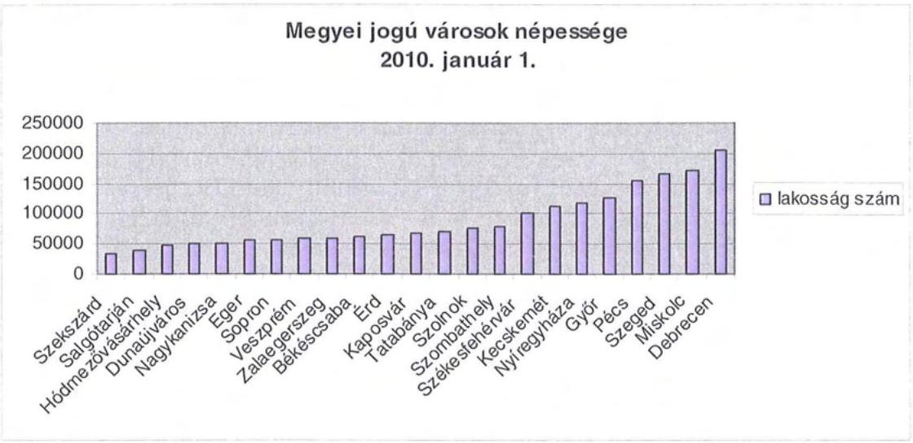

A megyei jogú városi önkormányzatok ${ }^{5}$ kötelező feladatellátását többlépcsős törvényi előírások határozzák meg. A feladatokra vonatkozó szabályozás első szintjét az Ötv. ${ }^{6}$, a második szintet a hatásköri ${ }^{7}$, a harmadik szintet a további ágazati, szakmai (egyebek mellett az oktatási, egészségügyi, szociális és egyéb ágazati feladatok ellátásának szakmai szabályait rögzítő) törvények adják.

A megyei jogú városi önkormányzatok – az Ötv-ből közvetlenül levezethető települési feladatok mellett – körzeti közszolgáltatásokat is ellátnak. A megyei

[^0]
[^0]:    ${ }^{3}$ A Magyar Köztársaság 2011. évi költségvetéséről szóló 2010. évi CLXIX. törvény Általános indoklásának III. fejezete, valamint Magyarország Konvergencia Programja 2011-2015. (2011. április) Táblázatok rész, 2. táblázat Államháztartás összefoglaló adatai szerint.
    ${ }^{4}$ A megyei jogú városok népességét a 4/2011. (I. 31.) NGM rendelet 1. sz. mellékletében foglalt 2010. január 1-i adatok alapján vettük figyelembe.
    ${ }^{5}$ Az Ötv. 61. § (1) bekezdése alapján a megyeszékhely város a törvény erejénél fogva megyei jogú, ugyanakkor az Országgyűlés az ötvenezernél nagyobb népességű városokat a képviselőtestület kérelmére megyei jogú várossá nyilváníthatja. Ez utóbbi körbe 5 város tartozik, közülük 2 (Hódmezővásárhely, Dunaújváros) népessége 2010. január 1-ére már ötvenezer fő alá csökkent.
    ${ }^{6}$ az Ötv. 8. és 61. §-ában foglaltak szerint
    ${ }^{7}$ a Htv.

---

jogú városi cím elsősorban többlet kötelezettségekkel jár, a megyei jogú városnak önmagának kell gondoskodnia mindazokról a feladatokról, amelyek más települési önkormányzatok esetében a megyei önkormányzat feladatát képezik. Ide sorolható többek közt a középfokú oktatási intézmények fenntartása, a közművelődési, könyvtári és levéltári szolgáltatás, a társadalombiztosítás finanszírozása mellett a kórházi és a rendelőintézeti szakellátás, a szociális és egyes gyermekvédelmi feladatok ellátása. Ezeket a feladatokat (intézményeket) a megyei jogú város – más városoktól eltérően – nem adhatja át a megyei önkormányzatnak, azonban az Ötv. lehetőséget biztosít arra, hogy a megyei önkormányzattal megállapodjék a feladatellátás megosztásában.

Az önkormányzat, így a megyei jogú város is, maga határozza meg, hogy – a lakosság igényei alapján, anyagi lehetőségei függvényében – mely feladatokat, milyen mértékben és módon, mely szervezeti keretek közt lát el. A szervezetalakítás szabadsága a megyei jogú városok esetében azzal járt, hogy mind a kötelező közszolgáltatásoknál (különösen a településüzemeltetés, vagyongazdálkodás), mind pedig az önként vállalt feladataik ellátásában – elsősorban a sport és kulturális szolgáltatások területein – a gazdasági társaságok kiemelt fontosságú szerephez jutottak. Ily módon a gazdálkodás, a pénzügyi helyzet kockázatai közvetlenül kikerültek ugyan az önkormányzati alrendszerből, azonban sérülhet az ellátási felelősség figyelemmel kísérése és érvényesítése, a közpénzek felhasználásának transzparenciája. Mindezek együttvéve – a beszámolók konszolidálásának hiányában – növelik a megyei jogú városok pénzügyi helyzetének megítélésében rejlő kockázatokat.

Az áttekintett időszakban az önkormányzati feladatok ellátásának keretet biztosító forrásszabályozás elvei lényegesen nem változtak.

A megyei jogú városok önkormányzatainak mozgásterét, az önkormányzatok feladatellátásra vonatkozó döntéseit a központi költségvetéstől való függőség mellett jelentősen befolyásolja a helyi adókivetési jog gyakorlása ${ }^{8}$. A helyi adók rendszere a közszolgáltatások finanszírozásához szükséges források megteremtésének, bővítésének eszköze, amely a gazdasági válság, a jogszabályi környezet, az adópolitika változása, az adóhatóságok tevékenysége
 következtében differenciáltan érinti a települési önkormányzatokat ${ }^{9}$.

A települési önkormányzatok saját folyó bevételeinek keretében elszámolt, különböző jogcímeken kivetett helyi adók - iparűzési adó, építmény és telekadó, idegenforgalmi adó, vállalkozók és magánszemélyek kommunális adója - 2007-2010 között eltérő módon emelkedtek. A helyi adókból származó bevételek realizált összege országos szinten 2007-2009 között folyamatosan, 505,3 milliárd Ft-ról 566,3 milliárd Ft-ra emelkedett, majd a gazdasági válság hatásai következtében 2010-re 542,6 milliárd Ft-ra esett vissza. A helyi adók részesedése

[^0]
[^0]:    ${ }^{8}$ a helyi adókról szóló 1990. évi C. törvény szabályai szerint
    ${ }^{9}$ Az Állami Számvevőszék 2010 decemberében közzétett 1031. számú jelentésében értékelte a helyi adók rendszerében a hatékonyság és az eredményesség érvényesülését.

---

az önkormányzatok saját folyó bevételein belül 2007-2010 között 2,5 százalékponttal csökkent ${ }^{10}$.

A megyei jogú városok saját folyó bevétele 2007-ben 191,5 milliárd Ft volt, 2008-ban 223,1, 2009-ben 225,4, 2010-ben 223,5 milliárd Ft-ot tett ki. A helyi adóbevételekből való részesedésük 2007-ben 110,5 milliárd Ft (21,9%), 2008-ban 128,3 milliárd Ft (23,2%), 2009-ben 124,4 milliárd Ft (22%), 2010-ben 118,7 milliárd Ft (részaránya a 2007. évivel azonosan 21,9%) volt. E realizált adóbevételek a megyei jogú városok saját folyó bevételeinek 2007-ben 57,7, 2008-ban 57,5, 2009-ben 55,2, 2010-ben 53,1%-át jelentették. A helyi adóbevételek 2007-ről 2010-re kimutatott 4,6 százalékpontos csökkenése annak ellenére következett be, hogy a megyei jogú városok saját folyó bevétele 2010-ben 16,7%-kal haladta meg a 2007. évit.

A helyi adókon belül a települések gazdasági helyzetének egyik fokmérője az elért helyi iparűzési adóbevétel, amely a megyei jogú városok körében erőteljes - a település nagyságrendtől is függő ${ }^{11}$ - különbségeket mutat. A helyi iparűzési adóbevétel és annak egy lakosra vetített összegének 2007. és 2010. évi alakulását az alábbi diagramok szemléltetik:
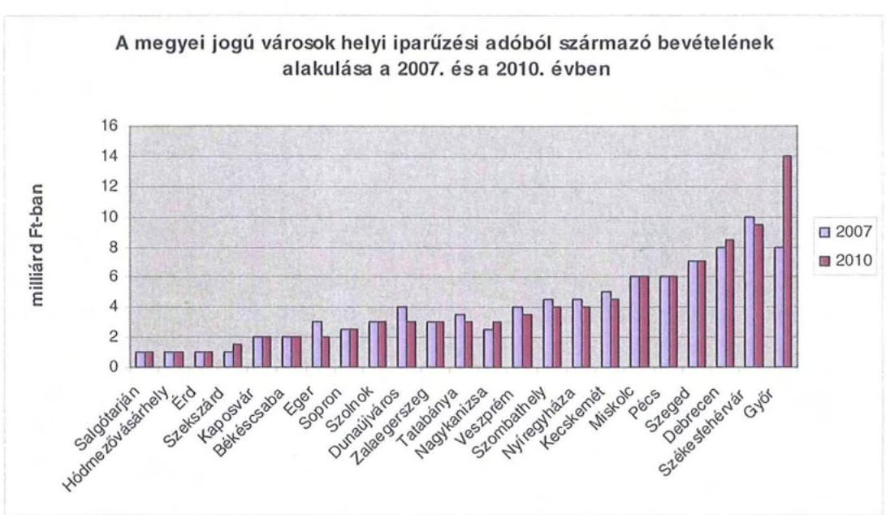

[^0]
[^0]:    ${ }^{10}$ A helyi adó bevételek saját folyó bevételekből való részesedése országosan 2007-ben 55,3%, 2010-ben 52,8% volt.
    ${ }^{11}$ A 100 ezer fő feletti népességű megyei jogú városok csoportjába Debrecen, Miskolc, Szeged, Pécs, Győr, Nyíregyháza, Kecskemét, Székesfehérvár tartozik. Nem megyeszékhely megyei jogú város Érd, Sopron, Nagykanizsa, Dunaújváros, Hódmezővásárhely.

---

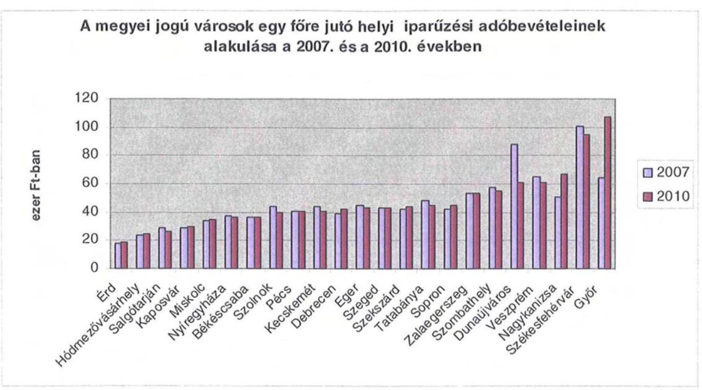

A megyei jogú városi önkormányzatok saját bevételein belül második legjelentősebb elem az illetékbevétel. A 2010. évben befolyt 39,2 milliárd Ft illetékbevétel a 2006. évben realizált 71,1 milliárd Ft illetékbevétel alig több mint 55%-a. A jelentős visszaesést döntően az ingatlanpiac stagnálása, majd visszaesése, illetve egyes illetékkedvezmények bevezetése okozta. A kieső bevételek pótlására az önkormányzati alrendszer szintjén történtek intézkedések, 2010-ben 5 milliárd Ft-ot, 2011-ben 1,2 milliárd Ft-ot ellentételezett a központi költségvetés. A megyei jogú városok önkormányzatai az önkormányzati alrendszer szintjén realizált illetékbevételből 2007-ben 13,6 milliárd Ft-tal (23,3%-kal), 2008-ban 15,3 milliárd Ft-tal (22,7%-kal), 2009-ben 12,6 milliárd Ft-tal (21,5%-kal), 2010-ben 7,9 milliárd Ft-tal (20,2%-kal) részesedtek ${ }^{12}$. Az összes befolyt illetékbevételből a megyei jogú városok részesedése 2009-ről 2010-re mindössze 1,3 százalékponttal csökkent, ugyanakkor a realizált illetékbevétel csökkenése a 37,3%-ot (4,7 milliárd Ft) is elérte.

Az önkormányzati alrendszer átengedett bevételei közül a személyi jövedelemadóból való részesedés makroszintű szabályozása a vizsgált időszakban nem változott. A települési önkormányzatokat a településre kimutatott személyi jövedelemadó 8%-a közvetlenül, míg 32%-a külön szabályozott visszaosztási rendben illeti meg. A visszaosztás a jövedelem differenciálódás mérséklésével párosul, rendje a lakóhelyen maradó személyi jövedelemadóhoz és az iparűzési adó-erőképességhez ${ }^{13}$ igazodik, annak részletszabályait a mindenkori költségvetési törvény 4. számú melléklete határozza meg. A jövedelemdifferenciálódás

[^0]
[^0]:    ${ }^{12}$ Az illetékek kivetésének és beszedésének joga 2006. december 31-ig a megyei önkormányzatok feladata volt, amelyet a 2007. évtől az APEH (2011. január 1-jétől NAV) vett át. Az önkormányzati illetékrészesedési szabályok változatlanok maradtak, azonban az illetékbeszedés költségeit az önkormányzatok illetékbevételeiből átlagos (a megyei jogú városoknál 8,5%-os) kulcsot alkalmazva vonták le.
    ${ }^{13}$ Az iparűzési adóerő-képesség egy potenciális, átlagos erőfeszítés mellett elérhető (a települési önkormányzat iparűzési adóelőlegét meghatározó adóalap 1,4%-ának megfelelő számított) bevétel.

---

szabályai kétirányúak, a kiegészítés és a visszatartás feltételeit egyaránt meghatározták:

- Amennyiben az önkormányzatot közvetlenül megillető személyi jövedelemadó bevétel és a számított iparűzési adóerő-képesség együttesen számított, egy főre jutó összege nem érte el a település méretéhez kapcsolódóan az évenkénti szabályozás szerinti változó összeget, a költségvetés a részesedést - település nagyság szerint eltérően meghatározott szintig - kiegészítette ${ }^{14}$. A kiegészítés fajlagos összege 2007-2010 között 37500 Ft-ról 48010 Ft-ra (10 510 Ft-tal, 28%-kal) emelkedett. Az előzőeken túl a jövedelem differenciálódás szabályozása egyes térségi (középiskolai, szakiskolai, szakképző intézményi, kollégiumi) feladatok ellátásának függvényében további kiegészítő hozzájárulást biztosított.
- Amennyiben az egy főre számított személyi jövedelemadó és az iparűzési adóerő-képesség együttes összege a település nagyságrendjéhez rendelt értékhatárt több mint 25%-kal (2010-től 20%-kal) meghaladta, az egy főre jutó összeg sávonként differenciált módon ${ }^{15}$ visszavonásra került az önkormányzatot megillető normatív állami hozzájárulás összegéből.

Az önkormányzatok személyi jövedelemadó bevétele 2007-ben 494,3 milliárd Ft, 2008-ban 558,6 milliárd Ft, 2009-ben 639,5 milliárd Ft, 2010-ben 681,2 milliárd Ft volt, az időszak alatt összegében 186,9 milliárd Ft-tal, 37,8%-kal emelkedett, miközben az szja bevétel átengedett bevételeken belüli részesedése 1,8 százalékponttal emelkedett.

A megyei jogú városok önkormányzatainak személyi jövedelemadó részesedése az alrendszer átengedett személyi jövedelemadó bevételeiből 2007-ben 77,6 milliárd Ft-ot (15,7%-ot), 2008-ban 105,4 milliárd Ft-ot (18,9%-ot), 2009-ben 122,9 milliárd Ft-ot (19,2%-ot), 2010-ben 136,6 milliárd Ft-ot (20,1%-ot) tett ki. A realizált szja bevétel a megyei jogú városoknál az időszak alatt folyamatosan emelkedett, a 2010-ben realizált adóbevétel 59,0 milliárd Ft-tal (76%) volt magasabb a 2007. évinél, az átengedett bevételeken belüli részesedése 2010-re 5,1 százalékponttal haladta meg a 2007. évi részarányt ${ }^{16}$. A részesedés alapjául szolgáló szja településenként eltérő, az egy adózóra jutó szja 2009. évi adatait ${ }^{17}$ a következő ábra szemlélteti.

[^0]
[^0]:    ${ }^{14}$ A megyei jogú városok esetében a jövedelemkülönbségek mérséklésénél figyelembe veendő lakosonkénti értékhatár 2007-ben 37500 Ft, 2008-ban 42385 Ft, 2009-ben 45933 Ft, 2010-ben 48010 Ft volt.
    ${ }^{15}$ A sávos értékhatár 2010-től 20%-os intervallumonként, 120% felett a visszatartást 25%-tól 90%-os mértékig rögzíti. Amennyiben a település nagyságrendhez rendelt értékhatár összege az önkormányzatnál eléri vagy meghaladja a 200%-ot, az egy főre jutó összeg 90%-a levonásra kerül. Az értékhatár sávjai 2010 előtt 25%-os léptékűek voltak, a levonási arányok az ellenőrzött időszakban nem változtak.
    ${ }^{16}$ E bevételek a megyei jogú városok átengedett bevételeiben 2007-ben 84,7, 2008-ban 87,7, 2009-ben 89,7, 2010-ben 89,8%-os részarányt jelentettek.
    ${ }^{17}$ Adatforrás: KSH Megyei Jogú Városok a Közép Dunántúlon 2009. kiadványa, 4.1.sz. összehasonlító tábla.

---

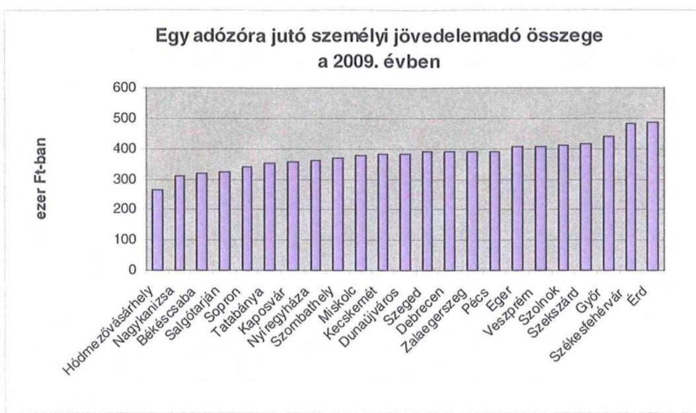

Az átengedett bevételek második legjelentősebb eleme a gépjárműadó, amelynek bevételi szabályozása az ellenőrzött időszakban nem változott, az adóbevétel teljes összege az önkormányzatot illeti meg. A gépjárműadó alapját, mértékét ${ }^{18}$ és egyes mentességi kategóriákat érintő módosítások 2010. január 1-től következtek be, amelyek az egyes adótételek esetében átlagosan 15%-os emelkedéssel jártak.

A gépjárműadó beszedéséből származó bevétel az önkormányzati alrendszer szintjén 2007-ben 62,4 milliárd Ft, 2008-ban 65,7 milliárd Ft, 2009-ben 63,8 milliárd Ft, 2010-ben 71,1 milliárd Ft volt, az adóbevétel egésze 2007-hez képest 8,7 milliárd Ft-tal, 13,9%-kal emelkedett. A gépjárműadóztatás szabályainak változása 2010-ben 7,3 milliárd Ft többletet eredményezett. A megyei jogú városok gépjárműadó bevétele a 2007. évi 14,0 milliárd Ft-ról 2010-re 15,5 milliárd Ft-ra, 10,7%-kal emelkedett. A bevételnövekedés összegéből 1,4 milliárd Ft a 2010. évi adózási szabályok következménye.

A megyei jogú városok önkormányzatai 2007-2010 között rendelkezésre álló forrásainak alakulását a következő ábra szemlélteti:

[^0]
[^0]:    ${ }^{18}$ A gépjárműadóról szóló 1991. évi LXXXII. törvény 7. § (1) bekezdésében foglalt adómértékek változása.

---

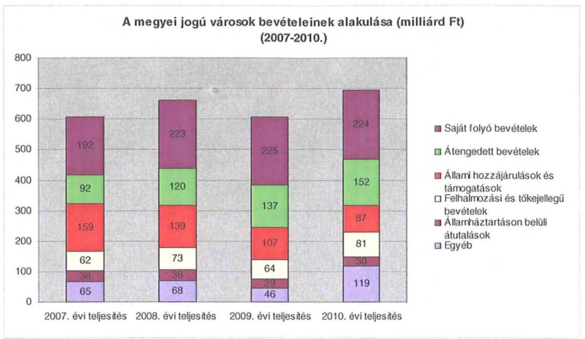

A megyei jogú városok saját folyó bevételeinek - amelyek főbb elemei: a helyi adók, az illetékbevételek, az intézményi térítési díjak, a kamatbevételek részaránya a 2007. évi összbevételen (608 milliárd Ft) belül 32% volt. A 2010. évi összbevétel 693 milliárd Ft-os összegéből a saját folyó bevételek aránya - miközben összege 2007-ről 2010-re 32 milliárd Ft-tal emelkedett - nem változott.

Az átengedett bevételek, amelyek a megyei jogú városok önkormányzatainál döntően a személyi jövedelemadó és a gépjárműadó részesedést jelenti, az összbevételen belül a 2007. évi 92 milliárd Ft-ról (15%) 152 milliárd Ft-ra nőtt, részesedése 7 százalékponttal emelkedett. A 60 milliárd Ft-os növekedésből 59 milliárd Ft-ot az szja részesedés emelkedése okozott.

Az állami hozzájárulások és támogatások - amelyek főbb elemei: főként az ellátotti létszámhoz kötődő normatív állami hozzájárulások, központosított előirányzatok - a 2007. évi 159 milliárd Ft-ról (26%-os részarányról) 2010-re 87 milliárd Ft-ra (13%-os részarányra) estek vissza.

A felhalmozási és tőkejellegű bevételek - tárgyi eszközök (ingatlanok és ingóságok), föld és immateriális javak, részesedések értékesítése, EU-tól átvett pénzeszközök - a 2007. évi 62 milliárd Ft-ról (10%-os részarányról) 2010-re 81 milliárd Ft-ra (12%-os részarányra) emelkedtek.

Az államháztartáson belüli átutalások részesedése 2007-ben 38 milliárd Ft volt. 2010. év végére 8 milliárd Ft-tal csökkent, részaránya 6%-ról 2010-ben 4%-ra változott. Ez a bevételi kategória tartalmazza az Egészségbiztosítási Alaptól és más elkülönített állami pénzalapoktól átvett forrásokat. A 2010-ben e címen elszámolt bevétel a megyei jogú városoknál 22 milliárd Ft-ot tett ki.

Az egyéb, pénzmaradványból, vállalkozási bevételekből, államháztartáson kívülről származó átutalásokból, a hitelekből, a hosszú és rövid lejáratú értékpa-

---

pírok értékesítéséből származó bevételek részesedése a 2007-2010. évek viszonylatában 11%-ról 17%-ra emelkedett. Ez utóbbiak 2010. évi beszámoló szerinti összevont teljesítése 119 milliárd Ft volt ${ }^{19}$.

Mindezeket figyelembe véve a megyei jogú városok 2007. és 2010. évi forrásöszszetételének megoszlását az alábbi ábra szemlélteti:

A megyei jogú városok 2007. és 2010. évi forrásösszetétele
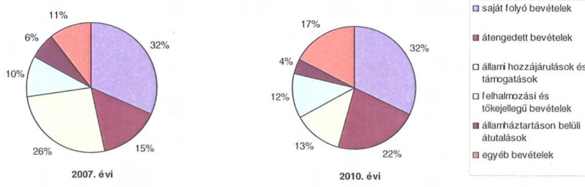

Az önkormányzati alrendszer pénzügyi helyzetértékelése során új elemzési módszereket alkalmaz az ellenőrzés. A hagyományos költségvetési szerkezet helyett az önkormányzat pénzügyi helyzetét a CLF módszerrel mutatjuk be, amelynek lényegét és számításának módszerét a 2.1. pontban, és a jelentés 2. számú mellékletében ismertetjük részletesen.

Az új módszeren alapuló helyzetértékelés fontosságát az adja, hogy a helyi önkormányzatok bruttó adósságállománya ${ }^{20}$ a 2010. évi költségvetési beszámoló alapján 1248 milliárd Ft-ot tett ki. Az adósságállomány koncentráltságát jelzi ${ }^{21}$, hogy ebből a 23 megyei jogú város részesedése 338 milliárd Ft volt, amely a fővárosi és kerületi önkormányzatok adósságának figyelmen kívül hagyásával számított 2010. évi 977 milliárd Ft összegű bruttó adósságállo-

[^0]
[^0]:    ${
 }^{19}$ Az egyéb bevételek összege 2007-2010 között eltérő módon változott, 2007-ben 65 milliárd Ft, 2008-ban 68 milliárd Ft volt, 2009-ben 46 milliárd Ft-ra esett vissza, majd 2010-ben több mint két és félszeresére, 119 milliárd Ft-ra emelkedett.
    ${ }^{20}$ A bruttó adósságállomány 2010. év végi összege magában foglalja a fejlesztési és a működési célú kötvénykibocsátások, a beruházási és fejlesztési hitelek, a működési célú hosszú lejáratú hitelek, a rövid lejáratú hitelek, váltótartozások miatti kötelezettségek teljes (2011-ben, illetve az azt követő években esedékes) állományát.
    ${ }^{21}$ A megyei jogú városok adósságállománya összegében ugyan elmarad az egyéb városok összesített adósságától [(ez utóbbiak részesedése 382,6 milliárd Ft (39,2\%)], azonban az egyéb városok száma 304. A fővárosi és a kerületi önkormányzatok nélküli adósságállományból a 19 megyei önkormányzat 163 milliárd Ft-tal (16,8\%-kal), míg a nagyközségek, községek együttesen 93 milliárd Ft-tal (9,5\%-kal) részesednek.

---

mány 34,6\%-át jelentette. Az adósságállomány több mint fele - 501 milliárd Ft - a 19 megyei önkormányzatnál és a 23 megyei jogú városnál jelentkezett.

A megyei jogú városok 338 milliárd Ft-os adósságállományából 175 milliárd Ft (51,8\%) a 8 legnagyobb, 100 ezer fő feletti népességű város tartozása. Az 5 nem megyeszékhely megyei jogú város bruttó adósságállománya 70 milliárd Ft-ot (20,7\%-ot), az előző két csoportba nem tartozó további 10 megyei jogú város adóssága 93 milliárd Ft-ot (27,5\%-ot) tett ki.
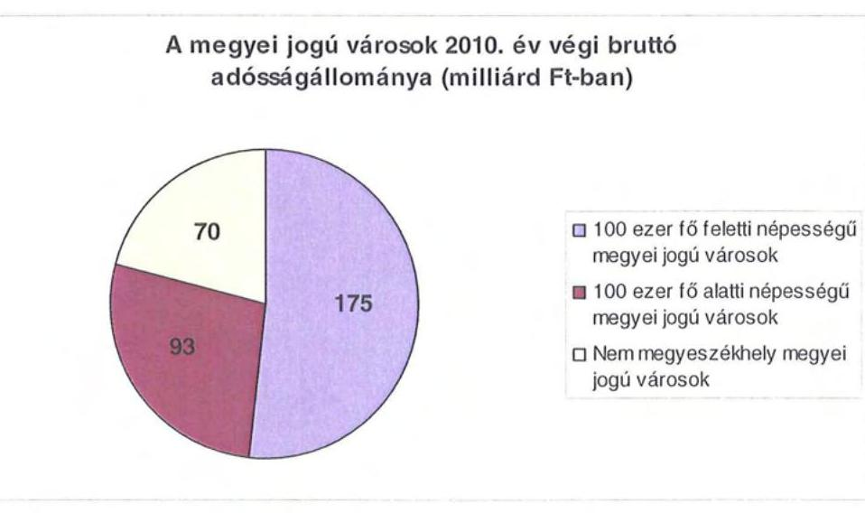

A mérlegben kimutatott bruttó adósságállomány mellett az önkormányzatok számára az eszközállomány műszaki állapotának megőrzése is kötelezettségekkel jár. Az elhasználódott eszközök pótlására forrást biztosító amortizációs (felújítási) alap képzésének ${ }^{22}$ elmaradása maga után vonhatja a feladatellátást kiszolgáló tárgyi eszközök állagának erőteljes romlását. Emellett a 2007-2013-as időszakra meghirdetett, vissza nem térítendő EU-s fejlesztési forrásokhoz való hozzájutás lehetősége felerősítette az önkormányzati alrendszer fejlesztési igényeit, amelyek a felhalmozási költségvetési hiány folyamatos emelkedésén túl - az előírt jövőbeni fenntartási kötelezettség miatt - tovább terhelhetik az önkormányzatok költségvetését ${ }^{23}$.

Az ÁSZ a 2011. évi ellenőrzési tervében 43. számú, az Önkormányzatok gazdálkodási rendszerének ellenőrzése részeként egy időben, egymással párhuzamosan tekinti át, és elemzi a 23 megyei jogú városi önkormányzat pénzügyi helyzetét. A gazdálkodás szabályszerűségét az ÁSZ az előző évek során ebben az önkor-

[^0]
[^0]:    ${ }^{22}$ Erre a jelenlegi szabályozási környezetben nem kötelezi semmilyen előírás az önkormányzatokat.
    ${ }^{23}$ Az Állami Számvevőszék 2011 júniusában közzétett 1108. számú, a helyi önkormányzatok fejlesztési célú támogatási rendszerének ellenőrzéséről szóló jelentésében feltárta a fejlesztési folyamatok problémáit. A helyi önkormányzatok elsősorban azokat a fejlesztéseket valósították meg, amelyekhez támogatást lehetett igényelni. A fejlesztési célok közül a magasabb támogatás intenzitású pályázatokat részesítették előnyben. A fejlesztéssel megvalósuló létesítmények jövőbeli üzemeltetésének várható ráfordításait az önkormányzatok 71,9\%-a nem mérte fel.

---

mányzati körben is ellenőrizte, ezért jelen vizsgálatunk erre nem tér ki. A jelentés a megyei jogú városok sajátos feladatellátási és forrásszabályozási helyzetére tekintettel az önkormányzatok pénzügyi helyzetét, illetve az ezzel összefüggő korábbi ÁSZ javaslatok megvalósítását mutatja be.

Az ellenőrzés a 2007. január 1. - 2010. december 31. közötti időszakot öleli fel.
A vizsgálat jogszabályi alapját az Állami Számvevőszékről szóló 1989. évi XXXVIII. törvény 2. § (3), (5), (6) és (9) bekezdései ${ }^{24}$, az Ötv. 92. § (1) bekezdése, az Áht. 104. § (3), és 120/A. § (1) bekezdése előírásai képezik.

[^0]
[^0]:    ${ }^{24}$ 2011. július 1-jétől az Állami Számvevőszékről szóló 2011. évi LXVI. törvény 5.§ (2)(5) bekezdései.

---

# I. ÖSSZEGZŐ MEGÁLLAPÍTÁSOK, KÖVETKEZTETÉSEK, JAVASLATOK 

Az Önkormányzat - adatszolgáltatása szerint - a tárgyév működési költségvetési kiadásaiból (15668 millió Ft) 10968 millió Ft-ot (70\%) a kötelező feladatok, 4700 millió Ft-ot (30\%) az önként vállalt feladatok ellátására fordított. A kötelező és önként vállalt feladatok részarányának megállapítása az Önkormányzat SzMSz szerinti besorolásának megfelelően készült. Az Önkormányzat önként vállalt feladatai a közművelődés, a sport és szabadidős tevékenység, az egészségügyi ellátás, egyes szociális és gyermekvédelmi ellátások területét érintették. Az önként vállalt feladatok ellátásában a gazdasági társaságok is részt vettek.

Az Önkormányzat feladatellátásának szervezeti struktúráját a következő ábra szemlélteti:
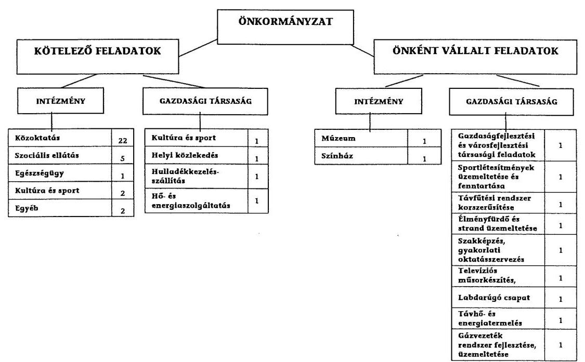

Az Önkormányzat feladatait 2010. december 31-én (a Polgármesteri hivatallal együtt) 34 költségvetési szervvel és tizenegy 25\% feletti tulajdoni hányadú, egy 25\%-os tulajdoni hányadú gazdasági társaságával, továbbá egy - az önkormányzattól tulajdonosi szempontból független - gazdasági társaság közreműködésével látta el. Az Önkormányzat az áttekintett időszakban egy intézményt vett át más önkormányzattól, egy intézményt átadott a Kistérségi társulás fenntartásába. Az intézmény átadás folytán a feladatellátás telephelyeinek száma a 2006. évi 93-ról a 2010. évre 82-re csökkent. Az intézményszervezeti átalakítások és intézményi összevonások a telephelyek számára nézve nem voltak kedvezőtlen hatással.

Az Önkormányzat működési kiadásokra 2010-ben 15668 millió Ft-ot fordított, amely 3285 millió Ft-tal (27\%-kal) haladta meg a 2007. évi ráfordításokat. A működési kiadások 51\%-át az intézményi körben realizálták.

---

E kiadások fedezetéül szolgáló bevételi források 2007. és 2010. években jellemző összesített arányait a következő ábra szemlélteti:
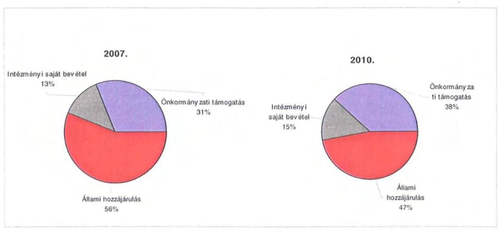

Az egyes közszolgáltatások feladatellátásában résztvevő ágazati intézménycsoportok forrásösszetételének bevételi jogcímenkénti alakulását a következő ábra szemlélteti:
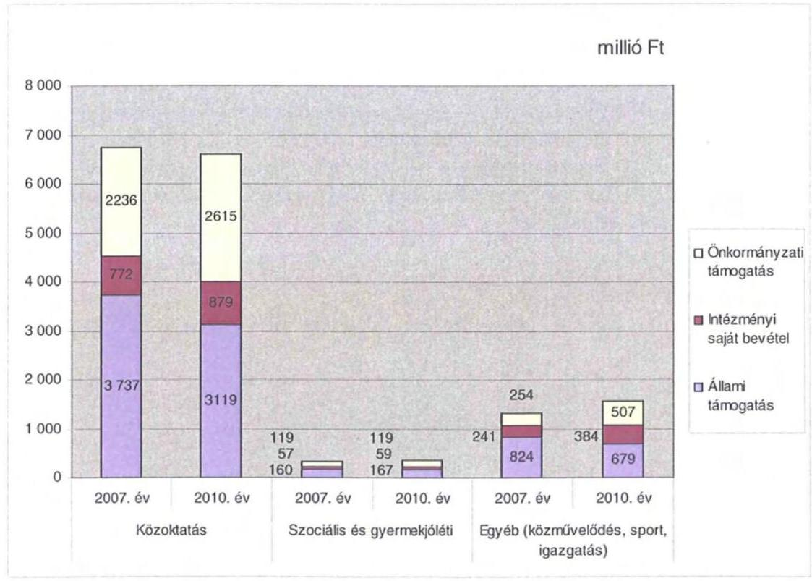

A közoktatási ágazatban az állami támogatás a 2007. évről a 2010. évre 618 millió Ft-tal (16,5\%) csökkent, az intézményi saját bevétel és az önkormányzati támogatás összege valamennyi ágazatnál emelkedett.

Az Önkormányzat az áttekintett időszakban kórházat nem tartott fenn.

---

Az Önkormányzat öt gazdasági társaságban rendelkezik kizárólagos tulajdonnal, kettő gazdasági társaságban 75\% feletti, három gazdasági társaságban 50-75\% közötti, kettőben 25-50\% közötti tulajdoni hányaddal. A gazdasági társaságok távhő- és energiatermelési, távhőszolgáltatási, fűtéskorszerűsítési, gázvezetékrendszer üzemeltetési és fejlesztési, hulladékkezelési és -szállítási, gazdaság- és városfejlesztési, szakképzés és gyakorlati oktatás szervezési, közművelődési, strand, élményfürdő és sportlétesítmény üzemeltetési, valamint helyi közösségi közlekedési területeken kaptak szerepet az Önkormányzat feladatellátásában. Az Önkormányzat a gazdasági társaságoknak működési célra a 2010. évben összesen 255 millió Ft rendszeres, 182 millió Ft eseti és 0,3 millió Ft fejlesztési célú pénzeszközt adott át. A működési célú pénzeszköz átadás 11\%-át (50 millió Ft-ot) a strandot és élményfürdőt üzemeltető társaság kapta.

A gazdasági társaságok pénzügyi helyzete - a strandot és élményfürdőt üzemeltető társaság kivételével - stabil, a saját tőke és a jegyzett tőke aránya 2010. december 31-én kiemelkedően magas volt a szakképzési és gyakorlati oktatásszervezési feladatot ellátó társaság (3784\%), valamint a gazdaságfejlesztési feladatokat végző társaság (1148\%) esetében. A strandot és élményfürdőt üzemeltető társaság a 2009. évben 264 millió Ft tőkejuttatásban részesült. Az Önkormányzat 2007-2010 között a gazdasági társaságokban levő tulajdonrésze után három gazdasági társaságtól változó mértékű osztalékot kapott. A kapott osztalék összege a 2007. évben 49 millió Ft, 2008-ban 33 millió Ft (két társaságtól), 2009-ben 48 millió Ft, a 2010. évben osztalék-előleggel együtt 349 millió Ft volt. Az Önkormányzat 2010. évben a kötvénykibocsátásból származó forrásából a Tatabányai Erőmű Kft-ben 51\% tulajdoni részesedést szerzett, az osztalék 73\%-át kapta a gazdasági társaságtól osztalékelőlegként.

A folyó költségvetés egyenlege (működési jövedelem) 2007-2010 között működési forrástöbbletet mutatott ${ }^{25}$. A 2007-2010. években a működési megtakarítások fedezni tudták a tárgyévben jelentkező törlesztési kötelezettségeket, így az Önkormányzat pénzügyi kapacitása (nettó működési jövedelme) is pozitív értékű volt.

[^0]
[^0]:    ${ }^{25}$ 2007-ben a folyó bevételek 11,3\%-át (1681 millió Ft-ot), 2008-ban 13,8\%-ot (2165 millió Ft-ot), 2009-ben 7,9\%-át (1150 millió Ft-ot), 2010-ben 6,3\%-át (936 millió Ft-t) jelentette.

---

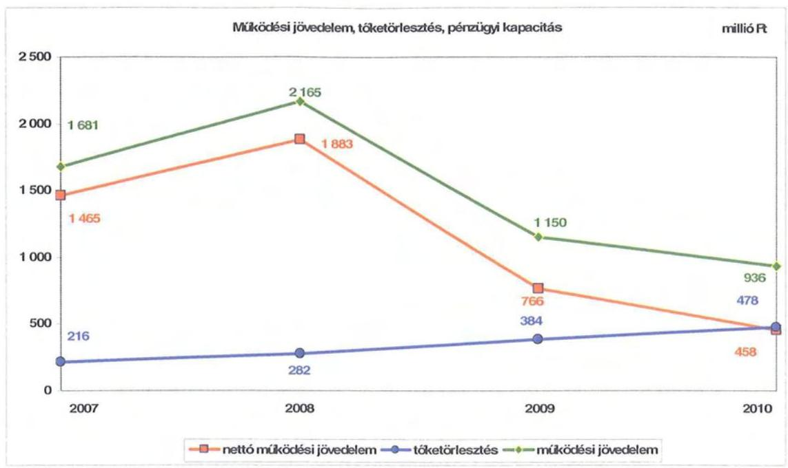

A 2007-2010. években az Önkormányzat felhalmozási költségvetésének egyenlege folyamatosan negatív összegű volt, amely 2007-2010. között összesen 10301 millió Ft felhalmozási forráshiányt okozott.

A pénzügyi egyensúly fenntartását külső források bevonásával biztosították. A 2007-2010. években 1360 millió Ft hitelt törlesztettek. Az adósságszolgálat, továbbá a felhalmozási forráshiány 2007-2010. között 11661 millió Ft-ot tett ki, amelyre az időszakban képződő 5392 millió Ft működési megtakarítás (működési jövedelem), valamint a 2007. január 1-jén rendelkezésre álló 1577 millió Ft pénzkészlet szolgált fedezetül. A további pénzeszközöket 3018 millió Ft hitel felvételével, továbbá 2600 millió Ft kötvény kibocsátásával teremtették meg. A kialakult pénzügyi helyzet pozitív nettó működési jövedelmet eredményező gazdálkodás mellett teszi elkerülhetővé további külső források bevonását, az eladósodás növekedését.

A vizsgált időszakban Önkormányzat helyi iparűzési adót, építményadót, vállalkozók kommunális adóját, telekadót és a 2008. évtől a vendégéjszakák utáni idegenforgalmi adót állapított meg. Az építményadó mértékét az egyéb építményeknél és a vállalkozók kommunális adóját a 2008. évben megemelték, az iparűzési adónál a kedvezmények, mentességek körét folyamatosan szűkítették. A helyi adókból és pótlékokból származó bevételek aránya 2007-2010 között 30-33\% körül mozgott a folyó (működési) bevételekben. A pótlékkal, bírsággal növelt helyi adó bevétel a 2007. évi 4431 millió Ft-ról 2010. évben 4445 millió Ft-ra (3\%-kal, 14 millió Ft-tal) nőtt. A helyi adóbevételek háromnegyed részét az iparűzési adó tette ki, amelynek mértékét a helyi adókról szóló törvényben rögzített maximális mértékben állapították meg. Az iparűzési adó a 2007. évhez viszonyítva 207 millió Ft-tal csökkent, ezt azonban ellentételezte az építményadó 24,7\%-os emelkedése (215 millió Ft).

---

A befejezett fejlesztések jelentős részét saját bevételből és hazai támogatásból fedezték. A 2007-2010. évek időszakában 9046 millió Ft értékű fejlesztés és felújítás forrása 3471 millió Ft (38,4\%) saját bevétel, 2126 millió Ft (23,5\%) hazai támogatás és 179 millió Ft (1,9\%) EU-s támogatás volt. Pénzintézeti forrásokból 2865 millió Ft hitelfelvétel (31,7\%) 405 millió Ft kötvényből származó bevétel (4,5\%), biztosítottak a fejlesztések forrásául. A 2010. december 31-én folyamatban lévő fejlesztési feladatok végrehajtására 358 millió Ft kiadást teljesítettek, amelyre a kötvény bevételéből 100 millió Ft-ot (27,9\%), hitelből 51 millió Ft-ot (14,3\%), saját bevételből 135 millió Ft-ot (37,7\%), EU támogatásból 72 millió Ft-ot (20,1\%) fordítottak.

Az Önkormányzat 2010. december 31-én folyamatban lévő fejlesztési feladatok kötelezettség-vállalásainak összege 3779 millió Ft volt, amelyből 660 millió Ft-ot saját forrásból, 2997 millió Ft-ot EU-s támogatásból, 47 millió Ft-ot hitelkeretből még rendelkezésre álló forrásból és 75 millió Ft-ot hazai támogatásból terveznek biztosítani. A tervezett saját források rendelkezésre állását az Önkormányzat 2011. év március 31-i pénzügyi helyzete igazolja.
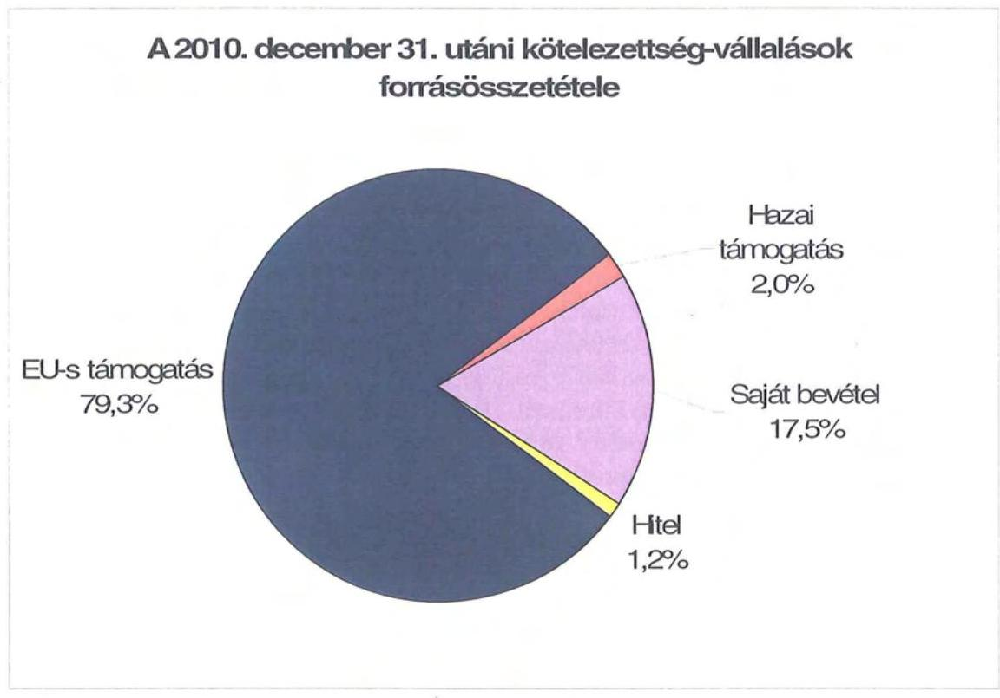

Az Önkormányzatnak beadott, elbírálás alatt álló pályázata nincs. Az Önkormányzat vállalt kötelezettségeit - a saját bevételeken túl - a fennálló követelésállományból származó forrásai felhasználásával (524 millió Ft) és a jelzáloggal nem terhelt forgalomképes ingatlanvagyon szükség szerinti értékesítéséből származó bevételből kívánja előteremteni.

Az Önkormányzat mérleg szerinti pénzintézeti kötelezettsége a 2006. év végéről a 2010. év végére, 3497 millió Ft-ról 12773 millió Ft-ra nőtt. Az Önkormányzat a 2006-2010. években nem tett eleget az Áhsz. 36. § (2) bekezdés b) pontjában előírtaknak,
 mivel a devizában fennálló kötelezettségei év végi érté-

---

kelését nem végezte el a Számv. tv. 60. §-ában szereplő devizaárfolyammal számolva. Tekintettel arra, hogy az év végi értékelések nem történtek meg, a kötelezettségek mérleg szerinti állománya nem tartalmazza az árfolyamváltozások hatását. Az árfolyamváltozások egyenlege a 2006-2010. években 1185,3 millió Ft. A 2010. év végén 1181 millió Ft árfolyamveszteség volt. A fennálló pénzintézeti kötelezettségek egy kötvény kibocsátásból, 17 hosszú lejáratú hitelből és egy pénzügyi lízingből keletkeztek. Az Önkormányzat a 2011. évben további két, fejlesztési célú hitel felvételéről döntött.

Az Önkormányzat kötelezettségvállalásaira közgyűlési döntés alapján került sor, azonban az előterjesztésekben nem mutatták be a visszafizetés forrásait, a várható kamat- és tőkefizetési kötelezettséget, valamint a kamatkockázatot. A hosszú lejáratú adósságot keletkeztető kötelezettségvállalások során a visszafizetés fedezetének meghatározásakor nem tartották be minden esetben az Ötv. előírását.

Az Önkormányzat kötvényt egy esetben, üzletrész vásárlása, valamint egyéb beruházási és felújítási feladatok végrehajtása céljából bocsátott ki. Fejlesztési hiteleiből panelházak felújításához biztosított önerőt, valamint közutak felújítását, lakásépítési programot, színház rekonstrukciót, város rehabilitációt finanszírozott. A nyílt végű pénzügyi lízingszerződést a Közgyűlés döntése alapján önként vállalt feladatra, strand és élményfürdő létrehozására kötötte meg az Önkormányzat. A lízingszerződés összege 24128 ezer CHF volt, a szerződést 20 évre kötötték meg. Az önként vállalt feladat finanszírozása az Önkormányzat részére magas pénzügyi kockázatot jelent. Az üzemeltetésre létrehozott gazdasági társaság a helyszíni ellenőrzés időszakában veszteséges, annak ellenére, hogy az Önkormányzat tőkejuttatásban, működési támogatásban részesítette. A pénzügyi lízingszerződésből 2010. december 31-én az Önkormányzatnak 21833 ezer CHF, 2011-2013. években 4590 ezer CHF, 2014-től a futamidő végéig 24626 ezer CHF kötelezettsége áll fenn.

Az Önkormányzat a devizában fennálló pénzintézeti kötelezettségeiből 2395 ezer EUR (638 millió Ft) és 2294 ezer CHF (526 millió Ft) tőkét törlesztett, 1690 ezer EUR (443 millió Ft) és 1019 ezer CHF kamatot (195 millió Ft), valamint 8,03 millió Ft egyéb költséget fizetett. A HUF-ban fennálló kötelezettségekből 444 millió Ft tőkét, 622 millió Ft kamatot és 84 millió Ft egyéb költséget teljesített. Az Önkormányzat a kötvények kibocsátásából és a hitelek igénybevételéből származó forrásokat 2010. év végéig a céloknak megfelelően felhasználta. A 2007-2010. években átmenetileg szabad pénzeszközeiből 418 millió Ft kamatbevételt realizált, melyből 24 millió Ft származott a kötvénybevételek befektetéséből. A kamatbevételeket költségvetési kiadásként működési célra fordították. Az Önkormányzat számlavezető bankot nem váltott.

A kötvény lejegyzése, a pénzügyi lízing és a hitelek folyósítása hét kivételével (4000 millió Ft és 3070 ezer EUR) nem a számlavezető pénzintézet által történt, ami nem jelent kockázatot a banki befolyás növekedése miatt az Önkormányzat számára.

Az Önkormányzat működésének pénzügyi egyensúlyát a vizsgált időszakban folyószámlahitel igénybevételével tudta biztosítani.

---

A folyószámlahitel igénybevétele a 2007-2010. években az alábbiak szerint alakult:

| Megnevezés | 2007. év | 2008. év | 2009. év | 2010. év |
| :-- | :--: | :--: | :--: | :--: |
| Keretösszeg január 1-jén | - | 700 | 700 | - |
| Átlagos napi állomány | - | - | 144 | 106 |
| Folyószámla hitellel zárt napok száma (nap) | - | - | 32 | 40 |
| 2010. december 31-i egyenleg (állomány) | x | x | x | - |

Az Önkormányzat 2011. január 1-jén 1000 millió Ft összegű folyószámlahitel kerettel rendelkezett. A likviditás biztosítása az Önkormányzatnak a 2008-2010. évek között 2,3 millió Ft kamatkiadást okozott.

Az Önkormányzat 2010. év végi szállítói tartozása 205 millió Ft, melyből a lejárt tartozás 145 millió Ft volt. Az Önkormányzatnak átütemezett tartozása, valamint egyéb kiadáselmaradása nem volt. A lejárt tartozások 0,02%-a (0,03 millió Ft) meghaladta a 91 napot.

Az Önkormányzat gazdasági társaságai részére folyószámla- és egyéb hitelek igénybevételéhez készfizető kezességet vállalt 1127 millió Ft összegben. A 2010. év végére kezességgel kapcsolatos kötelezettség 751 millió Ft-ra csökkent. A gazdasági társaságok részére három alkalommal, visszafizetési kötelezettséggel összesen 78,3 millió Ft-ot adott át az Önkormányzat. Két alkalommal 100%-os önkormányzati tulajdonú saját gazdasági társasága részére lejárt tartozások pénzügyi rendezése céljából 9 millió Ft, egy alkalommal pedig egyéb gazdasági társaság részére finanszírozási előlegként, a pályázati támogatás megérkezéséig 69,3 millió Ft visszafizetendő támogatást nyújtott.

A Közgyűlés a pénzügyi lízing biztosítékaként 150 millió Ft - számviteli nyilvántartás szerinti nettó értékű - jelzálogjog alapításához és bejegyzéséhez járult hozzá. A jelzálogszerződésekkel érintett ingatlanok a forgalomképes ingatlanok 3,5%-át jelentik.

---

Az Önkormányzat kötelezettségeinek 2010. december 31-i állományát és várható alakulását a kötelezettségek lejáratáig a következő táblázat szemlélteti:

| Megnevezés | Állomány 2010. dec.31-én |  |  | Várható kötelezettség 2011. 2013. években |  |  | Várható kötelezettség a 2014.   évet követően |  |  |
| :--: | :--: | :--: | :--: | :--: | :--: | :--: | :--: | :--: | :--: |
|  | HUF-ban   (millió Ft -   ban) | Devizában (összege, ezer EUR/CHFben) | Devizane | HUF-ban   (millió Ft -   ban) | Devizában (összege,     ezer EUR/CHF-     ban) | Devizanem | HUF-ban (millió Ftban) | Devizában (összege, ezer EUR/CHFben) | $\begin{gathered} \text { Devizanem } \\ \end{gathered}$ |
| Pénzintézeti kötelezettségek |  |  |  |  |  |  |  |  |  |
| Hosszú lejáratú hitelek | 4572 | 0 | HUF | 1238 | 0 | HUF | 5087 | 0 | HUF |
| Hosszú lejáratú hitelek | 0 | 2448 | EUR | 0 | 2104 | EUR | 0 | 483 | EUR |
| Kötvény (Turul) | 0 | 9409 | EUR | 0 | 3420 | EUR | 0 | 10016 | EUR |
| Pénzügyi lízing kötelezettség | 0 | 21833 | CHF | 0 | 4590 | CHF | 0 | 24626 | CHF |
| Pénzintézeti kötelezettségek összesen   HUF-ban | 4572 | 0 | HUF | 1238 | 0 | HUF | 5087 | 0 | HUF |
| Pénzintézeti kötelezettségek összesen   CHF-ben | 0 | 21833 | CHF | 0 | 4590 | CHF | 0 | 24626 | CHF |
| Pénzintézeti kötelezettségek összesen   EUR-ban | 0 | 11857 | EUR | 0 | 5524 | EUR | 0 | 10501 | EUR |
| biztosítékok |  |  |  |  |  |  |  |  |  |
| Kezesség | 751 | 0 | HUF | 0 | 0 | HUF | 0 | 0 | HUF |
| Biztosítékok összesen | 751 | 0 | HUF | 0 | 0 | HUF | 0 | 0 | HUF |
| Szállítói tartozás | 205 | 0 | HUF | 205 | 0 | HUF | 0 | 0 | HUF |

Az Önkormányzatnak pénzintézetekkel szemben fennálló kötelezettsége a 2010. év végén 4572 millió Ft, 11857 ezer EUR és 21833 ezer CHF volt. Ezek várható kötelezettsége (tőke, kamat és egyéb költség) a legutóbbi kamatfizetés feltételei alapján a 2011. évtől 6325 millió Ft, továbbá 16025 ezer EUR és 29216 ezer CHF. Az Önkormányzatnak a 2011. évben szállítói tartozások címén 205 millió Ft fizetési kötelezettsége keletkezett. A kezességvállalásaiból adódóan 751 millió Ft összegű terhe jelentkezhet, amennyiben a társaságok kötelezettségeiket nem teljesítik. A 2011-2013. években várható összes kötelezettség teljesítésére figyelembe vehető a 2010. évi mérlegben kimutatott 524 millió Ft követelésállomány, a 497 millió Ft szabad pénzmaradvány, a 4986 millió Ft bruttó értékű forgalomképes ingatlanvagyon, melyből a 154 millió Ft a pénzintézeti kötelezettségekhez kapcsolódóan jelzáloggal terhelt. Az Önkormányzat tájékoztatása szerint figyelembe vehető további forrás a 2011-2013. években, valamint a 2014. évet követően „a mindenkori költségvetési rendeletekben megtervezett önkormányzati saját bevételek". A 2014. évet követően a kötelezettségek teljesítésére a saját bevételeken túl a forgalomképes ingatlanvagyon, valamint az egyéb bevételek nyújthatnak fedezetet, amelyeket azonban az Önkormányzat nem számszerűsített. A CLF módszer szerint a működési jövedelem pozitív, azonban a mutatkozó tendencia (a 2008. évi 2165 millió Ft-ról a 2009. évre 1150 millió Ft-ra, majd a 2010. évre 936 millió Ft-ra csökkent) alapján nem nyújt fedezetet az önkormányzati kötelezettségek biztosítására.

---

Az Önkormányzat minősített többségi tulajdonú társaságai kötelezettségeinek 2010. december 31-i állományát és várható alakulását a kötelezettségek lejáratáig a következő táblázat mutatja be:

| Megnevezés | Állomány 2010. dec.31-én |  |  | Várható kötelezettség 2011. 2013. években |  |  | Várható kötelezettség a 2014.   évet követően |  |  |
| :--: | :--: | :--: | :--: | :--: | :--: | :--: | :--: | :--: | :--: |
|  | HUF-ban   (millió Ftban) | Devizában (összege, ezer) CHF-ben) | Devizane | HUF-ban (millió Ftban) | Devizában (összege,   ezer CHFben) | Devizane | HUF-ban (millió Ftban) | Devizában (összege,   ezer CHFben) | Devizanem |
| Pénzintézeti kötelezettségek |  |  |  |  |  |  |  |  |  |
| Hosszú lejáratú hitel/ek | 27 | 0 | HUF | 29 | 0 | HUF | 0 | 0 | HUF |
| Hosszú lejáratú hitel/ek | 0 | 4 | CHF | 0 | 4 | CHF | 0 | 0 | CHF |
| Pénzintézeti kötelezettségek összesen HUF-ban | 27 | 0 | HUF | 29 | 0 | HUF | 0 | 0 | HUF |
| Pénzintézeti kötelezettségek összesen CHF-ben | 0 | 4 | CHF | 0 | 4 | CHF | 0 | 0 | CHF |
| Szállítói tartozás | 989 | 0 | HUF | 989 | 0 | HUF | 0 | 0 | HUF |

Az önkormányzati kötelezettségek növekedése mellett a minősített többségi tulajdonú társaságok kötelezettségei is befolyásolhatják az Önkormányzat pénzügyi egyensúlyát. A társaságoknak a 2011. évtől 29 millió Ft és 4 millió CHF pénzintézeti kötelezettséget, valamint 989 millió Ft szállítói tartozást kell rendezniük. Kockázatot jelent, ha ezek nem teljesítése esetén a bíróság korlátlan és teljes felelősséget állapít meg az Önkormányzat terhére.

Az Önkormányzat költségvetési támogatásból, átengedett bevételekből, és illetékbevételekből származó bevételei a 2007. évhez képest az időszak egészét tekintve összességében nem csökkentek. Ennek ellenére az Önkormányzat folytatta
 az előző években elkezdett – kiadási megtakarítást és bevételnövelést eredményező – intézkedéseit. A 2007–2010. években tett intézkedések hatására 1506 millió Ft bevételi többletet, továbbá 2178 millió Ft kiadási megtakarítást mutattak ki, ezáltal az Önkormányzat pénzügyi helyzetét javították.

A kiadási megtakarítások 54,5%-a az elrendelt álláshely-csökkentéseknek, 37,8%-a az ESZI Kistérségi társulásba adásának az eredménye. Az álláshely-csökkentő, valamint az intézmény átadása miatti intézkedések a 2007–2010. évek között a Polgármesteri hivatalnál és az intézményeinél összesen 536 álláshely (üres álláshely nem volt) megszüntetését jelentették. Egyes közszolgáltatási területeken azonban feladatbővülések is voltak, amelyek álláshely- és egyben létszámnövekedéssel is jártak. Ennek következtében az időszak álláshelyeinek száma 453 fővel csökkent. A bevételnövelő intézkedések szabad kapacitások kihasználásához, ingatlanok értékesítéséhez, adómentességek megszüntetéséhez, adómértékek változtatásához, átmenetileg szabad pénzeszközök lekötéséhez kapcsolódtak.

Az utóellenőrzés a pénzügyi egyensúly javítására tett egy célszerűségi javaslat hasznosítására terjedt ki, amelyet az intézkedési terv szerinti határidőben teljesítettek, tájékoztatták a Közgyűlést arról, hogy az Önkormányzat pénzintézeti kötelezettségeit milyen feltételek mellett tudja teljesíteni.

---

Az Önkormányzat pénzügyi helyzetét összegezve a következők emelhetők ki:

A 2007–2010. években az Önkormányzat működési kockázatát csökkentette a folyó költségvetés pozitív egyenlege, a minimális lejárt szállítói tartozásállomány. Az önként vállalt feladatok aránya nem befolyásolta az Önkormányzat működésének biztonságát. A működési célú bevételek évente biztosították a működési kiadások és az adósságszolgálat finanszírozását, a likviditás biztosítására folyószámlahitelt esetenként, rövid időszakokra vettek igénybe. A gazdasági társaságok szerepe a közüzemi közfeladat-ellátásban meghatározó volt. A gazdasági társaságok által ellátott feladatstruktúra letisztított, átlátható, a működési kockázatot – egy társaság kivételével – nem növelte.

A vizsgált időszakban az Önkormányzat felhalmozási bevételeinek és kiadásainak egyenlege hiányt mutatott, ennek forrása a pénzmaradvány igénybevételével és hitelfelvétellel biztosított volt. A fejlesztési célú kötelezettségvállalásoknál a jövőben teljesítendő kifizetésekre a fedezet a helyszíni ellenőrzés időszakában az Önkormányzat kimutatása szerint rendelkezésre állt (hitelek, előző évek pénzmaradványa, EU támogatások, saját forrás), ezért az felhalmozási kockázatot nem jelentett.

A pénzintézeti és egyéb kötelezettségek teljesítésének kockázatát növelte, hogy a 2010. december 31-én fennálló kötelezettségek visszafizetésének fedezeteként az adott évi költségvetéseket, illetve a saját bevételeket jelölték meg, azonban nem számszerűsítették annak forrásait. A kockázatot csökkentheti, hogy az Önkormányzat 2010. évi szabad pénzmaradványa, követelésállománya, forgalomképes ingatlanvagyona szükség esetén felhasználható az adósságszolgálat teljesítésére. A gazdasági társaságok által ellátott feladatstruktúrán belül az önként ellátott strand és élményfürdő létrehozására kötött pénzügyi lízing szerződés az egyéb kötelezettségek teljesítésének kockázatát növeli. A gazdasági társaság veszteséges, annak ellenére, hogy az Önkormányzat működési célú pénzeszköz átadásban és tőkejuttatásban részesítette.

Az önkormányzati bevételt csökkentő központi intézkedések hatását az ellenőrzött időszakban kiegyenlítette az Önkormányzat kiadáscsökkentő és bevételnövelő intézkedéseinek eredménye. A helyszíni ellenőrzést követően 2012. március 31-ei határidővel a polgármester feladatokat határozott meg az Önkormányzat szervei számára. Az erről szóló tájékoztatás a pénzügyi egyensúlyra gyakorolt számszerűsíthető hatást nem tartalmazza.

Az Állami Számvevőszékről szóló 2011. évi LXVI. törvény 33. § (1) bekezdésében foglaltak értelmében a jelentésben foglalt megállapításokhoz kapcsolódó intézkedési tervet köteles az ellenőrzött szervezet vezetője összeállítani és azt a jelentés kézhezvételétől számított harminc napon belül az ÁSZ részére megküldeni. Amennyiben az intézkedési tervet határidőben nem küldi meg a szervezet, vagy az továbbra sem elfogadható, az ÁSZ elnöke a hivatkozott törvény 33. § (3) bekezdés a)-b) pontjaiban foglaltakat érvényesítheti.

Az ellenőrzés intézkedést igénylő javaslatai:

---

# a Polgármesternek

1. a Közgyűlés elé terjesztendő intézkedési terv írja elő a működés pénzügyi egyensúlyának közép távon történő helyreállítása és hosszú távú fenntarthatósága érdekében – felelősök és határidők megjelölésével – olyan program készítését, amely tartalmazza az alábbiakat:
a) bevételszerző lehetőségek feltárását, különösen a helyi adópolitikai célok meghatározását és számszerűsítését, a bérleti díjak és a térítési díjak megállapítását, felülvizsgálatát, a követelések behajtását, az egyéb sajátos bevételek növelésének lehetőségét;
b) a folyamatban lévő és a tervezett beruházások teljes körű felülvizsgálatát;
c) egyéb kiadási kötelezettségek teljes körű felülvizsgálatát;
d) az intézkedések következtében jelentkező pénzügyi többlet, illetve az egyszeri bevételek tartalékba helyezését, elkülönített kezelését az adósságszolgálat teljesítése érdekében;
e) az adósságszolgálat szerkezetének áttekintését, a likviditás menedzselést, a támogatás előfinanszírozás átláthatóbbá tételét;
f) az önként vállalt feladatok terjedelmének, tartalmának felülvizsgálatát azok finanszírozhatósága szempontjából, a kötelező feladatellátás elsődlegességének biztosítása érdekében, a gazdasági program áttekintésével összhangban;
g) az intézkedések eredményei legalább évenkénti áttekintésének előírását;
2. mutassa be félévente – a szokásos beszámoló keretében – a Közgyűlésnek:
a) az Önkormányzat és a minősített többségi tulajdonú gazdasági társaságai aktuális pénzügyi helyzetét;
b) legalább három évre kitekintően a kötelezettségek teljes körére szóló finanszírozási tervet, amely figyelembe veszi a kötelezettség éven belüli és túli felmerülését, a források számszerűsített megjelölésével;
c) az Önkormányzat folyamatban lévő és tervezett fejlesztéseihez szükséges belső és külső források rendelkezésre állását, és ebből a szempontból értékelje az Önkormányzat beruházásait;
3. intézkedjen a beruházásokkal létrehozott létesítmények működtetését és jövőbeni fenntarthatóságát biztosító megalapozott források költségvetési rendeletekben történő feltüntetéséről;
4. mutassa be a Közgyűlésnek évente a zárszámadási rendelet előterjesztésében az értékcsökkenés összegét, és ezzel összevetve az elhasználódott eszközök pótlására fordított tényleges kiadásokat, az eszközök elhasználódási fokának alakulását;

---

# a Főjegyzőnek

1. kísérje figyelemmel a jövőbeni várható – árfolyam-, kamat- valamint visszafizetési kockázatokat, továbbá a mérlegen kívüli tételek (kezességvállalás és helytállási kötelezettségvállalás) kockázatait, és legalább félévente tájékoztassa a Közgyűlést azok alakulásáról;
2. gondoskodjon, hogy a jövőben az adósságot keletkeztető kötelezettségvállalásokról szóló közgyűlési előterjesztések tételesen tartalmazzák a visszafizetés forrásait, valamint legalább 3 éves kitekintéssel mutassák be a kamat és árfolyamkockázat várható kihatásait;
3. kísérje folyamatosan figyelemmel – a tulajdonosi jogkört gyakorlók közreműködésével – a minősített többségi tulajdonú gazdasági társaságok kötelezettségeinek alakulását, az Önkormányzat likviditására, pénzügyi-egyensúlyi helyzetére gyakorolt hatását;
4. kezdeményezze a hitelszerződések módosítását az Ötv. 88. § (1) bekezdés b) pontjában foglaltaknak megfelelően;
5. vizsgáltassa felül a strand és élményfürdőt üzemeltető gazdasági társaság éves üzleti tervét, annak érdekében, hogy működésének fenntarthatósága, a veszteséges gazdálkodás megszüntetése, a beruházás későbbi megtérülése biztosítható legyen, az Önkormányzat költségvetését terhelő kötelezettségek (tőkejuttatások, támogatások) csökkenjenek, megszűnjenek;
6. gondoskodjon a felszámolási eljárás alatt álló gazdasági társaság kötelezettségállományának és annak az Önkormányzat gazdálkodására gyakorolt hatásának felméréséről;
7. gondoskodjon arról, hogy az Önkormányzat devizában fennálló kötelezettségeinek év végi értékelését az Áhsz. 36. § (2) bekezdés b) pontjában foglaltaknak megfelelően elvégezzék, azt számviteli nyilvántartásukban rögzítsék.

---

# II. RÉSZLETES MEGÁLLAPÍTÁSOK

## 1. Az ÖNKORMÁNYZAT KÖTELEZŐ ÉS ÖNKÉNT VÁLLALT FELADATAI

A Közgyűlés az SzMSz 2. számú függelékében ágazatonkénti bontásban részletesen sorolta fel a kötelező, és határozta meg az önként vállalt feladatait. Az önként vállalt feladatok a közművelődéshez, a sport- és szabadidős tevékenységhez, az egészségügyi ellátáshoz, egyes szociális és gyermekvédelmi ellátásokhoz, a lakhatáshoz, a környezetvédelemhez, a városi ünnepségekhez és kiadványokhoz, a gazdaságfejlesztéshez kapcsolódtak, valamint támogatást nyújtottak alapítványok és civil szervezetek működéséhez.

Az Önkormányzat a 2010. évben a 18341 millió Ft összes költségvetési kiadásából 74,9%-ot (13732 millió Ft) a kötelező, 25,1%-ot (4609 millió Ft) az önként vállalt feladatai ellátására fordított. A kötelező feladatokra fordított kiadások a 2010. évben a 2007. évi összeghez (13142 millió Ft) hasonló mértékben teljesültek. Az önként vállalt feladatokra a 2007. évi 2670 millió Ft összegű kiadáshoz képest a 2010. évben 1939 millió Ft-tal nagyobb összeget fordítottak, az eltérés meghatározó részét egy gazdasági társaságban történt üzletrész vásárlása (1785 millió Ft) okozta. A kötelező és az önként vállalt feladatok kiadásainak az összes kiadásokon belüli megoszlási aránya a 2007. évi 83,1–16,9-hez képest a 2010. évben 74,9–25,1 százalékpont volt. A 2010. évi működési kiadásokból (15668 millió Ft) 10968 millió Ft (70%) a kötelező, 4700 millió Ft (30%) az önként vállalt feladatokat érintette${ }^{26}$.

Az Önkormányzat 2010. évi működési kiadásai és finanszírozási arányai főbb feladatonként

| Ellátott feladat | Működési kiadás összesen (millió Ft) | Kötelező feladat kiadásainak részaránya % | Működési bevétel összesen (millió Ft) | Állami támogatás részaránya % | Intézmény saját bevétel részaránya % | Önkormányzati támogatás részaránya % |
| :--: | :--: | :--: | :--: | :--: | :--: | :--: |
| Óvodák | 1202 | 100 | 1252 | 42 | 13 | 43 |
| Általános iskolák | 2735 | 100 | 2882 | 44 | 13 | 43 |
| Gimnáziumok | 565 | 100 | 594 | 60 | 15 | 25 |
| Szakközépiskolák, szakképző intézmények | 1656 | 96 | 1807 | 51 | 14 | 35 |
| Kollégiumok | 74 | 100 | 78 | 38 | 6 | 56 |
| Szociális intézmények | 0 | 0 | 0 | 0 | 0 | 0 |
| Gyermekjóléti intézmények | 339 | 100 | 345 | 48 | 17 | 35 |
| Közművelődési intézmények | 681 | 21 | 738 | 18 | 37 | 45 |
| Sportlétesítmények | 0 | 0 | 0 | 0 | 0 | 0 |
| Igazgatási intézmények | 0 | 0 | 0 | 0 | 0 | 0 |
| Hivatásos tűzoltóság | 561 | 100 | 565 | 82 | 16 | 2 |
| Egyéb intézmények | 252 | 100 | 266 | 30 | 8 | 62 |
| Intézmények összesen | 8065 | 92 | 8527 | 47 | 15 | 38 |
| Polgármesteri hivatalban végzett feladatok működési kiadásai | 7603 | 57 | 9530 | 14 | 86 | 0 |
| Működési kiadások összesen | 15668 | 70 | 18057 | 29 | 53 | 18 |

[^0]
[^0]:    ${ }^{26}$ Az Önkormányzat a 2010. évben két társulásnak (Duna-Vértes Köze Regionális Hulladékgazdálkodási Társulás, Tatabánya-Oroszlány Szakképzés-szervezési Társulás) volt a gesztora, a társulások bevételei és kiadásai megjelennek az Önkormányzat költségvetési beszámolójában, a táblázat azonban a társulások adatait nem tartalmazza.

---

A 2010. évben a kötelező feladatokon belül a 8065 millió Ft összegű intézményi feladatok működési kiadása az összes működési kiadás 51,5%-át, a Polgármesteri hivatalban végzett feladatok 7603 millió Ft összegű működési kiadása az összes működési kiadás 48,5%-át tette ki.

Az intézmények működtetéséhez az Önkormányzat 3241 millió Ft támogatással (amely az összes intézményi bevétel 38%-a) járult hozzá.

Az Önkormányzat összes, működést szolgáló bevételéből${ }^{27}$ az állami támogatás összege a 2007. évi 5909 millió Ft-ról a 2010. évre 5287 millió Ft-ra, 622 millió Ft-tal (10,5%-kal), folyamatosan csökkent. Az intézményi saját bevétel 2007-ben 6086 millió Ft, 2008-ban 7698 millió Ft, 2009-ben 7430 millió Ft, 2010-ben 9530 millió Ft (42, 47, 47 és 53%) volt. Az önkormányzati támogatás a 2007. évi 2609 millió Ft-ról a 2010. évre 3241 millió Ft-ra, 632 millió Ft-tal (
 $24,2 \%$-kal) folyamatosan emelkedett.

A 2010. évben az Önkormányzat 18057 millió Ft összegű összes, működést szolgáló bevételének 47,2\%-a volt az intézmények 8527 millió Ft összegű bevétele, melyből 3965 millió Ft ( $46,5 \%$ ) volt az állami támogatás, 1321 millió Ft ( $15,5 \%$ ) az intézményi saját bevétel és 3241 millió Ft ( $38,0 \%$ ) az önkormányzati támogatás.

A 2010. évben a legnagyobb arányban a hivatásos tűzoltóság (462 millió Ft, $82 \%$ ) és a gimnáziumok ( 357 millió Ft, $60 \%$ ) tevékenységét, a legkisebb arányban a közművelődési ( 136 millió Ft, 18\%) és a Polgármesteri hivatalban végzett feladatokat ( 1321 millió Ft, 14\%) fedezte állami támogatás. A legmagasabb saját bevételi arányt a Polgármesteri hivatal ( 8208 millió Ft, 86\%) és a közművelődési intézmények ( 271 millió Ft, 37\%) teljesítették. Az önkormányzati támogatás részaránya a kollégiumok ( 44 millió Ft, 56\%) és az egyéb intézmények ( 164 millió Ft, 62\%) esetében volt a legmagasabb.

Ágazatonként vizsgálva a működést szolgáló bevételből az állami támogatás összege és részaránya a 2007. évről a 2010. évre:

- az általános iskolák esetében 1567 millió Ft-ról (55,3\% 1270 millió Ft-ra $(44,1 \%)$ csökkent;
- a szakközépiskolákat és szakképző intézményeket érintően 1162 millió Ft-ról (66\%) 934 millió Ft-ra (51,7\%) csökkent;
- a közművelődési intézmények vonatkozásában 237 millió Ft-ról (52,9\%) 136 millió Ft-ra ( $18,4 \%$ ) csökkent.

A gimnáziumokat tekintve az állami támogatás összege 426 millió Ft-ról 357 millió Ft-ra csökkent, a működési bevételen belüli részaránya 53,3\%-ról 60,1\%-

[^0]
[^0]:    ${ }^{27}$ A költségvetési beszámoló működési bevétel adata és a CLF-módszer folyó bevétel adata a fejlesztési áfa visszatérítés teljes összegével, valamint az Önkormányzat által fejlesztési kamatnak minősített kamatbevétel összegével, továbbá a követelés elengedés miatt elszámolt bevétel figyelmen kívül hagyása miatt tér el egymástól.

---

ra emelkedett. A Polgármesteri hivatalban végzett feladatok esetében az állami támogatás összege 1188 millió Ft-ról 1321 millió Ft-ra emelkedett, a működési bevételen belüli részaránya 19,1\%-ról 13,9\%-ra csökkent.

Az Önkormányzat által fenntartott intézményekben a közszolgáltatásokat igénybe vevő ellátottak száma a 2010. évben 15013 fő volt, mely a 2007. évi 15055 főhöz viszonyítva mindössze 42 fővel csökkent. A 2011. évre további 135 fős, $0,9 \%$-os csökkenéssel számoltak. A 2010. évben az összesen 15013 ellátottból 2211 fő az óvodákat, 5375 fő az általános iskolákat, 1403 fő a gimnáziumokat, 3559 fő a szakközépiskolákat, szakképző intézményeket, 88 fő a kollégiumot, 303 fő a gyermekjóléti intézményeket, 2074 fő az egyéb intézményeket érintette.

Az Önkormányzat a feladatait 2010. december 31-én a Polgármesteri hivatallal, 33 intézménnyel, 5 kizárólagos tulajdonú, 5 többségi tulajdonú, 2 nem többségi tulajdonú gazdasági társasággal, valamint 1 önkormányzati tulajdonnal nem rendelkező, de kötelező közszolgáltatást biztosító gazdasági társasággal látta el. A kötelező feladatok ellátásában a Polgármesteri hivatallal együtt 32 intézmény, 3 önkormányzati tulajdonrésszel rendelkező és 1 egyéb gazdasági társaság, az önként vállalt feladatok ellátásában 2 intézmény és 9 gazdasági társaság vett részt. A kötelező, vagy önként vállalt feladatellátásban résztvevő, önkormányzati tulajdonnal rendelkező gazdasági társaságok száma a 2010. évben a 2007. évi 8-hoz képest összesen 12 volt.

Az Önkormányzat 2010. december 31-én öt gazdasági társaságban (a 2007. évben három társaságban) rendelkezett kizárólagos, további öt gazdasági társaságban (a 2007. évben két társaságban) többségi ( $96,3 \%, 90 \%, 51 \%$, $\mathbf{5 1 \%}, \mathbf{5 1 \%}$ ) tulajdonnal. A társaságok saját tőkéje 4879 millió Ft, jegyzett tőkéje 4079 millió Ft volt. A 2007-2010 időszakban két 100\%-os önkormányzati tulajdonban lévő társaság részesült tőkejuttatásban, az egyik 292 millió Ft, a másik 6 millió Ft összegben.

Az önkormányzati többségi tulajdonú gazdasági társaságok közül két-két szervezetben más gazdasági társaságok, illetőleg egyéb tulajdonosok, egy társaság esetében más önkormányzatok rendelkeztek még tulajdonosi jogokkal. A társaságok közül egy sem rendelkezett további gazdasági társasággal.

Az Önkormányzat egy-egy társaságnak adott vagyont feladatellátáshoz rendelten, illetőleg tulajdonba. 2010. december 31-én a feladatellátáshoz rendelt év végi nettó vagyon összege 182 millió Ft, a tulajdonba adott év végi nettó vagyon összege 385 millió Ft (a 2007. évben 272 millió Ft) volt.
2010. december 31-én az Önkormányzat két gazdasági társaságban rendelkezett $\mathbf{25 \%}$ és $\mathbf{5 0 \%}$ közötti tulajdonrésszel. A társaságok saját tőkéje 1619 millió Ft, jegyzett tőkéje 642 millió Ft volt. Az egyik gazdasági társaság esetében a saját tőke a 2007. évi 445 millió Ft-ról a 2010. évre 1091 millió Ft-ra emelkedett. A társaságok tőkejuttatásban nem részesültek.

Az Önkormányzat mellett gazdasági társaságok és egyéb tulajdonosok rendelkeztek tulajdonosi jogokkal. Mindkét társaság rendelkezett további gazdasági társasággal, melyek nem vettek részt az Önkormányzat feladatellátásában.

---

25\% alatti önkormányzati tulajdonú, közszolgáltatást ellátó gazdasági társaság 2010. december 31-én nem volt.
2010. december 31-én egy közszolgáltatást (helyi közösségi közlekedés) ellátó, de önkormányzati tulajdonnal nem rendelkező gazdasági társaság működött. A társaság tulajdonosai 98,9\%-ban egyéb államháztartási szervezetek, $1,1 \%$-ban egyéb tulajdonosok voltak.

Az Önkormányzat a vizsgált időszakban a gazdasági társaságoknak vagyonkezelésbe nem adott át vagyont, és egy gazdasági társaság esetében sem kellett tőkevisszapótlási kötelezettséget teljesíteni.

Az Önkormányzat a 25-50\% közötti tulajdonrésszel rendelkező társaságokat, és a közszolgáltatást ellátó, de önkormányzati tulajdonnal nem rendelkező társaságot érintően feladatellátáshoz rendelten, a 25-50\% közötti tulajdonrésszel rendelkező társaságokat érintően tulajdonba nem adott vagyont.

Az ármegállapítás hatáskörét az alábbi szolgáltatásokat érintően a Közgyűlés gyakorolta:

- a lakossági távhőszolgáltatásokat érintően a 15/2010. (V. 20.) számú rendeletében döntött arról, hogy a lakossági távhőszolgáltatás díjainak meghatározása a távhőszolgáltatónak az Önkormányzat részére benyújtott díjmódosítási kérelme alapján, a rendelet mellékletében foglalt Díjmechanizmusban rögzítettek szerint, az Átv. 8. § (1) bekezdésében foglaltakkal összhangban történik;

Az Átv. 8. § (1) bekezdése kimondja, hogy a legmagasabb árat úgy kell megállapítani, hogy a hatékonyan működő vállalkozó ráfordításaira és a működéséhez szükséges nyereségre fedezetet biztosítson, tekintettel az elvonásokra és a támogatásokra is.

- a hulladékkezelési közszolgáltatási díjat érintően a többször módosított 40/2002. (XII. 12.) számú rendeletében úgy határozott, hogy a szolgáltató köteles évente díjkalkulációt készíteni, a közszolgáltatás díjában érvényesíthető nyereség a könyvvizsgáló által elfogadott, a Számv. tv-ben meghatározott közvetlen és közvetett költségek legfeljebb 10\%-a lehet;
- rendeletben állapította meg a menetrend szerinti helyi közlekedés díjait.

A többi szolgáltatást érintően az ármegállapítás hatáskörét a gazdasági társaságok ügyvezetői gyakorolták.

Csődeljárás nem érintette a gazdasági társaságokat.
Az Önkormányzat 100\%-os tulajdonában lévő egyik társaságot érintően a Ko-márom-Esztergom Megyei Bíróság a gazdálkodó szervezet önmaga ellen indított felszámolási eljárásában 2011. január 28-án meghozott végzésében megállapította a gazdálkodó szervezet fizetésképtelenségét és elrendelte felszámolását. A végzés indokolásában foglaltak alapján a társaság a csődeljárás lehetőségével nem kívánt élni.

---

A 2010. évben az Önkormányzat rendszeres és eseti működési, valamint fejlesztési támogatásként a helyi közösségi közlekedés támogatására kapott 69 millió Ft központosított előirányzaton és az igénybevételéhez biztosított 60 millió Ft önrészen felül 309 millió Ft-ot (saját forrásaiból összesen 369 millió Ft-ot) adott a társaságoknak, mely összegből 267 millió Ft négy, 100\%-os önkormányzati tulajdoni részesedésű társaságot érintett.

A 2007-2010 időszakban az Önkormányzat egy intézményt vett át a Komárom-Esztergom Megyei Önkormányzattól (Tatabányai Múzeum). A szociális alapszolgáltatási, a személyes gondoskodás keretébe tartozó szakellátási, valamint gyermekjóléti és gyermekvédelmi alapellátási feladatokat biztosító intézményét (ESZI) 2007. július 1-jei hatállyal átadta a Kistérségi társulás fenntartásába.

A vizsgált időszakban egy óvoda és egy általános iskola egyházi fenntartásban működött.

Az Önkormányzat kórházat nem tartott fenn.
Feladat államháztartáson kívüli szervezet részére történő kiszervezésére, kiszerződésére a vizsgált időszakban nem került sor.

A Közgyűlés 2009. augusztus 1-jei hatállyal az intézmények átszervezéséről döntött, melynek folytán az Önkormányzat által fenntartott intézmények száma 50-ről 33-ra, ezen belül az önállóan gazdálkodó/önállóan működő és gazdálkodó intézmények száma 24-ről 9-re, a részben önállóan gazdálkodó/önállóan működő intézmények száma 26-ról 24-re csökkent.

A székhely intézmények számával növelt, alapító okiratokban feltüntetett telephelyek száma a 2006. december 31-i 93-ról 2010. december 31-re 82-re csökkent. Ezen belül az általános iskolai oktatást végző telephelyek száma egygyel, a szociális és gyermekvédelmi intézmények telephelyeinek száma - az ESZI Kistérségi társulás fenntartásába történt átadása miatt - 13-mal csökkent. Egy-egy telephellyel növekedett a fogyatékos oktatást, az egészségügyi alapellátást nyújtó, valamint a kulturális intézményeknek helyt adó telephelyek száma.

Az intézmény átvétel és átadás folytán a 2007-2010 időszakban a Tatabányai Múzeumot érintően 184 millió Ft-tal nőtt, az ESZI-t tekintve 823 millió Ft-tal csökkent az önkormányzati támogatás összege. Az intézmény összevonások következtében 1186 millió Ft-tal csökkent a személyi juttatásokra és a munkaadókat terhelő járulékokra fordított kiadás.

A nyilvántartások szerint az intézkedések hatásaként összesen 1825 millió Ft megtakarítást mutattak ki.

---

# 2. A PÉNZÜGYI EGYENSÚLYI HELYZET ALAKULÁSA 

### 2.1. A működési és felhalmozási egyensúly alakulása

A hagyományos költségvetési szerkezet helyett az önkormányzat pénzügyi helyzetét a CLF módszerrel mutatjuk be, amelyben jobban elkülönülnek a vagyonnal kapcsolatos bevételek és kiadások az önkormányzati feladatokkal kapcsolatos közvetlen működtetési bevételektől és kiadásoktól. A módszer következetesen elkülöníti a folyó és a felhalmozási költségvetés bevételeit és kiadásait, azok költségvetési egyenlegeit. A saját folyó bevételek, valamint a saját felhalmozási bevételek nem tartalmazzák az előző évi pénzmaradványok felhasználásából származó pénzforgalom nélküli bevételeket ${ }^{28}$.

A folyó költségvetés egyenlege, a működési jövedelem megmutatja, hogy az önkormányzat éves folyó bevétele fedezetet biztosít-e a kötelező és önként vállalt feladatellátáshoz kapcsolódó éves folyó kiadására. A működési jövedelem negatív értéke pénzügyileg fenntarthatatlan helyzetet jelez. A mutató pozitív értéke megtakarítást mutat, amely forrásul szolgálhat az önkormányzat fennálló kötelezettségei megfizetéséhez, valamint fejlesztéseihez.

A felhalmozási költségvetés pozitív értéke felhalmozási többletet mutat, amely a jövőbeni fejlesztések forrását biztosíthatja. Amennyiben a folyó költségvetési hiány finanszírozása a felhalmozási többletből történik, ez szűkebb értelemben vagyonfelélésnek tekinthető. Amennyiben a felhalmozási költségvetés megtakarítása fejlesztési célú hitelek, kötvények adósságszolgálatát finanszírozza, az változatlan vagyontömeg mellett, a korábban megelőlegezett tőkebevételek valós realizációjának tekinthető. A felhalmozási deficit által generált finanszírozási igény önmagában nem jár pénzügyi kockázattal, a pénzügyileg fenntartható beruházásokhoz kapcsolódó kötelezettségvállalás (adósságszolgálat) körültekintő költségvetési gazdálkodással teljesíthető.

A módszer a pénzügyi kapacitás fogalmát helyezi a középpontba. Az adós hitelfelvételi képessége, hosszú távú fizetőképessége vagy bonitása a pénzügyi kapacitással, ezen belül is a nettó működési jövedelemmel jellemezhető. A nettó működési jövedelem negatív értéke az egyes költségvetési években jelentkező adósságszolgálat túlzott mértékére utal ${ }^{29}$. A nettó működési jövedelem negatív értékének felhalmozási többletből, vagy további hitelből történő finanszírozása pénzügyileg nem fenntartható gazdálkodást vetít előre. A pozitív értéket mutató nettó működési jövedelem fejlesztési kiadások fedezetét biztosíthatja, illetve a folyamatosan, évenként képződő pozitív nettó működési jövedelemből meghatározható a jövőben vállalható, teljesíthető éves adósságszolgálat, ily módon az a hitelösszeg, amely - a többi tényezőt, feltételt
 adottnak tekintve visszafizetési kockázat nélkül felvehető.

[^0]
[^0]:    ${ }^{28}$ A költségvetési években kialakuló hiány finanszírozása az előző években képzett tartalékok felhasználásával is történhet.
    ${ }^{29}$ Kivéve, ha annak finanszírozására a korábbi években képzett tartalékok fedezetet nyújtanak.

---

A CLF módszer alapján a pénzügyi kapacitás mértéke az önkormányzat összevont, nettósított, a központi információs rendszerbe a Kincstáron keresztül leadott éves költségvetési beszámolójának 80-as űrlapjában szerepeltetett adatok alapján került meghatározásra.

CLF-módszer szerinti önkormányzati adatok

|  |  |  |  | ezer Ft |
| :--: | :--: | :--: | :--: | :--: |
| Megnevezés | 2007 | 2008 | 2009 | 2010 |
| Folyó bevételek | 14821636 | 15647732 | 14611791 | 14968623 |
| Folyó kiadások | 13140670 | 13482496 | 13461345 | 14032805 |
| Működési jövedelem | 1680966 | 2165236 | 1150446 | 935818 |
| Nettó működési jövedelem =működési jövedelem - tőketörlesztés | 1465221 | 1882917 | 766406 | 457534 |
| Felhalmozási bevételek | 890913 | 558943 | 620364 | 874692 |
| Felhalmozási kiadások | 2241842 | 4573414 | 2602768 | 3829158 |
| Felhalmozási költségvetés egyenlege | $-1350929$ | $-4014471$ | $-1982404$ | $-2954466$ |
| Finanszírozási műveletek nélküli (GFS) pozíció | 330037 | $-1849235$ | $-831958$ | $-2018648$ |
| Finanszírozási műveletek egyenlege | $-624249$ | 2280814 | 2445003 | $-328871$ |
| Tárgyévi pénzügyi pozíció változás | $-294212$ | 431579 | 1613045 | $-2347519$ |
| Egyéb tájékoztató adatok |  |  |  |  |
| Összes kötelezettség | 5006473 | 14712731 | 14464122 | 13863409 |
| -ebből rövid lejáratú | 1492940 | 2406804 | 1440715 | 1338273 |
| Folyószámlahitel napi átlagos állománya | 0 | 0 | 143715 | 106073 |
| Likvidhitel napi átlagos állománya | 0 | 0 | 0 | 0 |
| Munkabérhitel napi átlagos állománya | 0 | 0 | 0 | 0 |
| Finanszírozásba vonható eszközök: | 1282849 | 1714428 | 3327473 | 979954 |
| Tartós hitelviszonyt megtestesítő értékpapírok év végi állománya | 0 | 0 | 0 | 0 |
| Hosszú lejáratú bankbetétek év végi állománya | 0 | 0 | 0 | 0 |
| Értékpapírok év végi állománya | 0 | 0 | 0 | 0 |
| Pénzeszközök (idegen pénzeszközök nélkül) év végi állománya | 1282849 | 1714428 | 3327473 | 979954 |

A CLF módszer szerint figyelembe vett folyó és felhalmozási bevételek és kiadások alakulását befolyásolta, hogy azok a társulások adatait is tartalmazzák ${ }^{30}$.

A 2007-2011 közötti időszakban az Önkormányzat kiadásainak és bevételeinek főbb jogcímek szerinti alakulását a 2. számú melléklete tartalmazza.

[^0]
[^0]:    ${ }^{30}$ A két társulás bevételi főösszege pénzmaradvány igénybevétele nélkül 2007-ben 4 millió Ft, 2008-ban 8 millió Ft, 2009-ben 170 millió Ft, 2010-ben 406 millió Ft, kiadási főösszege 2007-ben 2 millió Ft, 2008-ban 12 millió Ft, 2009-ben 113 millió Ft, 2010-ben 370 millió Ft volt.

---

A vizsgált időszakban az Önkormányzat folyó költségvetési egyenlege, működési jövedelme pozitív összegű volt, melynek alakulását a következő ábra szemlélteti:
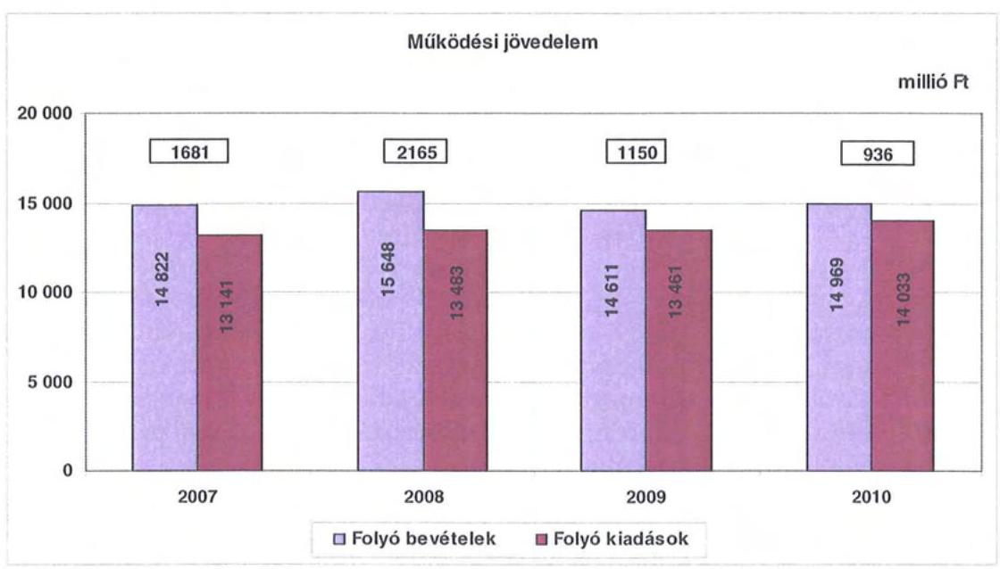

A folyó költségvetés egyenlege (a működési forrástöbblet) a 2007. évben a folyó bevételek 11,3%-át (1681 millió Ft-ot), 2008-ban 13,8%-át (2165 millió Ft-ot), 2009-ben 7,9%-ot (1150 millió Ft-ot), 2010-ben 6,3%-ot (936 millió Ft-ot) jelentette. A vizsgált időszakban a működési jövedelem 5932 millió Ft megtakarítást mutatott, amely forrásul szolgálhatott az Önkormányzat fennálló tőketörlesztési kötelezettségeinek teljesítéséhez, valamint a fejlesztések finanszírozásához.

A pozitív előjelű folyó költségvetési egyenleg ellenére az Önkormányzat a 2009. és a 2010. évben folyószámlahitel felvételére kényszerült az átmeneti likviditási problémák kezelése miatt. A folyószámlahitellel zárt napok száma a 2009. évben 32 nap, a 2010. évben 40 nap volt, napi átlagos állománya a 2009. évi 144 millió Ft-ról a 2010. évben 106 millió Ft-ra, 26,4%-kal csökkent.

Az Önkormányzat kötelezettségein belül a rövid lejáratú kötelezettségek aránya a 2010. évre a 2007. évi 29,8%-os aránnyal szemben 9,7%-ra, 1338 millió Ft-ra csökkent. Az Önkormányzat 2007. december 31-én fennálló pénz- és tőkepiaci kötelezettsége 3796 millió Ft-ról több mint kétszeresére, 7797 millió Ft-ra nőtt, elsősorban a hosszú lejáratú hitelfelvételek és a kötvénykibocsátás miatt. Az összes kötelezettségen belül a pénzintézeti kötelezettségek a 2007. évi 3796 millió Ft-ról a 2009. évben több mint kétszeresére 8009 millió Ft-ra emelkedtek, a 2010. évben az előző évhez viszonyítva 2,7%-kal (212 millió Ft) 7797 millió Ft-ra csökkentek.

A rövid lejáratú pénzintézeti kötelezettségek 2010. december 31-én 434 millió Ft-ot tettek ki, amely 152 millió Ft-tal (53,9%-kal) több a 2007. évi rövid lejáratú pénzintézeti kötelezettségállománynál. Az Önkormányzatnál a vizsgált időszakban a 2007. december 31-i állapothoz képest a lejárt szállítói tarto-

---

zásállomány több mint ötszörösére emelkedett, 2010. december 31-én 145 millió Ft volt.

Az Önkormányzat 2010. évi záró pénzkészlete 980 millió $\mathrm{Ft}^{31}$ volt, amelynek 59%-a volt kötelezettségekkel terhelt.

Az Önkormányzat pénzügyi kapacitása a vizsgált időszakban pozitív értéket mutatott. A nettó működési jövedelem ${ }^{32}$ értéke a folyó költségvetési pozíció mellett az adott költségvetési év adósságtörlesztésének a hatását is tükrözi. Az 5932 millió Ft működési jövedelemnek 22,9%-át (1360 millió Ft) tette ki a fejlesztési célú hitelekhez kapcsolódó tőketörlesztés, amelynek kifizetését követően 4572 millió Ft nettó működési jövedelme keletkezett az Önkormányzatnak.

A nettó működési jövedelem - a több mint kétszeresére megnövekedett tőketörlesztés ${ }^{33}$ miatt - 2007-ben 1465 millió Ft volt, a 2010. évre 458 millió Ft-ra csökkent. A pénzügyi kapacitás 2007-hez viszonyított romlását a 2009-2010. évek között a folyó bevételek és kiadások különbségéből származó működési jövedelem csökkenése és a hitelek tőketörlesztésének 121,3%-kal (262 millió Ft) történő megemelkedése okozta.

Az Önkormányzatnál (a CLF módszer alapján) a fejlesztési kiadások egy részének fedezete - a nettó működési jövedelem 68,7%-os (1007 millió Ft-os) csökkenése mellett - nem látszik biztosítottnak, továbbá információul szolgál a jövőben vállalható kötelezettségvállalások mértékéről.
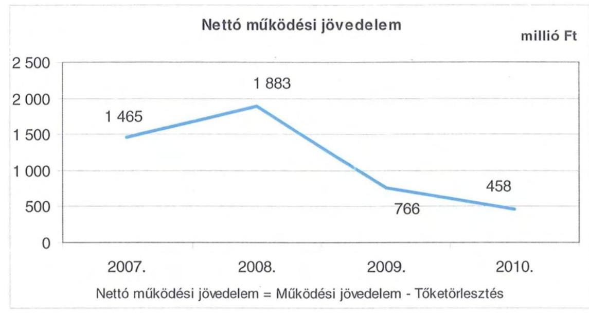

A 2007-2010. években az Önkormányzat felhalmozási költségvetésének egyenlege folyamatosan negatív előjelű volt, amely körültekintő költség-

[^0]
[^0]:    ${ }^{31}$ Ebben a társulások pénzeszköze 94 millió Ft volt.
    ${ }^{32}$ Pénzügyi kapacitás
    ${ }^{33}$ Az Önkormányzat tőketörlesztési kötelezettsége 2007-ben 216 millió Ft, 2008-ban 282 millió Ft, 2009-ben 384 millió Ft, 2010-ben 478 millió Ft volt.

---

vetési gazdálkodás és pénzügyileg fenntartható ${ }^{34}$ beruházások esetén nem jár magas pénzügyi kockázattal.

A beruházási költségvetés egyenlegének alakulását évről évre a következő tábla szemlélteti:
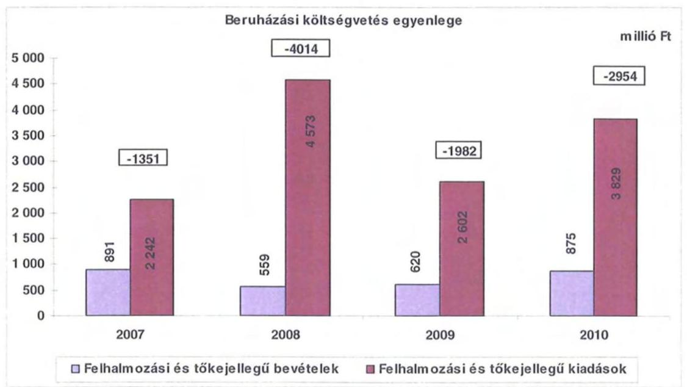

A felhalmozási forráshiánynak a felhalmozási és tőkejellegű kiadásokhoz viszonyított aránya 2007-ben 60,3% (1351 millió Ft), 2008-ban 87,8% (4014 millió Ft), 2009-ben 76,2% (1982 millió Ft), 2010-ben 77,1% (2954 millió Ft) volt.

A felhalmozási forráshiány finanszírozása a 2007. év elején rendelkezésre álló nyitó pénzkészletből, a működési jövedelem felhasználásából, a 2007-2010. években a fejlesztési célú hitelekből, a 2009. évben a kötvénykibocsátásból történt. A vizsgált időszakban jelentkező összes felhalmozási forráshiány (10 301 millió Ft) 44,4%-ára nyújtott fedezetet a nettó működési jövedelem ${ }^{35}$ (4572 millió Ft).

Az Önkormányzat 2011. évi költségvetési rendeletében a tervezett bevételeinek és kiadásainak különbözete 1504 millió Ft negatív teljes finanszírozási igényt mutat, melyet finanszírozhat a 2010. évi 980 millió Ft záró pénzkészlet. A fennmaradó 524 millió Ft hiányt azonban további hitelek felvételével tudja biztosítani az Önkormányzat.

A vizsgált időszakban keletkezett 10301 millió Ft felhalmozási forráshiányra a képződött 4572 millió Ft nettó működési jövedelem, az 1577 millió Ft 2007. évi nyitó pénzkészlet, valamint a felvett 3018 millió Ft összegű fejlesztési hitel, va-

[^0]
[^0]:    ${ }^{34}$ Az minősül pénzügyileg fenntartható beruházásnak, amelynek működtetésére az Önkormányzat nettó működési jövedelme a következő években is fedezetet nyújt.
    ${ }^{35}$ Az ábrában megjelenő felhalmozási kiadásokban a társulásokhoz kapcsolódó beruházások összege 2007-ben 2 millió Ft, 2008-ban 12 millió Ft, 2009-ben 95 millió Ft, 2010-ben 284 millió Ft volt.

---

lamint a rendelkezésre álló folyószámlahitelből 2009. és 2010. évben időnként igénybevett összeg nyújtott fedezetet.

A függő, átfutó, kiegyenlítő bevételeknek és kiadásoknak 99 millió Ft pozitív egyenlege volt, a 2010. évet az Önkormányzat 980 millió Ft pénzkészlettel zárta.

Az Önkormányzat évenkénti teljes finanszírozási igénye ${ }^{36}$ a CLF módszer szerint 2008-ban 2132 millió Ft, 2009-ben 1216 millió Ft, 2010-ben 2497 millió Ft volt, amelynek finanszírozását a 2008-2009. években a finanszírozási célú bevételek és kiadások egyenlege, 2007-ben és 2010-ben ezen túlmenően az előző évek tartalékai biztosították.
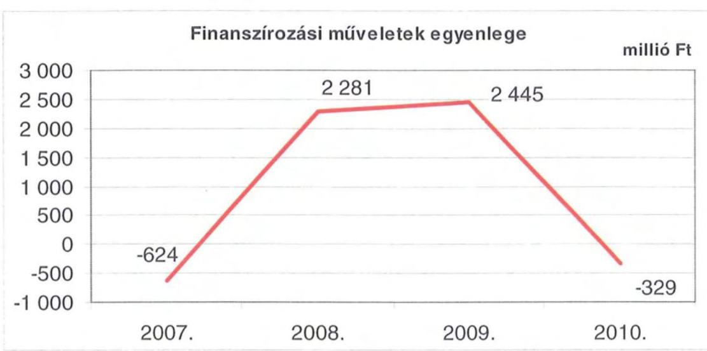

A 2008. és 2009. évi finanszírozási többlet azt jelzi, hogy az éves költségvetések végrehajtása során szükség volt az előző években keletkezett pénzmaradvány igénybevételén túl külső forrás igénybevételére is.

Az Önkormányzat zárszámadási rendeleteiben kimutatott működési és fejlesztési hiányt a jelentés 1. számú melléklete szemlélteti. A rendeletek közül a 2007. évi zárszámadásban pénzügyi többletet mutattak ki, a későbbi években forráshiányt jeleztek.

A vizsgált időszakban a kötelezettségek (passzív pénzügyi elszámolások nélkül) 5006 millió Ft-ról 13863 millió Ft-ra emelkedtek, amely együtt járt a kamatkiadások növekedésével.

A 2007-2010. évek között az Önkormányzat összesen 1128 millió Ft kamatot fizetett meg. Az átmenetileg szabad pénzeszközein belül a realizált kamatbevétel a teljes kamatráfordítás 38,4%-át (433 millió Ft) tette ki.

[^0]
[^0]:    ${ }^{36}$ A nettó működési jövedelem és a beruházási költségvetés eredője.

---

Az Önkormányzat kamatbevételeinek és kamatkiadásainak alakulását a következő ábra mutatja:
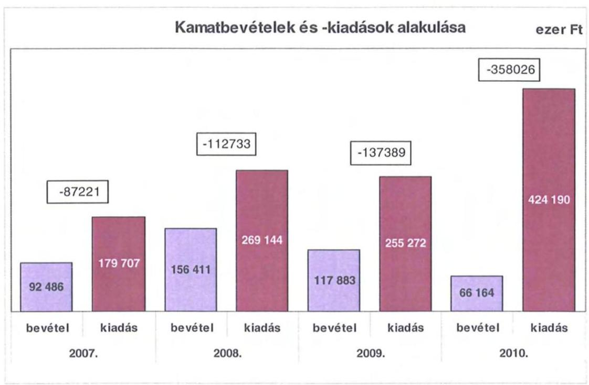

A 2011. évre az Önkormányzat a kamatkiadások emelésével nem kalkulált, a költségvetési rendeletben 386 millió Ft kamatráfordítással számolt, ami a 2010. évi kamatráfordítás 91,0%-a.

# 2.2. Az Önkormányzat bevételeinek alakulása 

Az Önkormányzat folyó (működési) bevételei a 2007-2010 között számottevően nem változtak, a 2008. évtől alapvetően a felújításokhoz és beruházásokhoz kapcsolódó áfa visszatérítés és a fordított áfa miatt emelkedtek. A 2007. évhez viszonyítva 51,3%-kal nőttek, a fordított áfa összege 203 millió Ft volt.

---

Az Önkormányzat 2007-2010. évek között realizált főbb folyó (működési) bevételi jogcímeinek számszaki adatait az alábbi ábra mutatja be:
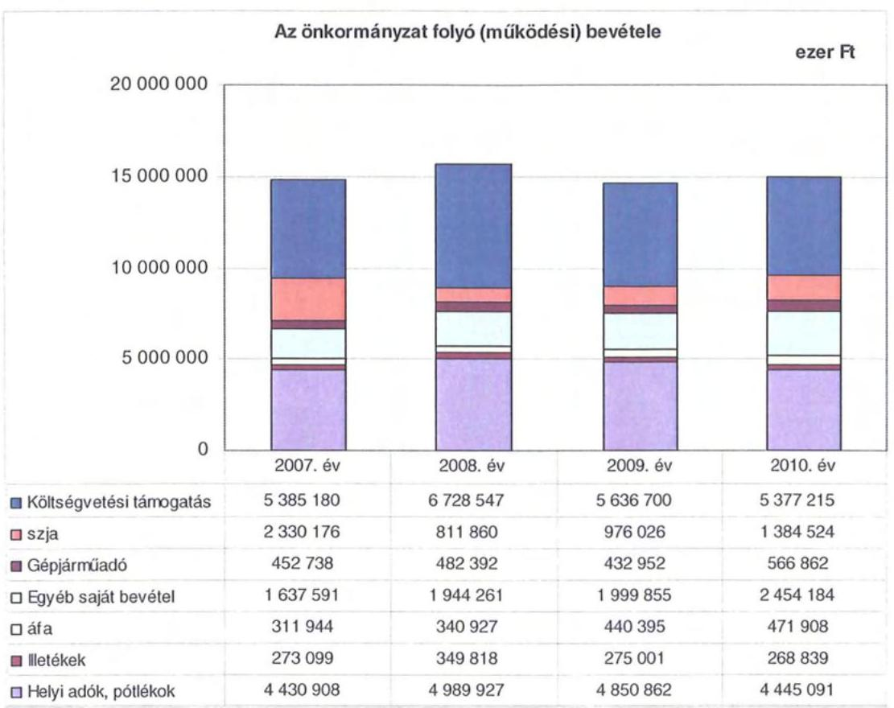

Az Önkormányzat költségvetési támogatásai - amelyek döntő mértékben működési támogatások voltak - a 2007. évi 5385 millió Ft-ról 2008-ra 6729 millió Ft-ra, 25%-kal nőttek, mivel 2008-tól nem az átengedett szja-ból, hanem költségvetési támogatásból finanszírozzák a teljes normatív állami hozzájárulást. A költségvetési támogatás összege 2008-ról 2009-re 5637 millió Ft-ra, 2010-re 5377 millió Ft-ra csökkent a központi támogatáselosztás változása, illetve az ellátotti létszám csökkenése következtében. A felhalmozási célú támogatások összege 2007-ben 713 millió Ft, 2008-ban 889 millió Ft, a 2009. évben 149 millió Ft, a 2010. évben 50 millió Ft volt.

Az átengedett szja összege a 2007. évről a 2008. évre 65,2%-kal, 1518 millió Ft-tal
 csökkent, mivel 2008-tól a költségvetési törvény alapján nem az átengedett szja-ból finanszírozták a tűzoltóság által ellátott feladatokat és a korábbi években szja-ból finanszírozott normatív hozzájárulásokat. Az Önkormányzat az előző évihez képest 2009-ben 20,2%-kal (164 millió Ft-tal), 2010-ben további 41,9%-kal (408 millió Ft-tal) kapott több átengedett szja-t. A kedvező változást a megnövekedett iparűzési adóerőképesség és a lakhelyen maradó szja (8%) növekedése okozta. A lakóhelyen maradó szja a 2007. évi 757 millió Ft-ról a 2010. évre 34,7%-kal (1020 millió Ft-ra) emelkedett. A 2007-2009 közötti időszakban a jövedelemkülönbség mérséklés kapcsán az Önkormányzat kiegészítést nem kapott, elvonással sem volt érintett. A 2010. évben az Önkormányzat e jogcímen 365 millió Ft állami támogatásban részesült.

---

A gépjárműadóból származó bevétel 2007-ről 2010-re 25,2%-kal, 567 millió Ft-ra emelkedett. A növekedést egyrészt a gépjárműadózás szabályainak 2010. január 1-től történő változása okozta, a gépjárműadó alapját, mértékét és egyes mentességi kategóriákat érintő módosítások az egyes adótételeknél emelkedéssel jártak, másrészt az ellenőrzési-végrehajtási munka eredményessége javult.

Az Önkormányzat egyéb saját folyó bevételei a vizsgált időszakban folyamatosan nőttek, a 2010. évre a 2007. évihez képest 49,8%-kal (816 millió Ft), 2454 millió Ft-ra emelkedtek.

Az egyéb saját folyó bevételek lényeges összetevőjét az intézményi működési bevételek összege képezte, mely 2007-ben 969 millió Ft, 2008-ban 1066 millió Ft, 2009-ben 1169 millió Ft, a 2010. évben 1218 millió Ft volt.

Az Önkormányzat illetékbevétele a 2007. évi 273 millió Ft-ról 2008. évben 28,2%-kal (77 millió Ft-tal) emelkedett 350 millió Ft-ra. A befolyt illetékbevételben - az ingatlanpiac visszaesése és egyes illetékkedvezmények bevezetése következtében - a 2008. évtől a 2009. évre 75 millió Ft (21,4%), majd a 2010. évben további 6 millió Ft (2,2%) csökkenés következett be.

Az Önkormányzat a 2007-2010. években öt helyi adónemet, a helyi iparűzési adót, az építményadót, a telekadót, a vállalkozások kommunális adóját és 2008. évtől az idegenforgalmi adót alkalmazta. Az iparűzési adónál a maximális adómértéket, 2%-ot alkalmaztak a vizsgált években. Az építményadó mértékét a lakásoknál a 2007. évi 150 Ft/m²-ről nem változtatták, az egyéb építményeknél a 2008. évben 3,8-10,6% között megemelték, utána nem módosították. A telekadó mértékét (40 Ft/m²) nem változtatták. A vállalkozók kommunális adóját a 2007. évi 2200 Ft/fő/év adómértékről a 2008. évtől 9%-kal megemelték 2400 Ft/fő/év mértékre. Az idegenforgalmi adó mértéke a 2008-2010. években 200 Ft/éj/fő volt. A 2007-2010. években az Önkormányzat iparűzési adóból származó bevételének aránya a helyi adóbevételekben 4390-4944 millió Ft, 72,6-77,5% közötti összeg volt. A helyi adóbevételek 20-25%-a az építményadóból folyt be, a 2007. évi 871 millió Ft-ról 25%-kal (1086 millió Ft-ra) emelkedett. A telekadó és a vállalkozók kommunális adója a helyi adóbevételeken belül alig haladta meg az 1-1%-ot, 47-68 millió Ft között alakult. Az idegenforgalmi adóbevétel aránya a helyi adóbevételeken belül a 2008-2010. években nem érte el az 1%-ot, nagyságrendje 3-7 millió Ft között volt.

Az Önkormányzatnál a helyi adók és pótlékokból származó bevételek nagyságrendje 2007-2010 között 4431-4990 millió Ft (30-33%) között mozgott a folyó (működési) bevételekben. A helyi adóbevételek a 2007. évtől 2010. évre közel 14 millió Ft-tal, 3%-kal növekedtek. Az iparűzési adó a 2007. évhez viszonyítva 207 millió Ft-tal csökkent, ezt azonban ellentételezte az építményadó 24,8%-os emelkedése (215 millió Ft).

---

A helyi adók és pótlékok vizsgált időszakra vonatkozó, adónemenkénti alakulását a következő táblázat mutatja be:

|  |  |  |  | ezer Ft |
| :-- | --: | --: | --: | --: |
| Megnevezés | 2007.év | 2008.év | 2009.év | 2010.év |
| Iparűzési adóbevétel | 3405024 | 3791523 | 3695598 | 3197999 |
| Telekadó | 67839 | 60922 | 68455 | 59842 |
| Építményadó | 870510 | 1020675 | 974935 | 1086183 |
| Idegenforgalmi adó | 0 | 6663 | 2875 | 2794 |
| Vállalkozók kommunális adója | 46915 | 63763 | 63853 | 56018 |
| Pótlék, bírság | 40620 | 46381 | 45146 | 42255 |
| ÖSSZESEN | 4430908 | 4989927 | 4850862 | 4445091 |

Az Önkormányzatot terhelő kamatkiadások a hosszú lejáratú hiteleknél alkalmazott referenciakamat változását követve a 2007. évi 180 millió Ft-ról a 2008. évre 269 millió Ft-ra növekedtek, majd a 2009. évre 255 millió Ft-ra csökkentek, a 2010. évre 424 millió Ft-ra növekedtek. A 2007-2010. években a kapott kamatok összege a 2007. évhez viszonyítva a 2008-2009. években nőtt, a 2010. évben csökkent. Befektetési és forgatási célú értékpapírral az Önkormányzat nem rendelkezett. A befolyt hozam- és kamatbevétel a 2007. évhez viszonyított 2008. évi 69,1%-os (64 millió Ft) növekedés után évente folyamatosan csökkent, a 2009. évben 24,6%-kal (39 millió Ft), a 2010. évben 43,9%-kal (52 millió Ft).

Az Önkormányzat 2007-2010 között a gazdasági társaságokban levő tulajdonrésze után három gazdasági társaságtól változó mértékű osztalékot kapott. A kapott osztalék összege a 2007. évben 49 millió Ft, 2008-ban 33 millió Ft (két társaságtól), 2009-ben 48 millió Ft, a 2010. évben osztalék-előleggel együtt 349 millió Ft volt. Az egyes években kapott osztalékok 25%-os, illetve a 2007-2009. években az azalatti tulajdoni részesedésű gazdasági társaságtól származott. A 2010. évben az Önkormányzat egy gazdasági társaságban üzletrészvásárlással 51% tulajdoni részesedést szerzett, az osztalék 73%-át kapta a gazdasági társaságtól osztalékelőlegként. Az Önkormányzat osztalékról nem mondott le. Azok a nyereséges társaságok, amelyek nem fizettek osztalékot, adózás utáni eredményüket eredménytartalékba helyezték.

---

Az Önkormányzat felhalmozási bevételei a vizsgált időszakban a következőképpen alakultak:

|  | ezer Ft-ban |  |  |  |
| :-- | --: | --: | --: | --: |
| Megnevezés | 2007. év   tény | 2008. év   tény | 2009. év   tény | 2010. év   tény |
| Tárgyi eszköz értékesítés | 305093 | 40670 | 176892 | 120736 |
| Egyéb saját tőkebevétel | 281621 | 146810 | 192655 | 175730 |
| Államháztartáson belülről kapott   támogatás | 139303 | 288850 | 246628 | 484177 |
| EU-tól és külföldről kapott   támogatások | 0 | 235 | 0 | 0 |
| Államháztartáson kívülről kapott   támogatás | 164896 | 82378 | 4189 | 94049 |
| Összes felhalmozási bevétel | 890913 | 558943 | 620364 | 874692 |

A vizsgált években a felhalmozási bevételek a 2007. évi 891 millió Ft-ról 2008-ban 37,3%-kal csökkentek, 559 millió Ft-ra, 2009-ben nőttek 10,9%-kal, 620 millió Ft-ra, majd a 2010. évre 875 millió Ft-ra, 41,1%-kal növekedtek. A felhalmozási célú bevételek jelentős ingadozását döntően befolyásolta az államháztartáson belülről és kívülről kapott - pályázati - támogatások együttes összegének 2007-ről 2010. évre közel kétszeresére való növekedése, 304 millió Ft-ról 578 millió Ft-ra. A tárgyi eszköz értékesítés bevétele a 2007-2010. évek között összesen 643 millió Ft volt, évente eltérő összegben alakult, a 2007. évről a 2010. évre 60,4%-kal csökkent.

# 2.3. Az Önkormányzat kiadásainak alakulása 

A folyó (működési) kiadások 2007. évi 13141 millió Ft-ról 2010-ben 6,8%-kal (892 millió Ft) növekedtek. Az Önkormányzat a vizsgált időszakban a működési költségvetés 55,5%-át (30149 millió Ft) személyi juttatásokra és a munkaadókat terhelő járulékokra fordította, az üzemeltetést, intézményfenntartást biztosító dologi kiadásokra 28,6% (15 481 millió Ft) jutott.

Az Önkormányzat folyó kiadásai főbb jogcímek szerinti bontásban az alábbiak voltak:

|  |  |  |  | ezer Ft |
| :-- | --: | --: | --: | --: |
| Megnevezés | 2007. | 2008. | 2009. | 2010. |
| Folyó kiadások | 13140670 | 13482496 | 13461345 | 14032805 |
| Működési kiadások (kamatkiadás nélkül) | 11027842 | 11749236 | 11704419 | 11954996 |
| Államháztartáson belülre átadott pénzeszközök | 787871 | 169773 | 240711 | 224915 |
| Transzferkiadások | 1073619 | 1218372 | 1226635 | 1329324 |
| -ebből: vállalkozásoknak | 224977 | 259252 | 389214 | 535131 |
| EU-nak, illetve külföldre | 0 | 0 | 0 | 0 |
| magánszemélyeknek | 349061 | 377541 | 442791 | 552412 |
| nonprofit szervezeteknek | 499581 | 581579 | 394630 | 241781 |
| Kamatkiadások | 179707 | 269144 | 255272 | 424190 |
| Előző évi pénzmaradvány átadás | 71631 | 75971 | 34308 | 99380 |

---

A személyi juttatások és járulékok folyó (működési) kiadásokon belüli aránya a vizsgált időszakban a 2008. évben nőtt, majd folyamatosan csökkent, 2007-ben 56,9% (7472 millió Ft), 2008-ban 58,1% (7827 millió Ft), 2009-ben 54,9% (7397 millió Ft), 2010-ben 53,1% (7453 millió Ft) volt.

A dologi kiadások és egyéb folyó kiadások az Önkormányzatnál folyamatosan emelkedtek, 2010-ben 30,9%-kal (1047 millió Ft) voltak magasabbak a 2007. évi szintnél. A dologi kiadások 2007. évi 3285 millió Ft-tal szemben a 2010. évben 4238 millió Ft-ot jelentettek, a növekedés 29%, 953 millió Ft volt. A 2010. évi működési célú pénzeszközátadások nagyságrendje a 2007. évhez viszonyítva 7,2%-kal (52 millió Ft) nőtt, az összes folyó kiadásokon belüli aránya 5,5% volt, minimális mértékben változott.

Az Önkormányzat folyó kiadásai főbb kiadásnemek szerinti bontásban az alábbiak voltak:

| Megnevezés | 2007. | 2008. | 2009. | 2010. |
| :-- | --: | --: | --: | --: |
| Személyi juttatások | 5673720 | 5963586 | 5706609 | 5939220 |
| Munkaadót terhelő járulékok | 1798163 | 1863663 | 1690538 | 1513522 |
| Dologi kiadások | 3284834 | 3785143 | 4173044 | 4237778 |
| Egyéb folyó kiadások | 96937 | 74385 | 92410 | 190662 |
| Működési célú pénzeszközátadás | 724649 | 841146 | 783844 | 776912 |

A folyó (működési) és felhalmozási kiadások arányának változásában a 2007-2010 években elmozdulás figyelhető meg. A felhalmozási kiadások aránya a folyó kiadásokhoz viszonyítva a 2008. évben 17%-ról 34%-ra emelkedett (4573 millió Ft-ra), a 2009. évben 15%-kal (2603 millió Ft-ra) csökkent, majd a 2010. évben 8%-kal (3829 millió Ft-ra) emelkedett.
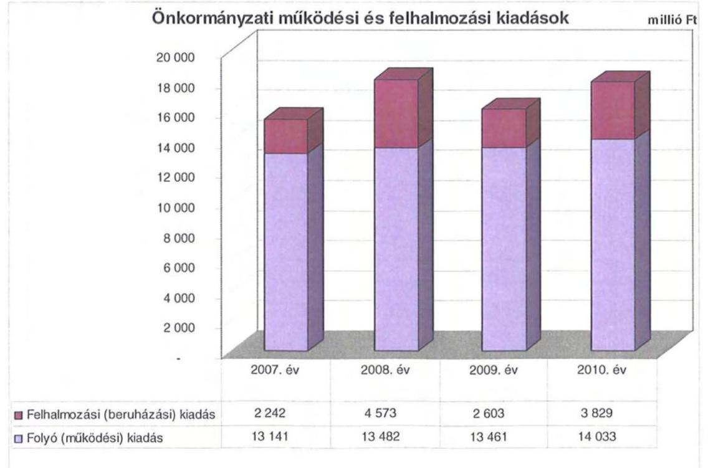

---

A működési és felhalmozási kiadások arányát nagyban befolyásolta, hogy a társulások összes kiadásából a felhalmozási kiadások voltak a meghatározóak. Az Önkormányzat felhalmozási kiadásainak összes kiadáson belüli aránya a társulási adatok figyelembevétele nélkül a 2009. évben 15,8% (2508 millió Ft), a 2010. évben 20,6% (3545 millió Ft) volt. Az Önkormányzat társulások nélküli folyó (működési) és a felhalmozási kiadásainak összetételét a következő ábra mutatja be:
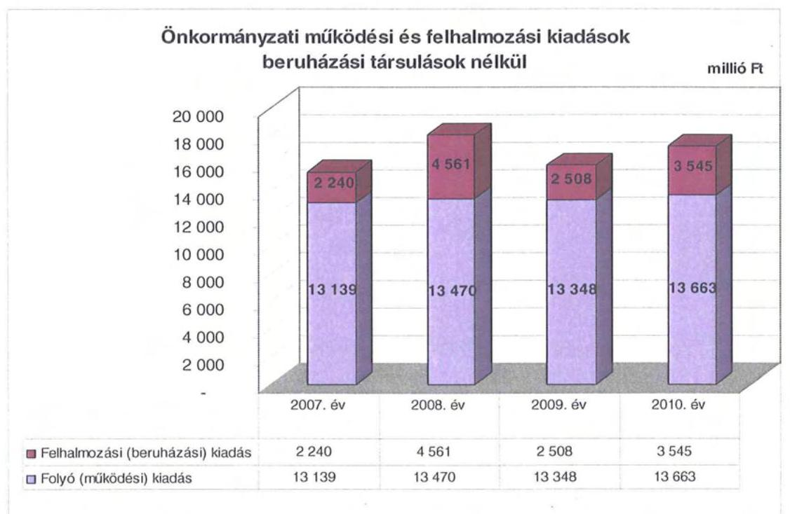

Az Önkormányzat pénzügyi helyzetének alakulására hatással voltak a 25%-ot meghaladó önkormányzati
 tulajdonnal rendelkező gazdasági társaságok részére átadott pénzeszközök. A gazdasági társaságok kiadásaihoz a vizsgált időszakban 1822 millió Ft működési és 304 millió Ft fejlesztési célú pénzeszközátadással járult hozzá, két gazdasági társaság részére 291 millió Ft tőkeemelést biztosított, továbbá 18 millió Ft tőketartalékba helyezéséről döntött az Önkormányzat. A gazdasági társaságok részére 2007-2010 között átadott önkormányzati hozzájárulásokat és tőkejuttatásokat mutatja be a következő ábra:

---

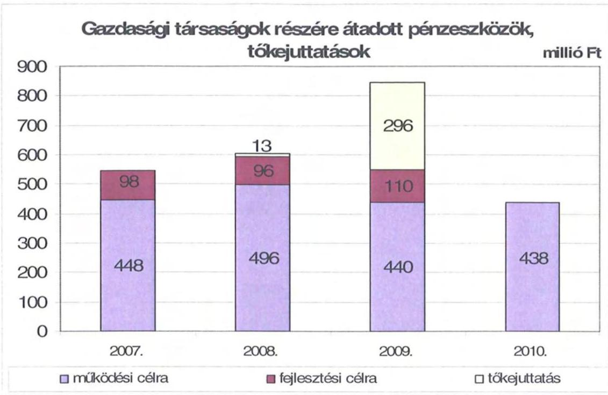

Az Önkormányzat 2007-2010. években megvalósított, illetve 2010. december 31-én fennálló, valamint az elbírálás alatt lévő fejlesztési feladatokhoz kapcsolódó kötelezettségeinek összegzését a jelentés 3/a-c számú mellékletei tartalmazzák.

Ágazati beruházások a következő területeket érintették: úthálózat rekonstrukció, közművek felújítása, intézményi felújítások, oktatáshoz segédeszközök vásárlása. A közművek felújítása a távhővezetékek, víz- és csatornarendszerek felújítását érintette.

Az Önkormányzat 2007-2010. években 12327 millió Ft összköltségű fejlesztéseket tervezett saját erős, hazai támogatásos, hitelfelvételes forrásokkal és az EU forrásokra benyújtott pályázatok segítségével. Az Önkormányzatnál a 2006-2010. években befejezett fejlesztési feladatok összes költségvetési kiadása 9046 millió Ft volt, amelyekből a felújítások összege 1863 millió Ft (20,6%), a beruházások összege 7183 millió Ft (79,4%) volt.

A befejezett 9046 millió Ft értékű fejlesztés forrásmegoszlásán belül meghatározó a saját forrás 3471 millió Ft (38%), hitelfelvétel 2865 millió Ft (32%) és a hazai támogatás 2126 millió Ft (23%) aránya, ezen túlmenően kötvény bevételéből 405 millió Ft EU-s támogatásból 179 millió Ft volt a forrás. A 2006. december 31-ig teljesített kiadások összege 29 millió Ft, a 2007-2010. években teljesített kiadások összege 9017 millió Ft volt.

Az Önkormányzat 2010. december 31-én folyamatban levő fejlesztési feladatainak nagysága terv szinten 4113 millió Ft, melyre 2010. december 31-ig 358 millió Ft kiadást teljesítettek. A folyamatban levő fejlesztések forrásösszetétele 135 millió Ft saját forrás, 51 millió Ft hitel, 100 millió Ft kötvénybevétel, 72 millió Ft EU támogatás. A források a fejlesztések esetében az EU-s és hazai támogatásoknál utólag álltak rendelkezésre. Eszközpótlásra a

---

befejezett és folyamatban levő fejlesztéseknél nevesítetten nem terveztek kiadást.

A 2010. december 31-én folyamatban levő és a 2010. évet követő kötelezettségvállalásainak összege 3779 millió Ft volt, amelynek forrása 660 millió Ft saját bevétel, 47 millió Ft hitel, 2997 millió Ft EU-s támogatás és 75 millió Ft hazai támogatás. A 2010. december 31-én folyamatban lévő fejlesztési feladatokhoz a pénzügyi források biztosítottak, a fejlesztések az Önkormányzat pénzügyi helyzetére kockázatot nem jelentenek.
Jelenleg benyújtott és elbírálás alatt levő pályázata nincs az Önkormányzatnak.

Az Önkormányzat fejlesztései közül a legnagyobb költségigényű volt az alábbi három beruházás:

- Az Önkormányzat a 2007. évben pályázatot nyújtott be a KDOP-4.2.1./B „Belterületi utak felújítása" című pályázatra a Szent István út rekonstrukciójára. A beruházás keretében többek között 543 m út felújítása, új autóbusz-megálló kialakítása, 32 állásos parkoló kialakítása, részleges csapadékvíz elvezetés, közvilágítás és közműkiváltások történtek meg.

A beruházás tervezett bekerülési költsége 243 millió Ft, a tényleges 247 millió Ft volt. A beruházás forrásösszetétele EU támogatás 112 millió Ft és az Önkormányzat kötvénykibocsátásának bevételéből teljesített 130 millió Ft, valamint 5 millió Ft önkormányzati saját bevétel volt.

- A lakóépületek azbesztmentesítési feladatainak elvégzéséhez (KIOP-2004-1.3.0.F) nyert pályázatot az Önkormányzat. Tervezett bekerülési költség 227 millió Ft, a tényleges 207 millió Ft volt. A beruházás 16 millió Ft saját bevételből és 191 millió Ft hazai támogatásból valósult meg.
- Az Önkormányzat a Jászai Mari Színház, Népház és Városi Könyvtár rekonstrukciójára, bővítésére, átépítésére 1632 millió Ft címzett állami támogatást nyert el a 2007. évben. A rekonstrukció befejezésével a főépület alapterülete közel kétszeresére nőtt, továbbá zöldfelületet alakítottak ki. A rekonstrukció forrásai 1632 millió Ft címzett támogatás, 4 millió Ft CÉDE támogatás és 2298 millió Ft önkormányzati önrész volt.

A folyó és felhalmozási kiadások együttes összegéből a társulások folyó és felhalmozási kiadásai 2007-ben 2 millió Ft-ot, 2008-ban 12 millió Ft-ot, 2009-ben 113 millió Ft-ot, 2010-ben 370 millió Ft-ot tettek ki, arányuk az összes költségvetési kiadáshoz képest elhanyagolható, a 2009. évben 7 ezrelék, a 2010. évben 2% volt.

# 3. KÖTELEZETTSÉGEK BEMUTATÁSA 

### 3.1. A pénzintézetek felé fennálló kötelezettségek alakulása

Az Önkormányzat rövid- és hosszú lejáratú kötelezettségeinek állománya 2006. december 31-től 2010. december 31-ig 4429 millió Ft-ról 13863 millió Ft-ra

---

nőtt, amelyből pénzintézeti kötelezettsége 2006. december 31-én 3497 millió Ft, 2010. december 31-én 12773 millió Ft volt.

A pénzintézeti kötelezettségek állománya 2006. december 31-től 2010. december 31-ig 3,7 szeresére nőtt. A fennálló pénzintézeti kötelezettség a 2006. évben teljes összegben beruházási- és fejlesztési hitelekből, a 2010. évben 5197 millió Ft beruházási- és fejlesztési hitelből, 2600 millió Ft értékű fejlesztési célú kötvénykibocsátásból, valamint 4976 millió Ft pénzügyi lízingből keletkezett.

A 2009-2010. években az alábbi grafikon, valamint a CLF módszer szerinti adattábla pénz- és tőkepiaci kötelezettség (adósság) során található adatok eltérését a pénzügyi lízing okozza, mivel a pénzügyi lízingből eredő kötelezettség az Önkormányzat mérlegében az egyéb hosszú lejáratú kötelezettségek között, következő évet terhelő törlesztőrészlete az egyéb rövid lejáratú kötelezettségek között szerepelt. Az Önkormányzatnak pénzügyi lízingből eredő kötelezettsége a 2009. és a 2010. években állt fenn.
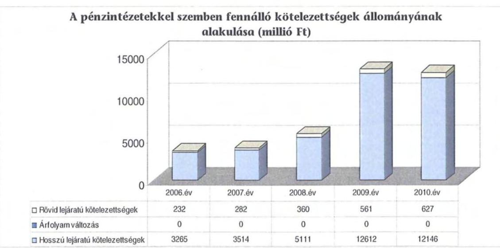

Az Önkormányzat a 2006-2010. években nem tett eleget az Áhsz. 36. § (2) bekezdés b) pontjában előírtaknak, mivel a devizában fennálló kötelezettségei (hosszú lejáratú hitelek, a 2009. évben kibocsátott kötvény és a 2009. évtől teljesített pénzügyi lízing) év végi értékelését nem végezte el a Számv. tv. 60. §-ában szereplő devizaárfolyammal számolva. Tekintettel arra, hogy az év végi értékelések nem történtek meg, a kötelezettségek állománya nem tartalmazza az árfolyam változások hatását. Annak ellenére, hogy a mérleg alátámasztó leltárak a 2006-2010. években tartalmazták az árfolyamváltozásokra vonatkozó számításokat, a főkönyvi nyilvántartásokban azokat nem vezették át.

A számítások alapján az árfolyam-különbözetek a következők szerint alakultak: 2006. december 31-én 24 millió Ft árfolyamnyereség; 2007. december 31-én 12 millió Ft árfolyamnyereség; 2008. december 31-én 40 millió Ft árfolyamveszteség, 2009. december 31-én 0,3 millió Ft árfolyamveszteség; 2010. december 31-én 1181 millió Ft árfolyamveszteség.

---

A kötelezettségek alakulását az árfolyamváltozás hatása is befolyásolja, azonban annak mértéke előre pontosan nem határozható meg, csak várakozásokon alapuló tendenciák jelezhetők.

Annak megítéléséről, hogy a devizában kibocsátott kötvényért kapott forinthoz képest a kötvény visszavásárlásakor jelentkező forint kötelezettség többletkiadást (árfolyamveszteség), vagy megtakarítást (árfolyamnyereség) eredményez a futamidő végén, a teljes kötelezettség rendezését követően lehet képet alkotni. Mindaddig, amíg törlesztési kötelezettség nem áll fenn (türelmi idő, moratórium), a tőkére vonatkoztatva nem értelmezhető sem az árfolyamveszteség, sem az árfolyamnyereség. A Számv. tv. 60. § (4) bekezdés ugyanakkor meghatározza, hogy az árfolyam-különbözetet év végén a kötelezettségek, vagy követelések között a könyvviteli mérlegben nyilván kell tartani, azonban az árfolyamkülönbözet valójában nem realizálódott.

Az Önkormányzat pénzintézeti kötelezettségvállalásaira minden esetben közgyűlési döntés alapján került sor. A kötelezettségvállalásból származó források felhasználási céljait meghatározták. Valamennyi kötelezettségvállalás fejlesztési célhoz kapcsolódott.

A Közgyűlés döntéseit megalapozó előterjesztések nem tartalmazták a kötelezettségvállalások visszafizetési forrásainak a bemutatását. A döntéselőkészítés során figyelembe vették az árfolyamkockázat lehetőségét. Az Önkormányzat az adósságot keletkeztető kötelezettségvállalás felső határát ${ }^{37}$ a 2007-2011. év I. negyedév időszakában vizsgálta és betartotta, melyet a 2007-2010. évek zárszámadási rendeleteinek vizsgálatáról szóló független könyvvizsgálói jelentések is alátámasztanak.

A hosszú lejáratú adósságot keletkeztető kötelezettségvállalások során a visszafizetés fedezetének meghatározásakor nem tartották be minden esetben az Ötv. előírását.

Az Ötv. 88. § (1) bekezdés b) pontja szerint a hitelek és a kötvény visszafizetésének fedezetéül normatív állami hozzájárulás, állami támogatás, személyi jövedelemadó, valamint államháztartáson belülről működési célra átvett bevétel nem használható fel. Több szerződésben (pl.: a 2005. évben kötött 1987904 ezer Ft-os és 12096 ezer Ft-os, a 2007. évben kötött 1700000 ezer Ft-os, a 236359 ezer Ft-os, a 63641 ezer Ft-os hitelszerződések esetén) biztosítékként felajánlották az Önkormányzat költségvetését a futamidő alatt.

A Polgármester észrevételt tett a hitel- és kötvényszerződések módosítására tett javaslatunkra: „A jövőben az esetleges hitelfelvételek lebonyolítása során az Ötv. előírásaival összhangban fogjuk meghatározni a hitelek fedezetét. Azonban kérjük Önöket, hogy a hitel- és kötvényszerződések módosításától szíveskedjenek eltekinteni, mivel a jogszabályi keretek ebben a tekintetben egyértelműek, és nyilvánvalóan csak az Ötv. által meghatározott, erre a célra igénybe vehető bevételeink fedezetbe vonására terjednek ki a lehetőségeink." Az észrevételt nem fogadjuk el, mivel a helyi önkormányzatokról szóló 1990. évi LXV. törvény 88. § (1) bekezdés b) pontja meghatározza a hitel fedezetéül felajánlható bevételek körét és a Polgári Törvénykönyvről szóló

[^0]
[^0]:    ${ }^{37}$ az Ötv. 88. § (2) bekezdés alapján

---

1959. évi IV. törvény 200. § (1) bekezdése alapján szükséges a meglévő szerződések módosítása.

Az adósságot keletkeztető kötelezettségvállalással megvalósított fejlesztések bevételnövelő, illetve kiadáscsökkentő hatását - a fejlesztések jellege miatt (út, távhő vezeték felújítás) -, valamint visszafizetési forrásként való számbavételét nem vizsgálta az Önkormányzat.

Az adósságot keletkeztető kötelezettségvállalásokat megelőző döntés előkészítés során mérlegelték a hitelkonstrukciókat, előnyben részesítve a kedvezőbb kondíciójú kiírásokat. A pénzintézetek kiválasztása közbeszerzési eljárás keretében történt.

A Közgyűlés 2009. július 23-án, 170/2009. (VII.23.) számú határozatában döntött 2600 millió Ft-nak megfelelő összegű EUR alapú, „Turul" elnevezésű kötvénysorozat kibocsátásáról. A jegyzési garanciavállalási szerződés megkötésére 2009. július 25-én, a kibocsátásra 2009. szeptember 4-én került sor. A kötvényt zárt körben, egy összegben, 10 éves futamidőre, 3 év türelmi idővel, EURIBOR +5,5% kamattal, félévenkénti tőke- és kamatfizetéssel bocsátották ki.

A kötvény jegyzésére tett eredeti banki ajánlatot a Közgyűlés 147/2009. (VI. 18.) számú határozatával fogadta el, azonban a bank a kötvénykibocsátást nem hajtotta végre, hanem 2009. július 20-án új ajánlatot adott. Az új ajánlat a korábbi 20 év helyett 10 éves futamidőre szólt, illetve a 10 millió Ft-os egyszeri kibocsátási díjat 7 millió Ft-ra csökkentette. A Közgyűlés az új ajánlatot elfogadta azzal, hogy a 3 év türelmi idő alatt a kötvény hosszabb futamidejűre váltható.

Az Önkormányzat a 2007-2010 évek között 19 hosszú lejáratú hitelszerződéssel rendelkezett, amelyek közül hat hitel deviza (EUR), 13 hitel forint alapú volt.

A 13 forint alapú hitel közül 2010. december 31-ig kettőből nem történt igénybevétel, négy esetében pedig részben történt meg a hitelkeret igénybevétele (a négy hitelkeret összege 825 millió Ft, amelyből az Önkormányzat 240 millió Ft-ot vett igénybe, a még fennálló keretösszeg 585 millió Ft).

---

Az Önkormányzat 2010. december 31-én HUF-ban fennálló adósságot keletkeztető kötelezettségvállalásai az alábbiak voltak:

| Megnevezés | Szerződéskötés időpontja | Szerződött összeg ezer Ft | Kamat (referencia kamat+ kamatfelár) | Felhasználás célja |
| :--: | :--: | :--: | :--: | :--: |
| Hosszú lejáratú hitel | 2002.06.27 | 266857 | fix 2,99% | 54 lakás építése |
| Hosszú lejáratú hitel | 2005.11.30 | 12096 | 3 havi EURIBOR +1,33% |

 | Általános beruházási feladatok |
| Hosszú lejáratú hitel | 2005.11.30 | 1987904 | 3 havi EURIBOR +1,33 % | Általános beruházási feladatok |
| Hosszú lejáratú hitel | 2007.07.30 | 63641 | 3 havi EURIBOR +1,05 % | Környezetvédelemhez kapcsolódó fejlesztési célok |
| Hosszú lejáratú hitel | 2007.07.30 | 236359 | 3 havi EURIBOR +1,51 % | Általános beruházási feladatok |
| Hosszú lejáratú hitel | 2007.07.30 | 1700000 | 3 havi EURIBOR +0,89 % | Jászai Mari Színház, Népház rekonstrukció |
| Hosszú lejáratú hitel | 2008.11.02 | 500000 | 3 havi EURIBOR +1,279 % | Jászai Mari Színház, Népház bővítése és rekonstrukció |
| Hosszú lejáratú hitel | 2010.06.15 | 42953 | 3 havi EURIBOR +1,59 % | Panel Plusz hitelprogram |
| Hosszú lejáratú hitel | 2010.06.15 | 75439 | 3 havi EURIBOR +2,09 % | Közoktatási intézmények műszaki felújítása és rekonstrukciója |
| Hosszú lejáratú hitel | 2010.06.15 | 82638 | 3 havi EURIBOR +1,59 % | Kétlépcsős pályázatokat kiegészítő hitel: Panel Plusz hitelprogram |
| Hosszú lejáratú hitel | 2010.06.15 | 323952 | 3 havi EURIBOR +2,59 % | Kisutak építése |
| Hosszú lejáratú hitel | 2010.07.05 | 241048 | 3 havi EURIBOR +2,59 % | Város- és település rehabilitáció |
| Hosszú lejáratú hitel | 2010.07.05 | 343000 | 3 havi EURIBOR +2,15 % | Települési önkormányzatok közművelődési feladatellátása intézményi hátterének létrehozása, bővítése és felújítása |

Az Önkormányzat 2010. december 31-én fennálló forint alapú hiteleinek keretösszege összesen 5876 millió Ft, amelyből 2010. december 31-ig 5006 millió Ft-ot, a teljes keret 85,2 %-át vette igénybe.

Az Önkormányzat 2010. december 31-én EUR-ban fennálló adósságot keletkeztető kötelezettségvállalásai az alábbiak voltak:

| Megnevezés | Kibocsátás, illetve szerződéskötés időpontja | Összeg Euro | Kibocsátási, vagy lehívási árfolyam | Kamat (referencia kamat+ kamatfelár) | Felhasználás célja: |
| :--: | :--: | :--: | :--: | :--: | :--: |
| Turul HUO000344296 kötvény | 2009.09.04 | 9409000 | 276,33 | 6 havi EURIBOR +5,5 % | Üzletrész vásárlás, fejlesztési feladatok végrehajtása |
| Hosszú lejáratú hitel | 2002.10.21 | 1570000 | 238,77 | 3 havi EURIBOR +0,3 % | Általános fejlesztési feladatok finanszírozása |
| Hosszú lejáratú hitel | 2004.02.03 | 1500000 | 265,34 | 3 havi EURIBOR +0,6 % | Általános fejlesztési feladatok finanszírozása |
| Hosszú lejáratú hitel | 2004.05.11 | 297950 | 242,51 | 3 havi EURIBOR +0,7 % | Hitel átvállalás: tartós forgóeszköz finanszírozó hitel |
| Hosszú lejáratú hitel | 2006.02.24 | 1475216 | 253,86 | 3 havi EURIBOR +0,14 % | 2008. évi költségvetésben bevezett beruházási feladatok finanszírozása |

---

A kötvénykibocsátás célja üzletrész vásárlása (a Tatabányai Erőmű Kft-ben 1785 millió Ft értékben), valamint egyéb beruházási (pl.: eszközfejlesztés, út-, híd-, járdafejlesztés, tervezési feladatok, európai uniós forrásból megvalósuló feladatok önrészének biztosítása, stb.) és felújítási feladatok (pl.: intézmények, út-, híd-, parkfelújítás, stb.) végrehajtása volt. Az Önkormányzat a kibocsátott kötvényből származó forrását 2010. december 31-ig maradéktalanul felhasználta.

Az Önkormányzat a hat deviza alapú hitel közül kettőt visszafizetett 2010. december 31-ig, a 2010. december 31-én fennálló négy deviza alapú hitelkeret teljes összegét igénybe vette.
2010. december 31-ig az Önkormányzat a 2010. december 31-én devizában fennálló hosszú lejáratú hiteleiből 2395 ezer EUR (638 millió Ft) tőkét törlesztett és 973 ezer EUR (249 millió Ft) kamatot, valamint 30 ezer Ft egyéb költséget fizetett. A kibocsátott kötvényből 2010. december 31-ig tőketörlesztésre nem került sor, kamatot 717 ezer EUR (194 millió Ft), egyéb költséget 8 millió Ft összegben fizetett az Önkormányzat.

Az Önkormányzat 2010. december 31-én CHF-ben fennálló adósságot keletkeztető kötelezettségvállalása az alábbi volt:

| Megnevezés | Kibocsátás, illetve szerződéskötés időpontja | Összeg   CHF | Kibocsátási, vagy lehívási árfolyam | Kamat (referencia kamat+ kamatfelár) | Felhasználás célja |
| :--: | :--: | :--: | :--: | :--: | :--: |
| Pénzügyi lízing | 2009.05.22 | 24127503 | 182,35 | 3 havi CHF LIBOR +2,75 % | Élményfürdő és strand létesítése |

Az Önkormányzat hosszú lejáratú kötelezettségét növelte, hogy az élményfürdő és strand létesítése nyílt végű pénzügyi lízing igénybevételével valósult meg.

A fejlesztési koncepció, az elő-megvalósíthatósági tanulmány és az elvi engedélyezési dokumentáció ismeretében készült előterjesztés alapján a Közgyűlés 2007 júniusában döntött $^{38}$ a beruházáshoz szükséges forrás pénzügyi lízing útján történő biztosításáról. A hitellel szemben a pénzügyi lízing alkalmazása melletti érvek között szerepelt, hogy az áfa az egyösszegű teher helyett 20 éves futamidő alatt elosztva jelentkezik, a tervezés és kivitelezés külön pályáztatásának kötelezettsége nélkül hat hónappal rövidebb lehet a megvalósítási idő. A Közgyűlés a 328/2007. (XII. 13.) számú határozatában a közbeszerzési eljárás lezárásaként elfogadta az egyetlen ajánlattevő konzorcium svájci frank alapú, a tőkére 4955 millió Ft és a kamatra 2217 millió Ft összegű$^{39}$ ajánlatát. A 2007. december 22-én kötött lízingszerződést a szerződő felek a külső körülmények, feltételek megváltozása miatt 2009. május 22-én módosították. A lízingdíj részét képező kamat mértékének módosításában$^{40}$ és a pénzügyi válság kedvezőtlen hatásainak megosz-

[^0]
[^0]:    $^{38}$ A Közgyűlés a 200/2007. (VI. 21.) számú határozatában fogadta el a fejlesztési koncepciót, írta elő a pénzügyi lízing szolgáltatásra a közbeszerzési pályázat lefolytatását.
    $^{39}$ A tőke és kamat 148,34 Ft/CHF árfolyamon számítva.
    $^{40}$ A 3 havi CHF LIBOR-hoz kapcsolt további, a kamatot meghatározó mutatószám (kamatfelár) +1,9 %-ról +2,75 %-ra módosult. (LIBOR: a London Interbank Offered Rate (londoni bankközi kamatláb) egy kamatláb, amelyet bankok számolnak fel egymás-

---

tásában állapodtak meg$^{41}$. A létesítmény 2009. április 30-ra tervezett birtokbaadása 2009. május 18-án történt meg, a módosított összegű lízingdíj és fizetési ütemezés szerint a 28953 ezer CHF (5280 millió Ft) tőkerész és a 8448 ezer CHF (1540 millió Ft) kamat$^{42}$ 2029. május 1-ig tartó negyedévenkénti megfizetése a 2009. év II. negyedévében megkezdődött. Az Önkormányzat a pénzügyi lízing kötelezettségéből a 2010. év végéig 2294 ezer CHF (526 millió Ft) tőkét törlesztett és 1019 ezer CHF (195 millió Ft) kamatot fizetett.

Az önként vállalt feladat az önkormányzat részére pénzügyi kockázatot jelent. Az üzemeltetésre létrehozott gazdasági társaság jelenleg veszteséges, annak ellenére, hogy az Önkormányzat tőkejuttatásban, működési támogatásban részesítette. A pénzügyi lizingszerződésből 2010. december 31-én az Önkormányzatnak 21833 ezer CHF, a 2011-2013. években 4590 ezer CHF, 2014-től a futamidő végéig 24626 ezer CHF kötelezettsége áll fenn.

Az Önkormányzat a 2010. december 31-én forintban fennálló hosszú lejáratú hiteleiből 444 millió Ft tőkét törlesztett, 622 millió Ft kamatot, valamint 84 millió Ft egyéb költséget fizetett meg 2010. december 31-ig.

Az Önkormányzat a 2007-2011. év I. negyedév időszakában nem kötött működési célú hitelszerződést, nem vett igénybe működési célú hitelt.
nak a londoni bankközi piacon az általuk nyújtott hitelek után. CHF LIBOR: kamatláb svájci frankban nyújtott hitelek után a londoni bankközi piacon.)
$^{41}$ A lízingdíj koefficiens mértékét ötévenként, vagy az Önkormányzat kezdeményezésére felülvizsgálják, a lízingbeadó a szerződésmódosítási díjról lemondott, kötelezettséget vállalt arra, hogy csak az igazolt forrásköltség növekedést terheli át a lízingbevevőre.
$^{42}$ A tőke és kamat 182,35 Ft/CHF árfolyamon számítva.

---

A 2010. december 31-én fennálló adósságot keletkeztető kötelezettségvállalások esetében a kötelezettségek alakulását jelentősen befolyásolja a kibocsátáskori, illetve lehívási és az utolsó fizetéskori referencia kamat alakulása, amelyet az alábbi táblázat mutat be.

| Megnevezés | Kibocsátási,   lehívási | Utolsó   fizetéskori | Változás % |
| :-- | --: | --: | --: |
|  | alapkamat % |  |  |
| 6 havi EURIBOR (kötvény) | 1,078 | 1,669 | 0,548 |
| 3 havi CHF LIBOR (pénzügyi lízing) | 0,400 | 0,185 | -0,538 |
| 3 havi EURIBOR (1 570 000 EUR hitel) | 3,187 | 4,431 | 0,390 |
| 3 havi EURIBOR (1 500 000 EUR hitel) | 2,126 | 4,131 | 0,943 |
| 3 havi EURIBOR (297 950 EUR hitel) | 2,123 | 1,231 | -0,420 |
| 3 havi EURIBOR (1 475 216 EUR hitel) | 2,814 | 1,231 | -0,563 |
| 3 havi EURIBOR (12 096 ezer Ft hitel) | 2,146 | 1,231 | -0,426 |
| 3 havi EURIBOR (1 987 904 ezer Ft hitel) | 2,146 | 1,231 | -0,426 |
| 3 havi EURIBOR (63 641 ezer Ft hitel) | 4,172 | 1,231 | -0,705 |
| 3 havi EURIBOR (236 359 ezer Ft hitel) | 4,172 | 1,226 | -0,706 |
| 3 havi EURIBOR (1 700 000 ezer Ft hitel) | 4,172 | 1,231 | -0,705 |
| 3 havi EURIBOR (500 000 ezer Ft hitel) | 5,237 | 1,231 | -0,765 |
| 3 havi EURIBOR (75 439 ezer Ft hitel) | 0,761 | 1,231 | 0,618 |
| 3 havi EURIBOR (82 638 ezer Ft hitel) | 0,761 | 1,231 | 0,618 |
| 3 havi EURIBOR (323 952 ezer Ft hitel) | 0,761 | 1,231 | 0,618 |
| 3 havi EURIBOR (343 000 ezer Ft hitel) | 0,761 | 1,231 | 0,618 |

Az Önkormányzat egy fix kamatozású hitellel rendelkezett, amelyet nem befolyásol a referencia kamat alakulása, további kettő forint alapú hitel lehívására pedig még nem került sor 2010. december 31-ig.

Változatlan induló kamatkondíció mellett az Önkormányzatnak a 2010. december 31-én fennálló hosszú lejáratú hitelei esetén az igénybevételtől 39 millió Ft-tal magasabb kamatfizetési kötelezettsége keletkezett volna. A hosszú lejáratú hitelek közül 2010. december 31-én négy állt fenn devizában, amelyekre az induló kamatkondícióval számolva az igénybevételtől 2010. december 31-ig 158721 EUR-val (44 millió Ft-tal) alacsonyabb kamatfizetési kötelezettsége lett volna.

Az Önkormányzatnak a kötvény esetében az induló kamatkondícióval számolva a kibocsátástól 2010. december 31-ig 7522 EUR, a pénzügyi lízing esetében 31721 CHF többlet kamatfizetési kötelezettsége keletkezett volna.

Az Önkormányzat a 2007-2010 években az átmenetileg szabad pénzeszközein 418 millió Ft kamatbevételt ért el, amelyből 24 millió Ft származott kötvénybevétel befektetésből és 394 millió Ft az intézmények és a Polgármesteri hivatal elkülönített bankszámláin rendelkezésre álló forrás befektetéséből.

Az Önkormányzat a kötvénybevétel befektetéséből származó kamatbevétel teljes összegét költségvetési kiadásként működési célra fordította.

Az Önkormányzat a 2007-2011. év I. negyedévében likvid hitel felvételével biztosította a kiadások finanszírozását, folyószámlahitellel rendelkezett.

---

A folyószámlahitel alakulását az alábbi táblázat mutatja be:

|  |  |  |

 |  |  |
| :-- | :--: | :--: | :--: | :--: | :--: |
| Megnevezés | 2007. év | 2008. év | 2009. év | 2010. év | 2011. március   31. |
| 1. Folyószámlahitel |  |  |  |  |  |
| a folyószámlahitel keretösszege január 1-jén | - | 700000 | 700000 | - | 1000000 |
| teljesített kamat és egyéb költség | - | 87 | 1806 | 1309 | 753 |

A 2007-2011. év I. negyedév időszakában a folyószámlahitel-keret szerződés nem állt fenn folyamatosan, mivel a működést a saját bevételek finanszírozták. A folyószámlahitel-keret szerződések az alábbiak szerint álltak fenn: 2007. július 1-jétől 2008. június 30-ig 700 millió Ft; 2008. december 1-től 2009. március 20-ig 700 millió Ft; 2009. augusztus 3-tól 2009. szeptember 15-ig 800 millió Ft; 2010. július 1-től 2010. szeptember 15-ig 1000 millió Ft; 2010. december 15-től 2011. március 15-ig 1000 millió Ft.

A folyószámlahitel kondícióinak és egyéb költségeinek alakulását az alábbi táblázat szemlélteti ${ }^{43}$ :

| Megnevezés | Kamat (referencia+ kamatfelár) | Egyéb költség |
| :-- | :--: | :--: |
| Folyószámlahitel |  |  |
| 2007. év | 3 havi BUBOR $+0,15 \%$ | $0,00 \%$ |
| 2008. év | 3 havi BUBOR $+0,15 \%$ | $0,00 \%$ |
|  |  | $0,5 \%$ kezelési költség $+0,15 \%$ |
| 2008., 2009. év | 3 havi BUBOR $+2,5 \%$ | rendelkezésre tartási jutalék |
|  |  | $0,5 \%$ kezelési költség $+0,15 \%$ |
| 2009., 2010., 2011. év | 1 havi BUBOR $+2,5 \%$ | rendelkezésre tartási jutalék |

A folyószámlahitel átlagos napi állománya az igénybevett napokkal számolva a 2009. évi 144 millió Ft-ról a 2010. évre 106 millió Ft-ra ( $26,4 \%$-kal), a 2011. év I. negyedév végéig 94 millió Ft-ra ( $34,7 \%$-kal) csökkent. Az Önkormányzat a 2007. és 2008. évben nem vett igénybe folyószámlahitelt, a 2009. évben 32, a 2010. évben 40, a 2011. év I. negyedév végéig 19 napon rendelkezett folyószámlahitellel.

Az Önkormányzat 2011. év I. negyedév végéig a folyószámlahitel igénybevételei miatt kamatként 3 millió Ft-ot, egyéb költség címén 1 millió Ft-ot fizetett ki.

Az Önkormányzat számlavezető pénzintézete nem változott a vizsgált időszakban. A 2007. évben a hosszú lejáratú hitelszerződések megkötésére a számlavezető pénzintézettel, a 2008-2010. években eltérő pénzintézettel került sor. A kötvény jegyzését nem a számlavezető pénzintézet végezte.

[^0]
[^0]:    ${ }^{43}$ A referencia kamat az alábbiak szerint alakult:

    | MNB BUBOR fixing (átlagkamat) \%-ban |  |  |  |  |
    | :-- | :--: | :--: | :--: | :--: |
    | Referencia kamat | 2007. évi | 2008. évi | 2009. évi | 2010. évi | 2011.március   31-ig |
    | 3 havi BUBOR | 7,75 | 8,87 | 8,64 | 5,5 | 6,03 |
    | 1 havi BUBOR | 7,83 | 8,75 | 8,66 | 5,47 | 5,94 |

---

Munkabér megelőlegezési- és egyéb likvid hitel felvételére nem került sor a 2007-2011. év I. negyedév időszakában.
2011. I. negyedévét követően, a helyszíni ellenőrzés befejezésének idejéig az Önkormányzat további kötvénykibocsátásról szóló döntést nem készített elő, hitelfelvételről azonban döntött.

A Közgyűlés 93/2011. (V. 26.) számú határozatával döntött 265 millió Ft MFB hitel, valamint 335 millió Ft EUR alapú devizahitel felvételével kapcsolatos közbeszerzési eljárás nyertesével való szerződéskötésről. Az Önkormányzat a hiteleket fejlesztési céllal tervezi felvenni, szerződéskötésre a helyszíni ellenőrzés idejéig nem került sor.

Az Önkormányzat 2011-2014. évekre szóló gazdasági programjában kiemelt, folyamatos feladatként határozta meg az adósságszolgálat csökkentését, a takarékos gazdálkodást, valamint azt, hogy a 2014. évig a mindenkori beruházási célú hitelfelvétel nem érheti el az adott évben törlesztett adósságot, az esetlegesen befolyó többletbevételek jelentős részét az adósság csökkentésére kell fordítani. Működési célú hitel felvételére nem kerülhet sor. A költségvetés bevételeinek és kiadásainak optimalizálása miatt nyomon kell követni a költségvetési támogatási formákat, folyamatosan vizsgálni kell a meglévő vagyontárgyak hasznosításának módját, fenntartási, üzemeltetési költségeinek csökkentési lehetőségét. Az Önkormányzat célként tűzte ki, hogy az adósságállomány lejárati szerkezetének és kamatfeltételeinek javítására meg kell tenni a szükséges lépéseket, valamint azt, hogy fejlesztéseit minél kevesebb hitelfelvétellel és saját erővel, a pályázati források bevonásával valósítsa meg.

# 3.2. Szállítók felé fennálló kötelezettségek alakulása 

Az Önkormányzat szállítói állománya a 2007. december 31-i 182 millió Ft-ról 2010. december 31-re 205 millió Ft-ra (12,6%-kal) növekedett. A növekedés nem volt folyamatos: a 2007. év végén 182 millió Ft, a 2008. év végén 138 millió Ft, a 2009. év végén 122 millió Ft, a 2010. év végén 205 millió Ft, 2011. év I. negyedév végén 64 millió Ft volt a szállítói állomány, amelynek aránya a rövid lejáratú kötelezettségeken belül 2007-ben 12,2%, 2008-ban 5,7%, 2009-ben 8,5%, 2010-ben 15,3%.
Az Önkormányzat és a legalább 25%-os önkormányzati részesedésű gazdasági társaságai lejárt szállítói állományát és egyéb kiadási elmaradását az alábbi táblázat mutatja:

| Megnevezés | 2007. | 2008. | 2009. | 2010. |
| :--: | :--: | :--: | :--: | :--: |
|  | december 31. | december 31. | december 31. | december 31. |
| Lejárt szállítói tartozás | 25695 | 43821 | 57126 | 144846 |
| Egyéb kiadás elmaradás | 0 | 0 | 0 | 0 |
| Gazdasági társaságok   lejárt szállítói tartozása | 484075 | 512511 | 474163 | 650804 |

A gazdasági társaságok közül a 75%-ot meghaladó önkormányzati tulajdoni hányaddal rendelkezők körében a 2007. évben kettő (öt millió Ft összegben), a 2008. évben három (14 millió Ft összegben), a 2009. évben kettő (11 millió Ft összegben), a 2010. évben kettő (19 millió Ft összegben) esetben volt lejárt szállítói tartozás.

---

Az Önkormányzat év végi lejárt szállítói állománya a 2007. december 31-i 26 millió Ft-ról 2008. december 31-re 44 millió Ft-ra, 2009. december 31-re 57 millió Ft-ra, majd 2010. december 31-re 145 millió Ft-ra (a 2007. évi 5,6 szorosára) növekedett, 2011. év I. negyedév végén 64 millió Ft volt. A szállítói állományban a lejárt szállítói tartozás aránya 2007-ben 14,3%, 2008-ban 31,9%, 2009-ben 46,7%, 2010-ben 70,7%. A lejárt szállítói tartozások között a vizsgált időszak minden évében a 30 nap alatti tartozások domináltak, amelynek összege a 2007. év végén 15 millió Ft (57,7%), a 2008. év végén 32 millió Ft (72,7%), a 2009. év végén 56 millió Ft (98,2%), a 2010. év végén 97 millió Ft (66,9%), 2011. március 31-én 63 millió Ft (98,4%). Az Önkormányzatnak éven túli lejárt szállítói tartozása a vizsgált időszakban csak 2010. december 31-én volt, 193 ezer Ft összegben.

A 31 és 60 nap közötti lejárt szállítói tartozások állománya a 2007. évben 9 millió Ft, a 2010. évben 47 millió Ft, a 61 és 90 nap közötti lejárt szállítói tartozások állománya a 2007. évben 1 millió Ft, a 2010. évben 0,1 millió Ft, a 91 és 365 nap közötti lejárt szállítói tartozások állománya a 2007. évben 0,4 millió Ft, a 2010. évben 0,03 millió Ft volt. A 60 napot meghaladó szállítói tartozások oka az EU-s támogatások elszámolásából adódik.

A 2007. december 31. és a 2011. március 31. közötti időszakban az Önkormányzatnak egyéb kiadáselmaradása nem volt.

Az Önkormányzatnak a vizsgált időszakban nem volt átütemezési megállapodással érintett szállítói állománya.

A legalább 75% önkormányzati tulajdonú gazdasági társaságok lejárt szállítói állománya 2007. december 31-ről 2010. december 31-re 5 millió Ft-ról 19 millió Ft-ra (3,8 szorosára) nőtt. A növekedés nem volt folyamatos, a legnagyobb összeget a 2010. év végére érte el.

# 3.3. Egyéb kötelezettségek alakulása 

Az Önkormányzatnak a 2007-2011. év I. negyedévéig összesen 1127 millió Ft összegű kezességvállalása állt fenn (amely összegből a vizsgált időszakban 40 millió Ft vállalása történt meg). A 2010. december 31-én fennálló kezességvállalás állománya 751 millió Ft. A kezességvállalásokból nem történt beváltás a vizsgált időszakban.

Az Önkormányzat garancia- és kezességvállalásai kettő többségi tulajdonú gazdasági társaságához kapcsolódnak. A TISZK európai uniós pályázataival összefüggésben 2005. július 12-én vállalt kezességet 1087 millió Ft összegben: a HEFOP-3.2.2. pályázathoz 376 millió Ft, a HEFOP-4.1.1 pályázathoz 711 millió Ft kapcsolódott. A 376 millió Ft összegű kezességvállalás a 2008. évben megszűnt. Az élményfürdő és strand üzemeltetését végző Kft-hez kötődő kezességvállalás 2010. február 16-án történt: 30 millió Ft folyószámlahitelhez, 10 millió Ft hosszú lejáratú forgóeszköz hitel felvételhez kapcsolódott.

Az Önkormányzat a 2007-2011. év I. negyedév időszakában PPP konstrukcióban nem vett részt.

---

Az Önkormányzat a 2007-2011. év I. negyedév időszakában 28,5 millió Ft követelést engedett el, ebből a 2007. és a 2008. évben 1-1 millió Ft-ot, a 2009. évben 9,5 millió Ft-ot, a 2010. évben 13 millió Ft-ot, a 2011. I. negyedévben 4 millió Ft-ot.

Az elengedett követelések minden vizsgált évben helyi adókhoz (27,5 millió Ft), valamint a 2010. évben adósságcsökkentő (0,8 millió Ft), rendelkezésre állási támogatásokhoz (2 ezer Ft) és köztemetésekhez (157 ezer Ft) kapcsolódtak. A követelések elengedésére a helyi adók vonatkozásában az adózás rendjéről szóló 2003. évi XCII. törvény alapján került sor, az adózók kérelmére.

Az Önkormányzat az ellenőrzött időszakban három esetben nyújtott kölcsönt, összesen 78,3 millió Ft összegben. Két alkalommal 100%-os önkormányzati tulajdonú saját gazdasági társasága részére lejárt tartozások pénzügyi rendezése céljából 9 millió Ft, egy alkalommal pedig egyéb gazdasági társaság részére finanszírozási előlegként, a pályázati támogatás megérkezéséig 69,3 millió Ft kölcsönt nyújtott. A saját gazdasági társaság részére 6 millió Ft kölcsönt 2009. október 6-án két hónapra, a 3 millió Ft kölcsönt 2010. június 2-án hat hónapra nyújtott az Önkormányzat.

Az egyéb gazdasági társaság részére 2009. október 8-án 90 napra nyújtott 69,3 millió Ft kölcsönt, melyet a gazdasági társaság visszafizetett. A városi jégpálya üzemeltetését végzi a gazdasági társaság, amelynek felújításához igényelt pályázati támogatás megérkezéséig vette igénybe a kölcsönt.

Az Önkormányzat intézményeknek, más önkormányzatoknak, civil szervezeteknek, egyéb államháztartáson belüli szervezeteknek nem nyújtott kölcsönt.

Az Önkormányzat adósságot keletkeztető kötelezettségvállalásaihoz egy esetben kapcsolódott ingatlanon jelzálogjog alapítása, bejegyzése, amely kockázatot jelent az Önkormányzat pénzügyi egyensúlyi helyzetére. Az Önkormányzat nem értékeltette fel a piaci értéknek megfelelően az
 ingatlanállományát, ezért az ingatlanoknak nincs becsült értékük.

Az Önkormányzat a 2007. évben kötött pénzügyi lízing szerződéshez kapcsolódóan jelzálogjogot jegyeztetett be a földhivatalnál a strandfürdő területére 4200 millió Ft értékben. A strandfürdő területének, valamint a rajta elhelyezkedő épületeknek, építményeknek 2010. december 31-én a főkönyvi nyilvántartás szerinti bruttó értéke 154 millió Ft, nettó értéke 150 millió Ft volt.

---

Az Önkormányzat kötelezettségeinek állománya 2010. december 31-én és várható alakulása a kötelezettségek lejáratáig:

| Megnevezés | Állomány 2010. dec.31-én |  |  | Várható kötelezettség 2011-2013. években |  |  | Várható kötelezettség a 2014. évet követően |  |  |
| :--: | :--: | :--: | :--: | :--: | :--: | :--: | :--: | :--: | :--: |
|  | HUF-ban   (millió Ftban) | Devizában (összege, ezer EUR/CHFben) | Devizane-  m | HUF-ban   (millió Ftban) | $\begin{gathered} \text { Devizában } \\ \text { (összege, } \\ \text { ezer } \\ \text { EUR/CHF- } \\ \text { ben) } \end{gathered}$ | Devizane-  m | HUF-ban (millió Ftban) | Devizában (összege, ezer EUR/CHFben) | Devizane-  m |
| Pénzintézeti kötelezettségek |  |  |  |  |  |  |  |  |  |
| Hosszú lejáratú hitel/ek | 4572 | 0 | HUF | 1238 | 0 | HUF | 5087 | 0 | HUF |
| Hosszú lejáratú hitel/ek | 0 | 2448 | EUR | 0 | 2104 | EUR | 0 | 485 | EUR |
| Kötvény (Turul) | 0 | 9409 | EUR | 0 | 3420 | EUR | 0 | 10016 | EUR |
| Pénzügyi lízing kötelezettség | 0 | 21833 | CHF | 0 | 4590 | CHF | 0 | 24626 | CHF |
| Pénzintézeti kötelezettségek összesen HUF-ban | 4572 | 0 | HUF | 1238 | 0 | HUF | 5087 | 0 | HUF |
| Pénzintézeti kötelezettségek összesen CHF-ben | 0 | 21833 | CHF | 0 | 4590 | CHF | 0 | 24626 | CHF |
| Pénzintézeti kötelezettségek összesen EUR-ban | 0 | 11852 | EUR | 0 | 5524 | EUR | 0 | 10501 | EUR |
| Biztosítékok |  |  |  |  |  |  |  |  |  |
| Kezesség | 751 | 0 | HUF | 0 | 0 | HUF | 0 | 0 | HUF |
| Biztosítékok összesen | 751 | 0 | HUF | 0 | 0 | HUF | 0 | 0 | HUF |
| Szállítói tartozás | 205 | 0 | HUF | 205 | 0 | HUF | 0 | 0 | HUF |

Az Önkormányzat 2010. december 31-én fennálló összes pénzintézeti kötelezettsége: 4572 millió Ft, 11852 ezer EUR és 21833 ezer CHF volt, amelyből a 2011-2013. években 1238 millió Ft, 5524 ezer EUR és 4590 ezer CHF kötelezettsége keletkezik. Ennek teljesítésére a saját bevételeken túl a 2010. december 31-én fennálló 497 millió Ft szabad pénzmaradvány, az 524 millió Ft mérlegben kimutatott követelésállomány, valamint a 4986 millió Ft (bruttó értékben) forgalomképes ingatlanvagyon vehető figyelembe ${ }^{44}$ a könyvviteli mérleg adatai szerint, amelyből bruttó értéken 154 millió Ft (a lízing szerződéshez kapcsolódó 4200 millió Ft összegű teher ingatlanfedezete) jelzálogjoggal terhelt.

Az Önkormányzat további évekre szóló jelenleg ismert pénzintézeti kötelezettsége 5087 millió Ft, 10501 ezer EUR és 24626 ezer CHF. Ezekre az Önkormányzat tájékoztatása szerint figyelembe vehető források a saját bevételek (elsősorban a helyi adóbevételek), a szabad pénzmaradvány, a mérlegben kimutatott követelésállomány, valamint a forgalomképes ingatlanvagyon.

Az Önkormányzat kötelezettségeinek állománya 2010. december 31-én 4572 millió Ft, valamint 2 millió EUR összegű hosszú lejáratú hitelből, 9 millió EUR értékű kötvényből, 22 millió CHF értékű pénzügyi lízingből, 751 millió Ft összegű kezességvállalásból, továbbá 205 millió Ft összegű szállítói tartozásból állt. Az Önkormányzat 2011-2013. években várható kötelezettségei között szerepel 1238 millió Ft és 2 millió EUR hosszú lejáratú hitel, 3 millió EUR kötvény, 5 millió CHF pénzügyi lízing. A szállítói tartozások várható összege 205 millió Ft. A 2014. évtől a futamidő végéig várható kötelezettségek 5087 millió Ft és 0,5 millió EUR hosszú lejáratú hitelből, 10 millió EUR értékű kötvényből, továbbá 25 millió CHF értékű pénzügyi lízing kötelezettségből tevődnek össze. Az Önkormányzat rendelkezik

[^0]
[^0]:    ${ }^{44}$ Az Önkormányzat nem értékeltette fel a piaci értéknek megfelelően az ingatlan állományát.

---

kettő olyan forint alapú hitelszerződéssel, melyekből nem állt fenn kötelezettsége 2010. december 31-én. Amennyiben sor kerül e hitelek igénybevételére, a 2011-2013. évekre várható fizetési kötelezettség 44 millió Ft-tal, a 2014. után várható tőkefizetési kötelezettség pedig 348 millió Ft-tal emelkedik.

Az Önkormányzat minősített többségi tulajdonú (legalább 75%) gazdasági társaságai kötelezettségeinek állományát az alábbi tábla szemlélteti összesítve a gazdasági társaságok adatszolgáltatása alapján:

| Megnevezés | Állomány 2010. dec.31-én |  |  | Várható kötelezettség 2011-2013. években |  |  | Várható kötelezettség a 2014.   évet követően |  |  |
| :--: | :--: | :--: | :--: | :--: | :--: | :--: | :--: | :--: | :--: |
|  | HUF-ban   (millió Ftban) | Devizában (összege, ezer CHF-ben) | Devizanem | HUF-ban (millió Ftban) | Devizában (összege, ezer CHFben) | Devizanem | HUF-ban (millió Ftban) | Devizában (összege, ezer CHFben) | Devizanem |
| Pénzintézeti kötelezettségek |  |  |  |  |  |  |  |  |  |
| Hosszú lejáratú hitel/ek | 27 | 0 | HUF | 29 | 0 | HUF | 0 | 0 | HUF |
| Hosszú lejáratú hitel/ek | 0 | 4 | CHF | 0 | 4 | CHF | 0 | 0 | CHF |
| Pénzintézeti kötelezettségek összesen HUF-ban: | 27 | 0 | HUF | 29 | 0 | HUF | 0 | 0 | HUF |
| Pénzintézeti kötelezettségek összesen CHF-ben: | 0 | 4 | CHF | 0 | 4 | CHF | 0 | 0 | CHF |
| Szállítói tartozás | 989 | 0 | HUF | 989 | 0 | HUF | 0 | 0 | HUF |

Az Önkormányzat korlátlan felelősséggel tartozik felszámolás esetén a Gt. 54. § (2) bekezdése alapján a legalább 75%-os tulajdoni arányú gazdasági társaságának, amelyben az 52. § (2) bekezdése alapján a szavazatok legalább 75%-ával rendelkezik, illetve a Csődtv. 63. § (2) bekezdése alapján a kizárólagos önkormányzati tulajdonú gazdasági társaságának minden olyan kötelezettségéért, amelynek kielégítését a felszámolási eljárás során az adós társaság vagyona nem fedezi, ha a hitelezőinek a felszámolási eljárás során benyújtott keresete alapján a bíróság - az adós társaság felé érvényesített tartósan hátrányos üzletpolitikájára figyelemmel - megállapítja az önkormányzat korlátlan és teljes felelősségét. Az Önkormányzatnak 2010. december 31-én hét gazdasági társaságban volt legalább 75% tulajdoni részesedése. A gazdasági társaságok által közölt adatok alapján kettő esetében állt fenn pénzintézeti és szállítói, három esetében szállítói kötelezettség. Felszámolás esetén a hitelezők által benyújtott kereset alapján a bíróság összességében 27 millió Ft, továbbá 4 ezer CHF összegű tőketartozásra és kamataira korlátlan és teljes felelősséget állapíthat meg a kötelezettségekkel érintett kettő, 100%-os önkormányzati tulajdonú gazdasági társaság után. Az öt szállítói állománnyal rendelkező gazdasági társaság összes szállítói kötelezettsége 989 millió Ft volt 2010. december 31-én.

Javaslatot tettünk a Főjegyzőnek a minősített többségi tulajdonú gazdasági társaságok kötelezettségeinek folyamatos figyelemmel kísérésére, az Önkormányzat likviditási, pénzügyi helyzetére gyakorolt hatása miatt. A Polgármester észrevétele szerint: „A Főjegyzőnek tett javaslatok 3. pontja szerint a Főjegyzőnek folyamatosan figyelemmel kell kísérnie a minősített többségi tulajdonú gazdasági társaságok kötelezettségeinek alakulását, az önkormányzat likviditására, pénzügyi-egyensúlyi helyzetére gyakorolt hatását. Véleményünk szerint a kötelezettségek alakulásának figyelemmel kísérése jelenleg is folyamatosan megvalósul, tekintettel arra, hogy a társaságok alapító okiratai, valamint társasági szerződései bizonyos értékhatár feletti kötelezettségvállalást a társaság legfőbb szervének hozzájárulásához kötik vagy a társaságoknál ügydöntő felügyelőbizottság működik." Nem fogadjuk el az észrevételben foglaltakat, mivel ez nem biztosítja az Önkormányzat számára a gazdasági társaságok kötelezett-

---

ségeinek az Önkormányzat likviditási, pénzügyi helyzetére gyakorolt hatásának ismeretét. A javaslatot pontosítottuk azzal, hogy a figyelemmel kísérést a Főjegyző a tulajdonosi jogkört gyakorlók közreműködésével biztosítsa.

A Polgármester észrevételében jelezte továbbá, hogy: „Megjegyezni kívánjuk továbbá azt is, hogy az Önkormányzat likviditására, pénzügyi-egyensúlyi helyzetére csak akkor van hatása a cégek kötelezettségvállalásainak (ide nem értve a készfizető kezességvállalásokat), ha az Önkormányzat, mint tulajdonos magatartásával (tartósan hátrányos üzletpolitikát folytat, és ez által az ellenőrzött társaság kötelezettségeinek teljesítését jelentősen veszélyezteti) a korlátozott felelősséget áttöri." Az észrevételnek ezt a szakaszát sem fogadjuk el, miután azt jeleztük, hogy felszámolás esetén a bíróság korlátlan és teljes felelősséget állapíthat meg, így az észrevétel nem indokolt.

Javaslatot tettünk a Főjegyzőnek, hogy: „gondoskodjon a felszámolási eljárás alatt álló gazdasági társaság kötelezettségállományának és annak az Önkormányzat gazdálkodására gyakorolt hatásának felméréséről, tegyen javaslatot a kötelezettségek rendezésének módjára és forrásaira." A Polgármester erre az alábbi észrevételt tette: „Véleményünk szerint a javaslat indokolatlan, hiszen az önkormányzat csak a társaság jegyzett tőkéjének erejéig felel a hitelezőkkel szemben, tekintettel arra, hogy a felszámolási eljárás elrendelését követően hitelező pert tartósan hátrányos üzletpolitika folytatása miatt nem indított." Az észrevételt nem fogadjuk el, mivel a csődeljárásról és a felszámolási eljárásról szóló 1991. évi XLIX. törvény 63. §-a alapján az Önkormányzat a minősített többséget biztosító befolyása alatt álló és az egyszemélyes gazdasági társaság minden kötelezettségéért korlátlan és teljes felelősséggel felel, valamint a gazdasági társaságokról szóló 2006. évi IV. törvény 54. § (2) bekezdése szerint, ha az ellenőrzött társaság felszámolásra került, a minősített befolyásszerző többek között korlátlan felelősséggel tartozik a társaság minden olyan kötelezettségéért, amelynek kielégítését a felszámolási eljárás során az adós ellenőrzött társaság vagyona nem fedezi.

Az Önkormányzat a 2007-2010. években az eszközállománya után összesen 4087 millió Ft értékcsökkenést számolt el, felújításra 1863 millió Ft-ot fordított a számviteli nyilvántartás szerint. A felújításokra az elszámolt értékcsökkenés 45,6%-ának megfelelő összeget fordítottak. A felújítások forrása 1355 millió Ft saját bevétel, 312 millió Ft hitel, 81 millió Ft kötvénybevétel, valamint 115 millió Ft hazai támogatás
 volt. Az eszközök használhatósági foka 2007-ben 74,1 %, 2008-ban 72,8 %, 2009-ben 77,4 %, 2010-ben 75,3 % volt. A bruttó eszközállományból a legnagyobb arányt minden évben az ingatlanok és vagyoni értékű jogok képviselik. Ezek nettó értéke az alacsony értékcsökkenési leírási kulcs miatt magas, ennek eredményeképpen a használhatósági fok átlag feletti, 2007-ben 86,2%, 2008-ban 85,1%, 2009-ben 86,1%, 2010-ben 84,6%. A befektetett eszközállományon belül a 2007-2010. évek között az üzemeltetésre átadott eszközök állományában következett be a legnagyobb arányú növekedés (116,4 %-os), amely 6187 millió Ft volt. A növekedést a 2009. évben pénzügyi lízing forrásból megvalósított élményfürdő és strand létesítmény üzemeltetésre való átadása okozta, amiatt a használhatósági fok a 2009. évtől jelentősen megemelkedett (a 2007. évi 55,2 %-ról a 2009. évre 73,8 %-ra nőtt).

Az elszámolt értékcsökkenés összege a 2007. évben 855 millió Ft, a 2008. évben 1034 millió Ft, a 2009. évben 982 millió Ft, a 2010. évben 1216 millió Ft volt. A felújításra fordított összegek az évek sorrendjében 495 millió Ft, 532,5 millió Ft, 384 millió Ft, valamint 452 millió Ft volt, amely az elszámolt értékcsökkenéshez viszonyítva folyamatosan csökkenő arányú, 2007-ben 57,9%, 2008-ban 51,5%, 2009-ben 39,1 %, 2010-ben 37,1 % volt.

---

Az Önkormányzat a 2007-2010. években 9046 millió Ft-ot fordított felújításokra és fejlesztésekre. 1863 millió Ft értékű felújítást valósított meg, a fejlesztések összege 7183 millió Ft volt. A számvitelben elszámolt felújítások és beruházások forrására nem képeztek az értékcsökkenésből elkülönített alapot, a felújítások, beruházások teljes összegét egyéb forrás finanszírozta. A kisebb volumenű, nem aktivált felújításokat a dologi kiadásokon belül a karbantartások között számolták el. Az Önkormányzat 2010. december 31-én folyamatban lévő felújításainak és fejlesztéseinek tervezett összege 4137 millió Ft volt.

Az Önkormányzat felújítási alapot nem képez, csak vis maior keretet tart fenn. Az éves költségvetési koncepciókban az intézményi igényeket is felmérve szerepeltetik a szükséges felújításokat, fejlesztéseket. Az éves költségvetések megtárgyalásának első fordulójában bemutatják a tervezett felújítások, fejlesztések kiadásait, második fordulójában, a költségvetések elfogadásakor a kiadások mellett a felújítások, fejlesztések megvalósításának forrásait. Az elfogadott költségvetési rendeletek mellékletei tartalmazzák részletesen a rendelkezésre álló forrásoknak - hitelek, pályázati források - megfelelően a felújításokat, fejlesztéseket, amelyek szűkebbek, mint a koncepcióban szereplő összeg.

A vizsgálat időpontjában az Önkormányzatnak kilenc folyamatban lévő peres eljárása van, amelyek közül négy esetben felperesi, öt esetben alperesi pozícióban áll. Az Önkormányzat perbeli követelésének értéke 12,5 millió Ft. Az Önkormányzattal szemben fennálló perbeli követelések értéke 14 millió Ft. Az Önkormányzatnak alperesi minőségben nem volt jogerős határozattal lezárt peres eljárása.

Jogerős határozattal le nem zárt peres eljárása kettő gazdasági társaságnak van, négy ügyben. A gazdasági társaságok három alkalommal felperesi, egy esetben alperesi pozícióban vannak. Az alperesi pozícióban lévő gazdasági társaságban az Önkormányzat tulajdonrésze nem éri el a 75%-ot.

Az önkormányzati feladatok ellátásában résztvevő gazdasági társaságok hosszú lejáratú hiteleiből adódó, valamint lejárt szállítói állományából származó kötelezettségeit a 4. számú melléklet tartalmazza.

# 4. A PÉNZÜGYI EGYENSÚLY MEGTEREMTÉSE ÉRDEKÉBEN HOZOTT ÖNKORMÁNYZATI BEVÉTELNÖVELŐ ÉS KIADÁSCSÖKKENTŐ INTÉZKEDÉSEK 

A kiadáscsökkentő és bevételnövelő intézkedések megtétele a 2007-2010. években a gazdálkodás átláthatóbbá tételét, valamint a feladatellátás színvonalának, de kiemelten a pénzügyi helyzetnek a javítását célozta. Az Önkormányzat jelentősebb mértékű kiadásmegtakarítást intézményátadással, valamint létszámcsökkentési döntések végrehajtásával ért el a kimutatása szerint.

A 2007-2010. évek kiadáscsökkentő intézkedéseinek hatását beavatkozási területenként az alábbiak részletezik:

---

| Az érvényesített kiadás-   csökkentés területei | Személyi juttatások   és járulékai | Dologi, működési   kiadások | Összesen |
| :-- | --: | --: | --: |
| A Polgármesteri hivatalnál | 0 | 133 | 0 |
| Az intézményeknél | 1753 | 292 | 0 |
| Összesen | 1753 | 425 | 2178 |

Az Önkormányzat a 2007-2010. évek között a kiadáscsökkentő intézkedéseivel a közölt adatok alapján 2178 millió Ft megtakarítást ért el, amelyből 1753 millió Ft a személyi juttatások és járulékaiknál, 425 millió Ft a dologi és működési kiadásoknál keletkezett. A Közgyűlés esetében kiadáscsökkentő intézkedésre nem került sor. A Polgármesteri hivatalnál a kiadáscsökkentő intézkedések eredményeként 133 millió Ft megtakarítás képződött, a működési kiadások körében. A kiadáscsökkentő intézkedések az intézmények működési körében 1753 millió Ft személyi jellegű, továbbá 292 millió Ft dologi kiadási megtakarítást eredményeztek. A kiadásmegtakarító intézkedések között létszámleépítések, intézményi átszervezések, intézményátadás miatti személyi juttatások és járulékok csökkenése, valamint a világításkorszerűsítés miatti kiadásmegtakarítás szerepelt az intézményeknél. A Polgármesteri hivatalban végrehajtott kiadáscsökkentő intézkedések a működési költségeket és a városüzemeltetési kiadásokat érintették.

Az Önkormányzat a 2007-2010. években a kiadáscsökkentő intézkedései miatti költségmegtakarításokat az alábbi területeken, összegben és arányban mutatta ki:

- létszámleépítés az ESZI-nél a 2007. évben, 133 millió Ft (6,1%),
- az ESZI Kistérségi társulásba való átadása a 2007. évben, 823 millió Ft (37,8 %),
- a működési kiadáscsökkentés a Polgármesteri hivatalban a 2007. évben, 70 millió Ft (3,2 %),
- a városüzemeltetési kiadások csökkentése a 2007. évben, 63 millió Ft (2,9%),
- a szemünk fénye világítás-korszerűsítés a 2007. évben a Polgármesteri hivatalban és az intézményekben, 36 millió Ft (1,7 %),
- az intézményi létszám csökkentése átszervezéssel, intézményi összevonással a 2007-2008. években, 835 millió Ft (38,3%),
- az intézményi létszám csökkentése átszervezéssel, gazdasági összevonással a 2009. évben, 218 millió Ft (10,0 %).

Az Önkormányzat 2007-2010. éveket érintő létszámcsökkentésének alakulását az alábbi táblázat mutatja:

---

| Megnevezés (adatok fő-ben) |  | Közoktatás | Szociális és gyermekvédelem | Egészségügy | Polgármesteri hivatal | Egyéb | Összesen |
| :--: | :--: | :--: | :--: | :--: | :--: | :--: | :--: |
| Megszüntetett álláshelyek száma |  | 162 | 374 | 0 | 0 | 0 | 536 |
| ebből: | üres álláshelyek száma | 0 | 0 | 0 | 0 | 0 | 0 |
|  | szakmai álláshelyek száma | 143 | 281 | 0 | 0 | 0 | 424 |
|  | intézmény-üzemeltetéssel kapcsolatos álláshelyek száma | 19 | 93 | 0 | 0 | 0 | 112 |
| 2007. január 1-jén indító létszám |  | 1738 | 487 | 57 | 288 | 182 | 2752 |
| 2010. december 31-én záró létszám |  | 1607 | 120 | 57 | 285 | 230 | 2299 |

Az Önkormányzatnál a 2007-2010. évek között 536 fővel csökkent az álláshelyek száma, amelyből 424 szakmai álláshely, 112 intézmény-üzemeltetéssel kapcsolatos álláshely volt. A létszámcsökkentések ágazati megoszlása szerint a közoktatásban 162 fővel, a szociális és gyermekvédelmi ágazatban 374 fővel csökkent az álláshelyek száma.

Az Önkormányzat 2007-2010. években végrehajtott kiadáscsökkentő intézkedései, valamint a megtakarítások az alábbiakban részletezett területeken valósultak meg.

Az Önkormányzat a 48/2007. (II. 22.) számú határozatával döntött arról, hogy a szociális ágazatban 15,25 fővel csökkenti az álláshelyek számát. A döntés megvalósításának eredményeképpen a 2007-2010. években 133 millió Ft-tal csökkent a személyi juttatásokra és járulékaira fordított kiadás.

Az Önkormányzat az intézményekben foglalkoztatott közalkalmazotti létszám csökkentésére racionalizáló döntéseket fogadott el. Az első lépés eredményeként intézményi összevonásokkal (intézmények működési önállóságának megszüntetése), második lépésként a gazdasági önállóság megszüntetésével csökkentette a létszámot.

A 2007-2010. években az intézménymegszüntetések, és jogutód részére történő átadások, a gazdasági önállóság megszűnése, a szervezeti átalakulások, órakeretek, törvényi előírások változása miatt magasabb vezetői- és pedagógus álláshelyek szűntek meg, amelynek eredményeképpen összességében 162 fővel csökkent az intézményekben foglalkoztatott közalkalmazotti létszám (143 fő közoktatási, 19 igazgatási), valamint önkormányzati szinten 1053 millió Ft megtakarítást mutattak ki a személyi juttatások és járulékaik körében.

A Közgyűlés a 187/2007. (VI. 21.) számú határozatával fogadta el az ESZI kistérségi fenntartásba adását.

Az Önkormányzat fenntartásában működő ESZI a szociális alapszolgáltatásokat, a személyes gondoskodás keretébe tartozó szakosított ellátásokat, valamint a gyermekjóléti alapellátásokat biztosította az ellátást igénybevevőknek. Az ESZI által biztosított feladatokat a hatékonyabb működés, eredményesség és a racionális szempontok figyelembevételével, változatlan struktúrával adták át a Kistérségi társulásnak. A racionális szempont különösen az volt, hogy a 2007. évi költségvetési törvényben a szociális alapszolgáltatások, valamint a gyermekjóléti ellátások állami támogatása 10%-kal csökkent az önkormányzati szférában, a kistérségi társulásoknál pedig nőtt 15%-kal. A szociális és gyermekjóléti feladatok 2007. július 1-től kerültek át a Kistérségi társuláshoz. A jogutód munkáltatónak át kellett venni és továbbfoglalkoztatni a jogelőd munkáltató valamennyi munkavállalóját (közalkalmazottját).

Az Önkormányzat részére a 2007-2010. évek alatt az ESZI kistérségi társulási fenntartásba való átadása miatt összességében 823 millió Ft kiadási megtakarítást mutattak ki (567 millió Ft személyi juttatások és járulékai kiadásmegtakarítás, 256 millió Ft dologi kiadásmegtakarítás), a foglalkoztatott közalkalmazotti létszám 359 fővel csökkent.

Az Önkormányzatnál korábban közalkalmazott státuszban foglalkoztatott dolgozókat a létszámcsökkentések végrehajtását követően nem alkalmazták tovább gazdasági társaságoknál. Az ESZI-t az átvételt követően a Kistérségi társulás működtette tovább, a dolgozók közalkalmazottként való továbbfoglalkoztatásával együtt.

Az Önkormányzat helyi szerkezetváltozással összefüggő intézkedésekhez kapcsolódóan a 2007-2010. években 182 millió Ft támogatást igényelt, a ténylegesen folyósított támogatás 167 millió Ft volt. Az ESZI Kistérségi társuláshoz való átadása miatt létszámleépítéshez kapcsolódó támogatást nem igényelt. A létszámleépítések, valamint az ESZI Kistérségi társulásba való átadása miatt a 2007-2010. években összesen 536 fővel csökkent az intézményekben foglalkoztatott közalkalmazotti létszám, amely a közoktatási, valamint a szociális és gyermekvédelmi ágazathoz kapcsolódott.

Az Önkormányzat a 2007-2010. évek közötti bevételnövelő intézkedései a szabad kapacitások hasznosítására, az ingatlanok, eszközök bérbeadására, az átmenetileg szabad pénzeszközök lekötésére, befektetésére, többletbevétel előírására, adómentességek megszüntetésére, adómértékek változására, valamint új adónem bevezetése miatti többlet adóbevételekre irányultak.

Az Önkormányzat a bevételnövelő intézkedéseinek hatására a 2007-2010. évekre vonatkozóan 1506 millió Ft bevételi többletet mutatott ki az alábbiak szerinti csoportosításban:

- az ingatlanok, eszközök bérbeadásával 27 millió Ft-ot (1,8%),
- az intézmények és a Polgármesteri hivatal elkülönített bankszámláin rendelkezésre álló átmenetileg szabad pénzeszközök lekötésével, befektetésével 249 millió Ft-ot (16,5 %),
- a többletbevételi előírásokkal 117 millió Ft-ot (7,8%),
- az adómentességek megszüntetésével 845 millió Ft-ot (56,1%),
- az adómértékek változása, valamint új adónem bevezetése miatt 268 millió Ft-ot (17,8 %).

---

A 2007-2010. évek között az Önkormányzat bevételnövelő intézkedései által eredményezett többletbevételek alakulását az alábbi grafikon mutatja be:
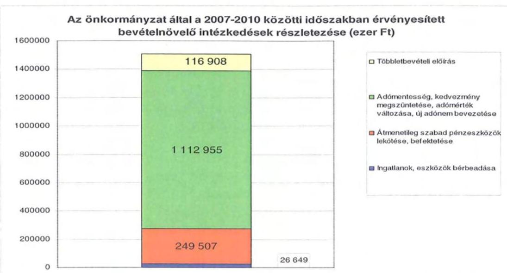

Az Önkormányzat folyamatosan gondoskodott átmenetileg szabad pénzeszközeinek a lehető legjobb hozamot (kamatot) eredményező befektetéséről, lekötött betétben való elhelyezéséről, többletbevétel előírásáról, amelyeket a 2007-2010. évekre vonatkozó költségvetési rendeleteiben is rögzített.

Az Önkormányzat a helyi adókról szóló 1990. évi C. törvényben, valamint a helyi adórendeleteiben 45 foglaltaknak megfelelően szabályozza a helyi adónemeket, adókedvezményeket, adómentességeket. Ennek megfelelően a 2007. évtől az Önkormányzat megszüntette a helyi iparűzési adóra, a vállalkozók kommunális adójára,
 az építményadóra vonatkozó kedvezményeit, amelynek eredményeképpen a 2007. évben 464 millió Ft, a 2008. évben 377 millió Ft, a 2009. évben 1 millió Ft, a 2010. évben 3 millió Ft bevételi többletet mutatott ki (összesen 845 millió Ft).

Az Önkormányzat a helyi adórendeleteiben adómérték-változtatást (emelést) határozott meg a vállalkozók kommunális adójára, az építményadóra, valamint a 2008. évtől bevezette az idegenforgalmi adót, amelyeknek eredményeképpen a 2007. évben 76 millió Ft, a 2008. évben 192 millió Ft (összesen 268 millió Ft) többlet adóbevételt mutatott ki.

A 2007-2010. években az Önkormányzat helyi adókkal kapcsolatos bevételnövelő intézkedései a helyi adómentességek, -kedvezmények megszüntetése, az adómérték-változás, valamint az idegenforgalmi adó bevezetése miatt összességében 1113 millió Ft bevételi többletet mutatott ki.

[^0]
[^0]:    ${ }^{45}$ A helyi iparűzési adóról szóló 35/2002. (XII. 22.) számú rendelet; a vállalkozók kommunális adójáról szóló 36/2002. (XII. 12.) számú rendelet; az építményadóról szóló 33/2002. (XII. 12.) számú rendelet; az idegenforgalmi adóról szóló 39/2007. (XII. 17.) számú rendelet.

---

Az Önkormányzat a kiadáscsökkentő és bevételnövelő intézkedéseivel ellensúlyozta a költségvetési támogatások és az átengedett bevételek együttes csökkenésének, valamint az illetékbevételek növekedésének hatását a 2007-2010. évek között. A kiadáscsökkentő intézkedések eredménye 2178 millió Ft, a bevételnövelő intézkedéseké 1506 millió Ft volt, összesen 3684 millió Ft, szemben a költségvetési támogatások és az átengedett bevételek együttes, 2107 millió Ft összegű csökkenésével, valamint az illetékek 74 millió Ft összegű növekedésével a 2007-2010. években. A kiadáscsökkentő és a bevételnövelő intézkedések összegének, valamint a kieső költségvetési támogatásoknak és az átengedett bevételeknek, továbbá az illetékbevételek növekedésének a különbsége 1651 millió Ft. A kiadáscsökkentő és bevételnövelő intézkedésekkel elért eredmény a kieső források 1,8 szorosát teszi ki.

# 5. A HELYI ÖNKORMÁNYZATOK GAZDÁLKODÁSI RENDSZERÉNEK 2009. ÉVI ELLENŐRZÉSE SORÁN A PÉNZÜGYI EGYENSÚLY JAVÍTÁSÁRA TETT SZABÁLYSZERŰSÉGI ÉS CÉLSZERŰSÉGI JAVASLATOK HASZNOSULÁSA

Az ÁSZ az Önkormányzat gazdálkodási rendszerét a 2009. évben ellenőrizte. A javaslatok megvalósítása érdekében a számvevői jelentés aláírását követően a főjegyző intézkedést rendelt el, továbbá a Közgyűlés a 303/2009. (XII. 17.) számú határozatával elfogadta a főjegyző által készített intézkedési tervet.

A gazdálkodási rendszer korábbi ellenőrzése során tett javaslatok közül a pénzügyi egyensúly javítására egy célszerűségi javaslat vonatkozott.

A munka színvonalának javítása érdekében javasoltuk a főjegyzőnek, hogy
„tájékoztassa - évente végzett számítások alapján - a Közgyűlést az Önkormányzat eladósodásának növekedésére figyelemmel arról, hogy a hosszú lejáratú, adósságot keletkeztető kötelezettségvállalásokból adódó tőke- és kamatfizetési kötelezettségét az Önkormányzat milyen feltételek mellett tudja teljesíteni.”

A pénzügyi egyensúly javítására tett javaslat teljesült. Az intézkedési tervben foglaltaknak megfelelően a főjegyző első alkalommal a 2011. évi költségvetési koncepció ${ }^{46}$ elfogadásakor, annak részeként tájékoztatta a Közgyűlést a hosszú lejáratú, adósságot keletkeztető kötelezettségvállalásokból adódó tőke- és kamatfizetési kötelezettségről.

A 2010. évi költségvetési koncepció 8., 8/b., 8/c. mellékleteiben a futamidő végéig történő lejárattal évente, tőke- és kamatfizetési bontásban szerepeltették a fizetési kötelezettségeiket a hitelekre, a pénzügyi lízingre, a kötvényre kimutatva vonatkozóan.

A költségvetési koncepció 25. számú mellékletében bemutatták a 2011. évi hitelfelvételi korlát számítását, amely az Ötv. 88. § (3) bekezdése a) pontjának

[^0]
[^0]:    ${ }^{46}$ A Közgyűlés a 301/2010. (XII. 16.) számú határozatával fogadta el Tatabánya Megyei Jogú Város Önkormányzatának 2010. évi költségvetési koncepcióját.

---

megfelelően a saját folyó bevételek rövid lejáratú kötelezettségekkel csökkentett részének 70%-a.

Budapest, 2011. december 22.

Melléklet: 8 db
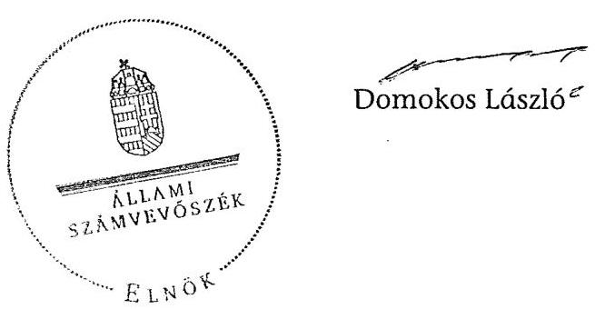

---

# Működési és felhalmozási célú hiány/többlet az önkormányzat rendeleteiben

|  év |  |  |  |  |  |  |  |  | millió Ft  |
| --- | --- | --- | --- | --- | --- | --- | --- | --- | --- |
|  13.274 | 2007 | 2008 | 2009 | 2010 | 2011 | 2012 | 2013 | 2014 | 2015  |
|  13.274 | 2008 | 2009 | 2010 | 2011 | 2012 | 2013 | 2014 | 2015 | 2016  |
|  13.274 | 2007 | 2008 | 2009 | 2010 | 2011 | 2012 | 2013 | 2014 | 2015  |
|  13.274 | 2008 | 2009 | 2010 | 2011 | 2012 | 2013 | 2014 | 2015 | 2016  |
|  13.274 | 2007 | 2008 | 2009 | 2010 | 2011 | 2012 | 2013 | 2014 | 2015  |
|  13.274 | 2008 | 2009 | 2010 | 2011 | 2012 | 2013 | 2014 | 2015 | 2016  |
|  13.274 | 2007 | 2008 | 2009 | 2010 | 2011 | 2012 | 2013 | 2014 | 2015  |
|  13.274 | 2008 | 2009 | 2010 | 2011 | 2012 | 2013 | 2014 | 2015 | 2016  |
|  13.274 | 2007 | 2008 | 2009 | 2010 | 2011 | 2012 | 2013 | 2014 | 2015  |
|  13.274 | 2008 | 2009 | 2010 | 2011 | 2012 | 2013 | 2014 | 2015 | 2016  |
|  13.274 | 2007 | 2008 | 2009 | 2010 | 2011 | 2012 | 2013 | 2014 | 2015  |
|  13.274 | 2008 | 2009 | 2010 | 2011 | 2012 | 2013 | 2014 | 2015 | 2016  |
|  13.274 | 2007 | 2008 | 2009 | 2010 | 2011 | 2012 | 2013 | 2014 | 2015  |
|  13.274 | 2007 | 2008 | 2009 | 2010 | 2011 | 2012 | 2013 | 2014 | 2015  |
|  13.274 | 2007 | 2008 | 2009 | 2010 | 2011 | 2012 | 2013 | 2014 | 2015  |
|  13.274 | 2007 | 2008 | 2009 | 2010 | 2011 | 2012 | 2013 | 2014 | 2015  |
|  13.274 | 2007 | 2008 | 2009 | 2010 | 2011 | 2012 | 2013 | 2014 | 2015  |
|  13.274 | 2007 | 2008 | 2009 | 2010 | 2011 | 2012 | 2013 | 2014 | 2015  |
|  13.274 | 2007 | 2008 | 2009 | 2010 | 2011 | 2012 | 2013 | 2014 | 2015  |
|  13.274 | 2007 | 2008 | 2009 | 2010 | 2011 | 2012 | 2013 | 2014 | 2015  |
|  13.274 | 2007 | 2008 | 2009 | 2010 | 2011 | 2012 | 2013 | 2014 | 2015  |
|  13.274 | 2007 | 2008 | 2009 | 2010 | 2011 | 2012 | 2013 | 2014 | 2015  |
|  13.274 | 2007 | 2008 | 2009 | 2010 | 2011 | 2012 | 2013 | 2014 | 2015  |
|  13.274 | 2007 | 2008 | 2009 | 2010 | 2011 | 2012 | 2013 | 2014 | 2015  |
|  13.274 | 2007 | 2008 | 2009 | 2010 | 2011 | 2012 | 2013 | 2014 | 2015  |
|  13.274 | 2007 | 2008 | 2009 | 2010 | 2011 | 2012 | 2013 | 2014 | 2015  |
|  13.274 | 2007 | 2008 | 2009 | 2010 | 2011 | 2012 | 2013 | 2014 | 2015  |
|  13.274 | 2007 | 2008 | 2009 | 2010 | 2011 | 2012 | 2013 | 2014 | 2015  |
|  13.274 | 2007 | 2008 | 2009 | 2010 | 2011 | 2012 | 2013 | 2014 | 2015  |
|  13.274 | 2007 | 2008 | 2009 | 2010 | 2011 | 2012 | 2013 | 2014 | 2015  |
|  13.274 | 2007 | 2008 | 2009 | 2010 | 2011 | 2012 | 2013 | 2014 | 2015  |
| 

---

# Az Önkormányzat bevételeinek és kiadásainak, adósságszolgálatának alakulásáról

|   | 2007. | 2008. | 2009. | 2010.  |
| --- | --- | --- | --- | --- |
|  1. FOLYÓ KÖLTSÉGVETÉS |  |  |  |   |
|  1.1.1. Saját működési bevételek | 6 241 142 | 7 131 861 | 6 915 401 | 6 825 218  |
|  1.1.2. Költségvetési támogatás | 5 385 180 | 6 728 547 | 5 636 700 | 5 377 213  |
|  1.1.3.
 Engedélyezett bevételek | 2 782 941 | 1 294 269 | 1 408 984 | 1 951 383  |
|  1.1.4. Államháztartáson belülről kapott támogatások | 385 543 | 372 928 | 497 392 | 647 955  |
|  1.1.5. EU-s és külföldről kapott bevételek | 0 | 1 820 | 10 805 | 6 492  |
|  1.1.6. Államháztartáson kívülről kapott bevételek | 30 643 | 43 136 | 108 201 | 60 970  |
|  1.1.7. Előző évi pénzmaradvány átvétel | 76 187 | 75 971 | 34 308 | 99 380  |
|  1.1. Folyó bevételek = 1.1.1.+1.1.2.+1.1.3.+1.1.4.+1.1.5.+1.1.6.+1.1.7. | 14 821 636 | 15 647 732 | 14 611 791 | 14 968 623  |
|  1.2.1. Működési kiadások kamatkiadások nélkül | 11 027 842 | 11 749 236 | 11 704 419 | 11 954 996  |
|  1.2.2. Államháztartáson belülre átadott pénzeszközök | 787 071 | 169 773 | 240 711 | 224 915  |
|  1.2.3.1. Költségek | 224 977 | 259 252 | 389 214 | 535 131  |
|  1.2.3.2. EU-nak, illetve külföldre | 0 | 0 | 0 | 0  |
|  1.2.3.3. Megjegyzésbevétel | 349 061 | 377 541 | 442 791 | 552 412  |
|  1.2.3.4. Megjegyzésbevétel | 499 581 | 581 579 | 394 630 | 241 781  |
|  1.2.4. Tiszaellátási kiadások (= 1.2.3.1+1.2.3.2+1.2.3.3+1.2.3.4) | 1 073 619 | 1 218 372 | 1 226 635 | 1 329 324  |
|  1.2.4. Kamatkiadások | 179 707 | 269 144 | 255 272 | 424 190  |
|  1.2.5. Előző évi pénzmaradvány átadás | 71 631 | 75 971 | 34 308 | 99 380  |
|  1.2. Folyó kiadások = 1.2.1.+1.2.2.+1.2.3.+1.2.4.+1.2.5. | 13 140 670 | 13 482 496 | 13 461 345 | 14 032 805  |
|  1.3. Folyó költségvetés egyenlege MŰKÖDÉSI JÖVEDELEM (1.1. - 1.2.) | 1 680 966 | 2 165 236 | 1 150 446 | 935 818  |
|  2.1.1. Saját többletbevételek | 586 714 | 187 480 | 369 547 | 296 466  |
|  2.1.2. Államháztartáson belülről kapott támogatások | 139 303 | 288 850 | 246 628 | 484 177  |
|  2.1.3. EU-s és külföldről kapott támogatások | 0 | 235 | 0 | 0  |
|  2.1.4. Államháztartáson kívülről kapott támogatások | 164 896 | 82 378 | 4 189 | 94 049  |
|  2.1. Felhalmozási bevételek (= 2.1.1.+2.1.2.+2.1.3+2.1.4.) | 890 913 | 558 943 | 620 364 | 874 692  |
|  2.2.1. Saját beruházási kiadások | 1 439 600 | 3 639 143 | 1 525 964 | 1 123 620  |
|  2.2.2. Saját felújítási kiadások | 565 199 | 622 134 | 448 332 | 536 676  |
|  2.2.3. Államháztartáson belülre átadott pénzeszközök | 26 806 | 28 604 | 54 494 | 140 328  |
|  2.2.4. EU-nak és külföldnek adott pénzeszközök | 0 | 0 | 125 | 0  |
|  2.2.5. Államháztartáson kívülre adott pénzeszközök | 210 229 | 270 733 | 276 253 | 81 248  |
|  2.2.6. Befektetési célú részesedések vásárlása | 0 | 12 800 | 297 600 | 1 947 286  |
|  2.2. Felhalmozási kiadások (= 2.2.1.+2.2.2.+2.2.3.+2.2.4.+2.2.5.+2.2.6.) | 2 241 842 | 4 573 414 | 2 682 768 | 3 829 158  |
|  2.3. Felhalmozási költségvetés egyenlege (2.1. - 2.2.) | -1 350 929 | -4 014 471 | -1 982 404 | -2 954 466  |
|  3. Finanszírozási műveletek nélküli (GFS) pozíció (1.3.+2.3.) | 330 037 | -1 849 235 | -831 958 | -2 018 648  |
|  4. Finanszírozási műveletek |  |  |  |   |
|  4.1. Hitelfelvétel | 513 773 | 1 957 209 | 298 277 | 248 533  |
|  4.2. Hitelfelvétel | 215 745 | 282 319 | 384 040 | 478 284  |
|  4.3. Forgatási és befektetési célú értékpapírok kibocsátása | 0 | 0 | 2 600 000 | 0  |
|  4.4. Forgatási és befektetési célú értékpapírok beváltása | 0 | 0 | 0 | 0  |
|  4.5. Forgatási és befektetési célú értékpapírok értékesítése | 0 | 0 | 0 | 0  |
|  4.6. Forgatási és befektetési célú értékpapírok vásárlása | 0 | 0 | 0 | 0  |
|  4.7. Egyéb finanszírozási bevételek (függő, átfutó, kiegyenlítő) | 26 241 | -1 798 | -102 914 | -364 546  |
|  4.8. Egyéb finanszírozási kiadások (függő, átfutó, kiegyenlítő) | 948 518 | -607 722 | -33 680 | -265 426  |
|  4.9. Finanszírozási műveletek egyenlege (4.1. - 4.2.+4.3.-4.4+4.5.-4.6.+4.7.-4.8.) | -624 249 | 2 280 814 | 2 445 083 | -328 871  |
|  5. Tárgyévi pénzügyi pozíció változás (1.3.+ 2.3.+4.9.) | -294 212 | 431 579 | 1 613 045 | -2 347 519  |
|  6. Nettó működési jövedelem (működési jövedelem (1.3.) - tőketörlesztés (4.2+4.4) | 1 465 221 | 1 882 917 | 766 406 | 457 534  |
|  TÁJÉKOZTATÓ ADATOK |  |  |  |   |
|  Összes kötelezettség | 5 006 473 | 14 712 731 | 14 464 122 | 13 863 409  |
|  ebből rövid lejáratú | 1 492 940 | 2 406 804 | 1 440 715 | 1 338 273  |
|  Összes szálláshely kötelezettség | 182 163 | 138 085 | 122 395 | 204 945  |
|  ebből lejárt (tamisítványból) | 25 695 | 43 821 | 57 126 | 144 846  |
|  Pénz és tőkepiaci kötelezettség (adósság) | 3 795 852 | 5 470 743 | 8 008 797 | 7 796 776  |
|  ebből rövid lejáratú | 282 319 | 360 223 | 373 598 | 434 028  |
|  PPP szerződéses állomány jelenértéken (tamisítványból) | 0 | 0 | 0 | 0  |
|  ebből lejárt szolgáltatási díj miatti kötelezettség | 0 | 0 | 0 | 0  |
|  Felszámolásügyi napi átlagos állománya (tamisítványból) | 0 | 0 | 144 080 | 106 008  |
|  Likviditási napi átlagos állománya (tamisítványból) | 0 | 0 | 0 | 0  |
|  Munkabérügyi napi átlagos állománya (tamisítványból) | 0 | 0 | 0 | 0  |
|  Kezesség és garanciavállalások (tamisítványból) | 1 086 687 | 711 080 | 711 080 | 751 080  |
|  Jogerős bírósági ítéletekből adódó kötelezettségek (tamisítványból) | 0 | 0 | 0 | 0  |
|  Finanszírozásba bevonható eszközök | 1 282 849 | 1 714 428 | 3 327 473 | 979 954  |
|  Tartás kötelezettséget megtestesítő értékpapírok és végi állománya | 0 | 0 | 0 | 0  |
|  Hosszú lejáratú bankbetétek és végi állománya | 0 | 0 | 0 | 0  |
|  Értékpapírok és végi állománya | 0 | 0 | 0 | 0  |
|  Pénzeszközök (idegen pénzeszközök nélkül) és végi állománya | 1 282 849 | 1 714 428 | 3 327 473 | 979 954  |

---

Tabulátumhoz Kapcsolódó Információk

|   |  |  |  |  |  |  |  |  |  |  |  |  |  |  |  |  |  |  |  |  |  |  |  |  |  |  |  |  |  |  |  |  |  |  |  |  |  |  |  |  |  |  |  |  |  |   |
| --- | --- | --- | --- | --- | --- | --- | --- | --- | --- | --- | --- | --- | --- | --- | --- | --- | --- | --- | --- | --- | --- | --- | --- | --- | --- | --- | --- | --- | --- | --- | --- | --- | --- | --- | --- | --- | --- | --- | --- | --- | --- | --- | --- | --- | --- |
|   |  |  |  |  |  |  |  |  |  |  |  |  |  |  |  |  |  |  |  |  |  |  |  |  |  |  |  |  |  |  |  |  |  |  |  |  |  |  |  |  |  |  |  |   |
|   |  |  |  |  |  |  |  |  |  |  |  |  |  |  |  |  |  |  |  |  |  |  |  |  |  |  |  |  |  |  |  |  |  |  |  |  |  |  |  |  |  |  |  |  

 |
|   |  |  |  |  |  |  |  |  |  |  |  |  |  |  |  |  |  |  |  |  |  |  |  |  |  |  |  |  |  |  |  |  |  |  |  |  |  |  |  |  |  |  |  |   |
|   |  |  |  |  |  |  |  |  |  |  |  |  |  |  |  |  |  |  |  |  |  |  |  |  |  |  |  |  |  |  |  |  |  |  |  |  |  |  |  |  |  |  |  |   |
|   |  |  |  |  |  |  |  |  |  |  |  |  |  |  |  |  |  |  |  |  |  |  |  |  |  |  |  |  |  |  |  |  |  |  |  |  |  |  |  |  |  |  |  |   |
|   |  |  |  |  |  |  |  |  |  |  |  |  |  |  |  |  |  |  |  |  |  |  |  |  |  |  |  |  |  |  |  |  |  |  |  |  |  |  |  |  |  |  |  |   |
|   |  |  |  |  |  |  |  |  |  |  |  |  |  |  |  |  |  |  |  |  |  |  |  |  |  |  |  |  |  |  |  |  |  |  |  |  |  |  |  |  |  |  |  |   |
|   |  |  |  |  |  |  |  |  |  |  |  |  |  |  |  |  |  |  |  |  |  |  |  |  |  |  |  |  |  |  |  |  |  |  |  |  |  |  |  |  |  |  |  |   |
|   |  |  |  |  |  |  |  |  |  |  |  |  |  |  |  |  |  |  |  |  |  |  |  |  |  |  |  |  |  |  |  |  |  |  |  |  |  |  |  |  |  |  |  |   |
|   |  |  |  |  |  |  |  |  |  |  |  |  |  |  |  |  |  |  |  |  |  |  |  |  |  |  |  |  |  |  |  |  |  |  |  |  |  |  |  |  |  |  |  |   |
|   |  |  |  |  |  |  |  |  |  |  |  |  |  |  |  |  |  |  |  |  |  |  |  |  |  |  |  |  |  |  |  |  |  |  |  |  |  |  |  |  |  |  |  |   |
|   |  |  |  |  |  |  |  |  |  |  |  |  |  |  |  |  |  |  |  |  |  |  |  |  |  |  |  |  |  |  |  |  |  |  |  |  |  |  |  |  |  |  |  |   |
|   |  |  |  |  |  |  |  |  |  |  |  |  |  |  |  |  |  |  |  |  |  |  |  |  |  |  |  |  |  |  |  |  |  |  |  |  |  |  |  |  |  |  |  |   |
|   |  |  |  |  |  |  |  |  |  |  |  |  |  |  |  |  |  |  |  |  |  |  |  |  |  |  |  |  |  |  |  |  |  |  |  |  |  |  |  |  |  |  |  |   |
|   |  |  |  |  |  |  |  |  |  |  |  |  |  |  |  |  |  |  |  |  |  |  |  |  |  |  |  |  |  |  |  |  |  |  |  |  |  |  |  |  |  |  |  |   |
|   |  |  |  |  |  |  |  |  |  |  |  |  |  |  |  |  |  |  |  |  |  |  |  |  |  |  |  |  |  |  |  |  |  |  |  |  |  |  |  |  |  |  |  |   |
|   |  |  |  |  |  |  |  |  |  |  |  |  |  |  |  |  |  |  |  |  |  |  |  |  |  |  |  |  |  |  |  |  |  |  |  |  |  |  |  |  |  |  |  |   |
|   |  |  |  |  |  |  |  |  |  |  |  |  |  |  |  |  |  |  |  |  |  |  |  |  |  |  |  |  |  |  |  |  |  |  |  |  |  |  |  |  |  |  |  |   |
|   |  |  |  |  |  |  |  |  |  |  |  |  |  |  |  |  |  |  |  |  |  |  |  |  |  |  |  |  |  |  |  |  |  |  |  |  |  |  |  |  |  |  |  |   |
|   |  |  |  |  |  |  |  |  |  |  |  |  |  |  |  |  |  |  |  |  |  |  |  |  |  |  |  |  |  |  |  |  |  |  |  |  |  |  |  |  |  |  |  |   |

 |  |  |  |  |  |  |  |  |  |  |  |  |  |  |  |  |  |  |  |  |  |  |  |  |  |  |  |   |
|   |  |  |  |  |  |  |  |  |  |  |  |  |  |  |  |  |  |  |  |  |  |  |  |  |  |  |  |  |  |  |  |  |  |  |  |  |  |  |  |  |  |  |  |   |
|   |  |  |  |  |  |  |  |  |  |  |  |  |  |  |  |  |  |  |  |  |  |  |  |  |  |  |  |  |  |  |  |  |  |  |  |  |  |  |  |  |  |  |  |   |
|   |  |  |  |  |  |  |  |  |  |  |  |  |  |  |  |  |  |  |  |  |  |  |  |  |  |  |  |  |  |  |  |  |  |  |  |  |  |  |  |  |  |  |  |   |
|   |  |  |  |  |  |  |  |  |  |  |  |  |  |  |  |  |  |  |  |  |  |  |  |  |  |  |  |  |  |  |  |  |  |  |  |  |  |  |  |  |  |  |  |   |
|   |  |  |  |  |  |  |  |  |  |  |  |  |  |  |  |  |  |  |  |  |  |  |  |  |  |  |  |  |  |  |  |  |  |  |  |  |  |  |  |  |  |  |  |   |
|   |  |  |  |  |  |  |  |  |  |  |  |  |  |  |  |  |  |  |  |  |  |  |  |  |  |  |  |  |  |  |  |  |  |  |  |  |  |  |  |  |  |  |  |   |
|   |  |  |  |  |  |  |  |  |  |  |  |  |  |  |  |  |  |  |  |  |  |  |  |  |  |  |  |  |  |  |  |  |  |  |  |  |  |  |  |  |  |  |  |   |
|   |  |  |  |  |  |  |  |  |  |  |  |  |  |  |  |  |  |  |  |  |  |  |  |  |  |  |  |  |  |  |  |  |  |  |  |  |  |  |  |  |  |  |  |   |
|   |  |  |  |  |  |  |  |  |  |  |  |  |  |  |  |  |  |  |  |  |  |  |  |  |  |  |  |  |  |  |  |  |  |  |  |  |  |  |  |  |  |  |  |   |
|   |  |  |  |  |  |  |  |  |  |  |  |  |  |  |  |  |  |  |  |  |  |  |  |  |  |  |  |  |  |  |  |  |  |  |  |  |  |  |  |  |  |  |  |   |
|   |  |  |  |  |  |  |  |  |  |  |  |  |  |  |  |  |  |  |  |  |  |  |  |  |  |  |  |  |  |  |  |  |  |  |  |  |  |  |  |  |  |  |  |   |
|   |

---

Táblázat integrál: Juga Viteas Gizavertásána

Az Önügyminisztérium 2007-2019. évi adatainak megnézését, 2019. december 31-ig beleértve, Nyílt Kormányzati Adatbázis-központ

|   |  |  |  |  |  |  |  |  |  |  |  |  |  |  |  |  |  |  |  |  |  |  |  |  |  |  |  |  |  |  |  |  |  |  |  |  |  |  |  |  |  |  |  |  |  |  |  |  |  |  |  |  |  |  |  |  |  |  |  |  |  |  |  |  |  |  |  |  |  |  |  |  |  |  |  |  |  |  |  |  |  |  |  |  |  |  |  |  |  |  |  |  |  |  |  |  |  |  |  | 

---

|   |  |  |  |  |  |  |  |  |  |  |  |  |  |  |  |  |  |  |  |  |  |  |  |  |  |  |  |  |  |  |  |  |  |  |  |  |  |  |  |  |  |  |  |  |  |  |  |  |  |   |
| --- | --- | --- | --- | --- | --- | --- | --- | --- | --- | --- | --- | --- | --- | --- | --- | --- | --- | --- | --- | --- | --- | --- | --- | --- | --- | --- | --- | --- | --- | --- | --- | --- | --- | --- | --- | --- | --- | --- | --- | --- | --- | --- | --- | --- | --- | --- | --- | --- | --- | --- | --- |
|   |  |  |  |  |  |  |  |  |  |  |  |  |  |  |  |  |  |  |  |  |  |  |  |  |  |  |  |  |  |  |  |  |  |  |  |  |  |  |  |  |  |  |  |  |  |  |  |  |   |
|  

 |  |  |  |  |  |  |  |  |  |  |  |  |  |  |  |  |  |  |  |  |  |  |  |  |  |  |  |  |  |  |  |  |  |  |  |  |  |  |  |  |  |  |  |  |  |  |  |   |
|   |  |  |  |  |  |  |  |  |  |  |  |  |  |  |  |  |  |  |  |  |  |  |  |  |  |  |  |  |  |  |  |  |  |  |  |  |  |  |  |  |  |  |  |  |  |  |   |
|   |  |  |  |  |  |  |  |  |  |  |  |  |  |  |  |  |  |  |  |  |  |  |  |  |  |  |  |  |  |  |  |  |  |  |  |  |  |  |  |  |  |  |  |  |  |  |   |
|   |  |  |  |  |  |  |  |  |  |  |  |  |  |  |  |  |  |  |  |  |  |  |  |  |  |  |  |  |  |  |  |  |  |  |  |  |  |  |  |  |  |  |  |  |  |  |   |
|   |  |  |  |  |  |  |  |  |  |  |  |  |  |  |  |  |  |  |  |  |  |  |  |  |  |  |  |  |  |  |  |  |  |  |  |  |  |  |  |  |  |  |  |  |  |  |   |
|   |  |  |  |  |  |  |  |  |  |  |  |  |  |  |  |  |  |  |  |  |  |  |  |  |  |  |  |  |  |  |  |  |  |  |  |  |  |  |  |  |  |  |  |  |  |  |   |
|   |  |  |  |  |  |  |  |  |  |  |  |  |  |  |  |  |  |  |  |  |  |  |  |  |  |  |  |  |  |  |  |  |  |  |  |  |  |  |  |  |  |  |  |  |  |  |   |
|   |  |  |  |  |  |  |  |  |  |  |  |  |  |  |  |  |  |  |  |  |  |  |  |  |  |  |  |  |  |  |  |  |  |  |  |  |  |  |  |  |  |  |  |  |  |  |   |
|   |  |  |  |  |  |  |  |  |  |  |  |  |  |  |  |  |  |  |  |  |  |  |  |  |  |  |  |  |  |  |  |  |  |  |  |  |  |  |  |  |  |  |  |  |  |  |   |
|   |  |  |  |  |  |  |  |  |  |  |  |  |  |  |  |  |  |  |  |  |  |  |  |  |  |  |  |  |  |  |  |  |  |  |  |  |  |  |  |  |  |  |  |  |  |  |   |
|   |  |  |  |  |  |  |  |  |  |  |  |  |  |  |  |  |  |  |  |  |  |  |  |  |  |  |  |  |  |  |  |  |  |  |  |  |  |  |  |  |  |  |  |  |  |  |   |
|   |  |  |  |  |  |  |  |  |  |  |  |  |  |  |  |  |  |  |  |  |  |  |  |  |  |  |  |  |  |  |  |  |  |  |  |  |  |  |  |  |  |  |  |  |  |  |   |
|   |  |  |  |  |  |  |  |  |  |  |  |  |  |  |  |  |  |  |  |  |  |  |  |  |  |  |  |  |  |  |  |  |  |  |  |  |  |  |  |  |  |  |  |  |  |  |   |
|   |  |  |  |  |  |  |  |  |  |  |  |  |  |  |  |  |  |  |  |  |  |  |  |  |  |  |  |  |  |  |  |  |  |  |  |  |  |  |  |  |  |  |  |  |  |  |   |
|   |  |  |  |  |  |  |  |  |  |  |  |  |  |  |  |  |  |  |  |  |  |  |  |  |  |  |  |  |  |  |  |  |  |  |  |  |  |  |  |  |  |  |  |  |  |  |   |
|   |  |  |  |  |  |  |  |  |  |  |  |  |  |  |  |  |  |  |  |  |  |  |  |  |  |  |  |  |  |  |  |  |  |  |  |  |  |  |  |  |  |  |  |  |  |  |   |
|  

 |  |  |  |  |  |  |  |  |  |  |  |  |  |  |  |  |  |  |  |  |  |  |  |  |  |  |  |  |  |  |  |  |  |  |  |  |  |  |  |  |  |  |  |  |  |  |  |  |   |
|   |  |  |  |  |  |  |  |  |  |  |  |  |  |  |  |  |  |  |  |  |  |  |  |  |  |  |  |  |  |  |  |  |  |  |  |  |  |  |  |  |  |  |  |  |  |  |  |   |
|   |  |  |  |  |  |  |  |  |  |  |  |  |  |  |  |  |  |  |  |  |  |  |  |  |  |  |  |  |  |  |  |  |  |  |  |  |  |  |  |  |  |  |  |  |  |  |  |   |
|   |  |  |  |  |  |  |  |  |  |  |  |  |  |  |  |  |  |  |  |  |  |  |  |  |  |  |  |  |  |  |  |  |  |  |  |  |  |  |  |  |  |  |  |  |  |  |  |   |
|   |  |  |  |  |  |  |  |  |  |  |  |  |  |  |  |  |  |  |  |  |  |  |  |  |  |  |  |  |  |  |  |  |  |  |  |  |  |  |  |  |  |  |  |  |  |  |  |   |
|   |  |  |  |  |  |  |  |  |  |  |  |  |  |  |  |  |  |  |  |  |  |  |  |  |  |  |  |  |  |  |  |  |  |  |  |  |  |  |  |  |  |  |  |  |  |  |  |   |
|   |  |  |  |  |  |  |  |  |  |  |  |  |  |  |  |  |  |  |  |  |  |  |  |  |  |  |  |  |  |  |  |  |  |  |  |  |  |  |  |  |  |  |  |  |  |  |  |   |
|   |  |  |  |  |  |  |  |  |  |  |  |  |  |  |  |  |  |  |  |  |  |  |  |  |  |  |  |  |  |  |  |  |  |  |  |  |  |  |  |  |  |  |  |  |  |  |  |   |
|   |  |  |  |  |  |  |  |  |  |  |  |  |  |  |  |  |  |  |  |  |  |  |  |  |  |  |  |  |  |  |  |  |  |  |  |  |  |  |  |  |  |  |  |  |  |  |  |   |
|   |  |  |  |  |  |  |  |  |  |  |  |  |  |  |  |  |  |  |  |  |  |  |  |  |  |  |  |  |  |  |  |  |  |  |  |  |  |  |  |  |  |  |  |  |  |  |  |   |
|   |  |  |  |  |  |  |  |  |  |  |  |  |  |  |  |  |  |  |  |  |  |  |  |  |  |  |  |  |  |  |  |  |  |  |  |  |  |  |  |  |  |  |  |  |  |  |  |   |
|   |  |  |  |  |  |  |  |  |  |  |  |  |  |  |  |  |  |  |  |  |  |  |  |  |  |  |  |  |  |  |  |  |  |  |  |  |  |  |  |  |  |  |  |  |  |  |  |   |
|   |  |  |  |  |  |  |  |  |  |  |  |  |  |  |  |  |  |  |  |  |  |  |  |  |  |  |  |  |  |  |  |  |  |  |  |  |  |  |  |  |  |  |  |  |  |  |  |   |
|   |  |  |  |  |  |  |  |  |  |  |  |  |  |  |  |  |  |  |  |  |  |  |  |  |  |  |  |  |  |  |  |  |  |  |  |  |  |  |  |  |  |  |  |  |  |  |  |   |
|   |  |  |  |  |  |  |  |  |  |  |  |  |  |  |  |  |  |  |  |  |  |  |  |  |  |  |  |  |  |  |  |  |  |  |  |  |  |  |  |  |  |  |  |  |  |  |  |   |
|   |

---

# **Chemistry**

## **Chemical Reactions**

### **Balancing Chemical Equations**

1. **Write the unbalanced equation:**
   - Example: $$C_3H_8 + O_2 \rightarrow CO_2 + H_2O$$

2. **Balance the equation:**
   - Example: $$2C_3H_8 + 7O_2 \rightarrow 6CO_2 + 8H_2O$$

3. **Balance the equation:**
   - Example: $$2C_3H_8 + 7O_2 \rightarrow 6CO_2 + 8H_2O$$

### **Types of Reactions**

1. **Combination Reaction:**
   - Example: $$2H_2 + O_2 \rightarrow 2H_2O$$

2. **Decomposition Reaction:**
   - Example: $$2H_2O_2 \rightarrow 2H_2O + O_2$$

3. **Single Displacement Reaction:**
   - Example: $$Zn + 2HCl \rightarrow ZnCl_2 + H_2$$

4. **Double Displacement Reaction:**
   - Example: $$AgNO_3 + NaCl \rightarrow AgCl + NaNO_3$$

 AgCl + NaNO₃

5. **Combustion Reaction:**
   - Example: CH₄ + 2O₂ → CO₂ + 2H₂O

## **Stoichiometry**

### **Mole Concept**

- **Mole (mol):** The amount of substance containing as many particles (atoms, molecules, ions) as there are atoms in exactly 12 grams of carbon-12.
- **Avogadro's Number:** 6.022 × 10²³ particles per mole.

### **Molar Mass**

- **Molar Mass:** The mass of one mole of a substance.
- Example: The molar mass of water (H₂O) is 18.015 g/mol.

### **Calculations**

1. **Moles to Mass:**
   - Formula: n = m/M
   - Example: Calculate the number of moles of H₂O in 18 grams of water.
     - n = 18.015 g / 18.015 g/mol = 1 mol

2. **Moles to Mass:**
   - Formula: m = n × M
   - Example: Calculate the mass of 1 mol of water.
     - m = 1 mol × 18.015 g/mol = 18.015 g

## **Gas Laws**

### **Ideal Gas Law**

- **Equation:** PV = nRT
- **Variables:**
  - P = Pressure (atm)
  - V = Volume (L)
  - n = Moles of gas

### **Boyle's Law**

- **Equation:** P₁V₁ = P₂V₂
- **Variables:**
  - P₁ = Pressure (atm)
  - V₁ = Volume (L)

### **Charles's Law**

- **Equation:** V₁/T₁ = V₂/T₂
- **Variables:**
  - T₁ = Temperature (K)
  - V₁ = Volume (L)
  - T₂ = Temperature (K)
  - V₂ = Volume (L)

### **Boyle's Law**

- **Equation:** V₁/T₁ = V₂/T₂
- **Variables:**
  - T₁ = Temperature (K)
  - V₁ = Volume (L)
  - T₂ = Temperature (K)
  - V₂ = Volume (L)

## **Thermochemistry**

### **Enthalpy (H)**

- **Definition:** The heat content of a system at constant pressure.
- **Change in Enthalpy (ΔH):** ΔH = qp
- **Change in Enthalpy (ΔH₂):** ΔH₂ = H₂ + q₁
- **Change in Enthalpy (ΔH₁):** ΔH₁ = H₁ + q₂
- **Change in Enthalpy (ΔH₂H):** ΔH₂H = H₂ + q₁

### **Hess's Law**

- **Statement:** The enthalpy change for a reaction is the same whether it occurs in one step or multiple steps.
- **Equation:** ΔH = qp ΔH₂

## **Electrochemistry**

### **Oxidation and Reduction**

- **Oxidation:** Loss of electrons.
- **Reduction:** Gain of electrons.

### **Galvanic Cells**

- **Definition:** A cell that converts chemical energy into electrical energy.
- **Components:**
  - Anode: Oxidation occurs.
  - Cathode: Reduction occurs.
  - Salt Bridge: Connects the two half-cells.

### **Nernst Equation**

- **Equation:** E = E° - (RT/nF) ln Q
- **Variables:**
  - E = Cell potential
  - E° = Standard cell potential
  - R = Ideal gas constant
  - T = Temperature (K)
  - n = Number of moles of electrons transferred
  - F = Faraday constant
  - Q = Reaction quotient

---

### 2018. december 31-ig pénzügyileg teljesített beruházás formális beszámolónk

|   |  |  |  |  |  |  |  |  |  |  |  |  |  |  |  |  |  |  |  |  |  |  |  |  |  |  |  |  |  |  |  |  |  |  |  |  |  |  |  |  |  |  |  |  |  |   |
|---|---|---|---|---|---|---|---|---|---|---|---|---|---|---|---|---|---|---|---|---|---|---|---|---|---|---|---|---|---|---|---|---|---|---|---|---|---|---|---|---|---|---|---|---|---|---|---|---|---|---|---|---|
|   |  |  |  |  |  |  |  |  |  |  |  |  |  |  |  |  |  |  |  |  |  |  |  |  |  |  |  |  |  |  |  |  |  |  |  |  |  |  |  |  |  |  |  |  |   |
|   |  |  |  |  |  |  |  |  |  |  |  |  |  |  |  |  |  |  |  |  |  |  |  |  |  |  |  |  |  |  |  |  |  |  |  |  |  |  |  |  |  |  |  |  |   |
|   |  |  |  |  |  |  |  |  |  |  |  |  |  |  |  |  |  |  |  |  |  |  |  |  |  |  |  |  |  |  |  |  |  |  |  |  |  |  |  |  |  |  |  |  |   |
|   |  |  |  |  |  |  |  |  |  |  |  |  |  |  |  |  |  |  |  |  |  |  |  |  |  |  |  |  |  |  |  |  |  |  |  |  |  |  |  |  |  |  |  |  |   |
|   |  |  |  |  |  |  |  |  |  |  |  |  |  |  |  |  |  |  |  |  |  |  |  |  |  |  |  |  |  |  |  |  |  |  |  |  |  |  |  |  |  |  |  |  |   |
|   |  |  |  |  |  |  |  |  |  |  |  |  |  |  |  |  |  |  |  |  |  |  |  |  |  |  |  |  |  |  |  |  |  |  |  |  |  |  |  |  |  |  |  |  |   |
|   |  |  |  |  |  |  |  |  |  |  |  |  |  |  |  |  |  |  |  |  |  |  |  |  |  |  |  |  |  |  |  |  |  |  |  |  |  |  |  |  |  |  |  |  |   |
|   |  |  |  |  |  |  |  |  |  |  |  |  |  |  |  |  |  |  |  |  |  |  |  |  |  |  |  |  |  |  |  |  |  |  |  |  |  |  |  |  |  |  |  |  |   |
|   |  |  |  |  |  |  |  |  |  |  |  |  |  |  |  |  |  |  |  |  |  |  |  |  |  |  |  |  |  |  |  |  |  |  |  |  |  |  |  |  |  |  |  |  |   |
|   |  |  |  |  |  |  |  |  |  |  |  |  |  |  |  |  |  |  |  |  |  |  |  |  |  |  |  |  |  |  |  |  |  |  |  |  |  |  |  |  |  |  |  |  |   |
|   |  |  |  |  |  |  |  |  |  |  |  |  |  |  |  |  |  |  |  |  |  |  |  |  |  |  |  |  |  |  |  |  |  |  |  |  |  |  |  |  |  |  |  |  |   |
|   |  |  |  |  |  |  |  |  |  |  |  |  |  |  |  |  |  |  |  |  |  |  |  |  |  |  |  |  |  |  |  |  |  |  |  |  |  |  |  |  |  |  |  |  |   |
|   |  |  |  |  |  |  |  |  |  |  |  |  |  |  |  |  |  |  |  |  |  |  |  |  |  |  |  |  |  |  |  |  |  |  |  |  |  |  |  |  |  |  |  |  |   |

  |  |  |  |  |  |  |  |  |  |  |  |  |  |  |  |  |  |  |  |  |  |  |  |  |  |  |  |  |  |  |  |  |  |  |  |  |  |   |
|   |  |  |  |  |  |  |  |  |  |  |  |  |  |  |  |  |  |  |  |  |  |  |  |  |  |  |  |  |  |  |  |  |  |  |  |  |  |  |  |  |  |  |  |  |   |
|   |  |  |  |  |  |  |  |  |  |  |  |  |  |  |  |  |  |  |  |  |  |  |  |  |  |  |  |  |  |  |  |  |  |  |  |  |  |  |  |  |  |  |  |  |  |   |
|   |  |  |  |  |  |  |  |  |  |  |  |  |  |  |  |  |  |  |  |  |  |  |  |  |  |  |  |  |  |  |  |  |  |  |  |  |  |  |  |  |  |  |  |  |  |   |
|   |  |  |  |  |  |  |  |  |  |  |  |  |  |  |  |  |  |  |  |  |  |  |  |  |  |  |  |  |  |  |  |  |  |  |  |  |  |  |  |  |  |  |  |  |  |   |
|   |  |  |  |  |  |  |  |  |  |  |  |  |  |  |  |  |  |  |  |  |  |  |  |  |  |  |  |  |  |  |  |  |  |  |  |  |  |  |  |  |  |  |  |  |  |   |
|   |  |  |  |  |  |  |  |  |  |  |  |  |  |  |  |  |  |  |  |  |  |  |  |  |  |  |  |  |  |  |  |  |  |  |  |  |  |  |  |  |  |  |  |  |  |   |
|   |  |  |  |  |  |  |  |  |  |  |  |  |  |  |  |  |  |  |  |  |  |  |  |  |  |  |  |  |  |  |  |  |  |  |  |  |  |  |  |  |  |  |  |  |  |   |
|   |  |  |  |  |  |  |  |  |  |  |  |  |  |  |  |  |  |  |  |  |  |  |  |  |  |  |  |  |  |  |  |  |  |  |  |  |  |  |  |  |  |  |  |  |  |   |
|   |  |  |  |  |  |  |  |  |  |  |  |  |  |  |  |  |  |  |  |  |  |  |  |  |  |  |  |  |  |  |  |  |  |  |  |  |  |  |  |  |  |  |  |  |  |   |
|   |  |  |  |  |  |  |  |  |  |  |  |  |  |  |  |  |  |  |  |  |  |  |  |  |  |  |  |  |  |  |  |  |  |  |  |  |  |  |  |  |  |  |  |  |  |   |
|   |  |  |  |  |  |  |  |  |  |  |  |  |  |  |  |  |  |  |  |  |  |  |  |  |  |  |  |  |  |  |  |  |  |  |  |  |  |  |  |  |  |  |  |  |  |   |
|   |  |  |  |  |  |  |  |  |  |  |  |  |  |  |  |  |  |  |  |  |  |  |  |  |  |  |  |  |  |  |  |  |  |  |  |  |  |  |  |  |  |  |  |  |  |   |
|   |  |  |  |  |  |  |  |  |  |  |  |  |  |  |  |  |  |  |  |  |  |  |  |  |  |  |  |  |  |  |  |  |  |  |  |  |  |  |  |  |  |  |  |  |  |   |
|   |  |  |  |  |  |  |  |  |  |  |  |  |  |  |  |  |  |  |  |  |  |  |  |  |  |  |  |  |  |  |  |  |  |  |  |  |  |  |  |  |  |  |  |  |  |   |
|   |  |  |  |  |  |  |  |  |  |  |  |  |  |  |  |  |  |  |  |  |  |  |  |  |  |  |  |  |  |  |  |  |  |  |  |  |  |  |  |  |  |  |  |  |  |   |
|   |  |  |  |  |  |  |  |  |  |  |  |  |  |  |  |  |  |  |  |  |  |  |  |  |  |  |  |  |  |  |  |  |  |  |  |  |  |  |  |  |

 |  |  |  |  |   |
|---|---|---|---|---|
|---|---|---|---|---|
|---|---|---|---|---|
|---|---|---|---|---|
|---|---|---|---|---|
|---|---|---|---|---|
|---|---|---|---|---|
|---|---|---|---|---|
|---|---|---|---|---|
|---|---|---|---|---|
|---|---|---|---|---|
|---|---|---|---|---|
|---|---|---|---|---|
|---|---|---|---|---|
|---|---|---|---|---|
|---|---|---|---|---|
|---|---|---|---|---|
|---|---|---|---|---|
|---|---|---|---|---|
|---|---|---|---|---|
|---|---|---|---|---|
|---|---|---|---|---|
|---|---|---|---|---|
|---|---|---|---|---|

  |  |  |  |  |  |  |  |  |  |  |  |  |  |  |  |  |  |  |  |  |  |  |  |  |  |  |  |  |  |   |
|   |  |  |  |  |  |  |  |  |  |  |  |  |  |  |  |  |  |  |  |  |  |  |  |  |  |  |  |  |  |  |  |  |  |  |  |  |  |  |  |  |  |  |  |  |  |  |   |
|   |  |  |  |  |  |  |  |  |  |  |  |  |  |  |  |  |  |  |  |  |  |  |  |  |  |  |  |  |  |  |  |  |  |  |  |  |  |  |  |  |  |  |  |  |  |  |   |
|   |  |  |  |  |  |  |  |  |  |  |  |  |  |  |  |  |  |  |  |  |  |  |  |  |  |  |  |  |  |  |  |  |  |  |  |  |  |  |  |  |  |  |  |  |  |  |   |
|   |  |  |  |  |  |  |  |  |  |  |  |  |  |  |  |  |  |  |  |  |  |  |  |  |  |  |  |  |  |  |  |  |  |  |  |  |  |  |  |  |  |  |  |  |  |  |   |
|   |  |  |  |  |  |  |  |  |  |  |  |  |  |  |  |  |  |  |  |  |  |  |  |  |  |  |  |  |  |  |  |  |  |  |  |  |  |  |  |  |  |  |  |  |  |  |   |
|   |  |  |  |  |  |  |  |  |  |  |  |  |  |  |  |  |  |  |  |  |  |  |  |  |  |  |  |  |  |  |  |  |  |  |  |  |  |  |  |  |  |  |  |  |  |  |   |
|   |  |  |  |  |  |  |  |  |  |  |  |  |  |  |  |  |  |  |  |  |  |  |  |  |  |  |  |  |  |  |  |  |  |  |  |  |  |  |  |  |  |  |  |  |  |  |   |
|   |  |  |  |  |  |  |  |  |  |  |  |  |  |  |  |  |  |  |  |  |  |  |  |  |  |  |  |  |  |  |  |  |  |  |  |  |  |  |  |  |  |  |  |  |  |  |   |
|   |  |  |  |  |  |  |  |  |  |  |  |  |  |  |  |  |  |  |  |  |  |  |  |  |  |  |  |  |  |  |  |  |  |  |  |  |  |  |  |  |  |  |  |  |  |  |  |   |
|   |  |  |  |  |  |  |  |  |  |  |  |  |  |  |  |  |  |  |  |  |  |  |  |  |  |  |  |  |  |  |  |  |  |  |  |  |  |  |  |  |  |  |  |  |  |  |  |   |
|   |  |  |  |  |  |  |  |  |  |  |  |  |  |  |  |  |  |  |  |  |  |  |  |  |  |  |  |  |  |  |  |  |  |  |  |  |  |  |  |  |  |  |  |  |  |  |  |   |
|   |  |  |  |  |  |  |  |  |  |  |  |  |  |  |  |  |  |  |  |  |  |  |  |  |  |  |  |  |  |  |  |  |  |  |  |  |  |  |  |  |  |  |  |  |  |  |  |   |
|   |  |  |  |  |  |  |  |  |  |  |  |  |  |  |  |  |  |  |  |  |  |  |  |  |  |  |  |  |  |  |  |  |  |  |  |  |  |  |  |  |  |  |  |  |  |  |  |   |
|   |  |  |  |  |  |  |  |  |  |  |  |  |  |  |  |  |  |  |  |  |  |  |  |  |  |  |  |  |  |  |  |  |  |  |  |  |  |  |  |  |  |  |  |  |  |  |  |   |
|   |  |  |  |  |  |  |  |  |  |  |  |  |  |  |  |  |  |  |  |  |  |  |  |  |  |  |  |  |  |  |  |  |  |  |  |  |  |  |  |  |  |  |  |  |  |  |  |   |
|   |  |  |  |  |  |  |  |  |  |  |  |  |  |  |  |  |  |  |  |  |  |  |  |  |  |  |  |  |  |  |  |  |  |  |  |  |  |  |  |  |  |  |  |  |  |  |  |   |

  |  |  |  |  |  |  |  |  |  |  |  |  |  |  |  |  |  |  |  |  |  |   |
|   |  |  |  |  |  |  |  |  |  |  |  |  |  |  |  |  |  |  |  |  |  |  |  |  |  |  |  |  |  |  |  |  |  |  |  |  |  |  |  |  |  |  |  |  |  |  |  |   |
|   |  |  |  |  |  |  |  |  |  |  |  |  |  |  |  |  |  |  |  |  |  |  |  |  |  |  |  |  |  |  |  |  |  |  |  |  |  |  |  |  |  |  |  |  |  |  |  |   |
|   |  |  |  |  |  |  |  |  |  |  |  |  |  |  |  |  |  |  |  |  |  |  |  |  |  |  |  |  |  |  |  |  |  |  |  |  |  |  |  |  |  |  |  |  |  |  |  |   |
|   |  |  |  |  |  |  |  |  |  |  |  |  |  |  |  |  |  |  |  |  |  |  |  |  |  |  |  |  |  |  |  |  |  |  |  |  |  |  |  |  |  |  |  |  |  |  |  |   |
|   |  |  |  |  |  |  |  |  |  |  |  |  |  |  |  |  |  |  |  |  |  |  |  |  |  |  |  |  |  |  |  |  |  |  |  |  |  |  |  |  |  |  |  |  |  |  |  |   |
|   |  |  |  |  |  |  |  |  |  |  |  |  |  |  |  |  |  |  |  |  |  |  |  |  |  |  |  |  |  |  |  |  |  |  |  |  |  |  |  |  |  |  |  |  |  |  |  |   |
|   |  |  |  |  |  |  |  |  |  |  |  |  |  |  |  |  |  |  |  |  |  |  |  |  |  |  |  |  |  |  |  |  |  |  |  |  |  |  |  |  |  |  |  |  |  |  |  |   |
|   |  |  |  |  |  |  |  |  |  |  |  |  |  |  |  |  |  |  |  |  |  |  |  |  |  |  |  |  |  |  |  |  |  |  |  |  |  |  |  |  |  |  |  |  |  |  |  |   |
|   |  |  |  |  |  |  |  |  |  |  |  |  |  |  |  |  |  |  |  |  |  |  |  |  |  |  |  |  |  |  |  |  |  |  |  |  |  |  |  |  |  |  |  |  |  |  |  |   |
|   |  |  |  |  |  |  |  |  |  |  |  |  |  |  |  |  |  |  |  |  |  |  |  |  |  |  |  |  |  |  |  |  |  |  |  |  |  |  |  |  |  |  |  |  |  |  |  |   |
|   |  |  |  |  |  |  |  |  |  |  |  |  |  |  |  |  |  |  |  |  |  |  |  |  |  |  |  |  |  |  |  |  |  |  |  |  |  |  |  |  |  |  |  |  |  |  |  |   |
|   |  |  |  |  |  |  |  |  |  |  |  |  |  |  |  |  |  |  |  |  |  |  |  |  |  |  |  |  |  |  |  |  |  |  |  |  |  |  |  |  |  |  |  |  |  |  |  |   |
|   |  |  |  |  |  |  |  |  |  |  |  |  |  |  |  |  |  |  |  |  |  |  |  |  |  |  |  |  |  |  |  |  |  |  |  |  |  |  |  |  |  |  |  |  |  |  |  |   |
|   |  |  |  |  |  |  |  |  |  |  |  |  |  |  |  |  |  |  |  |  |  |  |  |  |  |  |  |  |  |  |  |  |  |  |  |  |  |  |  |  |  |  |  |  |  |  |  |   |
|   |  |  |  |  |  |  |  |  |  |  |  |  |  |  |  |  |  |  |  |  |  |  |  |  |  |  |  |  |  |  |  |  |  |  |  |  |  |  |  |  |  |  |  |  |  |  |  |   |

  |  |  |  |  |  |  |  |  |  |  |  |  |  |  |  |  |  |  |  |  |  |  |  |   |
|   |  |  |  |  |  |  |  |  |  |  |  |  |  |  |  |  |  |  |  |  |  |  |  |  |  |  |  |  |  |  |  |  |  |  |  |  |  |  |  |  |  |  |  |  |  |  |  |  |  |  |  |  |  |  |  |  |  |  |  |   |
|   |  |  |  |  |  |  |  |  |  |  |  |  |  |  |  |  |  |  |  |  |  |  |  |  |  |  |  |  |  |  |  |  |  |  |  |  |  |  |  |  |  |  |  |  |  |  |  |  |  |  |  |  |  |  |  |  |  |  |  |   |
|   |  |  |  |  |  |  |  |  |  |  |  |  |  |  |  |  |  |  |  |  |  |  |  |  |  |  |  |  |  |  |  |  |  |  |  |  |  |  |  |  |  |  |  |  |  |  |  |  |  |  |  |  |  |  |  |  |  |  |  |   |
|   |  |  |  |  |  |  |  |  |  |  |  |  |  |  |  |  |  |  |  |  |  |  |  |  |  |  |  |  |  |  |  |  |  |  |  |  |  |  |  |  |  |  |  |  |  |  |  |  |  |  |  |  |  |  |  |  |  |  |  |   |
|   |  |  |  |  |  |  |  |  |  |  |  |  |  |  |  |  |  |  |  |  |  |  |  |  |  |  |  |  |  |  |  |  |  |  |  |  |  |  |  |  |  |  |  |  |  |  |  |  |  |  |  |  |  |  |  |  |  |  |  |   |
|   |  |  |  |  |  |  |  |  |  |  |  |  |  |  |  |  |  |  |  |  |  |  |  |  |  |  |  |  |  |  |  |  |  |  |  |  |  |  |  |  |  |  |  |  |  |  |  |  |  |  |  |  |  |  |  |  |  |  |  |   |
|   |  |  |  |  |  |  |  |  |  |  |  |  |  |  |  |  |  |  |  |  |  |  |  |  |  |  |  |  |  |  |  |  |  |  |  |  |  |  |  |  |  |  |  |  |  |  |  |  |  |  |  |  |  |  |  |  |  |  |  |   |
|   |  |  |  |  |  |  |  |  |  |  |  |  |  |  |  |  |  |  |  |  |  |  |  |  |  |  |  |  |  |  |  |  |  |  |  |  |  |  |  |  |  |  |  |  |  |  |  |  |  |  |  |  |  |  |  |  |  |  |  |   |
|   |  |  |  |  |  |  |  |  |  |  |  |  |  |  |  |  |  |  |  |  |  |  |  |  |  |  |  |  |  |  |  |  |  |  |  |  |  |  |  |  |  |  |  |  |  |  |  |  |  |  |  |  |  |  |  |  |  |  |  |   |
|   |  |  |  |  |  |  |  |  |  |  |  |  |  |  |  |  |  |  |  |  |  |  |  |  |  |  |  |  |  |  |  |  |  |  |  |  |  |  |  |  |  |  |  |  |  |  |  |  |  |  |  |  |  |  |  |  |  |  |  |   |
|   |  |  |  |  |  |  |  |  |  |  |  |  |  |  |  |  |  |  |  |  |  |  |  |  |  |  |  |  |  |  |  |  |  |  |  |  |  |  |  |  |  |  |  |  |  |  |  |  |  |  |  |  |  |  |  |  |  |  |  |   |

 |  |  |  |  |  |  |  |  |  |  |  |  |  |  |  |  |  |  |  |  |  |  |  |  |  |  |  |  |  |  |  |  |  |  |  |  |  |  |  |   |
|---|---|---|---|---|---|---|---|---|---|---|---|---|---|---|---|---|---|---|---|---|---|---|---|---|---|---|---|---|---|---|---|---|---|---|---|---|---|---|---|---|---|---|---|---|---|---|---|
|   |  |  |  |  |  |  |  |  |  |  |  |  |  |  |  |  |  |  |  |  |  |  |  |  |  |  |  |  |  |  |  |  |  |  |  |  |  |  |  |  |  |  |  |   |
|---|---|---|---|---|---|---|---|---|---|---|---|---|---|---|---|---|---|---|---|---|---|---|---|---|---|---|---|---|---|---|---|---|---|---|---|---|---|---|---|---|---|---|---|---|---|---|---|
|   |  |  |  |  |  |  |  |  |  |  |  |  |  |  |  |  |  |  |  |  |  |  |  |  |  |  |  |  |  |  |  |  |  |  |  |  |  |  |  |  |  |  |   |
|   |  |  |  |  |  |  |  |  |  |  |  |  |  |  |  |  |  |  |  |  |  |  |  |  |  |  |  |  |  |  |  |  |  |  |  |  |  |  |  |  |  |  |   |
|   |  |  |  |  |  |  |  |  |  |  |  |  |  |  |  |  |  |  |  |  |  |  |  |  |  |  |  |  |  |  |  |  |  |  |  |  |  |  |  |  |  |  |   |
|   |  |  |  |  |  |  |  |  |  |  |  |  |  |  |  |  |  |  |  |  |  |  |  |  |  |  |  |  |  |  |  |  |  |  |  |  |  |  |  |  |  |  |   |
|   |  |  |  |  |  |  |  |  |  |  |  |  |  |  |  |  |  |  |  |  |  |  |  |  |  |  |  |  |  |  |  |  |  |  |  |  |  |  |  |  |  |  |   |
|   |  |  |  |  |  |  |  |  |  |  |  |  |  |  |  |  |  |  |  |  |  |  |  |  |  |  |  |  |  |  |  |  |  |  |  |  |  |  |  |  |  |  |   |
|   |  |  |  |  |  |  |  |  |  |  |  |  |  |  |  |  |  |  |  |  |  |  |  |  |  |  |  |  |  |  |  |  |  |  |  |  |  |  |  |  |  |  |   |
|   |  |  |  |  |  |  |  |  |  |  |  |  |  |  |  |  |  |  |  |  |  |  |  |  |  |  |  |  |  |  |  |  |  |  |  |  |  |  |  |  |  |  |   |
|   |  |  |  |  |  |  |  |  |  |  |  |  |  |  |  |  |  |  |  |  |  |  |  |  |  |  |  |  |  |  |  |  |  |  |  |  |  |  |  |  |  |  |   |
|   |  |  |  |  |  |  |  |  |  |  |  |  |  |  |  |  |  |  |  |  |  |  |  |  |  |  |  |  |  |  |  |  |  |  |  |  |  |  |  |  |  |  |   |
|   |  |  |  |  |  |

 |  |  |  |  |  |  |  |  |  |  |  |  |  |  |  |  |  |  |  |  |  |  |  |  |  |  |  |  |  |  |  |  |  |  |  |  |   |
|   |  |  |  |  |  |  |  |  |  |  |  |  |  |  |  |  |  |  |  |  |  |  |  |  |  |  |  |  |  |  |  |  |  |  |  |  |  |  |  |  |  |  |   |
|   |  |  |  |  |  |  |  |  |  |  |  |  |  |  |  |  |  |  |  |  |  |  |  |  |  |  |  |  |  |  |  |  |  |  |  |  |  |  |  |  |  |  |   |
|   |  |  |  |  |  |  |  |  |  |  |  |  |  |  |  |  |  |  |  |  |  |  |  |  |  |  |  |  |  |  |  |  |  |  |  |  |  |  |  |  |  |  |   |
|   |  |  |  |  |  |  |  |  |  |  |  |  |  |  |  |  |  |  |  |  |  |  |  |  |  |  |  |  |  |  |  |  |  |  |  |  |  |  |  |  |  |  |   |
|   |  |  |  |  |  |  |  |  |  |  |  |  |  |  |  |  |  |  |  |  |  |  |  |  |  |  |  |  |  |  |  |  |  |  |  |  |  |  |  |  |  |  |   |
|   |  |  |  |  |  |  |  |  |  |  |  |  |  |  |  |  |  |  |  |  |  |  |  |  |  |  |  |  |  |  |  |  |  |  |  |  |  |  |  |  |  |  |   |
|   |  |  |  |  |  |  |  |  |  |  |  |  |  |  |  |  |  |  |  |  |  |  |  |  |  |  |  |  |  |  |  |  |  |  |  |  |  |  |  |  |  |  |   |
|   |  |  |  |  |  |  |  |  |  |  |  |  |  |  |  |  |  |  |  |  |  |  |  |  |  |  |  |  |  |  |  |  |  |  |  |  |  |  |  |  |  |  |   |
|   |  |  |  |  |  |  |  |  |  |  |  |  |  |  |  |  |  |  |  |  |  |  |  |  |  |  |  |  |  |  |  |  |  |  |  |  |  |  |  |  |  |  |   |
|   |  |  |  |  |  |  |  |  |  |  |  |  |  |  |  |  |  |  |  |  |  |  |  |  |  |  |  |  |  |  |  |  |  |  |  |  |  |  |  |  |  |  |   |
|   |  |  |  |  |  |  |  |  |  |  |  |  |  |  |  |  |  |  |  |  |  |  |  |  |  |  |  |  |  |  |  |  |  |  |  |  |  |  |  |  |  |  |   |
|   |  |  |  |  |  |  |  |  |  |  |  |  |  |  |  |  |  |  |  |  |  |  |  |  |  |  |  |  |  |  |  |  |  |  |  |  |  |  |  |  |  |  |   |
|   |  |  |  |  |  |  |  |  |  |  |  |  |  |  |  |  |  |  |  |  |  |  |  |  |  |  |  |  |  |  |  |  |  |  |  |  |  |  |  |  |  |  |   |
|   |  |  |  |  |  |  |  |  |  |  |  |  |  |  |  |  |  |  |  |  |  |  |  |  |  |  |  |  |  |  |  |  |  |  |  |  |  |  |  |  |  |  |   |
|   |  |  |  |  |  |  |  |  |  |  |  |  |  |  |  |  |  |  |  |  |  |  |  |  |  |  |  |  |  |  |  |  |  |  |  |  |  |  |  |  |  |  |   |
|   |  |  |  |  |  |  |  |  |  |  |  |  |  |  |  |  |  |  |  |  |  |  |  |  |  |  |  |  |  |  |  |  |  |  |  |  |  |  |  |  |  |  |   |
|   |  |  |  |  |  |  |  |  |  |  |  |  |  |  |  |  |  |  |  |  |  |  |  |  |  |  |  |  |  |  |  |  |  |  |  |  |  |  |  |  | 

 |  |   |
|   |  |  |  |  |  |  |  |  |  |  |  |  |  |  |  |  |  |  |  |  |  |  |  |  |  |  |  |  |  |  |  |  |  |  |  |  |  |  |  |  |  |  |   |
|   |  |  |  |  |  |  |  |  |  |  |  |  |  |  |  |  |  |  |  |  |  |  |  |  |  |  |  |  |  |  |  |  |  |  |  |  |  |  |  |  |  |  |   |
|   |  |  |  |  |  |  |  |  |  |  |  |  |  |  |  |  |  |  |  |  |  |  |  |  |  |  |  |  |  |  |  |  |  |  |  |  |  |  |  |  |  |  |   |
|   |  |  |  |  |  |  |  |  |  |  |  |  |  |  |  |  |  |  |  |  |  |  |  |  |  |  |  |  |  |  |  |  |  |  |  |  |  |  |  |  |  |  |   |
|   |  |  |  |  |  |  |  |  |  |  |  |  |  |  |  |  |  |  |  |  |  |  |  |  |  |  |  |  |  |  |  |  |  |  |  |  |  |  |  |  |  |  |   |
|   |

---

### 4. számú melléklet

### Az önkormányzati feladatok ellátásában résztvevő gazdasági társaságokról

|  Gazdasági társaság
megnevezése |  |  |  |  |  |  |  |  |  |  |  |  |  |  |  |  |  |  |  |  |  |  |  |  |  |  |  |  |  |  |  |  |  |  |  |  |  |  |  |  |  |  |  |  |  |  |  |  |  |  |  |  |  |  |  |  |  |  |  |  |  |  |  |  |  |  |  |  |  |  |  |  |  |  |  |  |  |  |  |  |  |  |  |  |  |  |  |  |  |  |  |  |  |  |  |  |  |  |  |  |

---

.

---

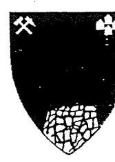

TATABÁNYA MEGYEI JOGÚ VÁROS
SCHMIDT CSABA
polgármester

Államigazgatási Számvevőszék

2011.01.11 2011 SZPI 02.

Ikt. sz.: 101-587/1/2011
Tárgy: Jelentés tervezet véleményezése

Tisztelt Elnök Úr!

Budapest
Apáczai Csere János u. 10.
1052

Tisztelt Elnök Úr!

Hivatkozással 2011. július 25-én kelt, V-3004-37-7/2011. számú levelére, az alábbiakban
megtesszük észrevételeinket a Tatabánya Megyei Jogú Város Önkormányzata pénzügyi
helyzetének ellenőrzéséről szóló jelentés tervezetükre.

- Az „I. Összegző megállapítások, következtetések, javaslatok" fejezetben részletesen
kifejtésre kerültek az Önkormányzat által különböző gazdasági társaságokban birtokolt
részesedések, az ezzel kapcsolatos kötelezettségvállalások, tőkejuttatások. A társaságokra
vonatkozó teljes kép kialakításához azonban véleményünk szerint nem elegendő csupán a
kötelezettségek, kockázatok kiemelése. Az önkormányzati társaságok tényleges helyzetének
kiegyensúlyozott bemutatása nézetünk szerint szükségessé teszi a társaságok által az
önkormányzat részére biztosított kifizetések (osztalékelőleg, osztalék) hasonlóan hangsúlyos
bemutatását.

A jelentés-tervezet ugyan megemlíti, hogy a város az általa kibocsátott kötvény biztosította
források egy részéből finanszírozta a Tatabányai Erőmű Kft.-ben történt tulajdonszerzését, de
csupán annak az eladósodottsági mutatókra gyakorolt hatását elemzi. Ugyanakkor hiányoljuk
annak a kiemelését, hogy az üzletrészvásárlás következtében Tatabánya Megyei Jogú Város
Önkormányzata az években jelentős bevételeket realizált. Kérjük ennek a hiányosságnak a
pótlását.

- Az ugyanezen fejezetben – a 20-21. oldalon – foglaltak szerint:

„Az Önkormányzat intézményeinél és a Polgármesteri Hivatalnál a 60 napot meghaladó,
szállítók felé fennálló kötelezettségek miatt - a helyi önkormányzatok adósságrendezési

2800 Tatabánya V., Fő tér 6. 34/515-777 Fax: 34/515-793
www.tatabanya.hu E-mail: polgarmester@tatabanya.hu

---

eljárásáról szóló 1996. évi XXV. törvény 5. § (2) bekezdésében foglaltak ellenére - a Polgármester nem kezdeményezett adósságrendezési eljárást."

A 2010. év végi záró szállítóállományunkban - ahogy ezt az ellenőrzést végző számvevők felé jeleztük is - szerepelnek azok a számlák is, amelyek a Sárberki Általános Iskola rekonstrukciójával kapcsolatosak és szállítói finanszirozási módszerrel, az állam által kerülnek kiegyenlítésre közvetlenül a beruházást végző szállító részére. Könyveléstechnikailag, amíg az EU-s támogatást folyósító szervezet nem küld számunkra értesítést arról, hogy közvetlenül fizetett a szállítónak, addig a mérlegünkben szállítói tartozásként kell kimutatnunk a benyújtott számlákat.

A Polgármesteri Hivatal könyveiben kimutatott 0-30 napos lejárt szállítóállományból (94 129 E Ft) a jelzett beruházással kapcsolatosan fizetendő összeg 85 800 E Ft, a 30-60 napos 47 486 E Ft-os állományból 46 500 E Ft. (Az ezeken túlmenően fennmaradó minimális mértékű tartozásállományt elsősorban a számlák késői beérkezése - 2011. január első néhány napja - indokolja).

Véleményünk szerint ezekből az adatokból látható, hogy az a tény, hogy az Önkormányzat lejárt szállítói tartozásállománnyal rendelkezett az év végén nem az Önkormányzat anyagi helyzetére vezethető vissza, hanem elszámolás-technikai okokkal magyarázható. Ebből következően az Önkormányzat, illetve a Polgármester felelőssége ebben az esetben nem áll fenn az adósságrendezési eljárás meg nem indítása miatt.

Ezért kérjük, hogy az idézett mondatot törölni szíveskedjenek.

- A Polgármester számára a 2. pontban szereplő javaslatokkal kapcsolatosan kérjük annak megfontolását, hogy az intézkedési terv elkészítésére 2012. június 30-i határidővel kerüljön sor. A határidő meghosszabbítása lehetővé tenné azt, hogy az Országgyűlés őszi ülésszaka által elfogadandó új önkormányzati törvény, illetve a jövő évi állami költségvetés ismeretében készüljön el az intézkedési terv.
- Ugyanezen pont g) alpontjában javasolják az említett intézkedések eredményeinek legalább félévenkénti áttekintését. Ezt az áttekintést véleményünk szerint elegendő lenne évenként végrehajtani.
- A fentebb leírtak alapján a Főjegyzőnek javasolt intézkedések közt a 4. pontban szereplő, a szállítóállománnyal kapcsolatos intézkedések megtétele vonatkozó javaslatot szintén indokolatlannak tartjuk.
- A Főjegyzőnek tett javaslatok 3. pontja szerint a Főjegyzőnek folyamatosan figyelemmel kell kísérnie a minősített többségi tulajdonú gazdasági társaságok kötelezettségeinek alakulását, az önkormányzat likviditására, pénzügyi-egyensúlyi helyzetére gyakorolt hatását. Véleményünk szerint a kötelezettségek alakulásának figyelemmel kísérése jelenleg is folyamatosan megvalósul, tekintettel arra, hogy a társaságok alapító okiratai, valamint társasági szerződései bizonyos értékhatár feletti kötelezettségvállalást a társaság legfőbb szervének hozzájárulásához kötik vagy a társaságoknál ügydöntő felügyelőbizottság működik.

Megjegyezni kívánjuk továbbá azt is, hogy az Önkormányzat likviditására, pénzügyi-egyensúlyi helyzetére csak akkor van hatása a cégek kötelezettségvállalásainak (ide nem értve

---

a készfizető kezességvállalásokat), ha az Önkormányzat, mint tulajdonos magatartásával (tartósan hátrányos üzletpolitikát folytat, és ezáltal az ellenőrzött társaság kötelezettségeinek teljesítését jelentősen veszélyezteti) a korlátozott felelősséget áttöri.

- A Főjegyző részére az 5. pontban megfogalmazott javaslatokra vonatkozóan elismerjük a számvevők kifogásának jogosságát. (A hitelszerződésekben a hitel fedezeteként az „önkormányzat költségvetése" kitétel szerepel). A jövőben az esetleges hitelfelvételek lebonyolítása során az Ötv. előírásaival összhangban fogjuk meghatározni a hitelek fedezetét. Azonban kérjük Önöket, hogy a hitel- és kötvény-szerződések módosításától szíveskedjenek eltekinteni, mivel a jogszabályi keretek ebben a tekintetben egyértelműek, és nyilvánvalóan csak az Ötv. által meghatározott, erre a célra igénybe vehető bevételeink fedezetbe vonására terjednek ki a lehetőségeink.
- Ugyancsak a Főjegyző részére a 6. pontban leírtakkal kapcsolatosan jelezzük, hogy a lízingszerződéshez kapcsolódó évenkénti kötelezettségvállalások fedezetének bemutatása a költségvetési rendeletek előterjesztési szövegében rendszeresen megvalósul. Az éves adósságszolgálat forrását minden esetben bemutatjuk.
- A Főjegyző számára a 8. pontban - nem nevesítve - a TKTV Kft. (100%-os önkormányzati tulajdonú társasággal) kapcsolatosan fogalmaz meg javaslatot a tervezet. Véleményünk szerint a javaslat indokolatlan, hiszen az önkormányzat csak a társaság jegyzett tőkéjének erejéig felel a hitelezőkkel szemben, tekintettel arra, hogy a felszámolási eljárás elrendelését követően hitelezői pert tartósan hátrányos üzletpolitika folytatása miatt nem indított.

Mivel a korlátozott felelősség áttörésére nem került sor, az önkormányzat gazdálkodását a társaság helyzete csupán a törzstőke erejéig (5 millió Ft) befolyásolná, de mivel a részesedéssel kapcsolatosan a teljes lehetséges értékvesztés elszámolásra került, az Önkormányzat jövőbeni gazdálkodására a társaság működése nincs befolyással.

Kérem fenti észrevételeim szíves figyelembevételét.

Tatabánya, 2011. augusztus 23.

Tisztelettel:
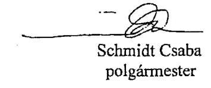

---

.

---

# Schmidt Csaba úr 

polgármester
Tatabánya Megyei Jogú Város Önkormányzata

## Tatabánya

## Tisztelt Polgármester Úr!

Köszönettel vettem észrevételeit a Tatabánya Megyei Jogú Város Önkormányzata pénzügyi helyzetének ellenőrzéséről készített jelentés-tervezetben foglalt megállapításokra, azok értékelése, szakmai és jogi kontrollja megtörtént.

## A Polgármester Úr által tett észrevételek közül - a jelentés-tervezet megfelelő módosítása mellett - az alábbiakat elfogadom:

- az észrevételek első francia bekezdése alapján az önkormányzati társaságok tényleges helyzetének bemutatása érdekében az „Összegző megállapítások, következtetések, javaslatok" részben a 18. oldal második bekezdésében rögzítésre kerülnek a társaságok által az Önkormányzat részére biztosított kifizetések is - közöttük a Tatabányai Erőmű Kft.-től kapott osztalék -, az alábbiak szerint: „Az Önkormányzat 2007-2010 között a gazdasági társaságokban levő tulajdonrésze után három gazdasági társaságtól változó mértékű osztalékot kapott. A kapott osztalék összege a 2007.
 évben 49 millió Ft, 2008-ban 33 millió Ft (két társaságtól), 2009-ben 48 millió Ft, a 2010. évben osztalék-előleggel együtt 349 millió Ft volt. Az Önkormányzat 2010. évben a kötvénykibocsátásból származó forrásából a Tatabányai Erőmű Kft-ben 51% tulajdoni részesedést szerzett, az osztalék 73%-át kapta a gazdasági társaságtól osztalékelőlegként."
- az észrevételek második francia bekezdése alapján, a jelentés 20-21. oldalairól törlésre kerül az alábbi mondat: „Az Önkormányzat intézményeinél és a Polgármesteri Hivatalnál a 60 napot meghaladó, szállítók felé fennálló kötelezettségek miatt - a helyi önkormányzatok adósságrendezési eljárásáról szóló 1996. évi XXV. törvény 5. § (2) bekezdésében foglaltak ellenére - a Polgármester nem kezdeményezett adósságrendezési eljárást." Ehhez kapcsolódóan törlésre került az észrevételek ötödik francia bekezdésében foglaltaknak megfelelően a Főjegyzőnek javasolt intézkedések közül a 4. pont is;
- az észrevételek harmadik francia bekezdése alapján a Polgármester részére a 2. pontban szereplő javaslathoz tett észrevételét a végleges jelentés nem tartalmazza. A polgármester

---

úrnak tett 1. számú javaslat: „a Közgyűlés elé terjesztendő intézkedési terv írja elő a működés pénzügyi egyensúlyának hosszú távú fenntarthatósága érdekében - felelősök és határidők megjelölésével - olyan program készítését, amely tartalmazza az alábbiakat:";

- az észrevételek negyedik francia bekezdése alapján az önkormányzati működés pénzügyi egyensúlyára való tekintettel a Polgármester számára tett 2. pont g) alpontja esetében elegendő a javasolt intézkedések eredményeinek áttekintését évenként végrehajtani;
- az észrevételek nyolcadik francia bekezdése alapján törlésre kerül a Főjegyzőnek javasolt 6. pont, amely a lízingszerződéshez kapcsolódó évenkénti kötelezettségvállalások fedezetének bemutatására vonatkozott.

# A Polgármester Úr által tett észrevételek közül az alábbiakat nem fogadom el: 

- az észrevételek hatodik francia bekezdése alapján a Főjegyzőnek tett javaslatok közül a korábbi 3. pontban foglaltakhoz tett észrevételét, mivel a Főjegyzőnek célszerű folyamatosan biztosítani annak figyelemmel kísérését, hogy a minősített többségi tulajdonú gazdasági társaságok kötelezettségei az önkormányzat likviditási, pénzügyi-egyensúlyi helyzetére milyen hatást gyakorolnak (a végleges jelentésben a Főjegyzőnek tett, 8. számú javaslat). Az észrevételben adott indoklás azért nem fogadható el, mivel azzal, hogy a gazdasági társaságok alapító okiratai, társasági szerződései bizonyos értékhatárt meghaladó kötelezettségvállalást a társaság legfőbb szervének hozzájárulásához kötik, vagy a társaságnál ügydöntő felügyelőbizottság működik, nem oldják meg a javaslatként írt minősített többségi tulajdonú gazdasági társaságok kötelezettségeinek az Önkormányzat pénzügyi likviditási helyzetére gyakorolt hatásának folyamatos figyelemmel kísérését az Önkormányzat részéről;
- az észrevételek hetedik francia bekezdése alapján a Főjegyzőnek tett javaslatok közül a korábbi 5. pontban foglaltakhoz tett észrevételét, mivel a helyi önkormányzatokról szóló 1990. évi LXV. törvény 88. § (1) bekezdés b) pontja meghatározza a hitel fedezetéül felajánlható bevételek körét és a Polgári Törvénykönyvről szóló 1959. évi IV. törvény 200. § (1) bekezdése alapján szükséges a meglévő szerződések módosítása (a végleges jelentésben a Főjegyzőnek tett, 9. számú javaslat);
- az észrevételek kilencedik francia bekezdése alapján a Főjegyző számára tett javaslatok közül a korábbi 8. pontban tett észrevételét, mivel a csődeljárásról és a felszámolási eljárásról szóló 1991. évi XLIX. törvény 63. §-a alapján az Önkormányzat a minősített többséget biztosító befolyása alatt álló és az egyszemélyes gazdasági társaság minden kötelezettségéért korlátlan és teljes felelősséggel felel, valamint a gazdasági társaságokról szóló 2006. évi IV. törvény 54. § (2) bekezdése szerint, ha az ellenőrzött társaság felszámolásra került, a minősített befolyásszerző többek között korlátlan felelősséggel tartozik a társaság minden olyan kötelezettségéért, amelynek kielégítését a felszámolási eljárás során az adós ellenőrzött társaság vagyona nem fedez (a végleges jelentésben a Főjegyzőnek tett, 11. számú javaslat). A

---

jelentés részletes megállapításaiban rögzítettük, hogy a teljes, korlátlan felelősséget a bíróság állapíthatja meg, a jelentés figyelemfelhívást tartalmazott ennek kockázatára.

Köszönöm Polgármester Úrnak és munkatársainak az ellenőrzés során tanúsított hozzáállását, amellyel az Önkormányzatról készített pénzügyi helyzetelemzés elkészítését segítették.

Budapest, 2011. december " 22 ".
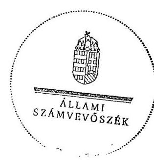

Tisztelettel:
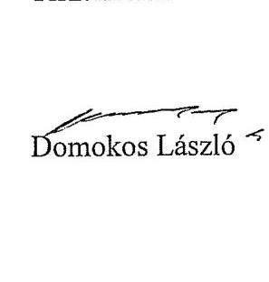

---

.
