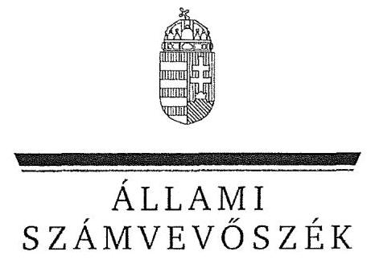

ÁLLAMI
SZÁMVEVŐSZÉK

# JELENTÉS 

Veszprém Megyei Jogú Város Önkormányzata pénzügyi helyzetének ellenőrzéséről (43/3)

---

# Számvevői Iroda 

Iktatószám: V-3053-13/2011.
Témaszám: 1015
Vizsgálat-azonosító szám: V056052

## Az ellenőrzést felügyelte:

Dr. Varga Sándor
számvevő igazgató-helyettes
Az ellenőrzést vezette:
Renkó Zsuzsanna
számvevő tanácsos
Az ellenőrzést végezték:

| Ébner Vilmosné | Szarvas Szilárd | Komlósiné Bogár Éva |
| :-- | :-- | :-- |
| számvevő tanácsos | számvevő tanácsos | számvevő tanácsos |

A témához kapcsolódó eddig készített számvevőszéki jelentés:
címe
sorszáma
Jelentés a Veszprém Megyei Jogú Város Önkormányzata gazdálko- 1017 dási rendszerének 2010. évi ellenőrzéséről

---

# TARTALOMJEGYZÉK 

BEVEZETÉS ..... 5
I. ÖSSZEGZŐ MEGÁLLAPÍTÁSOK, KÖVETKEZTETÉSEK, JAVASLATOK ..... 16
II. RÉSZLETES MEGÁLLAPÍTÁSOK ..... 27

1. Az Önkormányzat kötelező és önként vállalt feladatai ..... 27
2. Pénzügyi egyensúlyi helyzet alakulása ..... 33
2.1. A múködési és a felhalmozási egyensúly alakulása ..... 33
2.2. Az Önkormányzat bevételeinek alakulása ..... 40
2.3. Az Önkormányzat kiadásainak alakulása ..... 43
3. Kötelezettségek bemutatása ..... 48
3.1. A pénzintézetek felé fennálló kötelezettségek alakulása ..... 48
3.2. Szállítók felé fennálló kötelezettségek alakulása ..... 54
3.3. Egyéb kötelezettségek alakulása ..... 55
4. A pénzügyi egyensúly megteremtése érdekében hozott intézkedések ..... 60
5. A helyi önkormányzatok gazdálkodási rendszerének 2010. évi ellenőrzése során a pénzügyi egyensúly javítására tett szabályszerűségi és célszerűségi javaslatok hasznosulása ..... 63

---

# MELLÉKLETEK 

1. számú A múködési és felhalmozási célú hiány/többlet alakulása az Önkormányzat rendeleteiben
2. számú Az Önkormányzat bevételeinek és kiadásainak, adósságszolgálatának alakulásáról
3. a számú Az Önkormányzat 2007-2010 években megvalósított, 2010. december 31ig befejezett fejlesztései forrásösszetételéről
4. b számú Az Önkormányzat 2010. december 31-én folyamatban lévő fejlesztési feladataihoz kapcsolódó kötelezettségeinek összegzéséről
5. c számú Az Önkormányzat 2010. december 31-én folyamatban lévő fejlesztési feladataihoz kapcsolódó 2010. évet követő kötelezettség-vállalásainak öszszegzéséről
6. d számú Az Önkormányzat beadott, elbírálás alatti pályázati forrásból megvalósuló fejlesztéseihez kapcsolódó kötelezettség-vállalásainak összegzéséről
7. számú Az önkormányzati feladatok ellátásában résztvevő gazdasági társaságokról
8. számú Veszprém Megyei Jogú Város Önkormányzat Polgármesterének észrevétele
9. számú Veszprém Megyei Jogú Város Önkormányzat Polgármesterének észrevételére adott válasz

## FÜGGELÉKEK

Veszprém Megyei Jogú Város önkormányzati feladatainak ellátásában résztvevő gazdasági társaságok jellemző adatairól (3 oldal)

---

# RÖVIDÍTÉSEK JEGYZÉKE 

## Törvények

Art.
Áht.
ÁSZ tv.

Csőd tv.
Gt.
Htv.

Kbt.
Ötv.
Számv. tv.

## Rendeletek

Áhsz.

SzMSz
vagyongazdálkodási rendelet

## Szórövidítések

áfa
ÁSZ
Bábszínház
Bakonykarszt Zrt.
BM
EDP hiány/egyenleg
Egyetemi Stadion Kft.
EU
gazdasági program

GDP
Hulladékgazdálkodási Kft.
Innovációs Centrum Kft.
az adózás rendjéről szóló 2003. évi XCII. törvény az államháztartásról szóló 1992. évi XXXVIII. törvény az Állami Számvevőszékről szóló 1989. évi XXXVIII. törvény (2011. július 1-jétől az Állami Számvevőszékről szóló 2011. LXVI törvény)
a csődeljárásról és a felszámolási eljárásról szóló 1991. évi XLIX. törvény
a gazdasági társaságokról szóló 2006. évi IV. törvény a helyi önkormányzatok és szerveik, a köztársasági megbízottak, valamint egyes centrális alárendeltségú szervek feladat- és hatásköreiről szóló 1991. évi XX. törvény a közbeszerzésekről szóló 2003. évi CXXIX. törvény a helyi önkormányzatokról szóló 1990. évi LXV. törvény a számvitelről szóló 2000. évi C. törvény
az államháztartás szervezetei beszámolási és könyvvezetési kötelezettségének sajátosságairól szóló 249/2000. (XII. 24.) Korm. rendelet

Veszprém Megyei Jogú Városi Önkormányzat Közgyűlésének 9/2011. (III. 31.) önkormányzati rendelete az Önkormányzat Szervezeti és Múködési Szabályzatáról
Veszprém Megyei Jogú Városi Önkormányzat Közgyűlésének 22/2010. (VI. 28.) önkormányzati rendelete az Önkormányzat vagyonáról, a vagyongazdálkodás és vagyonhasznosítás szabályairól
általános forgalmi adó
Állami Számvevőszék
Kabóca Bábszínház és Gyermek Közművelődési Központ
Bakonykarszt Víz- és Csatornamú Zrt.
Belügyminisztérium
Uniós módszertan szerinti maastrichti kritériumoknak megfelelő számítás szerinti hiány/egyenleg
Veszprémi Egyetemi Stadion Nonprofit Kft.
Európai Unió
Veszprém Megyei Jogú Város Önkormányzata Közgyűlésének 66/2011. (IV. 1.) számú határozata Veszprém Megyei Jogú Város 2011-2014. évi gazdasági programjáról
Bruttó hazai termék
Észak-Balatoni Hulladékgazdálkodási Kft.
Veszprémi Regionális Innovációs Centrum Nonprofit Kft.

---

| jegyző | Veszprém Megyei Jogú Városi Önkormányzatának jegyzője |
| :--: | :--: |
| KNGI | Középfokú Nevelési Központ Gazdasági Igazgatósága |
| Közgyűlés | Veszprém Megyei Közgyűlés |
| KSH | Központi Statisztikai Hivatal |
| MÁK | Magyar Államkincstár |
| MTESZ | Múszaki és Természettudományi Egyesületek Szövetsége |
| NAV | Nemzeti Adó- és Vámhivatal |
| NGM | Nemzetgazdasági Minisztérium |
| Növény és Vadaspark Kft. | Kittenberger Kálmán Növény és Vadaspark Nonprofit Kft. |
| OEP | Országos Egészségbiztosítási Pénztár |
| OEPMSzSz | Oktatási és Egészségügyi Pénzügyi Műszaki Szolgáltató Szervezet |
| Önkormányzat polgármester | Veszprém Megyei Jogú Városi Önkormányzata   Veszprém Megyei Jogú Városi Önkormányzatának polgármestere |
| Polgármesteri hivatal | Veszprém Megyei Jogú Városi Önkormányzat Polgármesteri Hivatala |
| PPP konstrukció | Public Private Partnership (Partnerségi együttmúködés közfeladatok ellátására a magánszektor bevonásával) |
| Pro Veszprém Kft. | Pro Veszprém Városfejlesztési és Befektetés-ösztönző Kft. |
| Szeretetszolgálat szja | Magyar Máltai Szeretetszolgálat Egyesület személyi jövedelemadó |
| társulás ${ }_{1}$ | Észak-Balatoni Térség Regionális Települési Szilárdhulladék Kezelési Önkormányzati Társulás |
| társulás ${ }_{2}$ | Veszprém és Térsége Szennyvízelvezetési és Kezelési Önkormányzati Társulás |
| TISZK Kft. | Pannon TISZK Szakképzési-szervezési Veszprém Nonprofit Kft. |
| Turisztikai Kft. | Veszprémi Turisztikai Nonprofit Kft. |
| Ünnepi Játékok Kft. | Veszprémi Ünnepi Játékok Kft. |
| Veszprém Aréna | A Veszprém 0213/85 hrsz.-ú ingatlanon 2008-ban felépült multifunkcionális rendezvénycsarnok |
| Veszprém TV Kft. | Veszprém Televízió és Lapkiadó Kft. |
| VKSZ Zrt. | Veszprémi Közüzemi Szolgáltató Zrt. |
| VKTT | Veszprémi Kistérség Többcélú Társulás |
| VMKK | Városi Múvelődési Központ és Könyvtár |

---

# JELENTÉS 

## Veszprém Megyei Jogú Város Önkormányzata pénzügyi helyzetének ellenőrzéséről

## BEVEZETÉS

Az Állami Számvevőszék 2011. évtől érvényes stratégiája új irányt szabott a helyi önkormányzatok gazdálkodásának ellenőrzésében is. Az ÁSZ - küldetése és jövőképe szerint - szilárd szakmai alapokra támaszkodva értékteremtő ellenőrzéseivel és helyzetelemzéseivel az államháztartás egészében, így a helyi önkormányzati alrendszerben is elő kívánja segíteni a közpénzek és a közvagyon szabályos, gazdaságos, hatékony és eredményes hasznosítását. Ennek részeként - a 2010. évi államháztartási hiány alakulásának összetevőire is figyelemmel folyamatban van az önkormányzati alrendszer pénzügyi helyzetelemzése.

Az NGM 2011 áprilisában közzétett adatai szerint ${ }^{1}$ a 2010. évi 1036,2 milliárd Ft összegű 3,8\%-os EDP (maastrichti kritériumok szerinti, Túlzott Hiány Eljárás keretében kimutatott) hiánycél nem volt tartható, az önkormányzati alrendszer tervezettet meghaladó hiánya miatt a GDP arányában kifejezett államháztartási hiány $4,2 \%$-ra emelkedett.

Az önkormányzatok 2010 első három negyedévi költségvetési jelentése szerinti pénzforgalmi hiány 97 milliárd Ft-os összege nem indokolta az önkormányzati alrendszer 190 milliárd Ft-ra becsült hiányának 2010. évi végi felülvizsgálatát. A helyi önkormányzatok 2011. januári gyorsjelentése alapján a pénzforgalmi hiány már 247,7 milliárd Ft-ot tett ki. Az alrendszer hiánya így a tervezett $0,7 \%$-kal szemben magasabb, $0,9 \%$-os szinten realizálódott. Az 57,7 milliárd Ft hiánytöbblet alakulásában - a Tájékoztató szerint - az iparűzési adó elmaradása, a gépjárműadó, az illetékek és más bevételek tervezettnél alacsonyabb összegben való teljesülése volt a meghatározó.

Magyarország a Széll Kálmán Terv célkitűzései alapján ${ }^{2}$ aktualizált Konvergencia Programjában a középtávú (2011-2015. évek) költségvetési pálya kijelölése során 2011-re a kormányzati szektor EDP módszertan szerinti egyenlegét $+2 \%$ -

[^0]
[^0]:    ${ }^{1}$ NGM Tájékoztatás Magyarország Strukturális Reformprogramjának végrehajtásáról (2011. április 1). A Tájékoztató évente két alkalommal - április és október hónapban jelenik meg.
    ${ }^{2}$ Az államháztartás 2011. évi egyenlege - a magán nyugdíjpénztárakból az állami nyugdíjpillérbe való visszatérés egyszeri vagyonhatása következtében - 4\%-os többletet mutatna. A Széll Kálmán Tervben foglalt egyszeri intézkedések - a MÁV, a BKV adósságrendezése, a PPP projektek kiváltása - összességében a GDP 2\%-ával csökkentik a várható többlet mértékét.

---

ban jelölte meg. Az egyenlegcél megfogalmazásakor az önkormányzati alrendszer tervezett hiányát a 2011. évi költségvetésben szereplő $0,3 \%$-kal szemben, $0,5 \%$-os arányban határozták meg ${ }^{3}$. A hiánycélok meghatározása jelzi, hogy az önkormányzati alrendszerben 2011-ben fokozott figyelmet kell fordítani a pénzügyi egyensúlyi helyzet alakulására.

Az államháztartás helyi szintjén a 23 megyei jogú városi önkormányzatnak az általuk ellátott közszolgáltatások volumenére való tekintettel kiemelt szerepe van, e települések népessége összességében meghaladja a kétmillió főt ${ }^{4}$. A települések népességét az alábbi diagram szemlélteti:
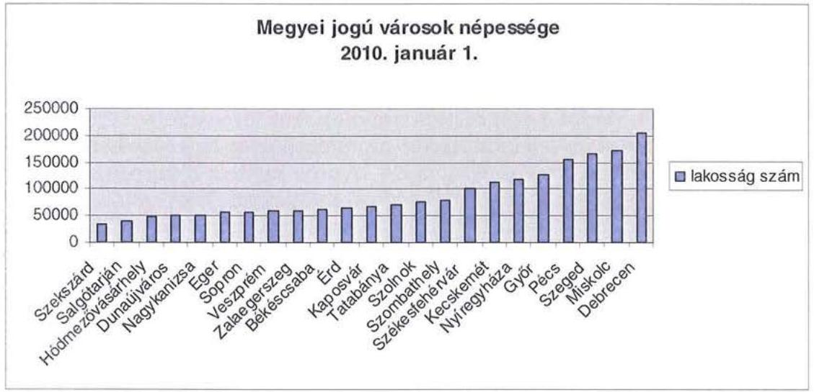

A megyei jogú városi önkormányzatok ${ }^{5}$ kötelező feladatellátását többlépcsős törvényi előírások határozzák meg. A feladatokra vonatkozó szabályozás első szintjét az Ötv. ${ }^{6}$, a második szintet a hatásköri7, a harmadik szintet a további ágazati, szakmai (egyebek mellett az oktatási, egészségügyi, szociális és egyéb ágazati feladatok ellátásának szakmai szabályait rögzítő) törvények adják.

A megyei jogú városi önkormányzatok - az Ötv-ből közvetlenül levezethető települési feladatok mellett körzeti közszolgáltatásokat is ellátnak. A megyei

[^0]
[^0]:    ${ }^{3}$ A Magyar Köztársaság 2011. évi költségvetéséről szóló 2010. évi CLXIX. törvény Általános indoklásának III. fejezete, valamint Magyarország Konvergencia Programja 2011-2015. (2011. április) Táblázatok rész, 2. táblázat Âllamháztartás összefoglaló adatai szerint.
    ${ }^{4}$ A megyei jogú városok népességét a 4/2011. (I. 31.) NGM rendelet 1. sz. mellékletében foglalt 2010. január 1-i adatok alapján vettük figyelembe.
    ${ }^{5}$ Az Ötv. 61. § (1) bekezdése alapján a megyeszékhely város a törvény erejénél fogva megyei jogú, ugyanakkor az Országgyúlés az ötvenezernél nagyobb népességű városokat a képviselőtestület kérelmére megyei jogú várossá nyilváníthatja. Ez utóbbi körbe 5 város tartozik, közülük 2 (Hódmezővásárhely, Dunaújváros) népessége 2010. január 1-ére már ötvenezer fő alá csökkent.
    ${ }^{6}$ az Ötv. 8. és 61. §-ában foglaltak szerint
    ${ }^{7}$ a Htv.

---

jogú városi cím elsősorban többlet kötelezettségekkel jár, a megyei jogú városnak önmagának kell gondoskodnia mindazokról a feladatokról, amelyek más települési önkormányzatok esetében a megyei önkormányzat feladatát képezik. Ide sorolható többek közt a középfokú oktatási intézmények fenntartása, a közművelődési, könyvtári és levéltári szolgáltatás, a társadalombiztosítás finanszírozása mellett a kórházi és a rendelőintézeti szakellátás, a szociális és egyes gyermekvédelmi feladatok ellátása. Ezeket a feladatokat (intézményeket) a megyei jogú város - más városoktól eltérően - nem adhatja át a megyei önkormányzatnak, azonban az Ötv. lehetőséget biztosít arra, hogy a megyei önkormányzattal megállapodjék a feladatellátás megosztásában.

Az önkormányzat, így a megyei jogú város is, maga határozza meg, hogy - a lakosság igényei alapján, anyagi lehetőségei függvényében - mely feladatokat, milyen mértékben és módon, mely szervezeti keretek közt lát el. A szervezetalakítás szabadsága a megyei jogú városok esetében azzal járt, hogy mind a kötelező közszolgáltatásoknál (különösen a településüzemeltetés, vagyongazdálkodás), mind pedig az önként vállalt feladataik ellátásában - elsősorban a sport és kulturális szolgáltatások területein - a gazdasági társaságok kiemelt fontosságú szerephez jutottak. Ily módon a gazdálkodás, a pénzügyi helyzet kockázatai közvetlenül kikerültek ugyan az önkormányzati alrendszerből, azonban sérülhet az ellátási felelősség figyelemmel kísérése és érvényesítése, a közpénzek felhasználásának transzparenciája. Mindezek együttvéve - a beszámolók konszolidálásának hiányában - növelik a megyei jogú városok pénzügyi helyzetének megítélésében rejlő kockázatokat.

Az áttekintett időszakban az önkormányzati feladatok ellátásának keretet biztosító forrásszabályozás elvei lényegesen nem változtak.

A megyei jogú városok önkormányzatainak mozgásterét, az önkormányzatok feladatellátásra vonatkozó döntéseit a központi költségvetéstől való függőség mellett jelentősen befolyásolja a helyi adókivetési jog gyakorlása ${ }^{8}$. A helyi adók rendszere a közszolgáltatások finanszírozásához szükséges források megteremtésének, bővítésének eszköze, amely a gazdasági válság, a jogszabályi környezet, az adópolitika változása, az adóhatóságok tevékenysége következtében differenciáltan érinti a települési önkormányzatokat ${ }^{9}$.

A települési önkormányzatok saját folyó bevételeinek keretében elszámolt, különböző jogcímeken kivetett helyi adók - iparűzési adó, építmény és telekadó, idegenforgalmi adó, vállalkozók és magánszemélyek kommunális adója -2007-2010 között eltérő módon emelkedtek. A helyi adókból származó bevételek összege országos szinten 2007-2009 között folyamatosan, 505,3 milliárd Ftról 566,3 milliárd Ft-ra emelkedett, majd a gazdasági válság hatásai következtében 2010-re 542,6 milliárd Ft-ra esett vissza. A helyi adók részesedése az ön-

[^0]
[^0]:    ${ }^{8}$ a helyi adókról szóló 1990 . évi C. törvény szabályai szerint
    ${ }^{9}$ Az Állami Számvevőszék 2010 decemberében közzétett 1031. számú jelentésében értékelte a helyi adók rendszerében a hatékonyság és az eredményesség érvényesülését.

---

kormányzatok saját folyó bevételein belül 2007-2010 között 2,5 százalékponttal csökkent ${ }^{10}$.

A megyei jogú városok saját folyó bevétele 2007-ben 191,5 milliárd Ft volt, 2008-ban 223,1, 2009-ben 225,4, 2010-ben 223,5 milliárd Ft-ot tett ki. A helyi adóbevételekből való részesedésük 2007-ben 110,5 milliárd Ft (21,9\%), 2008ban 128,3 milliárd Ft (23,2\%), 2009-ben 124,4 milliárd Ft (22\%), 2010-ben 118,7 milliárd Ft (részaránya a 2007. évivel azonosan 21,9\%) volt. A teljesített adóbevételek a megyei jogú városok saját folyó bevételeinek 2007-ben 57,7, 2008-ban 57,5, 2009-ben 55,2, 2010-ben 53,1\%-át jelentették. A helyi adóbevételek 2007-ről 2010-re kimutatott 4,6 százalékpontos csökkenése annak ellenére következett be, hogy a megyei jogú városok saját folyó bevétele 2010-ben $16,7 \%$-kal haladta meg a 2007. évit.

A helyi adókon belül a települések gazdasági helyzetének egyik fokmérője az elért helyi iparűzési adóbevétel, amely a megyei jogú városok körében erőteljes - a település nagyságrendtől is függő ${ }^{11}$ - különbségeket mutat. A helyi iparűzési adóbevétel és annak egy lakosra vetített összegének 2007. és 2010. évi alakulását az alábbi diagramok szemléltetik:
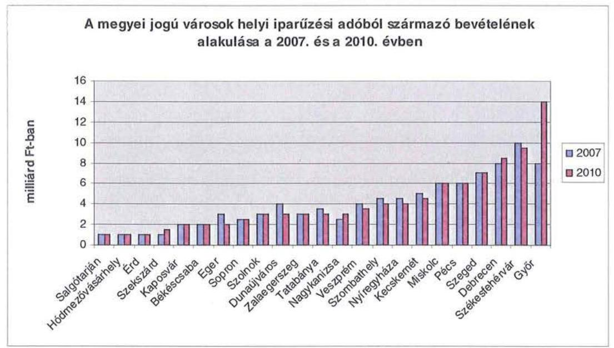

[^0]
[^0]:    ${ }^{10}$ A helyi adó bevételek saját folyó bevételekből való részesedése országosan 2007-ben $55,3 \%, 2010$-ben $52,8 \%$ volt.
    ${ }^{11}$ A 100 ezer fő feletti népességű megyei jogú városok csoportjába Debrecen, Miskolc, Szeged, Pécs, Győr, Nyíregyháza, Kecskemét, Székesfehérvár tartozik. Nem megyeszékhely megyei jogú város Érd, Sopron, Nagykanizsa, Dunaújváros, Hódmezővásárhely.

---

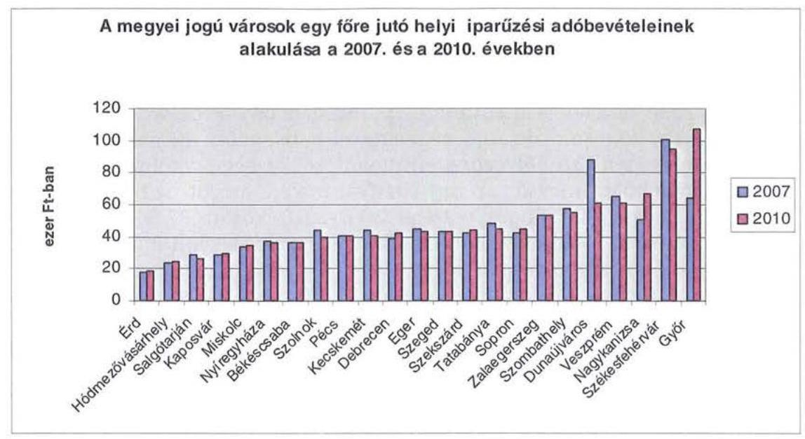

A megyei jogú városi önkormányzatok saját bevételein belül második legjelentősebb elem az illetékbevétel. A 2010. évben befolyt 39,2 milliárd Ft illetékbevétel a 2006. évben teljesített 71,1 milliárd Ft illetékbevétel alig több mint $55 \%$-a. A jelentős visszaesést döntően az ingatlanpiac stagnálása, majd visszaesése, illetve egyes illetékkedvezmények bevezetése okozta. A kieső bevételek pótlására az önkormányzati alrendszer szintjén történtek intézkedések, 2010ben 5 milliárd Ft-ot, 2011-ben 1,2 milliárd Ft-ot ellentételezett a központi költségvetés. A megyei jogú városok önkormányzatai az önkormányzati alrendszer szintjén keletkezett illetékbevételből 2007-ben 13,6 milliárd Ft-tal (23,3\%-kal), 2008-ban 15,3 milliárd Ft-tal ( $22,7 \%$-kal), 2009-ben 12,6 milliárd Ft-tal ( $21,5 \%$ kal), 2010-ben 7,9 milliárd Ft-tal ( $20,2 \%$-kal) részesedtek ${ }^{12}$. Az összes befolyt illetékbevételből a megyei jogú városok részesedése 2009-ről 2010-re mindössze 1,3 százalékponttal csökkent, ugyanakkor a teljesült illetékbevétel csökkenése a $37,3 \%$-ot ( 4,7 milliárd Ft) is elérte.

Az önkormányzati alrendszer átengedett bevételei közül a személyi jövedelemadóból való részesedés makroszintű szabályozása a vizsgált időszakban nem változott. A települési önkormányzatokat a településre kimutatott személyi jövedelemadó $8 \%$-a közvetlenül, míg $32 \%$-a külön szabályozott visszaosztási rendben illeti meg. A visszaosztás a jövedelem differenciálódás mérséklésével párosul, rendje a lakóhelyen maradó személyi jövedelemadóhoz és az iparűzési adó-erőképességhez ${ }^{13}$ igazodik, annak részletszabályait a mindenkori költségvetési törvény 4. számú melléklete határozza meg. A jövedelemdifferenciálódás

[^0]
[^0]:    ${ }^{12}$ Az illetékek kivetésének és beszedésének joga 2006. december 31-ig a megyei önkormányzatok feladata volt, amelyet a 2007. évtől az APEH (2011. január 1-jétől NAV) vett át. Az önkormányzati illetékrészesedési szabályok változatlanok maradtak, azonban az illetékbeszedés költségeit az önkormányzatok illetékbevételeiből átlagos (a megyei jogú városoknál $8,5 \%$-os) kulcsot alkalmazva vonták le.
    ${ }^{13}$ Az iparűzési adóerő-képesség egy potenciális, átlagos erőfeszítés mellett elérhető (a települési önkormányzat iparűzési adóelőlegét meghatározó adóalap 1,4\%-ának megfelelő számított) bevétel.

---

szabályai kétirányúak, a kiegészítés és a visszatartás feltételeit egyaránt meghatározták:

- Amennyiben az önkormányzatot közvetlenül megillető személyi jövedelemadó bevétel és a számított iparűzési adóerő-képesség együttesen számított, egy főre jutó összege nem érte el a település méretéhez kapcsolódóan az évenkénti szabályozás szerinti változó összeget, a költségvetés a részesedést település nagyság szerint eltérően meghatározott szintig - kiegészítette ${ }^{14}$. A kiegészítés fajlagos összege 2007-2010 között 37500 Ft-ról 48010 Ft-ra (10 510 Ft-tal, 28\%-kal) emelkedett. Az előzőeken túl a jövedelem differenciálódás szabályozása egyes térségi (középiskolai, szakiskolai, szakképző intézményi, kollégiumi) feladatok ellátásának függvényében további kiegészítő hozzájárulást biztosított.
- Amennyiben az egy főre számított személyi jövedelemadó és az iparűzési adóerő-képesség együttes összege a település nagyságrendjéhez rendelt értékhatárt több mint $25 \%$-kal (2010-től $20 \%$-kal) meghaladta, az egy főre jutó összeg sávonként differenciált módon ${ }^{15}$ visszavonásra került az önkormányzatot megillető normatív állami hozzájárulás összegéből.

Az önkormányzatok személyi jövedelemadó bevétele 2007-ben 494,3 milliárd Ft, 2008-ban 558,6 milliárd Ft, 2009-ben 639,5 milliárd Ft, 2010-ben 681,2 milliárd Ft volt, az időszak alatt összegében 186,9 milliárd Ft-tal, 37,8\%kal emelkedett, miközben az szja bevétel átengedett bevételeken belüli részesedése 1,8 százalékponttal emelkedett.

A megyei jogú városok önkormányzatainak személyi jövedelemadó részesedése az alrendszer átengedett személyi jövedelemadó bevételeiből 2007-ben 77,6 milliárd Ft-ot ( $15,7 \%$-ot), 2008-ban 105,4 milliárd Ft-ot ( $18,9 \%$-ot), 2009ben 122,9 milliárd Ft-ot ( $19,2 \%$-ot), 2010-ben 136,6 milliárd Ft-ot ( $20,1 \%$-ot) tett ki. A teljesült szja bevétel a megyei jogú városoknál az időszak alatt folyamatosan emelkedett, a 2010-ben teljesült adóbevétel 59,0 milliárd Ft-tal (76\%) volt magasabb a 2007. évinél, az átengedett bevételeken belüli részesedése 2010-re 5,1 százalékponttal haladta meg a 2007. évi részarányt ${ }^{16}$. A részesedés alapjául szolgáló szja településenként eltérő, az egy adózóra jutó szja 2009. évi adatait ${ }^{17}$ a következő ábra szemlélteti.

[^0]
[^0]:    ${ }^{14}$ A megyei jogú városok esetében a jövedelemkülönbségek mérséklésénél figyelembe veendő lakosonkénti értékhatár 2007-ben 37500 Ft, 2008-ban 42385 Ft, 2009-ben 45933 Ft, 2010-ben 48010 Ft volt.
    ${ }^{15}$ A sávos értékhatár 2010-től 20\%-os intervallumonként, 120\% felett a visszatartást $25 \%$-tól $90 \%$-os mértékig rögzíti. Amennyiben a település nagyságrendhez rendelt értékhatár összege az önkormányzatnál eléri vagy meghaladja a 200\%-ot, az egy főre jutó összeg $90 \%$-a levonásra kerül. Az értékhatár sávjai 2010 előtt $25 \%$-os léptékűek voltak, a levonási arányok az ellenőrzött időszakban nem változtak.
    ${ }^{16}$ E bevételek a megyei jogú városok átengedett bevételeiben 2007-ben 84,7, 2008-ban 87,7, 2009-ben 89,7, 2010-ben $89,8 \%$-os részarányt jelentettek.
    ${ }^{17}$ Adatforrás: KSH Megyei Jogú Városok a Közép Dunántúlon 2009. kiadványa, 4.1. sz. összehasonlító tábla.

---

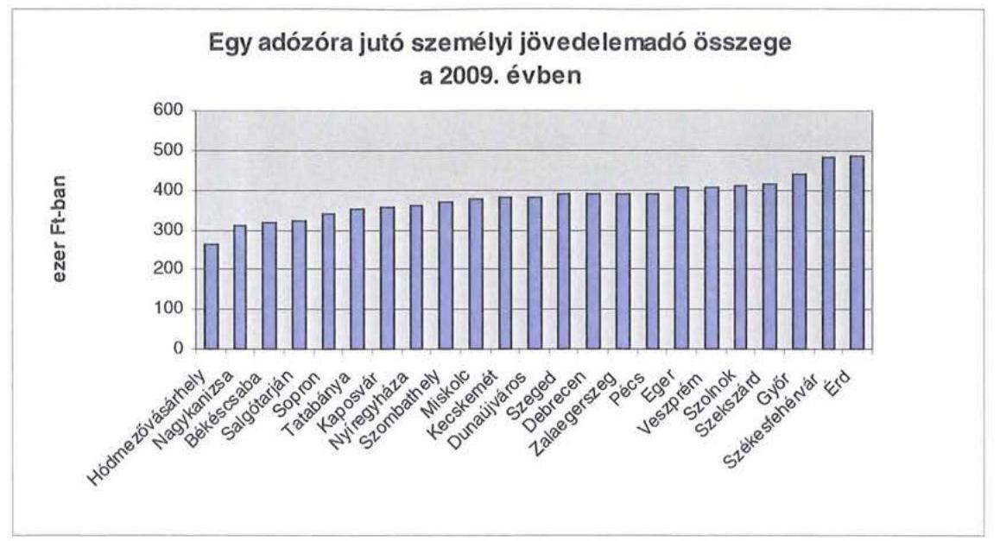

Az átengedett bevételek második legjelentősebb eleme a gépjármúadó, amelynek bevételi szabályozása az ellenőrzött időszakban nem változott, az adóbevétel teljes összege az önkormányzatot illeti meg. A gépjármúadó alapját, mértékét ${ }^{18}$ és egyes mentességi kategóriákat érintő módosítások 2010. január 1-től következtek be, amelyek az egyes adótételek esetében átlagosan $15 \%$-os emelkedéssel jártak.

A gépjármúadó beszedéséből származó bevétel az önkormányzati alrendszer szintjén 2007-ben 62,4 milliárd Ft, 2008-ban 65,7 milliárd Ft, 2009-ben 63,8 milliárd Ft, 2010-ben 71,1 milliárd Ft volt, az adóbevétel egésze 2007-hez képest 8,7 milliárd Ft-tal, 13,9\%-kal emelkedett. A gépjármú-adóztatás szabályainak változása 2010-ben 7,3 milliárd Ft többletet eredményezett. A megyei jogú városok gépjármúadó bevétele a 2007. évi 14,0 milliárd Ft-ról 2010-re 15,5 milliárd Ft-ra, 10,7\%kal emelkedett. A bevétel-növekedés összegéből 1,4 milliárd Ft a 2010. évi adózási szabályok következménye.

A megyei jogú városok önkormányzatai 2007-2010 között rendelkezésre álló forrásainak alakulását a következő ábra szemlélteti:

[^0]
[^0]:    ${ }^{18}$ A gépjármúadóról szóló 1991. évi LXXXII. törvény 7. § (1) bekezdésében foglalt adómértékek változása.

---

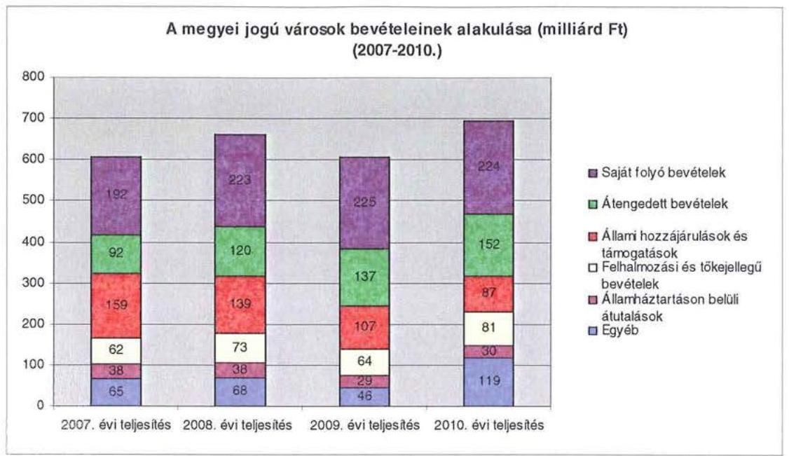

A megyei jogú városok saját folyó bevételeinek - amelyek fơbb elemei: a helyi adók, az illetékbevételek, az intézményi térítési díjak, a kamatbevételek részaránya a 2007. évi összbevételen ( 608 milliárd Ft) belül 32\% volt. A 2010. évi összbevétel 693 milliárd Ft-os összegéből a saját folyó bevételek aránya miközben összege 2007-ről 2010-re 32 milliárd Ft-tal emelkedett - nem változott.

Az átengedett bevételek, amelyek a megyei jogú városok önkormányzatainál döntően a személyi jövedelemadó és a gépjárműadó részesedést jelenti, az összbevételen belül a 2007. évi 92 milliárd Ft-ról (15\%) 152 milliárd Ft-ra nőtt, részesedése 7 százalékponttal emelkedett. A 60 milliárd Ft-os növekedésből 59 milliárd Ft-ot az szja részesedés emelkedése okozott.

Az állami hozzájárulások és támogatások - amelyek főbb elemei: főként az ellátotti létszámhoz kötődő normatív állami hozzájárulások, központosított előirányzatok - a 2007. évi 159 milliárd Ft-ról (26\%-os részarányról) 2010-re 87 milliárd Ft-ra (13\%-os részarányra) estek vissza.

A felhalmozási és tőkejellegú bevételek - tárgyi eszközök (ingatlanok és ingóságok), föld és immateriális javak, részesedések értékesítése, EU-tól átvett pénzeszközök - a 2007. évi 62 milliárd Ft-ról (10\%-os részarányról) 2010-re 81 milliárd Ft-ra (12\%-os részarányra) emelkedtek.

Az államháztartáson belüli átutalások részesedése 2007-ben 38 milliárd Ft volt. 2010. év végére 8 milliárd Ft-tal csökkent, részaránya 6\%-ról 2010-ben 4\%-ra változott. Ez a bevételi kategória tartalmazza az Egészségbiztosítási Alaptól és más elkülönített állami pénzalapoktól átvett forrásokat. A 2010-ben e címen elszámolt bevétel a megyei jogú városoknál 22 milliárd Ft-ot tett ki.

Az egyéb, pénzmaradványból, vállalkozási bevételekből, államháztartáson kívülről származó átutalásokból, a hitelekből, a hosszú és rövid lejáratú értékpapírok értékesítéséből származó bevételek részesedése a 2007-2010. évek vi-

---

szonylatában 11\%-ról 17\%-ra emelkedett. Ez utóbbiak 2010. évi beszámoló szerinti összevont teljesítése 119 milliárd Ft volt ${ }^{19}$.

Mindezeket figyelembe véve a megyei jogú városok 2007. és 2010. évi forrásöszszetételének megoszlását az alábbi ábra szemlélteti:

A megyei jogú városok 2007. és 2010. évi forrásösszetétele
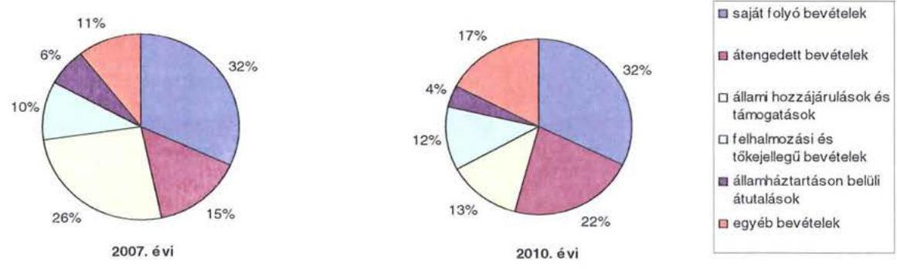

Az önkormányzati alrendszer pénzügyi helyzetértékelése során új elemzési módszereket alkalmaz az ellenőrzés. A hagyományos költségvetési szerkezet helyett az önkormányzat pénzügyi helyzetét a CLF módszerrel mutatjuk be, amelynek lényegét és számításának módszerét a 2.1. pontban, és a jelentés 2. számú mellékletében ismertetjük részletesen.

Az új módszereken alapuló helyzetértékelés fontosságát az adja, hogy a helyi önkormányzatok bruttó adósságállománya ${ }^{20}$ a 2010. évi költségvetési beszámoló alapján 1248 milliárd Ft-ot tett ki. Az adósságállomány koncentráltságát jelzi ${ }^{21}$, hogy ebből a 23 megyei jogú város részesedése 338 milliárd Ft volt, amely a fővárosi és kerületi önkormányzatok adósságának figyelmen kívül hagyásával számított 2010. évi 977 milliárd Ft összegű bruttó adósságállomány $34,6 \%$-át jelentette. Az adósságállomány több mint fele - 501 milliárd Ft - a 19 megyei önkormányzatnál és a 23 megyei jogú városnál jelentkezett.

[^0]
[^0]:    ${ }^{19}$ Az egyéb bevételek összege 2007-2010 között eltérő módon változott, 2007-ben 65 milliárd Ft, 2008-ban 68 milliárd Ft volt, 2009-ben 46 milliárd Ft-ra esett vissza, majd 2010-ben több mint két és félszeresére, 119 milliárd Ft-ra emelkedett.
    ${ }^{20}$ A bruttó adósságállomány 2010. év végi összege magában foglalja a fejlesztési és a működési célú kötvénykibocsátások, a beruházási és fejlesztési hitelek, a működési célú hosszú lejáratú hitelek, a rövid lejáratú hitelek, váltótartozások miatti kötelezettségek teljes (2011-ben, illetve az azt követő években esedékes) állományát.
    ${ }^{21}$ A megyei jogú városok adósságállománya összegében ugyan elmarad az egyéb városok összesített adósságától [(ez utóbbiak részesedése 382,6 milliárd Ft (39,2\%)], azonban az egyéb városok száma 304. A fővárosi és a kerületi önkormányzatok nélküli adósságállományból a 19 megyei önkormányzat 163 milliárd Ft-tal ( $16,8 \%$-kal), míg a nagyközségek, községek együttesen 93 milliárd Ft-tal ( $9,5 \%$-kal) részesednek.

---

A megyei jogú városok 338 milliárd Ft-os adósságállományából 175 milliárd Ft $(51,8 \%)$ a 8 legnagyobb, 100 ezer fő feletti népességű város tartozása. Az öt nem megyeszékhely megyei jogú város bruttó adósságállománya 70 milliárd Ft-ot ( $20,7 \%$-ot), az előző két csoportba nem tartozó további 10 megyei jogú város adóssága 93 milliárd Ft-ot ( $27,5 \%$-ot) tett ki.
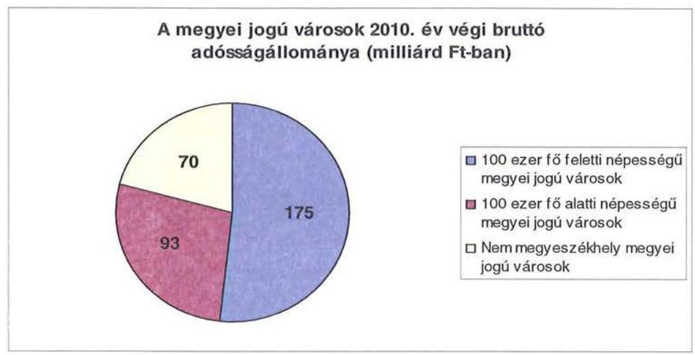

A mérlegben kimutatott bruttó adósságállomány mellett az önkormányzatok számára az eszközállomány múszaki állapotának megőrzése is kötelezettségekkel jár. Az elhasználódott eszközök pótlására forrást biztosító amortizációs (felújítási) alap képzésének ${ }^{22}$ elmaradása maga után vonhatja a feladatellátást kiszolgáló tárgyi eszközök állagának erőteljes romlását. Emellett a 2007-2013as időszakra meghirdetett, vissza nem térítendő EU-s fejlesztési forrásokhoz való hozzájutás lehetősége felerősítette az önkormányzati alrendszer fejlesztési igényeit, amelyek a felhalmozási költségvetési hiány folyamatos emelkedésén túl - az előírt jövőbeni fenntartási kötelezettség miatt - tovább terhelhetik az önkormányzatok költségvetését ${ }^{23}$.

Az ÁSZ a 2011. évi ellenőrzési tervében 43. számú, az Önkormányzatok gazdálkodási rendszerének ellenőrzése részeként egy időben, egymással párhuzamosan tekinti át, és elemzi a 23 megyei jogú városi önkormányzat pénzügyi helyzetét. A gazdálkodás szabályszerűségét az ÁSZ az előző évek során ebben az önkormányzati körben is ellenőrizte, ezért jelen vizsgálatunk erre nem tér ki. A jelentés a megyei jogú városok sajátos feladatellátási és forrásszabályozási helyzetére tekintettel az önkormányzatok pénzügyi helyzetét, illetve az ezzel összefüggő korábbi ÁSZ javaslatok megvalósítását mutatja be.

[^0]
[^0]:    ${ }^{22}$ Erre a jelenlegi szabályozási környezetben nem kötelezi semmilyen előírás az önkormányzatokat.
    ${ }^{23}$ Az Állami Számvevőszék 2011 júniusában közzétett 1108. számú, a helyi önkormányzatok fejlesztési célú támogatási rendszerének ellenőrzéséről szóló jelentésében feltárta a fejlesztési folyamatok problémáit. A helyi önkormányzatok elsősorban azokat a fejlesztéseket valósították meg, amelyekhez támogatást lehetett igényelni. A fejlesztési célok közül a magasabb támogatás intenzitású pályázatokat részesítették előnyben. A fejlesztéssel megvalósuló létesítmények jövőbeli üzemeltetésének várható ráfordításait az önkormányzatok $71,9 \%$-a nem mérte fel.

---

Az ellenőrzés a 2007. január 1. - 2010. december 31. közötti időszakot öleli fel.
A vizsgálat jogszabályi alapját az Állami Számvevőszékről szóló 1989. évi XXXVIII. törvény 2. § (3), (5), (6) és (9) bekezdései ${ }^{24}$, az Ötv. 92. § (1) bekezdése, az Áht. 104. § (3), és 120/A. § (1) bekezdése előírásai képezik
${ }^{24}$ 2011. július 1-jétől az Állami Számvevőszékről szóló 2011. évi LXVI. törvény 5. § (2) bekezdése

---

# I. ÖSSZEGZŐ MEGÁLLAPÍTÁSOK, KÖVETKEZTETÉSEK, JAVASLATOK 

Az Önkormányzat - adatszolgáltatása szerint - a tárgyév múködési költségvetési kiadásaiból ( 13168 millió Ft) 10534 millió Ft-ot ( $80 \%$ ) a kötelező feladatok, 2364 millió Ft-ot (20\%) az önként vállalt feladatok ellátására fordított. A kötelező és önként vállalt feladatok részarányának megállapítása az Önkormányzat SzMSz szerinti besorolásának megfelelően készült. Az Önkormányzat önként vállalt feladatnak tekinti a lakosság fogászati röntgenellátását, a városi rendezvények szervezését, közoktatással, közművelődéssel, sporttal, a multifunkcionális sportcsarnok fenntartásával és a turisztikával kapcsolatos tevékenységeket. Az Önkormányzat önként vállalt feladatainak meghatározásakor nem volt figyelemmel arra az Ötv-ben foglalt előírásra, hogy - a megyei jogú várossá való nyilvánítás törvényi előírásainak megfelelve - rendelkezik mindazokkal az intézményi feltételekkel, amelyek biztosítják, hogy a területén saját hatáskörében a megyei önkormányzat számára előírt kötelezőfeladatokat is ellássa.

Az Önkormányzat feladatellátásának szervezeti struktúráját az alábbi ábra szemlélteti:
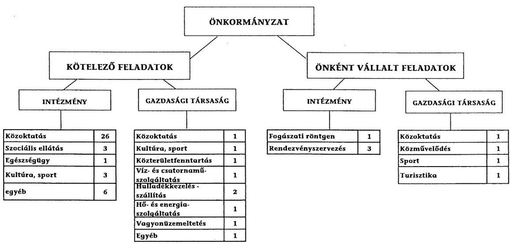

Az Önkormányzat feladatait 2010. december 31-én (a Polgármesteri hivatallal együtt) 39 költségvetési szervvel és hat, $25 \%$ feletti tulajdoni hányadú gazdasági társaságával, továbbá egy - az önkormányzattól tulajdonosi szempontból független gazdasági társaság közreműködésével látta el. Az intézményszervezeti átalakítások és intézményi összevonások következtében a feladatellátás telephelyeinek száma a 2006. évi 124 -ről 2010-re 126 -ra nőtt.

Az Önkormányzat múködési kiadásokra 2010-ben 13168 millió Ft-ot fordított, amely 129 millió Ft-tal ( $1 \%$-kal) haladta meg a 2007. évit. A múködési kiadások $65 \%$-a az intézményi körben teljesült. E kiadások fedezetéül szolgáló bevé-

---

teli források a 2007. és a 2010. években jellemző összesített arányait a következő ábra szemlélteti:
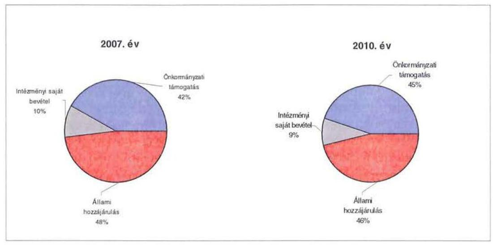

Az egyes közszolgáltatások feladatellátásában részvevő ágazati intézménycsoportok forrásösszetételének bevételi jogcímeit az alábbi ábra szemlélteti:
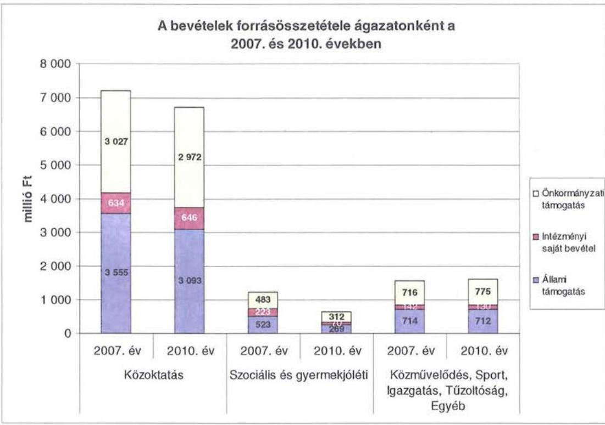

Az Önkormányzat 2010. december 31-én kettő gazdasági társaságban rendelkezett kizárólagos tulajdonnal. Az Önkormányzatnak három gazdasági társaságban 75\% feletti, kettő gazdasági társaságban 50-75\% közötti, kettőben 25-50\% közötti a tulajdoni hányada. A gazdasági társaságok közül kettő a kötelező - a közoktatás és a közüzemi szolgáltatás -, hét társaság a kötelező és önként vállalt feladatellátásban egyaránt részt vett. A gazdasági társaságok a közoktatás, a közművelődés, a sport, a multifunkcionális sportcsarnok üzemeltetése és a turisztika területén kaptak szerepet az önkormányzati feladatellá-

---

tásból. A gazdasági társaságok múködésükhöz a 2010. évben összesen 527 millió Ft hozzájárulást kaptak az Önkormányzattól, amelyből 166 millió Ft működési és 60 millió Ft fejlesztési célú pénzeszköz átadás volt. A müködési célú pénzeszköz átadás $43 \%$-át ( 71,4 millió Ft-ot) egy gazdasági társaság kapta. Az Önkormányzat a Veszprém Arénát birtokló gazdasági társaság részére 2010. évben 300 millió Ft tőkeemelést hajtott végre a létesítmény építéséhez felvett hitel tőketörlesztésének fedezetére.

A társaságok pénzügyi helyzete a 2010. évben - egy kivételével - stabil volt. Az Önkormányzatnak a vizsgált időszakban egy társaságnál kellett 1 millió Ft öszszegű tőkebefizetést teljesíteni, a 2011. évben pedig a szakképzési feladatok ellátásában résztvevő gazdasági társaságnál kell a tőkehelyzet rendezéséről gondoskodnia. A 2008-2010-es években két gazdasági társaság részesült alapításon felüli tőkeemelésben, 750 millió Ft összegben, illetve 21,2 millió Ft értékű terület apportba adásával.

A folyó költségvetés egyenlege (múködési jövedelem) 2007-2010 között minden évben múködési forrástöbbletet mutatott ${ }^{25}$. A múködési megtakarítások fedezni tudták a tárgyévben jelentkező törlesztési kötelezettségeket, így az Önkormányzat pénzügyi kapacitása (nettó müködési jövedelme) is pozitív értékű volt. A pénzügyi kapacitás egyenlegét kedvezően befolyásolta, hogy a hatályos számviteli előirások alapján a visszafizetendő folyószámlahitelt a tárgyévi törlesztési kötelezettségek között nem kellett kimutatni. A pénzügyi kapacitás (nettó múködési jövedelem) a 2008. évtől nem nyújtott fedezetet a folyószámlahitel visszafizetésére, a 2010. december 31-én fennálló 2793 millió Ft folyószámlahitel állomány kockázatot jelent a pénzügyi helyzet további alakulásában.
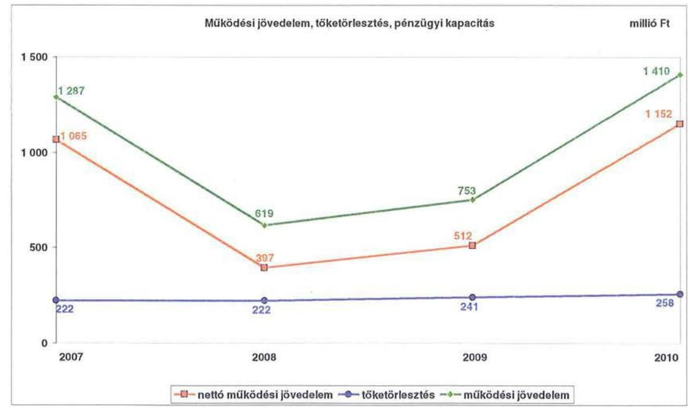

[^0]
[^0]:    ${ }^{25}$ 2007-ben a folyó kiadások 9,5\%-át (1287 millió Ft-ot), 2008-ban 4,3\%-át (619 millió Ft-ot), 2009-ben 5,3\%-át ( 753 millió Ft-ot), 2010-ben 9,3\%-át (1410 millió Ft) jelentette a müködési jövedelem.

---

A 2007-2010. években az Önkormányzat felhalmozási költségvetésének egyenlege folyamatosan negatív összegű volt, amely 2007-2010. között összesen 8431 millió Ft felhalmozási forráshiányt okozott.

A pénzügyi egyensúly fenntartása külső források bevonásával volt biztosítható. A fejlesztési célú hitelek 943 millió Ft-os törlesztése, továbbá a felhalmozási forráshiány 2007-2010. között 9374 millió Ft-ot tett ki, amelyre az időszakban képződő 4069 millió Ft működési megtakarítás (működési jövedelem), valamint a 2007. január 1-jén rendelkezésre álló 818 millió Ft pénzkészlet szolgált fedezetül. A további pénzeszközöket 3280 millió Ft fejlesztési célú hitel felvételével, továbbá 1207 millió Ft folyószámlahitel igénybevételével teremtették meg. A kialakult pénzügyi helyzet pozitív nettó müködési jövedelmet eredményező gazdálkodás mellett teszi elkerülhetővé további külső források bevonását, az eladósodás növekedését.

Az Önkormányzat 2007-2010. között helyi iparűzési adót, építményadót, magánszemélyek kommunális adóját és vendégéjszakák utáni idegenforgalmi adót állapított meg. A helyi adókból és pótlékokból származó bevételek aránya a vizsgált időszakban $29 \%-33 \%$ közé esett a folyó (működési) bevételekben. A pótlékkal, bírsággal növelt helyi adó bevétel a 2007. évi 4847 millió Ft-ról a 2010. évben 4865 millió Ft-ra ( $0,4 \%$-kal, 18 millió Ft-tal) emelkedett. A helyi adóbevételek háromnegyed részét az iparűzési adó tette ki, amelynek mértéke a helyi adókról szóló törvényben rögzített maximális mértékben került megállapításra. Új helyi adónemet a vizsgált időszakban az Önkormányzat nem vetett ki.

A 2007-2010. közötti időszakban a 6173 millió Ft értékű befejezett fejlesztések forrása 570 millió Ft EU-s támogatás ( $9,2 \%$ ), 1878 millió Ft hazai támogatás ( $30,4 \%$ ), 1579 millió Ft saját bevétel ( $25,6 \%$ ), valamint 2146 millió Ft hitelfelvétel ( $34,8 \%$ ) volt. A 2010. december 31 -én folyamatban lévő fejlesztési feladatok végrehajtására 3561 millió Ft kiadást teljesítettek, amelyre EU-s támogatásból 989 millió Ft-ot ( $27,8 \%$ ), hazai támogatásból 176 millió Ft-ot $(4,9 \%)$, saját bevételből 1351 millió Ft-ot ( $37,9 \%$ ), továbbá hitelből 1045 millió Ft-ot $(29,4 \%)$ fordítottak.

Az Önkormányzat 2010. december 31-én folyamatban lévő fejlesztési feladatok kötelezettség-vállalásainak összege 5716 millió Ft volt, amelyből 520 millió Ft-ot EU-s támogatásból ( $9,1 \%$ ), 148 millió Ft-ot hazai támogatásból $(2,6 \%), 3798$ millió Ft-ot saját forrásból ( $66,4 \%$ ), 1250 millió Ft-ot újabb fejlesztési célú hitel felvételével ( $21,9 \%$ ) terveznek biztosítani. A tervezett saját források rendelkezésre állását az Önkormányzat jelenlegi pénzügyi helyzete nem igazolja, mindez kockázatot jelent a vállalt fejlesztések jövőbeni finanszírozhatósága szempontjából.

---

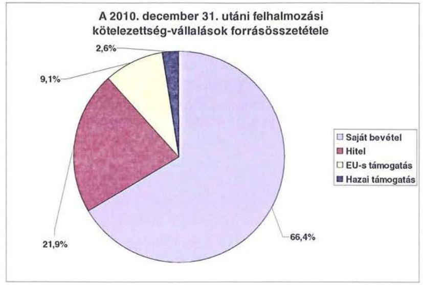

Az Önkormányzat által beadott, elbírálás alatt álló pályázat tervezett teljes bekerülési költsége 254 millió Ft volt, amelynek forrásösszetételét nem tervezték.

Az Önkormányzat mérleg szerinti pénzintézeti kötelezettsége a 2006. év végéről a 2010. év végére több mint háromszorosára, 2005 millió Ft-ról 6638 millió Ft-ra nőtt. A fennálló pénzintézeti kötelezettségek 18 hosszú lejáratú (2012-2030 évek között), forintban fennálló hitel igénybevételéből, valamint folyószámlahitel igénybevételéből keletkeztek. Az Önkormányzat nem rendelkezett a felvett hítelek visszafizetésének forrásairól. Az Önkormányzat 20072010. években a hosszú lejáratra kötött szerződésekben meghatározott 6909 millió Ft hitelt a fejlesztések megvalósulásának arányában több év alatt, a hitelcélnak megfelelő fejlesztésekhez vette igénybe. A teljesítésekkel arányosan igénybe vehető, de még le nem hívott hosszú lejáratú hitelek összege 1842 millió Ft volt 2010. december 31-én. A 2007-2010 években adósságszolgálatra az Önkormányzat 1888 millió Ft-ot teljesített, amelyből a kamatkiadás 893 millió Ft volt. A 2011. évtől kezdődően a 2010. december 31-ig felvett hoszszú lejáratú hítelek alapján várható pénzintézeti kötelezettség 4824 millió Ft, amelyből 3845 millió Ft a tőke, 979 millió Ft a kamat.

Az Önkormányzat múködésének pénzügyi egyensúlyát, valamint felhalmozási forráshiányát a vizsgált időszakban folyószámlahitel igénybevételével tudta biztosítani.

A folyószámlahitel igénybevétele a 2007-2010. években az alábbiak szerint alakult:

| Megnevezés | 2007. év | 2008. év | 2009. év | 2010. év |
| :--: | :--: | :--: | :--: | :--: |
| Keretösszeq január 1-jén | 950,00 | 1700,00 | 1380,00 | 2000,00 |
| Atlagos napi állomány | 542 | 546 | 835 | 1668 |
| Folyószámla hitellel zárt napok száma (nap) | 247 | 190 | 316 | 359 |
| 2010. december 31-i egyenleq (állomány) | x | x | x | 2793 |

A likviditás biztosítása az Önkormányzatnak 265 millió Ft kamatkiadást és kapcsolódó egyéb költséget eredményezett. Az Önkormányzatnál pénzügyi kockázatot jelent, hogy a 2010. év végén fennálló 2793 millió Ft összegű fo-

---

lyószámlahitelt a 2011. év májusában nem tudta rendezni, a folyószámlahitel szerződés meghosszabbítására került sor.

A polgármester észrevétele szerint „az I. Összegzö megállapítások, következtetések, javaslatok címü fejezet 20. oldalán tett megállapítás, hogy az „Önkormányzat 2010. év végén fennálló 2793 millió forint összegü folyószámlahitelt 2011. év májusában nem tudta rendezni, a folyószámlahitel szerzödés meghosszabbítására került sor." Véleményünk szerint nem korrekt a megfogalmazás, mivel a folyószámlahitel meghosszabbítására azért került sor, mert a számlavezető pénzintézet a kiirt közbeszerzési eljárás során a 2011. évben tervezett 3500 millió forint összegü folyószámlahotel keretre nem tett ajánlatot."

Az észrevétel nem megalapozott, mert az Önkormányzatnál a vizsgált években a pénzügyi egyensúly fenntartása csak külső források bevonásával volt biztosítható, amelynek következtében a pénzintézeti kötelezettségének állománya a 2006. évtől a 2010. év végére több mint háromszorosára nőtt. A pénzintézeti kötelezettség hosszú lejáratú forintban fennálló hitelek igénybevételéből, valamint a folyószámlahitel állandósult igénybevételéből keletkezett. Az Önkormányzatnál a 2007. évtől a 2010. évre több mint háromszorosára emelték a folyószámlahitel keret összegét, amelynek további növelésére a 2011. évben a számlavezető bank sem adott ajánlatot. Az Önkormányzat fizetőképességének romlását alátámasztja az is, hogy a 2010. évben már 359 napon keresztül állt fenn folyószámlahitel. Az Önkormányzatnál növelte a pénzügyi kockázatot, hogy a 2010. év végén, illetve a szerződés 2011. év májusában történt lejáratakor a fennálló folyószámlahitelt saját forrásból nem tudták visszafizetni.

Az Önkormányzat a 2010. év végi szállítói tartozása 80,4 millió Ft, amelyből a lejárt szállítói tartozás 4,4 millió Ft volt. A lejárt tartozásállományból 2,3 millió Ft 30 nap alatti, 2,1 millió Ft egy éven túli tartozás. Az Önkormányzat egy intézményénél jelentkezett az éven túli lejárt szállítói tartozás, amely egy energetikai kft korrekciós számlázása alapján keletkezett. Ezt az intézmény nem egyenlítette ki, mivel vitatja a számlázott összeget. A kötelezettséget az intézmény helytelenül mutatta ki a szállítók között. A Számv. tv. alapján csak az elismert szállítói kötelezettség szerepeltethető a könyvviteli mérlegben. Az egyéb kiadáselmaradás 2010. december 31-én 2,6 millió Ft volt.

Egyéb kötelezettségek között mutatta ki az Önkormányzat 2010. december 31-én egy intézmény által lízingelt gépkocsi lízingdíját 2,6 millió Ft összegben. Az Önkormányzatnál hosszú lejáratú egyéb kötelezettség a 2008. évtől a multifunkcionális sportcsarnokkal kapcsolatban merült fel. A 15 éven keresztül vállalt kötelezettségből évi 220 millió Ft+áfa volt a $70 \%$-os üzemidő igénybevétel után fizetendő szolgáltatási díj. A vizsgált években az Önkormányzat a rendelkezésre álló üzemidő $8 \%$-át vette igénybe, a vállalt kötelezettség indokolatlanul terheli a költségvetését. A multifunkcionális sportcsarnok létesítése kapcsán az Önkormányzat 2010. december 31-én fennálló egyéb hoszszú lejáratú kötelezettsége 6441 millió Ft volt, melyet könyvviteli mérlegen kívüli tételként mutatott ki.

A polgármester észrevétele szerint „A jelentés-tervezet 21. oldalán megfogalmazott egyéb kötelezettségek között szerepeltetett, mérlegen kívüli tételként kimutatott - multifunkcionális sportcsarnok létesítése kapcsán fennálló - egyéb hosszúlejáratú kötelezettség 6441 millió forint véleményünk szerint ebben a megállapításban nem mutatható ki önkormányzati kötelezettségvállalásként a jelen számviteli szabályok szerint.

---

Az Önkormányzat hosszabb távú szerződései, és önkormányzati határozatai (szándéknyilatkozatai) közül egy-egy tétel kiemelése - az önkormányzati tartós források bemutatása nélkül - és ebből következtetés levonása torzítja az Önkormányzat gazdasági pozíciójának megítélését."

Az észrevétel nem megalapozott, mert a számvevőszéki ellenőrzés a pénzintézeti kötelezettségeken túl számba vette az Önkormányzat összes, hosszabb távon fennálló kötelezettségeit, amelyek között nagyságrendje alapján a multifunkcionális sportcsarnok létesítésével kapcsolatos kötelezettség szerepelt. Ez hosszú lejáratú forintban fennálló kötelezettség függetlenül attól, hogy a hatályos számviteli előírások alapján az Önkormányzat könyvviteli mérlegében nem szereplő tétel. A multifunkcionális sportcsarnokkal kapcsolatban a Közgyűlés 15 éven keresztül vállalt fel kötelezettséget, amellyel a lejárat napjáig számolni kell az Önkormányzatnak..

Az Önkormányzatnál az elengedett követelések összege 2007. január 1. és 2011. március 31. között 34,4 millió Ft volt, amelyek bérleti díjak, bírságok, helyi adók és pótlékok, étkezési térítési díjak, gondozási díjak, lakbér és továbbszámlázott szolgáltatásokból eredő tartozásokra vonatkoztak.

Az Önkormányzat a rendeletében foglaltak alapján a veszélyt okozó építmények hibáinak megszüntetésére a 2008. illetve a 2009. évben kettő egyházközségnek adott át összesen 1,5 millió Ft-ot visszafizetési kötelezettséggel. Az Önkormányzat a vizsgált években gazdasági társaságainak tagi és egyéb kölcsönt nem nyújtott.

Az Önkormányzat forgalomképes ingatlanjai közül a 2010. év végén kettő elidegenítési tilalommal, további négy pedig jelzáloggal volt terhelt. A jelzáloggal terhelt önkormányzati ingatlanok nettó értéke 2010. december 31-én 1576,7 millió Ft, a bejegyzett jelzálogjog 1487,4 millió Ft volt.

Az Önkormányzat kötelezettségeinek 2010. december 31-i állományát és várható alakulását a kötelezettségek lejáratáig a következő táblázat szemlélteti:

| Megnevezés | Állomány 2010. dec. 31 -én |  |  | Várható kötelezettség 2011. 2013. években |  |  | Várható kötelezettség 2014. évet követően |  |  |
| :--: | :--: | :--: | :--: | :--: | :--: | :--: | :--: | :--: | :--: |
|  | (millió Ftban) | Devizában (összege) | Deviz ${ }^{\text {onem }}$ | (millió Ftban) | Devizában (összege) | Deviz ${ }^{\text {onem }}$ | (millió Ftban) | Devizában (összege) | Deviz ${ }^{\text {onem }}$ |
| Pénzintézeti kötelezettségek |  |  |  |  |  |  |  |  |  |
| Hosszú lejáratú kötelek | 2843 |  | 10,0 | 2024 |  | 10,0 | 2800 |  | 10,0 |
| Folyószámtatolót | 2793 |  | 10,0 | 2703 |  | 10,0 |  |  | 10,0 |
| Pénzintest kötelezettségek összesen 2010-ban | 6638 |  | 10,0 | 4817 |  | 10,0 | 2800 |  | 10,0 |
| Lízing kötelezettség/ok | 9 |  | 10,0 | 1 |  | 10,0 | 9 |  | 10,0 |
| Szállítói tartozás | 80 |  | 10,0 | 80 |  | 10,0 |  |  |  |
| Egyéb kiadás elmaradás | 9 |  | 10,0 | 9 |  | 10,0 |  |  |  |
| Egyéb kötelezettségek | 6441 |  | 10,0 | 1260 |  | 10,0 | 4881 |  | 10,0 |

Az Önkormányzatnak pénzintézetekkel szemben fennálló kötelezettsége a 2010. év végén 6638 millió Ft volt. A várható kötelezettség (tőke, kamat és egyéb költség) a legutóbbi kamatfizetés feltételei alapján a 2011. évtől 7617 millió Ft. Az Önkormányzatnak a 2011. évben lízingdíj, szállítói tartozások és egyéb kiadás elmaradások rendezése címen 84 millió Ft fizetési kötelezettsége keletkezett. A multifunkcionális sportcsarnokkal kapcsolatos egyéb kötelezettség a 2011. évben 300 millió Ft, és szolgáltatási díjként várható további 220 millió Ft+áfa kifizetés. A 2011-2013. években várható összes kötelezettség teljesítésére figyelembe vehető 167,4 millió Ft egyéb pénzmaradvány, 478,4

---

millió Ft mérlegben kimutatott követelésállomány, 3884 millió Ft forgalomképes ingatlanvagyon, melyből a pénzintézeti kötelezettséghez kapcsolódóan a 2010. év végén 1487,4 millió Ft értékű volt jelzáloggal terhelt. A jelzálog bejegyzések közül a 2011. évben törlésre kerül 1437,5 millió Ft, az így felszabaduló forgalomképes ingatlanvagyon, valamint az Önkormányzat saját bevételei jelenthetik a fizetési kötelezettségek fedezetét. Az Önkormányzat tájékoztatása szerint figyelembe vehető további forrás a 2011-2013. években, valamint a 2014. évet követően „a mindenkori költségvetési rendeletekben megtervezett önkormányzati saját bevételek". A 2014. évet követően a kötelezettségek teljesítésére a saját bevételeken túl a forgalomképes ingatlanvagyon, valamint az egyéb bevételek nyújthatnak fedezetet, amelyeket azonban az Önkormányzat nem számszerúsített. A CLF módszer szerint a múködési jövedelem pozitív volt, azonban annak nagyságrendje (2010-ben 1410 millió Ft) nem nyújt fedezetet az önkormányzati kötelezettségek finanszírozására.

Az Önkormányzat minősített többségi tulajdonú társaságai kötelezettségeinek 2010. december 31-i állományát és várható alakulását a kötelezettségek lejáratáig az alábbi táblázat mutatja be:

| Megnevezés | Állomány 2010. dec.31-én |  |  | Várható kötelezettség 2011. 2013. években |  |  | Várható kötelezettség 2014. évet követően |  |  |
| :--: | :--: | :--: | :--: | :--: | :--: | :--: | :--: | :--: | :--: |
|  | (millió Ftban) | Devitelban (összege) | Devittanem | (millió Ftban) | Devitelban (összege) | (devi) anem | (millió Ftban) | Devitelban (összege) | (devi) anem |
| Pénzintézti kötelezettségek |  |  |  |  |  |  |  |  |  |
| Összegü eljáratú kötelezet | 461 | 27807623 | CHF | 270 | 7.173960 CHF |  | 103 | 23720702 CHF |  |
| Polyószámlat - és egyéb elemi tájékoztó kötelek | 0 |  | 103 | 0 |  | 103 |  |  |  |
| Pénzintézeti kötelezettségek összezam | 461 | 27807623 | CHF | 270 | 7.173960 CHF |  | 103 | 23720702 CHF |  |
| Üzleg kötelezettségeik |  | 7313 | CHF |  | 7313 | CHF |  |  |  |
| Szállitót tartozó | 247 |  | 103 | 247 |  | 103 |  |  |  |

Az önkormányzati kötelezettségek növekedése mellett a minősített többségi tulajdonú társaságok kötelezettségei is befolyásolhatják az Önkormányzat pénzügyi egyensúlyát. A társaságoknak a 2011. évtől 479 millió Ft és 30894 ezer CHF pénzintézeti kötelezettséget, 247 millió Ft szállítói tartozást, valamint 7,5 ezer CHF lízingdíjat kell rendezniük. Kockázatot jelent, ha ezek nem teljesítése - esetleges csőd vagy felszámolási eljárás - esetén, a bíróság korlátlan és teljes felelősséget állapít meg az Önkormányzat terhére.

Az Önkormányzat a 2007-2010 években a tárgyi eszközök után 4398,4 millió Ft összegű értékcsökkenést mutatott ki, miközben az elszámolt értékcsökkenés 33,8\%-át (1488,4 millió Ft-ot) fordították felújításra. A vizsgált időszakban nem történt meg annak felmérése, hogy az eszközök elhasználódása, amortizációja fedezetének biztosítása mekkora forrásokat igényel az Önkormányzatnál. Az eszközök avultsága növekedett, mivel az önkormányzati szintű használhatósági fok mutató aránya négy év alatt 3,4 százalékponttal, $89,6 \%$-ról $86,2 \%$-ra csökkent.

Az Önkormányzat és a Polgármesteri hivatal jelenleg hat folyamatban lévő peres eljárásban érintettek alperesként. Az Önkormányzat terhére kimutatott perérték 85 millió Ft.

Az Önkormányzat költségvetési támogatásból, átengedett bevételekből, és illeték bevételekből származó bevételei a 2007. évhez képest az időszak egészét tekintve összességében 2090 millió Ft-tal csökkentek. Az Önkormányzat a 20072010. években tett intézkedések hatására 1487 millió Ft többletbevételt, továb-

---

bá 341,8 millió Ft kiadási megtakarítást mutatott ki, amelyek a bevételkiesésre nem nyújtottak teljes mértékben fedezetet. Ezáltal az Önkormányzat pénzügyi helyzetét nem javították. A kiadási megtakarítások 83,9\%-a a személyi juttatások és járulékainál jelentkezett, a megszüntetett álláshelyek száma a 2007-2010-es években 318 fő volt. Az álláshely csökkentő intézkedések a közoktatási intézményeknél és a Hivatalnál jelentkezett. A bevételnövelő intézkedések a helyi adók mértékének, a térítési díjak összegének emeléséhez, valamint az átmenetileg szabad pénzeszközök lekötéséhez kapcsolódtak.

Az utóellenőrzés során az Önkormányzat gazdálkodási rendszerének korábbi ellenőrzése során tett javaslatok közül a pénzügyi egyensúly javítására vonatkozó egy célszerűségi javaslat hasznosulását ellenőriztük. A Közgyűlés előterjesztés hiányában nem tárgyalta az Önkormányzat eladósodásának helyzetét, a hosszúlejáratú kötelezettségvállalásokból keletkezett fizetési kötelezettségei teljesítésének feltételrendszerére számítási anyag nem készült. Az elmaradt intézkedés mielőbbi megtételét indokolja, hogy a fennálló hosszú lejáratú önkormányzati kötelezettségek finanszírozhatóságához szükséges források időben rendelkezésre álljanak.

Az Önkormányzat pénzügyi helyzetét összegezve a következők emelhetők ki:

A 2007-2010. években az Önkormányzat múködési kockázatát csökkentette a pozitív folyó költségvetési egyenleg, a minimális lejárt szállítói tartozásállomány. Az önként vállalt feladatok aránya, illetve a 2008-ban átvett kulturális intézmény fenntartása alapvetően nem befolyásolta az Önkormányzat működésének biztonságát. A működési bevételek évente biztosították a működési kiadások és az adósságszolgálat finanszírozását, a likviditás biztosítása folyamatosan növekvő folyószámlahitel igénybevételével történt. A gazdasági társaságok szerepe a közüzemi közfeladat-ellátásban meghatározó volt. A gazdasági társaságok által ellátott feladatstruktúra letisztított, átlátható, a működési kockázatot nem növelte. A gazdasági társaságok hosszú lejáratú kötelezettségvállalásai esetleges csőd vagy felszámolási eljárás esetén növelik az Önkormányzat pénzügyi kockázatát.

A vizsgált időszakban az Önkormányzat felhalmozási költségvetése pénzügyi hiányt mutatott, ennek forrásai a pénzmaradvány igénybevételével és hitelfelvétellel biztosítottak voltak. A hosszú lejáratú kötelezettségek finanszírozásának a 2010. évet követő forrása a 2011. évben biztosított. A 2012. évet követően a hosszú lejáratú kötelezettségek finanszírozási forrásait az Önkormányzat nem számszerűsítette. A felhalmozási kockázatot növeli, hogy 2011. utáni évekre a fejlesztésekhez tervezett saját források rendelkezésre állása a jelenlegi pénzügyi helyzet alapján bizonytalan.

A pénzintézeti és egyéb kötelezettségek teljesítésének kockázatát növelte, hogy a 2010. december 31 -én fennálló kötelezettségek visszafizetésének fedezetét a saját bevételben jelölték meg, azonban a 2007-2010. években nem számszerúsítették annak forrásait. A kockázatot csökkentheti az Önkormányzat 2010. évi követelésállományából várható bevétel, és forgalomképes ingatlanvagyona szükség esetén felhasználható az adósságszolgálat visszafizetésére.

---

Az önkormányzati bevételt csökkentő központi intézkedések hatását az ellenőrzött időszakban nem ellensúlyozta az Önkormányzat kiadáscsökkentő és bevételnövelő intézkedéseinek eredménye.

Az Állami Számvevőszékről szóló 2011. évi LXVI. törvény 33. § (1) bekezdésében foglaltak értelmében a jelentésben foglalt megállapításokhoz kapcsolódó intézkedési tervet köteles az ellenőrzött szervezet vezetője összeállítani és azt a jelentés kézhezvételétől számított harminc napon belül az ÁSZ részére megküldeni. Amennyiben az intézkedési tervet határidőben nem küldi meg a szervezet, vagy az továbbra sem elfogadható, az ÁSZ elnöke a hivatkozott törvény 33. § (3) bekezdés a)-b) pontjaiban foglaltakat érvényesítheti.

Az ellenőrzés intézkedést igénylő javaslatai:

# a Polgármesternek 

1. a Közgyűlés elé terjesztendő intézkedési terv írja elő a működés pénzügyi egyensúlyának közép távon történő helyreállítása és hosszú távú fenntarthatósága érdekében - felelősök és határidők megjelölésével - olyan program készítését, amely tartalmazza az alábbiakat:
a) bevételszerző lehetőségek feltárását, különösen a helyi adópolitikai célok meghatározását és számszerúsítését, a térítési díjak felülvizsgálatát, a követelések behajtását;
b) egyéb kiadási kötelezettségek teljes körű felülvizsgálatát, különös figyelemmel a Csarnok Kft-vel kötött szolgáltatási szerződésre;
c) az intézkedések következtében jelentkező pénzügyi többlet, illetve az egyszeri bevételek tartalékba helyezését, elkülönített kezelését az adósságszolgálat teljesítése érdekében;
d) az adósságszolgálat szerkezetének áttekintését, a likviditás menedzselést, a támogatás előfinanszírozás átláthatóbbá tételét;
e) az intézkedések eredményeinek legalább félévenkénti áttekintésének előírását;
2. mutassa be félévente - a szokásos beszámoló keretében - a Közgyűlésnek:
a) a minősített többségi tulajdonú gazdasági társaságok helyi közfeladatok ellátásában vállalt szerepét, az Önkormányzat által nyújtott pénzeszköz átadások felhasználását, a kötelezettségeik alakulását, a működésük eredményét;
b) legalább három évre kitekintően a kötelezettségek teljes körére szóló finanszírozási tervet, amely figyelembe veszi a kötelezettség éven belüli és túli felmerülését, a források számszerúsített megjelölésével;
c) az Önkormányzat folyamatban lévő és tervezett fejlesztéseihez szükséges belső és külső források rendelkezésre állását, és ebből a szempontból értékelje az Önkormányzat beruházásait;

---

3. intézkedjen a beruházásokkal létrehozott létesítmények múködtetését és jövőbeni fenntarthatóságát biztosító megalapozott források költségvetési rendeletekben történő feltüntetéséről;

# a jegyzönek 

1. kísérje figyelemmel a jövőbeni várható - kamat- és visszafizetési - kockázatokat, továbbá a mérlegen kívüli tételek kockázatait, és legalább félévente tájékoztassa a Közgyűlést azok alakulásáról;
2. gondoskodjon, hogy a jövőben az adósságot keletkeztető kötelezettségvállalásokról szóló közgyűlési előterjesztések tételesen tartalmazzák a visszafizetés forrásait, valamint a teljes futamidőre mutassák be a kamatkockázat várható hatásait;
3. gondoskodjon az Önkormányzat likviditási helyzetéhez igazodóan a folyószámla hitelkeret összegének folyamatos optimalizálásáról;
4. kísérje folyamatosan figyelemmel - a tulajdonosi jogkört gyakorlók közreműködésével - a minősített többségi tulajdonú gazdasági társaságok kötelezettségeinek alakulását, az Önkormányzat likviditására, pénzügyi-egyensúlyi helyzetére gyakorolt hatását;
5. gondoskodjon a Polgármesteri hivatal és a további költségvetési szervek lejárt szállítói tartozásai okainak feltárásáról, azonnali intézkedések megtételéről a lejárt tartozások mielőbbi rendezése érdekében;
6. intézkedjen a Számv. tv. 68. § (5) bekezdésének a) pontja alapján, hogy az Önkormányzat könyvviteli mérlegében a szállítói állomány az elismert kötelezettségeket tartalmazza

---

# II. RÉSZLETES MEGÁLLAPÍTÁSOK 

## 1. Az ÖNKORMÁNYZAT KÖTELEZŐ ÉS ÖNKÉNT VÁLLALT FELADATAI

Az Önkormányzat a 2010. évi elemi beszámolója szerint 13168 millió Ft müködési kiadásból 10534 millió Ft-ot ( $80 \%$ ) a kötelező feladatokra, 2634 millió Ft-ot (20\%) az önként vállalt feladatok ellátására fordított. A 2011. évi terv adatok alapján az önként vállalt feladatokra 2557 millió Ft jut, amely a 13457 millió Ft összegű összes költségvetési kiadás 19\%-a. Ez 1 százalékponttal kevesebb az előző évhez képest.

A 2010. évi müködési kiadások kötelező feladatonkénti megoszlását és azok finanszírozási arányait az alábbi táblázat mutatja be:

| Ellátott feladat | Müködési kiadás összesen (millió Ft) | Kötelező feladatok kiadásainak rézzaránya $\%$ | Müködési bevételek összesen (millió Ft) | Állami támogatás rézzaránya $\%$ | Intézményi saját bevétel rézzaránya $\%$ | Önkormányzati támogatás rézzaránya $\%$ |
| :--: | :--: | :--: | :--: | :--: | :--: | :--: |
| Övodák | 1124 | 100 | 1162 | 41 | 12 | 47 |
| Általános iskolák | 2604 | 80 | 2694 | 40 | 9 | 51 |
| Gimnáziumok | 714 | 58 | 1769 | 67 | 10 | 23 |
| Szakközépiskolák, szakképzö intézmények | 1683 | 73 | 743 | 47 | 7 | 46 |
| Kollégiumok | 350 | 100 | 354 | 61 | 25 | 14 |
| Szociális intézmények | 91 | 100 | 97 | 39 | 13 | 48 |
| Gyermekjöléti intézmények | 567 | 100 | 581 | 40 | 10 | 50 |
| Közművelődési intézmények | 514 | 75 | 528 | 2 | 14 | 84 |
| Sportlétesítmények | 0 | 0 | 0 | 0 | 0 | 0 |
| Igazgatási intézmények | 0 | 0 | 0 | 0 | 0 | 0 |
| Tüzoltóság | 456 | 93 | 515 | 85 | 4 | 11 |
| Egyéb intézmények | 515 | 100 | 588 | 45 | 7 | 48 |
| Intézmények összesen | 8618 | 83 | 9031 | 45 | 9 | 46 |
| Polgármesteri   Hivatalban kezelt feladatok müködési kiadásai | 4550 | 74 | 4973 | 20 | 13 | 67 |
| Müködési kiadások összesen | 13168 | 80 | 14004 | 36 | 11 | 53 |

---

Az Önkormányzat a kötelező feladatokon belül 8618 millió Ft összeget fordított az intézményi feladatok múködési kiadásaira, a Polgármesteri hivatalban ellátott feladatoknak 4550 millió Ft volt a múködési kiadása. Az intézmények múködtetéséhez az Önkormányzat az állami támogatáson felül 4058 millió Ft-tal járult hozzá az egyéb önkormányzati forrásokból.

Az intézményi feladatokon belül a közoktatási feladatokra fordított 6475 millió Ft-ot a múködésükhöz az Önkormányzat, további 2972 millió Ft támogatást nyújtott. A legkevesebb, 52 millió Ft összegű működési támogatást a kollégiumi feladatok ellátásához kellett biztosítani. Az óvodai feladatokat 546 millió Ft-tal támogatta az Önkormányzat. Az általános iskolai feladatokhoz 1386 millió Ft támogatást biztosított. A középfokú oktatási intézmények részére 988 millió Ft támogatást juttatott. A közművelődési intézményi feladatokra fordított 514 millió Ft-hoz, 440 millió Ft múködési támogatást nyújtott az Önkormányzat. A gyermekjóléti feladatokra fordított 567 millió Ft-hoz az Önkormányzat 265 millió Ft támogatást nyújtott. A szociális intézményi feladatokra fordított 91 millió Ft-hoz 47 millió Ft volt az önkormányzati támogatás. A hivatásos tűzoltóságra fordított 456 millió Ft az összes múködési kiadás 3,5\%-a volt, amelyhez 60 millió Ft múködési támogatást adott az Önkormányzat.

A 14004 millió Ft összegű összes múködést szolgáló bevételének ${ }^{26} 64,5 \%$ volt az intézmények 9031 millió Ft összegű bevétele, amelyből 4064 millió Ft (45\%) volt az állami támogatás, 813 millió Ft (9\%) az intézményi saját bevétel és 4154 millió Ft (46\%) az önkormányzati támogatás.

Az Önkormányzat összes múködést szolgáló bevételén belül az állami támogatás részaránya 5041 millió Ft összeggel $36 \%$-ot, a saját bevétel részaránya 1540 millió Ft összeggel $11 \%$-ot képviselt.

A közoktatási intézményekben az ellátottak száma a 2007. évi 10957 főről a 2010. évre 204 fővel ( $1,9 \%$-kal) csökkent. Az ágazaton belül az alapfokú és a középfokú oktatási intézményekbe járók száma 509 fővel lett kevesebb, az óvodába járó gyermekek létszáma 305 fővel nőtt. A bölcsődei ellátottak számában lényeges változás nem volt, a 2007. évi 309 fő ellátotti létszám 2010. évben 302 före csökkent ( $2,6 \%$ ). A szociális és gyermekjóléti alapszolgáltatási feladatokat ellátó intézményekben az ellátotti létszám a 2007. évi 3316 fơről 3968 fôre $(19,7 \%-\mathrm{kal})$ nőtt.

A kötelezö és önként vállalt feladatok körét az Önkormányzat SzMSzében rögzítették. Kötelező feladatokat - az Ötv. és a szakmai, ágazati törvények alapján - az egészségügyi ellátás, a szociális alapellátás, a gyermekjóléti és gyermekvédelmi feladatok, közművelődési, közgyűjteményi, környezetvédelmi és kommunális feladatok, a közoktatás és szakképzés, a lakásgazdálkodás, egyéb tevékenységek körében a nemzeti és etnikai kisebbségek jogainak érvé-

[^0]
[^0]:    ${ }^{26}$ Az elemi beszámoló múködési bevétel adata és a CLF folyó bevétel adata az áfa viszszatérülés teljes összegével, valamint az Önkormányzat által fejlesztési kamatnak minősített kamatbevétel összegével, továbbá a követelés elengedés miatt elszámolt bevétel figyelmen kívül hagyása miatt tér el egymástól. Eltérést okoz még a pénzmaradvány igénybevétel, amely szerepel a bevételek között.

---

nyesítése, valamint a Tűzoltóság működési körébe tartozó feladatok ellátásaként határozott meg a Közgyűlés. Az Önkormányzat önként vállalt feladatnak minősítette az Egészségügyi Alapellátási Intézményben a fogászati röntgenellátást, a városi rendezvények szervezését, valamint közoktatással, közművelődéssel, sporttal és turisztikával kapcsolatos tevékenységeket.

Az Önkormányzat kötelező és önként vállalt feladatait 2010. december 31-én 39 költségvetési szervvel, valamint 9 gazdasági társasággal látta el. Az intézmények száma a 2007. és a 2008. évi 44 -ről a 2009. évre 40 -re, a 2010. évre 39re csökkent. Az Önkormányzat által fenntartott költségvetési szervek közül 2010. év végén 10 önállóan működő és gazdálkodó, 29 önállóan működő költségvetési szerv. Az intézmények - alapító okirataik szerint - a 2007. évhez viszonyítva kettővel kevesebb, 126 telephelyen végezték tevékenységüket a 2010. évben. Az Önkormányzat feladatait az alábbi intézménystruktúrával látja el:

- egészségügyi feladatot az Egészségügyi Alapellátási Intézmény végez, az Önkormányzat nem tart fenn kórházat;
- szociális és gyermekjóléti feladatokat 3 intézmény lát el (1 egyesített bölcsőde, 1 családsegítő és gyermekjóléti intézmény, 1 fogyatékosok nappali intézménye és gondozóháza);
- közoktatási tevékenységet 26 intézmény végez (6 óvoda, 11 általános iskola, 8 középfokú intézmény és a Nevelési Tanácsadó, az intézmények 39 telephelyen múködnek);
- közművelődési és közgyűjteményi feladatot lát el a Művelődési Központ, a Művészetek Háza és a Bábszínház;
- igazgatási feladatot a Polgármesteri hivatal, a Tűzoltóság valamint az ágazati intézmények gazdasági és üzemeltetési feladatainak ellátására létrehozott integrált szervezetek látnak el.

Az Önkormányzat kötelező és önként feladatainak ellátásában 2010. december 1-én kilenc gazdasági társaság is részt vállalt, amelyek közül hat gazdasági társaságban volt többségi befolyást biztosító tulajdoni hányada. A gazdasági társaságok száma a 2007. évi decemberi állapothoz képest nem változott. A 2011. évben az Önkormányzat egy többségi tulajdonú társaságot alapított, ezzel együtt a 100\%-os tulajdonú társaságok száma háromra nőtt. A helyi tömegközlekedési feladatot az Önkormányzattól független Balaton Volán Zrt. megállapodás alapján végzi.

Az Önkormányzat tulajdonában lévő gazdasági társaságok az áttekintett időszakban az alábbiak szerint alakultak:

- az Önkormányzatnak 2006. évben 50\%-os (3,34 millió Ft) tulajdona volt a Medicina 51 Egészségügyi Alapellátás Szolgáltatási Kht-ban, amelyből az Önkormányzat a Közgyűlés 2007. évi döntése alapján kilépett, mivel a társaság 2007. évtől nem folytatott tevékenységet. Az Önkormányzat a törzsbetéttel arányos veszteséggel, 2,3 millió Ft összegű tőkekivonással lépett ki a társaságból;

---

- a Közoktatási törvény 2007. évi módosítása szakképzés-szervezési társulás vagy szakképzés szervezési társaság létrehozását tette lehetővé az Önkormányzat számára, ami egyúttal feltételként szerepelt a fejlesztési források megszerzéséhez. A Közgyűlés kiemelkedően közhasznú nonprofit kft-ként létrehozta a $87 \%$-os Önkormányzati tulajdoni részarányú TISZK-et, 1 millió Ft törzstőkével;
- az Önkormányzat az Ünnepi Játékok Kft-ben lévő üzletrészét 2008. évben nyilvános pályázaton hirdetve értékesítette, a $33 \%$-os arányú üzletrészét átruházással a Csarnok „a Csarnoküzemeltető, Rendezvényszervező és Kommunikációs Kft"-nek eladta 2,05 millió Ft-ért;
- az Önkormányzat 2008. évben eredményesen pályázott a „VeszprémBelváros Funkcióbővítő Rehabilitációja" című projektre, és ehhez kapcsolódva létrehozta a Pro Veszprém Kft-t (ami 100\%-ban önkormányzati tulajdonban van);
- az Önkormányzat 2009. évben pályázat útján értékesítette az „Életöröm Idősotthon" Szociális Ellátó Kht-ban meglévő 3,3\%-os tulajdoni arányú üzletrészét, 0,573 millió Ft-ért;
- költségvetési szerv jogutódjaként alapították a Veszprémi Turisztikai Nonprofit Kft-t;
- a gazdasági társaságok számát nem befolyásolta a Közgyűlés 2009. évi döntése, miszerint a Multicsarnok Kft. és a Veszprémi Ingatlan Kft. beolvadása a VKSZ Zrt-be, ezek a vállalkozások a VKSZ Zrt. 100\%-os leányvállalataiként múködtek;
- a 2011. évben alapították 100\%-os önkormányzati társaságként a Kolostorok és Kertek Kft-t.

Az Önkormányzat feladatellátásában résztvevő, önkormányzati részesedésű gazdasági társaságok jellemző adatait a Függelék és a 4. sz. melléklet tartalmazza.

A gazdasági társaságok saját tőkéje 2010. december 31-én 13758 millió Ft (ezen belül a 100\%-os önkormányzati tulajdonban lévő társaságok saját tőkéje 45 millió Ft), a jegyzett tőkéjük 3686 millió Ft (ezen belül a 100\%-os önkormányzati tulajdonban lévő társaságok jegyzett tőkéje 54 millió Ft) volt. A legnagyobb saját tőkével 9770 millió Ft összegben - a $38,3 \%$ önkormányzati tulajdoni hányadú - Bakonykarszt Zrt. rendelkezett, amelynek jegyzett tőkéje 886 millió Ft volt a 2010. év végén. A minősített többségi befolyást biztosító önkormányzati tulajdonú gazdasági társaságok közül a VKSZ Zrt. saját tőkéje 3229 millió Ft, jegyzett tőkéje 2250 millió Ft volt, a Növény és Vadaspark Kft. saját tőkéje 660 millió Ft volt, a jegyzett tőkéje 432 millió Ft-ot tett ki.

---

A gazdasági társaságok tőkeellátottsága - egy kivételével - megfelelő volt, 2010-ben hat társaságnál mutatott a saját tőke jegyzett tőke aránya 1-es értéket, egynél 2-es értéket, egynél 3-as, egynél 11-es, valamint egynél mínusz 8 -as értéket mutatott.

Az Önkormányzatnak a vizsgált időszakban, 2008. évben az Egyetemi Stadion Kft-nél tőkebefizetés történt 1 millió Ft összegben, 2011-ben a TISZK Nonprofit Kft-nél kell tőkehelyzet rendezéséről gondoskodnia ${ }^{27}$, mivel a társaság saját tőkéje negatív, és nem érte el a jegyzett tőke felét. A 2008-2010. években az alapításon felüli tőkeemelésben részesült két gazdasági társaság ${ }^{28}$, - mindkét gazdasági társaság az Önkormányzat közel 100\%-os tulajdonában áll. Fejlesztési pénzeszközt két gazdasági társaság kapott 58,6 millió Ft összegben ${ }^{29}$.

Az önkormányzati részesedésű gazdasági társaságnál a társaságok által nyújtott adatszolgáltatás alapján az önkormányzati kötelező és önként vállalt feladatokhoz rendelt 2010. évi év végi nettó vagyon összesen 15454 millió Ft. A kötelező feladatokhoz rendelt 14907 millió Ft ( $96,4 \%$ ) öszszegű vagyon 2 társaságot érint, míg 547 millió Ft (3,6\%) az önként vállalt feladatokhoz rendelt nettó vagyon, mely hét gazdasági társaság között oszlik meg. A társaságok adat-szolgáltatása alapján a tulajdonukba adott 2010. év végi nettó vagyon összesen 14320 millió Ft, amelyből 13805 millió Ft ( $96,4 \%$ ) a kötelező, 515 millió Ft ( $3,6 \%$ ) az önként vállalt önkormányzati feladatokra kimutatott vagyon.

Az önkormányzati részesedéssel alapított gazdasági társaságoknál nem indult csődeljárás.

Az Önkormányzat közigazgatási területén hét szolgáltatási díjjal kapcsolatos az Önkormányzat ár- díjmegállapító szerepköre. Az önkormányzati gazdasági társaságok közül ezeknek a díjaknak a beszedésében két társaság érintett. A távhőszolgáltatás, az ivóvíz, szennyvízelvezetés és tisztítás, a települési szilárd hulladékkezelés, a kéményseprő ipari szolgáltatás, a fizetőparkolási rendszer és a temetkezési szolgáltatások díjaira vonatkozott az Önkormányzat ármegállapítása. A Közgyűlés önkormányzati rendeletben döntött a szolgáltatás (közszolgáltatás) rendjéről, díjairól. Az Önkormányzat elfogadta a közüzemi szolgáltatók által megajánlott díjat, a temetőüzemeltetéshez adott át az áttekintett időszak alatt 84,2 millió Ft összegű pénzeszközt. A közműves vízszolgáltatás és a csatornahasználat díj emelkedésének lakossági ellentételezésére az

[^0]
[^0]:    ${ }^{27}$ A társaságnál az áttekintett időszakban 2 folyamatban levő EU-s forrásból finanszírozott projekt elszámolása során 10 millió Ft összeget nem fogadott el a Támogató szervezet, valamint a 17 millió Ft összegű pénzügyi visszaélés hatására keletkezett a veszteség, a peres eljárás jelenleg is folyamatban van.
    ${ }^{28}$ A Veszprém Arénát birtokló gazdasági társaságban az Önkormányzat 15 éven keresztül évente meghatározott összegű tőkeemelést hajt végre, a három évet érintően ez 750 millió Ft. A Növény és Vadaspark Kft. 21,2 millió Ft értékű területet apportként kapott.
    ${ }^{29} 49,5$ Ft millió Ft pályázati önrész fedezete a TISZK Kft-nél, valamint 9,1 millió Ft a Növény és Vadaspark Kft-nél a fejlesztés megvalósíthatósági tervének fedezete.

---

Önkormányzat 88,3 millió Ft, illetve 46,6 millió Ft támogatást nyújtott. ${ }^{30} \mathrm{Az}$ Önkormányzat által nyújtott támogatás a szolgáltatónak üzemeltetésre átadott eszközök bérleti díjából került kompenzálással levonásra. A helyi tömegközlekedés menetjegy és bérlet árak emeléséről nem született meg a döntés 2010. év végéig, azonban az Önkormányzat az árak emelésére kényszerül, mivel a szolgáltató üzemi eredménye - önkormányzati pénzeszköz átadás nélkül - veszteséget mutatott.

Az áttekintett időszakban egy gazdasági társaságnak volt szerződésben előírtak alapján az Önkormányzat által vagyonkezelésbe adott eszközök után értékcsökkenés elszámolási és tartalékképzési kötelezettsége, melynek a társaság eleget tett. ${ }^{31}$.

Az Önkormányzat 2007. évtől - a gazdasági programban megfogalmazott elvárások alapján - több alkalommal hozott feladat visszavételéről, intézmény és egyéb feladatátadásról döntéseket:

- az Önkormányzat a 2008. évben átvette a Veszprém Megyei Önkormányzattól a korábban társulási megállapodás alapján közösen fenntartott Bábszínházat, és a Közgyűlés döntése alapján a megszüntetett intézmény jogutódjaként városi fenntartású közművelődési intézményt hozott létre;
- az Önkormányzat három döntésével csökkentette a fenntartásában lévő költségvetési szervek számát. A Tourinform Veszprém Költségvetési Intézményt jogutód nélkül megszüntette ${ }^{32}$. A szociális intézmények köréből az időskorúak teljes körű szociális ellátását biztosító Egyesített Szociális Intézmény irányítási jogait a VKTT-nek adta át, 2009. január 1-i hatállyal. A VKTT egyesített intézménye a személyes gondoskodást nyújtó szociális alapszolgáltatásokat, valamint az idősek otthonának (jellemző mutatója 746 férőhely) múködtetését vállalta át az Önkormányzattól. A Közgyűlés döntése alapján a Családok Átmeneti Otthonát a Családsegítő és Gyermekjóléti Központhoz integrálták, a hajléktalan ellátás biztosítása érdekében pedig a Szeretetszolgálattal 2009. január 1-jétől határozatlan időre szóló ellátási szerződést kötöttek. A Szeretetszolgálat a város közigazgatási területére kiterjedően vállalta az Önkormányzat által biztosított ingatlanokban - becslés alapján 429 személy számára - a Szoc. tv-ben előírt valamennyi ellátás biztosítását;

[^0]
[^0]:    ${ }^{30}$ A 2011. évre vonatkozó díjtételeket az Önkormányzat a lakossági fogyasztók esetében ivóvíznél $10 \%$-kal, a szennyvíznél $14 \%$-kal emelte, és megszüntette a lakossági díjakhoz nyújtott támogatás. A közületi fogyasztóknál 19\%-os ivóvíz és 18\%-os szennyvízdíj emelésről döntött a Közgyűlés, amelynek indoka az volt, hogy a közületi fogyasztók jelentős többsége a fizetendő ÁFA visszaigénylésének lehetőségét kihasználja.
    ${ }^{31}$ Az elszámolt értékcsökkenés és a képzett tartalék együttes összege 16,1 millió Ft volt. Az elmúlt 4 évben az aktivált vagyon érték meghaladta a 19 millió Ft-ot.
    ${ }^{32}$ A Turisztikai Kft. végzi a költségvetési szerv, alapító okirat szerinti tevékenységét.

---

- az áttekintett időszakban a következő átszervezések történtek, közoktatás intézményeknél kettő általános iskolát vontak össze a 2007. évben, a csökkenő gyermek- és tanulói létszám miatt ( 672 fő általános iskolai és 40 fő gimnáziumi létszámot érintett). Egy tagintézményként múködő iskolát beolvasztottak a Speciális Szakiskola és Egységes Gyógypedagógiai Intézménybe ${ }^{33}$ (az átszervezés 150 fő általános iskolai és 56 fő szakiskolai tanulót érintett). Egy iskola új feladatot kapott. ${ }^{34}$

Önkormányzati szinten a 2007-2010. években végrehajtott kiadáscsökkentő intézkedések hatásaként az Önkormányzat kimutatása szerint a kiadásai 209,6 millió Ft-tal csökkentek, ami együtt járt 167,6 millió Ft bevételkieséssel. Az intézkedések hatására jelentkező, - egyenlegében 42 millió Ft - kiadáscsökkentés nem volt számottevő hatású, az Önkormányzat pénzügyi helyzetének alakulását érdemben nem befolyásolta.

Az Önkormányzat az áttekintett időszakban központi költségvetési szervtől és egyháztól nem vett és nem adott át feladatot.

# 2. PÉNZÜGYI EGYENSÚLYI HELYZET ALAKULÁSA 

### 2.1. A múködési és a felhalmozási egyensúly alakulása

A hagyományos költségvetési szerkezet helyett az önkormányzat pénzügyi helyzetét a CLF módszerrel mutatjuk be, amelyben jobban elkülönülnek a vagyonnal kapcsolatos bevételek és kiadások az önkormányzati feladatokkal kapcsolatos közvetlen múködtetési bevételektől és kiadásoktól. A módszer következetesen elkülöníti a folyó és a felhalmozási költségvetés bevételeit és kiadásait, azok költségvetési egyenlegeit. A saját folyó bevételek, valamint a saját felhalmozási bevételek nem tartalmazzák az előző évi pénzmaradványok felhasználásából származó pénzforgalom nélküli bevételeket ${ }^{35}$.

A folyó költségvetés egyenlege, a múködési jövedelem megmutatja, hogy az önkormányzat éves folyó bevétele fedezetet biztosít-e a kötelező és önként vállalt feladatellátáshoz kapcsolódó éves folyó kiadására. A múködési jövedelem negatív értéke pénzügyileg fenntarthatatlan helyzetet jelez. A mutató pozitív értéke megtakarítást mutat, amely forrásul szolgálhat az önkormányzat fennálló kötelezettségei megfizetéséhez, valamint fejlesztéseihez.

A felhalmozási költségvetés pozitív értéke felhalmozási többletet mutat, amely a jövőbeni fejlesztések forrását biztosíthatja. Amennyiben a folyó költségvetési hiány finanszírozása a felhalmozási többletből történik, ez szűkebb értelemben vagyonfelélésnek tekinthető. Amennyiben a felhalmozási költség-

[^0]
[^0]:    ${ }^{33}$ Az Alternatív Általános Iskola beolvasztásának indoka az egyenlő bánásmód és az esélyegyenlőség biztosítása volt.
    ${ }^{34}$ Az általános iskolák Központi Előkészítő Műhelyének tevékenységét 2009. évtől a Deák Ferenc Általános Iskolának kell ellátni.
    ${ }^{35}$ A költségvetési években kialakuló hiány finanszírozása az előző években képzett tartalékok felhasználásával is történhet.

---

vetés megtakarítása fejlesztési célú hitelek, kötvények adósságszolgálatát finanszírozza, az változatlan vagyontömeg mellett, a korábban megelőlegezett tőkebevételek valós realizációjának tekinthető. A felhalmozási deficit által generált finanszírozási igény önmagában nem jár pénzügyi kockázattal, a pénzügyileg fenntartható beruházásokhoz kapcsolódó kötelezettségvállalás (adósságszolgálat) prudens ${ }^{36}$ költségvetési gazdálkodással teljesíthető.

A módszer a pénzügyi kapacitás fogalmát helyezi a középpontba. Az adós hitelfelvételi képessége, hosszú távú fizetőképessége vagy bonitása a pénzügyi kapacitással, ezen belül is a nettó működési jövedelemmel jellemezhető. A nettó múködési jövedelem negatív értéke az egyes költségvetési években jelentkező adósságszolgálat túlzott mértékére utal ${ }^{37}$. A nettó múködési jövedelem negatív értékének felhalmozási többletből, vagy további hitelből történő finanszírozása pénzügyileg nem fenntartható gazdálkodást vetít előre. A pozitív értéket mutató nettó múködési jövedelem fejlesztési kiadások fedezetét biztosíthatja, illetve a folyamatosan, évenként képződő pozitív nettó működési jövedelemből meghatározható a jövőben vállalható, teljesíthető éves adósságszolgálat, ily módon az a hitelösszeg, amely - a többi tényezőt, feltételt adottnak tekintve visszafizetési kockázat nélkül felvehető.

A CLF módszer alapján a pénzügyi kapacitás mértéke az Önkormányzat összevont, nettósított, a központi információs rendszerbe a MÁK-on keresztül leadott éves költségvetési beszámolójának 80-as űrlapjában szerepeltetett adatok alapján került meghatározásra.

[^0]
[^0]:    ${ }^{36}$ előrelátó, tudatos, körültekintő
    ${ }^{37}$ kivéve, ha annak finanszírozására a korábbi években képzett tartalékok fedezetet nyújtanak

---

# CLF módszer szerinti önkormányzati adatok 

ezer Ft

| Megnevezés | 2007 | 2008 | 2009 | 2010 |
| :--: | :--: | :--: | :--: | :--: |
| Folyó bevételek | 14887658 | 15118221 | 14891638 | 16608626 |
| Folyó kiadások | 13600553 | 14498972 | 14138344 | 15198335 |
| Múködési jövedelem | 1287105 | 619249 | 753294 | 1410291 |
| Nettó múködési jövedelem =múködési jövedelem - tőketörlesztés | 1064886 | 397501 | 511948 | 1152248 |
| Felhalmozási bevételek | 2409081 | 3720185 | 2661537 | 8726486 |
| Felhalmozási kiadások | 4299769 | 4751216 | 4561238 | 12335509 |
| Felhalmozási költségvetés egyenlege | $-1890688$ | $-1031031$ | $-1899701$ | $-3609023$ |
| Finanszírozási múveletek nélküli (GFS) pozíció = múködési jövedelem + felhalmozási költségvetés egyenlege | $-603583$ | $-411782$ | $-1146407$ | $-2198732$ |
| Finanszírozási múveletek egyenlege | 1059064 | 662561 | 1002890 | 1770196 |
| Tárgyévi pénzügyi pozíció változás | 455481 | 250779 | $-143517$ | $-428536$ |
| Egyéb tájékoztató adatok |  |  |  |  |
| Összes kötelezettség* | 5808388 | 4680439 | 5231145 | 7120340 |
| ebből rövid lejáratú | 3847285 | 2387140 | 2623012 | 3620891 |
| Folyószámlahitel napi átlagos állománya** | 366666 | 284318 | 722654 | 1641025 |
| Likvidhitel napi átlagos állománya** | 0 | 0 | 0 | 0 |
| Munkabérhitel napi átlagos állománya** | 1896 | 460 | 0 | 521 |
| Kezesség és garanciavállalások | 0 | 0 | 0 | 0 |
| Jogerős bírósági itéletekből adódó kötelezettségek | 0 | 0 | 0 | 0 |
| Egyéb finanszírozásba vonható eszközök | 1273587 | 1524366 | 1380849 | 952313 |
| Tartós hitelviszonyt megtestesítő értékpapírok év végi állománya | 0 | 0 | 0 | 0 |
| Hosszú lejáratú bankbetétek év végi állománya | 0 | 0 | 0 | 0 |
| Értékpapírok év végi állománya | 0 | 0 | 0 | 0 |
| Pénzeszközök (idegen pénzeszközök nélkül) év végi állománya | 1273587 | 1524366 | 1380849 | 952313 |

* Az összes kötelezettséget a passzív pénzügyi elszámolások nélkül vettük figyelembe, mert a passzívák a pénzmaradvány elszámolás tételei közé tartoznak.
** A folyószámla-, likvid- és munkabérhitel átlagos állományát 365 napos nevezővel számítottuk.
A CLF módszer szerint figyelembe vett folyó és felhalmozási bevételek és kiadások alakulását befolyásolta, hogy azok az Önkormányzat gesztor szerepéből adódóan a társulások ${ }_{1,2}$ - döntően felhalmozási bevételekből és kiadásokból álló - adatait is tartalmazzák ${ }^{38}$.

A 2007-2011 közötti időszakban az Önkormányzat kiadásainak és bevételeinek fóbb jogcímei szerinti adatait a jelentés 2 . számú melléklete tartalmazza.

[^0]
[^0]:    ${ }^{38}$ A társulások ${ }_{1,2}$ bevételi főösszege a pénzmaradvány igénybevétele nélkül a 2007. évben 1942 millió Ft, a 2008. évben 2606 millió Ft, a 2009. évben 3186 millió Ft, a 2010. évben 9208 millió Ft, kiadási főösszege a 2007. évben 1893 millió Ft, a 2008. évben 2782 millió Ft, a 2009. évben 2958 millió Ft, a 2010. évben 9699 millió Ft volt.

---

A vizsgált időszakban az Önkormányzat folyó költségvetési egyenlege, müködési jövedelme pozitív összegú volt, amelyet az alábbi ábra szemléltet:
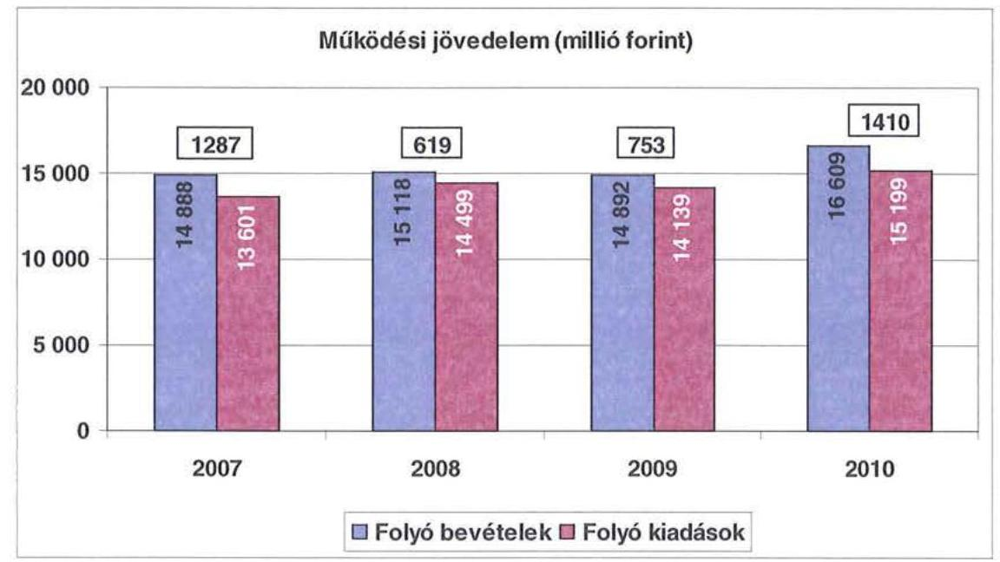

A folyó költségvetés egyenlege (a múködési forrástöbblet) 2007-ben a folyó kiadások 9,5\%-át (1287 millió Ft-ot), 2008-ban 4,3\%-át (619 millió Ft-ot), 2009ben 5,3\%-át ( 753 millió Ft-ot), 2010-ben 9,3\%-át (1410 millió Ft-ot) jelentette. A vizsgált időszakban a múködési jövedelem 4069 millió Ft megtakarítást mutatott, amely forrásul szolgálhatott az Önkormányzat fennálló tőketörlesztési kötelezettségeinek teljesítéséhez, valamint fejlesztéseinek finanszírozásához.

A pozitív előjelű folyó költségvetési egyenleg ellenére az Önkormányzat folyó-számla- és munkabérhitel felvételére kényszerült egyrészt az átmeneti likviditási problémák kezelése, másrészt fejlesztési kiadásai finanszírozása miatt. A folyószámlahitel napi átlagos állománya 2007-2010 között több mint négyszeresére nőtt ( 367 millió Ft-ról 1641 millió Ft-ra).

Az Önkormányzat kötelezettségein belül a 2008-2010 közötti időszakban a rövid lejáratú kötelezettségek állománya valamivel több, mint 50\% volt, a 2007. évi $66,2 \%$-os aránnyal szemben. Az Önkormányzat 2006. december 31-én fennálló pénz és tőkepiaci kötelezettsége 2005 millió Ft-ról több mint háromszorosára, 6638 millió Ft-ra nőtt a hosszú lejáratú hitelfelvétel és a folyószámlahitel állományának emelkedése miatt. Az összes kötelezettségen belül a hoszszú lejáratú pénzintézeti kötelezettségek 2007-2010 között több mint 73,6\%-kal (1430 millió Ft-tal) nőttek.

A rövid lejáratú kötelezettségek 2010-ben 3621 millió Ft-ot tettek ki, amely 226 millió Ft-tal (5,9\%) kevesebb a 2007. évi rövid lejáratú kötelezettségállománynál. Az önkormányzat a vizsgált időszakban nem rendelkezett számottevő mértékủ lejárt szállítói tartozásállománnyal (2010. év december 31-én 4 millió Ft volt).

---

Az Önkormányzat 2010. évi záró pénzkészlete 952 millió Ft volt ${ }^{39}$, amelynek $92 \%$-a kötelezettséggel terhelt.

Az Önkormányzat pénzügyi kapacitása a vizsgált időszakban pozitív értéket mutatott. A nettó múködési jövedelem ${ }^{40}$ értéke a folyó költségvetési pozíció mellett az adott költségvetési év adósságtörlesztésének hatását is tükrözi. A 4069 millió Ft müködési jövedelemnek 23,2\%-át ( 943 millió Ft) tette ki a fejlesztési célú hitelekhez kapcsolódó tőketörlesztés, amelynek kifizetését követően 3126 millió Ft nettó müködési jövedelme keletkezett az Önkormányzatnak.

A nettó müködési jövedelem - közel azonos nagyságrendű évenkénti tőketörlesztés ${ }^{41}$ mellett - 2007-ben 1065 millió Ft, 2010-ben 1152 millió Ft volt. A pénzügyi kapacitás 2007-hez viszonyított átmeneti romlását 2008-2009 között a folyó bevételek és kiadások különbségéből származó müködési jövedelem csökkenése okozta.

Az Önkormányzat pénzügyi kapacitásának kedvező alakulásában jelentős szerepe volt annak, hogy az Áhsz. 9. számú mellékletének 3. bekezdés b) és 4. bekezdés e) pontjaiban foglalt számviteli előírások miatt a tárgyévi adósságtörlesztések nem tartalmazták a folyószámlahítel visszafizetési kötelezettséget. A 2008. évtől kezdődően a visszafizetendő előző évi folyószámlahítelek ${ }^{42}$ jelentősen meghaladták a nettó múködési jövedelmet, a 2010. december 31-én fennálló 2793 millió Ft folyószámlahítel állomány kockázatot jelent a pénzügyi helyzet további alakulásában.
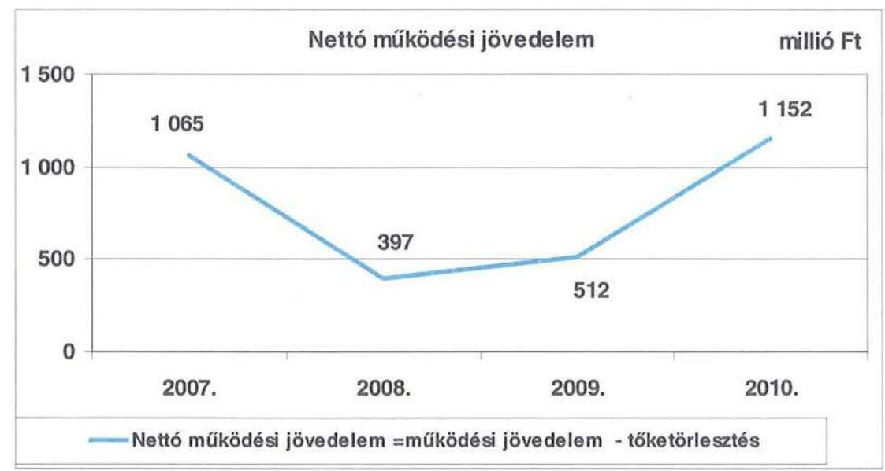

[^0]
[^0]:    ${ }^{39}$ Ebben a társulások ${ }_{1,2}$ pénzeszköze 177 millió Ft volt.
    ${ }^{40}$ pénzügyi kapacitás
    ${ }^{41}$ Az Önkormányzat tőketörlesztési kötelezettsége 2007. évben 222 millió Ft, 2008. évben 221 millió Ft, 2009. évben 241millió Ft, a 2010. évben 258 millió Ft volt.
    ${ }^{42}$ A folyószámlahítel törlesztési kötelezettség 2007-ben 496 millió Ft, 2008-ban 916 millió Ft, 2009-ben 1203 millió Ft, 2010-ben 1823 millió Ft volt.

---

A 2007-2010. években az Önkormányzat felhalmozási költségvetésének egyenlege folyamatosan negatív összegú volt, amely prudens költségvetési gazdálkodás és pénzügyileg fenntartható ${ }^{43}$ beruházások esetén nem jár magas pénzügyi kockázattal, amennyiben a múködési jövedelem képződése változatlan feltételekkel a jövőben is biztosított lesz.

A felhalmozási költségvetés egyenlegének alakulását évről évre az alábbi ábra szemlélteti:
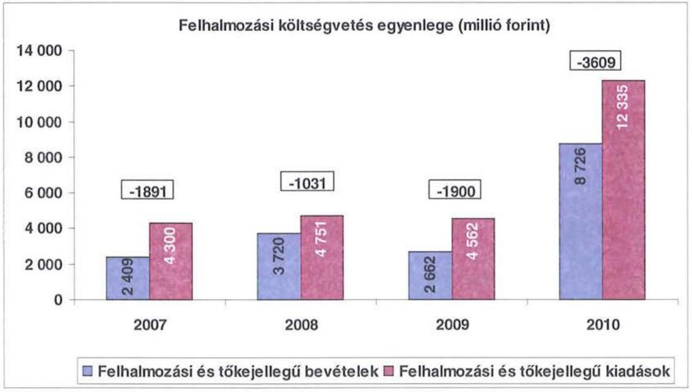

A felhalmozási forráshiánynak a felhalmozási és tőke jellegű kiadásokhoz ${ }^{44}$ viszonyított aránya 2007-ben 44,0\% (1891 millió Ft), 2008-ban 21,7\% (1031 millió Ft), 2009-ben 41,6\% (1900 millió Ft), 2010-ben 29,3\% (3609 millió Ft) volt.

A felhalmozási forráshiány finanszírozása a 2007. év elején rendelkezésre álló nyitó pénzkészletből, a nettó működési jövedelemből, valamint a folyószámlaés fejlesztési célú hitelekből történt ${ }^{45}$. A 2007-2010 között keletkezett 8431 millió Ft felhalmozási forráshiányra a 818 millió Ft 2007. évi nyitó pénzkészlet, a képződött 3126 millió Ft nettó múködési jövedelem, valamint a felvett 3280 ezer Ft összegű fejlesztési hitel, továbbá a folyószámlahitel állománynövekedéséből igénybevett 1207 millió Ft nyújtott fedezetet.

[^0]
[^0]:    ${ }^{43}$ Az minősül pénzügyileg fenntartható beruházásnak, amelynek múködtetésére az Önkormányzat nettó múködési jövedelme a következő években is fedezetet nyújt.
    ${ }^{44}$ Az ábrában megjelenő 2010. évi felhalmozási kiadásokban a társulások ${ }_{1,2}$-hoz kapcsolódó beruházások összege 9699 millió Ft.
    ${ }^{45}$ Az évenkénti adatokat a jelentés 2. számú melléklete mutatja be.

---

Az Önkormányzat 2011. évi költségvetési rendeletében - a CLF módszertől eltérő költségvetési szerkezetben - tervezett bevételeinek és kiadásainak különbözete 4373 millió Ft negatív teljes finanszírozási igényt mutat, amely finanszírozható a 2010. évi 952 millió Ft záró pénzkészletből, a fennmaradó 3421 millió Ft hiány fedezetét azonban további hitelek felvételével tudja biztosítani az Önkormányzat.

A függő, átfutó, kiegyenlítő bevételek és kiadások 138 millió Ft-os negatív egyenlegének a folyószámlahitel állomány ${ }^{46}$ további részéből történő finanszírozásával az Önkormányzat 952 millió Ft pénzkészlettel zárta a 2010. évet.

Az Önkormányzat évenkénti teljes finanszírozási igénye ${ }^{47}$ a CLF módszer szerint 2007-ben 826 millió Ft, 2008-ban 634 millió Ft, 2009-ben 1387 millió Ft, 2010-ben 2457 millió Ft volt, amelynek finanszírozását a finanszírozási célú bevételek és kiadások egyenlege biztosította.

Az Önkormányzat finanszírozási múveletei 2007-2010. évekbeli egyenlegének alakulását a következő ábra szemlélteti:
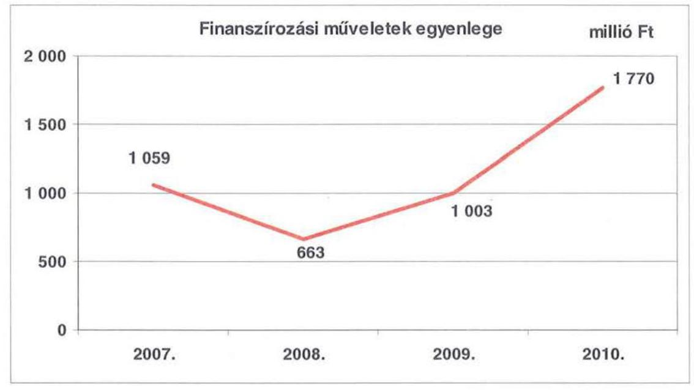

A finanszírozási többlet azt jelzi, hogy az éves költségvetések végrehajtása során szükség volt az előző években keletkezett pénzmaradvány igénybevételén túl külső finanszírozás igénybevételére is.

[^0]
[^0]:    ${ }^{46}$ Az Önkormányzat folyószámlahitel állománya 2296 millió Ft-tal nőtt 2007-2010. között.
    ${ }^{47}$ a nettó múködési jövedelem és a felhalmozási költségvetés eredője

---

Az Önkormányzat a zárszámadási rendeleteiben a múködési és fejlesztési hiányt a CLF módszertől eltérő szerkezetben mutatta be ${ }^{48}$, amelyről a jelentés 1. számú melléklete nyújt tájékoztatást. A rendeletek közül a 2010. évi zárszámadásban jeleztek forráshiányt, a korábbi években többletet mutattak ki.

A vizsgált időszakban a kötelezettségek (passzív pénzügyi elszámolások nélkül) 5808 millió Ft-ról 7120 millió Ft-ra emelkedtek, amely együtt járt a kamatkiadások növekedésével.

A 2007-2010 között az önkormányzat összesen 945810 ezer Ft kamatot fizetett meg. Az átmenetileg szabad pénzeszközei lekötése után kapott kamatbevétel, a teljes kamatráfordítás 18,6\%-át (175 460 ezer Ft) tette ki.

Az Önkormányzat kamatbevételeinek és kamatkiadásainak alakulását a következő ábra mutatja:
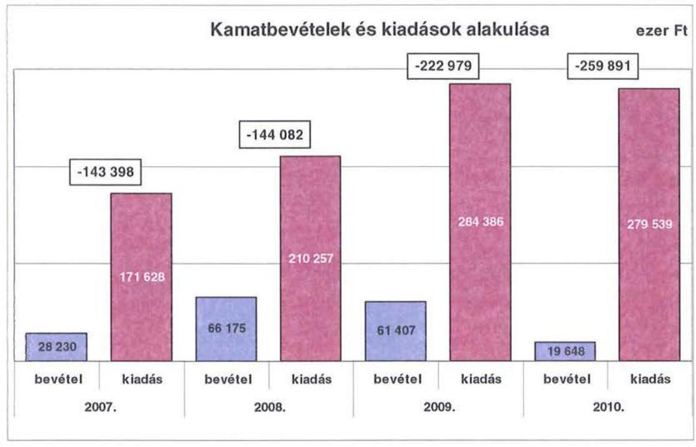

A 2011. évre az Önkormányzat a kamatkiadások további emelkedésével számol, a költségvetési rendeletben tervezett 367,8 millió Ft kamatráfordítás $31,6 \%$-kal, 88,3 millió Ft-tal haladhatja meg a 2010. évit.

# 2.2. Az Önkormányzat bevételeinek alakulása 

Az Önkormányzat folyó (működési) bevételei 2007-2009 között számottevően nem változtak, a 2010. évben alapvetően a felújításokhoz és beruházásokhoz kapcsolódó áfa visszatérülések és a fordított áfa miatt emelkedtek 11,5\%-kal (1717 millió Ft) az előző évhez viszonyítva. A fordított áfa miatti bevétel (1568 millió Ft) nélkül a 2010. évi növekedés 1,0\%, (149 millió Ft) lett volna.

[^0]
[^0]:    ${ }^{48}$ Nincs kötelező előírás a működési és fejlesztési hiány megállapításának módjára.

---

Az Önkormányzat 2007-2010 között realizált folyó (müködési) bevételeinek számszaki adatait a következő ábra mutatja be:
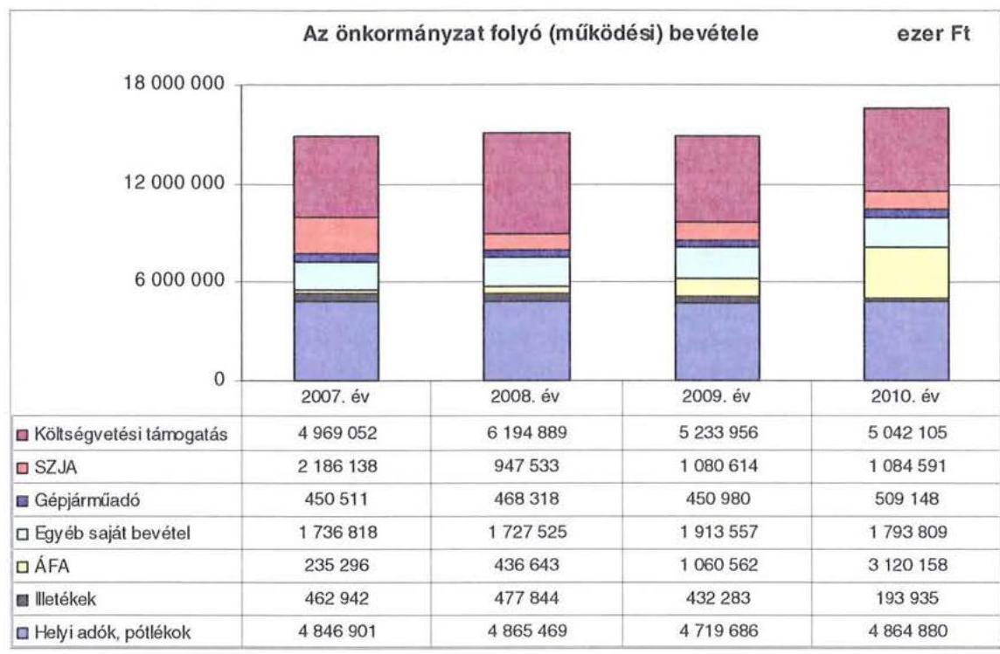

Az átengedett bevételekből az szja az elszámolási szabályok változása miatt 50,4\%-kal, (1102 millió Ft) csökkent, amit nem ellensúlyozott a költségvetési támogatások 1,5\%-os ( 73 millió Ft) növekedése. Az átengedett szja és a költségvetési támogatások együttes összege 2007-2010 között 14,4\%-kal (1028 millió Ft) csökkent.

A további növekedést mutató jogcímek közül a gépjármúadó 13,0\%-kal (59 millió Ft), az egyéb saját bevételek 3,3\%-kal, (57millió Ft), emelkedtek.

A 2007-2010 közötti időszakban az illetékbevételek az ingatlanpiaci visszaesés és egyes kedvezmények bevezetése miatt 58,1\%-kal, (269 millió Ft) csökkentek.

Az Önkormányzat 2007-2010 között négy helyi adónemet, az építményadót, a magánszemélyek kommunális adóját, az idegenforgalmi adót és az iparűzési adót alkalmazta. A helyi adók közül az iparűzési adó 6,1\%-kal (232 millió Ft) csökkent, amit ellensúlyozott az építményadó emeléséből származó 31,8\%-os (256 millió Ft) bevétel növekedés.

---

A helyi adók és pótlékok vizsgált időszakra vonatkozó, adónemenkénti alakulását az alábbi táblázat mutatja be:

|  |  |  |  | ezer Ft |
| :--: | :--: | :--: | :--: | :--: |
| Megnevezés | 2007. év | 2008. év | 2009. év | 2010. év |
| építményadó | 805384 | 939638 | 1049409 | 1061220 |
| kommunális adó | 133274 | 135527 | 135470 | 136398 |
| idegenforgalmi adó | 18489 | 21499 | 25058 | 24016 |
| iparűzési adó | 3801890 | 3675269 | 3428766 | 3569610 |
| pótlékok, bírságok | 87864 | 93536 | 80983 | 73636 |
| összesen | 4846901 | 4865469 | 4719686 | 4864880 |

Az Önkormányzat 2007-ben a VKSZ Zrt-től 20 millió Ft - az egyéb saját bevételek között számításba vett - osztalékbevételt kapott, ezt követően tulajdonosi részesedései után a gazdasági társaságoktól osztalékot nem vett fel.

Az Önkormányzat felhalmozási bevételei a vizsgált időszakban:
ezer Ft

| Megnevezés | 2007. év   tény | 2008. év   tény | 2009. év   tény | 2010. év   tény |
| :-- | --: | --: | --: | --: |
| Tárgyi eszköz értékesítés | 103249 | 858417 | 168325 | 397314 |
| Egyéb saját tőkebevétel | 69030 | 15640 | 8513 | 5596 |
| Államháztartáson belülről   kapott támogatás | 703323 | 1044510 | 2439264 | 8317513 |
| EU-tól és külföldről kapott   támogatások | 1340360 | 1681734 | 0 | 0 |
| Államháztartáson kívülről   kapott támogatás | 193119 | 119884 | 45435 | 6063 |
| Összes felhalmozási bevétel | 2409081 | 3720185 | 2661537 | 8726486 |

Az Önkormányzat összes felhalmozási célú bevétele a 2010. évben 8726 millió Ft volt, amely több mint három és félszer ( 6317 millió Ft) volt magasabb a 2007. évinél. A jelentős mértékú növekedést a társulásokhoz ${ }_{1,2}$ kapcsolódó beruházások forrása ${ }^{49}$ eredményezte. Az összes bevételből kiemelkedően magas részarányt képviseltek az államháztartáson belülről kapott ( 12505 millió Ft, $71,4 \%$ ) és az EU-tól származó ( 3022 millió Ft, 17,3\%) támogatások ${ }^{50}$. Az államháztartáson kívülről kapott támogatások $96,7 \%$-kal ( 187 millió Ft) csökkentek, ugyanakkor a tárgyi eszköz értékesítés bevétele $184,8 \%$-kal ( 294 millió Ft) emelkedett.

[^0]
[^0]:    ${ }^{49}$ A társulások ${ }_{1,2}$ felhalmozási célú bevétele 2007-ben 1906 millió Ft, 2010-ben 7733 millió Ft volt.
    ${ }^{50}$ A 2009. évtől érvényes számviteli szabályok szerint az EU-s forrásokból a közvetlenül kapott pénzeszközöket kellett elkülönítetten bemutatni, az EU-ból közvetett módon származó támogatások 2009-ben és 2010-ben - a korábbi évekkel ellentétben - az államháztartáson belülről kapott támogatások között szerepelnek.

---

# 2.3. Az Önkormányzat kiadásainak alakulása 

A 2010. évi folyó (múködési) kiadások 11,8\%-kal (1598 millió Ft) növekedtek a 2007. évhez viszonyítva, amiben jelentős szerepet játszott a fordított áfa. Az Önkormányzat a vizsgált időszakban a múködési költségvetés 60,2\%-át ( 34587 millió Ft) személyi juttatásokra és a munkaadókat terhelő járulékokra fordította, az üzemeltetést, intézményfenntartást biztosító dologi kiadásokra 30,7\% (17 615 millió Ft) jutott.

Az Önkormányzat folyó (múködési) kiadásai főbb jogcímek szerinti bontásban a következők voltak:

| Megnevezés | 2007. | 2008. | 2009. | 2010. |
| :--: | :--: | :--: | :--: | :--: |
| Folyó kiadások összesen | 13600553 | 14498972 | 14138344 | 15198335 |
| Múködési kiadások (kamatkiadás nélkül) | 12542125 | 13436218 | 12787033 | 13545609 |
| Államháztartáson belülre átadott pénzeszközök | 85338 | 44420 | 152742 | 340701 |
| Transzferkiadások | 801462 | 808077 | 914183 | 1032486 |
| -ebből: vállalkozásoknak | 286330 | 404790 | 320202 | 358739 |
| EU-nak, illetve külföldre | 0 | 0 | 0 | 0 |
| magánszemélyeknek | 269492 | 219154 | 340046 | 440474 |
| nonprofit szervezeteknek | 245640 | 184133 | 253935 | 233273 |
| Kamatkiadások | 171628 | 210257 | 284386 | 279539 |

A személyi juttatások és járulékok folyó (működési) kiadásokon belüli aránya a vizsgált időszakban folyamatosan csökkent, 2007-ben 66,5\%, ( 9045 millió Ft), 2008-ban 63,7\% ( 9230 millió Ft), 2009-ben 59,9\% ( 8476 millió Ft), 2010-ben 51,6\% ( 7835 millió Ft) volt.

Az Önkormányzatnál a dologi kiadások folyamatosan, az egyéb folyó kiadások - a 2009. év kivételével - emelkedtek, 2010-ben 63,5\%-kal (2207 millió Ft) voltak magasabbak a 2007. évi szintnél. A dologi kiadásokat 2009-től jelentős mértékben növelte a veszprémi multifuncionális sportcsarnokban a sport-, közéleti, kulturális és egyéb önkormányzati rendezvények megtartása érdekében vásárolt üzemidő szolgáltatási díja ${ }^{51}$. A 2010. évi kiugróan magas emelkedést a felújításokhoz és beruházásokhoz kapcsolódó fordított áfa elszámolása okozta, melynek ellentételezése a számviteli elszámolási szabályok következtében az áfa bevételek és visszatérülések között szerepel ${ }^{52}$. A fordított áfa miatti kiadás ( 1400 millió Ft) nélkül a dologi és egyéb folyó kiadások 2010-ben 1 millió Ft-tal csökkentek volna. A dologi kiadások növekedésére - a végrehajtott kiadáscsökkentő intézkedések hatását is figyelembe véve - a múködési jövedelem minden évben fedezetet biztosított.

[^0]
[^0]:    ${ }^{51}$ Az Önkormányzat 2009-ben 280 millió Ft, 2010-ben 298 millió Ft szolgáltatási díjat fizetett a Veszprém Aréna sportcsarnokban vásárolt üzemidő ellenértékeként.
    ${ }^{52}$ A fordított áfa bevételi oldalon elszámolt összegének ( 1568 millió Ft), illetve kiadási oldalon elszámolt összegének ( 1400 millió Ft) különbsége abból ered, hogy a 2010. évi decemberi adóbevallás alapján az adóhatóság részére történő áfa befizetés a következő év januárjában történik. (Az Önkormányzat havi adóbevallásra kötelezett.)

---

| Megnevezés | 2007. | 2008. | 2009. | 2010. |
| :-- | --: | --: | --: | --: |
| Személyi juttatások | 6893319 | 7046452 | 6535080 | 6239538 |
| Munkaadót terhelő járulékok | 2151501 | 2183840 | 1941377 | 1595755 |
| Dologi kiadások | 3397980 | 4070262 | 4214961 | 5465104 |
| Egyéb folyó kiadások | 80218 | 94331 | 71574 | 220218 |

A felhalmozási kiadások aránya az összes kiadáson belül 2007-2009 között számottevően nem változott, 24,0\%-ról ( 4300 millió Ft) 24,4\%-ra ( 4561 millió Ft) emelkedett. A 2010. évben a társulásokhoz ${ }_{1,2}$ kapcsolódó fejlesztési feladatok miatt a felhalmozási kiadások összes költségvetési kiadáshoz viszonyított aránya jelentős mértékben, $44,8 \%$-ra ( 12336 millió Ft) nőtt. A folyó (múködési) és a felhalmozási kiadások összetételének változását a vizsgált időszakban a következők ábra szemlélteti:
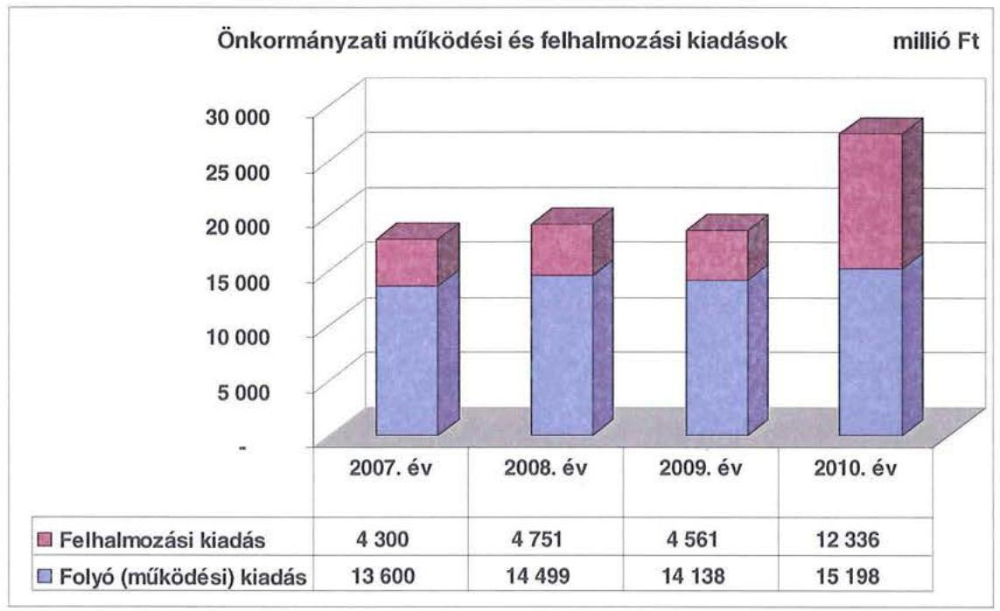

A múködési és felhalmozási kiadások arányát nagyban befolyásolta, hogy a társulások ${ }_{1,2}$ összes kiadásából a felhalmozási kiadások voltak a meghatározóak, múködési kiadásaik egyik évben sem érték el a 25\%-ot. Az Önkormányzat felhalmozási kiadásainak összes kiadáson belüli aránya a társulási adatok figyelembe vételéhez viszonyítva minden évben alacsonyabb azok nélkül, 2007ben $15,3 \%$ (2446 millió Ft), 2008-ban 12,3\% (2025 millió Ft), 2009-ben 10,7\% (1692 millió Ft), 2010-ben 15,2\% (2709 millió Ft) volt. Az Önkormányzat társulások ${ }_{1,2}$ nélküli folyó (múködési) és a felhalmozási kiadásait az alábbi ábra mutatja be:

---

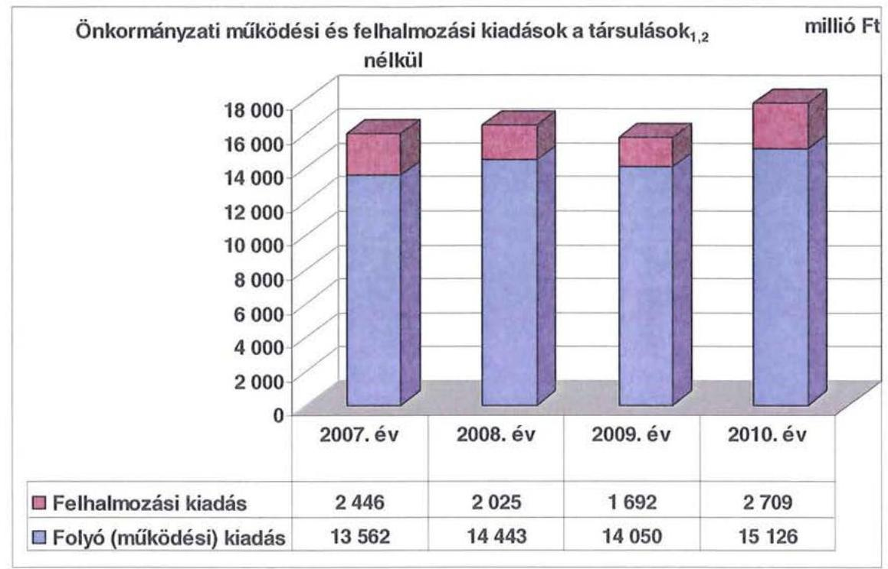

Az Önkormányzat pénzügyi helyzetének alakulására hatással voltak a 25\%-ot meghaladó önkormányzati tulajdonú gazdasági társaságok részére átadott pénzeszközök. A gazdasági társaságok kiadásaihoz a vizsgált időszakban 653 millió Ft müködési és 60 millió Ft fejlesztési pénzeszköz átadással járult hozzá, továbbá három gazdasági társaság részére 691 millió Ft tőkeemelést biztosított az Önkormányzat. Az üzletrészvásárlások között elszámolt 691 millió Ft 99,1\%-a ( 685 millió Ft) az Önkormányzat által a Veszprém Arénát birtokló és üzemeltető gazdasági társaság részére biztosított tőkeemelés ${ }^{53}$ volt. A gazdasági társaságok részére 2007-2010. között átadott önkormányzati hozzájárulásokat mutatja be az alábbi ábra:

[^0]
[^0]:    ${ }^{53}$ A Közgyűlés 276/2006. (XII. 14.) számú határozata alapján a Veszprém Arénát birtokló gazdasági társaságban az Önkormányzat 15 éven keresztül évente 300 millió Ft tőkeemelést hajt végre, amely a létesítmény megépítéséhez felvett 4500 millió Ft hitel tőketörlesztésének fedezeteként szolgál.

---

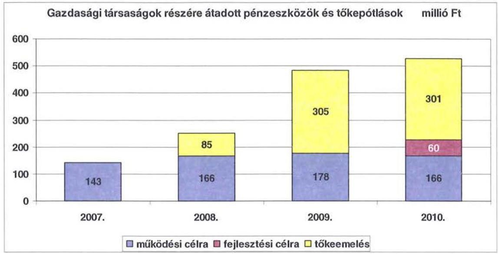

Az önkormányzati tulajdonú gazdasági társaságok belföldi értékesítésének nettó árbevétele és az Önkormányzat által a múködésükhöz nyújtott pénzeszköz átadások 2007-2010. között az alábbiak voltak:

| megnevezés | 2007. | 2008. | 2009. | 2010. |
| :-- | --: | --: | --: | --: |
| támogatott gazdasági   társaságok száma (db) | 4 | 5 | 7 | 7 |
| értékesítés nettó   árbevétele (millió Ft) | 3651 | 4089 | 3966 | 4241 |
| az Önkormányzat által   átadott pénzeszköz,   tőkeemelés (millió Ft) | 144 | 251 | 483 | 527 |
| önkormányzati pénzesz-   köz átadás a nettó   árbevétel arányában | $3,9 \%$ | $6,1 \%$ | $12,2 \%$ | $12,4 \%$ |

Az Önkormányzat 2007-2010 között 9734 millió Ft teljes bekerülési költségű felújítást és beruházást valósított meg, amelyből a vizsgált időszakra eső pénzügyi teljesítés áfá-val növelten 7449 millió Ft volt. A társulásokhoz ${ }_{1,2}$ kapcsolódóan teljesített fejlesztési kiadások 17075 millió Ft-ot tettek ki. Az önkormányzati fejlesztések döntően középületek és közterületek felújításából, intézmények korszerűsítéséből, illetve rekonstrukciójából, a belterületi úthálózat felújításából és fejlesztéséből, belterületi vízrendezésből, játszóterek, sport-, szabadidő és kulturális létesítmények építéséből, akadálymentesítési munkálatokból, közmúfejlesztésekből, valamint gépek, berendezések beszerzéséből tevődtek össze. A három legnagyobb bekerülési költségű önálló fejlesztés a következő volt:

- A 2008-ban kezdődött „Kolostorok és kertek a veszprémi Vár tövében" elnevezésű beruházás egy múemlékeket, idegenforgalmi látványosságokat, játszótereket és sétautakat magában foglaló, az aktív turizmus kedvelőinek szánt több km hosszú túraútvonal megvalósítására irányul. Az 1112 millió Ft teljes bekerülési költségű beruházás forrása 716 millió Ft EU-s forrás (64,4\%), 165 millió Ft saját erő (14,8\%) és 231 millió Ft hitel (20,8\%). A projekt tervezett befejezési időpontja 2011;

---

- A Lovassy László Gimnázium rekonstrukciója és tornateremmel való bővítése 878 millió Ft-ba került, melynek fedezetét 722 millió Ft címzett támogatás (82,2\%), 35 millió Ft saját bevétel ( $4,0 \%$ ) és 121 millió Ft hitel ( $13,8 \%$ ) biztosította;
- A Dubniczay-palota teljes rekonstrukciója 709 millió Ft volt, amit 70,9\%-ban (503 millió Ft) EU-s forrásból, 29,1\%-ban (206 millió Ft) hazai támogatásból valósított meg az Önkormányzat. A megújult múemlék épület különböző kulturális rendezvényeknek, közgyűjteményi és művészeti kiállításoknak biztosít helyszínt.

A bekerülési költség további 13 esetben meghaladta a 100 millió Ft-os nagyságrendet, ezek a fejlesztések a legnagyobb beruházással együtt a 2007-2010. közötti felhalmozási kiadások 40,0\%-át (2980 millió Ft) jelentették. A 2007-2010. közötti időszakban a 10 millió Ft teljes bekerülési költség feletti beruházások és felújítások száma - a három ismertetett kiemelt fejlesztést is figyelembe véve 73 volt, amelyek teljesített összértéke 5830 millió Ft-ot, a felújítási és beruházási kiadások $78,3 \%$-át tette ki.

A befejezett 6173 millió Ft értékú fejlesztés forrásmegoszlása 570 millió Ft EU-s támogatás ( $9,2 \%$ ), 1878 millió Ft hazai támogatás ( $30,4 \%$ ), 1579 millió Ft saját bevétel ( $25,6 \%$ ) és 2146 millió Ft hitel ( $34,8 \%$ ) volt. A teljesített kiadások összege 2006. december 31-ig 1533 millió Ft, 2007-2010 között 4640 millió Ft volt.

Az Önkormányzat 2010. december 31-én folyamatban lévő fejlesztési feladatainak nagysága 3561 millió Ft volt, amelynek forrása 989 millió Ft (27,8\%) EU-s támogatás, 176 millió Ft ( $4,9 \%$ ) hazai támogatás, 1351 millió Ft (37,9\%) saját bevétel és 1045 millió Ft (29,4\%) hitel volt. A teljesített kiadások összege 2006. december 31-ig 551 millió Ft, 2007-2010. között 2809 millió Ft volt.
2010. december 31-én folyamatban lévő és a 2010. évet követő kötelezettség-vállalásainak összege 5716 millió Ft, amelynek forrása 520 millió Ft EU-s támogatás ( $9,1 \%$ ), 148 millió Ft hazai támogatás ( $2,6 \%$ ), 3798 millió Ft saját bevétel $(66,4 \%)$ és 1250 millió Ft hitel ( $21,9 \%$ ) volt.

Az Önkormányzatnak egy darab, 254 millió Ft összegű, elbírálás alatti pályázati forrásból tervezett fejlesztési feladata van folyamatban. A források még nem álltak az Önkormányzat rendelkezésére, a pályázati elbírálások és a közbeszerzési eljárások nem zárultak le.

Az Önkormányzat 2007-2010. években megvalósított, illetve 2010. december 31-én fennálló, valamint az elbírálás alatt lévő fejlesztési feladatokhoz kapcsolódó kötelezettségeinek összegzését a jelentés 3/a-d számú mellékletei tartalmazzák.

---

# 3. KÖTELEZETTSÉGEK BEMUTATÁSA 

### 3.1. A pénzintézetek felé fennálló kötelezettségek alakulása

Az Önkormányzat pénzintézeti kötelezettségeinek állománya 2006. december 31-től 2010. december 31-ig több mint háromszorosára, 2005 millió Ft-ról 6638 millió Ft-ra nőtt. Az Önkormányzatnak 2011. március 31-én CHF-ben, illetve EUR-ban fennálló adóssága nem volt. A fennálló pénzintézeti kötelezettségei 18 hosszú lejáratú forinthitel igénybevételéből, valamint folyószámlahitel igénybevételéből keletkeztek.
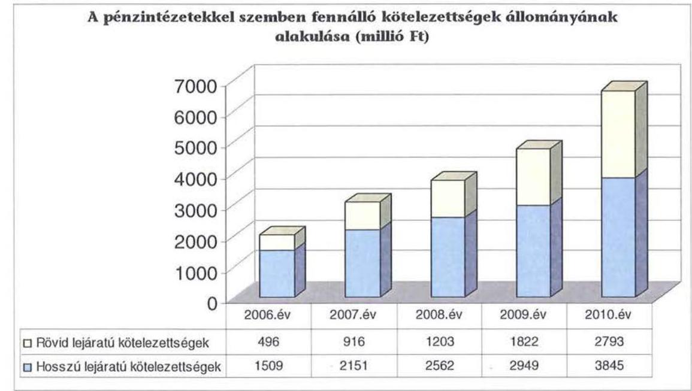

A költségvetési hiány finanszírozására tervezett pénzintézeti kötelezettségvállalások keretösszegét az Önkormányzat éves költségvetési rendeletei tartalmazták, amely 2007-ben 2200 millió Ft, 2008-ban 3018 millió Ft, 2009-ben 4427 millió Ft, 2010-ben 4150 millió Ft, 2011-ben 5000 millió Ft volt. Ebből a 2007. évben, a 2010. és a 2011. évben a folyószámlahitel aránya ${ }^{54}$ volt a nagyobb, a 2010. évben a tervezett pénzintézeti kötelezettségeknek 72,3\%-át tette ki.

A vizsgált években az éves költségvetési rendelet mellékletét képezte a felhalmozási célú hitel igénybevételével tervezett létesítmények jegyzéke, valamint az adósságot keletkeztető éves kötelezettségvállalás felső határának megállapításához készített számítás. Az Önkormányzat ténylegesen fennálló pénzintézeti kötelezettségeinek állománya a költségvetésben tervezettől eltérően alakult, mert a 2007-2010 években a hosszúlejáratra kötött szerződésekben meghatározott 6909 millió Ft hitelt a fejlesztések megvalósulásának arányában, több év alatt vette igénybe, illetve a fejlesztés kisebb bekerülési költsége miatt a rendel-

[^0]
[^0]:    ${ }^{54}$ A 2007. évben 54,5\% (1200 millió Ft), a 2008. évben 39,8\% (1200 millió Ft), a 2009. évben 45,2\% (2000 millió Ft), a 2010. évben 72,3\% (3000 millió Ft), a 2011. évben 70\% (3500 millió Ft) volt a tervezett folyószámlahitelek összege.

---

kezésre álló hitelkeretből 228 millió Ft-ot nem vett igénybe. A teljesítésekkel arányosan igénybe vehető, de még le nem hívott hosszú lejáratú hitelek összege 1842 millió Ft volt 2010. december 31-én.

A kötelezettségvállalásokból származó források felhasználási céljait a kötött szerződések tartalmazták, azonban előfordult, hogy egy-egy hitel öszszegéhez a számosság miatt a konkrét fejlesztési célokat összevontan, egy feladat keretében szerepeltették. ${ }^{55}$ Az Önkormányzat nem rendelkezett a felvett hitelek visszafizetésének forrásairól. Az Önkormányzat az éves költségvetési és zárszámadási rendeleteiben a pénzintézetekkel szemben a tárgyévben, illetve az azt követő években fennálló (hitel állományok, hiteltörlesztések és az egyéb) kötelezettségének alakulását bemutatta. Az Önkormányzat adósságot keletkeztető kötelezettségvállalásának felső határát a 2007-2010. években nem lépte túl. Az adósságot keletkeztető kötelezettségvállalással megvalósított felhalmozási kiadások esetleges bevételt növelő, illetve kiadást csökkentő vonzatát, illetve ennek a fejlesztéshez, felújításhoz vállalt kötelezettségek visszafizetési forrásként való számbavételét nem vizsgálták.

Az Önkormányzat a felhalmozási célú hiteleket a 2007-2010. években tervezett felújításokhoz, fejlesztésekhez ${ }^{56}$ vette igénybe.

[^0]
[^0]:    ${ }^{55}$ Pl.: intézményi felújítások és beruházások, infrastrukturális beruházások, intézményi és közterületi akadálymentesítések, informatikai felújítások, kommunális beruházások
    ${ }^{56}$ önkormányzati tulajdonú épületek, építmények felújítása, a város infrastruktúrális ellátottságának javítása, belterületi vízrendezés, intézményi beruházások, felújítások, az iparosított technológiával épült lakások ( 3614 db )felújítása

---

Az Önkormányzat 2010. december 31-én forintban fennálló adósságot keletkeztető kötelezettségvállalásai az alábbiak voltak:

| Megnevezés | Szerződéskötés időpontja | Összeg (ezer Ft) | Kamat (referencia kamat+ kamatfelár) | Felhasználás célja: |
| :--: | :--: | :--: | :--: | :--: |
| 1. sz.hosszú lejáratú hitel | 2002.07.29.* | 390000 | 3 havi BUBOR $+0,25 \%$ | infrastruktúráliś és intézményi beruházások |
| 2. sz. hosszú lejáratú hitel | 2003.08.06.* | 416506 | 3 havi BUBOR $+0,60 \%$ | 42 lakásos ingatlan vásárlása (Karacs T. út) |
| 4800/2004/0080 sz. hosszú lejáratú hitel | 2004.10.30 | 400000 | 3 havi BUBOR $+0,40 \%$ | földterület vásárlás |
| 4800/2005/0081 sz. hosszú lejáratú hitel | 2005.10.10.* | 178500 | 3 havi EURIBOR $+1,90 \%$ | infrastruktúráliś és intézményi beruházások |
| 4800/2005/0080 sz. hosszú lejáratú hitel | 2005.12.08 | 221500 | 3 havi BUBOR $+0,20 \%$ | ingatlanszerzések és egyéb beruházások |
| 6. sz. hosszú lejáratú hitel | 2006.08.23.* | 212000 | 3 havi BUBOR $+0,149 \%$ | infrastruktúráliśs   beruházások |
| 4800/2006/083 sz. hosszú lejáratú hitel | 2006.09.12.* | 257500 | 3 havi EURIBOR $+1,035 \%$ | infrastruktúráliśs és intézményi beruházások |
| 4800/2006/0084 sz. hossza lejáratú hitel | 2008.12.12.* | 134000 | 3 havi EURIBOR $+1,035 \%$ | iparosított technológiával épült lakások felújítása |
| 9/1. sz. hosszú lejáratú hitel | 2007. 06.13.* | 55000 | 3 havi EURIBOR $+1,00 \%$ | infrastruktúráliśs és intézményi beruházások |
| 9/2. sz. hosszú lejáratú hitel | 2007. 06.13.* | 278000 | 3 havi EURIBOR $+1,50 \%$ | infrastruktúráliśs és intézményi beruházások |
| 10. sz. hosszú lejáratú hitel | 2007.09.27.* | 162900 | 3 havi EURIBOR $+1,02 \%$ | iparosított technológiával épült lakások felújítása |
| GA-035757 sz.hosszú lejáratú hitel | 2007.09.27.* | 532500 | 3 havi BUBOR $+0,09 \%$ | infrastruktúráliśs és intézményi beruházások |
| O.4800/2008/0028/1.sz.   hosszú lejáratú hitel | 2008.05.30.* | 331000 | 3 havi EURIBOR $+1,79 \%$ | infrastruktúráliśs és intézményi beruházások |
| Ö.4800/2008/0028/2. sz.   hosszú lejáratú hitel | 2008.05.30.* | 284880 | 3 havi EURIBOR $+1,29 \%$ | infrastruktúráliśs és intézményi beruházások |
| GA-040588 sz.hosszú lejáratú hitel | 2008.05.30.* | 655000 | 3 havi BUBOR $+0,65 \%$ | infrastruktúráliśs és intézményi beruházások |
| O.4800/2009/0070/1.sz.   hosszú lejáratú hitel | 2009.06.22.* | 195000 | 3 havi EURIBOR $+2,75 \%$ | infrastruktúráliśs és intézményi beruházások |
| O.4800/2009/0070/2.sz.   hosszú lejáratú hitel | 2009.06.22.* | 78000 | 3 havi EURIBOR $+2,25 \%$ | infrastruktúráliśs és intézményi beruházások |
| EG43D014209000 sz. hosszú lejáratú hitel | 2009.06.25.* | 195000 | 3 havi EURIBOR $+2,00 \%$ | infrastruktúráliśs és intézményi beruházások |
| EG43D014409000 sz. hosszú lejáratú hitel | 2009.06.25.* | 782000 | 3 havi BUBOR $+1,98 \%$ | infrastruktúráliśs és intézményi beruházások |
|  |  |  | 3 havi EURIBOR+MFB   refinanszírozási   kamatfelár ( $2,00 \%$, ami   évente változhat) $+0,71 \%$ | infrastruktúráliśs és intézményi beruházások |
| Ö.4800/2010/0047/1.sz.   hosszú lejáratú hitel | 2010.07. 26.* | 391150 |  |  |
|  |  |  | 3 havi EURIBOR+MFB refinanszírozási kamatfelár ( $1,50 \%$, ami évente változhat) $+0,71 \%$ |  |
| Ö.4800/2010/0047/2.sz.   hosszú lejáratú hitel | 2010.07. 26.* | 159450 |  |  |
|  |  |  | 3 havi BUBOR $+1,74 \%$ |  |
|  | 2010.07. 26.* | 599400 | 3 havi BUBOR $+1,74 \%$ |  |

a*-al jelölt szerződések az igénybevett hitel összege, időpontja, valamint a kamat változása miatt módosultak

A forintban fennálló hosszú lejáratú kötelezettségeiből az Önkormányzat a vizsgált időszakban 995 millió Ft összegű tőkét törlesztett és 893 millió Ft összegű kamatot fizetett meg, egyéb költsége nem merült fel.

---

A minősített befolyást biztosító önkormányzati tulajdonú gazdasági társaságok ${ }^{57}$ forintban fennálló hosszú lejáratú kötelezettsége 2010. december 31-én 461 millió Ft volt. A 2011-2013 években fennálló hosszú lejáratú kötelezettségeikből 358 millió Ft a tőke, 18 millió Ft a várható kamatkötelezettség. A 2013. év után 103 millió Ft összegben mutattak ki tőketörlesztési kötelezettséget.

A VKSZ Zrt-nek 2010. december 31-én 27908 ezer CHF-ben állt fenn hosszú lejáratú kötelezettsége, amelyből 4187 ezer CHF-t a 2011-2013. években, 23721 ezer CHF-t a 2014. évtől a 2023. évig kell megfizetnie. A gazdasági társaság jogelődje 2007. július 12-én kötött hosszú lejáratú hitelszerződést 4700 millió Ft összegben, amelynek a visszafizetési kötelezettsége évente a járulékokkal együtt több mint 600 millió Ft volt. A jogutód gazdasági társaság a kamatterhek csökkentése érdekében a Ft-ban kötött hitelszerződést 2008. október 2-án átváltotta CHF-re. A CHF-ben kötött hitelszerződés alapján az éves fizetési kötelezettség a 2009. és a 2010. évben nem érte el az 500 millió Ft-ot.

Az Önkormányzat müködésének pénzügyi egyensúlyát, valamint felhalmozási forráshiányának fedezetét a vizsgált időszakban csak folyószámlahitel igénybevételével tudta biztosítani. A folyószámlahitel és a munkabér megelőlegezési hitel alakulását az alábbi táblázat mutatja be:

|  |  |  |  |  |  |
| :-- | --: | --: | --: | --: | --: |
| Megnevezés | 2007. év | 2008. év | 2009. év | 2010. év | 2011.   március 31. |
| I. Folyószámlahitel |  |  |  |  |  |
| a folyószámlahitel keretösszege január 1-jén | 950000 | 1700000 | 1380000 | 2000000 | 3000000 |
| teljesitett kamat és egyéb költség | 29381 | 28170 | 79422 | 128195 | 48368 |
| II. Munkabér megelölegezési hitel |  |  |  |  |  |
| Igénybevett hitel összesen: | 692070 | 168000 | - | 190000 | 292528 |
| teljesitett kamat és egyéb költség | 2964 | 562 | - | 1092 | 991 |

[^0]
[^0]:    ${ }^{57}$ Növény és Vadaspark Kft., Veszprém TV Kft., továbbá a VKSZ Zrt. két gazdasági társasága (Aranyosvölgy Ingatlan Kft., Jutas Ingatlan Kft.)

---

A folyószámlahitel és munkabér megelőlegezési hitelek kondíciói és egyéb költségei az alábbiak voltak ${ }^{58}$ :

| Megnevezés | Kamat (referencia+ kamatfelár | Egyéb költség |
| :--: | :--: | :--: |
| Folyószámlahitel |  |  |
| 2007. év | 3 havi BUBOR $+0,2 \%$ | $0,00 \%$ |
| 2008. év | 3 havi BUBOR $+0,2 \%$, május 21-től $+0,7 \%$, december 31-től a +180 millió Ft$\mathrm{ra}+2,0 \%$ | $0,15 \%$, a 180 millió Ft-ra 0,5\% rend.tart.jutalék |
| 2009. év | 3 havi BUBOR $+0,7 \% 1200$ millió Ft-ra, 180 millió Ft-ra $+2,0 \%$ május 22-ig, május 23-tól 1 havi BUBOR $+1,5 \%, a+800$ millióFt-ra $+2,4 \%$ | $0,15 \%$, a 180 millió Ft-ra 0,5\% rend.tart.jutalék, május 22 -tól $+0,3 \%$ kezelési költség |
| 2010. év | 1 havi BUBOR $+1,5 \% 1200$ millió Ft-ra, a 800 millió Ft-ra $+2,4 \%$, május 21-től 1200 millió Ft-ra 1 havi BUBOR $+1,5 \%$, 800 millió Ft-ra $+2,2 \%, 1000$ millió Ft-ra $2,4 \%$ | $0,15 \%$ rend.tart.jutalék, $+0,3 \%$ kezelési költség |
| 2011. év | 1 havi BUBOR $+1,5 \% 1200$ millió Ft-ra, a 800 millió Ft-ra $+2,2 \%$, az 1000 millió Ftra $2,4 \%$ | $0,15 \%$ rend.tart.jutalék, $+0,3 \%$ kezelési költség |
| Munkabér megelőlegezési hitel |  |  |
| 2007. év | 3 havi BUBOR $+0,2 \%$ | $x$ |
| 2008. év | 3 havi BUBOR $+0,7 \%$ | $x$ |
| 2010. év | 1 havi BUBOR $+2,7 \%$ | $x$ |
| 2011. év | 1 havi BUBOR $+2,7 \%$ | $x$ |

A Önkormányzat a 2007. május 21-én fennálló 1200 millió Ft összegű folyószámlahitel keretét számlavezető bankjánál november 21-től 500 millió Ft-tal emeltette változatlan kamatkondíciók mellett. A 2008. május 23-án szintén növelte az 1200 millió Ft-ban fennálló folyószámlahitel keretet 180 millió Fttal. A növekmény esetében a kamatfelárat a számlavezető bank 1,3\%kal megemelte. 2009 májusától a folyószámlahitel keretösszegének emelésénél az 1200 millió Ft feletti hitel összegére számolt a bank magasabb kamattal. Az Önkormányzatnál 2009. május 22-én 2000 millió Ft, 2010. május 21-én már 3000 millió Ft volt a folyószámlahitel keret összege.

A vizsgált időszakban az Önkormányzat 2007-ben 247 napon keresztül vett igénybe folyószámlahitelt, átlagosan napi 542 millió Ft-ot. A 2008. évben

[^0]
[^0]:    ${ }^{58}$ A referencia kamat az alábbiak szerint alakult:

    | MNB BUBOR fixing (átlagkamat) \%-ban |  |  |  |  |
    | :-- | :-- | :-- | :-- | :-- |
    | Referetencia kamat | 2007. évi | 2008. évi | 2009. évi | 2010. évi | 2011.máricus   31-ig |
    | 3 havi BUBOR | 7,75 | 8,87 | 8,64 |  |  |
    | 1 havi BUBOR |  |  |  | 5,47 | 5,94 |

---

190 napra csökkent a folyószámlahitel igénybevétele, míg a napi átlagos állományának összege 546 millió Ft-tal, közel azonos volt az előző évivel. A 2009. évtől a folyószámlahitel igénybevételénél emelkedő tendencia tapasztalható, abban az évben 316 napon keresztül fennálló átlagos napi állomány 835 millió Ft volt, míg a 2010. évben ez 1668 millió Ft-tal közel a duplájára emelkedett 359 napon át. Az Önkormányzat 2011. március 31-ig a 3000 millió Ft összegű folyószámlahitel keretéből 90 napon keresztül igénybe vett átlagos hitelállománya 2328 millió Ft volt.

A folyamatos likviditási problémák folyószámlahitellel történt finanszírozása miatt az Önkormányzatnak a 2007. évtől 2011. március 31-ig összesen 314 millió Ft kamatkiadást és kapcsolódó egyéb költséget kellett megfizetnie.

Az Önkormányzatnál pénzügyi kockázatot jelent, hogy a 2010. év végén fennálló 2793 millió Ft folyószámlahitelt a 2011. év májusában nem tudta rendezni, kérte a korábbi, 3000 millió Ft összegű folyószámlahitel keretszerződés meghosszabbítását. A 2011. évre tervezett 3500 millió Ft összegű folyószámlahitel keretre indított közbeszerzési eljárás eredménytelenül zárult ${ }^{59}$. A következő a vizsgálat idején folyamatban lévő közbeszerzési eljárásokat ${ }^{60} 3000$ millió Ft folyószámla keret biztosítására, továbbá 500 millió Ft összegben rövidlejáratú hitel felvételére indította az Önkormányzat.

A folyamatos és tartós likviditási problémák miatt az Önkormányzat 2007-től a 2009. év kivételével - a munkabérek kifizetéséhez munkabér megelőlegezési hitelt vett igénybe. A 2007. évben négy alkalommal átlagosan 173 millió Ft, majd évente a 2008. és a 2010. évben, valamint 2011. március 31-ig egyegy alkalommal vett igénybe munkabér megelőlegezési hitelt ${ }^{61}$. Az Önkormányzat 2007-ben 80 napon keresztül vett igénybe munkabér megelőlegezési hitelt, átlagosan napi 9 millió Ft-ot. A 2008. évben 13 napra csökkent a munkabér megelőlegezési hitel igénybevétele, azonban a napi átlagos állományának összege 13 millió Ft-ra nőtt. A 2010. évtől a munkabér hitel igénybevételénél emelkedő tendencia tapasztalható, ebben az évben 26 napon keresztül fennálló átlagos napi állomány 7 millió Ft volt, míg a 2011. I negyedévben ez 21 millió Ft-tal megháromszorozódott 14 napon át. Kamat címén a munkabérhitel után a vizsgált években összesen 6 millió Ft-ot fizetett ki.

Az Önkormányzat jelenleg fennálló hitelei közül három esetében módosult a kamatfizetési kötelezettség, melyet az alábbi táblázat mutat be:

| Megnevezés | Alapszerződés | Módosított szerződés | Változás \% |
| :-- | :--: | :--: | :--: |
|  | módosítás napján érvényes kamata \% |  |  |
| 1. sz hosszú lejáratú hitel | 9,26 | 9,71 | 4,9 |
| 2. sz hosszú lejáratú hitel | 9,61 | 9,71 | 1,0 |
| GA-040588 sz. hosszú lejáratú hitel | 5,90 | 6,25 | 5,9 |

[^0]
[^0]:    ${ }^{59}$ pénzintézet nem adott ajánlatot
    ${ }^{60}$ Kbt. 125. § (2) bekezdés b) pontjában foglaltak alapján hirdetmény nélküli
    ${ }^{61}$ A 2008. évben 168 millió Ft, a 2010. évben 190 millió Ft, a 2011. év I. negyedévében 293 millió Ft összegben.

---

A változások miatt 7,9 millió Ft-tal több fizetési kötelezettséget kell teljesítenie, mintha az eredeti szerződésben rögzített feltételekkel kellett volna a kamatot megfizetnie.

Az Önkormányzat a 2011-2014. évekre szóló gazdasági programjában prioritásként határozta meg a hitelállomány csökkentését.

# 3.2. Szállítók felé fennálló kötelezettségek alakulása 

Az Önkormányzat lejárt szállítói tartozásainak, egyéb kiadáselmaradásainak, valamint a gazdasági társaságok lejárt szállítói tartozásainak alakulását az alábbi táblázat tartalmazza:
ezer Ft

| Megnevezés | 2007.   december 31. | 2008.   december 31. | 2009.   december 31. | 2010.   december 31. |
| :-- | --: | --: | --: | --: |
| Lejárt szállítói tartozás | 924 | 65275 | 8770 | 4446 |
| Egyéb kiadás elmaradás | 1822 | 2183 | 2136 | 2615 |
| Gazdasági társaságok | 60415 | 63542 | 30625 | 11373 |

Az Önkormányzat lejárt szállítói tartozása 2008 év végén volt kiugróan magas 65,3 millió Ft-tal ${ }^{62}$. Az ezt követő években a lejárt szállítói tartozás nagymértékben csökkent, a 2010. évben 4,4 millió Ft volt ${ }^{63}$. A lejárt szállítói állományból 3,9 millió Ft az Önkormányzat intézményeinél állt fenn 2010. december 31-én. A 4,4 millió Ft összegű lejárt tartozásállományból 2,3 millió Ft 30 nap alatti, 2,1 millió Ft egy éven túli tartozás.

Az éven túli lejárt szállítói tartozás az Önkormányzat egy intézményénél jelentkezett 2010. év végén, amely egy energetikai kft korrekciós számlázása alapján keletkezett. Ezt az intézmény nem egyenlítette ki, mivel vitatja a számlázott öszszeget. A kötelezettséget az intézmény tévesen mutatta ki a szállítók között. A Számv. tv. 68. § (5) bekezdés a) pontjában foglaltak alapján a szolgáltatásteljesítésből származó elismert kötelezettség szerepeltethető a könyvviteli mérlegben.

Az Önkormányzat lejárt szállítói tartozása 2011. március 31-ére 41\%-kal, 6,2 millió Ft-ra nőtt a 2010 év végén fennálló kötelezettséghez képest. A lejárt szállítói állománynak 66,1\%-a ( 4,1 millió Ft) a Polgármesteri hivatalnál jelentkezett 2011. március 31-én. Az egyéb kiadáselmaradás a 2010. év végén 2,6 millió Ft volt, amely a 2011. I. negyedév végére több mint a kétszeresére, 5,4 millió Ft-ra növekedett. Egyéb kiadáselmaradás, étkezési térítési díj túlfizetéséből adódóan, az Önkormányzat intézményeinél keletkezett.

[^0]
[^0]:    ${ }^{62}$ A 2008. december 31-i lejárt szállítói tartozásból 52 millió Ft volt 30 napnál régebbi, amelyből 33 millió Ft a társulás ${ }_{2}$-nél, 19 millió Ft a Polgármesteri hivatalnál keletkezett. A társulás ${ }_{2}$ a számlát műszaki okok miatt nem egyenlítette ki, a Polgármesteri hivatal részletfizetési megállapodás alapján később egyenlítette ki.
    ${ }^{63}$ A lejárt szállítói tartozás 2009. december 31-én 8,8 millió Ft volt, 2010. december 31én a 4,4 millió Ft lejárt szállítói tartozás a 80,4 millió Ft szállítói állománynak 5,5\%-át tette ki.

---

A minősített többségi befolyást biztosító önkormányzati tulajdonú gazdasági társaságainak ${ }^{64}$ szállítói kötelezettsége 2010. december 31 -én 247 millió Ft volt. Ezen belül lejárt szállítói tartozásuk 2007-ről 2010. december 31re 81,1\%-kal, 11,4 millió Ft-ra csökkent ${ }^{65}$.

A 2010. december 31-i önkormányzati szintű mérlegben kimutatott le nem járt tartozásállomány 76 millió Ft -ot tett ki, amelynek $70,4 \%$-a ( 56,6 millió Ft) a Polgármesteri hivatal tartozása volt.

# 3.3. Egyéb kötelezettségek alakulása 

Egy önkormányzati intézmény 2010. október 1-jén gépkocsi vásárlás céljából lizingszerződést kötött 2015. október 1-jei lejárattal. ${ }^{66}$ Az intézmény a 2010. évben 1,8 millió Ft lízingdíjat egyenlített ki. A fennálló kötelezettség 2010. december 31-én 2,6 millió Ft volt, amelyből a 2011-2013. években esedékes 1,3 millió Ft, a 2014-2015 években szintén 1,3 millió Ft a fizetendő lízingdíj.

Az önkormányzati gazdasági társaságok közül egy, 100\%-os tulajdonban lévő - 2007. október 12-től, 2012. október 24-i lejárattal, gépjármú beszerzésére - rendelkezett CHF alapú lizingszerződéssel. A fennálló kötelezettségvállalás összege 2010. december 31-én 7515 CHF volt.

Az Önkormányzatnak a vizsgált időszakban garancia- és kezességvállalással kapcsolatos kötelezettségvállalása a 2011. I. negyedévben egy gazdasági társasága likvid hitel felvételéhez ${ }^{67}$ kapcsolódott, 135,1 millió Ft összegben.

Az Önkormányzat PPP konstrukció keretében nem végzett beruházást. A multifunkcionális sportcsarnok megépítését PPP konstrukcióban tervezte, azonban a közbeszerzési eljárás a 2006. évben eredménytelen lett. A létesítményt a rendelkezésre álló tenderdokumentációkra és a PPP projekttervre alapozva - más formában, és az eredetileg tervezettől eltérően, más helyszínen, nem PPP keretében - az Önkormányzat többségi tulajdonában lévő gazdasági társasággal valósíttatta meg.

Az Önkormányzat hosszú lejáratú egyéb kötelezettséget a multifunkcionális sportcsarnokkal kapcsolatban vállalt fel. A többfunkciós sportcsarnok létesítéséhez az Önkormányzat gazdasági társasága vett fel - 4700 millió Ft ösz-

[^0]
[^0]:    ${ }^{64}$ Pro Veszprém Kft., Növény és Vadaspark Kft., VKSZ Zrt. és gazdasági társaságai (Aranyosvölgy Ingatlan Kft., Jutas Ingatlan Kft., Multicsarnok Kft., Csarnok Kft.)
    ${ }^{65}$ 2007. december 31-én fennálló 60,4 millió Ft lejárt szállítói tartozásból 58,3 millió Ft egy gazdasági társaságnál keletkezett, és likviditási nehézségei miatt 2008. és a 2009. évben is magas volt a lejárt szállító állománya.
    ${ }^{66}$ Az Önkormányzat a 260/2010. (VII. 19.) számú határozatában hozzájárult a VMKK lízing keretében történő eszközbeszerzéséhez.
    ${ }^{67}$ Az Önkormányzat a 321/2010. (XI. 11.) számú határozatával hozzájárult az európai uniós forrással tervezett pályázat megvalósítása érdekében a TISZK Kft likvid hitel felvételéhez max. 350 millió Ft összegben.

---

szegben - hitelt. Az Önkormányzat 2006 decemberében döntött arról, hogy a létesítménnyel kapcsolatosan a gazdasági társaságban 2008. április 1-től 15 éven keresztül évente 300 millió Ft összegben tőkét emel, továbbá évente maximum 220 millió Ft +áfa összegben vásárol a sportcsarnokban szolgáltatást ${ }^{68}$. Az Önkormányzat a rendelkezésre álló üzemidő $8 \%$-át vette igénybe a vizsgált években, ezért a vállalt kötelezettség indokolatlan terhet jelent. Az Önkormányzat a 2023. március 31-ig vállalt kötelezettségéből 2010. december 31-ig 682,5 millió Ft törzstőke emelést és 676,5 millió Ft+áfa szolgáltatásvásárlást valósított meg. Az Önkormányzat könyvviteli mérlegében nem szereplő, azonban 2010. december 31-én fennálló egyéb hosszú lejáratú kötelezettsége a multifunkcionális sportcsarnok kapcsán 6441 millió Ft volt.

A polgármester, valamint a Pénzügyi bizottság a vagyongazdálkodási rendeletben foglaltak alapján ${ }^{69}$ döntött a behajthatatlan követelés elengedéséről. Az Art. 134. § alapján, a helyi adók és pótlékok tekintetében a jegyző járt el. A 2007-2011. március 31-e között az elengedett követelések bruttó összege 34,4 millió Ft volt, amelyek bérleti díjak, bírságok, helyi adók és pótlékok, étkezési térítési díjak, gondozási díjak, lakbér és továbbszámlázott szolgáltatásokból eredő tartozásokra vonatkoztak.

Az Önkormányzat az építmények jó-karbantartásáról, a környezetszennyezés megelőzéséről alkotott rendeletet ${ }^{70}$, amely szerint visszatérítendő kamatmentes kölcsön formájában (támogatási rendszert) múködtet a veszély elhárításával kapcsolatos kötelezettség teljesítésének érdekében. A veszélyt okozó építmények hibáinak megszüntetésére az Önkormányzat 0,8 , illetve 0,9 millió Ft összegben nyújtott kamatmentes kölcsönt a 2008, valamint a 2009. évben egy-egy református egyházközségnek 10, illetve 5 év alatt történő visszafizetéssel. ${ }^{71}$

Az Önkormányzat gazdasági társaságainak tagi és egyéb kölcsönt nem nyújtott.

Az Önkormányzat hat jelzálogjoggal és egyidejúleg elidegenítési és terhelési tilalommal érintett ingatlannal rendelkezett a 2007-2011. években. A bejegyzé-

[^0]
[^0]:    ${ }^{68}$ Az Önkormányzat a 2007. november 13-án aláírt szolgáltatási szerződés szerint 15 éven keresztül $70 \%$ üzemidőt vásárolt a multifunkcionális sportcsarnokban. Az üzemidő megállapításánál 365 nappal és 24 órás folyamatos nyitva tartással számoltak.
    ${ }^{69}$ Az Önkormányzat 22/2005. (VI. 27.) számú vagyongazdálkodási rendeletének 37. § c.) pontja és a 22/2010. (VI. 28.) számú rendeletének 69. § 3) pontja alapján a behajthatatlan kisösszegű követelésekről a polgármester, a 22/2005. (VI. 27.) számú vagyongazdálkodási rendeletének 40. § 1.) pontja és a 22/2010. (VI. 28.) számú rendeletének 72. § 1.) pontja alapján a költségvetési törvényben meghatározott értékhatár feletti behajthatatlan követelések elengedéséről a Pénzügyi bizottság dönt.
    ${ }^{70}$ Az Önkormányzat 31/2004. (IV. 1.) számú rendelete.
    ${ }^{71}$ A 10 évre szóló kamatmentes kölcsönről átruházott hatáskörben a 214/2008. (VI. 20.) számú határozatban az Önkormányzat Városfejlesztési bizottsága döntött. Ugyanakkor az Önkormányzat 31/2004. (IV. 1.) számú rendeletének 5.§ (1) bekezdése szerint öt évnél hosszabb futamidejú kamatmentes kölcsön támogatásban természetes személy részesíthető.

---

sekre ingyenes vagyonátadás, európai uniós és hazai források igénybevétele miatt került sor.

Az Önkormányzat az ÁSZ helyszíni ellenőrzésének megkezdéséig elindította egy 719,4 millió Ft bejegyzett jelzálogjog törlését, mivel a jelzálog lejáratának időpontja 2011. május 12. volt ${ }^{72}$. A biztosítékként megjelölt ingatlanok forgalomképesek voltak, a jelzálogjog bejegyzések nem jelentettek kockázatot az Önkormányzat pénzügyi egyensúlyi helyzetére.

A jelzálogjoggal terhelt ingatlanok számvitelben nyilvántartott nettó értéke 2010. december 31 -én 1576,7 millió Ft volt, amelyre 1487,4 millió Ft összegű jelzálogjogot jegyeztek be. Az Önkormányzat összes forgalomképes ingatlanának könyvszerinti nettó értéke 3884 millió Ft, a korlátozottan forgalomképes ingatlanoknak 9527 millió Ft volt 2010. december 31-én.

A forgalomképes ingatlanok nettó értékének százalékos megoszlását a jelzáloggal terhelt és nem terhelt ingatlanok között az alábbi ábra szemlélteti:
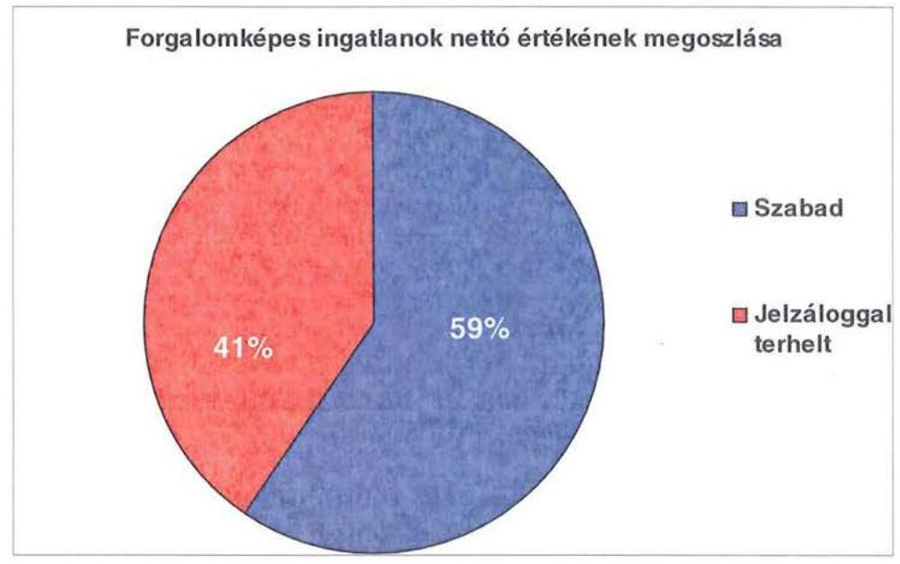

A vizsgált időszakban nem történt meg annak felmérése, hogy az eszközök elhasználódása, amortizációja fedezetének biztosítása mekkora forrásokat igényel az Önkormányzatnál. A felújítások, az eszközök pótlása az Önkormányzat pénzügyi lehetőségének függvényében történtek, amelyek keretében terek, utak, árkok rendezésére, az iparosított és nem iparosított technológiával épült lakások szigetelésére, valamint intézmények működtetéséhez elengedhetetlenül szükséges munkák elvégzésére került sor.

[^0]
[^0]:    ${ }^{72} 2011$ júniusában további 718 millió Ft jelzálog bejegyzés törlése várható

---

Az Önkormányzat kötelezettségeinek 2010. december 31-i állományát és várható alakulását a kötelezettségek lejáratáig a következő táblázat szemlélteti:

| Megnevezés | Állomány 2010. dec. 31 -én |  |  | Várható kötelezettség 2011. 2013. években |  |  | Várható kötelezettség 2014.   évet követően |  |  |
| :--: | :--: | :--: | :--: | :--: | :--: | :--: | :--: | :--: | :--: |
|  | (millió Ft.   bun) | Devizitban (összege) | Deviz.   unem | (millió Ft.   bun) | Devizitban (összege) | Deviz. unem | (millió Ft.   bun) | Devizitban (összege) | Deviz. unem |
| Pénzintézeti kötelezettségek |  |  |  |  |  |  |  |  |  |
| Monyori lejáratú bőlelek | 3841 |  | 1010 | 2024 |  | 1010 | 2800 |  | 1010 |
| Folyószabadalattal | 2794 |  | 1010 | 2793 |  | 1010 |  |  | 1010 |
| Pénzintézeti kötelezettségek összesen 1010-ban | 6638 |  | 1010 | 4817 |  | 1010 | 2800 |  | 1010 |
| Üzling kötelezettség/ok |  |  | 1010 | 4 |  | 1010 | 2 |  | 1010 |
| Szállítót tartozás | 80 |  | 1010 | 80 |  | 1010 |  |  |  |
| Egyéb kiadás elmaradás | 2 |  | 1010 | 4 |  | 1010 |  |  |  |
| Egyéb kötelezettségek | 6441 |  | 1010 | 1360 |  | 1010 | 4881 |  | 1010 |

Az Önkormányzat 2010. december 31-én fennálló összes (pénzintézeti, szállítói, valamint egyéb) kötelezettsége: 13165 millió Ft, amelyből a 2011-2013. években 6461 millió Ft kötelezettsége keletkezik. Ennek teljesítésére figyelembe vehető 167,4 millió Ft egyéb pénzmaradvány, 478,4 millió Ft mérlegben kimutatott követelésállomány, továbbá 3884 millió Ft forgalomképes ingatlanvagyon, melyből 1487,4 millió Ft a pénzintézeti kötelezettséghez kapcsolódóan jelzáloggal terhelt. A jelzálog bejegyzések közül a 2011. évben törlésre kerül 1437,5 millió Ft, az így felszabaduló forgalomképes ingatlanvagyon, valamint az egyes évek saját önkormányzati bevételei jelenthetik a továbbiakban a fizetési kötelezettségek fedezetét. Az Önkormányzat a vizsgálattal érintett években az aktuális, csak az adott költségvetési évben teljesítendő adósságszolgálattal számolt. A jelenlegi ismeretek szerint 7683 millió Ft a 2014. évtől esedékes pénzintézeti és egyéb kötelezettség, amelynek forrás szükségletét nem számszerüsítette az Önkormányzat.

Az Önkormányzat 2007-2011. március 31. között az átmenetileg szabad pénzeszközei lekötéséből 191 millió Ft kamatbevételt ért el, amelyből kötelező és önként vállalt feladatai ellátását finanszírozta.

Az Önkormányzat minősített többségi tulajdonú gazdasági társaságai kötelezettségeinek 2010. december 31-i állományát és várható alakulását a kötelezettségek lejáratáig az alábbi táblázat mutatja be:

| Megnevezés | Állomány 2010. dec. 31 -én |  |  | Várható kötelezettség 2011. 2013. években |  |  | Várható kötelezettség 2014.   évet követően |  |  |
| :--: | :--: | :--: | :--: | :--: | :--: | :--: | :--: | :--: | :--: |
|  | (millió Ft.   bun) | Devizitban (összege) | Deviz. unem | (millió Ft.   bun) | Devizitban (összege) | Deviz. unem | (millió Ft.   bun) | Devizitban (összege) | Deviz. unem |
| Pénzintézi kötelezettségek |  |  |  |  |  |  |  |  |  |
| Monyori lejáratú bőlelek | 461 | 27807623 | CHE | 376 | 7172960 | CHE | 103 | 23720703 | CHE |
| Folyószababa - és egyéb jövid lejáratú bőlelek | 0 |  | 1010 | 0 |  | 1010 |  |  |  |
| Pénzintézeti kötelezettségek összesen | 461 | 27807623 | CHE | 376 | 7172960 | CHE | 103 | 23720703 | CHE |
| Üzling kötelezettségeik |  | 7315 | CHE |  | 7315 | CHE |  |  |  |
| Szállítót tartozás | 247 |  | 1010 | 247 |  | 1010 |  |  |  |

Az Önkormányzat a Gt. 54. § (2) bekezdése, illetve a Csődtv. 63. § (2) bekezdése alapján korlátlan felelősséggel tartozik felszámolás esetén a minősített többséget biztosító befolyása alatt álló, valamint a 100\%-os önkormányzati tulajdonú gazdasági társaságok minden olyan kötelezettségéért, amelynek kielégítését a felszámolási eljárás során az adós társaság vagyona nem fedez, ha a hitelezőinek a felszámolási eljárás során benyújtott keresete alapján a bíróság - az adós társaság felé érvényesített tartósan hátrányos üzletpolitikájára figyelem-

---

mel - megállapítja az Önkormányzat korlátlan és teljes felelősségét. Az Önkormányzat minősített többségi tulajdonában lévő társaságoknak ${ }^{73}$ a 2011. évtől 479 millió Ft és 30894 ezer CHF pénzintézeti kötelezettséget, 247 millió Ft szállítói tartozást, valamint 7,5 ezer CHF lízingdíjat kell rendezniük. Ezek nem teljesítése esetén a bíróság korlátlan és teljes felelősséget állapíthat meg az Önkormányzat terhére.

Az Önkormányzat a 2007-2010 években a tárgyi eszközök után 4398,4 millió Ft összegű értékcsökkenést mutatott ki, miközben az elszámolt értékcsökkenés $33,8 \%$-át ( 1488,4 millió Ft-ot) fordították felújításra. Az eszközök avultsága növekedett, mivel az önkormányzati szintű használhatósági fok mutató aránya négy év alatt 3,4 százalékponttal, $89,6 \%$-ról $86,2 \%$-ra csökkent az egyes eszközcsoportoknál különböző mértékkel elszámolt amortizáció elsődleges hatására. Az eszközökön belül az ingatlanok, illetve az ingatlanokhoz kacsolódó vagyoni értékű jogok használhatósági foka $94,2 \%$-kal, illetve $91,9 \%$ kal az átlagnál kedvezőbb volt, míg az üzemeltetésre ${ }^{74}$, illetve vagyonkezelésre átadott eszközöké ${ }^{75} 78,1 \%$-kal, illetve $76,7 \%$-kal elmaradt az átlagtól. Az Önkormányzat az elhasználódott és amortizálódott eszközök pótlására tartalékot nem képzett, külön alapot nem hozott létre ${ }^{76}$.

Az Önkormányzat és a Polgármesteri hivatal jelenleg hat folyamatban lévő peres eljárásban érintettek alperesként. Az Önkormányzat terhére kimutatott perérték 85 millió Ft, amelynek $74,1 \%$-a, 63 millió Ft közös tulajdon megszüntetéséhez, $23,5 \%$-a, 20 millió Ft kártérítéshez, $2,4 \%$-a, 2 millió Ft jubileumi jutalom megfizetéséhez indított perhez kapcsolódott. Két peres eljárást az Önkormányzat kezdeményezett elbirtoklás és bérlakás kiürítése tárgyában. Az elbirtoklás perértéke 5 millió Ft. Az önkormányzati gazdasági társaságok a jogerős határozattal nem lezárt peres eljárásainak perértéke 37 millió Ft, amelyből 3 millió Ft, $8,1 \%$, a kártérítés és megbízási díj megfizetése címen az ellenük indított öt peres eljárás perértéke. Felperesként 11 ügyben számlatartozások, egy esetben sikkasztás miatt kezdeményeztek peres eljárást, amelyek perértéke 34 millió Ft. A lezárt, de pénzügyileg még nem rendezett peres ügy értéke 0,2 millió Ft, amelyet egy gazdasági társaság kezdeményezett számlatartozás miatt. Az önkormányzati gazdasági társaságok peres eljárásaihoz kapcsolódó kötelezettségek nem jelentenek kockázatot az Önkormányzat pénzügyi helyzetének alakulására.

[^0]
[^0]:    ${ }^{73}$ A VKSZ Zrt. egy 2023-ban lejáró, az Aranyosvölgy Ingatlan Kft. és a Jutas Ingatlan Kft. további kettő hosszú lejáratú pénzügyi kötelezettséggel, a Növény és Vadaspark Kft. egy hosszú lejáratú pénzügyi kötelezettséggel, a Veszprém TV Kft. lízingdíj kötelezettséggel rendelkezik.
    ${ }^{74}$ Az Önkormányzat döntően vízi közműveket, bérlakásokat, szennyvíztisztítással öszszefüggő építményeket-, gépeket, hulladékszállítással kapcsolatos eszközöket, állatkerti ingatlanokat adott át üzemeltetésre.
    ${ }^{75}$ Az Önkormányzat a köztemetőt többségi tulajdonában lévő gazdasági társaságának, digitális röntgen készüléket a Kórháznak, azaz a MÖK tulajdonában lévő gazdasági társaságnak vagyonkezelésébe adta.
    ${ }^{76}$ Az Önkormányzatot erre jogszabály nem kötelezi.

---

# 4. A PÉNZÜGYI EGYENSÚLY MEGTEREMTÉSE ÉrDEKÉBEN HOZOTT INTÉZKEDÉSEK 

A Közgyűlés által elfogadott gazdasági programban és annak a 2008. évi felülvizsgálatakor, valamint az éves költségvetési koncepcióban jelölte meg azokat a feladatokat, amelyeket az Önkormányzat kiadásainak csökkentése és bevételeinek növelése érdekében szükségesnek és indokoltnak tartott.

A vizsgált időszak egyik évében sem készült számszerúsített terv a kiadások önkormányzati szintű mérsékléséről, illetve a bevételek növeléséről. A Közgyűlés jellemzően az éves költségvetések előterjesztéseiben, évközben egyedi határozatokban hozott döntéseket.

Az Önkormányzat a kiadáscsökkentő és bevételnövelő intézkedéseit a gazdálkodás átláthatóbbá tétele, - a feladatellátás szakmai színvonalának megőrzése mellett - és kiemelten a pénzügyi helyzetének stabilizálása érdekében tette. A legjelentősebb mértékű kiadási megtakarítást feladatok megszüntetésével és átszervezésekkel járó létszámcsökkentési döntésekkel érte el.

A 2007-2010. évek kiadáscsökkentő intézkedéseinek hatását az Önkormányzat kimutatása alapján - beavatkozási területenként - az alábbiak mutatják:

| Az érvényesített kiadás-   csökkentés területei | Személyi   juttatások és   járulékai | Dologi, mú-   ködési ki-   adások | Pénzeszköz   átadások,   támogatások | Összesen |
| :-- | :--: | :--: | :--: | :--: |
| Az intézményeknél | 1199384 | 240000 | 0 | 1439384 |
| A Polgármesteri hivatal-   nál | 41301 | 0 | 0 | 41301 |
| A Közgyűlésnél | 6657 | 0 | 0 | 6657 |
| Összesen | 1247342 | 240000 | 0 | 1487342 |

Az intézmények körében az önkormányzati szinten kimutatott megtakarítási intézkedésekből 1439,3 millió Ft-ot érvényesítettek. Az intézményi megtakarításokból 1199,3 millió Ft a személyi juttatások csökkenése, amelyből 132,4 millió Ft a feladatmegszüntetéssel és átszervezéssel járó létszámcsökkentés kihatása, 17,7 millió Ft az üres álláshelyek zárolása miatt jelentkező, 24,3 millió Ft a határozott idejű alkalmazások megszüntetése és 66 millió Ft a közoktatási ágazatban a csoportlétszám változásával összefüggő kiadáscsökkenés.

Az intézményi körben a feladatok „átvilágítása" eredményeként a 2007. évben létszámleépítés volt (például az oktatási ágazatban 76,5 fő), amely a 2007. évben többletköltséget jelentett, azonban a 2008. évtől évi 200 millió Ft megtakarítást eredményezett. A 2007. évi költségvetési rendeletben megállapított 2825,5 fő intézményi létszámkeret a 2009. évben 2771 főben került meghatározásra, amelynek a további csökkentését a 2010. évben a VMKK-nál valósították meg, 15 fővel csökkentve ${ }^{77}$ az intézmény engedélyezett létszámát.

[^0]
[^0]:    ${ }^{77}$ A csökkentést éven túli üres álláshelyek megszüntetésével, munkakörök összevonásával, nyugdíjazással, üzemeltetési feladatok kiszervezésével oldották meg.

---

A 2011. évi költségvetési rendeletben a Közgyűlés az irányítása alá tartozó költségvetési szerveinél a költségvetési létszámkeretet 2609 fóben határozta meg.

A Polgármesteri hivatalban a Közgyűlés határozata alapján végrehajtott létszámcsökkentési intézkedés nyomán 41,3 millió Ft megtakarítást ért el az Önkormányzat.

Az Önkormányzat a létszámcsökkentő intézkedések következtében a 20072010. években a Polgármesteri hivatalnál és az intézményeknél összesen $318^{78}$ álláshelyet szüntetett meg.

A létszámcsökkentés eredményét a következő táblázat szemlélteti:
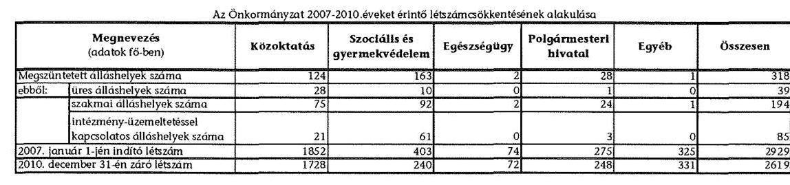

Létszámcsökkentésre irányuló döntésekre a közoktatási intézményekben és a Polgármesteri hivatalnál került sor. A megszüntetett álláshelyek közül 194 szakmai, 85 intézményüzemeltetéshez és gazdasági ügyek intézéséhez kapcsolódó, 39 üres álláshely volt. A közoktatási intézményekben összesen 124 - 60\%ban szakmai - álláshelyet szüntettek meg. A szociális ellátás és a gyermekvédelem területén az intézményátadások miatt a létszámcsökkentés 163 fő volt. Az egészségügy területén 2 fogorvosi állás szűnt meg, a feladatot vállalkozási jogviszony formában folytatják. A Polgármesteri hivatal 2007. évi induló létszáma 275 fơről lecsökkentett 2010. év végére 248 főre. A 2011. évi költségvetési rendeletben, a Polgármesteri hivatalban irodánként egy-egy fő nyugdíjazása miatt 15 millió Ft megtakarítást prognosztizáltak.

A helyi szervezési intézkedésekhez kapcsolódóan 103,6 millió Ft központosított támogatást igényeltek. 84 fő létszámot tartósan leépítettek, amelynek 67\%-a ( 56 fő) a közoktatási intézményeket - 1 óvodát, 6 általános iskolát és 4 középfokú intézményt - 33\%-a (28 fő) a Polgármesteri hivatalt érintette. Az Önkormányzatnál, a szociális és gyermekvédelmi intézmények átadásával összefüggő - 163 fős - létszámcsökkentést figyelmen kívül hagyva a tényleges létszámcsökkentés 155 fő ( $4,9 \%$ ) volt.

Az Önkormányzat kimutatása szerint a vizsgált években a dologi kiadásoknál 240 millió Ft kiadási megtakarítást a fenntartásában lévő intézményeknél realizált. A Közgyűlés a költségvetési rendeletek elfogadásakor - a 2007. évtől rendszeresen döntött évi 4-10\% közötti nagyságrendben - intézményenként dif-

[^0]
[^0]:    ${ }^{78}$ A 2007. január 1-jei induló (2929 fő) és a 2010. december 31-i záró létszám (2619 fő) közötti különbség 310 fő, az eltérés a megszüntetett álláshelyekhez képest 8 fő létszámbővítés következménye (Polgármesteri Hivatalnál 1fő energetikus alkalmazása, a Bábszínháznál 7fő átvétele).

---

ferenciált mértékkel - a dologi kiadásoknak a „szigorító" intézkedések miatti csökkentéséről.

Az Önkormányzat fizetőképességének és likviditásának biztosítását a 2001. évtől bevezetett kiskincstári rendszer működtetése is segítette. Az Önkormányzat felügyelete alá tartozó intézményeket és a Polgármesteri hivatal által kezelt szakfeladatok működtetését a jegyző által felülvizsgált likviditási terv alapján csak a napi kiadásokhoz szükséges mértékig finanszírozzák.

A Közgyülés múködési körében - kimutatásuk szerint - a képviselők tiszteletdíjának csökkentése ${ }^{79} 6,6$ millió Ft megtakarítást eredményezett.

A bevételnövelésre irányuló intézkedések eredményét az Önkormányzat 341,8 millió Ft összegben mutatta ki, melynek részletezését a következő ábra szemlélteti:
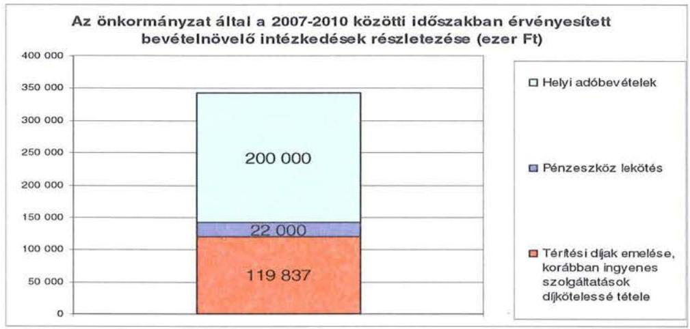

A többlet-forrásból 6,4\%-ot a Polgármesteri hivatal realizált értékpapírok (állampapírok, diszkontkincstárjegy) kamataiból. A bevételek növekedésében meghatározó tényező volt - a Közgyűlés 2008. évben hozott döntései alapján az építményadó, az idegenforgalmi adó és a magánszemélyek kommunális adó mértékének a módosítása, amely az Önkormányzat bevételeit évi 100 millió forinttal növelte. A vizsgált években 200 millió Ft többlet-forráshoz jutott az Önkormányzat, amellyel a 2011. évi költségvetésben is számoltak. Az Önkormányzat által megállapított adótételek a törvényi maximális mérték alatt maradtak, az emelés ellenére. A térítési díjak többlete 119,8 millió Ft volt ${ }^{80}$.

Az Önkormányzat az átszervezések és a kiadást csökkentő, illetve a bevételt növelő intézkedések pénzügyi helyzetre és szakmai feladatra gyakorolt hatását nem vizsgálta és nem mutatta ki.

[^0]
[^0]:    ${ }^{79}$ Az alapdíj összegét csökkentették 10\%-al.
    ${ }^{80}$ A vizsgált időszakban az Önkormányzat a fenntartásában múködő közoktatási intézményekben alkalmazandó étkezési, valamint a személyes gondosodást nyújtó intézményekben az ellátásért fizetett térítési díjakat évente az infláció mértékének megfelelően növelte, a 2010. évben - a Közgyűlés döntése alapján - nem volt térítési díjnövekedés.

---

# 5. A HELYI ÖNKORMÁNYZATOK GAZDÁLKODÁSI RENDSZERÉNEK 2010. ÉVI ELLENŐRZÉSE SORÁN A PÉNZÜGYI EGYENSÚLY JAVÍTÁSÁRA TETT SZABÁLYSZERŰSÉGI ÉS CÉLSZERŰSÉGI JAVASLATOK HASZNOSULÁSA 

Az utóellenőrzés során ÁSZ az Önkormányzat gazdálkodási rendszerét a 2010. évben ellenőrizte átfogó jelleggel. A gazdálkodási rendszer korábbi ellenőrzése során az ÁSZ jelentésében hét szabályszerűségi és három célszerűségi javaslatot tett. A jelentést a Közgyűlés megismerte. A javaslatok megvalósítására intézkedési tervet készítettek ${ }^{81}$, amely teljes körűen tartalmazta a javaslatokat, meghatározta a feladatok elvégzéséért felelősöket és a feladatok elvégzésének határidejét.

A pénzügyi egyensúly javítására egy célszerúségi javaslat vonatkozott, mely szerint a Közgyűlés tájékoztatása érdekében évente készítsenek számításokat arra vonatkozóan, hogy a hosszú lejáratú, adósságot keletkeztető kötelezettségvállalásokból adódó tőke- és kamatfizetési kötelezettségét az Önkormányzat milyen feltételek biztosítása mellett tudja teljesíteni.

Az intézkedési tervben a javaslat végrehajtásának határideje a 2011. évi, illetve az azt követő években a költségvetési rendelet benyújtásának időpontja volt. A 2007-2010 években kialakult gyakorlatot alkalmazták az Önkormányzat 2011. évi költségvetésének készítésénél. A 2011. évi költségvetési rendelet 14. számú melléklete tartalmazta a hosszú lejáratú, adósságot keletkeztető kötelezettségvállalásokból adódó tőke- és kamatfizetési kötelezettséget, azonban azok finanszírozásának tervezett forrásait nem mutatták be.

A Közgyűlés 2007. - 2011. március 31-e között önálló napirend keretében előterjesztés hiányában nem tárgyalta az Önkormányzat eladósodásának helyzetét, a hosszú lejáratú kötelezettségvállalásokból keletkezett fizetési kötelezettségei teljesítésének feltételrendszerére vonatkozó számítási anyag nem készült.

Budapest, 2011. december „ 22 "

Melléklet: 9 db
Függelék: $\quad 1 \mathrm{db}$
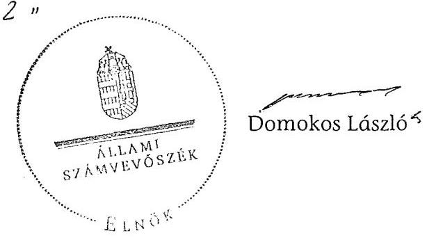

[^0]
[^0]:    ${ }^{81}$ Az ÁSZ elnökének megküldött V-3023-7/30/20/2010. szeptember 16-i iktatószámú intézkedési terv.

---

.

---

Veszprém Megyei Jogú Város Önkormányzata

1. számú melléklet a V-3053/2011. számú jelentéshez

Működési és felhalmozási célú hiány/többlet az önkormányzat rendeleteiben

(millió Ft)

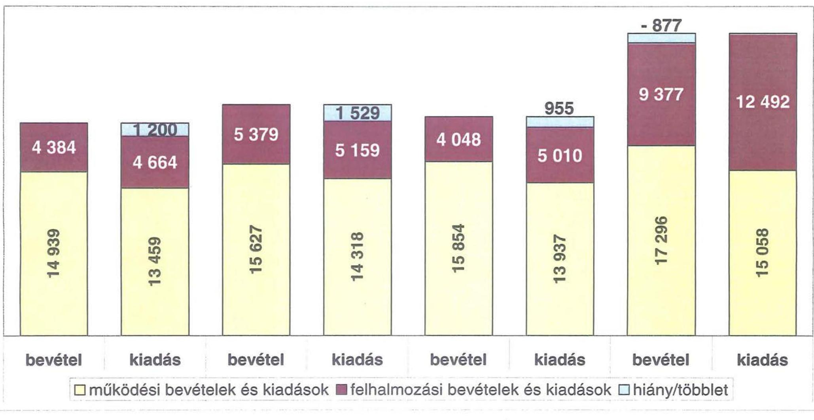

---

|  1. FOLYÓ KÖLTSÉGVETÉS* | 2007. | 2008. | 2009. | 2010.  |
| --- | --- | --- | --- | --- |
|  1.1.1. Saját működési bevételek | 6 816 315 | 7 015 842 | 7 548 954 | 9 319 342  |
|  1.1.2. Költségvetési támogatás | 4 969 052 | 6 194 889 | 5 233 926 | 5 042 105  |
|  1.1.3. Átengedett bevételek | 2 636 659 | 1 415 898 | 1 531 889 | 1 592 786  |
|  1.1.4. Államháztartáson belülről kapott támogatások | 619 479 | 442 797 | 518 204 | 587 842  |
|  1.1.5. EU-tilt és külföldről kapott bevételek | 730 | 192 | 1 436 | 4 980  |
|  1.1.6. Államháztartáson belülről kapott bevételek | 45 523 | 48 690 | 57 199 | 50 571  |
|  1.1.7. Előző évt pémmeredvány átvétel | 0 | 0 | 0 | 0  |
|  1.1. Folyó bevételek =1.1.1.+1.1.2.+1.1.3.+1.1.4.+1.1.5.+1.1.6.+1.1.7. | 14 887 658 | 15 118 221 | 14 891 638 | 16 608 626  |
|  1.2.1. Működési kiadások kamatkísáitom nélkül | 12 542 125 | 13 436 218 | 12 787 033 | 13 545 609  |
|  1.2.2. Államháztartáson belülre átadott pénzeseleteik | 85 338 | 44 420 | 152 742 | 340 701  |
|  1.2.3.1. vállalkozásoknak | 286 330 | 404 798 | 320 202 | 358 739  |
|  1.2.3.2. EU-nek, illetve külföldre | 0 | 0 | 0 | 0  |
|  1.2.3.3. megjegyzésfizetnek | 269 492 | 219 154 | 340 046 | 440 474  |
|  1.2.3.4. megengő szervezetének | 245 640 | 184 133 | 253 935 | 233 273  |
|  1.2.4. Tizenegyedülövek (=1.2.3.1+1.2.3.2+1.2.3.3+1.2.3.4) | 801 462 | 808 077 | 914 183 | 1 032 486  |
|  1.2.4. Kamatkísáitok | 171 628 | 210 257 | 284 386 | 279 539  |
|  1.2.5. Előző évt pémmeredvány átadás | 0 | 0 | 0 | 0  |
|  1.2. Folyó kiadások = 1.2.1.+1.2.2.+1.2.3.+1.2.4.+1.2.5. | 13 680 553 | 14 498 972 | 14 138 344 | 15 198 335  |
|  1.3. Folyó költségvetés egyenlege MŰKÖDÉSI JÖVEDELEM (1.1. - 1.2.) | 1 287 105 | 619 249 | 753 294 | 1 410 291  |
|  2. FELHALMOZÁSI KÖLTSÉGVETÉS** |  |  |  |   |
|  2.1.1. Saját többlevételek | 172 279 | 874 957 | 176 838 | 402 910  |
|  2.1.2. Államháztartáson belülről kapott támogatások | 763 323 | 1 044 510 | 2 439 264 | 8 317 513  |
|  2.1.3. EU-tilt és külföldről kapott támogatások | 1 340 360 | 1 681 734 | 0 | 0  |
|  2.1.4. Államháztartáson kívülről kapott támogatások | 192 119 | 119 884 | 45 435 | 6 063  |
|  2.1. Felhalmozási bevételek (=2.1.1.+2.1.2+2.1.3+2.1.4.) | 2 409 081 | 3 720 185 | 2 661 537 | 8 726 486  |
|  2.2.1. Saját beruházási kiadás állása | 3 358 798 | 4 004 031 | 3 058 832 | 11 697 121  |
|  2.2.2. Saját felújítási kiadás állása | 745 915 | 419 704 | 235 740 | 203 390  |
|  2.2.3. Államháztartáson belülre átadott pénzeselete | 147 025 | 166 573 | 50 457 | 58 308  |
|  2.2.4. EU-nek és külföldnek adott pénzeseleteik | 0 | 1 000 | 0 | 0  |
|  2.2.5. Államháztartáson belülre adott pénzeseleteik | 48 031 | 75 338 | 110 997 | 123 592  |
|  2.2.6. Befektetési célú részesedések vásárlása | 0 | 84 570 | 305 212 | 301 000  |
|  2.3. Felhalmozási kiadások (=2.2.1.+2.2.2.+2.2.3.+2.2.4.+2.2.5.+2.2.6.) | 4 299 769 | 4 751 216 | 4 561 238 | 12 335 509  |
|  2.3. Felhalmozási költségvetés egyenlege (2.1. - 2.2.) | -1 890 688 | -1 031 031 | -1 899 701 | -3 609 023  |
|  3. Finanszírozási műveletek nélküli (GFS) pozíció(1.3.+2.3.) | -603 583 | -411 782 | -1 146 407 | -2 198 732  |
|  4. Finanszírozási műveletek |  |  |  |   |
|  4.1. Hissfiztvétel | 1 284 499 | 919 290 | 1 248 306 | 2 123 933  |
|  4.2. Hissfiztévsztés | 222 219 | 221 748 | 241 346 | 258 043  |
|  4.3. Forgatói és befektetési célú értékpapírok kibocsátása | 0 | 0 | 0 | 0  |
|  4.4. Forgatói és befektetési célú értékpapírok beváltása | 0 | 0 | 0 | 0  |
|  4.5. Forgatói és befektetési célú értékpapírok értékesítése | 0 | 0 | 0 | 0  |
|  4.6. Forgatói és befektetési célú értékpapírok vásárlása | 0 | 0 | 0 | 0  |
|  4.7. Egyéb finanszírozási bevételek (függő, átfizet, kiegyesítői) | 158 533 | 72 829 | -119 617 | -586 070  |
|  4.8. Egyéb finanszírozási kiadások (függő, átfizet, kiegyesítői) | 161 749 | 107 810 | -112 547 | -496 376  |
|  4.9. Finanszírozási műveletek egyenlege (4.1. - 4.2.+4.3.-4.4+4.5.-4.6.+4.7.-4.8.) | 1 059 064 | 662 561 | 1 002 890 | 1 770 196  |
|  5. Tárgyévi pénzügyi pozíció változás (1.3.+ 2.3.+4.9.) | 455 481 | 250 779 | -143 517 | -428 536  |
|  6. Nettó működési jövedelem =működési jövedelem (1.3.) - tőketörlesztés (4.2+4.4) | 1 064 886 | 397 501 | 511 948 | 1 152 248  |
|  TÁJÉKOZTATÓ ADATOK |  |  |  |   |
|  Összes kötelezettség | 5 808 388 | 4 680 439 | 5 231 145 | 7 120 340  |
|  ebből rövid hjárcsít | 3 647 205 | 2 387 140 | 1 623 012 | 3 620 891  |
|  Összes szállítás kötelezettség | 40 811 | 111 525 | 49 189 | 89 305  |
|  ebből hjárt (tansitárányból) | 924 | 65 575 | 8 770 | 4 440  |
|  Pénz és tőkegöző kötelezettség (adósság) | 3 067 236 | 3 764 778 | 4 771 737 | 6 637 627  |
|  ebből rövid hjárcsít | 1 124 752 | 1 472 843 | 2 163 957 | 3 264 747  |
|  PPP szerződésből kötelével kötelezettség állomány | 0 | 0 | 0 | 0  |
|  ebből hjárt szolgáltatási díj miatti kötelezettség | 0 | 0 | 0 | 0  |
|  Folyószámlabibil majd átlagos állománya (tansitárányból) | 366 666 | 284 318 | 732 654 | 1 641 029  |
|  Likváltóid majd átlagos állománya (tansitárányból) | 0 | 0 | 0 | 0  |
|  Munkabérítést majd átlagos állománya (tansitárányból) | 1 896 | 460 | 0 | 521  |
|  Keresség és garanciavállalások (tansitárányból) | 0 | 0 | 0 | 0  |
|  Jegyrés kiviségi feltetekből adódó kötelezettségek (tansitárányból) | 0 | 0 | 0 | 0  |
|  Finanszírozásba bevonható eszközök: | 1 273 587 | 1 524 366 | 1 380 849 | 952 313  |
|  Tartás kötelezettség megtestesítő értékpapírok év végt állománya | 0 | 0 | 0 | 0  |
|  Huszol hjárcsít bankbetttek év végt állománya | 0 | 0 | 0 | 0  |
|  Értékpapírok év végt állománya | 0 | 0 | 0 | 0  |
|  Pénzeszközök (tőlegos pénzeseleteik nélküli) év végt állománya | 1 273 587 | 1 524 366 | 1 380 849 | 952 313  |

- Bevételében nem tétül, a kiadásokban nem jelnek meg az amonizáció, a vagyoni helyzetet ** Bevételében vagyon megőrsége és bővítése fordításai ősszések.

---

|   |  |  |  |  |  |  |  |  |  |  |  |  |  |  |  |  |  |  |  |  |  |  |  |  |  |  |  |  |  |  |  |  |  |  |  |  |  |  |  |  |  |  |   |
| --- | --- | --- | --- | --- | --- | --- | --- | --- | --- | --- | --- | --- | --- | --- | --- | --- | --- | --- | --- | --- | --- | --- | --- | --- | --- | --- | --- | --- | --- | --- | --- | --- | --- | --- | --- | --- | --- | --- | --- | --- | --- | --- | --- |
|   |  |  |  |  |  |  |  |  |  |  |  |  |  |  |  |  |  |  |  |  |  |  |  |  |  |  |  |  |  |  |  |  |  |  |  |  |  |  |  |  |  |  |   |
|   |  |  |  |  |  |  |  |  |  |  |  |  |  |  |  |  |  |  |  |  |  |  |  |  |  |  |  |  |  |  |  |  |  |  |  |  |  |  |  |  |  |  |   |
|   |  |  |  |  |  |  |  |  |  |  |  |  |  |  |  |  |  |  |  |  |  |  |  |  |  |  |  |  |  |  |  |  |  |  |  |  |  |  |  |  |  |  |   |
|   |  |  |  |  |  |  |  |  |  |  |  |  |  |  |  |  |  |  |  |  |  |  |  |  |  |  |  |  |  |  |  |  |  |  |  |  |  |  |  |  |  |  |   |
|   |  |  |  |  |  |  |  |  |  |  |  |  |  |  |  |  |  |  |  |  |  |  |  |  |  |  |  |  |  |  |  |  |  |  |  |  |  |  |  |  |  |  |   |
|   |  |  |  |  |  |  |  |  |  |  |  |  |  |  |  |  |  |  |  |  |  |  |  |  |  |  |  |  |  |  |  |  |  |  |  |  |  |  |  |  |  |  |   |
|   |  |  |  |  |  |  |  |  |  |  |  |  |  |  |  |  |  |  |  |  |  |  |  |  |  |  |  |  |  |  |  |  |  |  |  |  |  |  |  |  |  |  |   |
|   |  |  |  |  |  |  |  |  |  |  |  |  |  |  |  |  |  |  |  |  |  |  |  |  |  |  |  |  |  |  |  |  |  |  |  |  |  |  |  |  |  |  |   |
|   |  |  |  |  |  |  |  |  |  |  |  |  |  |  |  |  |  |  |  |  |  |  |  |  |  |  |  |  |  |  |  |  |  |  |  |  |  |  |  |  |  |  |   |
|   |  |  |  |  |  |  |  |  |  |  |  |  |  |  |  |  |  |  |  |  |  |  |  |  |  |  |  |  |  |  |  |  |  |  |  |  |  |  |  |  |  |  |   |
|   |  |  |  |  |  |  |  |  |  |  |  |  |  |  |  |  |  |  |  |  |  |  |  |  |  |  |  |  |  |  |  |  |  |  |  |  |  |  |  |  |  |  |   |
|   |  |  |  |  |  |  |  |  |  |  |  |  |  |  |  |  |  |  |  |  |  |  |  |  |  |  |  |  |  |  |  |  |  |  |  |  |  |  |  |  |  |  |   |
|   |  |  |  |  |  |  |  |  |  |  |  |  |  |  |  |  |  |  |  |  |  |  |  |  |  |  |  |  |  |  |  |  |  |  |  |  |  |  |  |  |  |  |   |
|   |  |  |  |  |  |  |  |  |  |  |  |  |  |  |  |  |  |  |  |  |  |  |  |  |  |  |  |  |  |  |  |  |  |  |  |  |  |  |  |  |  |  |   |
|   |  |  |  |  |  |  |  |  |  |  |  |  |  |  |  |  |  |  |  |  |  |  |  |  |  |  |  |  |  |  |  |  |  |  |  |  |  |  |  |  |  |  |   |
|   |  |  |  |  |  |  |  |  |  |  |  |  |  |  |  |  |  |  |  |  |  |  |  |  |  |  |  |  |  |  |  |  |  |  |  |  |  |  |  |  |  |  |   |
|   |  |  |  |  |  |  |  |  |  |  |  |  |  |  |  |  |  |  |  |  |  |  |  |  |  |  |  |  |  |  |  |  |  |  |  |  |  |  |  |  |  |  |   |
|   |  |  |  |  |  |  |  |  |  |  |  |  |  |  |  |  |  |  |  |  |  |  |  |  |  |  |  |  |  |  |  |  |  |  |  |  |  |  |  |  |  |  |   |
|   |  |  |  |  |  |  |  |  |  |  |  |  |  |  |  |  |  |  |  |  |  |  |  |  |  |  |  |  |  |  |  |  |  |  |  |  |  |  |  |  |  |  |   |
|   |  |  |  |  |  |  |  |  |  |  |  |  |  |  |  |  |  |  |  |  |  |  |  |  |  |  |  |  |  |  |  |  |  |  |  |  |  |  |  |  |  |  |   |
|   |  |  |  |  |  |  |  |  |  |  |  |  |  |  |  |  |  |  |  |  |  |  |  |  |  |  |  |  |  |  |  |  |  |  |  |  |  |  |  |  |  |  |   |
|   |  |  |  |  |  |  |  |  |  |  |  |  |  |  |  |  |  |  |  |  |  |  |  |  |  |  |  |  |  |  |  |  |  |  |  |  |  |  |  |  |  |  |   |
|   |  |  |  |  |  |  |  |  |  |  |  |  |  |  |  |  |  |  |  |  |  |  |  |  |  |  |  |  |  |  |  |  |  |  |  |  |  |  |  |  |  |  |   |
|   |  |  |  |  |  |  |  |  |  |  |  |  |  |  |  |  |  |  |  |  |  |  |  |  |  |  |  |  |  |  |  |  |  |  |  |  |  |  |  |  |  |  |   |
|   |  |  |  |  |  |  |  |  |  |  |  |  |  |  |  |  |  |  |  |  |  |  |  |  |  |  |  |  |  |  |  |  |  |  |  |  |  |  |  |  |  |  |   |
|   |  |  |  |  |  |  |  |  |  |  |  |  |  |  |  |  |  |  |  |  |  |  |  |  |  |  |  |  |  |  |  |  |  |  |  |  |  |  |  |  |  |  |   |
|   |  |  |  |  |  |  |  |  |  |  |  |  |  |  |  |  |  |  |  |  |  |  |  |  |  |  |  |  |  |  |  |  |  |  |  |  |  |  |  |  |  |  |   |
|   |  |  |  |  |  |  |  |  |  |  |  |  |  |  |  |  |  |  |  |  |  |  |  |  |  |  |  |  |  |  |  |  |  |  |  |  |  |  |  |  |  |  |   |
|   |  |  |  |  |  |  |  |  |  |  |  |  |  |  |  |  |  |  |  |  |  |  |  |  |  |  |  |  |  |  |  |  |  |  |  |  |  |  |  |  |  |  |   |
|   |  |  |  |  |  |  |  |  |  |  |  |  |  |  |  |  |  |  |  |  |  |  |  |  |  |  |  |  |  |  |  |  |  |  |  |  |  |  |  |  |  |  |   |
|   |  |  |  |  |  |  |  |  |  |  |  |  |  |  |  |  |  |  |  |  |  |  |  |  |  |  |  |  |  |  |  |  |  |  |  |  |  |  |  |  |  |  |   |
|   |  |  |  |  |  |  |  |  |  |  |  |  |  |  |  |  |  |  |  |  |  |  |

---

|  26 | Zychogólwók |  |  |  |  |  |  |  |  |  |  |  |  |  |  |  |  |  |  |  |  |  |  |  |  |  |  |  |  |  |  |  |  |  |  |  |  |  |  |  |  |  |  |  |  |  |  |  |  |  |  |  |  |  |  |  |  |  |  |  |  |  |  |  |  |  |  |  |  |  |  |  |  |  |  |  |  |  |  |  |  |  |  |  |  |  |  |  |  |  |  |  |  |  |  |  |  |  |  |  |  |

---

Vesęsete Megye-Jogis Vėras Įtrikoturėrįsė

As Įtrikoturėrįsė 2015. desembar 21-ės ̇̇olymatžios ̇̇s-š šįs̨kystėsi būsidalčius kapauslėkė kėteisartraigeliek koszogaisėrė (A 2010. desembar 21-ijs ̇̇olymatžio pėrstėgti atalok siskulėsėrė)

aas Fūsu

|  |   |   |   |   |   |   |   |   |   |   |   |   |   |   |   |   |   |   |   |   |   |   |   |   |   |   |   |
| --- | --- | --- | --- | --- | --- | --- | --- | --- | --- | --- | --- | --- | --- | --- | --- | --- | --- | --- | --- | --- | --- | --- | --- | --- | --- | --- | --- |
|  1 | 2 | 3 | 4 | 5 | 6 | 7 | 8 | 9 | 10 | 11 | 12 | 13 | 14 | 15 | 16 | 17 | 18 | 19 | 20 | 21 | 22 | 23 | 24 | 25 | 26 | 27 | 28  |
|  1. | 2. | 3. | 4. | 5. | 6. | 7. | 8. | 9. | 10. | 11. | 12. | 13. | 14. | 15. | 16. | 17 | 18 | 19 | 20 | 21 | 22 | 23 | 24 | 25 | 26 | 27 | 28  |
|  2. | 3. | 4. | 5. | 6. | 7. | 8. | 9. | 10. | 11. | 12. | 13. | 14. | 15. | 16. | 17 | 18 | 19 | 20 | 21 | 22 | 23 | 24 | 25 | 26 | 27 | 28 | 29  |
|  3. | 4. | 5. | 6. | 7. | 8. | 9. | 10. | 11. | 12. | 13. | 14. | 15. | 16. | 17. | 18 | 19 | 20 | 21 | 22 | 23 | 24 | 25 | 26 | 27 | 28 | 29 | 30  |
|  4. | 5. | 6. | 7. | 8. | 9. | 10. | 11. | 12. | 13. | 14. | 15. | 16. | 17. | 18. | 19 | 20 | 21 | 22 | 23 | 24 | 25 | 26 | 27 | 28 | 29 | 30 | 31  |
|  5. | 6. | 7. | 8. | 9. | 10. | 11. | 12. | 13. | 14. | 15. | 16. | 17. | 18. | 19 | 20 | 21 | 22 | 23 | 24 | 25 | 26 | 27 | 28 | 29 | 30 | 31 |   |
|  6. | 8. | 9. | 10. | 11. | 12. | 13. | 14. | 15. | 16. | 17. | 18. | 19. | 20. | 21. | 22. | 23. | 24. | 25. | 26. | 27. | 28. | 29. | 30. | 31. |  |  |   |
|  7. | 9. | 10. | 11. | 12. | 13. | 14. | 15. | 16. | 17. | 18. | 19. | 20. | 21. | 22. | 23. | 24. | 25. | 26. | 27. | 28. | 29. | 30. | 31. |  |  |  |   |
|  8. | 10. | 11. | 12. | 13. | 14. | 15. | 16. | 17. | 18. | 19. | 20. | 21. | 22. | 23. | 24. | 25. | 26. | 27. | 28. | 29. | 30. | 31. |  |  |  |  |   |
|  9. | 11. | 12. | 13. | 14. | 15. | 16. | 17. | 18. | 19. | 20. | 21. | 22. | 23. | 24. | 25. | 26. | 27. | 28. | 29. | 30. | 31. |  |  |  |  |  |   |
|  10. | 12. | 13. | 14. | 15. | 16. | 17. | 18. | 19. | 20. | 21. | 22. | 23. | 24. | 25. | 26. | 27. | 28. | 29. | 30. | 31. |  |  |  |  |  |  |   |
|  11. | 13. | 14. | 15. | 16. | 17. | 18. | 19. | 20. | 21. | 22. | 23. | 24. | 25. | 26. | 27. | 28. | 29. | 30. | 31. |  |  |  |  |  |  |  |   |
|  12. | 14. | 15. | 16. | 17. | 18. | 19. | 20. | 21. | 22. | 23. | 24. | 25. | 26. | 27. | 28. | 29. | 30. | 31. |  |  |  |  |  |  |  |  |   |
|  13. | 15. | 16. | 17. | 18. | 19. | 20. | 21. | 22. | 23. | 24. | 25. | 26. | 27. | 28. | 29. | 30. | 31. |  |  |  |  |  |  |  |  |  |   |
|  14. | 16. | 17. | 18. | 19. | 20. | 21. | 22. | 23. | 24. | 25. | 26. | 27. | 28. | 29. | 30. | 31. |  |  |  |  |  |  |  |  |  |  |   |
|  15. | 17. | 18. | 19. | 20. | 21. | 22. | 23. | 24. | 25. | 26. | 27. | 28. | 29. | 30. | 31. |  |  |  |  |  |  |  |  |  |  |  |   |
|  16. | 18. | 19. | 20. | 21. | 22. | 23. | 24. | 25. | 26. | 27. | 28. | 29. | 30. | 31. |  |  |  |  |  |  |  |  |  |  |  |  |   |
|  17. | 19. | 21. | 22. | 23. | 24. | 25. | 26. | 27. | 28. | 29. | 30. | 31. | 32. | 33. |  |  |  |  |  |  |  |  |  |  |  |  |   |
|  18. | 20. | 23. | 24. | 25. | 26. | 27. | 28. | 29. | 30. | 31. | 32. | 33. | 34. | 35. |  |  |  |  |  |  |  |  |  |  |  |  |   |
|  19. | 21. | 25. | 26. | 27. | 28. | 29. | 30. | 31. | 32. | 33. | 34. | 35. | 36. | 37. |  |  |  |  |  |  |  |  |  |  |  |  |   |
|  20. | 22. | 27. | 28. | 29. | 30. | 31. | 32. | 33. | 34. | 35. | 36. | 37. | 38. | 39. |  |  |  |  |  |  |  |  |  |  |  |  |   |
|  21. | 23. | 29. | 30. | 31. | 32. | 33. | 34. | 35. | 36. | 37. | 38. | 39. | 40. | 41. |  |  |  |  |  |  |  |  |  |  |  |  |   |
|  22. | 24. | 31. | 32. | 33. | 34. | 35. | 36. | 37. | 38. | 39. | 40. | 41. | 42. | 43. |  |  |  |  |  |  |  |  |  |  |  |  |   |
|  23. | 25. | 33. | 34. | 35. | 36. | 37. | 38. | 39. | 40. | 41. | 42. | 43. | 44. | 45. |  |  |  |  |  |  |  |  |  |  |  |  |   |
|  24. | 26. | 35. | 36. | 37. | 38. | 39. | 40. | 41. | 42. | 43. | 44. | 45. | 46. | 47. |  |  |  |  |  |  |  |  |  |  |  |  |   |
|  25. | 27. | 37. | 38. | 39. | 40. | 41. | 42. | 43. | 44. | 45. | 46. | 47. | 48. | 49. |  |  |  |  |  |  |  |  |  |  |  |  |   |
|  26. | 28. | 39. | 40. | 41. | 42. | 43. | 44. | 45. | 46. | 47. | 48. | 49. | 50. | 51. |  |  |  |  |  |  |  |  |  |  |  |  |   |
|  27. | 29. | 41. | 42. | 43. | 44. | 45. | 46. | 47. | 48. | 49. | 50. | 51. | 52. | 53. |  |  |  |  |  |  |  |  |  |  |  |  |   |
|  28. | 30. | 43. | 44. | 45. | 46. | 47. | 48. | 49. | 50. | 51. | 52. | 53. | 54. | 55. |  |  |  |  |  |  |  |  |  |  |  |  |   |
|  29. | 31. | 45. | 46. | 47. | 48. | 49. | 50. | 51. | 52. | 53. | 54. | 55. | 56. | 57. |  |  |  |  |  |  |  |  |  |  |  |  |   |
|  30. | 32. | 46. | 48. | 49. | 50. | 51. | 52. | 53. | 54. | 55. | 56. | 57. | 58. | 59. |  |  |  |  |  |  |  |  |  |  |  |  |   |
|  31. | 33. | 47. | 49. | 51. | 52. | 53. | 54. | 55. | 56. | 57. | 58. | 59. | 60. | 61. |  |  |  |  |  |  |  |  |  |  |  |  |   |
|  32. | 34. | 48. | 49. | 52. | 53. | 54. | 55. | 56. | 57. | 58. | 59. | 62. | 63. | 64. |  |  |  |  |  |  |  |  |  |  |  |  |   |
|  33. | 35. | 49. | 53. | 54. | 55. | 56. | 57. | 58. | 59. | 60. | 61. | 62. | 63. | 64. |  |  |  |  |  |  |  |  |  |  |  |  |   |
|  34. | 36. | 50. | 54. | 55. | 56. | 57. | 58. | 59. | 61. | 62. | 63. | 64. | 65. | 66. |  |  |  |  |  |  |  |  |  |  |  |  |   |
|  35. | 37. | 51. | 54. | 55. | 56. | 57. | 58. | 59. | 62. | 63. | 64. | 65. | 66. | 67. |  |  |  |  |  |  |  |  |  |  |  |  |   |
|  36. | 38. | 52. | 55. | 57. | 58. | 59. | 60. | 61. | 62. | 63. | 64. | 65. | 66. | 67. |  |  |  |  |  |  |  |  |  |  |  |  |   |
|  37. | 39. | 53. | 56. | 58. | 59. | 61. | 62. | 63. | 64. | 65. | 66. | 67. | 68. | 69. |  |  |  |  |  |  |  |  |  |  |  |  |   |
|  38. | 40. | 44. | 46. | 48. | 49. | 50. | 51. | 52. | 53. | 54. | 55. | 56. | 57. | 58. |  |  |  |  |  |  |  |  |  |  |  |  |   |
|  39. | 41. | 47. | 49. | 51. | 52. | 53. | 54. | 55. | 56. | 57. | 58. | 59. | 60. | 61. |  |  |  |  |  |  |  |  |  |  |  |  |   |
|  40. | 42. | 48. | 49. | 52. | 53. | 54. | 55. | 56. | 57. | 58. | 59. | 61. | 62. | 63. |  |  |  |  |  |  |  |  |  |  |  |  |   |
|  41. | 43. | 49. | 53. | 54. | 55. | 56. | 57. | 58. | 59. | 62. | 63. | 64. | 65. | 66. | 67. |  |  |  |  |  |  |  |  |  |  |  |   |
|  42. | 44. | 50. | 54. | 55. | 56. | 57. | 58. | 59. | 62. | 63. | 64. | 65. | 66. | 67. | 68. |  |  |  |  |  |  |  |  |  |  |  |   |
|  43. | 45. | 51. | 54. | 55. | 56. | 57. | 58. | 59. | 62. | 63. | 64. | 65. | 66. | 67. | 68. |  |  |  |  |  |  |  |  |  |  |  |   |
|  44. | 46. | 52. | 55. | 57. | 58. | 59. | 60. | 61. | 62. | 63. | 64. | 65. | 66. | 67. | 68. |  |  |  |  |  |  |  |  |  |  |  |   |
|  45. | 47. | 51. | 54. | 55. | 56. | 57. | 58. | 59. | 62. | 63. | 64. | 65. | 66. | 67. | 68. |  |  |  |  |  |  |  |  |  |  |  |   |
|  46. | 48. | 52. | 55. | 57. | 58. | 59. | 60. | 61. | 62. | 63. | 64. | 65. | 66. | 67. | 68. |  |  |  |  |  |  |  |  |  |  |  |   |
|  47. | 49. | 53. | 56. | 58. | 59. | 61. | 62. | 63. | 64. | 65. | 66. | 67. | 68. | 69. |  |  |  |  |  |  |  |  |  |  |  |  |   |
|  48. | 50. | 54. | 56. | 58. | 59. | 61. | 62. | 63. | 64. | 65. | 66. | 67. | 68. | 69. |  |  |  |  |  |  |  |  |  |  |  |  |   |
|  49. | 51. | 54. | 56. | 58. | 59. | 61. | 62. | 63. | 64. | 65. | 66. | 67. | 68. | 69. |  |  |  |  |  |  |  |  |  |  |  |  |   |
|  50. | 52. | 55. | 57. | 59. | 61. | 62. | 63. | 64. | 65. | 66. | 67. | 68. | 69. | 70. |  |  |  |  |  |  |  |  |  |  |  |  |   |
|  51. | 53. | 56. | 58. | 59. | 61. | 62. | 63. | 64. | 65. | 66. | 67. | 68. | 69. | 71. |  |  |  |  |  |  |  |  |  |  |  |  |   |
|  52. | 54. | 57. | 59. | 61. | 62. | 63. | 64. | 65. | 66. | 67. | 68. | 69. | 72. | 73. | 74. |  |  |  |  |  |  |  |  |  |  |  |   |
|  53. | 55. | 58. | 59. | 61. | 62. | 63. | 64. | 65. | 66. | 67. | 68. | 69. | 70. | 71. | 72. |  |  |  |  |  |  |  |  |  |  |  |   |
|  54. | 56. | 59. | 61. | 62. | 63. | 64. | 65. | 66. | 67. | 68. | 69. | 71. | 72. | 73. | 74. |  |  |  |  |  |  |  |  |  |  |  |   |
|  55. | 57. | 59. | 61. | 62. | 63. | 64. | 65. | 66. | 67. | 68. | 69. | 71. | 72. | 73. | 74. |  |  |  |  |  |  |  |  |  |  |  |   |
|  56. | 58. | 59. | 61. | 62. | 63. | 64. | 65. | 66. | 67. | 68. | 69. | 71. | 72. | 73. | 74. |  |  |  |  |  |  |  |  |  |  |  |   |
|  57. | 59. | 61. | 62. | 63. | 64. | 65. | 66. | 67. | 68. | 69. | 71. | 72. | 73. | 74. | 75. |  |  |  |  |  |  |  |  |  |  |  |   |
|  58. | 60. | 62. | 63. | 64. | 65. | 66. | 67. | 68. | 69. | 71. | 72. | 73. | 74. | 75. | 76. |  |  |  |  |  |  |  |  |  |  |  |   |
|  59. | 61. | 63. | 64. | 65. | 66. | 67. | 68. | 69. | 71. | 72. | 73. | 74. | 75. | 76. | 77. |  |  |  |  |  |  |  |  |  |  |  |   |
|  60. | 62. | 63. | 64. | 65. | 66. | 67. | 68. | 69. | 71. | 72. | 73. | 74. | 75. | 76. | 77. |  |  |  |  |  |  |  |  |  |  |  |  |   |
|  61. | 63. | 64. | 65. | 66. | 67. | 68. | 69. | 71. | 72. | 73. | 74. | 75. | 76. | 77. | 78. |  |  |  |  |  |  |  |  |  |  |  |  |   |
|  62. | 64. | 65. | 67. | 68. | 69. | 70. | 71. | 72. | 73. | 74. | 75. | 76. | 77. | 78. | 79. | 80. |  |  |  |  |  |  |  |  |  |  |  |   |
|  63. | 66. | 68. | 69. | 70. | 71. | 72. | 73. | 74. | 75. | 76. | 77. | 78. | 79. | 81. | 82. | 83. |  |  |  |  |  |  |  |  |  |  |  |   |
|  64. | 67. | 69. | 70. | 71. | 72. | 73. | 74. | 75. | 76. | 77. | 78. | 79. | 81. | 82. | 83. | 84. |  |  |  |  |  |  |  |  |  |  |  |   |
|  65. | 68. | 69. | 70. | 71. | 72. | 73. | 74. | 75. | 76. | 77. | 78. | 79. | 81. | 82. | 83. | 84. | 85. |  |  |  |  |  |  |  |  |  |  |  |   |
|  66. | 69. | 70. | 71. | 72. | 73. | 74. | 75. | 76. | 77. | 78. | 79. | 81. | 82. | 83. | 84. | 85. | 86. |  |  |  |  |  |  |  |  |  |  |  |   |
|  67. | 71. | 72. | 73. | 74. | 75. | 76. | 77. | 78. | 79. | 81. | 82. | 83. | 84. | 85. | 86. | 87. | 88. |  |  |  |  |  |  |  |  |  |  |  |  |   |
|  68. | 72. | 73. | 74. | 75. | 76. | 77. | 78. | 79. | 81. | 82. | 83. | 84. | 85. | 86. | 87. | 88. | 89. | 90. |  |  |  |  |  |  |  |  |  |  |  |  |   |
|  69. | 73. | 74. | 75. | 76. | 77. | 78. | 79. | 81. | 82. | 83. | 84. | 85. | 86. | 87. | 88. | 89. | 91. | 92. | 93. |  |  |  |  |  |  |  |  |  |  |  |   |
|  70. | 74. | 75. | 76. | 77. | 78. | 79. | 81. | 82. | 83. | 84. | 85. | 86. | 87. | 88. | 89. | 93. | 94. | 95. | 96. | 97. | 98. |  |  |  |  |  |  |  |  |  |  |   |
|  71. | 76. | 77. | 78. | 79. | 81. | 82. | 83. | 84. | 85. | 86. | 87. | 88. | 89. | 93. | 94. | 95. | 96. | 97. | 98. | 99. | 100. |  |  |  |  |  |  |  |  |  |  |  |   |
|  72. | 78. | 79. | 81. | 82. | 83. | 84. | 85. | 86. | 87. | 88. | 89. | 93. | 94. | 95. | 96. | 97. | 99. | 101. | 102. | 103. |  |  |  |  |  |  |  |  |  |  |  |  |   |
|  73. | 79. | 81. | 82. | 83. | 84. | 85. | 86. | 87. | 88. | 89. | 93. | 94. | 95. | 96. | 97. | 99. | 103. | 104. | 105. | 106. |  |  |  |  |  |  |  |  |  |  |  |  |  |   |
|  74. | 79. | 81. | 82. | 83. | 84. | 85. | 86. | 87. | 88. | 89. | 93. | 94. | 95. | 96. | 97. | 99. | 103. | 104. | 105. | 106. | 107. | 108. |  |  |  |  |  |  |  |  |  |  |  |  |   |
|  75. | 79. | 81. | 82. | 83. | 84. | 85. | 86. | 87. | 88. | 89. | 93. | 94. | 95. | 96. | 97. | 99. | 103. | 104. | 105. | 106. | 107. | 108. | 109. | 110. |  |  |  |  |  |  |  |  |  |  |  |  |   |
|  76. | 79. | 81. | 82. | 83. | 84. | 85. | 86. | 87. | 88. | 89. | 93. | 94. | 95. | 96. | 97. | 99. | 103. | 104. | 105. | 106. | 107. | 108. | 109. | 110. | 111. |  |  |  |  |  |  |  |  |  |  |  |  |  |  |   |
|  77. | 79. | 81. | 82. | 83. | 84. | 85. | 86. | 87. | 88. | 89. | 93. | 94. | 95. | 96. | 97. | 99. | 103. | 104. | 105. | 106. | 107. | 108. | 109. | 110. | 111. |  |  |  |  |  |  |  |  |  |  |  |  |  |  |  |   |
|  78. | 79. | 81. | 82. | 83. | 84. | 85. | 86. | 87. | 88. | 89. | 93. | 94. | 95. | 96. | 97. | 99. | 103. | 104. | 105. | 106. | 107. | 108. | 109. | 110. | 111. | 112. | 113. |  |  |  |  |  |  |  |  |  |  |  |  |  |  |  |  |   |
|  79. | 81. | 82. | 83. | 84. | 85. | 86. | 87. | 88. | 89. | 93. | 94. | 95. | 96. | 97. | 99. | 103. | 104. | 105. | 106. | 107. | 108. | 109. | 110. | 111. | 112. | 113. | 114. | 115. | 116. |  |  |  |  |  |  |  |  |  |  |  |  |  |  |  |  |  |  |  |  |  |   |
|  80. | 81. | 82. | 83. | 84. | 85. | 86. | 87. | 88. | 89. | 93. | 94. | 95. | 96. | 97. | 99. | 103. | 104. | 105. | 106. | 107. | 108. | 109. | 110. | 111. | 112. | 113. | 114. | 115. | 116. | 117. | 118. | 119. | 120. | 121. | 122. | 123. | 124. | 125. | 126. | 127. | 128. | 129. | 130. | 131. | 132. | 133. | 134. | 135. | 136. | 137. | 138. | 139. | 140. | 141. | 142. | 143. | 144. | 145. | 146. | 147. | 148. | 149. | 150. | 151. | 152. | 153. | 154. | 155. | 156. | 157. | 158. | 159. | 160. | 161. | 162. | 163. | 164. | 165. | 166. | 167. | 168. | 169. | 170. | 171. | 172. | 173. | 174. | 175. | 176. | 177. | 178. | 179. | 180. | 181. | 182. | 183. | 184. | 185. | 186. | 187. | 188. | 189. | 190. | 191. | 192. | 193. | 194. | 195. | 196. | 197. | 198. | 199. | 192. | 193. | 194. | 195. | 196. | 198. | 199. | 199. | 199. | 199. | 199. | 199. | 199. | 199. | 199. | 199. | 199. | 199. | 199. | 199. | 199. | 199. | 199. | 199. | 199. | 199. | 199. | 199. | 199. | 199. | 199. | 199. | 199. | 199. | 199. | 199. | 199. | 199. | 199. | 199. | 199. | 199. | 199. | 199. | 199. | 199. | 199. | 199. | 199. | 199. | 199. | 199. | 199. | 199. | 199. | 199. | 199. | 199. | 199. | 199. | 199. | 199. | 199. | 199. | 199. | 199. | 199. | 199. | 199. | 199. | 199. | 199. | 199. | 199. | 199. | 199. | 199. | 199. | 199. | 199. | 199. | 199. | 199. | 199. | 199. | 199. | 199. | 199. | 199. | 199. | 199. | 199. | 199. | 199. | 199. | 199. | 199. | 199. | 199. | 199. | 199. | 199. | 199. | 199. | 199. | 199. | 199. | 199. | 199. | 199. | 199. | 199. | 199. | 199. | 199. | 199. | 199. | 199. | 199. | 199. | 199. | 199. | 199. | 199. | 199. | 199. | 199. | 199. | 199. | 199. | 199. | 199. | 199. | 199. | 199. | 199. | 199. | 199. | 199. | 199. | 199. | 199. | 199. | 199. | 199. | 199. | 199. | 199. | 199. | 199. | 199. | 199. | 199. | 199. | 199. | 199. | 199. | 199. | 199. | 199. | 199. | 199. | 199. | 199. | 199. | 199. | 199. | 199. | 199. | 199. | 199. | 199. | 199. | 199. | 199. | 199. | 199. | 199. | 199. | 199. | 199. | 199. | 199. | 199. | 199. | 199. | 199. | 199. | 199. | 199. | 199. | 199. | 199. | 199. | 199. | 199. | 199. | 199. | 199. | 199. | 199. | 199. | 199. | 199. | 199. | 199. | 199. | 199. | 199. | 199. | 199. | 199. | 199. | 199. | 199. | 199. | 199. | 199. | 199. | 199. | 199. | 199. | 199. | 199. | 199. | 199. | 199. | 199. | 199. | 199. | 199. | 199. | 199. | 199. | 199. | 199. | 199. | 199. | 199. | 199. | 199. | 199. | 199. | 199. | 199. | 199. | 199. | 199. | 199. | 199. | 199. | 199. | 199. | 199. | 199. | 199. | 199. | 199. | 199. | 199. | 199. | 199. | 199. | 199. | 199. | 199. | 199. | 199. | 199. | 199. | 199. | 199. | 199. | 199. | 199. | 199. | 199. | 199. | 199. | 199. | 199. | 199. | 199. | 199. | 199. | 199. | 199. | 199. | 199. | 199. | 199. | 199. | 199. | 199. | 199. | 199. | 199. | 199. | 199. | 199. | 199. | 199. | 199. | 199. | 199. | 199. | 199. | 199. | 199. | 199. | 199. | 199. | 199. | 199. | 199. | 199. | 199. | 199. | 199. | 199. | 199. | 199. | 199. | 199. | 199. | 199. | 199. | 199. | 199. | 199. | 199. | 199. | 199. | 199. | 199. | 199. | 199. | 199. | 199. | 199. | 199. | 199. | 199. | 199. | 199. | 199. | 199. | 199. | 199. | 199. | 199. | 199. | 199. | 199. | 199. | 199. | 19. | 199. | 199. | 199. | 199. | 199. | 199. | 19. | 199. | 199. | 199. | 199. | 19. | 199. | 199. | 199. | 199. | 199. | 199. | 19. | 19. | 199. | 19. | 199. | 199. | 19. | 19. | 19. | 19. | 19. | 19. | 19. | 19. | 19. | 19. | 19. | 19. | 19. | 19. | 19. | 19. | 19. | 19. | 19. | 19. | 19. | 19. | 19. | 19. | 19. | 19. | 19. | 19. | 19. | 19. | 19. | 19. | 19. | 19. | 19. | 19. | 19. | 19. | 19. | 19. |

---

|   |  |  |  |  |  |  |  |  |  |  |  |  |  |  |  |  |  |  |  |  |  |  |  |  |  |  |  |  |  |  |  |  |  |  |  |  |  |  |  |  |  |  |  |  |  |   |
| --- | --- | --- | --- | --- | --- | --- | --- | --- | --- | --- | --- | --- | --- | --- | --- | --- | --- | --- | --- | --- | --- | --- | --- | --- | --- | --- | --- | --- | --- | --- | --- | --- | --- | --- | --- | --- | --- | --- | --- | --- | --- | --- | --- | --- | --- | --- |
|   |  |  |  |  |  |  |  |  |  |  |  |  |  |  |  |  |  |  |  |  |  |  |  |  |  |  |  |  |  |  |  |  |  |  |  |  |  |  |  |  |  |  |  |  |   |
|   |  |  |  |  |  |  |  |  |  |  |  |  |  |  |  |  |  |  |  |  |  |  |  |  |  |  |  |  |  |  |  |  |  |  |  |  |  |  |  |  |  |  |  |  |   |
|   |  |  |  |  |  |  |  |  |  |  |  |  |  |  |  |  |  |  |  |  |  |  |  |  |  |  |  |  |  |  |  |  |  |  |  |  |  |  |  |  |  |  |  |  |   |
|   |  |  |  |  |  |  |  |  |  |  |  |  |  |  |  |  |  |  |  |  |  |  |  |  |  |  |  |  |  |  |  |  |  |  |  |  |  |  |  |  |  |  |  |  |   |
|   |  |  |  |  |  |  |  |  |  |  |  |  |  |  |  |  |  |  |  |  |  |  |  |  |  |  |  |  |  |  |  |  |  |  |  |  |  |  |  |  |  |  |  |  |   |
|   |  |  |  |  |  |  |  |  |  |  |  |  |  |  |  |  |  |  |  |  |  |  |  |  |  |  |  |  |  |  |  |  |  |  |  |  |  |  |  |  |  |  |  |  |   |
|   |  |  |  |  |  |  |  |  |  |  |  |  |  |  |  |  |  |  |  |  |  |  |  |  |  |  |  |  |  |  |  |  |  |  |  |  |  |  |  |  |  |  |  |  |   |
|   |  |  |  |  |  |  |  |  |  |  |  |  |  |  |  |  |  |  |  |  |  |  |  |  |  |  |  |  |  |  |  |  |  |  |  |  |  |  |  |  |  |  |  |  |   |
|   |  |  |  |  |  |  |  |  |  |  |  |  |  |  |  |  |  |  |  |  |  |  |  |  |  |  |  |  |  |  |  |  |  |  |  |  |  |  |  |  |  |  |  |  |   |
|   |  |  |  |  |  |  |  |  |  |  |  |  |  |  |  |  |  |  |  |  |  |  |  |  |  |  |  |  |  |  |  |  |  |  |  |  |  |  |  |  |  |  |  |  |   |
|   |  |  |  |  |  |  |  |  |  |  |  |  |  |  |  |  |  |  |  |  |  |  |  |  |  |  |  |  |  |  |  |  |  |  |  |  |  |  |  |  |  |  |  |  |   |
|   |  |  |  |  |  |  |  |  |  |  |  |  |  |  |  |  |  |  |  |  |  |  |  |  |  |  |  |  |  |  |  |  |  |  |  |  |  |  |  |  |  |  |  |  |   |
|   |  |  |  |  |  |  |  |  |  |  |  |  |  |  |  |  |  |  |  |  |  |  |  |  |  |  |  |  |  |  |  |  |  |  |  |  |  |  |  |  |  |  |  |  |   |
|   |  |  |  |  |  |  |  |  |  |  |  |  |  |  |  |  |  |  |  |  |  |  |  |  |  |  |  |  |  |  |  |  |  |  |  |  |  |  |  |  |  |  |  |  |   |
|   |  |  |  |  |  |  |  |  |  |  |  |  |  |  |  |  |  |  |  |  |  |  |  |  |  |  |  |  |  |  |  |  |  |  |  |  |  |  |  |  |  |  |  |  |   |
|   |  |  |  |  |  |  |  |  |  |  |  |  |  |  |  |  |  |  |  |  |  |  |  |  |  |  |  |  |  |  |  |  |  |  |  |  |  |  |  |  |  |  |  |  |   |
|   |  |  |  |  |  |  |  |  |  |  |  |  |  |  |  |  |  |  |  |  |  |  |  |  |  |  |  |  |  |  |  |  |  |  |  |  |  |  |  |  |  |  |  |  |   |
|   |  |  |  |  |  |  |  |  |  |  |  |  |  |  |  |  |  |  |  |  |  |  |  |  |  |  |  |  |  |  |  |  |  |  |  |  |  |  |  |  |  |  |  |  |   |
|   |  |  |  |  |  |  |  |  |  |  |  |  |  |  |  |  |  |  |  |  |  |  |  |  |  |  |  |  |  |  |  |  |  |  |  |  |  |  |  |  |  |  |  |  |   |
|   |  |  |  |  |  |  |  |  |  |  |  |  |  |  |  |  |  |  |  |  |  |  |  |  |  |  |  |  |  |  |  |  |  |  |  |  |  |  |  |  |  |  |  |  |   |
|   |  |  |  |  |  |  |  |  |  |  |  |  |  |  |  |  |  |  |  |  |  |  |  |  |  |  |  |  |  |  |  |  |  |  |  |  |  |  |  |  |  |  |  |  |   |
|   |  |  |  |  |  |  |  |  |  |  |  |  |  |  |  |  |  |  |  |  |  |  |  |  |  |  |  |  |  |  |  |  |  |  |  |  |  |  |  |  |  |  |  |  |   |
|   |  |  |  |  |  |  |  |  |  |  |  |  |  |  |  |  |  |  |  |  |  |  |  |  |  |  |  |  |  |  |  |  |  |  |  |  |  |  |  |  |  |  |  |  |   |
|   |  |  |  |  |  |  |  |  |  |  |  |  |  |  |  |  |  |  |  |  |  |  |  |  |  |  |  |  |  |  |  |  |  |  |  |  |  |  |  |  |  |  |  |  |   |
|   |  |  |  |  |  |  |  |  |  |  |  |  |  |  |  |  |  |  |  |  |  |  |  |  |  |  |  |  |  |  |  |  |  |  |  |  |  |  |  |  |  |  |  |  |   |
|   |  |  |  |  |  |  |  |  |  |  |  |  |  |  |  |  |  |  |  |  |  |  |  |  |  |  |  |  |  |  |  |  |  |  |  |  |  |  |  |  |  |  |  |  |   |
|   |  |  |  |  |  |  |  |  |  |  |  |  |  |  |  |  |  |  |  |  |  |  |  |  |  |  |  |  |  |  |  |  |  |  |  |  |  |  |  |  |  |  |  |  |   |
|   |  |  |  |  |  |  |  |  |  |  |  |  |  |  |  |  |  |  |  |  |  |  |  |  |  |  |  |  |  |  |  |  |  |  |  |  |  |  |  |  |  |  |  |  |   |
|   |  |  |  |  |  |  |  |  |  |  |  |  |  |  |  |  |  |  |  |  |  |  |  |  |  |  |  |  |  |  |  |  |  |  |  |  |  |  |  |  |  |  |  |  |   |
|   |  |  |  |  |  |  |  |  |  |  |  |  |  |  |  |  |  |  |  |  |  |  |  |  |  |  |  |  |  |  |  |  |  |  |  |  |  |  |  |  |  |  |  |  |   |
|   |  |  |  |  |  |  |  |  |  |  |  |  |  |  |  |  |  |  |  |  |  |  |  |  |  |  |  |  |  |  |  |  |  |  |  |  |  |  |  |  |  |  |  |  |   |
|   |

---

Veszprém Megyei Jogú Város Önkormányzata

Síd. számú melléklet

Az Önkormányzat beadott, elbírálás alatti pályázati forrásból megvalósuló fejlesztésehez kapcsolódó kötelezettség-vállalásainak összegzéséről

|   |  |  |  |  |  |  |  |  |  |  |  |  |  |  |  |  |  |  |  |  |  |  |  |  |  |  |  |  |  |  |  |  |  |  |  |  |  |  |  |  |  |  |  |  |  |  |  |  |  |  |  |  |  |  |  |  |  |  |  |  |  |  |  |  |  |   |
| --- | --- | --- | --- | --- | --- | --- | --- | --- | --- | --- | --- | --- | --- | --- | --- | --- | --- | --- | --- | --- | --- | --- | --- | --- | --- | --- | --- | --- | --- | --- | --- | --- | --- | --- | --- | --- | --- | --- | --- | --- | --- | --- | --- | --- | --- | --- | --- | --- | --- | --- | --- | --- | --- | --- | --- | --- | --- | --- | --- | --- | --- | --- | --- | --- | --- | --- | --- | --- | --- | --- | --- | --- | --- | --- | --- | --- | --- | --- | --- | --- | --- | --- | --- | --- | --- | --- | --- | --- | --- | --- | --- | --- | --- | --- | --- | --- | --- | --- | --- | ---

---

.

---

Veszprém Megyei Jogú Város Önkormányzata 4. számú melléklet a V-3053/2011. számú jelentéshez

Az önkormányzati feladatok ellátásában résztvevő gazdasági társaságokról 4. számú melléklet

mibió Ft-ban)

Gazdasági társaság megnevezése 2010. december 31-én a gazdasági társaságnak szentitétes kérekszabályja, feladat ellátási szentitétese alapozatlan az önkormányzat költségvetéséből nyújtott

|   | önkormányzat | önkormányzati gazdasági társaságának | saját tőke, jegyzett tőke aránya | lelkésző feladathoz | önként vállalt feladathoz | lelesző lejáratú felelőtt, felhívásadó | tüzérjűtt | saját szállítás állományból | működő távonnalda | felhívásadó távonnalda  |
| --- | --- | --- | --- | --- | --- | --- | --- | --- | --- | --- |
|   |  |  |  |  |  |  |  |  |  | 2007.  |
|  1. 100%-os tulajdoni hányadó gazdasági társaságok: |  |  |  |  |  |  |  |  |  |   |
|  Pos Veszprém Kft.* | 100% |  | 2,79 |  | 4 |  |  | 0 |  |   |
|  Veszprém Televízió Kft. | 100% |  | 6,70 |  | 50 |  | 1 |  | 45 | 50  |
|  100%-os tulajdoni hányadó gazdasági társaságok összesen |  |  |  | 0 | 54 | 0 | 1 | 0 | 45 | 50  |
|  2. 75-95%-os tulajdoni hányadó gazdasági társaságok: |  |  |  |  |  |  |  |  |  |   |
|  "VKSZ" Zrt. és társaságok** | 98% | 100% | 1,43 | 3 310 |  | 6 310 |  |  | 20 | 33  |
|  Kittentberger Kálmán Növény- és Vadaspark Nonprofit Kft. | 97% |  | 1,53 |  | 421 | 120 |  | 11 | 65 | 67  |
|  Pannon TISZK | 87% |  | -7,75 |  | 1 |  |  |  |  |   |
|  75-95%-os tulajdoni hányadó gazdasági társaságok összesen |  |  |  | 3 310 | 422 | 6 429 | 0 | 11 | 83 | 100  |
|  75%-felelő tulajdoni hányadó gazdasági társaságok összesen |  |  |  | 3 310 | 470 | 6 429 | 1 | 11 | 128 | 155  |
|  30. 81-74%-os tulajdoni hányadó gazdasági társaságok: |  |  |  |  |  |  |  |  |  |   |
|  Veszprém Turisztikai Nonprofit Kft. | 70% |  | 1,11 |  | 33 |  |  | 0 |  |   |
|  Veszprém Regionális Innovációs Centrum | 63% |  | 0,95 |  | 37 |  |  |  |  |   |
|  81-74%-os tulajdoni hányadó gazdasági társaságok összesen |  |  |  | 0 | 69 | 0 | 0 | 0 | 0 | 0  |
|  IV. 25-50%-os tulajdoni hányadó gazdasági társaságok: |  |  |  |  |  |  |  |  |  |   |
|  Veszprém Egyetemi Stadion Nonprofit Kft. | 50% |  | 1,45 |  | 2 |  |  |  | 15 | 11  |
|  Bakonykarszt Zrt. | 38% |  | 11,02 | 11 580 |  |  |  |  |  |   |
|  25-50%-os tulajdoni hányadó gazdasági társaságok összesen |  |  |  | 11 580 | 2 | 0 | 0 | 0 | 15 | 11  |
|  V. egyéb, közfeladatot ellátó gazdasági társaságok: |  |  |  |  |  |  |  |  |  |   |
|  Balaton Volán Zrt. | 0% |  |  |  |  |  |  |  |  |   |
|  egyéb, közfeladatot ellátó gazdasági társaságok összesen |  |  |  | 0 | 0 | 0 | 0 | 0 | 0 | 0  |
|  Összesen |  |  |  | 12 807 | 547 | 6 429 | 1 | 11 | 142 | 155  |

*Veszprém TV 2010.12.31. lizingje 7515 CHF - Ft-ban 1,1 millió Ft **VKSZ-nek 5 db 100% tulajdoni hányadó gazdasági társasága van (Csamok Kft., Aranyosvölgy Ingatlan Kft., Jutse Ingatlan Kft., Pannon Provińcia Kft., Észak-Balatoní Hulladékgazdálkodási Kft., a hosszú lejáratú szóelezettségeiből 27 907 623 CHF (átszámítva 5978 millió Ft) - 341 millió Ft pedig 2 100%-os gazdasági társaságok

---

.

---

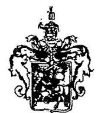

Veszprém Megyei Jogú Város
POLGÁRMESTERE

ÁLLAMI SZÁMVEVŐSZÉK
8595/
Érkezc. 2011 AUG 26.
Iktatószám:........................................
Melléklet:........................................

SZÁm: 4020110306 1312011.

Tárgy: Észrevétel a V-3004-37-7/2011.
azonosító számú számvevői je-
lentés megállapításaira

Ébren huleman!

Állami Számvevőszék
Domokos László elnök ár
részére

BUDAPEST
Apáczai Csere János u. 10.

1364

Tisztelt Elnök Úr!

Veszprém Megyei Jogú Város Önkormányzata pénzügyi helyzetének ellenőrzéséről készült számvevői
jelentés - tervezetét kézhez vettük és alábbi véleményt, észrevételt, kiegészítést tesszük:

- Az I. Összegző megállapítások, következtetések, javaslatok című fejezet 20. oldalán tett
megállapítás, hogy „az Önkormányzat 2010. év végén fennálló 2.793 millió forint összegű
folyószámlahitelt 2011. év májusában nem tudta rendezni, a folyószámlahitel szerződés
meghosszabbítására került sor". Véleményünk szerint nem korrekt a megfogalmazás, mivel a
folyószámlahitel meghosszabbítására azért került sor, mert a számlavezető pénzintézet a kiírt
közbeszerzési eljárás során a 2011. évben tervezett 3.500 millió forint összegű
folyószámlahitel keretre nem tett ajánlatot.

- A jelentés-tervezet 21. oldalán megfogalmazott egyéb kötelezettségek között szerepeltetett,
mérlegen kívüli tételként kimutatott - multifunkcionális sportcsarnok létesítése kapcsán
fennálló - egyéb hosszúlejáratú kötelezettség, 6.441 millió forint véleményünk szerint ebben a
megállapításban nem mutatható ki önkormányzati kötelezettségvállalásként a jelen számviteli
szabályok szerint.

Az Önkormányzat hosszabb távú szerződései, és önkormányzati határozatai
(szándéknyilatkozatai) közül egy-egy tétel kiemelése - az önkormányzati tartós források
bemutatása nélkül - és ebből következtetés levonása torzítja az Önkormányzat gazdasági
pozíciójának megítélését.

---

Veszprém Megyei Jogú Város

- 2 -

- A jelentés többször utal arra, hogy az önkormányzat nem rendelkezett a hitelek visszafizetésének forrásairól. Az önkormányzat költségvetési rendeletének 4. §-ában meghatározásra került a felvett hitelek visszafizetésének kötelezettsége. A rendelet mellékleteiben egyrészt bemutatásra került a tőketörlesztés pénzintézetenkénti megbontásban, a 15. sz. mellékletben felsorolásra kerültek azok a saját bevételek, melyek forrásul szolgálnak a felvett kötelezettségek visszafizetésére. /15. sz. melléklet Kimutatás a helyi Önkormányzat adósságot keletkeztető az Ötv. 88. §-ának (2-4) bekezdése szerinti éves kötelezettségvállalásának felső határának (hitelképességének) megállapításáról és a 2011. évre tervezett beruházási hitel felvételről./

A felvételre kerülő hitelek közbeszerzési eljárása során a Kbt. előírásainak megfelelően minden esetben számítások készülnek a szolgáltatás becsült értékének a meghatározására. Az Önkormányzat saját forrása évente meghaladja az 5 milliárd forintot. A hitelfelvétellel vállalt évenkénti kötelezettség ennek az összegnek a töredéke. A saját forrás konkrét /pl. iparűzési adó) nevesítése csak virtuálisan lenne lehetséges.

- Véleményünk szerint az adósságot keletkeztető kötelezettségvállalással megvalósított felhalmozási kiadásokból olyan infrastrukturális fejlesztések valósultak meg, melyeknél bevétel nem képződik, így annak forrásként történő vizsgálata nem lehetséges. /Például: Az Önkormányzati fejlesztések döntően középületek és közterületek felújításából, intézmények korszerűsítéséből, illetve rekonstrukciójából, a belterületi úthálózat felújításából és fejlesztéséből, belterületi vízrendezésből tevődtek össze./

- A Polgármesternek javasolt intézkedési terv 2. pont c. bekezdésében meghatározott, egyszeri bevételek tartalékba helyezése és elkülönített kezelése a jelen pillanatban meglévő folyószámlahitel állomány mellett megoldhatatlan, az Önkormányzat likviditását veszélyeztetné.

- A Polgármesternek javasolt intézkedési terv 2. pont e. bekezdésében javasolt önként vállalt feladatok és finanszírozhatósága a költségvetési koncepció készítésekor vizsgálatra kerül. A félévi beszámolóval egyidejűleg felülvizsgálatra kerül, hogy teljes mértékben finanszírozhatók-e.

- A Polgármesternek javasolt intézkedési terv 5. pontjában javasoltakhoz meg kívánjuk jegyezni, hogy az Önkormányzat beszámolájának 27. számú melléklet 2.1.1.1.2. Tárgyi eszközök állományi változása során bemutatásra kerül az elszámolt értékcsökkenés összege. /27. sz. melléklet 2010. évi mérleg kiegészítő szöveges melléklete/

- A II. Részletes megállapítások fejezet 1. pontjának 3 bekezdésében írt „454 millió Ft-tal" összeg elírásra került, a helyes összeg „4.058 millió Ft-tal".

Kérjük a fentiek figyelembevételét a végleges jelentés elkészítése során.

Veszprém, 2011. augusztus 25.

---

# Porga Gyula úr, 

polgármester
Veszprém Megyei Jogú Város Önkormányzata
Veszprém

## Tisztelt Polgármester Úr!

Köszönettel vettem észrevételeit a Veszprém Megyei Jogú Város Önkormányzata pénzügyi helyzetének ellenőrzéséről készített jelentés-tervezetben foglalt megállapításokra. Az észrevételek feldolgozása, szakmai értékelése megtörtént, melynek eredményéről az alábbiakban tájékoztatom:

Polgármester úrnak a jelentés-tervezetben szereplő megállapításokkal kapcsolatban jelzett észrevétele közül - a 2/e. és a 5. pontokban megjelölteket - elfogadom. Megtett intézkedésnek tekintem, hogy az Önkormányzatnál az önként vállalt feladatokat és azok finanszírozhatóságát folyamatosan felülvizsgálják, amelynek eleget tettek a 2011. I. félévi beszámoló során, illetve tervezik a 2012. évi költségvetési koncepció készítésénél. Továbbá tudomásul vettem, hogy a 7. számú javaslatunkkal összhangban az Önkormányzatnál a 2010. évtől az éves beszámoló tartalmazza (a 27. számú mellékletben) a tárgyi eszközök állományával kapcsolatos információkat, bemutatták az értékadatokban bekövetkezett változásokat, az elszámolt értékcsökkenést, az eszközök pótlására fordított kiadásokat. A fentiek alapján ezeket töröltük a javaslataink közül. Köszönettel vettük a jelentés-tervezet II. Részletes megállapítások (1. pont 3. bekezdés, 27. oldal) részében észrevett számszaki hibát, amelyet javítottunk a helyes összegre.

Az Önkormányzat pénzügyi helyzetét érintő további számvevőszéki ellenőrzés megállapításaihoz tett - a folyószámlahitelhez, valamint a multifunkcionális sportcsarnok beruházás miatti hosszú lejáratú kötelezettséghez kapcsolódó - észrevételét nem fogadom el, azt magyarázatnak tekintem. A jelentés-tervezet ezekkel összefüggő megállapításainak módosítása nem indokolt az alábbiak miatt:

Az Önkormányzatnál a vizsgált években a pénzügyi egyensúly fenntartása csak külső források bevonásával volt biztosítható, amelynek következtében a pénzintézeti kötelezettségének állománya a 2006. évről a 2010. év végére több mint háromszorosára nőtt. A pénzintézeti

---

kötelezettség hosszú lejáratú forintban fennálló hitelek igénybevételéből, valamint a folyószámlahitel állandósult igénybevételéből keletkezett. Az Önkormányzatnál a 2007. évtől a 2010. évre több mint háromszorosára emelték a folyószámlahitel keret összegét, amelynek további növelésére a 2011. évben a számlavezető bank sem adott ajánlatot. Az Önkormányzat fizetőképességének romlását alátámasztja az is, hogy a 2010. évben már 359 napon keresztül állt fenn folyószámlahitel. Az Önkormányzatnál növelte a pénzügyi kockázatot, hogy a 2010. év végén, illetve a szerződés 2011. év májusában történt lejáratakor a fennálló folyószámlahitelt saját forrásból nem tudták visszafizetni.

A számvevőszéki ellenőrzés a pénzintézeti kötelezettségeken túl számba vette az Önkormányzat összes, hosszabb távon fennálló kötelezettségeit, amelyek között nagyságrendje alapján a multifunkcionális sportcsarnok létesítésével kapcsolatos kötelezettség szerepelt. Ez hosszú lejáratú forintban fennálló kötelezettség függetlenül attól, hogy a hatályos számviteli előírások alapján az Önkormányzat könyvviteli mérlegében nem szereplő tétel. A multifunkcionális sportcsarnokkal kapcsolatban a Közgyűlés 15 éven keresztül vállalt fel kötelezettséget, amellyel a lejárat napjáig számolni kell az Önkormányzatnak.

Fenntartjuk továbbá az egyszeri bevételek elkülönített kezelésére vonatkozó javaslatunkat azzal, hogy az kimutatható módon az adósságszolgálat teljesítésére kerüljön felhasználásra az Önkormányzatnál. Nem számoltak az Önkormányzatnál azzal, hogy az éven túli, azaz a hosszú távra vállalt (pénzintézeti és egyéb) kötelezettségeknek mely bevételek képezik forrását, ezért változatlanul javasoljuk a több éves kihatással járó kiadások forrásszükségleti tervének elkészítését és a bekövetkezett változásoknak megfelelő folyamatos aktualizálását.

Köszönöm Polgármester Úrnak és munkatársainak az ellenőrzés során tanúsított hozzáállását, amellyel az Önkormányzatról készített pénzügyi helyzetelemzés elkészítését segítették.

Budapest, 2011. december " 22.".
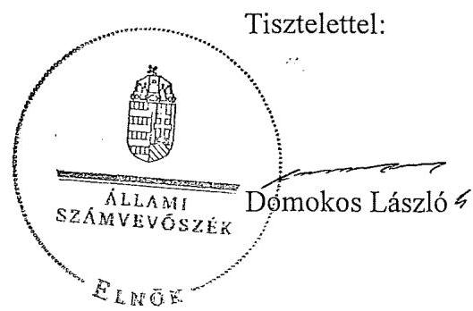

---

# Veszprém Megyei Jogú Város önkormányzati feladatainak ellátásban résztvevő gazdasági társaságok jellemző adatairól 

A Pro Veszprém feladata: az Önkormányzattal kötött szerződés alapján a Városfejlesztési Stratégiában meghatározott projektek teljes körű menedzsment tevékenységének ellátása, elsőként Veszprém-Belváros Rehabilitációja címú projekt esetében. Az önkormányzati tulajdoni részarány 100\%, üzletrész összege ${ }^{1} 3,5$ millió Ft, saját tőke-jegyzett tőke aránya $279,2 \%$, tőkejuttatásban és fejlesztési támogatásban nem részesült.

A Veszprém TV feladata: az Önkormányzattal kötött Kommunikációs Együttmüködési Programban meghatározott músorok egész évben történő biztosítása és az Önkormányzat músorkészítési elvárásainak kielégítése a helyi közélet eseményeivel kapcsolatban. Az önkormányzati tulajdoni részarány $100 \%$, üzletrész összege 50 millió Ft, saját tőke-jegyzett tőke aránya $70,3 \%$, tőkejuttatásban és fejlesztési támogatásban nem részesült.

A Kolostorok és Kertek Kft. feladata: a zöldterület kezelés, múzeumi tevékenység, kulturális örökség védelem. A „Kolostorok és Kertek a Veszprémi Vár Tövében" címú kiemelt turisztikai program fenntartása érdekében alapították. Az önkormányzati tulajdoni részarány $100 \%$, üzletrész összege 0,5 millió Ft, saját tőke-jegyzett tőke aránya 100\%, tőkejuttatásban és fejlesztési támogatásban nem részesült.

A VKSZ Zrt.-t az Önkormányzat 1996. évben a Városgazdálkodási Rt. és a Veszprémi Kommunális Zrt. összevonásával hozta létre, 2005. évtől más társaságok, költségvetési szervek beolvadását ${ }^{2}$ követően a VKSZ közüzemi szolgáltató és zártkörű részvénytársaságként. Kommunális (hulladékkezelés, köztisztaság, városüzemeltetés, jármúkarbantartás, hulladéklerakó üzemeltetése, zöldterület gondozása, parkolók üzemeltetése, temetőfenntartás), távhőszolgáltatás és kéményseprés, ingatlanforgalmazás és piacüzemeltetés tevékenységeket végez. Az önkormányzati tulajdoni részarány $98,5 \%$, üzletrész összege 2215,8 millió Ft, saját tőke-jegyzett tőke aránya 143,5\%. Az Önkormányzat 750 millió Ft tőkejuttatásban részesítette, fejlesztési támogatást nem adott. A VKSZ-nek az önkormányzaton kívül 1,6\%-os részaránnyal a Közép-Pannon Regionális Fejlesztési Zrt. a társtulajdonosa. A VKSZ-nek jelenleg 5 leányvállalata van - korábban 2 társaság (Veszprémi Ingatlan Kft, Multicsarnok Kft. beolvadt a VKSZ-be) -, a leányvállalatok tulajdoni részaránya 100\%. A Veszprémi Ünnepi Játékok Kft-ben a Csarnok Kft-nek 33\%os az üzletrésze. A VKSZ-nek további leányvállalatai az Aranyosvölgy Ingatlan Kft, a Jutas Ingatlan Kft, a Pannon Provincia Kft. Észak-Balatoni Hulladékgazdálkodási Kft., amelyek közvetve vesznek részt az önkormányzati feladatellátásban. A Csarnok Kft. a sportlétesítmény müködtetési feladatán felül vállalta a múvészeti tevékenység keretében a város turisztikai feladataiban a közremüködést.

[^0]
[^0]:    ${ }^{1}$ A részvénycsomag és üzletrész mérleg szerinti értéke.
    ${ }^{2}$ Hőforg Kft., Temetőgondnokság, Piac és Vásárcsarnok Kft, Veszpark Kft., Multicsarnok Kft, Veszprém Ingatlan Kft.

---

A Kittenberger Kálmán Növény- és Vadaspark Nonprofit Kft. főtevékenysége a növény- és állatkerti bemutató, amelyből kiemelkedő közhasznú tevékenység a nevelés, oktatás, ismeretterjesztés, kulturális tevékenység, kulturális örökség megóvása, természet és állatvédelem, környezetvédelem és a lovassport támogatása. Az önkormányzati feladatellátáson túl a társaság üzleti tevékenységet is végez. Az önkormányzati tulajdoni részarány $97,5 \%$, üzletrész összege 421 millió Ft, saját tőke-jegyzett tőke aránya $152,8 \%, 21,2$ millió Ft tőkejuttatásban részesült bővítési célokat szolgáló földterület-átadás következtében és 9,1 millió Ft fejlesztési támogatást nyújtott az Önkormányzat a megvalósíthatósági tanulmány elkészítéséhez. A társaságnak az önkormányzaton kívül a Veszprém Megyei Önkormányzat a tulajdonosa, együtt vesznek részt a feladatellátásban. Az Állatkertnek a Veszprémi Turisztikai Nonprofit Kft-ben van 25\% alatti tulajdoni része.

# A Pannon TISZK Szakképzés-szervezési Nonprofit Kft. feladata, 

hogy irányításával olyan szakképzési rendszer és regionális hálózat alakuljon ki az illetékességi területén, amely képes rugalmasan követni a munka-erő-piaci igényeket. Fő tevékenysége a szakmai középfokú oktatás valamint a munkaerő-piaci igényekhez igazodó képzési struktúra kialakítása. Az önkormányzati tulajdoni részarány $87 \%$, üzletrész összege 0,870 millió Ft, saját tőke-jegyzett tőke aránya $-775,1 \%$, tőkejuttatásban nem részesült, 49,5 millió Ft fejlesztési támogatást nyújtott az Önkormányzat pályázati önrészhez.

A Veszprémi Turisztikai Nonprofit Kft. feladata: turisztikai információnyújtás Veszprém térségére vonatkozóan, kiemelt feladata a magyarországi turisztikai vonzerők és szolgáltatók verseny semleges bemutatása, további közhasznú tevékenysége a térségben elhelyezkedő 10 település teljes turisztikai adatgyűjtése és az országos adatbázisba töltése. Az önkormányzati tulajdoni részarány $70 \%$, üzletrész összege 0,700 millió Ft, saját tőkejegyzett tőke aránya $110,6 \%$, tőkejuttatásban nem részesült, 1,1 millió Ft fejlesztési támogatást kapott információs táblák készítésére az Önkormányzattól. A társaságban az önkormányzaton kívül a Csarnok Kft-nek, a Veszprémi Turisztikai Egyesületnek és az Állatkertnek van tulajdonrésze, ezek közül az egyesület nem vesz részt az önkormányzati feladatellátásban.

## A Veszprémi Regionális Innovációs Centrum Nonprofit Kft. feladata,

hogy múködési területén segítse elő az innováció kultúra elterjesztését az egyetem, a kutató csoportok és a piacképes érdekeket megvalósító mikro-, kis- és középvállalkozások között, tanácsadással segítse munkájukat. Az önkormányzati tulajdoni részarány $63 \%$, üzletrész összege 36,9 millió Ft, saját tőke-jegyzett tőke aránya $94,9 \%$, tőkejuttatásban nem részesült, fejlesztési támogatást nem kapott az Önkormányzattól. A társaságnak az önkormányzaton kívül 7 tulajdonosa van a Közép-Pannon Regionális Fejlesztési Zrt, Pannon Egyetem, Veszprém Megyei Vállalkozásfejlesztési Alapítvány, Veszprém Megyei Önkormányzat, Magyar Innovációs Szövetség, MTESZ., amelyek az Önkormányzat tájékoztatása szerint közvetve vesznek részt az önkormányzati feladatellátásban.

---

A Veszprém Egyetemi Stadion Nonprofit Kft. feladata: a Pannon Egyetem hallgatói részére az oktatási rend szerinti órák és a szabadidős tevékenységekhez tárgyi feltételek biztosítása, továbbá a tömegsport városi és más sportegyesületek múködéséhez létesítmény rendelkezésére bocsátása. Az önkormányzati tulajdoni részarány $50 \%$, üzletrész összege 2 millió Ft, saját tőke-jegyzett tőke aránya $144,9 \%$, tőkejuttatásban nem részesült, fejlesztési támogatást nem kapott az Önkormányzattól.

A Bakonykarszt Víz- és Csatornamú Zrt. feladata: az Önkormányzat kötelező feladatai között elsődleges helyen álló vízellátás, szennyvízelvezetés és szennyvíztisztítás, a biztonságos és gazdaságos víziközmú szolgáltatás. Az önkormányzati tulajdoni részarány $38,2 \%$, üzletrész összege 339,3 millió Ft, saját tőke-jegyzett tőke aránya $1102,5 \%$, tőkejuttatásban nem részesült, fejlesztési támogatást nem kapott az Önkormányzattól.

---

.