# ÁLLAMI   SZÁMVEVŐSZÉK 

## JELENTÉS

a Bács-Kiskun Megyei Önkormányzat pénzügyi helyzetének ellenőrzéséről (43/2)

---

# Számvevői Iroda 

Iktatószám: V-3009-15/2011.
Témaszám: 1015
Vizsgálat-azonosító szám: V056001

## Az ellenőrzést felügyelte:

Dr. Varga Sándor
számvevő igazgató-helyettes
Az ellenőrzést vezette:
Renkó Zsuzsanna
számvevő tanácsos
Az ellenőrzést végezték:
Dr. Csapó Anna
Salogné Dakó Eszter Kisgergely István
számvevő tanácsos
számvevő tanácsos

A témához kapcsolódó eddig készített számvevőszéki jelentés:
címe
sorszáma
Jelentés a Bács-Kiskun Megyei Önkormányzat gazdálkodási rend-
0826 szerének 2008. évi átfogó ellenőrzéséről

---

# TARTALOMJEGYZÉK 

BEVEZETÉS ..... 5
I. ÖSSZEGZŐ MEGÁLLAPÍTÁSOK, KÖVETKEZTETÉSEK, JAVASLATOK ..... 12
II. RÉSZLETES MEGÁLLAPÍTÁSOK ..... 17

1. Az Önkormányzat kötelező és önként vállalt feladatai ..... 17
2. Pénzügyi egyensúlyi helyzet alakulása ..... 20
2.1. A múködési és felhalmozási egyensúly alakulása ..... 20
2.2. Az Önkormányzat bevételei ..... 27
2.3. Az Önkormányzat kiadásai ..... 29
3. Kötelezettségek bemutatása ..... 33
3.1. A pénzintézetek felé fennálló kötelezettségek alakulása ..... 33
3.2. Szállítók felé fennálló kötelezettségek ..... 37
3.3. Egyéb kötelezettségek ..... 38
4. A pénzügyi egyensúly megteremtése érdekében hozott intézkedések ..... 40
5. A helyi önkormányzatok gazdálkodási rendszerének 2007. évi ellenőrzése során a pénzügyi egyensúly javítására tett szabályszerűségi és célszerűségi javaslatok hasznosulása ..... 43

---

# MELLÉKLETEK 

1. számú melléklet

A múködési és felhalmozási célú hiány/többlet alakulása az Önkormányzat rendeleteiben
2/a. számú Az Önkormányzat CLF módszer szerint besorolt bevételei és kiadásai 2007melléklet 2010 között
2/b. számú Az önkormányzat bevételeinek és kiadásainak, adósságszolgálatának alakulása 2007-2010 között
3. számú Az Önkormányzat 2007-2010 években megvalósított, illetve 2010. december 31-én fennálló fejlesztési feladatokhoz kapcsolódó kötelezettségeinek összegzése
4. számú Bács-Kiskun Megyei Közgyűlés elnökének észrevétele melléklet
5. számú Bács-Kiskun Megyei Közgyűlés elnökének észrevételére adott válasz melléklet

---

# RÖVIDÍTÉSEK JEGYZÉKE 

| Törvények |  |
| :--: | :--: |
| Áht. | az államháztartásról szóló 1992. évi XXXVIII. törvény |
| ÁSZ tv. | az Állami Számvevőszékről szóló 1989. évi XXXVIII. törvény (2011. július 1-jétől az Állami Számvevőszékről szóló 2011. LXVI. törvény) |
| Htv. | a helyi önkormányzatok és szerveik, a köztársasági megbízottak, valamint egyes centrális alárendeltségủ szervek feladat- és hatásköreiről szóló 1991. évi XX. törvény |
| Ötv. | a helyi önkormányzatokról szóló 1990. évi LXV. törvény |
| Rendeletek |  |
| Áhsz. | az államháztartás szervezetei beszámolási és könyvvezetési kötelezettségének sajátosságairól szóló 249/2000. (XII. 24.) Korm. rendelet |
| Szórövidítések |  |
| áfa | általános forgalmi adó |
| APEH | Adó- és Pénzügyi Ellenőrzési Hivatal, 2011. január 1-jétől Nemzeti Adó- és Vámhivatal (NAV) |
| ÁSZ | Állami Számvevőszék |
| BM | Belügyminisztérium |
| EDP hiány/egyenleg | Uniós módszertan szerinti maastrichti kritériumoknak megfelelő számítás szerinti hiány/egyenleg |
| EU | Európai Unió |
| GDP | Bruttó hazai termék |
| Hivatal | Bács-Kiskun Megyei Közgyűlési Hivatal |
| Illetékhivatal | Bács-Kiskun Megyei Illetékhivatal |
| Kórház | Bács-Kiskun Megyei Kórház |
| Közgyűlés | Bács-Kiskun Megyei Közgyűlés |
| KSH | Központi Statisztikai Hivatal |
| NGM | Nemzetgazdasági Minisztérium |
| OEP | Országos Egészségbiztosítási Pénztár |
| Önkormányzat | Bács-Kiskun Megyei Önkormányzat |
| PPP konstrukció | Public Private Partnership (Partnerségi együttmúködés közfeladatok ellátására a magánszektor bevonásával) |
| SNA | SNA System of National Accounts azaz Nemzeti Számlák Rendszere |
| szja | személyi jövedelemadó |
| SzMSz | Bács-Kiskun Megyei Önkormányzat 17/2010. (XII. 20.) számú rendelete az Önkormányzat és Szervei Szervezeti és Müködési Szabályairól |

---

.

---

# JELENTÉS 

## A Bács-Kiskun Megyei Önkormányzat pénzügyi helyzetének ellenőrzéséről

## BEVEZETÉS

Az Állami Számvevőszék 2011. évtől érvényes stratégiája új irányt szabott a helyi önkormányzatok gazdálkodásának ellenőrzésében is. Az ÁSZ - küldetése és jövőképe szerint - szilárd szakmai alapokra támaszkodva értékteremtő ellenőrzéseivel és helyzetelemzéseivel az államháztartás egészében, így a helyi önkormányzati alrendszerben is elő kívánja segíteni a közpénzek és a közvagyon szabályos, gazdaságos, hatékony és eredményes hasznosítását. E folyamat részeként - a 2010. évi államháztartási hiány alakulásának összetevőire is figyelemmel - megkezdődött az önkormányzati alrendszer pénzügyi helyzetelemzése.

Az NGM 2011 áprilisában közzétett adatai szerint ${ }^{1}$ a 2010. évi 1036,2 milliárd Ft összegű, 3,8\%-os EDP (maastrichti kritériumok szerinti, Túlzott Hiány Eljárás keretében kimutatott) hiánycél nem volt tartható, az önkormányzati alrendszer tervezettet meghaladó hiánya miatt a GDP arányában kifejezett államháztartási hiány $4,2 \%$-ra emelkedett.

Az önkormányzatok költségvetési jelentése szerint 2010. első három negyedév végén az önkormányzati alrendszer pénzforgalmi hiánya 97 milliárd Ft volt a tervezett éves mérték $51 \%$-át érte el. Bár az elmúlt években kiugróan magas hiány halmozódott fel az utolsó negyedévben, a 97 milliárd Ft-os szeptember végi hiány nem indokolta az önkormányzati alrendszer 190 milliárd Ft-ra becsült éves hiányának felülvizsgálatát. A tervezett hiány túllépése, az utolsó negyedévi 150 milliárd Ft-os pénzforgalmi hiány nem volt reálisan feltételezhető. A helyi önkormányzatok januári gyorsjelentése szerint a pénzforgalmi hiány 247,7 milliárd Ft-ot tett ki. A tervezettnél nagyobb önkormányzati pénzforgalmi hiány kialakulásában - az NGM által az éves költségvetési beszámoló elkészítéséhez kiadott tájékoztató szerint - az iparűzési adó elmaradása, a gépjárműadó, az illetékek és más bevételek tervezettnél alacsonyabb összegben teljesülése volt a meghatározó.

A megyei önkormányzatok kötelező feladatellátását többlépcsős törvényi előírások határozzák meg. A feladatokra vonatkozó szabályozás első szintjét az

[^0]
[^0]:    ${ }^{1}$ NGM Tájékoztatás Magyarország Strukturális Reformprogramjának végrehajtásáról (2011. április 1). A Tájékoztató évente két alkalommal - április és október hónapban jelenik meg.

---

Ötv. ${ }^{2}$, a második szintet a hatásköri ${ }^{3}$, a harmadik szintet a további ágazati, szakmai törvények (egyebek mellett az oktatási, egészségügyi, szociális) adják.

A megyei önkormányzatok a feladatellátás és a központi forráselosztás tekintetében sajátos helyet foglalnak el a helyi önkormányzati rendszerben. A megyei önkormányzat kötelező feladatainak egy része - így a megyében lévő természeti és társadalmi muzeális emlékek, a történeti iratok gyűjtése, őrzése, tudományos feldolgozása, a megyei könyvtári szolgáltatás, a pedagógiai és közművelődési szakmai tanácsadás és szolgáltatás, a megyei testnevelési és sportszervezési feladatellátás, a gyermek- és ifjúsági jogok érvényesítése, a gyermekvédelmi- és szociális szakellátás - az Ötv-ből közvetlenül levezethető kötelezettség.

A középiskolai, szakiskolai, és kollégiumi ellátás, a fogyatékos gyermekek oktatása, nevelése, gondozása az ágazati törvény szerint a megyei önkormányzat kötelező feladata. Azonban, ha a települési önkormányzat lát el ilyen feladatot, és arról lemond, a megyei önkormányzatnak a feladatot át kell vennie. Így a megyei önkormányzatok által ellátandó kötelező közszolgáltatások ellátásának mértékére a települési önkormányzatok döntései jelentősen kihatnak.

Az alapellátást meghaladó egészségügyi szakellátás biztosítása akkor képezi a megyei önkormányzat feladatát, ha az önkormányzati vagyon kialakításáról szóló törvényben ${ }^{4}$ a feladat ellátásához szükséges vagyont az önkormányzat a tulajdonába kapta.

Az önként vállalt feladat ellátására - mivel annak vállalása a kötelező feladatok ellátását nem veszélyeztetheti - a kötelező közszolgáltatások mértékének alakulása lényegi hatással van.

A feladat és hatáskör telepítés sajátosságai mellett a megyei önkormányzatok kialakított forrásszerkezetből következő szűk mozgástere, a központi költségvetéstől való erőteljes függősége is determinálja az önkormányzatok feladatellátásra vonatkozó döntéseit.

A 2007-2010. években az önkormányzati feladatok ellátásának keretet biztosító forrásszabályozás - ennek részeként az illetékbevételből és a személyi jövedelemadóból való részesedés szabályai - a megyei önkormányzatok vonatkozásában nem változtak:

- A megyei önkormányzatok saját bevételein belül az illetékbevételek döntően az ingatlanpiac stagnálása, majd visszaesése, és egyes illetékkedvezmények bevezetése következtében - megyénként differenciált mértékben ugyan, de - 2010-re általánosan visszaestek. A 2010. évben befolyt 39,2 milliárd Ft illetékbevétel a 2006. évben realizált 71,1 milliárd Ft illetékbevétel alig több mint $55 \%$-a volt. A kieső bevételek pótlására az önkor-

[^0]
[^0]:    ${ }^{2}$ Ötv. 69-70. §-ai
    ${ }^{3}$ a Htv.
    ${ }^{4}$ Az egyes állami tulajdonban lévő vagyontárgyak önkormányzatok tulajdonba adásáról szóló 1991. évi XXXIII. törvény

---

mányzati alrendszer szintjén történtek intézkedések, 2010-ben 5 milliárd Ftot, 2011-ben 1,2 milliárd Ft-ot ellentételezett a központi költségvetés. Az illetékbevételt a megyei önkormányzatok a saját folyó bevételeik között számolják el ${ }^{5}$.

Az illetékek kivetésének és beszedésének joga 2006. december 31-ig a megyei önkormányzatok feladata volt. A 2007. évtől a megyei illetékhivatalok illetékbeszedési feladatait az APEH vette át ${ }^{6}$. Az önkormányzati illetékrészesedési szabályok változatlanok maradtak, azonban az illetékbeszedés költségeit az önkormányzatok illetékbevételeiből átlagos (a Fővárosnál 4,0\%-os, a megyei és megyei jogú városi önkormányzatnál 8,5\%-os) kulcsot alkalmazva vonták le. E döntés következtében azon megyei önkormányzatok, amelyek a 8,5\%-os költségnél kedvezőbb költségszint mellett látták el korábban ezt a feladatot, kedvezőtlenebb helyzetbe kerültek.

- Az önkormányzati alrendszer személyi jövedelemadóból való részesedésének makroszintű szabályozása nem változott 2007-2010 között7. A helyi önkormányzatokat normatív módon megillető $32 \%$-os részesedés visszaosztásának részletszabályai azonban a megyei önkormányzatok számára - a reálgazdaság kedvezőtlen irányú folyamatai, és az államháztartás egyensúlyi helyzetére tekintettel elrendelt kormányzati intézkedések miatt - megszorító intézkedéseket jelentettek. Összesen 17 milliárd Ft - 2007-ben 10 milliárd Ft, 2010-ben további 7 milliárd Ft - szja-t vontak ki a megyei önkormányzatok gazdálkodási köréből ${ }^{8}$. Az átengedett személyi jövedelemadó a megyei önkormányzatok egyik bevétele.

A megyei önkormányzatok 2007-2010 között rendelkezésre álló forrásait a következő ábra szemlélteti:

[^0]
[^0]:    ${ }^{5}$ A megyei önkormányzatok illetékbevételei az önkormányzati alrendszer saját folyó bevételeiből 2007-ben 35,9 milliárd Ft-ot ( $61,4 \%$-ot), 2008-ban 41,5 milliárd Ft-ot ( $61,7 \%$-ot), 2009-ben 36,5 milliárd Ft-ot ( $62,5 \%$-ot), 2010-ben 25,1 milliárd Ft-ot $(64,1 \%$-ot) tettek ki.
    ${ }^{6}$ Az egyes pénzügyi tárgyú törvények módosításáról szóló 2006. évi LXI. törvény 115. §a, amely az adózás rendjéről szóló 2003. évi XCII. törvény 73. §-át módosította.
    ${ }^{7}$ A megyei önkormányzatok személyi jövedelemadó részesedése az önkormányzati alrendszer átengedett bevételeiből 2007-ben 34,7 milliárd Ft-ot ( $7,0 \%$-ot), 2008-ban 51,2 milliárd Ft-ot ( $9,2 \%$-ot), 2009-ben 59,2 milliárd Ft-ot ( $9,3 \%$-ot), 2010-ben 56,3 milliárd Ft-ot $(8,3 \%$-ot) tett ki.
    ${ }^{8}$ A megyei önkormányzatok szja kiegészítése háromelemű. A tételes, minden megyére egységesen meghatározott összeg - az adott évek költségvetési törvényeinek 4. sz. mellékletében meghatározottak szerint - 2006-ban 593 millió Ft, 2007-ben és 2008-ban egyaránt 355 millió Ft, 2009-ben 370 millió Ft volt. A megye népességszáma után járó kiegészítés a 2006. évi $208 \mathrm{Ft} /$ fő összegről 2010-re $120 \mathrm{Ft} /$ fő-re, a megyei intézmények ellátottjai után járó kiegészítés $42236 \mathrm{Ft} /$ ellátottról $20755 \mathrm{Ft} /$ ellátottra csökkent.

---

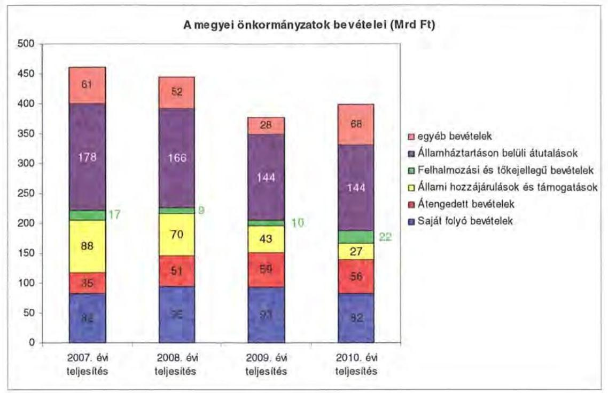

A megyei önkormányzatok saját folyó bevételeinek részaránya - amelyek fơbb elemei: az intézményi térítési díjak, az illetékbevétel, a kamatbevételek - a 2007. évi összbevételen ( 461 milliárd Ft) belül 17,9\% volt, amely 2010-re annak ellenére $20,6 \%$-ra nőtt, hogy az összege 82 milliárd Ft maradt. Ennek oka az volt, hogy az összbevétel a 2007. évi 461 milliárd Ft-ról 2010-re 399 milliárd Ftra csökkent.

Az átengedett bevételek, amelyek a megyei önkormányzatoknál a személyi jövedelemadóból való részesedést jelentették, az összbevételen belül a 2007. évi 35 milliárd Ft-ról 56 milliárd Ft-ra nőttek.

Az állami hozzájárulások és támogatások - amelyek fơbb elemei: az ellátotti létszámhoz kötődő normatív állami hozzájárulások, központosított, fejezeti szinten kezelt céleloóirányzatból juttatott müködési és fejlesztési támogatások a 2007. évi 88 milliárd Ft-ról (19,1\%-os részarányról) 2010-re 27 milliárd Ft-ra ( $6,8 \%$-os részarányra) estek vissza.

A felhalmozási és tőkejellegű bevételek - tárgyi eszközök (ingatlanok és ingóságok), föld és immateriális javak, részesedések értékesítése, EU-tól átvett pénzeszközök - a 2007. évi 17 milliárd Ft-ról (3,6\%-os részarányról) 2010-re 22 milliárd Ft-ra ( $5,4 \%$-ra) emelkedtek.

Az államháztartáson belüli átutalások részesedése 2007-ben 178 milliárd Ft volt. 2010. év végére 34 milliárd Ft-tal csökkent, részaránya $38,6 \%$-ról 2,6 százalékpontos csökkenés után 2010-ben $36 \%$-ra változott. Ez a bevételi kategória tartalmazza az egészségbiztosítási és egyéb elkülönített állami pénzalapoktól átvett forrásokat. A 2010-ben e címen elszámolt bevétel 144 milliárd Ft volt.

---

A megyei önkormányzatok központi költségvetésből származó bevételeinek öszszege 2007-ben 400 milliárd Ft volt, amely 2010. évre 331 milliárd Ft-ra (az időszak alatt összesen 69 milliárd Ft-tal) 17,3\%-kal csökkent.

Az egyéb, pénzmaradványból, vállalkozási bevételekből, államháztartáson kívülről származó átutalásokból, a hítelekből, a hosszú és rövid lejáratú értékpapírok értékesítéséből származó bevételek részesedése a 2007-2010. évek viszonylatában 13,3\%-ról 17,1\%-ra emelkedett. Ez utóbbiak 2010. évi beszámoló szerinti összevont teljesítése 68 milliárd Ft volt ${ }^{9}$.

Mindezeket figyelembe véve 2007 és 2010-ben a megyei önkormányzatok forrásösszetételének megoszlását az alábbi ábra szemlélteti:

A megyei önkormányzatok 2007-2010. évi forrásainak megoszlása (\%-ban)
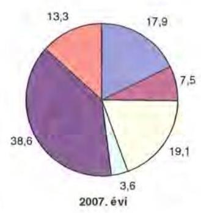
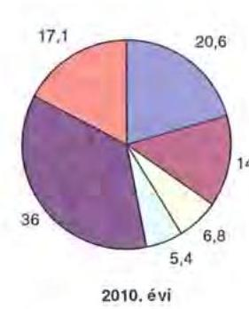

Annak ellenére, hogy a megyei önkormányzatok kötelezően ellátandó feladataikat 2007-hez képest kevesebb intézményben, csökkenő foglalkoztatotti létszám mellett végezték ${ }^{10}$, a jelentős bevételkiesést a - szervezési intézkedések hatására - csökkenő ráfordítások nem tudták kompenzálni. Az ellátottak száma a szociális, gyermekvédelmi ágazat bentlakásos elhelyezést nyújtó intézményeit kivéve - eltérő mértékben ugyan, de minden ágazatban évről évre csökkent, amely a fajlagos hozzájárulások csökkenésével együtt a normatív állami hozzájárulás arányának visszaeséséhez vezetett.

A 2007-2013-as időszakra meghirdetett, vissza nem térítendő EU-s fejlesztési forrásokhoz való hozzájutás lehetősége felerősítette az önkormányzati alrendszer fejlesztési igényelt. A fokozott fejlesztési tevékenység a felhalmozási bevételek és kiadások egyensúlyának megbomlásán ${ }^{11}$ túl a jelentkező jövőbeni fenn-

[^0]
[^0]:    ${ }^{9}$ Az egyéb bevételek összege 2007-2010 között eltérő módon változott, 2007-ben 61 milliárd Ft volt, 2008-ban 52 milliárd Ft-ra, 2009-ben 28 milliárd Ft-ra esett vissza, majd 2010-ben ismét - 68 milliárd Ft-ra - emelkedett.
    ${ }^{10}$ a BM által 2010 decemberében elvégzett felmérés adatai szerint
    ${ }^{11}$ Az önkormányzati alrendszerben - az éves zárszámadási törvényjavaslatok általános indokolása, X. Helyi önkormányzatok gazdálkodása fejezet szerint - a felhalmozási bevételek és kiadások egyenlege 2007-ben 142,4 milliárd Ft, 2008-ban 112,3 milliárd Ft, 2009-ben 234,5 milliárd Ft hiányt mutatott.

---

tartási kötelezettség miatt tovább terhelhetik az önkormányzatok költségvetését.

A megyei önkormányzatok felhalmozási és múködési célú pénzintézeti és szállítói kötelezettségeinek állománya a vizsgált időszakban erőteljesen növekedett.

A hosszú lejáratú kötelezettségek alakulását a következő ábra szemlélteti:
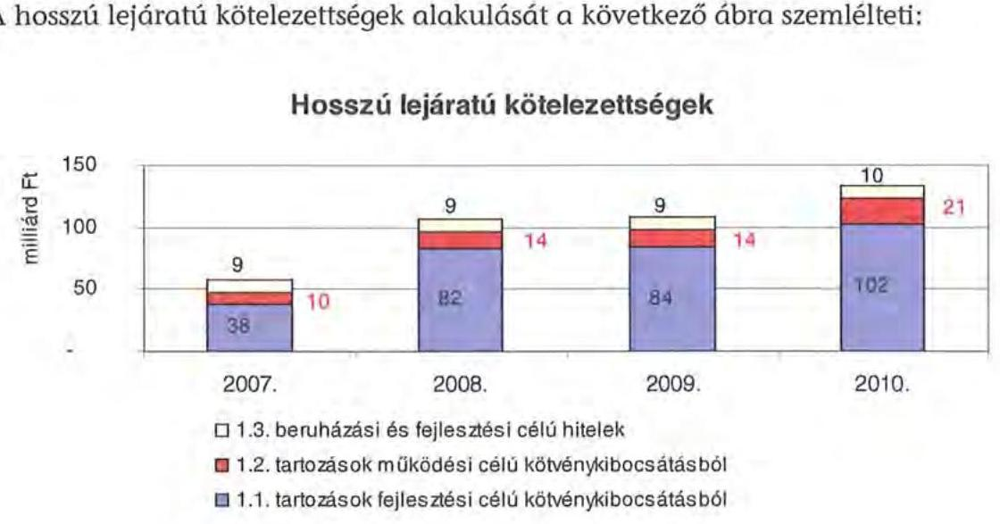

A hosszú lejáratú kötelezettségek mellett az időszakban a 2007. évi 22 milliárd Ft-ról 24 milliárd Ft-ra ( $8,8 \%$-kal) növekedett az áruszállításból származó szállítói kötelezettségek állománya.

A mérlegben kimutatott kötelezettségek állománya mellett az elhasználódott eszközök pótlására forrást biztosító amortizációs (felújítási) alap képzésének ${ }^{12}$ elmaradása további problémákat vetít előre. A megyei önkormányzatok beszámolójelentéseinek összegzése szerint 2007-ben még az elszámolt értékcsökkenés $90 \%$-ának megfelelő összeget fordítottak felújítási célokra, 2009-ben ez az arányszám már csak $16,5 \%$ volt. Ez maga után vonta a feladatellátást kiszolgáló tárgyi eszközök állagának erőteljes romlását.

Az ÁSZ a 2011. évi ellenőrzési tervében a 43. számú, az „Önkormányzatok gazdálkodási rendszerének ellenőrzése" részeként egy időben, egymással párhuzamosan tekinti át és elemzi az önkormányzati alrendszer középszintjét jelentő 19 megyei önkormányzat pénzügyi helyzetét. A gazdálkodás szabályszerűségét az ÁSZ előző évek során ellenőrizte a megyei önkormányzatoknál is, ezért jelen vizsgálatunk erre nem tér ki.

A jelentés a megyei önkormányzatok sajátos feladatellátási és forrásszabályozási helyzetére tekintettel a megyei önkormányzatok pénzügyi helyzetét, illetve az ezzel összefüggő korábbi ÁSZ javaslatok megvalósítását mutatja be.

[^0]
[^0]:    ${ }^{12}$ Erre a jelenlegi szabályozási környezetben nem kötelezi semmilyen előírás az önkormányzatokat.

---

Az ellenőrzés a 2007. január 1. - 2011. március 31. közötti időszakot ölelte fel.
A vizsgálat jogszabályi alapját 2011. július 1-je előtt az Állami Számvevőszékről szóló 1989. évi XXXVIII. törvény 2. § (3), (5), (6) és (9) bekezdéseiben, az Ötv. 92. § (1) bekezdésében és az Áht. 104. § (3) bekezdésében, 2011. július 1-jét követően az Állami Számvevőszékről szóló 2011. évi LXVI. törvény 1. § (3) bekezdésében, az 5. § (2)-(6) bekezdéseiben és az Áht. 120/A. § (1) bekezdésében foglalt előírások képezték.

Bács-Kiskun Megye országos és régión belül elfoglalt helyzetét 2010. december 31-én az alábbi mutatók szemléltetik (a megyei jogú városokkal együtt):

Index: az előző év azonos időszak (időpontja)=100,0

| Mutató megnevezése | Bács-   Kiskun   megye | Dél-   Alföldi   régió | Országos |
| :-- | :--: | :--: | :--: |
| Népesség száma (ezer fő)* | 524 | 1308 | 9986 |
| Népesség változás indexe (\%) | 99,2 | 99,2 | 99,7 |
| Az ipari termelés volumenindexe (\%) | 111,0 | 107,4 | 110,7 |
| Egy lakosra jutó ipari termelési érték (ezer | 1231,1 | 1135,2 | 2044,4 |
| Ft) |  |  |  |
| Ezer lakosra jutó vállalkozások száma (db) | 181 | 181 | 165 |
| A beruházások egy lakosra vetített teljesít- | 148,3 | 171,6 | 304,7 |
|ményértéke (millió Ft) | 48,2 | 48,1 | 49,5 |
| Foglalkoztatási arány (\%) | 10,0 | 10,3 | 10,8 |
| Munkanélküliségi ráta (\%) | 109577 | 111096 | 132628 |
| Alkalmazásban állók havi nettó átlagkeresete (Ft) | 106,9 | 107,0 | 106,9 |
| Alkalmazásban állók havi nettó átlagkeresetének indexe (\%) |  |  |  |

* Ebből Kecskemét Megyei Jogú Város népessége 111 ezer fő.

A táblázatban feltüntetett adatok azt jelzik, hogy a gazdaság helyzetét reprezentáló egyes mutatók- az egy lakosra jutó ipari termelési érték, a beruházások egy lakosra vetített teljesítményértéke, a foglalkoztatási arány, az alkalmazásban állók havi nettó átlagkeresete - tekintetében elmarad az országos jellemzőktől, ugyanakkor a Dél-Alföldi régión belül elfoglalt helyzete kedvezőbb képet mutat. A megye munkanélküliségi mutatója az országos értéknél 0,8 százalékponttal, az ipari termelés változása a régiós értéknél 3,6 százalékponttal, valamint az országos értéknél 0,3 százalékponttal kedvezőbb.

A megyében 119 települési - 1 megyei jogú városi, 22 városi, 7 nagyközségi és 89 községi - önkormányzat múködött.

---

# I. ÖSSZEGZŐ MEGÁLLAPÍTÁSOK, KÖVETKEZTETÉSEK, JAVASLATOK 

A Bács-Kiskun Megyei Önkormányzat - adatszolgáltatása szerint - 2010-ben 25317 millió Ft költségvetési kiadásából 98,4\%-ot kötelező feladatai ellátására fordított. Az Önkormányzat önként vállalt feladatai a szórakoztató és szabadidős tevékenységhez, egyes idegenforgalmi, turisztikai, kiadvány szerkesztési, kommunikációs szolgáltatások szervezéséhez kapcsolódtak, valamint támogatást nyújt civil szervezetek, alapítványok múködéséhez összesen 401 millió Ft összegben. A kötelező és az önként vállalt feladatok körét az SzMSzben felsorolták.

Az Önkormányzat kötelező és önként vállalt feladatait 2010. december 31-én a Hivatallal és 27 költségvetési szervvel, illetve 3 többségi tulajdonú gazdasági társasággal látta el, a 2006. évi 87 -hez képest a 2010. évben 9 -el több, összesen 96 telephelyen múködtek. A költségvetési intézményként múködő Kórház mellett öt intézmény szociális és gyermekvédelmi, 11 intézmény közoktatási, négy intézmény közművelődési és közgyűjteményi, kettő intézmény művészeti és kiadói, négy intézmény egyéb (turisztikai, csillagvizsgálói, gazdasági ellátói) feladatot látott el. Az Önkormányzatnak három többségi részesedésű gazdasági társasága van, amelyek közül kettő önként vállalt feladatot látott el és egyet a kéményseprés kötelező feladat ellátására alapítottak. Az intézmények száma a 2007-2010. évek között három szociális intézmény megszüntetése következtében alakult ki.

A folyó költségvetés egyenlege a 2007-2009. években forrástöbbletet mutatott, a 2010. évben forráshiány keletkezett. A 2007-2009. években a működési megtakarítások fedezték a tárgyévben jelentkező törlesztési kötelezettségeket, így az Önkormányzat pénzügyi kapacitása (nettó múködési jövedelme) pozitív értékű volt. A 2010. évben a nettó múködési jövedelem negatív (-761 millió Ft) volt, amit a folyó bevételek és kiadások különbségének csökkenése okozott.

A CLF módszer szerinti 2010. évi múködési forráshiány kialakulásában az játszott szerepet, hogy az Önkormányzat legföbb bevételi forrásai - a jogszabályi kedvezmények bővülése és az ingatlanforgalom visszaesése következményeként az illetékbevétel, valamint a központi forráskivonás hatására az átengedett szja és az állami támogatások - csökkentek.

A 2007-2010. években az Önkormányzat felhalmozási költségvetésének egyenlege folyamatosan negatív összegű volt, így 2007-2010. között összesen 4459 millió Ft felhalmozási forráshiány keletkezett.

A pénzügyi egyensúly fenntartása külső források bevonásával volt biztosítható. A 2007-2010. években 76 millió Ft hitelt törlesztettek. Az adósságszolgálat, továbbá a felhalmozási forráshiány 2007-2010. között 4535 millió Ft-ot tett ki, amelyre az időszakban képződő 1635 millió Ft működési megtakarítás

---

(múködési jövedelem), valamint a rendelkezésre álló 4951 millió Ft pénzkészlet szolgált fedezetül.

Az Önkormányzatnál az illetékbevétel 2010-re a 2006. évi 2599 millió Ft-ról (54,2\%-ára) 1408 millió Ft-ra csökkent. Az átengedett szja és az állami támogatások együttes összege a központi támogatás csökkentésen túl a feladat változás hatását is figyelembe véve kevesebb lett, 2010-ben 4368 millió Ft volt, a 2007. évi 83\%-a. Az OEP támogatás összege a 2007. évi 10829 millió Ft-ról a 2010. évre 11927 millió Ft-ra ( $10,1 \%$-kal) növekedett. Az egyéb saját bevételek emelkedése ellensúlyozta a kieső forrásokat, az egyéb saját bevételek 2007. évről 2010. évre közel másfélszeresére 1331 millió Ft-tal emelkedtek. A 2010. évben az intézményi múködési bevételek 918 millió Ft-tal haladták meg a 2007. évi ténylegest az intézményi térítési díjak, bérleti díjak, tanfolyami díjak emelkedése miatt.

A múködési kiadások 2007-ről 2010-re 8,9\%-kal 1915 millió Ft-tal nőttek. Az Önkormányzat a Kórház múködéséhez 853 millió Ft, a fejlesztéséhez 493 millió Ft támogatást nyújtott 2007-2010 között.

Az intézmények teljesített múködési kiadásai - a Kórház nélkül - 2007-ben 9674 millió Ft-ot tettek ki (az összes múködési kiadás $45 \%$-át), amely 2010-re 9617 millió Ft-ra csökkent (az összes múködési kiadás 41,1\%-ára). A múködési és felhalmozási kiadásokon belül a felhalmozási kiadások súlya 2406 millió Ft-ról ( $10,1 \%$-ról), 1775 millió Ft-ra ( $7 \%$-ra) csökkent. Az aktív pályázati tevékenység eredményeként 2007-2010 között 23666 millió Ft bekerülési költségű beruházást folytatott, illetve indított el az Önkormányzat.

Az Önkormányzat pénzintézeti kötelezettségeinek állománya a könyvviteli mérlegadatok szerint 2006. december 31-ről 2010. december 31-re 266 millió Ft-ról 9097 millió Ft-ra nőtt. A vizsgált időszakban adósságszolgálatra az Önkormányzat 153 millió Ft-ot és 1638158 CHF-ot teljesített. A kötvényből származó források befektetéséből realizált kamatbevétel 2007-2010 között 1589 millió Ft volt.

Az Önkormányzat likviditása érdekében a 2010. évben 365 napon keresztül vett igénybe folyószámlahitelt, melynek átlagos napi állománya 763 millió Ft volt.

Az Önkormányzat 2010. év végi pénzintézeti kötelezettségéből 7325 millió Ft ( $80,5 \%$ ) fejlesztési célú kötvények kibocsátásából, 441 millió Ft ( $4,8 \%$ ) fejlesztési célú hosszú lejáratú hitelekből, valamint 1330 millió Ft ( $14,7 \%$ ) a költségvetési év végén ki nem egyenlített folyószámlahitelből keletkezett. Ezek miatt az Önkormányzatnak a 2011-2013. években 152 millió Ft, 2742080 CHF tőketörlesztést és kamatot kell teljesítenie. Az Önkormányzat 2010. év végi szállítói tartozása 1623 millió Ft (ebből lejárt 162 millió Ft), és egyéb kiadás elmaradása nem volt. A 2011-2013. évi összes (pénzintézeti és szállítói) kötelezettség teljesítésére fedezetként csak a 2010. évi 3728 millió Ft pénzmaradvány vehető figyelembe.

---

2013-tól a további évekre szóló jelenleg ismert pénzintézeti kötelezettségek a következők: 3456 millió Ft, 32268647 CHF. Ezekre figyelembe vehető forrásokat az Önkormányzat eredetileg nem tervezte meg, pótlólagos jelzése szerint 8139 millió Ft jelzálogjoggal nem terhelt ingatlanvagyon értékesítése és a saját bevétel szolgál erre. Ez a vagyon értékesíthetősége nehézségeit és a működés elsődlegességét figyelembe véve tervezhetetlen.

A pénzintézeti kötelezettségvállalásból származó források felhasználási céljait meghatározták, azonban a Közgyűlési előterjesztések nem tartalmazták a kötelezettségvállalások visszafizetési forrásait, a teljes futamidő várható kamat- és tőkefizetési kötelezettségeit, az árfolyam- és kamatkockázatok, az adósságszolgálati korlát bemutatását. Az adósságot keletkeztető kötelezettségvállalással megvalósított felhalmozási kiadások esetleges bevételt növelő, illetve kiadást csökkentő vonzatát vizsgálták, ugyanakkor a fejlesztéshez, felújításhoz vállalt kötelezettségek visszafizetési forrásaként nem nevesítették. Az Önkormányzat nem rendelkezett hosszú távú likviditási stratégiával.

Az Önkormányzat nem vizsgálta, hogy az elhasználódott eszközök pótlása milyen kötelezettséget jelent a számára. A felújításokra, az eszközök pótlására az Önkormányzat pénzügyi lehetőségének a függvényében, elsősorban az intézmények működőképességének biztosítása, illetve a szakhatósági előírások betartása érdekében került sor. A 2007-2010 években a tárgyi eszközök után 6031 millió Ft összegű értékcsökkenést számolt el, felújításra 657 millió Ft-ot $(10,9 \%)$ fordított.

A végrehajtott kiadáscsökkentő intézkedések a feladatellátás racionalizálását, az Önkormányzat pénzügyi helyzetének javítását célozták. Az intézményátszervezések, a feladatváltozások, valamint a takarékossági intézkedések hatásaként a 2007-2010. években - az Önkormányzat kimutatása szerint együttesen 1114 millió Ft kiadási megtakarítás keletkezett, melyből 165,7 millió Ft, 14,9\% az álláshely megszüntetések következtében jelentkezett.

A Hivatalnál és az intézményeknél 2007-2011 között 283 álláshelyet szüntettek meg, amelyből 170 fő, $60 \%$ ágazati szakmai, 113 fő, $40 \%$ intézményüzemeltetéshez, fenntartáshoz, gazdasági ügyek intézéséhez kapcsolódó álláshely volt.

Az Önkormányzat bevétel növelési lehetőségei a finanszírozási rendszer változása miatti forráscsökkenés következtében korlátozottak voltak. A bevételnövelésre irányuló intézkedések - amelyek számszerűsített összege az Önkormányzat kimutatása szerint a 2007-2010. években 123,2 millió Ft volt - a térítési díjak, bérleti, tanfolyami díjak emeléséhez kapcsolódtak. A bevételnövelésre irányuló intézkedések számszerűsített összegét az intézményeknél mutatták ki.

Az intézményi feladatok racionalizálásáról, integrációjáról a Közgyűlés döntött. Az ezekhez készített előterjesztésekben a tervezett intézkedések indokait bemutatták, a várható eredményeit azonban nem számították ki és az átszervezések, a takarékossági intézkedések szakmai feladatellátásra gyakorolt hatását célzottan nem vizsgálták.

---

Az utóellenőrzés a pénzügyi egyensúly javítására tett egy szabályszerűségi és egy célszerűségi javaslat teljesítésének vizsgálatára terjedt ki. A szabályszerűségi javaslat arra vonatkozott, hogy a költségvetési rendeletekben a költségvetés bevételi és kiadási főösszegének megállapítása az Áht. előírása szerint finanszírozási célú pénzügyi műveletek bevételei és kiadásai nélkül történjen, míg a célszerűségi javaslat a számvevőszéki jelentés Közgyűlés általi megtárgyalására és a feltárt hiányosságok érdekében határidők és felelősök megjelölésével, intézkedési terv készíttetésére vonatkozott. Az Önkormányzatnál a javaslatokat hasznosították.

Az Önkormányzat pénzügyi helyzetét összegezve a következők emelhetők ki:

Az önkormányzati bevételt csökkentő központi intézkedések hatását az ellenőrzött időszakban részben egyenlítette ki az Önkormányzat kiadáscsökkentő és bevételnövelő intézkedéseinek eredménye. A 2007-ben átvett oktatási intézmény fenntartása alapvetően nem befolyásolta az Önkormányzat működési kockázatát. A beruházások saját forrásai biztosítottak. A múködési célú kiadásai finanszírozására folyamatosan és növekvő mértékben vett igénybe az Önkormányzat 2007 és 2010 között folyószámlahitelt, valamint használt fel kötvénykamatot. A hosszú lejáratú kötelezettségek finanszírozásának 2010. évet követő forrásait az Önkormányzat nem tervezte meg.

Mindezek alapján az Önkormányzat gazdálkodását a pénzügyi kockázatok rövidtávon nem veszélyeztetik. A feladatok és források közötti egyensúly megteremtésére irányuló központi döntések, a megyei önkormányzatok konszolidációjára, az intézmények átvételére vonatkozó törvényjavaslat elfogadása új feltételeket teremtett. A hatékony és eredményes gazdálkodás, a pénzügyi egyensúly fenntarthatósága azonban további helyi intézkedéseket igényel.

Az Állami Számvevőszékről szóló 2011. évi LXVI. törvény 33. § (1) bekezdésében foglaltak értelmében a jelentésben foglalt megállapításokhoz kapcsolódó intézkedési tervet köteles az ellenőrzött szervezet vezetője összeállítani és azt a jelentés kézhezvételétől számított harminc napon belül az ÁSZ részére megküldeni. Amennyiben az intézkedési tervet határidőben nem küldi meg a szervezet, vagy az továbbra sem elfogadható, az ÁSZ elnöke a hivatkozott törvény 33. § (3) bekezdés a)-b) pontjaiban foglaltakat érvényesítheti.

A 2011 májusában lezárult helyszíni ellenőrzés tapasztalatai alapján - figyelembe véve az Önkormányzat észrevételeit és a saját hatáskörben tett intézkedéseit - az alábbi javaslatokat tette az ÁSZ:

# a Közgyűlés elnökének: 

1. tájékoztassa a Közgyűlést rendszeresen a pénzügyi helyzetről, azon belül a kötelezettségállomány alakulásáról, a feltételekben bekövetkező változásokról, az adósságot keletkeztető kötelezettségek teljesítési feltételeiről legalább 3 éves kitekintéssel;
2. terjesszen - feltételek romlása esetén - a Közgyűlés elé cselekvési tervet a szükséges - üzemgazdasági számításokkal alátámasztott - bevételnövelő, kiadáscsökkentő, beruházások és más kötelezettségek felülvizsgálatát, tartalékok képzését, méretgazda-

---

ságos intézményi struktúrát eredményező döntések meghozatala érdekében, a pénzügyi, múködés egyensúly mielőbbi biztosítása és fenntarthatósága céljából;
3. gondoskodjon róla, hogy a jövőben az adósságot keletkeztető kötelezettségvállalásokról szóló közgyűlési döntéseket megalapozó előterjesztések tartalmazzák a várható kamat-, egyéb költség és tőkefizetési kötelezettségeit, legalább 3 éves kitekintéssel a várható kamat és árfolyamkockázatok bemutatását, és kezelésének lehetőségeit;
4. gondoskodjon a pénzintézeti kötelezettségek finanszírozási lehetőségeinek számbavételéről, és arra források biztosításáról;
5. mutassa be a Közgyűlésnek az éves költségvetési előterjesztésekben az értékcsökkenési leírás összegét, és ezzel arányban az elhasználódott eszközök pótlásának forrásigényét és lehetőségét.

---

# II. RÉSZLETES MEGÁLLAPÍTÁSOK 

## 1. Az ÖNKORMÁNYZAT KÖTELEZŐ ÉS ÖNKÉNT VÁLLALT FELADATAI

Az Önkormányzat 2010. évi beszámolója szerint költségvetési kiadásainak 98,4\%-át 24916 millió Ft-ot a kötelező, 1,6\%-át 401 millió Ft-ot önként vállalt feladatok ellátására fordított. A 2011. évi tervadatok alapján az önként vállalt feladatokra az összes költségvetési kiadásból 396 millió Ft 1,3\% jutott, ami 0,3 százalékponttal kevesebb, mint az előző évben. Az adatok az Önkormányzat nyilatkozatán alapulnak. Az Önkormányzat önként vállalt feladatai a szórakoztató és szabadidős tevékenységhez, idegenforgalmi, turisztikai, kiadvány szerkesztési, kommunikációs szolgáltatások szervezéséhez kapcsolódnak, valamint támogatást nyújt civil szervezetek, alapítványok múködéséhez.

A kötelező és az önként vállalt feladatok körét az SzMSz-ben felsorolták.
Az Önkormányzat éves költségvetési kiadásainak szerkezetét tekintve 2010-ben a járulékokkal növelt személyi juttatások és dologi kiadások 22,2 milliárd Ft összegén belül meghatározó arányt ${ }^{13}$ - 13,7 milliárd Ft-ot, 61,7\%-ot - a Kórháznál elszámolt kiadások jelentették. Szociális és gyermekvédelmi célokra 3,3 milliárd Ft-ot, 14,9\%-ot, oktatási célokra 2,9 milliárd Ft-ot, 13,1\%-ot, közmúvelődési feladatokra 1 milliárd Ft-ot, 4,5\%-ot, igazgatási és egyéb nem kiemelt ágazati feladatokra 1,3 milliárd Ft-ot, 5,8\%-ot fordítottak. A szociális és gyermekvédelmi feladatokat ellátó öt intézmény kiadásokból való részesedése 14,9\%, a 11 közoktatási intézményé 13,1\% volt. A közművelődési, levéltári, közgyűjteményi szolgáltatások ellátását 4 intézmény biztosította, kiadási arányuk mindössze $4,5 \%$, az igazgatási és egyéb ágazathoz sorolható személyi és dologi kiadások részaránya $5,8 \%$ volt. A 2010. évben a közoktatási feladatok kiadásait $48,7 \%$-ban, valamint a szociális és gyermekvédelmi feladatok kiadásait 57,9\%-ban finanszírozta normatív költségvetési támogatás 1418 millió Ft, illetve 1933 millió Ft összegben.

[^0]
[^0]:    ${ }^{13}$ Az Önkormányzat járulékokkal növelt személyi és dologi kiadásainak ágazatonkénti megbontása a BM részére készített, 2010. december 31-i adatokkal kiegészített adatszolgáltatás kigyűjtéséből származik.

---

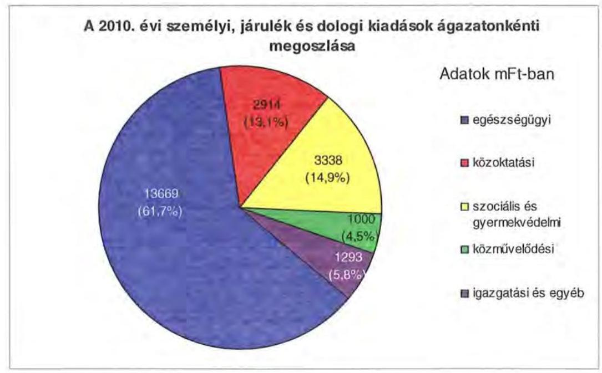

A 2010. évi önkormányzati kiadások 87,1\%-a az intézmények (22 053 millió Ft), a többi a Hivatal költségvetésében szerepelt. A Hivatal költségvetéséből ( 3264 millió Ft) a személyi és dologi kiadások 20\%-kal ( 654 millió Ft), a beruházások, felújítások 37\%-kal (1207 millió Ft), a különböző megyepolitikai feladatokhoz, szervezetek támogatásához, finanszírozási tételekhez kapcsolódó kiadások 43\%-kal (1403 millió Ft) részesültek.

Az Önkormányzat kötelező és önként vállalt feladatait 2010. december 31-én a Hivatallal és 27 költségvetési szervvel, illetve 3 többségi tulajdonú gazdasági társasággal látta el.

Az Önkormányzat által fenntartott költségvetési szervek közül 12 önállóan működő és gazdálkodó, 16 önállóan működő költségvetési szerv, az intézmények alapító okirataik szerint (a 2006. évi 87 -hez képest a 2010. évben 9-el több) összesen 96 telephelyen múködtek. Az Önkormányzat feladatait 2010. decemberben az alábbi intézménystruktúrával látta el:

- egészségügyi feladatokat egy kórház látott el;
- szociális és gyermekvédelmi feladatokat öt intézmény végzett (négy szociális és egy gyermekvédelmi intézmény);
- közoktatási feladatot 11 intézmény látott el (egy pedagógiai szakszolgálat, egy szakképző iskola, egy alapfokú művészetoktatási intézmény, nyolc sajátos nevelési igényű, fogyatékos gyermeket oktató-nevelő intézmény);
- közművelődési és közgyűjteményi feladatokat végzett négy intézmény (könyvtár, levéltár, múzeum, közművelődési intézet), művészeti és kiadó tevékenységet végzett két intézmény (FORRÁS Kiadó, nemzetközi zománcművészeti alkotóműhely);
- igazgatási feladatokat látott el a Hivatal;

---

- egyéb feladatokat négy intézmény látott el (egy intézmény gazdasági ellátó szervezetként múködött, a Könyvtár és a Kórház kivételével a kecskeméti székhelyű intézmények, illetve a kiskunfélegyházi Göllesz Viktor Általános Iskola pénzügyi-gazdasági feladatait látta el, a többi három intézmény a csillagvizsgáló intézet, a Veránka szigeti üdülő, valamint a balatonlellei üdülő és továbbképzési intézet).

Az Önkormányzat a megye területén a pedagógiai szakmai szolgáltatási feladatok teljes körű ellátására a COMMITMENT Köznevelési Kht-vel kötött megbízási szerződést.

Az egyes ágazatok kötelező feladatellátását 2010. december 31-én az alábbi mutatók jellemzik:

| Megnevezés | közoktatás | szociális és   gyermek-   védelem | egészség-   úgy | kultúra   és sport |
| :-- | :--: | :--: | :--: | :--: |
| Az ágazatban foglalkozta-   tottak száma (fő) | 804 | 936 | 1708 | 226 |
| Az ágazat intézményeiben   ellátottak összesen (fő) | 3289 | 2667 |  |  |
| Fekvőbeteg ellátás férőhe-   lyeinek száma (db) |  |  | 1172 |  |

Az Önkormányzat három többségi részesedésú gazdasági társasága közül kettő - a Nemzetközi Kerámia Stúdió Nonprofit Kft., valamint a BácsKiskun Megyei Turisztikai Közhasznú Nonprofit Kft. - az Önkormányzat kizárólagos tulajdona, a FILANTROP Környezetvédelmi és Fútéstechnikai Nonprofit Kft-ben 80,4\%-os tulajdoni részesedéssel rendelkezik:

- a Bács-Kiskun Megyei Nemzetközi Kerámia Stúdió Kht. a 2009. évben alakult át nonprofit Kft-vé. A társaság önként vállalt feladatként látja el a megye kerámia művészeti kulturális tevékenységének támogatását és fejlesztését, ennek érdekében a pályakezdő fiatal és kortárs hazai és nemzetközi alkotóművészek szakmai fejlődését segíti azzal, hogy a kutató és útkereső alkotó munkához szakmai műhelyt és szakmai segéderőt biztosít, szakmai előadásokat, kiállításokat szervez;
- a Bács-Kiskun Megyei Turisztikai Közhasznú Nonprofit Kft-t az Önkormányzat a 2010. évben alapította, a társaság a tevékenységét a 2011. évben kezdte meg. A társaság önként vállalt feladatként látja el az üdülési és egyéb átmeneti szálláshely szolgáltatást;
- a FILANTROP Környezetvédelmi és Fútéstechnikai Nonprofit Kft. közhasznú társaságból alakult át a 2009. évben, jogelődje 1995-ben alakult. A Társaságnak 44 önkormányzat a tagja, a társaság kötelező feladatként látja el a kéményseprést.

A többségi tulajdonú gazdasági társaságok mellett az Önkormányzat 10-50\% közötti részesedéssel rendelkezik a következő gazdasági társaságokban: a Fogathajtó VB Kecskemét Kft-ben 33,3\%-os, a Kalocsavíz Kft-ben 26,8\%-os, a Tör-

---

ténelmi Témapark Kft-ben 25\%-os, a Dél-Kelet Magyarországi Iroda Nonprofit Kft-ben 20\%-os, a Bács-Szakma Szakképzés-fejlesztési és Szervezési Nonprofit Kiemelkedően Közhasznú Zrt-ben 18,4 \%-os, a Kecskeméti Animációs Filmgyártó és Forgalmazó Kft-ben 13,8\%-os, a DKMT Duna-Körös-Maros-Tisza Eurórégiós Fejlesztési Úgynökség Nonprofit Közhasznú Kft-ben 11,3\%-os részesedéssel rendelkezik. Az Önkormányzat 10\% alatti részesedéssel rendelkezik három gazdasági társaságban: a BÁCSVÍZ Rt-ben 5,69\%, a Bajavíz Kft-ben és a Kőrösvíz Kft-ben 0,3-0,3\%. A felszámolás alatt álló Kisbugaci Vasút Kht-ban az Önkormányzat - a 2010. évi zárszámadási rendeletben kimutatottak szerint -$16,67 \%$-os tulajdoni hányaddal rendelkezett.

Az önkormányzati feladatellátásban az intézmények és gazdasági társaságok mellett egyéb szervezetek, valamint szolgáltatási szerződéssel kiszervezett/kiszerződött intézményi ellátások - a pedagógiai szakmai szolgáltatások kivételével - nem múködtek.

Az Önkormányzat 2007. szeptember 1-jétől Kiskunfélegyháza Város Önkormányzatától egy gyógypedagógiai nevelést, oktatást végző általános iskolát ${ }^{14}$ 90 fős tanulói és két szociális intézményt ${ }^{15} 50$ fős ellátotti létszámmal átvett, és a „Harmónia" Szenvedélybetegek Otthona Országos Módszertani Központba integrálta, továbbá három szociális intézményt megszüntetett ${ }^{16}$. Az Önkormányzat 2007. január 1-jétől a Nevelési Tanácsadó és 2008. április 15-től a Pedagógiai Intézet múködtetését megszüntette, illetve 2009. január 1-jétől - jogszabályi kötelezettség alapján - a Tanulási Képességet Vizsgáló Szakértői és Rehabilitációs Bizottságot megalapította.

# 2. PÉNZÜGYI EGYENSÚLYI HELYZET ALAKULÁSA 

### 2.1. A múködési és felhalmozási egyensúly alakulása

A hagyományos költségvetési szerkezet helyett az önkormányzat pénzügyi helyzetét a CLF módszerrel mutatjuk be, amelyben jobban elkülönülnek a vagyonnal kapcsolatos bevételek és kiadások a feladatokkal kapcsolatos közvetlen múködtetési bevételektől és kiadásoktól. A módszer következetesen elkülöníti a folyó és a felhalmozási költségvetés bevételeit és kiadásait, azok költségvetési egyenlegeit. A tárgyévi pozíciók meghatározása érdekében a figyelembe vett saját folyó bevételek, valamint saját felhalmozási bevételek nem tartal-

[^0]
[^0]:    ${ }^{14}$ A Közgyűlés a 128/2007. (VI. 29.) számú határozatával döntött a Kiskunfélegyházi Göllesz Viktor Általános Iskola, Speciális Szakiskola és Egységes Pedagógiai Szakszolgálat 2007. augusztus 31-ével történő átvételéről Kiskunfélegyháza Város Önkormányzatától.
    ${ }^{15}$ A Közgyűlés a 173/2007. (IX. 28.) számú határozatával döntött 2008. január 1-jétől Kiskunfélegyháza Város Önkormányzatától a Szivárvány Személyes Gondoskodást nyújtó Intézmény szenvedélybetegek otthona telephelyének, valamint a Fogyatékos Személyek Otthona átvételéről.
    ${ }^{16}$ A Közgyűlés a 170/2007. (IX. 28.) számú határozatával döntött a „Napraforgó" Ápo-ló-Gondozó Otthon, a Szakosított Szociális Otthon, és a „Kék Duna" Ápoló-Gondozó Otthon és Lakóotthon megszüntetéséről.

---

mazzák az előző évi pénzmaradványok felhasználásából származó pénzforgalom nélküli bevételeket ${ }^{17}$.

A bevételek és kiadások besorolása általános közgazdasági meggondolásokon alapul, amely testet ölt az SNA statisztikai módszertanában is. Folyó tételek alatt értjük azokat a bevételeket és kiadásokat, amelyek az önkormányzat vagyoni helyzetét automatikusan nem változtatják. A bevételi oldalon ilyenek az adók, az illeték, az áfa bevételek és visszatérülések, a hozamok és kamatok, a költségvetési támogatások, az egyéb saját bevételek, valamint a múködési célra átvett pénzeszközök és kapott támogatások. A folyó kiadások közé tartoznak a szolgáltatások nyújtásával kapcsolatos múködési kiadások, a kamatkiadások, valamint a múködési célú transzferkiadások ${ }^{18}$. A felhalmozási vagy tőke tételek módosítják az önkormányzat vagyoni helyzetét. A privatizációs bevételek, az immateriális javak és tárgyi eszközök, valamint a részesedések értékesítése csökkentik, a fizikai beruházások és a pénzügyi befektetések növelik a vagyont. A pénzforgalmi bevételek és kiadások nem tartalmazzák a követelések elengedése miatt könyvelt tételeket, mivel ezek egymást kioltó, technikai jellegű elszámolási műveletek.

A folyó költségvetés egyenlege, a múködési jövedelem megmutatja, hogy az önkormányzat éves folyó bevétele fedezetet biztosít-e a kötelező és önként vállalt feladatellátáshoz kapcsolódó éves folyó kiadására. A múködési jövedelem negatív értéke pénzügyileg fenntarthatatlan helyzetet jelez. A mutató pozitív étéke megtakarítást mutat, amely forrásul szolgálhat az önkormányzat fennálló kötelezettségei megfizetéséhez, valamint fejlesztéseihez.

A felhalmozási költségvetés pozitív értéke felhalmozási többletet mutat, amely a jövőbeni fejlesztések forrását biztosíthatja. Amennyiben a folyó költségvetési hiány finanszírozása a felhalmozási többletből történik, ez szűkebb értelemben vagyonfelélésnek tekinthető. Amennyiben a felhalmozási költségvetés megtakarítása fejlesztési célú hitelek, kötvények adósságszolgálatát finanszírozza változatlan vagyontömeg mellett, a korábban megelőlegezett tőkebevételek valós realizációjának tekinthető. A felhalmozási deficit által generált finanszírozási igény önmagában nem jár pénzügyi kockázattal, a pénzügyileg fenntartható beruházásokhoz kapcsolódó kötelezettségvállalás (adósságszolgálat) előrelátó, tudatos költségvetési gazdálkodással teljesíthető.

A módszer a pénzügyi kapacitás (más néven a nettó múködési jövedelem) fogalmát helyezi a középpontba. Az adós hitelfelvételi képessége, hosszú távú fizetőképessége vagy bonitása a pénzügyi kapacitással, ezen belül is a nettó múködési jövedelemmel jellemezhető. A nettó múködési jövedelem negatív értéke az egyes költségvetési években jelentkező adósságszolgálat túlzott mértékére utal ${ }^{19}$. A nettó múködési jövedelem negatív értékének felhalmozási többletből, vagy további hitelből történő finanszírozása pénzügyileg nem fenntartható gaz-

[^0]
[^0]:    ${ }^{17}$ A költségvetési években kialakuló hiány finanszírozása az előző években képzett tartalékok felhasználásával is történhet.
    ${ }^{18}$ Transzferkiadásoknak azokat a folyó és felhalmozási tételeket nevezzük, amelyeket nem az adott önkormányzat használ fel szolgáltatásnyújtásra (pl.: ellátottak pénzbeni juttatásai, átadott pénzeszközök, garancia- és kezességvállalások stb.).
    ${ }^{19}$ Kivéve, ha annak finanszírozására a korábbi években képzett tartalékok fedezetet nyújtanak.

---

dálkodást vetít előre. A pozitív értéket mutató nettó működési jövedelem fejlesztési kiadások fedezetét biztosíthatja, illetve a folyamatosan, évenként képződő pozitív nettó müködési jövedelemböl meghatározható a jövőben vállalható, teljesíthető éves adósságszolgálat, ily módon az a hitelösszeg, amely - a többi tényezőt, feltételt adottnak tekintve - visszafizetési kockázat nélkül felvehető.

A CLF módszer alapján a pénzügyi kapacitás mértéke az önkormányzat összevont, nettósított, a központi információs rendszerbe a MÁK-on keresztül leadott éves költségvetési beszámolójának 80-as űrlapjában szerepeltetett adatok alapján került meghatározásra. A 2007-2010 közötti időszakban az Önkormányzat CLF módszer szerint besorolt kiadásainak és bevételeinek fơbb jogcímek szerinti alakulását a jelentés 2/a. számú melléklete tartalmazza.

Az Önkormányzat bevételeinek és kiadásainak alakulását részletesen a hatályos számviteli előírások szerint készült, összevont éves költségvetési beszámolók adataira alapozva mutatjuk be. A bevételek és kiadások múködési, valamint felhalmozási jogcímekre történő elkülönítését az éves költségvetési beszámolók, a zárszámadási rendeletek, továbbá - amely jogcímek ${ }^{20}$ esetében erre más lehetőség nem volt - az Önkormányzat adatszolgáltatása szerinti megbontás alapján végeztük el. A bevételek elemzése során figyelembe vettük a korábbi években keletkezett pénzmaradvány felhasználásából származó pénzforgalom nélküli bevételeket is. A 2007-2010 közötti időszakban az Önkormányzat bevételeinek és kiadásainak, továbbá adósságszolgálatának alakulását a jelentés 2/b. számú melléklete tartalmazza.

[^0]
[^0]:    ${ }^{20}$ Az előző évi maradvány visszafizetésének, az előző évi pénzmaradvány átadásának és átvételének, a kamatkiadásoknak, az egyéb pénzforgalom nélküli kiadásoknak, a hozam- és kamatbevételeknek, az átengedett adóknak, a költségvetési támogatásoknak, továbbá az előző évi pénzmaradvány igénybevételének müködési és felhalmozási részre történő megosztásához az Önkormányzat által szolgáltatott adatokat vettük figyelembe.

---

# CLF módszer szerinti önkormányzati adatok 

| Megnevezés | 2007 | 2008 | 2009 | 2010 |
| :--: | :--: | :--: | :--: | :--: |
| Folyó bevételek | 23148024 | 24375470 | 23126133 | 22687725 |
| Folyó kiadások | 21480741 | 24138597 | 22676891 | 23406592 |
| Müködési jövedelem | 1667283 | 236873 | 449242 | $-718867$ |
| Nettó müködési jövedelem   - müködési jövedelem - tóketörlesztés | 1666183 | 235773 | 417720 | $-761258$ |
| Felhalmozási bevételek | 602340 | 572475 | 498672 | 1002732 |
| Felhalmozási kiadások | 2464248 | 1431013 | 1328715 | 1910330 |
| Felhalmozási költségvetés egyenlege | $-1861908$ | $-858538$ | $-830043$ | $-907593$ |
| Finanszírozási műveletek nélküli (GFS) pozíció | $-194625$ | $-621665$ | $-380801$ | $-1626460$ |
| Finanszírozási műveletek egyenlege | 5290685 | $-2800459$ | 4127403 | 97314 |
| Tárgyévi pénzügyi pozíció | 5096060 | $-3422124$ | 3746602 | $-1529146$ |
| Egyéb tájékoztató adatok |  |  |  |  |
| Összes kötelezettség* | 9207176 | 7836663 | 9105876 | 10918242 |
| -ebböl rövid lejáratú | 3603798 | 1423575 | 2604775 | 3144671 |
| Folyószámla hitel napi átlagos állománya** | 205958 | 383306 | 566478 | 763193 |
| Egyéb likvidhitel napi átlagos állománya** | 0 | 0 |  | 0 |
| Munkabér-megelölegezési hitel napi átlagos állománya** | 4386 | 3867 | 3640 | 3496 |
| Egyéb finanszírozásba vonható eszközök év végi állománya: | 6155661 | 6423483 | 6480139 | 4950991 |
| - ebböl:tartós hitelviszonyt megtestesitö értékpapírok év végi állománya | 0 | 3299956 | 0 | 0 |
| -ebböl: hosszú lejáratú bankbetétek év végi állománya | 0 | 0 | 0 | 0 |
| -ebböl:értékpapírokév végi állománya | 5 | 389995 | 5 | 5 |
| -ebböl:pénzeszközök (idegen pénzeszközök nélkül) év végi állománya | 6155656 | 2733532 | 6480134 | 4950988 |

* Az összes kötelezettséget a passzív pénzügyi elszámolások nélkül vettük figyelembe, mert a passzívák a pénzmaradvány elszámolás tételei közé tartoznak.
** A folyószámla- és a munkabér megelőlegezési hitel átlagos állományát 365 nappal számítottuk.

A vizsgált időszakban az Önkormányzat folyó költségvetési egyenlege, müködési jövedelme 2007-2009. években pozitív, 2010. évben negatív összegű volt, amelyet a következő ábra szemléltet:
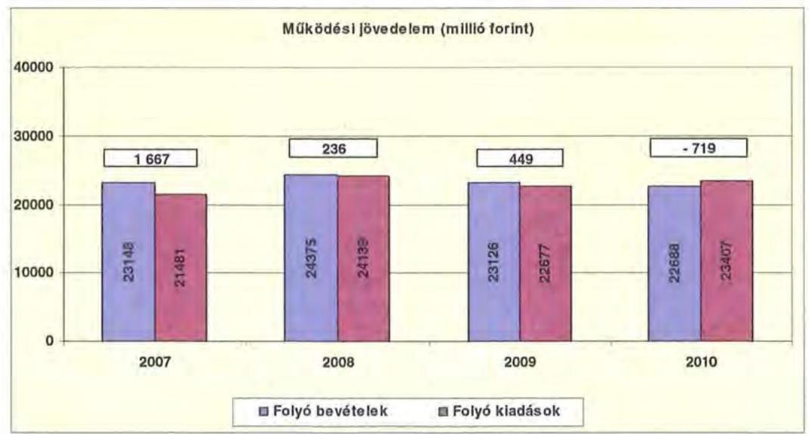

---

A folyó költségvetés egyenlege: 2007-ben a folyó kiadások 7,8\%-át (1667 millió Ft-ot), 2008-ban 1,0\%-át ( 236 millió Ft-ot), 2009-ben 2,0\%-át ( 449 millió Ft-ot) jelentette a múködési forrástöbblet. 2010. évben viszont már a múködési forráshiány a folyó kiadások 3,1\%-a (-719 millió Ft) volt.

A múködési forráshiány finanszírozása munkabérhítelből, folyószámlahitelből, továbbá felhalmozási céllal kibocsátott kötvény realizált hozambevételéből történt. A folyószámlahitel napi átlagos állománya 2007-2010 között több mint a háromszorosára ( 206 millió Ft-ról 763 millió Ft-ra) nőtt. Az Önkormányzat a vizsgált időszakban munkabérhitelt is igénybevett, melynek mértéke nem volt számottevő. (A napi átlagos állománya 2007-ben 4 millió Ft, míg 2010-ben 3 millió Ft volt.)

Az Önkormányzat kötelezettségein ${ }^{21}$ belül a 2008-2010 közötti időszakban a rövid lejáratú kötelezettségek állománya 30\% alatt volt, a 2007. évi 39,1\%-os aránnyal szemben. Az Önkormányzat 2006. december 31-én fennálló pénz és tőkepiaci kötelezettsége 266 millió Ft-ról 9097 millió Ft-ra, 34 szeresére nőtt a hosszú lejáratú hitel, a kötvénykibocsátás és a folyószámlahitel állományának emelkedése miatt.

A rövid lejáratú kötelezettségek 2010-ben 3145 millió Ft-ot tettek ki, amely 459 millió Ft-tal ( $12,7 \%$ ) kevesebb a 2007. évi rövid lejáratú kötelezettségállománynál. A rövid lejáratú kötelezettségeken belül a szállítói állomány 2007-ben 1174 millió Ft volt, 2008-ban 487 millió Ft-ra, csökkent, 2009-ben 1432 millió Ft-ra,, 2010-ben 1623 millió Ft-ra növekedett, amelynek következtében a szállitói kötelezettségek a vizsgált időszakban 1,4-szeresére nőttek.

Az Önkormányzat pénzügyi kapacitása a 2007-2009. években pozitív, míg a 2010. évben negatív értéket mutatott. A nettó múködési jövedelem ${ }^{22}$ értéke a folyó költségvetési pozíció mellett az adott költségvetési év adósságtörlesztésének hatását is tükrözi.

Az Önkormányzat nettó múködési jövedelmének évenkénti alakulását a következő ábra szemlélteti:

[^0]
[^0]:    ${ }^{21}$ Passzív pénzügyi elszámolások nélküli
    ${ }^{22}$ Pénzügyi kapacitás

---

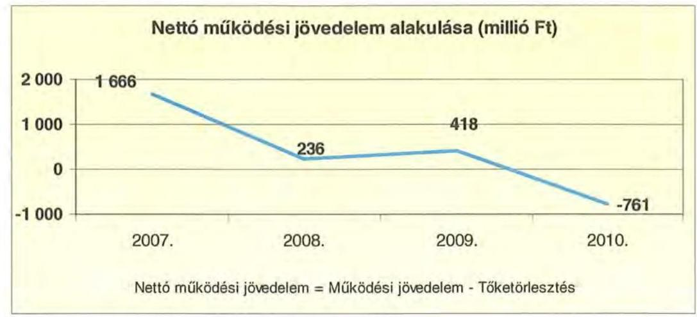

Az Önkormányzat pénzügyi kapacitása a vizsgált időszakban csökkent, 2010. évben a pénzügyi kapacitás negatív értéke meghaladta a -761 millió Ft-ot. A nettó múködési jövedelem romlását a folyó bevételek és kiadások különbségéből származó múködési jövedelem csökkenése, valamint a tőketörlesztés 2009. és 2010. évi növekedése okozta.

A 2007-2010. években az Önkormányzat felhalmozási költségvetésének egyenlege folyamatosan negatív összegú volt, melyet a következő ábra szemléltet:
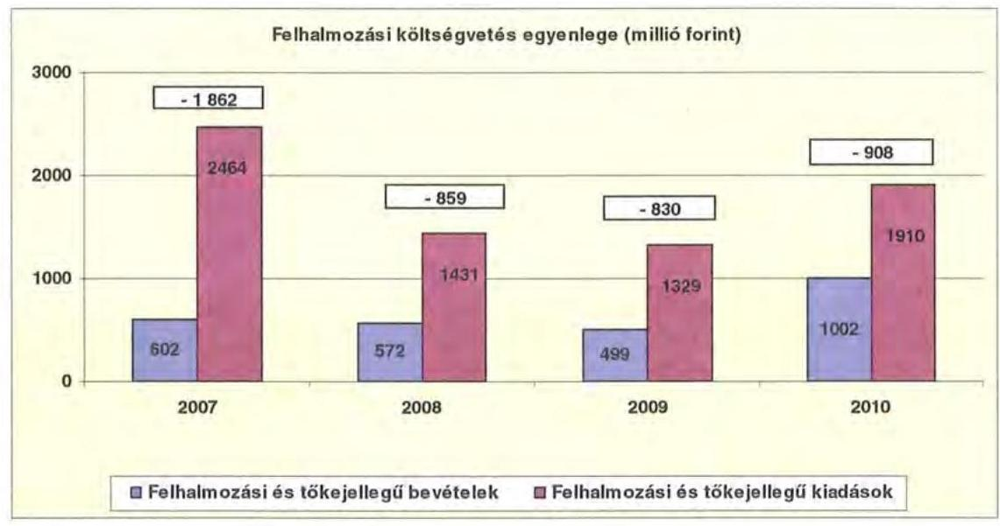

A felhalmozási és tőke jellegű bevételeknek a felhalmozási és tőke jellegű kiadásokhoz viszonyított aránya, valamint a felhalmozási forráshiány összege 2007-ben 24,4\% (-1862 millió Ft), 2008-ban 40,0\% (-859 millió Ft), 2009-ben $37,4 \%$ (-830 millió Ft), 2010-ben 52,5\% (-908 millió Ft) volt.

---

A felhalmozási forráshiány finanszírozása hosszú lejáratú, fejlesztési célú hitelből, fejlesztési célú kötvénykibocsátásból, illetve tárgyi eszköz értékesítéséből származó bevételből történt.

Az Önkormányzat évenkénti teljes finanszírozási hiánya ${ }^{23}$ a CLF módszer szerint 2007-ben 196 millió Ft, 2008-ban 623 millió Ft, 2009-ben 412 millió Ft, 2010-ben 1669 millió Ft volt.

Az önkormányzat finanszírozási múveletei 2007-2010 közötti egyenlegének alakulását a következő ábra szemlélteti:
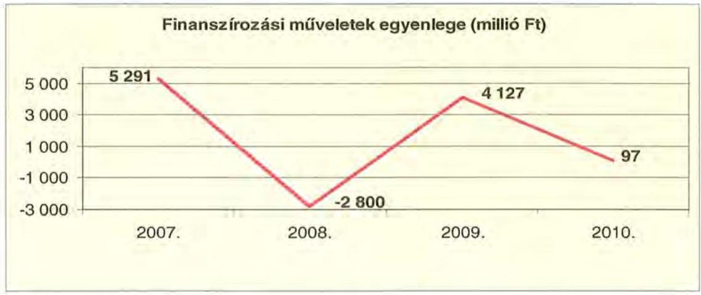

A finanszírozási többlet azt jelzi, hogy az éves költségvetések végrehajtása során szükség volt a pénzkészlet felhasználásán túl külső finanszírozás igénybevételére is. A finanszírozási célú műveleteket a vizsgált időszakban a jelentés 2/a. számú mellékletének 4.1-4.8 pontjai részletezik.

Az önkormányzat zárszámadási rendeletében a múködési és fejlesztési hiányt a hagyományos költségvetési szerkezet alapján mutatta be ${ }^{24}$, amelyről a jelentés 1. számú melléklete nyújt tájékoztatást. A múködési bevételek 2007-2009 között meghaladták a múködési kiadásokat, 2007-ben 202 millió Ft-tal, 2008-ban 66 millió Ft-tal, 2009-ben 468 millió Ft-tal, azonban 2010-ben elmaradtak 714 millió Ft-tal a múködési kiadásoktól. A felhalmozási forráshiány 2007-ben 397 millió Ft, 2008-ban 688 millió Ft, 2009-ben 849 millió Ft és 2010-ben 912 millió Ft volt.

A vizsgált időszakban a kötelezettségek (passzív pénzügyi elszámolások nélkül) 9207 millió Ft-ról 10918 millió Ft-ra emelkedtek, amely együtt járt a kamatkiadások növekedésével. Ugyanakkor a kötvénykibocsátásból származó bevételek lekötése révén a kapott kamatok meghaladták a fizetett kamatokat.

A 2007-2010 között az önkormányzat összesen 1589 millió Ft kamatbevételt realizált, amely a teljes kamatráfordítás ( 629 millió Ft) 252,7\%-át tette ki.

[^0]
[^0]:    ${ }^{23}$ a nettó múködési jövedelem és a beruházási költségvetés egyenlegeinek összege
    ${ }^{24}$ Nincs kötelező előírás a múködési és fejlesztési hiány megállapításának módjára.

---

Az Önkormányzat kamatbevételeit és kamatkiadásait, illetve azok egyenlegét a következő ábra mutatja:
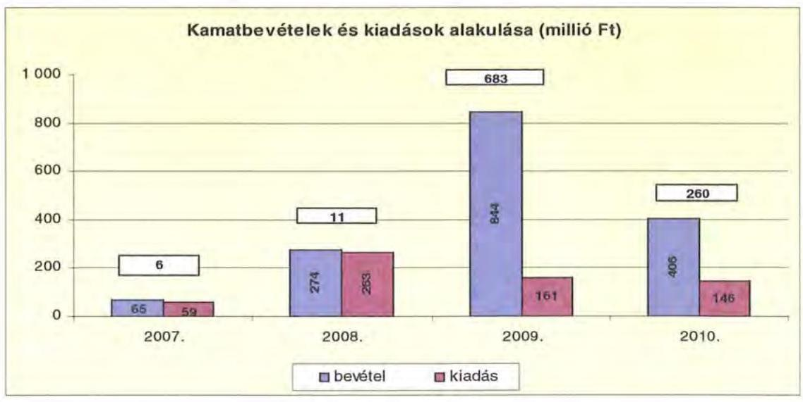

A 2007-2010 közötti időszakban az Önkormányzat kiadásait és bevételeit a főbb jogcímek szerint a jelentés 2/b. számú melléklete tartalmazza.

# 2.2. Az Önkormányzat bevételei 

Az Önkormányzat 2007-2010 között realizált OEP támogatás nélküli főbb bevételi jogcímeinek számszaki adatait a következő táblázat, összetételét a grafikon mutatja be:
ezer Ft

| Megnevezés | 2007. év   tény | 2008. év   tény | 2009. év   tény | 2010. év   tény |
| :-- | :--: | :--: | :--: | :--: |
| Illetékbevétel | 2068080 | 2323460 | 2043537 | 1408275 |
| SZJA és állami támogatás | 5260320 | 5825596 | 5158131 | 4368105 |
| Egyéb saját bevétel (OEP nélkül) | 4023425 | 5761347 | 6178430 | 5516740 |
| Összes müködési bevétel | 11352725 | 13910403 | 13380098 | 11293120 |

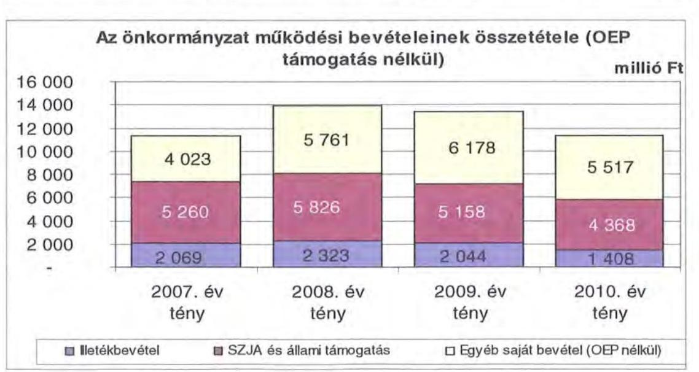

---

Az Önkormányzatnál az illetékbevétel a 2007. évben 2069 millió Ft volt, a 2006. évhez képest 531 millió Ft-tal ( $20,4 \%$-kal csökkent). A csökkenésben szerepet játszott az Illetékhivatalnak - 2007. január 1-jétől - az APEH-hez történő átszervezése. Az illetékhivatali feladatok átadás-átvétele miatt az illetékkiszabás és behajtási tevékenység lelassult, amely a 2007. évi teljesített illetékbevételek csökkenését okozta.

Az illetékbevétel a vizsgált időszakban - az előző évihez képest - 2008-ban 12,3\%-kal (254 millió Ft-tal) növekedett, majd 2009-ben 12,1\%-kal (280 millió Ft-tal), 2010-ben 31\%-kal (635 millió Ft-tal) csökkent. Az illetékjogszabályok változása - az öröklési illeték eltörlése, illeték mértékek csökkentése - valamint az ingatlanforgalom visszaesése is előidézője volt az illetékbevétel csökkenésnek.

Az átengedett szja és az állami támogatások együttes összege a 2008. évi 10,7\%-os 565 millió Ft növekedést követően a központi forráskivonás hatására ${ }^{25}$ - a megyei önkormányzatokat megillető három jogcímből (a lakosságszámhoz kötött, az intézményekben ellátottak után, a megyéket egységesen megillető) - folyamatosan csökkent. Az előző évihez képest 2009-ben 11,5\%-kal 667 millió Ft-tal, 2010-ben további 15,3\%-kal 790 millió Ft-tal kapott kevesebb forrást az Önkormányzat az államtól ezeken a jogcímeken. A változást a normatíváknak a járulékváltozások miatti központi csökkentése, valamint a megyei önkormányzatokat érintő forráselvonás mellett a tanulói létszám visszaesése idézte elő. Az OEP támogatás összege a 2007. évi 10829 millió Ft-ról a 2010. évre 11927 millió Ft-ra növekedett.

Az egyéb saját bevétel növekedését 2007-ről 2008-ra egyrészt az intézményi müködési bevételek, másrészt a hozam és kamatbevételek emelkedése okozta (a növekmény 1493 millió Ft volt a 2007. évről 2010. évre).

Az összes OEP nélküli bevétel 2009. évet követően csökkent. A forráscsökkenést többek között a kötvénykibocsátásból elért kamatbevételei növelése ellensúlyozta. A kamatbevételek egyéb saját bevételen belüli aránya a 2007. évi 65 millió Ft-ról 1,6\%-ról a 2010. évre 405 millió Ft-ra 7,3\%-ra nőtt a 2009. évben 845 millió Ft $13,4 \%$ volt.

Az Önkormányzat felhalmozási bevételeinek szerkezete a vizsgált időszakban a következő volt:

|  |  |  |  |  |
| :-- | --: | --: | --: | --: |
| Megnevezés | 2007. év | 2008. év | 2009. év | 2010. év |
| Tárgyi eszköz   értékesítés | 166486 | 332891 | 12952 | 24329 |
| Állami támogatás | 1452804 | 369149 | 24938 | 15299 |
| Átveit pénzeszköz | 88210 | 82999 | 48955 | 101961 |
| Egyéb felhalmozási   bevétel | 323978 | 60416 | 366736 | 766076 |
| Felhalmozási tartalék | 234948 | 3874672 | 2103957 | 658267 |
| Összes felhalmozási   bevétel | 2266426 | 4720127 | 2557538 | 1565932 |
|  |  |  |  |  |

[^0]
[^0]:    ${ }^{25}$ a 2007. évi bázishoz képest

---

Az Önkormányzatnak tárgyi eszközértékesítésből 2007-2008-ban 499 millió Ft bevétele ${ }^{26}$ származott. A 2009-2010. években a pénzügyi válság miatt a tárgyi eszközértékesítés visszaesett.

Állami támogatás a 2007. évben a címzett támogatással ${ }^{27}$ megvalósuló beruházások kapcsán keletkezett. Az évenkénti nagy összegű felhalmozási tartalék a fejlesztések finanszírozására - betétként - lekötötték.

# 2.3. Az Önkormányzat kiadásai 

Az Önkormányzat müködési kiadásai főbb jogcímek szerinti bontásban az alábbiak voltak:

|  |  |  |  |  |  |
| :-- | --: | --: | --: | --: | --: |
| Megnevezés | 2007. | 2008 | 2009 | 2010 | 2011   terv |
| Müködési kiadások | 21516809 | 24036183 | 22702784 | 23497017 | 22006770 |
| Müködési kiadások (kamatkiadás nélkül) | 21480508 | 23983863 | 22613805 | 23395509 | 21909270 |
| Kamatkiadás | 36301 | 52319 | 88979 | 101508 | 97500 |
| Személyi juttatások | 8863474 | 9661928 | 8952800 | 8915191 | 8657655 |
| Munkaadói terhelő járulékok | 2777800 | 2997268 | 2660471 | 2293400 | 2304716 |
| Dologi kiadások | 8856563 | 10161145 | 9825831 | 11005547 | 9568668 |
| Egyéb folyó kiadások | 112099 | 158926 | 165623 | 253435 | 180677 |
| Támogatások, elvonások, egyéb folyó átutalások | 606354 | 915472 | 931037 | 997657 | 1197554 |
| ebből: müködési célú pénzeszközátadás | 219488 | 216328 | 235524 | 122456 | 159417 |
| Előző évi pénzmaradvány átadás, viszafizetés, müködési célú | 64218 | 89124 | 78043 | 40279 | 0 |

Az Önkormányzat müködési kiadásai 2007. december 31-ről 2010. december 31-re 8,9\%-kal (21 480 millió Ft-ról 23395 millió Ft-ra) nőttek.

Az Önkormányzat 2010-ben a müködési költségvetés 47,9\%-át (11 209 millió Ft) személyi juttatásokra és a munkaadókat terhelő járulékokra fordította, az üzemeltetést, intézményfenntartást biztosító dologi kiadásokra 11005 millió Ft $47 \%$ jutott. A müködési kiadásokon belül a személyi juttatások és járulékok összege a 2007. évről a 2010. évre 433 millió Ft-tal csökkent.

A személyi juttatások 2008-ban 798 millió Ft-tal 9\%-kal nőttek ${ }^{28}$ az előző évhez képest, azt követően minden évben csökkentek a létszámcsökkentések miatt. 2010-ben a 2007. évben teljesített kiadásokhoz viszonyítva 52 millió Fttal emelkedtek.

A dologi kiadások az Önkormányzatnál 2010-ben a 2007. évi szintnél 2149 millió Ft-tal 24,2\%-kal voltak magasabbak. Az emelkedést a készletek beszerzései, a szolgáltatások díjainak, valamint ezek áfa tartalmának növekedése, a

[^0]
[^0]:    ${ }^{26}$ A bevétel ingatlanértékesítésből és az illetékhivatali eszközök APEH részére történő értékesítéséből származtak.
    ${ }^{27}$ A címzett támogatásokból a bajai, kecskeméti iskolák és a Kórház rekonstrukciós munkált finanszírozták.
    ${ }^{28}$ A növekedést a 2007. évről áthúzódó 13 havi juttatás, a közalkalmazotti, köztisztviselői bérrendezés hatása eredményezte, melyet központi forrásból biztosítottak.

---

beruházások múködési kiadásainak emelkedése, valamint az intézmény átvételek okozták. A 2009. év kivételével minden évben az inflációt meghaladó mértékben nőttek a dologi kiadások, amelynek ellentételezése a központi forráselosztásban nem jelentkezett. Fedezetét az Önkormányzatnak a végrehajtott kiadáscsökkentő intézkedések mellett a kötvénykibocsátásból származó kamatbevételekből és rövid lejáratú hitelekből kellett biztosítani.

A támogatások a 2007. évi 683 millió Ft-ról 2010. évi 711 millió Ft-ra való növekedését elsősorban az ellátottak pénzbeli juttatásainak emelkedése okozta. A támogatáson belül pénzbeli juttatások aránya a 2007. évi 65\%-ról 444 millió Ft-ról a 2010. évre 77,8\%-ra 553 millió Ft-ra emelkedett. A támogatáson belül az államháztartáson kívüli pénzeszközátadások 2007. évről 2010. évre 97 millió Ft-tal 44, 2\%-kal csökkentek.

Az Önkormányzati kiadásokban 2007-2010. években nőtt a kórházi kiadások súlya az egyéb fenntartott intézményekben felmerülő kiadásokhoz képest. A Kórház nélküli teljesített múködési kiadások 2007-ben az összes múködési kiadás $45 \%$-át 9674 millió Ft-ot tettek ki, ez az arány 2010 év végére 41,1\%-ra 9617 millió Ft-ra csökkent. A Kórház nélküli kiadásokban jelentkező tendenciák a közoktatási, szociális és gyermekvédelmi, igazgatási és egyéb intézményekben biztosított feladatellátást jellemzik.

Az Önkormányzat kórház nélküli múködési kiadásai a vizsgált időszakban a következőképpen alakultak:
ezer Ft

| Megnevezés | 2007. | 2008 | 2009 | 2010 |
| :--: | :--: | :--: | :--: | :--: |
| Múködési kiadások | 9733093 | 10651756 | 8056126 | 9718886 |
| Múködési kiadások (kamatkiadás nélkül) | 9674568 | 10398984 | 8055121 | 9617378 |
| Kamatkiadás | 58525 | 262772 | 1005 | 101508 |
| Személyi juttatások | 5024718 | 5350647 | 4236244 | 4789410 |
| Munkaadót terhelő járulékok | 1553847 | 1647825 | 1238468 | 1208146 |
| Dologi kiadások | 2284884 | 2487300 | 2014474 | 2678063 |
| Egyéb folyó kiadások | 69823 | 110170 | 25930 | 120976 |
| Támogatások, elvonások, egyéb folyó átutalások | 682233 | 773068 | 537559 | 710494 |
| elözői múködési célú pénzeszközátadás | 218808 | 215162 | 6150 | 121773 |
| Előző évi pénzmaradvány átadás, viszafizetés, múködési célú | 0 | 0 | 62158 | 39599 |

Míg 2010-ben - a Kórházzal együtt - a múködési kiadások növekedése volt megfigyelhető ${ }^{29}$, addig a Kórház nélkül ugyanebben az időszakban a múködési kiadások 57 millió Ft-tal csökkentek, mivel a személyi juttatások csökkenése - a létszámleépítések miatt - a többi intézménynél intenzívebb volt. A Kórház nélküli múködési kiadások 62,4\%-át ( 5998 millió Ft) teszik ki a személyi juttatások és járulékaik, a dologi kiadások aránya pedig, alig haladja meg a múködési kiadások egynegyedét, amely $27,8 \% 2678$ millió Ft volt.

A Kórházon kívüli intézményekben a személyi juttatások a 2007. évhez képest a 2010. évre összesen 235 millió Ft-tal 4,7\%-kal csökkentek, míg önkormányzati szinten $0,5 \%$-kal emelkedtek, ami azt tükrözi, hogy az egészségügyi ágazatban a létszám és bérek nem csökkentek.

[^0]
[^0]:    ${ }^{29}$ A 2007. december 31-i bázishoz képest.

---

A Kórház engedélyezett létszáma a 2007. évhez képest a 2010. évre 1668 -ról 1717-re 49 fővel, a személyi juttatás 148 millió Ft-tal nőtt.

A 2010. évben a 2007. évhez képest a munkaadókat terhelő járulék 484 millió Ft-tal ( $17,4 \%$-kal) csökkent, amely egyrészt a kifizetett személyi juttatások, másrészt a járulékok mértékének csökkenésével volt összefüggésben. A járulékok csökkenése miatt felszabaduló forrásokat azonban a kormányzat az önkormányzati alrendszernek nyújtott állami támogatásokból levonásba helyezte, így a járulékcsökkenés az Önkormányzatnál érdemi megtakarítást nem okozott, mivel az állami támogatás csökkenésével járt együtt.

A nem egészségügyi intézményeknél a 2007. évhez képest a 2010. évre a dologi kiadások ( 393 millió Ft-tal 17,2\%-kal) emelkedtek, mint az Önkormányzat öszszes dologi kiadása.

Az Önkormányzat 2007-2010 között a Kórház múködési kiadásaihoz ${ }^{30} 853$ millió Ft-tal járult hozzá, amelynek $81,7 \%$-át, 696 millió Ft-ot a központosított állami támogatásokból fedezett. A kórházi múködési támogatások a központi bérpolitikai intézkedésekhez, a létszámcsökkentésekhez kapcsolódó többletköltség fedezetéhez, a 13. havi juttatások kifizetéséhez, kereset kiegészítésekhez kapcsolódtak. Ezeknek a kiadásoknak a fedezete így nem OEP támogatás, hanem egyéb, az Önkormányzat által igénybevett központi forrás volt.

A kórházak müködésének finanszírozására az OEP támogatás szolgál, míg a fejlesztési kiadások fedezetét az önkormányzatoknak kell biztosítani intézményeik számára.

A müködési célú önkormányzati támogatáson felül 2007-2010 között 7,5 millió Ft-ot adott a Közgyűlés a Kórháznak fejlesztési célra. A támogatásokat évenként a következő grafikon mutatja be:
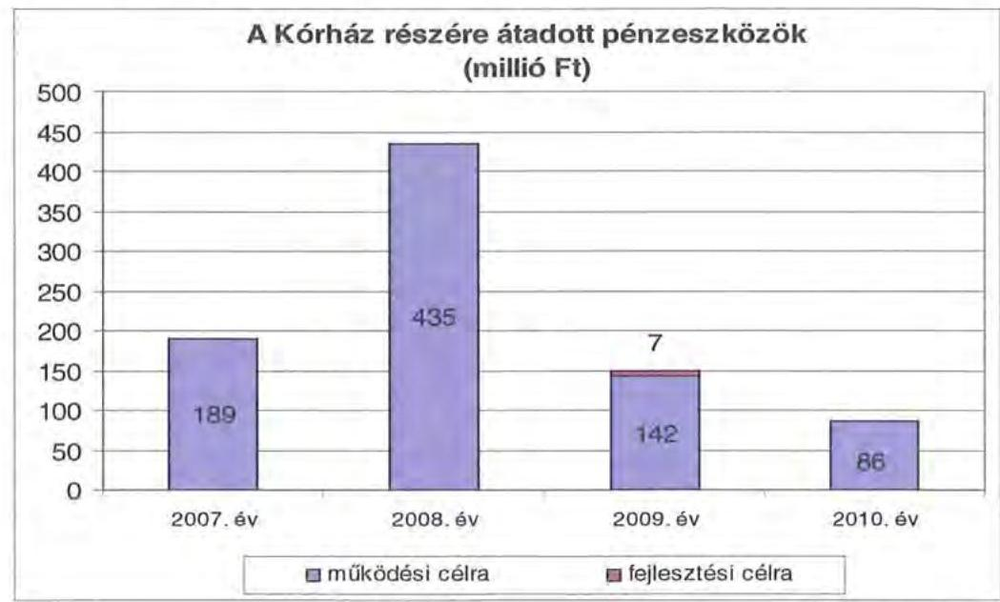

[^0]
[^0]:    ${ }^{30}$ intézményi finanszírozás formájában

---

Az Önkormányzat által a Kórháznál megvalósított beruházások fedezete az önkormányzati költségvetésben szerepelt, a Kórház részére nem került átadásra. Az Önkormányzat 2007-2010. évek között összesen hét beruházásra 493 millió Ft összegben biztosított forrásokat.

A müködési és felhalmozási kiadások arányának változásában 2007-2010 között elmozdulás figyelhető meg, a felhalmozási kiadások aránya 10,1\%-ról 7\%ra csökkent. A kiadások összetételét (a müködési és fejlesztési célú kamatkiadások nélkül) a következő grafikon szemlélteti:
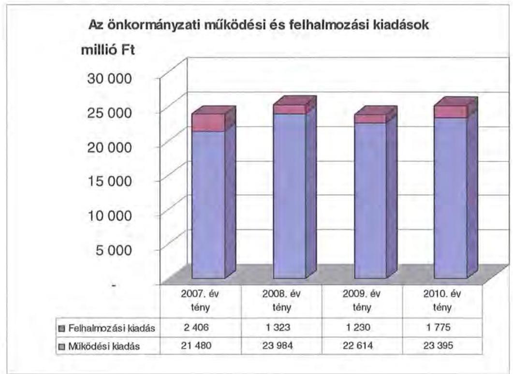

Az aktív pályázati tevékenység eredményeként 2007-2010 között 23,7 milliárd Ft bekerülési költségű beruházást folytatott, illetve indított el az Önkormányzat, amelyből 12,4 milliárd Ft a 2010. évet követő időszakra vállalt kötelezettség.

Az Önkormányzat 2007-2010 között megvalósított fejlesztései között intézményi épületek, lakóotthonok, múzeumok, kórház felújítása, korszerűsítése, akadálymentesítés és bővítés szerepelt, amelyek az Önkormányzat kötelező feladataihoz kapcsolódtak. A legmagasabb bekerülési költségű (11 653 millió Ft) fejlesztés 2008-ban kezdődött és a Kórház struktúra átalakításhoz kapcsolódik, amelynek $87,1 \%$-át pályázati forrásból, a maradék részt saját forrásból a kötvény kibocsátás biztosítja ( 1129 millió Ft összegben). A 2008-2010-ben elkezdett 22 további fejlesztésből hat beruházás esetében a szükséges önerőt ez esetben is kötvénykibocsátás fedezi ( 78 millió Ft összegben). A 2007-2010 között a 10 millió Ft teljes bekerülési költség feletti beruházások és felújítások száma 49 volt, amelynek közel egynegyedéhez ( 12 fejlesztéshez) uniós forrásokat is igénybe vettek. A 2010. utánra vállalt kötelezettség összege 12457 millió Ft, amelynek forrása $82,7 \%$-ban ( 10303 millió Ft ) uniós támogatásból és $4,5 \%$ ban ( 564 millió Ft) hazai támogatásból áll, amelynek igénylése folyamatban

---

van, illetve 9,8\%-ban (1221 millió Ft) kötvénykibocsátásból és 3\%-ban (369 millió Ft) saját bevételből rendelkezésre áll. ${ }^{31}$

Az Önkormányzat fejlesztési tevékenysége a pályázati kiírások által befolyásolt, mivel a jelentkező működési forráshiány és saját felhalmozási bevételei alacsony szintje miatt beruházásokat csak külső források, uniós és hazai támogatások elnyerése esetén tud megvalósítani. A felhalmozási kiadások önrészének forrásait is fejlesztési hitelekből és felhalmozási célú kötvénykibocsátásból finanszírozta.

# 3. KÖTELEZETTSÉGEK BEMUTATÁSA 

### 3.1. A pénzintézetek felé fennálló kötelezettségek alakulása

Az Önkormányzat pénzintézeti kötelezettségeinek állománya 2006. december 31-től 2010. december 31-ig 266 millió Ft-ról 9097 millió Ft-ra nőtt. Fennálló pénzintézeti kötelezettségei kötvények kibocsátásából, hosszúlejáratú hitel igénybevételéből, lízing és egyéb kötelezettségekből, valamint folyószámla és munkabér megelőlegezési hitelek igénybevételéből keletkeztek.
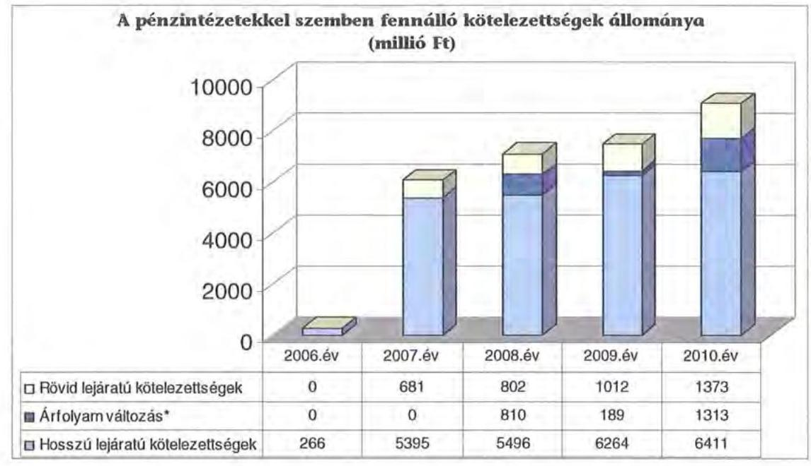

Az árfolyamváltozás hatása is befolyásolja a kötelezettségek alakulását, azonban annak mértéke előre pontosan nem határozható meg, csak várakozásokon alapuló tendenciák jelezhetők.

A Számv. tv. 60. § (4) bek. meghatározza, hogy az árfolyam különbözetet év végén a kötelezettségek vagy követelések között a könyvviteli mérlegben nyilván kell tartani, azonban az árfolyam különbözet valójában nem realizált.

[^0]
[^0]:    ${ }^{31}$ A 2010. évet követő kötelezettségvállalások forrása 12,8\%-ban (1590 millió Ft) kötvénykibocsátásból és saját bevételből rendelkezésre áll, azonban a $87,2 \%$ ( 10867 millió Ft) uniós és hazai támogatás igénylése folyamatban van.

---

Annak megítéléséről, hogy a devizában kibocsátott kötvényekért és felvett hitelekért kapott forinthoz képest a kötvények visszavásárlásakor, illetve a hitelek visszafizetésekor jelentkező forint kötelezettség többletkiadást (árfolyamveszteség) vagy megtakarítást (árfolyamnyereség) eredményez a futamidő végén, a teljes kötelezettség rendezését követően lehet képet alkotni. Mindaddig, amíg törlesztési kötelezettség nem áll fenn (türelmi idő, moratórium), a tőkére vonatkoztatva nem értelmezhető sem az árfolyamveszteség, sem az árfolyamnyereség.

Az Önkormányzat pénzintézeti kötelezettségvállalásaira minden esetben közgyűlési döntés alapján került sor. A kötelezettségvállalásból származó források felhasználási céljait meghatározták. A Közgyűlés döntéseit megalapozó előterjesztések nem tartalmazták a kötelezettségvállalás visszafizetési forrásainak, a teljes futamidő várható kamat és tőkefizetési kötelezettségeknek, az árfolyam- és kamatkockázatoknak a bemutatását. Az előterjesztésekben nem tértek ki az adósságszolgálati korlát bemutatására, ezért a Közgyűlés ennek figyelembevétele nélkül döntött.

Az Önkormányzat adósságot keletkeztető kötelezettségvállalásának felső határát a vizsgált években nem lépte túl.

Az adósságot keletkeztető kötelezettségvállalással megvalósított felhalmozási kiadások esetleges bevételt növelő, illetve kiadást csökkentő vonzatát, illetve ennek a fejlesztéshez, felújításhoz vállalt kötelezettségek visszafizetési forrásként való számbavételét nem vizsgálták. Az Önkormányzat nem rendelkezett hosszú távú likviditási stratégiával.

Az Önkormányzat 2010. december 31-én CHF-ben fennálló adósságot keletkeztető kötelezettségvállalása az alábbi volt ${ }^{32}$ :

| Megnevezés | Kibocsátás, illetve szerzödéshittés idöpontja | Összeg CHF | Kibocsátási, vagy lehivási árfolyam CHF | Kamat (referencia kamat+ kamatfelár) | Felhasználás célja: |
| :--: | :--: | :--: | :--: | :--: | :--: |
| BKK I. kötvény | 2007.12 .21 | 32894736 | 152,84 | 5 havi CHF LIBOR+0,45\% | beruházások önrészének biztosítása |

Az Önkormányzat 2010. december 31-én forintban fennálló adósságot keletkeztető hosszúlejáratú hitel kötelezettségvállalásai a következők voltak ${ }^{33}$ :

[^0]
[^0]:    ${ }^{32}$ A kötvény kibocsátásánál négy banktól kértek be ajánlatot.
    ${ }^{33}$ A Veránka szigeti üdülőben az árvízkárok helyreállításához a 2003. évben felvett 8 millió Ft összegű hosszúlejáratú fejlesztési hitel a 2010. évben visszafizetésre került. A hitelhez kapcsolódóan az Önkormányzat 3 millió Ft kamatot és egyéb költség címén 0,01 millió Ft-ot fizetett. A hosszúlejáratú hitelek közül a 2006. évben azonos napon kötött hitelszerződések külön álló szerződések voltak, amely hitelek között - pályázatok függvényében - a hitelszerződések módosításaiban átcsoportosításokat hajtottak végre. A 2007. évben felvett két hosszúlejáratú hitelt az OTP-től vették fel, de ezek is különálló hitelszerződések voltak. A hitelek felvételéhez közbeszerzési eljárást folytattak le.

---

| Megnevezés | Kibocsátás idópontja | Összeg ezer Ft | Kamat (referencia kamat+ kamatfelár) | Felhasználás célja: |
| :--: | :--: | :--: | :--: | :--: |
| hosszúlejáratú fejlesztési hitel | 2006. július 14. | 98821 | 3 havi   EURIBOR $+1,51 \%$ | Önkormányzati tulajdonú lőszítmények felújítása, infrastruktúrális beruházások megvalósítása |
| hosszúlejáratú fejlesztési hitel | 2006. július 14. | 240257 | 3 havi   EURIBOR $+1,01 \%$ | Egészségügyi szolgáltatások fejlesztések megvalósítása |
| hosszúlejáratú fejlesztési hitel | 2006. július 14. | 69510 | 3 havi   EURIBOR $+1,51 \%$ | közzöktatási célú beruházások megvalósítása |
| hosszúlejáratú fejlesztési hitel | 2006. július 14. | 7171 | 3 havi   EURIBOR $+1,01 \%$ | környezetvédelemhez kapcsolódó beruházási célok megvalósítása |
| hosszúlejáratú fejlesztési hitel | 2007. szeptember 24. | 3192 | 3 havi   EURIBOR $+1,08 \%$ | Thorma János Muzeum (Kiskunhalas) tetőtérbeépítés I.ütemének megvalósítása |
| hosszúlejáratú fejlesztési hitel | 2007. szeptember 24. | 11932 | 3 havi   EURIBOR $+1,58 \%$ | Bácsalmási Gyermekotthon homlokzat felújítása I. ütemének megvalósítása |

Az Önkormányzat 2007-2010 között a CHF-ben fennálló pénzintézeti kötelezettségei után 1638158 CHF kamatot, valamint 0,2 millió Ft egyéb költséget ${ }^{34}$ fizetett. A HUF-ban fennálló kötelezettségek után 79 millió Ft tőkét, 73 millió Ft kamatot és egyéb költség címén 0,01 millió Ft-ot fizetett.

Az Önkormányzat 2007-2010. december 31. között az átmenetileg szabad pénzeszközeinek bankbetétként történő lekötéséből 1589 millió Ft kamatbevételt realizált.

A kötvénykibocsátás bevételének befektetéséből származó kamatbevételből az Önkormányzat 282 millió Ft-ot a kötvények kamatfizetésére és 1246 millió Ft-ot múködés célra és 61 millió Ft-ot intézményi pályázati beruházás támogatásának megelőlegezésére fordított. A kamatbevétel a kötvény teljesített kamatfizetésének több mint ötszörösét tette ki.

Az Önkormányzat likviditását a vizsgált időszakban csak folyószámlahitel igénybevételével tudta biztosítani, a folyószámlahitel és a munkabér megelőlegezési hitel összegeit az alábbi táblázat mutatja be:

[^0]
[^0]:    ${ }^{34}$ A kötvény kibocsátásnál csak a KELER Rt. részére fizetett díj merült fel 0,2 millió Ft összegben, egyéb szervezési, jegyzési, garanciavállalási díj nem volt. Az Önkormányzat a kötvény kibocsátásához négy banktól kért árajánlatot, amelyet megbízási szerződés alapján egy gazdasági társaság értékelt. A gazdasági társaság 2007. december 7-i értékelése alapján a pontozási sorrend első helyezettje a Raiffeisen Bank Zrt. volt, de a pénzügyi bizottság döntése alapján a Közgyűlés az ERSTE Bank Nyrt. ajánlata mellett döntött. Az ERSTE Bank Nyrt. javított ajánlata tartalmazta, hogy jegyzési garanciavállalás díja nem kerül felszámításra.

---

| Megnevezés | 2007. év | 2008. év | 2009. év | 2010. év | $\begin{gathered} 2011 . \\ \text { március } 31 \end{gathered}$ |
| :--: | :--: | :--: | :--: | :--: | :--: |
| I. Folyószámlahitel |  |  |  |  |  |
| a folyószámlahitel keretösszege január 1-jén | 600000 | 800000 | 1000000 | 1200000 | 2000000 |
| teljesített kamat és egyéb költség | 27071 | 52443 | 83651 | 82641 | 29426 |
| II. Munkabér megelőlegezési hitel |  |  |  |  |  |
| Igenybevett hitel összesen: | 1460620 | 1287582 | 1212135 | 1170999 | 426809 |
| teljesített kamat és egyéb költség | 9111 | 9473 | 9686 | 7319 | 1825 |

A folyószámlahitel és munkabér megelőlegezési hitelek kondíciói és egyéb költségei a következők voltak ${ }^{35}$ :

| Megnevezés | Kamat (referencia+ kamatfelár | Egyéb költség |
| :--: | :--: | :--: |
| Folyószámlahitel |  |  |
| 2007. év | 3 havi BUBOR $+0,35 \%$ | $0,00 \%$ |
| 2008. év | 3 havi BUBOR $+0,7 \%$ | $0,10 \%$ |
| 2009. év | 3 havi BUBOR $+2 \%$ | $0,30 \%$ |
| 2010. év | 3 havi BUBOR $+1,85 \%$ | $0,20 \%$ |
| Munkabér megelőlegezési hitel |  |  |
| 2007. év | 3 havi BUBOR $+0,33 \%$ | $x$ |
| 2008. év | 3 havi BUBOR $+0,7 \%$ | $x$ |
| 2009. év | 1 havi BUBOR $+2 \%$ | $x$ |
| 2010. év | 1 havi BUBOR $+2 \%$ | $x$ |
| 2011. év | 1 havi BUBOR $+2 \%$ | $x$ |

A vizsgált időszakban az Önkormányzat (a 2007. év kivételével, amikor a folyószámla hitellel zárt napok száma 337 volt) a 2008-2010. években minden napon igénybe vett folyószámlahitelt. A 2010. évben a folyószámlahitel átlagos napi állománya 763 millió Ft volt, amely a vizsgált időszakban folyamatosan emelkedett 2007. évben volt a legalacsonyabb (206 millió Ft), 2011. március 31-én már, 1058 millió Ft volt. Az áttekintett időszakot jellemző folyamatos likviditási problémák finanszírozása (folyószámlahitellel) az Önkormányzatnak a 2007-től 2010. december 31-ig összesen 243 millió Ft kamatráfordítást okozott.

A tartós likviditási problémák miatt az Önkormányzat 2007-től a munkabérek kifizetéséhez munkabér megelőlegezési hitelt vett igénybe. A munkabérhitelek átlagos napi állománya a vizsgált években folyamatosan csökkent, a 2007. évi 4 millió Ft-ról a 2010. évre 3 millió Ft-ra. Kamat címén az Önkormányzat a vizsgált időszakban összesen 36 millió Ft-ot fizetett ki.

A jelenleg fennálló kötvényállomány és a hitelállomány esetében a kamatfizetési kötelezettségek alakulását jelentősen befolyásolta és jelenleg is befolyásolja a kibocsátáskori és az utolsó kamatfizetéskori referencia kamatok változása, melyet a következő táblázat mutat be:

[^0]
[^0]:    ${ }^{35}$ A referencia kamat az alábbiak szerint alakult:

    | MNB BUBOR | fixing (átlagkamat) | \%-ban |  |  |
    | :--: | :--: | :--: | :--: |
    | Referencia kamat | 2007. évi | 2008.év | 2009. évi | 2010. évi | 2010.március 31-ig |
    | 3 havi BUBOR | 7,75 | 8,87 | 8,64 | 5,5 | 6,03 |
    | 1 havi BUBOR | 7,83 | 8,75 | 8,66 | 5,47 | 5,94 |

---

| Megnevezés | Kibocsátási, lehívási alapkamat \% | Utolsó fizetéskori | Változás \% |
| :--: | :--: | :--: | :--: |
| 3 havi CHF LIBOR | 2,775\%+0,45\% felár | $0,17 \%+0,45 \%$ | $-2,61$ |
| Veránka 3 Havi BUBOR $+0,2 \%$ felár | $10,01 \%+0,2 \%$ felár és   $9,64 \%+0,2 \%$ felár | $8,67 \%+0,2 \%$ felár | $-0,97$ |
| Thorma 3 Havi   EURIBOR $+1,08 \%$ felár | $4,731 \%+1,08 \%$ felár | $0,886 \%+1,08 \%$ felár | $-3,84$ |
| Bácsalmási 3 Havi EURIBOR $+1,58 \%$ felár | $4,731 \%+1,58 \%$ felár | $0,886 \%+1,58 \%$ felár | $-3,84$ |
| közoktatási 3 Havi EURIBOR $+1,51 \%$ felár | $\begin{aligned} & 3,061 \%+1,51 \% \text { felár, } \\ & 3,914 \%+1,51 \% \text { felár, } \\ & 4,164 \%+1,51 \% \text { felár, } \\ & 4,947 \%+1,51 \% \end{aligned}$ | $0,886 \%+1,51 \%$ felár | $-2,17$ |
| általános beruházási 3 Havi EURIBOR $+1,51 \%$ felár | $\begin{aligned} & 3,061 \%+1,51 \% \text { felár, } \\ & 3,376 \%+1,51 \% \text { felár, } \\ & 3,914 \%+1,51 \% \text { felár, } \\ & 4,164 \%+1,51 \% \\ & 5,237 \%+1,51 \% \text { felár } \end{aligned}$ | $0,886 \%+1,51 \%$ felár | $-2,17$ |
| egészségügyi 3 Havi EURIBOR $+1,01 \%$ felár | $\begin{aligned} & 3,061 \%+1,01 \% \text { felár, } \\ & 3,376 \%+1,01 \% \text { felár, } \\ & 5,237 \%+1,01 \% \text { felár } \end{aligned}$ | $0,886 \%+1,01 \%$ felár | $-2,17$ |
| környezetvédelmi 3 Havi EURIBOR $+1,01 \%$ felár | $3,914 \%+1,01 \%$ felár | $0,886 \%+1,01 \%$ felár | $-3,03$ |

Amennyiben a referencia kamat a kötvénynél nem változott volna, az Önkormányzatnak kibocsátáskori referencia kamattal számolva 2011. március 31-ig 3783859 CHF kamatfizetési kötelezettsége jelentkezett volna. A változások miatt 2145701 CHF-el kevesebb fizetési kötelezettséget kellett teljesítenie, mint amivel a szerződés megkötésekor számolnia kellett.

Az alapkamat mértékének alakulása jelentős hatással van az adott devizanemben kifejezett, a teljes futamidőre számított, várható kamatkötelezettség nagyságára.

Az Önkormányzatnál a helyszíni vizsgálat alatt további hitel igénybevételről, illetve kötvénykibocsátásról szóló döntést nem készítettek elő.

# 3.2. Szállítók felé fennálló kötelezettségek 

Az Önkormányzatnak és gazdasági társaságainak lejárt szállítói tartozásai, és egyéb kiadás elmaradásait az alábbi táblázat tartalmazza
(ezer Ft-ban):

| Megnevezés | 2007. | 2008. | 2009. | 2010. | 2011. |
| :-- | :--: | :--: | :--: | :--: | :--: |
|  | december 31. | december 31. | december 31. | december 31. | március 31. |
| Lejárt szállitói tartozás | 60461 | 18404 | 110350 | 161873 | 142165 |
| ebből Kórház | 41699 | 0 | 3009 | 19211 | 129470 |
| Gazdasági társaságok   lejárt szállitói tartozása | 0 | 0 | 0 | 0 | 0 |
| Egyéb kiadás elmaradás | 0 | 0 | 0 | 0 | 0 |
| Tartozásállomány | 60461 | 18404 | 110350 | 161873 | 142165 |

Az Önkormányzat lejárt szállítói tartozása a 2007. évi 60 millió Ft-ról 2010. év végére 162 millió Ft-ra növekedett, 2011. március 31-én 142 millió Ft volt. A lejárt szállítói tartozásból a Kórháznál jelentkező állomány 2010-ről 2011. első negyedévére közel hétszeresére emelkedett és 2011. március 31-én

---

több mint $91 \%$-ot ( 129 millió Ft-ot) tett ki. Egyéb kiadás elmaradás az áttekintett években nem volt. A lejárt szállítói tartozásállomány $82 \%$-a ( 133 millió Ft) 61-90 nap közötti volt.

A 2010. december 31-i lejárt szállítói kötelezettség 162 millió Ft, ebből a Kórháznál 19 millió Ft volt. A le nem járt tartozásállomány 1461 millió Ft-ot tett ki, a Kórháznak le nem járt tartozása nem volt. Az Önkormányzatnál a 2010. év végén kimutatott szállítói kötelezettségre fedezetet részben a mérlegben kimutatott 362 millió Ft követelésállomány ${ }^{36}$ nyújthat, illetve a Hivatal szabad folyószámlahitel kerete.
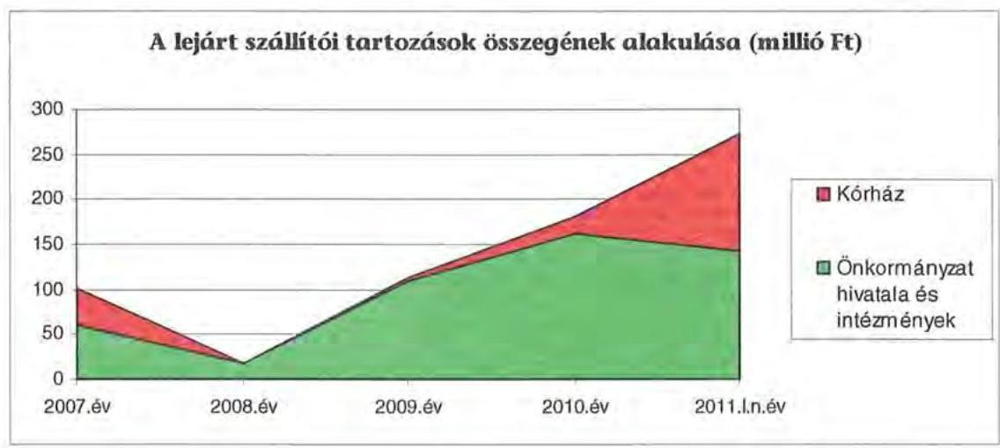

A Közgyűlés a lejárt szállítói kötelezettségek rendezésével a vizsgált időszakban nem foglalkozott, az állomány csökkentése érdekében pénzügyi finanszírozási műveletekről nem döntött.

# 3.3. Egyéb kötelezettségek 

Jelenleg folyamatban van egy peres eljárás - jogtalan elbocsátás miatt elmaradt túlóra és egyéb juttatás kifizetés következtében - melyre még az Önkormányzat nem rendelkezik jogerős bírósági határozattal.

Az Önkormányzat 2007. január 1-je és 2011. március 31-e között nyolc személygépkocsi és egy kisbusz beszerzésére kötött lizingszerződést. A kisbusz beszerzésére 2007. október 31-én kötött 13,6 millió Ft összegű lizingszerződésből az Önkormányzatnak 2010. december 31-én 2,8 millió Ft fizetési kötelezettsége állt fenn. Személygépkocsi beszerzésére a 2007. évben hét és a 2010. évben egy lizingszerződést kötöttek, az összesen 55 millió Ft összegű lizingszerződésekből az Önkormányzatnak 2010. december 31-én 20 millió Ft fizetési kötelezettsége állt fenn.

[^0]
[^0]:    ${ }^{36}$ Ebből intézményi térítési díjkövetelés 224 millió Ft.

---

Az Önkormányzatnak a vizsgált időszakban garancia- és kezességvállalással kapcsolatos hosszú távú kötelezettségvállalása nem volt.

Az elengedett követelés összege a 2007-2010. években összesen 29 millió Ft volt. A Duna Menti Üdülő és Továbbképző Intézet (Veránka) bevételei megelőlegezésére a 10/2009. (II. 2.) számú közgyűlési határozattal 4 millió Ft kölcsönt biztosítottak, amelynek visszafizetéséről a Közgyűlés a 229/2010. (XII. 17.) számú határozatával lemondott. A Fogathajtó VB. 2004. Kecskemét Kft. részére a 144/2009. (VI. 26.) számú közgyűlési határozattal 25 millió Ft kölcsönt nyújtottak, amelyet a Közgyűlés az 51/2010. (III. 26.) számú határozatával támogatásnak átminősített.

Az Önkormányzat tulajdonában lévő ingatlanokra pénzintézeti kötelezettséget biztosító jelzálogjog bejegyzésére nem került sor az áttekintett időszakban.

A vizsgált időszakban nem történt meg annak felmérése, hogy az elhasználódott eszközök pótlása milyen kötelezettséget jelent az Önkormányzat számára. A felújításokra, az eszközök pótlására az Önkormányzat pénzügyi lehetőségének a függvényében, elsősorban az intézmények működőképességének biztosítása, illetve a szakhatósági előírások figyelembe vételével került sor. Az Önkormányzat a 2007-2010. években a tárgyi eszközök után 6031 millió Ft összegű értékcsökkenést számolt el. Felújításra - áfa nélkül - 657 millió Ft-ot fordított. Az elhasználódott eszközök pótlására az Önkormányzat tartalékot nem képzett, külön alapot nem hozott létre.

Az Önkormányzat a 2007-2010. években az intézmények részére 24 alkalommal összesen 292 millió Ft kölcsönt nyújtott, amelyből 243 millió Ft 83\% a kötelező és 50 millió Ft $17 \%$ az önként vállalt feladatai ellátásához kapcsolódott. A Zala-Bács Üdülő, Balatonlelle részére a 2007. évben négy alkalommal működési kiadásokra 9 millió Ft, a 2008. évben két alkalommal 8 millió Ft, a 2009. évben 20 millió Ft összegben. A Veránkai üdülő részére három alkalommal működési kiadásokra nyújtottak kölcsönt, a 2007. évben 2 millió Ft, a 2008. évben 2 millió Ft, a 2009. évben 4 millió $\mathrm{Ft}^{37}$ összegben. A múzeumi szervezet részére két alkalommal kiállítás rendezésére nyújtottak kölcsönt, a 2007. évben 10 millió Ft, kiadások finanszírozására a 2010. évben 46 millió Ft öszszegben. A Kecskeméti közoktatási Intézmény részére három alkalommal, a 2008. évben múködési kiadásokra 19 millió Ft, a 2009. évben a TÁMOP-3.1.6 pályázathoz utófinanszírozás miatt a támogatás megelőlegezéséhez 0,5 millió Ft, a 2010. évben személygépkocsi vásárlására 5 millió Ft összegben. Pályázatokon elnyert támogatás utófinanszírozása miatt a támogatás megelőlegezésére a 2007. évben hat ${ }^{38}$ intézménynek, a 2009. és a 2010. évben Kecskeméti Me-

[^0]
[^0]:    ${ }^{37}$ A Közgyűlés a kölcsön visszafizetéséről a 2010. évben lemondott.
    ${ }^{38}$ A pedagógiai Intézet részére 12 millió Ft, a Gyermekvédelmi Központnak 1 millió Ft, a Duna-menti Közoktatási Intézet és Gyermekotthonnak (Dunavecse) 7 millió Ft, a Napraforgó Szakosított Otthonnak (Gara) 2 millió Ft, az Öszi Napfény Időskorúak Otthonának (Bácsborsód) 4 millió Ft, a Harmónia Szenvedélybetegek Otthonának (Kaskantyú) 2 millió Ft kölcsönt nyújtottak.

---

gyei Könyvtárnak két ${ }^{39}$, a Közművelődési Szakmai Tanácsadónak egy ${ }^{40}$ alkalommal nyújtottak kölcsönt. A Vári Szabó István Szakközépiskolának két alkalommal nyújtottak kölcsönt, a 2009. évben múködési kiadásokra 36 millió Ft, a 2010. évben a Gastro train címú magyar-szerb határon átnyúló szakképzési programhoz 217 ezer EUR összegben. A Csillagvizsgáló Intézet részére a kötvény céltartaléka terhére nyújtottak kamatmentes kölcsönt a 2010. évben, 4 millió $\mathrm{Ft}^{41}$ összegben.

Az Önkormányzat gazdasági társaságai részére a 2007-2011. években több alkalommal nyújtott tagi kölcsönt. A Közgyűlés a Bács-Szakma Zrt. részére a 200/2008. (XI. 7.) számú határozata alapján 11 millió Ft, valamint a 2009. évi költségvetési rendelet alapján 3 millió Ft összegű tagi kölcsönt nyújtott. A Közgyűlés a Történelmi Témapark Kft. részére két alkalommal nyújtott tagi kölcsönt, a 102/2010. (V. 28.) számú határozata alapján 250 ezer EUR, a 42/2011. (III. 25.) számú határozata alapján 15 millió Ft összegben.

A gazdasági társaságoknak a 2007-2011. években a Közgyűlés támogatást és kamatmentes kölcsönt is biztosított. A Nemzetközi Kerámia Stúdió Kft. részére az önként vállalt feladatokhoz kapcsolódóan a 2010. évben 1 millió Ft, valamint a Fogathajtó VB. Kft. részére a 144/2009. (VI. 26.) számú határozat alapján a Világbajnokság megrendezésére 25 millió Ft kamatmentes kölcsönt nyújtott, melyet az 51/2010. (III. 26.) számú határozat alapján vissza nem térítendő támogatássá minősítettek át.

# 4. A PÉNZÜGYI EGYENSÚLY MEGTEREMTÉSE ÉrDEKÉBEN HOZOTT INTÉZKEDÉSEK 

A jelentésben szereplő CLF modellben bemutatott 2010. évi müködési és a 2007., valamint a 2010. évi felhalmozási hiány mindamellett alakult ki, hogy a vizsgált időszakban az Önkormányzat folyamatosan intézkedéseket tett, hogy alkalmazkodjon a finanszírozási rendszer változása miatti forráscsökkenéshez. Ennek érdekében bevételnövelő és kiadáscsökkentő döntéseket hozott.

Az Önkormányzatnál a kiadáscsökkentő és bevételnövelő intézkedések a feladatellátás racionalizálását és kiemelten a pénzügyi helyzet javítását célozták. A legjelentősebb mértékű kiadási megtakarítást az álláshely megszüntetésekkel, az éves költségvetési koncepciókban megfogalmazott takarékossági elvek megvalósításával érték el, és megőrizték az intézményeik gazdálkodásának stabilitását.

[^0]
[^0]:    ${ }^{39}$ A Kecskeméti Megyei Könyvtárnak a TIOP-1.2.3. Tudásdepó-Express című pályázathoz a 2009. évben 2 millió Ft, a 2010. évben 30 millió Ft kölcsönt nyújtott.
    ${ }^{40}$ A Közművelődési Szakmai Tanácsadónak a 2010. évben.
    ${ }^{41}$ A kamatmentes kölcsön nyújtásáról a Közgyűlés a 234/2010. (XII. 17.) számú határozatával döntött.

---

Az Önkormányzat gazdasági programjában megfogalmazott célok szerint a 2007. évben előkészítették az intézmények átszervezését érintő döntéseket, a 2007. évben megkezdték az intézmények átszervezésének előkészítését, a Közgyűlés és a Hivatal költségtakarékossági intézkedésének megvalósítását:

- a Közgyűlés a 26/2008. (II. 29.) számú határozatával a "Harmónia Integrált Szociális Intézmény" Kiskunfélegyházi telephelyét megszüntette és az ellátottakat más megyei fenntartású intézményekben helyezte el, amelynek eredményeként 1 millió Ft személyi juttatás és járulék kiadáscsökkentést mutattak ki;
- a 2007-2010. években az intézményeknél álláshely megszüntetést hajtottak végre. A Közgyűlés a 35/2007. (II. 23.) számú határozatával a közoktatási, szociális, gyermekvédelmi, közművelődési, kulturális és sport intézményeknél 92 álláshelyet 2007. február 28. és 2007. augusztus 31. közötti időszakban, a 75/2007. (IV. 27.) számú határozatával a Kórháznál 47 fő teljes munkaidős közalkalmazotti álláshelyet 2007. április 30-ával, a 91/2007. (VI. 1.) számú határozatával a gyermekvédelmi Központ gazdasági szervezetét és ennek kapcsán 5 teljes munkaidős nem szakmai álláshelyet, valamint a 155/2007. (VI. 29.) számú határozatával a Kiskőrösi Általános Iskolánál 1 fő teljes munkaidős közalkalmazotti álláshelyet 2007. június 30 -ával megszüntetett. A Közgyűlés a 14/2008. (II. 29.) számú határozatával a Dunamenti Üdülő és továbbképző Intézet Solt-Kalimajor telephelyét és ennek kapcsán 7 fő teljes munkaidős közalkalmazotti álláshelyet 2008. április 15 -ével megszüntetett. A létszámcsökkentések eredményeként a 2007-2010. években összesen 165,7 millió Ft személyi juttatás és járulék megtakarítást mutattak ki;
- a Pedagógus Ház 2008. március 31-ével megszüntetésre került, a feladat kiszervezése következtében 6,6 millió Ft személyi juttatás és járulék kiadáscsökkenést mutattak ki. A feladatot a továbbiakban megbízási szerződés keretében látták el;
- a 2007-2010. években a Közgyűlés csökkentette 13,5 millió Ft-tal a művészeti tevékenységek, kiadványok, közös működtetésű intézmények támogatását, valamint az intézmények által nyújtott támogatások 1,5 millió Ft-tal csökkentek;
- a Kórháznál a cafetéria elemek csökkentésével 24 millió Ft, a nyugdíjas dolgozók munkaidő és bércsökkentésével 5 millió Ft személyi juttatás és járulék, a költségtérítések felülvizsgálatával 8 millió Ft, a dologi kiadásoknál a távközlési szolgáltatás szerződésének felülvizsgálatával 5,6 millió Ft, takarékossági intézkedésekkel 173 millió Ft megtakarítást mutattak ki;
- a 2007-2010. években az éves költségvetési koncepciókban megfogalmazott általános takarékossági elvek eredményeként a Közgyűlésnél 3 millió Ft dologi kiadás megtakarítást, a Közgyűlés hivatalánál a nyugdíjas, illetve nyugdíjas korú munkavállalói álláshelyek megszüntetésének eredményeként 65,3 millió Ft és a Kórházon kívüli intézményeknél a nyugdíjas korúak munkaviszonyának megszüntetésével 12 millió Ft személyi juttatás és járulék kiadáscsökkenést, az előirányzat elvonások hatására 135 millió Ft szemé-

---

lyi juttatás, 45 millió Ft járulék és 451 millió Ft dologi kiadás megtakarítást mutattak ki.

A 2007-2010. évek kiadáscsökkentő intézkedéseinek pénzügyi hatását beavatkozási területenként az alábbiak részletezik:

| Az érvényesített kiadás-   csökkentés területei | Személyi   juttatások és   járulékai | Dologi, mű-   ködési ki-   adások | Pénzeszköz   átadások,   támogatások | Összesen |
| :-- | :--: | :--: | :--: | :--: |
| A Közgyűlés működése |  | 2600 | 13520 | 16120 |
| A Hivatalnál | 65362 |  |  | 65362 |
| Az intézményeknél | 402360 | 628895 | 1494 | 1032749 |
| ÖSSZESEN | 467722 | 631495 | 15014 | 1114231 |

Az önkormányzati szinten kimutatott megtakarítási intézkedésekből 1033 millió Ft-ot, a megtakarítási intézkedések 92,7\%-át az intézmények körében érvényesítettek. Az intézményi megtakarításokból 629 millió Ft 60,9\% a dologi kiadásokból, 402 millió Ft $38,9 \%$ a személyi juttatások és annak járulékaiból realizálódott. Utóbbiból 165,7 millió Ft (16\%) a létszámcsökkentés miatt következett be. A Kórháznál a nyugdíjas dolgozók munkaidejét és bérét, a cafeteria elemeket csökkentették.

Az intézményi feladatok racionalizálásáról a Közgyűlés döntött. Az ezekhez készített előterjesztésekben a tervezett intézkedések indokait bemutatták, a várható eredményeit azonban nem számszerűsítették.

A Közgyűlés működési körében a dologi kiadás megtakarítás 2,6 millió Ft-ot, a művészetek, kiadványok, közös működtetésű intézmények támogatásának csökkentése 13,5 millió Ft-ot tett ki.

A Hivatalban a nyugdíjkorhatárt elérő, illetve nyugdíjas köztisztviselők jogviszonyának megszüntetésével 65,3 millió Ft volt a megtakarítás.

A létszámcsökkentő intézkedések következtében 2007-2011 között a Hivatalnál és az intézményeknél összesen 283 álláshelyet szüntettek meg a 2006. december 31-i 4109 fő átlaglétszámhoz képest, amelyből 170 fő (60\%) az ágazati szakmai és 113 fő (40\%) az intézményüzemeltetéshez, fenntartáshoz, gazdasági ügyek intézéséhez kapcsolódó álláshely volt.

A 2007-2011. I. negyedévben végrehajtott létszámcsökkenés az alábbi grafikon szemlélteti:

---

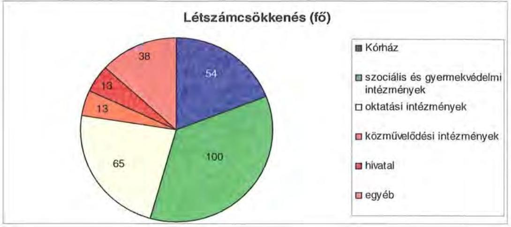

A helyi szervezési intézkedések végrehajtásához az Önkormányzat az áttekintett időszak alatt 195 millió Ft központi költségvetési támogatásban részesült, amelynek felhasználásával 131 fő álláshelyet tartósan leépített. 152 fő, 53,7\% létszámcsökkenéséhez központi támogatás nem kapcsolódott, amely 104 millió Ft többletkiadást okozott az Önkormányzatnak. Az intézkedések eredményeként az Önkormányzat 2006. december 31-i átlaglétszáma 2011. március 31-re 283 fővel, 6,7\%-kal csökkent.

Az Önkormányzatnál a 2011. évi költségvetés kialakítása során folytatódtak a megtakarítási intézkedések, az elhatározott 153 millió Ft kiadási megtakarításból 96,5 millió Ft, 63,1\% dologi jellegű kiadásokhoz kapcsolódott. A 2011. évi költségvetésben tárgyi eszközök értékesítéseként 842 millió Ft eredeti előirányzatot terveztek, amelynek teljesítése bizonytalan.

Az Önkormányzat 2011-2014. évekre szóló gazdasági programja tartalmazta, hogy „a müködési kiadások csökkentése érdekében valamennyi területet érintően szükséges a feladatok újragondolása, további racionalizálása, szükség szerinti átrendezése, centralizálása".

Az intézményeknél 123,2 millió Ft bevétel növekedést teljes egészében a térítési díjak, bérleti, tanfolyami díjak emelése eredményezte. A bevételnövelésre irányuló intézkedések számszerűsített összegét az intézmények mutatták ki.

Az átszervezések, a takarékossági intézkedések szakmai feladatellátásra gyakorolt hatását célzottan nem vizsgálták, erről belső ellenőrzési jelentések nem állnak rendelkezésre.

# 5. A HELYI ÖNKORMÁNYZATOK GAZDÁLKODÁSI RENDSZERÉNEK 2007. ÉVI ELLENŐRZÉSE SORÁN A PÉNZÜGYI EGYENSÚLY JAVÍTÁSÁRA TETT SZABÁLYSZERŰSÉGI ÉS CÉLSZERŰSÉGI JAVASLATOK HASZNOSULÁSA 

Az ÁSZ a V-3003-06/2008. számú jelentésében az Önkormányzat gazdálkodási rendszerét a 2008. évben ellenőrizte átfogó jelleggel, amelynek során a pénzügyi egyensúly javítására egy célszerűségi és egy szabályszerűségi javaslatot tett.

---

A célszerűségi javaslatot teljesítették, a Közgyűlés elnöke tájékoztatta a Közgyűlést a számvevőszéki ellenőrzés tapasztalatairól, amelynek megvalósítására intézkedési tervet készítettek ${ }^{42}$. A szabályszerűségi javaslatot a főjegyző hasznosította, a 2009. évi költségvetési rendeletben az Áht. 8/A. § (7) bekezdésében előírtaknak megfelelően nem számolták el a pénzügyi műveleteket költségvetési hiányt, illetve költségvetési többletet módosító költségvetési bevételként, illetve költségvetési kiadásként.

Budapest, 2011. december „ 17 "

Melléklet: $\quad 6 \mathrm{db} \quad 12$ lap

Domokos László

[^0]
[^0]:    ${ }^{42}$ A Közgyűlés a 147/2008. (IX. 26.) számú határozatával elfogadta a javaslatok megvalósítására felelősöket és határidőket tartalmazó intézkedési tervet.

---

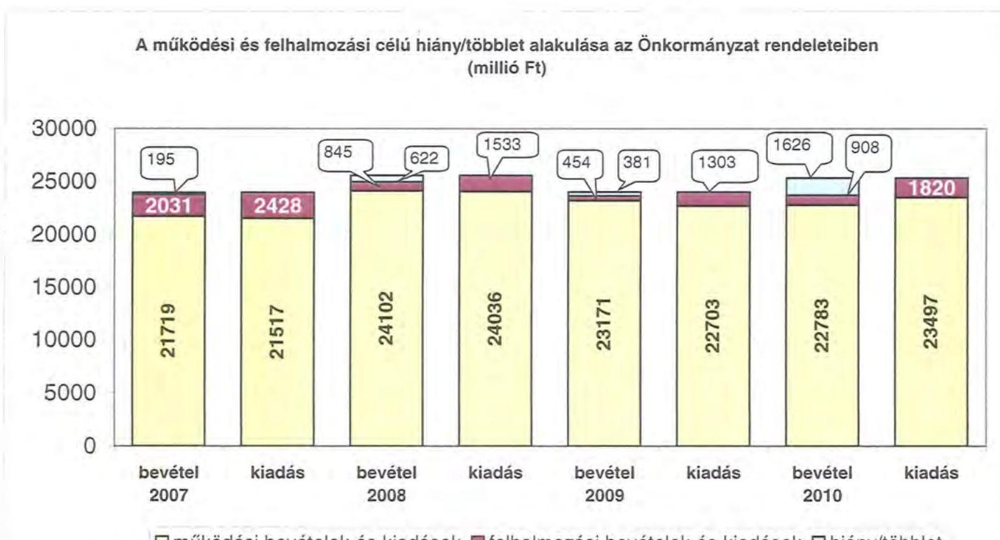

# A működési és felhalmozási célú hiány/többlet alakulása az Önkormányzat rendeleteiben (millió Ft)

|  2000 | 2001 | 2002 | 2003 | 2004 | 2005 | 2006 | 2007 | 2008 | 2009 | 2010 | 2011 | 2012 | 2013 | 2014 | 2015 | 2016 | 2017 | 2018 | 2019 | 2020  |
| --- | --- | --- | --- | --- | --- | --- | --- | --- | --- | --- | --- | --- | --- | --- | --- | --- | --- | --- | --- | --- |
|  195 | 2031 | 2428 | 24102 | 24036 | 23171 | 22703 | 22783 | 22783 | 22783 | 22783 | 22783 | 22783 | 22783 | 22783 | 22783 | 22783 | 22783 | 22783 | 22783 | 22783  |
|  845 | 2428 | 24102 | 24036 | 23171 | 22703 | 22783 | 22783 | 22783 | 22783 | 22783 | 22783 | 22783 | 22783 | 22783 | 22783 | 22783 | 22783 | 22783 | 22783 | 22783  |

☐ működési bevételek és kiadások ☑ felhalmozási bevételek és kiadások ☐ hiány/többlet

---

.

---

Az Önkormányzat CLF módszer szerint besorolt bevételei és kiadásai 2007-2010 között

|   |  |  |  |  |  |  |  |  |  |  |  |  |  |  |  |  |  |  |  |  |  |  |  |  |  |  |  |  |  |   |
| --- | --- | --- | --- | --- | --- | --- | --- | --- | --- | --- | --- | --- | --- | --- | --- | --- | --- | --- | --- | --- | --- | --- | --- | --- | --- | --- | --- | --- | --- | --- | --- |
|  1. FOLYÓ KÖLTEÉGYÉTÉS* | 2007. | 2008. | 2009. | 2010. |  |  |  |  |  |  |  |  |  |  |  |  |  |  |  |  |  |  |  |  |  |  |  |  |  |   |
|  1.1.1. Saját működési bevételek | 3 702 242 | 3 777 798 | 3 233 293 | 2 265 971 |  |  |  |  |  |  |  |  |  |  |  |  |  |  |  |  |  |  |  |  |  |  |  |  |  |   |
|  1.1.2. Köllésregítési támogatás | 3 796 540 | 3 573 707 | 3 531 185 | 3 192 214 |  |  |  |  |  |  |  |  |  |  |  |  |  |  |  |  |  |  |  |  |  |  |  |  |  |   |
|  1.1.3. Szorgatási bevételek | 1 922 570 | 621 438 | 648 090 | 381 089 |  |  |  |  |  |  |  |  |  |  |  |  |  |  |  |  |  |  |  |  |  |  |  |  |  |   |
|  1.1.4. Misműködésben belőlről kapott támogatások | 12 919 712 | 12 182 610 | 11 473 647 | 12 795 016 |  |  |  |  |  |  |  |  |  |  |  |  |  |  |  |  |  |  |  |  |  |  |  |  |  |   |
|  1.1.5. FE-All és külföldről kapott bevételek | 13 752 | 26 403 | 20 970 |  |  |  |  |  |  |  |  |  |  |  |  |  |  |  |  |  |  |  |  |  |  |  |  |  |  |   |
|  1.1.6. Misműködésben beállról kapott bevételek | 20 594 | 20 740 | 40 897 |  |  |  |  |  |  |  |  |  |  |  |  |  |  |  |  |  |  |  |  |  |  |  |  |  |  |   |
|  1.1.7. Eötvö írs programvás any átrától | 68 943 | 21 143 | 68 261 |  |  |  |  |  |  |  |  |  |  |  |  |  |  |  |  |  |  |  |  |  |  |  |  |  |  |   |
|  1.1.8. Eötvö írs bevétele v1.1.2.v1.2.3.v1.2.3.v1.2.4.v1.2.4.v1.2.4.v1.3. | 23 140 019 | 23 275 498 | 23 126 132 | 22 687 725 |  |  |  |  |  |  |  |  |  |  |  |  |  |  |  |  |  |  |  |  |  |  |  |  |  |   |
|  1.1.1. Völkedési kiadásról vonalláírások nélkül | 20 614 371 | 22 990 007 | 21 684 780 | 22 470 899 |  |  |  |  |  |  |  |  |  |  |  |  |  |  |  |  |  |  |  |  |  |  |  |  |  |   |
|  1.2.1. Misműködésben belőlés áltakint pénzeszkónek | 88 945 | 92 500 | 71 838 | 74 625 |  |  |  |  |  |  |  |  |  |  |  |  |  |  |  |  |  |  |  |  |  |  |  |  |  |   |
|  1.2.2.1. Völkedési kiadásról | 871 | 48 111 | 69 666 | 71 859 |  |  |  |  |  |  |  |  |  |  |  |  |  |  |  |  |  |  |  |  |  |  |  |  |  |   |
|  1.2.3.1. FE-nek, illzsv. különös | 0 | 0 | 0 | 0 |  |  |  |  |  |  |  |  |  |  |  |  |  |  |  |  |  |  |  |  |  |  |  |  |  |   |
|  1.2.3.2. magatarszeníjoknek | 444 774 | 499 952 | 531 584 | 569 952 |  |  |  |  |  |  |  |  |  |  |  |  |  |  |  |  |  |  |  |  |  |  |  |  |  |   |
|  1.2.3.3. sempeált szerezokének | 217 833 | 195 291 | 195 231 |  |  |  |  |  |  |  |  |  |  |  |  |  |  |  |  |  |  |  |  |  |  |  |  |  |  |   |
|  1.2.3.1. Szemelyekkelőnek v1.2.2.1v1.2.3.1v1.2.3.1v1.2.3.4. | 663 582 | 714 190 | 769 620 |  |  |  |  |  |  |  |  |  |  |  |  |  |  |  |  |  |  |  |  |  |  |  |  |  |  |   |
|  1.2.4. Személykötönek | 94 275 | 262 772 | 281 207 |  |  |  |  |  |  |  |  |  |  |  |  |  |  |  |  |  |  |  |  |  |  |  |  |  |  |   |
|  1.2.5. Eötvö írs programvás any átrától | 24 528 | 69 124 | 70 671 |  |  |  |  |  |  |  |  |  |  |  |  |  |  |  |  |  |  |  |  |  |  |  |  |  |  |   |
|  1.2. Folyó kiadások v 1.2.1.v1.2.3.v1.2.3.v1.2.4.v1.2.5. | 21 480 741 | 24 138 597 | 21 676 891 |  |  |  |  |  |  |  |  |  |  |  |  |  |  |  |  |  |  |  |  |  |  |  |  |  |  |   |
|  1.3. Folyó költségvetés szerokozó SZ-KÖDÉSI JÖVÉRELÉSI (LL - 2.1.) | 1 607 203 | 226 023 | 449 241 |  |  |  |  |  |  |  |  |  |  |  |  |  |  |  |  |  |  |  |  |  |  |  |  |  |  |   |
|  2. FEJEJELEMBÉSZI KÖLTEÉGYÉTÉS** |  |  |  |  |  |  |  |  |  |  |  |  |  |  |  |  |  |  |  |  |  |  |  |  |  |  |  |  |   |
|  2.1.1. Saját kötelezetnek | 236 675 | 447 552 | 91 153 |  |  |  |  |  |  |  |  |  |  |  |  |  |  |  |  |  |  |  |  |  |  |  |  |  |   |
|  2.1.2. Misműködésben belőlről kapott tömegetések | 201 230 | 25 965 | 223 702 |  |  |  |  |  |  |  |  |  |  |  |  |  |  |  |  |  |  |  |  |  |  |  |  |  |   |
|  2.1.3. FE-All és külföldről kapott tömegetések | 2 217 | 1 238 | 30 861 |  |  |  |  |  |  |  |  |  |  |  |  |  |  |  |  |  |  |  |  |  |  |  |  |  |   |
|  2.1.4. Misműködésben beállról kapott tömegetések | 88 310 | 82 999 | 48 955 |  |  |  |  |  |  |  |  |  |  |  |  |  |  |  |  |  |  |  |  |  |  |  |  |  |   |
|  2.1.5. Eötvö írsvö írsvönek v1.1.1.v1.2.3v1.1.3v1.2.4.1. | 201 140 | 371 157 | 498 672 |  |  |  |  |  |  |  |  |  |  |  |  |  |  |  |  |  |  |  |  |  |  |  |  |  |  |   |
|  2.1.1. Saját bevételei a közös, állva | 2 114 942 | 1 111 592 | 797 902 |  |  |  |  |  |  |  |  |  |  |  |  |  |  |  |  |  |  |  |  |  |  |  |  |  |   |
|  2.1.2. Saját felújítási közös, állva | 267 680 | 179 200 | 293 765 |  |  |  |  |  |  |  |  |  |  |  |  |  |  |  |  |  |  |  |  |  |  |  |  |   |
|  2.1.3. Misműködésben belőlés áltakint pénzeskén | 64 052 | 106 180 | 119 169 |  |  |  |  |  |  |  |  |  |  |  |  |  |  |  |  |  |  |  |  |  |  |  |  |   |
|  2.1.4. FE-nek és külföldnek adott pénzeskének | 0 | 0 | 0 |  |  |  |  |  |  |  |  |  |  |  |  |  |  |  |  |  |  |  |  |  |  |  |  |   |
|  2.2.1. Misműködésben beállva adott pénzeskének | 16 754 | 23 005 | 17 844 |  |  |  |  |  |  |  |  |  |  |  |  |  |  |  |  |  |  |  |  |  |  |  |  |   |
|  2.2.2. Befektetési célú részesztések váziótása | 0 | 0 | 0 |  |  |  |  |  |  |  |  |  |  |  |  |  |  |  |  |  |  |  |  |  |  |  |  |   |
|  2.2.3. Eötvö írsvööl kötelezet 1.1.1.v1.2.3.v1.2.3.v1.2.4.v1.2.5.v1.2.6.1. | 2 464 240 | 1 431 913 | 1 528 715 |  |  |  |  |  |  |  |  |  |  |  |  |  |  |  |  |  |  |  |  |  |  |  |  |   |
|  2.3.1. Eötvö írsvööl költségvetés egyezésgy (LL - 2.1.) | -1 861 900 | -894 230 | -630 643 |  |  |  |  |  |  |  |  |  |  |  |  |  |  |  |  |  |  |  |  |  |  |  |  |   |
|  2.3.2. Finanszívvóri műszékelők nélküli (EFS) pozitói (1.3.12.1.) | -194 625 | -621 665 | -380 891 |  |  |  |  |  |  |  |  |  |  |  |  |  |  |  |  |  |  |  |  |  |  |  |  |   |
|  3. Finanszívvóri műszékelők |  |  |  |  |  |  |  |  |  |  |  |  |  |  |  |  |  |  |  |  |  |  |  |  |  |  |   |
|  3.1. Hőzőtévélet | 797 438 | 322 698 | 198 596 |  |  |  |  |  |  |  |  |  |  |  |  |  |  |  |  |  |  |  |  |  |  |  |   |
|  3.2. Hőzőtévévélet | 1 390 | 1 200 | 91 522 |  |  |  |  |  |  |  |  |  |  |  |  |  |  |  |  |  |  |  |  |  |  |  |   |
|  3.3. Főgattári és befektetési célú értékpapírok kibocsátása | 2 612 829 | 0 | 0 |  |  |  |  |  |  |  |  |  |  |  |  |  |  |  |  |  |  |  |  |  |  |  |   |
|  3.4. Főgattári és befektetési célú értékpapírok beválása | 0 | 0 | 0 |  |  |  |  |  |  |  |  |  |  |  |  |  |  |  |  |  |  |  |  |  |  |  |   |
|  3.5. Főgattári és befektetési célú értékpapírok értékesítése | 62 315 | 668 763 | 2 689 940 |  |  |  |  |  |  |  |  |  |  |  |  |  |  |  |  |  |  |  |  |  |  |  |   |
|  3.6. Főgattári és befektetési célú értékpapírok váziótása | 0 | 2 689 940 | 0 |  |  |  |  |  |  |  |  |  |  |  |  |  |  |  |  |  |  |  |  |  |  |  |   |
|  3.7. Egyéb finanszívvóri bevételek (függő, állító), kiegészítési | -580 223 | -44 990 | 397 710 |  |  |  |  |  |  |  |  |  |  |  |  |  |  |  |  |  |  |  |  |  |  |  |   |
|  3.8. Egyéb finanszívvóri kiadások (függő, állító), kiegészítési | 374 | -45 110 | 27 335 |  |  |  |  |  |  |  |  |  |  |  |  |  |  |  |  |  |  |  |  |  |  |  |   |
|  3.9. Finanszívvóri műszékelők egyezésgy (LL-1.2.v1.3.1.4.1.4.1.4.1.4.1.5.1.6.) | 2 290 685 | 2 806 493 | 4 127 365 |  |  |  |  |  |  |  |  |  |  |  |  |  |  |  |  |  |  |  |  |  |  |  |   |
|  3. Tárgyító pénzügyi pozitív változás (1.3.12.2.1.4.1.5.) | 2 036 060 | -1 422 123 | 2 746 682 |  |  |  |  |  |  |  |  |  |  |  |  |  |  |  |  |  |  |  |  |  |  |  |   |
|  6. Nettó működtés jövadékosvállásának jövadékán (1.3.) - főkezdészetés (1.2.v1.1.) | 1 606 383 | 228 773 | 417 720 |  |  |  |  |  |  |  |  |  |  |  |  |  |  |  |  |  |  |  |  |  |  |  |   |
|  7. KÜRÖDÉS ÉTTÉSZÉSZÖR |  |  |  |  |  |  |  |  |  |  |  |  |  |  |  |  |  |  |  |  |  |  |  |  |  |  |   |
|  7.1. Eötvööl költségvetés egy elég állomáma | 9 207 176 | 7 836 663 | 9 105 876 |  |  |  |  |  |  |  |  |  |  |  |  |  |  |  |  |  |  |  |  |  |  |  |   |
|  7.2. Eötvööl költségvetés egy elég állomáma | 3 655 798 | 1 423 575 | 3 601 771 |  |  |  |  |  |  |  |  |  |  |  |  |  |  |  |  |  |  |  |  |  |  |  |   |
|  7.3. Eötvööl költségvetés egy elég állomáma | 1 173 766 | 406 780 | 1 431 856 |  |  |  |  |  |  |  |  |  |  |  |  |  |  |  |  |  |  |  |  |  |  |  |   |
|  7.4. Eötvööl költségvetés egy elég állomáma | 50 461 | 26 464 | 120 350 |  |  |  |  |  |  |  |  |  |  |  |  |  |  |  |  |  |  |  |  |  |  |  |   |
|  7.5. Eötvööl költségvetés egy elég állomáma | 6 836 270 | 7 108 394 | 7 464 528 |  |  |  |  |  |  |  |  |  |  |  |  |  |  |  |  |  |  |  |  |  |  |  |   |
|  7.6. Eötvööl költségvetés egy elég állomáma | 691 130 | 982 253 | 1 911 826 |  |  |  |  |  |  |  |  |  |  |  |  |  |  |  |  |  |  |  |  |  |  |  |   |
|  7.7. Eötvööl költségvetés egy elég állomáma | 0 | 0 | 0 |  |  |  |  |  |  |  |  |  |  |  |  |  |  |  |  |  |  |  |  |  |  |  |   |
|  7.8. Eötvööl költségvetés egy elég állomáma | 0 | 0 | 0 |  |  |  |  |  |  |  |  |  |  |  |  |  |  |  |  |  |  |  |  |  |  |  |   |
|  7.9. Eötvööl költségvetés egy elég állomáma | 0 | 0 | 0 |  |  |  |  |  |  |  |  |  |  |  |  |  |  |  |  |  |  |  |  |  |  |  |   |
|  7.10. Eötvööl költségvetés egy elég állomáma | 0 | 0 | 0 |  |  |  |  |  |  |  |  |  |  |  |  |  |  |  |  |  |  |  |  |  |  |  |   |
|  7.11. Eötvööl költségvetés egy elég állomáma | 0 | 0 | 0 |  |  |  |  |  |  |  |  |  |  |  |  |  |  |  |  |  |  |  |  |  |  |  |   |
|  7.12. Eötvööl költségvetés egy elég állomáma | 0 | 0 | 0 |  |  |  |  |  |  |  |  |  |  |  |  |  |  |  |  |  |  |  |  |  |  |  |   |
|  7.13. Eötvööl költségvetés egy elég állomáma | 0 | 0 | 0 |  |  |  |  |  |  |  |  |  |  |  |  |  |  |  |  |  |  |  |  |  |  |  |   |
|  7.14. Eötvööl költségvetés egy elég állomáma | 0 | 0 | 0 |  |  |  |  |  |  |  |  |  |  |  |  |  |  |  |  |  |  |  |  |  |  |  |   |
|  7.15. Eötvööl költségvetés egy elég állomáma | 0 | 0 | 0 |  |  |  |  |  |  |  |  |  |  |  |  |  |  |  |  |  |  |  |  |  |  |  |   |
|  7.16. Eötvööl költségvetés egy elég állomáma | 0 | 0 | 0 |  |  |  |  |  |  |  |  |  |  |  |  |  |  |  |  |  |  |  |  |  |  |  |   |
|  7.17. Eötvööl költségvetés egy elég állomáma | 0 | 0 | 0 |  |  |  |  |  |  |  |  |  |  |  |  |  |  |  |  |  |  |  |  |  |  |  |   |
|  7.18. Eötvööl költségvetés egy elég állomáma | 0 | 0 | 0 |  |  |  |  |  |  |  |  |  |  |  |  |  |  |  |  |  |  |  |  |  |  |  |   |
|  7.19. Eötvööl költségvetés egy elég állomáma | 0 | 0 | 0 |  |  |  |  |  |  |  |  |  |  |  |  |  |  |  |  |  |  |  |  |  |  |  |   |
|  7.20. Eötvööl költségvetés egy elég állomáma | 0 | 0 | 0 |  |  |  |  |  |  |  |  |  |  |  |  |  |  |  |  |  |  |  |  |  |  |  |  |   |
|  7.21. Eötvööl költségvetés egy elég állomáma | 0 | 0 | 0 |  |  |  |  |  |  |  |  |  |  |  |  |  |  |  |  |  |  |  |  |  |  |  |  |   |
|  7.22. Eötvööl költségvetés egy elég állomáma | 0 | 0 | 0 |  |  |  |  |  |  |  |  |  |  |  |  |  |  |  |  |  |  |  |  |  |  |  |  |   |
|  7.23. Eötvööl költségvetés egy elég állomáma | 0 | 0 | 0 |  |  |  |  |  |  |  |  |  |  |  |  |  |  |  |  |  |  |  |  |  |  |  |  |   |
|  7.24. Eötvööl költségvetés egy elég állomáma | 0 | 0 | 0 |  |  |  |  |  |  |  |  |  |  |  |  |  |  |  |  |  |  |  |  |  |  |  |  |   |
|  7.25. Eötvööl költségvetés egy elég állomáma | 0 | 0 | 0 |  |  |  |  |  |  |  |  |  |  |  |  |  |  |  |  |  |  |  |  |  |  |  |  |   |
|  7.26. Eötvööl költségvetés egy elég állomáma | 0 | 0 | 0 |  |  |  |  |  |  |  |  |  |  |  |  |  |  |  |  |  |  |  |  |  |  |  |  |   |
|  7.27. Eötvööl költségvetés egy elég állomáma | 0 | 0 | 0 |  |  |  |  |  |  |  |  |  |  |  |  |  |  |  |  |  |  |  |  |  |  |  |  |   |
|  7.28. Eötvööl költségvetés egy elég állomáma | 0 | 0 | 0 |  |  |  |  |  |  |  |  |  |  |  |  |  |  |  |  |  |  |  |  |  |  |  |  |   |
|  7.29. Eötvööl költségvetés egy elég állomáma | 0 | 0 | 0 |  |  |  |  |  |  |  |  |  |  |  |  |  |  |  |  |  |  |  |  |  |  |  |  |   |
|  7.30. Eötvööl költségvetés egy elég állomáma | 0 | 0 | 0 |  |  |  |  |  |  |  |  |  |  |  |  |  |  |  |  |  |  |  |  |  |  |  |  |   |
|  7.31. Eötvööl költségvetés egy elég állomáma | 0 | 0 | 0 |  |  |  |  |  |  |  |  |  |  |  |  |  |  |  |  |  |  |  |  |  |  |  |  |  |   |
|  7.32. Eötvööl költségvetés egy elég állomáma | 0 | 0 | 0 |  |  |  |  |  |  |  |  |  |  |  |  |  |  |  |  |  |  |  |  |  |  |  |  |  |   |
|  7.33. Eötvööl költségvetés egy elég állomáma | 0 | 0 | 0 |  |  |  |  |  |  |  |  |  |  |  |  |  |  |  |  |  |  |  |  |  |  |  |  |  |   |
|  7.34. Eötvööl költségvetés egy elég állomáma | 0 | 0 | 0 |  |  |  |  |  |  |  |  |  |  |  |  |  |  |  |  |  |  |  |  |  |  |  |  |  |   |
|  7.35. Eötvööl költségvetés egy elég állomáma | 0 | 0 | 0 |  |  |  |  |  |  |  |  |  |  |  |  |  |  |  |  |  |  |  |  |  |  |  |  |  |   |
|  7.36. Eötvööl költségvetés egy elég állomáma | 0 | 0 | 0 |  |  |  |  |  |  |  |  |  |  |  |  |  |  |  |  |  |  |  |  |  |  |  |  |  |   |
|  7.37. Eötvööl költségvetés egy elég állomáma | 0 | 0 | 0 |  |  |  |  |  |  |  |  |  |  |  |  |  |  |  |  |  |  |  |  |  |  |  |  |  |  |   |
|  7.38. Eötvööl költségvetés egy elég állomáma | 0 | 0 | 0 |  |  |  |  |  |  |  |  |  |  |  |  |  |  |  |  |  |  |  |  |  |  |  |  |  |  |   |
|  7.39. Eötvööl költségvetés egy elég állomáma | 0 | 0 | 0 |  |  |  |  |  |  |  |  |  |  |  |  |  |  |  |  |  |  |  |  |  |  |  |  |  |  |   |
|  7.40. Eötvööl költségvetés egy elég állomáma | 0 | 0 | 0 |  |  |  |  |  |  |  |  |  |  |  |  |  |  |  |  |  |  |  |  |  |  |  |  |  |  |  |   |
|  7.41. Eötvööl költségvetés egy elég állomáma | 0 | 0 | 0 |  |  |  |  |  |  |  |  |  |  |  |  |  |  |  |  |  |  |  |  |  |  |  |  |  |  |  |  |   |
|  7.42. Eötvööl költségvetés egy elég állomáma | 0 | 0 | 0 |  |  |  |  |  |  |  |  |  |  |  |  |  |  |  |  |  |  |  |  |  |  |  |  |  |  |  |   |
|  7.43. Eötvööl költségvetés egy elég állomáma | 0 | 0 | 0 |  |  |  |  |  |  |  |  |  |  |  |  |  |  |  |  |  |  |  |  |  |  |  |  |  |  |  |  |   |
|  7.44. Eötvööl költségvetés egy elég állomáma | 0 | 0 | 0 |  |  |  |  |  |  |  |  |  |  |  |  |  |  |  |  |  |  |  |  |  |  |  |  |  |  |  |  |   |
|  7.45. Eötvööl költségvetés egy elég állomáma | 0 | 0 | 0 |  |  |  |  |  |  |  |  |  |  |  |  |  |  |  |  |  |  |  |  |  |  |  |  |  |  |  |  |   |
|  7.46. Eötvööl költségvetés egy elég állomáma | 0 | 0 | 0 |  |  |  |  |  |  |  |  |  |  |  |  |  |  |  |  |  |  |  |  |  |  |  |  |  |  |  |  |   |
|  7.47. Eötvööl költségvetés egy elég állomáma | 0 | 0 | 0 |  |  |  |  |  |  |  |  |  |  |  |  |  |  |  |  |  |  |  |  |  |  |  |  |  |  |  |  |   |
|  7.48. Eötvööl költségvetés egy elég állomáma | 0 | 0 | 0 |  |  |  |  |  |  |  |  |  |  |  |  |  |  |  |  |  |  |  |  |  |  |  |  |  |  |  |  |   |
|  7.49. Eötvööl költségvetés egy elég állomáma | 0 | 0 | 0 |  |  |  |  |  |  |  |  |  |  |  |  |  |  |  |  |  |  |  |  |  |  |  |  |  |  |  |   |
|  7.50. Eötvööl költségvetés egy elég állomáma | 0 | 0 | 0 |  |  |  |  |  |  |  |  |  |  |  |  |  |  |  |  |  |  |  |  |  |  |  |  |  |  |  |  |   |
|  7.51. Eötvööl költségvetés egy elég állomáma | 0 | 0 | 0 |  |  |  |  |  |  |  |  |  |  |  |  |  |  |  |  |  |  |  |  |  |  |  |  |  |  |  |  |   |
|  7.52. Eötvööl költségvetés egy elég állomáma | 0 | 0 | 0 |  |  |  |  |  |  |  |  |  |  |  |  |  |  |  |  |  |  |  |  |  |  |  |  |  |  |  |  |   |
|  7.53. Eötvööl költségvetés egy elég állomáma | 0 | 0 | 0 |  |  |  |  |  |  |  |  |  |  |  |  |  |  |  |  |  |  |  |  |  |  |  |  |  |  |   |
|  7.54. Eötvööl költségvetés egy elég állomáma | 0 | 0 | 0 |  |  |  |  |  |  |  |  |  |  |  |  |  |  |  |  |  |  |  |  |  |  |  |  |  |   |
|  7.55. Eötvööl költségvetés egy elég állomáma | 0 | 0 | 0 |  |  |  |  |  |  |  |  |  |  |  |  |  |  |  |  |  |  |  |  |  |  |   |
|  7.56. Eötvööl költségvetés egy elég állomáma | 0 | 0 | 0 |  |  |  |  |  |  |  |  |  |  |  |  |  |  |  |  |  |  |  |  |  |  |   |
|  7.57. Eötvööl költségvetés egy elég állomáma | 0 | 0 | 0 |  |  |  |  |  |  |  |  |  |  |  |  |  |  |  |  |  |  |  |  |  |  |  |  |   |
|  7.58. Eötvööl költségvetés egy elég állomáma | 0 | 0 | 0 |  |  |  |  |  |  |  |  |  |  |  |  |  |  |  |  |  |  |  |  |  |  |  |  |   |
|  7.59. Eötvööl költségvetés egy elég állomáma | 0 | 0 | 0 |  |  |  |  |  |  |  |  |  |  |  |  |  |  |  |  |  |  |  |  |  |  |  |   |
|  7.60. Eötvööl költségvetés egy elég állomáma | 0 | 0 | 0 |  |  |  |  |  |  |  |  |  |  |  |  |  |  |  |  |  |  |  |  |  |  |   |
|  7.61. Eötvööl költségvetés egy elég állomáma | 0 | 0 | 0 |  |  |  |  |  |  |  |  |  |  |  |  |  |  |  |  |  |  |  |  |  |  |  |   |
|  7.62. Eötvööl Köl | 0 | 0 | 0 |  |  |  |  |  |  |  |  |  |  |  |  |  |  |  |  |  |  |  |  |  |  |   |
|  7.62. Eötvööl Köl | 0 | 0 | 0 |  |  |  |  |  |  |  |  |  |  |  |  |  |  |  |  |  |  |  |  |  |  |   |
|  7.63. Eötvööl | 0 | 0 | 0 |  |  |  |  |  |  |  |  |  |  |  |  |  |  |  |  |  |  |  |  |  |  |   |
|  7.64. Eötvööl | 0 | 0 |  |  |  |  |  |  |  |  |  |  |  |  |  |  |  |  |  |  |  |  |  |  |  |   |
|  7.65. Eötvööl | 0 | 0 |  |  |  |  |  |  |  |  |  |  |  |  |  |  |  |  |  |  |  |  |  |  |  |  |  |   |
|  7.66. Eötvööl | 0 | 0 |  |  |  |  |  |  |  |  |  |  |  |  |  |  |  |  |  |  |  |   |
|  7.67. Eötvööl | 0 | 0 | 0 |  |  |  |  |  |  |  |  |  |  |  |  |  |  |  |  |  |  |  |  |  |  |  |  |  |   |
|  7.68. Eötvööl | 0 | 0 |  |  |  |  |  |  |  |  |  |  |  |  |  |  |  |  |  |  |   |
|  7.69. Eötvööl | 0 | 0 |  |  |  |  |  |  |  |  |  |  |  |  |  |  |  |  |  |  |  |  |  |  |  |  |  |  |  |   |
|  7.70. Eötvööl | 0 | 0 |  |  |  |  |  |  |  |  |  |  |  |  |  |  |  |  |  |  |  |  |  |  |  |  |  |  |  |  |  |   |
|  7.71. Eötvööl | 0 | 0 |  |  |  |  |  |  |  |  |  |  |  |  |  |  |  |  |  |  |  |  |  |  |  |  |  |  |  |  |  |  |  |  |  |  |  |  |  |  |  |  |  |  |   |
|  7.72. Eötvööl | 0 | 0 |  |  |  |  |  |  |  |  |  |  |  |  |  |  |  |  |  |  |  |  |  |  |  |  |  |  |  |  |  |  |  |  |  |  |  |  |  |  |  |  |  |  |  |  |   |
|  7.73. Eötvööl | 0 | 0 |  |  |  |  |  |  |  |  |  |  |  |  |  |  |  |  |  |  |  |  |  |  |  |  |  |  |  |  |  |  |  |  |  |  |  |  |  |  |  |  |  |  |  |  |  |  |  |   |
|  7.74. Eötvööl | 0 | 0 |  |  |  |  |  |  |  |  |  |  |  |  |  |  |  |  |  |  |  |  |  |  |  |  |  |  |  |  |  |  |  |  |  |  |  |  |  |  |  |  |  |  |  |  |  |  |  |   |
|  7.75. Eötvööl | 0 | 0 |  |  |  |  |  |  |  |  |  |  |  |  |  |  |  |  |  |  |  |  |  |  |  |  |  |  |  |  |  |  |  |  |  |  |  |  |  |  |  |  |  |  |  |  |  |  |  |   |
|  7.76. Eötvööl | 0 | 0 |  |  |  |  |  |  |  |  |  |  |  |  |  |  |  |  |  |  |  |  |  |  |  |  |  |  |  |  |  |  |  |  |  |  |  |  |  |  |  |  |  |  |  |  |  |  |  |  |  |  |  |  |  |  |  |  |  |   |
|  7.80. Eötvööl | 0 | 0 |  |  |  |  |  |  |  |  |  |  |  |  |  |  |  |  |  |  |  |  |  |  |  |  |  |  |  |  |  |  |  |  |  |  |  |  |  |  |  |  |  |  |  |  |  |  |  |  |  |  |  |  |  |  |   |
|  7.8. Eötvööl | 0 | 0 |  |  |  |  |  |  |  |  |  |  |  |  |  |  |  |  |  |  |  |  |  |  |  |  |  |  |  |  |  |  |  |  |  |  |  |  |  |  |  |  |  |  |  |  |  |  |  |  |  |  |  |  |  |  |   |
|  7.8. Eötvööl | 0 | 0 |  |  |  |  |  |  |  |  |  |  |  |  |  |  |  |  |  |  |  |  |  |  |  |  |  |  |  |  |  |  |  |  |  |  |  |  |  |  |  |  |  |  |  |  |  |  |  |  |  |  |  |  |  |  |  |  |  |  |  |  |  |  |  |  |  |  |  |  |  |  |  |  |  |  |  |  |  |  |  |  |  |  |  |  |  |  |  |  |  |  |  |  |   |
|  7.8. Eötvööl | 0 | 0 |  |  |  |  |  |  |  |  |  |  |  |  |  |  |  |  |  |  |  |  |  |  |  |  |  |  |  |  |  |  |  |  |  |  |  |  |  |  |  |  |  |  |  |  |  |  |  |  |  |  |  |  |  |  |  |  |  |  |  |  |  |  |  |  |  |  |  |  |  |  |  |  |  |  |  |  |  |  |  |  |  |  |  |  |  |  |  |  |  |  |  |  |  |  |  |  |  |   |
|  7.8. Eötvööl | 0 | 0 |  |  |  |  |  |  |  |  |  |  |  |  |  |  |  |  |  |  |  |  |  |  |  |  |  |  |  |  |  |  |  |  |  |  |  |  |  |  |  |  |  |  |  |  |  |  |  |  |  |  |  |  |  |  |  |  |   |
|  |  |  |  |  |  |  |  |  |  |  |  |  |  |  |  |  |  |  |  |  |  |  |  |  |  |  |  |  |  |  |  |  |  |  |  |  |  |  |  |  |  |  |  |  |  |  |  |  |  |  |  |  |  |   |
|  |  |  |  |  |  |  |  |  |  |  |  |  |  |  |  |  |  |  |  |  |  |  |  |  |  |  |  |  |  |  |  |  |  |  |  |  |  |  |  |  |  |  |  |  |  |  |  |  |  |  |  |  |  |  |  |  |  |  |  |  |  |  |  |  |  |  |  |  |  |  |  |  |  |  |  |  |  |  |  |  |  |  |  |  |  |  |  |  |  |  |  |  |  |  |  |  |  |  |  |  | 

---

2b. számú melléklet a V-2009/2011. számú jelentéshez

Bácsi-Kiskun Megyei Önkormányzat

Az önkormányzat bevételeinek és kiadásainak, adószágszolgálatának alakulása 2007-2010 között

|  Sorszám | Megnevezés | 2007. év | 2008. év | 2009. év | 2010. év  |
| --- | --- | --- | --- | --- | --- |
|   |  | útny |  |  |   |
|  I. | MOHODEN BEVÉTELÉK | 22 181 752 | 23 419 595 | 23 853 247 | 23 250 558  |
|  1. | Sajátos folyó bevételek | 4 605 911 | 5 508 347 | 4 403 779 | 5 476 345  |
|  1.1. | Inokormányzó működési bevétele | 2 623 808 | 2 775 594 | 2 444 953 | 2 629 940  |
|  1.2. | Hadásbevételek | 2 066 585 | 2 323 460 | 2 043 537 | 1 408 275  |
|  1.3. | Indulásakciósnak és adódások | 0 | 0 | 0 | 0  |
|  1.4. | Hizmet bevétel működési része | 22 637 | 274 110 | 844 052 | 406 138  |
|  1.5. | Egyéb folyó működési bevételek | 62 635 | 132 403 | 70 979 | 122 995  |
|  2. | Támogatás értékű működési bevételek | 600 749 | 733 539 | 500 521 | 666 421  |
|   | adódó | 0 | 0 | 0 | 0  |
|   | Indulásakciósnak és adódások | 0 | 0 | 0 | 0  |
|   | Indulásakciósnak és adódások | 214 485 | 232 266 | 220 932 | 266 060  |
|   | Adódásakciósnak és adódások | 17 042 | 28 219 | 28 444 | 28 853  |
|  2. | Főcsáforgalosok adódói bevételek működésre (fiziklagyolt) része | 531 909 | 1 009 549 | 850 294 | 542 957  |
|  4. | Állámfelállalások | 23 541 | 14 183 | 27 350 | 28 358  |
|   | adódó | 0 | 0 | 0 | 0  |
|  5. | Központi támogatások és átangedelt források működési része | 16 585 247 | 17 235 189 | 18 731 277 | 16 266 493  |
|   | adódó | 0 | 0 | 0 | 0  |
|   | SZJA | 1 922 074 | 521 439 | 648 980 | 261 090  |
|   | Önkormányzat és indokoknyak állami támogatásának működési része | 2 337 794 | 5 209 100 | 4 909 291 | 4 097 020  |
|   | Adódásakciós (ingészítéses, visszabérülése) | 0 | 0 | 0 | 0  |
|   | Önkormányzatafelvét | 10 826 027 | 11 909 592 | 10 973 146 | 11 527 390  |
|   | Hacérig | 22 181 752 | 24 419 595 | 23 853 247 | 23 250 558  |
|  II. | MOHODEN KIADÁSZÓK (hizmeti-száz-százig) | 21 480 026 | 23 563 464 | 23 413 449 | 23 186 930  |
|  1. | Folyó működési kiadások (kezzesen kamatfeladások utáni) | 20 852 232 | 23 027 395 | 21 698 504 | 22 566 999  |
|   | adódó | 0 | 0 | 0 | 0  |
|   | Személyi julziskolc | 4 863 474 | 6 661 928 | 6 592 900 | 6 016 191  |
|   | Jószkaválló terhelő jézzékok | 2 777 800 | 2 897 284 | 2 893 471 | 2 893 400  |
|   | Sárig kiadások | 8 605 662 | 10 161 140 | 9 820 831 | 11 005 047  |
|   | Egyéb folyó kiadások | 172 090 | 188 558 | 169 633 | 201 439  |
|   | Egyéb folyó működési kiadások | 43 189 | 44 720 | 41 374 | 39 109  |
|  2. | Támogatások, elvonások és egyéb folyó kiadások | 482 453 | 774 376 | 797 933 | 711 177  |
|   | adódó | 0 | 0 | 0 | 0  |
|   | Indokolási célú pénzeszköz kiadás (kláviháziartásos) kiadók | 219 489 | 278 109 | 230 630 | 122 489  |
|   | Indokolási célú pénzeszköz kiadás (kláviháziartásos) kiadók | 15 231 | 20 049 | 7 100 | 28 713  |
|   | Önredelém és szociáljaitéka kiadások | 444 094 | 497 887 | 625 354 | 583 009  |
|  3. | Bólóni évt pénzmezenévény kiadás, visszafizetés működési kiadások | 64 218 | 24 124 | 79 552 | 32 809  |
|  4. | Támogatás értékű működési kiadás | 80 090 | 92 059 | 71 630 | 74 422  |
|   | adódó | 0 | 0 | 0 | 0  |
|   | Önkormányzatafelvét | 80 010 | 92 279 | 69 299 | 67 429  |
|   | Indokolási célú pénzeszköz kiadás | 0 | 0 | 0 | 0  |
|   | Indokolási célú pénzeszköz kiadás | 0 | 0 | 0 | 0  |
|  III. | AHOSZÁGSAZOLGÁLAT | 93 629 | 263 972 | 192 924 | 184 810  |
|   | Öneltökezők (indokolási) kiadás | 0 | 0 | 0 | 0  |
|   |  | 20 000 | 1 100 | 1 100 | 31 922  |
|   | Samatfizetési időtökezőkéig működési kiadás | 39 301 | 62 016 | 84 978 | 101 559  |
|   |  | 22 224 | 219 483 | 72 423 | 44 520  |
|   | Inzestió indokói leldőségű bevételek, vásárlása | 0 | 0 | 0 | 0  |
|   | beváltás (halvételen célú) kiadás | 0 | 0 | 0 | 0  |
|   | Vásárlás (halvételen célú) kiadás | 0 | 8 298 089 | 0 | 0  |
|   | beváltás (kiállító) kiadás | 0 | 0 | 0 | 0  |
|  IV. | FELHALMOZÁSI BEVÉTELEK | 2 265 520 | 2 720 127 | 2 597 039 | 1 955 532  |
|  1. | Saját felhalmozási és félesjedegű bevétel | 207 007 | 261 809 | 26 120 | 82 449  |
|  1.1. | Táriga eszközök, mintal, javas értékesítése, éle visszaférítés | 168 498 | 232 681 | 18 982 | 54 329  |
|  1.2. | Pivetafelvételi számosok bevétel | 1 056 | 8 697 | 209 | 0  |
|  1.3. | Elutalás, részvizeítése | 13 288 | 0 | 0 | 0  |
|  1.4. | Hizmetbevétel felhalmozási része | 12 298 | 0 | 0 | 463  |
|  1.5. | Indulajakís (terjesztett adók felhalmozási része | 0 | 0 | 0 | 0  |
|  1.6. | Egyéb folyó felhalmozási bevételek | 14 169 | 10 268 | 11 877 | 27 957  |
|  2. | Támogatásértékű felhalmozási bevételek | 261 230 | 39 095 | 323 702 | 737 988  |
|   | adódó | 0 | 0 | 0 | 0  |
|   | Indulásakív (indokolási) felhalmozási részvize | 26 122 | 1 054 | 3 190 | 2 280  |
|   | Indokolási felhalmozási bevételek | 7 918 | 6 014 | 3 071 | 4 508  |
|  3. | Főcsáforgalosok adódói bevételek felhalmozásra (fiziklagyolt) része | 214 449 | 2 874 012 | 2 103 091 | 394 247  |
|  4. | Állámfelállalások (indolási) felhalmozási célra átveit pénzeszközök | 48 210 | 82 039 | 46 005 | 101 061  |
|   | adódó | 0 | 0 | 0 | 0  |
|  5. | Állámi felhalmozási és félesjedegű bevétel | 1 409 031 | 370 095 | 59 799 | 18 290  |
|  5.1. | Jóri költségvetésből átveita | 4 297 | 1 034 | 30 891 | 0  |
|  5.2. | Önkormányzata költségvetési támogatása felhalmozási célra | 1 409 859 | 369 149 | 24 038 | 18 290  |
|   | adódó | 0 | 0 | 0 | 0  |
|  V. | FELHALMOZÁSI KIADÁSOK | 2 405 999 | 1 322 975 | 1 230 289 | 1 779 352  |
|  1. | Folyó felhalmozási kiadások kamatfeladások nélkül | 2 265 077 | 1 322 975 | 1 191 799 | 1 545 100  |
|  1.1. | Beruházás, felújítás | 2 382 682 | 1 300 910 | 1 191 909 | 1 587 939  |
|  1.2. | Önlészélet tárgya eszközök adója befejezik | 4 436 | 1 034 | 0 | 0  |
|  1.3. | Pécszeerőnek vásárlása | 0 | 0 | 0 | 0  |
|  2. | Támogatások, elvonások és egyéb folyó kiadások | 16 428 | 11 526 | 14 091 | 81 966  |
|   | adódó | 0 | 0 | 0 | 0  |
|   | Felhalmozási célú pénzeszköz kiadás (kláviháziartásos) kiadók | 0 | 0 | 0 | 0  |
|   | Felhalmozási célú támogatásunk, kölcsön, kölcsön törlesejébe | 10 826 | 7 890 | 3 327 | 78 482  |
|  3. | Támogatásértékű felhalmozási kiadások | 2 591 | 8 777 | 24 034 | 358  |
|   | adódó | 0 | 0 | 0 | 0  |
|   | Indulásakív (indokolási) felhalmozási részvize | 2 591 | 3 777 | 24 034 | 0  |
|   | Indokolási felhalmozás (készletnek kiadás) | 0 | 0 | 0 | 0  |
|  4. | Főcsáforgalosok adódói kiadások felhalmozásra (fiziklagyolt) része | 0 | 0 | 0 | 0  |
|   | Hizmeti (hizmeti) kiadás | 24 448 179 | 25 140 123 | 26 810 785 | 26 796 440  |
|   | Indokolási célú pénzeszköz kiadás | 23 944 099 | 26 098 610 | 24 509 409 | 25 319 930  |
|  5. | Személyi vízgálat kölcsön kiadás (2.+V.+K/B+B/25) | 23 944 099 | 26 098 610 | 24 509 409 | 25 319 930  |
|   | adószágszolgálatok (készlet) kiadás | 3 100 | 3 091 049 | 31 922 | 42 281  |
|   | Indokolási célú pénzeszköz kiadás | 23 944 099 | 25 098 609 | 24 507 123 | 25 309 430  |
|  VI. | Hálás, kölcsön felvétel | 6 872 842 | 602 463 | 3 888 482 | 307 510  |
|  8.1. | Jóri külső felhalmozás | 685 020 | 0 | 0 | 207 810  |
|  8.2. | Jóri külső felvétel felvétel | 0 | 56 192 | 108 500 | 0  |
|  8.3. | Inzestió indokói felvétel | 117 400 | 135 094 | 0 | 0  |
|  8.4. | Személyi vízgálat felvétel | 6 013 720 | 605 763 | 0 | 0  |
|  9. | Indokolási célú pénzeszköz kiadás (kláviháziartásos) kiadás | 2 012 839 | 0 | 0 | 0  |
|  9.1. | Indokolási célú pénzeszköz kiadás | 0 | 0 | 0 | 0  |
|  9.2. | Indokolási felvétel | 0 | 0 | 0 | 0  |
|  9.3. | Indulásakív (indokolási) célú pénzeszköz kiadás | 0 | 0 | 0 | 0  |
|  9.4. | Indulásakív (indokolási) felvétel | 0 | 0 | 0 | 0  |
|  9.5. | Indulásakív (indokolási) felvétel | 0 | 0 | 0 | 0  |
|  9.6. | Indulásakív (indokolási) felvétel | 0 | 0 | 0 | 0  |
|  9.7. | Indulásakív (indokolási) felvétel | 0 | 0 | 0 | 0  |
|  9.8. | Indulásakív (indokolási) felvétel | 0 | 0 | 0 | 0  |
|  9.9. | Indulásakív (indokolási) felvétel | 0 | 0 | 0 | 0  |
|  VII. | Finanszámolási elvét műveletek egyeirőegy | 5 871 482 | 4 798 093 | 3 899 900 | 516 110  |

---

### Az Önkormányzat 2007-2010 években megvalósított, illetve 2010. december 31-én fennálló fejlesztési feladatokhoz kapcsolódó kötelezettségeinek összegzése

|  Fejlesztési feladat megnevezése |  | Ber. kezdete | Teljes bekerülési költség | 2006. december 31-ig teljesített kiadás | 2007-2010. évek között teljesített kiadás | 2010. év utánra vállalt kötelezettség | 2010. utáni kötelezettség-vállalás forrásösszetétele |  |  |  |   |
| --- | --- | --- | --- | --- | --- | --- | --- | --- | --- | --- | --- |
|   |  |  |  |  |  |  | Saját bevétel | Hítel | Kötvény | EU-s támogatás | Hazai támogatás  |
|  1/2006. (II.23) Kgy. r., 9/2007.(V.7.) Kgy.r. |  |  |  |  |  |  |  |  |  |  |   |
|  Regionális kórház rekonstrukció (clmzett) |  | 2004 | 3 101 147 | 2 105 990 | 995 157 |  |  |  |  |  |   |
|  Kaskantyú szennyvíztisztító (TEKI) |  | 2005 | 30 994 | 15 733 | 15 261 |  |  |  |  |  |   |
|  Mozgásszerűtek Intézete - Kiskunhalas (TRFC) |  | 2005 | 101 850 | 78 877 | 22 973 |  |  |  |  |  |   |
|  Bajai iskola felújítás |  | 2006 | 43 575 | 41 261 | 1 834 |  |  |  |  |  |   |
|  Dunavecsei szolgáltati lakások felújítása |  | 2006 | 6 000 | 5 459 | 280 |  |  |  |  |  |   |
|  Bajai iskola rekonstrukció (clmzett) |  | 2006 | 423 758 | 13 528 | 410 230 |  |  |  |  |  |   |
|  Kecskeméti iskola rekonstrukció (clmzett) |  | 2006 | 364 933 | 8 489 | 356 444 |  |  |  |  |  |   |
|  2006. évi egészségügyi gép-műszerbezerzés (céltámog.) |  | 2006 | 42 664 | 30 978 | 11 686 |  |  |  |  |  |   |
|  PET-CT beszerzés |  | 2006 | 492 306 | 164 272 | 328 034 |  |  |  |  |  |   |
|  Solti Ápoló-Gondozó O. épületének felújítása (TRFC) |  | 2006 | 37 876 | 600 | 37 276 |  |  |  |  |  |   |
|  Csillagvizsgáló Intézet nyílászáró cseréje és felújítása (TEKI) |  | 2006 | 9 024 | 8 800 | 224 |  |  |  |  |  |   |
|  Vizibusz korszerűsítése (TRFC) |  | 2006 | 30 129 | 28 500 | 1 629 |  |  |  |  |  |   |
|  "Öszi Napfény" időskorúak Othona bácsalmási telephely fejlesztése (LEKI) |  | 2006 | 42 645 | 1 418 | 41 227 |  |  |  |  |  |   |
|  Kafymári Szak. Szoc. Othon fejlesztése (TRFC) |  | 2006 | 60 148 | 816 | 59 332 |  |  |  |  |  |   |
|  -Intézményi beruhuházások |  | 2006 | 108 373 | 108 373 |  |  |  |  |  |  |   |
|  -Pedagógusház szám technikai eszk. beszerz. |  | 2006 | 20 046 | 20 046 |  |  |  |  |  |  |   |
|  -Bajai iskola tartós eszközbeszerzés |  | 2006 | 13 358 | 13 358 |  |  |  |  |  |  |   |
|  -Garbai S. SzKI. tartós eszközbeszerzés |  | 2006 | 19 143 | 19 143 |  |  |  |  |  |  |   |
|  - B.borsód Öszi Napfény O. napkollektor r. kialak. |  | 2006 | 24 480 | 24 480 |  |  |  |  |  |  |   |
|  - Harmónia Othon lakóothon vásárlás, kialak. (hazai pályázat) |  | 2006 | 15 000 | 15 000 |  |  |  |  |  |  |   |
|  - Kórház épület beruházások |  | 2006 | 43 136 | 43 136 |  |  |  |  |  |  |   |
|  - Kórház orvosi szakmai gép-műszer beszerz. |  | 2006 | 231 178 | 231 178 |  |  |  |  |  |  |   |
|  - Kórház informatikai eszköz beszerzés |  | 2006 | 41 945 | 41 945 |  |  |  |  |  |  |   |
|  - Kórház egyéb gép-berenet beszerzése |  | 2006 | 19 091 | 19 091 |  |  |  |  |  |  |   |
|  - Kórház épületek felújítása |  | 2006 | 139 044 | 139 044 |  |  |  |  |  |  |   |
|  - Kórház szakmai gép-berenet felújítása |  | 2006 | 17 096 | 17 096 |  |  |  |  |  |  |   |
|  Közgyűlés Hivatala beruh. (brenc díj, szám, techn. egyéb eszk.) |  | 2006 | 21 396 | 21 396 |  |  |  |  |  |  |   |
|  Közgyűlés Hivatala felújítások (Deák F, Katona J.tér) |  | 2006 | 5 557 | 5 557 |  |  |  |  |  |  |   |

---

### 3. számú melléklet a V-3009/2011. számú jelentéshez

### Az Önkormányzat 2007-2010 években megvalósított, illetve 2010. december 31-én fennálló fejlesztési feladatokhoz kapcsolódó kötelezettségeinek összegzése

|  Fejlesztési feladat megnevezése |  | Ber. kezdete | Teljes bekerülési költség | 2006. december 31-ig teljesített kiadás | 2007-2010. évek között teljesített kiadás | 2010. év utánra vállalt kötelezettség | 2010. útáni kötelezettség-vállalás forrásösszetétele |  |  |  |   |
| --- | --- | --- | --- | --- | --- | --- | --- | --- | --- | --- | --- |
|   |  |  |  |  |  |  | Saját bevétel | Hitel | Kötvény | EU-s támogatás | Hazai támogatás  |
|  1/2007. (III.1.) Kgy. r., 1/2008. (III.3.) Kgy.r., 8/2008. (IV.30.) Kgy rendelet |  |  |  |  |  |  |  |  |  |  |   |
|  Mozgássérültek Intézete első készletbeszerzés |  | 2007 | 10 000 |  | 9 849 |  |  |  |  |  |   |
|  "Napsugár" gyermekotton átalakítása *** |  | 2008 | 25 284 | 16 650 | 8 604 |  |  |  |  |  |   |
|  Thorma János Múzeum tetőtér beépítés (CÉDE) |  | 2007 | 11 575 |  | 11 575 |  |  |  |  |  |   |
|  Bácsalmási Gyermekotthon homlokzat I. ütem (TEKI) |  | 2007 | 18 751 |  | 18 751 |  |  |  |  |  |   |
|  Autóvásárlás lizingója |  | 2007 | 58 100 |  | 43 645 | 14 455 |  |  | 14 455 |  |   |
|  Megyei kórház fejlesztése (TIOP) |  | 2008 | 11 652 971 |  | 364 012 | 11 288 559 |  |  | 1 128 856 | 9 595 271 | 564 433  |
|  Hajási kastály rekonstrukciója (DAOP) |  | 2008 | 563 000 |  | 561 783 | 1 217 |  |  | 195 | 869 | 153  |
|  Veránka korszerűsítése (DAOP) |  | 2008 | 247 000 |  | 243 303 | 3 697 |  |  | 3 697 |  |   |
|  Ounevecsei iskola akadálymentesítése DAOP |  | 2008 | 48 271 |  | 46 596 |  |  |  |  |  |   |
|  Kaskantyúi Szoc. O. akadálymentesítése DAOP |  | 2008 | 30 000 |  | 29 423 |  |  |  |  |  |   |
|  Lakásothorok eszközfejlesztése |  | 2008 | 4 389 |  | 3 879 |  |  |  |  |  |   |
|  Fűtéskorszerűsítés KEOP |  | 2008 | 350 000 |  | 8 489 |  |  |  |  |  |   |
|  Gyermekvédelmi központ irodáinak kialakítása |  | 2008 | 9 485 |  | 8 919 |  |  |  |  |  |   |
|  Thorma János Múzeum tetőtérbeépítés II. ütem (TEKI) |  | 2008 | 22 681 |  | 22 681 |  |  |  |  |  |   |
|  Lajosmizsei Szoc. Otthon akadályment. (norvég alap) |  | 2009 | 14 131 |  | 14 131 |  |  |  |  |  |   |
|  Bácsalmási Gyermekotthon felújítása II. ütem (LEKI) |  | 2009 | 23 015 |  | 23 015 |  |  |  |  |  |   |
|  8/2008. (IV.20.) Kgy.r., 10/2009. (V.20.) Kgy.r. |  |  |  |  |  |  |  |  |  |  |   |
|  8/2010. (VI.1.) Kgy.r. |  |  |  |  |  |  |  |  |  |  |   |
|  Átőzményi beruházások |  | 2007 | 437 896 |  | 437 896 |  |  |  |  |  |   |
|  Gárbei S. Szél, ÁMK átkölőzés beruházás |  | 2007 | 40 924 |  | 39 484 |  |  |  |  |  |   |
|  Kórház szellemi termékek |  | 2007 | 111 332 |  | 111 332 |  |  |  |  |  |   |
|  Kórház épület beruházások |  | 2007 | 161 586 |  | 161 586 |  |  |  |  |  |   |
|  Kórház orvosi szakmai gép-műszer beszerz. |  | 2007 | 527 204 |  | 527 204 |  |  |  |  |  |   |
|  Kórház informatikai eszköz beszerzés |  | 2007 | 165 435 |  | 165 435 |  |  |  |  |  |   |
|  Kórház egyéb gép-berend.beszerzése |  | 2007 | 85 690 |  | 85 690 |  |  |  |  |  |   |
|  Kórház épületet felújítása |  | 2007 | 251 899 |  | 251 899 |  |  |  |  |  |   |
|  Kórház szakmai gép-berend felújítása |  | 2007 | 49 300 |  | 49 300 |  |  |  |  |  |   |
|  Kórház SBO. Pályázat |  | 2010 | 622 284 |  |  | 622 284 | 62 228 |  |  | 560 056 |   |
|  Közgyűlés Hivatala gépkosi beszerzés |  | 2007 | 21 096 |  | 21 096 |  |  |  |  |  |   |
|  (beruh., szerver audit) |  | 2007 | 44 011 |  | 44 011 |  |  |  |  |  |   |

---

Bács-Kiskun Megyei Önkormányzat Az Önkormányzat 2007-2010 években megvalósított, illetve 2010. december 31-én fennálló fejlesztési feladatokhoz kapcsolódó kötelezettségeinek összegzése

|  Fejlesztési feladat megnevezése |  | Ber. kezdete | Teljes bekerülési költség | 2006. december 31-ig teljesített kiadás | 2007-2010. évek között teljesített kiadás | 2010. év utánra vállalt kötelezettség | 2010. utáni kötelezettség-vállalás forrásösszetétele |  |  |  |   |
| --- | --- | --- | --- | --- | --- | --- | --- | --- | --- | --- | --- |
|   |  |  |  |  |  |  | Saját bevétel | Hitel | Kötvény | EU-s támogatás | Hazai támogatás  |
|  10/2009. (V.28.) Kgy.r. |  |  |  |  |  |  |  |  |  |  |   |
|  -Baja iskola tehergik, beszerzés |  |  | 2008 | 18383 |  | 18383 |  |  |  |  |   |
|  - Vári Szabó SzKI tárgyi eszköz beszerzés |  |  | 2008 | 27469 |  | 27469 |  |  |  |  |   |
|  - Vári Szabó SzKI szakképző intézet átépítés |  |  | 2008 | 27207 |  | 27207 |  |  |  |  |   |
|  - Kórház gépjármű beszerzés |  |  | 2008 | 26036 |  | 26036 |  |  |  |  |   |
|  Közgyűlés Hivatala felújítások (Deák F tér földszinti WC) |  |  | 2008 | 3024 |  | 3024 |  |  |  |  |   |
|  2/2009. (II.25.) Kgy.r., 10/2009. (V.28.) Kgy.r., 8/2010. (VI.1.) Kgy.rendelet |  |  |  |  |  |  |  |  |  |  |   |
|  Szalkszentmárton Petőfi Múzeum átalakítása (TEKI) |  |  | 2008 | 9636 |  | 9636 |  |  |  |  |   |
|  2008. évi egészségügyi gép-műszerbeszerzés (vállám.) |  |  | 2008 | 17800 |  | 17800 |  |  |  |  |   |
|  Polydom bankgarancia felhasználása |  |  | 2009 | 35635 |  | 35635 |  |  |  |  |   |
|  Veránka-szigeti kútfúrás |  |  | 2008 | 3682 |  | 3682 |  |  |  |  |   |
|  Lőrántfiy utóai gyermekotthon útcsatlakozás |  |  | 2009 | 3500 |  | 3465 |  |  |  |  |   |
|  Hajási lakásotthon fejlesztése (TIOP) |  |  | 2009 | 35720 |  | 33108 |  |  |  |  |   |
|  Kecskemét kőmyéki lakásotthonok fejlesztése (TIOP) |  |  | 2009 | 48020 |  | 40808 |  |  |  |  |   |
|  Juhár utóaigyermekotthon fejlesztése (TIOP) |  |  | 2009 | 82347 |  | 75563 |  |  |  |  |   |
|  Bionassza projekt KÉOP) |  |  | 2009 | 299717 |  | 13149 |  |  |  |  |   |
|  Kiskunhalasi pszichiátriai otthon fejlesztése (SZOC-EK) |  |  | 2009 | 9222 |  | 9222 |  |  |  |  |   |
|  "Harmónia" szoc. Otthon solti telephely fejlesztése (SZOC-EK) ** |  |  | 2009 | 15000 |  | 15000 |  |  |  |  |   |
|  Veránka (idülő) felújítása |  |  | 2009 | 2634 |  | 2490 |  |  |  |  |   |
|  Székelyvarságon 2 db ingatlan kivitelezése |  |  | 2009 | 31654 |  | 32031 |  |  |  |  |   |
|  Hajási Gyermekotthon irodáinak kialakítása |  |  | 2009 | 8218 |  | 8218 |  |  |  |  |   |
|  Kompetencia elpú oktatás |  |  | 2009 | 5433 |  | 5433 |  |  |  |  |   |
|  8/2010. (VI.1.) Kgy.r. |  |  |  |  |  |  |  |  |  |  |   |
|  -Bajai iskola tankonyha és tanétterem bővítés (szakképzési hozzájárulás) |  |  | 2009 | 13127 |  | 13127 |  |  |  |  |   |
|  - Vári Szabó SzKI tankonyha beruházás |  |  | 2009 | 47886 |  | 47886 |  |  |  |  |   |
|  Közgyűlés Hivatala világítás felújítások |  |  | 2008 | 137 |  | 137 |  |  |  |  |   |
|  2/2010. (II.15.) Kgy. r., 10/2011. (V.4.) Kgy.rendelet |  |  |  |  |  |  |  |  |  |  |   |
|  Veránka működéséhez szükséges eszközök beszerzése |  |  | 2010 | 18000 |  | 17276 | 724 |  |  | 724 |   |
|  Hajási érzeti kiadály kiállítási bútorai |  |  | 2010 | 40000 |  | 34195 | 5805 |  |  | 5805 |   |
|  Kecskemét, Fráter Gy. U. 14. alatti ingatlan |  |  | 2010 | 1859 |  | 1859 |  |  |  |  |   |
|  Telekhatár rendezés Kaskantyú Önkormányzatával |  |  | 2010 | 575 |  | 515 | 60 | 60 |  |  |   |
|  Veránka elektromos hálozat fejlesztése |  |  | 2010 | 9500 |  | 9420 |  |  |  |  |   |
|  Kórház múló felújítás |  |  | 2010 | 60000 |  | 1158 | 58842 |  |  | 58842 |   |
|  Börtönkiállítás felújítása |  |  | 2010 | 4445 |  | 4445 |  |  |  |  |   |

---

### 3. számú melléklet a V-3009/2011. számú jelentéshez

### Bács-Kiskun Megyei Önkormányzat

Az Önkormányzat 2007-2010 években megvalósított, illetve 2010. december 31-én fennálló fejlesztési feladatokhoz kapcsolódó kötelezettségeinek összegzése

|  Fejlesztési feladat megnevezése |  | Ber. kezdete | Teljes bekerülési költség | 2006. december 31-ig teljesített kiadás | 2007-2010. évek között teljesített kiadás | 2010. év utánra vállalt kötelezettség | 2010. útáni kötelezettség-vállalás forrásösszetétele |  |  |   |
| --- | --- | --- | --- | --- | --- | --- | --- | --- | --- | --- |
|   |  |  |  |  |  |  | Saját bevétel | Hitel | Kötvény | EU-s támogatás  |
|  Fűtéskorszáműlítés KEOP |  | 2010 | 55 000 |  | 3 745 |  |  |  |  |   |
|  Kecskeméti Közoktatási Intézmény komplex fejlesztése * |  | 2010 | 2 575 |  | 2 575 |  |  |  |  |   |
|  Autóvásárlás lizingdíjja |  | 2010 | 10 890 |  | 2 320 | 8 570 |  |  | 8 570 |   |
|  - Múzeum oktatótermek kialak gépek, berend. |  | 2010 | 12 049 |  | 12 049 |  |  |  |  |   |
|  - B.borsód Öszi Napfény Ö.épület beruh. |  | 2010 | 76 837 |  | 70 125 |  |  |  |  |   |
|  - Könyvtár szerver, szám. techn. eszk. beszerz. |  | 2010 | 56 485 |  | 56 485 |  |  |  |  |   |
|  - Könyvtár vagyoni értékű jogok |  | 2010 | 13 371 |  | 13 371 |  |  |  |  |   |
|  tárgyi eszk egyéb eszköz beszerz.) |  | 2010 | 5 642 |  | 5 642 |  |  |  |  |   |
|  Közgyűlés Hivatala tanácsterem felújítás |  | 2010 | 12 |  | 12 |  |  |  |  |   |
|  3/2011. (III.1.) Kgy.r. |  |  |  |  |  |  |  |  |  |   |
|  - Múzeum tárgyi eszköz beszerzés |  | 2011 | 15 000 |  |  | 15 000 |  |  |  | 15 000  |
|  - Múzeum ingatlan felújítás |  | 2011 | 62 000 |  |  | 62 000 |  |  |  | 62 000  |
|  - Kórház szellemi termékek |  | 2011 | 40 000 |  |  | 40 000 | 40 000 |  |  |   |
|  - Kórház épület beruházások |  | 2011 | 39 000 |  |  | 39 000 | 39 000 |  |  |   |
|  - Kórház orvosi szakmai gép-műszer beszerz. |  | 2011 | 85 000 |  |  | 85 000 | 85 000 |  |  |   |
|  - Kórház informatikai eszköz beszerzés |  | 2011 | 32 000 |  |  | 32 000 | 32 000 |  |  |   |
|  - Kórház egyéb gép-berend. beszerzése |  | 2011 | 12 000 |  |  | 12 000 | 12 000 |  |  |   |
|  - Kórház épületek felújítása |  | 2011 | 9 000 |  |  | 9 000 | 9 000 |  |  |   |
|  - Kórház KEOP pályázat 5.3.0 |  | 2011 | 140 000 |  |  | 140 000 | 70 000 |  |  | 70 000  |
|  - Kórház TIOP pályázat 2.2.5 (elbírálás alatt) |  | 2011 | 800 000 |  |  | 800 000 | 88 000 |  |  | 712 000  |
|  - Kórház TIOP pályázat 2.2.2/C (elbírálás alatt) |  | 2011 | 160 550 |  |  | 160 550 | 16 500 |  |  | 144 000  |
|  Közgyűlés Hivatala beruh (inform. eszköz beszerzés, történelmi témapark döntése/ökész, Deák F. tér ép. szigetelés, festés, Katona J. tér elektr. hálózat kiép, Bajaj irodaház festés) |  | 2011 | 19 364 |  |  | 19 364 | 19 364 |  |  |   |
|  Összesen |  |  | 23 665 803 | 3 240 244 | 6 298 854 | 13 418 127 | 473 152 | 0 | 1 221 144 | 11 159 196  |

x A táblázatban szerepeltetni kell a már beadott, de elbírálás alatt álló pályázatok várható kötelezettségeit is. Ekkor a megnevezés rovatban ennek tényét jelezni kell.

- 1993. évi LXXIX. tv. a közoktatásról, 11/1994. évi (VI.8.) MKM. végrehajtási rendelet **: 1993. évi III. tv. a szociális igazgatásról és a szociális ellátásokról, 1/2000. (I.7.) SZCSM. végrehajtási rendelet

*** 1997. évi XXXI. tv. a gyermekek védelméről és a gyámügyi igazgatásról, 15/1998. (IV.30.) NM. végrehajtási rendelet

**** 2001. évi LXIV. tv. a kulturális örökség védelméről, 1997. évi CXL. tv. a műzeális intézményekről, a nyilvános könyvtári ellátásról és a közművelődésről

*****: ÁNTSZ szakhatósági kötelezetzése

Kecskemét, 2011. május 10.

---

# Domokos László Úr   elnök 

## Állami Számvevőszék

Budapest
Apáczai Csere János u. 10.
1052.

Tisztelt Elnök Úrl

A V-3004-27-08/2011. számú levelében az önkormányzat számvevőszéki ellenőrzéséről szóló jelentéshez kapcsolódóan kért pótlólagos információt önkormányzatunktól.

Az elkészített táblázatokat ezúton mellékelten megküldöm Önnek további szíves felhasználásukra.

Ön lehetőséget biztosított arra, hogy az ÁSZ jelentésben leírtakon túl a pénzügyi helyzetünk megítélésével összefüggésben az általunk szükségesnek ítélt információkat jelezzük, ezért az alábbi észrevételeket tesszük:

- A I. Összegző megállapítások, javaslatok között szerepel, hogy az Önkormányzat 2010. évi végi pénzintézeti kötelezettsége 7.325 millió Ft. Ebből 1.330 millió Ft folyószámla hitelből keletkezett.
- A II. Részletes megállapítások 32. oldalán megállapítást nyert, hogy „A vizsgált időszakban az Önkormányzat (a 2007. év kivételével, amikor a folyószámla hitellel zárt napok száma 337 volt) a 2008-2010. években minden napon igénybe vett folyószámlahitelt. A 2010. évben 365 napon keresztül vette igénybe az Önkormányzat a folyószámla hitelt, melynek átlagos napi állománya 763 millió Ft volt. Az átlagos napi állomány folyamatosan növekedett, a 2007. évben volt a legalacsonyabb, 206 millió Ft, 2011. évben volt a legmagasabb, 1058 millió Ft."
- A II. Részletes megállapítások 33. oldalán megállapítást nyert „A tartós likviditási problémák miatt az Önkormányzat 2007-től a munkabérek kifizetéséhez munkabér megelőlegezési hitelt vett igénybe."

---

- A fenti megállapítások ellenére a jelentés 13. oldalán mégis az szerepel, hogy „az Önkormányzat gazdálkodását a pénzügyi kockázatok rövidtávon nem veszélyeztetik, a pénzügyi egyensúly hosszú távú fenntarthatósága azonban intézkedést igényel.".

Az Önök megállapításával ellentétben, véleményünk szerint sajnos rövidtávon is olyan mértékủ kockázatok vannak jelen a gazdálkodásunkban, amelyeket minden erőfeszítésünk ellenére sem tudunk kezelni.

A kötvény befektetéseiböl 2010, decemberéig keletkezett jelentős kamat és hozambevételt a müködési kiadások finanszírozására már felhasználtuk, a továbbiakban képződő egyre csökkenő kamat és hozambevétel csak kis mértékben nyújt segítséget a finanszírozási gondok megoldásához.

Az egyetlen saját bevétel (illetékbevétel), amelynek a teljesülésére semmilyen ráhatásunk nincs, lényegesen alacsonyabb szinten teljesül a tervezetthez képest.

A müködés finanszírozására betervezett ingatlanértékesítés nem valósult meg.
2011. május 31-ig a folyószámla hitelkeret 2.000 millió Ft volt, amelyet csak úgy tudtunk betartani és munkabért fizetni, hogy a szállítókkal szemben fennálló fizetési kötelezettségünknek nem tettünk eleget.

A számlavezető pénzintézettel folytatott egyeztetéseket követően a folyószámla hitelkeretet sikerült 2.500 millió Ft-ra felemeltetni, amely - a várható fizetési kötelezettségeket, és a várható bevételek teljesülését is figyelembe véve - év végéig nem oldja meg az önkormányzat pénzügyi problémáit.

A fentiek is alátámasztják, hogy az önkormányzatunk olyan súlyos pénzügyi nehézségekkel küzd, amelyet saját hatáskörben kezelni nem tud.

Ha sürgősen külső segítséget nem kapunk - pl. ÖNHIKI - az önkormányzat fizetésképtelenné válik.

Kecskemét, 2011. június 27.
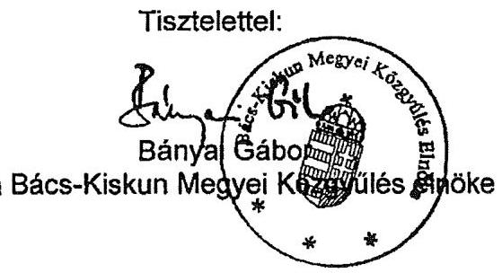

---

# Bányai Gábor úr 

elnök
Bács-Kiskun Megyei Önkormányzat

## Kecskemét

## Tisztelt Elnök Úr!

Köszönettel vettem Bács-Kiskun Megye Önkormányzata pénzügyi helyzetének ellenőrzéséről készült jelentés-tervezet megállapításaira tett észrevételeit. Ebben kiemelt és megismételt a je-lentés-tervezetben szereplő megállapításokat, azokból levont következtése sem mond ellent a jelentés-tervezet összegzésének.

Észrevételének alátámasztására a kamat és hozambevétel, az illetékbevételek csökkenésére, a meg nem valósult ingatlanértékesítésre, a szállítói tartozások ki nem egyenlítésére és a folyószámla hitelkeret megemelésére hivatkozott.

A megállapításunkat fenntartjuk, mert a jelentés-tervezet összegzésében az Önkormányzat pénzügyi egyensúlyi helyzetének megítélésénél megállapítottuk, hogy a 2010. évi müködési forráshiány kialakulásában szerepet játszott, hogy az Önkormányzat legfőbb bevételi forrásai a jogszabályi kedvezmények bővülése és az ingatlanforgalom visszaesése következményeként az illetékbevétel, valamint a központi forráskivonás hatására az átengedett szja és az állami támogatások - csökkentek.

A megyei önkormányzatoknál a pénzügyi egyensúlyt azonos ismérvek alapján minősítettük. A megállapításunk - amely szerint a pénzügyi egyensúly hosszú távú fenntarthatósága igényel intézkedéseket - megalapozott, ezért nem változtatunk az értékelésen.

Az észrevétele szerint az Önkormányzat olyan súlyos pénzügyi nehézséggel küzd, amelyet saját hatáskörben kezelni nem tud, központi támogatásra van szüksége a pénzügyi nehézségek megoldására. A feladatok és források közötti egyensúly megteremtésére irányuló központi döntések, a megyei önkormányzatok konszolidációjára, az intézmények átvételére vonatkozó törvényjavaslat elfogadása új feltételeket teremtett. A hatékony és eredményes gazdálkodás, a pénzügyi egyensúly fenntarthatósága azonban helyi intézkedéseket is igényel.

Köszönöm Elnök úr és munkatársai ellenőrzés során tanúsított hozzáállását, amellyel az ellenőrzés megvalósításában részt vettek, azt segítették.

Budapest, 2011. december , 13n

Tisztelettel:

Melléklet: jelentés

Domokos László

---

.