# ÁLLAMI   SZÁMVEVŐSZÉK 

## JELENTÉS

a Zala Megyei Önkormányzat gazdálkodási rendszerének 2011. évi ellenőrzéséről (43/2)

---

# Számvevői Iroda 

Iktatószám: V-3027-11/2011.
Témaszám: 1015
Vizsgálat-azonosító szám: V056019

## Az ellenőrzést felügyelte:

Dr. Varga Sándor
számvevő igazgató-helyettes
Az ellenőrzést vezette:
Renkó Zsuzsanna
számvevő tanácsos
Az ellenőrzést végezték:
Iszakné Dóczé Katalin Pálfiné Pusztai Magdolna Bencsik Árpád
számvevő tanácsos számvevő tanácsos számvevő

A témához kapcsolódó eddig készített számvevőszéki jelentések:
címe
sorszáma
Jelentés a Zala Megyei Önkormányzat gazdálkodási rendszerének 1028
2010. évi átfogó ellenőrzéséről

---

# TARTALOMJEGYZÉK 

BEVEZETÉS ..... 5
I. ÖSSZEGZŐ MEGÁLLAPÍTÁSOK, JAVASLATOK ..... 12
II. RÉSZLETES MEGÁLLAPÍTÁSOK ..... 17

1. Az Önkormányzat kötelező és önként vállalt feladatai ..... 17
2. Pénzügyi egyensúlyi helyzet alakulása ..... 20
2.1. A múködési és felhalmozási egyensúly alakulása ..... 23
2.2. Az Önkormányzat bevételeinek alakulása ..... 28
2.3. Az Önkormányzat kiadásainak alakulása ..... 31
3. Kötelezettségek bemutatása ..... 36
3.1. A pénzintézetek felé fennálló kötelezettségek alakulása ..... 36
3.2. Szállítók felé fennálló kötelezettségek alakulása ..... 42
3.3. Egyéb kötelezettségek alakulása ..... 43
4. A pénzügyi egyensúly megteremtése érdekében hozott intézkedések ..... 45
5. A helyi önkormányzatok gazdálkodási rendszerének 2007. évi ellenőrzése során a pénzügyi egyensúly javítására tett szabályszerűségi és célszerűségi javaslatok hasznosulása ..... 50

---

# MELLÉKLETEK 

1. számú Múködési és felhalmozási hiány/többlet alakulása melléklet
2/a. számú Kimutatás az önkormányzat CLF módszer szerint besorolt bevételeinek és melléklet kiadásainak 2007-2010. évek közötti alakulásáról
2/b. számú Kimutatás az Önkormányzat bevételeinek és kiadásainak, adósságszolgálatának alakulásáról 2007-2010 között
melléklet
2. számú Az Önkormányzat 2007-2010 években megvalósított, illetve 2010. december 31-én fennálló fejlesztési feladatokhoz kapcsolódó kötelezettségeinek összegzése
3. számú Zala Megyei Közgyűlés elnökének észrevétele melléklet
4. számú Zala Megyei Közgyűlés elnökének észrevételére adott válasz melléklet

---

# RÖVIDÍTÉSEK JEGYZÉKE 

## Törvények

Áht.
ÁSZ tv.

Htv.

Ötv.

## Rendeletek

SzMSz

## Szórövidítések

APEH
ÁSZ
BM
EDP hiány/egyenleg

EU
Főjegyzó
GDP
Hivatal
Illetékhivatal
Kórház
Közgyülés
KSH
NGM
NYDOP
OEP
Önkormányzat
PPP konstrukció

SNA

Szja
TEGYESZ
TIOP
TISZK
az államháztartásról szóló 1992. évi XXXVIII. törvény
A 2011. június 30-ig hatályos Állami Számvevőszékről szóló 1989. évi XXXVIII. törvény (2011. július 1-től az Állami Számvevőszékről szóló 2011. évi LXVI. törvény)
a helyi önkormányzatok és szerveik, a köztársasági megbízottak, valamint egyes centrális alárendeltségű szervek feladat- és hatásköreiről szóló 1991. évi XX. törvény
a helyi önkormányzatokról szóló 1990. évi LXV. törvény
3/2004. (III. 20.) számú rendelet a Zala Megyei Közgyűlés Szervezeti és Müködési Szabályzatáról

Adó- és Pénzügyi Ellenőrzési Hivatal (2011. január 1-jétől Nemzeti Adó- és Vámhivatal NAV)
Állami Számvevőszék
Belügyminisztérium
Uniós módszertan szerinti maastrichti kritériumoknak megfelelő számítás szerinti hiány/egyenleg
Európai Unió
Zala Megyei Önkormányzat Főjegyzője
Bruttó hazai termék
Zala Megyei Önkormányzati Hivatal
Zala Megyei Illetékhivatal
Zala Megyei Kórház
Zala Megyei Közgyűlés
Központi Statisztikai Hivatal
Nemzetgazdasági Minisztérium
Nyugat-Dunántúli Operatív Program
Országos Egészségbiztosítási Pénztár
Zala Megyei Önkormányzat
Public Private Partnership (Partnerségi együttmüködés közfeladatok ellátására a magánszektor bevonásával)
System of National Accounts, azaz Nemzeti Számlák Rendszere
Személyi jövedelemadó
Zala Megyei Területi Gyermekvédelmi Szolgálat
Társadalmi Infrastruktúra Operatív Program
Észak-Zalai Térségi Integrált Szakképző Központ Közhasznú Kht., majd 2008. november 25 -étől Észak-Zalai TISZK Szakképzés-szervezési Kiemelkedően Közhasznú Nonprofit Kft.

---

.

---

# JELENTÉS 

## a Zala Megyei Önkormányzat pénzügyi helyzetének ellenőrzéséről

## BEVEZETÉS

Az Állami Számvevőszék 2011. évtől érvényes stratégiája új irányt szabott a helyi önkormányzatok gazdálkodásának ellenőrzésében is. Az ÁSZ - küldetése és jövőképe szerint - szilárd szakmai alapokra támaszkodva értékteremtő ellenőrzéseivel és helyzetelemzéseivel az államháztartás egészében, így a helyi önkormányzati alrendszerben is elő kívánja segíteni a közpénzek és a közvagyon szabályos, gazdaságos, hatékony és eredményes hasznosítását. E folyamat részeként - a 2010. évi államháztartási hiány alakulásának összetevőire is figyelemmel - megkezdődött az önkormányzati alrendszer pénzügyi helyzetelemzése.

Az NGM 2011 áprilisában közzétett adatai szerint ${ }^{1}$ a 2010. évi 1036,2 milliárd Ft összegű, 3,8\%-os EDP (maastrichti kritériumok szerinti, Túlzott Hiány Eljárás keretében kimutatott) hiánycél nem volt tartható, az önkormányzati alrendszer tervezettet meghaladó hiánya miatt a GDP arányában kifejezett államháztartási hiány 4,2\%-ra emelkedett.

Az önkormányzatok költségvetési jelentése szerint 2010. első három negyedév végén az önkormányzati alrendszer pénzforgalmi hiánya 97 milliárd Ft volt a tervezett éves mérték 51\%-át érte el. Bár az elmúlt években kiugróan magas hiány halmozódott fel az utolsó negyedévben, a 97 milliárd Ft-os szeptember végi hiány nem indokolta az önkormányzati alrendszer 190 milliárd Ft-ra becsült éves hiányának felülvizsgálatát. A tervezett hiány túllépése, az utolsó negyedévi 150 milliárd Ft-os pénzforgalmi hiány nem volt reálisan feltételezhető. A helyi önkormányzatok januári gyorsjelentése szerint a pénzforgalmi hiány 247,7 milliárd Ft-ot tett ki. A tervezettnél nagyobb önkormányzati pénzforgalmi hiány kialakulásában - az NGM által az éves költségvetési beszámoló elkészítéséhez kiadott tájékoztató szerint - az iparűzési adó elmaradása, a gépjárműadó, az illetékek és más bevételek tervezettnél alacsonyabb összegben teljesülése volt a meghatározó.

[^0]
[^0]:    ${ }^{1}$ NGM Tájékoztatás Magyarország Strukturális Reformprogramjának végrehajtásáról (2011. április 1). A Tájékoztató évente két alkalommal - április és október hónapban jelenik meg.

---

A megyei önkormányzatok kötelező feladatellátását többlépcsős törvényi előírások határozzák meg. A feladatokra vonatkozó szabályozás első szintjét az Ötv. ${ }^{2}$, a második szintet a hatásköri ${ }^{3}$, a harmadik szintet a további ágazati, szakmai törvények (egyebek mellett az oktatási, egészségügyi, szociális) adják.

A megyei önkormányzatok a feladatellátás és a központi forráselosztás tekintetében sajátos helyet foglalnak el a helyi önkormányzati rendszerben. A megyei önkormányzat kötelező feladatainak egy része - így a megyében lévő természeti és társadalmi muzeális emlékek, a történeti iratok gyűjtése, őrzése, tudományos feldolgozása, a megyei könyvtári szolgáltatás, a pedagógiai és közművelődési szakmai tanácsadás és szolgáltatás, a megyei testnevelési és sportszervezési feladatellátás, a gyermek- és ifjúsági jogok érvényesítése, a gyermekvédelmi- és szociális szakellátás - az Ötv-ből közvetlenül levezethető kötelezettség.

A középiskolai, szakiskolai, és kollégiumi ellátás, a fogyatékos gyermekek oktatása, nevelése, gondozása az ágazati törvény szerint a megyei önkormányzat kötelező feladata. Azonban, ha a települési önkormányzat lát el ilyen feladatot, és arról lemond, a megyei önkormányzatnak a feladatot át kell vennie. Így a megyei önkormányzatok által ellátandó kötelező közszolgáltatások ellátásának mértékére a települési önkormányzatok döntései jelentősen kihatnak.

Az alapellátást meghaladó egészségügyi szakellátás biztosítása akkor képezi a megyei önkormányzat feladatát, ha az önkormányzati vagyon kialakításáról szóló törvényben ${ }^{4}$ a feladat ellátásához szükséges vagyont az önkormányzat a tulajdonába kapta.

Az önként vállalt feladat ellátására - mivel annak vállalása a kötelező feladatok ellátását nem veszélyeztetheti - a kötelező közszolgáltatások mértékének alakulása lényegi hatással van.

A feladat és hatáskör telepítés sajátosságai mellett a megyei önkormányzatok kialakított forrásszerkezete, a központi költségvetéstől való erőteljes függősége is determinálja az önkormányzatok feladatellátásra vonatkozó döntéseit.

A 2007-2010. években az önkormányzati feladatok ellátásának keretet biztosító forrásszabályozás - ennek részeként az illetékbevételből és a személyi jövedelemadóból való részesedés szabályai - a megyei önkormányzatok vonatkozásában nem változtak:

- A megyei önkormányzatok saját bevételein belül az illetékbevételek döntően az ingatlanpiac stagnálása, majd visszaesése, és egyes illetékkedvezmények bevezetése következtében - megyénként differenciált mértékben ugyan, de - 2010-re általánosan visszaestek. A 2010. évben befolyt

[^0]
[^0]:    ${ }^{2}$ Ötv. 69-70. §-ai
    ${ }^{3}$ a Htv.
    ${ }^{4}$ Az egyes állami tulajdonban lévő vagyontárgyak önkormányzatok tulajdonba adásáról szóló 1991. évi XXXIII. törvény

---

39,2 milliárd Ft illetékbevétel a 2006. évben realizált 71,1 milliárd Ft illetékbevétel alig több mint $55 \%$-a volt. A kieső bevételek pótlására az önkormányzati alrendszer szintjén történtek intézkedések, 2010-ben 5 milliárd Ftot, 2011-ben 1,2 milliárd Ft-ot ellentételezett a központi költségvetés. Az illetékbevételt a megyei önkormányzatok a saját folyó bevételeik között számolják el ${ }^{5}$.

Az illetékek kivetésének és beszedésének joga 2006. december 31-ig a megyei önkormányzatok feladata volt. A 2007. évtől a megyei illetékhivatalok illetékbeszedési feladatait az APEH vette át ${ }^{6}$. Az önkormányzati illetékrészesedési szabályok változatlanok maradtak, azonban az illetékbeszedés költségeit az önkormányzatok illetékbevételeiből átlagos (a Fővárosnál 4,0\%-os, a megyei és megyei jogú városi önkormányzatnál $8,5 \%$-os) kulcsot alkalmazva vonták le. E döntés következtében azon megyei önkormányzatok, amelyek a $8,5 \%$-os költségnél kedvezőbb költségszint mellett látták el korábban ezt a feladatot, kedvezőtlenebb helyzetbe kerültek.

- Az önkormányzati alrendszer személyi jövedelemadóból való részesedésének makroszintű szabályozása nem változott 2007-2010 között7. A helyi önkormányzatokat normatív módon megillető $32 \%$-os részesedés visszaosztásának részletszabályai azonban a megyei önkormányzatok számára - a reálgazdaság kedvezőtlen irányú folyamatai, és az államháztartás egyensúlyi helyzetére tekintettel elrendelt kormányzati intézkedések miatt - megszorító intézkedéseket jelentettek. Összesen 17 milliárd Ft - 2007-ben 10 milliárd Ft, 2010-ben további 7 milliárd Ft - szja-t vontak ki a megyei önkormányzatok gazdálkodási köréből ${ }^{8}$. Az átengedett személyi jövedelemadó a megyei önkormányzatok egyik bevétele.

[^0]
[^0]:    ${ }^{5}$ A megyei önkormányzatok illetékbevételei az önkormányzati alrendszer saját folyó bevételeiből 2007-ben 35,9 milliárd Ft-ot ( $61,4 \%$-ot), 2008-ban 41,5 milliárd Ft-ot ( $61,7 \%$-ot), 2009-ben 36,5 milliárd Ft-ot ( $62,5 \%$-ot), 2010-ben 25,1 milliárd Ft-ot $(64,1 \%$-ot) tettek ki.
    ${ }^{6}$ Az egyes pénzügyi tárgyú törvények módosításáról szóló 2006. évi LXI. törvény 115. §a, amely az adózás rendjéről szóló 2003. évi XCII. törvény 73. §-át módosította.
    ${ }^{7}$ A megyei önkormányzatok személyi jövedelemadó részesedése az önkormányzati alrendszer átengedett bevételeiből 2007-ben 34,7 milliárd Ft-ot ( $7,0 \%$-ot), 2008-ban 51,2 milliárd Ft-ot ( $9,2 \%$-ot), 2009-ben 59,2 milliárd Ft-ot ( $9,3 \%$-ot), 2010-ben 56,3 milliárd Ft-ot $(8,3 \%$-ot) tett ki.
    ${ }^{8}$ A megyei önkormányzatok szja kiegészítése háromelemű. A tételes, minden megyére egységesen meghatározott összeg - az adott évek költségvetési törvényeinek 4. sz. mellékletében meghatározottak szerint - 2006-ban 593 millió Ft, 2007-ben és 2008-ban egyaránt 355 millió Ft, 2009-ben 370 millió Ft volt. A megye népességszáma után járó kiegészítés a 2006. évi $208 \mathrm{Ft} /$ fő összegről 2010-re $120 \mathrm{Ft} /$ fő-re, a megyei intézmények ellátottjai után járó kiegészítés $42236 \mathrm{Ft} /$ ellátottról $20755 \mathrm{Ft} /$ ellátottra csökkent.

---

A megyei önkormányzatok 2007-2010 között rendelkezésre álló forrásait az alábbiakban mutatjuk be:
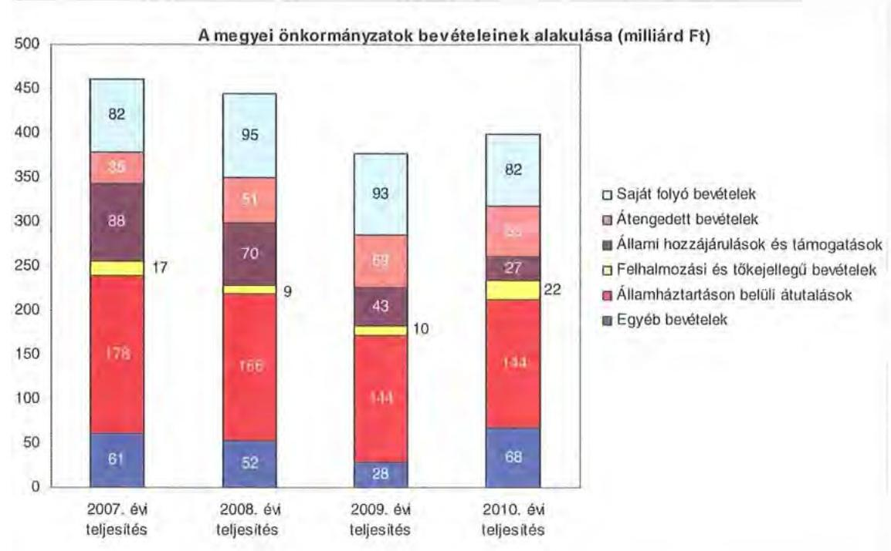

A megyei önkormányzatok saját folyó bevételeinek részaránya - amelyek fơbb elemei: az intézményi térítési díjak, az illetékbevétel, a kamatbevételek - a 2007. évi összbevételen ( 461 milliárd Ft) belül 17,9\% volt, amely 2010-re annak ellenére $20,6 \%$-ra nőtt, hogy az összege 82 milliárd Ft maradt. Ennek oka az volt, hogy az összbevétel a 2007. évi 461 milliárd Ft-ról 2010-re 399 milliárd Ftra csökkent.

Az átengedett bevételek, amelyek a megyei önkormányzatoknál a személyi jövedelemadóból való részesedést jelentették, az összbevételen belül a 2007. évi 35 milliárd Ft-ról 56 milliárd Ft-ra nőttek.

Az állami hozzájárulások és támogatások - amelyek fơbb elemei: az ellátotti létszámhoz kötődő normatív állami hozzájárulások, központosított, fejezeti szinten kezelt célelőirányzatból juttatott múködési és fejlesztési támogatások a 2007. évi 88 milliárd Ft-ról (19,1\%-os részarányról) 2010-re 27 milliárd Ft-ra ( $6,8 \%$-os részarányra) estek vissza.

A felhalmozási és tőkejellegű bevételek - tárgyi eszközök (ingatlanok és ingóságok), föld és immateriális javak, részesedések értékesítése, EU-tól átvett pénzeszközök - a 2007. évi 17 milliárd Ft-ról (3,6\%-os részarányról) 2010-re 22 milliárd Ft-ra (5,4\%-ra) emelkedtek.

Az államháztartáson belüli átutalások részesedése 2007-ben 178 milliárd Ft volt. 2010. év végére 34 milliárd Ft-tal csökkent, részaránya $38,6 \%$-ról 2,6 százalékpontos csökkenés után 2010-ben $36 \%$-ra változott. Ez a bevételi kategória

---

tartalmazza az egészségbiztosítási és egyéb elkülönített állami pénzalapoktól átvett forrásokat. A 2010-ben e címen elszámolt bevétel 144 milliárd Ft volt.

A megyei önkormányzatok központi költségvetésből származó bevételeinek öszszege 2007-ben 400 milliárd Ft volt, amely 2010. évre 331 milliárd Ft-ra (az időszak alatt összesen 69 milliárd Ft-tal) 17,3\%-kal csökkent.

Az egyéb, pénzmaradványból, vállalkozási bevételekből, államháztartáson kívülről származó átutalásokból, a hitelekből, a hosszú és rövid lejáratú értékpapírok értékesítéséből származó bevételek részesedése a 2007-2010. évek viszonylatában 13,3\%-ról 17,1\%-ra emelkedett. Ez utóbbiak 2010. évi beszámoló szerinti összevont teljesítése 68 milliárd Ft volt ${ }^{9}$.

Mindezeket figyelembe véve 2007 és 2010-ben a megyei önkormányzatok forrásösszetételének megoszlását az alábbi ábra szemlélteti:
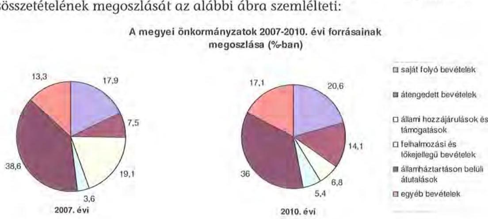

Annak ellenére, hogy a megyei önkormányzatok kötelezően ellátandó feladataikat 2007-hez képest kevesebb intézményben, csökkenő foglalkoztatotti létszám mellett végezték ${ }^{10}$, a jelentős bevételkiesést a - szervezési intézkedések hatására - csökkenő ráfordítások nem tudták kompenzálni. Az ellátottak száma a szociális, gyermekvédelmi ágazat bentlakásos elhelyezést nyújtó intézményeit kivéve - eltérő mértékben ugyan, de minden ágazatban évről évre csökkent, amely a fajlagos hozzájárulások csökkenésével együtt a normatív állami hozzájárulás arányának visszaeséséhez vezetett.

A 2007-2013-as időszakra meghirdetett, vissza nem térítendő EU-s fejlesztési forrásokhoz való hozzájutás lehetősége felerősítette az önkormányzati alrendszer fejlesztési igényeit. A fokozott fejlesztési tevékenység a felhalmozási bevéte-

[^0]
[^0]:    ${ }^{9}$ Az egyéb bevételek összege 2007-2010 között eltérő módon változott, 2007-ben 61 milliárd Ft volt, 2008-ban 52 milliárd Ft-ra, 2009-ben 28 milliárd Ft-ra esett vissza, majd 2010-ben ismét - 68 milliárd Ft-ra - emelkedett.
    ${ }^{10}$ a BM által 2010 decemberében elvégzett felmérés adatai szerint

---

lek és kiadások egyensúlyának megbomlásán ${ }^{11}$ túl a jelentkező jövőbeni fenntartási kötelezettség miatt tovább terhelhetik az önkormányzatok költségvetését.

A megyei önkormányzatok felhalmozási és múködési célú pénzintézeti és szállítói kötelezettségeinek állománya a vizsgált időszakban erőteljesen növekedett.

A hosszú lejáratú kötelezettségek alakulását a következő ábra szemlélteti:
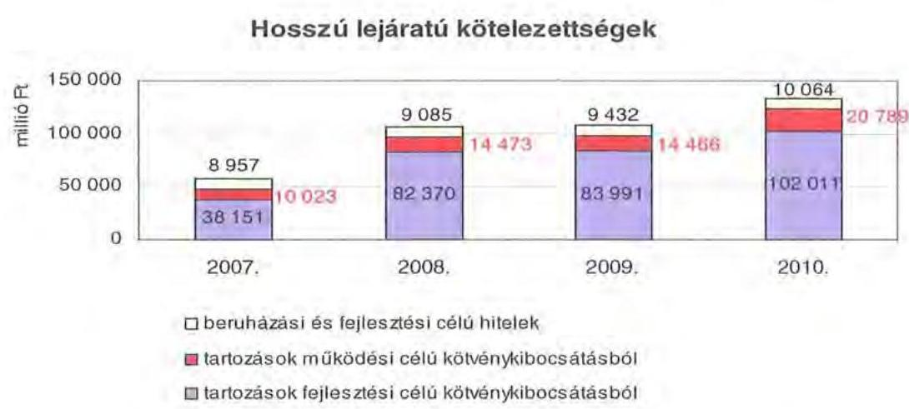

A hosszú lejáratú kötelezettségek mellett az időszakban a 2007. évi 22 milliárd Ft-ról 24 milliárd Ft-ra ( $8,8 \%$-kal) növekedett az áruszállításból származó szállítói kötelezettségek állománya.

A mérlegben kimutatott kötelezettségek állománya mellett az elhasználódott eszközök pótlására forrást biztosító amortizációs (felújítási) alap képzésének ${ }^{12}$ elmaradása további problémákat vetít előre. A megyei önkormányzatok beszámolójelentéseinek összegzése szerint 2007-ben még az elszámolt értékcsökkenés $90 \%$-ának megfelelő összeget fordítottak felújítási célokra, 2009-ben ez az arányszám már csak $16,5 \%$ volt. Ez maga után vonta a feladatellátást kiszolgáló tárgyi eszközök állagának erőteljes romlását.

Az ÁSZ a 2011. évi ellenőrzési tervében a 43. számú, az „Önkormányzatok gazdálkodási rendszerének ellenőrzése" részeként egy időben, egymással párhuzamosan tekinti át és elemzi az önkormányzati alrendszer középszintjét jelentő 19 megyei önkormányzat pénzügyi helyzetét. A gazdálkodás szabályszerűségét az ÁSZ előző évek során ellenőrizte a megyei önkormányzatoknál is, ezért jelen vizsgálatunk erre nem tér ki.

[^0]
[^0]:    ${ }^{11}$ Az önkormányzati alrendszerben - az éves zárszámadási törvényjavaslatok általános indokolása, X. Helyi önkormányzatok gazdálkodása fejezet szerint - a felhalmozási bevételek és kiadások egyenlege 2007-ben 142,4 milliárd Ft, 2008-ban 112,3 milliárd Ft, 2009-ben 234,5 milliárd Ft hiányt mutatott.
    ${ }^{12}$ Erre a jelenlegi szabályozási környezetben nem kötelezi semmilyen előírás az önkormányzatokat.

---

A jelentés a megyei önkormányzatok sajátos feladatellátási és forrásszabályozási helyzetére tekintettel a megyei önkormányzatok pénzügyi helyzetét, illetve az ezzel összefüggő korábbi ÁSZ javaslatok megvalósítását mutatja be.

Az ellenőrzés a 2007. január 1. - 2011. március 31. közötti időszakot ölelte fel.
A vizsgálat jogszabályi alapját 2011. július 1-je előtt az Állami Számvevőszékről szóló 1989. évi XXXVIII. törvény 2. § (3), (5), (6) és (9) bekezdéseiben, az Ötv. 92. § (1) bekezdésében és az Áht. 104. § (3) bekezdésében, 2011. július 1-jét követően az Állami Számvevőszékről szóló 2011. évi LXVI. törvény 1. § (3) bekezdésében, az 5. § (2)-(6) bekezdéseiben és az Áht. 120/A. § (1) bekezdésében foglalt előírások képezték.

Zala megye országos és régión belül elfoglalt helyzetét 2010. december 31-én az alábbi mutatók szemléltetik (a megyei jogú városokkal együtt):

Index: az előző év azonos időszak (időpontja)=100,0

| Mutató megnevezése | Zala   megye | Nyugat-   dunántúli   régió | Országos |
| :-- | :--: | :--: | :--: |
| Népesség száma (ezer fő)* | 286 | 992 | 9986 |
| Népesség változás indexe (\%) | 99,1 | 99,6 | 99,7 |
| Az ipari termelés volumenindexe (\%) | 108,4 | 115,8 | 110,7 |
| Egy lakosra jutó ipari termelési érték (ezer Ft) | 2050,4 | $3249,8$ | 2044,4 |
| Ezer lakosra jutó vállalkozások száma (db) | 170 | 157 | 165 |
| A beruházások egy lakosra vetített teljesítmény- | 125,0 | 277,6 | 304,7 |
| értéke (millió Ft) |  |  |  |
| Foglalkoztatási arány (\%) | 48,8 | 52,3 | 49,5 |
| Munkanélküliségi ráta (\%) | 11,0 | 8,8 | 10,8 |
| Alkalmazásban állók havi nettó átlagkeresete | 108895 | 120429 | 132628 |
| (Ft) |  |  |  |
| Alkalmazásban állók havi nettó átlagkereseté- | 105,4 | 107,9 | 106,9 |
| nek indexe (\%) |  |  |  |

*Ebből Zalaegerszeg és Nagykanizsa megyei jogú városok népessége 110268 fő
A táblázatban feltüntetett adatok azt jelzik, hogy a gazdaság helyzetét reprezentáló egyes mutatók - kivétel ez alól az ezer lakosra jutó vállalkozások száma - tekintetében a megye elmarad mind a régiós, mind pedig az országos értékektől, jellemzőktől.

A megyében 258 települési önkormányzat - 2 megyei jogú városi, 8 városi és 248 községi - múködött.

---

# I. ÖSSZEGZŐ MEGÁLLAPÍTÁSOK, JAVASLATOK 

A Zala Megyei Önkormányzat 2010-ben 18571 millió Ft költségvetési kiadásának $98,8 \%$-át kötelező feladatai ellátására fordította. Az Önkormányzat adatszolgáltatása szerint önként vállalt feladatai a sport, kulturális és szabadidős tevékenységhez, a nemzetközi kapcsolatok, a kommunikációs, a sajtó szolgáltatások szervezéséhez kapcsolódtak, valamint támogatást nyújtott civil szervezetek, egyesületek működéséhez, a megyében lévő települések fejlesztési pályázatai önrészéhez összesen 228 millió Ft összegben. A kötelező és önként vállalt feladatok körét az Önkormányzat SzMSz-e nem rögzítette, azt az Ötv. és az ágazati törvények által meghatározottnak tekintették. Az önként vállalt feladatai terjedelmét az éves költségvetési rendeleteiben határozta meg a Közgyűlés.

Az Önkormányzat kötelező és önként vállalt feladatait 2010. december 31-én 26 költségvetési szervvel, 59 telephelyen látta el. A költségvetési intézményként működő Kórház mellett nyolc intézmény szociális és gyermekvédelmi feladatokat, 11 intézmény közoktatási feladatot, négy intézmény közművelődési és közgyűjteményi feladatot lát el. Az igazgatási feladatokat a Hivatal látta el, egyéb feladatokat egy - intézményként bejegyzett - társulás végez. Az intézmények száma 2007-2010 között egy szociális és gyermekvédelmi és egy kulturális intézmény megszüntetésével csökkent, míg a feladatellátás telephelyeinek száma a 2006. december 31-i 25 -ről 34 -gyel nőtt. Az Önkormányzat intézményének (Kórház) egy többségi részesedésű gazdasági társasága van, amely az egészségügyi kötelező önkormányzati feladatokhoz kapcsolódó tevékenységeket végez.

Az Önkormányzat folyó költségvetési egyenlege (múködési jövedelme) 2007-2009. években pozitív (az évek sorrendjében a folyó kiadások 6,4\%-a, 1099 millió Ft, a 2008-ban 7,1\%-a, 1251 millió Ft, a 2009-ben 0,9\%-a, 149 millió Ft), a 2010. évben negatív összegű (a folyó kiadások 1,8\%-a, 302 millió Ft) volt. Az Önkormányzat pénzügyi kapacitása (nettó múködési jövedelme) a 2007-2009. években pozitív, a 2010. évben negatív értéket mutatott. A nettó múködési jövedelem a 2007. évben 10 millió Ft, a 2008. évben 169 millió Ft, a 2009. évben 48 millió Ft tőketörlesztés mellett a 2007. évben 1089 millió Ft, a 2008. évben 1082 millió Ft, a 2009. évben 101 millió Ft volt. A 2010. évi negatív értékét (-399 millió Ft) a folyó bevételek és kiadások különbségéből származó nagyarányú múködési jövedelemcsökkenés okozta.

A 2007-2010. években az Önkormányzat felhalmozási költségvetésének egyenlege folyamatosan negatív összegű volt, amely a vizsgált időszakban összesen 3768 millió Ft felhalmozási forráshiányt okozott.

A vizsgált időszakban az Önkormányzatnál - a pénzügyi helyzet elemzéséhez alkalmazott CLF módszer szerint - 2007-2010. években a folyó- és a felhalmozási költségvetésében a 2008. év kivételével - amikor 359 millió Ft bevételi többlet volt kimutatható - minden évben forráshiány keletkezett. Áttekintett időszakban az Önkormányzat deficitje átlagosan 3,4\% volt.

---

A pénzügyi egyensúly fenntartása külső források bevonásával volt biztosítható. A 2007-2010. években 324 millió Ft hitelt törlesztettek. Az adósságszolgálat továbbá a felhalmozási forráshiány 2007-2010 között 4584 millió Ft-ot tett ki, amelyre az időszakban képződő 2197 millió Ft működési többlet (múködési jövedelem), valamint a 2007. január 1-jén rendelkezésre álló 1438 millió Ft pénzkészlet szolgált. A további pénzeszközöket a 1590 millió Ft fejlesztési és folyószámlahitel igénybevételével, valamint 3057 millió Ft kötvénykibocsátásból származó bevételből biztosították. A külső források bevonása eredményeként az Önkormányzatnak 2010. december 31-én 3698 millió Ft záró pénzkészlete képződött. A kialakult pénzügyi helyzet pozitív nettó múködési jövedelmet eredményező gazdálkodás mellett teszi elkerülhetővé további külső forrás bevonását.

A 2007. évben kibocsátott kötvényből, illetve az üzletrész értékesítéséből képződő jelentős tartalékok, továbbá a meghozott kiadáscsökkentő és bevételnövelő intézkedések és a kimutatott saját bevételek növekedése a 2010. év végéig ellensúlyozták az Önkormányzat legföbb bevételi forrásai - illetékbevétel, átengedett szja és az állami támogatások - csökkentését úgy, hogy az ellátott feladatok nem változtak.

Az Önkormányzatnál a 2010. évben befolyt 1138 millió Ft illetékbevétel a 2006. évi 2090 millió Ft 54,4\%-ára csökkent. Az átengedett szja és az állami támogatások együttes összege a központi forráskivonás hatására, valamint az ellátotti létszám visszaesése miatt ugyancsak lényegesen kevesebb lett, a 2010. évben 2875 millió Ft volt, amely a 2007. évi 4072 millió Ft-nak közel a kétharmada ( $64,4 \%$-a). A Kórháznak társadalombiztosítási alapból származó bevétele a 2007. évben 9110 millió Ft volt, amely a 2010. év végére 9539 millió Ft-ra $(4,7 \%-k a l)$ emelkedett.

A múködési kiadások 2007-ről 2010-re 114 millió Ft-tal ( $0,7 \%$-kal) csökkentek. Az önkormányzati múködési kiadásokban állandónak tekinthető a kórházi kiadások súlya. A Kórház nélküli intézmények által a 2007. évben teljesített múködési kiadások 7565 millió Ft-ot, az összes múködési kiadás 44,4\%-át tették ki, amely a 2010. év végéig általuk teljesített 7048 millió Ft-tal, 44,1\%-ra csökkent. A 2007. évben teljesített 2479 millió Ft felhalmozási kiadások aránya 12,7\%-ról -a 2009. évi 800 millió Ft-os mélypontot ( $4,7 \%$ ) követően - a 2010. év végére $9,8 \%$-ra ( 1660 millió Ft-ra) esett vissza az összes költségvetési kiadáson belül. Az aktív pályázati tevékenység eredményeként 2007-2010 között 11363 millió Ft bekerülési költségű beruházást folytatott, illetve indított el az Önkormányzat, amelyből a 2010. évet követő időszakra vállalt kötelezettség 5613 millió Ft. Ennek forrásait az 5012 millió Ft elnyert uniós támogatás és 601 millió Ft kötvénykibocsátásból származó fejlesztési célú pénzmaradvány képezi. A 2010. évet követő időszakra vállalt kötelezettségekből 5353 millió Ft (az öszszes vállalt önkormányzati fejlesztési kötelezettség 95,4\%-a) a Kórház fejlesztését finanszírozza.

Az Önkormányzat pénzintézeti kötelezettségeinek állománya a könyvviteli mérlegadatok szerint 2006. december 31-ről 2010. december 31-re 458 millió Ft-ról 6188 millió Ft-ra nőtt. A vizsgált időszakban adósságszolgálatra összesen az Önkormányzat 724 millió Ft-ot teljesített, amelyből a kamatkiadás 400 millió Ft-ot tett ki. A kötvényből származó források befektetéséből 2008-2010.

---

években realizált kamatbevétel 534 millió Ft volt. Az Önkormányzatnak a 2013. évet követően fennálló jelenleg ismert pénzintézeti kötelezettségei 806 millió Ft és 18875 CHF.

Az Önkormányzat likviditása biztosítása érdekében 2010-ben az év minden napján igénybevett folyószámlahitelt, amelynek átlagos napi állománya 698 millió Ft volt.

Az Önkormányzat 2010. év végi pénzintézeti kötelezettsége 4454 millió Ft (72\%) hármas célú (fejlesztési, múködési és hitelkiváltás) kötvény kibocsátásából, 1034 millió Ft (17\%) fejlesztési célú hosszú lejáratú hitel felvételéből, továbbá 700 millió Ft (11\%) költségvetési év végén ki nem egyenlített folyószámlahitelből keletkezett. Ezek miatt az Önkormányzatnak a 2011-2013. években 351 millió Ft, és 2664205 CHF tőketörlesztést és kamatot kell teljesítenie. Az Önkormányzat 2010. év végi szállítói tartozása 1294 millió Ft (ebből lejárt 397 millió Ft), egyéb kiadás elmaradása nem volt. A 2011. év utáni összes (pénzintézeti és szállítói) kötelezettség teljesítésére figyelembe vehető az Önkormányzat 2011. évi költségvetési rendeletében kimutatott 91 millió Ft általános tartalék, 657 millió Ft árfolyamveszteségre képzett céltartalék és az Önkormányzat 2010. évi zárszámadási rendeletében kimutatott 6304 millió Ft jelzáloggal nem terhelt egyéb forgalomképes vagyon. E vagyon értékesítéséből származó bevétel - figyelemmel a vagyonértékesítés bizonytalanságára - nem számszerűsített.

A pénzintézeti kötelezettségvállalásokból származó források felhasználási céljait meghatározták. A kibocsátott kötvény előre nem meghatározott része működési célokra volt fordítható, amely működési finanszírozási kockázatot jelent. A közgyűlési előterjesztések nem tartalmazták - a hosszú lejáratú pénzintézeti kötelezettségvállalások visszafizetési forrásait, továbbá a hosszú lejáratú hitel esetén a teljes futamidő várható kamat és tőkefizetési kötelezettségeit. Az Önkormányzat a kötvény kibocsátást jóváhagyó határozatában bemutatta a teljes futamidőre vonatkozó tőkefizetési kötelezettségét, azonban ez nem tartalmazta a várható kamatfizetés, az árfolyam- és kamatkockázatok bemutatását. Az adósságszolgálati korlát bemutatása, vizsgálata megtörtént.

Az Önkormányzat nem vizsgálta, hogy az elhasználódott eszközök pótlása milyen kötelezettséget jelent a számára. Az Önkormányzat 2007-2010. évek között a tárgyi eszközök után 3073 millió Ft értékcsökkenést számolt el, ugyanakkor felújításra csak ennek töredékét 336 millió Ft-ot (10,9\%) fordított.

A végrehajtott kiadáscsökkentő és bevételnövelő intézkedések megtétele a feladatellátás szakmai színvonalának növelése mellett a takarékos szemléletű gazdálkodást, a működőképesség megőrzését, kiemelten a pénzügyi helyzet javítását célozták. A 2007-2010. években az intézményátszervezések, a feladatváltozások, valamint a takarékossági intézkedések hatásaként a 2007-2010. években - az Önkormányzat kimutatása szerint - együttesen 3056 millió Ft kiadási megtakarítás keletkezett, amelynek $46 \%-a, 1405$ millió Ft a kapcsolódó álláshely csökkenések következtében jelentkezett.

---

A létszámcsökkentő intézkedések következtében 2007-2010. évek között a Hivatalnál és az intézményeknél összesen 433 álláshelyet szüntettek meg, amelyből 19 álláshely ( $4,4 \%$ ) ágazati szakmai, 414 álláshely ( $95,6 \%$ ) intézményüzemeltetéshez, fenntartáshoz kapcsolódó álláshely volt.

A bevételnövelésre irányuló intézkedések eredményeként képződő többletbevételből - amelynek számszerúsített összege 2455 millió Ft volt - 1750 millió Ft-ot, $71,3 \%$-ot a Hivatal, 705 millió Ft az intézmények realizáltak. A bevétel növekedésében meghatározó tényező volt az átmenetileg szabad pénzeszközök lekötéséből származó kamatbevétel 1196 millió Ft-tal, az ingatlanok értékesítése 440 millió Ft-tal, valamint az eszközök bérbeadása 261 millió Ft-tal.

Az utóellenőrzés a pénzügyi egyensúly javítására tett két célszerúségi javaslat hasznosulására terjedt ki. Az Önkormányzat a javaslatokat hasznosította.

A Közgyűlés elnöke a pénzügyi egyensúly érdekében saját hatáskörben tett intézkedésekről számolt be (önként vállalt feladatokra vonatkozó megállapodások felmondása, intézmény kiszervezése, szállítói tartozás folyamatos figyelemmel kísérése, ingatlanértékesítés stb.). A működési hiány megszűntetését biztosító kiadáscsökkentésre a már végrehajtott intézkedések mellett nem lát lehetőséget, csak ha a korábbi forráscsökkentést a központi költségvetés visszapótolja. A kincstári rendszerre való áttérés esetén a jelenlegi folyószámlahitel ( 700 millió Ft) visszafizetését saját hatáskörben nem látja biztosíthatónak.

Az Önkormányzat pénzügyi helyzetét összegezve a következők emelhetők ki:

Az önkormányzati bevételt csökkentő központi intézkedések hatását az ellenőrzött időszakban megközelítőleg kiegyenlítette az Önkormányzat kiadáscsökkentő és bevételnövelő intézkedéseinek eredménye. Az időszakban intézményt az Önkormányzat nem adott és nem vett át. Az Önkormányzat által folyamatosan és növekvő mértékben igénybe vett folyószámlahitel, a kötvénybevétel részben működési célú felhasználása, a kötvény teljes kamatbevételének müködési célú felhasználása, valamint a lejárt szállítói tartozások állományának mértéke likviditási feszültséget jelez. A 2010. évet követő beruházások forrása döntően EU-s támogatásból, valamint a kötvény felhalmozási forrás részéből biztosított, azonban a fejlesztések támogatásainak előfinanszírozása likviditási nehézséget idézhet elő az Önkormányzatnál. A 2010. évet követő hosszú lejáratú kötelezettségek fedezetének megléte - figyelemmel a forgalomképes ingatlanok értékesíthetőségére - részben számszerúsíthető.

A feladatok és források közötti egyensúly megteremtésére irányuló központi döntések, a megyei önkormányzatok konszolidációjára, az intézmények átvételére vonatkozó törvényjavaslat elfogadása új feltételeket teremtett. Mindezekre figyelemmel az Önkormányzat pénzügyi helyzetének stabilizálása - a folyamatosan romló likviditás, és a hosszú távú kötelezettségek teljesítéséhez szükséges források bizonytalansága miatt - további intézkedéseket igényel.

Az Állami Számvevőszékről szóló 2011. évi LXVI. törvény 33. § (1) bekezdésében foglaltak értelmében a jelentésben foglalt megállapításokhoz kapcsolódó intézkedési tervet köteles az ellenőrzött szervezet vezetője összeállítani és azt a

---

jelentés kézhezvételétől számított harminc napon belül az ÁSZ részére megküldeni. Amennyiben az intézkedési tervet határidőben nem küldi meg a szervezet, vagy az továbbra sem elfogadható, az ÁSZ elnöke a hivatkozott törvény 33. § (3) bekezdés a)-b) pontjaiban foglaltakat érvényesítheti.

A 2011 májusában lezárult helyszíni ellenőrzés tapasztalatai alapján - figyelembe véve az Önkormányzat észrevételeit és a saját hatáskörben tett intézkedéseit - az alábbi javaslatokat tette az ÁSZ:

# a Közgyülés elnökének: 

1. tájékoztassa a Közgyűlést rendszeresen az intézkedési terv megvalósításáról, annak eredményeiről. A pénzügyi egyensúlyt befolyásoló feltételek romlása esetén tegyen javaslatot az intézkedési terv módosítására;
2. gondoskodjon róla, hogy a jövőben az adósságot keletkeztető kötelezettségvállalásokról szóló közgyűlési döntéseket megalapozó előterjesztések tartalmazzák a várható kamat-, egyéb költség és tőkefizetési kötelezettségeit, legalább 3 éves kitekintéssel a várható kamat és árfolyamkockázatok bemutatását, és kezelésének lehetőségeit;
3. gondoskodjon a fennálló lejárt szállítói tartozás okainak feltárásáról, szerkezetének bemutatásáról - beleértve az intézményeknél lejárt szállítói állomány értékét és napra számított arányát -, a szükséges intézkedések megtételéről, indokolt esetben a szállítókkal a lejárt tartozások mielőbbi rendezéséről a kockázatok minimalizálása érdekében;
4. gondoskodjon a pénzintézeti kötelezettségek finanszírozási lehetőségeinek számbavételéről, és arra források biztosításáról;
5. mutassa be a Közgyűlésnek az éves költségvetési előterjesztésekben az értékcsökkenési leírás összegét, és ezzel arányban az elhasználódott eszközök pótlásának forrásigényét és lehetőségét.

---

# II. RÉSZLETES MEGÁLLAPÍTÁSOK 

## 1. Az ÖNKORMÁNYZAT KÖTELEZŐ ÉS ÖNKÉNT VÁLLALT FELADATAI

A Zala Megyei Önkormányzat 2010. évi beszámolója szerint költségvetési kiadásainak ( 18571 millió Ft) 98,8\%-át, 18343 millió Ft-ot a kötelező, 228 millió Ft-ot az önként vállalt ${ }^{13}$ feladatok ellátására fordította kimutatásai alapján. A 2011. évi tervadatok alapján az önként vállalt feladatokra az összes költségvetési kiadás 0,9\%-a (174 millió Ft) jut, amely 0,3 százalékponttal alacsonyabb az előző év kiadási arányánál. Az Önkormányzat önként vállalt feladatai a sport, a kulturális ${ }^{14}$ és szabadidős tevékenységhez, a nemzetközi kapcsolatok, a kommunikációs, sajtó szolgáltatások szervezéséhez kapcsolódnak, valamint támogatást nyújt civil szervezetek, egyesületek múködéséhez.

A kötelező és önként vállalt feladatainak körét nem rögzítették ${ }^{15}$. Kötelező feladatait az Ötv. és az ágazati törvények által meghatározottnak tekinti, míg az önként vállalt feladatok körére a Hivatal Ügyrendje ad iránymutatást, illetve terjedelmét a Közgyűlés az éves költségvetési rendeleteiben ${ }^{16}$ határozza meg.

Az Önkormányzat éves költségvetési kiadásainak szerkezetét tekintve a 2010. évben a járulékokkal növelt személyi juttatások és a dologi kiadások 16405 millió Ft-os összegén ${ }^{17}$ belül meghatározó arányt 9773 millió Ft-tal 59,6\%-ot - a Kórháznál e címen elszámolt kiadások jelentik. A szociális és gyermekvédelmi feladatokat ellátó 8 intézmény személyi és a dologi kiadásokból való részesedése 2770 millió Ft, 16,9\%-os, míg a 11 közoktatási intézményé 2404 millió Ft, 14,6\%. A 2010. évben a közoktatási feladatok személyi és dologi kiadásait $42,2 \%$-ban, a szociális és gyermekvédelmi feladatok személyi és dologi kiadásait $40,4 \%$-ban finanszírozta a - két ágazatban 2135 millió Ft - normatív költségvetési támogatás. A közművelődési, levéltári, közgyűjteményi (könyvtár és múzeum) szolgáltatások ellátását 4 intézmény

[^0]
[^0]:    ${ }^{13}$ Az önként vállalt feladatokra fordított kiadások 26,3\%-át ( 60 millió Ft) fejlesztési célra adták át 17 év alatt visszafizetendő kamatmentes támogatásként Lenti Város Önkormányzatának „A fedett fürdő bővítése Lentiben" fejlesztési feladatra.
    ${ }^{14}$ Az Önkormányzat a 2011. évi ÖNHIKI igénylés 7. számú mellékletében felsorolt önként vállalt feladatai között nem szerepeltette a Hevesi Sándor Színház, illetve a Griff Bábszínház múködésének támogatását, mivel azt kötelező feladatának tekinti annak ellenére, hogy az Ötv. 70. § azt nem sorolja a kötelező feladatai közé. Az itt bemutatott arányszámban viszont az önként vállalt feladatok között szerepeltettük a színházi támogatások közel 70 millió Ft-os éves tételeit.
    ${ }^{15}$ Erre jogszabályi előírás ma már nem kötelezi az önkormányzatot.
    ${ }^{16}$ a Hivatal költségvetésében, a feladatonkénti kiadási előirányzatai között, tételesen
    ${ }^{17}$ Az Önkormányzat személyi juttatások, munkaadói járulék és dologi kiadásainak ágazatokra történő megbontása a BM részére készített, 2010. december 31-i adatokkal kiegészített adatszolgáltatásból kiindulva, az Önkormányzat elemi beszámolójával, illetve zárszámadási rendeletével egyeztetve került kigyűjtésre.

---

biztosítja, a járulékokkal növelt személyi juttatás és dologi kiadási arányuk mindössze 3,6\%-os. Az igazgatási és egyéb (Zala Megyei Önkormányzatok Útkezelő Társulása) ágazathoz sorolható járulékokkal növelt személyi juttatások és dologi kiadások részaránya 5,3\%. Ezt szemlélteti az ábra.
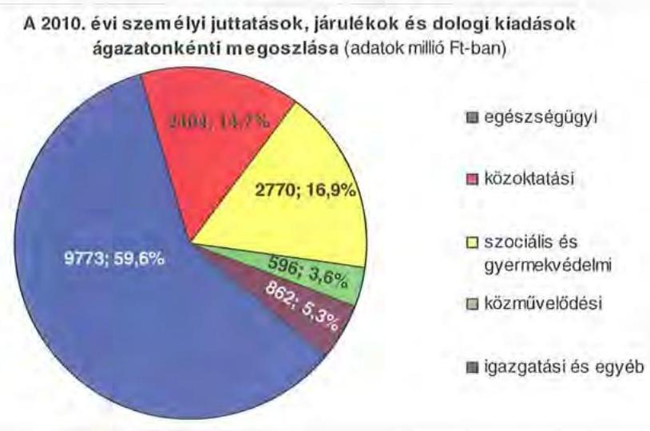

Az Önkormányzat 2010. évi költségvetési kiadásainak 87,7\%-a az intézmények (16 280 millió Ft), a többi a Hivatal költségvetésében szerepelt. A Hivatal költségvetéséből ( 2291 millió Ft) a járulékokkal növelt személyi juttatások és dologi kiadások ${ }^{18} 862$ millió Ft-tal ( $37,6 \%$-kal), a beruházásokra, felújításokra fordított kiadások 1121 millió Ft-tal ( $48,9 \%$-kal), a különböző megyepolitikai feladatokhoz, szervezetek támogatásához kapcsolódó kiadások 308 millió Ft-tal (13,5\%$\mathrm{kal})$ részesültek.

Az Önkormányzat kötelező és önként vállalt feladatait 2010. december 31-én 26 költségvetési szervvel látta el ${ }^{19}$. Az Önkormányzat által fenntartott költségvetési szervekből 20 önállóan működő és gazdálkodó, míg hat csak önállóan működő költségvetési szerv, az intézmények - alapító okirataik szerint - összesen 59 telephelyen működnek. Az Önkormányzat feladatait az alábbi intézménystruktúrával látja el 2010. december 31-én:

- egészségügyi feladatokat a Kórház látja el;
- szociális és gyermekvédelmi feladatokat 8 önállóan működő és gazdálkodó költségvetési szerv végez (öt átmeneti és tartós szociális ellátást biztosító in-

[^0]
[^0]:    ${ }^{18}$ A dologi kiadások a finanszírozási tételeket is tartalmazó egyéb folyó kiadások nélküli tiszta, elemi beszámolóval egyező kiadások.
    ${ }^{19}$ Az Önkormányzat 2006. december 31-én 28 költségvetési szervvel 25 telephelyen végezte kötelező és önként vállalt feladatait. Ebből önállóan gazdálkodó költségvetési szerv 24 db , míg részben önállóan gazdálkodó költségvetési szerv 4 db volt. A vizsgált időszakban a szociális és gyermekvédelmi, továbbá a kulturális és sport ágazatban csökkent 1-1 db-bal az önállóan gazdálkodó költségvetési szervek száma. A telephelyek vizsgált időszak alatti 34 db -os növekedését jellemzően az okozta, hogy 2006-ban az alapító okiratokban nem szerepeltek telephelyek.

---

tézmény ${ }^{20}$, három gyermekvédelmi feladatokat ellátó intézmény, ezen belül egy intézmény a TEGYESZ, és kettő intézmény speciális gyermekotthon, ahol oktatási tevékenység is folyik);

- közoktatási feladatokat 11 intézmény (hét önállóan működő és gazdálkodó és négy önállóan működő) lát el (kettő pedagógiai szakszolgálat ${ }^{21}$ három szakképző iskola, egy gimnázium, egy gimnázium és szakközépiskola, négy általános iskola és speciális szakiskola, melyből egy intézmény egységes gyógypedagógiai intézmény);
- közművelődési és közgyűjteményi feladatokat négy intézmény végez (könyvtár, levéltár, múzeum, Közművelődési Intézet);
- igazgatási feladatokat lát el a Hivatal, mint önállóan működő és gazdálkodó költségvetési szerv;
- egyéb szervezetként a Hivatalnak a gazdálkodásához kötötten, mint önálló intézmény működik a Zala Megyei Települési Önkormányzatok Útkezelő Társulása.

Az egyes ágazatok kötelező feladatellátását 2010. december 31-én az alábbi mutatók jellemezték:

| Megnevezés | közoktatás | szociális és   gyermek-   védelem | egészség-   úgy | kultúra   és sport |
| :-- | :--: | :--: | :--: | :--: |
| Az ágazatban foglalkoztatot-   tak száma (fő) | 569 | 729 | 1555 | 147 |
| Az ágazat intézményeiben   ellátottak összesen (fő) | 3295 | 1536 |  |  |
| Fekvőbeteg ellátás férőhelye-   inek száma (db) |  |  | 1061 |  |

Az Önkormányzat közvetve egy többségi részesedésű gazdasági társasággal és kettő $10-50 \%$ közötti tulajdoni részarányú gazdasági társasággal rendelkezik.

- A Kórház által 1993. évben létrehozott 99\%-os intézményi részesedéssel bíró gazdasági társaság a TRANSHUMÁN Kft, az egészségügyhöz köthető ${ }^{22}$ fuvarozási, szállítási és kereskedelmi tevékenységet végez, amelyek jellemzően kötelező önkormányzati feladatokat jelentenek. A társaság feladatellátását az alapító okiratában rögzítették, amelyet a Közgyűlés 57/1993. (II. 27.) számú határozatával hagyott jóvá.

[^0]
[^0]:    ${ }^{20}$ Integrált Szociális Intézmény, Szocioterápiás Intézmény, Pszichiátriai Betegek, Fogyatékosok Rehabilitációs és Idősek Otthonai.
    ${ }^{21}$ Pedagógiai Intézet Zalaegerszeg és Nevelési Tanácsadó Keszthely
    ${ }^{22}$ A társaság hatályos alapító okirata szerint fő tevékenysége 47.78’08 TEAOR 2008 számú egyéb máshova nem sorolható új áru kiskereskedelem. Ez a gyakorlatban betegszállítást, vérszállítást, egyéb orvosi anyagszállítást, illetve ételszállítást takar.

---

- Az Önkormányzat Zalaegerszeg Megyei Jogú Város és Keszthely Város önkormányzataival 2005-ben, 3 millió Ft törzstőkével létrehozta az Észak Zalai Térségi Integrált Szakképző Központ Kht-t (TISZK). A TISZK-ben az Önkormányzatnak 33,67\% ( 1,01 millió Ft) részesedése van és négy megyei intézménnyel ${ }^{23}$ kapcsolódik a kötelező feladatát jelentő, térségi szakképzési tevékenységhez. A TISZK 2009. évben Szakképzés-szervezési Kiemelten Közhasznú Nonprofit Kft-vé alakult. A TISZK múködéséhez az Önkormányzat a 2008-2010. években összesen 37 millió Ft támogatást biztosított.
- A Zalai Nyári Színházak Közhasznú Társaságban az Önkormányzatnak 17\%-os ( 0,5 millió Ft) tulajdonrésze van. A társaság 2001 novemberében alakult kulturális és tudományos tevékenység, nevelés, oktatás, képesség fejlesztés és ismeretterjesztés tevékenység - nem kötelező önkormányzati feladatok - végzésére, melyet a Közgyűlés 63/2001. (VI. 29.) számú határozatával támogatott.

A többségi tulajdonú, illetve a 10-50\%-os tulajdoni hányadú gazdasági társaságok mellett az Önkormányzat a ZALAVÍZ Zrt-ben 1,56\%-os ${ }^{24}$, a NyugatPannon Regionális Rt-ben (Szombathely) 0,1\%-os részesedéssel, míg a Pacsa és Vidéke ÁFÉSZ-ben egyezer Ft tulajdonrésszel rendelkezik.

Az önkormányzati feladatellátásban - az intézmények és gazdasági társaságok mellett - szolgáltatási szerződéssel kiszervezett intézményi ellátások az idősek otthona és idősek nappali ellátása önkormányzati kötelező feladatok esetében $100+20$ férőhelyen és két telephelyen múködtek. A feladatot az Önkormányzat nem látta el, az idősek otthonát nem múködtette, azt a 2009. május 19-én kelt ellátási szerződések alapján a KOLPING ${ }^{25}$ Oktatási és Szociális Intézményfenntartó Szervezet látta el, melyhez a Közgyűlés a 121/2008. (IX. 30.) és a 131/2008. (X. 21.) számú határozataival járult hozzá.

# 2. PÉNZÜGYI EGYENSÚLYI HELYZET ALAKULÁSA 

A hagyományos költségvetési szerkezet helyett az önkormányzat pénzügyi helyzetét a CLF módszerrel mutatjuk be, amelyben jobban elkülönülnek a vagyonnal kapcsolatos bevételek és kiadások a feladatokkal kapcsolatos közvetlen múködtetési bevételektől és kiadásoktól. A módszer következetesen elkülöníti a folyó és a felhalmozási költségvetés bevételeit és kiadásait, azok költségvetési egyenlegeit. A saját folyó bevételek, valamint a saját felhalmozási bevé-

[^0]
[^0]:    ${ }^{23}$ Az Asbóth Sándor Térségi Szakközépiskola, Szakiskola és Kollégium Keszthely, a Közgazdasági Szakközépiskola Keszthely, a Gönczi Ferenc Gimnázium és Szakközépiskola Lenti, a Lámfalussy Sándor Szakközépiskola és Szakmunkásképző Lenti.
    ${ }^{24}$ Az Önkormányzat a 21/2011. (III. 18.) határozata alapján a ZALAVIZ Zrt-ben lévő 78 db törzsrészvényét értékesítette. A 2011. április 18 -án kelt részvény - adásvételi szerződés alapján a ZALAVIZ Zrt. 7,8 millió Ft vételárért vásárolta vissza a törzsrészvényeket.
    ${ }^{25}$ A katolikus lelkiségi mozgalom, fő feladatuk a szociális problémák megoldása a keresztény szellemiségú nevelés által.

---

telek nem tartalmazzák az előző évi pénzmaradványok felhasználásából származó pénzforgalom nélküli bevételeket ${ }^{26}$.

A bevételek és kiadások besorolása általános közgazdasági meggondolásokon alapul, amely testet ölt az SNA statisztikai módszertanában is. Folyó tételek alatt értjük azokat a bevételeket és kiadásokat, amelyek az önkormányzat vagyoni helyzetét automatikusan nem változtatják. A bevételi oldalon ilyenek az adók, az illeték, az áfa bevételek és visszatérülések, a hozamok és kamatok, a költségvetési támogatások, az egyéb saját bevételek, valamint a működési célra átvett pénzeszközök és kapott támogatások. A folyó kiadások közé tartoznak a szolgáltatások nyújtásával kapcsolatos múködési kiadások, a kamatkiadások, valamint a múködési célú transzferkiadások ${ }^{27}$. A felhalmozási vagy tőke tételek módosítják az önkormányzat vagyoni helyzetét. A privatizációs bevételek, az immateriális javak és tárgyi eszközök, valamint a részesedések értékesítése csökkentik, a fizikai beruházások és a pénzügyi befektetések növelik a vagyont. A pénzforgalmi bevételek és kiadások nem tartalmazzák a követelések elengedése miatt könyvelt tételeket, mivel ezek egymást kioltó, technikai jellegű elszámolási műveletek.

A folyó költségvetés egyenlege, a múködési jövedelem megmutatja, hogy az önkormányzat éves folyó bevétele fedezetet biztosít-e a kötelező és önként vállalt feladatellátáshoz kapcsolódó éves folyó kiadására. A múködési jövedelem negatív értéke pénzügyileg fenntarthatatlan helyzetet jelez. A mutató pozitív értéke megtakarítást mutat, amely forrásul szolgálhat az önkormányzat fennálló kötelezettségei megfizetéséhez, valamint fejlesztéseihez.

A felhalmozási költségvetés pozitív értéke felhalmozási többletet mutat, amely a jövőbeni fejlesztések forrását biztosíthatja. Amennyiben a folyó költségvetési hiány finanszírozása a felhalmozási többletből történik, ez szűkebb értelemben vagyonfelélésnek tekinthető. Amennyiben a felhalmozási költségvetés megtakarítása fejlesztési célú hitelek, kötvények adósságszolgálatát finanszírozza, az, változatlan vagyontömeg mellett, a korábban megelőlegezett tőkebevételek valós realizációjának tekinthető. A felhalmozási deficit által generált finanszírozási igény önmagában nem jár pénzügyi kockázattal, a pénzügyileg fenntartható beruházásokhoz kapcsolódó kötelezettségvállalás (adósságszolgálat) előrelátó, tudatos költségvetési gazdálkodással teljesíthető.

A módszer a pénzügyi kapacitás fogalmát helyezi a középpontba. Az adós hitelfelvételi képessége, hosszú távú fizetőképessége vagy bonitása a pénzügyi kapacitással, ezen belül is a nettó múködési jövedelemmel jellemezhető. A nettó múködési jövedelem negatív értéke az egyes költségvetési években jelentkező adósságszolgálat túlzott mértékére utal ${ }^{28}$. A nettó múködési jövedelem negatív értékének felhalmozási többletből, vagy további hitelből történő finanszírozása pénzügyileg nem fenntartható gazdálkodást vetít előre. A pozitív értéket mutató nettó múkö-

[^0]
[^0]:    ${ }^{26}$ A költségvetési években kialakuló hiány finanszírozása az előző években képzett tartalékok felhasználásával is történhet.
    ${ }^{27}$ Transzferkiadásoknak azokat a folyó és felhalmozási tételeket nevezzük, amelyeket nem az adott önkormányzat használ fel szolgáltatásnyújtásra (pl.: ellátottak pénzbeni juttatásai, átadott pénzeszközök, garancia- és kezességvállalások stb.).
    ${ }^{28}$ Kivéve, ha annak finanszírozására a korábbi években képzett tartalékok fedezetet nyújtanak.

---

dési jövedelem fejlesztési kiadások fedezetét biztosíthatja, illetve a folyamatosan, évenként képződő pozitív nettó müködési jövedelemböl meghatározható a jövőben vállalható, teljesíthető éves adósságszolgálat, ily módon az a hitelösszeg, amely - a többi tényezőt, feltételt adottnak tekintve - visszafizetési kockázat nélkül felvehetó.

A CLF módszer alapján a pénzügyi kapacitás mértéke az önkormányzat összevont, nettósított, a központi információs rendszerbe a MÁK-on keresztül leadott éves költségvetési beszámolójának 80-as űrlapjában szerepeltetett adatok alapján került meghatározásra. A 2007-2010 közötti időszakban az Önkormányzat CLF módszer szerint besorolt kiadásainak és bevételeinek fóbb jogcímek szerinti alakulását a jelentés 2/a. számú melléklete tartalmazza.

Az Önkormányzat bevételeinek és kiadásainak alakulását részletesen a hatályos számviteli előírások szerint készült, összevont éves költségvetési beszámolók adataira alapozva mutatjuk be. A bevételek és kiadások múködési, valamint felhalmozási jogcímekre történő elkülönítését az éves költségvetési beszámolók, a zárszámadási rendeletek, továbbá - amely jogcímek ${ }^{29}$ esetében erre más lehetőség nem volt - az Önkormányzat adatszolgáltatása szerinti megbontás alapján végeztük el. A bevételek elemzése során figyelembe vettük a korábbi években keletkezett pénzmaradvány felhasználásából származó pénzforgalom nélküli bevételeket is. A 2007-2010 közötti időszakban az Önkormányzat bevételeinek és kiadásainak, továbbá adósságszolgálatának alakulását a jelentés 2/b. számú melléklete tartalmazza.

[^0]
[^0]:    ${ }^{29}$ Az előző évi maradvány visszafizetésének, az előző évi pénzmaradvány átadásának és átvételének, a kamatkiadásoknak, az egyéb pénzforgalom nélküli kiadásoknak, a hozam- és kamatbevételeknek, az átengedett adóknak, a költségvetési támogatásoknak, továbbá az előző évi pénzmaradvány igénybevételének müködési és felhalmozási részre történő megosztásához az Önkormányzat által szolgáltatott adatokat vettük figyelembe.

---

# 2.1. A müködési és felhalmozási egyensúly alakulása CLF módszer szerinti önkormányzati adatok 

| adatok ezer Ft-ban |  |  |  |  |
| :--: | :--: | :--: | :--: | :--: |
| Megnevezés | 2007. év | 2008. év | 2009. év | 2010. év |
| Folyó bevételek | 18154888 | 18976420 | 16323602 | 16650075 |
| Folyó kiadások | 17055426 | 17725745 | 16174610 | 16952471 |
| Müködési jövedelem | 1099462 | 1250675 | 148992 | $-302398$ |
| Nettó müködési jövedelem   - müködési jövedelem - tőketörlesztés | 1089183 | 1081524 | 100879 | $-398622$ |
| Felhalmozási bevételek | 886427 | 243011 | 425351 | 556593 |
| Felhalmozási kiadások | 2448143 | 1134810 | 687549 | 1608327 |
| Felhalmozási költségvetés egyenlege | $-1561716$ | $-891799$ | $-262198$ | $-1051734$ |
| Finanszírozási múveletek nélküli (GFS) pozíció | $-462254$ | 358876 | $-113206$ | $-1354130$ |
| Finanszírozási múveletek egyenlege | 3838376 | $-268101$ | 451134 | $-191313$ |
| Tárgyévi pozíció | 3376122 | 90775 | 337928 | $-1545443$ |
| Egyéb tájékoztató adatok |  |  |  |  |
| Összes kötelezettség* | 5724735 | 6010752 | 7023937 | 8267953 |
| ebből rövid lejáratú | 1411611 | 1321290 | 2320533 | 2356516 |
| Folyószámlabítet napi átlagos állománya** | 152136 | 309207 | 693349 | 697615 |
| Munkabérhítel napi átlagos állománya** | 0 | 0 | 0 | 0 |
| Egyéb likvidhítel napi átlagos állománya** | 0 | 0 | 0 | 0 |
| Egyéb finanszírozásba vonható eszközök összesen: | 4884141 | 4904858 | 5242675 | 3697232 |
| Tartós hitelviszonyt megtestesítő értékpapírok | 307 | 307 | 196 | 196 |
| Hosszú lejáratú bankbetétek | 0 | 0 | 0 | 0 |
| Értékpapírok | 70058 | 0 | 0 | 0 |
| Pénzeszközök (idegen pénzeszközök nélkül) | 4813776 | 4904551 | 5242479 | 3697036 |

* Az összes kötelezettséget a passzív pénzügyi elszámolások nélkül vettük figyelembe, mert a passzívák a pénzmaradvány elszámolás tételni közé tartoznak.
** A folyószámla, az egyéb likvid és a munkabár megelőlegezési hitel átlagos állományát 365 nappal számítottuk.
A 2007-2010 közötti időszakban az Önkormányzat - pénzforgalmi kiadásainak és bevételeinek föbb jogcímek szerinti alakulását a jelentés 2/a. számú melléklete tartalmazza.

A vizsgált időszakban az Önkormányzat folyó költségvetési egyenlege, müködési jövedelme 2007-2009. években pozitív, 2010. évben negatív összegű volt, amelyet a következő ábra szemléltet:
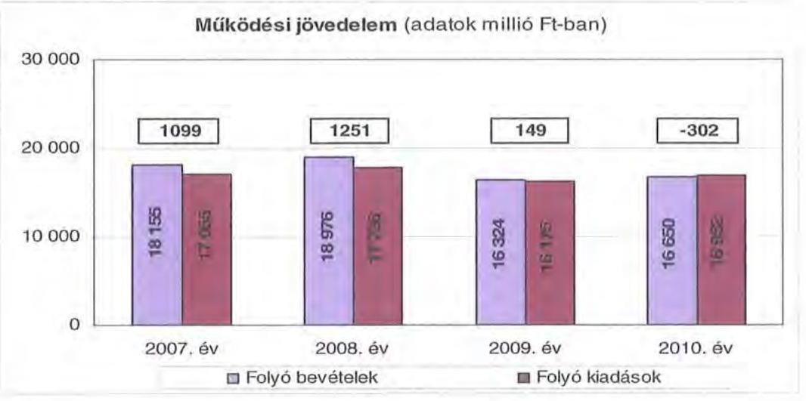

---

A folyó költségvetés egyenlege működési forrástöbblet volt, amely a 2007ben a folyó kiadások 6,4\%-át ( 1099 millió Ft-ot), a 2008-ban 7,1\%-át (1251 millió Ft-ot), a 2009-ben 0,9\%-át ( 149 millió Ft-ot) jelentette. A 2010-ben a folyó költségvetés egyenlege múködési forráshiány, a folyó kiadások 1,8\%-a (302 millió Ft) lett.

A múködési forráshiány finanszírozása folyószámlahitelből, előző évek tartalékainak felhasználásából, továbbá fejlesztési és múködési céllal kibocsátott kötvényből történt.

A folyószámlahitel napi átlagos állománya a 2007-2010. évek között több mint 4,5-szeresére ( 152 millió Ft-ról 698 millió Ft-ra) nőtt.

Az Önkormányzatnak a 2007. év végére egyrészt üzletrész értékesítéséből ${ }^{30}$ képződött tartalék, amely kizárólag az Önkormányzat kötelező feladatait szolgáló fejlesztési célra volt fordítható. Az Önkormányzat kimutatása szerint a 2006. évben fejlesztési célra 115 millió Ft-ot, a 2007. évben 122 millió Ft-ot, a 2008. évben pedig 77 millió Ft-ot használt fel. A 2009. évben forrásfelhasználás nem történt. A 2010. évben a Közgyűlés a 86/2010. (IX. 10.) számú határozatával engedélyezte az Önkormányzat által támogatott fejlesztési célokra való felhasználást is, amelyre 200 millió Ft-ot fordítottak. Az egyszeri üzletrész értékesítéséből származó bevétel működési célú felhasználását a Közgyűlés a 6/2011. (II. 18.) számú határozatával tette lehetővé. Az Önkormányzat kimutatása szerint 2011. március 31éig 150 millió Ft-ot használtak fel múködési célra. A vagyonelem értékesítéséből származó egyszeri bevételek múködési célú kiadások finanszírozására való fordítása a vagyon csökkenés folyamatát jelzi, egyidejúleg a pénzügyi egyensúly fenntarthatóságának kockázatát növeli.

Az Önkormányzat a 2007. évben kibocsátott kötvényből származó bevételt felhalmozási és múködési célokra, hitelkiváltásra több évre ütemezve használta fel ${ }^{31}$. A kötvényből átmenetileg szabad források és a befektetésükből realizált hozamok ${ }^{32}$ a 2007-2010. évek között költségvetési gazdálkodás során keletkező tartalék részét képezték.

Az Önkormányzat mérlegében kimutatott kötelezettségein ${ }^{33}$ belül a 2007-2010 közötti időszakban a rövid lejáratú kötelezettségek állománya $21 \%$ és $33 \%$ között mozgott. Az Önkormányzat 2007. december 31-én fennálló pénz és tőkepiaci kötelezettsége 4570 millió Ft-ról közel 1,4-szeresére 6188 millió Ft-ra nőtt a vizsgált időszak végére, a rövid lejáratú (folyószámla) hitel állományának emelkedése és a kötvénykibocsátás miatt.

Az Önkormányzat hosszúlejáratú hitelt 2007-2008. években vett fel, amelynek mérlegben kimutatott állománya a törlesztések miatt a vizsgált időszakban

[^0]
[^0]:    ${ }^{30}$ Az Önkormányzat a 103/2005. (IX. 23.) számú határozatával értékesítette a ZALATOUR Kft-ben lévő 100\%-os üzletrészét 1230 millió Ft-ért, amelyből a bevétel 2006-2007. években realizálódott.
    ${ }^{31}$ A kibocsátott 3057 millió Ft kötvénybevételből 2006 millió Ft-ot - 65,6\%-át - használt fel a 2010. évben és 2011. március 31-ig.
    ${ }^{32}$ Az Önkormányzat kimutatása szerint 2008. évtől 2011. március 31-éig 780 millió Ft bevételt realizáltak, amelyet teljes egészében múködési kiadásai fedezetére fordított.
    ${ }^{33}$ Passzív pénzügyi elszámolások nélküli

---

20,35\%-kal (240 millió Ft-tal) csökkent. Múködési célú hitelállománya 2009. évtől növekedett ${ }^{34}$. A 2007. évben kibocsátott kötvény törlesztése, beváltása 2011. évben kezdődik. Az Önkormányzat ezt első ízben 2011. április 30 -án teljesítette 320 ezer CHF összegben.

A rövid lejáratú kötelezettségek év végi állománya 2010-ben 2357 millió Ft-ot tett ki, amely 945 millió Ft-tal ( $66,9 \%$-kal) volt több a 2007. évi rövid lejáratú kötelezettségállománynál. A rövid lejáratú kötelezettségeknek a szállítói állomány 2007-ben 907 millió Ft-tal a $64,2 \%$-át, 2008-ban 920 millió Ft-tal a $69,7 \%$-át, 2009-ben az 1662 millió Ft-tal a $71,6 \%$-át, míg 2010-ben 1294 millió Ft-tal a $54,9 \%$-át adta. A szállítói kötelezettségek a vizsgált időszakban 907 millió Ft-ról 1294 millió Ft-ra, azaz közel másfélszeresére nőttek.

Az Önkormányzat pénzügyi kapacitása a 2007-2009. években pozitív, a 2010. évben negatív értéket mutatott. A nettó múködési jövedelem ${ }^{35}$ értéke a folyó költségvetési pozíció mellett az adott költségvetési év adósságtörlesztésének hatását is tükrözi.

Az Önkormányzat nettó múködési jövedelmének évenkénti alakulását az alábbi ábra szemlélteti:

Nettó müködési jövedelem alakulása (adatok millió Ft-ban)
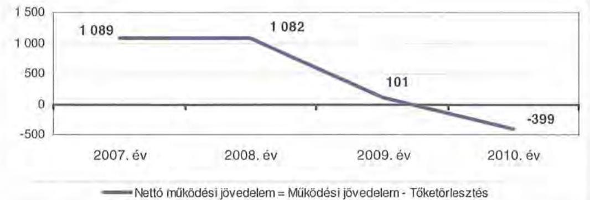

A folyó költségvetés egyenlegének és a tőketörlesztésre (hiteltörlesztés és forgatási és befektetési célú értékpapírok beváltása) fordított összegeknek évenkénti különbözete, vagyis a nettó múködési jövedelem 2007-ben 1089 millió Ft volt, addig 2010-ben már meghaladta a -399 millió Ft-ot. A pénzügyi kapacitás fo-

[^0]
[^0]:    ${ }^{34}$ A likvid hitelek esetén az elemi beszámolóban kimutatott hitelfelvétel 2009. évben 255 millió Ft, 2010. év végén 279 millió Ft volt. Ezzel szemben a mérlegben kimutatott rövidlejáratú hitelkötelezettség - a bankkivonattal egyezően - 421 millió Ft, illetve 700 millió Ft volt.
    ${ }^{35}$ Pénzügyi kapacitás

---

lyamatos romlását meghatározó mértékben a folyó bevételek és kiadások különbségéből származó működési jövedelem ${ }^{36}$ nagyarányú csökkenése okozta.

A 2007-2010. években az Önkormányzat felhalmozási költségvetésének egyenlege folyamatosan negatív összegű volt, amelyet a következő ábra szemléltet:
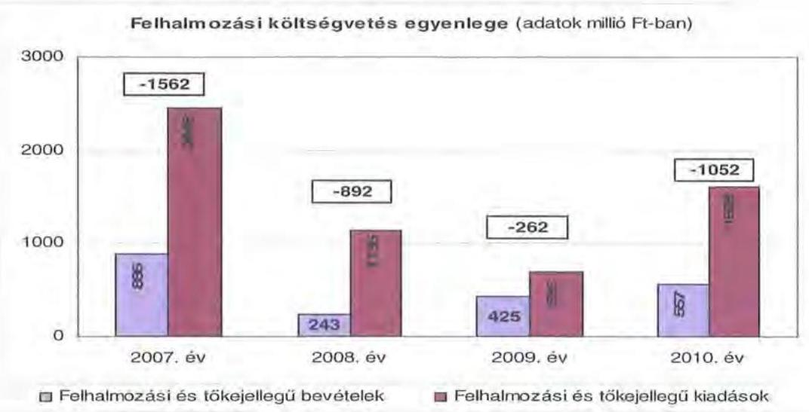

A felhalmozási forráshiánynak a felhalmozási és tőke jellegű kiadásokhoz viszonyított aránya 2007-ben 63,8\% (1562 millió Ft), 2008-ban 78,6\% (892 millió Ft) 2009-ben 38,1\% (262 millió Ft) 2010-ben 65,4\% (1052 millió Ft) volt.

A felhalmozási forráshiány finanszírozása rövid, illetve hosszú lejáratú hitelekből, kötvénykibocsátásból, továbbá a vizsgált időszak alatt képződött tartalékból - hasonlóan a múködési forráshiányhoz - történt.

Az Önkormányzatnak a CLF módszer szerint a folyó - és a felhalmozási költségvetésében ${ }^{37}$ a 2008. év kivételével - amikor 359 millió Ft bevételi többlet ${ }^{38}$ volt kimutatható - minden évben forráshiány jelentkezett (2007. évben 463 millió Ft, 2009-ben 113 millió Ft, míg 2010. évben már 1354 millió Ft).

[^0]
[^0]:    ${ }^{36}$ A 2007. évi 1099 millió Ft-ról a 2008. évi 151 millió Ft-os emelkedést követően 2009. évre 1102 millió Ft-tal csökkent, majd 2010. évre -302 millió Ft lett, amely azt jelentette, hogy ekkor az Önkormányzat folyó kiadásai meghaladták folyó bevételeit. Ezen túl az Önkormányzat tőketörlesztési kötelezettsége a 2007. évi 10 millió Ft-ról a 2010. évre 96 millió Ft-ra emelkedett úgy, hogy 2008-ban 169 millió Ft, míg 2009-ben 48 millió Ft volt.
    ${ }^{37}$ Finanszírozási múveletek nélküli (GFS) pozíció, amely figyelmen kívül hagyja a pénzforgalom nélküli bevételeket és kiadásokat.
    ${ }^{38}$ Ekkor a múködési (folyó) költségvetés többlete fedezte a felhalmozási költségvetés hiányát.

---

Az Önkormányzat finanszírozási múveletei egyenlegének 2007-2010. években alakulását a következő ábra szemlélteti:
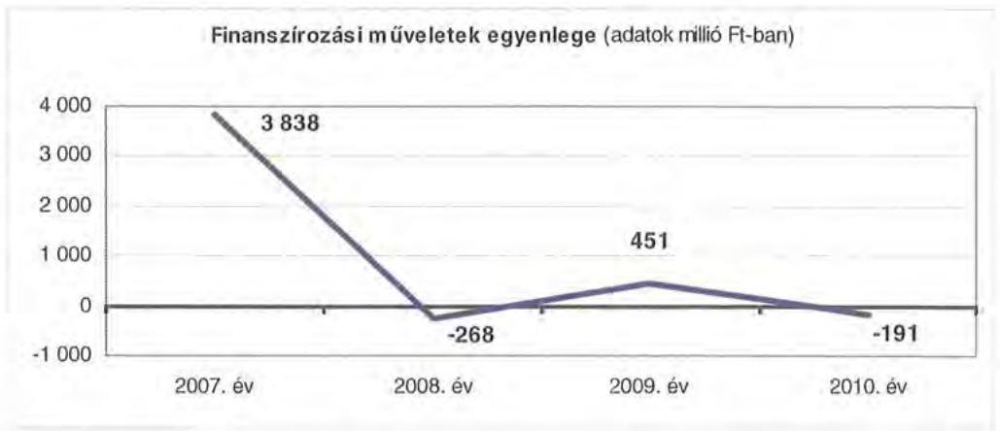

A finanszírozási többlet azt jelzi, hogy az éves költségvetések végrehajtása során szükség volt a pénzkészlet felhasználásán túl külső finanszírozás igénybevételére is. A finanszírozási célú műveleteket a vizsgált időszakban a jelentés 2/a. számú mellékletének 4.1-4.8 pontjai részletezik.

A vizsgált időszakban a passzív pénzügyi elszámolások nélküli kötelezettségek 5725 millió Ft-ról 8268 millió Ft-ra emelkedtek, amely együtt járt a kamatkiadások növekedésével. Ugyanakkor a szabad pénzeszközök befektetése révén a kapott kamatok folyamatosan meghaladták a fizetett kamatokat.

A 2007-2010 között az önkormányzat összesen 1869874 ezer Ft kamatbevételt számolt el, amely a teljes kamatráfordítás ( 400334 ezer Ft) 467,1\%-át tette ki.

A keletkezett jelentős kamatbevételeket azonban múködési kiadások fedezetére fordították, amely gazdálkodási, illetve a nem realizálódott árfolyamveszteségek miatt a kötvény beváltási, visszafizetési kockázatát jelenti.

Az Önkormányzat kamatbevételeinek és kamatkiadásainak alakulását a következő ábra mutatja:
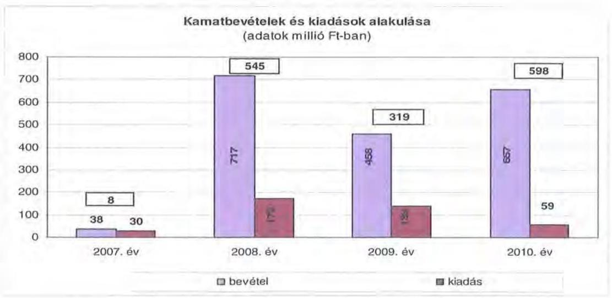

---

Az Önkormányzat zárszámadási rendeleteiben a múködési és fejlesztési hiányt/többletet a hagyományos költségvetési szerkezet alapján - amely figyelembe vette a pénzforgalmi bevételeken és kiadásokon túl a pénzforgalom nélküli bevételeket és kiadásokat is - mutatta be ${ }^{39}$, amelyről a jelentés 1. számú melléklete nyújt tájékoztatást. Az Önkormányzatnak hagyományos költségvetési szerkezet szerint a múködési- és a felhalmozási költségvetésében együttesen - az általunk alkalmazott CLF módszerrel megállapítottakkal szemben - minden évben bevételi többlet volt kimutatható (2007. évben 163 millió Ft, 2008ban 949 millió Ft, 2009-ben 468 millió Ft, míg 2010. évben már 518 millió Ft).

# 2.2. Az Önkormányzat bevételeinek alakulása 

Az Önkormányzat 2007-2010. évek között realizált - OEP támogatás nélküli főbb bevételi jogcímeinek számszaki adatait az alábbi táblázat részletezi és a grafikon mutatja be:
adatok ezer Ft-ban

| Megnevezés | 2007. év | 2008. év | 2009. év | 2010. év |
| :-- | --: | --: | --: | --: |
| illetékbevétel | 1632868 | 1925074 | 1654116 | 1137833 |
| Szja és állami támogatás |  |  |  |  |
| (OEP nélkül) | 4072372 | 4273395 | 3565843 | 2874983 |
| Egyéb saját bevétel | 2474544 | 2222151 | 2269502 | 3625373 |
| Összes müködési bevétel | $\mathbf{8} \mathbf{1 7 9} \mathbf{7 8 4}$ | $\mathbf{8 4 2 0} \mathbf{6 2 0}$ | $\mathbf{7 4 8 9 4 6 1}$ | $\mathbf{7 6 3 8 1 8 9}$ |

Az önkormányzat múködési bevételei OEP támogatás nélkül
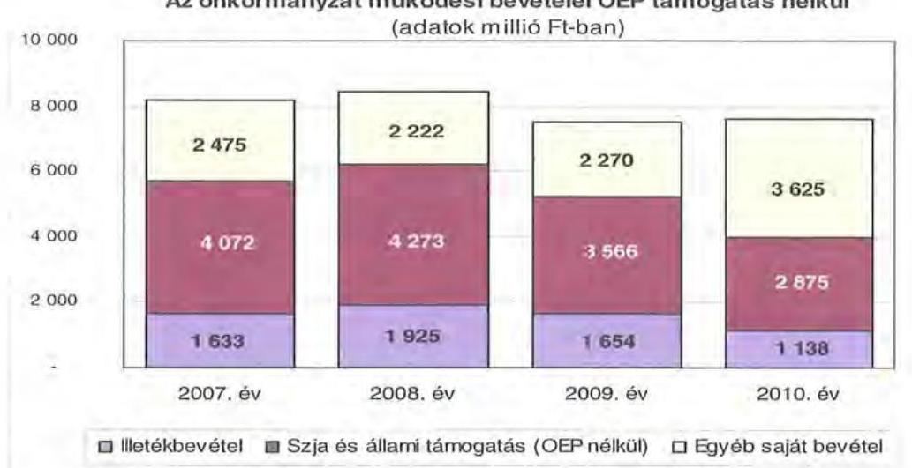

Az Önkormányzatnál az illetékbevétel a 2007. évben a 2006. évhez képest ${ }^{40}$ jelentősen, 457 millió Ft-tal ( $21,9 \%$-kal) csökkent. A csökkenésben szerepet játszott az Illetékhivatalnak - 2007. január 1-jétől - az APEH-hoz történő átszervezése is, miután az évente realizált illetékbevételekből (központi intézkedés következtében) évi $8,5 \%$ elvonásra került az adminisztrációs feladatokra. A beszedés költségeire elvont pénzösszeg minden évben kevesebb volt, mint amek-

[^0]
[^0]:    ${ }^{39}$ Nincs kötelező előírás a működési és fejlesztési hiány megállapításának módjára.
    ${ }^{40}$ A 2006. évben az illetékbevétel 2090173 ezer Ft volt.

---

kora költségvetési kiadást jelentett korábban az Illetékhivatal múködtetése ${ }^{41}$ az Önkormányzatnak.

Az Illetékhivatal múködtetésével kapcsolatos kiadások megszűnése és az adminisztrációs feladatokra visszatartott 8,5\% között 2007-ben 198 millió Ft pozitív különbözet jelentkezett, de a vizsgált időszakban jelentkező 457 millió Ft-os bevételcsökkenésnek ez csak a 43,4\%-át tette ki. Az illetékbevétel 2008-ban növekedett, amikor az előző évihez képest 292 millió Ft-tal (17,9\%-kal) nőtt. A 2008ról 2009-re 271 millió Ft-os ( $14,1 \%$-os) csökkenés következett be, majd a 2010. évben az előző́ évhez viszonyítva a csökkenés 516 millió Ft ( $31,2 \%$-os) volt. A 2006. évben realizált illetékbevételhez képest a 2010. évi illetékbevétel közel felére esett vissza, a csökkenés 952 millió Ft, azaz $45,6 \%$ volt.

Az átengedett szja és az állami támogatások együttes összege ${ }^{42}$ a 2008. évi 201 millió Ft-os ( $4,9 \%$-os) növekedést követően a központi támogatás kivonás hatására ${ }^{43}$ folyamatosan és jelentős mértékben csökkent. Az előző évihez képest 2009. évben 707 millió Ft-tal ( $16,6 \%$-kal), 2010. évben további 691 millió Ft-tal ( $19,4 \%$-kal) kapott kevesebb forrást az Önkormányzat az államtól ezeken a jogcímeken. A 2010. évre az átengedett szja és az állami támogatások együttes összege a 2007. évinek 70,6\%-a, 2875 millió Ft volt. A változást a normatíváknak a járulékváltozások miatti központi csökkentése, valamint a megyei önkormányzatokat érintő forráselvonás mellett, az ellátotti létszám visszaesése idézte elő.

Az egyéb saját múködési bevételek közel 60\%-a az intézményi múködési bevételekből ${ }^{44}$ realizálódott a vizsgált időszakban. Az intézményi múködési bevételek jogcímen realizált bevételek összege a 2007. évről a 2009. évre összesen 252 millió Ft-tal ( $15,6 \%$-kal) csökkent ${ }^{45}$, majd 2009. évről a 2010. évre 135 millió Ft-os ( $9,9 \%$ ) növekedés történt, amelyet nagyrészt az Áfa bevételek ${ }^{46}$ növekedése, illetve a térítési díjak (szociális ellátások, étkezés) növekedése eredményezett. Az egyéb saját múködési bevételek átlagos közel 20\%-át a támogatásértékű működési célú bevételek (OEP támogatás nélküli rész) adták, amelyek jellemzően nem beruházási célú EU projektek, egyéb pályázatok elnyert támogatási forrásai és más önkormányzatok intézmények múködési támogatásaként átadott forrásai voltak.

A társadalombiztosítási alapból származó bevétele a Kórháznak a 2007. évben 9110 millió Ft volt, amely - a 2009. évi 8746 millió Ft-os mélypontot követően a 2010. év végére 9539 millió Ft-ra ( $4,7 \%$-kal) emelkedett.

[^0]
[^0]:    ${ }^{41}$ A 2006. évben az Illetékhivatal múködtetésére 350 millió Ft-ot fordítottak. Az éves illetékbevétel 8,5\%-a 2007-ben 152 millió Ft, 2008-ban 179 millió Ft, 2009-ben 154 millió Ft, 2010-ben 106 millió Ft volt.
    ${ }^{42}$ figyelembe véve a költségvetési kiegészítések és visszatérülések értékét is
    ${ }^{43}$ a 2007. évi bázishoz képest
    ${ }^{44}$ amely elszámolt értéke 2007. évben 1617 millió Ft, a 2008. évben 1436 millió Ft, a 2009. évben 1365 millió Ft és a 2010. évben 1499 millió Ft volt
    ${ }^{45}$ feladat átszervezések, feladat átadás miatt
    ${ }^{46}$ a fordított Áfa elszámolás miatt

---

Az Önkormányzat 2007-2010. évek között realizált felhalmozási bevételei a vizsgált időszakban a következőképpen alakult (a táblázatban szereplő adatok ezer Ft-ban vannak):

| Megnevezés | 2007. év | 2008. év | 2009. év | 2010. év |
| :-- | --: | --: | --: | --: |
| Tárgyi eszköz értékesítés | 52519 | 109857 | 210164 | 28559 |
| Állami támogatás | 1241033 | 555667 | 39832 | 35907 |
| Átvett pénzeszköz | 108136 | 34407 | 14716 | 57916 |
| Egyéb felhalmozási bevétel | 748879 | 806263 | 510051 | 504294 |
| Felhalmozási tartalék | 306957 | 369149 | 368488 | 1379498 |
| Összes felhalmozási bevé- |  |  |  |  |
| tel | $\mathbf{2 4 5 7 5 2 4}$ | $\mathbf{1 8 7 5 3 4 3}$ | $\mathbf{1 1 4 3 2 5 1}$ | $\mathbf{2 0 0 6 1 7 4}$ |

Az Önkormányzatnak tárgyi eszközértékesítésből - a 2009. év kivételével, amikor e tételen felhalmozási bevételként 210 millió Ft-ot (részaránya 18,4\%) realizáltak - nem származott számottevő bevétele.

A vizsgált 2007-2010. években összesen tárgyi eszközértékesítés címen 401 millió Ft bevételt realizált az Önkormányzat, amely az itt kimutatott összes felhalmozási bevétele $5,4 \%$-át jelentette. A 2008. évben egy üzletrész és két ingatlan értékesítéséből 83 millió Ft bevétele keletkezett, amely a tárgyi eszközértékesítés 75,6\%-a. A 2009. évben ingatlanok, önkormányzati lakások, illetve egy intézmény 9 db gépkocsijának az értékesítéséből realizálták a kimutatott bevételt. A 2010. évben a tárgyi eszközértékesítés $91 \%$-át a Hivatal realizálta közel 26 millió Ft összegben termőföld, kisbusz és ingatlan értékesítésből.

Az Önkormányzat minden esetben, határozatban döntött az értékesítésre kijelölt ingatlanok köréről.

Állami támogatás címen felhalmozási bevétele a 2007. évben az Önkormányzatnak egyrészt ( $54,4 \%$-ban) a címzett támogatással megkezdett Kórház épületének rekonstrukciója és bővítése III. ütem kapcsán 660 millió Ft összegben, másrészt 553 millió Ft összegben a kistérségi idősellátó modell (idősek otthonának fejlesztése, rekonstrukciója) megvalósítása kapcsán keletkezett. A 2008. évben címzett támogatásból ( 522 millió Ft) végezték el a kistérségi idősellátó modell (idősek otthonának fejlesztését, rekonstrukcióját) megvalósítását. A 2009. és 2010. években az állami támogatások $68 \%$-a központosított előirányzat volt.

Az államháztartáson kívülről átvett pénzeszközökben a szakképző iskolák által szakképzési hozzájárulás címén átvett fejlesztési források szerepeltek. Az egyéb felhalmozási bevételek tartalmazták a privatizációs bevételeket, az osztalék és hozam bevételeket, a kamat és egyéb folyó bevételeket, illetve támogatásértékú felhalmozási bevételeket. Ez utóbbi bevételek az EU, illetve pályázatokon elnyert központi forrásból származó támogatások voltak. A 2007. évben egyéb felhalmozási bevételek $82,9 \%$-a osztalék, részesedés bevétel ${ }^{47}$ volt, míg 2008-2009. években $85,3 \%$ és $56,5 \%$-ot a kibocsátott kötvény és az egyéb szabad pénzeszközei lekötéséből származó felhalmozási kamatbevételek

[^0]
[^0]:    ${ }^{47}$ Ezen a címen a 2005. évben értékesített ZALATOUR Kft üzletrész 2007. évben esedékes részlete szerepelt 621 millió Ft összegben.

---

(688 millió Ft és 288 millió Ft) jelentettek. Az évenkénti nagy összegű felhalmozási tartalék a kibocsátott kötvény felhalmozási részének betétként való lekötéséből származott.

# 2.3. Az Önkormányzat kiadásainak alakulása 

Az Önkormányzat 2007-2010. évek között realizált múködési kiadásai főbb jogcímek szerinti bontásban a következők voltak (az adatok ezer Ft-ban szerepelnek a táblázatban):

| Megnevezés | 2007. év | 2008. év | 2009. év | 2010. év |
| :--: | :--: | :--: | :--: | :--: |
| Müködési kiadások | 17024786 | 17564784 | 16063490 | 16910499 |
| Múködési kiadások (kamat kiadás nélkül) | 17019043 | 17555984 | 16036252 | 16903462 |
| Kamatkiadás | 5743 | 8800 | 27238 | 7037 |
| Személyi juttatások | 7637230 | 7551973 | 7019404 | 7078919 |
| Munkaadókat terhelő járulékok | 2413459 | 2351654 | 2106700 | 1845372 |
| Dologi kiadások | 6513420 | 7164722 | 6423718 | 7480481 |
| Egyéb folyó kiadások | 75933 | 61026 | 77818 | 163837 |
| Támogatások, elvonások, egyéb folyó átutalások ebből: múködési célú pénz eszköz átadás | 128590 | 150334 | 146034 | 127899 |
| Előző évi múködési célú pénzmaradvány átadás, visz szafizetés | 111500 | 114891 | 120075 | 91723 |
|  | 134678 | 60220 | 125854 | 83596 |

Az Önkormányzat müködési kiadása 2007. december 31-ről 2010. december 31-re 0,7\%-kal csökkent ( 17025 millió Ft-ról 16910 millió Ft-ra).

Az Önkormányzat 2010-ben a múködési költségvetéséből 8924 millió Ft-ot ( $52,8 \%$-át) személyi juttatásokra és a munkaadókat terhelő járulékokra fordította, az üzemeltetést, intézményfenntartást biztosító dologi kiadásokra 7480 millió Ft ( $44,2 \%$ ) jutott. A múködési kiadásokon belül a személyi juttatások és járulékok aránya a vizsgált időszakban folyamatosan csökkent a 2007. évi 59\%-ról, a 2010. évi részarányuk 52,8\% volt.

A járulékokkal növelt személyi juttatások 2008-ban és 2009-ben 147 millió Fttal ( $1,5 \%$-kal), illetve 778 millió Ft-tal ( $7,8 \%$-kal) csökkentek az előző évhez képest, míg a 2010. évben 202 millió Ft-os ( $2,2 \%$-os) volt a csökkenés. A 2010. évben a járulékokkal növelt személyi juttatások a 2007. évben e címen teljesített kiadásoknál 1126 millió Ft-tal ( $11,2 \%$-kal) voltak alacsonyabbak.

A dologi kiadások az Önkormányzatnál 2010. évben a 2007. évi szintnél 967 millió Ft-tal ( $14,8 \%$-kal) voltak magasabbak. A dologi kiadások szintje hullámzó volt. A 2008. évben 651 millió Ft-tal ( $10 \%$-kal) az inflációt meghaladó mértékben ${ }^{48}$ emelkedtek. A 2009. évben 741 millió Ft-tal ( $10,3 \%$-kal) alatta maradtak az előző évinek ${ }^{49}$. A 2010. évben 1057 millió Ft-tal ( $16,4 \%$-kal) nőtt az

[^0]
[^0]:    ${ }^{48}$ KSH fogyasztói árindex 6,1\%
    ${ }^{49}$ az infláció 2009-ben 4,2\% volt

---

előző év dologi kiadásokhoz képest, itt a növekedés üteme szintén az inflációt meghaladó ( $4,9 \%$ ) volt. A vizsgált időszak alatt bekövetkezett növekedés ellentételezése a központi forráselosztásban nem jelentkezett. Fedezetét az Önkormányzat saját döntése alapján a végrehajtott kiadáscsökkentő, bevételnövelő intézkedések mellett, kötvény működési célú felhasználásából és rövid lejáratú hitelekből biztosította.

A múködési célú pénzeszközátadások nagysága 2007. évről 2008. évre 112 millió Ft-ról 115 millió Ft-ra, azaz 3\%-kal nőtt, amely 2009. évben az előző évhez képest további 120 millió Ft-ra ( $4,5 \%$-kal) emelkedett. A 2010. évben a bevételek jelentős csökkenése miatt a múködési célra átadott pénzeszközöket 92 millió Ft-ra ( $23,6 \%$-kal) csökkentette a Közgyűlés. A múködési célú pénzeszközátadások csökkentése a 2010. évre már 20 millió Ft-tal ( $17,7 \%$-kal) csökkent a 2007. évi szinthez képest.

Az Önkormányzat müködési kiadásaiban alig változott a kórházi kiadások súlya ( $55,6 \%$ és $58,7 \%$ között volt) az egyéb fenntartott intézményekben felmerülő múködési kiadásokhoz képest. A Kórházon kívüli intézményekben teljesített múködési kiadások összege 2007. évben 7565 millió Ft volt, amely az összes múködési kiadás $44,5 \%$-át tette ki, ez az arány 2010. év végére 7100 millió Ft-ra ( $44,1 \%$-ra) csökkent. A Kórház nélküli kiadásokban jelentkező tendenciák a közoktatási, szociális és gyermekvédelmi, igazgatási és egyéb intézményekben biztosított feladatellátást jellemzik.

Az Önkormányzatnak a Kórházon kívüli intézményeiben a múködési kiadások a vizsgált időszakban a következőképpen alakultak (adatok ezer Ft-ban szerepelnek):

| Megnevezés | 2007. év | 2008. év | 2009. év | 2010. év |
| :-- | --: | --: | --: | --: |
| Müködési kiadások | 7564975 | 7247575 | 6957408 | 7048369 |
| Múködési kiadások (kamat kiadás nélkül) | 7559232 | 7238775 | 6930170 | 7041296 |
| Kamatkiadás | 5743 | 8800 | 27238 | 7073 |
| Személyi juttatások | 4139171 | 3931510 | 3667305 | 3693787 |
| Munkaadókat terhelő járulékok | 1280974 | 1202653 | 1062270 | 932323 |
| Dologi kiadások | 1684312 | 1632767 | 1723039 | 1936833 |
| Egyéb folyó kiadások | 75933 | 61026 | 77818 | 163837 |
| Támogatások, elvonások, egyéb folyó át- |  |  |  |  |
| utalások | 128431 | 134544 | 137160 | 107562 |
| ebből: múködési célú pénzeszköz átadás | 111470 | 114891 | 120075 | 85650 |
| Előző évi múködési célú pénzmaradvány |  |  |  |  |
| átadás, visszafizetés | 134678 | 60220 | 125854 | 83596 |

Önkormányzati szinten a 2007. évhez képest a 2010. évben a múködési kiadások 114 millió Ft-os ( $0,7 \%$-os) csökkenése volt megfigyelhető, addig a Kórház nélkül intézmények esetében ugyanebben az időszakban 517 millió Ft-ot jelentő ( $6,8 \%$-os) csökkenés jelentkezett, mivel a járulékokkal növelt személyi juttatások csökkenése a többi intézménynél intenzívebb ${ }^{50}$ volt. A Kórház nélküli működési kiadások $65,2 \%$-át ( 4626 millió Ft) tették ki a személyi juttatások és

[^0]
[^0]:    ${ }^{50}$ A csökkenés az intézményeknél 794 millió Ft (14,6\%), míg a Kórháznál 332 millió Ft $(7,2 \%)$ volt.

---

járulékaik a 2010. évben, a dologi kiadások (1937 millió Ft) aránya pedig a múködési kiadások $27,3 \%$-a volt.

A kórházon kívüli intézményekben 10,8\%-kal (445 millió Ft) csökkentek a személyi juttatások a 2007. évről a 2010. évre, amelynek az önkormányzati szintű mutatónál ( $7,3 \%$-os) magasabb alakulása azt tükrözi, hogy az egészségügyi ágazatban a létszám és a bérek csökkenése nem mutatott hasonlóságot a más ágazati feladatokat ellátó intézményekével.

A vizsgált időszakban a munkaadókat terhelő járulékok jelentős ${ }^{51}$ csökkenése következett be, amely egyrészt a kifizetett személyi juttatások, másrészt a járulékok mértékének csökkenésével volt összefüggésben. A járulékok csökkenése miatt felszabaduló forrásokat azonban a kormányzat az önkormányzati alrendszernek nyújtott állami támogatásokból levonásba helyezte, így a járulékcsökkenés az Önkormányzatnál érdemi megtakarítást nem okozott, mivel állami forráscsökkenéssel járt együtt.

Az Önkormányzat nem egészségügyi intézményeinél realizált dologi kiadások az önkormányzati szintű dologi kiadások hullámzását nem követte, a 2008. évtől emelkedett. Volumenében mindössze 304 millió Ft növekedést jelentett 2010. évre. Az Önkormányzat költségvetési kiadásainak több mint felét realizáló Kórház adatai nélkül az intézmények dologi kiadásai 2008. évben 52 millió Ft-tal ( $3,1 \%$-kal) alatta maradtak az előző évinek, 2009-ben 90 millió Ft-tal ( $5,5 \%$-kal) emelkedtek, majd 2010. évben ismét emelkedtek 214 millió Ft-tal $(12,4 \%$-kal).

A Kórháznál - az önkormányzati összes dologi kiadáshoz hasonlóan - hullámzó tendencia mutatkozott a teljesített dologi kiadások alakulásában. A 2008ban $14,6 \%$-kal haladta meg az előző évit, ennek mértéke 703 millió Ft volt. A 2009. évben a többi intézménynél erőteljesebben, 831 millió Ft-tal ( $15 \%$-kal) csökkent, majd 2010. évben ismét $17,9 \%$-os növekedés volt, amely nominálisan 843 millió Ft-ot jelentett.

A Kórház OEP finanszírozása hullámzó volt, likviditási gondok jelentkeztek az évek között, nem tudta kifizetni a tárgyévben jelentkező dologi kiadásainak egy részét, így azzal a szállítói állománya emelkedett, a dologi kiadása viszont csökkent. A következő évben pedig több forráshoz jutott kifizette szállítóit, így dologi kiadásai emelkedtek.

Az Önkormányzat 2007-2010. évek között a Kórház működési kiadásaihoz ${ }^{52}$ 814 millió Ft-tal járult hozzá, amelyet központosított állami támogatásokból fedezett. A kórházi múködési támogatások a központi bérpolitikai intézkedésekhez, a létszámcsökkentésekhez kapcsolódó többletköltség fedezetéhez, a 13. havi juttatások kifizetéséhez, kereset kiegészítésekhez kapcsolódtak. Ezeknek a

[^0]
[^0]:    ${ }^{51}$ Önkormányzati szinten 2010. évi teljesítés 1845 millió Ft 23,5\%-os csökkenést jelent a 2007. évi adatához képest. A Kórház nélküli intézmények esetén a 2007. évi 1281 millió Ft-tal szemben 2010. évben 349 millió Ft-tal kevesebbet ( $27,2 \%$-os csökkenés) teljesítettek.
    ${ }^{52}$ önkormányzati támogatás formájában

---

kiadásoknak a fedezete így nem OEP támogatás, hanem egyéb, az Önkormányzat által igénybevett központi forrás volt.

A kórházak múködésének finanszírozására az OEP támogatás szolgál, míg a fejlesztési kiadások fedezetét az önkormányzatoknak kell biztosítani intézményeik számára. A múködési célú önkormányzati támogatáson felül 2007-2010. évek között a Kórház-fejlesztési célra forrást nem kapott, mivel a fejlesztéseket a Hivatal bonyolította.

Az Önkormányzat a 2007-2010. években a Kórház fejlesztésére 2151 millió Ft-ot költött, teljesített beruházási kiadásként, amely az összes fejlesztési kiadása 44,5\%-a volt. Ennek legnagyobb hányada (58,7\%-a) 2007. év előtt indult Kórház rekonstrukció III. üteme, amelyre a teljesített kiadás 1263 millió Ft volt. Ehhez 660 millió Ft hazai forrást használtak fel. Egészségügyi gép- müszer beszerzésre az Önkormányzat 747 millió Ft-ot (34,7\%) költött a vizsgált időszak alatt. A 2010. évben indult az SO1 szintű sürgősségi osztály kialakítása, amelynek tervezett bekerülési költsége 711 millió Ft (ennek $84,9 \%$-a uniós forrás), ebből a vizsgált időszakban 44 millió Ft kiadást teljesítettek. A 2011. évben indult a struktúraváltoztatást támogató infrastruktúrafejlesztés a fekvőbeteg szakellátásban projekt, amelynek tervezett bekerülési költsége 4782 millió Ft (ennek 88,2\%-a uniós forrás), ebből az előkészítéshez kapcsolódóan a vizsgált időszakban 96 millió Ft kiadást teljesítettek

A támogatások évenkénti alakulását a következő grafikon mutatja be:
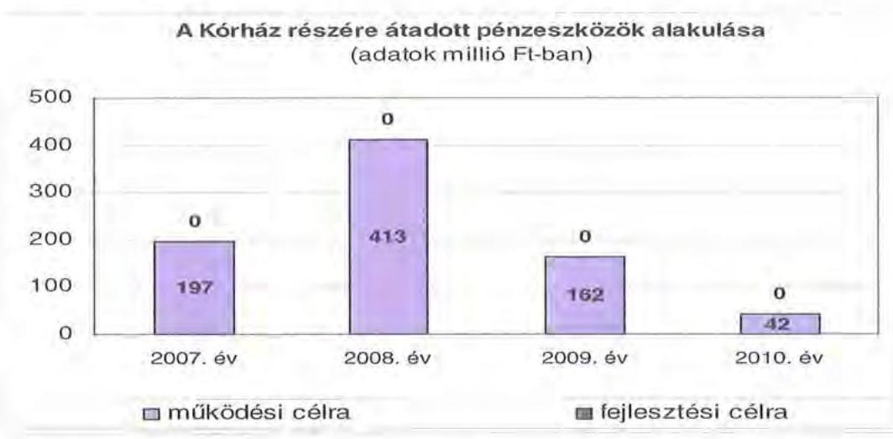

Az Önkormányzat müködési és felhalmozási költségvetési kiadásainak aránya váltakozott 2007-2010. évek között. A felhalmozási kiadások aránya $12,7 \%, 6,9 \%, 4,7 \%$, majd $8,9 \%$ volt.

---

A kiadások összetételének változását a következő grafikon szemlélteti:
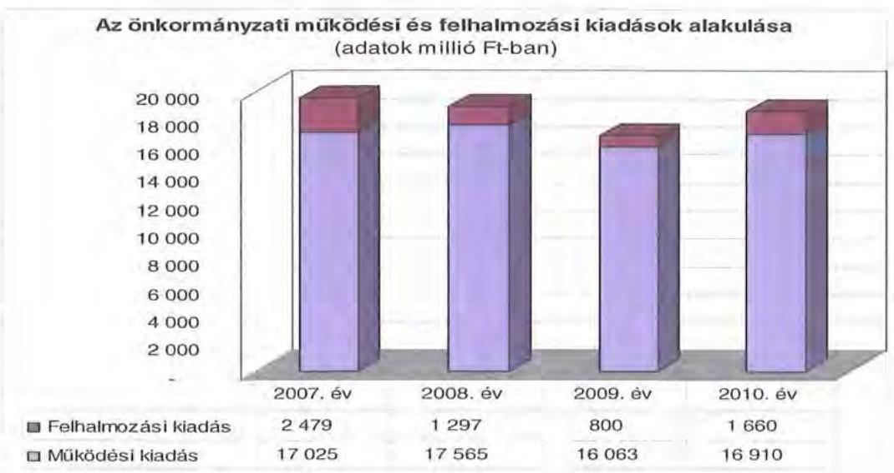

A 2007-2010. években a 10 millió Ft teljes bekerülési költség feletti beruházások és felújítások száma 33 db volt, a 10 millió Ft alatti fejlesztésekkel (melyek aránya az összes beruházási kiadáson belül 10,6\%) együtt 4838 millió Ft kiadást számoltak el, 2011-ben 10 uniós projekt magvalósítása van folyamatban.

Ezen időszakban a három legmagasabb bekerülési költségű beruházások az alábbiak voltak:

- a 4782 millió Ft teljes bekerülési költségű „Struktúraváltozást támogató infrastruktúra-fejlesztés a fekvőbeteg szakellátásban" projekt TIOP támogatással valósul meg. A vizsgált időszakban a teljesített kiadás 96 millió Ft volt, a 2010. évet követő időszakra vállalt kötelezettség 4686 millió Ft, amelyből uniós támogatással 4217 millió Ft-ot terveznek teljesíteni, a fennmaradó 469 millió Ft önrészt kötvény beváltásából tervezik finanszírozni;
- a 2006. évben indult „Zala Megyei Kórház rekonstrukció III. üteme" címzett támogatással valósult meg. A 2006. évig 345 millió Ft összeggel végezték el a fejlesztést, a 2007. évre 1263 millió Ft beruházási összeget fordítottak, amelyből 660 millió Ft-ot címzett támogatásból fedeztek;
- az „Idősek Otthona fejlesztés, rekonstrukció Zalabaksa, Szepetnek, Sármellék községekben" címzett támogatással valósult meg. A 1407 millió Ft összegű beruházásból 2006. évben 62 millió Ft-ot teljesítettek. A beruházási kiadásból a 2007-2008. években 553 millió Ft-ot, illetve 522 millió Ft-ot címzett támogatásból biztosítottak.

Az Önkormányzat fejlesztéseivel 2010. évet követő időszakra vállalt kötelezettsége 5613 millió Ft, amelynek 89,3\%-át (5012 millió Ft összegben) uniós forrás-

---

ból, a fennmaradó 601 millió Ft-ot a kötvényük fejlesztési forrásrészéből kívánják fedezni ${ }^{53}$.

Az Önkormányzat fejlesztési tevékenysége a pályázati kiírások által nagyban befolyásolt. A felhalmozási kiadások önrészének forrásait is fejlesztési hitelekből és felhalmozási célú kötvénykibocsátásból finanszírozta.

# 3. KÖTELEZETTSÉGEK BEMUTATÁSA 

### 3.1. A pénzintézetek felé fennálló kötelezettségek alakulása

Az Önkormányzat pénzintézeti kötelezettségeinek állománya 2006. december 31-től 2010. december 31-ig 13,5 szeresére, 458 millió Ft-ról 6188 millió Ft-ra nőtt. Fennálló pénzintézeti kötelezettségei kötvény kibocsátásából ${ }^{54}$, hosszúlejáratú hitel igénybevételéből, valamint folyószámla hitelek igénybevételéből keletkeztek. A hiteleknél közbeszerzési eljárás keretében, a kötvénykibocsátásnál három bank ajánlata közül történt meg a legkedvezőbb ajánlatot nyújtó pénzintézet kiválasztása. Az Önkormányzat pénzintézeti kötelezettségvállalásai három bank között megosztva jelentkeztek.

Az Önkormányzat pénzintézeti kötelezettségei állományának alakulását az alábbi ábra szemlélteti:
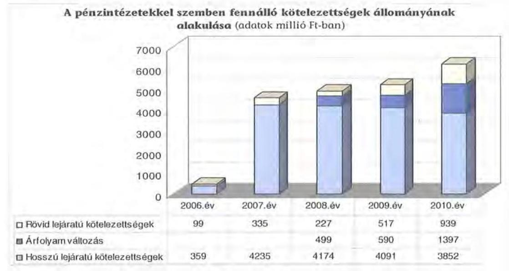

A devizában kibocsátott kötvénykötelezettség év végi könyvviteli mérleg szerinti értékének meghatározásakor az árfolyamváltozás miatti év végi értékeléseket a 2007-2010. évek között elvégezték az Önkormányzatnál. A 2007. évben a 20 millió CHF névértékben kibocsátott kötvény év végi mérleg szerinti értékéhez

[^0]
[^0]:    ${ }^{53}$ A 2010. év utáni kötelezettség-vállalások forrásösszetételében szereplő terv és várható tényadatok között eltérést nem mutatott ki az Önkormányzat.
    ${ }^{54}$ ZALA MEGYE I. kötvénysorozat 1000 CHF névértékben, 20000 db számban 20000000 CHF össznévértékben került kibocsátásra

---

(3057 millió Ft) képest a 2010. évben 4454 millió Ft-ra nőtt, ami 46\%-os (1397 millió Ft) növekedést jelentett a kibocsátáskori kötelezettséghez képest. A forint svájci frankhoz viszonyított árfolyamváltozása, valamint a változó kamatmérték miatt az Önkormányzat számára a kötvény visszavásárlása kockázatot jelent.

Az Önkormányzat pénzintézeti kötelezettségvállalásaira minden esetben közgyűlési döntés alapján került sor. A kötelezettségvállalásból származó források felhasználási céljait meghatározták. Az Önkormányzat a kötvény visszavásárlásának kamat és tőkefizetési kötelezettségének fedezetét, forrását nem jelölte meg, a kötvénykibocsátást jóváhagyó határozatában e kötelezettségek költségvetésben való megtervezését vállalta. Bemutatta a teljes futamidőre vonatkozó tőkefizetési kötelezettségét, a kamat \%-os mértékének változását, azonban a teljes futamidő várható kamat fizetési kötelezettségeinek bemutatását nem tartalmazta. A hosszúlejáratú hitel visszafizetését az Önkormányzat és a Kórház közösen vállalta, a forrását konkrétan nem jelölte meg és az előterjesztés nem tartalmazta a teljes futamidőre eső tőke- és kamatfizetési kötelezettségeinek részletezését.

A Közgyűlés Pénzügyi Bizottsága ${ }^{55}$ javasolta a Közgyűlés elnökének a kibocsátott kötvény kezelésével kapcsolatban Pénz- és Tőkepiaci Tanácsadó Testület létrehozását.

Feladatának a devizaalapú kötvény tervezett igénybevételekor és a kamatok fizetésekor az árfolyamváltozásokból adódó lehetőségek kihasználását, maximális nyereség, illetve minimális veszteség elérését határozta meg. Célul tűzte ki a kötvénykibocsátással kapcsolatban felmerülő adósságállomány optimalizációját, amelynek keretében a teljes adósságszolgálat felülvizsgálata szerepelt a futamidő, törlesztési szerkezet, kamat, devizanem és a kamatfelár tekintetében. A CHF alapú kötvény kibocsátása miatt felmerülő kamat- és árfolyamkockázat kezelése, a piaci várakozások és azok hatásainak figyelembevételével hosszabb távú stratégia meghatározása, a devizaügyletek megkötése előtt az operatív döntések meghozatalához a javaslattételt szerepeltették. A Pénz- és Tőkepiaci Tanácsadó Testület nem ülésezett, a tagoknak a devizaügyletek megkötése előtt a pénzügyi osztályvezető e-mailben adott tájékoztatást, amelyre a tagok megfogalmazták észrevételeiket, javaslataikat. Hosszabb távú stratégia meghatározására nem került sor. Döntéseiket a bankok ajánlatainak összevetésével alapozták meg.

Az előterjesztések tartalmazták az adósságszolgálati korlát bemutatását, a Közgyűlés döntéseit ennek figyelembevételével hozta meg. Az Önkormányzat adósságot keletkeztető kötelezettségvállalásának felső határát a 2007- 2010. években nem lépte túl.

A 2011. év március 31-két követően, a Közgyűlés 2011. április 28-i ülésére készült előterjesztésben 500 millió Ft fejlesztési célú hitel felvételére és a folyószámlahitelkeret 1200 millió Ft összegben történő meghatározására tettek javaslatot. Az adósságszolgálati korlátot a 700 millió Ft összegű folyószámlahitel 2010. évi záró állománya nélkül mutatták be. A jogszabályi előírás szerint ezen kötelezettséget is figyelembe kell venni, azonban tényleges kötelezettségnövekedés nem történt. A pénzügyi helyzetelemzés ideje alatt a folyószámla hitelkeret összegének módo-

[^0]
[^0]:    ${ }^{55}$ a 20/2008. (II. 28.) PB határozatában

---

sítására 800 millió Ft összegben történő meghatározására készítettek előterjesztést, és a hitelképességi korlát kiszámításánál a folyószámlahitel záró állományát figyelembe vették.

Az adósságot keletkeztető kötelezettségvállalások teljesítésének (MFB hitel és kamata törlesztése) az Önkormányzat a kötvényből származó pénzeszközök felhasználásával tudott eleget tenni.

Az Önkormányzat 2010. december 31-én CHF-ben fennálló adósságot keletkeztető kötelezettségvállalása az alábbi volt:

| Megnevezés | Kibocsátás, illetve szerződéskötés időpontja | Összeg | Kibocsátási, vagy lehivási árfolyam | Kamat (referencia kamat + kamatfelár) | Felhasználás célja: |
| :--: | :--: | :--: | :--: | :--: | :--: |
| ZALA MEGYE I. | 2007.12.21 | 20000000 CHF | 152,84 | 6 havi CHF   LIBOR $+0,49 \%$ | Fejlesztési, felújítási pályázatok önrészéhez, hitelek kiváltása, múködési kiadások finanszírozása |

A ZALA Megye I kötvény ellenértékének 15,2\%-át (466 millió Ft) felhalmozási kiadásokra 12,2\%-át ( 373 millió Ft) fejlesztési kölcsön és pályázati támogatások megelőlegezésére, $32,7 \%$-át ( 998 millió Ft) múködési célokra, $5,5 \%$-át ( 169 millió Ft) felújításokra és adósságszolgálatra használta fel az Önkormányzat. A kötvény 2011. március 31-i záró állománya 10255033 CHF , és 1,4 millió Ft volt.

Az Önkormányzat 2010. december 31-én forintban fennálló adósságot keletkeztető kötelezettségvállalása a következő volt:

| Megnevezés | Kibocsátás idöpontja | Összeg | Kamat (referencia kamat+ kamatfelár) | Felhasználás célja: |
| :--: | :--: | :--: | :--: | :--: |
| Hosszú lejáratú hitel | 2006.október 2. | 1178000 Ft | 3 havi   EURIBOR+   $1,1 \%$ | Kórház rekonstrukció III. ütem |

A hosszúlejáratú hitelét a címzett támogatással megvalósuló kórházrekonstrukció III. ütem saját erő kiváltására, DSA készülékek cseréjére, laborfejlesztésre használta fel.

Az Önkormányzat a CHF-ben fennálló pénzintézeti kötelezettségéből a vizsgált időszakban 2010. december 31-ig tőkét nem törlesztett, 1215200 CHF (202,2 millió Ft) kamatot, valamint 6 millió Ft egyéb költséget ${ }^{56}$ fizetett. A HUF-ban fennálló hosszúlejáratú kötelezettsége után 144 millió Ft tőkét és 164 millió Ft kamatot fizetett.

[^0]
[^0]:    ${ }^{56}$ A kötvények esetében jegyzési garanciavállalási díj címén 6 millió Ft-ot határoztak meg, amelyet a bank 2007. december 31-ig szakképzési hozzájárulás címén átadott az önkormányzat által fenntartott intézmények számára.

---

Az Önkormányzat 2010. december 31-én fennálló hosszúlejáratú pénzintézeti kötelezettségeinek várható jövőbeni a teljes futamidőre vonatkozó tőke-, ka-mat- és egyéb fizetési kötelezettsége - az utolsó fizetési kötelezettség alapját képező teljes (alapkamat és kamatfelár) kamat- és egyéb szerződéses kondíciókkal számolva - 2011-2013. évek között 350 millió Ft és 2664205 CHF, a 2014. évtől pedig 805 millió Ft és 18875456 CHF .

Az árfolyamváltozás hatása is befolyásolja a kötelezettségek alakulását, azonban annak mértéke előre pontosan nem határozható meg, csak várakozásokon alapuló tendenciák jelezhetők. A Számv. tv. 60. § (4) bekezdése meghatározza, hogy az árfolyam különbözetet év végén a kötelezettségek vagy követelések között a könyvviteli mérlegben nyilván kell tartani, azonban az árfolyam különbözet valójában nem realizált. Annak megítéléséről, hogy a devizában kibocsátott kötvényért kapott forinthoz képest a kötvény visszavásárlásakor jelentkező forint kötelezettség többletkiadást (árfolyamveszteség) vagy megtakarítást (árfolyamnyereség) eredményez a futamidő végén, a teljes kötelezettség rendezését követően lehet véleményt mondani. Mindaddig, amíg törlesztési kötelezettség nem áll fenn (türelmi idő, moratórium), a tőkére vonatkoztatva nem értelmezhető sem az árfolyamveszteség, sem az árfolyamnyereség.

Az Önkormányzat kötvényének és hosszú lejáratú hitelének kamatfelára a vizsgált időszakban nem módosult.

A kötvény évközi átváltásának árfolyamnyeresége 235 millió Ft volt, amelyet a CHF-ről HUF-ra történő átváltások eredményeztek. Az első alkalommal 47 millió Ft árfolyamnyereséget értek el, amikor 2008. február 2-án, 10000000 CHF eladásából, a nyilvántartott $152,85 \mathrm{Ft} / \mathrm{CHF}$ árfolyammal szemben $157,5 \mathrm{Ft} / \mathrm{CHF}$ banki árfolyamon adtak el. A 2008. február 20-án 8000000 CHF eladásából a nyilvántartott $152,86 \mathrm{Ft} / \mathrm{CHF}$ árfolyammal szemben $163 \mathrm{Ft} / \mathrm{CHF}$ árfolyamon 81 millió Ft árfolyamnyereséget realizáltak. Ezt követően 2008. október hónapban három alkalommal 3000000 CHF, 4000000 CHF, 3000000 CHF eladásából 61-28-18 millió Ft árfolyamnyereséget értek el ${ }^{57}$.

Az Önkormányzat 2007. év és 2010. december 31. között az átmenetileg szabad pénzeszközein 1870 millió Ft hozam és kamatbevételt mutatott ki, melyből 534 millió Ft származott kötvényből származó bevétel befektetéséből 235 millió Ft árfolyamnyereségből és 1101 millió Ft az intézmények és a hivatal egyéb lekötéseiből.

Kockázatot jelent az Önkormányzat számára, hogy a kötvénykibocsátás befektetéséből származó bevételből összesen 998 millió Ft-ot használt fel működési célra, ebből a 2011. év I. negyedévében 140 millió Ft-ot fordítottak működési célú kiadásokra. A kötvény befektetéséből származó hozam- és kamatbevételt (a 2008. évtől 2010. december 31-éig 769 millió Ft-ot) az Önkormányzat teljes összegben múködési célra fordította.

[^0]
[^0]:    ${ }^{57}$ A 2008.október 27-én a 3000000 CHF eladását $158,89 \mathrm{Ft} / \mathrm{CHF}$ nyilvántartási árfolyammal szemben $179 \mathrm{Ft} / \mathrm{CHF}$ banki vételi árfolyamon, a 2008. október 29-én eladott 4000000 CHF és 3000000 CHF-et a 157,93 Ft/CHF nyilvántartási árfolyam helyett $165 \mathrm{Ft} / \mathrm{CHF}$ és $164 \mathrm{Ft} / \mathrm{CHF}$ banki vételi árfolyamon értékesítették.

---

Az Önkormányzat likviditását a 2009. évtől a vizsgált időszakban csak folyószámlahitel igénybevételével tudta biztosítani. A 2007-2008. évek 500 millió Ft-os folyószámla hitelkeretét a 2008. november 1-jétől 700 millió Ftra megemelték. Kockázati tényező továbbá az Önkormányzat számára, a folyószámla hitelének folyamatos használata, amit a 2009-2010. években az év minden napján igénybe vett. A folyószámlahitel alakulását az alábbi táblázat mutatja be (adatok ezer Ft-ban):

| Megnevezés | 2007. év | 2008. év | 2009. év | 2010. év | 2011. már-   cius 31. |
| :-- | --: | --: | --: | --: | --: |
| I. Folyószámlahitel |  |  |  |  |  |
| a folyószámlahitel keretösszege | 500000 | 500000 | 700000 | 700000 | 700000 |
| január 1-jén |  |  |  |  |  |
| teljesített kamat és egyéb költség | 5743 | 8800 | 26741 | 7037 | 2992 |
| II. Munkabér megelőlegezési |  |  |  |  |  |
| hitel | 0 | 0 | 0 | 0 | 0 |
| Igénybevett hitel összesen: | 0 | 0 | 0 | 0 | 0 |
| teljesített kamat és egyéb költség | 0 | 0 | 0 | 0 | 0 |

A folyószámlahitel kondíciói a következők voltak ${ }^{58}$ :

| Megnevezés | Kamat (referencia+ kamatfelár) |
| :-- | :-- |

| Folyószámlahitel |  |
| :--: | :--: |
| 2007. év | 3 havi BUBOR $+0,15 \%$ |
| 2008. október 31-ig | 3 havi BUBOR $+0,15 \%$ |
| 2008. november 1-jétől | 1 havi BUBOR -5\% |
| 2009. november 30-ig | 1 havi BUBOR -5\% |
| 2009. december 1-jétől | 1 havi BUBOR $-4,2 \%$ |
| 2010. év | 1 havi BUBOR $-4,2 \%$ |
| 2011. év | 1 napi BUBOR- $4,2 \%$ |

Az igénybe vett folyószámlahitel átlagos napi állománya a 2007. évben volt a legalacsonyabb, 152 millió Ft, és a 2010. évben a legmagasabb 698 millió Ft. Az áttekintett időszakot jellemző működési hiány, a folyamatos likviditási problémák finanszírozása (folyószámlahitel) az Önkormányzatnak a 2007. évtől 2010. december 31-ig összesen 48 millió Ft kamatráfordítást eredményezett. Az Önkormányzatnak egyéb költséget nem kellett fizetnie.

[^0][^1]
[^0]:    ${ }^{58}$ A referencia kamat az alábbiak szerint alakult:

[^1]:    ${ }^{58}$ A referencia kamat az alábbiak szerint alakult

[^2]:    ${ }^{58}$ A referencia kamat az alábbiak szerint alakult
    ${ }^{58}$ A referencia kamat az alábbiak szerint alakult

    | MNB BUBOR fixing (átlagkamat) \%-ban |  |  |  |  |
    | :-- | :-- | :-- | :-- | :-- |
    | 2007. évi | 2008. évi | 2009. évi | 2010. évi | 2011. märciu   s 31-ig |
    | 3 havi BUBOR | 7,75 | 8,87 | 8,64 | 5,5 | 6,03 |
    | 1 havi BUBOR | 7,83 | 8,75 | 8,66 | 5,47 | 5,94 |
    | 1 napi BUBOR | 7,78 | 8,41 | 8,39 | 4,95 | 5,24 |

---

A 2011. március 31-én fennálló kötvény és a hitel esetében a kamatfizetési kötelezettségek alakulását jelentősen befolyásolta a referencia kamatok változása, melyet az alábbi táblázat mutat be:

| Megnevezés | Kibocsátási, lehívási | Utolsó fizetéskori | Változás \% |
| :--: | :--: | :--: | :--: |
|  | alapkamat \% |  |  |
| 3 havi EURIBOR | 3,376 | 1,231 | $-63,5$ |
| 6 havi CHF LIBOR | 2,8617 | 0,24 | $-91,6$ |

Az Önkormányzat utolsó kamatfizetési kötelezettsége a 3 havi EURIBOR-u felhalmozási hitelek után 2011. március 31-én, a 6 havi CHF LIBOR-u kötvény után 2011. április 30-án volt.

Amennyiben a referencia kamat a vizsgált időszakban változatlan marad, az Önkormányzatnak a kibocsátáskori referencia kamattal számolva a 2011. március 31-ig a várható kamatfizetési kötelezettsége 1919770 CHF (330,2 millió Ft). A változások miatt 704570 CHF -el ( 128 millió Ft-tal) kevesebb fizetési kötelezettséget kellett teljesítenie.

Az alapkamat mértékének alakulása jelentős hatással van az adott devizanemben kifejezett, a teljes futamidőre számított, várható kamatkötelezettség nagyságára.

Az Önkormányzat fizetési kötelezettségei közül a kötvénynél 2011. április 30án kezdődött a tőke törlesztése, amit 320000 CHF-ban ( 71,2 millió Ft) teljesítettek.

Az Önkormányzatnál a helyszíni vizsgálat alatt további 500 millió Ft összegű felhalmozási célú hitel igénybevételére és a folyószámla hitelkeret összegének 1200 millió Ft-ra történő megemelésére, továbbá ezzel kapcsolatos pályázat kiírására tett javaslatot, a Közgyűlés elnöke, amelyről a 30/2011. (IV. 28.) számú határozatban döntöttek.

A Közgyűlés 2011. április 28-án döntött a kötvénykibocsátáshoz kapcsolódó óvadéki betét elhelyezéséről, amit a bank kezdeményezett a biztosítékok növelése miatt, mivel a kibocsátáskori ( $152,84 \mathrm{Ft} / \mathrm{CHF}$ ) árfolyam $110 \%$-át tartósan meghaladta ${ }^{59}$ a Ft/CHF árfolyama. A 2011. április 4-i MNB deviza középárfolyamon (202,81 Ft/CHF) számolva az óvadéki betét összegét 694 ezer Ft-ban tervezték meghatározni. A 31/2011. (IV.28) számú határozatában felhatalmazta a Közgyűlés elnökét, a 2007.évi kötvénykibocsátáshoz kapcsolódó óvadéki betét elhelyezésére vonatkozó szerződés megkötésére, amelyre a helyszíni vizsgálat ideje alatt még nem került sor.

Az Önkormányzat 2011-2014. évekre szóló gazdasági programjában kiemelt feladatként határozta meg többek között a költséghatékonyságot, fenntarthatóságot, a feladatok ésszerűbb és takarékosabb ellátása érdekében az intézményhálózat felülvizsgálatát, átszervezését. A likviditás megőrzése ér-

[^0]
[^0]:    ${ }^{59}$ A Zala Megye I. elnevezésű kötvénysorozatának zártkörű forgalomba hozatalához készített Információs összeállítás 2. Kötvényfeltételek pontja tartalmazta.

---

dekében szigorú pénzügyi intézkedések meghozatalát, a kedvezőbb hitelfelvételi lehetőségek kihasználása érdekében folyamatos kapcsolattartást a számlavezető pénzintézettel.

# 3.2. Szállítók felé fennálló kötelezettségek alakulása 

Az Önkormányzatnak és gazdasági társaságainak lejárt szállítói tartozásai, és egyéb kiadás elmaradásai alakulását az alábbi táblázat tartalmazza (adatok ezer Ft-ban):

| Megnevezés | 2007. | 2008. | 2009. | 2010. | 2011. |
| :--: | :--: | :--: | :--: | :--: | :--: |
|  | december   31. | december   31. | december   31. | december   31. | március   31. |
| Lejárt szállítói tartozás | 40197 | 48329 | 827436 | 396772 | 582262 |
| ebből Kórház | 0 | 0 | 766205 | 337304 | 527835 |
| Gazdasági társaságok lejárt szállítói tartozása | 23966 | 64815 | 54685 | 50113 | 43154 |
| Egyéb kiadás elmaradás | 0 | 0 | 4324 | 0 | 0 |
| Tartozásállomány összesen: | 64163 | 113144 | 886445 | 446885 | 625416 |

Az Önkormányzat és a gazdasági társaságának lejárt szállítói tartozása és egyéb kiadás elmaradása 2007-ről 2010-re 64,2 millió Ft-ról 447 millió Ft-ra nőtt, majd 2011. március 31-ig 625,4 millió Ft-ra emelkedett ${ }^{60}$. A 2010. év végére pozitív irányú változás történt, a kimutatott összes tartozásállomány a 2009. évinél ( 886 millió Ft) alacsonyabb lett, annak 50,4\%-át (447 millió Ft) tette ki. A kimutatott összes tartozásállomány 2011. március 31-ei állománya az előző év végihez képest emelkedett 179 millió Ft-tal ( $40 \%$-kal), amelyet meghatározó részben a Kórház szállítói állományának 191 millió Ft-os (56,5\%os) emelkedése eredményezett, a kórház nélküli önkormányzati, illetve a gazdasági társaság lejárt szállítói tartozás állománya csökkenése mellett.

A 2011. március 31-ei összes tartozásállomány 6,9\%-át adta a gazdasági társaság lejárt szállítói tartozásállománya, amely a 2008. évtől folyamatosan csökkent. A lejárt szállítói tartozás fele 30 napot meghaladó volt 2010-ben, ez a 2011. március 31 -ére $42 \%$-ra csökkent.

Az Önkormányzat lejárt szállítói tartozás állományának a kimutatott rövid lejáratú kötelezettségekhez viszonyított aránya a 2007. évi 11,9\%-ról, a 2010. év végére $56,7 \%$-ra emelkedett. A kimutatott lejárt szállítói tartozásból kiugróan magas a Kórháznál jelentkező állomány, amely 2011. március 31 -én több mint $84,4 \%$-ot 528 millió Ft-ot tett ki.

[^0]
[^0]:    ${ }^{60}$ Az Önkormányzat lejárt szállítói tartozás állománya 40 millió Ft-ról 582 millió Ft-ra nőtt. Torzítja az Önkormányzat adatát, hogy a Kórház lejárt szállítói állományát 2009. évtől mutatták ki. A Kórház nélküli önkormányzati lejárt szállítói tartozás 40 millió Ftról a 2011. március 31 -én 54 millió Ft volt, a tényleges növekedés így $135,4 \%$ volt. A Kórház 2009. év végi lejárt szállítói állománya $31,1 \%$-kal csökkent a 2011 . március 31 re.

---

A 2010. december 31-én lejárt szállítói tartozásállomány (396 millió Ft) 9,7\%-a (38 millió Ft) haladta meg a 30. napot. A 2011. március 31-ére a 30 napot meghaladó lejárt tartozásállomány 155 millió Ft-ra nőtt, amelyből (148 millió Ft) 30-60 nap közötti volt. A lejárt szállítói tartozásállomány jelentős kockázatokat hordoz, mivel a jogszabályi előírások miatt cselekvési kötelezettséget ${ }^{61}$ jelent az Önkormányzat számára.

Az Önkormányzat egyéb kiadás elmaradása a 2009. év végén összesen 4 millió Ft volt, ami az Önkormányzat intézményeinél esedékes, de ki nem fizetett személyi juttatásai és járulékai miatt következett be.

A 2010. december 31-i mérlegben kimutatott szállítói kötelezettség 1294 millió Ft volt. A le nem járt tartozásállomány 897 millió Ft-ot tett ki, amelynek 85,1\%a ( 764 millió Ft) a Kórház tartozása volt. Az Önkormányzatnál a 2010. év végén kimutatott szállítói kötelezettségre fedezetet részben a mérlegben kimutatott 757 millió Ft követelésállomány nyújthat, valamint a ZALA MEGYE I. kötvény szolgálhat.

A Kórháznál jelentkező lejárt szállítói állományból a 2009-2010. években 279 millió Ft és 27 millió Ft ( $36,4 \%$, illetve $8 \%$-ka) a 30-60 nap közötti, a 2011. március 31-én pedig 143 millió Ft (27\%) volt. A 2010. évben és 2011. március 31-ig nem volt 61 napot meghaladó lejárt szállítói tartozása.
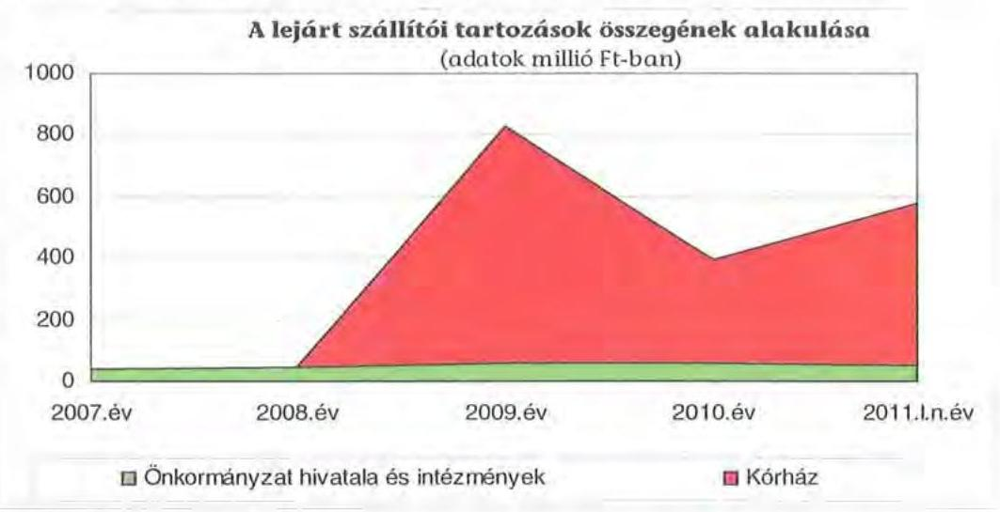

# 3.3. Egyéb kötelezettségek alakulása 

Az Önkormányzat PPP konstrukció keretében nem végzett beruházást, lízingszerződést nem kötött, a vizsgált időszakban garancia- és kezességvállalással kapcsolatos hosszú távú kötelezettségvállalása nem volt.

A vizsgált időszakban az elengedett követelések bruttó összege nem haladta meg a 3 millió Ft-ot, az Önkormányzatnak jelzálogjoggal terhelt ingatlana

[^0]
[^0]:    ${ }^{61}$ A helyi önkormányzatok adósságrendezési eljárásáról szóló 1996. évi XXV. törvény 4-5. §-ban előírtak alapján.

---

nem volt, a hitelek és a kötvény fedezeteként ingatlanain jelzálogjog alapítására és bejegyzésére nem került sor.

A vizsgált időszakban nem történt meg annak felmérése, hogy az eszközök elhasználódása, amortizációja fedezetének biztosítása mekkora forrásokat igényel az Önkormányzatnál. A felújításokra, az eszközök pótlására az Önkormányzat pénzügyi lehetőségének a függvényében, kimutatásai alapján elsősorban az intézmények működőképességének biztosítása érdekében, illetve a szakhatósági előírások alapján került sor. Az Önkormányzat a 2007-2010. években a tárgyi eszközök után 3073 millió Ft összegű értékcsökkenést számolt el. Felújításra 336 millió Ft-ot fordítottak ${ }^{62}$. Az elhasználódott eszközök pótlására az Önkormányzat tartalékot nem képzett, külön alapot nem hozott létre.

A Közgyűlés a 138/2008. (XI. 28.) számú határozatában döntött arról, hogy a Kórház részére kamatmentes visszatérítendő támogatást nyújt a digitális röntgenpark és a digitális archiváló rendszer létrehozására összességében 200 millió Ft összegben. A Kórház, a támogatási szerződésben foglaltak alapján, a támogatás összegét köteles visszafizetni az Önkormányzat részére ${ }^{63}$. A felvett kölcsönt a 2009-2010. években 10-10 millió Ft összegben, a 2011-2015ig a fennmaradó összeget 36 millió Ft összegben kell visszafizetnie. A 20 millió Ft összegű visszafizetési kötelezettségét a Kórház 2011. március 31-ig nem teljesítette ${ }^{64}$.

A Közgyűlés a 86/2010. (IX. 10.) számú határozatában döntött arról, hogy a Lenti Város Önkormányzata részére kamatmentes 17 év alatt visszatérítendő pénzügyi támogatást biztosít egyrészt 15 millió Ft összegben a NYDOP-5.2.1/B-2008-0002 azonosító számú pályázata ${ }^{65}$ önrészéhez. Másrészt szintén Lenti Város Önkormányzata részére kamatmentes 17 év alatt visszatérítendő pénzügyi támogatást biztosított 60 millió Ft összegben a NYDOP-2.12.1/C-09-2009-0001 azonosító számú pályázata ${ }^{66}$ önrészéhez, illetve annak keretében megvalósítandó fejlesztéshez.

[^0]
[^0]:    ${ }^{62}$ A felújítási kiadások mellett az Önkormányzat a vizsgált időszakban 4838 millió Ft értékű beruházást végzett.
    ${ }^{63}$ A támogatási szerződés 1. pontja tartalmazta, hogy a Közgyűlés egyetért azzal, hogy a bizonytalan gazdasági helyzet és a nem szektor-semleges egészségügyi finanszírozás miatt a Kórház non profit gazdasági társasággá alakítása nem időszerű.
    ${ }^{64}$ Az Önkormányzat 2010. március 30-án kelt levelében hívta fel a Kórház figyelmét, hogy a fizetési kötelezettségét nem teljesítette.
    ${ }^{65}$ A pályázat „Az emeltszintű járó-beteg szakellátás fejlesztése a Lenti Kistérségben a Dr. Hetes Ferenc Rendelőintézet revitalizációjával" volt. A Közgyűlés ugyanehhez a pályázathoz, ebben a határozatában 125 millió Ft-os vissza nem térítendő pénzügyi támogatást biztosított.
    ${ }^{66}$ A pályázatban vállalt fejlesztés célja „A fedett fürdő bővítése Lentiben" volt. A gyógyfürdőfejlesztés a városi önkormányzatnak és az Önkormányzatnak is önként vállalt feladatát jelenti, emiatt a 2010. év vonatkozásában a jelentés 1. pontjában az önként vállalt feladatok között figyelembe lett véve a támogatás összege.

---

# 4. A PÉNZÜGYI EGYENSÚLY MEGTEREMTÉSE ÉrDEKÉBEN HOZOTT INTÉZKEDÉSEK 

A jelentésben szereplő CLF módszer szerint bemutatott működési és felhalmozási többletek mellett, a vizsgált időszakban az Önkormányzat folyamatosan intézkedéseket tett, hogy alkalmazkodjon a finanszírozási rendszer változása miatti forráscsökkenéshez. Ennek érdekében bevételnövelő és kiadáscsökkentő döntéseket hozott.

A kiadáscsökkentő és bevételnövelő intézkedések megtétele a gazdálkodás átláthatóbbá tételét, valamint a feladatellátás szakmai színvonalának, a pénzügyi helyzet javítását célozták. A legjelentősebb mértékű kiadási megtakarítást a létszámleépítésekkel, az intézmények megszüntetésével, továbbá az intézmények működésének átszervezésével érték el.

A Közgyűlés a 2007. év januárjában határozatokat hozott a 2007. évi költségvetés végrehajtása érdekében, ezzel a megfogalmazott elvárások szerint 2007ben elindult az intézményeket és a Hivatalt érintő, előző időszakban már elkezdett átszervezések előkészítése. A határozatok a közoktatási, közművelődési és közgyűjteményi intézmények működésének felülvizsgálatát, a szociális és gyermekvédelmi intézmények átszervezését tartalmazták.

Az Önkormányzat elfogadta a Kórház főigazgatójának az intézmény likviditásának megőrzése érdekében készített intézkedési tervét. A Hivatalban éves szinten - két szakaszban - összesen legalább 12 fős (összesen 12\%-os) létszámleépítést ${ }^{67}$ (betöltött álláshely megszüntetést) javasoltak. A 2007. január 26 -ai döntések és a további sorozatos intézkedések hatására a 2006. december 31-ei hivatali és intézményi 3522 fő átlaglétszám 2011. március 31 -ére 3016 főre $(14,4 \%-\mathrm{kal})$ csökkent.

Az intézkedések következtében megszüntették a letenyei Általános Iskola, Diákotthon és Gyermekotthon, valamint a Zala Megyei Művelődési és Pedagógiai Intézet, Szakképző Iskola. Mint önálló költségvetési szerv 2007. június 30 -ai hatállyal megszűnt a 400 férőhelyes Idősek Otthona Módszertani Otthon, a feladatot 2007. július 1-jétől a Kiskorú és Felnőtt Fogyatékosok Otthona (Zalaegerszeg) látja el. Az átszervezéssel csökkent vezetői álláshelyeket átcsoportosították szociális gondozói álláshelyekké. A 2007. évi intézkedések önkormányzati szinten 308 fő teljes munkaidős és 22 fő részmunkaidős - ebből a Kórházban 122 fő teljes munkaidős és kettő fő részmunkaidős - álláshely megszüntetését eredményezték. A leépítések hatására a 2007. évben a járulékokkal növelt személyi juttatások között 142 millió Ft megtakarítást mutattak ki. Az 5/2007. (I. 26.) számú határozat a Hivatal álláshelyei számának első szakaszban nyolccal, majd a további szakaszban néggyel történő csökkentését tartalmazta, amelynek megtakarítását a vizsgált időszakra vonatkozóan 71 millió Ft összegben mutatták ki. A 2007. évi létszámcsökkentések 2008. évi hatása 238 millió Ft volt az Önkormányzat kimutatásai szerint.

[^0]
[^0]:    ${ }^{67}$ A 2007. évben a Hivatal engedélyezett létszáma 103 fő teljes munkaidős és 3 fő részmunkaidős álláshely volt, amely az év végére 91 fő teljes munkaidős és 3 fő részmunkaidős álláshelyre változott.

---

A nehéz pénzügyi helyzetre tekintettel felülvizsgálták a közalkalmazottak pénzügyi juttatásai. Az Önkormányzat nem biztosít forrást 2007. február 1-jétől az alkalmazottak részére adott étkezési utalványok vásárlására, így ennek fedezete, mintegy évi 20 millió Ft-ot az intézményektől elvonták. A 2/2007. (II. 20.) rendeletben rögzítettek szerint a Griff Bábszínház költségvetési támogatását 39 millió Ft-tal csökkentették. A 18/2007. (XII. 18.) rendelet a 2007. évi költségvetési rendelet módosítása - az intézményfinanszírozás 2\%-os zárolt összegének elvonását (előirányzat csökkentését) tartalmazta, amely a személyi juttatások és járulékai tekintetében 270 millió Ft, a dologi kiadások tekintetében 64 millió Ft elvonást eredményezett.

A Közgyűlés a 14/2006. (X. 13.) számú rendeletével a bizottságok számát 5tel, a külső tagok száma 32-vel csökkentette, amely hatásaként a vizsgált időszakra vonatkozóan a személyi juttatások és járulékai tekintetében mintegy 136 millió Ft, a költségtérítések tekintetében 6 millió Ft megtakarítást mutattak ki.

A 2008. évben a hiány csökkentése érdekében az intézmények működési struktúrájának átalakításáról, valamint további álláshely csökkentésről döntött ${ }^{68}$ a Közgyűlés.

A döntések eredményeként a Kehidakustányban működő Integrált Szociális és Módszertani Intézményből a pszichiátriai betegek bentlakásos ellátása 2009. január 1-jétől átkerült a zalaegerszegi Integrált Szociális Intézménybe, az intézményátszervezés az Integrált Szociális és Módszertani Intézménynél 43 fő teljes munkaidős és 1 fő részmunkaidős álláshely csökkenéssel járt. A 157/2008. (XI. 28.) számú határozat döntése hatására a módszertani feladatellátás megszünt ${ }^{69}$ a bázakerettyei Pszichiátriai Betegek Otthona és Rehabilitációs Intézménynél, valamint a kehidakustányi Integrált Szociális és Módszertani Intézménynél. Ennek következtében négy álláshely csökkenése valósult meg az intézményeknél. A 2008. évben elrendelt ${ }^{70}$ átszervezés a keszthelyi Asbóth Sándor Térségi Szakközépiskolánál az engedélyezett álláshelyek számát 10-zel csökkentette. Az itt bemutatott intézkedéseken túl a korábban tervezett, de akkor nem megvalósult álláshely megszüntetésére vonatkozó döntéseket ${ }^{71}$ is végrehajtották, amelynek következtében a Pedagógiai Intézetnél két, a Zala Megyei Önkormányzat Gyermekotthonánál további egy álláshelyet megszüntettek. A 2007-2008. években az álláshelyek megszüntetésének hatására a 2009-2010. években a személyi juttatásoknál és a munkaadói járulékoknál 539 millió Ft megtakarítást mutattak ki. Az intézményi átszervezések és feladatátszervezések vizsgált időszakra vonatkozó megtakarításai a személyi juttatások és járulékai esetében 407 millió Ft, a dologi kiadások megtakarításai 95 millió Ft összegben jelentkeztek.

[^0]
[^0]:    ${ }^{68}$ A 76/2008. (VI. 13.) és a 78/2008. (VI. 13.) számú határozatok.
    ${ }^{69}$ A régiósítást követően a feladatellátás átkerült a győri székhelyű Módszertani Központba.
    ${ }^{70}$ a 53/2008. (IV. 25.) és a 99/2008. (IX. 12.) számú határozatok
    ${ }^{71}$ a 11/2007. (II. 16.), 13/2007. (II. 16.) számú határozatok

---

A Közgyűlés a 121/2008. (IX. 30.) számú és a 131/2008. (X. 21.) számú határozatával - az épületek felépítését követően - a szepetneki és a zalabaksai idősek bentlakásos ellátásának megszervezésével a Kolping Oktatási és Szociális Intézményfenntartó Szervezetet bízta meg. A két intézmény múködtetése a vizsgált időszak viszonylatában az állami támogatáson felül - becsülten - az Önkormányzatnak 120 millió Ft-ba kerülne.

A 2009. évben a Közgyűlés a 108/2009. (IX. 11.) számú határozatával további álláshely megszüntetést rendelt el a lenti Gönczi Ferenc Gimnázium és Szakközépiskolában (egy), valamint a Lámfalussy Sándor Szakközépiskolában és Szakiskolában (három), amelynek 9 millió Ft összegű kiadáscsökkentő hatása a 2010. évben jelentkezett. A Közgyűlés a 2/2009. (II. 18.) rendeletben az Asbóth Sándor Térségi Szakközépiskola költségvetési támogatását a Kollégium átszervezésével együtt lecsökkentette 13 millió Ft-tal.

A Közgyűlés a 4/2010. (I. 22.) számú határozatával egy álláshely megszüntetését rendelte el a Zala Megyei Közművelődési Intézménynél, amelynek kiadás csökkentő hatása 2011-től jelentkezik.

Az intézményi feladatok racionalizálásáról, integrációjáról a Közgyűlés döntött, jellemzően a 2007-2010. évi költségvetésről szóló rendeleteiben. Az ezekhez készített előterjesztésekben a tervezett intézkedések indokait, várható eredményeit bemutatták.

Az intézményeknél létszámzárlatot rendeltek el, amelynek értelmében a nyugdíjazás létszámmozgása miatt megüresedő álláshely betöltésére a Közgyűlés elnöke adhat csak engedélyt. A közalkalmazotti bértáblán felüli bérek és pótlékok elvonása következtében a személyi juttatások és járulékai tekintetében 68 millió Ft megtakarítást mutattak ki a 2007-2010. évek viszonylatában. Ezzel együtt a Hivatalban a 2007. évtől a jutalom keretét zárolták, ami a vizsgált időszakban 87 millió Ft személyi juttatások és járulékainak megtakarítását jelentette.

A vásárolt közszolgáltatási, karbantartási és beszerzési szerződések felülvizsgálatának eredményeképpen a Kórháznál 390 millió Ft, a Hivatalnál és a Kórházon kívüli intézményeknél 32 millió Ft megtakarítással számoltak.

Az önként vállalt feladatok tekintetében összesen 250 millió Ft összegű megtakarítást mutattak ki, amelyből 200 millió Ft a pénzeszközátadás, 50 millió Ft a dologi kiadás volt. A csökkenésben a sport, az idegenforgalom, a nemzetközi kapcsolatok, a kulturális, az oktatási, az ifjúsági és civil kapcsolatok és az egyéb feladatok kiadásai szerepeltek.

A 2007-2010. években az intézményátszervezések, a feladatváltozások, valamint a takarékossági intézkedések hatásaként együttesen 3056 millió Ft öszszegű kiadás csökkenést mutattak ki, melynek $46 \%$-a, 1405 millió Ft a kapcsolódó létszámcsökkenések következtében jelentkezett.

---

A 2007-2010. évek kiadáscsökkentő intézkedéseinek hatását beavatkozási területenként azt a következő táblázat tartalmazza (adatai ezer Ft-ban szerepelnek):

| Az érvényesített kiadás-   csökkentés területei | Személyi   juttatások   és járulékai | Dologi,   müködési   kiadások | Pénzeszköz   átadások,   támogatások | Összesen |
| :-- | :--: | :--: | :--: | :--: |
| A Közgyűlés múködése | 142746 | 50011 | 199946 | 392703 |
| A Hivatalnál | 208915 | 7484 |  | 216399 |
| Az Intézményeknél | 1701940 | 624956 | 120000 | 2446896 |
| Összesen | 2053601 | 682451 | 319946 | 3055998 |

A végrehajtott megtakarítási intézkedésekből 393 millió Ft kiadáscsökkentést a Közgyűlésnél ( $12,8 \%$ ), 216 millió Ft kiadáscsökkentést a Hivatalnál ( $7,1 \%$ ) és 2447 millió Ft kiadáscsökkentést az intézményeknél ( $80,1 \%$ ) mutattak ki.

Az érvényesített kiadáscsökkentésből a Közgyűlés működése körében 143 millió Ft a testület és a bizottsági tagok létszámának csökkentéséből realizálódott (a Közgyűlés kiadás csökkentésének 36,3\%-a). A Hivatal létszámcsökkentése és a jutalom zárolása következtében 209 millió Ft összegű (a Hivatal kiadás csökkentésének a $96,5 \%$-a) kiadáscsökkentést mutattak ki, míg a létszámcsökkentés az intézményeknél 1702 millió Ft összegű (az intézmények kiadás csökkentésének $69,6 \%$-a) kiadás csökkenést eredményezett.

Az álláshely csökkentő intézkedések következtében 2007-től a 2010. év végére ${ }^{72}$ a Hivatalnál és az intézményeinél összesen 433 (ebből tartósan üres $23^{73}$ ) álláshelyet szüntettek meg, amelyből 414 álláshely megszüntetése (az öszszes megszüntetett álláshely $95,6 \%$-a) az intézményekhez kapcsolódott. Az álláshely csökkenés ágazatonkénti megoszlását az alábbi grafikon szemlélteti (az adatok álláshely számban szerepelnek):

# Álláshely csökkentés ágazatonként 

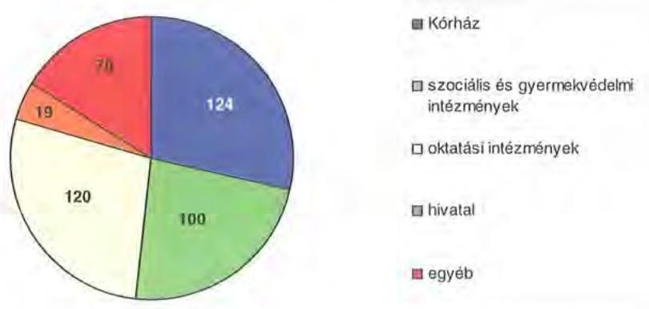

[^0]
[^0]:    ${ }^{72}$ Az Önkormányzat zárszámadási rendeletei alapján az engedélyezett létszámkeret a létszámleépítések előtt 3513 fő, míg 2010. év végén 3080 fő volt.
    ${ }^{73}$ Az Önkormányzat költségvetési beszámolójában szereplő adatok szerint a tartósan üres álláshelyek száma a 2006. év végén 60, míg a 2010. év végén 37 volt.

---

A helyi szervezési intézkedések végrehajtásához az Önkormányzat az áttekintett időszak alatt 364 millió Ft központi költségvetési támogatásban részesült, amelynek felhasználásával 211 fôt tartósan leépített. A létszámcsökkentés $51,3 \%$-ához ( 222 fő) központi támogatás nem kapcsolódott.

Az Önkormányzatnál 2011. első negyedévében folytatódtak a megtakarítási intézkedések, amelynek hatására 109 millió Ft kiadáscsökkentést mutattak ki. Ebből 9 millió Ft (az összes kiadáscsökkentés 8,3\%-a) a dologi, múködési kiadás csökkentése, 92 millió Ft (az összes kiadáscsökkentés 84,4\%-a) a személyi juttatásokat és a járulékokat érintő kiadás csökkentése, továbbá 8 millió Ft (az összes kiadáscsökkentés 7,3\%-a) az önként vállalt feladatok kiadás csökkentése volt.

A kiadáscsökkentő intézkedések mellett az Önkormányzat az alábbi ábrában számszerúsített bevételnövelő intézkedéseket tette (az adatokat ezer Ft-ban tüntettük fel):
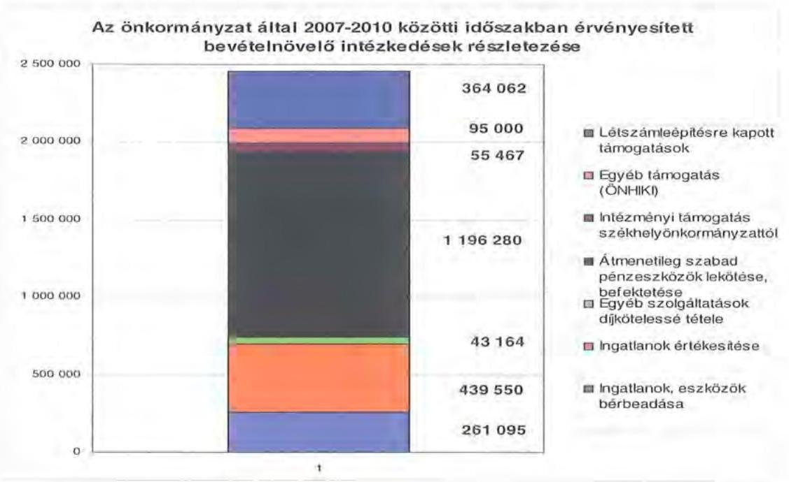

A vizsgált időszakban a 2455 millió Ft kihatású bevételnövelésre irányuló intézkedésekből 261 millió Ft-ot (10,6\%) az ingatlanok bérbeadásából realizálták.

A Hivatal által bérbe adott ingatlanok között az alsóerdei üdülő, raktárhelyiségek, garázsok, irodahelyiségek, termek, büfék, földterületek szerepeltek, nominálisan 63 millió Ft összegben, amely az önkormányzati szintű bérleti díjak 24,2\%át tette ki. Az intézményi bérleti díj bevétel 198 millió Ft összeg volt, amely az önkormányzati szintű bérleti díjak 75,8\%-a. A Kórház jelentősebb bérlői: kettő büfé, a Kandikó látásjavító üzlet, a Gyógyászati segédeszközök boltja, lakások, gyógyszertár, illetve a Kórház gyógyszerellátását is biztosító központi gyógyszertár.

A bevételnövelő intézkedések között az Önkormányzat tulajdonában lévő, de a működéshez nem szükséges ingatlanok és vagyoni értékú jogok értéke-

---

sítése 440 millió Ft összegben (17,9\%-os aránnyal) szerepelt. Az értékesítések között szerepelt a volt nagykanizsai gyermekotthon, a Balatonlellei üdülőépület $50 \%$-os tulajdoni hányada, a zalaegerszegi oktatási intézmény, a vonyarcvashegyi üdülőépület, a rigyáci gyermekotthon, a Zala Megyei Fejlesztési Kht. $95 \%$-os üzletrésze ${ }^{74}$, a kehidakustányi Pszichiátriai Betegek Otthona és három zalaegerszegi lakás.

A bevételnövelő intézkedések között szerepelt az intézményekben étkező alkalmazottak étkezési díjának emelése, amely a vizsgált időszakban 43 millió Ft többletbevételt jelentett.

Az átmenetileg szabad pénzeszközök lekötése, befektetése a bevételekből nominálisan 1196 millió Ft bevétel növekedést eredményezett (a bevételnövelő intézkedések összegének 48,7\%-át) a 2007-2010. évek viszonylatában. Ezen összegből 57 millió Ft (az átmenetileg szabad pénzeszközök lekötése, befektetése bevételeinek $4,8 \%$-a) növekedés az intézmények szabad pénzeszközeinek befektetéseiből keletkezett.

Az Önkormányzat az Asbóth Sándor Térségi Szakközépiskola, Szakiskola és Kollégium zalaszentgróti Béri Balogh Ádám Tagintézményének müködtetéséhez Zalaszentgrót várostól 23 millió Ft, valamint a nagykanizsai gyermekvédelmi szakellátás biztosításához Nagykanizsa Megyei Jogú Várostól 33 millió Ft intézményi müködtetési támogatást kapott (2010. év II. félévére).

Az önhibájukon kívül hátrányos helyzetben lévő önkormányzatok támogatására pályázott a Zala Megyei Önkormányzat a 2007-2010. években és 95 millió Ft támogatást nyert.

A vizsgált időszakban a tartósan leépített létszám egy részének (211 fő) leépítési költségeinek fedezetére a Hivatal 364 millió Ft támogatást kapott.

# 5. A HELYI ÖNKORMÁNYZATOK GAZDÁLKODÁSI RENDSZERÉNEK 2007. ÉVI ELLENŐRZÉSE SORÁN A PÉNZÜGYI EGYENSÚLY JAVÍTÁSÁRA TETT SZABÁLYSZERŰSÉGI ÉS CÉLSZERŰSÉGI JAVASLATOK HASZNOSULÁSA 

Az ÁSZ jelentésében egy szabályszerűségi és három célszerűségi javaslatot tett. A jelentést a Közgyűlés a 2010. december 10-ei ülésén megismerte. A 1619/2010./B. iktatási számú intézkedési terv nem tartalmazott intézkedést a pénzügyi egyensúly javítására tett egyik célszerűségi javaslat teljesítése érdekében. A hiányosság pótlásáról a Zala Megyei Közgyűlés elnöke az Állami Számvevőszék elnökét tájékoztatta, amely szerint a hiányosság pótlása a 1629/2010./B. iktatószámú intézkedési tervben elrendelésre került. A javaslatok megvalósítására intézkedési tervet készítettek, amelyet a Közgyűlés a 130/2010. (XII. 10.) számú határozatával elfogadott.

[^0]
[^0]:    ${ }^{74} 2850$ ezer Ft értékű üzletrész, amelyet az Önkormányzat 3000 ezer Ft értéken értékesített.

---

A pénzügyi egyensúly javítására két célszerüségi javaslat vonatkozott. Javasoltuk a Közgyűlés elnökének: „kezdeményezze, hogy a számvevôszéki jelentésben foglaltakat a Közgyûlés tárgyalja meg és a feltárt hiányosságak megszüntetése érdekében készítessen intézkedési tervet a határidők és a felelősök megjelölésével".

Javasoltuk a Főjegyzônek: tájékoztassa - évente végzett számitások alapján - a Közgyûlést az Önkormányzat eladósodásának növekedésére figyelemmel arról, hogy a hosszú lejáratú, adósságot keletkeztető kötelezettségvállalásokból adódó tőke- és kamatfizetési kötelezettséget az Önkormányzat milyen feltételek mellett tudja teljesíteni."

A Főjegyzônek tett javaslat teljesítésére a Közgyűlés 2011. február 8-ai ülésén került sor, amelynek keretében a Főjegyzö 2011. évi költségvetés szöveges elöterjesztése keretében tett eleget. A helyzetelemzést az elöírt határidőre elkészítették és a Közgyűlés részére a Főjegyzö a tájékoztatást megadta.
Budapest, 2011. december „ 19 "

Melléklet: $\quad 6 \mathrm{db} \quad 16$ lap
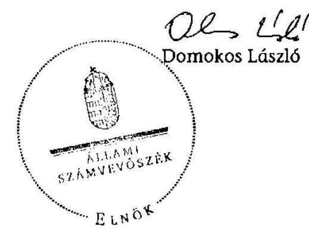

---

.

---

# Működési és felhalmozási hiány/többlet alakulása (adatok ezer Ft-ban)

|  |   |   |   |   |   |   |   |   |
| --- | --- | --- | --- | --- | --- | --- | --- | --- |
|  2 449 | 2 553 | 1 871 | 949 | 1 142 | 468 | 2 457 | 518 | 1 764  |
|  2 449 | 2 553 | 18 109 | 17 734 | 16 255 | 848 | 16 721 | 16 902 | 16 902  |
|  bevétel | kiadás | bevétel | kiadás | bevétel | kiadás | bevétel | kiadás |   |
|  2007. év |  | 2008. év |  | 2009. év |  | 2010. év |  |   |

☐ működési bevételek és kiadások ☐ felhalmozási bevételek és kiadások ☐ hiány/többlet

---

.

---

# KIMUTATÁS

Az önkormányzat CLF módszer szerint besorolt bevételeinek és kiadásainak 2007-2010. évek közötti alakulásáról

|  1. FOLYÓ KÖLTSÉGVETÉS* | 2007. | 2008. | 2009. | 2010.  |
| --- | --- | --- | --- | --- |
|  1.1.1. Saját müködési bevételek | 3311351 | 4098367 | 3497421 | 3318559  |
|  1.1.2. Költségvetési támogatás | 3957872 | 4291749 | 3056299 | 2697552  |
|  1.1.3. Átengedett bevételek | 1354924 | 537311 | 549376 | 177315  |
|  1.1.4. Államháztartáson belülről kapott támogatások | 9416421 | 9996286 | 9142227 | 10383296  |
|  1.1.5. EU-tól és külföldről kapott bevételek | 35093 | 0 | 2119 | 83  |
|  1.1.6. Államháztartáson kívülről kapott bevételek | 24061 | 22189 | 20861 | 11175  |
|  1.1.7. Előző évi pénzmaradvány átvétel | 55165 | 32518 | 55279 | 62093  |
|  1.1. Folyó bevételek
$=1.1 .1 .+1.1 .2 .+1.1 .3 .+1.1 .4 .+1.1 .5 .+1.1 .6 .+1.7$. | 18154888 | 18976420 | 16323602 | 16650075  |
|  1.2.1. Müködési kiadások kamatkiadások nélkül | 16725897 | 17155723 | 15697176 | 16580340  |
|  1.2.2. Államháztartáson belülre átadott pénzeszközök | 115733 | 215055 | 136724 | 123358  |
|  1.2.3.1. vállalkozásoknak | 5702 | 2814 | 0 | 6800  |
|  1.2.3.2. EU-nak, illetve külföldre | 0 | 0 | 0 | 1853  |
|  1.2.3.3. magánszemélyeknek | 17340 | 35543 | 26464 | 41518  |
|  1.2.3.4. nonprofit szervezeteknek | 105548 | 111977 | 119570 | 77730  |
|  1.2.3. Transzferkiadások ( $=1.2 .3 .1+1.2 .3 .2+1.2 .3 .3+1.2 .3 .4$ ) | 128590 | 150334 | 146034 | 127899  |
|  1.2.4 Kamatkiadások | 30041 | 172115 | 139397 | 58781  |
|  1.2.5. Előző évi pénzmaradvány átadás | 55165 | 32518 | 55279 | 62093  |
|  1.2. Folyó kiadások $=1.2 .1 .+1.2 .2 .+1.2 .3 .+1.2 .4 .+1.2 .5$ | 17055426 | 17725745 | 16174610 | 16952471  |
|  1.3. Folyó költségvetés egyenlege MÜKÖDÉSI JÖVEDELEM (1.1. - 1.2.) | 1099462 | 1250675 | 148992 | $-302396$  |
|  2. FELHALMOZÁSI (BERUHÁZÁSI) KÖLTSÉGVETÉS** |  |  |  |   |
|  2.1.1. Saját tőkebevételek | 664806 | 113588 | 240351 | 206042  |
|  2.1.2. Államháztartáson belülről kapott támogatások | 113485 | 95016 | 170284 | 292635  |
|  2.1.3. EU-tól és külföldről kapott támogatások | 9437 | 1710 | 156 | 0  |
|  2.1.4. Államháztartáson kívülről kapott támogatások | 98699 | 32697 | 14566 | 57916  |
|  2.1. Felhalmozási (beruházási) bevételek
( $=2.1 .1 .+2.1 .2+2.1 .3+2.1 .4$.) | 886427 | 243011 | 425351 | 556593  |
|  2.2.1. Saját beruházási kiadás átával | 2379375 | 948674 | 456437 | 1045169  |
|  2.2.2. Saját felújítási kiadás átával | 19898 | 121658 | 94445 | 99730  |
|  2.2.3. Államháztartáson belülre átadott pénzeszköz | 45282 | 56828 | 130277 | 458911  |
|  2.2.4. EU-nak és külföldnek adott pénzeszközök | 0 | 0 | 0 | 0  |
|  2.2.5. Államháztartáson kívülre adott pénzeszközök | 3578 | 7650 | 6390 | 4517  |
|  2.2.6. Befektetési célú részesedések vásárlása | 0 | 0 | 0 | 0  |
|  2.2. Felhalmozási (beruházási) kiadások
( $=2.2 .1 .+2.2 .2 .+2.2 .3 .+2.2 .4 .+2.2 .5 .+2.2 .6$.) | 2448143 | 1134810 | 687549 | 1608327  |
|  2.3. Beruházási költségvetés egyenlege (2.1. - 2.2.) | $-1561716$ | $-891799$ | $-262198$ | $-1051734$  |
|  3. FINANSZÍROZÁSI MÜVELETEK NÉLKÜLI (GFS) POZÍCIO |  |  |  |   |
|  (1.3.) Folyó költségvetés egyenlege Müködési Jövedelem + (2.3.) Beruházási költségvetés egyenlege | $-462254$ | 358876 | $-113206$ | $-1354130$  |
|  4. FINANSZÍROZÁSI MÜVELETEK |  |  |  |   |
|  4.1. Hitelfelvétel | 1055712 | 867 | 254911 | 278979  |
|  4.2. Hiteltőrlesztés | 10279 | 169151 | 48113 | 96226  |
|  4.3. Forgatási és befektetési célú értékpapírok kibocsátása | 3056800 | 0 | 0 | 0  |
|  4.4. Forgatási és befektetési célú értékpapírok beváltása | 0 | 0 | 0 | 0  |
|  4.5. Forgatási és befektetési célú értékpapírok értékesítése | 0 | 70058 | 0 | 0  |
|  4.6. Forgatási és befektetési célú értékpapírok vásárlása | 70058 | 0 | 0 | 0  |
|  4.7. Egyéb finanszírozási bevételek (függő, átfutó, kiegyenlítő) | $-177697$ | $-36670$ | 257850 | $-449857$  |
|  4.8. Egyéb finanszírozási kiadások (függő, átfutó, kiegyenlítő) | 16102 | 133205 | 13514 | $-75791$  |
|  4.9. Finanszírozási műveletek egyenlege (4.1.-4.2.+4.3.-
4.4+4.5.-4.6.+4.7.-4.8.) | 3838376 | $-268101$ | 451134 | $-191313$  |
|  5. TÁRGYÉVI POZÍCIO |  |  |  |   |
|  (3.) FINANSZÍROZÁSI MÜVELETEK NÉLKÜLI (GFS) POZÍCIO + (4.9.) Finanszírozási műveletek egyenlege | 3376122 | 90775 | 337928 | $-1545443$  |
|  6. NETTÓ MÜKÖDÉSI JÖVEDELEM |  |  |  |   |
|  (1.3.) Müködési Jövedelem - Tőketőrlesztés (4.2. Hiteltőrlesztés + 4.4. Forgatási és befektetési célú értékpapírok beváltása ) | 1089183 | 1081524 | 100879 | $-398622$  |

---

|  TÁJÉKOZTATÓ ADATOK |  |  |  |   |
| --- | --- | --- | --- | --- |
|  Összes kötelezettség | 5724735 | 6010752 | 7023937 | 8267953  |
|  ebből rövid lejáratú | 1411611 | 1321290 | 2320533 | 2356516  |
|  Összes szállítói kötelezettség | 906535 | 920435 | 1662479 | 1293692  |
|  ebből lejárt | 40197 | 46329 | 827436 | 396772  |
|  Pénz és tőkepiaci kötelezettség (adósság) | 4569952 | 4900468 | 5198466 | 6188018  |
|  ebből rövid lejáratú | 335252 | 227325 | 517238 | 938731  |
|  PPP szerződésből hátra lévő kötelezettséges állomány | 0 | 0 | 0 | 0  |
|  ebből lejárt szolgáltatási díj miatti kötelezettség | 0 | 0 | 0 | 0  |
|  Folyószámlahitel napi átlagos állománya | 152136 | 309207 | 693349 | 697615  |
|  Likvidhitel napi átlagos állománya | 0 | 0 | 0 | 0  |
|  Munkabérhitel napi átlagos állománya | 0 | 0 | 0 | 0  |
|  Peres eljárásokból fennálló függő kötelezettségek | 0 | 0 | 0 | 0  |
|  Finanszírozásba bevonható eszközök összesen: | 4884141 | 4904858 | 5242675 | 3697232  |
|  Tartós hitelviszonyt megtestesítő értékpapírok | 307 | 307 | 196 | 196  |
|  Hosszú lejáratú bankbetétek | 0 | 0 | 0 | 0  |
|  Értékpapírok | 70058 | 0 | 0 | 0  |
|  Pénzeszközök (idegen pénzeszközök nélkül) | 4813776 | 4904551 | 5242479 | 3697036  |

- Bevételekben nem térül, a kiadásokban nem jelenik meg az amortizáció, a vagyoni helyzetet az egyenleg befolyásolja ** Bevételekben vagyon megőrzésre és bővítésre fordítható források.

# Megjegyzés

A számítási leírás némileg eltér az ÁSZ módszertanában korábban alkalmazott besorolásoktól. A jelen besorolás általános közgazdasági meggondolásokon alapul, amely testet ölt az SNA statisztikai módszertanában is. Folyó tételek alatt értjük azokat a kiadásokat és bevételeket, amelyek az egység vagyoni helyzetét automatikusan nem változtatják. Bevételi oldalon ilyenek az adók, a tényező jövedelmek, transzferek, kiadási oldalon a transzferek és a szolgáltatás nyújtásával kapcsolatos müködési kiadások. Felhalmozási, vagy tőke tételek módosítják a vagyon nagyságát. Privatizációs bevétel csökkenti a vagyont, fizikai beruházás, vagy pénzügyi befektetés növeli.

A nettó müködési jövedelmet a tőketörlesztés levonásával a folyó költségvetés egyenlegéből (működési jövedelemből) származtatjuk. Transzfer kiadásoknak nevezzük azokat a folyó és felhalmozási tételeket, amelyeket nem az adott önkormányzat használ fel szolgáltatásnyújtásra.

---

# KIMUTATÁS

Az önkormányzat bevételeinek és kiadásainak, adósságszolgálatának alakulásáról 2007-2010. évek között

|  Sor-
szám | Megnevezés | 2007. év | 2008. év | 2009. év | 2010. év  |
| --- | --- | --- | --- | --- | --- |
|   |  | tény | tény | tény | tény  |
|  I. | MÜKÖDÉSI BEVÉTELEK | 17289773 | 18104288 | 16235690 | 17177685  |
|  1. | Sajátos folyó bevételek | 3288244 | 3390555 | 3188913 | 3294155  |
|  1.1. | Intézmények müködési bevétele | 1617229 | 1435721 | 1364753 | 1499333  |
|  1.2. | Illetékbevételek | 1632868 | 1925074 | 1654116 | 1137833  |
|  1.3. | Helyi adóbevételek és pótlékok | 0 | 0 | 0 | 0  |
|  1.4. | Kamat bevétel müködési része | 37879 | 28760 | 170044 | 656989  |
|  1.5. | Egyéb folyó müködési bevételek | 268 | 1000 | 0 | 0  |
|  2. | Támogatás értékú müködési bevételek | 305824 | 312616 | 395998 | 807779  |
|   | helyi önkormányzatoktól és költségvetési szerveitől többcélú kistérségi társulástól |  |  |  |   |
|  3. | Pénzforgalom nélküli bevételek müködésre jóváhagyott része | 454190 | 421865 | 315707 | 650014  |
|  4. | Államháztartáson kívülről müködési célra átvett pénzeszközök | 59154 | 22189 | 23000 | 11256  |
|  5. | Központi támogatások és átengedett források müködési része | 13182361 | 13957063 | 12312072 | 12414479  |
|   | ebből:SZJA | 1354924 | 537311 | 549376 | 177315  |
|   | önkormányzat és intézmények állami támogatásának müködési része | 2716840 | 3736082 | 3016467 | 2661645  |
|   | költségvetési kiegészítések, visszatérülések | 608 | 2 | 0 | 36023  |
|   | társadalombiztosítási alapból származó bevétel | 9109989 | 9683668 | 8746229 | 9539496  |
|  II. | MÜKÖDÉSI KIADÁSOK (kamatkiadás nélkül) | 17019043 | 17555984 | 16036252 | 16903462  |
|  1. | Folyó müködési kiadások összesen kamatkiadások nélkül | 16640042 | 17130375 | 15627640 | 16568609  |
|   | ebből:személyi juttatások | 7637230 | 7551973 | 7019404 | 7078919  |
|   | munkaadót terhető járulékok | 2413459 | 2351654 | 2106700 | 1845372  |
|   | dologj kiadások | 6513420 | 7164722 | 6423718 | 7480481  |
|   | egyéb folyó kiadások | 75933 | 61026 | 77818 | 163837  |
|   | egyéb folyó müködési kiadások | 0 | 1000 | 0 | 0  |
|  2. | Támogatások, elvonások és egyéb folyó átutalások | 128590 | 150334 | 146034 | 127899  |
|   | ebből:müködési célú pénzeszköz átadás államháztartáson kívülre | 111500 | 114891 | 120075 | 91723  |
|   | müködési célú pénzeszköz átadás államháztartáson belülre | 0 | 0 | 0 | 0  |
|   | társadalom és szociálpolitikai juttatások | 17090 | 35443 | 25959 | 36176  |
|  3. | Előző évi pénzmaradvány átadás, visszafizetés müködési | 134678 | 60220 | 125854 | 83596  |
|  4. | Támogatás értékú müködési kiadás | 115733 | 215055 | 136724 | 123358  |
|   | ebből:önkormányzatoknak |  |  |  |   |
|   | kistérségi társulásoknak |  |  |  |   |
|  III. | ADÓSSÁGSZOLGÁLAT | 40320 | 341266 | 187510 | 155007  |
|   | tőketörlesztési kötelezettség: müködési | 0 | 169151 | 0 |   |
|   | felhalmozási | 10279 | 0 | 48113 | 96226  |
|   | hoszú lejáratú belföldi és külföldi értékpapírok beváltása, vásárlása | 0 | 0 | 0 | 0  |
|   | kamatfizetési kötelezettség: müködési | 5743 | 8800 | 27238 | 7037  |
|   | felhalmozási | 24298 | 163315 | 112159 | 51744  |
|  IV. | FELHALMOZÁSI BEVÉTELEK | 2457524 | 1875343 | 1143251 | 2006174  |
|  1. | Saját felhalmozási és tőkejellegú bevétel | 687913 | 821104 | 549931 | 240218  |
|  1.1. | Tárgyi eszközök, immat, javak értékesítése, Áfa visszatérülés | 52519 | 109857 | 210164 | 28559  |
|  1.2. | Privatizációból származó bevétel | 9311 | 12613 | 15672 | 27843  |
|  1.3. | Osztalék, részesedések | 621024 | 6762 | 4784 | 4620  |
|  1.4. | Kamatbevétel felhalmozási része | 0 | 688083 | 288119 | 0  |
|  1.5. | Helyi adók átengedett adók felhalmozási része | 0 | 0 | 0 | 0  |
|  1.6. | Egyéb folyó felhalmozási bevételek | 5059 | 3789 | 31192 | 179196  |
|  2. | Támogatásértékű felhalmozási bevételek | 113485 | 95016 | 170284 | 292635  |
|   | ebből: helyi önkormányzatoktól és költségvetési szerveitől többcélú kistérségi társulástól |  |  |  |   |
|  3. | Pénzforgalom nélküli bevételek felhalmozásra jóváhagyott része | 306957 | 369149 | 368488 | 1379498  |
|  4. | Államháztartáson kívülről felhalmozási célra átvett pénzeszközök | 108136 | 34407 | 14716 | 57916  |
|  5. | Állami felhalmozási és tőkejellegú bevétel | 1241033 | 555667 | 39832 | 35907  |
|  5.1. | EU költségvetésből átvétel | 0 | 0 | 0 | 0  |
|  5.2. | Önkormányzatok költségvetési támogatása felhalmozási célra | 1241033 | 555667 | 39832 | 35907  |

---

Zala Megyei Önkormányzat 2/b. számú melléklet a V-3027/2011. számú jelentéshez

|  Sorszám | Megnevezés | 2007. év | 2008. év | 2009. év | 2010. év  |
| --- | --- | --- | --- | --- | --- |
|   |  | tény | tény | tény | tény  |
|  V. | FELHALMOZÁSI KIADÁSOK (kamat nélkül) | 2 454 485 | 1 134 160 | 687 582 | 1 608 327  |
|  1. | Folyó felhalmozási kiadások kamatkiadások nélkül | 2 405 615 | 1 070 682 | 550 894 | 1 144 899  |
|  1.1. | Beruházás, felújítás | 2 399 273 | 1 070 332 | 550 882 | 1 144 899  |
|  1.2. | Értékesített tárgyi eszközök eÁfa befizetés | 6 342 | 350 | 12 | 0  |
|  1.3. | Részesedések vásárlása | 0 | 0 | 0 | 0  |
|  2. | Támogatások, elvonások és egyéb folyó átutalások | 3 578 | 12 636 | 28 566 | 256 354  |
|   | ebből:felhalmozási célú pénzeszköz átadás államháztartáson kívülre | 3 078 | 6 086 | 6 390 | 4 517  |
|   | felhalmozási célú támogatásaok, kölcsön, kölcsön törlesztése | 500 | 6 550 | 22 176 | 251 837  |
|  3. | Támogatásértékű felhalmozási kiadások | 45 292 | 50 842 | 108 101 | 207 074  |
|   | ebből:helyi önkormányzatoknak és költségvetési szerveinek többcélú kistérségi társulásnak |  |  |  |   |
|  4. | Pénzforgalom nélküli kiadások felhalmozásra jóváhagyott része | 0 | 0 | 21 | 0  |
|  VI. | Hitel, kölcsön felvétel | 4 042 454 | 70 925 | 254 911 | 278 979  |
|  6.1. | Jóvid lejáratú hitelek felvétele | 0 | 0 | 0 | 0  |
|  6.2. | Jávid hitelek felvétele | 236 552 | 0 | 254 911 | 278 979  |
|  6.3. | hosszú lejáratú hitelek felvétele | 819 160 | 867 | 0 | 0  |
|  6.4. | forgatási célú értékpapírok beváltása, vásárlása | -70 058 | 70 058 |  |   |
|   | befektetési és hosszú lejáratú értékpapírok |  |  |  |   |
|  6.5. | kibocsátása, értékesítése | 3 056 800 | 0 | 0 | 0  |
|  6.6. | hitelfelvétel külföldről | 0 | 0 | 0 | 0  |
|  VII. | Finanszírozási pű-i műveletek egyenlege | 4 032 175 | -98 226 | 206 798 | 182 753  |

---

Az Önkormányzat 2007-2010 években megvalósított, illetve 2010. december 31-én fennálló fejlesztési feladatokhoz kapcsolódó kötelezettségeinek összegzése

|  Fejlesztési feladat megnevezése | Ber.
kezdete | Teljes
bekerülési
költség | 2006.
december
31-ig
teljesített
kiadás | 2007-2010.
évek között
teljesített
kiadás | 2010. év
utánra
vállalt
kötelezett-
ség | 2010. utáni kötelezettség-vállalás forrásösszetétele |  |  |  |   |
| --- | --- | --- | --- | --- | --- | --- | --- | --- | --- | --- |
|   |  |  |  |  |  | Saját
bevétel | Hitel | Kötvény | EU-s
támogatás | Hazai
támogatás  |
|  Zala Megyei Kórház rekonstrukció III. ütem | 2006. | 1608477 | 345132 | 1263345 |  |  |  |  |  |   |
|  Idősek Otthona fejlesztés, rekonstrukció | 2006. | 1406781 | 61585 | 1345196 |  |  |  |  |  |   |
|  1 db DSA készülék | 2006. | 263013 | 258753 | 4260 |  |  |  |  |  |   |
|  1 db coronarographia végzésére alkalmas készülék | 2007. | 206538 | 144 | 206394 |  |  |  |  |  |   |
|  2 db röntgen képarchiváló rendszer | 2006. | 34428 | 34024 | 404 |  |  |  |  |  |   |
|  Központi műtőhöz 1 db sebészeti képerősítő | 2007. | 40576 | 192 | 40384 |  |  |  |  |  |   |
|  Céltámogatásos egészségügyi gép-műszer beszerzés | 2007. | 44921 | 322 | 44599 |  |  |  |  |  |   |
|  Napkollektoros fülésrekonstrukció | 2007. | 12974 | 0 | 12974 |  |  |  |  |  |   |
|  Tomaterem kialakítás | 2009. | 109009 | 0 | 109009 |  |  |  |  |  |   |
|  Akadálymentesítés | 2010. | 17146 | 0 | 17146 |  |  |  |  |  |   |
|  Zala Megyei Területrendezési Terv felülvizsgálata és módosítása | 2010. | 20891 | 0 | 20891 |  |  |  |  |  |   |
|  Zala Megyei Kórházban SOT szintű sürgősségi osztály kialakítása | 2011. | 711447 | 0 | 44350 | 667097 |  |  | 62815 | 604282 |   |
|  Zalavári emlékpark bővítése | 2010. | 105572 | 0 | 60572 | 45000 |  |  | 8450 | 36550 |   |
|  Tanuszoda létesítése Keszthelyen | 2010. | 300000 | 0 | 297419 | 2581 |  |  | 2581 |  |   |
|  Struktúraváltoztatást támogató infrastruktúra fejlesztés a fekvőbeteg szakellátásban | 2011. | 4782162 | 0 | 96134 | 4686028 |  |  | 468603 | 4217425 |   |
|  1 db autóbusz beszerzés | 2010. | 13730 | 0 | 13730 |  |  |  |  |  |   |
|  Nyitott ház akadálymentesítése | 2011. | 25781 | 0 | 463 | 25318 |  |  | 4311 | 21007 |   |
|  Zöldmező utcai Általános Iskola akadálymentesítése | 2010. | 38198 | 0 | 12116 | 26082 |  |  | 4561 | 21521 |   |
|  Közgazdasági akadálymentesítése | 2010. | 30136 | 0 | 7531 | 22605 |  |  | 9090 | 13515 |   |
|  MRI berendezés (Zala Megyei Kórház) | 2005. | 423865 | 212471 | 211394 |  |  |  |  |  |   |
|  Sterilizáló (Zala Megyei Kórház) | 2009. | 22176 | 0 | 22176 |  |  |  |  |  |   |

---

Az Önkormányzat 2007-2010 években megvalósított, illetve 2010. december 31-én fennálló fejlesztési feladatokhoz kapcsolódó kötelezettségeinek összegzése

|  Fejlesztési feladat megnevezése | Ber.
kezdete | Teljes
bekerülési
költség | 2006.
december
31-ig
teljesített
kiadás | 2007-2010.
évek között
teljesített
kiadás | 2010. év
utánra
vállalt
kötelezett-
ség | 2010. utáni kötelezettség-vállalás forrásösszetétele |  |  |  |   |
| --- | --- | --- | --- | --- | --- | --- | --- | --- | --- | --- |
|   |  |  |  |  |  | Saját
bevétel | Hitel | Kötvény | EU-s
támogatás | Hazai
támogatás  |
|  Digitális röntgen (Zala Megyei Kórház) | 2010. | 176837 | 0 | 176837 |  |  |  |  |  |   |
|  Műtőasztal (Zala Megyei Kórház) 9/2009.(IV.29)ÖR | 2009. | 17181 | 0 | 17181 |  |  |  |  |  |   |
|  Betegőrző monitor rendszer szívsebészeti intenzív osztályra (Zala Megyei Kórház) | 2009. | 23640 | 0 | 23640 |  |  |  |  |  |   |
|  Keszthely Balatoni Múzeum állandó kiállítása | 2009. | 44564 | 0 | 44564 |  |  |  |  |  |   |
|  Gyermekotthon (Nagykanizsa) rekonstrukció | 2009. | 65653 | 0 | 65653 |  |  |  |  |  |   |
|  Tanétterem és tankonyha rekonstrukció (Lámfalussy) | 2008. | 59432 | 0 | 59432 |  |  |  |  |  |   |
|  5 db lakásotthon korszerűsítés Lenti | 2009. | 31069 |  | 31069 |  |  |  |  |  |   |
|  Könyvtári szolgáltatások összehangolt infrastruktúra fejlesztése-Zalai Tudástár létrehozása | 2009. | 39389 | 0 | 39389 |  |  |  |  |  |   |
|  Halózatos együttműködés pályázat keretében eszköz beszerzés (Pedagógiai Intézet) | 2010. | 19929 | 0 | 14796 | 5133 |  |  |  | 5133 |   |
|  Múfüves futball pálya világítással (Asbóth | 2009. | 20155 | 0 | 20155 |  |  |  |  |  |   |
|  Informatikai infrastruktúra fejlesztése Zala Megyei Önkormányzat Iskoláinál (eszközfejlesztés) | 2011. | 92704 | 0 | 0 | 92704 |  |  |  | 92704 |   |
|  Letenyei Diákotthon rekonstrukciója | 2011. | 40382 | 0 | 382 | 40000 |  |  | 40000 |  |   |
|  10 millió Ft alatti beruházások 2007. évben |  | 96808 |  | 96808 |  |  |  |  |  |   |
|  10 millió Ft alatti beruházások 2008. évben |  | 157302 |  | 157302 |  |  |  |  |  |   |
|  10 millió Ft alatti beruházások 2009. évben |  | 147587 |  | 147587 |  |  |  |  |  |   |
|  10 millió Ft alatti beruházások 2010. évben |  | 112571 |  | 112571 |  |  |  |  |  |   |
|  Összesen |  | 11363024 | 912623 | 4837853 | 5612548 | 0 | 0 | 600411 | 5012137 | 0  |

---

# Zala Megyei Közgyűlés Elnöke 

$144-2 / 2011 / P$.
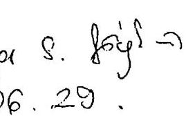

ÁLLAMI SZÁMVEVŐSZÉK 6857
Erkeze: 2011 JON 28.
Iktatószám: $\qquad$
Melléklet: $\qquad$
Teutó $7_{s}$ iun.
meiueht $y$ eun
$u t$ tucmut 12
A Zala Megyei Önkormányzat gazdálkodási rendszerének 2011. évi ellenőrzéséről készített számvevőszéki jelentés tervezetére, illetve az előírt javaslatokra az alábbi észrevételt teszem:

Minden egyes számvevőszéki ellenőrzés, valamint az annak eredményeként elkészített jelentés célja, hogy a mindennapos müködés vizsgált területe vonatkozásában hasznosítható, a jogszabályokkal összhangban lévő javaslatokat fogalmazzon meg. A megyei önkormányzat soron kívüli ellenőrzése ugyanakkor a területi önkormányzatiság jövőjét jelentősen befolyásoló, az őszi jogalkotási munka előkészítését szolgálja. Ebből a szempontból kiemelt hangsúllyal bír, hiszen az ellátott feladatok és a kapcsolódó önkormányzati gazdálkodás részletes áttekintése, majd az Országgyűlés részére történő bemutatása reális képet kell hogy mutasson a megyei önkormányzatok rendkívül forráshiányos müködéséről. A jelentés véglegesítése ezért felelősséggel jár, így a megfogalmazott javaslatok pontositását szükségesnek tartom.

Javaslat 2. pontja
A jelentés 2007. évtől mutatja be az önkormányzat szja és állami támogatások összegének csökkenését, és a megtett kiadáscsökkentő - bevételnövelő intézkedések hatásait. Ugyanakkor a bevétel csökkenés és a kiadási megtakarítások a korábbi években is kimutathatóak. Célszerünek tartanánk, ha az állami támogatások összegéből a felhasználási kötöttséggel járó támogatások letisztitásra kerültek volna, ugyanis a központosított és egyéb kötött támogatások összegének növekedése nem jelenti az önkormányzati források növekedését, mivel ezekkel el kell számolni, meghatározott célra használhatók fel, nem vonhatók be a hiány finanszírozásába, csökkentésére.

A Zala Megyei Önkormányzat normatív állami hozzájárulásból és SZJA részesedésből származó bevétele 2004. évről 2011. évre $38,7 \%$-kal csökkent. Ennek összetevői egyrészt a normatív fejkvóták csökkenése, az SZJA részesedésen belül a megyei önkormányzatok egységes részesedésének folyamatos elvonása, illetve megszüntetése. Ezzel párhuzamosan csökkent még az SZJA részesedésen belül az ellátottak után és a megyei lakosságszám után járó fejkváta is.

---

# Kimutatás 

a Zala Megyei Önkormányzat normatív állami hozzájárulásáról, SZJA részesedéséről és illetékbevételéről 2004-2011. években
adatok ezer Ft-ban

| Megnevezés | 2004. év | 2005. év | 2006. év | 2007. év | 2008. év | 2009. év | 2010. év | 2011. év |
| :-- | :--: | :--: | :--: | :--: | :--: | :--: | :--: | :--: |
| Normatív állami   hozzájárulás | 2126019 | 1990011 | 1758269 | 1986214 | 2730092 | 2551371 | 2299123 | 2352395 |
| SZJA részesedés | 2042682 | 1974026 | 2110094 | 1351518 | 537311 | 549376 | 177315 | 203411 |
| Összesen: | 4168701 | 3964037 | 3868363 | 3337732 | 3267403 | 3100747 | 2476438 | 2555806 |
| Illetékbevétel | 1829959 | 1969262 | 2090173 | 1632868 | 1925074 | 1654116 | 1137833 | 1100000 |
| Mindösszesen: | 5998660 | 5933299 | 5958536 | 4970600 | 5192477 | 4754863 | 3614271 | 3655806 |

Fontosnak tartom kiemelni, hogy a normatíva csökkenéssel egyidejüleg az önkormányzat folytatta a költséghatékonyság javitására tett intézkedések végrehajtását már a 2007. előtti években is, ami nem képezte a vizsgálat tárgyát:
2004. évben a közgyűlés 83/2004. (VI. 25.) KH számú határozata és a 93/2004. (VI. 25.) KH számú határozata alapján az önkormányzat intézményeinél elrendelt, összesen 58 fő létszámleépités, valamint a szociális és gyermekvédelmi ágazatban végrehajtott intézmény átszervezések következtében az intézmények müködési kiadása 249.971 e Ft-tal csökkent.
2005. évben már az intézményeket érintő jelentősebb intézkedések megtételére került sor, két megyei intézménynél (TEGYESZ Nagykanizsa, Általános Iskola, Diákotthon és Gyermekotthon, Letenye) 20 fö teljes munkaidős és 2 fö részmunkaidős dolgozó közalkalmazotti munkakörének megszüntetésére került sor.
A középfokú oktatási intézményeknél folytatódott az előző évben megkezdett feladat racionalizálás.
2005. július 1-i hatállyal megszűnt a zalaszentgróti Béri Balogh Ádám Gimnázium és a keszthelyi Nagyváthy János Szakközépiskola önállósága, az intézmények a keszthelyi Asbóth Sándor Térségi Középiskola tagintézményeként müködnek tovább.
A megtett intézkedésekkel 30 fö közalkalmazotti álláshely került megszüntetésre, melynek eredményeként az érintett intézmények müködési kiadása 58.440 e Ft-tal csökkent.

A közgyülés a 13/2005. (IX. 26.) ÖR számú rendeletével a céltartalékba helyezett előirányzatok egy részének elvonásával az önkormányzat kiadásait 91.549 e Ft-tal, a hivatal igazgatási kiadásait 10.674 e Ft-tal, az intézményekhez leszervezett költségvetési támogatás összegét 58.658 e Ft-tal csökkentette, ami összesen további 160.881 e Ft megtakarítást eredményezett.
2006. évben az állami támogatás csökkenése miatt az önkormányzatnak 95.674 e Ft-tal kevesebb bevétel állt rendelkezésére, mint 2005. évben (2005. évhez viszonyítva a normatív állami hozzájárulás 231.742 e Ft-tal csökkent, az önkormányzatot megillető személyi jövedelemadó részesedés viszont 136.068 e Ft-tal növekedett), ezért a Hivatal és az intézmények költségvetése felülvizsgálatra került.

A közgyülés a 10/2006. (V. 2.) ÖR számú rendeletével a megyei fenntartású intézményeknél és a Közgyűlés Hivatalánál $2 \%$-os bérelvonást rendelt el, amely 82.151 e Ft összegű személyi juttatás és munkaadói járulék megtakarítást eredményezett, amit a hiány csökkentésére fordított az önkormányzat.
2004. évben az önkormányzat intézményei engedélyezett létszáma 3.777 fő volt, míg 2011. évben 3.214 fö, így önkormányzati szinten engedélyezett létszám tekintetében az összes létszámcsökkentés 2004. évhez viszonyítva 563 fö volt.

---

A 2011. évi költségvetési rendelet előterjesztésével együtt - az Állami Számvevőszék javaslata alapján - a közgyülés részletes tájékoztatást kapott a bevételek csökkenéséről, a megtett kiadáscsökkentő intézkedésekről.
A fenti adatokból egyértelműen látható, hogy a megyei önkormányzatok jelentős forráshiányait a finanszírozási rendszer megyei önkormányzatokra vonatkozó folyamatos hátrányos megkülönböztetése, valamint az állami támogatás elvonása eredményezte. A pénzügyi egyensúly csak úgy biztosítható, ha a központi költségvetés visszapótolja a korábbi 8 év állami támogatás elvonását és illetékbevétel kiesését és ezt cselekvési terv sem pótolhatja, hiszen nincsen olyan mozgósítható tartalék a megyei önkormányzatnál, mellyel csak megközelítőlegesen kiegyenlíthető lenne a bevétel kiesés.

Olyan nagy összegű kiadáscsökkentésre, mellyel a működési hiány jelentősen csökkenthető lenne a korábban végrehajtott intézkedések mellett már nincs lehetőség. Megoldás lehetne feladatok, intézmények egyházi, vagy akár civil fenntartó részére történő átadása, azonban ez is csak a finanszírozási problémák csekély részére szolgálna megoldásul, valamint a központi támogatások nagyobb összegű lehívását jelentené.

Önálló bevételi forrással nem rendelkező megyei önkormányzat bevételnövelést nem tud végrehajtani, a Zala Megyei Önkormányzatnak a forgalomképes ingatlanok értékesítése eredményezhetne bevétel növekedést, de a jelenlegi piaci helyzetben nagyon kicsi az esély az ingatlanok értékesíthetőségére, és a finanszírozás nagyobb mértékủ módosítása nélkül rövid időn belül a hiány mértéke ismételten növekvő tendenciát mutatna.

A finanszírozási rendszerrel kapcsolatban kérdésként vetődik fel, hogy az önkormányzatok miért kapnak ugyanazon feladatok ellátására alacsonyabb összegű normatívát, mint az egyházak, illetve a kistérségi társulások?

Álláspontom szerint intézményi struktúrát eredményező döntések meghozatalára a megyék eltérő adottságai miatt csak ajánlást lehet tenni. Az ÁSZ jelentésben, és a fentiekben leírtak alapján látható, hogy a Zala Megyei Önkormányzatnál az intézményrendszer átalakítása folyamatosan napirenden volt, amely a továbbiakban is folytatódik. Ugyanakkor továbbra is fenntartom véleményemet, miszerint az intézményrendszer átalakításából nem érhető el olyan nagyságrendủ megtakarítás, mellyel a müködési hiány megszüntethető vagy jelentős mértékben csökkenthető lenne.
Véleményem szerint szükséges lenne az ágazati azon szabályozások módosításainak kezdeményezése, mellyel az önkormányzatok részére többletfeladatokat határoznak meg, ugyanakkor a finanszírozási rendszer nem követi a többletfeladatokhoz kapcsolódó kiadások forrásának biztosítását.
Néhány példa:
1993. évi LXXIX. tv 30/A § és a 125. § értelmében 2010. szeptember 1-től kötelező feladata a megyei önkormányzatoknak fejlesztő iskolai oktatás megszervezése, normatíva csak részben fedezi a kiadásokat.
Az érettségi és szakmai vizsgák lebonyolításához kapcsolódó kiadásokat a normatív állami hozzájárulás szintén csak részben fedezi, emiatt a normatív hozzájáruláson felül az öt középiskolára vonatkozóan évente 20.424 eFt többletkiadást jelent önkormányzati szinten. Szakképzésben a moduláris vizsgáztatás a tavalyi évtől jelentősen megemelte az érettségi és szakmai vizsgáztatás kiadásait, illetve emeli a kiadásokat a minimálbér és az útiköltségek emelkedése.

Javaslat 5. pontja
A pénzintézeti kötelezettségekről a közgyűlés a költségvetés tervezésekor és a zárszámadás keretében folyamatos tájékoztatást kap, újabb számbavételét nem tartom indokoltnak. Minden évben a költségvetés tervezésekor a kötelezettségek számbavételre, és költségvetési rendeletbe beépítésre kerülnek. Forrásuk a megyei önkormányzatok egyirányú finanszírozása miatt csak az illetékbevétel lehet, illetve ingatlanok értékesíthetősége esetén az ebből befolyó bevétel.

---

Javaslat 6. pontja
Az Állami Számvevőszéki jelentés célja volt, hogy tételesen bemutassa a megyei önkormányzat pénzügyi helyzetét. A jelentésből pontosan látható, hogy az elhasználódott eszközök pótlásának forrásigénye meghaladja az önkormányzat pénzügyi lehetőségeit.
A költségvetésben az intézmények elhasználódott eszközeinek, felújítási igényeinek biztosítására, 2011. évben a költségvetési tartalékok között 50 millió Ft került tervezésre, ennél nagyobb összeg tervezésére nem volt lehetőség, mivel ez évben tartalékokat már csak minimális összegben tudtunk tervezni, hiszen mint a fentiekben említettem, a jelenlegi pénzügyi helyzetben tartalékok képzésére minimális mértékben van csak lehetőség.

Kérem Tisztelt Elnök Urat, hogy a jelentés véglegesítése során a megfogalmazott észrevételeket figyelembe venni szíveskedjen.

Zalaegerszeg, 2011. június 22.
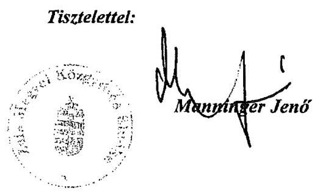

---

# Manninger Jenő úr 

elnök
Zala Megye Önkormányzata

## Zalaegerszeg

## Tisztelt Elnök Úr!

Köszönettel vettem a Zala Megyei Önkormányzat pénzügyi helyzetének ellenőrzéséről készített számvevőszéki jelentés-tervezethez 2011. június 22 -én küldött tájékoztató, segitő észrevételét.

Észrevételében a megfogalmazott ÁSZ javaslatok pontositását kéri a következők szerint:
A javaslat 2. pontja „terjesszen 30 napon belül a Közgyûlés elé cselekvési (intézkedési) tervet a szükséges - üzemgazdasági számításokkal alátámasztott - újabb bevételnövelő, kiadáscsökkentő, beruházások és más kötelezettségek felülvizsgálatát, tartalékok képzését, méretgazdaságos intézményi struktúrát eredményezô döntések meghozatalára, a pénzügyi, müködési egyensúly mielőbbi biztositása és fenntarthatósága érdekében. Tájékoztassa a Közgyûlést rendszeresen a cselekvési terv megvalósitásáról, annak eredményeiről. A pénzügyi egyensúlyt befolyásoló feltételek romlása esetén tegyen javaslatot a cselekvési terv módosítására."

Az észrevétel rögzíti, hogy az ÁSZ jelentés 2007. évtől mutatja be a megtett kiadáscsökkentő bevételnövelő intézkedések hatásait, ugyanakkor ezek a korábbi években is kimutathatóak. Ezt megalapozandó 2004-2006. évek vonatkozásában bemutatásra kerültek az észrevételben a megtett kiadáscsökkentő - bevételnövelő intézkedések. Az elfogadott program szerinti vizsgált időszakon (2007. évtől 2011. év I. negyedéve) túl az ellenőrzést nincs módunkban kiterjeszteni.

Köszönettel vettük azon jelzéseit, hogy „a megyei önkormányzatok jelentős forráshiányait a finanszírozási rendszer megyei önkormányzatokra vonatkozó folyamatos hátrányos megkülönböztetése, valamint az állami támogatás elvonása eredményezte. A Zala Megyei Önkormányzatnál az intézményrendszer átalakítása folyamatosan napirenden volt. Véleménye szerint az intézményrendszer átalakításából nem érhető el olyan nagyságrendủ megtakarítás, mellyel a müködési hiány megszüntethető, vagy jelentős mértékben csökkenthető lenne, illetve

---

kiegyenlíthető lenne a központi költségvetésből származó bevételkiesés". E magyarázatokat megismertük, a javaslatot fenntartjuk.

A javaslat szerint „gondoskodjon a pénzintézeti kötelezettségek finanszírozási lehetőségeinek számbavételéről, és arra források biztosításáról".

Az észrevétel rögzíti, hogy a pénzintézetek felé fennálló kötelezettségekről a Közgyűlés a költségvetés tervezésekor és a zárszámadás keretében folyamatos tájékoztatást kap, újabb számbavételt nem tart indokoltnak. Forrásuk a megyei önkormányzat egyirányú finanszírozása miatt csak az illetékbevétel lehet, illetve ingatlanok értékesíthetősége esetén az ebből befolyó bevétel. A javaslatot a kötvényhez köthető jelentős a pénzintézetek felé fennálló kötelezettség jövőbeni terhe miatt fenntartjuk.

A javaslat szerint „mutassa be a Közgyülésnek az éves költségvetési előterjesztésekben az értékcsökkenési leírás összegét, és ezzel arányban az elhasználódott eszközök pótlásának forrásigényét és -lehetőségét".

Az észrevétel rögzíti, hogy az ÁSZ jelentésből pontosan látható, hogy az elhasználódott eszközök pótlásának forrásigénye meghaladja az önkormányzat pénzügyi lehetőségeit. Jelezte továbbá, hogy a 2011. évben a költségvetési tartalékok között 50 millió Ft került tervezésre. A javaslatot fenntartjuk, az éves költségvetési előterjesztésekben az értékcsökkenési leírás összegét, és ezzel arányban az elhasználódott eszközök pótlásának forrásigényét és lehetőségét szükségesnek tartjuk bemutatni.

Köszönöm Elnök úr és munkatársai ellenőrzés során tanúsított hozzáállását, amellyel az ellenőrzés megvalósításában részt vettek, azt segítették.

Budapest, 2011. december " 19 ".
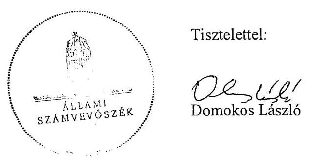

Tisztelettel:

Tisztelettel:

Melléklet: jelentés

---

.