# ÁLLAMI   SZÁMVEVŐSZÉK 

## JELENTÉS

a Baranya Megyei Önkormányzat pénzügyi helyzetének ellenőrzéséről (43/2)

---

# Számvevői Iroda 

Iktatószám: V-3010-10/2011.
Témaszám: 1015
Vizsgálat-azonosító szám: V056002

## Az ellenőrzést felügyelte:

Dr. Varga Sándor
számvevő igazgató-helyettes

## Az ellenőrzést vezette:

## Renkó Zsuzsanna

számvevő tanácsos

## Az ellenőrzést végezték:

| dr. Láng Ágnes | Pappné dr. Szamosi | Alexovics Ágota |
| :-- | :-- | :-- |
| számvevő | Éva | számvevő tanácsos |

A témához kapcsolódó eddig készített számvevőszéki jelentések:
címe
sorszáma
Jelentés a Baranya Megyei Önkormányzat gazdálkodási rendszerének 2009. évi ellenőrzéséről

---

# TARTALOMJEGYZÉK 

BEVEZETÉS ..... 5
I. ÖSSZEGZŐ MEGÁLLAPÍTÁSOK, KÖVETKEZTETÉSEK, JAVASLATOK ..... 12
II. RÉSZLETES MEGÁLLAPÍTÁSOK ..... 17

1. Az Önkormányzat kötelező és önként vállalt feladatai ..... 17
2. Pénzügyi egyensúlyi helyzet alakulása ..... 20
2.1. A működési és felhalmozási egyensúly alakulása ..... 23
2.2. Az Önkormányzat bevételei alakulása ..... 27
2.3. Az Önkormányzat kiadásai alakulása ..... 30
3. Kötelezettségek bemutatása ..... 35
3.1. A pénzintézetek felé fennálló kötelezettségek ..... 35
3.2. Szállítók felé fennálló kötelezettségek ..... 40
3.3. Egyéb kötelezettségek ..... 41
4. A pénzügyi egyensúly megteremtése érdekében hozott intézkedések ..... 42
5. A helyi önkormányzatok gazdálkodási rendszerének 2009. évi ellenőrzése során a pénzügyi egyensúly javítására tett szabályszerűségi és célszerűségi javaslatok hasznosulása ..... 49

---

# MELLÉKLETEK 

1. számú Működési és felhalmozási hiány/többlet alakulása (1 oldal) melléklet
2. a. számú Az Önkormányzat CLF módszer szerint besorolt bevételei és kiadásai 2007-2010 között (2 oldal)
3. b. számú Az Önkormányzat bevételeinek és kiadásainak, adósságszolgálatának alakulása 2007-2010 között (1 oldal)
4. számú Az Önkormányzat 2007-2010 években megvalósított, illetve 2010. december 31-én fennálló fejlesztési feladatokhoz kapcsolódó kötelezettségeinek összegzése (4 oldal)
5. számú Baranya Megyei Közgyűlés elnökének észrevétele melléklet
6. számú Baranya Megyei Közgyűlés elnökének észrevételére adott válasz melléklet

---

# RÖVIDÍTÉSEK JEGYZÉKE 

| Törvények |  |
| :--: | :--: |
| Áht. | az államháztartásról szóló 1992. évi XXXVIII. törvény |
| ÁSZ tv. | az Állami Számvevőszékről szóló 1989. évi XXXVIII. törvény (2011. július 1-jétől az Állami Számvevőszékről szóló 2011. LXVI. törvény) |
| Htv. | a helyi önkormányzatok és szerveik, a köztársasági megbízottak, valamint egyes centrális alárendeltségű szervek feladat- és hatásköreiről szóló 1991. évi XX. törvény |
| Ötv. | a helyi önkormányzatokról szóló 1990. évi LXV. törvény |
| Szórövidítések |  |
| APEH | Adó- és Pénzügyi Ellenőrzési Hivatal (2011. január 1-jével Nemzeti Adó- és Vámhivatal) |
| ÁSZ | Állami Számvevőszék |
| BM | Belügyminisztérium |
| BMÖ | Baranya Megyei Önkormányzat |
| DDOP | Dél-dunántúli Regionális Operatív Program |
| EDP hiány/egyenleg | Uniós módszertan szerinti maastrichti kritériumoknak megfelelő számítás szerinti hiány/egyenleg |
| EKF | Európa Kulturális Fővárosa |
| EU | Európai Unió |
| GDP | Bruttó hazai termék |
| HEFOP | Humán erőforrások fejlesztése Operatív Program |
| Hivatal | Baranya Megyei Önkormányzati Hivatal |
| Illetékhivatal | Baranya Megyei Illetékhivatal |
| Kórház | Baranya Megyei Kórház |
| Közgyűlés | Baranya Megyei Önkormányzat Közgyűlése |
| KSH | Központi Statisztikai Hivatal |
| NGM | Nemzetgazdasági Minisztérium |
| OEP | Országos Egészségbiztosítási Pénztár |
| Önkormányzat | Baranya Megyei Önkormányzat |
| SNA | SNA System of National Accounts, azaz Nemzeti Számlák Rendszere. |
| szja | Személyi jövedelemadó |
| SzMSz | Baranya Megyei Önkormányzat 3/2007. (III. 24.) számú rendelete az Önkormányzat és Szervei Szervezeti és Működési Szabályzatáról |
| TÁMOP | Társadalmi Megújulás Operatív Program |

---

.

---

# JELENTÉS 

## a Baranya Megyei Önkormányzat pénzügyi helyzetének ellenőrzéséről

## BEVEZETÉS

Az Állami Számvevőszék 2011. évtől érvényes stratégiája új irányt szabott a helyi önkormányzatok gazdálkodásának ellenőrzésében is. Az ÁSZ – küldetése és jövőképe szerint – szilárd szakmai alapokra támaszkodva értékteremtő ellenőrzéseivel és helyzetelemzéseivel az államháztartás egészében, így a helyi önkormányzati alrendszerben is elő kívánja segíteni a közpénzek és a közvagyon szabályos, gazdaságos, hatékony és eredményes hasznosítását. E folyamat részeként – a 2010. évi államháztartási hiány alakulásának összetevőire is figyelemmel – megkezdődött az önkormányzati alrendszer pénzügyi helyzetelemzése.

Az NGM 2011 áprilisában közzétett adatai szerint ${ }^{1}$ a 2010. évi 1036,2 milliárd Ft összegű, 3,8%-os EDP (maastrichti kritériumok szerinti, Túlzott Hiány Eljárás keretében kimutatott) hiánycél nem volt tartható, az önkormányzati alrendszer tervezettet meghaladó hiánya miatt a GDP arányában kifejezett államháztartási hiány 4,2%-ra emelkedett.

Az önkormányzatok költségvetési jelentése szerint 2010. első három negyedév végén az önkormányzati alrendszer pénzforgalmi hiánya 97 milliárd Ft volt, a tervezett éves mérték 51%-át érte el. Bár az elmúlt években kiugróan magas hiány halmozódott fel az utolsó negyedévben, a 97 milliárd Ft-os szeptember végi hiány nem indokolta az önkormányzati alrendszer 190 milliárd Ft-ra becsült éves hiányának felülvizsgálatát. A tervezett hiány túllépése, az utolsó negyedévi 150 milliárd Ft-os pénzforgalmi hiány nem volt reálisan feltételezhető. A helyi önkormányzatok januári gyorsjelentése szerint a pénzforgalmi hiány 247,7 milliárd Ft-ot tett ki. A tervezettnél nagyobb önkormányzati pénzforgalmi hiány kialakulásában – az NGM által az éves költségvetési beszámoló elkészítéséhez kiadott tájékoztató szerint – az iparűzési adó elmaradása, a gépjárműadó, az illetékek és más bevételek tervezettnél alacsonyabb összegben teljesülése volt a meghatározó.

A megyei önkormányzatok kötelező feladatellátását többlépcsős törvényi előírások határozzák meg. A feladatokra vonatkozó szabályozás első szintjét az

[^0]
[^0]:    ${ }^{1}$ NGM Tájékoztatás Magyarország Strukturális Reformprogramjának végrehajtásáról (2011. április 1). A Tájékoztató évente két alkalommal – április és október hónapban – jelenik meg.

---

Ötv. ${ }^{2}$, a második szintet a hatásköri ${ }^{3}$, a harmadik szintet a további ágazati, szakmai törvények (egyebek mellett az oktatási, egészségügyi, szociális) adják.

A megyei önkormányzatok a feladatellátás és a központi forráselosztás tekintetében sajátos helyet foglalnak el a helyi önkormányzati rendszerben. A megyei önkormányzat kötelező feladatainak egy része – így a megyében lévő természeti és társadalmi muzeális emlékek, a történeti iratok gyűjtése, őrzése, tudományos feldolgozása, a megyei könyvtári szolgáltatás, a pedagógiai és közművelődési szakmai tanácsadás és szolgáltatás, a megyei testnevelési és sportszervezési feladatellátás, a gyermek- és ifjúsági jogok érvényesítése, a gyermekvédelmi- és szociális szakellátás – az Ötv-ből közvetlenül levezethető kötelezettség.

A középiskolai, szakiskolai, és kollégiumi ellátás, a fogyatékos gyermekek oktatása, nevelése, gondozása az ágazati törvény szerint a megyei önkormányzat kötelező feladata. Azonban, ha a települési önkormányzat lát el ilyen feladatot, és arról lemond, a megyei önkormányzatnak a feladatot át kell vennie. Így a megyei önkormányzatok által ellátandó kötelező közszolgáltatások ellátásának mértékére a települési önkormányzatok döntései jelentősen kihatnak.

Az alapellátást meghaladó egészségügyi szakellátás biztosítása akkor képezi a megyei önkormányzat feladatát, ha az önkormányzati vagyon kialakításáról szóló törvényben ${ }^{4}$ a feladat ellátásához szükséges vagyont az önkormányzat a tulajdonába kapta.

Az önként vállalt feladat ellátására – mivel annak vállalása a kötelező feladatok ellátását nem veszélyeztetheti – a kötelező közszolgáltatások mértékének alakulása lényegi hatással van.

A feladat és hatáskör telepítés sajátosságai mellett a megyei önkormányzatok kialakított forrásszerkezete és a forrásszabályozásból következő szűk mozgástere, a központi költségvetéstől való erőteljes függősége is determinálja az önkormányzatok feladatellátásra vonatkozó döntéseit.

A 2007-2010. években az önkormányzati feladatok ellátásának keretet biztosító forrásszabályozás – ennek részeként az illetékbevételből és a személyi jövedelemadóból való részesedés szabályai – a megyei önkormányzatok vonatkozásában nem változtak:

- A megyei önkormányzatok saját bevételein belül az illetékbevételek döntően az ingatlanpiac stagnálása, majd visszaesése, és egyes illetékkedvezmények bevezetése következtében – megyénként differenciált mértékben ugyan, de – 2010-re általánosan visszaestek. A 2010. évben befolyt 39,2 milliárd Ft illetékbevétel a 2006. évben realizált 71,1 milliárd Ft illetékbevétel alig több mint 55%-a volt. A kieső bevételek pótlására az önkor-

[^0]
[^0]:    ${ }^{2}$ Ötv. 69-70. §-ai
    ${ }^{3}$ a Htv.
    ${ }^{4}$ Az egyes állami tulajdonban lévő vagyontárgyak önkormányzatok tulajdonba adásáról szóló 1991. évi XXXIII. törvény

---

mányzati alrendszer szintjén történtek intézkedések, 2010-ben 5 milliárd Ft-ot, 2011-ben 1,2 milliárd Ft-ot ellentételezett a központi költségvetés. Az illetékbevételt a megyei önkormányzatok a saját folyó bevételeik között számolják el ${ }^{5}$.

Az illetékek kivetésének és beszedésének joga 2006. december 31-ig a megyei önkormányzatok feladata volt. A 2007. évtől a megyei illetékhivatalok illetékbeszedési feladatait az APEH vette át ${ }^{6}$. Az önkormányzati illetékrészesedési szabályok változatlanok maradtak, azonban az illetékbeszedés költségeit az önkormányzatok illetékbevételeiből átlagos (a Fővárosnál 4,0%-os, a megyei és megyei jogú városi önkormányzatnál 8,5%-os) kulcsot alkalmazva vonták le. E döntés következtében azon megyei önkormányzatok, amelyek a 8,5%-os költségnél kedvezőbb költségszint mellett látták el korábban ezt a feladatot, kedvezőtlenebb helyzetbe kerültek.

- Az önkormányzati alrendszer személyi jövedelemadóból való részesedésének makroszintű szabályozása nem változott 2007-2010 között${ }^{7}$. A helyi önkormányzatokat normatív módon megillető 32%-os részesedés visszaosztásának részletszabályai azonban a megyei önkormányzatok számára – a reálgazdaság kedvezőtlen irányú folyamatai, és az államháztartás egyensúlyi helyzetére tekintettel elrendelt kormányzati intézkedések miatt – megszorító intézkedéseket jelentettek. Összesen 17 milliárd Ft – 2007-ben 10 milliárd Ft, 2010-ben további 7 milliárd Ft – szja-t vontak ki a megyei önkormányzatok gazdálkodási köréből ${ }^{8}$. Az átengedett személyi jövedelemadó a megyei önkormányzatok egyik bevétele.

A megyei önkormányzatok 2007-2010 között rendelkezésre álló forrásait az alábbiakban mutatjuk be:

[^0]
[^0]:    ${ }^{5}$ A megyei önkormányzatok illetékbevételei az önkormányzati alrendszer saját folyó bevételeiből 2007-ben 35,9 milliárd Ft-ot (61,4%-ot), 2008-ban 41,5 milliárd Ft-ot (61,7%-ot), 2009-ben 36,5 milliárd Ft-ot (62,5%-ot), 2010-ben 25,1 milliárd Ft-ot (64,1%-ot) tettek ki.
    ${ }^{6}$ Az egyes pénzügyi tárgyú törvények módosításáról szóló 2006. évi LXI. törvény 115. §a, amely az adózás rendjéről szóló 2003. évi XCII. törvény 73. §-át módosította.
    ${ }^{7}$ A megyei önkormányzatok személyi jövedelemadó részesedése az önkormányzati alrendszer átengedett bevételeiből 2007-ben 34,7 milliárd Ft-ot (7,0%-ot), 2008-ban 51,2 milliárd Ft-ot (9,2%-ot), 2009-ben 59,2 milliárd Ft-ot (9,3%-ot), 2010-ben 56,3 milliárd Ft-ot (8,3%-ot) tett ki.
    ${ }^{8}$ A megyei önkormányzatok szja kiegészítése háromelemű. A tételes, minden megyére egységesen meghatározott összeg – az adott évek költségvetési törvényeinek 4. sz. mellékletében meghatározottak szerint – 2006-ban 593 millió Ft, 2007-ben és 2008-ban egyaránt 355 millió Ft, 2009-ben 370 millió Ft volt. A megye népességszáma után járó kiegészítés a 2006. évi 208 Ft/fő összegről 2010-re 120 Ft/fő-re, a megyei intézmények ellátottjai után járó kiegészítés 42236 Ft/ellátottról 20755 Ft/ellátottra csökkent.

---

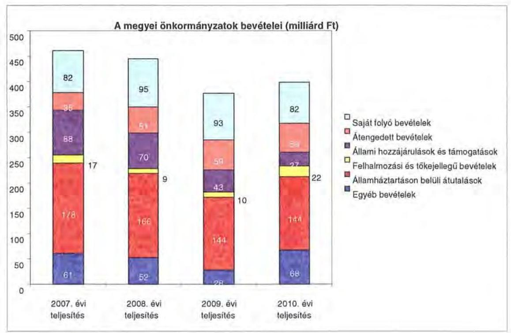

A megyei önkormányzatok saját folyó bevételeinek részaránya – amelyek főbb elemei: az intézményi térítési díjak, az illetékbevétel, a kamatbevételek – a 2007. évi összbevételen (461 milliárd Ft) belül 17,9% volt, amely 2010-re annak ellenére 20,6%-ra nőtt, hogy az összege 82 milliárd Ft maradt. Ennek oka az volt, hogy az összbevétel a 2007. évi 461
 milliárd Ft-ról 2010-re 399 milliárd Ft-ra csökkent.

Az átengedett bevételek, amelyek a megyei önkormányzatoknál a személyi jövedelemadóból való részesedést jelentették, az összbevételen belül a 2007. évi 35 milliárd Ft-ról 56 milliárd Ft-ra nőttek.

Az állami hozzájárulások és támogatások - amelyek főbb elemei: az ellátotti létszámhoz kötődő normatív állami hozzájárulások, központosított, fejezeti szinten kezelt célelőirányzatból juttatott működési és fejlesztési támogatások a 2007. évi 88 milliárd Ft-ról (19,1%-os részarányról) 2010-re 27 milliárd Ft-ra (6,8%-os részarányra) estek vissza.

A felhalmozási és tőkejellegű bevételek - tárgyi eszközök (ingatlanok és ingóságok), föld és immateriális javak, részesedések értékesítése, EU-tól átvett pénzeszközök - a 2007. évi 17 milliárd Ft-ról (3,6%-os részarányról) 2010-re 22 milliárd Ft-ra (5,4%-ra) emelkedtek.

Az államháztartáson belüli átutalások részesedése 2007-ben 178 milliárd Ft volt. 2010. év végére 34 milliárd Ft-tal csökkent, részaránya 38,6%-ról 2,6 százalékpontos csökkenés után 2010-ben 36%-ra változott. Ez a bevételi kategória tartalmazza az egészségbiztosítási és egyéb elkülönített állami pénzalapoktól átvett forrásokat. A 2010-ben e címen elszámolt bevétel 144 milliárd Ft volt.

---

A megyei önkormányzatok központi költségvetésből származó bevételeinek összege 2007-ben 400 milliárd Ft volt, amely 2010. évre 331 milliárd Ft-ra (az időszak alatt összesen 69 milliárd Ft-tal) 17,3%-kal csökkent.

Az egyéb, pénzmaradványból, vállalkozási bevételekből, államháztartáson kívülről származó átutalásokból, a hitelekből, a hosszú és rövid lejáratú értékpapírok értékesítéséből származó bevételek részesedése a 2007-2010. évek viszonylatában 13,3%-ról 17,1%-ra emelkedett. Ez utóbbiak 2010. évi beszámoló szerinti összevont teljesítése 68 milliárd Ft volt ${ }^{9}$.

Mindezeket figyelembe véve 2007-ben és 2010-ben a megyei önkormányzatok forrásösszetételének megoszlását az alábbi ábra szemlélteti:

A megyei önkormányzatok 2007. és 2010. évi forrásainak megoszlása (%ban)
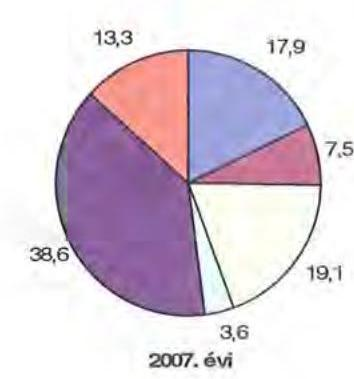
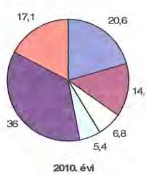

Annak ellenére, hogy a megyei önkormányzatok kötelezően ellátandó feladataikat 2007-hez képest kevesebb intézményben, csökkenő foglalkoztatott létszám mellett végezték ${ }^{10}$, a jelentős bevételkiesést a - szervezési intézkedések hatására - csökkenő ráfordítások nem tudták kompenzálni. Az ellátottak száma a szociális, gyermekvédelmi ágazat bentlakásos elhelyezést nyújtó intézményeit kivéve - eltérő mértékben ugyan, de minden ágazatban évről évre csökkent, amely a fajlagos hozzájárulások csökkenésével együtt a normatív állami hozzájárulás arányának visszaeséséhez vezetett.

A 2007-2013-as időszakra meghirdetett, vissza nem térítendő EU-s fejlesztési forrásokhoz való hozzájutás lehetősége felerősítette az önkormányzati alrendszer fejlesztési igényeit. A fokozott fejlesztési tevékenység a felhalmozási bevételek és kiadások egyensúlyának megbomlásán ${ }^{11}$ túl a jelentkező jövőbeni fenn-

[^0]
[^0]:    ${ }^{9}$ Az egyéb bevételek összege 2007-2010 között eltérő módon változott, 2007-ben 61 milliárd Ft volt, 2008-ban 52 milliárd Ft-ra, 2009-ben 28 milliárd Ft-ra esett vissza, majd 2010-ben ismét - 68 milliárd Ft-ra - emelkedett.
    ${ }^{10}$ a BM által 2010 decemberében elvégzett felmérés adatai szerint
    ${ }^{11}$ Az önkormányzati alrendszerben - az éves zárszámadási törvényjavaslatok általános indokolása, X. Helyi önkormányzatok gazdálkodása fejezet szerint - a felhalmozási bevételek és kiadások egyenlege 2007-ben 142,4 milliárd Ft, 2008-ban 112,3 milliárd Ft, 2009-ben 234,5 milliárd Ft hiányt mutatott.

---

tartási kötelezettség miatt tovább terhelhetik az önkormányzatok költségvetését.

A megyei önkormányzatok felhalmozási és működési célú pénzintézeti és szállítói kötelezettségeinek állománya a vizsgált időszakban erőteljesen növekedett.

A hosszú lejáratú kötelezettségeket a következő ábra szemlélteti:
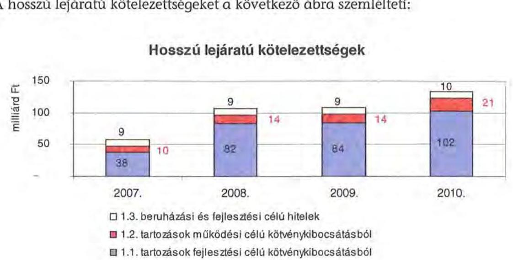

A hosszú lejáratú kötelezettségek mellett az időszakban a 2007. évi 22 milliárd Ft-ról 24 milliárd Ft-ra (8,8%-kal) növekedett az áruszállításból származó szállítói kötelezettségek állománya.

A mérlegben kimutatott kötelezettségek állománya mellett az elhasználódott eszközök pótlására forrást biztosító amortizációs (felújítási) alap képzésének ${ }^{12}$ elmaradása további problémákat vetít előre. A megyei önkormányzatok beszámolójelentéseinek összegzése szerint 2007-ben még az elszámolt értékcsökkenés 90%-ának megfelelő összeget fordítottak felújítási célokra, 2009-ben ez az arányszám már csak 16,5% volt. Ez maga után vonta a feladatellátást kiszolgáló tárgyi eszközök állagának erőteljes romlását.

Az ÁSZ a 2011. évi ellenőrzési tervében a 43. számú, az „Önkormányzatok gazdálkodási rendszerének ellenőrzése" részeként egyidőben, egymással párhuzamosan tekinti át és elemzi az önkormányzati alrendszer középszintjét jelentő 19 megyei önkormányzat pénzügyi helyzetét. A gazdálkodás szabályszerűségét az ÁSZ előző évek során ellenőrizte a megyei önkormányzatoknál is, ezért jelen vizsgálatunk erre nem tér ki.

A jelentés a megyei önkormányzatok sajátos feladatellátási és forrásszabályozási helyzetére tekintettel a megyei önkormányzatok pénzügyi helyzetét, illetve az ezzel összefüggő korábbi ÁSZ javaslatok megvalósítását mutatja be.

[^0]
[^0]:    ${ }^{12}$ Erre a jelenlegi szabályozási környezetben nem kötelezi semmilyen előírás az önkormányzatokat.

---

Az ellenőrzés a 2007. január 1. - 2011. március 31. közötti időszakot ölelte fel.
A vizsgálat jogszabályi alapját 2011. július 1-je előtt az Állami Számvevőszékről szóló 1989. évi XXXVIII. törvény 2. § (3), (5), (6) és (9) bekezdéseiben, az Ötv. 92. § (1) bekezdésében és az Áht. 104. § (3) bekezdésében, 2011. július 1-jét követően az Állami Számvevőszékről szóló 2011. évi LXVI. törvény 1. § (3) bekezdésében, az 5. § (2)-(6) bekezdéseiben és az Áht. 120/A. § (1) bekezdésében foglalt előírások képezték.

Baranya megye országos és régión belül elfoglalt helyzetét 2010. december 31-én az alábbi mutatók szemléltetik (megyei jogú városokkal együtt):

Index: az előző év azonos időszak (időpontja)=100,0

| Mutató megnevezése | Baranya megye | Dél-   dunántúli   régió | Országos |
| :--: | :--: | :--: | :--: |
| Népesség száma (ezer fő)* | 391 | 940 | 9986 |
| Népesség változás indexe (\%) | 99,3 | 99,2 | 99,7 |
| Az ipari termelés volumenindexe (\%) | 98,4 | 113,6 | 110,7 |
| Egy lakosra jutó ipari termelési érték (ezer Ft) | 710,5 | 1101,0 | 2044,4 |
| Ezer lakosra jutó vállalkozások száma (db) | 148 | 156 | 165 |
| A beruházások egy lakosra vetített teljesítményértéke (millió Ft) | 227,0 | 270,1 | 304,7 |
| Foglalkoztatási arány (\%) | 47,4 | 46,8 | 49,5 |
| Munkanélküliségi ráta (\%) | 13,7 | 12,3 | 10,8 |
| Alkalmazásban állók havi nettó átlagkeresete (Ft) | 117512 | 114855 | 132628 |
| Alkalmazásban állók havi nettó átlagkeresetének indexe (\%) | 107,0 | 107,0 | 106,9 |

Ebből Pécs Megyei Jogú Város népessége: 153481 fő
A táblázatban feltüntetett adatok azt jelzik, hogy Baranya megye a gazdaság helyzetét reprezentáló egyes mutatók mindegyike tekintetében elmarad az országos jellemzőktől és a Dél-dunántúli régión belül elfoglalt helyzete sem mutat kedvezőbb képet. Csupán a foglalkoztatási arány és az alkalmazásban élők havi nettó átlagkeresete haladja meg a régiós átlagot, de az országos értékeket e mutatók sem érik el.

A megyében 301 települési 1 megyei jogú városi, 13 városi, 3 nagyközségi és 284 községi - önkormányzat működött.

---

# I. ÖSSZEGZŐ MEGÁLLAPÍTÁSOK, KÖVETKEZTETÉSEK, JAVASLATOK 

Az Önkormányzat adatszolgáltatása alapján 2010-ben 16251 millió Ft összes költségvetési kiadásából 99%-ot kötelező feladatai ellátására fordított. Az Önkormányzat önként vállalt feladatai az SzMSz-ben meghatározottaknak megfelelően, kiemelten a kultúra, művészeti, szórakoztató és szabadidős tevékenységhez, egyes idegenforgalmi, turisztikai, kiadvány szerkesztési szolgáltatások szervezéséhez kapcsolódtak, valamint támogatást nyújtott civil szervezetek, alapítványok, gazdasági társaságok működéséhez, összesen 156 millió Ft összegben. Az Önkormányzat SzMSz-e a kötelező közszolgáltatási feladatokat, és azok ellátásának szervezeti keretét általános jelleggel, a vonatkozó jogszabályokra hivatkozással határozta meg.

Az Önkormányzat kötelező és önként vállalt feladatait 2007. január 1-jén kiemelten a Hivatallal és 21 intézménnyel, egy társulással, három többségi tulajdonú gazdasági társasággal, egy nem többségi tulajdonú gazdasági társasággal, feladat ellátási szerződés alapján egy gazdasági társasággal, két alapítvánnyal, valamint három civil szervezettel, összesen 58 telephelyen teljesítette.

A szervezeti változások eredményeként az Önkormányzat a kötelező és önként vállalt feladatait 2010. december 31-én kiemelten a Hivatallal és 15 intézménnyel, három társulással, három többségi tulajdonú és egy nem többségi tulajdonú gazdasági társasággal, feladat ellátási szerződés alapján egy gazdasági társasággal, valamint alapító okirata alapján egy alapítvánnyal és egy egyesülettel, összesen 67 telephelyen látta el. Az intézmények száma 2007-2010. közötti három intézményi átadás, és két intézmény, valamint egy intézményegység átvétel - az oktatási, egészségügyi, kulturális feladatokat érintően -, valamint a szociális és oktatási ágazatban megvalósult intézmény átszervezések következtében alakult ki.

A vizsgált időszakban az Önkormányzat folyó költségvetési egyenlege, működési jövedelme - 2008. év kivételével - negatív összegű volt - a pénzügyi helyzet elemzéséhez alkalmazott CLF modell szerint. A folyó költségvetés hiánya 2007-ben a folyó kiadások 1,8%-át, 2009-ben 10,4%-át, 2010-ben 7,6%-át jelentette.

A CLF szerinti működési forráshiány kialakulásában leginkább az játszott szerepet, hogy az Önkormányzat legfőbb bevételi forrásai - a jogszabályi kedvezmények bővülése, és az ingatlanforgalom visszaesése következményeként az illetékbevétel, valamint a központi forráskivonás hatására az átengedett szja és az állami támogatások - jelentősen csökkentek.

Az Önkormányzatnál az illetékbevétel 2010-re a 2006. évi 1759 millió Ft-ról (68,4%-ára) 1203 millió Ft-ra csökkent. Az átengedett szja és az állami támogatások együttes összege a központi támogatás csökkentésén túl, a feladat átadásátvétel hatását is figyelembe véve kevesebb lett, 2010-ben 3037 millió Ft volt, a 2007. évi 70,5%-a. Az Önkormányzat társadalombiztosítási alapból származó bevétele 2007-ben 4193 millió Ft, 2010-ben 357 millió Ft volt. Az egyéb saját

---

bevételek emelkedése nem tudta ellensúlyozni a kieső forrásokat. A 2010. évben az intézményi működési bevételek 130 millió Ft-tal voltak kevesebbek, mint a 2007. évi tényleges bevételek, az ellátottak számának és az intézményi térítési díj bevételének csökkenése miatt.

A működési kiadások 2007-ről 2010-re 26,7%-kal, 3818 millió Ft-tal csökkentek. Ennek jelentős részét a Kórház 2009. december 31-én történő megszüntetése és a feladatainak a Pécsi Tudományegyetem és Klinikai Központnak történő átadása eredményezte. A Kórház működésére 3576 millió Ft, fejlesztésére 18 millió Ft támogatást nyújtott 2007-2010. között az Önkormányzat.

A Kórház nélkül az intézmények teljesített működési kiadásai 2007-ben 9458 millió Ft-ot tettek ki (az összes működési kiadás 66,2%-a), amely 2010-re 10468 millió Ft-ra nőtt (az összes működési kiadás 100%-a).

A működési és felhalmozási kiadásokon belül 2007-2010 között a felhalmozási kiadások súlya 937 millió Ft-ról (6,2%-ról) 5784 millió Ft-ra (35,6%-ra) nőtt. Az aktív pályázati tevékenység eredményeként 2007-2010. között 9763 millió Ft bekerülési költségű beruházást folytatott, illetve indított el az Önkormányzat, amelyből 288 millió Ft a 2010 utánra vállalt kötelezettség. Az utóbbi forrásai az Önkormányzat adatszolgáltatása alapján a következők: 45 millió Ft tervezett saját bevétel maradvány-felhasználással, 16 millió Ft tervezett hitel, 216 millió Ft elnyert EU-s támogatás, 10 millió Ft elnyert hazai támogatás.

Az Önkormányzat pénzintézeti kötelezettségeinek állománya a könyvviteli mérlegadatok szerint 2006. december 31-ről 2010. december 31-re 1402 millió Ft-ról 7621 millió Ft-ra nőtt. A vizsgált időszakban adósságszolgálatra az Önkormányzat 2104 millió Ft-ot teljesített, amelyből a kamatkiadás 585 millió Ft volt. A kötvényből származó források befektetéséből 2007-2010. évek között realizált kamatbevétel 636 millió Ft.

A 2010. évben a
 folyószámlahitellel zárt napok száma 329, a folyószámlahitel átlagos napi állománya 722 millió Ft volt.

Az Önkormányzat 2010. év végi pénzintézeti kötelezettségéből 4326 millió Ft (57\%) fejlesztési célú kötvény kibocsátásából ${ }^{13}$, 1426 millió Ft (18\%) működési célú kötvények kibocsátásából, 1343 millió Ft (18\%) fejlesztési célú hosszú lejáratú hitel felvételéből, valamint 526 millió Ft (7\%), a költségvetési év végén ki nem egyenlített folyószámlahitelből keletkezett. Ezek miatt az Önkormányzatnak a 2011-2013. években 804 millió Ft, 2182522 CHF és 2171624 EUR tőketörlesztést és kamatot kell teljesítenie. Az Önkormányzat 2010. év végi szállítói tartozása - a gazdasági társaságok szállítói tartozásállománya nélkül - 241 millió Ft (ebből lejárt 16 millió Ft). A 2011-2013. évi összes (pénzintézeti, szállítói, valamint egyéb) kötelezettség teljesítésére figyelembe vehető 578 millió Ft pénzmaradvány, 3193 millió Ft forgalomképes ingatlanvagyon, melyből 2273 millió Ft a pénzintézeti kötelezettséghez kapcsolódóan jelzáloggal terhelt, és a mérlegben kimutatott 128 millió Ft követelésállomány. A teljesítés forrásá-

[^0]
[^0]:    ${ }^{13}$ A fejlesztési célú kötvény kibocsátásából származó bevétel 73\%-át működési kiadásokra fordította az Önkormányzat.

---

nak megléte - az ingatlanok értékesíthetőségének bizonytalansága miatt - csak részben igazolható.

A 2013. évet követően jelenleg ismert pénzintézeti kötelezettségei: 1450 millió Ft, 19547538 CHF és 4260638 EUR. Ezekre az Önkormányzat tájékoztatása szerint figyelembe vehető források: a forgalomképes vagyonának egy része, az Önkormányzat illetékbevétele, szabad pénzmaradványa, követelésállománya és folyószámlahitele. Ezek alapján, hosszútávon a kötelezettségek teljesítésének forrásait nem számszerűsítették.

Hátrányt jelentett az Önkormányzat számára, hogy a számlavezetéssel és a kötvénykibocsátással ugyanazon pénzintézetet bízta meg, mivel a pénzintézet a kockázatokat összevontan értékelve kedvezőtlenebb hitelkondíciókat alkalmazott.

A közgyűlési előterjesztések tartalmazták a kötelezettségvállalás visszafizetési forrásait, a teljes futamidő várható kamat és tőkefizetési kötelezettségeit, az ár-folyam- és kamatkockázatok, valamint az adósságszolgálati korlát bemutatását.

A Közgyűlés a kötvénykibocsátásból származó kötelezettségek biztosítékaként az Önkormányzat 9 db forgalomképes, valamint - az Ötv. 88. § (1) bekezdését megsértve - kettő db korlátozottan forgalomképes ingatlanán jelzálogjog alapításához és bejegyzéséhez járult hozzá.

Az Önkormányzat nem vizsgálta, hogy az elhasználódott eszközök pótlása milyen kötelezettséget jelent a számára. A 2007-2010 években a tárgyi eszközök után 742 millió Ft értékcsökkenést számolt el, ugyanakkor felújításra ennek csak egy részét, 528 millió Ft-ot (71\%) fordított.

A végrehajtott kiadáscsökkentő intézkedések a feladatellátás szakmai színvonalának növelése mellett a takarékos szemléletű gazdálkodást, a működőképesség megőrzését, a pénzügyi helyzet javítását célozták meg. A feladatátadások, -átvételeken felül az intézményátszervezések, valamint a takarékossági intézkedések hatásaként a 2007-2010. években - az Önkormányzat kimutatása szerint - együttesen 1454 millió Ft kiadási megtakarítás keletkezett, melyből 705 millió Ft, 48,5\% a kapcsolódó álláshely csökkenések következtében jelentkezett.

Az álláshely csökkentő intézkedések következtében 2007-2010 között a Hivatalnál és az intézményeknél összesen 1862 álláshelyet szüntettek meg, amelyből 1274 fő, 68,4\% ágazati szakmai, 588 fő, 31,6\% intézményüzemeltetéshez, fenntartáshoz, gazdasági ügyek intézéséhez kapcsolódó álláshely volt.

A 2007-2010 közötti időszakban a bevételnövelésre irányuló intézkedések eredményéből - amelynek számszerűsített összege 1643 millió Ft többletbevétel volt - 1080 millió Ft-ot, 65,7\%-ot a Hivatal realizálta. Bevétel növekedésében meghatározó tényező a bérbeadás és az ingatlanok értékesítése 427 millió Fttal, az átmenetileg szabad pénzeszközök lekötéséből származó kamatbevétel 653 millió Ft-tal. Az intézmények bevétel növekedése kiemelten a térítési díjak

---

emeléséből (204 millió Ft), a bérbeadásból (7 millió Ft) valamint a további szolgáltatások bevételi többletéből (352 millió Ft) eredt.

A helyi önkormányzatok gazdálkodási rendszerének 2009. évi jelentésében az ÁSZ a pénzügyi egyensúly javítására szabályszerűségi és célszerűségi javaslatot nem tett, ezért utóellenőrzésre nem került sor.

Az Önkormányzat pénzügyi helyzetét összegezve a következők emelhetők ki:

Az Önkormányzat az ellenőrzött időszak alatt meghozott kiadáscsökkentő és bevételnövelő intézkedései a központi intézkedések hatására csökkenő bevételeket ellensúlyozni nem tudták. A működési kiadások növekedése amellett következett be, hogy a feladatellátás változásának hatására több tanuló oktatását adták át, mint ahányat átvettek. A működési kockázatot fokozza egyfelől az Önkormányzat által folyamatosan és növekvő mértékben igénybe vett folyószámlahitel, másfelől, hogy az áttekintett időszak elején kibocsátott kötvény mintegy háromnegyedét működési célra fordította, továbbá az időszak végén működési célú kötvénykibocsátásra kényszerült. A 2010. évet követő beruházások volumene minimális, forrása biztosított. A hosszú lejáratú kötelezettségek 2010. évet követő forrásai az elkövetkezendő 3 évben még biztosítottak, azonban az azt követő időszakban esedékessé váló kötelezettségek fedezetének megléte - figyelemmel a forgalomképes ingatlanok értékesíthetőségére - részben igazolható.

A Közgyűlés elnöke a 2011. évi költségvetés keretében korábban elfogadott intézkedésekről adott tájékoztatást. Az adósságszolgálat csökkentése és az önkormányzat likviditási helyzetének javítása érdekében kezdeményezték a Norvég alap által támogatott program szerződésének megszüntetését, amellyel 400 millió Ft önerőt takarítottak meg.

A feladatok és források közötti egyensúly megteremtésére irányuló központi döntések, a megyei önkormányzatok konszolidációjára, az intézmények átvételére vonatkozó törvényjavaslat elfogadása új feltételeket teremtett. Az önkormányzat pénzügyi helyzetének stabilizálása - a folyamatosan romló likviditás, a kötelezettségek teljesítéséhez szükséges források tervezetlensége miatt - további intézkedéseket igényel.

Az Állami Számvevőszékről szóló 2011. évi LXVI. törvény 33. § (1) bekezdésében foglaltak értelmében a jelentésben foglalt megállapításokhoz kapcsolódó intézkedési tervet köteles az ellenőrzött szervezet vezetője összeállítani és azt a jelentés kézhezvételétől számított harminc napon belül az ÁSZ részére megküldeni. Amennyiben az intézkedési tervet határidőben nem küldi meg a szervezet, vagy az továbbra sem elfogadható, az ÁSZ elnöke a hivatkozott törvény 33. § (3) bekezdés a)-b) pontjaiban foglaltakat érvényesítheti.

---

A 2011 májusában lezárult helyszíni ellenőrzés tapasztalatai alapján - figyelembe véve az Önkormányzat észrevételeit és a saját hatáskörben tett intézkedéseit - az alábbi javaslatokat tette az ÁSZ:

# a Közgyűlés elnökének: 

1. tájékoztassa a Közgyűlést rendszeresen az intézkedési terv megvalósításáról, annak eredményeiről. A pénzügyi egyensúlyt befolyásoló feltételek romlása esetén tegyen javaslatot az intézkedési terv módosítására;
2. gondoskodjon a pénzintézeti kötelezettségek finanszírozási lehetőségeinek számbavételéről és arra források biztosításáról;
3. mutassa be a Közgyűlésnek az éves költségvetési előterjesztésekben az értékcsökkenési leírás összegét, és ezzel arányban az elhasználódott eszközök pótlásának forrásigényét és -lehetőségét;
4. intézkedjen a korlátozottan forgalomképes önkormányzati ingatlanokon alapított jelzálogjog megszüntetésére.

---

# II. RÉSZLETES MEGÁLLAPÍTÁSOK 

## 1. Az ÖNKORMÁNYZAT KÖTELEZŐ ÉS ÖNKÉNT VÁLLALT FELADATAI

Az Önkormányzat 2010. évi zárszámadási rendelete alapján költségvetési kiadásából 16095 millió Ft-ot, 99\%-ot a kötelező, 156 millió Ft-ot, 1\%-ot az önként vállalt feladatok ellátására fordította. A 2011. évi tervadatok alapján az önként vállalt feladatokra az összes költségvetési kiadás 1,5\%-a jut (149 millió Ft), ami 0,5 százalékponttal több, mint az előző évben. (A 2010-2011. évekre a kötelező és önként vállalt feladatok teljesítésére fordított, illetve tervezett kiadásokat az Önkormányzat az önhibájukon kívül hátrányos helyzetben lévő önkormányzatok 2011. évi támogatására benyújtott pályázatában számszerűsítette.) Az Önkormányzat önként vállaltnak tekintett feladatai kiemelten a kultúra, művészeti, szórakoztató és szabadidős tevékenységhez, idegenforgalmi, turisztikai, kiadvány szerkesztési szolgáltatások szervezéséhez kapcsolódnak, valamint támogatást nyújt civil szervezetek, alapítványok, gazdasági társaságok működéséhez.

Az Önkormányzat SzMSz-ében a kötelező közszolgáltatási feladatokat, azok ellátásának szervezeti keretét egyrészt általános jelleggel az Ötv-ben foglaltak megismétlésével jelölte meg, másrészt rögzítette, hogy a kötelezően ellátandó feladat-, és hatásköröket a helyi önkormányzatok és szerveik feladat-, és hatásköri jegyzéke tartalmazza, amelyet az SzMSz 3. számú függelékének kell tekinteni. Az Önkormányzat által önként vállalt feladatokat az SzMSz 4. §-a tartalmazta azzal a kiegészítéssel, hogy az önként vállalt közfeladatok tartalmát a Közgyűlés egyedi határozattal állapítja meg. Az önként vállalt feladatokra fordítható források nagyságát az éves költségvetési rendeletekben határozták meg.

Az Önkormányzat éves költségvetési kiadásainak szerkezetét tekintve 2010-ben a járulékokkal növelt személyi juttatások és a dologi kiadások 8589 millió Ft-os összegén belül ${ }^{14}$ a szociális és gyermekvédelmi célokra 2824 millió Ft-ot, az oktatási célokra 1935 millió Ft-ot, közművelődési feladatokra 937 millió Ft-ot (10,9\%-ot), igazgatási és egyéb, a társulások által is ellátott feladatokra 2893 millió Ft-ot (33,7\%-ot) fordítottak. A szociális és gyermekvédelmi feladatokat ellátó öt intézmény kiadásokból való részesedése 32,9\%, az öt közoktatási intézményé 22,5\% volt. A 2010. évben a közoktatási feladatok kiadásait 50,8\%-ban, a szociális és gyermekvédelmi feladatok kiadásait 54,8\%-ban finanszírozta normatív költségvetési támogatás 983 millió Ft, illetve 1548 millió Ft összegben.

[^0]
[^0]:    ${ }^{14}$ Az Önkormányzat személyi és dologi kiadásainak ágazatonkénti megbontása a BM részére 2010 decemberében készített adatszolgáltatás kigyűjtéséből származik.

---

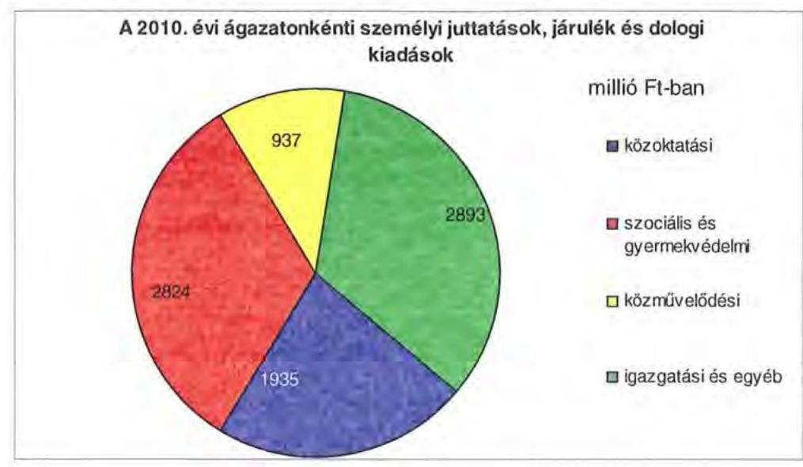

A 2010. évi költségvetési kiadásokból 6428 millió Ft-ot (39,6\%-ot) az intézmények, 9058 millió Ft-ot (55,7\%-ot) a Hivatal, valamint 765 millió Ft-ot (4,7\%-ot) a társulások kiadásaira teljesítettek. A Hivatal költségvetéséből a személyi és dologi kiadások 2268 millió Ft-tal (25,0\%-kal), a beruházások 4989 millió Ft-tal (55,1\%-kal), a különböző megyepolitikai feladatok, szervezetek támogatásához kapcsolódó további kiadások 1801 millió Ft-tal, 19,9\%-kal részesülnek.

Az Önkormányzat kötelező és önként vállalt feladatait 2007. január 1-jén kiemelten a Hivatallal és 21 intézménnyel, egy társulással, három többségi tulajdonú gazdasági társasággal, egy nem többségi tulajdonú gazdasági társasággal, feladat ellátási szerződés alapján egy gazdasági társasággal, két alapítvánnyal, valamint három civil szervezettel, összesen 58 telephelyen látta el.
2010. december 31-én az Önkormányzat kötelező és önként vállalt feladatait kiemelten a Hivatal és 15 intézmény, három társulás, három többségi tulajdonú gazdasági társaság, egy nem többségi tulajdonú gazdasági társaság, feladat ellátási szerződés alapján egy gazdasági társaság, valamint alapító okirata alapján egy alapítvány és ellátási szerződés megkötésével egy egyesület teljesítette.

Az Önkormányzat által fenntartott költségvetési szervek mindegyike önállóan működő és gazdálkodó költségvetési szerv, az intézmények - alapító okirataik szerint - összesen 67 telephelyen működtek. Az Önkormányzat feladatait 2010. december 31-én az alábbi intézménystruktúrával látta el:

- szociális és gyermekvédelmi feladatokat öt intézmény végzett 33 telephelyen (például a fogyatékos személyek bentlakásos ellátását három, a demens betegek és időskorúak bentlakásos ellátását egy, a pszichiátriai betegek bentlakásos ellátását szintén egy intézmény biztosította, valamint egy intézmény gyermekvédelmi feladatot látott el) ${ }^{15}$;

[^0]
[^0]:    ${ }^{15}$ Egy intézmény több feladatot is ellátott.

---

- közoktatási feladatot öt intézmény látott el 18 telephelyen (az ellátott feladatok kiemelten: sajátos nevelési igényű gyermekek óvodai ellátása, általános iskolai oktatása gimnáziumi szakközépiskolai szakiskolai, speciális szakiskolai oktatás alapfokú művészetoktatás valamint korai fejlesztés-, gondozás, fejlesztő felkészítés);
- közművelődési és közgyűjteményi feladatokat végzett négy intézmény (levéltár, múzeum, kulturális és idegenforgalmi központ, valamint művészetek és irodalom háza);
- igazgatási feladatokat látott el a Hivatal, egy intézmény pedig gazdasági igazgatóságként működött (feladatkörét jelentette elsősorban az üdülők üzemeltetése, építményüzemeltetés, karbantartás).

Az Önkormányzat költségvetésében szereplő és elsősorban kötelező feladatot ellátó társulások közül:

- a Dél-Dunántúli Önkormányzati Regionális Társulás ${ }^{16}$ elsősorban a súlyos pszichés, a súlyos disszociális tüneteket mutató és a pszichoaktív szerekkel küzdő gyermekek
 szakellátását koordinálta, valamint speciális gyermekotthonokat működtetett;
- a Baranya-Pécs Közkönyvtári Társulást az Önkormányzat a Pécs Megyei Jogú Város Önkormányzatával 2009. november 6-án alapította, többek között egységes könyvtári szolgáltatás megvalósítására, nyilvános könyvtári ellátás működésének, fejlesztésének biztosítására;
- a Pannon Szakképzési Szervezési Társulást - 2008. július 1-jén - hat önkormányzat alapította egyes szakképzéssel összefüggő feladataik végrehajtására.

Az egyes ágazatok kötelező feladatellátását 2010. december 31-én az alábbi mutatók jellemezték:

| Megnevezés | közoktatás | szociális és   gyermekvé-   delem | kultúra és sport |
| :-- | :--: | :--: | :--: |
| Az ágazatban foglal-   koztatottak száma (fő) | 430 | 735 | 142 |
| Az ágazat intézményel-   ben ellátottak össze-   sen (fő) | 2060 | 1876 |  |

Az Önkormányzat feladatellátásában közreműködő három többségi részesedésű gazdasági társasága közül egynél - a Baranya Ifjúságáért Nonprofit Kft. - az Önkormányzatnak 100%-os tulajdoni részesedése volt, a Baranya Alkotótelepek Nonprofit Kft-ben 76%-os, valamint a Zsigmondy Vilmos Harkányi Gyógyfürdőkórház Nonprofit Kft-ben 60%-os tulajdoni részesedéssel rendelkezett. A gazdasági társaságok kiemelten az alábbi feladatokat látták el:

[^0]
[^0]:    ${ }^{16}$ A társulást öt önkormányzat alapította 2005. július 1-jén. A társulást 2011 márciusában az alapítók megszüntették.

---

- a 3 millió Ft törzstőkével rendelkező Baranya Ifjúságáért Nonprofit Kft. az alapító Önkormányzat és Pécs Megyei Jogú Város Önkormányzata részére látott el gyermek és ifjúsági jogok érvényesítésével kapcsolatos kötelező feladatokat, együttműködve a helyi és kisebbségi önkormányzatokkal, intézményekkel, szervezetekkel. A Kft. ellátási szerződés alapján nyújtott szolgáltatásai közé tartozott az ifjúsági tanácsadás, információs adattár, érdekegyeztető fórum működtetése, szakmai koordináció, valamint programszervezés;
- a Baranya Alkotótelepek Nonprofit Kft-ben az Önkormányzat törzsbetétje 2,3 millió Ft-ot tett ki. A Kft. célszerinti tevékenysége a kulturális örökség megóvása, kulturális tevékenység, valamint nevelés és oktatás, képességfejlesztés, ismeretterjesztés volt. A Kft. az Önkormányzat részére önként vállalt feladatot teljesített;
- a Zsigmondy Vilmos Harkányi Gyógyfürdőkórház Nonprofit Kft. ${ }^{17}$ a fekvőbeteg ellátás és szakorvosi járó beteg ellátás kötelező feladatokat látta el. Az Önkormányzat a Kft. törzstőkéjében névértéken 120 millió Ft nem pénzbeli betéttel részesedett.

Az Önkormányzat az áttekintett időszakban egy önkormányzattól, egy önkormányzati társulástól vett át közoktatási feladatokat összesen 842 fő tanulólétszámmal, valamint egy egyetemnek és két önkormányzati társulásnak adott át feladatot. Az átadott feladatok között szerepelt a Kórház átadása 408 fekvőbetegágy számmal és 76180 szakorvosi órával, valamint egy közoktatási intézmény 1101 fő tanuló létszámmal.

# 2. PÉNZÜGYI EGYENSÚLYI HELYZET ALAKULÁSA 

A hagyományos költségvetési szerkezet helyett az önkormányzat pénzügyi helyzetét a CLF módszerrel mutatjuk be, amelyben jobban elkülönülnek a vagyonnal kapcsolatos bevételek és kiadások a feladatokkal kapcsolatos közvetlen működtetési bevételektől és kiadásoktól. A módszer következetesen elkülöníti a folyó és a felhalmozási költségvetés bevételeit és kiadásait, azok költségvetési egyenlegeit. A tárgyévi pozíciók meghatározása érdekében a figyelembe vett saját folyó bevételek, valamint saját felhalmozási bevételek nem tartalmazzák az előző évi pénzmaradványok felhasználásából származó pénzforgalom nélküli bevételeket ${ }^{18}$.

A bevételek és kiadások besorolása általános közgazdasági meggondolásokon alapul, amely testet ölt az SNA statisztikai módszertanában is. Folyó tételek alatt értjük azokat a bevételeket és kiadásokat, amelyek az önkormányzat vagyoni helyzetét automatikusan nem változtatják. A bevételi oldalon ilyenek az adók, az illeték, az áfa bevételek és visszatérülések, a hozamok és kamatok, a költségvetési támogatások, az egyéb saját bevételek, valamint a működési célra

[^0]
[^0]:    ${ }^{17}$ Jogelődje a Kht. 2006. február 16-án alakult, a Baranya Megyei Gyógyfürdő Kórház által ellátott egészségügyi szolgáltatási feladatokat vette át.
    ${ }^{18}$ A költségvetési években kialakuló hiány finanszírozása az előző években képzett tartalékok felhasználásával is történhet.

---

átvett pénzeszközök és kapott támogatások. A folyó kiadások közé tartoznak a szolgáltatások nyújtásával kapcsolatos működési kiadások, a kamatkiadások, valamint a működési célú transzferkiadások ${ }^{19}$. A felhalmozási vagy tőke tételek módosítják az önkormányzat vagyoni helyzetét. A privatizációs bevételek, az immateriális javak és tárgyi eszközök, valamint a részesedések értékesítése csökkentik, a fizikai beruházások és a pénzügyi befektetések növelik a vagyont. A pénzforgalmi bevételek és kiadások nem tartalmazzák a követelések elengedése miatt könyvelt tételeket, mivel ezek egymást kioltó, technikai jellegű elszámolási műveletek.

A folyó költségvetés egyenlege, a működési jövedelem megmutatja, hogy az önkormányzat éves folyó bevétele fedezetet biztosít-e a kötelező és önként vállalt feladatellátáshoz kapcsolódó éves folyó kiadására. A működési jövedelem negatív értéke pénzügyileg fenntarthatatlan helyzetet jelez. A mutató pozitív értéke megtakarítást mutat, amely forrásul szolgálhat az önkormányzat fennálló kötelezettségei megfizetéséhez, valamint fejlesztéshez.

A felhalmozási költségvetés pozitív értéke felhalmozási többletet mutat, amely a jövőbeni fejlesztések forrását biztosíthatja. Amennyiben a folyó költségvetési hiány finanszírozása a felhalmozási többletből történik, ez szűkebb értelemben vagyonfelélésnek tekinthető. Amennyiben a felhalmozási költségvetés megtakarítása fejlesztési célú hitelek, kötvények adósságszolgálatát finanszírozza, az változatlan vagyontömeg mellett, a korábban megelőlegezett tőkebevételek valós realizációjának tekinthető. A felhalmozási deficit által generált finanszírozási igény önmagában nem jár pénzügyi kockázattal, a pénzügyileg fenntartható beruházásokhoz kapcsolódó kötelezettségvállalás (adósságszolgálat) előrelátó, tudatos költségvetési gazdálkodással teljesíthető.

A módszer a pénzügyi kapacitás (más néven a nettó működési jövedelem) fogalmát helyezi a középpontba. Az adós hitelfelvételi képessége, hosszú távú fizetőképessége vagy bonitása a pénzügyi kapacitással, ezen belül is a nettó működési jövedelemmel jellemezhető. A nettó működési jövedelem negatív értéke az egyes költségvetési években jelentkező adósságszolgálat túlzott mértékére utal ${ }^{20}$. A nettó működési jövedelem negatív értékének felhalmozási többletből, vagy további hitelből történő finanszírozása pénzügyileg nem fenntartható gazdálkodást vetít előre. A pozitív értéket mutató nettó működési jövedelem fejlesztési kiadások fedezetét biztosíthatja, illetve a folyamatosan, évenként képződő pozitív nettó működési jövedelemből meghatározható a jövőben vállalható, teljesíthető éves adósságszolgálat, ily módon az a hitelösszeg, amely - a többi tényezőt, feltételt adottnak tekintve - visszafizetési kockázat nélkül felvehető.

A CLF módszer alapján a pénzügyi kapacitás mértéke az önkormányzat összevont, nettósított, a központi információs rendszerbe a MÁK-on keresztül leadott éves költségvetési beszámolójának 80-as űrlapjában szerepeltetett adatok alap-

[^0]
[^0]:    ${ }^{19}$ Transzferkiadásoknak azokat a folyó és felhalmozási tételeket nevezzük, amelyeket nem az adott önkormányzat használ fel szolgáltatásnyújtásra (pl.: ellátottak pénzbeni juttatásai, átadott pénzeszközök, garancia- és kezességvállalások stb.).
    ${ }^{20}$ Kivéve, ha annak finanszírozására a korábbi években képzett tartalékok fedezetet nyújtanak.

---

ján került meghatározásra. A 2007-2010 közötti időszakban az Önkormányzat CLF módszer szerint besorolt kiadásainak és bevételeinek főbb jogcímek szerint alakulását a jelentés 2/a. számú melléklete tartalmazza.

Az Önkormányzat bevételei és kiadásai alakulását részletesen a hatályos számviteli előírások szerint készült, összevont éves költségvetési beszámolók adataira alapozva mutatjuk be. A bevételek és kiadások működési, valamint felhalmozási jogcímekre történő elkülönítését az éves költségvetési beszámolók, a zárszámadási rendeletek, továbbá - amely jogcímek ${ }^{21}$ esetében erre más lehetőség nem volt - az Önkormányzat adatszolgáltatása szerinti megbontás alapján végeztük el. A bevételek elemzése során figyelembe vettük a korábbi években keletkezett pénzmaradvány felhasználásából származó pénzforgalom nélküli bevételeket is. A 2007-2010 közötti időszakban az Önkormányzat bevételeit és kiadásait, továbbá adósságszolgálati kötelezettségei a jelentés 2/b. számú melléklete tartalmazza.
${ }^{21}$ Az előző évi maradvány visszafizetésének, az előző évi pénzmaradvány átadásának és átvételének, a kamatkiadásoknak, az egyéb pénzforgalom nélküli kiadásoknak, a hozam- és kamatbevételeknek, az átengedett adóknak, a költségvetési támogatásoknak, továbbá az előző évi pénzmaradvány igénybevételének működési és felhalmozási részre történő megosztásához az Önkormányzat által szolgáltatott adatokat vettük figyelembe.

---

# 2.1. A működési és felhalmozási egyensúly alakulása

## CLF módszer szerinti önkormányzati adatok

|  Megnevezés | 2007 | 2008 | 2009 | 2010  |
| --- | --- | --- | --- | --- |
|  Folyó bevételek | 14148149 | 13043447 | 11728081 | 9774916  |
|  Folyó kiadások | 14402612 | 12773887 | 13095867 | 10574551  |
|  Működési jövedelem | $-254463$ | 269560 | $-1367786$ | $-799635$  |
|  Nettó működési jövedelem
= működési jövedelem - tőketörlesztés | $-818368$ | $-505424$ | $-1433620$ | $-913440$  |
|  Felhalmozási bevételek | 1269865 | 420707 | 934106 | 3442844  |
|  Felhalmozási kiadások | 820468 | 763712 | 1974807 | 5676942  |
|  Felhalmozási költségvetés egyenlege | 449397 | $-343005$ | $-1040701$ | $-2234098$  |
|  Finanszírozási műveletek nélküli (GFS) pozíció =
működési jövedelem + felhalmozási költségvetés
egyenlege | 194934 | $-73445$ | $-2408487$ | $-3033733$  |
|  Finanszírozási műveletek egyenlege | 2708725 | $-1132370$ | $-82681$ | 3020558  |
|  Tárgyévi pénzügyi pozíció változás | 2903659 | $-1205815$ | $-2491168$ | $-13175$  |
|  Egyéb tájékoztató adatok |  |  |  |   |
|  Összes kötelezettség* | 5762686 | 5770023 | 5572458 | 7936546  |
|  ebből rövid lejáratú | 1981918 | 2020029 | 1835478 | 1106551  |
|  Folyószámlahitel napi átlagos állománya** | 598577 | 166150 | 505625 | 721939  |
|  Likvidhitel napi átlagos állománya** | 0 | 0 | 0 | 0  |
|  Munkabérhitel napi átlagos állománya** | 0 | 0 | 0 | 0  |
|  Egyéb finanszírozásba vonható eszközök összesen: | 4428497 | 3222682 | 731514 | 860113  |
|  Tartós hitelviszonyt megtestesítő értékpapírok év végi
állománya | 0 | 0 | 0 | 0  |
|  Hosszú lejáratú bankbetétek év végi állománya | 0 | 0 | 0 | 0  |
|  Értékpapírok év végi állománya | 1181 | 1181 | 1181 | 1181  |
|  Pénzeszközök (idegen pénzeszközök nélkül) év végi
állománya | 4427316 | 3221501 | 730333 | 858932  |

- Az összes kötelezettséget passzív pénzügyi elszámolások nélkül vettük figyelembe, mert a passzívák a pénzmaradvány elszámolás tételei közé tartoznak ** a folyószámla-, likvid-, és munkabérhitel átlagos állományát 365 nappal számítottunk

---

A vizsgált időszakban - 2008. év kivételével - az Önkormányzat folyó költségvetési egyenlege, működési jövedelme negatív összegű volt, melynek alakulását a következő ábra szemlélteti:
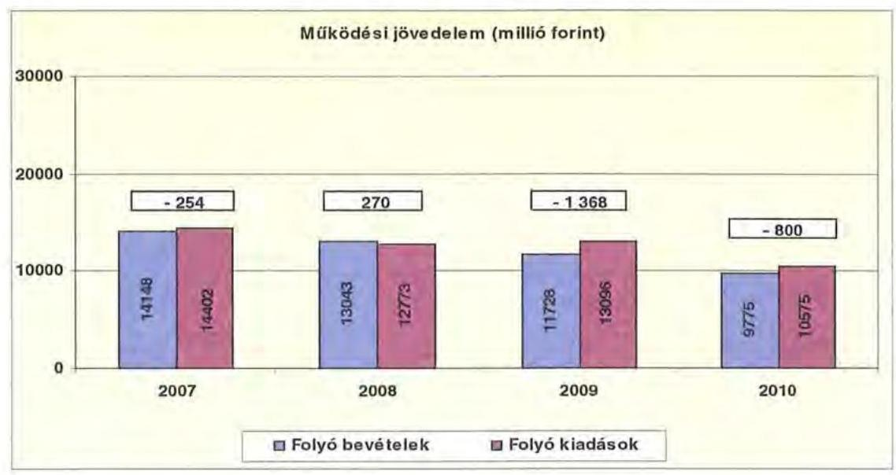

A folyó költségvetés hiánya (a működési forráshiány) 2007-ben a folyó kiadások 1,8%-át ( 254 millió Ft-ot), 2009-ben 10,4%-át ( 1368 millió Ft-ot), 2010-ben 7,6%-át ( 800 millió Ft-ot) jelentette. A 2008. évben 270 millió Ft működési többlet volt.

A működési forráshiány finanszírozása a 2007. és a 2009-2010. években folyószámlahitelből és fejlesztési céllal kibocsátott kötvényből történt. A folyószámlahitel napi átlagos állománya 2007-2010 között 20,5%-kal (599 millió Ftról 722 millió Ft-ra) emelkedett.

Az Önkormányzat kötelezettségein ${ }^{22}$ belül a 2010. évben a rövid lejáratú kötelezettségek állománya 13,9% volt, a 2007-2009
 közötti időszakban valamivel több, mint 30%-os aránnyal szemben. Az Önkormányzat 2006. december 31-én fennálló pénz és tőkepiaci kötelezettsége 1402 millió Ft-ról több mint ötszörösére, 7621 millió Ft-ra nőtt a hosszú lejáratú hitelfelvétel, kötvénykibocsátások miatt.

A rövid lejáratú kötelezettségek 2010-ben 1107 millió Ft-ot tettek ki, amely 875 millió Ft-tal (44,2%-kal) kevesebb a 2007. évi rövid lejáratú kötelezettségállománynál. A rövid lejáratú kötelezettségeknek a szállítói állomány 2007-ben 78,6%-át, 1558 millió Ft-ot, 2008-ban 90,0%-át, 1817 millió Ft-ot, 2009-ben 90,1%-át, 1653 millió Ft-ot, 2010-ben 21,8%-át, 241 millió Ft-ot tette ki, a szállítói kötelezettségek a vizsgált időszakban több mint a 6-odára csökkentek. A csökkenést a Kórház szállítói kötelezettségeinek rendezése eredményezte. Az önkormányzat 2010. év december 31-én nem rendelkezett lejárt szállítói tartozásállománnyal.

[^0]
[^0]:    ${ }^{22}$ passzív pénzügyi elszámolások nélküli

---

Az Önkormányzat pénzügyi kapacitása a vizsgált időszakban negatív értéket mutatott. A nettó működési jövedelem ${ }^{23}$ értéke a folyó költségvetési pozíció mellett az adott költségvetési év adósságtörlesztésének hatását is tükrözi.

Az Önkormányzat nettó működési jövedelmének évenkénti alakulását az alábbi ábra szemlélteti:
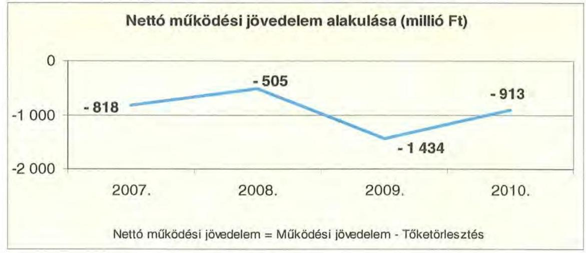

A folyó költségvetés egyenlegének és a tőketörlesztésre (hiteltörlesztés és forgatási és befektetési célú értékpapírok beváltása) fordított összegeknek évenkénti különbözete (a nettó működési jövedelem) a 2007. évet követően átmenetileg javult, majd a 2009. és a 2010. évben ismét magas értéket mutatott. A folyó költségvetések deficitesek voltak, ezen felül még a 2009. évben 66 millió Ft, a 2010. évben 114 millió Ft tőketörlesztés és forgatási és befektetési célú értékpapír beváltására is sor került.

A 2008-2010. években az Önkormányzat felhalmozási költségvetésének egyenlege negatív összegű volt, amelyet a következő ábra szemlélteti:
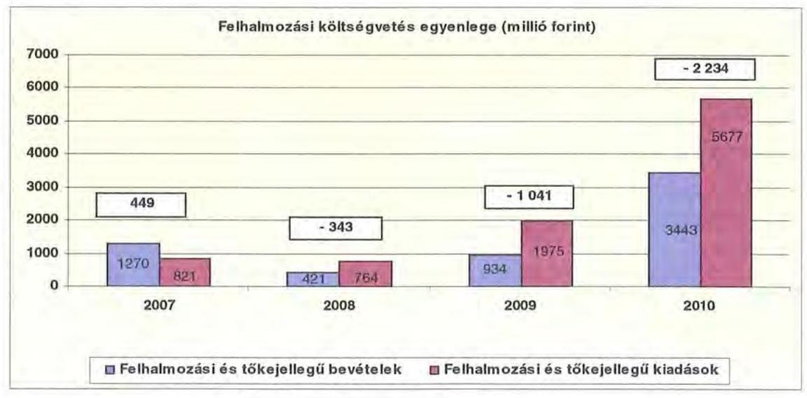

[^0]
[^0]:    ${ }^{23}$ pénzügyi kapacitás

---

A 2007. évben a felhalmozási forrástöbblet a felhalmozási és tőkejellegű kiadások 54,8%-a (449 millió Ft) volt. A felhalmozási forráshiánynak a felhalmozási és tőkejellegű kiadásokhoz viszonyított aránya 2008-ban 45% (-343 millió Ft), 2009-ben 52,7% (-1041 millió Ft), 2010-ben 39,4% (-2234 millió Ft) volt.

A felhalmozási forráshiányt hosszú lejáratú, fejlesztési célú hitellel és kötvénykibocsátással finanszírozták.

Az Önkormányzat évenkénti teljes finanszírozási hiánya ${ }^{24}$ a CLF módszer szerint 2007-ben -369 millió Ft, 2008-ban -848 millió Ft, 2009-ben -2475 millió Ft, 2010-ben -3148 millió Ft volt.

Az önkormányzat finanszírozási műveletei 2007-2010. évekbeli egyenlegének alakulását a következő ábra szemlélteti:
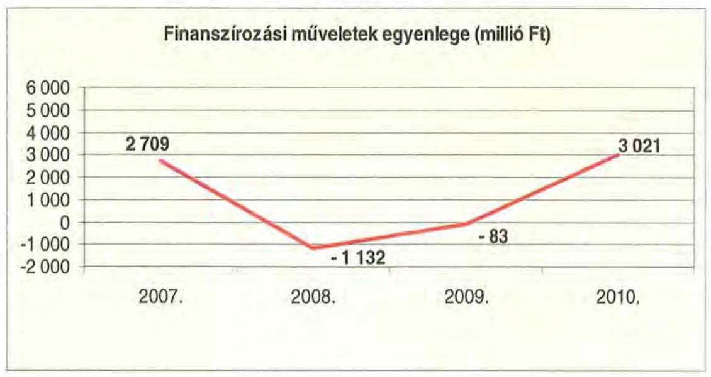

Az Önkormányzat zárszámadási rendeletében a működési és fejlesztési hiányt/többletet a hagyományos költségvetési szerkezet alapján mutatta be ${ }^{25}$, amelyről a jelentés 1. számú melléklete nyújt tájékoztatást. A hagyományos költségvetési szerkezet 2007-2009 években felhalmozási többletet mutatott be, 2010 évre vonatkozóan a felhalmozási hiány összege 904 millió Ft volt.

A finanszírozási többlet azt jelzi, hogy az éves költségvetések végrehajtása során szükség volt a pénzkészlet felhasználásán túl külső finanszírozás igénybevételére is. A finanszírozási célú műveleteket a vizsgált időszakban a jelentés 2. a. számú mellékletének 4.1-4.8 pontjai részletezik.

A vizsgált időszakban a kötelezettségek (passzív pénzügyi elszámolások nélkül) 5763 millió Ft-ról 7937 millió Ft-ra emelkedtek, amely együtt járt a kamatkiadások növekedésével.

[^0]
[^0]:    ${ }^{24}$ A nettó működési jövedelem és a felhalmozási költségvetés egyenlegeinek összege
    ${ }^{25}$ Nincs kötelező előírás a működési és fejlesztési hiány megállapításának módjára.

---

A kamatbevétel és kiadás alakulása változó volt, összességében 2007-2010 között az önkormányzat 986482 ezer Ft kamatbevételt realizált, amely a teljes kamatkiadás (651599 ezer Ft) 151,4%-át tette ki.

2011-ben 272 millió Ft kamat megfizetésével számolnak, amely 132%-a a 2010. évben megfizetett kamatnak (205 millió Ft).

Az Önkormányzat kamatbevételeit és kamatkiadásait és azok egyenlegét a következő ábra mutatja:
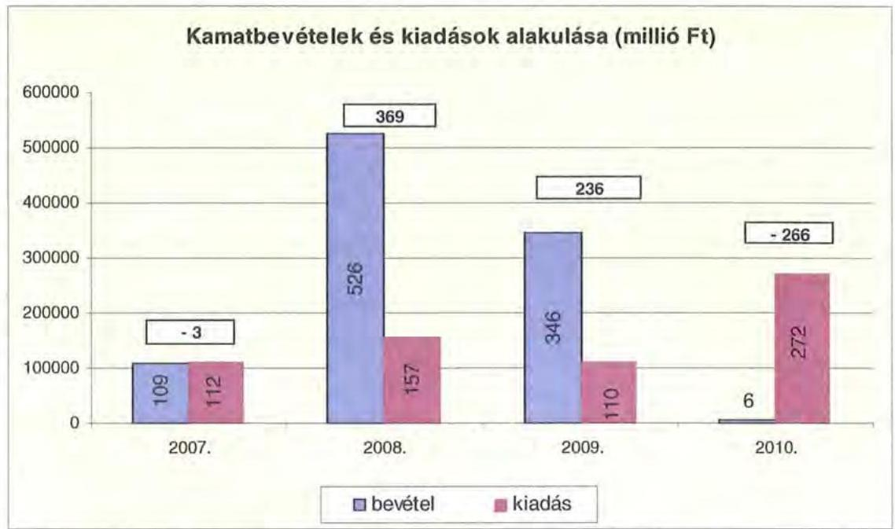

A 2007-2010 közötti időszakban az Önkormányzat kiadásait és bevételeit főbb jogcímek szerint alakulását a jelentés 2.b. számú melléklete tartalmazza.

# 2.2. Az Önkormányzat bevételei alakulása 

Az Önkormányzat 2007-2010 között realizált, továbbá a 2011. évben tervezett OEP támogatás nélküli főbb bevételi jogcímeinek számszaki adatait a következő táblázat részletezi és grafikon mutatja be:

|  |  |  |  |  |
| :-- | :--: | :--: | :--: | :--: |
| Megnevezés | 2007. év   tény | 2008. év   tény | 2009. év   tény | 2010. év   tény |
| Illetékbevétel | 1758500 | 2028550 | 1758175 | 1202456 |
| szja és állami támogatás (OEP   nélkül) | 4306043 | 4620961 | 3912993 | 3036627 |
| Egyéb saját bevétel | 3851260 | 2815755 | 2506310 | 4837426 |
| Összes működési bevétel | 9915803 | 9465266 | 8177478 | 9076509 |

---

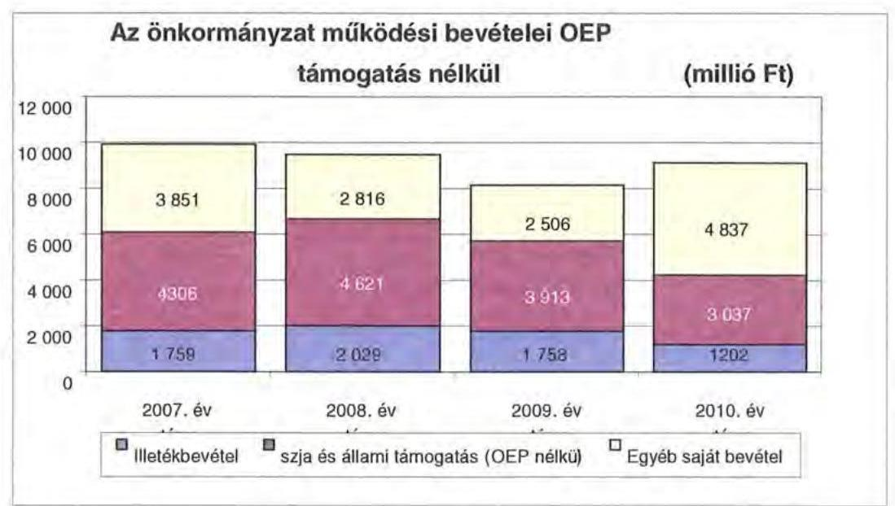

Az Önkormányzatnál az illetékbevétel a 2007. évben 1759 millió Ft volt, a 2006. évi 2317 millió Ft-hoz képest, 24,1%-kal (558 millió Ft-tal) csökkent. A csökkenésben szerepet játszott az Illetékhivatalnak - 2007. január 1-jétől - az APEH-hoz történő átszervezése is, miután az évente realizált illetékbevételekből (központi intézkedés következtében) évi 8,5% elvonásra került az adminisztrációs feladatokra. Az ezen a jogcímen visszatartott összeg minden évben kevesebb volt, mint amekkora költségvetési kiadást jelentett korábban az Illetékhivatal működtetésé az Önkormányzatnak. A 2006. évben az Illetékhivatal működtetésére 408 millió Ft-ot fordítottak. Az éves illetékbevétel 8,5%-a 2007-ben 163 millió Ft, 2008-ban 188 millió Ft, 2009-ben 163 millió Ft, 2010-ben 112 millió 704 ezer Ft volt. Az Illetékhivatal működtetésével kapcsolatos kiadások megszűnése és az adminisztrációs feladatokra visszatartott 8,5% között 2007-ben 244 millió Ft pozitív különbözet jelentkezett, de az 558 millió Ft-os bevételcsökkenésnek ez csak 43,8%-át tette ki.

Az illetékbevétel a vizsgált időszakban 2008-ban 2029 millió Ft volt, az előző évihez képest 15,4%-kal (270 millió Ft-tal) nőtt. A 2009-ben az illetékbevétel 1758 millió Ft volt, 13,3%-os (270 millió Ft) csökkenés következett be 2008. évhez képest. A 2009-ről 1758 millió Ft-ról 2010-re 1202 millió Ft-ra esett vissza az illetékbevétel, a csökkenés 31,6%-os (556 millió Ft) volt. Az Önkormányzat a 2011. évi költségvetésében 1320 millió Ft illetékbevételt tervezett, az előző évi teljesítéshez viszonyítva 9,8%-os (118 ezer Ft) növekedéssel számolt.

Az átengedett szja és az állami támogatások együttes összege a 2008. évi 315 millió Ft (7,3%-os) növekedést követően a központi forráskivonás hatására ${ }^{26}$ folyamatosan csökkent. Az előző évihez képest 2009-ben 708 millió Ft-tal (5,3%-kal), 2010-ben további 876 millió Ft-tal (22%-kal) kapott kevesebb támogatást az Önkormányzat az államtól ezeken a jogcímeken. 2011-ben az átengedett szja és az állami támogatások együttes összege a 2007. évinek már a kétharmadát sem érte el, tervszinten 2821 millió Ft (65,5%-a) volt. A változást

[^0]
[^0]:    ${ }^{26}$ a 2007. évi bázishoz képest

---

a normatíváknak a járulékváltozások miatti központi csökkentése, valamint a megyei önkormányzatokat érintő támogatás elvonás mellett az ellátotti létszám visszaesése idézte elő.

Az Önkormányzat társadalombiztosítási alapból származó bevétele 2007-ben 4193 millió Ft, 2010-ben 357 millió Ft volt.

Az Önkormányzat egyéb saját bevételei között szerepelnek az intézményi működési bevételek. A 2010. évben az intézményi bevételek 1043 millió Ft-tal emelkedtek, ennek oka az volt, hogy a Hivatal bevételei között 1116 millió Ft fordított áfa technika tételt könyveltek el. Az intézményi bevételek alakulását a szociális ellátások térítési díjának önköltségalapú növekedése nem befolyásolta. Az intézményi működési bevételek 2009-ben 198 millió Ft-tal nőttek, a térítési díj növekménye ebből 50 millió Ft volt. A 2010. évben az intézményi működési bevételek 73 millió Ft-tal (technikai áfa nélküli összeg) történő csökkenése mellett az intézményi ellátási díjakból befolyt összeg 17 millió Ft-tal, 2,9%-kal csökkent, egyrészt az ellátottak számának csökkenése miatt, másrészt, mert a megemelkedett díjak fizetése egyre nagyobb terhet jelentett az ellátottak számára. A keletkező díjhátralékok nem befolyásolták jelentősen az Önkormányzat követeléseinek állományát. ${ }^{27}$

Az Önkormányzat felhalmozási bevételei a vizsgált időszakban a következők voltak:

| Megnevezés | 2007. év tény | 2008. év tény | 2009. év tény | 2010. év tény |
| :--: | :--: | :--: | :--: | :--: |
| Tárgyi eszköz értékesítés | 329891 | 41411 | 5648 | 41645 |
| Állami támogatás | 196065 | 36817 | 0 | 194657 |
| Átvett pénzeszköz | 62830 | 73960 | 38659 | 205279 |
| Egyéb felhalmozási bevétel | 930943 | 303302 | 1387126 | 4124340 |
| Felhalmozási tartalék | 1015836 | 1079465 | 2261704 | 246733 |
| Összes felhalmozási bevétel | 2535565 | 1534955 | 3693137 | 4812654 |

Az Önkormányzat tárgyi eszközök értékesítéséből származó bevétele jelentősen csökkent, 2007. évben 330 millió Ft, 2010. évben 41 millió Ft volt, 2011. évre ezen a címen 634 millió Ft bevételt terveztek. Az egyéb felhalmozási bevételek növekedését az EU támogatással megvalósuló projektekhez kapcsolódó támogatások és áfa visszatérülés eredményezte.

Állami támogatás a 2007. és a 2008. években a 2007. év előtt címzett támogatással megkezdett Zsolnay Múzeum rekonstrukciója, a Kórház "A" épületének rekonstrukciója és a Radnóti Miklós Szakközép- és Szakiskola, Kollégium, a Mohácsi tornaterem és tanműhely rekonstrukciója kapcsán keletkezett. A 2010.

[^0]
[^0]:    ${ }^{27}$ A követelések nagysága önkormányzati szinten 2010 végére a 2007. évi bázishoz képest 86,7% volt. A követelések állománya 2007-ben 116 millió Ft, 2010-ben 103 millió Ft volt.

---

évben az EKF program keretében megvalósuló beruházások (Dél-Dunántúli Regionális Könyvtár és Tudásközpont, valamint a Nagy Kiállítótér-Múzeum utca projektek) önrészéhez kapott állami támogatást az Önkormányzat. Az egyéb felhalmozási bevételek az EU támogatással megvalósuló projektekhez kapcsolódnak ${ }^{28}$, illetve az intézményi beruházásokhoz. Az évenkénti nagy összegű felhalmozási tartalék az uniós projektek finanszírozására került - betétként - lekötésre.

# 2.3. Az Önkormányzat kiadásai alakulása 

Az Önkormányzat működési kiadásai főbb jogcímek szerinti bontásban az alábbiak voltak:

|  |  |  |  | ezer Ft |
| :--: | :--: | :--: | :--: | :--: |
| Megnevezés | 2007 | 2008 | 2009 | 2010 |
| Működési kiadások | 14285534 | 12598106 | 13018126 | 10468017 |
| Működési kiadások (kamatkiadás nélkül) | 14239794 | 12591509 | 12971359 | 10329088 |
| Kamatkiadás | 45740 | 6597 | 46767 | 138929 |
| Személyi juttatások | 6323701 | 6270432 | 5843933 | 3984031 |
| Munkaadót terhelő járulékok | 1926031 | 1873371 | 1609227 | 985096 |
| Dologi kiadások | 5103161 | 3866220 | 4564471 | 3619338 |
| Egyéb folyó kiadások | 159902 | 151736 | 418395 | 927417 |
| Támogatások, elvonások, egyéb folyó átutalások | 587229 | 365346 | 437639 | 734652 |
| ebből: működési célú pénzeszközátadás | 166903 | 208240 | 130333 | 94071 |
| Előző évi pénzmaradvány átadás, visszafizetés, működési célú | 139770 | 64404 |

 97694 | 78554 |

Az Önkormányzat működési kiadásai 2007-ről 2010-re mindössze 26,7\%kal csökkentek ( 14286 millió Ft-ról 10468 millió Ft-ra). 2011-re tervszinten az előző évi teljesített kiadásokhoz képest 2340 millió Ft, 22\%-os, a 2007. évi szinthez képest 6158 millió Ft 43\%-os csökkenéssel számoltak. A működési kiadások jelentős csökkenését az okozta, hogy a Kórházat, mint költségvetési intézményt az Önkormányzat megszüntette, és a Kórház által ellátott feladatokat 2009. december 31-ével átadta a Pécsi Tudományegyetem és Klinikai Központnak.

Az Önkormányzat 2010-ben a működési költségvetés 47,5\%-át (4969 millió Ft) személyi juttatásokra és a munkaadókat terhelő járulékokra fordította, az üzemeltetést, intézményfenntartást biztosító dologi kiadásokra 34,6\% jutott ( 3619 millió Ft). A működési kiadásokon belül a személyi juttatások és járulékok aránya a vizsgált időszakban csökkent, 2007-ben 8249 millió Ft (57,7\%), 2010-ben 4969 millió Ft (47,5\%) volt.

[^0]
[^0]:    ${ }^{28}$ Támasz Pont-Hajléktalan személyek nappali ellátó rendszerének fejlesztése HEFOP, Dráva Medence komplex ökoturisztikai fejlesztése, Baranyai Élménykörút Orfú Aquapark és Viziturisztikai Központ, valamint az EKF beruházások.

---

A személyi juttatások minden évben csökkentek az egészségügyi feladatátadások és létszámcsökkentések miatt, 2010-ben a 2007. évben teljesített kiadásoknál 37\%-kal ( 2340 millió Ft-tal) voltak alacsonyabbak ${ }^{29}$.

A dologi kiadások az Önkormányzatnál 2010-ben a 2007. évi szintnél 29,1\%kal voltak alacsonyabbak (a csökkenés 1484 millió Ft volt). A 2009. évi dologi kiadások összege 4564 millió Ft volt, 698 millió Ft-tal haladta meg a 2008. évi dologi kiadások összegét.

A működési célú pénzeszközátadások nagysága 2007-ről 2008-ra 24,8\%-kal nőtt, 167 millió Ft-ról 208 millió Ft-ra. A 2009. és 2010. évben a bevételek jelentős csökkenése miatt a működési célra átadott pénzeszközöket csökkentette a Közgyűlés ${ }^{30}$. A működési célú pénzeszközátadások összege 2007. évről 2010. évre 73 millió Ft-tal, 167 millió Ft-ról 94 millió Ft-ra csökkent.

Az Önkormányzati kiadásokban 2007-2009. évben nőtt a kórházi kiadások aránya az egyéb fenntartott intézményekben felmerülő kiadásokhoz képest. A Kórház nélküli teljesített működési kiadások 9458 millió Ft volt 2007-ben, az összes működési kiadás 66,2\%-át tették ki, ez az arány 2009 végére 7943 millió Ft-ra, 61\%-ra csökkent. A Kórház nélküli kiadásokban jelentkező tendenciák a közoktatási, szociális és gyermekvédelmi, igazgatási és egyéb intézményekben biztosított feladatellátást jellemzik.

Az Önkormányzat Kórház nélküli működési kiadásai főbb jogcímek szerinti bontásban az alábbiak voltak:

|  |  |  |  | ezer Ft |
| :--: | :--: | :--: | :--: | :--: |
| Megnevezés | 2007 | 2008 | 2009 | 2010 |
| Működési kiadások | 9457460 | 8293499 | 7942815 | 10468017 |
| Működési kiadások (kamatkiadás nélkül) | 9411720 | 8286902 | 7896348 | 10329088 |
| Kamatkiadás | 45740 | 6597 | 46467 | 138929 |
| Személyi juttatások | 4251115 | 4393832 | 4079304 | 3984031 |
| Munkaadót terhelő járulékok | 1249290 | 1272064 | 1110611 | 985096 |
| Dologi kiadások | 3053503 | 1975946 | 1979412 | 3619338 |
| Egyéb folyó kiadások | 103145 | 92176 | 68471 | 927417 |
| Támogatások, elvonások, egyéb folyó átutalások | 614897 | 488478 | 509587 | 734652 |
| ebből: működési célú pénzeszközátadás | 163509 | 208240 | 130333 | 94071 |
| Előző évi pénzmaradvány átadás, visszafizetés, működési célú | 139770 | 64404 | 97694 | 78554 |

A 2007-2009. években a Kórház nélkül csökkentek a működési kiadások, a csökkenés 2007. évről 2009. évre 1515 millió Ft, 16\% volt. A Kórházzal együtt a működési kiadások csökkenése kisebb mértékű 8,9\%-os ( 1267 millió Ft) volt, mivel a Kórház működési kiadásai ezekben az években 26,1\%-kal ( 535 millió Ft-tal) nőttek.

[^0]
[^0]:    ${ }^{29}$ A 2007-ről 2008-ra 53 millió Ft-tal, 2008-ról 2009-ra 427 millió Ft-tal, 2009-ről 2010-re 1860 millió Ft-tal csökkentek a személyi juttatások. A 2011. évi tervezett személyi juttatások 3416 millió Ft.
    ${ }^{30}$ A 2008-ról 2009-re a csökkenés 78 millió Ft, (37,4\%), 2009-ről 2010-re 36 millió Ft, (27,8\%) volt a csökkenés.

---

Az Önkormányzat Kórházon kívüli intézményeinél a 2007-2010. évek között 6,2\%-kal csökkentek ( 267 millió Ft-tal) a személyi juttatások. A vizsgált időszakban a munkaadókat terhelő járulékok csökkenése ${ }^{31}$ következett be, amely egyrészt a kifizetett személyi juttatások, másrészt a járulékok mértékének csökkenésével volt összefüggésben. A járulékok csökkenése miatt felszabaduló forrásokat azonban a kormányzat az önkormányzati alrendszernek nyújtott állami támogatásokból levonásba helyezte, így a járulékcsökkenés az Önkormányzatnál érdemi megtakarítást nem okozott, mivel állami forráscsökkenéssel járt együtt.

A nem egészségügyi intézményeknél a dologi kiadások 2008. évben 1078 millió Ft-tal csökkentek (a 2007. évhez viszonyítva 35,3\%-kal), 2009. évben szinten maradt, ${ }^{32}$ a 2010. évben a 2009. évhez viszonyítva a növekedés 1670 millió Ft, 82,8\% volt, a Kórháztól átvállalt kötelezettségek kiegyenlítése miatt. A dologi kiadások a 2007. évi bázishoz viszonyítva a 2010. évre 18,5\%-kal emelkedtek, amely volumenében 566 millió Ft növekedést jelentett négy év alatt.

A 2007-2009 évek között a Kórháznál jelentkező dologi kiadásnövekedés azonban nem a reális üzemeltetési költségnövekedést tükrözi, mivel az intézmény működési forráshiánya miatt nem tudta kifizetni a tárgyévben jelentkező dologi kiadásainak egy részét, így azzal a szállítói állománya emelkedett.

Az Önkormányzat 2007-2009 között a Kórház működési kiadásaihoz ${ }^{33}$ 2272 millió Ft-tal járult hozzá, amelyet központosított állami támogatásokból ( 65 millió Ft) és kötvénykibocsátásból(2207 millió Ft) fedezte. A kórházi működési támogatások a központi bérpolitikai intézkedésekhez, a létszámcsökkentésekhez kapcsolódó többletköltség fedezetéhez, a 13. havi juttatások kifizetéséhez, kereset kiegészítésekhez és a szállítói tartozások kifizetéséhez kapcsolódtak. A szállítói tartozásokat a Kórház nem tudta kiegyenlíteni, azokra nem nyújtott fedezetet az OEP támogatás, ezért az ilyen címen fennálló kötelezettségek forrása döntően az Önkormányzat által kibocsátott kötvénybevételből származó bevétel volt ${ }^{34}$. Az Önkormányzat a 2007. évben kibocsátott kötvényéből a Kórház működési kiadásaira 2207 millió Ft-ot fordított, amelyből a szállítói tartozás kiegyenlítése a 2007-2009. években 1861 millió Ft volt. A 2010. évben további 780 millió Ft-ot fordított a kórházi szállítói tartozások rendezésére, amelynek forrása a 2010-ben kibocsátott kötvény volt.

[^0]
[^0]:    ${ }^{31}$ 2010. évi teljesítés szinten 126 millió Ft, 21,1\%-os, 2011 évi tervszinten 190 millió Ft, 36,3\%-os
    ${ }^{32}$ A Kórház dologi kiadásai 2007-ről 2009-re 26,1\%-kal, 535 millió Ft-tal nőtt.
    ${ }^{33}$ Intézményi finanszírozás formájában
    ${ }^{34}$ A Kórház szállítói tartozások megfizetésének eredményeként a szállítói állomány a 2009. évi 1653 millió Ft-ról a 2010 évre 141 millió Ft-ra (85,4\%-kal) csökkent.

---

Ezen felül a Kórházzal kapcsolatosan a 2010. évben további 524 millió Ft átvállalt kötelezettség állt fenn az Önkormányzatnál ${ }^{35}$.

A Kórház működésének finanszírozására az OEP támogatás szolgál, míg a fejlesztési kiadások fedezetét az önkormányzatoknak kell biztosítani intézményeik számára. A Közgyűlés a Kórháznak a működési célú önkormányzati támogatáson felül 2007-2009 között 18 millió Ft-ot nyújtott fejlesztési célra ${ }^{36}$ Az Önkormányzat 2007-2010 években 3594 millió Ft-tal járult hozzá a Kórház működési és fejlesztési kiadásaihoz. A támogatások évenkénti összetételét és nagyságát a következő grafikon mutatja be.
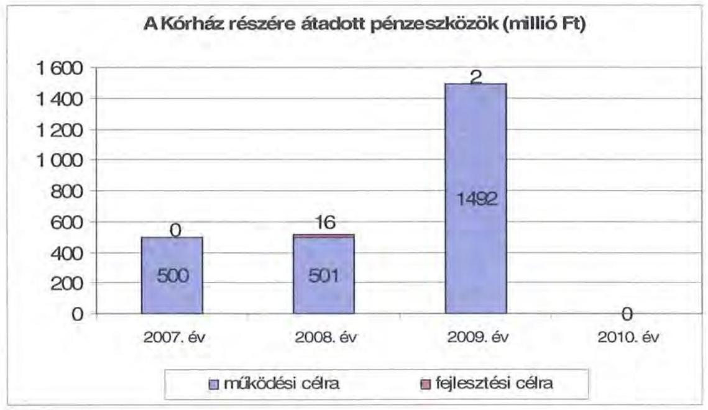

A működési és felhalmozási kiadások arányának változásában elmozdulás figyelhető meg 2007-2010 között, a felhalmozási kiadások aránya 937 millió Ft-ról (6,2\%-ról) 5784 millió Ft-ra (35,6\%-ra) nőtt. A kiadások összetételét 2007-2010. években a következő grafikon szemlélteti:

[^0]
[^0]:    ${ }^{35}$ Az Önkormányzat által felvállalt kórházi kötelezettségek voltak még a 2010 évben az előző évi decemberi illetmény és túlmunkadíj elszámolása, felmentési időre jutó átlagbér, jubileumi jutalom, korkedvezményes nyugdíj, kártérítés, Pécsi Munkaügyi Bíróság ítélete alapján elmaradt jövedelem kifizetése, elszámoló számlák (fütés, vízdíj, áram) kifizetése, üzemeltetési, fenntartási kiadások, gyógyszer, vegyszer, HEFOP informatikai szolgáltatás díja.
    ${ }^{36}$ A Kórház A és C épületének felújítása és új műtőblokk beruházása címzett támogatásból valósult meg 2002-2006. években.

---

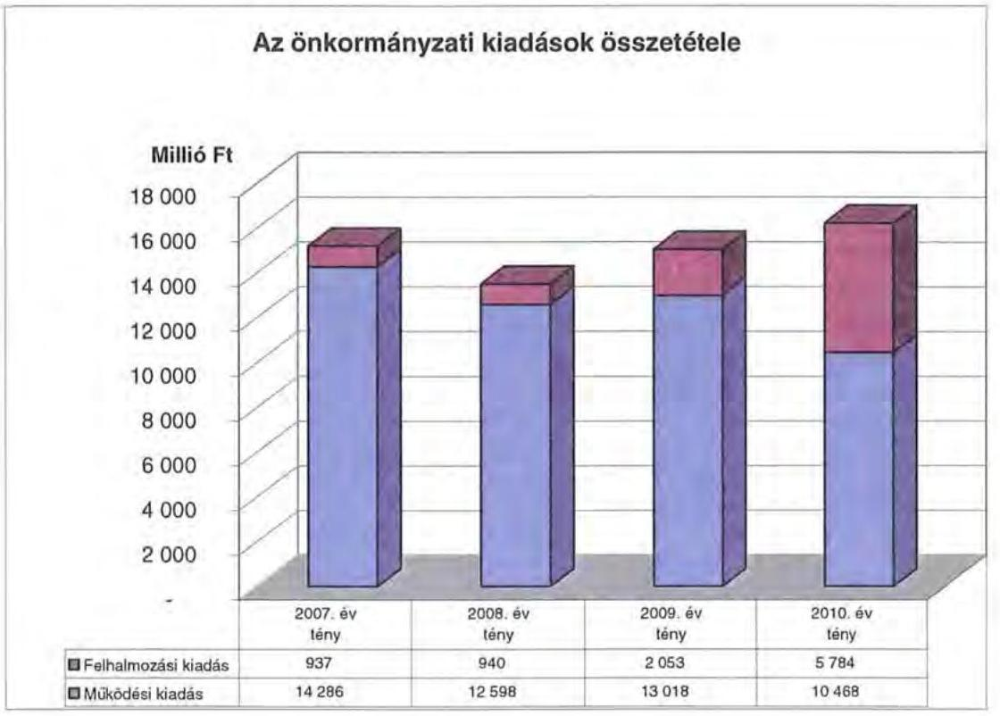

2007-2010. években a 10 millió Ft teljes bekerülési költség feletti beruházások és felújítások száma 27 volt, amelynek negyedéhez ( 7 fejlesztéshez) uniós forrásokat is igénybe vettek. A 2010-ben négy európai uniós projekt megvalósítása volt folyamatban.

Az Önkormányzat 2007-2010. években együttesen 7763 millió Ft-ot fordított fejlesztéseinek finanszírozására, amelynek 7\%-a ( 547 millió Ft) a 10 millió egyedi beszerzési érték alatti fejlesztésekhez kapcsolódott. Az Önkormányzat 2007-2010 között megvalósított fejlesztései között turisztikai beruházások, EKFhez kapcsolódó közművelődési és kulturális beruházások, valamint intézményi épületek felújítása, korszerűsítése és bővítése szerepelt. A három legmagasabb bekerülési értékű beruházás a következő volt:

- A legmagasabb bekerülési költségű (3462 millió Ft) fejlesztés 2008-ban kezdődött és az EKF-hez kapcsolódó Dél-Dunántúli Regionális Könyvtár és Tudásközpont volt 2943 millió Ft, 85\%-os uniós támogatással. Az EKF keretében valósították meg a Nagy Kiállítótér-Múzeum utca projektet, amelynek bekerülési értéke 1236 millió Ft volt, az uniós támogatás aránya 72\% volt. A két beruházás befejeződött, a pénzügyi elszámolás azonban áthúzódott 2011. évre;
- DDOP-ban valósult meg a Baranyai Élménykörút Orfú Aquapark 1612 millió Ft-os költséggel, és Viziturisztikai Központ, 209 millió Ft-os költséggel, amelyhez hazai, uniós támogatás és saját forrás is kapcsolódik. A fejlesztés 2008-ban kezdődött és 2010-ben befejeződött;
- HEFOP-ban valósult meg a Támasz Pont - Hajléktalan személyek nappali rendszerének fejlesztési projektje, melynek a bekerülési költsége 254 millió Ft

---

volt. DDOP keretében hajtották végre a Dráva-medence komplex ökoturisztikai fejlesztéseket, a beruházás költsége 168 millió Ft volt.

Az Önkormányzat fejlesztési tevékenysége a pályázati kiírások által nagyban befolyásolt, mivel a jelentkező működési forráshiány és saját felhalmozási bevételei alacsony szintje miatt beruházásokat csak külső források, uniós és hazai támogatások elnyerése esetén tud megvalósítani. A felhalmozási kiadások önrészének forrásait is fejlesztési hitelekből és felhalmozási célú kötvénykibocsátásból finanszírozta.

Az aktív pályázati tevékenység eredményeként az Önkormányzat 2007-2010 között összesen 9763 millió Ft bekerülési költségű beruházást folytatott, illetve indított el, amelyből 288 millió Ft a 2010 utánra vállalt kötelezettség ${ }^{37}$. Az utóbbi forrásai a következők: 45 millió Ft saját bevétel maradványfelhasználással, 16 millió Ft hitel, 216 millió Ft EU-s támogatás, 10 millió Ft hazai támogatás. A fejlesztések közül kettő beruházás kapcsolódott önként vállalt feladatokhoz, a bekerülési költségük összesen 73 millió Ft volt, amelyhez 31 millió Ft EU-s támogatás is kapcsolódik. A felhalmozási kiadások önrészének forrásait fejlesztési hitelekből és felhalmozási célú kötvénykibocsátásból finanszírozták.

# 3. KÖTELEZETTSÉGEK BEMUTATÁSA 

### 3.1. A pénzintézetek felé fennálló kötelezettségek

Az Önkormányzat pénzintézeti kötelezettségeinek állománya 2006. december 31-től 2010. december 31-ig 5,4-szeresére nőtt, 1402 millió Ft-ról 7621 millió Ft-ra. Fennálló pénzintézeti kötelezettségei kötvények kibocsátásából, hosszúlejáratú, valamint folyószámla hitelek
 igénybevételéből keletkeztek.
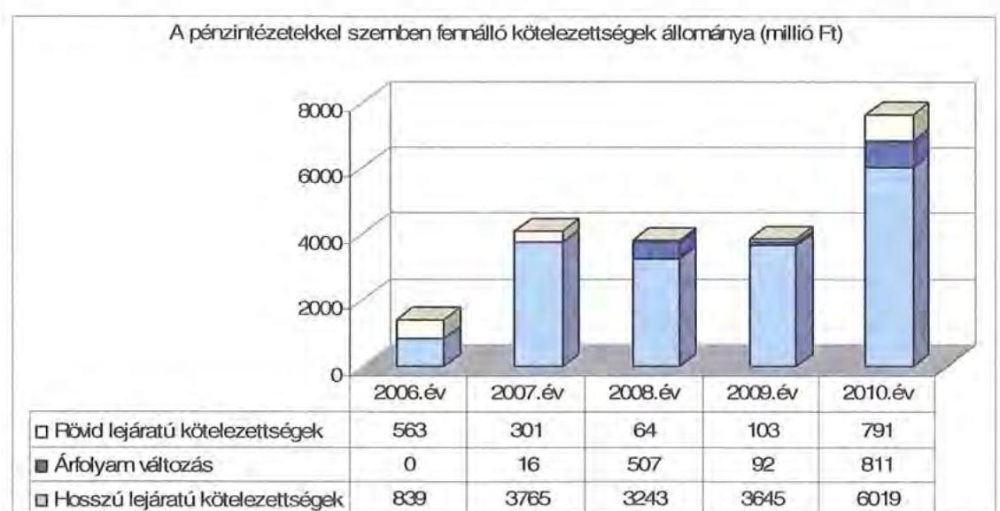

[^0]
[^0]:    ${ }^{37}$ A beruházások forrásai az Önkormányzat rendelkezésére álltak.

---

Az árfolyamváltozás hatása is befolyásolja a kötelezettségek alakulását, azonban annak mértéke előre pontosan nem határozható meg, csak várakozásokon alapuló tendenciák jelezhetők. A számviteli szabályok meghatározzák, hogy az árfolyamkülönbözetet év végén a kötelezettségek vagy követelések között a könyvviteli mérlegben nyilván kell tartani, azonban az árfolyamkülönbözet valójában nem realizálódott. Annak megítéléséről, hogy a devizában kibocsátott kötvényekért és felvett hitelekért kapott forinthoz képest a kötvények visszavásárlásakor, illetve a hitelek visszafizetésekor jelentkező forintkötelezettség többletkiadást (árfolyamveszteség) vagy megtakarítást (árfolyamnyereség) eredményez a futamidő végén, a teljes kötelezettség rendezését követően lehet képet alkotni. Mindaddig, amíg törlesztési kötelezettség nem áll fenn (türelmi idő, moratórium), a tőkére vonatkoztatva nem értelmezhető sem az árfolyamveszteség, sem az árfolyamnyereség.

Az Önkormányzat pénzintézeti kötelezettségvállalásaira minden esetben közgyűlési döntés alapján került sor. A kötelezettségvállalásból származó források felhasználási céljait meghatározták. A Közgyűlés döntéseit megalapozó előterjesztések tartalmazták a kötelezettségvállalás visszafizetési forrásainak, a teljes futamidő várható kamat- és tőkefizetési kötelezettségeknek, az árfolyam- és kamatkockázatoknak, valamint az adósságszolgálati korlát bemutatását.

Az Önkormányzat adósságot keletkeztető kötelezettségvállalásának felső határát a vizsgált időszakban nem lépték túl.

Az adósságot keletkeztető kötelezettségvállalással megvalósított felhalmozási kiadások esetleges bevételnövelő, illetve kiadáscsökkentő vonzatát vizsgálták, ugyanakkor a fejlesztéshez, felújításhoz vállalt kötelezettségek visszafizetési forrásaként nem nevesítették. A kötvények kibocsátásából származó kötelezettségei visszafizetésének forrásaként az arra kijelölt ingatlanok értékesítéséből befolyó bevételét jelölte meg az Önkormányzat.

A kötvények kibocsátása, a hosszú lejáratú hitelek és a folyószámlahitelkeret-szerződés megkötése előtt minden esetben közbeszerzési eljárást folytattak le.

Az Önkormányzat 2010. december 31-én CHF-ben fennálló adósságot keletkeztető kötelezettségvállalása az alábbi volt:

| Megnevezés | Kibocsátás, illetve szerződéskötés időpontja | Összeg (CHF) | Kibocsátási, vagy lehívási árfolyam | Kamat (referencia kamat+ kamatfelár) | Felhasználás célja: |
| :--: | :--: | :--: | :--: | :--: | :--: |
| Baranya Megye 2027 Kötvény | 2007. 11. 23 | 20000000 | 154,58 és 155,90 | a havi CHF LIBOR x 0,7% | Kormitési feltételek kivizsgálása, beruházási és működési kiadások |

A „Baranya Megye 2027/A" kötvény kibocsátásának eredeti célja az Önkormányzat tervezett fejlesztéseihez szükséges pályázati önrész biztosítása, valamint a fennálló fejlesztési hitelállomány egységesítése volt. A Kórház adósságállományának növekedése következtében - az Önkormányzat kimutatása szerint - a tervezettel ellentétben a kötvény ellenértékéből befolyt összeg 71%-át, azaz 2207 millió Ft-ot a Kórház működési kiadásaira fordították, fejlesztési célra pedig csupán 29%-ot, azaz 905 millió Ft-ot tudtak fordítani.

---

Az Önkormányzat 2010. december 31-én EUR-ban fennálló adósságot keletkeztető kötelezettségvállalása az alábbi volt:

| Megnevezés | Kibocsátás, illetve szerződéskötés időpontja | Összeg (EUR) | Kibocsátási, vagy lehívási árfolyam | Kamat (referencia kamat+ kamatfelár) | Felhasználás célja: |
| :--: | :--: | :--: | :--: | :--: | :--: |
| Kórház Konszolidációs Kötvény | 2010. 10. 29 | 5114800 | 278,75 | 6 havi EURIBOR + 3,42% | Baranya Megyei Kórház átvállalt kiadásaira |

Az Önkormányzat a Kórház konszolidációs kötvény kibocsátásából származó 1426 millió Ft-ot teljes egészében a Kórház átvállalt szállítói tartozásainak és egyéb kötelezettségeinek teljesítésére használta fel.

Az Önkormányzat 2010. december 31-én forintban fennálló adósságot keletkeztető kötelezettségvállalásai az alábbiak voltak ${ }^{38}$ :

| Megnevezés | Szerződéskötés időpontja | Összeg (ezer Ft) | Kamat (referencia kamat+ kamatfelár) | Felhasználás célja: |
| :--: | :--: | :--: | :--: | :--: |
| Beruházási célhitel | 2006. 04. 01 | 291066 | 3 havi EURIBOR + 1,13% | önkormányzati fejlesztések |
| "Új Magyarország fejlesztési terv" hosszú lejáratú hitel | 2010. 03. 24 | 1181480 | 3 havi EURIBOR + 1,49% | kulturális célú beruházások 2010. évben |

Az Önkormányzat a CHF-ben fennálló pénzintézeti kötelezettségéből 2010. december 31-ig 569685 CHF (115 millió Ft) tőkét törlesztett és 1254334,64 CHF (221 millió Ft) kamatot, valamint 6 millió Ft egyéb költséget fizetett. Az EUR-ban fennálló pénzintézeti kötelezettségére 5 millió Ft egyéb költséget teljesített. A forintban fennálló kötelezettségekből 97 millió Ft tőkét törlesztett és 74 millió Ft kamatot, valamint egyéb költség ${ }^{39}$ címén 8 millió Ft-ot fizetett.

A „Baranya Megye 2027/A" kötvény vonatkozásában a Közgyűlés a 95/2010. (IX. 23.) számú határozatával hozzájárult a kötvény kamatfelárának - a kibocsátó OTP Bank Nyrt. által a pénzpiaci változásokra hivatkozással kezdeményezett - 1%-al történő megemeléséhez, 2010. október 1-től egy év időtartamra.

[^0]
[^0]:    ${ }^{38}$ A Beruházási célhitelkeretet az Önkormányzat 2006. évben nyitotta 534 millió Ft értékben, önkormányzati beruházások (információs rendszer létrehozása, infrastruktúrális beruházások, intézmények felújítása, rekonstrukciója) finanszírozásához. A rendelkezésre tartás ideje 2006. december 31-ig tartott, amely időpontig 291 millió Ft-ot használtak fel. Az „Új Magyarország fejlesztési terv" hosszú lejáratú hitelkeretet 1550 millió Ft-ra nyitotta az Önkormányzat, amelyből az EKF projekt részét képező öt alprojekt (Régészeti Múzeum rekonstrukciója, Dél-dunántúli Regionális Könyvtár és Tudásközpont, Nagy Kiállítótér-Múzeum utca, Orfűi Aquapark, Orfűi Viziturisztikai központ) önrészét tervezte finanszírozni. Az Önkormányzat pénzügyi helyzetére tekintettel a Közgyűlés a 22/2011. (II. 22.) számú határozatával a Régészeti Múzeum rekonstrukciója megvalósításától visszalépett, így a hitelkeret 1181 millió Ft-ra csökkent.
    ${ }^{39}$ A kötvények esetében szervezési díj és a banki szolgáltatásokkal felmerülő költségek címén fizetett egyéb díjat az Önkormányzat. A hosszú lejáratú hitel felvételéhez kapcsolódó egyéb költségeket projektvizsgálati díj és hitelgarancia díj címén számolta fel a pénzintézet.

---

A kamatfelár-emelkedésből adódó többletkiadás várhatóan a 2011. évben fog realizálódni 196470 CHF összegben.

Az Önkormányzat 2007-2010 között az átmenetileg szabad pénzeszközein 1040 millió Ft hozam- és kamatbevételt realizált, melyből 636 millió Ft származott kötvényekből származó bevétel befektetéséből és 404 millió Ft az intézmények és a Hivatal elkülönített bankszámláin rendelkezésre állt forrás befektetéséből ${ }^{40}$.

A „Baranya Megye 2027/A" kötvény bevételei befektetéséből származó kamatbevételt a kötvények tőke- és kamatfizetésére fordították. A kötvény fel nem használt részének lekötéséből származó kamatbevételek a kötvénykibocsátás miatt megfizetett kamat 2,9-szeresét tették ki. Az Önkormányzat likviditását a vizsgált időszakban csak folyószámlahitel igénybevételével tudta biztosítani, melyet az alábbi táblázat mutat be:

|  |  |  |  |  | ezer Ft-ban |  |
| :--: | :--: | :--: | :--: | :--: | :--: | :--: |
| Megnevezés | 2007. év | 2008. év | 2009. év | 2010. év | 2011. március 31. |  |
| 1. Folyószámlahitel |  |  |  |  |  |  |
| a folyószámlahitel keretösszege január 1-jén | 1500000 | 1500000 | 1500000 | 2070000 | 1500000 |  |
| teljesített kamat és egyéb költség | 47095 | 4986 | 46767 | 59441 | 12218 |  |

A folyószámlahitel kondíciói és egyéb költségei a következők voltak ${ }^{41}$ :

| Megnevezés | Kamat (referencia kamat+ kamatfelár) | Egyéb költség |
| :--: | :--: | :--: |
| Folyószámlahitel |  |  |
| 2007. év | 3 havi BUBOR + 0,035 | 0,00% |
| 2008. év | 3 havi BUBOR + 0,035 | 0,00% |
| 2009. év | 3 havi BUBOR + 3 | 0,10% |
| 2010. év | 3 havi BUBOR + 4 | 0,10% |
| 2011. év | 3 havi BUBOR + 0,01 | 0,50% |

Hátrányt jelentett az Önkormányzat számára, hogy a számlavezetéssel és a kötvénykibocsátással ugyanazon pénzintézetet bízta meg, mivel a pénzintézet a kockázatokat összevontan értékelve kedvezőtlenebb hitelkondíciókat alkalmazott.

A 2008. évben az előző év végi kötvénykibocsátásra tekintettel az Önkormányzat kevesebb esetben és kisebb mértékben vett igénybe folyószámlahitelt. A hitelkeret összegét a 2008. évi költségvetési rendeletben határozta meg a Közgyűlés, amely döntését a későbbiekben nem vizsgálta felül.

[^0][^1]
[^0]:    ${ }^{40}$ Pályázati források előlegéből.
    ${ }^{41}$ A referencia kamat az alábbiak szerint alakult:

[^1]:    ${ }^{40}$ Pályázati források előlegéből.
    ${ }^{41}$ A referencia kamat az alábbiak szerint alakult:

[^2]:    ${ }^{40}$ Pályázati források előlegéből.
    ${ }^{41}$ A referencia kamat az alábbiak szerint alakult:

---

A hitelkeret összegét 2009. december 1-től 2010. november 30-ig 2070 millió Ft-ra emelték, az EKF projekthez kapcsolódó projektek finanszírozása érdekében, melyről a Közgyűlés a 2009. évi költségvetési rendelet módosításáról szóló 11/2009. (IX. 29.) számú rendeletében döntött.

A folyószámlahitel átlagos napi állománya a 2008. évben volt a legalacsonyabb, 166 millió Ft, 2011. március 31-én volt a legmagasabb, 777 millió Ft. A 2007-2010 közötti időszakot jellemző folyamatos likviditási problémák finanszírozása (folyószámlahitel) az Önkormányzatnak 2007-től a 2010. év végéig összesen 153 millió Ft kamatráfordítást eredményezett. Az Önkormányzat 2010. december 31-én fennálló folyószámlahitelállománya 526 millió Ft volt.

A jelenleg fennálló kötvények és a hitel esetében a kamatfizetési kötelezettségek alakulását jelentősen befolyásolta és jelenleg is befolyásolja a kibocsátáskori és az utolsó kamatfizetéskori referencia kamatok változása, melyet az alábbi táblázat mutat be:

| Megnevezés | Kibocsátási, lehívási | 2010. évi utolsó fizetéskori | Változás % |
| :-- | --: | --: | --: |
|  | alapkamat % |  |  |
| 6 havi CHF LIBOR | 2,861 | 0,1983 | -93,1% |
| 3 havi EURIBOR | 3,061 | 1,029 | -66,4% |
| 3 havi EURIBOR | 0,79 | 1,029 | 30,3% |
| 6 havi EURIBOR | 1,265 | 1,265 | 0,0% |

Az Önkormányzat a 3 havi EURIBOR-hoz mint referenciakamathoz kötött hitelt 2006. július 14-én és 2010. március 24-én vett fel.

Amennyiben a referencia kamat nem változott volna, a „Baranya Megye 2027/A" kötvény után a kibocsátáskori referencia kamattal számolva az Önkormányzatnak 2156784 CHF (400 millió Ft) kamatfizetési kötelezettsége jelentkezett volna. A kamatváltozások miatt azonban az Önkormányzatnak 902 449 CHF-el (179 millió Ft-tal) kevesebb fizetési kötelezettséget kellett teljesítenie, mint amivel a szerződés megkötésekor számolnia kellett.

Az alapkamat mértékének alakulása jelentős hatással van az adott devizanemben kifejezett, a teljes futamidőre számított, várható kamatkötelezettség nagyságára.

Az Önkormányzat fizetési kötelezettségei közül a „Baranya Megye 2027/A" kötvény tőketörlesztésére 2010. december 31-ig 569685 CHF (115 millió Ft) értékben került sor, ami - a kötvény beváltási árfolyamához viszonyítva - összesen 29 millió Ft árfolyamveszteséget okozott.

Az Önkormányzatnál a helyszíni vizsgálat alatt további hitel igénybevételéről, illetve kötvénykibocsátásról szóló döntést nem készítettek elő.

Az Önkormányzat 2011-2014. évekre szóló gazdasági programjában kiemelt feladatként határozták meg - többek között - a likviditás biztosítását, az adósságállomány optimalizálását. A gazdasági programban rögzített feladatok végrehajtására az éves költségvetési rendeletekben intézkednek.

---

# 3.2. Szállítók felé fennálló kötelezettségek

Az
 Önkormányzatnak és a 75% feletti tulajdoni részesedésű gazdasági társaságainak lejárt szállítói tartozásait az alábbi táblázat tartalmazza:

|  |  |  |  |  | ezer Ft-ban |
| :--: | :--: | :--: | :--: | :--: | :--: |
| Megnevezés | 2007.   december 31. | 2008.   december 31. | 2009.   december 31. | 2010.   december 31. | 2011.   március 31. |
| Lejárt szállítói   tartozás | 778936 | 613628 | 0 | 15668 | 0 |
| ebből: Kórház | 776090 | 613628 | 0 | 0 | 0 |
| Gazdasági   társaságok lejárt   szállítói tartozása | 0 | 0 | 0 | 0 | 2300 |
| Egyéb kiadás   elmaradás | 0 | 0 | 0 | 0 | 0 |
| Tartozásállomány   összesen: | 778936 | 613628 | 0 | 15668 | 2300 |

Az Önkormányzat és gazdasági társaságai lejárt szállítói tartozása a 2007. évi 779 millió Ft-ról 2010-re 16 millió Ft-ra, 2011. március 31-ére 2 millió Ft-ra csökkent. A 2010. december 31-én fennálló lejárt szállítói tartozásállomány 15,9%-a volt 30 napon túli. A 2007-2008. években fennálló tartozásállomány 99, illetve 100%-ban (776 millió Ft, 614 millió Ft) a Kórházat terhelte. A Kórház a 2009. évben fennálló adósságállománya fizetési határidejét faktorálással 2010. évre ütemezte át, majd a Kórház megszűnését követően a jogutód Önkormányzat ${ }^{42}$ a fizetési kötelezettségének a „Kórház Konszolidációs" kötvény kibocsátásából származó bevételéből tett eleget. A szállítói állomány átütemezéséből adódóan a 2010. évben 73 millió Ft kamatfizetési kötelezettsége keletkezett az Önkormányzatnak.

A 2010. december 31-i mérlegben kimutatott szállítói kötelezettség 241 millió Ft volt, amelyből 225 millió Ft le nem járt tartozásállomány. Az Önkormányzatnál a 2010. év végén kimutatott szállítói kötelezettségre fedezetet részben a mérlegben kimutatott 128 millió Ft követelésállomány, illetve a Hivatal szabad folyószámlahitel kerete nyújthat.

[^0]
[^0]:    ${ }^{42}$ A Közgyűlés 114/2009. (XI. 6.) számú határozata 3. d.) pontja értelmében a 2009. december 31-én megszűnő Kórház jogutódja a vagyoni jogok és kötelezettségek tekintetében a BMO.

---

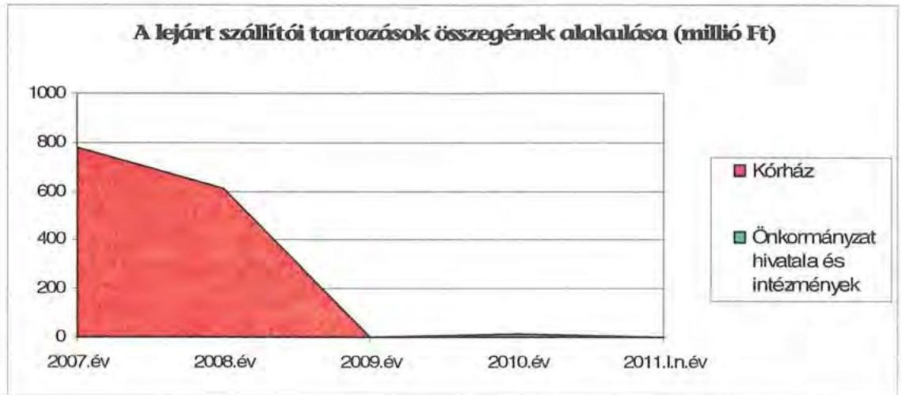

# 3.3. Egyéb kötelezettségek 

Az Önkormányzatnak a vizsgált időszakban garancia- és kezességvállalással kapcsolatos hosszú távú kötelezettségvállalása nem volt.

A Közgyűlés a 95/2010. (IX. 23.) határozatával a „Baranya Megye 2027/A" és a „Kórház Konszolidációs" elnevezésű kötvények biztosítékaként hozzájárult 9 db forgalomképes, valamint - az Ötv. 88. § (1) bekezdését megsértve - kettő db korlátozottan forgalomképes ingatlanon jelzálogjog alapításához és bejegyzéséhez. Az ingatlanokon összességében 20000 ezer CHF, illetve 5114,8 ezer EUR összegű tőke és járulékai erejéig jelzálogjog bejegyzése történt.

A jelzálogjoggal terhelt ingatlanok számviteli nyilvántartás szerinti nettó értéke 2010. december 31-én 2443 millió Ft (ebből a forgalomképes ingatlanok számviteli nyilvántartás szerinti nettó értéke 2273 millió Ft) volt. Az Önkormányzat összes forgalomképes ingatlanának könyvszerinti nettó értéke 3193 millió Ft, korlátozottan forgalomképes ingatlanának könyv szerinti nettó értéke 9933 millió Ft volt.

Az Önkormányzat eladósodása és a jelzálogjog bejegyzése között a vizsgált időszakban egyenes arányosság áll fenn, mert miközben a pénzintézeti kötelezettségek 2006-ról 2010-re 5,4-szeresére növekedtek, az Önkormányzat a forgalomképes ingatlanjai számviteli nyilvántartás szerinti nettó értékének (3193 millió Ft) 71%-a (2273 millió Ft) erejéig jelzálogjog alapítására kényszerült. Az alábbi ábra a szabad, illetve a jelzálogjoggal terhelt forgalomképes önkormányzati ingatlanok értékben kifejezett megoszlását mutatja be a 2010. december 31-én fennálló állapot szerint.

---

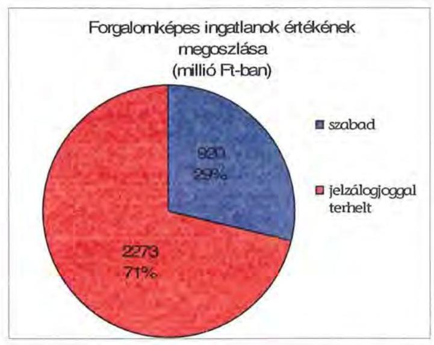

Az Önkormányzatnak a Kórházzal kapcsolatban 2010. év után merülhet fel fizetési kötelezettsége a folyamatban lévő műhibaperek, szolgáltatói szerződés felmondás miatt (gyógyszertár, betegétkeztetés), de jogerős bírósági határozat hiányában ennek összegét jelenleg számszerűsíteni nem lehet.

A vizsgált időszakban nem történt meg annak felmérése, hogy az elhasználódott eszközök pótlása milyen kötelezettséget jelent az Önkormányzat számára. Az Önkormányzat ciklusbeszámolója szerint felújításokra, az eszközök pótlására a pénzügyi lehetőségek függvényében, elsősorban az intézmények működőképességének biztosítása, illetve a szakhatósági előírások figyelembe vételével került sor. Az Önkormányzat a 2007-2010. években a tárgyi eszközök után 742 millió Ft összegű értékcsökkenést számolt el. Felújításra 528 millió Ft-ot fordított.

Az Önkormányzat a Club Orfú Kft részére 2010. évben 2 millió Ft kölcsönt nyújtott 0,2 év időtartamra működéshez szükséges eszközbeszerzéshez, mely kölcsönt a gazdasági társaság visszafizetett. Az önkormányzati intézmények részére a vizsgált időszakban nem nyújtott kölcsönt az Önkormányzat. A 60%-os önkormányzati tulajdonú Zsigmondy Vilmos Harkányi Gyógyfürdő Kórház Nonprofit Kft. kisebbségi (40%) tulajdonosa szolgáltatás nyújtás garanciája céljából a Harkányi Gyógyfürdő Zrt. részére 2009. május 19-én két év időtartamra 40 millió Ft, a Mecsektours Kft. részére 2010. október 15-én fél éves időtartamra 12 millió Ft összegben tagi kölcsönt nyújtott, amelyből a 2010. december 31-én fennálló kötelezettség 52 millió Ft volt.

# 4. A PÉNZÜGYI EGYENSÚLY MEGTEREMTÉSE ÉRDEKÉBEN HOZOTT INTÉZKEDÉSEK 

A jelentésben szereplő CLF módszerrel bemutatott működési és felhalmozási hiány mindamellett alakult ki, hogy a vizsgált időszakban az Önkormányzat folyamatosan intézkedéseket tett, hogy alkalmazkodjon a finanszírozási rendszer változása miatti forráscsökkenéshez. Ennek érdekében bevételnövelő és kiadáscsökkentő döntéseket hozott.

---

A kiadáscsökkentő és bevételnövelő intézkedések megtétele a feladatellátás szakmai színvonalának növelése mellett a takarékos szemléletű gazdálkodást, a működőképesség megőrzését, kiemelten a pénzügyi helyzet javítását célozta meg. A legjelentősebb mértékű kiadási megtakarítást a létszámleépítésekkel érték el, emellett a Kórház kivételével sikerült megőrizniük intézményeik gazdálkodásának stabilitását.

Az Önkormányzat gazdálkodásában a 2007-2010. években - kimutatása szerint - az átvett feladatok összesen 988 millió Ft kiadási többletet, valamint az átadott feladatok - az egészségügyi feladatokon felül - összesen 532 millió Ft kiadáscsökkenést jelentettek. A vizsgált években az átvett és átadott feladatok az alábbiak voltak:

- 2007. július 1-jétől az Önkormányzat 10 éves időtartamra átvette Mohács Város Önkormányzatától a dr. Marek József Szakközépiskola és a Petőfi Sándor Középiskolai Kollégium által ellátott feladatokat, és integrálta a BMÖ Radnóti Miklós Szakközép- és Szakiskola, Kollégium intézménybe ${ }^{43}$. A feladatátvétel hatása - az Önkormányzat kimutatása alapján - 943 millió Ft kiadási többletet okozott;
- 2009. július 1-ét követően a Baranya Megyei Területfejlesztési Tanács működésével és végrehajtásával kapcsolatos feladatokat a Hivatal látta el ${ }^{44}$. A feladatátvételt indokolta, hogy a Hivatal közreműködésével biztosítható a leghatékonyabban a területfejlesztés, a területrendezés, és a kapcsolódó területi információs rendszer szerves egysége. A feladatátvétellel járó 41 millió Ft kiadási többletet, a Baranya Megyei Területfejlesztési Tanács az Önkormányzatnak megtérítette;

2011. március 1-jétől a Baranya Megyei Területfejlesztési Tanács visszakérte az átadott feladatokat, melyhez a Közgyűlés a 23/2011. (II. 22.) számú határozatával járult hozzá. A feladat visszaadása az Önkormányzat gazdálkodásában - elszámolásai szerint - a 2011. évre 12 millió Ft kiadási megtakarítást jelentett.

- 2010. szeptember 1-jétől 10 éves időtartamra átvette az Önkormányzat a Szigetvár - Dél-Zselic Többcélú Kistérségi Társulástól a Dél-Zselic Középiskola Weiner Leó Alapfokú Művészetoktatási Intézménye által ellátott alapfokú művészetoktatási feladatokat, amelyeket a BMÖ II. Béla Középiskola, Élelmiszeripari Szakiskola és Kollégium (Pécsvárad) intézmény lát el ${ }^{45}$. Az Önkormányzat kimutatása szerint a feladatátvétel miatt 45 millió Ft többlet kiadás keletkezett;
- 2009. július 1-jétől a BMÖ Nagy László Gimnázium, Szakközép- és Szakiskola, Speciális Szakiskola, Kollégium Komló intézmény a „Kökönyösi Oktatási Központ" Szakközépiskola intézményegységeként a Kökönyösi Közoktatási Intézményfenntartó Társulás irányítása alá tartozik ${ }^{46}$. Az Önkormányzat a feladatátadás hatásaként 507 millió Ft kiadáscsökkenést mutatott ki;

A Közgyűlés a 3/2008. (I. 31.) és a 128/2008. (XI. 27.) számú határozataival döntött arról, hogy konzorciumi tagként csatlakozik a DDOP-3.1.2./2.F „Integrált kis- és mikro térségi oktatási hálózatok és központjaik fejlesztése", valamint a TÁMOP 3.1.4. „Kompetencia alapú oktatás, egyenlő hozzáférés innovativ intézményekben" című pályázatokhoz a BMÖ Nagy László Gimnázium, Szakközép- és Szakiskola, Speciális Szakiskola, Kollégiumával. Jelentős beruházások, műszaki fejlesztések realizálására nyílott lehetőség, valamint oktatási programcsomagok, módszertani szakmai fejlesztések történtek az intézményegységekben. A két pályázat így együttesen olyan minőségi fejlesztést eredményezett Komlón és térségében, mely az utóbbi évtizedek legnagyobb közoktatási célú beruházása volt. A pályázati feltétel előírta a társulási megállapodás megkötését, melyben a konzorcium tagjai vállalták az óvodai, általános iskolai, alapfokú művészetoktatási, középiskolai és szakiskolai, speciális szakiskolai, valamint kollégiumi nevelés - oktatás biztosítását közös fenntartású intézményfenntartó társulás keretében. A vállalás értelmében a megalakult társulás és a létrejövő oktatási központ neve „Kökönyösi Oktatási Központ" lett.

- 2009. december 31-én megszűnt a Kórház, mint az Önkormányzat fenntartásában működő költségvetési intézmény, 2010. január 1-jétől az egészségügyi területi ellátási kötelezettség teljesítését a Pécsi Tudományegyetem és Klinikai Központ részére adták át ${ }^{47}$. A feladatátadást megelőzően költséghatékonysági számításokat, hatáselemzéseket végeztek, amelyek a Közgyűlés döntésének alapjául szolgáltak, azonban az Önkormányzat a Kórházzal kapcsolatos intézkedések kiadáscsökkentő hatását a vizsgálat keretében nem mutatta be. A feladatátadás kiadáscsökkentő hatását nem számszerűsítették. 2010-től pénzügyi terhet jelentett az Önkormányzat számára a 2000 millió Ft-ot meghaladó kórházi tartozások rendezése. Az Önkormányzatnak a Kórházzal kapcsolatosan 2010-ben 483 millió Ft bevétele és 1237 millió Ft kiadása volt;
- 2009. november 6-án a Baranya Megyei Önkormányzat és Pécs Megyei Jogú Város Önkormányzata megalakította a Baranya - Pécs Közkönyvtári Társulást ${ }^{48}$, amely 2010. január 1-jétől intézményfenntartó társulásként működteti a Csorba Győző Megyei - Városi Könyvtár intézményt. E jogutód intézmény látja el a 2009. december 31-el megszűnt Csorba Győző Megyei Könyvtár (és a Pécsi Városi Könyvtár) feladatait. Az Önkormányzat számításai szerint az intézkedés 25 millió Ft megtakarítással járt.

A Közgyűlés az „Európa Kulturális Fővárosa - Pécs 2010" program kulcsprojektjei közül a Dél-Dunántúli Regionális Könyvtár és Tudásközpont megvalósításával összefüggésben kezdeményezte a társulás megalapítását, tekintettel arra, hogy a pályázati dokumentáció tartalmazta a megyei és városi könyvtár integrációját. A társulás fenntartásával kapcsolatos feladat- és hatásköröket Pécs Megyei Jogú Város Önkormányzata Közgyűlésének bizonyos részjogosultságai mellett (egyetértés, véleményezés) az Önkormányzat gyakorolja.

[^0]
[^0]:    ${ }^{43}$ a Közgyűlés 41/2007. (VI. 19.) számú határozatával
    ${ }^{44}$ a Közgyűlés 67/2009. (VI. 18.) számú határozatával
    ${ }^{45}$ a Közgyűlés 53/2010. (V. 13.) számú határozatával

---

Az Önkormányzat gazdasági programjában megfogalmazott elvárások szerint 2007-ben elindult az intézményeket, Hivatalt érintő költségtakarékos szervezeti struktúra kialakítása. A hivatali, intézményi feladatok létszámcsökkentéssel, átszervezéssel járó racionalizálásáról, integrációról a Közgyűlés döntött, mely - a kimutatásai szerint - a 2007-2010. években 705 millió Ft kiadási megtakarítást eredményezett. A döntést előkészítő előterjesztésekben a tervezett intézkedések indokait, várható eredményeit bemutatták.
2007. január 1-jétől az illetékhivatal
 tevékenységét az APEH Regionális Igazgatósága látja el. A gépkocsivezetők foglalkoztatását, munkaidejük hatékonyabb kihasználása érdekében a Hivataltól a BMO Gazdasági Igazgatósága intézmény vette át ${ }^{49}$. 2007-2010 között a Közgyűlés döntéseinek következményeként a Hivatal létszáma 76 fővel csökkent. A Hivatalban a létszámcsökkenéssel járó döntések, átszervezések hatása - a kimutatás alapján - 98 millió Ft megtakarítással járt.
2010. április 1-jétől a szociális intézményi ellátórendszer racionalizálása érdekében a BMO Horizont Otthona Szigetvár-Turbékpuszta önálló intézményként megszűnt, tevékenysége integrálódott a BMO Mozsgó-Turbékpusztai Integrált Szociális intézménybe ${ }^{50}$. Az integrációt a gazdaságosabb működtetés mellett a hatékonyabb szakmai működtetés is alátámasztotta. 2010. július 1-jétől a gyógypedagógiai és gyermekvédelmi intézményi ellátórendszer felülvizsgálatának eredményeként a közoktatási intézményekben ellátott gyermekvédelmi feladatok a Baranya Megyei Gyermekvédelmi Központba kerültek ${ }^{51}$ A Baranya Megyei Gyermekvédelmi Központ feladatellátásában a nem kötelező bölcsődei feladatot megszüntették ${ }^{52}$, mivel a bölcsődei férőhelyek kihasználatlanok voltak. A közművelődési ágazatban a gazdaságosabb működtetés érdekében megvalósult négy intézmény gazdasági integrációja. Az Önkormányzat számításai alapján az intézményi átszervezések a vizsgált időszakban a Közgyűlés további - üres álláshelyek zárolása - döntéseivel együtt 607 millió Ft kiadáscsökkenést eredményeztek.

Az egyéb intézményi átszervezések eredményeként a BMO Általános Iskola, Készségfejlesztő Speciális Szakiskola, Kollégium és Gyermekotthon régi intézmény a Meixner Ildikó Egységes Gyógypedagógiai Intézmény, Óvoda, Általános Iskola, Speciális Szakiskola és Kollégium Mohács tagintézménye, valamint a BMO Általános Iskola, Szakiskola, Nevelési Tanácsadó, Kollégium és Gyermekotthon Pécsvárad intézmény a BMO Egységes Gyógypedagógiai Módszertani Intézmény, Óvoda, Általános Iskola, Speciális Szakiskola és Kollégium Komló tagintézménye lett ${ }^{53}$. Az átszervezés következtében a feladatellátás gazdaságosabbá vált, a szervezeti változások hatása - az Önkormányzat kimutatása szerint - például a dologi kiadási megtakarításban 3 millió Ft-ot jelentett.

[^0]
[^0]:    ${ }^{49}$ a Közgyűlés 4/2007. (III. 23.) rendelete alapján
    ${ }^{50}$ a Közgyűlés 4/2010. (I. 28.) számú határozatával
    ${ }^{51}$ a Közgyűlés 33/2010. (IV. 29.) számú határozatával
    ${ }^{52}$ a Közgyűlés 55/2010. (V. 13.) számú határozatával
    ${ }^{53}$ a Közgyűlés 33/2010. (IV. 29.) és 35/2010. (IV. 29.) számú határozataival

---

A többletjuttatások csökkenése összesen 723 millió Ft volt. A többletjuttatások csökkenését a Hivatalban a cafetéria juttatások mérséklése, valamint a jutalomelvonások jelentették ${ }^{54}$. A Hivatalnál a helyettesítések 13 millió Ft bérmegtakarítást eredményeztek. Az intézmények gazdálkodásában jelentkezett a beszerzési szerződések felülvizsgálata és módosítása hatásaként 10 millió Ft megtakarítás ${ }^{55}$.

A 2007-2010. években az intézményátszervezések, valamint a takarékossági intézkedések eredményeként - a feladatátadásokon, -átvételeken felül - együttesen 1454 millió Ft kiadási megtakarítás keletkezett, melyből 705 millió Ft, $48,5 \%$ a kapcsolódó álláshely-csökkenések következménye.

A 2007-2010. évek kiadáscsökkentő intézkedéseinek hatását beavatkozási területenként az alábbiak részletezik:
adatok: ezer Ft-ban

| Az érvényesített kiadás-   csökkentés területei | Személyi   juttatások   és járulékai | Dologi,   működési   kiadások | Pénzeszköz   átadások,   támogatások | Összesen |
| :-- | :--: | :--: | :--: | :--: |
| A Közgyűlés működése | 0 | 0 | 0 | 0 |
| Az Önkormányzat hiva-   talánál | 147102 | 0 | 0 | 147102 |
| Az intézményeknél | 1293259 | 13235 | 0 | 1306494 |
| ÖSSZESEN | 1440361 | 13235 | 0 | 1453596 |

A Hivatalban végrehajtott megtakarítási intézkedések átszervezésből következő és létszámcsökkentéssel járó döntések voltak, amelyek összességében a 2006. december 31-i állapothoz viszonyítva 76 fő igazgatási átlaglétszám-csökkentését eredményezték.

A Hivatalban 2006. december 31-én az átlaglétszám 139 fő volt, melyből a megvalósult átszervezések kapcsán a létszámcsökkentési és növelési intézkedések együttes hatására ténylegesen 76 fő létszámcsökkenés realizálódott. Feladatait a Hivatal - kimutatása szerint - 2011. március 31-én 63 fő átlaglétszámmal látta el.

Az önkormányzati szinten kimutatott megtakarítási intézkedésekből 1306 millió Ft-ot - 89,9\%-ot - az intézmények körében érvényesítették. Ezen belül a megtakarításokból 1293 millió Ft, az összes intézményi megtakarítás $98,9 \%$-a a személyi juttatások és járulékoknál realizálódott.

Az álláshely-csökkentő intézkedések következtében 2007-2010 között a Hivatalnál és az intézményeknél összesen 1862 álláshelyet szüntettek meg, amelyből 1274 fő, $68,4 \%$ ágazati szakmai, 588 fő, $31,6 \%$ intézményüzemeltetéshez, fenntartáshoz, gazdasági ügyek intézéséhez kapcsolódó álláshely volt.

[^0]
[^0]:    ${ }^{54}$ a Közgyűlés 3/2010. (I. 28.) számú határozatával
    ${ }^{55}$ a Közgyűlés évenkénti költségvetési rendeleteiben foglaltak alapján

---

Az összes megszüntetett álláshelyből a Kórház átadása 705 álláshely átadását jelentette.

A létszámcsökkentési döntések kiemelten a költségvetési rendeletek megalkotásával és módosításaival összefüggő testületi határozatokban jelentek meg.

A 2007-2010. években végrehajtott létszámcsökkenés eredményét az alábbi grafikon szemlélteti:
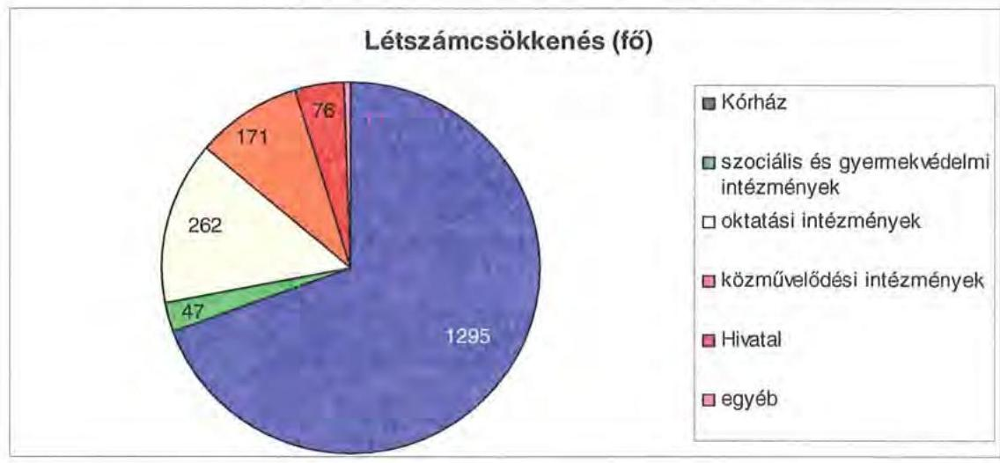

A helyi szervezési intézkedések végrehajtásához az Önkormányzat az áttekintett időszak alatt 292 millió Ft központi költségvetési támogatásban részesült, amelynek felhasználásával 166 fő álláshelyet tartósan leépített. Az álláshely-csökkenésnél 1696 főhöz, $91,1 \%$-hoz központi támogatás nem kapcsolódott, mert az üres álláshelyek megszüntetésén felül az érintett dolgozók egy része nyugállományba vonult, prémium évekre ment, vagy más munkáltatónál helyezkedett el. Az intézkedések eredményeként az Önkormányzat 2006. december 31-ei átlaglétszáma 2011. március 31-ére 1527 fővel, $52,2 \%$-kal csökkent, ebben tükröződött a kormányzati intézkedések miatti létszámcsökkenés (illetékhivatal 63 fő) hatása is. Ezt nem tekintve a tényleges létszámcsökkenés 1464 fő, $49,9 \%$ volt.
2011. I. negyedévében a létszámnövelő, -csökkentő döntések eredőjeként a további létszámcsökkenés 24 főben realizálódott.

Az Önkormányzatnál 2011. első negyedévében folytatódtak a megtakarítási intézkedések, a kimutatott - a feladatátadáson felüli - 153 millió Ft kiadási megtakarításból 1 millió Ft, 0,5\% dologi jellegű volt, amely a határozott idejű alkalmazások megszüntetéséhez kapcsolódott. A személyi juttatások és járulékok mérséklődését kiemelten a Hivatali és intézményi szervezeti változások eredményezték. 2011. január 1-jétől az intézmények gazdasági szervezeti egységei megszűntek, a gazdálkodással, könyvvezetéssel és adatszolgáltatással kapcsolatos feladataikat a Hivatal vette át. A kulturális intézményi feladatellátás felülvizsgálatának eredményeként a Baranya Megyei Kulturális és Idegenforgalmi Központot, valamint Művészetek és Irodalom Háza intézményt 2011. április 15. napjával jogutód nélkül megszüntették. Az intézmények által ellátott kötelező feladatokról a közművelődési feladatokat a Csorba

---

Győző Megyei Városi Könyvtár intézménye, az idegenforgalmi feladatokat a Hivatal teljesíti. A hivatali és az intézményi szervezeti változások, valamint a többletjuttatások, tiszteletdíjak csökkentése hatásaként az Önkormányzat összesen 152 millió Ft személyi juttatás és járulék-megtakarítást mutatott ki.

A Közgyűlés működéséhez kapcsolható kiadások a 2011. évi költségvetési rendeletben tervezettek szerint várhatóan 8 millió Ft összegben csökkennek, amelyből 5 millió Ft, 54,5\% a társadalmi megbízatású alelnök tiszteletdíjának megállapításához kapcsolódik.

A kiadáscsökkentő intézkedések mellett az Önkormányzat az alábbiakban számszerűsített bevételnövelő intézkedéseket tett:
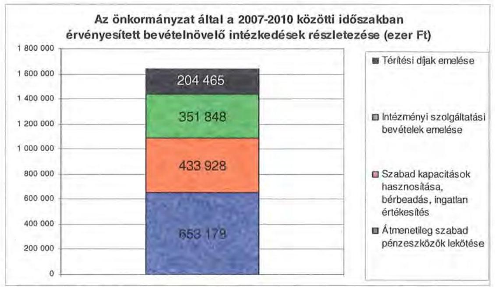

A bevételnövelésre irányuló intézkedések számszerűsített összegéből, 1643 millió Ft-ból a Hivatal 1080 millió Ft-ot, 65,7\%-ot realizált. A bevételek növekedésében meghatározó tényező a bérbeadás és az ingatlanok értékesítése 427 millió Ft-tal, az átmenetileg szabad pénzeszközök lekötéséből származó kamatbevétel 653 millió Ft-tal. Az intézmények bevételnövekedése kiemelten a térítési díjak emeléséből (204 millió Ft), a bérbeadásból (7 millió Ft) valamint a további szolgáltatások bevételi többletéből (352 millió Ft) ered.

Előzőeken túl, a 2007-2010. években az átvett feladatokhoz kapcsolódott 594 millió Ft központi költségvetési finanszírozás, 79 millió Ft intézményi saját bevétel, valamint a Baranya Megyei Területfejlesztési Tanácstól kapott 34 millió Ft támogatás.

A 2011. évre - a feladatátvételek kivételével - 71 millió Ft bevételnövekményt terveztek önkormányzati szinten, melyből 51 millió Ft, 71,8\% a Hivatalt érinti. A növekedés várhatóan elsősorban államháztartáson kívüli támogatásból és az ingatlanok, eszközök bérbeadásából származik.

---

A feladatátvételek hatását 33 millió Ft többletbevételként tervezték.
Az átszervezések, a takarékossági intézkedések szakmai feladatellátásra gyakorolt hatását nem a belső ellenőrzés keretében, hanem az intézkedési tervek végrehajtása során értékelték. Az intézmények belső ellenőrzése kapcsán a létszámcsökkentési intézkedések végrehajtását vizsgálták.
5. A HELYI ÖNKORMÁNYZATOK GAZDÁLKODÁSI RENDSZERÉNEK 2009. ÉVI ELLENŐRZÉSE SORÁN A PÉNZÜGYI EGYENSÚLY JAVÍTÁSÁRA TETT SZABÁLYSZERŰSÉGI ÉS CÉLSZERŰSÉGI JAVASLATOK HASZNOSULÁSA

A ÁSZ a 2009. évi jelentésében a pénzügyi egyensúly javítására szabályszerűségi és célszerűségi javaslatot nem tett.

Budapest, 2011. december 13.
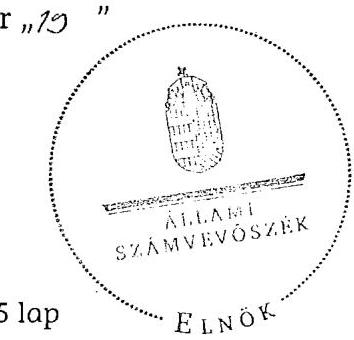

Domokos László h.

Melléklet: $\quad 6 \mathrm{db} \quad 15 \mathrm{lap} \quad E_{\text {LNO }}$

Domokos László h.

---

.

---

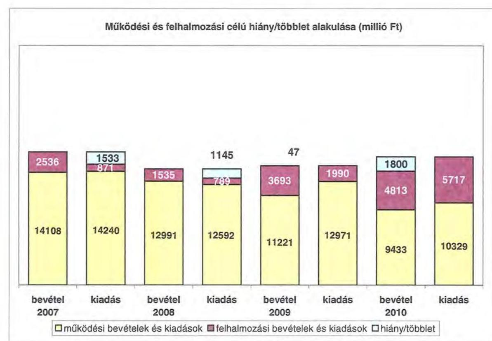

# 1. számú melléklet

| Működési és felhalmozási célú hiány/többlet alakulása (millió Ft) | 2007 | 2008 | 2009 | 2010  |
| --- | --- | --- | --- | --- |
|  14108 | 14240 | 14240 | 14240 | 14240  |
|  14240 | 14240 | 14240 | 14240 | 14240  |
|  14240 | 14240 | 14240 | 14240 | 14240  |

| Működési bevételek és kiadások | Felhalmozási bevételek és kiadások | Hiány/többlet |  |  |  |  |   |
| --- | --- | --- | --- | --- | --- | --- | --- |
|  bevétel 2007 | kiadás | bevétel 2008 | kiadás | bevétel 2009 | kiadás | bevétel 2010 | kiadás  |

---

.

---

### Az Önkormányzat CLF-módszer szerint besorolt bevételei és kiadásai 2007-2010 között

|   |  |  |  |  |  |  |  |  |  |  |  |  |  |  |  |  |  |  |  |  |  |  |  |  |  |  |  |  |  |   |
| --- | --- | --- | --- | --- | --- | --- | --- | --- | --- | --- | --- | --- | --- | --- | --- | --- | --- | --- | --- | --- | --- | --- | --- | --- | --- | --- | --- | --- | --- | --- | --- | --- |   |
|   |  |  |  |  |  |  |  |  |  |  |  |  |  |  |  |  |  |  |  |  |  |  |  |  |  |  |  |  |  |  |  |  |   |
|   |  |  |  |  |  |  |  |  |  |  |  |  |  |  |  |  |  |  |  |  |  |  |  |  |  |  |  |  |  |  |  |  |   |

  |  |  |  |  |  |  |  |  |  |  |  |  |   |
|   |  |  |  |  |  |  |  |  |  |  |  |  |  |  |  |  |  |  |  |  |  |  |  |  |  |  |  |  |  |  |  |  |  |   |
|   |  |  |  |  |  |  |  |  |  |  |  |  |  |  |  |  |  |  |  |  |  |  |  |  |  |  |  |  |  |  |  |  |  |   |
|   |  |  |  |  |  |  |  |  |  |  |  |  |  |  |  |  |  |  |  |  |  |  |  |  |  |  |  |  |  |  |  |  |  |   |
|   |  |  |  |  |  |  |  |  |  |  |  |  |  |  |  |  |  |  |  |  |  |  |  |  |  |  |  |  |  |  |  |  |  |   |
|   |  |  |  |  |  |  |  |  |  |  |  |  |  |  |  |  |  |  |  |  |  |  |  |  |  |  |  |  |  |  |  |  |  |   |
|   |  |  |  |  |  |  |  |  |  |  |  |  |  |  |  |  |  |  |  |  |  |  |  |  |  |  |  |  |  |  |  |  |  |   |
|   |  |  |  |  |  |  |  |  |  |  |  |  |  |  |  |  |  |  |  |  |  |  |  |  |  |  |  |  |  |  |  |  |  |   |
|   |  |  |  |  |  |  |  |  |  |  |  |  |  |  |  |  |  |  |  |  |  |  |  |  |  |  |  |  |  |  |  |  |  |   |
|   |  |  |  |  |  |  |  |  |  |  |  |  |  |  |  |  |  |  |  |  |  |  |  |  |  |  |  |  |  |  |  |  |  |   |
|   |  |  |  |  |  |  |  |  |  |  |  |  |  |  |  |  |  |  |  |  |  |  |  |  |  |  |  |  |  |  |  |  |  |   |
|   |  |  |  |  |  |  |  |  |  |  |  |  |  |  |  |  |  |  |  |  |  |  |  |  |  |  |  |  |  |  |  |  |  |   |
|   |  |  |  |  |  |  |  |  |  |  |  |  |  |  |  |  |  |  |  |  |  |  |  |  |  |  |  |  |  |  |  |  |  |   |
|   |  |  |  |  |  |  |  |  |  |  |  |  |  |  |  |  |  |  |  |  |  |  |  |  |  |  |  |  |  |  |  |  |  |   |
|   |  |  |  |  |  |  |  |  |  |  |  |  |  |  |  |  |  |  |  |  |  |  |  |  |  |  |  |  |  |  |  |  |  |   |
|   |  |  |  |  |  |  |  |  |  |  |  |  |  |  |  |  |  |  |  |  |  |  |  |  |  |  |  |  |  |  |  |  |  |   |
|   |  |  |  |  |  |  |  |  |  |  |  |  |  |  |  |  |  |  |  |  |  |  |  |  |  |  |  |  |  |  |  |  |  |   |
|   |  |  |  |  |  |  |  |  |  |  |  |  |  |  |  |  |  |  |  |  |  |  |  |  |  |  |  |  |  |  |  |  |  |   |
|   |  |  |  |  |  |  |  |  |  |  |  |  |  |  |  |  |  |  |  |  |  |  |  |  |  |  |  |  |  |  |  |  |  |   |
|   |  |  |  |  |  |  |  |  |  |  |  |  |  |  |  |  |  |  |  |  |  |  |  |  |  |  |  |  |  |  |  |  |  |   |
|   |  |  |  |  |  |  |  |  |  |  |  |  |  |  |  |  |  |  |  |  |  |  |  |  |  |  |  |  |  |  |  |  |  |   |
|   |  |  |  |  |  |  |  |  |  |  |  |  |  |  |  |  |  |  |  |  |  |  |  |  |  |  |  |  |  |  |  |  |  |  |   |
|   |  |  |  |  |  |  |  |  |  |  |  |  |  |  |  |  |  |  |  |  |  |  |  |  |  |  |  |  |  |  |  |  |  |  |  

 |
|   |  |  |  |  |  |  |  |  |  |  |  |  |  |  |  |  |  |  |  |  |  |  |  |  |  |  |  |  |  |  |  |  |  |  |  |   |
|   |  |  |  |  |  |  |  |  |  |  |  |  |  |  |  |  |  |  |  |  |  |  |  |  |  |  |  |  |  |  |  |  |  |  |  |   |
|   |  |  |  |  |  |  |  |  |  |  |  |  |  |  |  |  |  |  |  |  |  |  |  |  |  |  |  |  |  |  |  |  |  |  |  |   |
|   |  |  |  |  |  |  |  |  |  |  |  |  |  |  |  |  |  |  |  |  |  |  |  |  |  |  |  |  |  |  |  |  |  |  |  |   |
|   |  |  |  |  |  |  |  |  |  |  |  |  |  |  |  |  |  |  |  |  |  |  |  |  |  |  |  |  |  |  |  |  |  |  |  |   |
|   |  |  |  |  |  |  |  |  |  |  |  |  |  |  |  |  |  |  |  |  |  |  |  |  |  |  |  |  |  |  |  |  |  |  |  |   |
|   |  |  |  |  |  |  |  |  |  |  |  |  |  |  |  |  |  |  |  |  |  |  |  |  |  |  |  |  |  |  |  |  |  |  |  |   |
|   |  |  |  |  |  |  |  |  |  |  |  |  |  |  |  |  |  |  |  |  |  |  |  |  |  |  |  |  |  |  |  |  |  |  |  |   |
|   |  |  |  |  |  |  |  |  |  |  |  |  |  |  |  |  |  |  |  |  |  |  |  |  |  |  |  |  |  |  |  |  |  |  |  |   |
|   |  |  |  |  |  |  |  |  |  |  |  |  |  |  |  |  |  |  |  |  |  |  |  |  |  |  |  |  |  |  |  |  |  |  |  |   |
|   |  |  |  |  |  |  |  |  |  |  |  |  |  |  |  |  |  |  |  |  |  |  |  |  |  |  |  |  |  |  |  |  |  |  |  |   |
|   |  |  |  |  |  |  |  |  |  |  |  |  |  |  |  |  |  |  |  |  |  |  |  |  |  |  |  |  |  |  |  |  |  |  |  |   |
|   |  |  |  |  |  |  |  |  |  |  |  |  |  |  |  |  |  |  |  |  |  |  |  |  |  |  |  |  |  |  |  |  |  |  |  |   |
|   |  |  |  |  |  |  |  |  |  |  |  |  |  |  |  |  |  |  |  |  |  |  |  |  |  |  |  |  |  |  |  |  |  |  |  |   |
|   |  |  |  |  |  |  |  |  |  |  |  |  |  |  |  |  |  |  |  |  |  |  |  |  |  |  |  |  |  |  |  |  |  |  |  |   |
|   |  |  |  |  |  |  |  |  |  |  |  |  |  |  |  |  |  |  |  |  |  |  |  |  |  |  |  |  |  |  |  |  |  |  |  |   |
|   |  |  |  |  |  |  |  |  |  |  |  |  |  |  |  |  |  |  |  |  |  |  |  |  |  |  |  |  |  |  |  |  |  |  |  |   |
|   |  |  |  |  |  |  |  |  |  |  |  |  |  |  |  |  |  |  |  |  |  |  |  |  |  |  |  |  |  |  |  |  |  |  |  |   |
|   |  |  |  |  |  |  |  |  |  |  |  |  |  |  |  |  |  |  |  |  |  |  |  |  |  |  |  |  |  |  |  |  |  |  |  |   |
|   |

---

|  (1.5.) Működési Jövedelem - Többletfelhasználás (4.3. Hibafelhasználás + 4.4. Forgatási és befektetési célú értékpapírok beváltása ) | $-818368$ | $-505424$ | $-1433620$ | $-913440$  |
| --- | --- | --- | --- | --- |
|  TÁJÉKOZTATÓ ADATOK |  |  |  |   |
|  Összes kötelezettség | 5702686 | 5770023 | 5572458 | 7936546  |
|  ebből rövid lejáratú | 1981918 | 2020025 | 1835478 | 1106551  |
|  Összes eszközökhöz kapcsolódó kötelezettség | 1397896 | 1817375 | 1653243 | 249761  |
|  ebből lejárt | 781465 | 778936 | 613628 | 0  |
|  Fennálló és tőkepiaci kötelezettség (adósság) | 4082114 | 3814330 | 3849573 | 7621358  |
|  ebből rövid lejáratú | 301346 | 64336 | 103392 | 791263  |
|  PPP szerződésből hátralévő kötelezettségek állománya | 0 | 0 | 0 | 0  |
| 

 ebből lejárt szolgáltatási díj miatti kötelezettség | 0 | 0 | 0 | 0  |
|  Felszámítási tétel napi átlagos állománya | 598577 | 166150 | 505615 | 721939  |
|  Likviditási tétel napi átlagos állománya | 0 | 0 | 0 | 0  |
|  Munkatőke tétel napi átlagos állománya | 0 | 0 | 0 | 0  |
|  Peres eljárásokból fennálló függő kötelezettségek | 0 | 0 | 0 | 0  |
|  Finanszírozásba bevonható eszközök összesen : | 4428497 | 3222682 | 731314 | 860113  |
|  Tartós hitelviszonyt megtestesítő értékpapírok | 0 | 0 | 0 | 0  |
|  Hosszú lejáratú bankbetétek | 0 | 0 | 0 | 0  |
|  Értékpapírok | 1181 | 1181 | 1181 | 1181  |
|  Pénzeszközök (idegen pénzeszközök nélkül) | 4427316 | 3221501 | 730333 | 858933  |

- Bevételekben nem térül, a kiadásokban nem jelennek meg az amortizáció, a vagyoni helyzetet az egyenleg befolyásolja. Bevételekben vagyon megőrzésre és bővítésre fordítható források.

Megjegyzés

A számítási leírás némileg eltér az ÁSZ módszertanában korábban alkalmazott besorolástól. A jelen besorolás általános közgazdasági megfontolásokon alapul, amely testet ölt az ÁSZ statisztikai módszertanában is. Folyó tételek alatt értjük azokat a kiadásokat és bevételeket, amelyek az egység vagyoni helyzetét automatikusan nem változtatják. Bevételi oldalon ilyenek az adók, a tényezőjövedelmek, transzferek, kiadási oldalon a transzferek és a szolgáltatás nyújtásával kapcsolatos működési kiadások. Felhalmozási, vagy tőke tételek módosítják a vagyon nagyságát. Privatizációs bevétel csökkenti a vagyoni, fizikai beruházás, vagy pénzügyi befektetés növeli.

A folyó költségvetés egyenlege (működési jövedelem) tartalmazza a kamatkiadásokat is, mind a működési, mind a fejlesztési kamatot, mert ezek közgazdaságilag tényezőjövedelmek. Nem tartalmazzák a pénzforgalmi bevételek és kiadások a követelés elengedés miatt könyvelt bevételi és kiadási pénzforgalmi tételeket, mivel ezek egymást kioltják és valójában technikai elszámolási műveletnek minősülnek, így indokolatlanul változtatják a költségvetési év kiadási és bevételi adatait, hiszen valójában a bevétel nem realizálódott, és a költségvetési évben kiadás sem történt, ezek elengedették a követelést.

A nettó működési jövedelem a tőkekivonás levonásával a folyó költségvetés egyenlegéből (működési jövedelemből) származik. Transzfer kiadásoknak nevezzük azokat a folyó és felhalmozási tételeket, amelyeket nem az adott önkormányzat használ fel szolgáltatásnyújtásra.

---

#### Az Önkormányzat bevételeinek és kiadásainak, adósságszolgálatának alakulása 2007-2010 között

|  Sor-
szám | Megnevezés | 2007. év | 2008. év | 2009. év | 2010. év  |
| --- | --- | --- | --- | --- | --- |
|   |  | Mily | Mily | Mily | Mily  |
|  1. | MŰKÖDÉSI BEVÉTELEK | 14 168 295 | 12 851 185 | 11 221 295 | 9 423 166  |
|  1.1. | Saját bevételek | 3 415 053 | 3 091 525 | 3 469 275 | 3 045 066  |
|  1.1.1. | Ingatlanok működési bevétele | 1 543 105 | 1 434 735 | 1 622 710 | 2 069 097  |
|  1.2. | Helyi adók | 1 759 035 | 2 028 935 | 1 704 175 | 1 202 656  |
|  1.3. | Helyi adóbevételek és pótlékok | 3 147 | 8 074 | 26 734 | 26 821  |
|  1.4. | Kismet bevétel működési része | 106 636 | 525 624 | 57 851 | 51 244  |
|  1.5. | Egyéb folyó működési bevételek | 2 264 | 1 250 | 0 | 0  |
|  2. | Támogatás értékű működési bevételek | 546 625 | 449 815 | 372 396 | 527 302  |
|   | ebből | 0 | 0 | 0 | 0  |
|   | helyi önkormányzatoktól és költségvetési szervektől | 200 797 | 269 003 | 88 430 | 435 760  |
|   | többcélú kintétségi támogatás | 24 175 | 27 990 | 27 989 | 23 890  |
|  3. | Pénzforgalom nélküli bevételek működésre jövevényelt része | 246 345 | 14 047 | 142 681 | 847 886  |
|  4. | Államháztartáson kívülről működési célra átvett pénzeszközök | 1 394 637 | 193 818 | 220 128 | 285 502  |
|   | ebből | 0 | 0 | 0 | 0  |
|  5. | Központi támogatások és átszegedett források működési része | 6 498 595 | 4 146 860 | 5 556 773 | 3 393 334  |
|   | ebből | 0 | 0 | 0 | 0  |
|   | SZJA | 1 548 785 | 361 020 | 567 060 | 177 522  |
|   | önkormányzat és intézmények állami támogatásának működési része | 2 758 263 | 4 059 450 | 3 245 424 | 2 459 105  |
|   | költségvetési hiányának, visszafizetések | 0 | 0 | 0 | 0  |
|   | társadalombiztosítási alapból | 4 182 253 | 2 525 910 | 2 042 781 | 209 597  |
|   | bevétel | 14 168 295 | 12 851 185 | 11 221 295 | 9 423 166  |
|  II. | MŰKÖDÉSI KIADÁSOK (kamatkiadás nélkül) | 14 294 794 | 12 891 898 | 12 971 388 | 10 328 088  |
|  1. | Folyó működési kiadások összesen kamatkiadások nélkül | 12 645 748 | 12 761 789 | 12 836 048 | 9 218 868  |
|   | ebből | 0 | 0 | 0 | 0  |
|   | személyi juttatások | 6 223 251 | 6 279 432 | 5 443 872 | 3 994 221  |
|   | munkaadói terhek járulékai | 1 926 031 | 1 873 371 | 1 809 227 | 885 096  |
|   | árukiadások | 5 103 397 | 3 986 220 | 4 204 371 | 3 016 338  |
|   | egyéb folyó kiadások | 152 002 | 151 736 | 416 385 | 627 417  |
|   | egyéb folyó működési kiadások | 3 000 | 0 | 0 | 0  |
|  2. | Támogatások, elvonások és egyéb folyó átutalások | 259 228 | 269 291 | 249 291 | 187 532  |
|   | ebből | 0 | 0 | 0 | 0  |
|   | működési célú pénzeszköz átadás államháztartáson kívülre | 188 003 | 209 240 | 139 323 | 94 071  |
|   | működési célú pénzeszköz átadás államháztartáson kívülre | 0 | 0 | 0 | 0  |
|   | társadalmi és szociális juttatások | 92 325 | 101 011 | 104 869 | 82 481  |
|  3. | Előző évi pénzmaradvány átadás, visszafizetés működési | 139 770 | 64 459 | 97 684 | 79 524  |
|  4. | Támogatás értékű működési kiadás | 329 091 | 86 599 | 197 459 | 507 120  |
|   | ebből | 0 | 0 | 0 | 0  |
|   | önkormányzatoknak | 316 720 | 23 491 | 106 153 | 205 731  |
|   | költségvetési társadalombiztosítási | 311 | 8 180 | 12 853 | 172 866  |
|   | ebből | 0 | 0 | 0 | 0  |
|  III. | ADÓSSÁGSZOLGÁLAT | 275 232 | 252 784 | 172 349 | 213 190  |
|   | főkötelezettség: működési | 471 419 | 195 100 | 0 | 0  |
|   | felhalmozási | 22 495 | 278 876 | 22 339 | 33 157  |
|   | kamatfizetési kötelezettség: működési | 44 790 | 9 591 | 46 767 | 138 820  |
|   | felhalmozási | 66 587 | 150 903 | 63 105 | 96 462  |
|   | hosszú lejáratú értékpapír bevállalása, vételi kötelezettség | 0 | 0 | 33 488 | 81 488  |
|   | bevállalás (hitelfelvételi célú) | 0 | 0 | 33 488 | 81 488  |
|   | vételi kötelezettség (hitelfelvételi célú) | 0 | 0 | 0 | 0  |
|   | bevállalás (külföldi) | 0 | 0 | 0 | 0  |
|  IV. | FELHALMOZÁSI BEVÉTELEK | 2 529 565 | 1 834 585 | 3 682 137 | 4 812 654  |
|  1. | Saját felhalmozási és tőkejellegű bevétel | 528 956 | 60 848 | 506 338 | 466 468  |
|  1.1. | Tárgyi eszközök, ingatlanok, javak értékesítése, fizetési visszafizetés | 383 657 | 42 088 | 214 952 | 851 078  |
|  1.2. | Privatizációból származó bevétel | 0 | 0 | 0 | 800  |
|  1.3. | Csapadékvíz díj, részvételi díjak | 200 | 2 209 | 500 | 2 209  |
|  1.4. | Kamatbevétel felhalmozási része | 0 | 0 | 288 064 | 9 127  |
|  1.5. | Helyi adók átszegedett adók felhalmozási része | 0 | 0 | 0 | 0  |
|  1.6. | Egyéb folyó felhalmozási bevételek | 554 764 | 5 581 | 4 914 | 6 895  |
|  2. | Támogatásértékű felhalmozási bevételek | 321 880 | 294 095 | 284 629 | 3 185 528  |
|   | ebből | 0 | 0 | 0 | 0  |
|   | helyi önkormányzatoktól és költségvetési szervektől

 106 860 | 18 473 | 17 910 | 12 261  |
|   | többcélú kötéségi társulástól | 0 | 0 | 7 084 | 285  |
|  3. | Pénzforgalom nélküli bevételek felhalmozásra jövevényelt része | 1 019 855 | 1 079 450 | 2 261 749 | 246 733  |
|  4. | Államháztartáson kívülről felhalmozás végett átvett pénzeszközök | 52 630 | 73 969 | 38 599 | 209 279  |
|  5. | Állami felhalmozási és tőkejellegű bevétel | 186 885 | 36 817 | 0 | 184 697  |
|  5.1. | EU költségvetésből átvétel | 0 | 0 | 0 | 0  |
|  5.2. | Önkormányzatok költségvetési támogatása felhalmozási célra | 106 080 | 36 817 | 0 | 104 857  |
|  6. | FELHALMOZÁSI KIADÁSOK | 870 989 | 789 013 | 7 389 940 | 8 717 044  |
|  7. | Folyó felhalmozási kiadások kamatkiadások nélkül | 816 235 | 209 808 | 1 786 880 | 5 287 266  |
|  7.1. | Dávutadás, felújítás | 169 774 | 209 747 | 1 786 880 | 3 283 432  |
|  7.2. | Értékesített tárgyi eszközök elvétel befizetés | 44 559 | 500 | 0 | 10 000  |
|  7.3. | Részletekben végrehajtása | 0 | 200 | 500 | 12 150  |
|  8. | Támogatások, elvonások és egyéb folyó átutalások | 27 184 | 164 824 | 28 466 | 28 767  |
|   | ebből | 0 | 0 | 0 | 0  |
|   | felhalmozási célú pénzeszköz átadás államháztartáson kívülre | 33 340 | 86 774 | 97 608 | 24 754  |
|   | felhalmozási célú támogatásnak, kölcsön, kölcsön (törlesztése) | 1 850 | 4 900 | 1 800 | 4 980  |
|  9. | Támogatásértékű felhalmozási kiadások | 10 500 | 52 793 | 98 521 | 270 059  |
|   | ebből | 0 | 0 | 0 | 0  |
|   | helyi önkormányzatoknak és költségvetési szerveinek | 10 500 | 39 293 | 50 743 | 209 244  |
|   | többcélú kötéségi társulástól | 0 | 12 200 | 0 | 7 657  |
|  4. | Pénzforgalom nélküli kiadások felhalmozásra jövevényelt része | 8 933 | 24 901 | 14 698 | 40 872  |
|  5. | Hitel, kölcsön felvétel | 2 229 309 | 1 429 | 0 | 3 185 429  |
|  6.1. | Rövid lejáratú hitel felvétel | 0 | 0 | 0 | 525 503  |
|  6.2. | Közepes lejáratú hitel felvétel | 185 108 | 0 | 0 | 0  |
|  6.3. | Hosszú lejáratú hitel felvétel | 0 | 0 | 0 | 1 149 185  |
|   | Befektetési és hosszú lejáratú értékpapírok beszerzése, értékesítése | 3 064 890 | 1 824 | 0 | 1 458 719  |
|   | beszerzés (befektetés) célú | 3 064 890 | 0 | 0 | 1 458 719  |
|   | értékesítés (befektetés) célú | 0 | 1 824 | 0 | 0  |
|   | beszerzés (külföldi) | 0 | 0 | 0 | 0  |
|  6.4. | Hospitás célú értékpapírok bevállalása, végrehajtása és a beszerzése, értékesítése | 0 | 0 | 0 | 0  |
|  6.5. | Hitel/vétel külföldi | 0 | 0 | 0 | 0  |
|  VII. | Finanszírozási műveletek egyenlege | 2 886 091 | 773 909 | 43 334 | 2 964 621  |

---

.

---

# Az Önkormányzat 2007-2010 években megvalósított, illetve 2010. december 31-én fennálló fejlesztési feladatokhoz kapcsolódó kötelezettségeinek összegzése

|  Fejlesztési feladat megnevezése | Beruházás kezdete | Teljes bekerülési költség | 2006. december 31-ig teljesített kiadás | 2007-2010. évek között teljesített kiadás | 2010. év utánra vállalt kötelezettség | 2010. utáni kötelezettség-vállalás forrásösszetétele |  |  |   |
| --- | --- | --- | --- | --- | --- | --- | --- | --- | --- |
|   |  |  |  |  |  | Saját bevétel | Hitel | Kötvény | EU-s támogatás  |
|  Pécs, Zsolnay Múzeum rekonstrukció | 2005. | 415245 | 216301 | 198944 | - |  |  |  |   |
|  Baranya Megyei Kórház "A" épület rekonstrukció | 2003. | 755437 | 750296 | 5141 | - |  |  |  |   |
|  BMO Radnóti Miklós Szakközép- és Szakiskolája, Kollégiuma, Mohács tornaterem és tanműhely rekonstrukció | 2004. | 371629 | 330620 | 41009 | - |  |  |  |   |
|  Támasz Pont - Hajléktalan személyek nappali ellátó rendszerének fejlesztése projekt | 2006. | 254300 | 59427 | 194873 | - |  |  |  |   |
|  A Dráva-medence komplex ökoturisztikai fejlesztések - Dráva III. | 2004. | 167830 | 104940 | 62890 | - |  |  |  |   |
|  BMO Óvodája, Általános Iskolája, Nevelési Tanácsadója, Kollégiuma és Gyermekotthona, Mohács 2 db lakóotthon rekonstrukció | 2007. | 35587 | - | 35587 | - |  |  |  |   |
|  BMO Horizont Otthona Szigetvár-Turbékpuszta szennyvízhálózat kiépítése | 2007. | 11468 | - | 11468 | - |  |  |  |   |
|  BMO Radnóti Miklós Szakközép- és Szakiskolája, Kollégiuma, Mohács ingatlan vásárlás | 2007. | 29000 | - | 29000 | - |  |  |  |   |
|  Baranyai Élménykörút Orfű Aquapark projekt | 2008. | 1612344 | - | 1602081 | 10263 |  | 10263 |  |   |
|  Baranyai Élménykörút Orfű Viziturisztikai Központ projekt | 2008. | 209376 | - | 207710 | 1666 | 798 |  |  | 868  |
|  Dél-Dunántúli Regionális Könyvtár és Tudásközpont EKF 2010 projekt | 2008. | 3462148 | - | 3334107 | 128041 | 30969 |  |  | 97072  |
|  Nagy kiállítótér - Múzeum utca EKF Pécs 2010 projekt | 2008. | 1236325 | - | 1139182 | 97143 | 4610 | 5757 |  | 86776  |

---

# Az Önkormányzat 2007-2010 években megvalósított, illetve 2010. december 31-én fennálló fejlesztési feladatokhoz kapcsolódó kötelezettségeinek összegzése

|  Fejlesztési feladat megnevezése | Beruházás
kezdete | Teljes
bekerülési
költség | 2006.
december
31-ig
teljesített
kiadás | 2007-2010.
évek között
teljesített
kiadás | 2010. év
utánra
vállalt
kötelezettség | 2010. utáni kötelezettség-vállalás forrásösszetétele |  |  |   |
| --- | --- | --- | --- | --- | --- | --- | --- | --- | --- |
|   |  |  |  |  |  | Saját
bevétel | Hitel | Kötvény | EU-s
támogatás  |
|  Régészeti Múzeum rekonstrukciója - a beruházás visszamondása megtörtént | 2009. | 30 710 | - | 30 710 |  |  |  |  |   |
|  Pécs, János u. 22 ingatlan rekonstrukció | 2009. | 39 461 | - | 39 461 |  |  |  |  |   |
|  BMO Általános Iskolája, Speciális Szakiskolája, Nevelési Tanácsadója, Kollégiuma és Gyermekotthona, Pécsvárad ingatlan vásárlás | 2010. | 9 200 | - | 9 200 |  |  |  |  |   |
|  Orfűi gátapasztó felújítása | 2011. | 17 237 | - | - | 17 237 | 7 087 |  |  |   |
|  A Dráva-medence geotermikus energiakészletének felmérése Észak-Szlavónia és a Dél-Dunántúl területén - Határon Átnyúló Együttműködési Program keretében | 2011. | 33 153 | - | - | 33 153 | 1 852 |  |  | 31 301  |

---

# Az Önkormányzat 2007-2010 években megvalósított, illetve 2010. december 31-én fennálló fejlesztési feladatokhoz kapcsolódó kötelezettségeinek összegzése

|  Fejlesztési feladat megnevezése | Beruházás kezdete | Teljes bekerülési költség | 2006. december 31-ig teljesített kiadás | 2007-2010. évek között teljesített kiadás | 2010. év utánra vállalt kötelezettség | 2010. utáni kötelezettség-vállalás forrásösszetétele |  |  |   |
| --- | --- | --- | --- | --- | --- | --- | --- | --- | --- |
|   |  |  |  |  |  | Saját bevétel | Hitel | Kötvény | EU-s támogatás  |
|  Baranya Megyei Kórház monitor beszerzés | 2006. | 30000 | 30000 |  |  |  |  |  |   |
|  BMO Nagy László Gimnáziuma, Szakközép- és Szakiskolája, Speciális Szakiskolája, Kollégiuma Komló autóbusz beszerzés | 2006. | 13606 | 13606 |  |  |  |  |  |   |
|  Baranyai Pedagógiai Szakszolgálatok és Szakmai Szolgáltatások Központja Pécs számítástechnikai eszközök beszerzése | 2006. | 19369 | 19369 |  |  |  |  |  |   |
|  BMO Boróka Otthona Helesfa 20 személyes busz beszerzése | 2007. | 12779 |  | 12779 |  |  |  |  |   |
|  Baranya Megyei Kórház HEFOP 4.4 pályázathoz kapcsolódó beruházás | 2008. | 134059 |  | 134059 |  |  |  |  |   |
|  Baranya Megyei Kórház Szanatóriumi osztály költözése miatt "K" épület alakítások | 2008. | 12349 |
  | 12349 |  |  |  |  |   |
|  BMO Radnóti Miklós Szakközép- és Szakiskolája, Kollégiuma Mohács hegesztő műhely kialakítása | 2008. | 15244 |  | 15244 |  |  |  |  |   |
|  BMO Radnóti Miklós Szakközép- és Szakiskolája, Kollégiuma Mohács hegesztő gépek, berendezések, eszközök | 2008. | 15089 |  | 15089 |  |  |  |  |   |
|  BMO Radnóti Miklós Szakközép- és Szakiskolája, Kollégiuma Mohács informatikai eszközök beszerzése | 2008. | 22167 |  | 22167 |  |  |  |  |   |
|  BMO Radnóti Miklós Szakközép- és Szakiskolája, Kollégiuma Mohács faipari gépek vásárlása | 2009. | 11107 |  | 11107 |  |  |  |  |   |

---

### 3. számú melléklet

### Az Önkormányzat 2007-2010 években megvalósított, illetve 2010. december 31-én fennálló fejlesztési feladatokhoz kapcsolódó kötelezettségeinek összegzése

|  Fejlesztési feladat megnevezése | Beruházás
kezdete | Teljes
bekerülési
költség | 2006.
december
31-ig
teljesített
kiadás | 2007-2010.
évek között
teljesített
kiadás | 2010. év
utánra
vállalt
kötelezettség | 2010. utáni kötelezettség-vállalás forrásösszetétele |  |  |   |
| --- | --- | --- | --- | --- | --- | --- | --- | --- | --- |
|   |  |  |  |  |  | Saját
bevétel | Hitel | Kötvény | EU-s
támogatás  |
|  BMO Radnóti Miklós Szakközép- és Szakiskolája, Kollégiuma Mohács informatikai és audiovizuális eszközök vásárlása | 2009. | 16 359 |  | 16 359 |  |  |  |  |   |
|  BMO Gazdasági Igazgatósága Pécs Pécs, Széchenyi tér 9. klíma kiépítése I. ütem | 2009. | 19 852 |  | 19 852 |  |  |  |  |   |
|  BMO Radnóti Miklós Szakközép- és Szakiskolája, Kollégiuma Mohács hegesztő gépek beszerzése | 2010. | 14 628 |  | 14 628 |  |  |  |  |   |
|  10 millió forint alatti beruházások a Hivatalnál | 2007-2010. | 135 337 | - | 135 337 |  |  |  |  |   |
|  10 millió forint alatti beruházások összesen az intézményekben | 2007-2010. | 600 122 | 188 470 | 411 652 |  |  |  |  |   |
|  Összesen |  | 9 762 517 | 1 713 029 | 7 761 985 | 287 503 | 45 316 | 16 020 | 0 | 216 017  |

---

# Baranya Megyei Önkormányzat 

Szám: 256-6/2011
Ügyintéző: Bekk Ferencné

## Domokos László   elnök

Állami Számvevőszék

Budapest
Apáczai Cs. J. u. 10
1052

## Tisztelt Domokos László Elnök Úr!

A Baranya Megyei Önkormányzat pénzügyi helyzetének ellenőrzéséről szóló „tervezet" jelentését megkaptuk. Megállapításaival alapjában egyetértve, az előírt határidőben a jelentés tematikáját követve tesszük meg észrevételeinket.

Mindenekelőtt kiemelnénk, hogy Önkormányzatunk - a jelentéssel összhangban - nem a hanyag gazdálkodása miatt került ebbe a nehéz anyagi helyzetbe.
Önkormányzatunk gazdálkodási rendszerének 2009. évi ÁSZ ellenőrzése során a pénzügyi egyensúly javítására sem szabályszerűségi, sem célszerűségi javaslatot nem tettek.

A megállapításban szereplő adatokhoz tartozóan a következő pontosítást tesszük:
I. összegző megállapítások fejezet

- a 2007-2010. között a tárgyi eszközök után elszámolt értékcsökkenés a szerepeltetett 771 millió forint helyett 742 millió forint (12. oldal (4) bekezdés);
- a Baranya Megyei Önkormányzat Nagy László Gimnázium, Szakközép- és Szakiskola, Speciális Szakiskola, Kollégium Komló intézmény 2009. július 1-jétől a „Kökönyösi Oktatási Központ" Szakiskola intézményegységeként a Kökönyösi Közoktatási Intézményfenntartó Társulás irányítása alá tartozik. A Társulási Megállapodás értelmében azonban a Társulásba „bevitt" valamennyi intézmény - normatív állami támogatáson és saját bevételeken túli - finanszírozása a korábbi fenntartó önkormányzat feladata. Az 1101 fő tanulólétszámú, komlói középfokú oktatási feladatellátás „címzettje" továbbra is a Baranya Megyei Önkormányzat, ily módon a komlói középfokú oktatás finanszírozása továbbra is a Baranya Megyei Önkormányzat kötelezettsége. A Baranya Megyei Önkormányzat költségvetésében az intézmény költségvetése valóban nem jelenik meg, a központi forrásokkal és saját bevételekkel nem fedezett kiadások forrását azonban továbbra is a Baranya Megyei Önkormányzat biztosítja a speciális célú támogatások között. Így az átadás tényleges megtakarítást nem eredményezett.
Ennek következtében nem helytálló a jelentés 12. oldalának megállapítása, mely szerint „A működési kiadások növekedése amellett következett be, hogy a feladatellátás változásának hatására több tanuló oktatását adták át, mint ahányat átvettek."
II. részletes megállapítások fejezet
- „Az átadott feladatok között szerepelt a Kórház....., valamint egy közoktatási intézmény 1101 fő tanuló létszámmal." mondat nem helytálló az I. (2) bekezdésében indokoltak miatt;

---

- „A legmagasabb bekerülési költségű (34 621 millió Ft)..." - az összeg nagysága tévesen került megállapításra, a jó összeg 34 millió forint (29. oldal (3) bekezdés);
- az I. (2) bekezdésében jelzett indok miatt nem helytálló az átadott feladatokhoz kapcsolódó megtakarításokra vonatkozó megállapítás a 38. oldalon, mely szerint ,„Az Önkormányzat gazdálkodásában a 2007-2010. években - kimutatása szerint - az átvett feladatok összesen 988 millió forint kiadási többletet, valamint az átadott feladatok - az egészségügyi feladaton felül - összesen 532 millió forint kiadási megtakarítást jelentettek". Továbbá a 39. oldalon : „Az Önkormányzat a feladatátadás hatásaként 507 millió Ft kiadási megtakarítást mutatott ki."
- A Baranya Megyei Kórházzal kapcsolatosan - tekintettel arra, hogy költségvetésünk helyzetét, eladósodottságunk mértékét nagyban befolyásolta - nagyon sok megállapítást tartalmaz a jelentés. Ezek között a 39. oldal (3) bekezdésében szerepel az a mondat, hogy „A feladatátadás kiadáscsökkentő hatását nem számszerűsítették,..." Az átadást megelőzően közgyűlési előterjesztésekben is bemutatott módon rengeteg pénzügyi kimutatás, hatáselemzés, költséghatékonysági számítás készült, ezekben nevesítetten valóban „kiadáscsökkentő hatás" nem szerepel, azonban ezek csökkentő tételként jelentek meg a Baranya Megyei Önkormányzatot terhelő kötelezettségek megállapításakor, amelyeket a kimutatások, elemzések, költségvetések tartalmaznak. A további - racionalizálási intézkedéseket is tartalmazó - feladatellátáshoz kapcsolódó kiadáscsökkenés pedig már a Pécsi Tudományegyetem működésében számszerűsíthető;
- A 40. oldal (3) bekezdésében a gyógypedagógiai intézményeket érintő átszervezésre vonatkozó megállapítás, hogy ,...hatása - az Önkormányzat anyagai szerint - 3 millió Ft kiadási megtakarításban jelentkezett." Ez az összeg csak a 2010-ben realizált dologi megtakarítás. Személyi juttatásokkal és járulékokkal együtt ezen átszervezés összesen 2010-ben 11.670 ezer forint, 2011-ben (egy teljes évet nézve) 53.207 ezer Ft megtakarítást eredményezett;
- A 43. oldal utolsó bekezdésében található megállapítást, miszerint „Az átszervezések, a takarékossági intézkedések szakmai feladatellátásra gyakorolt hatását nem vizsgálták, erről belső ellenőrzési jelentések nem állnak rendelkezésre." pontosítanánk. Belső ellenőrzés keretében nem vizsgáltuk (belső ellenőrzési jelentések nem készültek) e témában, az átszervezésekhez azonban a hivatal munkatársai, valamint az intézmények vezetői, illetve egyes esetekben külső szakértők bevonásával készültek vizsgálatok, az esetek egy részében alternatív megoldási javaslatokat tartalmazó anyagok, illetve pénzügyi elemzések, ezek eredményét a döntés előkészítő, illetve költségvetési előterjesztések bemutatták. A takarékossági intézkedések a költségvetési egyeztető tárgyalásokon az intézményvezető szakmai elképzelései, felülvizsgálatai (sokszor több fordulós tárgyalások) alapján alakultak ki, közgyűlési döntés alapján intézkedési terveken alapulnak, amelyekhez - szakmai elemeket is tartalmazó - felülvizsgálati kötelezettség kapcsolódik.

Javaslatuk 2. és 3. pontjában leírtakhoz kapcsolódóan szeretném tájékoztatni, hogy Önkormányzatunk a 2011. évi költségvetése is jelentős korlátokkal készült. A költségvetési egyensúly biztosítását segítő főbb intézkedések az alábbiak voltak:

- hivatal és az intézmények kiadásainak jelentős csökkentése, létszámleépítések,
- közgyűlés kiadásainak felülvizsgálata, csökkentése,
- támogatások szűkítése, megszüntetése,
- saját fejlesztési kiadások korlátozása
- önként vállalt feladatok minimalizálása (99%-ban kötelező feladatot látunk el).

A 2011. évi elfogadott költségvetésünk egy gazdasági számításokkal alátámasztott cselekvési, intézkedési terv. Közgyűlésünknek rendszeresen (féléves, háromnegyedéves és év végi beszámolók formájában) beszámolunk a költségvetésünk, pénzügyi helyzetünk adott időpontra vonatkozó helyzetéről. Önkormányzati rendeletünk kiterjed az adott évi és a többéves kihatással járó pénzintézeti kötelezettségeink finanszírozásának kezelésére és a forrás biztosítására. Kiadáscsökkentő és bevételnövelő intézkedéseinkkel a központi intézkedések hatására csökkenő bevételeket ellensúlyozni nem tudtuk.

---

A tervezési folyamatokat, további racionalizálási elképzeléseink megvalósítását gátolja a jelenlegi bizonytalanság a jövőbeni feladatellátásunkat illetően. Ezért az idei éven túlmutató, hosszabb távra szóló pénzügyi intézkedési tervet a sarkalatos törvények hatálybalépését követően célszerű elkészíteni.

A fent leírtak alapján Önkormányzatunk a 2011. évi költségvetés elfogadásával teljesítette a 2. és 3. pontban leírtakat.

A 4. pontban megfogalmazott értékcsökkenési leírás összegének visszapótlását jelen helyzetünkben nem áll módunkban finanszírozni.

Összegzésként elmondható, hogy az összeállított anyag valós képet mutat Önkormányzatunk jelen pénzügyi helyzetéről és a megállapításai is - a fenti kiegészítések módosításával - igazak, azonban a javaslatukban megfogalmazottak nem ezt tükrözik, hanem egy általános megállapítást tartalmaznak.
Forráshiányunk kialakulásában - megállapításukban is szereplően - leginkább az illetékbevétel, valamint a központi forráskivonás hatására az átengedett szja és az állami támogatások jelentős csökkenése játszott szerepet.
Ezen kieséseket tetézte a Baranya Megyei Kórház teljes integrációjával kapcsolatos költségek kérdése. Az uralhatatlanná vált veszteségek miatt kezdtük meg az integrációt a Pécsi Tudományegyetemmel közösen. A Baranya Megyei Önkormányzat Közgyűlése 114/2009. (XI.6.) Kgy. határozatával fogadta el az egészségügyi integrációhoz kapcsolódó alapszerződéseket, amelyek szerint 2010. január 1-jétől a megyei kórház működtetését legalább 15 évre a PTE egyetemi klinikahálózata vette át, a kórház ingatlanjainak tulajdonjoga a közgyűlés kezében maradt, az egyetem a vagyon nagy részét vagyonkezelésbe, illetve kisebb, főleg kisértékű eszközök részét tulajdonba kapta. A Kórház működésére 2007-2010. évekre vonatkozóan 3.576 millió forint került kifizetésre.

Tisztelettel kérem, hogy a végleges jelentést a javaslataink és kiegészítéseink figyelembevételével szíveskedjenek elkészíteni.

Pécs, 2011. június 29.

Köszönettel:
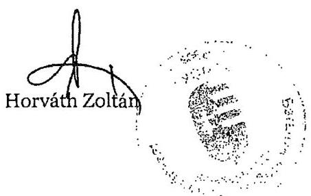

Melléklet: 3 db .

---

.

---

# Horváth Zoltán úr 

elnök
Baranya Megyei Önkormányzat

## Pécs

## Tisztelt Elnök Úr!

Köszönettel vettem Baranya Megyei Önkormányzat pénzügyi helyzetének ellenőrzéséről szóló jelentés-tervezethez megküldött pontosító észrevételeit és megállapítását, amely szerint a jelentés valós képet mutat az Önkormányzat pénzügyi helyzetéről. Pontosító észrevételeire az Állami Számvevőszékről szóló 2011. évi LXVI. törvény 29. § (3) bekezdése alapján az alábbi választ adom.

1. A közbenső egyeztetés során az elnök által tett észrevétel szerint:
„I. (1) bekezdés: A 2007-2010. között a tárgyi eszközök után elszámolt értékcsökkenés a szerepeltetett 771 millió forint helyett 742 millió forint (12. oldal (4) bekezdés)."

Az észrevétel megalapozott, a 2007-2010 között elszámolt értékcsökkenést 742 millió Ft-ra módosítjuk.
2. A közbenső egyeztetés során az elnök által tett észrevétel szerint:
„I. (2) bekezdés: A Baranya Megyei Önkormányzat Nagy László Gimnázium, Szakközép- és Szakiskola, Speciális Szakiskola, Kollégium Komló intézmény 2009. július 1-jétől a „Kökönyösi Oktatási Központ" Szakiskola intézményegységeként a Kökönyösi Közoktatási Intézményfenntartó Társulás irányítása alá tartozik. A Társulási Megállapodás értelmében azonban a Társulásba „bevitt" valamennyi

 intézmény – normatív állami támogatáson és saját bevételeken túli – finanszírozása a korábbi fenntartó önkormányzat feladata. Az 1101 fő tanulólétszámú, komlói középfokú oktatási feladatellátás „címzettje” továbbra is a Baranya Megyei Önkormányzat, ily módon a Komlói középfokú oktatás finanszírozása továbbra is a Baranya Megyei Önkormányzat kötelezettsége. A Baranya Megyei Önkormányzat költségvetésében az intézmény költségvetése valóban nem jelenik meg, a központi forrásokkal és saját bevételekkel nem fedezett kiadások forrását azonban továbbra is a Baranya Megyei Önkormányzat biztosítja a speciális célú támogatások között. Így az átadás tényleges megtakarítást nem eredményezett. Ennek következtében nem helytálló a jelentés 12. oldalának megállapítása, mely szerint „A működési kiadások növekedése amellett következett be, hogy a feladatellátás változásának hatására több tanuló oktatását adták át, mint ahányat átvettek.”

---

Megállapításunkat fenntartjuk, mivel nem mond ellent a levelükben leírtaknak. A jelentés 2.3. fejezetében részletesen bemutatjuk a Kórház nélküli működési kiadások 2009-ről 2010-re történő 2525 millió Ft növekedését okozó tényezőket. A működési kiadások annak ellenére növekedtek, hogy a működési célú pénzeszköz átadások a 2009-ről a 2010-re 36 millió Ft-tal csökkentek. Ebből következően a működési kiadások növekedését nem az átadott 1101 fő tanulólétszámmal összefüggő speciális célú támogatás okozta.
3. A közbenső egyeztetés során az elnök által tett észrevétel szerint:
„II. (1) bekezdés: „Az átadott feladatok között szerepelt a Kórház....., valamint egy közoktatási intézmény 1101 fő tanuló létszámmal. " mondat nem helytálló a I. (2) bekezdésében indokoltak miatt.”

Az észrevétel nem megalapozott, mivel nem támasztja alá az Önkormányzat által kitöltött és aláírt kimutatás. Az Önkormányzat a 29. számú munkalapon, valamint a 17. számú munkalap 2.3. sorában átadott feladatként rögzítette a BMÖ Nagy László Gimnázium, Szakközép- és Szakiskola, Speciális Szakiskola, Kollégium intézményének társulásos formában való fenntartását 1101 fő tanulólétszámmal, melyet a jelentés írásakor figyelembe vettünk. Tekintettel arra, hogy a hivatkozott intézmény a „Kökönyösi Oktatási Központ” tagintézménye lett, melynek a Kökönyösi Közoktatási Intézményfenntartó Társulás a fenntartója és költségvetése Komló Város Önkormányzata költségvetése részét képezi, elfogadtuk a hivatkozott intézmény átadását átadott feladatként.
4. A közbenső egyeztetés során az elnök által tett észrevétel szerint:
„II. (2) bekezdés: „A legmagasabb bekerülési költségű (34621 millió Ft)…” - az összeg nagysága tévesen került megállapításra, a jó összeg 34 millió forint (29. oldal (3) bekezdés).”

Az észrevétel alapján a jelentés 3. számú mellékletében rögzítetteket figyelembe véve a bekerülési költséget 3462 millió Ft-ra módosítjuk.
5. A közbenső egyeztetés során az elnök által tett észrevétel szerint:
„II. (3) bekezdés: A I. (2) bekezdésben jelzett indok miatt nem helytálló az átadott feladatokhoz kapcsolódó megtakarításokra vonatkozó megállapítás a 38. oldalon, mely szerint „Az Önkormányzat gazdálkodásában a 2007-2010. években – kimutatása szerint – az átvett feladatok összesen 988 millió forint kiadási többletet, valamint az átadott feladatok – az egészségügyi feladaton felül – összesen 532 millió forint kiadási megtakarítást jelentettek”. Továbbá a 39. oldalon: „Az Önkormányzat a feladatátadás hatásaként 507 millió Ft kiadási megtakarítást mutatott ki.”

Az észrevétel alapján a kiadási megtakarítást kiadás csökkenésre változtatjuk.
6. A közbenső egyeztetés során az elnök által tett észrevétel szerint:

---

„II. (4) bekezdés: A Baranya Megyei Kórházzal kapcsolatosan – tekintettel arra, hogy költségvetésünk helyzetét, eladósodottságunk mértékét nagyban befolyásolta – nagyon sok megállapítást tartalmaz a jelentés. Ezek között a 39. oldal (3) bekezdésében szerepel az a mondat, hogy „A feladatátadás kiadáscsökkentő hatását nem számszerűsítették, ….„ Az átadást megelőzően közgyűlési előterjesztésekben is bemutatott módon rengeteg pénzügyi kimutatás, hatáselemzés, költséghatékonysági számítás készült, ezekben nevesítetten valóban „kiadáscsökkentő hatás” nem szerepel, azonban ezek csökkentő tételként jelentek meg a Baranya Megyei Önkormányzatot terhelő kötelezettségek megállapításakor, amelyeket a kimutatások, elemzések, költségvetések tartalmaznak. A további – racionalizálási intézkedéseket is tartalmazó – feladatellátáshoz kapcsolódó kiadáscsökkenés pedig már a Pécsi Tudományegyetem működésében számszerűsíthető.”

Az észrevétel részben megalapozott, mert ugyan a feladatátadást megelőzően költséghatékonysági számításokat, hatáselemzéseket végeztek, amelyek a Közgyűlés döntésének alapjául szolgáltak, azonban az Önkormányzat a Kórházzal kapcsolatos intézkedések hatását sem a 17. számú munkalapon, sem az észrevételben nem mutatta be. Mindezekre tekintettel a jelentés véglegesítésénél észrevételét figyelembe vesszük.
7. A közbenső egyeztetés során az elnök által tett észrevétel szerint:
„II. (5) bekezdés: A 40. oldal (3) bekezdésében a gyógypedagógiai intézményeket érintő átszervezésre vonatkozó megállapítás, hogy „…hatása – az Önkormányzat anyagai szerint – 3 millió Ft kiadási megtakarításban jelentkezett.” Ez az összeg csak a 2010-ben realizált dologi megtakarítás. Személyi juttatásokkal és járulékokkal együtt ezen átszervezés összesen 2010-ben 11670 ezer forint, 2011-ben (egy teljes évet nézve) 53207 ezer Ft megtakarítást eredményezett.”

Az Önkormányzat a 17. számú munkalap 14. sorában a hivatkozott intézmények átszervezése tekintetében mindössze 3 millió Ft dologi kiadási megtakarítást mutatott ki, mely nem támasztja alá az észrevételében leírtakat. A közbenső egyeztetés során az Önkormányzat tájékoztatása szerint a 17. számú munkalap 14. sorában téves határozatszámra hivatkozott (a 33/2010. (IV. 29) helyett 23/2010. (IV. 19.) határozat szám szerepelt) az érintett intézmények átszervezése döntésénél, ezért nem volt beazonosítható, hogy a személyi juttatások, járulékok kiadási megtakarításait a 17. számú munkalap 4.1. sorában vették számba. Mindezekre tekintettel a jelentés véglegesítésénél észrevételét figyelembe vesszük.
8. A közbenső egyeztetés során az elnök által tett észrevétel szerint:
„II. (6) bekezdés: A 43. oldal utolsó bekezdésében található megállapítást, miszerint „Az átszervezések, a takarékossági intézkedések szakmai feladatellátásra gyakorolt hatását nem vizsgálták, erről belső ellenőrzési jelentések nem állnak rendelkezésre.” pontosítanánk. Belső ellenőrzés keretében nem vizsgáltuk (belső ellenőrzési jelentések nem készültek) e témában, az átszervezésekhez azonban a hivatal munkatársai, valamint az intézmények vezetői, illetve egyes esetekben külső szakértők bevonásával készültek vizsgálatok, az esetek egy részében alternatív megoldási javaslatokat tartalmazó anyagok, illetve pénzügyi elemzések, ezek eredményét a döntés előkészítő, illetve költségvetési előterjesztések bemutatták. A takarékossági intézkedések

---

a költségvetési egyeztető tárgyalásokon az intézményvezető szakmai elképzelései, felülvizsgálatai (sokszor több fordulós tárgyalások) alapján alakultak ki, közgyűlési döntés alapján intézkedési terveken alapulnak, amelyekhez – szakmai elemeket is tartalmazó felülvizsgálati kötelezettség kapcsolódik.”

Az észrevétel alapján a jelentés 43. oldal utolsó bekezdésében szereplő megállapításunkat pontosítjuk.
9. A közbenső egyeztetés során az elnök által tett észrevétel szerint:
„3. oldal (3) bekezdés): A 4. pontban megfogalmazott értékcsökkenési leírás összegének visszapótlását jelen helyzetünkben nem áll módunkban finanszírozni.”

Javaslatunkat a hivatkozott forráshiány ellenére fenntartjuk. A javaslatban a Közgyűlés elé terjesztendő költségvetési rendeletekben kértük az értékcsökkenési leírás összegének és az ezzel arányban az elhasználódott eszközök pótlásának forrásigénye és lehetősége bemutatást, amely nem mond ellent megállapításuknak, hogy jelenleg a visszapótlást nem tudják finanszírozni.

Köszönettel vettem a költségvetési egyensúly biztosítását segítő 2011. évi intézkedések bemutatását, amelyeket azonban a jelentésbe nem építünk be.

Budapest, 2011. december $70^{\circ}$.
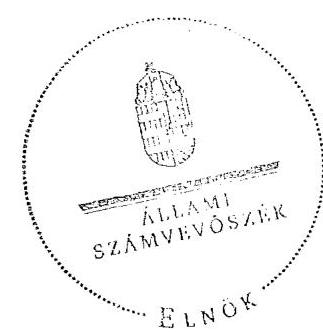

Tisztelettel:

Domokos László <

Melléklet: jelentés
