ÁLLAMI
SZÁMVEVŐSZÉK

# JELENTÉS 

a Békés Megyei Önkormányzat pénzügyi helyzetének ellenőrzéséről (43/2)

---

# Számvevői Iroda 

Iktatószám: V-3011-12/2011.
Témaszám: 1015
Vizsgálat-azonosító szám: V056003

## Az ellenőrzést felügyelte:

Dr. Varga Sándor
számvevő igazgató-helyettes
Az ellenőrzést vezette:
Renkó Zsuzsanna
számvevő tanácsos
Az ellenőrzést végezték:

| Szenténé Tubak Klára | Palágyiné dr. Gömöri | Vida László |
| :-- | :-- | :-- |
| számvevő tanácsos | Katalin | számvevő tanácsos |
|  | számvevő |  |

A témához kapcsolódó eddig készített számvevőszéki jelentések:
címe
sorszáma
Jelentés a Békés Megyei Önkormányzat gazdálkodási rendszerének 1018 2010. évi átfogó ellenőrzéséről

---

# TARTALOMJEGYZÉK 

BEVEZETÉS ..... 5
I. ÖSSZEGZŐ MEGÁLLAPÍTÁSOK ..... 13
II. RÉSZLETES MEGÁLLAPÍTÁSOK ..... 18

1. Az Önkormányzat kötelező és önként vállalt feladatai ..... 18
2. Pénzügyi egyensúlyi helyzet alakulása ..... 21
2.1. A működési és felhalmozási egyensúly alakulása ..... 23
2.2. Az Önkormányzat bevételeinek alakulása ..... 28
2.3. Az Önkormányzat kiadásainak alakulása ..... 31
3. Kötelezettségek bemutatása ..... 36
3.1. A pénzintézetek felé fennálló kötelezettségek alakulása ..... 36
3.2. Szállítók felé fennálló kötelezettségek alakulása ..... 41
3.3. Egyéb kötelezettségeinek alakulása ..... 43
4. A pénzügyi egyensúly megteremtése érdekében hozott intézkedések ..... 44
5. A helyi önkormányzatok gazdálkodási rendszerének 2010. évi ellenőrzése során a pénzügyi egyensúly javítására tett szabályszerűségi és célszerűségi javaslatok hasznosulása ..... 48

---

# MELLÉKLETEK 

1. számú Működési és felhalmozási célú hiány/többlet alakulása (millió Ft) (1 oldal)
2/a. számú Az Önkormányzat CLF módszer szerint besorolt bevételei és kiadásai 2007-2010 között (ezer Ft) (1 oldal)
2/b. számú Az önkormányzat bevételeinek és kiadásainak, adósságszolgálatának alakulása 2007-2010 között (ezer Ft) (1 oldal)
2. számú Az Önkormányzat a 2007-2010. években megvalósított, illetve 2010. december 31-én fennálló fejlesztési feladatokhoz kapcsolódó kötelezettségeinek összegzése (ezer Ft) (7 oldal)
3. számú Békés Megyei Közgyűlés elnökének észrevétele
4. számú Békés Megyei Közgyűlés elnökének észrevételére adott válasz

---

# RÖVIDÍTÉSEK JEGYZÉKE 

## Törvények

Áht.
ÁSZ tv.

Htv.

Ötv.

Számv. tv.

## Rendeletek

SzMSz
vagyongazdálkodás egyes kérdéseiről szóló rendelet 2010. évi költségvetési rendelet
2011. évi költségvetési rendelet
2010. évi zárszámadási rendelet

## Szórövidítések

APEH
áfa
ÁSZ
EU
BM
EDP hiány/egyenleg
főjegyző
GDP
gazdasági program

Ibsen kft.
Illetékhivatal
kockázatkezelési szabályzat
az államháztartásról szóló 1992. évi XXXVIII. törvény az Állami Számvevőszékről szóló 1989. évi XXXVIII. törvény (2011. július 1-jétől az Állami Számvevőszékről szóló 2011. LXVI. törvény)
a helyi önkormányzatok és szerveik, a köztársasági megbízottak, valamint egyes centrális alárendeltségű szervek feladat- és hatásköreiről szóló 1991. évi XX. törvény
a helyi önkormányzatokról szóló 1990. évi LXV. törvény
a számvitelről szóló 2000. évi C. törvény
Békés Megyei Önkormányzat Közgyűlésének 7/1995. (V. 20.) számú rendelete a Közgyűlés és Szervei Szervezeti és Működési Szabályzatáról
A Békés Megyei Közgyűlés 9/2010. (IV. 30.) számú rendelete a vagyongazdálkodás egyes kérdéseiről
Békés Megyei Önkormányzat 1/2011. (II. 11.) számú rendelete az Önkormányzat 2010. évi költségvetéséről
Békés Megyei Önkormányzat 1/2011. (II. 11.) számú rendelete az Önkormányzat 2011. évi költségvetéséről Békés Megyei Önkormányzat 6/2011. (IV. 15) számú rendelete az Önkormányzat 2010. évi zárszámadásáról

Adó- és Pénzügyi Ellenőrzési Hivatal
általános forgalmi adó
Állami Számvevőszék
Európai Unió
Belügyminisztérium
Uniós módszertan szerinti maastrichti kritériumoknak megfelelő számítás szerinti hiány/egyenleg
Békés Megyei Önkormányzat Főjegyzője
Bruttó hazai termék
A Közgyűlés 131/2007. (V. 4.) számú határozattal elfogadott Békés Megyei Önkormányzata 2007-2014 közötti időszakra szóló Társadalmi-gazdasági Programja
Békés Megyei Ibsen Oktatási, Művelődési és Közművelődési Nonprofit Korlátolt Felelősségű Társaság
Békés Megyei Önkormányzat Illetékhivatala
A Közgyűlés által 65/2008. (III. 7.) számú határozattal jóváhagyott likvid pénzeszköz-és kockázatkezelési szabályzat

---

| Kórház | Békés Megyei Önkormányzat Pándy Kálmán Megyei Kórháza |
| :--: | :--: |
| Közgyűlés | Békés Megyei Önkormányzat Közgyűlése |
| Közgyűlés elnöke | Békés Megyei Önkormányzat Közgyűlésének elnöke |
| KSH | Központi Statisztikai Hivatal |
| NGP | A Közgyűlés 12/2009. (II. 13.) számú határozatával jóváhagyott Békés Megye Önkormányzatának Növekedésorientált Gazdaságfejlesztési programja |
| NGM | Nemzetgazdasági Minisztérium |
| OEP | Országos Egészségbiztosítási Pénztár |
| Oktatási Minisztérium | Oktatási és Kulturális Minisztérium, 2010. júniusától Nemzeti Erőforrás Minisztérium |
| Önkormányzat | Békés Megyei Önkormányzat |
| Hivatal | Békés Megyei Önkormányzat Hivatala |
| PPP konstrukció | Public Private Partnership (Partnerségi együttműködés közfeladatok ellátására a magánszektor bevonásával) |
| SNA | System of National Accounts azaz Nemzeti Számlák Rendszere |
| szja | személyi jövedelemadó |
| TISZK | Békés Megyei Térségi Integrált Szakképző Intézmény |
| Tudásház | Békés Megyei Tudásház és Könyvtár |

---

# JELENTÉS 

## a Békés Megyei Önkormányzat pénzügyi helyzetének ellenőrzéséről

## BEVEZETÉS

Az Állami Számvevőszék 2011. évtől érvényes stratégiája új irányt szabott a helyi önkormányzatok gazdálkodásának ellenőrzésében is. Az ÁSZ – küldetése és jövőképe szerint – szilárd szakmai alapokra támaszkodva értékteremtő ellenőrzéseivel és helyzetelemzéseivel az államháztartás egészében, így a helyi önkormányzati alrendszerben is elő kívánja segíteni a közpénzek és a közvagyon szabályos, gazdaságos, hatékony és eredményes hasznosítását. E folyamat részeként – a 2010. évi államháztartási hiány alakulásának összetevőire is figyelemmel – megkezdődött az önkormányzati alrendszer pénzügyi helyzetelemzése.

Az NGM 2011. áprilisában közzétett adatai szerint ${ }^{1}$ a 2010. évi 1036,2 milliárd Ft összegű, 3,8%-os EDP (maastrichti kritériumok szerinti, Túlzott Hiány Eljárás keretében kimutatott) hiánycél nem volt tartható, az önkormányzati alrendszer tervezettet meghaladó hiánya miatt a GDP arányában kifejezett államháztartási hiány 4,2%-ra emelkedett.

Az önkormányzatok költségvetési jelentése szerint 2010. első három negyedév végén az önkormányzati alrendszer pénzforgalmi hiánya 97 milliárd Ft volt, a tervezett éves mérték 51%-át érte el. Bár az elmúlt években kiugróan magas hiány halmozódott fel az utolsó negyedévben, a 97 milliárd Ft-os szeptember végi hiány nem indokolta az önkormányzati alrendszer 190 milliárd Ft-ra becsült éves hiányának felülvizsgálatát. A tervezett hiány túllépése, az utolsó negyedévi 150 milliárd Ft-os pénzforgalmi hiány nem volt reálisan feltételezhető. A helyi önkormányzatok januári gyorsjelentése szerint a pénzforgalmi hiány 247,7 milliárd Ft-ot tett ki. A tervezettnél nagyobb önkormányzati pénzforgalmi hiány kialakulásában – az NGM által az éves költségvetési beszámoló elkészítéséhez kiadott tájékoztató szerint – az iparűzési adó elmaradása, a gépjárműadó, az illetékek és más bevételek tervezettnél alacsonyabb összegben teljesülése volt a meghatározó.

[^0]
[^0]:    ${ }^{1}$ NGM Tájékoztatás Magyarország Strukturális Reformprogramjának végrehajtásáról (2011. április 1.). A Tájékoztató évente két alkalommal – április és október hónapban – jelenik meg.

---

A megyei önkormányzatok kötelező feladatellátását többlépcsős törvényi előírások határozzák meg. A feladatokra vonatkozó szabályozás első szintjét az Ötv. ${ }^{2}$, a második szintet a hatásköri ${ }^{3}$, a harmadik szintet a további ágazati, szakmai törvények (egyebek mellett az oktatási, egészségügyi, szociális) adják.

A megyei önkormányzatok a feladatellátás és a központi forráselosztás tekintetében sajátos helyet foglalnak el a helyi önkormányzati rendszerben. A megyei önkormányzat kötelező feladatainak egy része – így a megyében lévő természeti és társadalmi muzeális emlékek, a történeti iratok gyűjtése, őrzése, tudományos feldolgozása, a megyei könyvtári szolgáltatás, a pedagógiai és közművelődési szakmai tanácsadás és szolgáltatás, a megyei testnevelési és sportszervezési feladatellátás, a gyermek- és ifjúsági jogok érvényesítése, a gyermekvédelmi- és szociális szakellátás – az Ötv-ből közvetlenül levezethető kötelezettség.

A középiskolai, szakiskolai, és kollégiumi ellátás, a fogyatékos gyermekek oktatása, nevelése, gondozása az ágazati törvény szerint a megyei önkormányzat kötelező feladata. Azonban, ha a települési önkormányzat lát el ilyen feladatot, és arról lemond, a megyei önkormányzatnak a feladatot át kell vennie. Így a megyei önkormányzatok által ellátandó kötelező közszolgáltatások ellátásának mértékére a települési önkormányzatok döntései jelentősen kihatnak.

Az alapellátást meghaladó egészségügyi szakellátás biztosítása akkor képezi a megyei önkormányzat feladatát, ha az önkormányzati vagyon kialakításáról szóló törvényben ${ }^{4}$ a feladat ellátásához szükséges vagyont az önkormányzat a tulajdonába kapta.

Az önként vállalt feladat ellátására – mivel annak vállalása a kötelező feladatok ellátását nem veszélyeztetheti – a kötelező közszolgáltatások mértékének alakulása lényegi hatással van.

A feladat és hatáskör telepítés sajátosságai mellett a megyei önkormányzatok kialakított forrásszerkezete, a központi költségvetéstől való erőteljes függősége is determinálja az önkormányzatok feladatellátásra vonatkozó döntéseit.

A 2007-2010. években az önkormányzati feladatok ellátásának keretet biztosító forrásszabályozás – ennek részeként az illetékbevételből és a személyi jövedelemadóból való részesedés szabályai – a megyei önkormányzatok vonatkozásában nem változtak:

- A megyei önkormányzatok saját bevételein belül az illetékbevételek döntően az ingatlanpiac stagnálása, majd visszaesése, és egyes illetékkedvezmények bevezetése következtében – megyénként differenciált mértékben ugyan, de – 2010-re általánosan visszaestek. A 2010. évben befolyt

[^0]
[^0]:    ${ }^{2}$ Ötv. 69-70. §-ai
    ${ }^{3}$ a Htv.
    ${ }^{4}$ Az egyes állami tulajdonban lévő vagyontárgyak önkormányzatok tulajdonba adásáról szóló 1991. évi XXXIII. törvény

---

39,2 milliárd Ft illetékbevétel a 2006. évben realizált 71,1 milliárd Ft illetékbevétel alig több mint 55%-a volt. A kieső bevételek pótlására az önkormányzati alrendszer szintjén történtek intézkedések, 2010-ben 5 milliárd Ft-ot, 2011-ben 1,2 milliárd Ft-ot ellentételezett a központi költségvetés. Az illetékbevételt a megyei önkormányzatok a saját folyó bevételeik között számolják el ${ }^{5}$.

Az illetékek kivetésének és beszedésének joga 2006. december 31-ig a megyei önkormányzatok feladata volt. A 2007. évtől a megyei illetékhivatalok illetékbeszedési feladatait az APEH vette át ${ }^{6}$. Az önkormányzati illetékrészesedési szabályok változatlanok maradtak, azonban az illetékbeszedés költségeit az önkormányzatok illetékbevételeiből átlagos (a Fővárosnál 4,0%-os, a megyei és megyei jogú városi önkormányzatnál 8,5%-os) kulcsot alkalmazva vonták le. E döntés következtében azon megyei önkormányzatok, amelyek a 8,5%-os költségnél kedvezőbb költségszint mellett látták el korábban ezt a feladatot, kedvezőtlenebb helyzetbe kerültek.

- Az önkormányzati alrendszer személyi jövedelemadóból való részesedésének makroszintű szabályozása nem változott 2007-2010 között ${ }^{7}$. A helyi önkormányzatokat normatív módon megillető 32%-os részesedés visszaosztásának részletszabályai azonban a megyei önkormányzatok számára – a reálgazdaság kedvezőtlen irányú folyamatai, és az államháztartás egyensúlyi helyzetére tekintettel elrendelt kormányzati intézkedések miatt – megszorító intézkedéseket jelentettek. Összesen 17 milliárd Ft – 2007-ben 10 milliárd Ft, 2010-ben további 7 milliárd Ft – szja-t vontak ki a megyei önkormányzatok gazdálkodási köréből ${ }^{8}$. Az átengedett személyi jövedelemadó a megyei önkormányzatok egyik bevétele.

[^0]
[^0]:    ${ }^{5}$ A megyei önkormányzatok illetékbevételei az önkormányzati alrendszer saját folyó bevételeiből 2007-ben 35,9 milliárd Ft-ot (61,4%-ot), 2008-ban 41,5 milliárd Ft-ot (61,7%-ot), 2009-ben 36,5 milliárd Ft-ot (62,5%-ot), 2010-ben 25,1 milliárd Ft-ot (64,1%-ot) tettek ki.
    ${ }^{6}$ Az egyes pénzügyi tárgyú törvények módosításáról szóló 2006. évi LXI. törvény 115. §a, amely az adózás rendjéről szóló 2003. évi XCII. törvény 73. §-át módosította.
    ${ }^{7}$ A megyei önkormányzatok személyi jövedelemadó részesedése az önkormányzati alrendszer átengedett bevételeiből 2007-ben 34,7 milliárd Ft-ot (7,0%-ot), 2008-ban 51,2 milliárd Ft-ot (9,2%-ot), 2009-ben 59,2 milliárd Ft-ot (9,3%-ot), 2010-ben 56,3 milliárd Ft-ot (8,3%-ot) tett ki.
    ${ }^{8}$ A megyei önkormányzatok szja kiegészítése háromelemű. A tételes, minden megyére egységesen meghatározott összeg – az adott évek költségvetési törvényeinek 4. sz. mellékletében meghatározottak szerint – 2006-ban 593 millió Ft, 2007-ben és 2008-ban egyaránt 355
 millió Ft, 2009-ben 370 millió Ft volt. A megye népességszáma után járó kiegészítés a 2006. évi $208 \mathrm{Ft} /$ fő összegről 2010-re $120 \mathrm{Ft} /$ fő-re, a megyei intézmények ellátottjai után járó kiegészítés $42236 \mathrm{Ft} /$ ellátottról $20755 \mathrm{Ft} /$ ellátottra csökkent.

---

A megyei önkormányzatok 2007-2010 között rendelkezésre álló forrásait az alábbiakban mutatjuk be:
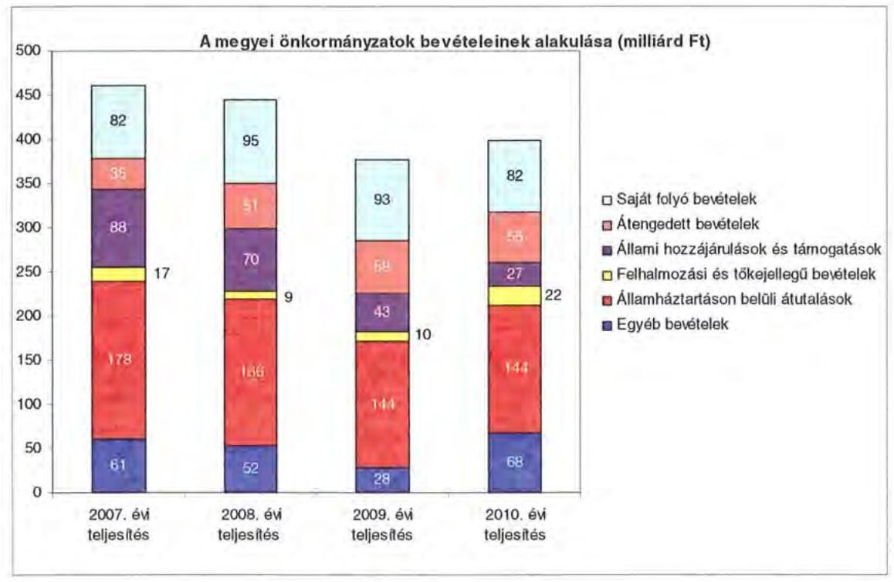

A megyei önkormányzatok saját folyó bevételeinek részaránya - amelyek főbb elemei: az intézményi térítési díjak, az illetékbevétel, a kamatbevételek - a 2007. évi összbevételen (461 milliárd Ft) belül 17,9\% volt, amely 2010-re annak ellenére 20,6%-ra nőtt, hogy az összege 82 milliárd Ft maradt. Ennek oka az volt, hogy az összbevétel a 2007. évi 461 milliárd Ft-ról 2010-re 399 milliárd Ft-ra csökkent.

Az átengedett bevételek, amelyek a megyei önkormányzatoknál a személyi jövedelemadóból való részesedést jelentették, az összbevételen belül a 2007. évi 35 milliárd Ft-ról 56 milliárd Ft-ra nőttek.

Az állami hozzájárulások és támogatások - amelyek főbb elemei: az ellátotti létszámhoz kötődő normatív állami hozzájárulások, központosított, fejezeti szinten kezelt célirányzatból juttatott működési és fejlesztési támogatások a 2007. évi 88 milliárd Ft-ról (19,1%-os részarányról) 2010-re 27 milliárd Ft-ra (6,8%-os részarányra) estek vissza.

A felhalmozási és tőkejellegű bevételek - tárgyi eszközök (ingatlanok és ingóságok), föld és immateriális javak, részesedések értékesítése, EU-tól átvett pénzeszközök - a 2007. évi 17 milliárd Ft-ról (3,6%-os részarányról) 2010-re 22 milliárd Ft-ra (5,4%-ra) emelkedtek.

Az államháztartáson belüli átutalások részesedése 2007-ben 178 milliárd Ft volt. 2010. év végére 34 milliárd Ft-tal csökkent, részaránya 38,6%-ról 2,6 százalékpontos csökkenés után 2010-ben 36%-ra változott. Ez a bevételi kategória

---

tartalmazza az egészségbiztosítási és egyéb elkülönített állami pénzalapoktól átvett forrásokat. A 2010-ben e címen elszámolt bevétel 144 milliárd Ft volt.

A megyei önkormányzatok központi költségvetésből származó bevételeinek összege 2007-ben 400 milliárd Ft volt, amely 2010. évre 331 milliárd Ft-ra (az időszak alatt összesen 69 milliárd Ft-tal) 17,3%-kal csökkent.

Az egyéb, pénzmaradványból, vállalkozási bevételekből, államháztartáson kívülről származó átutalásokból, a hitelekből, a hosszú és rövid lejáratú értékpapírok értékesítéséből származó bevételek részesedése a 2007-2010. évek viszonylatában 13,3%-ról 17,1%-ra emelkedett. Ez utóbbiak 2010. évi beszámoló szerinti összevont teljesítése 68 milliárd Ft volt ${ }^{9}$.

Mindezeket figyelembe véve 2007 és 2010-ben a megyei önkormányzatok forrásösszetételének megoszlását az alábbi ábra szemlélteti:

A megyei önkormányzatok 2007-2010. évi forrásainak megoszlása (%-ban)
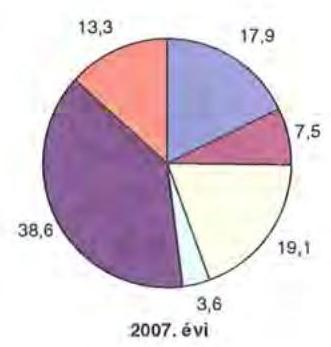
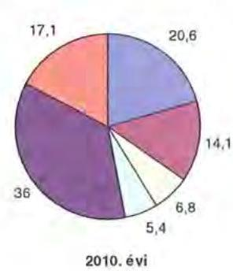

- saját folyó bevételek
- átengedett bevételek
- állami hozzájárulások és támogatások
- Felhalmozási és tőkejellegű bevételek
- államháztartáson belül átutalások
- egyéb bevételek

Annak ellenére, hogy a megyei önkormányzatok kötelezően ellátandó feladataikat 2007-hez képest kevesebb intézményben, csökkenő foglalkoztatotti létszám mellett végezték ${ }^{10}$, a jelentős bevételkiesést a - szervezési intézkedések hatására - csökkenő ráfordítások nem tudták kompenzálni. Az ellátottak száma a szociális, gyermekvédelmi ágazat bentlakásos elhelyezést nyújtó intézményeit kivéve - eltérő mértékben ugyan, de minden ágazatban évről évre csökkent, amely a fajlagos hozzájárulások csökkenésével együtt a normatív állami hozzájárulás arányának visszaeséséhez vezetett.

[^0]
[^0]:    ${ }^{9}$ Az egyéb bevételek összege 2007-2010 között eltérő módon változott, 2007-ben 61 milliárd Ft volt, 2008-ban 52 milliárd Ft-ra, 2009-ben 28 milliárd Ft-ra esett vissza, majd 2010-ben ismét - 68 milliárd Ft-ra - emelkedett.
    ${ }^{10}$ a BM által 2010 decemberében elvégzett felmérés adatai szerint

---

A 2007-2013-as időszakra meghirdetett, vissza nem térítendő EU-s fejlesztési forrásokhoz való hozzájutás lehetősége felerősítette az önkormányzati alrendszer fejlesztési igényeit. A fokozott fejlesztési tevékenység a felhalmozási bevételek és kiadások egyensúlyának megbomlásán ${ }^{11}$ túl a jelentkező jövőbeni fenntartási kötelezettség miatt tovább terhelhetik az önkormányzatok költségvetését.

A megyei önkormányzatok felhalmozási és működési célú pénzintézeti és szállítói kötelezettségeinek állománya a vizsgált időszakban erőteljesen növekedett.

A hosszú lejáratú kötelezettségek alakulását a következő ábra szemlélteti:
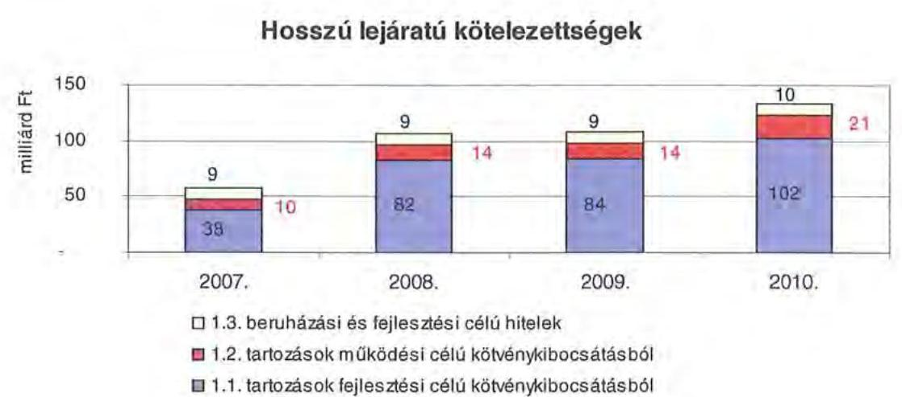

A hosszú lejáratú kötelezettségek mellett az időszakban a 2007. évi 22 milliárd Ft-ról 24 milliárd Ft-ra (8,8%-kal) növekedett az áruszállításból származó szállítói kötelezettségek állománya.

A mérlegben kimutatott kötelezettségek állománya mellett az elhasználódott eszközök pótlására forrást biztosító amortizációs (felújítási) alap képzésének ${ }^{12}$ elmaradása további problémákat vetít előre. A megyei önkormányzatok beszámolójelentéseinek összegzése szerint 2007-ben még az elszámolt értékcsökkenés 90%-ának megfelelő összeget fordítottak felújítási célokra, 2009-ben ez az arányszám már csak 16,5% volt. Ez maga után vonta a feladatellátást kiszolgáló tárgyi eszközök állagának erőteljes romlását.

[^0]
[^0]:    ${ }^{11}$ Az önkormányzati alrendszerben - az éves zárszámadási törvényjavaslatok általános indokolása, X. Helyi önkormányzatok gazdálkodása fejezet szerint - a felhalmozási bevételek és kiadások egyenlege 2007-ben 142,4 milliárd Ft, 2008-ban 112,3 milliárd Ft, 2009-ben 234,5 milliárd Ft hiányt mutatott.
    ${ }^{12}$ Erre a jelenlegi szabályozási környezetben nem kötelezi semmilyen előírás az önkormányzatokat.

---

Az ÁSZ a 2011. évi ellenőrzési tervében a 43. számú, az „Önkormányzatok gazdálkodási rendszerének ellenőrzése" részeként egy időben, egymással párhuzamosan tekinti át és elemzi az önkormányzati alrendszer középszintjét jelentő 19 megyei önkormányzat pénzügyi helyzetét. A gazdálkodás szabályszerűségét az ÁSZ előző évek során ellenőrizte a megyei önkormányzatoknál is, ezért jelen vizsgálatunk erre nem tér ki.

A jelentés a megyei önkormányzatok sajátos feladatellátási és forrásszabályozási helyzetére tekintettel a megyei önkormányzatok pénzügyi helyzetét, illetve az ezzel összefüggő korábbi ÁSZ javaslatok megvalósítását mutatja be.

Az ellenőrzés a 2007. január 1. - 2011. március 31. közötti időszakot ölelte fel.
A vizsgálat jogszabályi alapját 2011. július 1-je előtt az Állami Számvevőszékről szóló 1989. évi XXXVIII. törvény 2. § (3), (5), (6) és (9) bekezdéseiben, az Ötv. 92. § (1) bekezdésében és az Áht. 104. § (3) bekezdésében, 2011. július 1-jét követően az Állami Számvevőszékről szóló 2011. évi LXVI. törvény 1. § (3) bekezdésében, az 5. § (2)-(6) bekezdéseiben és az Áht. 120/A. § (1) bekezdésében foglalt előírások képezték.

Békés megye országos és régión belül elfoglalt helyzetét 2010. december 31-én az alábbi mutatók szemléltetik (megyei jogú városokkal együtt):

Index: az előző év azonos időszak (időpontja)=100,0

| Mutató megnevezése | Békés   megye | Dél-   alföldi   régió | Országos |
| :-- | :--: | :--: | --: |
| Népesség száma* (ezer fő) | 362 | 1308 | 9986 |
| Népesség változás indexe (%) | 98,8 | 99,2 | 99,7 |
| Az ipari termelés volumenindexe (%) | 102,1 | 107,4 | 110,7 |
| Egy lakosra jutó termelési ipari termelési   érték (ezer Ft) | 789,1 | 1135,2 | 2044,4 |
| Ezer lakosra jutó vállalkozások száma (db) | 180 | 181 | 165 |
| A beruházások egy lakosra vetített teljesít-   ményértéke (ezer Ft) | 138,8 | 171,6 | 304,7 |
| Foglalkoztatási arány (%) | 46,4 | 48,1 | 49,5 |
| Munkanélküliségi ráta (%) | 11,7 | 10,3 | 10,8 |
| Alkalmazásban állók havi nettó átlagkerese-   te (Ft) | 106642 | 111096 | 132628 |
| Alkalmazásban állók havi nettó átlagkeresetének indexe (%) | 106,4 | 107 | 106,9 |

*Ebből Békéscsaba megyei jogú város népessége 2010. december 31-én 63,2 ezer fő volt.

---

A táblázat adatai szerint a népesség száma a megyében 362 ezer fő, amely Magyarország népességének a 3,6%-a. A megye népességmegtartó képessége rosszabb az országos átlagnál a gazdaság alacsonyabb dinamizmusa következtében. Ebből következik, hogy a foglalkoztatási arány és a munkanélküliségi ráta rosszabb az országos átlagnál.

A megyében 75 települési önkormányzat - egy megyei jogú város, 20 város, kilenc nagyközség, 45 község - működött.

---

# I. ÖSSZEGZŐ MEGÁLLAPÍTÁSOK 

Az Önkormányzat - adatszolgáltatása szerint - a 2010. évi 27113 millió Ft költségvetési kiadásaiból 25903 millió Ft-ot (95,5%) a kötelező feladatok ellátására fordította. Kötelező feladatait - a közoktatási feladatok, a fekvőbeteg ellátás, a bentlakásos szociális otthoni ellátás, a levéltári és múzeumi feladatok, a közművelődési és közgyűjteményi és egyes idegenforgalmi, turisztikai feladatok, a kötelező kéményseprő-ipari szolgáltatás - az Ötv. és az ágazati törvények által meghatározottnak tekinti. Az önként vállalt feladatok részesedése a 2011. évi költségvetésből 1051 millió Ft (4%). Az Önkormányzat az önként vállalt feladatainak körét az SzMSz-ben külön rögzítette, amelyek a megyei fejlesztési programok összehangolásához, a nemzetközi kapcsolatok kialakításában való közreműködéshez, a munkanélküliség csökkentésében való együttműködéshez, a megyei egészségügyi intézmények koordinálásához, a települések egészséges ivóvíz ellátásának segítéséhez, színház fenntartásához, a különféle közművelődési, és hagyományőrző feladatok ápolásához, a közrend javítását célzó feladatokban való aktív részvételhez, a megyei infrastruktúrafejlesztés segítéséhez kapcsolódnak.

Az Önkormányzat kötelező és önként vállalt feladatait 2010. december 31-én 14 költségvetési szervvel (Hivatallal együtt) és öt többségi tulajdonú gazdasági társasággal látta el. A költségvetési szervek közül 13 önállóan működő és gazdálkodó, egy önállóan működő költségvetési szerv, amelyek telephelyeinek száma a 2007. évi 139-ről 131-re csökkent. A költségvetési szervek telephelyeinek száma a 2007. Az intézmények száma a 2007-2010. évek között végrehajtott feladatátszervezések, három települési önkormányzattól történő feladatátvétel és egy intézményátadás, valamint közművelődési feladatok gazdasági társaságba történő feladatkiszervezése következtében alakult ki.

A vizsgált időszakban az Önkormányzatnál - a CLF módszer szerint - a folyó költségvetés egyenlege pozitív összegű volt, működési forrástöbblet keletkezett. A működési jövedelem 2007-ben a folyó kiadások 5,7%-át (1178 millió Ft-ot), 2008-ban 13,0%-át (2970 millió Ft-ot), 2009-ben 8,2%-át (1876 millió Ft-ot), 2010-ben 2,1%-át (479 millió Ft-ot) jelentette. A vizsgált időszakban a működési jövedelem 6503 millió Ft megtakarítást mutatott, amely forrásul szolgálhatott az Önkormányzat fennálló tőketörlesztési kötelezettségeinek teljesítéséhez, valamint fejlesztéseinek finanszírozásához.

A pozitív előjelű folyó költségvetési egyenleg ellenére az Önkormányzat a 2010. évben likvidhitel felvételére kényszerült, egyrészt az átmeneti likviditási problémák kezelése, másrészt fejlesztési kiadásai finanszírozása miatt.

A 2007-2010. években az Önkormányzat felhalmozási költségvetésének egyenlege folyamatosan negatív összegű volt, amely előrelátó, tudatos költségvetési gazdálkodás és pénzügyileg fenntartható beruházások esetén nem jár magas pénzügyi kockázattal. A felhalmozási forráshiánynak a felhalmozási és tőke jellegű kiadásokhoz viszonyított aránya 2007-ben 34,5% (681 millió Ft), 2008-ban 56,3% (938 millió Ft) 2009-ben 79% (2784 millió Ft) 2010-ben 74,7%

---

(3428 millió Ft) volt. A felhalmozási forráshiányt fejlesztési célú kötvénykibocsátásból származó bevételből, illetve saját bevételből (főként hozam és kamatbevétel) finanszírozták.

Az Önkormányzatnak a CLF módszer szerint 2007-ben 476 millió Ft, 2008-ban 2012 millió Ft finanszírozási többlete keletkezett. A 2009. és 2010. évi finanszírozási hiánya az évek sorrendjében 910 millió Ft, 2951 millió Ft volt.

Az Önkormányzatnál az illetékbevétel a 2007. évben a 2006. évhez képest, 388 millió Ft-tal (18%-kal), majd a következő években 595 millió Ft-tal tovább csökkent. A csökkenésben szerepet játszott az Illetékhivatalnak - 2007. január 1-jétől - az APEH-hoz történő átszervezése is. Az szja és az állami támogatások együttes összege az előző évhez képest 2008-ban 622 millió Ft-tal (9,9%-kal) nőtt, majd
 ezt követően 2009-ben 888 millió Ft-tal (12,9%-kal), 2010-ben 802 millió Ft-tal (13,4%-kal) lett alacsonyabb. A Kórház fenntartásához nyújtott OEP támogatás 1,1%-kal 9097 millió Ft-ra nőtt a 2007. évről a 2010. évre. Az egyéb saját bevétel a 2007-2010 között 5170 millió Ft-ról 10183 millió Ft-ra nőtt, elsősorban a kötvénykibocsátásból származó bevétel átmenetileg fel nem használt részének befektetési hozamai, a térítési díjak önköltségalapú emelkedése, a gyógyszertári forgalom növekedése, valamint a feladat-ellátás átalakításával felszabaduló ingatlanok hasznosításából, bérbeadásából származó bevételek révén, így az elért bevételi növekmény nem csak ellensúlyozta a kieső bevételeket, hanem tartalékok képzését is lehetővé tette.

Az Önkormányzat teljesített működési kiadásai a 2007. évről 2010. évre 1595 millió Ft-tal (7,6%-kal) nőttek, főként a személyi juttatások és járulékai csökkenése és a dologi kiadások növekedése együttes hatásának következtében. Az önkormányzati kiadásokban csökkent a kórházi kiadások súlya az egyéb fenntartott intézményekben felmerülő kiadásokhoz képest. A Kórház nélkül teljesített működési kiadás 2007-ben 10892 millió Ft-ot tett ki (az összes működési kiadás 52,2%-a), amely a 2010. év végére 12562 millió Ft-ra nőtt (az összes működési kiadás 55,9%-a volt). Az Önkormányzat a 2007-2010 között a Kórház működési kiadásaihoz 1451 millió Ft-tal járult hozzá, amelyen felül további 462 millió Ft fejlesztési célú támogatást nyújtott. A Kórház részére nyújtott fejlesztési célú támogatáson túl összesen 1617 millió Ft kórházi fejlesztési kiadást a Hivatal költségvetésében számolták el. Az Önkormányzatnál a működési és felhalmozási kiadások arányának változásában a 2007-2010. évek között elmozdulás figyelhető meg, az összes költségvetési kiadáson belül a felhalmozási kiadások aránya 8,3%-ról 17,2%-ra nőtt.

Az Önkormányzat 2007-2010 között 10451 millió Ft-ot fordított felhalmozási kiadásokra, amelyből 9211 millió Ft a kötelező feladatellátást szolgálta. A megvalósított fejlesztések között intézményi épületek, lakóotthonok felújítása, korszerűsítése, bővítése és eszközök beszerzése, informatikai rendszerek fejlesztése, belterületi vízrendezés szerepelt. A megvalósított fejlesztésekhez összesen 1340 millió Ft címzett támogatást és hazai forrást, 1222 millió Ft európai uniós támogatást és 7889 millió Ft saját forrást vettek igénybe. A saját forrásból 4092 millió Ft kötvénykibocsátásból származó bevétel volt. A 2010. év utánra vállalt kötelezettség 7160 millió Ft, amelynek forrásaként 6568 millió Ft elnyert európai uniós támogatással, 568 millió Ft kötvénykibocsátásból származó pénzmaradvánnyal és 24 millió Ft tervezett saját bevétellel számolnak. A 7160 millió Ft

---

kötelezettségvállalásnak a 74,3%-a (5319 millió Ft) a Kórház struktúraváltására vállalt kötelezettség, amelyhez 4944 millió Ft európai uniós és 375 millió Ft saját forrást terveztek. A kötvényekből származó bevételek és a saját bevétel lekötött betétekben, az európai uniós források a megkötött támogatási szerződések szerinti összegekben és ütemezésben rendelkezésre állnak.

Az Önkormányzat pénzintézeti kötelezettségeinek állománya a könyvviteli mérlegadatok szerint 2006. december 31-ről 2010. december 31-re 40 millió Ft-ról 15379 millió Ft-ra nőtt. A fennálló pénzintézeti kötelezettségei két hitel felvételéből, két kötvény kibocsátásából és egyszeri likvid hitel igénybevételéből keletkeztek. Az Önkormányzat 2007-2010 között összesen adósságszolgálatra 831 millió Ft kiadást teljesített, amelyből a kamatkiadás 786 millió Ft volt. A vizsgált időszakot követően, 2011. április 20-án a likvid hitel teljes összege a teljesítéskori árfolyamon 1803 millió Ft értékben visszafizetésre került, a visszafizetésig 29 millió Ft kamatot fizettek ki. Az Önkormányzat 2008-2011. március 31-e között a kötvények és a rövid lejáratú hitel átmenetileg szabad forrásainak befektetéséből azok kibocsátása, illetve felvétele óta 3956 millió Ft hozamot ért el. A 2011-2013. években 11 millió Ft-ot és 9409964 CHF-t tőketörlesztést és kamatot kell teljesítenie. Az Önkormányzatnak a 2013. évet követő években a jelenleg ismert pénzintézeti kötelezettségei miatt várhatóan 31 millió Ft és 71231459 CHF összegű adósságszolgálati kifizetést kell teljesíteni. Az Önkormányzat 2010. év végi szállítói állománya 803 millió Ft (ebből lejárt 232 millió Ft) volt. A 2011-2013. évi, továbbá az azt követő időszakra vonatkozó pénzintézeti és szállítói kötelezettség teljesítésére a kockázatkezelési szabályzatban meghatározott kockázati alap és a fedezeti tartalék vagyon, valamint az előző évi pénzmaradvány és az előző évről áthúzódó OEP támogatások vehetők figyelembe finanszírozási forrásként.

Az adósságot keletkeztető kötelezettségvállalásból származó források felhasználási céljait meghatározták. A Közgyűlés döntéseit megalapozó előterjesztések nem tartalmazták a kötelezettségvállalás visszafizetési forrásainak, a teljes futamidő várható kamat- és tőkefizetési kötelezettségének, az árfolyam- és kamatkockázatoknak a bemutatását. Rögzítették 10 éves időtartamra a kamatkockázatokat, az árfolyamkockázatra tartalékot képeztek, az előre látható törlesztésekre előtakarékoskodtak. Az adósságot keletkeztető kötelezettségvállalással megvalósított felhalmozási kiadások esetleges bevételnövelő, illetve kiadáscsökkentő vonzatát vizsgálták, a Közgyűlés a visszafizetési kötelezettségek biztosítása érdekében rendeletet alkotott, továbbá meghatározta a fedezeti tartalék vagyon körét a fejlesztéshez, felújításhoz vállalt kötelezettségek visszafizetési forrásaként.

Az Önkormányzatnak folyószámla hitele és munkabér megelőlegezési hitele, garancia és kezességvállalásból eredő kötelezettsége a vizsgált időszakban nem volt.

Az Önkormányzatnál előírták az amortizáció alapú felújítási előirányzat tervezésének kötelezettségét a gazdasági programban és a vagyongazdálkodás egyes kérdéseiről szóló rendeletben. Az előírásoknak megfelelően mind a 2010, mind a 2011. évi költségvetési rendeletben a felújítási előirányzatokat a használt ingatlanok területe és a m²-re vetített amortizációs költség alapján megtervezték.

---

Az Önkormányzat a 2007-2010. évek között a 2006. december 31-én meglévő 32 intézményből a költségtakarékos és méretgazdaságos feladatellátás megteremtése érdekében szervezeti átalakítással 13 intézményt és egy gazdasági társaságot alapított. Létrehozták a támogató szolgáltatásokat, amelynek keretében elkezdődött az intézmények közötti együttműködés megszervezése a nem szakmai feladatok vonatkozásában. A 2007-2010. években az intézményátszervezések, a feladatváltozások valamint a takarékossági intézkedések hatásaként együttesen 14609 millió Ft kiadási megtakarítást mutattak ki, amelyből 14383 millió Ft-ot (98,5%) az intézmények körében érvényesítettek.

A kiadáscsökkentő intézkedések következtében a 2007-2011. évek között a Hivatalban és az intézményeknél összesen 1508 álláshelyet (részben üres állást) szüntettek meg, amelynek kétharmada ágazati szakmai, egyharmada intézményüzemeltetéshez, fenntartáshoz kapcsolódó álláshely volt.

A bevételnövelésre irányuló intézkedések 2007-2010 között kimutatott számszerűsített összegének (7023 millió Ft) 58%-át a Hivatalnál realizálták az átmenetileg szabad pénzeszközök lekötéséből, befektetéséből, illetve az ingatlanok, eszközök bérbeadásából. Az intézményeknél realizálódott az összes bevételnövekedés 42%-a (2958 millió Ft), amely a települési önkormányzattól történő feladatátvételből, az intézményi struktúra átszervezéséből, valamint az ingatlanok, eszközök bérbeadásából származott.

Az utóellenőrzés a pénzügyi egyensúly javítására tett öt szabályszerűségi (a költségvetési hiány megállapítására, a költségvetési többlet felhasználására, a tartalékok tervezésére, befektetéseknél a hatásköri szabályok betartására, a valódiság elvének betartása érdekében a követelések és kötelezettségek költségvetési beszámolóban történő kimutatására) és egy célszerűségi (intézkedési terv készítése, a hosszú lejáratú, adósságot keletkeztető kötelezettségvállalásokból adódó tőke- és kamatfizetési kötelezettségekről szóló közgyűlési tájékoztató készítése) javaslat hasznosulására terjedt ki. Az Önkormányzat a javaslatokat hasznosította.

Az Önkormányzat pénzügyi helyzetét összegezve a következők emelhetők ki:

Az önkormányzati bevételt csökkentő központi intézkedések hatását az ellenőrzött időszakban nemcsak kiegyenlítette az Önkormányzat kiadáscsökkentő és bevételnövelő intézkedéseinek eredménye, hanem jelentős tartalékképzést is lehetővé tett. A 2007-2010 között végrehajtott intézmény átvételek-átadások a méretgazdaságosságra is pozitív hatással voltak. A már megkezdett beruházások forrásai kötvénykibocsátásból és uniós támogatásból biztosítottak. A működési bevételek évente fedezetet nyújtottak a működési kiadások és adósságszolgálat finanszírozásához, a likviditás biztosítása folyószámlahitel igénybevétele nélkül történt. A hosszú lejáratú kötelezettségek 2010. évet követő forrásai az elkövetkezendő 3 évben biztosítottak, az azt követő időszakban esedékessé váló kötelezettségek fedezetének megteremtéséhez a kockázati alap létrehozása és folyamatos feltöltése, továbbá a fedezeti tartalék vagyon meghatározása jelent garanciát.

---

A feladatok és források közötti egyensúly megteremtésére irányuló központi döntések, a megyei önkormányzatok konszolidációjára, az intézmények átvételére vonatkozó törvényjavaslat elfogadása új feltételeket teremtett. A hatékony és eredményes gazdálkodás, a pénzügyi egyensúly megőrzése azonban további helyi intézkedéseket igényel.

Az Állami Számvevőszékről szóló 2011. évi LXVI. törvény 33. § (1) bekezdésében foglaltak értelmében a jelentésben foglalt megállapításokhoz kapcsolódó intézkedési tervet köteles az ellenőrzött szervezet vezetője összeállítani és azt a jelentés kézhezvételétől számított harminc napon belül az ÁSZ részére megküldeni. Amennyiben az intézkedési tervet határidőben nem küldi meg a szervezet, vagy az továbbra sem elfogadható, az ÁSZ elnöke a hivatkozott törvény 33. § (3) bekezdés a)-b) pontjaiban foglaltakat érvényesítheti.

A 2011. májusában lezárult helyszíni ellenőrzés tapasztalatai alapján - figyelembe véve az Önkormányzat észrevételeit és a saját hatáskörben tett intézkedéseit - az alábbi javaslatokat tette az ÁSZ:

# a Közgyűlés elnökének:

1. tájékoztassa a Közgyűlést rendszeresen a pénzügyi helyzetről, azon belül a kötelezettségállomány alakulásáról, a feltételekben bekövetkező változásokról, az adósságot keletkeztető kötelezettségek teljesítési feltételeiről legalább 3 éves kitekintéssel;
2. gondoskodjon a pénzintézeti kötelezettségek finanszírozási lehetőségeinek számbavételéről, és arra források biztosításáról;
3. a lejárt szállítói állományát szüntesse meg, és fokozott figyelmet fordítson a lejárt számlák kiegyenlítésére.

---

# II. RÉSZLETES MEGÁLLAPÍTÁSOK

## 1. Az ÖNKORMÁNYZAT KÖTELEZŐ ÉS ÖNKÉNT VÁLLALT FELADATAI

Az Önkormányzat adatszolgáltatása szerint a 2010. évben teljesített 27113 millió Ft költségvetési kiadásból 25903 millió Ft-ot (95,5%-át) a kötelező feladatok ellátására fordította. Az Önkormányzat önként vállalt feladatai a megyei fejlesztési programok összehangolásához, a nemzetközi kapcsolatok kialakításában való közreműködéshez, a munkanélküliség csökkentésében való együttműködéshez, a megyei egészségügyi intézmények koordinálásához, a települések egészséges ivóvíz ellátásának segítéséhez, színház fenntartásához, a különféle közművelődési, és hagyományőrző feladatok ápolásához, a közrend javítását célzó feladatokban való aktív részvételhez, a megyei infrastruktúra-fejlesztés segítéséhez kapcsolódnak. Támogatást nyújt továbbá civil szervezetek, alapítványok működéséhez.

Az Önkormányzat az önként vállalt feladatainak körét az SzMSz-ben külön rögzítette. Kötelező feladatait - közoktatási feladatok, a fekvőbeteg ellátás, a bentlakásos szociális otthoni ellátás, a levéltári és múzeumi feladatok, a közművelődési feladatok, kötelező kéményseprő-ipari szolgáltatás - az Ötv. és az ágazati törvények által meghatározottnak tekinti.

Az Önkormányzat kiadási szerkezetét tekintve a járulékokkal növelt személyi és dologi kiadások 20236 millió Ft-os összegén belül meghatározó arányt 9823 millió Ft-ot - 48,5%-ot - a Kórház elszámolt kiadásai jelentik. Szociális és gyermekvédelmi célokra 3520 millió Ft-ot, közoktatási célokra 3495 millió Ft-ot, közművelődési, közgyűjteményi feladatokra 1415 millió Ft-ot, igazgatási és egyéb nem kiemelt ágazati feladatokra 1983 millió Ft-ot fordítottak. A szociális és gyermekvédelmi feladatokat ellátó három intézmény összes járulékokkal növelt személyi és dologi kiadásokból való részesedése 17,4%, a három közoktatási intézményé 17,3%. A 2010. évben a közoktatási feladatok kiadásait 59,5%-ban, a szociális és gyermekvédelmi feladatok kiadásait 47,8%-ban finanszírozta normatív költségvetési támogatás. A közművelődési, levéltári, közgyűjteményi szolgáltatások ellátását öt intézmény biztosítja, kiadási arányuk mindössze 7,0%. Az igazgatási és egyéb ágazathoz sorolható személyi juttatások és járuléka, valamint dologi kiadások részaránya 9,8%.

A 2010. évi költségvetési kiadásokból 20472 millió Ft-ot (75,5%-ot) az intézmények, 6641 millió Ft-ot (24,5%-ot) a Hivatal kiadásaira teljesítették. A Hivatal teljesített költségvetési kiadásából a személyi és dologi kiadások 35,3%-kal, a beruházások, felújítások 37,9%-kal, a különböző megyepolitikai feladatokhoz,
 szervezetek támogatásához, finanszírozási tételekhez kapcsolódó kiadások 26,8%-kal részesültek.

---

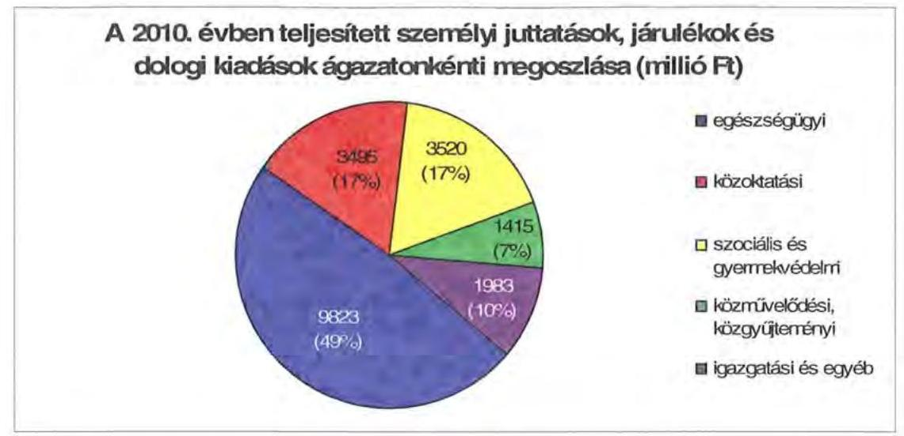

Az Önkormányzat kötelező és önként vállalt feladatait 2010. december 31-én 14 költségvetési szervvel (Hivatallal együtt) és öt többségi tulajdonú gazdasági társasággal látta el.

A költségvetési szervek közül 13 önállóan működő és gazdálkodó, továbbá egy önállóan működő költségvetési szerv, alapító okirataik szerint összesen 131 telephelyen működnek, amely nyolccal kevesebb a 2006. évinél. Az Önkormányzat feladatait az alábbi intézménystruktúrával látta el:

- egészségügyi feladatokat egy kórház látta el;
- szociális és gyermekvédelmi feladatokat három intézmény végzett (két intézmény vegyesen lát el szakosított szociális otthoni, nappali és átmeneti szociális feladatokat, egy intézmény gyermekvédelmi feladatot, továbbá szociális és rehabilitációs feladatokat végzett);
- közoktatási feladatot három intézmény látta el (speciális óvodai és általános iskolai, a szakiskolai, szakközépiskolai és gimnáziumi feladatokat a három intézményi centrumban vegyesen);
- közművelődési és közgyűjteményi feladatokat végzett öt intézmény (színház, önállóan működő bábszínház, könyvtár, levéltár, múzeum);
- igazgatási feladatokat látta el a Hivatal, egy intézményt az igazgatási feladatok kiszolgálására alapítottak (a Hivatal gazdasági adminisztrációja, üzemeltetése, támogató feladat keretében könyvelési, informatikai, takarítási és ingatlanüzemeltetési feladatok ellátása az Önkormányzat által fenntartott intézmények részére).

---

Az egyes ágazatok kötelező feladatellátását 2010. december 31-én az alábbi mutatók jellemezték:

| Megnevezés | közoktatás | szociális és   gyermek-   védelem | egészség-   ügy | kultúra   és sport |
| :-- | :--: | :--: | :--: | :--: |
| Az ágazatban foglalkozta-   tottak száma (fő) | 836 | 917 | 2053 | 229 |
| Az ágazat intézményeiben   ellátottak összesen (fő) | 5665 | 2372 |  |  |
| Fekvőbeteg ellátás férőhe-   lyeinek száma (db) |  |  | 1474 |  |

Az Önkormányzat többségi tulajdonában lévő öt gazdasági társaság közül három kötelező feladatot (közoktatási és közművelődési, illetve kommunális feladatokat) látta el, míg a többi az önként vállalt feladatok ellátásában vett részt.

Az Ibsen Kft. 67%-os önkormányzati tulajdonú társaság, amely az Önkormányzat által ellátott kötelező feladat kiszervezésével jött létre. A 2007. év előtt költségvetési keretek között ellátott képességfejlesztési feladatot, kulturális örökség védelmével kapcsolatos feladatokat, rehabilitációs foglalkoztatást, kézműves szakiskola működtetését, a Tudásház által ellátott feladatokat szervezték ki a társaságba. A feladatok ellátása közszolgáltatási szerződés keretében történt.

A Békés Megyei Tüzeléstechnikai Kft. az Önkormányzat 100%-os tulajdonában lévő társaság, fő tevékenysége a kötelező kéményseprő-ipari közszolgáltatás, a feladatellátás kötelező jellege jogszabály által igazolt.

A Thermál Consulting Regionális Turizmusfejlesztő és Szervező Kft. az Önkormányzat 100%-os tulajdonában lévő társaság, amelyet a gyulai termál kemping hasznosítása, turizmus-marketing feladatok ellátása - kiemelten a Békés megyei repülőtér marketing támogatása -, a 2008. évben pályázati forrásból megalakított egészségturisztikai klaszter szervezet irányítása, az Európai Régiók Gyűlésével (Assembly of European Regions) kapcsolatos ügyek intézése érdekében alapítottak, az SzMSz-ben meghatározott önként vállalt feladatnak az ellátására.

A Békés Airport Repülőtér Működtető, Fejlesztő Kft-t 80%-os tulajdonosi részesedéssel a légi szállítást kisegítő szolgáltatás, mint önként vállalt feladat, a megye gazdaságának fejlesztésében való közreműködés érdekében alapították.

A Békés Megyei Energetikai Szolgáltató Kft. az Önkormányzat 76%-os tulajdonában lévő társaság, amelyet elsősorban azzal a céllal alapítottak, hogy az intézmények energetikai feladatainak közös szervezésben való lebonyolításában vegyen részt. Az alapító okirat és az azt megalapozó testületi döntés a feladatellátás kötelező jellegéről nem intézkedik, de mivel a kötelező önkormányzati feladatokat ellátó intézmények kiszolgáló tevékenysége központosításának céljából alapították, a feladatellátás kötelező jellegét igazoltnak tekintették.

---

A többségi tulajdonú gazdasági társaságok mellett az Önkormányzat a Békés Megyei Vízművek Zrt-ben 28,4%-os, a Békés Megyei Temetkezési Szolgáltató Kft-ben 35%-os, a Dél-Kelet Magyarországi Iroda Nonprofit Kft-ben 20%-os, a Gyulai Várfürdő Kft-ben 2,8%-os, a DARFT Zrt-ben 0,44%-os részesedéssel rendelkezik.

Az önkormányzati feladatellátásban egyes közművelődési szolgáltatásokat $^{13}$, mint kötelező feladatokat három egyéb szervezettel kötött szolgáltatási szerződés keretében biztosították.

Az Önkormányzat az áttekintett időszakban középfokú közoktatási feladatokat vett át 1121 ellátotti létszámmal Dévaványa, Orosháza és Gyula városok önkormányzataitól. Az átvett feladatok ellátásával összefüggő foglalkoztatotti létszámnövekedés 93 fő volt. Egy közoktatási intézményt átadtak Szarvas város részére 616 fő ellátotti létszámmal, 70 fő létszámcsökkenése mellett.

# 2. PÉNZÜGYI EGYENSÚLYI HELYZET ALAKULÁSA 

A hagyományos költségvetési szerkezet helyett az önkormányzat pénzügyi helyzetét a CLF módszerrel mutatjuk be, amelyben jobban elkülönülnek a vagyonnal kapcsolatos bevételek és kiadások a feladatokkal kapcsolatos közvetlen működtetési bevételektől és kiadásoktól. A módszer következetesen elkülöníti a folyó és a felhalmozási költségvetés bevételeit és kiadásait, azok költségvetési egyenlegeit. A tárgyévi pozíciók meghatározása érdekében a figyelembe vett saját folyó bevételek, valamint saját felhalmozási bevételek nem tartalmazzák az előző évi pénzmaradványok felhasználásából származó pénzforgalom nélküli bevételeket $^{14}$.

A bevételek és kiadások besorolása általános közgazdasági meggondolásokon alapul, amely testet ölt az SNA statisztikai módszertanában is. Folyó tételek alatt értjük azokat a bevételeket és kiadásokat, amelyek az önkormányzat vagyoni helyzetét automatikusan nem változtatják. A bevételi oldalon ilyenek az adók, az illeték, az áfa bevételek és visszatérülések, a hozamok és kamatok, a költségvetési támogatások, az egyéb saját bevételek, valamint a működési célra átvett pénzeszközök és kapott támogatások. A folyó kiadások közé tartoznak a szolgáltatások nyújtásával kapcsolatos működési kiadások, a kamatkiadások, valamint a működési célú transzferkiadások $^{15}$. A felhalmozási vagy tőke tételek módosítják az önkormányzat vagyoni helyzetét. A privatizációs bevételek, az immateriális javak és tárgyi eszközök, valamint a részesedések értékesítése csökkentik, a fizikai beruházások és a pénzügyi befektetések növelik a vagyont. A pénzforgalmi bevételek és kiadások nem tartalmazzák a követelések elenge-

[^0]
[^0]:    $^{13}$ a néptánc, település-közösségfejlesztő és népművészeti tevékenységek
    $^{14}$ A költségvetési években kialakuló hiány finanszírozása az előző években képzett tartalékok felhasználásával is történhet.
    $^{15}$ Transzferkiadásoknak azokat a folyó és felhalmozási tételeket nevezzük, amelyeket nem az adott önkormányzat használ fel szolgáltatásnyújtásra (pl.: ellátottak pénzbeni juttatásai, átadott pénzeszközök, garancia- és kezességvállalások stb.).

---

dése miatt könyvelt tételeket, mivel ezek egymást kioltó, technikai jellegű elszámolási műveletek.

A folyó költségvetés egyenlege, a működési jövedelem megmutatja, hogy az önkormányzat éves folyó bevétele fedezetet biztosít-e a kötelező és önként vállalt feladatellátáshoz kapcsolódó éves folyó kiadásaira. A működési jövedelem negatív értéke pénzügyileg fenntarthatatlan helyzetet jelez. A mutató pozitív értéke megtakarítást mutat, amely forrásul szolgálhat az önkormányzat fennálló kötelezettségei megfizetéséhez, valamint fejlesztéseihez.

A felhalmozási költségvetés pozitív értéke felhalmozási többletet mutat, amely a jövőbeni fejlesztések forrását biztosíthatja. Amennyiben a folyó költségvetési hiány finanszírozása a felhalmozási többletből történik, ez szűkebb értelemben vagyonfelélésnek tekinthető. Amennyiben a felhalmozási költségvetés megtakarítása fejlesztési célú hitelek, kötvények adósságszolgálatát finanszírozza, az változatlan vagyontömeg mellett, a korábban megelőlegezett tőkebevételek valós realizációjának tekinthető. A felhalmozási deficit által generált finanszírozási igény önmagában nem jár pénzügyi kockázattal, a pénzügyileg fenntartható beruházásokhoz kapcsolódó kötelezettségvállalás (adósságszolgálat) előrelátó, tudatos költségvetési gazdálkodással teljesíthető.

A módszer a pénzügyi kapacitás (más néven a nettó működési jövedelem) fogalmát helyezi a középpontba. Az adós hitelfelvételi képessége, hosszú távú fizetőképessége vagy bonitása a pénzügyi kapacitással, ezen belül is a nettó működési jövedelemmel jellemezhető. A nettó működési jövedelem negatív értéke az egyes költségvetési években jelentkező adósságszolgálat túlzott mértékére utal $^{16}$. A nettó működési jövedelem negatív értékének felhalmozási többletből, vagy további hitelből történő finanszírozása pénzügyileg nem fenntartható gazdálkodást vetít előre. A pozitív értéket mutató nettó működési jövedelem fejlesztési kiadások fedezetét biztosíthatja, illetve a folyamatosan, évenként képződő pozitív nettó működési jövedelemből meghatározható a jövőben vállalható, teljesíthető éves adósságszolgálat, ily módon az a hitelösszeg, amely - a többi tényezőt, feltételt adottnak tekintve - visszafizetési kockázat nélkül felvehető.

A CLF módszer alapján a pénzügyi kapacitás mértéke az önkormányzat összevont, nettósított, a központi információs rendszerbe a MÁK-on keresztül leadott éves költségvetési beszámolójának 80-as űrlapjában szerepeltetett adatok alapján került meghatározásra. A 2007-2010 közötti időszakban az Önkormányzat CLF módszer szerint besorolt kiadásainak és bevételeinek főbb jogcímek szerinti alakulását a jelentés 2/a. számú melléklete tartalmazza.

Az Önkormányzat bevételeinek és kiadásainak alakulását részletesen a hatályos számviteli előírások szerint készült, összevont éves költségvetési beszámolók adataira alapozva mutatjuk be. A bevételek és kiadások működési, valamint felhalmozási jogcímekre történő elkülönítését az éves költségvetési beszámolók, a zárszámadási rendeletek, továbbá - amely jogcímek $^{17}$ esetében er-

[^0]
[^0]:    $^{16}$ Kivéve, ha annak finanszírozására a korábbi években képzett tartalékok fedezetet nyújtanak.
    $^{17}$ előző évi maradvány visszafizetése, az előző évi pénzmaradvány átadása és átvétele, kamatkiadások, egyéb pénzforgalom nélküli kiadások, a hozam- és kamatbevételek, átengedett adók, a költségvetési támogatások, továbbá az előző évi pénzmaradvány igénybevétel

---

re más lehetőség nem volt - az Önkormányzat adatszolgáltatása szerinti megbontás alapján végeztük el. A bevételek elemzése során figyelembe vettük a korábbi években keletkezett pénzmaradvány felhasználásából származó pénzforgalom nélküli bevételeket is. A 2007-2010 közötti időszakban az Önkormányzat bevételeinek és kiadásainak, továbbá adósságszolgálatának alakulását a jelentés 2/b. számú melléklete tartalmazza.

# 2.1. A működési és felhalmozási egyensúly alakulása 

## CLF módszer szerinti önkormányzati adatok

|  |  |  |  | ezer Ft |
| :--: | :--: | :--: | :--: | :--: |
| Megnevezés | 2007 | 2008 | 2009 | 2010 |
| Folyó bevételek | 21984774 | 25806282 | 24790523 | 23002737 |
| Folyó kiadások | 20807322 | 22836342 | 22914540 | 22523507 |
| Működési jövedelem | 1177452 | 2969940 | 1875983 | 479230 |
| Nettó működési jövedelem   - működési jövedelem - tőketörlesztés | 1156633 | 2949940 | 1874244 | 476912 |
| Felhalmozási bevételek | 1290793 | 728734 | 742454 | 1161334 |
| Felhalmozási kiadások | 1971574 | 1667143 | 3526341 | 4589292 |
| Felhalmozási költségvetés egyenlege | -680781 | -938409 | -2783887 | -3427958 |
| Finanszírozási műveletek nélküli (GFS) pozíció | 496671 | 2031531 | -907904 | -2948728 |
| Finanszírozási műveletek egyenlege | 9368158 | -7729851 | 7789510 | 1652905 |
| Tárgyévi pénzügyi pozíció | 9864829 | -5698320 | 6881606 | -1295823 |
| Egyéb tájékoztató adatok |  |  |  |  |
| Összes kötelezettség* | 10215130 | 11413216 | 11737743 | 16191862 |
| -ebből rövid lejáratú | 590456 | 470705 | 604217 | 2655052 |
| Folyószámlahitel napi átlagos állománya** | 0 | 0 | 0 | 0 |
| Likvidhitel napi átlagos állománya** | 0 | 0 | 0 | 1840000 |
| Munkabér-megelőlegezési hitel napi átlagos állománya** | 0 | 0 | 0 | 0 |
| Egyéb finanszírozásba vonható eszközök összesen: | 11346675 | 13651653 | 12529961 | 11234138 |
| -ebből: tartós hitelviszonyt megtestesítő értékpapírok | 0 |

 0 | 0 | 0 |
| - ebből: hosszú lejáratú bankbetétek | 0 | 0 | 0 | 0 |
| ebből: értékpapírok | 0 | 8003298 | 0 | 0 |
| ebből: pénzeszközök (idegen pénzeszközök nélkül) | 11346675 | 5648355 | 12529961 | 11234138 |

*Az összes kötelezettséget a passzív pénzügyi elszámolások nélkül vettük figyelembe, mert a passzívák a pénzmaradvány elszámolás tételei közé tartoznak.
**A folyószámla-, a likvid- és a munkabér-megelőlegezési hitel átlagos állományát 365 nappal számítottuk.

---

A vizsgált időszakban az Önkormányzat folyó költségvetési egyenlege, működési jövedelme pozitív összegű volt, melyet a következő ábra szemlélteti:
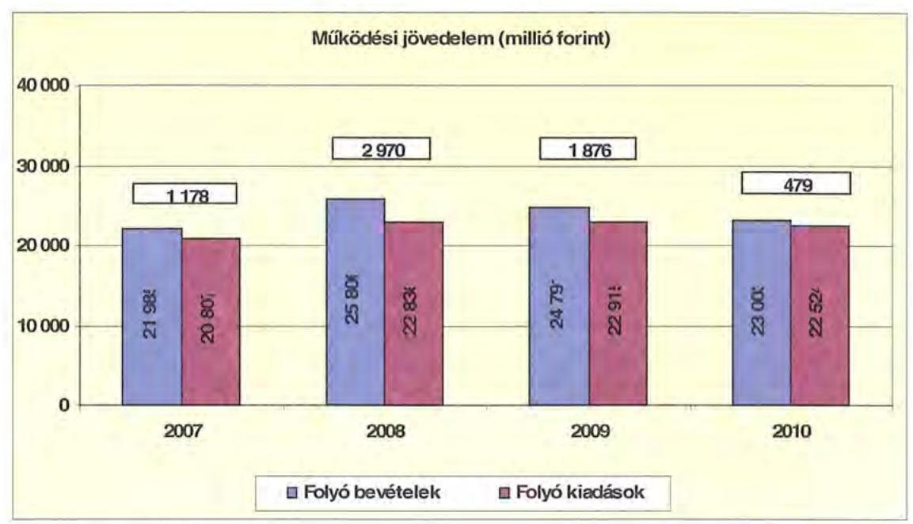

A folyó költségvetés egyenlege (a működési forrástöbblet) 2007-ben a folyó kiadások 5,7%-át (1178 millió Ft-ot), 2008-ban 13,0%-át (2970 millió Ft-ot), 2009-ben 8,2%-át (1876 millió Ft-ot), 2010-ben 2,1%-át (479 millió Ft-ot) jelentette. A vizsgált időszakban a működési jövedelem 6502 millió Ft megtakarítást mutatott, amely forrásul szolgálhatott az Önkormányzat fennálló tőketörlesztési kötelezettségeinek teljesítéséhez, valamint fejlesztéseinek finanszírozásához.

A pozitív előjelű folyó költségvetési egyenleg ellenére az Önkormányzat 2010. évben likvidhitel felvételére kényszerült, egyrészt az átmeneti likviditási problémák kezelése, másrészt felhalmozási kiadásai finanszírozása miatt. A likvidhitel napi átlagos állománya 1840 millió Ft volt.

Az Önkormányzat kötelezettségein ${ }^{18}$ belül a 2007-2009 közötti időszakban a rövid lejáratú kötelezettségek állománya átlagosan 5% volt, a 2010. évi 16,4%-os aránnyal szemben. Az Önkormányzat 2006. december 31-én fennálló pénzes tőkepiaci kötelezettsége 40 millió Ft-ról 15379 millió Ft-ra nőtt a 2010. év végére.

A rövid lejáratú kötelezettségek állománya a 2010. év végén 2655 millió Ft volt, amely 2065 millió Ft-tal (349,7%-kal) több a 2007. évi rövid lejáratú kötelezettségállománynál. A rövid lejáratú kötelezettségekből a szállítói állomány a 2007. évi 514 millió Ft-ról 803 millió Ft-ra, 56,2%-kal nőtt. A rövid lejáratú kötelezettségek állományának 2007-ben a 87,1%-át (514 millió Ft), 2008-ban a 94,3%-át (444 millió Ft), 2009-ben a 97,7%-át (590 millió Ft), 2010-ben a 30,2%-át (803 millió Ft) a szállítói állomány tette ki.

[^0]
[^0]:    ${ }^{18}$ passzív pénzügyi elszámolások nélküli

---

Az Önkormányzat pénzügyi kapacitása a vizsgált időszakban pozitív értéket mutatott, de a 2010. évre a 2007-évi 1157 millió Ft-ról 477 millió Ft-ra csökkent. A nettó működési jövedelem csökkenésének oka, hogy a folyó bevételek 2007-ről 2010-re kisebb mértékben, 4,6%-kal (21 985 millió Ft-ról 23003 millió Ft-ra) nőttek, mint a folyó kiadások, amelyeknek növekedése 8,3%-os (20 807 millió Ft-ról 22524 millió Ft-ra nőtt) volt. A nettó működési jövedelem ${ }^{19}$ értéke a folyó költségvetési pozíció mellett az adott költségvetési év adósságtörlesztésének hatását is tükrözi. Az Önkormányzat 2007-2010 között összesen 44,9 millió Ft adósságot törlesztett a hosszú lejáratú hiteleihez és egyéb hosszú lejáratú kötelezettséghez (szállítói előfinanszírozás) kapcsolódóan. A kötvények törlesztése a 2013. évtől kezdődik.

A pénzügyi kapacitás romlását a folyó bevételek és kiadások különbségéből származó működési jövedelem csökkenése okozta ${ }^{20}$.

Az Önkormányzatnál a CLF módszer alapján a fejlesztési kiadások egy részének fedezete - változatlan nettó működési jövedelem képződése mellett - biztosítottnak látszik. Továbbá információul szolgál a jövőben vállalható teljesíthető adósságszolgálat mértékéről.
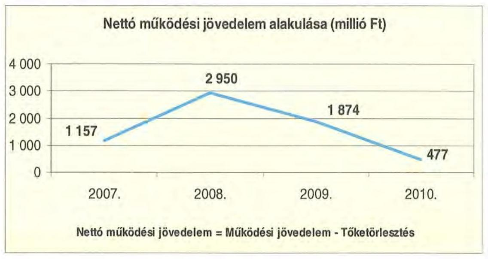

[^0]
[^0]:    ${ }^{19}$ A nettó működési jövedelem (pénzügyi kapacitás) a 2007. évben 1157 millió Ft, a 2008. évben 2950 millió Ft, a 2009. évben 1874 millió Ft, a 2010. évben 477 millió Ft volt.
    ${ }^{20}$ Az Önkormányzat tőketörlesztési kötelezettsége a 2007. évben 21 millió Ft, a 2008. évben 20 millió Ft, a 2009. évben 2 millió Ft, a 2010. évben 2 millió Ft volt.

---

A 2007-2010. években az Önkormányzat felhalmozási költségvetésének egyenlege folyamatosan negatív összegű volt, amely az előrelátó, tudatos költségvetési gazdálkodás és pénzügyileg fenntartható ${ }^{21}$ beruházások esetén nem jár magas pénzügyi kockázattal.

A felhalmozási költségvetés egyenlegét évenként a következő ábra szemlélteti:
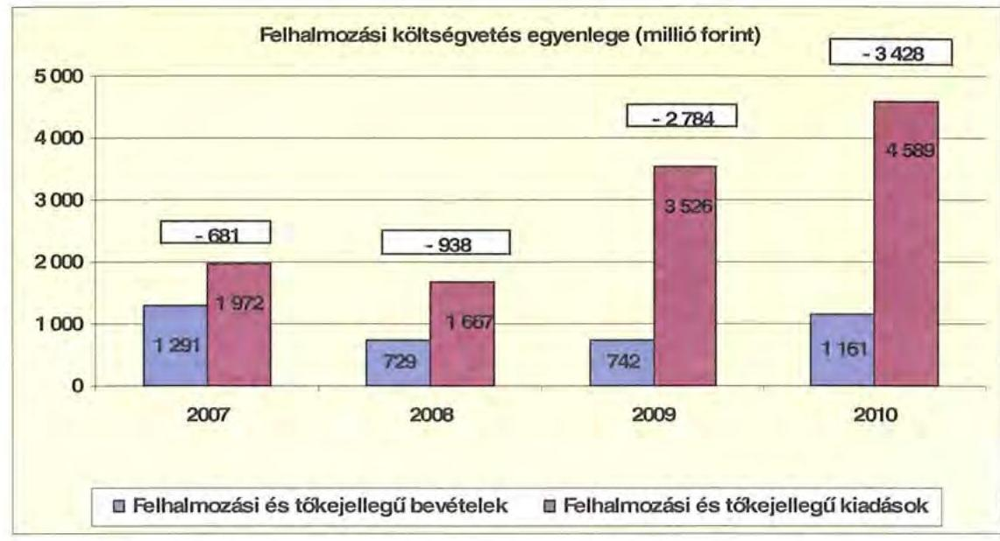

A felhalmozási forráshiánynak a felhalmozási és tőke jellegű kiadásokhoz viszonyított aránya a 2007. évben 34,5% (681 millió Ft), a 2008. évben 56,3% (938 millió Ft) a 2009. évben 79% (2784 millió Ft) a 2010. évben 74,7% (3428 millió Ft) volt.

A felhalmozási forráshiányt fejlesztési célú kötvénykibocsátásból származó bevételből, illetve saját bevételből (főként hozam- és kamatbevétel) finanszírozták. A 2007. évben kibocsátott kötvényből származó bevétel felhalmozási célra történő felhasználását több évre ütemezték (a kibocsátott 9400 millió Ft kötvénybevételből 4092 millió Ft-ot használtak fel a 2008-2010. évek között).

Az Önkormányzatnak a CLF módszer szerint 2007-ben 476 millió Ft, 2008-ban 2012 millió Ft finanszírozási többlete ${ }^{22}$ keletkezett. A finanszírozási hiány az évek sorrendjében a 2009. évben 910 millió Ft, a 2010. évben 2951 millió Ft volt.

[^0]
[^0]:    ${ }^{21}$ Az minősül pénzügyileg fenntartható beruházásnak, amelynek működtetésére az Önkormányzat nettó működési jövedelme még fedezetet nyújt.
    ${ }^{22}$ a nettó működési jövedelem és a felhalmozási költségvetés egyenlegének összege

---

Az Önkormányzat finanszírozási műveletei egyenlegének alakulását a 2007-2010. években a következő ábra szemlélteti:
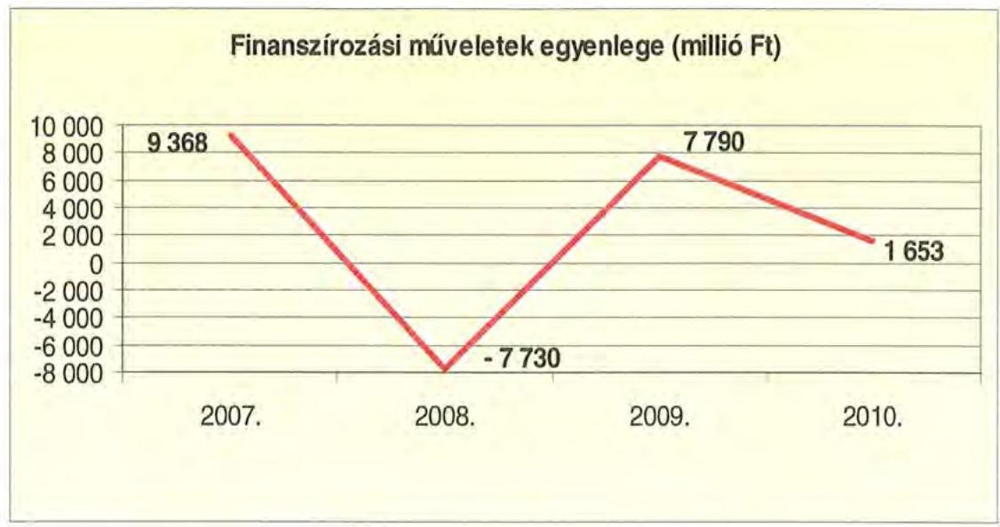

A finanszírozási többlet azt jelzi, hogy az éves költségvetések végrehajtása során szükség volt a pénzkészlet felhasználásán túl külső finanszírozás igénybevételére is. A finanszírozási célú műveleteket a vizsgált időszakban a jelentés 2/a. számú mellékletének 4.1-4.8 pontjai részletezik.

Az Önkormányzat a működési és fejlesztési többletet a zárszámadási rendeleteiben a hagyományos költségvetési szerkezet alapján mutatta be ${ }^{23}$, amelyről a jelentés 1. számú melléklete nyújt tájékoztatást. A hagyományos költségvetési szerkezet alapján az Önkormányzat 2007-ben 2040 millió Ft, 2008-ban 5973 millió Ft, 2009-ben 5128 millió Ft, 2010-ben 10035 millió Ft működési és felhalmozási célú többletet mutatott ki. A hagyományos költségvetési szerkezetben az Önkormányzat a bevételek között számba vette belső finanszírozási forrásként az előző évek pénzmaradványából a tárgyévben igénybevett összegeket is.

A vizsgált időszakban a kötelezettségek (passzív pénzügyi elszámolások nélkül) 10215 millió Ft-ról 16192 millió Ft-ra emelkedtek, amely együtt járt a kamatkiadások növekedésével. Ugyanakkor a kötvényforrásnak a fejlesztési célra átmenetileg fel nem használt részének és más, átmenetileg szabad forrásoknak folyamatosan változó összegben (attól függően, hogy az Önkormányzat kiadásai milyen ütemben merültek fel) - befektetése révén a kapott kamatok folyamatosan meghaladták a fizetett kamatokat.

A 2007-2010 között az Önkormányzat összesen 5907 millió Ft kamatbevételt realizált, amely a teljes kamatráfordítás (787 millió Ft) hét és fél szerese (750,6%).

[^0]
[^0]:    ${ }^{23}$ Nincs kötelező előírás a működési és fejlesztési hiány megállapításának módjára.

---

Az Önkormányzat kamatbevételeit és kamatkiadásait évenként a következő ábra mutatja:
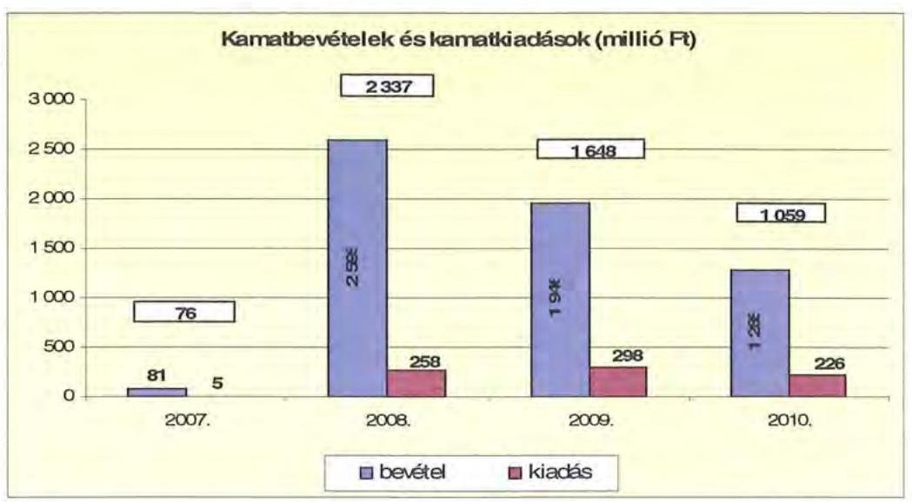

A 2007-2010 közötti időszakban az Önkormányzat kiadásait és bevételeit főbb jogcímek szerint a jelentés 2/b. számú melléklete tartalmazza.

# 2.2. Az Önkormányzat bevételeinek alakulása 

Az Önkormányzat a 2007-2010. évek között realizált, OEP támogatás nélküli főbb bevételi jogcímeinek számszaki adatait az alábbi táblázat részletezi, és grafikon mutatja be:

|  |  |  |  | ezer Ft |
| :--: | :--: | :--: | :--: | :--: |
| Megnevezés | 2007. év   (tény) | 2008. év   (tény) | 2009. év   (tény) | 2010. év   (tény) |
| illetékbevétel | 1776696 | 2003030 | 1731018 | 1181872 |
| szja és állami támogatás | 6265689 | 6888122 | 5999802 | 5198415 |
| egyéb saját bevétel (OEP nélkül) | 5170290 | 8289698 | 8861520 | 10183052 |
| Összesen | 13212675 | 17180850 | 16592340 | 16563339 |

---

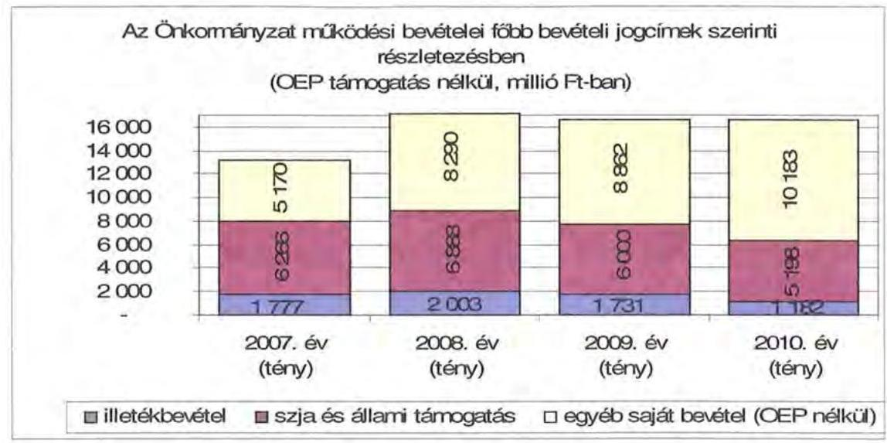

A Kórház fenntartásához az OEP által nyújtott támogatás a 2007. évi 9000 millió Ft-ról a 2010. évre 9097 millió Ft-ra (1,1%-kal) nőtt.

Az Önkormányzatnál az illetékbevétel a 2007. évben a 2006. évi 2165 millió Ft-ról 1777 millió Ft-ra (18%-kal) csökkent. A csökkenésben szerepet játszott az Illetékhivatalnak - 2007. január 1-jétől - az APEH-hoz történő átszervezése is, mert az évente realizált illetékbevételekből (központi intézkedés következtében) évi 8,5%-ot elvontak adminisztrációs feladatokra. A beszedés költségeire elvont pénzösszeg kevesebb volt, mint amit az Illetékhivatal működtetésére ${ }^{24}$ költött volna az Önkormányzat. Az illetékbevétel jelentősebben a 2010. évtől mérséklődött, az előző évhez viszonyítva a csökkenés 31,7%-os (549 millió Ft) volt.

Az szja és állami támogatások együttes összege az előző évhez képest a 2008. évben 622 millió Ft-tal (9,9%-kal) nőtt, majd ezt követően a 2009. évben 888 millió Ft-tal (12,9%-kal), a 2010. évben 802 millió Ft-tal (13,4%-kal) lett alacsonyabb. A 2007. évhez viszonyítva a csökkenést a központi forráskivonás és a normatíváknak a járulékváltozások miatti központi csökkentése mellett az egyszeri támogatások is okozták (az Önkormányzat központi bérpolitikai intézkedésekre és a helyi szervezési intézkedésekre a 2007. évben 482 millió Ft, a 2008. évben 1072 millió Ft, a 2009. évben 533 millió Ft, a 2010. évben 484 millió Ft egyszeri állami támogatást kapott).

Az egyéb saját bevételeken belül a hozam és kamatbevétel a 2007. évről a 2010. évre közel 16-szorosára nőtt a kötvénykibocsátásból származó bevétel átmenetileg fel nem használt részének befektetési hozamai révén. A hozam és kamatbevétel a 2008. évtől kezdődően az előző évhez képest a 2009. évben 649 millió Ft-tal, a 2010. évben 661 millió Ft-tal csökkent ${ }^{25}$, mivel az átmenetileg szabad forrás elsősorban a fejlesztési feladatok megvalósítása következté-

[^0]
[^0]:    ${ }^{24}$ A 2006. évben az Önkormányzat az Illetékhivatal működtetésére 619 millió Ft-ot fordított, az illetékbevétel 2006. évről a 2007. évre pedig 388 millió Ft-tal csökkent.
    ${ }^{25}$ A kamat és hozambevétel 2008. évben 2595 millió Ft, 2009. évben 1946 millió Ft volt.

---

ben folyamatosan csökkent. Az intézményi működési bevételek a 2007-2010. évek között az előző évhez képest folyamatosan növekedtek, a 2007. évi 2688 millió Ft-ról 2010-re 3522 millió Ft-ra emelkedtek, a 2007-2008. években elsősorban a térítési díjak önköltségalapú emelkedése, valamint a gyógyszertári forgalom növekedése miatt, másrészt a 2008. évtől a feladat-ellátás átalakításával felszabaduló ingatlanok hasznosításából, bérbeadásából származó bevételekkel összefüggésben.

Az Önkormányzat felhalmozási bevételei a vizsgált időszakban:

|  |  |  |  | ezer Ft |
| :--: | :--: | :--: | :--: | :--: |
| Megnevezés | 2007. év   (tény) | 2008. év   (tény) | 2009. év   (tény) | 2010. év   (tény) |
| tárgyi eszköz értékesítés | 166197 | 222969 | 12276 | 2525 |
| állami támogatás | 834912 | 438585 | 440407 | 742074 |
| átvett pénzeszköz | 105746 | 101515 | 103531 | 67097 |
| egyéb felhalmozási bevétel | 1072450 | 298687 | 825022 | 485819 |
| felhalmozási tartalék | 388090 | 10293423 | 4890751 | 10189839 |
| összes felhalmozási bevétel |

 2567395 | 11355179 | 6271987 | 11487354 |

A tárgyi eszközök értékesítéséből származó bevétel a 2007-2010. évek között az előző évhez képest a 2008. évben 57 millió Ft-tal nőtt kereskedelmi társaság részére történt terület eladása, valamint üresen álló kastélyépület értékesítése következtében, a 2009. és a 2010. évben egy-egy kisebb értékű tárgyi eszköz értékesítéséből származott bevétel.

A felhalmozási célú állami támogatás a 2007. évről a 2008. évre 396 millió Ft-tal közel a felére csökkent, elsősorban a Kórház járó- és fekvőbeteg részlegének fejlesztéséhez a 2007. évben kapott egyszeri címzett támogatás miatt. A 2009-2010. években a teljesített állami támogatás bevétele az európai uniós forrásokból származó bevételek miatt nőtt, amely bevételek elsősorban a TISZK, a Kulturális és Közművelődési Központ létrehozásához, több intézmény felújítási feladataihoz, a Kórház szeghalmi részlegének rekonstrukciójához kapcsolódtak.

Az egyéb felhalmozási bevétel között került számbavételre az általános forgalmi adó visszatérülés, a tárgyi eszköz értékesítés áfa bevétele, az államháztartáson belülről származó támogatásértékű felhalmozási bevételek (OEP). Az ezen a jogcímen a 2007-2010. évek között befolyt bevétel az évek sorrendjében az előző évhez képest változóan alakult, a 2007. évről a 2008. évre 774 millió Ft-tal csökkent, a 2009. évre 526 millió Ft-tal növekedett, a 2010. évre 339 millió Ft-tal csökkent.

A felhalmozási tartalék változóan alakult, a tartalékok képzése és felhasználása a tervezett és megvalósult beruházások figyelembe vételével, azzal azonos ütemben történt.

---

# 2.3. Az Önkormányzat kiadásainak alakulása 

Az Önkormányzat működési kiadásai főbb jogcímek szerinti bontásban az alábbiak voltak:

|  |  |  |  |  |
| :-- | --: | --: | --: | --: |
| Megnevezés | 2007. évi   tény | 2008. évi   tény | 2009. évi   tény | 2010. évi   tény |
| Működési kiadások | 20859118 | 22820923 | 22859984 | 22454803 |
| Működési kiadások (kamatkiadás nélkül) | 20854359 | 22562665 | 22562430 | 22229254 |
| Kamatkiadás | 4759 | 258258 | 297554 | 225549 |
| Személyi juttatások | 9685134 | 9475928 | 9069023 | 8994238 |
| Munkaadót terhelő járulékok | 3113954 | 3007005 | 2704442 | 2347739 |
| Dologi kiadások | 6920304 | 7992042 | 8596048 | 8893469 |
| Egyéb folyó kiadások | 159650 | 1219996 | 415239 | 647716 |
| Támogatások, elvonások, egyéb folyó átutalások | 704847 | 456724 | 733204 | 688122 |
| ebből: működési célú pénzeszközátadás | 237987 | 201803 | 364986 | 275411 |
| Előző évi pénzmaradvány átadás, visszafizetés (működési célú) | 209274 | 385232 | 1026179 | 657970 |
| Tervezett, tartalék | 61196 | 25738 | 18295 | 0 |

Az Önkormányzat teljesített működési kiadásai a 2007. évről a 2010. évre 20860 millió Ft-ról 22455 millió Ft-ra (7,6\%-kal) nőttek.

Az Önkormányzat a 2010. évben a 22455 millió Ft működési költségvetésből 11342 millió Ft-ot (50,5\%-át) személyi juttatásokra és a munkaadókat terhelő járulékokra fordította, az üzemeltetést, intézményfenntartást biztosító dologi kiadásokra 8893 millió Ft (39,6\%) jutott. A működési kiadásokon belül a személyi juttatások és járulékok aránya a vizsgált időszakban folyamatosan csökkent, a 2007. évben annak 61,4\%-a, a 2010-ben 50,5\%-a volt.

A személyi juttatások teljesített kiadása a 2007. évtől minden évben csökkentek a létszámcsökkentések miatt. A 2010. évben a 2007. évben teljesített kiadásoknál 691 millió Ft-tal (7,1\%-kal) voltak alacsonyabbak.

A dologi kiadások az Önkormányzatnál a 2010. évben a 2007. évi szintnél 1973 millió Ft-tal (28,5\%-kal) voltak magasabbak annak ellenére, hogy a 2007. évtől elkezdődött a hatékonyabb feladatellátást szolgáló szervezeti átalakítás, amelynek keretében 33 önálló költségvetési szervet 13 önállóan működő és gazdálkodó intézménycentrumba szervezték. A támogató szolgáltatásokat $^{26}$

[^0]
[^0]:    $^{26}$ A támogató szolgáltatást a központi megszorító intézkedések miatti jelentős bevételkiesés ellensúlyozására indították el, amely az intézmények közötti együttműködés megszervezését jelentette a nem szakmai feladatok vonatkozásában. Az átalakítással egy-egy nem szakmai feladat ellátását két-három kijelölt centrumhoz telepítették. A támogató szolgáltatások közé került a szállítás, a karbantartás, a mosodai és az élelmezési szolgáltatás, a program- és rendezvényszervezés, a takarítás, a közös beszerzés, az ingatlan-üzemeltetés, valamint a könyvelés adminisztráció, a szakkönyvtár működtetése és az informatika, amely szolgáltatások az intézmények közötti logisztikai együttműködésben valósulnak meg. Az együttműködés kialakításánál fő szempontként érvényesült, hogy a feladatokat nem kiszervezték, hanem a saját intézményhálózaton belül végzik egymásnak.

---

a 2010. évtől létrehozták és működtetik. A 2007-2009. évek között minden évben az inflációt meghaladó mértékben nőttek a dologi kiadások, amelynek ellentételezése a központi forráselosztásban nem jelentkezett. Fedezetét a végrehajtott kiadáscsökkentő intézkedésekkel és saját forrással biztosították.

A működési célú pénzeszközátadások nagysága a 2007. évről a 2008. évre 36 millió Ft-tal (15,1\%-kal) csökkent, amely a 2009. évben az előző évi 202 millió Ft-hoz képest 163 millió Ft-tal (80,7\%-kal) emelkedett főként az NGP $^{27}$ keretében biztosított feladatokra történt pénzeszköz átadás következtében. A 2010. évben a működési célra átadott pénzeszköz az előző évi 365 millió Ft-ról 275 millió Ft-ra (24,7\%-kal) csökkent elsősorban amiatt, hogy az NGP keretében tervezett feladatok megvalósítása nem fejeződött be, az alapítványok támogatásának kifizetése a támogatási célok teljesítésének következő évre történő áthúzódása miatt nem történt meg.

A 2007-2010. évek között az önkormányzati kiadásokban csökkent a Kórházi kiadások súlya az egyéb fenntartott intézményekben felmerülő kiadásokhoz képest. A Kórház nélkül teljesített működési kiadások a 2007. évben (10 892 millió Ft) az összes működési kiadás 52,2\%-át tették ki, ez az arány 2010 végére 55,9\%-ra nőtt (12562 millió Ft volt). A Kórház nélküli kiadásokban jelentkező tendenciák a közoktatási, szociális és gyermekvédelmi, kulturális és közművelődési, igazgatási és egyéb intézményekben biztosított feladatellátást jellemzik.

Az Önkormányzat Kórház nélküli működési kiadásai a vizsgált időszakban főbb kiadási jogcímenként az alábbi volt:
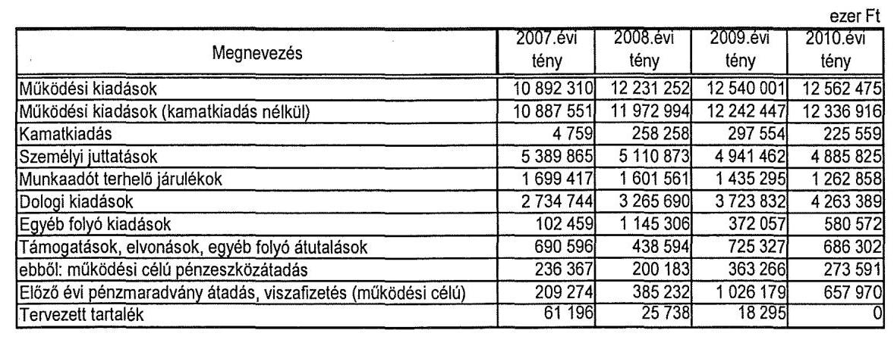

A 2010. évben a 2007. évhez képest a Kórház nélkül számított működési kiadások 10892 millió Ft-ról 12562 millió Ft-ra történő (15,3\%-os) növekedése meghaladta a Kórházzal együtt számított működési kiadások (20860 millió Ft-ról 22455 millió Ft-ra) 7,6\%-os növekedését. A személyi juttatásra teljesített kiadás a Kórháznál 4259 millió Ft-ról 4108 millió Ft-ra (3,5\%-kal), a többi intézménynél a 2007. évről a 2010. évre 5390 millió Ft-ról 4886 millió Ft-ra

[^0]
[^0]:    $^{27}$ Az NGP célja a nemzetközi pénzügyi válság önkormányzatot érintő hatásainak enyhítésén túl „a megye gazdaságának a korszerű tudás alkalmazására alapozott fenntartható fejlődésének előmozdítása, a versenyképesség, valamint a hozzáadott értéket teremtő munkahelyek számának növelése, az életminőség javítása".

---

(9,4\%-kal) csökkent, amely azt tükrözi, hogy az egészségügyi ágazatban alacsonyabb a létszám- és a bérek csökkenése más ágazati feladatokat ellátó intézményekénél. A 2007-2010. évek között a Kórház nélkül teljesített működési kiadásoknak a 2007. évben a 65,1\%-át, a 2008. évben az 54,9\%-át, a 2009. évben az 50,9\%-át, a 2010. évben a 48,9\%-át a személyi juttatások és járulékalk tették ki. A dologi kiadások a 2007. évben 25,1\%-os, a 2008. évben 26,7\%-os, a 2009. évben 29,7\%-os és a 2010. évben 33,9\%-os arányt képviseltek.

A vizsgált időszakban a munkaadókat terhelő járulékok csökkenése $^{28}$ egyrészt a kifizetett személyi juttatások, másrészt a járulékok mértékének csökkenésével volt összefüggésben. A járulékok csökkenése miatt felszabaduló forrásokat azonban a kormányzat az önkormányzati alrendszernek nyújtott állami támogatásokból levonásba helyezte, így a járulékcsökkenés az Önkormányzat pénzügyi pozíciójában változást nem okozott, mivel állami forráscsökkenéssel járt együtt.

A 2010. évre a Kórházon kívüli intézményeknél a dologi kiadások növekedése a 2007. évi 2735 millió Ft-ról 4263 millió Ft-ra növekedett (55,9\%-kal), amely nagyobb arányú volt, mint a Kórház dologi kiadásainak $^{29}$ növekedése (10,6\%-os). A Kórház dologi kiadásainak a többi intézményhez képest alacsonyabb mértékű növekedése téríti el lefelé az önkormányzati szintű növekedést. A Kórház dologi kiadása a 2009. évről a 2010. évre 247 millió Ft-tal csökkent, amely elsősorban a kifizetetlen szállítói állománnyal függött össze.

Az Önkormányzat a 2007-2010. évek között a Kórház működési kiadásaihoz $^{30}$ 1451 millió Ft-tal járult hozzá. A kórházi működési támogatások a központi bérpolitikai intézkedésekhez, a létszámcsökkentésekhez kapcsolódó többletköltség fedezetéhez, a 13. havi juttatások kifizetéséhez, kereset kiegészítésekhez kapcsolódtak, melyeket az Önkormányzat központi költségvetésből kapott támogatásból finanszírozott. Az Önkormányzat a működési célú támogatáson felül a 2007-2010. évek között további 462 millió Ft fejlesztési célú támogatást nyújtott a Kórház részére, amely a felhalmozási kiadásainak 25,9\%-át fedezte $^{31}$.

[^0]
[^0]:    $^{28}$ a 2007. évről a 2010. évre 436 millió Ft-tal (25,7\%-kal csökkent
    $^{29}$ A Kórház dologi kiadása a 2007. évi 4186 millió Ft-ról a 2010. évre 4630 millió Ft-ra nőtt.
    $^{30}$ intézményfinanszírozás formájában
    $^{31}$ A Kórház felhalmozási kiadásokra a 2007-2010. évek között összesen 1750 millió Ft-ot fordított.

---

A Kórház részére nyújtott támogatásokat évenként a következő grafikon mutatja be:
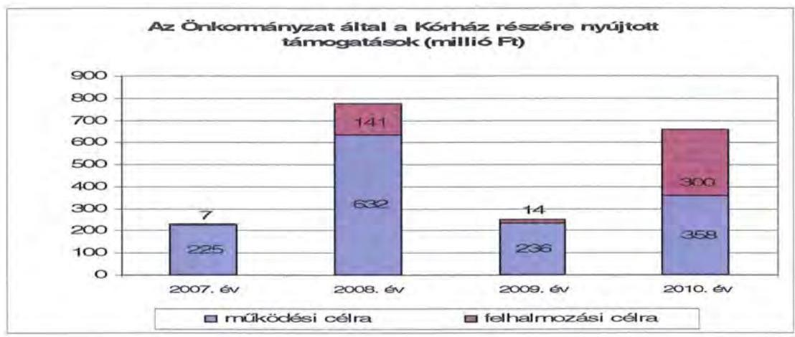

A Kórház részére nyújtott fejlesztési támogatáson túl a 2007-2010. évek között a Kórház új pathológiai osztályának beruházási kiadásait, a szeghalmi járó- és fekvőbeteg részleg rekonstrukciójának, valamint a Kórház területén lévő kápolna felújítási kiadásait, összesen 1617 millió Ft fejlesztési kiadást a Hivatal költségvetésében számolták el, amelyekhez hazai címzett támogatás, önkormányzati saját forrás és az utófinanszírozás miatt kisebb részben európai uniós forrás nyújtott fedezetet.

Az Önkormányzatnál a működési és felhalmozási kiadások arányának változásában a 2007-2010. évek között elmozdulás figyelhető meg, a felhalmozási kiadások aránya 8,3\%-ról 17,2\%-ra, 1881 millió Ft-ról 4658 millió Ft-ra nőtt.

A kiadások működési és fejlesztési célú bontását (a kamatkiadásokat is figyelembe véve) a következő grafikon szemlélteti:
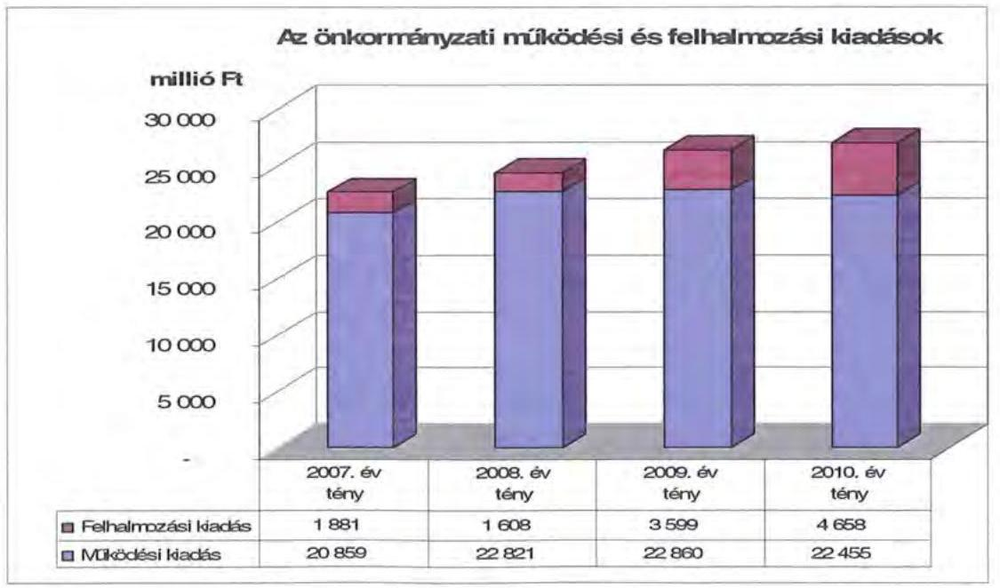

---

Az Önkormányzat a 2007-2010. évek között 10451 millió Ft-ot fordított felhalmozási kiadásokra, amelyből befektetési céllal 1008 millió Ft részvényvásárlás és 10 millió Ft saját tulajdonú kft tőkeemelése volt. A megvalósított fejlesztésekhez összesen 1340 millió Ft címzett támogatást és hazai forrást, 1222 millió Ft európai uniós támogatást és 7889 millió Ft saját forrást vettek igénybe. A saját forrásból 4092 millió Ft kötvénykibocsátásból származó bevétel volt. A felhalmozási kiadásokból 9211 millió Ft a kötelező feladatokhoz kapcsolódott. A megvalósított fejlesztések között intézményi épületek, lakóotthonok felújítása, korszerűsítése, bővítése, eszközök beszerzése, informatikai rendszerek fejlesztése, belterületi vízrendezés szerepelt. Több, egyenként közel 1000 millió Ft bekerülési költségű fejlesztés is megvalósult a vizsgált időszakban:

- kilenc település belterületi vízrendezése, bekerülési költsége 898 millió Ft, forrása 808 millió Ft címzett támogatás, 90 millió Ft saját forrás, a 2007-2010.
 évek között kifizetett fejlesztési kiadás 183 millió Ft volt;
- a Kórház járó-és fekvőbeteg részlegének rekonstrukciója, bekerülési költsége 949 millió Ft, forrása 853 millió Ft címzett támogatás, 96 millió Ft saját forrás, a 2007-2010. évek között kifizetett fejlesztési kiadás 850 millió Ft volt;
- IBSEN ház kialakítása, bekerülési költsége 910 millió Ft, forrása 483 millió Ft európai uniós forrás, 30 millió Ft hazai támogatás, 397 millió Ft saját forrás, a 2007-2010. évek között kifizetett fejlesztési kiadás 902 millió Ft volt;
- Tudásház kialakítása, amelynek bekerülési költsége 855 millió Ft volt, 100%-ban saját forrásból valósult meg, a 2007-2010. évek között kifizetett fejlesztési kiadás 855 millió Ft volt;
- Kórház pathológiai osztály építése, amelynek bekerülési költsége 706 millió Ft volt, 100%-ban saját forrásból valósult meg, a 2007-2010. évek között kifizetett fejlesztési kiadás 706 millió Ft volt;
- TISZK kialakítása, bekerülési költsége 1000 millió Ft, forrása 900 millió Ft európai uniós forrás, 100 millió Ft saját forrás, a 2007-2010. évek között kifizetett fejlesztési kiadás 427 millió Ft volt.

A felsorolt beruházások a TISZK kivételével a 2007-2010. évek között be is fejeződtek. A 2010. év utánra vállalt kötelezettség 7160 millió Ft, amelynek forrásaként 6568 millió Ft európai uniós támogatással, 568 millió Ft kötvénybevételből származó forrással és 24 millió Ft saját bevétellel számoltak ${ }^{32}$ az alábbiak szerint:

- a Kórház struktúra átalakításának fejlesztési költségére 5319 millió Ft-ot terveztek a 2010. év utáni évekre, amelynek forrásául 4944 millió Ft európai uniós támogatással és 375 millió Ft kötvényforrással számoltak;

[^0]
[^0]:    ${ }^{32}$ A 2010. év utánra áthúzódó felhalmozási feladatokra tervezett kötvényforrás és saját bevétel lekötött betétekben, az európai uniós források a megkötött támogatási szerződések szerinti összegekben és ütemezésben rendelkezésre állnak.

---

- a sürgősségi betegellátás fejlesztési költségére 564 millió Ft-ot terveztek a 2010. év utáni időszakra, amelynek forrásaként 461 millió Ft európai uniós támogatással és 103 millió Ft kötvényforrással számoltak;
- a TISZK fejlesztési költségére 572 millió Ft előirányzatot határoztak meg a 2010. év után, amelyhez 502 millió Ft európai uniós támogatást és 70 millió Ft kötvényforrást terveztek;
- az Arad-Békés Expo 2010. év utáni időszakra tervezett 684 millió Ft-os fejlesztési költségéhez 660 millió Ft európai uniós támogatást és 24 millió Ft saját forrást határoztak meg;
- a 2011. évre áthúzódott két (kollégium felújítás, tőkeemelés) korábban vállalt felhalmozási kötelezettség, amelynek kiadási előirányzatára 21 millió Ft-ot terveztek kötvényforrás fedezettel.

A 2007-2010. években megvalósított, továbbá a 2010. december 31-én fennálló fejlesztéseket a jelentés 3. számú melléklete tartalmazza. A 2007-2010. évek között a 10 millió Ft teljes bekerülési költség feletti beruházások és felújítások száma 72 volt, amelynek közel egy tizedéhez (nyolc fejlesztéshez) uniós forrásokat is igénybe vettek. A 10 millió Ft alatti fejlesztésekkel együtt a 2010. évben négy európai uniós projekt megvalósítása volt folyamatban.

Az Önkormányzat fejlesztési tevékenysége a pályázati kiírások által nagyban befolyásolt, de a 2007. évben kibocsátott kötvény bevételéből fel nem használt forrás befektetései révén a még fel nem használt kötvényforráson túl a hozamokból is fejlesztési forrásokat (a felhalmozási kiadások önrészének fedezetére) és a kötvényforrás visszafizetésének fedezetére tartalékot képeztek.

# 3. KÖTELEZETTSÉGEK BEMUTATÁSA 

### 3.1. A pénzintézetek felé fennálló kötelezettségek alakulása

Az Önkormányzatnak 2006. december 31-én 40 millió Ft pénzintézeti kötelezettség állománya volt, a 2010. évben 15379 millió Ft. A fennálló pénzintézeti kötelezettségei két hitel felvételből, két kötvény kibocsátásából és egyszeri likvid hitel igénybevételéből keletkeztek. A devizában kibocsátott kötvénykötelezettség év végi könyvviteli mérleg szerinti értékének meghatározásakor az árfolyamváltozás miatti év végi értékelést a 2007-2010. évek között elvégezték, amelynek alapján a 2007. évben 9400 millió Ft névértéken kibocsátott kötvényállomány év végi mérleg szerinti értéke a 2008. évben 10846 millió Ft, a 2009. évben 11098 millió Ft, a 2010. évben 13503 millió Ft volt.

---

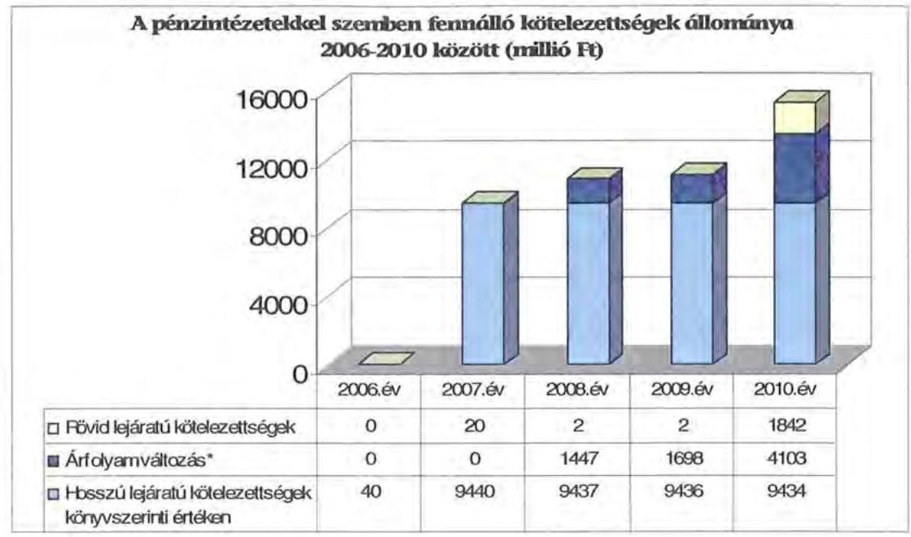
*Az árfolyamváltozás hatása is befolyásolja a kötelezettségek alakulását, azonban annak mértéke előre pontosan nem határozható meg, csak várakozásokon alapuló tendenciák jelezhetők.

Annak megítéléséről, hogy a devizában kibocsátott kötvényekért és felvett hitelekért kapott forinthoz képest a kötvények visszavásárlásakor, illetve a hitelek visszafizetésekor jelentkező forint kötelezettség többletkiadást (árfolyamveszteség) vagy megtakarítást (árfolyamnyereség) eredményez a futamidő végén, a teljes kötelezettség rendezését követően lehet képet alkotni. Mindaddig, amíg törlesztési kötelezettség nem áll fenn (türelmi idő, moratórium), a tőkére vonatkoztatva nem értelmezhető sem az árfolyamveszteség, sem az árfolyamnyereség. Ugyanakkor a számviteli szabályok meghatározzák, hogy az árfolyam különbözetet év végén a kötelezettségek között a könyvviteli mérlegben nyilván kell tartani, azonban az árfolyam különbözet valójában nem realizált.

Az Önkormányzat pénzintézeti kötelezettségvállalásaira közgyűlési döntés alapján került sor. A közgyűlési döntést megelőzően az Önkormányzat a kötvények kibocsátására négy banktól kapott ajánlatot, amelyeket a legjobb ajánlatok kiválasztása céljából két független szakértővel értékeltetett. A kötelezettségvállalásból származó források felhasználási céljait meghatározták. A Közgyűlés döntéseit megalapozó előterjesztések ugyanakkor nem tartalmazták a kötelezettségvállalás visszafizetési forrásainak, a teljes futamidő várható kamat- és tőkefizetési kötelezettségének, az árfolyam- és kamatkockázatoknak a bemutatását. Az adósságszolgálati korlátnak való megfelelésről a döntéskor a Közgyűlés tagjai írásos tájékoztatást kaptak. Az Önkormányzat az adósságot keletkeztető kötelezettségvállalásának felső határát a 2007-2011. I. negyedévben nem lépte túl.

Az Önkormányzatnál a kötvénykibocsátást követően vizsgálták az adósságot keletkeztető kötelezettségvállalással megvalósított felhalmozási kiadások esetleges bevételt növelő, illetve kiadást csökkentő hatásait, az abból való megtérülését. A Közgyűlés az adósságállomány kezelésére kockázatkezelési sza-

---

bályzatot alkotott, amelyben meghatározta a kockázatkezelés, devizakezelés, alaphozam, likvid pénzeszköz, átmeneti forráskezelés szabályait, az ún. kockázati alap létrehozását és feltöltésének ${ }^{33}$ forrásait. Az Önkormányzat megbízási szerződést kötött ${ }^{34}$ egy gazdasági tanácsadó kft-vel a kamat- és árfolyamváltozások figyelemmel kísérésére, az átmenetileg fel nem használt kötvényforrás befektetési portfóliójának kialakítására, a kötvényforrással kapcsolatos monitoring és szakértői tanácsadó feladatok ellátására. A Közgyűlés az Önkormányzat visszafizetési kötelezettségeinek biztosítása érdekében a vagyongazdálkodás egyes kérdéseiről szóló rendeletet alkotta meg. A rendelet végrehajtási szabályait a Közgyűlés elnökének és a főjegyzőnek együttes rendelkezése ${ }^{35}$ tartalmazta. A Közgyűlés elfogadta ${ }^{36}$ a fedezeti tartalék vagyon meghatározását, amelyben kijelölték az önkormányzati ingatlanok és vagyonelemek azon körét, amelyek a kibocsátott kötvények, felvett hitelek visszafizetésének fedezetéül szolgálhatnak, figyelemmel az Ötv. forgalomképtelen vagyontárgyakra vonatkozó előírásaira.

A vagyongazdálkodás hatékonyságának növelése érdekében a Közgyűlés 2010 decemberében vagyongazdálkodási stratégiát ${ }^{37}$ hagyott jóvá. A szabályozás során alapelv volt, hogy a kötvényforrásból megvalósított beruházások, felújítások, befektetések a fedezeti tartalékvagyon körébe kerüljenek. Az Önkormányzat az árfolyamkockázat kezelésére 2008 júniusától Stratégiai Team-et működtetett, amelynek tagjai a Közgyűlés elnöke, a Pénzügyi bizottság és a Gazdasági bizottság elnökei, továbbá két külső szakértő volt. A team munkájában tanácskozási joggal részt vett az Önkormányzat átmenetileg szabad forrásainak felhasználásával kapcsolatos gazdasági tanácsadással megbízott szakértője is.

Az Önkormányzat 2010. december 31-én CHF-ben fennálló adósságot keletkeztető kötelezettségvállalásai az alábbiak voltak:

| Megnevezés | Kibocsátás időpontja | Összeg (CHF) | Kibocsátási, vagy lehivási árfolyam | Kamat (referencia kamat+ kamatfelár) | Felhasználás célja: |
| :--: | :--: | :--: | :--: | :--: | :--: |
| Békés Megye 2027 Kötvény | 2007.12.20 | 52465897 | 152,48 | 6 havi CHF LIBOR + 0,674% | önkormányzati beruházásokhoz szükséges saját forrás biztosítása |
| Békés Megyeért 2027 Kötvény | 2007.12.20 | 9228741 | 151,7 | 6 havi CHF LIBOR + 0,49% | önkormányzati beruházásokhoz szükséges saját forrás biztosítása |
| Összesen |  | 61694638 |  |  |  |

[^0]
[^0]:    ${ }^{33}$ A kockázati alap feltöltése a szabályzat értelmében a fel nem használt likvid pénzeszközök befektetéséből (betételhelyezés, államkötvény) realizált alaphozam feletti többlethozamból történik.
    ${ }^{34}$ A kötvényforrással kapcsolatos szakértői feladatokra történt megbízásról a Közgyűlés a 66/2008. (III. 7.) számú határozatával döntött.
    ${ }^{35}$ A vagyongazdálkodás eljárási rendjét a Közgyűlés elnöke és a főjegyző által 2010. június 21-én kiadott 3. számú rendelkezése tartalmazta.
    ${ }^{36}$ A fedezeti tartalék vagyon körének meghatározásáról a Közgyűlés a 184/2010. (VI. 25.) számú határozatában döntött.
    ${ }^{37}$ A vagyongazdálkodási stratégiát a Közgyűlés 313/2010. (XII. 17.) számú határozatával fogadta el.

---

Az Önkormányzat 2010. december 31-én EUR-ban fennálló adósságot keletkeztető kötelezettségvállalása az alábbi volt:

| Megnevezés | Kibocsátás időpontja | Összeg (ezer EUR) | Lehivási árfolyam | Kamat (referencia kamat+ kamatfelár) | Felhasználás célja: |
| :--: | :--: | :--: | :--: | :--: | :--: |
| Rollover jellegű áthidaló hitelkeret | 2010. június 4 | 6466 | 287,8 | 3 havi EURIBOR+0,98% | az intézmények és a Hivatal működési kiadásainak fedezetése |

Az Önkormányzat 2010. december 31-én HUF-ban fennálló adósságot keletkeztető kötelezettségvállalásai az alábbiak voltak:

| Megnevezés | Szerződéskötés időpontja | Összeg (HUF) | Kamat (referencia kamat+ kamatfelár) | Felhasználás célja: |
| :--: | :--: | :--: | :--: | :--: |
| Közkincs hosszú lejáratú hitel gyermekkönyvtár | 2006.06.22 | 20000000 | 3 havi EURIBOR +   évi 1,5% | Felhalmozási célú gyermekkönyvtár átalakítása, korszerűsítése |
| Közkincs hosszú lejáratú hitel múzeum | 2006.06.22 | 20000000   40000000 | 3 havi EURIBOR +   évi 1,5% | Felhalmozási célú -   Munkácsy M. múzeum felújítása, parkolóhelyek kialakítása |

Az Önkormányzat a CHF-ben fennálló pénzintézeti kötelezettségei után 2010. december 31-ig 3595902 CHF kamatot ${ }^{38}$, valamint 579908 CHF egyéb költséget (összesen 766 millió Ft-ot) fizetett. A vizsgált időszakban tőketörlesztés nem volt.

A Közgyűlés elnöke a kötvények kamatkockázatának csökkentése érdekében a névértéknek megfelelő összegben, 10 éves futamidejű, a kibocsátáskori kamatlábnál alacsonyabb fix kamatlábbal kamatcsere (IRS) ügyleteket kötött. A „Békés Megye 2027" kötvényhez kettő, a „Békés Megyéért 2027" kötvényhez egy kamatcsere szerződés kapcsolódik. A szerződésekből következően nemcsak kamat kiadása, hanem bevétele is származik az Önkormányzatnak, emiatt a szerződések 10 éves időszaka alatt az Önkormányzat tényleges kamatfizetési kötelezettsége IRS fix fizetendő díj + kötvénykamat felár összegben realizálódik. A kamat összege a 2010. évben és a 2011. év első negyedévében megegyezett a kötvényt lejegyző banknak fizetett kamatfelárral. Az egyéb költség összege a 2010. évben és 2011. év első negyedévében megegyezett a kamatcsere szerződésekben az Önkormányzat által vállalt fix díj összegével.

Az EUR-ban fennálló rövid lejáratú hitel teljes összege 6466 ezer EUR 2011. április 20-án 278,86 EUR árfolyamon számolva 1803 millió Ft értékben visszafize-

[^0]
[^0]:    ${ }^{38}$ Az Önkormányzatnál a 2008-2010. évi költségvetési beszámolókban kimutatott kamat a fizetés napján érvényes árfolyamon tartalmazta a kamatkiadást, a kamatok a deviza megvétele napján érvényes kamatokkal számított értékeket tartalmazzák, ebből adódik az a különbözet, amelyet beszámolóiban árfolyamnyereségként/veszteségként
 mutatott ki az Önkormányzat.

---

tésre került. A visszafizetésig az Önkormányzat 106 ezer EUR kamatot (29 millió Ft-ot) fizetett ki.

A HUF-ban fennálló pénzintézeti kötelezettségeire az Önkormányzat 2007-2010 között 4 millió Ft-ot törlesztett és 8 millió Ft kamatot ${ }^{39}$ fizetett.

Az Önkormányzat 2007-2010 között 5907 millió Ft kamatbevételt realizált. A kötvényekből és a rövid lejáratú hitelből 2008-2011. március 31-e között befolyt, átmenetileg szabad bevételek befektetéséből azok kibocsátása, illetve felvétele óta 3956 millió Ft hozamot értek el. A hozambevételből 1434 millió Ft-ot ( $36,2 \%$-ot) kamat, egyéb költség és díjak kifizetésére, 1606 millió Ft-ot ( $40,6 \%$-ot) a kockázati alap feltöltésére ${ }^{40}$, 54 millió Ft-ot ( $1,4 \%$-ot) a kormányzati megszorítások többletkiadásainak fedezetére, 633 millió Ft-ot ( $16 \%$-ot) az NGP programjaira, 162 millió Ft-ot ( $4,1 \%$-ot) programfinanszírozásra használták fel 2008-2010. között. A 2011. év első negyedévében keletkezett 67 millió Ft nettó hozam felhasználásáról a Közgyűlés még nem rendelkezett, az, mint átmenetileg szabad pénzeszköz banki lekötésre került.

Az Önkormányzatnak folyószámlahitele és munkabér megelőlegezési hitele a vizsgált időszakban nem volt. Az Önkormányzat 2010. június 4-én működési célú hitelkeretre kötött hitelszerződést ${ }^{41}$ 3 havi EURIBOR +0,98% kamattal. A hitelkeret 2010. június 4-én 6466 ezer EUR összegben került lehívásra, amelyet az Önkormányzat még aznap 2010. június 8-ai értéknappal visszakonvertált Ft-ra, így 1840 millió Ft állt rendelkezésre. Árfolyamveszteség nem volt.

A 2010. december 31-én fennálló kötvények és a hitel esetében a kamatkötelezettségek alakulását befolyásolta a referencia kamatok változása:

| Megnevezés | Kibocsátási, lehivási | Utolsó fizetéskori | Változás   (százalékpont) |
| :-- | --: | --: | --: |
| 6 havi CHF LIBOR | 2,862 | 0,34 | 2,522 |
| 6 havi CHF LIBOR | 2,862 | 0,34 | 2,522 |
| 3 havi EURIBOR | 0,707 | 0,88 | $-0,173$ |

Az utolsó kamatfizetés a 6 havi CHF LIBOR-os kötvények után 2010. július 1-én és 2010. szeptember 30-án, a 3 havi EURIBOR-os hitel után 2010. december 31-én volt.

[^0]
[^0]:    ${ }^{39}$ A HUF-ban fennálló kötelezettségek vonatkozásában az Önkormányzat a 2007-2010. években a kamatfizetésre támogatási szerződéseket kötött az Oktatási Minisztériummal, ezért a kamatfizetés fedezete ezekben az években biztosított volt.
    ${ }^{40}$ Az Önkormányzat kockázatkezelési szabályzata értelmében a kockázati alapban elhelyezetett összeg bankbetétbe helyezhető, illetve állampapírba fektethető, terhére meghatározott feltételek mellett fedezetlen és „stop-loss" ügyletek is köthetők.
    ${ }^{41}$ A hitelkeretről a 2010. évi költségvetési rendelet 11. § (1) bekezdésében döntött a Közgyűlés. A hitel rulírozó jellegű áthidaló hitelkeret volt. A hitelkeret éves felülvizsgálatát a bank a hitel éves fordulónapján automatikusan elvégzi, a lejárat ezt követően 364 nappal automatikusan meghosszabbodik.

---

Amennyiben a referencia kamat nem változott volna, az Önkormányzatnak kibocsátáskori referencia kamattal számolva 2010. december 31-ig 6024042 CHF (918 millió Ft) kamatfizetési kötelezettsége jelentkezett volna. Az Önkormányzat tényleges kamatfizetési kötelezettsége 2007. december 20-tól, illetve 2007. december 21-étől 2010. december 31-éig összesen 2214063 CHF-fel volt kevesebb a tervezett, kibocsátáskori referencia kamatláb melletti fizetési kötelezettséghez képest. A kötvényekhez kapcsolódó (kamatfixálási) kamatcsere ügyletek ${ }^{42}$ miatt azonban 2010. január 1. és 2010.december 31. között 365831 CHF kamatkiadási többlet keletkezett, ezért a tervezett és ténylegesen fizetett kamat különbsége (az IRS díj figyelembevételével) 1848232 CHF (152 millió Ft) volt. A kamatfelár a vizsgált időszakban nem módosult.

Az alapkamat mértékének alakulása jelentős hatással van az adott devizanemben kifejezett, a teljes futamidőre számított, várható kamatkötelezettség nagyságára.

Az Önkormányzatnál a helyszíni vizsgálat alatt további hitel igénybevételről, illetve kötvénykibocsátásról szóló döntést nem készítettek elő.

# 3.2. Szállítók felé fennálló kötelezettségek alakulása 

Az Önkormányzatnak és a 75% feletti tulajdoni részesedésű gazdasági társaságainak lejárt szállítói tartozásai és egyéb kiadás elmaradásai alakulását az alábbi táblázat tartalmazza (ezer Ft-ban):

| Megnevezés | 2007. | 2008. | 2009. | 2010 | 2011 |
| :-- | --: | --: | --: | --: | --: |
|  | december   $\mathbf{31.}$ | december   $\mathbf{31.}$ | december   $\mathbf{31.}$ | december   $\mathbf{31.}$ | március   $\mathbf{31.}$ |
| Lejárt szállítói tartozás | 35561 | 14844 | 26232 | 231846 | 376656 |
| ebből: Kórház | 12279 | 10644 | 2293 | 226042 | 371256 |
| Gazdasági társaságok   lejárt szállítói tartozása | 18 | 54 | 278 | 52 | 293 |
| Tartozásállomány | 35579 | 14898 | 26510 | 231898 | 376949 |

[^0]
[^0]:    ${ }^{42}$ Az Önkormányzat által a kötvényekhez kapcsolódóan megkötött három kamatcsere ügylet azt eredményezte, hogy az Önkormányzat megkapja a tőkére eső 6 havi CHF LIBOR referencia kamatot, ami fedezetet biztosít a kötvényt lejegyző bankoknak a fizetendő változó kamathoz (6 havi CHF LIBOR), és megfizeti a kamatcsere megállapodásban meghatározott fix kamatot. Ennek eredményeképpen a kamatcsere szerződések 10 éves időtartama alatt az Önkormányzatnak fix kamatterhe keletkezik (IRS kamat + kamatfelár).

---

Az Önkormányzat lejárt szállítói tartozása 2007-ről 2010-re 6,5 szörösére, 36 millió Ft-ról 232 millió Ft-ra nőtt, amely 2011. első negyedév végére tovább emelkedett 377 millió Ft-ra. A lejárt szállítói tartozásból kiugróan magas a Kórháznál ${ }^{43}$ jelentkező állomány, amely 2010-ben 97,4%-ot, 2011. március 31-én 98,6%-ot tett ki. 2010-ben a lejárt szállítói tartozásállomány 3%-a haladta meg a 30 napot. Ez 2011. március 31-én 14,4% volt. A Kórház lejárt szállítói tartozásállománya 2011. március 31-re a 2007. évi 12 millió Ft-ról 31-szeresére, 371 millió Ft-ra növekedett.

A 2010. december 31-ei mérlegben kimutatott szállítói kötelezettség 803 millió Ft volt. Az 571 millió Ft le nem járt tartozásállomány 76,8%-a (439 millió Ft) a Kórház le nem járt tartozása volt. Az Önkormányzatnál a 2010. év végén kimutatott szállítói kötelezettségre fedezetet az Önkormányzat előző évi pénzmaradványa biztosított. A Kórház esetében a szállítói tartozások fedezetét a 2010. évről áthúzódó OEP támogatásból finanszírozza.
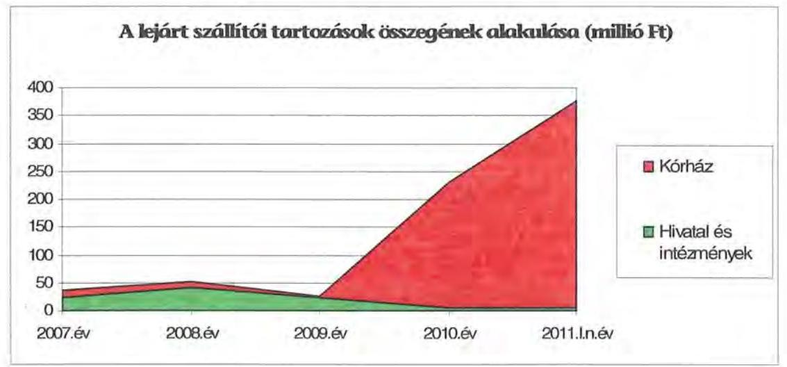

[^0]
[^0]:    ${ }^{43}$ A Kórház 2011. március 31-ei szállítói tartozásának oka egyrészt a december hónapban a munkavállalóknak juttatott, de pénzforgalmilag a 2011. évben elszámolt cafetéria, másrészt az OEP finanszírozás késéséből eredő forráshiány volt.

---

A Közgyűlésnek a 2007-2010. években a lejárt szállítói kötelezettségek rendezésével nem kellett foglalkoznia, mivel azok 83-99%-a 30 napon belüli volt. A megnövekedett lejárt szállítói tartozás miatt az Önkormányzat a 2011. év második negyedévében reorganizációs terv ${ }^{44}$ készítésére kötelezte ${ }^{45}$ a Kórházat, amelynek célja, hogy az intézmény megfeleljen a regionális ellátási feladatainak, megőrizze gazdasági stabilitását, likviditását, ezáltal kezelni tudja a felhalmozódott szállítói tartozásokat. Szállítói tartozás megfizetésének átütemezésére nem került sor.

# 3.3. Egyéb kötelezettségeinek alakulása 

Az Önkormányzat a vizsgált időszakban intézményeknek, civil szervezeteknek, gazdasági társaságoknak kölcsönt nem nyújtott, PPP konstrukció keretében fejlesztést nem hajtott végre, nem vállalt garanciát és kezességet, nem engedett el követelést, lízingszerződést nem kötött. Jelzáloggal terhelt ingatlana a vizsgált időszakban nem volt.

Az Önkormányzatnál 2011. május 24-éig összesen nyolc peres eljárás volt folyamatban, amelyből az Önkormányzat három ügyben (egy közigazgatási perben, két polgári jogi követelés miatti perben) felperes, négy ügyben (két orvosi műhibaperben, egy tulajdonjog megállapítására irányuló polgári perben, egy munkaügyi perben) alperes és egy ügyben beavatkozó. Az alperesi per értéke 34 millió Ft, amelynek 98,8%-át a Kórház ellen a betegek által indított perek jelentik.

Az intézmények használatába adott eszközök pótlásának forrásáról a 2007-2009. években az Önkormányzat a költségvetésben felújítási előirányzat tervezésével gondoskodott, függetlenül az amortizáció összegétől. A 2010. évtől az intézmények által kötelezően megképzett, az értékcsökkenési leírás összegének figyelembe vételével számított pénzforrás költségvetésbe történő tervezésével gondoskodtak az ingatlanok értékállóságának megőrzéséről, az elhasználódás visszapótlásáról.

Az amortizáció alapú felújítási előirányzat tervezésének kötelezettségét a gazdasági programban és a vagyongazdálkodás egyes kérdéseiről szóló rendelet-

[^0]
[^0]:    ${ }^{44}$ Az intézmények gazdálkodási egyensúlyának kialakítását szolgáló intézkedések (feladatfinanszírozás bevezetése, átszervezési, feladat-ellátási döntések) megvalósítására, továbbá a szabályosság biztosítására, számonkérésére kidolgozott terv. Az Önkormányzat azokat az intézményeket kötelezi reorganizációs terv készítésére, amelyek kiadásaikat nem tudják fedezni az állami támogatásból, valamint saját bevételeikből. Azok az intézmények, amelyek likviditása a gazdálkodás folyamatában nem biztosított, a gazdálkodási év során folyamatosan túlfinanszírozott, a likviditás helyreállítására, a stabilitás megteremtésére „reorganizációs tervet" kötelesek készíteni, amelyben meg kell határozni a pénzügyi stabilitás biztosításának eszközeit, azokat az intézkedéseket, amelyek alkalmasak a likviditás és a pénzügyi egyensúly helyreállítására.
    ${ }^{45}$ A Közgyűlés 2011. május 13-ai ülésén döntött a Kórház reorganizációs tervkészítési kötelezettségéről.

---

ben ${ }^{46}$ előírták és az előírásoknak megfelelően mind a 2010, mind a 2011. évi költségvetési rendeletben a felújítási előirányzatokat a használt ingatlanok területe és a $\mathrm{m}^{2}$-re vetített amortizációs költség alapján megtervezték. A 2010. évi zárszámadási rendelet szerint a 2010. évben felújításra jóváhagyott 400 millió Ft előirányzat 43,2%-át, 173 millió Ft-ot használták fel az intézmények állagmegóvásra és pótlásra.

# 4. A PÉNZÜGYI EGYENSÚLY MEGTEREMTÉSE ÉRDEKÉBEN HOZOTT INTÉZKEDÉSEK 

Az Önkormányzatnál a fenntarthatóságot és fejlődőképességet biztosító, intézményhálózatot érintő struktúraváltás megkezdéséről a Közgyűlés a 19/2007. (II. 2.) számú határozatában döntött, amelyről a gazdasági programban is rendelkeztek. Az új struktúra kialakításának keretében a vizsgált időszakban az Önkormányzatnál intézményátszervezés, ezzel összhangban létszámcsökkentés, bevételnövelő, feladatátadási-átvételi intézkedések történtek. A feladatellátás szervezeti átalakítása, a pénzügyi- és vagyongazdálkodási feladatok hatékonyságának növelése, a szervezeti keretek újratervezése, a szolgáltatások területi szinten történő csoportosítása azt jelentette, hogy 2006. december 31-én meglévő 32 intézményből a költségtakarékos és méretgazdaságos feladatellátás jegyében 13 intézményt és egy gazdasági társaságot hoztak létre, továbbá három települési önkormányzattól közoktatási feladatot vett át az Önkormányzat, illetve egy intézményt adott át települési önkormányzatnak.

Az intézmények szervezetének és feladatellátásának 2007-2010 között végrehajtott átalakítása a feladatátvétellel és -átadással együtt összesen hét telephely megszüntetését is jelentette. Az Önkormányzat fenntartásában működtetett Kórház szervezetét is érintette az átszervezés. A 2007. évtől a korábban önállóan gazdálkodó Tüdőkórházat integrálták a Kórház szervezetébe, a szervezet átalakításával megszűntek a párhuzamos tevékenységek. A gazdasági programban a feladatellátás hatékonyságának növelésére jóváhagyott programokat a 2007. évben kialakult szervezeti struktúra mellett a 2008-2009. évben is folytatták, létrehozták a támogató szolgáltatásokat, amelynek keretében a központi megszorító intézkedések miatti jelentős bevételkiesés ellensúlyozására elkezdődött az intézmények közötti együttműködés megszervezése a nem szakmai feladatok vonatkozásában.

Az Önkormányzatnál a nemzetközi pénzügyi-gazdasági válság hatásainak enyhítése érdekében elfogadták az NGP-t. A program keretében megvalósult a hiányszakmák fejlesztése, termékpiac és szálláshely online kialakítása, munkaerőpiaci adatbázis kiépítése, kutatási programok előkészítése, megvalósítása az orvostudományok területén, energetikai rendszerek feltárása,
 energetikai rendszerek korszerűsítése, digitális szakkönyvtár létrehozása, tanszálló kialakítása, értékalapú történeti kutatások.

[^0]
[^0]:    ${ }^{46}$ Az Önkormányzat a vagyongazdálkodás egyes kérdéseiről a 9/2010. (IV. 30.) számú rendeletet alkotta.

---

A 2007-2010. években az intézményátszervezések, a feladatváltozások valamint a takarékossági intézkedések hatásaként együttesen 14609 millió Ft kiadási megtakarítást mutatott ki az Önkormányzat.

A 2007-2010. évek kiadáscsökkentő intézkedéseinek hatását beavatkozási területenként az alábbiak részletezik (ezer Ft):

| Az érvényesített   kiadáscsökkentés   területei | Személyi   juttatások   és járulékai | Dologi,   működési   kiadások | Pénzeszköz   átadások,   támogatások | Összesen |
| :-- | :--: | :--: | :--: | :--: |
| Közgyűlés működése | 0 | 0 | 0 | 0 |
| Hivatal működése | 185494 | 40870 | 0 | 226364 |
| Önkormányzati intézmények működése | 10988855 | 2747047 | 646927 | 14382829 |
| ÖSSZESEN | 11174349 | 2787917 | 646927 | 14609193 |

A Közgyűlés működésében a személyi juttatások és járulékaiknál nem volt kiadást csökkentő intézkedés.

A Hivatalban az üres álláshelyek zárolásával 2 millió Ft, a cafetéria elemek csökkentésével, illetve megszüntetésével 12 millió Ft, a költségtérítések felülvizsgálatával, megszüntetésével 6 millió Ft kiadáscsökkenést értek el a 2007-2010. évek között, továbbá kiadáscsökkentő intézkedésként tüntette fel az Önkormányzat a jutalomkeret 165 millió Ft összegű csökkentését is.

Az önkormányzati szinten kimutatott megtakarítási intézkedések 98,5%-át (14383 millió Ft-ot) az intézmények körében érvényesítették, amelynek 76,4%-a (10 988 millió Ft) a létszámcsökkenések következtében a személyi juttatások és járulékaik csökkenését jelentette.

Az intézményeknél a feladatmegszüntetéssel, átszervezéssel járó intézkedések a személyi juttatások és járulékaik tekintetében többféle módon eredményeztek kiadáscsökkenést. A Szarvas Város Önkormányzatának átadott oktatási intézmény 713 millió Ft, a kézműves szakiskola, közművelődési feladatok civil szervezeteknek és az Ibsen Kft-nek történő átadása 301 millió Ft kiadáscsökkentéssel jártak. Az intézményi struktúra kialakítása keretében a feladatok területi szinten történő megszervezése 47 millió Ft személyi juttatások és járulékai kiadás megtakarítással jártak. A 2009. évben elkezdődött az intézmények közötti együttműködés megszervezése a nem szakmai feladatok vonatkozásában, az ebből eredő kiadáscsökkenés 140 millió Ft volt a vizsgált időszakban. A feladatmegszüntetéssel, átszervezéssel járó álláshely-csökkentés 9017 ezer Ft kiadáscsökkenést eredményezett a személyi juttatásokban és járulékaiban.

A Közgyűlés a személyi juttatás megtakarítások vonatkozásában külön döntéseket csak a létszámcsökkentéshez kapcsolódó költségvetési támogatás igényléséhez kapcsolódóan hozott, egyébként a költségvetési rendeletekben, az intézményátszervezési döntésekben rendelte el az intézményvezetőknek a létszám változtatási (nyugdíjazás miatti megüresedő álláshelyek betöltésének tilalma, létszámstop el-

---

rendelése, az átszervezés miatti új feltételeket nem vállaló alkalmazottak kilépése, üres álláshelyek feltöltésének tilalma) feladatok végrehajtását.

Az üres álláshelyek zárolásával, a cafetéria elemek csökkentésével illetve megszüntetésével, a közalkalmazotti bértáblán felüli bérek és pótlékok elvonásával, továbbá a jutalomkeret csökkentésével 770 millió Ft személyi juttatás és járulékai kiadáscsökkenést mutatott ki az Önkormányzat.

A kiadáscsökkentő intézkedésekkel a 2007-2011. évek között a Hivatalban és intézményeinél összesen 1508 álláshelyet szüntettek meg, amelyből 1056 fő ágazati szakmai, 452 fő intézményüzemeltetéshez, fenntartáshoz kapcsolódó álláshely volt. Az Önkormányzatnál 2007-2011 között az intézményi foglalkoztatott létszám a 2007. évi 5473 főről 3965 főre csökkent. Az 1508 fő 8%-a (120 fő) prémiumévek programban vett részt, 20%-uknak (302 fő) a határozott idő lejárta miatt, 35%-uknak (528 fő) közös megegyezéssel, 21%-uknak (317 fő) rendes felmondással, felmentéssel szűnt meg a jogviszonya, nyugdíjazták 7%-ukat (106 főt), egyéb ok miatt (próbaidő alatti azonnali hatály, lemondás, elhalálozás) szűnt meg 9%-uk (135 fő) jogviszonya.

A 2007-2011. I. negyedévben végrehajtott létszámcsökkenés eredményét az alábbi grafikon szemlélteti:
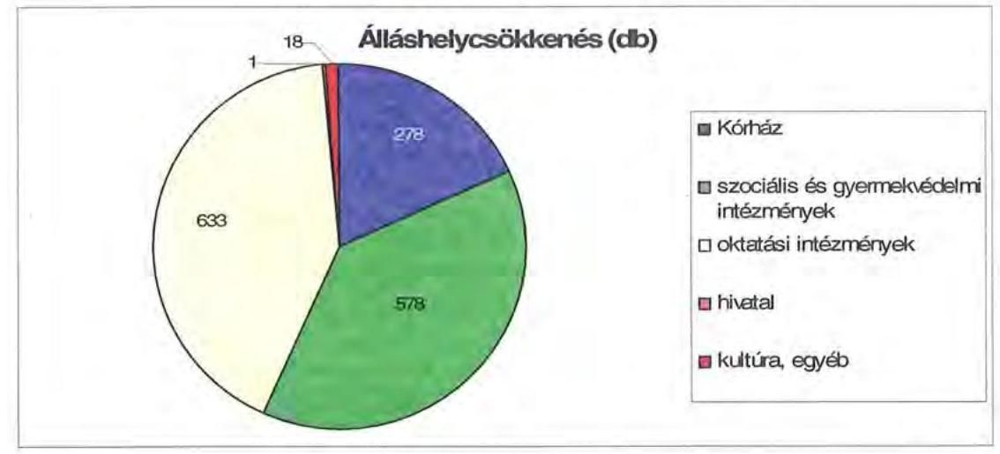

A helyi szervezési intézkedések végrehajtásához az önkormányzat az áttekintett időszak alatt 550 millió Ft központi költségvetési támogatásban részesült, amelynek felhasználásával 361 fő álláshelyet tartósan leépített, a létszámcsökkentés 76,1%-ához (1147 fő) központi támogatás nem kapcsolódott. Az intézkedések hatására az Önkormányzat 2006. december 31-ei átlaglétszáma 2011. március 31-re 24,3%-kal csökkent (1362 fő), ebben tükröződik a kormányzati intézkedések miatti illetékhivatali létszámcsökkenés hatása is.

A Hivatalt és az intézményhálózatot érintő feladatmegszüntetéssel, átszervezéssel járó intézkedéseknek dologi, működési kiadásokat csökkentő hatását az Önkormányzat a vizsgált időszakban 2788 millió Ft összegben mutatta ki, ez az összes kiadási megtakarítás 19%-a. A Hivatalban a beszerzési szerződések (irodaszer, folyóirat, közlöny) felülvizsgálatával, a reprezentációs kiadások csökkentésével a vizsgált időszakban 41 millió Ft dologi kiadás csökkenést értek el. Az intézmények vonatkozásában a dologi kiadások összességében

---

2747 millió Ft-tal csökkentek. A csökkenést 2366 millió Ft összegben egyrészt a fentiekben már ismertetett feladatátadási intézkedések, intézményi struktúra átalakítások, a támogató szolgálat kialakítása, másrészt 381 millió Ft összegben a beszerzési szerződések (élelmiszer, gyógyszer, üzemanyag) felülvizsgálatai eredményezték.

A közművelődési feladatok civil szervezeteknek és az Ibsen Kft-nek történő átadása a pénzeszköz-átadási jogcímben 13 millió Ft kiadáscsökkentést eredményezett az Önkormányzat költségvetésében. Az Önkormányzat az NGP keretében 633 millió Ft támogatást nyújtott az intézmények, gazdasági társaságok olyan programjainak, tevékenységeinek támogatására, amelyek hatékonyabb, magasabb színvonalú feladatellátást alapoznak meg, tesznek lehetővé és elérhetővé közvetlenül a támogatott szervezetek és közvetve a megye lakossága, gazdasági szereplői számára, a megye gazdaságának élénkítése érdekében. A programok megvalósítását követően a szervezetek gazdálkodásában jövőbeni költségcsökkentést, megtakarítást várnak azáltal, hogy a tevékenységek, szolgáltatások egységnyi költségei alacsonyabbak lesznek.

A 2007. és 2009. években a település önkormányzatoktól átvett közoktatási feladat a vizsgált időszakban összességében 1640 millió Ft kiadásnövekedéssel járt, amelyen belül a személyi juttatás és járuléka 1289 millió Ft-ot, a dologi kiadások 333 millió Ft-ot, míg a pénzeszközátadások 18 millió Ft-ot tettek ki.

A kiadáscsökkentő intézkedések mellett az Önkormányzat az alábbiakban számszerűsített bevételnövelő intézkedéseket tett:
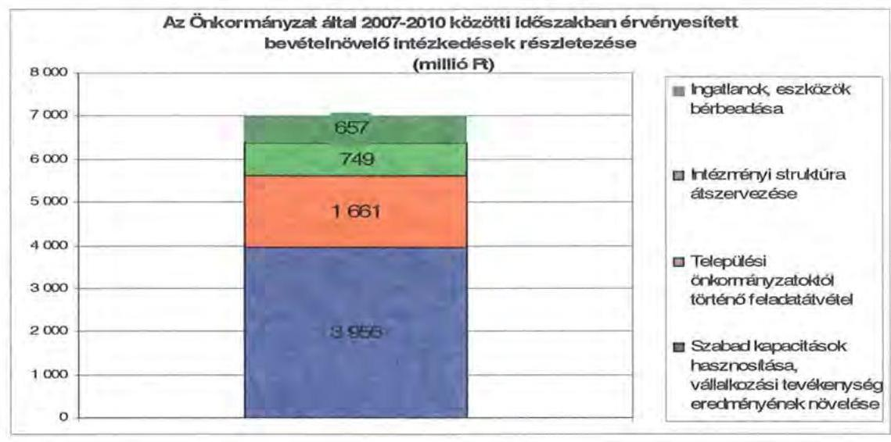

A bevételnövelésre irányuló intézkedések számszerűsített összegének (7023 millió Ft) 58%-át a Hivatalnál mutatták ki az átmenetileg szabad pénzeszközök lekötéséből, befektetéséből, illetve az ingatlanok, eszközök bérbeadásából. Az intézményeknél szerepeltették az összes bevételnövekedés 42%-át (2958 millió Ft-ot), amely a települési önkormányzattól történő feladatátvételből, az intézményi struktúra átszervezéséből, valamint az ingatlanok, eszközök bérbeadásából származott. Az Önkormányzat a feladatátvétellel kapacitásainak kihasználtságát, a felszabaduló ingatlanok bérbeadásával pedig a vagyonkihasználtságát is növelte.

---

A belső ellenőrzés a 2008. évtől kezdődően az intézményeknél végzett rendszerellenőrzések keretében bemutatta és értékelte a 2007. július 1-jei intézményi átszervezések eredményeit és hatásait, megállapítva, hogy a megkezdett folyamatok elvárt ütemének végrehajtása folyamatosan megtörtént. A költségvetési beszámoló szöveges értékelésében és a zárszámadási rendeletben a Hivatal évente beszámolt a Közgyűlés felé a kiadások és bevételek alakulására ható intézkedések végrehajtásáról. Ezen felül negyedévente megtörténik az NGP-ben szereplő projektek időarányos értékelése is.

# 5. A HELYI ÖNKORMÁNYZATOK GAZDÁLKODÁSI RENDSZERÉNEK 2010. ÉVI ELLENŐRZÉSE SORÁN A PÉNZÜGYI EGYENSÚLY JAVÍTÁSÁRA TETT SZABÁLYSZERŰSÉGI ÉS CÉLSZERŰSÉGI JAVASLATOK HASZNOSULÁSA 

Az ÁSZ az Önkormányzat gazdálkodási rendszerét a 2010. évben ellenőrizte átfogó jelleggel. A gazdálkodási rendszer korábbi ellenőrzése során tett javaslatok közül a pénzügyi egyensúly javítására vonatkozott öt szabályszerűségi és egy célszerűségi javaslat.

A főjegyzőnek tett szabályszerűségi javaslat volt, hogy

- „intézkedjen az Áht. 8/A. § (7) bekezdésében foglalt előírás alapján, hogy az éves költségvetési rendeletekben az Áht. 8/A. § (3) bekezdés b) pontja szerinti hitelek törlesztését költségvetési hiányt, illetve költségvetési többletet módosító költségvetési kiadásként ne vegyék számba";
- „intézkedjen az Áht. 8/A. § (1)-(2) bekezdéseiben előírtak alapján annak érdekében, hogy az éves költségvetési rendeletekben rendelkezzenek a költségvetési többlet felhasználásáról, évközi hasznosításáról";
- „intézkedjen a költségvetés tervezésének megalapozottsága érdekében a tartalékok tervezésénél az Áht. 8/C. § (3)-(4) bekezdéseiben előírt tartalmi követelmény betartásáról";
- „tartsa be az Önkormányzat átmenetileg szabad pénzeszközök hasznosítására vonatkozó szerződéseinek megkötése során az Ötv. 9. § (3) bekezdésében foglalt feladat- és hatáskörök gyakorlására vonatkozó szabályokat";
- „gondoskodjon a Számv. tv. 15. § (3) bekezdésében foglalt valódiság elvének betartásáról a követelések és kötelezettségek költségvetési beszámolóban történő kimutatása során".
A főjegyzőnek tett célszerűségi javaslat volt, hogy „tájékoztassa - évente végzett számítások alapján - a Közgyűlést az Önkormányzat eladósodásának növekedésére figyelemmel arról, hogy a hosszú lejáratú, adósságot keletkeztető kötelezettségvállalásokból adódó tőke- és kamatfizetési kötelezettségét az Önkormányzat milyen feltételek biztosítása mellett tudja teljesíteni".

A javaslatok megvalósítása érdekében az Önkormányzatnál a számvevői jelentés aláírását követő 8 napon belül a 03.231-4/2010. szám alatt intézkedést rendeltek el, továbbá a Közgyűlés a 224/2010. (IX. 17.) számú határozatával elfogadta az ÁSZ jelentésben foglaltak végrehajtására készített, felelősöket és határidőket is tartalmazó intézkedési tervet.

Az ellenőrzés során tett, a pénzügyi egyensúly javítására vonatkozó szabályszerűségi és célszerűségi javaslatok 100%-át hasznosították.

---

A megtett intézkedések hatására megvalósultak a költségvetési hiány megállapítására, a költségvetési többlet felhasználására, a tartalékok tervezésére, az átmenetileg szabad pénzeszközök hasznosítására szerződések megkötésének hatásköri szabályaira, a valódiság elvének betartása érdekében a követelések és kötelezettségek költségvetési beszámolóban történő kimutatására vonatkozó szabályszerűségi, továbbá az intézkedési terv készítésére, valamint a hosszú lejáratú, adósságot keletkeztető kötelezettségvállalásokból adódó tőke- és kamatfizetési kötelezettségekről szóló - közgyűlési tájékoztatóra vonatkozó - célszerűségi javaslatok.

Budapest, 2011. december „ 19 "
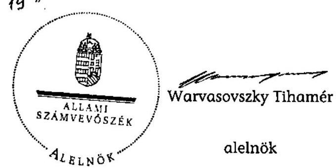

Melléklet: $\quad 6 \mathrm{db} \quad 17$ lap

---

.

---

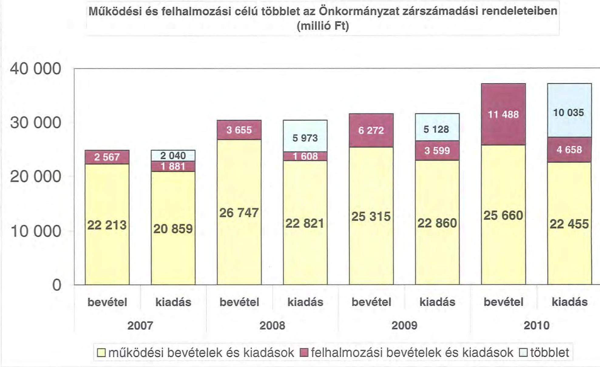

# Működési és felhalmozási célú többlet az Önkormányzat zárszámadási rendeleteiben (millió Ft)

| Működési és felhalmozási célú többlet az Önkormányzat zárszámadási rendeleteiben (millió Ft) | 2 587 | 2 040 | 1 881 | 26 747 | 22 821 | 25 315 | 22 860 | 25 660 | 22 455  |
| --- | --- | --- | --- | --- | --- | --- | --- | --- | --- |
| 0 | 2 587 | 2 040 | 1 881 | 26 747 | 22 821 | 25 315 | 22 860 | 25 660 | 22 455  |
| bevétel | kiadás | bevétel | kiadás | bevétel | kiadás | bevétel | kiadás | bevétel | kiadás  |
| 2007 | 2008 | 2009 | 2010 | 2011 | 2012 | 2013 | 2014 | 2015 | 2016  |

☐ működési bevételek és kiadások ☑ felhalmozási bevételek és kiadások ☐ többlet

---

.

---

| Az Önkormányzat CLP módszer szerint besorolt bevételei és kiadásai 2007-2010 között (ezer Ft) |  |  |  |   |
| --- | --- | --- | --- | --- |
| 1. FOLYÓ KÖLTÉSZET* | 2007. | 2008. | 2009. | 2010.  |
| 1.1.1. Saját működési bevételek | 4 783 103 | 7 615 324 | 7 696 551 | 6 033 109  |
| 1.1.2. Költségvetési támogatás | 5 298 508 | 6 053 124 | 5 326 422 | 4 892 072  |
| 1.1.3. Átvételezett bevételek | 1 801 633 | 659 619 | 709
 284 | 332 340  |
|  1.1.4. Állomántertáson belülről kapott támogatások | 9 844 498 | 10 320 839 | 9 676 450 | 10 651 382  |
|  1.1.5. EU-ról és különböző kapott bevételek | 79 302 | 107 757 | 364 638 | 336 914  |
|  1.1.6. Állomántertáson kívülről kapott bevételek | 84 346 | 81 625 | 56 999 | 81 110  |
|  1.1.7. Előző évi pénzmaradvány átvétel | 162 727 | 358 208 | 968 173 | 675 805  |
|  1.1. Folyó bevételek +1.1.1.+1.1.2.+1.1.3.+1.1.4.+1.1.5.+1.1.6.+1.1.7. | 11 984 774 | 25 806 282 | 24 790 523 | 23 002 735  |
|  1.2.1. Működési kiadások kamat kiadások nélkül | 15 937 589 | 31 703 062 | 20 523 605 | 20 533 941  |
|  1.2.2. Állomántertáson belülről átadott pénzeszközök | 252 485 | 38 478 | 182 784 | 71 819  |
|  1.2.3.1. vállalkozásoknak | 28 517 | 18 420 | 74 525 | 104 925  |
|  1.2.3.2. EU-nak, illetve külföldre | 200 | 48 | 507 | 50  |
|  1.2.3.3. magáncégeknek | 234 014 | 222 223 | 269 549 | 344 982  |
|  1.2.3.4. zástalaját (szervezeteknek) | 295 031 | 177 563 | 295 843 | 166 348  |
|  1.2.4. Transzferkifizetések (+1.2.3.1+1.2.3.2+1.2.3.3+1.2.3.4) | 449 762 | 418 246 | 630 420 | 616 363  |
|  1.2.4 Komatikkifizetések | 4 759 | 108 258 | 297 554 | 225 549  |
|  1.2.5. Előző évi pénzmaradvány átvétel | 162 727 | 358 208 | 968 173 | 675 805  |
|  1.2. Folyó kiadások + 1.2.1.+1.2.2.+1.2.3.+1.2.4.+1.2.5 | 10 807 322 | 22 836 342 | 22 914 540 | 22 523 507  |
|  1.3. Folyó költségvetés eredmény MŰKÖDÉSI JÖVEDELEM (1.1. - 1.2.) | 1 177 452 | 2 069 948 | 1 875 983 | 479 220  |
|  2. FELHASZNÁLT HOZZÁÁLLÁS KÖLTSÉGVETÉS** |  |  |  |   |
|  2.1.1. Saját forrásbevételek | 306 292 | 388 168 | 42 252 | 27 800  |
|  2.1.2. Állomántertáson belülről kapott támogatások | 878 755 | 179 087 | 192 168 | 350 221  |
|  2.1.3. EU-ról és különböző kapott támogatások | 0 | 63 964 | 465 603 | 716 149  |
|  2.1.4. Állomántertáson kívülről kapott támogatások | 105 746 | 101 511 | 103 631 | 67 697  |
|  2.1. Főberuházás bevételek (+2.1.1.+2.1.2+2.1.3+2.1.4.) | 1 290 793 | 728 734 | 742 454 | 1 161 334  |
|  2.2.1. Saját beruházási kiadások | 1 608 908 | 1 372 091 | 3 059 420 | 2 995 899  |
|  2.2.2. Saját külső kiadások | 174 270 | 268 383 | 426 973 | 254 052  |
|  2.2.3. Állomántertáson belülről átadott pénzeszközök | 147 826 | 115 442 | 34 900 | 315 008  |
|  2.2.4. EU-nak és külföldnek adott pénzeszközök | 0 | 0 | 0 | 0  |
|  2.2.5. Állomántertáson kívülre adott pénzeszközök | 38 508 | 62 677 | 4 948 | 2 341  |
|  2.2.6. Indoktérési célú részesedések vásárlása | 2 000 | 8 500 | 100 | 1 019 000  |
|  2.2. Főberuházás kiadások (+2.2.1.+2.2.2.+2.2.3.+2.2.4.+2.2.5.+2.2.6.) | 1 971 374 | 1 067 143 | 3 526 341 | 4 769 292  |
|  2.3. Főberuházás költségvetés eredmény (2.1. - 2.2.) | -680 781 | -938 409 | -2 783 887 | -3 427 958  |
|  3. FINANSZÍROZÁSI MŰVELETEK NÉLKÜLI POZÍCIÓ |  |  |  |   |
|  (1.3.) Folyó költségvetés eredmény Működési Jövedelem + (2.3.) Beruházás költségvetés eredmény | 496 671 | 2 031 531 | -907 904 | -2 948 728  |
|  4. FINANSZÍROZÁSI MŰVELETEK |  |  |  |   |
|  4.1. Hitel felvétel | 0 | 0 | 0 | 1 840 000  |
|  4.2. Hitel visszafizetés | 20 819 | 20 009 | 1 759 | 2 318  |
|  4.3. Forgalmi és befektetési célú értékpapírok kibocsátása | 9 408 000 | 0 | 0 | 0  |
|  4.4. Forgalmi és befektetési célú értékpapírok bevétele | 0 | 0 | 0 | 0  |
|  4.5. Forgalmi és befektetési célú értékpapírok értékesítése | 0 | 0 | 8 083 298 | 0  |
|  4.6. Forgalmi és befektetési célú értékpapírok vásárlása | 0 | 8 083 298 | 0 | 0  |
|  4.7. Egyéb finanszírozási bevételek (függő, átbízó, kiegészítő) | 16 830 | -257 265 | -35 920 | -303 667  |
|  4.8. Egyéb finanszírozási kiadások (függő, átbízó, kiegészítő) | 27 853 | -256 712 | 176 123 | -118 894  |
|  4.9. Finanszírozási műveletek eredmény (4.1.-4.2.-4.3.-4.4.-4.5.-4.6.-4.7.-4.8.) | 5 368 138 | -7 725 851 | 7 789 310 | 1 652 985  |
|  5. TÁRGYÉVI PÉNZÜGYI POZÍCIÓ |  |  |  |   |
|  (5.) FINANSZÍROZÁSI MŰVELETEK NÉLKÜLI POZÍCIÓ + (4.9.) Finanszírozási műveletek eredmény | 9 864 829 | -5 698 326 | 6 881 606 | -1 295 823  |
|  6. NETTÓ MŰKÖDÉSI JÖVEDELEM |  |  |  |   |
|  (1.3.) Működési Jövedelem - Tételesítés (4.2. Hitel visszafizetés) | 1 156 633 | 2 949 940 | 1 874 244 | 476 911  |
|  7. TÁJÉKOZTATÓ ÁTTEKINTÉS |  |  |  |   |
|  Összes kötelezettség | 10 215 120 | 11 413 216 | 11 737 742 | 16 191 862  |
|  ebből: rövid távú | 395 450 | 479 707 | 404 217 | 2 423 952  |
|  Összes esedékes kötelezettség | 514 184 | 443 875 | 598 023 | 802 676  |
|  ebből: lejárt | 23 362 | 24 843 | 20 232 | 221 843  |
|  Pénz és államkötvény kötelezettség (szélesség) | 9 408 000 | 10 886 306 | 11 138 849 | 15 379 129  |
|  ebből: rövid távú | 20 000 | 1 739 | 1 219 | 1 042 318  |
|  PPP szerződésből származó kötelezettségek állománya | 0 | 0 | 0 | 0  |
|  ebből: tejért szolgáltatási díj miatt kötelezettség | 0 | 0 | 0 | 0  |
|  Feljebbátadásul szolgáló átlagos állománya | 0 | 0 | 0 | 0  |
|  Látványossággal szolgáló átlagos állománya | 0 | 0 | 0 | 1 840 000  |
|  Munkabérlátód szolgáló átlagos állománya | 0 | 0 | 0 | 0  |
|  Pénzügyi eljárásokból származó függő kötelezettségek | 0 | 0 | 0 | 0  |
|  Finanszírozásba berembető eszközök összesen | 11 346 675 | 13 651 653 | 12 529 961 | 11 234 138  |
|  ebből: tanító kárpótlást megtartó értékpapírok | 0 | 0 | 0 | 0  |
|  ebből: hosszú távú követelések | 0 | 0 | 0 | 0  |
|  ebből: értékpapírok | 0 | 8 002 208 | 0 | 0  |
|  ebből: pénzeszközök (idegen pénzeszközök nélkül) | 11 346 675 | 5 648 331 | 12 529 961 | 11 234 138  |

- Beruházásban sem táblázat, a kiadásokban sem jelenik meg az amortizáció, a vagyoni helyzetet ez egyértelműen befolyásolja.

* Beruházásban vagyon megfelelően és bővülően fordításra kerülő fizetések.

---

|  2/6. szám |  |  |  |  |   |
| --- | --- | --- | --- | --- | --- |
|   |  | Az önkormányzat bevételeinek és kiadásainak, adósságszolgálatának alakulása 2007-2010 között (ezer Ft) |  |  |   |
|  Sor-
szám | Megnevezés | 2007. év | 2008. év | 2009. év | 2010. év  |
|   |  | lényeg | lényeg | lényeg | lényeg  |
|  1. | MŰKÖDÉSI BEVÉTELEK | 22 213 084 | 26 747 195 | 25 314 355 | 25 659 882  |
|  1. | Sajátos folyó bevételek | 4 549 459 | 7 506 881 | 7 166 520 | 5 991 507  |
|  1.1. | Intézmények működési bevételei | 2 687 577 | 2 957 279 | 3 487 027 | 3 522 301  |
|  1.2. | Melékbevételek | 1 776 696 | 2 003 030 | 1 731 018 | 1 181 872  |
|  1.3. | Helyi adóbevételek és pótlékok | 0 | 210 | 2 386 | 0  |
|  1.4. | Kamat bevétel működési része | 81 110 | 2 595 362 | 1 946 109 | 1 284 784  |
|  1.5. | Egyéb folyó működési bevételek | 4 078 | 1 000 | 0 | 2 600  |
|  2. | Támogatás értékű működési bevételek | 844 089 | 10 320 535 | 9 676 456 | 10 651 359  |
|   | abból: helyi önkormányzatoktól és költségvetési szervektől | 231 598 | 64 995 | 118 991 | 143 841  |
|   | többcélú kistérségi társulástól | 179 | 4 670 | 12 200 | 4 864  |
|  3. | Pénzforgalom nélküli bevételek működésre jóváhagyott része | 1 379 591 | 1 732 275 |

 2 049 940 | 3 400 517  |
|  4. | Államháztartáson kívülről működési célra átvett pénzeszközök | 173 847 | 249 382 | 421 637 | 418 034  |
|  5. | Központi támogatások és átengedett források működési része | 15 269 098 | 16 454 467 | 14 721 817 | 14 294 558  |
|   | abból: SZJA | 1 801 633 | 659 619 | 709 284 | 332 246  |
|   | önkormányzat és intézmények állami támogatásának működési része | 4 464 098 | 6 228 503 | 5 290 518 | 4 866 146  |
|   | költségvetési kiegészítések, visszatérülések | 0 | 0 | 0 | 23  |
|   | társadalombiztosítási alapból | 9 009 409 | 9 566 345 | 8 722 015 | 9 096 543  |
|  6. | MŰKÖDÉSI KIADÁSOK (kamatkiadás nélkül) | 20 854 355 | 22 562 665 | 22 562 420 | 22 229 204  |
|  1. | Folyó működési kiadások összesen kamatkiadások nélkül | 19 881 642 | 21 694 971 | 20 784 752 | 20 883 162  |
|   |  | 0 | 0 | 0 | 0  |
|   | személyi juttatások | 9 685 134 | 9 475 928 | 9 069 923 | 8 994 238  |
|   | munkaadói terhelő (árulékok | 3 113 954 | 3 007 005 | 2 704 442 | 2 347 739  |
|   | dologi kiadások | 6 920 304 | 7 992 042 | 8 596 048 | 8 893 469  |
|   | egyéb folyó kiadások | 159 850 | 1 219 990 | 415 239 | 647 716  |
|   | egyéb folyó működési kiadások | 2 600 | 0 | 0 | 0  |
|  2. | Támogatások, elvonások és egyéb folyó átutalások | 449 762 | 418 246 | 630 420 | 616 303  |
|   |  | 0 | 0 | 0 | 0  |
|   | működési célú pénzeszköz átadás államháztartáson kívülre | 237 987 | 201 803 | 364 986 | 275 411  |
|   | működési célú pénzeszköz átadás államháztartáson belülre | 0 | 0 | 0 | 0  |
|   | társadalom és szociálpótléké juttatások | 211 775 | 216 443 | 265 434 | 340 892  |
|  3. | Előző évi pénzmaradvány átadás, visszafizetés működési | 270 470 | 410 970 | 1 044 474 | 657 970  |
|  4. | Támogatás értékű működési kiadás | 252 400 | 38 479 | 102 784 | 71 819  |
|   | abból: önkormányzatoknak | 248 601 | 31 344 | 87 772 | 54 160  |
|   | kislérségi társulásoknak | 3 884 | 0 | 0 | 0  |
|  III. | ADÓSSÁGSZOLGÁLAT | 25 578 | 278 255 | 299 293 | 227 867  |
|   | Ükeltölesztési kötelezettség: működési | 0 | 0 | 0 | 0  |
|   | felhalmozási | 20 819 | 20 000 | 1 739 | 2 318  |
|   | kamatfizetési kötelezettség: működési | 4 759 | 258 255 | 297 554 | 225 549  |
|   | felhalmozási | 0 | 0 | 0 | 0  |
|  IV. | FELHALMOZÁSI BEVÉTELEK | 2 567 395 | 11 355 179 | 6 271 987 | 11 487 354  |
|  1. | Saját felhalmozási és tőkejellegű bevétel | 359 892 | 342 569 | 572 282 | 69 410  |
|  1.1. | Tárgyi eszközök, immat, javok értékesítése, Áfa visszatérülés | 323 915 | 282 412 | 542 234 | 46 287  |
|  1.2. | Privatizációból származó bevétel | 9 419 | 22 270 | 230 | 0  |
|  1.3. | Ösztalék, részesedések | 558 | 6 330 | 73 | 389  |
|  1.4. | Kamatbevétel felhalmozási része | 0 | 0 | 0 | 0  |
|  1.5. | Helyi adók átengedett adók felhalmozási része | 0 | 0 | 0 | 0  |
|  1.6. | Egyéb folyó felhalmozási bevételek | 26 000 | 31 507 | 29 746 | 22 743  |
|  2. | Támogatásértékű felhalmozási bevételek | 879 755 | 179 087 | 192 168 | 350 221  |
|   | abból: helyi önkormányzatokól és költségvetési szerveitől | 154 738 | 51 783 | 23 817 | 315 000  |
|   | többcélú kislérségi társulástól | 0 | 600 | 0 | 0  |
|  3. | Pénzforgalom nélküli bevételek felhalmozásra jóváhagyott része | 388 090 | 10 293 423 | 4 963 598 | 10 258 543  |
|  4. | Államháztartáson kívülről felhalmozási célra átvett pénzeszközök | 105 746 | 101 515 | 103 531 | 67 097  |
|  5. | Állami felhalmozási és tőkejellegű bevétel | 834 912 | 438 585 | 440 407 | 742 074  |
|  5.1. | EU költségeletéből átvétel | 0 | 63 964 | 404 503 | 716 146  |
|  5.2. | Önkormányzatok költségvetési támogatása felhalmozási célra | 834 912 | 374 621 | 35 904 | 25 626  |
|  V. | FELHALMOZÁSI KIADÁSOK | 1 880 932 | 1 608 256 | 2 599 192 | 4 857 996  |
|  1. | Folyó felhalmozási kiadások kamatkiadások nélkül | 1 797 178 | 1 530 181 | 3 486 497 | 4 268 951  |
|  1.1. | Benyházás, felújítás | 1 783 178 | 1 480 474 | 3 486 393 | 3 249 951  |
|  1.2. | Értékesített tárgyi eszközök eÁfa befizetés | 12 000 | 41 157 | 4 | 0  |
|  1.3. | Részesedések vásárlása | 2 000 | 8 550 | 100 | 1 019 000  |
|  2. | Támogatások, elvonások és egyéb folyó átutalások | 35 960 | 62 677 | 4 948 | 5 341  |
|   |  |  |  |  | 4  |
|   | abból: felhalmozási célú pénzeszköz átadás államháztartáson kívülre | 2 030 | 33 694 | 0 | 4 000  |
|   | felhalmozási célú támogatásunk, kölcsön, kölcsön töltesztése | 33 930 | 28 963 | 4 948 | 1 341  |
|  3. | Támogatásértékű felhalmozási kiadások | 47 794 | 15 400 | 34 900 | 315 000  |
|   |  |  |  |  | 3  |
|   | abból: helyi önkormányzatoknak és költségvetési szerveinek | 46 031 | 15 400 | 34 900 | 315 000  |
|   | többcélú kislérségi társulásnak | 1 773 | 0 | 0 | 0  |
|  4. | Pénzforgalom nélküli kiadások felhalmozásra jóváhagyott része | 0 | 0 | 72 847 | 68 704  |
|   |  |  |  |  | 3  |
|   | kontroll (muk-bev +felh.bev) | 24 780 475 | 38 102 374 | 31 586 342 | 37 147 236  |
|   |  |  |  |  | 3  |
|   | kontroll tárgyévi költségv. kiadás (II.+V.+6/0+6/25) | 22 740 050 | 24 429 181 | 26 459 176 | 27 112 780  |
|   | adósságszolgálatból fennálló | 20 819 | 5 023 298 | 1 739 | 2 318  |
|   |  |  |  |  | 3  |
|   |  |  |  |  | 3  |
|   |  |  |  |  | 3  |
|  VII. | Pénzforgalom nélküli kiadások felhalmozásra jóváhagyott része | 0 379 181 | -8 023 298 | 8 001 559 | 1 837 682  |
|   |  |  |  |  | 3  |

---

Az Önkormányzat 2007-2010 években megvalósított, illetve 2010. december 31-én fennálló fejlesztési feladatokhoz kapcsolódó kötelezettségeinek összegzése

|  Fejlesztési feladat megnevezése | Ber.
kezdete | Teljes
bekerülési
költség | 2006.
december
31-ig
teljesített
kiadás | 2007-2010.
évek között
teljesített
kiadás | 2010. év
utánra
vállalt
kötelezettség | 2010. utáni kötelezettség-vállalás forrásösszetétele |  |  |   |
| --- | --- | --- | --- | --- | --- | --- | --- | --- | --- |
|   |  |  |  |  |  | Saját
bevétel | Hitel | Kötvény | EU-s
támogatás  |
|  Bérbeadással hasznosított ingatlanok felújítási alapja | 2003. | 33409 | 27150 | 6259 | 0 |  |  |  |   |
|  Önkormányzati fejlesztési kiadások | 2003. | 112605 | 72701 | 39904 | 0 |  |  |  |   |
|  Kilenc település belterületi vízrendezése | 2004. | 898441 | 715898 | 182543 | 0 |  |  |  |   |
|  Pándy Kálmán Kórház szeghalomi járó- és fekvőbeteg részleg rekonstrukciója, 236/2004. (XI. 26.) Kt. | 2005. | 949329 | 99000 | 850329 | 0 |  |  |  |   |
|  Hat település belterületi vízrendezése, 235/2004. (XI. 26.) Kt. | 2005. | 533224 | 245312 | 287912 |

 0 |  |  |  |   |
|  Intézményi kezelésben lévő szolgálati lakások felújítása | 2006. | 59160 | 33855 | 25305 | 0 |  |  |  |   |
|  Békéscsabai repülőtér fejlesztésének egyéb kiadásai | 2006. | 93813 | 65129 | 28684 | 0 |  |  |  |   |
|  Harruckern János Közoktatási Intézmény épület felújítás és eszközök beszerzése | 2007. | 53262 | 0 | 53262 | 0 |  |  |  |   |
|  Hunyadi János Közoktatási Intézmény, épületfelújítás, ügyviteli, eszközök, gépek, berendezések beszerzése | 2007. | 35351 | 0 | 35351 | 0 |  |  |  |   |
|  Farkas Gyula Közoktatási Intézmény, épület- és gép felújítás | 2007. | 28674 | 0 | 28674 | 0 |  |  |  |   |
|  Gámán János Középiskola, Szakiskola és Kollégium, eszközök, gépek, berendezések beszerzése | 2007. | 11000 | 0 | 11000 | 0 |  |  |  |   |
|  Ö. Illyés S. Óvoda Általános Iskola Szakiskola és Do. és Lakáso. épület nyílászáró felújítása és ügyviteli eszközök, berendezések beszerzése | 2007. | 12697 | 0 | 12697 | 0 |  |  |  |   |
|  Pándy Kálmán Kórház épületfelújítás és ügyviteli eszközök, orvosi gépek és berendezések beszerzése | 2007. | 182612 | 0 | 182612 | 0 |  |  |  |   |
|  Fogyatékosok Ápoló-gondozó Otthona, ügyviteli, eszközök, gépek, berendezések beszerzése | 2007. | 14413 | 0 | 14413 | 0 |  |  |  |   |
|  Múzeumok igazgatósága, épületfelújítás és eszközbeszerzés | 2007. | 40120 | 0 | 40120 | 0 |  |  |  |   |
|  Ellátó és Szolgáltató Szervezet, ingatlan felújítás és eszközök beszerzése | 2007. | 29484 | 0 | 29484 | 0 |  |  |  |   |

---

Az Önkormányzat 2007-2010 években megvalósított, illetve 2010. december 31-én fennálló fejlesztési feladatokhoz kapcsolódó kötelezettségeinek összegzése

|  Fejlesztési feladat megnevezése | Ber.
kezdete | Teljes
bekerülési
költség | 2006.
december
31-ig
teljesített
kiadás | 2007-2010.
évek között
teljesített
kiadás | 2010. év
utánra
vállalt
kötelezettség | 2010. utáni kötelezettség-vállalás forrásösszetétele |  |  |   |
| --- | --- | --- | --- | --- | --- | --- | --- | --- | --- |
|   |  |  |  |  |  | Saját
bevétel | Hitel | Kötvény | EU-s
támogatás  |
|  XXI. sz. múzeuma - új kiállítótérmek létrehozása és a bemutatás módszereinek újszerű interaktív eszközökkel történő fejlesztése a Munkácsy Mihály Múzeumban, 155/2004. (IX. 10.) Kt. | 2007. | 271320 | 0 | 271320 | 0 |  |  |  |   |
|  Tüzeléstechnikai Kft-től mérlegében szereplő ingatlanokhoz kapcsolódó nyilvántartási érték megvásárlása | 2007. | 11744 | 0 | 11744 | 0 |  |  |  |   |
|  A Békés Megyei Tudásház és Könyvtár rekonstrukciója, 87/2008. (IV. 11.) Kt. | 2007. | 855030 | 0 | 855030 | 0 |  |  |  |   |
|  Harruckern János Közoktatási Intézmény épület felújítás ügyviteli, eszközök, gépek, berendezések beszerzése | 2008. | 154304 | 0 | 154304 | 0 |  |  |  |   |
|  Farkas Gyula Közoktatási Intézmény, épület felújítás ügyviteli, eszközök, gépek berendezések beszerzése | 2008. | 61522 | 0 | 61522 | 0 |  |  |  |   |

---

Az Önkormányzat 2007-2010 években megvalósított, illetve 2010. december 31-én fennálló fejlesztési feladatokhoz kapcsolódó kötelezettségeinek összegzése

|  Fejlesztési feladat megnevezése | Ber.
kezdete | Teljes
bekerülési
költség | 2006.
december
31-ig
teljesített
kiadás | 2007-2010.
évek között
teljesített
kiadás | 2010. év
utánra
vállalt
kötelezettség | 2010. utáni kötelezettség-vállalás forrásösszetétele |  |  |  |   |
| --- | --- | --- | --- | --- | --- | --- | --- | --- | --- | --- |
|   |  |  |  |  |  | Saját
bevétel | Hitel | Kötvény | EU-s
támogatás | Hazai
támogatás  |
|  Békés Megyei Pándy Kálmán Kórház, épület felújítási ügyviteli, eszközök, orvosi gépek, berendezések beszerzése | 2008. | 419570 | 0 | 419570 | 0 |  |  |  |  |   |
|  Békés Megyei Szociális és Gyermekvédelmi Központ, vízesblokk átalakítás, egyéb eszközök, gépek, berendezések beszerzése és parkoló létesítés | 2008. | 19763 | 0 | 19763 | 0 |  |  |  |  |   |
|  Békés Megyei Hajnal István Szociális Szolgáltató Centrum, egyéb eszközök, gépek, berendezések beszerzése és épület felújítás | 2008. | 25775 | 0 | 25775 | 0 |  |  |  |  |   |
|  Békés Megyei Körös-menti Szociális Szolgáltató Centrum, egyéb eszközök, gépek, berendezések beszerzése | 2008. | 42932 | 0 | 42932 | 0 |  |  |  |  |   |
|  Békés Megyei Jókai Színház épületátalakítás és egyéb eszközök gépek, berendezések beszerzése | 2008. | 48982 | 0 | 48982 | 0 |  |  |  |  |   |
|  Békés Megyei Tudásház és Könyvtár HEFOP pályázat eszközbeszerzés, épület felújítás | 2008. | 50153 | 0 | 50153 | 0 |  |  |  |  |   |
|  Békés Megyei Múzeumok Igazgatósága ügyviteli, eszközök, gépek, berendezések beszerzése és épületfelújítás | 2008. | 39639 | 0 | 39639 | 0 |  |  |  |  |   |
|  Békés Megyei Képviselő-testülete Ellátó és Szolgáltató Szervezete, ügyviteli, eszközök beszerzése és épület felújítása | 2008. | 38281 | 0 | 38281 | 0 |  |  |  |  |   |
|  Informatikai szoftver fejlesztés | 2008. | 14760 | 0 | 14760 | 0 |  |  |  |  |   |
|  Megyeháza hűtés-fűtés átalakítás | 2008. | 11710 | 0 | 11710 | 0 |  |  |  |  |   |
|  Intézményi kezelésben lévő színházi szolgálati lakások felújítása | 2008. | 12936 | 0 | 12936 | 0 |  |  |  |  |   |
|  "Humán infrastruktúra korszerűsítése a Harruckern János Közoktatási Intézmény telephelyén" című projekt 94/2008. (V. 08.) Kt. sz. határozat | 2008. | 27608 | 0 | 27608 | 0 |  |  |  |  |   |

---

Az Önkormányzat 2007-2010 években megvalósított, illetve 2010. december 31-én fennálló fejlesztési feladatokhoz kapcsolódó kötelezettségeinek összegzése

|  Fejlesztési feladat megnevezése | Ber. kezdete | Teljes bekerülési költség | 2006. december 31-ig teljesített kiadás | 2007-2010. évek között teljesített kiadás | 2010. év utánra vállalt kötelezettség | 2010. utáni kötelezettség-vállalás forrásösszetétele |  |  |  |   |
| --- | --- | --- | --- | --- | --- | --- | --- | --- | --- | --- |
|   |  |  |  |  |  | Saját bevétel | Hitel | Kötvény | EU-s támogatás | Hazai támogatás  |
|  Humán infrastruktúra korszerűsítése a Békés Megyei Levéltár Központi telephelyén című projekt 96/2008. (V. 08.) Kft. sz. határozat és 345/2008. (X. 03.) Kt. sz. határozat | 2008. | 38030 | 0 | 38030 | 0 |  |  |  |  |   |
|  Ibsen Ház 190/2008. (VI. 06.) Kt. | 2008. | 909762 | 8000 | 901762 | 0 |  |  |  |  |   |
|  Repülőtéri kiszolgáló létesítmények megvalósítása | 2008. | 84701 | 0 | 84701 | 0 |  |  |  |  |   |
|  Harruckern János Közoktatási Intézmény épület felújítás és gépek, berendezések beszerzése | 2009. | 142719 | 0 | 142719 | 0 |  |  |  |  |   |
|  Farkas Gyula Közoktatási Intézmény, épületfelújítás, egyéb eszközök, gépek, berendezések beszerzése | 2009. | 68510 | 0 | 68510 | 0 |  |  |  |  |   |
|  Hunyadi János Közoktatási Intézmény, ügyviteli, eszközök, gépek, berendezések beszerzése | 2009. | 51619 | 0 | 51619 | 0 |  |  |  |  |   |
|  Békés Megyei Pándy Kálmán Kórház, épület felújítási ügyviteli, eszközök, orvosi gépek, berendezések beszerzése | 2009. | 419128 | 0 | 419128 | 0 |  |  |  |  |   |
|  Békés Megyei Szociális és Gyermekvédelmi Központ, parkoló kialakítása és egyéb eszközök, gépek, berendezések beszerzése | 2009. | 31517 | 0 | 31517 | 0 |  |  |  |  |   |
|  Békés Megyei Körös-menti Szociális Szolgáltató Centrum, egyéb eszközök, gépek, berendezések beszerzése és épület felújítás | 2009. | 58253 | 0 | 58253 | 0 |  |  |  |  |   |
|  Békés Megyei Jókai Színház épület felújítás, illetve egyéb eszközök, gépek, berendezések és szoftver beszerzése | 2009. | 64866 | 0 | 64866 | 0 |  |  |  |  |   |
|  Békés Megyei Múzeumok Igazgatósága ügyviteli, eszközök, gépek, berendezések beszerzése és épületfelújítás | 2009. | 20136 | 0 | 20136 | 0 |  |  |  |  |   |
|  Békés Megyei Levéltár, ügyviteli, eszközök, gépek, berendezések beszerzése és energiaracionalizálás | 2009. | 17201 | 0 | 17201 | 0 |  |  |  |  |   |

 | 0 | 17201 | 0 |  |  |  |  |   |
|  Békés Megyei Képviselő-testület Ellátó és Szolgáltató Szervezete, ügyviteli eszközök beszerzése és épület felújítása | 2009. | 30228 | 0 | 30228 | 0 |  |  |  |  |   |

---

Az Önkormányzat 2007-2010. években megvalósított, illetve 2010. december 31-én fennálló fejlesztési feladatokhoz kapcsolódó kötelezettségeinek összegzése

|  Fejlesztési feladat megnevezése | Ber.
kezdete | Teljes
bekerülési
költség | 2006.
december
31-ig
teljesített
kiadás | 2007-2010.
évek között
teljesített
kiadás | 2010. év
utánra
vállalt
kötelezettség | 2010. utáni kötelezettség-vállalás forrásösszetétele |  |  |   |
| --- | --- | --- | --- | --- | --- | --- | --- | --- | --- |
|   |  |  |  |  |  | Saját
bevétel | Hitel | Kötvény | EU-s
támogatás  |
|  Pathológia átalakítása, építése | 2009. | 705887 | 0 | 705832 | 55 |  |  | 55 |   |
|  Telephely kialakítása irattározásra | 2009. | 311531 | 0 | 311531 | 0 |  |  |  |   |

---

Az Önkormányzat 2007-2010. években megvalósított, illetve 2010. december 31-én fennálló fejlesztési feladatokhoz kapcsolódó kötelezettségeinek összegzése

|  Fejlesztési feladat megnevezése | Ber. kezdete | Teljes bekerülési költség | 2006. december 31-ig teljesített kiadás | 2007-2010. évek között teljesített kiadás | 2010. év utánra vállalt kötelezettség | 2010. utáni kötelezettség-vállalás forrásösszetétele |  |  |  |   |
| --- | --- | --- | --- | --- | --- | --- | --- | --- | --- | --- |
|   |  |  |  |  |  | Saját bevétel | Hitel | Kötvény | EU-s
támogatás | Hazai támogatás  |
|  Gyula, Szentháromság utcai mosoda logisztikai fejlesztés | 2009. | 21780 | 0 | 21780 | 0 |  |  |  |  |   |
|  Informatikai eszközbeszerzésekre | 2009. | 413717 | 0 | 413717 | 0 |  |  |  |  |   |
|  Farkas Gyula Közoktatási Intézmény -faipari tanműhely fűtéskorszerűsítése, 221/2009. (IX. 10.) Kt. | 2009. | 22093 | 0 | 22093 | 0 |  |  |  |  |   |
|  DARFT-LEKI 2009. "Hunyadi János Közoktatási Intézmény infrastrukturális fejlesztése - sportudvar kialakítása" 222/2009. (IX. 10.) Kt. | 2009. | 31934 | 0 | 31857 | 77 |  |  |  |  |   |
|  Kollégiumi Centrum Farkas Gyula Közoktatási Intézményben 413/2008. (XII. 12.) Kt. | 2009. | 120555 | 0 | 120555 | 0 |  |  |  |  |   |
|  Harrucken János Közoktatási Intézmény oktatási és kollégiumi épület 413/2008. (XII. 12.) Kt. | 2009. | 492519 |  | 482464 | 10055 |  |  | 10055 |  |   |
|  Pándy Kálmán Kórház SO 2 sürgőszégi ellátás fejlesztése című projekt 72/2008. (IV. 11.) Kt., 220/2008. (VI. 27.) Kt. sz. határozat | 2009. | 621597 | 0 | 57548 | 564049 |  |  | 102601 | 461448 |   |
|  Harrucken János Közoktatási Intézmény, Kollégium berendezések beszerzése és a Chotec Kft-vel kötött szerződés megszűnésével kapcsolatos berendezés megváltása | 2010 | 69907 | 0 | 69907 | 0 |  |  |  |  |   |
|  Farkas Gyula Közoktatási Intézmény informatikai eszközbeszerzés és TÁMOP pályázat beszerzés | 2010 | 29421 | 0 | 29421 | 0 |  |  |  |  |   |
|  Békés Megyei Pándy Kálmán Kórház, épület felújítás, és ügyviteli eszközök, orvosi gépek, berendezések beszerzése | 2010 | 207065 | 0 | 207065 | 0 |  |  |  |  |   |
|  Békés Megyei Pándy Kálmán Kórház, TIOP 2.2.4. Struktúraváltás | 2010 | 5500000 | 0 | 180538 | 5319462 |  |  | 375000 | 4944462 |   |
|  Békés Megyei Szociális és Gyermekvédelmi Központ TÁMOP és TIOP pályázatokból beszerzés | 2010. | 33900 | 0 | 33900 | 0 |  |  |  |  |   |
|  Békés Megyei Hajnal István Szociális Szolgáltató Centrum, egyéb eszközök, berendezések beszerzése és épület felújítás | 2010. | 48893 | 0 | 48893 | 0 |  |  |  |  |   |
|  Békés Megyei Körös-menti Szociális Szolgáltató Centrum, egyéb eszközök, berendezések beszerzése és épület felújítás | 2010. | 38902 | 0 | 38902 | 0 |  |  |  |  |   |

---

Az Önkormányzat 2007-2010. években megvalósított, illetve 2010. december 31-én fennálló fejlesztési feladatokhoz kapcsolódó kötelezettségeinek összegzése

|  Fejlesztési feladat megnevezése | Ber.
kezdete | Teljes
bekerülési
költség | 2006.
december
31-ig
teljesített
kiadás | 2007-2010.
évek között
teljesített
kiadás | 2010. év
utánra
vállalt
kötelezettség | 2010. utáni kötelezettség-vállalás forrásösszetétele |  |  |  |   |
| --- | --- | --- | --- | --- | --- | --- | --- | --- | --- | --- |
|   |  |  |  |  |  | Saját
bevétel | Hitel | Kötvény | EU-s
támogatás | Hazai
támogatás  |
|  Békés Megyei Jókai Színház épület felújítás, illetve vízesbökk felújítás és egyéb eszközök, berendezések beszerzése, illetve a Chotec Kft-vel kötött szerződés megszűnésével kapcsolatos berendezés megváltás | 2010. | 93896 | 0 | 93896 | 0 |  |  |  |  |   |
|  Békés Megyei Tudásház és Könyvtár TÁMOP és TIOP pályázat informatikai fejlesztés és informatikai beszerzés | 2010. | 58511 | 0 | 58511 | 0 |  |  |  |  |   |
|  Békés Megyei Levéltár, egyéb gépek, berendezések beszerzése és parkoló felújítás | 2010. | 14017 | 0 | 14017 | 0 |  |  |  |  |   |
|  TIOP TISZK projekt 165/2008. (VI. 06.) Kt. | 2010. | 1000000 | 0 | 427613 | 572387 |  |  | 70000 | 502387 |   |
|  TÁMOP TISZK projekt | 2010. | 10000 | 0 | 10000 | 0 |  |  |  |  |   |
|  Részvény vásárlás a Békés Megyei Vízművek Zrt-ben | 2010. | 1008000 | 0 | 1008000 | 0 |  |  |  |  |   |
|  Pándy Kálmán Megyei Kórház területén található kápolna épületének felújítása | 2010. | 14024 | 0 | 14024 | 0 |  |  |  |  |   |
|  Rendezvénytér kialakítása a Repülőtéren | 2010. | 10658 | 0 | 10658 | 0 |  |  |  |  |   |
|  A+B Expo, közös EXPO, Közös Piac -
multifunkcionális kiállítási központ | 2010. | 695638 | 0 | 11747 | 683891 | 23939 |  |  | 659952 |   |
|  Thermál Consulting Kft. tőkeemelés | 2010. | 21250 | 0 | 11000 | 10250 |  |  | 10250 |  |   |
|  10 millió Ft alatti felhalmozási kiadások |  | 152425 |  | 152425 |  |  |  |  |  |   |
|  Összesen |  | 18878413 | 1267045 | 10451142 | 7160226 | 23939 | 0 | 567961 | 6568249 | 0  |

---

.

---

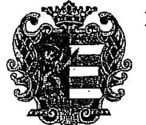

# BÉKÉS MEGYE KÉPVISELŐ-TESTÜLETÉNEK ELNÖKE 

5601 Békéscsaba, Derkovits sor 2. Pf: 118
Telefon: 66/441-156 Telefax: 66/441-609

## 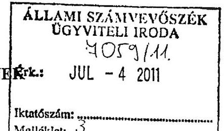

## Warvasovszky Tihamér úr, az Állami Számvevőszék alelnöke

Állami Számvevőszék

## Budapest

Iktatószám: PÜ/260-3/2011. Melléklet: 3 db tanúsítvány

$$
\begin{aligned}
& \text { leucó to. } \\
& \text { u. b. rcrint } \\
& \text { 16 } \\
& 0-7 .11 .
\end{aligned}
$$

Tisztelt Alelnök Úr!

A Békés Megyei Önkormányzat pénzügyi helyzetének ellenőrzéséről szóló, önkormányzatunknak V-3004-27-08/2011. iktatószámon, 2011. június 15-én megküldött jelentéssel kapcsolatban az alábbi észrevételeket fogalmaztuk meg:

- A jelentés 8. oldalán leírtak szerint: „Az átengedett bevételek, amelyek a megyei önkormányzatoknál a személyi jövedelemadó részesedést jelentik, az összbevételen belül a 2007. évi 35 milliárd Ft-ról 56 milliárd Ft-ra nőttek."
Meglepő számunkra, hogy az önkormányzatunknál folyamatosan csökkenő személyi jövedelemadó részesedés, országos szinten a megyei önkormányzatoknál emelkedést mutat.
- A jelentés 14. oldalának első bekezdéséhez: A 2011-2013. évi, továbbá az azt követő időszakra vonatkozó pénzintézeti kötelezettség teljesítésére figyelembe vehető források között felsorolásra kerültek az „előző évről áthúzódó OEP támogatások". Önkormányzatunknál itt megjelenő forrás nem OEP támogatás, hanem a költségvetés általános tartaléka terhére, a „fenntartók egészségpolitikai és szakmai kompenzálásaként" a Nemzeti Erőforrás Minisztériumtól megállapodás szerint - peren kívüli egyezség eredményeként - átvett 800 millió Ft, melyből 500 millió Ft vonatkozik a fenti forrás biztosítására. Ez az összeg egyszeri bevételt jelentett önkormányzatunknak.
- A jelentés 25. oldalán lévő, az önkormányzat bevételeit tartalmazó táblázathoz nincs megjelölve, hogy az adatok ezer forintban jelennek meg, illetve a számok ezres csoportosítása nem minden esetben megfelelő.
- A jelentés 31. oldalán a közel 1000 millió Ft bekerülési költségű fejlesztések felsorolásakor több esetben a kerekítések nem megfelelőek.

---

- A jelentés 43. oldalán, a bevételnövelő intézkedéseket tartalmazó ábra 4 számadata közül 3 számadat mellett található megnevezés nem megfelelő:
o 657334 E Ft: Kedvezmények megszüntetése helyett ingatlanok, eszközök bérbeadása.
o 749175 E Ft: Államháztartáson kívüli szervezetektől kapott támogatás, pénzeszköz átvétel helyett Intézményi struktúra átszervezése.
o 1660541 E Ft: Téritési díjak emelése, korábban ingyenes szolgáltatások díjkötelessé tétele helyett települési önkormányzatoktól feladatátvétel.

Kérem, hogy a végleges jelentés elkészítésekor észrevételeinket szíveskedjen figyelembe venni.

Megküldöm továbbá a kitöltött, és aláírt 55, 56, és 57. számú tanúsítványokat további szíves felhasználásra.

Békéscsaba, 2011. június 27.

Tisztelettel:
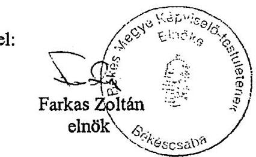

---

# Farkas Zoltán úr 

elnök
Békés Megye Önkormányzata

## Békéscsaba

## Tisztelt Elnök Úr!

Köszönettel megkaptam a Békés Megyei Önkormányzat pénzügyi helyzetének ellenőrzéséről készült jelentés-tervezetben (munkaanyag) foglaltakkal kapcsolatos észrevételeit.

Az
 észrevételeiket elfogadtuk, a pontosításokat a jelentéstervezetben átvezettük az alábbiak szerint:

1. Az észrevétel első oldalának harmadik bekezdésében az áthúzódó OEP támogatással kapcsolatos észrevétele alapján a jelentés 14. oldalának második bekezdését kiegészítettük, mely szerint „a pénzintézeti és szállítói kötelezettség teljesítésére a kockázatkezelési szabályzatban meghatározott kockázati alap és a fedezeti tartalék vagyon, valamint az előző évi pénzmaradvány és az előző évről áthúzódó OEP támogatások vehetők figyelembe finanszírozási forrásként.
2. Az észrevétel első oldalának negyedik bekezdésében foglaltak alapján a jelentés 27. oldalán a táblázat kiegészítésre került a mennyiségi egység (ezer Ft) megjelölésével, illetve az ezres csoportosítást a táblázat valamennyi számadata tekintetében elvégeztük.
3. Az észrevétel első oldalának ötödik bekezdése alapján a jelentés 34. oldalának 2-7. bekezdéseiben a kerekítési eltéréseket pontosítottuk.
4. Az észrevétel második oldalának első bekezdésében a bevételnövelő intézkedéseket tartalmazó ábra megnevezései tekintetében tett észrevétele alapján a jelentés 46. oldalán szereplő ábrán pontosítottuk a bevételi források megnevezéseit.

Köszönöm Elnök úr és munkatársai ellenőrzés során tanúsított hozzáállását, amellyel az ellenőrzés megvalósításában részt vettek, azt segítették.

Budapest, 2011. december 15.

Tisztelettel:

Melléklet: jelentés
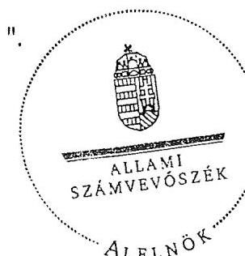

1052 BUDAPEST, APÁCZAI CSERE JÁNOS UTCA 10. 1364 Budapest 4. Pf. 54 telefon: 4849102 fax: 4849202

---

.
