# ÁLLAMI   SZÁMVEVŐSZÉK 

## JELENTÉS

a Borsod-Abaúj-Zemplén Megyei Önkormányzat pénzügyi helyzetének ellenőrzéséről (43/2)

---

# Számvevői Iroda 

Iktatószám: V-3012-10/2011.
Témaszám: 1015
Vizsgálat-azonosító szám: V056004

## Az ellenőrzést felügyelte:

Dr. Varga Sándor
számvevő igazgató-helyettes

## Az ellenőrzést vezette:

## Renkó Zsuzsanna

számvevő tanácsos

## Az ellenőrzést végezték:

| Puchy Márta | Szalontai Miklós | Szihalminé Kovács Zsuzsanna |
| :-- | :-- | :-- |
| számvevő tanácsos | számvevő tanácsos | számvevő tanácsos |

A témához kapcsolódó eddig készített számvevőszéki jelentések:
címe
sorszáma
Jelentés a Borsod-Abaúj-Zemplén Megyei Önkormányzat gazdál- 0733 kodási rendszerének 2007. évi átfogó ellenőrzéséről

---

# TARTALOMJEGYZÉK 

BEVEZETÉS ..... 5
I. ÖSSZEGZŐ MEGÁLLAPÍTÁSOK, KÖVETKEZTETÉSEK, JAVASLATOK ..... 12
II. RÉSZLETES MEGÁLLAPÍTÁSOK ..... 16

1. Az Önkormányzat kötelező és önként vállalt feladatai ..... 16
2. Pénzügyi egyensúlyi helyzet alakulása ..... 20
2.1. A múködési és felhalmozási egyensúly alakulása ..... 22
2.2. Az Önkormányzat bevételei ..... 26
2.3. Az Önkormányzat kiadásai ..... 29
3. Kötelezettségek bemutatása ..... 33
3.1. A pénzintézetek felé fennálló kötelezettségek alakulása ..... 33
3.2. Szállítók felé fennálló kötelezettségek ..... 39
3.3. Egyéb kötelezettségek ..... 39
4. A pénzügyi egyensúly megteremtése érdekében hozott intézkedések ..... 41
5. A helyi önkormányzatok gazdálkodási rendszerének 2007. évi ellenőrzése során a pénzügyi egyensúly javítására tett szabályszerűségi és célszerűségi javaslatok hasznosulása ..... 47

---

# MELLÉKLETEK 

1. számú Múködési és felhalmozási hiány/többlet alakulása az Önkormányzat zárszámadási rendeleteiben (1 oldal)
2/a. számú Az Önkormányzat CLF módszer szerint besorolt bevételei és kiadásai 2007-2010 között (1 oldal)
2/b. számú Az Önkormányzat bevételeinek és kiadásainak, adósságszolgálatának alakulása 2007-2010 között (1 oldal)
2. számú Az Önkormányzat 2007-2010. években megvalósított, illetve 2010. december 31-én fennálló fejlesztési feladatokhoz kapcsolódó kötelezettségeinek összegzése ( 10 oldal)
3. számú Borsod-Abaúj-Zemplén Megyei Közgyűlés elnökének észrevétele (9 oldal)
4. számú Borsod-Abaúj-Zemplén Megyei Közgyűlés elnökének észrevételére adott válasz (2 oldal)

---

# RÖVIDÍTÉSEK JEGYZÉKE 

## Törvények

Áht.
ÁSZ tv.

Ötv.
Htv.

## Rendeletek

SzMSz
2007. évi zárszámadási rendelet
2008. évi zárszámadási rendelet
2009. évi zárszámadási rendelet
2010. évi zárszámadási rendelet

## Szórövidítések

APEH
ÁSZ
BM
EDP hiány/egyenleg
Ellátó szervezet
EU
főjegyző
GDP
Hivatal
Illetékhivatal
ITC Kft.
az államháztartásról szóló 1992. évi XXXVIII. törvény az Állami Számvevőszékről szóló 1989. évi XXXVIII. törvény (2011. július 1-jétől az Állami Számvevőszékről szóló 2011. LXVI. törvény)
a helyi önkormányzatokról szóló 1990. évi LXV. törvény
a helyi önkormányzatok és szerveik, a köztársasági megbízottak, valamint egyes centrális alárendeltségű szervek feladat- és hatásköreiről szóló 1991. évi XX. törvény
a Borsod-Abaúj-Zemplén Megyei Önkormányzat Közgyűlése és szervei Szervezeti Müködési Szabályzatáról szóló 19/2010. (XII. 17.) számú rendelet
a Borsod-Abaúj-Zemplén Megyei Önkormányzat Közgyűlésének 6/2008. (IV. 25.) rendelete a 2007. évi zárszámadásának elfogadásáról
a Borsod-Abaúj-Zemplén Megyei Önkormányzat Közgyűlésének 6/2009. (V. 5.) rendelete a 2008. évi zárszámadásának elfogadásáról
a Borsod-Abaúj-Zemplén Megyei Önkormányzat Közgyűlésének 7/2010. (V. 4.) rendelete a 2009 évi zárszámadásának elfogadásáról
a Borsod-Abaúj-Zemplén Megyei Önkormányzat Közgyűlésének 6/2011. (V. 4.) rendelete a 2010. évi zárszámadásának elfogadásáról

Adó- és Pénzügyi Ellenőrzési Hivatal, 2011. január 1-jétől Nemzeti Adó- és Vámhivatal (NAV)
Állami Számvevőszék
Belügyminisztérium
Uniós módszertan szerinti maastrichti kritériumoknak megfelelő számítás szerinti hiány/egyenleg
Borsod-Abaúj-Zemplén Megyei Önkormányzat Ellátó Szervezete
Európai Unió
Borsod-Abaúj-Zemplén Megyei Önkormányzat Főjegyzője
Bruttó hazai termék
Borsod-Abaúj-Zemplén Megyei Önkormányzat Hivatala
Borsod-Abaúj-Zemplén Megyei Önkormányzat Illetékhivatala
Nemzetközi Kereskedelmi Központ Korlátolt Felelősségű Társaság

---

| kórházak | Borsod-Abaúj-Zemplén Megyei Kórház és Egyetem Oktató Kórház, Mezőkövesdi Rehabilitációs Központ, Szent Ferenc Kórház, II. Rákóczi Ferenc Kórház Szikszó, Pszichiátriai Szakkórház és Betegotthon Izsófalva |
| :--: | :--: |
| Könyvtár | II. Rákóczi Ferenc Megyei Könyvtár |
| Közgyűlés | Borsod-Abaúj-Zemplén Megyei Közgyűlés |
| Közgyűlés elnöke | Borsod-Abaúj-Zemplén Megyei Közgyűlés Elnöke |
| KSH | Központi Statisztikai Hivatal |
| Levéltár | Borsod-Abaúj-Zemplén Megyei Önkormányzat Levéltár |
| Múzeum | Borsod-Abaúj-Zemplén Megyei Múzeumok Igazgatóság |
| NGM | Nemzetgazdasági Minisztérium |
| OEP | Országos Egészségbiztosítási Pénztár |
| ÖKIF hitel | Önkormányzati Infrastruktúra-fejlesztési Hitelprogram |
| ÖNHIKI | önhibáján kívül hátrányos helyzetben lévő önkormányzatok támogatása |
| Önkormányzat | Borsod-Abaúj-Zemplén Megyei Önkormányzat |
| SNA | SNA System of National Accounts azaz Nemzeti Számlák Rendszere |
| szja | személyi jövedelemadó |
| TISZK | Zempléni Szakképzési-szervezési Társulás és a Sajó-menti Szakképzés-szervezési Társulás |
| 2011-2014. évi gazdasági program | a Közgyűlés 45/2011. (IV. 28.) számú határozata a Bor-sod-Abaúj-Zemplén Megyei Közgyűlésnek Középtávú Gazdasági Programjáról (2011-2014) |

---

# JELENTÉS 

## a Borsod-Abaúj-Zemplén Megyei Önkormányzat pénzügyi helyzetének ellenőrzéséről

## BEVEZETÉS

Az Állami Számvevőszék 2011. évtől érvényes stratégiája új irányt szabott a helyi önkormányzatok gazdálkodásának ellenőrzésében is. Az ÁSZ - küldetése és jövőképe szerint - szilárd szakmai alapokra támaszkodva értékteremtő ellenőrzéseivel és helyzetelemzéseivel az államháztartás egészében, így a helyi önkormányzati alrendszerben is elő kívánja segíteni a közpénzek és a közvagyon szabályos, gazdaságos, hatékony és eredményes hasznosítását. E folyamat részeként - a 2010. évi államháztartási hiány alakulásának összetevőire is figyelemmel - megkezdődött az önkormányzati alrendszer pénzügyi helyzetelemzése.

Az NGM 2011 áprilisában közzétett adatai szerint ${ }^{1}$ a 2010. évi 1036,2 milliárd Ft összegű, 3,8\%-os EDP (maastrichti kritériumok szerinti, Túlzott Hiány Eljárás keretében kimutatott) hiánycél nem volt tartható, az önkormányzati alrendszer tervezettet meghaladó hiánya miatt a GDP arányában kifejezett államháztartási hiány 4,2\%-ra emelkedett.

Az önkormányzatok költségvetési jelentése szerint 2010. első három negyedév végén az önkormányzati alrendszer pénzforgalmi hiánya 97 milliárd Ft volt a tervezett éves mérték 51\%-át érte el. Bár az elmúlt években kiugróan magas hiány halmozódott fel az utolsó negyedévben, a 97 milliárd Ft-os szeptember végi hiány nem indokolta az önkormányzati alrendszer 190 milliárd Ft-ra becsült éves hiányának felülvizsgálatát. A tervezett hiány túllépése, az utolsó negyedévi 150 milliárd Ft-os pénzforgalmi hiány nem volt reálisan feltételezhető. A helyi önkormányzatok januári gyorsjelentése szerint a pénzforgalmi hiány 247,7 milliárd Ft-ot tett ki. A tervezettnél nagyobb önkormányzati pénzforgalmi hiány kialakulásában - az NGM által az éves költségvetési beszámoló elkészítéséhez kiadott tájékoztató szerint - az iparűzési adó elmaradása, a gépjárműadó, az illetékek és más bevételek tervezettnél alacsonyabb összegben teljesülése volt a meghatározó.

A megyei önkormányzatok kötelező feladatellátását többlépcsős törvényi előírások határozzák meg. A feladatokra vonatkozó szabályozás első szintjét az

[^0]
[^0]:    ${ }^{1}$ NGM Tájékoztatás Magyarország Strukturális Reformprogramjának végrehajtásáról (2011. április 1). A Tájékoztató évente két alkalommal - április és október hónapban jelenik meg.

---

Ötv. ${ }^{2}$, a második szintet a hatásköri ${ }^{3}$, a harmadik szintet a további ágazati, szakmai törvények (egyebek mellett az oktatási, egészségügyi, szociális) adják.

A megyei önkormányzatok a feladatellátás és a központi forráselosztás tekintetében sajátos helyet foglalnak el a helyi önkormányzati rendszerben. A megyei önkormányzat kötelező feladatainak egy része - így a megyében lévő természeti és társadalmi muzeális emlékek, a történeti iratok gyűjtése, őrzése, tudományos feldolgozása, a megyei könyvtári szolgáltatás, a pedagógiai és közművelődési szakmai tanácsadás és szolgáltatás, a megyei testnevelési és sportszervezési feladatellátás, a gyermek- és ifjúsági jogok érvényesítése, a gyermekvédelmi- és szociális szakellátás - az Ötv-ből közvetlenül levezethető kötelezettség.

A középiskolai, szakiskolai, és kollégiumi ellátás, a fogyatékos gyermekek oktatása, nevelése, gondozása az ágazati törvény szerint a megyei önkormányzat kötelező feladata. Azonban, ha a települési önkormányzat lát el ilyen feladatot, és arról lemond, a megyei önkormányzatnak a feladatot át kell vennie. Így a megyei önkormányzatok által ellátandó kötelező közszolgáltatások ellátásának mértékére a települési önkormányzatok döntései jelentősen kihatnak.

Az alapellátást meghaladó egészségügyi szakellátás biztosítása akkor képezi a megyei önkormányzat feladatát, ha az önkormányzati vagyon kialakításáról szóló törvényben ${ }^{4}$ a feladat ellátásához szükséges vagyont az önkormányzat a tulajdonába kapta.

Az önként vállalt feladat ellátására - mivel annak vállalása a kötelező feladatok ellátását nem veszélyeztetheti - a kötelező közszolgáltatások mértékének alakulása lényegi hatással van.

A feladat és hatáskör telepítés sajátosságai mellett a megyei önkormányzatok forrásszabályozásból következő szűk mozgástere és a kialakított forrásszerkezete, a központi költségvetéstől való erőteljes függősége is determinálja az önkormányzatok feladatellátásra vonatkozó döntéseit.

A 2007-2010. években az önkormányzati feladatok ellátásának keretet biztosító forrásszabályozás - ennek részeként az illetékbevételből és a személyi jövedelemadóból való részesedés szabályai - a megyei önkormányzatok vonatkozásában nem változtak:

- A megyei önkormányzatok saját bevételein belül az illetékbevételek döntően az ingatlanpiac stagnálása, majd visszaesése, és egyes illetékkedvezmények bevezetése következtében - megyénként differenciált mértékben ugyan, de - 2010-re általánosan visszaestek. A 2010. évben befolyt 39,2 milliárd Ft illetékbevétel a 2006. évben realizált 71,1 milliárd Ft illetékbevétel alig több mint $55 \%$-a volt. A kieső bevételek pótlására az önkor-

[^0]
[^0]:    ${ }^{2}$ Ötv. 69-70. §-ai
    ${ }^{3}$ a Htv.
    ${ }^{4}$ Az egyes állami tulajdonban lévő vagyontárgyak önkormányzatok tulajdonba adásáról szóló 1991. évi XXXIII. törvény

---

mányzati alrendszer szintjén történtek intézkedések, 2010-ben 5 milliárd Ftot, 2011-ben 1,2 milliárd Ft-ot ellentételezett a központi költségvetés. Az illetékbevételt a megyei önkormányzatok a saját folyó bevételeik között számolják el ${ }^{5}$.

Az illetékek kivetésének és beszedésének joga 2006. december 31-ig a megyei önkormányzatok feladata volt. A 2007. évtől a megyei illetékhivatalok illetékbeszedési feladatait az APEH vette át ${ }^{6}$. Az önkormányzati illetékrészesedési szabályok változatlanok maradtak, azonban az illetékbeszedés költségeit az önkormányzatok illetékbevételeiből átlagos (a Fővárosnál 4,0\%-os, a megyei és megyei jogú városi önkormányzatnál $8,5 \%$-os) kulcsot alkalmazva vonták le. E döntés következtében azon megyei önkormányzatok, amelyek a $8,5 \%$-os költségnél kedvezőbb költségszint mellett látták el korábban ezt a feladatot, kedvezőtlenebb helyzetbe kerültek.

- Az önkormányzati alrendszer személyi jövedelemadóból való részesedésének makroszintű szabályozása nem változott 2007-2010 között7. A helyi önkormányzatokat normatív módon megillető $32 \%$-os részesedés visszaosztásának részletszabályai azonban a megyei önkormányzatok számára - a reálgazdaság kedvezőtlen irányú folyamatai, és az államháztartás egyensúlyi helyzetére tekintettel elrendelt kormányzati intézkedések miatt - megszorító intézkedéseket jelentettek. Összesen 17 milliárd Ft - 2007-ben 10 milliárd Ft, 2010-ben további 7 milliárd Ft - szja-t vontak ki a megyei önkormányzatok gazdálkodási köréből ${ }^{8}$. Az átengedett személyi jövedelemadó a megyei önkormányzatok egyik bevétele.

A megyei önkormányzatok 2007-2010 között rendelkezésre álló forrásait az alábbiakban mutatjuk be:

[^0]
[^0]:    ${ }^{5}$ A megyei önkormányzatok illetékbevételei az önkormányzati alrendszer saját folyó bevételeiből 2007-ben 35,9 milliárd Ft-ot (61,4\%-ot), 2008-ban 41,5 milliárd Ft-ot ( $61,7 \%$-ot), 2009-ben 36,5 milliárd Ft-ot ( $62,5 \%$-ot), 2010-ben 25,1 milliárd Ft-ot $(64,1 \%$-ot) tettek ki.
    ${ }^{6}$ Az egyes pénzügyi tárgyú törvények módosításáról szóló 2006. évi LXI. törvény 115. §a, amely az adózás rendjéről szóló 2003. évi XCII. törvény 73. §-át módosította.
    ${ }^{7}$ A megyei önkormányzatok személyi jövedelemadó részesedése az önkormányzati alrendszer átengedett bevételeiből 2007-ben 34,7 milliárd Ft-ot ( $7,0 \%$-ot), 2008-ban 51,2 milliárd Ft-ot ( $9,2 \%$-ot), 2009-ben 59,2 milliárd Ft-ot ( $9,3 \%$-ot), 2010-ben 56,3 milliárd Ft-ot $(8,3 \%$-ot) tett ki.
    ${ }^{8}$ A megyei önkormányzatok szja kiegészítése háromelemű. A tételes, minden megyére egységesen meghatározott összeg - az adott évek költségvetési törvényeinek 4. sz. mellékletében meghatározottak szerint - 2006-ban 593 millió Ft, 2007-ben és 2008-ban egyaránt 355 millió Ft, 2009-ben 370 millió Ft volt. A megye népességszáma után járó kiegészítés a 2006. évi $208 \mathrm{Ft} /$ fő összegről 2010-re $120 \mathrm{Ft} /$ fő-re, a megyei intézmények ellátottjai után járó kiegészítés $42236 \mathrm{Ft} /$ ellátottról $20755 \mathrm{Ft} /$ ellátottra csökkent.

---

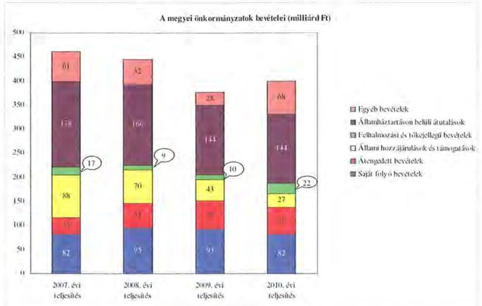

A megyei önkormányzatok saját folyó bevételeinek részaránya - amelyek fơbb elemei: az intézményi térítési díjak, az illetékbevétel, a kamatbevételek - a 2007. évi összbevételen ( 461 milliárd Ft) belül 17,9\% volt, amely 2010-re annak ellenére 20,6\%-ra nőtt, hogy az összege 82 milliárd Ft maradt. Ennek oka az volt, hogy az összbevétel a 2007. évi 461 milliárd Ft-ról 2010-re 399 milliárd Ftra csökkent.

Az átengedett bevételek, amelyek a megyei önkormányzatoknál a személyi jövedelemadóból való részesedést jelentették, az összbevételen belül a 2007. évi 35 milliárd Ft-ról 56 milliárd Ft-ra nőttek.

Az állami hozzájárulások és támogatások - amelyek fơbb elemei: az ellátotti létszámhoz kötődő normatív állami hozzájárulások, központosított, fejezeti szinten kezelt céleľ̌irányzatból juttatott múködési és fejlesztési támogatások a 2007. évi 88 milliárd Ft-ról (19,1\%-os részarányról) 2010-re 27 milliárd Ft-ra ( $6,8 \%$-os részarányra) estek vissza.

A felhalmozási és tőkejellegű bevételek - tárgyi eszközök (ingatlanok és ingóságok), föld és immateriális javak, részesedések értékesítése, EU-tól átvett pénzeszközök - a 2007. évi 17 milliárd Ft-ról (3,6\%-os részarányról) 2010-re 22 milliárd Ft-ra ( $5,4 \%$-ra) emelkedtek.

Az államháztartáson belüli átutalások részesedése 2007-ben 178 milliárd Ft volt. 2010. év végére 34 milliárd Ft-tal csökkent, részaránya $38,6 \%$-ról 2,6 százalékpontos csökkenés után 2010-ben $36 \%$-ra változott. Ez a bevételi kategória tartalmazza az egészségbiztosítási és egyéb elkülönített állami pénzalapoktól átvett forrásokat. A 2010-ben e címen elszámolt bevétel 144 milliárd Ft volt.

A megyei önkormányzatok központi költségvetésből származó bevételeinek öszszege 2007-ben 400 milliárd Ft volt, amely 2010. évre 331 milliárd Ft-ra (az időszak alatt összesen 69 milliárd Ft-tal) 17,3\%-kal csökkent.

---

Az egyéb, pénzmaradványból, vállalkozási bevételekből, államháztartáson kívülről származó átutalásokból, a hitelekből, a hosszú és rövid lejáratú értékpapírok értékesítéséből származó bevételek részesedése a 2007-2010. évek viszonylatában 13,3\%-ról 17,1\%-ra emelkedett. Ez utóbbiak 2010. évi beszámoló szerinti összevont teljesítése 68 milliárd Ft volt ${ }^{9}$.

Mindezeket figyelembe véve 2007 és 2010-ben a megyei önkormányzatok forrásösszetételének megoszlását az alábbi ábra szemlélteti:
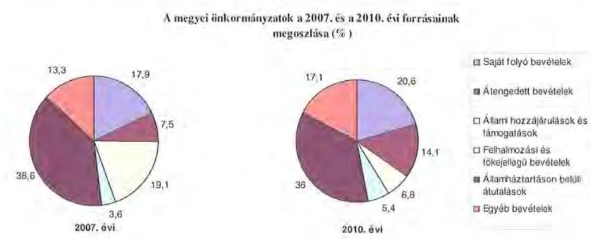

Annak ellenére, hogy a megyei önkormányzatok kötelezően ellátandó feladataikat 2007-hez képest kevesebb intézményben, csökkenő foglalkoztatotti létszám mellett végezték ${ }^{10}$, a jelentős bevételkiesést a - szervezési intézkedések hatására - csökkenő ráfordítások nem tudták kompenzálni. Az ellátottak száma a szociális, gyermekvédelmi ágazat bentlakásos elhelyezést nyújtó intézményeit kivéve - eltérő mértékben ugyan, de minden ágazatban évről évre csökkent, amely a fajlagos hozzájárulások csökkenésével együtt a normatív állami hozzájárulás arányának visszaeséséhez vezetett.

A 2007-2013-as időszakra meghirdetett, vissza nem térítendő EU-s fejlesztési forrásokhoz való hozzájutás lehetősége felerősítette az önkormányzati alrendszer fejlesztési igényeit. A fokozott fejlesztési tevékenység a felhalmozási bevételek és kiadások egyensúlyának megbomlásán ${ }^{11}$ túl a jelentkező jövőbeni fenntartási kötelezettség miatt tovább terhelhetik az önkormányzatok költségvetését.

A megyei önkormányzatok felhalmozási és múködési célú pénzintézeti és szállítói kötelezettségeinek állománya a vizsgált időszakban erőteljesen növekedett.

[^0]
[^0]:    ${ }^{9}$ Az egyéb bevételek összege 2007-2010 között eltérő módon változott, 2007-ben 61 milliárd Ft volt, 2008-ban 52 milliárd Ft-ra, 2009-ben 28 milliárd Ft-ra esett vissza, majd 2010-ben ismét - 68 milliárd Ft-ra - emelkedett.
    ${ }^{10}$ a BM által 2010 decemberében elvégzett felmérés adatai szerint
    ${ }^{11}$ Az önkormányzati alrendszerben - az éves zárszámadási törvényjavaslatok általános indokolása, X. Helyi önkormányzatok gazdálkodása fejezet szerint - a felhalmozási bevételek és kiadások egyenlege 2007-ben 142,4 milliárd Ft, 2008-ban 112,3 milliárd Ft, 2009-ben 234,5 milliárd Ft hiányt mutatott.

---

A hosszú lejáratú kötelezettségek alakulását a következő ábra szemlélteti:
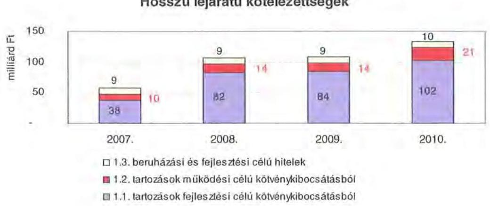

A hosszú lejáratú kötelezettségek mellett az időszakban a 2007. évi 22 milliárd Ft-ról 24 milliárd Ft-ra ( $8,8 \%$-kal) növekedett az áruszállításból származó szállítói kötelezettségek állománya.

A mérlegben kimutatott kötelezettségek állománya mellett az elhasználódott eszközök pótlására forrást biztosító amortizációs (felújítási) alap képzésének ${ }^{12}$ elmaradása további problémákat vetít előre. A megyei önkormányzatok beszámolójelentéseinek összegzése szerint 2007-ben még az elszámolt értékcsökkenés $90 \%$-ának megfelelő összeget fordítottak felújítási célokra, 2009-ben ez az arányszám már csak 16,5\% volt. Ez maga után vonta a feladatellátást kiszolgáló tárgyi eszközök állagának erőteljes romlását.

Az ÁSZ a 2011. évi ellenőrzési tervében a 43. számú, az „Önkormányzatok gazdálkodási rendszerének ellenőrzése" részeként egy időben, egymással párhuzamosan tekinti át és elemzi az önkormányzati alrendszer középszintjét jelentő 19 megyei önkormányzat pénzügyi helyzetét. A gazdálkodás szabályszerűségét az ÁSZ előző évek során ellenőrizte a megyei önkormányzatoknál is, ezért jelen vizsgálatunk erre nem tér ki.

A jelentés a megyei önkormányzatok sajátos feladat-ellátási és forrásszabályozási helyzetére tekintettel a megyei önkormányzatok pénzügyi helyzetét, illetve az ezzel összefüggő korábbi ÁSZ javaslatok megvalósítását mutatja be.

Az ellenőrzés a 2007. január 1. - 2011. március 31. közötti időszakot ölelte fel.
A vizsgálat jogszabályi alapját 2011. július 1-je előtt az Állami Számvevőszékről szóló 1989. évi XXXVIII. törvény 2. § (3), (5), (6) és (9) bekezdéseiben, az Ötv. 92. § (1) bekezdésében és az Áht. 104. § (3) bekezdésében, 2011. július 1-jét követően az Állami Számvevőszékről szóló 2011. évi LXVI. törvény 1. § (3) be-

[^0]
[^0]:    ${ }^{12}$ Erre a jelenlegi szabályozási környezetben nem kötelezi semmilyen előírás az önkormányzatokat.

---

kezdésében, az 5. § (2)-(6) bekezdéseiben és az Áht. 120/A. § (1) bekezdésében foglalt előírások képezték.

Borsod-Abaúj-Zemplén megye országos és régión belül elfoglalt helyzetét 2010. december 31-én az alábbi mutatók szemléltetik (Miskolc Megyei Jogú Várossal együtt):

Index: az előző év azonos időszak (időpontja)=100,0

| Mutató megnevezése | Borsod-AbaújZemplén megye | Északmagyarországi régió | Országos |
| :--: | :--: | :--: | :--: |
| Népesség száma* (ezer fó) | 685 | 1195 | 9986 |
| Népesség változás indexe (\%) | 98,9 | 98,8 | 99,7 |
| Az ipari termelés volumenindexe (\%) | 116,4 | 118,0 | 110,7 |
| Egy lakosra jutó ipari termelési érték (ezer Ft) | 2393,4 | 2028,2 | 2044,4 |
| Ezer lakosra jutó vállalkozások száma (db) | 108 | 120 | 165 |
| A beruházások egy lakosra vetített teljesítményértéke (millió Ft) | 0,2 | 0,2 | 0,3 |
| Foglalkoztatási arány (\%) | 42,7 | 43,5 | 49,5 |
| Munkanélküliségi ráta (\%) | 16,9 | 15,6 | 10,8 |
| Alkalmazásban állók havi nettó átlagkeresete (Ft) | 112459 | 114195 | 132628 |
| Alkalmazásban állók havi nettó átlagkeresetének indexe (\%) | 106,1 | 106,5 | 106,9 |

*ebből: Miskolc Megyei Jogú Város népessége 170 ezer fő
A megye gazdasági helyzetét reprezentáló mutatók alapján az egy lakosra jutó ipari termelés értéke - 365,2 ezer Ft, illetve 349 ezer Ft-tal - magasabb volt a régió és az országos átlagnál. Az ezer lakosra jutó vállalkozások száma 12, illetve 57 db -bal elmaradt a régió és országos mutatótól. A foglalkoztatási arány és a munkanélküliségi ráta, továbbá az alkalmazásban állók havi nettó átlagkeresete a régió és országos jellemzőkhöz képest kedvezőtlenebb.

A megyében 358 települési - egy megyei jogú városi, 27 városi, kilenc nagyközségi, 321 községi - önkormányzat múködött a 2010. év végén.

A 2010. évi önkormányzati választásokat követően a Közgyűlés tagjainak száma 59 főről 30 főre csökkent.

---

# I. ÖSSZEGZŐ MEGÁLLAPÍTÁSOK, KÖVETKEZTETÉSEK, JAVASLATOK 

Az Önkormányzat 2010. évi zárszámadási rendelete szerinti 42308 millió Ft költségvetési kiadásainak 99,3\%-át ( 42016 millió Ft-ot) a kötelezö feladatok, 0,7\%-át (292 millió Ft-ot) önként vállalt feladatok ellátására fordította. Az Önkormányzat önként vállalt feladatai az ifjúságpolitikai célok, kisebbségi feladatok elősegítése, idegenforgalmi rendezvények, művészeti tevékenységek, tehetségfejlesztő programok támogatásához, egyes idegenforgalmi, turisztikai kiadvány szerkesztési, kommunikációs szolgáltatások szervezéséhez, nemzetközi kapcsolatok építéséhez, idegenforgalmi szálláshely múködtetéséhez, valamint civil szervezetek, alapítványok múködéséhez nyújtott támogatásokhoz kapcsolódtak. Az SzMSz a kötelező közszolgáltatási feladatokat és azok ellátásának szervezeti keretét általános jelleggel határozta meg.

Az Önkormányzat kötelező feladatai ellátását - 2010. december 31-i állapot szerint - 53 költségvetési szerv múködtetésével biztosította, amelyből 51 önállóan múködő és gazdálkodó, két önállóan múködő költségvetési szerv. A 20072010 között a városi önkormányzatoktól két közoktatási és egy szociális feladatokat ellátó intézményt vett át. A Közgyűlés döntött továbbá a kulturális és sport ágazatban egy önállóan múködő és gazdálkodó, valamint a szociális és gyermekvédelem rendszerének átalakításával három önállóan múködő és gazdálkodó intézmény megszüntetéséről. Az Önkormányzat három többségi tulajdonú gazdasági társasága önként vállalt feladatokat látott el.

Az Önkormányzat folyó költségvetési egyenlege (működési jövedelem) a 2007-2010. években múködési forráshiányt mutatott, a negatív múködési jövedelmek és a tárgyévben jelentkező törlesztési kötelezettségek miatt az Önkormányzat pénzügyi kapacitása negatív értékű (-5762 millió Ft nettó jövedelem) volt.

A 2007-2010. években az Önkormányzat felhalmozási költségvetésének egyenlege folyamatosan negatív összegű volt, amely a 2007-2010 évek között összesen 3238 millió Ft felhalmozási forráshiányt mutatott.

A múködési forráshiány finanszírozása munkabér- és folyószámlahitelekből, valamint múködési célú kötvénykibocsátásból történt. A felhalmozási forráshiányt hosszú lejáratú hitelekből és a kötvénybevétel felhalmozási célú felhasználásával finanszírozták.

A CLF módszer szerinti múködési forráshiány kialakulásához hozzájárult, hogy az Önkormányzat legföbb bevételi forrásai - a jogszabályi kedvezmények bővülése, és az ingatlanforgalom visszaesése következményeként az illetékbevétel, valamint a központi forráskivonás hatására az átengedett szja és az állami támogatások - csökkentek. Az Önkormányzatnál az illetékbevétel a 2010-re a 2006. évi 2679 millió Ft-ról (57,4\%-ára), 1538 millió Ft-ra csökkent. Az átengedett szja és az állami támogatások együttes összege a központi forráskivonás hatására lényegesen alacsonyabbá vált, 2010-ben 8617 millió Ft volt, a 2007.

---

évi 83,4\%-a. A kórházak múködési kiadásait finanszírozó OEP bevétel a 2007. évi 17457 millió Ft-ról a 2010. évre 15,6\%-kal (20 181 millió Ft-ra) emelkedett. A 2007. évi egyéb saját bevételek $50 \%$-kal, 8660 millió Ft-ra emelkedtek 2010re, ellensúlyozva a kieső forrásokat. A 2010. évben az intézményi múködési bevételek a térítési díjak emelésének következtében 646 millió Ft-tal haladták meg a 2007. évit.

A múködési kiadások 2007-ről 2010-re 4,5\%-kal (1655 millió Ft-tal) nőttek. A kórházak nélkül az intézmények és a Hivatal teljesített múködési kiadásai 2007-ben 17455 millió Ft-ot tettek ki (az összes múködési kiadás 47\%-a), amely 2010-re 14494 millió Ft-ra csökkent (az összes múködési kiadás 37,4\%-a). A múködési és felhalmozási kiadásokon belül 2007-2010 között a felhalmozási kiadások súlya 3672 millió Ft-ról (9\%) 3399 millió Ft-ra (8\%) csökkent. Az aktív pályázati tevékenység eredményeként 16939 millió Ft bekerülési költségű beruházást folytatott, illetve indított el az Önkormányzat, amelyből 11421 millió Ft a 2010 utánra vállalt kötelezettség. Az utóbbi forrásai a következők: 141 millió Ft tervezett saját bevétel, maradvány-felhasználással, 10206 millió Ft elnyert európai uniós támogatás, 1074 millió Ft elnyert hazai támogatás.

Az Önkormányzat pénzintézeti kötelezettségeinek állománya a könyvviteli mérlegadatok szerint 2006. december 31-től 2010. december 31-ig 309 millió Ft-ról 13735 millió Ft-ra nőtt. A vizsgált időszakban adósságszolgálatra az Önkormányzat 1536 millió Ft-ot teljesített, amelyből a kamatkiadás 1132 millió Ft volt. A kötvényből származó források betéteiből realizált kamatbevétel 2007-2010 között 138 millió Ft volt.

Az Önkormányzat likviditása biztosítására a 2010. évben 277 napon át átlagosan 681 millió Ft összegű folyószámlahitelt, illetve átlagosan 389 millió Ft öszszegű munkabér megelőlegezési hitelt vett igénybe.

Az Önkormányzat 2010. év végi pénzintézeti kötelezettsége 11406 millió Ft (83,1\%) múködési és felhalmozási célú kötvények kibocsátásából, 635 millió Ft (4,6\%) felhalmozási célú hosszú lejáratú hitelek felvételéből, továbbá 1693 millió Ft (12,3\%), költségvetési év végén ki nem egyenlített folyószámla- és munkabér megelőlegezési hitelből keletkezett. Ezek miatt az Önkormányzatnak a 2011-2013. években 1843 millió Ft, 9926713 CHF és 211655 EUR összegű tőketörlesztést és kamatot kell teljesítenie. Az Önkormányzat 2010. év végi szállítói tartozása 3232 millió Ft (ebből lejárt 383 millió Ft) és egyéb kiadás elmaradása 3 millió Ft volt. A 2011-2013. évi összes (pénzintézeti, szállítói, valamint az esedékes, de ki nem fizetett személyi juttatások és járulékai) kötelezettség teljesítésére 64 millió Ft pénzmaradvány és 102 millió Ft jelzáloggal nem terhelt forgalomképes ingatlanvagyon nyújt fedezetet. A további évekre szóló pénzintézeti kötelezettségei: 491 millió Ft, és 47161788 CHF, amelyekre figyelembe vehető források 2010. december 31-én nem voltak ismertek.

A közgyűlési előterjesztések nem tartalmazták a kötelezettségvállalás visszafizetési forrásait, a teljes futamidőre várható kamat-, egyéb költség és tőkefizetési kötelezettségeit, az árfolyam- és kamatkockázatok, továbbá az adósságszolgálati korlát bemutatását.

---

Az Önkormányzat 2007-2010 között nem vizsgálta az elhasználódott, amortizálódott eszközök pótlásának forrásigényét. A felújításokra, az eszközök pótlására az Önkormányzat pénzügyi lehetőségének a függvényében, elsősorban az intézmények működőképességének biztosítása, illetve a szakhatósági előírások figyelembevételével került sor. Az Önkormányzat 2007-2010 között a tárgyi eszközök után 6652 millió Ft értékcsökkenést számolt el. Felújításra a 2007-2010. években 963 millió Ft-ot fordított.

Az Önkormányzat 2007-2010. években pénzügyi helyzetének javítására kiadáscsökkentő intézkedéseket tett. Az intézményátszervezések, a feladatváltozások, létszámcsökkentések, valamint a takarékossági intézkedések eredményeként - az Önkormányzat kimutatása szerint - együttesen 6871 millió Ft kiadási megtakarítás keletkezett, amelynek 21,0\%-a (1443 millió Ft) a kapcsolódó létszámcsökkenések következtében jelentkezett. A Hivatalnál és az intézményeknél 2007-2011 között 510,5 álláshelyet szüntettek meg, amely a 2006. évi ( 7422 fő) átlaglétszám 6,9\%-át jelentette. A megszüntetett álláshelyek 98,8\%-a (504,5 álláshely) az ágazati, szakmai, 1,2\%-a (hat álláshely) intézményüzemeltetéshez, fenntartáshoz, gazdasági ügyek intézéséhez kapcsolódó álláshely volt. Az Önkormányzat 2007-2010 között bevételnövelő intézkedéseket nem tett.

Az Önkormányzat gazdálkodási rendszerének 2007. évi ellenőrzéséről készült ÁSZ jelentés a pénzügyi egyensúlyi helyzet javítására javaslatot nem tett.

Az Önkormányzat pénzügyi helyzetét összegezve a következők emelhetők ki:

Az Önkormányzatnál évente a központi intézkedések hatására jelentkező bevételi kiesést a kiadáscsökkentő és bevételnövelő intézkedéseivel nem tudta ellentételezni. Az Önkormányzat 2007-től három intézményt vett át. A feladatellátást biztosító intézményi struktúra változtatására tett intézkedések nem eredményezték a méretgazdaságos szervezeti keretek kialakítását. A 2010. évet követő beruházások finanszírozhatóságát veszélyezteti a saját források tervezetlensége, az EU-s források előfinanszírozása, valamint a támogatásból megvalósuló fejlesztések volumenéből és esetleges előírt feltételeknek nem megfelelő teljesítéséből adódó kockázatok. Az Önkormányzat csak folyószámla- és munkabérhitel állandó igénybevételével, továbbá kötvényforrás, illetve a kötvényforrások befektetéséből származó kamatbevétel felhasználásával tudta a múködést biztosítani. Az Önkormányzat hosszú távú pénzintézeti kötelezettségei finanszírozása a következő három évben nem számszerúsíthető, a további évekre szóló hosszú távú kötelezettségekre a finanszírozás forrásait nem tervezték meg.

Mindezek alapján az Önkormányzat gazdálkodását a pénzügyi kockázatok veszélyeztetik, a pénzügyi egyensúly rövid- és hosszú távú fenntarthatósága azonnali intézkedéseket igényel.

A Közgyűlés elnöke részletes tájékoztatást adott a helyszíni ellenőrzést követően a pénzügyi egyensúly helyreállítására tett intézkedésekről. Döntés született az intézményi térítési díjak emeléséről, intézmények átszervezéséről, létszámának csökkentéséről, megállapodást kötöttek a szállítói tartozások átütemezéséről.

---

Ezek hatására a költségvetés egy havi hiánya 160 millió Ft-ról 41 millió Ft-ra, a lejárt szállítói tartozás 2,6 milliárd Ft-ról 1,2 milliárd Ft-ra csökkent.

A feladatok és források közötti egyensúly megteremtésére irányuló központi döntések, a megyei önkormányzatok konszolidációjára, az intézmények átvételére vonatkozó törvényjavaslat elfogadása új feltételeket teremtett. A hatékony és eredményes gazdálkodás, a pénzügyi egyensúly megőrzése azonban további helyi intézkedéseket igényel.

Az Állami Számvevőszékről szóló 2011. évi LXVI. törvény 33. § (1) bekezdésében foglaltak értelmében a jelentésben foglalt megállapításokhoz kapcsolódó intézkedési tervet köteles az ellenőrzött szervezet vezetője összeállítani és azt a jelentés kézhezvételétől számított harminc napon belül az ÁSZ részére megküldeni. Amennyiben az intézkedési tervet határidőben nem küldi meg a szervezet, vagy az továbbra sem elfogadható, az ÁSZ elnöke a hivatkozott törvény 33. § (3) bekezdés a)-b) pontjaiban foglaltakat érvényesítheti.

A 2011 májusában lezárult helyszíni ellenőrzés tapasztalatai alapján - figyelembe véve az Önkormányzat észrevételeit és a saját hatáskörben tett intézkedéseit - az alábbi javaslatokat tette az ÁSZ:

# a Közgyülés elnökének: 

1. tájékoztassa a Közgyűlést rendszeresen az intézkedési terv megvalósításáról, annak eredményeiről. A pénzügyi egyensúlyt befolyásoló feltételek romlása esetén tegyen javaslatot az intézkedési terv módosítására;
2. gondoskodjon róla, hogy a jövőben az adósságot keletkeztető kötelezettségvállalásokról szóló közgyűlési döntéseket megalapozó előterjesztések tartalmazzák a kötelezettségvállalás visszafizetésének forrásait, a várható kamat-, egyéb költség és tőkefizetési kötelezettségeit, legalább 3 éves kitekintéssel a várható kamat és árfolyamkockázatok bemutatását, és kezelésének lehetőségeit;
3. gondoskodjon a fennálló lejárt szállítói tartozások - beleértve az intézményeknél lejárt szállítói állományt - megszüntetése érdekében szükséges további intézkedések megtételéről, indokolt esetben a szállítókkal a lejárt tartozások mielőbbi rendezéséről a kockázatok minimalizálása érdekében;
4. gondoskodjon a pénzintézeti kötelezettségek finanszírozási lehetőségeinek számbavételéről, és arra források biztosításáról;
5. mutassa be a Közgyűlésnek az éves költségvetési előterjesztésekben az értékcsökkenési leírás összegét, és ezzel arányban az elhasználódott eszközök pótlásának forrásigényét és - lehetőségét.

---

# II. RÉSZLETES MEGÁLLAPÍTÁSOK 

## 1. Az ÖNKORMÁNYZAT KÖTELEZŐ ÉS ÖNKÉNT VÁLLALT FELADATAI

Az Önkormányzat 2010. évi zárszámadási rendelete alapján költségvetési kiadásainak 99,3\%-át ( 42016 millió Ft) a kötelező feladatok, 0,7\%-át (292 millió Ft) az önként vállalt feladatok ellátására fordította. Az Önkormányzat önként vállalt feladatai az ifjúságpolitikai célok, kisebbségi feladatok elősegítése, idegenforgalmi rendezvények, művészeti tevékenységek, tehetségfejlesztő programok támogatásához, idegenforgalmi, turisztikai, kiadvány szerkesztési, kommunikációs szolgáltatások szervezéséhez, nemzetközi kapcsolatok építéséhez, idegenforgalmi szálláshely működtetéséhez, valamint civil szervezetek, alapítványok múködéséhez nyújtott támogatáshoz kapcsolódtak.

Az SzMSz-ben az Önkormányzat a kötelező közszolgáltatási feladatait az Ötv. és az ágazati törvények által meghatározottnak tekintette, és nem szabályozta az önként vállalt feladatai körét. Az SzMSz-ben foglaltak szerint: „Az önként vállalt közfeladatok pénzügyi fedezetét a megyei önkormányzat költségvetési rendeletében kell meghatározni."

Az Önkormányzat éves költségvetési kiadásainak szerkezetét tekintve 2010-ben a járulékokkal növelt személyi juttatások és dologi kiadások 37293 millió Ft-os összegén belül meghatározó arányt ${ }^{13}$ - 59,1\%-ot (22 012 millió Ft-ot) - a kórházak fenntartása jelentett. A kórházak kiadásainak fedezetét $93,3 \%$-ban az OEP és $6,7 \%$-ban önkormányzati támogatás, továbbá az intézményi bevételek biztosították.

A szociális és gyermekvédelmi feladatok ellátásában 2010-ben 17 intézmény vett részt, az önkormányzati kiadásokból való részesedésük 6333 millió Ft ( $17 \%$-os), a 24 közoktatási intézmény feladatellátásához a kiadások 15,9\%-a ( 5941 millió Ft) kapcsolódott. A 2010. évben a szociális és gyermekvédelmi feladatok kiadásait 54,4\%-ban ( 3443 millió Ft-ban), a közoktatási feladatok kiadásait 68\%-ban ( 4037 millió Ft-ban) normatív támogatás finanszírozta.

Az Önkormányzat kötelező közszolgáltatási feladatai ellátásához fenntartott öt közmúvelődési intézménye biztosította a pedagógiai szakszolgálat és közművelődési, a levéltári, a közgyűjteményi szolgáltatásokat, valamint a testnevelési és sport feladatok ellátását, amelyek az Önkormányzat személyi és a dologi kiadásaiból 3,9\%-os részarányt ( 1462 millió Ft-ot) képviseltek 2010-ben. Az igazgatási és egyéb - Ellátó szervezet - ágazathoz sorolható feladatokat két

[^0]
[^0]:    ${ }^{13}$ Az Önkormányzat járulékokkal növelt személyi juttatások és dologi kiadásainak ágazatonkénti megbontása a BM részére készített 2010. december 31-i adatokkal kiegészített adatszolgáltatás kigyűjtéséből származik.

---

költségvetési szerv látta el, amelynek kiadásai az Önkormányzat járulékokkal növelt személyi és a dologi kiadásainak 4,1\%-át ( 1545 millió Ft) jelentették.
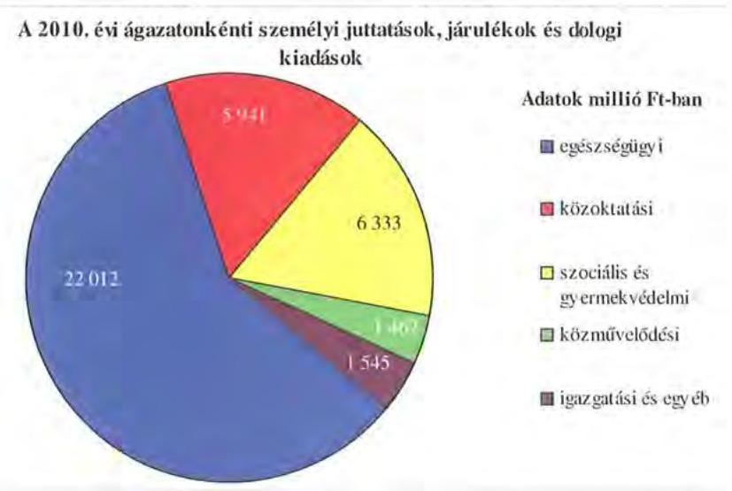

Az Önkormányzat a 2010. évben 42308 millió Ft költségvetési kiadást teljesített, amelyből $92,6 \%$-ot ( 39194 millió Ft ) az intézményei, és $7,4 \%$-ot ( 3114 millió Ft) a Hivatal kiadásai képviseltek. A Hivatal kiadásaiból 26,9\%-ot ( 839 millió Ft) a járulékokkal növelt személyi juttatás és dologi kiadások, 30,3\%-ot ( 943 millió Ft) a beruházási és felújítási kiadások, $42,8 \%$-ot ( 1332 millió Ft) pedig a különböző megyepolitikai feladatokhoz, szervezetek támogatásához, finanszírozási tételekhez kapcsolódó kiadások tettek ki.

Az Önkormányzat a kötelező feladatait a 2006. év végén 54 költségvetési szerv ${ }^{14}$ - 53 önállóan gazdálkodó és egy részben önállóan gazdálkodó költségvetési szerv - részvételével 68 telephelyen látta el. Az Önkormányzat a 2007. évben két közoktatási és egy szociális feladatokat ellátó intézményt vett át a fenntartó városi önkormányzatoktól. A Közgyűlés az átvételekről szóló határozataiban ${ }^{15}$ rögzítette, hogy az átadó önkormányzatoknak a feladatellátáshoz szükséges feltételeket biztosítania kell. Az Önkormányzat nem vállalta az intézmények átvétele előtt - a városi önkormányzatoknál - keletkezett pénzügyi kötelezettségeket. Az intézmények átvételéről szóló megállapodásokban a felek kölcsönösen megállapodtak a feladatellátást szolgáló ingatlanok tulajdonosi - a sajószentpéteri ingatlan esetében -, illetve ingyenes használatáról, az ingatlanok üzemeltetésével, karbantartásával kapcsolatos költségek viseléséről. Az ingyenes használatba adott ingatlanok esetében a felújítási kiadásokat az Önkormányzat nem vállalta.

- Kazincbarcika Városi Önkormányzattól 2007. augusztus 1. napjától a Kodály Zoltán Müvészetoktatási Intézmény - az alapító okirat szerint 31 telephelyen, 1486 tanuló oktatását - múködtetését az Önkormányzat átvette.

[^0]
[^0]:    ${ }^{14}$ Hivatal és 53 költségvetési intézmény
    ${ }^{15}$ A Közgyűlés 85/2007. (VI. 28.) számú határozatban a közoktatási, 106/2007. (IX. 11.) számú határozatában a szociális ellátási feladatok átvételéről döntött.

---

- A Sárospatak Városi Önkormányzat fenntartásában múködő Erdélyi János Általános Iskola és Kollégiumot 2007. augusztus 1-jei hatállyal az Önkormányzat átvette. A többi tanulóval együtt nem foglalkoztatható sajátos nevelési igényű gyermekek iskolai és kollégiumi nevelését ellátó alapfokú oktatási intézmény átvételével 138 tanuló oktatási feladata került át az Önkormányzathoz.
- Sajószentpéter Városi Önkormányzattól 2007. október 1-jei hatállyal az Önkormányzat átvette az idősek tartós bentlakásos intézmény ellátási feladatát. Az 50 gondozott ellátását a fenntartásában lévő Pszichiátriai Szakkórház és Betegotthon telephelyén biztosította.

A Közgyűlés 2007-2010 között az intézményi átszervezések hatására a kulturális és sport ágazatban - a Közművelődési és Idegenforgalmi, valamint a Pedagógiai Szakmai és Szakszolgálat intézetek összevonásával - 2007. augusztus 1-től - egy önállóan működő és gazdálkodó intézmény, a szociális és gyermekvédelem rendszerének átalakításával 2009. február 1-től három önállóan működő és gazdálkodó intézmény megszüntetéséről döntött.

A 2007-2010. években a városi önkormányzatoktól átvett intézmények és a végrehajtott átszervezések hatására az Önkormányzat kötelező feladatai ellátását - 2010. december 31-i állapot szerint - 53 költségvetési szerv múködtetésével biztosította, amelyből 51 önállóan működő és gazdálkodó, két önállóan működő költségvetési szerv volt. A 99 telephelyen működő intézmények az ágazati törvényekben előírt feladataikat - 2010. év végén - az alábbiak szerint látták el:

- öt költségvetési intézményként működő kórház egészségügyi - fekvőbeteg és járóbeteg - szakellátást nyújtott;
- szociális és gyermekvédelmi feladatok ellátását 17 intézmény biztosította (hat idősek, három pszichiátriai, kettő ápoló-gondozó, három fogyatékosok otthona, egy foglalkoztató rehabilitációs intézmény és fogyatékosak otthona, egy idősek ápoló-gondozó otthona és módszertani feladatokat ellátó intézmény, továbbá egy gyermekvédelmi szakellátást nyújtó központ);
- közoktatási feladatokat 24 intézményben végeztek (hat fogyatékos gyermekek gyógypedagógiai ellátást nyújtó, nyolc szakképző iskola, egy tehetséggondozó kollégium, három gimnázium és szakközépiskola, kettő gimnázium, szakképző iskola és kollégium, kettő gimnázium, szakközépiskola, kollégium és alapfokú művészetoktatási intézmény, egy általános iskola és speciális szakiskola és pedagógiai szakszolgálat, egy alapfokú művészetoktatási intézmény);
- öt intézmény közművelődési feladatokat - könyvtár, levéltár, múzeum, testnevelési és sportintézet, valamint a pedagógiai, szakmai, szakszolgáltatási és közművelődési intézet - látott el;
- igazgatási feladatokat a Hivatal végezte, egy intézmény pedig Ellátó szervezetként szolgáltatást nyújtott.

---

Borsod-Abaúj-Zemplén megyében a szakképzés és a hozzá tartozó feladatok szervezésére a 2008. évben két társulás ${ }^{16}$ jött létre. A Zempléni Szakkép-zési-szervezési Társulás hat városi önkormányzat ${ }^{17}$ részvételével alakult, amelyhez a 2009. évben Bőcs Községi Önkormányzat csatlakozott. A Sajómenti Szakképzés-szervezési Társulást négy - Edelény, Özd, Mezőcsát, Emőd városi önkormányzat alapította a helyi munka-erőpiaci igények kielégítése és az összehangolt szakképzési fejlesztési irányok meghatározása, a koordináció javítása és a felhalmozási célú források hatékony felhasználása érdekében. A TISZK-ben az Önkormányzat 13 szakképző intézete és szakiskolája vesz részt, az Önkormányzat tulajdonosi aránya 50\%. Az önállóan működő és gazdálkodó költségvetési szervként működő kettő TISZK munkaszervezetével kapcsolatos szervezési és igazgatási feladatok ráfordításai az Önkormányzat költségvetésében jelennek meg.

Az egyes ágazatok kötelező feladatellátását 2010. december 31-i állapot szerint az alábbi mutatók jellemzik:

| Megnevezés | közokta-   tás | szociális és   gyermekvé-   delem | egészség-   úgy | kultúra és   sport |
| :-- | :--: | :--: | :--: | :--: |
| Az ágazatban foglalkozta-   tottak száma (fő) | 1604 | 1784 | 2885 | 346 |
| Az ágazat intézményeiben   ellátottak összesen (fő) | 10217 | 4483 |  |  |
| Fekvőbeteg ellátás férőhe-   lyeinek száma (db) |  |  | 2486 |  |

Az Önkormányzat önként vállalt feladatai ellátásában 2007-2010 között három többségi tulajdonában lévő gazdasági társasága vett részt:

- Az Általános Vagyonkezelő Kft. az Önkormányzat 100\%-os tulajdonában állt. Az alapító okirata szerint ${ }^{18}$ a társaság főtevékenysége szállodai szolgáltatás;
- A KULCS-TOUR Borsod-Abaúj-Zemplén Megyei Kommunikációs Marketing és Turisztikai Nonprofit Közhasznú Korlátolt Felelősségű Társaság alapító okirata ${ }^{19}$ alapján folyóirat, időszaki kiadvány kiadása főtevékenység végzése céljából a 2007. évben - 100\%-ban önkormányzati tulajdonú - alakult. A közhasznú cél szerinti tevékenysége mellett a rendezvények szervezése, kiadványok készítése, valamint különböző megyei kommunikációs és marketing feladatokat látott el. A Borsod-Abaúj-Zemplén Megyei Közművelődési és Ide-

[^0]
[^0]:    ${ }^{16}$ a Közgyűlés 72/2008. (VI. 26.) számú határozata
    ${ }^{17}$ Sárospatak, Sátoraljaújhely, Encs, Mezőkövesd, Szerencs és Szikszó városi önkormányzatok
    ${ }^{18}$ a módosításokkal egységes szerkezetbe foglalt alapító okirat kelte 2011. január 10.
    ${ }^{19}$ az egyszemélyes nonprofit közhasznú korlátolt felelősségű társaság egységes szerkezetbe foglalt alapító okirat kelte 2010. szeptember 16.

---

genforgalmi Intézet megszüntetését ${ }^{20}$ követően a TOURINFORM iroda 2007. augusztus 1-től a KULCS-TOUR Kft. keretein belül múködött tovább;

- Az ITC Kft. 1991-ben alakult az Önkormányzat tulajdonában lévő ingatlan hasznosítás céljából, emellett konferenciák szervezését is végezte. A társaság tulajdonosi szerkezetében a törzstőke 99,6\%-a az Önkormányzat, 0,4\% magánszemélyek tulajdonában volt. A magántulajdonban lévő részesedést az Önkormányzat 2010. december 27-én megvásárolta, ezáltal tulajdoni részesedése $100 \%$ lett.

Az Önkormányzat 10-50\% közötti tulajdoni hányaddal rendelkezett két gazdasági társaságban 2010. év végén:

- Az Informatikai Nonprofit 2000 Kft. az Önkormányzat fenntartásában lévő kórházak részvételével alakult, amelyben a kórházak tulajdoni részesedése $32 \%$ volt. A társaság önként vállalt feladatként informatikai technológiai szolgáltatást nyújt;
- A Miskolc-Kassa Régióért Nonprofit Kft-ben tagként való belépéséről 1999ben döntött ${ }^{21}$ a Közgyűlés, $25 \%$ tulajdonosi hányad mellett. A társaság tevékenysége az alapításkor út- és autópálya építés szervezése volt.

Az Önkormányzat a 2010. év végén 10\% alatti részesedéssel a BORSODVÍZ Zrt-ben (1,16\%-os), az Észak-Magyarországi Idegenforgalmi és Gazdaságfejlesztési Kft-ben ( $7,69 \%$-os), továbbá az ÉMÁSZ Zrt-ben ( $0,1132 \%$-os) rendelkezett.

# 2. PÉNZÜGYI EGYENSÚLYI HELYZET ALAKULÁSA 

A hagyományos költségvetési szerkezet helyett az Önkormányzat pénzügyi helyzetét a CLF módszerrel mutatjuk be, amelyben jobban elkülönülnek a vagyonnal kapcsolatos bevételek és kiadások a feladatokkal kapcsolatos közvetlen múködtetési bevételektől és kiadásoktól. A módszer következetesen elkülöníti a folyó és a felhalmozási költségvetés bevételeit és kiadásait, azok költségvetési egyenlegeit. A tárgyévi pozíciók meghatározása érdekében a figyelembe vett saját folyó bevételek, valamint a saját felhalmozási bevételek nem tartalmazzák az előző évi pénzmaradványok felhasználásából származó pénzforgalom nélküli bevételeket ${ }^{22}$.

A bevételek és kiadások besorolása általános közgazdasági meggondolásokon alapul, amely testet ölt az SNA statisztikai módszertanában is. Folyó tételek alatt értjük azokat a bevételeket és kiadásokat, amelyek az Önkormányzat vagyoni helyzetét automatikusan nem változtatják. A bevételi oldalon ilyenek az adók, az illeték, az áfa bevételek és visszatérülések, a hozamok és kamatok, a költségvetési támogatások, az egyéb saját bevételek, valamint a múködési célra átvett pénzeszközök és kapott támogatások. A folyó kiadások közé tartoznak a

[^0]
[^0]:    ${ }^{20}$ a Közgyűlés 80/2007. (VI. 28.) és a 81/2007. (VI. 28.) határozatai
    ${ }^{21}$ a Közgyűlés 81/1999. (VI. 24.) számú határozata
    ${ }^{22}$ A költségvetési években kialakuló hiány finanszírozása az előző években képzett tartalékok felhasználásával is történhet.

---

szolgáltatások nyújtásával kapcsolatos múködési kiadások, a kamatkiadások, valamint a múködési célú transzferkiadások ${ }^{23}$. A felhalmozási vagy tőke tételek módosítják az önkormányzat vagyoni helyzetét. A privatizációs bevételek, az immateriális javak és tárgyi eszközök, valamint a részesedések értékesítése csökkentik, a fizikai beruházások és a pénzügyi befektetések növelik a vagyont. A pénzforgalmi bevételek és kiadások nem tartalmazzák a követelések elengedése miatt könyvelt tételeket, mivel ezek egymást kioltó, technikai jellegű elszámolási műveletek.

A folyó költségvetés egyenlege, a múködési jövedelem megmutatja, hogy az Önkormányzat éves folyó bevétele fedezetet biztosít-e a kötelező és önként vállalt feladatellátáshoz kapcsolódó éves folyó kiadására. A múködési jövedelem negatív értéke pénzügyileg fenntarthatatlan helyzetet jelez. A mutató pozitív értéke megtakarítást mutat, amely forrásul szolgálhat az Önkormányzat fennálló kötelezettségei megfizetéséhez, valamint fejlesztéseihez.

A felhalmozási költségvetés pozitív értéke felhalmozási többletet mutat, amely a jövőbeni fejlesztések forrását biztosíthatja. Amennyiben a folyó költségvetési hiány finanszírozása a felhalmozási többletből történik, ez szűkebb értelemben vagyonfelélésnek tekinthető. Amennyiben a felhalmozási költségvetés megtakarítása felhalmozási célú hitelek, kötvények adósságszolgálatát finanszírozza - változatlan vagyontömeg mellett -, a korábban megelőlegezett tőkebevételek valós realizációjának tekinthető. A felhalmozási deficit által generált finanszírozási igény önmagában nem jár pénzügyi kockázattal, a pénzügyileg fenntartható beruházásokhoz kapcsolódó kötelezettségvállalás (adósságszolgálat) előrelátó, tudatos költségvetési gazdálkodással teljesíthető.

A módszer a pénzügyi kapacitás (más néven a nettő múködési jövedelem) fogalmát helyezi a középpontba. Az adós hitelfelvételi képessége, hosszú távú fizetőképessége, vagy bonitása a pénzügyi kapacitással, ezen belül is a nettó múködési jövedelemmel jellemezhető. A nettó múködési jövedelem negatív értéke az egyes költségvetési években jelentkező adósságszolgálat túlzott mértékére utal ${ }^{24}$. A nettó múködési jövedelem negatív értékének felhalmozási többletből, vagy további hitelből történő finanszírozása pénzügyileg nem fenntartható gazdálkodást vetít előre. A pozitív értéket mutató nettó múködési jövedelem felhalmozási kiadások fedezetét biztosíthatja, illetve a folyamatosan, évenként képződő pozitív nettó múködési jövedelemből meghatározható a jövőben vállalható, teljesíthető éves adósságszolgálat, ily módon az a hitelösszeg, - amely a többi tényezőt, feltételt adottnak tekinti - visszafizetési kockázat nélkül felvehető.

A CLF módszer alapján a pénzügyi kapacitás mértéke az Önkormányzat összevont, nettósított, a központi információs rendszerbe a Magyar Államkincstáron keresztül leadott éves költségvetési beszámolójának 80-as űrlapjában szerepel-

[^0]
[^0]:    ${ }^{23}$ Transzferkiadásoknak azokat a folyó és felhalmozási tételeket nevezzük, amelyeket nem az adott Önkormányzat használ fel szolgáltatásnyújtásra (pl.: ellátottak pénzbeni juttatásai, átadott pénzeszközök, garancia- és kezességvállalások stb.).
    ${ }^{24}$ Kivéve, ha annak finanszírozására a korábbi években képzett tartalékok fedezetet nyújtanak.

---

tetett adatok alapján került meghatározásra. A 2007-2010 közötti időszakban az Önkormányzat CLF módszer szerint besorolt kiadásainak és bevételeinek fơbb jogcímek szerinti alakulását a jelentés 2/a. számú melléklete tartalmazza.

Az Önkormányzat bevételeinek és kiadásainak alakulását részletesen a hatályos számviteli előírások szerint készült, összevont éves költségvetési beszámolók adataira alapozva mutatjuk be. A bevételek és kiadások müködési, valamint felhalmozási jogcímekre történő elkülönítését az éves költségvetési beszámolók, a zárszámadási rendeletek, továbbá - amely jogcímek ${ }^{25}$ esetében erre más lehetőség nem volt - az Önkormányzat adatszolgáltatása szerinti megbontás alapján végeztük el. A bevételek elemzése során figyelembe vettük a korábbi években keletkezett pénzmaradvány felhasználásából származó pénzforgalom nélküli bevételeket is. A 2007-2010 közötti időszakban az Önkormányzat bevételeinek és kiadásainak, továbbá adósságszolgálatának alakulását a jelentés 2/b. számú melléklete tartalmazza.

# 2.1. A müködési és felhalmozási egyensúly alakulása 

CLF módszer szerinti önkormányzati adatok

| Megnevezés | 2007 | 2008 | 2009 | 2010 |
| :--: | :--: | :--: | :--: | :--: |
| Folyó bevételek | 36750905 | 39298165 | 36877788 | 37539236 |
| Folyó kiadások | 37355816 | 40139656 | 39405842 | 38922763 |
| Müködési jövedelem | $-604913$ | $-841491$ | $-2528054$ | $-1383527$ |
| Nettó müködési jövedelem   = müködési jövedelem - tüketörlesztés | $-924316$ | $-859792$ | $-2559802$ | $-1417858$ |
| Felhalmozási bevételek | 1580792 | 1765780 | 1165797 | 3166453 |
| Felhalmozási kiadások | 3546969 | 2681932 | 1303269 | 3385199 |
| Felhalmozási költségvetés egyenlege | $-1966177$ | $-916152$ | $-137472$ | $-218746$ |
| Finanszirozási műveletek nélküli (GFS) pozíció | $-2571090$ | $-1757643$ | $-2665526$ | $-1602273$ |
| Finanszirozási műveletek egyenlege | 5161913 | 1320575 | 1936266 | 1567131 |
| Tárgyéri pozíció | 2590827 | $-437068$ | $-729266$ | $-35143$ |
| Egyéb tájékoztató adatok |  |  |  |  |
| Összes kötelezettség* | 7934727 | 12292129 | 13500393 | 17252266 |
| ebből rövid lejáratú | 2278109 | 2353344 | 3423565 | 5226065 |
| Folyószámlatétel napi átlagos állománya** | 1679131 | 2074 | 0 | 681228 |
| Likvidhittel napi átlagos állománya** | 0 | 0 | 0 | 1 |
| Munkabérhittel napi átlagos állománya** | 413706 | 0 | 0 | 388764 |
| Egyéb finanszírozásba vonható eszközök összesen: | 3220586 | 2783518 | 2054258 | 2019116 |
| Tartós hitefviszonyt megtestesitő értékpapírok | 0 | 0 | 0 | 0 |
| Hosszú lejáratú bankbetétek | 0 | 0 | 0 | 0 |
| Értékpapírok | 0 | 0 | 0 | 0 |
| Pénzeszközök (idegen pénzeszközök nélkül) | 3220586 | 2783518 | 2054258 | 2019116 |

* Az összes kötelezettséget a passzív pénzügyi elszámolások nélkül vettük figyelembe, mert a passzívák a pénzmaradvány elszámolás tételei közé tartoznak.
** A folyószámla-, a likvid- és a munkabér-megelőlegezési hitel átlagos állományát 365 nappal számítottuk.

[^0]
[^0]:    ${ }^{25}$ Az előző évi maradvány visszafizetésének, az előző évi pénzmaradvány átadásának és átvételének, a kamatkiadásoknak, az egyéb pénzforgalom nélküli kiadásoknak, a hozam- és kamatbevételeknek, az átengedett adóknak, a költségvetési támogatásoknak, továbbá az előző évi pénzmaradvány igénybevételének müködési és felhalmozási részre történő megosztásához az Önkormányzat által szolgáltatott adatokat vettük figyelembe.

---

A vizsgált időszakban az Önkormányzat folyó költségvetési egyenlege, múködési jövedelme negatív összegú volt, amelyet a következő ábra szemléltet:
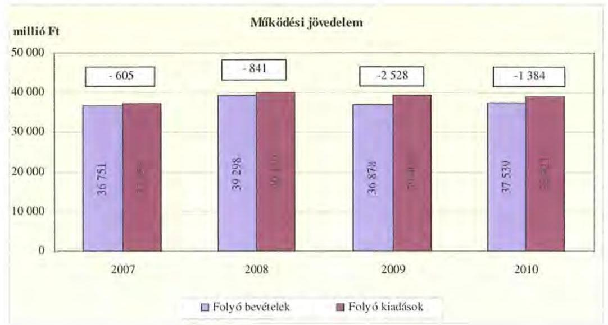

A folyó költségvetés hiánya (a múködési forráshiány) 2007. évben a folyó kiadások 1,6\%-át ( 605 millió Ft-ot), 2008. évben 2,1\%-át ( 841 millió Ft-ot), 2009. évben 6,4\%-át ( 2528 millió Ft-ot), 2010. évben 3,6\%-át (1384 millió Ft-ot) jelentette.

A múködési forráshiány finanszírozása munkabér- és folyószámlahitelből, valamint kötvénybevétel felhasználásával történt. A folyószámlahitel napi átlagos állománya 2007-2010 között közel a harmadára csökkent (1679 millió Ft-ról 681 millió Ft-ra), a munkabérhitel napi átlagos állománya pedig 414 millió Ft-ról 389 millió Ft-ra mérséklődött. Az Önkormányzat 2007-ben 5000 millió Ft értékben bocsátott ki múködési célra kötvényt, illetve a 2008-ban 3000 millió Ft értékben kibocsátott kötvénybevételből 1020 millió Ft-ot használt fel múködési célra.

Az Önkormányzat kötelezettségein ${ }^{26}$ belül a vizsgált időszakban a rövid lejáratú kötelezettségek állománya 19\% és 30\% között volt. Az Önkormányzat 2007. december 31-én fennálló pénz- és tőkepiaci kötelezettsége 5568 millió Ft-ról 13735 millió Ft-ra nőtt a hosszú lejáratú hitelek és a kötvénykibocsátás miatt.

A rövid lejáratú kötelezettségek állománya 2010-ben 5226 millió Ft-ot tett ki, amely 2948 millió Ft-tal ( $129,4 \%$-kal) több a 2007. évi rövid lejáratú kötelezettségállománynál. A rövid lejáratú kötelezettségeknek a szállítói állomány 2007ben 81,3\%-át (1852 millió Ft-ot), 2008-ban 87,7\%-át (2065 millió Ft-ot), 2009ben $94,4 \%$-át ( 3233 millió Ft-ot), 2010-ben $61,8 \%$-át ( 3232 millió Ft-ot) tette ki, miközben a szállítói kötelezettségek a vizsgált időszakban 1,7-szeresére nőttek.

[^0]
[^0]:    ${ }^{26}$ passzív pénzügyi elszámolások nélküli

---

Az Önkormányzat pénzügyi kapacitása a vizsgált időszakban folyamatosan negatív értéket mutatott. A nettó múködési jövedelem ${ }^{27}$ értéke a folyó költségvetési pozíció mellett az adott költségvetési év adósságtörlesztésének hatását is tükrözi. A pénzügyi kapacitás romlását a folyó bevételek és kiadások különbségéből származó múködési jövedelem csökkenése okozta ${ }^{28}$.

Az Önkormányzat nettó működési jövedelmének évenkénti alakulását az alábbi ábra szemlélteti:
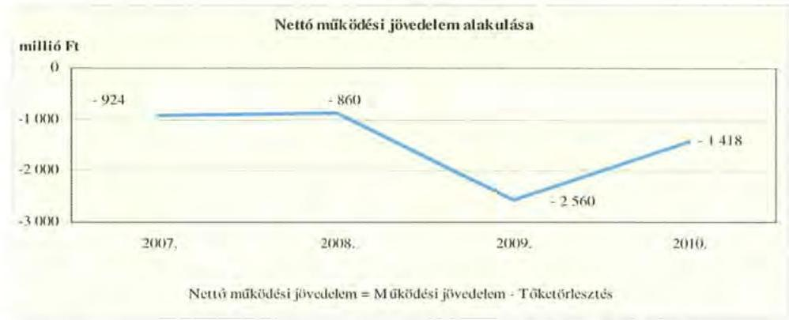

A folyó költségvetés egyenlegének és a tőketörlesztésre (hiteltörlesztés) fordított összegeknek évenkénti különbözete a (nettó múködési jövedelem) a 2007. évet követően a 2008. évben átmenetileg javult, majd a 2009. évben kiugróan alacsony értéket mutatott. A 2009. évi 2560 millió Ft negatív nettó múködési jövedelem oka, hogy a folyó kiadások 2528 millió Ft-tal meghaladták a folyó bevételeket, ezen felül 32 millió Ft tőketörlesztést teljesítettek. A 2010. évben a folyó költségvetés negatív egyenlege csökkent a 2009. évihez képest, amely hozzájárult a nettó múködési jövedelem deficitjének csökkenéséhez.

A 2007 - 2010. években az Önkormányzat felhalmozási költségvetésének egyenlege ugyancsak negatív volt, amelyet a következő ábra szemléltet:
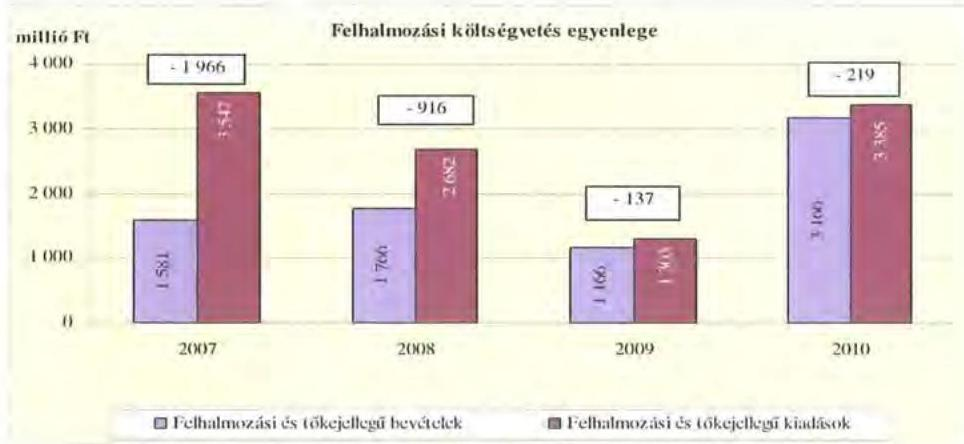
${ }^{27}$ pénzügyi kapacitás
${ }^{28}$ Az Önkormányzat tőketörlesztési kötelezettsége 2008-2010 között csökkent a 2007. évihez viszonyítva, 2007-ben 319 millió Ft, 2008-ban 18 millió Ft, 2009-ben 32 millió Ft, 2010-ben 34 millió Ft volt.

---

A felhalmozási forráshiánynak a felhalmozási és tőke jellegű kiadásokhoz viszonyított aránya 2007-ben 55,4\% (1966 millió Ft), 2008-ban 34,2\% (916 millió Ft) 2009-ben 10,5\% (137 millió Ft) 2010-ben 6,5\% (219 millió Ft) volt.

A felhalmozási forráshiány finanszírozása hosszú lejáratú hitelekből és a 2008. évben 3000 millió Ft értékben kibocsátott kötvénybevételből rendelkezésre álló 1980 millió Ft felhasználásával történt.

Az Önkormányzat évenkénti teljes finanszírozási hiánya ${ }^{29}$ a CLF módszer szerint 2007-ben 2890 millió Ft, 2008-ban 1776 millió Ft, 2009-ben 2697 millió Ft, 2010-ben 1637 millió Ft volt.

Az Önkormányzat a 2007-2010. évekbeni finanszírozási műveletei egyenlegének alakulását a következő ábra szemlélteti:
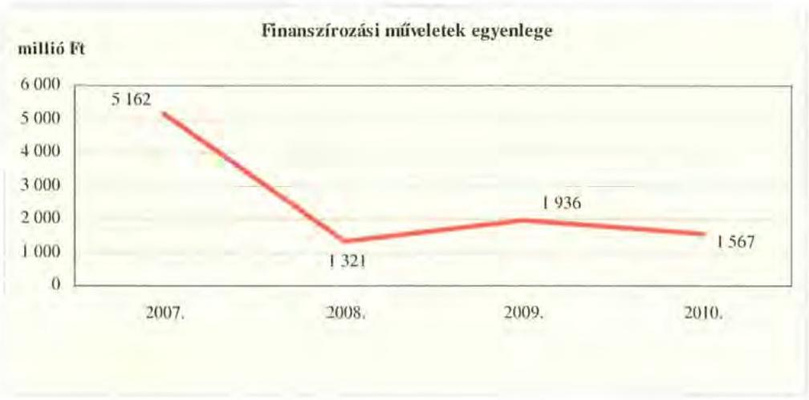

A finanszírozási többlet azt jelzi, hogy az éves költségvetések végrehajtása során szükség volt a pénzkészlet felhasználásán túl külső finanszírozás igénybevételére is. A finanszírozási célú műveleteket a vizsgált időszakban a jelentés 2/a. számú mellékletének 4.1-4.8 pontjai részletezik.

Az Önkormányzat zárszámadási rendeletében a működési, felhalmozási bevételek és kiadások egyenlegét a hagyományos költségvetési szerkezet alapján mutatta be ${ }^{30}$, amelyről a jelentés 1. számú melléklete nyújt tájékoztatást. A 2007-2010. évi zárszámadási rendeletekben kimutatott bevételek és kiadások a CLF módszer szerinti önkormányzati adatokkal ellentétben - tartalmazták a finanszírozási célú bevételeket (hitelfelvétel, kötvénykibocsátás), az előző évi pénzmaradvány felhasználásából származó pénzforgalom nélküli bevételeket és a finanszírozási célú kiadásokat (hiteltörlesztés). A finanszírozási műveletek pozitív egyenlege, valamint a pénzmaradvány igénybevételének számbavétele miatt a 2007-2010. évi zárszámadási rendeletekben múködési és felhalmozási célú többletet mutatott ki az Önkormányzat.

[^0]
[^0]:    ${ }^{29}$ a nettó múködési jövedelem és a felhalmozási költségvetés egyenlegének összege
    ${ }^{30}$ Nincs kötelező előírás a működési és felhalmozási hiány megállapításának módjára.

---

A vizsgált időszakban a kötelezettségek (passzív pénzügyi elszámolások nélkül) 7935 millió Ft-ról 17252 millió Ft-ra emelkedtek, amely együtt járt a kamatkiadások növekedésével.

A 2007-2010 között az Önkormányzat összesen 1132 millió Ft kamatot fizetett meg. Az átmenetileg szabad pénzeszközein realizált kamatbevétel (803 millió Ft) a teljes kamatráfordítás 70,9\%-át tette ki.

Az Önkormányzat kamatbevételeit és kamatkiadásait és azok egyenlegét a következő ábra mutatja:
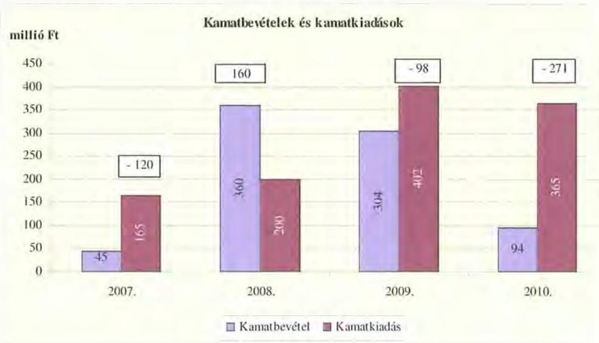

A 2007-2010 közötti időszakban az Önkormányzat kiadásait és bevételeit főbb jogcímek szerint a jelentés 2/a. számú melléklete tartalmazza.

# 2.2. Az Önkormányzat bevételei 

Az Önkormányzat 2007-2010 között realizált OEP támogatás nélküli főbb bevételi jogcímeinek számszaki adatait az alábbi táblázat, az összetételének változását a grafikon mutatja be:

| Megnevezés | 2007. év   tény | 2008. év   tény | 2009. év   tény | 2010. év   tény |
| :-- | --: | --: | --: | --: |
| Itheékbevétel | 2232 | 2546 | 2224 | 1538 |
| Izja és állami támogatás (OEP nélkül) | 10333 | 11088 | 9729 | 8617 |
| Egyéb saját bevétel | 3776 | 8908 | 10667 | 8660 |
| Összes múködési bevétel (OEP nélkül) | $\mathbf{1 8 3 4 1}$ | $\mathbf{2 2 5 2 2}$ | $\mathbf{2 2 6 2 0}$ | $\mathbf{1 8 8 1 5}$ |

---

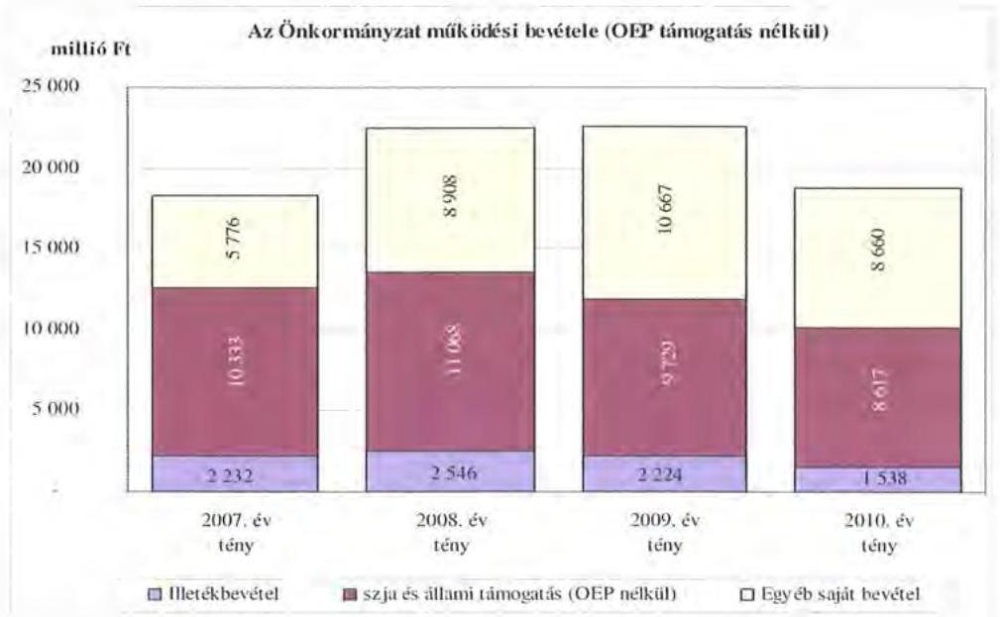

Az Önkormányzatnál az illetékbevétel a 2007. évben a 2006. évi 2679 millió Ft-hoz képest jelentősen, 16,7\%-kal (447 millió Ft) csökkent, majd a 2008. évben - az előző évhez képest - 14\%-kal (314 millió Ft) nőtt. A csökkenésben szerepet játszott az Illetékhivatalnak - 2007. január 1-jétől - az APEH-hoz történő átszervezése is, miután az évente realizált illetékbevételből (központi intézkedés következtében) évi 8,5\% elvonásra került az adminisztrációs feladatokra. Az ezen a jogcímen visszatartott összeg minden évben kevesebb volt, mint amekkora költségvetési kiadást jelentett korábban az Illetékhivatal müködtetése ${ }^{31}$ az Önkormányzatnak, így a feladatok átszervezése múködési forráshiányt nem eredményezett a 2007-2010. években. Az Illetékhivatal müködtetésével kapcsolatos 2006. évi kiadások és az adminisztrációs feladatokra visszatartott 8,5\% között 2007-ben 294 millió Ft pozitív különbözet jelentkezett. Az illetékbevétel előző évhez viszonyított - 2007. évi csökkenő, majd 2008. évi növekvő tendenciájához hozzájárult, hogy a feladatátszervezés miatt a 2007. évi illetékek beszedése áthúzódott a 2008. évre.

Az illetékbevétel a 2009-2010. években jelentősen visszaesett, 2008-ról 2009-re 12,6\%-os ( 322 millió Ft), majd a 2010. évben 30,9\%-os ( 686 millió Ft) csökkenés következett be.

Az átengedett szja és az állami támogatások együttes összege a 2008. évi - bázisévhez viszonyított - 7,1\%-os ( 735 millió Ft-os) növekedést követően a központi forráskivonás hatására folyamatosan és jelentős mértékben csökkent. Az előző évihez képest 2009-ben 12,1\%-kal (1339 millió Ft-tal), 2010-ben további 11,4\%-kal (1112 millió Ft-tal) kapott kevesebb forrást az Önkormányzat a központi költségvetésből ezeken a jogcímeken. A csökkenést a normatívák-

[^0]
[^0]:    ${ }^{31}$ A 2006. évben az Illetékhivatal müködtetésére 501 millió Ft-ot (a megyei jogú város hozzájárulásával csökkentett müködési kiadás) fordítottak. Az éves illetékbevétel 8,5\%a 2007-ben 207 millió Ft, 2008-ban 237 millió Ft, 2009-ben 207 millió Ft, 2010-ben 143 millió Ft volt.

---

nak a járulékváltozások miatti központi csökkentése, valamint a megyei önkormányzatokat érintő forráselvonás idézte elő. A kórházak múködési kiadásait finanszírozó OEP bevétel a 2007. évi 17457 millió Ft-ról a 2010. évre 15,6\%kal, 20181 millió Ft-ra emelkedett.

Az egyéb saját bevételek 2007-2010 közötti növekedését döntő mértékben a kötvénykibocsátás bevétel fel nem használt részének, mint előző évi pénzmaradványnak múködési célra történő átvétele eredményezte. Az előző évi pénzmaradvány múködési célra fordított összege a 2007. évi 477 millió Ft-hoz viszonyítva a 2008. évben 2637 millió Ft-tal, a 2009. évben 3963 millió Ft-tal, a 2010. évben 1316 millió Ft-tal nőtt. Ezen túl az intézményi múködési bevételek összege is folyamatosan nőtt a térítési díjak emelésének következtében, a 2010. évi bevétel 646 millió Ft-tal haladta meg a 2007. évit. A keletkezett díjhátralékok miatt megnövekedett követelések állománya kedvezőtlenül hatott az Önkormányzat fizetőképességének alakulására. A követelések nagysága önkormányzati szinten 2010 végére a 2007. évi bázishoz képest 1,4-szeresére nőtt ${ }^{32}$.

Az Önkormányzat felhalmozási bevételeinek szerkezete a vizsgált időszakban a következő volt:

| Megnevezés | 2007. év tény | 2008. év tény | 2009. év tény | 2010. év tény |
| :--: | :--: | :--: | :--: | :--: |
| Tárgyi eszköz értékesítés | 542 | 154 | 21 | 22 |
| Állami támogatás | 1245 | 190 | 81 | 131 |
| Átvett pénzeszköz | 164 | 138 | 190 | 407 |
| Egyéb felhalmozási bevétel | 1059 | 1916 | 1541 | 2928 |
| Felhalmozási tartalék | 503 | 444 | 436 | 249 |
| Összes felhalmozási bevétel | 3513 | 2842 | 2269 | 3737 |

Az Önkormányzatnak tárgyi eszközök értékesítéséből a 2007. évben származott számottevő, 542 millió Ft-os bevétele ${ }^{33}$.

Az Önkormányzat állami támogatásként mutatta ki a fejlesztési feladatok végrehajtásához kapott felhalmozási célú állami támogatásokat. Az intézmények egyéb felhalmozási bevételei az intézményi fejlesztésekhez kapcsolódtak. Felhalmozási tartalékként vették számba a 2007-2010. években a kötvénykibocsátás bevételéből rendelkezésre álló, felhalmozási kiadások fedezeteként szolgáló összeget, amely a felhasználás következtében, az előző évhez képest évről évre -2008-ban 11,7\%-kal, 2009-ben 1,8\%-kal, 2010-ben 42,9\%-kal - csökkent ${ }^{34}$.

[^0]
[^0]:    ${ }^{32}$ A követelések összege 2007. december 31-én 287 millió Ft, 2008. december 31-én 201 millió Ft, 2009. december 31-én 243 millió Ft, 2010. december 31-én 390 millió Ft volt.
    ${ }^{33}$ Az Önkormányzat 2007-ben egy miskolci campinget, a miskolci pedagógiai intézmény üresen álló épületét, valamint az abaújkéri oktatási intézményhez tartozó forgalomképes építményt értékesített.
    ${ }^{34}$ 2007-ben 503 millió Ft, 2008-ban 444 millió Ft, 2009-ben 436 millió Ft, és 2010- ben 249 millió Ft volt

---

# 2.3. Az Önkormányzat kiadásai 

Az Önkormányzat múködési célú kiadásai főbb jogcímek szerinti bontásban az alábbiak voltak:

|  |  |  |  | millió Ft |
| :--: | :--: | :--: | :--: | :--: |
| Megnevezés | 2007. év tény | 2008. év tény | 2009. év tény | 2010. év tény |
| Müködési kiadások | 37101 | 40013 | 39351 | 38756 |
| Müködési kiadások (kamatkiadás nélkül) | 37101 | 39921 | 39101 | 38544 |
| Kamatkiadás | 0 | 92 | 250 | 212 |
| Személyi juttatások | 15845 | 16453 | 15619 | 15535 |
| Munkaadót terhelő járulékok | 4905 | 5028 | 4534 | 3954 |
| Dologi kiadások | 14938 | 16851 | 17546 | 17804 |
| Egyéb fütyö kiadások | 223 | 150 | 139 | 229 |
| Támogatások, elvonások, egyéb fütyö átutalások | 711 | 744 | 762 | 694 |
| előző: müködési célú pénzeszközátadás | 316 | 308 | 284 | 202 |
| Előző évi pénzmaradvány átadás, vizcafizetés, müködési célú | 479 | 696 | 502 | 327 |

Az Önkormányzat teljesített müködési kiadásai a 2007. évről a 2010. évre $4,5 \%$-kal ( 1655 millió Ft) nőttek.

Az Önkormányzat 2010. évi múködési kiadásainak 50,3\%-át (19 489 millió Ft) személyi juttatásokra és a munkaadókat terhelő járulékok együttes kiadása képezte, az üzemeltetést, intézményfenntartást biztosító dologi kiadások a múködési kiadások $45,9 \%$-át ( 17804 millió Ft-ot) tettek ki. A müködési kiadásokon belül a személyi juttatások és járulékok aránya a vizsgált időszakban folyamatosan csökkent, 2007-ben 55,9\% (20 750 millió Ft), 2010-ben 50,3\% (19 489 millió Ft) volt.

A személyi juttatások teljesített kiadásai a 2008. évben nőttek, a 2009-2010. években csökkentek mind az előző évhez, mind a 2007. évhez viszonyítva. A 2008. évi - előző évhez viszonyított - 3,8\%-os ( 608 millió Ft) növekedést három intézmény múködtetésének települési önkormányzatoktól történő átvétele, illetve a 2008-ban végrehajtott létszámcsökkentések tárgyévi többletkiadásának együttes hatása eredményezte. A Hivatalban és az intézményeknél végrehajtott létszámcsökkentési intézkedések hatására a személyi juttatások kiadásai a 2007. évhez képest a 2009. évben 1,4\%-kal (226 millió Ft), a 2010. évben 2\%$\mathrm{kal}(310$ millió Ft) csökkentek.

Az Önkormányzat dologi kiadása a 2007-2010. években növekvő tendenciát mutatott. A 2008. évben a dologi kiadások 1913 millió Ft-tal haladták meg az előző évit, a $12,8 \%$-os növekedést az intézmények átvétele mellett a kórházak dologi kiadásainak $17,8 \%$-os emelkedése eredményezte, amely 1837 millió Ft kiadásnövekménynek felelt meg. (A kórházak dologi kiadásai az Önkormányzat dologi kiadásainak 72\%-át tették ki 2008-ban). A 2009. évben az előző évhez képest $4,1 \%$-kal ( 695 millió Ft-tal), a 2010. évben 1,5\%-kal ( 258 millió Fttal) nőttek a dologi kiadások, amelynek ellentételezése a központi támogatáselosztásban nem jelentkezett. Fedezetét az Önkormányzatnak a végrehajtott kiadáscsökkentő intézkedések mellett múködési célú kötvénykibocsátásból származó bevételből kellett biztosítania.

A bevételek jelentős csökkenése miatt a müködési célra átadott pénzeszközök kiadása csökkenő tendenciát mutatott. Az ezen a jogcímen történő kifi-

---

zetést a 2007. évi 316 millió Ft-ról a 2010. évre 202 millió Ft-ra - 36,1\%-kal csökkentette a Közgyűlés.

Az önkormányzati kiadásokban 2007-2010 között nőtt a kórházi kiadások aránya az egyéb fenntartott intézményekben felmerülő kiadásokhoz képest. A kórházak nélküli teljesített múködési kiadások 2007-ben az összes múködési kiadás $47 \%$-át ( 17455 millió Ft ) tették ki, ez 2010 végére $37,4 \%$-ra (14 494 millió Ft) csökkent. A kórházak nélküli kiadásokban jelentkező tendenciák a közoktatási, szociális és gyermekvédelmi, és kulturális intézményekben ellátott, valamint a Hivatalban végzett feladatokra fordított kiadásokat jellemzik.

Az Önkormányzat kórházak nélküli működési kiadásai a vizsgált időszakban a következők voltak:

| Megnevezés | 2007. év tény | 2008. év tény | 2009. év tény | 2010. év tény |
| :--: | :--: | :--: | :--: | :--: |
| Müködési kiadások | 17455 | 18142 | 17271 | 14494 |
| Müködési kiadások (kamatkiadás nélkül) | 17455 | 18050 | 17121 | 14282 |
| Kamatkiadás | 0 | 92 | 250 | 212 |
| Személyi juttatások | 9124 | 9549 | 9140 | 8253 |
| Munkaadót terhelő járulékok | 2696 | 2805 | 2524 | 1976 |
| Dologi kiadások | 4826 | 4702 | 4569 | 3569 |
| Egyéb folyó kiadások | 175 | 105 | 101 | 104 |
| Támogatások, elvonások, egyéb folyó átutalások | 354 | 192 | 387 | 32 |
| ebből: müködési célú pénzeseköztatadás | 313 | 173 | 256 | 12 |
| Előző év pénzmaradvány átadás, viszalizotés, múködési célú | 479 | 696 | 401 | 327 |

Az Önkormányzat kórházak nélküli müködési kiadásai a 2008. évben - a feladatátvétellel járó többletkiadás következtében - 687 millió Ft-tal nőttek a 2007. évihez képest. Ezt követően azonban a 2009-2010. évi kiadások jelentősen csökkentek, a 2009. évben 84 millió Ft-tal, a 2010. évben 2961 millió Ft-tal maradtak el a 2007. évben teljesített kiadástól. Ez a tendencia érvényes a személyi juttatásokra és munkaadót terhelő járulékokra, valamint a dologi kiadásokra is.

A kórházakon kívüli intézményekben és a Hivatalban a 2010. évi személyi juttatások 871 millió Ft-tal ( $9,5 \%$-kal) maradtak el a 2007. évitől. A 2010. évben fizetett, munkaadót terhelő járulék 720 millió Ft-tal ( $26,7 \%$-kal) volt kevesebb a 2007. évinél, amely egyrészt a kifizetett személyi juttatások, másrészt a járulékok mértékének csökkenésével függött össze. A járulékok csökkenése miatt felszabaduló forrásokat a kormányzat az önkormányzati alrendszernek nyújtott állami támogatásokból levonásba helyezte, így a járulékcsökkenés az Önkormányzatnál érdemi megtakarítást nem eredményezett, mivel állami támogatás csökkenéssel járt együtt.

A dologi kiadások 2008. évtől tartó folyamatos csökkenésének következményeként a 2010. évben teljesített kiadás 1057 millió Ft-tal elmaradt a 2007. évitől, ez 22,8\%-os csökkenésnek felelt meg. A Hivatal és intézmények működtetésének költségei azonban meghaladták a teljesített dologi kiadásokat, a lejárt

---

szállítói tartozás a 2007. év végén 236 millió Ft, a 2008. év végén 29 millió Ft, a 2009. év végén 56 millió Ft, a 2010. év végén 383 millió $\mathrm{Ft}^{35}$ volt.

A múködési kiadások 2008-2010 között bekövetkezett csökkenéséhez az vezetett, hogy az Önkormányzat az éves költségvetési rendeletek összeállításakor az előző évi teljesítéstől alacsonyabb összegű kiadási előirányzatot határozott meg. A kiadási előirányzat csökkenés a 2008. évben a dologi kiadásoknál 3\% (38 millió Ft), a személyi juttatások és járulékai esetében differenciált ( 53 millió Ft), a 2009. évben a személyi juttatások és járulékainál 10\% ( 953 millió Ft), a 2010. évben egységesen 20\% (dologi kiadásoknál 763 millió Ft), személyi jellegű juttatások és járulékainál (2019 millió Ft) volt.

Az Önkormányzat 2007-2010 között a fenntartása alatt múködő kórházak múködési kiadásaihoz ${ }^{36} 1535$ millió Ft-tal járult hozzá. Az Önkormányzattól kapott múködési célú támogatás a kórházak múködési kiadásainak 2007-ben 2,6\%-ára, 2008-ban 3,6\%-ára, 2009-ben 1,2\%-ára, 2010-ben 0,1\%-ára ${ }^{37}$ nyújtott fedezetet. A múködési célú kiadások döntő részét az OEP támogatás, továbbá az intézmények saját bevételei finanszírozták.

Az Önkormányzat a múködési célú támogatáson felül a 2007-2008. években összesen 152 millió Ft-ot nyújtott a kórházak fejlesztési céljaira, amely a felhalmozási célú kiadások mindössze $8 \%$-át fedezte ${ }^{38}$. A kórházak részére átadott pénzeszközöket a következő grafikon mutatja be:
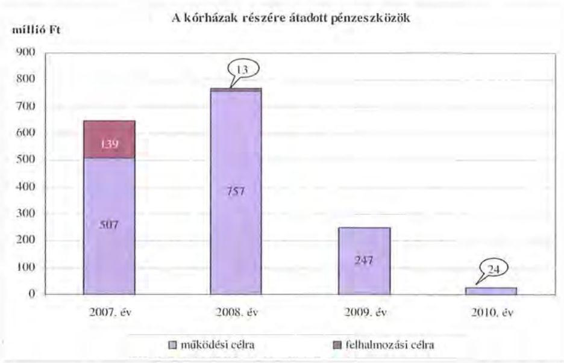

[^0]
[^0]:    ${ }^{35}$ A kórházak lejárt szállítói tartozása 2007. december 31-én 47 millió Ft, 2008. december 31-én 6 millió Ft, 2009. december 31-én kettőezer Ft, 2010. december 31-én 0,3 millió Ft volt.
    ${ }^{36}$ intézményi finanszírozás formájában
    ${ }^{37}$ A kórházak múködési célú kiadása 2007-ben 19646 millió Ft, 2008-ban 21871 millió Ft, 2009-ben 21980 millió Ft, 2010-ben 24262 millió Ft volt.
    ${ }^{38}$ A kórházak fejlesztési kiadásokra 2007-2008 években 1892 millió Ft-ot fordítottak.

---

A 2007. évben a szikszói II. Rákóczi Ferenc Kórház eszközbeszerzéseihez, valamint energiakorszerűsítésének kiadásaihoz járult hozzá az Önkormányzat 133 millió Ft-tal. Továbbá ugyanebben az évben a Borsod-Abaúj-Zemplén Megyei és Egyetemi Oktató Kórház egészségügyi gép-műszer beszerzését, illetve informatikai parkjának fejlesztését 6 millió Ft-tal támogatta. A 2008. évben a miskolci Szent Ferenc Rehabilitációs Kórház pályázati forrását egészítették ki, melyből az intézmény két épületének zártrendszerű átjárhatóságát, az érintett helyiségek átalakítását, valamint egy épület akadálymentesítését valósították meg. Az Önkormányzat 13 millió Ft támogatást nyújtott a fejlesztés megvalósításához.

A múködési és felhalmozási kiadások 2010. évi aránya a 2007. évihez képest minimális változást mutat, a felhalmozási kiadások aránya egy százalékponttal csökkent a működési kiadások arányának javára. Az Önkormányzat a felhalmozási célú kiadásokra 2009. évben költött a legkevesebbet ( 1319 millió Ft-ot), ami az összes kiadás ( 40670 millió Ft) 3,2\%-ának felelt meg. A kiadások összetételének változását a következő grafikon szemlélteti:
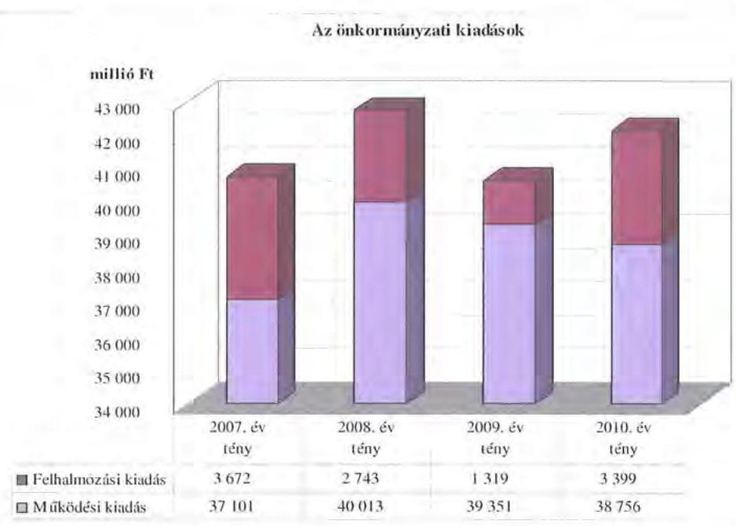

Az Önkormányzat 2007-2010 között megvalósított fejlesztései között intézményi épületek felújítása, korszerűsítése és bővítése, informatikai fejlesztések megvalósítása szerepelt, melyek teljes egészében az Önkormányzat kötelező feladatainak ellátásához kapcsolódtak. Ezen időszakban a három legmagasabb bekerülési költségű beruházás a következő volt:

- folyamatban van a 2009-ben megkezdődött a Borsod-Abaúj-Zemplén Megyei és Egyetemi Oktató Kórház infrastruktúra fejlesztése, „csillagpont kórházzá" történő alakítása, amely bekerülési költsége 11157 millió Ft, amelyhez $90 \%$-os európai uniós és hazai támogatás kapcsolódik;
- a szikszói II. Rákóczi Ferenc Kórházban az „aktív kórházi ellátásokat kiváltó járóbeteg szolgáltatások fejlesztése" projekt valósult meg európai uniós forrás igénybevételével, melynek bekerülési költsége 770 millió Ft volt;

---

- Széphalmon alakították ki a Magyar Nyelv Múzeumát, a pályázati támogatásból kivitelezett beruházást 724 millió Ft kiadással valósították meg.

Az Önkormányzat épületei állagmegóvásának, fűtési kiadásainak csökkentése érdekében a szociális és gyermekvédelmi intézményekben, a Hivatal épületében nyílászárókat cseréltek, a II. Rákóczi Ferenc Megyei Könyvtárban energiamegtakarítást célzó rekonstrukciót valósítottak meg, valamint jogszabályi kötelezettségen alapuló akadálymentesítést végeztek több intézmény épületében. A 2010 utáni évekre áthúzódó, 11421 millió Ft bekerülési költségű fejlesztések megvalósításához 10206 millió Ft európai uniós és 1074 millió Ft hazai támogatás igénybevételét tervezte az Önkormányzat. A 2010. év utánra vállalt kötelezettségből 10796 millió Ft a kórházak fejlesztéseit finanszírozza. A 20072010. években megvalósított, illetve 2010. december 31-én fennálló fejlesztési feladatokhoz kapcsolódó kötelezettségek összegzését a 3. számú melléklet tartalmazza.

Az Önkormányzat fejlesztési tevékenysége a pályázati kiírások által nagyban befolyásolt, mivel a jelentkező múködési forráshiány és saját felhalmozási bevételei alacsony szintje miatt beruházásokat csak külső források, európai uniós és hazai támogatások elnyerése esetén tud megvalósítani. A felhalmozási kiadások önrészének forrásait is felhalmozási célú hitelekből és felhalmozási célú kötvénykibocsátásból finanszírozta.

# 3. KÖTELEZETTSÉGEK BEMUTATÁSA 

### 3.1. A pénzintézetek felé fennálló kötelezettségek alakulása

Az Önkormányzat pénzintézeti kötelezettségeinek állománya 2006. december 31-től 2010. december 31-ig több mint 44-szeresére, 309 millió Ft-ról 13735 millió Ft-ra nőtt. A fennálló pénzintézeti kötelezettségei kötvények kibocsátásából, hosszú lejáratú hitel igénybevételéből, valamint folyószámla- és munkabér megelőlegezési hitelek igénybevételéből keletkeztek.

A pénzintézetekkel szemben fennálló kötelezettségek állománya
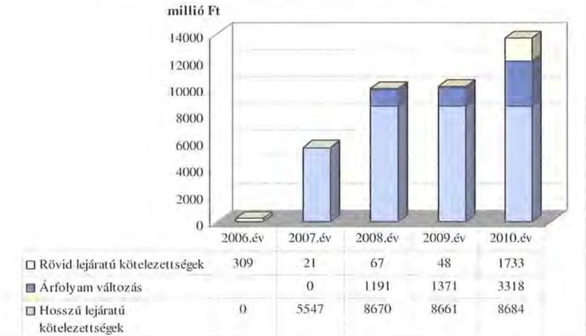

---

Az Önkormányzat pénzintézeti kötelezettségvállalásaira minden esetben közgyűlési döntés alapján került sor. A kötelezettségvállalásból származó források felhasználási céljait meghatározták. A Közgyűlés döntéseit megalapozó előterjesztések nem tartalmazták ugyanakkor a kötelezettségvállalás viszszafizetési forrásainak, a teljes futamidőre várható kamat- és tőkefizetési kötelezettségeknek, az árfolyam- és kamatkockázatoknak a bemutatását. A hosszú lejáratú hitelek igénybevételéről szóló előterjesztésekben nem tértek ki az adósságszolgálati korlát bemutatására, ezért a Közgyűlés ennek figyelembevétele nélkül döntött.

Az Önkormányzat adósságot keletkeztető kötelezettségvállalásának felső határát a 2007-2010. években nem lépte túl. Az adósságot keletkeztető kötelezettségvállalással megvalósított felhalmozási kiadások esetleges bevételt növelő, illetve kiadást csökkentő vonzatát, illetve ennek a fejlesztéshez, felújításhoz vállalt kötelezettségek visszafizetési forrásként való számbavételét nem vizsgálták.

Az Önkormányzat kötvénykibocsátásait egy-egy pénzintézet közvetlen - versenyeztetés nélküli - megbízásával bonyolította le. A versenyeztetés hiánya kockázati tényezőt jelentett a kibocsátásokból származó kötelezettségek tekintetében. A „Borsod-Abaúj-Zemplén Megye" kötvény kibocsátására számlavezető bankjával, míg a „BORSOD 2027" kötvény kibocsátására külső pénzintézettel kötött szerződést az Önkormányzat.

Az Önkormányzat 2010. december 31-én CHF-ben, illetve EUR-ban fennálló adósságot keletkeztető kötelezettségvállalásai az alábbiak voltak ${ }^{39}$ :

| Megnevezés | Kibocsátás, illetve szerződéskötés időpontja | Összeg | Kibocsátási, vagy lebivási árfolyam | Kamat (referencia kamat+ hamatfelár) | Felhasználás célja: |
| :--: | :--: | :--: | :--: | :--: | :--: |
| "Borsod-Abaúj-Zemplén Megye" kötvény | 2007. dec. 18. | 32844000 CHF | 152,01 | 6 havi CHF LIBOR + évi $1,1 \%$ | működés finanszírozása, bávod hitelek kiváltása |
| "Borsod 2027" kötvény | 2008. fén. 14. | 18317590 CHF | 166,40 | 6 havi CHF LIBOR + évi $4,3 \%$ | müködési, felhalmozás feladatok finanszírozása |
| KN9906940700 sz. borsodégészés hitel (Kórház leváltelt hitel) | 2007. jún. 27. | 200238 EUR | 254,29 | 3 havi EURIBOR + évi 4\% | beruházási hitel átvállalása |

Az Önkormányzat 2010. december 31-én forintban fennálló adósságot keletkeztető kötelezettségvállalásai a következők voltak ${ }^{40}$ :

[^0]
[^0]:    ${ }^{39}$ Az Önkormányzat a „Borsod-Abaúj-Zemplén Megye" kötvény ellenértékét működési feladatok finanszírozására, illetve működési célú hitelei (folyószámlahitel, munkabér megelőlegezési hitel) kiváltására fordította. A „BORSOD 2027" kötvény ellenértékének 65\%-át működési célú feladatokra (kötelező feladatok ellátása), 35\%-át felhalmozási célú feladatokra (felújítás, beruházás) használta fel. Az EUR-ban fennálló hosszú lejáratú hitelfelvétel célja a Szikszói Kórház gázmotor beruházásából (energiakorszerűsítés) származó kötelezettségek átvállalása volt.
    ${ }^{40}$ A forintban fennálló, adósságot keletkeztető kötelezettségek között a 1-2-06-3400-0533-1 sz. hitel a Könyvtár felújításának, a 16948 sz. ÖKIF hitel a Levéltár rekonstrukciójának, illetve a 16942 sz. ÖKIF hitel a Magyar Nyelv Múzeuma beruházása finanszírozását szolgálták.

---

| Megnevezés | Szerződéskötés   időpontja | Összeg   (ezer Ft) | Kamat (referencia   kamat+ kamatfelár) | Felhasználás célja |
| :-- | :--: | :--: | :--: | :--: |
| 1-2-06-3400-0533-1sz.   (Megyei Könyvtár) hosszú   lejáratú hitel | 2006. aug. 23. | 179700 | 3 havi EURIBOR +   évi 1,65\%, illetve 3   havi EURIBOR + évi   2,65\% | Megyei Könyvtár felújítása |
| 16948 sz. ÖKIF hitel   (Levétlár) hosszú lejáratú hitel | 2007. nov. 23. | 100000 | 3 havi EURIBOR +   évi 1,089\% | Megyei Levétár   rekonstrukciója |
| 16942 sz. ÖKIF hitel (Magyar   Nyelv Múzeuma) hosszú   lejáratú hitel | 2007. nov. 23. | 300000 | 3 havi EURIBOR +   évi 1,089\% | Magyar Nyelv Múzeuma   építési beruházás |

Az Önkormányzatnak a kötvénykibocsátásokból származó, CHF-ben pénzintézettel szemben fennálló kötelezettségei körében 2010. december 31-ig nem volt tőketörlesztési kötelezettsége. Az Önkormányzat a kötvények kamata címén 2010. december 31-ig összesen 4510661 CHF ( 825 millió Ft), átalánydíj címén 359441 CHF ( 65,5 millió Ft) összeget, valamint mindösszesen 70 millió Ft-ot jegyzési garanciavállalási dij címén fizetett meg.

A „BORSOD 2027" kötvény kibocsátásra vonatkozó 2008. február 14-iki keltezésű megbízási szerződésben, annak I. számú mellékletében (kötvényparaméterek tervezete) 2008. február 22-iki kibocsátást, illetve kamatszámítási kezdőnapot és 6 havi CHF LIBOR + évi 1,1\%-os kamatkondíciót rögzítettek.

A kibocsátó bank az Önkormányzatnak 2009. április 30-án kelt levelében értesítést küldött, amely szerint a kamatfelár mértékének emelését kezdeményezték, tekintettel a pénzpiaci helyzetre. Egyben javaslatot tettek a kötvény visszavásárlására, illetve új devizanemben történő kibocsátására, továbbá a futamidő 15 évre történő lerövidítésére. Az Önkormányzat válaszlevelében (2009. május 6-án) a kötvény újra kibocsátását és futamidő lerövidítését nem fogadta el. Az Önkormányzat képviseletében a Közgyűlés elnöke 2009. május 25-én a pénzintézetnek megküldött levelében nyilatkozott - hivatkozással az Önkormányzat 2007. évi költségvetési rendelet 6. § (1) bekezdésében és a 135/2007. (XI. 29.) számú közgyűlési határozatban foglalt felhatalmazásra -, hogy a megbízási szerződésben foglalt kamatfelár 4,3\%-ra módosítását elfogadta.

A kamatfelár emelésről szóló önkormányzati értesítő levélben, illetve a szerződésmódosításban hivatkozott 1/2007. (II. 23.) számú önkormányzati rendelet 6. § (1) bekezdésében a Közgyűlés felhatalmazta a Közgyűlés elnökét a költségvetési hiány ( 3,8 milliárd Ft) finanszírozása érdekében szükséges intézkedések megtételére. A 135/2007. (XI. 29.) számú közgyűlési határozat a Közgyűlés elnökét felhatalmazta „a kötvény kibocsátással kapcsolatos tárgyalások lefolytatására, szerződések aláírására, valamint a szükséges intézkedések megtételére".

A nyilatkozatot követően, 2009. június 18-án módosításra került a szerződés, melyben a kamatfelár mértékét évi 1,1\%-ról 4,3\%-ra emelték, a kamatszámítás kezdő időpontjaként 2008. február 22-ét rögzítették, 3,9075\%-os (6 havi CHF LIBOR+évi 1,1\%) induló éves kamatláb mellett. A 2009. III. negyedévétől érvényesített kamatfelár-többlet (3,2 százalékpont) az Önkormányzatnak jelentős, 608562 CHF ( 122 millió Ft) összegű többletköltséget jelentett 2010. december 31-ig.

---

Az Önkormányzat által az ÁSZ vizsgálatához rendelkezésre bocsátott dokumentumok (költségvetési rendelet, közgyűlési határozatok) nem tisztázták egyértelműen, hogy a Közgyűlés elnöke pontosan milyen intézkedések, döntések megtételére volt jogosult a kötvénykibocsátást követően. A felhatalmazó dokumentumok nem tartalmazták a kötvénykibocsátással vagy azt követő intézkedésekkel kapcsolatos tájékoztatási kötelezettséget sem.

Az EUR-ban fennálló hosszú lejáratú kötelezettsége körében 2010. december 31ig 280645 EUR ( 75,2 millió Ft) összegű tőketörlesztést teljesített, 9618 EUR ( 2,4 millió Ft) összegű egyszeri díjat, illetve 84707 EUR ( 22,3 millió Ft) kamatot fizetett meg. A forintban fennálló kötelezettségeiből 2010. december 31-ig mindösszesen 20,3 millió Ft összegű tőkét törlesztett és 74,4 millió Ft összegű kamatot fizetett meg. Egyéb kiadása nem merült fel az Önkormányzatnak.

Az árfolyamváltozás hatása is befolyásolja a kötelezettségek alakulását, azonban annak mértéke előre pontosan nem határozható meg, csak várakozásokon alapuló tendenciák jelezhetők. A számviteli szabályok ${ }^{41}$ meghatározzák, hogy az árfolyam különbözetet év végén a kötelezettségek vagy követelések között a könyvviteli mérlegben nyilván kell tartani, azonban az árfolyamkülönbözet valójában nem realizált. Annak megítéléséről, hogy a devizában kibocsátott kötvényekért és felvett hitelekért kapott forinthoz képest a kötvények visszavásárlásakor, illetve a hitelek visszafizetésekor jelentkező forint kötelezettség többletkiadást (árfolyamveszteséget) vagy megtakarítást (árfolyamnyereséget) eredményez a futamidő végén, a teljes kötelezettség rendezését követően lehet képet alkotni. Mindaddig, amíg törlesztési kötelezettség nem áll fenn (türelmi idő, moratórium), a tőkére vonatkoztatva nem értelmezhető sem az árfolyamveszteség, sem az árfolyamnyereség.

Az Önkormányzat 2007-2010. között az átmenetileg szabad pénzeszközein 802,6 millió Ft kamatbevételt realizált, melyből 138 millió Ft (17,2\%) származott a kötvények (forintban) realizált bevételének 2009. II-III. negyedévi betétlekötéseiből. Ebből a kamatbevételből az Önkormányzat kötelező feladatai ellátását finanszírozta. A kötvényekből származó kamatbevétel a kötvényekre teljesített kamatok ( 825 millió Ft) 16,7\%-át tette ki 2010. december 31-ig.

Az Önkormányzat likviditását a vizsgált időszakban - a 2008-2009. évek kivételével - csak folyószámla- és munkabér megelőlegezési hitel igénybevételével tudta biztosítani, amelyet az alábbi táblázat mutat be:

| Megnevezés | 2007. év | 2008. év | 2009. év | 2010. év | 2011. méreion   31. |
| :--: | :--: | :--: | :--: | :--: | :--: |
| I. Folyószámbábíret |  |  |  |  |  |
| a folyószámbábíret keretőszsége jannáé 1-jén | 1300 | 1000 | 1000 | 1000 | 2000 |
| teljesített kamat és egyéb költség | 155 | 2 | 0 | 45 | 24 |
| II. Munkabér megelölegezési hitel |  |  |  |  |  |
| igénybevett hitel összesen | 414 | 0 | 0 | 389 | 400 |
| teljesített kamat és egyéb költség | 16 | 0 | 0 | 12 | 7 |

[^0]
[^0]:    ${ }^{41}$ az államháztartás szervezetei beszámolási és könyvvezetési kötelezettségének sajátosságairól szóló 249/2000. (XII. 24.) Korm. rendelet 33. § (2) bekezdés c) pontja

---

A folyószámlahitel és munkabér megelőlegezési hitelek kondíciói és egyéb költségei a következők voltak ${ }^{42}$ :

| Megnevezés | Kamat (referencia+ kamatfelár | Egyéb költség |
| :--: | :--: | :--: |
| Folyószámlahitel |  |  |
| 2007. év | 3 havi BUBOR $+0,1 \%$ | 20000 ezer Ft promóciós dij |
|  | 3 havi BUBOR $-0,6 \%$ | 0 |
| 2008. év | 3 havi BUBOR $+1,0 \%$ | 0 |
| 2009. év | 3 havi BUBOR $+1,0 \%$ | 0 |
| 2010. év | 3 havi BUBOR $+1,0 \%$ | 0 |
| 2011. év | 3 havi BUBOR $+1,0 \%$ | 0 |
| Munkabér megelölegezési hitel |  |  |
| 2007. év | 3 havi BUBOR $-0,6 \%$ | 0 |
| 2008. év | 3 havi BUBOR $-0,6 \%$ | 0 |
| 2009. év | 3 havi BUBOR $-0,6 \%$ | 0 |
|  | 3 havi BUBOR $+1,0 \%$ | 0 |
| 2010. év | 3 havi BUBOR $+1,0 \%$ | 0 |
| 2011. év | 3 havi BUBOR $+1,0 \%$ | 0 |

A 2007. évben (közbeszerzés keretében) az Önkormányzat számlavezető pénzintézetet váltott, amelynél - a korábbi számlavezető pénzintézeténél fennálló 2007. évi 1300 millió Ft összegű folyószámla-hitelkeretét - 6000 millió Ft keretösszegű folyószámlahitel váltotta fel. A 2007. december 18-i kibocsátású, 5000 millió Ft összegű „Borsod-Abaúj-Zemplén Megye" kötvényből realizált bevétel miatt a számlavezető, egyben kötvénykibocsátó banknál az Önkormányzat a fennálló folyószámla-hitelkeretét egyidejűleg 1000 millió Ft összegűre mérsékelte. Ezzel egyidejűleg a bank a folyószámlahitel kamatkondícióját (kamatfelár) 1,6 százalékponttal megemelte. A 2011. évtől az Önkormányzat pénzügyi egyensúlya érdekében ismét folyószámlahitel keretösszegének emelésére kényszerült, a korábbi 1000 millió Ft összegű keretét számlavezető bankjánál a duplájára emeltette változatlan kamatkondíciók mellett.

A vizsgált időszakban az Önkormányzat 2007-ben 365 napon keresztül vett igénybe folyószámlahitelt, átlagosan napi 1679,1 millió Ft-ot, míg a 20082009. években ezt a forrást gyakorlatilag a kötvények kibocsátásából származó bevétel váltotta ki. A 2010. évtől - a kötvénykibocsátásból származó bevételek felhasználását követően - az Önkormányzat ismét élt a folyószámlahitel igénybevételével. A 2010. évben a 277 napon keresztül fennálló átlagos napi állomány 681 millió Ft, míg 2011. március 31-ig a 2000 millió Ft összegre emelt hitelkeretéből 90 napon keresztül átlagos hitelállománya 1382 millió Ft volt. A vizsgált időszakban az Önkormányzatnak egy év végén - 2010. december 31én - volt ( 1293 millió Ft összegű) folyószámlahitel-állománya. Az áttekintett időszakot jellemző múködési hiány, a folyamatos likviditási problémák folyószámlahitellel történt finanszírozása következtében az Önkormányzatnak a

[^0]
[^0]:    ${ }^{42}$ A referencia kamat az alábbiak szerint alakult:

    | MNB BUBOR fixing (átlagkamat) \%-ban |  |  |  |
    | :-- | :-- | :-- | :-- | :-- |
    | Referencia kamat | 2007. évi | 2008. évi | 2009. évi | 2010. évi |
    | 3 havi BUBOR | 7,75 | 8,87 | 8,64 | 5,5 |
    | 1 havi BUBOR | 7,83 | 8,75 | 8,66 | 5,47 |
    | 1 napi BUBOR | 7,78 | 8,41 | 8,39 | 4,95 |

---

2007. évtől 2010. december 31-ig összesen 205 millió Ft kamat- és kapcsolódó kiadást eredményezett.

Az Önkormányzat 2007-ben öt alkalommal átlagosan 414 millió Ft, 2010-ben hat alkalommal átlagosan 389 millió Ft összegben vett igénybe munkabér megelőlegezési hitelt. 2011. március 31-ig három alkalommal, átlagosan 400 millió Ft munkabér megelőlegezési hitelt vett igénybe. Kamat és egyéb költség címén az Önkormányzat 2007-2010 között összesen 28 millió Ft-ot fizetett ki.

A jelenleg fennálló kötvények és a hitel esetében a kamatfizetési kötelezettségek alakulását jelentősen befolyásolta és jelenleg is befolyásolja a kibocsátáskori és az utolsó kamatfizetéskori referencia kamatok változása, melyet az alábbi táblázat mutat be:

| Megnevezés | Kibocsátási, lehivási | Utolsó fizetéskori | Változás   $\%$ |
| :-- | --: | --: | :--: |
|  | alaphamat $\%$ |  |  |
| 6 havi CHF LIBOR (B-A-Z Megye kötvény) | 2,865 | 0,24 | $-91,6$ |
| 6 havi CHF LIBOR (BORSOD 2027 kötvény) | 2,808 | 0,24 | $-91,5$ |
| 3 havi EURIBOR 2007. (hitel; könyvtár rekonstr.) | 3,725 | 1,01 | $-72,9$ |
| 3 havi EURIBOR 2007. (EUR átvállalt hitel; kórház) | 4,172 | 1,096 | $-73,7$ |
| 3 havi EURIBOR 2008. (hitel; levéltárfelújítás,   ill.múzeum beruházás, HUF) | 4,765 | 1,01 | $-78,8$ |

Az Önkormányzat utolsó kamatfizetési kötelezettsége a 6 havi CHF LIBOR-ral árazott „Borsod-Abaúj-Zemplén Megye" kötvény és a szintén 6 havi CHF LIBORral árazott „BORSOD 2027" kötvény esetében 2011. március 31-én, a 3 havi EURIBOR-ral árazott hosszúlejáratú hitelek közül a Megyei Könyvtár felújításra felvett hitel esetében 2011. március 31-én, a Magyar Nyelv Múzeuma beruházásra és a Levéltár rekonstrukcióra felvett hitelek esetében 2011. április 1-jén, míg az EUR-ban fennálló átvállalt hitel (Szikszói Kórház) esetében 2011. március 31-én volt.

Amennyiben a referenciakamat nem változott volna, az Önkormányzatnak kibocsátáskori referenciakamattal számolva 2010. december 31-ig 5378130 CHF , illetve 97321 EUR kamatfizetési kötelezettsége jelentkezett volna. A változások miatt azonban 867469 CHF , illetve 12614 EUR összeggel kevesebb fizetési kötelezettsége keletkezett.

Az Önkormányzatnál a helyszíni vizsgálat alatt további hitel igénybevételéről, illetve kötvénykibocsátásról szóló döntést nem készítettek elő.

Az Önkormányzat a 2011-2014. évekre szóló gazdasági programjában rögzítette, hogy a költségvetési hiány tovább nem növelhető, elkerülhetetlen az egyensúlyi helyzet javítási eszközeinek a feltárása. Az egyensúlyi helyzet javítása érdekében a működtetés kiadásainak megtakarításai érdekében előírta a fenntartott intézmények funkcionális és strukturális hátterének áttekintését, továbbá a közfeladat ellátásánál nélkülözhető vagyon hasznosítását, valamint a saját bevételek növelését.

---

# 3.2. Szállítók felé fennálló kötelezettségek 

Az Önkormányzatnak és gazdasági társaságainak lejárt szállítói tartozásai és egyéb kiadás elmaradásait az alábbi táblázat tartalmazza:

|  |  |  |  |  |  |
| :-- | :--: | :--: | :--: | :--: | :--: |
| Megnevezés | $\mathbf{2 0 0 7}$. december 31. | $\mathbf{2 0 0 8}$. december 31. | $\mathbf{2 0 0 9}$. december 31. | $\mathbf{2 0 1 0}$. december 31. |  |
| Lejárt szállítói tartozás | 283 | 35 | 56 | 363 | 481 |
| elöböl Kórház | 47 | 6 | 0 | 0 | 11 |
| Gazdasági társaságok   lejárt szállítói tartozása | 0 | 0 | 0 | 7 | 8 |
| Egyéb kiadás elmaradás | 5 | 3 | 2 | 5 | 6 |
| Tartozásállomány   ésszerzés | $\mathbf{2 8 6}$ | $\mathbf{3 8}$ | $\mathbf{5 8}$ | $\mathbf{3 9 3}$ | $\mathbf{4 9 5}$ |

Az Önkormányzat lejárt szállítói tartozása és egyéb kiadás elmaradása a 2007. évi 286 millió Ft-ról 2010-re közel 1,4-szeresére, 393 millió Ft-ra, 2011. I. negyedév végére több mint 1,7-szeresére, 495 millió Ft-ra emelkedett. 2010. év végén a lejárt szállítói tartozásállomány meghaladta a 30 napot, $58 \%$-a 30-60 nap közötti volt. Az egyéb kiadási elmaradás a 2010. év végén 3 millió Ft volt, amely a 2011. I. negyedév végére 6 millió Ft-ra növekedett. Az egyéb kiadási elmaradást az Önkormányzat intézményeinél esedékes, de ki nem fizetett személyi juttatások és járulékai eredményezték.

A 2010. december 31-i mérlegben kimutatott szállítói kötelezettség 3232 millió Ft volt. A le nem járt tartozásállomány 2848 millió Ft-ot tett ki, amelynek $77,5 \%$-a ( 2206 millió Ft) a Kórház tartozása volt. Az Önkormányzatnál a 2010. év végén kimutatott szállítói kötelezettségre fedezetet a mérlegben kimutatott 390 millió Ft követelésállomány, illetve átmenetileg a Hivatal szabad folyószámla-hitelkerete nyújthat. Az Önkormányzat folyószám-la-hitelkerete 2010 szeptemberétől 2000 millió Ft-ra emelkedett.
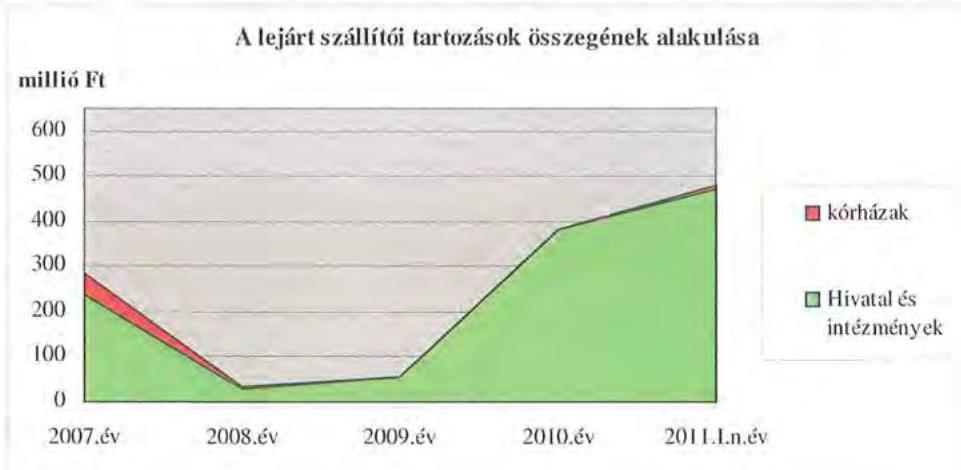

### 3.3. Egyéb kötelezettségek

Az Önkormányzatnak a vizsgált időszakban garancia- és kezességvállalással kapcsolatos hosszú távú kötelezettségvállalása nem volt.

---

A Közgyűlés elnöke a vagyongazdálkodási rendeletben ${ }^{43}$ foglaltak alapján egymillió Ft értékhatárig döntött a behajthatatlan követelés elengedéséről. A 2007-2010 között az elengedett követelések bruttó összege 11 millió Ft volt, amelyek ápolási és szociális gondozottak térítési díjai, kórházi ápolási és vizitdíj, kórházi napidíj, munkavállalói munkaruha és munkabértartozás, kollégiumi menza és térítési díjak, terembérleti díjak és vevői tartozásokra vonatkoztak.

Az Önkormányzat 2007. június 15 -én megkötött bankszámlaszerződés részeként folyószámlahitel szerződést kötött. Az egymilliárd Ft összegű folyószámlahitelkeret kettő milliárd Ft-ra való megemelése vált indokolttá 2010-ben a fizetőképesség fenntartása érdekében. A Közgyűlés 86/2010. (VII. 2.) számú határozatában hozzájárult a folyószámlahitel visszafizetésének biztosítékaként 20 db ingatlanon jelzálog alapításához és bejegyzéséhez. A fedezetként megjelölt ingatlanok körében 9 korlátozottan forgalomképes és 11 forgalomképes volt. A korlátozottan forgalomképes ingatlanokra történt jelzálogjog alapítása hitel (likvid hitel) felvételénél ellentétes az Ötv. 88. § (1) bekezdés b) pontjában foglaltakkal.

A jelzálogjoggal terhelt ingatlanok számviteli nyilvántartás szerinti nettó értéke 2010. december 31 -én 3691 millió Ft volt, amelyre a folyószámlahitel biztosítékaként kettő milliárd Ft összegű jelzálogjogot jegyeztek be. Az Önkormányzat összes forgalomképes ingatlanának könyv szerinti bruttó értéke 909 millió Ft, a korlátozottan fogalomképes ingatlanoknak 19794 millió Ft volt 2010. december 31-én.

Az Önkormányzat összes forgalomképes ingatlanának könyv szerinti bruttó értéke 909 millió Ft volt, melyből a terhelt ingatlanok bruttó értéke 807 millió Ft $(88,8 \%)$ volt.
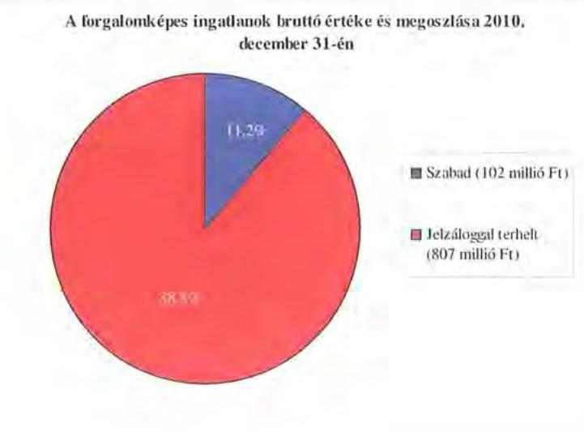

[^0]
[^0]:    ${ }^{43}$ az Önkormányzat 16/1997. (XI. 14.) számú vagyongazdálkodási rendeletének 20. § (4) bekezdése és a 16/2009. (IX. 15.) számú rendeletének 15. § (5) bekezdés e) pontja

---

A vizsgált időszakban az Önkormányzatnál nem mérték fel az eszközök elhasználódása, amortizációja fedezetének biztosításának forrásigényét. A felújításokra, az eszközök pótlására az Önkormányzat pénzügyi lehetőségének a függvényében, elsősorban az intézmények működőképességének biztosítása, illetve a szakhatósági előírások figyelembevételével került sor. Az Önkormányzat a 2007-2010. években a tárgyi eszközök után 6652 millió Ft összegű értékcsökkenést számolt el. Felújításra 963 millió Ft-ot fordítottak. Az elhasználódott és amortizálódott eszközök pótlására az Önkormányzat tartalékot nem képzett, külön alapot nem hozott létre.

Az Önkormányzat 2007. évben kölcsönszerződést kötött ${ }^{44}$ a 99,6\%-os önkormányzati tulajdonú ITC Kft-vel. A 2001. évben az ITC Kft. lízing konstrukció keretében kazánház beruházást valósított meg, amely lehetővé tette a központi távhőszolgáltatásról való leválást. A gazdaságossági számításokon alapuló kölcsönfelvétel célja a lízing konstrukció kiváltása volt. Az Önkormányzat 2007. évi költségvetésről szóló 1/2007. (II. 13.) rendeletében 12 millió Ft öszszegü kölcsön folyósítását jóváhagyta, az ITC Kft. a kölcsön visszafizetési kötelezettségének eleget tett.

# 4. A PÉNZÜGYI EGYENSÚLY MEGTEREMTÉSE ÉrDEKÉBEN HOZOTT INTÉZKEDÉSEK 

Az Önkormányzat 2007-2010. évekre szóló gazdasági programjában ${ }^{45}$ a feladatellátás helyzetét áttekintette és rögzítette, hogy az ellátandó feladatok és a rendelkezésre álló források nem biztosítják a költségvetési gazdálkodás egyensúlyát. Ezért a múködési kiadások csökkentésének főbb elveit meghatározta, többek között a fenntartott intézmények funkcionális és strukturális hátterének áttekintését, az ellátotti és oktatott létszám változását követő struktúra kialakítását. Az Önkormányzat pénzügyi egyensúlyi helyzetének javítása érdekében a Közgyűlés 2007-2010 között kiadáscsökkentő intézkedések megtételéről döntött.

A Közgyűlés határozataiban és az éves költségvetési rendeleteiben rögzített intézkedések az Önkormányzat költségvetési kiadásának csökkentéséhez - az intézményi átszervezések 612 millió Ft-tal ( $8,9 \%$-ban), az álláshely csökkentések 1443 millió Ft-tal ( $21,0 \%$-ban), az önként vállalt feladatok és a civil szervezetek támogatására szolgáló előirányzatok csökkentése 486 millió Ft-tal ( $7,1 \%$-ban), a személyi jellegű és intézmény-üzemeltetéssel összefüggő kiadások 504 millió Ft-tal ( $7,3 \%$-ban), a közoktatás, szociális és gyermekvédelem ágazatban az éves költségvetési előirányzatok differenciált mértékű csökkentése 3826 millió Ft-tal ( $55,7 \%$-ban) - járultak hozzá az Önkormányzat adatszolgáltatása alapján.

Az Önkormányzat intézményei átszervezéséről a 2007-2009. években döntött a Közgyűlés, amelyek hatására három év alatt 612 millió Ft kiadás megtakarítás - 186 millió Ft (30,4\%) személyi juttatások, 168 millió Ft (27,5\%)

[^0]
[^0]:    ${ }^{44}$ 2007. február 26-án
    ${ }^{45}$ a Közgyűlés 59/2007. (V. 31.) számú határozata Borsod-Abaúj-Zemplén Megyei Közgyűlés Középtávú Gazdasági Programjának elfogadásáról

---

járulékok és 258 millió Ft (42,1\%) dologi - jelentkezett az Önkormányzat adatszolgáltatása alapján.

A Borsod-Abaúj-Zemplén Megyei Pedagógiai Szakmai és Szakszolgálati Intézet és a Közművelődési és Idegenforgalmi Intézetek megszüntetését követően, 2007. augusztus 1-jei hatállyal létrehozták ${ }^{46}$ a Borsod-Abaúj-Zemplén Megyei Pedagógiai Szakmai, Szakszolgálati és Közművelődési Intézetet. Az Önkormányzat kötelező pedagógiai szakszolgálati feladatai köréből egyes feladatokat a 2007. évben a Szerencsi és a 2008. évben a Sárospataki Többcélú Kistérségi Társulások részére átadott ${ }^{47}$. Az Önkormányzatnál 2007-2010 között 80 millió Ft kiadási megtakarítást eredményezett a részfeladatok átadása.

A 2007. évben az Önkormányzat által alapított Gondoskodás és Esélyháza átvette a megszüntetett ${ }^{48}$ Idősek Mentálhigiénés Otthona dédestapolcsányi intézmény ellátandó feladatait.

A gyermekvédelmi szakellátás szervezeti rendszerének átalakítása során négy önállóan gazdálkodó intézmény megszüntetéséről döntött ${ }^{49}$ a Közgyűlés, továbbá a megszüntetett költségvetési szervek jogutódjaként 2009. február 1-jei hatállyal létrehozta a Borsod-Abaúj-Zemplén Megyei Gyermekvédelmi Központot. Az intézményátszervezés hatására 2009. január 1-jén a főállásban foglalkoztatott közalkalmazotti létszám 12-15\%-os mértékủ csökkentését határozta meg a Közgyűlés 2009. március 15-i hatállyal. Az átszervezések kiadási megtakarítása a 2009-2010. években 532 millió Ft volt.

Az Önkormányzat intézményeiben és a Hivatalban 2007-2010 között kiemelt figyelmet fordítottak a feladatellátás racionálisabb megszervezéséből adódó - elsősorban álláshely megszüntetéssel együtt járó - létszámcsökkentésekre. Önkormányzati szinten 2007-2010 között a feladatmegszüntetéssel, ellátórendszer átalakításával összefüggő létszámcsökkentés 1443 millió Ft megtakarítást jelentett, amelyből 1115 millió Ft (77,3\%) a személyi juttatások és 328 millió Ft (22,7\%) a járulékok kiadásainál jelentkezett.

Az egészségügyi ellátórendszer változásának hatására a kórházakban 280 fő álláshely megszüntetéséről döntött 67/2007. (V. 31.) számú határozatában a Közgyűlés. A létszámcsökkentéssel érintett intézményekben 34 fő dolgozó munkaviszonya nyugdíjazás, áthelyezés következtében, 246 fő munkaviszonya felmentéssel, végkielégítéssel megszűnt. A 108/2007. (IX. 11.) szám alatt a Közgyűlés az egészségügyi átalakításával összefüggésben további 52, a közoktatási intézményeiben 15 álláshely megszüntetését határozta meg. A kiadási megtakarítás - az Önkormányzat adatszolgáltatása szerint - 1376 millió Ft volt, melyből 1062 millió Ft bér és 314 millió Ft a járuléka volt.

A 2008. évben a kórházakban egy, a szociális ellátásban 0,5 álláshely - a mosoda energiaellátását szolgáló kazánkorszerűsítés miatt - szűnt meg a Közgyűlés döntésének ${ }^{50}$ megfelelően. A Közgyűlés a Hivatal takarékosabb működtetése ér-

[^0]
[^0]:    ${ }^{46}$ a Közgyűlés 80/2007. (VI. 28.) számú határozata
    ${ }^{47}$ a Közgyűlés 155/2007. (XII. 20.) és 82/2008. (VI. 26.) számú határozatai
    ${ }^{48}$ a Közgyűlés 147/2007. (XI. 29.) számú határozata
    ${ }^{49}$ a Közgyűlés 152/2008. (XII. 18.) számú határozata
    ${ }^{50}$ a Közgyűlés 93/2008. (VI. 26.) számú határozata

---

dekében 2009. március 1-től a költségvetési rendeletben engedélyezett létszámot 110,5 fơről 101 före csökkentette ${ }^{51}$.

A gyermekvédelmi szakellátás intézményi átszervezésének hatására a foglalkoztatottak száma 79 fővel csökkent ${ }^{52}$, amelyből 16 fő szerződéssel való foglalkoztatásának megszüntetésére volt lehetőség. A Borsod-Abaúj-Zemplén Megyei Kórház és Egyetemi Oktató Kórház belső munkaszervezési intézkedések hatására 31 álláshely megszüntetését kezdeményezte, amelyet a Közgyűlés 56/2009. (VI. 25.) és a 97/2009. (IX. 10.) számú határozataiban jóváhagyott, amelynek 2010. évben kiadási megtakarítása - az Önkormányzat adatszolgáltatása alapján - nem volt, 57 millió Ft kiadási többlet jelentkezett.

A Hivatal takarékosabb és hatékonyabb múködése, a feladatok átszervezése, újraelosztása hozzájárult a 2010. évben az engedélyezett létszám 101 fơről 92 före való csökkentéséhez, amelyet a Közgyűlés 139/2010. (XII. 16.) szám alatt rendelt el. Ezen túlmenően a 2010. évben egy fővel csökkent a közoktatásban foglalkoztatottak létszáma, az Önkormányzat kimutatása szerint a kiadási megtakarítás hatmillió Ft, ebből ötmillió Ft bér és egymillió Ft járulék.

Az Önkormányzat a 2007-2010. évi költségvetési rendeleteiben az önként vállalt feladatok, a civil szervezetek és a „Mecénás keret" - tehetséges tanulók támogatását az előző évi előirányzathoz képest évente fokozatosan csökkentette, amely összességében 486 millió Ft kiadási megtakarítást jelentett az Önkormányzat kimutatása szerint.

A személyi jellegű és intézmény-üzemeltetéssel összefüggő kiadások 504 millió Ft összegű csökkentése 2007-2010 között a helyettesítési díjak, költségtérítések, üzemanyag és energia megtakarítások, a portaszolgálat átszervezése, valamint a közbeszerzési eljárás eredményeként az intézmények és a Hivatal biztosítási költségének megtakarításából jelentkezett az Önkormányzat kimutatása szerint.

A 2008. évi költségvetési rendeletében az Önkormányzat a közoktatási ágazatban a személyi juttatás és járulékai kiadását differenciált mértékben - az SNI iskolákban ${ }^{53} 1 \%$, a középiskolákban 3\% -, továbbá az oktatási intézményekben a dologi kiadásokat 3\% mértékben csökkentette. Az intézkedés eredményeként 92 millió Ft kiadási, ebből 44 millió Ft személyi, 10 millió Ft járulék és 38 millió Ft dologi kiadási megtakarítás keletkezett az Önkormányzat kimutatása szerint.

Az Önkormányzat a 2009. évi költségvetési rendeletben egységesen az intézményekben $\mathbf{1 0 \%}$ személyi juttatás és járulék elvonásáról döntött, amelynek - az Önkormányzat kimutatása szerinti - az éves szintű hatása 952 millió Ft volt.

Az intézmények kiadási előirányzatainak további 20\%-os mértékű csökkentéséről döntött az Önkormányzat a 2010. évi költségvetési rendeleté-

[^0]
[^0]:    ${ }^{51}$ a Közgyűlés 164/2008. (XII. 18.) és 10/2009. (II. 12.) számú határozatai
    ${ }^{52}$ a Közgyűlés 39/2009. (IV. 30.) számú határozata
    ${ }^{53}$ sajátos nevelési igényű

---

ben, amely az Önkormányzat kimutatása szerint 2782 millió Ft-ot jelentett. Ez 1639 millió Ft (58,9\%) személyi juttatásból, 378 millió Ft (13,6\%) járulékból és 765 millió Ft ( $27,5 \%$ ) dologi előirányzatból tevődött össze.

Az intézményi feladatok átszervezéséről, a létszámcsökkentésekről, a kiadási előirányzatok csökkentéséről részletes előterjesztések alapján a Közgyűlés döntött. A gyermekvédelmi szakellátás átszervezéséről szóló előterjesztés bemutatta az intézményhálózat fenntartásának, múködtetésének és fejlesztésének 2008. évi helyzetét (ellátási igények alakulása, kiadási struktúra szerkezete, finanszírozási feltételek, kapacitáskihasználtság). Tartalmazta továbbá a gyermekvédelmi körzetek és szakmai telephelyek összevonásának terveit és a szakmai dolgozó létszám csökkentését, kiemelve a szakmai indokoltságot. A várható kiadási megtakarítást az előterjesztés nem tartalmazta, amelyről a 2009. évben tájékoztatást nyújtottak. A pedagógiai szakmai szakszolgálat átszervezése a Közgyűlés által jóváhagyott közoktatási, feladat-ellátási, intézménymúködtetési terveken, továbbá helyzetértékelésen és szakmai indokok bemutatásán alapult. A szociális és gyermekvédelmi intézmények átszervezést követő működési tapasztalatai a rendelkezésre álló beszámolók szerint kedvezőek, a szakmai színvonal, valamint a múködés személyi és tárgyi feltételei javultak.

A 2007-2010. évek kiadáscsökkentő intézkedéseit beavatkozási területenként az alábbiak részletezik:
adatok: millió Ft-ban

| Az érvényesített kiadás-   csökkentés területei | Személyi   juttatások   és járulékai | Dologi,   múködési   kiadások | Pénzeszköz   átadások,   támogatások | Összesen |
| :-- | :--: | :--: | :--: | :--: |
| A Közgyűlés múködése |  |  |  |  |
| Hivatalnál | 33 | 328 | 141 | 502 |
| Az intézményeknél | 5167 | 1202 |  | 6369 |
| ÖSSZESEN | 5200 | 1530 | 141 | 6871 |

A kiadási megtakarítások 92,7\%-át ( 6369 millió Ft) az intézmények gazdálkodására ható intézkedések eredményezték, amely $81,1 \%$-a ( 5167 millió Ft) a személyi juttatások, azok járulékai és $18,9 \%$-a ( 1202 millió Ft) a dologi, múködési kiadások körét érintette. A Hivatal kiadásainak csökkentéséből hatmillió Ft-tal ( $1,2 \%$-ban) a munkaszervezési intézkedések hatására a létszámcsökkentéssel együtt járó személyi juttatások és járulékok, 345 millió Ft-tal ( $68,7 \%$-ban) az önként vállalt feladatok ${ }^{54}, 141$ millió Ft-tal ( $28,1 \%$-ban) a civil szervezetek részére nyújtott támogatások és 10 millió Ft-tal ( $2,0 \%$-ban) a biztosítással elért megtakarítás jelentett.

A létszámgazdálkodással összefüggő intézkedések következtében 20072010 között az Önkormányzat intézményeinél és a Hivatalban a Közgyűlés ösz-

[^0]
[^0]:    ${ }^{54}$ A Mecénás keret támogatásából 27 millió Ft személyi juttatás és járuléka, 318 millió Ft dologi kiadás volt.

---

szesen 510,5 álláshely megszüntetésétől döntött, amelyből 504,5 álláshely ( $98,8 \%$ ) ágazati szakmai, hat álláshely ( $1,2 \%$ ) az intézményüzemeltetési feladatok ellátásához kapcsolódó álláshely volt.

Önkormányzati szinten 2007-2010 között végrehajtott álláshely csökkentés ágazatonkénti megoszlását az alábbi grafikon szemlélteti:
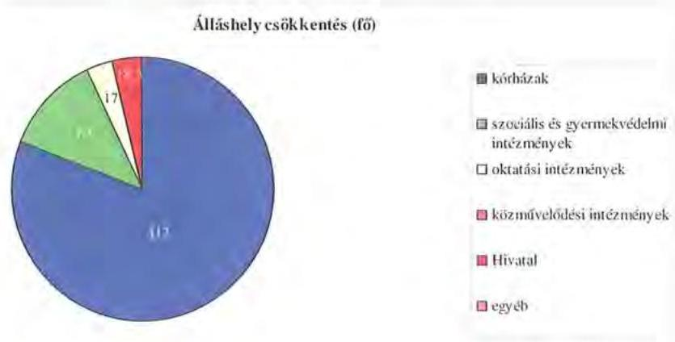

A helyi szervezési intézkedések létszámcsökkentésének végrehajtásához 20072010 között az Önkormányzat 971,7 millió Ft központosított támogatást igényelt, amely folyósítása is megtörtént. A megszüntetett álláshelyek 58\%-a (296 álláshely) járt létszámcsökkentéssel. A tartós létszámleépítéshez az Önkormányzat központosított támogatásban részesült. Az álláshely megszüntetéseket $42 \%$-ban ( 214,5 fő) az üres álláshelyek, a nyugdíjazás, a határozott idejű szerződések megszüntetése, az intézményeken belüli áthelyezések tették lehetővé. Az intézkedések hatására az Önkormányzat 2006. december 31-i 7422 átlaglétszáma 2011. március 31-re 6749 fôre ( $9,1 \%$-kal) csökkent, ebben tükröződik a kormányzati intézkedések miatti létszámcsökkenés (Illetékhivatal 75 fő) hatása is.

Az Önkormányzat 2007-2010 között bevételnövelő intézkedéseket nem tett.

Az Önkormányzat 2011-2014. évekre szóló gazdasági programjában a feladatellátás pénzügyi forrásait elemezve megállapította, hogy az évek óta fennálló és növekvő mértékű működési hiány kialakulását számos tényező befolyásolta. Így az intézmények magas száma - a 2010. év végén 53 intézmény múködött -, amelyek fenntartásához, a szakmai, ágazati előírások betartásához az állami hozzájárulás nem elegendő, azonban a kiegészítésre önkormányzati forrás nem áll a rendelkezésre. A pénzügyi egyensúlyi helyzet javítása érdekében megfogalmazta a Közgyűlés a múködési kiadások csökkentését, amely érdekében többek között ki kell alakítani a fenntartott intézmények hatékony, racionális és optimális szervezeti kereteit.

A gazdasági programban meghatározott céloknak megfelelően az Önkormányzat kötelező feladatellátását áttekintette és a Közgyűlés 138/2010. (XII. 16.) számú határozatában az Önkormányzat irányítása alá tartozó intézmények és a kizárólagos tulajdonában lévő gazdasági társaságok átszervezéséről döntött. Az átszervezésre vonatkozó javaslat megállapította, hogy az

---

ágazatonként rendelkezésre álló szakmai létszámmal való optimális gazdálkodást az intézményrendszer szétaprózottsága és a kapacitás-elosztás összehangoltságának hiánya gátolja, és nem szolgálja a kihasználatlan kapacitások megszüntetését. Az intézményrendszer szakmai színvonalának elsődleges biztosítása mellett, a strukturális átalakítás végrehajtásáról, annak szakmai indokoltságáról, a prognosztizált kiadási megtakarításokról hatástanulmányt készítettek, amelyekről 2011. február 17-én döntött a Közgyűlés:

- A megye fekvőbeteg- és járóbeteg-szakellátását a kórházak mint önállóan működő és gazdálkodó költségvetési szervek biztosítják. Az egészségügyi intézmények integrációjával 2011. május 1-től a városi kórházak a Borsod-Abaúj-Zemplén Megyei Kórház és Egyetemi Oktató Kórházba beolvadnak ${ }^{55}$. Az integráció eredményeként - a betegellátás színvonalának megőrzése mellett - egy gazdaságosan és hatékonyan működő szervezet jöhet létre. Az egységesítéssel a betegutak ésszerűbb kialakítására, közös informatikai, információs rendszer kiépítésére, gazdaságos gép-műszer beszerzésre és felhasználásra, a közbeszerzési tendereknél jobb alku pozícióra, a gazdasági, műszaki, pénzügyi rendszerek egységesítésére nyílik lehetőség. A gazdaságossági számítások alapján a 2012. évre prognosztizált kiadási megtakarítás 1648 millió Ft;
- Az Önkormányzat által fenntartott közoktatási intézményhálózat 24 egysége, és az 5 közművelődési és közgyűjteményi intézmény a megye területén elszórtan múködnek. Az egyes intézményekben többféle szakmai tevékenységet nyújtanak, önállóan működő és gazdálkodó szervként. Az intézmények önálló szakmai gazdasági tevékenysége, széttagoltsága, egyes feladatok ellátásának párhuzamossága - gazdálkodás, karbantartás, anyagbeszerzés - a működtetés kiadásait jelentősen növeli. A költséghatékony működtetés érdekében a közoktatási intézmények háttérszolgáltatásainak - a takarítás, karbantartás, portaszolgálat, gépjármú működtetés, mosás, étkeztetés, anyagbeszerzés - biztosítása az Ellátó szervezethez került 2011. április 1-jei hatálylyal ${ }^{56}$. A közoktatási és közművelődési, közgyűjteményi intézményi összevonások hatására - amelynek tervezett időpontja 2011. augusztus 1. - a 2012. évre 1678 millió Ft kiadási megtakarítást terveztek;
- A szociális, gyermekvédelmi szakellátási feladatokat ellátó intézmények átszervezéséről döntött 11/2011. (II. 17.) számú határozatában a Közgyűlés. A feladatellátás szakmai színvonalának biztosítása mellett, a költségtakarékos gazdálkodás érdekében a 16 szociális ellátást nyújtó intézményt és a Megyei Gyermekvédelmi Központot összeolvadásával megszüntette és 2011. április 1-jei hatállyal létrehozta a Megyei Önkormányzat Szociális és Gyermekvédelmi Központja intézményt. Az intézmények részére a háttérszolgáltatásokat - takarítás, karbantartás, portaszolgálat, gépjármú működtetés, mosás, étkeztetés, anyagbeszerzés - az Ellátó szervezet szolgáltatja. Az intézményi összevonások hatására a 2012. évre 990 millió Ft kiadási megtakarítást prognosztizálnak;

[^0]
[^0]:    ${ }^{55}$ a Közgyűlés 12/2011. (II. 17.) számú határozata az egészségügyi intézmények átszervezéséről
    ${ }^{56}$ a Közgyűlés 14/2011. (II. 17.) számú határozata

---

- A 100\%-ban önkormányzati tulajdonú gazdasági társaságok - ITC Kft., Általános Vagyonkezelő Kft. és a KULCS-TOUR Kft. - tevékenységének ellátását egy gazdasági társaság keretében kívánja biztosítani az Önkormányzat. A Közgyűlés 15/2011. (II. 17.) számú határozatával a kétmillió Ft törzstőkéjủ egyszemélyes Megyei Vagyonkezelő és Vagyonhasznosító Kft. alapításáról döntött.

A Közgyűlés működéséhez kapcsolható kiadások - amelyeket a 2011. évi költségvetési rendelet támasztott alá - várhatóan 49 millió Ft-tal alacsonyabb öszszegűek az előző évhez képest, amelyből 45 millió Ft ( $91,8 \%$-a) a tiszteletdíjak csökkentése miatti, 4 millió Ft ( $8,2 \%$-a) a költségtérítés miatti megtakarítás. A Hivatal a 2011. évi müködési kiadásaira - az előző évhez képest - 185 millió Ft-tal alacsonyabb összegű előirányzatot tervezett, amelyet a 2010. évben végrehajtott létszámcsökkentések ( 21 millió Ft-tal 11,3\%-kal), a Ktv. ${ }^{57}$ módosítása miatti cafetéria összegének ( 14 millió Ft-tal 7,6\%-kal), továbbá a civil szervezetek támogatási keretének ( 150 millió Ft-tal $81,1 \%$-kal) csökkentése eredményezett.

A 2011. évre a bérleti díjak átlag 5\%-os mértékű növelését tervezték a költségvetésben, továbbá az egészségügyi intézmények is a térítéses szolgáltatások díjtételeit 5\% mértékben növelték.

Az átszervezések, a takarékossági intézkedések szakmai feladatellátásra gyakorolt hatását célzottan nem vizsgálták, erről belső ellenőrzési jelentések nem állnak rendelkezésre.

# 5. A HELYI ÖNKORMÁNYZATOK GAZDÁLKODÁSI RENDSZERÉNEK 2007. ÉVI ELLENÖRZÉSE SORÁN A PÉNZÜGYI EGYENSÚLY JAVÍTÁSÁRA TETT SZABÁLYSZERŰSÉGI ÉS CÉLSZERŰSÉGI JAVASLATOK HASZNOSULÁSA 

Az Önkormányzat gazdálkodási rendszerének 2007. évi ellenőrzéséről készült ÁSZ jelentés megállapításairól és javaslatairól szóló előterjesztést a Közgyűlés megtárgyalta és a 121/2007. (X. 21.) számú határozatában elfogadta. Az Önkormányzat pénzügyi egyensúlyi helyzetének javítására szabályszerűségi és célszerűségi javaslatot a vizsgálat nem tett.

Budapest, 2011. december, 19
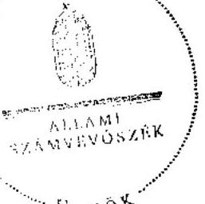

Domokos László

Melléklet: $\quad 6 \mathrm{db} \quad 24 \mathrm{lap}$

[^0]
[^0]:    ${ }^{57}$ a köztisztviselők jogállásáról szóló 1992. évi XXIII. törvény

---

.

---

#### **Borsod-Abaúj-Zemplén Megyei Önkormányzat**

#### 1. számú melléklet a V-3012/2011. számú jelentéshez

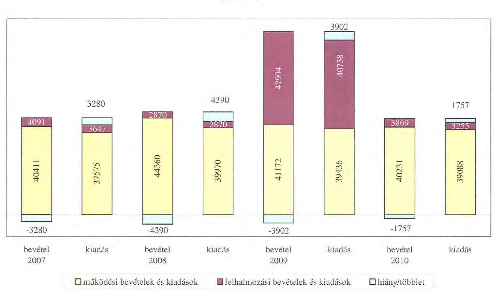

---

.

---

# A2 Önkormányzat CLP módszer szerint beszerelt bevételét és kiadásai 2007-2030 között

|  1. FOLYO KÖLTSEGYETÉS* | 2007. | 2008. | 2009. | 2010.  |
| --- | --- | --- | --- | --- |
|  1.1.1. Saját műköztér bevételét | 6 810 440 | 7 256 534 | 7 398 773 | 6 726 275  |
|  1.1.2. Kifőlegzetési támogatás | 8 254 051 | 10 320 558 | 9 896 903 | 8 367 583  |
|  1.1.3. Amígokért bevételét | 2 043 859 | 937 558 | 938 793 | 636 381  |
|  1.1.4. Állandóztartásos befelező kapott támogatások | 17 876 159 | 19 764 167 | 18 949 213 | 21 463 064  |
|  1.1.5. Fő tól és különböző kapott bevételét | 15 952 | 12 068 | 7 198 | 17 899  |
|  1.1.6. Állandóztartásos befelező kapott bevételét | 117 406 | 169 659 | 136 953 | 116 266  |
|  1.1.7. Főtól ési pénzmevalvány átvétel | 357 045 | 236 631 | 297 512 | 311 262  |
|  1.1. Folyó bevételét +1.1.1.1.1.2.1.1.2.1.1.2.1.1.1.2.1.1.1.2.1.1.1.2.1.1.1.2.1.1.2.1.1.2.1.1.2.1.1.2.1.1.2.1.1.2.1.1.2.1.1.2.1.1.2.1.1.2.1.1.2.1.1.2.1.1.2.1.1.2.1.1.2.1.1.2.1.1.2.1.1.2.1.1.2.1.1.2.1.1.2.1.1.2.1.1.2.1.1.2.1.1.2.1.1.2.1.1.2.1.1.2.1.1.2.1.1.2.1.1.2.1.1.2.1.1.2.1.1.2.1.1.2.1.1.2.1.1.2.1.1.2.1.1.2.1.1.2.1.1.2.1.1.2.1.1.2.1.1.2.1.1.2.1.1.2.1.1.2.1.1.2.1.1.2.1.1.2.1.1.2.1.1.2.1.1.2.1.1.2.1.1.2.1.1.2.1.1.2.1.1.2.1.1.2.1.1.2.1.1.2.1.1.2.1.1.2.1.1.2.1.1.2.1.1.2.1.1.2.1.1.2.1.1.2.1.1.2.1.1.2.1.1.2.1.1.2.1.1.2.1.1.2.1.1.2.1.1.2.1.1.2.1.1.2.1.1.2.1.1.2.1.1.2.1.1.2.1.1.2.1.1.2.1.1.2.1.1.2.1.1.2.1.1.2.1.1.2.1.1.2.1.1.2.1.1.2.1.1.2.1.1.2.1.1.2.1.1.2.1.1.2.1.1.2.1.1.2.1.1.2.1.1.2.1.1.2.1.1.2.1.1.2.1.1.2.1.1.2.1.1.2.1.1.2.1.1.2.1.1.2.1.1.2.1.1.2.1.1.2.1.1.2.1.1.2.1.1.2.1.1.2.1.1.2.1.1.2.1.1.2.1.1.2.1.1.2.1.1.2.1.1.2.1.1.2.1.1.2.1.1.2.1.1.2.1.1.2.1.1.2.1.1.2.1.1.2.1.1.2.1.1.2.1.1.2.1.1.2.1.1.2.1.1.2.1.1.2.1.1.2.1.1.2.1.1.2.1.1.2.1.1.2.1.1.2.1.1.2.1.1.2.1.1.2.1.1.2.1.1.2.1.1.2.1.1.2.1.1.2.1.1.2.1.1.2.1.1.2.1.1.2.1.1.2.1.1.2.1.1.2.1.1.2.1.1.2.1.1.2.1.1.2.1.1.2.1.1.2.1.1.2.1.1.2.1.1.2.1.1.2.1.1.2.1.1.2.1.1.2.1.1.2.1.1.2.1.1.2.1.1.2.1.1.2.1.1.2.1.1.2.1.1.2.1.1.2.1.1.2.1.1.2.1.1.2.1.1.2.1.1.2.1.1.2.1.1.2.1.1.2.1.1.2.1.1.2.1.1.2.1.1.2.1.1.2.1.1.2.1.1.2.1.1.2.1.1.2.1.1.2.1.1.2.1.1.2.1.1.2.1.1.2.1.1.2.1.1.2.1.1.2.1.1.2.1.1.2.1.1.2.1.1.2.1.1.2.1.1.2.1.1.2.1.1.2.1.1.2.1.1.2.1.1.2.1.1.2.1.1.2.1.1.2.1.1.2.1.1.2.1.1.2.1.1.2.1.1.2.1.1.2.1.1.2.1.1.2.1.1.2.1.1.2.1.1.2.1.1.2.1.1.2.1.1.2.1.1.2.1.1.2.1.1.2.1.1.2.1.1.2.1.1.2.1.1.2.1.1.2.1.1.2.1.1.2.1.1.2.1.1.2.1.1.2.1.1.2.1.1.2.1.1.2.1.1.2.1.1.2.1.1.2.1.1.2.1.1.2.1.1.2.1.1.2.1.1.2.1.1.2.1.1.2.1.1.2.1.1.2.1.1.2.1.1.2.1.1.2.1.1.2.1.1.2.1.1.2.1.1.2.1.1.2.1.1.2.1.1.2.1.1.2.1.1.2.1.1.2.1.1.2.1.1.2.1.1.2.1.1.2.1.1.2.1.1.2.1.1.2.1.1.2.1.1.2.1.1.2.1.1.2.1.1.2.1.1.2.1.1.2.1.1.2.1.1.2.1.1.2.1.1.2.1.1.2.1.1.2.1.1.2.1.1.2.1.1.2.1.1.2.1.1.2.1.1.2.1.1.2.1.1.2.1.1.2.1.1.2.1.1.2.1.1.2.1.1.2.1.1.2.1.1.2.1.1.2.1.1.2.1.1.2.1.1.2.1.1.2.1.1.2.1.1.2.1.1.2.1.1.2.1.1.2.1.1.2.1.1.2.1.1.2.1.1.2.1.1.2.1.1.2.1.1.2.1.1.2.1.1.2.1.1.2.1.1.2.1.1.2.1.1.2.1.1.2.1.1.2.1.1.2.1.1.2.1.1.2.1.1.2.1.1.2.1.1.2.1.1.2.1.1.2.1.1.2.1.1.2.1.1.2.1.1.2.1.1.2.1.1.2.1.1.2.1.1.2.1.1.2.1.1.2.1.1.2.1.1.2.1.1.2.1.1.2.1.1.2.1.1.2.1.1.2.1.1.2.1.1.2.1.1.2.1.1.2.1.1.2.1.1.2.1.1.2.1.1.2.1.1.2.1.1.2.1.1.2.1.1.2.1.1.2.1.1.2.1.1.2.1.1.2.1.1.2.1.1.2.1.1.2.1.1.2.1.1.2.1.1.2.1.1.2.1.1.2.1.1.2.1.1.2.1.1.2.1.1.2.1.1.2.1.1.2.1.1.2.1.1.2.1.1.2.1.1.2.1.1.2.1.1.2.1.1.2.1.1.2.1.1.2.1.1.2.1.1.2.1.1.2.1.1.2.1.1.2.1.1.2.1.1.2.1.1.2.1.1.2.1.1.2.1.1.2.1.1.2.1.1.2.1.1.2.1.1.2.1.1.2.1.1.2.1.1.2.1.1.2.1.1.2.1.1.2.1.1.2.1.1.2.1.1.2.1.1.2.1.1.2.1.1.2.1.1.2.1.1.2.1.1.2.1.1.2.1.1.2.1.1.2.1.1.2.1.1.2.1.1.2.1.1.2.1.1.2.1.1.2.1.1.2.1.1.2.1.1.2.1.1.2.1.1.2.1.1.2.1.1.2.1.1.2.1.1.2.1.1.2.1.1.2.1.1.2.1.1.2.1.1.2.1.1.2.1.1.2.1.1.2.1.1.2.1.1.2.1.1.2.1.1.2.1.1.2.1.1.2.1.1.2.1.1.2.1.1.2.1.1.2.1.1.2.1.1.2.1.1.2.1.1.2.1.1.2.1.1.2.1.1.2.1.1.2.1.1.2.1.1.2.1.1.2.1.1.2.1.1.2.1.1.2.1.1.2.1.1.2.1.1.2.1.1.2.1.1.2.1.1.2.1.1.2.1.1.2.1.1.2.1.1.2.1.1.2.1.1.2.1.1.2.1.1.2.1.1.2.1.1.2.1.1.2.1.1.2.1.1.2.1.1.2.1.1.2.1.1.2.1.1.2.1.1.2.1.1.2.1.1.2.1.1.2.1.1.2.1.1.2.1.1.2.1.1.2.1.1.2.1.1.2.1.1.2.1.1.2.1.1.2.1.1.2.1.1.2.1.1.2.1.1.2.1.1.2.1.1.2.1.1.2.1.1.2.1.1.2.1.1.2.1.1.2.1.1.2.1.1.2.1.1.2.1.1.2.1.1.2.1.1.2.1.1.2.1.1.2.1.1.2.1.1.2.1.1.2.1.1.2.1.1.2.1.1.2.1.1.2.1.1.2.1.1.2.1.1.2.1.1.2.1.1.2.1.1.2.1.1.2.1.1.2.1.1.2.1.1.2.1.1.2.1.1.2.1.1.2.1.1.2.1.1.2.1.1.2.1.1.2.1.1.2.1.1.2.1.1.2.1.1.2.1.1.2.1.1.2.1.1.2.1.1.2.1.1.2.1.1.2.1.1.2.1.1.2.1.1.2.1.1.2.1.1.2.1.1.2.1.1.2.1.1.2.1.1.2.1.1.2.1.1.2.1.1.2.1.1.2.1.1.2.1.1.2.1.1.2.1.1.2.1.1.2.1.1.2.1.1.2.1.1.2.1.1.2.1.1.2.1.1.2.1.1.2.1.1.2.1.1.2.1.1.2.1.1.2.1.1.2.1.1.2.1.1.2.1.1.2.1.1.2.1.1.2.1.1.2.1.1.2.1.1.2.1.1.2.1.1.2.1.1.2.1.1.2.1.1.2.1.1.2.1.1.2.1.1.2.1.1.2.1.1.2.1.1.2.1.1.2.1.1.2.1.1.2.1.1.2.1.1.2.1.1.2.1.1.2.1.1.2.1.1.2.1.1.2.1.1.2.1.1.2.1.1.2.1.1.2.1.1.2.1.1.2.1.1.2.1.1.2.1.1.2.1.1.2.1.1.2.1.1.2.1.1.2.1.1.2.1.1.2.1.1.2.1.1.2.1.1.2.1.1.2.1.1.2.1.1.2.1.1.2.1.1.2.1.1.2.1.1.2.1.1.2.1.1.2.1.1.2.1.1.2.1.1.2.1.1.2.1.1.2.1.1.2.1.1.2.1.1.2.1.1.2.1.1.2.1.1.2.1.1.2.1.1.2.1.1.2.1.1.2.1.1.2.1.1.2.1.1.2.1.1.2.1.1.2.1.1.2.1.1.2.1.1.2.1.1.2.1.1.2.1.1.2.1.1.2.1.1.2.1.1.2.1.1.2.1.1.2.1.1.2.1.1.2.1.1.2.1.1.2.1.1.2.1.1.2.1.1.2.1.1.2.1.1.2.1.1.2.1.1.2.1.1.2.1.1.2.1.1.2.1.1.2.1.1.2.1.1.2.1.1.2.1.1.2.1.1.2.1.1.2.1.1.2.1.1.2.1.1.2.1.1.2.1.1.2.1.1.2.1.1.2.1.1.2.1.1.2.1.1.2.1.1.2.1.1.2.1.1.2.1.1.2.1.1.2.1.1.2.1.1.2.1.1.2.1.1.2.1.1.2.1.1.2.1.1.2.1.1.2.1.1.2.1.1.2.1.1.2.1.1.2.1.1.2.1.1.2.1.1.2.1.1.2.1.1.2.1.1.2.1.1.2.1.1.2.1.1.2.1.1.2.1.1.2.1.1.2.1.1.2.1.1.2.1.1.2.1.1.2.1.1.2.1.1.2.1.1.2.1.1.2.1.1.2.1.1.2.1.1.2.1.1.2.1.1.2.1.1.2.1.1.2.1.1.2.1.1.2.1.1.2.1.1.2.1.1.2.1.1.2.1.1.2.1.1.2.1.1.2.1.1.2.1.1.2.1.1.2.1.1.2.1.1.2.1.1.2.1.1.2.1.1.2.1.1.2.1.1.2.1.1.2.1.1.2.1.1.2.1.1.2.1.1.2.1.1.2.1.1.2.1.1.2.1.1.2.1.1.2.1.1.2.1.1.2.1.1.2.1.1.2.1.1.2.1.1.2.1.1.2.1.1.2.1.1.2.1.1.2.1.1.2.1.1.2.1.1.2.1.1.2.1.1.2.1.1.2.1.1.2.1.1.2.1.1.2.1.1.2.1.1.2.1.1.2.1.1.2.1.1.2.1.1.2.1.1.2.1.1.2.1.1.2.1.1.2.1.1.2.1.1.2.1.1.2.1.1.2.1.1.2.1.1.2.1.1.2.1.1.2.1.1.2.1.1.2.1.1.2.1.1.2.1.1.2.1.1.2.1.1.2.1.1.2.1.1.2.1.1.2.1.1.2.1.1.2.1.1.2.1.1.2.1.1.2.1.1.2.1.1.2.1.1.2.1.1.2.1.1.2.1.1.2.1.1.2.1.1.2.1.1.2.1.1.2.1.1.2.1.1.2.1.1.2.1.1.2.1.1.2.1.1.2.1.1.2.1.1.2.1.1.2.1.1.2.1.1.2.1.1.2.1.1.2.1.1.2.1.1.2.1.1.2.1.1.2.1.1.2.1.1.2.1.1.2.1.1.2.1.1.2.1.1.2.1.1.2.1.1.2.1.1.2.1.1.2.1.1.2.1.1.2.1.1.2.1.1.2.1.1.2.1.1.2.1.1.2.1.1.2.1.1.2.1.1.2.1.1.2.1.1.2.1.1.2.1.1.2.1.1.2.1.1.2.1.1.2.1.1.2.1.1.2.1.1.2.1.1.2.1.1.2.1.1.2.1.1.2.1.1.2.1.1.2.1.1.2.1.1.2.1.1.2.1.1.2.1.1.2.1.1.2.1.1.2.1.1.2.1.1.2.1.1.2.1.1.2.1.1.2.1.1.2.1.1.2.1.1.2.1.1.2.1.1.2.1.1.2.1.1.2.1.1.2.1.1.2.1.1.2.1.1.2.1.1.2.1.1.2.1.1.2.1.1.2.1.1.2.1.1.2.1.1.2.1.1.2.1.1.2.1.1.2.1.1.2.1.1.2.1.1.2.1.1.2.1.1.2.1.1.2.1.1.2.1.1.2.1.1.2.1.1.2.1.1.2.1.1.2.1.1.2.1.1.2.1.1.2.1.1.2.1.1.2.1.1.2.1.1.2.1.1.2.1.1.2.1.1.2.1.1.2.1.1.2.1.1.2.1.1.2.1.1.2.1.1.2.1.1.2.1.1.2.1.1.2.1.1.2.1.1.2.1.1.2.1.1.2.1.1.2.1.1.2.1.1.2.1.1.2.1.1.2.1.1.2.1.1.2.1.1.2.1.1.2.1.1.2.1.1.2.1.1.2.1.1.2.1.1.2.1.1.2.1.1.2.1.1.2.1.1.2.1.1.2.1.1.2.1.1.2.1.1.2.1.1.2.1.1.2.1.1.2.1.1.2.1.1.2.1.1.2.1.1.2.1.1.2.1.1.2.1.1.2.1.1.2.1.1.2.1.1.2.1.1.2.1.1.2.1.1.2.1.1.2.1.1.2.1.1.2.1.1.2.1.1.2.1.1.2.1.1.2.1.1.2.1.1.2.1.1.2.1.1.2.1.1.2.1.1.2.1.1.2.1.1.2.1.1.2.1.1.2.1.1.2.1.1.2.1.1.2.1.1.2.1.1.2.1.1.2.1.1.2.1.1.2.1.1.2.1.1.2.1.1.2.1.1.2.1.1.2.1.1.2.1.1.2.1.1.2.1.1.2.1.1.2.1.1.2.1.1.2.1.1.2.1.1.2.1.1.2.1.1.2.1.1.2.1.1.2.1.1.2.1.1.2.1.1.2.1.1.2.1.1.2.1.1.2.1.1.2.1.1.2.1.1.2.1.1.2.1.1.2.1.1.2.1.1.2.1.1.2.1.1.2.1.1.2.1.1.2.1.1.2.1.1.2.1.1.2.1.1.2.1.1.2.1.1.2.1.1.2.1.1.2.1.1.2.1.1.2.1.1.2.1.1.2.1.1.2.1.1.2.1.1.2.1.1.2.1.1.2.1.1.2.1.1.2.1.1.2.1.1.2.1.1.2.1.1.2.1.1.2.1.1.2.1.1.2.1.1.2.1.1.2.1.1.2.1.1.2.1.1.2.1.1.2.1.1.2.1.1.2.1.1.2.1.1.2.1.1.2.1.1.2.1.1.2.1.1.2.1.1.2.1.1.2.1.1.2.1.1.2.1.1.2.1.1.2.1.1.2.1.1.2.1.1.2.1.1.2.1.1.2.1.1.2.1.1.2.1.1.2.1.1.2.1.1.2.1.1.2.1.1.2.1.1.2.1.1.2.1.1.2.1.1.2.1.1.2.1.1.2.1.1.2.1.1.2.1.1.2.1.1.2.1.1.2.1.1.2.1.1.2.1.1.2.1.1.2.1.1.2.1.1.2.1.1.2.1.1.2.1.1.2.1.1.2.1.1.2.1.1.2.1.1.2.1.1.2.1.1.2.1.1.2.1.1.2.1.1.2.1.1.2.1.1.2.1.1.2.1.1.2.1.1.2.1.1.2.1.1.2.1.1.2.1.1.2.1.1.2.1.1.2.1.1.2.1.1.2.1.1.2.1.1.2.1.1.2.1.1.2.1.1.2.1.1.2.1.1.2.1.1.2.1.1.2.1.1.2.1.1.2.1.1.2.1.1.2.1.1.2.1.1.2.1.1.2.1.1.2.1.1.2.1.1.2.1.1.2.1.1.2.1.1.2.1.1.2.1.1.2.1.1.2.1.1.2.1.1.2.1.1.2.1.1.2.1.1.2.1.1.2.1.1.2.1.1.2.1.1.2.1.1.2.1.1.2.1.1.2.1.1.2.1.1.2.1.1.2.1.1.2.1.1.2.1.1.2.1.1.2.1.1.2.1.1.2.1.1.2.1.1.2.1.1.2.1.1.2.1.1.2.1.1.2.1.1.2.1.1.2.1.1.2.1.1.2.1.1.2.1.1.2.1.1.2.1.1.2.1.1.2.1.1.2.1.1.2.1.1.2.1.1.2.1.1.2.1.1.2.1.1.2.1.1.2.1.1.2.1.1.2.1.1.2.1.1.2.1.1.2.1.1.2.1.1.2.1.1.2.1.1.2.1.1.2.1.1.2.1.1.2.1.1.2.1.1.2.1.1.2.1.1.2.1.1.2.1.1.2.1.1.2.1.1.2.1.1.2.1.1.2.1.1.2.1.1.2.1.1.2.1.1.2.1.1.2.1.1.2.1.1.2.1.1.2.1.1.2.1.1.2.1.1.2.1.1.2.1.1.2.1.1.2.1.1.2.1.1.2.1.1.2.1.1.2.1.1.2.1.1.2.1.1.2.1.1.2.1.1.2.1.1.2.1.1.2.1.1.2.1.1.2.1.1.2.1.1.2.1.1.2.1.1.2.1.1.2.1.1.2.1.1.2.1.1.2.1.1.2.1.1.2.1.1.2.1.1.2.1.1.2.1.1.2.1.1.2.1.1.2.1.1.2.1.1.2.1.1.2.1.1.2.1.1.2.1.1.2.1.1.2.1.1.2.1.1.2.1.1.2.1.1.2.1.1.2.1.1.2.1.1.2.1.1.2.1.1.2.1.1.2.1.1.2.1.1.2.1.1.2.1.1.2.1.1.2.1.1.2.1.1.2.1.1.2.1.1.2.1.1.2.1.1.2.1.1.2.1.1.2.1.1.2.1.1.2.1.1.2.1.1.2.1.1.2.1.1.2.1.1.2.1.1.2.1.1.2.1.1.2.1.1.2.1.1.2.1.1.2.1.1.2.1.1.2.1.1.2.1.1.2.1.1.2.1.1.2.1.1.2.1.1.2.1.1.2.1.1.2.1.1.2.1.1.2.1.1.2.1.1.2.1.1.2.1.1.2.1.1.2.1.1.2.1.1.2.1.1.2.1.1.2.1.1.2.1.1.2.1.1.2.1.1.2.1.1.2.1.1.2.1.1.2.1.1.2.1.1.2.1.1.2.1.1.2.1.1.2.1.1.2.1.1.2.1.1.2.1.1.2.1.1.2.1.1.2.1.1.2.1.1.2.1.1.2.1.1.2.1.1.2.1.1.2.1.1.2.1.1.2.1.1.2.1.1.2.1.1.2.1.1.2.1.1.2.1.1.2.1.1.2.1.1.2.1.1.2.1.1.2.1.1.2.1.1.2.1.1.2.1.1.2.1.1.2.1.1.2.1.1.2.1.1.2.1.1.2.1.1.2.1.1.2.1.1.2.1.1.2.1.1.2.1.1.2.1.1.2.1.1.2.1.1.2.1.1.2.1.1.2.1.1.2.1.1.2.1.1.2.1.1.2.1.1.2.1.1.2.1.1.2.1.1.2.1.1.2.1.1.2.1.1.2.1.1.2.1.1.2.1.1.2.1.1.2.1.1.2.1.1.2.1.1.2.1.1.2.1.1.2.1.1.2.1.1.2.1.1.2.1.1.2.1.1.2.1.1.2.1.1.2.1.1.2.1.1.2.1.1.2.1.1.2.1.1.2.1.1.2.1.1.2.1.1.2.1.1.2.1.1.2.1.1.2.1.1.2.1.1.2.1.1.2.1.1.2.1.1.2.1.1.2.1.1.2.1.1.2.1.1.2.1.1.2.1.1.2.1.1.2.1.1.2.1.1.2.1.1.2.1.1.2.1.1.2.1.1.2.1.1.2.1.1.2.1.1.2.1.1.2.1.1.2.1.1.2.1.1.2.1.1.2.1.1.2.1.1.2.1.1.2.1.1.2.1.1.2.1.1.2.1.1.2.1.1.2.1.1.2.1.1.2.1.1.2.1.1.2.1.1.2.1.1.2.1.1.2.1.1.2.1.1.2.1.1.2.1.1.2.1.1.2.1.1.2.1.1.2.1.1.2.1.1.2.1.1.2.1.1.2.1.1.2.1.1.2.1.1.2.1.1.2.1.1.2.1.1.2.1.1.2.1.1.2.1.1.2.1.1.2.1.1.2.1.1.2.1.1.2.1.1.2.1.1.2.1.1.2.1.1.2.1.1.2.1.1.2.1.1.2.1.1.2.1.1.2.1.1.2.1.1.2.1.1.2.1.1.2.1.1.2.1.1.2.1.1.2.1.1.2.1.1.2.1.1.2.1.1.2.1.1.2.1.1.2.1.1.2.1.1.2.1.1.2.1.1.2.1.1.2.1.1.2.1.1.2.1.1.2.1.1.2.1.1.2.1.1.2.1.1.2.1.1.2.1.1.2.1.1.2.1.1.2.1.1.2.1.1.2.1.1.2.1.1.2.1.1.2.1.1.2.1.1.2.1.1.2.1.1.2.1.1.2.1.1.2.1.1.2.1.1.2.1.1.2.1.1.2.1.1.2.1.1.2.1.1.2.1.1.2.1.1.2.1.1.2.1.1.2.1.1.2.1.1.2.1.1.2.1.1.2.1.1.2.1.1.2.1.1.2.1.1.2.1.1.2.1.1.2.1.1.2.1.1.2.1.1.2.1.1.2.1.1.2.1.1.2.1.1.2.1.1.2.1.1.2.1.1.2.1.1.2.1.1.2.1.1.2.1.1.2.1.1.2.1.1.2.1.1.2.1.1.2.1.1.2.1.1.2.1.1.2.1.1.2.1.1.2.1.1.2.1.1.2.1.1.2.1.1.2.1.1.2.1.1.2.1.1.2.1.1.2.1.1.2.1.1.2.1.1.2.1.1.2.1.1.2.1.1.2.1.1.2.1.1.2.1.1.2.1.1.2.1.1.2.1.1.2.1.1.2.1.1.2.1.1.2.1.1.2.1.1.2.1.1.2.1.1.2.1.1.2.1.1.2.1.1.2.1.1.2.1.1.2.1.1.2.1.1.2.1.1.2.1.1.2.1.2.1.1.2.1.1.2.1.1.2.1.1.2.1.1.2.1.1.2.1.1.2.1.1.2.1.1.2.1.1.2.1.1.2.1.1.2.1.1.2.1.1.2.1.1.2.1.1.2.1.1.2.1.1.2.1.1.2.1.1.2.1.1.2.1.1.2.1.1.2.1.1.2.1.1.2.1.1.2.1.1.2.1.1.2.1.1.2.1.1.2.1.1.2.1.1.2.1.1.2.1.1.2.1.1.2.1.1.2.1.1.2.1.1.2.1.1.2.1.1.2.1.1.2.1.1.2.1.1.2.1.1.2.1.1.2.1.1.2.1.1.2.1.1.2.1.1.2.1.1.2.1.1.2.1.1.2.1.1.2.1.1.2.1.1.2.1.1.2.1.1.2.1.1.2.1.1.2.1.1.2.1.1.2.1.1.2.1.1.2.1.1.2.1.1.2.1.1.2.1.1.2.1.1.2.1.1.2.1.1.2.1.1.2.1.1.2.1.1.2.1.1.2.1.1.2.1.1.2.1.1.2.1.1.2.1.1.2.1.1.2.1.1.2.1.1.2.1.1.2.1.1.2.1.1.2.1.1.2.1.1.2.1.1.2.1.1.2.1.1.2.1.1.2.1.1.2.1.1.2.1.1.2.1.1.2.1.1.2.1.1.2.1.1.2.1.1.2.1.1.2.1.1.2.1.1.2.1.1.2.1.1.2.1.1.2.1.1.2.1.1.2.1.1.2.1.1.2.1.1.2.1.1.2.1.1.2.1.1.2.1.1.2.1.1.2.1.1.2.1.1.2.1.1.2.1.1.2.1.1.2.1.1.2.1.1.2.1.1.2.1.1.2.1.1.2.1.1.2.1.1.2.1.1.2.1.1.2.1.1.2.1.1.2.1.1.2.1.1.2.1.1.2.1.1.2.1.1.2.1.1.1.1.1.1.1.1.1.1.1.1.1.1.1.1.1.1.1.1.1.1.1.1.1.1.1.1.1.1.1.1.1.1.1.1.1.1.1.1.1.1.1.1.1.1.1.1.1.1.1.1.1.1.1.1.1.1.1.1.1.1.1.1.1.1.1.1.1.1.1.1.1.1.1.1.1.1.1.1.1.1.1.1.1.1.1.1.1.1.1.1.1.1.1.1.1.1.1.1

---

Borsod-Absúj-Zemplén Megyei Önkormányzat

2/b. számú melléklet a V-1012/2011. számú jelentéshez

Az Önkormányzat bevételeinek és kiadásainak, adószágyasítáblázások alabadása 2007-2010 között

|  Sar-
szám | Megnevezés | 2007. év | 2008. év | 2009. év | 2010. év  |
| --- | --- | --- | --- | --- | --- |
|   |  | tész | tész | tész | tész  |
|  I. | MÉKÖDÉSI BEVÉTELEK | 35 708 174 | 41 770 209 | 40 634 792 | 38 995 860  |
|  1 | Sajátus folyó bevételek | 6 620 963 | 7 114 859 | 7 027 832 | 6 670 682  |
|  1.1 | Intenzérnek működési bevétele | 4 294 428 | 4 568 733 | 4 803 468 | 5 030 981  |
|  1.2 | Hozókívokotók | 2 222 469 | 2 540 979 | 2 224 278 | 1 520 055  |
|  1.3 | Helvi adóbevételét és późniejek | 68 | 144 | 86 | 101  |
|  1.4 | Karmi bevétel működési része | 0 | 0 | 0 | 52 515  |
|  1.5 | Egyéb felvét működési bevételek | 0 | 0 | 0 | 0  |
|  2 | Támogatás értékű működési bevételek | 419 492 | 506 592 | 934 809 | 1 270 888  |
|   | elező | 0 | 0 | 0 | 0  |
|   | Helvi önkormányzatoktól és költségvetési szerveződés | 27 874 | 8 805 | 230 102 | 147 770  |
|   | többvétű kizárólagi términoitól | 0 | 22 053 | 25 086 | 17 504  |
|  3 | Föreforgalom nélküli bevételek működésre járólagzott része | 829 812 | 2 649 515 | 4 781 596 | 2 110 194  |
|  4 | Államháztartáson kívülről működési célra átvett pénzesehősök | 122 258 | 182 715 | 146 502 | 134 138  |
|   |  | 0 | 0 | 0 | 0  |
|  5 | Központi támogatások és átengedett bevétele működési része | 17 789 687 | 20 325 232 | 27 743 653 | 28 802 028  |
|   | elező | 0 | 0 | 0 | 0  |
|   | SZTA | 3 043 859 | 937 558 | 763 460 | 480 559  |
|   | önkormányzat és intézményok állami támogatásának működési része | 7 289 030 | 10 130 899 | 8 762 709 | 8 146 491  |
|   | költségvetési kiegészítésük, visszajárulások | 82 | 0 | 0 | 4 330  |
|   | társadalombiztosítási alapból | 17 256 716 | 19 297 575 | 18 014 484 | 20 189 648  |
|  II. | MÉKÖDÉSI KIADÁSOK (kamarkivalás nélkül) | 37 180 861 | 39 921 001 | 39 181 898 | 38 543 920  |
|  1 | Feljé működési kiadások összesen kamarkivalások nélkül | 35 910 797 | 38 480 887 | 37 837 480 | 37 522 170  |
|   | elező | 0 | 0 | 0 | 0  |
|   | személyi juttatások | 15 843 699 | 16 452 057 | 15 618 948 | 15 535 289  |
|   | munkaidőit terhelő játolékok | 4 905 292 | 5 027 948 | 4 533 863 | 3 993 613  |
|   | átélagi kiadások | 14 537 592 | 16 030 542 | 17 546 196 | 17 004 254  |
|   | egyéb folyón kiadások | 223 204 | 149 540 | 138 563 | 229 014  |
|   | egyéb folyón működési kiadások | 0 | 0 | 0 | 0  |
|  2 | Támogatások, elvonások és egyéb folyón átutalások | 583 443 | 591 375 | 592 498 | 566 058  |
|   | elező | 0 | 0 | 0 | 0  |
|   | működési célú pénzesehőszi kiadás államháztartáson kívülre | 316 392 | 309 345 | 284 263 | 201 586  |
|   | működési célú pénzesehőszi kiadás államháztartáson belülre | 0 | 0 | 0 | 0  |
|   | elvonásban és szociálpojtókat szorulások | 267 051 | 283 039 | 368 135 | 364 472  |
|  3 | Előző évi pénzmevedvége kiadás, visszafizetés működési kiadás | 479 076 | 696 351 | 502 770 | 327 293  |
|  4 | Támogatás értékű működési kiadás | 127 545 | 152 468 | 169 290 | 128 399  |
|   | elező | 0 | 0 | 0 | 0  |
|   | önkormányzatoknak | 125 737 | 142 767 | 169 290 | 128 399  |
|   | kizárólagi términoitok | 0 | 0 | 0 | 0  |
|  III. | ADÓSSÁGSEOLGÁLAT | 484 518 | 218 009 | 434 228 | 399 069  |
|   | állami/észzetű kötelezettség működési kiadás | 309 165 | 0 | 31 748 | 0  |
|   | felhormozás | 10 230 | 18 391 | 0 | 24 331  |
|   | kamatfizetési kötelezettség működési kiadás | 0 | 92 000 | 150 000 | 212 155  |
|   | felhormozás | 165 115 | 107 700 | 152 580 | 152 583  |
|   | Szavári fejévén értékpapír beválása, vásárlása | 0 | 0 | 0 | 0  |
|   | levélés (fajkásintéző célú beállalás) | 0 | 0 | 0 | 0  |
|   | vásárlás (fajkásintéző célú beállalás általános) | 0 | 0 | 0 | 0  |
|   | 1. TÁLDAI ÁNGÁGÁSI BEVÉTELEK | 3 512 918 | 2 841 954 | 2 269 565 | 3 737 615  |
|  1 | Saját felhormozási és idezjefogó bevétel | 656 371 | 403 848 | 617 565 | 485 793  |
|  1.1 | Tárgyi eszközök, semmi, javak értékesítése, Alá visszajárulás | 541 652 | 154 067 | 20 719 | 21 956  |
|  1.2 | Pécsészkezőből származó bevétel | 41 898 | 45 359 | 46 085 | 38 505  |
|  1.3 | Önivalók, részesedések | 13 000 | 18 460 | 18 000 | 171 150  |
|  1.4 | Kamatbevétel felhormozási része | 44 671 | 360 263 | 384 143 | 0  |
|  1.5 | Hész adók átengedett adók felhormozási része | 0 | 0 | 319 333 | 129 542  |
|  1.6 | Egyéb folyón felhormozási bevételek | 15 250 | 25 700 | 13 489 | 28 639  |
|  2 | Támogatásértékű felhormozási bevételek | 944 280 | 1 465 830 | 944 366 | 2 544 507  |
|   | elező | 0 | 0 | 0 | 0  |
|   | Helvi önkormányzatoktól és költségvetési szerveződés | 70 289 | 314 891 | 101 168 | 76 009  |
|   | többvétű kizárólagi términoit | 0 | 2 375 | 6 850 | 2 323  |
|  3 | Föreforgalom nélküli bevételek felhormozásra járólagzott része | 502 630 | 444 039 | 436 285 | 248 925  |
|  4 | Államháztartáson kívülről felhormozási célra átvett pénzesehősök | 164 516 | 137 789 | 190 154 | 407 319  |
|   |  | 0 | 0 | 0 | 0  |
|  5 | Átlagi felhormozási és idezjefogó bevétel | 1 345 021 | 190 459 | 81 195 | 131 072  |
|  5.1 | Elő költségvetéséről átvétel | 0 | 0 | 0 | 0  |
|  5.2 | Önkormányzatok költségvetési támogatása felhormozási célra | 1 245 021 | 190 459 | 81 195 | 131 072  |
|  V. | FELJIALÁNGZÁSI KIADÁSOK | 3 671 709 | 2 743 396 | 1 319 841 | 3 295 204  |
|  1 | Feljé felhormozási kiadások kamatkiadások nélkül | 3 527 721 | 2 659 750 | 1 313 938 | 3 050 274  |
|  1.1 | Hozókívak, felújítás | 3 437 881 | 2 638 254 | 1 313 938 | 3 050 176  |
|  1.2 | Értékesített tárgyi eszközök aláhadási felhormozás | 89 840 | 18 874 | 0 | 0  |
|  1.3 | Részzeszékelt vásárlása | 18 000 | 12 630 | 0 | 100  |
|  2 | Támogatások, elvonások és egyéb folyón átutalások | 21 966 | 5 900 | 26 385 | 17 420  |
|   | elező | 0 | 0 | 0 | 0  |
|   | felhormozási célú pénzesehőszi kiadás államháztartáson kívülre | 3 430 | 0 | 1 500 | 0  |
|   | felhormozási célú támogatásunk, kölcsön, kölcsön értékesítése | 18 546 | 5 900 | 24 085 | 17 420  |
|  2 | Támogatásértékű felhormozási kiadások | 77 122 | 25 100 | 63 828 | 271 150  |
|   | elező | 0 | 0 | 0 | 0  |
|   | Helvi önkormányzatoknak és költségvetési szervezők | 77 122 | 25 100 | 63 828 | 271 150  |
|   | többvétű kizárólagi términoit | 0 | 0 | 0 | 0  |
|  4 | Föreforgalom nélküli kiadások felhormozásra járólagzott része | 24 500 | 42 500 | 15 773 | 14 105  |
|   | komoril (csak önv. 7606 bev.) | 39 311 092 | 44 631 263 | 42 984 257 | 41 732 479  |
|   | komoril tárgyási költségi kiadás (II.+V.+6/6+6/25) | 40 937 689 | 42 864 175 | 40 821 609 | 42 307 062  |
|   | telfeségszolgálatból fennálló | 319 403 | 18 304 | 21 748 | 16 331  |
|   | komoril összes kiadás | 41 357 008 | 42 882 476 | 40 854 407 | 41 342 393  |
|  VI. | Hizzi, kölcsön felvétel | 1 378 258 | 2 187 547 | 0 | 1 493 473  |
|  6.1 | Javol fajisszá józélek felvétele | 0 | 0 | 0 | 400 000  |
|  6.2 | Jávol tüzélek felvétele | 0 | 0 | 0 | 1 393 473  |
|  6.3 | Sorszaj fajisszá józélek felvétele | 570 438 | 139 499 | 0 | 0  |
|   | Befélzetelet és hosszú hiányai értékpapírok kibocsátása, értékesítése | 5 000 912 | 3 048 048 | 0 | 0  |
|   | kibocsátás (fajkásintéző célú beállalás) | 0 | 0 | 0 | 0  |
|   | értékesítés (fajkásintéző célú) | 5 000 012 | 3 048 048 | 0 | 0  |
|   | kibocsátás (fejlődés) | 0 | 0 | 0 | 0  |
|  6.4 | Regerévi célú értékpapírok beválása, vásárlása és a kibocsátása, értékesítése egyenlege | 0 | 0 | 0 | 0  |
|  6.5 | Imlálásával (szfélékről) | 0 | 0 | 0 | 0  |
|  VII. | Finanszírozási pól a mikrobitek egyenlege | 9 259 047 | 3 169 246 | -21 748 | 1 659 142  |

---

# Az Önkormányzat 2007-2010. években megvalósított, illetve 2010. december 31-én fennálló fejlesztési feladatokhoz kapcsolódó kötelezettségeinek összegzése

|  Fejlesztési feladat megnevezése, és a közgyűlési határozat száma | Beruházás kezdete | Teljes bekerülési költség | 2006. december 31-ig teljesített kiadás | 2007-2010. évek között teljesített kiadás | 2010. év utánra vállalt kötelezettség | 2010. utáni kötelezettség-vállalás forrásösszetétele |  |  |   |
| --- | --- | --- | --- | --- | --- | --- | --- | --- | --- |
|   |  |  |  |  |  | Saját bevétel | Hitel | Kötvény | EU-s támogatás  |
|  Hivatal |  |  |  |  |  |  |  |  |   |
|  Megyei Leváltár raktárbázis kialakítás; 35/2005. (IV. 14.) Kgy hat.; (Cél tám.) | 2006 | 494 835 | 9 755 | 485 080 |  |  |  |  |   |
|  Egészségügyi gép-műszer beszerzés; Önk. rend.-k: 6/2008 (IV.25), 6/2009 (V.5.), 7/2010 (V.4.), (6/2011 (V.4.); | 2007, 2008, 2009, 2010 | 217 709 | - | 217 709 |  |  |  |  |   |
|  B. A. Z. Megyei Megyei Területrendezési Terv felülvizsgálata; 1/2008.(II.12.) Kgy rendelet | 2008 | 24 720 | - | 24 720 |  |  |  |  |   |
|  Borsodivánka Pszichiátriai Otthon rekonstrukciója; V. 4237-9/2006. | 2005 | 207 880 | 30 407 | 177 473 |  |  |  |  |   |
|  Szikszói II. Rákóczi Ferenc Kórház, "Aktív kórházi ellátásokat kiváltó járóbeteg szolgáltatások fejlesztése" című TIOP-2.1.3. Projekt; Kgy. hat.-ok: 152/2007. (XII.20.), 110/2008. (IX.4.); (Pály. tám.) | 2008 | 769 619 | - | 769 619 |  |  |  |  |   |
|  Intézmények Vízmű hálózathoz támogatás | 2007 | 11 200 | - | 11 200 |  |  |  |  |   |
|  Megyei Múzeumi Igazgatóság Papszer úti épületének villamos rekonstrukciója 78/2004. (VI.17.) Kgy. sz. határozata ROP (Pály.tám) | 2007 | 29 847 | - | 29 847 |  |  |  |  |   |
|  Magyar Nyelv Múzeumának kialakítása; 39/2008. (III. 27.) Kgy. számú határozat, 44/2009.(IV.30.) Kgy. hat.; (Pály. tám.) | 2006 | 723 804 | 4 358 | 719 446 |  |  |  |  |   |
|  Megyei Múzeumi Igazgatóság sárospataki képtár tetőrekonstrukció LEKI 53/2008. (IV.24.) Kgy. sz. hat.; (Pály. tám.) | 2009 | 13 612 | - | 13 612 |  |  |  |  |   |

---

|  Fejlesztési feladat megnevezése, és a közgyűlési határozat száma | Beruházás kezdete | Teljes bekerülési költség | 2006. december 31-ig teljesített kiadás | 2007-2010. évek között teljesített kiadás | 2010. év utánra vállalt kötelezettség | 2010. utáni kötelezettség-vállalás forrásösszetétele |  |  |   |
| --- | --- | --- | --- | --- | --- | --- | --- | --- | --- |
|   |  |  |  |  |  | Saját bevétel | Hitel | Kötvény | EU-s támogatás  |
|  Özti Idősek Otthona, külső nyílászárók cseréje (TEKI); 53/2008. (IV. 24.) Kgy. sz. hat.; (Pály. tám.) | 2009 | 13 241 | - | 13 241 |  |  |  |  |   |
|  Borsodnádasd Idősek Otthona, külső nyílászárók cseréje, LEKI fűtésrekonstrukció; 53/2008. (IV. 24.) Kgy. sz. hat.; (Pály. tám.) | 2009 | 24 654 | - | 24 654 |  |  |  |  |   |
|  Miskolci Gyermekvédelmi Körzet és Területi Gyermekvédelmi Szakszolgálat, külső nyílászárók cserréje (CÉDE); 53/2008. (IV. 24.) Kgy. sz. hat.; (Pály. tám.) | 2009 | 16 475 | - | 16 475 |  |  |  |  |   |
|  Bodrogkeresztúr Idősek Otthona, épületrekonstrukció (LEKI); 53/2008. (IV. 24.) Kgy. sz. hat.; (Pály. tám.) | 2009 | 12 989 | - | 12 989 |  |  |  |  |   |
|  "TISZK létrehozása a Sajó mentén", 67/2004.(VI.17.) Kgy Hat.; (Pály.tám.) | 2008 | 18 480 | - | 18 480 |  |  |  |  |   |
|  "Sajó menti TISZK" TIOP-3.1.1. Pályázat támogatása 129/2009. (XI. 19.) B.A.Z.M.ÖNK. hat. (Pály.tám.) | 2010 | 90 317 | - | 90 317 | 5 763 | 5 763 |  |  |   |
|  "TISZK létrehozása a Zempléni térségben" pályázat; 67/2004.(VI.17.) Kgy Hat. | 2008 | 21 400 | - | 21 400 |  |  |  |  |   |
|  Gondoskodás és Esély Háza létrehozás Sajószentpéter városban, 28/2004. (IV.15.) Kgy. hat.; (Címzett tám.) | 2005 | 982 040 | 11 844 | 970 196 |  |  |  |  |   |
|  Megyeháza műemléki "A" épület főhomlokzati nyílászáróinak cseréje, V. 4235-5/2006; (Pály. tám.) | 2007 | 34 289 | - | 34 289 |  |  |  |  |   |
|  Pályázatok előkészítésének saját forrás fedezete 1/2007.(II.23.) Kgy rendelet | 2007 | 107 170 | - | 107 170 |  |  |  |  |   |
|  Igazgatási célú beszerzések | 2007 | 55 715 | - | 55 715 |  |  |  |  |   |
|  II. Rákóczi Ferenc Megyei Könyvtárban energia megtakarítást célzó rekonstrukció megvalósítása; V.4276-4/2006 | 2005 | 300 347 | 20 902 | 279 445 |  |  |  |  |   |

---

|  Fejlesztési feladat megnevezése, és a közgyűlési határozat száma | Beruházás kezdete | Teljes bekerülési költség | 2006. december 31ig teljesített kiadás | 2007-2010. évek között teljesített kiadás | 2010. év utánra vállalt kötelezettség | 2010. utáni kötelezettség-vállalás forrásösszetétele |  |  |   |
| --- | --- | --- | --- | --- | --- | --- | --- | --- | --- |
|   |  |  |  |  |  | Saját bevétel | Hitel | Kötvény | EU-s támogatás  |
|  Pszichiátriai Otthon Ricse, tetőcsere, hőszigetelés, nyílászáró csere, akadálymentesítés és belső rekonstrukció; 1/2005. (II.21.) Kgy. rendelet | 2005 | 114119 | 82640 | 31479 |  |  |  |  |   |
|  "Encsért és Abaújért, együtt a megyéért! Az encsi Váci Mihály Gimnázium, Szakközépiskola és Kollégium közoktatásának térségi sajátosságaihoz igazodó szervezése és infrastruktúra-fejlesztése" című EMOP-4.3.1. Projekt; 68/2010. (VII.2.) B.A.Z. M. ÖNK. hat. | 2009 | 210394 | - | 210394 |  |  |  |  |   |
|  Encsi Váci Mihály Gimnázium, Szakközépiskola és Kollégium kazánház rekonstrukciója; 66/2008. (V.29.) Kgy. hat. (Pály.tám.) | 2007 | 21576 | - | 21576 | 13776 | 1377 |  |  | 12399  |
|  Számítástechnikai eszközbeszerzés közgyűlési tagok részére VI. 5247-3/2007 | 2008 | 19644 | - | 19644 |  |  |  |  |   |
|  ITC. Vagyonrendezés 26/2007 (III. 27.) Kgy hat. | 2008 | 12000 | - | 12000 |  |  |  |  |   |
|  Akadálymentes közlekedést szolgáló épület átalakítások 5 intézményben, EMOP-4.2.2 támogatással 128/2009. (XI. 19.) B.A.Z.M. ÖNK. Határozat, 127/2009.(XI. 19.) B.A.Z.M. ÖNK. Határozat (Pály.tám, jogszabályi kötelezettség) | 2009 | 110477 | - | 110477 |  |  |  |  |   |
|  Özd Övoda, Általános Iskola, Szakiskola és Diákotthon, Pedagógiai Szakszolgálat EMOP-4.2.2-09-2009-0038 63/2008. (V. 29.) Kgy. számú határozat (Pály. Tám, jogszabályi kötelezettség utólagos akadálymentesítés) | 2009 | 22456 | - | 22456 |  |  |  |  |   |
|  B.A.Z. Megyei Kórház és Egyetemi Oktató Kórház Gyermek Rehabilitációs Osztály EMOP-4.2.2-09-2009 0038 63/2008. (V. 29.) Kgy. számú határozat (Pály.tám, jogszabályi kötelezettség utólagos akadálymentesítés) | 2009 | 26101 | - | 26101 |  |  |  |  |   |
|  Nagybarca Csecsemőotthon EMOP-4.2.2-09-2009-0038 63/2008. (V. 29.) Kgy. számú határozat (Pály.tám, jogszabályi kötelezettség utólagos akadálymentesítés) | 2009 | 12051 | - | 12051 |  |  |  |  |   |

---

|  Fejlesztési feladat megnevezése, és a közgyűlési határozat száma | Beruházás kezdete | Teljes bekerülési költség | 2006. december 31-ig teljesített kiadás | 2007-2010. évek között teljesített kiadás | 2010. év utánra vállalt kötelezettség | 2010. utáni kötelezettség-vállalás forrásösszetétele |  |  |   |
| --- | --- | --- | --- | --- | --- | --- | --- | --- | --- |
|   |  |  |  |  |  | Saját bevétel | Hitel | Kötvény | EU-s támogatás  |
|  Személygépjármú beszerzés | 2009 | 10 600 | - | 10 600 |  |  |  |  |   |
|  Encs Idősek Ápoló-Gondozó Otthona utólagos akadálymentesítésére vonatkozó ÉMOP-4.2.2-09-2009 0038 63/2008. (V. 29.) Kgy. számú határozat (Pály.tám,jogszabályi kötelezettség utólagos akadálymentesítés) | 2009 | 25 402 | - | 25 402 |  |  |  |  |   |
|  Sály Mozgásjavító Általános Iskola Előkészítő Szakiskola és Diákotthon ÉMOP-4.2.2-09-2009-0038 63/2008. 63/2008 (V. 29). Kgy. hat (Pály.tám, jogszabályi kötelezettség utólagos akadálymentesítés) | 2009 | 21 876 | - | 21 876 |  |  |  |  |   |
|  Edelény Fogyatékosak Otthona adálymentesítés 127/2009. (XI.19.) B.A.Z.M.ÖNK. határozat ÉMOP-4.2.2-09-2009-0038 (Pály.tám, jogszabályi kötelezettség utólagos akadálymentesítés) | 2010 | 20 223 | - | 20 223 |  |  |  |  |   |
|  Szikszó II. Rákóczi Ferenc Kórház Vadász patak 77/2009. (VI.25.) B.A.Z.M.ÖNK. Határozat LEKI (Pály.tám) | 2010 | 18 625 | - | 18 625 |  |  |  |  |   |
|  Abaújszántó Mezőgazdasági Szakképző Iskola rekonstrukció 77/2009. (VI.25.) B.A.Z.M.ÖNK. Határozat LEKI (Pály.tám.) | 2010 | 21 235 | - | 21 235 |  |  |  |  |   |
|  Oktatási mérés, értékelés, ellenőrzés (eszközbeszerzés) | 2008 | 11 600 | - | 11 600 |  |  |  |  |   |
|  Egyéb felhalmozás | 2007-2010 | 103 792 | - | 103 792 |  |  |  |  |   |
|  Összesen: |  | 4 952 514 | 159 906 | 4 792 608 | 19 539 | 7 140 | 0 | 0 | 12 399  |
|  Intézmények |  |  |  |  |  |  |  |  |   |
|  Borsod-Zempléni Gyermekvédelmi Körzet Alsózsolca (2 db lakás vásárlás Megvaszó gyermekotthon céljára) 1/2007. (II.23.) Kgy rendelet (Pály tám) | 2007 |  |  | 53 018 |  |  |  |  |   |
|  Surányi Endre Szakképző Isk és Koll (telefonhálózat korszerűsítése, taneszközök, okt gépek) 1/2007. (II.23.) Kgy rendelet | 2007 |  |  | 44 562 |  |  |  |  |   |

---

|  Fejlesztési feladat megnevezése, és a közgyűlési határozat száma | Beruházás kezdete | Teljes bekerülési költség | 2006. december 31-ig teljesített kiadás | 2007-2010. évek között teljesített kiadás | 2010. év utánra vállalt kötelezettség | 2010. utáni kötelezettség-vállalás forrásösszetétele |  |  |   |
| --- | --- | --- | --- | --- | --- | --- | --- | --- | --- |
|   |  |  |  |  |  | Saját bevétel | Hitel | Kötvény | EU-s támogatás  |
|  Surányi Endre Szakk.,, Isk. (radiátorok, nyílászárók, vill vezetékek, mozg. Korl vizesblokk, műfüves pálya) 1/2008. (II.12.) Kgy rendelet | 2008 |  |  | 68 233 |  |  |  |  |   |
|  Surányi Endre Szakképző Isk és Koll (radiátor csere, parkoló és járda, ) 6/2009. (V.5.) Kgy rendelet | 2008 |  |  | 16 050 |  |  |  |  |   |
|  Surányi Endre Szakképző Isk és Koll taneszközbeszerzés 6/2011. (V.4.) Kgy rendelet | 2010 |  |  | 25 268 |  |  |  |  |   |
|  Deák Ferenc Sz. és Műv. Szak. (szakk. Eszk. Beszerzése) 6/2008. (IV.25.) Kgy rendelet | 2007 |  |  | 32 698 |  |  |  |  |   |
|  Trefort Ágoston Szakk. Isk Saújhely. (számtech eszk., légkondicionáló és személygépkocsi) DT-ÉM Decentr. pályázat (Pály.tám) | 2007 |  |  | 38 348 |  |  |  |  |   |
|  Tokaj Mg. Szakk. (taneszköz besz) 6/2008.(IV.25:) Kgy rendelet | 2007, 2008 |  |  | 32 788 |  |  |  |  |   |
|  Váci Mihály Gimnázium, Szakk és Koll. Encsiszámtech ber) 6/2008.(IV.25:) Kgy rendelet | 2007 |  |  | 11 785 |  |  |  |  |   |
|  Irinyi János Szakközépiskola és Koll össz. taneszköz 6/2009. (V.5.) Kgy rendelet | 2007, 2008 |  |  | 77 330 |  |  |  |  |   |
|  Irinyi János Szakközépiskola és Koll. (kisüzemi beruházás, mérőkör kiépítés) 1/2007. (II. 23.) Kgy rendelet | 2007, 2008 |  |  | 87 330 |  |  |  |  |   |
|  Irinyi János Szakközépiskola és Koll. Kazincbarcika (koll épületszárnyban hőközpont kial) 2/2010.(II.17.) Kgy. rendelet | 2010 |  |  | 10 240 |  |  |  |  |   |
|  Bolyai Farkas Szakképző Isk. Özd (szakmai eszk. Besz.) 12/2007. (XI.11.) Kgy. hat, 15/2008. (XII.1.) Kgy hat. | 2007 |  |  | 32 264 |  |  |  |  |   |
|  B. A. Z. Megyei Múzeumi Ig. (raktárbázis bővítés, Tímár malom, Telkibányai Abaúj Múzeum korsz., Herman Ottó emlékház felúj., mocsári ciprusfák) 50/2010. (IV.29) B.A.Z.M.ÖNK. Határozat (Pály.tám) | 2007 |  |  | 294 937 |  |  |  |  |   |
|  B.A.Z.Megyei Múzeumi Ig.(Tímár-malom utcai ép. SALGÓ polcrendszer, Papszer utcai ép riasztórendszer) 1/2008. (II.12) Kgy rendelet | 2008 |  |  | 43 931 |  |  |  |  |   |

---

|  Fejlesztési feladat megnevezése, és a közgyűlési határozat száma | Beruházás kezdete | Teljes bekerülési költség | 2006. december 31. ig teljesített kiadás | 2007-2010. évek között teljesített kiadás | 2010. év utánra vállalt kötelezettség | 2010. utáni kötelezettség-vállalás forrásösszetétele |  |  |  |   |
| --- | --- | --- | --- | --- | --- | --- | --- | --- | --- | --- |
|   |  |  |  |  |  | Saját bevétel | Hitel | Kötvény | EU-s támogatás | Hazai támogatás  |
|  B.A.Z. Megyei Múz. Ig. (Görgey A. Utcai épületben fűtési rendszer részbeni felújítás) 1/2008. (II.12) Kgy rendelet (Pály.tám) | 2008 |  |  | 23998 |  |  |  |  |  |   |
|  B.A.Z. Megyei Múzeumi Ig. Saújhelyi Múz. Épület felújítás turisztikai pont létrehozás 6/2011(V.4.) Kgy rendelet (Pály.tám) |  | 106800 |  |  | 106800 | 5554 |  |  | 101246 |   |
|  B.A.Z. Megyei Múzeumi Ig. Pácini Kastély belsőép.munk.fütés korszerűsítés 6/2011(V.4.) Kgy rendelet (Pály.tám) |  | 67166 |  |  | 67166 | 7717 |  |  | 59449 |   |
|  B.A.Z. Megyei Múzeumi Ig. Pannon-Tenger Múzeuma 54/2010. (Iv.29.) B.A.Z.M. ÖNK. Határozat, 133/2009.(XI:19.) B.A.Z.M.ÖNK. Határozat ÉMOP-2009-2.1.1/B (Pály.tám) | 2009 | 434390 |  | 34060 | 400330 | 65159 |  |  | 335171 |   |
|  B.A.Z. Megyei Kórház és Egy. Okt. Kórh.(, eg. Gépműszer besz, épület felújítás) 1/2007. (II.18.)Kgy rendelet (Pály.tám) | 2007 |  |  | 973098 |  |  |  |  |  |   |
|  B.A.Z. Megyei Kórház és Egy. Okt. Kórh.( eg. Gépműszer besz) 74/2009.(VI. 25.)B.A.Z.M.ÖNK.határozat,75/2009.(VI. 25.)B.A.Z.M.ÖNK.határozat (Pály.tám) | 2008, 2009, 2010 |  |  | 989039 |  |  |  |  |  |   |
|  B.A.Z. Megyei Kórház és Egy. Okt. Kórh.(csapadékvíz elv, gépek-ber)) | 2007 |  |  | 19104 |  |  |  |  |  |   |
|  B.A.Z. Megyei Kórház és Egy. Okt. Kórh.(orvosi gépek, műszerek, tetőszigetelés, GYEK központi kapcsolótér)) 26/2010.(II.11.) B.A.Z.M.ÖNK. Határozat, 161/2009. (XII.17.) B.A.Z.M.ÖNK. Határozat 127/2009. (XI.19.) B.A.Z.M.ÖNK.határozat (Pály.tám) | 2009 |  |  | 62865 |  |  |  |  |  |   |
|  B.A.Z. Megyei Kórház és Egyetemi Oktató K. "Csillagpont Kórház projekt" 84/2007. (VI.28) Kgy. rend., 1/2011. (II.18.) B.A.Z. Megyei Önk. Közgyűl. Rendelet (Pály.tám) | 2009 | 11156734 |  | 481038 | 10675695 |  |  |  | 9608126 | 1067569  |
|  Szent Ferenc Kórház (B és D épületek közötti összekötő folyosó ép., akadálymentesítés, eủ. Gép műszer, Csanyiki Intézet fűtés rendsz megv) HEFOP 44.1-P-2004-07-002/40 36/2006. (III.23.) Kgy. hat. (Pály.tám) | 2007 |  |  | 221614 |  |  |  |  |  |   |

---

|  Fejlesztési feladat megnevezése, és a közgyűlési határozat száma | Beruházás kezdete | Teljes bekerülési költség | 2006. december 31ig teljesített kiadás | 2007-2010. évek között teljesített kiadás | 2010. év utánra vállalt kötelezettség | 2010. utáni kötelezettség-vállalás forrásösszetétele |  |  |   |
| --- | --- | --- | --- | --- | --- | --- | --- | --- | --- |
|   |  |  |  |  |  | Saját bevétel | Hitel | Kötvény | EU-s támogatás  |
|  Szent Ferenc Kórház (gyógyszertári hűtő szoba, Parafongós kezeléshez szüks gép műszer, gépjármű önk. Rend | 2009 |  |  | 15851 |  |  |  |  |   |
|  Szent Ferenc Kórház ( eủ gép-műszer) 6/2011 (V. 4.) önk. Rend | 2010 |  |  | 53050 |  |  |  |  |   |
|  Szent Ferenc Kórház KEOP pályázat (99/2009 (IX.10.) B.A.Z. M.Önk. Határozat) homlokzati nyílászárok, HMV előállítás napkollektorokkal (Pály.tám) |  |  |  |  | 119984 | 48000 |  |  | 71984  |
|  Mozgásszervi Rehab Központ Mezőkövesd (HEFOP 4.4 Inf beruh. Megvalósítása, HEFOP 4.3 beruh) 76/2004. (VI.17.) Kgy. hat, 51/2006. (V.25.) Kgy. hat. (Pály.tám) | 2007 |  |  | 291474 |  |  |  |  |   |
|  Mozgásszervi Rehab Központ Mezőkövesd (gépkocsi besz, számtech eszk., gyógyszertár kial, térvilágítás, eủ műszer besz.) 6/2008. (IV.25.) Kgy rendelet | 2008 |  |  | 58556 |  |  |  |  |   |
|  Mozgásszervi Rehab Központ Mezőkövesd (eủ gépműszer besz) 7/2010.(V.4.) Kgy. rendelet | 2009, 2010 |  |  | 51790 |  |  |  |  |   |
|  II. Rákóczi Ferenc Kórház Szikszó ( eủ. gépek-ber) 6/2008. (IV.25.) Kgy rendelet | 2007 |  |  | 168021 |  |  |  |  |   |
|  II. Rákóczi Ferenc Kórház Szikszó (HEFOP 4.4.1 Intézményközi int rend., ICR-1000 CR berend)) 6/2008.(IV.25.) Kgy rendelet (Pály.tám) | 2007 |  |  | 38297 |  |  |  |  |   |
|  II. Rákóczi Ferenc Kórház rehab eszközök, számtech. Eszközök OEP támogatás2/2010.(II.17.) Kgy rendelet | 2010 |  |  | 28650 |  |  |  |  |   |
|  II. Rákóczi Ferenc Kórház ingatlan beruházás 2/2010.(II.17.) Kgy rendelet | 2010 |  |  | 38380 |  |  |  |  |   |
|  Pszichiátriai Otthon Hejőbába (bővítéses rekonstrukcióhoz kapcs felsz) 1/2007.(II.23.) Kgy. rendelet | 2007 |  |  | 15780 |  |  |  |  |   |

---

|  Fejlesztési feladat megnevezése, és a közgyűlési határozat száma | Beruházás kezdete | Teljes bekerülési költség | 2006. december 31 ig teljesített kiadás | 2007-2010. évek között teljesített kiadás | 2010. év utánra vállalt kötelezettség | 2010. utáni kötelezettség-vállalás forrásösszetétele |  |  |   |
| --- | --- | --- | --- | --- | --- | --- | --- | --- | --- |
|   |  |  |  |  |  | Saját bevétel | Hitel | Kötvény | EU-s támogatás  |
|  Mezőgazdasági Szakképző Isk. és Koll abaújszántó(mg gépek, taneszközök, járművek)77/2009. (VI.25.) B.A.Z.M.ÖNK. Határozat | 2008,2009 |  |  | 15121 |  |  |  |  |   |
|  Serényi Béla Gimn., Mg. Szakképző Isk. és Koll. Putnok (tenyészállato, gépek-járművek vill hálózat töv.)77/2009. (VI.25.) B.A.Z.M.ÖNK. Határozat | 2008,2009 |  |  | 15835 |  |  |  |  |   |
|  Váci Mihály Gimn., Szakk. és koll. Encs (taneszközök, számtech. Ber.) 1/2008.(II.12.) Kgy rendelet | 2008 |  |  | 10293 |  |  |  |  |   |
|  Kossuth Lajos Gimn., Szakk. Koll. És Al. Műv. Okt Int. Sátoraljaújhely (öszz.) MPA Képzési Alaprész Decentr. Keret pályázat mobil számítástechnikai szaktanterem1/2008.(II.12.) Kgy rendele (Pály.tám) | 2008 |  |  | 22119 |  |  |  |  |   |
|  Kossuth Lajos Gimn., Szakk. Koll. És Al. Müv. Okt Int. Sátoraljaújhely (okt fejl. Eszk., hangszerek)11/2008.(II.12.) Kgy rendele | 2008 |  |  | 21768 |  |  |  |  |   |
|  Bolyai Farkas Szakk. Isk. Özd (számtech eszk., gépek, berendezések) 15/2008.(XII.1.) Kgy. rendelet | 2008 |  |  | 38503 |  |  |  |  |   |
|  B. A. Z. Megyei Levéltár (sztereó mikroszkóp, polcrendszer) 1/2008.(II.12.) Kgy. rendelet | 2008 |  |  | 10283 |  |  |  |  |   |
|  B. A. Z. Megyei Pedagógiai Szakmai Szakszolg. És Közműv Int.(ügyv és számtecgh eszk.) 1/2008.(II.12.) Kgy. rendelet | 2008 |  |  | 11544 |  |  |  |  |   |
|  Miskolci Gyermekvédelmi Körzet és Területi Gyermekvédelmi Szakszolgálat (tetőtér beépítéssel befogadó otthon kialakítása) 1/2008.(II.12.) Kgy. rendelet ESZA (Pály.tám) | 2008 |  |  | 18401 |  |  |  |  |   |
|  B.A.Z.Megyei Önkormányzat Ellátó Szervezet(nyomdába nagy telj. Nyomtató gép, telefonközpont rek.)6/2009. (V. 5.)Kgy rendelet | 2009 |  |  | 16556 |  |  |  |  |   |
|  B.A.Z.Megyei Önkormányzat Ellátó Szervezet(számítógép besz.) 6/2011.(V.4:) Kgy rendelet | 2010 |  |  | 14752 |  |  |  |  |   |

---

|  Fejlesztési feladat megnevezése, és a közgyűlési határozat száma | Beruházás kezdete | Teljes bekerülési költség | 2006. december 31ig teljesített kiadás | 2007-2010. évek között teljesített kiadás | 2010. év utánra vállalt kötelezettség | 2010. utáni kötelezettség-vállalás forrásösszetétele |  |  |   |
| --- | --- | --- | --- | --- | --- | --- | --- | --- | --- |
|   |  |  |  |  |  | Saját bevétel | Hitel | Kötvény | EU-s támogatás  |
|  Sajó-menti TISZK létrehozása (számtech. és ügyv. gépek beszerzése)6/2009. (V. 5.)Kgy rendelet (Pály.tám) | 2009 |  |  | 50978 |  |  |  |  |   |
|  Sajó menti TISZK (tanműhely építés, gép, jármű beszerzés, ügyviteli és számtech ber) 129/2009. (XI:19.) B.A.Z.M.ÖNK.határozat (Pály.tám) | 2010 |  |  | 420167 |  |  |  |  |   |
|  Sajó-menti TISZK (tanműhely építés, gép, jármű beszerzés, ügyviteli és számtech ber) 6/2009. (V. 5.)Kgy rendelet | 2010 |  |  | 414740 |  |  |  |  |   |
|  Pszichiátriai Szakkórház és Betegotthon Izsófalva (levegőszűrő, fénymásoló, ételszállító) 77/2009. (VI.25.) B.A.Z.M.ÖNK. Határozat (Pály.tám) | 2009 |  |  | 13280 |  |  |  |  |   |
|  Pszichiátriai Szakkórház és Betegotthon Izsófalva (egészségügyi gép-műszer)) 25/2010.(II.11.) B.A.Z.M.ÖNK.határozat (Pály.tám) | 2010 |  |  | 19272 |  |  |  |  |   |
|  Szepsi Lackó Máté Mg. Szakképző Isk. és Koll Sátoraljaújhely KollOKA XVII. Közoktatási kollégiumok energiafelhasználásának csökkentése pályázat 75/2010. (VII.2.) B.A.Z.M. Önk. Határozat (Pály.tám) | 2010 |  |  | 10865 |  |  |  |  |   |
|  II. Rákóczi Ferenc Megyei Könyvtár TIOP-1.2.3.-08/1/-2008-0015 sz. pályázat 2/2010.(II.17.) Kgy rendelet (Pály.tám) | 2010 | 45221 |  | 45221 |  |  |  |  |   |
|  II. Rákóczi Ferenc Megyei Könyvtár TÁMOP-3.2.4-08/1-2009-0039 sz. pályázat 6/2011.(V.4.) Kgy rendelet (Pály.tám) | 2010 | 17920 |  |  | 17920 |  |  |  | 17920  |
|  Zempléni TISZK (gép-jármű beszerzés, ügyv és számtech ber) 108/2009. (X.I.10.) B.A.Z.M.ÖNK.határozat 78/2004. (VI. 17.) Kgy. számú határozat TIOP 3.1.1-09/1 (Pály.tám) | 2010 |  |  | 29769 |  |  |  |  |   |

---

|  Fejlesztési feladat megnevezése, és a közgyűlési határozat száma | Beruházás kezdete | Teljes bekerülési költség | 2006. december 31ig teljesített kiadás | 2007-2010. évek között teljesített kiadás | 2010. év utánra vállalt kötelezettség | 2010. utáni kötelezettség-vállalás forrásösszetétele |  |  |   |
| --- | --- | --- | --- | --- | --- | --- | --- | --- | --- |
|   |  |  |  |  |  | Saját bevétel | Hitel | Kötvény | EU-s támogatás  |
|  Idősek Otthona Özd TIOP-3.4.2-08/1-2008-0028 sz. Pályázat épület korszerűsítés, akadálymentesítés 51/2010. (IV.29) B.A.Z.M.ÖNK.határoza, 43/2009. (IV.30.) B.a:z:M.ÖNK.határozat (Pály.tám, jogszabályi kötelezettség utólagos akadálymentesítés) | 2010 | 157 830 |  | 153 102 | 4728 | 4728 |  |  |   |
|  Egyéb felhalmozás |  |  |  | 585 001 | 9 239 | 3 239 |  |  |   |
|  Összesen: |  | 11 986 061 | 0 | 6 371 017 | 11 401 862 | 134 397 | 0 | 0 | 10 193 896  |
|  Mindösszesen (Hív + Int): |  | 16 938 575 | 159 906 | 11 163 625 | 11 421 401 | 141 537 | 0 | 0 | 10 206 295  |

---

Borsod-Abaúj-Zemplén Megyei Közgyűlés ELNÖKÉTŐL

3525 MISKOLC, Városház tér 1.
Telefon: (46) 517-600*, (46) 517-700*, (46) 517-630, (46) 323-600
Telefax: (46) 320-601
http://www.baz.hu elnok@baz.hu

III-2313/2011

Tárgy: Állami Számvevőszék ellenőrzésére vélemény észrevétel megküldése
Ügvintéző: Török István
Melléklet: 1 db
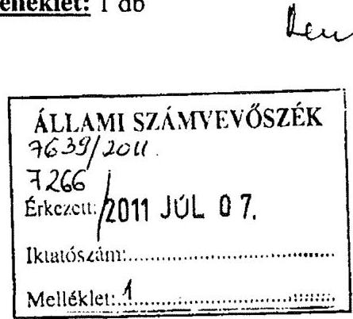

# Tisztelt Domokos László Elnök úr ! 

Az Állami Számvevőszék a Borsod-Abaúj-Zemplén Megyei Önkormányzat pénzügyi helyzetének ellenőrzéséről készített jelentésre véleményemet, észrevételemet és az ellenőrzéssel kapcsolatos kiegészítésemet mellékelten megküldöm.

Kérem Elnök Urat, hogy a mellékelten megküldött kiegészítéseimet az ellenőrzési jelentésben átvezettetni szíveskedjék.

Miskolc, 2011. június 29.
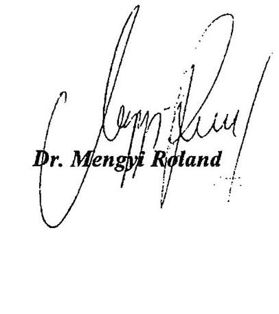

---

.

---

III-2313/2011

Borsod-Abaúj-Zemplén Megyei Közgyűlés ELNÖKÉTŐL

3525 MISKOLC, Városház tér 1.
Telefon: (46) 517-600*, (46) 517-700*, (46) 517-630, (46) 323-600
Telefax: (46) 320-601
http://www.baz.hu
elnok@baz.hu

Tárgy: Állami Számvevőszék ellenőrzési megállapításaira észrevétel

# Állami Számvevőszék 

## Domokos László Úr

## Elnöke

## Budapest

## Tisztelt Domokos László Elnök úr !

Az Állami Számvevőszék 2011. április 19-től 2011. május 31-ig terjedő időben az V-3004-27/2011 számú ellenőrzési program alapján a Borsod-Abaúj-Zemplén Megyei Önkormányzat gazdálkodási rendszerének ellenőrzését végezte.

Az ellenőrzés célja az önkormányzatnál annak értékelése, hogy:

- biztosította-e a tartós pénzügyi egyensúlyt;
- hasznosultak-e a gazdálkodási rendszer korábbi ellenőrzése során a pénzügyi egyensúly javítására tett szabályszerűségi és célszerűségi javaslatok.

Az ellenőrzési időszak 2007 - 2010. évekre vonatkozóan terjedt ki.
Az Állami Számvevőszék a Borsod-Abaúj-Zemplén Megyei Önkormányzat pénzügyi helyzetének ellenőrzéséről készített jelentését 2011. június 15 -én küldte meg.

---

Az Állami Számvevőszék ellenőrzési jelentésével szemben az alábbiak szerint teszem meg az észrevételemet illetőleg véleményemet:
Az Állami Számvevőszék jelentésében megállapítás, hogy a Borsod-Abaúj-Zemplén Megyei Önkormányzat nem tett 2007-2010. évek között bevételnövelő intézkedéseket.
A megállapítással szemben észrevételünk, hogy a vizsgált években a következő bevételek növelése érdekében szükséges intézkedéseket tettük meg.

- 2007.évben a bentlakásos, fogyatékos személyek, pszichiátriai és szenvedélybetegek részére ellátást nyújtó szociális intézményekben a gondozási díjakat mintegy $10 \%$-kal emelte meg a Közgyülés, tervezett növekedés összege 67,3 millió Ft. A szociális ágazatban a teljesítési adatok mutatják, hogy 1.115 millió Ft eredeti tervezett bevétellel szemben 1.129 millió Ft bevétel folyt be, ami 14 millió Ft többlet bevételt jelentett. A többi ágazatban a bevétel növekedés az évi infláció mértékének megfelelően alakult.
- 2008.évben a tervezésnél a szociális ágazatban a Testület $23 \%$-kal emelte meg a bevételi előirányzatot, mintegy 165 millió Ft-tal. Így a tervezett bevétel 1.372 millió Ft-ot meghaladó összeg, a teljesített bevétel 2008.december 31 -én 1.443,7 millió Ft. A többi ágazatban többé- kevésbé a bevétel növekedés nagysága az éves inflációs rátának megfelelő összegben alakult. Lemaradásunk a Surányi Endre Szakképző Iskola és Kollégiumban fordult elő a 183 millió Ft eredeti előirányzattal szemben a teljesítés 156 millió Ft, melynek oka, hogy a multinacionális kereskedő hálózatok miatt a tanboltok forgalma nem érte el a tervezett szintet.
- 2009.évben a szociális ágazat bevételeinek növekedésénél $11,4 \%$-kal számoltunk, mely az eredeti előirányzatnál 55,5 millió Ft többletet eredményezett. 1.529 millió Ft az eredetileg előirányzott bevétellel szemben 2009. december 31-én a teljesítés 1.535 millió Ft. volt. A többi önkormányzatunk által finanszírozott - ágazatban az étkeztetési térítési díjak $4,1 \%$-kal történő emelkedése miatt értünk el többlet bevételt, a tervezett 1.070 millió Ft bevételi tervvel szemben 1.170 millió Ft-ot, a kórházak esetében a tervezett 1.309 millió Ft-tal szemben 1.872 millió Ft realizálódott.
- 2010.évben a jövedelmi viszonyok változatlansága miatt a bevételeinket a szociális ágazatban is csupán $4,2 \%$ ponttal tudtuk növelni, ami a térítési

---

díjaknál 46,6 millió Ft-ot, az egyéb bevételeknél 20,7 millió Ft többlet tervezést eredményezett. A többi ágazatban a növekedés üteme az infláció rátának megfelelően alakult. Összességében a bevételek 4.343 millió Ft előirányzattal szemben 4.964 millió Ft-ban teljesültek.

Összességében az Önkormányzat 2007-2010. évek között bevétel növelő intézkedések tekintetében a szociális ágazat vonatkozásában jelentős intézkedéseket tett. A vizsgált években 2010 . év kivételével a díj emelések mértéke meghaladta a $10 \%$ pontot, 2008.évben a bevétel növekedés $20 \%$ pont felett alakult és az éves beszámoló adatai alapján az is megállapítható, hogy ezen bevételek realizálódtak. A felhalmozási célú bevételek tervezésénél és beszedésénél az elmúlt négy évben bizonytalanság mutatkozott. A forgalomképes ingatlanainkat többszöri meghirdetés ellenére sem tudtuk értékesíteni. Az Állami Számvevőszék azon megállapításával, hogy bevételnövelő intézkedések megtételére nem került sor nem értünk egyet.

A véleményem, hogy az elmúlt négy évben az önkormányzatoktól jelentős forrás elvonásra került sor. A forrás elvonás különösen érintette a megyei önkormányzatokat, akiknél annak ellenére, hogy a települési önkormányzatoktól kötelező feladatokat kellett átvenni, az átlagoshoz képest még további forrásokat vontak el. Ezt mutatja az a tény is, hogy míg az állami normatív támogatás 2008.évben 8.154 millió Ft volt ez az összeg 2010. évben csupán 7.317 millió Ft. Az elvont összeg 837 millió Ft-ot tett ki. A normatíva elvonás mértéke az ellátotti létszám csökkenéssel nem magyarázható, a létszámunk az átvett feladatok miatt növekedett. A számvevőszéki jelentés is megállapítja, hogy az intézmény hálózatunk két oktatási intézménnyel és egy szociális intézménnyel növekedett, így nőt az ellátottak száma is.
Még szembetűnőbb a megyei önkormányzat sajátos bevételeinek alakulása. A személyi jövedelemadó kiegészítésünk 937,6 millió Ft-ról 616,1 millió Ft-ra csökkent. Az elvonás mértéke 321,5 millió Ft.
A megyei önkormányzatokat sújtotta az illetékbevételek állandó csökkenése is a 2007. évi teljesítési adatok alapján a bevétel 2.232 millió Ft volt, 2010. évben 1.538 millió Ft. A csökkenés összege 694 millió Ft.
Összességében a forrás csökkenés összege a négy év vonatkozásában meghaladja az 1.850 millió Ft-ot.

---

A forrás csökkenés nem eredményezte a kiadások csökkenését. A dologi előirányzat növekedésére, az inflációs hatások kivédésére (közüzemi számlák állandó emelkedésére) a normatív módon biztosított támogatás forrást nem tartalmazott. Az intézmények, a hivatal müködéséhez viszont a dologi előirányzatokat legalább az éves inflációs ráta mértékéig meg kellett emelni.

- 2007.évben az összeg 152,9 millió Ft,
- 2008.évben az összeg 234,4 millió Ft,
- 2009.évben a dologi előirányzatot a 2008.évi szinten terveztük meg, az intézményeinket beszorítottuk az előző évi keretbe,
- 2010.évben az ÁFA 20-25 \%-os növekedése miatt biztosítottunk az intézményeknek 170,2 millió Ft-ot, a rehabilitációs hozzájárulás több mint $200 \%$-os emelkedése miatt 106 millió Ft-ot,
- Az alapellátás zavartalan biztosítása szükségessé tette az eszközeink folyamatos felújítását. 2007.évben 118 millió Ft-ot; 2008. évben 258 millió Ft-ot; 2009.évben 115 millió Ft-ot, 2010.évben 673 millió Ft-ot, összesen 2007-2010 években 1.164 millió Ft-ot fordítottunk az ingatlanok, gépek, berendezések felújítására.

A csökkenő forrás és a növekvő kiadások az önkormányzat irányítása alatt müködő 53 intézmény müködtetésére, az alapellátás biztosítása érdekében - az intézményi saját bevételen és a központi támogatáson túl - jelentős önkormányzati támogatást kellett biztosítani.

- 2008.évben 4.214 millió Ft-ot,
- 2009.évben 3.018 millió Ft-ot,
- 2010.évben 2.059 millió Ft-ot.

Az önkormányzatunk az intézményi saját bevételeket emelte, a központi források, az illeték bevételek folyamatos csökkenése miatt az ellenőrzési jelentésben meghatározott összegben - az alapfeladat biztosítása, plusz források rendelkezésre állása érdekében - kötvényt bocsátott ki.
A kötvény kibocsátás két ütemben valósult meg, a 6 havi CHF libor $+1,1 \%$-os évi kamat felár mellett. A CIB. Bank a gazdasági válság következtében az 1,1 \%-os évi kamat felárat $4,3 \%$-ra emelte meg.

---

A Borsod-Abaúj-Zemplén Megyei Önkormányzat Közgyülése a 2010. évi önkormányzati választásokat követően 2010. november 5 -én alakult meg. A megalakulást követően 2010. december 16-i ülésén az egyensúlyi helyzet helyreállítása érdekében fontos rendeletet és határozatot fogadott el.

- 21/2010.(XII.17.) önkormányzati rendelet; a helyben központosított közbeszerzésekről. Az intézményeknek e rendelet előírásai alapján lehet a árukat illetőleg szolgáltatások beszerezni.
- 138/2010.(XII.16.) B.A.Z.M.ÖNK. határozat a Borsod-Abaúj-Zemplén Megyei Önkormányzat irányítása alá tartozó intézmények és a kizárólagos tulajdonában lévő gazdasági társaságok átszervezéséről. A határozat alapján - az államháztartásról szóló 1992.évi XXXVIII. törvény 95. § (1) bekezdésében foglalt rendelkezések figyelembe vételével - összevonással átszervezi a gyermekvédelmi és tartós bentlakást nyújtó szakosított szociális intézményeket; az oktatási és kulturális intézményeket; valamint az egészségügyi intézményeket. A Borsod-Abaúj-Zemplén Megyei Önkormányzat Ellátó Szervezete, a Nemzetközi Kereskedelmi Központ Kft., az Általános Vagyonkezelő Kft. és a Kulcs Tours Kft. által végzett tevékenységeket egy gazdasági társaság keretében kívánja ellátni.
- 139/2010.(XII.16.) B.A.Z.M.ÖNK. határozat a hivatalnál dolgozók létszámát 2011. február 1-jével 101 fơröl 92 före csökkentette.

Borsod-Abaúj-Zemplén Megyei Önkormányzat Közgyűlése 2011. februári ülésén bevétel növelő és kiadás csökkentő intézkedésekről döntött.

- 9/2011. (II.17.) határozatával energiatermelő és hasznosító beruházások céljából gazdasági társaságot hozott létre, a Borsod-Abaúj-Zemplén megye gazdaságának komplex fejlesztése, munkahelyteremtés, valamint a közszolgáltatások díjainak hosszú távú csökkentése érdekében.
- 11/2011. (II.17.) határozatával a Borsod-Abaúj-Zemplén Megyei Önkormányzat irányítása alá tartozó szociális, gyermekvédelmi intézmények átszervezésének megvalósításáról döntött. A döntés értelmében 2011. április 1. napi hatállyal létrehozta a Borsod-Abaúj-Zemplén Megyei Önkormányzat Szociális- és Gyermekvédelmi Központját.
- 12/2011.(II.17.) határozatával a Borsod-Abaúj-Zemplén Megyei Önkormányzat irányítása alá tartozó egészségügyi intézmények átszervezésének megvalósításáról döntött. A döntésnek megfelelően 2010. április 30. napi hatállyal beolvadással megszüntette a II. Rákóczi Ferenc

---

Kórházat Szikszó, Mozgásszervi Rehabilitációs Központ Mezőkövesd, Pszichiátriai Szakkórház és Betegotthon Izsófalva. 2011. május 1. napi hatállyal beolvadással egyesítette a fenti kórházakat a jogutód Borsod-Abaúj-Zemplén Megyei Kórház és Egyetemi Oktató Kórházba.

- 13/2011.(II.17.) határozatával a Borsod-Abaúj-Zemplén Megyei Önkormányzat irányítása alá tartozó közoktatási, közművelődési és közgyűjteményi intézmények átszervezésének megvalósításáról döntött. Az oktatási intézmények háttérszolgáltatásait (porta, karbantartás, gépjármủ üzemeltetés, takarítás, mosoda), közművelődési és közgyűjteményi intézmények pénzügyi-gazdálkodási feladatait és háttérszolgáltatásait, a kapcsolódó személyzettel 2011.április 1. napi hatállyal áthelyezte a Borsod-Abaúj-Zemplén Megyei Önkormányzat Ellátó Szervezetébe. Az önállóan működő és gazdálkodó Borsod-Abaúj-Zemplén Megyei Testnevelési és Sportintézetet 2011.március 31. napi hatállyal beolvadással megszüntette, jogutódja a Borsod-Abaúj-Zemplén Megyei Pedagógiai Szakmai, Szakszolgálati, Közművelődési és Sportintézet.
- 15/2011. (II.17.) határozatával a Borsod-Abaúj-Zemplén Megyei Önkormányzat kizárólagos tulajdonában lévő gazdasági társaságok átszervezéséről, gazdasági társaság alapításáról döntött.

Borsod-Abaúj-Zemplén Megyei Önkormányzat Közgyűlése a 2011. március havi ülésén az átszervezet intézmények struktúra kialakításról hozott döntéseket.

- 24/2011.(III.31.) határozatával a Comitatus Borsod-Abaúj-Zemplén Megyei Önkormányzat Vagyonkezelő és Vagyonhasznosító Korlátolt Felelősségủ Társaság,
- 25/2011. (III.31.) határozatával a Borsod-Abaúj-Zemplén Megyei Kórház és Egyetemi Oktató Kórház intézményi összevonást követő szakmai struktúrájának kialakításáról döntött.

Borsod-Abaúj-Zemplén Megyei Önkormányzat Közgyűlése az áprilisi ülésén döntött a 2011. évi költségvetés módosításáról, álláshelyek megszüntetéséről.

- 37/2011. (IV.28.) határozatával döntött összesen 95 fő létszámcsökkentéséről, a szociális- és gyermekvédelmi központban, közművelődésben és közgyűjteményi feladatokat ellátó intézményekben, Ellátó Szervezetben, Borsod-Abaúj-Zemplén Megyei Kórház és Egyetemi Oktató Kórházban.

---

- 38/2011. (IV.28.) határozatával a közgyűlés elfogadta a Borsod-AbaújZemplén Megyei Önkormányzat irányítása alá tartozó intézmények átszervezésére vonatkozó intézkedések végrehajtásáról szóló jelentést.
- 42/2011. (IV.28.) határozatával a gyermekvédelmi szakellátás helyzetéről hozott döntést a testület.

A Borsod-Abaúj-Zemplén Megyei Önkormányzat Közgyűlése a májusi ülésén a gazdasági feladatok átszervezéséről, költség csökkentő intézkedésekről döntött.

- 61/2011. (V.25.) határozatával a Borsod-Abaúj-Zemplén Megyei Önkormányzat Ellátó szervezetének átszervezése, valamint gazdaságfejlesztés és intézményellátás céljából zártkörűen működő részvénytársaság alapításáról hozott döntést.
- 62/2011. (V.25.) határozatával energiatermelő és hasznosító beruházások céljából zártkörűen működő részvénytársaság alapításról hozott döntést.
- 103/2011. (V.30.) határozatával a Borsod-Abaúj-Zemplén Megyei Önkormányzat fenntartói irányítása alatt működő, mezőgazdasági szakképzést folytató intézményekhez tartozó tangazdaságok gazdasági társaságba való szervezéséről hozott döntést.

Borsod-Abaúj-Zemplén Megyei Önkormányzat Közgyűlése június 30 -án tartja a soros ülését. A napirend szerint a testület módosítja a 2011. évi költségvetését. Tervezet szerint javaslat kerül a testület elé az oktatási intézményekben történő létszámcsökkentésről, a jogszabályi előírásnak megfelelően élelmezési norma emeléséről, ennek megfelelő térítési dí emelésekről illetőleg munkamegosztási megállapodások jóváhagyásáról.

A kincstári finanszirozási rendszer változtatására is sor került 2010. december 17ével, melynek kapcsán az önkormányzat likvid helyzete javult. Ezzel kapcsolatosan 1/2011.(II.8.) szám alatt Egyedi elnöki utasítást adtam ki, a kincstári finanszírozási rendszer müködéséről. A kincstári rendszert az utasításban előírtak szerint új alapokra helyeztem. Az intézményeknél keletkező források a számlavezető bankon keresztül bevonásra kerültek, melynek következménye az önkormányzat likvid helyzetének javulása.
A 3.000 millió Ft kötvény kibocsátás kamatfelárának változtatása tekintetében 2011.május 23 -án jogi lépéseket kezdeményeztem, mely során a kötvénykibocsátás kamatfelár változtatásának törvényességi felülvizsgálatára kértem fel egy ügyvédi irodát.

Az Állami Számvevőszék helyszíni ellenőrzése részére a testület által az ellenőrzés időpontjáig meghozott döntéseket, határozatokat, intézkedéseket rendelkezésre bocsátottuk, mely során tudomást szereztek a pénzügyi egyensúly mielőbbi biztosítása fenntarthatóságára hozott eddigi intézkedésekről.

---

A fenti adatokból látható, hogy a közgyűlés a pénzügyi egyensúly helyre állítására jelentős intézkedéseket tett. Az intézkedések megtételére vonatkozó előterjesztéseket minden hónapban tárgyalja a Közgyülés, és erre vonatkozóan meghozza a döntéseket.
A következő intézkedési sorozatunk - mely már részben elkezdődött - a tartozások kifizetésére vonatkozó tárgyalások megkezdése a szállítókkal. Jelenleg tárgyalásban állunk az étkeztetésnél felhalmozott kiadásaink kapcsán a SODEXO-val, a gáz szolgáltatás vonatkozásában a TIGÁZ-zal.
Az elkövetkező időszakban minden szállítóval a fennálló tartozások tekintetében megállapodást készítünk elő. A szállítói tartozások minimalizálására törckszünk. A megtett intézkedéseink nagy száma mutatja, hogy az egyensúly felé történő lépéseket megtettük, az első eredmény 2012. évtől várható. Bevétel növelő intézkedéseket minden évben foganatosítottunk. A jelen intézkedés sorozatunk is a megyei önkormányzatokat jogszabályban behatárolt korlátok között - egyrészt a bevételek növelését, másrészt a kiadások csökkentését szolgálják.

Az egyensúlyi helyzet helyreállítása, illetőleg a 2012. évtől jelentkező kötvények tőke részének megfizetése érdekében 2011.április hónapban elkészült Borsod-Abaúj-Zemplén Megyei Önkormányzat konvergencia programja. A programban vagyoni helyzetünket, szállítói tartozás állományt, az elkövetkező években jelentkező fizetési kötelezettségeinket, a megtett intézkedések hatásaként jelentkező prognosztizált megtakarításokat számba vettük. Az előzetes adatok alapján, a megtett intézkedések következtében a pénzügyi egyensúlyi helyzetünk javulásában eredmény 2012. évtől várható.
A megtett intézkedéseinkről, annak végrehajtásáról intézkedési tervet fogok készitetni felelős és határidő megjelölésével.

Kérem Elnök urat, a lefolytatott Állami Számvevőszéki ellenőrzéssel kapcsolatban megtett véleményem, észrevételem elfogadására.

Miskolc, 2011. június 27.

---

# Dr. Mengyi Roland úr 

elnök
Borsod-Abaúj-Zemplén Megye Önkormányzata

## Miskolc

## Tisztelt Elnök Úr!

Köszönettel vettem észrevételeit Borsod-Abaúj-Zemplén Megye Önkormányzata pénzügyi helyzetének ellenőrzéséről szóló jelentés-tervezetben foglalt megállapításokra.

Az Állami Számvevőszék jelentés-tervezetében a vizsgált években a bevételnövelő intézkedések elmaradására vonatkozó megállapítással nem értett egyet, tekintettel arra, hogy véleménye szerint a vizsgált években az Önkormányzat bevételnövelő intézkedéseket tett. Ennek alátámasztása érdekében részletezte, hogy 2007-2010 között a szociális ágazatban a gondozási és térítési díjak évenkénti emelése eredményeként többletbevételt értek el.

A jelentés-tervezetben foglalt megállapításhoz tett észrevételét nem áll módunkban elfogadni, a megállapításunkat továbbra is fenntartjuk. A bevételnövelő intézkedéseket az ellenőrzött megyei önkormányzatok körében egységes elvek alapján ítéltük meg. Országosan egységesen bevételnövelő intézkedésként értékeltük a szervezet-átalakítással együtt járó többletforrások feltárását, továbbá a szabad kapacitások hasznosítását, egyes ellátások díjkötelessé tételét, illetve az átmenetileg szabad pénzeszközök befektetését. Az Önkormányzat - észrevétele alapján - ilyen típusú bevételnövelő intézkedést nem tett. Az Önkormányzat a kötvénybevételéből származó szabad pénzeszközeit betétként helyezte el. Ez azonban nem tekinthető bevételnövelő intézkedésnek, mert 2007-2010 között realizált 138 millió Ft kamatbevétel nem nyújtott fedezetet a teljesített 825 millió Ft kamatkiadásra.

Örömömre szolgált, hogy a jelentés-tervezetben szereplő megállapítások és javaslatok alapján intézkedéseket tett.

---

Köszönöm Elnök úrnak és munkatársainak az ellenőrzés során tanúsított hozzáállását, amellyel a pénzügyi helyzetelemzés elkészítésében részt vettek, azt munkájukkal segítették.

Budapest, 2011. december " 19 ".

Tisztelettel:

Domokos László

Melléklet: jelentés

---

.