# ÁLLAMI   SZÁMVEVŐSZÉK 

## JELENTÉS

a Csongrád Megyei Önkormányzat pénzügyi helyzetének 2011. évi ellenőrzéséről (43/2)

---

# Számvevői Iroda 

Iktatószám: V-3013-10/2011.
Témaszám: 1015
Vizsgálat-azonosító szám: V056005

## Az ellenőrzést felügyelte:

Dr. Varga Sándor
számvevő igazgató-helyettes
Az ellenőrzést vezette:
Renkó Zsuzsanna
számvevő tanácsos
Az ellenőrzést végezték:
Csiszárné dr. Kosik Mária Kisapáti Angéla Laki Dóra
számvevő tanácsos számvevő tanácsos számvevő tanácsos

A témához kapcsolódó eddig készített számvevőszéki jelentés:
címe
sorszáma
Jelentés a Csongrád Megyei Önkormányzat gazdálkodási rendszerének 2008. évi ellenőrzéséről

---

# TARTALOMJEGYZÉK 

BEVEZETÉS ..... 5
I. ÖSSZEGZŐ MEGÁLLAPÍTÁSOK, KÖVETKEZTETÉSEK, JAVASLATOK ..... 12
II. RÉSZLETES MEGÁLLAPÍTÁSOK ..... 16

1. Az Önkormányzat kötelező és önként vállalt feladatai ..... 16
2. Pénzügyi egyensúlyi helyzet alakulása ..... 20
2.1. A működési és felhalmozási egyensúly alakulása ..... 22
2.2. Az Önkormányzat bevételei ..... 26
2.3. Az Önkormányzat kiadásai ..... 29
3. Kötelezettségek bemutatása ..... 34
3.1. A pénzintézetek felé fennálló kötelezettségek alakulása ..... 34
3.2. Szállítók felé fennálló kötelezettségek alakulása ..... 38
3.3. Egyéb kötelezettségek alakulása ..... 40
4. A pénzügyi egyensúly megteremtése érdekében hozott intézkedések ..... 41
5. A helyi önkormányzatok gazdálkodási rendszerének 2008. évi ellenőrzése során a pénzügyi egyensúly javítására tett szabályszerűségi és célszerűségi javaslatok hasznosulása ..... 48

---

# MELLÉKLETEK 

1. számú A működési és felhalmozási célú hiány/többlet alakulása az Önkormányzat zárszámadási rendeleteiben
2/a. számú Az Önkormányzat CLF módszer szerint besorolt bevételei és kiadásai 20072010 között
2/b. számú Az Önkormányzat bevételeinek és kiadásainak, adósságszolgálatának alakulása 2007-2010 között
2. számú Az Önkormányzat 2007-2010 években megvalósított, illetve 2010. december 31-én fennálló fejlesztési feladatokhoz kapcsolódó kötelezettségeinek összegzése
3. számú Csongrád Megyei Közgyűlés elnökének észrevétele
4. számú Csongrád Megyei Közgyűlés elnökének észrevételére adott válasz

---

# RÖVIDÍTÉSEK JEGYZÉKE 

## Törvények

Áht.
ÁSZ tv.

Htv.

Ötv.
Számv. tv.

## Rendeletek

Ámr. 1
Ámr. 2
SzMSz
2007. évi költségvetési rendelet
2007. évi zárszámadási rendelet
2008. évi költségvetési rendelet
2008. évi zárszámadási rendelet
2009. évi költségvetési rendelet
2009. évi zárszámadási rendelet
2010. évi költségvetési rendelet
az államháztartás működési rendjéről szóló 217/1998. (XII. 30.) Korm. rendelet
az államháztartás működési rendjéről szóló 292/2009. (XII. 19.) Korm. rendelet
a Csongrád Megyei Önkormányzat 4/2007. (IV. 30.) számú rendelete a közgyűlés és szervei szervezeti és működési szabályzatáról
a Csongrád Megyei Önkormányzat 3/2007. (II. 26.) számú rendelete az Önkormányzat 2007. évi költségvetéséről és a költségvetést érintő egyéb rendeletek módosításáról
a Csongrád Megyei Önkormányzat 9/2008. (IV. 28.) számú rendelete az Önkormányzat 2007. évi költségvetési gazdálkodásáról szóló zárszámadás elfogadásáról, a normatív állami hozzájárulás elszámolásáról
a Csongrád Megyei Önkormányzat 4/2008. (III. 1.) számú rendelete az Önkormányzat 2008. évi költségvetéséről és a költségvetést érintő egyéb rendeletek módosításáról
a Csongrád Megyei Önkormányzat 7/2009. (V. 6.) számú rendelete az Önkormányzat 2008. évi költségvetési gazdálkodásáról szóló zárszámadás elfogadásáról, a normatív állami hozzájárulás elszámolásáról, a Csongrád Megyei Önkormányzat 3/2009. (II. 18.) számú rendelete az Önkormányzat 2009. évi költségvetéséről
a Csongrád Megyei Önkormányzat 6/2010. (IV. 30.) számú rendelete az Önkormányzat 2009. évi költségvetési gazdálkodásáról szóló zárszámadás elfogadásáról, a normatív állami hozzájárulás elszámolásáról, a Csongrád Megyei Önkormányzat 2/2010. (I. 21.) számú rendelete az Önkormányzat 2010. évi költségvetéséről és a költségvetést érintő egyéb rendeletek módosításáról
a Csongrád Megyei Önkormányzat 65/2011. (IV. 27.) számú rendelete az Önkormányzat 2010. évi költségvetési gazdálkodásáról szóló zárszámadás elfogadásáról, a normatív állami hozzájárulás elszámolásáról

---

2011. évi költségvetési rendelet

## Szórövidítések

APEH
ÁSZ
BM
BUBOR
deszki tüdőszanatórium

EU
GDP
főjegyző
gazdasági program

Illetékhivatal
Közgyűlés
Közgyűlés elnöke
KSH
LIBOR
Önkormányzat hivatala makói kórház

Nkft.
NGM
OEP
Önkormányzat
ÖNTE Nkft.

SNA
szja
szentesi kórház
a Csongrád Megyei Önkormányzat 4/2011. (II. 14.) számú rendelete az Önkormányzat 2011. évi költségvetéséről és a költségvetést érintő egyéb rendeletek módosításáról

Adó- és Pénzügyi Ellenőrzési Hivatal, 2011. január 1-től Nemzeti Adó- és Vámhivatal (NAV)
Állami Számvevőszék
Belügyminisztérium
Budapesti Bankközi Forint Hitelkamatláb, a bankok közötti hitelnyújtásra használt referenciakamat
Csongrád Megyei Önkormányzat Mellkasi Betegségek Szakkórháza, Deszk
Európai Unió
Bruttó hazai termék
Csongrád Megyei Önkormányzat Főjegyzője
a Csongrád Megyei Önkormányzat Közgyűlésének 29/2007. (IV. 26.) számú határozata az Önkormányzat 2007-2010. évekre vonatkozó gazdasági programjáról
Csongrád Megyei Önkormányzat Illetékhivatala
Csongrád Megyei Önkormányzat Közgyűlése
Csongrád Megyei Önkormányzat Közgyűlésének Elnöke
Központi Statisztikai Hivatal
Londoni bankközi, referencia jellegű kínálati kamatláb (London Interbank Offered Rate)
Csongrád Megyei Önkormányzat Hivatala
a Csongrád Megyei Önkormányzat Dr. Diósszilágyi Sámuel Kórház Rendelőintézete, Makó
Nonprofit Korlátolt Felelősségű Társaság
Nemzetgazdasági Minisztérium
Országos Egészségügyi Pénztár
Csongrád Megyei Önkormányzat
Ópusztaszeri Nemzeti Történeti Emlékpark Nonprofit Korlátolt Felelősségű Társaság
System of National Accounts, azaz Nemzeti Számlák Rendszere
személyi jövedelemadó
a Csongrád Megyei Önkormányzat Dr. Bugyi István Kórháza, Szentes

---

# JELENTÉS 

## a Csongrád Megyei Önkormányzat pénzügyi helyzetének ellenőrzéséről

## BEVEZETÉS

Az Állami Számvevőszék 2011. évtől érvényes stratégiája új irányt szabott a helyi önkormányzatok gazdálkodásának ellenőrzésében is. Az ÁSZ - küldetése és jövőképe szerint - szilárd szakmai alapokra támaszkodva értékteremtő ellenőrzéseivel és helyzetelemzéseivel az államháztartás egészében, így a helyi önkormányzati alrendszerben is elő kívánja segíteni a közpénzek és a közvagyon szabályos, gazdaságos, hatékony és eredményes hasznosítását. E folyamat részeként - a 2010. évi államháztartási hiány alakulásának összetevőire is figyelemmel - megkezdődött az önkormányzati alrendszer pénzügyi helyzetelemzése.

Az NGM 2011 áprilisában közzétett adatai szerint ${ }^{1}$ a 2010. évi 1036,2 milliárd Ft összegű, 3,8\%-os EDP (maastrichti kritériumok szerinti, Túlzott Hiány Eljárás keretében kimutatott) hiánycél nem volt tartható, az önkormányzati alrendszer tervezettet meghaladó hiánya miatt a GDP arányában kifejezett államháztartási hiány 4,2\%-ra emelkedett.

Az önkormányzatok költségvetési jelentése szerint 2010. első három negyedév végén az önkormányzati alrendszer pénzforgalmi hiánya 97 milliárd Ft volt a tervezett éves mérték 51%-át érte el. Bár az elmúlt években kiugróan magas hiány halmozódott fel az utolsó negyedévben, a 97 milliárd Ft-os szeptember végi hiány nem indokolta az önkormányzati alrendszer 190 milliárd Ft-ra becsült éves hiányának felülvizsgálatát. A tervezett hiány túllépése, az utolsó negyedévi 150 milliárd Ft-os pénzforgalmi hiány nem volt reálisan feltételezhető. A helyi önkormányzatok januári gyorsjelentése szerint a pénzforgalmi hiány 247,7 milliárd Ft-ot tett ki. A tervezettnél nagyobb önkormányzati pénzforgalmi hiány kialakulásában - az NGM által az éves költségvetési beszámoló elkészítéséhez kiadott tájékoztató szerint - az iparűzési adó elmaradása, a gépjárműadó, az illetékek és más bevételek tervezettnél alacsonyabb összegben teljesülése volt a meghatározó.

A megyei önkormányzatok kötelező feladatellátását többlépcsős törvényi előírások határozzák meg. A feladatokra vonatkozó szabályozás első szintjét az

[^0]
[^0]:    ${ }^{1}$ NGM Tájékoztatás Magyarország Strukturális Reformprogramjának végrehajtásáról (2011. április 1). A Tájékoztató évente két alkalommal - április és október hónapban jelenik meg.

---

Ötv. ${ }^{2}$, a második szintet a hatásköri ${ }^{3}$, a harmadik szintet a további ágazati, szakmai törvények (egyebek mellett az oktatási, egészségügyi, szociális) adják.

A megyei önkormányzatok a feladatellátás és a központi forráselosztás tekintetében sajátos helyet foglalnak el a helyi önkormányzati rendszerben. A megyei önkormányzat kötelező feladatainak egy része - így a megyében lévő természeti és társadalmi muzeális emlékek, a történeti iratok gyűjtése, őrzése, tudományos feldolgozása, a megyei könyvtári szolgáltatás, a pedagógiai és közművelődési szakmai tanácsadás és szolgáltatás, a megyei testnevelési és sportszervezési feladatellátás, a gyermek- és ifjúsági jogok érvényesítése, a gyermekvédelmi- és szociális szakellátás - az Ötv-ből közvetlenül levezethető kötelezettség.

A középiskolai, szakiskolai, és kollégiumi ellátás, a fogyatékos gyermekek oktatása, nevelése, gondozása az ágazati törvény szerint a megyei önkormányzat kötelező feladata. Azonban, ha a települési önkormányzat lát el ilyen feladatot, és arról lemond, a megyei önkormányzatnak a feladatot át kell vennie. Így a megyei önkormányzatok által ellátandó kötelező közszolgáltatások ellátásának mértékére a települési önkormányzatok döntései jelentősen kihatnak.

Az alapellátást meghaladó egészségügyi szakellátás biztosítása akkor képezi a megyei önkormányzat feladatát, ha az önkormányzati vagyon kialakításáról szóló törvényben ${ }^{4}$ a feladat ellátásához szükséges vagyont az önkormányzat a tulajdonába kapta.

Az önként vállalt feladat ellátására - mivel annak vállalása a kötelező feladatok ellátását nem veszélyeztetheti - a kötelező közszolgáltatások mértékének alakulása lényegi hatással van.

A feladat és hatáskör telepítés sajátosságai mellett a megyei önkormányzatok kialakított forrásszerkezete, a forrásszabályozásból következő szűk mozgástere, a központi költségvetéstől való erőteljes függősége is determinálja az önkormányzatok feladatellátásra vonatkozó döntéseit.

A 2007-2010. években az önkormányzati feladatok ellátásának keretet biztosító forrásszabályozás - ennek részeként az illetékbevételből és a személyi jövedelemadóból való részesedés szabályai - a megyei önkormányzatok vonatkozásában nem változtak:

- A megyei önkormányzatok saját bevételein belül az illetékbevételek döntően az ingatlanpiac stagnálása, majd visszaesése, és egyes illetékkedvezmények bevezetése következtében - megyénként differenciált mértékben ugyan, de - 2010-re általánosan visszaestek. A 2010. évben befolyt 39,2 milliárd Ft illetékbevétel a 2006. évben realizált 71,1 milliárd Ft illetékbevétel alig több mint 55%-a volt. A kieső bevételek pótlására az önkor-

[^0]
[^0]:    ${ }^{2}$ Ötv. 69-70. §-ai
    ${ }^{3}$ a Htv.
    ${ }^{4}$ Az egyes állami tulajdonban lévő vagyontárgyak önkormányzatok tulajdonba adásáról szóló 1991. évi XXXIII. törvény

---

mányzati alrendszer szintjén történtek intézkedések, 2010-ben 5 milliárd Ft-ot, 2011-ben 1,2 milliárd Ft-ot ellentételezett a központi költségvetés. Az illetékbevételt a megyei önkormányzatok a saját folyó bevételeik között számolják el ${ }^{5}$.

Az illetékek kivetésének és beszedésének joga 2006. december 31-ig a megyei önkormányzatok feladata volt. A 2007. évtől a megyei illetékhivatalok illetékbeszedési feladatait az APEH vette át ${ }^{6}$. Az önkormányzati illetékrészesedési szabályok változatlanok maradtak, azonban az illetékbeszedés költségeit az önkormányzatok illetékbevételeiből átlagos (a Fővárosnál 4,0%-os, a megyei és megyei jogú városi önkormányzatnál 8,5%-os) kulcsot alkalmazva vonták le. E döntés következtében azon megyei önkormányzatok, amelyek a 8,5%-os költségnél kedvezőbb költségszint mellett látták el korábban ezt a feladatot, kedvezőtlenebb helyzetbe kerültek.

- Az önkormányzati alrendszer személyi jövedelemadóból való részesedésének makroszintű szabályozása nem változott 2007-2010 között7. A helyi önkormányzatokat normatív módon megillető 32%-os részesedés visszaosztásának részletszabályai azonban a megyei önkormányzatok számára - a reálgazdaság kedvezőtlen irányú folyamatai, és az államháztartás egyensúlyi helyzetére tekintettel elrendelt kormányzati intézkedések miatt - megszorító intézkedéseket jelentettek. Összesen 17 milliárd Ft - 2007-ben 10 milliárd Ft, 2010-ben további 7 milliárd Ft - szja-t vontak ki a megyei önkormányzatok gazdálkodási köréből ${ }^{8}$. Az átengedett személyi jövedelemadó a megyei önkormányzatok egyik bevétele.

[^0]
[^0]:    ${ }^{5}$ A megyei önkormányzatok illetékbevételei az önkormányzati alrendszer saját folyó bevételeiből 2007-ben 35,9 milliárd Ft-ot (61,4%-ot), 2008-ban 41,5 milliárd Ft-ot (61,7%-ot), 2009-ben 36,5 milliárd Ft-ot (62,5%-ot), 2010-ben 25,1 milliárd Ft-ot (64,1%-ot) tettek ki.
    ${ }^{6}$ Az egyes pénzügyi tárgyú törvények módosításáról szóló 2006. évi LXI. törvény 115. §a, amely az adózás rendjéről szóló 2003. évi XCII. törvény 73. §-át módosította.
    ${ }^{7}$ A megyei önkormányzatok személyi jövedelemadó részesedése az önkormányzati alrendszer átengedett bevételeiből 2007-ben 34,7 milliárd Ft-ot (7,0%-ot), 2008-ban 51,2 milliárd Ft-ot (9,2%-ot), 2009-ben 59,2 milliárd Ft-ot (9,3%-ot), 2010-ben 56,3 milliárd Ft-ot (8,3%-ot) tett ki.
    ${ }^{8}$ A megyei önkormányzatok szja kiegészítése háromelemű. A tételes, minden megyére egységesen meghatározott összeg - az adott évek költségvetési törvényeinek 4. sz. mellékletében meghatározottak szerint - 2006-ban 593 millió Ft, 2007-ben és 2008-ban egyaránt 355 millió Ft, 2009-ben 370 millió Ft volt. A megye népességszáma után járó kiegészítés a 2006. évi $208 \mathrm{Ft} /$ fő összegről 2010-re 120 Ft/fő-re, a megyei intézmények ellátottjai után járó kiegészítés 42236 Ft/ellátottról 20755 Ft/ellátottra csökkent.

---

A megyei önkormányzatok 2007-2010 között rendelkezésre álló forrásait az alábbiakban mutatjuk be:
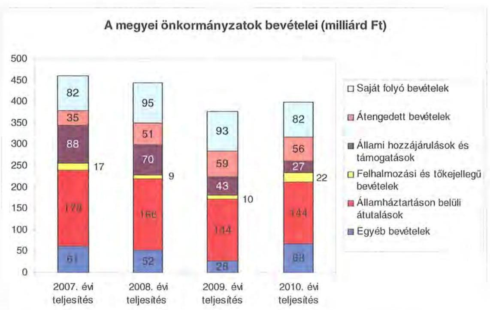

A megyei önkormányzatok saját folyó bevételeinek részaránya - amelyek főbb elemei: az intézményi térítési díjak, az illetékbevétel, a kamatbevételek - a 2007. évi összbevételen (461 milliárd Ft) belül 17,9\% volt, amely 2010-re annak ellenére 20,6\%-ra nőtt, hogy az összege 82 milliárd Ft maradt. Ennek oka az volt, hogy az összbevétel a 2007. évi 461 milliárd Ft-ról 2010-re 399 milliárd Ft-ra csökkent.

Az átengedett bevételek, amelyek a megyei önkormányzatoknál a személyi jövedelemadóból való részesedést jelentették, az összbevételen belül a 2007. évi 35 milliárd Ft-ról 56 milliárd Ft-ra nőttek.

Az állami hozzájárulások és támogatások - amelyek főbb elemei: az ellátotti létszámhoz kötődő normatív állami hozzájárulások, központosított, fejezeti szinten kezelt célelőirányzatból juttatott működési és fejlesztési támogatások a 2007. évi 88 milliárd Ft-ról (19,1\%-os részarányról) 2010-re 27 milliárd Ft-ra (6,8\%-os részarányra) estek vissza.

A felhalmozási és tőkejellegű bevételek - tárgyi eszközök (ingatlanok és ingóságok), föld és immateriális javak, részesedések értékesítése, EU-tól átvett pénzeszközök - a 2007. évi 17 milliárd Ft-ról (3,6\%-os részarányról) 2010-re 22 milliárd Ft-ra (5,4\%-ra) emelkedtek.

Az államháztartáson belüli átutalások részesedése 2007-ben 178 milliárd Ft volt. 2010. év végére 34 milliárd Ft-tal csökkent, részaránya 38,6\%-ról 2,6 százalékpontos csökkenés után 2010-ben 36\%-ra változott. Ez a bevételi kategória tartalmazza az egészségbiztosítási és egyéb elkülönített állami pénzalapoktól átvett forrásokat. A 2010-ben e címen elszámolt bevétel 144 milliárd Ft volt.

---

A megyei önkormányzatok központi költségvetésből származó bevételeinek összege 2007-ben 400 milliárd Ft volt, amely 2010. évre 331 milliárd Ft-ra (az időszak alatt összesen 69 milliárd Ft-tal) 17,3\%-kal csökkent.

Az egyéb, pénzmaradványból, vállalkozási bevételekből, államháztartáson kívülről származó átutalásokból, a hitelekből, a hosszú és rövid lejáratú értékpapírok értékesítéséből származó bevételek részesedése a 2007-2010. évek viszonylatában 13,3\%-ról 17,1\%-ra emelkedett. Ez utóbbiak 2010. évi beszámoló szerinti összevont teljesítése 68 milliárd Ft volt ${ }^{9}$.

Mindezeket figyelembe véve 2007 és 2010-ben a megyei önkormányzatok forrásösszetételének megoszlását az alábbi ábra szemlélteti:
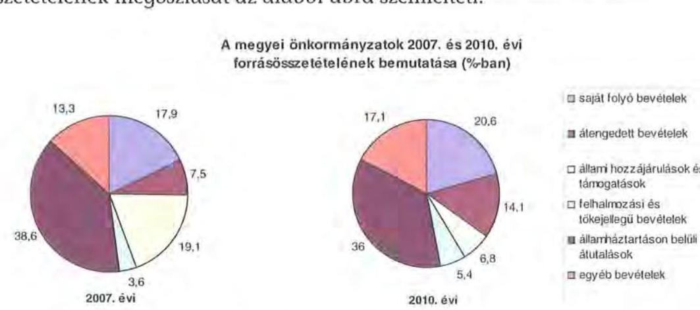

Annak ellenére, hogy a megyei önkormányzatok kötelezően ellátandó feladataikat 2007-hez képest kevesebb intézményben, csökkenő foglalkoztatott létszám mellett végezték ${ }^{10}$, a jelentős bevételkiesést a - szervezési intézkedések hatására - csökkenő ráfordítások nem tudták kompenzálni. Az ellátottak száma a szociális, gyermekvédelmi ágazat bentlakásos elhelyezést nyújtó intézményeit kivéve - eltérő mértékben ugyan, de minden ágazatban évről évre csökkent, amely a fajlagos hozzájárulások csökkenésével együtt a normatív állami hozzájárulás arányának visszaeséséhez vezetett.

A 2007-2013-as időszakra meghirdetett, vissza nem térítendő EU-s fejlesztési forrásokhoz való hozzájutás lehetősége felerősítette az önkormányzati alrendszer fejlesztési igényeit. A fokozott fejlesztési tevékenység a felhalmozási bevételek és kiadások egyensúlyának megbomlásán ${ }^{11}$ túl a jelentkező jövőbeni fenntartási kötelezettség miatt tovább terhelhetik az önkormányzatok költségvetését.

[^0]
[^0]:    ${ }^{9}$ Az egyéb bevételek összege 2007-2010 között eltérő módon változott, 2007-ben 61 milliárd Ft volt, 2008-ban 52 milliárd Ft-ra, 2009-ben 28 milliárd Ft-ra esett vissza, majd 2010-ben ismét - 68 milliárd Ft-ra - emelkedett.
    ${ }^{10}$ a BM által 2010 decemberében elvégzett felmérés adatai szerint
    ${ }^{11}$ Az önkormányzati alrendszerben - az éves zárszámadási törvényjavaslatok általános indokolása, X. Helyi önkormányzatok gazdálkodása fejezet szerint - a felhalmozási bevételek és kiadások egyenlege 2007-ben 142,4 milliárd Ft, 2008-ban 112,3 milliárd Ft, 2009-ben 234,5 milliárd Ft hiányt mutatott.

---

A megyei önkormányzatok felhalmozási és működési célú pénzintézeti és szállítói kötelezettségeinek állománya a vizsgált időszakban erőteljesen növekedett.

A hosszú lejáratú kötelezettségek nagyságát a következő ábra szemlélteti:

Hosszú lejáratú kötelezettségek
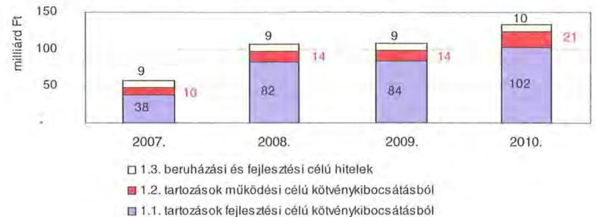

A hosszú lejáratú kötelezettségek mellett az időszakban a 2007. évi 22 milliárd Ft-ról 24 milliárd Ft-ra (8,8\%-kal) növekedett az áruszállításból származó szállítói kötelezettségek állománya.

A mérlegben kimutatott kötelezettségek állománya mellett az elhasználódott eszközök pótlására forrást biztosító amortizációs (felújítási) alap képzésének ${ }^{12}$ elmaradása további problémákat vetít előre. A megyei önkormányzatok beszámolójelentéseinek összegzése szerint 2007-ben még az elszámolt értékcsökkenés 90\%-ának megfelelő összeget fordítottak felújítási célokra, 2009-ben ez az arányszám már csak 16,5\% volt. Ez maga után vonta a feladatellátást kiszolgáló tárgyi eszközök állagának erőteljes romlását.

Az ÁSZ a 2011. évi ellenőrzési tervében a 43. számú, az „Önkormányzatok gazdálkodási rendszerének ellenőrzése" részeként egyidőben, egymással párhuzamosan tekinti át és elemzi az önkormányzati alrendszer középszintjét jelentő 19 megyei önkormányzat pénzügyi helyzetét. A gazdálkodás szabályszerűségét az ÁSZ előző évek során ellenőrizte a megyei önkormányzatoknál is, ezért jelen vizsgálatunk erre nem tér ki.

A jelentés a megyei önkormányzatok sajátos feladat-ellátási és forrásszabályozási helyzetére tekintettel a megyei önkormányzatok pénzügyi helyzetét, illetve az ezzel összefüggő korábbi ÁSZ javaslatok megvalósítását mutatja be.

Az ellenőrzés a 2007. január 1. - 2011. március 31. közötti időszakot ölelte fel.

[^0]
[^0]:    ${ }^{12}$ Erre a jelenlegi szabályozási környezetben nem kötelezi semmilyen előírás az önkormányzatokat.

---

A vizsgálat jogszabályi alapját 2011. július 1-je előtt az Állami Számvevőszékről szóló 1989. évi XXXVIII. törvény 2. § (3), (5), (6) és (9) bekezdéseiben, az Ötv. 92. § (1) bekezdésében és az Áht. 104. § (3) bekezdésében, 2011. július 1-jét követően az Állami Számvevőszékről szóló 2011. évi LXVI. törvény 1. § (3) bekezdésében, az 5. § (2)-(6) bekezdéseiben és az Áht. 120/A. § (1) bekezdésében foglalt előírások képezték.

Csongrád Megye országos és régión belül elfoglalt helyzetét 2010. december 31-én az alábbi mutatók szemléltetik (a megyei jogú városokkal együtt):

Index: az előző év azonos időszak (időpontja)=100,0

| Mutató megnevezése | Csongrád   megye | Dél-   alföldi   régió | Országos |
| :-- | :--: | :--: | --: |
| Népesség száma (ezer fő)* | 422 | 1308 | 9986 |
| Népesség változás indexe (\%) | 99,7 | 99,2 | 99,7 |
| Az ipari termelés volumenindexe (\%) | 106,3 | 107,4 | 110,7 |
| Egy lakosra jutó ipari termelési érték (ezer Ft) | 1313,9 | 1135,2 | 2044,4 |
| Ezer lakosra jutó vállalkozások száma (db) | 182 | 181 | 165 |
| A beruházások egy lakosra vetített teljesít- | 228,6 | 171,6 | 304,7 |
| ményértéke (millió Ft) |  |  |  |
| Foglalkoztatási arány (\%) | 49,3 | 48,1 | 49,5 |
| Munkanélküliségi ráta (\%) | 9,5 | 10,3 | 10,8 |
| Alkalmazásban állók havi nettó átlagkerese- | 116179 | 111096 | 132628 |
| te (Ft) |  |  |  |
| Alkalmazásban állók havi nettó átlagkeresetének indexe (\%) | 110,9 | 107,0 | 106,9 |

*Ebből Szeged és Hódmezővásárhely megyei jogú városok népessége 213 ezer fő
A táblázatban feltüntetett, a gazdaság helyzetét reprezentáló adatok jelzik, hogy mely területen maradt el Csongrád Megye az országos és a régiós átlagtól, illetve mely mutatóknál múlja felül azokat. Az ipari termelés volumenindexe 1\%-kal volt alacsonyabb a régió átlagától és 4\%-kal az országos átlagtól, melyek negatív eltérések. Az ezer lakosra jutó vállalkozások száma 0,6\%-kal magasabb a régiós átlagnál és 10,3\%-kal az országos átlagnál. Az első látásra pozitív eltérésbe azonban jelentős mértékben belejátszanak az ún. „kényszervállalkozások", melyek inkább a megye foglalkoztatási gondjait jelzik, mint sem a magasabb szintű termelést, illetve a termelő egységek számának sokaságát. A foglalkoztatási arány az országos átlaggal majdnem megegyező, a régión belül 1,2\%-kal magasabb az átlagnál. Az alkalmazásban állók havi nettó átlagkeresete 4,6\%-kal haladta meg a Dél-alföldi régió átlagértékét, azonban az országos átlagtól 12,4\%-kal marad el.

A megyében 60 települési - 2 megyei jogú városi, 8 városi, 4 nagyközségi és 46 községi - önkormányzat működött.

---

# I. ÖSSZEGZŐ MEGÁLLAPÍTÁSOK, KÖVETKEZTETÉSEK, JAVASLATOK 

Az Önkormányzat 2010-ben a 20138 millió Ft összes költségvetési kiadásának 97,8\%-át a kötelező feladatai ellátására fordította. Az Önkormányzat önként vállalt feladatai az SzMSz-ben meghatározottaknak megfelelően, kiemelten a megyei fejlesztési programok összehangolásához, a nemzetközi kapcsolatok építéséhez, a munkanélküliség csökkentésében való együttműködéshez, a megyei fekvőbeteg-ellátó egészségügyi intézmények koordinálásához, különféle közművelődési és hagyományőrző feladatok ápolásához, a sport, szórakoztató és szabadidős tevékenységhez, idegenforgalmi, turisztikai, kiadvány szerkesztési, kommunikációs szolgáltatások szervezéséhez, valamint civil szervezetek, alapítványok működésének támogatásához kapcsolódtak, összesen 448 millió Ft összegben. Az SzMSz-ben rögzítették a kötelező és önként vállalt feladatokat, amelyek összhangban álltak a vonatkozó jogszabályokkal.

Az Önkormányzat a kötelező és önként vállalt feladatait 2010. december 31-én a Hivatallal és 22 intézménnyel (három kórház, hat szociális, gyermekvédelmi, kilenc közoktatási, kettő közgyűjteményi, levéltári, egy sport, kulturális és egy üdültetési intézmény), valamint öt többségi tulajdonú gazdasági társaságával látta el. Az intézmények - alapító okirataik szerint - 2006-ban 64, 2010-ben 68 telephelyen működtek. Az intézmények számának 2007-2010 közötti alakulását a szociális intézmények integrációja befolyásolta.

A folyó költségvetés egyenlege (működési jövedelem) 2007-2010 között működési forráshiányt mutatott ${ }^{13}$.

A 2007-2010. években az Önkormányzat felhalmozási költségvetésének egyenlege folyamatosan negatív összegű volt, amely 2007-2010. között összesen 2981 millió Ft felhalmozási forráshiányt okozott.

A pénzügyi egyensúly fenntartása külső forrás (folyószámlahitel, kötvénybevétel) bevonásával volt biztosítható. A 2007-2010. években 868 millió Ft hitelt törlesztettek. Az adósságszolgálat, továbbá a felhalmozási forráshiány 2007-2010. között 3850 millió Ft-ot tett ki, amelyre a 2007. január 1-jén rendelkezésre álló 1386 millió Ft pénzkészlet szolgált fedezetül. A további pénzeszközöket 2010. december 31-én 518 millió Ft folyószámlahitel igénybevételével, továbbá 5000 millió Ft kötvény kibocsátásával teremtették meg.

A CLF módszer szerinti működési forráshiány kialakulásában leginkább az játszott szerepet, hogy az Önkormányzat legfőbb bevételi forrásai - a jogszabályi kedvezmények bővülése, és az ingatlanforgalom visszaesése következményeként az illetékbevétel, valamint a központi forráskivonás hatására az áten-

[^0]
[^0]:    ${ }^{13}$ A folyó költségvetés hiánya 2007-ben a folyó kiadások 0,3\%-át (57 millió Ft-ot), 2008-ban 0,6\%-át (107 millió Ft-ot), 2009-ben 2,7\%-át (502 millió Ft-ot) és 2010-ben 9,9\%-át (1799 millió Ft-ot) jelentette.

---

gedett szja és az állami támogatások - 2007-2010 között 823 millió Ft-tal, 7\%-kal csökkentek. Az illetékbevétel 2010-re a 2006. évi 2123 millió Ft-ról (56,3\%-ára) 1196 millió Ft-ra csökkent. Az átengedett szja és az állami támogatások együttes összege a központi támogatás csökkentésén túl a feladatváltozás hatását is figyelembe véve kevesebb lett, 2010-ben 5004 millió Ft volt, a 2007. évi 78,4\%-a. Az Önkormányzat OEP bevétele a 2007. évi 5918 millió Ft-ról 2010. évre 6233 millió Ft-ra, 5,3\%-kal növekedett. Az egyéb saját bevételek 1104 millió Ft-os emelkedése nem tudta ellensúlyozni.
 az illetékbevétel, a szja és állami támogatás együttes összegének 1927 millió Ft-os csökkenése miatt kieső forrásokat. A 2010. évben az intézményi működési bevételek 613 millió Ft-tal haladták meg a 2007. évi ténylegest a Múzeum szerződéses munkáihoz kapcsolódó bevételek miatt.

A működési kiadások 2007-ről 2010-re 3,9\%-kal, 681 millió Ft-tal növekedtek. Az Önkormányzat a kórházak működéséhez 842 millió Ft, fejlesztéséhez 146 millió Ft támogatást nyújtott 2007-2010 között.

Az intézmények teljesített működési kiadásai a kórházak nélkül 2007-ben 10909 millió Ft-ot tettek ki (az összes működési kiadás 63,1\%-át), amely 2010-re 11169 millió Ft-ra növekedett (az összes működési kiadás 62,1\%-ára).

A működési és felhalmozási kiadásokon belül 2007-2010 között a felhalmozási kiadások súlya 1296 millió Ft-ról ( $7,0 \%$-ról) 2179 millió Ft-ra ( $10,8 \%$-ra) nőtt. Az aktív pályázati tevékenység eredményeként 2007-2010. között 4315 millió Ft bekerülési költségű beruházást folytatott, illetve indított el az Önkormányzat, amelyből 861 millió Ft a 2010 utánra vállalt kötelezettség. Az utóbbi forrásai a következők: 80 millió Ft tervezett saját bevétel, 8 millió Ft hitel, 230 millió Ft kötvénybevételből származó pénzmaradvány, 450 millió Ft elnyert EU-s támogatás, továbbá 93 millió Ft elnyert hazai támogatás. A 2010. év utánra vállalt kötelezettségből 356 millió Ft a kórházak fejlesztéseit finanszírozza, amely az összes vállalt önkormányzati fejlesztés $41 \%$-a.

Az Önkormányzat pénzintézeti kötelezettségeinek állománya a könyvviteli mérlegadatok szerint 2006. december 31-ről 2010. december 31-re 217 millió Ft-ról 7701 millió Ft-ra nőtt. A vizsgált időszakban adósságszolgálatra az Önkormányzat 1526 millió Ft-ot teljesített, amelyből a kamatkiadás 658 millió Ft volt. A kötvényből származó bevételek befektetéséből realizált kamatbevétel 855 millió Ft volt 2007-2010 között.

Az Önkormányzat 2010. év végi pénzintézeti kötelezettségéből 7183 millió Ft ( $93,3 \%$ ) fejlesztési és működési célú kötvények kibocsátásából, 518 millió Ft $(6,7 \%)$ folyószámlahitelből keletkezett.

A kötvénykibocsátás miatt az Önkormányzatnak a 2011-2013. években 4753873 CHF tőketörlesztést és kamatot kell teljesítenie. Az Önkormányzat 2010. év végi szállítói tartozása 1186 millió Ft (ebből lejárt 558 millió Ft). A 2011-2013. évi pénzintézeti kötelezettségek és a szállítói, valamint egyéb kötelezettségek teljesítésére az éves költségvetésekben tervezett saját bevételeket és az 1124 millió Ft jelzáloggal nem terhelt forgalomképes ingatlanvagyont vették figyelembe.

---

A 2013. évet követő évekre szóló pénzintézeti kötelezettsége a kötvénykibocsátásból fennálló 30309990 CHF. Ezekre figyelembe vett forrás az Önkormányzat saját bevétele volt.

A pénzintézeti kötelezettségvállalásból származó források felhasználási céljait meghatározták. A közgyűlési előterjesztések nem tartalmazták a kötelezettségvállalás visszafizetési forrását, a teljes futamidő alatt várható kamat- és tőkefizetési kötelezettségek, az adósságszolgálati korlát bemutatását, azonban ismertették az árfolyam- és kamatkockázatokat. Az adósságot keletkeztető kötelezettségvállalással megvalósított felhalmozási kiadások esetleges bevételnövelő, illetve kiadáscsökkentő vonzatát vizsgálták, ugyanakkor a fejlesztéshez, felújításhoz vállalt kötelezettségek visszafizetési forrásaként nem nevesítették.

Az Önkormányzat vizsgálta, hogy az elhasználódott eszközök pótlása milyen kötelezettséget jelent számára. A felújításokra, az eszközök pótlására az Önkormányzat pénzügyi lehetőségének függvényében elsősorban az intézmények működőképességének biztosítása, illetve a szakhatósági előírások figyelembevételével került sor. Az Önkormányzat 2007-2010 között a tárgyi eszközök után 2166 millió Ft értékcsökkenést számolt el, ugyanakkor felújításra annak 38\%-át, 818 millió Ft-ot fordított.

A végrehajtott kiadáscsökkentő intézkedések a feladatellátás szakmai színvonalának növelése mellett a takarékos szemléletű gazdálkodást, a működőképesség megőrzését, a pénzügyi helyzet javítását célozták. Az intézményátszervezések, a feladatváltozások, valamint a takarékossági intézkedések hatásaként a 2007-2010. években - az Önkormányzat kimutatása szerint - együttesen 544 millió Ft kiadás megtakarítás keletkezett, amelyből 395 millió, 73\% a kapcsolódó álláshely-csökkenések következtében jelentkezett.

A létszámcsökkentő intézkedések következtében 2007-2010 között a Hivatalnál és az intézményeknél összesen 467 álláshelyet szüntettek meg, amelyből 360 fő, $77 \%$ ágazati szakmai, 107 fő, $23 \%$ intézményüzemeltetéshez, fenntartáshoz, gazdasági ügyek intézéséhez kapcsolódó álláshely volt.

A bevételnövelésre irányuló intézkedéseknél - amelynek számszerűsített összege 702 millió Ft volt - meghatározó tényező volt az átmenetileg szabad pénzeszközök lekötéséből, befektetéséből származó - kamatkiadással csökkentett - kamatbevétel 502 millió Ft-tal (71,5\%). Az intézmények bevétel növekedése (200 millió Ft) kiemelten az általuk nyújtott szolgáltatások térítési díjainak emeléséből ered.

Az utóellenőrzés a pénzügyi egyensúly javítására tett három szabályszerűségi és kettő célszerűségi javaslat teljesítésének vizsgálatára terjedt ki. Az Önkormányzatnál a javaslatokat hasznosították.

A feladatok és források közötti egyensúly megteremtésére irányuló központi döntések, a megyei önkormányzatok konszolidációjára, az intézmények átvételére vonatkozó törvényjavaslat elfogadása új feltételeket teremtett. A hatékony és eredményes gazdálkodás, a pénzügyi egyensúly megőrzése azonban további helyi intézkedéseket igényel.

---

Az Állami Számvevőszékről szóló 2011. évi LXVI. törvény 33. § (1) bekezdésében foglaltak értelmében a jelentésben foglalt megállapításokhoz kapcsolódó intézkedési tervet köteles az ellenőrzött szervezet vezetője összeállítani és azt a jelentés kézhezvételétől számított harminc napon belül az ÁSZ részére megküldeni. Amennyiben az intézkedési tervet határidőben nem küldi meg a szervezet, vagy az továbbra sem elfogadható, az ÁSZ elnöke a hivatkozott törvény 33. § (3) bekezdés a)-b) pontjaiban foglaltakat érvényesítheti.

A 2011 májusában lezárult helyszíni ellenőrzés tapasztalatai alapján - figyelembe véve az Önkormányzat észrevételeit és a saját hatáskörben tett intézkedéseit - az alábbi javaslatokat tette az ÁSZ:

# a Közgyűlés elnökének: 

1. tájékoztassa a Közgyűlést rendszeresen a pénzügyi helyzetről, azon belül a kötelezettségállomány alakulásáról, a feltételekben bekövetkező változásokról, az adósságot keletkeztető kötelezettségek teljesítési feltételeiről legalább 3 éves kitekintéssel;
2. terjesszen - feltételek romlása esetén - a Közgyűlés elé cselekvési tervet a szükséges - üzemgazdasági számításokkal alátámasztott - bevételnövelő, kiadáscsökkentő, beruházások és más kötelezettségek felülvizsgálatát, tartalékok képzését, méretgazdaságos intézményi struktúrát eredményező döntések meghozatala érdekében, a pénzügyi, működés egyensúly mielőbbi biztosítása és fenntarthatósága céljából;
3. gondoskodjon róla, hogy a jövőben az adósságot keletkeztető kötelezettségvállalásokról szóló közgyűlési döntéseket megalapozó előterjesztések tartalmazzák a várható kamat-, egyéb költség és tőkefizetési kötelezettségeit, legalább 3 éves kitekintéssel a várható kamat és árfolyamkockázatok bemutatását, és kezelésének lehetőségeit;
4. gondoskodjon a pénzintézeti kötelezettségek finanszírozási lehetőségeinek számbavételéről, és arra források biztosításáról;
5. mutassa be a Közgyűlésnek az éves költségvetési előterjesztésekben az értékcsökkenési leírás összegét, és ezzel arányban az elhasználódott eszközök pótlásának forrásigényét és lehetőségét.
6. gondoskodjon a fennálló lejárt szállítói tartozás okainak feltárásáról, szerkezetének bemutatásáról és a szükséges intézkedések megtételéről, indokolt esetben a szállítókkal történő megállapodásokról.

---

# II. RÉSZLETES MEGÁLLAPÍTÁSOK 

## 1. Az ÖNKORMÁNYZAT KÖTELEZŐ ÉS ÖNKÉNT VÁLLALT FELADATAI

Az Önkormányzat 2010. évi beszámolója szerint a 20138 millió Ft költségvetési kiadásainak 97,8\%-át, 19690 millió Ft-ot a kötelező feladatok ellátására, 448 millió Ft-ot ( $2,2 \%$ ) önként vállalt feladatok ellátására fordította ${ }^{14}$. A 2011. évi tervadatok alapján a nem kötelező feladatokra az összes költségvetési kiadás $1,1 \%$-a, 200 millió Ft jut, amely a 2010. évi összeg kevesebb, mint felére csökkent.

Az Önkormányzat önként vállalt feladatai a megyei fejlesztési programok összehangolásához, a nemzetközi kapcsolatok építéséhez, a munkanélküliség csökkentésében való együttműködéshez, a megyei fekvőbeteg-ellátó egészségügyi intézmények koordinálásához, különféle közművelődési, és hagyományőrző feladatok ápolásához, a sport, szórakoztató és szabadidős tevékenységhez, idegenforgalmi, turisztikai, kiadvány szerkesztési, kommunikációs szolgáltatások szervezéséhez, valamint civil szervezetek, alapítványok működésének támogatásához kapcsolódnak.

A kötelező feladatokat az SzMSz 3. számú, az önként vállalt feladatokat a 14. számú függelékében rögzítették, amelyek összhangban álltak az Ötv-vel és az ágazati törvényekkel. Az önként vállalt feladatokra fordítható források nagyságrendjét az éves költségvetési rendeletekben határozták meg az SzMSz szerint.

Az Önkormányzat éves költségvetési kiadásainak szerkezetét tekintve 2010-ben a személyi juttatások, járulékok és a dologi kiadások összességén belül legnagyobb arányt ${ }^{15}-39,8 \%$-ot, 6677 millió Ft-ot - a három fekvőbeteg-ellátó intézmény ${ }^{16}$ kiadásai jelentették.

[^0]
[^0]:    ${ }^{14}$ Az Önkormányzat kötelező és önként vállalt feladatai és a ráfordított kiadások megosztása az Önkormányzat éves költségvetési és zárszámadási rendeleteiben szereplő adatokon és az Önkormányzat nyilatkozatán alapul.
    ${ }^{15}$ Az Önkormányzat járulékokkal növelt személyi juttatásainak és dologi kiadásainak ágazatonkénti megbontása a BM részére készített, 2010. december 31-i adatokkal kiegészített adatszolgáltatásból származik.
    ${ }^{16}$ Az Önkormányzat a fenntartója a makói és szentesi kórháznak, valamint a deszki tüdőszanatóriumnak.

---

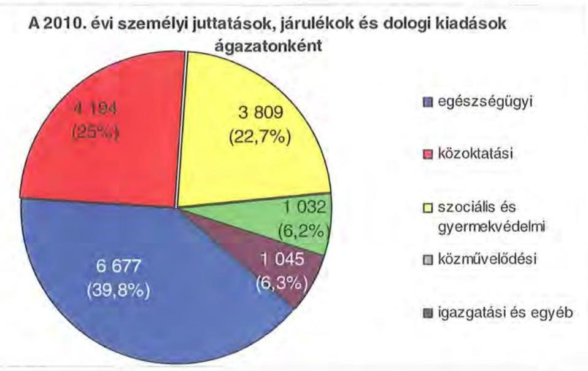

A szociális és gyermekvédelmi feladatokat ellátó 6 intézmény kiadásokból való részesedése 3809 millió Ft, 22,7\%, a 9 közoktatási intézményé 4194 millió Ft, $25,0 \%$ volt. A 2010. évben a normatív költségvetési támogatás a közoktatási feladatok kiadásait 2465 millió Ft összegben, $58,8 \%$-ban, a szociális és gyermekvédelmi feladatok kiadásait 1794 millió Ft összegben, $47,1 \%$-ban finanszírozta. A közgyűjteményi és levéltári szolgáltatások ellátását 2 intézmény biztosította, kiadási összegük mindössze 1032 millió Ft, részarányuk 6,2\%, az igazgatási és egyéb ágazathoz sorolható személyi juttatások, járulékok és dologi kiadások összege 1045 millió Ft, részaránya $6,3 \%$ volt.

Az Önkormányzat kiadásaiból 16801 millió Ft (83,4\%) az intézmények, 3337 millió Ft ( $16,6 \%$ ) az Önkormányzat hivatalának költségvetésében jelent meg. A Hivatal 3337 millió Ft költségvetéséből a személyi juttatások, járulékok és dologi kiadások 975 millió Ft-tal, 29,2\%-kal, a beruházások, felújítások 1207 millió Ft-tal, $36,2 \%$-kal, a különböző megyepolitikai feladatokhoz, szervezetek támogatásához, finanszírozási tételekhez kapcsolódó és egyéb kiadások 1155 millió Ft-tal, $34,6 \%$-kal részesültek.

Az Önkormányzat 10 gazdasági társaságban rendelkezik részesedéssel. A kötelező és önként vállalt feladatait 2010. december 31-én az Önkormányzat hivatalával, további 22 költségvetési szervvel és 5 többségi tulajdonú gazdasági társasággal látta el.

Az Önkormányzat által fenntartott költségvetési szervek közül 20 önállóan működő és gazdálkodó, míg 3 önállóan működő költségvetési szerv volt 2010. december 31-én. Az intézmények - alapító okirataik szerint - 2006-ban 64, 2010-ben 68 telephelyen működtek. Az Önkormányzat feladatainak ellátását az alábbi intézménystruktúra biztosította 2010. év végén:

- egészségügyi feladatokat 3 kórház látta el. Ebben az ágazatban 2006-tól nem volt szervezeti változás;

---

- szociális és gyermekvédelmi feladatokat 6 intézmény végzett (1 gyermekvédelmi feladatot ellátó intézmény és 5 szociális intézmény, mely összesen 20 telephelyen működött). 2006-tól az összevonások következtében az intézmények száma 11-ről hatra csökkent, míg a telephelyek száma 17-ről 20-ra növekedett;
- közoktatási feladatot 9 intézmény látott el, melyekből 7 önállóan működő és gazdálkodó, 2 önállóan működő volt ( 2 óvoda, általános iskola, szakiskola és diákotthon; 2 szakképző iskola és kollégium; 2 gimnázium; 2 gimnázium és szakközépiskola; 1 szakközépiskola). 2006-ban 16 önállóan gazdálkodó intézmény látta el a feladatot, amelyből az átszervezéseket követően hét önállóan működő és gazdálkodó, két önállóan működő intézmény alakult, a telephelyek száma 29-ről 31-re nőtt;
- közművelődési és közgyűjteményi feladatokat 2 intézmény végzett, a múzeum és a levéltár. Ebben az ágazatban 2006-tól nem volt szervezeti változás;
- sporttal kapcsolatos tevékenysége 2010-ben egy intézménynek volt (a 2006-ban működő két részben önállóan működő intézménye 2007. évi összevonása után az ÁMK megnevezéssel, önállóan működő költségvetési szervként kulturális és egyéb tevékenységet is folytatott, egy telephelyen);
- igazgatási feladatokat a Hivatal látta el, egyéb intézménye a felnőtt- és gyermeküdülő volt.

Az egyes ágazatok kötelező feladatellátását 2010. december 31-én az alábbi mutatók jellemezték:

| Megnevezés | közoktatás | szociális és   gyermek-   védelem | egészség-   ügy | kultúra   és sport |
| :-- | :--: | :--: | :--: | :--: |
| Az ágazatban foglalkoztatottak száma (fő) | 1119 | 1095 | 1299 | 218 |
| Az ágazat intézményeiben   ellátottak összesen (fő) | 6817 | 2514 | 0 | 0 |
| Fekvőbeteg-ellátás férőhe-   lyeinek száma (db) | 0 | 0 | 887 | 0 |

Az Önkormányzatnál 2007-2010 között feladatátadás-átvételre nem került sor.
Az Önkormányzat öt többségi részesedésű gazdasági társasága közül egy - a Megyeszolgálat Szolgáltató és Kereskedelmi Nkft. - az Önkormányzat 100\%-os tulajdona. A „Rendezvényház" Csongrád Megyei Közművelődési és Szolgáltató Közhasznú Nkft-ben 97,62\%, az ÖNTE Nkft-ben 79,49\%, a DABIC Dél-Alföldi Bio-Innovációs Centrum Közhasznú Nkft-ben 69,7\%, a Csongrád megyei Kegyeleti Kft-ben 64,49\% az Önkormányzat tulajdoni részaránya.

A többségi tulajdonú gazdasági társaságok az alábbiak:

- a Megyeszolgálat Nkft-t 2008. július 10-én alapította az Önkormányzat 16 millió Ft törzstőkével. A társaság főtevékenysége kötelező feladatot kisegítő szolgáltatásként: saját tulajdonú, bérelt ingatlan bérbeadása, üzemelteté-

---

se. A társaság elsődleges feladata az Önkormányzat által meghatározott épület-üzemeltetési és karbantartási feladatok ellátása a székházban, illetve az önkormányzati fenntartású egyes intézményekben;

- a „Rendezvényház" Csongrád Megyei Közművelődési és Szolgáltató Közhasznú Nkft. 1996-ban alakult. A társaság 2009. július 1-től nonprofit gazdasági társasági formában működik, főtevékenysége nem kötelező feladatként a szakmai, tudományos, műszaki tevékenység. Egyéb közhasznú tevékenysége a cégkivonat alapján igen szerteágazó, közéjük tartozik a sokszorosítás, a folyóirat és időszaki kiadvány kiadása, hangfelvétel készítése, kiadása, PR, kommunikáció, üzletviteli, egyéb vezetési tanácsadás, szakmai középfokú oktatás, sport, szabadidős képzés, kulturális képzés, stb.;
- az ÖNTE Nkft. 1995-ben - mint közhasznú társaság - jött létre 28 millió Ft jegyzett tőkével, amely többszörös tőkeemelés végrehajtásával 48 millió Ft-ra nőtt. 2009. július 2-a óta a társaság cégformája korlátolt felelősségű társaságra változott. A társaság közhasznúsági fokozata: kiemelten közhasznú. A társaság fő feladata kötelező feladatként a múzeumi tevékenység, kulturális örökség védelme, bemutatása. Tevékenységei közé tartozik továbbá: egyéb gazdasági szolgáltatás, növény- és állatkert, természetvédelmi terület működtetése, utazásszervezés, alkotó- és előadó-művészet, stb.;
- a DABIC Dél-Alföldi Bio-Innovációs Centrum Közhasznú Nkft. 1997-ben alakult 5 millió Ft-os jegyzett tőkével. 2009. július 1-től Nkft. formában működik. A társaság közhasznú főtevékenysége biotechnológiai kutatás, fejlesztés, amely az Önkormányzatnak nem kötelező feladata. Tevékenységei közé tartozik még a növénytermesztés, növényi szaporítóanyag termesztése, vetőmag takarmány nagykereskedelme, stb.;
- a Csongrád megyei Kegyeleti Kft. 1993-ban a Csongrád Megyei Temetkezési Vállalatból átalakulással jött létre, célja Csongrád megye településein temetkezési szolgáltatások megszervezése és családi események esetén rendezvényszervezés. A társaság fő tevékenysége a temetkezési szolgáltatás, amely önként vállalt önkormányzati feladat.

A többségi tulajdonú gazdasági társaságok mellett az Önkormányzat 5 egyéb gazdasági társaságnak is tagja volt:

- a DKMT Duna-Kőrös-Maros-Tisza Eurorégiós Fejlesztési Ügynökség - Nkftben $22 \%$-os részarányban;
- a Dél-kelet Magyarországi Iroda Nkft-ben 20\%-os részarányban ${ }^{17}$;
- az 1000 Mester Szakképzés-szervezési Nonprofit Kiemelkedően Közhasznú Kft-ben 13,74 \%-os részarányban;
- a Homokhát Euro-integráció Kistérség- és Gazdaságfejlesztési Szolgáltató Nonprofit Közhasznú Kft-ben 4,0\%-os részarányban;

[^0]
[^0]:    ${ }^{17}$ Az Önkormányzat a Brüsszelben létrehozandó érdekképviseleti és információs iroda létesítése érdekében a Csongrád Megyei Önkormányzat részvételével működő nonprofit korlátolt felelősségű társaság alapításáról döntött a 157/2008. (IX. 18.) számú határozatával.

---

- a Dél-Alföldi Regionális Fejlesztési Zrt-ben 0,14\%-os tulajdoni részaránnyal rendelkezik.

Az önkormányzati feladatellátásban az intézmények és gazdasági társaságok mellett egyéb szervezetek, valamint szolgáltatási szerződéssel kiszervezett intézményi ellátások nem működtek.

A saját hatáskörben végrehajtott átszervezések következtében a költségvetési intézmények száma négy intézménnyel csökkent, a telephelyek száma kettővel növekedett.

# 2. PÉNZÜGYI EGYENSÚLYI HELYZET ALAKULÁSA 

A hagyományos költségvetési szerkezet helyett az önkormányzat pénzügyi helyzetét a CLF módszerrel mutatjuk be, amelyben jobban elkülönülnek a vagyonnal kapcsolatos bevételek és kiadások a feladatokkal kapcsolatos közvetlen működtetési bevételektől és kiadásoktól. A módszer következetesen elkülöníti a folyó és a felhalmozási költségvetés bevételeit és kiadásait, azok költségvetési egyenlegeit. A tárgyévi pozíciók meghatározása érdekében a figyelembe vett saját folyó bevételek, valamint saját felhalmozási bevételek nem tartalmazzák az előző évi pénzmaradványok felhasználásából származó pénzforgalom nélküli bevételeket ${ }^{18}$.

A bevételek és kiadások besorolása általános közgazdasági meggondolásokon alapul, amely testet ölt az SNA statisztikai módszertanában is. Folyó tételek alatt értjük azokat a bevételeket és kiadásokat, amelyek az önkormányzat vagyoni helyzetét automatikusan nem változtatják. A bevételi oldalon ilyenek az adók, az illeték, az áfa bevételek és visszatérülések, a hozamok és kamatok, a költségvetési támogatások, az egyéb saját bevételek, valamint a működési célra átvett pénzeszközök és kapott támogatások. A folyó kiadások közé tartoznak a szolgáltatások nyújtásával kapcsolatos működési kiadások, a kamatkiadások, valamint a működési célú transzferkiadások ${ }^{19}$. A felhalmozási vagy tőke tételek módosítják az önkormányzat vagyoni helyzetét. A privatizációs bevételek, az immateriális javak és tárgyi eszközök, valamint a részesedések értékesítése csökkentik, a fizikai beruházások és a pénzügyi befektetések növelik a vagyont. A pénzforgalmi bevételek és kiadások nem tartalmazzák a követelések elengedése miatt könyvelt tételeket, mivel ezek egymást kioltó, technikai jellegű elszámolási műveletek.

A folyó költségvetés egyenlege, a működési jövedelem megmutatja, hogy az önkormányzat éves folyó bevétele fedezetet biztosít-e a kötelező és önként vállalt feladatellátáshoz kapcsolódó éves folyó kiadásaira. A működési jövedelem negatív értéke pénzügyileg fenntarthatatlan helyzetet jelez. A mutató pozitív

[^0]
[^0]:    ${ }^{18}$ A költségvetési években kialakuló hiány finanszírozása az előző években képzett tartalékok felhasználásával is történhet.
    ${ }^{19}$ Transzferkiadásoknak azokat a folyó és felhalmozási tételeket nevezzük, amelyeket nem az adott önkormányzat használ fel szolgáltatásnyújtásra (pl.: ellátottak pénzbeni juttatásai, átadott pénzeszközök, garancia- és kezességvállalások stb.).

---

értéke megtakarítást mutat, amely forrásul szolgálhat az önkormányzat fennálló kötelezettségei megfizetéséhez, valamint fejlesztéseihez.

A felhalmozási költségvetés pozitív értéke felhalmozási többletet mutat, amely a jövőbeni fejlesztések forrását biztosíthatja. Amennyiben a folyó költségvetési hiány finanszírozása a felhalmozási többletből történik, ez szűkebb értelemben vagyonfelélésnek tekinthető. Amennyiben a felhalmozási költségvetés megtakarítása fejlesztési célú hitelek, kötvények adósságszolgálatát finanszírozza, az változatlan vagyontömeg mellett, a korábban megelőlegezett tőkebevételek valós realizációjának tekinthető. A felhalmozási deficit által generált finanszírozási igény önmagában nem jár pénzügyi kockázattal, a pénzügyileg fenntartható beruházásokhoz kapcsolódó kötelezettségvállalás (adósságszolgálat) előrelátó, tudatos költségvetési gazdálkodással teljesíthető.

A módszer a pénzügyi kapacitás (más néven a nettó működési jövedelem) fogalmát helyezi a középpontba. Az adós hitelfelvételi képessége, hosszú távú fizetőképessége vagy bonitása a pénzügyi kapacitással, ezen belül is a nettó működési jövedelemmel jellemezhető. A nettó működési jövedelem negatív értéke az egyes költségvetési években jelentkező adósságszolgálat túlzott mértékére utal ${ }^{20}$. A nettó működési jövedelem negatív értékének felhalmozási többletből, vagy további hitelből történő finanszírozása pénzügyileg nem fenntartható gazdálkodást vetít előre. A pozitív értéket mutató nettó működési jövedelem fejlesztési kiadások fedezetét biztosíthatja, illetve a folyamatosan, évenként képződő pozitív nettó működési jövedelemből meghatározható a jövőben vállalható, teljesíthető éves adósságszolgálat, ily módon az a hitelösszeg, amely - a többi tényezőt, feltételt adottnak tekintve - visszafizetési kockázat nélkül felvehető.

A CLF módszer alapján a pénzügyi kapacitás mértéke az önkormányzat összevont, nettósított, a központi információs rendszerbe a MÁK-on keresztül leadott éves költségvetési beszámolójának 80-as űrlapjában szerepeltetett adatok alapján került meghatározásra. A 2007-2010 közötti időszakban az Önkormányzat CLF módszer szerint besorolt kiadásainak és bevételeinek főbb jogcímek szerinti alakulását a jelentés 2/a. számú melléklete tartalmazza.

Az Önkormányzat bevételeinek és kiadásainak alakulását részletesen a hatályos számviteli előírások szerint készült, összevont éves költségvetési beszámolók adataira alapozva mutatjuk be. A bevételek és kiadások működési, valamint felhalmozási jogcímekre történő elkülönítését az éves költségvetési beszámolók, a zárszámadási rendeletek, továbbá - amely jogcímek ${ }^{21}$ esetében erre más lehetőség nem volt - az Önkormányzat adatszolgáltatása szerinti megbontás alapján végeztük el. A bevételek elemzése során figyelembe vettük a ko-

[^0]
[^0]:    ${ }^{20}$ Kivéve, ha annak finanszírozására a korábbi években képzett tartalékok fedezetet nyújtanak.
    ${ }^{21}$ Az előző évi maradvány visszafizetésének, az előző évi pénzmaradvány átadásának és átvételének, a kamatkiadásoknak, az egyéb pénzforgalom nélküli kiadásoknak, a hozam- és kamatbevételeknek, az átengedett adóknak, a költségvetési támogatásoknak, továbbá az előző évi pénzmaradvány igénybevételének működési és felhalmozási részre történő megosztásához az Önkormányzat által szolgáltatott adatokat vettük figyelembe.

---

rábbi években keletkezett pénzmaradvány felhasználásából származó pénzforgalom nélküli bevételeket is. A 2007-2010 közötti időszakban az Önkormányzat bevételeinek és kiadásainak, továbbá adósságszolgálatának alakulását a jelentés $2 / \mathrm{b}$. számú melléklete tartalmazza.

# 2.1. A működési és felhalmozási egyensúly alakulása 

## CLF módszer szerinti önkormányzati adatok

| Megnevezés | 2007 | 2008 | 2009 | 2010 |
| :--: | :--: | :--: | :--: | :--: |
| Folyó bevételek | 17247506 | 18969918 | 17835884 | 16432243 |
| Folyó kiadások | 17304966 | 19076975 | 18337693 | 18231484 |
| Működési jövedelem | $-57460$ | $-107057$ | $-501809$ | $-1799241$ |
| Nettó működési jövedelem   a működési jövedelem - tőketörlesztés | $-88710$ | $-943414$ | $-501809$ | $-1799241$ |
| Felhalmozási (beruházási) bevételek | 806339 | 973886 | 233214 | 470238 |
| Felhalmozási (beruházási) kiadások | 1414595 | 1217152 | 927492 | 1906491 |
| Beruházási költségvetés egyenlege | $-608256$ | $-243266$ | $-694278$ | $-1436253$ |
| Finanszírozási műveletek nélküli (GFS) pozíció | $-665716$ | $-350323$ | $-1196087$ | $-3235494$ |
| Finanszírozási műveletek egyenlege | $-99927$ | 3086133 | 1545565 | 265706 |
| Tárgyévi pozíció | $-765643$ | 2735810 | 349478 | $-2969788$ |
| Egyéb tájékoztató adatok |  |  |  |  |
| Összes kötelezettség* | 1151669 | 6559733 | 6977859 | 9037415 |
| ebből rövid lejáratú | 961671 | 822109 | 1051554 | 1813577 |
| Folyószámlahitel napi átlagos állománya** | 453855 | 534626 | 1159968 | 2164831 |
| Likvidhitel napi átlagos állománya | 0 | 0 | 0 | 0 |
| Munkabérhitel napi átlagos állománya | 0 | 0 | 0 | 0 |
| Egyéb finanszírozásba vonható eszközök összesen: | 400450 | 4533504 | 3485738 | 515956 |
| ebből: tartós hitelviszonyt megtestesítő értékpapírok év végi állománya | 2588 | 2588 | 2588 | 2588 |
| ebből: hosszú lejáratú bankbetétek év végi állománya | 0 | 2050000 | 0 | 0 |
| ebből: értékpapírok év végi állománya | 0 | 1397244 | 0 | 0 |
| ebből pénzeszközök (idegen pénzeszközök nélkül) év végi állománya | 397862 | 1083672 | 3483150 | 513362 |

* Az összes kötelezettséget a passzív pénzügyi elszámolások nélkül vettük figyelembe, mert a passzívák a pénzmaradvány-elszámolás tételei közé tartoznak.
**A folyószámlabitel átlagos állományát 365 nappal számítottuk.
A vizsgált időszakban az Önkormányzat folyó költségvetési egyenlege, működési jövedelme negatív összegű volt, amelyet a következő ábra szemléltet:

---

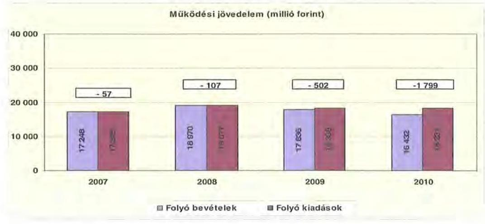

A folyó költségvetés hiánya (a működési forráshiány) 2007. évben a folyó kiadások $0,3 \%$-át ( -57 millió Ft-ot), 2008. évben $0,6 \%$-át ( -107 millió Ft-ot), 2009. évben $2,7 \%$-át ( -502 millió Ft-ot), 2010. évben $9,9 \%$-át ( -1799 millió Ft-ot) jelentette.

A működési forráshiány finanszírozása folyószámlahitelből történt. A folyószámlahitel napi átlagos állománya 2007-2010 között közel ötszörösére nőtt ( 454 millió Ft-ról 2165 millió Ft-ra).

Az Önkormányzat kötelezettségein ${ }^{22}$ belül a 2008-2010 közötti időszakban a rövid lejáratú kötelezettségek állományának aránya átlagosan $16,3 \%$ volt, a 2007. évi 83,5\%-os aránnyal szemben. Az Önkormányzat 2006. december 31-én fennálló pénz- és tőkepiaci kötelezettsége 245 millió Ft-ról 7701 millió Ft-ra nőtt a kötvénykibocsátás és a folyószámlahitel állományának emelkedése miatt.

A rövid lejáratú kötelezettségek 2010-ben 1814 millió Ft-ot tettek ki, amely 852 millió Ft-tal ( $88,6 \%$-kal) több a 2007. évi rövid lejáratú kötelezettségállománynál. A rövid lejáratú kötelezettségeknek a 2007. évi 898 millió Ft szállítói állomány a $93,4 \%$-át, a 2008. évi 818 millió Ft a $99,5 \%$-át, a 2009. évi 1046 millió Ft a $99,5 \%$-át, a 2010. évi 1186 millió Ft a $65,4 \%$-át tette ki, miközben a szállítói kötelezettségek a vizsgált időszakban közel 1,3-szorosára nőttek.

Az Önkormányzat pénzügyi kapacitása a vizsgált időszakban negatív értéket mutatott. A nettó működési jövedelem ${ }^{23}$ értéke a folyó költségvetési pozíció mellett az adott költségvetési év adósságtörlesztésének hatását is tükrözi. A pénzügyi kapacitás romlását a folyó bevételek és kiadások különbségéből származó működési jövedelem csökkenése okozta, mivel tőketörlesztés csak 2007. és 2008. években volt ${ }^{24}$.

[^0]
[^0]:    ${ }^{22}$ Passzív pénzügyi elszámolások nélküli
    ${ }^{23}$ Pénzügyi kapacitás
    ${ }^{24}$ Az Önkormányzat tőketörlesztési kötelezettsége a vizsgált időszakban csak 2007. és 2008. évben volt, ami 2007-ben 31, 2008-ban 836 millió Ft-ot jelentett.

---

Az Önkormányzat nettó működési jövedelmének évenkénti alakulását az alábbi ábra szemlélteti:
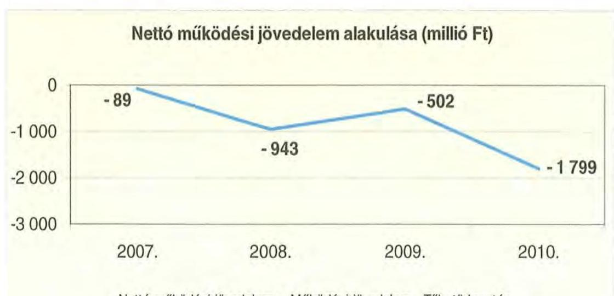

Nettó működési jövedelem = Működési jövedelem - Tőketörlesztés

A folyó költségvetés egyenlegének és a tőketörlesztésre (hiteltörlesztés és forgatási és befektetési célú értékpapírok beváltása) fordított összegeknek évenkénti különbözete (a nettó működési jövedelem) a 2007. évet követően összességében romlott. A 2010. évi -1799 millió Ft negatív nettó működési jövedelem oka a folyó költségvetés deficitje volt.

A 2007 - 2010. években az Önkormányzat felhalmozási költségvetés egyenlege ugyancsak negatív volt, amelyet a következő ábra szemléltet:
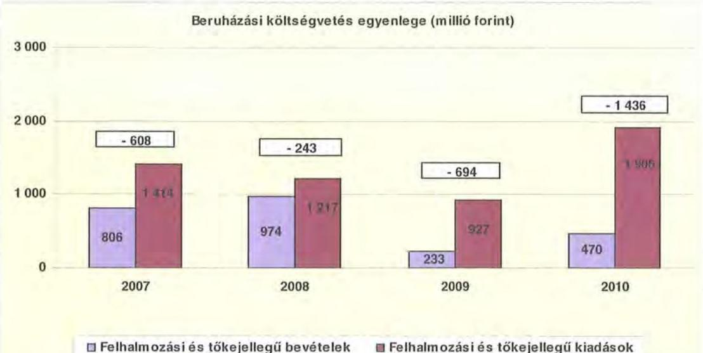

A felhalmozási forráshiánynak a felhalmozási és tőke jellegű kiadásokhoz viszonyított aránya 2007-ben 43\% (-608 millió Ft), 2008-ban 20\% (-243 millió Ft), 2009-ben 74,9\% (-694 millió Ft) és 2010-ben 75,3\% (-1436 millió Ft) volt.

---

A felhalmozási forráshiány finanszírozása folyószámlahitelből és kötvénykibocsátásból történt. A kötvénykibocsátásból származó bevétel felhalmozási célra történő felhasználását több évre ütemezte az Önkormányzat. Az 5000 millió Ft kötvénybevételből 2167 millió Ft-ot használtak fel a 2008-2010. évek között.

Az Önkormányzat évenkénti teljes finanszírozási hiánya ${ }^{25}$ a CLF módszer szerint 2007-ben -697 millió Ft, 2008-ban -1186 millió Ft, 2009-ben -1196 millió Ft, 2010-ben -3235 millió Ft volt.

Az önkormányzat finanszírozási műveletei 2007-2010. években egyenlegének alakulását a következő ábra szemlélteti:
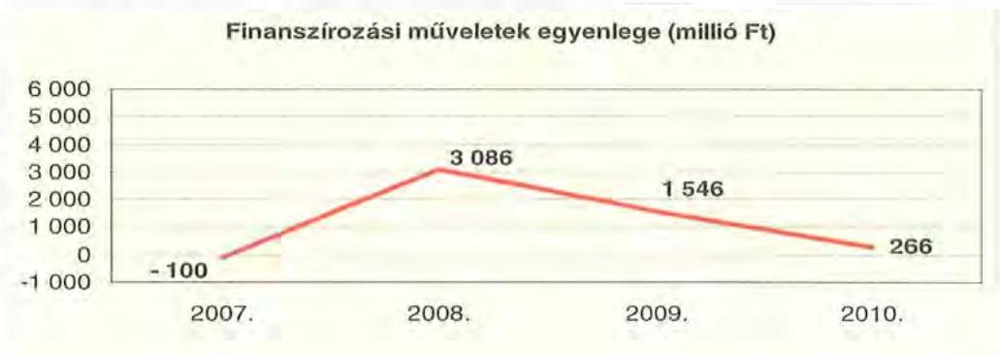

A finanszírozási többlet azt jelzi, hogy az éves költségvetések végrehajtása során szükség volt a pénzkészlet felhasználásán túl külső finanszírozás igénybevételére is. A finanszírozási célú műveleteket a vizsgált időszakban a jelentés 2/a. számú mellékletének 4.1-4.8 pontjai részletezik.

Az Önkormányzat zárszámadási rendeleteiben a működési, fejlesztési hiányt és többletet a hagyományos költségvetési szerkezet alapján mutatta be ${ }^{26}$, amelyről a jelentés 1. számú melléklete nyújt tájékoztatást. Az Önkormányzat zárszámadási rendeleteiben kimutatott működési és felhalmozási célú hiány a 2007. évi 131 millió Ft-ról 2010-re 836 millió Ft-ra növekedett.

A vizsgált időszakban a kötelezettségek (passzív pénzügyi elszámolások nélkül) 1152 millió Ft-ról 9037 millió Ft-ra emelkedtek, amely együtt járt a kamatkiadások növekedésével. Ugyanakkor a kötvénykibocsátásból származó bevétel átmenetileg fel nem használt részének folyamatosan befektetése révén a kapott kamatok meghaladták a fizetett kamatokat.

A 2007-2010 között az Önkormányzat összesen 1087031 ezer Ft kamatbevételt realizált, amely a teljes kamatráfordítás, 658436 ezer Ft 165,1\%-a volt.

A 2011. évre a kamatbevételek jelentős csökkenésével számolnak a kötvénykibocsátásból származó szabad forrás felhasználása miatt.

[^0]
[^0]:    ${ }^{25}$ a nettó működési jövedelem és a beruházási költségvetés egyenlegeinek összege
    ${ }^{26}$ Nincs kötelező előírás a működési és fejlesztési hiány megállapításának módjára.

---

Az Önkormányzat kamatbevételeit, kamatkiadásait és azok egyenlegét a következő ábra mutatja:
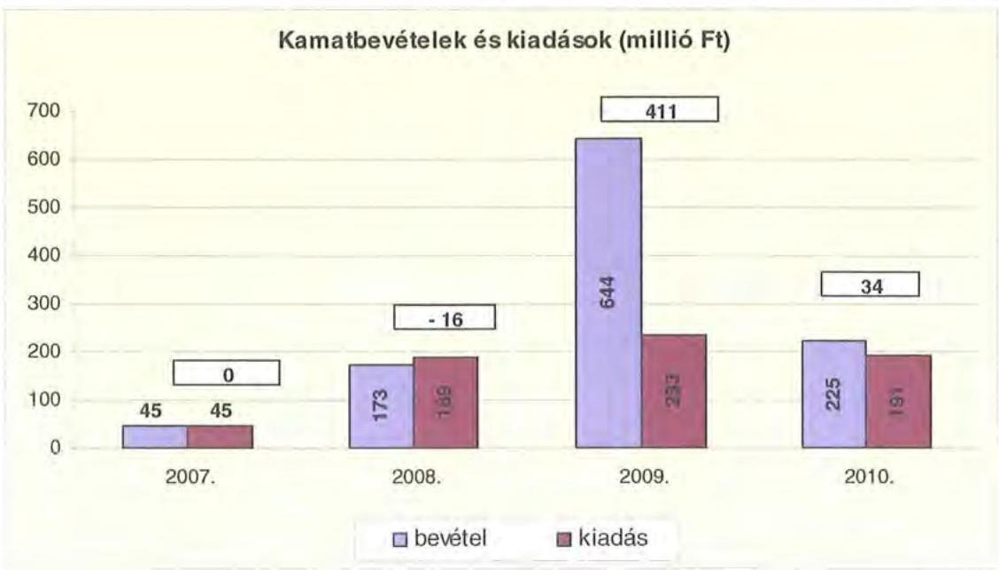

A 2007-2010 közötti időszakban az Önkormányzat kiadásait és bevételeit főbb jogcímek szerint a jelentés $2 /a$. és $2 /b$. számú melléklete tartalmazza.

# 2.2. Az Önkormányzat bevételei 

Az Önkormányzat 2007-2010. évek között realizált OEP támogatás nélküli főbb bevételi jogcímeinek számszaki adatait az alábbi táblázat részletezi és a következő grafikon mutatja be:
ezer Ft-ban

| Megnevezés | 2007. év | 2008. év | 2009. év | 2010. év |
| :-- | --: | --: | --: | --: |
| illetékbevétel | 1747930 | 1990690 | 1769212 | 1196014 |
| szja és állami támogatás   (OEP nélkül) | 6378782 | 6919411 | 5988916 | 5003790 |
| egyéb saját bevétel | 3506848 | 4494895 | 5207939 | 4610595 |
| Összesen | 11633560 | 13404996 | 12966067 | 10810399 |

---

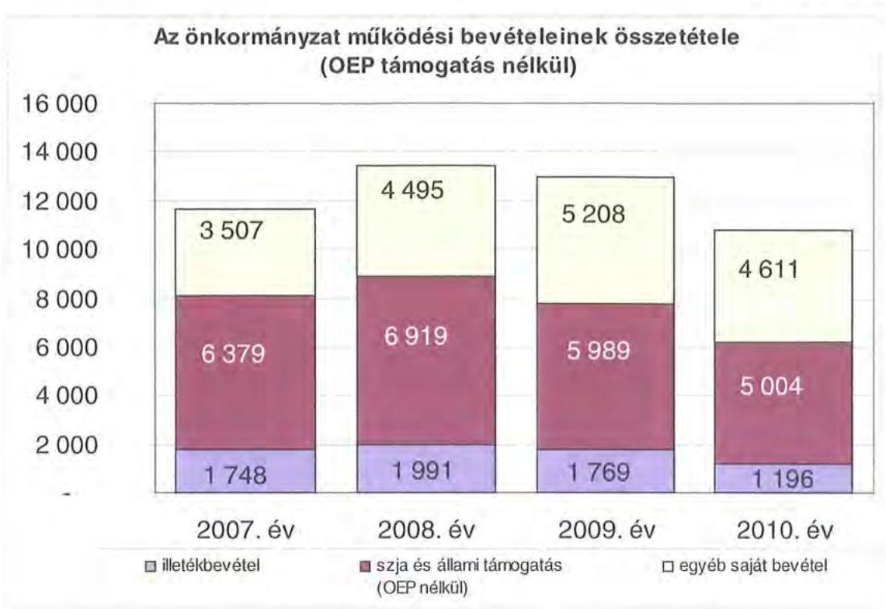

Az Önkormányzatnál az illetékbevétel a 2007. évben a 2006. évi 2123 millió Ft-hoz képest jelentősen, 17,6\%-kal, 1748 millió Ft-ra csökkent. A csökkenésben szerepet játszott az Illetékhivatalnak - 2007. január 1-jétől - az APEH-hoz történő átszervezése is, miután az évente realizált illetékbevételekből (központi intézkedés következtében) évi 8,5\% elvonásra került az adminisztrációs feladatokra. Az ezen a jogcímen visszatartott összeg a 2007-2009. években több, 2010-ben kevesebb volt, mint amekkora saját forrást igényelt korábban az Illetékhivatal működtetése az Önkormányzattól. Az Önkormányzat a 2006. évben az Illetékhivatal működtetésére saját forrásból 149 millió Ft-ot (a megyei jogú városok működtetési hozzájárulásával csökkentett működési kiadás) fordított. Az éves illetékbevétel 8,5\%-a 2007-ben 162 millió Ft, 2008-ban 185 millió Ft, 2009-ben 164 millió Ft, 2010-ben 111 millió Ft volt.

Az illetékbevétel a 2007. évi 1748 millió Ft-ról 2008-ra 1991 millió Ft-ra, 13,9\%-kal növekedett. A 2008. évről 2009. évre 222 millió Ft (11,1\%), majd a 2010. évben további 573 millió Ft (32,4\%) illetékbevétel csökkenés következett be.

Az átengedett szja és az állami támogatások együttes összege a 2008. évi 8,5\%-os (541 millió Ft-os) növekedést követően a központi támogatáscsökkenés hatására ${ }^{27}$ folyamatosan és jelentős mértékben csökkent. Az előző évihez képest 2009-ben 13,5\%-kal (931 millió Ft-tal), 2010-ben további 16,4\%-kal ( 985 millió Ft-tal) kapott kevesebb támogatást az Önkormányzat az államtól ezeken a jogcímeken. A változást a normatívák központi csökkentése, valamint a megyei önkormányzatokat érintő támogatás-elvonás mellett az ellátotti lét-

[^0]
[^0]:    ${ }^{27}$ a 2007. évi bázishoz képest

---

szám visszaesése idézte elő. Az Önkormányzat OEP bevétele a 2007. évi 5918 millió Ft-ról 2010. évre 6233 millió Ft-ra, 5,3\%-kal növekedett.

Az Önkormányzat saját működési bevételei a vizsgált időszakban változóan alakultak. A 2007. évi 5167 millió Ft-ról a 2008. évre 6486 millió Ft-ra, 25,5\%-kal, 2009-re 6977 millió Ft-ra, 7,6\%-kal növekedtek, míg 2010-re 5807 millió Ft-ra csökkentek.

A saját működési bevételek lényeges összetevőjét az intézményi működési bevételek képezték, amelyek összege 2007-ben 2035 millió Ft, 2008-ban 2725 millió Ft, 2009-ben 2662 millió Ft, 2010-ben 2648 millió Ft volt. A 2008. évben - elsősorban a Múzeum autópálya építéshez kapcsolódó szerződéses munkái miatt - növekedtek az intézményi működési bevételek.

Az Önkormányzat költségvetési támogatásai - amelyek döntő mértékben működési támogatások voltak - 2007. évi 4693 millió Ft-ról 2008-ra 6356 millió Ft-ra, 35,5\%-kal nőttek, majd 2009. évben 5261 millió Ft-ra, illetve 2010. évben 4650 millió Ft-ra csökkentek a központi támogatáselosztás változása következtében.

Az átvett pénzeszközök 2007-2009 évek között folyamatosan csökkentek, 6847 millió Ft-ról 6325 millió Ft-ra, majd 2010-ben 16,8\%-kal, 7387 millió Ft-ra nőttek a megelőző évihez viszonyítva. Az átvett pénzeszközök 84-89\%-át a kórházak OEP finanszírozása teszi ki, így változásuk iránya és aránya is szoros korrelációban van az OEP-től átvett pénzeszközökkel.

Az Önkormányzat felhalmozási bevételei a vizsgált időszakban a következőképpen alakultak:
ezer Ft-ban

| Megnevezés | 2007. év | 2008. év | 2009. év | 2010. év |
| :-- | :--: | :--: | :--: | :--: |
| Tárgyi eszköz   értékesítés | 66661 | 640850 | 300 | 20933 |
| Állami támogatás | 341609 | 147340 | 6538 | 5588 |
| Átvett pénzeszköz | 96829 | 138730 | 191190 | 160391 |
| Egyéb felhalmozási   bevétel | 545564 | 103334 | 116722 | 360236 |
| Felhalmozási tartalék | 267496 | 300717 | 2544872 | 2124581 |
| Összes felhalmozási   bevétel | 1318159 | 1330971 | 2859622 | 2671729 |

A vizsgált években a felhalmozási bevételek a 2007. évi 1318 millió Ft-ról 2009-ben 2860 millió Ft-ra, 117\%-kal emelkedtek, majd a 2010. évre 2672 millió Ft-ra, 6,6\%-kal csökkentek. A felhalmozási célú bevételek jelentős ingadozását a felhalmozási tartalék változása, azon belül a pénzmaradvány részét képező kötvénykibocsátásból származó bevételek felhasználása okozta. A felhalmozási tartalék összege 2007-ben 267 millió Ft, 2008-ban 301 millió Ft, 2009-ben 2545 millió Ft, 2010-ben 2125 millió Ft volt.

---

A 2008. évi 641 millió Ft-os tárgyi eszközértékesítés jelentősnek tekinthető, a 48,1\%-os részarányával. E jogcímen évente 0,3 és 641 millió Ft közötti intervallumban, ingadozó nagyságrendben származtak bevételei az Önkormányzatnak. A 2010. évben a camping értékesítése a tervezett 670 millió Ft vételáron fizetőképes kereslet hiányában nem valósult meg. Címzett támogatás igénybevételével valósították meg a 2006. évben az egészségügyi gép- és műszervásárlást 48 millió Ft, a deszki és a makói kórházak energia-racionalizálást szolgáló beruházásait 23 millió Ft (áthúzódó beruházások voltak a 2008. évre), a szociális ágazat beruházásait 260 millió Ft, a közoktatás eszközfejlesztését 8 millió Ft összegben. A 2007. évben a megkezdett kórházi beruházások és az egészségügyi gép-műszerbeszerzés 144 millió Ft támogatással, egy közoktatási intézmény nyílászáró-cseréi 3 millió Ft támogatással valósultak meg. A 2009-2010. években a támogatások minimális értékre, évi 6-6 millió Ft-ra csökkentek.

# 2.3. Az Önkormányzat kiadásai 

Az Önkormányzat működési kiadásai főbb jogcímek szerinti bontásban az alábbiak voltak:
millió Ft-ban

| Megnevezés | 2007. év | 2008. év | 2009. év | 2010. év |
| :--: | :--: | :--: | :--: | :--: |
| Működési kiadások | 17278
 | 18988 | 18344 | 17959 |
| Működési kiadások (kamatkiadás nélkül) | 17245 | 18883 | 18196 | 17801 |
| Kamatkiadás | 33 | 105 | 148 | 158 |
| Személyi juttatások | 8585 | 8920 | 8603 | 8572 |
| Munkaadót terhelő járulékok | 2659 | 2785 | 2515 | 2203 |
| Dologi kiadások | 5064 | 5579 | 5651 | 5982 |
| Egyéb folyó kiadások | 109 | 193 | 114 | 181 |
| Támogatások, elvonások, egyéb folyó átutalások | 434 | 661 | 615 | 697 |
| ebből: működési célú pénzeszközátadás | 76 | 215 | 182 | 339 |
| Előző évi pénzmaradvány átadás, visszafizetés, működési célú | 384 | 745 | 698 | 166 |

Az Önkormányzat működési kiadásai a 2007. december 31-től 2010. december 31-ig eltelt 3 év alatt 3,9\%-kal nőttek ( 17278 millió Ft-ról 17959 millió Ft-ra).

Az Önkormányzat 2010-ben a működési költségvetés 47,7\%-át (8572 millió Ft-ot) személyi juttatásokra, 12,3\%-át (2203 millió Ft-ot) a munkaadókat terhelő járulékokra fordította. Az üzemeltetést, intézményfenntartást biztosító dologi kiadásokra 33,3\% (5982 millió Ft) jutott, mivel az egyéb kisebb horderejű kiadások ${ }^{28}$ finanszírozása $6,7 \%$-ot ( 1202 millió Ft-ot) igényelt. A működési kiadásokon belül a személyi juttatások és járulékok aránya a vizsgált időszakban folyamatosan csökkent, 2007-ben 65,1\%, 2010-ben 60,0\% volt.

A személyi juttatások a 2007. évi 8585 millió Ft-ról 2008. évre 8920 millió Ft-ra, 3,9\%-kal nőttek, ezt követően minden évben csökkentek, 2009-re 8603 millió Ft-ra, 2010-re 8572 millió Ft-ra a létszámcsökkentés miatt. A dologi kiadások az Önkormányzatnál 2010-ben, 5982 millió Ft-os nagyságrendjükkel a 2007. évi 5064 millió Ft-nál 18,1\%-kal voltak magasabbak. A 2008. évben

[^0]
[^0]:    ${ }^{28}$ támogatások, elvonások, egyéb folyó átutalások, kamat kiadások, előző évi működési célú pénzmaradványok visszafizetései, átutalásai

---

5579 millió Ft-ra, az inflációt meghaladó mértékben, 10,2\%-kal nőttek a dologi kiadások, mivel e kiadásnem csökkentését célzó intézkedések nem vezettek eredményre. Az ellátás szervezeti kereteiben jelentős, a működési célú pénzeszközátadásokat nagyságrendileg befolyásoló tényezők nem merültek fel. A működési célú pénzeszközátadások részaránya az összes működési kiadásokon belül 0,4-1,9\% közötti volt a vizsgált időszakban, ami összegszerűen 76-339 millió Ft közötti nagyságrendeket képviselt.

Az önkormányzati kiadásokon belül a kórházi kiadások súlya kismértékben növekedett, mivel a kórházak működési kiadásai 2007-ről 2010-re 6369 millió Ft-ról 6790 millió Ft-ra, 6,6\%-kal emelkedtek, ugyanakkor a kórházak nélküli intézmények működési kiadásai (2007-ről 2010-re) 10909 millió Ft-ról, 11169 millió Ft-ra, szerényebb, 2,4\%-os arányban növekedtek. A 2007. évben a 17278 millió Ft önkormányzati szintű működési kiadásnak a kórházak nélküli teljesített 10909 millió Ft működési kiadás 63,1\%-át képezte. A 2010. év végére a kórházak nélküli működési kiadás 11169 millió Ft-ra nőtt, azonban annak az önkormányzati szintű működési kiadáshoz viszonyított aránya a 2007. évhez képest 62,2\%-ra csökkent.

Az Önkormányzat kórházak nélküli működési kiadása a vizsgált időszakban a következő volt:
millió Ft-ban

| Megnevezés | 2007. év | 2008. év | 2009. év | 2010. év |
| :--: | :--: | :--: | :--: | :--: |
| Működési kiadások | 10909 | 12201 | 12073 | 11169 |
| Működési kiadások (kamatkiadás nélkül) | 10864 | 12092 | 11925 | 11011 |
| Kamatkiadás | 45 | 109 | 148 | 158 |
| Személyi juttatások | 5788 | 6057 | 5975 | 5856 |
| Munkaadót terhelő járulékok | 1760 | 1854 | 1703 | 1475 |
| Dologi kiadások | 2415 | 2637 | 2933 | 2791 |
| Egyéb folyó kiadások | 83 | 138 | 96 | 140 |
| Támogatások, elvonások, egyéb folyó átutalások | 434 | 662 | 513 | 586 |
| ebből: működési célú pénzeszközátadás | 77 | 215 | 181 | 339 |
| Előző évi pénzmaradvány átadás, visszafizetés, működési célú | 384 | 745 | 706 | 154 |

A kórházak 2007-2010. évi teljesített működési kiadásait szemlélteti a következő táblázat:
millió Ft-ban

| Megnevezés | 2007. év | 2008. év | 2009. év | 2010. év |
| :--: | :--: | :--: | :--: | :--: |
| Működési kiadások | 6369 | 6787 | 6271 | 6790 |
| Ebből: Személyi juttatások | 2797 | 2863 | 2628 | 2716 |
| Munkaadókat terhelő járulékok | 909 | 931 | 812 | 728 |
| Dologi kiadások | 2649 | 2942 | 2718 | 3191 |

A kórházak személyi juttatásainak és járulékainak, valamint dologi kiadásainak részaránya a kórházak 6790 millió Ft összegű működési kiadásaiból 2010-ben 97,7\%, 6635 millió Ft volt. A kórházak nélküli intézményi körben a kiadások részaránya közel 7,0\%-kal volt alacsonyabb ( 91,0\% ). A dologi kiadások részaránya a kórházaknál 47% ( 3191 millió Ft), a többi intézménynél 25,0% ( 2791 millió Ft), viszont a személyi juttatások részaránya a kórházaknál alacsonyabb, 40\%-os az egyéb intézményekhez viszonyítva, melyeknél 52,4\%-os részarányt képviseltek 2010-ben.

---

A kórházaknál változóan alakult a dologi kiadások nominális összege, mivel a 2007. évi 2649 millió Ft-ról a 2010. évre 20,5\%-kal, 3191 millió Ft-ra emelkedett.

A személyi juttatások alakulása szintén változó volt a kórházakban, mivel a 2007. évi 2797 millió Ft-ról a 2010. évre 2,9\%-kal, 2716 millió Ft-ra csökkent.

A nem egészségügyi intézmények dologi kiadásai a 2007. évi 2415 millió Ft-ról 2010. évre 15,6\%-kal, 2791 millió Ft-ra nőttek, azonban e növekedés elmaradt a kórházak dologi kiadásainak növekedési ütemétől, mivel ott a növekedés 20,5\%-os ( 2649 millió Ft-ról 3191 millió Ft-ra) volt. A kórházak dologi kiadásainál 542 millió Ft (20,5\%) növekedés volt tapasztalható a 2010. évben 2007-hez viszonyítva, ami azt jelenti, hogy a kiadások csökkentése - törekvései ellenére - nem következett be, a háromból két kórház ${ }^{30}$ folyamatosan jelentős likviditási gondokkal küzdött.

A kórházak likviditási problémáinak kezelése/csökkentése érdekében évről-évre támogatásban részesültek az Önkormányzattól. A támogatások működési, illetve felhalmozási célokat is szolgáltak.

Az Önkormányzat által a kórházaknak nyújtott támogatásokat a következő táblázat adatai szemléltetik:
ezer Ft-ban

| Megnevezés | makói kórház |  |  | szentesi kórház |  |  | deszki tüdőszanatórium |  |  | Összesen |  |  |
| :--: | :--: | :--: | :--: | :--: | :--: | :--: | :--: | :--: | :--: | :--: | :--: | :--: |
|  | Működési   támogatás | Fejlesztésből   támogatás | Össz. | Működési   támogatás | Fejlesztésből   támogatás | Össz. | Működési támogatás | Fejlesztési támogatás | Össz. | Működési támogatás | Fejlesztési támogatás | Össz. |
| 2007. év | 33240 | 0 | 33240 | 52000 | 10303 | 62432 | 14000 | 0 | 14000 | 89581 | 10303 | 110344 |
| 2008. év | 137700 | 9303 | 147003 | 228100 | 9219 | 237328 | 44280 | 0 | 44280 | 410162 | 18522 | 428704 |
| 2009. év | 83530 | 0 | 83530 | 140320 | 5784 | 151913 | 14932 | 0 | 14932 | 244501 | 5784 | 250397 |
| 2010. év | 15250 | 15370 | 30035 | 65140 | 95230 | 168378 | 6781 | 1100 | 7867 | 87180 | 111712 | 198892 |
| Mindösszesen | 269821 | 24679 | 294510 | 491444 | 120896 | 612040 | 80665 | 1105 | 91771 | 841940 | 146381 | 988321 |

A vizsgált években az Önkormányzat összesen 988 millió Ft támogatást nyújtott a kórházainak, amelyből működési célra 842 millió Ft-ot, fejlesztési célra 146 millió Ft-ot fordítottak. A támogatásból 8,3\%-kal (82 millió Ft-tal) a deszki tüdőszanatórium, 29,8\%-kal (294 millió Ft-tal) a makói kórház és 61,9\%-kal (612 millió Ft-tal) a leginkább eladósodott szentesi kórház részesedett. A 988 millió Ft támogatás 14,5\%-a, 143 millió Ft visszatérítendő intézményfenntartói támogatás volt. Ezen túlmenően az Önkormányzat a 20072008. években 247 millió Ft támogatási kölcsönt is nyújtott a kórházak likviditási gondjainak enyhítése céljából. A támogatásokra vonatkozó szerződéseket évről évre módosítják a visszafizetési határidő tekintetében, mivel a kórházak nem tudnak eleget tenni visszafizetési kötelezettségeiknek.

A jelenleg hatályos finanszírozási rend szerint a kórházak működésének finanszírozására az OEP támogatás szolgál, míg a fejlesztési kiadások fedezetét az önkormányzatoknak kell biztosítani intézményeik számára. Ez a működési tá-

[^0]
[^0]:    ${ }^{29}$ Létszám-csökkentési döntések, az Önkormányzat részéről önkormányzati biztos kijelölése a 87/2007. (VI. 28.) számú határozat értelmében a szentesi kórház tartós fizetésképtelenségének megszüntetése céljából.
    ${ }^{30}$ A szentesi és a makói kórházak.

---

mogatásokat kapott kórházak esetében azt jelenti, hogy a működéshez szükséges kiadásokat nem fedezte OEP forrás.

A kórházaknak nyújtott támogatásokat évenként az alábbi grafikon szemlélteti:
millió Ft-ban
A kórházak részére átadott pénzeszközök
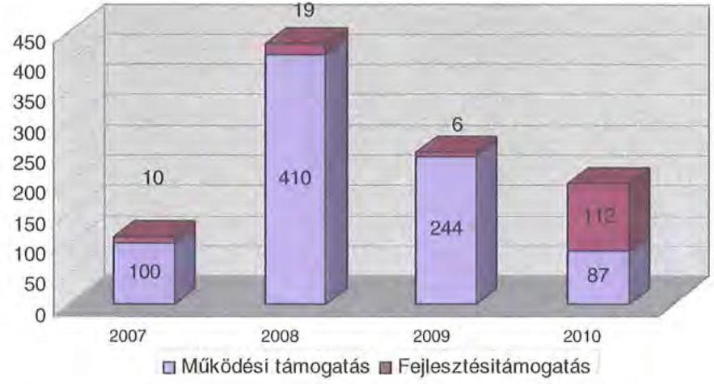

A kórházak beruházási céljaik megvalósítása érdekében több esetben pályáztak EU-s forrásokra. Nyertes pályázataik közül megvalósult a deszki tüdőszanatórium energetikai felújítása 50 millió Ft EU-s támogatással ( 125 millió Ft összköltséggel), a makói kórház „energia-hatékonysági fejlesztése és energetikai korszerűsítése", amelynek kivitelezési költsége 175 millió Ft, EU-s támogatása 70 millió Ft volt.

Az Önkormányzat a 2010. év utáni kötelezettségvállalásai közül a szentesi kórház sürgősségi betegellátó osztályának 498 millió Ft-os fejlesztésére 302 millió Ft ( 60,6\%-os) EU-s támogatást nyert el.

Az Önkormányzat által fejlesztési feladatokra vállalt 861 millió Ft - 2010. év után esedékes - kötelezettség-vállalásból 356 millió Ft a szentesi kórház kötelezettsége. A további 505 millió Ft az oktatási és egyéb intézményeinél megkezdett fejlesztésekhez kapcsolódik.

A működési és felhalmozási kiadások arányának változásában 2007-2010 évek között elmozdulás figyelhető meg. A felhalmozási kiadások összege 2007-ről 2010-re 1296 millió Ft-ról 2179 millió Ft-ra, annak aránya a kiadásokon belül a 2007. évi 7,0\%-ról 2010-re 10,8\%-ra emelkedett.

---

Az önkormányzati működési és felhalmozási kiadások megoszlását a következő grafikon szemlélteti:
millió Ft-ban
Az önkormányzati működési és felhalmozási kiadások
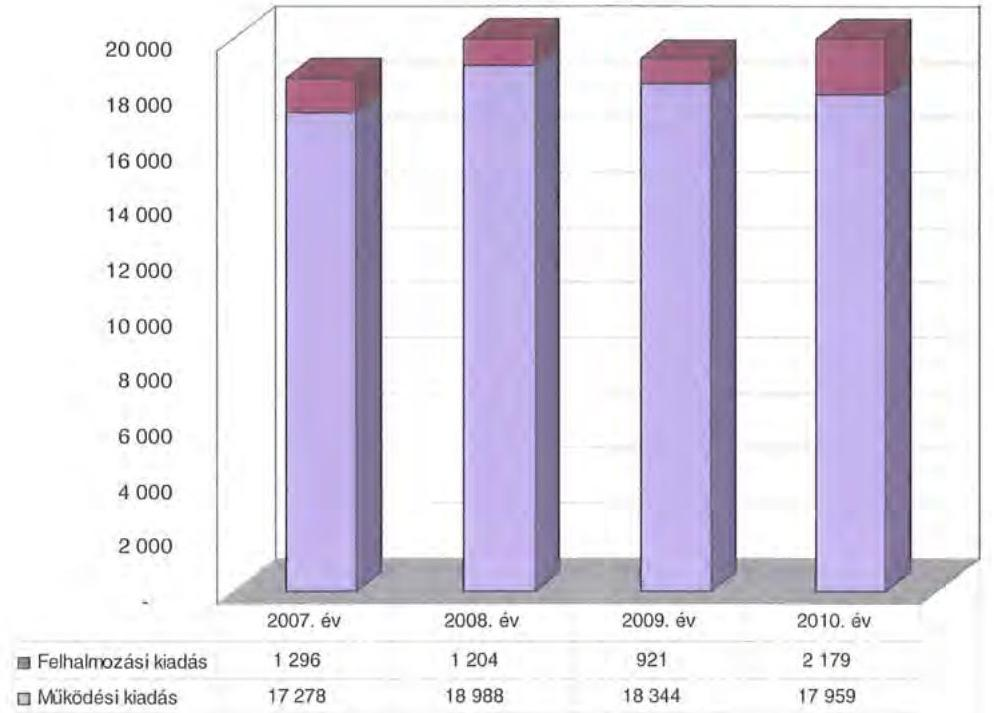

Az Önkormányzat a 2007-2010. években megvalósított fejlesztései között intézményi épületek felújítása, korszerűsítése, bővítése és létesítése, valamint orvosi gép- és műszerbeszerzések szerepeltek. A legmagasabb bekerülési költségű ( 765 millió Ft) fejlesztés a csongrádi fogyatékos otthon építése volt, mely 2005-2010 között valósult meg. A Múzeum raktárának építése 661 millió Ft-ba került 2009-2010-ben, míg az ONTE Nkft. DAOP-pályázatának ${ }^{31}$ megvalósítása 607 millió Ft-ba került a 2007-2010. években. A három kórház a 2007-2010. évek közötti 12 beruházására ${ }^{32} 874$ millió Ft-ot költöttek.

Az Önkormányzat által 2007-2010. években megvalósított, illetve 2010. december 31-én fennálló 4315 millió Ft nagyságrendű fejlesztési feladatok a kötelező feladatellátáshoz kapcsolódtak. A kötelezettségvállalások közül a 10 millió Ft bekerülési költség feletti beruházások és felújítások száma 39 volt, amelyek

[^0]
[^0]:    ${ }^{31}$ Az Ópusztaszeri Nemzeti Történelmi Emlékpark Feszty körképet bemutató rotunda épületének teljes rekonstrukciója valósult meg a projekt keretében.
    ${ }^{32}$ A deszki tüdőszanatórium rekonstrukciója, energetikai korszerűsítése, a szentesi kórház szennyvíz előtisztítója, gyógyszertárának áthelyezése, struktúra átalakítása, a makói kórház energetikai korszerűsítése és sürgősségi osztályának fejlesztése, informatikai fejlesztése, mindhárom kórház egészségügyi ellátórendszerének fejlesztése, továbbá orvosi gép- és műszerfejlesztések valósultak meg a jelzett nagyságú keretösszegből.

---

közül a még befejezetlen beruházások finanszírozására uniós forrásokat 4 fejlesztéshez vesznek igénybe.

Az Önkormányzatnál jelenleg a következő négy EU-s támogatással finanszírozott projekt van folyamatban: a szentesi kórházban a sürgősségi betegellátás fejlesztése (356 millió Ft tervezett kiadással), a hat iskolát érintő energetikai korszerűsítési projekt (összesen 300 millió Ft tervezett kiadással), a Rendezvényházban a közösségi tér kialakítására vonatkozó pályázat (57 millió Ft tervezett kiadással) és a „Vissza a természethez" című projekt (76 millió Ft tervezett kiadással). A folyamatban lévő, 2010. utáni 861 millió Ft összegű fejlesztésekre vonatkozó kötelezettségvállalásokhoz a források rendelkezésre állnak az alábbi összetételben: saját forrás 80 millió Ft (9,3\%), hitel 8 millió Ft (0,9\%), kötvény 230 millió Ft (26,7\%), EU-s támogatás 450 millió Ft (52,3%) és hazai támogatás 93 millió Ft (10,8%).

Az Önkormányzat 2007-2010. években megvalósított, illetve 2010. december 31-én fennálló fejlesztési feladatokhoz kapcsolódó kötelezettségeinek összegzését a 3. számú melléklet tartalmazza.

# 3. KÖTELEZETTSÉGEK BEMUTATÁSA 

### 3.1. A pénzintézetek felé fennálló kötelezettségek alakulása

Az Önkormányzatnak 2006. december 31-én 217 millió Ft pénzintézeti kötelezettség állománya volt, amely a 2010. évre 7701 millió Ft-ra ${ }^{33}$ emelkedett. A 2010. év végén fennálló pénzintézeti kötelezettségei egy kötvénykibocsátásból és a 2010. év végén fennálló folyószámlahitel állományból keletkeztek.

Az Önkormányzat pénzintézeteknél fennálló kötelezettség-állományát a 20072010. években a következő diagram szemlélteti:
millió Ft-ban
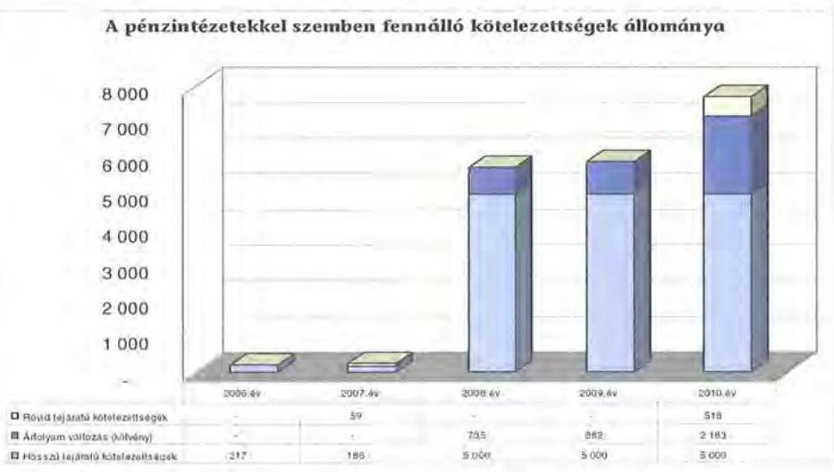

[^0]
[^0]:    ${ }^{33}$ A devizában kibocsátott kötvénykötelezettség év végi könyvviteli mérleg szerinti értékének meghatározásakor az árfolyamváltozás miatti év végi értékelést a 2008-2010. évek között nem végezték el, az a helyszíni ellenőrzés ideje alatt történt meg.

---

Az árfolyamváltozás hatása is befolyásolja a kötelezettségek alakulását, azonban annak mértéke előre pontosan nem határozható meg, csak várakozásokon alapuló tendenciák jelezhetők. Számviteli jogszabály ${ }^{34}$ határozza meg, hogy az árfolyam-különbözetet év végén a kötelezettségek között a saját tőkével szemben a könyvviteli mérlegben nyilván kell tartani, azonban ez az árfolyamkülönbözet valójában nem realizált. Annak megítéléséről, hogy a devizában kibocsátott kötvényért kapott forinthoz képest a kötvény visszavásárlásakor jelentkező forint-kötelezettség többletkiadást (árfolyamveszteség) vagy megtakarítást (árfolyamnyereség) eredményez-e a futamidő végén, a teljes kötelezettség rendezését követően lehet képet alkotni. Mindaddig, amíg törlesztési kötelezettség nem áll fenn (türelmi idő), a tőkére vonatkoztatva nem értelmezhető sem az árfolyamveszteség, sem az árfolyamnyereség.

Az Önkormányzat pénzintézeti kötelezettségvállalásaira közgyűlési döntés alapján került sor. A kötelezettségvállalásból származó források felhasználási céljait meghatározták. A Közgyűlés kötvénykibocsátásról szóló döntéseit megalapozó előterjesztések nem tartalmazták a kötelezettségvállalás visszafizetési forrását, a teljes futamidő alatt várható kamat- és tőkefizetési kötelezettségek bemutatását, az adósságszolgálati korlát bemutatását, azonban ismertették az árfolyam- és kamatkockázatokat. A kötelezettségvállalás visszafizetési forrását a döntést megalapozó előterjesztésekben nem határozták meg ${ }^{35}$. Az Önkormányzat az adósságot keletkeztető kötelezettségvállalásának felső határát a 2007-2010. években nem lépte túl. A Közgyűlés nem készített koncepciót, stratégiát a likviditási és eladósodási problémák kezelésére.

Az Önkormányzatnál a kötvénykibocsátást megelőzően vizsgálták az adósságot keletkeztető kötelezettségvállalással megvalósított felhalmozási kiadások esetleges bevételnövelő és kiadáscsökkentő hatásait, az abból való megtérülését. Az Ópusztaszeri Nemzeti Történeti Emlékpark kötvénybevételből tervezett felújításainak hatására a belépőjegy bevétel növekedését jelezték, azonban nem számszerűsítették. A szociális intézmények, a szentesi kórház és a Hivatal energia megtakarítási célú beruházásainál 10-40\%-os kiadási megtakarítást terveztek.

Az Önkormányzat 2010. december 31-én CHF-ben fennálló adósságot keletkeztető kötelezettségvállalása az alábbi volt ${ }^{36}$:

[^0]
[^0]:    ${ }^{34}$ az államháztartás szervezetei beszámolási és könyvvezetési kötelezettségének sajátosságairól szóló 249/2000. (XII. 24.) Korm. rendelet 33. § (2) bekezdés c. pontja
    ${ }^{35}$ A kötelezettségvállalás visszafizetési forrását a 2007. évi döntést követően, 2008. februárban elkészített kötvénykibocsátásról szóló információs összeállításban a saját bevételben jelölték meg.
    ${ }^{36}$ Az Önkormányzat a „Csongrád Megye" kötvény ellenértékének 18\%-át, 900 millió Ft-ot a korábban felvett fejlesztési hitel törlesztésére és folyószámlahitel kiváltására, 19\%-át, 976 millió Ft-ot fejlesztésre és pályázati önrész biztosítására, 6\%-át, 292 millió Ft-ot működési célra (kórházak likviditási helyzetének javítására) fordította. A kötvényből származó bevétel 57\%-át, 2832 millió Ft-ot fejlesztési célokra tartalékolták. Ennek összegét 2011. március 31-én a folyószámlán tartották és likviditási gondjaik enyhítésére a folyószámlahitel csökkentésére igénybe vették.

---

| Megnevezés | Kibocsátás, illetve szer-   ződéskötés   időpontja | Összeg | Kibocsátási,   vagy lehívási   árfolyam | Kamat (refe-   rencia ka-   mat+ kamat-   felár) | Felhasználás   célja: |
| :-- | :-- | :-- | :-- | :-- | :-- |
| Csongrád   Megye Köt-   vény | 2008.02.18 | 32259000 CHF | 155 Ft/CHF | 6 havi CHF   LIBOR $+0,65 \%$ | Hitelkiváltás,   pályázati   lehetőségek-   hez önerő   biztosítása |

Az Önkormányzatnak Ft-ban pénzintézeti kötelezettsége nem volt 2010. december 31-én.

Az Önkormányzat 2007-2010 között a CHF-ben fennálló pénzintézeti kötelezettsége után 1918538 CHF (352 millió Ft) kamatot fizetett meg. A vizsgált időszakban - a négy év türelmi idő miatt - tőketörlesztési kötelezettsége nem volt.

Az Önkormányzat 2010. december 31-én fennálló kötelezettségeinek várható jövőbeni, a teljes futamidőre vonatkozó tőke- és kamatfizetési kötelezettsége az utolsó fizetési kötelezettség alapját képező kamat kondíciókkal számolva -2011-2013 között 4753873 CHF, 2014-től 30309990 CHF.

Az Önkormányzat a kötvénykibocsátás (2008. február 18.) és 2010. december 31-e között a kötvénykibocsátásból származó - átmenetileg szabad - bevétel befektetéséből 855 millió Ft hozamot, kamatbevételt ért el$^{37}$, amely 242,9\%-át tette ki a kötvénykibocsátás miatt 2010. december 31-ig megfizetett kamatnak (352 millió Ft). A bevételt az Önkormányzat intézményrendszerében jelentkező költségvetési hiány csökkentésére, működésre fordították. Másodlagos hatásként a kötvénybevétel lekötéséből származó kamatbevétel folyószámlára történő utalásával a folyószámlahitel aktuális állományát csökkentették.

Az Önkormányzat működésének pénzügyi egyensúlyát a vizsgált időszakban csak folyószámlahitel igénybevételével tudta biztosítani, amelyet az alábbi táblázat mutat be:
ezer Ft-ban

| Megnevezés | 2007. év | 2008. év | 2009. év | 2010. év | 2011.   március 31. |
| :-- | :--: | :--: | :--: | :--: | :--: |
| I. Folyószámlahitel |  |  |  |  |  |
| a folyószámlahitel keretösszege január 1-jén | 1000000 | 3000000 | 2000000 | 3000000 | 3000000 |
| teljesített kamat és egyéb költség | 33000 | 38703 | 85521 | 126953 | 29657 |

Az Önkormányzatnak 2009. január 1-én nem volt hitelkeret szerződése. Ez nem okozott likviditási problémát, mert a kötvényforrásból befektetett pénzeszközök 2008. év végi lejárata miatt pozitív volt a folyószámla év végi egyenlege. Az Önkormányzat 2009. február 2-től új számlavezető pénzintézettel kötött folyószámla hitelszerződést, amelyben 2000 millió Ft hitelkeretet határoztak meg. A folyószámla hitelkeretet 2009. december 1-től 3000 millió Ft-ra felemelték.

[^0]
[^0]:    ${ }^{37}$ A kötvénybevételt 2008-ban forgatási célú értékpapírban (diszkontkincstárjegy, államkötvény) és betétben, 2009-től csak betétben kötötte le az Önkormányzat.

---

A folyószámlahitel kondíciói a következők voltak ${ }^{38}$:

| Megnevezés | Kamat (referencia+ kamatfelár) |
| :--: | :--: |
| 2007. év | 3 havi BUBOR $+0,09 \%$ |
| 2008. év | 3 havi BUBOR $+0,1 \%$ |
| 2009. év | 1 napi BUBOR $+1 \%$ |
| 2010. év | 1 napi BUBOR $+1 \%$ |
| 2011. I. n.év | 1 napi BUBOR $+1 \%$ |

A folyószámlahitelhez kapcsolódóan egyéb költség címen az Önkormányzatnak díjakat nem kellett fizetnie.

A számlavezető bankváltással a korábbi 3 havi BUBOR $+0,1 \%$ folyószámlahitel díjhoz képest egy havi BUBOR $+0 \%$ kamatfelárat alkalmaztak. A felek 2009. december 1-ei hatállyal a kamat mértékét egy napi BUBOR $+1\%$-ra módosították.

A 2007-2010. években az Önkormányzat az év napjainak 83-98\%-ában vett igénybe folyószámlahitelt. A folyószámlahitellel zárt napok száma a 20072010. években 302 és 356 nap között alakult. Ebben az időszakban a folyamatos likviditási problémák folyószámlahitellel történő finanszírozása az Önkormányzatnak összesen 284 millió Ft, 2011. I. negyedévében további 30 millió Ft kamatráfordítást eredményezett. A 2011. évben a helyszíni ellenőrzés időpontjáig folyamatosan rendelkezett folyószámlahitellel az Önkormányzat. Az átlagos napi állomány a 2007. évben volt a legalacsonyabb, 454 millió Ft, 2010-ben volt a legmagasabb, 2165 millió Ft. A folyószámlahitel 2010. évi záró állománya 518 millió Ft volt.

Az Önkormányzatnak munkabér megelőlegezési hitele a vizsgált időszakban nem volt.

A jelenleg fennálló kötvény esetében a kamatfizetési kötelezettségek alakulását jelentősen befolyásolta és jelenleg is befolyásolja a kibocsátáskori (2008. február 18.) és az utolsó kamatfizetéskori referencia kamatok változása, amelyet az alábbi táblázat mutat be:

| Megnevezés | Kibocsátási, lehívási |  | Utolsó fizetéskori |  | Változás   $\%$ |
| :--: | :--: | :--: | :--: | :--: | :--: |
|  | alapkamat $\%$ |  |  |  |  |
| 6 havi CHF LIBOR | 2,77 |  | 0,24 |  | $-91,3$ |

[^0]
[^0]:    ${ }^{38}$ A referencia kamat az alábbiak szerint alakult:

    | MNB BUBOR fixing (átlagkamat) \%-ban | | | | | | | :--: | :--: | :--: | :--: | :--: | :--: | :--: | :--: | :--: | :--: | | Referencia kamat | 2007.   évi | 2008.   évi | 2009.   évi | 2010.   évi | 2011. III. 31   ig | | 3 havi BUBOR | 7,75 | 8,87 | 8,64 | 5,5 | 6,03 | | 1 napi BUBOR | 7,78 | 8,41 | 8,39 | 4,95 | 5,24 |

---

A referencia kamat változása nélkül az Önkormányzatnak - kibocsátáskori referencia kamattal számolva - 2010. december 31-ig 3027684 CHF (563 millió Ft) kamatfizetési kötelezettsége jelentkezett volna. A változások miatt azonban 1109146 CHF összeggel (211 millió Ft-tal) kevesebb fizetési kötelezettséget kellett teljesítenie. Az alapkamat mértékének alakulása jelentős hatással van az adott devizanemben kifejezett, a teljes futamidőre számított, várható kamatkötelezettség nagyságára. A kamatfelár a vizsgált időszakban nem módosult.

Az Önkormányzatnál a helyszíni vizsgálat alatt további hitel igénybevételről, illetve kötvénykibocsátásról szóló döntést nem készítettek elő.

# 3.2. Szállítók felé fennálló kötelezettségek alakulása 

Az Önkormányzatnak és gazdasági társaságainak lejárt szállítói tartozásait és egyéb kiadás elmaradásait az alábbi táblázat tartalmazza:
ezer Ft-ban

| Megnevezés | 2007. | 2008. | 2009. | 2010. | 2011. |
| :-- | --: | --: | --: | --: | --: |
|  | december 31. | december 31. | december 31. | december 31. | március 31. |
| Lejárt szállítói   tartozás | 219209 | 207135 | 318251 | 557721 | 403988 |
| ebből Kórház | 193931 | 163698 | 276334 | 429537 | 403988 |
| Gazdasági társaságok lejárt szállítói   tartozása | 1190 | 4589 | 105 | 2365 | 2379 |
| Egyéb kiadás elmaradás | 0 | 0 | 0 | 0 | 1000 |
| Tartozásállomány   összesen: | 220399 | 211724 | 318356 | 560086 | 407367 |

Az Önkormányzat és gazdasági társaságai lejárt szállítói tartozása és egyéb kiadás elmaradása 2007. december 31-ről 2010. december 31-re 220 millió Ft-ról 560 millió Ft-ra ( $155 \%$-kal) nőtt. A 2011. év I. negyedév végén a 407 millió Ft lejárt szállítói tartozásból a szentesi és makói kórház lejárt szállítói tartozása 404 millió Ft, két gazdasági társaság lejárt szállítói tartozása 2 millió Ft és egy gazdasági társaság egyéb kiadási elmaradása 1 millió Ft volt ${ }^{39}$. Az Önkormányzatnak egyéb kiadás elmaradása a vizsgált időszakban nem volt.

[^0]
[^0]:    ${ }^{39}$ Az Önkormányzat többségi tulajdonában lévő Kegyeleti Kft-nél peres eljárásból fennálló függő kötelezettség 1 millió Ft volt 2011. I. negyedév végén.

---

Az Önkormányzat lejárt szállítói tartozásainak alakulását a 2007. és 2011. I. negyedév között az alábbi diagram ábrázolja:
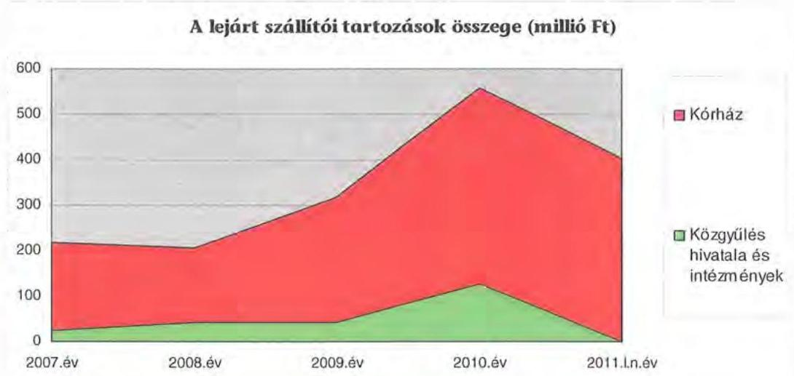

A 2007-2010. évek között az önkormányzati lejárt szállítói tartozás döntő részét, 2007-ben 88\%-át, 2008-ban 79\%-át, 2009-ben 87\%-át és 2010-ben $77 \%$-át képezte a szentesi és makói kórházak tartozásállománya. Ez a 2007. évi 194 millió Ft-ról 2008-ra 164 millió Ft-ra csökkent, ezt követően 2009-re 276 millió Ft-ra, 2010-re 430 millió Ft-ra nőtt, majd 2011. március 31-re 404 millió Ft-ra csökkent.

A 2010. december 31-én lejárt 558 millió Ft szállítói tartozásállomány 15,6\%-a ( 87 millió Ft) meghaladta a 90 napot. A 31-60 nap közötti 12\%-a ( 67 millió Ft), a 61-90 nap közötti 16,8\%-a ( 94 millió Ft) volt.

A 2011. március 31-én lejárt 404 millió Ft szállítói tartozásállomány nem haladta meg a 90 napot. A 31-60 nap közötti 37,6\%-a (152 millió Ft), a 61-90 nap közötti 23,8\%-a ( 96 millió Ft) volt.

Az Önkormányzat a lejárt szállítói tartozás miatt a szentesi kórházhoz a 48/2007. (IV. 26.) számú határozatában önkormányzati biztost jelölt ki, aki intézkedési tervet dolgozott ki a konszolidációra. A biztos tevékenységének hatására a lejárt tartozásállomány csökkent 2008. év végére, azonban 2009-2011. év folyamán a tartozásállomány újratermelődött. A Közgyűlés 76/2009. (IV. 30.) számú határozatában jóváhagyta a szentesi kórház igazgatója által készített intézkedési tervet. A 2009. évben megtett intézkedések ellenére a lejárt tartozásállomány 2008. évről 2011. I. negyedév végére 9 millió Ft-ról 206 millió Ft-ra emelkedett.

Az Önkormányzat és a szállítók nem kezdeményeztek adósságrendezési eljárást a szentesi és makói kórházzal szemben a 2007-2011. években, mivel a fennálló 60 és 90 napon túli lejárt tartozások esetében azok kiegyenlítésére részletfizetésben állapodtak meg. A 2008. évben a szentesi kórház szállítói tartozásának rendezésére 355 millió Ft összegben négy faktorálási szerződést kötöttek a legnagyobb szállítóval.

---

Az Önkormányzat a 2009-2010. években 143 millió Ft visszatérítendő intézményfenntartói támogatást nyújtott a szentesi és makói kórházaknak abból a célból, hogy a lejárt szállítói tartozásállomány ne érje el a 90 napot. A támogatás visszatérítése 2011. március 31-ig nem történt meg.

A 2010. december 31-i önkormányzati szintű mérlegben kimutatott szállítói kötelezettség 1186 millió Ft volt. A le nem járt - korrigált - tartozásállomány 628 millió Ft-ot tett ki, amelynek 67,2\%-a ( 422 millió Ft ) a kórházak tartozása volt. Az Önkormányzatnál a 2010. év végén kimutatott szállítói kötelezettségre fedezetet a 2011. évi bevételek nyújthatnak.

Az Önkormányzat 75\% feletti tulajdonában lévő gazdasági társaságok közül a 2010. év végén 30 napon túli lejárt szállítói tartozással az ÖNTE Nkft. (1,8 millió Ft), illetve a Rendezvényház Kft. ( 0,6 millió Ft) rendelkezett.

Az ÓNTE Nkft. likviditási helyzete a vizsgált időszakban romlott, mivel 20072009. években a lejárt szállítói tartozása 31-60 nap közötti volt, 2010. december 31-én azonban már 61-90 nap közötti ( 0,1 millió Ft) és 91-365 nap közötti (1,1 millió Ft) lejárt tartozása is volt. 2011. március 31-én az ÓNTE Nkft. lejárt 2,4 millió Ft összegű szállítói tartozása 90 napon túli volt.

# 3.3. Egyéb kötelezettségek alakulása 

Az Önkormányzat a 2007-2008. években négy szerződésben összesen 247 millió Ft támogatási kölcsönt nyújtott ${ }^{40}$ a likviditás javításához a szentesi és a makói kórháznak. A kórházak támogatási kölcsön tartozása - a 20042008. években folyósított kölcsönök alapján - 2010. december 31-én 607 millió Ft volt. A kölcsönök visszafizetése a helyszíni ellenőrzés időpontjáig, 2011. március 31-ig nem történt meg, a fizetési határidőt évente meghosszabbította a Közgyűlés.

Az Önkormányzat két többségi tulajdonú gazdasági társaságának 235 millió Ft tagi kölcsönt nyújtott a 2007 -2011. március 31-e közötti időszakban. Az Önkormányzat a lejárt szállítói állománnyal rendelkező ÓNTE Nkft. likviditási problémáinak enyhítésére 2009-ben 100 millió Ft, 2010-ben 30 millió Ft, 2011-ben 61 millió Ft tagi kölcsönt nyújtott. Az ÓNTE Nkft. által felvett kölcsönök törlesztése a többszörös határidő módosítás következtében 2011. május 31-ig esedékes. A Megyeszolgálat Kft. a 2010-ben kötött tagi kölcsön szerződés alapján likviditási problémái miatt 2010-ben 29 millió Ft, 2011-ben 15 millió Ft tagi kölcsönben részesült, amelynek törlesztése 2011. december 31-ig esedékes.

A 2007-2010. években az Önkormányzatnál az elengedett követelések bruttó összege nem haladta meg a 10 millió Ft-ot.

[^0]
[^0]:    ${ }^{40}$ A 2007-2008. években az Önkormányzat a likviditási gondjaik enyhítésére két kórházát nem támogatásban részesítette, hanem az Ötv. 89. § (1) bekezdésében foglaltak ellenére kölcsönt nyújtott részükre. A 2009-2010. években a jogszabályi előírásnak megfelelően az Önkormányzat visszatérítendő intézmény-fenntartói támogatásban részesítette ezt a két kórházat.

---

Az Önkormányzat 2009. február 16-án hat, 2009. március 17-én öt lízingszerződést kötött a közbeszerzési eljárás alapján kiválasztott szállítóval 11 db gépkocsi beszerzésére. A fizetendő lízingdíj devizaneme HUF, futamideje 10 év, a kezdő lízingdíj nagysága a vételár 10\%-a volt. A 10 év alatt megfizetendő lízingdíj összege (tőke és kamat együtt) a szerződéskötéskor 124 millió Ft, a 2010. december 31-én fennálló tőketartozás 43 millió Ft volt.

Az Önkormányzat évente az összes intézménynél felmérette a karbantartási, felújítási szükségletet, annak eldöntése céljából, hogy a következő év költségvetésébe a pénzügyi lehetőségek figyelembe vételével megtörténhessen a karbantartási, felújítási igények rangsorolása az eszközök elhasználódása, amortizációja fedezetének biztosítása érdekében. A 2010. évben 355 millió Ft volt az így megállapított igény. A felújításokra, az eszközök pótlására elsősorban az intézmények működőképességének biztosítása, illetve a szakhatósági előírások figyelembevételével került sor. Az elhasználódott eszközök pótlására, felújítására az Önkormányzat költségvetésében céltartalékot képzett. Az eredeti éves ingatlan-felújítási előirányzat, az ingatlan-karbantartásra elkülönített céltartalékkal együtt 2007-ben 180 millió Ft, 2008-ban 227 millió Ft, 2009. évben 273 millió Ft és 2010-ben 198 millió Ft volt. Az Önkormányzat a 2007-2010. években a tárgyi eszközök után 2166 millió Ft összegű értékcsökkenést számolt el. Felújításra annak 38\%-át, 818 millió Ft-ot fordítottak.

# 4. A PÉNZÜGYI EGYENSÚLY MEGTEREMTÉSE ÉRDEKÉBEN HOZOTT INTÉZKEDÉSEK 

A közgyűlési előterjesztés szerint az elfogadott 2007. évi költségvetési koncepció feladatként jelölte meg az intézmények átalakításának és feladatellátásának áttekintését. Kiemelt feladatként jelölte meg a Közgyűlés, hogy a lehető legnagyobb költségvetési megtakarítások elérése érdekében olyan intézményi struktúra jöjjön létre, melynek során az alapfeladatok ellátása nem sérülhet, de ellátásuk hatékonysága emellett javul. Az intézkedés hatásaként elsősorban a személyi kiadások csökkenéséből adódóan megtakarítást, ezen felül takarékosabb, jobban ellenőrizhető gazdálkodást vártak.

A kiadáscsökkentő és bevételnövelő intézkedések a gazdálkodás átláthatóbbá tételét, valamint a feladatellátás szakmai színvonalának, de kiemelten a pénzügyi helyzet javítását célozták. A legjelentősebb mértékű kiadási megtakarítást az álláshely csökkentésekkel érték el, és - két kórház kivételével - sikerült megőrizniük intézményeik gazdálkodásának stabilitását.

Az Önkormányzatnál a fenntarthatóságot és fejlődőképességet biztosító, intézményhálózatot érintő struktúraváltás a gazdasági programjában megfogalmazott elvárások szerint 2007-ben elindult. A Közgyűlés a 101/2007. (VII. 19.) számú határozatával elrendelte a közoktatási, szociális intézmények átszervezését. Ennek következtében létszámcsökkentés, bevételnövelő, feladatátadási-átvételi intézkedések történtek saját intézményein belül.

A létszámcsökkentéssel kapcsolatos kiadások támogatására igénybe vehető költségvetési hozzájárulás és a jövőbeni megtakarítás érdekében - a pályázati felhívásban foglalt igénybenyújtási ütemezéshez igazodóan - a költségvetési

---

szervek vezetőinek javaslata alapján a következő csoportok és elvek szerint történtek a létszámcsökkentések:

- a nyugdíjban vagy nyugdíjszerű ellátásban részesülő foglalkoztatottak helyett fiatal munkavállalók foglalkoztatása. Ezen javaslatok létszámváltozással nem, viszont bérmegtakarítással jártak. A nyugdíjba vonulók felmentési idejére fizetett bére miatt a 2007. évben többletköltség jelentkezett. Ezért tényleges önkormányzati megtakarítás 2008-tól realizálódott;
- feladatváltozásból, illetve jogszabályváltozásból adódó létszámcsökkentés elsősorban az oktatási intézményeket érintő pedagógus kötelező óraszám emelkedésének hatása jelentett létszámváltozást. Nyugdíjban vagy nyugdíjszerű ellátásban részesülő munkavállalók foglalkoztatásának megszüntetése, illetve a felmentési idejét töltő dolgozó álláshelyének megszüntetése. Azon üres álláshelyek elvonása, amelyekhez kapcsolódó feladat intézményen belüli átszervezéssel, az akkori létszámmal ellátható volt.

Az Önkormányzat a 2007-2010. évek között a 2006. december 31-én meglévő 36 intézményből a költségtakarékos és méretgazdaságos feladatellátás megteremtése érdekében 23 intézményt hozott létre. Az intézményi átszervezések során a 2007-2010. években 467 álláshely szűnt meg, amelyből 371 álláshelyet ( $79,4 \%$ ) a 2007. évben szüntettek meg.

Az átszervezéssel érintett intézményeknél az álláshelyekből 230 fő (49,3\%) az egészségügyben, 136 fő ( $29,1 \%$ ) az oktatásban, 57 fő ( $12,2 \%$ ) a szociális és gyermekjóléti szférában, 21 fő ( $4,5 \%$ ) a Hivatalban, valamint 23 fő ( $4,9 \%$ ) egyéb önkormányzati területen szűnt meg.

A prémiumévek programhoz igénybevett támogatás 254 millió Ft volt a 20072010. években, a támogatás felhasználásával tartósan megszüntetett álláshely 144 volt az Önkormányzatnál.

A közoktatási feladatellátás átszervezése során a Közgyűlés egy új intézményt alapított, kilenc intézményt megszüntetett, és a megmaradó hét intézmény közül hat intézmény gazdálkodási jogkörét megváltoztatta. Az intézménymegszűnések és a jelentős feladatváltozások miatt az átszervezésben érintett intézmények vezetőinek visszavonásra került a vezetői megbízása. Az új, illetve átszervezett intézmények egy-egy magasabb vezető irányításával, 2007. augusztus 1-jétől közös igazgatású közoktatási intézményként, tagintézményenként egy-egy tagintézmény-vezetővel működtek. Az átszervezésben érintett középfokú oktatási intézmények esetében Csongrádon három, Szentesen kettő, Makón kettő, míg Pusztamérgesen egy tagintézmény-vezető segítette a magasabb vezető munkáját. A gyógypedagógiai intézmények esetében két magasabb vezető és három tagintézmény-vezető irányítja az intézményeket. Az összevonás miatt 20 álláshely szűnt meg. Az intézmények a gazdálkodás megszervezésének módja szerint önállóan gazdálkodó költségvetési szervek.

---

# A középfokú oktatási és gyógypedagógiai intézmények integrációja 

valamennyi, az Önkormányzat fenntartásában működő oktatási intézményt érintette.

Az átszervezésben érintett középfokú oktatási intézmények az alábbiak voltak:

- Csongrádon három középiskola, a Batsányi János Gimnázium, Szakközépiskola és Kollégium, a Bársony István Mezőgazdasági Szakközépiskola, Szakiskola és Kollégium, valamint a Sághy Mihály Szakképző Iskola, Középiskola és Kollégium került összevonásra. Az új intézmény neve Csongrádi Oktatási Központ, Gimnázium, Szakképző Iskola és Kollégium;
- Szentesen a Horváth Mihály Gimnázium, a Boros Sámuel Szakközépiskola, Szakiskolával került összevonásra. A Zsoldos Ferenc Középiskola és Szakiskola, valamint a Pollák Antal Műszaki Szakközépiskola, Szakiskola került összevonásra. Az intézmény gazdálkodási feladatait az önálló gazdálkodási jogkörrel rendelkező Horváth Mihály Gimnázium és Szakképző Iskola látja el;
- Makón az Erdei Ferenc Kereskedelmi és Közgazdasági Szakközépiskola és Kollégium, valamint a Galamb József Szakképző Iskola került összevonásra;
- Ásotthalmon a Bedő Albert Középiskola, Erdészeti Szakiskola és Kollégium és a Pusztamérgesi Középiskola, Szakképző Iskola és Kollégium került összevonásra.

Az intézmények gazdálkodása megszervezésének módja szerint önállóan gazdálkodó költségvetési szervek.

Átszervezésben érintett gyógypedagógiai intézmények:

- Hódmezővásárhelyen a Kozmutza Flóra Óvoda, Általános Iskola, Szakiskola, Diákotthon és Gyermekotthon és a szentesi Rigó Alajos Óvoda, Általános Iskola, Szakiskola, Diákotthon és Gyermekotthon, valamint annak csongrádi tagintézménye került összevonásra;
- Makón a Pápay Endre Óvoda, Általános Iskola, Szakiskola, Diákotthon, Gyermekotthon és Egységes Gyógypedagógiai Módszertani Intézmény és a Klúg Péter Óvoda, Általános Iskola, Alapfokú Művészetoktatási Intézmény, Szakiskola, Diákotthon és Egységes Gyógypedagógiai Módszertani Intézménye került összevonásra.

Változás történt 2008. január 1-jétől a szociális feladatokat ellátó intézmények vonatkozásában is. A 143/2007. (XI. 22.) számú határozatában foglaltak alapján a nagyobb méretnagyságból adódó előnyök kihasználása, a hatékonyabb feladatellátás biztosítása érdekében a szociális intézmények integrációját hajtotta végre az Önkormányzat. Hét intézményt közös igazgatású szociális intézményként három szervezetbe integráltak, ezért mint önállóan gazdálkodó költségvetési szervek megszűntek és az új intézmények telephelyeiként, részjogkörű szervezetekként működtek tovább egy-egy részlegvezetővel.

Az átszervezés az alábbiak szerint érintette az Önkormányzat által működtetett intézményeket:

- a kisteleki Idősek Otthona, a mórahalmi Idősek Otthona (az ásotthalmi részlegével együtt), az ópusztaszeri Pszichiátriai Otthon, a ruzsai Idősek Otthona egy új intézményként Napsugár Otthon néven, Kistelek székhellyel;

---

- a makói Maros Menti Idősek Otthona, az óföldeáki Idősek Otthona és a szegedi Vakok Otthona, Marosmenti Szociális Intézményként;
- a derekegyházi Ápoló Otthon, a nagymágocsi Kastélyotthon és a szentesi Pszichiátriai Ápoló Egyesített Szociális Intézményként kerültek összevonásra.

Az intézmény-megszűnések és a jelentős feladatváltozások miatt minden, az átszervezésben érintett intézmény vezetőjének vezetői megbízása visszavonásra került. Az összevonás miatti létszámkeret-változások 11 fő létszámcsökkentést eredményeztek. Az egyes gazdasági feladatokat ellátók álláshelyeinek megszűnése 18 millió Ft megtakarítást jelentett. További költségcsökkenést eredményezett a magasabb vezetői pótlékok visszavonása, éves szinten 1,4 millió Ft-ot.

A gazdasági programban a feladatellátás hatékonyságának növelésére jóváhagyott programokat a 2007. évben kialakult szervezeti struktúra mellett a 2008-2009. évben is folytatták, amelynek keretében a központi intézkedések miatti bevételkiesés ellensúlyozására elkezdődött az intézmények közötti együttműködés megszervezése.

A Közgyűlés 52/1997. (V. 15.) számú határozatával ajánlás formájában elfogadott, majd a 87/2001. (IX. 27.) és a 36/2006. (II. 23.) számú határozataival kiegészített megyei feladat-ellátási, intézményhálózat-működtetési és fejlesztési terv (megyei fejlesztési terv) célkitűzései a végrehajtott intézményi integrációval nem álltak ellentétben, az intézmény-összevonások a hatékonyabb feladatellátást voltak hivatottak biztosítani.

A 2007-2010. években az intézményi átszervezések, a feladatváltozások, valamint a takarékossági intézkedések hatásaként együttesen 544 millió Ft kiadási megtakarítás jelentkezett, ebből 395 millió Ft (73\%) a létszámcsökkentésekből származott.

Az Önkormányzat 2007-2010. években tett kiadáscsökkentő intézkedései:
ezer Ft-ban

| Az érvényesített kiadás-   csökkentés területei | Személyi   juttatások és   járulékai | Dologi, mű-   ködési ki-   adások | Pénzeszköz   átadások,   támogatások | Összesen |
| :-- | :--: | :--: | :--: | :--: |
| A Közgyűlésnél | 1109 | - | - | 1109 |
| A Hivatalnál | 112442 | - | - | 112442 |
| Az intézményeknél | 430075 | - | - | 430075 |
| ÖSSZESEN | 543626 | - | - | 543626 |

Az intézményi feladatellátásban 2007-2008. évben végrehajtott szerkezetátalakítások és az ehhez kapcsolódó személyi változások után a 2009. évben további átalakításokat nem hajtottak végre.

Az intézményi feladatok racionalizálásáról, integrációról a Közgyűlés döntött. Az ezekhez készített előterjesztésekben a tervezett intézkedések indokait, várható eredményeit bemutatták. Az intézményi integráció, átszervezés végrehajtásához kikérték a szakmai szervezetek véleményét, a jogszabályban előírt egyeztetéseket lefolytatták. A rendelkezésre álló beszámolók szerint a szociális és gyermekvédelmi intézmények átszervezést követő működési tapasztalatok kedvezőek, a szakmai színvonal, valamint a működés személyi és tárgyi feltételei javultak.

---

Az önkormányzati szinten kimutatott 544 millió Ft megtakarításból 430 millió Ft-ot (79\%) az intézmények körében érvényesítették, amely a személyi juttatásoknál és járulékoknál realizálódott. A vizsgált időszakban az intézményi megtakarításokat a feladat megszüntetésével, átszervezéssel és intézményvezetői hatáskörben elrendelt intézkedésekkel érték el. Az intézményi kiadáscsökkenésből 304 millió Ft (71\%) az üres álláshelyek zárolása, foglalkoztatási formák megváltoztatása, csökkentése miatt következett be.

A köztisztviselők jogállásáról szóló 1992. évi XXIII. törvényben szabályozott, köztisztviselők részére adható szociális, jóléti, kulturális, egészségügyi juttatások körének módosítása következtében az Önkormányzat átdolgozta a cafetéria juttatások mértékét szabályozó rendeletét. A Közgyűlés a cafetéria elemek csökkentéséről a 2/2010. (I. 21.) számú rendeletében döntött, amelynek következtében közgyűlési szinten 1 millió Ft, hivatali szinten 22 millió Ft, intézményi szinten 126 millió Ft megtakarítása keletkezett.

A folyamatos felügyeleti szintű megszorító intézkedések miatt az egyéb ágazati feladatot ellátó intézményeknél a takarékossági intézkedések következtében egy-egy részterületen realizálódott megtakarítás, azonban összességében nem hozott kiadáscsökkenést. Az Önkormányzatnál 2007-2010. évek között a dologi kiadások összege 5064 millió Ft-ról 5982 millió Ft-ra növekedett. Az önkormányzati szintű megtakarítások nem számszerűsíthetőek annak ellenére, hogy a kiadások csökkentése érdekében minden évben sor került az intézmények kiadási előirányzatainak felülvizsgálatára, mivel a működési kiadások teljesítési aránya szinte minden évben közel 100\% volt.

A különböző beszerzési és szolgáltatási szerződések felülvizsgálatával megtakarított összegek nem hoztak jelentős kiadáscsökkenést az előző évek előirányzataihoz képest, különösen a makói és szentesi kórház esetében.

A szentesi kórházhoz a 2008. évben kinevezett önkormányzati biztos intézkedési terve az intézmény tartós fizetésképtelenségének felszámolására vonatkozóan a kórház támogatási kölcsönből és szállítói tartozásból származó kötelezettség állományában nem hozott jelentős csökkenést, mivel egyes részterületeken jelentkező megtakarítások (gyógyszer felhasználás, logisztika, beszállítókkal kötött szolgáltatási szerződések felülvizsgálata miatti árcsökkenések, bércsökkentő intézkedések) nem ellensúlyozták a bevételek kiesését.

A Közgyűlés a szentesi kórházhoz kirendelt önkormányzati biztosnak az intézmény gazdálkodása, alaptevékenysége ellátásának hosszabb távú ésszerűsítésére vonatkozó előzetes intézkedési tervét elfogadva stratégiai tervet készített és az alábbi intézkedéseket tette:

- a lejárt tartozásállomány csökkentése, megállapodás a szállítókkal;
- a közforgalmú gyógyszertár forgalmának növelése;
- a szállítás korszerűsítése;
- az energetikai rendszer korszerűsítése;
- a távközlési kiadások csökkentése érdekében felmerülő egyszeri kiadások minimalizálása;
- a központi laboratórium fokozottabb kihasználása;

---

- a közbeszerzésekkel kapcsolatos intézkedési programcsomag, bérleti szerződések;
- bevételt növelő intézkedések;
- gyógyszerfelhasználás racionalizálása;
- a kollektív szerződés felülvizsgálata;
- a kórház ügyletei, készenléti struktúrájának átalakítása;
- álláshely csökkentés költségmegtakarításra.

A Közgyűlés a szentesi kórház 2007. évi induló létszámát 773 főben állapította meg. Az intézkedési tervben foglalt, legfeljebb 129 főre vonatkozó álláshely csökkentés azonnali hatályú jóváhagyásával a 2007. évi záró létszámkeretet minimum 644 főben határozta meg azzal, hogy a szakmai minimumfeltételeknek megfelelő működést biztosítani kell.

A Csongrád Megyei Önkormányzatnál a 2007-2010 között végrehajtott 467 fő létszámcsökkenést ágazatonként az alábbi grafikon szemlélteti:
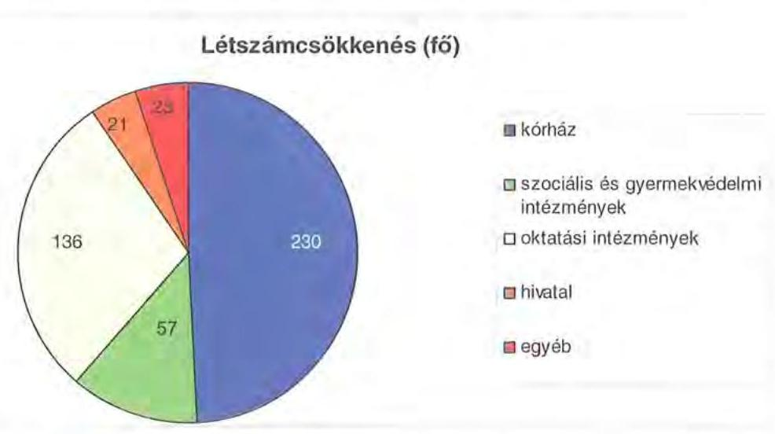

Az összes létszámcsökkenés 467 fő, amelyből 323 álláshely (69,2\%) megszűnéséhez központi támogatás nem kapcsolódott, mivel egyrészt a dolgozókat az Önkormányzat gazdasági társaságainál tovább foglalkoztatták, másrészt a kórházaknál megvalósuló 230 fős létszámcsökkentéshez mindössze 64 fő után kaptak 75 millió Ft támogatást. Az intézkedések eredményeként az Önkormányzat 2006. december 31-i átlaglétszáma 2011. március 31-re (4415-ről 4022 főre) $8,9 \%$-kal csökkent, ebben tükröződik a kormányzati intézkedések miatti létszámcsökkenés (Illetékhivatal 54 fő) hatása is, mely nélkül a tényleges létszámcsökkenés $7,7 \%$-os. A helyi szervezési intézkedések végrehajtásához az Önkormányzat az áttekintett időszak alatt 254 millió Ft központi költségvetési támogatásban részesült, amelynek felhasználásával 144 fő álláshelyet tartósan leépített.

Az Önkormányzatnál 2011. év első negyedévében folytatódtak a megtakarítási intézkedések. A Közgyűlés működéséhez kapcsolható kiadások a 2011. évi költségvetési rendeletben tervezettek szerint várhatóan 95 millió Ft összegben csökkennek, amelyből 93 millió Ft (98\%) az önként vállalt feladatok

---

csökkenéséből származó, és 2 millió Ft (2\%) a tiszteletdíjak csökkentése miatti megtakarítás ${ }^{41}$. A költségcsökkentő döntések következtében mérsékelték a Közgyűlés működtetésének kiadásait, bizottsági kereteket szüntettek meg, az előző évhez képest csökkentek a civil szervezetek, egyesületek jóváhagyott támogatási keretei.

Az Önkormányzat és szervei által közvetlenül ellátott önként vállalt feladatok előirányzata a 2007. évről a 2010. évre 83 millió Ft-ról 446 millió Ft-ra emelkedett. A 2011. évre takarékossági megfontolásokból önként vállalt feladatokra $55 \%$-kal kevesebb összeget, 199 millió Ft-ot hagyott jóvá a Közgyűlés.

A 4/2011. (II. 14.) számú rendelet alapján a Közgyűlés az önként vállalt feladatok, a civil szervezetek támogatásának csökkentésével és kiszervezésével összesen 45 millió Ft megtakarítást ért el, amely 1 millió Ft dologi kiadásból, 42 millió Ft pénzeszközátadásból, 2 millió Ft támogatásból származott.

Az Önkormányzat a kiadáscsökkentő intézkedések mellett a 2007-2010. években az alábbiakban számszerűsített bevételnövelő intézkedéseket tette:
ezer forintban
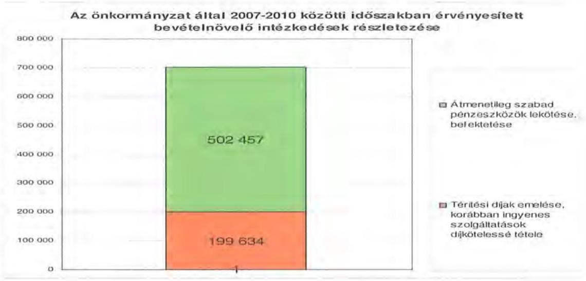

A bevételnövelésre irányuló intézkedések számszerűsített összegének, 702 millió Ft-nak 71,5\%-át, az 502 millió Ft-ot a Közgyűlés realizálta az átmenetileg szabad pénzeszközök befektetése keretében a kötvény-kibocsátás bevételének lekötéséből származó - kötvény kamatkiadással csökkentett - kamatbevételből ${ }^{42}$.

[^0]
[^0]:    ${ }^{41}$ A 2011. évre a Közgyűlés a 45/2011. (III. 25.) számú határozatával a Csongrád megyei Közgyűlés elnöke és alelnökei részére megállapított költségtérítés mértékét csökkentette, a megtakarítás 2 millió Ft volt.
    ${ }^{42}$ A Pénzügyi Bizottság javaslatára a Közgyűlés 10/2011. (III. 31.) számú rendelete szerint az elnök jogosult dönteni az azonnali döntést igénylő ügyekben, így a szabad pénzeszközök lekötéséről a Közgyűlés utólagos tájékoztatása mellett.

---

Az intézményi térítési díjak emeléséből ${ }^{43} 199,6$ millió Ft bevétele származott a 2007-2010. években.

A 2011. évre 390 millió Ft bevételi növekményt terveztek önkormányzati szinten, ennek 57\%-a (222 millió Ft) a Hódmezővásárhelyi Többcélú Kistérségi Társulástól származik és 43\%-a (168 millió Ft) térítési díjemelésekből.

Az átszervezések, a takarékossági intézkedések szakmai feladatellátásra gyakorolt hatását a 2011. évi utóvizsgálat során vizsgálta az Önkormányzat Belső ellenőrzési Osztálya, különös tekintettel az intézmények előirányzatainak felhasználására. A tapasztaltak alapján felhívták a figyelmet a kiadási előirányzati keretek fokozott figyelemmel kísérésére és betartására.

# 5. A HELYI ÖNKORMÁNYZATOK GAZDÁLKODÁSI RENDSZERÉNEK 2008. ÉVI ELLENŐRZÉSE SORÁN A PÉNZÜGYI EGYENSÚLY JAVÍTÁSÁRA TETT SZABÁLYSZERŰSÉGI ÉS CÉLSZERŰSÉGI JAVASLATOK HASZNOSULÁSA 

Az ÁSZ jelentésében 10 szabályszerűségi és 5 célszerűségi javaslatot tett. A jelentést a Közgyűlés megismerte. A javaslatok megvalósítására intézkedési tervet készítettek, amely teljes körűen tartalmazta a javaslatokat, meghatározta a feladatok elvégzéséért felelősöket és a feladatok elvégzésének határidejét.

## A pénzügyi egyensúly javítására három szabályszerűségi és két célszerűségi javaslat vonatkozott.

Javasoltuk a Közgyűlés elnökének:

- „kezdeményezze, hogy a számvevőszéki jelentésben foglaltakat a Közgyűlés tárgyalja meg és a feltárt hiányosságok megszüntetése érdekében készíttessen intézkedési tervet a határidők és felelősök megjelölésével";
- „gondoskodjon arról, hogy a költségvetési rendelettervezetben a költségvetés bevételi és kiadási főösszegének megállapítása az Áht. 8/A. § (7) bekezdés alapján a finanszírozási célú pénzügyi műveletek bevételei-kiadásai nélkül történjen";
- „intézkedjen annak érdekében, hogy az Ötv. 89. § (1) bekezdésében foglaltaknak megfelelően az intézmények kölcsön helyett támogatásban részesüljenek, valamint biztosítsa, hogy a gazdasági események a tényleges tartalmuknak megfelelően kerüljenek elszámolásra";
- „gondoskodjon a költségvetési rendelettervezet elkészítésénél arról, hogy az európai uniós forrásokkal megvalósuló fejlesztésekkel kapcsolatos bevételek és kiadások az Ámr. 29. § (1) bekezdés k) pontja alapján elkülönítetten, valamint a több éves kihatással járó feladatok előirányzatai az Ámr. 29. § (1) bekezdés g) pontjának előírása alapján éves bontásban szerepeljenek";
- „gondoskodjon a költségvetési rendelet-tervezet előkészítése során a finanszírozási célú pénzügyi műveletekből származó ismert bevételek figyelembe vételéről".

[^0]
[^0]:    ${ }^{43}$ A Közgyűlés a 8/2007. (VI. 8.), a 3/2008. (III. 1.), a 1/2009 (II. 16.), és a 4/2010. (II. 11.) számú rendeleteiben határozta meg a szociális térítési díjak mértékét.

---

A javaslatok megvalósítása érdekében az Önkormányzatnál a számvevői jelentés aláírását követő 8 napon belül a 2428-3/2008. szám alatt intézkedést rendeltek el, továbbá a Közgyűlés a 228/2008. (XII. 17.) számú határozatával elfogadta az ÁSZ jelentésben foglaltak végrehajtására készített, felelősöket és határidőket tartalmazó intézkedési tervet.

Az ellenőrzés során tett, a pénzügyi egyensúly javítására vonatkozó javaslatokat hasznosították. Mind a szabályszerűségi, mind a célszerűségi javaslatok $100 \%$-át realizálták.

A megtett intézkedések hatására megvalósultak az Állami Számvevőszék javaslatai. Költségvetési rendelettervezetben a költségvetés bevételi és kiadási főösszegének megállapítása az Áht-ban foglaltak alapján a finanszírozási célú pénzügyi műveletek nélkül történt, az intézmények kölcsön helyett 2009-2010-ben visszatérítendő intézményfenntartói támogatásban részesültek, a gazdasági események a tényleges tartalmuknak megfelelően kerültek elszámolásra. A több éves kihatással járó feladatok előirányzatai az Ámr. előírása alapján éves bontásban szerepeltek, a rendelet-tervezet előkészítése során gondoskodtak a finanszírozási célú pénzügyi műveletekből származó ismert bevételek figyelembevételéről.

Budapest, 2011. december „ (G) "
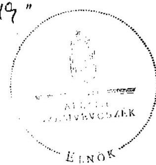

Domokos László*

Melléklet: $\quad 6 \mathrm{db} \quad 12$ lap

---

.

---

# Csongrád Megyei Önkormányzat

## 1. számú melléklet

### a V-3013/2011. számú számvevőszéki jelentéshez

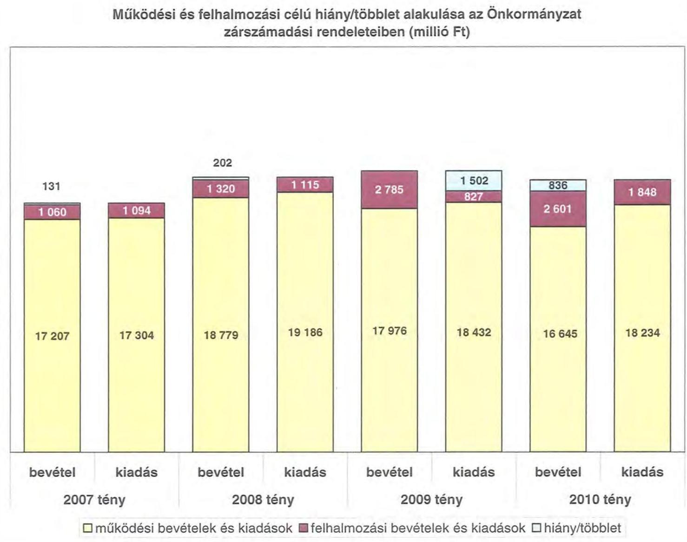

### Működési és felhalmozási célú hiány/többlet alakulása az Önkormányzat

#### 202

|  év |  |  | 2020 |  |  | 2010 |   |
| --- | --- | --- | --- | --- | --- | --- | --- |
|  tény |  |  |  |  |  |  |   |
|  131 |  |  | 1 320 | 1 115 | 2 785 | 1 502 | 1 848  |
|  1 000 | 1 094 |  |  |  |  | 827 | 1 648  |
|  17 207 | 17 304 |  | 18 779 | 19 186 | 17 976 | 18 432 | 18 234  |

|  év |  |  | 2020 |  |  | 2010 |   |
| --- | --- | --- | --- | --- | --- | --- | --- |
|  tény |  |  |  |  |  |  |   |
|  17 207 | 17 304 |  | 18 779 | 19 186 | 17 976 | 18 432 | 18 234  |

|  bevétel | kiadás | bevétel | kiadás | bevétel | kiadás | bevétel | kiadás  |
| --- | --- | --- | --- | --- | --- | --- | --- |
|  2007 tény |  | 2008 tény |  | 2009 tény |  | 2010 tény |   |

- működési bevételek és kiadások
- felhalmozási bevételek és kiadások
- hiány/többlet

---

.

---

Az Önkormányzat CLF módszer szerint besorolt bevételei és kiadásai 2007-2010 között

|  1. FOLYÓ KÖLTSÉGVETÉS* | 2007. | 2008. | 2009. | 2010.  |
| --- | --- | --- | --- | --- |
|  1.1.1. Saját működési bevételek | 3876098 | 4898617 | 5076384 | 4070385  |
|  1.1.2. Költségvetési támogatás | 4691757 | 6356350 | 5260587 | 4650049  |
|  1.1.3. Átengedett bevételek | 2028634 | 710401 | 734867 | 359329  |
|  1.1.4. Államháztartáson belülről kapott támogatások | 6308613 | 6309372 | 5969613 | 6596900  |
|  1.1.5. EU-tól és külföldről kapott bevételek | 5218 | 19131 | 15313 | 295112  |
|  1.1.6. Államháztartáson kívülről kapott bevételek | 33862 | 47808 | 109475 | 48305  |
|  1.1.7. Előző évi pénzmaradvány átvétel | 303324 | 628239 | 669645 | 412163  |
|  1.1. Folyó bevételek $=1.1 .1 .+1.1 .2 .+1.1 .3 .+1.1 .4 .+1.1 .5 .+1.1 .6 .+1.1.7$. | 17247506 | 18969918 | 17835884 | 16432243  |
|  1.2.1. Működési kiadások kamatkiadások nélkül *** | 16442212 | 17605503 | 16983458 | 16975837  |
|  1.2.2. Államháztartáson belülre átadott pénzeszközök | 221446 | 306383 | 192145 | 138507  |
|  1.2.3.1. vállalkozásoknak | 486 | 37325 | 49471 | 38040  |
|  1.2.3.2. EU-nak, illetve külföldre | 0 | 300 | 0 | 0  |
|  1.2.3.3. magánszemélyeknek | 164862 | 142314 | 142741 | 160258  |
|  1.2.3.4. nonprofit szervezeteknek | 47209 | 175341 | 131154 | 300639  |
|  1.2.3. Transzferkiadások ( $=1.2 .3 .1+1.2 .3 .2+1.2 .3 .3+1.2 .3 .4$ ) | 212557 | 355280 | 323366 | 498937  |
|  1.2.4 Kamatkiadások*** | 44874 | 189708 | 233087 | 190767  |
|  1.2.5. Előző évi pénzmaradvány átadás | 383877 | 620101 | 605637 | 427436  |
|  1.2. Folyó kiadások $=1.2 .1 .+1.2 .2 .+1.2 .3 .+1.2 .4 .+1.2 .5$ | 17304966 | 19076975 | 18337693 | 18231484  |
|  1.3. Folyó költségvetés egyenlege MŰKÖDÉSI JÖVEDELEM (1.1. - 1.2.) | $-57460$ | $-107057$ | $-501809$ | $-1799241$  |
|  2. FELHALMOZÁSI (BERUHÁZÁSI) KÖLTSÉGVETÉS** |  |  |  |   |
|  2.1.1. Saját tőkebevételek | 218874 | 747028 | 2832 | 23903  |
|  2.1.2. Államháztartáson belülről kapott támogatások | 490636 | 88128 | 39192 | 286775  |
|  2.1.3. EU-tól és külföldről kapott támogatások | 0 | 84034 | 158461 | 84199  |
|  2.1.4. Államháztartáson kívülről kapott támogatások | 96829 | 54696 | 32729 | 75361  |
|  2.1. Felhalmozási (beruházási) bevételek ( $=2.1 .1 .+2.1 .2+2.1 .3+2.1 .4$.) | 806339 | 973886 | 233214 | 470238  |
|  2.2.1. Saját beruházási kiadás áfával | 840610 | 799414 | 677979 | 1506772  |
|  2.2.2. Saját felújítási kiadás áfával | 220707 | 277207 | 134357 | 327637  |
|  2.2.3. Államháztartáson belülre átadott pénzeszköz | 352801 | 108882 | 4250 | 3613  |
|  2.2.4. EU-nak és külföldnek adott pénzeszközök | 0 | 0 | 0 | 0  |
|  2.2.5. Államháztartáson kívülre adott pénzeszközök | 477 | 11059 | 110806 | 68469  |
|  2.2.6. Befektetési célú részesedések vásárlása | 0 | 20590 | 100 | 0  |
|  2.2. Felhalmozási (beruházási) kiadások ( $=2.2 .1 .+2.2 .2 .+2.2 .3 .+2.2 .4 .+2.2 .5 .+2.2 .6$.) | 1414595 | 1217152 | 927492 | 1906491  |
|  2.3. Beruházási költségvetés egyenlege (2.1. - 2.2.) | $-608256$ | $-243266$ | $-694278$ | $-1436253$  |
|  3. FINANSZÍROZÁSI MŰVELETEK NÉLKÜLI (GFS) POZÍCIÓ |  |  |  |   |
|  (1.3.) Folyó költségvetés egyenlege Működési Jövedelem + (2.3.) Beruházási költségvetés egyenlege | $-665716$ | $-350323$ | $-1196087$ | $-3235494$  |
|  4. FINANSZÍROZÁSI MŰVELETEK |  |  |  |   |
|  4.1. Hitelfelvétel | 58629 | 591593 | 0 | 517918  |
|  4.2. Hiteltörlesztés | 31250 | 836357 | 0 | 0  |
|  4.3. Forgatási és befektetési célú értékpapírok kibocsátása | 0 | 5000000 | 0 | 0  |
|  4.4. Forgatási és befektetési célú értékpapírok beváltása | 0 | 0 | 0 | 0  |
|  4.5. Forgatási és befektetési célú értékpapírok értékesítése | 0 | 0 | 1397244 | 0  |
|  4.6. Forgatási és befektetési célú értékpapírok vásárlása | 0 | 1397245 | 0 | 0  |
|  4.7. Egyéb finanszírozási bevételek (függő, átfutó, kiegyenlítő) | $-50305$ | 238924 | $-247412$ | $-232537$  |
|  4.8. Egyéb finanszírozási kiadások (függő, átfutó, kiegyenlítő) | 77001 | 510782 | $-395733$ | 19675  |
|  4.9. Finanszírozási műveletek egyenlege (4.1.-4.2.+4.3.-4.4+4.5.-4.6.+4.7.-4.8.) | $-99927$ | 3086133 | 1545565 | 265706  |
|  5. TÁRGYÉVI POZÍCIÓ |  |  |  |   |
|  (3.) FINANSZÍROZÁSI MŰVELETEK NÉLKÜLI (GFS) POZÍCIÓ + (4.9.) Finanszírozási műveletek egyenlege | $-765643$ | 2735810 | 349478 | $-2969788$  |
|  6. NETTÓ MŰKÖDÉSI JÖVEDELEM |  |  |  |   |
|  (1.3.) Működési Jövedelem - Tőketörlesztés (4.2. Hiteltörlesztés + 4.4. Forgatási és befektetési célú értékpapírok beváltása ) | $-88710$ | $-943414$ | $-501809$ | $-1799241$  |

---

Az Önkormányzat CLF módszer szerint besorolt bevételei és kiadásai 2007-2010 között

| TÁJÉKOZTATÓ ADATOK | 2007. | 2008. | 2009. | 2010. |
| :--: | :--: | :--: | :--: | :--: |
| Összes kötelezettség | 1151669 | 6559733 | 6977859 | 9037415 |
| ebből rövid lejáratú | 961671 | 822109 | 1051554 | 1813577 |
| Összes szállítói kötelezettség | 898452 | 818173 | 1046468 | 1185505 |
| ebből lejárt | 219209 | 207135 | 318251 | 557721 |
| Pénz és tőkepiaci kötelezettség (adósság) | 244767 | 5735005 | 5882106 | 7701352 |
| ebből rövid lejáratú | 58629 | 0 | 0 | 517918 |
| PPP szerződésből hátra lévő kötelezettséges állomány | 0 | 0 | 0 | 0 |
| ebből lejárt szolgáltatási díj miatti kötelezettség | 0 | 0 | 0 | 0 |
| Folyószámlahitel napi átlagos állománya**** | 453855 | 534626 | 1159968 | 2164831 |
| Likvidhitel napi átlagos állománya | 0 | 0 | 0 | 0 |
| Munkabérhitel napi átlagos állománya | 0 | 0 | 0 | 0 |
| Peres eljárásokból fennálló függő kötelezettségek | 0 | 0 | 0 | 0 |
| Finanszírozásba bevonható eszközök összesen : | 400450 | 4533504 | 3485738 | 515950 |
| Tartós hitelviszonyt megtestesítő értékpapírok | 2588 | 2588 | 2588 | 2588 |
| Hosszú lejáratú bankbetétek | 0 | 2050000 | 0 | 0 |
| Értékpapírok | 0 | 1397244 | 0 | 0 |
| Pénzeszközök (idegen pénzeszközök nélkül) | 397862 | 1083672 | 3483150 | 513362 |

* Bevételekben nem térül, a kiadásokban nem jelenik meg az amortizáció, a vagyoni helyzetet az egyenleg befolyásolja.
** Bevételekben vagyon megőrzésre és bővítésre fordítható források.
*** Az Önkormányzat a 2008-2010. években a kötvényekkel kapcsolatban kifizetett kamatot az Áhsz. 9. számú melléklete 9.d. pontjában foglaltak ellenére kamatkiadás helyett az egyéb folyó kiadások között számolta el. A CLF modellben az adatok valódisága érdekében a kamatkiadást a 2008. évre 141025 ezer Ft-tal 189708 ezer Ft-ra, a 2009. évre 147533 ezer Ft-tal 233087 ezer Ft-ra, a 2010. évre 63740 ezer Ft-tal 190767 ezer Ft-ra növeltük, a kamatkiadás nélküli működési kiadásokat ugyanezekkel az összegekkel csökkentettük 2008-ban 17605503 ezer Ft-ra, 2009-ben 16983458 ezer Ft-ra és 2010-ben 16975837 ezer Ft-ra.
**** A folyószámlahitel átlagos állományát 365 nappal számítottuk.

# Megjegyzés 

A számítási leírás némileg eltér az ÁSZ módszertanában korábban alkalmazott besorolásoktól. A jelen besorolás általános közgazdasági meggondolásokon alapul, amely testet ölt az SNA statisztikai módszertanában is. Folyó tételek alatt értjük azokat a kiadásokat és bevételeket, amelyek az egység vagyoni helyzetét automatikusan nem változtatják. Bevételi oldalon ilyenek az adók, a tényező jövedelmek, transzferek, kiadási oldalon a transzferek és a szolgáltatás nyújtásával kapcsolatos működési kiadások. Felhalmozási, vagy tőke tételek módosítják a vagyon nagyságát. Privatizációs bevétel csökkenti a vagyont, fizikai beruházás, vagy pénzügyi befektetés növeli.
A folyó költségvetés egyenlege (működési jövedelem) tartalmazza a kamatkiadásokat is, mind a működési, mind a fejlesztési kamatot, mert ezek közgazdaságilag tényezőjövedelmek. Nem tartalmazzák a pénzforgalmi bevételek és kiadások a követelés elengedés miatt könyvelt bevételi és kiadási pénz-forgalmi tételeket, mivel ezek egymást kioltják és valójában technikai elszámolási műveletnek minősülnek, így indokolatlanul változtatják a költségvetési év kiadási és bevételi adatait, hiszen valójában a bevétel soha nem realizálódott, és a költségvetési évben kiadás sem történt, csak elengedtük a követelést.

A nettó működési jövedelmet a tőketörlesztés levonásával a folyó költségvetés egyenlegéből (működési jövedelemből) származtatjuk. Transzfer kiadásoknak nevezzük azokat a folyó és felhalmozási tételeket, amelyeket nem az adott önkormányzat használ fel szolgáltatásnyújtásra.

---

|  2007. év |  | 2008. év | 2009. év | 2010. év  |
| --- | --- | --- | --- | --- |
|  szám | Megnevezés |  |  |   |
|   |  |  |  | Vég  |
|  1. | **MŰKÖDÉSI BEVÉTELEK** | 17 851 193 | 18 295 748 | 18 576 413  |
|   | 3. | 3. | 3. | 3.  |
|   | 1. | 3. | 3. | 3.  |
|   | 2. | 2. | 2. | 2.  |
|   | 3. | 1. | 1. | 1.  |
|   | 1.2. | 1. | 1. | 1.  |
|   | 1.3. |  |  |   |
|   | 1.4. |  |  |   |
|   | 1.5. |  |  |   |
|   | 1.6. |  |  |   |
|   | 1.7. |  |  |   |
|   | 1.8. |  |  |   |
|   | 1.9. |  |  |   |
|   | 2. |  |  |   |
|   | 2.1. |  |  |   |
|   | 2.2. |  |  |   |
|   | 2.3. |  |  |   |
|   | 2.4. |  |  |   |
|   | 2.5. |  |  |   |
|   | 2.6. |  |  |   |
|   | 2.7. |  |  |   |
|   | 2.8. |  |  |   |
|   | 2.9. |  |  |   |
|   | 3. |  |  |   |
|   | 3.1. |  |  |   |
|   | 3.2. |  |  |   |
|   | 3.3. |  |  |   |
|   | 3.4. |  |  |   |
|   | 3.5. |  |  |   |
|   | 3.6. |  |  |   |
|   | 3.7. |  |  |   |
|   | 3.8. |  |  |   |
|   | 3.9. |  |  |   |
|   | 4. |  |  |   |
|   | 4.1. |  |  |   |
|   | 4.2. |  |  |   |
|   | 4.3. |  |  |   |
|   | 4.4. |  |  |   |
|   | 4.5. |  |  |   |
|   | 4.6. |  |  |   |
|   | 4.7. |  |  |   |
|   | 4.8. |  |  |   |
|   | 4.9. |  |  |   |
|   | 5. |  |  |   |
|   | 5.1. |  |  |   |
|   | 5.2. |  |  |   |
|   | 5.3. |  |  |   |
|   | 5.4. |  |  |   |
|   | 5.5. |  |  |   |
|   | 5.6. |  |  |   |
|   | 5.7. |  |  |   |
|   | 5.8. |  |  |   |
|   | 5.9. |  |  |   |
|   | 6. |  |  |   |
|   | 6.1. |  |  |   |
|   | 6.2. |  |  |   |
|   | 6.3. |  |  |   |
|   | 6.4. |  |  |   |
|   | 6.5. |  |  |   |
|   | 6.6. |  |  |   |
|   | 6.7. |  |  |   |
|   | 6.8. |  |  |   |
|   | 6.9. |  |  |   |
|   | 7. |  |  |   |
|   | 7.1. |  |  |   |
|   | 7.2. |  |  |   |
|   | 7.3. |  |  |   |
|   | 7.4. |  |  |   |
|   | 7.5. |  |  |   |
|   | 7.6. |  |  |   |
|   | 7.7. |  |  |   |
|   | 7.8. |  |  |   |
|   | 7.9. |  |  |   |
|   | 8. |  |  |   |
|   | 8.1. |  |  |   |
|   | 8.2. |  |  |   |
|   | 8.3. |  |  |   |
|   | 8.4. |  |  |   |
|   | 8.5. |  |  |   |
|   | 8.6. |  |  |   |
|   | 8.7. |  |  |   |
|   | 8.8. |  |  |   |
|   | 8.9. |  |  |   |
|   | 9. |  |  |   |
|   | 9.1. |  |  |   |
|   | 9.2. |  |  |   |
 | 9.3. |  |  |   |
|   | 9.4. |  |  |   |
|   | 9.5. |  |  |   |
|   | 9.6. |  |  |   |
|   | 9.7. |  |  |   |
|   | 9.8. |  |  |   |
|   | 9.9. |  |  |   |
|   | 10. |  |  |   |
|   | 10.1. |  |  |   |
|   | 10.2. |  |  |   |
|   | 10.3. |  |  |   |
|   | 10.4. |  |  |   |
|   | 10.5. |  |  |   |
|   | 10.6. |  |  |   |
|   | 10.7. |  |  |   |
|   | 10.8. |  |  |   |
|   | 10.9. |  |  |   |
|   | 11. |  |  |   |
|   | 11.1. |  |  |   |
|   | 11.2. |  |  |   |
|   | 11.3. |  |  |   |
|   | 11.4. |  |  |   |
|   | 11.5. |  |  |   |
|   | 11.6. |  |  |   |
|   | 11.7. |  |  |   |
|   | 11.8. |  |  |   |
|   | 11.9. |  |  |   |
|   | 12. |  |  |   |
|   | 12.1. |  |  |   |
|   | 12.2. |  |  |   |
|   | 12.3. |  |  |   |
|   | 12.4. |  |  |   |
|   | 12.5. |  |  |   |
|   | 12.6. |  |  |   |
|   | 12.7. |  |  |   |
|   | 12.8. |  |  |   |
|   | 12.9. |  |  |   |
|   | 12.10. |  |  |   |
|   | 12.11. |  |  |   |
|   | 12.12. |  |  |   |
|   | 12.13. |  |  |   |
|   | 12.14. |  |  |   |
|   | 12.15. |  |  |   |
|   | 12.16. |  |  |   |
|   | 12.17. |  |  |   |
|   | 12.18. |  |  |   |
|   | 12.19. |  |  |   |
|   | 12.20. |  |  |   |
|   | 12.21. |  |  |   |
|   | 12.22. |  |  |   |
|   | 12.23. |  |  |   |
|   | 12.24. |  |  |   |
|   | 12.25. |  |  |   |
|   | 12.26. |  |  |   |
|   | 12.27. |  |  |   |
|   | 12.28. |  |  |   |
|   | 12.29. |  |  |   |
|   | 12.30. |  |  |   |
|   | 12.31. |  |  |   |
|   | 12.32. |  |  |   |
|   | 12.33. |  |  |   |
|   | 12.34. |  |  |   |
|   | 12.35. |  |  |   |
|   | 12.36. |  |  |   |
|   | 12.37. |  |  |   |
|   | 12.38. |  |  |   |
|   | 12.39. |  |  |   |
|   | 12.40. |  |  |   |
|   | 12.41. |  |  |   |
|   | 12.42. |  |  |   |
|   | 12.43. |  |  |   |
|   | 12.44. |  |  |   |
|   | 12.45. |  |  |   |
|   | 12.46. |  |  |   |
|   | 12.47. |  |  |   |
|   | 12.48. |  |  |   |
|   | 12.49. |  |  |   |
|   | 12.50. |  |  |   |
|   | 12.51. |  |  |   |
|   | 12.52. |  |  |   |
|   | 12.53. |  |  |   |
|   | 12.54. |  |  |   |
|   | 12.55. |  |  |   |
|   | 12.56. |  |  |   |
|   | 12.57. |  |  |   |
|   | 12.58. |  |  |   |
|   | 12.59. |  |  |   |
|   | 12.60. |  |  |   |
|   | 12.61. |  |  |   |
|   | 12.62. |  |  |   |
|   | 12.63. |  |  |   |
|   | 12.64. |  |  |   |
|   | 12.65. |  |  |   |
|   | 12.66. |  |  |   |
|   | 12.67. |  |  |   |
|   | 12.68. |  |  |   |
|   | 12.69. |  |  |   |
|   | 12.70. |  |  |   |
|   | 12.71. |  |  |   |
|   | 12.72. |  |  |   |
|   | 12.73. |  |  |   |
|   | 12.74. |  |  |   |
|   | 12.75. |  |  |   |
|   | 12.76. |  |  |   |
|   | 12.77. |  |  |   |
|   | 12.78. |  |  |   |
|   | 12.79. |  |  |   |
|   | 12.80. |  |  |   |
|   | 12.81. |  |  |   |
|   | 12.82. |  |  |   |
|   | 12.83. |  |  |   |
|   | 12.84. |  |  |   |
|   | 12.85. |  |  |   |
|   | 12.86. |  |  |   |
|   | 12.87. |  |  |   |
|   | 12.88. |  |  |   |
|   | 12.89. |  |  |   |
|   | 12.90. |  |  |   |
|   | 12.91. |  |  |   |
|   | 12.92. |  |  |   |
|   | 12.93. |  |  |   |
|   | 12.94. |  |  |   |
|   | 12.95. |  |  |   |
|   | 12.96. |  |  |   |
|   | 12.97. |  |  |   |
|   | 12.98. |  |  |   |
|   | 12.99. |  |  |   |
|   | 12.10. |  |  |   |
|   | 12.11. |  |  |   |
|   | 12.12. |  |  |   |
|   | 12.13. |  |  |   |
|   | 12.14. |  |  |   |
|   | 12.15. |  |  |   |
|   | 12.16. | | | 12.17. | | | |
| | 12.18. | | | |
| | 12.19. | | | |
| | 12.20. | | | |
| | 12.21. | | | |
| | 12.22. | | | |
| | 12.23. | | | |
| | 12.24. | | | |
| | 12.25. | | | |
| | 12.26. | | | |
| | 12.27. | | | |
| | 12.28. | | | |
| | 12.29. | | | |
| | 12.30. | | | |
| | 12.31. | | | |
| | 12.32. | | | |
| | 12.33. | | | |
| | 12.34. | | | |
| | 12.35. | | | |
| | 12.36. | | | |
| | 12.37. | | | |
| | 12.38. | | | |
| | 12.39. | | | |
| | 12.40. | | | |
| | 12.41. | | | |
| | 12.42. | | | |
| | 12.43. | | | |
| | 12.44. | | | |
| | 12.45. | | | |
| | 12.46. | | | |
| | 12.47. | | | |
| | 12.48. | | | |
| | 12.49. | | | |
| | 12.50. | | | |
| | 12.51. | | | |
| | 12.52. | | | |
| | 12.53. | | | |
| | 12.54. | | | |
| | 12.55. | | | |
| | 12.56. | | | |
| | 12.57. | | | |
| | 12.58. | | | |
| | 12.59. | | | |
| | 12.60. | | | |
| | 12.61. | | | |
| | 12.62. | | | |
| | 12.63. | | | |
| | 12.64. | | | |
| | 12.65. | | | |
| | 12.66. | | | |
| | 12.67. | | | |
| | 12.68. | | | |
| | 12.69. | | | |
| | 12.70. | | | |
| | 12.71. | | | |
| | 12.72. | | | |
| | 12.73. | | | |
| | 12.74. | | | |
| | 12.75. | | | |
| | 12.76. | | | |
| | 12.77. | | | |
| | 12.78. | | | |
| | 12.79. | | | |
| | 12.80. | | | |
| | 12.81. | | | |
| | 12.82. | | | |
| | 12.83. | | | |
| | 12.84. | | | |
| | 12.85. | | | |
| | 12.86. | | | |
| | 12.87. | | | |
| | 12.88. | | | |
| | 12.89. | | | |
| | 12.90. | | | |
| | 12.91. | | | |
| | 12.92. | | | |
| | 12.93. | | | |
| | 12.94. | | | |
| | 12.95. | | | |
| | 12.96. | | | |
| | 12.97. | | | |
| | 12.98. | | | |
| | 12.99. | | | |
| | 12.10. | | | |
| | 12.11. | | | |
| | 12.12. | | | |
| | 12.13. | | | |
| | 12.14. | | | |
| | 12.15. | | | |
| | 12.16. | | | |
| | 12.17. | | | |
| | 12.18. | | | |
| | 12.19. | | | |
| | 12.20. | | | |
| | 12.21. | | | |
| | 12.22. | | | |
| | 12.23. | | | |
| | 12.24. | | | |
| | 12.25. | | | |
| | 12.26. | | | |
| | 12.27. | | | |
| | 12.28. | | | |
| | 12.29. | | | |
| | 12.30. | | | |
| | 12.31. | | | |
| | 12.32. | | | |
| | 12.33. | | | |
| | 12.34. | | | |
| | 12.35. | | | |
| | 12.36. | | | |
| | 12.37. | | | |
| | 12.38. | | | |
| | 12.39. | | | |
| | 12.40. | | | |
| | 12.41. | | | |
| | 12.42. | | | |
| | 12.43. | | | |
| | 12.44. | | | |
| | 12.45. | | | |
| | 12.46. | | | |
| | 12.47. | | | |
| | 12.48. | | | |
| | 12.49. | | | |
| | 12.50. | | | |
| | 12.51. | | | |
| | 12.52. | | | |
| | 12.53. | | | |
| | 12.54. | | | |
| | 12.55. | | | |
| | 12.56. | | | |
| | 12.57. | | | |
| | 12.58. | | | |
| | 12.59. | | | | |   | 12.60. |  |  |   |
|   | 12.61. |  |  |   |
|   | 12.62. |  |  |   |
|   | 12.63. |  |  |   |
|   | 12.64. |  |  |   |
|   | 12.65. |  |  |   |
|   | 12.66. |  |  |   |
|   | 12.67. |  |  |   |
|   | 12.68. |  |  |   |
|   | 12.69. |  |  |   |
|   | 12.70. |  |  |   |
|   | 12.71. |  |  |   |
|   | 12.72. |  |  |   |
|   | 12.73. |  |  |   |
|   | 12.74. |  |  |   |
|   | 12.75. |  |  |   |
|   | 12.76. |  |  |   |
|   | 12.77. |  |  |   |
|   | 12.78. |  |  |   |
|   | 12.79. |  |  |   |
|   | 12.80. |  |  |   |
|   | 12.81. |  |  |   |
|   | 12.82. |  |  |   |
|   | 12.83. |  |  |   |
|   | 12.84. |  |  |   |
|   | 12.85. |  |  |   |
|   | 12.86. |  |  |   |
|   | 12.87. |  |  |   |
|   | 12.88. |  |  |   |
|   | 12.89. |  |  |   |
|   | 12.90. |  |  |   |
|   | 12.91. |  |  |   |
|   | 12.92. |  |  |   |
|   | 12.93. |  |  |   |
|   | 12.94. |  |  |   |
|   | 12.95. |  |  |   |
|   | 12.96. |  |  |   |
|   | 12.97. |  |  |   |
|   | 12.98. |  |  |   |
|   | 12.99. |  |  |   |
|   | 12.10. |  |  |   |
|   | 12.11. |  |  |   |
|   | 12.12. |  |  |   |
|   | 12.13. |  |  |   |
|   | 12.14. |  |  |   |
|   | 12.15. |  |  |   |
|   | 12.16. |  |  |   |
|   | 12.17. |  |  |   |
|   | 12.18. |  |  |   |
|   | 12.19. |  |  |   |
|   | 12.20. |  |  |   |
|   | 12.21. |  |  |   |
|   | 12.22. |  |  |   |
|   | 12.23. |  |  |   |
|   | 12.24. |  |  |   |
|   | 12.25. |  |  |   |
|   | 12.26. |  |  |   |
|   | 12.27. |  |  |   |
|   | 12.28. |  |  |   |
|   | 12.29. |  |  |   |
|   | 12.30. |  |  |   |
|   | 12.31. |  |  |   |
|   | 12.32. |  |  |   |
|   | 12.33. |  |  |   |
|   | 12.34. |  |  |   |
|   | 12.35. |  |  |   |
|   | 12.36. |  |  |   |
|   | 12.37. |  |  |   |
|   | 12.38. |  |  |   |
|   | 12.39. |  |  |   |
|   | 12.40. |  |  |   |
|   | 12.41. |  |  |   |
|   | 12.42. |  |  |   |
|   | 12.43. |  |  |   |
|   | 12.44. |  |  |   |
|   | 12.45. |  |  |   |
|   | 12.46. |  |  |   |
|   | 12.47. |  |  |   |
|   | 12.48. |  |  |   |
|   | 12.49. |  |  |   |
|   | 12.50. |  |  |   |
|   | 12.51. |  |  |   |
|   | 12.52. |  |  |   |
|   | 12.53. |  |  |   |
|   | 12.54. |  |  |   |
|   | 12.55. |  |  |   |
|   | 12.56. |  |  |   |
|   | 12.57. |  |  |   |
|   | 12.58. |  |  |   |
|   | 12.59. |  |  |   |
|   | 12.60. |  |  |   |
|   | 12.61. |  |  |   |
|   | 12.62. |  |  |   |
|   | 12.63. |  |  |   |
|   | 12.64. |  |  |   |
|   | 12.65. |  |  |   |
|   | 12.66. |  |  |   |
|   | 12.67. |  |  |   |
|   | 12.68. |  |  |   |
|   | 12.69. |  |  |   |
|   | 12.70. |  |  |   |
|   | 12.71. |  |  |   |
|   | 12.72. |  |  |   |
|   | 12.73. |  |  |   |
|   | 12.74. |  |  |   |
|   | 12.75. |  |  |   |
|   | 12.76. |  |  |   |
|   | 12.77. |  |  |   |
|   | 12.78. |  |  |   |
|   | 12.79. |  |  |   |
|   | 12.80. |  |  |   |
|   | 12.81. |  |  |   |
|   | 12.82. |  |  |   |
|   | 12.83. |  |  |   |
|   | 12.84. |  |  |   |
|   | 12.85. |  |  |   |
|   | 12.86. |  |  |   |
|   | 12.87. |  |  |   |
|   | 12.88. |  |  |   |
|   | 12.89. |  |  |   |
|   | 12.90. |  |  |   |
|   | 12.91. |  |  |   |
|   | 12.92. |  |  |   |
|   | 12.93. |  |  |   |
|   | 12.94. |  |  |   |
|   | 12.95. |  |  |   |
|   | 12.96. |  |  |   |
|   | 12.97. |  |  |   |
|   | 12.98. |  |  |   |
|   | 12.99. |  |  |   |
|   | 12.100. |  |  |   |
|   | 12.101. |  |  |   |
|   | 12.102. |  |  |   |
 | 12.13. |  |  |   |
|   | 12.14. |  |  |   |
|   | 12.15. |  |  |   |
|   | 12.16. |  |  |   |
|   | 12.17. |  |  |   |
|   | 12.18. |  |  |   |
|   | 12.19. |  |  |   |
|   | 12.20. |  |  |   |
|   | 12.21. |  |  |   |
|   | 12.22. |  |  |   |
|   | 12.23. |  |  |   |
|   | 12.24. |  |  |   |
|   | 12.25. |  |  |   |
|   | 12.26. |  |  |   |
|   | 12.27. |  |  |   |
|   | 12.28. |  |  |   |
|   | 12.29. |  |  |   |
|   | 12.30. |  |  |   |
|   | 12.31. |  |  |   |
|   | 12.32. |  |  |   |
|   | 12.33. |  |  |   |
|   | 12.34. |  |  |   |
|   | 12.35. |  |  |   |
|   | 12.36. |  |  |   |
|   | 12.37. |  |  |   |
|   | 12.38. |  |  |   |
|   | 12.39. |  |  |   |
|   | 12.40. |  |  |   |
|   | 12.41. |  |  |   |
|   | 12.42. |  |  |   |
|   | 12.43. |  |  |   |
|   | 12.44. |  |  |   |
|   | 12.45. |  |  |   |
|   | 12.46. |  |  |   |
|   | 12.47. |  |  |   |
|   | 12.48. |  |  |   |
|   | 12.49. |  |  |   |
|   | 12.50. |  |  |   |
|   | 12.51. |  |  |   |
|   | 12.52. |  |  |   |
|   | 12.53. |  |  |   |
|   | 12.54. |  |  |   |
|   | 12.55. |  |  |   |
|   | 12.56. |  |  |   |
|   | 12.57. |  |  |   |
|   | 12.58. |  |  |   |
|   | 12.59. |  |  |   |
|   | 12.60. |  |  |   |
|   | 12.61. |  |  |   |
|   | 12.62. |  |  |   |
|   | 12.63. |  |  |   |
|   | 12.64. |  |  |   |
|   | 12.65. |  |  |   |
|   | 12.66. |  |  |   |
|   | 12.67. |  |  |   |
|   | 12.68. |  |  |   |
|   | 12.69. |  |  |   |
|   | 12.70. |  |  |   |
|   | 12.71. |  |  |   |
|   | 12.72. |  |  |   |
|   | 12.73. |  |  |   |
|   | 12.74. |  |  |   |
|   | 12.75. |  |  |   |
|   | 12.76. |  |  |   |
|   | 12.77. |  |  |   |
|   | 12.76. |  |  |   |
|   | 12.77. |  |  |   |
|   | 12.78. |  |  |   |
|   | 12.79. |  |  |   |
|   | 12.80. |  |  |   |
|   | 12.81. |  |  |   |
|   | 12.82. |  |  |   |
|   | 12.83. |  |  |   |
|   | 12.84. |  |  |   |
|   | 12.85. |  |  |   |
|   | 12.86. |  |  |   |
|   | 12.87. |  |  |   |
|   | 12.88. |  |  |   |
|   | 12.89. |  |  |   |
|   | 12.90. |  |  |   |
|   | 12.91. |  |  |   |
|   | 12.92. |  |  |   |
|   | 12.93. |  |  |   |
|   | 12.94. |  |  |   |
|   | 12.95. |  |  |   |
|   | 12.96. |  |  |   |
|   | 12.97. |  |  |   |
|   | 12.98. |  |  |   |
|   | 12.99. |  |  |   |
|   | 12.10. |  |  |   |
|   | 12.11. |  |  |   |
|   | 12.12. |  |  |   |
|   | 12.12. |  |  |   |
|   | 12.13. |  |  |   |
|   | 12.14. |  |  |   |
|   | 12.15. |  |  |   |
|   | 12.16. |  |   |
|   | 12.16. |  |   |
|   | 12.17. |  |   |
|   | 12.18. |  |   |
|   | 12.19. |  |   |
|   | 12.20. |  |  |   |
|   | 12.21. |  |  |   |
|   | 12.21. |  |  |   |
|   | 12.22. |  |  |   |
|   | 12.22. |  |  |   |
|   | 12.23. |  |  |   |
|   | 12.23. |  |  |   |
|   | 12.24. |  |   |
|   | 12.25. |  |   |
|   | 12.26. |  |   |
|   | 12.26. |  |   |
|   | 12.27. |  |   |
|   | 12.27. |  |   |
|   | 12.28. |  |   |
|   | 12.28. |  |   |
|   | 12.29. |  |   |
|   | 12.30. |  |   |
|   | 12.31. |  |   |
|   | 12.32. |  |   |
|   | 12.33. |  |   |
|   | 12.33. |  |   |
|   | 12.34. |  |   |
|   | 12.35. |  |   |
|   | 12.36. |  |   |
|   | 12.36. |  |   |
|   | 12.37. |  |   |
|   | 12.38. |  |   |
|   | 12.39. |  |   |
|   | 12.40. |  |   |
|   | 12.41. |  |   |
|   | 12.41. |  |   |
|   | 12.42. |  |   |
|   | 12.42. |  |   |
|   | 12.43. |  |   |
|   | 12.43. |  |   |
|   | 12.43. |  |   |
|   | 12.43. |  |   |
|   | 12.44. |  |   |
|   | 12.44. | |   |
|   | 12.45. |  |   |
|   | 12.45. |  |   |
|   | 12.46. |  |   |
|   | 12.46. |  |   |
|   | 12.47. |  |   |
|   | 12.47. |  |   |
|   | 12.48. |  |   |
|   | 12.48. |  |   |
|   | 12.49. |  |   |
|   | 12.50. |  |   |
|   | 12.51. |  |   |
|   | 12.52. |  |   |
|   | 12.52. |  |   |
|   | 12.53. |  |   |
|   | 12.53. |  |   |
|   | 12.54. |  |   |
|   | 12.55. |  |   |
|   | 12.55. |  |   |
|   | 12.56. |  |   |
|   | 12.56. |  |   |
|   | 12.57. |  |   |
|   | 12.58. |  |   |
|   | 12.59. |  |   |
|   | 12.60. |  |   |
|   | 12.61. |  |   |
|   | 12.61. |  |   |
|   | 12.62. |  |   |
|   | 12.62. |  |   |
|   | 12.63. |  |   |
|   | 12.63. |  |   |
|   | 12.63. |  |   |
|   | 12.63. |  |   |
|   | 12.64. |  |   |
|   | 12.65. |  |   |
|   | 12.65. |  |   |
|   | 12.66. |  |   |
|   | 12.67. |  |   |
|   | 12.67. |  |   |
|   | 12.68. |  |   |
|   | 12.68. |  |   |
|   | 12.69. |  |   |
|   | 12.70. |  |   |
|   | 12.71. |  |   |
|   | 12.72. |  |   |
|   | 12.72. |  |   |
|   | 12.73. |  |   |
|   | 12.73. |   |
|   | 12.73. |  |   |
|   | 12.74. |  |   |
|   | 12.75. |  |   |
|   | 12.76. |  |   |
|   | 12.76. |  |   |
|   | 12.77. |  |   |
|   | 12.77. |  |   |
|   | 12.77. |  |   |
|   | 12.78. |  |   |
|   | 12.78. |  |   |
|   | 12.79. |  |   |
|   | 12.80. |  |   |
|   | 12.81. |  |   |
|   | 12.81. |  |   |
|   | 12.82. |  |   |
|   | 12.82. |  |   |
|   | 12.82. |  |   |
|   | 12.83. |  |   |
|   | 12.83. |  |   |
|   | 12.84. |  |   |
|   | 12.84. |  |   |
|   | 12.85. |  |   |
|   | 12.85. |  |   |
|   | 12.86. |  |   |
|   | 12.86. |  |   |
|   | 12.87. |  |   |
|   | 12.87. |  |   |
|   | 12.88. |  |   |
|   | 12.88. |  |   |
|   | 12.89. |  |   |
|   | 12.89. |  |   |
|   | 12.9. |  |   |
|   | 13.0. |  |   |
|   | 13.0. |  |   |
|   | 13.0. |  |   |
|   | 13.0. |  |   |
|   | 13.0. |  |   |
|   | 13.0. |  |   |
|   | 13.0. |  |   |
|   | 13.0. |  |   |
|   | 13.0. |  |   |
|   | 13.0. |  |   |
|   | 13.0. |  |   |
|   | 13.10. |  |   |
|   | 13.11. |  |   |
|   | 13.11. |  |   |
|   | 13.12. |  |   |
|   | 13.12. |  |   |
|   | 13.13. |  |   |
|   | 13.13. |  |   |
|   | 13.13. |  |   |
|   | 13.13. |  |   |
|   | 13.2. |  |   |
|   | 13.2. |  |   |
|   | 13.3. |  |   |
|   | 13.3. |  |   |
|   | 13.3. |  |   |
|   | 13.2. |  |   |
|   | 13.3. |  |   |
|   | 13.3. |  |   |
|   | 13.3. |  |   |
|   | 13.3. |  |   |
|   | 13.3. |  |   |
|   | 13.3. |  |   |
|   | 13.3. |  |   |
|   | 13.3. |  |   |
|   | 13.3. |   |
|   | 13.3. |  |   |
|   | 13.3. |  |   |
|   | 13.3. |  |   |
|   | 13.3. |  |   |
|   | 13.3. |  |   |
|   | 13.4. |  |   |
|   | 13.4. |  |   |
|   | 13.5. |  |   |
|   | 13.5. |  |   |
|   | 13.6. |  |   |
|   | 13.6. |  |   |
|   | 13.7. |  |   |
|   | 13.7. |  |   |
|   | 13.8. |  |   |
|   | 13.8. |  |   |
|   | 13.9. |  |   |
|   | 13.10. |  |   |
|   | 13.13. |  |   |
|   | 13.13. |  |   |
|   | 13.13. |   |
|   | 13.11. |  |   |
|   | 13.13. |  |   |
|   | 13.14. |  |   |
|   | 13.11. |  |   |
|   | 13.13. |  |   |
|   | 13.2. |  |   |
|   | 13.14. |  |   |
|   | 13.14. |  |   |
|   | 13.14. |  |   |
|   | 13.14. |  |   |
|   | 13.14. |  |   |
|   | 13.14. |  |   |
|   | 13.15. |   |
|   | 13.15. |  |   |
|   | 13.15. |  |   |
|   | 13.15. |  |   |
|   | 13.16. |  |   |
|   | 13.16. |  |   |
|   | 13.16. |  |   |
|   | 13.16. |  |   |
|   | 13.17. |  |   |
|   | 13.17. |  |   |
|   | 13.17. |  |   |
|   | 13.18. |  |   |
|   | 13.18. |  |   |
|   | 13.18. |  |   |
|   | 13.19. |  |   |
|   | 13.20. |  |   |
|   | 13.20. |  |   |
|   | 13.21.8. |  |   |
|   | 13.3.19. |  |   |
|   | 13.21. |  |   |
|   | 13.3. |  |   |
|   | 13.3. |   |
|   | 13.3. |   |
|   | 13.3.3. |  |   |
|   | 13.3. |  |   |
|   | 13.3. |  |   |
|   | 13.3. |  |   |
|   | 13.3. |  |   |
|   | 13.3. |  |   |
|   | 13.3. |  |   |
|   | 13.3. |  |   |
|   | 13.3. |  |   |
|   | 13.3. |  |   |
|   | 13.3. |  |   |
|   | 13.14. |  |   |
|   | 13.14. |  |   |
|   | 13.14. |  |   |
|   | 13.14. |  |   |
|   | 13.15. |  |   |
|   | 13.15. |   |
|   | 13.16. |  |   |
|   | 13.16. |  |   |
|   | 13.17. |  |   |
|   | 13.17. |  |   |
|   | 13.18. |  |   |
|   | 13.18. |  |   |
|   | 13.18. |  |   |
|   | 13.19. |  |   |
|   | 14. |  |   |
|   | 14.14. |  |   |
|   | 14.15. |  |   |
|   | 14.15. |

---

.

---

# Az Önkormányzat 2007-2010 években megvalósított, illetve 2010. december 31-én fennálló fejlesztési feladatokhoz kapcsolódó kötelezettségeinek összegzése

| Sorszám | Fejlesztési feladat megnevezése | Ber. kezdete | Teljes bekerülési költség | 2006. december 31-ig teljesített kiadás | 2007-2010. évek között teljesített kiadás | 2010. év utánra vállalt kötelezettség | 2010. utáni kötelezettség-vállalás forrásösszetétele | | | | |
| --- | --- | --- | --- | --- | --- | --- | --- | --- | --- | --- | --- |
| | | | | | | | Saját bevétel | Hitel | Kötvény | EU-s
támogatás | Hazai támogatás |
| 1. | Fogyatékos Otthon létesítése, Csongrád | 2005. | 764766 | 521674 | 243092 | | | | | | |
| 2. | Mellkasi Betegségek Szakkórháza, rekonstr. | 2005. | 124475 | 124475 | | | | | | | |
| 3. | Mellkasi B. Szakkórh., energia korszerűsítés (KIOP) | 2005. | 120579 | 5989 | 114590 | | | | | | |
| 4. | ÖNTE ROP pályázat saját erő (BM önerő) | 2005. | 24860 | 24860 | | | | | | | |
| 5. | Szentesi Kórház szennyvíz előtisztító | 2006. | 38749 | 27424 | 11325 | | | | | | |
| 6. | Székház felújítás, rekonstrukció | 2006. | 31949 | 18920 | 13029 | | | | | | |
| 7. | Fekete Ház felújítása | 2006. | 20491 | 19591 | 900 | | | | | | |
| 8. | 2006. évi eü-i gép-műszer beszerzés | 2006. | 159242 | | 159242 | | | | | | |
| 9. | Bedő nyílászáró csere | 2007. | 13738 | | 13738 | | | | | | |
| 10. | Makói Kórház energetikai korszerűsítés (KIOP) | 2007. | 174992 | | 174992 | | | | | | |
| 11. | Hivatal székház elektromos szabványosítás | 2007. | 42315 | | 42315 | | | | | | |
| 12. | INTERREG pályázat saját erő | 2006. | 10940 | | 10940 | | | | | | |
| 13. | Eü-i ellátórendszer fejlesztése - Makó | 2007. | 44821 | | 44821 | | | | | | |
| 14. | Eü-i ellátórendszer fejlesztése - Szentes | 2007. | 118641 | | 118641 | | | | | | |
| 15. | Eü-i ellátórendszer fejlesztése - Deszk | 2007. | 15401 | | 15401 | | | | | | |
| 16. | Pszich. Otthon Ópusztaszer felü - SZMM pály. | 2007. | 15000 | | 15000 | | | | | | |
| 17. | Ápoló Otthon Derekegyház felü - SZMM pály. | 2007. | 27097 | | 27097 | | | | | | |
| 18. | Vakok Otthona ablakcsere | 2007. | 13001 | | 13001 | | | | | | |
| 19. | Makói Kórház sürgősségi betegellátó fejl. (TIOP-2.2.2) | 2007. | 20000 | | 20000 | | | | | | |
| 20. | Emlékhely kialakítás | 2008. | 16234 | | 16234 | | | | | | |
| 21. | TISZK Infrastrukturális pályázat önerő | 2009. | 12327 | | 12327 | | | | | | |
| 22. | Szentesi Kórház sürgősségi betegellátó fejl. (TIOP-2.2.2) | 2009. | 497814 | | 142236 | 355578 | 78060 | | | 235890 | 41628 |
| 23. | Múzeum raktár építése | 2009. | 660771 | | 660771 | | | | | | |
| 24. | Napsugár Otthon akadálymentesítés (FOKA-1713) | 2009. | 23913 | | 23913 | | | | | | |
| 25. | Dr. Bugyi I. Kórház gyógyszertár áthelyezés | 2009. | 10000 | | 10000 | | | | | | |
| 26. | Informatikai beruházás - Makói Kórház | 2009. | 12000 | | 12000 | | | | | | |
| 27. | ÖNTE DAOP pályázat (DAOP-2.1.1) | 2008. | 606709 | | 606709 | | | | | | |
| 28. | Bugyi István Kórház struktúraátalakítás (TIOP-2.2.4) | 2010. | 34988 | | 34988 | | | | | | |
| 29. | Móra Ferenc Múzeum állandó néprajzi kiáll. (Alfa pályázat) | 2010. | 22928 | | 22928 | | | | | | |
| 30. | HMG felújítás - 150 éves évforduló | 2009. | 42015 | | 42015 | | | | | | |
| 31. | Csongrádi Okt. központ (belső szerk. felü) | 2010. | 48100 | | 46579 | 1521 | | | 1521 | | |
| 32. | Székház tűzjelző rendszer kialakítása | 2009. | 20263 | | 20263 | | | | | | |
| 33. | Energia kontroll rendszer | 2010. | 28675 | | 1868 | 26807 | | | 26807 | | |

---

Az Önkormányzat 2007-2010 években megvalósított, illetve 2010. december 31-én fennálló fejlesztési feladatokhoz kapcsolódó kötelezettségeinek összegzése

| Sorszám | Fejlesztési feladat megnevezése | Ber. kezdete | Teljes bekerülési költség | 2006. december 31-ig teljesített kiadás | 2007-2010. évek között teljesített kiadás | 2010. év utánra vállalt kötelezettség | 2010. utáni kötelezettség-vállalás forrásösszetétele | | | | |
| --- | --- | --- | --- | --- | --- | --- | --- | --- | --- | --- | --- |
| | | | | | | | Saját bevétel | Hitel | Kötvény | EU-s
támogatás | Hazai
támogatás |
| 34. | Rendezvényház DAOP pályázat (DAOP-4.1.3) | 2010. | 58849 | | 1440 | 57409 | 2014 | 5268 | 9860 | 39165 | 1102 |
  35. | Rendezvényház átal. fenntartható házzá (KEOP-6.2.0) | 2010 | 3750 |  | 3750 |  |  |  |  |  |   |
|  36. | 6 iskola energetikai korszerűsítés (KEOP-5.1.0) | 2010. | 300338 |  |  | 300338 |  |  | 170908 | 110015 | 19415  |
|  37. | Dr Bugyi I. Kórház geotherm. energia (KEOP-4.1.0) | 2010. | 7075 |  | 528 | 6547 |  |  | 6547 |  |   |
|  38. | TEGYESZ balesetveszélyes épület, kazán | 2010. | 1196 |  | 1196 | 0 |  |  | 0 |  |   |
|  39. | "Vissza a természethez" pályázat | 2010. | 81790 |  | 5438 | 76352 |  |  | 209 | 64722 | 11421  |
|   | 10 millió Ft alatti felújítások |  | 30812 |  | 30812 | 1296 |  | 1296 |  |  |   |
|   | 10 millió Ft alatti fejlesztések |  | 13852 |  | 13852 | 35184 |  | 1000 | 14413 |  | 19771  |
|   | Összesen |  | 4315456 | 742933 | 2747971 | 861032 | 80074 | 7564 | 230265 | 449792 | 93337  |

---

# A CSONGRÁD MEGYEI KÖZGYŰLÉS ELNÖKÉTŐL 

- H-6741 Szeged, Rákóczi tér 1. $\cdot$ Telefon: +36 62/566-002 $\cdot$ Fax: +36 62/420-080 $\cdot$

E-mail: elnok@csongrad-megye.hu $\cdot$ www.csongrad-megye.hu $\cdot$

Ügyiratszám: 1083-2 / 2011.
Ügyintéző: Gyarmati Zoltán

## Domokos László

elnök
Állami Számvevőszék

## Budapest

Apáczai Csere János u. 10.
1364

Tisztelt Elnök Úr!

Tárgy: jelentés véleményezése
Melléklet: 3 db táblázat
Hivatkozási szám: V-3004-27-08/2011.
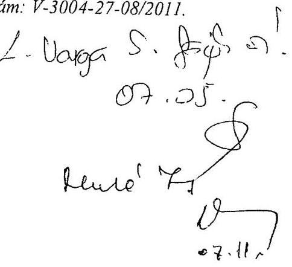

Köszönettel fogadtam az Állami Számvevőszék által a Csongrád Megyei Önkormányzat pénzügyi helyzetének ellenőrzéséről szóló jelentéstervezet véleményezésre történő megküldését.
A tervezetben foglaltakat részletesen megismertem és biztos vagyok benne, hogy a munkánk során, az Önkormányzat hatékonyabb gazdálkodásának elérése terén hasznosítani tudjuk majd a javaslatokat, segítő szakmai iránymutatásokat.

A jelentéstervezet szakmai áttekintése alapján az alábbi észrevételeket teszem a szöveggel kapcsolatban:

- a 14. oldal 4. bekezdésének 4. sorában szereplő 528 M Ft-os adat (kamatbevétel) nem egyezik a jelentéstervezet 24. oldalán szereplő, a kamatbevételeket és kiadásokat bemutató táblázat adataival, valamint a 34. oldal 3. bekezdésében szereplő adattal,
- a 26. oldalon, alulról a második bekezdést javaslom pontosítani, részben azzal, hogy a Tűzoltóság épületét nem (közvetlenül) kívánja értékesíteni az önkormányzat, hanem az ingatlan az azt használó Szeged Megyei Jogú Várossal kerülne elcserélésre, majd a csereingatlant értékesítené a Megyei Önkormányzat. A javasolt pontosítás másik vetülete, hogy az érintett ingatlannak nem résztulajdonosa a Megyei Önkormányzat, hanem $100 \%$-os tulajdonosa,

---

- a 34. oldalon, a kötvényes terheket bemutató táblázat alatti mondat véleményünk szerint egyrészről 2010. december 31-ére vonatkozik, másrészről pedig pontosítani javasoljuk abból a szempontból, hogy az Önkormányzat ebben az időpontban „kötvénykibocsátással kapcsolatos pénzintézeti kötelezettsége Ft-ban nem állt fenn",
- a 38. oldal utolsó előtti bekezdésében javaslom a tagi kölcsön állomány lejárat szerinti megbontását, mivel a Megyeszolgálat Nkft-nek adott tagi kölcsön visszafizetési határideje a szerződés szerint nem május 31, hanem 2011. december 31.,
- a 44. oldal utolsó előtti bekezdését pontosítani javaslom azzal, hogy a 230 fős létszámleépítésre az Önkormányzat a tárgyévben valóban nem kapott támogatást, azonban ebből az adatból 64 főnél minősült a leépítés tartósnak, akikre az Önkormányzat a következő évben pályázatot nyújtott be és nyert is támogatást, melynek összege része a bekezdés alján helyesen feltüntetett támogatási összegnek.

A fenti észrevételeken, javaslatokon túl levelem mellékleteként megküldöm a kért pótlólagos információkat tartalmazó három táblázatot további szíves felhasználásra.

Szeged, 2011. június 28.

Tisztelettel:

Magyar Anna
a Csongrád Megyei Közgyűlés elnöke

---

# Magyar Anna úrhölgy 

elnök
Csongrád Megye Önkormányzata

## Szeged

## Tisztelt Elnök Úrhölgy!

Köszönettel vettem a Csongrád Megye Önkormányzat pénzügyi helyzetének ellenőrzéséről szóló Állami Számvevőszéki jelentés-tervezetben foglalt megállapításokra tett észrevételeit.

A jelentéstervezet megállapításaihoz fűzött észrevételei alapján a jelentésben foglaltakat az alábbiak szerint módosítjuk, kiegészítjük:

1. A kamatbevételekkel kapcsolatos észrevételeire az alábbi tájékoztatást adom:

A végleges jelentésben - a jelentés-tervezettől eltérően - a 2011. I. negyedévi kamatbevételek nem szerepelnek. Országosan egységesen a 2010. december 31-ig elért kamatbevételt tüntetjük fel a jelentésben, amelynek összege az alábbiak szerint alakul:

Az Önöknek megküldött jelentés-tervezetben a kötvénykamat kiadással csökkentett, 2010. december 31-ig realizált kamatbevétel szerepel, amelynek összege 502 millió Ft. A 2007-2010. években önkormányzati szinten elért összes kamatbevételt mutattuk ki, a jelentés a 2010. december 31-ig elért 855 millió Ft kötvénykamat bevételt tartalmazza.
2. A jelentés-tervezetben a tűzoltóság épületét érintő 2011. évre tervezett ingatlancserével kapcsolatos észrevételét elfogadom. A végleges jelentésben az önkormányzat bevételeinek alakulását tartalmazó 2.2 pontban a 2007-2010. évekre vonatkozóan országosan egységesen - mutatjuk be az önkormányzat bevételeit, eltérően a jelentéstervezettől (a 2011. évre vonatkozó adatok kimaradnak), ezért az észrevételében kért pontosítás okafogyottá válik.
3. A jelentés-tervezetben a Ft-ban fennálló pénzintézeti kötelezettségekkel kapcsolatos észrevétele alapján a jelentésben a dátumot módosítjuk 2010. december 31-re. Az Önkormányzatnak Ft-ban pénzintézeti kötelezettsége nem volt 2010. december 31-én.
4. A Megyeszolgálat Kft-nek nyújtott tagi kölcsönnel kapcsolatos észrevételét, amelyben a fizetési határidőt 2011. december 31-ében határozta meg - elfogadjuk.

---

5. A 230 fős létszámleépítésre vonatkozó észrevételével kapcsolatban tájékoztatom, hogy a jelentéshez kapcsolódó 14. számú tanúsítvány az Önök által leírtak szerint tartalmazza a támogatási adatokat, kérésüknek megfelelően a vonatkozó megállapítást kiegészítettük.

Köszönöm Elnök asszonynak és munkatársainak az ellenőrzés során tanúsított hozzáállását, amellyel a pénzügyi helyzetelemzés elkészítésében részt vettek, azt munkájukkal segítették.

Budapest, 2011. december " (1) ".

Tisztelettel:

Domokos László

Melléklet: jelentés

---

.