ÁLLAMI
SZÁMVEVŐSZÉK

# JELENTÉS 

a Fejér Megyei Önkormányzat pénzügyi helyzetének ellenőrzéséről (43/2)

---

# Számvevői Iroda 

Iktatószám: V-3014-07/2011.
Témaszám: 1015
Vizsgálat-azonosító szám: V056006

## Az ellenőrzést felügyelte:

Dr. Varga Sándor
számvevő igazgató-helyettes
Az ellenőrzést vezette:
Renkó Zsuzsanna
számvevő tanácsos
Az ellenőrzést végezték:

| Mohl Anna | Huberné Kuncsik | Csényi István |
| :-- | :-- | :-- |
| számvevő tanácsos | Zsuzsanna | számvevő tanácsos |
|  | számvevő tanácsos |  |

A témához kapcsolódó eddig készített számvevőszéki jelentések:
címe
sorszáma
A helyi önkormányzatok gazdálkodási rendszerének 2007. évi átfogó és szabályszerűségi ellenőrzése

---

# TARTALOMJEGYZÉK 

BEVEZETÉS ..... 5
I. ÖSSZEGZŐ MEGÁLLAPÍTÁSOK, KÖVETKEZTETÉSEK, JAVASLATOK ..... 12
II. RÉSZLETES MEGÁLLAPÍTÁSOK ..... 17

1. Az Önkormányzat kötelező és önként vállalt feladatai ..... 17
2. Pénzügyi egyensúlyi helyzet alakulása ..... 20
2.1. A működési és felhalmozási egyensúly alakulása ..... 22
2.2. Az Önkormányzat bevételeinek alakulása ..... 27
2.3. Az Önkormányzat kiadásainak alakulása ..... 29
3. Kötelezettségek bemutatása ..... 35
3.1. A pénzintézetek felé fennálló kötelezettségek alakulása ..... 35
3.2. Szállítók felé fennálló kötelezettségek alakulása ..... 41
3.3. Egyéb kötelezettségek alakulása ..... 42
4. A pénzügyi egyensúly megteremtése érdekében hozott intézkedések ..... 44
5. A helyi önkormányzatok gazdálkodási rendszerének 2007. évi ellenőrzése során a pénzügyi egyensúly javítására tett szabályszerűségi és célszerűségi javaslatok hasznosulása ..... 51

---

# MELLÉKLETEK 

1. számú Múködési és felhalmozási célú hiány/többlet alakulása az Önkormányzat melléklet rendeleteiben
2/a. számú Az Önkormányzat CLF módszer szerint besorolt bevételei és kiadásai 2007melléklet 2010 között
2/b. számú Az Önkormányzat bevételeinek és kiadásainak, adósságszolgálatának melléklet alakulása 2007-2010 között
2. számú Az Önkormányzat 2007-2010 években megvalósított, illetve 2010. december 31-én fennálló fejlesztési feladatokhoz kapcsolódó kötelezettségeinek összegzése
3. számú Fejér Megyei Közgyűlés elnökének észrevétele melléklet
4. számú Fejér Megyei Közgyűlés elnökének észrevételére adott válasz melléklet

---

# RÖVIDÍTÉSEK JEGYZÉKE 

| Törvények |  |
| :--: | :--: |
| Áht. | az államháztartásról szóló 1992. évi XXXVIII. törvény |
| ÁSZ tv. | az Állami Számvevőszékről szóló 1989. évi XXXVIII. törvény (2011. július 1-jétől az Állami Számvevőszékről szóló 2011. LXVI. törvény) |
| Htv. | a helyi önkormányzatok és szerveik, a köztársasági megbízottak, valamint egyes centrális alárendeltségủ szervek feladat- és hatásköreiről szóló 1991. évi XX. törvény |
| Ötv. | a helyi önkormányzatokról szóló 1990. évi LXV. törvény |
| Szórövidítések |  |
| áfa | általános forgalmi adó |
| APEH | Adó- és Pénzügyi Ellenőrzési Hivatal, 2011. január 1-jétől Nemzeti Adó- és Vámhivatal (NAV) |
| ÁSZ | Állami Számvevőszék |
| BM | Belügyminisztérium |
| EDP hiány/egyenleg | Uniós módszertan szerinti maastrichti kritériumoknak megfelelő számítás szerinti hiány/egyenleg |
| EIPT Kft. | Európai Információs Pont és Turisztikai Kft. |
| Energiaszolgáltató Kft. | Fejér Megyei Energiaszolgáltató Nonprofit Kft. |
| EU | Európai Unió |
| GDP | Bruttó hazai termék |
| Hivatal | Fejér Megyei Önkormányzati Hivatal |
| IGSZ | Fejér Megyei Önkormányzat Intézményei Integrált Gazdasági Szervezete |
| Illetékhivatal | Fejér Megyei Illetékhivatal |
| Kórház | Fejér Megyei Szent György Kórház |
| Közgyűlés | Fejér Megyei Közgyűlés |
| KSH | Központi Statisztikai Hivatal |
| Levéltár | Fejér Megyei Levéltár |
| MÁK | Magyar Államkincstár |
| Múzeum | Fejér Megyei Múzeumok Igazgatósága |
| NFÜ | Nemzeti Fejlesztési Ügynökség |
| NGM | Nemzetgazdasági Minisztérium |
| NIF Zrt | Nemzeti Infrastruktúra Fejlesztő Zrt. |
| OEP | Országos Egészségbiztosítási Pénztár |
| Önkormányzat | Fejér Megyei Önkormányzat |
| PEDI | Fejér Megyei Önkormányzat Tanulási Képességet Vizsgáló Szakértői és Rehabilitációs Bizottsága, Nevelési Tanácsadója és Egységes Pedagógiai Szakszolgálata |
| PPP konstrukció | Public Private Partnership (Partnerségi együttműködés közfeladatok ellátására a magánszektor bevonásával) |
| ROP | Regionális Operatív Program |

---

| SNA | System of National Accounts azaz Nemzeti Számlák |
| :-- | :-- |
| Rendszere |  |
| SzMSz | Fejér Megyei Önkormányzat 16/2010 (X.29.) számú ren- |
|  | delete az Önkormányzat és Szervei Szervezeti és Müködési |
| szja | Szabályairól |
| TISZK | személyi jövedelemadó |
| VVSI | Fejér Megyei Szakképzési-Szervezési Társulás |
| VVSI Kft. | Velencei-tavi Vizi Sportiskola |
|  | Velencei-tavi Vizi Sportiskola Nonprofit Kft. |

---

# JELENTÉS   a Fejér Megyei Önkormányzat pénzügyi helyzetének ellenőrzéséről 

## BEVEZETÉS

Az Állami Számvevőszék 2011. évtől érvényes stratégiája új irányt szabott a helyi önkormányzatok gazdálkodásának ellenőrzésében is. Az ÁSZ - küldetése és jövőképe szerint - szilárd szakmai alapokra támaszkodva értékteremtő ellenőrzéseivel és helyzetelemzéseivel az államháztartás egészében, így a helyi önkormányzati alrendszerben is elő kívánja segíteni a közpénzek és a közvagyon szabályos, gazdaságos, hatékony és eredményes hasznosítását. E folyamat részeként - a 2010. évi államháztartási hiány alakulásának összetevőire is figyelemmel - megkezdődött az önkormányzati alrendszer pénzügyi helyzetelemzése.

Az NGM 2011 áprilisában közzétett adatai szerint ${ }^{1}$ a 2010. évi 1036,2 milliárd Ft összegű, 3,8\%-os EDP (maastrichti kritériumok szerinti, Túlzott Hiány Eljárás keretében kimutatott) hiánycél nem volt tartható, az önkormányzati alrendszer tervezettet meghaladó hiánya miatt a GDP arányában kifejezett államháztartási hiány $4,2 \%$-ra emelkedett.

Az önkormányzatok költségvetési jelentése szerint 2010. első három negyedév végén az önkormányzati alrendszer pénzforgalmi hiánya 97 milliárd Ft volt a tervezett éves mérték $51 \%$-át érte el. Bár az elmúlt években kiugróan magas hiány halmozódott fel az utolsó negyedévben, a 97 milliárd Ft-os szeptember végi hiány nem indokolta az önkormányzati alrendszer 190 milliárd Ft-ra becsült éves hiányának felülvizsgálatát. A tervezett hiány túllépése, az utolsó negyedévi 150 milliárd Ft-os pénzforgalmi hiány nem volt reálisan feltételezhető. A helyi önkormányzatok januári gyorsjelentése szerint a pénzforgalmi hiány 247,7 milliárd Ft-ot tett ki. A tervezettnél nagyobb önkormányzati pénzforgalmi hiány kialakulásában - az NGM által az éves költségvetési beszámoló elkészítéséhez kiadott tájékoztató szerint - az iparűzési adó elmaradása, a gépjárműadó, az illetékek és más bevételek tervezettnél alacsonyabb összegben teljesülése volt a meghatározó.

[^0]
[^0]:    ${ }^{1}$ NGM Tájékoztatás Magyarország Strukturális Reformprogramjának végrehajtásáról (2011. április 1). A Tájékoztató évente két alkalommal - április és október hónapban jelenik meg.

---

A megyei önkormányzatok kötelező feladatellátását többlépcsős törvényi előírások határozzák meg. A feladatokra vonatkozó szabályozás első szintjét az Ötv. ${ }^{2}$, a második szintet a hatásköri ${ }^{3}$, a harmadik szintet a további ágazati, szakmai törvények (egyebek mellett az oktatási, egészségügyi, szociális) adják.

A megyei önkormányzatok a feladatellátás és a központi forráselosztás tekintetében sajátos helyet foglalnak el a helyi önkormányzati rendszerben. A megyei önkormányzat kötelező feladatainak egy része - így a megyében lévő természeti és társadalmi muzeális emlékek, a történeti iratok gyűjtése, őrzése, tudományos feldolgozása, a megyei könyvtári szolgáltatás, a pedagógiai és közművelődési szakmai tanácsadás és szolgáltatás, a megyei testnevelési és sportszervezési feladatellátás, a gyermek- és ifjúsági jogok érvényesítése, a gyermekvédelmi- és szociális szakellátás - az Ötv-ből közvetlenül levezethető kötelezettség.

A középiskolai, szakiskolai, és kollégiumi ellátás, a fogyatékos gyermekek oktatása, nevelése, gondozása az ágazati törvény szerint a megyei önkormányzat kötelező feladata. Azonban, ha a települési önkormányzat lát el ilyen feladatot, és arról lemond, a megyei önkormányzatnak a feladatot át kell vennie. Így a megyei önkormányzatok által ellátandó kötelező közszolgáltatások ellátásának mértékére a települési önkormányzatok döntései jelentősen kihatnak.

Az alapellátást meghaladó egészségügyi szakellátás biztosítása akkor képezi a megyei önkormányzat feladatát, ha az önkormányzati vagyon kialakításáról szóló törvényben ${ }^{4}$ a feladat ellátásához szükséges vagyont az önkormányzat a tulajdonába kapta.

Az önként vállalt feladat ellátására - mivel annak vállalása a kötelező feladatok ellátását nem veszélyeztetheti - a kötelező közszolgáltatások mértékének alakulása lényegi hatással van.

A feladat és hatáskör telepítés sajátosságai mellett a megyei önkormányzatok kialakított forrásszerkezete, a központi költségvetéstől való erőteljes függősége is determinálja az önkormányzatok feladatellátásra vonatkozó döntéseit.

A 2007-2010. években az önkormányzati feladatok ellátásának keretet biztosító forrásszabályozás - ennek részeként az illetékbevételből és a személyi jövedelemadóból való részesedés szabályai - a megyei önkormányzatok vonatkozásában nem változtak:

- A megyei önkormányzatok saját bevételein belül az illetékbevételek döntően az ingatlanpiac stagnálása, majd visszaesése, és egyes illetékkedvezmények bevezetése következtében - megyénként differenciált mértékben ugyan, de - 2010-re általánosan visszaestek. A 2010. évben befolyt

[^0]
[^0]:    ${ }^{2}$ Ötv. 69-70. §-ai
    ${ }^{3}$ a Htv.
    ${ }^{4}$ Az egyes állami tulajdonban lévő vagyontárgyak önkormányzatok tulajdonba adásáról szóló 1991. évi XXXIII. törvény

---

39,2 milliárd Ft illetékbevétel a 2006. évben realizált 71,1 milliárd Ft illetékbevétel alig több mint $55 \%$-a volt. A kieső bevételek pótlására az önkormányzati alrendszer szintjén történtek intézkedések, 2010-ben 5 milliárd Ft-ot, 2011-ben 1,2 milliárd Ft-ot ellentételezett a központi költségvetés. Az illetékbevételt a megyei önkormányzatok a saját folyó bevételeik között számolják el ${ }^{5}$.

Az illetékek kivetésének és beszedésének joga 2006. december 31-ig a megyei önkormányzatok feladata volt. A 2007. évtől a megyei illetékhivatalok illetékbeszedési feladatait az APEH vette át ${ }^{6}$. Az önkormányzati illetékrészesedési szabályok változatlanok maradtak, azonban az illetékbeszedés költségeit az önkormányzatok illetékbevételeiből átlagos (a Fővárosnál 4,0\%-os, a megyei és megyei jogú városi önkormányzatnál 8,5\%-os) kulcsot alkalmazva vonták le. E döntés következtében azon megyei önkormányzatok, amelyek a 8,5\%-os költségnél kedvezőbb költségszint mellett látták el korábban ezt a feladatot, kedvezőtlenebb helyzetbe kerültek.

- Az önkormányzati alrendszer személyi jövedelemadóból való részesedésének makroszintű szabályozása nem változott 2007-2010 között7. A helyi önkormányzatokat normatív módon megillető $32 \%$-os részesedés viszszaosztásának részletszabályai azonban a megyei önkormányzatok számára - a reálgazdaság kedvezőtlen irányú folyamatai, és az államháztartás egyensúlyi helyzetére tekintettel elrendelt kormányzati intézkedések miatt - megszorító intézkedéseket jelentettek. Összesen 17 milliárd Ft -2007-ben 10 milliárd Ft, 2010-ben további 7 milliárd Ft - szja-t vontak ki a megyei önkormányzatok gazdálkodási köréből ${ }^{8}$. Az átengedett személyi jövedelemadó a megyei önkormányzatok egyik bevétele.

[^0]
[^0]:    ${ }^{5}$ A megyei önkormányzatok illetékbevételei az önkormányzati alrendszer saját folyó bevételeiből 2007-ben 35,9 milliárd Ft-ot ( $61,4 \%$-ot), 2008-ban 41,5 milliárd Ft-ot ( $61,7 \%$-ot), 2009-ben 36,5 milliárd Ft-ot ( $62,5 \%$-ot), 2010-ben 25,1 milliárd Ft-ot $(64,1 \%$-ot) tettek ki.
    ${ }^{6}$ Az egyes pénzügyi tárgyú törvények módosításáról szóló 2006. évi LXI. törvény 115. §a, amely az adózás rendjéről szóló 2003. évi XCII. törvény 73. §-át módosította.
    ${ }^{7}$ A megyei önkormányzatok személyi jövedelemadó részesedése az önkormányzati alrendszer átengedett bevételeiből 2007-ben 34,7 milliárd Ft-ot ( $7,0 \%$-ot), 2008-ban 51,2 milliárd Ft-ot ( $9,2 \%$-ot), 2009-ben 59,2 milliárd Ft-ot ( $9,3 \%$-ot), 2010-ben 56,3 milliárd Ft-ot $(8,3 \%$-ot) tett ki.
    ${ }^{8}$ A megyei önkormányzatok szja kiegészítése háromelemű. A tételes, minden megyére egységesen meghatározott összeg - az adott évek költségvetési törvényeinek 4. sz. mellékletében meghatározottak szerint - 2006-ban 593 millió Ft, 2007-ben és 2008-ban egyaránt 355 millió Ft, 2009-ben 370 millió Ft volt. A megye népességszáma után járó kiegészítés a 2006. évi 208 Ft/fő összegről 2010-re 120 Ft/fő-re, a megyei intézmények ellátottjai után járó kiegészítés 42236 Ft/ellátottról 20755 Ft/ellátottra csökkent.

---

A megyei önkormányzatok 2007-2010 között rendelkezésre álló forrásait az alábbiakban mutatjuk be:
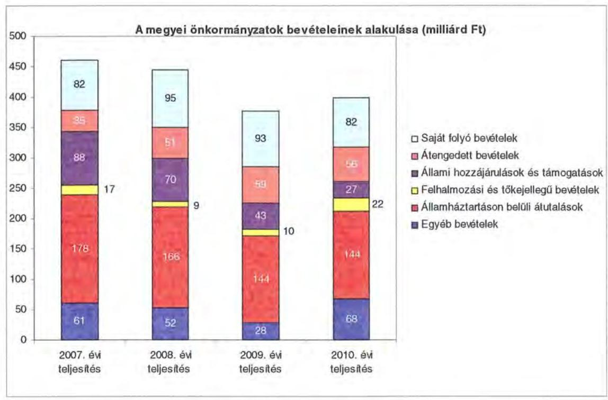

A megyei önkormányzatok saját folyó bevételeinek részaránya - amelyek fôbb elemei: az intézményi térítési díjak, az illetékbevétel, a kamatbevételek - a 2007. évi összbevételen ( 461 milliárd Ft) belül 17,9\% volt, amely 2010-re annak ellenére 20,6\%-ra nőtt, hogy az összege 82 milliárd Ft maradt. Ennek oka az volt, hogy az összbevétel a 2007. évi 461 milliárd Ft-ról 2010-re 399 milliárd Ftra csökkent.

Az átengedett bevételek, amelyek a megyei önkormányzatoknál a személyi jövedelemadóból való részesedést jelentették, az összbevételen belül a 2007. évi 35 milliárd Ft-ról 56 milliárd Ft-ra nőttek.

Az állami hozzájárulások és támogatások - amelyek fôbb elemei: az ellátotti létszámhoz kötődő normatív állami hozzájárulások, központosított, fejezeti szinten kezelt céleldírányzatból juttatott müködési és fejlesztési támogatások a 2007. évi 88 milliárd Ft-ról (19,1\%-os részarányról) 2010-re 27 milliárd Ft-ra ( $6,8 \%$-os részarányra) estek vissza.

A felhalmozási és tőkejellegű bevételek - tárgyi eszközök (ingatlanok és ingóságok), föld és immateriális javak, részesedések értékesítése, EU-tól átvett pénzeszközök - a 2007. évi 17 milliárd Ft-ról (3,6\%-os részarányról) 2010-re 22 milliárd Ft-ra (5,4\%-ra) emelkedtek.

Az államháztartáson belüli átutalások részesedése 2007-ben 178 milliárd Ft volt. 2010. év végére 34 milliárd Ft-tal csökkent, részaránya 38,6\%-ról 2,6 százalékpontos csökkenés után 2010-ben 36\%-ra változott. Ez a bevételi kategória

---

tartalmazza az egészségbiztosítási és egyéb elkülönített állami pénzalapoktól átvett forrásokat. A 2010-ben e címen elszámolt bevétel 144 milliárd Ft volt.

A megyei önkormányzatok központi költségvetésből származó bevételeinek öszszege 2007-ben 400 milliárd Ft volt, amely 2010. évre 331 milliárd Ft-ra (az időszak alatt összesen 69 milliárd Ft-tal) 17,3\%-kal csökkent.

Az egyéb, pénzmaradványból, vállalkozási bevételekből, államháztartáson kívülről származó átutalásokból, a hitelekből, a hosszú és rövid lejáratú értékpapírok értékesítéséből származó bevételek részesedése a 2007-2010. évek viszonylatában 13,3\%-ról 17,1\%-ra emelkedett. Ez utóbbiak 2010. évi beszámoló szerinti összevont teljesítése 68 milliárd Ft volt ${ }^{9}$.

Mindezeket figyelembe véve 2007 és 2010-ben a megyei önkormányzatok forrásösszetételének megoszlását az alábbi ábra szemlélteti:
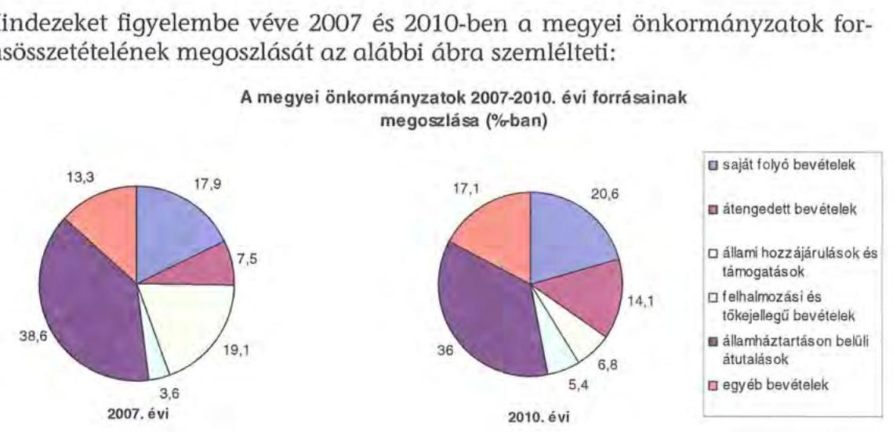

Annak ellenére, hogy a megyei önkormányzatok kötelezően ellátandó feladataikat 2007-hez képest kevesebb intézményben, csökkenő foglalkoztatotti létszám mellett végezték ${ }^{10}$, a jelentős bevételkiesést a - szervezési intézkedések hatására - csökkenő ráfordítások nem tudták kompenzálni. Az ellátottak száma a szociális, gyermekvédelmi ágazat bentlakásos elhelyezést nyújtó intézményeit kivéve - eltérő mértékben ugyan, de minden ágazatban évről évre csökkent, amely a fajlagos hozzájárulások csökkenésével együtt a normatív állami hozzájárulás arányának visszaeséséhez vezetett.

A 2007-2013-as időszakra meghirdetett, vissza nem térítendő EU-s fejlesztési forrásokhoz való hozzájutás lehetősége felerősítette az önkormányzati alrendszer fejlesztési igényeit. A fokozott fejlesztési tevékenység a felhalmozási bevéte-

[^0]
[^0]:    ${ }^{9}$ Az egyéb bevételek összege 2007-2010 között eltérő módon változott, 2007-ben 61 milliárd Ft volt, 2008-ban 52 milliárd Ft-ra, 2009-ben 28 milliárd Ft-ra esett vissza, majd 2010-ben ismét - 68 milliárd Ft-ra - emelkedett.
    ${ }^{10}$ a BM által 2010 decemberében elvégzett felmérés adatai szerint

---

lek és kiadások egyensúlyának megbomlásán ${ }^{11}$ túl a jelentkező jövőbeni fenntartási kötelezettség miatt tovább terhelhetik az önkormányzatok költségvetését.

A megyei önkormányzatok felhalmozási és múködési célú pénzintézeti és szállitói kötelezettségeinek állománya a vizsgált időszakban erőteljesen növekedett.

A hosszú lejáratú kötelezettségek alakulását a következő ábra szemlélteti:

Hosszú lejáratú kötelezettségek
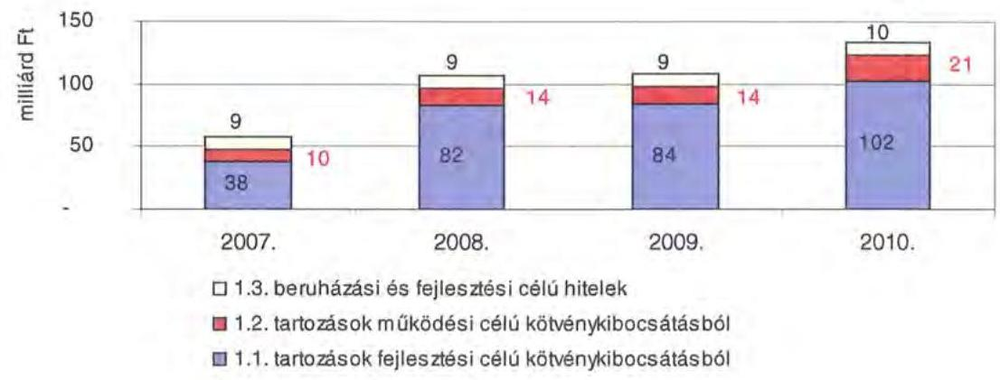

A hosszú lejáratú kötelezettségek mellett az időszakban a 2007. évi 22 milliárd Ft-ról 24 milliárd Ft-ra ( $8,8 \%$-kal) növekedett az áruszállitásból származó szállítói kötelezettségek állománya.

A mérlegben kimutatott kötelezettségek állománya mellett az elhasználódott eszközök pótlására forrást biztosító amortizációs (felújítási) alap képzésének ${ }^{12}$ elmaradása további problémákat vetít előre. A megyei önkormányzatok beszámolójelentéseinek összegzése szerint 2007-ben még az elszámolt értékcsökkenés $90 \%$-ának megfelelő összeget fordítottak felújítási célokra, 2009-ben ez az arányszám már csak $16,5 \%$ volt. Ez maga után vonta a feladatellátást kiszolgáló tárgyi eszközök állagának erőteljes romlását.

Az ÁSZ a 2011. évi ellenőrzési tervében a 43. számú, az „Önkormányzatok gazdálkodási rendszerének ellenőrzése" részeként egy időben, egymással párhuzamosan tekinti át és elemzi az önkormányzati alrendszer középszintjét jelentő 19 megyei önkormányzat pénzügyi helyzetét. A gazdálkodás szabályszerűségét az

[^0]
[^0]:    ${ }^{11}$ Az önkormányzati alrendszerben - az éves zárszámadási törvényjavaslatok általános indokolása, X. Helyi önkormányzatok gazdálkodása fejezet szerint - a felhalmozási bevételek és kiadások egyenlege 2007-ben 142,4 milliárd Ft, 2008-ban 112,3 milliárd Ft, 2009-ben 234,5 milliárd Ft hiányt mutatott.
    ${ }^{12}$ Erre a jelenlegi szabályozási környezetben nem kötelezi semmilyen előírás az önkormányzatokat.

---

ÁSZ előző évek során ellenőrizte a megyei önkormányzatoknál is, ezért jelen vizsgálatunk erre nem tér ki.

A jelentés a megyei önkormányzatok sajátos feladatellátási és forrásszabályozási helyzetére tekintettel a megyei önkormányzatok pénzügyi helyzetét, illetve az ezzel összefüggő korábbi ÁSZ javaslatok megvalósítását mutatja be.

Az ellenőrzés a 2007. január 1. - 2011. március 31. közötti időszakot ölelte fel.
A vizsgálat jogszabályi alapját 2011. július 1-je előtt az Állami Számvevőszékről szóló 1989. évi XXXVIII. törvény 2. § (3), (5), (6) és (9) bekezdéseiben, az Ötv. 92. § (1) bekezdésében és az Áht. 104. § (3) bekezdésében, 2011. július 1-jét követően az Állami Számvevőszékről szóló 2011. évi LXVI. törvény 1. § (3) bekezdésében, az 5. § (2)-(6) bekezdéseiben és az Áht. 120/A. § (1) bekezdésében foglalt előírások képezték.

Fejér megye országos és régión belül elfoglalt helyzetét 2010. december 31-én az alábbi mutatók szemléltetik (a megyei jogú városokkal együtt):

Index: az előző év azonos időszak (időpontja)=100,0

| Mutató megnevezése | Fejér me-   gye | Közép-   dunántúli   régió | Országos |
| :-- | :--: | :--: | :--: |
| Népesség száma (ezer fő)* | 426 | 1095 | 9986 |
| Népesség változás indexe (\%) | 99,8 | 99,6 | 99,7 |
| Az ipari termelés volumenindexe (\%) | 106,7 | 104,6 | 110,7 |
| Egy lakosra jutó ipari termelési érték (ezer Ft) | 4174,9 | 4359,8 | 2044,4 |
| Ezer lakosra jutó vállalkozások száma (db) | 134 | 135 | 165 |
| A beruházások egy lakosra vetített teljesít- | 305,4 | 280,9 | 304,7 |
| ményértéke (ezer Ft) | 51,2 | 52,1 | 49,5 |
| Foglalkoztatási arány (\%) | 8,1 | 9,4 | 10,8 |
| Munkanélküliségi ráta (\%) | 127263 | 124133 | 132628 |
| Alkalmazásban állók havi nettó átlagkerese- |  |  |  |
| te (Ft) | 110,9 | 109,1 | 106,9 |
| Alkalmazásban állók havi nettó átlagkeresetének indexe (\%) |  |  |  |

*Ebből Székesfehérvár és Dunaújváros Megyei Jogú Városok népessége 151 ezer fő
A táblázatban feltüntetett adatok azt jelzik, hogy a gazdaság helyzetét reprezentáló egyes mutatók - az ipari termelés volumenének változása, az ezer lakosra jutó vállalkozások - tekintetében elmarad az országos jellemzőktől, ugyanakkor a Közép-dunántúli régión belül elfoglalt helyzete kedvezőbb képet mutat. Különösen kedvező, hogy a megye munkanélküliségi rátája és az alkalmazásban állók havi nettó átlagkeresetének változása mind a régiós, mind pedig az országos értékeknél kedvezőbb.

A megyében 108 települési - 2 megyei jogú városi, 13 városi, 13 nagyközségi és 80 községi - önkormányzat múködött.

---

# I. ÖSSZEGZŐ MEGÁLLAPÍTÁSOK, KÖVETKEZTETÉSEK, JAVASLATOK 

A Fejér Megyei Önkormányzat 2010-ben 24212 millió Ft összes költségvetési kiadásából 96\%-ot kötelező feladatai ellátására fordította. Az Önkormányzat adatszolgáltatása szerint az önként vállalt feladatai a sport, a szórakoztató és szabadidős tevékenységhez, egyes idegenforgalmi, turisztikai, kiadvány szerkesztési, kommunikációs szolgáltatások szervezéséhez kapcsolódtak, valamint támogatást nyújtott civil szervezetek, alapítványok múködéséhez, összesen 968 millió Ft összegben. Az Önkormányzat az önként vállalt feladatok körét SzMSz-ében nem rögzítette. Az SzMSz a kötelező közszolgáltatási feladatokat, és azok ellátásának szervezeti keretét általános jelleggel, a vonatkozó jogszabályokra hivatkozással határozta meg.

Az Önkormányzat kötelező és önként vállalt feladatait 2007. január 1-jén a Hivatal, 33 intézmény, valamint 1 gazdasági társaság, összesen 74 telephelyen látta el, 2010. december 31-én a Hivatallal együtt 24 intézmény, valamint három többségi tulajdonú gazdasági társaság, összesen 88 telephelyen végezte ezen feladatokat. Az intézmények száma 2007-2010. közötti - főként a szociális és gyermekvédelmi területet érintő - átszervezések következtében alakult ki. Megszüntettek, illetve átszerveztek 11 intézményt (melyből 1 intézményt átalakítottak gazdasági társasággá), 1 intézményalapítás is történt, továbbá létrehoztak egy gazdasági társaságot.

A folyó költségvetés egyenlege (múködési jövedelem) 2007-2010 között - a 2009. év kivételével - múködési forráshiányt mutatott ${ }^{13}$.

A 2007-2010. években az Önkormányzat felhalmozási költségvetésének egyenlege folyamatosan negatív összegű volt, amely 2007-2010. között összesen 3764 millió Ft felhalmozási forráshiányt okozott.

A pénzügyi egyensúly fenntartása külső forrás bevonásával volt biztosítható. A múködési forráshiány finanszírozása munkabérhitelből, folyószámlahitelből, továbbá működési céllal kibocsátott kötvényből történt. A fejlesztési forráshiányt hosszú lejáratú fejlesztési célú hitellel, illetve fejlesztési célú kötvénykibocsátással kezelték. A hitelállomány folyamatos emelkedésével együtt járt az Önkormányzatot terhelő kamatkiadások növekedése is, amely 2010-ben közel másfélszerese ( 222,1 millió Ft) volt a 2007. évben kifizetett ( 151,3 millió Ft) kamatnak.

[^0]
[^0]:    ${ }^{13}$ A folyó költségvetés hiánya, (a múködési forráshiány) 2007-ben a folyó kiadások 2,1\%-át (444 millió Ft-ot), 2008-ban 1,7\%-át (401 millió Ft-ot), 2010-ben 4,6\%-át (1 011 millió Ft-ot) jelentette. A 2009. évben a múködési forrástöbblet a folyó kiadások 3,5\%a, 752 millió Ft volt.

---

A CLF módszer szerinti működési forráshiány kialakulásában leginkább az játszott szerepet, hogy az Önkormányzat legföbb bevételi forrásai - a jogszabályi kedvezmények bővülése, és az ingatlanforgalom visszaesése következményeként az illetékbevétel, valamint a központi forráskivonás hatására az átengedett szja és az állami támogatások csökkentek. Az illetékbevétel 2010-re a 2006. évi 2443 millió Ft-ról (53,5\%-ára) 1307 millió Ft-ra csökkent. Az átengedett szja és az állami támogatások együttes összege a központi támogatás csökkentésén túl az ellátotti létszám visszaesése hatását is figyelembe véve kevesebb lett, 2010-ben 3309 millió Ft volt, a 2007. évi 75,9\%-a. Az OEP támogatás összege 2007-ben 11441 millió Ft, amely 2010. évben 12976 millió Ft -ra (13,4\%-kal) emelkedett. Az egyéb saját bevételek emelkedése nem tudta ellensúlyozni a kieső forrásokat. ${ }^{14}$ A 2010. évben az intézményi múködési bevételek 358 millió Ft-tal haladták meg a 2007. évi ténylegest a térítési díjak emelkedése miatt.

A múködési kiadások 2007-ről 2010-re 4,0\%-kal, 21989 millió Ft-ra nőttek. Az Önkormányzat a Kórház múködéséhez 949 millió Ft, fejlesztéséhez 877 millió Ft támogatást nyújtott 2007-2010. között.

Az intézmények teljesített múködési kiadásai a Kórház nélkül 2007-ben 8445 millió Ft-ot tettek ki (az összes múködési kiadás 39,9\%-át), amely 2010-re 8022 millió Ft-ra csökkent (az összes múködési kiadás 36,5\%-ára).

A múködési és felhalmozási kiadásokon belül 2007-2010 között a felhalmozási kiadások súlya 733 millió Ft-ról (3,3\%-ról) 2223 millió Ft-ra ( $9,2 \%$-ra) nőtt. Az aktív pályázati tevékenység eredményeként 2007-2010. között 19191 millió Ft bekerülési költségú beruházást folytatott, illetve indított el az Önkormányzat, amelyből 12690 millió Ft a 2010 utánra vállalt kötelezettség. Az utóbbi forrásai - az Önkormányzat adatszolgáltatása szerint - a következők: 1402 millió Ft tervezett saját bevétel, 930 millió Ft kötvénybevételből származó pénzmaradvány, 10137 millió Ft elnyert EU-s támogatás, továbbá 221 millió Ft elnyert hazai támogatás. A 2010. év utánra vállalt kötelezettség 79,2\%-a (10 049 millió Ft) a Kórház fejlesztéseit finanszírozza. A fejlesztések megvalósítása során finanszírozási nehézséget okozhat az EU-s források előfinanszírozása (a támogatások megelőlegezése), ezen beruházások esetében a nem előírt feltételek szerinti teljesítése, valamint a saját bevételek tervezhetetlensége.

Az Önkormányzat pénzintézeti kötelezettségeinek állománya a könyvviteli mérlegadatok szerint 2006. december 31-ről 2010. december 31-re 2500 millió Ft-ról 11724 millió Ft-ra nőtt. A vizsgált időszakban adósságszolgálatra az Önkormányzat 3258 millió Ft-ot, továbbá kamatkiadásokra 765 millió Ft-ot teljesített. A kötvényből származó források befektetéséből realizált kamatbevétel 2007-2010 között 405 millió Ft volt.

Az Önkormányzat likviditása érdekében 2010. évben az év minden napján igénybe vett folyószámlahitelt, melynek átlagos napi állománya 610 millió Ft

[^0]
[^0]:    ${ }^{14}$ Az Önkormányzat egyéb saját bevételei 2007-2010. évek között 905 millió Ft-tal emelkedtek, míg az illetékbevételek, az szja és az állami támogatás együttes összege 1586 millió Ft-tal csökkentek.

---

volt. A folyószámlahitel felvételén túl munkabér megelőlegezési hitelre is szükség volt, melynek átlagos napi állománya 142 millió Ft volt.

Az Önkormányzat 2010. év végi pénzintézeti kötelezettségéből 7298 millió Ft (62,2\%) fejlesztési célú kötvények kibocsátásából, 1497 millió Ft (12,8\%) működési célú kötvények kibocsátásából, 1546 millió Ft (13,2\%) fejlesztési célú hoszszú lejáratú hitelek felvételéből, továbbá 1383 millió Ft (11,8\%), a költségvetési év végén ki nem egyenlített folyószámlahitelekből keletkezett. Ezek miatt az Önkormányzatnak a 2011-2013. években 1889 millió Ft és 13,8 millió CHF tőketörlesztést és kamatot ${ }^{15}$ kell teljesítenie. Az Önkormányzat 2010. év végi szállítói tartozása - gazdasági társaságok nélkül - 2588 millió Ft (ebből lejárt 1718 millió Ft), és egyéb kiadás elmaradása ${ }^{16} 67$ millió Ft. A 2011-2013. évi összes (pénzintézeti, szállítói, valamint egyéb) kötelezettség teljesítésére figyelembe vehető 1737 millió Ft pénzmaradvány, 2646 millió Ft becsült értékű jelzáloggal nem terhelt, továbbá a pénzintézeti kötelezettségvállalásokhoz kapcsolódóan 2441 millió Ft értékű terhelt forgalomképes ingatlanvagyon értékesítéséből, és 381 millió Ft egyéb követelésállomány behajtásából származó forrás, melyek a kötelezettségek mintegy 90\%-ára nyújtanak fedezetet.

A további évekre szóló, 2010. december 31-én fennálló pénzintézeti kötelezettségek a következők: 3705 millió Ft és 25,1 millió CHF. Az ezek törlesztésére figyelembe vehető források nem ismertek.

Kockázatot jelentett az Önkormányzat számára, hogy a számlavezetője, valamint a rövid lejáratú hitelt biztosító és a kötvénykibocsátással megbízott pénzintézet ugyanazon pénzintézet volt, mert a pénzintézet a kockázatokat összevontan értékelve magasabb kockázati felárral nyújtotta a hiteleket.

A közgyűlési előterjesztések nem tartalmazták a pénzintézeti kötelezettségvállalások visszafizetési forrásait, a teljes futamidő várható kamat és tőkefizetési kötelezettségeit, az árfolyam- és kamatkockázatok, valamint az adósságszolgálati korlát bemutatását, így a Közgyűlés ezek figyelembevétele nélkül döntött.

Az Önkormányzat nem vizsgálta, hogy az elhasználódott eszközök pótlása milyen kötelezettséget jelent a számára. A 2007-2010 években a tárgyi eszközök után 1911 millió Ft értékcsökkenést számolt el, ugyanakkor felújításra csak ennek töredékét, 560 millió Ft-ot (29,3\%) fordított.

A végrehajtott kiadáscsökkentő intézkedések a feladatellátás szakmai színvonalának növelése mellett a takarékos szemléletű gazdálkodást, a múködőképesség megőrzését, a pénzügyi helyzet javítását célozták. Az intézményátszervezések, a feladatváltozások, valamint a takarékossági intézkedések hatásaként a 2007-2010. években - az Önkormányzat kimutatása szerint - együttesen 2039 millió Ft kiadási megtakarítás keletkezett, melyből 1552 millió Ft, 76,0\% a kapcsolódó álláshely csökkenések következtében jelentkezett.

[^0]
[^0]:    ${ }^{15}$ a 2011. I. negyedévi kamat mértékét alapul véve
    ${ }^{16}$ Ki nem fizetett esedékes személyi jellegű juttatás, munkaadókat terhelő járulékok, peres eljárásokból fennálló függő kötelezettség, szállítói késedelmi kamat, adótartozás (cégautó-adó, rehabilitációs hozzájárulás).

---

A létszámcsökkentő intézkedések következtében 2007-2010 között a Hivatalnál és az intézményeknél összesen 341 álláshelyet szüntettek meg, amelyből 71 fő, $20,8 \%$ ágazati szakmai, 270 fő, $79,2 \%$ intézményüzemeltetéshez, fenntartáshoz, gazdasági ügyek intézéséhez kapcsolódó álláshely volt.

A bevételnövelésre irányuló intézkedések eredményeként a 2007-2010. években képződő többletbevételből - amelynek számszerűsített összege 281 millió Ft volt - 39,1\%-ot ( 110 millió Ft-ot) a Kórház realizált bérbeadási és vállalkozási tevékenységből. Az ingatlanok bérbeadásából, készletértékesítésből, valamint térítési díjak emeléséből 171 millió Ft többletbevétel realizálódott.

Az utóellenőrzés a pénzügyi egyensúly javítására tett egy célszerűségi javaslat hasznosulására terjedt ki. Javasoltuk a Közgyűlés elnökének: „kezdeményezze, hogy a fejlesztési célkitüzések megalapozásához készüljön a kötelező feladatok megoldásánál jelentkező feszültségekről felmérésekkel, számításokkal alátámasztott helyzetelemzés". Az Önkormányzat a javaslatot nem hasznosította.

Az Önkormányzat pénzügyi helyzetét összegezve a következők emelhetők ki:

Az Önkormányzatnál évente a központi intézkedések hatására jelentkező bevételi kiesést a kiadáscsökkentő és bevételnövelő intézkedéseivel nem tudta ellentételezni. Az Önkormányzat a 2007. évtől intézmény átadásáról, illetve átvételéről nem döntött. Egy intézmény gazdasági társasággá alakítása nem befolyásolta a működés biztonságát. A 2010. évet követő beruházások finanszírozhatóságát veszélyezteti a saját források tervezhetetlensége, az EU-s források előfinanszírozásának többlet költsége, valamint a támogatásból megvalósuló fejlesztések volumenéből és esetleges előírt feltételeknek nem megfelelő teljesítéséből adódó kockázatok.

Az Önkormányzat múködési célú kiadásai finanszírozása folyamatos feszültséget okozott, mivel csak folyószámla- és munkabérhitel állandó igénybevételével, továbbá kötvényforrás, illetve a kötvényforrások befektetéséből származó kamatbevétel felhasználásával tudta a múködést biztosítani. Az Önkormányzat hosszú távú pénzintézeti kötelezettségei emelkedtek, azok finanszírozása a következő három évben a rendelkezésre álló, főként ingatlanfedezet ismeretében bizonytalanok. A további évekre szóló hosszú távú kötelezettségekre az Önkormányzat adatai alapján a finanszírozás forrásai nem biztosítottak.

A feladatok és források közötti egyensúly megteremtésére irányuló központi döntések, a megyei önkormányzatok konszolidációjára, az intézmények átvételére vonatkozó törvényjavaslat elfogadása új feltételeket teremtett. A hatékony és eredményes gazdálkodás, a pénzügyi egyensúly rövid- és hosszú távú fenntarthatósága azonnali intézkedéseket igényel.

Az Állami Számvevőszékről szóló 2011. évi LXVI. törvény 33. § (1) bekezdésében foglaltak értelmében a jelentésben foglalt megállapításokhoz kapcsolódó intézkedési tervet köteles az ellenőrzött szervezet vezetője összeállítani és azt a jelentés kézhezvételétől számított harminc napon belül az ÁSZ részére megküldeni. Amennyiben az intézkedési tervet határidőben nem küldi meg a szerve-

---

zet, vagy az továbbra sem elfogadható, az ÁSZ elnöke a hivatkozott törvény 33. § (3) bekezdés a)-b) pontjaiban foglaltakat érvényesítheti.

A 2011 májusában lezárult helyszíni ellenőrzés tapasztalatai alapján - figyelembe véve az Önkormányzat észrevételeit és a saját hatáskörben tett intézkedéseit - az alábbi javaslatokat tette az ÁSZ:

# a Közgyülés elnökének: 

1. Tájékoztassa a Közgyűlést rendszeresen az intézkedési terv megvalósításáról, annak eredményeiről. A pénzügyi egyensúlyt befolyásoló feltételek romlása esetén tegyen javaslatot az intézkedési terv módosítására;
2. gondoskodjon róla, hogy a jövőben az adósságot keletkeztető kötelezettségvállalásokról szóló közgyűlési döntéseket megalapozó előterjesztések tartalmazzák a kötelezettségvállalás visszafizetésének forrásait, a várható kamat-, egyéb költség és tőkefizetési kötelezettségeit, legalább 3 éves kitekintéssel a várható kamat és árfolyamkockázatok bemutatását, és kezelésének lehetőségeit;
3. gondoskodjon a fennálló lejárt szállítói tartozás okainak feltárásáról, szerkezetének bemutatásáról - beleértve az intézményeknél lejárt szállítói állomány értékét és napra számított arányát -, a szükséges intézkedések megtételéről, indokolt esetben a szállítókkal a lejárt tartozások mielőbbi rendezéséről a kockázatok minimalizálása érdekében;
4. gondoskodjon a pénzintézeti kötelezettségek finanszírozási lehetőségeinek számbavételéről, és arra források biztosításáról;
5. mutassa be a Közgyűlésnek az éves költségvetési előterjesztésekben az értékcsökkenési leírás összegét, és ezzel arányban az elhasználódott eszközök pótlásának forrásigényét és lehetőségét.

---

# II. RÉSZLETES MEGÁLLAPÍTÁSOK 

## 1. Az ÖNKORMÁNYZAT KÖTELEZŐ ÉS ÖNKÉNT VÁLLALT FELADATAI

Az Önkormányzat 2010. évi beszámolója szerint a tárgyévi költségvetési kiadásainak ( 24212 millió Ft) 96,0\%-át, ( 23244 millió Ft-ot) a kötelezö, $4,0 \%$-át ( 968 millió Ft-ot) az önként vállalt feladatok ellátására fordította ${ }^{17}$. A 2011. évi tervadatok alapján az önként vállalt feladatokra az összes költségvetési kiadás ( 22819 millió Ft) 3,6\%-a jut ( 821 millió Ft), ami 0,4 százalékponttal kevesebb, mint az előző évben. Az Önkormányzat önként vállalt feladatai a sport, szórakoztató és szabadidős tevékenységhez, az idegenforgalmi, turisztikai, kiadvány szerkesztési, kommunikációs szolgáltatások szervezéséhez kapcsolódnak, valamint támogatást nyújt civil szervezetek, alapítványok működéséhez.

Az Önkormányzat SzMSz-e a kötelező közszolgáltatási feladatokat, és azok ellátásának szervezeti keretét általános jelleggel határozta meg. Az önként vállalt feladatok körét az önkormányzat SzMSz-ébe nem rögzítették ${ }^{18}$. Kötelező feladataikat az Ötv. és az ágazati törvények által meghatározottnak tekintik, az önként vállalt feladatokra fordítható források nagyságát az éves költségvetési rendeletekben határozzák meg.

Az Önkormányzat éves költségvetési kiadásainak szerkezetét tekintve 2010-ben a járulékokkal növelt személyi juttatások és dologi kiadások 21261 millió Ft-os összegén belül meghatározó arányt - 13609 millió Ft-ot ( $64,0 \%$-ot) - a Kórháznál elszámolt kiadások jelentették. Szociális és gyermekvédelmi célokra 3117 millió Ft-ot, oktatási célokra 2073 millió Ft-ot, közművelődési feladatokra 670 millió Ft-ot ( $3,2 \%$-ot), igazgatási és egyéb nem kiemelt ágazati feladatokra 1792 millió Ft-ot ( $8,4 \%$-ot) fordítottak. A szociális és gyermekvédelmi feladatokat ellátó 3 intézmény kiadásokból való részesedése $14,7 \%$, a 14 közoktatási intézményé $9,8 \%$ volt.

A 2010. évben a közoktatási feladatok kiadásait 51,0\%-ban, a szociális és gyermekvédelmi feladatok kiadásait 51,5\%-ban finanszírozta normatív költségvetési támogatás 1058 millió Ft, illetve 1606 millió Ft összegben.

[^0]
[^0]:    ${ }^{17}$ Az önként vállalt feladatok részarányának megállapítása az Önkormányzat adatszolgáltatásán alapul.
    ${ }^{18}$ Erre jogszabályi előírás ma már nem kötelezi az Önkormányzatot.

---

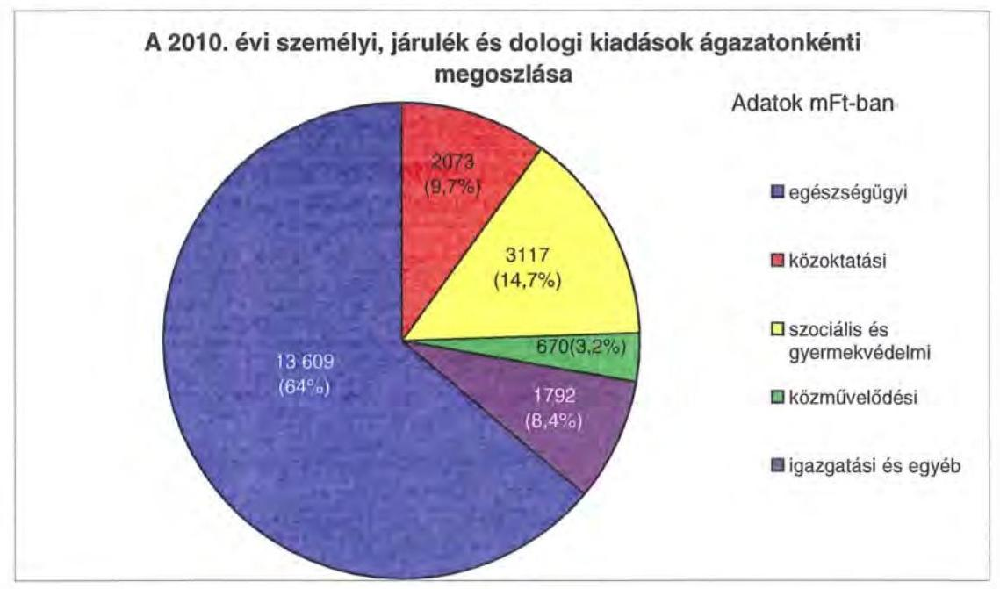

A 2010. évi önkormányzati kiadások 82,8\%-a (21 123 millió Ft) ${ }^{19}$ az intézmények, a többi a Hivatal költségvetésében szerepelt. A Hivatal költségvetéséből (4401 millió Ft) a személyi és dologi kiadások 12\%-kal (528 millió Ft), a beruházások, felújítások 32\%-kal (1408 millió Ft), a különböző megyepolitikai feladatokhoz, szervezetek támogatásához, finanszírozási tételekhez kapcsolódó kiadások 56\%-kal (2465 millió Ft) részesültek.

Az Önkormányzat a kötelező és az önként vállalt feladatait 2010. december 31én a Hivatallal együtt 24 költségvetési szervvel és 3 többségi tulajdonú gazdasági társasággal látta el.

Az Önkormányzat által fenntartott költségvetési szervek mindegyike önállóan működő és gazdálkodó költségvetési szerv, az intézmények - alapító okirataik szerint - összesen 88 telephelyen müködnek. Az intézmények telephelyeinek száma 2007-2010. években az intézménymegszüntetések, átszervezések következtében a 2007. január 1-jei állapothoz viszonyítva 14-el bővült. Az Önkormányzat feladatait 2010. december 31-én az alábbi intézménystruktúrával látta el:

- egészségügyi feladatokat egy kórház látta el;
- szociális és gyermekvédelmi feladatokat 3 intézmény végezett (1 átmeneti és tartós szociális ellátást biztosító intézmény, 2 gyermekvédelmi feladatot ellátó intézmény, amelyből 1 oktatási tevékenységet is végző gyermekotthon);
- közoktatási feladatot 14 intézmény látott el (1 pedagógiai szakszolgálat, 3 szakképző iskola, 1 gimnázium, 3 gimnázium és szakközépiskola, 4 általános iskola és speciális szakiskola, amelyből egy intézmény egységes gyógy-

[^0]
[^0]:    ${ }^{19}$ Az Önkormányzat 5/2011. (IV. 28.) számú rendelete a 2010. évi költségvetés végrehajtásáról (1-3. számú mellékletek).

---

pedagógiai intézmény, 1 alapfokú művészetoktatási intézmény, és 1 szak-képzési-szervezési társulás);

- közművelődési és közgyűjteményi feladatokat végzett 4 intézmény (könyvtár, levéltár, múzeum, művelődési központ);
- igazgatási feladatokat látott el a Hivatal, 1 intézmény pedig integrált gazdasági szervezetként múködött (a Kórház, TISZK és a Hivatal feladatain kívül a többi intézmény gazdasági adminisztrációja, pénzügyi-számviteli feladatainak ellátása tartozik ide).

Az Önkormányzat a megye területén a pedagógiai szakmai szolgáltatási feladatok teljes körű ellátására a COMMITMENT Köznevelési Kht-vel kötött megbízási szerződést.

A TISZK-et az Önkormányzat és Dunaújváros Megyei Jogú Város Önkormányzata 2008-ban közösen alapította. A TISZK-hez 5 megyei fenntartású és 6 megyei jogú városi fenntartású középfokú intézmény kapcsolódik, a munkaszervezet szervezési és igazgatási feladatainak ráfordításai az Önkormányzat költségvetésében jelentek meg.

Az egyes ágazatok kötelező feladatellátását 2010. december 31-én az alábbi mutatók jellemezték:

| Megnevezés | közoktatás | szociális és   gyermek-   védelem | egészség-   úgy | kultúra   és sport |
| :-- | :--: | :--: | :--: | :--: |
| Az ágazatban foglalkoztatottak száma (fő) | 479 | 787 | 2513 | 178 |
| Az ágazat intézményeiben   ellátottak összesen (fő) | 3741 | 1916 |  |  |
| Fekvőbeteg ellátás férőhe-   lyeinek száma (db) |  |  | 1616 |  |

Az Önkormányzat három többségi tulajdoni hányadú gazdasági társasága közül kettő - EIPT Kft., valamint a VVSI Kft. - az Önkormányzat kizárólagos tulajdona, az Energiaszolgáltató Kft-ben 51\%-os tulajdoni hányaddal rendelkezik.

- A VVSI Kft. feladat-kiszervezésével jött létre, korábban költségvetési keretek közt múködött, önként vállalt feladatként látott el sport és szabadidős tevékenység szervezést, üdülőtábor üzemeltetést. Az alapítást jóváhagyó testületi döntésből nem állapítható meg, hogy kötelező vagy önként vállalt a társaság által ellátott feladat. Az Önkormányzat e tevékenységet ennek ellenére kötelező feladatellátásának tekinti.
- Az intézményi hőszolgáltatást ellátó Energiaszolgáltató Kft-t az intézmények hőszolgáltatásának közös szervezésben való lebonyolítására alapították 2009-ben. Az alapításról szóló testületi döntés a feladatellátás kötelező jellegéről nem intézkedik, de mivel a kötelező önkormányzati feladatokat ellátó intézmények kiszolgáló tevékenységét központosították, a feladatellátás kötelező jellege igazolt.

---

- Az EIPT Kft. önként vállalt feladatot lát el, főtevékenysége a turisztikai információ szolgáltatás, kiadványszerkesztés, Eu-s pályázatfigyelés, lakossági tájékoztatás.

A többségi tulajdonú gazdasági társaságok mellett az Önkormányzat a FEJÉRVÍZ Zrt-ben 0,045\%-os, a Kémény Zrt-ben 0,0021\%-os tulajdoni hányaddal rendelkezik.

A Kórház az általa létrehozott, kötelező feladatot ellátó társaságokban KORTEX Mérnöki Iroda Kft, OPTICenter Kft., Pulmocenter Kft. - 13,95\%, 25\%, illetve $20 \%$-os intézményi részesedéssel bír.

Az önkormányzati feladatellátásban az intézmények és a gazdasági társaságok mellett egyéb szervezetek, valamint szolgáltatási szerződéssel kiszervezett/kiszerződött intézményi ellátások - a pedagógiai szakmai szolgáltatás kivételével - nem múködtek.

# 2. PÉNZÜGYI EGYENSÚLYI HELYZET ALAKULÁSA 

A hagyományos költségvetési szerkezet helyett az önkormányzat pénzügyi helyzetét a CLF módszerrel mutatjuk be, amelyben jobban elkülönülnek a vagyonnal kapcsolatos bevételek és kiadások a feladatokkal kapcsolatos közvetlen múködtetési bevételektől és kiadásoktól. A módszer következetesen elkülöníti a folyó és a felhalmozási költségvetés bevételeit és kiadásait, azok költségvetési egyenlegeit. A saját folyó bevételek, valamint a saját felhalmozási bevételek nem tartalmazzák az előző évi pénzmaradványok felhasználásából származó pénzforgalom nélküli bevételeket ${ }^{20}$.

A bevételek és kiadások besorolása általános közgazdasági meggondolásokon alapul, amely testet ölt az SNA statisztikai módszertanában is. Folyó tételek alatt értjük azokat a bevételeket és kiadásokat, amelyek az önkormányzat vagyoni helyzetét automatikusan nem változtatják. A bevételi oldalon ilyenek az adók, az illeték, az áfa bevételek és visszatérülések, a hozamok és kamatok, a költségvetési támogatások, az egyéb saját bevételek, valamint a múködési célra átvett pénzeszközök és kapott támogatások. A folyó kiadások közé tartoznak a szolgáltatások nyújtásával kapcsolatos múködési kiadások, a kamatkiadások, valamint a múködési célú transzferkiadások ${ }^{21}$. A felhalmozási vagy tőke tételek módosítják az önkormányzat vagyoni helyzetét. A privatizációs bevételek, az immateriális javak és tárgyi eszközök, valamint a részesedések értékesítése csökkentik, a fizikai beruházások és a pénzügyi befektetések növelik a vagyont. A pénzforgalmi bevételek és kiadások nem tartalmazzák a követelések elengedése miatt könyvelt tételeket, mivel ezek egymást kioltó, technikai jellegű elszámolási műveletek.

[^0]
[^0]:    ${ }^{20}$ A költségvetési években kialakuló hiány finanszírozása az előző években képzett tartalékok felhasználásával is történhet.
    ${ }^{21}$ Transzferkiadásoknak azokat a folyó és felhalmozási tételeket nevezzük, amelyeket nem az adott önkormányzat használ fel szolgáltatásnyújtásra (pl.: ellátottak pénzbeni juttatásai, átadott pénzeszközök, garancia- és kezességvállalások stb.).

---

A folyó költségvetés egyenlege, a múködési jövedelem megmutatja, hogy az önkormányzat éves folyó bevétele fedezetet biztosít-e a kötelező és önként vállalt feladatellátáshoz kapcsolódó éves folyó kiadására. A múködési jövedelem negatív értéke pénzügyileg fenntarthatatlan helyzetet jelez. A mutató pozitív értéke megtakarítást mutat, amely forrásul szolgálhat az önkormányzat fennálló kötelezettségei megfizetéséhez, valamint fejlesztéseihez.

A felhalmozási költségvetés pozitív értéke felhalmozási többletet mutat, amely a jövőbeni fejlesztések forrását biztosíthatja. Amennyiben a folyó költségvetési hiány finanszírozása a felhalmozási többletből történik, ez szűkebb értelemben vagyonfelélésnek tekinthető. Amennyiben a felhalmozási költségvetés megtakarítása fejlesztési célú hitelek, kötvények adósságszolgálatát finanszírozza, az, változatlan vagyontömeg mellett, a korábban megelőlegezett tőkebevételek valós realizációjának tekinthető. A felhalmozási deficit által generált finanszírozási igény önmagában nem jár pénzügyi kockázattal, a pénzügyileg fenntartható beruházásokhoz kapcsolódó kötelezettségvállalás (adósságszolgálat) előrelátó, tudatos költségvetési gazdálkodással teljesíthető.

A módszer a pénzügyi kapacitás (más néven a nettó múködési jövedelem) fogalmát helyezi a középpontba. Az adós hitelfelvételi képessége, hosszú távú fizetőképessége vagy bonitása a pénzügyi kapacitással, ezen belül is a nettó múködési jövedelemmel jellemezhető. A nettó múködési jövedelem negatív értéke az egyes költségvetési években jelentkező adósságszolgálat túlzott mértékére utal ${ }^{22}$. A nettó múködési jövedelem negatív értékének felhalmozási többletből, vagy további hitelből történő finanszírozása pénzügyileg nem fenntartható gazdálkodást vetít előre. A pozitív értéket mutató nettó múködési jövedelem fejlesztési kiadások fedezetét biztosíthatja, illetve a folyamatosan, évenként képződő pozitív nettó múködési jövedelemből meghatározható a jövőben vállalható, teljesíthető éves adósságszolgálat, ily módon az a hitelösszeg, amely - a többi tényezőt, feltételt adottnak tekintve - visszafizetési kockázat nélkül felvehető.

A CLF módszer alapján a pénzügyi kapacitás mértéke az önkormányzat összevont, nettósított, a központi információs rendszerbe a MÁK-on keresztül leadott éves költségvetési beszámolójának 80-as űrlapjában szerepeltetett adatok alapján került meghatározásra. A 2007-2010 közötti időszakban az Önkormányzat CLF módszer szerint besorolt kiadásainak és bevételeinek főbb jogcímek szerinti alakulását a jelentés 2/a. számú melléklete tartalmazza.

Az Önkormányzat bevételeinek és kiadásainak alakulását részletesen a hatályos számviteli előírások szerint készült, összevont éves költségvetési beszámolók adataira alapozva mutatjuk be. A bevételek és kiadások múködési, valamint felhalmozási jogcímekre történő elkülönítését az éves költségvetési beszámolók, a zárszámadási rendeletek, továbbá - amely jogcímek ${ }^{23}$ esetében erre más lehetőség nem volt - az Önkormányzat adatszolgáltatása szerinti meg-

[^0]
[^0]:    ${ }^{22}$ Kivéve, ha annak finanszírozására a korábbi években képzett tartalékok fedezetet nyújtanak.
    ${ }^{23}$ Az előző évi maradvány visszafizetésének, az előző évi pénzmaradvány átadásának és átvételének, a kamatkiadásoknak, az egyéb pénzforgalom nélküli kiadásoknak, a hozam- és kamatbevételeknek, az átengedett adóknak, a költségvetési támogatásoknak, továbbá az előző évi pénzmaradvány igénybevételének múködési és felhalmozási részre történő megosztásához az Önkormányzat által szolgáltatott adatokat vettük figyelembe.

---

bontás alapján végeztük el. A bevételek elemzése során figyelembe vettük a korábbi években keletkezett pénzmaradvány felhasználásából származó pénzforgalom nélküli bevételeket is. A 2007-2010 közötti időszakban az Önkormányzat bevételeinek és kiadásainak, továbbá adósságszolgálatának alakulását a jelentés $2 / \mathrm{b}$. számú melléklete tartalmazza.

# 2.1. A müködési és felhalmozási egyensúly alakulása 

## CLF módszer szerinti önkormányzati adatok

ezer Ft

| Megnevezés | 2007 | 2008 | 2009 | 2010 |
| :--: | :--: | :--: | :--: | :--: |
| Folyó bevételek | 20815855 | 22612517 | 22252260 | 21196595 |
| Folyó kiadások | 21259683 | 23013525 | 21500327 | 22207638 |
| Müködési jövedelem | $-443828$ | $-401008$ | 751933 | $-1011043$ |
| Nettó múködési jövedelem =müködési jövedelem - tôketörlesztés | $-2943828$ | $-543135$ | $-46259$ | $-2323524$ |
| Felhalmozási bevételek | 376098 | 432665 | 465212 | 853629 |
| Felhalmozási kiadások | 616339 | 945952 | 2326192 | 2004126 |
| Felhalmozási költségvetés egyenlege | $-240241$ | $-513287$ | $-1860980$ | $-1150497$ |
| Finanszirozási múveletek nélküli (GFS) pozíció | $-684069$ | $-914295$ | $-1109047$ | $-2161540$ |
| Finanszirozási múveletek egyenlege | 2277846 | 1126706 | 453821 | 2443180 |
| Tárgyévi pénzügyi pozíció | 1593777 | 212411 | $-655226$ | 281640 |
| Egyéb tájékoztató adatok |  |  |  |  |
| Összes kötelezettség* | 6370652 | 8794833 | 10048968 | 14715217 |
| -ebböl rövid lejáratú | 1360567 | 2376469 | 3085755 | 4428020 |
| Folyószámla hitel napi átlagos állománya** | 519600 | 370601 | 501305 | 610261 |
| Egyéb likvid hitel napi átlagos állománya** | 0 | 0 | 0 | 0 |
| Munkabér-megelőlegezési hitel napi átlagos állománya** | 0 | 84645 | 165590 | 141630 |
| Egyéb finanszírozásba vonható eszközök év végi állománya: | 2741049 | 2953460 | 2298234 | 2579874 |
| - ebbölt:tartós hitelviszonyt megtestesitő értékpapírok év végi állománya | 0 | 0 | 0 | 0 |
| - ebböl:hosszú lejáratú bankbetétek év végi állománya | 0 | 0 | 0 | 0 |
| - ebböl:értékpapírok év végi állománya | 0 | 0 | 0 | 0 |
| - ebböl:pénzeszközök (idegen pénzeszközök nélkül) év végi állománya | 2741049 | 2953460 | 2298234 | 2579874 |

* Az összes kötelezettséget a passzív pénzügyi elszámolások nélkül vettük figyelembe, mert a passzívák a pénzmaradvány elszámolás tételei közé tartoznak.
** A folyószámla-és a munkabér megelőlegezési hitel átlagos állományát 365 nappal számítottuk.

---

A vizsgált időszakban - a 2009. év kivételével - az Önkormányzat folyó költségvetési egyenlege, múködési jövedelme negatív összegú volt, amelyet a következő ábra szemléltet:
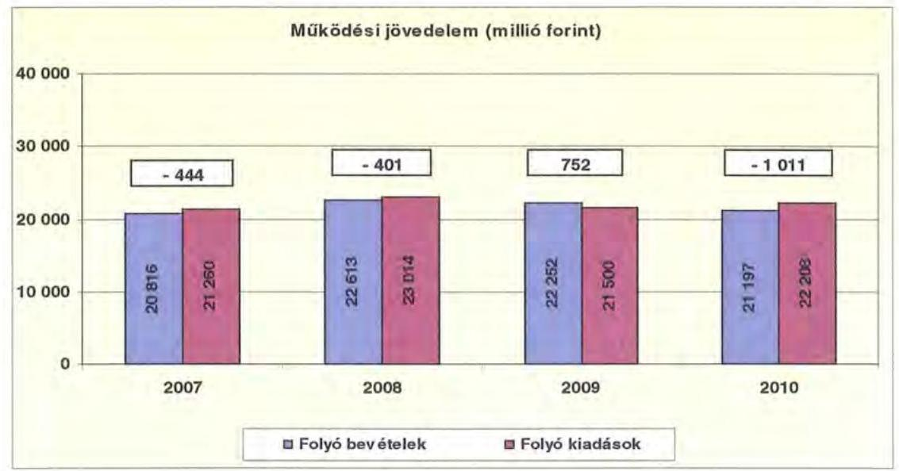

A folyó költségvetés hiánya (a múködési forráshiány) 2007-ben a folyó kiadások 2,1\%-át (444 millió Ft-ot), 2008-ban 1,7\%-át (401 millió Ft-ot), 2010ben $4,6 \%$-át ( 1011 millió Ft-ot) jelentette. A 2009. évben a múködési forrástöbblet a folyó kiadások 3,5\%-a, 752 millió Ft volt.

A múködési forráshiány finanszírozása munkabérhitelből, folyószámlahitelből, továbbá múködési céllal kibocsátott kötvényből történt. A folyószámlahitel napi átlagos állománya 2007-2010 között 1,2-szeresére nőtt. A 2008. évben az önkormányzat munkabérhitelének napi átlagos állománya 85 millió Ft volt, amely a 2010. évre 142 millió Ft-ra ( $67,1 \%$-kal) emelkedett.

Az Önkormányzat kötelezettségein ${ }^{24}$ belül a rövid lejáratú kötelezettségek állománya 2007. évben $21,4 \%$ volt, a 2010. évi 30,1\%-os aránnyal szemben. Az Önkormányzat 2007. december 31 -én fennálló pénz és tőkeplaci kötelezettsége 4830 millió Ft-ról közel 2,5-szeresére 11724 millió Ft-ra nőtt a hosszú lejáratú hitelfelvétel, a kötvénykibocsátás és a folyószámlahitel év végi fennmaradó állományának emelkedése miatt.

A rövid lejáratú kötelezettségek 2010-ben 4428 millió Ft-ot tettek ki, amely 3067 millió Ft-tal ( $225,5 \%$-kal) több a 2007. évi rövid lejáratú kötelezettségállománynál. A rövid lejáratú kötelezettségeknek a szállítói állomány 2007-ben (1124 millió Ft) 82,6\%-át, 2008-ban (1489 millió Ft) 62,7\%-át, 2009-ben (2330 millió Ft) $75,5 \%$-át, 2010-ben ( 2588 millió Ft) $58,4 \%$-át tette ki, miközben a szállítói kötelezettségek a vizsgált időszakban 2,3-szorosára -1124 millió Ft-ról 2588 millió Ft-ra - nőttek.

[^0]
[^0]:    ${ }^{24}$ passzív pénzügyi elszámolások nélküli

---

Az Önkormányzat pénzügyi kapacitása a vizsgált időszakban folyamatosan negatív értéket mutatott. A nettó múködési jövedelem ${ }^{25}$ értéke a folyó költségvetési pozíció mellett az adott költségvetési év adósságtörlesztésének hatását is tükrözi.

Az Önkormányzat nettó működési jövedelmének évenkénti alakulását az alábbi ábra szemlélteti:
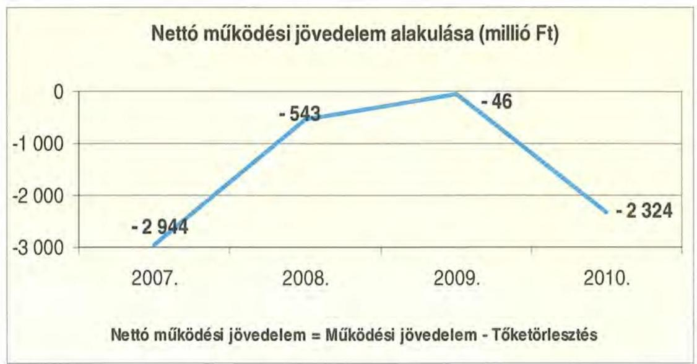

A folyó költségvetés egyenlegének és a tőketörlesztésre (hiteltörlesztés és forgatási és befektetési célú értékpapírok beváltása) fordított összegeknek évenkénti különbözete (a nettó múködési jövedelem) a 2007. évben kiugróan magas volt. Ennek oka, hogy már a folyó bevételek sem fedezték a folyó kiadásokat ( 444 millió Ft-os deficit), emellett még 2400 millió Ft tőketörlesztési kötelezettség is jelentkezett ( 900 millió Ft hiteltörlesztés, 1600 millió Ft értékpapír beváltás). A 2007. évet követően átmenetileg javult a pénzügyi helyzet, majd a 2010. évben a nettó múködési jövedelem negatív értéke ismét kiugróan magas értéket mutatott. A 2010. évi 2324 millió Ft negatív nettó múködési jövedelem oka, hogy a folyó költségvetés deficitje is nőtt (a 2007. évihez viszonyítva több mint duplájára, 1011 millió Ft-ra), ezen felül még 1312 millió Ft tőketörlesztés történt ( 652 millió Ft hiteltörlesztés, és ebben az évben ismét sor került értékpapír beváltására is 660 millió Ft értékben).

A 2007 - 2010. években az Önkormányzat felhalmozási költségvetés egyenlege ugyancsak negatív volt, melyet a következő ábra szemléltet:

[^0]
[^0]:    ${ }^{25}$ pénzügyi kapacitás

---

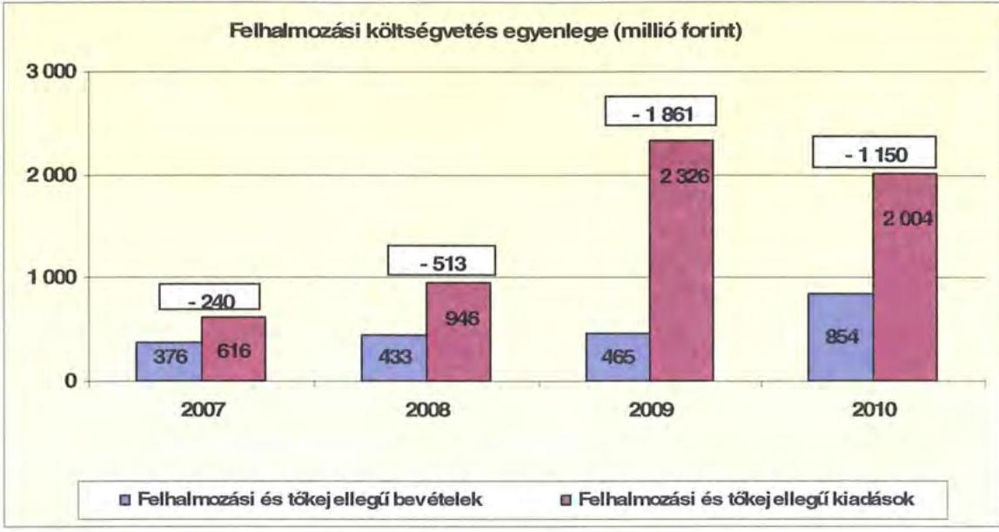

A felhalmozási forráshiánynak a felhalmozási és tőkejellegủ kiadásokhoz viszonyított aránya 2007-ben 39,0\% (240 millió Ft), 2008-ban 54,3\% (513 millió Ft) 2009-ben 80,0\% (1861 millió Ft) 2010-ben 57,4\% (1150 millió Ft) volt.

A felhalmozási forráshiányt hosszú lejáratú felhalmozási célú hitellel, illetve felhalmozási célú kötvénykibocsátással finanszírozták.

Az Önkormányzat évenkénti teljes finanszírozási hiánya ${ }^{26}$ a CLF módszer szerint 2007-ben 3184 millió Ft, 2008-ban 1056 millió Ft, 2009-ben 1907 millió Ft, 2010-ben 3474 millió Ft volt.

Az Önkormányzat finanszírozási műveletei 2007-2010. években egyenlegének alakulását a következő ábra szemlélteti:
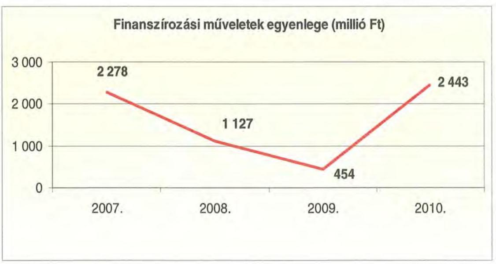

[^0]
[^0]:    ${ }^{26}$ a nettó múködési jövedelem és a beruházási költségvetés egyenlegeinek összege

---

A finanszírozási többlet azt jelzi, hogy az éves költségvetések végrehajtása során szükség volt a pénzkészlet felhasználásán túl külső finanszírozás igénybevételére is. A finanszírozási célú mũveleteket a vizsgált időszakban a jelentés 2/a. számú mellékletének 4.1-4.8 pontjai részletezik.

Az Önkormányzat zárszámadási rendeletében a múködési és fejlesztési hiányt a hagyományos költségvetési szerkezet alapján mutatta be ${ }^{27}$, amelyről a jelentés 1. számú melléklete nyújt tájékoztatást. Az Önkormányzat 2007-2010. években a finanszírozási műveletekkel együtt mutatta be a bevételek és kiadások alakulását, így a folyó költségvetés múködési és fejlesztési hiánya elkülönítve nem szerepelt a zárszámadási rendeletekben.

A vizsgált időszakban a kötelezettségek (passzív pénzügyi elszámolások nélkül) 6371 millió Ft-ról 14715 millió Ft-ra emelkedtek, amely együtt járt a kamatkiadások növekedésével.

A 2007-2010 között az Önkormányzat összesen 766 millió Ft kamatot fizetett meg. Az átmenetileg szabad pénzeszközein realizált kamatbevétel ( 510 millió Ft) a teljes kamatráfordítás 66,6\%-át tette ki.

Az Önkormányzat kamatbevételeit és kamatkiadásait és azok egyenlegét a következő ábra mutatja:
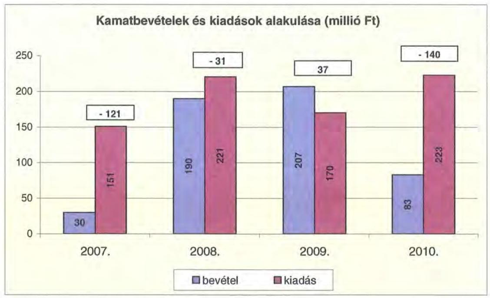

A 2007-2010 közötti időszakban az Önkormányzat kiadásainak és bevételeinek fơbb jogcímek szerinti alakulását a jelentés 2/b. számú melléklete tartalmazza.

[^0]
[^0]:    ${ }^{27}$ Nincs kötelező előírás a működési és fejlesztési hiány megállapításának módjára.

---

# 2.2. Az Önkormányzat bevételeinek alakulása 

Az Önkormányzat 2007-2010 között realizált, OEP támogatás nélküli főbb bevételi jogcímeinek számszaki adatait a következő táblázat részletezi és grafikon mutatja be:

| Megnevezés | 2007. év | 2008. év | 2009. év | 2010. év |
| :-- | :--: | :--: | :--: | :--: |
| Illetékbevétel | 1841111 | 2140516 | 1893466 | 1306867 |
| Szja és állami támogatás | 4360118 | 4867774 | 4173556 | 3308558 |
| Egyéb saját bevétel (OEP nélkül) | 3539976 | 3562724 | 4047772 | 4444492 |
| Összes müködési bevétel | 9741205 | 10571014 | 10114794 | 9059917 |

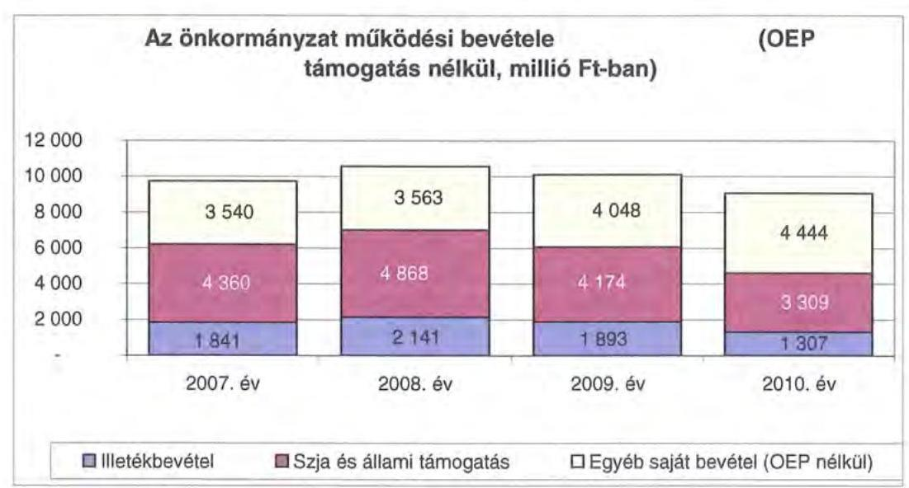

Az Önkormányzatnál az illetékbevétel a 2007. évben a 2006. évihez - 2443 millió Ft - képest jelentősen, 24,6\%-kal (602 millió Ft-tal) csökkent. A csökkenésben szerepet játszott az Illetékhivatalnak - 2007. január 1-jétől - az APEHhoz történő átszervezése is, miután az évente realizált illetékbevételekből (központi intézkedés következtében) évi $8,5 \%$ elvonásra került az adminisztrációs feladatokra. A Hivatal múködtetésével kapcsolatos kiadások megszűnése és az adminisztrációs feladatokra visszatartott 8,5\% között 2007-ben 291 millió Ft pozitív különbözet jelentkezett. Az illetékek APEH által történő beszedésével kapcsolatos költségek finanszírozására elvont pénzösszeg minden évben kevesebb volt, mint amekkora költségvetési kiadást jelentett volna, ha továbbra is az Önkormányzat múködteti az Illetékhivatalt. ${ }^{28}$

Az illetékbevétel a 2007. évről a 2010. évre 534 millió Ft-tal csökkent. Ezen belül változóan alakult, az előző évihez képest 2008-ban növekedett, (16,2\%-kal), majd egyre jobban csökkent, 2008-ról 2009-re 11,5\%-kal, 2009-ről 2010-re ennél jóval nagyobb mértékben, $31 \%$-kal ( 587 millió Ft-tal) mérséklődött. Az átengedett szja és az állami támogatások együttes összege (OEP támogatás nél-

[^0]
[^0]:    ${ }^{28}$ A 2006. évben az Illetékhivatal múködtetésére 462 millió Ft-ot fordítottak. Az éves illetékbevétel 8,5\%-a 2007-ben 171 millió Ft, 2008-ban 199 millió Ft, 2009-ben 176 millió Ft, 2010-ben 121 millió Ft volt.

---

kül) 2007-2010. évek között a központi forráskivonás hatására ${ }^{29}$ folyamatosan és jelentős mértékben (összesen 1051 millió Ft-tal) csökkent. A 2008. évi 11,6\%os ( 508 millió Ft-os) növekedést követően az előző évihez képest 2009-ben 14,3\%-kal (694 millió Ft-tal), 2010-ben további 20,8\%-kal (865 millió Ft) kapott kevesebb forrást az Önkormányzat az államtól ezeken a jogcímeken.

Az Önkormányzat a Kórház múködéséhez 2007-2010 között az évek sorrendjében 11441 millió Ft, 12340 millió Ft, 11631 millió Ft és 12976 millió Ft OEP támogatásban részesült.

Az intézményi múködési bevételek emelkedését 2007-ről 2008-ra a szociális ellátások térítési díjának önköltségalapú növelése eredményezte (az ebből származó bevételi növekmény 300 millió Ft volt). A megemelkedett díjakat azonban az ellátottak egyre nagyobb arányban nem képesek megfizetni, emiatt a bevételek - 2009-ben és az azt követő évben - a tervezettnél kisebb mértékben nőttek. A keletkező díjhátralékok miatt megnövekedett követelések állománya kedvezőtlenül hatott az Önkormányzat fizetőképességének alakulására.

A követelések nagysága önkormányzati szinten 2010. év végére a 2007. évi bázishoz képest 2,3-szorosára ( 213 millió Ft-tal) nőtt ${ }^{30}$. A követelések összege emelkedő tendenciát mutat, a legdinamikusabb növekedés 2008-ról-2009-re következett be (az előző évi 1,6-szeresére, 103 millió Ft-tal nőtt a követelésállomány), majd 2009 és 2010. évek között kissé mérsékeltebb ütemű ( $37 \%$-os) emelkedés jelentkezett.

Az Önkormányzat felhalmozási bevételei a vizsgált időszakban a következők voltak:
ezer Ft

| Megnevezés | 2007. év | 2008. év | 2009. év | 2010. év |
| :--: | :--: | :--: | :--: | :--: |
| Tárgyi eszköz értékesítés | 74195 | 129681 | 27613 | 9704 |
| Állami támogatás | 100789 | 24320 | 913486 | - |
| Átvett pénzeszköz | 92395 | 83543 | 42469 | 70067 |
| Egyéb felhalmozási bevétel | 218444 | 405780 | 572403 | 776634 |
| Felhalmozási tartalék | 452398 | 50987 | 817651 | 1182508 |
| Összes felhalmozási bevétel | 938221 | 694311 | 2373622 | 2038913 |

Az Önkormányzatnak tárgyi eszköz értékesítéséből a vizsgált időszak utolsó két évében nem származott számottevő bevétele ${ }^{31}$. Állami támogatást 2006. évben

[^0]
[^0]:    ${ }^{29}$ a 2007. évi bázishoz képest
    ${ }^{30}$ A követelések összege 2007. december 31-én 168 millió Ft volt, amely 2010. december 31-ére 381 millió Ft-ra nőtt.
    ${ }^{31}$ Az Önkormányzat 2007-ben az APEH-nak használatba, illetve bérbe adta a tulajdonában lévő Illetékhivatali ingatlanokat, az ingóvagyont pedig értékesítette. Egyéb használaton kívüli eszközök is értékesítésre kerültek. A 2008. évben három ingatlan értékesítéséből keletkezett felhalmozási bevétel.

---

a Levéltár épületének címzett támogatással megkezdett rekonstrukciójához és bővítéséhez kaptak. Az intézmények egyéb felhalmozási bevételei közel 80\%ban a Kórház fejlesztéseihez kapcsolódtak (tömbösítés, sürgősségi ellátás, az enyingi és sárbogárdi rendelő átalakítása és a haemodinamikai központ kialakítása). Az évenkénti nagy összegű felhalmozási tartalékot az EU-s projektek finanszírozására - betétként - lekötötték.

# 2.3. Az Önkormányzat kiadásainak alakulása 

Az Önkormányzat müködési kiadásai főbb jogcímek szerinti bontásban az alábbiak voltak:
ezer Ft-ban

| Megnevezés | 2007. év | 2008. év | 2009. év | 2010. év |
| :--: | :--: | :--: | :--: | :--: |
| Müködési kiadások | 21151873 | 22883817 | 21424487 | 21989214 |
| Müködési kiadások (kamatkiadás nélkül) | 21107577 | 22802721 | 21326231 | 21930016 |
| Kamatkiadás | 44296 | 81096 | 98256 | 59198 |
| Személyi juttatások | 9339210 | 9708653 | 9197793 | 9095055 |
| Munkaadót terhelő járulékok | 2937328 | 3057040 | 2771990 | 2366463 |
| Dologi kiadások | 8241458 | 9265954 | 8653268 | 9800263 |
| Egyéb folyó kiadások | 136121 | 115276 | 91385 | 175963 |
| Támogatások, elvonások, egyéb folyó átutalások | 271855 | 332097 | 367860 | 366779 |
| ebböl: müködési célú pénzeszközátadás | 163509 | 234789 | 262225 | 193271 |
| Előző évi pénzmaradvány átadás, viszafizetés, müködési célú | 108482 | 248393 | 211348 | 106606 |

Az Önkormányzat müködési kiadásai 2007-ről 2010-re mindössze 4\%-kal nőttek ( 21152 millió Ft-ról 21989 millió Ft-ra).

Az Önkormányzat 2010-ben a müködési költségvetés 52,1\%-át (11 462 millió Ft) személyi juttatásokra és a munkaadókat terhelő járulékokra fordította, az üzemeltetést, intézményfenntartást biztosító dologi kiadásokra 44,5\% jutott ( 9800 millió Ft). A müködési kiadásokon belül a személyi juttatások és járulékok aránya a vizsgált időszakban - a 2008. év kivételével - folyamatosan csökkent, 2007-ben 58\%, 2010-ben 52,1\% volt.

A személyi juttatások 2007-ről 2010-re 2,6\%-kal (244 millió Ft-tal) csökkentek, ezen belül 2008-ban 4\%-kal ( 369 millió Ft-tal) nőttek az előző évhez képest, azt követően minden évben csökkentek a létszámcsökkentések miatt. A Kórházon kívüli intézményekben 2007-ről 2010-re 13\%-kal (572 millió Ft-tal) csökkentek a személyi juttatások, amelynek az önkormányzati szintű mutatónál magasabb alakulása azt tükrözi, hogy az egészségügyi ágazatban a kifizetett személyi juttatások növekedtek.

A 2007-ről 2010-re a munkaadókat terhelő járulékok jelentős (19,4\%-os) csökkenése következett be, amely egyrészt a kifizetett személyi juttatások összegének, másrészt a törvényi változásokból adódóan a járulékok \%-os mértékének csökkenésével volt összefüggésben. A járulékok csökkenése miatt a kormányzat az önkormányzati alrendszernek nyújtott állami támogatásokat is csökkentette

---

(kiemelten a feladatmutatókhoz kötött normatívákat), így a járulékcsökkenés az Önkormányzat pénzügyi pozíciójában érdemi változást nem eredményezett.

Az Önkormányzat dologi kiadásainak alakulása 2007-2010 között változó képet mutat. Önkormányzati szinten a 2010. évben teljesített dologi kiadások ( 9800 millió Ft volt) 18,9\%-kal haladták meg a 2007. évit. Az egyes évek között az adatok ugyanakkor ellentétes előjelű változásokat tükröznek. A 2008. évben a dologi kiadások 12,4\%-kal (1024 millió Ft-tal), az inflációt meghaladó mértékben ${ }^{32}$ emelkedtek, ezt követően viszont a 2009. évre 6,6\%-kal ( 613 millió Fttal) alatta maradtak az előző évinek ${ }^{33}$. A 2010. évben - az előző évhez képest ugyancsak a dologi kiadások 13,3\%-os (1147 millió Ft-os) emelkedése következett be. A növekedés üteme szintén az inflációt meghaladó (4,9\%) volt.

Az inflációt meghaladóan növekedő dologi kiadások fedezetét az Önkormányzatnak a végrehajtott kiadáscsökkentő intézkedések mellett működési célú kötvénykibocsátásból származó bevételből és rövid lejáratú hitelekből biztosították.

A dologi kiadások annak ellenére emelkedtek, hogy 2008-ban a sport feladatokat ellátó költségvetési szerv kiszervezésre került, és annak dologi kiadásai már nem jelentkeztek az Önkormányzatnál. A költségvetési szervnek a kiszervezését megelőző évben 172 millió Ft volt a költségvetési kiadása, amelyből 81 millió Ft volt a dologi kiadás. Az intézmény ugyanakkor 86 millió Ft múködési bevételt realizált. 2009-ben a létrejött VVSI Nonprofit Kft önkormányzati támogatása 83 millió Ft, 2010-ben 70 millió Ft volt.

Az ellátás szervezeti kereteiben történt változás hatására ${ }^{34}$ a múködési célú pénzeszközátadások nagysága 2007-ről 2008-ra 43,6\%-kal ${ }^{35}$ nőtt, amely 2009ben az előző évhez képest további 11,7\%-kal (262 millió Ft-ra) emelkedett. A 2010. évben a bevételek jelentős csökkenése miatt a múködési célra átadott pénzeszközöket 26,3\%-kal - 193 millió Ft-ra - csökkentette a Közgyűlés.

Az önkormányzati kiadásokban nőtt a kórházi kiadások súlya az egyéb fenntartott intézményekben felmerülő kiadásokhoz képest. 2007-ben a múködési kiadások 60,1\%-a a Kórháznál merült fel, ez az arány évről-évre nőtt, 2010-ben 63,9\%-os volt. A Kórház nélküli teljesített múködési kiadások ( 8445 millió Ft) 2007-ben az összes múködési kiadás 39,9\%-át tették ki, ez az arány 2010 végére 36,5\%-ra csökkent ( 8022 millió Ft-ra).

[^0]
[^0]:    ${ }^{32}$ KSH fogyasztói árindex 6,1\%
    ${ }^{33}$ 2009-ben az infláció $4,2 \%$ volt.
    ${ }^{34}$ A 2008. május 1-jétől múködő VVSI Nonprofit Kft-nek az Önkormányzat múködési célú pénzeszközátadást biztosít feladatai ellátásához.
    ${ }^{35} 164$ millió Ft-ról 235 millió Ft-ra

---

Az Önkormányzat Kórház nélküli működési kiadásai a vizsgált időszakban a következőképpen alakultak:

| Megnevezés | 2007. év | 2008. év | 2009. év | 2010. év |
| :--: | :--: | :--: | :--: | :--: |
| Múködési kiadások | 8445075 | 8912782 | 8095104 | 8021870 |
| Múködési kiadások (kamatkiadás nélkül) | 8401628 | 8832357 | 7997368 | 7962672 |
| Kamatkiadás | 43447 | 80425 | 97736 | 59198 |
| Személyi juttatások | 4390241 | 4377881 | 3934437 | 3818323 |
| Munkaadót terhelő járulékok | 1318983 | 1312468 | 1120313 | 944514 |
| Dologi kiadások | 2206903 | 2495666 | 2407684 | 2700468 |
| Egyéb folyó kiadások | 53984 | 53490 | 45201 | 79501 |
| Támogatások, elvonások, egyéb folyó átutalások | 260169 | 319048 | 359574 | 313260 |
| ebből: múködési célú pénzeszkózáladás | 163509 | 234789 | 262225 | 193271 |
| Előző évi pénzmaradvány átadás, viszalizetés, múködési célú | 101101 | 238042 | 129639 | 106606 |

Míg 2007-2010-ben a Kórházzal együtt a működési kiadások növekedése volt megfigyelhető ${ }^{36}$, addig a Kórház nélkül ugyanebben az időszakban 5\%-os csökkenés ( 423 millió Ft) jelentkezett. A Kórház nélküli működési kiadások 59,4\%-át teszik ki a személyi juttatások és járulékaik ( 4763 millió Ft), a dologi kiadások aránya pedig alig haladja meg a múködési kiadások egyharmadát (2701 millió Ft). Ezeknél az intézményeknél a dologi kiadások látszólag erőteljesebb emelkedést mutatnak ${ }^{37}$, amely azonban volumenében 494 millió Ft növekedést jelentett három év alatt.

Az Önkormányzat költségvetési kiadásainak több mint felét realizáló Kórház adatai nélkül a dologi kiadások 2008-ban 13,1\%-kal, 289 millió Ft-tal meghaladták az előző évit, 2009-ben nem érték el azt, 3,5\%-kal csökkentek ( 88 millió Ft-tal), majd 2010-ben ismét emelkedtek 12,2\%-kal (293 millió Ft-tal).

A Kórháznál ugyanez a tendencia mutatkozott, de a változás mértéke sokkal nagyobb. A dologi kiadás a Kórháznál 2008-ban 12,2\%-kal haladta meg az előző évit, ennek mértéke 736 millió Ft volt. A 2009. évben a többi intézménynél erőteljesebben, 7,8\%-kal csökkent ( 524 millió Ft-tal), majd 2010-ben ismét 13,7\%-os növekedés volt, amely nominálisan 854 millió Ft-ot jelentett. A jelentkező dologi kiadásnövekedések azonban nem a valós üzemeltetési költségnövekedést tükrözik, mivel az intézmény múködési forráshiánya miatt nem tudta kifizetni a tárgyévben jelentkező dologi kiadásainak egy részét. Mindezt igazolja, hogy a szállítói állománya 1082 millió Ft-ról több mint duplájára 2209 millió Ft-ra emelkedett.

Az Önkormányzat 2007-2010 között a Kórház feladatellátásához összesen 1826 millió Ft támogatást biztosított. A múködési kiadásaihoz ${ }^{38}$ 949 millió Ft-tal járult hozzá, amelyet központosított állami támogatásokból fedezett. A kórházi múködési támogatások a központi bérpolitikai intézkedésekhez, a létszámcsökkentésekhez kapcsolódó többletköltség fedezetéhez, a 13. havi juttatások kifizetéséhez, kereset kiegészítésekhez kapcsolódtak. Ezeknek a

[^0]
[^0]:    ${ }^{36}$ a 2007. december 31-i bázishoz képest
    ${ }^{37}$ A 2007. évi bázishoz képest 22,4\%-os növekedés jelentkezett.
    ${ }^{38}$ intézményi finanszírozás formájában

---

kiadásoknak a fedezete így nem OEP támogatás, hanem egyéb, az Önkormányzat által igénybe vett központi forrás volt. Egyéb egészségügyi szakmai célokra és rendezvényekre a négy év alatt mindössze 5 millió Ft-ot adott a Kórháznak az Önkormányzat.

A kórházak müködésének finanszírozására az OEP támogatás szolgál, míg a fejlesztési kiadások fedezetét az önkormányzatoknak kell biztosítani intézményeik számára.

A müködési célú önkormányzati támogatáson felül 2007-2010 között 877 millió Ft-ot adott a Közgyűlés a Kórháznak fejlesztési célra, amely a felhalmozási kiadások $61,4 \%$-át fedezte ${ }^{39}$. A támogatások évenkénti alakulását a következő grafikon mutatja be:
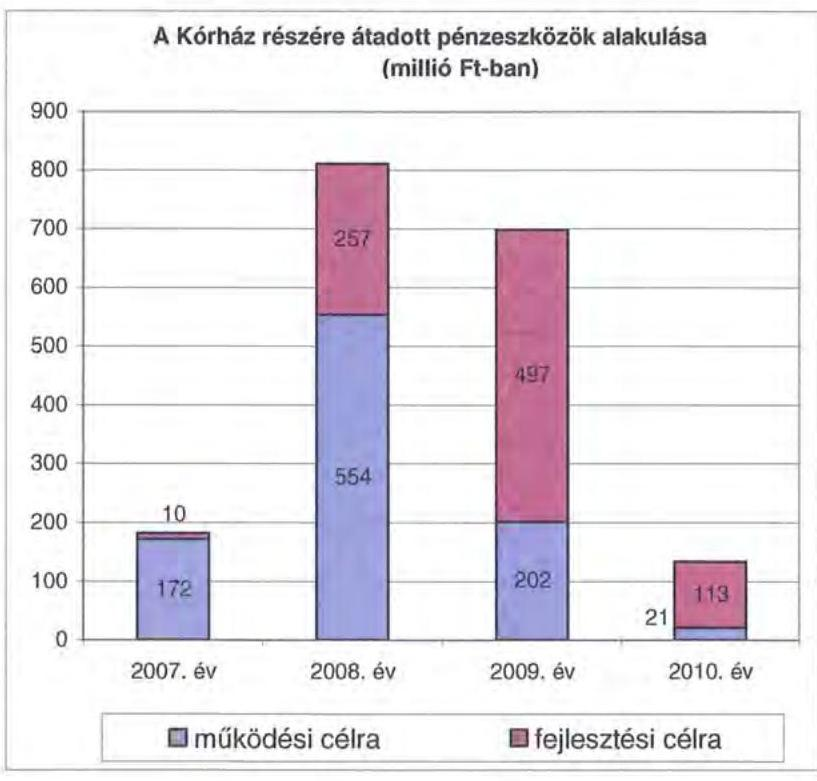

A Kórház EU-s forrásokat a 2010. december 31-ig megvalósított fejlesztéseihez nem kapott, mivel a kórházi projektek utófinanszírozással valósulnak meg és jellemzően 2009-2011-ben kezdődtek. Az egészségügyi szakellátást biztosító intézmény 2011. március 31-ig 152 millió Ft fejlesztési kiadást teljesített, amelyhez 83 millió Ft EU-s támogatásban részesült. Ez a felmerült fejlesztési kiadások $54,6 \%$-át fedezte.

A müködési és felhalmozási kiadások arányának változásában 2007-2010 között elmozdulás figyelhető meg, a felhalmozási kiadások aránya 3,3\%-ról több mint $9 \%$-ra nőtt. A kiadások megoszlásának alakulását (a müködési és fejlesztési célú kamatkiadásokat is figyelembe véve) a következő grafikon szemlélteti:

[^0]
[^0]:    ${ }^{39}$ A Kórház fejlesztési kiadásokra 2007-2010 között 1429 millió Ft-ot fordított.

---

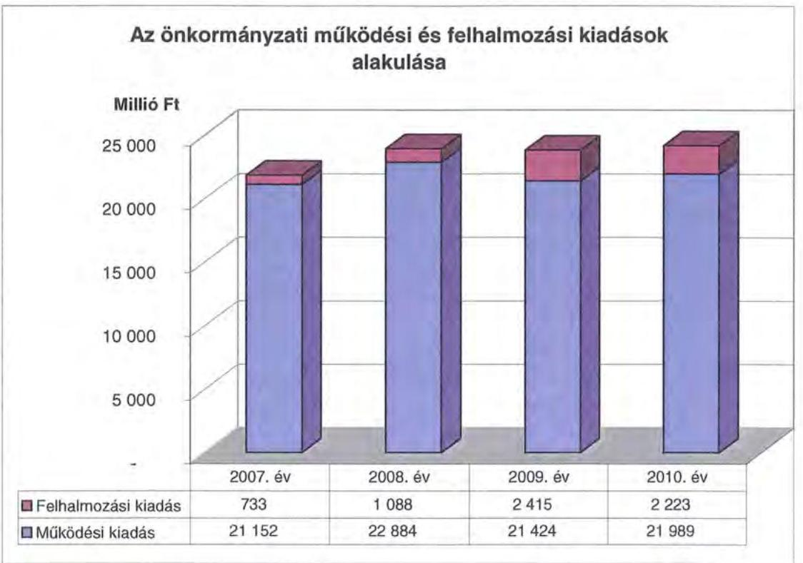

A 2007-2010 évek között a 10 millió Ft teljes bekerülési költség feletti beruházások és felújítások száma 51 volt, amelyek közel harmadához (16 fejlesztéshez) EU-s forrásokat is igénybe vettek. Az Önkormányzatnál 2010-ben 38 EU-s projekt megvalósítása volt folyamatban.

Az Önkormányzat a 2007-2010. években együttesen 6307 millió Ft-ot fordított fejlesztéseinek finanszírozására, ennek 17,4\%-a (1101 millió Ft) a 10 millió Ft egyedi beszerzési érték alatti fejlesztésekhez kapcsolódott. A kisebb értékű beruházásokhoz is próbáltak minél több külső forrást pályázati úton megszerezni, azonban ebben a körben az EU-s és hazai források számszerúsítése a vizsgálat ideje alatt nem történt meg, így összegük nem ismert.

Ezen időszakban a három legmagasabb bekerülési költségú beruházás a következő volt:

- a Levéltár kiváltására (címzett támogatással megvalósuló fejlesztés bekerülési költsége 2534 millió Ft) 2007-2010. években 1816 millió Ft-ot fordítottak, további fennálló kötelezettség 640 millió Ft, melyet kötvényből terveznek finanszírozni ${ }^{40}$;
- az EU-s támogatással megvalósuló „Királyi séta Nemzeti Emlékhely kialakítása" projekt bekerülési költsége 1143 millió Ft, a megvalósítással kapcsolatban 2010 végéig 204 millió Ft-került kifizetésre. A fennmaradó összeg ( 939 millió Ft) 82,4\%-át támogatásból finanszírozzák, a további költségeket saját és kötvény bevételből fedezik. Az Önkormányzat konzorciumi együtt-

[^0]
[^0]:    ${ }^{40}$ A beruházás 2005-ben kezdődött, a 2006. december 31-ig teljesített kiadás 78 millió Ft volt.

---

múködési megállapodást kötött Székesfehérvár Megyei Jogú Város Önkormányzatával a projekt megvalósítására. A 2008. március 29 -én kelt megállapodás értelmében a projektvezető Székesfehérvár MJV Önkormányzata, konzorciumi tag az Önkormányzat intézményeként múködő Szent István Király Múzeum volt. A konzorciumi együttmúködési megállapodást 2009. októberében módosították, melynek értelmében a projekt konzorciumi vezetője az Önkormányzat intézménye, tagja pedig Székesfehérvár MJV Önkormányzata lett. Az együttmúködési megállapodás a projekt összköltségét is módosította, mivel az NFÜ ROP Irányító Hatóságának döntése alapján a támogatás összege csökkent. A módosításról a projektet megvalósító önkormányzatok közös testületi ülésen határoztak ${ }^{41}$. A projekt módosított tervezett bekerülési költsége összesen 2176 millió Ft, melynek 44,2\%-a ( 962 millió Ft) az Önkormányzatnál merül fel. Az Önkormányzatra jutó beruházási költség finanszírozásához az elnyert támogatáson felül 154 millió Ft önerő szükséges. A projekt leállításáról 2011. május 5 -én döntött Székesfehérvár MJV Közgyűlése, az Önkormányzat a projekt leállításáról a 2011. május 31-i ülésén hozott határozatot ${ }^{42}$. A döntést megalapozó testületi előterjesztés szerint a projekt leállításával kapcsolatban az Önkormányzatnak várhatóan 45 millió Ft visszafizetési kötelezettsége keletkezik;

- a Kórház által elnyert TIOP 2.2.4.-09/1-2010-0002 Struktúraváltoztatást támogató infrastruktúrafejlesztés a fekvőbeteg szakellátásban projekt tervezett bekerülési költsége 8333 millió Ft, ebből 2010. december 31-ig 109 millió Ftot fizettek ki. A beruházáshoz elnyert EU-s támogatás 7500 millió Ft, a fennmaradó összeg forrása saját bevétel. A támogatást a Kórház már korábban elnyerte, de az új menedzsment a korábbi terveket felülvizsgáltatta, és módosított szakmai tartalommal valósítja meg a beruházást.

Az Önkormányzat fejlesztési tevékenysége a pályázati kiírások által nagyban befolyásolt, mert a jelentkező működési forráshiány és saját felhalmozási bevételei alacsony szintje miatt beruházásokat csak külső források, EU-s és hazai támogatások elnyerése esetén tud megvalósítani.

Az aktív pályázati tevékenység eredményeként az Önkormányzat 2007-2010 között összesen 19191 millió Ft bekerülési költségű beruházást folytatott, illetve indított el ${ }^{43}$, ezek teljes egészében a kötelező feladatellátás érdekében történtek. A 2010 utánra vállalt kötelezettség 12690 millió Ft. A Kórházat érintő 2010. utáni felhalmozási kötelezettségvállalás 10049 millió Ft, az önkormányzati kötelezettség 79,2\%-a. A felhalmozási kiadások önrészének forrásait fejlesztési hi-

[^0]
[^0]:    ${ }^{41}$ A Közgyűlés a 290/2009. (X. 7.) számú, valamint Székesfehérvár MJV Önkormányzat Közgyűlése a 699/2009. (X. 7.) számú határozatával.
    ${ }^{42}$ A Közgyűlés 179/2011. (V. 31.) számú határozatában, támogatási szerződés és a konzorciumi megállapodás közös megegyezéssel történő megszüntetésének határideje 2011. június 3 -a volt.
    ${ }^{43}$ A 2010. december 31-én még folyamatban levő beruházások várható bekerülési költsége 17205 millió Ft. A 2010 utánra vállalt kötelezettség 12690 millió Ft, melynek forrásai - az Önkormányzat adatszolgáltatása szerint - 1402 millió Ft tervezett saját bevétel, 930 millió Ft kötvénybevételből származó pénzmaradvány, 10137 millió Ft elnyert EU-s támogatás, 221 millió Ft elnyert hazai támogatás.

---

telekből és felhalmozási célú kötvénykibocsátásból finanszírozták. A 2010 évet követő fejlesztések megvalósítása során finanszírozási nehézséget okozhat az EU-s források előfinanszírozása, ezen beruházások esetében az esetlegesen nem előírt feltételek szerinti teljesítés és a saját bevételek bizonytalansága.

# 3. KÖTELEZETTSÉGEK BEMUTATÁSA 

### 3.1. A pénzintézetek felé fennálló kötelezettségek alakulása

Az Önkormányzat pénzintézeti kötelezettségeinek állománya 2006. december 31-től 2010. december 31-ig közel 4,7 szeresére nőtt, 2500 millió Ftról 11724 millió Ft-ra. A fennálló pénzintézeti kötelezettségei kötvények kibocsátásából, hosszú lejáratú hitel igénybevételéből, valamint folyószámla és munkabér megelőlegezési hitelek igénybevételéből keletkeztek ${ }^{44}$.
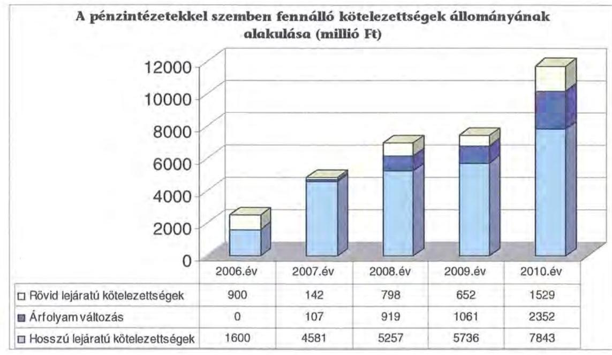

Az Önkormányzat pénzintézeti kötelezettségvállalásaira minden esetben közgyűlési döntés alapján került sor. A kötelezettségvállalásból származó források felhasználási céljait meghatározták. A Közgyűlés döntéseit megalapozó előterjesztések nem tartalmazták ugyanakkor a kötelezettségvállalás viszszafizetési forrásainak, a teljes futamidő várható kamat- és tőkefizetési kötelezettségeinek, az árfolyam- és kamatkockázatoknak a bemutatását. Az előterjesztésekben nem tértek ki az adósságszolgálati korlát bemutatására sem, ezért a Közgyűlés ennek figyelembevétele nélkül döntött.

Az Önkormányzat adósságot keletkeztető kötelezettségvállalásának felső határát ${ }^{45}$ a 2007. évben 547 millió Ft-tal, a 2010. évben 76 millió Ft-tal túllépték, amit a folyószámlahitel igénybevétele és a kötvény előtörlesztése okozott. Tény-

[^0]
[^0]:    ${ }^{44}$ A pénzintézeti szolgáltatások igénybevétele versenyeztetés keretében történt.
    ${ }^{45}$ az Ötv. 88. § (2) bekezdése alapján

---

leges kötelezettség növekedés azonban nem történt, mivel az Önkormányzat új kötvény kibocsátásával kiváltotta a korábbi hitel és kötvénytartozását.

Az adósságot keletkeztető kötelezettségvállalással megvalósított felhalmozási kiadások esetleges bevételnövelő, illetve kiadáscsökkentő vonzatát, illetve ennek a fejlesztéshez, felújításhoz vállalt kötelezettségek visszafizetési forrásként való számbavételét nem vizsgálták. Az adósságot keletkeztető kötelezettségvállalások teljesítésének (a kötvény részbeni vagy teljes visszavásárlása) az Önkormányzat csak újabb kötvények kibocsátásával tudott eleget tenni.

Az Önkormányzat 2010. december 31-én CHF-ben fennálló adósságot keletkeztető kötelezettségvállalásai az alábbiak voltak:

| Megnevezés | Kibocsátás, illetve szerzödéshötés idöpontja | Összeg CHF | Kibocsátási, vagy lehi vási árfolyam | Kamat (referencia kamat+ kamatfelár) | Felhasználás célja |
| :--: | :--: | :--: | :--: | :--: | :--: |
| Fejér Megye 2020/A Kötvény | 2007.05.10 | 10740000 | 155,48 | 3 havi CHF LIBOR+0,65\% | Korabbi kötvények elöörlesztése |
| Fejér Megye 2012 Kötvény | 2007.07.18 | 6738000 | 150,76 | 3 havi CHF LIBOR+0,59\% | Folyószámlahitel kiváltása |
| Fejér Megye 2020/B Kötvény | 2007.12.14 | 10128000 | 164,85 | 3 havi CHF LIBOR+0,8\% | Belokítása, fejlesztési tartalékképzés |
| Hosszú lejáratú hitel | 2007.10.08 | 6957099 | 163,23 | 6 havi CHF LIBOR | Fejlesztési feladatok finanszírozása |
| Öszzmen |  | 37553099 |  |  |  |

Az Önkormányzat a „Fejér Megye 2020/A" kötvény ellenértékét a korábban kibocsátott két kötvényéből - „Fejér Megye 2014/A" és „Fejér Megye 2018" kötvények" - származó kötelezettségének visszafizetésére fordította. A Fejér Megye 2012 kötvény ellenértékéből a fennálló folyószámlahitel kiváltása történt meg. A Fejér Megye 2020/B kötvény ellenértékének 69,9\%-át, 1388 millió Ft-ot fejlesztésre és pályázati önrész biztosítására, 29,5\%-át ( 585 millió Ft) müködési célokra használta fel az Önkormányzat, 0,6\%-át (12 millió Ft) fejlesztési célokra tartalékolták. A hosszúlejáratú hitelét az Önkormányzat különféle fejlesztési feladatok finanszírozására használta fel.

Az Önkormányzat 2010. december 31-én forintban fennálló adósságot keletkeztető kötelezettségvállalásai a következők voltak:
ezer Ft-ban

| Megnevezés | Kibocsátás idöpontja | Összeg   HUF | Kamat   (referencia   kamat+   kamatfelár) | Felhasználás célja: |
| :--: | :--: | :--: | :--: | :--: |
| Fejér Megye 2030 Kötvény | 2010.07.06 | 2660000 | 3 havi BUBOR+3,3\%   vagy 3 havi   EURIBOR+3,3\% | Fejlesztés, szerkezetátalakítás, korábbi kötvény részleges elöörlesztése |

---

A „Fejér Megye 2030" kötvény kibocsátásából származó bevétel 24,8\%-át (660 millió Ft) a Fejér Megye 2020/B kötvény részleges előtörlesztésére, 7,5\%-át, 200 millió Ft -ot szerkezetátalakítási célra, $1,9 \%$-át beruházási célra, $1,5 \%$-át jegyzési garanciavállalási díj megfizetésére használták fel. A kötvényből az Önkormányzat 1710 millió Ft-ot még nem használt fel.

Az Önkormányzat 2007-2010 között devizában fennálló pénzintézeti kötelezettségeire 2990000 CHF ( 660 millió Ft) tőkét törlesztett és 2349165 CHF (414 millió Ft) kamatot, valamint 69078 CHF ( 14 millió Ft) egyéb költséget ${ }^{46}$ fizetett. A HUF-ban fennálló kötelezettségek után 125 millió Ft kamatot és egyéb költség ${ }^{47}$ címén 67 millió Ft-ot fizetett.

Az Önkormányzat a „Fejér Megye 2020/B" kötvényéből 660 millió Ft-nak megfelelő CHF működési célú felhasználását kérte a pénzintézettől visszapótlási kötelezettséggel, átmeneti finanszírozási problémáinak kezelésére. Az Önkormányzat a visszapótlási kötelezettségnek nem tudott eleget tenni, ezért a kibocsátó feltételeinek megfelelően a Fejér Megye 2030 kötvényből törlesztett 660 millió Ft-ot. A törlesztés az Önkormányzatnak 208 millió Ft árfolyamveszteséget okozott.

Az árfolyamváltozás hatása is befolyásolja a kötelezettségek alakulását, azonban annak mértéke előre pontosan nem határozható meg, csak várakozásokon alapuló tendenciák jelezhetők. A számviteli szabályok előírják, hogy az árfolyam különbözetet év végén a kötelezettségek vagy követelések között a könyvviteli mérlegben nyilván kell tartani, azonban az árfolyam különbözet valójában nem realizált. Annak megítéléséről, hogy a devizában kibocsátott kötvényekért és felvett hitelekért kapott forinthoz képest a kötvények visszavásárlásakor, illetve a hitelek visszafizetésekor jelentkező forint kötelezettség többletkiadást (árfolyamveszteség) vagy megtakarítást (árfolyamnyereség) eredményez a futamidő végén, a teljes kötelezettség rendezését követően lehet képet alkotni. Mindaddig, amíg törlesztési kötelezettség nem áll fenn (türelmi idő, moratórium), a tőkére vonatkoztatva nem értelmezhető sem az árfolyamveszteség, sem az árfolyamnyereség.

A Közgyűlés a 198/2010. (V. 27.) számú határozatával 2010. november 1-jétől új pénzintézetet bízott meg a számlavezetéssel ${ }^{48}$. Az Önkormányzat a Fejér Megye 2020/B kötvényében vállalta, hogy „más pénzügyi intézménytől csak a Kötvénytulajdonos előzetes írásbeli engedélye mellett vesz fel kölcsönt vagy hitelt, vagy köt más pénzügyi intézménnyel egyéb kölcsön, illetve hitelfelvétellel azonos rendeltetésü szerződést". A számlavezetés változásával egyidejüleg az Önkormányzat kötvényeinek és hosszú lejáratú hitelének kamatfelárát a korábbi számlavezető pénzintézet megemelte, mivel az Önkormányzat a kibocsá-

[^0]
[^0]:    ${ }^{46}$ A kötvények esetében kibocsátási, szervezési díj címén fizetett egyéb díjat az Önkormányzat. A hosszú lejáratú hitel után kamatfelárat nem állapított meg a pénzintézet, azonban évi $0,5 \%$-ot kezelési költség címén számolt el.
    ${ }^{47}$ Jegyzési garanciavállalási díj címén 40 millió Ft-ot, évente a tartozásállomány 60\%ának 1,1 szerese után $1,25 \%$-ot készfizető kezességvállalási díjként, továbbá egyéb díjként évi $1 \%$-ot a kamatszámítás alapjára és a korrigált tőkeegyenlegre vetítve, a biztosítás monitoringjának díjaként a teljes kimenő számlaforgalom után $0,1 \%$-ot.
    ${ }^{48}$ Az Önkormányzat kötvénykibocsátásai során a kibocsátó pénzintézet minden esetben a számlavezető bankja volt.

---

táskor vállalt kötelezettségének nem tett eleget. A Fejér Megye 2020/B kötvény kamatát 1,6 százalékponttal, a Fejér Megye 2020/A kötvény kamatát 1,75 százalékponttal, a Fejér Megye 2012 kötvény kamatát 1,81 százalékponttal, a hosszú lejáratú hitelét pedig 1,9 százalékponttal emelte meg.

A kamatfelár emelkedés 2010. december 31-ig az Önkormányzatnak 280772 CHF ( 60 millió Ft) többlet kamatkiadást okozott. A kötelezettségek lejáratáig - az ismert tényezőkkel számolva - további 2702393 CHF többlet kiadás jelentkezik a kamatfelár emelkedése miatt.

Az Önkormányzat 2007-2010. december 31. között az átmenetileg szabad pénzeszközein 510 millió Ft kamatbevételt realizált, melyből 405 millió Ft származott a kötvényekből származó bevételek befektetéséből és 105 millió Ft az intézmények és a Hivatal elkülönített bankszámláin rendelkezésre állt forrás befektetéséből ${ }^{49}$.

A kötvények bevételei ${ }^{50}$ befektetéséből származó kamatbevételből az Önkormányzat 204 millió Ft-ot a kötvények kamatfizetésére és 201 millió Ft-ot múködés célra fordított. A kötvények fel nem használt részének lekötéséből származó kamatbevételek közel kétszeresét (198,5\%-át) tették ki a kötvénykibocsátás miatt megfizetett kamatoknak.

Az Önkormányzat likviditását a vizsgált időszakban csak folyószámlahitel és munkabér megelólegezési hitel igénybevételével tudta biztosítani, melyek alakulását az alábbi táblázat mutatja be:

|  |  |  |  |  | ezer Ft-ban |  |
| :--: | :--: | :--: | :--: | :--: | :--: | :--: |
| Megnevezés | 2007. év | 2008. év | 2009. év | 2010. év | 2011.   március 31. |  |
| I. Folyószámlahitel |  |  |  |  |  |  |
| a folyószámlahitel keretésszege január 1-fén | 1500000 | 700000 | 700000 | 700000 | 1600000 |  |
| teljesített kamat és egyéb költséig | 43340 | 35195 | 58040 | 74108 | 22480 |  |
| II. Munkabér megelólegezési hitel |  |  |  |  |  |  |
| igénybevett hitel összezen; |  | 1285000 | 2166248 | 1820000 | 170000 |  |
| teljesített kamat és egyéb költséig |  | 8377 | 20630 | 12712 | 993 |  |

[^0]
[^0]:    ${ }^{49}$ pályázati források előlegéből, a Kórház OEP finanszírozási pénzeszközeiből
    ${ }^{50}$ a Fejér Megye 2020/B és a Fejér Megye 2030 kötvények kibocsátásából realizált bevételek

---

A folyószámlahitel és munkabér megelőlegezési hitelek kondíciói és egyéb költségei a következők voltak ${ }^{51}$ :

| Megnevezés | Kamat (referencia+ kamatfelár | Egyéb költség |
| :--: | :--: | :--: |
| Folyószámlahitel |  |  |
| 2007. év | 3 havi BUBOR $+0,2 \%$ | $0,00 \%$ |
| 2008. év | 3 havi BUBOR $+0,5 \%$ | $0,20 \%$ |
| 2009. év | 1 havi BUBOR $+2,5 \%$ | $0,5 \%+0,25 \%$ rend.tart.jutalék |
| 2010. év | 1 havi BUBOR $+2,5 \%$ | $0,5 \%+0,25 \%$ rend.tart.jutalék |
| 2011. év | 1 napi BUBOR $+1,5 \%$ | bírálati díj $1,5 \%$ |
| Munkabér megelőlegezési hitel |  |  |
| 2008. év | 3 havi BUBOR $+0,5 \%$ | $x$ |
| 2009. év | 3 havi BUBOR $+0,5 \%$, júniustól 1 havi BUBOR $+3,25 \%$ | $x$ |
| 2010. év | 1 havi BUBOR $+3,25 \%$ | $x$ |
| 2011. év | 1 havi BUBOR $+1,5 \%$ | $x$ |

A 2007. évben fennálló tartós folyószámlahitel tartozását az Önkormányzat a Fejér Megye 2012 kötvény kibocsátásából származó forrásból törlesztette, és ezzel egyidejűleg a folyószámla hitelkeretét 700 millió Ft-ra csökkentette a kibocsátási tárgyalásokon a kibocsátó által meghatározott feltételek alapján.

A vizsgált időszakban az Önkormányzat 5 nap híján az év minden napján igénybe vett folyószámlahitelt. Az átlagos napi állomány a 2008. évben volt a legalacsonyabb, 371 millió Ft, 2011. március 31 -én volt a legmagasabb, 1336 millió Ft. A 2007-2010 közötti időszakot jellemző folyamatos likviditási problémák finanszírozása (folyószámlahitel) az Önkormányzatnak összesen 211 millió Ft kamatkiadást eredményezett.

A tartós likviditási problémák miatt az Önkormányzat 2008-ban hét, 2009-ben 12, a 2010. évben 10, és 2011. március 31 -ig egy alkalommal vett igénybe munkabér megelőlegezési hitelt, alkalmanként átlagosan 181 millió Ft-ot. A törlesztések az illetékbevételekből és a normatív állami támogatásokból az igénybevételt követő hónapban megtörténtek. Kamat és egyéb költség címén az Önkormányzat 2007-2010 között összesen 43 millió Ft-ot fizetett ki.

A jelenleg fennálló kötvények és a hitel esetében a kamatfizetési kötelezettségek alakulását jelentősen befolyásolta és jelenleg is befolyásolja a kibocsátáskori és az utolsó kamatfizetéskori referencia kamatok változása, melyet az alábbi táblázat mutat be:

[^0]
[^0]:    ${ }^{51}$ A referencia kamat az alábbiak szerint alakult:

    | MNB BUBOR fixing (átlagkamat) \%-ban |  |  |  |  |
    | :--: | :--: | :--: | :--: | :--: |
    | Referencia kamat | 2007. évi | 2008. évi | 2009. évi | 2010. évi | 2011.márciu   s 31-ig |
    | 3 havi BUBOR | 7,75 | 8,87 | 8,64 | 5,5 | 6,03 |
    | 1 havi BUBOR | 7,83 | 8,75 | 8,66 | 5,47 | 5,94 |
    | 1 napi BUBOR | 7,78 | 8,41 | 8,39 | 4,95 | 5,24 |

---

| Megnevezés | Kibocsátási, lehivási | Utolsó fizetéskori | Változás \% |
| :-- | --: | --: | --: |
|  | alapkamat $\%$ |  |  |
| 3 havi CHF LIBOR | 2,7142 | 0,1683 | $-93,8$ |
| 6 havi CHF LIBOR | 2,965 | 0,2083 | -93 |
| 3 havi EURIBOR | 0,802 | 1,124 | 0,4 |

Az Önkormányzat utolsó kamatfizetési kötelezettsége a 3 havi CHF LIBOR-u kötvények közül 2011. április 18-án, a 6 havi CHF LIBOR-u hitel után 2010. december 31-én és a 3 havi EURIBOR-os kötvénynél 2011. március 22-én volt.

Amennyiben a referencia kamat nem változott volna, az Önkormányzatnak a kibocsátáskori referencia kamattal számolva 2010. december 31-ig 4145784 CHF kamatfizetési kötelezettsége jelentkezett volna. A változások miatt azonban 1796619 CHF-el kevesebb fizetési kötelezettséget kellett teljesítenie.

Az alapkamat mértékének alakulása jelentős hatással van az adott devizanemben kifejezett, a teljes futamidőre számított, várható kamatkötelezettség nagyságára.

Az Önkormányzat fizetési kötelezettségei közül a Fejér Megye 2020/A kötvénynél 2013. május 10-én, a „Fejér Megye 2030" kötvénynél 2013. június 20-án kezdődik a tőke törlesztése. A „Fejér Megye 2012" kötvény egyösszegű visszafizetése 2012. július 18-án lesz esedékes. A hosszú lejáratú hitel első részletét ( 70 millió Ft-ot) az Önkormányzat 2011 áprilisában törlesztette. A „Fejér Megye 2020/B" kötvény esetében előtörlesztés a 2010. évben 660 millió Ft összegben történt, amely az Önkormányzatnak már 208 millió Ft árfolyamveszteséget okozott. A kötvény törlesztése 2013. március 14-én kezdődik.

Az Önkormányzatnál a helyszíni vizsgálat alatt további hitel igénybevételről, illetve kötvénykibocsátásról szóló döntést nem készítettek elő.

Az Önkormányzat 2011-2014. évekre szóló gazdasági programjában kiemelt feladatként határozták meg - többek között - a likviditás biztosítását, az adósságállomány optimalizálását. A gazdasági programban rögzített feladatok végrehajtása érdekében a 2011. évre elfogadott intézkedési terv

- a finanszírozási politika meghatározására 2011. május 15-i,
- a külső forrásbevonások, és az adósságok kezelési rendszerének kialakítására 2011. október 30-i,
- a kötelezettségvállalási rendszer korszerűsítésére 2011. november 15-i
határidőt állapított meg.

---

# 3.2. Szállítók felé fennálló kötelezettségek alakulása 

Az Önkormányzatnak és gazdasági társaságainak lejárt szállítói tartozásait és egyéb kiadás elmaradásait az alábbi táblázat tartalmazza:
ezer Ft-ban:

| Megnevezés | 2007. | 2008. | 2009. | 2010. | 2011. |
| :-- | --: | --: | --: | --: | --: |
|  | december 31. | december 31. | december 31. | december 31. | március 31. |
| Lejárt szállitói tartozás | 479116 | 447786 | 1486221 | 1717797 | 2187897 |
| ebből Kórház | 470638 | 438710 | 1374235 | 1512727 | 1917056 |
| Gazdasági társaságok   lejárt szállitói tartozása | 0 | 0 | 0 | 5561 | 0 |
| Egyéb kiadás elmaradás | 12705 | 3903 | 63004 | 67050 | 102731 |
| Tartozásállomány | 491821 | 451689 | 1549225 | 1790408 | 2290628 |

Az Önkormányzat és a gazdasági társaságok lejárt szállítói tartozása és egyéb kiadás elmaradása ${ }^{52}$ 2007-ről 2010-re mintegy 3,6-szorosára, 492 millió Ft-ról 1790 millió Ft-ra növekedett. 2011. március 31-ére ez tovább emelkedett, 2291 millió Ft-ra. A lejárt szállítói tartozásból kiugróan magas a Kórháznál ${ }^{53}$ jelentkező állomány, amely 2010. december 31-én 1513 millió Ftot tett ki és az 2011. március 31-ére 26,7\%-kal (1917 millió Ft-ra) nőtt.

A 2010. december 31-én lejárt szállítói tartozásállomány közel egynegyede 393 millió Ft ( $22,9 \%$ ) meghaladja a 91 napot. A 30 napot meghaladó lejárt tartozásállomány $28 \%$-a ( 481 millió Ft) 30-60 nap közötti, $22,7 \%$-a ( 390 millió Ft) pedig 61-90-nap közötti volt.

Az egyéb kiadás elmaradásnál a 2010. év végéről a 2011. I. negyedév végére történt jelentős $53,2 \%$-os ( 36 millió Ft) növekedés, amely az Önkormányzat intézményeinél esedékes, de ki nem fizetett személyi juttatások és járulékainak 30 millió Ft-os, a szállítói késedelmi kamat, valamint adótartozás 15 millió Ftos növekedése és a peres eljárásokból fennálló kötelezettségek 9 millió Ft-os csökkenése miatt következett be.

A 2010. december 31-i mérlegben kimutatott szállítói kötelezettség 2588 millió Ft volt, melyből a le nem járt tartozásállomány 870 millió Ft-ot tett ki, amelynek $80 \%$-a ( 696 millió Ft) a Kórház tartozása volt. Az Önkormányzatnál a 2010. év végén kimutatott szállítói kötelezettségre fedezetet a mérlegben ki-

[^0]
[^0]:    ${ }^{52}$ Ki nem fizetett esedékes személyi jellegű juttatás, munkaadókat terhelő járulékok, peres eljárásokból fennálló függő kötelezettség, szállítói késedelmi kamat, adótartozás (cégautó-adó, rehabilitációs hozzájárulás).
    ${ }^{53}$ A Kórháznak az OEP finanszírozás változása miatt a 2008. évtől havonta átlagosan 200 millió Ft hiánya jelentkezett, melynek következtében a lejárt szállítói tartozásállománya megnövekedett. A 2009. év végén egyszeri támogatásként 807 millió Ft OEP támogatást kapott, illetve a 2011. évben a hiány növekedését belső intézkedésekkel csökkentette.

---

mutatott 381 millió Ft követelésállomány ${ }^{54}$, illetve átmenetileg a Hivatal szabad folyószámlahitel kerete nyújthat ${ }^{55}$.

A Kórháznál jelentkező szállítói állomány a tartozásállomány növekedését valószínűsíti. A Közgyűlés 2010. november 19-én - a lejárt szállítói tartozásállomány miatt - a Kórházhoz és a Múzeumhoz 2010. december 1-jei hatállyal önkormányzati biztos kirendeléséről döntött.
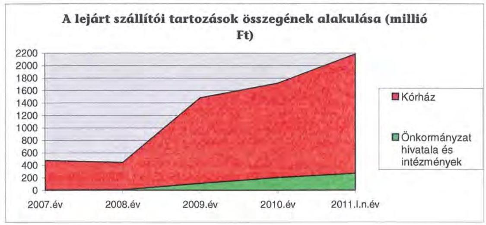

A Közgyűlés a lejárt szállítói kötelezettségek rendezésével a vizsgált időszakban nem foglalkozott, az állomány csökkentése érdekében pénzügyi finanszírozási műveletekről nem döntött.

Három esetben, mindösszesen 5 millió Ft összegben, az intézmények megállapodtak a szállítókkal a fizetés átütemezéséről.

# 3.3. Egyéb kötelezettségek alakulása 

A kötelező feladatellátáshoz kapcsolódóan a Kórház 2005. június 15-én telefon alközpont és tartozékai beszerzésére 6 millió Ft + áfa összegben lizingszerződést kötött. A pénzügyi kötelezettségek teljesítését követően a lízingelt eszköz maradványértéke - az Önkormányzat nyilvántartása szerint - 2010. december 31-én 55 ezer Ft volt.

Az Önkormányzatnak a vizsgált időszakban garancia- és kezességvállalással kapcsolatos hosszú távú kötelezettségvállalása nem volt.

A kötelező feladatellátás érdekében a Kórház 2005. december 5-én foszforlemezes, digitális radiológiai képolvasó, képfeldolgozó és archiváló rendszert vásárolt. A szállítási szerződésben a vételárat 427 millió Ft + áfa összegben határozták meg, amelynek megfizetése 84 hónapon keresztül, havi

[^0]
[^0]:    ${ }^{54}$ ebből intézményi térítési díjkövetelés 150 millió Ft
    ${ }^{55}$ 2010. december 31-én 1383 millió Ft

---

5 millió Ft + áfa részletekben esedékes. A szerződésből eredően a Kórháznak 2010. december 31 -én 165 millió Ft összegű kötelezettsége állt fenn.

Az 51\%-os önkormányzati tulajdonú Energiaszolgáltató Kft. kisebbségi (49\%) tulajdonosa az intézményi fűtés reorganizációs projekt megvalósításához 2009. május 5-én 10 éves lejáratra 250 millió Ft összegben tagi kölcsönt nyújtott az Energiaszolgáltató Kft. részére, amelyből a 2010. december 31-én fennálló kötelezettség 218 millió Ft (a kölcsön 87,2\%-a) volt.

A vizsgált időszakban az elengedett követelések bruttó összege nem haladta meg a 10 millió Ft-ot.

Az Önkormányzat a Fejér Megye 2012 és a Fejér Megye 2030 elnevezésű kötvények kibocsátásakor a kötvények biztosítékaként hozzájárult 10 db forgalomképes ingatlanon jelzálogjog alapításához és bejegyzéséhez. Az ingatlanokon összességében 4900 millió Ft értékủ keretbiztosítéki jelzálogjog és 6738 ezer CHF összegű tőke és járulékai erejéig jelzálogjog bejegyzése történt.

A jelzálogjoggal terhelt ingatlanok számviteli nyilvántartás szerinti nettó értéke 2010. december 31-én 1320 millió Ft, becsült értéke ${ }^{56}$ pedig 2441 millió Ft volt, melyre kibocsátáskori árfolyamon 6073 millió Ft összegű jelzálogjog bejegyzés történt. Az Önkormányzat összes forgalomképes ingatlanának könyvszerinti nettó értéke 2350 millió Ft, becsült értéke 5087 millió Ft volt, melyből a terhelt ingatlanok becsült értéke 2441 millió Ft (48\%) volt.

Nem állapítható meg összefüggés az Önkormányzat eladósodása és a jelzálogjog bejegyzése között, mivel már a 2007. évben is történt kötvénykibocsátás jelzálogjog alapítása mellett, illetve a későbbiek folyamán jelzálogjog nélkül is történt kötvénykibocsátás.
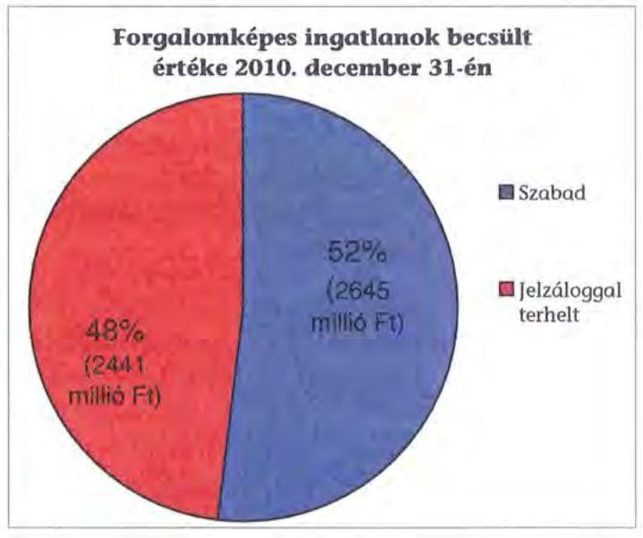

[^0]
[^0]:    ${ }^{56}$ Az Önkormányzat ingatlanait piaci értéken tartja nyilván, értékelése évente történik az Illetékhivatal által, az ingatlanforgalmazások során kialakult piaci forgalmi értékek figyelembevételével.

---

A vizsgált időszakban nem történt meg annak felmérése, hogy az eszközök elhasználódása, amortizációja fedezetének biztosítása mekkora forrásokat igényelne az Önkormányzatnál. A felújításokra, az eszközök pótlására az Önkormányzat pénzügyi lehetőségének a függvényében, elsősorban az intézmények működőképességének biztosítása, illetve a szakhatósági előírások figyelembevételével került sor. Az Önkormányzat a 2007-2010. években a tárgyi eszközök után 1911 millió Ft összegű értékcsökkenést számolt el. Felújításra 560 millió Ft-ot fordítottak. Az elhasználódott eszközök pótlására az Önkormányzat tartalékot nem képzett, külön alapot nem hozott létre.

Az Önkormányzat a 2011. évben a Könyvtár részére 23 millió Ft kölcsönt nyújtott kötelező feladatainak ellátása érdekében. Az intézmény a „Könyvtári szolgáltatások összehangolt infrastruktúra-fejlesztése" elnevezésű pályázatot nyerte el, melynek utólagos központi finanszírozása miatt az Önkormányzat megelőlegezte a támogatást. Az egyszeri kölcsönt az intézmény 120 napos visszafizetési kötelezettséggel, illetve a Közremúködő szervezettől a támogatás bankszámlára utalásának napjáig kapta.

A Közgyűlés a Kórház részére kölcsön nyújtásáról döntött a kötelező feladatellátáshoz kapcsolódó, pályázati forrásból megvalósuló beruházások saját erő részének biztosítására, összességében 1184 millió Ft összegben. A Kórház, a kölcsönszerződésben foglaltak alapján, a kölcsön összegét köteles a négy projekt lezárását követő időponttól számított 6 . hónap utolsó napján kezdődő törlesztéssel, 10 év alatt, évente egyenlő részletekben visszafizetni. Amennyiben az Önkormányzat tulajdonosi, illetve fenntartói jogállásában változás következik be, annak időpontjával egyidejűleg a még fennálló tartozás azonnali, egy összegben történő visszafizetése esedékessé válik. Tényleges kölcsön folyósítására még nem került sor.

# 4. A PÉNZÜGYI EGYENSÚLY MEGTEREMTÉSE ÉrDEKÉBEN HOZOTT INTÉZKEDÉSEK 

A jelentésben szereplő CLF modellben bemutatott múködési és felhalmozási hiány mindamellett alakult ki, hogy a vizsgált időszakban az Önkormányzat folyamatosan intézkedéseket tett, hogy alkalmazkodjon a finanszírozási rendszer változása miatti forráscsökkenéshez. Ennek érdekében bevételnövelő és kiadáscsökkentő döntéseket hozott.

A kiadáscsökkentő és bevételnövelő intézkedések megtétele a gazdálkodás átláthatóbbá tételét, valamint a feladatellátás szakmai színvonalának, de kiemelten a pénzügyi helyzet javítását célozta. A legjelentősebb mértékű kiadási megtakarítást a létszámleépítésekkel érték el, emellett két intézmény - a Kórház és a Múzeum - kivételével sikerült megőrizniük intézményeik gazdálkodásának stabilitását.

Az Önkormányzat gazdasági programjában megfogalmazott elvárások szerint 2007-től több alkalommal hozott intézmény átszervezési döntéseket:

- Első lépésben 2007. április 30-ával megszûnt az Önkormányzat Ellátó Szervezete. Az intézmény által ellátott feladatokat egyrészt az Önkormányzat kizárólagos tulajdonában lévő EIPT Kft., másrészt a Hivatal vette át, s e

---

két szervezeti egységbe integrálódott az intézmény által kezelt vagyon és a személyi állomány is. Az EIPT Kft. részére a 2007-2010. években a feladatellátási szerződésben meghatározottaknak megfelelően az Önkormányzat évente rendszeres múködési célú pénzeszköz átadást (2010. december 31-ig összesen 317 millió Ft), továbbá 2008-ban 16 millió Ft fejlesztési célú pénzeszköz átadást teljesített. A feladatellátás a vizsgált időszakban létszámcsökkenéssel és növeléssel is járt, az intézkedés számszerúsített hatását azonban nem mutatták ki.

- Ugyanebben az évben változás történt a szociális- és gyermekvédelmi feladatokat végző intézmények vonatkozásában is. 2007. június 30 -ával létrejött két intézmény, a Fejér Megyei Önkormányzat Integrált Szociális Intézménye és a Fejér Megyei Önkormányzat Gyermekvédelmi Központja. A két szervezetbe integrált intézmények, mint önállóan gazdálkodó költségvetési szervek megszűntek, és az új intézmények telephelyeiként, részjogkörű szervezetekként működtek tovább.
- A hivatali feladatok átszervezése során 2007-ben 9 fővel 64 főről 55 főre csökkentették az engedélyezett létszámot. A Hivatalt érintő 2007. évi szervezeti változások célja az volt, hogy racionálisabban szervezett hivatal működjön a jövőben, csökkentve a szervezeti egységek számát, a vezetői szinteket.
- A 2008. évben folytatódott az intézményeket érintő átszervezés, 2008. április 30 -ával megszűnt a PEDI és mint költségvetési intézmény megszüntetésre került a VVSI. Ez utóbbi intézmény feladatainak ellátására az Önkormányzat kizárólagos tulajdonnal megalapította a VVSI Kft-t. A gazdasági társaság részére a VVSI által kezelt vagyon átadásra került, s a személyi állomány egy részének a továbbfoglalkoztatása megvalósult. A PEDI-nek először a gazdálkodási jogállása változott meg (2008. január 1-jétől mint részben önálló költségvetési szervezet múködött április 30-ig), majd újabb átszervezést követően az intézmény megszűnt. Ezt követően feladatait részben a korábbi szervezetből létrejött Pedagógiai Szakszolgálat látta el, a szakmai könyvtár kezelése pedig a Vörösmarty Megyei Könyvtár feladatai közé került besorolásra. A PEDI által ellátott kötelező feladatok egy részét (pedagógiai szakmai szolgáltatás) 2008. május 1-jétől szolgáltatás megvásárlásával oldja meg az Önkormányzat.

Az Önkormányzat a PEDI átszervezése kapcsán a pedagógiai szakmai szolgáltatási feladatok ellátására a COMMITMENT Köznevelési Kht-vel kötött megbízási szerződést. A gazdasági szervezet a 2008. április 29 -én kelt szerződés értelmében kötelezte magát, hogy a megye területén teljes körű pedagógiai szakmai szolgáltatást nyújt a vonatkozó jogszabályi előírások szerint. A végzett tevékenységgel kapcsolatban az Önkormányzat 2008-2010. évek között 33 millió Ft-ot fizetett ki, 2011-ben április 30-ig 4 millió Ft kiadás merült fel a benyújtott számlák alapján. Az intézkedés következtében 126 millió Ft kiadási megtakarítást mutatott ki az Önkormányzat, ebből 45 millió Ft a dologi jellegű megtakarítás, a fennmaradó összeg a kapcsolódó 13 fős létszámleépítés vonzataként jelentkezett.
A Közgyűlés a 78/2008. (III. 26.) számú határozatában döntött a VVSI gazdasági társasággá történő alakításáról. A döntést előkészítő testületi előter-

---

jesztés szerint az intézmény által végzett feladatok költséghatékony és eredményes ellátása költségvetési szerv formájában nem valósítható meg. A rugalmasabb és az elvárásoknak jobban megfelelő feladatellátás igényli a szervezeti átalakítást, a sportban rejlő kihívások hatékonyabb, innovatívabb szemléletű menedzselését, az Önkormányzat támogatását. A szervezeti változással együtt az intézmény 36 fős létszámát 2008. március 31-től 15 fővel csökkentette a Közgyűlés, a fennmaradó létszám továbbfoglalkoztatására kötelezte a gazdasági társaságot. Az Önkormányzat a tevékenység ellátásához továbbra is hozzájárul, az intézkedés következtében tényleges megtakarítás ( 303 millió Ft) az Önkormányzat kimutatása szerint a létszámleépítés kapcsán mutatkozott. A VVSI Nonprofit Kft feladat-ellátási szerződése alapján 2008-tól 211 millió Ft eseti múködési támogatásban részesült, amelyet 2008-ban 25 millió Ft fejlesztési támogatással, valamint egy millió Ft tőkejuttatással egészítettek ki.

- A hivatali feladatok ellátásában is történt 2008. május 1-jétől újabb változás. Az EIPT Kft-be a 2007. évben az Ellátó szervezet megszüntetése kapcsán kiszervezett feladatok (vagyonkezelésbe adott eszközök múködtetése, leltározás, anyagbeszerzés) átkerültek a Hivatalhoz.
- Az átszervezések 2009-ben is folytatódtak az intézmények számviteli, pénzügyi, gazdálkodási feladatai területén. Az IGSZ létrehozásával a pénzügyi, számviteli adminisztrációs feladatok ellátása - a Hivatal, a Kórház és a TISZK kivételével - valamennyi intézmény tekintetében centralizáltan, a 2009. március 16 -tól megalapított új intézmény szervezeti keretein belül történik.
- Az Önkormányzat a 171/2009. (V. 21.) számú határozatával döntött intézményi energiahatékonysággal kapcsolatos feladatok szakszerü ellátására kft létrehozásáról. Az Regionális Fejlesztő Vállalat Beruházó Kft-vel közösen, 510 ezer Ft törzstőkével megalapította az Energiaszolgáltató Kft-t, amelyben az Önkormányzat 260 ezer Ft-tal 51\%-os többségi tulajdont szerzett. A gazdasági társasággal a hőszolgáltatási tevékenységgel kapcsolatos szerződéseket megkötötték, a Közgyűlés az intézmények fűtési rendszereire és a vagyonkezelési szerződésben foglalt leltár szerinti ingó vagyonra ingyenes vagyonkezelői jogot biztosított 15 évre a Kft. részére. A gazdasági társaság létrehozását részletes, előzetes hatástanulmány készítése nem előzte meg, működésével kapcsolatban számszerűsíthető kiadási megtakarítást az eltelt időszakban nem mutattak ki, osztalékbevétele az Önkormányzatnak nem volt.

Az intézményi feladatok racionalizálásáról, integrációról a Közgyűlés döntött. Az ezekhez készített előterjesztésekben a tervezett intézkedések indokait, várható eredményeit bemutatták. Az intézményi integráció, átszervezés végrehajtásához kikérték a szakmai szervezetek véleményét, a jogszabályban előírt egyeztetéseket lefolytatták. A rendelkezésre álló beszámolók szerint a szociális és gyermekvédelmi intézmények átszervezést követő működési tapasztalatok kedvezőek, a szakmai színvonal, valamint a múködés személyi és tárgyi feltételei javultak.

A Közgyűlés a 182/2007. (IV. 26.) számú határozatával döntött a szociális és gyermekvédelmi feladatokat végző intézmények átalakításáról, egy-egy integrált

---

intézménybe történő tömörítéséről. A döntést előkészítő testületi előterjesztés szerint elsősorban szakmai indokai voltak az összevonásnak. Ezen a téren nem a forráskivonás volt a cél, hanem a koncentrált irányítás következtében a közös szakmai-gazdasági irányítással működő intézmények egységes szemléletet biztosító szakmai múködtetése, a gazdaságosabb ellátási formák arányának javítása. (A gyermekvédelemben a férőhelyeken belül az olcsóbb nevelőszülői hálózat fokozottabb fejlesztése, a szociális intézményeknél a magasabb szakmai színvonal, az összevonások révén a jogszabályi előírásoknak történő jobb megfelelés.) Mindkét intézmény esetében a 2008. évben „0" bázisú költségvetés készült, tényleges megtakarítást ( 74 millió Ft) ezen a területen is a megvalósított, nem szakmai létszámokat érintő létszámcsökkenések kapcsán mutattak ki.

A Közgyűlés a 81/2007. (III. 21.) számú határozatával - melyben a 2007-2010. évekre gazdasági programját határozta meg - döntött az Ellátó Szervezet megszüntetéséről, feladatkörének túlnyomó részben az EIPT Kht-be történő integrálásáról. A döntés-előkészítéshez készült előterjesztés szerint ezzel a megoldással a Hivatal múködtetésével, a vagyonkezeléssel kapcsolatos feladatok hatékonyabban oldhatók meg. A költségvetési intézményként működő szervezet 23 fős létszámából 14 fő látta el a gazdasági társaságba átcsoportosított feladatokat, a Hivatal állományát érintő közvetlen kiadásokkal kapcsolatos finanszírozási, számviteli feladatok létszámbővülés nélkül a Hivatal költségvetési és pénzügyi irodájához kerültek. A szervezési intézkedések következtében a személyi kiadások és járulékaik terén mutattak ki 45 millió Ft megtakarítást a 9 fős létszámcsökkentés eredményeként.

A 2008. évben az előző évi átszervezés tapasztalatait a Közgyűlés áttekintette, továbbá törvényi kötelezés miatt az EIPT Kht-t kft-vé átalakította. A döntéselőkészítő elő́terjesztés szerint az előző évben átadott feladatok a Hivatal szervezetében hatékonyabban végezhetők el, ezért azokat a szervezeti felépítés egyidejű módosításával a Hivatalba integrálták. A Közgyűlés 103/2008. (III. 26.) számú határozata döntött a Hivatal átszervezéséről, a feladatbővülés miatt a Területfejlesztési és Koordinációs Iroda megosztásával két önálló iroda létrehozásáról, ezen belül az Ellátó csoport működtetéséről. A gazdasági társaságtól a feladatot végző 14 fő átkerült a Hivatal állományába, ezzel egyidejűleg két munkakört összevontak, és egy álláshelyet megszüntettek. Az intézkedések együttes hatásaként 2008-ban a Hivatal létszámkeretét 13 fővel megemelték, 56 fơről 69 főre.

Az IGSZ létrehozásáról a Közgyűlés a 49/2009. (II. 26.) számú határozatával döntött. A testületi előterjesztés szerint az elfogadott 2009. évi költségvetési koncepció feladatként jelölte meg az intézmények átalakításának és feladatellátásának áttekintését. Kiemelt feladatként jelölte meg a Közgyűlés, hogy a lehető legnagyobb költségvetési megtakarítások elérése érdekében olyan intézményi struktúra jöjjön létre, melynek során az alapfeladatok ellátása nem sérülhet, de ellátásuk hatékonysága emellett javulni fog. Az intézkedés hatásaként elsősorban a személyi kiadások csökkenéséből adódóan a későbbiekben éves szinten 100 millió Ft-os megtakarítást, ezen felül takarékosabb és átláthatóbb, jobban ellenőrizhető gazdálkodást vártak. Az átszervezéssel érintett intézményeknél együttesen 95 fő létszámcsökkentésről határoztak, az új intézmény létszámkeretét viszont mindössze 40 fơben állapították meg, így 55 álláshelyet megszüntettek.

---

A 2007-2010. években az intézményátszervezések, a feladatváltozások, valamint a takarékossági intézkedések hatásaként együttesen 2039 millió Ft kiadási megtakarítást mutatott ki, melynek 76\%-a, 1552 millió Ft a kapcsolódó létszámcsökkenések következtében jelentkezett.

A 2007-2010. évek kiadáscsökkentő intézkedéseit beavatkozási területenként az alábbiak részletezik:
ezer Ft-ban

| Az érvényesített kiadás-   csökkentés területei | Személyi   juttatások és   járulékai | Dologi, mű-   ködési ki-   adások | Pénzeszköz   átadások,   támogatások | Összesen |
| :-- | :--: | :--: | :--: | :--: |
| A Közgyűlés működése | 21190 |  | 21352 | 42542 |
| A Hivatalnál | 107589 |  |  | 107589 |
| Az intézményeknél | 1423057 | 447364 | 18713 | 1889134 |
| ÖSSZESEN | 1551836 | 447364 | 40065 | 2039265 |

A Közgyűlés működési körében a nettósított, többletköltségek felmerülését is számba vevő kiadáscsökkentő intézkedések eredményének 49,8\%-a, 21 millió Ft a testület és a bizottsági tagok létszámának csökkentéséből, a címpótlékok felülvizsgálatából realizálódott. Az intézkedéseket helyi szintű döntések, főjegyzői és elnöki utasítások alapozták meg.

A különböző szervezeteknek és intézményeknek (szakszervezet, megyeszékhely város fenntartásában működő színház, kistérségi szolidaritási alap) a korábbi időszakban rendszeresen adott támogatások megszüntetése nagyságrendileg hasonló összeget tett ki.

A Hivatalban végrehajtott megtakarítási intézkedések átszervezésből következő és létszámcsökkentéssel járó döntések voltak, amelyek összességében a 2006. december 31-i állapothoz viszonyítva 7 fő igazgatási létszám csökkentését eredményezték.

A Hivatal létszáma 2006. december 31-én 125 fő volt, ebből a kormányzati intézkedések miatt 61 fő 2007. január 1-jétől az APEH állományába került. A Hivatalnál lezajlott átszervezések kapcsán létszámcsökkentési- és növelési intézkedés egyaránt történt, egyenlegében 7 fő létszámcsökkenés mutatkozott az eltelt időszakban.

Az önkormányzati szinten kimutatott megtakarítási intézkedések 92,6\%-át 1889 millió Ft összegben - az intézmények körében érvényesítették. Ezen belül a megtakarításokból 1423 millió Ft (az összes intézményi megtakarítás háromnegyede) a személyi juttatások és járulékoknál realizálódott. Ezen időszakban az intézményi megtakarításokból 989 millió Ft megtakarítást (52,4\%-ot képviselve) az intézményvezetői hatáskörben elrendelt intézkedésekkel érték el.

Az intézményvezetői döntésekből származó kiadáscsökkenés 62\%-a (612 millió Ft) személyi juttatások (üres álláshelyek zárolása, foglalkoztatási formák megváltoztatása, költségtérítések felülvizsgálata) csökkentése miatt következett be, melyből 85,5\% (523 millió Ft) a Kórháznál jelentkezett. A Kórház adatszolgáltatása szerint ez az összeg vezetői intézkedések következtében elért egyéb foglalkoztatásból adódó bérmegtakarítás.

---

A különböző beszerzési és szolgáltatási szerződések felülvizsgálatával 12,1\%-os megtakarítást, 126 millió Ft-ot mutattak ki. Az egyes közszolgáltatások kiszervezésével elért megtakarítás $23,3 \%$-os, 242 millió volt, mely szintén a Kórháznál realizálódott.

A Kórház vezetése a 2010. évben megújult, az új menedzsment a pénzügyi helyzet javítására több intézkedést tett, és folyamatosan tesz. A Kórháznál 2010. december 1-jétől önkormányzati biztos múködik, tevékenységéről, a pénzügyi helyzet stabilizálása érdekében javasolt és megtett intézkedésekről havonkénti részletezéssel készít jelentést a fenntartó Önkormányzat számára. (A javasolt intézkedések között szerepelt a szerződésállomány felülvizsgálata, az indokolatlannak ítélt szerződések felmondása; gazdálkodási keretek kialakítása, és azok betartásának szigorú ellenőrzése; a gyógyszerfelhasználás, energiafelhasználás szigorítása; a beszerzések központosítása; a belső ellenőrzés megerősítése; a létszámgazdálkodás racionalizálása.)

A létszámcsökkentő intézkedések következtében 2007-2011 között a Hivatalnál és az intézményeknél összesen 341 álláshelyet (részben üres állást) szüntettek meg, a 2006. december 31-i átlaglétszámnak 7,7\%-át, amelynek több mint egyötöde ( 71 fő) ágazati szakmai, közel négyötöde ( 270 fő) intézményüzemeltetéshez, fenntartáshoz, gazdasági ügyek intézéséhez kapcsolódó álláshely volt.

A 2007-2011. I. negyedévben végrehajtott létszámcsökkentést az alábbi grafikon szemlélteti:
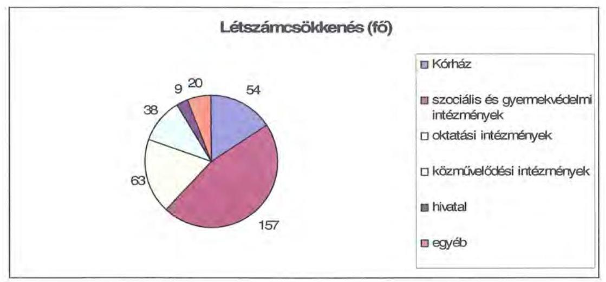

A helyi szervezési intézkedések végrehajtásához az Önkormányzat az áttekintett időszak alatt 292 millió Ft központi költségvetési támogatásban részesült, amelynek felhasználásával 241 fő álláshelyet tartósan leépített. A létszámcsökkenés $29,3 \%$-ához ( 100 fó) központi támogatás nem kapcsolódott, mivel egyrészt a dolgozókat az Önkormányzat gazdasági társaságainál továbbfoglalkoztatták, másrészt a Kórháznál megvalósuló létszámcsökkentéshez nem igényeltek támogatást. Az intézkedések eredményeként az Önkormányzat 2006. december 31-i átlaglétszáma 2011. március 31-re 431 fővel ( $9,7 \%$-kal) csök-

---

kent ${ }^{57}$, ebben tükröződik a kormányzati intézkedések miatti létszámcsökkenés (Illetékhivatal 61 fő) hatása is. Ezt nem tekintve a tényleges létszámcsökkenés $8,4 \%$-os ( 370 fő) volt.

Az Önkormányzatnál 2011. első negyedévében folytatódtak a megtakarítási intézkedések, az elhatározott 805 millió Ft-ból 622 millió Ft kiadás megtakarítás ( $77,2 \%$ ) dologi jellegű volt, amelynek a $98,2 \%$-a ( 610 millió Ft) a Kórház által elrendelt megszorító intézkedésekhez kapcsolódott.

A Közgyűlés működéséhez kapcsolható kiadások a 2011. évi költségvetési rendeletben tervezettek szerint várhatóan 153 millió Ft összegben csökkennek, amelynek $30,2 \%$-a ( 46 millió Ft ) tiszteletdíjak csökkentése miatti megtakarítás. A költségcsökkentő döntések következtében mérsékelték a Közgyűlés működtetésének kiadásait, bizottsági kereteket szüntettek meg, az előző évhez képest csökkentek a civil szervezetek, egyesületek jóváhagyott támogatási keretei, valamint mérsékelték a gazdasági társaságuk által Vajtán működtetett tábor üzemeltetési hozzájárulását (ez utóbbi tervezett intézkedések együttes hatása 98 millió Ft volt).

A kiadáscsökkentő intézkedések mellett az Önkormányzat az alábbiakban számszerűsített bevételnövelő intézkedéseket tette:
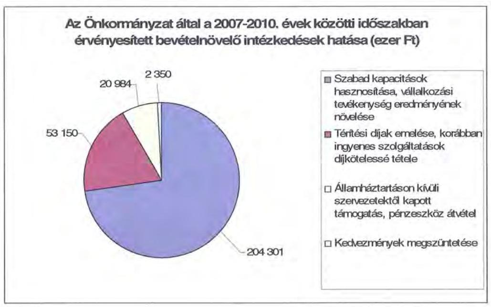

A bevételnövelésre irányuló intézkedések számszerűsített (281 millió Ft) összegének 39,1\%-át ( 110 millió Ft-ot) a Kórház realizálta, amelynek keretében fokozta bérbeadási, vállalkozási tevékenységét, valamint térítéskötelessé tett egyes intézményi (tüdőszűrés, apás szülés, temetésre felkészítés) szolgáltatásokat.

[^0]
[^0]:    ${ }^{57}$ Az Önkormányzat átlaglétszáma 2006. december 31-én 4454 fő, míg 2011. március 31-én 4023 fő volt.

---

Az ingatlanok bérbeadásából, a készletértékesítésböl, az alkalmazottak és az ellátottak inflációt meghaladó térítési díj emeléséből származó bevételi növekmény 169 millió Ft-ot tett ki. A pártok részére biztosított helyiségek bérleti díjával kapcsolatos kedvezmények csökkentése nem eredményezett jelentős bevételi többletet, az ebből származó növekmény (2 millió Ft) részaránya közel $1 \%$-os volt.

A 2011. évre 1694 millió Ft bevételi növekményt terveztek önkormányzati szinten, ennek 87,8\%-a ( 1488 millió Ft) a Kórháznál jelentkezik. Oka, hogy a finanszírozást érintő kezdeményezett intézkedés eredményeként (minisztériumi szintű egyeztetések az alulfinanszírozottság javítására) 1451 millió Ft bevételi növekményt prognosztizáltak, a vállalkozási eredményből és bérbeadásból 37 millió Ft származik. A tervezett bevételi többlet fennmaradó része a szabad kapacitások hasznosításából, az infláció mértékével növelt térítési díjakból keletkezik.

Az Önkormányzat az átszervezések, a takarékossági intézkedések szakmai feladatellátásra gyakorolt hatását nem vizsgálta.

# 5. A HELYI ÖNKORMÁNYZATOK GAZDÁLKODÁSI RENDSZERÉNEK 2007. ÉVI ELLENŐRZÉSE SORÁN A PÉNZÜGYI EGYENSÚLY JAVÍTÁSÁRA TETT SZABÁLYSZERŰSÉGI ÉS CÉLSZERŰSÉGI JAVASLATOK HASZNOSULÁSA 

Az ÁSZ jelentésében 16 szabályszerűségi és 10 célszerűségi javaslatot tett. A jelentést a Közgyűlés megismerte. A javaslatok megvalósítására intézkedési tervet készítettek, amely teljes körűen tartalmazta a javaslatokat, meghatározta a feladatok elvégzéséért a felelősöket és a feladatok elvégzésének határidejét.

A pénzügyi egyensúly javítására egy célszerűségi javaslat vonatkozott. Javasoltuk a Közgyűlés elnökének: „kezdeményezze, hogy a fejlesztési célkitüzések megalapozásához készüljön a kötelezö feladatok megoldásánál jelentkező feszültségekről felmérésekkel, számításokkal alátámasztott helyzetelemzés". Az intézkedési tervben a helyzetelemzés elkészítésére 2008. december 31-i határidőt írtak elő, felelősként a Közgyűlés elnökét és a főjegyzőt megjelölve.

A helyzetelemzés az előírt határidőre és azt követően sem készült el, elmaradását a felelősöktől nem kérték számon, arról a Közgyűlést nem tájékoztatták.

Budapest, 2011. december „ 15 "

Domokos László

Melléklet: $\quad 6 \mathrm{db} \quad 11$ lap

---

.

---

# Fejér Megyei Önkormányzat

## Számú melléklet

### Működési és felhalmozási célú hiány/többlet alakulása (ezer Ft)

|  év | működési | felhalmozási | felhalmozási | felhalmozási | felhalmozási | felhalmozási | felhalmozási | felhalmozási | felhalmozási | felhalmozási | felhalmozási | felhalmozási | felhalmozási | felhalmozási | felhalmozási | felhalmozási | felhalmozási | felhalmozási  |
| --- | --- | --- | --- | --- | --- | --- | --- | --- | --- | --- | --- | --- | --- | --- | --- | --- | --- | --- |
|  2355 | 2339 | 22046 | 22006 | 22046 | 22006 | 22046 | 22006 | 22046 | 22006 | 22046 | 22006 | 22046 | 22006 | 22046 | 22006 | 22046 | 22006 | 22046  |
|  2355 | 2339 | 22046 | 22006 | 22046 | 22006 | 22046 | 22006 | 22046 | 22006 | 22046 | 22006 | 22046 | 22006 | 22046 | 22006 | 22046 | 22006 | 22046  |
|  2355 | 2339 | 22046 | 22006 | 22046 | 22006 | 22046 | 22006 | 22046 | 22006 | 22046 | 22006 | 22046 | 22006 | 22046 | 22006 | 22046 | 22006 | 22046  |
|  2355 | 2339 | 22046 | 22006 | 22046 | 22006 | 22046 | 22006 | 22046 | 22006 | 22046 | 22006 | 22046 | 22006 | 22046 | 22006 | 22046 | 22006 | 22046  |
|  2355 | 2339 | 22046 | 22006 | 22046 | 22006 | 22046 | 22006 | 22046 | 22006 | 22046 | 22006 | 22046 | 22006 | 22046 | 22006 | 22046 | 22006 | 22046  |
|  2355 | 2339 | 22046 | 22006 | 22046 | 22006 | 22046 | 22006 | 22046 | 22006 | 22046 | 22006 | 22046 | 22006 | 22046 | 22006 | 22046 | 22006 | 22046  |
|  2355 | 2339 | 22046 | 22006 | 22046 | 22006 | 22046 | 22006 | 22046 | 22006 | 22046 | 22006 | 22046 | 22006 | 22046 | 22006 | 22046 | 22006 | 22046  |
|  2355 | 2339 | 22046 | 22006 | 22046 | 22006 | 22046 | 22006 | 22046 | 22006 | 22046 | 22006 | 22046 | 22006 | 22046 | 22006 | 22046 | 22006 | 22046  |
|  2355 | 2339 | 22046 | 22006 | 22046 | 22006 | 22046 | 22006 | 22046 | 22006 | 22046 | 22006 | 22046 | 22006 | 22046 | 22006 | 22046 | 22006 | 22046  |
|  2355 | 2339 | 22046 | 22006 | 22046 | 22006 | 22046 | 22006 | 22046 | 22006 | 22046 | 22006 | 22046 | 22006 | 22046 | 22006 | 22046 | 22006 | 22046  |
|  2355 | 2339 | 22046 | 22006 | 22046 | 22006 | 22046 | 22006 | 22046 | 22006 | 22046 | 22006 | 22046 | 22006 | 22046 | 22006 | 22046 | 22006 | 22046  |
|  2355 | 2339 | 22046 | 22006 | 22046 | 22006 | 22046 | 22006 | 22046 | 22006 | 22046 | 22006 | 22046 | 22006 | 22046 | 22006 | 22046 | 22006 | 22046  |
|  2355 | 2339 | 22046 | 22006 | 22046 | 22006 | 22046 | 22006 | 22046 | 22006 | 22046 | 22006 | 22046 | 22006 | 22046 | 22006 | 22046 | 22006 | 22046  |
|  2355 | 2339 | 22046 | 22006 | 22046 | 22006 | 22046 | 22006 | 22046 | 22006 | 22046 | 22006 | 22046 | 22006 | 22046 | 22006 | 22046 | 22006 | 22046  |
|  2355 | 2339 | 22046 | 22006 | 22046 | 22006 | 22046 | 22006 | 22046 | 22006 | 22046 | 22006 | 22046 | 22006 | 22046 | 22006 | 22046 | 22006 | 22046  |
|  2355 | 2339 | 22046 | 22006 | 22046 | 22006 | 22046 | 22006 | 22046 | 22006 | 22046 | 22006 | 22046 | 22006 | 22046 | 22006 | 22046 | 22006 | 22046  |
|  2355 | 2339 | 22046 | 22006 | 22046 | 22006 | 22046 | 22006 | 22046 | 22006 | 22046 | 22006 | 22046 | 22006 | 22046 | 22006 | 22046 | 22006 | 22046  |
|  2355 | 2339 | 22046 | 22006 | 22046 | 22006 | 22046 | 22006 | 22046 | 22006 | 22046 | 22006 | 22046 | 22006 | 22046 | 22006 | 22046 | 22006 | 22046  |
|  2355 | 2339 | 22046 | 22006 | 22046 | 22006 | 22046 | 22006 | 22046 | 22006 | 22046 | 22006 | 22046 | 22006 | 22046 | 22006 | 22046 | 22006 | 22046  |
|  2355 | 2339 | 22046 | 22006 | 22046 | 22006 | 22046 | 22006 | 22046 | 22006 | 22046 | 22006 | 22046 | 22006 | 22046 | 22006 | 22046 | 22006 | 22046  |
|  2355 | 2339 | 22046 | 22006 | 22046 | 22006 | 22046 | 22006 | 22046 | 22006 | 22046 | 22006 | 22046 | 22006 | 22046 | 22006 | 22046 | 22006 | 22046  |
|  2355 | 2339 | 22046 | 22006 | 22046 | 22006 | 22046 | 22006 | 22046 | 22006 | 22046 | 22006 | 22046 | 22006 | 22046 | 22006 | 22046 | 22006 | 22046  |
|  2355 | 2339 | 22046 | 22006 | 22046 | 22006 | 22046 | 22006 | 22046 | 22006 | 22046 | 22006 | 22046 | 22006 | 22046 | 22006 | 22046 | 22006 | 22046  |
|  2355 | 2339 | 22046 | 22006 | 22046 | 22006 | 22046 | 22006 | 22046 | 22006 | 22046 | 22006 | 22046 | 22006 | 22046 | 22006 | 22046 | 22006 | 22046  |
|  2355 | 2339 | 22046 | 22006 | 22046 | 22006 | 22046 | 22006 | 22046 | 22006 | 22046 | 22006 | 22046 | 22006 | 22046 | 22006 | 22046 | 22006 | 22046  |
|  2355 | 2339 | 22046 | 22006 | 22046 | 22006 | 22046 | 22006 | 22046 | 22006 | 22046 | 22006 | 22046 | 22006 | 22046 | 22006 | 22046 | 22006 | 22046  |
|  2355 | 2339 | 22046 | 22006 | 22046 | 22006 | 22046 | 22006 | 22046 | 22006 | 22046 | 22006 | 22046 | 22006 | 22046 | 22006 | 22046 | 22006 | 22046  |
|  2355 | 2339 | 22046 | 22006 | 22046 | 22006 | 22046 | 22006 | 22046 | 22006 | 22046 | 22006 | 22046 | 22006 | 22046 | 22006 | 22046 | 22006 | 22046  |
|  2355 | 2339 | 22046 | 22006 | 22046 | 22006 | 22046 | 22006 | 22046 | 22006 | 22046 | 22006 | 22046 | 22006 | 22046 | 22006 | 22046 | 22006 | 22046  |
|  2355 | 2339 | 22046 | 22006 | 22046 | 22006 | 22046 | 22006 | 22046 | 22006 | 22046 | 22006 | 22046 | 22006 | 22046 | 22006 | 22046 | 22006 | 22046  |
|  2355 | 2339 | 22046 | 22006 | 22046 | 22006 | 22046 | 22006 | 22046 | 22006 | 22046 | 22006 | 22046 | 22006 | 22046 | 22006 | 22046 | 22006 | 22046  |
|  

---

.

---

|  1. FOLYÓ KÖLTNÉGYETÉS* | 2007. | 2008. | 2009. | 2010.  |
| --- | --- | --- | --- | --- |
|  1.1.1. Saját működési bevételek | 4 199 615 | 4 720 033 | 4 671 187 | 4 071 961  |
|  1.1.2. Költségvetési támogatás | 2 826 465 | 4 339 458 | 4 502 117 | 3 095 300  |
|  1.1.3. Átongadott bevételek | 1 634 442 | 553 636 | 583 825 | 212 973  |
|  1.1.4. Állandnistartásos belülről kapott támogatások | 11 968 107 | 12 707 640 | 12 192 695 | 13 578 284  |
|  1.1.5. EU-tól és külföldről kapott bevételek | 6 621 | 2 507 | 15 | 0  |
|  1.1.6. Állandnistartásos kívülről kapott bevételek | 53 574 | 110 739 | 130 164 | 126 920  |
|  1.1.7. Előző évi pénzmeredvény átvétel | 99 031 | 179 704 | 171 157 | 110 864  |
|  1.1. Folyó bevételek =1.1.1.+1.1.2.+1.1.3.+1.1.4.+1.1.5.+1.1.6.+1.7. | 20 815 855 | 22 612 517 | 22 252 260 | 21 196 595  |
|  1.2.1. Müködési kiadások bocsátkoztások nélkül | 20 666 060 | 22 205 164 | 20 746 396 | 21 443 861  |
|  1.2.2. Állandnistartásos belülre átadott pénzeszközök | 72 523 | 72 308 | 52 587 | 10 887  |
|  1.2.3.1. vállalkozásoknak | 41 866 | 145 | 282 | 50  |
|  1.2.3.2. EU-nak, illetve külföldre | 0 | 0 | 0 | 0  |
|  1.2.3.3. megőnyesetlestnek | 108 346 | 97 308 | 105 635 | 173 308  |
|  1.2.3.4. nemprejű szervezeteknek | 121 643 | 234 644 | 261 945 | 195 221  |
|  1.2.4. Troszabékadások (=1.2.3.1+1.2.3.2+1.2.3.3+1.2.3.4) | 271 855 | 332 097 | 367 860 | 366 779  |
|  1.2.5. Kometkiadások | 151 269 | 221 253 | 169 808 | 223 115  |
|  1.2.6. Előző évi pénzmeredvény átadás | 99 031 | 179 703 | 189 616 | 154 996  |
|  1.3. Folyó kiadások = 1.3.1.+1.3.2.+1.3.3.+1.3.4.+1.2.5 | 31 259 683 | 33 913 525 | 31 500 327 | 32 207 630  |
|  1.4. Folyó költségvetés egységére MÜRÖDÉSI JÖVEDELEM (1.1.–1.2.) | -443 828 | -401 008 | 751 933 | -1 011 043  |
|  1. FEJHÁLMIZÁSI (BEBÜHÁZÁSI) KÖLTNÉGYETÉS** |  |  |  |   |
|  2.1.1. Saját tőkebevételek | 79 226 | 126 451 | 36 204 | 16 329  |
|  2.1.2. Állandnistartásos belülről kapott támogatások | 284 477 | 232 671 | 386 539 | 767 233  |
|  2.1.3. EU-tól és külföldről kapott támogatások | 0 | 0 | 0 | 0  |
|  2.1.4. Állandnistartásos kívülről kapott támogatások | 92 395 | 83 543 | 42 469 | 79 867  |
|  2.1. Felbukasztás (barukozási) bevételek (=2.1.1.+2.1.2+2.1.3+2.1.4.) | 376 098 | 432 665 | 465 212 | 853 629  |
|  2.2.1. Saját beruházási kiadás állása | 444 170 | 721 790 | 2 120 812 | 1 042 702  |
|  2.2.2. Saját felújítási kiadás állása | 165 679 | 108 942 | 179 298 | 151 750  |
|  2.2.3. Állandnistartásos belülre átadott pénzeszköz | 2 000 | 14 800 | 2 000 | 4 846  |
|  2.2.4. EU-nak és külföldnek adott pénzeszközök | 0 | 0 | 0 | 0  |
|  2.2.5. Állandnistartásos kívülre adott pénzeszközök | 4 490 | 47 420 | 20 722 | 2 658  |
|  2.2.6. Befektetési célú részesedések vásárlása | 0 | 1 000 | 368 | 170  |
|  2.3. Felbukasztás (barukozási) kiadások (=2.2.1.+2.2.2.+2.2.3.+2.2.4.+2.2.5.+2.2.6.) | 616 339 | 945 952 | 2 326 192 | 2 004 126  |
|  2.4. Beruházási költségvetés egységére (2.1.–2.2.) | -240 241 | -512 287 | -1 860 980 | -1 150 497  |
|  3. FINANSZÍROZÁSI MÜVELETEK NÉLKÜLI (GFS) POZÍCIO |  |  |  |   |
|  (1.3.) Folyó költségvetés egységére Müködési Jövedelem + (2.3.) Beruházási költségvetés egységére | -684 069 | -914 295 | -1 109 047 | -2 161 540  |
|  4. FINANSZÍROZÁSI MÜVELETEK |  |  |  |   |
|  4.1. Hitelésvést | 142 127 | 1 474 099 | 1 131 328 | 1 428 592  |
|  4.2. Hitelbírkezés | 980 008 | 142 127 | 798 192 | 652 439  |
|  4.3. Forgatási és befektetési célú értékpapírok kibocsátása | 4 580 826 | 0 | 0 | 2 668 000  |
|  4.4. Forgatási és befektetési célú értékpapírok beváltása | 1 600 000 | 0 | 0 | 660 042  |
|  4.5. Forgatási és befektetési célú értékpapírok értékesítése | 0 | 0 | 0 | 0  |
|  4.6. Forgatási és befektetési célú értékpapírok vásárlása | 0 | 0 | 0 | 0  |
|  4.7. Egyéb finanszírozási bevételek (függő, átbérő, kiegészítő) | -327 375 | 184 441 | -186 202 | -125 194  |
|  4.8. Egyéb finanszírozási kiadások (függő, átbérő, kiegészítő) | -302 268 | 309 707 | -304 967 | 207 613  |
|  4.9. Finanszírozási műveletek egységére (4.1.–4.2.+4.3.–4.4.+4.5.–4.6.+4.7.–4.8.) | 2 377 846 | 1 126 706 | 453 821 | 2 443 180  |
|  5. FÁRGTÉSI POZÍCIO |  |  |  |   |
|  (3.) FINANSZÍROZÁSI MÜVELETEK NÉLKÜLI (GFS) POZÍCIO + (4.9.) Finanszírozási műveletek egységére | 1 593 777 | 212 411 | -655 226 | 281 640  |
|  6. NEJTÓ MÜRÖDÉSI JÖVEDELEM |  |  |  |   |
|  (1.3.) Müködési Jövedelem - Tőketővizezés (4.2. Hitelbírkezés + 4.4. Forgatási és befektetési célú értékpapírok beváltása ) | -2 943 828 | -543 135 | -46 259 | -2 323 524  |
|  7. TÁJÉKÓZTATÓ ADATOK |  |  |  |   |
|  Összes kötelezettség | 6 370 652 | 8 794 853 | 10 048 968 | 14 716 217  |
|  ebből rövid fajzesté | 1 360 567 | 2 376 469 | 3 085 755 | 4 428 020  |
|  Összes zajlítási kötelezettség | 1 124 311 | 1 489 246 | 2 339 064 | 2 587 595  |
|  ebből fajzat | 479 120 | 447 786 | 1 480 221 | 1 717 797  |
|  Pézes és tőkepiesi kötelezettség (adózsig) | 4 830 046 | 6 973 751 | 7 449 558 | 11 723 999  |
|  ebből rövid fajzesté | 142 127 | 798 192 | 652 439 | 1 528 791  |
|  PPP szerződésből kétra tévő kötelezettségei állomány | 0 | 0 | 0 | 0  |
|  ebből fajzat szolgáltatási díj adatti kötelezettség | 0 | 0 | 0 | 0  |
|  Folyószámlakból zogi átfogás állománya | 519 689 | 370 691 | 501 305 | 610 261  |
|  Látrólhitel zogi átfogás állománya | 0 | 0 | 0 | 0  |
|  Mindesbérületi zogi átfogás állománya | 0 | 84 645 | 165 590 | 141 630  |
|  Pavas eljárásokból fennálló függő kötelezettségek | 8 599 | 3 983 | 30 298 | 22 012  |
|  Finanszírozásba bevonható szobánik észreve | 2 741 049 | 2 953 408 | 2 298 234 | 2 579 874  |
|  Tartós lehetőszorgt megtestesítő értékpapírok | 0 | 0 | 0 | 0  |
|  Hozzai fajzesté besbítetőink | 0 | 0 | 0 | 0  |
|  Értékpapírok | 0 | 0 | 0 | 0  |
|  Pinnoszközök (idegen pénzeszközök nélkül) | 2 741 049 | 2 953 468 | 2 298 234 | 2 579 874  |

- Bevételekben sem tétel, a kiadásokban sem jelenik meg az amortizáció, a vagyoni helyzetei az egységé befolyásolja ** Bevételekben vagyon megőrzésre és bővítésre fordítható források.

---

### Az Önkormányzat bevételeinek és kiadásainak, adósságszolgálatának alakulása 2007-2010 között

|  Sor-
szám | Megnevezés | 2007. év | 2008. év | 2009. év | 2010. év  |
| --- | --- | --- | --- | --- | --- |
|   |  | Hny | Hny | Hny | Hny  |
|  I. | MÖKÖDÉSI BEVÉTELEK | 21 182 084 | 22 910 783 | 21 745 320 | 22 036 136  |
|  1. | Sajátos folyó bevételek | 4 190 679 | 4 533 792 | 4 493 914 | 4 069 185  |
|  1.1. | önkormányok működési bevétele | 2 319 082 | 2 370 623 | 2 569 601 | 2 677 463  |
|  1.2. | Belékbevételek | 1 841 111 | 2 140 516 | 1 890 466 | 1 306 867  |
|  1.3. | Helyi adóbevételek és póltékek | 0 | 0 | 0 | 2 070  |
|  1.4. | Kismat bevétel működési része | 30 486 | 22 653 | 30 647 | 82 790  |
|  1.5. | Egyéb folyó működési bevételek | 0 | 0 | 0 | 0  |
|  2. | Támogatás értékű működési bevételek | 522 141 | 367 671 | 562 169 | 574 282  |
|   | Helyi önkormányzatoktól és költségvetési szerveitől | 89 436 | 132 467 | 167 701 | 125 456  |
|   | Előbvalói kistérségi társulástól | 0 | 0 | 0 | 0  |
|  3. | Pénzforgalom nélküli bevételek működésre jóváhagyott része | 574 995 | 688 531 | 754 976 | 953 181  |
|  4. | Államháztartáson kívülről működési célra átvett pénzeszközök | 88 195 | 113 246 | 130 179 | 126 928  |
|  5. | Központi támogatások és átengedett források működési része | 15 805 084 | 17 207 543 | 15 804 082 | 16 312 580  |
|   | elöző SZJA | 1 634 442 | 253 636 | 282 625 | 212 973  |
|   | Önkormányzat és intézmények állami támogatásának működési része | 2 725 676 | 4 314 138 | 3 589 731 | 3 095 585  |
|   | Költségvetési kiegészítések, visszatérülések | 4 087 | 0 | 0 | 27 803  |
|   | Hírsedelombiztosítási alapköl származó bevétel | 11 440 879 | 12 338 769 | 11 630 526 | 12 976 219  |
|  II. | MÖKÖDÉSI KIADÁSOK (kamalkiadás nélkül) | 21 107 577 | 22 802 721 | 21 326 231 | 21 930 016  |
|  1. | Folyó működési kiadások összesen kamalkiadások nélkül | 20 854 717 | 22 146 923 | 20 714 436 | 21 437 744  |
|   | elöző személyi juttatások | 9 339 210 | 9 708 653 | 9 197 793 | 9 095 055  |
|   | Munkaadó terhelő járulékok | 2 937 928 | 3 057 040 | 2 771 990 | 2 366 463  |
|   | Dolog kiadások | 8 241 458 | 9 265 954 | 8 653 268 | 9 600 263  |
|   | Egyéb folyó kiadások | 136 121 | 115 276 | 91 385 | 175 963  |
|   | Egyéb folyó működési kiadások | 0 | 0 | 0 | 0  |
|  2. | Támogatások, elvonások és egyéb folyó átutalások | 271 855 | 332 097 | 367 860 | 366 779  |
|   | elöző működési célú pénzeszköz átadás államháztartáson kívülre | 163 505 | 234 789 | 262 225 | 193 271  |
|   | Működési célú pénzeszköz átadás államháztartáson belülre | 0 | 0 | 0 | 0  |
|   | Hírsedelombiztosítási ajtás | 108 346 | 97 308 | 105 635 | 173 508  |
|  3. | Előző évi pénzmaradvány átadás, visszafizetés működési kiadások | 108 482 | 248 393 | 211 348 | 106 606  |
|  4. | Támogatás értékű működési kiadás | 72 523 | 75 308 | 32 587 | 18 887  |
|   | Előző önkormányzatoknak | 71 923 | 62 198 | 32 587 | 18 887  |
|   | Kistérségi társulásoknak | 0 | 0 | 0 | 0  |
|  III. | ADÓSSÁGSZOLGÁLAT | 2 651 269 | 363 380 | 968 060 | 1 535 596  |
|   | Elhetörésztési kötelezettség működési kiadások | 900 000 | 142 127 | 798 192 | 652 439  |
|   | Kismat kiadások | 0 | 0 | 0 | 0  |
|   | Kamatfizetési kötelezettség működési kiadások | 44 296 | 81 090 | 98 256 | 59 198  |
|   | Hírsedelombiztosítási ajtás | 106 973 | 140 157 | 71 612 | 163 917  |
|   | Hosszú lejáratú értékpapír bevállása, vásárlása | 1 600 000 | 0 | 0 | 660 042  |
|   | Sáváltás (befektetési célú beiföldi) | 1 600 000 | 0 | 0 | 660 042  |
|   | Vásárlás (befektetési célú) | 0 | 0 | 0 | 0  |
|   | Sáváltás (külföldi) | 0 | 0 | 0 | 0  |
|  IV. | FÉLHALMOZÁSI BEVÉTELEK | 938 221 | 694 311 | 2 373 622 | 2 038 913  |
|  1. | Saját felhalmozási és tőkejellegű bevétel | 88 162 | 312 790 | 213 477 | 19 105  |
|  1.1. | Tárgyi eszközök, immat, javak értékesítése, Áfa visszatérülés | 74 195 | 129 681 | 27 813 | 9 704  |
|  1.2. | Privatizációkól származó bevétel | 724 | 509 | 489 | 0  |
|  1.3. | Üzstaték, részesejlődés | 0 | 3 923 | 0 | 1 452  |
|  1.4. | Kamatbevétel felhalmozási része | 0 | 167 176 | 176 130 | 0  |
|  1.5. | Helyi adók átengedett adók felhalmozási része | 0 | 0 | 0 | 0  |
|  1.6. | Egyéb folyó felhalmozási bevételek | 13 243 | 11 501 | 9 245 | 7 949  |
|  2. | Támogatásértékű felhalmozás bevételek | 204 477 | 222 671 | 286 539 | 757 233  |
|   | Előző, helyi önkormányzatoktól és költségvetési szerveitől | 1 790 | 11 625 | 17 800 | 25 772  |
|   | Előbvalói kistérségi társulástól | 0 | 0 | 0 | 0  |
|  3. | Pénzforgalom nélküli bevételek felhalmozásra jóváhagyott része | 452 398 | 50 987 | 817 651 | 1 182 508  |
|  4. | Államháztartáson kívülről felhalmozási célra átvett pénzeszközök | 92 395 | 83 543 | 42 469 | 70 067  |
|  5. | Állami felhalmozási és tőkejellegű bevétel | 100 789 | 24 320 | 913 486 | 0  |
|  5.1. | EU költségvetésből átvétel | 0 | 0 | 0 | 0  |
|  5.2. | Önkormányzatok költségvetési támogatása felhalmozási célra | 100 789 | 24 320 | 913 486 | 0  |
|  V. | FÉLHALMOZÁSI KIADÁSOK | 626 199 | 947 616 | 2 343 342 | 2 059 633  |
|  1. | Folyó felhalmozási kiadások kamatikiadások nélkül | 618 087 | 883 732 | 2 300 470 | 1 994 622  |
|  1.1. | Beruházás, felújítás | 609 849 | 882 732 | 2 300 110 | 1 994 452  |
|  1.2. | Értékesített tárgyi eszközök eÁfa befizetés | 8 216 | 0 | 0 | 0  |
|  1.3. | Részesejlődés vásárlása | 0 | 1 000 | 360 | 170  |
|  2. | Támogatások, elvonások és egyéb folyó átutalások | 4 490 | 47 420 | 20 722 | 2 655  |
|   | Előző felhalmozási célú pénzeszköz átadás államháztartáson kívülre | 0 | 41 737 | 9 588 | 0  |
|   | Felhalmozási célú támogatásnak, kölcsön, kölcsön törlesztése | 4 490 | 5 683 | 11 134 | 2 656  |
|  3. | Támogatásértékű felhalmozási kiadások | 2 000 | 14 800 | 5 000 | 6 846  |
|   | Előző helyi önkormányzatoknak és költségvetési szerveinek | 2 000 | 14 800 | 5 000 | 5 392  |
|   | Előbvalói kistérségi társulásnak | 0 | 0 | 0 | 0  |
|  4. | Pénzforgalom nélküli kiadások felhalmozásra jóváhagyott része | 1 641 | 1 659 | 17 150 | 54 507  |
|  VI. | Nitel, kölcsön felvétel | 12 722 953 | 1 474 099 | 1 131 329 | 4 089 592  |
|  6.1. | Hivni lejáratú hitetek felvétele | 142 127 | 633 192 | 652 439 | 0  |
|  6.2. | Ilevid hitetek felvétele | 0 | 165 000 | 0 | 1 383 388  |
|  6.3. | Hosszú lejáratú hitetek felvétele | 0 | 575 907 | 478 889 | 45 204  |
|   | Befektetési és hosszú lejáratú értékpapírok kibocsátása, értékesítése | 4 580 826 | 0 | 0 | 2 660 000  |
|   | Kibocsátás (befektetési célú beiföldi) | 4 580 826 | 0 | 0 | 2 660 000  |
|   | Értékesítés (befektetési célú) | 0 | 0 | 0 | 0  |
|   | Kibocsátás (külföldi) | 0 | 0 | 0 | 0  |
|  6.4. | Forgatási célú értékpapírok bevállása, vásárlása és a kibocsátása, értékesítése egyenlege | 0 | 0 | 0 | 0  |
|  6.5. | Hitelbevétel különböl | 0 | 0 | 0 | 0  |
|  VII. | Finanszírozási pólm művételek egyenlege | 2 222 953 | 1 331 972 | 333 138 | 2 776 111  |

---

# Az Önkormányzat 2007-2010 években megvalósított, illetve 2010. december 31-én fennálló fejlesztési feladatokhoz kapcsolódó kötelezettségeinek összegzése

|  Fejlesztési feladat megnevezése | Ber.
kezdete | Teljes
bekerülési
költség | 2006.
december
31-ig
teljesített
kiadás | 2007-2010.
évek között
teljesített
kiadás | 2010. év
utánra
vállalt
kötelezettség | 2010. utáni kötelezettség-vállalás forrásösszetétele |  |  |  |   |
| --- | --- | --- | --- | --- | --- | --- | --- | --- | --- | --- |
|   |  |  |  |  |  | Saját
bevétel | Hitel | Kötvény | EU-s
támogatás | Hazai
támogatás  |
|  Levéltár kiváltás | 2005. | 2534488 | 78347 | 1816141 | 640000 |  |  | 640000 |  |   |
|  Martonvásár iskola héjzat csere | 2006. | 23194 | 150 | 23044 |  |  |  |  |  |   |
|  Előszállás lakóházak felújítása | 2006. | 38795 | 11646 | 27149 |  |  |  |  |  |   |
|  Seregélyes Szakk.lsk. homlokzat felúj. | 2006. | 15756 | 12904 | 2852 |  |  |  |  |  |   |
|  Múzeum Állandó Néprajzi Kiáll. | 2007. | 78861 |  | 78861 |  |  |  |  |  |   |
|  ÁGO-k életkörülményeinek javítása | 2007. | 18036 | 63 | 17973 |  |  |  |  |  |   |
|  FM Területrendezési terv | 2007. | 26074 |  | 26074 |  |  |  |  |  |   |
|  Bicske ÁGO vízesblokk felújítás | 2007. | 11158 |  | 11158 |  |  |  |  |  |   |
|  Bicske ÁGO épület felújítás | 2007. | 15901 |  | 15901 |  |  |  |  |  |   |
|  Dr.Entz F. Szakk.lskj. Kollégium ép. Homl.felúj. | 2007. | 13098 |  | 13098 |  |  |  |  |  |   |
|  Gyermekvédelmi Központ felújítás | 2008. | 38788 |  | 38788 |  |  |  |  |  |   |
|  Vajta tábor felújítása | 2008. | 17291 |  | 17291 |  |  |  |  |  |   |
|  ISZI telephelyinek felúj. | 2008. | 58963 |  | 58963 |  |  |  |  |  |   |
|  Sárbogádi Rendelő felúj. | 2008. | 433609 |  | 214420 | 219189 | 3179 |  | 12380 | 203630 |   |
|  Gyermekvédelmi Kp.Előszáll.,Sárb.,Lepsény | 2008. | 74895 |  | 74895 |  |  |  |  |  |   |
|  E-közigazgatás | 2008. | 33735 |  | 33735 |  |  |  |  |  |   |
|  Intézm.energetikai felülvizsg. | 2008. | 12330 |  | 12330 |  |  |  |  |  |   |
|  Tác Gorsium Turisztikai Központ + Múzeum | 2008. | 831358 |  | 40050 | 791308 | 28586 |  | 110841 | 554685 | 97196  |
|  TISZK létrehoz. Fejér megyében + TISZK | 2008. | 576622 |  | 548198 | 28424 |  |  | 17500 | 10924 |   |
|  P.S.Gimn. 4 tanterm.bövítése | 2009. | 530031 |  | 503923 | 26108 | 23658 |  |  | 2450 |   |
|  ISZI tetőfelújítás | 2009. | 29763 |  | 29763 |  |  |  |  |  |   |

---

Az Önkormányzat 2007-2010 években megvalósított, illetve 2010. december 31-én fennálló fejlesztési feladatokhoz kapcsolódó kötelezettségeinek összegzése

|  Fejlesztési feladat megnevezése | Ber.
kezdete | Teljes
bekerülési
költség | 2006.
december
31-ig
teljesített
kiadás | 2007-2010.
évek között
teljesített
kiadás | 2010. év
utánra
vállalt
kötelezetts
ség | 2010. utáni kötelezettség-vállalás forrásösszetétele |  |  |  |   |
| --- | --- | --- | --- | --- | --- | --- | --- | --- | --- | --- |
|   |  |  |  |  |  | Saját
bevétel | Hitel | Kötvény | EU-s
támogatás | Hazai
támogatás  |
|  Polgárdi-Tekeres fűtés felújítás | 2009. | 14713 |  | 14713 |  |  |  |  |  |   |
|  Iskolai foglalkoztató kialakítása (ENTZ) | 2005. | 15015 | 13865 | 1150 |  |  |  |  |  |   |
|  Traktor New Holland vásárlás (ENTZ) | 2007. | 10800 |  | 10800 |  |  |  |  |  |   |
|  Univerzális asztali szakítógép (Perczel) | 2008. | 17103 |  | 17103 |  |  |  |  |  |   |
|  HEFOP eszközök átvétele (Pedagógiai Szaksz.) | 2008. | 13025 |  | 13025 |  |  |  |  |  |   |
|  Szakmai képzéshez eszköz vásárlás | 2008. | 24585 |  | 24585 |  |  |  |  |  |   |
|  Könyvtár TIOP 1.2.3-08/2008-0006 | 2010. | 29411 |  | 10082 | 19329 |  |  |  | 19329 |   |
|  TIOP-0008 Rendház | 2010. | 40773 |  | 4036 | 36737 | 25237 |  |  | 11500 |   |
|  TIOP-0062 IKM | 2010. | 35198 |  | 2086 | 33112 | 19612 |  |  | 13500 |   |
|  TIOP-0063 Intercisa Múzeum | 2010. | 39327 |  | 881 | 38446 | 17702 |  |  | 20744 |   |
|  TIOP IKM látványtár | 2010. | 55072 |  |  | 55072 | 21995 |  |  | 33077 |   |
|  TIOP Intercisa látványtár | 2010. | 33617 |  |  | 33617 | 16230 |  |  | 17387 |   |
|  KDOP Királyi Séta Nemzeti Emlékhely | 2010. | 1142839 |  | 204079 | 938760 | 16103 |  | 149082 | 649803 | 123772  |
|  Hemodinamikai Labor | 2008. | 344789 |  | 344789 |  |  |  |  |  |   |
|  KDOP 5.2.1. Enying | 2008. | 15461 |  | 15461 |  |  |  |  |  |   |
|  Tömbösítés TIOP 2.2.7. | 2008. | 274126 |  | 274126 |  |  |  |  |  |   |
|  PIC 2.2.2/C/10/1 | 2011. | 226667 |  |  | 226667 | 23000 |  |  | 203667 |   |
|  KEOP-2009-5.3.0./A | 2009. | 558678 |  | 15420 | 543258 | 138585 |  |  | 404673 |   |
|  TIOP 2.2.2.-08/2-2009-0011 Sürgősségi | 2008. | 669017 |  | 123307 | 545710 | 54571 |  |  | 491139 |   |
|  TIOP 2.2.4. | 2010. | 8333333 |  | 109350 | 8223983 | 723983 |  |  | 7500000 |   |
|  Foszforlemezes digitális radiológiai képolv. | 2006 | 512400 | 48800 | 298900 | 164700 | 164700 |  |  |  |   |

---

Az Önkormányzat 2007-2010 években megvalósított, illetve 2010. december 31-én fennálló fejlesztési feladatokhoz kapcsolódó kötelezettségeinek összegzése

|  Fejlesztési feladat megnevezése | Ber.
kezdete | Teljes
bekerülési
költség | 2006.
december
31-ig
teljesített
kiadás | 2007-2010.
évek között
teljesített
kiadás | 2010. év
utánra
vállalt
kötelezett-
ség | 2010. utáni kötelezettség-vállalás forrásösszetétele |  |  |  |   |
| --- | --- | --- | --- | --- | --- | --- | --- | --- | --- | --- |
|   |  |  |  |  |  | Saját
bevétel | Hitel | Kötvény | EU-s
támogatás | Hazai
támogatás  |
|  Középkategóriás UH készülék | 2005 | 35909 | 17894 | 18015 |  |  |  |  |  |   |
|  Telfonközpont Csákvár | 2005 | 6814 | 924 | 5821 | 69 | 69 |  |  |  |   |
|  Vizesblokk felújítás Csákvár | 2007 | 17064 |  | 17064 |  |  |  |  |  |   |
|  Összekötő folyosó tetőszigetelés | 2007 | 12574 |  | 12574 |  |  |  |  |  |   |
|  Iktatórendszer | 2008 | 13503 |  | 13503 |  |  |  |  |  |   |
|  Adatterület bővítése | 2008 | 11850 |  | 11850 |  |  |  |  |  |   |
|  Lélegeztető monitor, pumpa | 2008 | 17968 |  | 17968 |  |  |  |  |  |   |
|  Gázvezeték csere | 2009 | 14610 |  | 14610 |  |  |  |  |  |   |
|  Felvonó Bel. C | 2010 | 12488 |  | 6730 | 5758 | 5758 |  |  |  |   |
|  10 MFt alatti fejlesztések a Hivatalnál | 2007-2010 | 167784 |  | 167784 |  |  |  |  |  |   |
|  10 MFt alatti fejlesztések a Kórháznál | 2007-2010 | 603203 | 5445 | 478247 | 119511 | 119511 |  |  |  |   |
|  10 MFt alatti fejlesztések a többi intézménynél | 2007-2010 | 458441 | 3215 | 455226 |  |  |  |  |  |   |
|  Összesen |  | 19190903 | 193253 | 6307892 | 12689758 | 1402479 | 0 | 929803 | 10136508 | 220968  |

---

.

---

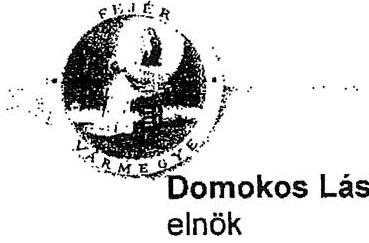

# Domokos László 

elnök

Állami Számvevőszék
Budapest

Fejér Megye
Közgyülésének
ELNÖKE
8002 Székesfehérvár
Szent István tér 9.
Tel.: (22) 522-503
Fax: (22) 522-574
Elek $y$
$\qquad$
Tisztelt Elnök Úr! kuerd $y$ vencele $y$ c. $05^{2}$ 52. 52. 52. 52. 52. 52. 52. 52. 52. 52. 52. 52. 52. 52. 52. 52. 52. 52. 52. 52. 52. 52. 52. 52. 52. 52. 52. 52. 52. 52. 52. 52. 52. 52. 52. 52. 52. 52. 52. 52. 52. 52. 52. 52. 52. 52. 52. 52. 52. 52. 

---

.

---

# Vargha Tamás úr 

elnök
Fejér Megye Önkormányzata

## Székesfehérvár

## Tisztelt Elnök Úr!

Köszönettel vettem a Fejér Megyei Önkormányzat pénzügyi helyzetének ellenőrzéséről készített jelentés-tervezethez küldött észrevételét.

Tájékoztatom Elnök urat, hogy az észrevételben foglaltakat elfogadtuk, azokat a végleges jelentés elkészítése során figyelembe vettük.

A rövidítések jegyzékében a Fejér Megyei Energiaszolgáltató Nonprofit Kft. rövidítését módosítottuk Energiaszolgáltató Kft-re.

Az integrált gazdasági szervezetként működő intézmény feladatellátásából az üzemeltetési, karbantartási feladatokat töröltük.

A Fejér Megye 2020/B kötvény felhasználási összegeit javítottuk a következők szerint: "A Fejér Megye 2020/B kötvény ellenértékének 69,9\%-át, 1388 millió Ft-ot fejlesztésre és pályázati önrész biztosítására, $29,5 \%$-át ( 585 millió Ft ) müködési célokra használta fel az Önkormányzat, $0,6 \%$-át ( 12 millió Ft ) fejlesztési célokra tartalékolták".

A bankok felé fennálló fizetési kötelezettség bemutatását a Fejér Megye 2012. kötvényből fennálló tartozás egyösszegű 2012. július 18 -án esedékes visszafizetési kötelezettségével kiegészítettük.

Köszönöm Elnök Úrnak és munkatársainak az ellenőrzés során tanúsított hozzáállását, amellyel a vizsgálatot végző számvevők munkáját segítették.
Budapest, 2011. december " 19 ".

Tisztelettel:
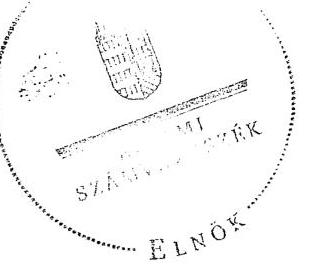

Tisztelettel:
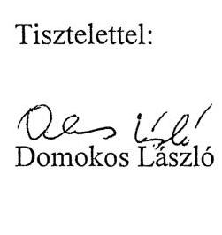

Melléklet: jelentés

---

.