# ÁLLAMI   SZÁMVEVŐSZÉK 

## JELENTÉS

a Győr-Moson-Sopron Megyei Önkormányzat pénzügyi helyzetének ellenőrzéséről (43/2)

---

# Számvevői Iroda 

Iktatószám: V-3015-13/2011.
Témaszám: 1015
Vizsgálat-azonosító szám: V056007

## Az ellenőrzést felügyelte:

Dr. Varga Sándor
számvevő igazgató-helyettes
Az ellenőrzést vezette:
Renkó Zsuzsanna
számvevő tanácsos
Az ellenőrzést végezték:

| Kántor Ilona | Kámán Edina | Krupánszki Dóra |
| :-- | :-- | :-- |
| főtanácsadó | számvevő | számvevő |

A témához kapcsolódó eddig készített számvevőszéki jelentések:
címe
sorszáma
Jelentés a Győr-Moson-Sopron Megyei Önkormányzat gazdálkodási rendszerének 2006. évi átfogó ellenőrzéséről

---

# TARTALOMJEGYZÉK 

BEVEZETÉS ..... 5
I. ÖSSZEGZŐ MEGÁLLAPÍTÁSOK, KÖVETKEZTETÉSEK, JAVASLATOK ..... 13
II. RÉSZLETES MEGÁLLAPÍTÁSOK ..... 18

1. Az Önkormányzat kötelező és önként vállalt feladatai ..... 18
2. Pénzügyi egyensúlyi helyzet alakulása ..... 21
2.1. A működési és felhalmozási egyensúly alakulása ..... 23
2.2. Az Önkormányzat bevételei ..... 27
2.3. Az Önkormányzat kiadásai ..... 30
3. Kötelezettségek bemutatása ..... 36
3.1. A pénzintézetek felé fennálló kötelezettségek alakulása ..... 36
3.2. Szállítók felé fennálló kötelezettségek alakulása ..... 41
3.3. Egyéb kötelezettségek alakulása ..... 43
4. A pénzügyi egyensúly megteremtése érdekében hozott intézkedések ..... 45
5. A helyi önkormányzatok gazdálkodási rendszerének 2010. évi ellenőrzése során a pénzügyi egyensúly javítására tett szabályszerűségi és célszerűségi javaslatok hasznosulása ..... 49

---

# MELLÉKLETEK 

1. számú Működési és felhalmozási hiány/többlet alakulása (1 oldal) melléklet
2/a. számú Az Önkormányzat CLF módszer szerint besorolt bevételei és kiadásai 2007-2010 között (2 oldal)
2/b. számú Az Önkormányzat bevételeinek és kiadásainak, adósságszolgálatának alakulása 2007-2010 között (1 oldal)
2. számú Az Önkormányzat 2007-2010 években megvalósított, illetve 2010. december 31-én folyamatban lévő felhalmozási feladataihoz kapcsolódó kötelezettségek ( 3 oldal)
3. számú Győr-Moson-Sopron Megyei Közgyűlés elnökének észrevétele (8 oldal) melléklet
4. számú Győr-Moson-Sopron Megyei Közgyűlés elnökének észrevételére adott válasz (1 oldal)

---

# RÖVIDÍTÉSEK JEGYZÉKE 

| Törvények |  |
| :--: | :--: |
| Áht. | az államháztartásról szóló 1992. évi XXXVIII. törvény |
| ÁSZ tv. | Az Állami Számvevőszékről szóló 1989. évi XXXVIII. törvény, (2011. július 1-jétől az Állami Számvevőszékről szóló 2011. évi LXVI. törvény) |
| Htv. | a helyi önkormányzatok és szerveik, a köztársasági megbízottak, valamint egyes centrális alárendeltségű szervek feladat- és hatásköreiről szóló 1991. évi XX. törvény |
| Ötv. | a helyi önkormányzatokról szóló 1990. évi LXV. törvény |
| Szórövidítések |  |
| áfa | általános forgalmi adó |
| APEH (NAV) | Adó- és Pénzügyi Ellenőrzési Hivatal (2011. január 1-jétől Nemzeti Adó- és Vámhivatal) |
| ÁSZ | Állami Számvevőszék |
| BBMMK | Bartók Béla Megyei Művelődési Központ Nonprofit Kft. |
| BM | Belügyminisztérium |
| EDP hiány/egyenleg | Uniós módszertan szerinti maastrichti kritériumoknak megfelelő számítás szerinti hiány/egyenleg |
| EU | Európai Unió |
| ÉDR Mosoda | Észak-Dunántúli Regionális Mosoda Kft. |
| GDP | Bruttó hazai termék |
| Önkormányzati hivatal | Győr-Moson-Sopron Megyei Önkormányzati Hivatal |
| Illetékhivatal | Győr-Moson-Sopron Megyei Illetékhivatal |
| Kincstár | Magyar Államkincstár |
| Kórház | Petz Aladár Megyei Oktató Kórház |
| Közgyűlés | Győr-Moson-Sopron Megyei Önkormányzat Közgyűlése |
| KSH | Központi Statisztikai Hivatal |
| NGM | Nemzetgazdasági Minisztérium |
| OEP | Országos Egészségbiztosítási Pénztár |
| Önkormányzat | Győr-Moson-Sopron Megyei Önkormányzat |
| PPP konstrukció | Public Private Partnership (Partnerségi együttműködés közfeladatok ellátására a magánszektor bevonásával) |
| SNA | SNA System of National Accounts azaz Nemzeti Számlák Rendszere |
| szja | személyi jövedelemadó |
| SzMSz | Győr-Moson-Sopron Megyei Önkormányzat 5/2003. (IV. 26.) számú rendelete az Önkormányzat Szervezeti és Működési Szabályzatáról |

---

.

---

# JELENTÉS 

## a Győr-Moson-Sopron Megyei Önkormányzat pénzügyi helyzetének ellenőrzéséről

## BEVEZETÉS

Az Állami Számvevőszék 2011. évtől érvényes stratégiája új irányt szabott a helyi önkormányzatok gazdálkodásának ellenőrzésében is. Az ÁSZ - küldetése és jövőképe szerint - szilárd szakmai alapokra támaszkodva értékteremtő ellenőrzéseivel és helyzetelemzéseivel az államháztartás egészében, így a helyi önkormányzati alrendszerben is elő kívánja segíteni a közpénzek és a közvagyon szabályos, gazdaságos, hatékony és eredményes hasznosítását. E folyamat részeként - a 2010. évi államháztartási hiány alakulásának összetevőire is figyelemmel - megkezdődött az önkormányzati alrendszer pénzügyi helyzetelemzése.

Az NGM 2011 áprilisában közzétett adatai szerint ${ }^{1}$ a 2010. évi 1036,2 milliárd Ft összegű, 3,8\%-os EDP (maastrichti kritériumok szerinti, Túlzott Hiány Eljárás keretében kimutatott) hiánycél nem volt tartható, az önkormányzati alrendszer tervezettet meghaladó hiánya miatt a GDP arányában kifejezett államháztartási hiány 4,2\%-ra emelkedett.

Az önkormányzatok költségvetési jelentése szerint 2010. első három negyedév végén az önkormányzati alrendszer pénzforgalmi hiánya 97 milliárd Ft volt, a tervezett éves mérték 51\%-át érte el. Bár az elmúlt években kiugróan magas hiány halmozódott fel az utolsó negyedévben, a 97 milliárd Ft-os szeptember végi hiány nem indokolta az önkormányzati alrendszer 190 milliárd Ft-ra becsült éves hiányának felülvizsgálatát. A tervezett hiány túllépése, az utolsó negyedévi 150 milliárd Ft-os pénzforgalmi hiány nem volt reálisan feltételezhető. A helyi önkormányzatok januári gyorsjelentése szerint a pénzforgalmi hiány 247,7 milliárd Ft-ot tett ki. A tervezettnél nagyobb önkormányzati pénzforgalmi hiány kialakulásában - az NGM által az éves költségvetési beszámoló elkészítéséhez kiadott tájékoztató szerint - az iparűzési adó elmaradása, a gépjárműadó, az illetékek és más bevételek tervezettnél alacsonyabb összegben teljesülése volt a meghatározó.

[^0]
[^0]:    ${ }^{1}$ NGM Tájékoztatás Magyarország Strukturális Reformprogramjának végrehajtásáról (2011. április 1). A Tájékoztató évente két alkalommal - április és október hónapban jelenik meg.

---

A megyei önkormányzatok kötelező feladatellátását többlépcsős törvényi előírások határozzák meg. A feladatokra vonatkozó szabályozás első szintjét az Ötv. ${ }^{2}$, a második szintet a hatásköri ${ }^{3}$, a harmadik szintet a további ágazati, szakmai törvények (egyebek mellett az oktatási, egészségügyi, szociális) adják.

A megyei önkormányzatok a feladatellátás és a központi forráselosztás tekintetében sajátos helyet foglalnak el a helyi önkormányzati rendszerben. A megyei önkormányzat kötelező feladatainak egy része - így a megyében lévő természeti és társadalmi muzeális emlékek, a történeti íratok gyűjtése, őrzése, tudományos feldolgozása, a megyei könyvtári szolgáltatás, a pedagógiai és közművelődési szakmai tanácsadás és szolgáltatás, a megyei testnevelési és sportszervezési feladatellátás, a gyermek- és ifjúsági jogok érvényesítése, a gyermekvédelmi- és szociális szakellátás - az Ötv-ből közvetlenül levezethető kötelezettség.

A középiskolai, szakiskolai, és kollégiumi ellátás, a fogyatékos gyermekek oktatása, nevelése, gondozása az ágazati törvény szerint a megyei önkormányzat kötelező feladata. Azonban, ha a települési önkormányzat lát el ilyen feladatot, és arról lemond, a megyei önkormányzatnak a feladatot át kell vennie. Így a megyei önkormányzatok által ellátandó kötelező közszolgáltatások ellátásának mértékére a települési önkormányzatok döntései jelentősen kihatnak.

Az alapellátást meghaladó egészségügyi szakellátás biztosítása akkor képezi a megyei önkormányzat feladatát, ha az önkormányzati vagyon kialakításáról szóló törvényben ${ }^{4}$ a feladat ellátásához szükséges vagyont az önkormányzat a tulajdonába kapta.

Az önként vállalt feladat ellátására - mivel annak vállalása a kötelező feladatok ellátását nem veszélyeztetheti - a kötelező közszolgáltatások mértékének alakulása lényegi hatással van.

A feladat- és hatáskör telepítés sajátosságai mellett a megyei önkormányzatok kialakított forrásszerkezete, a központi költségvetéstől való erőteljes függősége is determinálja az önkormányzatok feladatellátásra vonatkozó döntéseit.

A 2007-2010. években az önkormányzati feladatok ellátásának keretet biztosító forrásszabályozás - ennek részeként az illetékbevételből és a személyi jövedelemadóból való részesedés szabályai - a megyei önkormányzatok vonatkozásában nem változtak:

- A megyei önkormányzatok saját bevételein belül az illetékbevételek döntően az ingatlanpiac stagnálása, majd visszaesése, és egyes illetékkedvezmények bevezetése következtében - megyénként differenciált mértékben ugyan, de - 2010-re általánosan visszaestek. A 2010. évben befolyt

[^0]
[^0]:    ${ }^{2}$ Ötv. 69-70. §-ai
    ${ }^{3}$ a Htv.
    ${ }^{4}$ az egyes állami tulajdonban lévő vagyontárgyak önkormányzatok tulajdonba adásáról szóló 1991. évi XXXIII. törvény

---

39,2 milliárd Ft illetékbevétel a 2006. évben realizált 71,1 milliárd Ft illetékbevétel alig több mint 55\%-a volt. A kieső bevételek pótlására az önkormányzati alrendszer szintjén történtek intézkedések, 2010-ben 5 milliárd Ft-ot, 2011-ben 1,2 milliárd Ft-ot ellentételezett a központi költségvetés. Az illetékbevételt a megyei önkormányzatok a saját folyó bevételeik között számolják el ${ }^{5}$.

Az illetékek kivetésének és beszedésének joga 2006. december 31-ig a megyei önkormányzatok feladata volt. A 2007. évtől a megyei illetékhivatalok illetékbeszedési feladatait az APEH vette át ${ }^{6}$. Az önkormányzati illetékrészesedési szabályok változatlanok maradtak, azonban az illetékbeszedés költségeit az önkormányzatok illetékbevételeiből átlagos (a Fővárosnál 4,0\%-os, a megyei és megyei jogú városi önkormányzatnál 8,5\%-os) kulcsot alkalmazva vonták le. E döntés következtében azon megyei önkormányzatok, amelyek a 8,5\%-os költségnél kedvezőbb költségszint mellett látták el korábban ezt a feladatot, kedvezőtlenebb helyzetbe kerültek.

- Az önkormányzati alrendszer személyi jövedelemadóból való részesedésének makroszintű szabályozása nem változott 2007-2010 között${ }^{7}$. A helyi önkormányzatokat normatív módon megillető 32\%-os részesedés visszaosztásának részletszabályai azonban a megyei önkormányzatok számára - a reálgazdaság kedvezőtlen irányú folyamatai, és az államháztartás egyensúlyi helyzetére tekintettel elrendelt kormányzati intézkedések miatt - megszorító intézkedéseket jelentettek. Összesen 17 milliárd Ft - 2007-ben 10 milliárd Ft, 2010-ben további 7 milliárd Ft - szja-t vontak ki a megyei önkormányzatok gazdálkodási köréből ${ }^{8}$. Az átengedett személyi jövedelemadó a megyei önkormányzatok egyik bevétele.

[^0]
[^0]:    ${ }^{5}$ A megyei önkormányzatok illetékbevételei az önkormányzati alrendszer saját folyó bevételeiből 2007-ben 35,9 milliárd Ft-ot (61,4\%-ot), 2008-ban 41,5 milliárd Ft-ot (61,7\%-ot), 2009-ben 36,5 milliárd Ft-ot (62,5\%-ot), 2010-ben 25,1 milliárd Ft-ot (64,1\%-ot) tettek ki.
    ${ }^{6}$ Az egyes pénzügyi tárgyú törvények módosításáról szóló 2006. évi LXI. törvény 115. §a, amely az adózás rendjéről szóló 2003. évi XCII. törvény 73. §-át módosította.
    ${ }^{7}$ A megyei önkormányzatok személyi jövedelemadó részesedése az önkormányzati alrendszer átengedett bevételeiből 2007-ben 34,7 milliárd Ft-ot (7,0\%-ot), 2008-ban 51,2 milliárd Ft-ot (9,2\%-ot), 2009-ben 59,2 milliárd Ft-ot (9,3\%-ot), 2010-ben 56,3 milliárd Ft-ot (8,3\%-ot) tett ki.
    ${ }^{8}$ A megyei önkormányzatok szja kiegészítése háromelemű. A tételes, minden megyére egységesen meghatározott összeg - az adott évek költségvetési törvényeinek 4. sz. mellékletében meghatározottak szerint - 2006-ban 593 millió Ft, 2007-ben és 2008-ban egyaránt 355 millió Ft, 2009-ben 370 millió Ft volt. A megye népességszáma után járó kiegészítés a 2006. évi 208 Ft/fő összegről 2010-re 120 Ft/fő-re, a megyei intézmények ellátottjai után járó kiegészítés 42236 Ft/ellátottról 20755 Ft/ellátottra csökkent.

---

A megyei önkormányzatok 2007-2010 között rendelkezésre álló forrásait az alábbiakban mutatjuk be:
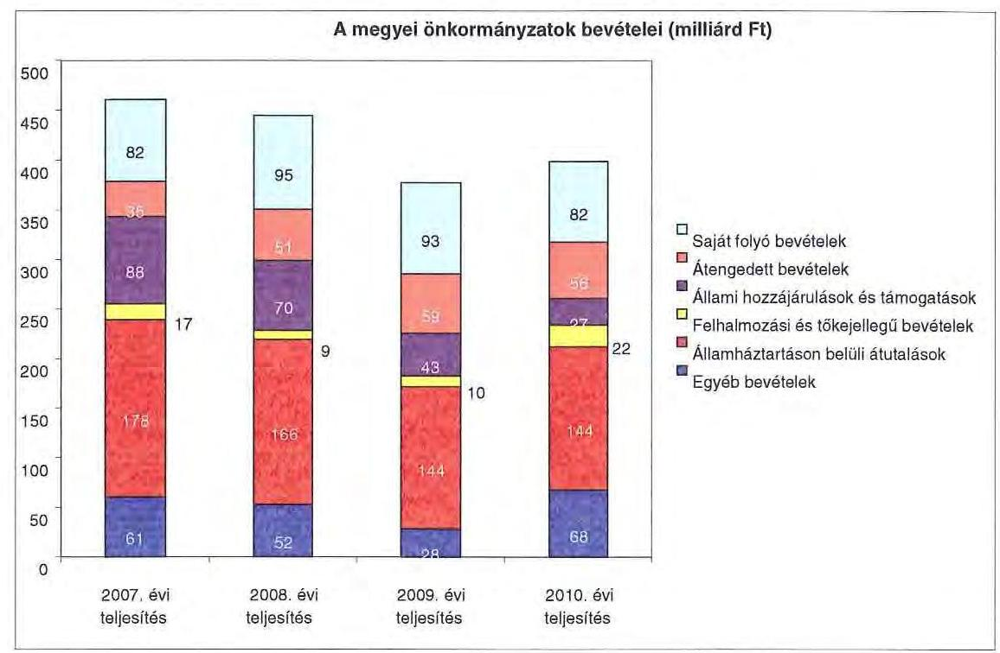

A megyei önkormányzatok saját folyó bevételeinek részaránya - amelyek főbb elemei: az intézményi térítési díjak, az illetékbevétel, a kamatbevételek - a 2007. évi összbevételen (461 milliárd Ft) belül 17,9\% volt, amely 2010-re annak ellenére 20,6\%-ra nőtt, hogy az összege 82 milliárd

 Ft maradt. Ennek oka az volt, hogy az összbevétel a 2007. évi 461 milliárd Ft-ról 2010-re 399 milliárd Ft-ra csökkent.

Az átengedett bevételek, amelyek a megyei önkormányzatoknál a személyi jövedelemadóból való részesedést jelentették, az összbevételen belül a 2007. évi 35 milliárd Ft-ról 56 milliárd Ft-ra nőttek.

Az állami hozzájárulások és támogatások - amelyek főbb elemei: az ellátotti létszámhoz kötődő normatív állami hozzájárulások, központosított, fejezeti szinten kezelt célelőirányzatból juttatott működési és fejlesztési támogatások a 2007. évi 88 milliárd Ft-ról (19,1%-os részarányról) 2010-re 27 milliárd Ft-ra (6,8%-os részarányra) estek vissza.

A felhalmozási és tőkejellegű bevételek - tárgyi eszközök (ingatlanok és ingóságok), föld és immateriális javak, részesedések értékesítése, EU-tól átvett pénzeszközök - a 2007. évi 17 milliárd Ft-ról (3,6%-os részarányról) 2010-re 22 milliárd Ft-ra (5,4%-ra) emelkedtek.

Az államháztartáson belüli átutalások részesedése 2007-ben 178 milliárd Ft volt. 2010. év végére 34 milliárd Ft-tal csökkent, részaránya 38,6%-ról 2,6 százalékpontos csökkenés után 2010-ben 36%-ra változott. Ez a bevételi kategória

---

tartalmazza az egészségbiztosítási és egyéb elkülönített állami pénzalapoktól átvett forrásokat. A 2010-ben e címen elszámolt bevétel 144 milliárd Ft volt.

A megyei önkormányzatok központi költségvetésből származó bevételeinek összege 2007-ben 400 milliárd Ft volt, amely 2010. évre 331 milliárd Ft-ra (az időszak alatt összesen 69 milliárd Ft-tal) 17,3%-kal csökkent.

Az egyéb, pénzmaradványból, vállalkozási bevételekből, államháztartáson kívülről származó átutalásokból, a hitelekből, a hosszú és rövid lejáratú értékpapírok értékesítéséből származó bevételek részesedése a 2007-2010. évek viszonylatában 13,3%-ról 17,1%-ra emelkedett. Ez utóbbiak 2010. évi beszámoló szerinti összevont teljesítése 68 milliárd Ft volt ${ }^{9}$.

Mindezeket figyelembe véve a 2007. és a 2010. évben a megyei önkormányzatok forrásösszetételének megoszlását az alábbi ábra szemlélteti:
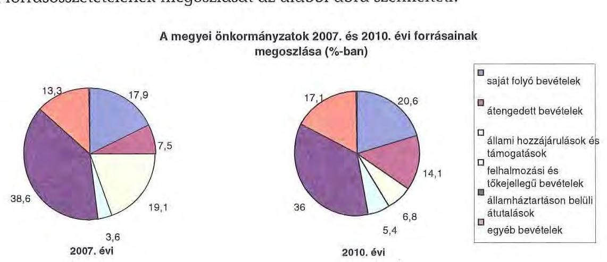

Annak ellenére, hogy a megyei önkormányzatok kötelezően ellátandó feladataikat 2007-hez képest kevesebb intézményben, csökkenő foglalkoztatotti létszám mellett végezték ${ }^{10}$, a jelentős bevételkiesést a - szervezési intézkedések hatására - csökkenő ráfordítások nem tudták kompenzálni. Az ellátottak száma a szociális, gyermekvédelmi ágazat bentlakásos elhelyezést nyújtó intézményeit kivéve - eltérő mértékben ugyan, de minden ágazatban évről évre csökkent, amely a fajlagos hozzájárulások csökkenésével együtt a normatív állami hozzájárulás arányának visszaeséséhez vezetett.

[^0]
[^0]:    ${ }^{9}$ Az egyéb bevételek összege 2007-2010 között eltérő módon változott, 2007-ben 61 milliárd Ft volt, 2008-ban 52 milliárd Ft-ra, 2009-ben 28 milliárd Ft-ra esett vissza, majd 2010-ben ismét - 68 milliárd Ft-ra - emelkedett.
    ${ }^{10}$ a BM által 2010 decemberében elvégzett felmérés adatai szerint

---

A 2007-2013-as időszakra meghirdetett, vissza nem térítendő EU-s fejlesztési forrásokhoz való hozzájutás lehetősége felerősítette az önkormányzati alrendszer fejlesztési igényeit. A fokozott fejlesztési tevékenység a felhalmozási bevételek és kiadások egyensúlyának megbomlásán ${ }^{11}$ túl a jelentkező jövőbeni fenntartási kötelezettség miatt tovább terhelhetik az önkormányzatok költségvetését.

A megyei önkormányzatok felhalmozási és működési célú pénzintézeti és szállítói kötelezettségeinek állománya a vizsgált időszakban erőteljesen növekedett.

A megyei önkormányzatok hosszú lejáratú kötelezettségállománya a 2007. évről a 2010. évre - alapvetően a kötvénykibocsátások miatt - a 2007. évi állomány 2,3 szeresére emelkedett.

A hosszú lejáratú kötelezettségek nagyságát a következő ábra szemlélteti:
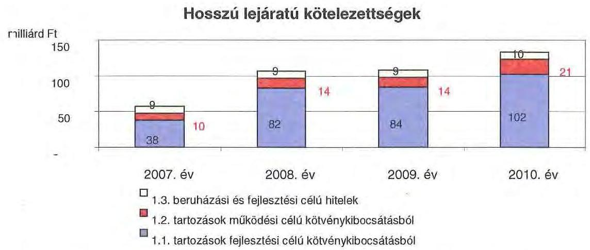

A hosszú lejáratú kötelezettségek mellett az időszakban a 2007. évi 22 milliárd Ft-ról 24 milliárd Ft-ra (8,8%-kal) növekedett az áruszállításból származó szállítói kötelezettségek állománya.

A mérlegben kimutatott kötelezettségek állománya mellett az elhasználódott eszközök pótlására forrást biztosító amortizációs (felújítási) alap képzésének ${ }^{12}$ elmaradása további problémákat vetít előre. A megyei önkormányzatok beszámolójelentéseinek összegzése szerint 2007-ben még az elszámolt értékcsökkenés 90%-ának megfelelő összeget fordítottak felújítási célokra, 2009-ben ez

[^0]
[^0]:    ${ }^{11}$ Az önkormányzati alrendszerben - az éves zárszámadási törvényjavaslatok általános indokolása, X. Helyi önkormányzatok gazdálkodása fejezet szerint - a felhalmozási bevételek és kiadások egyenlege 2007-ben 142,4 milliárd Ft, 2008-ban 112,3 milliárd Ft, 2009-ben 234,5 milliárd Ft hiányt mutatott.
    ${ }^{12}$ Erre a jelenlegi szabályozási környezetben nem kötelezi semmilyen előírás az önkormányzatokat.

---

az arányszám már csak 16,5% volt. Ez maga után vonta a feladatellátást kiszolgáló tárgyi eszközök állagának erőteljes romlását.

Az ÁSZ a 2011. évi ellenőrzési tervében a 43. számú, az „Önkormányzatok gazdálkodási rendszerének ellenőrzése" részeként egy időben, egymással párhuzamosan tekinti át és elemzi az önkormányzati alrendszer középszintjét jelentő 19 megyei önkormányzat pénzügyi helyzetét. A gazdálkodás szabályszerűségét az ÁSZ előző évek során ellenőrizte a megyei önkormányzatoknál is, ezért jelen vizsgálatunk erre nem tér ki.

A jelentés a megyei önkormányzatok sajátos feladatellátási és forrásszabályozási helyzetére tekintettel a megyei önkormányzatok pénzügyi helyzetét, illetve az ezzel összefüggő korábbi ÁSZ javaslatok megvalósítását mutatja be.

Az ellenőrzés a 2007. január 1. - 2011. március 31. közötti időszakot ölelte fel.
A vizsgálat jogszabályi alapját 2011. július 1-je előtt az Állami Számvevőszékről szóló 1989. évi XXXVIII. törvény 2. § (3), (5), (6) és (9) bekezdéseiben, az Ötv. 92. § (1) bekezdésében és az Áht. 104. § (3) bekezdésében, 2011. július 1-jét követően az Állami Számvevőszékről szóló 2011. évi LXVI. törvény 1. § (3) bekezdésében, az 5. § (2)-(6) bekezdéseiben és az Áht. 120/A. § (1) bekezdésében foglalt előírások képezték.

Győr-Moson-Sopron megye országos és régión belül elfoglalt helyzetét 2010. december 31-én a következő táblázatban foglalt mutatók szemléltetik (megyei jogú városokkal együtt):

Index: az előző év azonos időszak (időpontja)=100,0

| Mutató megnevezése | Győr-   Moson-   Sopron   megye | Nyugat-   dunántúli   régió | Országos |
| :-- | :--: | :--: | --: |
| Népesség száma (ezer fő)* | 449 | 992 | 9986 |
| Népesség változás indexe (\%) | 100,1 | 99,6 | 99,7 |
| Az ipari termelés volumenindexe (\%) | 117,9 | 115,8 | 110,7 |
| Egy lakosra jutó ipari termelési érték (ezer Ft) | 4553,7 | 3249,8 | 2044,4 |
| Ezer lakosra jutó vállalkozások száma (db) | 155 | 157 | 165 |
| A beruházások egy lakosra vetített teljesít- |  |  |  |
| menyértéke (ezer Ft) | 437,5 | 277,6 | 304,7 |
| Foglalkoztatási arány (\%) | 54,1 | 52,3 | 49,5 |
| Munkanélküliségi ráta (\%) | 7,1 | 8,8 | 10,8 |
| Alkalmazásban állók havi nettó átlagkeresete (Ft) | 128418 | 120429 | 132628 |
| Alkalmazásban állók havi nettó átlagkeresetének indexe (\%) | 108,7 | 107,9 | 106,9 |

* Győr-Moson-Sopron megye népessége számából Győr Megyei Jogú Város és Sopron Megyei Jogú Város népessége együttesen 184 ezer fő.

Győr-Moson-Sopron megyében él Magyarország lakosságának 4,5%-a, 449 ezer fő. A gazdaság teljesítőképességének az országos átlagnál kedvezőbb dinamizmusa következtében a megyében nő a népesség, az országos csökkenéssel szemben. Ezzel összefüggésben a foglalkoztatottak aránya 4,6 százalékponttal

---

magasabb, míg a munkanélküliek aránya 3,7 százalékponttal alacsonyabb az országos átlagnál. A megyében 183 települési- két megyei jogú városi, kilenc városi, öt nagyközségi, 167 községi - önkormányzat működött.

---

# I. ÖSSZEGZŐ MEGÁLLAPÍTÁSOK, KÖVETKEZTETÉSEK, JAVASLATOK 

A Győr-Moson-Sopron Megyei Önkormányzat a 2010. évben 21705 millió Ft összes költségvetési kiadásának 99,5%-át kötelező feladatai ellátására fordította. Az Önkormányzat önként vállalt feladatai 108 millió Ft összegben kulturális és hagyományőrző tevékenységhez, egyes idegenforgalmi szolgáltatásokhoz, ösztöndíj pályázatokhoz, valamint civil szervezetek, alapítványok támogatásához kapcsolódtak. Az SzMSz tartalmazta a kötelezően ellátandó feladatokat és hatásköröket, valamint az önként vállalt feladatokat.

Az Önkormányzat kötelező és önként vállalt feladatait alapvetően költségvetési intézményei által látta el. Az intézmények száma a 2006. év végi 22 önállóan és négy részben önállóan gazdálkodó költségvetési szervről, a megszüntetések és átszervezések következtében a 2010. év végére 22 önállóan működő és gazdálkodó költségvetési szervre csökkent, a telephelyek száma 40-ről 37-re változott. Az Önkormányzat egy kizárólagos tulajdonában lévő gazdasági társasággal rendelkezik, amely elsősorban kötelező közművelődési feladatot lát el. Az Önkormányzat költségvetési intézménye, a Kórház minősített többségi befolyással (80%) rendelkezik az ÉDR Mosoda Kft-ben, amely a Kórház mosodai tevékenységét látja el. Az Önkormányzat 50%-nál kisebb tulajdoni hányaddal rendelkező gazdasági társaságai közül - amelyek száma a 2010. évben három volt - a Győr-Pér Repülőtér Kft. esetében a saját tőke a 2006-2008. években a jegyzett tőke 50%-a alá csökkent, ezért az Önkormányzatnak a tőkearány helyreállítása érdekében pótbefizetési kötelezettsége keletkezett, amelynek összege összesen 28,4 millió Ft volt.

A folyó költségvetés egyenlege (működési jövedelem) 2007-2008 között működési forrástöbbletet mutatott, 2009-2010-ben azonban a folyó kiadások csökkenését meghaladó mértékű folyó bevételcsökkenés miatt az Önkormányzat működési forráshiányos volt. A működési forrástöbblet a 2007. évben a folyó kiadások 2,4%-át (474 millió Ft-ot), a 2008. évben 0,7%-át (138 millió Ft-ot) jelentette. A működési forráshiány a 2009. évben a folyó bevételek 0,4%-át (86 millió Ft-ot), a 2010. évben 2,7%-át (558 millió Ft-ot) tette ki. A működési forráshiány finanszírozása folyószámlahitelből történt.

A 2007-2010. években az Önkormányzatnak tőketörlesztési kötelezettsége nem volt, így a pénzügyi kapacitás (nettó működési jövedelem) a folyó költségvetési egyenleggel azonosan alakult.

A 2007-2010. években az Önkormányzat felhalmozási költségvetésének egyenlege folyamatosan negatív összegű volt, amely összesen 1521 millió Ft felhalmozási forráshiányt okozott. Az Önkormányzat - CLF módszer alapján számított - felhalmozási forráshiány fedezetét a 2007. évben 61,1%-ban (474 millió Ft), a 2008. évben 50,0%-ban (138 millió Ft) a folyó költségvetés biztosította. A felhalmozási forráshiány további finanszírozása folyószámlahitelből, a 2010. évben felhalmozási célú hitelből történt.

---

A 2007-2010. években az év végén fennálló likvidhitel állomány, továbbá a forráshiány 4422 millió Ft-ot tett ki, amelyre az időszakban képződő 612 millió Ft működési többlet, a korábbi években képződött tartalékok és a 2010. évben felvett 25 millió Ft hitel szolgáltak fedezetül.

Az Önkormányzat feladatai ellátása érdekében - a CLF módszer szerint számolva - a 2007. évben 19957 millió Ft, a 2008. évben 21257 millió Ft, a 2009. évben 19576 millió Ft, a 2010. évben 20162 millió Ft folyó bevételt teljesített. A folyó bevételek körében leginkább meghatározó volt a Kórház részére juttatott OEP támogatás, amely a 2007. évben a működési bevételek 52,3%-át (10 440 millió Ft-ot), a 2010. évben 58,0%-át (11700 millió Ft-ot) tette ki. Az Önkormányzatnál az illetékbevétel 2010-re a 2006. évi 2310 millió Ft-ról (55,1%-ára) 1273 millió Ft-ra csökkent. Az átengedett szja és az állami támogatások együttes összege a központi támogatás csökkentésén túl az ellátotti létszám visszaesése hatását is figyelembe véve kevesebb lett, 2010-ben 2317 millió Ft volt, a 2007. évi 65,0%-a. A 2010. évben az intézményi működési bevételek 28,8%-kal (816 millió Ft-tal) haladták meg a 2007. évi teljesítést, amely elsősorban a Kórház vállalkozási bevételeinek növekedéséből adódott.

Az Önkormányzat - CLF módszer
 szerint számított - folyó és felhalmozási kiadásainak együttes összege a 2010. évben 5,7%-kal (1180 millió Ft-tal) volt magasabb a 2007. évi kiadásnál, amely 20525 millió Ft volt. A folyó kiadások 2007-ről 2010-re 6,3%-kal, 1237 millió Ft-tal nőttek.

Az Önkormányzat működési és felhalmozási kiadásai együttesen a 2010. évben 5,3%-kal (1086 millió Ft-tal) haladták meg a 2007. évit, amely 20687 millió Ft volt. A Kórház működésére 1286 millió Ft kiadást teljesített 2007-2010 között az Önkormányzat. Az intézmények teljesített kiadásai a Kórház nélkül a 2007. évben az Önkormányzat összes működési kiadásából 7164 millió Ft-ot (36,5%), a 2010. évben 6598 millió Ft-ot (31,9%) képviseltek.

A működési és felhalmozási kiadásokon belül 2007-2010 között a felhalmozási kiadások 1036 millió Ft-ról (5,0%-ról) 998 millió Ft-ra (4,6%-ra) csökkentek.

A 2008-2010. évek között 15538 millió Ft bekerülési költségű beruházást folytatott, illetve indított el az Önkormányzat, amelyből 11662 millió Ft a 2010 utánira vállalt kötelezettség. Az utóbbi forrásai - az Önkormányzat adatszolgáltatása szerint - a következők: 29 millió Ft tervezett saját bevétel, 1423 millió Ft tervezett fejlesztési hitel, 10161 millió Ft elnyert EU-s támogatás, 49 millió Ft elnyert hazai támogatás. Az Önkormányzat legmagasabb bekerülési költségű beruházása a Kórház infrastruktúra fejlesztéséhez kapcsolódik, 10130 millió Ft-os (90%) EU-s támogatás igénybevétele mellett.

Az Önkormányzatnak pénzintézeti kötelezettsége a 2006. év végén nem állt fent, 2010. december 31-én 1465 millió Ft volt. Az Önkormányzat a 2009. évtől kezdődően rendelkezett hosszú lejáratú hitelkerettel, amelynek összege a 2010. év végén 1537 millió Ft, a 2011. év I. negyedév végén 2113 millió Ft volt, amelyből 2010. december 31-ig 25 millió Ft-ot vett igénybe. Az Önkormányzat a 2010. év végéig hosszú lejáratú hitellel összefüggésben tőkét nem törlesztett, a 25 millió Ft összegben felvett felhalmozási célú hitellel és a likvidhitellel kapcsolatban 131 millió Ft kamatkiadást teljesített.

---

Az Önkormányzat likviditása érdekében a 2010. évben az év minden napján igénybe vett folyószámlahitelt, amelynek átlagos napi állománya 938 millió Ft volt.

Az Önkormányzat 2010. év végi pénzintézeti kötelezettsége 25 millió Ft (1,7%) fejlesztési célú hosszú lejáratú hitelből és 1440 millió Ft (98,3%) folyószámlahitelből keletkezett. A fentiek miatt, valamint a megkötött hosszú lejáratú hitelkeret-szerződések teljes igénybevétele esetén az Önkormányzatnak a 2011-2013. években 2043 millió Ft tőketörlesztést és kamatot kell teljesítenie. Az Önkormányzat 2010. év végi szállítói tartozása - gazdasági társaságok nélkül 3105 millió Ft (ebből lejárt 265 millió Ft), egyéb kiadás elmaradás nem volt. (A Kórháznál 2970 millió Ft szállítói tartozásból a lejárt szállítói tartozásállomány csökkentése érdekében annak átütemezésére került sor, amelynek következtében a kifizetett késedelmi kamat összege a vizsgált időszakban összesen 180 millió Ft volt. Az átütemezéseket követően a lejárt szállítói tartozásállomány a Kórháznál 206 millió Ft volt.) Az Önkormányzat Pénzügyi és Vagyonkezelő Bizottsága a Kórház lejárt szállítói kötelezettségeinek rendezését rendszeresen megtárgyalta, szükség esetén a szállítói állomány csökkentése érdekében intézkedési tervet fogadott el, a végrehajtott intézkedésekről a Kórházat beszámoltatta.

A 2011-2013. évi összes (pénzintézeti és szállítói) kötelezettség teljesítésére figyelembe vehető 1603 millió Ft (becsült) értékű jelzáloggal nem terhelt, továbbá a pénzintézeti kötelezettségvállalásokhoz kapcsolódóan 469 millió Ft (becsült) értékű terhelt forgalomképes ingatlanvagyon értékesítéséből, és 272 millió Ft egyéb követelésállomány behajtásából származó forrás. Ezek részben nyújtanak fedezetet a 2011-2013. években teljesítendő összes kötelezettségre. A további évekre szóló - a 2011. március 31-én az Önkormányzat rendelkezésére álló információk alapján ismert - összes pénzintézeti kötelezettség 2027 millió Ft, amelyre a figyelembe vehető források a helyszíni ellenőrzés időszakában nem voltak számszerűsíthetők.

Az adósságot keletkeztető kötelezettségvállalással kapcsolatos előterjesztésekben a Közgyűlést tájékoztatták arról, hogy a tőke- és kamatfizetési kötelezettségét az Önkormányzat milyen feltételek biztosítása mellett tudja teljesíteni. Az Önkormányzatnál a hosszú lejáratú adósságot keletkeztető kötelezettségvállalások során vizsgálták és betartották az éves adósságot keletkeztető kötelezettségvállalás felső korlátját.

Az Önkormányzat a 2011-2014. évre szóló gazdasági és humán programjában az éves költségvetések összeállítása és végrehajtása során alapvető feladatként határozta meg a pénzügyi stabilitás biztosítását, a pénzügyi lehetőségek kiegészítéseként a bevételek növelését, a gazdálkodás pénzügyi egyensúlyát szolgáló döntések meghozatalát. A gazdasági és humán programban foglalt célok megvalósítása érdekében az Önkormányzat a pénzügyi egyensúly megteremtését a 2011. évben működési célú hitel igénybevételével, a gazdálkodás további racionalizálásával, feladatátszervezéssel, létszámcsökkentéssel, takarékossági intézkedések megteremtésével, az önként vállalt feladatok kiadásainak további csökkentésével, a céltartalékok mérséklésével kívánja megteremteni.

---

Az Önkormányzat minden évben elkészítette az intézmények műszaki állapotfelmérését és rangsorolta az elhasználódott eszközök pótlására, felújításra rendelkezésre álló forrásokat. Az Önkormányzat a 2007-2010. években a tárgyi eszközök után 2639 millió Ft értékcsökkenést számolt el, felújításra 348 millió Ft-ot fordított.

A végrehajtott kiadáscsökkentő intézkedések a gazdálkodás átláthatóbbá tételét, valamint a feladatellátás szakmai színvonalának, de kiemelten a pénzügyi helyzetnek a javítását célozták a 2007-2010. években. Az Önkormányzatnál a kiadáscsökkentő intézkedések eredményeként négy év alatt összesen - az Önkormányzat kimutatása szerint - 4909 millió Ft megtakarítás keletkezett.

Az intézmények megszüntetése és összevonása mellett jelentős álláshelycsökkentés történt. Összesen 810,8 álláshely került megszüntetésre, amelyből 468,1 (57,7%) szakmai, 342,7 (42,3%) intézményüzemeltetéssel kapcsolatos volt. A létszámcsökkentés következtében az Önkormányzat 2006. december 31-i átlaglétszáma 4153 főről 2011. március 31-re 3348 főre csökkent.

Az Önkormányzat törekedett a bevételek növelésére, kiemelt figyelmet fordított a meglévő eszközállomány hasznosítására. Az intézkedések eredményeként számításba vett 107 millió Ft összegű bevétel növekményből 16 millió Ft (14,9%) az Önkormányzati hivatalnál, 91 millió Ft (85,1%) az intézményeknél jelentkezett a 2007-2010. években.

Az ÁSZ az Önkormányzat gazdálkodási rendszerét a 2010. évben ellenőrizte, amely során a pénzügyi egyensúly javítására vonatkozó javaslatot nem tett, ezért utóellenőrzésre nem került sor.

A feladatok és források közötti egyensúly megteremtésére irányuló központi döntések, a megyei önkormányzatok konszolidációjára, az intézmények átvételére vonatkozó törvényjavaslat elfogadása új feltételeket teremtett. A hatékony és eredményes gazdálkodás, a pénzügyi egyensúly megőrzése azonban további helyi intézkedéseket igényel.

Az Állami Számvevőszékről szóló 2011. évi LXVI. törvény 33. § (1) bekezdésében foglaltak értelmében a jelentésben foglalt megállapításokhoz kapcsolódó intézkedési tervet köteles az ellenőrzött szervezet vezetője összeállítani és azt a jelentés kézhezvételétől számított harminc napon belül az ÁSZ részére megküldeni. Amennyiben az intézkedési tervet határidőben nem küldi meg a szervezet, vagy az továbbra sem elfogadható, az ÁSZ elnöke a hivatkozott törvény 33. § (3) bekezdés a)-b) pontjaiban foglaltakat érvényesítheti.

---

A 2011 májusában lezárult helyszíni ellenőrzés tapasztalatai alapján - figyelembe véve az Önkormányzat észrevételeit és a saját hatáskörben tett intézkedéseit - az alábbi javaslatokat tette az ÁSZ:

# a Közgyűlés elnökének: 

1. terjesszen - feltételek romlása esetén - a Közgyűlés elé cselekvési tervet a szükséges - üzemgazdasági számításokkal alátámasztott - bevételnövelő, kiadáscsökkentő, beruházások és más kötelezettségek felülvizsgálatát, tartalékok képzését, méretgazdaságos intézményi struktúrát eredményező döntések meghozatala érdekében, a pénzügyi, működés egyensúly mielőbbi biztosítása és fenntarthatósága céljából;
2. mutassa be a Közgyűlésnek az éves költségvetési előterjesztésekben az értékcsökkenési leírás összegét, és ezzel arányban az elhasználódott eszközök pótlásának forrásigényét és lehetőségét.

---

# II. RÉSZLETES MEGÁLLAPÍTÁSOK 

## 1. Az ÖNKORMÁNYZAT KÖTELEZŐ ÉS ÖNKÉNT VÁLLALT FELADATAI

A Győr-Moson-Sopron Megyei Önkormányzat a 2010. évben 21705 millió Ft összes költségvetési kiadásának 99,5%-át kötelező feladatai ellátására fordította ${ }^{13}$. A 2011. évi tervadatok alapján az SzMSz-ben általa meghatározott önként vállalt feladatokra az összes költségvetési kiadásból 31 millió Ft (0,1%) jut, amely 77 millió Ft-tal (59,7%-kal) kevesebb az előző évhez képest. Az Önkormányzat önként vállalt feladatai kulturális és hagyományőrző tevékenységhez, idegenforgalmi szolgáltatásokhoz, ösztöndíj pályázatokhoz kapcsolódnak, valamint támogatást nyújt civil szervezetek, alapítványok működéséhez.

A Közgyűlés SzMSz-ben szabályozta a kötelezően ellátandó feladatokat és hatásköröket, valamint az önként vállalt feladatokat. Az önként vállalt feladatokat az SzMSz 1/b. számú melléklete részletesen rögzítette.

Az Önkormányzat kiadási struktúrájában, ezen belül a felmerült személyi és a dologi kiadások körében meghatározó részt - a 2010. évben 14217 millió Ft-ot (65,5%) - a Kórház fenntartása jelentett.

A 2010. évben a szociális és gyermekvédelmi feladatok ellátásában nyolc intézmény vett részt, a költségvetési kiadásokból való részesedésük 2467 millió Ft (11,4%), míg a hét közoktatási intézmény feladatellátásához a kiadásokból 1778 millió Ft (8,2%) kapcsolódott. A 2010. évben a közoktatási feladatok kiadásait 1381 millió Ft (77,7%), a szociális és gyermekvédelmi feladatok kiadásait 1717 millió Ft (69,6%) összegben finanszírozta az Önkormányzat által biztosított költségvetési támogatás.

Az Önkormányzat a kötelező feladatok harmadik csoportját jelentő közművelődési, levéltári, közgyűjteményi szolgáltatások ellátását négy intézményével biztosítja, ezek kiadása 902 millió Ft (4,2%), az igazgatási és egyéb ágazathoz sorolható kiadások összege 2341 millió Ft (10,7%) volt a 2010. évben.

Az Önkormányzat kiadási szerkezetét tekintve a járulékokkal növelt személyi és a dologi kiadások 19500 millió Ft-os összegén belül meghatározó arányt ${ }^{14}$ 13966 millió Ft-ot (71,6%)-ot - a Kórháznál elszámolt kiadások jelentik. A szociális és gyermekvédelmi feladatokat ellátó nyolc intézmény kiadásokból való részesedése 2289 millió Ft (11,7%), a hét közoktatási intézményé 1608 millió Ft (8,2%) volt. A 2010. évben a közoktatási feladatok kiadásait 34,6%-ban, a szociális és gyermekvédelmi feladatok kiadásait 42,1%-ban finanszírozta norma-

[^0]
[^0]:    ${ }^{13}$ Az adatok az Önkormányzat nyilatkozatán alapulnak.
    ${ }^{14}$ Az Önkormányzat járulékokkal növelt személyi és dologi kiadásainak ágazatonkénti megbontása a BM részére készített, 2010. december 31-i adatokkal kiegészített adatszolgáltatás kigyűjtéséből származik.

---

tív költségvetési támogatás 614 millió Ft, illetve 1038 millió Ft összegben. A közművelődési és közgyűjteményi szolgáltatások ellátását négy intézmény biztosította, kiadási arányuk mindössze 4,4%, 850 millió Ft, az igazgatási és egyéb ágazati feladatokra 787 millió Ft-ot, 4,0%-ot fordítottak.
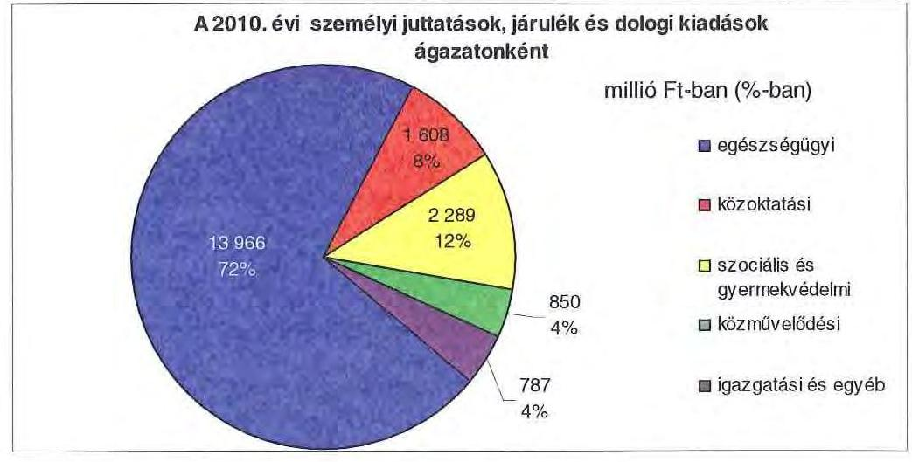

A 2010. évben az Önkormányzat összes költségvetési kiadásából az intézmények költségvetési kiadása 20049 millió Ft (92,4%), az Önkormányzati hivatalé 1656 millió Ft (7,6%)${ }^{15}$ volt. Az Önkormányzati hivatal a 2010. évi költségvetéséből felhalmozási kiadásokra 754 millió Ft-ot (45,5%), különböző megyepolitikai feladatokra és egyéb dologi kiadásokra 312 millió Ft-ot (18,9%), kisebbségi önkormányzatok támogatására 8 millió Ft-ot (0,5%), intézmények előző évi kiutalatlan támogatásának rendezésére 582 millió Ft-ot (35,1%) fordított.

Az Önkormányzat kötelező feladatainak ellátását a következő intézménystruktúra biztosította 2010. december 31-én:

- egészségügyi feladatokat egy kórház látott el;
- szociális és gyermekvédelmi feladatokat látott el nyolc intézmény, amelyek közül kettő intézmény gyermekvédelmi ellátást biztosított;
- közoktatási feladatokat hét intézményben végeztek (egy pedagógiai intézet, egy középfokú oktatási, kollégiumi feladatot ellátó, továbbá öt intézmény alapfokú oktatási feladatot látott el);
- közművelődési

 és közgyűjteményi feladatokat látott el négy intézmény (könyvtár, múzeum, kettő levéltár);
- igazgatási feladatokat látott el az Önkormányzati hivatal, valamint egy intézmény gazdasági, műszaki ellátó szervezetként működött.

[^0]
[^0]:    ${ }^{15}$ Az Önkormányzati hivatal fenntartásával kapcsolatos valamennyi személyi és dologi kiadás az Önkormányzat költségvetési szervénél, a Győr-Moson-Sopron Megyei Önkormányzat Gazdasági Műszaki Ellátó Szervezeténél került elszámolásra.

---

Az egyes ágazatok kötelező feladatellátását 2010. december 31-én az alábbi mutatók jellemezték:

| Megnevezés | közoktatás | szociális és   gyermek-   védelem | egészség-   ügy | kultúra   és sport |
| :-- | :--: | :--: | :--: | :--: |
| Az ágazatban foglalkoztatottak száma (fő) | 444 | 673 | 2066 | 200 |
| Az ágazat intézményeiben   ellátottak összesen (fő) | 1037 | 1435 |  |  |
| Fekvőbeteg ellátás férőhelyeinek száma (db) |  |  | 1443 |  |

Az Önkormányzat kötelező és önként vállalt feladatait alapvetően költségvetési intézményei által látta el, 2010. december 31-én - az Önkormányzati hivatallal együtt - 22 önállóan működő és gazdálkodó költségvetési szervvel rendelkezett, a telephelyek száma 37 volt. A 2006. év végén 22 önállóan gazdálkodó és négy részben önállóan gazdálkodó költségvetési szerve volt az Önkormányzatnak, amelyekhez 40 telephely kapcsolódott.

Az önkormányzati feladatok ellátásában 2010. december 31-én egy kizárólagos önkormányzati tulajdonban lévő gazdasági társaság - a BBMMK - vett részt, amely alapvetően kötelező - közművelődési - feladatot látott el. A 2010. évben az Önkormányzat önként vállalt feladatellátásában vett részt a Győr-Pér Repülőtér Kft., amelyben az Önkormányzat tulajdoni hányada 18,76% (35,83 millió Ft), valamint a Győr-Gönyű Kikötő Zrt., amelyben az Önkormányzat részesedése 0,24% (0,9 millió Ft). Az Önkormányzat költségvetési intézménye, a Kórház minősített többségi befolyással (80%, 2,4 millió Ft) rendelkezett az ÉDR Mosodában, amely a Kórház mosodai tevékenységét látta el.

- A Közgyűlés a 208/2004. (IX. 24.) számú határozatával hozta létre a BBMMK-t, amely 2005. január 1-jétől az Önkormányzat kötelező közművelődési feladatainak ellátása mellett a megye települései, önkormányzatai, közművelődési intézményei és egyéb közösségei közművelődési tevékenységeinek elősegítésében és fejlesztésében vesz részt.
- A Győr-Pér Repülőtér Kft-t (korábban P-AIR Kft.) 1995-ben hozták létre a tulajdonos önkormányzatok és más, a repülőtér fejlesztésben érdekelt szervezetek, fő tevékenységi köre légi szállítást kiegészítő szolgáltatás.
- A Kórház az Önkormányzat engedélyével 1995-ben a mosonmagyaróvári Karolina Kórház-rendelőintézettel és a kapuvári Dr. Lumniczer Sándor Kórházzal közösen alakította meg az ÉDR Mosoda Kft-t.
- A Győr-Gönyű Kikötő Zrt. fő tevékenységi köre vízi szállítást kiegészítő szolgáltatás. A régió fejlődése szempontjából jelentős, mint országos közforgalmi kikötő és áruforgalmi központ.

A gazdasági társaságoknak az Önkormányzat költségvetési egyensúlyára gyakorolt hatása nem volt számottevő, a gazdasági társaságok száma, azokban való részesedése, valamint a gazdasági társaságokkal összefüggő kötelezettségeinek nagyságrendje miatt. Az Önkormányzat kizárólag a BBMMK működéséhez adott át pénzeszközt, amely a 2007. évi 58 millió Ft-ról a

---

2010. évre 22,4%-kal, 45 millió Ft-ra csökkent. A 2011. évre tervezett működési célú pénzeszközátadás összege 27 millió Ft. A 2007. évről a 2010. évre a Kft-nek átadott pénzeszközök működési célú költségvetési kiadásokon belüli aránya 0,3%-ról 0,2%-ra csökkent.

Az Önkormányzat többségi tulajdonában lévő gazdasági társaságok nettó árbevételei a 2007-2009. években nem haladták meg az Önkormányzat költségvetési bevételeinek 25%-át.

Az Önkormányzat 50%-nál kisebb tulajdoni hányaddal rendelkező gazdasági társaságai közül a Győr-Pér Repülőtér Kft. esetében a saját tőke a 2007. és a 2008. évben a jegyzett tőke 50%-a alá csökkent (38,2%-26,7%), ezért az Önkormányzatnak a tulajdoni hányada arányában a tőkearány helyreállítása érdekében - a társasági szerződésben foglaltak miatt - pótbefizetési kötelezettsége keletkezett. A pótbefizetés összege a 2007-2009. években 28,4 millió Ft volt. A 2008. évről a 2009. évre a saját tőke és a jegyzett tőke aránya kedvezően változott, 61,3%-ra emelkedett, amelynek következtében a 2010. évben az Önkormányzatnál pótbefizetési kötelezettség nem keletkezett.

Az önkormányzati feladatellátásban az intézmények és a gazdasági társaságok mellett egyéb szervezetek, valamint szolgáltatási szerződéssel kiszervezett/kiszerződött intézményi ellátások nem működtek.

Az Önkormányzat az áttekintett időszakban más önkormányzattól, önkormányzati társulástól, központi költségvetési szervtől, egyháztól, egyéb szervezettől feladatot nem vett át, az előbbiekben felsorolt szervezeteknek feladatot át nem adott. A költségvetési intézmények száma a 2006. év végi 26-ról a saját hatáskörben végrehajtott átszervezések következtében a 2010. év végére 22-re csökkent.

# 2. PÉNZÜGYI EGYENSÚLYI HELYZET ALAKULÁSA 

A hagyományos költségvetési szerkezet helyett az önkormányzat pénzügyi helyzetét a CLF módszerrel mutatjuk be, amelyben jobban elkülönülnek a vagyonnal kapcsolatos bevételek és kiadások a feladatokkal kapcsolatos közvetlen működtetési bevételektől és kiadásoktól. A módszer következetesen elkülöníti a folyó és a felhalmozási költségvetés bevételeit és kiadásait, azok költségvetési egyenlegeit. A tárgyévi pozíciók meghatározása érdekében a figyelembe vett saját folyó bevételek, valamint saját felhalmozási bevételek nem tartalmazzák az előző évi pénzmaradványok felhasználásából származó pénzforgalom nélküli bevételeket ${ }^{16}$.

A bevételek és kiadások besorolása általános közgazdasági meggondolásokon alapul, amely testet ölt az SNA statisztikai módszertanában is. Folyó tételek alatt értjük azokat a bevételeket és kiadásokat, amelyek az önkormányzat vagyoni helyzetét automatikusan nem változtatják. A bevételi oldalon ilyenek az adók, az illeték, az áfa bevételek és visszatérülések, a hozamok és kamatok, a

[^0]
[^0]:    ${ }^{16}$ A költségvetési években kialakuló hiány finanszírozása az előző években képzett tartalékok felhasználásával is történhet.

---

költségvetési támogatások, az egyéb saját bevételek, valamint a működési célra átvett pénzeszközök és kapott támogatások. A folyó kiadások közé tartoznak a szolgáltatások nyújtásával kapcsolatos működési kiadások, a kamatkiadások, valamint a működési célú transzferkiadások ${ }^{17}$. A felhalmozási vagy tőke tételek módosítják az önkormányzat vagyoni helyzetét. A privatizációs bevételek, az immateriális javak és tárgyi eszközök, valamint a részesedések értékesítése csökkentik, a fizikai beruházások és a pénzügyi befektetések növelik a vagyont. A pénzforgalmi bevételek és kiadások nem tartalmazzák a követelések elengedése miatt könyvelt tételeket, mivel ezek egymást kioltó, technikai jellegű elszámolási műveletek.

A folyó költségvetés egyenlege, a működési jövedelem megmutatja, hogy az önkormányzat éves folyó bevétele fedezetet biztosít-e a kötelező és önként vállalt feladatellátáshoz kapcsolódó éves folyó kiadásaira. A működési jövedelem negatív értéke pénzügyileg fenntarthatatlan helyzetet jelez. A mutató pozitív értéke megtakarítást mutat, amely forrásul szolgálhat az önkormányzat fennálló kötelezettségei megfizetéséhez, valamint fejlesztéseihez.

A felhalmozási költségvetés pozitív értéke felhalmozási többletet mutat, amely a jövőbeni fejlesztések forrását biztosíthatja. Amennyiben a folyó költségvetési hiány finanszírozása a felhalmozási többletből történik, ez szűkebb értelemben vagyonfelélésnek tekinthető. Amennyiben a felhalmozási költségvetés megtakarítása fejlesztési célú hitelek, kötvények adósságszolgálatát finanszírozza, az változatlan vagyontömeg mellett, a korábban megelőlegezett tőkebevételek valós realizációjának tekinthető. A felhalmozási deficit által generált finanszírozási igény önmagában nem jár pénzügyi kockázattal, a pénzügyileg fenntartható beruházásokhoz kapcsolódó kötelezettségvállalás (adósságszolgálat) előrelátó, tudatos költségvetési gazdálkodással teljesíthető.

A módszer a pénzügyi kapacitás (más néven a nettó működési jövedelem) fogalmát helyezi a középpontba. Az adós hitelfelvételi képessége, hosszú távú fizetőképessége vagy bonitása a pénzügyi kapacitással, ezen belül is a nettó működési jövedelemmel jellemezhető. A nettó működési jövedelem negatív értéke az egyes költségvetési években jelentkező adósságszolgálat túlzott mértékére utal ${ }^{18}$. A nettó működési jövedelem negatív értékének felhalmozási többletből, vagy további hitelből történő finanszírozása pénzügyileg nem fenntartható gazdálkodást vetít előre. A pozitív értéket mutató nettó működési jövedelem fejlesztési kiadások fedezetét biztosíthatja, illetve a folyamatosan, évenként képződő pozitív nettó működési jövedelemből meghatározható a jövőben vállalható, teljesíthető éves adósságszolgálat, ily módon az a hitelösszeg, amely - a többi tényezőt, feltételt adottnak tekintve - visszafizetési kockázat nélkül felvehető.

A CLF módszer alapján a pénzügyi kapacitás mértéke az önkormányzat összevont, nettósított, a központi információs rendszerbe a Kincstáron keresztül leadott éves költségvetési beszámolójának 80-as űrlapjában szerepeltetett adatok alapján került meghatározásra. A 2007-2010 közötti időszakban az Önkor-

[^0]
[^0]:    ${ }^{17}$ Transzferkiadásoknak azokat a folyó és felhalmozási tételeket nevezzük, amelyeket nem az adott önkormányzat használ fel szolgáltatásnyújtásra (pl.: ellátottak pénzbeni juttatásai, átadott pénzeszközök, garancia- és kezességvállalások stb.).
    ${ }^{18}$ Kivéve, ha annak finanszírozására a korábbi években képzett tartalékok fedezetet nyújtanak.

---

mányzat CLF módszer szerint besorolt kiadásainak és bevételeinek főbb jogcímek szerinti alakulását a jelentés 2/a. számú melléklete tartalmazza.

Az Önkormányzat bevételeinek és kiadásainak alakulását részletesen a hatályos számviteli előírások szerint készült, összevont éves költségvetési beszámolók adataira alapozva mutatjuk be. A bevételek és kiadások működési, valamint felhalmozási jogcímekre történő elkülönítését az éves költségvetési beszámolók, a zárszámadási rendeletek, továbbá - amely jogcímek ${ }^{19}$ esetében erre más lehetőség nem volt - az Önkormányzat adatszolgáltatása szerinti megbontás alapján végeztük el. A bevételek elemzése során figyelembe vettük a korábbi években keletkezett pénzmaradvány felhasználásából származó pénzforgalom nélküli bevételeket is. A 2007-2010 közötti időszakban az Önkormányzat bevételeinek és kiadásainak, továbbá adósságszolgálatának alakulását a jelentés 2/b. számú melléklete tartalmazza.

# 2.1. A működési és felhalmozási egyensúly alakulása 

## CLF módszer szerinti önkormányzati adatok

|  |  |  |  | ezer Ft |
| :--: | :--: | :--: | :--: | :--: |
| Megnevezés | 2007 | 2008 | 2009 | 2010 |
| Folyó bevételek | 19957165 | 21257165 | 19576314 | 20161973 |
| Folyó kiadások | 19483275 | 21119597 | 19662056 | 20720313 |
| Működési jövedelem | 473887 | 137568 | -85742 | -558342 |
| Nettó működési jövedelem   - működési jövedelem - tőketörlesztés | 473887 | 137568 | -85742 | -558342 |
| Felhalmozási bevételek | 265470 | 187965 | 128580 | 803912 |
| Felhalmozási kiadások | 1041315 | -463480 | 417990 | 984378 |
| Felhalmozási költségvetés egyenlege | -775843 | -275517 | -289410 | -180466 |
| Finanszírozási műveletek nélküli (GFS) pozíció = működési jövedelem + felhalmozási költségvetés egyenlege | -301956 | -137949 | -375152 | -738808 |
| Finanszírozási műveletek egyenlege | -370679 | 154624 | 277170 | 923905 |
| Tárgyévi pozíció változás | -672635 | 16675 | -97982 | 185092 |
| Egyéb tájékoztató adatok |  |  |  |  |
| Összes kötelezettség* | 1912436 | 2230735 | 4049428 | 4708472 |
| ebből rövid lejáratú | 1912436 | 2230735 | 4049428 | 4683369 |
| Folyószámlahitel napi átlagos állománya ** | 128452 | 87985 | 409199 | 538070 |
| Likvidhitel napi átlagos állománya ** | 0 | 0 | 0 | 0 |
| Munkabérhitel napi átlagos állománya ** | 0 | 0 | 0 | 0 |
| Finanszírozásba vonható eszközök: | 109299 | 183974 | 87992 | 273089 |

 |
| Tartós hitebviszonyt megtestesítő értékpapírok | 0 | 0 | 0 | 0 |
| Hosszú lejáratú bankbetétek | 0 | 0 | 0 | 0 |
| Értékpapírok | 0 | 0 | 0 | 0 |
| Pénzeszközök (idegen pénzeszközök nélkül) | 109299 | 183974 | 87992 | 273089 |

* Az összes kötelezettséget a passzív pénzügyi elszámolások nélkül vettük figyelembe, mert a passzívák a pénzmaradvány elszámolás tételei közé tartoznak.
** A folyószámla-, likvid- és munkabérhitel átlagos állományát 365 nappal számítottuk.
Az Önkormányzat részletes pénzügyi adatait a jelentés 2/a. számú melléklete tartalmazza.

[^0]
[^0]:    ${ }^{19}$ Az előző évi maradvány visszafizetésének, az előző évi pénzmaradvány átadásának és átvételének, a kamatkiadásoknak, az egyéb pénzforgalom nélküli kiadásoknak, a hozam- és kamatbevételeknek, az átengedett adóknak, a költségvetési támogatásoknak, továbbá az előző évi pénzmaradvány igénybevételének működési és felhalmozási részre történő megosztásához az Önkormányzat által szolgáltatott adatokat vettük figyelembe.

---

A 2007-2010. években az Önkormányzat folyó költségvetési egyenlege, működési jövedelme folyamatosan csökkent. Míg a 2007-2008. évi működési jövedelme pozitív összegű volt, addig az Önkormányzatnak a 2009-2010. években működési forráshiánya keletkezett, amelyet a következő ábra szemléltet:
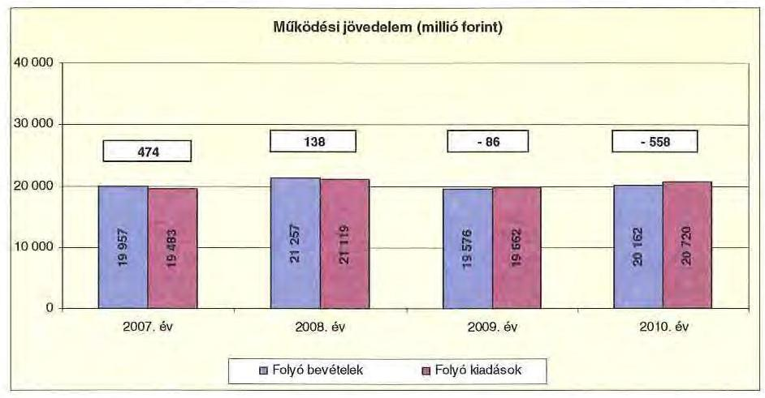

A folyó költségvetés egyenlege - a működési forrástöbblet - 2007-ben a folyó kiadások 2,4%-át (474 millió Ft-ot), 2008-ban 0,7%-át (138 millió Ft-ot) jelentette. A 2009. évben a folyó költségvetés hiánya - a működési forráshiány a folyó kiadások 0,4%-a (-86 millió Ft), 2010-ben 2,7%-a (-558 millió Ft) volt.

A működési forráshiány finanszírozása folyószámlahitelből történt. A folyószámlahitel napi átlagos állománya 2007-2010 között 7,3-szeresére (128 millió Ft-ról 938 millió Ft-ra) emelkedett.

Az Önkormányzat kötelezettségeinek állománya ${ }^{20}$ a 2007-2009 közötti időszakban a rövid lejáratú kötelezettségek állományával volt egyenlő, a 2010. évben ez az arány 99,5%-ra módosult, az összesen 25 millió Ft hosszú lejáratú kötelezettség miatt. Az Önkormányzatnak 2006. december 31-én pénz- és tőkepiaci kötelezettsége nem volt ${ }^{21}$, 2010. december 31-én 1465 millió Ft állt fent a hosszú lejáratú hitelfelvétel és a folyószámlahitel állomány miatt.

A rövid lejáratú kötelezettségek 2010-ben 4683 millió Ft-ot tettek ki, amelyek 2771 millió Ft-tal (144,9%-kal) voltak magasabbak a 2007. évi rövid lejáratú kötelezettségállománynál. A szállítói tartozásállomány a rövid lejáratú kötelezettségek között a 2007. évben 1866 millió Ft-ot (97,6%), a 2008. évben 2039 millió Ft-ot (91,4%), a 2009. évben 3330 millió Ft-ot (82,2%), a 2010. évben 3105 millió Ft-ot (66,3%) tette ki, miközben a szállítói kötelezettségek a 2010. évben a 2007. évi 1,7-szeresére (1239 millió Ft-tal) nőttek.

[^0]
[^0]:    ${ }^{20}$ passzív pénzügyi elszámolások nélküli
    ${ }^{21}$ A 2007. december 31-én fennálló pénz- és tőkepiaci kötelezettség 13 millió Ft volt.

---

Az Önkormányzat pénzügyi kapacitása ${ }^{22}$ a 2007-2010. években megegyezett a folyó költségvetés egyenlegével, mivel az Önkormányzatnak nem volt tőketörlesztési kötelezettsége. A nettó működési jövedelem ${ }^{23}$ értéke a folyó költségvetési pozíciót tükrözi. Az Önkormányzat 2007-2008. évi nettó működési jövedelme együttesen 612 millió Ft volt a két évben, amely a felhalmozási költségvetés negatív egyenlegének 58,2%-ára (-1052 millió Ft) nyújtott fedezetet.
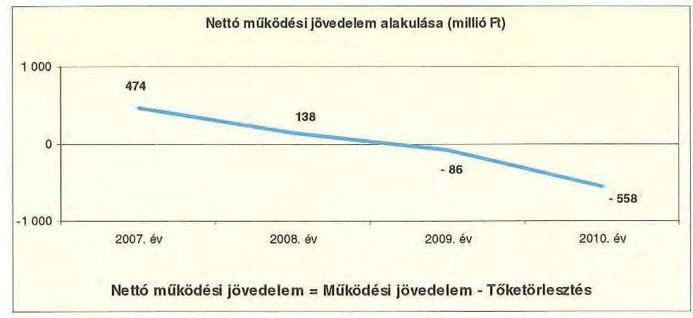

A 2007-2010. években az Önkormányzat felhalmozási költségvetésének egyenlege folyamatosan negatív összegű volt, amelyet az alábbi ábra szemléltet:
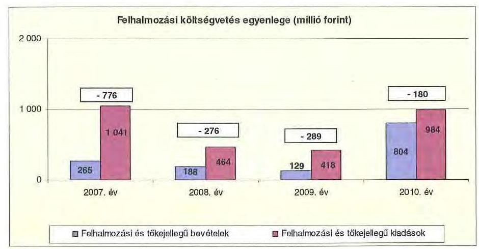

A felhalmozási forráshiánynak a felhalmozási és tőkejellegű kiadásokhoz viszonyított aránya 2007-ben 74,5% (-776 millió Ft), 2008-ban 59,5% (276 millió Ft), 2009-ben 69,2% (-289 millió Ft), 2010-ben 18,3% (-180 millió Ft) volt.

Az Önkormányzat - CLF módszer alapján számított - felhalmozási költségvetés negatív egyenlegének fedezetét a 2007. évben 61,1%-ban (474 millió Ft), a 2008. évben 50,0%-ban (138 millió Ft) a folyó költségvetés biztosította. A fel-

[^0]
[^0]:    ${ }^{22}$ Az Önkormányzat pénzügyi kapacitása a nettó működési jövedelemmel jellemezhető.
    ${ }^{23}$ nettó működési jövedelem = működési jövedelem-tőketörlesztés

---

halmozási forráshiány további finanszírozása folyószámlahitelből és a 2010. évben 25 millió Ft összegben felhalmozási célú hitelből történt. A 2009. évben a finanszírozási műveletek többlete sem nyújtott elégséges forrást a folyó és a felhalmozási költségvetés egyensúlyának biztosításához, ezért az Önkormányzat tárgyévi pozícióját 98 millió Ft negatív eredménnyel zárta. A 2010. évben a finanszírozási műveletek eredményeként az Önkormányzat tárgyévi pénzügyi pozíciója pozitívvá vált, 185 millió Ft volt.

Az Önkormányzat évenkénti teljes finanszírozási hiánya ${ }^{24}$ a CLF módszer szerint 2007-ben 302 millió Ft, 2008-ban 138 millió Ft, 2009-ben 375 millió Ft, 2010-ben 738 millió Ft volt.

Az önkormányzat finanszírozási műveletei 2007-2010. évekbeni egyenlegének alakulását a következő ábra szemlélteti:
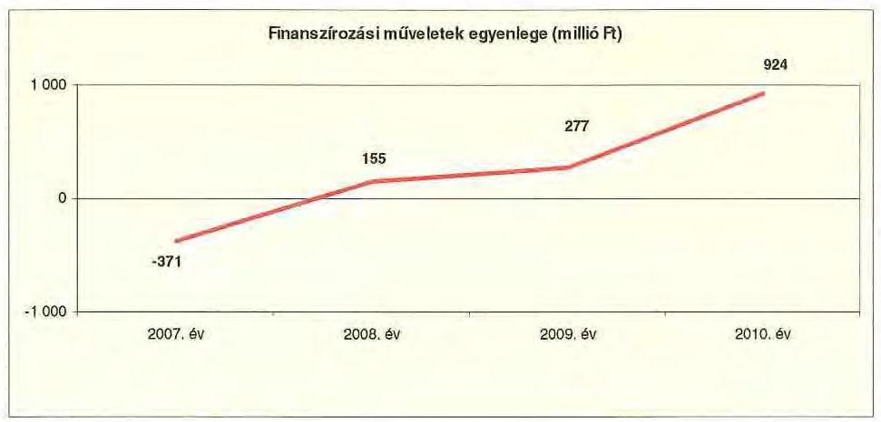

A 2008-2010. évi finanszírozási többlet azt jelzi, hogy az éves költségvetések végrehajtása során szükség volt az előző években keletkezett pénzmaradvány igénybevételén túl külső - likvidhitelből és a 2010. évben felhalmozási célú hitelből történő - finanszírozásra is.

A finanszírozási célú műveleteket a vizsgált időszakban a jelentés 2/a. számú mellékletének 4.1-4.8 pontjai részletezik.

Az éves költségvetési beszámolók a pénzmaradvány igénybevétel figyelembevétele nélkül a 2007. évben 683 millió Ft, a 2008. évben 819 millió Ft, a 2009. évben 1395 millió Ft, a 2010. évben 1334 millió Ft pénzügyi hiányt, a pénzmaradvány igénybevétel figyelembevételével a 2007. évben 63 millió Ft, a 2008. évben 149 millió Ft, a 2009. évben 463 millió Ft, és 2010. évben 827 millió Ft pénzügyi hiányt tartalmaztak. Az Önkormányzat zárszámadási rendeletében a működési és felhalmozási hiányt a hagyományos költségvetési szerkezet alapján mutatta be ${ }^{25}$, amelyről a jelentés 1. számú melléklete nyújt tájékoztatást.

[^0]
[^0]:    ${ }^{24}$ a nettó működési jövedelem és a felhalmozási költségvetés egyenlegeinek összege
    ${ }^{25}$ Nincs kötelező előírás a működési és felhalmozási hiány megállapításának módjára.

---

A 2007-2010. években a kötelezettségek (passzív pénzügyi elszámolások nélkül) 1912 millió Ft-ról 4708 millió Ft-ra emelkedtek, amely együtt járt a kamatkiadások 2007-ről 2010-re 62 millió Ft-tal (587,6%-kal) történt növekedésével is. A 2007-2010. évek között az Önkormányzat összesen 131 millió Ft kamatot fizetett meg. Az átmenetileg szabad pénzeszközein realizált kamatbevétel (29 millió Ft) a teljes kamatráfordítás 22,1%-át tette ki.

Az Önkormányzat kamatbevételeit, kamatkiadásait és azok egyenlegeit a következő ábra mutatja:
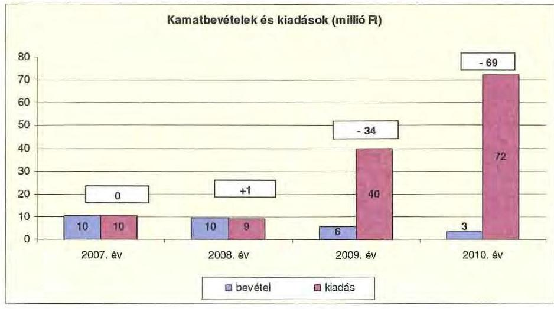

A 2007-2010 közötti időszakban az Önkormányzat kiadásait és bevételeit főbb jogcímek szerint a jelentés 2/a. és 2/b. számú mellékletei tartalmazzák.

# 2.2. Az Önkormányzat bevételei 

Az Önkormányzat folyó költségvetési és felhalmozási bevételei együttesen a 2010. évben - a 2008. évi 6,0%-os növekedést, majd a 2009. évi 8,1%-os csökkenést követően - 3,7%-kal (743 millió Ft-tal) haladták meg a 2007. évit, amely 20223 millió Ft volt.

Az Önkormányzat feladatai ellátása érdekében - a CLF módszer szerint számolva - a 2007. évben 19957 millió Ft, a 2008. évben 21257 millió Ft, a 2009. évben 19576 millió Ft, a 2010. évben 20162 millió Ft működési bevételt teljesített. A működési bevételek körében leginkább meghatározó volt a Kórház részére juttatott OEP támogatás, amely a 2007. évben a működési bevételek 52,3%-át (10 440 millió Ft-ot), a 2008. évben 51,5%-át (10 947 millió Ft-ot), a 2009. évben 51,3%-át (10035 millió Ft-ot), a 2010. évben 58,0%-át (11 700 millió Ft-ot) tette ki. A folyó bevételek között második legnagyobb súllyal a saját működési bevétel bír, amelynek összege a 2007. évi 4692 millió Ft-ról (23,5%-ról), a 2010. évben 4928 millió Ft-ra (24,4%-ra) emelkedett. A költségvetési támogatás a 2007. évi 2871 millió Ft-ról (14,4%-ról), a 2010. évben 2179 millió Ft-ra (10,8%-ra) mérséklődött.

---

Az Önkormányzat 2007-2010 közötti időszakban realizált OEP támogatás nélküli főbb bevételi jogcímeinek számszaki adatait a következő táblázat részletezi és grafikon mutatja be:

|  |  |  |  |  |
| :-- | --: | --: | --: | --: | --: |
| Megnevezés | 2007. év | 2008. év | 2009. év | 2010. év |
| illetékbevétel | 1830972 | 2114683 | 1884076 | 1273331 |
| szja és állami támogatás | 3567242 | 3733707 | 2998794 | 2317186 |
| egyéb saját bevétel (OEP nélkül) | 3733141 | 4405417 | 4986767 | 4708230 |
| összes működési bevétel | 9131355 | 10253807 | 9869637 | 8298747 |

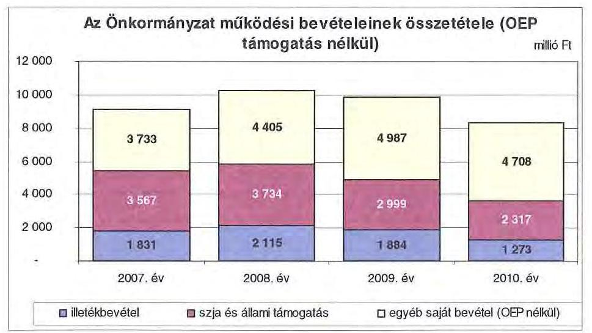

Az Önkormányzatnál a működési bevételek körében az illetékbevétel a 2007. évben a 2006. évi 2310 millió Ft-hoz képest jelentősen, 479 millió Ft-tal (20,7%-kal) csökkent. A csökkenésben szerepet játszott az Illetékhivatalnak 2007. január 1-jétől - az APEH-hoz történő átszervezése is, mert az évente realizált illetékbevételekből (központi intézkedés következtében) évi 8,5% került elvonásra, adminisztrációs feladatokra.

Az Önkormányzatot megillető illetékbevételekből az illetékbeszedéssel kapcsolatos kiadásokra a 2007. évben 170 millió Ft, a 2010. évben 118 millió Ft került visszatartásra. A 2007. évet megelőző években éves megállapodások szerint az illetékhivatal működési költségeihez a két megyei jogú város önkormányzata is hozzájárult, a 2006. évben 184 millió Ft-tal, amelynek következtében az Illetékhivatal működtetése az Önkormányzat számára 138 millió Ft-ot jelentett. Megyei szinten a központi költségvetésben visszatartott illetékbeszedéssel kapcsolatos kiadás a 2007. és a 2009. években megközelítette, a 2008. évben meghaladta az Illetékhivatal 2006. évben teljesített 323 millió Ft összegű kiadását ${ }^{26}$.

Az illetékbevételek központi szabályozása változásának hatására a 2007-2010. években az Önkormányzat forráskiesése a 2006. évi illetékbevételhez viszonyítva 2137 millió Ft volt.

[^0]
[^0]:    ${ }^{26}$ A három önkormányzat illetékbevételeiből a 2007. évben összesen 292 millió Ft, a 2008. évben 344 millió Ft, a 2009. évben 300 millió Ft került visszatartásra.

---

Az átengedett szja és az állami támogatások együttes összege a 2008. évi 166 millió Ft (4,7%) növekedést ${ }^{27}$ követően a központi forráskivonás hatására 35,0%-kal (a 2006. évi teljesítéshez viszonyítva 1250 millió Ft-tal) csökkent a 2010. évre. A változást a normatíváknak a járulékváltozások miatti központi csökkentése, az ellátotti létszám visszaesése, továbbá a 2010. évtől a megyei önkormányzatokat egységesen megillető személyi jövedelemadó elvonása idézte elő.

Az Önkormányzat saját működési bevétele a 2008. évben 672 millió Ft-tal (18,0%), a 2009. évben 581 millió Ft-tal (13,2%), a 2010. évben 279 millió Ft-tal (5,6%) mérséklődött az előző évhez viszonyítva. Az egyéb saját bevételek alakulásában meghatározó szerepet játszott az intézmények működési bevételeinek emelkedése ${ }^{28}$, amely a 9,6%-os átlagos növekedési ütem mellett, a 2007. évről a 2010. év végére 816 millió Ft, 28,8%-os mértékű volt. Az intézményi többletbevétel elsősorban pedagógiai szolgáltatások, kiadványok értékesítéséből, a Kórház vállalkozási bevételeiből, a múzeum ásatási feladatainak bevételeiből keletkezett. Jogszabályi változások következtében az önköltségalapon számított térítési díjak a kiadáscsökkentő intézkedések
 hatása miatt az ellenőrzött időszakban számottevően nem emelkedtek. Ennek ellenére az ellátottak egyre nagyobb arányban nem képesek megfizetni az intézményi térítési díjat, amelynek következtében a bevételek a tervezetthez képest kisebb mértékben nőttek. A keletkezett hátralékok hozzájárultak az Önkormányzat követelésállományának 93 millió Ft összegű növekedéséhez, amely kedvezőtlenül hatott fizetőképességének alakulására.

A teljesített felhalmozási bevételek összege a költségvetésen belül a 2007. évben 1053 millió Ft ( $5,1 \%$ ), a 2010. évben 879 millió Ft ( $4,2 \%$ ) volt.

Az Önkormányzat felhalmozási bevételei a vizsgált időszakban a következők voltak:

|  |  |  |  | ezer Ft |
| :-- | --: | --: | --: | :--: |
| Megnevezés | 2007. év | 2008. év | 2009. év | 2010. év |
| Tárgyi eszköz értékesítés | 94577 | 89075 | 8443 | 90397 |
| Állami támogatás | 609354 | 26078 | - | - |
| Átvett pénzeszköz | 102057 | 93965 | 120087 | 713497 |
| Egyéb felhalmozási bevétel | 164181 | 83914 | 93937 | 516 |
| Felhalmozási tartalék | 82886 | 149511 | 29601 | 74788 |
| Összes felhalmozási bevétel | 1053055 | 442543 | 252068 | 879198 |

A tárgyi eszközök értékesítéséből származó bevétel a 2008-2009. években a 2007. évhez képest csökkent, a 2010. évben növekedés volt tapasztalható.

[^0]
[^0]:    ${ }^{27}$ a 2007. évi bázishoz képest
    ${ }^{28}$ Az intézményi működési bevételek a költségvetési bevételeknek a 2007. évben 13,7\%át, a 2008. évben $16,1 \%$-át, a 2009. évben $17,3 \%$-át, és a 2010. évben $17,5 \%$-át képezték.

---

Az Önkormányzatnak a 2007-2010. években összesen 12 ingatlan értékesítéséből származott saját bevétele. Az eladásra kijelölt ingatlanok nagy részét sem bérleti úton, sem értékesítés útján nem tudta hasznosítani az Önkormányzat az ingatlanpiac stagnálása miatt. Ezért az ingatlanok eladási árát folyamatosan felülvizsgálják és a piaci kereslet-kínálat szerint aktualizálják. A tárgyi eszközök, immateriális javak, önkormányzati lakások és helyiségek értékesítéséből származó, összesen 282 millió Ft költségvetési bevétel a pénzügyi egyensúly megteremtésében nem játszott meghatározó szerepet, mivel az összes felhalmozási bevételnek átlagosan 10,7\%-át képezte a 2007-2010. években.

Az állami támogatás a 2007. évben céltámogatással megvalósult kórházi gép-műszer beszerzésekhez, a címzett támogatással megvalósított kórházi, és a Felnőttkorú Fogyatékosok Otthona rekonstrukciójához kapcsolódott.

Az átvett pénzeszközök a 2010. évben a teljesített felhalmozási bevételek 81,2\%-át ( 713 millió Ft) képezték. A 2010. évi átvett pénzeszközökből megvalósult két legjelentősebb feladat a Kórház EU-s pályázatból megvalósuló infrastruktúra-fejlesztési projekt ( 382 millió Ft), továbbá más önkormányzati intézmények akadálymentesítése ( 195 millió Ft) volt.

# 2.3. Az Önkormányzat kiadásai 

Az Önkormányzat - CLF módszer szerint számított - folyó és felhalmozási kiadásainak együttes összege a 2010. évben 21705 millió Ft volt, amely a 2007. évi kiadást $5,7 \%$-kal ( 1180 millió Ft) haladta meg.

Az Önkormányzat működési és felhalmozási kiadásai együttesen a 2008. évben 5,3\%-kal (1106 millió Ft-tal) növekedtek, majd a 2009. évi 5,4\%-os ( 1174 millió Ft-os) csökkenést követően a 2010. évben 5,3\%-kal (1086 millió Ft-tal) haladták meg a 2007. évit, amely 20687 millió Ft volt.

Az Önkormányzat működési kiadásai főbb jogcímek szerinti bontásban az alábbiak voltak:

| Megnevezés | 2007. | 2008. | 2009. | 2010. |
| :--: | :--: | :--: | :--: | :--: |
| Működési kiadások | 19650682 | 21337314 | 20211137 | 20706609 |
| Működési kiadások (kamatkiadás nélkül) | 19040197 | 21328456 | 20171461 | 20834517 |
| Kamatkiadás | 10485 | 8858 | 39876 | 72092 |
| Személyi juttatások | 8413960 | 8471344 | 8070869 | 7856547 |
| Munkaadót terhelő járulékok | 2729416 | 2745965 | 2490241 | 2091969 |
| Dologi kiadások | 7472771 | 8698303 | 8020370 | 9551576 |
| Egyéb folyó kiadások | 121715 | 175233 | 74494 | 128185 |
| Támogatások, elvonások és egyéb folyó átutalások | 335792 | 329181 | 298721 | 236472 |
| ebből: működési célú pénzeszköz átadás | 208101 | 189697 | 166069 | 104677 |
| Előző évi pénzmaradvány átadás, visszafizetés | 390958 | 689463 | 666404 | 769768 |

Az Önkormányzat működési kiadásai a 2007. évihez képest a 2010. év végére 1056 millió Ft-tal, 5,4\%-kal nőttek.

---

Az Önkormányzat a 2010. évben a működési költségvetésből 9949 millió Ft-ot ( $48,0 \%$ ) személyi juttatásokra és a munkaadókat terhelő járulékokra fordított, az üzemeltetést, intézményfenntartást biztosító dologi kiadásokra 9552 millió Ft ( $46,1 \%$ ) jutott. A 2007-2010. években a működési kiadásokon belül a személyi juttatások és járulékok aránya folyamatosan 10,7\%-kal (1195 millió Ft-tal) csökkent.

A személyi juttatások a 2008. évben 57 millió Ft-tal ( $0,7 \%$ ) nőttek az előző évhez képest, azt követően minden évben csökkentek. A 2010. évben teljesített személyi juttatások a 2007. évben teljesített kiadásoknál 557 millió Ft-tal $(6,6 \%)$ voltak alacsonyabbak. A személyi juttatások csökkenésében a létszámcsökkentéseknek volt döntő szerepe. A munkaadókat terhelő járulékok körében a 2007. évről a 2010. évre 637 millió Ft-os ( $23,4 \%$ ) csökkenés következett be, a kifizetett személyi juttatások csökkenésén túl, a járulékok mértékének mérséklődése hatására. A járulékok csökkenése miatt felszabaduló forrásokat azonban a központi kormányzat az önkormányzati alrendszernek nyújtott állami támogatásokból levonásba helyezte, így a járulékcsökkenés az Önkormányzat pénzügyi pozíciójában érdemi változást nem eredményezett.

A dologi kiadások önkormányzati szinten a 2010. évben a 2007. évinél 2079 millió Ft-tal ( $27,8 \%$ ) voltak magasabbak. A Kórház dologi kiadási növekménye a 2007. évhez viszonyítva 2208 millió Ft ( $38,6 \%$ ) volt a 2010. évben, az egyéb intézményeknél ellenben a dologi kiadások 129 millió Ft-os $(7,3 \%)$ csökkenése volt megfigyelhető. Az intézmények dologi kiadásainak mérséklődése nagyrészt abból adódott, hogy az ellenőrzött időszakban megszüntetésre került Győr-Moson-Sopron Megye Közgyűlésének Diákotthona, a Megyei Sportigazgatóság, Győr-Moson-Sopron Megye Önkormányzatának József Attila Gyermekvédelmi Központja, valamint intézményi feladatátszervezések is történtek. A 2010. évben az önkormányzati szinten kiugróan magas dologi kiadás növekedésében meghatározó szerepet játszott a Kórház dologi kiadásainak változása, amely a gyógyszerbeszerzések, az energia és közüzemi díjak, valamint egyéb üzemeltetési - főleg a karbantartási és javítási - szolgáltatások körében mutatkozó költségnövekedés miatt következett be.

Az Önkormányzat a támogatásértékű kiadásokra, a pénzeszköz átadásokra, valamint az ellátottak pénzbeli juttatására a 2010. évben a működési kiadásokból 236 millió Ft-ot ( $1,1 \%$ ), a 2007. évben 336 millió Ft-ot ( $1,7 \%$ ) fordított.

A működési célú pénzeszközátadások összege a 2007. évről a 2010. évre 103 millió Ft-tal ( $49,7 \%$ ) csökkent, mivel az Önkormányzat forrásai szűkülése miatt az önként vállalt feladataira évről évre kevesebbet tudott fordítani.

Az önkormányzati működési kiadásokon belül 63,5\%-ról 68,1\%-ra nőtt a kórházi kiadások súlya az egyéb fenntartott intézményekben felmerülő kiadásokkal szemben a 2007. évről a 2010. évre. A Kórház nélküli teljesített működési kiadások a 2007. évben az Önkormányzat összes működési kiadásából 7164 millió Ft-ot ( $36,5 \%$ ) tettek ki, a 2010. év végére 6598 millió Ft-ra ( $31,9 \%$ ) csökkentek.

Az Önkormányzat Kórház nélküli működési kiadásai a vizsgált időszakban a következők voltak:

---

| Megnevezés | 2007. év | 2008. év | 2009. év | 2010. év |
| :--: | :--: | :--: | :--: | :--: |
| Működési kiadások | 7163688 | 7481449 | 7106839 | 6597621 |
| Működési kiadások (kamatkiadás nélkül) | 7153426 | 7472600 | 7066963 | 6525529 |
| Kamatkiadás | 10262 | 8849 | 39676 | 72092 |
| Személyi juttatások | 3479571 | 3509722 | 3255724 | 3086127 |
| Munkaadót terhelő járulékok | 1106414 | 1112737 | 978555 | 817305 |
| Dologi kiadások | 1759628 | 1738621 | 1791423 | 1630484 |
| Egyéb folyó kiadások | 69740 | 83685 | 61439 | 62021 |
| Támogatások, elvonások és egyéb folyó átutalások | 334185 | 329081 | 298721 | 236264 |
| ebből:működési célú pénzeszköz átadás | 207822 | 189597 | 166069 | 104652 |
| Előző évi pénzmaradvány átadás, visszafizetés | 390958 | 689463 | 666404 | 769768 |

A Kórházzal együtt számított működési kiadások a 2007. évhez képest a 2008. évre 1687 millió Ft-tal ( $8,6 \%$-kal), a 2009. évhez viszonyítva a 2010. évben 495 millió Ft-tal ( $2,5 \%$ ) nőttek, miközben a Kórház nélkül számított működési kiadások a 2008. évi 318 millió Ft-os ( $4,4 \%$ ) növekedést követően a 2009. és 2010. években 375 millió Ft-tal (5,0\%), illetve 509 millió Ft-tal ( $7,2 \%$ ) mérséklődtek. A 2009. évben a személyi juttatások és járulékaik csökkenése a Kórháznál 268 millió Ft ( $4,1 \%$ ), az intézményeknél 388 millió Ft ( $8,4 \%$ ) volt. A 2010. évben a személyi juttatások és járulékaik csökkenése az intézményeknél 331 millió Ft ( $7,8 \%$ ), a Kórháznál 282 millió Ft ( $4,5 \%$ ) volt.

A Kórház nélküli működési kiadásokon belül a személyi juttatások és járulékaik összege a 2007. évben 4586 millió Ft ( $64,0 \%$ ), a 2010. évben 3903 millió Ft ( $59,2 \%$ ) volt. A dologi kiadások összege a 2007. és a 2010. évben sem érte el a működési kiadások egynegyedét, összege 1760 millió Ft és 1630 millió Ft volt $(24,6 \%-24,7 \%)$.

A létszámcsökkentések hatására a 2007. évről a 2010. évre a Kórházon kívüli intézményekben 683 millió Ft-tal ( $14,9 \%$-kal), az egészségügyi ágazatban 512 millió Ft-tal ( $7,8 \%$ ) csökkentek a személyi juttatások és járulékaik.

A nem egészségügyi ágazatban működő intézményeknél a dologi kiadások a 2007. évhez képest a 2010. évre 129 millió Ft-tal ( $7,3 \%$ ) csökkentek, mivel az Önkormányzat az intézmények dologi kiadásaira többlet előirányzatot nem tudott biztosítani, ezért az intézmények kiadáscsökkentő intézkedések végrehajtására kényszerültek.

Az Önkormányzat a 2007-2010. évek között a Kórház kiadásaihoz a feladatellátás finanszírozhatósága érdekében 1286 millió Ft-tal járult hozzá ${ }^{29}$.

A Kórház számára a központosított támogatások kerültek továbbutalásra (13. havi illetmény, kereset-kiegészítés, prémiumévek program, létszámcsökkentési pályázat, egészségügyi struktúraváltás támogatás, bérpolitikai intézkedések támogatás).

[^0]
[^0]:    ${ }^{29}$ Ezen felül a 2011. I. negyedévben további 28 millió Ft működési támogatást, és 50 millió Ft kölcsönt nyújtott a Kórház fejlesztési forrásai kiegészítéséhez.

---

A Kórház számára működési és felhalmozási céllal átadott önkormányzati pénzeszközöket évenként az alábbi diagram mutatja be:
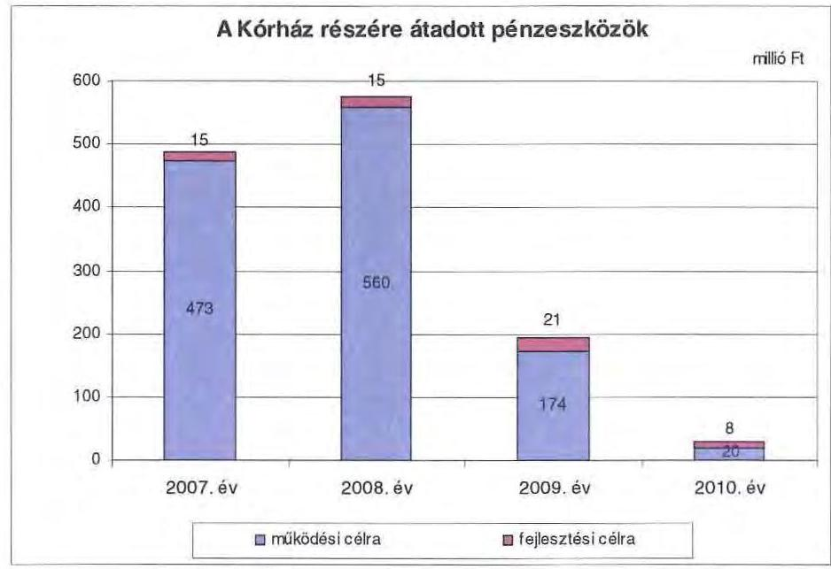

Az Önkormányzat a 2007. évben költségvetési kiadásaiból 1036 millió Ft-ot (5,0\%), a 2010. évben 998 millió Ft-ot (4,6\%) fordított felhalmozási célú költségvetési kiadások teljesítésére. A
 teljesített felhalmozási célú költségvetési kiadások csak a 2007. évben nem haladták meg a teljesített felhalmozási célú költségvetési bevételeket. A 2008-2009. évi felhalmozási hiányt likvid hitellel, az előző években keletkezett pénzmaradvány igénybevételével, a 2010. évit a korábbiakon felül még 25 millió Ft felhalmozási célú hitel igénybevételével finanszírozta az Önkormányzat.

A működési és felhalmozási kiadások arányának változásában a 2007-2010. években lényeges elmozdulás nem volt, a felhalmozási kiadások 408 millió Ft és 1036 millió Ft (2,0%-5,0%) között alakultak.

---

Az Önkormányzat működési és felhalmozási kiadásait (a működési és felhalmozási célú kamatkiadásokat is figyelembe véve) a következő grafikon szemlélteti:
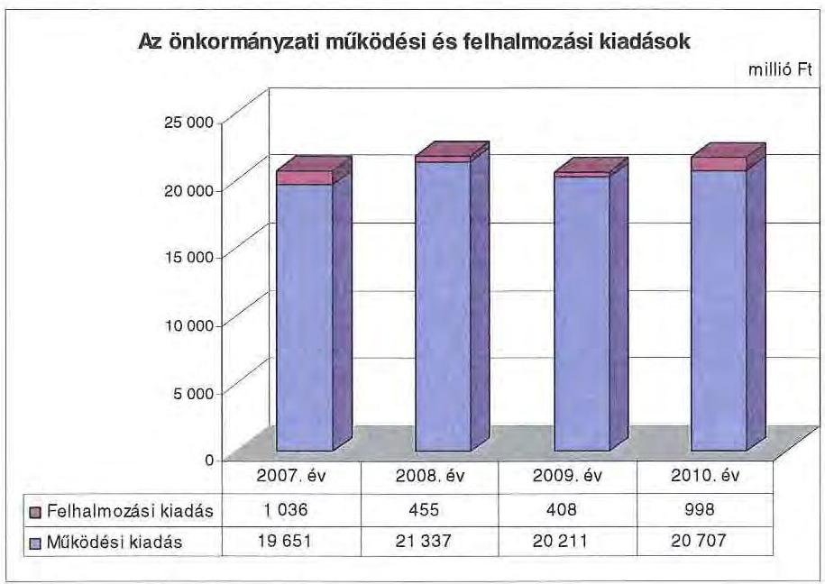

Az Önkormányzat 2007-2010. években teljesített felhalmozási kiadásai és a 2010. évet követő időszakra vállalt felhalmozási kiadásokhoz kapcsolódó kötelezettségeinek összege együttesen 15538 millió Ft, amelyből 13252 millió Ft (85,3%) a Kórház felhalmozási feladataihoz kapcsolódott. A Kórház a 2007-2010. évek között befejezett fejlesztésekkel összefüggően 2288 millió Ft felhalmozási kiadást teljesített, amelyhez 1529 millió Ft (66,8%) központi támogatást vett igénybe.

Az Önkormányzat a 2007-2010. években teljesített felhalmozási kiadásaiból és a 2010. évet követő időszakra vállalt felhalmozási kiadásokhoz kapcsolódó kötelezettségeiből 493 millió Ft-ot (3,2%) olyan felhalmozási kiadásokra fordít, amelyek teljesítésére jogszabály, hatósági határozat kötelezte.

Öt szociális intézmény akadálymentesítése valósult meg, illetve van folyamatban, összesen 417 millió Ft-os összegben. Hatósági kötelezés alapján a Győr-Moson-Sopron Megyei Múzeumok Igazgatósága Sopron, Deák tér 1. életveszélyes födémszerkezet felújítása történt meg 44 millió Ft, és a Területrendezési terv aktualizálása 21 millió Ft összegben.

A nem egészségügyi ágazatba tartozó intézmények számára biztosított, nem jogszabályi, hatósági kötelezéshez kötötten teljesített felhalmozási kiadások és kötelezettségvállalások összege 1804 millió Ft (11,6%) volt a 2007-2010. években.

A 2007-2010. években az Önkormányzat felhalmozási kiadásainak 99,8%-a, 2892 millió Ft a kötelező feladatai ellátásához kapcsolódott.

A 2007-2010. években az Önkormányzat által teljesített és a 2010. év utánra vállalt kötelezettségeinek forrása 81,7%-ban pályázati pénzeszköz - 12690 millió Ft -, amelyből a Kórház részesedése 11659 millió Ft (91,9%), a többi intézményé 1031 millió Ft (8,1%) volt. A 2007-2010. években felhalmozási feladataik megvalósításához a Kórház 602 millió Ft, a nem egészségügyi intézmények 380 millió Ft saját forrást vettek igénybe.

Az Önkormányzat a 2010. évet követő időszakra 13 feladatra vállalt kötelezettséget, amelyek teljesítését 29 millió Ft-ban (0,3%) saját bevételből, 1423 millió Ft-ban (12,2%) felhalmozási célú hitelekből, 10210 millió Ft-ban (87,5%) EU-s, valamint hazai finanszírozási forrásokból tervezi megvalósítani. A Kórház 2010. évet követő időszakra vállalt kötelezettsége 11141 millió Ft. A jóváhagyott tervek szerint a Kórház felhalmozási feladatainak megvalósításához 1155 millió Ft, a többi intézmény részére 297 millió Ft saját erő szükséges. Az Önkormányzat 2007-2010. években megvalósított, illetve 2010. december 31-én fennálló felhalmozási feladataihoz kapcsolódó kötelezettségeinek összetételét a jelentés 3. számú melléklete tartalmazza.

Az Önkormányzat 2007-2014. évekre vonatkozó felhalmozási célkitűzéseit a megvalósítás lehetséges pénzügyi forrásaival együtt gazdasági és humán programokban határozta meg, azonban felhalmozási tevékenységének irányultsága a pályázati kiírások által nagyban befolyásolt. Az Önkormányzat által szükségesnek ítélt fejlesztések megvalósításának gátja a folyamatosan jelen lévő működési forráshiány, az Önkormányzat törekvései ellenére saját felhalmozási bevételeinek alacsony szintje, amelyek miatt a beruházásokat csak külső források, támogatások megszerzése esetén tudja megvalósítani.

Az Önkormányzat 2007-2010. években megvalósított felhalmozási feladatai között intézményi épületek felújítása, korszerűsítése, bővítése, gépek, műszerek, informatikai eszközök, berendezések beszerzése szerepelt. Az Önkormányzat legmagasabb bekerülési költségű beruházása a Kórház infrastruktúra fejlesztéséhez kapcsolódott. A tervezettek szerint - a 2008. évben megkezdett - 2012. évben befejeződő beruházás tervezett kiadási főösszege 11325 millió Ft, amelyhez 10130 millió Ft (a támogatott műszaki tartalom 90%-a) EU-s támogatás igénybevételét tervezik. Az Önkormányzat a beruházás megvalósítása érdekében a 2008-2010. években 465 millió Ft kiadást teljesített, a 2010. évet követően vállalt kötelezettsége 10853 millió Ft, a tervezett bekerülési költség 95,8%-a. E projekt forrásai megteremtése érdekében a Közgyűlés a 2009. évben 1127 millió Ft összegű hitelkeret szerződést kötött, amelyből a 2010. év végéig egy alkalommal 25 millió Ft-ot (a hitelkeret 2,2%-a) vett igénybe.

Az Önkormányzat vagyonának megőrzése érdekében éves költségvetéseiben vagyonmegőrzési keret-előirányzatot hagyott jóvá, amelyben meghatározta a vagyon fenntartásának és működtetésének pénzügyi forrását³⁰. A vagyonmegőrzési keretből a 2007-2010. évek között intézmények felújítására, beruházásokra 372 millió Ft felhasználása történt meg.

[^0]
[^0]:    ³⁰ A vagyonmegőrzési keretet az Önkormányzat számára felesleges ingatlanok értékesítéséből várható, valamint a forgalomképes ingatlanok bérbeadásából származó bevételek képezik.

---

Az Önkormányzat ingatlanvagyon-állománya nagyon eltérő műszaki állapotban levő, többségében közepes állagú épületből áll. A felhalmozási tevékenység mérsékelt intenzitását támasztja alá az eszközök elhasználódási mutatója³¹ is, amely a 2007. évi 63,5%-ról a 2010. évre 58,3%-ra csökkent, jelezve a fejlesztések, pótlások elmaradását.

# 3. KÖTELEZETTSÉGEK BEMUTATÁSA 

Az Önkormányzat rövid és hosszú lejáratú kötelezettségeinek állománya³² 2006. december 31-től 2010. december 31-ig 3131 millió Ft-ról 5176 millió Ftra nőtt, amelyből pénzintézeti kötelezettsége 2006. december 31-én nem volt, 2010. december 31-én 1465 millió Ft volt. Fennálló pénzintézeti kötelezettségei hosszú lejáratú hitel igénybevételéből, valamint folyószámla- és munkabérhitelek igénybevételéből keletkeztek.

### 3.1. A pénzintézetek felé fennálló kötelezettségek alakulása

Az Önkormányzat az ellenőrzött időszakban a 2009. évtől kezdődően rendelkezett hosszú lejáratú hitelkerettel. A 2009. évben egy, a 2010. évben négy, a 2011. év I. negyedévben két alkalommal került sor forint alapú, változó kamatozású hosszú lejáratú hitelkeret-szerződés megkötésére, összesen 2113 millió Ft összegben³³. A hitelkeret-szerződések közül egy működési, hat felhalmozási célt szolgált.

A hitelkeretekből az Önkormányzat 2010. december 31-ig 25 millió Ft-ot, 2011. év I. negyedév végéig 218 millió Ft-ot vett igénybe. A hitelkeretek kihasználtsága a 2010. év végén 1,6%-os, a 2011. I. negyedév végén 10,3%-os volt.
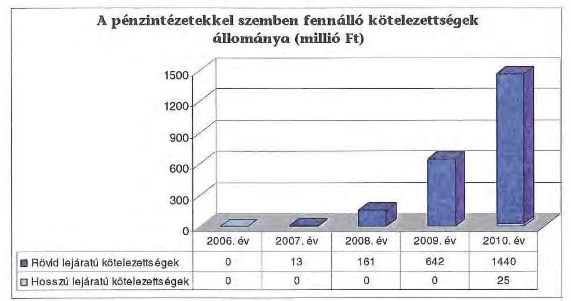

[^0]
[^0]:    ³¹ Elhasználódási mutató= tárgyi eszközök nettó értéke/tárgyi eszközök bruttó értéke.
    ³² a passzív pénzügyi elszámolásokkal együtt
    ³³ A 2010. év végén fennálló hitelkeret 1537 millió Ft volt.

---

Az ellenőrzött időszakban az Önkormányzat kötvényt, váltót nem bocsátott ki, lizingszerződést nem kötött, egyéb kötelezettséget nem vállalt.

Az Önkormányzat pénzintézeti kötelezettségvállalásaira minden esetben közgyűlési döntés alapján került sor. A kötelezettségvállalásból származó források felhasználási céljait meghatározták.

Az Önkormányzat rendelkezett a likviditási és eladósodási problémák kezelésére kialakított stratégiával³⁴. Az adósságot keletkeztető kötelezettségvállalásokra vonatkozó döntések előkészítése során vizsgálta a kötelezettségvállalás szükségességét. A döntések előkészítésekor közbeszerzési eljárások keretében több pénzintézet ajánlatát hasonlította össze. A Közgyűlést tájékoztatták arról, hogy a hosszú lejáratú adósságot keletkeztető kötelezettségvállalásokból adódó tőke- és kamatfizetési kötelezettségét az Önkormányzat milyen feltételek biztosítása mellett tudja teljesíteni.

Az Önkormányzat 2007-2011. év I. negyedév közötti időszakban kötött hitelkeret szerződései a következők voltak:

| Megnevezés | Kibocsátás, illetve szerződéskötés időpontja | Hitelkeret összege (ezer Ft) | Deviza nem | Kibocsátási, vagy lehívási árfolyam | Kamat (referencia kamat+ kamatfelár) | Egyéb költség | Deviza nem | Felhasználás célja: |
| :--: | :--: | :--: | :--: | :--: | :--: | :--: | :--: | :--: |
| Hosszú lejáratú fejlesztési hitel 32712.az. | 2008.10.15 | 1126543 | HUF | x | 3 havi BUBOR EURIBOR+ évt 1,43% banki felár | x | HUF | Fejlesztési és pályázati önerő biztosítása |
| Hosszú lejáratú fejlesztési hitel 32732.az. | 2010.06.23 | 177175 | HUF | x | 3 havi BUBOR EURIBOR+ MFB refinanszírozási kamatfelár+évt 0,52% banki felár | x | HUF | Fejlesztési és pályázati önerő biztosítása |
| Hosszú lejáratú fejlesztési hitel 32733.az. | 2010.06.23 | 22200 | HUF | x | 3 havi BUBOR EURIBOR+ MFB refinanszírozási kamatfelár+évt 0,52% banki felár | x | HUF | Fejlesztési és pályázati önerő biztosítása |
| Hosszú lejáratú fejlesztési hitel 47083.az. | 2010.12.08 | 136742 | HUF | x | 3 havi BUBOR EURIBOR+ MFB refinanszírozási kamatfelár+évt 0,48% banki felár | 1,25% projektvizsgálati díj | HUF | Fejlesztési és pályázati önerő biztosítása |
| Hosszú lejáratú fejlesztési hitel 47084.az. | 2010.12.08 | 74216 | HUF | x | 3 havi BUBOR EURIBOR+ MFB refinanszírozási kamatfelár+évt 0,48% banki felár | 1,25% projektvizsgálati díj | HUF | Fejlesztési és pályázati önerő biztosítása |
| Hosszú lejáratú fejlesztési hitel 47100.az. | 2011.01.24 | 76000 | HUF | x | 3 havi BUBOR EURIBOR+ MFB refinanszírozási kamatfelár+évt 0,89% banki felár | 1,25% projektvizsgálati díj | HUF | Fejlesztési és pályázati önerő biztosítása |
| Hosszú lejáratú működési hitel 47107.az. | 2011.02.28 | 500000 | HUF | x | 3 havi BUBOR EURIBOR+ évt 2,39% kamatfelár | 0,5% rendelkezésre tartási díj | HUF | Működési kiadások finanszírozása |

[^0]
[^0]:    ³⁴ 01/1935-3/2007. számú Szabályzat a fejlesztéshez és működéshez kapcsolódó külső források igénybevételéről és a fedezet biztosítékairól

---

Az Önkormányzat a 2009. évben a Kórház infrastruktúra fejlesztését finanszírozó támogatáshoz³⁵ szükséges önrész biztosítása érdekében kötött 1126542,5 ezer Ft keretösszegű hitelszerződést. A hitelkeretből fennálló tőketartozás 2010. december 31-én, valamint 2011. március 31-én is ugyanakkora, 25103 ezer Ft volt.

Az Önkormányzat a 2010. évben a „Korszerű regionális onkológiai hálózat kialakítása" címú pályázathoz³⁶ szükséges önrész biztosításához 177175 ezer Ft összegű, a „Rehabilitációs szolgáltatások fejlesztése" támogatás³⁷ önrészének biztosításához 22200 ezer Ft összegű hitelkeret szerződést kötött. Továbbiakban az ÚMFT más operatív programjai keretében meghirdetett pályázatokhoz szükséges önrészek biztosításához kötött hitelkeret 136742 ezer Ft, az intézmények és az Önkormányzati hivatal általános beruházási céljaira kötött hitelkeret 74216 ezer Ft volt. Az összesen 410333 ezer Ft összegű hitelkeretből a 2010. évben nem történt felhasználás, a 2011. I. negyedévi igénybevétel miatt a 2011. március 31-én fennálló tőketartozás 138298 ezer Ft volt.

Az Önkormányzat a 2011. évben a Kórház gasztroenterológiai laborja kialakítási költségeinek finanszírozására kötött 76000 ezer Ft összegű hitelkeret szerződést, valamint működési célú kiadások fedezetére nyitott 500000 ezer Ft összegű hitelkeretet. A 76000 ezer Ft hitelkeretből 2011. március 31-ig 54236 ezer Ft került igénybevételre. A működési célra megnyitott hitelkeretből a 2011. év I. negyedév végéig nem történt felhasználás.

A 2011. I. negyedév végéig az igénybe vett felhalmozási célú hitelekhez kapcsolódó tőketörlesztés nem történt, a fizetett kamat összege a 2010. évben 122 ezer Ft, a 2011. I. negyedévben további 841 ezer Ft (összesen 963 ezer Ft) volt.

Az Önkormányzatnál a hosszú lejáratú adósságot keletkeztető kötelezettségvállalások során az Ötv. 88. § (2) bekezdésében foglaltaknak megfelelően vizsgálták és betartották az éves adósságot keletkeztető kötelezettségvállalás felső korlátját³⁸. A hitelek visszafizetési fedezetének meghatározásakor betartották az Ötv.
 88. § (1) b) bekezdésének előírásait, amely szerint a visszafizetés fedezetéül normatív állami támogatást, állami támogatást, személyi jövedelemadót, valamint államháztartáson belülről működési célra átvett bevételeket nem jelöltek meg, biztosítékként az önkormányzati törzsvagyonba tartozó ingatlant nem ajánlottak fel.

A hosszú lejáratú kötelezettségvállalásokról szóló döntéseknél figyelembe vették a visszafizetés lehetséges forrásait. Tekintettel arra, hogy az Önkormányzatnál nem történt olyan beruházás, amelynek eredményeként jövedelmet realizálhatott volna, a döntés előkészítése során nem vizsgálták a visszafizetés lehetőségét arra az esetre, ha a megvalósított beruházás a tervezett bevételt, hasznot, eredményt nem biztosítja. A 2007-2010. években megvalósított beruházások

[^0]
[^0]:    ${ }^{35}$ TIOP 2.2.7 pályázat
    ${ }^{36}$ TIOP 2.2.5/09/1. pályázat
    ${ }^{37}$ NYDOP 2009-5.2.1/C pályázat
    ${ }^{38}$ A 2009. évben az adósságot keletkeztető kötelezettségvállalás felső határa 1323012 ezer Ft, a 2010. évben 893978 ezer Ft volt.

---

jellege nem indokolta az adósságot keletkeztető kötelezettségvállalások segítségével megvalósított felhalmozási kiadások megtérülésének vizsgálatát.

Az Önkormányzatnak devizában fennálló kötelezettsége nem volt, ezért az árfolyamkockázat figyelembevételére nem került sor. Valamennyi hitelkonstrukció változó kamatozású volt, amelyek esetén a kamat-kockázatot figyelembe vették ${ }^{39}$.

A helyszíni ellenőrzés időszakában fennálló hosszú lejáratú hitelek esetében a kamatfizetési kötelezettségek alakulását jelentősen befolyásolhatja a referencia kamat változása, amelyet az alábbi táblázat mutat be.

| Megnevezés | Lehivási | Utolsó fizetéskori | Változás \% |
| :--: | :--: | :--: | :--: |
|  | alapkamat \% |  |  |
| 3 havi EURIBOR (47083., 47084., 47100. számú hitelszerződéseknél) | 1,013 | 1,013 | 0,000 |
| 3 havi EURIBOR (32712. számú hitelszerződésnél) | 0,706 | 1,013 | 0,307 |

Tekintettel arra, hogy a hosszú lejáratú hitelkeretből a 2010-2011. I. negyedévben mindössze 25 millió Ft igénybevételére került sor, az alapkamat mértéke változásának hatása még nem érvényesül, a kamatnövekmény 38 ezer Ft.

Az Önkormányzat a 2007-2010. években összesen 29 millió Ft hozam- és kamatbevételt realizált, amelyből 16 millió Ft (55,2\%) a Kórház kamatbevételéből származott. Az elért kamatbevétel a Kórháznál a költségvetési elszámolási számla napi egyenlege utáni kamatból, az intézményeknél az elkülönített számlákon kezelt pályázati források előlegeiből származott. Az Önkormányzat értékpapírral nem rendelkezett, pénzeszközeit tartós betétben nem helyezte el. Hitelfelvételre a felhalmozási tevékenységekhez igazodva ütemezetten került sor, ezért átmenetileg szabad pénzeszközei nem voltak.

Az Önkormányzat a 2007-2010. évek között likvidhitelek felvételével biztosította a kiadások finanszírozását, folyószámlahitellel rendelkezett. A 2011. I. negyedévében egy alkalommal munkabérhitel felvételére is sor került.

A folyószámlahitel és a munkabérhitel alakulását az alábbi táblázat mutatja be:

[^0]
[^0]:    ${ }^{39}$ a Közgyűlés 118/2008. (VI. 13.) számú, valamint 172/2008. (XI. 21.) számú határozata

---

| Megnevezés | 2007. év | 2008. év | 2009. év | 2010. év | 2011. március   1. |
| :--: | :--: | :--: | :--: | :--: | :--: |
| I. Folyószámlahitel |  |  |  |  |  |
| a folyószámlahitel keretösszege január 1-jén | 700000 | 700000 | 900000 | 800000 | 1500000 |
| teljesített kamat és egyéb költség | 10260 | 8302 | 39676 | 72092 | 26502 |
| II. Munkabérhitel |  |  |  |  |  |
| igénybevett hitel összesen | - | - | - | - | 16000 |
| teljesített kamat és egyéb költség | - | - | - | - | 4 |

A folyószámlahitel-keret összege a 2007. január 1-jei 700 millió Ft-ról 2011. január 1-jére 1500 millió Ft-ra emelkedett. A 2007-2010. években a folyószámlahitel-keret szerződést hat alkalommal módosították.

A folyószámlahitel és a munkabérhitel kondícióinak és egyéb költségeinek alakulását az alábbi táblázat szemlélteti ${ }^{40}$:

| Megnevezés | Kamat (referencia+ kamatfelár | Egyéb költség |
| :--: | :--: | :--: |
| Folyószámlahitel |  |  |
| 2006. 09. 29. - 2007. 09. 28. | 3 havi BUBOR +0,2 % | x |
| 2007. 09. 28. - 2008. 09. 27. | 3 havi BUBOR +0,2 % | x |
| 2008. 09. 26. - 2009. 09. 25. | 700 millió Ft-ig 3 havi BUBOR +0,6 % | x |
|  | 700-900 millió Ft-ig 3 havi BUBOR +0,7 % | x |
| 2009. 09. 25. - 2010. 09. 24. | 3 havi BUBOR +1,7 % | x |
| 2010. 03. 01. - 2011. 02. 28. | 1 havi BUBOR +1,75 % | x |
| 2010. 05. 03. - 2011. 05. 02. | 1 havi BUBOR +2,25 % | x |
| 2010. 10. 29. - 2011. 10. 28. | 1 havi BUBOR +2,15 % | x |
| Munkabérhitel |  |  |
| 2011. 01. 03. - 2011. 01. 04. | 1 havi BUBOR +2,15 % | x |

A folyószámla-hitelkeret módosítása során ingatlan fedezet felajánlására egy esetben, 2010. október 29-én került sor ${ }^{41}$.

A folyószámlahitel átlagos napi állománya a 2007. évi 164 millió Ft-ról a 2008. évben 119 millió Ft-ra (27,4 %-kal) csökkent, majd 2010. év végére 938 millió Ft-ra, a 2011. I. negyedév végére 1339 millió Ft-ra emelkedett. A folyószámlahitel év végi állománya a 2007. évi 13 millió Ft-ról a 2010. év végére 1440 millió Ft-ra emelkedett, majd a 2011. I. negyedévig 1354 millió Ft-ra mérséklődött. Az Önkormányzat a 2007. évben 286, a 2008. évben 269 napon, a 2009. évtől a 2011. I. negyedév végéig az év minden napján rendelkezett folyószámlahitellel.

[^0]
[^0]:    ${ }^{40}$ A referencia kamat az alábbiak szerint alakult:

    | MNB BUBOR fixing (átlagkamat) %-ban |  |  |  |  |
    |  |  |  |  |
    | 2007. évi | 2008. évi | 2009. év | 2010. év | 2011. március   31-ig |
    | 7,75 | 8,87 | 8,64 | 5,5 | 6,03 |
    | 7,83 | 8,75 | 8,66 | 5,47 | 5,94 |
    | 7,78 | 8,41 | 8,39 | 4,95 | 5,24 |

    41 jelzálogszerződés 01/938-2/2010. iktatószámmal

---

A 2007-2011. I. negyedévben a munkabérhitel egy napon - 2011. január 3-án - állt fenn, amelynek összege 16 millió Ft volt. Az Önkormányzat a 2007-2010. években kamat és egyéb költség címén a folyószámlahitel igénybevétele miatt 130 millió Ft-ot, a 2011. I. negyedévben folyószámlahitel és munkabérhitel igénybevétele miatt további 27 millió Ft-ot fizetett ki.

Egyéb likvidhitel igénybevételére az Önkormányzatnál a 2007-2011. I. negyedév közötti időszakban nem került sor, valamint a helyszíni ellenőrzés befejezéséig folyamatban lévő kötelezettségvállalás nem volt.

Az Önkormányzatnak a 2010. év végi pénzintézeti kötelezettsége - 25 millió Ft (1,7\%) fejlesztési célú hosszú lejáratú hitel és 1440 millió Ft (98,3\%) folyószámlahitel - miatt, valamint a megkötött hosszú lejáratú hitelkeret-szerződések teljes igénybevétele esetén, a 2011. I. negyedévi kamat mértékét alapul véve a 2011-2013. években 2043 millió Ft tőketörlesztést és kamatot kell teljesítenie. A további évekre szóló, a helyszíni ellenőrzés időszakában ismert összes pénzintézeti kötelezettség 2027 millió Ft.

Az Önkormányzat 2011-2014. évekre szóló gazdasági programjában kiemelt, folyamatos feladatként határozta meg a pénzügyi stabilitás biztosítását, a gazdálkodás további racionalizálását.

Az Önkormányzat annak érdekében, hogy a napi folyószámlahitel állományát csökkentse, a 2007. évben megszigorította kiskincstári rendszerét úgy, hogy az intézmények bevételeit is bevonta a finanszírozásba. Az intézmények számára csak a napi szükségletnek megfelelő mértékben biztosított támogatást, az intézményi költségvetési elszámolási számlákon lévő napi záró egyenlegeket a pénzintézet átvezette az Önkormányzat költségvetési elszámolási számlájára.

# 3.2. Szállítók felé fennálló kötelezettségek alakulása 

Az Önkormányzat szállítói tartozásállománya a 2007. évi 1866 millió Ft-ról a 2008. évre 2039 millió Ft-ra, a 2009. évre 3330 millió Ft-ra emelkedett, majd a 2010. évre 3105 millió Ft-ra mérséklődött. A 2007. évről a 2010. év végéig a növekedés mértéke 66,4 % volt. A 2011. I. negyedév végére a szállítói állományban kedvezőtlen irányú változás történt, a tartozás összege 3416 millió Ft-ra emelkedett. A szállítói tartozásállományból a legjelentősebb a Kórház szállítói állománya volt ${ }^{42}$. A Kórház szállítói állománya a teljes szállítói állományon belül a 2007. évben 1818 millió Ft-ot (97,4 %), a 2010. évben 2970 millió Ft-ot (95,7 %-ot) képviselt.

A Kórház összes szállítói tartozásállományának nagyságrendje a 2009. évben, majd 2011. I. negyedév végén volt a legmagasabb. Az intézmény az ellenőrzött időszakban a lejárt szállítói állomány csökkentése érdekében a szállítókkal a tartozásállomány átütemezésére vonatkozó megállapodásokat kötött, több szállítónál kezdeményezte a hosszabb fizetési határidők megállapítását. A legnagyobb gyógyszerszállító partner által végrehajtott faktorálás javította a

[^0]
[^0]:    ${ }^{42}$ A 2007. évben 1818 millió Ft, a 2008. évben 2003 millió Ft, a 2009. évben 3205 millió Ft, a 2010. évben 2970 millió Ft, a 2011. I. negyedév végén 3260 millió Ft.

---

likviditást. Az átütemezett szállítói számlák után a 2007-2011. I. negyedévben kifizetett késedelmi kamat összesen 180 millió Ft volt.

A többségi tulajdonú gazdasági társaságok közül a BBMMK év végi szállítói állománya a 2007. évi 2,4 millió Ft-ról a 2010. évre 0,2 millió Ft-ra csökkent. Az ÉDR Mosoda év végi szállítói állománya szintén kedvezően változott, a 2007. évi 36 millió Ft-ról a 2010. évre 9,5 millió Ft-ra mérséklődött. A 2011. március 31-én fennálló szállítói állomány a BBMMK-nál 0,5 millió Ft, az ÉDR Mosodánál 7 millió Ft volt. Az ellenőrzött időszakban a gazdasági társaságok szállítói állományában fizetési átütemezéssel érintett, illetve lejárt állomány nem szerepelt.

Az Önkormányzatnak és gazdasági társaságainak lejárt szállítói tartozásait, és egyéb kiadás elmaradásait az alábbi táblázat tartalmazza:

| Megnevezés | 2007.   december 31. | 2008.   december 31. | 2009.   december 31. | 2010.   december 31. | 2011. március   31. |
| :--: | :--: | :--: | :--: | :--: | :--: |
| Lejárt szállítói tartozás | 473097 | 521637 | 374969 | 265385 | 552328 |
| ebből Kórház | 460206 | 509906 | 365976 | 205547 | 459444 |
| Gazdasági társaságok   lejárt szállítói tartozása | - | - | - | - | - |
| Egyéb kiadás elmaradás | - | - | - | - | - |
| Tartozásállomány   összesen: | 473097 | 521637 | 374969 | 265385 | 552328 |

Az Önkormányzat év végi lejárt szállítói
 állománya a 2007-2008. évek között 473 millió Ft-ról 522 millió Ft-ra (10,4%-kal) emelkedett, a 2010. évre 265 millió Ft-ra (a 2007. évhez képest 44,0%-kal) csökkent. Az Önkormányzatnál a 2011. I. negyedév végén a lejárt szállító tartozások összege 552 millió Ft volt. A lejárt szállítói tartozásállományon belül a 60-90 nap közötti tartozás a 2008. évben 11 ezer Ft, a 2010. évben 1,6 millió Ft (0,6%), valamint a 2011. I. negyedévben 5,5 millió Ft (1,0%), 90 napon túli tartozás nem volt.

Az átütemezéseket megelőzően a Kórház lejárt szállítói tartozásállománya a 2007. évi 916 millió Ft-ról a 2010. évre 1795 millió Ft-ra emelkedett, a 2011. I. negyedév végén 2117 millió Ft volt. Az átütemezéseket követően a lejárt szállítói állomány a 2007. évben 460 millió Ft, a 2010. évben 206 millió Ft, a 2011. I. negyedév végén 459 millió Ft volt, amelyek között nem szerepelt 60 napon túli tartozás. Önkormányzati biztos kirendelésére nem volt szükség, mert a Kórház adatszolgáltatása szerint, a 30 napon túli tartozásállomány az ellenőrzött időszakban nem érte el az eredeti kiadási előirányzatának 10%-át, illetve a 100 millió Ft-ot, majd 2009. évtől a 150 millió Ft-ot. Az ellenőrzött időszakban a Kórház az OEP többletfinanszírozások$^{43}$ összegét a szállítói állomány csökkentésére fordította. A 2010. évben az intézménynél a szállítói állomány alakulását javította az OEP konszolidációs

[^0]
[^0]:    $^{43}$ A 2007. évben 75 millió Ft, a 2008. évben 438 millió Ft, a 2009. évben 89 millió Ft, a 2010. évben 117 millió Ft volt az OEP többlettámogatás.

---

támogatás 787 millió Ft összege is, amit teljes egészében a szállítói állomány csökkentésére fordított.
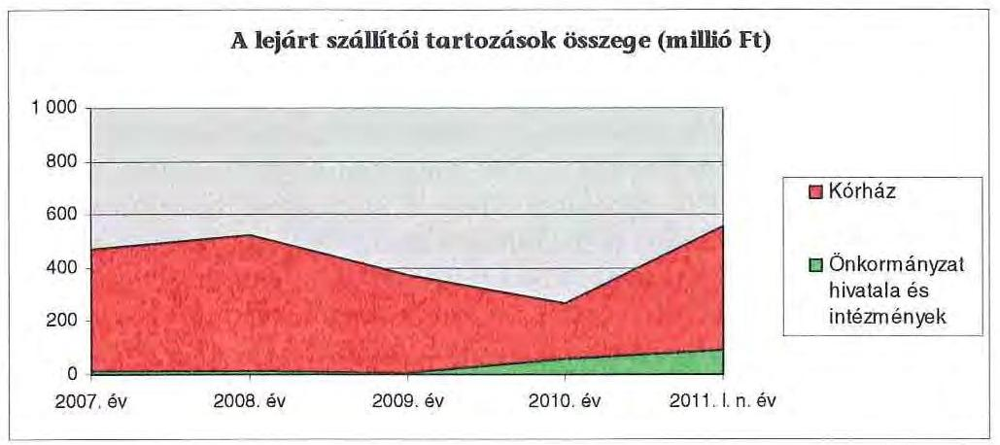

Az Önkormányzat Pénzügyi és Vagyonkezelő Bizottsága a Kórház lejárt szállítói kötelezettségeinek rendezését rendszeresen megtárgyalta, szükség esetén a szállítói állomány csökkentése érdekében intézkedési tervet fogadott el, a végrehajtott intézkedésekről a Kórházat beszámoltatta.

# 3.3. Egyéb kötelezettségek alakulása 

A 2007-2011. I. negyedév időszakában az Önkormányzat garanciát és kezességet nem vállalt, PPP konstrukció keretében nem végzett beruházást, lízingszerződést$^{44}$ nem kötött.

A 2007-2011. I. negyedév időszakában az Önkormányzatnak egyéb kötelezettségvállalása nem volt, követelés elengedésére nem került sor.

Az Önkormányzatnál három intézménynél van folyamatban lévő munkaügyi peres eljárás, amelyek esetében még nincs jogerős bírósági döntés.

Az ellenőrzött időszakban az Önkormányzat egy alkalommal, 2011. I. negyedévében nyújtott 50 millió Ft összegű kölcsönt költségvetési intézménye, a Kórház számára kötelező feladatainak ellátása érdekében megvalósítandó, gasztroenterológiai labor kialakításához$^{45}$. A beruházáshoz az Önkormányzat a 2011. évben 4 millió Ft saját erő biztosítása mellett 76 millió Ft hitelkeret szerződést kötött, amelyből 2011. március 31-ig 54 millió Ft hitelt vett igénybe. A felvett hitelből került sor az 50 millió Ft összegű kölcsön nyújtására. A Kórház vállalta, hogy az 50 millió Ft kölcsön és kamatai összegét a 2011. évtől kezdődően minden év szeptember 30-ig öt év alatt, öt egyenlő részletben visszafizeti az Önkormányzat részére.

[^0]
[^0]:    $^{44}$ A Kórház 2005. március 30-án - 2008. március 5-ei lejárattal - zártvégű pénzügyi lízingre szóló szerződést kötött a Siemens Finance Rt-vel. A lizingszerződés keretében sebészeti gép-műszert szerzett be 6 millió Ft értékben. A 2007. évi beszámolóban egyéb hosszú lejáratú kötelezettség következő évet terhelő részleteként 578 ezer Ft szerepelt.
    $^{45}$ Az Önkormányzat és a Kórház a kölcsönszerződést 2011. január 25-én kötötte a 196/2010. (IX. 17.) számú közgyűlési határozat alapján.

---

Ingatlanfedezet felajánlására egy esetben, a folyószámla-hitelkeret módosítása során került sor. Az Önkormányzat 2010. október 29-én a folyószámla-hitelkeretét 1200 millió Ft-ról 1500 millió Ft-ra emelte fel$^{46}$. Ennek során a hitelt folyósító bank és az Önkormányzat a folyószámla-hitelkeret fedezetéül 1650 millió Ft összeghatárig keretbiztosítéki zálogjogot alapított.

A jelzálogjog bejegyzésre - a folyószámla-hitelkeret 300 millió Ft értékű növekményének fedezetéül - hét forgalomképes ingatlan esetében került sor, amelyeknek 2010. december 31-én a számviteli nyilvántartások szerinti nettó értéke 188 millió Ft, a becsült értéke az Önkormányzat forgalomképes ingatlanjai becsült értékének (2072 millió Ft) 22,7%-a, 469 millió Ft volt. Az Önkormányzat forgalomképes ingatlanjainak számviteli nyilvántartás szerinti nettó értéke 2010. december 31-én 424 millió Ft volt.

A forgalomképes ingatlanok becsült értékének megoszlása a 2010. évben
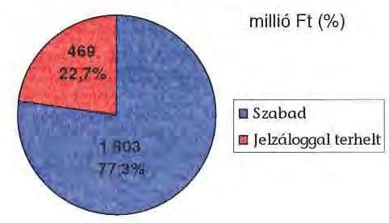

Az Önkormányzat eladósodása és a jelzálogjog bejegyzés között nem állapítható meg összefüggés, tekintettel arra, hogy az Önkormányzat további adósságot keletkeztető kötelezettségvállalásai során jelzálogjog bejegyzésre nem került sor.

A rendelkezésére álló éves költségvetési előirányzatok nagyságrendje alapvetően meghatározta az állagmegóvó és egyéb felújítási, karbantartási, rekonstrukciós munkák megtervezését és kivitelezését. Az Önkormányzat folyamatosan, minden évben - három éves időtartamra - gördülő tervezés formájában elkészíti az intézmények műszaki felmérését, beruházási, felújítási, karbantartási tervezetét a szükségesség szerint rangsorolva. A tervezetek egyrészt az egyes ingatlanok teljes felújítási vertikumát tartalmazzák, másrészt részleges felújítási feladatokat, munkákat határoznak meg, amelyek a folyamatos működtetés érdekeit szolgáló kisebb költségigényű munkák elvégzését jelentik. Az eszközök pótlása, felújítása az Önkormányzat pénzügyi lehetőségei függvényében történt.

[^0]
[^0]:    $^{46}$ A folyószámlahitel felvétele hirdetmény nélküli tárgyalásos eljárás keretében történt. A benyújtott ajánlatok száma egy volt, amely egyben érvényes ajánlat volt.
    $^{47}$ Az Önkormányzat a teljes forgalomképes vagyonáról rendelkezik értékbecsléssel.

---

Az Önkormányzat a 2007-2010. években a tárgyi eszközök után összesen 2639 millió Ft értékcsökkenést számolt el. Az Önkormányzat az üzemeltetési, fenntartási kiadások csökkentésére hivatkozással (pl.: épületenergetikai fejlesztés) a 2007-2010. években összesen 2312 millió Ft összegű felhalmozási kiadást$^{48}$ teljesített, amelyből a Kórház részesedése 784 millió Ft (33,9%) volt.

# 4. A PÉNZÜGYI EGYENSÚLY MEGTEREMTÉSE ÉRDEKÉBEN HOZOTT INTÉZKEDÉSEK 

A Közgyűlés a 156/1996. (XI. 28.) számú határozatával hozta létre a kiskincstári rendszert, amelynek célja az Önkormányzat folyamatos fizetőképességének biztosítása, a likviditási nehézségek mérséklése volt. Az Önkormányzatnál kialakult pénzügyi helyzet szükségessé tette, hogy a 2007. évben a kiskincstári finanszírozási rendszer továbbfejlesztésre, szigorításra kerüljön. A szigorítás eredményeként az Önkormányzat az intézményeket csak a napi kiadásokhoz szükséges mértékig finanszírozta. A kiskincstári rendszer kiadáscsökkentő hatását nem számszerűsítették. A kiskincstári rendszer szigorításán túl az Önkormányzatnál a pénzügyi egyensúly biztosítása érdekében további egyedi kiadáscsökkentő és bevételnövelő intézkedések meghozatalára került sor.

A kiadáscsökkentő és bevételnövelő intézkedések megtétele a gazdálkodás átláthatóbbá tételét, valamint a feladatellátás szakmai színvonalának, de kiemelten a pénzügyi helyzet javítását célozta. A legjelentősebb mértékű kiadási megtakarítást a létszámleépítésekkel érték el.

Az Önkormányzat 2007-2010 közötti időszakra vonatkozó gazdasági és humán programjában megfogalmazott elvárásokkal összhangban az alábbi átszervezésekre került sor:

A Közgyűlés 2007. július 31-vel jogutód nélkül megszüntette Győr-Moson-Sopron Megye Közgyűlésének Diákotthonát. 2007. december 31-ével megszüntették a Megyei Sportigazgatóságot is azzal a további rendelkezéssel, hogy a kötelező megyei szakmai feladatokat a 2008. évtől az Önkormányzati hivatal látja el.
A Közgyűlés 2008. március 31-ével megszüntette Győr-Moson-Sopron Megye Önkormányzatának József Attila Gyermekvédelmi Központját azzal, hogy a megszűnő intézmény szakmai egységei a Győr-Moson-Sopron Megye Önkormányzatának Győri Gyermekvédelmi Központjához tartoznak.
A gyermekvédelmi feladatok területén a gondozási, a módszertani és a gazdaságossági szempontok figyelembevételével a Közgyűlés határozata értelmében feladatátszervezésre került sor 2009. I. negyedévben. A Győr-Moson-Sopron Megyei Önkormányzat Gyermekvédelmi Központjának egyik szakmai egysége megszűnt, ugyanakkor a Doborjáni Ferenc Nevelési-Oktatási Központ szervezetén belül kialakításra került egy új gyermekotthoni részleg. Ez az intézkedés a József Attila utcai épületegyüttes „C" épületének megüre-

[^0]
[^0]:    $^{48}$ amelyből felújítási kiadás 348 millió Ft volt a 2007-2010. években

---

sedését eredményezte.
Megszüntetésre került a gyermekvédelmi intézmény Sopron, József Attila utcai egységében működő konyha is. A Közgyűlés 2009. augusztus 1-jével új középfokú közoktatási intézményt hozott létre Győr-Moson-Sopron Megyei Önkormányzat Általános Művelődési Központja néven. Az új intézmény a Porpáczi Aladár Általános Művelődési Központ és az Újhelyi Imre Élelmiszeripari Közép- és Felsőfokú Szakképző Iskola és Kollégium összeolvadásával jött létre, amely egy magasabb vezető irányításával, tagintézményenként pedig egy-egy tagintézmény-vezetővel működik 2009. augusztus 1-jétől közös igazgatású közoktatási egységként. A két intézmény összeolvadásának célja a pedagógiai tevékenység összehangolása, valamint a közoktatást segítő funkciók együttes ellátása révén az eddigieknél költségtakarékosabb és hatékonyabb feladatellátás volt.
A 2007-2010. években az intézmények átszervezésével - a létszámcsökkentések hatásával nem számolva - 589 millió Ft megtakarítást mutatott ki az Önkormányzat.

Az Önkormányzat az - általa készített kimutatások szerint - a 2007-2010. években kiadáscsökkentő intézkedések eredményeként 4909 millió Ft megtakarítást mutatott ki. A kiadáscsökkentő intézkedéseit beavatkozási területenként az alábbi táblázat szemlélteti:
ezer Ft-ban

| Az érvényesített ki-   adáscsökkentés területei | Személyi   juttatások és   járulékok | Dologi, működési   kiadások | Pénzeszköz   átadások,   támogatások | Összesen |
| :-- | :--: | :--: | :--: | :--: |
| A Közgyűlés működése | 250317 | - | - | 250317 |
| Az Önkormányzati   hivatalnál | 152366 | 9659 | 78823 | 240848 |
| Az intézményeknél | 3709749 | 573428 | 134364 | 4417541 |
| ÖSSZESEN | 4112432 | 583087 | 213187 | 4908706 |

Az Önkormányzat a Közgyűlés működési körében a tiszteletdíjak csökkentése$^{49}$ és a költségtérítések felülvizsgálata, megszüntetése eredményeként ért el 250 millió Ft összegű megtakarítást, amely az összes kiadáscsökkentés, a 4909 millió Ft 5,1%-a volt.

A kiadáscsökkentések eredményeként az Önkormányzati hivatalban kimutatott megtakarítás 241 millió Ft volt, amelyből 79 millió Ft (32,8%) az Önkormányzati hivatal átszervezéséhez kapcsolódó létszámcsökkentésből, 9 millió Ft (3,7%) cafetéria elemek, 66 millió Ft (27,4%) nem rendszeres személyi juttatások és dologi kiadások, 86 millió Ft (35,7%) önként vállalt feladatokra fordított kiadások, egy millió Ft (0,4%) civil szervezetek támogatására fordított kiadások csökkentéséből adódott.

Az intézményeknél 4418 millió Ft megtakarítást számszerűsítették a kiadáscsökkentő intézkedések eredményeként. Az intézményi kiadási megtakarítá-

[^0]
[^0]:    $^{49}$ A Közgyűlés tagjainak tiszteletdíját meghatározó szorzószám a 2006. évi 3-ról 2007. január 1-jétől 2,6-ra, 2010. március 1-jétől 2,34-re módosult.

---

sokból 589 millió Ft-ot (13,3%) intézmények átszervezésével, 3148 millió Ft-ot (71,3%) létszámcsökkentési döntésekkel - üres álláshelyek megszüntetésével, átszervezéssel járó létszámcsökkentéssel, határozott idejű alkalmazások megszüntetésével -, további 681 millió Ft-ot (15,4%) többletjuttatások csökkentésével - cafetéria elemek, pótlékok elvonása, részmunkaidő bevezetése -, költségtérítések, valamint beszerzési szerződések felülvizsgálatával, karbantartási kiadások csökkentésével indokol az Önkormányzat.

Kiadáscsökkentő intézkedések eredményeként a 2011. évben az Önkormányzat 1458 millió Ft megtakarítást tervez. A tervezett megtakarításokból várhatóan a Közgyűlés működési körében tiszteletdíjak csökkentése miatt 56 millió Ft, az Önkormányzati hivatalnál átszervezés miatti létszámcsökkentés, cafetéria és dologi kiadások csökkentése, önként vállalt feladatok és civil szervezetek támogatásainak csökkentése
 miatt 98 millió Ft, az intézmények körében létszámcsökkentés, beszerzési szerződések felülvizsgálata, többletjuttatások csökkentése miatt 1304 millió Ft jelentkezik.

A 2007-2010. években az intézmények megszüntetése és összevonása mellett jelentős létszámcsökkentésről döntött a Közgyűlés. A 2007-2010. években 810,78 álláshely került megszüntetésre ${ }^{50}$, amelyből 468,12 (57,7\%) a szakmai álláshely, 342,66 (42,3\%) intézményüzemeltetéssel kapcsolatos álláshely volt. Az álláshelyekből 578,28 (71,3\%) a Kórházban megszüntetett volt.

A 2007-2011. év I. negyedévében végrehajtott létszámcsökkentést az alábbi grafikon szemlélteti:
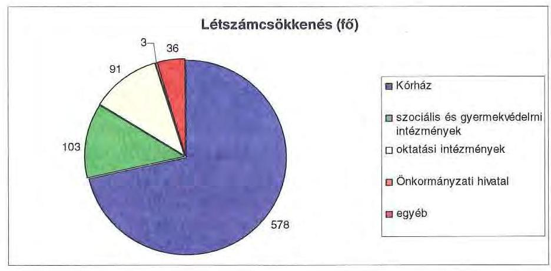

A helyi szervezési intézkedésekhez kapcsolódóan a 2007-2010. években 473 millió Ft támogatást igényelt az Önkormányzat, amelyből 473 millió Ft támogatásban részesült. A támogatás felhasználásával tartósan leépített létszám a 2007-2010. években 283,5 fő volt. A létszámcsökkentés eredményeként

[^0]
[^0]:    ${ }^{50}$ A részmunkaidős álláshelyek teljes munkaidős álláshelyekre átszámításra kerültek.

---

az Önkormányzat 2006. december 31-i átlaglétszáma 4153 főről ${ }^{51}$ 2011. március 31-ére 3348 főre, 19,4\%-kal csökkent.

A 2011. I. negyedévében további 157,5 álláshely megszüntetéséről döntött a Közgyűlés, amelyből 88 megszüntetett álláshelyre igényelnek a helyi szervezési intézkedésekhez kapcsolódó többletkiadások címén támogatást.

Az Önkormányzat törekedett a bevételek növelésére, kiemelt figyelmet fordított a meglévő eszközállomány hasznosítására. A 2007-2010. években ingatlan bérbeadáshoz kapcsolódó bevételnövelő intézkedéseket - bérleti szerződések módosítása, kihasználatlan ingatlanok bérbeadása - hozott. Az intézkedések eredményeként kimutatott 107 millió Ft összegű bevételnövekményből 16 millió Ft (14,9\%) az Önkormányzati hivatalnál, 91 millió Ft (85,1\%) az intézményeknél jelentkezett. A 2011. évben az intézmények ingatlan bérbeadáshoz kapcsolódóan 2 millió Ft összegű bevételnövekedést terveztek. Ezen túl a Győr-Moson-Sopron Megyei Múzeumi Igazgatóság a régészeti tevékenységhez kapcsolódóan ásatási bevételből 30 millió Ft, a Kórház gyógyszertárai forgalmának növekedése miatt 20 millió Ft többletbevételt tervez, két szociális intézmény a térítési díjak emelésétől vár 14 millió Ft bevételnövekedést. A 2011. évben a bevételnövelő intézkedésekhez kapcsolódó tervezett többletbevétel összege összesen 66 millió Ft.

A 2007-2011. I. negyedévében az Önkormányzatnál gazdasági társaságokba feladat-kiszervezés nem volt.

Az Önkormányzat vagyonhasznosítási bevételeinek növelése, az önként vállalt feladatok mérséklése érdekében a gazdasági társaságaival összefüggésben az alábbi intézkedéseket hozta:

A 2007. évben az Önkormányzat értékesítette a FLORASCA Környezetgazdálkodási Kft-ben ${ }^{52}$ lévő 54\%-os (43,2 millió Ft) üzletrészét, majd a 2008. I. negyedévében az INNONET Innovációs és Technológiai Központ Kht-ban ${ }^{53}$ lévő 5,71\%-os (2 millió Ft) és a Nyugat-Pannon Regionális Fejlesztési Zrt-ben ${ }^{54}$ lévő 0,038\%-os (0,39 millió Ft) önkormányzati részesedések értékesítése is megtörtént.

A Közgyűlés a 115/2008. (VI. 13.) számú határozatával döntött a Győr-Pér Repülőtér Kft. 18,76\%-os (35,83 millió Ft) üzletrészének forgalmi értéken történő értékesítéséről is, de az értékesítési eljárás a helyszíni ellenőrzés be-

[^0]
[^0]:    ${ }^{51}$ A 2006. december 31-ei átlaglétszám már nem tartalmazza az Illetékhivatal 50 fős létszámát.
    ${ }^{52}$ A Közgyűlés 155/2007. (VI. 22.) számú határozata a FLORASCA Környezetgazdálkodási Kft. üzletrészének értékesítéséről.
    ${ }^{53}$ A Közgyűlés 12/2008. (II. 15.) számú határozata az INNONET Innovációs és Technológiai központ Kht-ban lévő megyei önkormányzati tulajdonú részesedés értékesítéséről.
    ${ }^{54}$ A Közgyűlés 255/2007. (XII. 21.) számú határozata a Nyugat-Pannon Regionális Fejlesztési Zrt-ben lévő megyei önkormányzati tulajdonú részvények értékesítéséről.

---

fejezéséig sikertelen volt. A Győr-Pér Repülőtér Kft. működésének fenntartásához a tulajdonosoknak évek óta hozzá kellett járulniuk a részesedésük arányában, ami az Önkormányzatnak 2011. I. negyedév végéig 28,4 millió Ft pótbefizetési terhet jelentett. Az Önkormányzat a 2011. évben üzletrészt szerzett az ÉDR Mosodában oly módon, hogy a Kórház tulajdonában levő üzletrészből 0,3 millió Ft névértékű üzletrészt térítésmentesen átvett ${ }^{55}$.
5. A HELYI ÖNKORMÁNYZATOK GAZDÁLKODÁSI RENDSZERÉNEK 2010. ÉVI ELLENŐRZÉSE SORÁN A PÉNZÜGYI EGYENSÚLY JAVÍTÁSÁRA TETT SZABÁLYSZERŰSÉGI ÉS CÉLSZERŰSÉGI JAVASLATOK HASZNOSULÁSA

Az ÁSZ az Önkormányzat gazdálkodási rendszerét a 2010. évben ellenőrizte, amely során a pénzügyi egyensúly javítására vonatkozó javaslatot nem tett.

Budapest, 2011. december „ 19 "

Melléklet: $\quad 6 \mathrm{db} \quad 16$ lap

[^0]
[^0]:    ${ }^{55}$ A Közgyűlés 71/2011. (IV. 22.) számú határozata az ÉDR Mosoda üzletrész szerzéséről.

---

.

---

Győr-Moson-Sopron Megyei Önkormányzat

1. számú melléklet

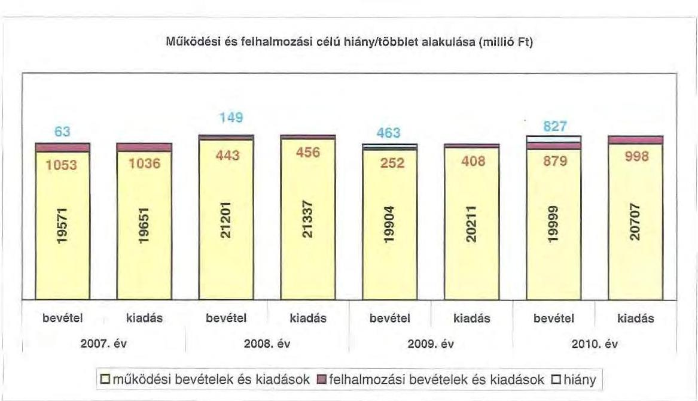

---

.

---

Győr-Moson-Sopron Megyei Önkormányzat

Az Önkormányzat CLF módszer szerint besorolt bevételei és kiadásai 2007-2010 között

|  1. FOLYÓ KÖLTSEGYETÉS* | 2007. év | 2008. év | 2009. év | 2010. év  |
| --- | --- | --- | --- | --- |
|  1.1.1. Saját működési bevételek | 4 692 282 | 5 613 543 | 5 568 826 | 4 957 591  |
|  1.1.2. Költségvetési támogatás | 2 870 915 | 3 642 727 | 2 591 703 | 2 179 323  |
|  1.1.3. Engedélyezett bevételek | 1 394 044 | 489 268 | 510 144 | 137 863  |
|  1.1.4. Állami költségvetésen belülről kapott támogatások | 10 626 568 | 11 112 552 | 10 429 308 | 12 135 757  |
|  1.1.5. EU-tól és külföldről kapott bevételek | 13 | 17 500 | 31 784 | 6 486  |
|  1.1.6. Állami költségvetésen kívülről kapott bevételek | 42 334 | 55 194 | 16 821 | 19 960  |
|  1.1.7. Más évi pénzeszközök átválása | 220 086 | 256 428 | 628 268 | 753 869  |
|  1.1. Folyó bevételek =1.1.1.-1.1.2.-1.1.3.-1.1.4.-1.1.5.-1.1.6.-1.7. | 19 987 162 | 21 207 165 | 19 576 314 | 20 161 973  |
|  1.2.1. Működési kiadások beosztásánál adódik | 18 807 489 | 20 124 920 | 18 695 623 | 19 658 688  |
|  1.2.2. Állami költségvetésen belülre átadott pénzeszközök | 25 330 | 31 318 | 31 228 | 32 490  |
|  1.2.2.1. Adófizetés | 1 864 | 62 310 |  | 42  |
|  1.2.2.2. EU-nak, illetve külföldre | 700 | 100 | 90 | 90  |
|  1.2.2.3. Megtartott eszközöknek | 102 282 | 107 188 | 102 128 | 99 297  |
|  1.2.2.4. Átmenetileg javasolt átvezetések | 203 237 | 188 982 | 165 276 | 164 312  |
|  1.2.3. Törvény szerinti kiadások (=1.2.3.1+1.2.3.2+1.2.3.3+1.2.3.4) | 310 462 | 296 863 | 267 493 | 203 974  |
|  1.2.4. Kommunális kiadások | 10 485 | 8 858 | 39 076 | 72 091  |
|  1.2.5. Előző évi pénzeszközök átadása | 329 509 | 656 630 | 628 026 | 752 061  |
|  1.2. Folyó kiadások = 1.2.1.-1.2.2.-1.2.3.-1.2.4.-1.2.5 | 19 482 275 | 21 119 597 | 19 662 806 | 20 720 315  |
|  1.3. Folyó költségvetés egyenlege (SZÁMLÁZOTT JÖVEDELEM (1.1. - 1.2.) | 473 887 | 137 968 | -89 743 | -558 343  |
|  2. FELHALMOZÁSI KÖLTSEGYETÉS** |  |  |  |   |
|  2.1.1. Saját tőkebefektetések | 163 013 | 92 958 | 6 662 | 90 615  |
|  2.1.2. Állami költségvetésen belülről kapott támogatások | 44 614 | 48 878 | 49 698 | 652 656  |
|  2.1.3. EU-tól és külföldről kapott támogatások | 0 | 1 210 | 0 | 790  |
|  2.1.4. Állami költségvetésen kívülről kapott támogatások | 57 442 | 62 977 | 70 389 | 59 667  |
|  2.1. Felhalmozási bevételek (=2.1.1.-2.1.2+2.1.3+2.1.4.) | 265 470 | 187 962 | 128 588 | 802 911  |
|  2.2.1. Saját beruházási kiadások | 850 785 | 869 102 | 323 727 | 855 121  |
|  2.2.2. Saját felújítási kiadások | 171 556 | 80 644 | 70 909 | 84 207  |
|  2.2.3. Állami költségvetésen belülre átadott pénzeszközök | 2 225 | 1 282 | 6 979 | 999  |
|  2.2.4. EU-nak és külföldre adott pénzeszközök | 0 | 0 | 0 | 0  |
|  2.2.5. Állami költségvetésen kívülre adott pénzeszközök | 16 743 | 12 494 | 16 365 | 3 959  |
|  2.2.6. Széltárolási célú részesedések vételéhez | 0 | 0 | 0 | 0  |
|  2.3. Felhalmozási kiadások (=2.3.1.-2.3.2.-2.3.3.-2.3.4.-2.3.5.-2.3.6.) | 1 041 313 | 963 450 | 417 909 | 984 270  |
|  2.3. Felhalmozási költségvetés egyenlege (2.3. - 2.3.) | -775 043 | -275 517 | -289 410 | -100 466  |
|  3. FINANSZÍROZÁSI MŰVELETEK NÉLKÜLI (GFS) POZÍCIÓ |  |  |  |   |
|  (1.3.) Folyó költségvetés egyenlege (működési jövedelem) + (2.3.) Felhalmozási költségvetés egyenlege | -301 956 | -137 949 | -375 152 | -738 800  |
|  4. FINANSZÍROZÁSI MŰVELETEK |  |  |  |   |
|  4.1. Hitel felvétel | 12 993 | 148 222 | 481 115 | 822 546  |
|  4.2. Hitel visszafizetés | 0 | 0 | 0 | 0  |
|  4.3. Forgó- és beruházási célú értékpapírok kibocsátása | 0 | 0 | 0 | 0  |
|  4.4. Forgó- és beruházási célú értékpapírok bevétele | 0 | 0 | 0 | 0  |
|  4.5. Forgó- és beruházási célú értékpapírok átértékelése | 0 | 0 | 0 | 0  |
|  4.6. Forgó- és beruházási célú értékpapírok vesztesége | 0 | 0 | 0 | 0  |
|  4.7. Egyéb finanszírozási bevételek (függő, félszázalékos, kiegészítő) | -84 930 | -41 506 | -85 000 | -98 195  |
|  4.8. Egyéb finanszírozási kiadások (függő, félszázalékos, kiegészítő) | 258 742 | -47 308 | 156 926 | -199 556  |
|  4.9. Finanszírozási műveletek egyenlege (4.1.-4.2.-4.3.-4.4+4.5.-4.6.-4.7.-4.8.) | -370 679 | 154 624 | 277 270 | 923 901  |
|  5. Forgóeszközök jövedelmezőségi pontjai valóságig |  |  |  |   |
|  (3.) FINANSZÍROZÁSI MŰVELETEK NÉLKÜLI (GFS) POZÍCIÓ + (4.9.) Finanszírozási műveletek egyenlege | -672 635 | 16 675 | -97 982 | 185 097  |
|  6. NETTÓ MŰKÖDÉSI JÖVEDELEM |  |  |  |   |
|  (1.3.) Működési Jövedelem - Tőketőkebefektetésre (4.2. Hitel visszafizetésre + 4.4. Forgó- és beruházási célú értékpapírok bevétele) | 473 887 | 137 968 | -89 743 |

 | -558 343  |
|  TÁJÉKOZTATÓ ADATOK: |  |  |  |   |
|  Öreges közösszítésig | 1 922 436 | 2 230 732 | 1 849 428 | 4 706 472  |
|  Akció révén teljesített | 1 922 436 | 2 230 732 | 4 049 428 | 4 682 369  |
|  Öreges eszközök kötelezettsége | 1 865 929 | 2 029 257 | 2 329 827 | 3 104 750  |
|  Akció lejárt | 473 897 | 521 637 | 374 969 | 265 285  |
|  Féns és félszponzor kötelezettség (adások) | 12 993 | 161 314 | 642 420 | 1 464 978  |
|  Akció révén teljesített | 12 993 | 161 314 | 642 420 | 1 439 871  |
|  PPP szerződésből keletkező kötelezettség állomány | 0 | 0 | 0 | 0  |
|  Akció lejárt eszközbeszerzési díj miatti kötelezettség | 0 | 0 | 0 | 0  |
|  Feltételezéssel eseti félszponzor állomány | 128 452 | 87 985 | 409 199 | 938 076  |
|  Lővidéki eseti félszponzor állomány | 0 | 0 | 0 | 0  |
|  Mezőgazdasági által eseti félszponzor állomány | 0 | 0 | 0 | 0  |
|  Pénzes eljárásokból fennálló forráshiányos kötelezettségek | 0 | 0 | 0 | 0  |
|  Finanszírozásokba beosztott eszközök részére | 169 299 | 185 876 | 87 981 | 272 089  |
|  Tartás kötelezettségi megtestesítői értékpapírok | 0 | 0 | 0 | 0  |
|  Hozzátartozó lejáratú bevételek | 0 | 0 | 0 | 0  |
|  Értékpapírok | 0 | 0 | 0 | 0  |
|  Finanszírozások (forrás pénzforgalmi adatai) | 169 299 | 185 876 | 87 981 | 272 089  |

- Bevételében nem térül, a kiadásokban nem jelzik meg az amortizációt, a vagyoni helyzetet az egyenleg befolyásolja

* Bevételében vagyon megőrzésre és bővítésre fordítható források.

Megjegyzés

A számítási leírás valóságig eltér az ÁSZ módszertanában korábban alkalmazott besorolásoktól. A jelen besorolás általános közgazdasági meggondolásokon alapul, amely testet ölt az ONA matematikai módszertanában is. Folyó történő alatt értjük azokat a kiadásokat és bevételeket, amelyek az egység vagyoni helyzetét azonosítóan nem változtatják. Bevételi oldalon ilyenek az adók, a tényezőjövedelmek, transzferek, kiadási oldalon a transzferek és a szolgáltatásnyújtással kapcsolatos működési kiadások. Felhalmozási, vagy tőke tételek módosítják a vagyon nagyságát. Privatizációs bevétel csökkenti a vagyoni, fizikai beruházás, vagy pénzügyi befektetés növeli.

A folyó költségvetés egyenlege (működési jövedelem) tartalmazza a kamatkiadásokat is, mind a működési, mind a fejlesztési kamatot, mert azok közgazdaságilag tényezőjövedelmek. Nem tartalmazzák a pénzforgalmi bevételek és kiadások a követelés elengedés miatt könyvelt bevétel és kiadás pénzforgalmi tételeket, mivel csak egymástól függenek és valójában technikai elszámolási műveletek, így indokolatlanul változtatják a költségvetési év kiadási és bevételi adatokat, hiszen valójában a bevétel soha nem realizálódott, és a költségvetési évben kiadás sem történt, csak elfogadták a követelést.

A nettó működési jövedelmet a tőkebevétel levonásával a folyó költségvetés egyenlegéből (működési jövedelemből) származtatják. Transzfer kiadásoknak nevezzük azokat a folyó és felhalmozási tételeket, amelyeket nem az adott költségvetési egység használ fel szolgáltatásnyújtásra.

---

|  2017-2018. évtőben teljesített adatok, a 2011. évben tervezett adatok |  |  |  |  |  |  |   |
| --- | --- | --- | --- | --- | --- | --- | --- |
|  |   |   |   |   |   |   |   |
|  Személy | Megnevezése | 2007. év | 2008. év | 2009. év | 2010. év | 2011. év |   |
|   |  | Hozzá | Hozzá | Hozzá | Hozzá  |
|  I. | MŰKÖDÉSI BEVÉTELEK | 18 871 000 | 31 590 844 | 18 994 639 | 18 898 890 | 17 884 007 |   |
|   | 1. Saját forrású bevételek | 4 095 680 | 5 896 054 | 5 207 077 | 4 907 090 | 4 799 295 |   |
|   | 1.1. Utazáspályák működési bevétele | 2 838 300 | 2 488 382 | 2 457 487 | 2 590 941 | 2 495 830 |   |
|   | 1.2. Hozzájárulások | 1 830 673 | 2 114 867 | 1 004 079 | 1 372 231 | 1 330 000 |   |
|   | 1.3. Hozzáadott adóbevételek és adók | 0 | 0 | 0 | 0 | 0 |   |
|   | 1.4. Hozzájárulások bevétel működési része | 16 200 | 6 480 | 6 764 | 3 212 | 0 |   |
|   | 1.5. Egyéb saját működési bevételek | 8 800 | 0 | 0 | 0 | 0 |   |
|   | 2. Támogatások, egyéb működési bevételek | 799 299 | 104 410 | 904 782 | 826 870 | 850 982 |   |
|   | (VÁH) |  |  |  |  |  |   |
|   | 1. Hozzá intézményesülési és költségvetési szervektől | 2 213 | 7 497 | 229 200 | 205 950 | 166 207 |   |
|   | 1.1. Saját forrású bevételek | 2 339 | 2 781 | 2 794 | 11 249 | 11 090 |   |
|   | 2. Főszolgáltatás nélküli bevételek működésre járulóságosító része | 548 197 | 703 586 | 7 250 569 | 695 261 | 0 |   |
|   | 2.1. Készítési felhívásos ütési felhívásos ütési véletlen érvényű pénzeszközök | 42 248 | 32 894 | 44 047 | 24 854 | 1 000 |   |
|   | 2.2. Hozzájárulás (tervezett és áttervezett hordozók működési része) | 12 007 301 | 13 586 124 | 10 534 170 | 14 017 161 | 12 919 153 |   |
|   | (VÁH) |  |  |  |  |  |   |
|   | 1. Hozzá felhívásos ütési felhívásos ütési véletlen | 1 305 881 | 217 000 | 417 020 | 137 893 | 158 890 |   |
|   | 1.1. Hozzájárulás (a) és (b) bevétele állami létrejövésnek működési része | 2 261 991 | 2 516 681 | 2 581 799 | 2 178 333 | 1 898 399 |   |
|   | 1.2. Hozzájárulásos ütési felhívásos ütési véletlen | 0 | 0 | 0 | 0 | 0 |   |
|   | 1.1. Hozzájárulásos ütési felhívásos ütési véletlen | 16 446 102 | 16 947 007 | 16 334 293 | 11 759 157 | 15 717 225 |   |
|   | 1.2. Hozzá felhívásos ütési véletlen | 16 971 482 | 21 269 844 | 19 934 222 | 16 888 858 | 17 400 857 |   |
|  II. | MŰKÖDÉSI KIADÁSOK (kamatfizetés nélkül) | 16 846 762 | 21 336 490 | 26 171 461 | 20 834 917 | 17 957 305 |   |
|   | 1.1. Hozzá működési kiadások összesen kamatkiadások nélkül | 16 739 792 | 20 190 100 | 16 987 165 | 14 528 277 | 17 325 953 |   |
|   | (VÁH) |  |  |  |  |  |   |
|   | 1.1. Hozzá kiadások (kamatfizetés nélkül) | 6 413 995 | 8 471 144 | 8 272 259 | 7 858 847 | 7 253 552 |   |
|   | 1.2. Hozzá kiadás (kamatfizetés nélkül) | 2 728 416 | 2 745 062 | 2 496 691 | 2 001 995 | 1 947 962 |   |
|   | 1.3. Hozzá kiadások | 7 413 771 | 8 668 062 | 8 626 551 | 8 351 276 | 7 214 122 |   |
|   | 1.4. Hozzá kiadás (kamatfizetés nélkül) | 123 719 | 173 203 | 73 464 | 108 186 | 109 856 |   |
|   | 1.5. Hozzá kiadás (kamatfizetés nélkül) | 12 849 | 8 307 | 77 451 | 0 | 0 |   |
|   | 2. Támogatások, elvonások és egyéb hozzá kiadások | 210 462 | 290 862 | 297 461 | 203 975 | 122 286 |   |
|   | (VÁH) |  |  |  |  |  |   |
|   | 1. Hozzá felhívásos ütési felhívásos ütési véletlen | 258 161 | 190 607 | 168 088 | 164 477 | 95 126 |   |
|   | 1.1. Hozzá felhívásos ütési véletlen (támogatóval) (VÁH) | 0 | 0 | 0 | 0 | 0 |   |
|   | 1.2. Hozzá felhívásos ütési véletlen | 102 091 | 101 198 | 101 464 | 99 887 | 98 285 |   |
|   | 2. Tájékoztató és pénzeszközök (tájékoztató és pénzeszközök) | 383 611 | 309 139 | 1 495 696 | 759 795 | 14 990 |   |
|   | 4. Támogatások, egyéb működési kiadás | 26 335 | 25 216 | 21 229 | 20 898 | 676 649 |   |
|   | (VÁH) |  |  |  |

 |  |   |
|   | 1. Hozó felhívásos ütési véleté | 17 285 | 26 458 | 26 120 | 25 172 | 834 249 |   |
|   | 1.1. Hozó felhívásos ütési véleté | 1 749 | 0 | 0 | 100 | 0 |   |
|  III. | ADÓKIÁLLÁGÓSI KELÉK | 16 488 | 8 608 | 20 679 | 72 083 | 1 949 879 |   |
|   | 1.1. Hozó felhívásos ütési véleté | 0 | 0 | 0 | 0 | 1 439 879 |   |
|   | 1.2. Hozó felhívásos ütési véleté | 0 | 0 | 0 | 0 | 0 |   |
|   | 1.3. Hozó felhívásos ütési véleté | 0 | 0 | 0 | 0 | 0 |   |
|   | 2. Tájékoztató és pénzeszközök (tájékoztató és pénzeszközök) | 0 | 0 | 0 | 0 | 0 |   |
|   | 1.1. Hozó felhívásos ütési véleté | 0 | 0 | 0 | 0 | 0 |   |
|   | 1.2. Hozó felhívásos ütési véleté | 0 | 0 | 0 | 0 | 0 |   |
|   | 1.4. Hozó felhívásos ütési véleté | 0 | 0 | 0 | 0 | 0 |   |
|   | 1.5. Hozó felhívásos ütési véleté | 0 | 0 | 0 | 0 | 0 |   |
|   | 1.6. Hozó felhívásos ütési véleté | 0 | 0 | 0 | 0 | 0 |   |
|   | 1.7. Hozó felhívásos ütési véleté | 0 | 0 | 0 | 0 | 0 |   |
|   | 1.8. Hozó felhívásos ütési véleté | 0 | 0 | 0 | 0 | 0 |   |
|   | 1.9. Hozó felhívásos ütési véleté | 0 | 0 | 0 | 0 | 0 |   |
|   | 2. Támogatások, elvételt bevételek felhívásosától (támogatóvalóan) (VÁH) | 82 690 | 134 311 | 85 991 | 74 790 | 0 |   |
|   | 2.1. Hozó felhívásosától (támogatóvalóan) (VÁH) | 87 441 | 97 077 | 76 360 | 35 667 | 0 |   |
|   | 2.2. Hozó felhívásosától (támogatóvalóan) (VÁH) | 809 268 | 27 189 | 0 | 100 | 0 |   |
|   | 2.3. Hozó felhívásosától (támogatóvalóan) (VÁH) | 0 | 1 110 | 0 | 794 | 0 |   |
|   | 2.4. Hozó felhívásosától (támogatóvalóan) (VÁH) | 0 | 0 | 0 | 0 | 0 |   |
|   | 2.5. Hozó felhívásosától (támogatóvalóan) (VÁH) | 0 | 0 | 0 | 0 | 0 |   |
|   | 2.6. Hozó felhívásosától (támogatóvalóan) (VÁH) | 0 | 0 | 0 | 0 | 0 |   |
|   | 2.7. Hozó felhívásosától (támogatóvalóan) (VÁH) | 0 | 0 | 0 | 0 | 0 |   |
|   | 2.8. Hozó felhívásosától (támogatóvalóan) (VÁH) | 0 | 0 | 0 | 0 | 0 |   |
|   | 2.9. Hozó felhívásosától (támogatóvalóan) (VÁH) | 0 | 0 | 0 | 0 | 0 |   |
|   | 3. Hozó felhívásosától (támogatóvalóan) (VÁH) | 0 | 0 | 0 | 0 | 0 |   |
|   | 3.1. Hozó felhívásosától (támogatóvalóan) (VÁH) | 0 | 0 | 0 | 0 | 0 |   |
|   | 3.2. Hozó felhívásosától (támogatóvalóan) (VÁH) | 0 | 0 | 0 | 0 | 0 |   |
|   | 3.3. Hozó felhívásosától (támogatóvalóan) (VÁH) | 0 | 0 | 0 | 0 | 0 |   |
|   | 3.4. Hozó felhívásosától (támogatóvalóan) (VÁH) | 0 | 0 | 0 | 0 | 0 |   |
|   | 3.5. Hozó felhívásosától (támogatóvalóan) (VÁH) | 0 | 0 | 0 | 0 | 0 |   |
|   | 3.6. Hozó felhívásosától (támogatóvalóan) (VÁH) | 0 | 0 | 0 | 0 | 0 |   |
|   | 3.7. Hozó felhívásosától (támogatóvalóan) (VÁH) | 0 | 0 | 0 | 0 | 0 |   |
|   | 3.8. Hozó felhívásosától (támogatóvalóan) (VÁH) | 0 | 0 | 0 | 0 | 0 |   |
|   | 3.9. Hozó felhívásosától (támogatóvalóan) (VÁH) | 0 | 0 | 0 | 0 | 0 |   |
|   | 3.10. Hozó felhívásosától (támogatóvalóan) (VÁH) | 0 | 0 | 0 | 0 | 0 |   |
|   | 3.11. Hozó felhívásosától (támogatóvalóan) (VÁH) | 0 | 0 | 0 | 0 | 0 |   |
|   | 3.12. Hozó felhívásosától (támogatóvalóan) (VÁH) | 0 | 0 | 0 | 0 | 0 |   |
|   | 3.13. Hozó felhívásosától (támogatóvalóan) (VÁH) | 0 | 0 | 0 | 0 | 0 |   |
|   | 3.14. Hozó felhívásosától (támogatóvalóan) (VÁH) | 0 | 0 | 0 | 0 | 0 |   |
|   | 3.15. Hozó felhívásosától (támogatóvalóan) (VÁH) | 0 | 0 | 0 | 0 | 0 |   |
|   | 3.16. Hozó felhívásosától (támogatóvalóan) (VÁH) | 0 | 0 | 0 | 0 | 0 |   |
|   | 3.17. Hozó felhívásosától (támogatóvalóan) (VÁH) | 0 | 0 | 0 | 0 | 0 |   |
|   | 3.18. Hozó felhívásosától (támogatóvalóan) (VÁH) | 0 | 0 | 0 | 0 | 0 |   |
|   | 3.19. Hozó felhívásosától (támogatóvalóan) (VÁH) | 0 | 0 | 0 | 0 | 0 |   |
|   | 3.20. Hozó felhívásosától (támogatóvalóan) (VÁH) | 0 | 0 | 0 | 0 | 0 |   |
|   | 3.21. Hozó felhívásosától (támogatóvalóan) (VÁH) | 0 | 0 | 0 | 0 | 0 |   |
|   | 3.22. Hozó felhívásosától (támogatóvalóan) (VÁH) | 0 | 0 | 0 | 0 | 0 |   |
|   | 3.23. Hozó felhívásosától (támogatóvalóan) (VÁH) | 0 | 0 | 0 | 0 | 0 |   |
|   | 3.24. Hozó felhívásosától (támogatóvalóan) (VÁH) | 0 | 0 | 0 | 0 | 0 |   |
|   | 3.25. Hozó felhívásosától (támogatóvalóan) (VÁH) | 0 | 0 | 0 | 0 | 0 |   |
|   | 3.26. Hozó felhívásosától (támogatóvalóan) (VÁH) | 0 | 0 | 0 | 0 | 0 |   |
|   | 3.27. Hozó felhívásosától (támogatóvalóan) (VÁH) | 0 | 0 | 0 | 0 | 0 |   |
|   | 3.28. Hozó felhívásosától (támogatóvalóan) (VÁH) | 0 | 0 | 0 | 0 | 0 |   |
|   | 3.29. Hozó felhívásosától (támogatóvalóan) (VÁH) | 0 | 0 | 0 | 0 | 0 |   |
|   | 3.3. Hozó felhívásosától (támogatóvalóan) (VÁH) | 0 | 0 | 0 | 0 | 0 |   |
|   | 3.3.1. Hozó felhívásosától (támogatóvalóan) (VÁH) | 0 | 0 | 0 | 0 | 0 |   |
|   | 3.3.2. Hozó felhívásosától (támogatóvalóan) (VÁH) | 0 | 0 | 0 | 0 | 0 |   |
|   | 3.3.3. Hozó felhívásosától (támogatóvalóan) (VÁH) | 0 | 0 | 0 | 0 | 0 |   |
|   | 3.3.4. Hozó felhívásosától (támogatóvalóan) (VÁH) | 0 | 0 | 0 | 0 | 0 |   |
|   | 3.3.5. Hozó felhívásosától (támogatóvalóan) (VÁH) | 0 | 0 | 0 | 0 | 0 |   |
|   | 3.3.6. Hozó felhívásosától (támogatóvalóan) (VÁH) | 0 | 0 | 0 | 0 | 0 |   |
|   | 3.3.7. Hozó felhívásosától (támogatóvalóan) (VÁH) | 0 | 0 | 0 | 0 | 0 |   |
|   | 3.3.8. Hozó felhívásosától (támogatóvalóan) (VÁH) | 0 | 0 | 0 | 0 | 0 |   |
|   | 3.3.9. Hozó felhívásosától (támogatóvalóan) (VÁH) | 0 | 0 | 0 | 0 | 0 |   |
|   | 3.4. Hozó felhívásosától (támogatóvalóan) (VÁH) | 0 | 0 | 0 | 0 | 0 |   |
|   | 3.4.1. Hozó felhívásosától (támogatóvalóan) (VÁH) | 0 | 0 | 0 | 0 | 0 |   |
|   | 3.4.2. Hozó felhívásosától (támogatóvalóan) (VÁH) | 0 | 0 | 0 | 0 | 0 |   |
|   | 3.4.3. Hozó felhívásosától (támogatóvalóan) (VÁH) | 0 | 0 | 0 | 0 | 0 |   |
|   | 3.4.4. Hozó felhívásosától (támogatóvalóan) (VÁH) | 0 | 0 | 0 | 0 | 0 |   |
|   | 3.4.5. Hozó felhívásosától (támogatóvalóan) (VÁH) | 0 | 0 | 0 | 0 | 0 |   |
|   | 3.4.6. Hozó felhívásosától (támogatóvalóan) (VÁH) | 0 | 0 | 0 | 0 | 0 |

   |
|   | 3.4.7. Hozó felhívásosától (támhózóvalóan) (VÁH) | 0 | 0 | 0 | 0 | 0 |   |
|   | 3.4.8. Hozó felhívásosától (támhózóvalóan) (VÁH) | 0 | 0 | 0 | 0 | 0 |   |
|   | 3.4.9. Hozó felhívásosától (támhózóvalóan) (VÁH) | 0 | 0 | 0 | 0 | 0 |   |
|   | 3.4.10. Hozó felhívásosától (támhózóvalóan) (VÁH) | 0 | 0 | 0 | 0 | 0 |   |
|   | 3.4.11. Hozó felhívásosától (támhózóvalóan) (VÁH) | 0 | 0 | 0 | 0 | 0 |   |
|   | 3.4.12. Hozó felhívásosától (támhózóvalóan) (VÁH) | 0 | 0 | 0 | 0 | 0 |   |
|   | 3.4.13. Hozó felhívásosától (támhózóvalóan) (VÁH) | 0 | 0 | 0 | 0 | 0 |   |
|   | 3.4.14. Hozó felhívásosától (támhózóvalóan) (VÁH) | 0 | 0 | 0 | 0 | 0 |   |
|   | 3.4.15. Hozó felhívásosától (támhózóvalóan) (VÁH) | 0 | 0 | 0 | 0 | 0 |   |
|   | 3.4.16. Hozó felhívásosától (támhózóvalóan) (VÁH) | 0 | 0 | 0 | 0 | 0 |   |
|   | 3.4.17. Hozó felhívásosától (támhózóvalóan) (VÁH) | 0 | 0 | 0 | 0 | 0 |   |
|   | 3.4.18. Hozó felhívásosától (támhózóvalóan) (VÁH) | 0 | 0 | 0 | 0 | 0 |   |
|   | 3.4.19. Hozó felhívásosától (támhózóvalóan) (VÁH) | 0 | 0 | 0 | 0 | 0 |   |
|   | 3.4.20. Hozó felhívásosától (támhózóvalóan) (VÁH) | 0 | 0 | 0 | 0 | 0 |   |
|   | 3.4.21. Hozó felhívásosától (támhózóvalóan) (VÁH) | 0 | 0 | 0 | 0 | 0 |   |
|   | 3.4.22. Hozó felhívásosától (támhózóvalóan) (VÁH) | 0 | 0 | 0 | 0 | 0 |   |
|   | 3.4.23. Hozó felhívásosától (támhózóvalóan) (VÁH) | 0 | 0 | 0 | 0 | 0 |   |
|   | 3.4.24. Hozó felhívásosától (támhózóvalóan) (VÁH) | 0 | 0 | 0 | 0 | 0 |   |
|   | 3.4.25. Hozó felhívásosától (támhózóvalóan) (VÁH) | 0 | 0 | 0 | 0 | 0 |   |
|   | 3.4.26. Hozó felhívásosától (támhózóvalóan) (VÁH) | 0 | 0 | 0 | 0 | 0 |   |
|   | 3.4.27. Hozó felhívásosától (támhózóvalóan) (VÁH) | 0 | 0 | 0 | 0 | 0 |   |
|   | 3.4.28. Hozó felhívásosától (támhózóvalóan) (VÁH) | 0 | 0 | 0 | 0 | 0 |   |
|   | 3.4.29. Hozó felhívásosától (támhózóvalóan) (VÁH) | 0 | 0 | 0 | 0 | 0 |   |
|   | 3.4.30. Hozó felhívásosától (támhózóvalóan) (VÁH) | 0 | 0 | 0 | 0 | 0 |   |
|   | 3.4.31. Hozó felhívásosától (támhózóvalóan) (VÁH) | 0 | 0 | 0 | 0 | 0 |   |
|   | 3.4.32. Hozó felhívásosától (támhózóvalóan) (VÁH) | 0 | 0 | 0 | 0 | 0 |   |
|   | 3.4.33. Hozó felhívásosától (támhózóvalóan) (VÁH) | 0 | 0 | 0 | 0 | 0 |   |
|   | 3.4.34. Hozó felhívásosától (támhózóvalóan) (VÁH) | 0 | 0 | 0 | 0 | 0 |   |
|   | 3.4.35. Hozó felhívásosától (támhózóvalóan) (VÁH) | 0 | 0 | 0 | 0 | 0 |   |
|   | 3.4.36. Hozó felhívásosától (támhózóvalóan) (VÁH) | 0 | 0 | 0 | 0 | 0 |   |
|   | 3.4.37. Hozó felhívásosától (támhózóvalóan) (VÁH) | 0 | 0 | 0 | 0 | 0 |   |
|   | 3.4.38. Hozó felhívásosától (támhózóvalóan) (VÁH) | 0 | 0 | 0 | 0 | 0 |   |
|   | 3.4.39. Hozó felhívásosától (támhózóvalóan) (VÁH) | 0 | 0 | 0 | 0 | 0 |   |
|   | 3.4.40. Hozó felhívásosától (támhózóvalóan) (VÁH) | 0 | 0 | 0 | 0 | 0 |   |
|   | 3.4.41. Hozó felhívásosától (támhózóvalóan) (VÁH) | 0 | 0 | 0 | 0 | 0 |   |
|   | 3.4.42. Hozó felhívásosától (támhózóvalóan) (VÁH) | 0 | 0 | 0 | 0 | 0 |   |
|   | 3.4.43. Hozó felhívásosától (támhózóvalóan) (VÁH) | 0 | 0 | 0 | 0 | 0 |   |
|   | 3.4.44. Hozó felhívásosától (támhózóvalóan) (VÁH) | 0 | 0 | 0 | 0 | 0 |   |
|   | 3.4.45. Hozó felhívásosától (támhózóvalóan) (VÁH) | 0 | 0 | 0 | 0 | 0 |   |
|   | 3.4.46. Hozó felhívásosától (támhózóvalóan) (VÁH) | 0 | 0 | 0 | 0 | 0 |   |
|   | 3.4.47. Hozó felhívásosától (támhózóvalóan) (VÁH) | 0 | 0 | 0 | 0 | 0 |   |
|   | 3.4.48. Hozó felhívásosától (támhózóvalóan) (VÁH) | 0 | 0 | 0 | 0 | 0 |   |
|   | 3.4.49. Hozó felhívásosától (támhózóvalóan) (VÁH) | 0 | 0 | 0 | 0 | 0 |   |
|   | 3.5. Hozó felhívásosától (támhózóvalóan) (VÁH) | 0 | 0 | 0 | 0 | 0 |   |
|   | 3.5.1. Hozó felhívásosától (támhózóvalóan) (VÁH) | 0 | 0 | 0 | 0 | 0 |   |
|   | 3.5.2. Hozó felhívásosától (támhózóvalóan) (VÁH) | 0 | 0 | 0 | 0 | 0 |   |
|   | 3.5.3. Hozó felhívásosától (támhózóvalóan) (VÁH) | 0 | 0 | 0 | 0 | 0 |   |
|   | 3.5.4. Hozó felhívásosától (támhózóvalóan) (VÁH) | 0 | 0 | 0 | 0 | 0 |   |
|   | 3.5.5. Hozó felhívásosától (támhózóvalóan) (VÁH) | 0 | 0 | 0 | 0 | 0 |   |
|   | 3.5.6. Hozó felhívásosától (támhózóvalóan) (VÁH) | 0 | 0 | 0 | 0 | 0 |   |
|   | 3.5.7. Hozó felhívásosától (támhózóvalóan) (VÁH) | 0 | 0 | 0 | 0 | 0 |   |
|   | 3.5.8. Hozó felhívásosától (támhózóvalóan) (VÁH) | 0 | 0 | 0 | 0 | 0 |   |
|   | 3.5.9. Hozó felhívásosától (támhózóvalóan) (VÁH) | 0 | 0 | 0 | 0 | 0  |

---

Az Önkormányzat 2007-2010 években megvalósított, illetve 2010. december 31-én folyamatban lévő felhalmozási feladataihoz kapcsolódó kötelezettségek ezer Ft-ban

|  Fejlesztési feladat megnevezése | Ber. kezdete | Teljes
bekerülési
költség | 2006.
december
31-ig
teljesített
kiadás | 2007-2010.
évek között
teljesített
kiadás | 2010. év
utánra
vállalt
kötelezettség | 2010. utáni kötelezettség-vállalás forrásösszetétele |  |  |  |   |
| --- | --- | --- | --- | --- | --- | --- | --- | --- | --- | --- |
|   |  |  |  |  |  | Saját
bevétel | Hitel | Kötvény | EU-s
támogatás | Hazai
támogatás  |
|  Petz Aladár Megyei Oktató Kórház gép-műszer beszerzés | 2006. | 100 000 | 0 | 100 000 | 0 |  |  |  |  |   |
|  Petz Aladár Megyei Oktató Kórház műtőgépek beszerzése | 2005. | 256 355 | 255 647 | 708 | 0 |  |  |  |  |   |
|  Jobaháza Idősek Otthona akadálymentesítése | 2006. | 17 516 | 12 674 | 4 842 | 0 |  |  |  |  |   |
|  Petz Aladár Megyei Oktató Kórház rekonstrukció | 2005. | 1 248 643 | 669 570 | 579 073 | 0 |  |  |  |  |   |
|  Petz Aladár Megyei Oktató Kórház gép-műszer beszerzés | 2007. | 35 600 | 0 | 35 600 | 0 |  |  |  |  |   |
|  SNI-s gyermekek részére szakmai- és informatikai eszközök, berendezések beszerzése | 2007. | 14 773 | 0 | 14 773 | 0 |  |  |  |  |   |
|  GYMSM Múzeumok Igazgatósága födértszerkezet felújítása | 2006. | 43 868 | 43 868 | 0 | 0 |  |  |  |  |   |
|  GYMSM Múzeumok Igazgatósága üvegpavilon restaurált állapotba történő visszaállítása | 2007. | 25 455 | 0 | 25 455 | 0 |  |  |  |  |   |
|  Győr Megyei Jogú Várostól ingatlan vásárlás | 2008. | 24 880 | 0 | 24 880 | 0 |  |  |  |  |   |
|  Petz Aladár Megyei Oktató Kórház gép-műszer beszerzés | 2008. | 22 002 | 0 | 22 002 | 0 |  |  |  |  |   |
|  GYMSM Múzeumok Igazgatósága állandó kiállításának megvalósítása | 2009. | 17 900 | 0 | 17 900 | 0 |

  |  |  |  |   |
|  Petz Aladár Megyei Oktató Kórház gép-műszer beszerzés | 2009. | 20 114 | 0 | 20 114 | 0 |  |  |  |  |   |
|  Fruhmann kályhamúzeum új állandó kiállítás | 2007. | 42 999 | 0 | 42 999 | 0 |  |  |  |  |   |
|  Sopron Megyei Jogú Várostól telek átvétele | 2009. | 28 256 | 0 | 28 256 | 0 |  |  |  |  |   |
|  Bánczi Gusztáv Gyógypedagógiai intézmény személyfelvonó megépítése | 2008. | 35 317 | 0 | 35 317 | 0 |  |  |  |  |   |
|  Nagylózsi Időskorúak Otthona részleges akadálymentesítése és személyfelvonó létesítése | 2010. | 51 813 | 0 | 51 813 | 0 |  |  |  |  |   |
|  GYMS Önk. területrendezési terv aktualizálása | 2009. | 20 333 | 0 | 20 333 | 0 |  |  |  |  |   |

---

|  Fejlesztési feladat megnevezése | Ber. kezdete | Teljes
bekerülési
költség | 2006.
december
31-ig
teljesített
kiadás | 2007-2010.
évek között
teljesített
kiadás | 2010. év
utánra
vállalt
kötelezettség | 2010. utáni kötelezettség-vállalás forrásösszetétele |  |  |  |   |
| --- | --- | --- | --- | --- | --- | --- | --- | --- | --- | --- |
|   |  |  |  |  |  | Saját
bevétel | Hitel | Kötvény | EU-s
támogatás | Hazai
támogatás  |
|  Tóth Antal Egységes Gyógypedagóiai Intézmény átalakítás,
akadálymentesítés | 2009. | 259 771 | 0 | 259 771 | 0 |  |  |  |  |   |
|  Petz A. Megyei Oktató Kórház Infrastruktúra-fejlesztés | 2008. | 11 325 374 | 0 | 465 154 | 10 853 470 | 28 500 | 1 076 464 |  | 9 748 506 |   |
|  Pásztori Felnőttkorú Fogyatékosok Otthona akadálymentesítés | 2010. | 52 476 | 0 | 11 417 | 41 059 |  | 1 059 |  | 40 000 |   |
|  "Duna-Busz" vízi határátlépés biztosítása | 2011. | 2 100 | 0 | 0 | 2 100 | 100 |  |  | 2 000 |   |
|  Dr. Piróth E. Mentálhigiénés Otthon épületenergetikai fejlesztése | 2010. | 217 607 | 0 | 618 | 216 989 | 150 | 88 075 |  | 128 764 |   |
|  Széchenyi István Emlékmúzeum korszerűsítése | 2010. | 92 882 | 0 | 200 | 92 882 | 63 | 14 907 |  | 77 712 |   |
|  "Sacra-Velo" kerékpáros zarándokutak | *folyamatban | 5 980 | 0 | 2 150 | 3 830 | 191 | 3 639 |  |  |   |
|  GYMS Önk. iskoláinak informatikai fejlesztése | 2010. | 138 335 | 0 | 0 | 138 335 |  |  |  | 138 335 |   |
|  Korszerű regionális onkológiai hálózat kialakítása | **folyamatban | 177 175 | 0 | 0 | 177 175 |  | 177 175 |  |  |   |
|  Petz A. Megyei Oktató Kórház műszaki fejlesztés | **folyamatban | 12 000 | 0 | 0 | 12 000 |  | 12 000 |  |  |   |
|  10 MFt feletti saját fejlesztések Intézményeknél |  |  |  |  |  |  |  | - |  |   |
|  Kisfaludy Károly Megyei Könyvtár Közösség-tudás-könyvtár | 2011. | 705 | 0 | 0 | 705 |  |  |  | 705 |   |
|  GYMS Megyei Múzeumok Igazgatósága Kompetencia és
szakmai készségfejlesztés | 2011. | 5 450 | 0 | 0 | 5 450 |  |  |  | 5 450 |   |
|  Iskolabarát oktatás és szakmunkára nevelés | 2011. | 19 825 | 0 | 0 | 19 825 |  |  |  | 19 825 |   |
|  GYMS. Önk. Ált. Műv. Központ Fertőszépleki Tájházak
múzeumpedagógiai foglalkoztatásaihoz az infrastruktúrála
feltételek megteremtése, iskolabarát fejlesztése | 2010. | 19 247 | 0 | 19 247 | 0 |  |  |  |  |   |
|  GYMS. Önk. Ált. Műv. Központ Fertőszépleki 11/1 hrsz. lévő
pajta átalakítása és felújítása, a 8/1 hrsz. épület felújítása,
bővítése, szociális blokk korszerűsítése, egyéb gépek,
berendezések, felszerelések beszerzése | 2010. | 15 743 | 0 | 15 743 | 0 |  |  |  |  |   |
|  10 MFt feletti saját fejlesztések Kórháznál |  |  |  |  |  |  |  |  |  |   |

---

|  Fejlesztési feladat megnevezése | Ber. kezdete | Teljes
bekerülési
költség | 2006.
december
31-ig
teljesített
kiadás | 2007-2010.
évek között
teljesített
kiadás | 2010. év
utánra
vállalt
kötelezettség | 2010. utáni kötelezettség-vállalás forrásösszetétele |  |  |  |   |
| --- | --- | --- | --- | --- | --- | --- | --- | --- | --- | --- |
|   |  |  |  |  |  | Saját
bevétel | Hitel | Kötvény | EU-s
támogatás | Hazai
támogatás  |
|  Petz Aladár Megyei Oktató Kórház, Győr
Szemészeti műtőben klímarendszer beszerzés | 2007. | 14 956 | 0 | 14 956 | 0 |  |  |  |  |   |
|  Petz Aladár Megyei Oktató Kórház, Győr Hotel II. épület felújítás | 2007. | 10 486 | 0 | 10 486 | 0 |  |  |  |  |   |
|  Petz Aladár Megyei Oktató Kórház, Győr
Híd utcai épület felújítása | 2007. | 15 599 | 0 | 15 599 | 0 |  |  |  |  |   |
|  Petz Aladár Megyei Oktató Kórház, Győr
C épület felújítási munkák | 2007. | 17 632 | 0 | 17 632 | 0 |  |  |  |  |   |
|  Petz Aladár Megyei Oktató Kórház, Győr
Kórház energetikai ellátásának felújítási
tanulmányterve 3 telephelyre | 2007. | 18 720 | 0 | 18 720 | 0 |  |  |  |  |   |
|  Petz Aladár Megyei Oktató Kórház, Győr
Szent Imre út rendelő épület felújítása | 2008. | 15 994 | 0 | 15 994 | 0 |  |  |  |  |   |
|  Petz Aladár Megyei Oktató Kórház, Győr
Szent Imre út rendelő épület felújítása | 2009. | 21 378 | 0 | 21 378 | 0 |  |  |  |  |   |
|  Petz Aladár Megyei Oktató Kórház, Győr
Hotel II. épület felújítás | 2009. | 16 013 | 0 | 16 013 | 0 |  |  |  |  |   |
|  Petz Aladár Megyei Oktató Kórház, Győr
Gasztroenterológiai labor kialakítása | 2009. | 108 235 | 0 | 9 750 | 98 485 |  | 50 000 |  |  | 48 485  |
|  10 MFt alatti fejlesztések Önkormányzati hivatal | 2007-2010. | 52 073 | 0 | 52 073 |  |  |  |  |  |   |
|  10 MFt alatti fejlesztések intézménynél | 2007-2010. | 896 556 | 0 | 896 556 | 0 |  |  |  |  |   |
|  Összesen: |  | 15 538 136 | 981 759 | 2 887 522 | 11 662 105 | 29 004 | 1 423 319 | 0 | 10 161 297 | 48 485  |
|  * pályázat benyújtása
* pályázat elbírálása |  |  |  |  |  |  |  |  |  |   |

---

.

---

# Győr-Moson-Sopron Megyei Önkormányzat 

a Közgyűlés Elnöke
Iktatószám: 01/623-2/2011.

Állami Számvevőszék

## Domokos László

elnök úr

## Budapest

Apáczai Csere János utca 10.
1052

Tisztelt Elnök Úr!
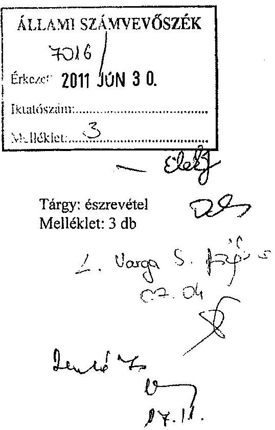

Hivatkozva a V-3004-27-08/2011. számú levelére, a Győr-Moson-Sopron Megyei Önkormányzat pénzügyi helyzetének ellenőrzéséről készült jelentés-tervezetben szereplő javaslatokhoz kapcsolódóan az alábbi észrevételt teszem:

A 2. pontban megfogalmazott javaslat: miszerint a közgyűlés elnöke „gondoskodjon a pénzintézeti kötelezettségek finanszírozási lehetőségeinek számbavételéről, és arra források biztosításáról", véleményünk szerint nem helytálló, mivel a jelentés részletes megállapításai rögzítik a javaslatban foglaltak meglévőségét, amelyeket alátámasztják a jelentés II./3.1. pontjában foglaltak:
„Az Önkormányzat rendelkezett likviditási és eladósodási problémák kezelésére kialakított stratégiával. Az adósságot keletkeztető kötelezettségvállalásokra vonatkozó döntések előkészítése során vizsgálta a kötelezettségvállalás szükségességét. .... A Közgyűlést tájékoztatták arról, hogy a hosszúlejáratú adósságot keletkeztető kötelezettségvállalásokból adódó tőke-és kamatfizetési kötelezettségét az Önkormányzat milyen feltételek biztosítása mellett tudja teljesíteni."

Önkormányzatunk ugyanis a központi támogatások és az illetékbevétel csökkenése miatt érzékelve a jelentkező likviditási gondokat és az esetleges eladósodás veszélyét - 2007. év végén szabályzatban rögzítette a külső források igénybevételének és a fedezet biztosításának szabályait.
A 01/1935-3/2007. számú szabályzatot, a mellékletével együtt (amely a mobilizálható és forgalomképes ingatlanokat tartalmazza forgalmi értékbecsléssel alátámasztott értéken) a vizsgálat rendelkezésére bocsátottuk.
A szabályzat szerint a külső források fedezetét az önkormányzat saját bevételei, ennek hiányában a forgalomképes ingatlanok képezik. A Petz Aladár Megyei Oktató Kórház fejlesztését, tömbösítését szolgáló TIOP pályázathoz kapcsolódó hitel esetén a fedezetet a kórház (az új beruházás következtében kiürítendő) Zrínyi utcai telephelyének ingatlan-

---

együttese szolgálja, melynek forgalmi értéke értékbecslés alapján 1.991.000 E Ft (az értékbecslést a vizsgálat során átadtuk).
A jelentésben ez az összeg nem került beszámításra a tartozások
 forrásának meghatározásánál (összegző megállapítások 12. oldal, második bekezdés).
A fejlesztési célú hitelek visszafizetésének forrását teljes mértékben lefedik a rendelkezésre álló, mobilizálható ingatlanok.

A saját működési bevételek azonban az illetékbevétel évről-évre történő drasztikus csökkenése miatt nem tudnak fedezetet biztosítani az évek alatt felhalmozódott működési hiányra.

A javaslat 3. pontjában megfogalmazott feladat, miszerint: terjesszük a közgyűlés elé a pénzügyi, működési egyensúly mielőbbi biztosítása érdekében meghozandó bevételnövelő és kiadáscsökkentő intézkedéseket az alábbi gazdasági körülmények miatt nem teljesíthető, illetve azokat az elmúlt öt év alatt már megtettük, amit a vizsgálati jelentés is részletez (II./4. pontban). Az önkormányzat kedvezőtlen gazdasági helyzete és az egyes intézmények engedélyhez kötött működési feltételeinek biztosítása miatt további kiadáscsökkentő intézkedés megtételére nincs lehetőség.

Győr-Moson-Sopron Megye Önkormányzatának 2011. évi költségvetése jelentős mértékű hiányt tartalmaz, emiatt kifejezetten kedvező (és időszerű) változásként értékelhető az önkormányzatok támogatási rendszerének azon módosítása, miszerint az önhibájukon kívül hátrányos helyzetben lévő önkormányzatok támogatási rendszere kiterjesztésre került a megyei önkormányzatokra is; ezáltal lehetőség nyílt a működési hiány részbeni kompenzálását szolgáló kiegészítő támogatás igénylésére.
Azzal, hogy a fenti támogatást a megyei önkormányzatok is igényelhetik, központilag is elismerésre került a területi önkormányzatok rendkívül nehéz és szinte már kezelhetetlenné vált gazdasági helyzete.

Önkormányzatunk évek óta működési hiánnyal küzd, ami abból ered, hogy a központilag szabályozott bevételek (állami hozzájárulás, támogatás és a személyi jövedelemadó) összege (hat éven keresztül) évről-évre csökkent, visszapótlására azonban egyetlen évben sem került sor (2011. évben a csökkenő tendencia már nem érvényesül).
Ezen bevételek 2006-2011. években történő csökkenése összesen 3.936.103 Ft bevételkiesést eredményezett. Ebből az ellátottak száma, miatti csökkenés minimális, a kapcsolódó költségek viszont állandó jellegűek.

A központilag szabályozott bevételek csökkenésén túl a megyei önkormányzat költségvetését jelentős mértékben terheli - a bevételeken belül meghatározó nagyságrendet képviselő illetékbevétel folyamatos csökkenése; az elmúlt öt évben összesen 3.125.403 Ft bevételkiesés keletkezett (a 2006. évi bevételi szinthez viszonyítva).
A bevételcsökkenés az illetékhivatalok APEH-hoz történő átszervezésének évében (2007. év) kezdődött, majd az illeték-fizetés szabályainak változásai és az ingatlanforgalom nagymértékű visszaesése következtében a 2011. évre tervezhető bevétel mindössze 57,2 %-át teszi ki a 2006. évi teljesítés összegének.

A szabályozott bevételek és az illetékbevétel folyamatos csökkenése együtt 7.061.506 Ft-os bevételkiesést eredményezett a megyei önkormányzatnak (2006-2011. évek között). A csökkenés reálértéke ennél jóval több az infláció és az ÁFA-emelés miatt.

---

A megyei önkormányzatok bevételi szerkezete a jelenlegi szabályozási rendszer szerint sajátosan alakul, jelentősen eltér a települési önkormányzatok bevételszerző lehetőségeitől (helyi adó kivetésére nincs lehetőség, iparűzési adóból nem részesül a megyei önkormányzat stb.).
Fentiek miatt a megyei önkormányzat bevételnövelő tevékenysége alapvetően korlátozott, így az előzőekben részletezett kiesést (a kiesés összegéhez viszonyítottan) csekély mértékben tudtuk a saját bevétel növelésével (egyéb bevételszerző tevékenység növelése, térítési díjemelés, bérleti díjak emelése stb.) kompenzálni.
Az intézményi térítési díjak - a számítás alapjául szolgáló önköltségek csökkenése miatt minden évben alacsonyabbak. Az intézményi feladatellátás önköltsége a folyamatos kiadáscsökkentő intézkedések következtében mérséklődött minden évben.

A központilag szabályozott bevételek és az illetékbevételek csökkenése miatt folyamatosan, évről-évre nagymértékű, esetenként drasztikus (az alapfeladat maradéktalan ellátását is veszélyeztető) kiadáscsökkentő intézkedések megtételére kényszerült a megyei önkormányzat, amely (2007-2010. években) összesen 4.908.706 Ft megtakarítást eredményezett.
A pénzügyi egyensúly megteremtése érdekében hozott megtakarítási intézkedéseket a jelentés II./4. pontja részletesen taglalja.

Ezen intézkedések keretében eddig öt intézmény került megszüntetésre, illetve összevonásra más intézménnyel, és ebben az évben további három intézmény - összevonással történő megszüntetéséről döntött a közgyűlés.
A 2011. évi kiadáscsökkentő intézkedések keretén belül: az intézményektől további 544.000 Ft összegű támogatás került elvonásra, az Önkormányzati Hivatal kiadásait 89.000 Ft-tal csökkentettük (az előző évi eredeti előirányzathoz képest).
Ezen belül az önként vállalt feladatok arányát 0,1 %-ra mérsékeltük (gyakorlatilag megszüntettük). További kiadáscsökkentő intézkedés ezen a területen lehetetlen, hiszen a 0,1 %-os mérték még elviekben sem reprezentálja a megyei önkormányzat területi szerepvállalását.

A költségvetési szervek megszüntetésén, összevonásán túl a következő kiadáscsökkentő intézkedések történtek:

- feladatátszervezés, lakásotthonok megszüntetése, jelentős létszámcsökkentések, részmunkaidőben foglalkoztatottak körének bővítése, nyitvatartási idő csökkentése, a nem kötelező juttatások megvonása stb.,
- a nem kötelező feladatok minimális szintre történő csökkentése
(megszűnt: a támogatást szolgáló pénzeszközök pályázati rendszere, az alapítványok támogatása és a nagyrendezvények költségeihez való hozzájárulás; jelentős mértékben csökkentettük az egyéb szervezetek támogatását és a fizetendő tagdíjak összegét).

A működési kiadások folyamatos csökkentése (2007-2011. évek között) 1162 fős (25,3 %-os) létszámcsökkentést eredményezett (ebből megyei kórház: 737 fő).
Az intézmények dologi kiadásaira biztosítható keretösszeg szinte csak a közüzemi díjakra nyújt fedezetet. Beszerzésekre, és a legszükségesebb karbantartási munkálatokra a minimális összeget is alig, illetve nem tudja biztosítani az önkormányzat.

---

Fentiek alapján a megyei önkormányzatnak nincs lehetősége a működési kiadások további csökkentésére, mivel az a kötelező feladatok ellátását lehetetlenítené el. A szakmai jogszabályok által előírt (személyi és tárgyi) feltételeknek a minimális szinten sem tudna megfelelni az önkormányzat, és ezáltal veszélybe kerülhetne az intézmények működési engedélye. Működési engedély hiánya esetén nem igényelhető normatív támogatás, emiatt tovább növekedne az önkormányzat működési hiánya. Ezt a kockázatot a megyei önkormányzat nem tudja felvállalni.

A megyei önkormányzat 2011. évi költségvetése 1.789.430 Ft működési célú hitel felvételét irányozta elő. Ez az összeg tartalmazza a tárgyévi (563.251 Ft) és az elmúlt évek alatt (a kiadáscsökkentő intézkedések ellenére) felhalmozódott hiányt.
Ezzel szemben az ÖNHIKI-s támogatási rendszer csak a tárgyévi hiányt kezeli, illetve csak azt az összeget lehetett igényelni. Emiatt, az elmúlt években felhalmozódott hiányt, függetlenül attól, hogy önhibánkon kívül keletkezett nem veszi számításba ez a támogatási rendszer.

A megyei önkormányzat az évek alatt felhalmozódott működési hiányt - a jelen szabályozási rendszer adta kereteken belül - nem tudja önerőből kigazdálkodni.
A meglévő működési hiányt - mivel további kiadáscsökkentő intézkedések megtételére nincs lehetőségünk - véleményünk szerint központi forrásból, illetve a megyei önkormányzatok számára más bevételi forrás biztosításával lehetne csökkenteni, illetve teljes mértékben kompenzálni.

A Petz Aladár Megyei Oktató Kórház szállítói tartozása az Országos Egészségbiztosítási Pénztár által finanszírozott feladatokhoz kapcsolódik. Emiatt, és a megyei önkormányzat alulfinanszírozottsága következtében a kórház szállítói kötelezettségét nem áll módunkban teljesíteni (illetve átvállalni).

A fejlesztési célú hitelek fedezetét saját bevétel hiányában (az előzőekben említett szabályzat szerint) az önkormányzat forgalomképes ingatlanai, és a megüresedést követően forgalomképessé váló Zrínyi utcai kórházi telephely épületei képezik (értékbecslés alapján).

A fentiekben vázolt adatok, az önkormányzati gazdálkodás külső és belső körülményei, nehézségei és a hiány csökkentése érdekében általunk megtett intézkedések az Állami Számvevőszék vizsgálata során teljes mértékben ismertté váltak.

A gazdasági körülményeink alapján a javaslat 3. pontjában meghatározott feladatokat a következők miatt nem tartjuk indokoltnak, illetve végrehajthatónak:

- A pénzügyi egyensúly megteremtése érdekében eddig megtett intézkedéseink 4.908.706 Ft megtakarítást eredményeztek 2007-2010. évek között. A 2011. évi kiadáscsökkentő intézkedések eredményeként további 633.000 Ft összegű megtakarítással számolunk. További kiadáscsökkentés az intézmények működésének teljes ellehetetlenedését, és ezzel a feladatellátás megszünését eredményezné.
- A bevételek növeléséhez jogszabályi lehetőségünk nincs. A térítési díjakat az önköltségek csökkenése miatt folyamatosan alacsonyabb összegben tudjuk meghatározni.
Ebből következően önkormányzatunknak nincs lehetősége a hiányt bevétel-növeléssel kompenzálni.

---

- Önkormányzatunknál a 2011. évi intézmény-összevonások következtében megvalósul a méretgazdaságos intézményi struktúra. További intézmények összevonása, átalakítása a földrajzi távolságok miatt gazdaságtalan működést eredményezne.
- Az önként vállalt feladataink 0,1 %-ra történő csökkentésével már kimerítettük az ebben rejlő forrás-lehetőségeket.
- Tartalékot minimális szinten terveztünk a költségvetésben, amely a gazdálkodás likviditását szolgálja, ezzel nem tudjuk a hiányt csökkenteni.

További kiadáscsökkentő intézkedések lehetőségének hiányában a megyei önkormányzat a - jelenleg kötelezően ellátandó - feladatait és a kapcsolódó kötelezettségeket nem tudja önerőből finanszírozni.

Végleges megoldást véleményünk szerint a feladatváltoztatás vagy az önkormányzati finanszírozási rendszer központi módosítása eredményezhet.

Tisztelt Elnök Úr!
A fentiekben vázoltak alapján úgy gondoljuk, hogy irreális elvárás a javaslat 3. pontjában megfogalmazott feladat miszerint: terjesszük a közgyűlés elé a pénzügyi, működési egyensúly mielőbbi biztosítása érdekében meghozandó bevételnövelő és kiadáscsökkentő intézkedéseket.

Kérem, hogy a megállapítások és javaslatok véglegesítésénél szíveskedjék a fentiekben felvázolt körülményeket figyelembe venni, és méltányolni az önkormányzatunk eddigi erőfeszítéseit a kiadáscsökkentő intézkedések megtételét illetően.

Megküldöm továbbá a pótlólagos információkat tartalmazó, fent hivatkozott levelében kért három táblázatot.

Győr, 2011. június 28.
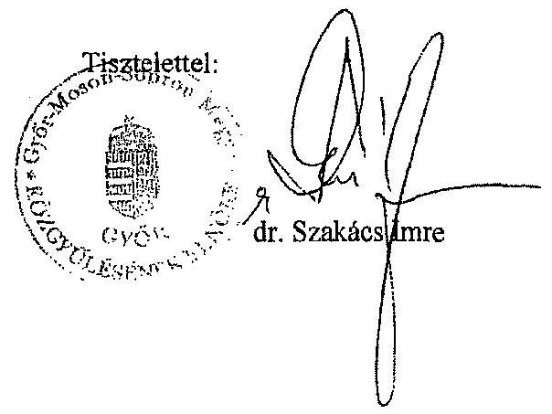

---

.

---

# Dr. Szakács Imre úr 

elnöke
Győr-Moson-Sopron Megyei Önkormányzat

## Győr

## Tisztelt Elnök Úr!

Köszönettel vettem a Győr-Moson-Sopron Megyei Önkormányzat pénzügyi helyzete ellenőrzésének jelentés-tervezetében foglalt javaslatokra tett észrevételét, azonban azokat továbbra is indokoltnak látjuk, fenntartjuk az alábbiak miatt:

A Közgyűlés elnökének címzett (korábban 2. számú) javaslatra tett észrevételében Elnök úr arról tájékoztatott, hogy a pénzintézetek felé fennálló kötelezettségek finanszírozási lehetőségeinek számbavételét az Önkormányzat a likviditási és eladósodási problémák kezelésére kialakított stratégiával megkezdte. Ezen intézkedést a jelentés-tervezet is tartalmazta. Az Önkormányzat stratégiájában foglaltak szerint a külső források fedezetét a saját bevételek, ennek hiányában a forgalomképes ingatlanok képezik. Elnök úr tájékoztatójában a külső források fedezeteként egy olyan ingatlan 2008. évi becsült értékét mutatta be, amely a helyszíni ellenőrzés idején még a fekvőbeteg-ellátást szolgálta, nem volt forgalomképes. Ezért annak értékét a fentiek miatt, és az ingatlanpiac pillanatnyi helyzetét alapul véve sem tekintettük számszerűsíthető forrásnak. Így a pénzintézetek felé fennálló kötelezettségek teljesítésére rendelkezésre álló források csak részben nyújtottak fedezetet a 2011-2013. években - az ellenőrzés időpontjában ismert - összes kötelezettségre. A további évekre szóló a 2011. március 31-én az Önkormányzat rendelkezésére álló információk alapján ismert összes pénzintézetek felé fennálló kötelezettségre a figyelembe vehető források a helyszíni ellenőrzés időszakában nem voltak számszerűsíthetőek. Ezért a javaslatot továbbra is fenntartjuk.

A Közgyűlés elnökének címzett (korábban 3. számú) javaslatra adott észrevételével összhangban a jelentés-tervezet tartalmazza azokat az intézkedéseket, amelyeket az Önkormányzat a 2007-2011. év I. negyedévében a pénzügyi egyensúly megteremtése érdekében tett. A kiadáscsökkentő és bevételnövelő, méretgazdaságos intézményi struktúra kialakítására, önként vállalt feladatok csökkentésére tett intézkedések hatása azonban továbbra sem biztosította a pénzügyi egyensúlyt, ezért indokoltnak láttuk ezen intézkedések folytatását.

---

Köszönöm Elnök úrnak és munkatársainak az ellenőrzés során tanúsított hozzáállását, amellyel a megvalósításban részt vettek, azt segítették.

Budapest, 2011. december "16".
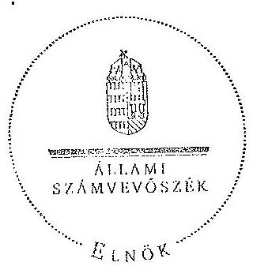

Tisztelettel:

Domokos László <

Melléklet: jelentés

---

.

---

.
