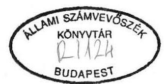
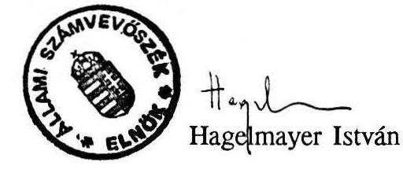

# Állami Számvevőszék

## JELENTÉS

a Magyar Köztársaság Németországban működő
külképviseleteinek pénzügyi-gazdasági ellenőrzéséről

---

# Az ellenőrzést végezte: 

Rádfai Tibor
Számvevő-igazgatóhelyettes
Benkő János
számvevő-tanácsos
Bodonyi Miklós
Számvevő-tanácsos
Czunyi Lajos
számvevő-tanácsos

Az ellenőrzést vezette:

Bihary Zsigmond
számvevő-igazgató

---

# JELENTÉS 

## a Magyar Köztársaság Németországban működő külképviseleteinek pénzügyi-gazdasági ellenőrzéséről

A Németországban működő és helyszínen ellenőrzött, összesen 11 külügyi, kereskedelmi és kulturális képviselet az 1991. évben mintegy 12,0 millió DEM kiadási előirányzattal gazdálkodott. Létszámuk összesen 111 fő, az általuk kezelt vagyon értéke mintegy 540-550 millió Ft volt.

Ellenőrzésünk célja e külképviseletek költségvetési előirányzatai tervezésének és felhasználásának, az ellátandó feladatok és erőforrások összhangjának célszerűségi, eredményességi és törvényességi szempontból történő vizsgálata és ezen keresztül a fejezetek irányító tevékenységének értékelése volt.

Az ellenőrzés az 1989. január 1. és az 1992. április 30. közötti időszakra irányult és a Külügyminisztérium (KüM), a Nemzetközi Gazdasági Kapcsolatok Minisztériuma (NGKM), a Művelődési és Közoktatási Minisztérium (MKM) és a Honvédelmi Minisztérium (HM) kapcsolatos elszámolásai mellett a bonni Nagykövetség, a Katonai Attaséi Hivatal, a müncheni Főkonzulátus, a berlini nagykövetségi Hivatal, a frankfurti, a kölni, a berlini és müncheni kereskedelmi kirendeltségek, a frankfurti idegenforgalmi Képviselet, valamint a stuttgarti Magyar Kulturális és Tájékoztatási Központ és a berlini Magyar Ház gazdálkodására terjedt ki.

---

# I) Az ellenőrzés megállapításai 

Németországi külképviseleteink tevékenysége - a hazai és a helyi hatásokra - 1989 óta erőteljesen megváltozott, működésük gazdasági környezete és feltételrendszere is átalakult, a célok és funkciók változásával pedig tevékenységük területei és súlypontjai is átrendeződtek.

Így pl. cserélődött és csökkent a létszám a bonni nagykövetségnél, annak berlini hivatalánál, a kölni és a berlini kereskedelmi kirendeltségeknél. Megszünt a berlini nagykövetség, a nyugat-berlini konzulátus. Új konzulátus létesült Münchenben, Stuttgartban, önállósult a frankfurti idegenforgalmi képviselet stb.

A kb. 300 ezer DEM építési és 51,5 millió Ft eszközbeszerzési ráfordítással 1990-ben megnyitott müncheni főkonzulátus ugyanakkor - a vízumkötelezettség időközbeni megszünése miatt - eredetileg tervezett feladatainak csak részben tesz eleget.

A pénzügyi unió a működést további területeken tette költségérzékenyebbé és a kiadások más arányait is eredményezte. Külképviseleteink zavartalan működésének anyagi és személyi feltételei azonban - az említett nehézségek ellenére - maradéktalanul biztosítottak, nem ritkán túlbiztosítottak is voltak. Ebben közrejátszottak
—a stabil és magas színvonalú helyi gazdasági környezet;
—a képviseletek általában kiegyensúlyozott és szélsőségektől mentes gazdálkodása, de nem utolsó sorban
—az itthoni gazdasági és költségvetési nehézségeket alig éreztető előirányzatok és pénzellátás.

## 1.) A külképviseletek költségvetési előirányzatainak megalapozottsága és gazdálkodásának szabályozottsága

A külképviseletek költségvetési tervező munkája, az 1990-1992. évi költségvetések vizsgálata szerint, még nem fejlődött a kívánt mértékben és irányban. Költségvetéseik és ezzel szoros összefüggésben a tényleges kiadások elszámolásai nem alkalmasak
— ugyanazon cél érdekében különféle jogcímeken és helyeken (itthon és külföldön, illetve forintban és valutában) felmerülő igények teljes és pontos kimutatására, így a takarékossági lehetőségek, tartalékok átfogó feltárására;

---

- a rendszeres, vagy csak alkalmilag felmerülő rendkívüli bevételek és kiadások elkülönítésére;
- egy, a bevételekkel is pontosan számot vető finanszírozási terv összeállítására.

Így a külképviseletek bázisszemléletű tervezési rendszerük lehetőségei között viszonylag lazább feltételekkel gazdálkodhattak. Itthonról folyósítandó ellátmányaikat bevételeikkel és a kiadások mértékével, ütemezésével nem hangolták össze. Ez gyakran túlfinanszírozáshoz és ahhoz vezet, hogy valutakészleteink indokolatlanul fekszenek el külországokban.

A külképviseletek megalapozottabb tervezőmunkájának az elmúlt években a körülmények sem kedveztek. E viszonylatban a tervezés elnagyoltságából fakadó eltéréseknél a változó körülményekből fakadó bizonytalanság jóval nagyobb súlyú volt. (Elsősorban berlini székhelyű képviseleteinknél.)

# a) A bevételek tervezése 

A külképviseletek 1991-től a tényleges bevételeket bevételként, ha még nem is maradéktalanul, de pénzforgalmilag már kimutatták. Ezt megelőzően ugyanis ténylegesen befolyt bevételeket többnyire térítményként számolták el. Ezzel a törvényes előírások sérelme túl a reális és összehasonlítható kiadási előirányzatok tervezését is akadályozták. A képviseletek költségvetései (gazdálkodási keretei) azonban nem teljesek, mert bevételeiket továbbra sem tervezik meg, holott esetenként (pl. nagykövetség, konzulátusok, kereskedelmi kirendeltségek) ezek tetemesek voltak és örvendetesen az eddig kisebb bevételekkel rendelkező szervezeteknél is emelkedtek.

Az újabban ismét növekedő konzuli bevételeket pl. a KüM fejezet szintén - ha alacsonyan is, de - tervezi. Ezek a tervszámok azonban a képviseleti költségvetésben nem jelennek meg.

A kereskedelmi kirendeltségek közül pl. a kölni 1990-1991. években évi 280-290 ezer DEM, a frankfurti 1991-ben 134,4 ezer DEM, a berlini 1990-ben 1.323,4 ezer DEM, 1991-ben 772,0 ezer DEM bevételt ért el, de egyetlen DEM-et sem tervezett.

A bonni Katonai Attaséi Hivatal részére 1993-ra már előírták a bevételek megtervezését. Előfordult néhány esetben már előbb is, hogy a költségvetésen kívül (külön iratban) kisebb bevételeket írtak elő (a berlini Magyar Háznak pl. 1991. évre 20 ezer DEM-et).

---

# b) Kiadási előirányzatok 

A külképviseletek költségvetései (gazdálkodási keretei) azért sem teljesek, mert jelentős kiadásokat sem terveztek meg. A kiadások bevételekkel való nettósításán túl az is zavaró, hogy nincs olyan alapokmány, amely áttekinthetően tartalmazná az egy-egy külképviselettel kapcsolatos összes kiadást. Ez egyrészt a költségvetési gazdálkodás egységes elveit sérti, másrészt a felmerülő (kiadványi, reprezentációs, kiküldetési stb.) kiadások tényleges jogcím szerinti elszámolását, ezáltal egy tartalmilag megfelelőbb beszámoló összeállítását is akadályozza.

Így a magyar kiküldöttek bérén, családi pótlékán felül - amelyek pl. a bonni nagykövetségnél évi kb. 1 millió DEM összeget tesznek ki - a KüM-nél külön pénzügyi keretként állapítják meg a követségek tájékoztatási és határon túli magyarokkal (korábban emigrációval) kapcsolatos előirányzatokat, amelyek később válnak részévé a képviseleti költségvetésnek.

A külképviseletek jóváhagyott keretei nem tartalmazzák az itthon forintért beszerzett (és kiküldött) gyakran jelentős értékeket sem (pl. propagandaanyagok). Ennek megfelelően nem tükrözik ilyen rendben a tényleges kiadásokat sem. (Ennek folytán a helyileg vezetett nyilvántartások is pontatlanok.)

A kölni kereskedelmi kirendeltségen pl. 1991-1992-ben számítástechnikai fejlesztésre elköltött 137,7 ezer DEM sem szerepelt a kirendeltség költségvetésében, ami 1991-ben elsődlegesen okozta, hogy 26%-kal lépték túl gazdálkodási keretüket.

Több egyedi tervezési anomália is tapasztalható volt.

A bonni Katonai Attaséi Hivatal beszerzéseinek előirányzatát pl. megosztva tervezik. Külön engedély alapján a Hivatal folyósítja a Németországban tanuló öt katonatiszt illetményét (1992. április 30-ig pl. közel 36 ezer DEM-et fizettek ki, amihez külön pénzügyi fedezetre nem is volt szükségük).

A külügyi és kulturális képviseleteknél pl. az egyszeri magánjellegű és a hivatalos hazautazások fedezete hiányzik az előirányzatokból, a frankfurti idegenforgalmi képviseletnél 1990-ben 475 ezer DEM költségvetési keretben nem volt fedezet a 133,7 ezer DEM-et kitevő bér-, lakbér stb. kiadásokra. (Ezt az IKM 1991-től már korrigálta.)

A külképviseleteknél helyben tervezett kiadások keretei összességükben kielégítően teljesültek. Ebben azonban inkább a gazdálkodás "rugalmassága" és a főösszegekre tekintő fegyelme, nem pedig a bázisadatokra alapozott és a tartalékképzés ösztönös szándékával összeállított előirányzatok játszottak szerepet. A gazdálkodási keretek

---

egészének betartása ugyanis a kiadások belső összetételének, esetenként jelentős módosulásával valósult meg.

Így pl. a bonni nagykövetség 1991-ben tervezett kiadásait 97%-ra az egyes rovatok 48-291%-os szóródásával teljesítette. Hasonló volt a helyzet más területeken is (pl. a berlini, kölni, frankfurti kereskedelmi kirendeltségek).

A berlini nagykövetségi Hivatalnál éppen 1990-ben sikerült "tartalékokat" is biztosítani többek között a még DDM-ért eszközölt jelentős előbeszerzéssel. Így 1991-ben már 17%-os megtakarítást értek el és 1992-ben is az igényeltnél kb. 25%-kal alacsonyabban jóváhagyott kereten belül gazdálkodnak.

A szakmai és pénzügyi tervezés összhangja sem volt még érzékelhető. Érthető, hogy a nem régen szerveződött stuttgarti kulturális képviseletnél a fejlődő, a berlini Magyar Háznál pedig a jelentősen visszaeső tevékenység nehezítette reális tervek kialakítását, de pl. egyes kereskedelmi kirendeltségeknél 1991-ben mutatkozó jelentős megtakarításokra - a tartalékolási törekvéseken kívül - kevésbé található magyarázat.

A tapasztalatok az 1992. évi tervezés során sem hasznosultak és az elmúlt évek jellemző tendenciái (a bevételi tervezés hiánya, a lazán tervezett kiadások, a jelentős tartalékok stb.) a folyó év első hónapjaiban is jellemzőek voltak (az időarányos felhasználás is jelentős ingadozással és átrendeződéssel valósult meg pl. a bonni nagykövetségnél, a stuttgarti, a berlini kulturális képviseleteknél).

# c) A gazdálkodás szabályozottsága 

A külképviseletek gazdálkodására vonatkozó szabályzatok még mindig hiányosak, évek óta nem követték a magasabb szintű jogszabályokat, elavultak. Eddig pl. a külképviseleteknél a gazdálkodási jogosítványok körét és mértékét, a felelősséget általában elégtelenül szabályozták, holott az egy-egy személy által ellátott feladatok gyakran teremtenek összeférhetetlen helyzetet is.

Így pl. az NGKM és IKM területén eddig a tervezés és elszámolások rendje több összefüggésben is ütközött a törvényes előírásokkal. A frankfurti idegenforgalmi képviselet alapító okirata sem volt pl. megfelelő, működési szabályzata még az 1987. évi, létrehozáskori állapotokat tükrözi. Új ügyrend nem készült. Egyedül a bonni Katonai Attaséi Hivatalnál fellelhető szabályzatok és leíratok nyújtottak kielégítő alapot a szabályszerű gazdálkodáshoz.

A külügyi szervezetek gazdálkodási rendjét szabályozó miniszteri utasítás 1992. február 1-én, az elszámolás rendjét meghatározó főosztályvezetői utasítás áprilistól

---

történő alkalmazással lépett hatályba. A kereskedelmi kirendeltségek gazdálkodási szabályzatának korszerűsítése is elkezdődött, annak első - még ideiglenes és részleges változata 1992. I. negyedévében került kiküldésre.

A gazdálkodás kötetlenebb feltételei a gazdálkodás célszerűségét és szabályszerűségét már az 1991. évi tapasztalatok szerint is kedvező irányban befolyásolták. Néhány lényeges kérdésben azonban - a később említett példák is erre utalnak - a célszerűbb és szabályszerűbb gazdálkodást biztosító szabályzatok hiánya még érezhető (pl. lekötött pénzeszközök, utalványozási rend, egyéb, elsősorban kamatbevételek elszámolása, analitikus nyilvántartások). A még mindig jelentkező hiányosságok miatt általában újra indokolt gondolni a pénzügyi-gazdasági területek helyi felügyeleti, irányítási rendszerét is.

Vegyes kép nyerhető a munkaköri leírások, a gazdálkodási hatás- és jogköri kérdések rendszerezettsége tekintetében is (pl. a berlini nagykövetségi Hivatalnál, a müncheni főkonzulátusnál).

A frankfurti idegenforgalmi képviselet a tárcák 1988. évi összevonása után került az akkori KeM Költségvetési Osztálya hatáskörébe. A képviselet vezetőjét 1988. júliusában (szeptemberében) a kereskedelmi kirendeltség vezetői teendőivel is megbízták. Sem akkor, sem felmentésekor (ami hivatalos formában máig sem történt meg) nem készült átadás-átvételi jegyzőkönyv, sőt a kereskedelmi kirendeltség bankszámlája feletti rendelkezési jogokat gyakorlatilag még ellenőrzésünk időpontjában is gyakorolhatta.

# 2.) A külképviseleti tevékenység finanszírozása, ellátmányok és bevételek 

A külképviseletek 1990-1991. évi működéséhez a szervezetek pénzellátása zavartalan feltételeket biztosított, sőt az általános tapasztalatok szerint
— részben még az 1989-1990. években kiküldött jelentős, azóta is (1991-1992.) csak lassan mérséklődő ellátmányok;
— részben a nem tervezett, de ténylegesen, egyre nagyobb összegekben befolyó bevételek,
nem utolsó sorban pedig egy komplex finanszírozási terv hiánya miatt a pénzellátás gyakran indokolatlanul bőséges volt és a szükségleteket - főleg 1990-ben - többszörösen meghaladta.

---

# a) Ellátmányok 

Ennek okai között mindenekelőtt a pénzellátmányok felesleges összegű és olykor ütemtelen utalása említhető.

A bonni nagykövetség kiadásainak finanszírozása a PK naplós rendszer 1990. decemberi megszünését követően borult fel, az indokolt tartalékszint megtartása hosszabb időn keresztül sérelmet szenvedett. Az 1991. márciusában a KüM által kiutalt 700 ezer DEM ellátmány túlzott volt. Ebben az évben ugyanis a konzuli és vízumdíj, illetve egyéb bevételek meghaladták
 az 5 millió DEM-et. Ennek hatására a 300 ezer DEM összegben limitált hóvégi pénzkészlet pl. 610 ezer DEM-re nőtt.

A 3,5 millió DEM-et kitevő éves vízumbevételek 1991. júliusi ugrásszerű felfutása és a müncheni főkonzulátusról e hónapban áthelyezett 350 ezer DEM együttesen a tartalék háromszoros túllépését okozták annak ellenére, hogy minisztériumi intézkedésre - 2,7 millió DEM átváltásával - 1,5 millió USD-t haza is szállítottak. (A tartalékszint további 900 ezer DEM hazautalást indokolt volna.)

A müncheni főkonzulátusnál (illetve előbb a bonni nagykövetségnél) elfekvő összegek - az 1991. júliusi nagyösszegű (4,0 millió DEM) hazautalást követően is - négyszeresét tették ki a szükséges tartaléknak. Ennek nagyságára jellemző, hogy a KÜM 1991-ben innen utaltatott át a bonni nagykövetség ellátmányára 1,2 millió, a berlini hivatalnak 300 ezer DEM összeget. Ez utóbbinál viszont a tartalékok (vízumbevételek) 1991-ben ugyancsak akkorák voltak, hogy azokból 700 ezer DEM hazautalást teljesítettek.

A Katonai Attaséi Hivatalnál a 65-70 ezer DEM szükséglettel szemben a pénzkészlet ellenőrzésünk idején is 600 ezer DEM volt. A lakásvásárlásra küldött 500 ezer DEM-ből megmaradt 20 ezer DEM sorsáról a Központ ellenőrzésünkig még nem intézkedett.

A frankfurti kereskedelmi kirendeltségnél a pénzkészlet a szükséges 100 ezer DEM-mel szemben 550-600 ezer DEM körül alakult. A frankfurti idegenforgalmi képviseletnél az 1991. évi 612 ezer DEM kiadási előirányzattal szemben az évi nyitó készpénzkészlet 687 ezer DEM volt, mert pl. 1990-ben 745 ezer DEM ellátmányt kapott (1991-ben már csak 160 ezer DEM-et).

A berlini kereskedelmi kirendeltség pl. az 1990-1991. években csaknem 2 millió DEM bevétele ellenére még 500 ezer DEM ellátmányt is kapott, így kb. 1200-1300 ezer DEM évi kiadásához 2500 ezer DEM állt rendelkezésére. A kirendeltség tartalékaiból 1992. elején a kölni kirendeltséghez utaltak át 90 ezer DEM-et, egy NGKM központi beszerzés fedezeteként.

A kölni kereskedelmi kirendeltségnek havi 120-130 ezer DEM kiadásához rendszeresen 700-750 ezer DEM állt rendelkezésre (nagyobbrészt lekötve).

---

A stuttgarti magyar kulturális központnál pl. 1990-ben - elsősorban az év első hónapjaiban átutalt 550 ezer DEM-mel - éves szinten mintegy 100 ezer DEM szükségleten felüli összeget helyeztek ki (a lakásvásárlásra kiutalt 100 ezer DEM-en felül). Az 1991. évben és 1992. első hónapjaiban már kiegyensúlyozottabban utalták az ellátmányokat, de a túlfinanszírozás még nem szűnt meg.

A túlfinanszírozás tekintetében az 1991. II. félévében és 1992-ben - néhány helyes irányú intézkedés hatására is - enyhült a helyzet. Még mindig találhatók azonban a megelőző évekre jellemző példák.

Így pl. a berlini kereskedelmi kirendeltségnél fél éves szükségletre csökkent a pénzkészlet, a müncheni főkonzulátuson 100 ezer DEM-re. A frankfurti kereskedelmi kirendeltségnél elfekvő jelentős készpénzállomány 1991-ben már csökkenő tendenciát mutatott, de a két hónap átlagosan 100-120 ezer DEM kifizetési szükségletével szemben az átlagos pénzkészlet még mindig 560-570 ezer, az 1992. év elején is 530-540 ezer DEM volt (a 200 ezer DEM lekötött pénzösszeggel együtt).

Az ellátmányokat esetenként egyéb, ugyanilyen célt szolgáló juttatások is kiegészítették.

Elsősorban a berlini kereskedelmi kirendeltségnél találtunk ilyen jelentősebb értékeket, ahol az 1991. évben központi ellátmány ugyan már kevés érkezett, de ezeket kiegészítette a kirendeltségen elfekvő 65 ezer USD (116,5 ezer DEM) átváltása. (Az illetményre otthonról kiutalt USD ellátmányok az igényeket ugyancsak meghaladták. 1990. július 1-től az USD illetménykiegészítés megszűnt és a maradványösszeg azóta a bankszámlán feküdt. Ezt csak 1991. júniusában váltották át.)

Ugyanígy az ellátmány funkcióját töltötte be az a két év alatt összesen 80 ezer DEM összeg is, amely csereüdülésre Berlinben került befizetésre, de Budapesten került elszámolásra.

# b) Saját bevételek 

A külképviseleteink eltérő bevételi lehetőségekkel rendelkeztek (pl. konzuli- és vízumdíj bevételek kiesése, majd növekedése, vagy a kölni és a berlini kereskedelmi kirendeltségek közötti különbség), de legtöbbjüknél megállapítható volt, hogy lehetőségeiket igyekeztek kiaknázni. E törekvések és átalakuló körülményeik folytán bevételi forrásaik ugyan átrendeződtek, de összességében nem csökkentek, sőt a képviseletek többségénél emelkedtek is.

---

A konzulátusok több konzuli cselekménytípusnál illetéket és díjat is érvényesítenek, amely nem jogszerű. A kapcsolatos havi elszámolások adatainak valódisága pl. Bonnban pénzforgalmi megközelítésben nem biztosított, mert az nem a tárgyhavi realizált bevételeket, hanem az illeték- és díjkiszabásokat tartalmazza. Az utánvétes befizetések időbeli eltérései következtében az elszámolásokra csak a tárgyhót követően 10-15 nappal kerül sor. Így a hónap végén viszonylag jelentős összegek fekszenek a Konzuli Osztály bankszámláján, amelynek egyenlegét viszont a nagykövetség nem jelenti a Külügyminisztériumnak.

Ez Bonn esetében 1991. december 31-én pl. 55,5 ezer DEM egyenleget tekintve a fejezet zárszámadásának és mérlegének valódiságát is befolyásolta. Münchenben e probléma áthidalására is jó módszert találtak. Ettől függetlenül a müncheni év végi egyenleg sem épült be a Külügyminisztérium vagyonmérlegébe.

A változatlanul alkalmazott hagyományos (vízumbélyeges, konzuli alnaplós) megoldás mellett üzemeltetik már az 1992. februárjában átvett pénztárgépeket is. Ez utóbbi azonban Berlinben nem biztosítja a készpénzbevételek beszedésének és elszámolásának zárt rendjét és a hagyományos elszámolás kontrolljaként sem funkcionál. Ebben a munkafolyamat nem kellően racionális kialakítása és a gépkezelési ismeretek elsajátításának hiányosságai is szerepet játszanak. Ezzel szemben Bonnban és Münchenben a számfejtés és beszedés zárt rendszert alkot a pénztárgépes megoldás keretében.

A bevételi jogcímeket (pl. Berlinben, Münchenben) csak vízum- és konzuli díjakra bontják. Az illetékek külön számfejtése és nyilvántartása megoldatlan.

Itt említjük meg, hogy a külföldön beszedett illetékek KÜM fejezet részéről történő felhasználása jogilag rendezetlen. Az illetékekről szóló 1990. évi XCIII. törvény és végrehajtási rendeletei erre vonatkozó előírást nem tartalmaznak.

Helyiségek bérbeadásából a kereskedelmi kirendeltségek jelentősebb, a többi képviselet szerényebb bevételre tesz szert. A kereskedelmi kirendeltségeknél a vállalati képviseletek által bérelt helyiségek fokozatosan kiürülnek. A bérletek száma (pl. Frankfurt, Köln, Berlin) az elmúlt két év során jelentősen visszaesett, ami maga után vonta az ilyen bevételek jelentős 25-40%-os visszaesését is. A kirendeltségek által az ingatlanokért kifizetett bérleti díj is 20-21%-kal emelkedett, de a kirendeltségek többnyire még így is többletbevételt értek el az irodák bérbeadásából.

Vállalati irodabérek címén beszedett összegek Berlinben is kb. 25%-kal csökkentek, miután az elmúlt évben hozzájárulást fizető 25 vállalat közül 15-16 felmondta bérletét. A megüresedett helyiségek egy részét azonban itt sikerült

---

újra kiadni (máshol ez a siker
 távolról sem volt ilyen arányú). Az Arnold Zweig Str. 11. sz. villa bérletét pl. 1991. márciusától a Videoton ugyancsak felmondta, ami mintegy 204,0 ezer DEM évi bérleti díj kiesését eredményezte. A villát azonban rövid idő után egy külföldi cégnek, évi 289,8 ezer DEM bérleti díjért adták ki. (1992-től a kirendeltség I. és II. emeletének hasonló célú hasznosítása évi 300,0 ezer DEM bevételi lehetőséget biztosít.)

Egy 1985. évi felmérésen alapuló kirendeltségi nyilvántartás szerint a nagykövetségi Hivatallal közösen használt épületből a kereskedelmi kirendeltség $1.727 \mathrm{~m}^{2}$-t vesz igénybe, ami az összterület $29 \%$-a. Ebből $503 \mathrm{~m}^{2}$-t (helyesen) vállalati képviseleteknek, újabban pedig külföldi vállalatoknak ad ki.

Így pl. vállalati bérleti díjai 1991-ről 1992-re 150 ezer DEM-mel csökkentek, a vállalatok egyéb térítései viszont - miután a bérleti díjba a költségek beszámítását csaknem egészében megszüntették - 119 ezer DEM-mel emelkedtek.

A nagykövetségi Hivatal épületrészének viszonylag kevés hasznosítható területéből (mint látni fogjuk) laza elhelyezéssel is csak keveset hasznosít. Itt azonban a bérbeadásból a nagykövetség elhelyezésének további megoldása, az épület rekonstrukciója és bizonyos átalakítása után - esetleg egy új üzemeltetési konstrukció keretében - lehetne gondolkodni.

A vállalatok által fizetett bérleti díjak megállapítása és karbantartása nem egységes, azok beszedése viszont - kisebb gondoktól eltekintve - általában rendben folyt.

A kölni kereskedelmi kirendeltségnél pl. a bérleti díjak mértékének aktuális és arányos szintre emelése sürgető feladat. Ez a frankfurti kirendeltségnél is csak fáziskéséssel, lényegében 1992. elejétől történt meg. A berlini kirendeltség ugyanakkor a térítések rendszerének a megváltoztatásával is több, mint háromszorosára növelte az ilyen - tényleges telefon, fax stb. költségtérítés - címén beszedett összegeket. A kedvezményeket fokozatosan a frankfurti kirendeltség is felszámolta. A müncheni kirendeltségnél viszont pont e tekintetben kell a rendszert javítani.

A bevételi előírások és beszedett bevételek analitikus nyilvántartásai azonban a legtöbb helyen hiányoztak, vagy nem feleltek meg, így a hátralékok ellenőrzése is korlátokba ütközött.

Így pl. a kölni és 1990 végéig a frankfurti kereskedelmi kirendeltségnél. Ez utóbbi esetben 37,5 ezer DEM hátralék eredete nem volt (az ellenőrzéskor) megállapítható.

---

A folyamatos ellenőrzés érdekében megfelelő nyilvántartások felfektetésére van szükség. (Ezt pl. a frankfurti kereskedelmi kirendeltség 1991-től már áttekinthetően vezeti, szigorította a beszedést is, de régi eredetű hátralékok tisztázására is szükség van.)

A lakbér- és közműdíj térítések átstruktúrálását Berlinben a lakbérek és közüzemi díjak változása is indokolta. Ugyanez a dolgozók lakásokkal kapcsolatos térítéseinél is gondot okoz.

A lakbérek csökkenésével a képviseletek költségei csökkentek. A közüzemi díjak nagy emelkedése viszont - a térítési rendszer folytán - egészében a dolgozókat terheli. (Az MKM ezzel kapcsolatban módosított a térítési rendszeren.)

A berlini Magyar Ház jelentős részének bérbeadásából származó bevételek - a nettósítás folytán - eddig nem jelentek meg az elszámolásokban.

A KULTÚRA Vállalat és az IBUSZ Rt. 1991-ben pl. 272 ezer DEM bérleti díjat fizetett, ami $1/3$-a volt a Ház egész bérleti kötelezettségének. 1992. második felétől itt is e bevételek részbeni kiesésére lehet számítani.

A berlini Magyar Ház 2 szabad irodahelyiségét a Deutch-Hungarische Gesellschaft (Berlin) bérelte $1130 \mathrm{DEM/hó/20-22 \mathrm{~m}^{2}}$ fejében. Az öt havi (5650 DEM) bérleti díj kifizetése után a bérlő nem fizetett. Ezt nem is követelték.

A vendégszobák és vendéglakások kihasználtsága általában romlott (pl. a bonni nagykövetségen átlagosan a felére) és ennek megfelelően (pl. berlini kirendeltségnél) számuk is csökkent. Az ebből származó bevételek azonban még így sem elhanyagolhatóak és a (kizárólag közvetlen) költségeket így is meghaladják. (A berlini kirendeltségnél a kiadások alig $30 \%$-ot tettek csak 1991-ben ki.)

A kihasználtságot rontja és a kimutatott bevételeket lényegesen csökkenti, hogy a minisztériumok hivatalos kiküldöttei a szobákat általában ingyen, magáncélú utazásuknál is jelentős kedvezménnyel veszik igénybe. Ez jelentős devizamegtakarítást eredményez. Az elszámolás azonban szabálytalan, mert ez is a bevételek-kiadások ellentételezésének egy formája. Emellett az igazgatási, külföldi kiküldetési költségeket is indokolatlanul mentesíti. (A berlini Magyar Háznál ez évi kb. 14 ezer DEM kihatással jelentkezett. Ennél nagyobb az érték a követségeknél, kirendeltségeknél.)

A dolgozók térítéseit - egyes kitételektől eltekintve - reálisan állapították meg, pontosan számolták el és vonták le. Az ilyen bevételek csökkenése általában nem a lazább fegyelemmel, hanem a külkiküldötti létszám csökkenésével hozható összefüggésbe. A térítési kötelezettségeket többnyire rendben beszedték.

---

Az üzemanyagok árába épített adók visszaigénylésének - viszonosság hiánya miatt - megszüntetése ugyanakkor 1991-től elzárta a lehetőséget a mintegy 50-60%-os adótartalom megtérülésétől. (Az 1990-ben pl. Bonnban visszaigényelt adó mintegy 70 ezer, Kölnben kb. 50 ezer DEM volt, amely magában foglalta ugyan a dolgozóknak történt visszafizetést is, de a hivatali célú magángépkocsi igénybevétel miatt a költségvetés ebben a körben is érintett.) A visszatérítési rendszer egy sor más ország esetében ma is működik.

# 3.) Kiadások 

A külképviseletek gazdálkodási keretei a feladatok ellátásához - az általában tapasztalt szabályszerű és takarékos gazdálkodás mellett - kielégítő feltételeket biztosítottak. A tényleges kiadások általában a jóváhagyott kereteken belül alakultak, de a legtöbb képviseletnél ténylegesen is csökkentek. Azokat elsősorban a dologi-, lakbér-, közmű- és telefon- stb. költségekre is kiható, létszámcsökkenés mérsékelte (pl. bonni nagykövetség, kereskedelmi kirendeltségek). Megemlíthetjük azonban az olyan okokat is, mint pl. a nagykövetségnél kiadásoknak a vízumkényszer megszűnésével összefüggő csökkenése (pl. bonni nagykövetség).

Egyes esetekben a csökkenés csak látszólagos volt, mert pl. a berlini képviseleteknél az új lakásszerződések megkötése, közműdíjak számláinak megküldése késett, vitatott telefondíjak, lakbérek kifizetését egyes képviseletek (pl. nagykövetségi Hivatal, kereskedelmi kirendeltség) elhalasztották stb.

Így pl. a berlini nagykövetségi Hivatalnál helyesnek tartjuk a kérdés eldöntéséig az 1990-ből származó 170 ezer DEM bérleti díjtartozás központi kezelését.

A kiadások csökkenését - az elsősorban Berlinben jelentkező áremelkedésen felül - ellensúlyozta az is, hogy megszűnt a kiadások térítményezése.

## a) Ingatlan- és készletgazdálkodás, dologi költségek

A lakbérek növekedését az eddig kezelt és leadott lakások bérének megtakarításával jórészt, illetve a hivatali helyiségeknél (a kereskedelmi kirendeltségek) a többletköltségek továbbhárításával részben ellensúlyozták. A saját tulajdonú és bérelt helyiségekkel kapcsolatos gazdálkodás azonban indokoltan kap megkülönböztetett figyelmet az ezzel összefüggő költségek magas szintje és növekedése miatt. Erre a jövőben még inkább

---

Néhány esetben egy-egy térítési díj realitása megkérdőjelezhető volt (pl. berlini nagykövetségi Hivatal, a müncheni konzulátusnál az irodabérek, a stuttgarti kulturális központnál a saját tulajdonú és bérelt lakások közötti arány).

A frankfurti idegenforgalmi képviselet vezetője - még egy 1987. évi miniszterhelyettesi engedély alapján - lakástelefonja után térítést nem fizet.

A berlini Magyar Háznál a dolgozók térítési hátraléka 4.975 DEM rendezésre vár.

Néhány probléma említhető. Így az NSZK-ban a közműdíjakból év közben csak előleget számláznak. A végelszámolás gyakran a következő év II. negyedévére is elhúzódik. A dolgozókkal való, ilyen utólagos elszámolásra nincs megfelelő, biztonságos, a dolgozók érdekeit is szem előtt tartó módszer kidolgozva és szabályozva.

A képviseleteknél elfekvő felesleges pénzforrások többségét rövidebb-hosszabb időre lekötötték és ebből tetemes kamatbevételekre is szert tettek. Ezeket költségvetési bevételként esetenként nem számolták el (pl. kölni, frankfurti kereskedelmi kirendeltségek).

A hivatali gépkocsik magáncélú igénybevétele ritkán, kis értékben fordult elő (a helyi nyilvántartások és bizonylatok szerint).

A kölni kereskedelmi kirendeltségnél a gépkocsik magánhasználatának térítési díját 1989. júliusában határozta meg a Minisztérium 0,40 DEM/km értékben. A kirendeltség azonban átalánytérítést alkalmazott. (Ehhez nyilvántartást sem vezetnek.) A kirendeltség vezetőhelyettese 1992-től 64,0, titkárai 48,0 DEM/hó átalányt térítenek a gépkocsik magáncélú használata után a tényleges igénybevételtől függetlenül. Az ezt megelőző átalány 11-22 DEM/hó volt, ami kb. 25-27 $\mathrm{km/hó}$ használat költségét fedezte. A megemelt térítés is csak $120-160 \mathrm{~km/hó}$ igénybevétel költségének megtérülését eredményezi.

A forgalmi adó (MwSt) visszatérítési lehetőségeit külképviseleteink - az ellenőrzött esetekben - rendben kihasználták.

A bonni nagykövetség pl. 1991-ben ebből 85 ezer DEM bevételt ért el. A diplomáciai státuszból fakadó előnyöket pl. a berlini Magyar Ház is ki tudta használni. A kulturális és idegenforgalmi képviseleteknél e megoldás még nem sikerült.

A bonni Katonai Attaséi Hivatalnál a hiányos nyilvántartások és bizonylatolás következtében az 1991. szeptember 12-e előtti MwSt kintlevőségekről nem lehet áttekintést nyerni. Az azt követő időszakról pedig mintegy 11,0 ezer DEM még nem folyt be, a vásárolt lakás után járó összeg pedig - bizonylatok hiányában - szintén nem állapítható meg.

---

szükség lesz, mert a feladatok és szervezetek átrendeződése miatt a helyiségek kihasználtsága általában romlik. A bérleti díjak további emelkedése várható.

A kölni kereskedelmi kirendeltségnél pl. az irodaépület ($653 \mathrm{~m}^{2}$ irodarész, $2 \times 70 \mathrm{~m}^{2}$ lakás és $212 \mathrm{~m}^{2}$ egyéb belső tér) havi bérleti díját 1992. elejétől a 12.625 DEM/hó összegről 16.401 DEM-re emelték. Ez 45,3 ezer DEM/év többletkiadást jelent.

A frankfurti idegenforgalmi képviseletnél a lakásoknál még nem, az iroda bérleténél viszont az új szerződések jelentős (két, két és félszeresre való) növekedése várható. Ez az első két évben évi 54 ezer DEM, a továbbiakban még évi 16-17 ezer DEM többletköltséget jelenthet.

Az egykori NDK-ban bérelt lakások lakbérét 1990. júliusa után 1:1 arányban számították át DEM-re. Ez a korábbi szinthez képest öt, öt és félszeres bérleti díjemelést jelentett. Az új díjak mintegy 100-120%-kal magasabbak voltak a nyugati képviseletek által Berlinben fizetett díjakhoz képest is. A nagykövetségi Hivatal nem fizette ki e díjakat, hanem reklamációval élt. Így 1990. végére a ki nem fizetett bérleti díjak összege 231,2 ezer DEM-et ért el. Az 1991. januárjától kötött szerződésekben megállapított díjak reálisak. Az 1990-es díjhátralék és kaució-visszafizetés rendezése a vizsgálat idején is folyamatban volt.

Stuttgartban a kulturális központnál a már berendezett könyvtár $130 \mathrm{~m}^{2}$-es szintjéért évi 20,7 ezer DEM többletkiadás várható. További, a főkonzulátus és kereskedelmi kirendeltség részére történő területátvétellel 1993. februárjától (első emelet) a bérleti díjak összege az 1990. évihez képest közel két és félszeresére emelkedhet.

Jó lenne elérni, hogy az egész ingatlanra a főkonzulátus kössön a bérbeadóval szerződést és a magyar felek ezen belül állapodnának meg. Ez a fenntartás és üzemeltetés költségeinél számottevő kedvezményeket biztosítana.

A létszámcsökkenéssel párhuzamosan a bérelt lakások számát részben leadással (pl. bonni nagykövetség), részben saját tulajdonba való beköltözéssel (pl. berlini nagykövetségi Hivatal és kereskedelmi kirendeltség) csökkentették. A további takarékosságra - több szempontot figyelembe vevő és különböző szervezetek együttműködését is feltételező felülvizsgálat alapján - még lehetőség van.

Berlinben a nagykövetségi Hivatal 19 saját tulajdonú lakásából - a vizsgálat idején - 4 lakás még így is üres volt. (A városban jelenleg 6 lakást bérelnek a régebbi 21 helyett.) A 4 üres lakást vendégszobaként működtették, ami az átlagos kihasználtságot tekintve nem tekinthető célszerű, takarékos megoldásnak. Hét lakásból hármat a berlini Magyar Háznál is vendégszobaként működtetnek.

---

A lakásokkal kapcsolatos kauciókat (depositokat) a külképviseletek a bérletek felmondásakor - az ellenőrzött esetekben - rendben visszakapták. (Kivétel a
 berlini nagykövetségi Hivatal a bérleti díjreklamáció miatt.) A kauciókkal kapcsolatos képviseleti nyilvántartásokat általában kielégítőnek találtuk. A nyilvántartások és bizonylatok azonban nem hiánymentesek.

A frankfurti kereskedelmi kirendeltségnél pl. a pontos nyilvántartás ellenére egy, az elmúlt években felmondott lakás szerződése nem volt fellelhető.

A bérleményekért kifizetett, illetőleg külön bankszámlákra telepített kauciókat a Külügyminisztérium 1990-ig kiadásként számolta el, azok a mérlegben nem jelentek meg. Az újabb kifizetések, illetve visszafizetések 1991-től átfutó tételként kerülnek elszámolásra és a fejezeti beszámolóba. Az 1991. előtt kifizetett kauciók, mint vagyontételek hiányoznak a mérlegből, összegük csak a bérlemény-nyilvántartás alapján kontrollálható. (A KÜM 1/1992. sz. utasítása már pontosan szabályozza a vonatkozó rendet.)

A Katonai Attaséi Hivatal egy lakásbérleti szerződés értelmében 1992. februárjában 7.000 DEM kauciót fizetett ki. A bérbeadó azonban a mai napig nem igazolta vissza, hogy az összeget elhelyezte a banknál.

A lakások színvonala általában elfogadható, de egyben igen differenciált is. A kirendeltségi dolgozók esetében többnyire kielégítő, vagy jó. Bonnban a nagykövetség épületében levő követi lakás minden szempontból megfelel a követelményeknek. A megtekintett diplomata lakások színvonala már változó. Azok fekvése többnyire kedvező, de berendezés tekintetében csak egy részük alkalmas diplomata vendégek fogadására. Berlinben a városban bérelt és a hivatalban levő lakások szerény kivitelezésűek (a hosszabb távon ellátandó feladatok ismeretében indokolt dönteni sorsukról).

Az Attaséi Hivatal megvásárolt titkári lakásának színvonala - az ellenőrzés megítélése szerint - jobb az attaséhelyettesi lakásnál. Ezt mérlegelve célszerű meghatározni a lakás végleges rendeltetését.

A képviseletek hivatali elhelyezése - a rendelkezésre álló $\mathrm{m}^{2}$-eket tekintve - általában jó, az utóbbi időszakban a létszámcsökkenés miatt sokszor indokolatlanul laza. A hivatali helyiségek kihasználtsága gyenge és romlik. A kiküldötti létszám és a kereskedelmi kirendeltségeknél a vállalati képviseletek csökkenése miatt is jelentős területek maradtak kihasználatlanul.

Ilyen gondok voltak tapasztalhatók a bonni nagykövetségnél, de méginkább annak berlini Hivatalánál, csaknem valamennyi kereskedelmi kirendeltségnél. A kirívóbb példák közé tartozik, hogy Frankfurtban a Falkensteiner Str. 32/a. sz. alatti irodaház 8 szobájából 4 szoba, a Falkensteiner Str. 41. sz. épület

---

földszintje pedig társalgó címén teljes egészében üres. (Ugyanakkor fekvőhelyekkel is rendelkezik.)

Ez jellemző ugyancsak a nem régen átadott müncheni főkonzulátusra is, ahol már megnyitáskor nem volt biztosított a terület megfelelő kihasználtsága.

A hivatali elhelyezéseknél esetenként a helyiségek karbantartása, a bútorzat egy részének cseréje indokolt, de általában jó és javul a technikai felszereltség színvonala is.

A bonni nagykövetségnél az épület biztonsági feltételei javítandók. Több képviseletnél (pl. kölni kereskedelmi kirendeltség, berlini Magyar Ház) az utóbbi egy-két évben kezdték el a számítástechnika alkalmazását (sajnos még egyedi, egymástól elszigetelt módon).

A reprezentációs célokat szolgáló helyiségek célszerű kihasználása sem egyenletes, többnyire gyenge.

Bonnban és Berlinben pl. a rezidencia színvonalas, de az első esetben fogadásokra kevésbé alkalmas, Berlinben pedig átmenetileg az igények csökkentek. Münchenben az igen jól felszerelt rezidencia alkalmassága - annak belső megosztása miatt - megkérdőjelezhető. Ezzel együtt 1991. októbere óta üresen áll (azóta egy alkalommal hasznosították és ez idő alatt 60-70 ezer DEM bérleti díjat és közműköltséget fizettek).

A nyugat-berlini főkonzulátus bezárását egészében szervezetlenség és tervszerűtlenség jellemezte. A Külügyminisztérium részéről nem készült a bezárással kapcsolatos forgatókönyv, ütemterv és együttműködési terv. A döntések sorozatos elmaradása következtében a bezárás indokolatlanul hosszú ideig húzódott és elkerülhető többletköltségekkel járt.

A helyszínen megvizsgált íratok alapján nem volt megállapítható, hogy hivatalosan 1990. október 3-án bezárt főkonzulátus bérelt ingatlanának visszaadás előtti felújítására miért csak 1991. június-júliusában került sor. Érthetetlen az is, hogy a bútorok kelet-berlinbe történt átszállítását miért nem előzte meg az indokolt selejtezés, amivel és a hazai szállítóeszköz felhasználásával a 22 ezer DEM felmerült fuvarköltség jelentős része elkerülhető lett volna.

Az átgondoltság hiányát jellemzi, hogy a főkonzulátus bezárásával együttjáró pénzügyi, vagyoni stb. intézkedések szinte kivétel nélkül a Hivatal kezdeményezésére születtek és így is súlyosan hiányosak voltak.

A főkonzul 1991. február végével történt felmentésével pl. de jure és de facto tisztázatlanná vált a vagyoni értékekért viselt felelősség kérdése. A Külügyminisztérium a hatáskör és felelősség telepítéséről sem gondoskodott. Így a végrehajtás a főkonzulátus egyes volt- de 1991. március 1-el a Hivatalba áthelyezett dolgozóinak gondosságán múlott.

---

Berlinben a nagykövetségi Hivatal és a kereskedelmi kirendeltség által közösen használt, magyar tulajdonú épület alapterületének megosztása nagyon bizonytalan (régebbről két felmérés eltérő adatokat tartalmaz), de a közös használat arányai a költségmegosztás realitását valószínűsítik. (A kereskedelmi kirendeltség 40%-ot térít.)

Erre vonatkozó megállapodás sem a minisztériumoknál, sem a képviseleteknél nem volt fellelhető. A kirendeltségnél rendelkezésre álló, egy 1980. decemberi felmérés szerint

| - a nagykövetség | $3.214,65 \mathrm{~m}^{2}-\mathrm{t}(55$, ill. $68 \%$-ot $)$ |
| :-- | :-- |
| - a kirendeltség | $1.537,75 \mathrm{~m}^{2}-\mathrm{t}(26$, ill. $32 \%$-ot $)$ |
| - közösen | $1.114,45 \mathrm{~m}^{2}-\mathrm{t}(19 \%$-ot $)$ |
| összesen | $5.866,85 \mathrm{~m}^{2}-\mathrm{t}$ használ. |

A létszámban, kihasználtságban stb. bekövetkezett változások és az épület hasznosítására vonatkozó tervek alapján ma már indokolt a kérdés felülvizsgálata és az új megállapodás megkötése. Ezzel párhuzamosan lépéseket lehetne tenni egy közös, ezért viszonylagosan olcsóbb fenntartás szervezeti feltételeinek megteremtése érdekében is.

Az épület tulajdonjogára vonatkozó okmányok közül a kirendeltségnél egy sem található. A 26 éve létesített épület - a telek kivételével - a magyar állam tulajdonát képezi. Az 1966-os szerződés szerint a telekre Magyarországnak örökös, ingyenes használati joga van. A telekre az eredeti tulajdonosok igényt nyújtottak be. A végleges rendezésig nagyobb horderejű döntések nem hozhatók.

Az épület műszaki állapotának felmérése, a berlini magyar testületek és intézmények várható fejlesztésének céljai és körülményei ismeretében lehet majd dönteni - az igen kedvező fekvésű - épület konkrét hasznosításának céljairól és ennek alapján az esetleges rekonstrukció megoldásáról.

Az épület méretei többszörösen meghaladják a jelenlegi igényeket, alapterületének több, mint 50%-a kihasználatlan. Az épület megjelenési formája alacsony színvonalú, a reprezentációt szolgáló helyiségek célszerűtlenül túlméretezettek.

A nagykövetségi Hivatal részében a diplomaták két esetben is fejenként két irodahelyiséget használnak, de a szobák 40%-a így is üresen áll. Az 1992. évi létszámcsökkenéssel további 3 iroda és 6 db lakás válik üressé.

Az épület hivatali szárnyának állaga leromlott. A nyílászárók, a közműrendszer felújításra szorul. A személyzet csökkenése miatt mindinkább kritikussá válik az épület és a benne levő lakások karbantartása is. A kirendeltségi szárny jobb állapotban van, de az elmúlt időszakban a hivatali helyiségek nagyobb költséggel

---

járó karbantartásán kívül csak szerényebb beruházásokra került sor. (A nagy karbantartás költségeinek túlnyomó része otthon került elszámolásra.)

Hasonlóan - a kultúrpolitikai megfontolások mellett célszerűségi és gazdaságossági szempontokkal, továbbá a nagykövetség és a kereskedelmi kirendeltség alaptevékenységével is számotvető - komplex áttekintést igényel a berlini Magyar Ház - kétségtelenül igen jó helyen fekvő - bérleményének átalakítása és felújítása. A Ház látogatottsága a gazdasági-politikai változásokat tükrözve jelentősen csökkent.

A kiállítások látogatói kevesebb, mint felére csökkentek. A teremkihasználtság 1992. I-IV. hónapjában a moziteremnél 10 alkalom átlagában alig 20%. A több, mint 10 ezer kötetből 60 fóliának 104 db volt kikölcsönözve. (Érvényes olvasójegyek száma: 124.)

Az elmúlt években az NSZK-ban több ingatlant is vásároltunk. A bonni nagykövetségi épület tulajdonjoga szerződésileg és az Információs Hivatal lakástulajdona telekkönyvileg rendezett. A berlini épület függő kérdéseire pedig előzőleg utaltunk.

A stuttgarti kulturális központ (1990-ben 748 ezer DEM-ért) 2 lakást vásárolt (összesen $197 \mathrm{~m}^{2}$ területet). Az ellenérték 80%-át egy 20 éves lejáratú 4,5%-os bankkölcsön fedezte.

A vásárolt öröklakásokkal kapcsolatos eddigi kiadások még csak a felvett kölcsönök kamatterheivel, illetve egy előtakarékossági kötelezettséggel voltak kapcsolatosak. Ezért a későbbi várható terhek mértéke és ütemezése szempontjából szükséges egy törlesztési tervet összeállítani, amely a hitel lejártáig számba veszi a kamatkedvezmény-lehetőségeket, a várható összes (tőke és kamat) fizetési kötelezettségeket és ezek 2010-ig terjedő éves ütemezését. További megjegyzések:
—a vásárolt lakásokkal kapcsolatos eddigi kiadásokat (vételár, bankkamatok, előtakarékosság) a kulturális központ (illetve a fejezet) a működési kiadási előirányzatai terhére teljesítette;
—a lakásokra eső tartalékvagyon összesen már mintegy 8 ezer DEM összeget képvisel (ezek a rezsi összegén belül kerülnek havonta megfizetésre);
—a lakásokat ezen kívül évi 10-11 ezer DEM értékű, ún. előtakarékossági kötelezettség terheli. Ilyen címen 1991-ben 10,4 ezer DEM összeget (havi részletekben) további 40,0 ezer DEM összeget pedig 1991. decemberében fizettek be (ugyancsak kiadásként elszámolva).

---

Az utóbbi tételek nem tekinthetők végleges felhasználásnak, azok pontos analitikus nyilvántartásáról év végén pedig a mérlegben vagyonként (illetve állományváltozásként) való kimutatásáról gondoskodni kell.

Hasonlóan központilag és számvitelileg is rendezendő kérdés az idegen (bérelt) ingatlanokon végzett beruházások vagyonként való és leltári nyilvántartása.

A stuttgarti kulturális központnál pl. 1990. júliusában az ablakokra szerelt acélrolókért 32,4 ezer DEM került kifizetésre és tervezik egy riasztóberendezés felszerelését is, mintegy 40 ezer DEM költséggel. Ilyen összefüggésben is figyelmet érdemel pl. a berlini Magyar Ház rekonstrukciója.

A külképviseleteknél az ellenőrzött időszak legnagyobb értékű beszerzései gépkocsicserékkel, esetenként számítástechnikai, irodatechnikai beruházásokkal függtek össze (pl. kölni kereskedelmi kirendeltség, stuttgarti kulturális központ). A beszerzések többnyire a szükségletekhez igazodtak, felesleges és deszortált készletekkel, indokolatlan igény szintet kielégítő, pazarló beszerzésekkel nem találkoztunk. A rendszeresebb selejtezések a tárolt készletek összetételét javíthatnák (pl. bonni nagykövetség, müncheni kereskedelmi kirendeltség).

Indokolatlan készletszintet tapasztaltunk a berlini Magyar Háznál, ami a beszerzési politikára volt visszavezethető.

A berlini nagykövetségi Hivatalnál több területen alakult ki indokolatlanul magas készletszint. Ez részben Berlin diplomáciai szerepének csökkenéséből (reprezentációs italraktár), részben a nyugat-berlini főkonzulátus felszámolásából (bútorok), nem utolsó sorban a valutacserét megelőzően - még DDM-ért beszerzett nagyobb tétel tisztító- és irodaszerből stb. adódott. (Ezek gyenge minősége, a felhasználhatóság korlátozottsága miatt azonban a beszerzés gazdaságossága látszólagos.) Minden esetre az 1991. évi hasonló célú felhasználás emiatt 500 ezer DEM-ről 270 ezer DEM-re csökkent.

A berlini kereskedelmi kirendeltségnél az általában elfogadható készletszint és -összetétel mellett az ajándékkészletek nagyobb része feltehetően már nem lesz felhasználható és selejtezésre szorul.

A szakmai feladatok, az építkezés és a beszerzések összehangolatlansága érződött a stuttgarti kulturális központnál a készletezésben is.

A hivatalosan 1990. májusában megnyitott intézmény csak 1991 elején kezdett tevékenykedni, de a 3,3 millió Ft értékű berendezésből egyes tételeket máig sem használnak. Így pl. az 1989 novemberében 6,1 ezer DEM-ért beszerzett (de csak 1990 júliusában nyilvántartásba vett) IPC-AT Turbo típusú, 40 MB-os teljesítményű számítógépet. Egy 500 ezer Ft értékű vetítőberendezés 1990 júliusa óta nem került még használatba.

---

A kölni kirendeltségnél, ahol a legnagyobb 137,7 ezer DEM kiadással járó programot valósították meg, a számítógépek üzembeállítása két ütemben megtörtént. Kihasználásuk több irányban biztosított. Az adatfeltöltés feltételeinek javítása azonban egyes ágazati (pl. mezőgazdasági) területeken még hazai teendőket igényel az adatpontosság, megbízhatóság kontrollja mellett. A vállalati képviseletek számának csökkenése, a kirendeltségi feladatok irányának gyökeres változása miatt a nagy értékű beruházás kihasználását fokozottan figyelemmel indokolt kísérni.

A gépkocsicserékkel és az ezekhez kapcsolódó
 értékesítésekkel kapcsolatban csak eseti és kisebb észrevételeink merültek fel.

A bonni nagykövetségnél 8 db gépkocsiból 7 esetben a helyszínen nem volt található értékbecslés, minisztériumi engedély, illetőleg a további hasznosításra vonatkozó dokumentáció.

Nem estek általában kifogás alá az ellenőrzött üzemanyag-elszámolások sem. Az üzemanyagköltségek a személygépkocsik darabszámának és futásteljesítményének jelentős csökkenése miatt több képviseletnél határozottan mérséklődtek (pl. bonni nagykövetség). Néhol azonban (pl. berlini Magyar Ház) a futásteljesítmény olyan alacsony, hogy a hivatalos személygépkocsi fenntartásának indoka is megkérdőjelezhető. A munkatársak saját gépkocsijainak hivatali célra való igénybevétele az indokoltnál jóval szűkebb körű.

A müncheni főkonzulátusnál ennek bizonylatolása elszámolásra, ellenőrzésre alkalmatlan volt.

A frankfurti idegenforgalmi képviseletnél a saját és hivatalos gépkocsihasználat nincs elkülönítve és a magáncélú használatért még átalányt sem fizetnek.

A nagykövetség tájékoztatási pénzügyi keretei 1991-ben átmenetileg a korábbi 5-8 ezer DEM-ről 22 ezer DEM-re bővültek, de azt csak kétharmad részben használták fel. Az előirányzatot a KüM 1991-re helyesen 12 ezer DEM-re mérsékelte. Hasonló volt a helyzet Münchenben is.

A tájékoztatás feltételei annyiban javultak, hogy megnőtt a német nyelvű írásos tájékoztatók száma és a tematikusan szerkesztett ismertetők célzottabban, fajlagosan olcsóbban terjeszthetők. A rendelkezésre álló videokazetta választék jellemzően idegenforgalmi orientáltságú. Hiányzik egy átfogó áttekintést nyújtó, aktuális tartalmú kazetta.

Münchenben a főkonzulátus igen jó feltételekkel rendelkezik a tájékoztatási feladatok ellátásához (nagy befogadó képességű terem, video kivetítő berendezés), de ezekkel még csak igen szűkkörűen élt.

---

A frankfurti idegenforgalmi képviseletnél a propagandaeszközöket az OIH - a képviselettel való egyeztetés alapján - saját itthoni készletállományból biztosítja. A tárolás, terjesztés egy helyi cég révén a képviselet diszpozíciói alapján történik.

Az 1991. április 14-i számítógépi kimutatások szerint 11 témacsoportban 96.543 db különféle térkép, regionális szálloda-, camping katalógusok, rendezvénynaptár stb. található a raktárban. A készlet szintje meglehetősen állandó és az átlagosan egy év alatt fordul meg. (Az összetétel részbeni elavultsága miatt nagy szóródással.)

# b) Létszám- és bérgazdálkodás, személyi jellegű költségek 

A képviseletek többségére az elmúlt években a létszám nagy arányú cserélődése és több helyen jelentős csökkenése volt jellemző. A létszám mérséklődése nem járt a politikaiszakmai tevékenység szintjének és színvonalának csökkenésével. Ahol ilyen jelenség tapasztalható volt (pl. kulturális képviseletek, kereskedelmi /vállalati/ képviseletek), ott más okok játszottak közre, amit a létszámváltozás csak követett (vagy még nem követett).

A kereskedelmi kirendeltségeknél, kulturális központoknál pl. nem is feltétlenül a létszám további mérséklődése, mint inkább az új céloknak és lehetőségeknek megfelelő célszerű tevékenységek kibontakoztatása lenne a feladat. Addig, vagy ennek hiányában véglegesen azonban a létszám további csökkentésére is szükség lenne.

Ezzel szemben a stuttgarti kulturális központ az elmúlt évben 1993. évre 1 fő takarító szükségességét vetette fel, ugyanakkor a helyi tájékoztatás szerint további 2 fő (egy oktatási szakember és egy gondnok - mint a takarító házastársa -) foglalkoztatása várható (központi szóbeli engedély alapján).

A foglalkoztatásokat (szerződéseket és teljesítményeket) az ellenőrzött esetekben rendben találtuk. Néhány kisebb jelentőségű és egyedileg jelentkező problémára felhívtuk a figyelmet.

Így pl. a frankfurti kirendeltségnél a bruttó elszámolás elvét sértő, titkárnői foglalkoztatás, a müncheni főkonzuli pótlék "sajátos" folyósítása, a bonni nagykövetségnél az USD-ben megállapított bérek kettős számfejtése miatti fiktív USD forgalom.

A létszámcsökkenéssel több helyen annak összetétele is változott. Nőtt a részfoglalkozásúak aránya (pl. bonni nagykövetség) és néhol (pl. berlini Magyar Ház) a külföldiek helyett nagyobb arányban foglalkoztatnak magyar családtagokat. Az ilyen megoldások

---

jelentős bér- és lakbérmegtakarítást eredményeznek. Kedvezőtlen viszont, hogy - objektív akadályok miatt is - több helyen fajlagosan emelkedett a rezsilétszám.

A berlini nagykövetségi Hivatalnál pl. a műszaki karbantartói létszám csökkenése már az épületfenntartást nehezíti. Ugyanakkor az épületben elhelyezett kereskedelmi kirendeltségnél az abszolút csökkenés ellenére nőtt a rezsilétszám aránya.

Az ilyen ellentmondások csak racionálisabb munkaszervezéssel, a szervezetek és munkakörök ennek megfelelő átrendezésével és összevonásával, az épület nagyságára és az üzemeltetési megoldásokra is tekintettel lévő közös megoldással lennének feloldhatók.

A reprezentációs kiadások általában a régebbi szinten alakultak, jelentősebben és átmenetileg csak néhány területen nőttek (pl. frankfurti kirendeltségnél).

A bonni nagykövetségnél pl. 1991-ben ez a megugró - egyenként 240-750 vendéget érintő - rendezvényforgalomnak tulajdonítható. Az egyes rendezvényekre viszont fajlagosan a takarékosság (pl. 2-3 DEM ételköltség/vendég) volt jellemző. 1992-től a költségek mérséklődése (10%-kal) várható.

A reprezentációs költségek alakulását egyrészt a készletek, másrészt az elszámolások vizsgálata alapján értékeltük. A készletek és azok nyilvántartása néhány jelentősebb és számos apróbb kifogás tárgyát képezték. A költségek az 1991-1992. években nem is mindenhol jelentek meg, a felhalmozott készletek részleges felhasználása miatt.

A bonni nagykövetségnél a raktárban, régebben beszerzett, akkora borkészletet tároltak, hogy annak jó része megromlott. A berlini nagykövetségi Hivatalnál a raktárban mintegy 7.000 üveg ital található. (A készlet 1.500 üveggel csökkent az 1989. év eleje óta.) A tárolt mennyiség 3-3,5-szer nagyobb az éves szükségletnél. A magyar gyártmányú kommersz pálinkákból, likőrökből mintegy 1.500 üveg halmozódott fel, melyek minőségük miatt felhasználatlanul állnak. Itt 190 üveg félliteres Unicum, 25 üveg magyar vermut romlott meg. A közel 1.300 üveg vörösbor egy része szintén felhasználhatatlan, átválogatása és a fel nem használható készlet selejtezése indokolt.

Magas a reprezentációs készletek állománya a kölni kereskedelmi kirendeltségnél is (márkás porcelánok, italok, kávé, dohányáru). Többek között 31 tétel különféle Zsolnay porcelántárgyat, zömében 6 személyes készleteket, 29 hollóházi dísztárgyat, 104 tételben pedig herendi porcelántárgyat - közöttük 6 db 12 személyes készletet - lehetett a raktárban fellelni. Sok ajándéktárgy az utóbbi évben gyakorlatilag nem fogyott. (A felsorolt tárgyak központi beszerzésűek, vagy a kölni élelmiszer kiállításról átvett italok.)

---

Az 1990. év végi ajándékozást az NGKM 1990. december 4-i leirattal leállította. Az ajándékok kiadása azonban megelőzően már megtörtént, a tételeket viszont 1991. január 14-ével helyezték kiadásba. Az ajándékozások letiltásának feloldásáról dokumentum nem állt rendelkezésre. Az 1991. év végi ajándékozásra a kirendeltség vezetője (nyilatkozata szerint) szóbeli engedélyt kapott.

A stuttgarti kulturális központnál 1.065 palack bor (kb. 100 ezer Ft értékben) volt raktáron (ebből 840 palack az év elején érkezett). A központnál 1990. első felében pl. 485 palack volt a fogyasztás, azóta csaknem 2 év alatt összesen 558 üveg fogyott.

A reprezentációs készletek nyilvántartása és elszámolása jóformán sehol sem volt hibamentes, bár a legtöbb helyen az elmúlt 1-2 évben szilárdult a fegyelem. A készletek célszerű nyilvántartása nem megoldott (pl. stuttgarti kulturális központ, kereskedelmi kirendeltségek), a be- és kivételezések rendje elfogadhatatlan pl. frankfurti kereskedelmi kirendeltségnél, stuttgarti kulturális központnál, berlini Magyar Háznál, vagy hiányos pl. berlini nagykövetségi Hivatalnál, bonni Katonai Attaséi Hivatalnál, amihez néhol hozzájárul a tárolás rendezetlensége is (pl. berlini Magyar Ház).

Az elszámolásokkal kapcsolatban csak kisebb hiányosságokat állapíthattunk meg (pl. résztvevők számának feltüntetése). A rendezvénytervezéshez a döntés alapjául szolgáló előkalkulációk a követségnél és a konzulátusoknál sem készültek. Más intézményekkel ellentétben azonban itt az elszámolás pontos utókalkulációkon alapult.

Terjednek a korszerű fizetési módozatok (pl. Eurocard). Az így kiegyenlített kiküldetési (pl. szálloda) és vendéglátási kiadásoknál (pl. a kölni kereskedelmi kirendeltség) viszont nem biztosított a kiadási bizonylatok, valamint az előzetesen kiállított kiküldetési rendelvények és egyéb okmányok megfelelő egyeztetése. Ennek módját szabályozni lenne szükséges. Előfordult ugyanis, hogy reprezentációs kiadás, megbontás hiányában, a kiküldetési rovaton került elszámolásra.

Egyedi esetként volt tapasztalható, hogy a berlini nagykövetségi Hivatal - a bonni nagykövet kérésére - egy országgyűlési képviselő repülőjegyének költségeit 1992 májusában saját költségvetése terhére számolta el. A közel 400 DEM megtérítésére minisztériumi intézkedés szükséges.

# 4.) Pénz- és értékvédelem, számviteli rend 

A külképviseleteknél a pénz- és értékkezelést egészében rendben találtuk, ami természetesen nem jelenti azt, hogy számos kisebb-nagyobb kérdésben nincs szükség a

---

rendszert tökéletesítő intézkedésekre. A számviteli és bizonylati rend már több, esetenként nagyobb figyelmet is érdemlő és általánosan jellemző hiányossággal terhes.

# a) Pénz- és értékkezelés 

A helyszíni ellenőrzéseink során végrehajtott pénztárellenőrzések általában az elszámolásokkal egyező pénzkészletet találtak. Többnyire a pénztárelszámolásokat is rendben találtuk.

Még mindig gyakran előfordul azonban, hogy a pénztárakban hosszú időre bónokat tartanak (pl. Katonai Attaséi Hivatal 200 DEM, berlini kereskedelmi kirendeltség 2.200 DEM /szemben a régebbi 10-15 ezer DEM értékű bónmennyiséggel/, a kölni kirendeltségen 1.000 DEM értékben).

A berlini kereskedelmi kirendeltség fópénztárában olyan 6.950 KCs összeg feküdt, amely a hivatalos pénztári elszámolásokban nem szerepelt. Az összeg kezeléséről a kirendeltség - az elszámolásoktól független külön lapon - utoljára 1991. szeptember 30-án tett jelentést. Azóta az egyenlegben változás nem történt. A KCs-t 1991. április hóban vették át ellátmányként a prágai kirendeltségtől.

A Katonai Attaséi Hivatalnál 1991. januárjában a bankszámláról felvett 40 ezer DEM összeget a pénztárban nem vételezték be és a Központ kifogása után is csak júniusban fizették vissza (a pénztárt megkerülve). Az 1992. március hóban 100 ezer DEM-et fizettek be a bankszámlára a pénztár érintése nélkül.

A bonni nagykövetség pénztárnaplójában számos, tényleges pénzmozgást nem jelentő, technikai jellegű tétel is rögzítésre kerül. Ugyanakkor egyes pénztári be- és kifizetések (közüzemi díjak, orvosi költségek stb. megtérítése) a teljesítéstől eltérő időpontban, jellemzően a hónap végén jelennek meg. A minisztériumi szabályozásnak egyébként megfelelő gyakorlat a kimutatott pénzforgalom szükségtelen (két-háromszoros) megnövelése mellett az adatok valódisága szempontjából is kifogásolható. Az előgyújtési rendszer hasonló problémákat okoz a müncheni főkonzulátusnál is.

A berlini nagykövetségi Hivatalnál a konzuli pénztárban az egyezőség csak a hagyományos megoldás szerinti egyenleggel volt megállapítható, a pénztárgép bevételi forgalma mintegy 40 ezer DEM-mel tért el. Ezért az elszámolás megbízható dokumentációként nem volt elfogadható. (A konzuli alnapló és a vízumbevételek nyilvántartásának megbízhatóságát így idő hiányában nem ellenőrizhettük.)

---

A müncheni főkonzulátusnál a konzuli pénztár készpénzbevételei havi gyakorisággal kerülnek a házipénztárba befizetésre. Nem helyes, hogy a készpénz átadója és átvevője házastársi kapcsolata ellenére külső személy részéről nem történik közbeiktatott ellenőrzés.

A kereskedelmi kirendeltségeknél a vendégszobák bevételeinek elszámolási rendje megfelelő, a recepciós nyilvántartások hitelességét azonban általában javítani szükséges. Biztosítani kell, hogy ezek a nyilvántartások hitelesek, azok és a befizetési bizonylatok közötti kapcsolat pedig áttekinthetők és ellenőrizhetők legyenek.

A pénztárak biztonsága általában kielégítő volt. Javítandó azonban a helyzet e tekintetben a bonni nagykövetségen (ahol pl. ellenőrzésünkkor 136 ezer DEM feküdt a pénztárban) és a berlini nagykövetségi Hivatal konzuli részlegénél. A pénztárellenőrzések rendjét megfelelőnek találtuk a stuttgarti kulturális központnál, a müncheni főkonzulátusnál, sűríteni szükséges a bonni nagykövetségnél, annak berlini Hivatalánál és a berlini kereskedelmi kirendeltségnél. Máshol az ellenőrzés hiányzott (pl. frankfurti kereskedelmi kirendeltség) vagy hiányos volt.

A bankszámlák forgalmáról vezetett naplók egyenlegei az időben megfelelő számlakivonatok adataival megegyeztek.

A frankfurti kereskedelmi és idegenforgalmi képviseletek szétválását követően mintegy négy évvel a kirendeltség folyószámlája felett a régebben közös, ma már az idegenforgalmi képviselet vezetője még mindig rendelkezési joggal bír.

A bankszámlákat érintő néhány nagyobb pénzügyi tranzakció célját, lebonyolítását - az adott
 korlátozott időkeretek között is - részletesebben áttekintettük.

A Külügyminisztérium utasítására a bonni nagykövetség még 1989. októberében 5 millió DEM-et helyezett el egy elkülönített bankszámlán a müncheni főkonzulátus megnyitásának fedezetére. Az összeget egészében kiadásként (felhasználásként) számolták el és az értéket sem vagyonként (pl. bankszámla-követelésként), sem más címen nem tartották nyilván. Az összeget a főkonzulátus megnyitásakor, 1990-ben vételezték vissza (a forgóalappal szemben).

Az 5 millió DEM elkülönítését alátámasztó számítások a Külügyminisztériumban nem voltak fellelhetők. A keretnek 1991 közepéig is csak 40%-át használták fel a megjelölt célra és 3,0 millió DEM különböző bankszámlákon, kint kamatozott. (A kamatok összege 1991. júliusáig 500 ezer DEM volt.) Végül a megmaradt 3,0 millió DEM-et 1991. júliusában utalták haza, további 1,0 millió DEM-mel kiegészítve (0,5 millió DEM kamat, 0,5 millió DEM konzuli bevétel).

---

Az érintett képviseletek számviteli rendszerének és elszámolásainak súlyos hiányossága, hogy az ilyen összegeknek, az esetek jó részében a vagyonként való nyilvántartása hiányzik. Ezeket ugyanis a külképviseletek legtöbbször a lekötéskor kiadásként számolták el (felhasználásként mutatták ki) és a későbbiekben sem itthon, sem a külképviselet hiteles elszámolásaiban nem szerepeltették. A kamatokat ugyanígy "tartották nyilván" és ezek elszámolásai mind pénzforgalmilag, mind költségvetési bevételként ugyancsak hiányosak voltak.

E nyilvántartási hiányosságok nem elszigeteltek. Ez volt megállapítható az 1989-ben elkülönített 5 millió DEM összegen felül, a frankfurti kereskedelmi kirendeltségnél az Országos Idegenforgalmi Hivatal által kiutalt összegekből 1989-1990. között lekötött 500 ezer DEM, a berlini kereskedelmi kirendeltségnél 1990. január 12-én igazolt 20 ezer DEM bankszámla egyenleg, a müncheni kereskedelmi kirendeltség által 1987-1992 között egy tartós lekötésű betétkönyvben kezelt 150 ezer DEM, a berlini Magyar Háznál lekötött 205 ezer DEM, valamint alkalmanként (pl. kölni kereskedelmi kirendeltség) ezek kamatai stb. esetében.

Ilyen esetként ismertethető a kölni kereskedelmi kirendeltséghez 1986 szeptemberében kiutalt 500 ezer DEM összeg sorsa is. Az összeg kiutalásának célját akkor és később sem jelölték meg és azt csak az 1990-1992. években vették ellátmányként igénybe négy részletben. Az összeget egy kamatozó betétszámlán helyezték el úgy, hogy a kirendeltség folyószámlájának naplójából azt kiadásba helyezték, a kamatozó betétszámláról viszont naplót (nyilvántartást) nem fektettek fel. Így az 500 ezer DEM összeget, valamint ennek közel 110 ezer DEM-et kitevő kamatait 1986-tól lényegében 1991 végéig, 1992 elejéig költségvetésen kívül úgy kezelték, hogy azoknak a kirendeltség és a Nemzeti Gazdasági és Külügyi Minisztérium hivatalos elszámolásaiban - a lekötöttből visszavett pénzeszközök bevételezésének kivételével - nem volt nyoma. (A Kirendeltség negyedévenként - hivatalos elszámolásaivál párhuzamosan, azonban azoktól teljesen függetlenül - szóló lapokon adott számot - több más esethez hasonlóan - az összeg létezéséről és alakulásáról.)

Volt olyan szervezet is, ahol ugyanezt a problémát helyesen oldották meg. A stuttgarti kulturális központ pl. 220 ezer DEM lekötött összegét szabályszerűen tartotta nyilván.

A valutaunióval kapcsolatos pénzcserét berlini külképviseleteink egészében szervezetten és sikeresen oldották meg, bár a lebonyolítás okmányolása esetenként (pl. berlini nagykövetségi Hivatal, kereskedelmi kirendeltség) hiányos volt. Az előnyös lehetőségeket részben jól használták ki, részben elmulasztották.

---

Így pl. a berlini kereskedelmi kirendeltség összesen 2.380 ezer DDM összeget váltott át az alábbi ütemezésben és megoszlásban:

|  | 1990. | 1990. |
| :-- | :--: | :--: |
| Pénztulajdonos | IV-V.hó | VII.1 után |
| Ker.kirend.-é (1) | 1.160 e DDM | 600 e DDM |
| Kir.-i dolgozóké | - | 160 e DDM |
| Magy.Külk.Bank RT-é | - | 150 e DDM |
| MEDICOR RT-é (2) | - | 310 e DDM |
| Összesen | 1.160 e DDM | 1.220 e DDM |
| Összesen | 300 e DEM | 606 e DEM |
| Átlagos átvált. arány | $3,68: 1,00$ | $2,00: 1,00$ |

Megjegyzés:
(1) A központ által pl. 1990. április 23-i telex-szel engedélyezett módon
(2) Több tételben 1990. júniusában utalták ki

Az 1990. I. félévében "pánikhangulat"-ban átváltott DDM összegen a kereskedelmi kirendeltségnél kb. 280 ezer DEM-et, a nagykövetségi Hivatalnál mintegy 100 ezer DEM-et vesztettünk. Az 1990. július 1-ét követően a két képviseletnél átváltott, összesen 1560 ezer DDM-ből már csak 705 ezer DDM volt költségvetési pénz. A többi vállalatoké, dolgozóké volt, amelyek (akik) sem a kirendeltségen, sem a nagykövetségi hivatalnál nem estek "pánikba".

A nagykövetségi Hivatal ösztöndíjas bankszámláján 195 ezer DDM 2:1 arányú beváltásának lehetősége kihasználatlan maradt az MKM 1989. végi 250 ezer DDM többletellátmányának kiutalása folytán.

Feltűnő, hogy a nagykövetségi hivatal bankszámláján viszont többletként jelentkező 19 ezer DDM 3:1 arányú beváltásából származó relatív veszteség a dolgozókkal való arányos megosztás helyett teljes egészében a nagykövetséget terhelte.

Szabálytalanul, a július 1-i fordulónapot megelőzően került sor a berlini (akkor még) nagykövetség több vezető beosztású dolgozója magánpénzének pénztári átváltására és egy diplomata gépkocsivásárlási előlegének DEM-ben történő kifizetésére.

A pénz- és értékkezelés - a tapasztalatok és az új számviteli törvény szempontjából is figyelmet érdemlő kérdése a különféle tartozások és követelések analitikus nyilvántartása, kezelése. A szokványos (dolgozók tartozásaival kapcsolatos) nyilvántartásokat általában rendben találtuk, de ezek sem voltak maradéktalanul pontosak.

---

A bonni nagykövetségnél a pontos nyilvántartás mellett 1992 májusában 5 tételben 7 ezer DEM üzemanyagra adott előleg nem szerepelt abban.

Néhány helyen (a stuttgarti kulturális központ, berlini Magyar Ház) a volt intézményigazgatók 2.867, illetve 180 DEM előlegtartozásait a Minisztérium elengedte.

A kereskedelmi kirendeltségeknél a bankszámlákon a vállalati képviseletekkel közös pénzkezelést jórészt már felszámolták, de nem maradéktalanul (pl. frankfurti kereskedelmi kirendeltség).

A berlini kereskedelmi kirendeltség egyik számláján a Magyar Külkereskedelmi Bank tulajdonát képező 83,5 DEM összeg feküdt el. Ezt még 150 ezer DDM összegben 1990 júniusában küldték ki és a Bank ennek hazautalásáról csak ellenőrzésünk időpontjában, 1992. május 11-én intézkedett.

A közös kezelés az elmúlt évek még fellelhető hagyatéka, a probléma megoldása folyamatosan halasztódik. Ahol a közös kezelést már megszüntették (pl. frankfurti kereskedelmi kirendeltség), elszámolás nem készült. Megnyugtató lett volna, ha a közös egyenleg megosztását, az esetleges tartozások, követelések összegét és az elszámolások rendezésének módját rögzítik. A régebbi tartozások rendezése, különösen a megszűnt vállalati képviseletek esetében, nem állapítható meg. Megnyugtatásul a kifizetések és azok megtérítése visszamenőleges egyeztetésre szorulnak.

Frankfurban a kereskedelmi és az idegenforgalmi képviselettel a szervezeti szétválasztásra 1990. szeptember 30-ával került sor. A teljes pénzügyi rendezés azonban a mai napig nem történt meg.

# b) Számviteli rendszer 

A számviteli rendszer kisebb-nagyobb hiányosságairól (pl. pénzkezelés, banknaplók, tartozások, követelések, reprezentációs készletek nyilvántartása és bizonylatolása) az előző részekben már tettünk említést. Ezekre is utalva általában megállapíthatjuk:
—a külképviseletek számviteli és elszámolási rendjében az elmúlt időszakban kedvező irányú változások indultak meg;
—a legtöbb helyen már a gyakorlat is pontosabb, megbízhatóbb, de a régebbi hiányosságok pótlására nem mindenhol került sor és ez gyakran a mai állapotokra is kihat;

---

— elkezdődött, de egyik minisztérium területén sem valósult még meg egy pontosan szervezett és szabályozott számviteli és gazdálkodási gyakorlat kialakítása, ami sürgető feladat, de már az új számviteli törvényre figyelemmel oldandó meg.

A frankfurti idegenforgalmi képviseletnél a pénztárkönyvbe 1992. márciusban könyveltek utoljára. Az április-májusi pénzmozgást arra hivatkozva, hogy folyamatban van a könyvelési-elszámolási rend kialakítása, nem rögzítették.

A bizonylatolás hiányosságai közül még mindig olyanokat tapasztaltunk, mint a kifizetések gyakori utólagos utalványozása, a kifizetések jogalapjának esetenként pontatlan feltüntetése, a számlákon vagy azok mellett a bevételezések, a teljesítmények elégtelen, hiányos igazolása, a szoros számadásra alkalmatlan (pl. sorszám nélküli) nyomtatványok (bizonylatok) alkalmazása, szabálytalan javítások stb.

E problémák tekintetében példákra (képviseletekre) csak azért nem hivatkozunk, mert az ilyen jellegű hiányosságok közül egy, vagy több csaknem minden vizsgált képviseletnél előfordult.

Egyes analitikus nyilvántartások (részben a helyben kialakított formában) a gazdasági múveletek nyomon követését ma már kielégítőbben teszik lehetővé. Más helyeken más nyilvántartások és okmányok (pl. selejtezések) azonban nem tekinthetők hitelesnek és a megnyugtató ellenőrzést nem biztosítják. A legtöbb központi szervezési feladat éppen e területen aktuális.

A leltári nyilvántartások más analitikus nyilvántartásokhoz képest jobb, bár képviseletenként még mindig igen változó képet tükröznek. Központi szabályozási problémák is okozzák, hogy az általánosan elfogadható összkép mellett a rend nem minden tekintetben hiánytalan.

Így pl. a stuttgarti kulturális központnál a leltárak rendezetlenek és hiteles elszámolásra alkalmatlanok voltak (könyvek stb. 46 dobozban rendezetlenül és nyilvántartás nélkül fekszenek hosszú ideje). Ugyanitt adathiányok (méret stb.) miatt a műalkotások nyilvántartásával való azonosítása sem biztonságos.

A frankfurti idegenforgalmi képviselet régen eladott gépkocsiját 21,3 ezer DEM értékben még mindig nyilvántartja.

A kölni kereskedelmi kirendeltségnél az ismételt korrekciós leltárfelvétel után bár a téves tételeket már törölték, a saját és idegen (bérelt, átadott) tételek továbbra is egyösszegben, összevonva szerepeltek (több mint 26%-ot képviseltek az ilyen tételek).

---

A leltári nyilvántartások általános problémája az értékelések zavara, hiányosságai és jellemzően nem egyöntetű gyakorlata. A külügyi képviseleteknél (pl. Bonn, Berlin) az ilyen hiányosságok egy része a központ nem ritkán fél éves visszaigazolási késedelmével is kapcsolatos. Nagy értékű készleteket, berendezéseket érték nélkül tartanak nyilván.

A bonni nagykövetségen pl. a nagy mennyiségű és értékű herendi porcelánokat és az ezüst étkészleteket, eszközfajtánként 20-60 db-os tételeket. Ezen felül itt és a berlini nagykövetségi Hivatalnál pl. a biztonsági berendezéseket is. A berlini nagykövetségi Hivatal leltárában nagy értékű herendi porcelántárgyak és ezüst étkészletek egyösszegben szerepelnek.

A berlini Magyar Háznál az itthonról kiküldött készletek kb. 20%-a nincs értékelve. A stuttgarti kulturális központnál pl. az egyik gépkocsit Ft-ban, a másikat DEM-ben tartották nyilván.

Az ilyen hiányosságok mellett az értékelési rendszer belső ellentmondásaira is figyelemmel indokolt lenni.
Pl. a frankfurti kereskedelmi kirendeltségnél egy 1976-ban DDM-ért vásárolt 6 személyes ezüst étkészlet 850 Ft-os áron szerepel (helyesen) a nyilvántartásban.

Indokolt lenne tehát az ilyen értékeket - a műalkotásokhoz hasonlóan - pontosabb adatokkal (pl. súly, méret, díszítés, finomság, gyártási idő, hely) egyedileg nyilvántartani.

A selejtezések bizonylatolása a legtöbb helyen kifogásolható volt.

A kereskedelmi képviseleteknél elsősorban azért, mert az előírt nyomtatvány rossz, hiányos. A külügyi képviseleteknél hiányos volt a selejtezett eszközök sorsának bizonylatolása.

A személyi változásokkal kapcsolatos átadás-átvételek hivatalos adminisztrációja több helyen is hiányos volt (pl. bonni nagykövetség, annak berlini Hivatala). A berlini Magyar Ház igazgatócseréjénél az átadás-átvétel teljesen hiányzott (az utólagos megoldás azt már nem pótolhatta).

A berlini nagykövetségi Hivatalnál az 1991. évi leltározás során hiányként jelentkező két festménnyel kapcsolatban a Külügyminisztérium közel háromnegyed éves késéssel kezdeményezett fegyelmi eljárást (az érintett dolgozó már nem dolgozik a tárca területén).

---

# II) Következtetések és javaslatok 

Az 1989. óta nagyrészt új feltételek közé került cél- és feladatrendszerében átalakult németországi külképviseleteink működésük folyamatosságát pénzügyi-gazdasági vonatkozásban törés nélkül, kielégítően biztosították. Az idő közben jelentős mértékben cserélődött és egészében csökkenő létszám - az országon belüli átcsoportosítással - új képviseletek megnyitását is lehetővé tette az irányító tárcák számára. A költségkímélés az elhelyezési feltételek szűkítésében is
 - döntően bérelt ingatlanok leadása révén jelentkezett, azonban a hivatali helyiségek és a lakások egy részének gyenge és tovább romló kihasználtságából következően határozottabb is lehetne. A jelenség a rezsilétszám arányának növekedésében is tükröződik.

A külképviseletek gazdálkodását a pazarlástól mentes, többnyire szabályszerű és takarékos pénzügyi tevékenység jellemezte. Ehhez az anyagi források folyamatosan, esetenként indokolatlan bőségben rendelkezésre álltak, amiben az átrendeződő saját bevételek (így pl. a vízumdíjaknál is az 1990. évi drasztikus csökkenést követő) növekedése és a fejezetek olykor ütemtelen pénzellátási gyakorlata is szerepet játszott. A külképviseletek egy részénél költségvetésen kívül kezelt, a fejezetek mérlegében nem szereplő pénzeszközökkel is találkoztunk.

A gazdálkodás tervszerűsége és szabályozottsága - jellemzően központi szabályozási okokból - részben hiányos. A kiadások térítményezési gyakorlatának helyeselhető visszaszorulása ellenére a külképviseletek - a Katonai Attaséi Hivatal kivételével - az éves bevételeiket nem tervezték meg és a kiadások közül a bérek és járulékaik, valamint egyéb ráfordítások (pl. az utiköltségek és beszerzések egy része) előirányzatai hiányoztak a költségvetésükből.

A feladatok, a szervezeti rendszer és a költségviszonyok változásait sem vette a tervezés mindenkor megfelelően figyelembe. A jóváhagyott kereten belül teljesített kiadások így az egyes előirányzatoktól történt - a környezeti hatásokkal csak részben indokolható jelentős eltéréssel - realizálódtak.

A szabályozásban tapasztalt 1991-1992. évi előrelépés mellett néhány hatásköri és elszámolási rendezetlenség kedvezőtlen hatást gyakorolt a célszerű és szabályszerű gazdálkodásra. Az általában rendben talált pénz- és értékkezelés, -védelem terén megállapított hiányosságok is jellemzően rendszerbeli okokra voltak visszavezethetők.

---

A német pénzügyi uniót kísérő pénzcserét a külképviseletek egészében kedvező eredménnyel hajtották végre. A nyugat-berlini főkonzulátus bezárása viszont szervezetlenül, elkerülhető többletköltségekkel folyt.

# Ellenőrzésünk tapasztalatai alapján a következő javaslatokat tesszük 

## A. A külképviseletek felügyeletét ellátó minisztériumok (KÜM, NGKM, MKM, IKM, HM) számára:

1. A külképviseletek feladatrendszerének, valamint a rendelkezésre álló erőforrások és működési feltételek összhangjának biztosítása érdekében
—átfogó jelleggel vizsgálják felül a főkiküldötti létszámot és annak összetételét, törekedve a családtagok célszerű, takarékos foglalkoztatásának megoldására is;
—a saját tulajdonú és a bérelt ingatlanok funkcionális szempontú felülvizsgálata alapján tegyenek intézkedéseket a célszerűtlen használat megszűntetésére, illetőleg az alacsony kihasználtságú ingatlanok, hivatali helyiségek megfelelő hasznosítására;
—a külképviseletek közös elhelyezésével - ahol erre lehetőség van (pl. Berlin, Stuttgart, München) - biztosítsák az elhelyezési, üzemeltetési költségek csökkentéséből származó előnyöket, gondoskodva a ráfordítások arányos viseléséről.
2. Az államháztartásról szóló 1992. évi XXXVIII. törvény alapelveinek (teljesség, részletesség, valódiság, egységesség, áttekinthetőség) érvényesítése érdekében
—a külképviseletek éves költségvetéseit a bevételek és a kiadások számbavételével és elszámolásával teljessé kell tenni, hogy azokból áttekinthető és összehasonlítható módon megállapítható legyen az egy-egy külképviselet, illetőleg reláció fenntartásának, működésének költségvetési kapcsolata;
—a költségvetési tervezésben biztosítani kell - elszakadva a bázis alapú, mechanikus tervezéstől - a szakmai, gazdasági feladatok és a pénzforrások összhangját;
— gondoskodni kell arról, hogy az elkülönített számlákon levő pénzeszközök, illetőleg a lebonyolított pénzforgalom a költségvetési beszámolás részeként a valóságnak, a pénzforgalmi szemléletnek és a bruttó elszámolás elvének megfelelően a külképviseleteknél vagyoni állapotként, illetve költségvetési teljesítésként megjelenjen;

---

- a külképviseletek vagyontárgyainak leltározásával, értékelésével, nyilvántartásával és a selejtezések szabályszerű végrehajtásával összefüggésben mielőbbi intézkedések szükségesek a számviteli rend folyamatos biztosítása érdekében. Szorgalmazni szükséges a felesleges vagyontárgyak hasznosításának és indokolt selejtezésének lefolytatását.

3. A külképviseletek bevételeinek és valamennyi pénzeszközének figyelembe vételével készítsenek komplex finanszírozási, pénzellátási tervet. Ez, illetve a finanszírozási gyakorlat alapján biztosítsák a szükséglethez igazodó pénzellátást, a pénzeszközök indokolatlan felhalmozódásának megakadályozását.
4. A helyi hatásköri és felelősségi viszonyok egyértelmű meghatározását és érvényesítését, az utalványozási, ellenjegyzési, érvényesítési, ellenőrzési feladatok teljesítését felügyeleti hatáskörben követeljék meg. Az elkerülhetetlen összeférhetetlenségi helyzetekben gondoskodjanak a pénzügyi-gazdasági tevékenység fokozott, hézagmentes ellenőrzéséről.
5. A külképviseletek bevételi érdekeltségének javítása és az arányos költségviselés érdekében indokolt felülvizsgálni a minisztériumi dolgozók hivatalos és magáncélú utazásai során alkalmazott vendégszoba térítési díjakat.
6. Az üzemanyagok árában érvényesített adók visszaigényelhetősége érdekében kezdeményezzék a szükséges kormányzati és pénzügyminisztériumi intézkedések megtételét, járjanak el a Mwst visszaigénylés - érvényes szabályok szerinti - kiterjesztése céljából.

A fenti javaslatok mellett

# B. A Külügyminisztérium számára 

1. A berlini nagykövetségi Hivatal épületének hasznosítási céljairól és ennek alapján a rekonstrukció megoldásáról a műszaki állapot felmérése, a berlini magyar testületek és intézmények várható fejlesztési céljai és körülményei ismeretében kell a szükséges döntést megalapozni.
2. Intézkedni szükséges a konzuli díjak és illetékek megállapításának és beszedésének jogszerű, egységes alkalmazására, a különböző jogcímű bevételek elhatárolására és a pénzforgalmi szemlélet érvényesítésére. A konzuli díjakról szóló külügyminiszteri rendelet módosításával lehetővé indokolt tenni a forint díjtételekhez való - pl. árfolyamváltozás miatti - rugalmasabb alkalmazkodást. Az illetéktörvény végrehajtása kapcsán hasonló jellegű kezdeményezés szükséges.

---

3. A külképviseletek tájékoztatási és határon túli magyarokkal kapcsolatos keretének külön kezelését és elszámolását indokolt megszüntetni. Reális igény esetén az adatokat a szabályos számvitel keretében kell biztosítani.
4. Intézkedni szükséges az indokolatlanul átváltott utiköltség (repülőjegy) megtérítéséről.

# C. A Nemzetközi Gazdasági Kapcsolatok Minisztériuma számára 

1. A vállalatokkal korábban közös pénzkezelés felszámolásának lezárása céljából el kell végezni a kirendeltségek folyószámláit érintő tartozások és követelések egyeztetését, pénzügyi rendezését, a szétválasztás okmányolt dokumentálását. Intézkedni kell a frankfurti kirendeltség folyószámlája feletti rendelkezési jog megszüntetésére.
2. A bruttó elszámolási elvhez igazodóan módosítani szükséges a frankfurti kirendeltség költségtérítési gyakorlatát. A térítési díjak aktualizálása a kölni kirendeltség részéről felülvizsgálatot igényel.
3. Központi intézkedés indokolt a bevételi előírások és a realizált bevételek analitikus nyilvántartásának folyamatos vezetésére, a hátralékok tisztázására és pénzügyi rendezésére. A vendégszobák recepciós nyilvántartásának hitelességére is nagyobb gondot kell fordítani.
4. A gépkocsihasználat reális mértékére alapozva szükséges felülvizsgálni egyes átalánytérítések (kölni kirendeltség) indokoltságát.
5. A nagy értékű beruházások (mint pl. a kölni kirendeltség számítógépparkja) hasznosításának alakulása - a kihasználtságot veszélyeztető tényezők miatt is - fokozott figyelmet igényel.

## D. A Művelődési és Közoktatási Minisztérium számára

1. Biztosítani kell a stuttgarti lakásvásárlással összefüggő finanszírozási és vagyonnyilvántartási feladatok előrelátó, szabályszerű végrehajtását. Ennek keretében
-a fizetési kötelezettségekre és a kedvezményekre vonatkozó törlesztési tervet szükséges összeállítani, amelyet - az államadósság számbavétele miatt - a Pénzügyminisztériumnak is meg kell küldeni;

---

- a kiadásként már elszámolt ráfordítások vagyoni nyilvántartásba vételéről és a mérlegben történő szerepeltetéséről, valamint a további törlesztések szabályos elszámolásáról mielőbb intézkedni szükséges.

2. A vagyoni állapotot érintően rendezést igényel a stuttgarti kultúrális központ bérelt ingatlanon végzett beruházásainak állományba és leltári nyilvántartásba vétele is. A képviselet leltárát egészében is szabályszerűvé és hitelessé kell tenni.
3. A berlini és stuttgarti képviseletekkel szembeni tartozásokat (fizetési és gépkocsivásárlási előlegek, vállalati tartozások) egyeztetni és pénzügyileg is rendezni kell. A bruttó elszámolási elvvel ellentétes térítményezési gyakorlatot meg kell szüntetni.
4. A berlini Magyar Ház hivatali gépkocsijának további fenntartását - az alacsony kihasználtsággal összefüggésben - indokolt felülvizsgálni.

# E. A Honvédelmi Minisztérium számára 

1. Tisztázni és pénzügyileg rendezni indokolt a bonni Katonai Attaséi Hivatal Mwst követelését.
2. A bonni lakások használatát - a diplomáciai feladatokkal összefüggésben - célszerű felülvizsgálni. A befizetett kaució igazolását pótlólag be kell szerezni.

## F. Az Ipari és Kereskedelmi Minisztérium számára

1. A frankfurti idegenforgalmi képviselet alapító okiratát és működési szabályzatát a megváltozott feladatokhoz és gazdálkodási szabályokhoz igazodóan szükséges felülvizsgálni és módosítani.
2. Rendezést igényel a képviselet vezetőjének lakástelefon, valamint a hivatali gépkocsi magáncélú használatának arányos térítése.

Budapest, 1992. szeptember

