# ÁLLAMI   SZÁMVEVŐSZÉK 

## JELENTÉS

a Hajdú-Bihar Megyei Önkormányzat pénzügyi helyzetének ellenőrzéséről (43/2)

---

# Számvevői Iroda 

Iktatószám: V-3016-12/2011.
Témaszám: 1015
Vizsgálat-azonosító szám: V056008

## Az ellenőrzést felügyelte:

Dr. Varga Sándor
számvevő igazgató-helyettes
Az ellenőrzést vezette:
Renkó Zsuzsanna
számvevő tanácsos
Az ellenőrzést végezték:

| Lingné Rajz Borbála | Hegyes Mária | Nagy Attila |
| :-- | :-- | :-- |
| számvevő tanácsos | számvevő tanácsos | számvevő tanácsos |

A témához kapcsolódó eddig készített számvevőszéki jelentések:
címe
sorszáma
Jelentés a Hajdú-Bihar Megyei Önkormányzat gazdálkodási rend-
0734
szerének 2007. évi átfogó ellenőrzéséről

---

# TARTALOMJEGYZÉK 

BEVEZETÉS ..... 5
I. ÖSSZEGZŐ MEGÁLLAPÍTÁSOK, KÖVETKEZTETÉSEK, JAVASLATOK ..... 12
II. RÉSZLETES MEGÁLLAPÍTÁSOK ..... 16

1. Az Önkormányzat kötelező és önként vállalt feladatai ..... 16
2. Pénzügyi egyensúlyi helyzet alakulása ..... 19
2.1. A múködési és felhalmozási egyensúly alakulása ..... 21
2.2. Az Önkormányzat bevételei ..... 25
2.3. Az Önkormányzat kiadásai ..... 28
3. Kötelezettségek bemutatása ..... 31
3.1. A pénzintézetek felé fennálló kötelezettségek ..... 31
3.2. Szállítók felé fennálló kötelezettségek ..... 36
3.3. Egyéb kötelezettségek ..... 37
4. A pénzügyi egyensúly megteremtése érdekében hozott intézkedések ..... 38
5. A helyi önkormányzatok gazdálkodási rendszerének 2007. évi ellenőrzése során a pénzügyi egyensúly javítására tett szabályszerűségi és célszerűségi javaslatok hasznosulása ..... 44

---

# MELLÉKLETEK 

1. számú Múködési és felhalmozási hiány/többlet alakulása (1 oldal) melléklet
2/a. számú Az Önkormányzat CLF módszer szerint besorolt bevételei és kiadásai 2007melléklet 2010 között (1 oldal)
2/b. számú Az Önkormányzat bevételeinek és kiadásainak, adósságszolgálatának melléklet alakulása 2007-2010 között (1 oldal)
2. számú Az Önkormányzat 2007-2010. években megvalósított, illetve 2010. december 31-én folyamatban lévő felhalmozási feladataihoz kapcsolódó kötelezettségek összegzése (2 oldal)
3. számú Hajdú-Bihar Megyei Közgyűlés elnökének észrevétele melléklet
4. számú Hajdú-Bihar Megyei Közgyűlés elnökének észrevételére adott válasz melléklet

---

# RÖVIDÍTÉSEK JEGYZÉKE 

| Törvények |  |
| :--: | :--: |
| Áht. | az államháztartásról szóló 1992. évi XXXVIII. törvény |
| ÁSZ tv. | Az Állami Számvevőszékről szóló 1989. évi XXXVIII. törvény (2011. július 1-jétől az Állami Számvevőszékről szóló 2011. évi LXVI. törvény) |
| Htv. | a helyi önkormányzatok és szerveik, a köztársasági megbízottak, valamint egyes centrális alárendeltségú szervek feladat- és hatásköreiről szóló 1991. évi XX. törvény |
| Ötv. | a helyi önkormányzatokról szóló 1990. évi LXV. törvény |
| Szórövidítések |  |
| APEH | Adó- és Pénzügyi Ellenőrzési Hivatal, 2011. január 1-jétől Nemzeti Adó- és Vámhivatal (NAV) |
| ÁSZ | Állami Számvevőszék |
| BM | Belügyminisztérium |
| EDP hiány/egyenleg | Uniós módszertan szerinti maastrichti kritériumoknak megfelelő számítás szerinti hiány/egyenleg |
| EU | Európai Unió |
| GAFI | Hajdú-Bihar Megyei Önkormányzat Gazdasági és Szolgáltató Főigazgatóság |
| GDP | Bruttó hazai termék |
| Hivatal | Hajdú-Bihar Megyei Önkormányzati Hivatal |
| Illetékhivatal | Hajdú-Bihar Megyei Illetékhivatal |
| Kenézy Kórház | Kenézy Gyula Kórház-Rendelőintézet |
| Közgyűlés | Hajdú-Bihar Megyei Közgyűlés |
| KSH | Központi Statisztikai Hivatal |
| Levéltár | Hajdú-Bihar Megyei Levéltár |
| Múzeum | Hajdú-Bihar Megyei Múzeumok Igazgatósága |
| NGM | Nemzetgazdasági Minisztérium |
| OEP | Országos Egészségbiztosítási Pénztár |
| Önkormányzat | Hajdú-Bihar Megyei Önkormányzat |
| PPP konstrukció | Public Private Partnership (Partnerségi együttmúködés közfeladatok ellátására a magánszektor bevonásával) |
| SNA | System of National Accounts azaz Nemzeti Számlák Rendszere |
| szja | személyi jövedelemadó |
| SzMSz | a Hajdú-Bihar Megyei Önkormányzat 16/2004. (VII. 1.) számú rendelete a Közgyűlés és Szervei Szervezeti és Múködési Szabályzatáról |

---

.

---

# JELENTÉS 

## a Hajdú-Bihar Megyei Önkormányzat pénzügyi helyzetének ellenőrzéséről

## BEVEZETÉS

Az Állami Számvevőszék 2011. évtől érvényes stratégiája új irányt szabott a helyi önkormányzatok gazdálkodásának ellenőrzésében is. Az ÁSZ - küldetése és jövőképe szerint - szilárd szakmai alapokra támaszkodva értékteremtő ellenőrzéseivel és helyzetelemzéseivel az államháztartás egészében, így a helyi önkormányzati alrendszerben is elő kívánja segíteni a közpénzek és a közvagyon szabályos, gazdaságos, hatékony és eredményes hasznosítását. E folyamat részeként - a 2010. évi államháztartási hiány alakulásának összetevőire is figyelemmel - megkezdődött az önkormányzati alrendszer pénzügyi helyzetelemzése.

Az NGM 2011 áprilisában közzétett adatai szerint ${ }^{1}$ a 2010. évi 1036,2 milliárd Ft összegű, 3,8\%-os EDP (maastrichti kritériumok szerinti, Túlzott Hiány Eljárás keretében kimutatott) hiánycél nem volt tartható, az önkormányzati alrendszer tervezettet meghaladó hiánya miatt a GDP arányában kifejezett államháztartási hiány 4,2\%-ra emelkedett.

Az önkormányzatok költségvetési jelentése szerint 2010. első három negyedév végén az önkormányzati alrendszer pénzforgalmi hiánya 97 milliárd Ft volt a tervezett éves mérték 51\%-át érte el. Bár az elmúlt években kiugróan magas hiány halmozódott fel az utolsó negyedévben, a 97 milliárd Ft-os szeptember végi hiány nem indokolta az önkormányzati alrendszer 190 milliárd Ft-ra becsült éves hiányának felülvizsgálatát. A tervezett hiány túllépése, az utolsó negyedévi 150 milliárd Ft-os pénzforgalmi hiány nem volt reálisan feltételezhető. A helyi önkormányzatok januári gyorsjelentése szerint a pénzforgalmi hiány 247,7 milliárd Ft-ot tett ki. A tervezettnél nagyobb önkormányzati pénzforgalmi hiány kialakulásában - az NGM által az éves költségvetési beszámoló elkészítéséhez kiadott tájékoztató szerint - az iparűzési adó elmaradása, a gépjárműadó, az illetékek és más bevételek tervezettnél alacsonyabb összegben teljesülése volt a meghatározó.

[^0]
[^0]:    ${ }^{1}$ NGM Tájékoztatás Magyarország Strukturális Reformprogramjának végrehajtásáról (2011. április 1). A Tájékoztató évente két alkalommal - április és október hónapban jelenik meg.

---

A megyei önkormányzatok kötelező feladatellátását többlépcsős törvényi előírások határozzák meg. A feladatokra vonatkozó szabályozás első szintjét az Ötv. ${ }^{2}$, a második szintet a hatásköri ${ }^{3}$, a harmadik szintet a további ágazati, szakmai törvények (egyebek mellett az oktatási, egészségügyi, szociális) adják.

A megyei önkormányzatok a feladatellátás és a központi forráselosztás tekintetében sajátos helyet foglalnak el a helyi önkormányzati rendszerben. A megyei önkormányzat kötelező feladatainak egy része - így a megyében lévő természeti és társadalmi muzeális emlékek, a történeti iratok gyűjtése, őrzése, tudományos feldolgozása, a megyei könyvtári szolgáltatás, a pedagógiai és közművelődési szakmai tanácsadás és szolgáltatás, a megyei testnevelési és sportszervezési feladatellátás, a gyermek- és ifjúsági jogok érvényesítése, a gyermekvédelmi- és szociális szakellátás - az Ötv-ből közvetlenül levezethető kötelezettség.

A középiskolai, szakiskolai, és kollégiumi ellátás, a fogyatékos gyermekek oktatása, nevelése, gondozása az ágazati törvény szerint a megyei önkormányzat kötelező feladata. Azonban, ha a települési önkormányzat lát el ilyen feladatot, és arról lemond, a megyei önkormányzatnak a feladatot át kell vennie. Így a megyei önkormányzatok által ellátandó kötelező közszolgáltatások ellátásának mértékére a települési önkormányzatok döntései jelentősen kihatnak.

Az alapellátást meghaladó egészségügyi szakellátás biztosítása akkor képezi a megyei önkormányzat feladatát, ha az önkormányzati vagyon kialakításáról szóló törvényben ${ }^{4}$ a feladat ellátásához szükséges vagyont az önkormányzat a tulajdonába kapta.

Az önként vállalt feladat ellátására - mivel annak vállalása a kötelező feladatok ellátását nem veszélyeztetheti - a kötelező közszolgáltatások mértékének alakulása lényegi hatással van.

A feladat és hatáskör telepítés sajátosságai mellett a megyei önkormányzatok kialakított forrásszerkezete, a forrásszabályozásból következő szűk mozgástere és a központi költségvetéstől való erőteljes függősége is determinálja az önkormányzatok feladatellátásra vonatkozó döntéseit.

A 2007-2010. években az önkormányzati feladatok ellátásának keretet biztosító forrásszabályozás - ennek részeként az illetékbevételből és a személyi jövedelemadóból való részesedés szabályai - a megyei önkormányzatok vonatkozásában nem változtak:

- A megyei önkormányzatok saját bevételein belül az illetékbevételek döntően az ingatlanpiac stagnálása, majd visszaesése, és egyes illetékkedvezmények bevezetése következtében - megyénként differenciált mértékben

[^0]
[^0]:    ${ }^{2}$ Ötv. 69-70. §-ai
    ${ }^{3}$ a Htv.
    ${ }^{4}$ Az egyes állami tulajdonban lévő vagyontárgyak önkormányzatok tulajdonba adásáról szóló 1991. évi XXXIII. törvény.

---

ugyan, de - 2010-re általánosan visszaestek. A 2010. évben befolyt 39,2 milliárd Ft illetékbevétel a 2006. évben realizált 71,1 milliárd Ft illetékbevétel alig több mint $55 \%$-a volt. A kieső bevételek pótlására az önkormányzati alrendszer szintjén történtek intézkedések, 2010-ben 5 milliárd Ftot, 2011-ben 1,2 milliárd Ft-ot ellentételezett a központi költségvetés. Az illetékbevételt a megyei önkormányzatok a saját folyó bevételeik között számolják el ${ }^{5}$.

Az illetékek kivetésének és beszedésének joga 2006. december 31-ig a megyei önkormányzatok feladata volt. A 2007. évtől a megyei illetékhivatalok illetékbeszedési feladatait az APEH vette át ${ }^{6}$. Az önkormányzati illetékrészesedési szabályok változatlanok maradtak, azonban az illetékbeszedés költségeit az önkormányzatok illetékbevételeiből átlagos (a Fővárosnál 4,0\%-os, a megyei és megyei jogú városi önkormányzatnál $8,5 \%$-os) kulcsot alkalmazva vonták le. E döntés következtében azon megyei önkormányzatok, amelyek a $8,5 \%$-os költségnél kedvezőbb költségszint mellett látták el korábban ezt a feladatot, kedvezőtlenebb helyzetbe kerültek.

- Az önkormányzati alrendszer személyi jövedelemadóból való részesedésének makroszintű szabályozása nem változott 2007-2010 között7. A helyi önkormányzatokat normatív módon megillető $32 \%$-os részesedés visszaosztásának részletszabályai azonban a megyei önkormányzatok számára - a reálgazdaság kedvezőtlen irányú folyamatai, és az államháztartás egyensúlyi helyzetére tekintettel elrendelt kormányzati intézkedések miatt - megszorító intézkedéseket jelentettek. Összesen 17 milliárd Ft - 2007-ben 10 milliárd Ft, 2010-ben további 7 milliárd Ft - szja-t vontak ki a megyei önkormányzatok gazdálkodási köréből ${ }^{8}$. Az átengedett személyi jövedelemadó a megyei önkormányzatok egyik bevétele.

[^0]
[^0]:    ${ }^{5}$ A megyei önkormányzatok illetékbevételei az önkormányzati alrendszer saját folyó bevételeiből 2007-ben 35,9 milliárd Ft-ot ( $61,4 \%$-ot), 2008-ban 41,5 milliárd Ft-ot ( $61,7 \%$-ot), 2009-ben 36,5 milliárd Ft-ot ( $62,5 \%$-ot), 2010-ben 25,1 milliárd Ft-ot $(64,1 \%$-ot) tettek ki.
    ${ }^{6}$ Az egyes pénzügyi tárgyú törvények módosításáról szóló 2006. évi LXI. törvény 115. §a, amely az adózás rendjéről szóló 2003. évi XCII. törvény 73. §-át módosította.
    ${ }^{7}$ A megyei önkormányzatok személyi jövedelemadó részesedése az önkormányzati alrendszer átengedett bevételeiből 2007-ben 34,7 milliárd Ft-ot ( $7,0 \%$-ot), 2008-ban 51,2 milliárd Ft-ot ( $9,2 \%$-ot), 2009-ben 59,2 milliárd Ft-ot ( $9,3 \%$-ot), 2010-ben 56,3 milliárd Ft-ot $(8,3 \%$-ot) tett ki.
    ${ }^{8}$ A megyei önkormányzatok szja kiegészítése háromelemű. A tételes, minden megyére egységesen meghatározott összeg - az adott évek költségvetési törvényeinek 4. számú mellékletében meghatározottak szerint - 2006-ban 593 millió Ft, 2007-ben és 2008-ban egyaránt 355 millió Ft, 2009-ben 370 millió Ft volt. A megye népességszáma után járó kiegészítés a 2006. évi $208 \mathrm{Ft} /$ fő összegről 2010-re $120 \mathrm{Ft} /$ fő-re, a megyei intézmények ellátottjai után járó kiegészítés 42236 Ft/ellátottról 20755 Ft/ellátottra csökkent.

---

A megyei önkormányzatok 2007-2010 között rendelkezésre álló forrásait az alábbiakban mutatjuk be:
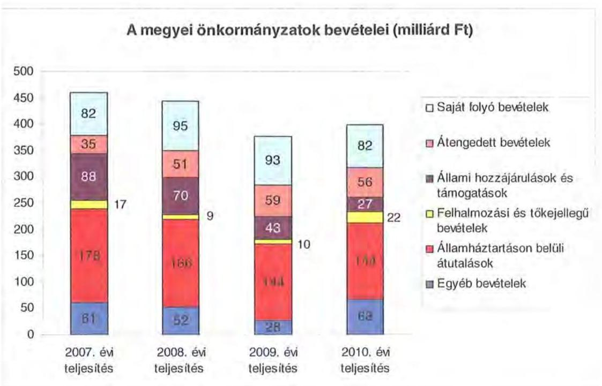

A megyei önkormányzatok saját folyó bevételeinek részaránya - amelyek fơbb elemei: az intézményi térítési díjak, az illetékbevétel, a kamatbevételek - a 2007. évi összbevételen ( 461 milliárd Ft) belül 17,9\% volt, amely 2010-re annak ellenére $20,6 \%$-ra nőtt, hogy az összege 82 milliárd Ft maradt. Ennek oka az volt, hogy az összbevétel a 2007. évi 461 milliárd Ft-ról 2010-re 399 milliárd Ftra csökkent.

Az átengedett bevételek, amelyek a megyei önkormányzatoknál a személyi jövedelemadóból való részesedést jelentették, az összbevételen belül a 2007. évi 35 milliárd Ft-ról 56 milliárd Ft-ra nőttek.

Az állami hozzájárulások és támogatások - amelyek főbb elemei: az ellátotti létszámhoz kötődő normatív állami hozzájárulások, központosított, fejezeti szinten kezelt céleldirányzatból juttatott múködési és fejlesztési támogatások a 2007. évi 88 milliárd Ft-ról (19,1\%-os részarányról) 2010-re 27 milliárd Ft-ra ( $6,8 \%$-os részarányra) estek vissza.

A felhalmozási és tőkejellegű bevételek - tárgyi eszközök (ingatlanok és ingóságok), föld és immateriális javak, részesedések értékesítése, EU-tól átvett pénzeszközök - a 2007. évi 17 milliárd Ft-ról (3,6\%-os részarányról) 2010-re 22 milliárd Ft-ra ( $5,4 \%$-ra) emelkedtek.

Az államháztartáson belüli átutalások részesedése 2007-ben 178 milliárd Ft volt. 2010. év végére 34 milliárd Ft-tal csökkent, részaránya $38,6 \%$-ról 2,6 százalékpontos csökkenés után 2010-ben $36 \%$-ra változott. Ez a bevételi kategória tartalmazza az egészségbiztosítási és egyéb elkülönített állami pénzalapoktól átvett forrásokat. A 2010-ben e címen elszámolt bevétel 144 milliárd Ft volt.

---

A megyei önkormányzatok központi költségvetésből származó bevételeinek öszszege 2007-ben 400 milliárd Ft volt, amely 2010. évre 331 milliárd Ft-ra (az időszak alatt összesen 69 milliárd Ft-tal) 17,3\%-kal csökkent.

Az egyéb, pénzmaradványból, vállalkozási bevételekből, államháztartáson kívülről származó átutalásokból, a hitelekből, a hosszú és rövid lejáratú értékpapírok értékesítéséből származó bevételek részesedése a 2007-2010. évek viszonylatában 13,3\%-ról 17,1\%-ra emelkedett. Ez utóbbiak 2010. évi beszámoló szerinti összevont teljesítése 68 milliárd Ft volt ${ }^{9}$.

Mindezeket figyelembe véve 2007 és 2010-ben a megyei önkormányzatok forrásösszetételének megoszlását az alábbi ábra szemlélteti:
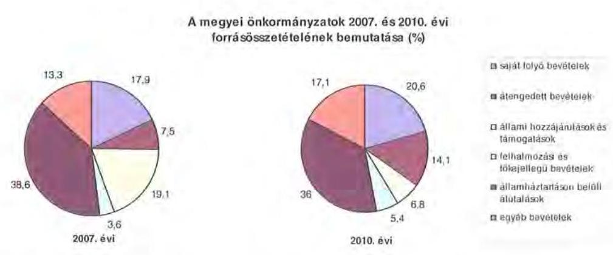

Annak ellenére, hogy a megyei önkormányzatok kötelezően ellátandó feladataikat 2007-hez képest kevesebb intézményben, csökkenő foglalkoztatotti létszám mellett végezték ${ }^{10}$, a jelentős bevételkiesést a - szervezési intézkedések hatására - csökkenő ráfordítások nem tudták kompenzálni. Az ellátottak száma a szociális, gyermekvédelmi ágazat bentlakásos elhelyezést nyújtó intézményeit kivéve - eltérő mértékben ugyan, de minden ágazatban évről évre csökkent, amely a fajlagos hozzájárulások csökkenésével együtt a normatív állami hozzájárulás arányának visszaeséséhez vezetett.

A 2007-2013-as időszakra meghirdetett, vissza nem térítendő EU-s fejlesztési forrásokhoz való hozzájutás lehetősége felerősítette az önkormányzati alrendszer fejlesztési igényeit. A fokozott fejlesztési tevékenység a felhalmozási bevételek és kiadások egyensúlyának megbomlásán ${ }^{11}$ túl a jelentkező jövőbeni fenntartási kötelezettség miatt tovább terhelhetik az önkormányzatok költségvetését.

[^0]
[^0]:    ${ }^{9}$ Az egyéb bevételek összege 2007-2010 között eltérő módon változott, 2007-ben 61 milliárd Ft volt, 2008-ban 52 milliárd Ft-ra, 2009-ben 28 milliárd Ft-ra esett vissza, majd 2010-ben ismét - 68 milliárd Ft-ra - emelkedett.
    ${ }^{10}$ a BM által 2010 decemberében elvégzett felmérés adatai szerint
    ${ }^{11}$ Az önkormányzati alrendszerben - az éves zárszámadási törvényjavaslatok általános indokolása, X. Helyi önkormányzatok gazdálkodása fejezet szerint - a felhalmozási bevételek és kiadások egyenlege 2007-ben 142,4 milliárd Ft, 2008-ban 112,3 milliárd Ft, 2009-ben 234,5 milliárd Ft hiányt mutatott.

---

A megyei önkormányzatok felhalmozási és müködési célú pénzintézeti és szállítói kötelezettségeinek állománya a vizsgált időszakban erőteljesen növekedett.

A hosszú lejáratú kötelezettségeket a következő ábra szemlélteti:

Hosszú lejáratú kötelezettségek
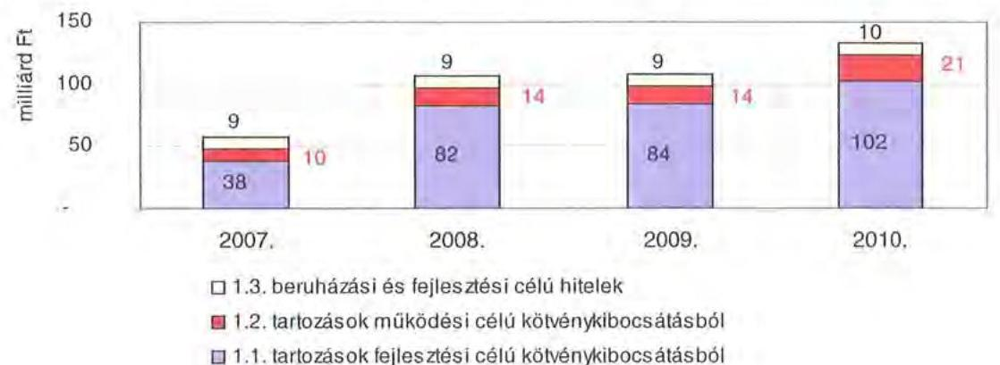

A hosszú lejáratú kötelezettségek mellett az időszakban a 2007. évi 22 milliárd Ft-ról 24 milliárd Ft-ra ( $8,8 \%$-kal) növekedett az áruszállításból származó szállítói kötelezettségek állománya.

A mérlegben kimutatott kötelezettségek állománya mellett az elhasználódott eszközök pótlására forrást biztosító amortizációs (felújítási) alap képzésének ${ }^{12}$ elmaradása további problémákat vetít előre. A megyei önkormányzatok beszámolójelentéseinek összegzése szerint 2007-ben még az elszámolt értékcsökkenés $90 \%$-ának megfelelő összeget fordítottak felújítási célokra, 2009-ben ez az arányszám már csak $16,5 \%$ volt. Ez maga után vonta a feladatellátást kiszolgáló tárgyi eszközök állagának erőteljes romlását.

Az ÁSZ a 2011. évi ellenőrzési tervében a 43. számú, az „Önkormányzatok gazdálkodási rendszerének ellenőrzése" részeként egyidőben, egymással párhuzamosan tekinti át és elemzi az önkormányzati alrendszer középszintjét jelentő 19 megyei önkormányzat pénzügyi helyzetét. A gazdálkodás szabályszerűségét az ÁSZ előző évek során ellenőrizte a megyei önkormányzatoknál is, ezért jelen vizsgálatunk erre nem tér ki.

A jelentés a megyei önkormányzatok sajátos feladatellátási és forrásszabályozási helyzetére tekintettel a megyei önkormányzatok pénzügyi helyzetét, illetve az ezzel összefüggő korábbi ÁSZ javaslatok megvalósítását mutatja be.

Az ellenőrzés a 2007. január 1. - 2011. március 31. közötti időszakot ölelte fel.

[^0]
[^0]:    ${ }^{12}$ Erre a jelenlegi szabályozási környezetben nem kötelezi semmilyen előírás az önkormányzatokat.

---

A vizsgálat jogszabályi alapját 2011. július 1-je előtt az Állami Számvevőszékről szóló 1989. évi XXXVIII. törvény 2. § (3), (5), (6) és (9) bekezdéseiben, az Ötv. 92. § (1) bekezdésében és az Áht. 104. § (3) bekezdésében, 2011. július 1-jét követően az Állami Számvevőszékről szóló 2011. évi LXVI. törvény 1. § (3) bekezdésében, az 5. § (2)-(6) bekezdéseiben és az Áht. 120/A. § (1) bekezdésében foglalt előírások képezték.

Hajdú-Bihar megye országos és régión belül elfoglalt helyzetét 2010. december 31-én az alábbi mutatók szemléltetik (megyei jogú várossal együtt):

Index: az előző év azonos időszak (időpontja)=100,0

| Mutató megnevezése | Hajdú-   Bihar   megye | Észak-   alföldi   régió | Országos |
| :-- | :--: | :--: | --: |
| Népesség száma (ezer fő)* | 539 | 1482 | 9986 |
| Népesség változás indexe (\%) | 99,6 | 99,3 | 99,7 |
| Az ipari termelés volumenindexe (\%) | 95,6 | 109,6 | 110,7 |
| Egy lakosra jutó ipari termelési érték (ezer Ft) | 1050,7 | 1452,1 | 2044,4 |
| Ezer lakosra jutó vállalkozások száma (db) | 167 | 168 | 165 |
| A beruházások egy lakosra vetített teljesít- | 218,7 | 160,6 | 304,7 |
| menyértéke (ezer Ft) | 45,5 | 45,0 | 49,5 |
| Foglalkoztatási arány (\%) | 12,9 | 14,3 | 10,8 |
| Munkanélküliségi ráta (\%) | 114994 | 109060 | 132628 |
| Alkalmazásban állók havi nettó átlagkerese- |  |  |  |
| te (Ft) | 107,4 | 106,2 | 106,9 |
| Alkalmazásban állók havi nettó átlagkeresetének indexe (\%) |  |  |  |

*Ebből Debrecen Megyei Jogú Városok népessége 205910 fő
A táblázatban feltüntetett adatok azt jelzik, hogy a gazdaság helyzetét reprezentáló egyes mutatók - a beruházások egy lakosra vetített teljesítményértéke, a foglalkoztatási arány, a megyei munkanélküliségi ráta - tekintetében elmarad az országos jellemzőktől, ugyanakkor az Észak-alföldi régión belül elfoglalt helyzete kedvezőbb képet mutat. Különösen kedvező, hogy az alkalmazásban állók havi nettó átlagkeresetének változása mind a régiós, mind pedig az országos értékeknél kedvezőbb.

A megyében 82 települési - 1 megyei jogú városi, 19 városi, 12 nagyközségi és 50 községi - önkormányzat múködött.

---

# I. ÖSSZEGZŐ MEGÁLLAPÍTÁSOK, KÖVETKEZTETÉSEK, JAVASLATOK 

A Hajdú-Bihar Megyei Önkormányzat 2010-ben 8111 millió Ft összes költségvetési kiadásából - az Önkormányzat adatszolgáltatása szerint - 98,6\%-ot kötelező feladatai ellátására fordított. Az Önkormányzat önként vállalt feladatai az SzMSz-ben meghatározottaknak megfelelően, kiemelten a sport és szabadidős tevékenységhez, kulturális, közművelődési és egyéb idegenforgalmi feladatokhoz, felsőoktatási ösztöndíj pályázathoz, különféle tagdíjak befizetéséhez kapcsolódtak, valamint támogatást nyújtott civil szervezetek, alapítványok működéséhez, összesen 112 millió Ft összegben. A kötelező és önként vállalt feladatok körét az SzMSz-ben rögzítették.

Az Önkormányzat a kötelező és önként vállalt feladatait 2010. december 31-én a Hivatallal és 15 intézménnyel, három többségi tulajdonú és egy nem többségi tulajdonú gazdasági társasággal, 115 telephelyen látta el. Az intézmények száma 2007-2010. között az egészségügyi és a szociális ellátás gazdasági társaságokba történő kiszervezése következtében, illetve az intézmények integrációja, összevonása eredményeként alakult ki. A vizsgált időszak elején 28 intézmény, hat gazdasági társaság 98 telephelyen vett részt a feladatellátásban.

A vizsgált időszakban az Önkormányzat folyó költségvetési egyenlege folyamatosan csökkent. Míg 2007-2008. években a múködési jövedelme pozitív összegű volt, 2009-2010. években az Önkormányzatnak múködési forráshiánya keletkezett. A múködési forrástöbblet 2007-ben a folyó kiadások 7,6\%-át (1509 millió Ft-ot), 2008-ban 13,9\%-át (1329 millió Ft-ot) jelentette. 2009-ben a múködési forráshiány a folyó kiadások 3,3\%-a (237 millió Ft), 2010-ben $21,4 \%$-a ( 1648 millió Ft) volt. A múködési forráshiány finanszírozása folyószámlahitelből, továbbá a kibocsátott kötvény szabad forrásainak befektetéséből realizált hozamokból történt.

A nettó múködési jövedelem a 2007-2010. évek között folyamatosan csökkent. A 2009. és a 2010. években a folyó évi költségvetés deficites volt, továbbá a finanszírozási bevételek meghaladták a finanszírozási kiadásokat, amelynek eredményeként a nettó múködési jövedelem negatív volt.

A CLF módszer szerinti múködési forráshiány kialakulásában az játszott szerepet, hogy az Önkormányzat legfőbb bevételi forrásai - a jogszabályi kedvezmények bővülése, és az ingatlanforgalom visszaesése következményeként az illetékbevétel, valamint a központi forráskivonás hatására az átengedett szja és az állami támogatások - csökkentek.

Az illetékbevétel, 2010-re a 2006. évi 2442 millió Ft-ról (55,3\%-ára) 1351 millió Ft-ra csökkent. Az átengedett szja és az állami támogatások együttes összege a központi támogatás csökkentésen túl a feladatváltozás hatását is figyelembe véve kevesebb lett, 2010-ben 2397 millió Ft volt, a 2007. évi 54\%-a. Az OEP bevétel összege 2007-ben 9597 millió Ft volt. Az egyéb saját bevételek emelkedése nem tudta ellensúlyozni a vizsgált időszakban kiesett 3835 millió Ft forrást.

---

Az Önkormányzat - CLF módszer szerint számított - folyó és felhalmozási kiadásainak együttes összege a 2010. évben 8111 millió Ft volt, amely a 2007. évi kiadástól 66,3\%-kal (15 946 millió Ft-tal) maradt el. Az Önkormányzat működési és felhalmozási kiadásai 2008. évben a Kenézy Kórház feladatainak gazdasági társaságokba történő átszervezése miatt együttesen 51\%-kal (12 259 millió Ft-tal) csökkentek, majd a 2009. évi 37,2\%-os (1174 millió Ft-os) további csökkenést követően a 2010. évben 9,5\%-kal (701 millió Ft-tal) haladták meg az előző évit.

A múködési és felhalmozási kiadásokon belül 2007-2010 között a felhalmozási kiadások súlya 3913 millió Ft-ról (16,3\%-ról) 436 millió Ft-ra (5,4\%-ra) csökkent. Az aktív pályázati tevékenység eredményeként 2007-2010. között 9259 millió Ft bekerülési költségű beruházást folytatott, illetve indított el az Önkormányzat, amelyből 1605 millió Ft a 2010 utánra vállalt kötelezettség. Az utóbbi forrásai az Önkormányzat adatszolgáltatása alapján a következők: 230 millió Ft kötvénybevételből származó pénzmaradvány, 1227 millió Ft elnyert EU-s támogatás, 148 millió Ft elnyert hazai támogatás. A 2010. év utánra vállalt kötelezettségből 512 millió Ft a Kenézy Kórház fejlesztéseit finanszírozza.

Az Önkormányzat pénzintézeti kötelezettségeinek állománya a könyvviteli mérlegadatok szerint 2006. december 31-ről 2010. december 31-re 377 millió Ft-ról 5151 millió Ft-ra nőtt. A vizsgált időszakban adósságszolgálatra az Önkormányzat 1045 millió Ft-ot teljesített, amelyből a kamatkiadás 442 millió Ft volt. A kötvényből származó források befektetéséből realizált kamatbevétel 851 millió Ft volt 2007-2010 között.

Az Önkormányzat a likviditás biztosítása érdekében folyószámlahitelt vett igénybe, a folyószámlahitellel zárt napok száma 2010-ben 365 nap volt. Átlagos napi állománya 770 millió Ft volt, amely 2011. év első negyedévére 984 millió Ft-ra emelkedett.

Az Önkormányzat 2010. év végi pénzintézeti kötelezettségéből 4004 millió Ft (77,8\%) kötvény kibocsátásából, 12 millió Ft ( $0,2 \%$ ) fejlesztési célú hosszú lejáratú hitel felvételéből, továbbá 1135 millió Ft (22\%) a költségvetési év végén ki nem egyenlített folyószámlahitelből keletkezett. Ezek miatt az Önkormányzatnak a 2011-2013. években 12 millió Ft és 1649343 CHF tőketörlesztést és kamatot ${ }^{13}$, valamint 1135 millió Ft folyószámlahitelből származó kötelezettséget kell teljesítenie. Az Önkormányzat 2010. év végi - gazdasági társaságok nélküli - szállítói tartozása 288 millió Ft (ebből lejárt 44 millió Ft) volt. A 2011-2013. évi összes (pénzintézeti és szállítói) kötelezettség teljesítésére figyelembe vehető 2812 millió Ft előző években fel nem használt maradvány és tárgyévi pénzmaradvány, valamint 824 millió Ft forgalomképes ingatlanvagyon, amely elegendő forrást biztosít.

A további évekre - 2014-től 2028-ig - szóló jelenleg ismert pénzintézeti kötelezettsége 18306836 CHF , az erre figyelembe vehető források jelenleg nem ismertek.

[^0]
[^0]:    ${ }^{13}$ a 2011. I. negyedévi kamat mértéket alapul véve, a folyószámlahitel nélkül

---

A közgyűlési előterjesztések nem tartalmazták a pénzintézeti kötelezettségvállalás visszafizetési forrásait, a teljes futamidő várható kamat és tőkefizetési kötelezettségeit, az árfolyam- és kamatkockázatok, valamint az adósságszolgálati korlát bemutatását.

Az Önkormányzat vizsgálta, hogy az elhasználódott eszközök pótlása milyen kötelezettséget jelent a számára. Az Önkormányzat 2007-2010 években a tárgyi eszközök után 2822 millió Ft értékcsökkenést számolt el, ugyanakkor felújításra ennek 97,5\%-át, 2751 millió Ft-ot fordított.

A végrehajtott kiadáscsökkentő intézkedések megtétele a feladatellátás szakmai színvonalának növelése mellett a takarékos szemléletű gazdálkodást, a működőképesség megőrzését, kiemelten a pénzügyi helyzet javítását célozták. A 2007-2010. években az intézményátszervezések, a feladatváltozások, valamint a takarékossági intézkedések hatásaként - az Önkormányzat kimutatása szerint - együttesen 2591 millió Ft kiadási megtakarítás keletkezett, melyből 849 millió Ft, 32,8\% a kapcsolódó álláshely csökkenések következtében jelentkezett.

A létszámcsökkentő intézkedések következtében 2007-2010 között a Hivatalnál és az intézményeknél összesen 941 álláshelyet szüntettek meg, amelyből 714 fő, $75,9 \%$ ágazati szakmai, 227 fő, $24,1 \%$ intézményüzemeltetéshez, fenntartáshoz, gazdasági ügyek intézéséhez kapcsolódó álláshely volt.

A bevételnövelésre irányuló intézkedések eredményeként képződő többletbevételből - amelynek számszerűsített összege 3823 millió Ft volt 3797 millió Ft-ot, 99,3\%-ot a Hivatal realizált. A bevételek növekedésében meghatározó tényező volt a részvényértékesítés, egészségügyi kompenzáció címén realizált bevétel 1702 millió Ft-tal, az ingatlanok értékesítése 1012 millió Ft-tal, az átmenetileg szabad pénzeszközök lekötéséből származó kamatbevétel 962 millió Ft-tal. Az intézmények bevétel növekedése kiemelten az általuk nyújtott szolgáltatások térítési díjainak emeléséből, valamint az egyéb jogcímen realizált bevétel növekedésből ered.

Az utóellenőrzés a pénzügyi egyensúly javítására tett egy szabályszerűségi és egy célszerűségi javaslat hasznosulására terjedt ki. Az Önkormányzat a javaslatokat hasznosította.

A feladatok és források közötti egyensúly megteremtésére irányuló központi döntések, a megyei önkormányzatok konszolidációjára, az intézmények átvételére vonatkozó törvényjavaslat elfogadása új feltételeket teremtett. A hatékony és eredményes gazdálkodás, a pénzügyi egyensúly megőrzése azonban további helyi intézkedéseket igényel.

Az Állami Számvevőszékről szóló 2011. évi LXVI. törvény 33. § (1) bekezdésében foglaltak értelmében a jelentésben foglalt megállapításokhoz kapcsolódó intézkedési tervet köteles az ellenőrzött szervezet vezetője összeállítani és azt a jelentés kézhezvételétől számított harminc napon belül az ÁSZ részére megküldeni. Amennyiben az intézkedési tervet határidőben nem küldi meg a szervezet, vagy az továbbra sem elfogadható, az ÁSZ elnöke a hivatkozott törvény 33. § (3) bekezdés a)-b) pontjaiban foglaltakat érvényesítheti.

---

A 2011 májusában lezárult helyszíni ellenőrzés tapasztalatai alapján - figyelembe véve az Önkormányzat észrevételeit és a saját hatáskörben tett intézkedéseit - az alábbi javaslatokat tette az ÁSZ:

# a Közgyűlés elnökének: 

1. tájékoztassa a Közgyűlést rendszeresen a pénzügyi helyzetről, azon belül a kötelezettségállomány alakulásáról, a feltételekben bekövetkező változásokról, az adósságot keletkeztető kötelezettségek teljesítési feltételeiről legalább 3 éves kitekintéssel;
2. a feltételek romlása esetén terjesszen a Közgyűlés elé cselekvési tervet a szükséges üzemgazdasági számításokkal alátámasztott - bevételnövelő, kiadáscsökkentő, beruházások és más kötelezettségek átütemezését, tartalékok képzését, méretgazdaságos intézményi struktúrát eredményező döntések meghozatala, a pénzügyi egyensúly és a működés fenntarthatósága céljából;
3. terjessze a Közgyűlés elé a gazdasági program kiegészítését a hosszú távú likviditási stratégiával;
4. gondoskodjon róla, hogy a jövőben az adósságot keletkeztető kötelezettségvállalásokról szóló közgyűlési döntéseket megalapozó előterjesztések tartalmazzák a kötelezettségvállalás visszafizetésének forrásait, a várható kamat- egyéb költség és tőkefizetési kötelezettségeit, legalább 3 éves kitekintéssel a várható kamat- és árfolyamkockázatok bemutatását.

---

# II. RÉSZLETES MEGÁLLAPÍTÁSOK 

## 1. Az ÖNKORMÁNYZAT KÖTELEZŐ ÉS ÖNKÉNT VÁLLALT FELADATAI

Az Önkormányzat 2010. évi beszámolója szerint költségvetési kiadásainak 98,6\%-át, 7999 millió Ft-ot a kötelező, 1,4\%-át, 112 millió Ft-ot az önként vállalt feladatok ellátására fordította. Az Önkormányzat nyilatkozata alapján az önként vállalt feladatok a sport és szabadidős tevékenységhez, kulturális és közművelődési feladatokra, felsőoktatási ösztöndíj pályázat céljára, különféle tagdíjak befizetéséhez kapcsolódtak, valamint támogatást nyújtott civil szervezetek, alapítványok működéséhez.

A kötelező és az önként vállalt feladatok körét az Önkormányzat SzMSz-ében rögzítették. Kötelező feladataikat az ágazati törvények által meghatározottnak tekintik, az önként vállalt feladatok terjedelmét az éves költségvetési rendeletekben az adott évi költségvetés forrásainak ismeretében határozták meg.

Az Önkormányzat éves költségvetési kiadásainak szerkezetét tekintve 2010-ben a járulékokkal növelt személyi juttatások és a dologi kiadások 5926 millió Ft-os összegén belül meghatározó arányt ${ }^{14}$ - 1737 millió Ft-ot, $29,3 \%$-ot - a közoktatási ágazatba tartozó feladatokra elszámolt kiadások jelentették. Szociális és gyermekvédelmi célokra 1393 millió Ft-ot, 23,5\%-ot, igazgatási és egyéb ágazathoz tartozó feladatokra 1707 millió Ft-ot, $28,8 \%$-ot, közművelődési feladatokra 1089 millió Ft-ot, $18,4 \%$-ot fordítottak. A 2010. évben a közoktatási feladatok kiadásait $41,2 \%$-ban, a szociális és gyermekvédelmi feladatok kiadásait $70,1 \%$-ban finanszírozta normatív költségvetési támogatás, 716 millió Ft, illetve 976 millió Ft összegben.
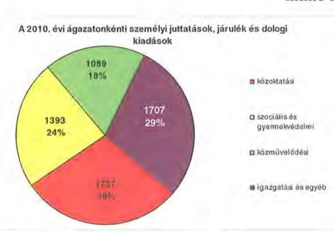

[^0]
[^0]:    ${ }^{14}$ Az Önkormányzat járulékokkal növelt személyi és dologi kiadásainak ágazatonkénti megbontása a BM részére készített, 2010. december 31-i adatokkal kiegészített adatszolgáltatásból származik.

---

A 2010. évi kiadások 64,4\%-a (5226 millió Ft) az intézmények, a többi a Hivatal költségvetésében szerepelt. A Hivatal költségvetéséből ( 2885 millió Ft) a személyi és dologi kiadások 57,2\%-kal ( 1650 millió Ft-tal), a beruházások, felújítások 5,8\%-kal ( 167 millió Ft-tal), a különböző megyemarketing feladatokhoz, szervezetek támogatásához, finanszírozási tételekhez kapcsolódó kiadások $37 \%$-kal ( 1068 millió Ft-tal) részesültek.

Az Önkormányzat kötelező és önként vállalt feladatait 2010. december 31-én 16 költségvetési szervvel és 3 többségi és egy nem többségi tulajdonú gazdasági társasággal látta el. Az Önkormányzat által fenntartott 16 költségvetési szerv közül 2 önállóan működő és gazdálkodó költségvetési szerv, az intézmények és az önkormányzati feladatellátásban működő gazdasági társaságok - alapító okirataik szerint - összesen 115 telephelyen működnek. A vizsgált időszak elején 28 intézmény, hat gazdasági társaság 98 telephelyen vett részt a feladatellátásban. Az Önkormányzat intézményi struktúrája 2010 decemberében az alábbi volt:

- egészségügyi feladatokat 2007. decemberétől az Önkormányzati Egészségügyi Holding Zrt-hez tartozó kft-k útján látta el;
- szociális és gyermekvédelmi feladatokat 5 intézmény és 2 gazdasági társaság végezte ( 5 gyermekvédelmi feladatot ellátó intézmény, amelyből 2 fogyatékos ellátást biztosító gyermekotthon, valamint 2 átmeneti és tartós szociális ellátást biztosító gazdasági társaság). A vizsgált időszak első évéhez viszonyítva csökkent az intézmények száma 11-ről ötre, a gazdasági társaságok száma négyről kettőre, azonban 54-ről 58-ra nőtt a telephelyek száma az Önkormányzat átszervezéssel összefüggő döntései nyomán, továbbá nyolc intézmény esetében megváltozott a gazdálkodás jellege;
- közoktatási feladatot 6 intézmény látta el (egy pedagógiai intézet, 2 gimnázium és szakközépiskola, 3 általános iskola és fogyatékos oktatást végző speciális szakiskola), 2006-hoz viszonyítva az intézmények integrációja eredményeként kettővel csökkent az intézmények és eggyel nőtt a telephelyek száma;
- közművelődési és közgyűjteményi feladatokat végzett, 3 intézmény (könyvtár és művelődési központ, levéltár, múzeum), összevonás eredményeként csökkent eggyel az intézmények és hárommal a telephelyek száma;
- igazgatási feladatokat látott el a Hivatal, egy intézmény pedig integrált gazdasági szervezetként múködött (a Hivatal feladatain kívül a többi intézmény gazdasági adminisztrációja, üzemeltetése, karbantartása tartozik ide) 17 telephellyel.

---

Az egyes ágazatok kötelező feladatellátását 2010. december 31-én az alábbi mutatók jellemezték:

| Megnevezés | közoktatás | szociális és   gyermek-   védelem | egészség-   ügy | kultúra   és sport |
| :-- | :--: | :--: | :--: | :--: |
| Az ágazatban foglalkozta-   tottak száma (fő) | 363 | 964 | 1741 | 154 |
| Az ágazat intézményeiben   ellátottak összesen (fő) | 1437 | 3001 |  |  |
| Fekvőbeteg ellátás férőhe-   lyeinek száma (db) |  |  | 1319 |  |

A közoktatási ágazatban az alkalmazottak száma a létszámcsökkentési intézkedések eredményeként a 2006. évi 490 fơről 363 fơre csökkent, míg az intézményekben ellátottak száma ezen időszak alatt 2,5\%-kal, 1402 fôről 1437 fôre nőtt. A szociális és gyermekvédelem területén a feladatellátás szervezeti kereteinek változása a foglalkoztatottak számában csökkenést eredményezett, 1219 fôről 964 fôre, az ellátottak száma 2968 fôről 3001 fôre nőtt. Az egészségügyi feladatellátás szervezeti kereteiben bekövetkezett változás, szerkezetátalakítás eredményeként a fekvőbeteg ellátás férőhelyeinek száma a 2006. évi 1627-ről a vizsgát időszak végére 1319-re csökkent.

Az Önkormányzat többségi részesedésú gazdasági társaságai közül három - Bihari Szociális Szolgáltató Nonprofit Kft, Hajdúsági Szociális Szolgáltató Nonprofit Kft. és a Megyegazda Nonprofit Kft. - az Önkormányzat kizárólagos tulajdona. A Egészségügyi Holding Zrt-ben 50\%-os tulajdoni részesedéssel rendelkezik az Önkormányzat. A feladatellátásban a gazdasági társaságok az alábbiak szerint vettek részt:

- A szakosított szociális szolgáltatások ellátását az Önkormányzat a vizsgált időszak első évében közhasznú társaságok és költségvetési szervként múködő szociális intézmények útján teljesítette. A költségvetési szerveket integrálták a gazdasági társaságokba, a közhasznú társaságokat jogszabályi változás miatt nonprofit kft-vé alakították át. Az átszervezések eredményeként 2010ben a Bihari Szociális Szolgáltató Nonprofit Kft. és a Hajdúsági Szociális Szolgáltató Nonprofit Kft. látta el kötelező feladatként a szakosított intézményi ellátást;
- A Megyegazda Nonprofit Kft. tevékenysége a megyemarketing feladatok ellátása, az üzemeltetésében és tulajdonában álló vagyonelemek hasznosítása és az M3 Archeopark múködtetése volt. A Közgyűlés döntése alapján végelszámolás alatt áll, 2011. május 1-jétől. A társaság által ellátott feladatokat a Hivatal átvette, majd a felülvizsgálat eredményeként - mint önként vállalt feladatot - leépítette, illetve bérbeadás útján látja el;
- Az egészségügyi feladatellátást, mint kötelező feladatot az Egészségügyi Holding Zrt. keretében biztosítja az Önkormányzat. A Kenézy Kórház 2007. november 30-ig múködött költségvetési szervként, majd két kft. - Kenézy Kórház Kft. és Megyei Egészségügyi Kft. - alapításáról, az orvos-szakmai feladatellátás, valamint a vagyonkezelés gazdasági társasági formában történő megvalósításáról döntött a Közgyűlés. Az Önkormányzat és Debrecen Megyei Jogú Város Önkormányzatának Közgyűlése 2008-ban megalapította

---

az Önkormányzati Egészségügyi Holding Zrt-t, majd 2009. január 1-jén megtörtént a két kft. tulajdonrészeinek felértékelése és üzletrészeinek apportálása. A Megyei Jogú Város Önkormányzata által 2009-2010-ben 888 millió Ft értékű részvény vásárlása eredményeként alakult ki az 50-50\%-os tulajdoni arány.

A többségi tulajdonú gazdasági társaságok mellett az Önkormányzat a Bihari Eurofalu Kht-ben 11\%-os, az INNOHÍD Zrt-ben 1,5\%-os, az Észak-alföldi Regionális Fejlesztési Zrt-ben 0,64\%-os részesedéssel rendelkezik.

Az önkormányzati feladatellátásban az intézmények és gazdasági társaságok mellett egyéb szervezetek, valamint szolgáltatási szerződéssel kiszervezett/kiszerződött intézményi ellátások nem múködtek.

A Közgyűlés 2007-ben döntött a pedagógiai szakszolgálati feladatoknak a többcélú kistérségi társulások részére történő átadásáról.

A 2011. évben az Önkormányzat tervezi a 337 tanuló képzését biztosító Bocskai István Gimnázium, Szakközépiskola, Szakiskola és Kollégium fenntartói jogának átadását Biharkeresztes Város Önkormányzata részére. A Közgyűlés döntése értelmében a gyermekvédelmi hálózatból 212 fő gyermek ellátása az őket nevelő 82 nevelőszülővel, valamint a Debreceni és Nyírségi Lakásotthonok a befogadó otthon nélkül és a Hajdúsági Lakásotthonok intézmény 2011. július 1-jétől a görög katolikus egyház részére átadásra kerül.

# 2. PÉNZÜGYI EGYENSÚLYI HELYZET ALAKULÁSA 

A hagyományos költségvetési szerkezet helyett az önkormányzat pénzügyi helyzetét a CLF módszerrel mutatjuk be, amelyben jobban elkülönülnek a vagyonnal kapcsolatos bevételek és kiadások a feladatokkal kapcsolatos közvetlen működtetési bevételektől és kiadásoktól. A módszer következetesen elkülöníti a folyó és a felhalmozási költségvetés bevételeit és kiadásait, azok költségvetési egyenlegeit. A tárgyévi pozíciók meghatározása érdekében a figyelembe vett saját folyó bevételek, valamint saját felhalmozási bevételek nem tartalmazzák az előző évi pénzmaradványok felhasználásából származó pénzforgalom nélküli bevételeket ${ }^{15}$.

A bevételek és kiadások besorolása általános közgazdasági meggondolásokon alapul, amely testet ölt az SNA statisztikai módszertanában is. Folyó tételek alatt értjük azokat a bevételeket és kiadásokat, amelyek az önkormányzat vagyoni helyzetét automatikusan nem változtatják. A bevételi oldalon ilyenek az adók, az illeték, az áfa bevételek és visszatérülések, a hozamok és kamatok, a költségvetési támogatások, az egyéb saját bevételek, valamint a működési célra átvett pénzeszközök és kapott támogatások. A folyó kiadások közé tartoznak a szolgáltatások nyújtásával kapcsolatos múködési kiadások, a kamatkiadások,

[^0]
[^0]:    ${ }^{15}$ A költségvetési években kialakuló hiány finanszírozása az előző években képzett tartalékok felhasználásával is történhet.

---

valamint a múködési célú transzferkiadások ${ }^{16}$. A felhalmozási vagy tőke tételek módosítják az önkormányzat vagyoni helyzetét. A privatizációs bevételek, az immateriális javak és tárgyi eszközök, valamint a részesedések értékesítése csökkentik, a fizikai beruházások és a pénzügyi befektetések növelik a vagyont. A pénzforgalmi bevételek és kiadások nem tartalmazzák a követelések elengedése miatt könyvelt tételeket, mivel ezek egymást kioltó, technikai jellegű elszámolási múveletek.

A folyó költségvetés egyenlege, a múködési jövedelem megmutatja, hogy az önkormányzat éves folyó bevétele fedezetet biztosít-e a kötelező és önként vállalt feladatellátáshoz kapcsolódó éves folyó kiadására. A múködési jövedelem negatív értéke pénzügyileg fenntarthatatlan helyzetet jelez. A mutató pozitív értéke megtakarítást mutat, amely forrásul szolgálhat az önkormányzat fennálló kötelezettségei megfizetéséhez, valamint fejlesztéseihez.

A felhalmozási költségvetés pozitív értéke felhalmozási többletet mutat, amely a jövőbeni fejlesztések forrását biztosíthatja. Amennyiben a folyó költségvetési hiány finanszírozása a felhalmozási többletből történik, ez szűkebb értelemben vagyonfelélésnek tekinthető. Amennyiben a felhalmozási költségvetés megtakarítása fejlesztési célú hitelek, kötvények adósságszolgálatát finanszírozza, az változatlan vagyontömeg mellett, a korábban megelőlegezett tőkebevételek valós realizációjának tekinthető. A felhalmozási deficit által generált finanszírozási igény önmagában nem jár pénzügyi kockázattal, a pénzügyileg fenntartható beruházásokhoz kapcsolódó kötelezettségvállalás (adósságszolgálat) előrelátó, tudatos költségvetési gazdálkodással teljesíthető.

A módszer a pénzügyi kapacitás (más néven a nettó múködési jövedelem) fogalmát helyezi a középpontba. Az adós hitelfelvételi képessége, hosszú távú fizetőképessége vagy bonitása a pénzügyi kapacitással, ezen belül is a nettó múködési jövedelemmel jellemezhető. A nettó múködési jövedelem negatív értéke az egyes költségvetési években jelentkező adósságszolgálat túlzott mértékére utal ${ }^{17}$. A nettó múködési jövedelem negatív értékének felhalmozási többletből, vagy további hitelből történő finanszírozása pénzügyileg nem fenntartható gazdálkodást vetít előre. A pozitív értéket mutató nettó múködési jövedelem fejlesztési kiadások fedezetét biztosíthatja, illetve a folyamatosan, évenként képződő pozitív nettó múködési jövedelemből meghatározható a jövőben vállalható, teljesíthető éves adósságszolgálat, ily módon az a hitelösszeg, amely - a többi tényezőt, feltételt adottnak tekintve - visszafizetési kockázat nélkül felvehető.

A CLF módszer alapján a pénzügyi kapacitás mértéke az önkormányzat összevont, nettósított, a központi információs rendszerbe a MÁK-on keresztül leadott éves költségvetési beszámolójának 80-as űrlapjában szerepeltetett adatok alapján került meghatározásra. A 2007-2010 közötti időszakban az Önkormányzat

[^0]
[^0]:    ${ }^{16}$ Transzferkiadásoknak azokat a folyó és felhalmozási tételeket nevezzük, amelyeket nem az adott önkormányzat használ fel szolgáltatásnyújtásra (pl.: ellátottak pénzbeni juttatásai, átadott pénzeszközök, garancia- és kezességvállalások stb.).
    ${ }^{17}$ Kivéve, ha annak finanszírozására a korábbi években képzett tartalékok fedezetet nyújtanak.

---

CLF módszer szerint besorolt kiadásainak és bevételeinek főbb jogcímek szerinti alakulását a jelentés $2 / a$. számú melléklete tartalmazza.

Az Önkormányzat bevételeinek és kiadásainak alakulását részletesen a hatályos számviteli előírások szerint készült, összevont éves költségvetési beszámolók adataira alapozva mutatjuk be. A bevételek és kiadások müködési, valamint felhalmozási jogcímekre történő elkülönítését az éves költségvetési beszámolók, a zárszámadási rendeletek, továbbá - amely jogcímek ${ }^{18}$ esetében erre más lehetőség nem volt - az Önkormányzat adatszolgáltatása szerinti megbontás alapján végeztük el. A bevételek elemzése során figyelembe vettük a korábbi években keletkezett pénzmaradvány felhasználásából származó pénzforgalom nélküli bevételeket is. A 2007-2010 közötti időszakban az Önkormányzat bevételeinek és kiadásainak, továbbá adósságszolgálatának alakulását a jelentés $2 /$ b. számú melléklete tartalmazza.

# 2.1. A müködési és felhalmozási egyensúly alakulása 

## CLF módszer szerinti önkormányzati adatok

|  |  |  |  |  |
| :--: | :--: | :--: | :--: | :--: |
| Megnevezés | 2007 | 2008 | 2009 | 2010 |
| Folyó bevételek | 21284011 | 10922066 | 6953724 | 6045841 |
| Folyó kiadások | 19775270 | 9593223 | 7190294 | 7693746 |
| Müködési jövedelem | 1308741 | 1328843 | $-236370$ | $-1847899$ |
| Nettó müködési jövedelem   = müködési jövedelem - tüketölcrestés | 1417601 | 1237301 | $-367013$ | $-1739039$ |
| Felhalmozási bevételek | 2241799 | 141623 | 708684 | 930737 |
| Felhalmozási kiadások | 4281682 | 2204351 | 219625 | 416769 |
| Felhalmozási költségvetés egyegege | $-2039883$ | $-2062678$ | 489059 | 513964 |
| Finanszírozási müveletek nélküli (GFS) pozíció | $-531142$ | $-733835$ | 252489 | $-1133935$ |
| Finanszírozási müveletek egyegege | $-343843$ | 1747036 | 1520976 | 530896 |
| Tárgyévi pozíció | $-874989$ | 1013245 | 1773465 | $-403039$ |
| Egyéb tájékoztató adatok |  |  |  |  |
| Összes kötelezettség* | 3948903 | 4982560 | 4444470 | 5607651 |
| - ebböl elvid tejáratú | 3754603 | 1665804 | 1145460 | 1590820 |
| Folyószámla hitel napi átlagos állománya** | 146852 | 360758 | 648402 | 769796 |
| Egyéb likvid hitel napi átlagos állománya** | 0 | 0 | 0 | 0 |
| Munkabérhitel-megelölegezési hitel napi átlagos   18ománya ** | 0 | 0 | 0 | 0 |
| Egyéb finanszírozásba vonható eszközök év végi   18ománya: | 1086599 | 3539424 | 3542490 | 2939451 |
| - ebböl: tartós hitel észonyi megtestesitő   értékpapírok év végi állománya | 330817 | 1289446 | 0 | 0 |
| - ebböl: hosszú lejáratú bankbetétek év végi   18ománya | 0 | 0 | 0 | 0 |
| - ebböl: értékpapírok év végi állománya | 0 | 480959 | 0 | 0 |
| - ebböl: pénzeszközök (idegen pénzeszközök   nélkül) év végi állománya | 755782 | 1769025 | 3542490 | 2939451 |

* Az összes kötelezettséget a passzív pénzügyi elszámolások nélkül vettük figyelembe, mert a passzívák a pénzmaradvány elszámolás tételei kitéé tartoznak.
** A folyószámla- és a munkabér megelölegezési hitel átlagos állományát 365 napos nappal számítottuk.

[^0]
[^0]:    ${ }^{18}$ Az előző évi maradvány visszafizetésének, az előző évi pénzmaradvány átadásának és átvételének, a kamatkiadásoknak, az egyéb pénzforgalom nélküli kiadásoknak, a hozam- és kamatbevételeknek, az átengedett adóknak, a költségvetési támogatásoknak, továbbá az előző évi pénzmaradvány igénybevételének müködési és felhalmozási részre történő megosztásához az Önkormányzat által szolgáltatott adatokat vettük figyelembe.

---

A vizsgált időszakban az Önkormányzat folyó költségvetési egyenlege folyamatosan csökkent. Míg 2007-2008. években a működési jövedelme pozitív összegű volt, 2009-2010. években az Önkormányzatnak múködési forráshiánya keletkezett, amelyet a következő ábra szemléltet:
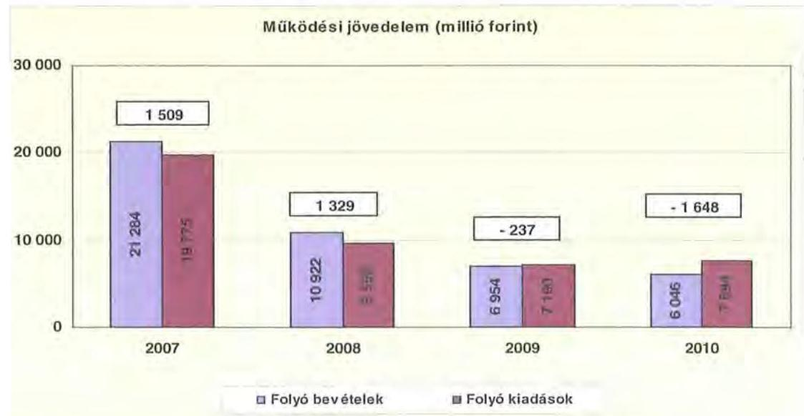

A folyó költségvetés egyenlege (a működési forrástöbblet) 2007-ben a folyó kiadások 7,6\%-át ( 1509 millió Ft-ot), 2008-ban 13,9\%-át ( 1329 millió Ft-ot) jelentette. 2009-ben a folyó költségvetés hiánya (a működési forráshiány) a folyó kiadások 3,3\%-a (-237 millió Ft), 2010-ben 21,4\%-a (-1648 millió Ft) volt.

A működési forráshiány finanszírozása folyószámlahitelből, továbbá a kibocsátott kötvény szabad forrásainak befektetéséből realizált hozamokból történt. A folyószámlahitel napi átlagos állománya 2007-2010 között több mint az ötszörösére ( 147 millió Ft-ról 770 millió Ft-ra) emelkedett.

Az Önkormányzat kötelezettségein ${ }^{19}$ belül a 2008-2010 közötti időszakban a rövid lejáratú kötelezettségek állománya 30\% körül volt, a 2007. évi 95,1\%-os aránnyal szemben. Az Önkormányzat 2006. december 31-én fennálló pénz és tőkepiaci kötelezettsége 308 millió Ft-ról több mint 112-szeresére 5151 millió Ftra nőtt a hosszú lejáratú hitelfelvétel, a kötvénykibocsátás és a folyószámlahitel év végi fennmaradó állományának emelkedése miatt.

A rövid lejáratú kötelezettségek 2010-ben 1591 millió Ft-ot tettek ki, amely 2164 millió Ft-tal ( $57,6 \%$-kal) kevesebb a 2007. évi rövid lejáratú kötelezettségállománynál. A rövid lejáratú kötelezettségeknek a szállítói állomány 2007-ben 96,3\%-át, 2008-ban 56,8\%-át, 2009-ben 58,3\%-át, 2010-ben 18,1\%-át tette ki.

A szállítói állomány összege 2007-ben 3615, 2008-ban 945, 2009-ben 668, 2010ben 288 millió Ft volt.

[^0]
[^0]:    ${ }^{19}$ passzív pénzügyi elszámolások nélküli

---

Az Önkormányzat pénzügyi kapacitása is a vizsgált időszakban folyamatosan csökkent, 2007-2008. években pozitív, 2009-2010. években már negatív értéket mutatott. A nettó múködési jövedelem ${ }^{20}$ értéke a folyó költségvetési pozíció mellett az adott költségvetési év adósságtörlesztésének hatását is tükrözi.

A pénzügyi kapacitás romlását a folyó bevételek és kiadások különbségéből származó múködési jövedelem csökkenése okozta ${ }^{21}$.

Az Önkormányzat nettó működési jövedelmének évenkénti alakulását az alábbi ábra szemlélteti:
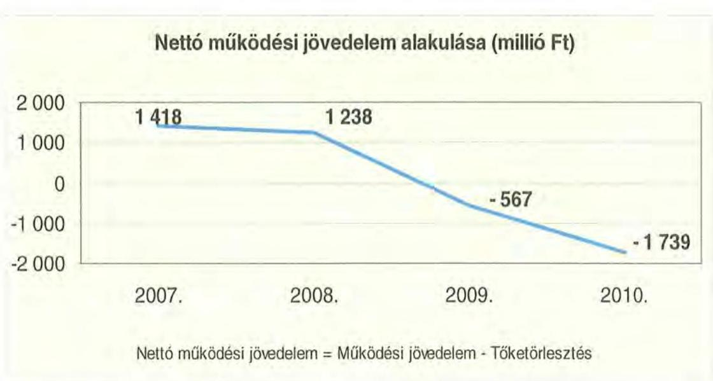

A folyó költségvetés egyenlegének és a tőketörlesztésre (hiteltörlesztés és forgatási és befektetési célú értékpapírok beváltása) fordított összegeknek évenkénti különbözete (a nettó múködési jövedelem) a 2007-2010. évek között folyamatosan csökkent. A 2009. és a 2010. évi negatív nettó múködési jövedelem oka, hogy a folyó évi költségvetés deficites volt, továbbá a finanszírozási bevételek meghaladták a finanszírozási kiadásokat.

A 2009-2010. években az Önkormányzat felhalmozási költségvetésének egyenlege pozitív összegú volt a 2007-2008. évek felhalmozási forráshiányával szemben, melyet a következő ábra szemléltet:

[^0]
[^0]:    ${ }^{20}$ pénzügyi kapacitás
    ${ }^{21}$ Az Önkormányzat tőketörlesztési kötelezettsége 2007., 2008. és 2010. évben megegyezett, 91 millió Ft volt, míg 2009. évben 330 millió Ft volt.

---

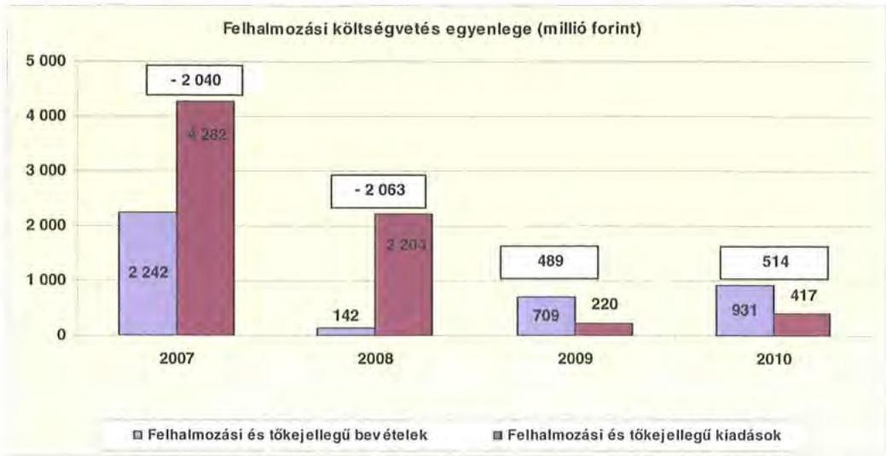

A felhalmozási forráshiánynak a felhalmozási és tőke jellegű kiadásokhoz viszonyított aránya 2007-ben 47,6\% (2040 millió Ft), 2008-ban 93,6\% (2063 millió Ft) volt, a felhalmozási forrástöbblet aránya 2009-ben 222,3\% (489 millió Ft) 2010-ben 123,3\% (514 millió Ft) volt.

Az Önkormányzat évenkénti teljes finanszírozási hiánya ${ }^{22}$ a CLF módszer szerint 2007-ben 622 millió Ft, 2008-ban 825 millió Ft, 2009-ben 78 millió Ft, 2010-ben 1225 millió Ft volt.

Az Önkormányzat finanszírozási műveletei 2007-2010. évekbeni egyenlegének alakulását a következő ábra szemlélteti:

Finanszírozási múveletek egyenlege (millió Ft)
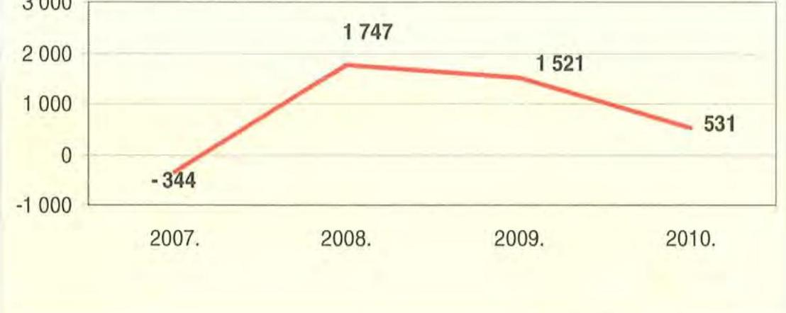

A finanszírozási többlet azt jelzi, hogy az éves költségvetések végrehajtása során szükség volt a pénzkészlet felhasználásán túl külső finanszírozás igénybe-

[^0]
[^0]:    ${ }^{22}$ A nettó múködési jövedelem és a beruházási költségvetés egyenlegeinek összege.

---

vételére is. A finanszírozási célú műveleteket a vizsgált időszakban a jelentés 2/a. számú mellékletének 4.1-4.8 pontjai részletezik.

Az Önkormányzat zárszámadási rendeletében a múködési és fejlesztési hiányt/többletet a hagyományos költségvetési szerkezet alapján mutatta be ${ }^{23}$, amelyről a jelentés 1. számú melléklete nyújt tájékoztatást.

A vizsgált időszakban a kötelezettségek (passzív pénzügyi elszámolások nélkül) 3949 millió Ft-ról 5608 millió Ft-ra emelkedtek, amely együtt járt a kamatkiadások növekedésével. Ugyanakkor a szabad pénzeszközök befektetése, a kötvény forgatása révén a kapott kamatok meghaladták a fizetett kamatokat.

A 2007-2010 között az Önkormányzatnak összesen 996 millió Ft kamatbevételt realizált, amely a teljes kamatkiadás ( 442 millió Ft) $225,3 \%$-át tette ki.

Az Önkormányzat kamatbevételeit és kamatkiadásait és azok egyenlegét a következő ábra mutatja:

Kamatbevételek és kiadások (millió Ft)
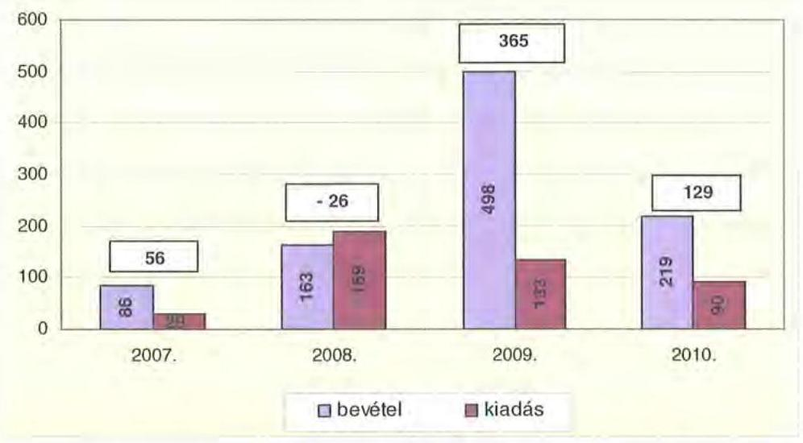

A 2007-2010 közötti időszakban az Önkormányzat kiadásait és bevételeit főbb jogcímek szerint a jelentés 2/a. és 2/b. számú melléklete tartalmazza.

# 2.2. Az Önkormányzat bevételei 

Az Önkormányzat folyó költségvetési és felhalmozási bevételei együttesen a 2010. évben $71,3 \%$-kal ( 16549 millió Ft-tal) voltak alacsonyabbak a 2007. évitől, amely 23526 millió Ft volt. A csökkenésben meghatározó volt a Kenézy Kórház gazdasági társasággá történő átszervezése.

[^0]
[^0]:    ${ }^{23}$ Nincs kötelező előirás a múködési és fejlesztési hiány megállapításának módjára.

---

Az Önkormányzat feladatai ellátása érdekében - a CLF módszer szerint számolva - a 2007. évben 21284 millió Ft, a 2008. évben 10922 millió Ft, a 2009. évben 6954 millió Ft, a 2010. évben 6046 millió Ft működési bevételt teljesített.

Az Önkormányzat 2007-2010 között realizált OEP támogatás nélküli főbb bevételi jogcímeinek számszaki adatait a következő táblázat részletezi és a grafikon mutatja be:

|  |  |  |  | ezer Ft |
| :-- | --: | --: | --: | --: |
| Megnevezés | 2007. év | 2008. év | 2009. év | 2010. év |
| illetékbevétel | 1978240 | 2293808 | 1976458 | 1350869 |
| szja és állami támogatás   (OEP nélkül) | 4438224 | 3934671 | 2934983 | 2396525 |
| Egyeb saját bevétel | 4132388 | 1947695 | 2805734 | 2966325 |
| Összesen | 10548852 | 8176174 | 7717175 | 6713719 |

Az önkormányzat müködési be vételeinek összetétele OEP
támogatás nélkül (millió Ft)
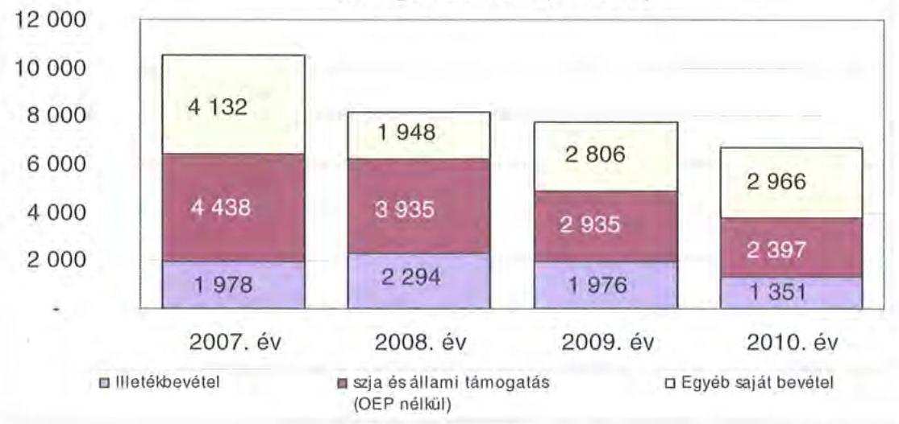

Az Önkormányzatnál az illetékbevétel a 2007. évben a 2006. évi 2442 millió Ft-hoz képest jelentősen, 19\%-kal (464 millió Ft-tal) csökkent. A csökkenésben szerepet játszott az Illetékhivatalnak - 2007. január 1-jétől - az APEH-hoz történő átszervezése is, miután az évente realizált illetékbevételekből (központi intézkedés következtében) évi $8,5 \%$ elvonásra került az adminisztrációs feladatokra. Az ezen a jogcímen visszatartott összeg minden évben kevesebb volt, mint amekkora költségvetési kiadást jelentett korábban az Illetékhivatal müködtetése ${ }^{24}$ az Önkormányzatnak. A hivatal működtetésével kapcsolatos kiadások megszűnése és az adminisztrációs feladatokra visszatartott 8,5\% között 2007-ben 403 millió Ft pozitív különbözet jelentkezett, ami a 464 millió Ft-os bevételcsökkenés $90 \%$-át tette ki.

[^0]
[^0]:    ${ }^{24}$ A 2006. évben az Illetékhivatal működtetésére 586 millió Ft-ot fordítottak. Az éves illetékbevétel 8,5\%-a 2007-ben 184 millió Ft, 2008-ban 213 millió Ft, 2009-ben 184 millió Ft, 2010-ben 105 millió Ft volt.

---

Az illetékbevétel a vizsgált időszakban 2008-ban az előző évihez képest 16\%kal nőtt ${ }^{25}$. 2008 -ról 2009 -re $13,8 \%$-os csökkenés következett be ${ }^{26}$. A 2006. évi bevételhez viszonyítva a 2010. évi illetékbevétel 44,7\%-kal (1091 millió Ft-tal) csökkent.

Az átengedett szja és az állami támogatások együttes összege a központi forráskivonás hatására ${ }^{27}$ folyamatosan és jelentős mértékben, összesen 46\%-kal (2042 millió Ft-tal) csökkent. Az előző évihez képest 2008-ban 11,3\%-kal (504 millió Ft-tal), 2009-ben 25,4\%-kal (1000 millió Ft-tal), 2010-ben további 18,3\%-kal (539 millió Ft-tal) kapott kevesebb forrást az Önkormányzat az államtól ezeken a jogcímeken. A változást a normatíváknak a járulékváltozások miatti központi csökkentése, valamint a megyei önkormányzatokat érintő forráselvonás mellett az ellátotti létszám feladatátadás miatti csökkenése idézte elő.

Az intézményi múködési bevételek 2007-ről 2008-ra bekövetkezett 43,6\%os (639 millió Ft-os) csökkenését az okozta, hogy a Kenézy Kórház 2007. december 1-jétől gazdasági társaságként múködött. A múködési bevételek alakulását 2008-2010 között csökkenő tendencia jellemzi. 2010-ben az előző évihez viszonyított mintegy másfélszeres növekedést az egészségügyi kompenzáció címén kapott 800 millió $\mathrm{Ft}^{28}$ eredményezte.

Az OEP bevétel összege 2007-ben 9597 millió Ft volt, 2010-ben a gazdasági társaságban történő egészségügyi feladatellátás miatt az Önkormányzat költségvetésében OEP bevétel nem szerepelt.

Az Önkormányzat felhalmozási bevételei a vizsgált időszakban a következők voltak:
ezer Ft

| Megnevezés | 2007. év   tény | 2008. év   tény | 2009. év   tény | 2010. év   tény |
| :-- | :--: | :--: | :--: | :--: |
| Tárgyi eszköz   értékesítés | 696234 | 28362 | 163470 | 256479 |
| Állami támogatás | 2397021 | 1594933 | 10997 | 33222 |
| Átvett pénzeszköz | 74436 | 29421 | 21292 | 78046 |
| Egyéb felhalmozási   bevétel | 1126341 | 184270 | 569262 | 615523 |
| Felhalmozási tartalék | 307847 | 286078 | 35048 | 429166 |
| Összes felhalmozási   bevétel | 4601879 | 2123064 | 800069 | 1412436 |

[^0]
[^0]:    ${ }^{25}$ a 2007. évi 1978 millió Ft-ról 2008-ra 2294 millió Ft-ra
    ${ }^{26}$ a 2009. évben 1976 millió Ft-ra
    ${ }^{27}$ a 2007. évi bázishoz képest
    ${ }^{28}$ A Nemzeti Erőforrás Minisztérium a finanszírozott szakellátási kapacitások csökkentéséből származó kár megtérítése iránti perbeli követelés összegét, 800 millió Ft-ot 2010ben biztosította az Önkormányzat számára.

---

Az Önkormányzatnak ingatlanok értékesítéséből számottevő bevétele ( 696 millió Ft) 2007-ben volt ${ }^{29}$. Az egyéb felhalmozási bevételek között szerepel 2007ben a fejlesztési célok finanszírozása érdekében beváltott rövid lejáratú értékpapírból származó 700 millió Ft.

Állami támogatást a Kenézy Kórház műtő rekonstrukciója, a megyei könyvtár építése és a komádi szociális otthon címzett beruházása kapcsán kaptak, melyek megvalósítása és pénzügyi rendezése a 2007-2008. éveket érintette. Az intézmények egyéb felhalmozási bevételei a feladatellátás feltételeit biztosító ingatlanok felújításokhoz, fejlesztéseihez kapcsolódtak. Az évenkénti nagy összegű felhalmozási tartalék a felhalmozási célra jóváhagyott pénzmaradványból képződött, melyet a felhasználásig lekötöttek.

# 2.3. Az Önkormányzat kiadásai 

Az Önkormányzat - CLF módszer szerint számított - folyó és felhalmozási kiadásainak együttes összege a 2010. évben 8111 millió Ft volt, amely a 2007. évi kiadástól $66,3 \%$-kal ( 15946 millió Ft-tal) maradt el.

Az Önkormányzat múködési és felhalmozási kiadásai 2008. évben a Kenézy Kórház átszervezése miatt együttesen $51 \%$-kal ( 12259 millió Ft-tal) csökkentek, majd a 2009. évi $37,2 \%$-os ( 1174 millió Ft-os) további csökkenést követően a 2010. évben $9,5 \%$-kal ( 701 millió Ft-tal) haladták meg az előző évit.

Az Önkormányzat Kenézy Kórház nélküli ${ }^{30}$ múködési kiadásai főbb jogcímek szerinti bontásban az alábbiak voltak:
ezer Ft

| Megnevezés | 2007 | 2008 | 2009 | 2010 |
| :--: | :--: | :--: | :--: | :--: |
| Múködési kiadások | 9829782 | 9360182 | 7185211 | 7641743 |
| Múködési kiadások (kamatkiadás nélkül) | 9800661 | 9338105 | 7112687 | 7584813 |
| Kamatkiadás | 29121 | 22077 | 72524 | 56930 |
| Személyi juttatások | 5044558 | 3437511 | 2852742 | 2783719 |
| Munkaadót terhelő járulékok | 1552637 | 1050340 | 815891 | 693637 |
| Dologi kiadások | 2178416 | 3496554 | 1941386 | 2448484 |
| Egyéb folyó kiadások | 129574 | 163615 | 198446 | 78631 |
| Támogatások, elvonások, egyéb folyó átutalások | 719893 | 1031888 | 849150 | 1431412 |
| ebből: múködési célú pénzeszközátadás | 163509 | 472873 | 262064 | 884641 |
| Előző évi pénzmaradvány átadás, viszafizetés, múködési célú | 175583 | 158397 | 455072 | 148930 |

Az Önkormányzat kórház nélküli múködési kiadásai 2007. december 31-ről 2010. december 31-re 22,3\%-kal csökkentek ( 9830 millió Ft-ról 7642 millió Ftra).

[^0]
[^0]:    ${ }^{29}$ Az Önkormányzat 2007-ben értékesítette a Debrecen, Piac u. 8. szám alatti (könyvtár) ingatlant, a Bartók termet, valamint az Illetékhivatal tárgyi eszközeinek APEH által történő megtérítéséből és egyéb tárgyi eszköz értékesítéséből származott bevétele. Egyéb használaton kívüli eszközök is értékesítésre kerültek.
    ${ }^{30}$ A Kenézy Kórház 2007. december 1-jétől gazdasági társaságként múködik. Az Önkormányzat 2007. évi múködési kiadásai az összehasonlíthatóság érdekében nem tartalmazzák a Kórház kiadásait.

---

Az Önkormányzat 2010-ben a múködési költségvetés 45,5\%-át (3477 millió Ft) személyi juttatásokra és a munkaadókat terhelő járulékokra fordította, az üzemeltetést, intézményfenntartást biztosító dologi kiadásokra 32\% (2449 millió Ft) jutott. A múködési kiadásokon belül a személyi juttatások és járulékok aránya a vizsgált időszakban folyamatosan csökkent, 2007-ben 67,1\% volt.

A személyi juttatások 2008-ban 64,3\%-kal (6188 millió Ft-tal) csökkentek az előző évhez képest a Kenézy Kórház gazdasági társasággá történt átalakításával és azt követően minden évben tovább csökkentek a létszámcsökkentések eredményeként. 2010-ben a 2007. évi - a kórház nélküli - teljesített kiadásoknál $44,8 \%$-kal ( 2261 millió Ft-tal) voltak alacsonyabbak.

A dologi kiadások az Önkormányzatnál 2010-ben a 2007. évi szintnél $54,9 \%$-kal ( 2980 millió Ft-tal) alacsonyabbak voltak az egészségügyi ellátás szervezeti kereteiben történt változás hatására, 2008-ban 35,6\%-kal volt alacsonyabb a teljesített dologi kiadás ( 3497 millió Ft) az előző évitől, melyet a szociális ágazatban megvalósult szerkezeti átalakítások eredményeztek. A 2010. év kivételével - amikor $26,1 \%$-kal ( 507 millió Ft-tal) nőtt az előző évhez viszonyítva - minden évben csökkentek a dologi kiadások a végrehajtott kiadáscsökkentő intézkedések hatására. 2010-ben a növekedést a Kenézy Kórháztól átvállalt szállítói kötelezettségek részbeni teljesítése (493 millió Ft) okozta.

A múködési célú pénzeszközátadások nagysága 2007-ről 2010-re 92\%$\mathrm{kal}^{31}$ nőtt, mely a Kenézy Kórháznak 2010-ben egészségpolitikai és szakmai kompenzáció címén adott 660 millió Ft összegű egyszeri támogatás átadásának eredménye. 2008-ban 2,7\%-os ( 13 millió Ft-os) növekedés volt, azonban a Közgyűlés intézkedései nyomán csökkenő tendencia figyelhető meg.

Az Önkormányzati kiadásokban meghatározó a kórházi kiadások súlya az egyéb fenntartott intézményekben felmerülő kiadásokhoz képest. A kórház nélküli teljesített múködési kiadások 2007-ben ( 9830 millió Ft) az összes múködési kiadás $48,9 \%$-át tették ki. A feladatellátás szervezeti kereteinek 2007ben bekövetkezett változása miatt a 2008-2010. években a kiadásokban jelentkező tendenciák a közoktatási, szociális és gyermekvédelmi, igazgatási és egyéb intézményekben biztosított feladatellátást jellemzik.

Az Önkormányzat 2006-2007-ben a Kenézy Kórház múködési kiadásaihoz ${ }^{32}$ 476 millió Ft-tal járult hozzá, amelyet központosított állami támogatásokból fedezett. A kórházi múködési támogatások a központi bérpolitikai intézkedésekhez, a létszámcsökkentésekhez kapcsolódó többletköltség fedezetéhez, a 13. havi juttatások kifizetéséhez, kereset kiegészítésekhez kapcsolódtak. Ezeknek a kiadásoknak a fedezete így nem OEP támogatás, hanem egyéb, az Önkormányzat által igénybevett központi forrás volt. 2010-ben további 660 millió Ft múködési célú támogatást nyújtott, amely az egészségügyi kompenzáció címén kapott támogatás részbeni továbbadása volt.

[^0]
[^0]:    ${ }^{31} 460$ millió Ft-ról 885 millió Ft-ra
    ${ }^{32}$ intézményi finanszírozás formájában

---

A kórház múködésének finanszírozására az OEP támogatás szolgált, míg a fejlesztési kiadások fedezetét az Önkormányzatnak kellett biztosítani intézményeik számára.

A múködési célú önkormányzati támogatáson felül 2007-2010. évek között az Önkormányzat fejlesztési célú támogatást nem nyújtott, azonban a Közgyűlés 2710 millió Ft értékű beruházás, fejlesztés megvalósításáról döntött, amely az Önkormányzat felhalmozási kiadásainak 39,6\%-át tette ki. Az Önkormányzat tulajdonában lévő, az egészségügyi feladat ellátásához szükséges vagyontárgyakat vagyonkezelési szerződés keretében adták át a Kenézy Kórháznak. A támogatásokat 2007-2010. évek között a következő grafikon mutatja be.
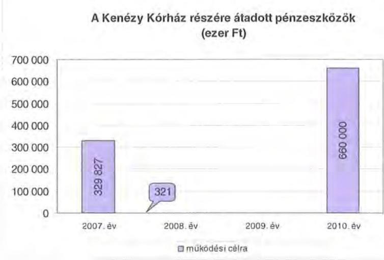

A múködési és felhalmozási kiadások arányának változásában 2007-2009 között csökkenő tendencia figyelhető meg, a felhalmozási kiadások összege 4282 millió Ft-ról 220 millió Ft-ra csökkent, majd 2010-ben 417 millió Ft-ra nőtt. A felhalmozási kiadások aránya a 2007. évi 17,8\%-ról 2010-ben 5,1\%-ra csökkent. A kiadások összetételének változását (a múködési és fejlesztési célú kamatkiadásokat is figyelembe véve) a következők grafikon szemlélteti:
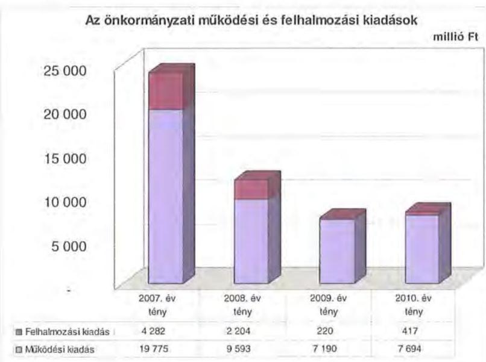

---

Az önkormányzati intézmények által 2007-2010. évek között bonyolított fejlesztések között intézményi épületek, lakóotthonok felújítása, korszerűsítése és bővítése szerepelt 294 millió Ft értékben, továbbá a Hivatal és a Közgyűlés informatikai fejlesztései 31 millió Ft értékben. 2007-2010. évek között a 10 millió Ft teljes bekerülési költség feletti beruházások és felújítások száma 33 volt, a 10 millió Ft alatti fejlesztésekkel együtt - amelynek összértéke meghaladja az 108 millió Ft-ot - 5922 millió Ft-ot fordítottak a pályázati támogatásokkal együtt fejlesztések finanszírozására. 17 fejlesztési cél pályázati források felhasználásával valósul meg, 2010-ben 4 EU-s projekt megvalósítása volt folyamatban.

A vizsgált időszakban befejeződött legjelentősebb fejlesztések a Kenézy Kórház műtőrekonstrukció ( 3000 millió Ft), a Méliusz Juhász Péter Megyei Könyvtár beruházás ( 1414 millió Ft), valamint a Komádi Fogyatékosok Otthona beruházás (1141 millió Ft).

Folyamatban van a sürgősségi osztály fejlesztése (522 millió Ft) a Kenézy Kórházban, a Déri Múzeum modernizálása a régió örökségeinek bemutatása céljából ( 714 millió Ft), valamint elbírálás alatt áll a Kós Károly Művészeti Szakközépiskola és Kollégium fejlesztése ( 436 millió Ft). A fejlesztések finanszírozásához hazai, uniós támogatás és saját forrás is kapcsolódik. Hatósági követelmények teljesítése érdekében a Bocskai István Gimnázium, Szakközépiskola, Szakiskola és Kollégium akadálymentesítésére 31 millió Ft-os beruházást indított az Önkormányzat. A fejlesztések 0,8\%-a ( 48 millió Ft) az önként vállalt feladatokhoz kapcsolódott. A 2010. év után esedékes 1605 millió Ft-os kötelezettség forrása 1227 millió Ft uniós támogatás, 148 millió Ft hazai támogatás és 230 millió Ft saját forrás, melynek fedezete a fejlesztési céllal kibocsátott kötvény, a 2010. utáni fejlesztési kötelezettségvállalásokból 512 millió Ft a Kenézy Kórház sürgősségi osztálya fejlesztéséhez kapcsolódik. A 2007-2010. években megvalósított, továbbá a december 31-én fennálló fejlesztéseket a jelentés 3. számú melléklete tartalmazza.

Az Önkormányzat fejlesztési tevékenysége a pályázati kiírások által nagyban befolyásolt, mert a jelentkező működési forráshiány és saját felhalmozási bevételei alacsony szintje miatt beruházásokat csak külső források, uniós és hazai támogatások elnyerése esetén tud megvalósítani. A felhalmozási kiadások önrészének forrásait is felhalmozási célú kötvénykibocsátásból finanszírozta.

# 3. KÖTELEZETTSÉGEK BEMUTATÁSA 

### 3.1. A pénzintézetek felé fennálló kötelezettségek

Az Önkormányzat pénzintézeti kötelezettségeinek állománya 2006. december 31-től 2010. december 31-ig 13,7-szeresére, 377 millió Ft-ról 5151 millió Ft-ra nőtt ${ }^{33}$. A 2006. év végén fennálló 377 millió Ft-os pénzintézeti kötelezettség a 2001-ben felvett 10 éves időtartamú, felhalmozási célú hosszú lejáratú

[^0]
[^0]:    ${ }^{33}$ Az 5151 millió Ft-os kötelezettség állomány a 2010. évi múködési költségvetési kiadás $67 \%$-a.

---

hitelből adódott. A 2010. december 31-i állományból 4004 millió Ft a 2008. évi kötvénykibocsátásból, 1135 millió Ft a folyószámlahitel év végi állományából és 12 millió $\mathrm{Ft}^{34}$ a hosszú lejáratú hitel igénybevételéből keletkezett.
millió Ft
A pénzintézetekkel szemben fennálló kötelezettségek állománya
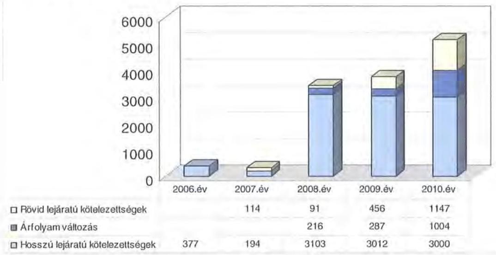

Az árfolyamváltozás hatása is befolyásolja a kötelezettségek alakulását, azonban annak mértéke előre pontosan nem határozható meg, csak várakozásokon alapuló tendenciák jelezhetők. A számviteli szabályok meghatározzák, hogy az árfolyam különbözetet év végén a kötelezettségek vagy követelések között a könyvviteli mérlegben nyilván kell tartani, azonban az árfolyamkülönbözet valójában nem realizált. Annak megítéléséről, hogy a devizában kibocsátott kötvényekért és felvett hitelekért kapott forinthoz képest a kötvények visszavásárlásakor, illetve a hitelek visszafizetésekor jelentkező forint kötelezettség többletkiadást (árfolyamveszteség) vagy megtakarítást (árfolyamnyereség) eredményez a futamidő végén, a teljes kötelezettség rendezését követően lehet képet alkotni. Mindaddig, amíg törlesztési kötelezettség nem áll fenn (türelmi idő, moratórium), a tőkére vonatkoztatva nem értelmezhető sem az árfolyamveszteség, sem az árfolyamnyereség.

Az Önkormányzat pénzintézeti kötelezettségvállalásaira minden esetben közgyűlési döntés alapján került sor. A kötelezettségvállalásból származó források felhasználási céljait meghatározták. Ugyanakkor a Közgyűlés döntéseit megalapozó előterjesztések nem tartalmazták az éven túli kötelezettségvállalás visszafizetési forrásainak, a teljes futamidő várható kamat és tőkefizetési kötelezettségeknek, az árfolyam- és kamatkockázatoknak a bemutatását. Az előterjesztésekben nem tértek ki az adósságszolgá-

[^0]
[^0]:    ${ }^{34}$ A 2001-ben felvett 10 éves időtartamú, felhalmozási célú hosszú lejáratú hitel utolsó, 2011 évet terhelő összege, ezért a rövid lejáratú kötelezettségek között került kimutatásra.

---

lati korlát bemutatására ${ }^{35}$, ezért a Közgyűlés ennek figyelembevétele nélkül döntött.

Az Önkormányzat adósságot keletkeztető kötelezettségvállalásának felső határát a 2008. évi kötvénykibocsátáskor nem lépték túl. A „Hajdú-Bihar 2028 Kötvényt" 2008. március 10 -én bocsátották ki - három pénzintézet ajánlata közül választva - 3 milliárd Ft névértékben, 17981299 CHF összegben, 20 éves futamidővel, 5 év türelmi idő és negyedéves kamatperiódus mellett. A kötvénykibocsátás céljaként a fejlesztési tervek megvalósítását és a pénzügyi helyzet javítását jelölték meg. A kötvénykibocsátásra megkötött megbízási szerződést 2010. áprilisában módosították. Ekkor a kötvénykibocsátásból adódó kötelezettségek finanszírozásának könnyítése érdekében az Önkormányzat nyilatkozott arról, hogy a kötvénykibocsátásból származó forrást 70\%-ban fejlesztésre, felhalmozásra használja fel és $30 \%$-át fordítja múködési kiadásainak fedezésére. Továbbá a lejárat előtti visszaváltásra vonatkozóan az Önkormányzat részére kedvezőbb feltételt határoztak meg, mivel a lejárat előtti visszaváltásra való lehetőséget megnyitó CHF/Ft devizaárfolyam változás mértékét $110 \%$ helyett 130\%ban határozták meg.

Az adósságot keletkeztető kötelezettségvállalással megvalósított felhalmozási kiadás esetleges bevételnövelő, illetve kiadáscsökkentő vonzatát, illetve ennek a fejlesztéshez, felújításhoz vállalt kötelezettségek visszafizetési forrásként való számbavételét nem vizsgálták.

Az Önkormányzatnak 2010. december 31-én HUF-ban fennálló hosszú lejáratú adósságot keletkeztető kötelezettségállománya az alábbi volt:
ezer Ft-ban

| Megnevezés | Kibocsátás, illetve szerződéskötés időpontja | Összeg   (HUF) | Kamat (referencia kamat+ kamatfelár) | Felhasználás célja: |
| :--: | :--: | :--: | :--: | :--: |
| Hosszú lejáratú hitel | 2001.06 .07 | 12019 | 3 havi BUBOR $+0,4 \%$ | tárgyi eszközök, energiatakarékosság, ingatlanvédelem |

Az Önkormányzatnak 2010. december 31-én CHF-ben fennálló hosszú lejáratú kötelezettségállománya az alábbi volt:

| Megnevezés | Kibocsátás, illetve szerződéskötés időpontja | Összeg   (CHF) | Kibocsátási, vagy lehivási árfolyam | Kamat (referencia kamat+ kamatfelár) | Felhasználás célja: |
| :--: | :--: | :--: | :--: | :--: | :--: |
| Hajdú-Bihar 2028 Kötvény | 2008.03 .10 | 17981299 | 166,84 | 3 havi CHF LIBOR $+0,88 \%$ | fejlesztési tervek megvalósítása és a pénzügyi helyzet javítása |
| Összesen: |  | 17981299 |  |  |  |

[^0]
[^0]:    ${ }^{35}$ Az Önkormányzat 2008. évi költségvetési koncepciójára készült előterjesztés kötvény kibocsátást taglaló része tartalmazza, hogy a kötvénykibocsátásnak az Ötv. 88. § (2)-(3) bekezdéseiben meghatározott - az Önkormányzat éves kötelezettségvállalásának felső határára vonatkozó - feltételei biztosítottak.

---

Az Önkormányzat a CHF-ben fennálló pénzintézeti kötelezettségéből tőkét még nem törlesztett, azt 2013-ban kell megkezdenie, 2010. december 31-ig 990696 CHF kamatot ( 175 millió Ft), valamint 24 millió Ft egyéb költséget ${ }^{36}$ fizetett meg. A 3 milliárd Ft névértékú kötvényböl 2011. március 31-ig 688 millió Ft-ot használtak fel kizárólag fejlesztési céljaik megvalósításához.

Az Önkormányzat 2007-2010 között az átmenetileg szabad pénzeszközei forgatásából 966 millió Ft kamatbevételt realizált, melyből 851 millió Ft származott a kötvény kibocsátásából, 115 millió Ft az intézmények és a Hivatal bankszámláin rendelkezésre állt forrás befektetéséből.

A kötvény kibocsátásából származó bevétel befektetéséből 851 millió Ft kamatbevételből az Önkormányzat 208 millió Ft-ot a kötvény kamatfizetésére, a kibocsátás és a szerződésmódosítás költségeire és 643 millió Ft-ot múködési célra fordított. A kamatbevétel a kötvény teljesített kamatfizetésének négyszeresét tette ki.

Az Önkormányzat múködésének likviditását a vizsgált időszakban csak folyószámlahitel igénybevételével tudta biztosítani. A folyószámlahitel alakulását az alábbi táblázat mutatja be:

|  |  |  |  |  |  | ezer Ft-ban |
| :--: | :--: | :--: | :--: | :--: | :--: | :--: |
| Megnevezés | 2007. év | 2008. év | 2009. év | 2010. év | 2011.   március 31. |  |
| I. Folyószámlahitel |  |  |  |  |  |  |
| a folyószámlahitel keretősszege január 1-jén | 400000 | 600000 | 800000 | 1200000 | 1200000 |  |
| teljesített kamat és egyéb költség | 514 | 22080 | 72985 | 44658 | 14981 |  |
| II. Munkabér megelőlegezési hitel |  |  |  |  |  |  |
| igénybevett hitel összesen: |  |  |  |  |  |  |
| teljesített kamat és egyéb költség |  |  |  |  |  |  |

A folyószámlahitel kondíciói és egyéb költségei a következők voltak ${ }^{37}$ :

| Megnevezés | Kamat (referencia+ kamatfelár | Egyéb költség |
| :-- | :--: | :--: |
| Folyószámlahitel |  |  |
| 2006.09.26-tól 2007.09.25. | 3 havi BUBOR $+0,3 \%$ |  |
| 2007.10.29-től 2008.10.05. | 3 havi BUBOR $+0,3 \%$ |  |
| 2008.10.05-től 2008.11.16. | 3 havi BUBOR $+1,8 \%$ | $0,15 \%$ rend.tart.jutalék |
| 2008.11.17-től 2009.10.05. | 3 havi BUBOR $+1,8 \%$ | $0,15 \%$ rend.tart.jutalék |
| 2009.10.06-től 2009.12.31. | 3 havi BUBOR $+1,8 \%$ | $0,15 \%$ rend.tart.jutalék |
| 2010.01.01-től 2010.12.31. | 3 havi BUBOR $+0,245 \%$ |  |
| 2011.01.01-től 2011.12.31. | 3 havi BUBOR $+0,245 \%$ |  |

[^0]
[^0]:    ${ }^{36}$ A kibocsátás költsége 6215 ezer Ft, a 2010. évi szerződésmódosítás költsége 89907 CHF (17 792 ezer Ft) volt.
    ${ }^{37}$ A referencia kamat az alábbiak szerint alakult:

    | M N B B U B O R fixing (átlagkamat) \% :ban |  |  |  |  |  |
    | :--: | :--: | :--: | :--: | :--: | :--: |
|  | 2007. évi | 2008. évi | 2009. évi | 2010. évi | 2011.   március 31   ig |  |
| 3 havi BUBOR | 7,75 | 8,87 | 8,64 | 5,5 | 6,03 |  |
| 1 havi BUBOR | 7,83 | 8,75 | 8,66 | 5,47 | 5,94 |  |
| 1 napi BUBOR | 7,78 | 8,41 | 8,39 | 4,95 | 5,24 |  |

---

A folyószámlahitellel zárt napok száma jelentősen emelkedett, a 2007. évi 16 napról 2009-re 365 napra nőtt és 2010-ben az év minden napján rendelkezett folyószámlahitellel. A folyószámlahitel átlagos napi állománya a 2007. évi 147 millió Ft-ról 2010-re 770 millió Ft-ra, 2011-ben 984 millió Ft-ra nőtt. Az áttekintett időszakot jellemző múködési hiány, a folyamatos likviditási problémák finanszírozása az Önkormányzatnak 2007-től 2010. december 31-ig 140 millió Ft kamatkiadást okozott. A folyószámlahitel állománya 2010. december 31-én 1135 millió Ft volt.

Az Önkormányzat számlavezető pénzintézete 2008. októberben 1,5\%-kal megemelte a kamatfelár mértékét és rendelkezésre tartási jutalékot is felszámolt, ennek következtében 2009-ben jelentősen növekedett a kamat és egyéb költség fizetési kötelezettség. A fizetési kötelezettségek emelkedése miatt 2010-ben pénzintézetet váltottak, ennek eredményeként 28 millió Ft-tal csökkenteni tudták kamatfizetési kötelezettségeiket. 2010-től a számlavezető és a kötvénykibocsátó bank ugyanaz a pénzintézet, ami kockázatot hordoz magában.

A kötvény esetében a kamatfizetési kötelezettségek alakulását jelentősen befolyásolta és jelenleg is befolyásolja a kibocsátáskori és az utolsó kamatfizetéskori referencia kamatok változása, melyet az alábbi táblázat mutat be:

| Megnevezés | Kibocsátási, lehívási | Utolsó fizetéskori | Változás \% |
| :--: | :--: | :--: | :--: |
| 3 havi CHF LIBOR | 2,8 | 0,18 | $-93,6$ |

Az Önkormányzat utolsó kamatfizetési kötelezettsége a 3 havi CHF LIBOR-ú kötvény után 2010. december 31-én volt.

Amennyiben a referencia kamat nem változott volna, a kibocsátáskori referencia kamattal számolva az Önkormányzatnak 2214933 CHF kamatfizetési kötelezettsége jelentkezett volna. A változások (a kamatcsökkenés) miatt 1176140 CHF-al kevesebb fizetési kötelezettséget kellett teljesítenie ${ }^{38}$.

Az alapkamat mértékének alakulása jelentős hatással van az adott devizanemben kifejezett, a teljes futamidőre számított, várható kamatkötelezettség nagyságára.

Az Önkormányzatnál a helyszíni vizsgálat alatt további hitel igénybevételről, illetve kötvénykibocsátásról szóló döntést nem készítettek elő. Az Önkormányzat 2011-2014. évi gazdasági programjában rögzítésre került, hogy az éves költségvetések összeállításakor és azok végrehajtása során biztosítani kell a likviditást és a fizetőképesség megőrzését.

[^0]
[^0]:    ${ }^{38} 2214933$ CHF - 1038793 CHF $=1176140$ CHF

---

# 3.2. Szállítók felé fennálló kötelezettségek 

Az Önkormányzatnak és gazdasági társaságainak lejárt szállítói tartozásai és egyéb kiadás elmaradásait a következő táblázat tartalmazza:

|  |  |  |  |  | ezer Ft-ban |
| :--: | :--: | :--: | :--: | :--: | :--: |
| Megnevezés | 2007. | 2008. | 2009. | 2010. | 2011. |
|  | december 31. | december 31. | december 31. | december 31. | március 31. |
| Lejárt szállitói tartozás | 2539529 | 660053 | 463310 | 44218 | 42776 |
| ejbőó Kórház |  |  |  |  |  |
| Gazdasági társaságok   lejárt szállitóo tartozása | 421 | 361380 | 940057 | 1241246 | 1508156 |
| Egyéb kiadás elmaradás | - | - | - | - | - |
| Tartozásállomány összesen: | 2539950 | 1021433 | 1403367 | 1285464 | 1550932 |

Az Önkormányzat és intézményei, valamint a többségi tulajdonában lévő gazdasági társaságainak lejárt szállítói tartozása 2007. december 31-ről 2010. december 31-re összességében 1254 millió Ft-tal ( $51 \%$-kal) csökkent. Ezen belül az Önkormányzat és intézményei lejárt szállítói tartozásai 2495 millió Ft-tal ( $98,3 \%$-kal) csökkent, a gazdasági társaságainak lejárt szállítói tartozása ugyanakkor 1213 millió Ft-tal ( 0,4 millió Ft-ról 1241 millió Ft-ra) nőtt, és 2011. március 31 -ére tovább emelkedett ( 1508 millió Ft-ra).

Az Önkormányzat és intézményei 2007-2009. évi lejárt szállítói tartozása magába foglalja a Kenézy Kórház ${ }^{39}$ lejárt tartozását is - annak ellenére, hogy a Kenézy Kórház 2007. december 31-én már gazdasági társaságként múködött - mivel a Közgyűlés döntése értelmében a gazdasági társasággá való átalakulásával egyidejűleg az Önkormányzat átvállalta a lejárt határidejű szállítói tartozását 2464 millió Ft összegben. Ezt az Önkormányzat 2008-2010. években törlesztette ${ }^{40}$.

Az Önkormányzat és intézményei 2010. december 31-ei lejárt 44 millió Ft-os szállítói tartozásállományának 10\%-a haladta meg a 30 napot. 2011. március 31-én a lejárt szállítói tartozás $86 \%$-a ( 37 millió Ft ) volt 30 napon túli. Ennek $73 \%$-a ( 27 millió Ft) meghaladta a 91 napot. A gazdasági társaságok 2010. év végi lejárt szállítói tartozásának $65 \%$-a 30 napon túli ( 806 millió Ft) volt, ez 2011. március 31 -ére $76 \%$-ra ( 1148 millió Ft) emelkedett. A lejárt 1508 millió Ft-os tartozásállomány $28,8 \%$-a ( 434 millió Ft) 30-60 nap közötti, $21 \%$-a ( 317 millió Ft) 61-90-nap közötti és $26,3 \%$-a ( 397 millió Ft) 91 napon túli. A gazdasági társaságok lejárt szállítói tartozásainak több mint $99 \%$-át a Kenézy Kórház tartozása teszi ki. Az Egészségügyi Holding Zrt-ben az Önkormányzat tulajdoni hányada $50 \%$-os.

[^0]
[^0]:    ${ }^{39}$ A Kenézy Kórház 2007. november 30-ig intézményként működött, ezt követően két gazdasági társaságot hoztak létre (Kenézy Kórház Kft. és Megyei Egészségügyi Kft.), majd 2009-től az Önkormányzati Egészségügyi Holding Zrt. részeként múködik.
    ${ }^{40}$ A Kenézy Kórháznak 454 szállítóval szembeni tartozásából 411 esetben megállapodás született, 8 szállítóval eredménytelen volt az egyeztetés. A peren kívüli egyezségek során a tőke összegéből közel 50 millió Ft megfizetésétől tekintettek el a szállítók. Az Önkormányzat 2010. év végéig teljesítette az eredetileg vállalt szállítói tartozások kiegyenlítését.

---

A Kenézy Kórház 2007. december 31-én nem rendelkezett lejárt határidejú szállítói kötelezettséggel, mivel az Önkormányzat gazdasági társasággá való átalakításakor átvállalta azt. Az áttekintett időszak végére, 2011. március 31-ére azonban már 1508 millió Ft lejárt határidejú szállítói tartozása volt.

A lejárt szállítói tartozások összegének alakulása (millió Ft)
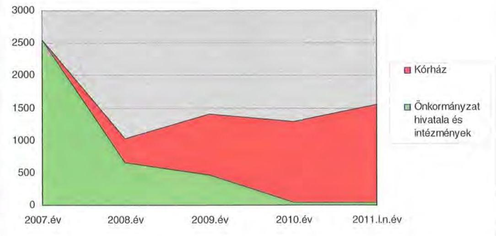

# 3.3. Egyéb kötelezettségek 

Az Önkormányzat PPP konstrukció keretében nem végzett beruházást.
Az Önkormányzat a vizsgált időszakban 500 millió Ft erejéig készízető kezességet vállalt a Kenézy Kórház Kft. folyószámlahitelének visszafizetéséért. A Kenézy Kórház Kft. által megkötött folyószámlahitel szerződés 2008. novemberben lejárt, fizetési kötelezettsége az Önkormányzatnak nem keletkezett. Az Önkormányzat gazdasági társasága, az Önkormányzati Egészségügyi Holding Zrt. is tett kezességvállalást egy folyószámlahitelhez kapcsolódóan 2009. áprilisban 25 millió Ft összegben, fizetési kötelezettsége emiatt a Holdingnak nem keletkezett.

A vizsgált időszakban az Önkormányzat nem engedett el követelést.
Az Önkormányzat ingatlanjaira jelzálogjog nem került bejegyzésre.
A költségvetés készítése előtt, minden évben megtörtént annak felmérése, hogy az eszközök amortizációjának, elhasználódásának pótlása milyen kötelezettséget jelent az Önkormányzat számára. A felújításokra, az eszközök pótlására az Önkormányzat kimutatásai szerint - a pénzügyi lehetőségek függvényében került sor. Az intézmények épületeinek többsége 2007-ben leromlott állapotú, a kötelező feladatellátást megvalósító szociális és gyermekvédelmi intézmény volt, többek között ezért döntött a Közgyűlés a fejlesztési program megvalósításához szükséges pénzügyi forrás (pályázati önerő) megteremtése érdekében a

---

kötvény kibocsátásról. Az Önkormányzat a 2008-2010. években ${ }^{41}$ a tárgyi eszközök után 2822 millió Ft összegű értékcsökkenést számolt el. Ebben az időszakban beruházásra, felújításra 2751 millió Ft-ot fordítottak ${ }^{42}$. Az eszközök amortizációjának, elhasználódásának, pótlása megtörtént.

Az Önkormányzat a Kenézy Kórháznak két alkalommal nyújtott kölcsönt 2007-ben 200 millió és 308 millió Ft összegben a legsürgetőbb szállítói tartozások kiegyenlítésére, illetve a létszámcsökkentéshez kapcsolódó fizetési kötelezettségek teljesítéséhez. A kölcsön visszafizetése megtörtént. Szintén 2007-ben a 100\%-os tulajdonukban lévő Hajdúszoboszlói Humán Szolgáltató és Ápolási Otthon Közhasznú Társaság részére nyújtottak 4 millió Ft összegű kölcsönt az elavult mosodai eszközök cseréjére. A Közgyűlés 2008. márciusban döntött arról, hogy a Kht-t mentesíti a kölcsön visszafizetése alól. Az Önkormányzat gazdasági társasága, az Önkormányzati Egészségügyi Holding Zrt. 2010. áprilisban 30 millió Ft kölcsönt nyújtott egy Kft-nek a fennálló bérleti dí hátralékainak rendezése céljából. A kölcsön visszafizetése 2010 decemberében megtörtént.

# 4. A PÉNZÜGYI EGYENSÚLY MEGTEREMTÉSE ÉrDEKÉBEN HOZOTT INTÉZKEDÉSEK 

A jelentésben szereplő CLF modellben bemutatott múködési és (2008. évi) felhalmozási hiány amellett alakult ki, hogy a vizsgált időszakban az Önkormányzat folyamatosan intézkedéseket tett, hogy alkalmazkodjon a finanszírozási rendszer változása miatti forráscsökkenéshez. Ennek érdekében bevételnövelő és kiadáscsökkentő döntéseket hozott.

A kiadáscsökkentő és bevételnövelő intézkedések a gazdálkodás átláthatóbbá tételét, valamint a feladatellátás szakmai színvonalának, de kiemelten a pénzügyi helyzet javítását célozták. Az Önkormányzat a legjelentősebb összegű kiadási megtakarítást a feladat-átadásokhoz, intézményi átszervezésekhez és az egészségügyi feladat-ellátás gazdasági társaságba való kiszervezéséhez kapcsolódó álláshely-csökkentésekkel, valamint a támogatások, átadott pénzeszközök csökkentésével érte el, emellett sikerült megőrizni az intézmények gazdálkodásának stabilitását.

Az Önkormányzat gazdasági programjában megfogalmazott elvárások szerint 2007-től a Közgyűlés több alkalommal hozott intézmény-átszervezési döntéseket:

- 2007. június 29-én döntött a Közgyűlés az egészségügyi ellátás átszervezéséről, a költségvetési intézményi formában működő Kenézy Kórház gazdasági társasággá történő átalakításáról. A döntést előkészítő testületi

[^0]
[^0]:    ${ }^{41}$ 2007-ben a Kenézy Kórház gazdasági társasággá alakult, az Önkormányzat könyveiből kivezetésre került bruttó 8820 millió Ft ingatlan és eszköz állomány, valamint ehhez kapcsolódva 3776 millió Ft értékcsökkenés, ezért került sor a 2008-2010. évek öszszehasonlítására.
    ${ }^{42}$ Ezen kívül a folyamatban lévő befejezetlen beruházások állománya 98,5 millió Ft volt.

---

előterjesztés szerint a kormányzat egészségügyet érintő intézkedéseinek hatása igényelte a költségvetési intézményi forma helyett a rugalmasabb, az elvégzendő feladatok költséghatékony és eredményes ellátását biztosító gazdasági társaságként való múködtetést, a betegellátás és a vagyonkezelés szervezeti szinten való szétválasztását. A Közgyűlés 172/2007. és 173/2007. (VI. 29.) számú határozataival az egészségügyi fekvő- és járóbetegszakellátás szakmai feltételeinek biztosítására az Önkormányzat 3 millió Ft törzstőkével létrehozta 100\%-os tulajdoni hányaddal a Kenézy Kórház Kft-t, a kórház múködőképességének és fejlesztésének biztosítására pedig - szintén 3 millió Ft-os törzstőkével és 100\%-os tulajdoni hányaddal - a Megyei Egészségügyi Vagyonkezelő és Ingatlanhasznosító Kft-t (Megyei Egészségügyi Kft.) ${ }^{43}$. A társaságok részére az Önkormányzat piaci értéken, vagyonkezelésbe átadta az Ötv. 80/A. §-a alapján a Kenézy Kórház részére a betegellátási tevékenység ellátásához szükséges gép-műszer eszközállományt, a Megyei Egészségügyi Kft. részére az ingatlan- és egyéb eszközállományt. Az átszervezéstől várt megtakarítás összegét 270 millió Ft-ra becsülte az Önkormányzat;

- 2007-ben változás történt a pedagógiai szakszolgálati feladatok ellátásában. A Közgyűlés 199/2007. (VI. 29.) számú határozatával döntött 13 településre vonatkozóan a pedagógiai szakszolgálati feladatoknak a Sárréti Többcélú Kistérségi Társulás részére való átadásáról. Az intézkedés hatásaként az Önkormányzat 27 millió Ft megtakarítást irányzott elő. Az Önkormányzat megszüntette a Gyógypedagógiai Szakértő és Rehabilitációs Szolgáltató Központot, annak feladatait a Megyei Pedagógiai Intézet vette át;
- ugyanebben az évben változás történt a szociális feladatokat ellátó intézmények struktúrájában is. Az Önkormányzat négy költségvetési intézményét (két idősek otthona, egy fogyatékosok otthona, egy pszichiátriai betegek otthona) megszüntette, a feladat-ellátási helyeket két közhasznú társaságba integrálta. Beolvadással megszüntetésre került két szociális szolgáltató Kht. Az intézkedésekkel előirányzott megtakarítás összege 137 millió Ft volt. 2007. december 31-től a korábban négy költségvetési intézmény és négy közhasznú társaság helyett a szociális feladat-ellátást két közhasznú társaság, 2010. évtől két gazdasági társaság biztosította;
- szintén 2007. évi intézkedésként megszüntetésre került a Kölcsey Ferenc Megyei Közművelődési Intézet, ami az Önkormányzat kimutatásai szerint 36 millió Ft kiadási megtakarítást eredményezett. A közművelődési feladatellátást a Megyei Könyvtár vette át;
- a Hivatal feladatainak átszervezése során 2007-ben 16-tal 99 fơről 83 főre $^{44}$ csökkentette az álláshelyek számát. A 2007. évi, a Hivatalt érintő

[^0]
[^0]:    ${ }^{43}$ A Kenézy Kórház mint költségvetési szerv a Közgyűlés 171/2007. (VI. 29.) számú határozata értelmében 2007. november 30 -án megszűnt.
    ${ }^{44}$ A létszám tartalmazta a Közgyűlés elnökét és két alelnökét.

---

szervezeti változások célja a racionálisabb, költségtakarékosabb és hatékonyabb múködés volt ${ }^{45}$;

- a Közgyűlés 2008-tól megszüntette a tárgyévi költségvetési törvényben meghatározott köztisztviselői illetményalaptól való eltérést, ami 2007-ben a Közgyűlés képviselői és a Hivatal köztisztviselői vonatkozásában még összesen 14 millió Ft többletkiadást jelentett. A tiszteletdíjak 2007-2010. közötti csökkenése összesen 11 millió Ft, a Közgyűlés bizottságai részére rendelkezésre álló keretek csökkentése 13 millió Ft megtakarítást eredményezett;
- az intézményi átszervezések 2009-ben a közoktatás és a gazdálkodás területén kerültek végrehajtásra. Összevontak egy középiskolai kollégiumot és egy kollégiummal is rendelkező általános iskolát ${ }^{46}$. A Közgyűlés 216/2009. (IX. 11.) számú határozata értelmében az önállóan működő költségvetési szervek (kivéve a Hivatal) gazdálkodási, pénzügyi, számviteli, munkaügyi adminisztrációs feladatait a GAFI-hoz integrálták. A GAFI részére adták át a debreceni székhelyű intézmények gépjármúveivel kapcsolatos üzembentartói jogot és üzemeltetési kötelezettséget. Az intézkedések következtében az Önkormányzat intézményeiben foglalkoztatottak létszáma 65 fővel csökkent.

Az intézményi feladatok racionalizálásáról, integrációjáról a Közgyűlés döntött. A döntést előkészítő előterjesztések alapján az átszervezéseknek gazdasági (költségtakarékosabb, hatékonyabb működés) vagy szakmai indokai voltak (kiegyenlített szakmai színvonal biztosítása). Az előterjesztésekben a tervezett intézkedések indokait, várható eredményeit bemutatták. Az intézményi integráció, átszervezés végrehajtásához kikérték a szakmai szervezetek véleményét, a jogszabályban előírt egyeztetéseket lefolytatták.

A Közgyűlés a költségvetési koncepcióhoz, illetve a költségvetési és a zárszámadási rendelettervezet elfogadásához kapcsolódóan az előző évi átszervezések tapasztalatait rendszeresen áttekintette, értékelte.

Az Önkormányzat kimutatásai szerint a 2007-2010. években az intézményátszervezések, feladat-átadások, valamint a takarékossági intézkedések hatásaként együttesen - nettósítva - 2591 millió Ft kiadási megtakarítás keletkezett, amely összegből 1726 millió Ft (66,6\%) a pénzeszköz-átadások és támogatások csökkenése következtében jelentkezett. Az álláshelyek csökkentése és egyéb intézkedések (cafetéria, tiszteletdíjak csökkentése, közszolgáltatások kiszervezése) a személyi juttatásokban és a járulékokban 1111 millió Ft-os megtakarítást eredményezett, azonban az intézményi átszervezések hatására - az üzemeltetési feladatok vásárolt szolgáltatással való ellátása miatt - a dologi kiadások önkormányzati szinten összességében 246 millió Ft-tal, közel 8\%-kal emelkedtek, ami rontotta a kiadáscsökkentő intézkedések eredményességet.

[^0]
[^0]:    ${ }^{45}$ Az átszervezéstől várható kiadási megtakarítás Ft-ban kifejezett összegét a döntéselőkészítő előterjesztés nem tartalmazta, csak a csökkentendő álláshelyeket szervezeti egységenként.
    ${ }^{46}$ Győrffy István Középiskolai Kollégium és Dr. Kettessy Aladár Általános Iskola és Kollégium, a Közgyűlés 79/2009. (III. 27.) számú határozata alapján.

---

Az intézményi dologi kiadások azért növekedtek meg 323 millió Ft-tal, mert a kiszervezett feladatokat (karbantartás, mosoda, takarítás, portaszolgálat) vásárolt szolgáltatással biztosították. Az álláshely-csökkentésekkel elért megtakarítás azonban meghaladta a dologi kiadásokra fordított költségek emelkedését.

A 2007-2010. évek kiadáscsökkentő intézkedéseit beavatkozási területenként az alábbi táblázat mutatja be:
ezer Ft

| Az érvényesített ki-   adáscsökkentés terüle-   tei | Személyi   juttatások és   járulékai | Dologi, mú-   ködési ki-   adások | Pénzeszköz   átadások,   támogatások | Összesen |
| :-- | :--: | :--: | :--: | :--: |
| A Közgyűlés múködése | 11034 |  | 13060 | 24094 |
| A Hivatalnál | 100021 | 77092 | 94233 | 271346 |
| Az intézményeknél | 999825 | -322918 | 1618840 | 2295747 |
| ÖSSZESEN | 1110880 | -245826 | 1726133 | 2591187 |

A Közgyűlés működési körében a kiadáscsökkentő intézkedésekből 11 millió Ft ( $45,8 \%$ ) a költségvetési törvényben meghatározott köztisztviselői illetményalaptól való eltérés megszüntetéséből, 13 millió Ft (54,2\%) a Közgyűlés bizottságai részére korábban rendelkezésre állt (helyi civil szervezetek, egyesületek részére adható) támogatási keretek csökkentéséből származott. Az intézkedéseket helyi szintű döntések (közgyűlési határozatok, költségvetési rendelet) alapozták meg.

A Hivatalban végrehajtott megtakarítási intézkedések részeként a 2006. december 31-i állapothoz viszonyítva 2007. és 2010. között 16 fő álláshelycsökkentést valósítottak meg. A Hivatal kiadási megtakarításai 271 millió Ft-ot értek el, amiből az álláshely-csökkentő döntések és a központi intézkedések együttes hatásaként a személyi juttatásokban és a hozzájuk kapcsolódó járulékokban elért 100 millió Ft csökkenés a Hivatal kiadás megtakarításainak $36,9 \%$-át tette ki.

A Hivatal létszáma 2006. december 31-én 187 fő volt ${ }^{47}$, ebből a kormányzati intézkedések miatt 88 fő 2007. január 1-jétől az APEH állományába került. A Hivatalnál ténylegesen 16 fő ( $16,7 \%$ ) álláshely-csökkentés realizálódott az ellenőrzött időszakban.

Az önkormányzati szinten kimutatott (nettósított) megtakarítási intézkedésekből 2296 millió Ft-ot ( $88,6 \%$ ) az intézmények körében érvényesítettek. Az intézmények múködési körében a nettósított, többletköltségek felmerülését is számba vevő kiadáscsökkentő intézkedések hatásának 70,5\%-a (1619 millió Ft) az átadott pénzeszközöknél realizálódott. Az intézkedéseket közgyűlési döntések alapozták meg.

Az intézményi átszervezések eredményeképpen csökkent az Önkormányzat által fenntartott költségvetési intézmények száma: míg 2007. évben 7 önállóan és 15 részben önállóan gazdálkodó költségvetési intézményt tartott fenn az Önkormányzat, 2010. év végén a költségvetési intézmények száma összesen 16 volt. A gazdasági társaságok száma ugyanezen időszakban eggyel csökkent.

[^0]
[^0]:    ${ }^{47}$ A létszám tartalmazta a Közgyűlés elnökét és két alelnökét.

---

Emelkedett a telephelyek száma, mivel a megszüntetett költségvetési intézmények feladat-ellátási helyei többnyire telephelyként funkcionáltak.

Az álláshely-csökkentő intézkedések következtében 2007-2010 között a Hivatalnál és az intézményeknél összesen 941 álláshelyet (részben üres állást) szüntettek meg, amelyből 714 (75,9\%) ágazati szakmai, a többi intézményüzemeltetéshez, fenntartáshoz kapcsolódó álláshely volt.

A 2007-2011. I. negyedévben végrehajtott létszámcsökkentést az alábbi grafikon szemlélteti:
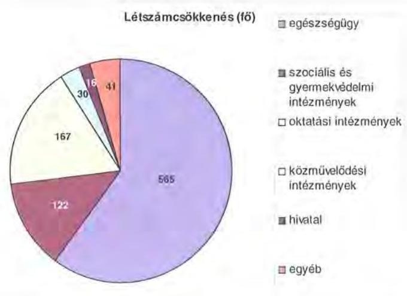

A helyi szervezési intézkedések végrehajtásához az Önkormányzat az áttekintett időszak alatt 1136 millió Ft központi költségvetési támogatásban részesült, amelynek felhasználásával 834 fő álláshelyet tartósan csökkentett. Az átszervezési és álláshely-csökkentési intézkedések eredményeként az Önkormányzat 2006. december 31-i 4369 fős átlaglétszáma 2011. március 31-re 3340 fővel, 76,4\%-kal csökkent, ebben tükröződik a kormányzati intézkedések miatti létszámcsökkenés (Illetékhivatal 88 fő) és az egyes önkormányzati feladatok gazdasági társaságokba való kiszervezésének ( 2311 fó) hatása is. Ezt nem tekintve a tényleges álláshelycsökkentés 941 fő, $21,5 \%$-os.

Az Önkormányzatnál 2011. évre további kiadáscsökkentő intézkedéseket irányoztak elő. A költségvetési rendeletben a tiszteletdíjak tervezett csökkenése által - a kisebb létszámú Közgyűlés miatt - 38 millió Ft megtakarítással számoltak. A Közgyűlés bizottságai által korábbi években elosztható támogatások körét mérsékelték, ami várhatóan 48 millió Ft kiadáscsökkenést eredményez.

2011-ben további önkormányzati feladatátadások előkészületei kezdődtek meg. Egy közoktatási intézmény (középiskola) helyi önkormányzat ${ }^{48}$ részére kerül átadásra, amely várhatóan 140 millió Ft megtakarítást eredményez. A gyermekvédelmi feladatok egy részét egyház részére tervezi átadni az Önkormányzat, ebből 250 millió Ft kiadáscsökkenéssel számolt. A végelszámolás

[^0]
[^0]:    ${ }^{48}$ Biharkeresztes Város Önkormányzata

---

alatt álló Megyegazda Kft. feladatainak (önként vállalt feladatok) átszervezéséből és részbeni megszüntetéséből 46 millió Ft kiadási megtakarítás realizálható az Önkormányzat számításai szerint.

A kiadáscsökkentő intézkedések mellett az Önkormányzat az alábbiakban számszerűsített bevételnövelő intézkedéseket tette:
ezer Ft
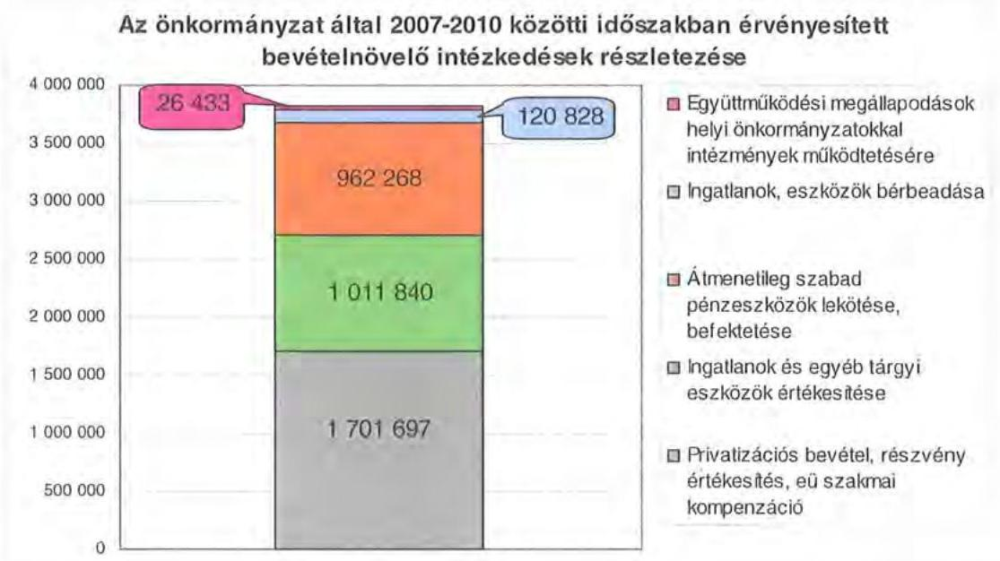

A bevételnövelésre irányuló intézkedések számszerúsített összegéből, ami 3823 millió Ft volt, 1702 millió Ft -ot ( $44,5 \%$ ) jelentettek a privatizációs bevételek, mivel az egészségügyi feladatokat ellátó Egészségügyi Holding Zrt. részvényeinek egy részét - az 50-50\%-os tulajdoni arány kialakulása érdekében - az Önkormányzat értékesítette Debrecen Megyei Jogú Város Önkormányzata részére, továbbá egészségügyi szakmai kompenzáció címén jutott bevételhez. Az ingatlanok és egyéb tárgyi eszközök értékesítése 1012 millió Ft-tal, (26,5\%), az átmenetileg szabad pénzeszközök lekötése, befektetése 962 millió Ft-tal ( $25,2 \%$ ) részesült a bevétel-növekményből. Az ingatlanok bérbeadásából és négy város önkormányzatával intézmények (múzeumok) működtetésére kötött együttműködési megállapodás alapján realizált bevételek az előzőekhez viszonyítva nem képviseltek számottevő arányt.

A 2011. évre 505 millió Ft bevételi növekményt terveztek önkormányzati szinten, ebből 240 millió Ft összeget ( $47,5 \%$ ) ingatlanok értékesítéséből, 182 millió Ft-ot (36\%) átmenetileg szabad pénzeszközök lekötéséből, befektetéséből. Az ingatlanok értékesítéséből tervezett felhalmozási bevétel realizálása bizonytalan. A tervezett bevételi többlet fennmaradó része várhatóan ingatlanok, eszközök bérbeadásából, települési önkormányzatokkal korábban megkötött együttműködési megállapodások alapján, intézmények (múzeumok) működtetéséből keletkezik.

---

Az átszervezések, a takarékossági intézkedések szakmai feladatellátásra gyakorolt hatását célzottan nem vizsgálták, erről belső ellenőrzési jelentések nem állnak rendelkezésre ${ }^{49}$.

# 5. A HELYI ÖNKORMÁNYZATOK GAZDÁLKODÁSI RENDSZERÉNEK 2007. ÉVI ELLENŐRZÉSE SORÁN A PÉNZÜGYI EGYENSÚLY JAVÍTÁSÁRA TETT SZABÁLYSZERŰSÉGI ÉS CÉLSZERŰSÉGI JAVASLATOK HASZNOSULÁSA 

Az ÁSZ jelentésében 8 szabályszerűségi és 11 célszerűségi javaslatot tett. A jelentést a Közgyűlés megismerte. A javaslatok megvalósítására intézkedési tervet készítettek, amely teljes körűen tartalmazta a javaslatokat, meghatározta a feladatok elvégzéséért felelősöket és a feladatok elvégzésének határidejét.

A pénzügyi egyensúly javítására 1 szabályszerűségi és 1 célszerűségi javaslat vonatkozott. Javasoltuk a Közgyűlés elnökének: „kezdeményezze, hogy a számvevőszéki jelentést a Közgyülés tárgyalja meg, a feltárt hiányosságok megszüntetése érdekében készíttessen intézkedési tervet a határidők, a felelősök megjelölésével". Az intézkedési terv elkészítésének határideje 2007. szeptember 1. volt, azt 2007. augusztus 15 -ére elkészítették.

Javasoltuk a Főjegyzőnek: „biztosítsa az Áht. 8/A § (7) bekezdése alapján, hogy a költségvetési rendelettervezetek költségvetési bevételi és kiadási föösszegei ne tartalmazzanak finanszírozási célú bevételeket, illetve kiadásokat". Határidőként 2007. augusztus 31 -ét írták elő, a 2007. augusztus 30 -án kelt költségvetési rendeletmódosítás tervezetét már a javaslatban foglaltak szerint készítették el.

Az intézkedési tervben előírt intézkedések megvalósulását figyelemmel kísérték. A belső ellenőrzés 2009. január hónapban vizsgálta az intézkedési terv végrehajtásának eredményességét. A belső ellenőrzési jelentés tartalmáról a Közgyűlést tájékoztatták, a Főjegyző a javasolt intézkedéseket megtette.

Budapest, 2011. december „

Domokos László

Melléklet: $\quad 4 \mathrm{db} \quad 5 \mathrm{lap}$

[^0]
[^0]:    ${ }^{49}$ A kiadáscsökkentő intézkedésekről hozott döntések során betartották a szakmai minimumlétszámra vonatkozó előírásokat, illetve nem veszélyeztették az ellátás színvonalát.

---

HAJDÚ-BIHAR Megyei Önkormányzat

1. számú melléklet
a V-3016/2011. számú jelentéshez

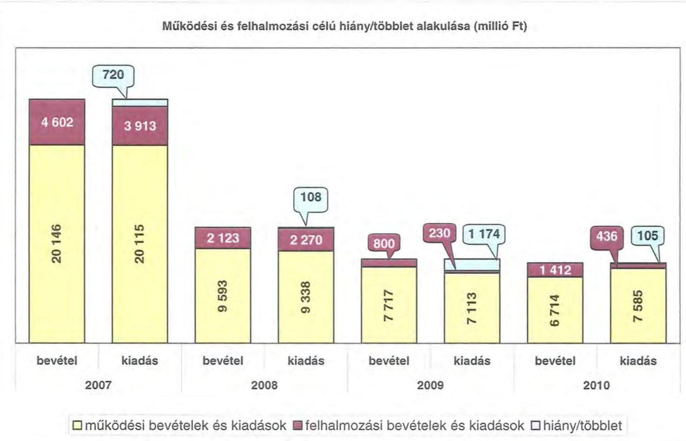

---

.

---

#### Az Önkormányzat CLF módszer szerint besorolt bevételei és kiadásai 2007-2010 között

|  1. FOLYÓ KÖLTSÉGYETÉS* | 2007. | 2008. | 2009. | 2010.  |
| --- | --- | --- | --- | --- |
|  1.1.1. Saját működési bevételek | 3 678 488 | 3 337 268 | 2 940 084 | 2 652 634  |
|  1.1.2. Költségvetési támogatás | 5 135 959 | 5 030 739 | 2 429 776 | 2 277 659  |
|  1.1.3. Átengedett bevételek | 1 699 286 | 498 865 | 516 204 | 152 088  |
|  1.1.4. Állambáztartáson belülről kapott támogatások | 9 846 985 | 1 551 241 | 476 563 | 599 262  |
|  1.1.5. EU-tól és külföldről kapott bevételek | 20 029 | 5 259 | 15 506 | 372  |
|  1.1.6. Állambáztartáson kívülről kapott bevételek | 727 763 | 263 806 | 185 873 | 196 060  |
|  1.1.7. Előző évi pénzmaradvány átvétel | 175 583 | 234 890 | 389 719 | 167 766  |
|  1.1. Folyó bevételek +1.1.1.+1.1.2.+1.1.3.+1.1.4.+1.1.5.+1.1.6.+1.7. | 21 284 011 | 10 922 068 | 6 953 724 | 6 045 841  |
|  1.2.1. Működési kiadások kamatkiadások nélkül | 18 402 225 | 8 149 066 | 5 818 590 | 6 004 471  |
|  1.2.2. Állambáztartáson belülre átadott pénzeszközök | 316 953 | 134 254 | 151 314 | 87 710  |
|  1.2.3.1. vállalkozásoknak | 293 632 | 26 371 | 42 297 | 671 604  |
|  1.2.3.2. EU-nak, illetve külföldre | 0 | 0 | 1 769 | 15 927  |
|  1.2.3.3. magánszemélyeknek | 395 715 | 425 009 | 436 550 | 462 073  |
|  1.2.3.4. neugerelt szervezeteknek | 253 852 | 446 054 | 215 220 | 194 098  |
|  1.2.4. Transferkiadások (+1.2.3.1+1.2.3.2+1.2.3.3+1.2.3.4) | 851 199 | 897 634 | 697 836 | 1 343 702  |
|  1.2.4. Kamatkiadások | 29 310 | 189 374 | 132 835 | 90 091  |
|  1.2.5. Előző évi pénzmaradvány átadás | 175 583 | 223 095 | 389 719 | 167 766  |
|  1.3. Folyó kiadások +1.2.1.+1.2.2.+1.2.3.+1.2.4.+1.2.5 | 19 775 270 | 9 593 223 | 7 190 294 | 7 693 740  |
|  1.3. Folyó költségvetés egyenlege MŰKÖDÉSI JÖVEDELEM (1.1.-1.2.) | 1 508 741 | 1 328 845 | -236 570 | -1 647 899  |
|  2. FELHALMOZÁSI KÖLTSÉGYETÉS** |  |  |  |   |
|  2.1.1. Saját tőkebevételek | 1 809 238 | 44 761 | 666 492 | 649 104  |
|  2.1.2. Állambáztartáson belülről kapott támogatások | 184 624 | 67 491 | 20 900 | 203 583  |
|  2.1.3. EU-tól és külföldről kapott támogatások | 173 501 | 0 | 0 | 0  |
|  2.1.4. Állambáztartáson kívüléről kapott támogatások | 74 436 | 29 421 | 21 292 | 78 046  |
|  2.1. Felhalmozási bevételek (+2.1.1.+2.1.2+2.1.3+2.1.4.) | -2 241 799 | 141 673 | 708 684 | 930 733  |
|  2.2.1. Saját beruházási kiadás átfával | 3 703 653 | 2 114 427 | 131 882 | 146 619  |
|  2.2.2. Saját felújítási kiadás átfával | 19 250 | 15 852 | 82 709 | 269 050  |
|  2.2.3. Állambáztartáson belülre átadott pénzeszköz | 543 803 | 21 369 | 63 | 0  |
|  2.2.4. EU-nak és külföldnek adott pénzeszközök | 0 | 0 | 0 | 0  |
|  2.2.5. Állambáztartáson kívülre adott pénzeszközök | 8 726 | 50 203 | 4 971 | 1 100  |
|  2.2.6. Befektetési célú részesedések vásárlása | 6 250 | 2 500 | 0 | 0  |
|  2.2. Felhalmozási kiadások (+2.2.1.+2.2.2.+2.2.3.+2.2.4.+2.2.5.+2.2.6.) | -4 281 682 | 2 204 351 | 219 625 | 416 769  |
|  2.3. Felhalmozási költségvetés egyenlege (2.1.-2.2.) | -2 039 883 | -2 062 678 | 489 059 | 513 964  |
|  3. FINANSZÍROZÁSI MŰVELETEK NÉLKÜLI (GFS) POZÍCIO |  |  |  |   |
|  (1.3.) Folyó költségvetés egyenlege Működési Jövedelem + (2.3.) Felhalmozási költségvetés egyenlege | -531 142 | -733 833 | 252 489 | -1 133 935  |
|  4. FINANSZÍROZÁSI MŰVELETEK |  |  |  |   |
|  4.1. Hitelfelvétel | 0 | 604 303 | 0 | 770 017  |
|  4.2. Hiteltörlesztés | 91 140 | 91 140 | 330 443 | 91 140  |
|  4.3. Forgatási és befektetési célú értékpapírok kibocsátása | 0 | 3 000 000 | 0 | 0  |
|  4.4. Forgatási és befektetési célú értékpapírok beváltása | 0 | 0 | 0 | 0  |
|  4.5. Forgatási és befektetési célú értékpapírok értékesítése | 0 | 0 | 1 859 986 | 0  |
|  4.6. Forgatási és befektetési célú értékpapírok vásárlása | 0 | 1 444 042 | 0 | 0  |
|  4.7. Egyéb finanszírozási bevételek (függő, átfutó, kiegyenlítő) | -293 273 | -359 338 | -2 811 | -164 045  |
|  4.8. Egyéb finanszírozási kiadások (függő, átfutó, kiegyenlítő) | -40 566 | -37 293 | 5 756 | -16 064  |
|  4.9. Finanszírozási műveletek egyenlege (4.1.-4.2.+4.3.-4.4+4.5.-4.6.+4.7.-4.8.) | -343 847 | 1 747 076 | 1 520 976 | 530 896  |
|  5. TÁRGYÉVI POZÍCIO |  |  |  |   |
|  (3.) FINANSZÍROZÁSI MŰVELETEK NÉLKÜLI (GFS) POZÍCIO + (4.9.) | -874 989 | 1 013 243 | 1 773 465 | -603 039  |
|  Finanszírozási műveletek egyenlege |  |  |  |   |
|  6. NETTŐ MŰKÖDÉSI JÖVEDELEM |  |  |  |   |
|  (1.3.) Működési Jövedelem - Tőketörlesztés (4.2. Hiteltörlesztés + 4.4. Forgatási és befektetési célú értékpapírok beváltása ) | 1 417 601 | 1 237 705 | -567 013 | -1 739 039  |
|  TÁJÉKOZTATÓ ADATOK |  |  |  |   |
|  Összes kötelezettség | 3 948 903 | 4 982 560 | 4 444 470 | 5 607 651  |
|  ebből rövid lejáratú | 3 754 603 | 1 663 804 | 1 145 469 | 1 590 820  |
|  Összes szállító kötelezettség | 3 615 449 | 945 155 | 667 805 | 288 477  |
|  ebből lejárt | 2 539 528 | 660 053 | 463 318 | 44 210  |
|  Pénz és tőkepiaci kötelezettség (adósság) | 308 458 | 3 409 896 | 3 755 141 | 5 151 113  |
|  ebből rövid lejáratú | 114 158 | 91 140 | 456 140 | 1 147 037  |
|  PPP szerződésből hátra lévő kötelezettséges állomány | 0 | 0 | 0 | 0  |
|  ebből lejárt szolgáltatási díj miatti kötelezettség | 0 | 0 | 0 | 0  |
|  Folyószámlabítél napi átlagos állománya | 146 852 | 360 758 | 648 402 | 769 796  |
|  Lövidhítél napi átlagos állománya | 0 | 0 | 0 | 0  |
|  Mashabérhítél napi átlagos állománya | 0 | 0 | 0 | 0  |
|  Peres eljárásokból fennálló függő kötelezettségek | 0 | 0 | 0 | 0  |
|  Finanszírozásba bevonható eszközök összesen : | 1 086 599 | 3 539 424 | 3 542 490 | 2 939 451  |
|  Tartós hőefvítésnyit megtestesítő értékpapírok | 330 817 | 1 289 440 | 0 | 0  |
|  Hosszú lejáratú bankbététek | 0 | 0 | 0 | 0  |
|  Értékpapírok | 0 | 480 959 | 0 | 0  |
|  Pénzeszközök (idegen pénzeszközök nélkül) | 755 782 | 1 769 025 | 3 542 490 | 2 939 451  |

- Bevételekben nem térül, a kiadásokban nem jelenik meg az amortizáció, a vagyoni helyzetet az egyesleg befolyásolja. ** Bevételekben vagyon megőrzése és bővítése fordítható források.

---

#### Az Önkormányzat bevételeinek és kiadásainak, szükségszozgálatának alakulása 2007-2010 között

|  Sor-
szám | Megnevezés | 2007. év | 2008. év | 2009. év | 2010. év  |
| --- | --- | --- | --- | --- | --- |
|   |  | (dsz.) | (dsz.) | (dsz.) | (dsz.)  |
|  1 | MOHÓDÉSI BEVÉTELÉK | 32 746 243 | 8 262 254 | 7 717 175 | 5 713 719  |
|  1.1 | Sajátos folyó bevételek | 4 023 275 | 2 339 049 | 2 554 759 | 2 533 315  |
|  1.1.1 | Cságradosok működési bevétele | 1 469 317 | 427 334 | 449 552 | 1 552 291  |
|  1.2 | Gyilábbelvétel | 1 978 240 | 2 203 958 | 1 978 409 | 1 350 906  |
|  1.3 | Háti jóváhassza |  |  |  |   |
|  1.4 | Hattal bevétel működési része | 70 473 | 119 746 | 477 749 | 219 210  |
|  1.5 | Egyéb folyó, kiállítás bevételek | 598 347 | 0 | 0 | 0  |
|  2 | Támogatás értékű működési bevételek | 249 181 | 124 161 | 479 563 | 534 025  |
|   | (dűző) | 0 | 0 | 0 | 0  |
|   | Háti önkormányzatok és költségvetési szervező | 11 525 | 31 164 | 58 307 | 70 058  |
|   | (öblozás) szükségs úrusok | 2 443 | 0 | 0 | 0  |
|  4 | Pénzforgatom nélküli bevételek működésre jóváhagyott része | 1 090 947 | 601 389 | 1 359 493 | 688 181  |
|  4.1 | Állámházatnékom kivételi működési célra átvett pénzeszközök | 707 793 | 209 093 | 201 378 | 150 433  |
|  4.2 | Központi támogatások és átengedett források működési része | 14 044 940 | 5 351 791 | 2 534 991 | 2 401 261  |
|   | (dűző) | 0 | 0 | 0 | 0  |
|   | SZJV | 1 899 288 | 498 593 | 516 304 | 102 086  |
|   | Önkormányzat és intézmények állami támogatásának működési része | 2 739 638 | 2 435 636 | 2 419 775 | 2 244 437  |
|   | Költségvetési meglévőnek, visszatérődések | 9 333 | 0 | 0 | 64 727  |
|   | Társetelontisztinté |  |  |  |   |
|   | bevétei | 20 146 243 | 5 353 254 | 7 717 175 | 5 713 719  |
|  5 | MOHÓDÉSI KIADÁSOK (konsultosítás nélkül) | 20 178 044 | 5 335 155 | 7 112 587 | 7 584 811  |
|  5.1 | Folyó működési kiadások összesen bemutatásának nélkül | 18 952 914 | 5 145 020 | 5 904 400 | 5 004 871  |
|   | (dűző) | 0 | 0 | 0 | 0  |
|   | Korményi juttatások | 9 635 446 | 2 437 011 | 2 592 742 | 2 792 719  |
|   | Hozókapító leítheti járulások | 3 081 629 | 1 000 344 | 2 918 991 | 993 637  |
|   | Kéleg kiadások | 8 628 236 | 2 485 654 | 1 347 186 | 2 045 984  |
|   | Egyéb folyó kiadások | 185 269 | 163 610 | 188 446 | 78 631  |
|   | Egyéb folyó működési kiadások | 212 747 | 0 | 0 | 0  |
|  6 | Támogatások, elvonások és egyéb folyó átutalások | 851 166 | 497 434 | 587 839 | 1 343 752  |
|   | (dűző) | 0 | 0 | 0 | 0  |
|   | Hozódási célú pénzeszköz átadás államiátteréken kíván | 460 420 | 472 873 | 262 064 | 884 641  |
|   | Hozódási célú pénzeszköz átadás államiátteréken szólón | 0 | 0 | 0 | 0  |
|   | Társetelont és szociálpojónak jutásának | 390 779 | 424 961 | 432 772 | 459 061  |
|  7 | Sűkedési fel pénzintestérségi átadás, visszafizetési működési | 142 870 | 108 397 | 409 073 | 149 935  |
|  7.1 | Támogatás értékű működési kiadás | 316 953 | 124 254 | 101 314 | 87 710  |
|   | (dűző) | 0 | 0 | 0 | 0  |
|   | Önkormányzatainak | 262 269 | 163 612 | 124 876 | 52 088  |
|   | Zisíthetyi látszábojnak | 890 | 180 | 1 575 | 2 039  |
|  8 | ADÓSSÁGSEZGJEALÁT | 120 490 | 280 514 | 463 279 | 101 231  |
|   | Gőstörlészleti kötelezettség működési | 0 | 0 | 299 303 | 0  |
|   | (öblozás) | 51 140 | 51 140 | 51 140 | 51 140  |
|   | Kertélőstési kötelezettség működési | 319 | 22 077 | 72 524 | 56 930  |
|   | (öblozás) | 29 995 | 167 337 | 92 311 | 33 161  |
|   | Hosszú lejáratú értékpapír bevételek, vásárlása | 0 | 0 | 0 | 0  |
|   | Bevélés (behetetési célú beffélű) | 0 | 0 | 0 | 0  |
|   | Vásárlás (behetetési célú) | 0 | 0 | 0 | 0  |
|   | Bevélés (különzi) | 0 | 0 | 0 | 0  |
|  9 | PÉLINALMÓZÁSI BEVÉTELÉK | 4 901 875 | 2 123 054 | 809 089 | 1 912 200  |
|  9.1 | Saját felhalmozési és időszellegű bevétel | 1 864 462 | 145 141 | 711 832 | 565 418  |
|  9.1.1 | Tárgy eszközök, mintal, javak értékesítés, Afa visszatérődés | 1 287 885 | 38 262 | 163 070 | 206 474  |
|  9.2 | Finanszázóból származó bevétel | 37 965 | 58 880 | 39 780 | 16 780  |
|  9.3 | Cszizálás, részvonalévél | 0 | 0 | 600 333 | 398 209  |
|  9.4 | Hattalbevétel felhalmozési része | 15 475 | 47 276 | 18 428 | 0  |
|  9.5 | Háti jóváhassza | 0 | 0 | 0 | 0  |
|  9.6 | Egyéb folyó felhalmozési bevételek | 12 026 | 10 623 | 7 548 | 8 922  |
|  9.7 | Támogatások/élső felhalmozési bevételek | 184 624 | 97 461 | 30 900 | 203 801  |
|   | (dűző) | 0 | 0 | 0 | 0  |
|   | Háti önkormányzatok és költségvetési szervező | 12 299 | 0 | 0 | 0  |
|   | (öblozás) | 0 | 0 | 0 | 0  |
|  10 | Pénzforgatom nélküli bevételek felhalmozásra jóváhagyott része | 107 847 | 286 078 | 35 048 | 420 186  |
|  10.1 | Állámházatnékom kivételi felhalmozési célra átvett pénzeszközök | 76 436 | 29 031 | 31 285 | 78 045  |
|  10.2 | Állámházatnékom kivételi felhalmozési célra átvett pénzeszközök | 2 070 623 | 1 044 533 | 10 997 | 32 223  |
|  10.3 | SZJV költségvetési év | 173 001 | 0 | 0 | 0  |
|  10.4 | Önkormányzat és költségvetési támogatása felhalmozési célra | 2 397 021 | 1 594 533 | 10 997 | 33 223  |
|  10.5 | PÉLINALMÓZÁSI KIADÁSOK | 3 012 049 | 2 270 090 | 229 744 | 435 809  |
|  10.6 | Folyó felhalmozési kiadások bemutatásának nélkül | 2 890 811 | 2 123 625 | 229 730 | 419 669  |
|  10.7 | Bevétesés, felújítás | 2 722 603 | 2 135 079 | 214 091 | 418 669  |
|  10.8 | Zisíthetetei tárgy eszközök Afa befejezés | 111 608 | 1 044 | 30 129 | 0  |
|  10.9 | Támogatások, vásárlása | 5 399 | 2 000 | 0 | 0  |
|  10.1 | Támogatások, elvonások és egyéb folyó átutalások | 2 728 | 50 203 | 4 971 | 1 100  |
|   | (dűző) | 0 | 0 | 0 | 0  |
|   | Felhalmozési célú pénzeszköz átadás államiátteréken kíván | 0 | 46 383 | 1 846 | 0  |
|   | Felhalmozési célú támogatások, kölcsön, kölcsön kölcsödése | 9 730 | 9 824 | 3 131 | 1 100  |
|  10.1 | Támogatások/élső felhalmozési kiadások | 32 480 | 31 969 | 0 | 0  |
|   | (dűző) | 0 | 0 | 0 | 0  |
|   | Háti önkormányzatainak és költségvetési szerveinek | 29 480 | 31 969 | 0 | 0  |
|   | (öblozás) | 0 | 0 | 0 | 0  |
|  10.2 | Pénzforgatom nélküli bevételek felhalmozásra jóváhagyott része | 31 605 | 64 699 | 0 | 16 830  |
|   | (szatol) | 24 748 121 | 11 716 316 | 8 517 244 | 8 126 190  |
|   | Hozóvá tárgyító kölcsön, ödölés (0.11.1/0510/22) | 24 000 002 | 11 707 574 | 7 975 240 | 8 110 550  |
|   | Kölcsögszolgáltól (bocsát) | 41 140 | 1 028 162 | 330 442 | 91 140  |
|   | Hozóvá tázzási kiadás | 24 748 082 | 12 352 746 | 7 869 725 | 8 201 640  |
|  10.3 | Háti, kölcsön bevétel | 0 | 8 604 303 | 1 929 989 | 770 017  |
|  10.4 | Hívó lejáratú feladat bevétele | 0 | 0 | 0 | 770 017  |
|  10.5 | Hívó feladat bevétele | 0 | 684 303 | 0 | 0  |
|  10.6 | SZJV önkormányzatok és költségvetési szerveinek | 0 | 0 | 0 | 0  |
|   | (öblozás) | 0 | 0 | 0 | 0  |
|   | Hozó felhalmozési felhalmozési felhalmozásra jóváhagyott része | 0 | 0 | 0 | 0  |
|   | (szatol) | 24 748 121 | 11 716 316 | 8 517 244 | 8 126 190  |
|   | Hozóvá tárgyító kölcsön, ödölés (0.11.1/0510/22) | 24 000 002 | 11 707 574 | 7 975 240 | 8 110 550  |
|   | Kölcsögszolgáltól (bocsát) | 41 140 | 1 028 162 | 330 442 | 91 140  |
|   | Hozóvá tázzási kiadás | 24 748 082 | 12 352 746 | 7 869 725 | 8 201 640  |
|  10.7 | Háti, kölcsön bevétel | 0 | 8 604 303 | 1 929 989 | 770 017  |
|  10.8 | Hívó lejáratú feladat bevétele | 0 | 0 | 0 | 770 017  |
|  10.9 | Hívó feladat bevétele | 0 | 684 303 | 0 | 0  |
|  10.10 | SZJV önkormányzatok és költségvetési szerveinek | 0 | 0 | 0 | 0  |
|   | (öblozás) | 0 | 0 | 0 | 0  |
|   | Hozó felhalmozési felhalmozési felhalmozásra jóváhagyott része | 0 | 0 | 0 | 0  |
|   | (szatol) | 24 748 121 | 11 716 316 | 8 517 244 | 8 126 190  |
|   | Hozóvá tárgyító kölcsön, ödölés (0.11.1/0510/22) | 24 000 002 | 11 707 574 | 7 975 240 | 8 110 550  |
|   | Kölcsögszolgáltól (bocsát) | 41 140 | 1 028 162 | 330 442 | 91 140  |
|   | Hozóvá tázzási kiadás | 24 748 082 | 12 352 746 | 7 869 725 | 8 201 640  |
|  10.11 | Háti, kölcsön bevétel | 0 | 8 604 303 | 1 929 989 | 770 017  |
|  10.12 | Hívó lejáratú feladat bevétele | 0 | 0 | 0 | 770 017  |
|  10.13 | Hívó feladat bevétele | 0 | 684 303 | 0 | 0  |
|  10.14 | SZJV önkormányzat | 0 | 0 | 0 | 0  |
|  10.15 | Hozó felhalmozési felhalmozési felhalmozásra jóváhagyott része | 0 | 0 | 0 | 0  |
|   | (öblozás) | 0 | 0 | 0 | 0  |
|   | Hozó felhalmozési felhalmozési felhalmozásra jóváhagyott része | 0 | 0 | 0 | 0  |
|   | (szatol) | 24 748 121 | 11 716 316 | 8 517 244 | 8 126 190  |
|   | Hozóvá tárgyító kölcsön, ödölés (0.11.1/0510/22) | 24 000 002 | 11 707 574 | 7 975 240 | 8 110 550  |
|   | Kölcsögszolgáltól (bocsát) | 41 140 | 1 028 162 | 330 442 | 91 140  |
|   | Hozóvá tázzási kiadás | 24 748 082 | 12 352 746 | 7 869 725 | 8 201 640  |
|  10.16 | Háti, kölcsön bevétel | 0 | 8 604 303 | 1 929 989 | 770 017  |
|  10.17 | Hívó lejáratú feladat bevétele | 0 | 0 | 0 | 770 017  |
|  10.18 | Hívó feladat bevétele | 0 | 684 303 | 0 | 0  |
|  10.19 | SZJV önkormányzat | 0 | 0 | 0 | 0  |
|  10.20 | Hozó felhalmozési felhalmozásra jóváhagyott része | 0 | 0 | 0 | 0  |
|   | (öblozás) | 0 | 0 | 0 | 0  |
|   | Hozó felhalmozési felhalmozásra jóváhagyott része | 0 | 0 | 0 | 0  |
|   | (szatol) | 24 748 121 | 11 716 316 | 8 517 244 | 8 126 190  |
|   | Hozóvá tárgyító kölcsön, ödölés (0.11.1/0510/22) | 24 000 002 | 11 707 574 | 7 975 240 | 8 110 550  |
|   | Kölcsögszolgáltól (bocsát) | 41 140 | 1 028 162 | 330 442 | 91 140  |
|   | Hozóvá tázzási kiadás | 24 748 082 | 12 352 746 | 7 869 725 | 8 201 640  |
|  10.21 | Háti, kölcsön bevétel | 0 | 8 604 303 | 1 929 989 | 770 017  |
|  10.22 | Hívó lejáratú feladat bevétele | 0 | 0 | 0 | 0  |
|  10.23 | Hozó felhalmozési felhalmozásra jóváhagyott része | 0 | 0 | 0 | 0  |
|  10.24 | Hozó felhalmozési felhalmozásra jóváhagyott része | 0 | 0 | 0 | 0  |
|  10.25 | Hozó felhalmozési felhalmozásra jóváhagyott része | 0 | 0 | 0 | 0  |
|  10.26 | Hozó felhalmozési felhalmozásra jóváhagyott része | 0 | 0 | 0 | 0  |
|  10.27 | Hozó felhalmozési felhalmozásra jóváhagyott része | 0 | 0 | 0 | 0  |
|  10.28 | Hozó felhalmozési felhalmozásra jóváhagyott része | 0 | 0 | 0 | 0  |
|  10.29 | Hozó felhalmozési felhalmozásra jóváhagyott része | 0 | 0 | 0 | 0  |
|  10.30 | Hozó felhalmozési felhalmozásra jóváhagyott része | 0 | 0 | 0 | 0  |
|  10.31 | Hozó felhalmozési felhalmozásra jóváhagyott része | 0 | 0 | 0 | 0  |
|  10.32 | Hozó felhalmozési felhalmozásra jóváhagyott része | 0 | 0 | 0 | 0  |
|  10.33 | Hozó felhalmozési felhalmozásra jóváhagyott része | 0 | 0 | 0 | 0  |
|  10.34 | Hozó felhalmozési felhalmozásra jóváhagyott része | 0 | 0 | 0 | 0  |
|  10.35 | Hozó felhalmozési felhalmozásra jóváhagyott része | 0 | 0 | 0 | 0  |
|  10.36 | Hozó felhalmozési felhalmozásra jóváhagyott része | 0 | 0 | 0 | 0  |
|  10.37 | Hozó felhalmozési felhalmozásra jóváhagyott része | 0 | 0 | 0 | 0  |
|  10.38 | Hozó felhalmozési felhalmozásra jóváhagyott része | 0 | 0 | 0 | 0  |
|  10.39 | Hozó felhalmozési felhalmozásra jóváhagyott része | 0 | 0 | 0 | 0  |
|  10.40 | Hozó felhalmozési felhalmozásra jóváhagyott része | 0 | 0 | 0 | 0  |
|  10.41 | Hozó felhalmozési felhalmozásra jóváhagyott része | 0 | 0 | 0 | 0  |
|  10.42 | Hozó felhalmozési felhalmozásra jóváhagyott része | 0 | 0 | 0 | 0  |
|  10.43 | Hozó felhalmozési felhalmozásra jóváhagyott része | 0 | 0 | 0 | 0  |
|  10.44 | Hozó felhalmozési felhalmozásra jóváhagyott része | 0 | 0 | 0 | 0  |
|  10.45 | Hozó felhalmozési felhalmozásra jóváhagyott része | 0 | 0 | 0 | 0  |
|  10.46 | Hozó felhalmozési felhalmozásra jóváhagyott része | 0 | 0 | 0 | 0  |
|  10.47 | Hozó felhalmozési felhalmozásra jóváhagyott része | 0 | 0 | 0 | 0  |
|  10.48 | Hozó felhalmozési felhalmozásra jóváhagyott része | 0 | 0 | 0 | 0  |
|  10.49 | Hozó felhalmozési felhalmozásra jóváhagyott része | 0 | 0 | 0 | 0  |
|  10.50 | Hozó felhalmozési felhalmozásra jóváhagyott része | 0 | 0 | 0 | 0  |
|  10.51 | Hozó felhalmozési felhalmozásra jóváhagyott része | 0 | 0 | 0 | 0  |
|  10.52 | Hozó felhalmozési felhalmozásra jóváhagyott része | 0 | 0 | 0 | 0  |
|  10.53 | Hozó felhalmozési felhalmozásra jóváhagyott része | 0 | 0 | 0 | 0  |
|  10.54 | Hozó felhalmozési felhalmozásra jóváhagyott része | 0 | 0 | 0 | 0  |
|  10.55 | Hozó felhalmozési felhalmozásra jóváhagyott része | 0 | 0 | 0 | 0  |
|  10.56 | Hozó felhalmozési felhalmozásra jóváhagyott része | 0 | 0 | 0 | 0  |
|  10.57 | Hozó felhalmozési felhalmozásra jóváhagyott része | 0 | 0 | 0 | 0  |
|  10.58 | Hozó felhalmozési felhalmozásra jóváhagyott része | 0 | 0 | 0 | 0  |
|  10.59 | Hozó felhalmozési felhalmozásra jóváhagyott része | 0 | 0 | 0 | 0  |
|  10.60 | Hozó felhalmozési felhalmozásra jóváhagyott része | 0 | 0 | 0 | 0  |
|  10.61 | Hozó felhalmozési felhalmozásra jóváhagyott része | 0 | 0 | 0 | 0  |
|  10.62 | Hozó felhalmozési felhalmozásra jóváhagyott része | 0 | 0 | 0 | 0  |
|  10.63 | Hozó felhalmozési felhalmozásra jóváhagyott része | 0 | 0 | 0 | 0  |
|  10.64 | Hozó felhalmozési felhalmozásra jóváhagyott része | 0 | 0 | 0 | 0  |
|  10.65 | Hozó felhalmozési felhalmozásra jóváhagyott része | 0 | 0 | 0 | 0  |
|  10.66 | Hozó felhalmozési felhalmozásra jóváhagyott része | 0 | 0 | 0 | 0  |
|  10.67 | Hozó felhalmozési felhalmozásra jóváhagyott része | 0 | 0 | 0 | 0  |
|  10.68 | Hozó felhalmozési felhalmozásra jóváhagyott része | 0 | 0 | 0 | 0  |
|  10.69 | Hozó felhalmozési felhalmozásra jóváhagyott része | 0 | 0 | 0 | 0  |
|  10.70 | Hozó felhalmozési felhalmozásra jóváhagyott része | 0 | 0 | 0 | 0  |
|  10.71 | Hozó felhalmozési felhalmozásra jóváhagyott része | 0 | 0 | 0 | 0  |
|  10.72 | Hozó felhalmozési felhalmozásra jóváhagyott része | 0 | 0 | 0 | 0  |
|  10.73 | Hozó felhalmozési felhalmozásra jóváhagyott része | 0 | 0 | 0 | 0  |
|  10.74 | Hozó felhalmozési felhalmozásra jóváhagyott része | 0 | 0 | 0 | 0  |
|  10.75 | Hozó felhalmozési felhalmozásra jóváhagyott része | 0 | 0 | 0 | 0  |
|  10.76 | Hozó felhalmozési felhalmozásra jóváhagyott része | 0 | 0 | 0 | 0  |
|  10.77 | Hozó felhalmozési felhalmozásra jóváhagyott része | 0 | 0 | 0 | 0  |
|  10.78 | Hozó felhalmozési felhalmozásra jóváhagyott része | 0 | 0 | 0 | 0  |
|  10.79 | Hozó felhalmozési felhalmozásra jóváhagyott része | 0 | 0 | 0 | 0  |
|  10.80 | Hozó felhalmozési felhalmozásra jóváhagyott része | 0 | 0 | 0 | 0  |
|  10.81 | Hozó felhalmozési felhalmozásra jóváhagyott része | 0 | 0 | 0 | 0  |
|  10.82 | Hozó felhalmozési felhalmozásra jóváhagyott része | 0 | 0 | 0 | 0  |
|  10.83 | Hozó felhalmozési felhalmozásra jóváhagyott része | 0 | 0 | 0 | 0  |
|  10.84 | Hozó felhalmozési felhalmozásra jóváhagyott része | 0 | 0 | 0 | 0  |
|  10.85 | Hozó felhalmozési felhalmozásra jóváhagyott része | 0 | 0 | 0 | 0  |
|  10.86 | Hozó felhalmozési felhalmozásra jóváhagyott része | 0 | 0 | 0 | 0  |
|  10.87 | Hozó felhalmozési felhalmozásra jóváhagyott része | 0 | 0 | 0 | 0  |
|  10.88 | Hozó felhalmozési felhalmozásra jóváhagyott része | 0 | 0 | 0 | 0  |
|  10.89 | Hozó felhalmozési felhalmozásra jóváhagyott része | 0 | 0 | 0 | 0  |
|  10.90 | Hozó felhalmozési felhalmozásra jóváhagyott része | 0 | 0 | 0 | 0  |
|  10.91 | Hozó felhalmozési felhalmozásra jóváhagyott része | 0 | 0 | 0 | 0  |
|  10.92 | Hozó felhalmozési felhalmozásra jóváhagyott része | 0 | 0 | 0 | 0  |
|  10.93 | Hozó felhalmozési felhalmozásra jóváhagyott része | 0 | 0 | 0 | 0  |
|  10.94 | Hozó felhalmozési felhalmozásra jóváhagyott része | 0 | 0 | 0 | 0  |
|  10.95 | Hozó felhalmozési felhalmozásra jóváhagyott része | 0 | 0 | 0 | 0  |
|  10.96 | Hozó felhalmozési felhalmozásra jóváhagyott része | 0 | 0 | 0 | 0  |
|  10.96 | Hozó felhalmozési felhalmozásra jóváhagyott része | 0 | 0 | 0 | 0  |
|  10.97 | Hozó felhalmozési felhalmozásra jóváhagyott része | 0 | 0 | 0 | 0  |
|  10.97 | Hozó felhalmozési felhalmozásra jóváhagyott része | 0 | 0 | 0 | 0  |
|  10.98 | Hozó felhalmozési felhalmozásra jóváhagyott része | 0 | 0 | 0 | 0  |
|  10.98 | Hozó felhalmozési felhalmozásra jóváhagyott része | 0 | 0 | 0 | 0  |
|  10.99 | Hozó felhalmozési felhalmozásra jóváhagyott része | 0 | 0 | 0 | 0  |
|  10.10 | Hozó felhalmozési felhalmozásra jóváhagyott része | 0 | 0 | 0 | 0  |
|  10.10 | Hozó felhalmozési felhalmozásra jóváhagyott része | 0 | 0 | 0 | 0  |
|  10.11 | Hozó felhalmozési felhalmozásra jóváhagyott része | 0 | 0 | 0 | 0  |
|  10.11 | Hozó felhalmozési felhalmozásra jóváhagyott része | 0 | 0 | 0 | 0  |
|  10.12 | Hozó felhalmozési felhalmozásra jóváhagyott része | 0 | 0 | 0 | 0  |
|  10.12 | Hozó felhalmozési felhalmozásra jóváhagyott része | 0 | 0 | 0 | 0  |
|  10.13 | Hozó felhalmozési felhalmozásra jóváhagyott része | 0 | 0 | 0 | 0  |
|  10.13 | Hozó felhalmozési felhalmozásra jóváhagyott része | 0 | 0 | 0 | 0  |
|  10.14 | Hozó felhalmozési felhalmozásra jóváhagyot | 0 | 0 | 0 | 0  |
|  10.14 | Hozó felhalmozési felhalmozásra jóváhagyot | 0 | 0 | 0  |
|  10.15 | Hozó felhalmozési felhalmozásra jóváhagyot | 0 | 0 | 0 | 0  |
|  10.16 | Hozó felhalmozési felhalmozásra jóváhagyot | 0 | 0 | 0  |
|  10.17 | Hozó felhalmozési felhalmozásra jóváhagyot | 0 | 0 | 0 | 0  |
|  10.18 | Hozó felhalmozési felhalmozásra jóváhagyot | 0 | 0 | 0  |
|  10.19 | Hozó felhalmozési felhalmozásra jóváhagyot | 0 | 0 | 0 | 0  |
|  10.20 | Hozó felhalmozési felhalmozásra jóváhagyot | 0 | 0 | 0  |
|  10.21 | Hozó felhalmozési felhalmozásra jóváhagyot | 0 | 0 | 0  |
|  10.22 | Hozó felhalmozési felhalmozásra jóváhagyot | 0 | 0 | 0 | 0  |
|  10.22 | Hozó felhalmozési felhalmozásra jóváhagyot | 0 | 0 | 0  |
|  10.23 | Hozó felhalmozési felhalmozásra jóváhagyot | 0 | 0 | 0  |
|  10.23 | Hozó felhalmozési felhalmozásra jóváhagyot | 0 | 0 | 0  |
|  10.24 | Hozó felhalmozési felhalmozásra jóváhagyot | 0 | 0 | 0  |
|  10.25 | Hozó felhalmozési felhalmozásra jóváhagyot | 0 | 0 | 0  |
|  10.26 | Hozó felhalmozési felhalmozásra jóváhagyot | 0 | 0 | 0  |
|  10.27 | Hozó felhalmozési felhalmozásra jóváhagyot | 0 | 0 | 0  |
|  10.28 | Hozó felhalmozési felhalmozásra jóváhagyot | 0 | 0 | 0  |
|  10.29 | Hozó felhalmozési felhalmozásra jóváhagyot | 0 | 0 | 0  |
|  10.30 | Hozó felhalmozési felhalmozásra jóváhagyot | 0 | 0 | 0  |
|  10.31 | Hozó felhalmozési felhalmozásra jóváhagyot | 0 | 0 | 0  |
|  10.32 | Hozó felhalmozési felhalmozásra jóváhagyot | 0 | 0 | 0  |
|  10.33 | Hozó felhalmozési felhalmozásra jóváhagyot | 0 | 0 | 0  |
|  10.33 | Hozó felhalmozési felhalmozásra jóváhagyot | 0 | 0 | 0  |
|  10.34 | Hozó felhalmozési felhalmozásra jóváhagyot | 0 | 0 | 0  |
|  10.35 | Hozó felhalmozési felhalmozásra jóváhagyot | 0 | 0 | 0  |
|  10.36 | Hozó felhalmozési felhalmozásra jóváhagyot | 0 | 0 | 0  |
|  10.37 | Hozó felhalmozési felhalmozásra jóváhagyot | 0 | 0 | 0  |
|  10.38 | Hozó felhalmozési felhalmozásra jóváhagyot | 0 | 0 | 0  |
|  10.39 | Hozó felhalmozési felhalmozásra jóváhagyot | 0 | 0 | 0  |
|  10.39 | Hozó felhalmozési felhalmozásra jóváhappy | 0 | 0 | 0  |
|  10.39 | Hozó felhalmozési felhalmozásra jóváhappy | 0 | 0 | 0  |
|  10.40 | Hozó felhalmozési felhalmozásra jóváhappy | 0 | 0 | 0  |
|  10.40 | Hozó felhalmozési felhalmozásra jóváhappy | 0 | 0 | 0  |
|  10.41 | Hozó felhalmozési felhalmozásra jóváhappy | 0 | 0 | 0  |
|  10.42 | Hozó felhalmozési felhalmozásra jóváhappy | 0 | 0 | 0  |
|  10.42 | Hozó felhalmozési felhalmozásra jóváhappy | 0 | 0 | 0  |
|  10.43 | Hozó felhalmozési felhalmozásra jóváhappy | 0 | 0 | 0  |
|  10.43 | Hozó felhalmozési felhalmozásra jóváhappy | 0 | 0 | 0  |
|  10.43 | Hozó felhalmozési felhalmozásra jóváhappy | 0 | 0 | 0  |
|  10.43 | Hozó felhalmozési felhalmozásra jóváhappy | 0 | 0 | 0  |
|  10.42 | Hozó felhalmozési felhalmozásra jóváhappy | 0 | 0 | 0  |
|  10.41 | Hozó felhalmozési felhalmozásra jóváhappy | 0 | 0 | 0  |
|  10.43 | Hozó felhalmozési felhalmozásra jóváhappy | 0 | 0 | 0  |
|  10.43 | Hozó felhalmozési felhalmozásra jóváhappy | 0 | 0 | 0  |
|  10.43 | Hozó felhalmozési felhalmozásra jóváhappy | 0 | 0 | 0  |
|  10.44 | Hozó felhalmozési felhalmozásra jóváhappy | 0 | 0  |
|  10.44 | Hozó felhalmozési felhalmozásra jóváhappy | 0 | 0 | 0  |
|  10.44 | Hozó felhalmozési felhalmozásra jóváhappy | 0 | 0 | 0  |
|  10.44 | Hozó felhalmozési felhalmozásra jóváhappy | 0 | 0  |
|  10.45 | Hozó felhalmozési felhalmozásra jóváhappy | 0 | 0 | 0  |
|  10.45 | Hozó felhalmozési felhalmozásra jóváhappy | 0 | 0  |
|  10.46 | Hozó felhalmozési felhalmozásra jóváhappy | 0 | 0  |
|  10.46 | Hozó felhalmozásra jóváhappy | 0 | 0  |
|  10.46 | Hozó felhalmozásra jóváhappy | 0 | 0  |
|  10.47 | Hozó felhalmozési felhalmozásra jóváhappy | 0 | 0  |
|  10.47 | Hozó felhalmozásra jóváhappy | 0 | 0  |
|  10.48 | Hozó felhalmozési felhalmozásra jóváhappy | 0 | 0  |
|  10.48 | Hozó felhalmozásra jóváhappy | 0 | 0  |
|  10.48 | Hozó felhalmozásra jóváhappy | 0 | 0  |
|  10.49 | Hozó felhalmozásra jóváhappy | 0 | 0  |
|  10.5 | Hozó felhalmozásra jóváhappy | 0 | 0  |
|  10.5 | Hozó felhalmozásra jóváhappy | 0 | 0  |
|  10.5 | Hozó felhalmozásra jóváhappy | 0 | 0  |
|  10.5 | Hozó felhalmozásra jóváhappy | 0 | 0  |
|  10.5 | Hozó felhalmozásra jóváhappy | 0 | 0  |
|  10.5 | Hozó felhalmozásra jóváhappy | 0 | 0  |
| 10.6 | Hozó felhalmozásra jóváhappy | 0 | 0  |
| 10.6 | Hozó felhalmozásra jóváhappy | 0 | 0  |
|  10.6 | Hozó felhalmozásra jóváhappy | 0 | 0  |
|  10.7 | Hozó felhalmozásra jóváhappy | 0 | 0  |
|  10.8 | Hozó felhalmozásra jóváhappy | 0 | 0  |
| 10.8 | Hozó felhalmozásra jóváhappy | 0 | 0  |
|  10.8 | Hozó felhalmozásra jóváhappy | 0 | 0  |
|  10.8 | Hozó felhalmozásra jóváhappy | 0 | 0  |
| 10.9 | Hozó felhalmozásra jóváhappy | 0 | 0  |
|  10.9 | Hozó felhalmozásra jóváhappy | 0 | 0  |
|  10.9 | Hozó felhalmozásra jóváhappy | 0 | 0  |
|  10.1 | Hozó felhalmozásra jóváhappy | 0 | 0  |
|  10.1 | Hozó felhalmozásra jóváhappy | 0 | 0  |
|  10.1 | 0  |
| 10.1 | 0  |
| 10.1 | Hozó felhalmozásra jóváhappy | 0 | 0 | 0  |
|  10.1 | 0 | 0  |
| 10.1 | Hozó felhalmozásra jóváhappy | 0 | 0  |
| 10.1 | 0  |
| 10.1 | 0.1 | 0  |
| 10.1 | 0 | 0 | 0  |
| 10.1 | 0 | 0  |
| 10.1 | 0 | 0 | 0  |
| 10.2 | 0 | 0 | 0  |
| 10.1 | 0 | 0  |
| 10.1 | 0 | 0 | 0  |
| 10.1 | 0 | 0  |
| 10.2 | 0 | 0 | 0  |
| 10.3 | Hozó felhalmozásra jóváhappy | 0 | 0  |
| 10.1 | 0 | 0  |
| 10.1 | 0 | 0  |
| 10.1 | 0 | 0  |
| 10.1 | 0 | 0 | 0  |
| 10.1 | 0 | 0 | 0  |
| 10.1 | 0 | 0  |
| 10.1 | 0 | 0  |
| 10.1 | 0 | 0 | 0 | 0  |
| 10.1 | 0 | 0  |
| 10.1 | 0 | 0 | 0  |
| 10.1 | 0 | 0  |
| 10.1 | 0 | 0 | 0  |
| 10.1 | 0 | 0 | 0  |
| 10.1 | 0 | 0 | 0  |
| 10.1 | 0 | 0  |
| 10.1 | 0 | 0 | 0  |
| 10.1 | 0 | 0 | 0  |
| 10.1 | 0 | 0  |
| 10.1 | 0 | 0 | 0  |
| 10.1 | 0 | 0 | 0 | 0  |
| 10.1 | 0 | 0 | 0 | 0 | 0  |
| 10.1 | 0 | 0  |
| 10.1 | 0 | 0 | 0 | 0  |
| 10.1 | 0 | 0 | 0 | 0  |
| 

---

Az Önkormányzat 2007-2010 években megvalósított, illetve 2010. december 31-én fennálló fejlesztési feladatokhoz kapcsolódó kötelezettségeinek összegzése*

|  Fejlesztési feladat megnevezése, és a közgyűlési határozat száma | Beruházás kezdete | Teljes bekerülési költség | 2006. december 31-ig teljesített kiadás | 2007-2010. évek között teljesített kiadás | 2010. év utánra vállalt kötelezettség | 2010. utáni kötelezettség-vállalás forrásösszetétele |  |  |  |   |
| --- | --- | --- | --- | --- | --- | --- | --- | --- | --- | --- |
|   |  |  |  |  |  | Saját bevétel | Hitel | Kötvény | EU-s
támogatás | Hazai támogatás  |
|  Monti ezredes u. 7. szám alatt irodák kialakítása | 2008 | 16663 |  | 16663 |  |  |  |  |  |   |
|  Gépkocsi beszerzés | 2009 | 12985 |  | 12985 |  |  |  |  |  |   |
|  Arany János Gyermekotthon felújítási munkák | 2010 | 43405 |  | 43405 |  |  |  |  |  |   |
|  Hajdúsági Lakásotthonok felújítási munkák | 2009 | 21040 |  | 21040 |  |  |  |  |  |   |
|  HB.m.-i Önk. Debreceni és Nyírségi Lakásotthon felújítási munkák | 2009 | 17777 |  | 17777 |  |  |  |  |  |   |
|  Megyei Önk. Ált.s Isk. és Koll. átalakítása, új helyiségek kialakítása | 2009 | 23162 |  | 23162 |  |  |  |  |  |   |
|  Megyei Önk. Ált.s Isk. és Koll. felújítási munkák | 2009 | 10558 |  | 10558 |  |  |  |  |  |   |
|  Éltes Mátyás Ált. Isk. H.szoboszló felúj. munk., inform. fej. | 2008 | 22799 |  | 22799 |  |  |  |  |  |   |
|  Kós K. Műv-i Szak.Isk.és Koll. felúj-i munk., inform-i fejleszt. | 2008 | 10803 |  | 10803 |  |  |  |  |  |   |
|  M.J.Péter Megy. Könyvt.Hat. átny. digit. közk., közös történelm. bemut. | 2010 | 15430 |  | 15430 |  |  |  |  |  |   |
|  Megyei Levélt.Hat. átnyúló digit. közkincs, közös történelm. bemutat. | 2010 | 33406 |  | 33406 |  |  |  |  |  |   |
|  Informatikai eszközök beszerzése a képviselők részére | 2007 | 20921 |  | 20921 |  |  |  |  |  |   |
|  Kenézy Gyula Kórház műtőrekonstrukció | 2004 | 2994545 | 402585 | 2591960 |  |  |  |  |  |   |
|  Méliusz Juhász Péter Megyei Könyvtár beruházás | 2005 | 1367112 | 326028 | 1041084 |  |  |  |  |  |   |
|  HAHUSZO KHT lakásotthon kialakítás | 2005 | 26202 | 26106 | 96 |  |  |  |  |  |   |
|  M3 Ökoturisztikai Tájtörténeti Park megval. saját forrás átcsop. | 2006 | 996408 | 762931 | 233477 |  |  |  |  |  |   |
|  Kenézy Gyula Kórház eú. gép- műszer beszerzés | 2006 | 71132 |  | 71132 |  |  |  |  |  |   |
|  Hajdú-Bihar megye Területrendezési Terve | 2004 | 24551 |  | 24551 |  |  |  |  |  |   |
|  Fogyatékosok Otthona Komádi beruházás | 2006 | 1116477 | 15434 | 1101043 |  |  |  |  |  |   |
|  Arany J. Gyermekotth. Berettyőújfalu 3*8 szem. spec. lakásotthon | 2005 | 103074 | 1359 | 101715 |  |  |  |  |  |   |

---

Az Önkormányzat 2007-2010 években megvalósított, illetve 2010. december 31-én fennálló fejlesztési feladatokhoz kapcsolódó kötelezettségeinek összegzése*

|  Fejlesztési feladat megnevezése, és a közgyűlési határozat száma | Beruházás kezdete | Teljes bekerülési költség | 2006. december 31-ig teljesített kiadás | 2007-2010. évek között teljesített kiadás | 2010. év utánra vállalt kötelezettség | 2010. utáni kötelezettség-vállalás forrásösszetétele |  |  |  |   |
| --- | --- | --- | --- | --- | --- | --- | --- | --- | --- | --- |
|   |  |  |  |  |  | Saját bevétel | Hitel | Kötvény | EU-s támogatás | Hazai támogatás  |
|  Személygépkocsi vásárlás, javítás | 2007 | 19945 |  | 19945 |  |  |  |  |  |   |
|  Informatikai fejlesztés | 2007 | 60973 |  | 60973 |  |  |  |  |  |   |
|  Komádi Gyermekotthon kiváltásának I. üteme, 2 lakásotthon építése | 2007 | 71560 |  | 71560 |  |  |  |  |  |   |
|  "Déri Múzeum turisztikai látványossággá fejl." és a Hajdúsági Múzeum felújítása | 2006 | 19260 | 17560 | 1700 |  |  |  |  |  |   |
|  Kenézy Kórház HEFOP 4.4.1 pályázat | 2008 | 36516 |  | 36516 |  |  |  |  |  |   |
|  Tímár u. 19.sz alatti ingatlan megvétele | 2009 | 48243 |  | 48243 |  |  |  |  |  |   |
|  Egyéb, 10 M Ft-ot el nem érő beruházás | 2007 | 31969 | 6824 | 25145 |  |  |  |  |  |   |
|  Dr. Molnár I. Ált. Isk. Spec. Szakisk. Kollégium és Gyermeko. belső felújítása | 2010 | 25421 |  | 25421 |  |  |  |  |  |   |
|  Kós Károly Művészeti Szakközépiskola és Kollégium belső felújítása | 2010 | 25237 |  | 25237 |  |  |  |  |  |   |
|  Bocskai I. Gimn., Szakközépisk., Szakisk. és Kollégium akadálymentesítése | 2010 | 31300 |  | 10357 | 20943 |  |  | 2094 | 16021 | 2828  |
|  SO1 szintű Sürgősségi Osztály fejlesztése a Kenézy Kórházban | 2010 | 521735 |  | 9934 | 511801 |  |  | 62695 | 381752 | 67354  |
|  A Déri Múzeum modernizálása a régió örökségeinek bemutatása céljából | 2010 | 713477 |  | 76913 | 636564 |  |  | 117056 | 441582 | 77926  |
|  Kós Károly Müvészeti Szakközépiskola és Kollégium fejlesztése* | 2010 | 436284 |  | 5300 | 430984 |  |  | 43098 | 387886 |   |
|  10 MFt alatti fejlesztések a Hivatalnál | 2010 | 39094 | 3500 | 30572 | 5022 |  |  | 5022 |  |   |
|  10 MFt alatti fejlesztések a többi intézménynél | 2010 | 59867 |  | 59867 |  |  |  |  |  |   |
|  Összesen |  | 9089331 | 1562327 | 5921690 | 1605314 | 0 | 0 | 229965 | 1227241 | 148108  |

- A táblázatban szerepeltetni kell a már beadott, de elbírálás alatt álló pályázatok várható kötelezettségeit is. Ekkor a megnevezés rovatban ennek tényét jelezni kell.

Dátum, Debrecen 2011. május 10.

---

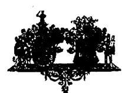

# HAJDÚ-BIHAR MEGYEI KÖZGYŰLÉS ELNÖKE

54024 Debrecen, Piac u. 54.
☎52/507-501
Fax: 52/507-555

ÖH.: 991-1/2011.

Állami Számvevőszék
Domokos László elnök úr részére

Budapest
Apáczai Csere János u. 10.
1052

Tisztelt Elnök Úr!

Tárgy: jelentés véleményezése
Hiv.sz.: V-3004-27-08/2011.
Melléklet: 3 db táblázat
ÁLLAMI SZÁMVEVŐSZÉK
7348/
Érkezel: 2011 JÚL 11.
Bitatőszám: 2
Melléklet: 3 db táblázat

Az Állami Számvevőszék által a Hajdú-Bihar Megyei Önkormányzat pénzügyi helyzetének ellenőrzéséről szóló jelentését köszönettel megkaptam, annak tartalmát megismertem, észrevételt, kiegészítést nem kívánok tenni.

Mellékelten megküldöm a pótlólagos információkat tartalmazó táblázatokat. Véleményem szerint a jelentés megállapításai helytállóak, azok valós képet adnak a Hajdú-Bihar Megyei Önkormányzat pénzügyi helyzetéről.

Ezúton szeretném Önnek jelezni, hogy a vizsgált időszakot követően jelentős változás következett be a megyei önkormányzat pénzügyi helyzetében. A CIB Bank Zrt., mint a „Hajdú-Bihar 2028 Kötvény” tulajdonosa a 2011. június 1-jei keltezésű levelében bejelentette, hogy a teljes kötvényösszeg esetében (17.981.299 svájci frank összeg) élni kíván a lejárat előtti visszavásároltatási jogával. Ennek következtében a megyei önkormányzatnak árfolyamtól függően – kb. 4 milliárd forint fizetési kötelezettsége keletkezett. A visszavásároltatás dátumaként a CIB Bank Zrt. 2011. szeptember 30. napját jelölte meg.

A megyei közgyűlés 2011. június 24-i ülésén teljes körű tájékoztatást kapott a bank döntése miatt a megyei önkormányzat finanszírozási helyzetét érintő nehézségekről, és a 171/2011. (VI. 24.) MÖK határozatával felhatalmazott a kötvény refinanszírozásához szükséges fedezet biztosítására irányuló eljárás lefolytatására.

Kérem fentiek szíves tudomásulvételét.

Debrecen, 2011. július 4.

Tisztelettel:

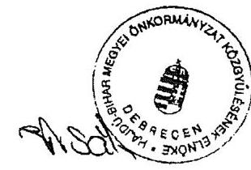

Bodó Sándor
a megyei közgyűlés elnöke

---

.

---

# Bodó Sándor úr 

elnök
Hajdú-Bihar Megye Önkormányzata

## Debrecen

## Tisztelt Elnök Úr!

Köszönettel vettem Hajdú-Bihar Megye Önkormányzata pénzügyi helyzetének ellenőrzéséről készült jelentés tervezet megállapításaira írt válaszlevelét és pótlólagos információkat.

Levelében jelezte, hogy a vizsgált időszakot követően jelentős változás állt be a Hajdú-Bihar Megye Önkormányzata pénzügyi helyzetében, mivel a CIB Bank Zrt. élni kíván a „HajdúBihar 2028 Kötvény" vonatkozásában a lejárat előtti visszavásárlási jogával..

Felhívom szíves figyelmét az Állami Számvevőszék ellenőrzése által a jelentés-tervezetben tett javaslatra. E szerint a jövőben az adósságot keletkeztető kötelezettségvállalásokról szóló közgyűlési döntéseket megalapozó előterjesztések tartalmazzák a visszafizetés forrásait, a várható kamat- egyéb költség és tőkefizetési kötelezettségeket, legalább 3 éves kitekintéssel a várható kamat- és árfolyam-kockázatok bemutatását.

Köszönöm Elnök úr és munkatársai ellenőrzés során tanúsított hozzáállását, amellyel az ellenőrzés megvalósításában részt vettek, azt segítették.

Budapest, 2011. december „(1)"

Tisztelettel:

Domokos László

Melléklet: jelentés