# ÁLLAMI   SZÁMVEVŐSZÉK 

## JELENTÉS

a Heves Megyei Önkormányzat pénzügyi helyzetének ellenőrzéséről (43/2)

---

# Számvevői Iroda 

Iktatószám: V-3017-17/2011.
Témaszám: 1015
Vizsgálat-azonosító szám: V056009

## Az ellenőrzést felügyelte:

Dr. Varga Sándor
számvevő igazgató-helyettes
Az ellenőrzést vezette:
Renkó Zsuzsanna
számvevő tanácsos
Az ellenőrzést végezték:

| Bocsi Sándor | Batkiné Vas Anna | Luhály Matild |
| :-- | :-- | :-- |
| számvevő tanácsos | számvevő tanácsos | számvevő |

A témához kapcsolódó eddig készített számvevőszéki jelentések:
címe
sorszáma
Jelentés a Heves Megyei Önkormányzat gazdálkodási rendszerének 2009. évi átfogó ellenőrzéséről

---

# TARTALOMJEGYZÉK 

BEVEZETÉS ..... 5
I. ÖSSZEGZŐ MEGÁLLAPÍTÁSOK, KÖVETKEZTETÉSEK, JAVASLATOK ..... 12
II. RÉSZLETES MEGÁLLAPÍTÁSOK ..... 17

1. Az Önkormányzat kötelező és önként vállalt feladatai ..... 17
2. A pénzügyi egyensúlyi helyzet ..... 21
2.1. A múködési és felhalmozási egyensúly ..... 23
2.2. Az Önkormányzat bevételei ..... 27
2.3. Az Önkormányzat kiadásai ..... 30
3. Kötelezettségek bemutatása ..... 35
3.1. A pénzintézetek felé fennálló kötelezettségek ..... 35
3.2. Szállítók felé fennálló kötelezettségek ..... 43
4. A pénzügyi egyensúly megteremtése érdekében hozott intézkedések ..... 46
5. A helyi önkormányzatok gazdálkodási rendszerének 2009. évi ellenőrzése során a pénzügyi egyensúly javítására tett szabályszerűségi és célszerűségi javaslatok hasznosulása ..... 50

## MELLÉKLETEK

1. számú Múködési és felhalmozási hiány/többlet az Önkormányzat rendeleteiben melléklet
2/a. számú Az Önkormányzat CLF módszer szerint besorolt bevételei és kiadásai 2007melléklet 2010 között
2/b. számú Az Önkormányzat bevételeinek és kiadásainak, adósságszolgálatának melléklet alakulása 2007-2010 között
2. számú Az Önkormányzat 2007-2010. években megvalósított, illetve 2010. decem-melléklet ber 31-én fennálló fejlesztési feladatokhoz kapcsolódó kötelezettségeinek összegzése
3. számú Heves Megyei Közgyűlés elnökének észrevétele melléklet
4. számú Heves Megyei Közgyűlés elnökének észrevételére adott válasz melléklet

---

.

---

# RÖVIDÍTÉSEK JEGYZÉKE 

## Törvények

Áht.
ÁSZ tv.

Htv.

Ötv.
Ptk.
1996. évi XXV. tv.

## Rendeletek

2007. évi zárszámadási rendelet
2008. évi zárszámadási rendelet
2009. évi zárszámadási rendelet
2010. évi zárszámadási rendelet
2011. évi költségvetési rendelet

## Szórövidítések

APEH
ÁSZ
BM
EDP hiány/egyenleg
Elnök
EU
Főjegyzó
Gazdasági Program
GDP
Hivatal
HMÖ
Illetékhivatal
Kórház
Kórház Nonprofit Kft.
az államháztartásról szóló 1992. évi XXXVIII. törvény az Állami Számvevőszékről szóló 1989. évi XXXVIII. törvény (2011. július 1-jétől az Állami Számvevőszékről szóló 2011. LXVI. törvény)
a helyi önkormányzatok és szerveik, a köztársasági megbízottak, valamint egyes centrális alárendeltségủ szervek feladat- és hatásköreiről szóló 1991. évi XX. törvény
a helyi önkormányzatokról szóló 1990. évi LXV. törvény
a Magyar Köztársaság Polgári Törvénykönyvéről szóló 1959. évi IV. törvény
a helyi önkormányzatok adósságrendezési eljárásáról szóló 1996. évi XXV. törvény

10/2008.(IV. 25.) HMÖ rendelet a Megyei Önkormányzat és intézményei 2007. évi gazdálkodásáról
8/2009.(IV. 24.) HMÖ rendelet a Megyei Önkormányzat és intézményei 2008. évi gazdálkodásáról
9/2010. (V. 07.) HMÖ rendelet a Heves Megyei Önkormányzat és intézményei 2009. évi gazdálkodásáról
10/2011. (IV. 29.) HMÖ rendelet a Heves Megyei Önkormányzat és intézményei 2010. évi gazdálkodásáról
7/2011. (II. 25.) HMÖ rendelet a Heves Megyei Önkormányzat 2011. évi költségvetéséről

Adó- és Pénzügyi Ellenőrzési Hivatal
Állami Számvevőszék
Belügyminisztérium
uniós módszertan szerinti maastrichti kritériumoknak megfelelő számítás szerinti hiány/egyenleg
Heves Megyei Önkormányzat közgyűlésének elnöke
Európai Unió
Heves Megyei Önkormányzat Közgyűlési Hivatalának főjegyzője
Heves Megyei Önkormányzat 2007-2010. évekre vonatkozó Gazdasági Programja
bruttó hazai termék
Heves Megyei Önkormányzati Hivatal
Heves Megyei Önkormányzat
Heves Megyei Illetékhivatal
Heves Megyei Önkormányzat Markhot Ferenc Megyei Kórház-Rendelőintézete
Markhot Ferenc Kórház Egészségügyi Szolgáltató Nonprofit Kiemelkedően Közhasznú Kft.

---

| Közgyűlés | Heves Megyei Közgyűlés |
| :-- | :-- |
| KSH | Központi Statisztikai Hivatal |
| NGM | Nemzetgazdasági Minisztérium |
| OEP | Országos Egészségbiztosítási Pénztár |
| Önkormányzat | Heves Megyei Önkormányzat |
| PPP konstrukció | Public Private Partnership (Partnerségi együttmúködés |
|  | közfeladatok ellátására a magánszektor bevonásával) |
| szja | személyi jövedelemadó |

---

# JELENTÉS 

## a Heves Megyei Önkormányzat pénzügyi helyzetének ellenőrzéséről

## BEVEZETÉS

Az Állami Számvevőszék 2011. évtől érvényes stratégiája új irányt szabott a helyi önkormányzatok gazdálkodásának ellenőrzésében is. Az ÁSZ - küldetése és jövőképe szerint - szilárd szakmai alapokra támaszkodva értékteremtő ellenőrzéseivel és helyzetelemzéseivel az államháztartás egészében, így a helyi önkormányzati alrendszerben is elő kívánja segíteni a közpénzek és a közvagyon szabályos, gazdaságos, hatékony és eredményes hasznosítását. E folyamat részeként - a 2010. évi államháztartási hiány alakulásának összetevőire is figyelemmel - megkezdődött az önkormányzati alrendszer pénzügyi helyzetelemzése.

Az NGM 2011 áprilisában közzétett adatai szerint ${ }^{1}$ a 2010. évi 1036,2 milliárd Ft összegű, 3,8\%-os EDP (maastrichti kritériumok szerinti, Túlzott Hiány Eljárás keretében kimutatott) hiánycél nem volt tartható, az önkormányzati alrendszer tervezettet meghaladó hiánya miatt a GDP arányában kifejezett államháztartási hiány $4,2 \%$-ra emelkedett.

Az önkormányzatok költségvetési jelentése szerint 2010. első három negyedév végén az önkormányzati alrendszer pénzforgalmi hiánya 97 milliárd Ft volt a tervezett éves mérték 51\%-át érte el. Bár az elmúlt években kiugróan magas hiány halmozódott fel az utolsó negyedévben, a 97 milliárd Ft-os szeptember végi hiány nem indokolta az önkormányzati alrendszer 190 milliárd Ft-ra becsült éves hiányának felülvizsgálatát. A tervezett hiány túllépése, az utolsó negyedévi 150 milliárd Ft-os pénzforgalmi hiány nem volt reálisan feltételezhető. A helyi önkormányzatok januári gyorsjelentése szerint a pénzforgalmi hiány 247,7 milliárd Ft-ot tett ki. A tervezettnél nagyobb önkormányzati pénzforgalmi hiány kialakulásában - az NGM által az éves költségvetési beszámoló elkészítéséhez kiadott tájékoztató szerint - az iparűzési adó elmaradása, a gépjárműadó, az illetékek és más bevételek tervezettnél alacsonyabb összegben teljesülése volt a meghatározó.

[^0]
[^0]:    ${ }^{1}$ NGM Tájékoztatás Magyarország Strukturális Reformprogramjának végrehajtásáról (2011. április 1). A Tájékoztató évente két alkalommal - április és október hónapban jelenik meg.

---

A megyei önkormányzatok kötelező feladatellátását többlépcsős törvényi előírások határozzák meg. A feladatokra vonatkozó szabályozás első szintjét az Ötv. ${ }^{2}$, a második szintet a hatásköri ${ }^{3}$, a harmadik szintet a további ágazati, szakmai törvények (egyebek mellett az oktatási, egészségügyi, szociális) adják.

A megyei önkormányzatok a feladatellátás és a központi forráselosztás tekintetében sajátos helyet foglalnak el a helyi önkormányzati rendszerben. A megyei önkormányzat kötelező feladatainak egy része - így a megyében lévő természeti és társadalmi muzeális emlékek, a történeti iratok gyűjtése, őrzése, tudományos feldolgozása, a megyei könyvtári szolgáltatás, a pedagógiai és közművelődési szakmai tanácsadás és szolgáltatás, a megyei testnevelési és sportszervezési feladatellátás, a gyermek- és ifjúsági jogok érvényesítése, a gyermekvédelmi- és szociális szakellátás - az Ötv-ből közvetlenül levezethető kötelezettség.

A középiskolai, szakiskolai, és kollégiumi ellátás, a fogyatékos gyermekek oktatása, nevelése, gondozása az ágazati törvény szerint a megyei önkormányzat kötelező feladata. Azonban, ha a települési önkormányzat lát el ilyen feladatot, és arról lemond, a megyei önkormányzatnak a feladatot át kell vennie. Így a megyei önkormányzatok által ellátandó kötelező közszolgáltatások ellátásának mértékére a települési önkormányzatok döntései jelentősen kihatnak.

Az alapellátást meghaladó egészségügyi szakellátás biztosítása akkor képezi a megyei önkormányzat feladatát, ha az önkormányzati vagyon kialakításáról szóló törvényben ${ }^{4}$ a feladat ellátásához szükséges vagyont az önkormányzat a tulajdonába kapta.

Az önként vállalt feladat ellátására - mivel annak vállalása a kötelező feladatok ellátását nem veszélyeztetheti - a kötelező közszolgáltatások mértékének alakulása lényegi hatással van.

A feladat és hatáskör telepítés sajátosságai mellett a megyei önkormányzatok kialakított forrásszerkezete, a központi költségvetéstől való erőteljes függősége is determinálja az önkormányzatok feladatellátásra vonatkozó döntéseit.

A 2007-2010. években az önkormányzati feladatok ellátásának keretet biztosító forrásszabályozás - ennek részeként az illetékbevételből és a személyi jövedelemadóból való részesedés szabályai - a megyei önkormányzatok vonatkozásában nem változtak:

- A megyei önkormányzatok saját bevételein belül az illetékbevételek döntően az ingatlanpiac stagnálása, majd visszaesése, és egyes illetékkedvezmények bevezetése következtében - megyénként differenciált mértékben ugyan, de - 2010-re általánosan visszaestek. A 2010. évben befolyt

[^0]
[^0]:    ${ }^{2}$ Ötv. 69-70. §-ai
    ${ }^{3}$ a Htv.
    ${ }^{4}$ Az egyes állami tulajdonban lévő vagyontárgyak önkormányzatok tulajdonba adásáról szóló 1991. évi XXXIII. törvény

---

39,2 milliárd Ft illetékbevétel a 2006. évben realizált 71,1 milliárd Ft illetékbevétel alig több mint $55 \%$-a volt. A kieső bevételek pótlására az önkormányzati alrendszer szintjén történtek intézkedések, 2010-ben 5 milliárd Ftot, 2011-ben 1,2 milliárd Ft-ot ellentételezett a központi költségvetés. Az illetékbevételt a megyei önkormányzatok a saját folyó bevételeik között számolják el ${ }^{5}$.

Az illetékek kivetésének és beszedésének joga 2006. december 31-ig a megyei önkormányzatok feladata volt. A 2007. évtől a megyei illetékhivatalok illetékbeszedési feladatait az APEH vette át ${ }^{6}$. Az önkormányzati illetékrészesedési szabályok változatlanok maradtak, azonban az illetékbeszedés költségeit az önkormányzatok illetékbevételeiből átlagos (a Fővárosnál 4,0\%-os, a megyei és megyei jogú városi önkormányzatnál $8,5 \%$-os) kulcsot alkalmazva vonták le. E döntés következtében azon megyei önkormányzatok, amelyek a $8,5 \%$-os költségnél kedvezőbb költségszint mellett látták el korábban ezt a feladatot, kedvezőtlenebb helyzetbe kerültek.

- Az önkormányzati alrendszer személyi jövedelemadóból való részesedésének makroszintű szabályozása nem változott 2007-2010 között7. A helyi önkormányzatokat normatív módon megillető $32 \%$-os részesedés visszaosztásának részletszabályai azonban a megyei önkormányzatok számára - a reálgazdaság kedvezőtlen irányú folyamatai, és az államháztartás egyensúlyi helyzetére tekintettel elrendelt kormányzati intézkedések miatt - megszorító intézkedéseket jelentettek. Összesen 17 milliárd Ft - 2007-ben 10 milliárd Ft, 2010-ben további 7 milliárd Ft - szja-t vontak ki a megyei önkormányzatok gazdálkodási köréből ${ }^{8}$. Az átengedett személyi jövedelemadó a megyei önkormányzatok egyik bevétele.

[^0]
[^0]:    ${ }^{5}$ A megyei önkormányzatok illetékbevételei az önkormányzati alrendszer saját folyó bevételeiből 2007-ben 35,9 milliárd Ft-ot ( $61,4 \%$-ot), 2008-ban 41,5 milliárd Ft-ot ( $61,7 \%$-ot), 2009-ben 36,5 milliárd Ft-ot ( $62,5 \%$-ot), 2010-ben 25,1 milliárd Ft-ot $(64,1 \%$-ot) tettek ki.
    ${ }^{6}$ Az egyes pénzügyi tárgyú törvények módosításáról szóló 2006. évi LXI. törvény 115. §a, amely az adózás rendjéről szóló 2003. évi XCII. törvény 73. §-át módosította.
    ${ }^{7}$ A megyei önkormányzatok személyi jövedelemadó részesedése az önkormányzati alrendszer átengedett bevételeiből 2007-ben 34,7 milliárd Ft-ot ( $7,0 \%$-ot), 2008-ban 51,2 milliárd Ft-ot ( $9,2 \%$-ot), 2009-ben 59,2 milliárd Ft-ot ( $9,3 \%$-ot), 2010-ben 56,3 milliárd Ft-ot $(8,3 \%$-ot) tett ki.
    ${ }^{8}$ A megyei önkormányzatok szja kiegészítése háromelemű. A tételes, minden megyére egységesen meghatározott összeg - az adott évek költségvetési törvényeinek 4. sz. mellékletében meghatározottak szerint - 2006-ban 593 millió Ft, 2007-ben és 2008-ban egyaránt 355 millió Ft, 2009-ben 370 millió Ft volt. A megye népességszáma után járó kiegészítés a 2006. évi $208 \mathrm{Ft} /$ fő összegről 2010-re $120 \mathrm{Ft} /$ fő-re, a megyei intézmények ellátottjai után járó kiegészítés $42236 \mathrm{Ft} /$ ellátottról 20755 Ft/ellátottra csökkent.

---

A megyei önkormányzatok 2007-2010 között rendelkezésre álló forrásait az alábbiakban mutatjuk be:
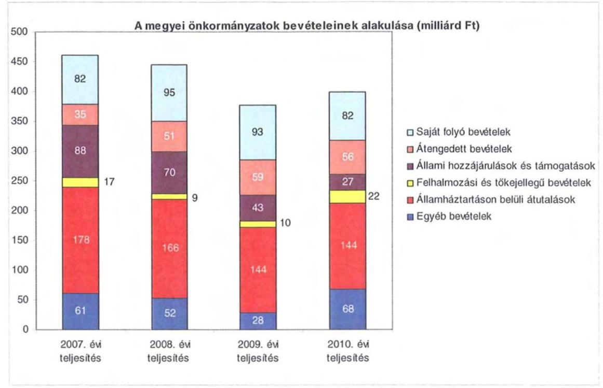

A megyei önkormányzatok saját folyó bevételeinek részaránya - amelyek főbb elemei: az intézményi térítési díjak, az illetékbevétel, a kamatbevételek - a 2007. évi összbevételen ( 461 milliárd Ft) belül 17,9\% volt, amely 2010-re annak ellenére 20,6\%-ra nőtt, hogy az összege 82 milliárd Ft maradt. Ennek oka az volt, hogy az összbevétel a 2007. évi 461 milliárd Ft-ról 2010-re 399 milliárd Ftra csökkent.

Az átengedett bevételek, amelyek a megyei önkormányzatoknál a személyi jövedelemadóból való részesedést jelentették, az összbevételen belül a 2007. évi 35 milliárd Ft-ról 56 milliárd Ft-ra nőttek.

Az állami hozzájárulások és támogatások - amelyek főbb elemei: az ellátotti létszámhoz kötődő normatív állami hozzájárulások, központosított, fejezeti szinten kezelt célelőirányzatból juttatott múködési és fejlesztési támogatások a 2007. évi 88 milliárd Ft-ról (19,1\%-os részarányról) 2010-re 27 milliárd Ft-ra ( $6,8 \%$-os részarányra) estek vissza.

A felhalmozási és tőkejellegú bevételek - tárgyi eszközök (ingatlanok és ingóságok), föld és immateriális javak, részesedések értékesítése, EU-tól átvett pénzeszközök - a 2007. évi 17 milliárd Ft-ról (3,6\%-os részarányról) 2010-re 22 milliárd Ft-ra (5,4\%-ra) emelkedtek.

Az államháztartáson belüli átutalások részesedése 2007-ben 178 milliárd Ft volt. 2010. év végére 34 milliárd Ft-tal csökkent, részaránya 38,6\%-ról 2,6 százalékpontos csökkenés után 2010-ben 36\%-ra változott. Ez a bevételi kategória

---

tartalmazza az egészségbiztosítási és egyéb elkülönített állami pénzalapoktól átvett forrásokat. A 2010-ben e címen elszámolt bevétel 144 milliárd Ft volt.

A megyei önkormányzatok központi költségvetésből származó bevételeinek öszszege 2007-ben 400 milliárd Ft volt, amely 2010. évre 331 milliárd Ft-ra (az időszak alatt összesen 69 milliárd Ft-tal) 17,3\%-kal csökkent.

Az egyéb, pénzmaradványból, vállalkozási bevételekből, államháztartáson kívülről származó átutalásokból, a hitelekből, a hosszú és rövid lejáratú értékpapírok értékesítéséből származó bevételek részesedése a 2007-2010. évek viszonylatában 13,3\%-ról 17,1\%-ra emelkedett. Ez utóbbiak 2010. évi beszámoló szerinti összevont teljesítése 68 milliárd Ft volt ${ }^{9}$.

Mindezeket figyelembe véve 2007 és 2010-ben a megyei önkormányzatok forrásösszetételének megoszlását az alábbi ábra szemlélteti:
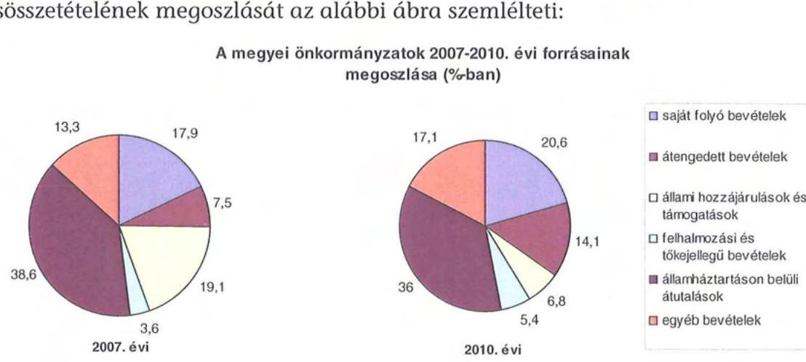

Annak ellenére, hogy a megyei önkormányzatok kötelezően ellátandó feladataikat 2007-hez képest kevesebb intézményben, csökkenő foglalkoztatotti létszám mellett végezték ${ }^{10}$, a jelentős bevételkiesést a - szervezési intézkedések hatására csökkenő ráfordítások nem tudták kompenzálni. Az ellátottak száma - a szociális, gyermekvédelmi ágazat bentlakásos elhelyezést nyújtó intézményeit kivéve - eltérő mértékben ugyan, de minden ágazatban évről évre csökkent, amely a fajlagos hozzájárulások csökkenésével együtt a normatív állami hozzájárulás arányának visszaeséséhez vezetett.

A 2007-2013-as időszakra meghirdetett, vissza nem térítendő EU-s fejlesztési forrásokhoz való hozzájutás lehetősége felerősítette az önkormányzati alrendszer fejlesztési igényeit. A fokozott fejlesztési tevékenység a felhalmozási bevéte-

[^0]
[^0]:    ${ }^{9}$ Az egyéb bevételek összege 2007-2010 között eltérő módon változott, 2007-ben 61 milliárd Ft volt, 2008-ban 52 milliárd Ft-ra, 2009-ben 28 milliárd Ft-ra esett vissza, majd 2010-ben ismét - 68 milliárd Ft-ra - emelkedett.
    ${ }^{10}$ a BM által 2010 decemberében elvégzett felmérés adatai szerint

---

lek és kiadások egyensúlyának megbomlásán ${ }^{11}$ túl a jelentkező jövőbeni fenntartási kötelezettség miatt tovább terhelhetik az önkormányzatok költségvetését.

A megyei önkormányzatok felhalmozási és múködési célú pénzintézeti és szállítói kötelezettségeinek állománya a vizsgált időszakban erőteljesen növekedett.

A hosszú lejáratú kötelezettségek alakulását a következő ábra szemlélteti:
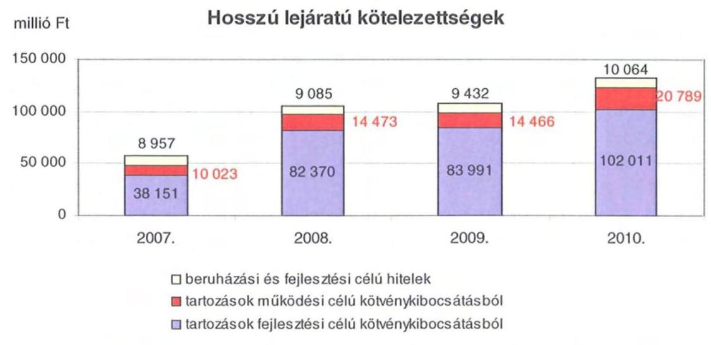

A hosszú lejáratú kötelezettségek mellett az időszakban a 2007. évi 22 milliárd Ft-ról 24 milliárd Ft-ra ( $8,8 \%$-kal) növekedett az áruszállításból származó szállítói kötelezettségek állománya.

A mérlegben kimutatott kötelezettségek állománya mellett az elhasználódott eszközök pótlására forrást biztosító amortizációs (felújítási) alap képzésének ${ }^{12}$ elmaradása további problémákat vetít előre. A megyei önkormányzatok beszámolójelentéseinek összegzése szerint 2007-ben még az elszámolt értékcsökkenés $90 \%$-ának megfelelő összeget fordítottak felújítási célokra, 2009-ben ez az arányszám már csak 16,5\% volt. Ez maga után vonta a feladatellátást kiszolgáló tárgyi eszközök állagának erőteljes romlását.

Az ÁSZ a 2011. évi ellenőrzési tervében a 43. számú, az „Önkormányzatok gazdálkodási rendszerének ellenőrzése" részeként egy időben, egymással párhuzamosan tekinti át és elemzi az önkormányzati alrendszer középszintjét jelentő 19 megyei önkormányzat pénzügyi helyzetét. A gazdálkodás szabályszerűségét az

[^0]
[^0]:    ${ }^{11}$ Az önkormányzati alrendszerben - az éves zárszámadási törvényjavaslatok általános indokolása, X. Helyi önkormányzatok gazdálkodása fejezet szerint - a felhalmozási bevételek és kiadások egyenlege 2007-ben 142,4 milliárd Ft, 2008-ban 112,3 milliárd Ft, 2009-ben 234,5 milliárd Ft hiányt mutatott.
    ${ }^{12}$ Erre a jelenlegi szabályozási környezetben nem kötelezi semmilyen előírás az önkormányzatokat.

---

ÁSZ előző évek során ellenőrizte a megyei önkormányzatoknál is, ezért jelen vizsgálatunk erre nem tér ki.

A jelentés a megyei önkormányzatok sajátos feladatellátási és forrásszabályozási helyzetére tekintettel a megyei önkormányzatok pénzügyi helyzetét, illetve az ezzel összefüggő korábbi ÁSZ javaslatok megvalósítását mutatja be.

Az ellenőrzés a 2007. január 1. - 2011. március 31. közötti időszakot ölelte fel.
A vizsgálat jogszabályi alapját 2011. július 1-je előtt az Állami Számvevőszékről szóló 1989. évi XXXVIII. törvény 2. § (3), (5), (6) és (9) bekezdéseiben, az Ötv. 92. § (1) bekezdésében és az Áht. 104. § (3) bekezdésében, 2011. július 1-jét követően az Állami Számvevőszékről szóló 2011. évi LXVI. törvény 1. § (3) bekezdésében, az 5. § (2)-(6) bekezdéseiben és az Áht. 120/A. § (1) bekezdésében foglalt előírások képezték.

Heves megye országos és régión belül elfoglalt helyzetét 2010. december 31én az alábbi mutatók szemléltetik (a megyei jogú városokkal együtt):

Index: az előző év azonos időszak (időpontja)=100,0

| Mutató megnevezése | Heves   megye | Észak-   magyarországi   régió | Országos |
| :-- | :--: | :--: | :--: |
| Népesség száma (ezer fő) | 308 | 1195 | 9986 |
| Népesség változás indexe (\%) | 98,9 | 98,8 | 99,7 |
| Az ipari termelés volumenindexe (\%) | 124,9 | 118,0 | 110,7 |
| Egy lakosra jutó ipari termelési érték   (ezer Ft) | 2032,9 | 2028,2 | 2044,4 |
| Ezer lakosra jutó vállalkozások száma   (db) | 152 | 120 | 165 |
| A beruházások egy lakosra vetített   teljesítményértéke (millió Ft) | 191,8 | 180,1 | 304,7 |
| Foglalkoztatási arány (\%) | 46,7 | 43,5 | 49,5 |
| Munkanélküliségi ráta (\%) | 11,4 | 15,6 | 10,8 |
| Alkalmazásban állók havi nettó át-   lagkeresete (Ft/fő) | 122071 | 114195 | 132628 |
| Alkalmazásban állók havi nettó át-   lagkeresetének indexe (\%) | 107,8 | 106,5 | 106,9 |

A megye ipari termelési növekedése meghaladja az országos átlagot, de a gazdaság helyzetét reprezentáló fajlagos mutatók - az ezer lakosra jutó vállalkozások mutatója, a beruházások egy lakosra vetített teljesítménye - tekintetében elmarad az országos jellemzőktől. A foglalkoztatottság mutatói és az alkalmazásban állók nettó átlagkeresete kedvezőtlenebbek az országos átlagnál, de a régiós átlagot meghaladják. Mindez azt jelzi, hogy az ipari termelés és az átlagkereset növekedése ellenére a megye népességmegtartó képessége elmarad az országos átlagtól, amit a népesség változás indexe is visszaigazol.

A megyében 121 települési - egy megyei jogú városi, nyolc városi, négy nagyközségi, 108 községi - önkormányzat múködött.

---

# I. ÖSSZEGZŐ MEGÁLLAPÍTÁSOK, KÖVETKEZTETÉSEK, JAVASLATOK 

A Heves Megyei Önkormányzat 2010-ben 9485 millió Ft összes költségvetési kiadásából 92,7\%-ot kötelező feladatainak ellátására fordította. Az Önkormányzat önként vállalt feladatai - adatszolgáltatása szerint - az SZMSZben meghatározottaknak megfelelően, kiemelten a művészeti, szórakoztató és szabadidős tevékenységhez, a sporthoz, egyes idegenforgalmi, turisztikai feladatokhoz, továbbá a kiadvány szerkesztési, kommunikációs szolgáltatások szervezéséhez kapcsolódtak, összesen 690 millió Ft összegben.

A kötelező és az önként vállalt feladatok körét az Önkormányzat Szervezeti és Múködési Szabályzatában rögzítette. Kötelező feladataik az Ötv. és az ágazati törvények által meghatározottak, az önként vállalt feladataik nagyságát pedig az éves költségvetési rendeletekben határozták meg.

Az Önkormányzat a kötelező és az önként vállalt feladatait ellátó költségvetési szervek száma 29\%-kal, 12 költségvetési szervvel, a telephelyek száma 23\%-kal, 19 telephellyel volt kevesebb 2010. december 31-én, mint 2007. január 1-jén. A feladatellátásban részt vevő többségi tulajdonú gazdasági társaságot 2009-ben alapították, amely vagyonkezelői szerződéssel tíz telephelyen a Kórház múködtetését látja el. A feladatot egy magántulajdonú gazdasági társaságtól vette át, amely szintén vagyonkezelői szerződés keretében múködtette 2008. november 1-je és 2009. augusztus 1-je között az intézményt. Az intézmények száma 20072010. között hét intézmény átadásával, egy zeneiskola átvételével, továbbá intézmény átszervezési döntések eredményeként alakult ki. A szociális és gyermekvédelmi feladatokat 11, a közoktatási feladatokat szintén 11 intézmény látja el, a közművelődési, közgyűjteményi és sport feladatok ellátása öt intézmény feladatkörébe tartozik.

A vizsgált időszakban az Önkormányzatnál a CLF módszer alapján a folyó költségvetés egyenlege (müködési jövedelem) 2007-2009 között múködési forrástöbbletet, 2010-ben 962 millió Ft hiányt mutatott. A múködési megtakarítások egyik évben sem fedezték a tárgyévben jelentkező felhalmozási költségvetés negatív egyenlegét. A 2007-2010. években az Önkormányzat felhalmozási költségvetésének egyenlege folyamatosan negatív összegű volt, amely 2007-2010 között összesen 3511 millió Ft felhalmozási forráshiányt okozott.

A pénzügyi egyensúly fenntartása külső forrás bevonásával volt biztosítható. A múködési forráshiány finanszírozása munkabér-megelőlegezési és folyószámlahitelből, a felhalmozási forráshiány felhalmozási célú kötvénykibocsátás bevételéből történt. A kötvény- és növekvő hitelállomány 2007-2009 között a kamatkiadások 68 millió Ft-ról 192 millió Ft-ra emelkedését vonta maga után, mely a 2010. évben 8 millió Ft-tal csökkent, ám a 2007-2010. években együttesen a kamatbevételek 34 millió Ft-tal meghaladták a kamatkiadásokat.

---

A CLF módszer szerinti pénzügyi egyensúlyi helyzet alakulására a legnagyobb hatással az Önkormányzat legföbb bevételi forrásainak - a jogszabályi kedvezmények bővülése és az ingatlanforgalom visszaesése következményeként az illetékbevételnek, valamint a központi forráskivonás hatására az átengedett szja-nak és állami támogatásoknak - csökkenése volt.

Az Önkormányzatnál az illetékbevétel a 2010. évre a 2006. évi 1997 millió Ftról (57,3\%-ára) 1144 millió Ft-ra csökkent. Az átengedett szja és az állami támogatások együttes összege a központi támogatás csökkenésén túl, a feladat átadás-átvétel hatását is figyelembe véve kevesebb lett, 2010-ben 3604 millió Ft volt, amely a 2007. évinek 62,1\%-a.

Az egyéb saját bevételek 2007-ről 2010-re 240 millió Ft-tal, 8,7\%-kal növekedtek, amely nem tudta ellensúlyozni a más jogcímen - az átengedett szja és állami támogatási bevételnél 2202 millió Ft, az illetékbevételnél 545 millió Ft kieső forrásokat. A 2010. évben az intézményi múködési bevételek 33 millió Fttal haladták meg a 2007. évi, 1938 millió Ft-os, tényleges teljesítést.

A múködési kiadások 2007-ről 2010-re 50,4\%-kal, 8270 millió Ft-tal csökkentek, melyben a Kórház 2008. novemberi vagyonkezelésbe adása, majd ezt követően kft-be szervezése játszott döntő szerepet. Az önkormányzati kiadásokban a kórházi kiadások a 2007-2008. években szerepelnek, 6687 millió Ft és 6276 millió Ft összeggel.

Az intézmények teljesített múködési kiadása a Kórház múködési kiadása nélkül 2007-ben 9972 millió Ft - az összes múködési kiadás 59,9\%-a - volt, amely 2010-re 8389 millió Ft-ra ${ }^{13}$, a 2007. évihez képest $84,1 \%$-ra csökkent.

A múködési és felhalmozási kiadásokon belül, 2007-2010 között a felhalmozási kiadások súlya - 1728 millió Ft-ról 1096 millió Ft-ra csökkenése mellett -9,4\%-ról 11,6\%-ra nőtt. Az Önkormányzat 2007-2010 között összesen 10297 millió Ft bekerülési költségű beruházást valósított meg, illetve indított el, amelyből 5107 millió Ft a 2010. évet követő időszakra vállalt kötelezettség. Az utóbbi forrásai a következők: 110 millió Ft tervezett saját bevétel, 599 millió Ft meglévő kötvénybevétel és 4398 millió Ft elnyert EU-s támogatás. A 2010. utánra vállalt, 5107 millió Ft-os kötelezettségből a Kórház Nonprofit Kft-nél folyó kórház-rekonstrukcióhoz kapcsolódó kötelezettség 4848 millió Ft $(94,9 \%)$.

Az Önkormányzat pénzintézeti kötelezettségeinek állománya 2006. december 31-ről 2010. december 31-re 303 millió Ft-ról 6122 millió Ft-ra nőtt. A vizsgált időszakban adósságszolgálatra az Önkormányzat 876 millió Ft-ot teljesített, amelyből a kamatkiadás 605 millió Ft volt. A kötvényből származó források lekötéséből 2007-2010 között 545 millió Ft kamatbevételt realizált.

[^0]
[^0]:    ${ }^{13}$ Az összes múködési kiadásban 2010-ben már nem szerepelt a Kórház múködési kiadása, annak 2008. évi kiszervezése miatt, ezért a 8389 millió Ft a 2010. évi összes múködési kiadással azonos.

---

A vizsgált időszakban az Önkormányzat minden év minden napján igénybe vette a folyószámlahitelt, melynek átlagos napi állománya a 2009. évben volt a legalacsonyabb, 679 millió Ft, 2011. első negyedévében pedig a legmagasabb, 1530 millió Ft. Az Önkormányzat 2007-ben hét, 2008-ban egy, 2009-ben négy, 2010-ben 11 alkalommal vett igénybe munkabér megelőlegezési hitelt. Az igénybevett munkabérhitel alkalmanként átlagosan 178 millió Ft volt.

Az Önkormányzat 2010. év végi pénzintézeti kötelezettsége 4412 millió Ft ( $72,1 \%$ ) fejlesztési célú kötvény kibocsátásából, valamint 1710 millió Ft ( $27,9 \%$ ) a költségvetési év végén ki nem egyenlített folyószámla és munkabér megelőlegezési hitelekből keletkezett. Ezek miatt az Önkormányzatnak a 2011-2013. években 4082009 CHF tőketörlesztést és kamatot valamint 1710 millió Ft fo-lyószámla- és munkabérhitelből származó kötelezettséget kell teljesítenie. A kötvény részleges visszavásárlása miatt az Önkormányzat 2011-re további 600 millió Ft fizetési kötelezettséget vállalt. A 2010. év végi szállítói tartozás 170 millió Ft volt, amely teljes összegében lejárt kötelezettség. Az önkormányzat ellen adósságrendezési eljárás során a hitelező 280 millió Ft összegű követelést fogalmazott meg. A 2011-2013. évi összes (pénzintézeti, szállítói és egyéb) kötelezettség teljesítésére figyelembe vehető 52 millió Ft pénzmaradvány, a kötvénykibocsátásból származó tartalék 586 millió Ft összegű maradványa, 1772 millió Ft értékű jelzáloggal nem terhelt, valamint a pénzintézeti kötelezettségvállalásokhoz kapcsolódóan 1596 millió Ft értékű jelzáloggal terhelt forgalomképes ingatlanvagyon. Az adósságrendezési eljárás megindítása miatt az önkormányzat számlavezető - egyben a kötvénykibocsátást lejegyző - pénzintézete a folyószámla hitelkeret szerződés azonnali felmondásával ugyan nem élt, de a hitelkeret igénybevételét megtagadta, a munkabér hitelkeretet megszüntette.

Az Önkormányzat 2013 utáni évekre szóló, 2010. december 31 -én fennálló pénzintézeti kötelezettsége 17648124 CHF. Erre - az önkormányzat nyilatkozata szerint - figyelembe vehető forrás a jelzáloggal nem terhelt forgalomképes ingatlanvagyonból előzőeket követően fennmaradó mintegy 420 millió Ft (könyvszerinti nettó érték).

Az Önkormányzat nyilatkozata szerint a Kórházzal kapcsolatban lévő munkaügyi, műhiba perek és egyéb hitelezői követelésekkel összefüggésben összesen további 1175 millió Ft követelési igény merülhet fel.

A pénzintézeti kötelezettségvállalásból származó források felhasználási céljait meghatározták. A közgyűlési előterjesztések tartalmazták a kötelezettségvállalások visszafizetési forrásait, de a teljes futamidő várható kamat és tőkefizetési kötelezettségeit, az árfolyam- és kamatkockázatokat nem mutatták be. Az adósságszolgálati korlátot a költségvetési rendeleteik tartalmazták.

Az önkormányzati tulajdonú Kórház Nonprofit Kft. 2009-ben az Önkormányzattól 20 millió Ft összegű tagi kölcsönben részesült és a 2010. évben 161 millió Ft támogatást kapott pénzintézeti tartozásának rendezéséhez.

Az Önkormányzat a 2007-2010. években a tárgyi eszközök után 2423 millió Ft értékcsökkenést számolt el, felújításra ennek 14\%-át, 343 millió Ft-ot fordított.

---

A Heves Megyei Bíróság jogerőre emelkedett végzésével, 2011. május 19-én az Önkormányzat ellen adósságrendezési eljárás indult.

Az eljárást kezdeményező hitelező 99,2 millió Ft tőke és járulékainak megfizetését kérte az Önkormányzattól - mint a Kórház perbeli jogutódjától -, aminek számított jelenértéke mintegy 280 millió Ft. Az Önkormányzat a hitelező követelését nem ismerte el. A jogerős bírósági végzés ellen a Legfelsőbb Bírósághoz felülvizsgálati kérelmet nyújtott be, kérte, hogy jogszabálysértés miatt helyezze hatályon kívül a fellebbviteli bíróság jogerős ítéletét és kötelezze az első fokon eljárt bíróságot új eljárásra és új határozat hozatalára, valamint kérelmezte az ítélet végrehajtásának felfüggesztését is. A Legfelsőbb Bíróság 2011. május 17én hozott végzésében, az Önkormányzat kérelmére a jogerős ítélet végrehajtását - a felülvizsgálati eljárás befejezéséig - felfüggesztette. A végzés az Önkormányzathoz 2011. május 23 -án érkezett, amikor már az Önkormányzat ellen az adósságrendezési eljárás folyamatban volt.

A Közgyűlés a szükséges intézkedésekhez a döntését meghozta, lemondott az adósságrendezési törvényben biztosított fellebbezési jogáról, megválasztotta az adósságrendezési bizottság negyedik tagját és döntöttek a hitelezőknek szóló felhívás közzétételéről, valamint a Közgyűlés felhatalmazta az Elnököt és a Főjegyzőt, hogy az adósságrendezési törvényben foglaltak szerint járjanak el, biztosítsák az előírt kötelező feladatok ellátását és a pénzügyi gondnokkal működjenek együtt.

Az Önkormányzat a vizsgált időszak minden évében intézkedéseket tett a finanszírozási rendszer változása miatti forráscsökkenés ellensúlyozására. A 2007-2010. években az intézményátszervezések, a feladatváltozások, valamint a takarékossági intézkedések hatásaként együttesen 3406 millió Ft kiadási megtakarítást mutattak ki. A megtakarítási intézkedésekből az Önkormányzat 3115 millió Ft-ot az intézmények körében számszerúsített, melyből 2900 millió Ft volt a személyi juttatások és járulékainak összege.

A létszámcsökkentő intézkedések következtében a 2007. és 2010. évek között a Hivatalban és intézményeinél összesen 624 fő álláshely megszüntetése szerepelt az Önkormányzat nyilvántartásai szerint, amelyből 452 fő szakmai álláshely, 172 pedig intézményüzemeltetéssel kapcsolatos álláshely volt. A Kórház múködtetését 2010-ben az Önkormányzat egyszemélyi tulajdonában lévő gazdasági társaság látta el, kimutatása szerint az éves statisztikai átlaglétszám 2007 és 2010 között 1516 fơről 1161 fơre csökkent.

Az Önkormányzat bevétel növelési lehetőségei korlátozottak voltak. A bevételnövelésre irányuló 2007. és 2010. között meghozott intézkedésekből amelyek számszerúsített összege 1429 millió Ft volt - az intézményi térítési díjak emelése 869 millió Ft-tal, az átmenetileg szabad pénzeszközök lekötése 560 millió Ft-tal járult hozzá a bevételek emelkedéséhez.

Az ÁSZ az Önkormányzat gazdálkodási rendszerét 2009. évben vizsgálta átfogó jelleggel, jelentésében a pénzügyi egyensúly javítására szabályszerűségi és célszerűségi javaslatot nem tett.

---

Az Önkormányzat pénzügyi helyzetét összegezve a következők emelhetők ki:

Az önkormányzati bevételt csökkentő központi intézkedések hatását az ellenőrzött időszakban az Önkormányzat kiadásmérséklő és bevételnövelő intézkedései az egyéb saját bevételek növekedése ellenére nem voltak képesek ellensúlyozni Az időszakban végrehajtott intézmény szerkezeti változások, átadások és átvételek a költségvetési egyensúlyra kedvező hatást nem gyakoroltak. A Kórház lényeges kockázatot hozott a gazdálkodásban. A már megkezdett beruházások forrásai kötvénykibocsátásból és uniós támogatásból biztosítottak, illetve a kötvényforrásból felhalmozási tartalékot is képeztek. Az Önkormányzat múködési célú kiadások finanszírozására folyamatosan, növekvő mértékben vett igénybe folyószámla és munkabérhitelt, valamint a kötvényforrásból származó szabad pénzeszközeinek lekötéséből származó kamatot is teljes egészében a működési kiadások finanszírozására fordította. A likvid hitelek állományának évről évre való emelkedése feszültséget okozott a múködés finanszírozásában. Az Önkormányzat ellen - a 2001 óta a kórházzal szemben fennálló követelés teljesítésének elmaradása miatt - indított adósságrendezési eljárás következében a pénzügyi, múködési egyensúly biztosítása önerőből már nem lehetséges.

E folyamatot erősíti, hogy a hosszú lejáratú kötelezettségek kis részbeni fedezetéül a jelzálog kötelezettséggel nem terhelt forgalomképes ingatlanok vehetők számba - amelyek mobilizálásának piaci esélyei korlátozottak - ezáltal a hoszszú távú kötelezettségek teljesítésének feltételei bizonytalanok, a pénzügyi helyzet fenntarthatósága nem biztosított. A feladatok és források közötti egyensúly megteremtésére irányuló központi döntések, a megyei önkormányzatok konszolidációjára, az intézmények átvételére vonatkozó törvényjavaslat elfogadása új feltételeket teremtett. A hatékony és eredményes gazdálkodás, a pénzügyi egyensúly megőrzése azonban további helyi intézkedéseket igényel.

Az Állami Számvevőszékről szóló 2011. évi LXVI. törvény 33. § (1) bekezdésében foglaltak értelmében a jelentésben foglalt megállapításokhoz kapcsolódó intézkedési tervet köteles az ellenőrzött szervezet vezetője összeállítani és azt a jelentés kézhezvételétől számított harminc napon belül az ÁSZ részére megküldeni. Amennyiben az intézkedési tervet határidőben nem küldi meg a szervezet, vagy az továbbra sem elfogadható, az ÁSZ elnöke a hivatkozott törvény 33. § (3) bekezdés a)-b) pontjaiban foglaltakat érvényesítheti.

A 2011 májusában lezárult helyszíni ellenőrzés tapasztalatai alapján - figyelembe véve az Önkormányzat észrevételeit és a saját hatáskörben tett intézkedéseit - az alábbi javaslatokat tette az ÁSZ:

# a Közgyülés elnökének: 

1. gondoskodjék a helyi önkormányzatok adósságrendezési eljárásáról szóló 1996.évi XXV. törvényben foglaltak maradéktalan végrehajtásáról.

---

# II. RÉSZLETES MEGÁLLAPÍTÁSOK 

## 1. Az ÖNKORMÁNYZAT KÖTELEZŐ ÉS ÖNKÉNT VÁLLALT FELADATAI

Az Önkormányzat - az általa szolgáltatott adatok szerint - a 2010. évi költségvetési kiadásainak 92,7\%-át, 8795 millió Ft-ot a kötelező, 690 millió Ft-ot az önként vállalt feladatok ellátására fordította. A 2011. évi tervadatok alapján az összes költségvetési kiadás 5,3\%-át, 583 millió Ft-ot irányozták elő önként vállalt feladatok megvalósítására, ami az előző évhez képest 2 százalékpontos aránycsökkenést jelent. Az Önkormányzat önként vállalt feladatának tekinti a művészeti, szórakoztató és szabadidős tevékenység, a sport, idegenforgalmi, turisztikai feladatok, továbbá a kiadvány szerkesztési, kommunikációs szolgáltatások szervezésének támogatását.

A kötelező és az önként vállalt feladatok körét az Önkormányzat Szervezeti és Működési Szabályzatában rögzítette ${ }^{14}$. Kötelező feladataikat az Ötv. és az ágazati törvények által meghatározottaknak tekintik, az önként vállalt feladataik nagyságát pedig az éves költségvetési rendeletekben határozták meg.

Az Önkormányzat éves költségvetési kiadásainak szerkezetét tekintve 2010-ben a járulékkal növelt személyi juttatások és dologi kiadások ${ }^{15}$ 7555 millió Ft-os összegén belül a legnagyobb arányt ${ }^{16}-3291$ millió Ft-ot, $43,5 \%$-ot - a 11 intézményt magában foglaló szociális és gyermekvédelmi ágazatban elszámolt kiadások képviselték.

A közoktatási feladatokat ellátó 11 intézmény 2003 millió Ft felhasználása a kiadásokból való $26,5 \%$-os részesedést jelentett.

A 2010. évben a közoktatási feladatok személyi és dologi kiadásait 54,3\%-ban, a szociális és gyermekvédelmi feladatok hasonló kiadásait 45,0\%-ban finanszírozta normatív költségvetési hozzájárulás.

A közművelődési, levéltári, közgyűjteményi és sport szolgáltatások ellátását öt intézmény biztosítja, erre a célra 1442 millió Ft-ot fordítottak, kiadási arányuk 19,1\%. Az igazgatási és egyéb ágazathoz sorolható, járulékkal növelt személyi és dologi kiadások összege 819 millió Ft, részaránya 10,9\% volt.

[^0]
[^0]:    ${ }^{14}$ A vizsgált időszakban a 10/2007. (VI. 29.) és a 16/2010. (X. 29.) önkormányzati rendeletekben nevesítették.
    ${ }^{15}$ Az Önkormányzat járulékokkal növelt személyi és dologi kiadásainak ágazatonkénti megbontása a BM részére készített, 2010. december 31-i adatokkal kiegészített adatszolgáltatásból származik.
    ${ }^{16}$ Az Önkormányzat költségvetésében a kötelező egészségügyi szakellátás kiadásai nem jelennek meg, mert a feladatot 2010-ben gazdasági társaság látta el. A Kórház múködtetését vagyonkezelési szerződéssel 2008. november 1-jétől adta az Önkormányzat magántulajdonú társaság vagyonkezelésébe, amelytől 2009. augusztus 1-jétől került az Önkormányzat saját tulajdonú gazdasági társaságához.

---

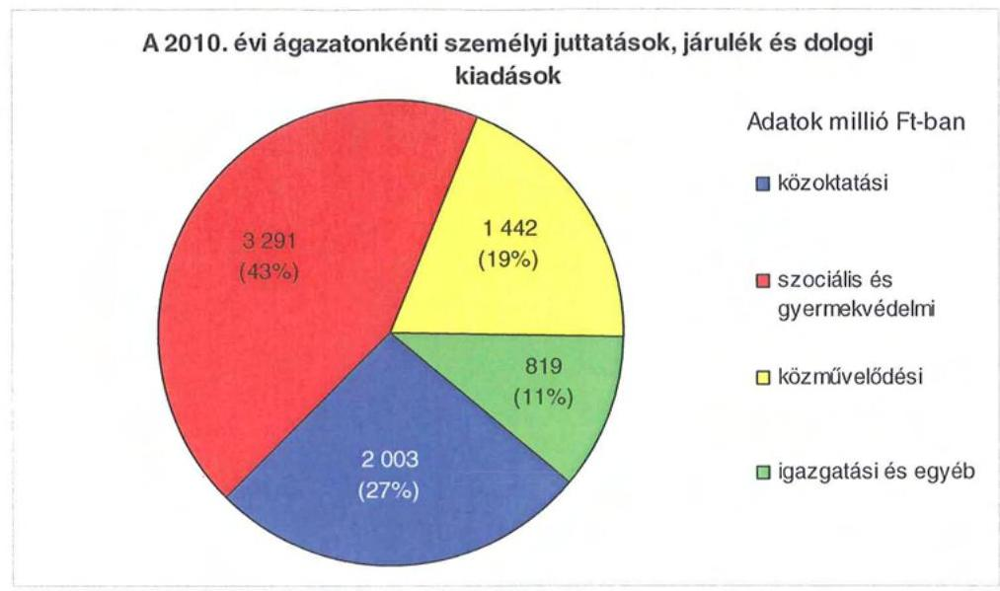

Az Önkormányzat a 2010. évi költségvetési kiadásai 74,7\%-a az intézmények ( 7083 millió Ft), a többi a Hivatal költségvetésében jelenik meg. A Hivatal 2402 millió Ft összegű költségvetéséből 775 millió Ft-ot a személyi és dologi kiadásokra, 861 millió Ft-ot beruházásokra, felújításokra, 766 millió Ft-ot pedig a különböző megyepolitikai feladatokhoz, szervezetek támogatásához, finanszírozási tételekhez kapcsolódó kiadásokra fordítottak.

Az Önkormányzat a kötelező és az önként vállalt feladatait a 2010. december 31-ei adatok szerint a közgyűlés hivatalával és további 28 költségvetési szervvel, valamint egy többségi tulajdonú gazdasági társasággal látta el. A költségvetési szervek száma az elmúlt négy évben 41-ről 29-re, 29\%-kal csökkent.

Az Önkormányzat által fenntartott költségvetési szervek közül 16 önállóan működő és gazdálkodó költségvetési szerv. Az intézmények összesen 65 telephelyen múködnek, ugyanebben az intézményi szerkezetben 2007. január 1-jén 73 telephely volt. Az Önkormányzat feladatait 2010. december 31-én az alábbi intézménystruktúrával látta el:

- szociális és gyermekvédelmi feladatokat 11 intézmény végzett (hét idősek otthona, melyből egy módszertani feladatokat is ellátott, egy fogyatékosokat gondozó, egy szenvedélybetegeket ellátó, valamint két gyermekvédelmi feladatot ellátó intézmény, amelyből egy oktatási tevékenységet is végző gyermekotthon volt);
- közoktatási feladatot 11 intézmény látott el (egy pedagógiai szakszolgálat, két szakközépiskola, szakiskola és kollégium, egy szakképző iskola, amely általános iskolai feladatot is ellátott, egy általános iskola, négy egységes gyógypedagógiai intézmény, két zeneiskola);
- közművelődési, közgyűjteményi és sport feladatok ellátása öt intézmény feladatkörébe tartozott (egy színház, egy bábszínház, egy közművelődési intézmény, amely pedagógiai szakmai szolgáltatást is nyújtott, továbbá egy levéltár és egy múzeum);

---

- a Hivatal igazgatási feladatokat látott el, egy intézményt pedig infrastruktúra fejlesztésre, gazdaságélénkítő, gazdasági szerkezetváltás elősegítésére és vízminőség javítására alapítottak.

Az Önkormányzat tagja három szakképzést szervező térségi integrált szakképző központnak (továbbiakban: TISZK). A TISZK-ekhez három megyei fenntartású, négy megyei jogú városi, két városi és három alapítványi fenntartású közoktatási intézmény kapcsolódik, a munkaszervezet szervezési és igazgatási feladatainak ráfordításai nem az Önkormányzat költségvetésében jelentek meg.

Az Önkormányzat kötelező feladatellátásának ágazati bontását 2010. december 31-én az alábbi mutatók jellemzik:

| Megnevezés | közoktatási   feladatok   ellátása | szociális és   gyermekvéde-   lem | kultúra   és sport | gazdasági   társaságként   múködő   Kórház |
| :-- | :--: | :--: | :--: | :--: |
| Az ágazatban fog-   lalkoztatottak száma   (fő) | 579 | 953 | 281 | 1161 |
| Az ágazat intézmé-   nyeiben ellátottak   összesen (fő) | 3400 | 2021 |  |  |
| Fekvőbeteg ellátás   férőhelyeinek száma   (db) |  |  |  | 978 |

Az Önkormányzat feladatainak ellátásában 2010. december 31-én hat gazdasági társaság múködtetésében vett részt, melyek közül egy társaságban volt többségi részesedése.

A Markhot Ferenc Megyei Kórházat az Önkormányzat 2009. augusztus 1-jétől 100\%-os önkormányzati tulajdonú gazdasági társaságként (Kórház Nonprofit Kft.) múködteti 337 millió Ft saját tőkével, melyből a jegyzett tőke értéke 10 millió Ft, a 2010. évi statisztikai átlaglétszáma 1161 fő, fekvőbeteg férőhelyek száma 978.

A közoktatási feladatokhoz kapcsolódóan az Önkormányzat három TISZK Nonprofit Kft-ben ${ }^{17}$ is alapító tagként vett részt, ahol nincs többségi részesedése ( $3,2 \%, 28,6 \%$ és $50 \%$ ). Az alapító okiratokban megfogalmazott feladatrendszer jellemzően a szakképzés elméleti és gyakorlati képzésére, az iskolarendszeren kívüli felnőttképzésre, a fejlesztőpedagógiai szolgáltatásra, a pályaválasztási tanácsadásra terjedt ki.

Az előzőeken túlmenően az Önkormányzat a Heves Megyei Vízmú Zrt-ben 1,3\%, a KRF Közép-Magyarországi Regionális Fejlesztési Zrt-ben 0,002\% tulajdoni részaránnyal rendelkezett.

[^0]
[^0]:    ${ }^{17}$ Az Önkormányzat a következő TISZK-ekben tag: Térségi Integrált Szakképző Központ Kiemelkedően Közhasznú Kft. Eger, Gyöngyös-TISZK Szakképzés Szervezési Nonprofit Kiemelkedően Közhasznú Kft., Hatvan-TISZK Szakképzés Szervezési Nonprofit Kiemelkedően Közhasznú Kft.

---

Az önkormányzati feladatellátásban az intézmények és gazdasági társaságok mellett szolgáltatási szerződéssel kiszervezett/kiszerződött intézményi ellátások nem múködtek.

A vizsgált időszakban az Önkormányzat városi önkormányzattól 1 intézményt (zeneiskolát) vett át, amely 353 tanuló ellátását érintette. A feladatátvétel 2010-ig bezáróan összességében 200 millió Ft-tal növelte a kiadások összegét, melyből a normatív állami hozzájárulás 72 millió Ft-ot fedezett.

Ugyanebben az időszakban az átadott feladatok hét intézmény fenntartását érintették. Más önkormányzat számára - 2277 tanulót, 149 szociális ellátottat és 48 fogyatékos ellátottat érintően - három közoktatási és egy fogyatékosokat ellátó szociális intézményt adtak át. Gazdasági társaságnak egy 800 tanulót oktató közoktatási intézményt, továbbá egy 974 ágyas kórház fenntartását adta át az Önkormányzat, valamint a sporttábor múködtetését is. Az átadások következtében az Önkormányzat intézményi támogatási kötelezettsége összességében 535 millió Ft-tal csökkent. A feladatátadás alkalmával az Önkormányzatot terhelő kötelezettségeket részletesen rögzítették:

- a Dr. Szegő Imre Idősek és Mozgásfogyatékosok Otthona, a Széchenyi István Közgazdasági és Informatikai Szakközépiskola, valamint a Bajza József Gimnázium és Szakközépiskola intézmények működtetésére az érintett városokkal (Heves és Hatvan város) intézményfenntartó társulásokat hoztak létre. A társulási megállapodások értelmében az intézmények költségvetését a városok önkormányzatainak költségvetési rendeletei tartalmazzák, de a fenntartói támogatás $50 \%$-át az Önkormányzat biztosította. A vagyont érintő értéknövelő beruházás, felújítás átalakítás stb. költségeinek viselése a városokat terhelték;
- az Önkormányzat a Károly Róbert Kereskedelmi, Vendéglátóipari és Idegenforgalmi Szakképző Iskolát Gyöngyös város kezdeményezésére a városi önkormányzat és a Károly Róbert Főiskola által alapított Pro Caroberto Kft. fenntartásába adta. A megállapodás értelmében az Önkormányzat vállalta, hogy azoknak a közalkalmazottaknak, akiknek az új fenntartó nem vállalta a továbbfoglalkoztatását a törvény szerinti végkielégítésüket kifizeti, a teljes kifizetett összegre központi támogatást kaptak.

A Kórház átadása az Önkormányzat pénzügyi helyzetét nem változtatta meg, mivel a fenntartó csak olyan támogatásokat utalt a vizsgált időszakban, amelyek központi intézkedések továbbadására vonatkoztak. Intézményi támogatást a fenntartó a Kórház múködéséhez saját bevételeiből nem biztosított. A támogatásként utalt 2007. évi 155 millió Ft és a 2008. évi 305 millió Ft központi bérpolitikai intézkedés hatása, létszámleépítéshez igényelt központi támogatás volt.

Az Önkormányzat 2007. év és 2010. év között összesen 75 millió Ft gép-műszer beruházást finanszírozott. Ebből 2007-ben 22 millió Ft, 2008-ban 9 millió Ft, 2009-ben - a saját tulajdonú kft. üzemeltetésének idejében - pedig 44 millió Ftot fizettek ki az Önkormányzat költségvetéséből. A kifizetéseket teljes egészében pályázati pénzeszközök fedezték, így az Önkormányzat saját bevételeiből az eszközbeszerzésekhez nem járult hozzá.

---

A Kórház múködtetését vagyonkezelési szerződéssel 2008. november 1-jétől az Önkormányzat magántulajdonú társaság vagyonkezelésébe adta. A társaság 2009. július 31-ig múködtette az intézményt, ezt követően az Önkormányzat saját tulajdonú gazdasági társasága vagyonkezelésébe került. Erről az időszakról sem az Önkormányzatnak, sem a Kórház Nonprofit Kft-nek nincs birtokában információ arról, hogy az Önkormányzat tulajdonát képező eszközök után elszámolt értékcsökkenést milyen szinten pótolták vissza. A Kórház Nonprofit Kft. az eltelt időszakban 2009-ben 102 millió Ft, 2010-ben 247 millió Ft értékcsökkenést számolt el, melynek ellensúlyozására 2009-ben és 2010-ben is 7 millió Ft értékű eszközbeszerzést valósítottak meg.

# 2. A PÉNZÜGYI EGYENSÚLYI HELYZET 

A hagyományos költségvetési szerkezet helyett az Önkormányzat pénzügyi helyzetét a CLF módszerrel mutatjuk be, amelyben jobban elkülönülnek a vagyonnal kapcsolatos bevételek és kiadások a feladatokkal kapcsolatos közvetlen múködtetési bevételektől és kiadásoktól. A módszer következetesen elkülöníti a folyó és a felhalmozási költségvetés bevételeit és kiadásait, azok költségvetési egyenlegeit. A tárgyévi pozíciók meghatározása érdekében a figyelembe vett saját folyó bevételek, valamint saját felhalmozási bevételek nem tartalmazzák az előző évi pénzmaradványok felhasználásából származó pénzforgalom nélküli bevételeket ${ }^{18}$.

A bevételek és kiadások besorolása általános közgazdasági meggondolásokon alapul, amely testet ölt az SNA ${ }^{19}$ statisztikai módszertanában is. Folyó tételek alatt értjük azokat a bevételeket és kiadásokat, amelyek az Önkormányzat vagyoni helyzetét automatikusan nem változtatják. A bevételi oldalon ilyenek az adók, az illeték, az áfa bevételek és visszatérülések, a hozamok és kamatok, a költségvetési támogatások, az egyéb saját bevételek, valamint a múködési célra átvett pénzeszközök és kapott támogatások. A folyó kiadások közé tartoznak a szolgáltatások nyújtásával kapcsolatos múködési kiadások, a kamatkiadások, valamint a múködési célú transzferkiadások ${ }^{20}$. A felhalmozási vagy tőke tételek módosítják az Önkormányzat vagyoni helyzetét. A privatizációs bevételek, az immateriális javak és tárgyi eszközök, valamint a részesedések értékesítése csökkentik, a fizikai beruházások és a pénzügyi befektetések növelik a vagyont. A pénzforgalmi bevételek és kiadások nem tartalmazzák a követelések elengedése miatt könyvelt tételeket, mivel ezek egymást kioltó, technikai jellegű elszámolási műveletek.

A folyó költségvetés egyenlege, a múködési jövedelem megmutatja, hogy az Önkormányzat éves folyó bevétele fedezetet biztosít-e a kötelező és önként vállalt feladatellátáshoz kapcsolódó, éves folyó kiadására. A múködési jövedelem

[^0]
[^0]:    ${ }^{18}$ A költségvetési években kialakuló hiány finanszírozása az előző években képzett tartalékok felhasználásával is történhet.
    ${ }^{19}$ System of National Accounts, azaz Nemzeti Számlák Rendszere
    ${ }^{20}$ Transzferkiadásoknak azokat a folyó és felhalmozási tételeket nevezzük, amelyeket nem az adott önkormányzat használ fel szolgáltatásnyújtásra (pl.: ellátottak pénzbeni juttatásai, átadott pénzeszközök, garancia- és kezességvállalások stb.).

---

negatív értéke pénzügyileg fenntarthatatlan helyzetet jelez. A mutató pozitív értéke megtakarítást mutat, amely forrásul szolgálhat az Önkormányzat fennálló kötelezettségei megfizetéséhez, valamint fejlesztéseihez.

A felhalmozási költségvetés pozitív értéke felhalmozási többletet mutat, amely a jövőbeni fejlesztések forrását biztosíthatja. Amennyiben a folyó költségvetési hiány finanszírozása a felhalmozási többletből történik, ez szűkebb értelemben vagyonfelélésnek tekinthető. Amennyiben a felhalmozási költségvetés megtakarítása fejlesztési célú hitelek, kötvények adósságszolgálatát finanszírozza, az változatlan vagyontömeg mellett, a korábban megelőlegezett tőkebevételek valós realizációjának tekinthető. A felhalmozási deficit által generált finanszírozási igény önmagában nem jár pénzügyi kockázattal, a pénzügyileg fenntartható beruházásokhoz kapcsolódó kötelezettségvállalás (adósságszolgálat) előrelátó, tudatos költségvetési gazdálkodással teljesíthető.

A módszer a pénzügyi kapacitás (más néven a nettó múködési jövedelem) fogalmát helyezi a középpontba. Az adós hitelfelvételi képessége, hosszú távú fizetőképessége vagy bonitása a pénzügyi kapacitással, ezen belül is a nettó működési jövedelemmel jellemezhető. A nettó múködési jövedelem negatív értéke az egyes költségvetési években jelentkező adósságszolgálat túlzott mértékére utal ${ }^{21}$. A nettó múködési jövedelem negatív értékének felhalmozási többletből, vagy további hitelből történő finanszírozása pénzügyileg nem fenntartható gazdálkodást vetít előre. A pozitív értéket mutató nettó múködési jövedelem fejlesztési kiadások fedezetét biztosíthatja, illetve a folyamatosan, évenként képződő pozitív nettó múködési jövedelemből meghatározható a jövőben vállalható, teljesíthető éves adósságszolgálat, ily módon az a hitelösszeg, amely - a többi tényezőt, feltételt adottnak tekintve - visszafizetési kockázat nélkül felvehető.

A CLF módszer alapján a pénzügyi kapacitás mértéke az Önkormányzat összevont, nettósított, a központi információs rendszerbe a MÁK-on keresztül leadott éves költségvetési beszámolójának 80-as űrlapjában szerepeltetett adatok alapján került meghatározásra. A 2007-2010 közötti időszakban az Önkormányzat CLF módszer szerint besorolt kiadásainak és bevételeinek főbb jogcímek szerinti alakulását a jelentés 2/a. számú melléklete tartalmazza.

Az Önkormányzat bevételeinek és kiadásainak alakulását részletesen a hatályos számviteli előírások szerint készült, összevont éves költségvetési beszámolók adataira alapozva mutatjuk be. A bevételek és kiadások múködési, valamint felhalmozási jogcímekre történő elkülönítését az éves költségvetési beszámolók, a zárszámadási rendeletek, továbbá - amely jogcímek ${ }^{22}$ esetében erre más lehetőség nem volt - az Önkormányzat adatszolgáltatása szerinti meg-

[^0]
[^0]:    ${ }^{21}$ Kivéve, ha annak finanszírozására a korábbi években képzett tartalékok fedezetet nyújtanak.
    ${ }^{22}$ Az előző évi maradvány visszafizetésének, az előző évi pénzmaradvány átadásának és átvételének, a kamatkiadásoknak, az egyéb pénzforgalom nélküli kiadásoknak, a hozam- és kamatbevételeknek, az átengedett adóknak, a költségvetési támogatásoknak, továbbá az előző évi pénzmaradvány igénybevételének múködési és felhalmozási részre történő megosztásához az Önkormányzat által szolgáltatott adatokat vettük figyelembe.

---

bontás alapján végeztük el. A bevételek elemzése során figyelembe vettük a korábbi években keletkezett pénzmaradvány felhasználásából származó pénzforgalom nélküli bevételeket is. A 2007-2010 közötti időszakban az Önkormányzat bevételeinek és kiadásainak, továbbá adósságszolgálatának alakulását a jelentés $2 / \mathrm{b}$. számú melléklete tartalmazza.

# 2.1. A müködési és felhalmozási egyensúly CLF módszer szerinti önkormányzati adatok 

|  |  |  |  | ezer Ft |
| :--: | :--: | :--: | :--: | :--: |
| Megnevezés | 2007 | 2008 | 2009 | 2010 |
| Folyó bevételek | 17398412 | 17758429 | 10447400 | 7479652 |
| Folyó kiadások | 16663053 | 17540823 | 9981648 | 8442093 |
| Müködési jövedelem | 735359 | 217606 | 465752 | $-962441$ |
| Nettó müködési jövedelem   = müködési jövedelem - tőketörlesztés | 735359 | 217606 | 195478 | $-962441$ |
| Felhalmozási bevételek | 925608 | 386854 | 245638 | 281491 |
| Felhalmozási kiadások | 1723979 | 1538159 | 1046265 | 1042480 |
| Felhalmozási költségvetés egyenlege | $-798371$ | $-1151305$ | $-800627$ | $-760989$ |
| Finanszírozási múveletek nélküli (GFS) pozíció | $-63012$ | $-933699$ | $-334875$ | $-1723430$ |
| Finanszírozási múveletek egyenlege | $-9290$ | 3277459 | $-337755$ | 964255 |
| Tárgyévi pénzügyi pozíció | $-72302$ | 2343760 | $-672630$ | $-759175$ |
| Egyéb tájékoztató adatok |  |  |  |  |
| Összes kötelezettség* | 4359574 | 4175305 | 3944313 | 6385132 |
| ebből rövid lejáratú | 1359574 | 1164457 | 935599 | 2566736 |
| Folyószámlahitel napi átlagos állománya ** | 907500 | 699000 | 678500 | 749600 |
| Egyéb likvidhitel napi átlagos állománya** | 0 | 0 | 0 | 0 |
| Munkabér-megelölegezési hitel napi átlagos állománya ** | 121390 | 200000 | 132288 | 203616 |
| Egyéb finanszírozásba vonható eszközök év végi állománya: | 3563901 | 2867800 | 2195170 | 1435995 |
| - ebből: tartós hitelviszonyt megtestesítő értékpapírok év végi állománya | 0 | 0 | 0 | 0 |
| - ebből: hosszú lejáratú bankbetétek év végi állománya | 0 | 0 | 0 | 0 |
| - ebből: értékpapírok év végi állománya | 3037820 | 0 | 0 | 0 |
| - ebből: pénzeszközök (idegen pénzeszközök nélkül) év végi állománya | 526081 | 2867800 | 2195170 | 1435995 |

* Az összes kötelezettséget a passzív pénzügyi elszámolások nélkül vettük figyelembe, mert a passzívák a pénzmaradvány-elszámolás tételei közé tartoznak.
** A folyószámla- és a munkabér-megelőlegezési hitel átlagos állományát 365 nappal számítottuk.
A vizsgált időszakban az Önkormányzat folyó költségvetési egyenlege, müködési jövedelme 2007-2009. években pozitív, 2010. évben negatív összegű volt, amelyet a következő ábra szemléltet:

---

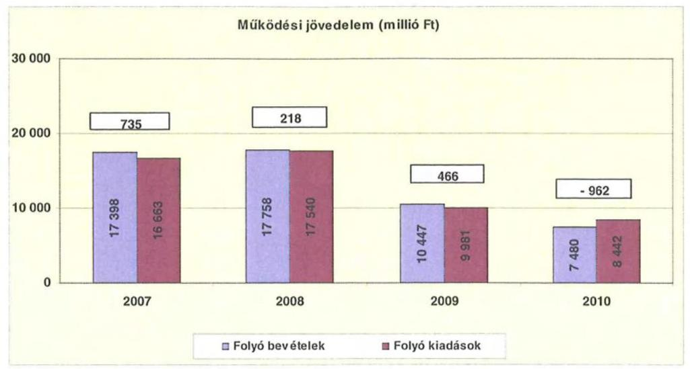

A folyó költségvetés egyenlege (a múködési forrástöbblet) 2007-ben a folyó kiadások 4,4\%-át ( 735 millió Ft-ot), 2008-ban 1,2\%-át (218 millió Ft-ot), 2009ben $4,7 \%$-át ( 466 millió Ft-ot) jelentette. 2010-ben a folyó költségvetés hiánya (a múködési forráshiány) a folyó kiadások 11,4\%-a ( 962 millió Ft) volt.

2007-2009-ben a pozitív előjelű folyó költségvetési egyenleg ellenére az Önkormányzat folyószámla- és munkabérhitel felvételére kényszerült egyrészt az átmeneti likviditási problémák kezelése, másrészt fejlesztési kiadásai finanszírozása miatt. A 2010. évi müködési forráshiány finanszírozása is mun-kabér- és folyószámlahitelből történt. A folyószámlahitel 2007. évi napi átlagos állománya 908 millió Ft-ról 750 millió Ft-ra csökkent 2010-ben, a munkabérhitel napi átlagos állománya pedig 121 millió Ft-ról 204 millió Ft-ra (67,7\%-kal) emelkedett.

Az Önkormányzat kötelezettségein ${ }^{23}$ belül a 2007-2009 közötti időszakban a rövid lejáratú kötelezettségek állománya $32 \%$ alatt volt, a 2010. évi $40,2 \%$-os aránnyal szemben. Az Önkormányzat 2007. december 31-én fennálló pénz- és tőkepiaci kötelezettsége 3572 millió Ft-ról 6122 millió Ft-ra nőtt a 2010. év végére a kötvénykibocsátás és a folyószámlahitel év végi állománya miatt.

A rövid lejáratú kötelezettségek 2010-ben 2567 millió Ft-ot tettek ki, amely 1207 millió Ft-tal ( $88,8 \%$-kal) volt több a 2007. évi rövid lejáratú kötelezettségállománynál. A rövid lejáratú kötelezettségeknek a szállítói állomány - mely a 2007-2010. években, az évek sorrendjében 771, 88, 68 és 170 millió Ft volt -2007-ben 56,7\%-át, 2008-ban 7,6\%-át, 2009-ben 7,3\%-át, 2010-ben 6,6\%-át tette ki. Az Önkormányzat lejárt szállítói kötelezettségállománya minden évben megegyezett az összes szállítói kötelezettség állományával.

Az Önkormányzat pénzügyi kapacitása a 2007-2009. években pozitív, a 2010. évben negatív értéket mutatott. A nettó múködési jövedelem ${ }^{24}$ értéke a folyó költségvetési pozíció mellett az adott költségvetési év adósságtörlesztésének

[^0]
[^0]:    ${ }^{23}$ passzív pénzügyi elszámolások nélküli
    ${ }^{24}$ pénzügyi kapacitás

---

hatását is tükrözi. A nettó működési jövedelem romlását a folyó bevételek és kiadások különbségéből származó működési jövedelem csökkenése okozta ${ }^{25}$.

Az Önkormányzat nettó működési jövedelmének évenkénti alakulását a következő ábra szemlélteti:
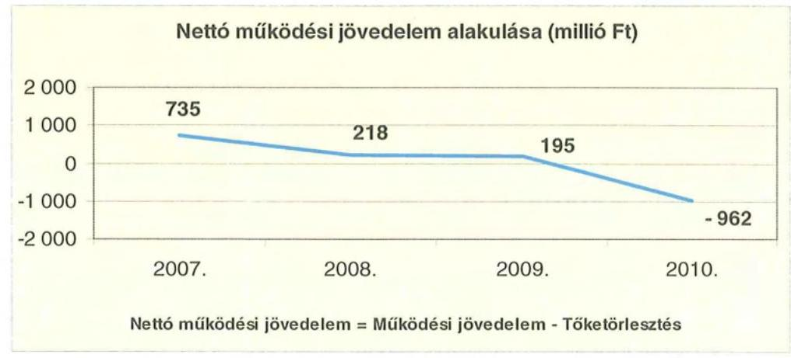

A folyó költségvetés egyenlegének és a tőketörlesztésre fordított összegeknek évenkénti különbözete (a nettó működési jövedelem) évről-évre alacsonyabb összegű volt, 2010-ben pedig negatív értéket mutatott. A 2010. évi 962 millió Ft negatív működési jövedelem oka, hogy a folyó évi kiadások meghaladták a folyó évi bevételeket.

A 2007-2010. években az Önkormányzat felhalmozási költségvetésének egyenlege folyamatosan negatív összegű volt.

A felhalmozási és tőkejellegű bevételek és kiadások évenkénti egyenlegét a következő ábra szemlélteti:
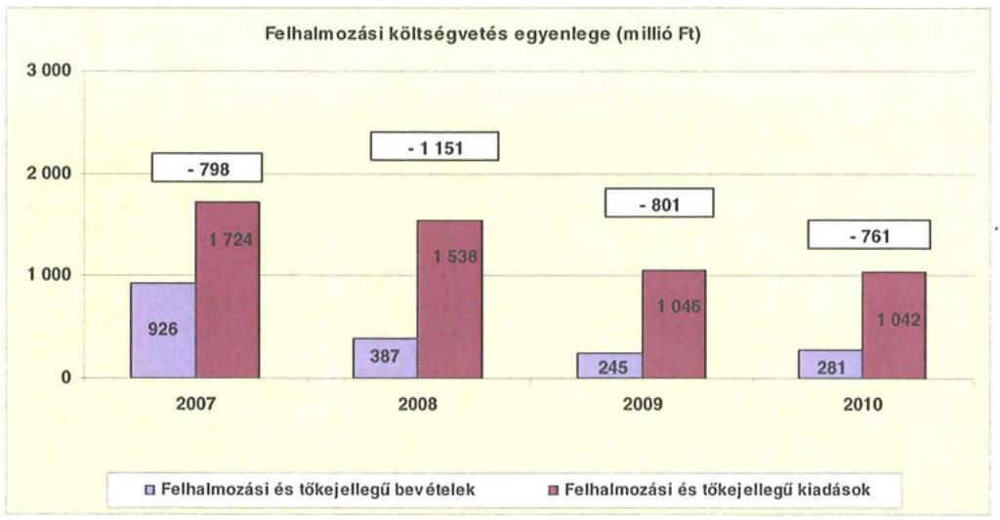

[^0]
[^0]:    ${ }^{25}$ Az Önkormányzatnak a vizsgált időszakban csak 2009. évben volt tőketörlesztési kötelezettsége, amely 270 millió Ft volt.

---

A felhalmozási forráshiánynak a felhalmozási és tőke jellegű kiadásokhoz viszonyított aránya 2007-ben 46,3\% (798 millió Ft), 2008-ban 74,8\% (1151 millió Ft) 2009-ben 76,5\% (801 millió Ft) 2010-ben 73,0\% (761 millió Ft) volt.

A felhalmozási forráshiányt - a 2007 decemberében kibocsátott - fejlesztési célú kötvényből származó bevétellel finanszírozták.

Az Önkormányzat évenkénti teljes finanszírozási hiánya ${ }^{26}$ a CLF módszer szerint 2007-ben 63 millió Ft, 2008-ban 934 millió Ft, 2009-ben 605 millió Ft, 2010-ben 1723 millió Ft volt.

Az Önkormányzat finanszírozási múveletei 2007-2010. évekbeli egyenlegének alakulását a következő ábra szemlélteti:
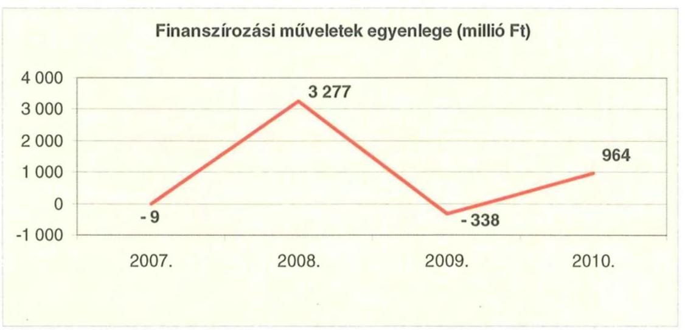

A finanszírozási többlet azt jelzi, hogy az éves költségvetések végrehajtása során szükség volt a pénzkészlet felhasználásán túl külső finanszírozás igénybevételére is. A finanszírozási célú műveleteket a vizsgált időszakban a jelentés 2/a. számú mellékletének 4.1-4.8. pontjai részletezik.

Az Önkormányzat zárszámadási rendeletében a múködési és fejlesztési hiányt a hagyományos költségvetési szerkezet alapján mutatta be ${ }^{27}$, amelyről a jelentés 1. számú melléklete nyújt tájékoztatást.

Az Önkormányzat a 2007-2010. évi zárszámadási rendeleteiben a felhalmozási és múködési egyensúlya meghatározásakor az adósságszolgálati kiadásokat és a hitelfelvételből, valamint kötvénykibocsátásból származó finanszírozási célú bevételeket a múködési és felhalmozási bevételek részének tekintette, melynek következtében minden évben múködési és felhalmozási egyensúlyt (többletet) mutatott ki.

[^0]
[^0]:    ${ }^{26}$ a nettó múködési jövedelem és a felhalmozási költségvetés egyenlegeinek összege
    ${ }^{27}$ Nincs kötelező előírás a múködési és fejlesztési hiány megállapításának módjára.

---

A vizsgált időszakban a kötelezettségek (passzív pénzügyi elszámolások nélkül) 4360 millió Ft-ról 6385 millió Ft-ra emelkedtek, amely együtt járt a kamatkiadások növekedésével. A kamatkiadások növekedését a kötvénykibocsátással összefüggő kamatfizetési kötelezettség és a múködési forráshiány finanszírozására igénybe vett munkabér- és folyószámlahitelek idézték elő.

A kamatbevételek és kiadások alakulása változó volt, összességében az Önkormányzat 2007-2010 között 639 millió Ft kamatbevételt realizált, amely a teljes kamatráfordítás ( 605 millió Ft) 105,6\%-át tette ki.

Az Önkormányzat kamatbevételeinek és kamatkiadásainak alakulását a következő ábra mutatja:
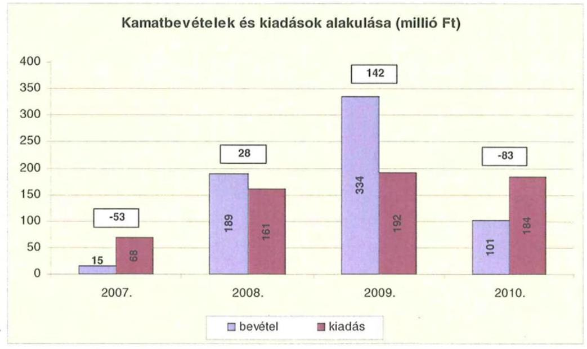

# 2.2. Az Önkormányzat bevételei 

Az Önkormányzat 2007-2010 között realizált, OEP támogatás nélküli, főbb bevételi jogcímeinek számszaki adatait a következő táblázat, összetételét a grafikon mutatja be:
adatok ezer Ft-ban

| Az Önkormányzat múködési bevételeinek összetétele   OEP támogatás nélkül |  |  |  |  |
| :-- | --: | --: | --: | --: |
| Megnevezés | $\mathbf{2 0 0 7 .}$ év | $\mathbf{2 0 0 8 .}$ év | $\mathbf{2 0 0 9 .}$ év | $\mathbf{2 0 1 0 .}$ év |
| Illetékbevétel | 1689028 | 1910628 | 1676428 | 1144053 |
| Szja és állami   támogatás (OEP   nélkül) | 5806428 | 5964247 | 5628957 | 3604136 |
| Egyéb saját bevétel | 2764597 | 3507972 | 3167917 | 3004960 |
| Összesen | $\mathbf{1 0} \mathbf{2 6 0} \mathbf{0 5 3}$ | $\mathbf{1 1} \mathbf{3 8 2} \mathbf{8 4 7}$ | $\mathbf{1 0} \mathbf{4 7 3} \mathbf{3 0 2}$ | $\mathbf{7 7 5 3} \mathbf{1 4 9}$ |

---

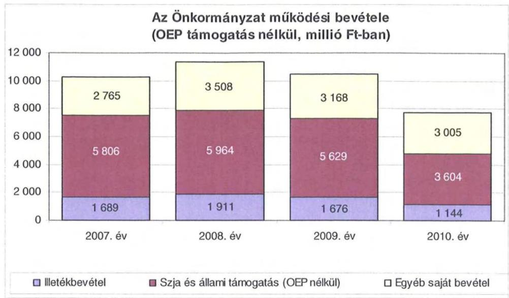

Az OEP támogatás a 2007. és a 2008. években - a Kórház kiszervezéséig - az Önkormányzat költségvetésében 6508 millió Ft-tal és 5986 millió Ft-tal szerepelt, és biztosította az egészségügyi intézmény múködését.

Az Önkormányzatnál az illetékbevétel a 2007. évben a 2006. évi 1997 millió Ft-hoz képest 308 millió Ft-tal, 15,4\%-kal csökkent. A csökkenésben szerepet játszott az Illetékhivatalnak - 2007. január 1-jétől - az APEH-hoz történő átszervezése is, miután az évente realizált illetékbevételekből (központi intézkedés következtében) évi 8,5\% elvonásra került az adminisztrációs feladatokra. A beszedés költségeire elvont összeg minden évben kevesebb volt, mint az Illetékhivatal 2006. évi múködtetési költsége ${ }^{28}$, azaz mint amennyit az Önkormányzat az Illetékhivatal múködtetésére fordított volna. Az Illetékhivatal múködtetésének megszüntetése következtében keletkezett kiadási megtakarítás és az adminisztrációs feladatokra az illetékbevételből visszatartott 8,5\% között 2007-ben 119 millió Ft pozitív különbözet jelentkezett, ez a 308 millió Ft-os bevételcsökkenésnek alig több mint egyharmadát ellentételezte.

Az illetékbevétel a 2007-2010. évek között 545 millió Ft-tal, egyharmaddal csökkent. A vizsgált időszakban - a 2008. év kivételével - folyamatos csökkenés volt tapasztalható, a legjelentősebb a 2010. évben, amikor 532 millió Ft-tal, 31,7\%-kal mérséklődött az illetékbevétel az előző évihez viszonyítva.

Az átengedett szja és az állami támogatások együttes összege a 2007. évi 5806 millió Ft-ról a 2010. évre 3604 millió Ft-ra, kevesebb, mint kétharmadára csökkent. A vizsgált években - a 2008. évi növekedést követően - folyamatosan mérséklődött: a 2009. évben 335 millió Ft-tal, 5,6\%-kal, a 2010. évben 2025 millió Ft-tal, 36,0\%-kal. A változást a normatíváknak a járulékváltozások miatti központi csökkentése, a megyei önkormányzatokat érintő forráselvonás idézte elő, melyhez hozzájárult a középfokú oktatásban az ellátottak számának

[^0]
[^0]:    ${ }^{28}$ A 2006. évben az Illetékhivatal múködtetésére 276 millió Ft-ot fordítottak. Az éves illetékbevétel 8,5\%-a 2007-ben 157 millió Ft, 2008-ban 178 millió Ft, 2009-ben 156 millió Ft, 2010-ben 106 millió Ft volt.

---

közel egyharmadára csökkenése, a más ágazatok azonos szinten maradt ellátotti létszáma mellett.

Az intézményi múködési bevételek - az egyéb sajátos bevételeken belül - a 2010. évben közel a 2007. évi szinten, 1971 millió Ft-ban teljesültek, a vizsgált időszak alatt évenként eltérő irányban változtak az előző évihez képest. A 2008. évi, 231 millió Ft-os emelkedést a szociális ellátások térítési díjának önköltségalapú növekedése eredményezte, míg a 2009. évi, 310 millió Ft-os csökkenésben döntő jelentősége volt a Kórház 2008 novemberétől történt vagyonkezelésbe adásának, tekintettel annak 2008. január-október között teljesített, 204 millió Ft-os múködési bevételére. A térítési díjak emelése a 2010. évben 112 millió Ft-os bevételnövekedést eredményezett az előző évhez viszonyítva. A térítési díjaknál folyamatosan emelkedő hátralék, mely a 2007. évi 21 millió Ftról a 2010. évre 50 millió Ft-ra nőtt, az Önkormányzat fizetőképességének alakulására kedvezőtlen hatást gyakorol.

A térítési díjkövetelés állománya önkormányzati szinten a 2010. év végére a 2007. évihez képest 29 millió Ft-tal, a 2,3-szeresére nőtt, a legnagyobb mértékben - az előző évinek másfélszeresére -, 11 millió Ft-tal a 2008. évben és 14 millió Fttal 2009-ben.

Az Önkormányzat felhalmozási bevételeinek szerkezete a vizsgált időszakban a következőképpen alakult:
adatok ezer Ft-ban

| Megnevezés | 2007. év | 2008. év | 2009. év | 2010. év |
| :-- | :--: | :--: | :--: | :--: |
| Tárgyi eszköz   értékesítés | 36572 | 53302 | 75472 | 6749 |
| Állami támogatás | 797092 | 604143 | 62968 | 14500 |
| Atvett pénzeszköz | 85170 | 87648 | 14154 | 62626 |
| Egyéb felhalmozási   bevétel | 808436 | 357110 | 173606 | 215553 |
| Felhalmozási tartalék | 211286 | 203609 | 742131 | 606365 |
| Összes felhalmozási   bevétel | 1938556 | 1305812 | 1068331 | 905793 |

Az Önkormányzatnak tárgyi eszköz értékesítésből nem származott számottevő bevétele ${ }^{29}$, a 2007-2010. években e jogcímen realizált, 172 millió Ft bevétel az összes - 5218 millió Ft - felhalmozási bevételnek mindössze 3,3\%-a volt, annak ellenére, hogy a vizsgált időszak során több ingatlanértékesítési eljárást indítottak.

[^0]
[^0]:    ${ }^{29}$ Az Önkormányzat a 2007. évben az Illetékhivatal vagyontárgyainak APEH részére történt értékesítéséből és üzletrész értékesítésből, a 2008. évben egy szolgálati lakás eladásából, 2009-ben pedig egy ingatlan és középnyomású gázvezeték értékesítéséből realizáltak jelentősebb bevételt, egyéb használaton kívüli tárgyi eszközök értékesítése mellett.

---

Az Önkormányzat a vizsgált időszakban állami támogatásból, egyéb felhalmozási bevételből - melyek együttes összege 2007-2010 között összesen 3033 millió Ft volt - az intézmények rekonstrukcióját, felújítását, eszközbeszerzését, intézményi beruházást valósított meg. Ennek keretében a legjelentősebb bevételek az Orczy-kastély rekonstrukciójára, a parádi idősek otthona építésére, a Kórház egészségügyi információ-technológiai fejlesztésére juttatott pénzeszközök voltak. A 2007-2010. években cél- és címzett támogatással további intézményi rekonstrukciókat, felújításokat, gép-, műszerbeszerzéseket hajtottak végre. Az évenkénti nagy összegű felhalmozási tartalék - a kötvénykibocsátás ellenértékének betétként történt lekötése - az uniós és hazai projektek finanszírozását szolgálja, melyből a 2008. évben 374 millió Ft-ot, a 2009. évben 591 millió Ft-ot és 2010-ben 747 millió Ft-ot használtak fel ezen célokra.

# 2.3. Az Önkormányzat kiadásai 

Az Önkormányzat múködési kiadásai főbb jogcímek szerinti bontásban a következők voltak:
adatok ezer Ft-ban

| A Heves Megyei Önkormányzat múködési kiadásai (2007-2010. években tényleges teljesítés) |  |  |  |  |
| :--: | :--: | :--: | :--: | :--: |
| Megnevezés | 2007. | 2008. | 2009. | 2010. |
| Múködési kiadások | 16659115 | 17441262 | 9874249 | 8388565 |
| Múködési kiadások (kamatkiadás nélkül) | 16590661 | 17379802 | 9780853 | 8251161 |
| Kamatkiadás | 68454 | 61460 | 93396 | 137404 |
| Személyi juttatások | 8512807 | 8859928 | 4796055 | 4289208 |
| Munkaadót terhelő járulékok | 2739227 | 2686189 | 1581057 | 1129840 |
| Dologi kiadások | 4452773 | 4643741 | 2556827 | 2135557 |
| Egyéb folyó kiadások | 78775 | 142261 | 104119 | 76136 |
| Támogatások, elvonások, egyéb folyó átutalások | 732124 | 935201 | 633914 | 518616 |
| ebből: múködési célú pénzeszközátadás | 120197 | 413279 | 130010 | 201652 |
| Előző évi pénzmaradvány átadás, viszafizetés, múködési célú | 74955 | 112482 | 108881 | 101804 |

Az Önkormányzat múködési kiadásai a 2007-2010. évek között 16659 millió Ft-ról 8389 millió Ft-ra - 50,4\%-kal csökkentek. Ebben a változásban a Kórház 2008. november 1-jétől történő vagyonkezelésbe adása, majd 2009. augusztus 1-jétől kft-be szervezése játszott döntő szerepet.

Az Önkormányzat a 2010. évben a működési költségvetésből 5419 millió Ft-ot (64,6\%-ot) személyi juttatásokra és a munkaadókat terhelő járulékokra, 2136 millió Ft-ot ( $25,5 \%$-ot) az üzemeltetést, intézményfenntartást biztosító dologi kiadásokra fordított. A múködési kiadásokon belül a személyi juttatások és munkaadókat terhelő járulékok aránya 2007-ről 2010-re 2,9\%-kal ${ }^{30}$ csökkent, míg a dologi kiadások aránya a 2007-2010. évek között folyamatosan - 1,2\%-

[^0]
[^0]:    ${ }^{30}$ A személyi juttatások és munkaadókat terhelő járulékok múködési kiadásokon belüli aránya a 2007. évben 67,5\%-ról 2010-re 64,6\%-ra csökkent.

---

kal ${ }^{31}$ - csökkent. A múködési költségvetésből a 2007. évben 15705 millió Ft-ot, $94,3 \%$-ot, a 2010. évben 7555 millió Ft-ot, $90,1 \%$-ot kötött le e három kiadási jogcím.

A személyi juttatások és járulékaik - a 2008. évi növekedést követően folyamatosan csökkentek - a 2007. évi 11252 millió Ft-ról a 2010. évre 5419 millió Ft-ra. A csökkenés a 2008. évben volt a legjelentősebb, mely elsősorban a Kórház vagyonkezelésbe adásával volt összefüggésben. A személyi juttatások és járulékaik vizsgált időszaki folyamatos mérséklődését továbbá a létszámcsökkentések okozták. A 2010-ben kifizetett, 5419 millió Ft összegű személyi juttatások járulékaikkal együtt a 2007. évben e jogcímen teljesített kiadásoktól 5833 millió Ft-tal voltak alacsonyabbak.

A dologi kiadások alakulása a személyi juttatásokkal azonos tendenciát mutat, 2010-ben a 2007. évi szintnél 2317 millió Ft-tal, 52,0\%-kal fordítottak kevesebbet erre a jogcímre, melyet alapvetően ${ }^{32}$ a 2008 novemberétől végrehajtott Kórház kiszervezése okozott. A 2008. év kivételével - amikor növekedés következett be - a 2009. és a 2010. években a dologi kiadások az előző évhez képest csökkentek.

Az ellátás szervezeti kereteiben történt változás hatására ${ }^{33}$ a múködési célú pénzeszközátadások nagysága 2007-ről 2008-ra 244,2\%-kal ${ }^{34}$ nőtt.

Az önkormányzati kiadásokban a kórházi kiadások a 2007. és 2008. években szerepelnek, annak 2008. november 1-jei vagyonkezelésbe adásáig. A Kórház nélküli, teljesített, 9972 millió Ft működési kiadás 2007-ben az összes múködési kiadás 59,9\%-át tette ki, ez az arány 2008-ban, amikor is - a Kórház tíz havi ${ }^{35}$, 6275 millió Ft-os kiadásával csökkentett - összes múködési kiadás 11166 millió Ft volt, $64,0 \%$-ra nőtt.

A Kórház Nonprofit Kft. 2009-ben - a 2009. augusztus 1-jei megalakulásától december 31-éig -, öt hónapra elszámolt, 3073 millió Ft-os múködési kiadása a 2010. évre 6686 millió Ft-ra növekedett, mely az összes kiadásnak 2009-ben a 96,0\%-át, 2010-ben a 96,1\%-át jelentette. A nettó árbevétele meghaladta a kiadásait, mely 2009-ben - az augusztus-december közötti időszakban 3530 millió Ft, a 2010. évben 6912 millió Ft volt.

[^0]
[^0]:    ${ }^{31}$ A múködési kiadásoknak a dologi kiadások a 2007. évben 26,7\%-át, a 2010. évben $25,5 \%$-át kötötték le.
    ${ }^{32}$ Az Önkormányzat múködési kiadásaiban a Kórház dologi kiadása a 2007. évben 2249 millió Ft-tal, a 2008. évben - 10 hónap alatt - 2244 millió Ft-tal vett részt.
    ${ }^{33}$ A 2008. november 1-jétől a Kórház vagyonkezelésbe adásával, az OEP-től az Önkormányzatnak utalt, 268 millió Ft összegű támogatás továbbutalása történt átadott pénzeszközként.
    ${ }^{34} 120$ millió Ft-ról 413 millió Ft-ra
    ${ }^{35}$ A Kórház tíz havi kiadását arányosítással éves szintre számítva és megvizsgálva az így kialakult önkormányzati kiadásokban a Kórház nélküli kiadási arányt, azt tapasztaljuk, hogy a 2007. évivel közel azonos szintet, 59,7\%-ot képvisel a Kórház nélküli hányad.

---

Az Önkormányzat Kórház nélküli múködési kiadásai a 2007-2008. években a következőképpen alakultak:
adatok ezer Ft-ban

| A Heves Megyei Önkormányzat múködési kiadásai a Kórház kiadásai nélkül (2007-2010. években tényleges teljesítés) |  |  |  |  |
| :--: | :--: | :--: | :--: | :--: |
| Megnevezés | 2007. | 2008. | 2009. | 2010. |
| Múködési kiadások | 9971643 | 11165528 | 9874249 | 8388565 |
| Múködési kiadások (kamatkiadás nélkül) | 9903189 | 11104068 | 9780853 | 8251161 |
| Kamatkiadás | 68454 | 61460 | 93396 | 137404 |
| Személyi juttatások | 5176748 | 5834542 | 4796055 | 4289208 |
| Munkaadót terhelő járulékok | 1645914 | 1692864 | 1581057 | 1129840 |
| Dologi kiadások | 2204094 | 2400552 | 2556827 | 2135557 |
| Egyéb folyó kiadások | 78775 | 142261 | 104119 | 76136 |
| Támogatások, elvonások, egyéb folyó átutalások | 722703 | 921367 | 633914 | 518616 |
| ebből: múködési célú pénzeszközátadás | 120197 | 413279 | 130010 | 201652 |
| Előző évi pénzmaradvány átadás, viszafizetés, múködési célú | 74955 | 112482 | 108881 | 101804 |

A múködési kiadások a 2008. évben 2007-hez viszonyítva a Kórházzal együtt 7,3 százalékponttal ${ }^{36}$ kisebb mértékben nőttek, mint a Kórház nélkül ugyanebben az időszakban.

Ugyanez a jellemző a személyi juttatások és a dologi kiadások alakulására is. A Kórház nélküli múködési kiadásoknak a személyi juttatások és járulékaik 2007. évi, 6823 millió Ft-os összege a $68,4 \%$-át, a 2008. évi, 7527 millió Ft-os összege a $67,4 \%$-át teszi ki, míg ugyanezen időszakokban a Kórházzal együttes múködési kiadásokban az arányuk 67,5\%-os, illetve 66,2\%-os. A Kórház nélküli személyi juttatások és munkaadót terhelő járulékok a 2007. évről a 2010. évre 1404 millió Ft-tal, több mint egyötöddel, ezen belül a munkaadót terhelő járulékok 516 millió Ft-tal, közel egyharmaddal csökkentek, mely az állami támogatások csökkenésével is járt.

A Kórház nélküli dologi kiadások aránya a múködési kiadásokban a 2007. évben $22,1 \%$ ( 2204 millió Ft), a 2008. évben $21,5 \%$ ( 2400 millió Ft) volt, szemben a Kórházzal együttes múködési kiadásokban képviselt 26,7\%-os (4453 millió Ft), illetve 26,6\%-os ( 4644 millió Ft) hányaddal. A Kórház nélküli dologi kiadások a 2007. évihez képest a 2010. évben 68 millió Ft-tal, 3,1\%-kal alacsonyabb összegben teljesültek.

A Kórházon kívüli intézményekben magasabb a múködési kiadások személyi juttatás tartalma, illetve a Kórháznak - a dologi kiadások múködési kiadásokon belüli magasabb aránya jelzi, hogy - nagyobb az eszközigénye a többi ágazatba tartozó intézményhez képest.

[^0]
[^0]:    ${ }^{36}$ A múködési kiadások növekedése a Kórházzal együtt 4,7\%-os ( 782 millió Ft), a Kórház nélkül $12,0 \%$-os ( 1194 millió Ft) volt.

---

A 2007-2010. évek között a - Kórház kiadásai nélkül számított - személyi juttatások 888 millió Ft-tal, 17,2\%-kal, míg a munkaadókat terhelő járulékok 516 millió Ft-tal, 31,3\%-kal csökkentek, amely egyrészt a kifizetett személyi juttatások, másrészt a járulékok mértékének csökkenésével volt összefüggésben. A járulékok csökkenése miatt felszabaduló forrásokat azonban a kormányzat az önkormányzati alrendszernek nyújtott állami támogatásokból levonásba helyezte, így a járulékcsökkenés az Önkormányzatnál érdemi megtakarítást nem eredményezett, mivel az az állami támogatások csökkenésével járt együtt.

Az Önkormányzat a 2007-2008. évek között a Kórház múködési kiadásaihoz saját pénzeszközeiből nem nyújtott támogatást, az önkormányzati kifizetések központi és egyéb forrásokból biztosított támogatások továbbutalását jelentették. A kórházi múködési támogatások a központi bérpolitikai intézkedésekhez, a létszámcsökkentésekhez kapcsolódó többletköltség fedezetéhez, a 13. havi juttatások kifizetéséhez, kereset kiegészítésekhez kapcsolódtak.

A kórházak múködésének finanszírozására az OEP támogatás szolgál, míg a fejlesztési kiadások fedezetét az önkormányzatoknak kell biztosítaniuk intézményeik számára, melyekhez az Önkormányzat - 2007-2008 októbere között, amikor a Kórház önkormányzati fenntartású intézmény volt - pályázatok útján jutott.

A Közgyűlés a 2009. évben 20 millió Ft tagi kölcsönt nyújtott az Önkormányzat 100\%-os tulajdonát képező Kórház Nonprofit Kft-nek, valamint a 2010. évben a Kórház Nonprofit Kft. folyószámla-hiteléhez vállalt kezességgel összefüggésben, átadott pénzeszközként 161 millió Ft-ot folyósított. Az átadott pénzeszközök évenkénti összegét a következő grafikon mutatja be:

A Kórház részére átadott pénzeszközök (millió Ft)
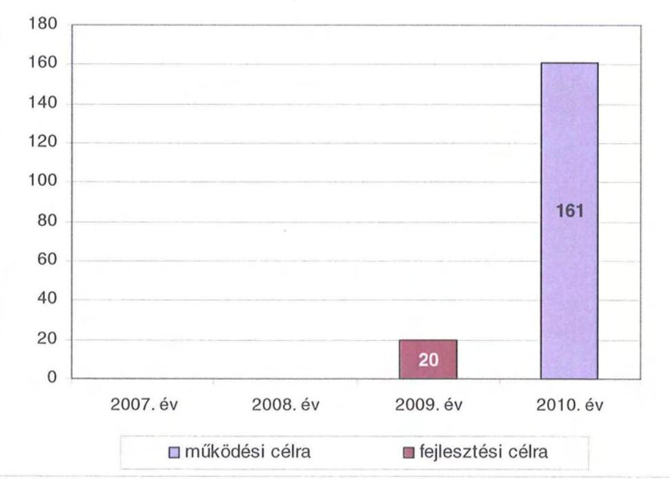

---

A múködési és felhalmozási kiadások aránya nem változott jelentősen 2007-2010 között. A felhalmozási kiadási hányad a 2007. évi, 18387 millió Ftos összes kiadásban 9,4\% volt, amely a 2010. évre a 9485 millió Ft-os összes kiadás $11,6 \%$-át tette ki. A 2007-2010. évek között a felhalmozási kiadások 632 millió Ft-tal, éves átlagban 158 millió Ft-tal csökkentek.

A kiadások összetételének változását (a múködési és fejlesztési célú kamatkiadásokat is figyelembe véve) a következő grafikon szemlélteti:
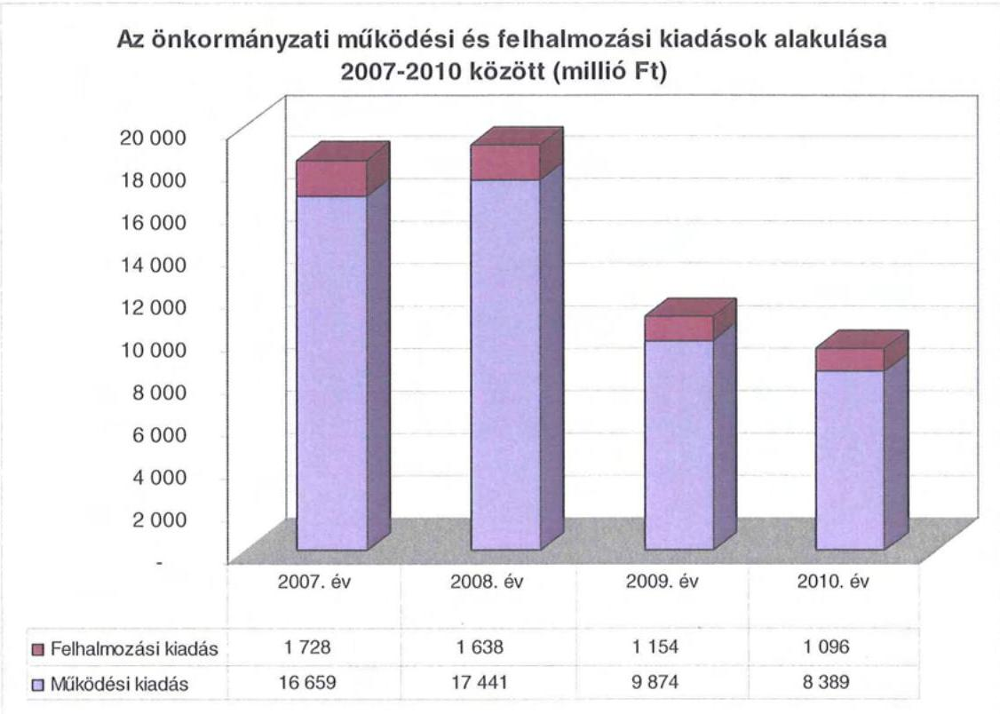

A 2007-2010. évek között a 10 millió Ft teljes bekerülési költség feletti beruházások és felújítások száma 21 volt, amelyek közül nyolc (38,1\%) fejlesztéshez EU-s forrásokat is igénybe vettek. A 2010. évben három EU-s projekt megvalósítása volt folyamatban. A 10 millió Ft egyedi bekerülési érték alatti fejlesztések összértéke meghaladta az 1525 millió Ft-ot, melyek között EU-s forrással finanszírozott nem volt.

Az Önkormányzat a 2007-2010. években együttesen - aktív pályázati tevékenysége eredményeként - 5064 millió Ft-ot fordított fejlesztéseinek finanszírozására, ennek 16,2\%-a a 10 millió Ft egyedi beszerzési érték alatti fejlesztésekhez kapcsolódott. A 10 millió Ft feletti fejlesztésekből kilenc esetében a kötelező ágazati előírásoknak való megfelelés érdekében, vagy azokat is figyelembe véve hajtották végre a feladatot. A megvalósított, illetve folyamatban lévő fejlesztések 94,5\%-a, összesen 9732 millió Ft bekerülési költségú beruházás a kötelező feladatok ellátásához kapcsolódott. A 2007-2010. években megvalósított, illetve elindított fejlesztésekkel összefüggésben 5107 millió Ft a 2010. évet követő időszakra vállalt kötelezettség, melyből a Kórház Nonprofit Kft-nél folyó kórház-

---

rekonstrukciós, TIOP pályázathoz kapcsolódó kötelezettség 4848 millió $\mathrm{Ft}^{37}$. A fejlesztések megvalósításához minden esetben szükségesnek ítélik külső források bevonását, hazai és EU-s pályázatokon való részvétellel.

Ezen időszakban a négy, legmagasabb bekerülési költségű beruházás a következő volt:

- a parádi idősek otthona építése; a 90\%-os támogatástartalommal, címzett támogatással megvalósult fejlesztés bekerülési költsége 1469 millió Ft volt;
- az Orczy-kastély rekonstrukciója Gyöngyösön, 655 millió Ft bekerülési költséggel valósult meg, melyet 97,5\%-ban fedezett EU-s forrás;
- az Európai Információs Pont elhelyezését, melynek bekerülési költsége 425 millió Ft, és melyből 2010 végéig 325 millió Ft-ot fizettek ki, önkormányzati saját forrásból hajtották végre;
- a Kórház Nonprofit Kft-nél, 90\%-os, EU-s támogatással megvalósuló kórházrekonstrukciónak 4908 millió Ft a teljes bekerülési költsége.

Az Önkormányzat fejlesztési tevékenysége a pályázati kiírások által nagyban befolyásolt, mert a jelentkező működési forráshiány és saját felhalmozási bevételei alacsony szintje miatt beruházásokat alapvetően külső források, EU-s és hazai támogatások elnyerése esetén tud megvalósítani. A felhalmozási kiadások önrészének forrásait felhalmozási célú kötvénykibocsátásból származó bevételéből finanszírozta.

# 3. KÖTELEZETTSÉGEK BEMUTATÁSA 

### 3.1. A pénzintézetek felé fennálló kötelezettségek

Az Önkormányzat pénzintézeti kötelezettségeinek állománya - 2006. december 31-ről 2010. december 31-re 303 millió Ft-ról 6122 millió Ft-ra nőtt. A hosszúlejáratú kötelezettségei kötvény kibocsátásából, a rövidlejáratú kötelezettségei folyószámlahitel és munkabér-megelőlegezési hitelek igénybevételéből, valamint a kötvényhez kapcsolódó, adott évi kamatfizetési kötelezettségekből keletkeztek. A rövidlejáratú kötelezettségek összege a 2009. évben átmenetileg csökkent a kötvényhez kapcsolódó kamatösszegek ${ }^{38}$ csökkenése következtében, egyébként növekvő trendet mutatott.

Fejlesztési feladatainak finanszírozására az Önkormányzat 2007. december 20án 19853088 CHF összegben bocsátott ki kötvényt, aminek eredményeként 3000 millió Ft fejlesztési forrása keletkezett.

[^0]
[^0]:    ${ }^{37}$ A pályázat támogatástartalma 90\%-os EU-s forrás.
    ${ }^{38}$ Az Önkormányzatnál a kötvény kibocsátásakor meghatározott kamat (referencia kamat+kamatfelár) nem változott, azonban a kamat kondíciója kedvezően alakult, a számított kamatláb a 2008. évről 2009. évre kevesebb, mint a felére csökkent (3,755\%ról $1,587 \%$-ra).

---

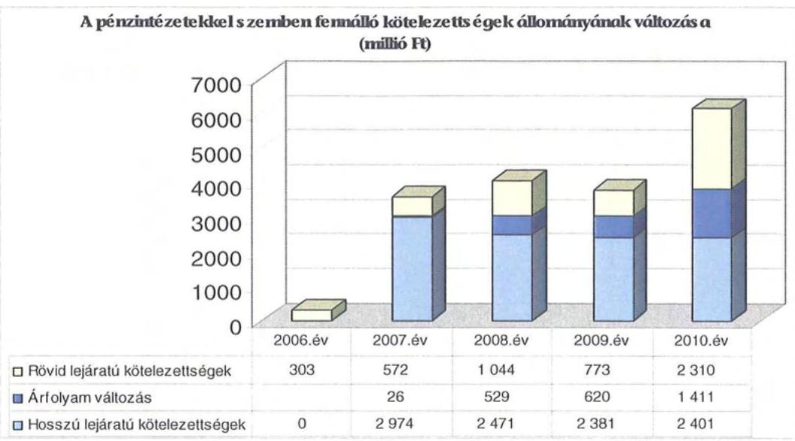

Az Önkormányzat pénzintézeti kötelezettségvállalásaira minden esetben közgyűlési döntés alapján került sor, a kötelezettségvállalásból származó források felhasználási céljait, valamint a kötelezettségvállalások visszafizetési forrásait is meghatározták. A közgyűlési előterjesztések nem tartalmazták a teljes futamidő várható kamat és tőkefizetési kötelezettségeit, az árfolyam- és kamatkockázatokat nem mutatták be. Az adósságot keletkeztető kötelezettségvállalással megvalósított fejlesztések esetleges bevételnövelő, illetve kiadáscsökkentő vonzatát nem vizsgálták. A Közgyűlés döntéseiben kötelezettséget vállalt a felvett hitel és járulékainak megfizetésére, amit az adott évi költségvetésébe betervezett és jóváhagyott. Az Önkormányzat az áttekintett időszakban nem lépte túl az adósságszolgálati korlátot.

A folyószámlahitel visszafizetésének fedezetéül mindenkor az illetékbevételt rendelték, azonban a pénzintézet az egyre növekvő, egyre nagyobb összegű finanszírozási igény teljesítéséhez a visszafizetés fedezetéül szolgáló biztosítéki kört egyre bővítette. 2010-ben ${ }^{39}$ a folyószámla hitelkeret 1200 millió Ftról 1500 millió Ft-ra történő emeléséhez ingatlanfedezetet kértek, 2011-ben a folyószámla-hitelkeret szerződés II. módosítása alapján, az újabb 300 millió Ft-os keretemelést csak a kötvény részleges visszavásárlási kötelezettségének előirása mellett biztosították. Ennek eredményeképpen az Önkormányzat folyószámla hitelkerete 2011. 02. 11-től 2011. 09. 30-ig terjedő időszakra 1800 millió Ft lett.

A kötvény kibocsátásához kötött megbízási szerződésben rögzítettek szerint a kötvény visszavásárlása és kamatai megfizetésének fedezete az Önkormányzat futamidő alatti költségvetési ${ }^{40}$ bevétele. Az Önkormányzat a kötvény vissza-

[^0]
[^0]:    ${ }^{39}$ 2010. 07. 20-án módosították először a 2010. 04. 01-től érvényes folyószámlahitelkeretszerződésüket, mely szerint az Önkormányzat számára jóváhagyott hitelkeret 2014.03. 31-ig 1200 millió Ft.
    ${ }^{40}$ A költségvetési bevételekből kivették a normatív állami hozzájárulást, az állami támogatást, személyi jövedelemadót, valamint az államháztartás keretében átcsoportosított, illetve működési célú támogatás értékű bevételeket.

---

vásárlását ingatlanértékesítésből származó bevételből tervezte finanszírozni.

Az Önkormányzat számlavezetője, valamint a rövid lejáratú hitelt biztosító és a kötvénykibocsátással megbízott pénzintézet ugyanazon pénzintézet volt. Az Önkormányzat a pénzintézetet versenyeztetés alapján választotta ki.

A 2011. február 11-én aláírt folyószámla-hitelkeretszerződés II. számú módosításának egyéb kikötések pontjában rögzített kötelezettség szerint az „Önkormányzat 185/2010. (XII. 22.) sz. Közgyűlési határozata alapján 600.000.000 Ft-nak megfelelő összegű soron kívüli részleges kötvény visszavásárlást hajt végre a 19.853.088 CHF névértékű „Heves Megye 2027" elnevezésű kötvényből legkésőbb 2011. június 30-i hatállyal".

A kötvény részleges visszavásárlására vonatkozó 600 millió Ft-os fizetési kötelezettségét az Önkormányzat a kötvénykibocsátásból származó bevételének fel nem használt maradványából ${ }^{41}$ tudta megkezdeni, ezzel kapcsolatosan 2011. március 31-én 61 millió Ft visszafizetését teljesítette. Ha figyelembe vesszük a CHF kötvény-kibocsátáskori és a visszavásárlásakor érvényes árfolyamának ${ }^{42}$ különbségét, megállapítható, hogy a visszavásárlás az Önkormányzatnak több mint 22 millió Ft veszteséget okozott.

Az Önkormányzatnak 2010. december 31-én CHF-ben fennálló adósságot keletkeztető kötelezettség állománya az alábbi volt:

| Megnevezés | Kibocsátás, illetve szerződéskötés időpontja | Összeg   (CHF) | Kibocsátási, vagy lehívási árfolyam | Kamat (referencia kamat+ kamatfelár) | Felhasználás célja |
| :--: | :--: | :--: | :--: | :--: | :--: |
| "Heves Megye 2027"   Kötvény | 2007.12.14 | 19853088 | 151,11 | 3 havi CHF   LIBOR $+0,90 \%$ | Fejlesztési feladatok finanszírozása |

Az Önkormányzatnak a „Heves Megye 2027" kötvénnyel kapcsolatos visszavásárlási kötelezettsége 2010. december 31-ig nem volt. A folyószámlahitelkeretszerződés 2011. február 11-i módosítása következtében a kötvény viszszavásárlásával kapcsolatos kötelezettség változott, de emiatt a kötvénykibocsátással kapcsolatos megbízási szerződést nem módosították.

Az Önkormányzat 2010. december 31-ig az eredeti szerződésben foglaltak alapján 1253882 CHF ( 220 millió Ft) összegű kamatfizetési kötelezettségének tett eleget és egyéb költség címén 11 millió Ft-ot fizetett meg. (Ez az összeg tartalmazza az egyösszegű szervezési díjat és az évente fizetendő egyéb költséget). A

[^0]
[^0]:    ${ }^{41}$ A kötvény kibocsátásával megbízott pénzintézet hozzájárult a kötvénykibocsátásból származó bevétel e célra történő felhasználásához, a visszapótlás kötelezettsége nélkül, mivel felhalmozási célú kiadásról volt szó.
    ${ }^{42}$ A kibocsátáskori HUF/CHF árfolyam 151,11 volt, 2011. március 31-én pedig 207,17 volt.

---

teljesített összes teher forintban kifejezett összegét növeli a külön megállapodás alapján 2011-ben teljesített részbeni visszavásárlás 61 millió Ft-os, egyösszegű befizetése, így mindösszesen 292 millió Ft összegű terhet jelentett az Önkormányzat számára a 2007. évben fejlesztési feladatok megfinanszírozása érdekében kibocsátott kötvényhez kapcsolódó fizetési kötelezettség.

Az alapkamat mértékének alakulása hatással van az adott devizanemben kifejezett, a teljes futamidőre számított, várható kamatkötelezettség nagyságára. Az árfolyamváltozás hatása is befolyásolja a kötelezettségek alakulását, azonban annak mértéke előre, pontosan nem határozható meg, csak várakozásokon alapuló tendenciák jelezhetők. A számviteli törvény 60. § (4) bekezdése ugyanakkor meghatározza, hogy az árfolyam-különbözetet ${ }^{43}$ év végén a kötelezettségek vagy követelések között a könyvviteli mérlegben nyilván kell tartani, azonban az árfo-lyam-különbözet valójában nem realizált. Arról, hogy a devizában kibocsátott kötvényekért kapott forinthoz képest a kötvények visszavásárlásakor jelentkező forint kötelezettség többletkiadást (árfolyamveszteség) vagy megtakarítást (árfolyamnyereség) eredményez a futamidő végén, a teljes kötelezettség rendezését követően lehet képet alkotni. Mindaddig, amíg törlesztési kötelezettség nem áll fenn (türelmi idő, moratórium), a tőkére vonatkoztatva nem értelmezhető sem az árfolyamveszteség, sem az árfolyamnyereség.

Az Önkormányzat a 2007-ben kibocsátott kötvényből kapott 3000 millió Ft bevételéből 2011. március 31-ig összesen 1754 millió Ft-ot használt fel gazdasági programjaiban megfogalmazott fejlesztési feladatainak megvalósításához, egyrészt pályázati önerő biztosításához, másrészt a beruházások, felújítások kivitelezéséhez. A maradék 1246 millió Ft-ot fejlesztési célú maradványként tartják nyilván, ebből teljesítette az Önkormányzat a 61 millió Ft összegű visszavásárlási kötelezettségét 2011-ben.

A kötvényt fejlesztési feladatok megvalósítása érdekében bocsátották ki, a céljelleggel még fel nem használt rész folyamatosan lekötésre került. A legmagasabb hozam elérése érdekében a betét elhelyezésére, több bank ajánlata közül a legkedvezőbb feltételeket biztosító pénzintézetnél került sor a Közgyűlés bizottságának döntése alapján. Mindaddig ez volt a gyakorlat, míg a kötvény kibocsátásával megbízott pénzintézet ezt lehetővé tette. A pénzintézet álláspontja szerint az Önkormányzat nem jogosult a kötvény kibocsátásából származó bevételt más banknál elhelyezni, mert ez a szerződésben rögzítettek szerint ${ }^{44}$ a szerződés lényegi és súlyos megszegésének minősül. Ezért 2009. augusztus hónaptól kizárólag a kötvényt kibocsátó pénzintézetnél került lekötésre a kötvénykibocsátásból származó bevétel fel nem használt része, ami a kamatbevételek relatív csökkenését eredményezte.

Az Önkormányzatnak 2007-2010 között az átmenetileg szabad pénzeszközei lekötéséből 639 millió Ft kamatbevétele keletkezett, melyből 545 millió Ft

[^0]
[^0]:    ${ }^{43}$ A táblázatban szereplő hosszú lejáratú kötelezettségek értékei nem egyeznek meg az önkormányzati nyilvántartással, mivel az Önkormányzat a kötvények értékelésénél az árfolyamváltozás hatását figyelmen kívül hagyta.
    ${ }^{44}$ Ezt támasztják alá a kötvény kibocsátásával kapcsolatos Megbízási szerződés 2.3.4. pontjában rögzítettek is, amelyek alapján a kötvény kibocsátásából származó bevételt az Önkormányzat csak a pénzintézetnél helyezheti el.

---

volt a kötvénykibocsátásból származó bevétel lekötéséből realizált kamat öszszege, amit az Önkormányzat teljes egészében a müködési kiadások finanszírozására használt fel.

Az Önkormányzat likviditását a vizsgált időszakban csak folyószámlahitel igénybevételével tudta biztosítani, a folyószámlahitel és a munkabér megelőlegezési hitel alakulását az alábbi táblázat mutatja be:

| Megnevezés | 2007. év | 2008. év | 2009. év | 2010. év | 2011.   március 31. |
| :-- | :--: | :--: | :--: | :--: | :--: |
| I. Folyószámlahitel |  |  |  |  |  |
| a folyószámlahitel keretösszege január 1-jén | 1200000 | 1200000 | 1400000 | 1200000 | 1500000 |
| teljesített kamat és egyéb költség | 62178 | 56782 | 78795 | 108016 | 36428 |
| II. Munkabér megelőlegezési hitel |  |  |  |  |  |
| Igénybevett hitel összesen: | 800000 | 200000 | 430000 | 2270000 | 740000 |
| teljesített kamat és egyéb költség | 3477 | 1338 | 2382 | 17697 | 5408 |

A folyószámlahitel és munkabér megelőlegezési hitelek kondíciói és egyéb költségei a következők voltak ${ }^{45}$ :

| Megnevezés | Kamat (referencia + kamatfelár) | Egyéb költség |
| :-- | :--: | :--: |
| Folyószámlahitel |  |  |
| 2007. év | 3 havi BUBOR $+0,35 \%$ | x |
| 2008. év | 3 havi BUBOR $+0,35 \%$ | x |
| 2009. év és 2010.03.31-ig | 3 havi BUBOR $+0,35 \%$ | x |
| 2010. 04. 01-től | 1 havi LIBOR $+3,9 \%$ | x |
| 2011. év | 1 havi LIBOR $+3,9 \%$ | x |
| Munkabér megelőlegezési hitel |  |  |
| 2007. év | 3 havi BUBOR $+0,35 \%$ | x |
| 2008. év | 3 havi BUBOR $+0,35 \%$ | x |
| 2009. év és 2010.03.31-ig | 3 havi BUBOR $+0,35 \%$ | x |
| 2010. év 04.01-től | 1 havi LIBOR $+3,9 \%$ | x |
| 2011.év | 1 havi LIBOR $+3,9 \%$ | x |

A vizsgált időszakban az Önkormányzat minden év minden napján igénybe vette a folyószámlahitelt. Az átlagos napi állomány 2009-ben volt a legalacsonyabb, 679 millió Ft. A 2010. évi 750 millió Ft-os átlagos napi állomány 2011. március 31-ére 1530 millió Ft-ra emelkedett. A 2007-2010 közötti időszakot jellemző folyamatos likviditási problémák finanszírozása (folyószámlahitel) következtében az Önkormányzatnak összességében 305 millió Ft volt a teljesített kamat és egyéb költsége.

Az áttekintett időszakban az Önkormányzatnak minden év december 31-én volt folyószámlahitel állománya. Ez 2007-ben 572 millió Ft, 2008ban 844 millió Ft, 2009-ben 774 millió Ft és 2010-ben 1490 millió Ft volt.

A tartós likviditási problémák miatt az Önkormányzat 2007-ben hét, 2008-ban egy, 2009-ben négy, 2010-ben 11 és 2011. március 31-ig három alkalommal

[^0]
[^0]:    ${ }^{45}$ A 3 havi BUBOR az MNB fixing (átlagkamat) 2007-ben 7,75\%, 2008-ban 8,87\%, 2009-ben 8,64\%, 2010-ben 75,5\% és 2011. március 31-ig 6,03\% volt.

---

vett igénybe munkabér megelőlegezési hitelt. Az igénybevett munkabérhitel alkalmanként átlagosan 178 millió Ft volt. A törlesztések az illetékbevételekből és a normatív állami támogatásokból az igénybevételt követő hónapban megtörténtek. A munkabérhitelhez kapcsolódó kamat és egyéb költség címén az Önkormányzat a vizsgált időszakban összesen 25 millió Ft-ot fizetett ki.

A 2010. december 31-én fennálló kötvény esetében a kamatfizetési kötelezettségek alakulását befolyásolta a kibocsátáskori és a 2010. évi utolsó kamatfizetéskori referencia kamatok változása, melyet az alábbi táblázat mutat be:

| Megnevezés | Kibocsátási, lehívási | Utolsó fizetéskori | Változás \% |
| :--: | :--: | :--: | :--: |
|  | alapkamat \% |  |  |
| 3 havi CHF LIBOR | 2,78 | 0,278 | $-90,0$ |

Az Önkormányzat számára az alapkamat mértéke kedvezően alakult az utolsó fizetéskori alapkamat 90,0\%-kal kevesebb lett a kibocsátáskori ${ }^{46}$ alapkamatnál, azonban az árfolyam változás kedvezőtlen hatása miatt a fizetendő kamat összegének csökkenése mérséklődött. A 0,90\%-os kamatfelár figyelembevételével a kibocsátáskori kamatfizetési kötelezettség 182152 CHF ( 30 millió Ft), míg az utolsó kamatfizetési kötelezettség 53793 CHF (12 millió Ft) volt.

Az Önkormányzatnál a helyszíni vizsgálat alatt további hitel igénybevételről, illetve kötvénykibocsátásról szóló döntést nem készítettek elő, azonban a helyszíni ellenőrzés lezárása előtt, 2011. május 19-én a Heves Megyei Bíróság jogerőre emelkedett végzésével az Önkormányzat ellen adósságrendezési eljárás ${ }^{47}$ indult.

Az eljárást kezdeményező hitelező a 2001. évben a Kórházzal, mint az Önkormányzat költségvetési szervével állt szerződéses jogviszonyban. A hitelező 99,2 millió Ft tőke és járulékainak megfizetését kérte az Önkormányzattól - mint a Kórház perbeli jogutódjától -, aminek számított jelenértéke, mintegy 280 millió Ft.

A kártérítési perben a Heves Megyei Bíróság, mint I. fokú bíróság ${ }^{48}$ és a Fővárosi Ítélőtábla, mint fellebbviteli bíróság járt el és hozott ítéletet a felperes javára. Az Önkormányzat a Fővárosi Ítélőtábla jogerős ítéletével szemben 2011. április 19-én felülvizsgálati kérelmet terjesztett elő a Legfelsőbb Bírósághoz. Kérte, hogy jogszabálysértés miatt helyezze hatályon kívül a fellebbviteli bíróság jogerős ítéletét és kötelezze az első fokon eljárt bíróságot új eljárásra és új határozat hozatalára, valamint kérelmezte az ítélet vég-

[^0]
[^0]:    ${ }^{46}$ A kötvény kibocsátásának időpontja 2007. december 20-a volt, ezért az első, teljes negyedéves időtartamra szóló fizetési kötelezettsége 2008. március 31-e lett.
    ${ }^{47}$ A Heves Megyei Bíróság 3.Apk. 10-11-000001/2. számú végzése és a 3.Apk. 10-11-000001/7. sz. határozata alapján indult az adósságrendezési eljárás, ami a Cégközlöny 2011/20. számában jelent meg 2011. május 19-én.
    ${ }^{48}$ Az I. fokú bíróság 7.G.20.182/2006/77. számon hozott ítéletet, a fellebbviteli bíróság jogerős ítéletének száma 6.Pf.20.554/2010/6.

---

rehajtásának felfüggesztését is. A Legfelsőbb Bíróság 2011. május 17-én ${ }^{49}$ hozott végzésében, az Önkormányzat (II. rendű alperes) kérelmére, a Fővárosi Ítélőtábla jogerős ítéletének végrehajtását - a felülvizsgálati eljárás befejezéséig - felfüggesztette. A végzés az Önkormányzathoz 2011. május 23-án érkezett, amikor már az Önkormányzat ellen az adósságrendezési eljárás folyamatban volt.

A hitelező jogi képviselője 2011. április 11-én kezdeményezte a Heves Megyei Bíróságnál - a Fővárosi Ítélőtábla 2011. február 18-án jogerőre emelkedett ítélete alapján - az adósságrendezési eljárást az Önkormányzat ellen, mivel a 2011. március 10-én kelt fizetési felszólításuk ${ }^{50}$ válasz és teljesítés nélkül maradt.

Az Önkormányzat képviseletében a Közgyűlés Elnöke, Alelnöke és Főjegyzője 2011. május 5-én egyeztetést ${ }^{51}$ folytattak a hitelező képviselőivel annak érdekében, hogy a jogerős és végrehajtható bírósági ítéletben kimutatott kötelezettségét az Önkormányzat részletfizetéssel teljesíthesse. A hitelező által elvárt fizetési ütemezést és feltételeket az Önkormányzat képviselői likviditási problémákra hivatkozva nem tartották elfogadhatónak.

A Heves Megyei Bíróság a 2011. április 27-i végzésében - amit az Önkormányzat 2011. április 29-én kézhez kapott - a helyi önkormányzatok adósságrendezési eljárásáról szóló 1996. évi XXV. tv. (továbbiakban adósságrendezési törvény) 6. § (2)-(3) bekezdéseiben foglaltak alapján, felszólította a Közgyűlés Elnökét, hogy - a kézhezvételtől számított 15 napon belül - nyilatkozzon arról, hogy a hitelező által benyújtott kérelemben foglaltakat az Önkormányzat elismeri-e. A Közgyűlés Elnöke 2011. május 12-ei nyilatkozatában közölte, hogy a hitelezőnek az adósságrendezési törvény 4. § (2) bekezdés c) pontjára alapított adósságrendezési eljárást kezdeményező kérelmében foglaltak fennállását az Önkormányzat, mint adós nem ismeri el.

Az Önkormányzatnak a 2010. évről 52 millió Ft kimutatott szabad felhasználású pénzmaradványa volt és a kötvénykibocsátásból származó bevétel fel nem használt maradványát elkülönített számlán kötötték le. A vizsgált időszakban az Önkormányzat a kötvény kibocsátásával kapcsolatos szerződését nem módosította annak érdekében, hogy a kizárólag fejlesztési céllal kibocsátott kötvény ellenértéke múködési célra is felhasználható legyen. A 2008. évben kezdeményezték a pénzintézetnél - ideiglenes jelleggel és visszapótlási kötelezettséggel - a működési célú felhasználást, de a pénzintézet a kötvény kamatának emelését szabta feltételül, ami az Önkormányzat fizetési kötelezettségeit jelentősen megemelte volna, ezért a szerződés módosítására nem került sor. Az Önkormányzat véleménye szerint ezért nem használ-

[^0]
[^0]:    ${ }^{49}$ A Legfelsőbb Bíróság 2011. május 17-én Pfv.IX.20.911./2011/2. számon hozta meg végzését.
    ${ }^{50}$ A hitelező adatszolgáltatása alapján a fizetési felszólítást az Önkormányzat és annak jogi képviselője 2011. március 16-án átvette.
    ${ }^{51}$ A Főjegyző az ÁSZ ellenőrzés számára feljegyzést készített az egyeztetéssel kapcsolatosan.

---

# hatta fel a kötvényből származó bevétel maradványát a hitelező követelésének kiegyenlítésére. 

A hitelező az eljárás megindítását az adósságrendezési törvény 4. § (2) bekezdés c) pontjában foglaltak szerint - jogerős és végrehajtható bírósági ítélet alapján - kérte, ezért a Heves Megyei Bíróság az adósságrendezési törvény 9. § (1) bekezdésének értelmében az adósságrendezési eljárás megindítását 2011. május 13 -án kelt végzésével elrendelte.

A kötvénnyel kapcsolatos megbízási szerződésben rögzítettek miatt az Önkormányzat az adósságrendezési eljárás hitelezői kezdeményezéséről tájékoztatta ${ }^{52}$ a pénzintézetet 2011. május 9-én. A pénzintézet a folyószámlahitelkeretszerződés azonnali hatályú felmondásával nem élt, de a körülményekre való tekintettel a hitelkeret igénybevételét - az adósságrendezés megindításáig, a jogerős végzés Cégközlönyben való közzétételéig - megtagadta. Az Önkormányzat 2011. május 13-ára a rendelkezésére álló 1800 millió Ft-os hitelkeretből 1791 millió Ft-ot vett igénybe, a maradék 9 millió Ft felhasználását a pénzintézet nem engedélyezte azért, mert a megváltozott körülmények az Önkormányzat hitelképtelenségének megállapítását eredményezhetik.

A pénzintézet indoklása szerint a „Ptk. 524. §-a értelmében a kölcsönösszeg átadását, azaz a hitel folyósitását a hitelező megtagadhatja ha a szerződés megkötése után akár az ő, akár az adós körülményeiben olyan lényeges változás állott be, amely miatt a szerződés teljesítése többé el nem várható, továbbá a szerződés megkötése után olyan körülmények következtek be, amelyek miatt azonnali hatályú felmondásnak (525.§) van helye".

Ezen törvényi rendelkezés alapján a pénzintézet az Önkormányzat számláját 2011. május 13-án terhelésre letiltotta, aminek következtében az arra beérkező jóváírások a folyószámlahitel összegét csökkentik. Tájékoztatták továbbá az Önkormányzatot, hogy a munkabér hitelkeret a normatív állami támogatás beérkezésekor, abból közvetlenül kiegyenlítésre kerül és a jövőre vonatkozóan a munkabér hitelkeretet megszüntetik.

A Közgyűlés 2011. május 18-án rendkívüli ülést tartott és az adósságrendezési törvény alapján a szükséges intézkedésekhez a döntését meghozta, lemondott az adósságrendezési törvény 9. § (4) bekezdésében biztosított fellebbezési jogáról, a 16. § (1) bekezdése szerint eljárva megválasztotta az adósságrendezési bizottság negyedik tagját és a 10. § (3) bekezdése alapján döntöttek a hitelezőknek szóló felhívás közzétételéről is. A Közgyűlés felhatalmazta az Elnököt és a Főjegyzőt, hogy az adósságrendezési törvényben foglaltak szerint járjanak el, biztosítsák az előírt kötelező feladatok ellátását és a pénzügyi gondnokkal múködjenek együtt.

Az adósságrendezési bizottság 2011. május 25-én megtartotta első ülését, az Önkormányzat a pénzügyi gondnokot - a banki átutalások teljesíthetőségéhez ellenjegyzőként - a pénzintézethez bejelentette a kötelező feladatok

[^0]
[^0]:    ${ }^{52}$ Az Önkormányzat tájékoztató levelének száma 1-15/2011/221. volt.

---

biztosítása érdekében. Ettől az időponttól a pénzintézet az adósságrendezési törvényben meghatározottak szerint teljesíti az Önkormányzat kifizetéseit.

Az Önkormányzat által készített kimutatás szerint a folyamatban lévő perek a Kórházzal kapcsolatosak. A két db munkaügyi per 63 millió Ft és járulékai megfizetéséről szól, 12 db mühibaper van folyamatban 152 millió Ft és járulékai megfizetése iránt. Ezeken kívül még nyolc hitelező perli az Önkormányzatot a Kórház korábbi müködésével kapcsolatosan, amiknek pertárgy értéke összesen mintegy 960 millió Ft és járulékai követeléséről szól.

# 3.2. Szállítók felé fennálló kötelezettségek 

Az Önkormányzatnak és gazdasági társaságainak lejárt szállítói tartozásait és egyéb kiadás elmaradásait az alábbi táblázat tartalmazza:
adatok ezer Ft-ban

| Megnevezés | 2007.   december 31. | 2008.   december 31. | 2009.   december 31. | 2010.   december 31. | 2011.   március 31. |
| :-- | :--: | :--: | :--: | :--: | :--: |
| Lejárt szállitói tartozás | 770586 | 88075 | 68393 | 169693 | 225190 |
| ebből Kórház | 565575 | - | - | - | - |
| Gazdasági társaságok lejárt   szállitóo tartozása | - | - | 6725 | 49965 | 49611 |
| Egyéb kiadás elmaradás | - | 173614 | - | - | - |
| Tartozásállomány összesen | 770586 | 261689 | 75118 | 219658 | 274801 |

Az Önkormányzat lejárt szállítói tartozása és egyéb kiadás elmaradása 2007. december 31-i 771 millió Ft-ról 2010. december 31-ére 170 millió Ft-ra csökkent, 2011. első negyedév végére 225 millió Ft-ra emelkedett. A 2007. év kiugróan magas tartozásállományát nagyobbrészt a Kórház lejárt tartozásai okozták. A 2008. évben kiszervezett kórházi feladatellátáshoz kapcsolódik az egyéb kiadás elmaradásaként kimutatott 174 millió Ft, a közalkalmazotti létszámcsökkentésekkel összefüggő személyi juttatások után fizetendő munkaadói járulékok fizetési kötelezettségének átütemezése miatt.

A 2009. évben megalakult - teljes mértékben önkormányzati tulajdonú - Kórház Nonprofit Kft-nek a lejárt szállítói tartozása a 2009. év végi 7 millió Ft-ról, 2010 12. 31-ére 50 millió Ft-ra növekedett. Ennek 48\%-a 30 napon túli volt.

Az Önkormányzat 2010. december 31-i lejárt szállítói tartozás állományában éven túli tartozás nem volt. A 30 napot meghaladó lejárt tartozásállomány 50,0\%-a ( 23 millió Ft) 31-60 nap közötti, a 23,9\%-a (11 millió Ft) pedig 61-90-nap közötti.

---

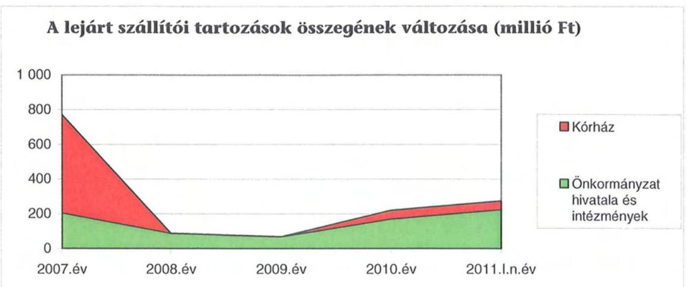

A 100\%-ban önkormányzati tulajdonú Kórház Nonprofit Kft. a 112/2009. (VIII. 28.) számú közgyűlési határozat alapján, 2009. augusztus 28 -án az Önkormányzattól 20 millió Ft összegű tagi kölcsönben részesült, kétéves időtartamra.

A Közgyűlés a 138/2007. (VI. 29.) számú határozatában a Hivatal részére, a régi gépkocsik értékesítése mellett négy db személygépkocsi - lízing-szerződés útján történő - beszerzéséről döntött. A közbeszerzési eljárás lefolytatása után megkötötték a lizingszerződéseket összesen 26 millió Ft + áfa összegben. A líingszerződések alapján 2010. december 31-én az Önkormányzatnak 2 millió Ft összegű szerződés szerinti kötelezettsége állt fenn.

Az Önkormányzatnak a vizsgált időszakban garancia- és kezességvállalással kapcsolatos hosszú távú kötelezettségvállalása nem volt, azonban a Közgyűlés a 109/2009. (VIII. 28.) számú határozatával a következő döntést hozta: „A Közgyűlés kézfizető kezességet vállal és azonnali inkasszó jogot biztosit a terhelhető bankszámlák felett a ... Kórház... Közhasznú Kft részére nyújtandó 400 millió Ft... éven belüli forgóeszköz hitel erejéig és fizeti a hitel igénybevételével kapcsolatos kamat és járulékos kiadásokat."

A közgyűlési határozatban foglaltak alapján 2009. szeptember 15-én az Önkormányzat bankszámlavezető pénzintézete vállalkozói folyószámlahitel szerződést írt alá a Kórház Nonprofit Kft-vel. A szerződésben rögzítették, hogy a pénzintézet 400 millió Ft hitelkeretet biztosít 2010. január 27-i lejárati dátummal, átmeneti likviditási problémák kezelése céljából. A szerződés mellékletét képezte az Önkormányzat és a pénzintézet között létrejött kezességvállalási megállapodás, amelyben rögzítettek szerint az Önkormányzat, mint kezes elfogadta, hogy a pénzintézet az adós (Kórház Nonprofit Kft.) nem fizetése esetén jogosult közvetlenül a kezes (Önkormányzat) ellen fordulni.

Az Önkormányzatnak a készfizető kezességvállalása alapján fizetési kötelezettsége keletkezett. A pénzintézet a folyószámla hitelkeret megszüntetésével, 2010. január 27-i dátummal, összesen 161 millió Ft tartozást mutatott ki a Kórház Nonprofit Kft-vel szemben. Mivel a Kft. a kimutatott tartozását nem tudta rendezni, annak kifizetése a megkötött kezességvállalási megállapodás alapján az Önkormányzatra hárult.

---

Az Önkormányzat a kifizetett összegre - a közhasznú szervezetekről szóló 1997. évi CLVI. tv. 14. § (2) bekezdése alapján - megkötötte a támogatási szerződést, melyben kötelezte a Kórház Nonprofit Kft-t, hogy az összeget a 2010. évi közhasznúsági jelentésében helyi önkormányzattól kapott támogatásként mutassa ki.

Az Önkormányzat a „Heves Megye 2027" elnevezésű kötvény kibocsátásakor a kötvénnyel kapcsolatos visszavásárlási kötelezettségeit ingatlanértékesítésből tervezte teljesíteni. A pénzintézettel kötött megbízási szerződésben a költségvetési bevételeit jelölte meg a kötvény és kamatai megfizetésének fedezetéül úgy, hogy a pénzintézet - az Önkormányzat pénzügyi helyzetének változása esetén - jogosult a biztosítéki kört kiegészíteni.

A szerződés alapján keletkezett jogviszonyból eredő kötelezettségek biztosítására a biztosítéki kört kiegészítették, emiatt a megbízási szerződést kétszer módosították, első alkalommal 2009. december 1-jén, második alkalommal 2010. február 26-án. Mindkét alkalommal egy-egy önkormányzati ingatlanra jelzálogjogot jegyeztek be a pénzintézet javára. A megterhelt ingatlanok becsült forgalmi értéke együttesen 1065 millió Ft volt. Az Önkormányzat nyilvántartásaiban 2010. december 31-én az érintett ingatlanok 664 millió Ft, illetve 214 millió Ft nettó értéken szerepeltek. A bejegyzett jelzálogjog mindkét ingatlanon 3000 millió Ft-nak megfelelő össznévértékű, CHF-ben kibocsátott kötvényügylet és járuléka erejéig történt.

Az Önkormányzatnak a 2010. július 20-án módosított folyószámlahitelkeretszerződésben foglaltak szerint - a folyószámlahitel visszafizetésének fedezeti kiegészítéseként - még egy ingatlanát terheltek meg jelzálogjoggal. Az ingatlan becsült forgalmi értéke 531 millió Ft, nettó értéke 376 millió Ft volt 2010. december 31-én.

A jelzálogjoggal terhelt ingatlanok számviteli nyilvántartás szerinti nettó értéke 2010. december 31-én összesen 1254 millió Ft , becsült értéke ${ }^{53}$ pedig 1596 millió Ft volt. Az Önkormányzat 3026 millió Ft nettó értéken nyilvántartott összes forgalomképes ingatlanának a $41 \%$-a volt jelzáloggal terhelt.
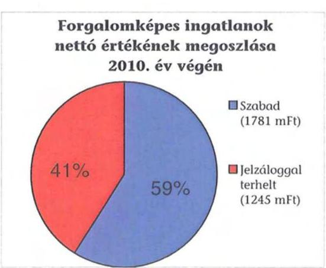

[^0]
[^0]:    ${ }^{53}$ Az Önkormányzat ingatlanait nettó értéken tartja nyilván, csak egyes, a Közgyűlés által meghatározott esetekben végeztet forgalmi értékbecslést.

---

A vizsgált időszakban nem történt meg annak felmérése, hogy az elhasználódott eszközök pótlása milyen kötelezettséget jelentene az Önkormányzat számára. A felújításokra, az eszközök pótlására, elsősorban az intézmények működőképességének biztosítása, illetve a szakhatósági előírások figyelembe vételével került sor. Az Önkormányzat a 2007-2010. években a tárgyi eszközök után 2423 millió Ft összegű értékcsökkenést számolt el. Felújításra 343 millió Ft-ot fordított.

# 4. A PÉNZÜGYI EGYENSÚLY MEGTEREMTÉSE ÉrDEKÉBEN HOZOTT INTÉZKEDÉSEK 

A jelentésben szereplő CLF módszerrel bemutatott múködési és felhalmozási hiány a vizsgált időszakban annak ellenére alakult ki, hogy az Önkormányzat folyamatosan intézkedéseket tett a finanszírozási rendszer változása miatti forráscsökkenés ellensúlyozására.

A Közgyűlés a 132/2007. (VI. 29.) határozatával elfogadott 2007-2010. évek közötti időszakra szóló Gazdasági Programban jelölte meg azokat az irányokat, amelyeket a bevételnövelés és kiadáscsökkentés érdekében indokoltnak tartott. Ennek megfelelően a szakosított szociális ellátások, a gyermekvédelem területén a hasonló típusú intézmények gazdasági összevonását, majd ezt követően az intézmények szakmai összevonását tűzték ki célul. A közoktatási intézményekre középtávon három fokozatban, az önállóan gazdálkodó intézmények számának csökkentését, a szakfeladatok kiszolgálásának, biztosításának integrált megszervezését, illetve a szervezetek összevonását (kevesebb intézmény, kevesebb feladatellátási hely megtartásával) szerepeltették. Ebben az intézményi körben célul tűzték még ki, hogy az intézmények fenntartásába társulási megállapodásokkal bevonják a települési önkormányzatokat, valamint az intézmények szolgáltatási kínálatának bővítését. A kulturális és közművelődési területen is indokoltnak látta a Közgyűlés az intézményi rendszer racionalizálását. Ennek keretében fogalmazódott meg az Eger Megyei Jogú Városi Önkormányzattal közösen ellátandó feladatok költségmegosztása rugalmasabb rendszerének kialakítása, az adott település érdekében végzett szolgáltatás finanszírozásába a települési önkormányzatok bevonása. A Gazdasági Program meghirdette a nem kötelező, illetve a kötelező mértékhez nem kötött feladatok ellátási volumenének csökkentését is.

Az Önkormányzat az éves költségvetésének elfogadásakor - figyelemmel a Gazdasági Programra - a pénzügyi egyensúly megteremtése érdekében a vizsgált időszak valamennyi évében kidolgozta a kiadások csökkentésére, bevételek növelésére vonatkozó tervét.

---

A 2007-2010. évek kiadáscsökkentő intézkedéseinek hatását, beavatkozási területenként az alábbiak részletezik:

| Adatok: ezer Ft-ban |  |  |  |  |
| :-- | :--: | :--: | :--: | :--: |
| Az érvényesített kiadás-   csökkentés területei | Személyi   juttatások és   járulékai | Dologi, mú-   ködési ki-   adások | Pénzeszköz   átadások,   támogatások | Összesen |
| A Közgyűlés működése |  |  |  |  |
| A Hivatalnál | 103248 |  | 187990 | 291328 |
| Az intézményeknél | 2900349 | 151229 | 63403 | 3114981 |
| ÖSSZESEN | 3003597 | 151229 | 251393 | 3406219 |

A Közgyűlés működésében 2010-ig bezárólag nem történt számszerűsíthető kiadáscsökkentő intézkedés.

A megtakarítások az azonos típusú intézkedésekre kerültek összegzésre, az intézményeket érintő egyedi döntések kiadáscsökkentéseit az Önkormányzat nem számszerúsítette.

A Hivatalnál a Közgyűlés a 63/2007. (III. 30.) számú határozatával kilenc fő álláshely megszüntetését rendelte el, melynek négy évre vetített megtakarítása 103 millió Ft. Az Önkormányzat döntött két intézményfenntartó társulás megszüntetéséről, ezzel a Hivatal költségvetésében a múködéshez szükséges pénzeszközátadás előirányzatai felszabadultak.

Az önkormányzati szinten kimutatott megtakarítási intézkedésekből 3115 millió Ft-ot, az összes intézkedés 91,5\%-át az intézmények körében érvényesítették, melyből 2900 millió Ft-ot a személyi juttatások és járulékainál mutattak ki.

A Önkormányzat 2007. július 1-jei hatállyal gazdasági szempontok szerint öszszevonta a négy gyermekvédelmi szakellátást nyújtó otthonát. A Bartakovics Béla Művelődési Központot megszüntették, a módszertani feladatait és az Esélyek Háza feladatait a Heves Megyei Önkormányzat Pedagógiai Intézetébe integrálták. A más megyék lakói részére nyújtott szolgáltatás szűkítésére vonatkozó önkormányzati döntés értelmében a Mlinkó István Egységes Gyógypedagógiai Módszertani Intézmény és Diákotthon a megyén kívüli ellátási kötelezettségét csak megállapodás útján teljesítheti. Az intézményi rendszer átszervezése keretében felére csökkent (34-ről 17-re) az önálló gazdálkodási jogkörrel rendelkező intézmények száma. Önállóan múködőt soroltak át részben önállóvá, így ezek száma 6 -ról 19 -re emelkedett. Az intézményi múködtetés hatékonyságát javító szervezési intézkedések 76 fő közalkalmazotti álláshely megszüntetését eredményezték. Az intézményi átszervezések kiadási megtakarításainak négy éves hatása - az Önkormányzat számítása alapján - 398 millió Ft volt. Az Önkormányzat a kiadási megtakarítás érdekében közvetlen létszámcsökkentési intézkedést is hozott. A 63/2007. (III. 30.) közgyűlési határozat 170 fő közalkalmazotti álláshely, a fenntartásában múködő Kórháznál 50 fő közalkalmazotti álláshely megszüntetését rendelte el. További 150 fő közalkalmazotti álláshely megszüntetésére került sor a Kórháznál a 125/2007. (VI. 29.) számú közgyűlési határozat alapján. Az intézkedések együttes hatásaként az Önkormányzat számításai szerint 1932 millió Ft kiadási megtakarítás keletkezett.

---

A gyermekvédelmi intézményrendszer szakmai összevonása 2008. január 1jével megtörtént. A HMÖ Területi Gyermekvédelmi Szakszolgálata, a HMÖ Négy Kincs Gyermekotthona, a Pétervásárai Gyermekotthon, a Hétszínvirág Gyermekotthon összevonásával létrejött a Heves Megyei Önkormányzat Egységes Gyermekvédelmi Intézménye. A Széchenyi István Közgazdasági és Informatikai Szakközépiskola és a Bajza József Gimnázium múködtetése Hatvan Város Önkormányzatával társulás formájában valósult meg. A szervezeti átalakítás 57 fő álláshelyet érintett. A pedagógiai szakszolgálat területén a hatvani és a gyöngyösi nevelési tanácsadó jogutóddal megszűnt ${ }^{54}$. Az Önkormányzat megszüntette a Károly Róbert Kereskedelmi, Vendéglátóipari és Idegenforgalmi Szakképző Iskolát, jogutóda a Gyöngyös Város Önkormányzata és a Károly Róbert Főiskola által létrehozott nonprofit kft. lett. Az intézkedések eredményeként - az Önkormányzat kimutatása szerint - 375 millió Ft megtakarítás keletkezett.

Az intézményszervezési intézkedések 2009. évben tovább folytatódtak. Az önként vállalt feladatot ellátó Tardosi Ifjúsági és Sporttábort költségvetési intézményként megszüntették, a Közgyűlés pályázatot írt ki az ingatlanok bérleti jogviszonyban történő hasznosítására, a feladat további ellátására. A nyertes pályázóval megkötött bérleti szerződés tartalmazta, hogy a bérleti díj ellenében végrehajtott fejlesztések, beruházások az Önkormányzat tulajdonába kerülnek. Az átszervezéssel 41 millió Ft kiadási megtakarítást mutattak ki. Az Önkormányzat a kötelező feladatot ellátó hatvani Damjanich János Szakközépiskola, Szakiskola és Kollégiumot megszüntette és egyetértett azzal, hogy a feladatait Hatvan Város Önkormányzata által intézményi összeolvadás útján megalapítandó új közoktatási intézmény lássa el.

Az Önkormányzat 2010-ben már a költségvetés készítésekor valamennyi intézménye részére $14 \%$-kal csökkentett mértékben biztosította a közalkalmazotti bértábla fedezetét. Bérmegtakarításból kellett fedezni a betegszabadság, a túlóra, az ügyelet, a helyettesítés miatti kifizetéseket. Az intézmények dolgozóinak cafetéria juttatást nem fizettek. A kiadási megtakarításokat ebben az évben jellemzően létszámcsökkentési intézkedéssel érték el. A 7/2010. (II. 19.) közgyűlési határozat értelmében 38 közalkalmazotti álláshely zárolását rendelte el a gyermekvédelmi, szociális és közművelődési intézményeknél. Ezen túl támogatta négy fő intézményi dolgozó prémiumévek programban való részvételét. A létszámcsökkentések eredményeképpen az Önkormányzat összesítése alapján 51 millió Ft kiadási megtakarítás keletkezett.

A létszámcsökkentő intézkedések következtében az Önkormányzat nyilvántartása alapján a 2007. és 2010. évek között a Hivatalban és intézményeinél öszszesen 624 fő álláshelyet szüntettek meg, melyből 452 szakmai álláshely, 172 fő intézményüzemeltetéssel kapcsolatos álláshely volt. Az Önkormányzatnál 2007. évben foglalkoztatott átlaglétszám 4141 fő volt, amely a 2010. évre 1926 fő átlagos foglalkoztatottra csökkent. A csökkenés túlnyomó részét a Kórház gazdasági társaság részére történő vagyonkezelésbe adása, és az Illetékhi-

[^0]
[^0]:    ${ }^{54}$ A hatvani nevelési tanácsadó a Lesznai Anna Egységes Gyógypedagógiai Módszertani Intézmény és Szakiskolába, a gyöngyösi nevelési tanácsadó pedig a Petőfi Sándor Egységes Gyógypedagógiai Módszertani Intézménybe integrálódott be.

---

vatal kormányzati intézkedés miatti átadása okozta, ezeknél az intézményeknél az átadáskor az engedélyezett álláshelyek száma 1516, illetve 38 fő volt.

A 2007. és 2010. évek között az Önkormányzat az általa fenntartott intézményeinél több ütemben létszámcsökkenést hajtott végre. A megszüntetett álláshelyek ágazatonkénti megoszlását az alábbi grafikon szemlélteti:
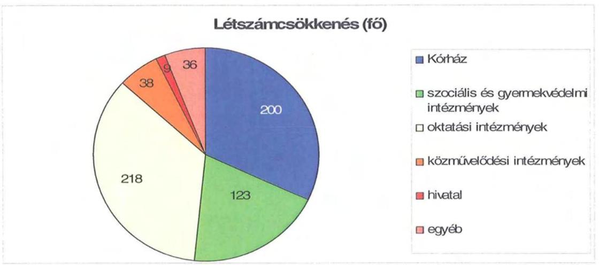

A helyi szervezési intézkedések végrehajtását összességében 233 millió Ft központi költségvetési támogatás segítette. Ezáltal 257 fő álláshelyet tartósan leépítettek, 367 fő álláshely megszüntetéséhez nem kapcsolódott központi támogatás. Az Önkormányzat fenntartásában működtetett Kórház átlaglétszáma 2006-ban 1559 fó volt, ami a 2010. évre az önkormányzati egyszemélyi tulajdonban lévő gazdasági társaság által ellátott feladatoknál 1161 fơre csökkent.

A 2007. és 2009. években települési önkormányzattól és egyéb szervezettől való feladatátvétel 201 millió Ft kiadásnövekedést okozott, amelyen belül a személyi juttatás és járulékai 182 millió Ft-tal, a dologi kiadások 19 millió Fttal, a pénzeszközátadások pedig 10 millió Ft-tal emelkedtek. Az intézményátvétel kapcsán a kiadásnövekedéshez társuló normatív állami hozzájárulásból származó bevételi többlet 72 millió Ft volt.

Az Önkormányzat a kiadáscsökkentő intézkedések mellett bevételnövelésre is hozott döntéseket, ezek összességében 1429 millió Ft-ban realizálódtak, amit a következő grafikon mutat be:

---

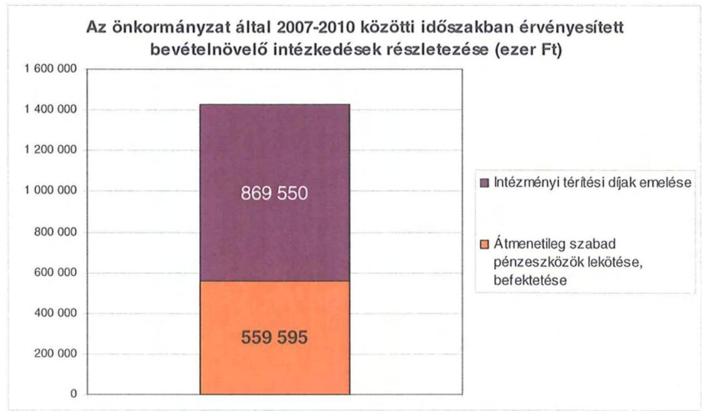

A Hivatal bevételeit növelték az átmenetileg szabad pénzeszközök (kötvénykibocsátásból származó bevétel fel nem használt része), melyek a vizsgált időszakban összességében 560 millió Ft bevételt jelentettek az Önkormányzatnak. Az intézményi térítési díjak emelésére vonatkozó testületi döntések 869 millió Ft bevételi többletet eredményeztek.

Intézményi szinten bevétel-növekedésként jelentkezett emellett a feladatátvételhez kapcsolódó normatív állami hozzájárulás 72 millió Ft összegben. Az éves költségvetések elfogadása kapcsán a Közgyűlés minden alkalommal döntött a működésképtelen önkormányzatok egyéb támogatási keretére történő igény benyújtásáról. Támogatási kérelmeikre a négy évben összességében 420 millió Ft támogatást kaptak.

Az Önkormányzat és intézményei a vizsgált években benyújtott pályázataik elbírálását követően összességében 1157 millió Ft múködési célú pályázati forráshoz jutottak.

# 5. A HELYI ÖNKORMÁNYZATOK GAZDÁLKODÁSI RENDSZERÉNEK 2009. ÉVI ELLENŐRZÉSE SORÁN A PÉNZÜGYI EGYENSÚLY JAVÍTÁSÁRA TETT SZABÁLYSZERŰSÉGI ÉS CÉLSZERŰSÉGI JAVASLATOK HASZNOSULÁSA 

Az ÁSZ az Önkormányzat gazdálkodási rendszerét a 2009. évben vizsgálta átfogó jelleggel. A vizsgálat közben a pénzügyi egyensúly javítására a következő célszerűségi javaslatot fogalmazták meg a főjegyző számára: „tájékoztassa évente végzett számítások alapján - a Közgyűlést az Önkormányzat eladósodásának növekedésére figyelemmel arról, hogy a hosszú lejáratú, adósságot keletkeztető kötelezettségvállalásokból adódó tőke és kamatfizetési kötelezettségét az Önkormányzat milyen feltételek biztosítása mellett tudja teljesíteni". A javaslat megvalósítása érdekében a számvevői jelentés aláírását követő 8 napon belül a Közgyűlés elnöke a 42-13/2009/005. számú levelében intézkedett a realizálására, ezáltal az ÁSZ jelentésben a javaslat megfogalmazására nem volt szükség.

---

Az intézkedés hatására az éves zá́rszámadási rendelettervezet előterjesztésekor a Közgyűlés részére tájékoztatást nyújtott az előterjesztő az eladósodás mértékéröl, az eladósodás csökkentésére tett intézkedéseket pedig az éves hiánykezelési tervekben hagyta jóvá a Közgyűlés, melyek végrehajtásáról a féléves, háromnegyed éves és az éves beszámoló során kért tájékoztatást.

Budapest, 2011. december „ 18. "
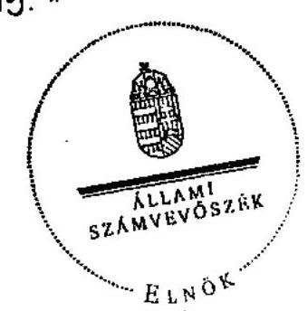

Dornokos László

Melléklet: $\quad 4 \mathrm{db} \quad 7$ lap

---

.

---

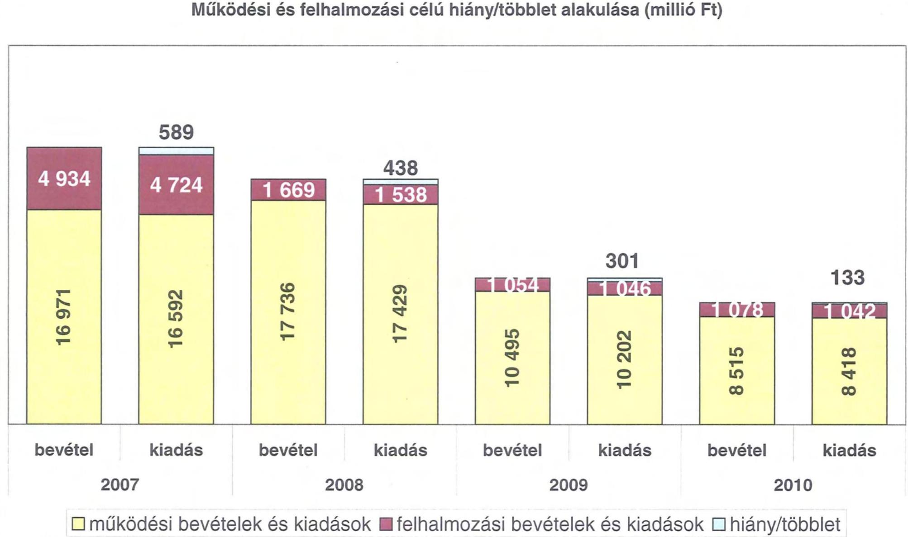

# Működési és felhalmozási célú hiány/többlet alakulása (millió Ft)

|  2007 | 2008 | 2009 | 2010  |
| --- | --- | --- | --- |
|  4 934 | 4 724 | 1 669 | 1 538  |
|  126 91 | 265 91 | 9 241 | 9 111  |
|  bevétel | kiadás | bevétel | kiadás  |
|  2007 | 2008 | 2009 | 2010  |

☐ működési bevételek és kiadások ☑ felhalmozási bevételek és kiadások ☐ hiány/többlet

---

.

---

Az Önkormányzat CLF módszer szerint besorolt bevételei és kiadásai 2007-2010 között

|  1. FOLYÓ KÖLTSÉGVETÉS* | 2007. | 2008. | 2009. | 2010.  |
| --- | --- | --- | --- | --- |
|  1.1.1. Saját múködési bevételek | 3647667 | 4380333 | 3887767 | 3218866  |
|  1.1.2. Költségvetési támogatás | 4922945 | 5960781 | 5082387 | 3416919  |
|  1.1.3. Átengedett bevételek | 1680575 | 607609 | 609538 | 201717  |
|  1.1.4. Államháztartáson belülről kapott támogatások | 7024915 | 6604677 | 719343 | 543363  |
|  1.1.5. EU-tól és külföldről kapott bevételek | 8605 | 38092 | 9608 | 15258  |
|  1.1.6. Államháztartáson kívülről kapott bevételek | 43129 | 55839 | 88931 | 59886  |
|  1.1.7. Előző évi pénzmaradvány átvétel | 70576 | 111098 | 49826 | 23643  |
|  1.1. Folyó bevételek $=1.1 .1 .+1.1 .2 .+1.1 .3 .+1.1 .4 .+1.1 .5 .+1.1 .6 .+1.7$. | 17398412 | 17758429 | 10447400 | 7479652  |
|  1.2.1. Múködési kiadások kamatkiadások nélkül | 15791899 | 16332119 | 9108166 | 7715402  |
|  1.2.2. Államháztartáson belülre átadott pénzeszközök | 433415 | 343197 | 341875 | 111453  |
|  1.2.3.1. vállalkozásoknak | 10000 | 268396 | 2296 | 0  |
|  1.2.3.2. EU-nak, illetve külföldre | 0 | 11852 | 20262 | 0  |
|  1.2.3.3. magánszemélyeknek | 180831 | 182387 | 172456 | 209369  |
|  1.2.3.4. nonprofit szervezeteknek | 107878 | 129369 | 97025 | 197794  |
|  1.2.3. Transzferkiadások ( $=1.2 .3 .1+1.2 .3 .2+1.2 .3 .3+1.2 .3 .4$ ) | 298709 | 592004 | 292039 | 407163  |
|  1.2.4 Kamatkiadások | 68454 | 161021 | 192050 | 183932  |
|  1.2.5. Előző évi pénzmaradvány átadás | 70576 | 112482 | 47518 | 24143  |
|  1.2. Folyó kiadások $=1.2 .1 .+1.2 .2 .+1.2 .3 .+1.2 .4 .+1.2 .5$ | 16663053 | 17540823 | 9981648 | 8442093  |
|  1.3. Folyó költségvetés egyenlege MÚKÖDÉSI JÓVEDELEM (1.1.1.2.) | 735359 | 217606 | 465752 | $-962441$  |
|  2. FELHALMOZÁSI KÖLTSÉGVETÉS** |  |  |  |   |
|  2.1.1. Saját tőkebevételek | 43960 | 56948 | 67258 | 11091  |
|  2.1.2. Államháztartáson belülről kapott támogatások | 795578 | 242258 | 164226 | 207774  |
|  2.1.3. EU-tól és külföldről kapott támogatások | 900 | 0 | 0 | 0  |
|  2.1.4. Államháztartáson kívülről kapott támogatások | 85170 | 87648 | 14154 | 62626  |
|  2.1. Felhalmozási bevételek ( $=2.1 .1 .+2.1 .2+2.1 .3+2.1 .4$.) | 925608 | 386854 | 245638 | 281491  |
|  2.2.1. Saját felhalmozási kiadás áfával | 1518531 | 1314245 | 764451 | 938282  |
|  2.2.2. Saját felújítási kiadás áfával | 165885 | 86617 | 160199 | 81411  |
|  2.2.3. Államháztartáson belülre átadott pénzeszköz | 29063 | 128430 | 97565 | 15368  |
|  2.2.4. EU-nak és külföldnek adott pénzeszközök | 0 | 0 | 0 | 0  |
|  2.2.5. Államháztartáson kívülre adott pénzeszközök | 10500 | 8167 | 14050 | 7419  |
|  2.2.6. Befektetési célú részesedések vásárlása | 0 | 700 | 10000 | 0  |
|  2.2. Felhalmozási kiadások
( $=2.2 .1 .+2.2 .2 .+2.2 .3 .+2.2 .4 .+2.2 .5 .+2.2 .6$.) | 1723979 | 1538159 | 1046265 | 1042480  |
|  2.3. Felhalmozási költségvetés egyenlege (2.1. - 2.2.) | $-798371$ | $-1151305$ | $-800627$ | $-760989$  |
|  3. FINANSZÍROZÁSI MÚVELETEK NÉLKÜLI (GFS) POZÍCIÓ |  |  |  |   |
|  (1.3.) Folyó költségvetés egyenlege Müködési Jövedelem + (2.3.) Felhalmozási költségvetés egyenlege | $-63012$ | $-933699$ | $-334875$ | $-1723430$  |
|  4. FINANSZÍROZÁSI MÚVELETEK |  |  |  |   |
|  4.1. Hitelfelvétel | 269150 | 471848 | 0 | 936658  |
|  4.2. Hiteltörlesztés | 0 | 0 | 270274 | 0  |
|  4.3. Forgatási és befektetési célú értékpapírok kibocsátása | 3000000 | 0 | 0 | 0  |
|  4.4. Forgatási és befektetési célú értékpapírok beváltása | 0 | 0 | 0 | 0  |
|  4.5. Forgatási és befektetési célú értékpapírok értékesítése | 0 | 3000003 | 0 | 0  |
|  4.6. Forgatási és befektetési célú értékpapírok vásárlása | 3000010 | 0 | 0 | 0  |
|  4.7. Egyéb finanszírozási bevételek (függő, átfutó, kiegyenlítő) | $-239653$ | $-126917$ | $-80187$ | $-194243$  |
|  4.8. Egyéb finanszírozási kiadások (függő, átfutó, kiegyenlítő) | 38777 | 67475 | $-12706$ | $-221840$  |

---

|  4.9. Finanszírozási múveletek egyenlege (4.1.-4.2.+4.3.-4.4+4.5.-4.6.+4.7.-4.8.) | $-9290$ | 3277459 | $-337755$ | 964255  |
| --- | --- | --- | --- | --- |
|  5. TÁRGYÉVI POZÍCIÓ |  |  |  |   |
|  (3.) FINANSZÍROZÁSI MÚVELETEK NÉLKÜLI (GFS) POZÍCIÓ + (4.9.) Finanszírozási múveletek egyenlege | $-72302$ | 2343760 | $-672630$ | $-759175$  |
|  6. NETTÓ MÚKÖDÉSI JÖVEDELEM |  |  |  |   |
|  (1.3.) Múködési Jövedelem - Tőketörlesztés (4.2. Hiteltörlesztés + 4.4. Forgatási és befektetési célú értékpapírok beváltása ) | 735359 | 217606 | 195478 | $-962441$  |
|  TÁJÉKOZTATÓ ADATOK |  |  |  |   |
|  Összes kötelezettség | 4359574 | 4175305 | 3944313 | 6385132  |
|  ebből rövid lejáratú | 1359574 | 1164457 | 935599 | 2566736  |
|  Összes szállítói kötelezettség | 770586 | 88075 | 68393 | 169693  |
|  ebből lejárt | 770586 | 88075 | 68393 | 169693  |
|  Pénz és tőkepiaci kötelezettség (adósság) | 3571975 | 4043823 | 3773549 | 6121960  |
|  ebből rövid lejáratú | 571975 | 1043823 | 773549 | 2310207  |
|  PPP szerződésből hátra lévő kötelezettséges állomány | 0 | 0 | 0 | 0  |
|  ebből lejárt szolgáltatási díj miatti kötelezettség | 0 | 0 | 0 | 0  |
|  Folyószámlahitel napi átlagos állománya | 907500 | 699000 | 678500 | 749600  |
|  Likvidhítel napi átlagos állománya | 0 | 0 | 0 | 0  |
|  Munkabérhítel napi átlagos állománya | 121390 | 200000 | 132288 | 203616  |
|  Peres eljárásokból fennálló függő kötelezettségek | 0 | 0 | 0 | 0  |
|  Finanszírozásba bevonható eszközök év végi állománya összesen : | 3563901 | 2867800 | 2195170 | 1435995  |
|  Tartós hitelviszonyt megtestesítő értékpapírok év végi állománya | 0 | 0 | 0 | 0  |
|  Hosszú lejáratú bankbetétek év végi állománya | 0 | 0 | 0 | 0  |
|  Értékpapírok év végi állománya | 3037820 | 0 | 0 | 0  |
|  Pénzeszközök év végi állománya (idegen pénzeszközök nélkül) | 526081 | 2867800 | 2195170 | 1435995  |

- Bevételekben nem térül, a kiadásokban nem jelenik meg az amortizáció, a vagyoni helyzetet az egyenleg befolyásolja ** Bevételekben vagyon megőrzésre és bővítésre fordítható források.

# Megjegyzés

A számítási leírás némileg eltér az ÁSZ módszertanában korábban alkalmazott besorolásoktól. A jelen besorolás általános közgazdasági meggondolásokon alapul, amely testet ölt az SNA statisztikai módszertanában is. Folyó tételek alatt értjük azokat a kiadásokat és bevételeket, amelyek az egység vagyoni helyzetét automatikusan nem változtatják. Bevételi oldalon ilyenek az adók, a tényező jövedelmek, transzferek, kiadási oldalon a transzferek és a szolgáltatás nyújtásával kapcsolatos múködési kiadások. Felhalmozási, vagy tőke tételek módosítják a vagyon nagyságát. Privatizációs bevétel csökkenti a vagyont, fizikai beruházás, vagy pénzügyi befektetés növeli. A folyó költségvetés egyenlege (múködési jövedelem) tartalmazza a kamatkiadásokat is, mind a múködési, mind a fejlesztési kamatot, mert ezek közgazdaságilag tényezőjövedelmek. Nem tartalmazzák a pénzforgalmi bevételek és kiadások a követelés elengedés miatt könyvelt bevételi és kiadási pénz-forgalmi tételeket, mivel ezek egymást kioltják és valójában technikai elszámolási múveletnek minősülnek, így indokolatlanul változtatják a költségvetési év kiadási és bevételi adatait, hiszen valójában a bevétel soha nem realizálódott, és a költségvetési évben kiadás sem történt, csak elengedtük a követelést. A nettó múködési jövedelmet a tőketörlesztés levonásával a folyó költségvetés egyenlegéből (múködési jövedelemből) származtatjuk. Transzfer kiadásoknak nevezzük azokat a folyó és felhalmozási tételeket, amelyeket nem az adott önkormányzat használ fel szolgáltatásnyújtásra.

---

#### Az Önkormányzat bevételeinek és kiadásainak, adósságszolgálatának alakulása 2007-2010 között

|  Sor-
szám | Megnevezés | 2007. | 2008. | 2009. | 2010.  |
| --- | --- | --- | --- | --- | --- |
|  I. | MŰKÖDÉSI BEVÉTELEK | 16 769 012 | 17 368 810 | 10 529 635 | 7 774 257  |
|  1. | Sajátos folyó bevételek | 3 643 097 | 4 269 127 | 3 870 173 | 3 215 429  |
|  1.1. | Intézmények működési bevétele | 1 938 413 | 2 169 004 | 1 859 357 | 1 970 819  |
|  1.2. | Betékbevételek | 1 689 028 | 1 810 628 | 1 676 428 | 1 144 053  |
|  1.3. | Helyi adóbevételek és pótlékok | 869 | 0 | 0 | 0  |
|  1.4. | Kamat bevétel működési része | 14 787 | 169 495 | 334 387 | 100 557  |
|  1.5. | Egyéb folyó működési bevételek | 0 | 0 | 0 | 0  |
|  2. | Támogatás értékű működési bevételek | 494 308 | 586 658 | 663 010 | 522 255  |
|   | helyi önkormányzatoktól és költségvetési szerveitől | 139 902 | 140 862 | 120 200 | 88 665  |
|   | többcélú közlérégő társulástól | 7 696 | 8 543 | 9 800 | 10 000  |
|  3. | Pénzforgalom nélküli bevételek működésre jóváhagyott része | 241 838 | 436 828 | 212 623 | 336 185  |
|  4. | Államháztartáson kívülről működési célra átvett pénzeszközök | 81 734 | 93 931 | 88 539 | 79 144  |
|  5. | Központi támogatások és átengedett források működési része | 12 337 037 | 11 688 266 | 5 685 280 | 3 625 244  |
|   | ebből 02.H. | 1 680 575 | 607 609 | 609 538 | 201 717  |
|   | önkormányzat és intézmények állami támogatásának
működési része | 4 125 853 | 5 356 638 | 5 019 419 | 3 402 419  |
|   | költségvetési kiegészítőnek, visszatérülések | 22 650 | 38 058 | 0 | 0  |
|   | társadalombiztosítási alapból származó bevétel | 6 507 959 | 5 985 963 | 56 333 | 21 108  |
|  II. | MŰKÖDÉSI KIADÁSOK (kamatkiadás nélkül) | 16 590 661 | 17 379 802 | 9 780 853 | 8 251 161  |
|  1. | Folyó működési kiadások összesen kamatkiadások nélkül | 15 783 582 | 16 332 119 | 9 038 058 | 7 830 741  |
|   | ebből személyi juttatások | 6 512 807 | 8 859 928 | 4 796 055 | 4 269 208  |
|   | munkaadtól terhelő járulékok | 2 739 227 | 2 686 189 | 1 581 057 | 1 129 840  |
|   | dologi kiadások | 4 452 773 | 4 643 741 | 2 556 827 | 2 135 557  |
|   | egyéb folyó kiadások | 76 775 | 142 261 | 104 119 | 76 136  |
|   | egyéb folyó működési kiadások | 0 | 0 | 0 | 0  |
|  2. | Támogatások, elvonások és egyéb folyó átutalások | 298 709 | 592 004 | 292 039 | 407 163  |
|   | ebből működési célú pénzeszköz átadás államháztartáson kívülre | 120 197 | 413 279 | 130 010 | 201 652  |
|   | működési célú pénzeszköz átadás államháztartáson belülre | 0 | 0 | 0 | 0  |
|   | társadalom és szociálpótlikai juttatások | 178 512 | 176 725 | 162 026 | 205 511  |
|  3. | Előző évi pénzmeradvány átadás, visszafizetés működési | 74 955 | 112 482 | 108 881 | 101 804  |
|  4. | Támogatás értékű működési kiadás | 433 415 | 343 197 | 341 875 | 111 453  |
|   | ebből önkormányzatoknak | 429 472 | 339 842 | 338 515 | 108 345  |
|   | közlérégő társulásoknak | 0 | 800 | 520 | 0  |
|  III. | ADÓSSÁGSZOLGÁLAT | 68 454 | 161 021 | 462 324 | 183 932  |
|   | titkotörlesztési kötelezettség: működési | 0 | 0 | 270 274 | 0  |
|   | felhalmozási | 0 | 0 | 0 | 0  |
|   | kamatfizetési kötelezettség: működési | 68 454 | 61 460 | 93 396 | 137 404  |
|   | felhalmozási | 0 | 99 561 | 98 654 | 48 528  |
|  IV. | FELHALMOZÁSI BEVÉTELEK | 1 938 556 | 1 305 812 | 1 068 331 | 905 793  |
|  1. | Saját felhalmozási és tőkejellegű bevétel | 48 530 | 168 154 | 84 852 | 14 528  |
|  1.1. | Tárgyi eszközök, tornat, javak értékesítése, Áfa visszaférítés | 36 572 | 53 302 | 75 472 | 6 749  |
|  1.2. | Privatizációból származó bevétel | 931 | 1 499 | 200 | 0  |
|  1.3. | Osztalék, részesedések | 0 | 100 001 | 0 | 15  |
|  1.4. | Kamatbevétel felhalmozási része | 0 | 0 | 0 | 0  |
|  1.5. | Helyi adók átengedett adók felhalmozási része | 0 | 0 | 0 | 0  |
|  1.6. | Egyéb folyó felhalmozási bevételek | 11 027 | 13 352 | 9 180 | 7 764  |
|  2. | Támogatásértékű felhalmozási bevételek | 795 578 | 242 256 | 164 226 | 207 774  |
|   | ebből: helyi önkormányzatoktól és költségvetési szerveitől | 19 531 | 17 336 | 19 558 | 0  |
|   | többcélú közlérégő társulástól | 0 | 0 | 0 | 0  |
|  3. | Pénzforgalom nélküli bevételek felhalmozásra jóváhagyott része | 211 286 | 203 608 | 742 131 | 606 365  |
|  4. | Államháztartáson kívülről felhalmozási célra átvett pénzeszközök | 85 170 | 87 648 | 14 154 | 62 626  |
|  5. | Állami felhalmozási és tőkejellegű bevétel | 797 992 | 604 143 | 62 968 | 14 500  |
|  5.1. | EU költségvetésből átvétel | 800 | 0 | 0 | 0  |
|  5.2. | Önkormányzatok költségvetési támogatása felhalmozási célra | 797 092 | 604 143 | 62 968 | 14 500  |
|  V. | FELHALMOZÁSI KIADÁSOK | 1 727 917 | 1 538 159 | 1 055 016 | 1 049 480  |
|  1. | Folyó felhalmozási kiadások kamatkiadások nélkül | 1 688 354 | 1 401 562 | 936 733 | 1 019 693  |
|  1.1. | Beruházás, felújítás | 1 684 416 | 1 400 862 | 924 650 | 1 019 693  |
|  1.2. | Értékesített tárgyi eszközök s/Áfa befizetés | 3 936 | 0 | 2 063 | 0  |
|  1.3. | Részesedések vásárlása | 0 | 700 | 10 000 | 0  |
|  2. | Támogatások, elvonások és egyéb folyó átutalások | 10 500 | 8 167 | 14 050 | 7 419  |
|   | ebből felhalmozási célú pénzeszköz átadás államháztartáson
kívülre | 0 | 0 | 0 | 0  |
|   | felhalmozási célú támogatásnak, kölcsön, kölcsön törlesztése | 10 500 | 8 167 | 14 050 | 7 419  |
|  3. | Támogatásértékű felhalmozási kiadások | 29 063 | 128 430 | 97 565 | 15 368  |
|   | ebből helyi önkormányzatoknak és költségvetési szerveinek | 29 063 | 128 430 | 97 565 | 15 368  |
|   | többcélú közlérégő társulásnak | 0 | 0 | 0 | 0  |
|  4. | Pénzforgalom nélküli kiadások felhalmozásra jóváhagyott része | 0 | 0 | 6 662 | 7 090  |
|  VI. | Hitel, kölcsön felvétel | 269 140 | 3 471 851 | 0 | 936 658  |
|  6.1. | Jóval lejáratú hitelek felvétele | 0 | 0 | 0 | 936 658  |
|  6.2. | Iávújt hitelek felvétele | 269 150 | 471 848 | 0 | 0  |
|  6.3. | Hosszú lejáratú hitelek felvétele | 0 | 0 | 0 | 0  |
|   | forgatlási célú értékpapírok beváltása, vásárlása és a kibocsátása,
értékesítése egyenlege | -3 000 010 | 3 000 003 | 0 | 0  |
|   | befektetési és hosszú lejáratú értékpapírok beváltása, vásárlása és a
kibocsátása, értékesítése egyenlege | 3 000 000 | 0 | 0 | 0  |
|  6.5. | Istellékletet kiállítástól | 0 | 0 | 0 | 0  |
|  VII. | Finanszírozási pủ-i műveletek egyenlege | 269 140 | 3 471 851 | -270 274 | 936 658  |

---

.

---

Az Önkormányzat 2007-2010 években megvalósított, illetve 2010. december 31-én fennálló fejlesztési feladatokhoz kapcsolódó kötelezettségeinek összegzése ezer Ft-ban!

|  Fejlesztési feladat megnevezése | Ber. kezdete | Teljes bekerülési költség | 2006. december 31-ig teljesített kiadás | 2007-2010. évek között teljesített kiadás | 2010. év utánra vállalt kötelezettség | 2010. utáni kötelezettség-vállalás forrásösszetétele |  |  |  |   |
| --- | --- | --- | --- | --- | --- | --- | --- | --- | --- | --- |
|   |  |  |  |  |  | Saját bevétel | Hitel | Kötvény | EU-s
támogatás | Hazai támogatás  |
|  Orczy Kastély rekonstrukció (Gyöngyös) | 2006. | 655410 | 72156 |  |  |  |  |  |  |   |
|   | 2007. |  |  | 583254 |  |  |  |  |  |   |
|  Parád Idősek Otthona építés ** | 2006. | 1468644 | 50215 |  |  |  |  |  |  |   |
|   | 2007. |  |  | 640547 |  |  |  |  |  |   |
|   | 2008. |  |  | 771729 |  |  |  |  |  |   |
|   | 2009. |  |  | 6153 |  |  |  |  |  |   |
|  Egri Vár veszélykár elhárítás ** | 2006. | 38000 | 3600 |  |  |  |  |  |  |   |
|   | 2007. |  |  | 10000 |  |  |  |  |  |   |
|   | 2008. |  |  | 24400 |  |  |  |  |  |   |
|  Siófoki üdülő felújítása | 2007. | 29310 |  | 29310 |  |  |  |  |  |   |
|  HMÖ Gyermekotthon szennyvízhálózat kiép. ** | 2007. | 11000 |  | 11000 |  |  |  |  |  |   |
|  Mátra Múzeum vadászati kiállítás | 2007. | 17000 |  | 17000 |  |  |  |  |  |   |
|  Megyeháza udvar burkolás | 2008. | 12524 |  | 12524 |  |  |  |  |  |   |
|  Mátra Múzeum természettudományi kiállítás | 2007. | 30765 |  | 30765 |  |  |  |  |  |   |
|  Gárdonyi G.Színház műhelyház rekonstr. | 2008. | 60482 |  | 45630 |  |  |  |  |  |   |
|   | 2009. |  |  | 14852 |  |  |  |  |  |   |
|  Színészlakások felújítása | 2009. | 37700 |  | 37700 |  |  |  |  |  |   |
|  Európai Információ Pont elhelyezése | 2009. | 424600 |  | 324600 |  |  |  |  |  |   |
|   | 2010. |  |  | 100000 |  |  |  |  |  |   |
|  Múzeumi raktárbázis kialakítása | 2009. | 374837 |  | 9576 |  |  |  |  |  |   |
|   | 2010. |  |  | 365261 |  |  |  |  |  |   |

---

# Az Önkormányzat 2007-2010 években megvalósított, illetve 2010. december 31-én fennálló fejlesztési feladatokhoz kapcsolódó kötelezettségeinek összegzése

|  Fejlesztési feladat megnevezése | Ber.
kezdete | Teljes
bekerülési
költség | 2006.
december
31-ig
teljesített
kiadás | 2007-2010.
évek között
teljesített
kiadás | 2010. év
utánra
vállalt
kötelezettség | 2010. utáni kötelezettség-vállalás forrásösszetétele |  |  |  |   |
| --- | --- | --- | --- | --- | --- | --- | --- | --- | --- | --- |
|   |  |  |  |  |  | Saját
bevétel | Hitel | Kötvény | EU-s
támogatás | Hazai
támogatás  |
|  Bélapátfalvai intézmény vizesblokk rekonstr. ** | 2008. | 56660 |  | 4500 |  |  |  |  |  |   |
|   | 2009. |  |  | 52160 |  |  |  |  |  |   |
|  Lőrinci lakásotthon akadálymentesítés ** | 2009. | 12500 |  | 12500 |  |  |  |  |  |   |
|  Idősek O. Vámosgyőrk akadálymentesítés ** | 2009. | 22496 |  | 22496 |  |  |  |  |  |   |
|  Fogy. Otthon és Rehab. Int. A. tálya akadálym. ** | 2009. | 14789 |  | 14789 |  |  |  |  |  |   |
|  Gyermekotthon és Fogy. Otth. medencetér kial. | 2010. | 26999 |  | 26999 |  |  |  |  |  | 14500  |
|  Arany J. Ált. Iskola rekonstrukció ** | 2010. | 225333 |  | 187012 | 38321 |  |  | 3832 | 34489 |   |
|  Eger Idősek Otth. Akadálymentesítés ** | 2010. | 68896 |  | 68896 |  |  |  |  |  |   |
|  Egrí Vár turisztikai fejlesztés | 2010. | 275012 |  | 54512 | 220500 | 110000 |  | 110500 |  |   |
|  Kórház rekonstrukció TIOP pályázat | 2010. | 4908489 |  | 60375 | 4848114 |  |  | 484811 | 4363303 |   |
|  Felújítás | 2007. | 111471 |  | 111471 |  |  |  |  |  |   |
|  Beruházás | 2007. | 66441 |  | 66441 |  |  |  |  |  |   |
|  Felújítás | 2008. | 60212 |  | 60212 |  |  |  |  |  |   |
|  Beruházás | 2008. | 627730 |  | 627730 |  |  |  |  |  |   |
|  Felújítás | 2009. | 98689 |  | 98689 |  |  |  |  |  |   |
|  Beruházás | 2009. | 313876 |  | 313876 |  |  |  |  |  |   |
|  Felújítás | 2010. | 65524 |  | 65524 |  |  |  |  |  |   |
|  Beruházás | 2010. | 181538 |  | 181538 |  |  |  |  |  |   |
|  Összesen |  | 10296927 | 125971 | 5064021 | 5106935 | 110000 | 0 | 599143 | 4397792 | 14500  |

---

# 49-2/2011/221 

Tárgy: ÁSZ jelentés a Heves Megyei Önkormányzat pénzügyi helyzetéről
Hiv. szám: V-3004-27-08/2011
Melléklet: 3 db

Domokos László
Elnök Úrnak
Állami Számvevőszék

## Budapest

Tisztelt Elnök Úr!
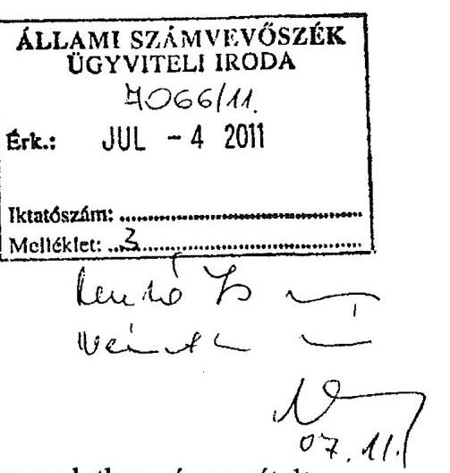

Az Állami Számvevőszék fenti tárgyú jelentésével kapcsolatban észrevételt nem teszek. A pótlólagos információt tartalmazó 3 tanúsítványt mellékelten megküldöm.

Eger, 2011. június 28.

Üdvözlettel:
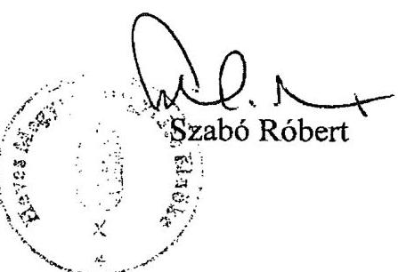

---

.

---

# Szabó Róbert úr 

elnök
Heves Megye Önkormányzata

## Eger

## Tisztelt Elnök Úr!

A Heves Megyei Önkormányzat pénzügyi helyzetének ellenőrzéséről szóló jelentés-tervezet megállapításaival és javaslataival Elnök úr egyetértett, arra észrevételt nem tett.
Köszönetemet fejezem ki az Elnök úr és munkatársai ellenőrzés során tanúsított hozzáállásáért, mellyel az ellenőrzés megvalósítását segítették.

Budapest, 2011. december „ 15. „
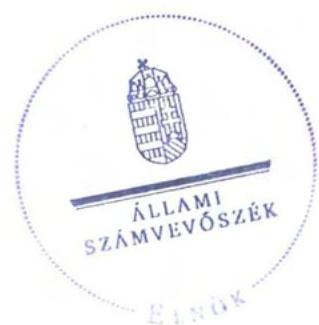

Tisztelettel:

Domokos László

Melléklet: jelentés