# ÁLLAMI   SZÁMVEVŐSZÉK 

## JELENTÉS

a Jász-Nagykun-Szolnok Megyei Önkormányzat pénzügyi helyzetének ellenőrzéséről (43/2)

---

# Számvevői Iroda 

Iktatószám: V-3018-13/2011.
Témaszám: 1015
Vizsgálat-azonosító szám: V056010

## Az ellenőrzést felügyelte:

Dr. Varga Sándor
számvevő igazgató-helyettes

## Az ellenőrzést vezette:

## Renkó Zuzsa

számvevő tanácsos

## Az ellenőrzést végezték:

| Nyikon Zsigmondné | Szudi Ferencné | Papp József |
| :-- | :-- | :-- |
| számvevő tanácsos | számvevő | számvevő tanácsos |

A témához kapcsolódó eddig készített számvevőszéki jelentések:
címe
sorszáma
Jelentés a Jász-Nagykun-Szolnok Megyei Önkormányzat gazdálkodási rendszerének 2008. évi átfogó ellenőrzéséről

---

# TARTALOMJEGYZÉK 

BEVEZETÉS ..... 5
I. ÖSSZEGZŐ MEGÁLLAPÍTÁSOK, KÖVETKEZTETÉSEK, JAVASLATOK ..... 12
II. RÉSZLETES MEGÁLLAPÍTÁSOK ..... 16

1. Az Önkormányzat kötelező és önként vállalt feladatai ..... 16
2. Pénzügyi egyensúlyi helyzet alakulása ..... 18
2.1. A működési és felhalmozási egyensúly alakulása ..... 21
2.2. Az Önkormányzat bevételei ..... 25
2.3. Az Önkormányzat kiadásai ..... 28
3. Kötelezettségek bemutatása ..... 32
3.1. A pénzintézetek felé fennálló kötelezettségek alakulása ..... 32
3.2. Szállítók felé fennálló kötelezettségek alakulása ..... 36
3.3. Egyéb kötelezettségek alakulása ..... 38
4. A pénzügyi egyensúly megteremtése érdekében hozott intézkedések ..... 39
5. A helyi önkormányzatok gazdálkodási rendszerének 2008. évi ellenőrzése során a pénzügyi egyensúly javítására tett szabályszerűségi és célszerűségi javaslatok hasznosulása ..... 44

---

# MELLÉKLETEK 

1. számú Működési és felhalmozási hiány/többlet az Önkormányzat rendeleteiben melléklet
2/a. számú Kimutatás az Önkormányzat CLF módszer szerint besorolt bevételeiről és melléklet kiadásairól 2007-2010 között
2/b. számú Kimutatás az Önkormányzat bevételeinek és kiadásainak, adósságszolgáltatásának alakulásáról melléklet
2. számú Az Önkormányzat 2007-2010 években megvalósított, illetve 2010. december 31-én fennálló fejlesztési feladatokhoz kapcsolódó kötelezettségeinek összegzése
3. számú Jász-Nagykun-Szolnok Megyei Közgyűlés elnökének észrevétele melléklet
4. számú Jász-Nagykun-Szolnok Megyei Közgyűlés elnökének észrevételére adott melléklet válasz

---

# RÖVIDÍTÉSEK JEGYZÉKE 

| Törvények |  |
| :--: | :--: |
| Áht. | az államháztartásról szóló 1992. évi XXXVIII. törvény |
| Ásztv. | az Állami Számvevőszékről szóló 1989. évi XXXVIII. törvény (2011. július 1-jétől a 2011. évi LXVI. törvény) |
| Htv. | a helyi önkormányzatok és szerveik, a köztársasági megbízottak, valamint egyes centrális alárendeltségű szervek feladat- és hatásköreiről szóló 1991. évi XX. törvény |
| Ötv. | a helyi önkormányzatokról szóló 1990. évi LXV. törvény |
| Számv. tv. | a számvitelről szóló 2000. évi C. törvény |
| Rendeletek |  |
| Ámr. | az államháztartás működési rendjéről szóló 217/1998. (XII. 30.) Korm. rendelet |
| Szórövidítések |  |
| APEH | Adó- és Pénzügyi Ellenőrzési Hivatal, 2011. január 1-jétől Nemzeti Adó- és Vámhivatal (NAV) |
| ÁSZ | Állami Számvevőszék |
| BM | Belügyminisztérium |
| EDP hiány/egyenleg | Uniós módszertan szerinti maastrichti kritériumoknak megfelelő számítás szerinti hiány/egyenleg |
| EU | Európai Unió |
| ÉAOP | ÚMFT Észak-Alföldi Operatív Program |
| GDP | Bruttó hazai termék |
| HEFOP | NFT Humán erőforrások fejlesztései Operatív Program |
| Hivatal | Jász-Nagykun-Szolnok Megyei Önkormányzati Hivatal |
| Illetékhivatal | Jász-Nagykun-Szolnok Megyei Illetékhivatal |
| Kórház | Jász-Nagykun-Szolnok Megyei Hetényi Géza Kórház Rendelőintézet |
| Közgyűlés | Jász-Nagykun-Szolnok Megyei Közgyűlés |
| KSH | Központi Statisztikai Hivatal |
| NGM | Nemzetgazdasági Minisztérium |
| OEP | Országos Egészségbiztosítási Pénztár |
| ÖKIF | Önkormányzati Fejlesztési Hitelprogram |
| Önkormányzat | Jász-Nagykun-Szolnok Megyei Önkormányzat |
| PPP konstrukció | Public Private Partnership (Partnerségi együttműködés közfeladatok ellátására a magánszektor bevonásával) |
| SNA | System of National Accounts azaz Nemzeti Számlák Rendszere |
| szja | személyi jövedelemadó |
| SzMSz | Jász-Nagykun-Szolnok Megyei Önkormányzat 8/1995. (VII. 1.) számú rendelete a Közgyűlés és Szervei Szervezeti és Működési Szabályzatáról |
| TISZK | Jász-Nagykun-Szolnok Szakképzési-Szervezési Társulás |

---

.

---

# JELENTÉS 

## a Jász-Nagykun-Szolnok Megyei Önkormányzat pénzügyi helyzetének ellenőrzéséről

## BEVEZETÉS

Az Állami Számvevőszék 2011. évtől érvényes stratégiája új irányt szabott a helyi önkormányzatok gazdálkodásának ellenőrzésében is. Az ÁSZ - küldetése és jövőképe szerint - szilárd szakmai alapokra támaszkodva értékteremtő ellenőrzéseivel és helyzetelemzéseivel az államháztartás egészében, így a helyi önkormányzati alrendszerben is elő kívánja segíteni a közpénzek és a közvagyon szabályos, gazdaságos, hatékony és eredményes hasznosítását. E folyamat részeként - a 2010. évi államháztartási hiány alakulásának összetevőire is figyelemmel - megkezdődött az önkormányzati alrendszer pénzügyi helyzetelemzése.

Az NGM 2011 áprilisában közzétett adatai szerint ${ }^{1}$ a 2010. évi 1036,2 milliárd Ft összegű, 3,8%-os EDP (maastrichti kritériumok szerinti, Túlzott Hiány Eljárás keretében kimutatott) hiánycél nem volt tartható, az önkormányzati alrendszer tervezettet meghaladó hiánya miatt a GDP arányában kifejezett államháztartási hiány 4,2%-ra emelkedett.

Az önkormányzatok költségvetési jelentése szerint 2010. első három negyedév végén az önkormányzati alrendszer pénzforgalmi hiánya 97 milliárd Ft volt, a tervezett éves mérték 51%-át érte el. Bár az elmúlt években kiugróan magas hiány halmozódott fel az utolsó negyedévben, a 97 milliárd Ft-os szeptember végi hiány nem indokolta az önkormányzati alrendszer 190 milliárd Ft-ra becsült éves hiányának felülvizsgálatát. A tervezett hiány túllépése, az utolsó negyedévi 150 milliárd Ft-os pénzforgalmi hiány nem volt reálisan feltételezhető. A helyi önkormányzatok januári gyorsjelentése szerint a pénzforgalmi hiány 247,7 milliárd Ft-ot tett ki. A tervezettnél nagyobb önkormányzati pénzforgalmi hiány kialakulásában - az NGM által az éves költségvetési beszámoló elkészítéséhez kiadott tájékoztató szerint - az iparűzési adó elmaradása, a gépjárműadó, az illetékek és más bevételek tervezettnél alacsonyabb összegben teljesülése volt a meghatározó.

A megyei önkormányzatok kötelező feladatellátását többlépcsős törvényi előírások határozzák meg. A feladatokra vonatkozó szabályozás első szintjét az

[^0]
[^0]:    ${ }^{1}$ NGM Tájékoztatás Magyarország Strukturális Reformprogramjának végrehajtásáról (2011. április 1.) A Tájékoztató évente két alkalommal - április és október hónapban jelenik meg.

---

Ötv. ${ }^{2}$, a második szintet a hatásköri ${ }^{3}$, a harmadik szintet a további ágazati, szakmai törvények (egyebek mellett az oktatási, egészségügyi, szociális) adják.

A megyei önkormányzatok a feladatellátás és a központi forráselosztás tekintetében sajátos helyet foglalnak el a helyi önkormányzati rendszerben. A megyei önkormányzat kötelező feladatainak egy része - így a megyében lévő természeti és társadalmi muzeális emlékek, a történeti iratok gyűjtése, őrzése, tudományos feldolgozása, a megyei könyvtári szolgáltatás, a pedagógiai és közművelődési szakmai tanácsadás és szolgáltatás, a megyei testnevelési és sportszervezési feladatellátás, a gyermek- és ifjúsági jogok érvényesítése, a gyermekvédelmi- és szociális szakellátás - az Ötv-ből közvetlenül levezethető kötelezettség.

A középiskolai, szakiskolai és kollégiumi ellátás, a fogyatékos gyermekek oktatása, nevelése, gondozása az ágazati törvény szerint a megyei önkormányzat kötelező feladata. Azonban, ha a települési önkormányzat lát el ilyen feladatot, és arról lemond, a megyei önkormányzatnak a feladatot át kell vennie. Így a megyei önkormányzatok által ellátandó kötelező közszolgáltatások ellátásának mértékére a települési önkormányzatok döntései jelentősen kihatnak.

Az alapellátást meghaladó egészségügyi szakellátás biztosítása akkor képezi a megyei önkormányzat feladatát, ha az önkormányzati vagyon kialakításáról szóló törvényben ${ }^{4}$ a feladat ellátásához szükséges vagyont az önkormányzat a tulajdonába kapta.

Az önként vállalt feladat ellátására - mivel annak vállalása a kötelező feladatok ellátását nem veszélyeztetheti - a kötelező közszolgáltatások mértékének alakulása lényegi hatással van.

A feladat- és hatáskör-telepítés sajátosságai mellett a megyei önkormányzatok kialakított forrásszerkezete, a központi költségvetéstől való erőteljes függősége is determinálja az önkormányzatok feladatellátásra vonatkozó döntéseit.

A 2007-2010. években az önkormányzati feladatok ellátásának keretet biztosító forrásszabályozás - ennek részeként az illetékbevételből és a személyi jövedelemadóból való részesedés szabályai - a megyei önkormányzatok vonatkozásában nem változtak:

- A megyei önkormányzatok saját bevételein belül az illetékbevételek döntően az ingatlanpiac stagnálása, majd visszaesése, és egyes illetékkedvezmények bevezetése következtében - megyénként differenciált mértékben ugyan, de - 2010-re általánosan visszaestek. A 2010. évben befolyt 39,2 milliárd Ft illetékbevétel a 2006. évben realizált 71,1 milliárd Ft illetékbevétel alig több mint 55%-a volt. A kieső bevételek pótlására az önkormányzati alrendszer szintjén történtek intézkedések, 2010-ben 5 milliárd Ft-

[^0]
[^0]:    ${ }^{2}$ Ötv. 69-70. §-ai
    ${ }^{3}$ a Htv.
    ${ }^{4}$ Az egyes állami tulajdonban lévő vagyontárgyak önkormányzatok tulajdonba adásáról szóló 1991. évi XXXIII. törvény

---

ot, 2011-ben 1,2 milliárd Ft-ot ellentételezett a központi költségvetés. Az illetékbevételt a megyei önkormányzatok a saját folyó bevételeik között számolják el ${ }^{5}$.

Az illetékek kivetésének és beszedésének joga 2006. december 31-ig a megyei önkormányzatok feladata volt. A 2007. évtől a megyei illetékhivatalok illetékbeszedési feladatait az APEH vette át ${ }^{6}$. Az önkormányzati illetékrészesedési szabályok változatlanok maradtak, azonban az illetékbeszedés költségeit az önkormányzatok illetékbevételeiből átlagos (a Fővárosnál 4,0%-os, a megyei és megyei jogú városi önkormányzatnál 8,5%-os) kulcsot alkalmazva vonták le. E döntés következtében azon megyei önkormányzatok, amelyek a 8,5%-os költségnél kedvezőbb költségszint mellett látták el korábban ezt a feladatot, kedvezőtlenebb helyzetbe kerültek.

- Az önkormányzati alrendszer személyi jövedelemadóból való részesedésének makroszintű szabályozása nem változott 2007-2010 között${ }^{7}$. A helyi önkormányzatokat normatív módon megillető 32%-os részesedés visszaosztásának részletszabályai azonban a megyei önkormányzatok számára - a reálgazdaság kedvezőtlen irányú folyamatai, és az államháztartás egyensúlyi helyzetére tekintettel elrendelt kormányzati intézkedések miatt - megszorító intézkedéseket jelentettek. Összesen 17 milliárd Ft - 2007-ben 10 milliárd Ft, 2010-ben további 7 milliárd Ft - szja-t vontak ki a megyei önkormányzatok gazdálkodási köréből ${ }^{8}$. Az átengedett személyi jövedelemadó a megyei önkormányzatok egyik bevétele.

A megyei önkormányzatok 2007-2010 között rendelkezésre álló forrásait az alábbiakban mutatjuk be:

[^0]
[^0]:    ${ }^{5}$ A megyei önkormányzatok illetékbevételei az önkormányzati alrendszer saját folyó bevételeiből 2007-ben 35,9 milliárd Ft-ot (61,4%-ot), 2008-ban 41,5 milliárd Ft-ot (61,7%-ot), 2009-ben 36,5 milliárd Ft-ot (62,5%-ot), 2010-ben 25,1 milliárd Ft-ot (64,1%-ot) tettek ki.
    ${ }^{6}$ Az egyes pénzügyi tárgyú törvények módosításáról szóló 2006. évi LXI. törvény 115. §a, amely az adózás rendjéről szóló 2003. évi XCII. törvény 73. §-át módosította.
    ${ }^{7}$ A megyei önkormányzatok személyi jövedelemadó részesedése az önkormányzati alrendszer átengedett bevételeiből 2007-ben 34,7 milliárd Ft-ot (7,0%-ot), 2008-ban 51,2 milliárd Ft-ot (9,2%-ot), 2009-ben 59,2 milliárd Ft-ot (9,3%-ot), 2010-ben 56,3 milliárd Ft-ot (8,3%-ot) tett ki.
    ${ }^{8}$ A megyei önkormányzatok szja kiegészítése háromelemű. A tételes, minden megyére egységesen meghatározott összeg - az adott évek költségvetési törvényeinek 4. sz. mellékletében meghatározottak szerint - 2006-ban 593 millió Ft, 2007-ben és 2008-ban egyaránt 355 millió Ft, 2009-ben 370 millió Ft volt. A megye népességszáma után járó kiegészítés a 2006. évi 208 Ft/fő összegről 2010-re 120 Ft/fő-re, a megyei intézmények ellátottjai után járó kiegészítés 42236 Ft/ellátottról 20755 Ft/ellátottra csökkent.

---

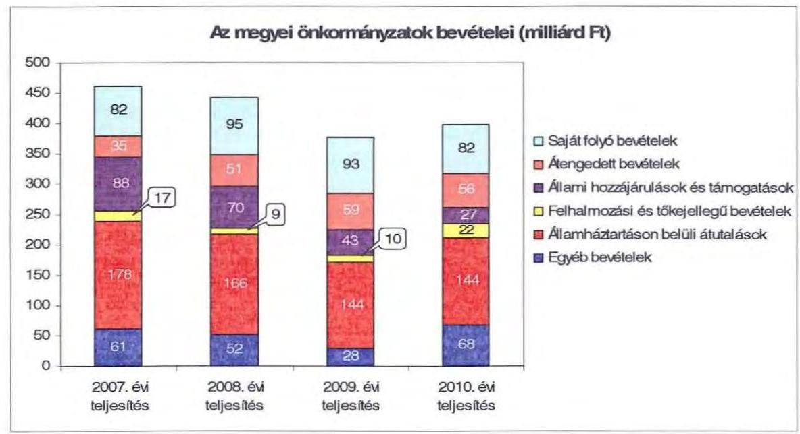

A megyei önkormányzatok saját folyó bevételeinek részaránya - amelyek főbb elemei: az intézményi térítési díjak, az illetékbevétel, a kamatbevételek - a 2007. évi összbevételen (461 milliárd Ft) belül 17,9%
 volt, amely 2010-re annak ellenére 20,6%-ra nőtt, hogy az összege 82 milliárd Ft maradt. Ennek oka az volt, hogy az összbevétel a 2007. évi 461 milliárd Ft-ról 2010-re 399 milliárd Ft-ra csökkent.

Az átengedett bevételek, amelyek a megyei önkormányzatoknál a személyi jövedelemadóból való részesedést jelentették, az összbevételen belül a 2007. évi 35 milliárd Ft-ról 56 milliárd Ft-ra nőttek.

Az állami hozzájárulások és támogatások - amelyek főbb elemei: az ellátotti létszámhoz kötődő normatív állami hozzájárulások, központosított, fejezeti szinten kezelt célelű irányzatból juttatott működési és fejlesztési támogatások a 2007. évi 88 milliárd Ft-ról (19,1%-os részarányról) 2010-re 27 milliárd Ft-ra (6,8%-os részarányra) estek vissza.

A felhalmozási és tőkejellegű bevételek - tárgyi eszközök (ingatlanok és ingóságok), föld és immateriális javak, részesedések értékesítése, EU-tól átvett pénzeszközök - a 2007. évi 17 milliárd Ft-ról (3,6%-os részarányról) 2010-re 22 milliárd Ft-ra (5,4%-ra) emelkedtek.

Az államháztartáson belüli átutalások részesedése 2007-ben 178 milliárd Ft volt. 2010. év végére 34 milliárd Ft-tal csökkent, részaránya 38,6%-ról 2,6 százalékpontos csökkenés után 2010-ben 36%-ra változott. Ez a bevételi kategória tartalmazza az egészségbiztosítási és egyéb elkülönített állami pénzalapoktól átvett forrásokat. A 2010-ben e címen elszámolt bevétel 144 milliárd Ft volt.

A megyei önkormányzatok központi költségvetésből származó bevételeinek összege 2007-ben 400 milliárd Ft volt, amely 2010. évre 331 milliárd Ft-ra (az időszak alatt összesen 69 milliárd Ft-tal) 17,3%-kal csökkent.

---

Az egyéb, pénzmaradványból, vállalkozási bevételekből, államháztartáson kívülről származó átutalásokból, a hitelekből, a hosszú és rövid lejáratú értékpapírok értékesítéséből származó bevételek részesedése a 2007-2010. évek viszonylatában 13,3%-ról 17,1%-ra emelkedett. Ez utóbbiak 2010. évi beszámoló szerinti összevont teljesítése 68 milliárd Ft volt ${ }^{9}$.

Mindezeket figyelembe véve 2007. és 2010. években a megyei önkormányzatok forrásösszetételének megoszlását az alábbi ábra szemlélteti:
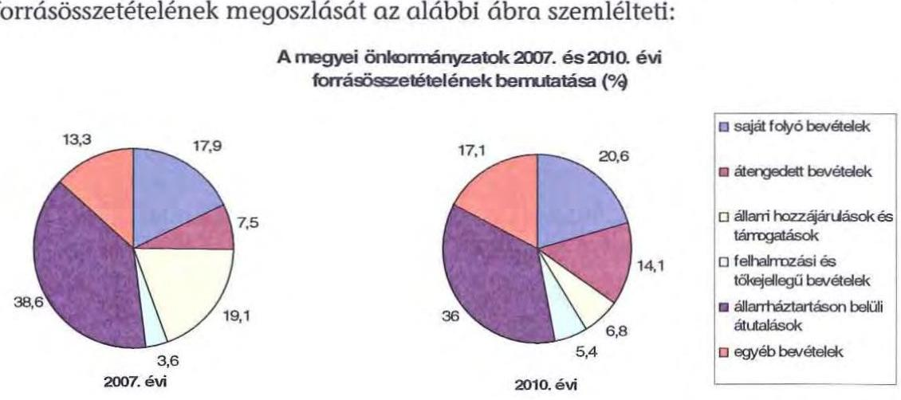

Annak ellenére, hogy a megyei önkormányzatok kötelezően ellátandó feladataikat 2007-hez képest kevesebb intézményben, csökkenő foglalkoztatotti létszám mellett végezték ${ }^{10}$, a jelentős bevételkiesést a - szervezési intézkedések hatására - csökkenő ráfordítások nem tudták kompenzálni. Az ellátottak száma a szociális, gyermekvédelmi ágazat bentlakásos elhelyezést nyújtó intézményeit kivéve - eltérő mértékben ugyan, de minden ágazatban évről évre csökkent, amely a fajlagos hozzájárulások csökkenésével együtt a normatív állami hozzájárulás arányának visszaeséséhez vezetett.

A 2007-2013-as időszakra meghirdetett, vissza nem térítendő EU-s fejlesztési forrásokhoz való hozzájutás lehetősége felerősítette az önkormányzati alrendszer fejlesztési igényeit. A fokozott fejlesztési tevékenység a felhalmozási bevételek és kiadások egyensúlyának megbomlásán ${ }^{11}$ túl a jelentkező jövőbeni fenntartási kötelezettség miatt tovább terhelhetik az önkormányzatok költségvetését.

[^0]
[^0]:    ${ }^{9}$ Az egyéb bevételek összege 2007-2010 között eltérő módon változott, 2007-ben 61 milliárd Ft volt, 2008-ban 52 milliárd Ft-ra, 2009-ben 28 milliárd Ft-ra esett vissza, majd 2010-ben ismét - 68 milliárd Ft-ra - emelkedett.
    ${ }^{10}$ a BM által 2010 decemberében elvégzett felmérés adatai szerint
    ${ }^{11}$ Az önkormányzati alrendszerben - az éves zárszámadási törvényjavaslatok általános indokolása, X. Helyi önkormányzatok gazdálkodása fejezet szerint - a felhalmozási bevételek és kiadások egyenlege 2007-ben 142,4 milliárd Ft, 2008-ban 112,3 milliárd Ft, 2009-ben 234,5 milliárd Ft hiányt mutatott.

---

A megyei önkormányzatok felhalmozási és működési célú pénzintézeti és szállítói kötelezettségeinek állománya a vizsgált időszakban erőteljesen növekedett.

A hosszú lejáratú kötelezettségek nagyságát a következő ábra szemlélteti:
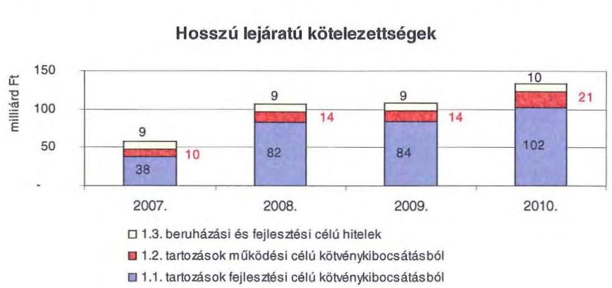

A hosszú lejáratú kötelezettségek mellett az időszakban a 2007. évi 22 milliárd Ft-ról 24 milliárd Ft-ra (8,8%-kal) növekedett az áruszállításból származó szállítói kötelezettségek állománya.

A mérlegben kimutatott kötelezettségek állománya mellett az elhasználódott eszközök pótlására forrást biztosító amortizációs (felújítási) alap képzésének ${ }^{12}$ elmaradása további problémákat vetít előre. A megyei önkormányzatok beszámolójelentéseinek összegzése szerint 2007-ben még az elszámolt értékcsökkenés 90%-ának megfelelő összeget fordítottak felújítási célokra, 2009-ben ez az arányszám már csak 16,5% volt. Ez maga után vonta a feladatellátást kiszolgáló tárgyi eszközök állagának erőteljes romlását.

Az ÁSZ a 2011. évi ellenőrzési tervében a 43. számú, az „Önkormányzatok gazdálkodási rendszerének ellenőrzése" részeként egy időben, egymással párhuzamosan tekinti át és elemzi az önkormányzati alrendszer középszintjét jelentő 19 megyei önkormányzat pénzügyi helyzetét. A gazdálkodás szabályszerűségét az ÁSZ az előző évek során ellenőrizte a megyei önkormányzatoknál is, ezért jelen vizsgálatunk erre nem tér ki.

A jelentés a megyei önkormányzatok sajátos feladatellátási és forrásszabályozási helyzetére tekintettel a megyei önkormányzatok pénzügyi helyzetét, illetve az ezzel összefüggő korábbi ÁSZ javaslatok megvalósítását mutatja be.

Az ellenőrzés a 2007. január 1. - 2011. március 31. közötti időszakot ölelte fel.

[^0]
[^0]:    ${ }^{12}$ Erre a jelenlegi szabályozási környezetben nem kötelezi semmilyen előírás az önkormányzatokat.

---

A vizsgálat jogszabályi alapját 2011. július 1-je előtt az Állami Számvevőszékről szóló 1989. évi XXXVIII. törvény 2. § (3), (5), (6) és (9) bekezdéseiben, az Ötv. 92. § (1) bekezdésében és az Áht. 104. § (3) bekezdésében, 2011. július 1-jét követően az Állami Számvevőszékről szóló 2011. évi LXVI. törvény 1. § (3) bekezdésében, az 5. § (2)-(6) bekezdéseiben és az Áht. 120/A. § (1) bekezdésében foglalt előírások képezték.

Jász-Nagykun-Szolnok megye országos és régión belül elfoglalt helyzetét 2010. december 31-én az alábbi mutatók szemléltetik (megyei jogú városokkal együtt):

Index: az előző év azonos időszak (időpontja)=100,0

| Mutató megnevezése | Jász-   Nagykun-   Szolnok   megye | Észak-   Alföldi   régió | Országos |
| :-- | :--: | :--: | --: |
| Népesség száma (ezer fő)* | 387 | 1482 | 9986 |
| Népesség változás indexe (\%) | 99,0 | 99,3 | 99,7 |
| Az ipari termelés volumenindexe (\%) | 121,4 | 109,6 | 110,7 |
| Egy lakosra jutó ipari termelési érték (ezer Ft) | 3075,8 | 1452,1 | 2044,4 |
| Ezer lakosra jutó vállalkozások száma (db) | 130 | 168 | 165 |
| A beruházások egy lakosra vetített teljesít- | 153,5 | 160,6 | 304,7 |
| menyértéke (millió Ft) |  |  |  |
| Foglalkoztatási arány (\%) | 47,8 | 45,0 | 49,5 |
| Munkanélküliségi ráta (\%) | 10,7 | 14,3 | 10,8 |
| Alkalmazásban állók havi nettó átlagkerese- | 106648 | 109060 | 132628 |
| te (Ft) |  |  |  |
| Alkalmazásban állók havi nettó átlagkeresetének indexe (\%) | 106,2 | 106,2 | 106,9 |

*Ebből Szolnok megyei jogú város népessége 74,7 ezer fő
Az adatok azt jelzik, hogy a gazdaság helyzetét reprezentáló egyes mutatók az ipari termelés volumenének változása és az egy lakosra jutó ipari termelési érték kivételével - tekintetében elmarad az országos jellemzőktől. Az Északalföldi régión belül elfoglalt helyzete kedvezőbb képet mutat. Különösen kedvező, hogy a megyében a foglalkoztatási arány magasabb és az egy lakosra jutó ipari termelési érték is meghaladja a régiós, és az országos értéket is.

A megyében 78 települési - egy megyei jogú városi, 19 városi, 5 nagyközségi és 53 községi - önkormányzat működött.

---

# I. ÖSSZEGZŐ MEGÁLLAPÍTÁSOK, KÖVETKEZTETÉSEK, JAVASLATOK 

Az Önkormányzat adatszolgáltatása szerint 2010-ben 20549 millió Ft összes költségvetési kiadásából 99,6%-ot kötelező feladatai ellátására fordította. Az Önkormányzat önként vállalt feladatai az SzMSz-ben meghatározottnak megfelelően a sport, a szórakoztató és szabadidős tevékenységhez, egyes idegenforgalmi, turisztikai, kiadvány-szerkesztési, kommunikációs szolgáltatások szervezéséhez kapcsolódnak, valamint támogatást nyújtott civil szervezetek, alapítványok működéséhez 82 millió Ft összegben. Az SzMSz a kötelező közszolgáltatási feladatokat, és azok ellátásának szervezeti keretét általános jelleggel, a vonatkozó jogszabályokra hivatkozással határozta meg.

Az Önkormányzat kötelező és önként vállalt feladatait 2010. december 31-én a Hivatal mellett 22 költségvetési intézménnyel, 47 telephelyen látta el. A vizsgált időszak elején 48 telephelyen működtek az Önkormányzat intézményei. Az intézmények száma 2007-2010 között négy intézmény átvétele következtében alakult ki. A költségvetési intézményként működő Kórház mellett kilenc intézmény szociális és gyermekvédelmi feladatokat, hét intézmény közoktatási feladatot, három intézmény közművelődési és közgyűjteményi feladatot, két intézmény egyéb feladatot (arborétum és idegenforgalmi szolgálat) lát el. Az Önkormányzat 2007-2010 között intézményt és feladatot más önkormányzatnak vagy egyéb szervezetnek nem adott át.

Az Önkormányzat folyó költségvetési egyenlege (működési jövedelme) a 2007-2009. években pozitív összegű volt. A működési megtakarítások fedezni tudták a tárgyévben jelentkező törlesztési kötelezettségeket, így 2007-2009 között az Önkormányzat pénzügyi kapacitása (nettó működési jövedelme) is pozitív volt. A 2010. évben a működési jövedelem (-689 millió Ft), továbbá a pénzügyi kapacitás (-769 millió Ft) is negatív összegű volt, a folyó bevételek nem nyújtottak fedezetet a folyó kiadásokra és az adósságszolgálatra. A 2007-2010. években az Önkormányzat felhalmozási költségvetésének egyenlege folyamatosan negatív volt, amely 2007-2010 között összesen 2425 millió Ft felhalmozási forráshiányt okozott. A pénzügyi egyensúly fenntartása csak külső források bevonásával volt biztosítható.

Az Önkormányzat legfőbb bevételi forrásai - a jogszabályi kedvezmények bővülése, és az ingatlanforgalom visszaesése következményeként az illetékbevétel, valamint a központi forráskivonás hatására az átengedett szja és az állami támogatások - csökkentek.

Az illetékbevétel a 2006. évi 2224 millió Ft-ról 2010-re 1214 millió Ft-ra (a 2006. évi 54,6%-ára) csökkent. Az átengedett szja és az állami támogatások együttes összege a központi támogatáscsökkentésen túl a feladatátvétel hatását is figyelembe véve kevesebb lett, 2010-ben 3617 millió Ft volt, a 2007. évi 81,5%-a. A Kórház működtetéséhez biztosított OEP támogatás a 2007. évben 8377 millió Ft-ról, a 2010. évben 9434 millió Ft-ra (12,6%-kal) emelkedett. A saját bevételek 1310 millió Ft-tal emelkedtek, azonban ez és a működőképesség

---

megőrzését szolgáló kiegészítő támogatásból 2007-2010 közötti időszakban kapott 95 millió Ft támogatás sem ellensúlyozta az illetékbevételeknél, szja és állami támogatásnál kimutatott kieső forrásokat.

A működési kiadások 2007-ről 2010-re 8,6%-kal, 1517 millió Ft-tal csökkentek. Az Önkormányzat a Kórház működéséhez 759 millió Ft, fejlesztéséhez 461 millió Ft kiadást teljesített 2007-2010 között.

Az intézmények teljesített működési kiadásai 2007-ben 8658 millió Ft-ot tettek ki (az összes működési kiadás 49,3%-át), amely 2010-re 8714 millió Ft-ra nőtt (az összes működési kiadás 45,6%-ára). A működési és felhalmozási kiadásokon belül 2007-2010 között a felhalmozási kiadások súlya 1620 millió Ft-ról (9,2%-ról) 1461 millió Ft-ra (7,6%-ra) csökkent. Az Önkormányzat 6,1 milliárd Ft bekerülési költségű beruházást folytatott, illetve indított el, amelyből 1,5 milliárd Ft a 2010 utánra vállalt kötelezettség. Az utóbbi forrásai az Önkormányzat adatszolgáltatása alapján: 22 millió Ft saját bevétel, 297 millió Ft kötvény, 1202 millió Ft EU-s támogatás, továbbá 25 millió Ft hazai támogatás. A 2010. év utánra vállalt kötelezettségből 614 millió Ft (40,9%) a Kórház fejlesztéseit finanszírozza.

Az Önkormányzat pénzintézeti kötelezettségeinek állománya a könyvviteli mérlegadatok szerint 2007. december 31-ről 2010. december 31-re 888 millió Ft-ról 7062 millió Ft-ra nőtt. A vizsgált időszakban
 adósságszolgálatra az Önkormányzat 677 millió Ft-ot teljesített, amelyből a kamatkiadás 537 millió Ft volt. A kötvényből származó források befektetéséből realizált kamatbevétel 998 millió Ft volt 2008-2010 között.

Az Önkormányzatnak likviditása érdekében a 2010. év minden napján volt folyószámlahitele, amelynek átlagos állománya 743 millió Ft, munkabérhitelt a 2010. évben 10 alkalommal vett igénybe, alkalmanként átlagosan 202 millió Ft összegben.

Az Önkormányzat 2010. év végén fennálló pénzintézeti kötelezettsége 5422 millió Ft (76,8%) fejlesztési célú kötvény kibocsátásából, 440 millió Ft (6,2%) fejlesztési célú hosszú lejáratú hitel felvételéből, továbbá 1200 millió Ft (17%) a költségvetési év végén ki nem egyenlített folyószámla és munkabér megelőlegezési hitelekből keletkezett. Ezek miatt az Önkormányzatnak a 2011-2013. években hosszú lejáratú kötelezettségeire 260 millió Ft-ot és 2350040 CHF tőketörlesztést és kamatot ${ }^{13}$ kell teljesítenie. A 2010. év végi szállítói tartozása 740 millió Ft (ebből lejárt 163 millió Ft), és egyéb kiadás elmaradása ${ }^{14}$ 13 millió Ft. A további évekre szóló, 2010. december 31-én ismert pénzintézeti kötelezettségei a következők: 202 millió Ft, és 24688840 CHF.

Az Önkormányzatnál a kötelezettségvállalásból származó források visszafizetésének forrásait meghatározták. Az előterjesztésekben kitértek az adósságszolgálati korlát bemutatására a teljes futamidő várható kamat és tőkefizetési kötele-

[^0]
[^0]:    ${ }^{13}$ A 2011. I. negyedév kamat mértékét alapul véve
    ${ }^{14}$ Kórháznál szerv transzplantációs díj és felügyeleti bírság, Hivatalnál külterületi szántók vételi joga.

---

zettségeknek, az árfolyam- és kamatkockázatoknak a bemutatására. Az Önkormányzat adósságot keletkeztető kötelezettségvállalásának felső határát a 2007-2010. években nem lépte túl. Az adósságot keletkeztető kötelezettségvállalással megvalósított felhalmozási kiadások esetleges kiadást csökkentő vonzatát, az abból való megtérülését az energia megtakarításokhoz kapcsolódó fejlesztésnél vizsgálták.

Az Önkormányzat 2007-2010 között a tárgyi eszközök után 2478 millió Ft értékcsökkenést számolt el, ugyanakkor felújításra csak ennek töredékét 766 millió Ft-ot (30,9%) fordított.

A végrehajtott kiadáscsökkentő intézkedések megtétele a feladatellátás szakmai színvonalának növelése mellett a takarékos szemléletű gazdálkodást, a működőképesség megőrzését, kiemelten a pénzügyi helyzet javítását célozták. Az intézményátszervezések, a feladatváltozások, valamint a takarékossági intézkedések hatásaként a 2007-2010. években - az Önkormányzat kimutatása szerint - együttesen 2241 millió Ft kiadási megtakarítás keletkezett, melyből 1414 millió Ft, 63% a kapcsolódó álláshelycsökkenések következtében jelentkezett.

A létszámcsökkentő intézkedések következtében 2007-2010 között a Hivatalnál és az intézményeknél összesen 690 álláshelyet szüntettek meg, amelyből 372 fő, 53,9% ágazati szakmai, 318 fő, 46,1% intézményüzemeltetéshez, fenntartáshoz, gazdasági ügyek intézéséhez kapcsolódó álláshely volt.

A bevételnövelésre irányuló intézkedések eredményeként képződő többletbevételből - 2096 millió Ft-ból - az Önkormányzat kimutatása szerint 1166 millió Ft-ot, 55,6%-ot a Hivatalnál realizáltak. A bevétel növekedésében meghatározó tényező volt az átmenetileg szabad pénzeszközök lekötéséből származó kamatbevétel 1100 millió Ft összege. Az intézmények bevétel növekedéséből 2007-2010 között 659 millió Ft a szociális ellátottak és egyéb szolgáltatások térítési díjnövekedése volt.

Az utóellenőrzés a pénzügyi egyensúly javítására tett három szabályszerűségi javaslat hasznosulására terjedt ki, amely eredményeként a költségvetési rendelettervezetek költségvetési bevételi és kiadási főösszegei nem tartalmaztak finanszírozási célú bevételeket, illetve kiadásokat, azonban az európai uniós támogatással megvalósuló projektek nem mindegyikét tüntették fel elkülönítetten, továbbá nem mutatták be teljes körűen a projektek bevételeit és kiadásait.

A feladatok és források közötti egyensúly megteremtésére irányuló központi döntések, a megyei önkormányzatok konszolidációjára, az intézmények átvételére vonatkozó törvényjavaslat elfogadása új feltételeket teremtett. A hatékony és eredményes gazdálkodás, a pénzügyi egyensúly megőrzése azonban további helyi intézkedéseket igényel.

Az Állami Számvevőszékről szóló 2011. évi LXVI. törvény 33. § (1) bekezdésében foglaltak értelmében a jelentésben foglalt megállapításokhoz kapcsolódó intézkedési tervet köteles az ellenőrzött szervezet vezetője összeállítani és azt a jelentés kézhezvételétől számított harminc napon belül az ÁSZ részére megküldeni. Amennyiben az intézkedési tervet határidőben nem küldi meg a szerve-

---

zet, vagy az továbbra sem elfogadható, az ÁSZ elnöke a hivatkozott törvény 33. § (3) bekezdés a)-b) pontjaiban foglaltakat érvényesítheti.

A 2011 májusában lezárult helyszíni ellenőrzés tapasztalatai alapján - figyelembe véve az Önkormányzat észrevételeit és a saját hatáskörben tett intézkedéseit - az alábbi javaslatokat tette az ÁSZ:

# a Közgyűlés elnökének: 

1. tájékoztassa a Közgyűlést rendszeresen a pénzügyi helyzetről, azon belül a kötelezettségállomány alakulásáról, a feltételekben bekövetkező változásokról, az adósságot keletkeztető kötelezettségek teljesítési feltételeiről legalább 3 évre kitekintően;
2. terjesszen - a feltételek romlása esetén - a Közgyűlés elé cselekvési tervet a szükséges, üzemgazdasági számításokkal alátámasztott, újabb bevételnövelő, kiadáscsökkentő, beruházások és más kötelezettségek felülvizsgálatát, tartalékok képzését, méretgazdaságos intézményi struktúrát eredményező döntések meghozatala érdekében, a pénzügyi, működési egyensúly mielőbbi biztosítása és fenntarthatósága céljából.
3. gondoskodjon a fennálló lejárt szállítói tartozás okainak feltárásáról, szerkezetének bemutatásáról - beleértve az intézményeknél lejárt szállítói állomány értékét és napra számított arányát -, a szükséges intézkedések megtételéről, indokolt esetben a szállítókkal a lejárt tartozások mielőbbi rendezéséről a kockázatok minimalizálása érdekében;
4. gondoskodjon a pénzintézeti kötelezettségek finanszírozási lehetőségeinek számbavételéről, és arra források biztosításáról;
5. mutassa be a Közgyűlésnek az éves költségvetési előterjesztésekben az értékcsökkenési leírás összegét, és ezzel arányban az elhasználódott eszközök pótlásának forrásigényét és - lehetőségét.

---

# II. RÉSZLETES MEGÁLLAPÍTÁSOK 

## 1. Az ÖNKORMÁNYZAT KÖTELEZŐ ÉS ÖNKÉNT VÁLLALT FELADATAI

Az Önkormányzat 2010. évi beszámolója szerint költségvetési kiadásainak 99,6%-át (20467 millió Ft-ot) a kötelező, 0,4%-át (82 millió Ft-ot) az önként vállalt feladatok ellátására fordította. Az Önkormányzat önként vállaltnak tekintett feladatai a sport, szórakoztató és szabadidős tevékenységhez, idegenforgalmi, turisztikai, kiadvány-szerkesztési, kommunikációs szolgáltatások szervezéséhez kapcsolódtak, valamint támogatást nyújt civil szervezetek, alapítványok működéséhez.

A kötelező és önként vállalt feladatok körét az Önkormányzat SzMSz-ében rögzítették ${ }^{15}$. Kötelező feladataikat az Ötv. és az ágazati törvények által meghatározottnak tekintik, az önként vállalt feladatokra fordított források nagyságát az éves költségvetési rendeletekben határozták meg.

Az Önkormányzat kiadási szerkezetét tekintve a járulékokkal növelt személyi és a dologi kiadások ${ }^{16}$ 18076 millió Ft-os összegén belül meghatározó arányt - 10307 millió Ft-ot, 57%-ot - a Kórháznál elszámolt kiadások jelentik. Szociális és gyermekvédelmi célokra 3634 millió Ft-ot, oktatási célokra 2662 millió Ft-ot, közművelődési feladatokra 709 millió Ft-ot, igazgatási és egyéb nem kiemelt ágazati feladatokra 764 millió Ft-ot fordítottak. A szociális és gyermekvédelmi feladatokat ellátó 9 intézmény kiadásokból való részesedése 20,1%, a 7 közoktatási intézményé 14,8%.

A 2010. évben a közoktatási feladatok kiadásait 47%-ban (1251 millió Ft), a szociális és gyermekvédelmi feladatok kiadásait 46,3%-ban (1683 millió Ft) finanszírozta normatív költségvetési támogatás. A közművelődési, levéltári, közgyűjteményi szolgáltatások ellátását 3 intézmény biztosítja, kiadási arányuk mindössze 3,9% (709 millió Ft). Az igazgatási és egyéb ágazathoz sorolható személyi és dologi kiadások részaránya 4,2% (764 millió Ft).

[^0]
[^0]:    ${ }^{15}$ Az Önkormányzat SzMSz-ének 3. számú mellékletében. Erre jogszabályi előírás ma már nem kötelezi az Önkormányzatot.
    ${ }^{16}$ Az Önkormányzat személyi és dologi kiadásainak ágazatonkénti megbontása a BM részére 2010 decemberében az Önkormányzat által készített adatszolgáltatás kigyűjtéséből származik.

---

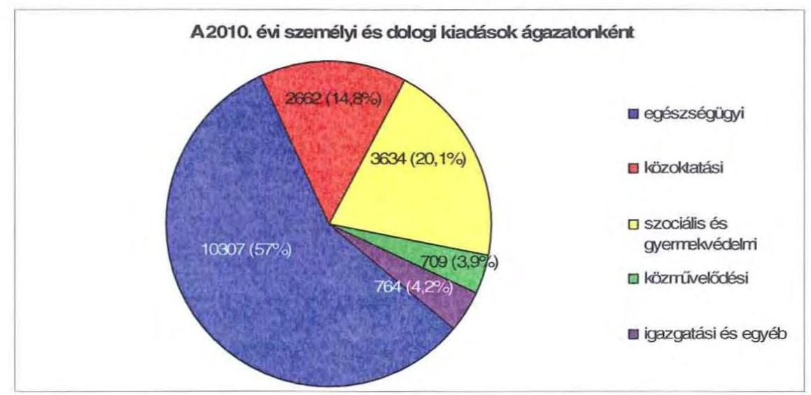

A 2010. évi költségvetési kiadásokból 17859 millió Ft-ot (87%-ot) az intézmények, 2690 millió Ft-ot (13%-ot) a Hivatal kiadásaira teljesítettek. A Hivatal költségvetéséből a személyi és dologi kiadások 1255 millió Ft-tal (46,7%), a beruházások, felújítások 9266 millió Ft-tal (34,4%), a különböző megyepolitikai feladatokhoz, szervezetek támogatásához, finanszírozási tételekhez kapcsolódó kiadások 509 millió Ft-tal (18,9%) részesültek.

Az Önkormányzat kötelező és önként vállalt feladatait 2010. december 31-én 23 költségvetési szervvel (Hivatal és az intézmények) látta el, többségi tulajdonú gazdasági társasága nem volt. A költségvetési szervek száma a 2006. december 31-i 28-ról 2007. év végére 26-ra, 2008. évre 24-re, 2009. év végére 23-ra csökkent. Az Önkormányzat által fenntartott költségvetési szervek közül 12 önállóan működő és gazdálkodó, 11 önállóan működő költségvetési szerv, az intézmények alapító okirataik szerint összesen 47 telephelyen működtek 2010. december 31-én. Az Önkormányzat intézményei 2007. január 1-jén 48 telephelyen működtek. Az Önkormányzat feladatait az alábbi intézménystruktúrával látta el 2010. december 31-én:

- egészségügyi feladatokat egy kórház;
- szociális és gyermekvédelmi feladatokat 9 intézmény végez (8 átmeneti és tartós szociális ellátást biztosító intézmény, 1 gyermekvédelmi feladatot ellátó intézmény, továbbá 2 alaptevékenységében oktatási feladatot végző intézményben is működnek gyermekotthonok);
- közoktatási feladatot 7 intézmény lát el (1 pedagógiai szakszolgálat, 2 szakképző iskola, 2 gimnázium és szakközépiskola, 2 általános iskola és speciális szakiskola, amelyből egy intézmény egységes gyógypedagógiai intézmény);

---

- közművelődési és közgyűjteményi feladatokat végez 3 intézmény (könyvtár, levéltár, múzeum);
- egyéb feladatot 2 intézmény (arborétum, idegenforgalmi szolgálat);
- igazgatási feladatokat a Hivatal látta el.

Az egyes ágazatok kötelező feladatellátását 2010. december 31-én az alábbi mutatók jellemzik:

| Megnevezés | közoktatás | szociális és   gyermek-   védelem | egészség-   ügy | kultúra   és sport |
| :-- | :--: | :--: | :--: | :--: |
| Az ágazatban foglalkoztatottak száma (fő) | 671 | 1002 | 1565 | 155 |
| Az ágazat intézményeiben   ellátottak összesen (fő) | 3304 | 2200 |  |  |
| Fekvőbeteg ellátás férőhe-   lyeinek száma (db) |  |  | 1281 |  |

Az Önkormányzat a TISZA-LIMES Ingatlanforgalmazási és Vállalkozási Kft-ben 40,48%-os (3 millió Ft), az Északkelet-Magyarországi Regionális Fejlesztési Zrt-ben 0,06%-os (1 millió Ft), a Remondis Szolnok Zrt-ben 3,34%-os (4 millió Ft), a „VIACOM" Kulturális, Kereskedelmi és Szolgáltató Kft-ben 9,09%-os (0,5 millió Ft), az INNOTERM Nonprofit Kft-ben 3,85%-os (0,1 millió Ft), a felszámolás alatt álló Észak-Alföldi Regionális Egészségügyi Tanács Kht-ben 11%-os ${ }^{17}$ (0,3 millió Ft), az ENEREA Észak-alföldi Regionális és Energia Ügynökség Kft-ben 5,64%-os (0,5 millió Ft), az INNOHÍD Zrt-ben 1,52%-os (0,5 millió Ft) tulajdoni hányaddal rendelkezett 2010-ben.

A Hivatal a takarítás, az őrzés-védelem, a Kórház a mosoda, a haemodinamikai labor, a takarítás, az őrzés-védelem, továbbá a karbantartás feladatait szolgáltatási szerződéssel láttatta el.

Az Önkormányzat 2007-2010 között más önkormányzattól kettő közoktatási intézményt 1334 fő tanulói létszámmal, egy szociális ellátást végző intézményt 181 fő ellátotti létszámmal, valamint a Mozgássérültek Egyesületétől egy fogyatékos ellátást biztosító intézményt 40 fő ellátotti létszámmal vett át.

# 2. PÉNZÜGYI EGYENSÚLYI HELYZET ALAKULÁSA 

A hagyományos költségvetési szerkezet helyett az önkormányzat pénzügyi helyzetét a CLF módszerrel mutatjuk be, amelyben jobban elkülönülnek a vagyonnal kapcsolatos bevételek és kiadások a feladatokkal kapcsolatos közvetlen működtetési bevételektől és kiadásoktól. A módszer következetesen elkülöníti a folyó és a felhalmozási költségvetés bevételeit és kiadásait, azok költségvetési egyenlegeit. A tárgyévi pozíciók meghatározása érdekében a figyelembe vett saját folyó bevételek, valamint saját
 felhalmozási bevételek nem tartal-

[^0]
[^0]:    ${ }^{17}$ Az Észak-Alföldi Regionális Egészségügyi Tanács Kht. felszámolás alatt áll, gazdálkodással kapcsolatos adatok nem állnak rendelkezésre.

---

mazzák az előző évi pénzmaradványok felhasználásából származó pénzforgalom nélküli bevételeket ${ }^{18}$.

A bevételek és kiadások besorolása általános közgazdasági meggondolásokon alapul, amely testet ölt az SNA statisztikai módszertanában is. Folyó tételek alatt értjük azokat a bevételeket és kiadásokat, amelyek az önkormányzat vagyoni helyzetét automatikusan nem változtatják. A bevételi oldalon ilyenek az adók, az illeték, az áfa bevételek és visszatérülések, a hozamok és kamatok, a költségvetési támogatások, az egyéb saját bevételek, valamint a működési célra átvett pénzeszközök és kapott támogatások. A folyó kiadások közé tartoznak a szolgáltatások nyújtásával kapcsolatos működési kiadások, a kamatkiadások, valamint a működési célú transzferkiadások ${ }^{19}$. A felhalmozási vagy tőke tételek módosítják az önkormányzat vagyoni helyzetét. A privatizációs bevételek, az immateriális javak és tárgyi eszközök, valamint a részesedések értékesítése csökkentik, a fizikai beruházások és a pénzügyi befektetések növelik a vagyont. A pénzforgalmi bevételek és kiadások nem tartalmazzák a követelések elengedése miatt könyvelt tételeket, mivel ezek egymást kioltó, technikai jellegű elszámolási műveletek.

A folyó költségvetés egyenlege, a működési jövedelem megmutatja, hogy az önkormányzat éves folyó bevétele fedezetet biztosít-e a kötelező és önként vállalt feladatellátáshoz kapcsolódó éves folyó kiadására. A működési jövedelem negatív értéke pénzügyileg fenntarthatatlan helyzetet jelez. A mutató pozitív értéke megtakarítást mutat, amely forrásul szolgálhat az önkormányzat fennálló kötelezettségei megfizetéséhez, valamint fejlesztéseihez.

A felhalmozási költségvetés pozitív értéke felhalmozási többletet mutat, amely a jövőbeni fejlesztések forrását biztosíthatja. Amennyiben a folyó költségvetési hiány finanszírozása a felhalmozási többletből történik, ez szűkebb értelemben vagyonfelélésnek tekinthető. Amennyiben a felhalmozási költségvetés megtakarítása fejlesztési célú hitelek, kötvények adósságszolgálatát finanszírozza, az változatlan vagyontömeg mellett, a korábban megelőlegezett tőkebevételek valós realizációjának tekinthető. A felhalmozási deficit által generált finanszírozási igény önmagában nem jár pénzügyi kockázattal, a pénzügyileg fenntartható beruházásokhoz kapcsolódó kötelezettségvállalás (adósságszolgálat) előrelátó, tudatos költségvetési gazdálkodással teljesíthető.

A módszer a pénzügyi kapacitás (más néven a nettó működési jövedelem) fogalmát helyezi a középpontba. Az adós hitelfelvételi képessége, hosszú távú fizetőképessége vagy bonitása a pénzügyi kapacitással, ezen belül is a nettó működési jövedelemmel jellemezhető. A nettó működési jövedelem negatív értéke az egyes költségvetési években jelentkező adósságszolgálat túlzott mérté-

[^0]
[^0]:    ${ }^{18}$ A költségvetési években kialakuló hiány finanszírozása az előző években képzett tartalékok felhasználásával is történhet.
    ${ }^{19}$ Transzferkiadásoknak azokat a folyó és felhalmozási tételeket nevezzük, amelyeket nem az adott önkormányzat használ fel szolgáltatásnyújtásra (pl.: ellátottak pénzbeni juttatásai, átadott pénzeszközök, garancia- és kezességvállalások stb.).

---

kére utal ${ }^{20}$. A nettó működési jövedelem negatív értékének felhalmozási többletből, vagy további hitelből történő finanszírozása pénzügyileg nem fenntartható gazdálkodást vetít előre. A pozitív értéket mutató nettó működési jövedelem fejlesztési kiadások fedezetét biztosíthatja, illetve a folyamatosan, évenként képződő pozitív nettó működési jövedelemből meghatározható a jövőben vállalható, teljesíthető éves adósságszolgálat, ily módon az a hitelösszeg, amely - a többi tényezőt, feltételt adottnak tekintve - visszafizetési kockázat nélkül felvehető.

A CLF módszer alapján a pénzügyi kapacitás mértéke az önkormányzat összevont, nettósított, a központi információs rendszerbe a MÁK-on keresztül leadott éves költségvetési beszámolójának 80-as űrlapjában szerepeltetett adatok alapján került meghatározásra. A 2007-2010 közötti időszakban az Önkormányzat CLF módszer szerint besorolt kiadásainak és bevételeinek fő jogcímek szerinti alakulását a jelentés 2/a. számú melléklete tartalmazza.

Az Önkormányzat bevételeinek és kiadásainak alakulását részletesen a hatályos számviteli előírások szerint készült, összevont éves költségvetési beszámolók adataira alapozva mutatjuk be. A bevételek és kiadások működési, valamint felhalmozási jogcímekre történő elkülönítését az éves költségvetési beszámolók, a zárszámadási rendeletek, továbbá - amely jogcímek ${ }^{21}$ esetében erre más lehetőség nem volt - az Önkormányzat adatszolgáltatása szerinti megbontás alapján végeztük el. A bevételek elemzése során figyelembe vettük a korábbi években keletkezett pénzmaradvány felhasználásából származó pénzforgalom nélküli bevételeket is. A 2007-2010 közötti időszakban az Önkormányzat bevételeinek és kiadásainak, továbbá adósságszolgálatának alakulását a jelentés 2/b. számú melléklete tartalmazza.

[^0]
[^0]:    ${ }^{20}$ Kivéve, ha annak finanszírozására a korábbi években képzett tartalékok fedezetet nyújtanak.
    ${ }^{21}$ Az előző évi maradvány visszafizetésének, az előző évi pénzmaradvány átadásának és átvételének, a kamatkiadásoknak, az egyéb pénzforgalom nélküli kiadásoknak, a hozam- és kamatbevételeknek, az átengedett adóknak, a költségvetési támogatásoknak, továbbá az előző évi pénzmaradvány igénybevételének működési és felhalmozási részre történő megosztásához az Önkormányzat által szolgáltatott adatokat vettük figyelembe.

---

# 2.1. A működési és felhalmozási egyensúly alakulása 

## CLF módszer szerinti önkormányzati adatok

| Megnevezés | 2007 | 2008 | 2009 | 2010 |
| :--: | :--: | :--: | :--: | :--: |
| Folyó bevételek | 17964517 | 19868354 | 18064095 | 18459987 |
| Folyó kiadások | 17601180 | 19197398 | 17976005 | 19149328 |
| Működési jövedelem | 363337 | 670956 | 88090 | $-689341$ |
| Nettó működési jövedelem   = működési jövedelem - tőketörlesztés | 363337 | 670956 | 28090 | $-769341$ |
| Felhalmozási bevételek | 752685 | 522197 | 251359 | 1071632 |
| Felhalmozási kiadások | 1589320 | 1365087 | 668683 | 1399433 |
| Felhalmozási költségvetés egyenlege | $-836635$ | $-842890$ | $-417324$ | $-327801$ |
| Finanszírozási műveletek nélküli (GFS) pozíció | $-473298$ | $-171934$ | $-329234$ | $-1017142$ |
| Finanszírozási műveletek egyenlege | 105049 | 4240653 | $-165788$ | 630052 |
| Tárgyévi pénzügyi pozíció | $-368249$ | 4068719 | $-495022$ | $-387090$ |
| Egyéb tájékoztató adatok |  |  |  |  |
| Összes kötelezettség* | 1626453 | 6032067 | 6696343 | 8386768 |
| - ebből: rövid lejáratú | 943337 | 1042624 | 1739621 | 2587473 |
| Folyószámlahitel napi átlagos állománya** | 231991 | 308991 | 449340 | 743114 |
| Egyéb likvidhitel napi átlagos állománya** | 0 | 0 | 0 | 0 |
| Munkabér-megelőlegezési hitel napi átlagos állománya** | 7946 | 5714 | 0 | 7746 |
| Egyéb finanszírozásba vonható eszközök év végi állománya:: | 1042694 | 5111413 | 4671359 | 4134271 |
| - ebből: tartós hitelviszonyt megtestesítő értékpapírok év végi állománya | 0 | 0 | 0 | 0 |
| - ebből: hosszú lejáratú bankbetétek év végi állománya | 0 | 0 | 0 | 0 |
| - ebből: értékpapírok év végi állománya | 0 | 0 | 149998 | 0 |
| -ebből: pénzeszközök (idegen pénzeszközök nélkül) év végi állománya | 1042694 | 5111413 | 4521361 | 4134271 |

* Az összes kötelezettséget a passzív pénzügyi elszámolások nélkül vettük figyelembe, mert a passzívák a pénzmaradvány elszámolás tételei közé tartoznak.
** A folyószámla- és a munkabér megelőlegezési hitel átlagos állományát 365 nappal számítottuk.
Az Önkormányzat folyó költségvetési egyenlege, működési jövedelme a 2007-2009. években pozitív összegű volt, 2010. évben működési forráshiánya keletkezett, amelyet a következő ábra szemléltet:
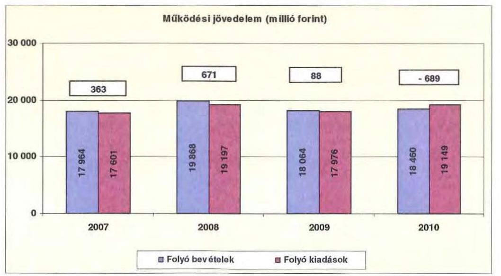

---

A folyó költségvetés egyenlege (a működési forrástöbblet) 2007-ben a folyó kiadások 2,1\%-át ( 363 millió Ft-ot), 2008-ban 3,5\%-át ( 671 millió Ft-ot), 2009ben $0,5 \%$-át ( 88 millió Ft-ot) jelentette. 2010-ben a folyó költségvetés hiánya a folyó kiadások 3,6\%-a (-689 millió Ft) volt.

A működési forráshiány finanszírozása munkabér- és folyószámlahitelből, továbbá a fejlesztési céllal kibocsátott kötvény befektetéséből származó hozamokból történt. A folyószámlahitel napi átlagos állománya 2007-2010 között több mint háromszorosára ( 232 millió Ft-ról 743 millió Ft-ra) nőtt. A vizsgált időszakban - kivéve 2009. évet, amikor nem volt munkabérhiteligénybevétel - a munkabérhitel napi átlagos állománya 8 millió Ft volt.

Az Önkormányzat kötelezettségein ${ }^{22}$ belül a 2010. évi rövid lejáratú kötelezettségek állománya valamivel több, mint $30 \%$ volt, a 2007. évi $58,0 \%$-os aránynyal szemben. Az Önkormányzat 2007. december 31-én fennálló pénz és tőkepiaci kötelezettsége 888 millió Ft-ról közel a 8 -szorosára, 7062 millió Ft-ra nőtt a kötvénykibocsátás és a folyószámlahitel év végi fennmaradó állományának emelkedése miatt.

A rövid lejáratú kötelezettségek 2010-ben 2587 millió Ft-ot tettek ki, amely 1644 millió Ft-tal ( $174,3 \%$-kal) több a 2007. évi rövid lejáratú kötelezettségállománynál. A rövid lejáratú kötelezettségeknek a szállítói tartozásállomány 2007-ben 62,3\%-át ( 587 millió Ft-ot), 2008-ban 32,2\%-át ( 336 millió Ft-ot), 2009-ben 53,8\%-át ( 937 millió Ft-ot), 2010-ben 28,6\%-át ( 740 millió Ft-ot) tette ki.

Az Önkormányzat pénzügyi kapacitása a 2007-2009. években pozitív, 2010. évben negatív értéket mutatott. A nettó működési jövedelem ${ }^{23}$ értéke a folyó költségvetési pozíció mellett az adott költségvetési év adósságtörlesztésének hatását is tükrözi.

Az Önkormányzat nettó működési jövedelmének évenkénti alakulását az alábbi ábra szemlélteti:
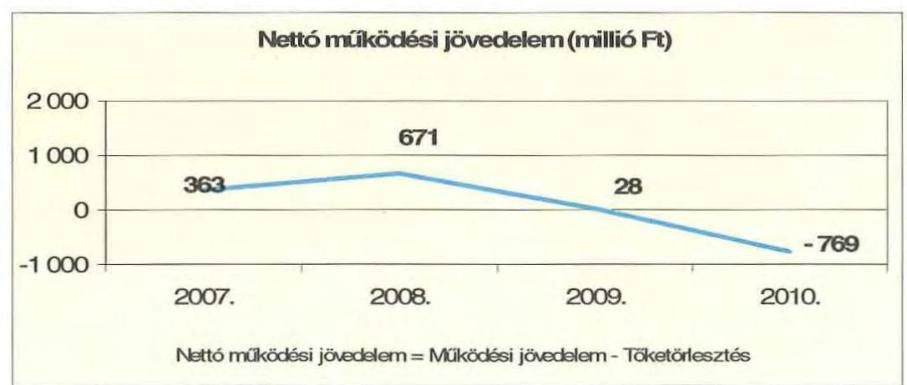

[^0]
[^0]:    ${ }^{22}$ Passzív pénzügyi elszámolások nélküli
    ${ }^{23}$ Pénzügyi kapacitás

---

A folyó költségvetés egyenlegének és a tőketörlesztésre (tőketörlesztés és forgatási és befektetési célú értékpapírok beváltása) fordított összegeknek évenkénti különbözete (a nettó működési jövedelem) a 2010. évet kivéve pozitív értéket mutatott, azaz a pénzügyi kapacitás a tőketörlesztés teljesítését követően is megtakarítást mutatott. A 2010. évi -769 millió Ft negatív nettó működési jövedelem oka, hogy a bevételek nem nyújtottak fedezetet a kiadásokra és a tőketörlesztés teljesítésére.

A 2007-2010. években az Önkormányzat felhalmozási költségvetés egyenlege folyamatosan negatív összegű volt, amelyet a következő ábra szemléltet:
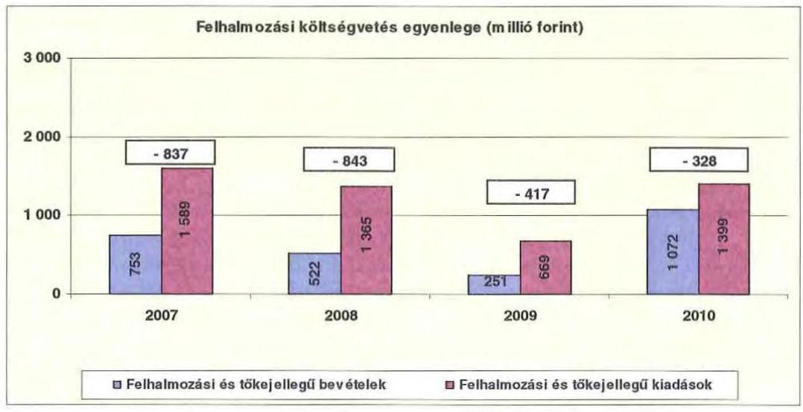

A felhalmozási forráshiánynak a felhalmozási és tőke jellegű kiadásokhoz viszonyított aránya 2007-ben 52,6\% (-837 millió Ft), 2008-ban 61,7\% (-843 millió Ft) 2009-ben 62,4\% (-417 millió Ft) 2010-ben 23,4\% (-328 millió Ft) volt. A 2008. évi kötvénykibocsátásból származó bevétel felhalmozási célra történő felhasználását több évre ütemezte az Önkormányzat (a kibocsátott 4000 millió Ft kötvénybevételből 1108 millió Ft-ot használtak fel a 2008-2010. évek között).

Az Önkormányzat évenkénti teljes finanszírozási hiánya ${ }^{24}$ a CLF módszer szerint 2007-ben -473 millió Ft, 2008-ban -172 millió Ft, 2009-ben -389 millió Ft, 2010-ben -1097 millió Ft volt.

Az önkormányzat finanszírozási műveletei 2007-2010. évekbeni egyenlegének alakulását a következő ábra szemlélteti:

[^0]
[^0]:    ${ }^{24}$ a nettó működési jövedelem és a felhalmozási költségvetés egyenlegeinek összege

---

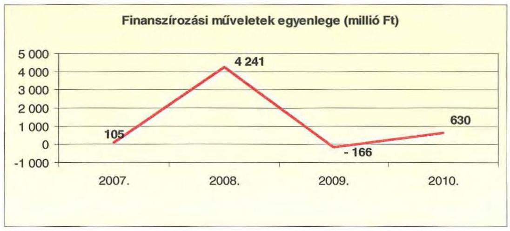

A finanszírozási többlet azt jelzi, hogy az éves költségvetések végrehajtása során szükség volt a pénzkészlet felhasználásán túl külső finanszírozás igénybevételére is. A finanszírozási célú műveleteket a vizsgált időszakban a jelentés 2/a. számú mellékletének 4.1-4.8 pontjai részletezik.

Az Önkormányzat zárszámadási rendeletében a működési és fejlesztési hiányt a hagyományos költségvetési szerkezet alapján mutatta be ${ }^{25}$, amelyről a jelentés 1. számú melléklete nyújt tájékoztatást. A hagyományos költségvetési szerkezet alapján is a működésben csak a 2010. évben volt hiány, azonban - ellentétben a CLF módszer alapján kimutatottal - a felhalmozási bevételek minden évben meghaladták a
 felhalmozási kiadásokat.

A vizsgált időszakban a kötelezettségek (passzív pénzügyi elszámolások nélkül) 1626 millió Ft-ról 8387 millió Ft-ra emelkedtek, amely együtt járt a kamatkiadások növekedésével. Ugyanakkor a kötvénybevétel lekötése révén a kapott kamatok folyamatosan meghaladták a fizetett kamatokat.

A 2007-2010 között az Önkormányzat összesen 1100 millió Ft kamatbevételt realizált, amely a teljes kamatráfordítás (537 millió Ft volt) 204,8%-át tette ki.

Az Önkormányzat kamatbevételeit, kamatkiadásait és azok egyenlegét a következő ábra mutatja:

[^0]
[^0]:    ${ }^{25}$ Nincs kötelező előírás a működési és fejlesztési hiány megállapításának módjára.

---

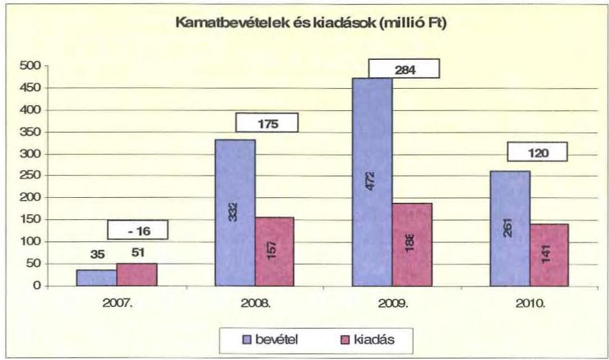

### 2.2. Az Önkormányzat bevételei

Az Önkormányzat 2007-2010 között realizált, OEP támogatás nélküli főbb működési bevételi jogcímeinek számszaki adatait a következő táblázat részletezi és grafikon mutatja be:

|  Megnevezés | 2007. év | 2008. év | 2009. év | 2010. év  |
| --- | --- | --- | --- | --- |
|  illetékbevétel | 1 788 191 | 2 022 514 | 1 757 930 | 1 214 317  |
|  szja és állami támogatás | 4 437 110 | 5 214 462 | 4 391 618 | 3 616 607  |
|  egyéb saját bevétel (OEP nélkül) | 3 130 912 | 3 247 734 | 3 567 585 | 4 441 162  |
|  összes működési bevétel | 9 356 213 | 10 484 710 | 9 717 133 | 9 272 086  |

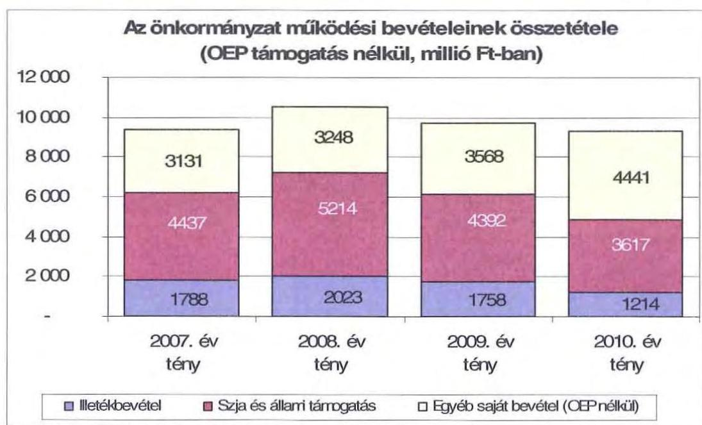

---

Az Önkormányzatnál az illetékbevétel a 2007. évben a 2006. évhez képest ${ }^{26}$ 435 millió Ft-tal, 19,6%-kal csökkent. A csökkenésben szerepet játszott az Illetékhivatalnak - 2007. január 1-jétől - az APEH-hoz történő átszervezése is. Az évente realizált illetékbevételekből (központi intézkedés következtében) évi 8,5% elvonásra került az adminisztrációs feladatokra.

Az ezen a jogcímen visszatartott összegekről nem állt rendelkezésre dokumentált információ, azonban az Önkormányzattal egyeztetett, 2007. évre kimutatott eltérés kevesebb volt, mint amekkora költségvetési kiadást jelentett korábban az Illetékhivatal működtetését ${ }^{27}$ az Önkormányzatnak. Az Illetékhivatal működtetésével kapcsolatos kiadások megszűnése és az adminisztrációs feladatokra visszatartott 8,5% között - az Önkormányzat számítása szerint - a 2007. évben 70% (343 millió Ft) pozitív különbözet jelentkezett, amely a 2007. évi 435 millió Ft-os illetékbevétel csökkenésnek 78,9%-át tette ki.

Az illetékbevétel a 2008. évben az előző évihez képest 235 millió Ft-tal (13,1%-kal) növekedett. A 2008. évről 2009. évre 265 millió Ft-os (13,1%-os) csökkenés következett be, majd a 2010. évben nagyobb mértékű, az előző évhez viszonyítva 544 millió Ft (31%-os) csökkenés volt. A 2006-2010 évek között az illetékbevételek 1010 millió Ft-tal, 45,4%-kal csökkentek.

Az átengedett szja és az állami támogatások együttes összege a 2008. évi 777 millió Ft-os (17,5%-os) növekedést követően a központi forráskivonás hatására ${ }^{28}$ folyamatosan csökkent, az előző évihez képest 2009-ben 823 millió Ft-tal (15,8%-kal), 2010-ben további 775 millió Ft-tal (17,6%-kal) kapott kevesebb forrást az Önkormányzat az államtól ezeken a jogcímeken. A változást a normatíváknak a járulékváltozások miatti központi csökkentése, valamint a megyei önkormányzatokat érintő forráselvonás idézte elő, ugyanakkor növekedést jelentett abban az átvett intézmények miatti ellátotti létszámnövekedés. Az Önkormányzat a működőképesség megőrzését szolgáló kiegészítő támogatásból a 2007. évben 50 millió Ft-ot, a 2008. évben 15 millió Ft-ot, a 2010. évben 30 millió Ft-ot kapott.

Az egyéb saját bevételek a 2007. évhez viszonyítva a 2010. évre 1310 millió Ft-tal, 41,8%-kal emelkedtek, amelyet döntő mértékben a szociális ellátások térítési dijának önköltségalapú növekedése eredményezett.

A 2007-2010 közötti saját bevételi többlet a működőképesség megőrzését szolgáló kiegészítő támogatásokkal együtt sem ellensúlyozta az illetékbevételeknél, szja és állami támogatásnál kimutatott kieső forrásokat.

[^0]
[^0]:    ${ }^{26}$ 2006-ban az illetékbevétel 2223664 ezer Ft volt.
    ${ }^{27}$ A 2006. évben az Illetékhivatal működtetésére 490255 ezer Ft-ot fordítottak.
    ${ }^{28}$ A 2007. évi bázishoz képest.

---

Az Önkormányzat felhalmozási bevételei a vizsgált időszakban a következők voltak:

|  |  |  |  | ezer Ft |
| :-- | --: | --: | --: | --: |
| Megnevezés | 2007. év | 2008. év | 2009. év | 2010. év |
| Tárgyi eszköz   értékesítés | 71539 | 26458 | 11895 | 12061 |
| Állami támogatás | 397717 | 509841 | 19918 | 36257 |
| Atvett pénzeszköz | 668022 | 429468 | 223786 | 1049945 |
| Egyéb felhalmozási   bevétel | 120251 | 412607 | 556347 | 261674 |
| Felhalmozási tartalék | 771540 | 357510 | 836684 | 864649 |
| Összes felhalmozási   bevétel | 2029069 | 1735884 | 1648630 | 2224586 |

Az Önkormányzatnak tárgyi eszközértékesítésből nem származott számottevő bevétele ${ }^{29}$. A 2010. évben tervezett 56 millió Ft értékesítés a kedvezőtlen ingatlanpiaci helyzet miatt nem teljesült. Az Önkormányzat határozatban döntött az értékesítésre kijelölt ingatlanokról ${ }^{30}$.

Állami támogatást a 2006. évben 864 millió Ft címzett támogatással megkezdett Kórház belgyógyászati épületének rekonstrukciójához és a 29 millió Ft céltámogatással megvalósuló gasztroenterológiai ellátás fejlesztéséhez kaptak. Az átvett pénzeszközből a Kórház rendelőintézetének rekonstrukciója HEFOP támogatáshoz kapcsolódik, amely 2005. évben indult 1028 millió Ft támogatással.

A 2010. évben a nagy összegű átvett pénzeszközök állományából az európai uniós támogatású, induló beruházásokhoz kapott előlegek 387 millió Ft összege három pályázathoz (KEOP, ÉAOP, TIOP) kapcsolódott, valamint a „Jászkun kapitányok" című projekthez elszámolt támogatás 308 millió Ft, továbbá az egyéb előző évekről áthúzódó beruházások összege volt. A Kórház részére a 2010-ben a Szerencsejáték Zrt. orvosi műszerek beszerzésére 50 millió Ft-ot adott. Az évenkénti nagy összegű felhalmozási tartalékot a kötvénybevételből a beruházások finanszírozására különítettek el.

[^0]
[^0]:    ${ }^{29}$ Az Önkormányzat 2007-ben az APEH-nak használatba, illetve bérbe adta a tulajdonában lévő illetékhivatali ingatlant, az ingóvagyont pedig értékesítette.
    ${ }^{30}$ Például a Közgyűlés a 14/2007. (II. 16.), 183/2007. (XI. 9.), 146/2010. (IX. 24.) számú határozattal döntött.

---

# 2.3. Az Önkormányzat kiadásai 

Az Önkormányzat működési kiadásai főbb jogcímek szerinti bontásban a következők voltak:
ezer Ft

| Megnevezés | 2007 | 2008 | 2009 | 2010 |
| :--: | :--: | :--: | :--: | :--: |
| Működési kiadások | 17570179 | 19168017 | 17838383 | 19087654 |
| Működési kiadások (kamatkiadás nélkül) | 17541494 | 19045382 | 17786041 | 19010866 |
| Kamatkiadás | 28685 | 122635 | 52342 | 76788 |
| Személyi juttatások | 8232748 | 8795219 | 8140399 | 8015647 |
| Munkaadót terhelő járulékok | 2580706 | 2756482 | 2428341 | 2071155 |
| Dologi kiadások | 5910749 | 6683617 | 6436924 | 7988722 |
| Egyéb folyó kiadások | 121656 | 141516 | 121412 | 275856 |
| Támogatások, elvonások, egyéb folyó átutalások | 362142 | 304063 | 308813 | 308430 |
| ebből: működési célú pénzeszközátadás | 177096 | 108726 | 86259 | 51039 |
| Előző évi pénzmaradvány átadás, visszatérítés, működési célú | 333493 | 364485 | 350152 | 351056 |

Az Önkormányzat működési kiadásai 2007. évről 2010. évre (17570 millió Ft-ról 19088 millió Ft-ra) 8,6%-kal nőttek.

Az Önkormányzat 2010-ben a működési költségvetésből 10087 millió Ft-ot (52,8%-ot) személyi juttatásokra és a munkaadókat terhelő járulékokra fordította, az üzemeltetést, intézményfenntartást biztosító dologi kiadásokra 7989 millió Ft (41,9%) jutott. A vizsgált időszakban a működési kiadásokon belül folyamatosan csökkent a személyi juttatások és járulékok aránya, 2007-ben 10813 millió Ft (61,5%), 2010-ben 10087 millió Ft (52,8%) volt.

A személyi juttatások 2008-ban az intézményi átvételek miatt 562 millió Ft-tal (6,8%-kal) nőttek az előző évhez képest, azt követően a létszámcsökkentések miatt minden évben csökkentek. 2010-ben a 2007. évben teljesített kiadásoknál 217 millió Ft-tal (2,6%-kal) voltak alacsonyabbak.

A dologi kiadások az Önkormányzatnál 2010-ben a 2007. évi szintnél 2078 millió Ft-tal 35,2%-kal voltak magasabbak. A 2009. év kivételével minden évben az inflációt meghaladó mértékben - 2008. évben 773 millió Ft-tal (13%-kal), a 2010. évben 1552 millió Ft-tal (24,1%-kal) - nőttek a dologi kiadások, amelynek ellentételezése a központi forráselosztásban nem jelentkezett. Fedezetét az Önkormányzatnak a végrehajtott kiadáscsökkentő intézkedések mellett likvidhitelből kellett biztosítania.

A működési célú pénzeszközátadás 2007-ről 2008-ra 177 millió Ft-ról 109 millió Ft-ra (38,6%-kal), 2009-ben az előző évhez képest további 22 millió Ft-tal csökkent. A 2010. évben a bevételek visszaesése miatt a működési célra átadott pénzeszközök összegét 51 millió Ft-ra csökkentette a Közgyűlés.

Az Önkormányzati kiadásokban 2007-ről 2010-re 1461 millió Ft-tal (16,4%-kal) nőtt a kórházi kiadások súlya az egyéb fenntartott intézményekben felmerülő kiadásokhoz képest. A Kórház nélküli teljesített működési kiadások összes működési kiadáson belüli összege a 2007. évi 8658 millió Ft-ról 2010-re 8714 millió Ft-ra nőtt, miközben arányuk 49,3%-ról 45,6%-ra csökkent.

---

Az Önkormányzat kórház nélküli működési kiadásai a vizsgált időszakban a következők voltak:
ezer Ft

| Megnevezés | 2007 | 2008 | 2009 | 2010 |
| :--: | :--: | :--: | :--: | :--: |
| Működési kiadások | 8657616 | 9192499 | 8676548 | 8714405 |
| Működési kiadások (kamatkiadás nélkül) | 8632534 | 9071455 | 8624206 | 8837617 |
| Kamatkiadás | 25082 | 121044 | 52342 | 76788 |
| Személyi juttatások | 4436353 | 4810466 | 4498642 | 4372649 |
| Munkaadót terhelő járulékok | 1339968 | 1454540 | 1284360 | 1080377 |
| Dologi kiadások | 2111919 | 2073055 | 2182217 | 2413803 |
| Egyéb folyó kiadások | 67410 | 95257 | 73780 | 178056 |
| Támogatások, elvonások, egyéb folyó átutalások | 343391 | 273632 | 257402 | 241676 |
| ebből: működési célú pénzeszközátadás | 175996 | 108526 | 86259 | 51039 |
| Előző évi pénzmaradvány átadás, visszatérítés, működési célú | 333493 | 364489 | 347805 | 351056 |

A 2010-ben a Kórházzal együtt a működési kiadások növekedtek ${ }^{31}$, a Kórház nélkül ugyanebben az időszakban a növekedés mértéke alacsonyabb, 57 millió Ft (0,7%) volt. A Kórház nélküli működési kiadások 62,6%-át teszik ki a személyi juttatások és járulékaik (5453 millió Ft), a dologi kiadások aránya pedig nem éri el a működési kiadások egyharmadát (2414 millió Ft). A 2007. évről a 2010. évre a kórházon kívüli intézményekben a személyi juttatások 64 millió Ft-tal (1,4%-kal) csökkentek. A munkaadókat terhelő járulékokra kifizetett kiadások 260 millió Ft-tal csökkentek, amely állami forráscsökkenéssel is együtt járt.

Az Önkormányzat költségvetési kiadásainak több
 mint felét realizáló Kórház adatai nélkül a dologi kiadások 2008-ban 39 millió Ft-tal (1,8%-kal) elmaradtak az előző évitől, 2009-ben 89 millió Ft-tal (4,3%-kal) meghaladták azt, majd 2010-ben 252 millió Ft-tal (11,6%-kal) tovább emelkedtek.

A Kórháznál más tendencia mutatkozott, mint a nem egészségügyi intézményeknél. A dologi kiadás a Kórháznál 2008-ban 812 millió Ft-tal (21,4%-kal) haladta meg az előző évit. A 2009. évben 336 millió Ft-tal (7,3%-kal) csökkent, majd 2010-ben a többi intézménynél erőteljesebben, 1300 millió Ft-tal (30,4%-kal) növekedtek. A vizsgált időszakban a Kórháznál jelentkező dologi kiadásnövekedés üzemeltetési költségnövekedést tükröz. Ugyanakkor a folyamatos változás jelzi azt is, hogy az intézmény 2009-ben működési forráshiánya miatt nem tudta kifizetni a tárgyévben jelentkező dologi kiadásainak egy részét, így azzal a szállítói tartozásállománya emelkedett.

Az Önkormányzat 2007-2010 között a Kórház működési kiadásaihoz $^{32}$759 millió Ft-tal járult hozzá, amelyet központosított állami támogatásokból fedezett. A kórházi működési támogatások a központi bérpolitikai intézkedésekhez, a létszámcsökkentésekhez kapcsolódó többletköltség fedezetéhez, a 13. havi juttatások kifizetéséhez, kereset kiegészítésekhez kapcsolódtak. Ezeknek a kiadásoknak a fedezete így nem OEP támogatás, hanem egyéb, az Önkormányzat által igénybevett központi forrás volt.

[^0]
[^0]:    $^{31}$ A 2007. december 31-i bázishoz képest 1517 millió Ft-tal 8,6%-kal növekedett.
    $^{32}$ intézményi finanszírozás formájában

---

A kórházak működésének finanszírozására az OEP támogatás szolgál, míg a fejlesztési kiadások fedezetét az önkormányzatoknak kell biztosítani intézményeik számára. A Kórház működtetéséhez biztosított OEP támogatás a 2007. évben 8377 millió Ft, a 2010. évben 9434 millió Ft volt.

A működési célú önkormányzati támogatáson felül 2007-2010 között 461 millió Ft-ot adott a Közgyűlés a Kórháznak fejlesztési célra, amely a felhalmozási kiadások 20,5%-át fedezte $^{33}$. Az Önkormányzat a 461 millió Ft-ból a 2007. évben 400 millió Ft-ot ÖKIF hitelből $^{34}$, a 2009. évben 43 millió Ft-ot ingatlanértékesítés $^{35}$ bevételéből, 18 millió Ft-ot a kötvénybevételből finanszírozta.

A kórháznak nyújtott támogatásokat évenként a következő grafikon mutatja be.
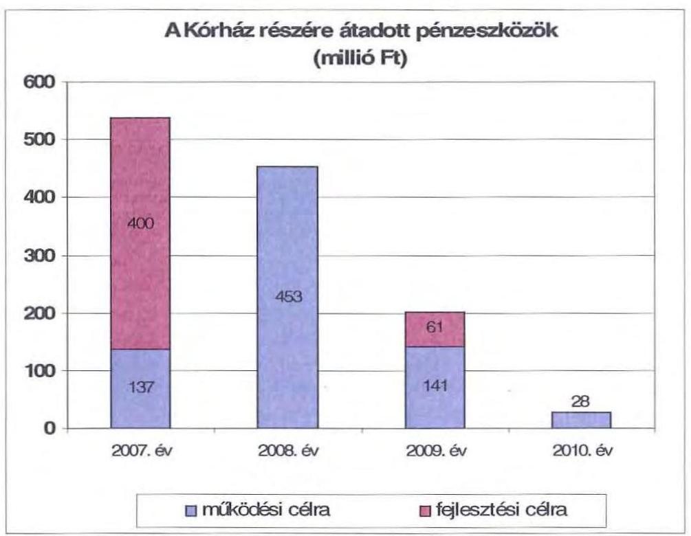

Az Önkormányzat működési és felhalmozási kiadásainak aránya 2007-2010. között 9,2%-ról 7,6%-ra (1620 millió Ft-ról 1461 millió Ft-ra) csökkent.

A vizsgált időszakban a működési és felhalmozási kiadásait a következő grafikon szemlélteti:

[^0]
[^0]:    $^{33}$ A Kórház fejlesztési kiadásokra 2007-2010 között 2248170 ezer Ft-ot fordított.
    $^{34}$ Haemodinamikai labor fejlesztéséhez
    $^{35}$ Egy kórházi ingatlan értékesítéséből származott a 12/2004. (II. 20.) számú határozat alapján.

---

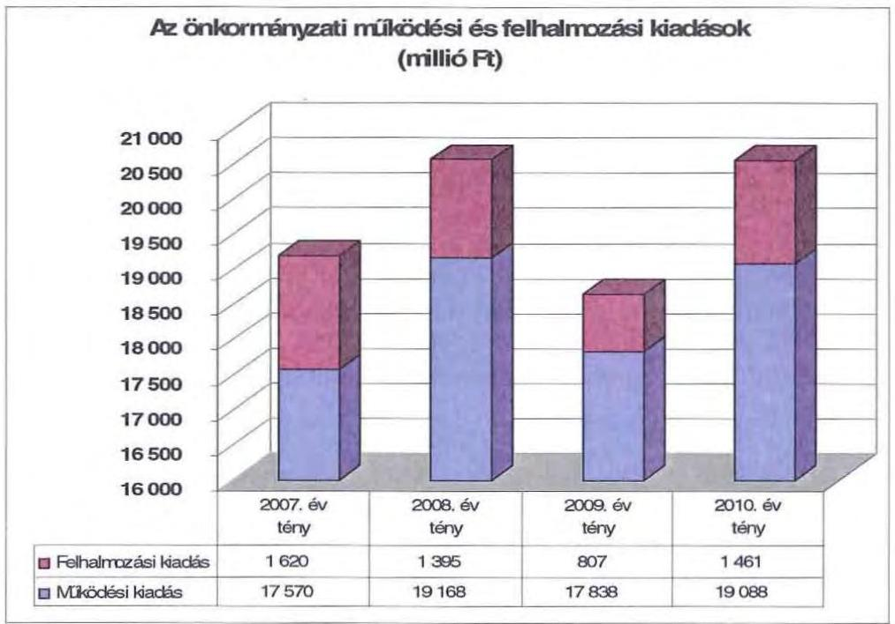

Az Önkormányzat 2007-2010. években megvalósított fejlesztései között intézményi épületek, lakóotthonok felújítása, korszerűsítése, akadálymentesítése és bővítése szerepelt. A 2007-2010. években együttesen 5283 millió Ft-ot fordított fejlesztéseinek finanszírozására.

Ezen időszakban a három legmagasabb bekerülési költségű beruházás a következő volt:

- Európai uniós támogatással valósult meg a Kórház rendelőintézetének rekonstrukciója 990 milliós Ft összegben 90%-os támogatással.
- A 978 millió Ft bekerülési költségű fejlesztés 2006-ban kezdődött, a Kórház belgyógyászati épületének rekonstrukciójára irányult és 864 millió Ft (88,4%-os) címzett támogatással valósult meg.
- ÉAOP programban valósul meg a „Jászkun Kapitányok nyomában" projekt $^{36}$590 millió Ft-os költséggel, 90% támogatásintenzitással.

A Kórházi fejlesztésekre további öt uniós projekt van folyamatban. A Kórház 2007-2010 között 1059 millió Ft uniós forrást kapott. Négy intézményben európai uniós támogatás és kötvény forrás bevonásával 110 millió Ft bekerülési értékben valósult meg akadálymentesítés, amelyből 49 millió Ft európai uniós támogatás volt. A szakmai feltételek biztosítása érdekében a kötvénybevételből kettő középiskolai tornaterem valósult meg 370 millió Ft bekerülési összegben. A 2010. évben KEOP pályázat keretében három beruházás valósult meg az energiahatékonyság javítására 111 millió Ft bekerülési összegben, amelynek 53,6%-a (59 millió Ft) európai uniós támogatás volt.

[^0]
[^0]:    $^{36}$ Az Önkormányzat a gesztora a 12 település és 16 helyszínen megvalósuló turisztikai attrakció fejlesztésnek.

---

A kötvénybevételből a fejlesztési feladatok megvalósításához 2010. december 31-ig 1108 millió Ft-ot számoltak el. A 2007-2010 között összesen 6,1 milliárd Ft bekerülési költségű beruházást indított el az Önkormányzat, amely 99%-ban a kötelező feladatokhoz kapcsolódott. A 2010 utánra vállalt kötelezettség 1,5 milliárd Ft volt, amelyből 614 millió Ft-ot a Kórháznál terveznek megvalósítani. A 2007-2010. évek között 1059 millió Ft uniós forrás felhasználásával jelentős beruházások valósultak meg a Kórháznál, amelyek bekerülési értéke 1620 millió Ft volt. A folyamatban lévő fejlesztések többek között egy oktatási intézmény rekonstrukciójához, a Kórház sürgősségi ellátás fejlesztéséhez, egy szociális intézmény energiaracionalizálásához kapcsolódnak. Az Önkormányzat 2007-2010. években megvalósított, illetve 2010. december 31-én fennálló fejlesztési feladatokhoz kapcsolódó kötelezettségeinek összegzését a jelentés 3. számú melléklete tartalmazza.

Az Önkormányzat fejlesztési tevékenysége a pályázati kiírások által nagyban befolyásolt, mert a jelentkező működési forráshiány és saját felhalmozási bevételei alacsony szintje miatt beruházásokat csak külső források, uniós és hazai támogatások elnyerése esetén tudott megvalósítani. A felhalmozási kiadások önrészének forrásait - az ÖKIF hitel kivételével - felhalmozási célú kötvénykibocsátásból finanszírozta.

# 3. KÖTELEZETTSÉGEK BEMUTATÁSA 

### 3.1. A pénzintézetek felé fennálló kötelezettségek alakulása

Az Önkormányzat pénzintézeti kötelezettségeinek állománya 2006. december 31-ről 2010. december 31-re 403 millió Ft-ról 7062 millió Ft-ra nőtt. Fennálló pénzintézeti kötelezettségei kötvénykibocsátásból, hosszú lejáratú hitel igénybevételéből, valamint folyószámla és munkabér megelőlegezési hitelek igénybevételéből keletkeztek.
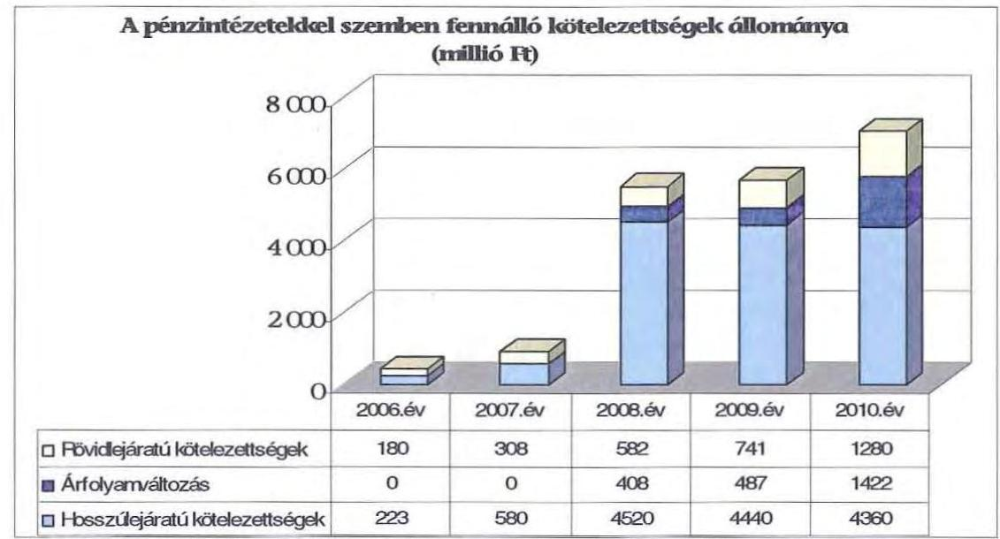

---

Az Önkormányzat pénzintézeti kötelezettségvállalásaira közgyűlési döntés alapján került sor. A kötelezettségvállalásból származó források felhasználási céljait, a visszafizetés forrásait meghatározták. Az előterjesztésekben kitértek az adósságszolgálati korlát bemutatására a teljes futamidő várható kamat és tőkefizetési kötelezettségeknek, az árfolyam- és kamatkockázatoknak a bemutatására.

Az Önkormányzat adósságot keletkeztető kötelezettségvállalásának felső határát 2007-2010. évben nem lépte túl.

Az adósságot keletkeztető kötelezettségvállalással megvalósított felhalmozási kiadások esetleges kiadást csökkentő vonzatát, az abból való megtérülését - az energia megtakarításokhoz kapcsolódó fejlesztésnél - vizsgálták.

Az árfolyamváltozás hatása is befolyásolja a kötelezettségek alakulását, azonban annak mértéke előre pontosan nem határozható meg, csak várakozásokon alapuló tendenciák jelezhetők. A Számv. tv. 60. § (4) bekezdése meghatározza, hogy az árfolyamkülönbözetet év végén a kötelezettségek vagy követelések között a könyvviteli mérlegben nyilván kell tartani, azonban az árfolyamkülönbözet valójában nem realizált. Annak megítéléséről, hogy a devizában kibocsátott kötvényekért és felvett hitelekért kapott forinthoz képest a kötvények visszavásárlásakor, illetve a hitelek visszafizetésekor jelentkező forint kötelezettség többletkiadást (árfolyamveszteség) vagy megtakarítást (árfolyamnyereség) eredményez a futamidő végén, a teljes kötelezettség rendezését követően lehet képet alkotni. Mindaddig, amíg törlesztési kötelezettség nem áll fenn (türelmi idő, moratórium), a tőkére vonatkoztatva nem értelmezhető sem az árfolyamveszteség, sem az árfolyamnyereség.

Az Önkormányzat 2010. december 31-én CHF-ben fennálló adósságot keletkeztető kötelezettségvállalása a következő volt:

| Megnevezés | Kibocsátás | Összeg   (CHF-ben) | Kibocsátási árfolyam | Kamat (referencia   kamat+ kamatfelár) | Felhasználás célja: |
| :-- | :--: | :--: | :--: | :--: | :--: |
| "A Jászkumúg fejlesztéséért"   kötvény | 2008.03.31 | 24361000 | 164,2 H/CHF | 6 havi CHF LIBOR+évi   0,80% | Simirégiai programban   meghatározott   fejlesztések   biztosítására |

Az Önkormányzat 2011. március 31-ig a kötvény ellenértékéből 1108 millió Ft-ot, 27,7%-ot használt fel fejlesztésre és pályázati önrész biztosítására.

Az Önkormányzat 2010. december 31-én forintban fennálló adósságot keletkeztető kötelezettségvállalása a következő volt $^{37}$:

| Megnevezés | szerződésköt-   tés időpontja | Összeg   (Forintban) | Kamat (referencia   kamat+ kamatfelár) | Felhasználás célja: |
| :-- | :--: | :--: | :-- | :-- |
| Hosszú lejáratú hitel | 2006.06.22 | 580000000 | 3 havi EURIBOR+évi 0,95% | Egészségügyi szolgáltatások   fejlesztése a Hetényi Géza   Kórházban |

[^0]
[^0]:    $^{37}$ A hosszúlejáratú hitelt a Kórház a Haemodinamikai labor fejlesztésének finanszírozására használta fel.

---

Az Önkormányzat devizában fennálló kötvény kibocsátási kötelezettségéből a tőketörlesztés 2013. április 30-tól kezdődik. A kötelezettség után 2007-2010 között az Önkormányzat 1455642 CHF (272 millió Ft) kamatot, valamint 4 millió Ft egyszeri kibocsátási költséget fizetett. A kötvény visszafizetésére a saját bevételeket jelölték meg. A kötvénykibocsátás előkészítésekor négy pénzintézet ajánlatát összehasonlítva terjesztették a Közgyűlés elé a legkedvezőbb ajánlatot. Az Önkormányzat számlavezető pénzintézete és a kötvénykibocsátást lebonyolító pénzintézet nem volt azonos. A forintban fennálló kötelezettség után 2007-2010 között 140 millió Ft tőkét, 83 millió Ft kamatot és 4 millió Ft projektvizsgálati díjat fizetett.

Az Önkormányzat 2007-2010 között az átmenetileg szabad pénzeszközein 1100 millió Ft kamatbevételt realizált, melyből 998 millió Ft a kötvénybevétel befektetéséből és 102 millió Ft az intézmények és a Közgyűlés hivatala bankszámláinak kamatbevételeiből származott. A kötvénybevétel befektetéséből származó kamatbevételből az Önkormányzat 299 millió Ft-ot a kötvény kamatfizetésére és 672 millió Ft-ot működési célra $^{38}$ fordított. A működésbe bevont kamathozam egyszeri kiadást finanszírozott. A kötvény fel nem használt részének lekötéséből származó kamatbevétel a kötvénykibocsátás miatt teljesített kamatfizetésnek 3,4-szeresét tette ki.

A folyószámlahitel és a munkabér megelőlegezési hitel alakulását a következő táblázat mutatja be:

|  |  |  |  |  | ezer Ft-ban |
| :--: | :--: | :--: | :--: | :--: | :--: |
| Megnevezés | 2007. év | 2008. év | 2009. év | 2010. év | $\begin{gathered} 2011. \\ \text{március } 31. \end{gathered}$ |
| I. Folyószámlahitel |  |  |  |  |  |
| a folyószámlahitel keretösszege január 1-jén | - | 450000 | 550000 | 700000 | 950000 |
| teljesített kamat és egyéb költség | 14371 | 23700 | 53039 | 64504 | 18699 |
| II. Munkabér megelőlegezési hitel |  |  |  |  |  |
| Igénybevett hitel összesen: | 1600000 | 280000 | - | 2130000 | 470000 |
| teljesített kamat és egyéb költség | 10009 | 1624 | - | 13976 | 3280 |

A folyószámlahitel és munkabér megelőlegezési hitelek kondícióinak és egyéb költségeinek alakulását az alábbi táblázat szemlélteti $^{39}$:

[^0]$^{39}$ A referencia kamat az alábbiak szerint alakult:

| MNB BUBOR fixing (átlagkamat) %-ban |  |  |  |  |  |
| :--: | :--: | :--: | :--: | :--: | :--: |
| Referencia kamat | 2007. évi | 2008. évi | 2009. évi | 2010. év | $\begin{gathered} 2011. \text{ március } 31. \\ \text{ig} \end{gathered}$ |
| 3 havi BUBOR | 7,75 | 8,87 | 8,64 | 5,5 | 6,03 |
| 1 havi BUBOR | 7,83 | 8,75 | 8,66 | 5,47 | 5,94 |

[^0]:    $^{38}$ Az Önkormányzat a működési kiadások finanszírozására 2010.
 októberben és decemberben 257 millió Ft-ot fordított, valamint a 2011. évi költségvetés fenntarthatóságának biztosításához 415 millió Ft-ot bevont.

---

| Megnevezés | Kamat (referencia+ kamatfelár) | Egyéb költség |
| :--: | :--: | :--: |
| Folyószámlahitel |  |  |
| 2007. év | 3 havi BUBOR +0,25 % | 0 % |
| 2008. év | 3 havi BUBOR +0,6 % | 0,1 % kezelésiköltség +0,1 %   tartási jutalék |
| 2009. év | 3 havi BUBOR +2,9 % | 0,25 % kezelésiköltség +0,15 %   tartási jutalék |
| 2010. év | 1 havi BUBOR +2,9 % | 0,25 % kezelésiköltség +0,15 %   tartási jutalék |
| 2011. év | 1 havi BUBOR +2,9 % | 0,25 % kezelésiköltség +0,15 %   tartási jutalék |
| Munkabér megelőlegezési hitel |  |  |
| 2007. év | 3 havi BUBOR +0,3 % | x |
| 2008. év | 3 havi BUBOR +0,5 % | x |
| 2009. év | x | x |
| 2010. év | havonta határozza meg a % mértékét   (8,49-9,01 % között volt) | x |
| 2011. év | havonta határozza meg a % mértékét (9- 9,25 % között volt) | x |

Az Önkormányzat működésének likviditását a vizsgált időszakban csak folyószámlahitel igénybevételével tudta biztosítani. A 2007. március 19. óta fennálló tartós folyószámlahitel tartozását év végén nem fizette vissza, az év végi állomány évről évre - a 2007. évi 128 millió Ft-ról a 2010. évben 950 millió Ft-ra - növekedett a folyószámla hitelkeret egyidejű emelése mellett.

Az Önkormányzat a 2007. évben 287 napig, a 2008. évben 286 napig vett igénybe folyószámlahitelt, a 2009., 2010. évek minden napján volt folyószámlahitele. Az átlagos napi állomány folyamatosan emelkedett, a 2007. évi 232 millió Ft-ról, 2010-re 743 millió Ft-ra, 2011. év I. negyedévében 831 millió Ft-ra. 2007-2010 között jellemző folyamatos likviditási problémák finanszírozása az Önkormányzatnak a 2007-től 2010. december 31-ig a folyószámlahitel után összesen 156 millió Ft kamatkiadást eredményezett.

A tartós likviditási problémák miatt az Önkormányzat a 2009. év kivételével a 2007. évben nyolc, 2008. évben kettő, 2010-ben 10, és 2011. március 31-ig kettő alkalommal vett igénybe munkabér megelőlegezési hitelt, alkalmanként átlagosan 202 millió Ft-ot. A törlesztések az illetékbevételekből és a normatív állami támogatásokból az igénybevételt követő hónapban megtörténtek, azonban 2010. december 6-án felvett munkabér megelőlegezési hitelt a tárgyévben likviditási probléma miatt nem fizette vissza. Kamat és egyéb költség címén az Önkormányzat a vizsgált időszakban a munkabér megelőlegezési hitel után 2007-2010 között összesen 26 millió Ft-ot fizetett ki.

Az alapkamat mértékének alakulása hatással van az adott devizanemben kifejezett, a teljes futamidőre számított, várható kamatkötelezettség nagyságára. Az Önkormányzat által kibocsátott kötvény és a hitel esetében is a kamatkötelezettségek alakulását befolyásolta a kibocsátáskori és az utolsó kamatfizetési referencia kamatok változása, amelyet a következő táblázat mutat be:

---

| Megnevezés | Kibocsátási, lehívási | 2010. utolsó fizetéskori | Változás % |
| :--: | :--: | :--: | :--: |
|  | alapkamat % |  |  |
| 6 havi CHF LIBOR | 2,9183 | 0,3292 | -88,7 |
| 3 havi EURIBOR | 3,376 | 0,886 | -73,7 |

Az Önkormányzat utolsó kamatfizetési kötelezettsége 2010-ben a 6 havi CHF LIBOR-ú kötvény után október 31-én, a 3 havi EURIBOR-os hitelnél december 31-én volt.

Amennyiben a referencia kamat nem változott volna, az Önkormányzatnak kibocsátáskori referencia kamattal számolva a kötvény után 2010. december 31-ig 1836741 CHF kamatfizetési kötelezettsége jelentkezett volna. A változások miatt azonban 381099 CHF-el kevesebb fizetési kötelezettséget kellett teljesítenie.

Az Önkormányzat fizetési kötelezettségei közül a kötvény tőketörlesztése 2013. április 30-án kezdődik. A hosszú lejáratú hitel első részletét (20 millió Ft-ot) az Önkormányzat 2009. június 21-én törlesztette. Az Önkormányzatnál a helyszíni vizsgálat alatt további hitel igénybevételről, illetve kötvénykibocsátásról szóló döntést nem készítettek elő.

Az Önkormányzat kiemelt figyelmet fordított a likviditás biztosítására, a költségvetési koncepciókban részletesen elemezte a likviditás helyzetét, a likviditás alakulását befolyásoló tényezőket és döntéseket hozott a működés racionalizálása érdekében.

# 3.2. Szállítók felé fennálló kötelezettségek alakulása 

Az Önkormányzatnak és intézményeknek lejárt szállítói tartozásai és egyéb kiadás elmaradásait az alábbi táblázat tartalmazza:
ezer Ft-ban

| Megnevezés | 2007.   december 31. | 2008.   december 31. | 2009.   december 31. | 2010.   december 31. | 2011.   március 31. |
| :--: | :--: | :--: | :--: | :--: | :--: |
| Lejárt szállítói tartozás | 10 |  | 496739 | 163353 | 455814 |
| ebből Kórház | 10 |  | 496739 | 163353 | 428926 |
| Gazdasági társaságok   lejárt szállítói tartozása | 0 | 0 | 0 | 0 | 0 |
| Egyéb kiadás elmaradás | 5630 | 6326 | 5618 | 12982 | 12982 |
| Tartozásállomány | 5640 | 6326 | 502357 | 176335 | 468796 |

Az Önkormányzatnak 2007-2008. évben alig, illetve nem volt lejárt szállítói tartozása, a 2009. évi lejárt szállítói tartozás 497 millió Ft összege a 2010. évben 163 millió Ft-ra csökkent, majd 2011. év I. negyedévében közel a 2009. évi szintre emelkedett, 456 millió Ft lett. Az egyéb kiadás elmaradás az áttekintett időszakban a 2009. évet kivéve növekedett. A 2007., 2009., 2010. évek szállítói tartozásának teljes összege és a 2011. március 31-ig lejárt szállítói tartozásból 429 millió Ft a Kórháznál jelentkező tartozásállomány. A 2009. évi lejárt szállítói tartozás nem haladta meg a 90 napot, közel egyharmada (159 millió Ft) volt 30-60 napi, 76 millió Ft (15,3 %-a) pedig 61-90 nap közötti. A 2010. évi lejárt szállítói tartozás teljes egészében 30 napon belüli volt. A 2011. március 31-i lejárt tartozás 142 millió Ft 31,2 %-a 30-60 nap közötti, 10 millió Ft 61-90 nap közötti. Az egyéb kiadás elmaradás a 2007. évhez viszonyítva 2010. év végére

---

és a 2011. év I. negyedév végére a kétszeresére 13 millió Ft-ra növekedett, amelyből 8 millió Ft a Kórháznál $^{40}$ jelentkezett.

Az áttekintett időszakban a szállítói tartozásállomány 2009. évben volt a legmagasabb, 937 millió Ft, a 2010. december 31-i mérlegben ez az összeg 740 millió Ft volt. A 2009. évi szállítói tartozásállomány több mint fele 497 millió Ft lejárt tartozás volt, ugyanez a 2010. év végén csökkent, 163 millió Ft volt.

A 2010. év végi szállítói tartozásállomány annak eredményeként csökkent, hogy a Kórház 2010. decemberben 655 millió Ft támogatást kapott a Gyógyító-megelőző ellátás jogcím-csoportból finanszírozott egészségügyi szolgáltatók korábbi évekből felhalmozott adósságának rendezésére fordított konszolidációs támogatásból. A 2011. március 31-ig felhalmozódott és lejárt szállítói kötelezettség tartozásállományának csökkentésére a Kórház intézkedési tervet készített, jogszabályi lehetőség alapján 2011. május 13-án finanszírozási előleg igénybevételét kezdeményezte, amelyhez kérte a Közgyűlés segítségét $^{41}$. A tartozások fizetési átütemezésére szállítói egyeztető tárgyalásokat nem kezdeményezett a Kórház, tekintettel arra, hogy a felszámított késedelmi kamat tovább terhelné az intézmény költségvetését.
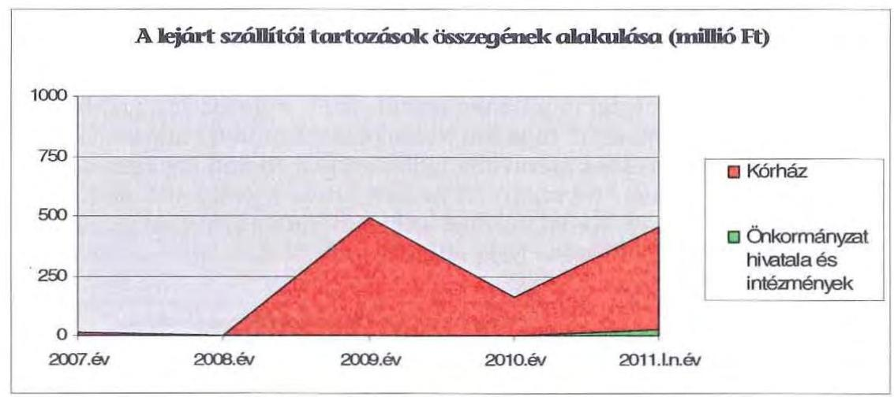

Az Önkormányzatnak a 2011-2013. években hosszú lejáratú kötelezettségeire 260 millió Ft-ot és 2350040 CHF tőketörlesztést és kamatot $^{42}$ kell teljesítenie. Az Önkormányzat 2010. év végi szállítói tartozása 740 millió Ft (ebből lejárt 163 millió Ft), és egyéb kiadás elmaradása 13 millió Ft. A 2011-2013. évi összes (pénzintézeti, szállítói, valamint egyéb) kötelezettség teljesítésére az Önkormányzat tájékoztatása szerint figyelembe vehető 1360 millió Ft elidegenítési tilalommal nem terhelt forgalomképes ingatlanvagyon.

A további évekre szóló jelenleg ismert pénzintézeti kötelezettségei: 202 millió Ft, 24688840 CHF. Ezekre figyelembe vehető forrás: az elidegenítési tilalom-

[^0]
[^0]:    $^{40}$ 7 millió Ft Felügyeleti bírság és 1 millió Ft szervtranszplantációs díj.
    $^{41}$ A Közgyűlés 88/2011. (V. 27.) számú határozatában támogatta a kórház finanszírozási előleg igényét, amelyet az OEP-től június 6-án megkapott.
    $^{42}$ A 2011. I. negyedév kamat mértékét alapul véve

---

mal nem terhelt forgalomképes ingatlanvagyon. Az ingatlanvagyon értékesíthetőségét figyelembe véve a visszafizetés forrása nem számszerúsíthető.

# 3.3. Egyéb kötelezettségek alakulása 

A kötelező feladatellátáshoz kapcsolódóan a Kórház 2009. február 13-án tárgyi eszköz beszerzésére 7,5 millió Ft összegben lízingszerződést kötött. A pénzügyi kötelezettség teljesítését 60 hónapban határozták meg, a Kórháznak 2010. december 31-én 3375 ezer Ft kötelezettsége volt.

Az Önkormányzatnak a vizsgált időszakban garancia- és kezességvállalással kapcsolatos hosszú távú kötelezettségvállalása nem volt.

A kötelező feladatellátás érdekében a Kórház a HEFOP program keretében az egészségügyi intézmények informatikai rendszer fejlesztése és az ehhez szükséges számítástechnikai infrastruktúra szállítására 2006. december 29-én szerződést kötött. A szállítási szerződés szerinti díjat 54 millió Ft összegben határozták meg. A szerződésből eredően a Kórháznak 2010. december 31-én 10 millió Ft összegű kötelezettsége állt fenn.

Az Önkormányzatnak az áttekintett időszakban elengedett követelése nem volt.

Az Önkormányzat ingatlanvagyonán 2011. március 31-ig jelzálogjog bejegyzés nem szerepelt. Kettő ingatlan vonatkozásában van elidegenítési és terhelési tilalom, amelyeknek számviteli nyilvántartás szerinti együttes nettó értéke 2010. december 31-én 80 millió Ft, becsült értéke $^{43}$ pedig 101 millió Ft. Az Önkormányzat összes forgalomképes ingatlanának könyvszerinti nettó értéke 1121 millió Ft, becsült értéke 1461 millió Ft volt.
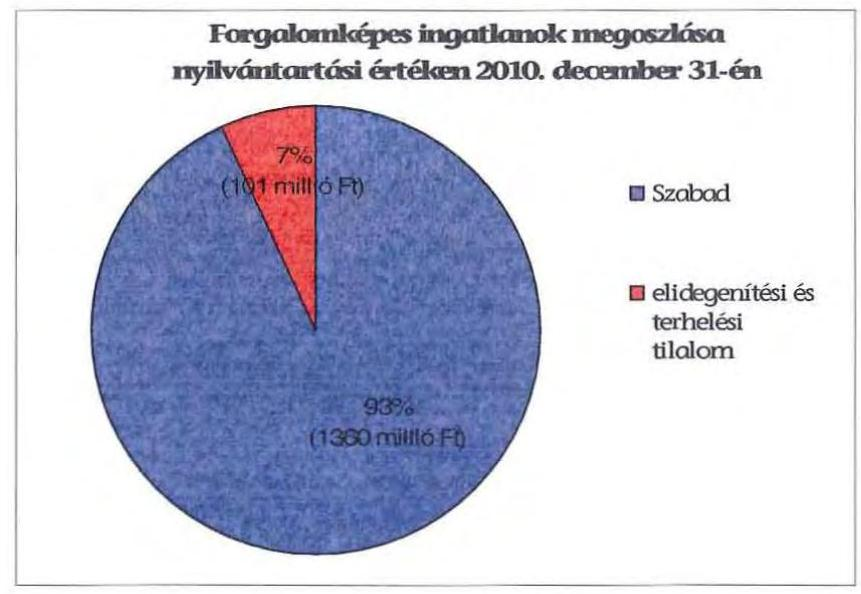

[^0]
[^0]:    $^{43}$ Az Önkormányzat ingatlanait piaci értéken tartja nyilván, értékelése évente történik független ingatlan szakértő által, az ingatlanforgalmazások során kialakult piaci forgalmi értékek figyelembevételével.

---

Az Önkormányzat minden év végén, a beszámoló szöveges indokolásában az eszközei elhasználódását bemutatta, azonban a vizsgált időszakban nem történt meg annak felmérése, hogy az elhasználódott eszközök pótlása milyen kötelezettséget jelent az Önkormányzat számára. A felújításokra, az eszközök pótlására az Önkormányzat beszámolóinak adatai szerint pénzügyi lehetőségének függvényében, elsősorban az intézmények működőképességének biztosítása, illetve a szakhatósági előírások figyelembevételével került sor. Az Önkormányzat a 2007-2010. években a tárgyi eszközök után 2478 millió Ft összegű értékcsökkenést számolt el. Felújításra 766 millió Ft-ot fordított.

Az Önkormányzat a TISZK részére három alkalommal kölcsönnyújtásáról döntött 2008. július 23-án 2 millió Ft, 2008. november 27-én 4 millió Ft, 2010. szeptember 10-én 2 millió Ft összegben, pályázatok előfinanszírozására, két év időtartamra. A 2008. évben nyújtott kölcsönöket a TISZK a 2009. évben visszafizette. Az Önkormányzat intézményei vagy egyéb szervezet részére kölcsönt nem adott.

# 4. A PÉNZÜGYI EGYENSÚLY MEGTEREMTÉSE ÉRDEKÉBEN HOZOTT INTÉZKEDÉSEK 

A jelentésben szereplő CLF módszerben bemutatott működési és felhalmozási hiány mindamellett alakult ki, hogy a vizsgált időszakban az Önkormányzat folyamatosan intézkedéseket tett, hogy alkalmazkodjon a finanszírozási rendszer változása miatti forráscsökkenéshez. Ennek érdekében bevételnövelő és kiadáscsökkentő döntéseket hozott.

Az Önkormányzat kiadáscsökkentő és bevételnövelő
 intézkedései a gazdálkodás átláthatóbbá tételét, valamint a feladatellátás szakmai színvonalának, kiemelten a pénzügyi helyzet javítását célozta. Kiadási megtakarítást a létszámleépítésekkel, a szervezeti változásokkal érte el, emellett a Kórház kivételével sikerült megőrizni intézményeik gazdálkodásának stabilitását.

Az Önkormányzat a megye közoktatás szolgáltatásának minél gazdaságosabb és eredményesebb ellátása érdekében Közoktatási Fejlesztési Tervet fogadott el, és a megye szociális intézményrendszerét átfogó, szociális szolgáltatásszervezési koncepciót készített, amelyben meghatározta a további szükséges fejlesztési irányt.

Az Önkormányzat gazdasági programjában, a Közoktatási Fejlesztési Tervében és a szociális szolgáltatásszervezési koncepcióban megfogalmazott elvárások szerint 2007-ben több alkalommal hozott az intézményeket érintő átszervezési döntéseket. A 2007. évben elindult az intézményeket érintő átszervezések előkészítése, a Közgyűlés és a Hivatal költségmegtakarítási intézkedéseinek megvalósítása:

- Első lépésben 2007. január 1-jétől egy bizottságot megszüntettek és 1 fővel csökkentették a közgyűlési tisztségviselők számát. Csökkentették a tiszteletdíjakat, megszüntetésre került a megyei utazási bérlet, távollétek esetén csökkentett tiszteletdíjra jogosultak a képviselők és a bizottsági tagok. Az intézkedések eredményeként a 2007-2010. években összesen 69 millió Ft megtakarítást mutattak ki.

---

- Szervezeti változások eredményeként megszűnt az Önkormányzat Ellátó és Szolgáltató Szervezete. Az intézmény által ellátott intézményüzemeltetési feladatokat a Hivatal vette át, az intézkedés 369 millió Ft kimutatás szerinti megtakarítást jelentett, a 37 fő helyett 15 fővel működik az épületüzemeltetési csoport.
- Megszüntették a Művelődési, Továbbképző és Sport Intézetet, a 17 álláshelyből 15 megszűnt, 2 fő a Könyvtár állományába került. A megtakarításra 294 millió Ft-ot számoltak el.
- A Hivatalban és az intézményekben összesen 122 fő létszámcsökkenés következett be, álláshelyeket zároltak, a túlóra kifizetéseket csökkentették, mindezen intézkedésre 176 millió Ft megtakarítást mutatott ki az Önkormányzat. Az étkezési hozzájárulás megszüntetéséből 305 millió Ft megtakarítást számolt el.
- A Pedagógiai Intézet, Pedagógiai Szakmai és Szakszolgálati feladatainak módosítása eredményeként megszűnt a kunhegyesi szakszolgálati egység, az intézkedéssel összefüggésben 17 millió Ft kiadáscsökkenést mutattak ki.
- Ugyanebben az évben változás történt a szociális és gyermekvédelmi feladatokat végző intézmények vonatkozásában is. Csökkentették a szolnoki Gyermekotthon lakásotthonai számát, a négy gyermekvédelmi egység helyett, három egységet alakítottak ki, amellyel csökkent a vezetői szintek és a kiegészítő szakmai személyzet száma. A kisújszállási Gyermekotthont utógondozói otthonná alakították és a három gyermekvédelmi egységet kettőre csökkentették. Négy utógondozói garzonlakásban megszűnt az ellátás.
- A szociális intézmények vonatkozásában 2007. április 1-jétől egy idősek otthona, és egy pszichiátriai betegek otthona ${ }^{44}$ egy intézményként működött tovább, a létszámcsökkentésekből eredő kiadásmegtakarítás a kimutatások szerint 61 millió Ft.
- Az átszervezések 2008. évben tovább folytatódtak, és a megyei Gyermekvédelmi Intézet és Gyermekotthon összevonása, egy irányítás alá helyezése a kimutatások szerint az Önkormányzatnak 139 millió Ft kiadáscsökkenést eredményezett.
- A Szolnok Attila úti lakásotthon és Jászapátiban egy kollégium megszüntetésre került. A kollégiumi épületet idősek otthonává alakították át, a megtakarítás a funkcióváltás miatt nem mutatható ki.
- Ugyanebben az évben a Kisújszállási Kádas György Óvoda, Általános Iskola, Szakiskola, Egységes Módszertani Intézmény és Gyermekotthon összevonásra került a karcagi Óvoda, Általános Iskola, Szakiskola és Diákotthonnal, amely a két intézmény párhuzamos feladatainak megszüntetésével, a vezetői szintek, a gazdasági és kisegítő létszám csökkentésével 85 millió Ft megtakarítást eredményezett.

[^0]
[^0]:    ${ }^{44}$ A fegyverneki Angolkert Otthon és a törökszentmiklósi Pszichiátriai Betegek Otthona és Rehabilitációs Intézménye összevonásra került.

---

- A 2008-ban a gazdasági integráció keretében az intézmények számviteli, pénzügyi, gazdálkodási feladatai területén folytatódott az átszervezés. Csökkentésre került a gazdasági szervezetek száma, és a gazdálkodási feladatokat 23 helyett 8 gazdasági szervezet látja el, amellyel kapcsolatban 2008. március 1-től 22 fő létszámcsökkentést és 115 millió Ft megtakarítást mutattak ki.
- Az átszervezések 2009-ben is folytatódtak, és a Megyei Gyermekvédő Intézet és Gyermekotthon intézményben a szakmai egységek számát négyről háromra csökkentették, a kapcsolódó létszám 19 fővel csökkent, a kiadáscsökkenés 98 millió Ft.
- A kisújszállási Kádas György Óvoda, Általános Iskola, Szakiskola, Egységes Módszertani Intézmény és Gyermekotthon feladata módosult, a csökkenő gyermeklétszám miatt az óvodai ellátás megszűnt. A JNSZM Óvoda, Általános Iskola, Szakiskola, Kollégium, Pedagógiai Szakszolgálat és Gyermekotthon ellátott feladata is módosult, egy lakásotthon megszűnt, egy lakásotthon átminősítésre került, amelyhez 11 fő létszámcsökkentés kapcsolódott, a kiadáscsökkenés 27 millió Ft volt.
- A 2010. évben három oktatási intézményben a tanulói létszámcsökkenés miatt dolgozói létszámcsökkentést hajtottak végre, valamint az Önkormányzat és intézményei működőképességének megőrzése érdekében az intézmények költségvetésében jóváhagyott előirányzatból 174 millió Ft-ot, 4%-ot zároltak, majd véglegesen elvonásra került.

Az intézményi feladatok racionalizálásáról, integrációról a Közgyűlés döntött. Az ezekhez készített előterjesztésekben a tervezett intézkedések indokait, várható eredményeit bemutatták. Az intézményi integráció, átszervezés végrehajtásához kikérték a szakmai szervezetek véleményét, a jogszabályban előírt egyeztetéseket lefolytatták. A rendelkezésre álló beszámolók szerint a szociális és gyermekvédelmi intézmények átszervezését követő működési tapasztalatok kedvezőek, a működés személyi és tárgyi feltételei javultak.

A 2007-2010. években az intézményátszervezések, a feladatváltozások, valamint a takarékossági intézkedések hatásaként együttesen 2241 millió Ft kiadási megtakarítást mutattak ki, amelyből az intézményátszervezéshez kapcsolódó létszámcsökkentés 621 millió Ft (27,7 %), intézményátszervezésen túl létszámleépítésből eredő létszámcsökkenés 793 millió Ft (35,4 %) volt, ennek megfelelően összesen 1414 millió Ft volt a vizsgált időszakban a létszámcsökkentésből származó megtakarítás.

[^0]
[^0]:    ${ }^{45}$ A kiadások csökkentését célzó intézkedések elmaradása esetén 2007-2010. évek között a számítások alapján 2241 millió Ft-tal magasabbak lettek volna az Önkormányzat kiadásai.

---

A 2007-2010. évek kiadáscsökkentő intézkedéseit beavatkozási területenként a következő táblázat részletezi:
adatok: ezer Ft-ban

| Az érvényesített kiadás-   csökkentés területei | Személyi   juttatások és   járulékai | Dologi, mű-   ködési ki-   adások | Pénzeszköz   átadások,   támogatások | Összesen |
| :-- | :--: | :--: | :--: | :--: |
| A Közgyűlés működése | 68617 | 18607 | 24800 | 112024 |
| Az Önkormányzat hiva-   talánál | 414392 | 154368 | 0 | 568760 |
| Az intézményeknél | 1503400 | 57134 | 0 | 1560534 |
| ÖSSZESEN | 1986409 | 230109 | 24800 | 2241318 |

A Közgyűlés működési körében a nettósított, többletköltségek felmerülését is számba vevő kiadáscsökkentő intézkedések eredménye 112 millió Ft volt, amelyből 87 millió Ft a testület és a bizottsági tagok létszámának csökkentésével összefüggésben realizálódott. A különböző szervezeteknek (civil szervezetek, érdekvédelmi szervezetek, idősügyi alap, közművelődési és sport alap) adott támogatások csökkentése 25 millió Ft összeget tett ki.

A Hivatalban végrehajtott megtakarítási intézkedésekből 414 millió Ft (72,8 %) átszervezéssel együtt járó létszámcsökkentések voltak, amelyek összességében a 2006. december 31-i állapothoz viszonyítva 5 fő igazgatási létszám leépítésével jártak.

A Hivatal létszáma 2006. december 31-én 141 fő volt, ebből a kormányzati intézkedések miatt 60 fő 2007. január 1-től az APEH állományába került. A Hivatalnál lezajlott átszervezések kapcsán létszámcsökkentési és -növelési intézkedés egyaránt történt, ugyanakkor ténylegesen 5 fő igazgatási létszámcsökkenés realizálódott az eltelt időszakban ${ }^{46}$.

Az irodaszer, folyóirat, közlöny beszerzési szerződéseinek felülvizsgálatából 24 millió Ft megtakarítást mutattak ki.

Az intézmények körében az önkormányzati szinten kimutatott megtakarítási intézkedésekből 1561 millió Ft-ot érvényesítettek. Az intézményi megtakarításokból 1503 millió Ft (96,3 %) a személyi kiadások (üres álláshelyek zárolása, létszámcsökkentés, többletjuttatások felülvizsgálata) csökkentése miatt következtek be. A különböző beszerzési és szolgáltatási szerződések felülvizsgálatával megtakarított összeg 57 millió Ft. A Kórház létszámának csökkentése több intézkedéssel valósult meg: üres álláshelyeket zároltak és nyugdíjas dolgozók jogviszonyát szüntették meg. Szolgáltatás vásárlással történik a haemodinamikai labor, a mosoda, a takarítás, a műszaki és karbantartási feladatok ellátása.

A létszámcsökkentő intézkedések következtében 2007-2010 között az Önkormányzat hivatalánál és intézményeinél összesen 690 álláshelyet (részben

[^0]
[^0]:    ${ }^{46}$ A hivatali feladatokat ellátó létszámnál mutatták ki az Ellátó és Szolgáltató Szervezet megszűnéséből eredő változásokat is (22 fő).

---

üres állást) szüntettek meg, amelyből a 372 fő (53,9%) ágazati szakmai, 318 fő (46,1 %) az intézményüzemeltetéshez, fenntartáshoz, gazdasági ügyek intézéséhez kapcsolódó álláshely volt.

A létszámcsökkenést az alábbi grafikon szemlélteti:
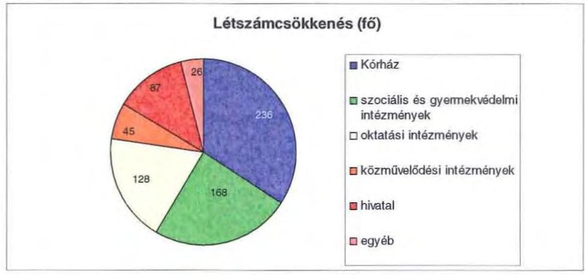

A helyi szervezési intézkedések végrehajtásához az Önkormányzat 2007-2010 között 190 millió Ft központi költségvetési támogatásban részesült, amelynek felhasználásával 161 fő álláshelyet tartósan leépített. Az intézkedések eredményeként az Önkormányzat 2006. december 31-i átlaglétszáma 2011. március 31-re 3501 főre (11,6 %-kal) csökkent, ebben tükröződik a kormányzati intézkedések miatti létszámcsökkentés.

Az Önkormányzatnál a 2011. év I. negyedévében folytatódtak a megtakarítási intézkedések, a tervezett 342 millió Ft kiadásmegtakarításból 304 millió Ft a személyi jellegű megszorító intézkedésekhez kapcsolódik. A Közgyűlés működéséhez kapcsolható kiadások - rendeleti szabályozás alapján - várhatóan 57 millió Ft összegben csökkennek, amelyből 49 millió Ft a tiszteletdíjak csökkentése miatti megtakarítás. Az Önkormányzat hivatalában az üres álláshelyek zárolása miatt 9 millió Ft, az intézményeknél üres álláshelyek és keresetkiegészítés zárolása, valamint átszervezéssel járó létszámcsökkentés hatásaként 238 millió Ft, a beszerzési és szolgáltatási szerződések felülvizsgálatából 37 millió Ft kiadási megtakarítással számoltak.

A bevételnövelésre irányuló intézkedések eredményéből - amelynek számszerűsített összege 2096 millió Ft volt - 1166 millió Ft-ot (55,6%-ot) a Hivatal realizálta. Bevételnövekedésében meghatározó tényező volt az átmenetileg szabad pénzeszközök lekötéséből származó kamatbevétel 1100 millió Ft-tal. Az intézmények bevételnövekedése összegéből 659 millió Ft a szociális ellátottak és egyéb szolgáltatások térítési díjnövekedéséből származott. Az ingatlanok bérbeadásából, az ingatlanok értékesítéséből származó bevételnövekmény 337 millió Ft-ot tett ki.

---

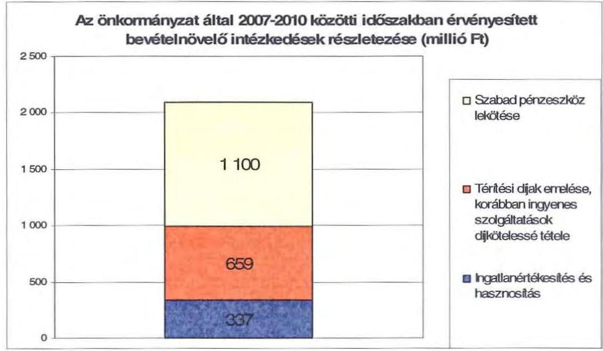

Előzőeken túl további 450 millió Ft bevételnövekedés származott az Önkormányzatnak a települési önkormányzattól átvett feladatok miatt.

A 2011. évre 70 millió Ft bevételnövekményt terveztek önkormányzati szinten, ebből 58 millió Ft a szociális térítési díjak növeléséből származik. A tervezett bevételnövekmény fennmaradó része a szabad kapacitások hasznosításából, az infláció mértékével növelt egyéb térítési díjakból keletkezik.

Az átszervezések, a takarékossági intézkedések szakmai feladatellátásra gyakorolt hatását célzottan nem vizsgálták, erről belső ellenőrzési jelentések nem állnak rendelkezésre.

# 5. A HELYI ÖNKORMÁNYZATOK GAZDÁLKODÁSI RENDSZERÉNEK 2008. ÉVI ELLENŐRZÉSE SORÁN A PÉNZÜGYI EGYENSÚLY JAVÍTÁSÁRA TETT SZABÁLYSZERŰSÉGI ÉS CÉLSZERŰSÉGI JAVASLATOK HASZNOSULÁSA 

Az ÁSZ az Önkormányzat gazdálkodási rendszerét a 2008. évben ellenőrizte, amelyről készített jelentésben 13 szabályszerűségi és 7 célszerűségi javaslatot tett. A jelentést a Közgyűlés megtárgyalta és a 216/2008. (XII. 12.) számú határozatával a feltárt hiányosságok megszüntetésére intézkedési tervet fogadott el. Az intézkedési terv a javaslatokat teljes körűen tartalmazta, a feladatok elvégzéséért felelősöket és a feladatok elvégzésének határidejét meghatározták. A Főjegyző két alkalommal - 2009. április 17-én és 2010. február 5-én - a Közgyűlésnek beszámolt az intézkedési tervben foglaltak végrehajtásáról.

A pénzügyi egyensúly javítására három szabályszerűségi javaslat vonatkozott, amelyből egy megvalósult, egy részben teljesült, egy pedig nem hasznosult. Javasoltuk a Főjegyző részére:

- „biztosítsa az Áht. 8/A. § (7) bekezdése alapján, hogy a költségvetési rendelettervezetek költségvetési bevételi és
 kiadási főösszegei ne tartalmazzanak finanszírozási célú bevételeket, illetve kiadásokat". Az intézkedési tervben meghatározott határidő szerint a 2009. évi költségvetési rendelettervezet költségvetési bevételi és kiadási főösszegei nem tartalmaztak finanszírozási célú bevételeket, illetve kiadásokat.

---

- „gondoskodjon az Ámr. 29. § (1) bekezdés k) pontjában előírtak alapján arról, hogy a költségvetési rendelettervezetek az európai uniós támogatással megvalósuló programok, projektek bevételeit és kiadásait elkülönítetten tartalmazzák". A Főjegyző az Ámr. 29. § (1) bekezdés k) pontjában ${ }^{47}$ előírtakat részben teljesítette, mivel a négy európai uniós támogatással megvalósuló projektből kettő ${ }^{48}$ projekt bevételeinek és kiadásainak elkülönített bemutatása elmaradt ${ }^{49}$.
- „biztosítsa az Áht. 69. § (1) bekezdésében előírtak alapján, hogy az Önkormányzat költségvetési rendeletei - a hatályos támogatási szerződésekben foglalt éves támogatási és felhasználási ütemeknek megfelelően - eredeti előirányzatként teljes körűen tartalmazzák az európai uniós forrást igénylő projektek, programok bevételi és kiadási összegeit". Az Áht. 69. § (1) bekezdésében előírtakat nem teljesítették, mert a 2010. évi költségvetési rendelet nem tartalmazta teljes körűen az európai uniós támogatással megvalósuló projektek bevételi és kiadási összegeit.

Budapest, 2011. december „ 40 "

Melléklet: $\quad 6 \mathrm{db} \quad 14$ lap
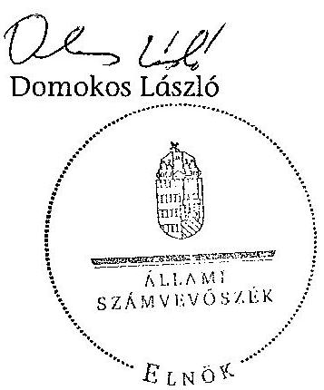

[^0]
[^0]:    ${ }^{47}$ Az államháztartás működési rendjéről szóló 217/1998. (XII. 30.) Korm. rendelet.
    ${ }^{48}$ A „Jászkun kapitányok nyomában" és a „Kompetencia-alapú oktatás" elnevezésű projektek.
    ${ }^{49}$ A 2011. évi költségvetés 5/c. melléklete teljes körűen tartalmazta az európai uniós projektek bevételeinek és kiadásainak elkülönített bemutatását.

---

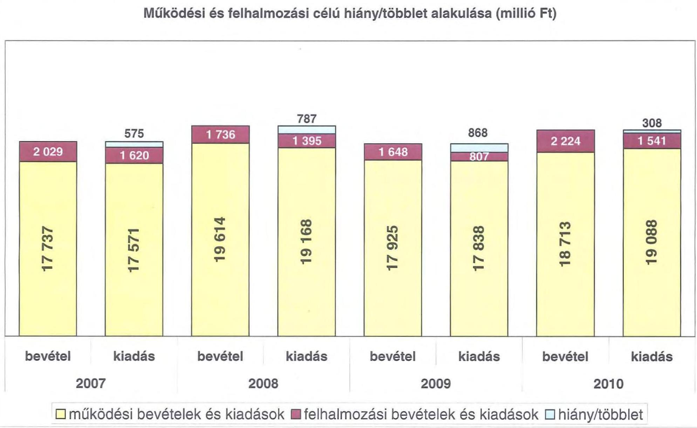

# Működési és felhalmozási célú hiány/többlet alakulása (millió Ft)

|  2009 | 2007 | 196 | 1736 | 1575  |
| --- | --- | --- | --- | --- |
|  575 | 1620 | 196 | 1414 | 1375  |
|  1796 | 1914 | 196 | 1414 | 1375  |
|  1736 | 1914 | 196 | 1414 | 1375  |
|  1614 | 1914 | 196 | 1414 | 1375  |
|  1575 | 1914 | 196 | 1414 | 1375  |
|  1414 | 1914 | 196 | 1414 | 1375  |
|  1375 | 1914 | 196 | 1414 | 1375  |
|  1214 | 1914 | 196 | 1414 | 1375  |
|  1114 | 1914 | 196 | 1414 | 1375  |
|  914 | 1914 | 196 | 1414 | 1375  |
|  814 | 1914 | 196 | 1414 | 1375  |
|  714 | 1914 | 196 | 1414 | 1375  |
|  614 | 1914 | 196 | 1414 | 1375  |
|  514 | 1914 | 196 | 1414 | 1375  |
|  414 | 1914 | 196 | 1414 | 1375  |
|  314 | 1914 | 196 | 1414 | 1375  |
|  2614 | 1914 | 196 | 1414 | 1375  |
|  2114 | 1914 | 196 | 1414 | 1375  |
|  1614 | 1914 | 196 | 1414 | 1375  |
|  1214 | 1914 | 196 | 1414 | 1375  |
|  1114 | 1914 | 196 | 1414 | 1375  |
|  914 | 1914 | 196 | 1414 | 1375  |
|  814 | 1914 | 196 | 1414 | 1375  |
|  714 | 1914 | 196 | 1414 | 1375  |
|  614 | 1914 | 196 | 1414 | 1375  |
|  514 | 1914 | 196 | 1414 | 1375  |
|  414 | 1914 | 196 | 1414 | 1375  |
|  314 | 1914 | 196 | 1414 | 1375  |
|  2614 | 1914 | 196 | 1414 | 1375  |
|  2114 | 1914 | 196 | 1414 | 1375  |
|  1614 | 1914 | 196 | 1414 | 1375  |
|  1214 | 1914 | 196 | 1414 | 1375  |
|  1114 | 1914 | 196 | 1414 | 1375  |
|  914 | 1914 | 196 | 1414 | 1375  |
|  814 | 1914 | 196 | 1414 | 1375  |
|  714 | 1914 | 196 | 1414 | 1375  |
|  614 | 1914 | 196 | 1414 | 1375  |
|  514 | 1914 | 196 | 1414 | 1375  |
|  414 | 1914 | 196 | 1414 | 1375  |
|  314 | 1914 | 196 | 1414 | 1375  |
|  2614 | 1914 | 196 | 1414 | 1375  |
|  2114 | 1914 | 196 | 1414 | 1375  |
|  1614 | 1914 | 196 | 1414 | 1375  |
|  1214 | 1914 | 196 | 1414 | 1375  |
|  1114 | 1914 | 196 | 1414 | 1375  |
|  914 | 1914 | 196 | 1414 | 1375  |
|  814 | 1914 | 196 | 1414 | 1375  |
|  714 | 1914 | 196 | 1414 | 1375  |
|  614 | 1914 | 196 | 1414 | 1375  |
|  514 | 1914 | 196 | 1414 | 1375  |
|  414 | 1914 | 196 | 1414 | 1375  |
|  314 | 1914 | 196 | 1414 | 1375  |
|  2614 | 1914 | 196 | 1414 | 1375  |
|  2114 | 1914 | 196 | 1414 | 1375  |
|  1614 | 1914 | 196 | 1414 | 1375  |
|  1214 | 1914 | 196 | 1414 | 1375  |
|  1114 | 1914 | 196 | 1414 | 1375  |
|  914 | 1914 | 196 | 1414 | 1375  |
|  814 | 1914 | 196 | 1414 | 1375  |
|  714 | 1914 | 196 | 1414 | 1375  |
|  614 | 1914 | 196 | 1414 | 1375  |
|  514 | 1914 | 196 | 1414 | 1375  |
|  414 | 1914 | 196 | 1414 | 1375  |
|  314 | 1914 | 196 | 1414 | 1375  |
|  2614 | 1914 | 196 | 1414 | 1375  |
|  2114 | 1914 | 196 | 1414 | 1375  |
|  1614 | 1914 | 196 | 1414 | 1375  |
|  1214 | 1914 | 196 | 1414 | 1375  |
|  1114 | 1914 | 196 | 1414 | 1375  |
|  914 | 1914 | 196 | 1414 | 1375  |
|  814 | 1914 | 196 | 1414 | 1375  |
|  714 | 1914 | 196 | 1414 | 1375  |
|  614 | 1914 | 196 | 1414 | 1375  |
|  514 | 1914 | 196 | 1414 | 1375  |
|  414 | 1914 | 196 | 1414 | 1375  |
|  314 | 1914 | 196 | 1414 | 1375  |
|  2614 | 1914 | 196 | 1414 | 1375  |
|  2114 | 1914 | 196 | 1414 | 1375  |
|  1614 | 1914 | 196 | 1414 | 1375  |
|  1214 | 1914 | 196 | 1414 | 1375  |
|  1114 | 1914 | 196 | 1414 | 1375  |
|  914 | 1914 | 196 | 1414 | 1375  |
|  814 | 1914 | 196 | 1414 | 1375  |
|  714 | 1914 | 196 | 1414 | 1375  |
|  614 | 1914 | 196 | 1414 | 1375  |
|  514 | 1914 | 196 | 1414 | 1375  |
|  314 | 1914 | 196 | 1414 | 1375  |
|  2614 | 1914 | 196 | 1414 | 1375  |
|  2114 | 1914 | 196 | 1414 | 1375  |
|  1614 | 1914 | 196 | 1414 | 1375  |
|  1214 | 1914 | 196 | 1414 | 1375  |
|  1114 | 1914 | 196 | 1414 | 1375  |
|  914 | 1914 | 196 | 1414 | 1375  |
|  814 | 1914 | 196 | 1414 | 1375  |
|  714 | 1914 | 196 | 1414 | 1375  |
|  614 | 1914 | 196 | 1414 | 1375  |
|  514 | 1914 | 196 | 1414 | 1375  |
|  414 | 1914 | 196 | 1414 | 1375  |
|  314 | 1914 | 196 | 1414 | 1375  |
|  2614 | 1914 | 196 | 1414 | 1375  |
|  2114 | 1914 | 196 | 1414 | 1375  |
|  1614 | 1914 | 196 | 1414 | 1375  |
|  1214 | 1914 | 196 | 1414 | 1375  |
|  1114 | 1914 | 196 | 1414 | 1375  |
|  914 | 1914 | 196 | 1414 | 1375  |
|  814 | 1914 | 196 | 1414 | 1375  |
|  714 | 1914 | 196 | 1414 | 1375  |
|  614 | 1914 | 196 | 1414 | 1375  |
|  514 | 1914 | 196 | 1414 | 1375  |
|  414 | 1914 | 196 | 1414 | 1375  |
|  314 | 1914 | 196 | 1414 | 1375  |
|  2614 | 1914 | 196 | 1414 | 1375  |
|  2114 | 1914 | 196 |

 1414 | 1375  |
|  2114 | 1914 | 196 | 1414 | 1375  |
|  1614 | 1914 | 196 | 1414 | 1375  |
|  1214 | 1914 | 196 | 1414 | 1375  |
|  1114 | 1914 | 196 | 1414 | 1375  |
|  914 | 1914 | 196 | 1414 | 1375  |
|  814 | 1914 | 196 | 1414 | 1375  |
|  714 | 1914 | 196 | 1414 | 1375  |
|  614 | 1914 | 196 | 1414 | 1375  |
|  514 | 1914 | 196 | 1414 | 1375  |
|  414 | 1914 | 196 | 1414 | 1375  |
|  314 | 1914 | 196 | 1414 | 1375  |
|  2614 | 1914 | 196 | 1414 | 1375  |
|  2114 | 1914 | 196 | 1414 | 1375  |
|  1614 | 1914 | 196 | 1414 | 1375  |
|  1214 | 1914 | 196 | 1414 | 1375  |
|  1114 | 1914 | 196 | 1414 | 1375  |
|  914 | 1914 | 196 | 1414 | 1375  |
|  814 | 1914 | 196 | 1414 | 1375  |
|  714 | 1914 | 196 | 1414 | 1375  |
|  614 | 1914 | 196 | 1414 | 1375  |
|  514 | 1914 | 196 | 1414 | 1375  |
|  414 | 1914 | 196 | 1414 | 1375  |
|  314 | 1914 | 196 | 1414 | 1375  |
|  2614 | 1914 | 196 | 1414 | 1375  |
|  2114 | 1914 | 196 | 1414 | 1375  |
|  1614 | 1914 | 196 | 1414 | 1375  |
|  1214 | 1914 | 196 | 1414 | 1375  |
|  1114 | 1914 | 196 | 1414 | 1375  |
|  914 | 1914 | 196 | 1414 | 1375  |
|  814 | 1914 | 196 | 1414 | 1375  |
|  714 | 1914 | 196 | 1414 | 1375  |
|  614 | 1914 | 196 | 1414 | 1375  |
|  514 | 1914 | 196 | 1414 | 1375  |
|  414 | 1914 | 196 | 1414 | 1375  |
|  314 | 1914 | 196 | 1414 | 1375  |
|  2614 | 1914 | 196 | 1414 | 1375  |
|  2114 | 1914 | 196 | 1414 | 1375  |
|  1614 | 1914 | 196 | 1414 | 1375  |
|  1214 | 1914 | 196 | 1414 | 1375  |
|  1114 | 1914 | 196 | 1414 | 1375  |
|  914 | 1914 | 196 | 1414 | 1375  |
|  814 | 1914 | 196 | 1414 | 1375  |
|  714 | 1914 | 196 | 1414 | 1375  |
|  614 | 1914 | 196 | 1414 | 1375  |
|  514 | 1914 | 196 | 1414 | 1375  |
|  414 | 1914 | 196 | 1414 | 1375  |
|  314 | 1914 | 196 | 1414 | 1375  |
|  2614 | 1914 | 196 | 1414 | 1375  |
|  2114 | 1914 | 196 | 1414 | 1375  |
|  1614 | 1914 | 196 | 1414 | 1375  |
|  1214 | 1914 | 196 | 1414 | 1375  |
|  1114 | 1914 | 196 | 1414 | 1375  |
|  914 | 1914 | 196 | 1414 | 1375  |
|  814 | 1914 | 196 | 1414 | 1375  |
|  714 | 1914 | 196 | 1414 | 1375  |
|  614 | 1914 | 196 | 1414 | 1375  |
|  514 | 1914 | 196 | 1414 | 1375  |
|  414 | 1914 | 196 | 1414 | 1375  |
|  314 | 1914 | 196 | 1414 | 1375  |
|  2614 | 1914 | 196 | 1414 | 1375  |
|  2114 | 1914 | 196 | 1414 | 1375  |
|  1614 | 1914 | 196 | 1414 | 1375  |
|  1214 | 1914 | 196 | 1414 | 1375  |
|  1114 | 1914 | 196 | 1414 | 1375  |
|  914 | 1914 | 196 | 1414 | 1375  |
|  814 | 1914 | 196 | 1414 | 1375  |
|  714 | 1914 | 196 | 1414 | 1375  |
|  614 | 1914 | 196 | 1414 | 1375  |
|  514 | 1914 | 196 | 1414 | 1375  |
|  414 | 1914 | 196 | 1414 | 1375  |
|  314 | 1914 | 196 | 1414 | 1375  |
|  2614 | 1914 | 196 | 1414 | 1375  |
|  2114 | 1914 | 196 | 1414 | 1375  |
|  1614 | 1914 | 196 | 1414 | 1375  |
|  1214 | 1914 | 196 | 1414 | 1375  |
|  1114 | 1914 | 196 | 1414 | 1375  |
|  914 | 1914 | 196 | 1414 | 1375  |
|  814 | 1914 | 196 | 1414 | 1375  |
|  714 | 1914 | 196 | 1414 | 1375  |
|  714 | 1914 | 196 | 1414 | 1375  |
|  714 | 1914 | 196 | 1414 | 1375  |
|  714 | 1914 | 196 | 1414 | 1375  |
|  714 | 1914 | 196 | 1414 | 1375  |
|  714 | 1914 | 196 | 1414 | 1375  |
|  714 | 1914 | 196 | 1414 | 1375  |
|  714 | 1914 | 196 | 1414 | 1375  |
|  714 | 1914 | 196 | 1414 | 1375  |
|  714 | 1914 | 196 | 1414 | 1375  |
|  714 | 1914 | 196 | 1414 | 1375  |
|  714 | 1914 | 196 | 1414 | 1375  |
|  714 | 1914 | 196 | 1414 | 1375  |
|  714 | 1914 | 196 | 1414 | 1375  |
|  714 | 1914 | 196 | 1414 | 1375  |
|  714 | 1914 | 196 | 1414 | 1375  |
|  714 | 1914 | 196 | 1414 | 1375  |
|  714 | 1914 | 196 | 1414 | 1375  |
|  714 | 1914 | 196 | 1414 | 1375  |
|  714 | 1914 | 196 | 1414 | 1375  |
|  714 | 1914 | 196 | 1414 | 1375  |
|  714 | 1914 | 196 | 1414 | 1375  |
|  714 | 1914 | 196 | 1414 | 1375  |
|  714 | 1914 | 196 | 1414 | 1375  |
|  714 | 1914 | 196 | 1414 | 1375  |
|  714 | 1914 | 196 | 1414 | 1375  |
|  714 | 1914 | 196 | 1414 | 1375  |
|  714 | 1914 | 196 | 1414 | 1375  |
|  714 | 1914 | 196 | 1414 | 1375  |
|  714 | 1914 | 196 | 1414 | 1375  |
|  714 | 1914 | 196 | 1414 | 1375  |
|  714 | 1914 | 196 | 1414 | 1375  |

---

# Az Önkormányzat CLF módszer szerint besorolt bevételei és kiadásai 2007-2010 között

|  1. FOLYÓ KÖLTSEGYETÉS* | 2007. | 2008. | 2009. | 2010.  |
| --- | --- | --- | --- | --- |
|  1.1.1. Saját működési bevételek | 4 021 350 | 4 266 117 | 4 645 586 | 4 642 794  |
|  1.1.2. Költségvetési támogatás | 5 174 942 | 5 140 355 | 5 005 230 | 5 428 379  |
|  1.1.3. Átvett bevételek | 1 660 785 | 583 944 | 606 306 | 224 405  |
|  1.1.4. Átvezetésen belülről kapott támogatások | 8 779 159 | 9 528 511 | 8 618 756 | 9 045 197  |
|  1.1.5. EU-tól és külföldről kapott bevételek | 13 410 | 2 013 | 41 083 | 7 705  |

 |
|  1.1.6. Áthárkátartáson kívülről kapott bevételek | 38 819 | 29 348 | 25 206 | 17 645  |
|  1.1.7. Előző évi pótmaradvány átvétel | 276 944 | 317 262 | 321 120 | 293 744  |
|  1.1. Folyó bevételek =1.1.1.-1.1.2.-1.1.3.-1.1.4.-1.1.5.-1.1.6.-1.1.7. | 17 964 517 | 19 868 354 | 18 064 095 | 18 459 907  |
|  1.2.1. Működési kiadások kamatkiváltások nélkül | 16 910 049 | 18 424 597 | 17 158 536 | 18 408 322  |
|  1.2.2. Áthárkátartáson belülre átadott pótforrások | 47 168 | 55 373 | 89 095 | 91 899  |
|  1.2.3.1. vállalkozásoknak | 1 526 | 1 451 | 2 414 | 699  |
|  1.2.3.2. EU-nak, illetve külföldieknek | 846 | 0 | 1 011 | 991  |
|  1.2.3.3. magáncsoportoknak | 149 984 | 137 171 | 136 626 | 164 710  |
|  1.2.3.4. asszociációs szervezeteknek | 158 614 | 102 110 | 79 643 | 47 729  |
|  1.2.5. Transzferkiadások (=1.2.3.1+1.2.3.2+1.2.3.3+1.2.3.4) | 314 974 | 242 735 | 219 710 | 214 133  |
|  1.2.6. Kamatkiváltások | 51 245 | 157 431 | 107 520 | 141 230  |
|  1.2.7. Előző évi pótmaradvány átadás | 276 944 | 317 262 | 321 120 | 293 744  |
|  1.3. Folyó kiadások = 1.3.1.-1.3.2.-1.3.3.-1.3.4.-1.3.5 | 17 601 180 | 19 197 396 | 17 976 005 | 19 149 320  |
|  1.3. Folyó költségvetés egyenlege MŰKÖDÉSI JÖVEDELEM (1.1. - 1.2.) | 363 337 | 670 956 | 88 090 | 409 341  |
|  2. FELHALMOZÁSI KÖLTSÉGVETÉS** |  |  |  |   |
|  2.1.1. Saját bevételek | 84 663 | 92 729 | 27 573 | 21 607  |
|  2.1.2. Áthárkátartáson belülről kapott támogatások | 279 034 | 38 967 | 77 433 | 772 715  |
|  2.1.3. EU-tól és külföldről kapott támogatások | 361 439 | 278 828 | 116 759 | 197 975  |
|  2.1.4. Áthárkátartáson kívülről kapott támogatások | 27 550 | 111 673 | 29 594 | 79 293  |
|  2.1. Felhalmozási bevételek (=2.1.1.-2.1.2.-2.1.3.-2.1.4.) | 752 685 | 422 197 | 251 359 | 1 071 632  |
|  2.2.1. Saját beruházási kiadás | 1 277 297 | 1 014 282 | 614 096 | 954 144  |
|  2.2.2. Saját külföldi kiadás | 247 416 | 328 813 | 35 736 | 206 942  |
|  2.2.3. Áthárkátartáson belülre átadott pótforrás | 54 650 | 5 955 | 3 439 | 152 312  |
|  2.2.4. EU-nak és külföldnek adott pótforrások | 0 | 0 | 0 | 0  |
|  2.2.5. Áthárkátartáson kívülre adott pótforrások | 9 037 | 15 537 | 14 912 | 12 038  |
|  2.2.6. Befektetési célú részesedések vásárlása | 120 | 500 | 500 | 0  |
|  2.3. Felhalmozási kiadások (=2.3.1.-2.3.2.-2.3.3.-2.3.4.-2.3.5.-2.3.6.) | 1 589 320 | 1 365 007 | 668 683 | 1 399 423  |
|  2.3. Felhalmozási költségvetés egyenlege (2.1. - 2.2.) | -836 635 | -942 810 | -417 324 | -327 801  |
|  3. FINANSZÍROZÁSI MŰVELETEK NÉLKÜLI (GFS) POZÍCIÓ |  |  |  |   |
|  (1.3.) Folyó költségvetés egyenlege Működési Jövedelem + (2.3.) Felhalmozási költségvetés egyenlege | -473 298 | -271 854 | -329 234 | -1 017 142  |
|  4. FINANSZÍROZÁSI MŰVELETEK |  |  |  |   |
|  4.1. Hitelfelvétel | 405 275 | 213 864 | 139 057 | 538 558  |
|  4.2. Hitelteljesítés | 0 | 0 | 60 000 | 80 000  |
|  4.3. Forgatási és befektetési célú értékpapírok kibocsátása | 0 | 4 000 076 | 0 | 0  |
|  4.4. Forgatási és befektetési célú értékpapírok beválása | 0 | 0 | 0 | 0  |
|  4.5. Forgatási és befektetési célú értékpapírok értékesítése | 0 | 0 | 0 | 149 990  |
|  4.6. Forgatási és befektetési célú értékpapírok vásárlása | 0 | 0 | 149 990 | 0  |
|  4.7. Egyéb finanszírozási bevételek (függő, átfizet, kiegészítői) | -196 601 | 14 120 | -61 285 | -302 263  |
|  4.8. Egyéb finanszírozási kiadások (függő, átfizet, kiegészítői) | 183 625 | 12 593 | 33 562 | -223 759  |
|  4.9. Finanszírozási műveletek egyenlege (4.1.-4.2.-4.3.-4.4.-4.5.-4.6.-4.7.-4.8.) | 185 049 | 4 240 653 | 162 708 | 630 022  |
|  5. TÁRGYÉVI POZÍCIÓ |  |  |  |   |
|  (3.) FINANSZÍROZÁSI MŰVELETEK NÉLKÜLI (GFS) POZÍCIÓ + (4.9.) Finanszírozási műveletek egyenlege | -288 249 | 4 068 719 | -166 526 | -387 090  |
|  6. NETTÓ MŰKÖDÉSI JÖVEDELEM |  |  |  |   |
|  (1.3.) Működési Jövedelem - Tőkeveszteség (4.2. Hitelteljesítés + 4.4. Forgatási és befektetési célú értékpapírok beválása ) | 363 337 | 670 956 | 28 090 | -769 341  |
|  7. TÁJÉKOZTATÓ ADATOK |  |  |  |   |
|  Összes kötelezettség | 1 626 453 | 6 032 067 | 6 696 343 | 8 306 760  |
|  ebből rövid lejáratú | 943 337 | 1 042 624 | 1 739 621 | 5 587 473  |
|  Összes szállítói kötelezettség | 507 400 | 335 732 | 936 719 | 740 002  |
|  ebből lejárt (tamisítványból) | 10 | 0 | 496 739 | 163 353  |
|  Pénz és tőkepiaci kötelezettség (átlag) | 888 269 | 5 510 500 | 5 668 543 | 7 062 267  |
|  ebből rövid lejáratú | 308 269 | 582 153 | 741 190 | 1 279 749  |
|  PPP szerződésből hátralévő kötelezettségi állomány (tamisítványból) | 0 | 0 | 0 | 0  |
|  ebből lejárt szolgáltatási díj mértékű kötelezettség | 0 | 0 | 0 | 0  |
|  Folyószámlahitel majd átfutó állománya (tamisítványból) | 231 991 | 308 991 | 449 548 | 743 114  |
|  Látványhitel majd átfutó állománya (tamisítványból) | 0 | 0 | 0 | 0  |
|  Működőtőke majd átfutó állománya (tamisítványból) | 7 940 | 5 714 | 0 | 7 740  |
|  Kölcsön és garanciavállalások (tamisítványból) | 0 | 0 | 0 | 0  |
|  Peres eljárásokból fennálló függő kötelezettségek | 0 | 0 | 0 | 0  |
|  Finanszírozásba bevonható eszközök összesen | 1 042 694 | 5 111 411 | 4 671 359 | 4 114 271  |
|  Tartós kötelezettséget megtestesítő értékpapírok és végi állománya | 0 | 0 | 0 | 0  |
|  Hosszú lejáratú funkcióintézetek és végi állománya | 0 | 0 | 0 | 0  |
|  Értékpapírok és végi állománya | 0 | 0 | 149 990 | 0  |
|  Pótforrások (idegen pótforrások nélkül) és végi állománya | 1 042 694 | 5 111 411 | 4 521 361 | 4 134 271  |

- Revészköken nem tétál, a kiadásokban nem jelenik meg az amortizáció, a vagyoni helyezen az egyenleg befolyásolja. Revészköken vagyon megőrzésre és bővítésére fordítható források.

Megjegyzés

A számítási módszer némileg eltér az ÁSZ módosításában korábban alkalmazott besorolásoktól. A jelen besorolás általános körgazdasági meggondolásokon alapul, amely testet ölt az IINA statisztikai módosításában is. Folyó tételek alatt értjük azokat a kiadásokat és bevételeket, amelyek az egyed vagyonhelyzetét automatikusan nem változtatják. Bevételi oldalon ilyenek az adók, a tényezőjövedelmek, transzferek, kiadási oldalon a transzferek és a szolgáltatások ellátásával kapcsolatos működési kiadások. Felhalmozási, vagy tőke tételek módosítják a vagyon nagyságát. Privatizációs bevétel csökkenti a vagyoni, fizikai beruházás, vagy pótlás belekérés növeli.

A folyó költségvetés egyenlege (működési jövedelem) tartalmazza a kamatkiadásokat is, mind a működési, mind a fejlesztési kamatot, mert ezek körgazdaságilag tényezőjövedelmek. Nem tartalmazza a pénzforgalmi bevételek és kiadások a következő elengedés miatt kényszerítő bevételek és kiadási pénzforgalmi tételeket, mivel ezek egymást kizárják és valójában technikai elszámolási műveletek minősülnek, így indokolatlanul változtatják a költségvetési és kiadási és bevételi adatokat. Nesen valójában a bevétel soha nem realizálódott, és a költségvetési évben kiadás sem történt, csak elengedtük a következőre.

A nettó működési jövedelmet a tőkeveszteség bevonásával a folyó költségvetés egyenlegéből (működési jövedelemből) számítják. Transzfer kiadásoknak nem nevelik azokat a folyó és felhalmozási tételeket, amelyeket nem az adott önkormányzat használ fel szolgáltatásnyújtásra.

---

Az Önkormányzat bevételeinek és kiadásainak, adósságállományának alakulása 2007-2010 között

|  Sorszám | Megnevezés | 2007. év | 2008. év | 2009. év | 2010. év  |
| --- | --- | --- | --- | --- | --- |
|   |  |  | 2010. év | 2011. év | 2012. év  |
|  1. | MŰKÖDÉSI BEVÉTELEK | 17 736 477 | 18 614 498 | 17 844 004 | 16 712 711  |
|  1.1. | Saját forrásból folyó bevételek | 2 014 207 | 2 655 071 | 2 105 291 | 2 291 078  |
|  1.1.1. | Üzemanyag működési bevétele | 2 108 030 | 1 922 256 | 2 252 255 | 2 046 260  |
|  1.2. | Befektetési bevételek | 1 788 151 | 2 022 014 | 1 787 500 | 1 218 317  |
|  1.3. | Hétz. adóbevételek és jóléti források | 0 | 0 | 0 | 0  |
|  1.4. | Korm. bevétel

 működési része | 17 000 | 20 024 | 25 274 | 128 787  |
|  1.5. | Egyéb folyó működési bevételek | 0 | 54 577 | 8 869 | 1 764  |
|  2. | Támogatások értékű működési bevételek | 246 700 | 269 193 | 211 090 | 204 672  |
|   | Hetven dokumentumoktól és költségeitől szervező | 114 035 | 94 955 | 91 154 | 87 622  |
|   | Hóforduló fizetésmatá (árcsétart) | 0 | 0 | 0 | 0  |
|  3. | Pénzmozgásom nélküli bevételek működésre jóváhagyott része | 952 000 | 918 983 | 722 060 | 824 401  |
|  4. | Állami hatóságtól kívülről működési célra átvett pénzeszközök | 52 233 | 32 161 | 57 089 | 25 425  |
|  5. | Későbbiek támogatások és átterjedt források működési része | 12 917 514 | 12 342 230 | 12 599 289 | 12 057 320  |
|  6. | SZJV | 1 052 762 | 293 944 | 956 206 | 234 490  |
|   | Állami hatósági és intézményes állami támogatásának működési része | 2 776 443 | 2 630 718 | 2 769 141 | 2 701 151  |
|   | Költségvetési távgesztések, visszabírókérések | 0 | 0 | 0 | 0  |
|   | Táradási/telemedicinális alaptól | 6 290 462 | 6 125 339 | 6 207 071 | 6 049 620  |
|  6.1. | HELYES | 17 736 477 | 18 614 498 | 17 844 004 | 16 712 711  |
|  6.2. | MŰKÖDÉSI KIADÁSOK (kamatjóváírás nélkül) | 17 841 492 | 18 600 392 | 17 746 441 | 16 819 004  |
|  6.3. | Folyó működési kiadások összesen kamatjóváírások nélkül | 14 446 484 | 16 262 780 | 17 127 070 | 16 392 770  |
|  6.4. | HELYES | 0 | 0 | 0 | 0  |
|   | Jószabályi jogcímek | 6 232 744 | 6 795 310 | 6 145 280 | 6 018 647  |
|   | Hozzákapcsolt terjesztési átutalások | 5 092 700 | 7 706 492 | 5 624 441 | 5 571 292  |
|   | Jövedelmi kiadások | 5 010 744 | 5 083 617 | 5 416 020 | 7 090 733  |
|   | Egyéb folyó kiadások | 125 000 | 127 019 | 121 412 | 129 000  |
|   | Egyéb folyó működési kiadások | 0 | 2 940 | 0 | 2 204  |
|  6.1. | Támogatások, elvonások és egyéb folyó kiadások | 214 072 | 202 738 | 210 718 | 219 724  |
|  6.2. | HÓROZAT LÉG pénzeszköz átadás állami/hatósági törölje | 177 000 | 108 730 | 65 209 | 87 030  |
|   | HÓROZAT LÉG pénzeszköz átadás állami/hatósági törölje | 0 | 0 | 0 | 0  |
|   | Jószabályi és árcsapásvédelmi jutásbőv | 147 975 | 134 090 | 133 855 | 153 064  |
|  6.3. | Előző és pénzeszköz átadás, elosztás működési | 332 497 | 394 480 | 390 162 | 351 090  |
|  6.4. | Támogatás értékű működési kiadás | 47 163 | 55 321 | 50 095 | 41 820  |
|  6.5. | HELYES | 0 | 0 | 0 | 0  |
|   | Jóváhagyatonként | 46 417 | 54 091 | 50 369 | 39 721  |
|   | Jóváhagyatonként | 0 | 0 | 0 | 0  |
|  6.6. | ÁGÁRIÁVÁRZOLGÁLAT | 51 245 | 197 331 | 247 620 | 221 230  |
|   | Előző/bezáró adóközlőleg működési | 0 | 0 | 0 | 0  |
|   | Néhányszáz | 0 | 0 | 60 000 | 80 000  |
|   | Jóváhagyat kötelezettség működési | 28 000 | 155 590 | 55 242 | 73 785  |
|   | Néhányszáz | 22 000 | 34 796 | 105 184 | 55 082  |
|   | Hozzáú lejáratú értékpapír bevétele, vesztesége | 0 | 0 | 0 | 0  |
|   | Jóvávetés (behívódási célú bevétel) | 0 | 0 | 0 | 0  |
|  6.7. | Jóvávetés (behívódási célú) | 0 | 0 | 0 | 0  |
|  6.8. | Jóvávetés (keféré) | 0 | 0 | 0 | 0  |
|  6.9. | FELHALMOZÁSI BEVÉTELEK | 2 020 000 | 1 728 964 | 1 649 520 | 2 020 000  |
|  7.1. | Saját felhasználni és tilkapdísgő bevétel | 191 790 | 226 000 | 206 342 | 273 736  |
|  7.1.1. | Tárgyi eszközök, lómat, javán értékesítése, ÁG visszabírók | 91 007 | 35 392 | 17 239 | 19 651  |
|  7.2. | Hozzákapcsolt számozású bevétel | 72 000 | 72 021 | 55 855 | 117 972  |
|  7.3. | Öntörlés, részemetések | 7 040 | 7 030 | 5 951 | 5 030  |
|  7.4. | Karmélizetést felhasználni része | 17 760 | 212 064 | 202 251 | 131 350  |
|  7.5. | Hetven adók átterjedt jólfiz felhasználni része | 0 | 0 | 0 | 0  |
|  7.6. | Egyéb folyó felhasználni bevétele | 11 776 | 10 781 | 8 972 | 7 522  |
|  8.1. | Támogatásértékű felhasználni bevételük | 279 033 | 26 067 | 77 420 | 773 718  |
|  8.2. | HELYES | 0 | 0 | 0 | 0  |
|   | Hetven dokumentumoktól és költségeitől szervező | 64 267 | 12 156 | 59 159 | 242 147  |
|   | Hóforduló fizetésmatá (árcsétart) | 0 | 0 | 0 | 0  |
|  8.3. | Pénzmozgásom nélküli bevételek felhasználása jóváhagyott része | 771 840 | 357 010 | 206 084 | 294 040  |
|  8.4. | Állami hatóságtól kívülről felhasználási célra átvett pénzeszközök | 27 855 | 111 074 | 51 044 | 79 260  |
|  8.5. | Állami hatóságtól vérkötés célú bevétel | 756 147 | 799 000 | 136 877 | 234 331  |
|  9.1. | ÉLI költségeitőlőző átvétel | 381 200 | 276 638 | 116 790 | 187 070  |
|  9.2. | Önkormányzatok költségeitől termjlődés felhasználni célra | 297 717 | 268 581 | 14 412 | 26 207  |
|  9.3. | FELHALMOZÁSI KIADÁSOK | 1 047 701 | 1 204 054 | 971 493 | 1 397 030  |
|  9.4. | Folyó felhasználni kiadások kamatjóváírások nélkül | 1 033 274 | 1 244 400 | 985 232 | 1 226 060  |
|  9.5. | Jóváhagyat kötelezettség kiadások | 1 054 711 | 1 243 000 | 948 644 | 1 226 040  |
|  9.6. | Önkormányzat ökölés | 8 441 | 830 | 0 | 0  |
|  9.7. | Támogatások, elvonások és egyéb folyó kiadások | 124 | 800 | 500 | 0  |
|  9.8. | Támogatások, elvonások és egyéb folyó kiadások | 3 937 | 19 557 | 14 912 | 12 035  |
|  9.9. | Néhányszáz LÉG pénzeszköz átadás állami/hatósági törölje | 0 | 9 223 | 16 460 | 7 500  |
|   | Néhányszáz LÉG termjlődések, időzítői, közzétételi költségei | 2 831 | 5 214 | 4 413 | 3 530  |
|  9.10. | Támogatásértékű felhasználási kiadások | 54 000 | 0 | 2 420 | 149 914  |
|  9.11. | HELYES | 0 | 0 | 0 | 0  |
|   | Hetven dokumentumoktól és költségeitől szerveznek | 54 000 | 0 | 2 420 | 149 914  |
|   | Hóforduló fizetésmatá (árcsétart) | 0 | 0 | 0 | 0  |
|  9.2. | Pénzmozgásom nélküli kiadások felhasználása jóváhagyott része | 0 | 0 | 2 940 | 0  |
|  9.3. | Jóvávető, lejáratú bevétel | 546 223 | 6 212 340 | 45 491 | 695 490  |
|  9.4. | Hozzá lejáratú tájéko bevétele | 0 | 0 | 0 | 0  |
|  9.5. | Jóvéti tájéko bevétele | 126 300 | 313 854 | 139 207 | 838 000  |
|  9.6. | Hozzáú lejáratú tájéko bevétele | 297 000 | 0 | 0 | 0  |
|   | Jóshormusz és hozzá lejáratú értékpapírok közszabása, értékesítése | 0 | 6 205 078 | 0 | 149 990  |
|   | Jóváhoszlat (behívódási célú bevétel) | 0 | 4 000 078 | 0 | 0  |
|  9.7. | Jóváhormusz (behívódási célú) | 0 | 0 | 0 | 149 990  |
|  9.8. | Hóhozálás (keféré) | 0 | 0 | 0 | 0  |
|   | Megeszi célú értékpapírok bevételek, vesztesége és a időszakban. | 0 | 0 | 0 | 0  |
|  9.9. | Jóváhormusz egyeziege | 0 | 0 | 149 990 | 0  |
|   | Jóváhormusz és hozzá lejáratú értékpapírok közszabása, értékesítése | 0 | 0 | 0 | 0 
 |
|  9.10. | Jóhszálat (behívódási egyeztege) | 0 | 0 | 0 | 0  |
|  9.11. | Jóhormusz (behívódási célú) | 0 | 0 | 0 | 0  |
|  9.12. | Jóhormusz (behívódási célú) működés egyeztege | 446 270 | 6 212 440 | 75 941 | 838 500  |

---

Az Önkormányzat 2007-2010. években megvalósított, illetve 2010. december 31-én fennálló fejlesztési feladatokhoz kapcsolódó kötelezettségeinek összegzése

|  Fejlesztési feladat megnevezése, és a közgyűlési határozat száma | Beruházás kezdete | Teljes bekerülési költség | $\begin{gathered} 2006 . \ \text { december } \ 31-\mathrm{ig} \end{gathered}$ | $\begin{gathered} 2007- \ 2010 . \ \text { évek } \end{gathered}$ | 2010. év utánra vállalt | 2010. utáni kötelezettség-vállalás forrásösszetétele |  |  |  |   |
| --- | --- | --- | --- | --- | --- | --- | --- | --- | --- | --- |
|   |  |  |  |  |  | Saját bevétel | Hitel | Kötvény | EU-s
támogatás | eFt hazai támogatás  |
|  Haemodinamikai labor létesítése Hetényi Géza Kórházban | 2005. | 701681 | 260660 | 441021 |  |  |  |  |  |   |
|  Kórház EÜ. Gép-műszer beszerzés céltámogatással | 2006. | 82024 | 221 | 81803 |  |  |  |  |  |   |
|  Speciális gyermekotthon építése szakminisztériumi támogatással | 2006. | 45347 | 44030 | 1317 |  |  |  |  |  |   |
|  Somos András Kollégium magastető ráépítés TRFC | 2006. | 79978 | 32978 | 47000 |  |  |  |  |  |   |
|  Megyeháza főhomlokzat rekonstrukciója TRFC | 2006. | 36972 | 20407 | 16565 |  |  |  |  |  |   |
|  "Angolkert Otthon"
rekonstrukciója TRFC | 2006. | 23556 | 11637 | 11919 |  |  |  |  |  |   |
|  Turkeve Finta Múzeum tetőtér beépítés és kerti pavilon TRFC | 2006. | 20694 | 8046 | 12648 |  |  |  |  |  |   |
|  Hetényi Géza Kórház belgyógyászati épület rekonstrukciója címzett | 2006. | 977392 | 72108 | 905284 |  |  |  |  |  |   |
|  Törökszentmiklós otthon akadálymentesítése ÉAOP | 2008. | 27492 |  | 27492 |  |  |  |  |  |   |
|  Jászapáti, Vasút út 4. akadálymentesítése ÉAOP | 2008. | 29456 |  | 29456 |  |  |  |  |  |   |
|  Tiszakúrt fogyatékos otthon fűtéskorszerűsítése minisztériumi támogatás | 2008. | 35779 |  | 35779 |  |  |  |  |  |   |
|  Jászapáti gimnázium vízesblokk felújítás | 2008. | 3476 |  | 3476 |  |  |  |  |  |   |
|  Hetényi G. Kórház-Redelőintézet II.e.belgyógy. | 2008. | 12624 |  | 12624 |  |  |  |  |  |   |
|  S.O. földszinti aula födémmegerősítés | 2008. | 5272 |  | 5272 |  |  |  |  |  |   |

---

|  Fejlesztési feladat megnevezése, és a közgyűlési határozat száma | Beruházás kezdete | Teljes bekerülési költség | 2006. december 31-ig | 2007-2010. évek | 2010. év utánra vállalt | 2010. utáni kötelezettség-vállalás forrásösszetétele |  |  |  |   |
| --- | --- | --- | --- | --- | --- | --- | --- | --- | --- | --- |
|   |  |  |  |  |  | Saját bevétel | Hitel | Kötvény | EU-s támogatás | eFt hazai támogatás  |
|  Jászapáti, Vasút út 2. akadálymentesítése | 2008. | 26713 |  | 26713 |  |  |  |  |  |   |
|  Jászapáti kollégium idősek otthonává alakítása | 2009. | 160599 |  | 160599 |  |  |  |  |  |   |
|  Szoc.Min. pály. homlokzati nyílászárók Tiszakúrt | 2009. | 2260 |  | 2260 |  |  |  |  |  |   |
|  Szoc.Min. pály. homlokzat hőszigetelés kunhegyesi lakóotthon | 2009. | 7241 |  | 7241 |  |  |  |  |  |   |
|  Kunhegyes, Kossuth L. út 15-17. tornaterem építése | 2009. | 177850 |  | 177850 |  |  |  |  |  |   |
|  Berekfürdő Touring Hotel rekonstrukciója | 2009. | 63043 |  | 63043 |  |  |  |  |  |   |
|  Jászapáti, Vasút út 4. tornaterem építése | 2009. | 191650 |  | 191650 |  |  |  |  |  |   |
|  Jászapáti, Hősök tere 9. energiaracionalizálás KEOP | 2010. | 44462 |  | 44462 |  |  |  |  |  |   |
|  Megyeháza nyílászárók cseréje KEOP | 2010. | 22815 |  | 22815 |  |  |  |  |  |   |
|  Kunhegyes, gimnáziumi tornaterem felújítása CÉDE | 2010. | 22116 |  | 22116 |  |  |  |  |  |   |
|  Tiszaföldvár-Homok, Óvoda felújítása CÉDE | 2010. | 18617 |  | 18617 |  |  |  |  |  |   |
|  Megyeháza napkollektor telepítés KEOP | 2010. | 43425 |  | 43425 |  |  |  |  |  |   |
|  Kórház rehabilitációs szolg. fejlesztése ÉAOP | 2010. | 14844 |  | 14844 |  |  |  |  |  |   |
|  Könyvtári szolgáltatások fejlesztése TIOP | 2008. | 99717 |  | 99717 |  |  |  |  |  |   |
|  Kompetencia alapú oktatás fejlesztése TAMOP | 2009. | 42529 |  | 42529 |  |  |  |  |  |   |
|  H.G. Kórház Rendelőintézet rekonstrukciója HEFOP 4.3.2. | 2005. | 990252 | 357482 | 632770 |  |  |  |  |  |   |
|  Hetényi Géza Kórház-
Rendelőintézet felújítások, fejlesztések | 2007-2010 | 231311 |  | 231311 |  |  |  |  |  |   |

---

|  Fejlesztési feladat megnevezése, és a közgyűlési határozat száma | Beruházás kezdete | Teljes bekerülési költség | 2006. december 31-ig | 2007-2010. évek | 2010. év utánra vállalt | 2010. utáni kötelezettség-vállalás forrásösszetétele |  |  |  |   |
| --- | --- | --- | --- | --- | --- | --- | --- | --- | --- | --- |
|   |  |  |  |  |  | Saját bevétel | Hitel | Kötvény | EU-s támogatás | eFt hazai támogatás  |
|  Gyermekvédő Intézet és Gyermekotthon Szolnok felújítások, fejlesztések | 2007-2010 | 19935 |  | 19935 |  |  |  |  |  |   |
|  Általános Iskola, Speciális Szakiskola és Diákotthon Homok felújítások fejlesztések | 2007-2010. | 55533 |  | 55533 |  |  |  |  |  |   |
|  Általános Iskola, Speciális Szakiskola és Gy.o. Kisújsz. felújítások, fejlesztések | 2010. | 13061 |  | 13061 |  |  |  |  |  |   |
|  "Fenyves Otthon" Bánhalma fejlesztések, felújítások | 2007. | 2294 |  | 2294 |  |  |  |  |  |   |
|  "Szőke Tisza" Fogyatékosok Otthona Tiszaug fejlesztések, felújítások | 2007. | 9736 |  | 9736 |  |  |  |  |  |   |
|  "Fehér Akác" Idősek Otthona és Módszertani Intézet Jászapáti | 2007. | 749 |  | 749 |  |  |  |  |  |   |
|  "Gólyfészek Otthon" Fogyatékosok Otthona Karcag 2007-2010. évi, 241 eFt EU támogatás | 2007-2010. | 1009 |  | 1009 |  |  |  |  |  |   |
|  "Tóparti Otthon" Fogyatékosok Otthon fejlesztések | 2007-2010. | 7056 |  | 7056 |  |  |  |  |  |   |
|  "Kastély Otthon" Pszic. és Szenv. Otthona és fejlesztések, felújítások | 2007. | 13410 |  | 13410 |  |  |  |  |  |   |
|  "Angolkert" Törökszentmiklós felújítások, fejlesztések | 2007-2010. | 8707 |  | 8707 |  |  |  |  |  |   |
|  "Bíró Kálmánné Bakos Ilona" Idősek Otthona Mezőtúr fejlesztések | 2008-2010. | 407 |  | 407 |  |  |  |  |  |   |
|  Sipos Orbán Szakképző Iskola és Kollégium Szolnok fejlesztések | 2007. | 17734 |  | 17734 |  |  |  |  |  |   |
|  Mészáros Lőrinc Gimnázium és

 Szakképzőiskola Jászapáti fejlesztések | 2007-2009. | 54035 |  | 54035 |  |  |  |  |  |   |

---

|  Fejlesztési feladat megnevezése, és a közgyűlési határozat száma | Beruházás kezdete | Teljes bekerülési költség | 2006. december 31-ig | 2007-2010. évek | 2010. év utánra vállalt | 2010. utáni kötelezettség-vállalás forrásösszetétele |  |  |  |   |
| --- | --- | --- | --- | --- | --- | --- | --- | --- | --- | --- |
|   |  |  |  |  |  | Saját bevétel | Hitel | Kötvény | EU-s támogatás | eFt hazai támogatás  |
|  Mészáros Lőrinc Gimnázium és Szakképzőiskola Jászapáti fejlesztések | 2010. | 36462 |  | 36462 |  |  |  |  |  |   |
|  Ipari, Mezőgazdasági, Kereskedelmi és Vendéglátóipari Szakképzőiskola Jászapáti | 2007. | 24474 |  | 24474 |  |  |  |  |  |   |
|  Ipari, Mezőgazdasági, Kereskedelmi és Vendéglátóipari Szakképzőiskola Jászapáti | 2008. | 21573 |  | 21573 |  |  |  |  |  |   |
|  Nagy László Szakképző Iskola, Gimnázium és Kollégium Kunhegyes fejlesztések | 2007-2010 | 29034 |  | 29034 |  |  |  |  |  |   |
|  Hámori András Szakképzőiskola és Szakképző I. Tiszafüred fejlesztések | 2008. | 9144 |  | 9144 |  |  |  |  |  |   |
|  Verseghy Ferenc Megyei Könyvtár Szolnok felújítások, fejlesztések | 2007. | 8751 |  | 8751 |  |  |  |  |  |   |
|  Múzeumok Igazgatósága Szolnok felújítások, fejlesztések | 2007-2008. | 54450 |  |  |  |  |  |  |  |   |
|  Múzeumok Igazgatósága Szolnok kiállítás fejlesztés | 2009-2010. | 47158 |  | 47158 |  |  |  |  |  |   |
|  Levéltár Szolnok fejlesztések | 2007-2010. | 3157 |  | 3157 |  |  |  |  |  |   |
|  Pedagógiai Intézet Szolnok felújítások, fejlesztések | 2007. | 10238 |  | 10238 |  |  |  |  |  |   |
|  Arborétum Tiszakürt felújítások, fejlesztések | 2007-2010. | 3426 |  | 3426 |  |  |  |  |  |   |
|  TISZAINFORM Idegenforgalmi Szolgálat | 2007. | 2045 |  | 2045 |  |  |  |  |  |   |
|  TISZK fejlesztési pályázatok | 2009. | 8240 |  | 8240 |  |  |  |  |  |   |
|  Múzeumok kiállításainak fejlesztése | 2011. | 32580 |  |  | 32580 |  |  | 7580 |  | 25000  |

---

|  Fejlesztési feladat megnevezése, és a közgyűlési határozat száma | Beruházás kezdete | Teljes bekerülési költség | 2006. december 31-ig | 2007-2010. évek | 2010. év utánra vállalt | 2010. utáni kötelezettség-vállalás forrásösszetétele |  |  |  |   |
| --- | --- | --- | --- | --- | --- | --- | --- | --- | --- | --- |
|   |  |  |  |  |  | Saját bevétel | Hitel | Kötvény | EU-s támogatás | eFt hazai támogatás  |
|  Jászkun Kapitányok nyomában EAOP projekt . turisztikai és múzeumi fejlesztés | 2009. | 598480 |  | 499251 | 99229 |  |  |  | 99229 |   |
|  Törökszentmiklós Otthon energiaracionalizálás | 2010. | 151744 |  | 4573 | 147171 |  |  | 66596 | 80575 |   |
|  "Szőke Tisza" bioenergia hasznosítás | 2011. | 104465 |  | 6945 | 97520 |  |  | 39008 | 58512 |   |
|  Kunhegyes Oktatási épület rekonstrukciója | 2010. | 456093 |  | 13023 | 443070 |  |  | 45000 | 398070 |   |
|  Informatikai fejlesztési program | 2008. | 76117 |  | 27015 | 49102 |  |  | 49102 |  |   |
|  Gépjárművek beszerzése a tárgyévi költségvetési rendeletek szerint műszaki szükségesség | 2007-2011 | 82447 |  | 51447 | 31000 |  |  | 31000 |  |   |
|  Kórház sürgősségi ellátás fejlesztése TIOP | 2010. | 629683 |  | 41649 | 588034 | 22390 |  |  | 565644 |   |
|  Kórház struktúra átalakítási pályázat TIOP | 2009. | 25630 |  |  | 25630 |  |  | 25630 |  |   |
|  2011. évi kis összegű felújítások, fejlesztések | 2011. | 33106 |  |  | 33106 |  |  | 33106 |  |   |
|  Összesen: |  | 6191669 | 546909 | 4043868 | 1546442 | 22390 | 0 | 297022 | 1202030 | 25000  |

---

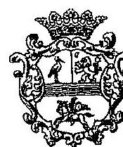

JÁSZ-NAGYKUN-SZOLNOK MEGYEI KÖZGYÜLÉS ELNÖKE

Állami Számvevőszék Elnöke

Domokos László Úr részére

Budapest

Tisztelt Elnök Úr!
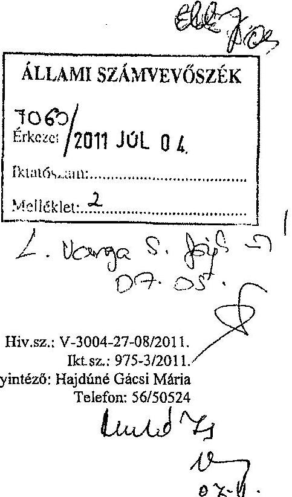

Köszönettel vettem a Jász-Nagykun-Szolnok Megyei Önkormányzat pénzügyi helyzetének ellenőrzéséről szóló jelentésüket, továbbá azon lehetőséget, amely szerint véleményünket, észrevételeinket, esetleges kiegészítéseinket jelezhetjük az anyaggal összefüggésben.

Az ellenőrzés nyitó megbeszélésekor a vizsgálatot végző munkatársainak elmondtuk, hogy fontosnak tartottuk ezt a vizsgálatot, amely egy időpontban, egységes elvek alapján végez helyzetelemzést és teljesítmény-ellenőrzést a megyei önkormányzatok pénzügyi helyzetéről.

Az önkormányzatunkról szóló jelentéshez elsősorban azon kiegészítésekről szeretném tájékoztatni, amelyek a helyszíni ellenőrzés során még folyamatban voltak, viszont a jelentés véglegesítésében változást jelenthetnek:
$>$ Az intézményi szerkezet-változással kapcsolatosan a Közgyűlés 2011. május 30-án határozott egy közoktatási intézmény megszüntetéséről és fenntartói jogának pályáztatás útján történő átadásáról. A Közgyűlés a 2011. június 24-i ülésén a lejárt határidejű határozatok végrehajtásáról szóló előterjesztésben határozott arról, hogy a fenntartói jog átadására vonatkozó pályázati eljárás eredménytelenül zárult, mivel a felhívásra pályázat nem érkezett (II./1. Az önkormányzat kötelező és önként vállalt feladatai 16. oldal).
$>$ A kórház szállítói állományának csökkentése érdekében a megyei közgyűlés a 88/2011. (V. 27.) KH számú határozatában támogatta, hogy a Kórház a kötelező egészségbiztosítás ellátásairól szóló 1997. évi LXXXIII. 35. § (4) bekezdése alapján 199.880 ezer Ft finanszírozási előleget igényeljen az OEP-től. A Kórház a finanszírozási előleget 2011. június 6-án megkapta és soron kívül intézkedett a 30 napon túli lejárt határidejű számlák kifizetéséről (II./3.2. fejezet Szállítók felé fennálló kötelezettségek alakulása 33. oldal).

[^0]
[^0]:    * 5001 SZOLNOK, Kossuth L. u. 2. Pf.: 41 * Telefon: 56/505-330 * Fax: 56/374-424 *

---

A pénzügyi helyzet megítéléséhez szükségesnek tartom jelezni, hogy a működési hiány mértékét jelentősen növelte a településektől átvett szociális és oktatási intézmények működéséhez nyújtott normatíván felüli többlettámogatás, amely 2007. évben 77.251 ezer Ft, 2008. évben 192.995 ezer Ft, 2009. évben 215.466 ezer Ft, 2010. évben 176.566 ezer Ft, összesen 662.278 ezer Ft volt (I. Összegző megállapítások, javaslatok 12. oldal). 2011. évben további két oktatási intézmény átvételére kerül sor, amely tovább növeli a tárgyévi hiány mértékét.

A kiadáscsökkentő és bevételnövelő intézkedéseket 2007. évtől folyamatosan végeztük, ennek ellenére a működési célú hiteleink mértéke elérte a hitelképesség határát az illetékbevétel és átengedett SZJA jelentős csökkenése miatt. Megítélésünk szerint a folyószámla-hitel és a munkabérhitel tartóssá válása komoly működési feszültséget jelent, mivel évek óta a tárgyidőszakban, évvégéig nem tudjuk visszafizetni, mértéke folyamatosan növekvő és adósságspirált hozott létre. A pénzügyi egyensúly fenntarthatósága a működésben rövidtávon is veszélyeztetett, mivel a működéssel összefüggő szállítói és pénzintézeti kötelezettségek teljesítésére a kötvény kibocsátás bevétele és a forgalomképes vagyon közvetlenül nem használható fel. A kötvény kibocsátás bevétele fejlesztési célokra használható fel, ettől eltérő felhasználáshoz szükséges a kibocsátó hozzájárulása. A forgalomképes vagyon felhasználását a forgalmi érték és az eladhatóság határozza meg. (I. Összegző megállapítások, javaslatok 11-12. oldal)

Sajnos az I. félévben a realizált illetékbevétel tovább csökkent, a tervezett előirányzattól 131.639 ezer Ft-tal, a bázistól 91.556 ezer Ft-tal marad el. A soron következő illetmények kifizetését nem tudjuk biztosítani, ezért 99.003 ezer Ft támogatást kényszerültünk igényelni a Belügyminisztériumtól.

Melléklelten csatoljuk a pótlólagos információkat tartalmazó 1-3. sz. táblázatokat 2-2 pld-ban:

- Az 1. sz. melléklet jelzi, hogy pénzmaradvány csak a kötvény kibocsátás tőke összegéből áll rendelkezésre, továbbá a felhasználás lehetősége korlátozott.
- A 2. sz. melléklet kisebb volumenben tartalmazza az áthúzódó fejlesztéseket, mivel egyes kórházi beruházások még szerződéskötési, illetve elbírálási időszakban vannak.
- A 3. sz. melléklet szerint az értékcsökkenési leírások összegénél felújításokra és beruházásokra együttesen többet fordított az önkormányzat.

A jelentésben foglalt megállapításokat és javaslatokat a hatékonyabb és szabályszerű munkavégzés érdekében folyamatosan hasznosítjuk.

Köszönöm az ellenőrzésben résztvevő munkatársai korrekt és objektív munkáját.

Szolnok, 2011. június 29.

Tisztelettel:

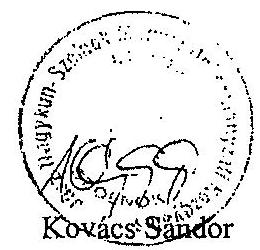

---

# Kovács Sándor úr 

elnöke

Jász-Nagykun-Szolnok Megyei Önkormányzat

## Szolnok

## Tisztelt Elnök Úr!

Tájékoztatom, hogy a Jász-Nagykun-Szolnok Megye Önkormányzata pénzügyi helyzetének elemzéséről készített jelentés-tervezethez küldött észrevételeinek értékelése megtörtént, azokat elfogadtuk és - egy kivétellel - beépítettük a jelentés-tervezetbe.

Az 1. pontban tett észrevételt elfogadjuk, az egy közoktatási intézmény megszüntetéséről és fenntartói jogának pályáztatás útján történő átadásával összefüggő megállapítást - annak meghiúsulása miatt - a jelentés-tervezet Összegző megállapítások, következtetések, javaslatok 2. bekezdéséből, valamint a Részletes megállapítások 1. pont utolsó bekezdéséből töröltük.

A 2. pontban tett észrevételt figyelembe vettük, a Hetényi Géza Kórház-Rendelőintézet lejárt szállítói tartozásával összefüggő megállapítást - annak rendezésére kapott finanszírozási előleg alapján - a jelentés-tervezet 41. lábjegyzet tartalmazza a kiegészítést.

A 3. pontban a pénzügyi helyzet megítéléséhez szükségesnek tartották jelezni, hogy a „működési hiány mértékét jelentősen növelte a településektől átvett szociális és oktatási intézmények működéséhez nyújtott normatíván felüli többlettámogatás" és „2011. évben további két oktatási intézmény átvételére is sor kerül, amely tovább növeli a tárgyévi hiány mértékét." A kiegészítést nem építettük be, mert a
 jelentés-tervezet Összegző megállapítások, következtetések, javaslatok 5. bekezdése tartalmazza, hogy „Az átengedett szja és az állami támogatások együttes összege a központi támogatáscsökkentésen túl a feladat átvétel hatását is figyelembe véve kevesebb lett, 2010-ben 3617 millió Ft volt, a 2007. évi 81,5 %-a”.

A 4. pontban tett észrevételét elfogadjuk, a működéssel összefüggő szállítói és pénzintézeti kötelezettségek teljesítésére javasolt kötvénykibocsátás bevételét és a forgalomképes vagyont, mint lehetséges bevételi forrást a jelentés-tervezet Összegző megállapítások, következtetések, javaslatok részéből töröltük.

---

Köszönettel vettük tájékoztatásukat, hogy a jelentés-tervezetben foglalt megállapításokat és javaslatokat a hatékonyabb és szabályszerű munkavégzés érdekében folyamatosan hasznosítják.

Köszönöm Elnök úr és munkatársai ellenőrzés során tanúsított hozzáállását, amellyel az ellenőrzés megvalósításában részt vettek, azt segítették.

Budapest, 2011. december 19.
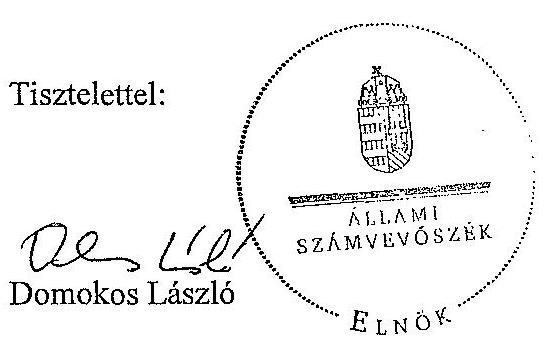

Melléklet: jelentés

---

.
