# ÁLLAMI   SZÁMVEVÔSZÉK 

## JELENTÉS

a Komárom-Esztergom Megyei Önkormányzat pénzügyi helyzetének ellenőrzéséről (43/2)

---

# Számvevői Iroda 

Iktatószám: V-3019-14/2011.
Témaszám: 1015
Vizsgálat-azonosító szám: V056011

## Az ellenőrzést felügyelte:

Dr. Varga Sándor
számvevő igazgató-helyettes

## Az ellenőrzést vezette:

## Renkó Zsuzsanna

számvevő tanácsos

## Az ellenőrzést végezték:

| Varga József | Dr. Lacó Bálintné | Kalmár István |
| :-- | :-- | :-- |
| számvevő tanácsos | számvevő tanácsos | számvevő tanácsos |

A témához kapcsolódó eddig készített számvevőszéki jelentések:
címe
sorszáma
Jelentés a Komárom-Esztergom Megyei Önkormányzat gazdálko- 0753 dási rendszerének 2007. évi átfogó ellenőrzéséről

---

# TARTALOMJEGYZÉK 

BEVEZETÉS ..... 5
I. ÖSSZEGZŐ MEGÁLLAPÍTÁSOK, KÖVETKEZTETÉSEK, JAVASLATOK ..... 12
II. RÉSZLETES MEGÁLLAPÍTÁSOK ..... 17

1. Az Önkormányzat kötelező és önként vállalt feladatai ..... 17
2. Pénzügyi egyensúlyi helyzet alakulása ..... 20
2.1. A múködési és felhalmozási egyensúly alakulása ..... 22
2.2. Az Önkormányzat bevételei ..... 26
2.3. Az Önkormányzat kiadásai ..... 28
3. Kötelezettségek bemutatása ..... 32
3.1. A pénzintézetek felé fennálló kötelezettségek ..... 32
3.2. Szállítók felé fennálló kötelezettségek ..... 39
3.3. Egyéb kötelezettségek ..... 40
4. A pénzügyi egyensúly megteremtése érdekében hozott intézkedések ..... 41
5. A helyi önkormányzatok gazdálkodási rendszerének 2007. évi ellenőrzése során a pénzügyi egyensúly javítására tett szabályszerűségi és célszerűségi javaslatok hasznosulása ..... 46

---

# MELLÉKLETEK 

1. számú Múködési és felhalmozási hiány/többlet az Önkormányzat rendeleteiben melléklet
2/a számú Az Önkormányzat CLF módszer szerint besorolt bevételei és kiadásai 2007melléklet 2010 között
2/b számú Az Önkormányzat bevételeinek és kiadásainak, adósságszolgálatának melléklet alakulása 2007-2010 között
3/a. számú Az Önkormányzat 2010. december 31-én folyamatban lévő fejlesztési fel-
melléklet adataihoz kapcsolódó 2010. évet követő kötelezettségvállalásainak összegzéséről (a folyamatban lévő fejlesztések 2010. utáni kötelezettségvállalásairól)
3/b. számú Az Önkormányzat 2007-2010 években megvalósított, illetve 2010. december 31-én fennálló fejlesztési feladatokhoz kapcsolódó kötelezettségeinek összegzése
2010. decem-
2010. decem-
melléklet 4. számú Komárom-Esztergom Megyei Közgyűlés elnökének észrevétele
melléklet
2010. decem-
2010. december 31-én fennálló fejlesztési feladatokhoz kapcsolódó kötelezettségeinek
összegzése
2007. 

Komárom-Esztergom Megyei Közgyűlés elnökének észrevétele
melléklet
lasz

---

# RÖVIDÍTÉSEK JEGYZÉKE 

## Törvények

Áht.
ÁSZ tv.

Htv.

Ötv.
Szórövidítések
APEH
ÁSZ
BM
EDP hiány/egyenleg

EU
GDP
Hivatal
Illetékhivatal
Kórház
Könyvtár
Közgyűlés
KSH
Levéltár
Mentálhygiénes és Rehabilitációs Intézmény
Múzeum
NGM
OEP
Önkormányzat
PPP konstrukció
SNA
szja
SzMSz
az államháztartásról szóló 1992. évi XXXVIII. törvény az Állami Számvevőszékről szóló 1989. évi XXXVIII. törvény (2011. július 1-jétől az Állami Számvevőszékről szóló 2011. LXVI. törvény)
a helyi önkormányzatok és szerveik, a köztársasági megbízottak, valamint egyes centrális alárendeltségủ szervek feladat- és hatásköreiről szóló 1991. évi XX. törvény
a helyi önkormányzatokról szóló 1990. évi LXV. törvény

Adó- és Pénzügyi Ellenőrzési Hivatal (2011. január 1-jétől Nemzeti Adó és Vámhivatal)
Állami Számvevőszék
Belügyminisztérium
Uniós módszertan szerinti maastrichti kritériumoknak megfelelő számítás szerinti hiány/egyenleg
Európai Unió
Bruttó hazai termék
Komárom-Esztergom Megyei Önkormányzati Hivatal
Komárom-Esztergom Megyei Illetékhivatal
Komárom-Esztergom Megyei Önkormányzat Szent Borbála Kórháza
Komárom-Esztergom Megyei Önkormányzat József Attila Megyei Könyvtára
Komárom-Esztergom Megyei Önkormányzat Közgyűlése
Központi Statisztikai Hivatal
Komárom-Esztergom Megyei Önkormányzat Levéltára
Komárom-Esztergom Megyei Önkormányzat Mentalhygiénes és Rehabilitációs Intézménye
Komárom-Esztergom Megyei Önkormányzat Múzeumainak Igazgatósága
Nemzetgazdasági Minisztérium
Országos Egészségbiztosítási Pénztár
Komárom-Esztergom Megyei Önkormányzat
Public Private Partnership (Partnerségi együttmúködés közfeladatok ellátására a magánszektor bevonásával)
SNA System of National Accounts (Nemzeti Számlák Rendszere)
személyi jövedelemadó
Komárom-Esztergom Megyei Önkormányzat többször módosított 2/2007. (III. 29.) számú rendelete az Önkormányzat és Szervei Szervezeti és Müködési Szabályairól

---

# **Chemistry**

## **Chemical Reactions**

### **Balancing Chemical Equations**

1. **Write the unbalanced equation:**
   - Example: $$C_3H_8 + O_2 \rightarrow CO_2 + H_2O$$

2. **Balance the equation:**
   - Balance carbon atoms first.
   - Then balance hydrogen atoms.
   - Finally, balance oxygen atoms.
   - Balanced equation: $$C_3H_8 + 7O_2 \rightarrow 3CO_2 + 8H_2O$$

3. **Balance the equation:**
   - Balance oxygen atoms.
   - Finally, balance oxygen atoms.
   - Balanced equation: $$C_3H_8 + 7O_2 \rightarrow 3CO_2 + 8H_2O$$

### **Types of Reactions**

1. **Combination Reaction:**
   - Example: $$2H_2 + O_2 \rightarrow 2H_2O$$

2. **Decomposition Reaction:**
   - Example: $$2H_2O_2 \rightarrow 2H_2O + O_2$$

3. **Single Displacement Reaction:**
   - Example: $$Zn + 2HCl \rightarrow ZnCl_2 + H_2$$

4. **Double Displacement Reaction:**
   - Example: $$AgNO_3 + NaCl \rightarrow AgCl + NaNO_3$$

5. **Combustion Reaction:**
   - Example: $$CH_4 + 2O_2 \rightarrow CO_2 + 2H_2O$$

## **Stoichiometry**

### **Mole Concept**

- **Mole (mol):** The amount of substance containing as many particles (atoms, molecules, ions) as there are atoms in exactly 12 grams of carbon-12.
- **Avogadro's Number:** $$6.022 \times 10^{23}$$ particles per mole.

### **Molar Mass**

- **Molar Mass:** The mass of one mole of a substance.
- Example: The molar mass of water ($$H_2O$$) is 18.015 g/mol.

### **Calculations**

1. **Moles to Mass:**
   - Formula: $$n = \frac{m}{M}$$
   - Example: Calculate the number of moles of $$H_2O$$ in 18 grams of water.
     - $$n = \frac{18.015 \, \text{g}}{18.015 \, \text{g/mol}} = 18.015 \, \text{g/mol}$$

2. **Moles to Mass:**
   - Formula: $$m = n \times M$$
   - Example: Calculate the mass of 18.015 g of water.
     - $$m = 18.015 \, \text{g/mol} = 18.015 \, \text{g/mol}$$

## **Gas Laws**

### **Ideal Gas Law**

- **Equation:** $$PV = nRT$$
- **Variables:**
  - $$P$$: Pressure (atm)
  - $$V$$: Volume (L)
  - $$n$$: Number of moles (mol)
  - $$R$$: Ideal gas constant (0.0821 L·atm/mol·K)
  - $$T$$: Temperature (K)

### **Boyle's Law**

- **Equation:** $$P_1V_1 = P_2V_2$$
- **Variables:**
  - P₁: Pressure (atm)
  - P₂: Volume (L)
  - P₃: Temperature (K)
  - P₁: Pressure (atm)
  - P₂: Volume (L)
  - P₃: Temperature (K)
  - P₁: Pressure (atm)
  - P₂: Volume (L)
  - P₃: Temperature (atm)
  - P₁: Pressure (atm)

### **Boyle's Law**

- **Equation:** $$P_1V_1 = P_2V_2$$
- **Variables:**
  - P₁: Pressure (atm)
  - P₂: Volume (L)
  - P₃: Temperature (K)
  - P₁: Pressure (atm)
  - P₂: Volume (L)
  - P₃: Temperature (atm)
  - P₁: Pressure (atm)
  - P₂: Volume (L)
  - P₃: Temperature (atm)
  - P₁: Pressure (atm)

## **Thermochemistry**

### **Enthalpy (H)**

- **Definition:** The heat content of a system at constant pressure.
- **Equation:** $$\Delta H = q_p$$
- **Variables:**
  - $$q_p$$: Heat transferred at constant pressure.
  - $$q_p$$: Heat transferred at constant pressure.
  - $$\Delta H$$: Heat transferred at constant pressure.

### **Hess's Law**

- **Statement:** The enthalpy change for a reaction is the same whether it occurs in one step or multiple steps.
- **Example:** The enthalpy change for a reaction is the change of the enthalpy change for a reaction at constant pressure.

### **Calculations**

1. **Moles to Mass:**
   - Formula: $$n = \frac{m}{M}$$
   - Example: Calculate the moles of $$H_2O$$ in 18 grams of water.
     - $$n = \frac{18.015 \, \text{g}}{18.015 \, \text{g/mol}} = 18.015 \, \text{g/mol}$$

2. **Moles to Mass:**
   - Formula: $$m = n \times M$$
   - Example: Calculate the mass of 18.015 g of water.
     - $$m = 18.015 \, \text{g/mol} = 18.015 \, \text{g/mol}$$

## **Electrochemistry**

### **Oxidation and Reduction**

- **Oxidation:** Loss of electrons.
- **Reduction:** Gain of electrons.
- **Example:** The oxidation of oxygen to oxygen is $$O_2 \rightarrow O_2 + O_2$$

### **Galvanic Cells**

- **Definition:** A cell that converts chemical energy into electrical energy.
- **Components:**
  - Anode: Oxidation occurs.
  - Cathode: Reduction occurs.
  - Salt Bridge: Connects the two half-cells.

### **Nernst Equation**

- **Equation:** $$E = E^\circ - \frac{RT}{nF} \ln Q$$
- **Variables:**
  - $$E$$: Energy (K)
  - $$R$$: Ideal gas constant (0.0821 L·atm/mol·K)
  - $$T$$: Temperature (K)
  - $$n$$: Number of electrons transferred
  - $$F$$: Faraday constant (96,485 C/mol)
  - $$Q$$: Reaction quotient

---

# JELENTÉS 

## a Komárom-Esztergom Megyei Önkormányzat pénzügyi helyzetének ellenőrzéséről

## BEVEZETÉS

Az Állami Számvevőszék 2011. évtől érvényes stratégiája új irányt szabott a helyi önkormányzatok gazdálkodásának ellenőrzésében is. Az ÁSZ - küldetése és jövőképe szerint - szilárd szakmai alapokra támaszkodva értékteremtő ellenőrzéseivel és helyzetelemzéseivel az államháztartás egészében, így a helyi önkormányzati alrendszerben is elő kívánja segíteni a közpénzek és a közvagyon szabályos, gazdaságos, hatékony és eredményes hasznosítását. E folyamat részeként - a 2010. évi államháztartási hiány alakulásának összetevőire is figyelemmel - megkezdődött az önkormányzati alrendszer pénzügyi helyzetelemzése.

Az NGM 2011 áprilisában közzétett adatai szerint ${ }^{1}$ a 2010. évi 1036,2 milliárd Ft összegű, 3,8\%-os EDP (maastrichti kritériumok szerinti, Túlzott Hiány Eljárás keretében kimutatott) hiánycél nem volt tartható, az önkormányzati alrendszer tervezettet meghaladó hiánya miatt a GDP arányában kifejezett államháztartási hiány $4,2 \%$-ra emelkedett.

Az önkormányzatok költségvetési jelentése szerint 2010. első háromnegyedév végén az önkormányzati alrendszer finanszírozási műveletek nélküli GFS rendszerú hiánya 97 milliárd Ft volt a tervezett éves mérték $51 \%$-át érte el. Bár az elmúlt években kiugróan magas hiány halmozódott fel az utolsó negyedévben, a 97 milliárd Ft-os szeptember végi hiány nem indokolta az önkormányzati alrendszer 190 milliárd Ft-ra becsült éves hiányának felülvizsgálatát. A tervezett hiány túllépése, az utolsó negyedévi 150 milliárd Ft-os pénzforgalmi hiány nem volt reálisan feltételezhető. A helyi önkormányzatok januári gyorsjelentése szerint a pénzforgalmi hiány 247,7 milliárd Ft-ot tett ki. A tervezettnél nagyobb önkormányzati pénzforgalmi hiány kialakulásában - az NGM által az éves költségvetési beszámoló elkészítéséhez kiadott tájékoztató szerint - az iparűzési adó elmaradása, a gépjárműadó, az illetékek és más bevételek tervezettnél alacsonyabb összegben teljesülése volt a meghatározó.

A megyei önkormányzatok kötelező feladatellátását többlépcsős törvényi előírások határozzák meg. A feladatokra vonatkozó szabályozás első szintjét az

[^0]
[^0]:    ${ }^{1}$ NGM Tájékoztatás Magyarország Strukturális Reformprogramjának végrehajtásáról (2011. április 1). A Tájékoztató évente két alkalommal - április és október hónapban jelenik meg.

---

Ötv. ${ }^{2}$, a második szintet a hatásköri ${ }^{3}$, a harmadik szintet a további ágazati, szakmai törvények (egyebek mellett az oktatási, egészségügyi, szociális) adják.

A megyei önkormányzatok a feladatellátás és a központi forráselosztás tekintetében sajátos helyet foglalnak el a helyi önkormányzati rendszerben. A megyei önkormányzat kötelező feladatainak egy része - így a megyében lévő természeti és társadalmi muzeális emlékek, a történeti iratok gyűjtése, őrzése, tudományos feldolgozása, a megyei könyvtári szolgáltatás, a pedagógiai és közművelődési szakmai tanácsadás és szolgáltatás, a megyei testnevelési és sportszervezési feladatellátás, a gyermek- és ifjúsági jogok érvényesítése, a gyermekvédelmi- és szociális szakellátás - az Ötv-böl közvetlenül levezethető kötelezettség.

A középiskolai, szakiskolai, és kollégiumi ellátás, a fogyatékos gyermekek oktatása, nevelése, gondozása az ágazati törvény szerint a megyei önkormányzat kötelező feladata. Azonban, ha a települési önkormányzat lát el ilyen feladatot, és arról lemond, a megyei önkormányzatnak a feladatot át kell vennie. Így a megyei önkormányzatok által ellátandó kötelező közszolgáltatások ellátásának mértékére a települési önkormányzatok döntései jelentősen kihatnak.

Az alapellátást meghaladó egészségügyi szakellátás biztosítása akkor képezi a megyei önkormányzat feladatát, ha az önkormányzati vagyon kialakításáról szóló törvénybén ${ }^{4}$ a feladat ellátásához szükséges vagyont az önkormányzat a tulajdonába kapta.

Az önként vállalt feladat ellátására - mivel annak vállalása a kötelező feladatok ellátását nem veszélyeztetheti - a kötelező közszolgáltatások mértékének alakulása lényegi hatással van.

A feladat és hatáskör telepítés sajátosságai mellett a megyei önkormányzatok kialakított forrásszerkezete, a forrásszabályozásból adódó szűk mozgástere, a központi költségvetéstől való erőteljes függősége is determinálja az önkormányzatok feladatellátásra vonatkozó döntéseit.

A 2007-2010. években az önkormányzati feladatok ellátásának keretet biztosító forrásszabályozás - ennek részeként az illetékbevételből és a személyi jövedelemadóból való részesedés szabályai - a megyei önkormányzatok vonatkozásában nem változtak:

- A megyei önkormányzatok saját bevételein belül az illetékbevételek döntően az ingatlanpiac stagnálása, majd visszaesése, és egyes illetékkedvezmények bevezetése következtében - megyénként differenciált mértékben ugyan, de - 2010-re általánosan visszaestek. A 2010. évben befolyt 39,2 milliárd Ft illetékbevétel a 2006. évben realizált 71,1 milliárd Ft illetékbevétel alig több mint $55 \%$-a volt. A kieső bevételek pótlására az önkor-

[^0]
[^0]:    ${ }^{2}$ Ötv. 69-70. §-al
    ${ }^{3}$ a Htv.
    ${ }^{4}$ Az egyes állami tulajdonban lévő vagyontárgyak önkormányzatok tulajdonba adásáról szóló 1991. évi XXXIII. törvény.

---

mányzati alrendszer szintjén történtek intézkedések, 2010-ben 5 milliárd Ftot, 2011-ben 1,2 milliárd Ft-ot ellentételezett a központi költségvetés. Az illetékbevételt a megyei önkormányzatok a saját folyó bevételeik között számolják el ${ }^{5}$.

Az illetékek kivetésének és beszedésének joga 2006. december 31-ig a megyei önkormányzatok feladata volt. A 2007. évtől a megyei illetékhivatalok illetékbeszedési feladatait az APEH vette át ${ }^{6}$. Az önkormányzati illetékrészesedési szabályok változatlanok maradtak, azonban az illetékbeszedés költségeit az önkormányzatok illetékbevételeiből átlagos (a Fővárosnál 4,0\%-os, a megyei és megyei jogú városi önkormányzatnál 8,5\%-os) kulcsot alkalmazva vonták le. E döntés következtében azon megyei önkormányzatok, amelyek a 8,5\%-os költségnél kedvezőbb költségszint mellett látták el korábban ezt a feladatot, kedvezőtlenebb helyzetbe kerültek.

- Az önkormányzati alrendszer személyi jövedelemadóból való részesedésének makroszintű szabályozása nem változott 2007-2010 között7. A helyi önkormányzatokat normatív módon megillető $32 \%$-os részesedés visszaosztásának részletszabályai azonban a megyei önkormányzatok számára - a reálgazdaság kedvezőtlen irányú folyamatai, és az államháztartás egyensúlyi helyzetére tekintettel elrendelt kormányzati intézkedések miatt - megszorító intézkedéseket jelentettek. Összesen 17 milliárd Ft - 2007-ben 10 milliárd Ft, 2010-ben további 7 milliárd Ft - szja-t vontak ki a megyei önkormányzatok gazdálkodási köréből ${ }^{8}$. Az átengedett személyi jövedelemadó a megyei önkormányzatok egyik bevétele.

A megyei önkormányzatok 2007-2010 között rendelkezésre álló forrásait az alábbiakban mutatjuk be:

[^0]
[^0]:    ${ }^{5}$ A megyei önkormányzatok illetékbevételei az önkormányzati alrendszer saját folyó bevételeiből 2007-ben 35,9 milliárd Ft-ot ( $61,4 \%$-ot), 2008-ban 41,5 milliárd Ft-ot ( $61,7 \%$-ot), 2009-ben 36,5 milliárd Ft-ot ( $62,5 \%$-ot), 2010-ben 25,1 milliárd Ft-ot $(64,1 \%$-ot) tettek ki.
    ${ }^{6}$ Az egyes pénzügyi tárgyú törvények módosításáról szóló 2006. évi LXI. törvény 115. §a, amely az adózás rendjéről szóló 2003. évi XCII. törvény 73. §-át módosította.
    ${ }^{7}$ A megyei önkormányzatok személyi jövedelemadó részesedése az önkormányzati alrendszer átengedett bevételeiből 2007-ben 34,7 milliárd Ft-ot ( $7,0 \%$-ot), 2008-ban 51,2 milliárd Ft-ot ( $9,2 \%$-ot), 2009-ben 59,2 milliárd Ft-ot ( $9,3 \%$-ot), 2010-ben 56,3 milliárd Ft-ot $(8,3 \%$-ot) tett ki.
    ${ }^{8}$ A megyei önkormányzatok szja kiegészítése háromelemű. A tételes, minden megyére egységesen meghatározott összeg - az adott évek költségvetési törvényeinek 4. sz. mellékletében meghatározottak szerint - 2006-ban 593 millió Ft, 2007-ben és 2008-ban egyaránt 355 millió Ft, 2009-ben 370 millió Ft volt. A megye népességszáma után járó kiegészítés a 2006. évi 208 Ft/fő összegről 2010-re 120 Ft/fő-re, a megyei intézmények ellátottjai után járó kiegészítés 42236 Ft/ellátottról 20755 Ft/ellátottra csökkent.

---

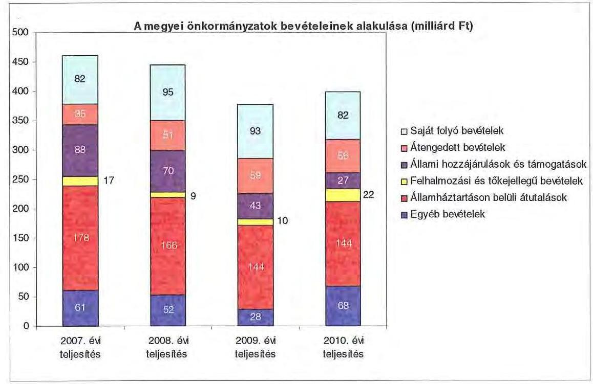

A megyei önkormányzatok saját folyó bevételeinek részaránya - amelyek fơbb elemei: az intézményi térítési díjak, az illetékbevétel, a kamatbevételek - a 2007. évi összbevételen ( 461 milliárd Ft) belül 17,9\% volt, amely 2010-re annak ellenére 20,6\%-ra nőtt, hogy az összege 82 milliárd Ft maradt. Ennek oka az volt, hogy az összbevétel a 2007. évi 461 milliárd Ft-ról 2010-re 399 milliárd Ftra csökkent.

Az átengedett bevételek, amelyek a megyei önkormányzatoknál a személyi jövedelemadóból való részesedést jelentették, az összbevételen belül a 2007. évi 35 milliárd Ft-ról 56 milliárd Ft-ra nőttek.

Az állami hozzájárulások és támogatások - amelyek főbb elemei: az ellátotti létszámhoz kötődő normatív állami hozzájárulások, központosított, fejezeti szinten kezelt céleloóirányzatból juttatott múködési és fejlesztési támogatások a 2007. évi 88 milliárd Ft-ról (19,1\%-os részarányról) 2010-re 27 milliárd Ft-ra ( $6,8 \%$-os részarányra) estek vissza.

A felhalmozási és tőkejellegű bevételek - tárgyi eszközök (ingatlanok és ingóságok), föld és immateriális javak, részesedések értékesítése, EU-tól átvett pénzeszközök - a 2007. évi 17 milliárd Ft-ról (3,6\%-os részarányról) 2010-re 22 milliárd Ft-ra ( $5,4 \%$-ra) emelkedtek.

Az államháztartáson belüli átutalások részesedése 2007-ben 178 milliárd Ft volt. 2010. év végére 34 milliárd Ft-tal csökkent, részaránya 38,6\%-ról 2,6 százalékpontos csökkenés után 2010-ben 36\%-ra változott. Ez a bevételi kategória tartalmazza az egészségbiztosítási és egyéb elkülönített állami pénzalapoktól átvett forrásokat. A 2010-ben e címen elszámolt bevétel 144 milliárd Ft volt.

---

A megyei önkormányzatok központi költségvetésből származó bevételeinek összege 2007-ben 400 milliárd Ft volt, amely 2010. évre 331 milliárd Ft-ra (az időszak alatt összesen 69 milliárd Ft-tal) 17,3\%-kal csökkent.

Az egyéb, pénzmaradványból, vállalkozási bevételekből, államháztartáson kívülről származó átutalásokból, a hitelekből, a hosszú és rövid lejáratú értékpapírok értékesítéséből származó bevételek részesedése a 2007-2010. évek viszonylatában 13,3\%-ról 17,1\%-ra emelkedett. Ez utóbbiak 2010. évi beszámoló szerinti összevont teljesítése 68 milliárd Ft volt9.

Mindezeket figyelembe véve 2007 és 2010-ben a megyei önkormányzatok forrásösszetételének megoszlását az alábbi ábra szemlélteti:
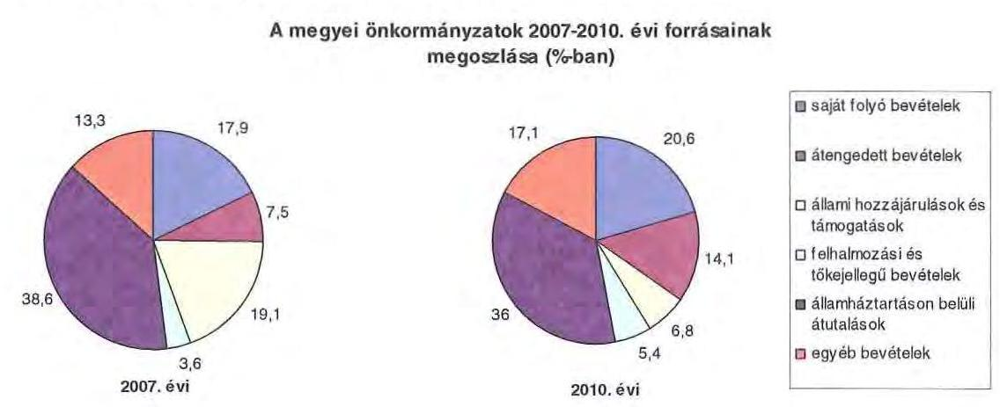

Annak ellenére, hogy a megyei önkormányzatok kötelezően ellátandó feladataikat 2007-hez képest kevesebb intézményben, csökkenő foglalkoztatotti létszám mellett végezték ${ }^{10}$, a jelentős bevételkiesést a - szervezési intézkedések hatására - csökkenő ráfordítások nem tudták kompenzálni. Az ellátottak száma a szociális, gyermekvédelmi ágazat bentlakásos elhelyezést nyújtó intézményeit kivéve - eltérő mértékben ugyan, de minden ágazatban évről évre csökkent, amely a fajlagos hozzájárulások csökkenésével együtt a normatív állami hozzájárulás arányának visszaeséséhez vezetett.

A 2007-2013-as időszakra meghirdetett, vissza nem térítendő EU-s fejlesztési forrásokhoz való hozzájutás lehetősége felerősítette az önkormányzati alrendszer fejlesztési igényeit. A fokozott fejlesztési tevékenység a felhalmozási bevételek és kiadások egyensúlyának megbomlásán ${ }^{11}$ túl a jelentkező jövőbeni fenntartási kötelezettség miatt tovább terhelhetik az önkormányzatok költségvetését.

[^0]
[^0]:    ${ }^{9}$ Az egyéb bevételek összege 2007-2010 között eltérő módon változott, 2007-ben 61 milliárd Ft volt, 2008-ban 52 milliárd Ft-ra, 2009-ben 28 milliárd Ft-ra esett vissza, majd 2010-ben ismét - 68 milliárd Ft-ra - emelkedett.
    ${ }^{10}$ a BM által 2010 decemberében elvégzett felmérés adatai szerint
    ${ }^{11}$ Az önkormányzati alrendszerben - az éves zárszámadási törvényjavaslatok általános indokolása, X. Helyi önkormányzatok gazdálkodása fejezet szerint - a felhalmozási bevételek és kiadások egyenlege 2007-ben 142,4 milliárd Ft, 2008-ban 112,3 milliárd Ft, 2009-ben 234,5 milliárd Ft hiányt mutatott.

---

A megyei önkormányzatok felhalmozási és müködési célú pénzintézeti és szállítói kötelezettségeinek állománya a vizsgált időszakban erőteljesen növekedett.

A hosszú lejáratú kötelezettségeket a következő ábra szemlélteti:
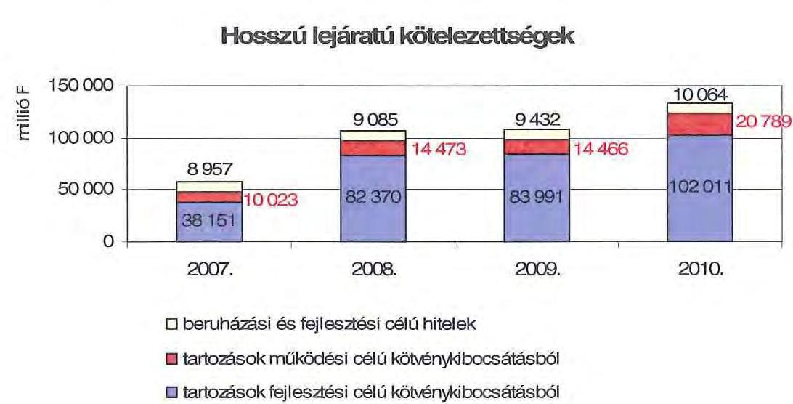

A hosszú lejáratú kötelezettségek mellett az időszakban a 2007. évi 22 milliárd Ft-ról 24 milliárd Ft-ra ( $8,8 \%$-kal) növekedett az áruszállításból származó szállítói kötelezettségek állománya.

A mérlegben kimutatott kötelezettségek állománya mellett az elhasználódott eszközök pótlására forrást biztosító amortizációs (felújítási) alap képzésének ${ }^{12}$ elmaradása további problémákat vetít előre. A megyei önkormányzatok beszámolójelentéseinek összegzése szerint 2007-ben még az elszámolt értékcsökkenés $90 \%$-ának megfelelő összeget fordítottak felújítási célokra, 2009-ben ez az arányszám már csak $16,5 \%$ volt. Ez maga után vonta a feladatellátást kiszolgáló tárgyi eszközök állagának erőteljes romlását.

Az ÁSZ a 2011. évi ellenőrzési tervében a 43. számú, az „Önkormányzatok gazdálkodási rendszerének ellenőrzése" részeként egy időben, egymással párhuzamosan tekinti át és elemzi az önkormányzati alrendszer középszintjét jelentő 19 megyei önkormányzat pénzügyi helyzetét. A gazdálkodás szabályszerűségét az ÁSZ előző évek során ellenőrizte a megyei önkormányzatoknál is, ezért jelen vizsgálatunk erre nem tér ki.

A jelentés a megyei önkormányzatok sajátos feladatellátási és forrásszabályozási helyzetére tekintettel a megyei önkormányzatok pénzügyi helyzetét, illetve az ezzel összefüggő korábbi ÁSZ javaslatok megvalósítását mutatja be.

Az ellenőrzés a 2007. január 1. - 2011. március 31. közötti időszakot ölelte fel.

[^0]
[^0]:    ${ }^{12}$ Erre a jelenlegi szabályozási környezetben nem kötelezi semmilyen előírás az önkormányzatokat.

---

A vizsgálat jogszabályi alapját 2011. július 1-je előtt az Állami Számvevőszékről szóló 1989. évi XXXVIII. törvény 2. § (3), (5), (6) és (9) bekezdéseiben, az Ötv. 92. § (1) bekezdésében és az Áht. 104. § (3) bekezdésében, 2011. július 1-jét követően az Állami Számvevőszékről szóló 2011. évi LXVI. törvény 1. § (3) bekezdésében, az 5. § (2)-(6) bekezdéseiben és az Áht. 120/A. § (1) bekezdésében foglalt előírások képezték.

Komárom-Esztergom megye országos és régión belül elfoglalt helyzetét 2010. december 31-én az alábbi mutatók szemléltetik (megyei jogú várossal együtt):

Index: az előző év azonos időszak (időpontja)=100,0

| Mutató megnevezése | Komárom-   Esztergom   megye | Közép-   dunántúli   régió | Országos |
| :-- | :--: | :--: | --: |
| Népesség száma (ezer fő)* | 312 | 1095 | 9986 |
| Népesség változás indexe (\%) | 100,0 | 99,6 | 99,7 |
| Az ipari termelés volumenindexe (\%) | 101,3 | 104,6 | 110,7 |
| Egy lakosra jutó ipari termelési érték (ezer | 7964,6 | 4359,8 | 2044,4 |
| Ft) | 127 | 135 | 165 |
| Ezer lakosra jutó vállalkozások száma (db) | 402,9 | 280,9 | 304,7 |
| A beruházások egy lakosra vetített telje- | 54,6 | 52,1 | 49,5 |
| sítményértéke (ezer Ft) | 8,6 | 9,4 | 10,8 |
| Foglalkoztatási arány (\%) | 130085 | 124133 | 132628 |
| Munkanélküliségi ráta (\%) | 109,3 | 109,1 | 106,9 |
| Alkalmazásban állók havi nettó átlagkeresete (Ft) |  |  |  |
| Alkalmazásban állók havi nettó átlagkeresetének indexe (\%) |  |  |  |

Ebből Tatabánya Megyei Jogú Város népessége: 71072 fő
A mutatók azt jelzik, hogy Komárom-Esztergom megye a gazdaság helyzetét reprezentáló egyes mutatók - az ipari termelés volumenének változása, az ezer lakosra jutó vállalkozások száma - tekintetében elmarad az országos és a Kö-zép-dunántúli régiót jellemző adatoktól. Ugyanakkor mind a régiós, mind pedig az országos értékeknél kedvezőbb a munkanélküliségi mutatója, az alkalmazásban állók havi nettó átlagkeresetének változása és az egy lakosra jutó ipari termelési érték. Ez utóbbi az országos érték háromszorosát meghaladja, így az adatok alapján a megye a régió meghatározó gazdasági ereje.

A megyében 76 települési - egy megyei jogú városi, 10 városi, 3 nagyközségi és 62 községi - önkormányzat múködött.

---

# I. ÖSSZEGZŐ MEGÁLLAPÍTÁSOK, KÖVETKEZTETÉSEK, JAVASLATOK 

Az Önkormányzat adatszolgáltatása szerint 2010-ben költségvetési kiadásából 13436 millió Ft-ot ( $99,2 \%$ ) kötelező, 107 millió Ft-ot ( $0,8 \%$ ) önként vállalt feladatai ellátására fordított. A kötelező és önként vállalt feladatok körét az Ötv. és az ágazati törvények által meghatározottnak tekintették. Önként vállalt feladataik terjedelmét, az ahhoz biztosított forrásokat az éves költségvetési rendeletekben határozták meg.

Az Önkormányzat önként vállalt feladatai kiemelten a kultúra, a művészeti, szórakoztató és szabadidős tevékenységhez, egyes idegenforgalmi, turisztikai szolgáltatásokhoz, a tehetséggondozás, a szakképzés támogatásához kapcsolódtak, a 2010. évben alapot hoztak létre a megye lakosai közül a természeti katasztrófák károsultjainak támogatására.

Az Önkormányzat kötelező és önként vállalt feladatait 2010. december 31 -én 21 költségvetési szervvel látta el. A Hivatal és a költségvetési intézményként múködő Kórház mellett négy intézmény szociális és gyermekvédelmi, 10 intézmény közoktatási, három intézmény kulturális és közművelődési, két intézmény egyéb feladatokat lát el. Az intézmények száma a 2007-2010. évek között két intézmény települési önkormányzatoktól történő átvétele, hat intézmény más önkormányzat, illetve többcélú kistérségi társulás részére történő átadása, három intézmény kiszervezése (kettő egyház részére, egy pedig gazdasági társaság részére), továbbá intézmények összevonása (mely összesen hét, ebből négy szociális otthoni ellátást, három közoktatási feladatokat ellátó intézményt érintett), megszüntetése (három gazdasági ellátó szervezet) eredményeként alakult ki. A feladatokat 49 telephelyen látják el. A telephelyek száma nem változott, annak ellenére, hogy az Önkormányzat által működtetett intézmények száma a 2006-2010. évek között 17 -tel csökkent.

Az Önkormányzat kizárólagos tulajdonosa egy gazdasági társaságnak, mely ténylegesen már nem működik, ezért annak értékesítését tervezi. Ezen túlmenően $1,6 \%$-os ( 1,0 millió Ft) összegű tulajdonosi részesedéssel rendelkezik a Komáromi Monostori Erőd Kft-ben.

A vizsgált időszakban az Önkormányzatnál - a folyó pénzügyi helyzet elemzéséhez alkalmazott 2/a. számú CLF módszer szerint - a folyó költségvetés egyenlege a működési jövedelem a 2007., valamint a 2009. években negatív összegű volt. A folyó bevételek nem nyújtottak fedezetet a folyó múködési kiadásokra. A 2008., valamint a 2010. évben a folyó bevételek ugyan meghaladták a folyó kiadások összegét, a múködési célú megtakarítások azonban az esedékes tőketörlesztéshez már nem voltak elégségesek. Így a nettó múködési jövedelem valamennyi évben negatív összegű volt, a 2007-2010. években összesen -1757 millió Ft.

A múködési forráshiány kialakulását leginkább az okozta, hogy az Önkormányzat legföbb bevételi forrásainak - a jogszabályi kedvezmények bővü-

---

lése és az ingatlanforgalom visszaesése következményeként az illetékbevétel, valamint a központi forráskivonás, az átengedett szja, az ellátottak számában bekövetkezett változás hatására az állami támogatások - összege a 2007. évi 6201 millió Ft-tal szemben a 2010. évben 3427 millió Ft volt, 2774 millió Ft-tal ( $44,7 \%$-kal) csökkent.

Az illetékbevétel - a 2/b. számú melléklet alapján - 2010-re a 2006. évi 2105 millió Ft 57,2\%-ára, 1204 millió Ft-ra csökkent. Az átengedett szja és az állami támogatások együttes összege a központi forráskivonás hatására, valamint az ellátotti létszám visszaesését is figyelembe véve kevesebb lett, 2010-ben 2223 millió Ft volt, amely a 2007. évi 4456 millió Ft-nak a 49,9\%-a. A Kórház múködtetéséhez biztosított OEP támogatás a 2007. évben 5490 millió Ft volt, amely a 2010. évben 6415 millió Ft-ra ( $16,8 \%$-kal) emelkedett. Az egyéb saját bevételek 2007-ről 2010-re 540 millió Ft-tal ( $23,0 \%$-kal) nőttek.

Az Önkormányzat folyó múködési kiadása a 2007. évi 14215 millió Ft-ról 14,7\%-kal, 2094 millió Ft-tal (12 121 millió Ft-ra) csökkent a 2010. évre.

A folyó működési kiadásokon belül az Önkormányzatnál meghatározó szerepe van a Kórház múködési kiadásai alakulásának.

Az intézmények teljesített múködési kiadásai - Kórház nélkül - 2007-ben 7959 millió Ft-ot tettek ki (az összes múködési kiadás 56,0\%-át), amely 2010-re 5609 millió Ft-ra (az összes múködési kiadás 46,3\%-ára) csökkent.

Az Önkormányzat 2007-2010 között a Kórház múködési kiadásaihoz 634 millió Ft-tal járult hozzá, amelyet központosított állami támogatásokból fedezett. A kórházi múködési támogatások a központi bérpolitikai intézkedésekhez, a létszámcsökkentésekhez kapcsolódó többletköltség fedezetéhez, a 13. havi juttatások kifizetéséhez, kereset kiegészítésekhez kapcsolódtak.

A 2007-2010. években az Önkormányzat felhalmozási költségvetésének egyenlege folyamatosan negatív volt, amely a vizsgált években összesen 2303 millió Ft felhalmozási forráshiányt okozott.

A múködési és felhalmozási kiadáson belül a 2007-2010. évek között a felhalmozási kiadások súlya 1023 millió Ft-ról, ( $7,2 \%$-ról) 1236 millió Ft-ra, ( $9,1 \%$-ra) nőtt. Az Önkormányzat a Kórháznak felhalmozási célokra csak a 2010. évben biztosított 146 millió Ft támogatást a Kórház struktúraváltást és energetikai korszerűsítést célzó pályázataihoz. A 2010. utánra vállalt felhalmozási célú kötelezettségek összege 5692 millió Ft. Ez utóbbiak forrásai: 811 millió Ft kötvény bevétel, 4171 millió Ft elnyert európai uniós támogatás, továbbá 710 millió Ft elnyert hazai társfinanszírozás.

Az Önkormányzat pénzintézeti kötelezettségeinek állománya a könyvviteli mérlegadatok szerint 2006. december 31-ről 2010. december 31-re 738 millió Ft-ról 8302 millió Ft-ra, több mint 11-szeresére nőtt. Az Önkormányzat 2010. év végi pénzintézeti kötelezettségéből 6969 millió Ft ( $84,0 \%$ ) kötvénykibocsátásból, 277 millió Ft ( $3,3 \%$ ) felhalmozási célú hosszú lejáratú hitel felvételéből, 558 millió Ft ( $6,7 \%$ ) múködési célú hosszú lejáratú hitel igénybevételéből, továbbá 498 millió Ft ( $6,1 \%$ ) költségvetési év végén ki nem egyenlített folyószámla hitelből keletkezett. Az adósságot keletkeztető kötelezettségvállalások teljesí-

---

tésének az Önkormányzat emelkedő folyószámlahitel állománnyal és 2010. után ismételten ${ }^{13}$ igénybevett munkabérhitellel tudott eleget tenni. A vizsgált időszakban adósságszolgálatra az Önkormányzat 1299 millió Ft-ot teljesített, amelyből a kamatkiadás 794 millió Ft volt, ezen belül a felvett kötvénnyel kapcsolatosan fizetett kamat összege 397 millió Ft. A kötvényből származó források befektetéséből realizált kamatbevétel 891 millió Ft.

A 2010. évben 343 napon keresztül 299 millió Ft volt a folyószámla hitel átlagos napi állománya. A munkabér megelőlegezési hitel 2010-ben 48 napon keresztül 129 millió Ft-os átlagos napi állománnyal állt fenn.

Ezek miatt az Önkormányzatnak a 2011-2013. években 1052 millió Ft és 2580 ezer CHF tőketörlesztést és kamatfizetést ${ }^{14}$ kell teljesítenie. Az Önkormányzat 2010. év végi szállítói tartozása 572 millió Ft (ebből lejárt 197 millió Ft).

A 2011-2013. évi összes (pénzintézeti és szállítói) kötelezettség teljesítésére figyelembe vehető 2234 millió Ft szabad pénzmaradvány, 773 millió Ft jelzáloggal nem terhelt forgalomképes ingatlanvagyon, és 73 millió Ft követelésállomány. Ez összegszerűen fedezetet nyújt a kötelezettségekre, kockázatot jelent azonban, hogy a szabad pénzmaradványt már a 2011. évre tervezett költségvetési hiány forrásaként is figyelembe kellett venni, továbbá, hogy a vagyonelemek egyidejú értékesítésénél alacsonyabb értéken realizálódhat az árbevétel.

A 2010. december 31-i pénzintézeti kötelezettségállományból a 2013. évet követően fennálló kötelezettségek összege: 357 millió Ft, és 30981 ezer CHF. Ezekre figyelembe vehető források nem számszerűsítettek.

Kockázatot jelent az Önkormányzat számára, hogy a számlavezetője, a rövid lejáratú hitelt biztosító és a kötvénykibocsátással megbízott egyik pénzintézete ugyanazon bank, így a pénzintézet a kockázatokat összevontan értékelve amely a helyszíni vizsgálat idején még nem érzékelhető - a jövőben kedvezőtlenebb hitelkonstrukciókat alkalmazva nyújthat hitelt.

A közgyűlési előterjesztések nem tartalmazták a kötelezettségvállalások visszafizetési forrásait, a teljes futamidő várható kamat- és tőkefizetési kötelezettségeit, az árfolyam- és kamatkockázatok bemutatását. Az adósságot keletkeztető kötelezettségvállalással megvalósított felhalmozási kiadások esetleges bevételt növelő, illetve kiadást csökkentő vonzatát, továbbá ezeknek a fejlesztéshez, felújításhoz vállalt kötelezettségek visszafizetési forrásként való számbavételét nem vizsgálták.

Az Önkormányzat nem vizsgálta azt sem, hogy az elhasználódott eszközök pótlása milyen kötelezettséget jelent számára. A 2007-2010. években a tárgyi eszközök után 910 millió Ft összegű értékcsökkenést számolt el, ugyanakkor felújításra 350 millió Ft-ot ( $38,6 \%$-ot) fordítottak.

[^0]
[^0]:    ${ }^{13}$ Az Önkormányzat 2007-ben vett igénybe munkabérhitelt, a 2008-2009. években nem.
    ${ }^{14}$ A 2011. I. negyedévi kamat mértékét alapul véve.

---

Az Önkormányzat a 2010. évi választásokat követően nem fogadott el gazdasági programot. A 2007-2010. évekre szóló programtervezet a kiadáscsökkentő intézkedések számszaki vonatkozásait nem tartalmazta.

A végrehajtott kiadáscsökkentő intézkedések a gazdálkodás átláthatóbbá tételét, valamint a feladatellátás szakmai színvonalának, a pénzügyi helyzetnek a javítását célozták. A 2007-2010. években az intézményátszervezések, a feladatváltozások, valamint a takarékossági intézkedések eredményeként együttesen 1332 millió Ft kiadás megtakarítást mutatott ki, amelyből 882 millió Ft az intézményátadások következtében jelentkezett.

A létszámcsökkentő intézkedések következtében 2007-2010 között a Hivatalnál és az intézményeknél összesen 1068 álláshelyet szüntettek meg, amelyből 743 fő ( $69,6 \%$ ) ágazati szakmai, 325 fő ( $30,4 \%$ ) intézményüzemeltetéshez, fenntartáshoz, gazdasági ügyek intézéséhez kapcsolódó álláshely volt. A megszűnt álláshelyek közül 592 az intézmények átadásához kapcsolódott.

Az Önkormányzat bevételnövelést eredményező intézkedéseket nem tett. Az ingatlanok - ezen belül termőföld - bérbeadásából származó bevétel növekedést a vizsgálat alatt rendelkezésre álló időben nem tudta számszerúsíteni. A tárgyi eszközök értékesítéséből az Önkormányzatnak a 2007-2010. években 738 millió Ft bevétele volt.

Az utóellenőrzés a pénzügyi egyensúly javítására tett kettő szabályszerűségi javaslat hasznosulására terjedt ki, amelyből egy javaslat megvalósult, egyet nem hasznosítottak.

Az Önkormányzat pénzügyi helyzetét összegezve a következők emelhetők ki:

Az önkormányzati bevételt csökkentő központi intézkedések hatását az ellenőrzött időszakban nem egyenlítette ki az Önkormányzat kiadáscsökkentő intézkedéseinek eredménye. A 2007-2010. között átvett oktatási intézmények fenntartása nem befolyásolta az Önkormányzat múködésének biztonságát. A beruházások saját forrásai biztosítottak. Múködési célú kiadásai finanszírozásra folyamatosan és növekvő mértékben vett igénybe az Önkormányzat 2007 és 2010 között folyószámla- és munkabérhitelt, valamint használt fel kötvénykamatot. A likvid hitelek állományának évről évre való emelkedése feszültséget jelez. A hosszú lejáratú kötelezettségek finanszírozásának 2010. évet követő forrása a következő 3 évben biztosított, azt követően az Önkormányzat nem számszerúsítette.

A Közgyűlés elnöke részletes tájékoztatást adott a helyszíni ellenőrzést követően a pénzügyi egyensúly helyreállítására tett intézkedésekről, azonban ezek pénzügyi hatását nem összegzi. A közgyűlés által jóváhagyott 539 millió Ft müködési hiányt finanszírozó hitel felvételére meghirdetett közbeszerzés banki érdektelenség miatt eredménytelen volt. A finanszírozhatóságot 400 millió Ft-tal megemelt folyószámla és 200 millió Ft munkabérhitel igénybevételével tudták biztosítani.

---

A feladatok és források közötti egyensúly megteremtésére irányuló központi döntések, a megyei önkormányzatok konszolidációjára, az intézmények átvételére vonatkozó törvényjavaslat elfogadása új feltételeket teremtett. Mindezek mellett az Önkormányzat pénzügyi egyensúlyának fenntarthatósága rövid- és hosszú távú intézkedésekkel biztosítható.

Az Állami Számvevőszékről szóló 2011. évi LXVI. törvény 33. § (1) bekezdésében foglaltak értelmében a jelentésben foglalt megállapításokhoz kapcsolódó intézkedési tervet köteles az ellenőrzött szervezet vezetője összeállítani és azt a jelentés kézhezvételétől számított harminc napon belül az ÁSZ részére megküldeni. Amennyiben az intézkedési tervet határidőben nem küldi meg a szervezet, vagy az továbbra sem elfogadható, az ÁSZ elnöke a hivatkozott törvény 33. § (3) bekezdés a)-b) pontjaiban foglaltakat érvényesítheti.

A 2011 májusában lezárult helyszíni ellenőrzés tapasztalatai alapján - figyelembe véve az Önkormányzat észrevételeit és a saját hatáskörben tett intézkedéseit - az alábbi javaslatokat tette az ÁSZ:

# a Közgyülés elnökének: 

1. tájékoztassa a Közgyűlést rendszeresen a pénzügyi helyzetről, azon belül a kötelezettségállomány alakulásáról, a feltételekben bekövetkező változásokról, az adósságot keletkeztető kötelezettségek teljesítési feltételeiről;
2. terjesszen - feltételek romlása esetén - a Közgyűlés elé cselekvési tervet a szükséges - üzemgazdasági számításokkal alátámasztott - bevételnövelő, kiadáscsökkentő, beruházások és más kötelezettségek felülvizsgálatát, tartalékok képzését, méretgazdaságos intézményi struktúrát eredményező döntések meghozatala érdekében, a pénzügyi, működés egyensúly mielőbbi biztosítása és fenntarthatósága céljából;
3. gondoskodjon róla, hogy a jövőben az adósságot keletkeztető kötelezettségvállalásokról szóló közgyűlési döntéseket megalapozó előterjesztések tartalmazzák a kötelezettségvállalás visszafizetésének forrásait, a kamat-, egyéb költség és tőkefizetési kötelezettséget, legalább 3 éves kitekintéssel a várható kamat és árfolyamkockázatok bemutatását, és kezelésének lehetőségeit, az adósságkorlát betartását;
4. mutassa be a Közgyűlésnek az éves költségvetési előterjesztésekben az értékcsökkenési leírás összegét, és ezzel arányban az elhasználódott eszközök pótlásának forrásigényét és - lehetőségét;
5. gondoskodjon a pénzintézeti kötelezettségek finanszírozási lehetőségeinek számbavételéről, és arra források biztosításáról;
6. gondoskodjon a fennálló lejárt szállítói tartozás okainak feltárásáról, szerkezetének bemutatásáról - beleértve az intézmények lejárt szállítói állományát -, a szükséges intézkedések megtételéről, indokolt esetben a szállítókkal a lejárt tartozások mielőbbi rendezéséről a kockázatok minimalizálása érdekében.

---

# II. RÉSZLETES MEGÁLLAPÍTÁSOK 

## 1. Az ÖNKORMÁNYZAT KÖTELEZŐ ÉS ÖNKÉNT VÁLlALT FELADATAI

Az önként vállalt feladatok körét az Önkormányzat SzMSz-ében nem rögzítették ${ }^{15}$, arról egyéb belső szabályzatokban sem rendelkeztek. Az e körbe tartozó feladatokat a Közgyűlés által jóváhagyott éves költségvetési és zárszámadási rendeletekben a Hivatal kiadásai között részletezték. Az Önkormányzat 2010. évi beszámolója szerint költségvetési kiadásaiból 13436 millió Ft-ot ( $99,2 \%$ ) a kötelező, 107 millió Ft-ot ( $0,8 \%$ ) az önként vállalt feladatok ellátására fordított.

Az Önkormányzat önként vállalt feladatai az idegenforgalmi, turisztikai szolgáltatásokhoz, kulturális, szabadidős és művészeti tevékenységek, a tehetséggondozás, a szakképzés támogatásához kapcsolódtak, továbbá a 2010. évben alapot hoztak létre a természeti katasztrófák károsultjainak támogatására (25 millió Ft). Kötelező feladatait az Ötv. és az ágazati törvények által meghatározottnak tekinti. Az Önkormányzat kötelezően ellátandó feladatai nagyságát befolyásolták a települési önkormányzatok - pénzügyi helyzetükre, egyéb megfontolásokra tekintettel hozott - korábbi intézmény átadásra vonatkozó döntései. A kötelező feladatokat meghatározó részben saját fenntartásban működtetett intézményekben látták el. A gyermekvédelmi feladatok ellátását egyházi intézmény biztosítja ellátási szerződés alapján.

Az Önkormányzat éves költségvetési kiadásainak szerkezetét tekintve 2010-ben a járulékokkal növelt személyi juttatások és a dologi kiadások 11260 millió Ft-os összegén belül meghatározó arányt ${ }^{16}-6427$ millió Ft-ot, $57 \%$-ot - a Kórháznál elszámolt kiadások jelentették. A szociális és gyermekvédelmi feladatokat ellátó négy intézmény kiadásokból való részesedése 1426 millió Ft, $12,7 \%$, a 10 közoktatási intézményé 2127 millió Ft, $18,9 \%$ volt. A 2010. évben a közoktatási feladatok kiadásait $57,2 \%$-ban, a szociális és gyermekvédelmi feladatok kiadásait $38,7 \%$-ban finanszírozta normatív költségvetési támogatás 1216 millió Ft, illetve 552 millió Ft összegben. A közművelődési feladatok ellátását három intézmény biztosította, kiadási arányuk 3,3\%, 371 millió Ft volt, az igazgatási és egyéb nem kiemelt ágazati feladatokra 909 millió Ft-ot, $8,1 \%$-ot fordítottak.

[^0]
[^0]:    ${ }^{15}$ Erre jogszabályi előirás ma már nem is kötelezi az Önkormányzatot.
    ${ }^{16}$ Az Önkormányzat járulékokkal növelt személyi és dologi kiadásainak ágazatonkénti megbontása a BM részére készített, 2010. december 31-i adatokkal kiegészített adatszolgáltatásból származik.

---

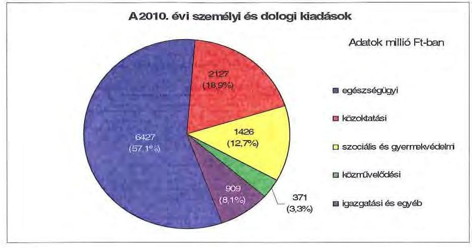

A 2010. évben az Önkormányzat összes költségvetési kiadásából 11706 millió Ft $(86,4 \%)$ az intézmények ${ }^{17}$, a többi a Hivatal költségvetésében szerepelt. A Hivatal költségvetéséből - 1837 millió Ft, (13,6\%), intézményfinanszírozás nélkül - a személyi és dologi kiadásokra 638 millió Ft-ot (34,7\%), a beruházásokra, felújításokra 407 millió Ft-ot ( $22,2 \%$ ), a különböző megyepolitikai feladatokra, szervezetek támogatására és finanszírozási tételekhez kapcsolódó kiadásokra 792 millió Ft-ot $(43,1 \%)$ fordított.

Az önkormányzati feladatokat ellátó költségvetési intézmények száma a 2006. év végén 38 volt, mely intézmények 49 telephelyen müködtek. A 2007-2010. évek között a feladatok önkormányzatok, egyéb szervezetek közötti átadásaátvétele, intézmény átszervezések következtében a költségvetési intézmények száma 17 -tel csökkent, a feladatellátási helyek száma nem változott. 2010. december 31 -én az Önkormányzat által fenntartott költségvetési szervek száma 21 volt, ebből az önállóan működő és gazdálkodó költségvetési szervek száma 14, az intézmények - alapító okirataik szerint - összesen 49 telephelyen müködtek. Az Önkormányzat feladatait az alábbi intézménystruktúrával látta és látja el:

- egészségügyi feladatokat a Szent Borbála Kórház lát el;
- szociális és gyermekvédelmi feladatokat négy intézmény végez (az Önkormányzat Általános Iskolája, Speciális Szakiskolája, Diákotthona és Gyermekotthona, a Pedagógiai és Gyermekvédelmi Szakszolgálati Intézmény, a Mentálhygiénes és Rehabilitációs Intézmény, valamint az Integrált Szociális Intézmény, Esztergom). Az intézmények közül az Önkormányzat Általános Iskolája, Speciális Szakiskolája, Diákotthona és Gyermekotthona önállóan müködő költségvetési szerv;
- közoktatási feladatot 10 intézmény lát el, ebből hat intézmény önállóan múködő és gazdálkodó költségvetési szerv Az Önkormányzat fenntartásában lévő közoktatási intézmények közül hat intézmény középfokú oktatási feladatokat (gimnázium, szakközépiskola, szakiskolai képzés) egy intézmény alapfokú művészetoktatást végez. Az Önkormányzatnak egy önálló kollégi-

[^0]
[^0]:    ${ }^{17}$ Tartalmazza a Komárom-Esztergom Megyei Szakképzés-szervezési Társulás kiadásait is.

---

uma van, továbbá egy-egy intézmény végzi a pedagógiai és gyermekvédelmi szakszolgálati, illetve a speciális általános és szakiskolai feladatokat;

- közgyűjteményi feladatokat a Múzeum, a Levéltár, valamint a Könyvtár lát el;
- igazgatási feladatokat a Közgyűlés hivatala látja el, egy intézmény integrált gazdasági szervezetként működik. A Komárom-Esztergom Megyei Szakképzési Szervezési Társulást az Önkormányzat 324/2007. (XII. 20.) számú határozatával Esztergom és Kisbér önkormányzataival közösen alapította. A társuláshoz hét megyei fenntartású, három esztergomi és egy Kisbér városi fenntartású középfokú intézmény kapcsolódott. A munkaszervezet szervezési-, igazgatási feladatainak ráfordítása az Önkormányzat költségvetésében jelent meg.

Az egyes ágazatok kötelező feladatellátását 2010. december 31-én az alábbi mutatók jellemzik:

| Megnevezés | közoktatás | szociális és   gyermekvéde-   lem | egészségügy | kultúra és   sport |
| :-- | :--: | :--: | :--: | :--: |
| Az ágazatban foglalkozta-   tottak száma (fő) | 582 | 408 | 1121 | 111 |
| Az ágazat intézményeiben   ellátottak összesen (fő) | 4249 | 706 |  |  |
| Fekvőbeteg ellátás férőhe-   lyeinek száma (db) |  |  | 803 |  |

A közoktatási feladatellátás területén a 2006. évi 10168 fő ellátott a 2010. évre 5919 fővel, $58,2 \%$-kal lett kevesebb az intézmény átadások és a demográfiai változások együttes hatására, míg az ágazatban foglalkoztatottak száma kisebb mértékben 376 fővel, $39,2 \%$-kal csökkent.

Az Önkormányzat kizárólagos tulajdonosa a Zöld Fenyő Építőipari, Ingatlanforgalmazó és Szolgáltató Kft-nek. A gazdasági társaság ${ }^{18}$ ténylegesen már nem működik, az APEH-el szemben fennálló tartozás rendezése folyamatban van. A Komáromi Monostori Erőd Kft-ben lévő részesedése nem meghatározó, mindössze $1,6 \%$ ( 1,0 millió Ft).

Az Önkormányzat az áttekintett időszakban Esztergom Város Önkormányzatától 50 ellátottat érintően Időskorúak Otthonának működtetését, valamint Csolnok Község Önkormányzatától 75 tanulóval az alapfokú művészetoktatási feladatok ellátását vette át, mely utóbbi feladatot már meglévő intézményéhez integrált.

Települési önkormányzatnak négy közoktatási intézményt adott át, összesen 1730 tanulót érintően. A Dobó Gimnáziumot, valamint a Bottyán Műszaki

[^0]
[^0]:    ${ }^{18}$ A társaság nem építőipari vállalkozás, csak az idősek otthona céljára épített ingatlant, amelyet az Önkormányzat megvásárolt ezzel a tevékenysége befejeződött.

---

Szakközépiskola fenntartását Esztergom város, a Jókai Gimnáziumot Komárom város, a Szabolcsi Bence Alapfokú Művészetoktatási intézményt pedig Nyergesúffalu város részére adták át. A 800 tanulót ellátó Eötvös Gimnázium, Szakközépiskola és Kollégiumot a tatai Városkapu Zrt. fenntartásába adta.

A tatai Időskorúak Otthonának fenntartását, 156 férőhellyel a Tatai Többcélú Kistérségi Társulás, a Tatabányai Múzeumot pedig Tatabánya Megyei Jogú Város Önkormányzata vette át. A gyermekvédelmi szakszolgálatot, a nevelőszülői hálózatot, a gyermekotthoni ellátást és utógondozást megállapodás alapján a Váci Egyházmegye, majd ezt követően a Szeged-Csanádi Egyházmegye vette át az Önkormányzattól, az átadás 466 ellátottat érintett.

# 2. PÉNZÜGYI EGYENSÚLYI HELYZET ALAKULÁSA 

A hagyományos költségvetési szerkezet helyett az önkormányzat pénzügyi helyzetét a CLF módszerrel mutatjuk be, amelyben jobban elkülönülnek a vagyonnal kapcsolatos bevételek és kiadások a feladatokkal kapcsolatos közvetlen működtetési bevételektől és kiadásoktól. A módszer következetesen elkülöníti a folyó és a felhalmozási költségvetés bevételeit és kiadásait, azok költségvetési egyenlegeit. A tárgyévi pozíciók meghatározása érdekében a figyelembe vett saját folyó bevételek, valamint saját felhalmozási bevételek nem tartalmazzák az előző évi pénzmaradványok felhasználásából származó pénzforgalom nélküli bevételeket ${ }^{19}$.

A bevételek és kiadások besorolása általános közgazdasági meggondolásokon alapul, amely testet ölt az SNA statisztikai módszertanában is. Folyó tételek alatt értjük azokat a bevételeket és kiadásokat, amelyek az önkormányzat vagyoni helyzetét automatikusan nem változtatják. A bevételi oldalon ilyenek az adók, az illeték, az áfa bevételek és visszatérülések, a hozamok és kamatok, a költségvetési támogatások, az egyéb saját bevételek, valamint a múködési célra átvett pénzeszközök és kapott támogatások. A folyó kiadások közé tartoznak a szolgáltatások nyújtásával kapcsolatos múködési kiadások, a kamatkiadások, valamint a múködési célú transzferkiadások ${ }^{20}$. A felhalmozási vagy tőke tételek módosítják az önkormányzat vagyoni helyzetét. A privatizációs bevételek, az immateriális javak és tárgyi eszközök, valamint a részesedések értékesítése csökkentik, a fizikai beruházások és a pénzügyi befektetések növelik a vagyont. A pénzforgalmi bevételek és kiadások nem tartalmazzák a követelések elengedése miatt könyvelt tételeket, mivel ezek egymást kioltó, technikai jellegű elszámolási műveletek.

A folyó költségvetés egyenlege, a múködési jövedelem megmutatja, hogy az önkormányzat éves folyó bevétele fedezetet biztosít-e a kötelező és önként vállalt feladatellátáshoz kapcsolódó éves folyó kiadására. A múködési jövedelem negatív értéke pénzügyileg fenntarthatatlan helyzetet jelez. A mutató pozitív

[^0]
[^0]:    ${ }^{19}$ A költségvetési években kialakuló hiány finanszírozása az előző években képzett tartalékok felhasználásával is történhet.
    ${ }^{20}$ Transzferkiadásoknak azokat a folyó és felhalmozási tételeket nevezzük, amelyeket nem az adott önkormányzat használ fel szolgáltatásnyújtásra (pl.: ellátottak pénzbeni juttatásai, átadott pénzeszközök, garancia- és kezességvállalások stb.).

---

értéke megtakarítást mutat, amely forrásul szolgálhat az önkormányzat fennálló kötelezettségei megfizetéséhez, valamint fejlesztéseihez.

A felhalmozási költségvetés pozitív értéke felhalmozási többletet mutat, amely a jövőbeni fejlesztések forrását biztosíthatja. Amennyiben a folyó költségvetési hiány finanszírozása a felhalmozási többletből történik, ez szűkebb értelemben vagyonfelélésnek tekinthető. Amennyiben a felhalmozási költségvetés megtakarítása fejlesztési célú hitelek, kötvények adósságszolgálatát finanszírozza, az változatlan vagyontömeg mellett, a korábban megelőlegezett tőkebevételek valós realizációjának tekinthető. A felhalmozási deficit által generált finanszírozási igény önmagában nem jár pénzügyi kockázattal, a pénzügyileg fenntartható beruházásokhoz kapcsolódó kötelezettségvállalás (adósságszolgálat) előrelátó, tudatos költségvetési gazdálkodással teljesíthető.

A módszer a pénzügyi kapacitás (más néven a nettó múködési jövedelem) fogalmát helyezi a középpontba. Az adós hitelfelvételi képessége, hosszú távú fizetőképessége vagy bonítása a pénzügyi kapacitással, ezen belül is a nettó működési jövedelemmel jellemezhető. A nettó múködési jövedelem negatív értéke az egyes költségvetési években jelentkező adósságszolgálat túlzott mértékére utal ${ }^{21}$. A nettó működési jövedelem negatív értékének felhalmozási többletből, vagy további hitelből történő finanszírozása pénzügyileg nem fenntartható gazdálkodást vetít előre. A pozitív értéket mutató nettó múködési jövedelem fejlesztési kiadások fedezetét biztosíthatja, illetve a folyamatosan, évenként képződő pozitív nettó müködési jövedelemből meghatározható a jövőben vállalható, teljesíthető éves adósságszolgálat, ily módon az a hitelösszeg, amely - a többi tényezőt, feltételt adottnak tekintve - visszafizetési kockázat nélkül felvehető.

A CLF módszer alapján a pénzügyi kapacitás mértéke az önkormányzat összevont, nettósított, a központi információs rendszerbe a MÁK-on keresztül leadott éves költségvetési beszámolójának 80-as űrlapjában szerepeltetett adatok alapján került meghatározásra. A 2007-2010 közötti időszakban az Önkormányzat CLF módszer szerint besorolt kiadásainak és bevételeinek főbb jogcímek szerinti alakulását a jelentés 2/a. számú melléklete tartalmazza.

Az Önkormányzat bevételeinek és kiadásainak alakulását részletesen a hatályos számviteli előírások szerint készült, összevont éves költségvetési beszámolók adataira alapozva mutatjuk be. A bevételek és kiadások múködési, valamint felhalmozási jogcímekre történő elkülönítését az éves költségvetési beszámolók, a zárszámadási rendeletek, továbbá - amely jogcímek ${ }^{22}$ esetében erre más lehetőség nem volt - az Önkormányzat adatszolgáltatása szerinti megbontás alapján végeztük el. A bevételek elemzése során figyelembe vettük a ko-

[^0]
[^0]:    ${ }^{21}$ Kivéve, ha annak finanszírozására a korábbi években képzett tartalékok fedezetet nyújtanak.
    ${ }^{22}$ Az előző évi maradvány visszafizetésének, az előző évi pénzmaradvány átadásának és átvételének, a kamatkiadásoknak, az egyéb pénzforgalom nélküli kiadásoknak, a hozam- és kamatbevételeknek, az átengedett adóknak, a költségvetési támogatásoknak, továbbá az előző évi pénzmaradvány igénybevételének müködési és felhalmozási részre történő megosztásához az Önkormányzat által szolgáltatott adatokat vettük figyelembe.

---

rábbi években keletkezett pénzmaradvány felhasználásából származó pénzforgalom nélküli bevételeket is. A 2007-2010 közötti időszakban az Önkormányzat bevételeinek és kiadásainak, továbbá adósságszolgálatának alakulását a jelentés $2 / \mathrm{b}$. számú melléklete tartalmazza.

# 2.1. A müködési és felhalmozási egyensúly alakulása CLF módszer szerinti önkormányzati adatok ${ }^{23}$ 

ezer Ft

| Megnevezés | 2007 | 2008 | 2009 | 2010 |
| :--: | :--: | :--: | :--: | :--: |
| Folyó bevételek | 13823902 | 14788856 | 12641623 | 12506193 |
| Folyó kiadások | 14233154 | 14525800 | 13113138 | 12307148 |
| Müködési jövedelem | $-409252$ | 263056 | $-471515$ | 199045 |
| Nettó müködési jövedelem   - müködési jövedelem - tőketörlesztés | $-488907$ | $-593709$ | $-633668$ | $-40322$ |
| Felhalmozási bevételek | 290739 | 505243 | 723223 | 717150 |
| Felhalmozási kiadások | 1023461 | 1524748 | 755164 | 1236386 |
| Felhalmozási költségvetés egyenlege | $-732722$ | $-1019505$ | $-31941$ | $-519236$ |
| Finanszirozási múveletek nélküli (GFS) pozíció | $-1141974$ | $-756449$ | $-503456$ | $-320191$ |
| Finanszirozási műveletek egyenlege | 808142 | 4098653 | 205791 | $-195948$ |
| Tárgyévi pénzügyi pozíció | $-333832$ | 3342204 | $-297665$ | $-516132$ |
| Egyéb tájékoztató adatok |  |  |  |  |
| Összes kötelezettség * | 2314365 | 7400512 | 7309539 | 8989943 |
| ebből rövid lejáratú | 1407750 | 754519 | 736265 | 1238041 |
| Folyószámlabitel napi átlagos állománya ** | 591006 | 637973 | 87600 | 280529 |
| Likvidhitel napi átlagos állománya ** | 0 | 0 | 0 | 0 |
| Munkabérhitel napi átlagos állománya ** | 86428 | 0 | 0 | 17979 |
| Egyéb finanszírozásba vonható eszközök összesen: | 1519378 | 4861582 | 4560677 | 4042918 |
| Tartós hitelviszonyt megtestesítő értékpapírok | 4860 | 4860 | 1620 | 0 |
| Hosszú lejáratú bankbetétek | 0 | 0 | 0 | 0 |
| Értékpapírok | 0 | 0 | 0 | 0 |
| Pénzeszközök év végi állománya (idegen pénzeszközök nélkül) | 1514518 | 4856722 | 4559057 | 4042918 |

* Az összes kötelezettséget a passzív pénzügyi elszámolások nélkül vettiik figyelembe, mert a passzívák a pénzmaradvány elszámolás tételei közé tartoznak.
** A folyószámla- és a munkabér megelőlegezési hitel átlagos állományát 365 nappal számítottuk.

[^0]
[^0]:    ${ }^{23}$ A 2007. évben az önkormányzatok Magyar Államkincstárhoz leadott 2007. évi elemi beszámolójában az évközi intézményátadásokhozés átvételekhez kapcsolódóan - a nem megfelelő számviteli elszámolás következtében - a felügyelet alá tartozó költségvetési szervnek folyósított támogatás (az intézményfinanszírozás) összege, a nettósított, összevont önkormányzati beszámolóban nulla egyenleg helyett, pozitív vagy negatív egyenleget mutatott. Ennek oka, hogy a törtéves adatokat tartalmazó intézményi beszámolót sem az átvevőnél, sem az átadónál nem lehetett feltüntetni. Az intézmény csak egy beszámolót adhatott az egész évben jelentkező kiadásairól, miközben a kiadások fedezetét jelentő intézményfinanszírozás más-más önkormányzat vagy többcélú kistérségi társulás számviteli nyilvántartásaiban került elszámolásra. Emiatt az önkormányzatnál és az intézményénél azonos összegben könyvelendő intézményfinanszírozás a nettósításkor nem volt megegyező összegű, annak egyenlege maradt.
    Az önkormányzat egyenlege negatív volt, vagyis az önkormányzatnak kiadása keletkezett, ezért a CLF módszer alapján elkészített táblázatban az év közben más szervezethez került intézménynek adott támogatás, 64,9 millió Ft, államháztartáson belülre átadott pénzeszközként szerepel.

---

A vizsgált időszakban az Önkormányzat folyó költségvetési egyenlege változó volt, a 2007. és 2009. évben a múködési jövedelme negatív, a 2008. illetve 2010. évben pozitív összegű volt, melyet a következő ábra szemléltet:
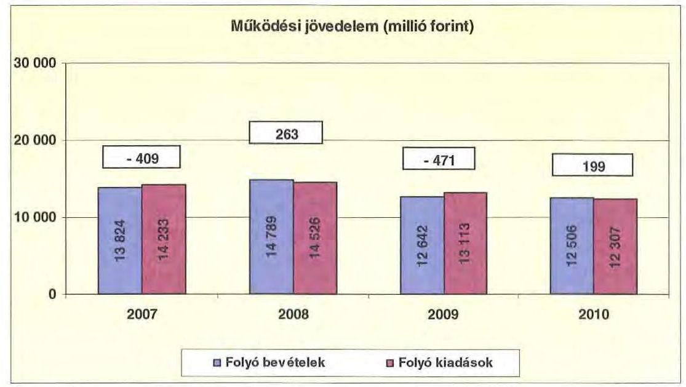

A folyó költségvetés hiánya (a múködési forráshiány) 2007-ben a folyó kiadások 2,9\%-át (409 millió Ft-ot), 2009-ben 3,6\%-át (471 millió Ft-ot), míg a müködési forrástöbblet 2008-ban a folyókiadások 1,8\%-át (263 millió Ft-ot), 2010-ben 1,6\%-át (199 millió Ft-ot) jelentette.

A folyamatos múködtetést - az intézmények kiskincstári rendszerben történő finanszírozása mellett - éven túli múködési-, folyószámla- és munkabérhitel igénybevételével tudták biztosítani. A folyószámlahitel napi átlagos állománya a 2007-2010. évek között csökkent (591 millió Ft-ról 281 millió Ft-ra). Munkabérhitelt az Önkormányzat 2007-ben, illetve 2010-ben vett igénybe, melynek napi átlagos állománya 86 millió Ft-ról 18 millió Ft-ra csökkent.

Az Önkormányzat kötelezettségein ${ }^{24}$ belül a 2008-2010. évek közötti időszakban a rövid lejáratú kötelezettségek állománya közel 10\% volt, a 2007. évi 60,8\%-os aránnyal szemben. Az Önkormányzat 2006. december 31-én fennálló pénz- és tőkepiaci kötelezettsége 738 millió Ft-ról több mint tizenegyszeresére 8302 millió Ft-ra nőtt a hitelfelvételek, a kötvénykibocsátás és annak árfolyamváltozása miatt.

A rövid lejáratú kötelezettségek 2010-ben 1238 millió Ft-ot tettek ki, amely 170 millió Ft-tal ( $12,1 \%$-kal) kevesebb a 2007. évi rövid lejáratú kötelezettségállománynál. A rövid lejáratú kötelezettségeknek a szállítói állomány 2007-ben 38,3\%-át (539 millió Ft-ot), 2008-ban 71,8\%-át (541 millió Ft-ot), 2009-ben 57,5\%-át (423 millió Ft-ot), 2010-ben 46,2\%-át (572 millió Ft-ot) tett ki.

[^0]
[^0]:    ${ }^{24}$ Passzív pénzügyi elszámolások nélküli

---

Az Önkormányzat nettó működési jövedelmének évenkénti alakulását az alábbi ábra szemlélteti:
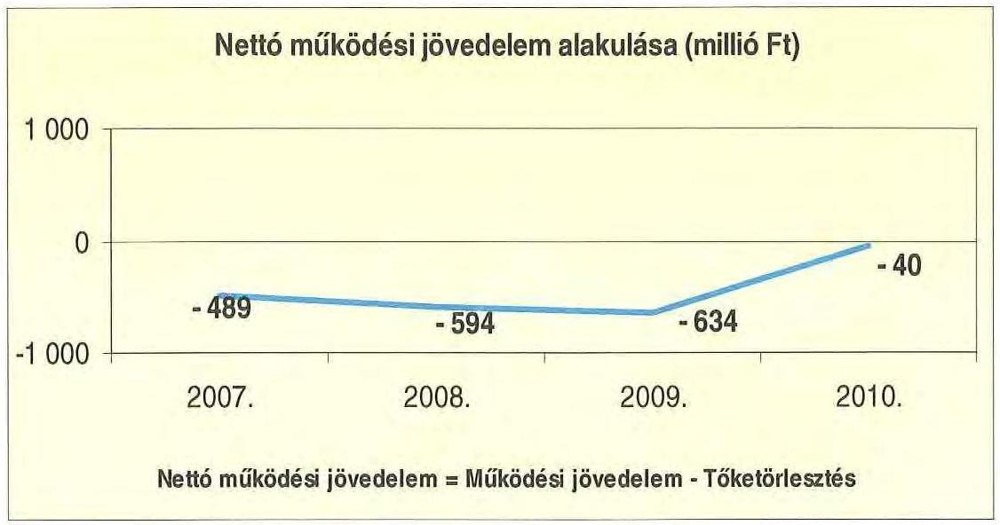

Az Önkormányzat pénzügyi kapacitása a vizsgált időszakban negatív értéket mutatott. A nettó múködési jövedelem ${ }^{25}$ értéke a folyó költségvetési pozíció mellett az adott költségvetési év adósságtörlesztésének hatását is tükrözi ${ }^{26}$. Az Önkormányzat pénzügyi kapacitása a 2007. évi - 489 millió Ft-ról a 2010. évre - 40 millió Ft-ra változott.

A 2007-2010. években az Önkormányzat felhalmozási költségvetés egyenlege ugyancsak negatív volt, melyet a következő ábra szemléltet:
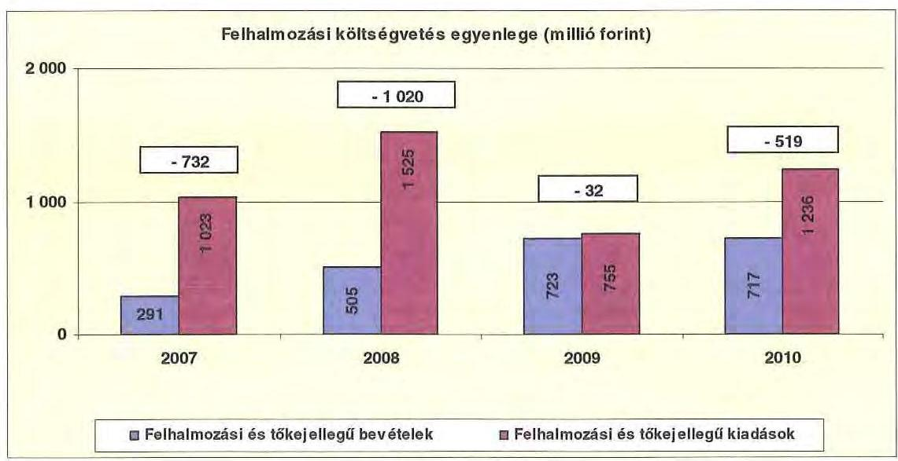

[^0]
[^0]:    ${ }^{25}$ Pénzügyi kapacitás
    ${ }^{26}$ A hiteltörlesztés összege 2007-ben 80 millió Ft, 2008-ban 857 millió Ft, 2009-ben 162 millió Ft, 2010-ben 239 millió Ft volt.

---

A felhalmozási forráshiánynak a felhalmozási és tőke jellegű kiadásokhoz viszonyított aránya 2007-ben 71,6\% (732 millió Ft), 2008-ban 66,9\% (1020 millió Ft) 2009-ben 4,2\% (32 millió Ft), 2010-ben 42,0\% (519 millió Ft) volt.

A felhalmozási forráshiányt fejlesztési célú hitel felvételével, illetve kötvénykibocsátásból származó bevételekből finanszírozták.

Az Önkormányzat évenkénti teljes finanszírozási hiánya ${ }^{27}$ a CLF módszer szerint 2007-ben 1222 millió Ft, 2008-ban 1613 millió Ft, 2009-ben 666 millió Ft, 2010-ben 560 millió Ft volt.

Az Önkormányzat finanszírozási műveletei 2007-2010. évekbeli egyenlegének alakulását a következő ábra szemlélteti:
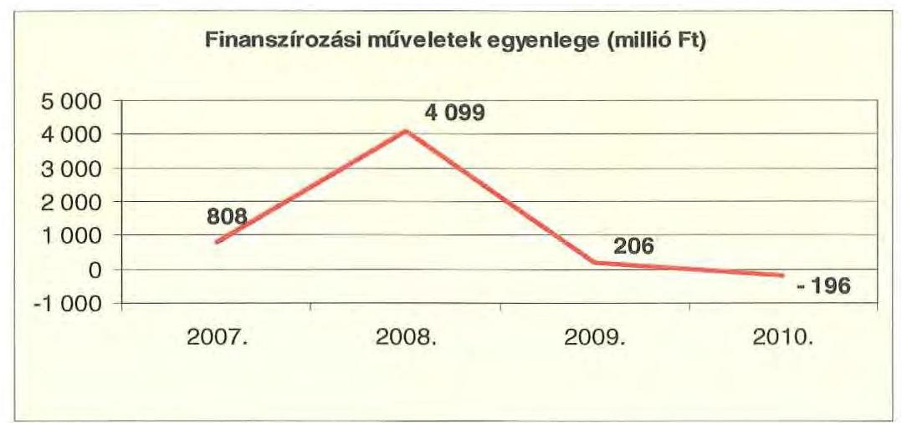

A finanszírozási többlet azt jelzi, hogy az éves költségvetések végrehajtása során szükség volt a pénzkészlet felhasználásán túl külső finanszírozás igénybevételére is. A finanszírozási célú műveleteket a vizsgált időszakban a jelentés 2.a. számú mellékletének 4.1-4.8 pontjai részletezik.

Az Önkormányzat zárszámadási rendeletében a múködési és fejlesztési hiányt a hagyományos költségvetési szerkezet alapján mutatta be ${ }^{28}$, amelyről a jelentés 1. számú melléklete nyújt tájékoztatást.

A vizsgált időszakban a kötelezettségek (passzív pénzügyi elszámolások nélkül) 2007. évi 2314 millió Ft-ról a 2010. évre 8990 millió Ft-ra, közel négyszeresére emelkedtek a kötvénykibocsátás és annak kimutatott árfolyamváltozása miatt.

A 2008. évben kibocsátott svájci frank alapú kötvény forint ellenértékének, illetve az abból még fel nem használt összeg lekötött betétként való elhelyezése révén a kapott kamatok folyamatosan meghaladták a fizetett kamatokat. A 2007-2010. évek között az Önkormányzat összesen 1147598 ezer Ft kamatbevételt realizált, amelyből kamatkiadásait ( 793617 ezer Ft) finanszírozta, a

[^0]
[^0]:    ${ }^{27}$ A nettó múködési jövedelem és a felhalmozási költségvetés egyenlegének összege
    ${ }^{28}$ Nincs kötelező előírás a működési és fejlesztési hiány megállapításának módjára.

---

fennmaradó összeget ( 353981 ezer Ft) a múködési kiadások fedezetére fordította.

Az Önkormányzat kamatbevételeit és kamatkiadásait és azok egyenlegét a következő ábra mutatja:
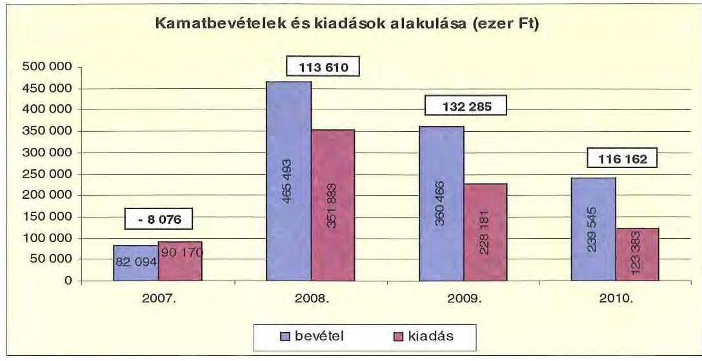

A 2007-2010 közötti időszakban az Önkormányzat kiadásait és bevételeit főbb jogcímek szerint a jelentés 2/a. számú melléklete tartalmazza.

# 2.2. Az Önkormányzat bevételei 

Az Önkormányzat folyó múködési bevétele 2007-ben 14039 millió Ft, 2010-ben 12731 millió Ft volt, a 2010. évben 9,3\%-kal, 1308 millió Ft-tal alacsonyabb volt a 2007. évi szinttől.

A 2007-2010 között realizált OEP támogatás nélküli fóbb bevételi jogcímek számszaki adatait az alábbi grafikon és táblázat mutatja be:
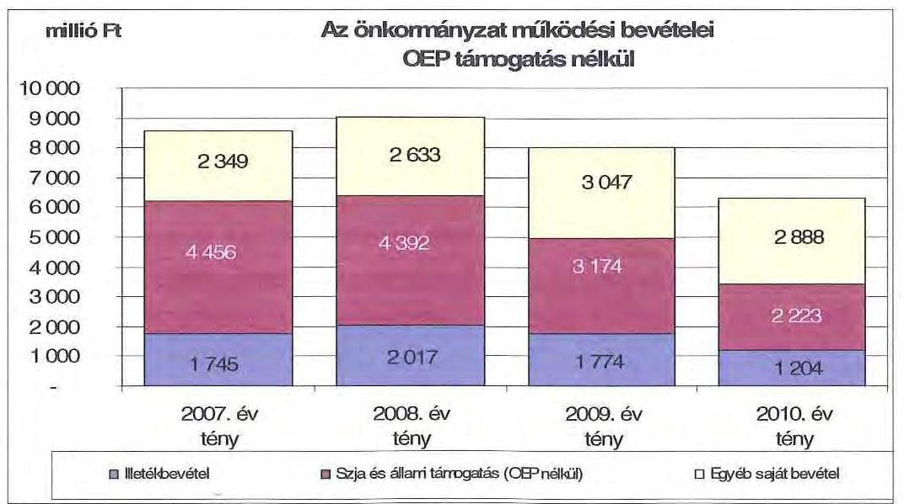

---

Az illetékbevétel a 2007. évről a 2008. évre 272 millió Ft-tal (15,6\%) nőtt. 2008ról 2009-re 243 millió Ft-os (12,0\%) csökkenés következett be, majd a 2010. évben jelentősen mérséklődött, az előző évhez viszonyítva a csökkenés 570 millió Ft (32,1\%) volt. Az eltérő irányú és mértékű változások eredményeként az illetékbevétel 2010-re a 2006. évi 2105 millió Ft-ról, 1204 millió Ft-ra csökkent. Az Illetékhivatalnak - 2007. január 1-jétől - az APEH-hoz történő átszervezése az Önkormányzatnál pozitív eredménnyel zárult, az évente realizált illetékbevételekből (központi intézkedés következtében) évi 8,5\% kerül elvonásra (a 2010. évben 112 millió Ft) adminisztrációs feladatokra, ami alacsonyabb annál, mint amekkora költségvetési kiadást jelentett korábban az Illetékhivatal müködtetése ${ }^{29}$.

Az átengedett szja és az állami támogatások együttes összege a központi forráskivonás hatására folyamatosan és jelentős mértékben csökkent. Az előző évihez képest 2008-ban 64 millió Ft-tal (1,4\%), 2009-ben 1218 millió Ft-tal (27,7\%) 2010-ben 951 millió Ft-tal ( $30,0 \%$ ) kapott kevesebb forrást az Önkormányzat az államtól ezeken a jogcímeken. A változást a normatíváknak a járulékváltozások miatti központi csökkentése, valamint a megyei önkormányzatokat érintő forráselvonás mellett az ellátotti létszám visszaesése idézte elő, aminek oka az intézmények átadása, és a demográfiai változások miatti ellátotti létszámcsökkenés. A Kórház működtetéséhez biztosított OEP támogatás a 2007. évben 5490 millió Ft, a 2010. évben 6415 millió Ft volt.

Az intézményi működési bevételek évek közötti változását a szociális ellátások térítési díjának önköltségalapú növekedése mellett az intézmény átszervezések (átadások), a férőhelyek számának csökkenése befolyásolta.

Az Önkormányzat felhalmozási bevételeinek szerkezete a vizsgált időszakban a következőképpen alakult:

|  |  |  |  |  |
| :-- | --: | --: | --: | --: |
| Megnevezés | 2007. év   tény | 2008. év   tény | 2009. év   tény | 2010. év   tény |
| Tárgyi eszköz értékesítés | 80166 | 88084 | 285886 | 284155 |
| Állami támogatás | 530487 | 426374 | 51239 | 36484 |
| Átvett pénzeszköz | 157835 | 163033 | 145816 | 157604 |
| Egyéb felhalmozási bevétel | 71594 | 258402 | 291698 | 346127 |
| Felhalmozási tartalék felh. | 421271 | 151418 | 439375 | 663487 |
| Összes felhalmozási bevétel | 1261353 | 1087311 | 1214014 | 1487857 |

A tárgyi eszközök értékesítéséből az Önkormányzat a 2007-2010. évek között 738 millió Ft bevételt realizált. E bevételek összege a 2009. és a 2010. években

[^0]
[^0]:    ${ }^{29}$ A 2006. évben az Illetékhivatal működtetésére 243 millió Ft-ot, az illetékbevétel $11,5 \%$-át fordították.

---

nőtt meg jelentősen, mivel az Önkormányzatnak sikerült több nagyobb értékű forgalomképes ingatlanát (pl. komáromi kemping) értékesíteni.

Az állami támogatás az esztergomi Pszichiátriai Betegek Otthona építéséhez, a Bottyán János Müszaki Szakképző Iskola rekonstrukciójához és bővítéséhez elnyert címzett támogatások felhasználásához kapcsolódott.

Az egyéb felhalmozási bevételek, tartalékok az Önkormányzat intézményeiben megvalósult, illetve folyamatban lévő európai uniós projektekhez kapcsolódtak. Ezek között szerepel többek között a Szent Borbála Kórház struktúra változást támogató és energetikai, egyéb korszerűsítési feladatai, a Mentálhygiénés és Rehabilitációs Intézmény norvég alapból megvalósított rekonstrukciója, a Jávorka S. Szakközépiskola bővítése, teljes felújítása.

# 2.3. Az Önkormányzat kiadásai 

Az Önkormányzat múködési kiadásai főbb jogcímek szerinti bontásban az alábbiak voltak:

| Megnevezés | 2007. | 2008 | 2009 | 2010 |
| :--: | :--: | :--: | :--: | :--: |
| Müködési kiadások | 14214550 | 14512923 | 12855788 | 12121487 |
| Müködési kiadások (kamalkiadás múköd) | 14124380 | 14167105 | 12860037 | 13077662 |
| Kamatikiadás | 90170 | 145818 | 75751 | 43825 |
| Személyi juttatások | 7051749 | 6930508 | 5723694 | 5521877 |
| Munkaadót terheló járulékok | 2250831 | 2188135 | 1755219 | 1472354 |
| Dologi kiadások | 4009511 | 4201089 | 4475538 | 4265722 |
| Egyéb folyó kiadások | 50630 | 181419 | 80088 | 130371 |
| Támogatások, elvonások, egyéb folyó átutalások | 139102 | 108180 | 235048 | 242456 |
| ebből müködési célú pénzexeküuáladás | 65885 | 49656 | 193250 | 199532 |
| Előjó évi pénzmeveivány átadás, viazafizetés, müködési célú | 286799 | 167058 | 245637 | 219123 |

Az Önkormányzat müködési kiadása a 2007. évi 14215 millió Ft-ról $14,7 \%$-kal, 2094 millió Ft-tal ( 12121 millió Ft-ra) csökkent a 2010. évre.

Az Önkormányzat 2010-ben a müködési költségvetés 57,7\%-át (6994 millió Ft) személyi juttatásokra és a munkaadókat terhelő járulékokra fordította, az üzemeltetést, intézményfenntartást biztosító dologi kiadásokra 35,2\% jutott ( 4266 millió Ft). A müködési kiadásokon belül a személyi juttatások és járulékok összege és aránya a vizsgált időszakban folyamatosan csökkent, 2007-ben 9313 millió Ft (65,5\%), 2008-ban 9119 millió Ft (63,7\%), 2009-ben 7479 millió Ft (57,8\%), 2010-ben 6994 millió Ft ( $57,7 \%$ volt).

A személyi juttatások címen kifizetett költségvetési előirányzatok a 20072010. évek között minden évben csökkentek a létszámcsökkentések miatt. 2010ben a 2007. évihez mérten a teljesített kiadások 1540 millió Ft-tal - 7062 millió Ft-ról 5522 millió Ft-ra - (21,8\%) csökkentek.

Az Önkormányzat dologi kiadásainak alakulása 2007-2010 között változó képet mutat. Önkormányzati szinten a 2010. évben teljesített dologi kiadások ( 4266 millió Ft) 256 millió Ft-tal ( $6,4 \%$ ) haladták meg a 2007. évi 4011 millió Ft-ot. A 2008. évben a dologi kiadások 292 millió Ft-tal (7,3\%) az inflációt

---

meghaladó mértékben ${ }^{30}$ emelkedtek, ezt követően a 2009. évben 174 millió Fttal $(4,1 \%)$ haladta meg az előző évi dologi kiadások összegét ${ }^{31}$. A 2010. évben az előző évhez képest - a dologi kiadások 210 millió Ft-tal (4,7\%) csökkentek. A dologi kiadások alakulására kedvezően hatott, hogy a Közgyűlés 2009. márciusi ülésén több oktatási intézmény összevonásáról döntött, a jobb helykihasználás érdekében.

A dologi kiadások annak ellenére emelkedtek, hogy a 2007-2010. évek között költségvetési szervek települési önkormányzatok, egyház részére történő átadására, kiszervezésére, intézmények összevonására került sor.

A feladatellátás szervezeti kereteinek változása miatt a támogatások, működési célú pénzeszköz átadásokat is tartalmazó - összege a 2007-2010. évek között 103 millió Ft-tal - 139 millió Ft-ról 242 millió Ft-ra - (74,3\%-kal) nőtt annak ellenére, hogy a Közgyűlés több (települési önkormányzati intézményekkel kötött társulási megállapodást), korábban támogatott feladatellátást megszüntetett. A Váci Egyházmegyével 2008. évben, majd a szerződés módosításával a Szeged-Csanádi Egyházmegyével a gyermekvédelmi szakszolgálat, a nevelőszülői hálózat, nevelőotthoni feladatok ellátására kötött megállapodás alapján az Önkormányzat a feladatok ellátását továbbra is támogatja évi 200 millió Ft összeghatárig ${ }^{32}$.

Az önkormányzati kiadásokban nőtt a kórházi kiadások aránya az egyéb fenntartott intézményekben felmerülő kiadásokhoz képest. A Kórház nélküli teljesített müködési kiadások ( 7959 millió Ft) 2007-ben az összes müködési kiadás $56,0 \%$-át tették ki, ez az arány 2010 végére $46,3 \%$-ra ( 5609 millió Ft) csökkent.

Az Önkormányzat Kórház nélküli müködési kiadásai a vizsgált időszakban a következőképpen alakultak:

| Megnevezés | 2007 | 2008 | 2009 | azer Ft |
| :--: | :--: | :--: | :--: | :--: |
| Müködési kiadások | 7959480 | 7606555 | 6499158 | 5608634 |
| Müködési kiadások (kamatkiadás nélkül) | 7869290 | 7460737 | 6423407 | 5564809 |
| Kamatkiadás | 90170 | 145818 | 75751 | 43825 |
| Személyi juttatások | 4147582 | 3908157 | 2975693 | 2694983 |
| Munkaadót terhelő járulékok | 1309625 | 1222415 | 905801 | 710911 |
| Dologi kiadások | 1769583 | 1680175 | 1623874 | 1447595 |
| Egyéb folyó kiadások | 46443 | 64036 | 93039 | 23992 |
| Támogatások, elvonások, egyéb folyó átutalások | 139102 | 108180 | 235048 | 242456 |
| elbből: müködési célú pénzeszközátadás | 65885 | 49656 | 193250 | 198570 |
| Előző évi pénzmaradvány átadás, visszatizetés, müködési célú | 266799 | 167058 | 245637 | 219123 |

[^0]
[^0]:    ${ }^{30}$ KSH fogyasztói árindex 6,1\%
    ${ }^{31} 2009$-ben az infláció $4,2 \%$ volt
    ${ }^{32}$ A Váci Egyházmegyével 2008. évben kötött megállapodás felső korlát nélkül tartalmazta a normatív támogatás és az egyházi támogatás összegét meghaladó ellátási költségek megtéritését.

---

Míg 2010-ben a Kórházzal együtt a működési kiadások 14,7\%-os csökkenése volt megfigyelhető - a 2007. évi 14215 millió Ft-ról 2010-re 12121 millió Ftra - addig a Kórház nélkül ugyanebben az időszakban - 7959 millió Ft-ról 5609 millió Ft-ra - 29,5\%-os csökkenés jelentkezett, mivel a személyi juttatások csökkenése a többi intézménynél intenzívebb volt. A Kórház nélküli működési kiadásokból a 2010. évben 3406 millió Ft-ot ( $60,7 \%$ ) a személyi juttatások és járulékaik, 1448 millió Ft-ot $(25,8 \%)$ a dologi kiadások képviseltek.

A 2010. évben az Önkormányzat működési költségvetési kiadásainak több mint felét, 6513 millió Ft-ot ( $53,7 \%$ ) realizáló Kórház adatai nélkül a dologi kiadások a 2007-2010. években 322 millió Ft-tal ( $18,2 \%$ ) csökkentek, ugyanezek az adatok a Kórház költségvetési beszámolójában ( 578 millió Ft-os) 25,8\%-os növekedést mutattak. A 2007-2010. évek között a Kórház múködési kiadása 258 millió Ft-tal ( $4,1 \%$ ) nőtt. A költségvetési beszámoló adatai szerint a személyi kiadások aránya a 2007. évben 46,6\%, (2914 millió Ft), 2010-ben 43,4\% (2827 millió Ft) volt. Ugyanezen adatok a dologi kiadások tekintetében 35,8\% (2240 millió Ft), illetve 43,3\% (2818 millió Ft).

Az Önkormányzat 2007-2010. évek között a Kórház múködési kiadásaihoz ${ }^{33}$ 634 millió Ft-tal járult hozzá, amelyet központosított állami támogatásokból fedezett. A kórházi múködési támogatások a központi bérpolitikai intézkedésekhez, a létszámcsökkentésekhez kapcsolódó többletköltség fedezetéhez, a 13. havi juttatások kifizetéséhez, kereset kiegészítésekhez kapcsolódtak. Ezeknek a kiadásoknak a fedezete nem OEP támogatás, hanem egyéb, az Önkormányzat által igénybe vett központi forrás volt.

A kórházak múködésének finanszírozására az OEP támogatás szolgál, míg a fejlesztési kiadások fedezetét az önkormányzatoknak kell biztosítani intézményeik számára.

A múködési célú önkormányzati támogatáson felül 2007-2010 között a Közgyűlés a Kórháznak fejlesztési célra 146 millió Ft támogatást nyújtott, ebből a Kórház által bonyolított beruházások előkészítését biztosították. A támogatások évenkénti alakulását a következő grafikon mutatja be.
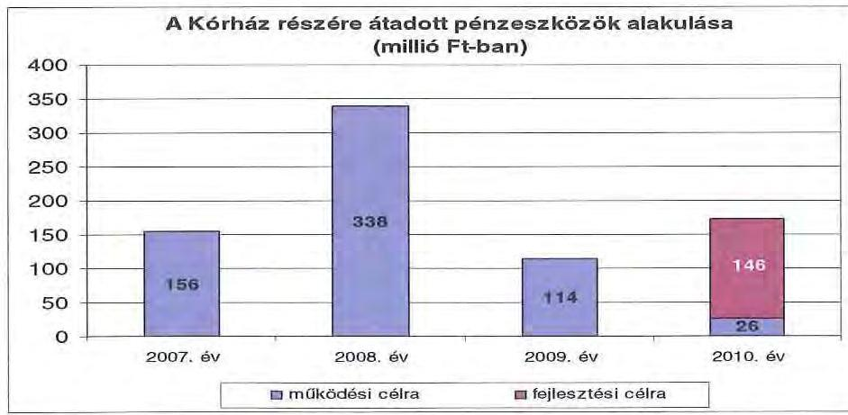

[^0]
[^0]:    ${ }^{33}$ Intézményfinanszírozás formájában

---

A Kórház uniós forrásokat a 2010. december 31-ig megvalósított fejlesztéseihez nem kapott, mivel a projektek utófinanszírozással valósulnak meg és az európai uniós forrással megvalósuló projektek az intézménynél jellemzően a 20092010. években indultak.

A múködési és felhalmozási kiadások aránya a 2007-2010. évek között változó volt, 2007-ben az összes kiadás 6,8\%-át fordították felhalmozásra, majd 2008ban $10,8 \%$-át, 2009-ben $6,7 \%$-át, 2010-ben $10,5 \%$-át. A kiadások alakulását (a működési és fejlesztési célú kamatkiadásokat is figyelembe véve) a következő grafikon szemlélteti:
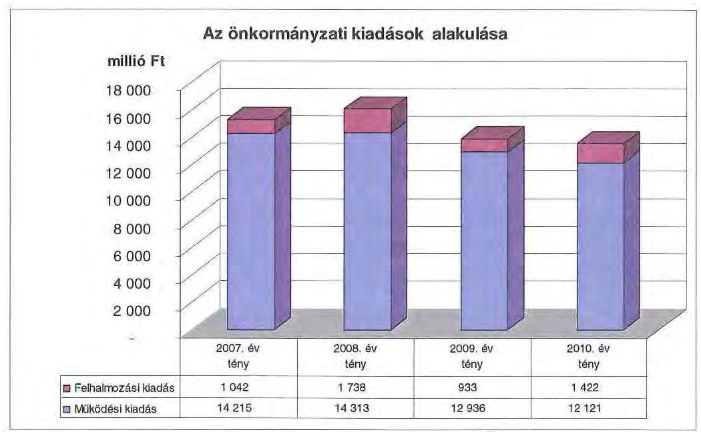

Az Önkormányzatnál a 2007-2010 között megvalósult, illetve folyamatban lévő 10 millió Ft teljes bekerülési költség feletti beruházások és felújítások száma 50 volt, melynek teljes (megvalósult, illetve tervezett) bekerülési költsége 10001 millió Ft. A 2010. utáni időszakra 5692 millió Ft felhalmozási célú kötelezettséget vállaltak, amely három kórházi, egy szakközépiskolai és egy gyermekotthoni fejlesztéshez kapcsolódik. A fejlesztési feladatokat - a 3/a. számú melléklet szerint - 811 millió Ft saját forrásból (kötvénybevétel), 4171 millió Ft európai uniós támogatásból és 710 millió Ft hazai támogatásból tervezik megvalósítani.

A beruházások közül két 500 millió Ft feletti beruházás, a KEOP 5.3.0/B támogatással megvalósuló kórházi manuális pavilon energetikai korszerűsítése, valamint a kórházi struktúraváltozást támogató infrastruktúra fejlesztés (TIOP 2.2.4 program keretében).

Az Önkormányzat - saját kimutatása szerint - 2007-2010. években együttesen 3618 millió Ft-ot fordított 10 millió Ft feletti ${ }^{34}$ fejlesztéseinek finanszírozására, melynek $8,3 \%$-a ( 301 millió Ft) önként vállalt feladathoz kapcsolódott.

[^0]
[^0]:    ${ }^{34}$ A 10 millió Ft alatti fejlesztésekről kimutatás nem állt rendelkezésre, azt a vizsgálat ideje alatt az Önkormányzat nem biztosította.

---

Ezen időszakban a három legmagasabb bekerülési költségű beruházás a következő volt:

- a Zöld Fenyő Idősek Otthona létesítése 419 millió Ft-ból. Az Önkormányzat 2007. május 10-én kelt üzletrész adás-vételi szerződés alapján magánszemélyektől megvásárolta a Zöld Fenyő Kft-t, melynek tulajdonát képezte a jogerős használatbavételi engedéllyel rendelkező és hitelből felépített ingatlan. Az Önkormányzat kizárólagos tulajdonában lévő Kft-jétől megvásárolta az ingatlan tulajdonjogát, amelyen további beruházásokat végzett és azt idősek otthonaként múködteti;
- 150 férőhelyes Pszichiátriai Betegek Otthona építése Esztergomban. A beruházás 2004-ben kezdődött, teljes bekerülési költsége 1163 millió Ft, melyből a 2007. évet megelőzően 834 millió Ft kiadás teljesült. A fennmaradó 329 millió Ft kifizetésére 2007-2010. között került sor;
- a Bottyán J. Szakközépiskola bővítés, teljes rekonstrukciója. A beruházás teljes bekerülési költsége 923 millió Ft, amelyből 902 millió Ft a 2007-2010. években került elszámolásra. A megvalósítás 2006-2010. között történt.

Az utóbbi két beruházás az Önkormányzatnál a vizsgált időszakot megelőzően kezdődött, 2004, illetve 2006. években és címzett állami támogatással valósult meg.

Az Önkormányzat fejlesztési tevékenysége a pályázati kiírások által nagyban befolyásolt, mivel a jelentkező múködési forráshiány és saját felhalmozási bevételei alacsony szintje miatt beruházásokat csak külső források, európai uniós és hazai támogatások elnyerése esetén tud megvalósítani. A felhalmozási kiadások önrészének forrásait is fejlesztési hitelekből és felhalmozási célú kötvénykibocsátásból finanszírozta.

# 3. KÖTELEZETTSÉGEK BEMUTATÁSA 

### 3.1. A pénzintézetek felé fennálló kötelezettségek

Az Önkormányzat 1275 millió Ft összegű kötelezettséget mutatott ki 2007. év elején, ami a mérleg főösszegének 8,5\%-a. A 2010. év végére azonban 8990 millió forintra emelkedve, megközelítette annak 60\%-át, ami azt jelenti, hogy a meglévő eszközállománynak mindössze $40 \%$-át fedezi a saját tőke és a tartalék.

Az eladósodás szerkezetét elemezve megállapítható, hogy annak jelentős eleme a pénzintézetek felé történt eladósodás. A rövid- és hosszú lejáratú pénzintézeti tartozások állománya - a devizalapú kötelezettségek számított értékkülönbözetével - 2007. január 1-jétől 2010. december 31-ig 11,2 szeresére nőtt ( 738 millió Ft-ról 8302 millió Ft-ra emelkedett). A fennálló pénzintézeti kötelezettségek hosszú lejáratú hitel igénybevételéből, kötvények kibocsátásából, valamint folyószámla és munkabér megelőlegezési hitelek igénybevételéből keletkeztek. A nem pénzintézetek felé fennálló kötelezettsé-

---

gek ${ }^{35}$ a 2007. évi 1555 millió Ft-ról 2010-re 1266 millió Ft-ra (19\%-kal) csökkentek.
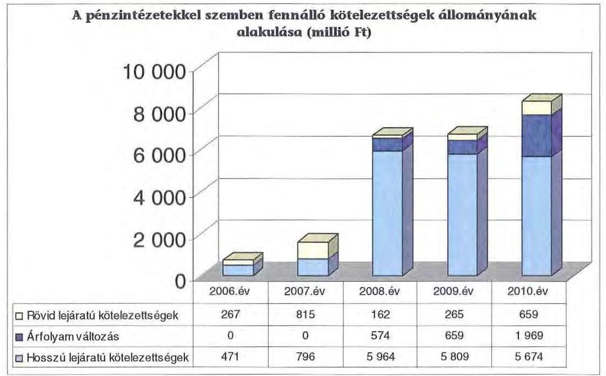

Az Önkormányzat fennálló pénzintézeti kötelezettségvállalásaira közgyűlési döntés alapján került sor. A kötelezettségvállalásból származó források felhasználási céljait meghatározták. A Közgyűlés számára készített előterjesztések nem mutatták be a kötelezettségvállalás visszafizetési forrásait, a teljes futamidő várható kamat és tőkefizetési kötelezettségének alakulását. Az előterjesztések nem tértek ki az árfolyam- és kamatkockázatok, valamint az adósságszolgálati korlát bemutatására sem, így ezeket a döntések során nem vették figyelembe.

Önkormányzat 2010. december 31-én forintban fennálló adósságot keletkeztető kötelezettségállománya az alábbi volt:

| Megnevezés | Kibocsátás időpontja | Összeg   (ezer Ft) | Kamat (referencia hamut-   hamutfehír) | Felhunználás célja |
| :-- | :--: | :--: | :--: | :--: |
| Éven tüll lejáratú múködési hitel | 2006.08 .09 | 300000 | 3 havi BUROR $+0,2 \%$ | Müködés finanszírozása |
| Éven tüll lejáratú múködési hitel | 2007.08 .02 | 240000 | 3 havi BUROR $+0,3 \%$ | Müködés finanszírozása |
| Fejlesztési hitel   (Sikeres Magyarországért Fejlesztési   Hitelprogram) | 2007.11 .08 | 256690 | 3 havi EURIBOR $+1,5 \%$ | Ingatlanvásárlás, idős korúak   véltremának kódakitása |

[^0]
[^0]:    ${ }^{35}$ Egyéb passzív pénzügyi elszámolásokkal együtt.

---

Az Önkormányzat 2010. december 31-én CHF-ben fennálló adósságot keletkeztető kötelezettségvállalásai az alábbiak voltak:

| Megnevezés | Kibocsátás, illetve szerződéskötés idöpontja | Összeg   (CHF) | Kibocsátási, vagy lehivási árfolyam (Ft/CHF) | Kamat (referencia kamat+ kamatfelár) | Felhasználás célja: |
| :--: | :--: | :--: | :--: | :--: | :--: |
| KEMÓ I kötvény | 2008.02.14 | 15420000 | 162,13 | 3 havi CHF LIBOR $+0,85 \%$ | Önkormányzati fejlesztési kiadások, müködési kiadás finanszírozása, hitelki-   náltás |
| KEMÓ II kötvény | 2008.02.14 | 15163725 | 161,16 | 2 havi CHF LIBOR $+0,85 \%$ | Önkormányzati fejlesztési kiadások, hitelkiváltás |

A felvett müködési célú hitelek felhasználásáról külön nyilvántartást nem vezettek, a lehívott müködési célú hitelt a folyó kiadások fedezetére forditották.

A fejlesztési hitelből megvásárolták saját gazdasági társaságuktól azt az ingatlant, amelyben az idősek otthonát kívánták kialakítani, majd a még szükséges átalakításokat a hitel felhasználásával elvégezték.

A Közgyűlés 109/2007. (IV. 26) számú határozatával döntést hozott arról, hogy az egyre romló elhelyezési feltételeket biztosító idősek otthonát nem újítják fel, hanem helyette megvásárolnak egy ingatlant, amelyet egy vállalkozás kezdett építeni, emelt szintű ellátást biztosító idősek otthonának. A döntés indokolása szerint a felújítás többe került volna ${ }^{36}$, mint a célnak megfelelően részben kivitelezett ingatlan megvásárlása. Az építő társaságot vásárolta meg az Önkormányzat az ingatlannal és az azt terhelő hitelfelvételből származó kötelezettséggel együtt. A gazdasági társaságot 100\%-os önkormányzati gazdasági társasággá szervezte, majd kivásárolta az ingatlant. Az ellenőrzés idején a kiüresedett gazdasági társaság értékesítése még nem történt meg, de az Önkormányzat nem kívánja fenntartani.

A hitelek törlesztése a szerződésben foglalt feltételek szerint történt a vizsgált időszakban. A hitelek változó kamatozásúak, ezért eltérő kamatterhet jelentettek az Önkormányzatnak. A 2006-ban felvett 500 millió Ft összegű hitel induló kamata $7,35 \%$ volt, a futamidő vizsgálatunkig tartó szakaszában ez átlagosan 8,02\%-os mértékủ volt. A vizsgálat idején a 3 havi BUBOR 2011. első negyedévére érvényes kamatát ismertük, ami az induló kamatlábnál több mint 1\%kal alacsonyabb volt. A kamatváltozás a negyedéves kamatfizetésben 4-5 millió Ft eltérést eredményezett. A 2007 augusztusában felvett 450 millió Ft összegű hosszú lejáratú müködési hitel esetében az átlagos kamatszint kedvezőbben alakult, az induló kamatnál azonban magasabb. A referencia kamat azonos az előbbivel és a kamatfelárban sincs lényeges különbség, ezért a kamatláb változása hasonló mértékű ingadozást eredményez a kamat összegében.

A fejlesztési hitel kamata a felvétel és a vizsgálat közötti időszakban végig az eredeti szint alatt maradt, ami az induló kondícióhoz képest 24 millió Ft kamatmegtakarítást eredményezett az Önkormányzat számára.

[^0]
[^0]:    ${ }^{36}$ A felújítás bekerülési költségére vonatkozó számítást, költségkalkulációt nem csatoltak az előterjesztéshez.

---

A 2008. évi költségvetési koncepció tárgyalása során a Közgyűlés vizsgálta annak lehetőségét, hogy a hosszú lejáratú múködési és felhalmozási hitelek mellett kötvényt is kibocsát.

Három banknak küldött ajánlattételi felhívást az Önkormányzat. A három bank közül kettőnek az ajánlata azonos volt, a harmadik 0,45\%-kal magasabb kamatfelárat közölt ajánlatában, valamint a tőketörlesztésre rövidebb türelmi időt határozott meg, ezért megállapították, hogy ajánlata nem felel meg az ajánlatkérésben megfogalmazott feltételeknek.

A kötvénykibocsátáshoz készült könyvvizsgálói jelentés felhívta a figyelmet a kötvénykibocsátás kockázataira, többek között arra, hogy az Önkormányzat vagyontárgyai nincsenek piaci értéken kimutatva, ezért „nehezen állapítható meg, hogy a hosszúlejáratú kötelezettségvállalás vagyoni háttere milyen arányban biztosított". Az előterjesztés alapján a Közgyűlés meghozta 287/2007. (XI. 29.) számú határozatát, amellyel felhatalmazta a Közgyűlés elnökét, hogy a megnevezett két bankkal kössön megbízási szerződést 2500-2500 millió Ft összegű kötvény kibocsátására az ajánlat szerinti feltételekkel. A megkötött megbízási szerződések alapján 2008. február 14-én került sor a kötvények kibocsátására.

A jelentős mértékű pénzintézeti eladósodás még nem okozta az Önkormányzat adósságot keletkeztető kötelezettségvállalása felső határának átlépését, mert a kötvények törlesztésére - a szerződésben foglaltakkal összhangban ${ }^{37}$ - nem került sor. A kötvénykibocsátásról kötött szerződések közül a KEMÖ I. elnevezésűhöz kapcsolódó megállapodásban múködési célú felhasználás lehetőségét is rögzítették ${ }^{38}$. A meglévő hosszú lejáratú múködési és felhalmozási célú hitelek kiváltásának lehetőségét mindkét kötvény ${ }^{39}$ felhasználásáról szóló megállapodás tartalmazta. A kötvényből származó forrás felhasználásáról hozott közgyűlési döntések a felhalmozási célokat helyezték előtérbe, de a döntések előterjesztései nem tartalmazták, hogy a kiadások - esetleges bevétel növekedésből, illetve kiadás csökkenésből - milyen mértékben és milyen időtávon térülnek meg.

A kötvénykibocsátásból származó forrásokból elsőként a folyószámlahitel állományát csökkentette az Önkormányzat 2008-ban 750 millió Ft-tal. Ebben az évben a kötvény konverziós díjaként használtak fel 38 millió Ft-ot, és a kötvényből származó pénzből biztosítottak fedezetet az MNV Zrt. által meghirdetett földárverés ${ }^{40}$ biztosítékára. Az árverés lebonyolítása után visszautalásra került 225 millió Ft, de azt nem helyezték vissza a betétként lekötött pénzeszközökhöz, ezért az árveréshez letétként elhelyezett 245 millió Ft-ot mutatták ki kötvényből történő felhasználásként. Fejlesztési célra 2008-ban 188 millió Ft-

[^0]
[^0]:    ${ }^{37}$ A tőketörlesztés a szerződés szerint öt év türelmi idő után, 2014. április 20-án kezdődik és 2027. október 20-án fejeződik be.
    ${ }^{38}$ Erste Bank Hungary Nyrt-vel 2008. február 7-én megkötött „Forrásfelhasználási megállapodás" 1. pontja.
    ${ }^{39}$ KEMÖ I. elnevezésű, az Erste Befektetési Zrt. szervezésével, és a KEMÖ II. elnevezésű, a K\&H Bank Zrt. szervezésével kibocsátott kötvények.
    ${ }^{40}$ Az Önkormányzat úgy határozott, hogy a Bábolnán értékesítésre kerülő földterületekből vásárol.

---

ot, 2010-ben kollégium vásárlására 50 millió Ft-ot, a Kórház rekonstrukciójára 139 millió Ft-ot, több kisebb felújításra és beruházásra 447 millió Ft-ot fordított az Önkormányzat.

Az Önkormányzat a helyszíni vizsgálat lezárásáig egy esetben (2010. október 20-án) kötvény kamatfizetésére is felhasznált 18 millió Ft-ot. 2011. március 31ig fejlesztésekre 96 millió Ft-ot fordítottak, így a felhasználások után - 2011. március 31-én - 3028 millió Ft állt rendelkezésre, amelyből fejlesztési célokra 568 millió Ft összegű kötelezettséget vállaltak. A kötvénykibocsátásból származó, ténylegesen felhasznált forrás $38 \%$-a ( 750 millió Ft) szolgált müködési célokat, $3 \%$-ot ( 56 millió Ft-ot) a kötvénnyel kapcsolatos kiadásokra fordítottak és $59 \%$-ot ( 1166 millió Ft-ot) használtak fel beruházásra.

Az Önkormányzat a CHF-ben fennálló pénzintézeti kötelezettségeiből ütemezett, vagy előrehozott tőketörlesztést nem hajtott végre, a KEMÖ II. jelű kötvényénél végrehajtott konverzió miatt a tőketartozása 346809 CHF-el csökkent, ami a visszaváltáskori árfolyamon számítva 57 millió Ft volt.

A CHF-ben fennálló kötelezettségei után 2193311 CHF ( 397 millió Ft) kamatot, valamint HUF-ban a szervezésre és konverziós díjra, egyéb költségként 113 millió Ft-ot fizetett. A HUF-ban fennálló hosszú lejáratú hitelhez kapcsolódó 520 millió Ft tőketörlesztést, 281 millió Ft kamatot és egyéb költség címén négymillió Ft-ot fizetett.

Az alapkamat mértékének alakulása jelentős hatással van az adott devizanemben kifejezett, a teljes futamidőre számított, várható kamatkötelezettség nagyságára. A 2011. június 1-jén fennálló kötvények és a hitel esetében a kamatfizetési kötelezettségek alakulását jelentősen befolyásolta, illetve befolyásolja a kibocsátáskori és az utolsó kamatfizetéskori referencia kamatok alakulása, melyet az alábbi táblázat mutat be:

| Megnevezés | Kibocsátási, lehivási | Utolsó fizetéskori | Változás \% |
| :--: | :--: | :--: | :--: |
|  | alapkamat \% |  |  |
| 3 havi CHF LIBOR | 3,689 | 1,1933 | $-67,7 \%$ |
| 3 havi EURIBOR | 6,231 | 2,513 | $-59,7 \%$ |

Amennyiben a referencia kamat nem változott volna, az Önkormányzatnak kibocsátáskori referencia kamattal számolva 2010. december 31-ig 3438575 CHF kamatfizetési kötelezettsége jelentkezett volna. A változások miatt 1245264 CHF-el kevesebb fizetési kötelezettséget kellett teljesítenie. A fejlesztési hitel kamatláb-mértéke is változott, aminek következtében az Önkormányzat kamatfizetési kötelezettsége 26 millió Ft-tal csökkent.

A KEMÖ II. kötvény okiratában konverziós lehetőséget is biztosítottak, aminek díját a kibocsátással azonos mértékben, 38 millió Ft-ban határozták meg. A díj a lehetőség biztosítására vonatkozott, fizetésének nem volt feltétele, hogy az Önkormányzat éljen a konverzió lehetőségével, de nem rendelkeztek arról, hogy a konverzióra a futamidő alatt hány alkalommal van lehetőség. A KEMÖ II. kötvény esetében 2008. július 21-én történt egy CHF-ről HUF-ra történő váltás, majd október 6-án vissza CHF-re. A két időpont árfolyam eltérése miatt az Önkormányzat CHF-ben fennálló tartozása 346809 CHF-el csökkent. A kötelezettség csökkenése érinti a kamatfizetési kötelezettséget is,

---

amely az utolsó alkalmazott kamatlábbal számolva további 37297 CHF megtakarítást eredményez. A HUF-ban 71 napra fizetett kamat miatt a kamatkiadások 47 millió Ft-tal növekedtek, ami a 38 millió Ft összegű konverziós díjjal együtt 85 millió Ft többletkiadást eredményezett. A csökkent tőketartozás miatt a vizsgálat időpontjáig 21 millió Ft-tal csökkent a fizetendő kamat. A realizált és a számított ${ }^{41}$ jövőbeli kamatmegtakarítás együttes, forintban számított összege 29 millió Ft, a tőkecsökkenés miatti számított megtakarítás 74 millió Ft. Az elért megtakarítás és a többletkiadások összevetésével 18 millió Ft a tőkekonverzió számított hozama. A kamatok változása a kötvények esetében is kedvezően hatott az Önkormányzat adósságállományára, az árfolyamváltozás miatti értékelési különbözet azonban 39,4\%-kal (1969 millió Ft-tal) növelte az Önkormányzat hosszú lejáratú kötelezettségét.

Az Önkormányzat a 2007-2010. években 1148 millió Ft kamatbevételt realizált, melyből 891 millió Ft származott a kötvények értékesítéséből elért bevételek befektetéséből és 257 millió Ft az intézmények és a Hivatal elkülönített bankszámláin rendelkezésre állt források átmeneti lekötéséből ${ }^{42}$. A kötvények bevételének lekötéséből származó kamatbevétel 57,2\%-át ( 510 millió Ft-ot) fordították a kötvényekkel kapcsolatos kiadásokra (kamat, kibocsátási és konverziós díj), mely a kötvényekre teljesített kamatfizetésnek a 61,3\%-át tette ki. A kötvények bevételéből az Önkormányzat kimutatásai szerint 546 millió Ft-ot kamatfizetésre, 601 millió Ft-ot működési hitelek kamat- és tőketartozásának kiegyenlítésére, valamint múködési kiadásokra fordított.

Az Önkormányzat a 2007-2010. években folyószámlahitel felvételével is biztosította költségvetési kiadásainak finanszírozását. Az illetmények kifizetésének biztosítására munkabér megelőlegezési hitelkeret szerződést kötött és több ${ }^{43}$ alkalommal hitelt vett igénybe.

A folyószámlahitel és a munkabér megelőlegezési hitel alakulását az alábbi táblázat mutatja be:

|  |  |  |  | ezer Ft |
| :--: | :--: | :--: | :--: | :--: |
| Megnevezés | 2007. év | 2008. év | 2009. év | 2010. év |
| I. Folyószámlahitel |  |  |  |  |
| Folyószámlahitel keretösszege január 1-ién | 800000 | 800000 | 800000 | 800000 |
| Teljesített kamat és egyéb költség | 47213 | 53030 | 7576 | 15613 |
| Hitelel zárt napok száma | 365 | 305 | 220 | 343 |
| Folyószámlahitel átlagos napt állománya | 591006 | 763476 | 145336 | 298522 |
| II. Munkabér megelölegezési hitel |  |  |  |  |
| Igénybevett hitel keretösszege: | 1148489 | - | - | 387751 |
| Teljesített kamat és egyéb költség | 6576 | - | - | 302 |
| A hitel átlagos napt állománya | 179239 | - | - | 128671 |

[^0]
[^0]:    ${ }^{41}$ Az utolsó ismert kamatkondícióval és árfolyammal számolva.
    ${ }^{42}$ Kincstári rendszer 2008. augusztus 1-től kezdődő működtetése miatt az intézmények számláinak napi egyenlege összevonásra került.
    ${ }^{43}$ 2007-ben hat hónapi bér kifizetéséhez 12 alkalommal, 2010-ben három havi bér fizetéséhez három alkalommal, 2011-ben az első négy havi bérfizetéshez négy alkalommal.

---

A folyószámlahitel és munkabér megelőlegezési hitelek kondíciói és egyéb költségei a következők voltak:

| Megnevezés | Kamat (referencia+ kamatfelár |
| :--: | :--: |
| Folyószámlahitel |  |
| 2006.05.29-tól 2007.05.28-ig | 3 havi BUBOR $+0,15 \%$ |
| 2007.05.29-tól 2008.05.28-ig | 3 havi BUBOR $+0,15 \%$ |
| 2008.10.29-től 2009.10.27-ig | 3 havi BUBOR $+0,05 \%$ |
| 2009.10.28-tól 2010.10.26-ig | 3 havi BUBOR $+0,05 \%$ |
| 2010.10.27-től 2011. 01. 31-ig | 3 havi BUBOR $+0,05 \%$ |
| 2011.02.01-től 2011.10.27-ig | 1 havi BUBOR $+1,00 \%$ |
| Munkabér megelőlegezési hitel |  |
| 2007.05.02-től 2007.10.29-ig | 3 havi BUBOR $+0,05 \%$ |
| 2008.10.29-től 2009. 10. 27-ig | 3 havi BUBOR $+0,05 \%$ |
| 2009.10.28-tól 2009.10.28-ig | 3 havi BUBOR $+0,05 \%$ |
| 2010.10.05-től 2010.12.21-ig | 3 havi BUBOR $+0,05 \%$ |
| 2011.01.06-tól 2011.10.26-ig | 3 havi BUBOR $+0,05 \%$ |

Az Önkormányzat likviditását a vizsgált időszakban csak folyószámlahitel igénybevételével tudta biztosítani. A 2008. évben a fennálló tartós kötelezettségét kötvény kibocsátásából származó bevételből 750 millió Ft-tal csökkentette az Önkormányzat, de a folyószámla hitelkeretet nem csökkentették.

A kötvénykibocsátásból történő törlesztést követően átmenetileg csökkent a hitellel zárt napok száma. A 2007. évben még minden nap volt fennálló folyószámlahitel, amit 2008-ban 305 napra, a 2009. évben 220 napra sikerült csökkenteni, de 2010-ben 343 napon keresztül 299 millió Ft volt az átlagos napi állomány, a december 31-i igénybevétel 494 millió Ft volt. Az átlagos napi állomány a 2009. évben volt a legalacsonyabb, 145 millió Ft, 2008-ban volt a legmagasabb, 764 millió Ft. A folyamatosan jelentkező finanszírozási, likviditási problémák folyószámlahitellel való kezelése az Önkormányzatnak a 2007-2010 között 123 millió Ft-ba került.

Az állandósult likviditási problémák miatt ${ }^{44}$ az Önkormányzat a 2007. évtől a munkabérek kifizetéséhez munkabér megelőlegezési hitelt vett igénybe. A 2007. évben 12 alkalommal, a 2008. és 2009. évben nem volt szükség munkabér hitelre, de a 2010. évben három alkalommal - mely 48 napon keresztül 129 millió Ft-os átlagos napi állománnyal állt fenn - igénybe vették. A hitel évenkénti átlagos állománya 130 millió Ft és 179 millió Ft között változott. A törlesztések - 2007 júniusát kivéve - az igénybevételt követő hónapban ${ }^{45}$ megtörténtek. Kamat és egyéb költség címén az Önkormányzat 20072010 között hét millió Ft-ot fizetett ki a munkabérhitelek költségeként.

Az Önkormányzat a 2010. évi választásokat követően még nem fogadott el gazdasági programot, más dokumentumban sem rögzítették, hogy milyen

[^0]
[^0]:    ${ }^{44}$ A folyószámlahitel igénybevételének mértéke gyakran közelítette meg a keretösszeg felső határát, ezért a fizetési biztonságot növelte a munkabérhitel.
    ${ }^{45}$ 2007. május 31 -én és június 30 -án volt bérhitel tartozás, de ebből a május 31-i a júniusi kifizetéshez május 31-én igénybe vett első részletből származott. 2007-ben a havi kifizetések igénybevétele minden esetben két részletben történt.

---

formában kívánják kezelni a 2013. évtől jelentősen megemelkedő adósságterheket. A vizsgált években folyamatosan nőtt az eladósodás, a kibocsátott kötvényből származó források - a kötelezettségvállalásokkal - döntő részben felhasználásra kerültek/kerülnek, a kamatbevételek jelentősen csökkennek, az eladósodásból származó kötelezettségek pedig elérik az éves költségvetési bevétel $6,8 \%$-át, a múködési és felhalmozási célú saját bevételeknek pedig a $16,9 \%$ át.

# 3.2. Szállítók felé fennálló kötelezettségek 

Az Önkormányzat és intézményeinek lejárt szállítói tartozásainak alakulását az alábbi táblázat tartalmazza:

| Megnevezés |  | 2007.   december 31. | 2008.   december 31. | 2009.   december 31. | 2010.   december 31. |
| :--: | :--: | :--: | :--: | :--: | :--: |
| Lejárt szállitói tartozás |  | 5959 | 145267 | 62988 | 196695 |
| ebből: | Kórház | 1171 | 63029 | 49967 | 65848 |
| Gazdasági társaságok   lejárt szállitói tartozása |  | - | - | - | - |
| Egyéb kiadás elmaradás |  | - | - | - | - |
| Tartozásállomány |  | 5959 | 145267 | 62988 | 196695 |

Az Önkormányzat lejárt szállítói tartozása és egyéb kiadás elmaradása a 2007. évi hatmillió Ft-ról 2010-re 197 millió Ft-ra nőtt. Ez 2011. március 31 -ére 49 millió Ft-ra csökkent. A lejárt szállítói tartozás a költségvetéshez képest nem jelentős ${ }^{46}$ és dinamikus növekedést sem mutat. Az állomány alakulására pozitív hatással lehetett, hogy a Közgyűlés rendszeresen figyelemmel kísérte a változásokat, azokról írásban kaptak tájékoztatást tagjai.
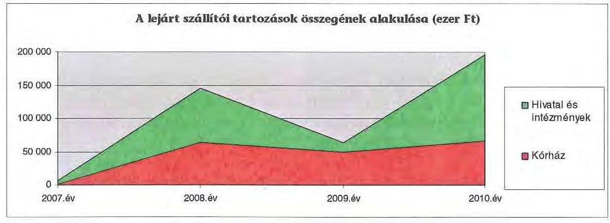

A 2010. év végén lejárt szállítói tartozás $95,0 \%$-a ( 187 millió Ft) 30-60 nap közötti volt. A szállítók felé fennálló lejárt kötelezettségek állományában 2010ben fordult elő 91 napot meghaladó lejárt tartozás ( 252 ezer Ft). A 91 napon túli tartozásállomány teljes egészében a Kórháznál jelentkezett. Szállítók felé fennálló kötelezettség átütemezésére a vizsgált időszakban egy alkalommal,

[^0]
[^0]:    ${ }^{46}$ A legmagasabb állomány sem haladta meg a költségvetési kiadások 1,5\%-át.

---

közel egymillió forint összegben került sor az Önkormányzat egy intézményénél, melyet járulékos költség nem terhelt.

A 2010. december 31-i mérlegben kimutatott szállítói kötelezettség 572 millió Ft volt. A le nem járt tartozásállomány 375 millió Ft-ot tett ki, amelynek 89,2\%a ( 335 millió Ft) a Kórház tartozása volt. Az Önkormányzatnál a 2010. év végén kimutatott szállítói kötelezettségre fedezetet a mérlegben kimutatott 73 millió Ft követelésállomány, illetve a 4043 millió Ft mérleg szerinti pénzeszközök nyújtanak.

Az Önkormányzat hosszú távú kötelezettségei között szerepel a 2010. évi mérlegben 23 millió Ft összegű lízingkötelezettség. Összesen 11 eszközt lízingeltek, amelyből nyolc gépkocsi beszerzését biztosították, valamint a Kórház számára három szakmai gépet vásároltak. A líingszerződést minden esetben változó kamatra kötötték, és csak hat esetben volt deviza alapú a kötelezettség. A lízingelt eszközök miatti kötelezettség a 2010. évi mérlegben 23 millió Ft, ami az egyéb hosszú lejáratú kötelezettségeknek mindössze $0,3 \%$-a.

# 3.3. Egyéb kötelezettségek 

Az Önkormányzat a vizsgált időszakban egy alkalommal vállalt kezességet, amikor saját gazdasági társasága tulajdonába került az idősek otthona céljára kiválasztott ingatlan. Az ingatlan 2008. február 18-ai megvásárlásával a garanciavállalás is megszűnt ${ }^{47}$.

Az Önkormányzat 196/2010. (XI. 25.) Közgyűlési határozatával kamatmentes múködési kölcsönt nyújtott a kizárólagos tulajdonában álló Zöld Fenyő Kft-nek. A hitelnyújtást az indokolta, hogy a szociális célra megvásárolt ingatlan átvétele után a társaság „kiüresedett", de végelszámolás helyett a Közgyűlés a kft. értékesítését tűzte ki célul, a működés költségeire ${ }^{48} 68$ ezer Ft kölcsönt utalt át az Önkormányzat. A közgyűlési határozat kölcsönről szól, de a tényleges helyzet alapján nem várható, hogy a nem működő kft rendelkezni fog olyan bevétellel, ami a kölcsön visszafizetését lehetővé tenné.

A vizsgált időszakban 14 esetben került sor követelés elengedésére, de azok bruttó összege együttesen nem érte el az ötmillió Ft-ot, amelyből közel négymillió Ft külföldi betegek ellátása, valamint detoxikálási eljárás miatti követelés volt.

Az Önkormányzat pénzintézeti kötelezettségeinek fedezeteként ingatlanon jelzálogjog alapításához és bejegyzéséhez nem járult hozzá.

[^0]
[^0]:    ${ }^{47}$ Az adásvételi szerződésben rögzítették, hogy a vételárból a hitel visszafizetésre kerül, ezzel egyidejűleg megszűnik a kezesi felelősség.
    ${ }^{48}$ Az ügyvezető és a felügyelő bizottság tagjai díjazásban nem részesültek, csak az adminisztratív feladatok ellátásához kellett a kölcsön.

---

Az Önkormányzatnál jelenleg öt peresített eljárás van folyamatban közalkalmazotti jogviszony megszüntetések és önkormányzati követelések miatt.

A vizsgált időszakban nem történt meg annak felmérése, hogy az eszközök elhasználódása, amortizációja fedezetének biztosítása mekkora forrásokat igényel az Önkormányzatnál. Az Önkormányzat számviteli politikájában rögzítette a tárgyi eszközök elhasználódása miatti értékcsökkenés elszámolásának formáját és mértékét, de a megképzett amortizáció fedezetének felhasználására vonatkozó eljárási szabályt, visszapótlási algoritmust nem határoztak meg.

A felújítás, az eszközök pótlása a feladatok ellátását biztosító intézményeknél jelentkező igény és az Önkormányzat pénzügyi lehetősége függvényében történt, hogy az intézmények megfeleljenek a szakhatósági előírásoknak. Az Önkormányzat a 2007-2010. években a tárgyi eszközök után 910 millió Ft öszszegü értékcsökkenést számolt el. Felújításra 350 millió Ft-ot fordítottak.

# 4. A PÉNZÜGYI EGYENSÚLY MEGTEREMTÉSE ÉrDEKÉBEN HOZOTT INTÉZKEDÉSEK 

A jelentésben szereplő CLF modellben (2/a. számú melléklet) bemutatott múködési és felhalmozási hiány mindamellett alakult ki, hogy a vizsgált időszakban az Önkormányzat folyamatosan intézkedéseket tett, hogy alkalmazkodjon a finanszírozási rendszer változása miatti forráscsökkenéshez. Ennek érdekében kiadáscsökkentő döntéseket hozott.

A kiadáscsökkentő intézkedések megtétele a gazdálkodás átláthatóbbá tételét, valamint a feladatellátás szakmai színvonalának, de kiemelten a pénzügyi helyzetnek a javítását célozták. A legjelentősebb mértékű kiadási megtakarítást a feladat- és intézményátadásokkal, intézményi átszervezésekkel továbbá létszámleépítésekkel érték el, emellett sikerült megőrizniük intézményeik gazdálkodásának stabilitását.

Az Önkormányzat gazdasági programját két fordulóban tárgyalta. A 61/2007. (III. 29.) számú határozatában meghatározták a szerkezeti vázlatát, melynek költségvetési gazdálkodási alapelvében rögzítésre került, hogy „A fejezet nem számszaki koncepció, a számszaki vonatkozásokkal nem tudunk foglalkozni." A Közgyűlés 128/2007. (VI. 7.) számú határozatával elfogadott gazdasági program készítésével párhuzamosan elkezdődött a közoktatási intézmények 2007. évi költségeinek csökkentése.

- A Közgyűlés 22/2007. (I. 25.) számú határozattal elrendelte az esztergomi Dobó Katalin Gimnáziumban folyó 8 évfolyamos gimnáziumi oktatásnak Esztergom várost illető - az alapfokú oktatást érintő - anyagi terhének érvényesítését ${ }^{49}$, az Arany János Tehetséggondozó Program kimenő rendszerú

[^0]
[^0]:    ${ }^{49}$ Az Önkormányzat számára nem kötelező feladatként végzett alapfokú oktatás normatív állami hozzájárulás feletti működési költségeinek áthárítása Esztergom Város Önkormányzatának.

---

megszüntetését a minisztériummal folytatott tárgyalások eredménye szerint. A Közgyűlés elrendelte a felnőttoktatás megszüntetését a 2007/2008-as tanévtől az Eötvös József Gimnázium és Kollégium, a Zsigmondy Vilmos Gimnázium és Szakközépiskola, valamint a Jávorka Sándor Mezőgazdasági és Élelmiszeripari Szakközépiskola, Szakiskola és Kollégium intézményelben, továbbá a két tanítási nyelvű oktatás párhuzamosságának megszüntetését. Elrendelte emellett a szakiskolások szakközépiskolájában az évfolyamonként két osztály helyett egy indulásának engedélyezését kimenő rendszerben, az OKJ-s szakképzés kimenő rendszerben történő megszüntetését a 2007/2008as tanévtől az Eötvös József Gimnáziumban és a Jókai Mór Gimnáziumban, és a 9. évfolyamon négy osztály helyett három indításának az engedélyezését a Bottyán János Szakközépiskolában. Az előterjesztés feladatonként meghatározta a várható megtakarításokat, melyek összege 2008. évtől évi 86 millió Ft.

- Az intézményátadások közül a legnagyobb összegű megtakarítást, 373 millió Ft-ot a Gyermekvédelmi Szolgálat és Csecsemőotthon átadása - a Váci Egyházmegyének majd a Szeged-Csanádi Egyházmegyének - eredményezett. A Közgyűlés 64/2008. (IV. 24.) számú határozatával megkezdte a személyes gondoskodást nyújtó gyermekvédelmi szakellátás átadását, elsőként a nevelőszülői hálózatot majd a teljes Komárom-Esztergom megyei gyermekvédelmi szakellátási rendszert ${ }^{50}$. Az Önkormányzat az ingatlanvagyont nem adta át a szolgáltatóknak. A 2011. évi állapot szerint a teljes ellátást a SzegedCsanádi Egyházmegye „Názáret" Szociális Szolgáltató Intézménye végzi ${ }^{51}$. A finanszírozási szerződés szerint az Egyházmegye által biztosított szolgáltatásért a Megyei Önkormányzatot díjfizetési kötelezettség terheli, melynek öszszege, a szerződő felek előzetes egyeztetése szerint - a Megyei Önkormányzat mindenkori éves költségvetési rendeletében megállapítottak alapján - megegyezik a normatív állami hozzájárulás, a kiegészítő támogatás és az intézmény saját bevételei, valamint az átadott ellátási feladat müködtetéséhez és fenntartásához szükséges teljes költség közötti különbözettel. A 2010. december 18-i szerződésmódosítás értelmében a támogatás 2011. évtől évi maximum 200 millió Ft, továbbá az Önkormányzat évi 20 millió Ft felújítási és 10 millió Ft „havaria" előirányzatot biztosít, melyek felhasználása előzetes egyeztetés és írásbeli elismerés után történhet. A kimutatott megtakarítást az utolsó önkormányzati feladatellátási évhez viszonyítva számították.
- További hét intézmény, illetve feladat átadásával (Dobó Gimnázium, Szabolcsi Bence Alapfokú Művészeti Intézmény, Jókai Mór Gimnázium és Szakképző Iskola, Bottyán Műszaki Szakközépiskola, Tatai Idősek Otthona, Tatabányai Múzeum, Közművelődési feladat és az Eötvös Gimnázium) 509 millió Ft megtakarítás realizálódott az Önkormányzat kimutatása szerint. Intézményi átszervezésből és feladatátrendezésből négy intézménynél (a Tatai Általános Iskola a Móra Iskola és a Hegyháti Iskola összevonása, az Integrált

[^0]
[^0]:    ${ }^{50}$ A testületi döntések a feladatátadással és finanszírozással kapcsolatban: 109/2008. (IV. 26.) számú, 180/2008. (IX. 25.) számú, 19/2009. (I. 29.) számú, 25/2010. (II. 18.) számú és a 24/2011. (I. 27.) számú határozatok.
    ${ }^{51}$ Az Önkormányzat a BM részére 2010 decemberében készített tájékoztatójában az egyházi feladatellátást nem szerepeltette.

---

Szociális Intézmény létrehozása, Tatai és komáromi Nevelési Tanácsadó és a Szakértői Bizottság összevonása, valamint az Alapy Gáspár Szakiskola és Szakközépiskola összevonása a Középfokú Kollégiummal) 237 millió Ft kiadáscsökkentést mutatott ki az Önkormányzat.

- A közalkalmazotti bértáblán felüli bérek és pótlékok 48 millió Ft, a cafeteria felülvizsgálata, 14 millió Ft, a kereset kiegészítés zárolása 18 millió Ft megtakarítást eredményezett.
- A Közgyűlés a 36/2008. (II. 28.) számú határozatával hozta létre a kiskincstári rendszert, amelynek célja az Önkormányzat folyamatos fizetőképességének biztosítása, a likviditási nehézségek mérséklése volt. Az Önkormányzatnál kialakult pénzügyi helyzet szükségessé tette, hogy a 2009. évben a kiskincstári finanszírozási rendszer továbbfejlesztésre, szigorításra kerüljön. A szigorítás eredményeként, az Önkormányzat az intézményeket csak a napi kiadásokhoz szükséges mértékig finanszírozta. Az intézkedések számszerűsített hatását nem lehet megállapítani.

A kiadáscsökkentő és intézményracionalizáló intézkedésekkel kapcsolatos 43 közgyűlési döntés előterjesztései a várható megtakarításokra vonatkozó számításokat - a 22/2007. (I. 25.) számú közgyűlési határozattal elrendelt közoktatási intézmények 2007. évi költségeinek csökkentése kivételével - nem tartalmaztak, és a realizált eredmények - megvalósítást követő - utólagos kimutatására sem került sor. A helyszíni vizsgálat ideje alatt kimutatott megtakarítások - nem teljes körűen - szerepeltek az Önkormányzat által készített kimutatásokon mivel a biztosítások felülvizsgálatának eredményét a rendelkezésre álló időben nem tudták számszerúsíteni.

Az intézményi átadások, átszervezések végrehajtásához kikérték a szakmai szervezetek véleményét, a jogszabályban előírt egyeztetéseket lefolytatták. A gyermekvédelmi intézmények átadását követő működési tapasztalatok a rendelkezésre álló beszámolók szerint kedvezőek, a szakmai színvonal, valamint a működés személyi és tárgyi feltételei javultak.

A 2007-2010. években az intézményátadások, a feladatváltozások, valamint a takarékossági intézkedések eredményeként együttesen 1332 millió Ft kiadási megtakarítást ${ }^{52}$ mutatott ki az Önkormányzat, melyből 882 millió Ft (66,2\%) az intézményátadások következtében jelentkezett. A kiadáscsökkentő intézkedések hatását beavatkozási területenként a következők részletezik:

[^0]
[^0]:    ${ }^{52}$ A kiadások csökkentését célzó intézkedések elmaradása esetén 2007-2010. évek között a kimutatások alapján 1332 millió Ft-tal magasabbak lettek volna az Önkormányzat kiadásai.

---

| Az érvényesített kiadás-   csökkentés területei | Személyi   juttatások és   járulékai | Dologi, mú-   ködési ki-   adások | Pénzeszköz   átadások,   támogatások | Összesen |
| :-- | :--: | :--: | :--: | :--: |
| A Közgyűlés működése | 5671 | -18 | 0 | 5653 |
| A Hivatalnál | 136412 | 15763 | -10854 | 141321 |
| Az intézményeknél | 476574 | 90086 | 618458 | 1185118 |
| ÖSSZESEN | 618657 | 105831 | 607604 | 1332092 |

A kiadáscsökkentések eredményeként az Önkormányzatnál elért 1332 millió Ft megtakarításból 438 millió Ft (32,9\%) a személyi juttatásra, 181 millió Ft (13,6\%) a járulékokra, 106 millió Ft (7,9\%) a dologi kiadásra, 454 millió Ft (34,1\%) a pénzeszközátadásra és 153 millió Ft (11,5\%) a támogatásra fordított kiadások csökkentéséből adódott.

Az Önkormányzat a Közgyűlés működési körében a tiszteletdíjak csökkentése és a költségtérítések felülvizsgálata eredményeként ért el hatmillió Ft összegű megtakarítást, amely nem éri el kiadáscsökkentések 0,5\%-át.

A Hivatalnál kimutatott három intézkedésből a létszámcsökkentés 122 millió Ft, a cafetéria elemek csökkentése és az egészségpénztári hozzájárulás megszüntetése 14 millió Ft, az önként vállat feladatok csökkentése ötmillió Ft megtakarítást eredményezett.

Kiadáscsökkentő intézkedések eredményeként a 2011. évben az Önkormányzat 72 millió Ft megtakarítást tervez. A tervezett megtakarításokból várhatóan a Hivatalnál a világítástechnikai berendezések megvásárlása bérleti szerződés felmondással (Caminus) 55 millió $\mathrm{Ft}^{53}$, az önként vállalt feladatok és civil szervezetek támogatásainak csökkentése miatt 17 millió Ft jelentkezik. A 2011. évi költségvetésben megszüntették a Sport keretre, a Megye Napok rendezvényre, a Pro-Arte Művészeti Ösztöndíjra, a LIMES tudományos szemle támogatására, a Tudományos-kulturális keretre, Egészségügyi szociális keretre és a Környezetvédelmi keretre biztosított előirányzatot. A helyszíni vizsgálat idején kezdték el a különböző biztosítás-szolgáltatási szerződések (gépjárművek felelősség és casco, valamint épület-biztosítások) felülvizsgálatát önkormányzati szinten, melyek tervezett megtakarítása nem szerepel a kimutatásokban.

A létszámcsökkentő intézkedések következtében 2007-2010 között a Hivatalnál és az intézményeknél összesen 1068 álláshelyet (részben üres állást) szüntettek meg a 2006. december 31-i állapothoz viszonyítva, amelyből 743 (69,6\%) szakmai álláshely, 325 (30,4\%) az intézményüzemeltetéssel kapcsolatos álláshely volt. A megszüntetett álláshelyekből 526 (49,2\%) a közoktatásban megszüntetett álláshely volt. A megszűnt álláshelyek közül 592 az intézmények átadásához kapcsolódott.

[^0]
[^0]:    ${ }^{53}$ A megtakarítás számításánál a 120 hónapos futamidejű bérleti szerződés még hátralévő 51 hónapját vették figyelembe. Az egy évre vonatkozó megtakarítás 13 millió Ft.

---

A létszámcsökkenés ágazatonkénti alakulását az alábbi grafikon szemlélteti:
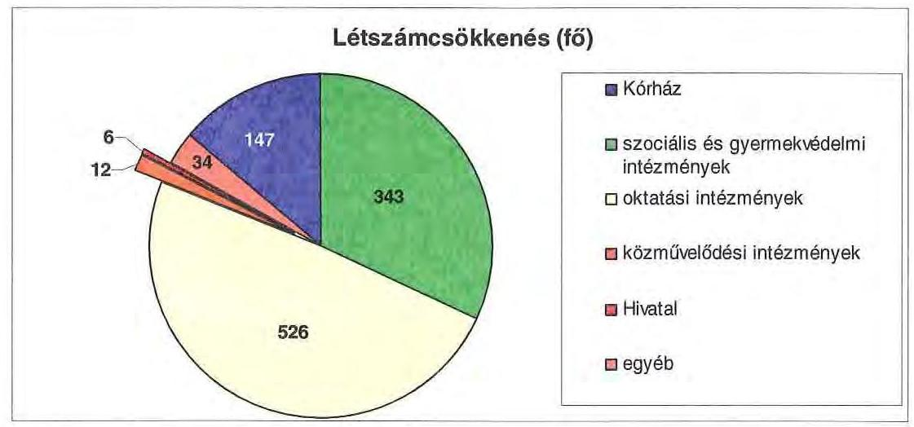

A helyi szervezési intézkedésekhez kapcsolódóan a 2007-2010. években 289 millió Ft támogatást igényelt az Önkormányzat, az előző évek áthúzódó hatása miatt 392 millió Ft támogatásban részesült. A támogatás felhasználásával tartósan leépített létszám a 2007-2010. években 246 fő volt. A létszámcsökkentés eredményeként az Önkormányzat 2006. december 31-i átlaglétszáma 3052 föről 22,4\%-kal 2011. március 31-re 2367 före csökkent.

A Hivatal létszáma 2006. december 31-én 94 fő volt, ebből a kormányzati intézkedések miatt 36 fő 2007. január 1-től az APEH állományába került. A Hivatalnál lezajlott átszervezések kapcsán létszámcsökkentési és -növelési intézkedés egyaránt történt, ugyanakkor ténylegesen egy fő létszámcsökkenés realizálódott az eltelt időszakban.

A 2007-2010. évek között az Önkormányzatnál gazdasági társaságokba feladat kiszervezés nem volt.

Az Önkormányzat az átszervezések, a takarékossági intézkedések szakmai feladatellátásra gyakorolt hatását célzottan nem vizsgálta.

Az Önkormányzat a bevételek növelésére vonatkozó intézkedést a 2007-2011. években nem tett és nem mutatott ki. Az ingatlanok - ezen belül termőföld - bérbeadásából származó bevétel növekedést a vizsgálat alatt rendelkezésre álló időben nem tudta bemutatni.

A tárgyi eszközök értékesítéséből az Önkormányzatnak a 2007-2010. években 738 millió Ft bevétele volt. A 2011. évi költségvetésében 172 millió Ft tárgyi eszköz értékesítésből származó bevételt tervezett, a helyszíni vizsgálat befejezéséig ebből bevételt nem realizált, így az előirányzat teljesítése bizonytalan.

---

# 5. A HELYI ÖNKORMÁNYZATOK GAZDÁLKODÁSI RENDSZERÉNEK 2007. ÉVI ELLENŐRZÉSE SORÁN A PÉNZÜGYI EGYENSÚLY JAVÍTÁSÁRA TETT SZABÁLYSZERŰSÉGI ÉS CÉLSZERŰSÉGI JAVASLATOK HASZNOSULÁSA 

Az ÁSZ jelentésében a munka színvonalának javítása érdekében a Közgyűlés elnökének egy célszerűségi, a főjegyzőnek a jogszabályi előírások maradéktalan betartása érdekében kilenc szabályszerűségi és öt célszerűségi javaslatot tett.

A pénzügyi egyensúly javítására tett szabályszerűségi intézkedés keretében javasoltuk a főjegyzőnek, hogy:

- biztosítsa, hogy a költségvetési rendelettervezetekben az Áht. 8/A. § (7) bekezdésében foglaltaknak megfelelően a finanszírozási célú pénzügyi műveleteket költségvetési hiányt módosító költségvetési kiadásként, illetve költségvetési bevételként ne vegyék figyelembe;
- gondoskodjon arról, hogy a költségvetési rendelettervezetek tartalmazzák az Ámr. 29. § (1) bekezdés g) pontjának előirása alapján a többéves kihatással járó európai uniós feladatok előirányzatait éves bontásban, valamint az Ámr. 29. § (1) bekezdés k) pontja alapján elkülönítetten az európai uniós támogatással megvalósuló programok, projektek bevételeit, kiadásait.

A jelentést a Közgyűlés 2008. január 31-i ülésén megvitatta és a 22/2008. (I. 31.) számú határozatával intézkedési tervet fogadott el a feltárt hiányosságok megszüntetésére. Az intézkedési tervben a Közgyűlés valamennyi pontjában felelősként a megyei főjegyzőt jelölte meg.

A megyei főjegyző az ÁSZ megállapításainak realizálására elfogadott intézkedési terv végrehajtásáról a Közgyűlés 2008. október 30-i ülésén számolt be, melyet a Közgyűlés 230/2008. (X. 30.) számú határozatával elfogadott. Ennek ellenére az Ámr. 29. § (1) bekezdés g) pontjára tekintettel a költségvetési és zárszámadási rendeletek továbbra sem tartalmazzák a többéves kihatással járó európai uniós feladatok előirányzatait éves bontásban.

Budapest, 2011. december „" ${ }^{19}$ "
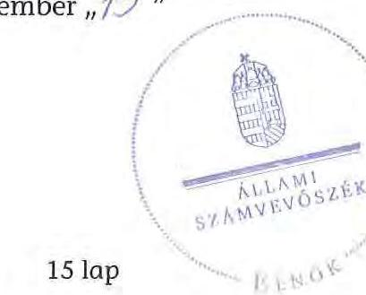

Domokos László

Melléklet: $\quad 7 \mathrm{db} \quad 15 \mathrm{lap}$

---

Komárom-Esztergom Megyei Önkormányzat

1. számú melléklet

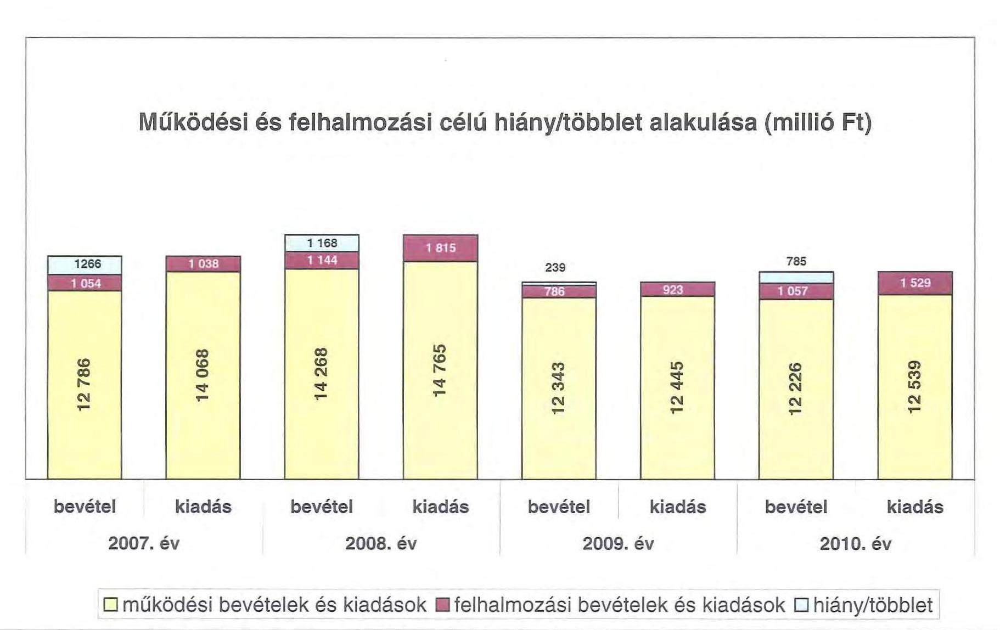

---

.

---

#### Az Önkormányzat CLP módszer szerint besorolt bevételei és kiadásai 2007-2010 között

|  1. FOLYÓ KÖLTSÉGVÉTÉS* | 2007. év | 2008. év | 2009. év | 2010. év  |
| --- | --- | --- | --- | --- |
|  1.1.1. Saját működési bevételek | 2 855 521 | 3 487 897 | 3 269 065 | 2 678 627  |
|  1.1.2. Költségvetési támogatás | 3 665 303 | 4 229 258 | 2 655 242 | 2 075 947  |
|  1.1.3. Átengedett bevételek | 1 321 233 | 589 280 | 569 787 | 183 653  |
|  1.1.4. Állambáztartáson belülről kapott támogatások | 5 782 938 | 6 349 112 | 5 966 484 | 7 249 686  |
|  1.1.5. EU-tól és külföldről kapott bevételek | 968 | 373 | 5 167 | 555  |
|  1.1.6. Állambáztartáson kívülről kapott bevételek | 43 188 | 30 113 | 7 611 | 16 145  |
|  1.1.7. Előző évi pénzmaradvány átvétel | 154 751 | 102 823 | 168 267 | 301 580  |
|  1.1. Folyó bevételek +1.1.1.+1.1.2.+1.1.3.+1.1.4.+1.1.5.+1.1.6.+1.7. | 13 823 902 | 14 788 856 | 12 641 623 | 12 386 193  |
|  1.2.1. Működési kiadások kamatkiadások nélkül | 13 437 768 | 13 651 999 | 12 137 326 | 11 414 990  |
|  1.2.2. Állambáztartáson belülre átadott pénzszeközök | 410 678 | 310 716 | 344 315 | 225 749  |
|  1.2.3.1. Alkalászásainak | 1 407 | 4 476 | 23 041 | 18 538  |
|  1.2.3.2. EU-nak, illetve külföldre | 0 | 0 | 0 | 0  |
|  1.2.3.3. Megénysemélyeknek | 73 337 | 58 616 | 51 937 | 42 924  |
|  1.2.3.4. Amigrajzi szervszeteknek | 64 358 | 45 069 | 160 070 | 180 032  |
|  1.2.3. Tramaforkiadások (+1.2.3.1+1.2.3.2+1.2.3.3+1.2.3.4) | 139 102 | 108 180 | 235 048 | 241 494  |
|  1.2.4. Kamatkiadások | 90 170 | 351 883 | 228 181 | 123 383  |
|  1.2.5. Előző évi pénzmaradvány átadás | 155 436 | 103 022 | 168 268 | 301 532  |
|  1.2. Folyó kiadások + 1.2.1.+1.2.2.+1.2.3.+1.2.4.+1.2.5 | 14 233 154 | 14 525 800 | 13 113 138 | 12 307 148  |
|  1.3. Folyó költségvetés egyedege MÜKÖDÉSI JÖVEDELEM (1.1.–1.2.) | -409 252 | 263 056 | -471 515 | 199 045  |
|  2. FELHALMOZÁSI KÖLTSÉGVÉTÉS** |  |  |  |   |
|  2.1.1. Saját tökébevételek | 86 315 | 105 293 | 308 152 | 237 166  |
|  2.1.2. Állambáztartáson belülről kapott támogatások | 46 589 | 236 917 | 269 255 | 322 380  |
|  2.1.3. EU-tól és külföldről kapott támogatások | 0 | 0 | 0 | 0  |
|  2.1.4. Állambáztartáson kívülről kapott támogatások | 157 835 | 163 033 | 145 816 | 157 604  |
|  2.1. Felhalmozási bevételek (+2.1.1.+2.1.2+2.1.3+2.1.4.) | 290 739 | 505 243 | 723 223 | 717 150  |
|  2.2.1. Saját beruházási kiadás állíva | 908 241 | 1 395 647 | 631 962 | 907 454  |
|  2.2.2. Saját felújítási kiadás állíva | 81 159 | 78 753 | 54 128 | 185 825  |
|  2.2.3. Állambáztartáson belülre átadott pénzszeköz | 27 718 | 41 629 | 59 914 | 143 039  |
|  2.2.4. EU-nak és külföldnek adott pénzszeközök | 0 | 0 | 0 | 0  |
|  2.2.5. Állambáztartáson kívülre adott pénzszeközök | 10 650 | 8 719 | 9 168 | 68  |
|  2.2.6. Befektetési célú részesedések vásárlása | 3 693 | 0 | 0 | 0  |
|  2.2. Felhalmozási kiadások (+2.2.1.+2.2.2.+2.2.3.+2.2.4.+2.2.5.+2.2.6.) | 1 023 461 | 1 524 748 | 755 164 | 1 236 386  |
|  2.3. Felhalmozási költségvetés egyedege (2.1.–2.2.) | -732 722 | -1 019 585 | -31 941 | -519 236  |
|  3. FINANSZÍROZÁSI MÜVELETEK NÉLKÜLI (GFS) POZÍCÍÓ |  |  |  |   |
|  (1.3.) Folyó költségvetés egyedege Működési Jövedelem + (2.3.) Beruházási költségvetés egyedege | -1 141 974 | -756 449 | -503 456 | -320 191  |
|  4. FINANSZÍROZÁSI MÜVELETEK |  |  |  |   |
|  4.1. Hitelfelvétel | 958 135 | 366 700 | 104 721 | 502 867  |
|  4.2. Hiteltörlesztés | 79 655 | 856 765 | 162 153 | 239 367  |
|  4.3. Forgatási és befektetési célú értékpapírok kibocsátása | 0 | 5 000 000 | 0 | 0  |
|  4.4. Forgatási és befektetési célú értékpapírok beváltása | 0 | 0 | 0 | 0  |
|  4.5. Forgatási és befektetési célú értékpapírok értékesítése | 59 770 | 0 | 0 | 5 630  |
|  4.6. Forgatási és befektetési célú értékpapírok vásárlása | 0 | 0 | 0 | 0  |
|  4.7. Egyéb finanszírozási bevételek (függő, átfutó, kiegyenlítő) | -300 367 | 118 112 | -236 212 | 58 914  |
|  4.8. Egyéb finanszírozási kiadások (függő, átfutó, kiegyenlítő) | -170 259 | 529 394 | -499 435 | 523 992  |
|  4.9. Finanszírozási műveletek egyedege (4.1.-4.3.+4.3.-4.4+4.5.-4.6.+4.7.-4.8.) | 808 142 | 4 098 653 | 205 791 | -195 948  |
|  5. TÁRGYÉSÍ POZÍCÍÓ |  |  |  |   |
|  (3.) FINANSZÍROZÁSI MÜVELETEK NÉLKÜLI (GFS) POZÍCÍÓ + (4.9.) Finanszírozási műveletek egyedege | -333 832 | 3 342 204 | -297 665 | -516 139  |
|  6. NETTŐ MÜKÖDÉSI JÖVEDELEM |  |  |  |   |
|  (1.3.) Működési Jövedelem - Téketörlesztés (4.2. Hiteltörlesztés + 4.4. Forgatási és befektetési célú értékpapírok beváltása ) | -488 907 | -593 709 | -633 668 | -40 322  |
|  TÁJÉKOZTÁTÓ ADATOK |  |  |  |   |
|  Összes kötelezettség | 2 314 365 | 7 400 512 | 7 309 539 | 8 989 943  |
|  ebből rövid lejáratú | 1 407 750 | 754 519 | 736 265 | 1 238 041  |
|  Összes szállítás kötelezettség | 539 048 | 541 789 | 423 062 | 571 962  |
|  ebből lejárt | 5 959 | 145 267 | 62 988 | 196 695  |
|  Pénz és tőkepincí kötelezettség (adócságy) | 1 611 229 | 6 700 172 | 6 732 666 | 8 381 993  |
|  ebből rövid lejáratú | 815 256 | 162 056 | 265 450 | 659 254  |
|  PPP szexzióbsból hátsa lévő kötelezettséges állomány | 0 | 0 | 0 | 0  |
|  ebből lejárt szolgálatúsi díj miatti kötelezettség | 0 | 0 | 0 | 0  |
|  Folyószámlabítél napi átlagos állománya | 591 086 | 637 973 | 87 680 | 280 529  |
|  Likvidbítél napi átlagos állománya | 0 | 0 | 0 | 0  |
|  Munkabérbítél napi átlagos állománya | 86 420 | 0 | 0 | 17 979  |
|  Pénz eljárásokból fennálló függő kötelezettségek | 0 | 0 | 0 | 0  |
|  Finanszírozásba bevonható eszközök összesen | 1 519 278 | 4 861 582 | 4 560 677 | 4 042 918  |
|  Tartós hitelviszonyt megtestesítő értékpapírok | 4 860 | 4 860 | 1 620 | 0  |
|  Hosszú lejáratú bankbetétek | 0 | 0 | 0 | 0  |
|  Értékpapírok | 0 | 0 | 0 | 0  |
|  Pénzeszközök (idegen pénzeszközök nélküli) | 1 514 518 | 4 856 722 | 4 559 057 | 4 042 918  |

- Bevételekben nem térül, a kiadásokban nem jelenik meg az amortizáció, a vagyoni helyzetet az egyedege befolyásolja

* Bevételekben vagyon megőrzésre és hővítése fordítható források.

---

.

---

# Az Önkormányzat bevételeinek és kiadásainak, adósságszolgálatának alakulása 2007-2010 között

|  Sorszám | Megnevezés | 2007. év | 2008. év | 2009. év | 2010. év  |
| --- | --- | --- | --- | --- | --- |
|  I. | MÜKÖDÉSI BEVÉTELEK | 14039198 | 15101216 | 13625080 | 12730579  |
|  1. | Sajátos folyó bevételek | 2836665 | 3483621 | 3268888 | 2607891  |
|  1.1 | Intézmények működési bevétele | 1009867 | 1001469 | 1134335 | 1166680  |
|  1.2 | Illetékbevételek | 1744714 | 2016659 | 1774087 | 1203917  |
|  1.3. | Helyi adóbevételek és pótlékok | 0 | 0 | 0 | 0  |
|  1.4. | Kamat bevétel működési része | 82094 | 465493 | 360466 | 237294  |
|  1.5. | Egyéb folyó müködési bevételek | 0 | 0 | 0 | 0  |
|  2. | Támogatás értékű müködési bevételek | 293126 | 289539 | 336914 | 834377  |
|   | ebből: | 0 | 0 | 0 | 0  |
|   | helyi önkormányzatoktól és költségvetési szerveitől | 150201 | 64815 | 47565 | 99416  |
|   | többcélú kistérségi társulástól | 0 | 40603 | 4527 | 4288  |
|  3. | Pénzforgalom nélküli bevételek müködésre jóváhagyott része | 919390 | 845533 | 1203140 | 633186  |
|  4. | Államháztartáson kívülről müködési célra átvett pénzeszközök | 44156 | 30486 | 12778 | 16700  |
|   |  | 0 | 0 | 0 | 0  |
|  5. | Központi támogatások és átengedett források müködési része | 9945861 | 10451737 | 8804260 | 8638425  |
|   | ebből: | 0 | 0 | 0 | 0  |
|   | SZJA | 1321233 | 589280 | 569787 | 183653  |
|   | önkormányzat és intézmények állami támogatásának müködési része | 3134816 | 3802684 | 2604003 | 2039463  |
|   | költségvetési kiegészítések, visszatérülések | 0 | 0 | 0 | 0  |
|   | társadalombiztosítási alapból | 5489812 | 6059573 | 5630470 | 6415309  |
|   | bevétel | 14039198 | 15101216 | 13625080 | 12730579  |
|  II. | MÜKÖDÉSI KIADÁSOK (kamatkiadás nélkül) | 14124380 | 14167105 | 12860037 | 12077662  |
|  1. | Folyó müködési kiadások összesen kamatkiadások nélkül | 13372721 | 13581151 | 12035037 | 11390334  |
|   | ebből: | 0 | 0 | 0 | 0  |
|   | személyi juttatások | 7061749 | 6930508 | 5723694 | 5521877  |
|   | munkaadót terhelő járulékok | 2250831 | 2188135 | 1755219 | 1472364  |
|   | dologi kiadások | 4009511 | 4301089 | 4475538 | 4265722  |
|   | egyéb folyó kiadások | 50630 | 161419 | 80586 | 130303  |
|   | egyéb folyó müködési kiadások | 0 | 0 | 0 | 68  |
|  2. | Támogatások, elvonások és egyéb folyó átutalások | 139102 | 108180 | 236048 | 242456  |
|   | ebből: | 0 | 0 | 0 | 0  |
|   | müködési célú pénzeszköz átadás államháztartáson kívülre | 65885 | 49656 | 193250 | 198570  |
|   | müködési célú pénzeszköz átadás államháztartáson belülre | 0 | 0 | 0 | 962  |
|   | társadalom és szociálpolitikai juttatások | 73217 | 58524 | 41798 | 42924  |
|  3. | Előző évi pénzmaradvány átadás, visszafizetés müködési | 266799 | 167058 | 245637 | 219123  |
|  4. | Támogatás értékű müködési kiadás | 345758 | 310716 | 344315 | 225749  |
|   | ebből: | 0 | 0 | 0 | 0  |
|   | önkormányzatoknak | 300150 | 255965 | 283715 | 166816  |
|   | kistérségi társulásoknak | 42572 | 52418 | 57600 | 52915  |
|   |  | 0 | 0 | 0 | 0  |
|  III. | ADÓSSÁGSZOLGÁLAT | 169825 | 1208648 | 390334 | 362750  |
|   | tőketörlesztési kötelezettség: müködési | 0 | 815256 | 120000 | 102424  |
|   | felhalmozási | 79655 | 41509 | 42153 | 136943  |
|   | kamatfizetési kötelezettség: müködési | 90170 | 145818 | 75751 | 43825  |
|   | felhalmozási | 0 | 206065 | 152430 | 79558  |
|   | hosszú lejáratú értékpapír beváltása, vásárlása | 0 | 0 | 0 | 0  |
|   | beváltás (befektetési célú befőkti) | 0 | 0 | 0 | 0  |
|   | vásárlás (befektetési célú) | 0 | 0 | 0 | 0  |
|   | beváltás (külföldi) | 0 | 0 | 0 | 0  |

---

Komárom-Esztergom Megyei Önkormányzat 2/b. számú melléklet a V-3019/2011. számú jelentéshez

|  Sor-
szám | Megnevezés | 2007. év | 2008. év | 2009. év | 2010. év  |
| --- | --- | --- | --- | --- | --- |
|  IV. | FELHALMOZÁSI BEVÉTELEK | 1 261 353 | 1 087 311 | 1 214 014 | 1 487 857  |
|  1. | Saját felhalmozási és tőkejellegű bevétel | 105 171 | 109 569 | 308 329 | 307 902  |
|  1.1. | Tárgyi eszközök, immat, javak értékesítése, Áfa visszatérülés | 80 166 | 88 084 | 285 886 | 284 155  |
|  1.2. | Privatizációból származó bevétel | 0 | 0 | 0 | 0  |
|  1.3. | Osztalék, részesedések | 5 662 | 0 | 0 | 0  |
|  1.4. | Kamatbevétel felhalmozási része | 0 | 0 | 0 | 2 261  |
|  1.5. | Helyi adók átengedett adók felhalmozási része | 0 | 0 | 0 | 0  |
|  1.6. | Egyéb folyó felhalmozási bevételek | 19 340 | 21 485 | 22 443 | 21 496  |
|  2. | Támogatásértékű felhalmozási bevételek | 46 589 | 236 917 | 269 255 | 322 380  |
|   | ebből: | 0 | 0 | 0 | 0  |
|   | helyi önkormányzatoktól és költségvetési szerveitől | 18 874 | 221 429 | 63 675 | 114 182  |
|   | többcélú kistérségi társulástól | 0 | 0 | 0 | 0  |
|  3. | Pénzforgalom nélküli bevételek felhalmozásra jóváhagyott része | 421 271 | 151 418 | 439 375 | 663 487  |
|  4. | Államháztartáson kívülről felhalmozási célra átvett pénzeszközök | 157 835 | 163 033 | 145 816 | 157 604  |
|   |  | 0 | 0 | 0 | 0  |
|  5. | Állami felhalmozási és tőkejellegű bevétel | 530 487 | 426 374 | 51 239 | 36 484  |
|  5.1. | EU költségvetésből átvétel | 0 | 0 | 0 | 0  |
|  5.2. | Önkormányzatok költségvetési támogatása felhalmozási célra | 530 487 | 426 374 | 51 239 | 36 484  |
|   |  | 0 | 0 | 0 | 0  |
|  V. | FELHALMOZÁSI KIADÁSOK | 1 042 065 | 1 531 560 | 780 084 | 1 342 489  |
|  1. | Folyó felhalmozási kiadások kamatkiadások nélkül | 1 003 697 | 1 481 212 | 695 340 | 1 094 011  |
|  1.1. | Beruházás, felújítás | 981 400 | 1 474 400 | 686 090 | 1 093 279  |
|  1.2. | Értékesített tárgyi eszközök eÁfa befizetés | 18 604 | 6 812 | 9 250 | 732  |
|  1.3. | Részesedések vásárlása | 3 693 | 0 | 0 | 0  |
|  2. | Támogatások, elvonások és egyéb folyó átutalások | 21 104 | 15 847 | 25 126 | 22 009  |
|   | ebből: |  |  |  |   |
|   | felhalmozási célú pénzeszköz átadás államháztartáson kívülre | 0 | 0 | 0 | 0  |
|   | felhalmozásii célú támogatásaok, kölcsön, kölcsön törlesztése | 21 104 | 15 847 | 25 126 | 22 009  |
|  3. | Támogatásértékű felhalmozási kiadások | 17 264 | 34 501 | 43 948 | 120 068  |
|   | ebből: | 0 | 0 | 0 | 0  |
|   | helyi önkormányzatoknak és költségvetési szerveinek | 16 929 | 18 301 | 36 448 | 120 068  |
|   | többcélú kistérségi társulásnak | 0 | 7 500 | 7 500 | 0  |
|  4. | Pénzforgalom nélküli kiadások felhalmozásra jóváhagyott része | 0 | 0 | 15 670 | 106 401  |
|   | kontroll (muk-bev.+felh.bev) | 15 300 551 | 16 188 527 | 14 839 094 | 14 218 436  |
|   | kontroll tárgyévi költségv. kiadás (II.+V.+6/6+6/25) | 15 256 615 | 16 050 548 | 13 868 302 | 13 543 534  |
|   | adósságszolgálatból fennálló | 79 655 | 856 765 | 162 153 | 239 367  |
|   | kontroll összes kiadás | 15 336 270 | 16 907 313 | 14 030 455 | 13 782 901  |
|  VI. | Hitel, kölcsön felvétel | 1 017 905 | 5 366 700 | 104 721 | 508 497  |
|  6.1. | rövid lejáratú hitelek felvétele | 0 | 0 | 0 | 0  |
|  6.2. | likvid hitelek felvétele | 508 135 | 0 | 102 425 | 493 717  |
|  6.3. | hosszú lejáratú hitelek felvétele | 450 000 | 366 700 | 2 296 | 9 150  |
|   | Befektetési és hosszú lejáratú értékpapírok kibocsátása, értékesítése | 59 770 | 4 304 744 | 0 | 5 630  |
|   | kibocsátás (befektetési célú belföldi) | 0 | 4 304 744 | 0 | 0  |
|   | értékesítés (befektetési célú) | 59 770 | 0 | 0 | 5 630  |
|   | kibocsátás (külföldi) | 0 | 0 | 0 | 0  |
|  6.4. | forgatási célú értékpapírok beváltása, vásárlása és a kibocsátása, értékesíté | 0 | 695 266 | 0 | 0  |
|  6.6. | hitelfelvétel külföldről | 0 | 0 | 0 | 0  |
|  VII. | Finanszírozási pű-i műveletek egyenlege | 938 250 | 4 509 935 | -57 432 | 269 130  |

8/4

---

Коммунара - Редактор - Редактор - Редактор - Редактор - Редактор - Редактор - Редактор - Редактор - Редактор - Редактор - Редактор - Редактор - Редактор - Редактор - Редактор - Редактор - Редактор - Редактор - Редактор - Редактор - Редактор - Редактор - Редактор - Редактор - Редактор - Редактор - Редактор - Редактор - Редактор - Редактор - Редактор - Редактор - Редактор - Редактор - Редактор - Редактор - Редактор - Редактор - Редактор - Редактор - Редактор - Редактор - Редактор - Редактор - Редактор - Редактор - Редактор - Редактор - Редактор - Редактор -

---

.

---

Komárom-Esztergom Megyei Önkormányzat Az Önkormányzat 2007-2010 években megvalósított, illetve 2010. december 31-én fennálló fejlesztési feladatokhoz kapcsolódó kötelezettségeinek összegzése

|  Fejlesztési feladat megnevezése | Beruházás kezdete | Teljes bekerülési költség | 2006.decem
ber 31-ig
teljesített
kiadás | 2007-2010. évek között teljesített kiadás | 2010. év
utánra vállalt kötelezettség | 2010. utáni kötelezettség-vállalás forrásösszetétele |  |  |  |   |
| --- | --- | --- | --- | --- | --- | --- | --- | --- | --- | --- |
|   |  |  |  |  |  | Saját bevétel | Hitel | Kötvény | EU-s
támogatás | Hazai
támogatás  |
|  150 fh-es Pszichiátriai Betegék Otthona építése | 2004 | 1163251 | 833750 | 329501 | 0 | 0 | 0 | 0 | 0 | 0  |
|  Bottyán J. Műszaki SZKI rekonstrukció | 2006 | 923411 | 21120 | 802291 | 0 | 0 | 0 | 0 | 0 | 0  |
|  Intézményi vízestilokkok felújítása és tisztasági festések | 2007 | 10262 | 0 | 10262 | 0 | 0 | 0 | 0 | 0 | 0  |
|  Állami földek vásárlása (Bábolna, Ács) | 2007 | 301258 | 0 | 301258 | 0 | 0 | 0 | 0 | 0 | 0  |
|  Zöldfényő Idősek Otthona ingatlanberuházás | 2007 | 418600 | 0 | 418600 | 0 | 0 | 0 | 0 | 0 | 0  |
|  Mentálhygiénés és Rehabilitációs Intézmény B épület komplex akadálymentesítése | 2007 | 21545 | 0 | 21545 | 0 | 0 | 0 | 0 | 0 | 0  |
|  Jávorka S. SZKI tárgyi eszközbeszerzés | 2007 | 11798 | 0 | 11798 | 0 | 0 | 0 | 0 | 0 | 0  |
|  Széchenyi I. SzKI számítástechnikai eszközök beszerzése | 2007 | 15231 | 0 | 15231 | 0 | 0 | 0 | 0 | 0 | 0  |
|  Géza fejedelem tp. SZKI és Kollégium gép-berendezés, felszerelés beszerzés | 2007 | 15020 | 0 | 15020 | 0 | 0 | 0 | 0 | 0 | 0  |
|  Szt. Borbála Kórház, ügyviteli és számítástechn. eszközök beszerzése | 2007 | 52085 | 0 | 52085 | 0 | 0 | 0 | 0 | 0 | 0  |
|  Szt. Borbála Kórház, szellemi termékek beszerzése | 2007 | 10294 | 0 | 10294 | 0 | 0 | 0 | 0 | 0 | 0  |
|  Szt.Borbála Kórház, egyéb gépek beszerzése | 2007 | 17790 | 0 | 17790 | 0 | 0 | 0 | 0 | 0 | 0  |
|  Szt. Borbála Kórház, Orvosi gép, műszer beszerzés | 2007 | 88372 | 0 | 88372 | 0 | 0 | 0 | 0 | 0 | 0  |
|  Szt. Borbála Kórház épületfelújítások 3/2008. (II.28.) ÖR | 2007 | 23390 | 0 | 23390 | 0 | 0 | 0 | 0 | 0 | 0  |
|  Engedélyes tervek, pályázat előkészítések | 2008 | 21720 | 0 | 21720 | 0 | 0 | 0 | 0 | 0 | 0  |
|  Mentálhygiénés és Rehabilitációs Intézmény rekonstrukciója | 2008 | 3243 | 0 | 3243 | 0 | 0 | 0 | 0 | 0 | 0  |
|  Jávorka S. SZKI, tangszdaság épületeinek bővítése, felújítása | 2008 | 12520 | 0 | 12520 | 0 | 0 | 0 | 0 | 0 | 0  |
|  Bottyán J. Műszaki SZKI számítástechnikai eszközök beszerzése | 2008 | 13533 | 0 | 13533 | 0 | 0 | 0 | 0 | 0 | 0  |

---

Komárom-Esztergom Megyei Önkormányzat Az Önkormányzat 2007-2010 években megvalósított, illetve 2010. december 31-én fennálló fejlesztési feladatokhoz kapcsolódó kötelezettségeinek összegzése

|  Fejlesztési feladat megnevezése | Beru-
házás
kezdete | Teljes
bekerülési
költség | 2006.decem
ber 31-ig
feljésített
kiadás | 2007-2010.
évek között
teljesített
kiadás | 2010. év
utánra
vállalt
kötelezettség | 2010. utáni kötelezettség-vállalás forrásösszetétele |  |  |  |   |
| --- | --- | --- | --- | --- | --- | --- | --- | --- | --- | --- |
|   |  |  |  |  |  | Saját
bevétel | Hitel | Kötvény | EU-e
támogatás | Hazai
támogatás  |
|  Széchenyi I. SzKI, számítástechnikai eszközök beszerzése | 2008 | 13837 | 0 | 13837 | 0 | 0 | 0 | 0 | 0 | 0  |
|  Géza fejedelem ip. SZKI és Kollégium szakmai alapképzés feltételeinek javítása | 2008 | 53109 | 0 | 53109 | 0 | 0 | 0 | 0 | 0 | 0  |
|  Alapy Gáspár SZKI, gépek, berendezések, felszerelések beszerzése | 2008 | 24545 | 0 | 24545 | 0 | 0 | 0 | 0 | 0 | 0  |
|  Szt. Borbála Kórház, gép-műszer beszerzés | 2008 | 104025 | 0 | 104025 | 0 | 0 | 0 | 0 | 0 | 0  |
|  Szt. Borbála Kórház egyéb gépek beszerzése | 2008 | 14960 | 0 | 14960 | 0 | 0 | 0 | 0 | 0 | 0  |
|  Szt. Borbála Kórház, épületek felújítása | 2008 | 28001 | 0 | 28001 | 0 | 0 | 0 | 0 | 0 | 0  |
|  Jávorka S. Mezőgazdasági és Élelmiszeripari Szakközépiskola főépület hőtechnikai korszerűsítése | 2008 | 12884 | 0 | 12884 | 0 | 0 | 0 | 0 | 0 | 0  |
|  Jávorka S. SZKI új oktatási szárny építése | 2009 | 330358 | 0 | 330358 | 0 | 0 | 0 | 0 | 0 | 0  |
|  Komárom, Csillag Ltp-i 4 db gyermekotthon felújítása | 2009 | 74509 | 0 | 74509 | 0 | 0 | 0 | 0 | 0 | 0  |
|  Fogyatékosok Otthona, Tokodalátó akadálymentesítése | 2009 | 22055 | 0 | 22055 | 0 | 0 | 0 | 0 | 0 | 0  |
|  Fogyatékosok Otthona, Tokodaltáró akadálymentesítés | 2009 | 17416 | 0 | 17416 | 0 | 0 | 0 | 0 | 0 | 0  |
|  Hegyháti komplex akadálymentesítés | 2009 | 33204 | 0 | 33204 | 0 | 0 | 0 | 0 | 0 | 0  |
|  Hivatal korszerűsítés informatikai rendszerek működtetése | 2009 | 16273 | 0 | 16273 | 0 | 0 | 0 | 0 | 0 | 0  |
|  ISZI Szent Rita Fogyatékosok Otthona energetikai korszerűsítése és részleges felújítása | 2009 | 40572 | 0 | 40572 | 0 | 0 | 0 | 0 | 0 | 0  |
|  Szent Borbála Kórház szakmai gépek | 2009 | 89346 | 0 | 89346 | 0 | 0 | 0 | 0 | 0 | 0  |
|  Szent Borbála Kórház épületek felújítása | 2009 | 10762 | 0 | 10762 | 0 | 0 | 0 | 0 | 0 | 0  |
|  Jávorka S. Mezőgazdasági és Élelmiszeripari Szakközépiskola tárgyi eszköz beszerzés | 2009 | 14818 | 0 | 14818 | 0 | 0 | 0 | 0 | 0 | 0  |
|  Géza Fejedelem ipari Szakképző Iskola tanműhelyek felújítása | 2009 | 15327 | 0 | 15327 | 0 | 0 | 0 | 0 | 0 | 0  |

---

Komárom-Esztergom Megyei Önkormányzat

Az Önkormányzat 2007-2010 években megvalósított, illetve 2010. december 31-én fennálló fejlesztési feladatokhoz kapcsolódó kötelezettségeinek összegzése

|  Fejlesztési feladat megnevezése | Beruházás kezdete | Teljes bekerülési költség | 2006.decem
ber 31-ig teljesített kiadás | 2007-2010. évek között teljesített kiadás | 2010. év utánra vállalt kötelezettség | 2010. utáni kötelezettség-vállalás forrásösszetétele |  |  |  |   |
| --- | --- | --- | --- | --- | --- | --- | --- | --- | --- | --- |
|   |  |  |  |  |  | Saját bevétel | Hitel | Kötvény | EU-s támogatás | Hazai támogatás  |
|  Géza Fejedelem ipari Szakk. Isk. szakmai alapképzés feltételeinek javítása | 2009 | 35 979 | 0 | 35 979 | 0 | 0 | 0 | 0 | 0 | 0  |
|  Alapy Gáspár Szaklskola és Szakközépiskola egyéb gépek, berendezések vásárlása | 2009 | 19 527 | 0 | 19 527 | 0 | 0 | 0 | 0 | 0 | 0  |
|  Mentálhygiénés és Rehabilitációs intézmény csapadékvíz elvezetés | 2010 | 10 698 | 0 | 10 698 | 0 | 0 | 0 | 0 | 0 | 0  |
|  Ingatlanvásárlás | 2010 | 50 250 | 0 | 50 250 | 0 | 0 | 0 | 0 | 0 | 0  |
|  Főzőkonyhák üzemeltetéséhez szükséges eszközök beszerzése | 2010 | 28 355 | 0 | 28 355 | 0 | 0 | 0 | 0 | 0 | 0  |
|  Hegyháti vizesblokk felújítása | 2010 | 14 010 | 0 | 14 010 | 0 | 0 | 0 | 0 | 0 | 0  |
|  Szent Borbála Kórház 252 ágyas manuális pavilon felújítása | 2010 | 29 660 | 0 | 29 660 | 0 | 0 | 0 | 0 | 0 | 0  |
|  Szent Borbála Kórház egyéb gépek, berendezések beszerzése | 2010 | 58 924 | 0 | 58 924 | 0 | 0 | 0 | 0 | 0 | 0  |
|  Szent Borbála Kórház Tüdőgondozó kialakítása | 2010 | 126 850 | 0 | 126 850 | 0 | 0 | 0 | 0 | 0 | 0  |
|  Jávorka S. Mezőg és Élelmiszeripari Szakk. Isk. gépek, berendezések vásárlása | 2010 | 13 433 | 0 | 13 433 | 0 | 0 | 0 | 0 | 0 | 0  |
|  Géza Fejedelem ipari Szakképző Iskola szakmai alapképzés feltételeinek javítása | 2010 | 30 831 | 0 | 30 831 | 0 | 0 | 0 | 0 | 0 | 0  |
|  Óvoda, Ált.Iskola, Speciális Szaklsk., Diákotthon, Gyermekolthon gépek, berendezések vásárlása | 2010 | 14 998 | 0 | 14 998 | 0 | 0 | 0 | 0 | 0 | 0  |
|  Szt. Borbála Kórház, Manuális pavilon energetikai korszerűsítés KEOP 5.3.0/B | 2009 | 791 180 | 0 | 0 | 321 318 |  |  | 321 318 | 399 383 | 70 479  |
|  Szt. Borbála Kórház struktúraváltozást támogató infrastruktúra fejlesztés TIOP 2.2.4 | 2008 | 4 737 200 | 0 | 0 | 473 150 |  |  | 473 150 | 3 624 443 | 639 607  |
|  10 millió Ft alatti fejlesztések a Hivatalnál | 2007-2010 |  |  |  |  |  |  |  |  |   |
|  10 millió Ft alatti fejlesztések a Kórháznál | 2007-2010 |  |  |  |  |  |  |  |  |   |
|  10 millió Ft alatti fejlesztések a többi intézménynél | 2007-2010 |  |  |  |  |  |  |  |  |   |
|  Összesen |  | 10 001 237 | 854 870 | 3 617 987 | 794 468 | 0 | 0 | 794 468 | 4 023 826 | 710 086  |

8. oldal, összesen: 8

---

# **Chemistry**

## **Chemical Reactions**

### **Balancing Chemical Equations**

1. **Write the unbalanced equation:**
   - Example: $$C_3H_8 + O_2 \rightarrow CO_2 + H_2O$$

2. **Balance the equation:**
   - Example: $$2C_3H_8 + 7O_2 \rightarrow 6CO_2 + 8H_2O$$

3. **Balance the equation:**
   - Example: $$2C_3H_8 + 7O_2 \rightarrow 6CO_2 + 8H_2O$$

### **Types of Reactions**

1. **Combination Reaction:**
   - Example: $$2H_2 + O_2 \rightarrow 2H_2O$$

2. **Decomposition Reaction:**
   - Example: $$2H_2O_2 \rightarrow 2H_2O + O_2$$

3. **Single Displacement Reaction:**
   - Example: $$Zn + 2HCl \rightarrow ZnCl_2 + H_2$$

4. **Double Displacement Reaction:**
   - Example: $$AgNO_3 + NaCl \rightarrow AgCl + NaNO_3$$

5. **Combustion Reaction:**
   - Example: $$CH_4 + 2O_2 \rightarrow CO_2 + 2H_2O$$

## **Stoichiometry**

### **Mole Concept**

- **Mole (mol):** The amount of substance containing as many particles (atoms, molecules, ions) as there are atoms in exactly 12 grams of carbon-12.
- **Avogadro's Number:** $$6.022 \times 10^{23}$$ particles per mole.

### **Molar Mass**

- **Molar Mass:** The mass of one mole of a substance.
- Example: The molar mass of water ($$H_2O$$) is 18.015 g/mol.

### **Calculations**

1. **Moles to Mass:**
   - Formula: $$n = \frac{m}{M}$$
   - Example: Calculate the number of moles of $$H_2O$$ in 18 grams of water.
     - $$n = \frac{18.015 \, \text{g}}{18.015 \, \text{g/mol}} = 18.015 \, \text{g/mol}$$

2. **Moles to Mass:**
   - Formula: $$m = n \times M$$
   - Example: Calculate the mass of 18.015 g of water.
     - $$m = 18.015 \, \text{g/mol} = 18.015 \, \text{g/mol}$$

## **Gas Laws**

### **Ideal Gas Law**

- **Equation:** $$PV = nRT$$
- **Variables:**
  - $$P$$: Pressure (atm)
  - $$V$$: Volume (L)
  - $$n$$: Number of moles (mol)
  - $$R$$: Ideal gas constant (0.0821 L·atm/mol·K)
  - $$T$$: Temperature (K)

### **Boyle's Law**

- **Equation:** $$P_1V_1 = P_2V_2$$
- **Variables:**
  - P₁: Pressure (atm)
  - P₂: Volume (L)
  - P₃: Temperature (K)
  - P₁: Pressure (atm)
  - P₂: Volume (L)
  - P₃: Temperature (K)
  - P₁: Pressure (atm)

### **Boyle's Law (Boyle's Law)**

- **Equation:** $$\frac{P_1V_1}{P_2V_2} = \frac{P_1}{V} \times P_2V$$
- **Variables:**
  - P₁: Pressure (atm)
  - P₂: Volume (L)
  - P₃: Temperature (K)
  - P₁: Pressure (atm)
  - P₂: Volume (L)
  - P₁: Pressure (atm)

## **Thermochemistry**

### **Enthalpy (H)**

- **Definition:** The heat content of a system at constant pressure.
- **Change in Enthalpy (ΔH):** $$ΔH = q_p$$
- **Change in Enthalpy (ΔH_2):** $$ΔH_2H_2 + q_1$$
- **Change in Enthalpy (ΔH_1):** $$ΔH_1H_1 + q_2$$

### **Hess's Law**

- **Statement:** The enthalpy change for a reaction is the same whether it occurs in one step or multiple steps.
- **Equation:** $$\Delta H = q_p \Delta H_2$$
  - The enthalpy change for a reaction is the same whether it occurs in one step or multiple steps.

### **Hess's Law (ΔH)**

- **Statement:** The enthalpy change for a reaction is the same whether it occurs in one step or multiple steps.
- **Equation:** $$\Delta H_2H_2 + \Delta H_1H_1 \rightarrow \Delta H_2H$$
  - The enthalpy change for a reaction is the same whether it occurs in one step or multiple steps.

## **Electrochemistry**

### **Oxidation and Reduction**

- **Oxidation:** Loss of electrons.
- **Reduction:** Gain of electrons.

### **Galvanic Cells**

- **Definition:** A cell that converts chemical energy into electrical energy.
- **Components:**
  - Anode: Oxidation occurs.
  - Cathode: Reduction occurs.
  - Salt Bridge: Connects the two half-cells.

### **Nernst Equation**

- **Equation:** $$E = E^\circ - \frac{RT}{nF} \ln Q$$
- **Variables:**
  - E: Cell potential
  - R: Ideal gas constant
  - F: Faraday constant
  - Q: Reaction quotient

## **Acids and Bases**

### **Arrhenius Theory**

- **Acid:** Substance that dissociates in water to produce H⁺ ions.
- **Base:** Substance that dissociates in water to produce OH⁻ ions.
- **Acid:** Substance that dissociates in water to produce OH⁻ ions.

### **Brønsted-Lowry Theory**

- **Acid:** Proton donor.
- **Base:** Proton acceptor.

### **Lewis Theory**

- **Acid:** Electron pair acceptor.
- **Base:** Electron pair donor.

### **Lewis Theory**

- **Acid:** Electron pair acceptor.
- **Base:** Electron pair donor.

## **Biosurfactors**

### **Nanoparticles**

- **Definition:** Nanoparticles that can be

---

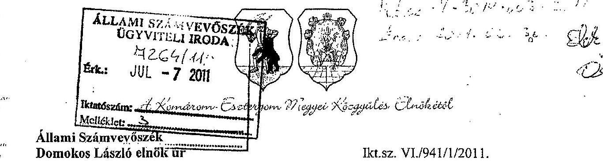

Budapest

Tárgy: a Komárom-Esztergom Megyei Önkormányzat pénzügyi helyzetéről készült számvevői jelentéshez elnöki kiegészítés

Tisztelt Elnök Úr!

A Komárom-Esztergom Megyei Önkormányzat pénzügyi helyzetének ellenőrzéséről szóló, az Állami Számvevőszék által részünkre megküldött jelentésben foglaltakkal kapcsolatban, azt kiegészítve, az Önkormányzat pénzügyi helyzetének megítélésével összefüggésben a további tények jelzését tarjuk még szükségesnek.

Komárom-Esztergom Megye Önkormányzata elsődlegesen és alapvetően a központi intézkedések hatására évente jelentkező jelentős mértékű bevételi kiesése a 2007-2010. évi kiadáscsökkentő, és - lehetőségeihez mérten - saját bevételnövelő intézkedésein túl 2011. évben is tovább folytatódott. Néhány fő bevételi forrás kiemelését jelen levelemben külön hangsúlyozni szeretném, mint pl. a jelentés 25. oldalán is olvasható, hogy az Önkormányzat illetékbevétel címen realizált bevétele a 2006. évi 2.105 millió Ft-ról 2010. évre - több mint 900 millió Ft-tal - 1.204 millió Ft-ra csökkent, a 2011. évi terv ezen a címen 1.253 millió Ft. Ezzel együtt az átengedett SZJA a 2007. évi 4.456 millió Ft-ról 2011. évben 2.078 millió Ft-ra mérséklődött.

Ha csak a fenti két, a kötelező feladatellátásához kapcsolódó, de nem normatív (pl. ellátotti létszám, teljesítménymutató) módon járó tényező együttes hatásának következményét (eredményét) vizsgáljuk, megállapítható, hogy Önkormányzatunk önhibáján kívül, kizárólag az idő közbeni igen kedvezőtlen központi intézkedések hatásaként közel 3,3 milliárd Ft-tal kevesebb állami támogatással, illetve átengedett bevétellel kap kevesebbet 2011.évben, mint 4-5 évvel korábban.

Komárom-Esztergom Megye Önkormányzata 2011. évi költségvetésének számszaki adattartalma, valamint az ÁSZ által vizsgált évekbeli beszámolóiból az is megállapítható, hogy az Önkormányzat kötelező feladatai ellátásához, az intézményei működtetéséhez, fenntartásához szükséges működési forrásai alapvetően a fenti központi intézkedések hatására csökkent bevételi források következményeként nem biztosították, illetve nem biztosítják ma sem a szükséges működési kiadások finanszírozását.

Az Önkormányzat sajnálatos módon az elmúlt évekbeli és az idei létszámcsökkentéseket, intézményi átszervezéseket, a lehetőségekhez mért - de igen korlátozott - bevételi forrásnöveléseket tovább nem tudja tovább csökkenteni, illetve növelni. Az elmúlt évekbeli keresztfinanszírozás (a felhalmozási bevételek egy részének működési célú kiadásokra történő

---

felhasználása) sem volt elegendő ahhoz, hogy az Önkormányzati fenntartású intézmények mára ne rendelkezzenek szállítói tartozással.

Mint az részben rögzítésre került a jelentés 23. oldalán szereplő megállapításban is, a felhalmozási célú bevételek - értve ez alatt a felhalmozási céllal kibocsátott kötvény még fel nem használt összegének betétként történő elhelyezéséből származó - tulajdonképpen felhalmozási bevétel, mint kamatbevétel egy részét is, Önkormányzatunk a müködési kiadásai finanszírozására használta fel, illetve tervezi felhasználni az idei évben is.

A fenti keresztfinanszírozás csökkentése érdekében Önkormányzatunk az idei évben döntött az ÖNHIKI pályázat benyújtásáról, azonban a tervezett bevételeknek, és azon belül is a várható felhalmozási bevételeknek a müködési kiadások esedékességétől eltérő üteme miatt, az Önkormányzat fenntartásában müködő intézmények likviditásának biztosítása érdekében a 2010. évben rendelkezésre álló - akkor még - 800 millió Ft összegű folyószámla hitelkeretet idén februárban 1.200 millió Ft-ra kényszerültünk emelni. E hitelkeret szerződés szerint 2011. október végéig áll rendelkezésünkre, a futamidő hosszabbítására vonatkozó igényünket, közgyűlési jóváhagyást követően kérjük számlavezetönktől.

Komárom-Esztergom Megye Önkormányzata elmúlt 4-5 évbeli, az Állami Számvevőszék jelentésében szereplő CLF modellben is bemutatott müködési- és felhalmozási hiánya mindamellett alakult ki, hogy ezen időszakban az Önkormányzat folyamatos kiadáscsökkentő intézkedéseket (feladat- és intézményátadásokat, intézményi átszervezéseket, létszámcsökkentéseket) tett annak érdekében, hogy alkalmazkodva a finanszírozási rendszer kedvezőtlen változásához, biztosítsa éves költségvetéseinek egyensúlyát, a kiadásokhoz szükséges bevételek realizálását. A legfőbb intézkedések hatásaként, mint az a jelentés 43. oldala is bemutatja, 1332 millió Ft megtakarítást nevesítettünk.

A 2011. évi költségvetésben a felhalmozási bevételek között szereplő tárgyi eszköz értékesítési bevétel cél (mintegy 172 millió Ft) realizálása, a lejárt szállítói tartozások finanszírozásához szükséges forrás biztosításának bizonytalansága okozza jelenleg a legnagyobb problémát. Önkormányzatunk folyószámla-hitelkerete most már nem teszi lehetővé a likviditás folyamatos biztosítását, a keret közel maximális igénybevétele miatt, ezért október óta havi rendszerességgel élünk a munkabérhítel igénybevételének lehetőségével, és az idei évben - a már meglévő, 2016. évben lejáró két, együttesen 950 millió Ft összegű, müködési célú hitelünk mellé - további 539 millió Ft összegű, éven túli lejáratú hitel felvételét tervezzük.

Amennyiben csak ezt, a többéves futamidejű müködési hitelfelvételt összesítjük, ami mintegy 1,5 milliárd Ft, megállapítható, hogy a fentiekben jelzett mindössze két tételből adódó, a központi intézkedések következményeként az elmúlt években cca. 3,3 milliárd Ft-tal csökkent állami finanszírozás közel $55 \%$-át ( 1,8 milliárd Ft-ot):

- részben kiadáscsökkentő intézkedésekkel,
- részben pedig a forgalomképes vagyonának értékesítésével, és nem utolsó sorban
- az idő közben fejlesztési céllal kibocsátott kötvényforrásból származó bevételek realizálásával
kompenzálni, biztosítani tudta Önkormányzatunk.
Azonban mind a forgalomképes ingatlanállomány, mind a még fel nem használt kötvényforrás korlátozott nagyságrenddel bír, és így az ezen forrásokból származó bevételek is természetszerűleg folyamatosan csökkennek.

---

Az Önkormányzat vizsgált időszakbeli beszámolóinak adattartalma és a jelen levelemhez mellékelt kitöltött táblázatok számszaki adatai egyértelműen és valósághủen tükrözik Önkormányzatunk pénzügyi- és vagyoni helyzetét.

A vagyon alakulása alapján megállapítható, hogy bár a végrehajtott fejlesztések, a teljesített felhalmozási- és felújítási kiadások, mint a befektetett eszközök állományát növelő tételek ellenére, a fentiekben jelzett, az évek során tervezett és megvalósított tárgyi eszköz értékesítéseken túl, a vagyon csökkenését eredményező értékcsökkenések összegének elkülönítését, esetlegesen abból valamilyen, a későbbi években felhasználható „Felhalmozási, felújítási Alap" képzését Önkormányzatunk nem tudta és az idei évben sem tudja tervezni.

Az Állami Számvevőszék javaslatainak megfelelően a Közgyűlést rendszeresen tájékoztatjuk az Önkormányzat pénzügyi helyzetéről, mint pl. a 2011. június 30 -i ülésen kerül beterjesztésre a 2011. évi költségvetési rendelet 2.sz. módosítása, mellyel összhangban - a pénzügyi helyzet ismertetésével együtt - beterjesztésre kerül a meglévő folyószámla hitelkeret futamidejének meghosszabbításáról és a már jelzett müködési hitel felvételéről szóló előterjesztés is.

A Komárom-Esztergom Megyei Önkormányzat pénzügyi egyensúlyának megtartása megítélésem szerint már rövidtávon is kockázatot hordoz, mivel a banki döntések még nem ismertek számunkra, s jelentős bizonytalanságot hordoznak. Amennyiben nem sikerül a folyószámlahitel szerződés lejáratát meghosszabítani, illetve a költségvetési hiány külső finanszírozására jóváhagyott éven túli működési hitelhez jutni, a fizetőképességünk az öszre kérdésessé válik, már a munkabérek kifizethetősége szintjén is, tekintettel arra, hogy a havi, kötelezettségvállaláson alapuló kiadásaink átlagosan, havi 90 M Ft -ot meghaladó mértékben magasabban a bevételeinknél. Amennyiben a bankok elutasítják kérelmünket, illetve nem kapunk további finanszírozást, az előre vetíti a más önkormányzatoknál bekövetkezett fizetésképtelenség lehetőségét.

Az Önkormányzat vezetése folytatja az intézményracionalizálásban, takarékos gazdálkodásban rejlő tartalékok feltárását, a költségvetés szűkítéséhez szükséges intézkedések meghozatalát. A 2011.06.30-i közgyűlésre előterjesztett anyagok az oktatási intézményeknél előírt óraszámcsökkentés, létszámcsökkentés hatásaként további jelentős, de nem elégséges költségcsökkentést tartalmaznak. A fentiekben is bemutatottak alapján már önerőből a pénzügyi egyensúly fenntartása meghaladja a lehetőségeinket.

Kérem kiegészítő anyagom szíves elfogadását!
Tatabánya, 2011. 06. 29.

Melléklet: 3 db táblázat
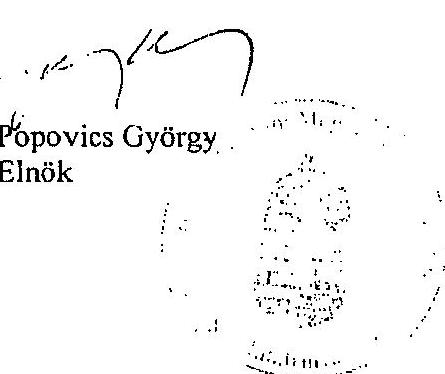

---

.

---

# Popovics György úr   elnök 

Komárom-Esztergom Megye Önkormányzata

## Tatabánya

## Tisztelt Elnök Úr!

Az Önkormányzat pénzügyi helyzetéről készült jelentés-tervezethez készített kiegészítését megkaptam, azt köszönettel vettem.

Kiegészítésében a jelentés-tervezetben foglalt megállapításainkat nem vitatta, észrevételei azokat igazolják.

Köszönöm Elnök úrnak és munkatársainak az ellenőrzés során tanúsított hozzáállását, amellyel a pénzügyi helyzetelemzés elkészítésében részt vettek, azt munkájukkal segítették.

Budapest, 2011. december " 10 ".
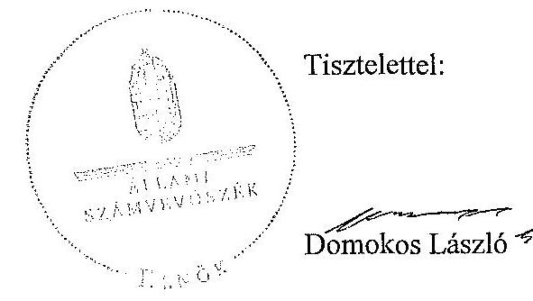

Melléklet: jelentés

---

.