# ÁLLAMI   SZÁMVEVŐSZÉK 

## JELENTÉS

a Nógrád Megyei Önkormányzat pénzügyi helyzetének ellenőrzéséről (43/2)

---

# Számvevői Iroda 

Iktatószám: V-3020-10/2011.
Témaszám: 1015
Vizsgálat-azonosító szám: V056012

## Az ellenőrzést felügyelte:

Dr. Varga Sándor
számvevő igazgató-helyettes
Az ellenőrzést vezette:
Renkó Zsuzsanna
számvevő tanácsos
Az ellenőrzést végezték:

| Veres Jánosné | Szilágyi Nándorné | Lakatos József |
| :-- | :-- | :-- |
| számvevő tanácsos | számvevő | számvevő |

A témához kapcsolódó eddig készített számvevőszéki jelentések:
címe
témaszám
Jelentés a Nógrád Megyei Önkormányzat gazdálkodási rendszerének 2010. évi ellenőrzéséről

---

# TARTALOMJEGYZÉK 

BEVEZETÉS ..... 5
I. ÖSSZEGZŐ MEGÁLLAPÍTÁSOK, KÖVETKEZTETÉSEK, JAVASLATOK ..... 12
II. RÉSZLETES MEGÁLLAPÍTÁSOK ..... 17

1. Az Önkormányzat kötelező és önként vállalt feladatai ..... 17
2. Pénzügyi egyensúlyi helyzet alakulása ..... 19
2.1. A múködési és felhalmozási egyensúly alakulása ..... 22
2.2. Az Önkormányzat bevételei ..... 26
2.3. Az Önkormányzat kiadásai ..... 29
3. Kötelezettségek bemutatása ..... 34
3.1. A pénzintézetek felé fennálló kötelezettségek ..... 34
3.2. Szállítók felé fennálló kötelezettségek ..... 39
3.3. Egyéb kötelezettségek ..... 41
4. A pénzügyi egyensúly megteremtése érdekében hozott intézkedések ..... 41
5. A helyi önkormányzatok gazdálkodási rendszerének 2007. évi ellenőrzése során a pénzügyi egyensúly javítására tett szabályszerűségi és célszerűségi javaslatok hasznosulása ..... 47

---

# MELLÉKLETEK 

1. számú Múködési és felhalmozási hiány/többlet az Önkormányzat rendeleteiben melléklet
2/a. számú Az Önkormányzat CLF módszer szerint besorolt bevételei és kiadásai 2007melléklet 2010 között
2/b. számú Az Önkormányzat bevételeinek és kiadásainak, adósságszolgálatának melléklet alakulása 2007-2010 között
2. számú Az Önkormányzat 2007-2010 években megvalósított, illetve 2010. decem-
melléklet ber 31-én fennálló fejlesztési feladatokhoz kapcsolódó kötelezettségeinek összegzése
3. számú Nógrád Megyei Közgyűlés elnökének észrevétele melléklet
4. számú Nógrád Megyei Közgyűlés elnökének észrevételére adott válasz melléklet

---

# RÖVIDÍTÉSEK JEGYZÉKE 

## Törvények

Áht.
ÁSZ tv.

Htv.

Ötv.

## Rendeletek

2007. évi költségvetési rendelet
2008. évi költségvetési rendelet
2009. évi költségvetési rendelet
2010. évi költségvetési rendelet
2011. évi költségvetési rendelet
2007. évi zárszámadási rendelet

2008. évi zárszámadási rendelet

2009. évi zárszámadási rendelet

2010. évi zárszámadási rendelet

## Szórövidítések

áfa
APEH
ÁSZ
BM
EDP hiány/egyenleg
EU
főjegyzó
GDP
Hivatal
az államháztartásról szóló 1992. évi XXXVIII. törvény az Állami Számvevőszékről szóló 1989. évi XXXVIII. törvény (2011. július 1-jétől az Állami Számvevőszékről szóló 2011. LXVI. törvény)
a helyi önkormányzatok és szerveik, a köztársasági megbízottak, valamint egyes centrális alárendeltségű szervek feladat- és hatásköreiről szóló 1991. évi XX. törvény
a helyi önkormányzatokról szóló 1990. évi LXV. törvény
Nógrád Megyei Önkormányzat 6/2007. (II. 19.) számú rendelete az Önkormányzat 2007. évi költségvetéséről Nógrád Megyei Önkormányzat 5/2008. (II. 19.) számú rendelete az Önkormányzat 2008. évi költségvetéséről Nógrád Megyei Önkormányzat 3/2009. (II. 19.) számú rendelete az Önkormányzat 2009. évi költségvetéséről Nógrád Megyei Önkormányzat 1/2010. (II. 3.) számú rendelete az Önkormányzat 2010. évi költségvetéséről Nógrád Megyei Önkormányzat 3/2011. (II. 23.) számú rendelete az Önkormányzat 2011. évi költségvetéséről Nógrád Megyei Önkormányzat 12/2008. (IV. 30.) számú rendelete az önkormányzat és intézményei 2007. évi gazdálkodásáról
Nógrád Megyei Önkormányzat 13/2009. (IV. 25.) számú rendelete az Önkormányzat és intézményei 2008. évi gazdálkodásáról
Nógrád Megyei Önkormányzat 9/2010. (V. 3.) számú rendelete az Önkormányzat és intézményei 2009. évi gazdálkodásáról
Nógrád Megyei Önkormányzat 11/2011. (IV. 29.) számú rendelete az Önkormányzat és intézményei 2010. évi gazdálkodásáról
általános forgalmi adó
Adó- és Pénzügyi Ellenőrzési Hivatal, 2011. január 1-jétől Nemzeti Adó- és Vámhivatal
Állami Számvevőszék
Belügyminisztérium
Uniós módszertan szerinti, maastrichti kritériumoknak megfelelő számítás szerinti hiány/egyenleg
Európai Unió
Nógrád Megyei Önkormányzat főjegyzője
Bruttó hazai termék
Nógrád Megyei Önkormányzat Közgyűlésének Hivatala

---

| IBR | Irányított Betegellátási Rendszer 2004-2008. évek között |
| :-- | :-- |
| Illetékhivatal | Nógrád Megyei Illetékhivatal |
| Kórház | Szent Lázár Megyei Kórház |
| Közgyűlés | Nógrád Megye Közgyűlése |
| Közgyűlés elnöke | Nógrád Megyei Közgyűlés Elnöke |
| KSH | Központi Statisztikai Hivatal |
| NGM | Nemzetgazdasági Minisztérium |
| OEP | Országos Egészségbiztosítási Pénztár |
| Önkormányzat | Nógrád Megyei Önkormányzat |
| PPP konstrukció | Public Private Partnership (Partnerségi együttműködés köz- |
|  | feladatok ellátására a magánszektor bevonásával) |
| SNA | System of National Accounts, Nemzeti Számlák Rendszere |
| szja | személyi jövedelemadó |
| SzMSz | Nógrád Megye Önkormányzatának 24/2003. (XII. 29.) |
|  | számú rendelete a Közgyűlés és szervei Szervezeti és Műkö- |
|  | dési Szabályzatáról |
| TDM | Turisztikai Desztinációs Menedzsment |

---

# JELENTÉS 

## a Nógrád Megyei Önkormányzat pénzügyi helyzetének ellenőrzéséről

## BEVEZETÉS

Az Állami Számvevőszék 2011. évtől érvényes stratégiája új irányt szabott a helyi önkormányzatok gazdálkodásának ellenőrzésében is. Az ÁSZ - küldetése és jövőképe szerint - szilárd szakmai alapokra támaszkodva értékteremtő ellenőrzéseivel és helyzetelemzéseivel az államháztartás egészében, így a helyi önkormányzati alrendszerben is elő kívánja segíteni a közpénzek és a közvagyon szabályos, gazdaságos, hatékony és eredményes hasznosítását. E folyamat részeként - a 2010. évi államháztartási hiány alakulásának összetevőire is figyelemmel - megkezdődött az önkormányzati alrendszer pénzügyi helyzetelemzése.

Az NGM 2011 áprilisában közzétett adatai szerint ${ }^{1}$ a 2010. évi 1036,2 milliárd Ft összegű, 3,8\%-os EDP (maastrichti kritériumok szerinti, Túlzott Hiány Eljárás keretében kimutatott) hiánycél nem volt tartható, az önkormányzati alrendszer tervezettet meghaladó hiánya miatt a GDP arányában kifejezett államháztartási hiány 4,2\%-ra emelkedett.

Az önkormányzatok költségvetési jelentése szerint 2010. első három negyedév végén az önkormányzati alrendszer pénzforgalmi hiánya 97 milliárd Ft volt a tervezett éves mérték 51\%-át érte el. Bár az elmúlt években kiugróan magas hiány halmozódott fel az utolsó negyedévben, a 97 milliárd Ft-os szeptember végi hiány nem indokolta az önkormányzati alrendszer 190 milliárd Ft-ra becsült éves hiányának felülvizsgálatát. A tervezett hiány túllépése, az utolsó negyedévi 150 milliárd Ft-os pénzforgalmi hiány nem volt reálisan feltételezhető. A helyi önkormányzatok januári gyorsjelentése szerint a pénzforgalmi hiány 247,7 milliárd Ft-ot tett ki. A tervezettnél nagyobb önkormányzati pénzforgalmi hiány kialakulásában - az NGM által az éves költségvetési beszámoló elkészítéséhez kiadott tájékoztató szerint - az iparűzési adó elmaradása, a gépjárműadó, az illetékek és más bevételek tervezettnél alacsonyabb összegben teljesülése volt a meghatározó.

[^0]
[^0]:    ${ }^{1}$ NGM Tájékoztatás Magyarország Strukturális Reformprogramjának végrehajtásáról (2011. április 1). A Tájékoztató évente két alkalommal - április és október hónapban jelenik meg.

---

A megyei önkormányzatok kötelező feladatellátását többlépcsős törvényi előírások határozzák meg. A feladatokra vonatkozó szabályozás első szintjét az Ötv. ${ }^{2}$, a második szintet a hatásköri ${ }^{3}$, a harmadik szintet a további ágazati, szakmai törvények (egyebek mellett az oktatási, egészségügyi, szociális) adják.

A megyei önkormányzatok a feladatellátás és a központi forráselosztás tekintetében sajátos helyet foglalnak el a helyi önkormányzati rendszerben. A megyei önkormányzat kötelező feladatainak egy része - így a megyében lévő természeti és társadalmi muzeális emlékek, a történeti iratok gyűjtése, őrzése, tudományos feldolgozása, a megyei könyvtári szolgáltatás, a pedagógiai és közművelődési szakmai tanácsadás és szolgáltatás, a megyei testnevelési és sportszervezési feladatellátás, a gyermek- és ifjúsági jogok érvényesítése, a gyermekvédelmi- és szociális szakellátás - az Ötv-ből közvetlenül levezethető kötelezettség.

A középiskolai, szakiskolai, és kollégiumi ellátás, a fogyatékos gyermekek oktatása, nevelése, gondozása az ágazati törvény szerint a megyei önkormányzat kötelező feladata. Azonban, ha a települési önkormányzat lát el ilyen feladatot, és arról lemond, a megyei önkormányzatnak a feladatot át kell vennie. Így a megyei önkormányzatok által ellátandó kötelező közszolgáltatások ellátásának mértékére a települési önkormányzatok döntései jelentősen kihatnak.

Az alapellátást meghaladó egészségügyi szakellátás biztosítása akkor képezi a megyei önkormányzat feladatát, ha az önkormányzati vagyon kialakításáról szóló törvényben ${ }^{4}$ a feladat ellátásához szükséges vagyont az önkormányzat a tulajdonába kapta.

Az önként vállalt feladat ellátására - mivel annak vállalása a kötelező feladatok ellátását nem veszélyeztetheti - a kötelező közszolgáltatások mértékének alakulása lényegi hatással van.

A feladat és hatáskör telepítés sajátosságai mellett a megyei önkormányzatok kialakított forrásszerkezete, a központi költségvetéstől való erőteljes függősége is determinálja az önkormányzatok feladatellátásra vonatkozó döntéseit.

A 2007-2010. években az önkormányzati feladatok ellátásának keretet biztosító forrásszabályozás - ennek részeként az illetékbevételből és a személyi jövedelemadóból való részesedés szabályai - a megyei önkormányzatok vonatkozásában nem változtak:

- A megyei önkormányzatok saját bevételein belül az illetékbevételek döntően az ingatlanpiac stagnálása, majd visszaesése, és egyes illetékkedvezmények bevezetése következtében - megyénként differenciált mértékben ugyan, de - 2010-re általánosan visszaestek. A 2010. évben befolyt 39,2 milliárd Ft illetékbevétel a 2006. évben rea-

[^0]
[^0]:    ${ }^{2}$ Ötv. 69-70. §-ai
    ${ }^{3}$ a Htv.
    ${ }^{4}$ Az egyes állami tulajdonban lévő vagyontárgyak önkormányzatok tulajdonba adásáról szóló 1991. évi XXXIII. törvény

---

lizált 71,1 milliárd Ft illetékbevétel alig több mint 55\%-a volt. A kieső bevételek pótlására az önkormányzati alrendszer szintjén történtek intézkedések, 2010-ben 5 milliárd Ft-ot, 2011-ben 1,2 milliárd Ft-ot ellentételezett a központi költségvetés. Az illetékbevételt a megyei önkormányzatok a saját folyó bevételeik között számolják el ${ }^{5}$.

Az illetékek kivetésének és beszedésének joga 2006. december 31-ig a megyei önkormányzatok feladata volt. A 2007. évtől a megyei illetékhivatalok illetékbeszedési feladatait az APEH vette át ${ }^{6}$. Az önkormányzati illetékrészesedési szabályok változatlanok maradtak, azonban az illetékbeszedés költségeit az önkormányzatok illetékbevételeiből átlagos (a Fővárosnál 4,0\%-os, a megyei és megyei jogú városi önkormányzatnál $8,5 \%$-os) kulcsot alkalmazva vonták le. E döntés következtében azon megyei önkormányzatok, amelyek a $8,5 \%$-os költségnél kedvezőbb költségszint mellett látták el korábban ezt a feladatot, kedvezőtlenebb helyzetbe kerültek.

- Az önkormányzati alrendszer személyi jövedelemadóból való részesedésének makroszintű szabályozása nem változott 2007-2010 között7. A helyi önkormányzatokat normatív módon megillető $32 \%$-os részesedés visszaosztásának részletszabályai azonban a megyei önkormányzatok számára - a reálgazdaság kedvezőtlen irányú folyamatai, és az államháztartás egyensúlyi helyzetére tekintettel elrendelt kormányzati intézkedések miatt - megszorító intézkedéseket jelentettek. Összesen 17 milliárd Ft -2007-ben 10 milliárd Ft, 2010-ben további 7 milliárd Ft - szja-t vontak ki a megyei önkormányzatok gazdálkodási köréből ${ }^{8}$. Az átengedett személyi jövedelemadó a megyei önkormányzatok egyik bevétele.

[^0]
[^0]:    ${ }^{5}$ A megyei önkormányzatok illetékbevételei az önkormányzati alrendszer saját folyó bevételeiből 2007-ben 35,9 milliárd Ft-ot (61,4\%-ot), 2008-ban 41,5 milliárd Ft-ot ( $61,7 \%$-ot), 2009-ben 36,5 milliárd Ft-ot ( $62,5 \%$-ot), 2010-ben 25,1 milliárd Ft-ot $(64,1 \%$-ot) tettek ki.
    ${ }^{6}$ Az egyes pénzügyi tárgyú törvények módosításáról szóló 2006. évi LXI. törvény 115. §a, amely az adózás rendjéről szóló 2003. évi XCII. törvény 73. §-át módosította.
    ${ }^{7}$ A megyei önkormányzatok személyi jövedelemadó részesedése az önkormányzati alrendszer átengedett bevételeiből 2007-ben 34,7 milliárd Ft-ot ( $7,0 \%$-ot), 2008-ban 51,2 milliárd Ft-ot ( $9,2 \%$-ot), 2009-ben 59,2 milliárd Ft-ot ( $9,3 \%$-ot), 2010-ben 56,3 milliárd Ft-ot $(8,3 \%$-ot) tett ki.
    ${ }^{8}$ A megyei önkormányzatok szja kiegészítése háromelemű. A tételes, minden megyére egységesen meghatározott összeg - az adott évek költségvetési törvényeinek 4. sz. mellékletében meghatározottak szerint - 2006-ban 593 millió Ft, 2007-ben és 2008-ban egyaránt 355 millió Ft, 2009-ben 370 millió Ft volt. A megye népességszáma után járó kiegészítés a 2006. évi 208 Ft/fő összegről 2010-re 120 Ft/fő-re, a megyei intézmények ellátottjai után járó kiegészítés 42236 Ft/ellátottról 20755 Ft/ellátottra csökkent.

---

A megyei önkormányzatok 2007-2010 között rendelkezésre álló forrásait az alábbiakban mutatjuk be;
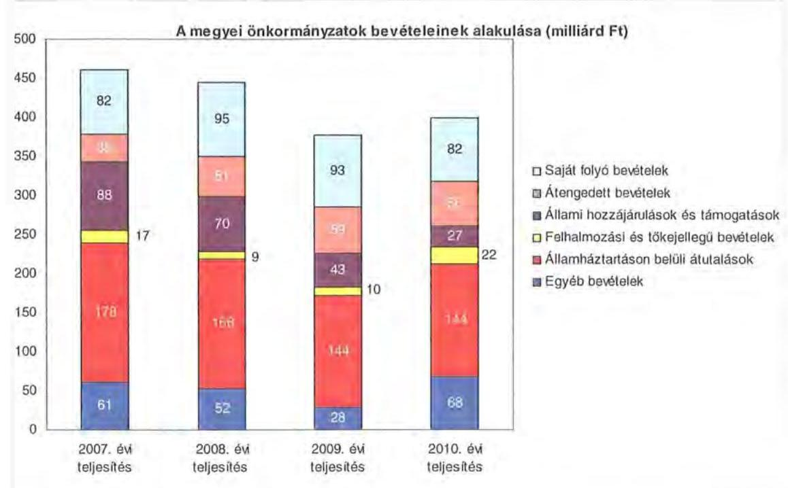

A megyei önkormányzatok saját folyó bevételeinek részaránya - amelyek fóbb elemei: az intézményi térítési díjak, az illetékbevétel, a kamatbevételek - a 2007. évi összbevételen ( 461 milliárd Ft) belül 17,9\% volt, amely 2010-re annak ellenére 20,6\%-ra nőtt, hogy az összege 82 milliárd Ft maradt. Ennek oka az volt, hogy az összbevétel a 2007. évi 461 milliárd Ft-ról 2010-re 399 milliárd Ftra csökkent.

Az átengedett bevételek, amelyek a megyei önkormányzatoknál a személyi jövedelemadóból való részesedést jelentették, az összbevételen belül a 2007. évi 35 milliárd Ft-ról 56 milliárd Ft-ra nőttek.

Az állami hozzájárulások és támogatások - amelyek fóbb elemei: az ellátotti létszámhoz kötődő normatív állami hozzájárulások, központosított, fejezeti szinten kezelt célelőirányzatból juttatott múködési és fejlesztési támogatások a 2007. évi 88 milliárd Ft-ról (19,1\%-os részarányról) 2010-re 27 milliárd Ft-ra ( $6,8 \%$-os részarányra) estek vissza.

A felhalmozási és tőkejellegú bevételek - tárgyi eszközök (ingatlanok és ingóságok), föld és immateriális javak, részesedések értékesítése, EU-tól átvett pénzeszközök - a 2007. évi 17 milliárd Ft-ról (3,6\%-os részarányról) 2010-re 22 milliárd Ft-ra (5,4\%-ra) emelkedtek.

Az államháztartáson belüli átutalások részesedése 2007-ben 178 milliárd Ft volt. 2010. év végére 34 milliárd Ft-tal csökkent, részaránya 38,6\%-ról 2,6 százalékpontos csökkenés után 2010-ben $36 \%$-ra változott. Ez a bevételi kategória

---

tartalmazza az egészségbiztosítási és egyéb elkülönített állami pénzalapoktól átvett forrásokat. A 2010-ben e címen elszámolt bevétel 144 milliárd Ft volt.

A megyei önkormányzatok központi költségvetésből származó bevételeinek öszszege 2007-ben 400 milliárd Ft volt, amely 2010. évre 331 milliárd Ft-ra (az időszak alatt összesen 69 milliárd Ft-tal) 17,3\%-kal csökkent.

Az egyéb, pénzmaradványból, vállalkozási bevételekből, államháztartáson kívülről származó átutalásokból, a hitelekből, a hosszú és rövid lejáratú értékpapírok értékesítéséből származó bevételek részesedése a 2007-2010. évek viszonylatában 13,3\%-ról 17,1\%-ra emelkedett. Ez utóbbiak 2010. évi beszámoló szerinti összevont teljesítése 68 milliárd Ft volt ${ }^{9}$.

Mindezeket figyelembe véve 2007 és 2010-ben a megyei önkormányzatok forrásösszetételének megoszlását az alábbi ábra szemlélteti:

A megyei önkormányzatok 2007-2010. évi forrásainak megoszlása (\%-ban)
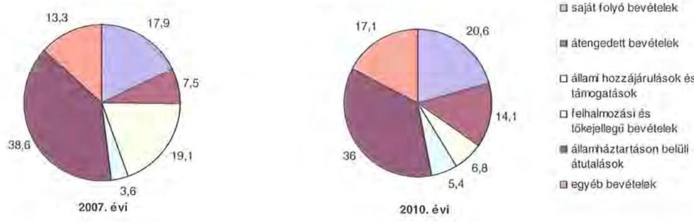

Annak ellenére, hogy a megyei önkormányzatok kötelezően ellátandó feladataikat 2007-hez képest kevesebb intézményben, csökkenő foglalkoztatotti létszám mellett végezték ${ }^{10}$, a jelentős bevételkiesést a - szervezési intézkedések hatására - csökkenő ráfordítások nem tudták kompenzálni. Az ellátottak száma a szociális, gyermekvédelmi ágazat bentlakásos elhelyezést nyújtó intézményeit kivéve - eltérő mértékben ugyan, de minden ágazatban évről évre csökkent, amely a fajlagos hozzájárulások csökkenésével együtt a normatív állami hozzájárulás arányának visszaeséséhez vezetett.

A 2007-2013-as időszakra meghirdetett, vissza nem térítendő EU-s fejlesztési forrásokhoz való hozzájutás lehetősége felerősítette az önkormányzati alrendszer fejlesztési igényeit. A fokozott fejlesztési tevékenység a felhalmozási bevéte-

[^0]
[^0]:    ${ }^{9}$ Az egyéb bevételek összege 2007-2010 között eltérő módon változott, 2007-ben 61 milliárd Ft volt, 2008-ban 52 milliárd Ft-ra, 2009-ben 28 milliárd Ft-ra esett vissza, majd 2010-ben ismét - 68 milliárd Ft-ra - emelkedett.
    ${ }^{10}$ a BM által 2010 decemberében elvégzett felmérés adatai szerint

---

lek és kiadások egyensúlyának megbomlásán ${ }^{11}$ túl a jelentkező jövőbeni fenntartási kötelezettség miatt tovább terhelhetik az önkormányzatok költségvetését.

A megyei önkormányzatok felhalmozási és múködési célú pénzintézeti és szállítói kötelezettségeinek állománya a vizsgált időszakban erőteljesen növekedett.

A hosszú lejáratú kötelezettségek alakulását a következő ábra szemlélteti:

Hosszú lejáratú kötelezettségek
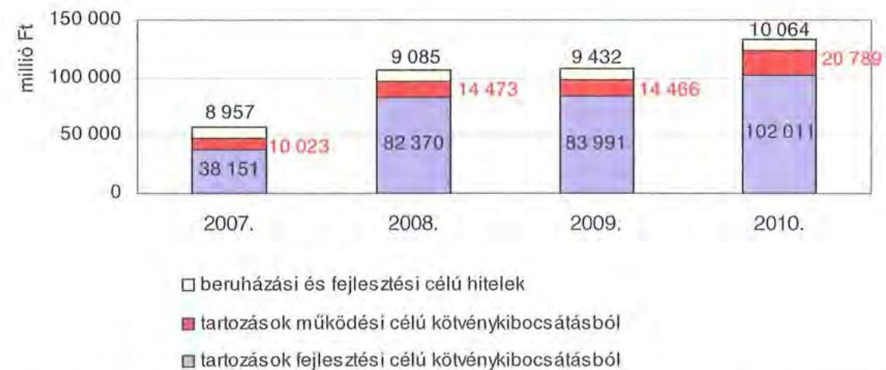

A hosszú lejáratú kötelezettségek mellett az időszakban a 2007. évi 22 milliárd Ft-ról 24 milliárd Ft-ra ( $8,8 \%$-kal) növekedett az áruszállításból származó szállítói kötelezettségek állománya.

A mérlegben kimutatott kötelezettségek állománya mellett az elhasználódott eszközök pótlására forrást biztosító amortizációs (felújítási) alap képzésének ${ }^{12}$ elmaradása további problémákat vetít előre. A megyei önkormányzatok beszámolójelentéseinek összegzése szerint 2007-ben még az elszámolt értékcsökkenés $90 \%$-ának megfelelő összeget fordítottak felújítási célokra, 2009-ben ez az arányszám már csak $16,5 \%$ volt. Ez maga után vonta a feladatellátást kiszolgáló tárgyi eszközök állagának erőteljes romlását.

Az ÁSZ a 2011. évi ellenőrzési tervében a 43. számú, az „Önkormányzatok gazdálkodási rendszerének ellenőrzése" részeként egy időben, egymással párhuzamosan tekinti át és elemzi az önkormányzati alrendszer középszintjét jelentő 19 megyei önkormányzat pénzügyi helyzetét. A gazdálkodás szabályszerűségét az

[^0]
[^0]:    ${ }^{11}$ Az önkormányzati alrendszerben - az éves zárszámadási törvényjavaslatok általános indokolása, X. Helyi önkormányzatok gazdálkodása fejezet szerint - a felhalmozási bevételek és kiadások egyenlege 2007-ben 142,4 milliárd Ft, 2008-ban 112,3 milliárd Ft, 2009-ben 234,5 milliárd Ft hiányt mutatott.
    ${ }^{12}$ Erre a jelenlegi szabályozási környezetben nem kötelezi semmilyen előírás az önkormányzatokat.

---

ÁSZ előző évek során ellenőrizte a megyei önkormányzatoknál is, ezért jelen vizsgálatunk erre nem tér ki.

A jelentés a megyei önkormányzatok sajátos feladatellátási és forrásszabályozási helyzetére tekintettel a megyei önkormányzatok pénzügyi helyzetét, illetve az ezzel összefüggő korábbi ÁSZ javaslatok megvalósítását mutatja be.

Az ellenőrzés a 2007. január 1. - 2011. március 31. közötti időszakot ölelte fel.
A vizsgálat jogszabályi alapját 2011. július 1-je előtt az Állami Számvevőszékről szóló 1989. évi XXXVIII. törvény 2. § (3), (5), (6) és (9) bekezdéseiben, az Ötv. 92. § (1) bekezdésében és az Áht. 104. § (3) bekezdésében, 2011. július 1-jét követően az Állami Számvevőszékről szóló 2011. évi LXVI. törvény 1. § (3) bekezdésében, az 5. § (2)-(6) bekezdéseiben és az Áht. 120/A. § (1) bekezdésében foglalt előírások képezték.

Nógrád megye országos és régión belül elfoglalt helyzetét 2010. december 31én az alábbi mutatók szemléltetik (a megyei jogú várossal együtt):

Index: az előző év azonos időszak (időpontja)=100,0

| Mutató megnevezése | Nógrád megye | Északmagyarországi régió | Országos |
| :--: | :--: | :--: | :--: |
| Népesség száma (ezer fö)* | 202 | 1195 | 9986 |
| Népesség változás indexe (\%) | 98,6 | 98,8 | 99,7 |
| Az ipari termelés volumenindexe (\%) | 110,3 | 118,0 | 110,7 |
| Egy lakosra jutó ipari termelési érték (ezer Ft) | 781,7 | 2028,2 | 2044,4 |
| Ezer lakosra jutó vállalkozások száma (db) | 113 | 120 | 165 |
| A beruházások egy lakosra vetített teljesítményértéke (millió Ft) | 79,8 | 180,1 | 304,7 |
| Foglalkoztatási arány (\%) | 41,0 | 43,5 | 49,5 |
| Munkanélküliségi ráta (\%) | 18,1 | 15,6 | 10,8 |
| Alkalmazásban állók havi nettó átlagkeresete ( Ft$)$ | 107066 | 114195 | 132628 |
| Alkalmazásban állók havi nettó átlagkeresetének indexe (\%) | 105,9 | 106,5 | 106,9 |

*Ebből Salgótarján megyei jogú város népessége 39 ezer fő.
A táblázat adatai azt jelzik, hogy a népesség száma a megyében 202 ezer fő, amely az országos átlagnak a 2,0\%-a. A megye népességmegtartó képessége rosszabb az országos átlagnál a gazdaság alacsonyabb dinamizmusa következtében. Ebből következik, hogy a foglalkoztatási arány és a munkanélküliségi ráta rosszabb az országos átlagnál.

Nógrád megyében 131 települési - egy megyei jogú városi, öt városi és 125 községi - önkormányzat múködött.

---

# I. ÖSSZEGZŐ MEGÁLLAPÍTÁSOK, KÖVETKEZTETÉSEK, JAVASLATOK 

A Nógrád Megyei Önkormányzat 2010-ben 12791 millió Ft összes költségvetési kiadásából - az Önkormányzat adatszolgáltatása szerint - 99,9\%-ot, 12784 millió Ft-ot a kötelező feladatai ellátására fordított. Az Önkormányzat önként vállalt feladatai a civil szervezetek közösségi, társadalmi, hagyományőrző és turisztikai rendezvényeihez kapcsolódtak, illetve támogatást nyújtottak a megyei diáksport feladatok ellátásához összesen hétmillió Ft összegben. Az SzMSz a kötelező közszolgáltatási feladatokat és azok ellátásának szervezeti keretét általános jelleggel, a vonatkozó jogszabályokra hivatkozással határozta meg.

Az Önkormányzat a kötelező és önként vállalt feladatait 2006. december 31-én a Hivatallal együtt 22 intézménnyel, 67 telephelyen, 2010. december 31-én a Hivatallal és 19 intézménnyel, 75 telephelyen látta el. Az intézmények száma 2007-2010. között két intézmény és telephelyei átvételével és a folyamatosan végrehajtott intézményi integráció eredményeként alakult ki.

A folyó költségvetés egyenlege 2007-2009. években összesen 1319 millió Ft múködési forrástöbbletet mutatott. A 2008. évet követően a folyó kiadások folyó bevételekhez viszonyított kedvezőtlenebb dinamikája következtében a pozitív egyenleg 2009. évben 87 millió Ft-ra, $88 \%$-kal esett vissza az előző évhez képest. A 2010. évben a kedvezőtlen tendencia tovább folytatódott, melynek eredményeként a múködési jövedelem már negatívvá vált (-245 millió Ft). A tőketörlesztések összege a vizsgált években eltérő irányú változást mutatott, 2007-ben 9 millió Ft, 2008-ban 314 millió Ft és 2009-ben 150 millió Ft, a 2010. évben az Önkormányzatnak nem volt törlesztési kötelezettsége. A 2007-2008. évi múködési megtakarítás csökkenő mértékben bár, de fedezetet nyújtott a tőketörlesztésre fordított kiadásokra, 2009. évtől azonban a nettó múködési jövedelem már negatívvá vált. A pénzügyi kapacitás a vizsgált időszak során 513 millió Ft-ról - 245 millió Ft-ra csökkent.

A 2007-2010. években az Önkormányzat felhalmozási költségvetésének egyenlege folyamatosan negatív összegű volt, amely a vizsgált időszakban összesen 2171 millió Ft felhalmozási hiányt okozott.

A pénzügyi egyensúly fenntartása külső források bevonásával volt biztosítható. Az Önkormányzat 2007-2010. években 473 millió Ft hitelt törlesztett. Az adósságszolgálat, továbbá a felhalmozási forráshiány a vizsgált időszakban összesen 2644 millió Ft-ot tett ki, amelyre a fenti időszak során képződő 1074 millió Ft múködési jövedelem, valamint a 2007. január 1-jén rendelkezésre álló 393 millió Ft pénzeszköz szolgált fedezetül. A finanszírozáshoz szükséges további pénzeszközöket 1859 millió Ft hitelfelvétellel ( 1509 millió Ft folyószámlahitel, 200 millió Ft éven túli múködési hitel és 150 millió Ft fejlesztési hitel), továbbá 1500 millió Ft kötvénykibocsátással biztosították.

---

A vizsgált években keletkezett nettó működési forráshiány kedvezőtlen alakulásában meghatározó szerepet játszott, hogy az Önkormányzat legfőbb bevételi forrásai - a jogszabályi kedvezmények bővülése és az ingatlanforgalom visszaesése következményeként az illetékbevétel, valamint a központi forráskivonás hatására az átengedett szja és az állami támogatások - 2007. évről 2010. évre 4933 millió Ft-ról 3962 millió Ft-ra, 20\%-kal csökkentek.

Az Önkormányzatnál az illetékbevétel 2010-re a 2006. évi 1670 millió Ft-ról (60,2\%-ára) 1006 millió Ft-ra csökkent. Az átengedett szja és az állami támogatás együttes összege a központi támogatáscsökkentésen túl a feladatátvétel hatását is figyelembe véve kevesebb lett, 2010-ben 2956 millió Ft volt a 2007. évi 3484 millió Ft 84,8\%-a. Az OEP-től származó bevételek a 2007. évi 4017 millió Ft-ról 2010-re 585 millió Ft-tal (14,6\%-kal), 4602 millió Ft-ra emelkedtek. Az egyéb saját bevételek a vizsgált időszak során 1517 millió Ft-tal, 75,5\%-kal növekedtek, ezen belül 2010. évben az intézmények működési bevétele 806 millió Ft-tal, 57,6\%-kal haladta meg a 2007. évi ténylegest (1393 millió Ft) az átvett két, valamint a megépült egy új intézmény, továbbá az intézményi térítési díjak (különösen a szociális ágazathoz tartozó intézményeknél) évenkénti emelése miatt.

A múködési kiadások a 2007. évi 11179 millió Ft-ról 2010-re 12271 millió Ft-ra, 1092 millió Ft-tal, 9,8\%-kal emelkedtek. Ennek jelentős részét az átvett két és a megépült egy új intézmény többletkiadása okozta. A Kórház nélkül az intézmények teljesített kiadásai 2007-ben 6757 millió Ft-ot tettek ki (az összes működési kiadás 60,4\%-a), amely 2010-re 7115 millió Ft-ra nőtt (az összes múködési kiadás $58 \%$-a).

A működési és felhalmozási kiadásokon belül 2007-2010 között a felhalmozási kiadások súlya 1286 millió Ft-ról (10,3\%-ról) 520 millió Ft-ra (4,1\%-ra) csökkent. Az aktív pályázati tevékenység eredményeként 2007-2010 között 12381 millió Ft bekerülési költségű beruházást folytatott, illetve indított el az Önkormányzat, amelyből 5657 millió Ft a 2009-2011. években vállalt kötelezettség. Az utóbbi forrásai az Önkormányzat adatszolgáltatása szerint a következők: 84 millió Ft tervezett saját bevétel (maradvány-felhasználással), 786 millió Ft kötvénybevételből származó pénzmaradvány, 4738 millió Ft EU-s és 49 millió Ft hazai támogatás. A 2010. év után vállalt kötelezettségből 721 millió Ft $(12,7 \%)$ a Kórház fejlesztéseit finanszírozta.

Az Önkormányzat pénzintézeti kötelezettségeinek állománya a könyvviteli mérlegadatok szerint 2006. december 31-től 2010. december 31-ig közel 10 millió Ft-ról 3488 millió Ft-ra nőtt. Az Önkormányzat fennálló pénzintézeti kötelezettségei kötvény kibocsátásából, hosszú lejáratú hitel igénybevételéből, valamint folyószámla és munkabér megelőlegezési hitelek igénybevételéből keletkeztek. A vizsgált időszakban adósságszolgálatra az Önkormányzat 610 millió Ft-ot teljesített, amelyből a kamatkiadás 137 millió Ft volt. A kötvényből származó forrás befektetéséből realizált kamatbevétel 346 millió Ft, amelyből 313 millió Ft a 2008-2010. években, 33 millió Ft a 2011. évben keletkezett.

---

Az Önkormányzatnak a 2010. évben minden nap volt folyószámlahitele, átlagosan 831 millió Ft, a munkabérek kifizetéséhez azonban nem vett igénybe munkabér megelőlegezési hitelt, amelynek oka a bevételkiesések miatt megemelt folyószámlahitel kedvezőbb kondíciója volt.

Az Önkormányzat 2010. év végi pénzintézeti kötelezettségéből 2091 millió Ft (60\%) fejlesztési célú kötvények kibocsátásából, 200 millió Ft (5,7\%) hosszú lejáratú múködési célú hitel felvételéből, továbbá 1197 millió Ft (34,3\%), a költségvetési év végén ki nem egyenlített folyószámlahitelből keletkezett. Ezek miatt az Önkormányzatnak a 2011-2013. években 1426 millió Ft, 1436930 CHF tőketörlesztést és kamatot ${ }^{13}$ kell teljesítenie. A 2011-2013. évi összes (pénzintézeti, szállítói, valamint egyéb) kötelezettség teljesítésére figyelembe vehető 890 millió Ft a kötvénykibocsátásból származó, és 1431 millió Ft egyéb pénzmaradvány, a mérlegben kimutatott 157 millió Ft követelésállomány és 61 millió Ft jelzáloggal nem terhelt forgalomképes ingatlanvagyon. Az Önkormányzat 2010. év végi szállítói tartozása 547 millió Ft (ebből lejárt 53 millió Ft), egyéb kiadás elmaradása áfa, rehabilitációs hozzájárulás és cégautó adó áthúzódó fizetési kötelezettsége miatt három millió Ft.

A további évekre szóló 2010. decembert 31 -én fennálló pénzintézeti kötelezettségei: 10483460 CHF , melyre figyelembe vehető forrásként az Önkormányzat a saját bevételeket, azon belül az illetékeket határozta meg. E forrás a múködés elsődlegességére tekintettel korlátozott.

A közgyűlési előterjesztések tartalmazták a pénzintézeti kötelezettségvállalások visszafizetési forrásait, a teljes futamidő várható kamat és tőkefizetési kötelezettségeit, az adósságszolgálati korlátok bemutatását, azonban az árfolyam- és kamatkockázatokat nem.

Az adósságot keletkeztető kötelezettségvállalással megvalósított felhalmozási kiadások esetleges bevételt növelő, illetve kiadást csökkentő vonzatát, továbbá ezeknek a fejlesztéshez, felújításhoz vállalt kötelezettségek visszafizetési forrásként való számbavételét, a feladatok jellemzőit figyelembe véve vizsgálták.

Az Önkormányzat nem vizsgálta azt, hogy az elhasználódott eszközök pótlása milyen kötelezettséget jelent a számára. A felújításokra, az eszközök pótlására az Önkormányzat pénzügyi lehetőségének a függvényében, elsősorban az intézmények működőképességének biztosítása, illetve a szakhatósági előírások figyelembevételével került sor. Az Önkormányzat 2007-2010. években a tárgyi eszközök után 2513 millió Ft értékcsökkenést számolt el, ugyanakkor felújításra ennek töredékét 260 millió Ft-ot (10,3\%) fordított.

Az Önkormányzat által 2007-2010. években megtett kiadáscsökkentő intézkedések a gazdálkodás átláthatóbbá tételét, valamint a feladatellátás szakmai színvonalának, a pénzügyi helyzetnek a javítását célozták. Az intézményátszervezések, a feladatváltozások, valamint a takarékossági intézkedések hatására az Önkormányzat kimutatása szerint együttesen 2107 millió Ft ki-

[^0]
[^0]:    ${ }^{13}$ a 2011. I. negyedévi kamat mértéket alapul véve

---

adás megtakarítás keletkezett, melyből 1752 millió Ft (83,2\%) a végrehajtott álláshely csökkenések eredményeként jelentkezett.

A Hivatalnál és az intézményeknél 2007-2010 között 200 álláshelyet szüntettek meg, amelyből 71 álláshely ágazati szakmai, 129 pedig intézményüzemeltetéshez, fenntartáshoz, gazdasági ügyek intézéséhez kapcsolódó álláshely volt. A létszámcsökkentési és szervezési intézkedések hatására az Önkormányzat 2006. december 31-i 2445 fős átlaglétszáma 2011. március 31-re 192 fővel, 7,9\%-kal (2253 főre) csökkent.

Az Önkormányzat bevétel növelési lehetőségei korlátozottak voltak. A 20072010 közötti bevételnövelésre irányuló intézkedésekből - amelyek számszerúsített összege 850 millió Ft volt - 655 millió Ft, $77 \%$ az egyes intézményi térítési díjak növeléséből származott, 195 millió Ft, $23 \%$ az átmenetileg szabad pénzeszközök lekötése és szabad kapacitások hasznosításának eredménye volt. Az Önkormányzat 2011-re további 628 millió Ft kiadáscsökkenést és 52 millió Ft bevételnövelést előirányzó intézkedésekről döntött.

Az intézményi feladatok racionalizálásáról, integrációjáról a Közgyűlés döntött. Az ezekhez készített előterjesztésekben a tervezett intézkedések indokait, várható eredményeit bemutatták, azonban az átszervezések, a takarékossági intézkedések szakmai feladatellátásra gyakorolt hatását célzottan nem vizsgálták.

Az utóellenőrzés a pénzügyi egyensúly javítására tett egy javaslat hasznosulására terjedt ki. A javaslat hasznosítására az intézkedési terv szerinti határidőt követően került sor.

Az Önkormányzat pénzügyi helyzetét összegezve a következők emelhetők ki:

A vizsgált időszakban az Önkormányzat a költségvetési bevételt csökkentő központi intézkedéseket nem tudta a helyi kiadáscsökkentő és bevételnövelő intézkedésekkel ellensúlyozni, sőt a Kórház nélküli működési kiadások növekedtek. Az időszakban végrehajtott intézmény-átvételek a költségvetési egyensúlyra lényeges hatást nem gyakoroltak. A már megkezdett beruházások jövőbeni forrásai biztosítottak. A működési célú kiadások finanszírozására folyamatosan, növekvő mértékben vett igénybe az Önkormányzat folyószámla és munkabérhitelt, valamint használt fel kötvénykamatot. A likvid hitelek állományának emelkedése feszültséget okoz a működés finanszírozásában. A hosszú lejáratú kötelezettségek 2010. évet követő forrásai az elkövetkezendő 3 évben még biztosítottak, azonban az azt követő időszakban esedékessé váló kötelezettségek fedezetének megléte - figyelemmel a saját bevétel forrásként történő megjelölésére - nem igazolható.

A feladatok és források közötti egyensúly megteremtésére irányuló központi döntések, a megyei önkormányzatok konszolidációjára, az intézmények átvételére vonatkozó törvényjavaslat elfogadása új feltételeket teremtett. Az Önkormányzat pénzügyi egyensúlyának fenntarthatósága középtávon ható intézkedésekkel biztosítható.

---

Az Állami Számvevőszékről szóló 2011. évi LXVI. törvény 33. § (1) bekezdésében foglaltak értelmében a jelentésben foglalt megállapításokhoz kapcsolódó intézkedési tervet köteles az ellenőrzött szervezet vezetője összeállítani és azt a jelentés kézhezvételétől számított harminc napon belül az ÁSZ részére megküldeni. Amennyiben az intézkedési tervet határidőben nem küldi meg a szervezet, vagy az továbbra sem elfogadható, az ÁSZ elnöke a hivatkozott törvény 33. § (3) bekezdés a)-b) pontjaiban foglaltakat érvényesítheti.

A 2011 májusában lezárult helyszíni ellenőrzés tapasztalatai alapján - figyelembe véve az Önkormányzat észrevételeit és a saját hatáskörben tett intézkedéseit - az alábbi javaslatokat tette az ÁSZ:

# a Közgyülés elnökének: 

1. tájékoztassa a Közgyűlést rendszeresen a pénzügyi helyzetről, azon belül a kötelezettségállomány alakulásáról, a feltételekben bekövetkező változásokról, az adósságot keletkeztető kötelezettségek teljesítési feltételeiről;
2. terjesszen - feltételek további romlása esetén - a Közgyűlés elé cselekvési tervet a szükséges - üzemgazdasági számításokkal alátámasztott - újabb bevételnövelő, kiadáscsökkentő, beruházások és más kötelezettségek felülvizsgálatát, tartalékok képzését, méretgazdaságos intézményi struktúrát eredményező döntések meghozatala érdekében, a pénzügyi, működési egyensúly mielőbbi biztosítása és fenntarthatósága céljából;
3. gondoskodjon róla, hogy a jövőben az adósságot keletkeztető kötelezettségvállalásokról szóló közgyűlési döntéseket megalapozó előterjesztések tartalmazzák a kötelezettségvállalás várható kamat-, egyéb költség és tőkefizetési kötelezettségeit, legalább 3 évre kitekintően a várható kamat és árfolyamkockázatok bemutatását, és kezelésének lehetőségeit;
4. gondoskodjon a pénzintézeti kötelezettségek finanszírozási lehetőségeinek számbavételéről, és arra források biztosításáról;
5. mutassa be a Közgyűlésnek az éves költségvetési előterjesztésekben az értékcsökkenési leírás összegét, és ezzel arányban az elhasználódott eszközök pótlásának forrásigényét és - lehetőségét.

---

# II. RÉSZLETES MEGÁLLAPÍTÁSOK 

## 1. Az ÖNKORMÁNYZAT KÖTELEZŐ ÉS ÖNKÉNT VÁLLALT FELADATAI

Az Önkormányzat 2010-ben összes költségvetési kiadásából 12784 millió Ft-ot, 99,95\%-ot a kötelező feladatai ellátására, hétmillió Ft-ot ${ }^{14}, \mathbf{0 , 0 5 \% - o t}$ az önként vállalt feladatok ellátására fordított. Az Önkormányzat önként vállalt feladatai a civil szervezetek közösségi, társadalmi, hagyományőrző és turisztikai rendezvényeihez kapcsolódnak, illetve támogatást nyújtanak a megyei diáksport feladatok ellátásához, valamint a Gazdasági Főiskola salgótarjáni szervezete múködéséhez.

A kötelező és az önként vállalt feladatok körét az SzMSz 3. számú függelékében rögzítették, amelyben a kötelező közszolgáltatási feladatokat és azok ellátásának szervezeti keretét az Önkormányzat általános jelleggel, a vonatkozó jogszabályokra hivatkozással határozta meg. Önként vállalt feladataik körét és az azok ellátására tervezett kiadásokat az Önkormányzat gazdasági programjaiban és az éves költségvetési rendeleteiben határozta meg.

Az Önkormányzat éves költségvetési kiadásainak szerkezetét tekintve 2010-ben a járulékokkal növelt személyi juttatások és dologi kiadások 11788 millió Ft-os összegén belül meghatározó arányt ${ }^{15}$ - 4987 millió Ft-ot, $42,3 \%$-ot - a Kórháznál elszámolt kiadások jelentették.

A szociális és gyermekvédelmi feladatokat ellátó hét intézmény ezen kiadásokból való részesedése 2845 millió Ft, $24,1 \%$, a hét közoktatási intézményé 2316 millió Ft, $19,7 \%$ volt.

A 2010. évben a közoktatási feladatok kiadásait 915 millió Ft, a szociális és gyermekvédelmi feladatok kiadásait 867 millió Ft összegben, 39,5\%-ban, illetve 30,5\%-ban finanszírozta normatív költségvetési támogatás.

A közművelődési, levéltári, közgyűjteményi szolgáltatások ellátását három intézmény biztosítja, kiadásuk 498 millió Ft, 4,2\%. Az igazgatási és egyéb nem kiemelt ágazati feladatokra 1142 millió Ft-ot, 9,7\%-ot fordítottak.

[^0]
[^0]:    ${ }^{14}$ az önként vállalt feladatokra a 2010. évben fordított, illetve az azokra a 2011-ben tervezett kiadások összegét az Önkormányzat által tanúsítványban rögzített adatok alapján vettük figyelembe
    ${ }^{15}$ Az Önkormányzat járulékokkal növelt személyi és dologi kiadásainak ágazatonkénti megbontása a BM részére készített, 2010. december 31-i adatokkal kiegészített adatszolgáltatás kigyűjtéséből származik.

---

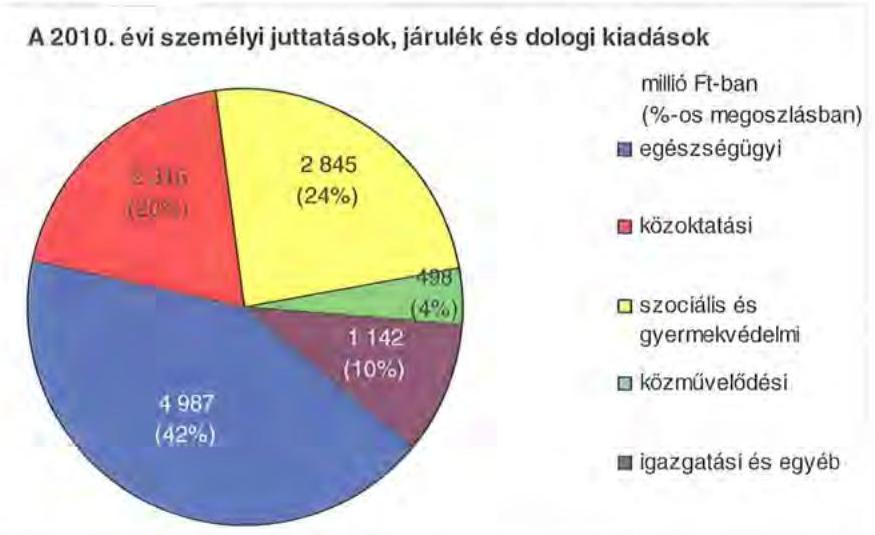

A költségvetési kiadások 83,2\%-a az intézmények (10 646 millió Ft), a további 16,8\% (2145 millió Ft) a Hivatal és az Ellátó Szervezet költségvetésében szerepelt. A Hivatal költségvetéséből a személyi és dologi kiadások 66,2\%-kal (693 millió Ft), a beruházások, felújítások ( 277 millió Ft) 26,5\%-kal, a különböző megyepolitikai feladatokhoz, szervezetek támogatásához, finanszírozási tételekhez kapcsolódó kiadások ( 77 millió Ft) 7,3\%-kal részesültek.

Az Önkormányzat kötelező és önként vállalt feladatait 2010. december 31-én az Önkormányzati hivatallal együtt 20 költségvetési szervvel látta el. Az Önkormányzat által fenntartott költségvetési szervekből 9 önállóan működő és gazdálkodó költségvetési szerv, az intézmények - alapító okirataik szerint - öszszesen 75 telephelyen múködtek. Miközben 2006. évről az intézmények száma az intézményi integráció következtében 9\%-kal (kettővel) csökkent, a telephelyek száma 12,0\%-kal (nyolccal) nőtt 2010-re a más önkormányzattól átvett intézmények miatt.

Az Önkormányzat feladatait az alábbi intézménystruktúrával látta el:

- egészségügyi feladatokat egy kórház látott el;
- szociális és gyermekvédelmi feladatokat hét intézmény végzett (két intézmény idősek ellátását, három intézmény ápoló, gondozó és rehabilitációs tevékenységet, egy intézmény mentális-, fogyatékos-, átmeneti és gyermekotthoni feladatokat és alapfokú oktatási tevékenységet is végzett, egy intézmény pedig állami gondozottak részére gyermekvédelmi feladatot látott el);
- közoktatási feladatot hét intézmény látott el (egy pedagógiai szakmai szolgáltató- és szakszolgálati feladatokat is ellátó intézmény, egy fogyatékos gyermekek oktatását végző, két szakképző iskola, kettő gimnázium, amelyből egy szakközépiskolai feladatokat is ellát, egy alapfokú művészetoktatási intézmény);
- közművelődési és közgyűjteményi feladatokat három intézmény végzett (könyvtár- és közművelődési intézet, levéltár, múzeum);

---

- igazgatási feladatokat lát el a Hivatal, egy intézmény pedig ellátó szervezetként múködik (az intézmények 95\%-a részére élelmezési tevékenység ellátása, az önkormányzat vagyongazdálkodási feladatai, valamint a megyeháza épületének üzemeltetése és fenntartása tartozott ide).

Az Önkormányzatnál az egyes ágazatok (közoktatás, szociális és gyermekvédelem, egészségügy, kultúra, sport) kötelező feladatellátását 2010. december 31én az alábbi mutatók jellemezték:

| Megnevezés | Közoktatás | szociális és   gyermek-   védelem | egészség-   ügy | kultúra   és sport |
| :-- | :--: | :--: | :--: | :--: |
| Az ágazatban foglalkozta-   tottak száma (fő) | 536 | 717 | 804 | 96 |
| Az ágazat intézményeiben   ellátottak összesen (fő) | 4305 | 1657 |  |  |
| Fekvőbeteg ellátás férőhe-   lyeinek száma (db) |  |  | 663 |  |

Az Önkormányzatnak többségi részesedésű gazdasági társasága nem volt.
Az Önkormányzat a Nógrád Turisztikai Közhasznú Nonprofit Kft-ben 35,7\%-os, a Múzeumban 7,0\%-os részesedéssel rendelkezett. A Kórház által létrehozott kötelező feladatot ellátó társaságban - Röntgentechnikai Kft. - az önkormányzat részesedése $13,3 \%$-os volt.

Az önkormányzati feladatellátásban az intézmények és gazdasági társaságok mellett egyéb szervezetek, valamint szolgáltatási szerződéssel kiszervezett/kiszerződött intézményi ellátások nem múködtek.

Az Önkormányzat az áttekintett időszakban Pásztó Város Önkormányzatától 2007. július 1-jétől kettő közoktatási intézményt vett át, 737 fő tanuló létszámmal (Rajeczky Benjámin Zeneiskola és Mikszáth Kálmán Gimnázium, Postaforgalmi Szakközépiskola és Kollégium). Önkormányzati társulástól, központi költségvetési szervtől, egyháztól, egyéb szervezettől feladatot nem vett át, és nem adott át.

# 2. PÉNZÜGYI EGYENSÚLYI HELYZET ALAKULÁSA 

A hagyományos költségvetési szerkezet helyett az önkormányzat pénzügyi helyzetét a CLF módszerrel mutatjuk be, amelyben jobban elkülönülnek a vagyonnal kapcsolatos bevételek és kiadások a feladatokkal kapcsolatos közvetlen múködtetési bevételektől és kiadásoktól. A módszer következetesen elkülöníti a folyó és a felhalmozási költségvetés bevételeit és kiadásait, azok költségvetési egyenlegeit. A tárgyévi pozíciók meghatározása érdekében a figyelembe vett saját folyó bevételek, valamint a saját felhalmozási bevételek nem tartalmazzák az előző évi pénzmaradványok felhasználásából származó pénzforgalom nélküli bevételeket ${ }^{16}$.

[^0]
[^0]:    ${ }^{16}$ A költségvetési években kialakuló hiány finanszírozása az előző években képzett tartalékok felhasználásával is történhet.

---

A bevételek és kiadások besorolása általános közgazdasági meggondolásokon alapul, amely testet ölt az SNA statisztikai módszertanában is. Folyó tételek alatt értjük azokat a bevételeket és kiadásokat, amelyek az önkormányzat vagyoni helyzetét automatikusan nem változtatják. A bevételi oldalon ilyenek az adók, az illeték, az áfa bevételek és visszatérülések, a hozamok és kamatok, a költségvetési támogatások, az egyéb saját bevételek, valamint a múködési célra átvett pénzeszközök és kapott támogatások. A folyó kiadások közé tartoznak a szolgáltatások nyújtásával kapcsolatos múködési kiadások, a kamatkiadások, valamint a múködési célú transzferkiadások ${ }^{17}$. A felhalmozási vagy tőke tételek módosítják az önkormányzat vagyoni helyzetét. A privatizációs bevételek, az immateriális javak és tárgyi eszközök, valamint a részesedések értékesítése csökkentik, a fizikai beruházások és a pénzügyi befektetések növelik a vagyont. A pénzforgalmi bevételek és kiadások nem tartalmazzák a követelések elengedése miatt könyvelt tételeket, mivel ezek egymást kioltó, technikai jellegű elszámolási múveletek.

A folyó költségvetés egyenlege, a múködési jövedelem megmutatja, hogy az önkormányzat éves folyó bevétele fedezetet biztosít-e a kötelező és önként vállalt feladatellátáshoz kapcsolódó éves folyó kiadására. A múködési jövedelem negatív értéke pénzügyileg fenntarthatatlan helyzetet jelez. A mutató pozitív értéke megtakarítást mutat, amely forrásul szolgálhat az önkormányzat fennálló kötelezettségei megfizetéséhez, valamint fejlesztéseihez.

A felhalmozási költségvetés pozitív értéke felhalmozási többletet mutat, amely a jövőbeni fejlesztések forrását biztosíthatja. Amennyiben a folyó költségvetési hiány finanszírozása a felhalmozási többletből történik, ez szűkebb értelemben vagyonfelélésnek tekinthető. Amennyiben a felhalmozási költségvetés megtakarítása fejlesztési célú hitelek, kötvények adósságszolgálatát finanszírozza, az, változatlan vagyontömeg mellett, a korábban megelőlegezett tőkebevételek valós realizációjának tekinthető. A felhalmozási deficit által generált finanszírozási igény önmagában nem jár pénzügyi kockázattal, a pénzügyileg fenntartható beruházásokhoz kapcsolódó kötelezettségvállalás (adósságszolgálat) előrelátó, tudatos költségvetési gazdálkodással teljesíthető.

A módszer a pénzügyi kapacitás (más néven a nettó múködési jövedelem) fogalmát helyezi a középpontba. Az adós hitelfelvételi képessége, hosszú távú fizetőképessége vagy bonitása a pénzügyi kapacitással, ezen belül is a nettó múködési jövedelemmel jellemezhető. A nettó múködési jövedelem negatív értéke az egyes költségvetési években jelentkező adósságszolgálat túlzott mértékére utal ${ }^{18}$. A nettó múködési jövedelem negatív értékének felhalmozási többletből, vagy további hitelből történő finanszírozása pénzügyileg nem fenntartható gazdálkodást vetít előre. A pozitív értéket mutató nettó múködési jövedelem fejlesztési kiadások fedezetét biztosíthatja, illetve a folyamatosan, évenként képződő pozitív nettó múködési jövedelemből meghatározható a jövőben vállalható,

[^0]
[^0]:    ${ }^{17}$ Transzferkiadásoknak azokat a folyó és felhalmozási tételeket nevezzük, amelyeket nem az adott önkormányzat használ fel szolgáltatásnyújtásra (pl.: ellátottak pénzbeni juttatásai, átadott pénzeszközök, garancia- és kezességvállalások stb.).
    ${ }^{18}$ Kivéve, ha annak finanszírozására a korábbi években képzett tartalékok fedezetet nyújtanak.

---

teljesíthető éves adósságszolgálat, ily módon az a hitelösszeg, amely - a többi tényezőt, feltételt adottnak tekintve - visszafizetési kockázat nélkül felvehető.

A CLF módszer alapján a pénzügyi kapacitás mértéke az önkormányzat összevont, nettósított, a központi információs rendszerbe a Magyar Államkincstáron keresztül leadott éves költségvetési beszámolójának 80-as űrlapjában szerepeltetett adatok alapján került meghatározásra. A 2007-2010 közötti időszakban az Önkormányzat CLF módszer szerint besorolt kiadásainak és bevételeinek főbb jogcímek szerint a jelentés 2/a. számú melléklete tartalmazza.

Az Önkormányzat bevételei és kiadásai alakulását részletesen a hatályos számviteli előírások szerint készült, összevont éves költségvetési beszámolók adataira alapozva mutatjuk be. A bevételek és kiadások múködési, valamint felhalmozási jogcímekre történő elkülönítését az éves költségvetési beszámolók, a zárszámadási rendeletek, továbbá - amely jogcímek ${ }^{19}$ esetében erre más lehetőség nem volt - az Önkormányzat adatszolgáltatása szerinti megbontás alapján végeztük el. A bevételek elemzése során figyelembe vettük a korábbi években keletkezett pénzmaradvány felhasználásából származó pénzforgalom nélküli bevételeket is. A 2007-2010 közötti időszakban az Önkormányzat bevételeit és kiadásait, továbbá adósságszolgálatát a jelentés 2/b. számú melléklete tartalmazza.

[^0]
[^0]:    ${ }^{19}$ Az előző évi maradvány visszafizetésének, az előző évi pénzmaradvány átadásának és átvételének, a kamatkiadásoknak, az egyéb pénzforgalom nélküli kiadásoknak, a hozam- és kamatbevételeknek, az átengedett adóknak, a költségvetési támogatásoknak, továbbá az előző évi pénzmaradvány igénybevételének múködési és felhalmozási részre történő megosztásához az Önkormányzat által szolgáltatott adatokat vettük figyelembe.

---

# 2.1. A müködési és felhalmozási egyensúly alakulása A CLF módszer szerinti önkormányzati adatok 

| Megnevezés | 2007. | 2008. | 2009. | 2010. |
| :--: | :--: | :--: | :--: | :--: |
| Folyó bevételek | 11706614 | 12607242 | 11611817 | 12026576 |
| Folyó kiadások | 11184932 | 11897186 | 11524877 | 12271319 |
| Müködési jövedelem | 521682 | 710056 | 86940 | $-244743$ |
| Nettó müködési jövedelem   = müködési jövedelem - tüketörlesztés | 512513 | 396291 | $-62972$ | $-244743$ |
| Felhalmozási bevételek | 237555 | 552661 | 124818 | 280655 |
| Felhalmozási kiadások | 1280238 | 1098796 | 468054 | 519417 |
| Felhalmozási költségvetés egyenlege | $-1042683$ | $-546135$ | $-343236$ | $-238762$ |
| Finanszírozási múveletek nélküli (GFS) pozíció | $-521001$ | 163921 | $-256296$ | $-483505$ |
| Finanszírozási műveletek egyenlege | 344214 | 1640359 | $-79931$ | 845549 |
| Tárgyévi pénzügyi pozíció változás | $-176787$ | 1804280 | $-336227$ | 362044 |
| Egyéb tájékoztató adatok |  |  |  |  |
| Összes kötelezettség* | 1009949 | 2522330 | 2960263 | 4134303 |
| ebből rövid lejáratú | 885671 | 861991 | 1257865 | 1881293 |
| Folyószámlahitel napi átlagos állománya** | 328926 | 191714 | 401692 | 830892 |
| Likvidhitel napi átlagos állománya | 0 | 0 | 0 | 0 |
| Munkabérhitel napi átlagos állománya** | 65447 | 108234 | 18547 | 0 |
| Egyéb finanszírozásba vonható eszközök összesen: | 215891 | 2020171 | 1683944 | 2045988 |
| Tartós hitelviszonyt megtestesítő értékpapírok év végi állománya | 0 | 0 | 0 | 0 |
| Hosszú lejáratú bankbetétek év végi állománya | 0 | 0 | 0 | 0 |
| Értékpapírok év végi állománya | 0 | 0 | 0 | 0 |
| Pénzeszközök (idegen pénzeszközök nélkül) év végi állománya | 215891 | 2020171 | 1683944 | 2045988 |

* Az összes kötelezettséget a passzív pénzügyi elszámolások nélkül vettük figyelembe, mert a passzívák a pénzmaradvány elszámolás tételei közé tartoznak.
** A folyószámla- és a munkabérhitel napi átlagos állományát 365 nappal számítottuk.
Az Önkormányzat folyó költségvetési egyenlege, müködési jövedelme a 2007-2009. években pozitív, a 2010. évben negatív összegű volt, melyet a következő ábra szemléltet:
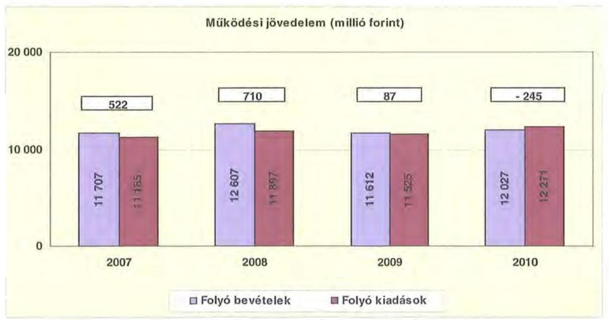

---

A folyó költségvetés egyenlege, (a múködési forrástöbblet) 2007-ben a folyó kiadások 4,7\%-át ( 522 millió Ft-ot), 2008-ban 6,0\%-át ( 710 millió Ft-ot), 2009ben $0,8 \%$-át ( 87 millió Ft-ot) jelentette. 2010-ben a folyó költségvetés hiánya a folyó kiadások 2,0\%-a (-245 millió Ft) volt.

A múködési forráshiány finanszírozása folyószámlahitelből és múködési célú, hosszú lejáratú hitelből történt. A folyószámlahitel napi átlagos állománya 2007-2010 között több mint 2,5-szeresére nőtt ( 329 millió Ft-ról 831 millió Ftra). Az önkormányzat 2010-ben nem rendelkezett munkabérhitellel. A 20072009. években igénybevett munkabérhitel napi átlagos állománya 2007-ben 65 millió Ft, 2008-ban 108 millió Ft, 12009-ben 9 millió Ft volt.

Az Önkormányzat összes kötelezettsége ${ }^{20}$ a 2007. év végi 1010 millió Ft-ról 2010. évre 4134 millió Ft-ra nőtt. Az összes kötelezettségen belül a 2008-2010 közötti időszakban a rövid lejáratú kötelezettségek állománya 50\% alatt volt, a 2007. évi 87,7\%-os aránnyal szemben. Az Önkormányzat 2006. december 31én fennálló pénz és tőkepiaci kötelezettsége 10 millió Ft-ról a vizsgált időszak végére 3488 millió Ft-ra nőtt a kötvénykibocsátás ( 1500 millió Ft), a hosszú lejáratú hitel és a folyószámlahitel állományának emelkedése ( 1387 millió Ft), illetve az árfolyamveszteség ( 591 millió Ft) miatt.

A rövid lejáratú kötelezettségek 2010-ben 1881 millió Ft-ot tettek ki, amely 996 millió Ft-tal ( $112,4 \%$-kal) több a 2007. évi állománynál. A rövid lejáratú kötelezettségeken belül a szállítói állomány alakulására eltérő irányú, az előzőekhez képest kisebb volumenű változás volt jellemző (a szállítókkal szembeni tartozás 2007-ben 535 millió Ft, 2008-ban 264 millió Ft, 2009-ben 605 millió Ft és 2010-ben 547 millió Ft). A szállítói tartozások összegszerű változásával párhuzamosan a rövidlejáratú kötelezettségeken belüli részarány hasonló irányú változást mutat (2007-ben 60,4\%, 2008-ban 30,6\%, 2009-ben 48,1\%, 2010-ben 29,1\%) Az Önkormányzat a 2007-2008. években nem rendelkezett számottevő mértékű lejárt szállítói tartozásállománnyal (2007-ben 16 millió Ft, 2008-ban 11 millió Ft volt), a 2009. év végi 80 millió Ft-tal szemben 2010. évre ez az állomány 53 millió Ft-ra mérséklődött.

Az Önkormányzat pénzügyi kapacitása a 2007-2008. években pozitív, 20092010. években negatív értéket mutatott. A nettó múködési jövedelem ${ }^{21}$ értéke a folyó költségvetési pozíció mellett az adott költségvetési év adósságtörlesztésének hatását is tükrözi. A vizsgált időszakban az Önkormányzat összesen 473 millió Ft-ot fordított hiteltörlesztésre ${ }^{22}$. A pénzügyi kapacitás 2009. évtől bekövetkező romlását alapvetően a folyó bevételek és kiadások különbségéből származó múködési jövedelem csökkenése okozta. 2010. évben a folyó bevételek 320 millió Ft-tal, 2,7\%-kal haladták meg a 2007. évi szintet, ehhez képest a folyó kiadások 2010. évi teljesítése 1086 millió Ft-tal, 9,7\%-kal volt magasabb a 2007. évinél.

[^0]
[^0]:    ${ }^{20}$ Passzív pénzügyi elszámolások nélküli.
    ${ }^{21}$ Pénzügyi kapacitás.
    ${ }^{22}$ Az Önkormányzat tőketörlesztési kötelezettsége 2007-2009 között 9-314-150 millió Ft volt. 2010-ben az Önkormányzatnak nem volt tőketörlesztési kötelezettsége.

---

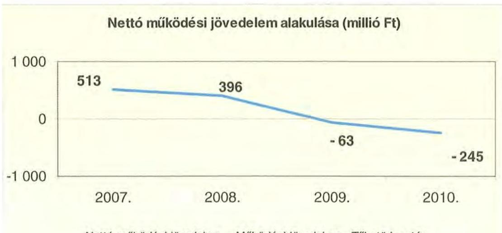

Nettó müködési jövedelem = Müködési jövedelem - Töketörlesztés

A 2007-2010. években az Önkormányzat felhalmozási költségvetésének egyenlege negatív összegű volt.

A felhalmozási és tőkejellegű bevételek és kiadások egyenlegét a következő ábra szemlélteti:

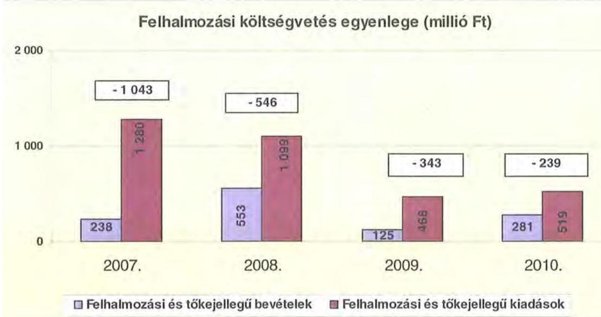

A felhalmozási forráshiánynak a felhalmozási és tőke jellegű kiadásokhoz viszonyított aránya 2007-ben 81,4\% (-1043 millió Ft), 2008-ban 49,7\% (-546 millió Ft) 2009-ben 73,3\% (-343 millió Ft) 2010-ben 46,0\% (-239 millió Ft) volt.

A fejlesztési forráshiányt hosszú lejáratú, fejlesztési célú hitellel, valamint fejlesztési célú kötvény kibocsátásával finanszírozták. A kötvénykibocsátásból származó bevétel felhalmozási célra történő felhasználását több évre ütemezte az Önkormányzat (a kibocsátott 1500 millió Ft kötvénybevételből 610 millió Ft-ot használtak fel a 2008-2010. évek között).

---

Az Önkormányzat évenkénti teljes finanszírozási hiánya ${ }^{23}$ a CLF módszer szerint 2007-ben -530 millió Ft, 2008-ban -150 millió Ft, 2009-ben -406 millió Ft, 2010-ben -484 millió Ft volt.

Az Önkormányzat finanszírozási múveletei 2007-2010. évekbeli egyenlegét a következő ábra szemlélteti:

Finanszírozási múveletek egyenlege (millió Ft)
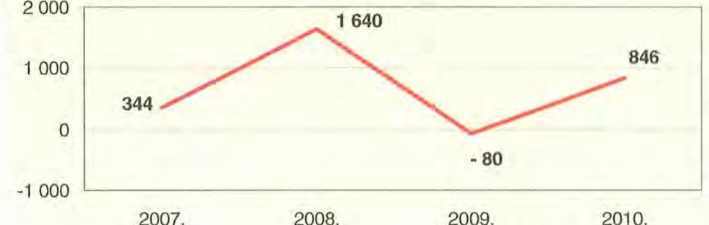

A finanszírozási többlet azt jelzi, hogy az éves költségvetések végrehajtása során szükség volt a megtakarítások és/vagy külső finanszírozás igénybevételére. A finanszírozási célú műveleteket a vizsgált időszakban a jelentés 2/a. számú mellékletének 4.1-4.8. pontjai részletezik.

Az Önkormányzat zárszámadási rendeletében a múködési és fejlesztési hiányt a hagyományos költségvetési szerkezet alapján mutatta be ${ }^{24}$, amelyről a jelentés 1. számú melléklete nyújt tájékoztatást. Az Önkormányzat kimutatásai szerint a múködési egyenleg a 2007. és a 2010. években 328 , illetve 353 millió Ft hiányt mutatott, amelynek működési kiadásokhoz viszonyított aránya mindkét évben 2,9\% volt. A 2008-2009. években realizált működési többlet ( 625 millió Ft összesen) a működési kiadások 2,7\%-ának felelt meg. A felhalmozási egyenleg 2009. évben a kötvénykibocsátásból származó pénzeszközök felhasználásából adódóan 1377 millió Ft többlettel zárt, amely a tárgyévi felhalmozási kiadások ( 488 millió Ft) közel háromszorosa. A további vizsgált években a felhalmozási hiány 186 millió Ft együttes összege (2007-ben 25 millió Ft, 2008ban 34 millió Ft és 2010-ben 127 millió Ft) a három év felhalmozási kiadásának (2911 millió Ft) 6,4\%-át tette ki.

A vizsgált időszakban a kötelezettségek (passzív pénzügyi elszámolások nélkül) 1010 millió Ft-ról 4134 millió Ft-ra emelkedtek, ezzel szemben a keletkezett kamatkiadások csekély növekedést mutattak. A 2008-ban kibocsátott felhal-

[^0]
[^0]:    ${ }^{23}$ A nettó múködési jövedelem és a felhalmozási költségvetés összevont egyenlege
    ${ }^{24}$ Nincs kötelező előírás a múködési és fejlesztési hiány megállapításának módjára.

---

mozási célú kötvény kamatkiadása még nem jelent meg, mivel a tőke- és kamatfizetési kötelezettség 3 év 11 hónap türelmi idővel 2012. évben kezdődik.

A 2007-2010 között az Önkormányzat összesen 505 millió Ft kamatbevételt realizált, amelynek $27 \%$-a fedezte a teljes kamatráfordítást ( 137 millió Ft ).

Az Önkormányzat kamatbevételeit és kamatkiadásait a következő ábra mutatja:

Kamatbevételek és kiadások alakulása (millió Ft)
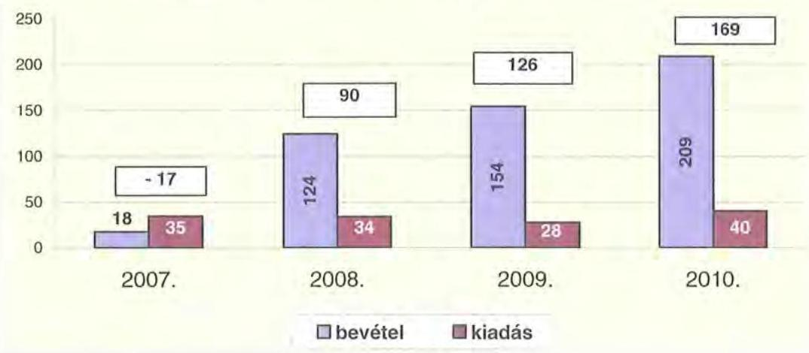

# 2.2. Az Önkormányzat bevételei 

Az Önkormányzat 2010. évben befolyt 12091 millió Ft működési bevétele 1132 millió Ft-tal, 10,3\%-kal haladja meg a 2007. évi teljesítést. A folyó bevételek évenkénti eltérő irányú változását jelentős mértékben befolyásolta az OEPtől működési célra átvett pénzeszközök alakulása, amelynek működési bevételen belüli részaránya a vizsgált időszakban $36,6 \%$-ról $38,1 \%$-ra nőtt.

Az Önkormányzat 2007-2010 között realizált OEP támogatás nélküli főbb bevételi jogcímeinek számszaki adatait az alábbi táblázat, összetételének változását a grafikon mutatja be:

|  |  |  |  |  |
| :-- | :--: | :--: | :--: | :--: |
| Megnevezés | 2007. év | 2008. év | 2009. év | 2010. év |
| Illetékbevétel | 1449134 | 1698200 | 1456745 | 1005848 |
| SZJA és állami támogatás   (OEP nélkül) | 3483933 | 4069555 | 3590469 | 2955869 |
| Egyéb saját bevétel | 2010136 | 2148375 | 2820378 | 3527379 |
| Összes müködési bevétel   (OEP nélkül): | 6943203 | 7916130 | 7867592 | 7489096 |

---

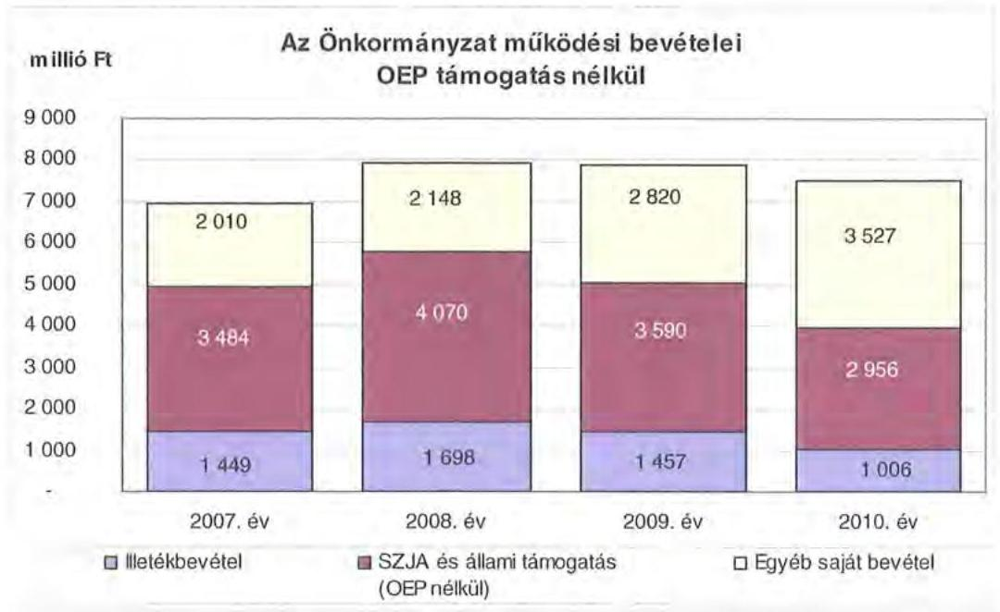

A 2007. évben az Önkormányzat illetékbevétele a 2006. évi 1670 millió Ft-hoz képest 221 millió Ft-tal, 13,2\%-kal csökkent, melyben szerepet játszott az Illetékhivatal APEH-hoz történő átszervezése is. 2007. január 1-jét követően ugyanis az évente realizált illetékbevételekből (központi intézkedés következtében) évi $8,5 \%$ elvonásra került az adminisztrációs feladatokra. A beszedés költségeire elvont pénzösszeg azonban minden évben kevesebb volt, mint amekkora költségvetési kiadást jelentett korábban az Önkormányzatnak az Illetékhivatal müködtetése ${ }^{25}$.

Az illetékbevétel a 2006. évi 1670 millió Ft-ról 2010-re 664 millió Ft-tal, 39,8\%kal csökkent, 2008-ban az előző évhez képest 249 millió Ft-tal, 17,2\%-kal nőtt. 2008-ról 2009-re ( 241 millió Ft) 14,2\%-os, majd a 2010. évben az előző évhez viszonyítva ( 451 millió Ft) $31 \%$-os csökkenés következett be.

Az átengedett szja és az állami támogatások együttes összege a 2008. évi 586 millió Ft-os, $16,8 \%$-os növekedést követően ${ }^{26}$ a központi forráskivonás hatására a 2007. évi bázishoz képest folyamatosan és jelentős mértékben csökkent. Az előző évihez képest 2009-ben 480 millió Ft-tal, 11,8\%-kal, 2010-ben 634 millió Ft-tal, 17,7\%-kal kapott kevesebb forrást az Önkormányzat az államtól ezeken a jogcímeken. A változást a normatíváknak a járulékváltozások miatti központi csökkentése, valamint a megyei önkormányzatokat érintő forráselvonás idézte elő.

[^0]
[^0]:    ${ }^{25}$ Az éves illetékbevétel 8,5\%-a 2007-ben 123 millió Ft, 2008-ban 144 millió Ft, 2009ben 124 millió Ft, 2010-ben 85 millió Ft volt. Az Önkormányzat a 2006. évben az Illetékhivatal müködtetésére 154 millió Ft-ot fordított.
    ${ }^{26}$ A kiugró növekedésben meghatározó szerepe volt az Önkormányzat által alapított, 2008. március 1-től müködő 150 férőhelyes „Baglyaskő" Idősek Otthonához kapcsolódó normatív támogatás többletbevételének.

---

Az egyéb saját bevételeken belül az intézmények működési bevétele 2007-ről 2010-re 57,6\%-kal, 806 millió Ft-tal emelkedett, döntően a szociális ellátások térítési díjának önköltségalapú számításának bevezetése, valamint a megépült új intézmény bevétele eredményeként.

Az OEP-től származó bevételek a 2007. évi 4017 millió Ft-ról 2010-re 585 millió Ft-tal (14,6\%-kal), 4602 millió Ft-ra emelkedtek.

Az Önkormányzat felhalmozási bevételei a vizsgált időszakban a következők voltak:

|  |  |  |  |  |
| :-- | :--: | :--: | :--: | :--: |
| Megnevezés | 2007. év | 2008. év | 2009. év | 2010. év |
| Tárgyi eszköz   értékesítés | 17131 | 12343 | 31378 | 3987 |
| Állami támogatás | 841201 | 396599 | 92460 | 62972 |
| Átvett pénzeszköz | 48221 | 37420 | 33415 | 68182 |
| Egyéb felhalmozási   bevétel | 325981 | 615140 | 1706094 | 1232498 |
| Összes felhalmozási   bevétel | 1232534 | 1061502 | 1863347 | 1367639 |

Az Önkormányzatnak tárgyi eszköz értékesítéséből nem származott számottevő bevétele ${ }^{27}$.

Állami támogatás a 2006. évben címzett támogatással megkezdett és 2008. I. negyedévben befejezett „Baglyaskői" Idősek Otthona építése, valamint a Kórház rekonstrukciója kapcsán keletkezett. Az intézmények egyéb felhalmozási bevételei a Kórház fejlesztéseihez kapcsolódtak (térségi diagnosztika, sürgősségi ellátás és az intenzív neonetológiai osztály műszaki fejlesztése). Az évenkénti nagy összegű felhalmozási tartalék az uniós projektek finanszírozására került betétként - lekötésre.

[^0]
[^0]:    ${ }^{27}$ Az Önkormányzat 2007-ben az APEH-nak használatba, illetve bérbe adta a tulajdonában lévő illetékhivatali ingatlanokat, az ingóvagyont pedig értékesítette. A 2008. évben három, 2009-ben kettő, 2010-ben egy ingatlan értékesítéséből keletkezett felhalmozási bevétel az Önkormányzatnál.

---

# 2.3. Az Önkormányzat kiadásai 

Az Önkormányzat múködési kiadásai főbb jogcímek szerinti bontásban az alábbiak voltak:
ezer Ft

| Megnevezés | 2007. | 2008. | 2009. | 2010. |
| :-- | --: | --: | --: | --: |
| Müködési kiadások | 11179290 | 11884945 | 11496842 | 12271068 |
| Müködési kiadások (kamatkiadás nélkül) | 11147446 | 11863213 | 11475935 | 12231399 |
| Kamatkiadás | 31844 | 21732 | 20907 | 39669 |
| Személyi juttatások | 5358586 | 5540975 | 5278670 | 5190784 |
| Munkaadót terhelő járulékok | 1701794 | 1753105 | 1593603 | 1364946 |
| Dologi kiadások | 3808715 | 4316692 | 4325237 | 5232067 |
| Egyéb folyó kiadások | 61105 | 78780 | 81338 | 156685 |
| Támogatások, elvonások, egyéb folyó   átutalások | 109006 | 94832 | 68970 | 106033 |
| ebből: müködési célú pénzeszközátadás | 74454 | 58667 | 39392 | 58731 |
| Előző évi pénzmaradvány átadás,   viszafizetés, müködési célú | 76733 | 21078 | 68675 | 12514 |

Az Önkormányzat múködési kiadásai 2007. december 31-ről 2010. december 31-re 11179 millió Ft-ról 12271 millió Ft-ra, 9,8\%-kal nőttek.

Az Önkormányzat 2010-ben a múködési költségvetésből 6556 millió Ft-ot (53,4\%) személyi juttatásokra és a munkaadókat terhelő járulékokra fordította, az üzemeltetést, intézményfenntartást biztosító dologi kiadásokra 5232 millió Ft, 42,6\% jutott. A múködési kiadásokon belül a személyi juttatások és a járulék a vizsgált időszakban folyamatosan (volumenében 7061 millió Ft-ról 6556 millió Ft-ra) csökkent, aránya 2007-ben 63,2\%, 2010-ben 53,4\% volt.

A személyi juttatások 2008-ban 3,4\%-kal (182 millió Ft-tal) nőttek az előző évhez képest, azt követően minden évben csökkentek a létszám- és álláshely csökkentések miatt. 2010-ben a 2007. évben teljesített kiadásoknál 3,1\%-kal (168 millió Ft) alacsonyabbak voltak.

A Kórházon kívüli intézményekben 2007. évről 2010. évre 185 millió Ft-tal, 5\%kal csökkentek a személyi juttatásokra kifizetett összegek, amelynek az önkormányzati szintű mutatónál magasabb alakulása azt tükrözi, hogy az egészségügyi ágazatban a létszám és a bérek csökkenése nem mutatott hasonlóságot a más ágazati feladatokat ellátó intézményekével. A vizsgált időszakban a munkaadókat terhelő járulékok csökkenése ${ }^{28}$ következett be, amely egyrészt a kifizetett személyi juttatások, másrészt a jogszabályváltozásból adódóan a társadalombiztosítási járulék és egészségügyi hozzájárulás mértékének csökkenésével függött össze. A járulékok csökkenése miatt felszabaduló forrásokat azonban a kormányzat az önkormányzati alrendszernek nyújtott állami támogatásokból levonásba helyezte, így a járulékcsökkenés az Önkormányzatnál érdemi meg-

[^0]
[^0]:    ${ }^{28}$ A Kórház nélküli intézményeknél a munkaadókat terhelő járulékok összege 2007-ről 2010-re 251 millió Ft-tal, 21,7\%-kal csökkent

---

takarítást nem eredményezett, mivel az állami támogatás forráscsökkenésével járt együtt.

Az Önkormányzat dologi kiadásainak alakulása 2007-2010 között változó mértékű növekedést mutat. Önkormányzati szinten a 2010. évben teljesített dologi kiadások ( 5232 millió Ft) 37,4\%-kal haladták meg a 2007. évit. A 2008. évben a dologi kiadások 13,3\%-kal ( 508 millió Ft-tal), az inflációt meghaladó mértékben ${ }^{29}$ emelkedtek, míg a 2009. évben mindössze 0,2\%-os, 9 millió Ft-os növekedés tapasztalható ${ }^{30}$. A 2010. évben - az előző évhez képest - ugyancsak jelentős mértékű 21,0\%-os, 907 millió Ft többletkiadás jelentkezett. A növekedés üteme szintén az inflációt meghaladó (4,9\%) volt. Az inflációt meghaladó dologi kiadások fedezetét az Önkormányzatnak a végrehajtott kiadáscsökkentő intézkedések mellett a növekvő folyószámlahitel állományból és a működési célú hosszú lejáratú hitelből kellett biztosítania.

A múködési célú pénzeszközátadások nagysága 2007-ről 2008-ra 21,2\%-kal (74 millió Ft-ról 59 millió Ft-ra), 2009-ben az előző évhez képest további 32,9\%kal (39 millió Ft-ra) csökkent a Közgyűlés kiadáscsökkentő intézkedései hatására. A 2010. évben a múködési célú pénzeszköz átadásra fordított 59 millió Ft az előző évhez képest $49 \%$-kal, 19 millió Ft-tal emelkedett.

Az önkormányzati kiadásokban kismértékben emelkedett a kórházi kiadások aránya az egyéb fenntartott intézményekben felmerülő kiadásokhoz képest. A Kórház nélküli teljesített múködési kiadások 2007-ben (6 757 millió Ft) még az összes múködési kiadás 60,4\%-át tették ki, ez az arány 2010 végére ( 7115 millió Ft-ra) 58,0\%-ra csökkent.

Az Önkormányzat kórház nélküli múködési kiadásai a vizsgált időszakban a következőképpen alakultak:

| Megnevezés | 2007. | 2008. | 2009. | 2010. |
| :--: | :--: | :--: | :--: | :--: |
| Múködési kiadások | 6756658 | 7041679 | 7096647 | 7115401 |
| Múködési kiadások (kamatkiadás nélkül) | 6725077 | 7020531 | 7076051 | 7075983 |
| Kamatkiadás | 31581 | 21148 | 20596 | 39418 |
| Személyi juttatások | 3693732 | 3823780 | 3660381 | 3508291 |
| Munkaadót terhelő járulékok | 1155391 | 1188129 | 1077980 | 903933 |
| Dologi kiadások | 1656208 | 1866965 | 2164931 | 2460228 |
| Egyéb folyó kiadások | 34007 | 25747 | 35114 | 84984 |
| Támogatások, elvonások, egyéb folyó átutalások | 109006 | 94832 | 68970 | 106033 |
| ebből: múködési célú pénzeszközátadás | 74454 | 56351 | 39392 | 58731 |
| Előző évi pénzmaradvány átadás, viszafizetés, múködési célú | 76733 | 21078 | 68675 | 12514 |

[^0]
[^0]:    ${ }^{29}$ KSH fogyasztói árindex 6,1\%
    ${ }^{30}$ 2009-ben az infláció $4,2 \%$ volt

---

Míg 2010-ben a Kórházzal együtt a működési kiadások 9,8\%-os (1092 millió Ft) növekedés volt ${ }^{31}$, addig a Kórház nélkül ugyanebben az időszakban csak 5,3\%os ( 358 millió Ft) növekedés jelentkezett. A Kórház nélküli működési kiadások $62 \%$-át teszik ki a személyi juttatások és járulékaik, a dologi kiadások aránya 34,6\% (2460 millió Ft). Ezeknél az intézményeknél a dologi kiadások erőteljesebb emelkedést mutatnak ${ }^{32}$, a 2007. évi 1656 millió Ft-ról 2010-re 2460 millió Ft-ra emelkedtek, amely volumenében 804 millió Ft növekedést jelentett a három év alatt. Ebben meghatározó szerepe volt a más önkormányzattól 2007. július 1-jétől átvett két intézmény és a 2008. márciustól belépő új intézmény ${ }^{33}$ üzemeltetési kiadási többleteinek.

A Kórház dologi kiadásai a következő képen alakultak, 2008-ban 13,8\%-kal meghaladta az előző évit, ennek mértéke 297 millió Ft volt, 2009. évben 11,8\%kal csökkent ( 289 millió Ft-tal), majd 2010-ben ismét 28,3\%-os növekedés volt, amely nominálisan 611,5 millió Ft-ot jelentett. A jelentkező dologi kiadásnövekedések nem a valós üzemeltetési költségnövekedést tükrözik. Az intézmény működési forráshiánya miatt nem tudta kifizetni a tárgyévben jelentkező dologi kiadásainak egy részét, amelyet az év végi szállítói állomány évről-évre változó összege mutat (a 2007. év végi 478 millió Ft-ról 2008. év végére 232 millió Ft-ra csökkent, majd az előző évhez képest 2009-ben 564 millió Ft-ra nőtt, 2010. év végére pedig 517 millió Ft-ra mérséklődött).

Az Önkormányzat 2007-2010 között a Kórház múködési kiadásaihoz ${ }^{34}$ 404 millió Ft-tal járult hozzá, amelyből a központosított állami támogatásokból (a központi bérpolitikai intézkedésekhez, a létszámcsökkentések többletköltségének fedezetéhez, a 13. havi juttatások kifizetéséhez, kereset kiegészítésekhez, prémiumévek igénybevételéhez kapcsolódó központi forrásból) fedezett összeg 370 millió Ft volt. Egyéb egészségügyi szakmai célokra és rendezvényekre saját forrásból a négy év alatt 34 millió Ft-ot adott a Kórháznak a fenntartó Önkormányzat.

A Kórház múködésének finanszírozására az OEP támogatás szolgál, míg a fejlesztési kiadások fedezetét az Önkormányzatnak kell biztosítani.

A múködési célú önkormányzati támogatáson felül 2007-2010 között 62 millió Ft-ot adott a Közgyülés a Kórháznak fejlesztési célra, amely a felhalmozási kiadások $11,8 \%$-át fedezte ${ }^{35}$.

[^0]
[^0]:    ${ }^{31}$ a 2007. december 31-i bázishoz képest
    ${ }^{32}$ a 2007. évi bázishoz képest 48,5\%-os növekedés jelentkezett
    ${ }^{33}$ A 2008. március 1-től múködő „Baglyaskői" Idősek Otthona dologi kiadásainak öszszege 2007-2010. években 414,8 millió Ft volt.
    ${ }^{34}$ intézményi finanszírozás formájában
    ${ }^{35}$ A Kórház fejlesztési kiadásokra 2007-2010 között 524 millió Ft-ot fordított.

---

A támogatások évenkénti alakulását a következő grafikon mutatja be:
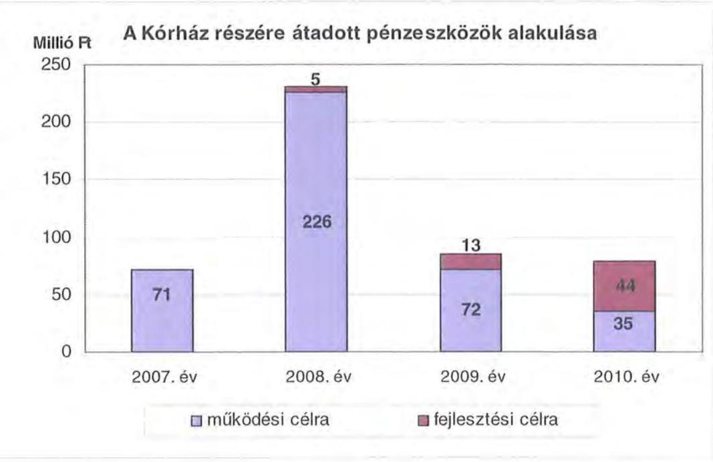

A múködési és felhalmozási kiadások arányának változásában 2007-2010 között elmozdulás figyelhető meg, a felhalmozási kiadások aránya 10,3\%-ról $4,1 \%$-ra csökkent. A kiadások megoszlásának alakulását (a múködési és fejlesztési célú kamatkiadásokat is figyelembe véve) a következő grafikon szemlélteti:
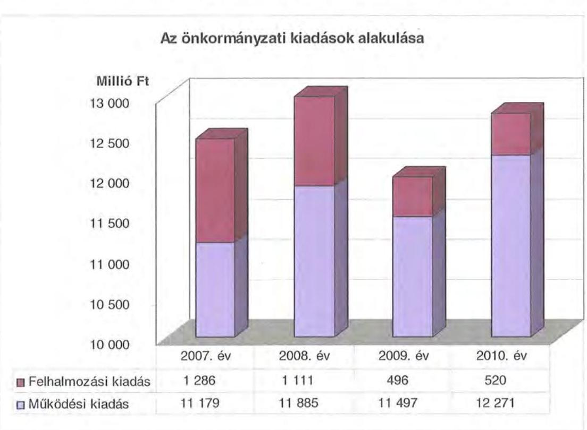

---

Az aktív pályázati tevékenység eredményeként 2007-2010 között 12381 millió Ft bekerülési költségű beruházást folytatott, illetve indított el az Önkormányzat, amelyből 5657 millió Ft a 2009-2011. években a 2010. évet követő évekre vállalt kötelezettség. Az utóbbi forrásai a következők: 84 millió Ft saját bevétel maradvány-felhasználással, 786 millió Ft kötvény, 4738 millió Ft EU-s és 49 millió Ft hazai támogatás. A 2010. évet követő évekre vállalt kötelezettségből 721 millió Ft (12,7\%) a Kórház fejlesztéseit finanszírozza, a 10 millió Ft egyedi beszerzési érték alatti fejlesztésekhez 478 millió Ft kapcsolódott.

A megvalósított felhalmozási kiadások jellemzően az Önkormányzat kötelező feladatai ellátásához (szociális otthon építése a megyei lakosság igénye miatt, múzeumi, turisztikai fejlesztések, szakképzési hozzájárulások felhasználása), valamint a jogszabályoknak való megfelelés (akadálymentesítés), múködési engedélyhez (egészségügyi beruházások) kötött feltételek teljesítéséhez kapcsolódtak, így az ilyen kiadások esetleges bevételt növelő, illetve kiadást csökkentő vonzatát - ennek a fejlesztéshez, felújításhoz vállalt kötelezettségek visszafizetési forrásként való számbavételét, ezek figyelembevétele mellett - vizsgálta a Közgyűlés.

Ezen időszakban a három legmagasabb bekerülési költségű beruházás a következő volt:

- a Kórház címzett támogatással megvalósult rekonstrukciója 2005-ben kezdődött, teljes bekerülési költsége 3386 millió Ft volt, melyből a 2006. december 31-ig teljesített kiadás 3361 millió Ft, a 2007-2010. években teljesített kiadás 25 millió Ft volt, 2010. évet követő kötelezettségvállalás nem merült fel;
- a Kórház meglévő sürgősségi osztályának átalakítása, bővítése a TIOP 2.2.2 „Sürgősségi ellátás fejlesztése - SO1 és SO2 (és ezeken belül gyermek sürgősségi ellátás)" című program keretében valósult meg, melyről a Közgyűlés az 54/2008. (V. 29.) számú határozatával döntött. A projekt megvalósítása 2010. évben kezdődött, teljes bekerülési költsége 549 millió Ft (ezen belül 483 millió Ft EU-s támogatás), amelyből 2010. évben 66 millió Ft kiadás teljesült, a 2010. évet követő kötelezettségvállalás 483 millió Ft;
- a címzett támogatással megvalósult „Baglyaskő" Idősek Otthona beruházás 150 férőhelyen bentlakásos és 20 férőhelyen napközi ellátást biztosít. A beruházás megvalósítása - melyről a Közgyűlés a 107/2004. (XI. 25.) számú határozatával döntött - 2005. évben kezdődött és 2008. évben fejeződött be, teljes bekerülési költsége 1620 millió Ft volt, ebből 2006. december 31. előtt 120 millió Ft, 2007-2010. évek között pedig 1500 millió Ft realizálódott, 2010. évet követő időszakra vonatkozó kötelezettségvállalás nem volt;
- az Önkormányzat egyes intézményeinek akadálymentesítése az ÉMOP keretében elnyert pályázati támogatás segítségével történt, melynek keretében megvalósult a Borbély Lajos Szakközépiskola és Szakiskola, a Nógrád Megyei Egységes Gyógypedagógiai Intézmény és Gyermekotthon, valamint a Harmónia Rehabilitációs Intézet és Ápoló, Gondozó Otthon utólagos akadálymentesítése. A beruházások 2008-2009. években kezdődtek, teljes bekerülési költségük összesen 107 millió Ft volt, amely egészében 2008-2010. évek kötött teljesült.

A 2007-2010 között a 10 millió Ft teljes bekerülési költség feletti beruházások és felújítások száma 56 volt, amelynek több mint feléhez ( 30 fejlesztéshez) EU-s és

---

egyéb hazai pályázati (CÉDE, TEKI) támogatásokat vettek igénybe, melyek támogatottsága átlagosan közel $90 \%{ }^{36}$-os volt. Az Önkormányzatnál a további 26 fejlesztési feladatot a múködési engedélyhez kötötten saját forrásból vagy kötvényből, illetve szakképzési hozzájárulásból valósították meg.

Az Önkormányzat fejlesztési tevékenysége a pályázati kiírások által nagyban befolyásolt, mert a jelentkező múködési forráshiány és saját felhalmozási bevételei alacsony szintje miatt beruházásokat csak külső, valamint uniós és hazai támogatások elnyerése esetén tud megvalósítani. A felhalmozási kiadások önrészének forrásait is fejlesztési hitelekből és felhalmozási célú kötvénykibocsátásból finanszírozta.

# 3. KÖTELEZETTSÉGEK BEMUTATÁSA 

### 3.1. A pénzintézetek felé fennálló kötelezettségek

Az Önkormányzat pénzintézeti kötelezettségeinek állománya 2006. december 31-én 10 millió Ft, 2010. december 31-én 3488 millió Ft volt. A vizsgált időszakban fennálló pénzintézeti kötelezettségei hosszú lejáratú fejlesztési ${ }^{37}$ és múködési célú hitelek, folyószámla- és munkabér megelőlegezési hitelek igénybevételéből, valamint a deviza alapú kötvény kibocsátásából (2008. évben) keletkeztek. A devizában kibocsátott kötvénykötelezettség év végi könyvviteli mérleg szerinti értékének meghatározásakor az árfolyamváltozás miatti év végi értékelést a 2008-2010. években elvégezték.

A pénzintézetekkel szemben fennálló kötelezettségek állományának alakulása (millió Ft)
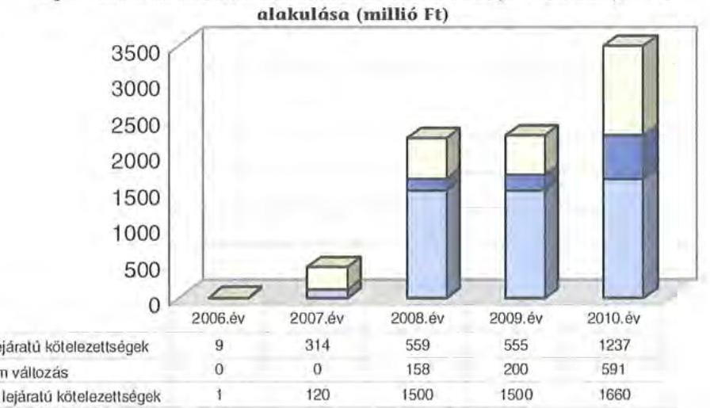

Az árfolyamváltozás hatása is befolyásolja a kötelezettségek alakulását, azonban annak mértéke előre pontosan nem határozható meg, csak várakozásokon ala-

[^0]
[^0]:    ${ }^{36}$ Azonban a címzett támogatás 100\%, HEFOP, TÁMOP pályázat 100\%-os, KEOP pályázat $75 \%$ központi támogatást biztosított.
    ${ }^{37}$ A 2005. évben felvett hosszú lejáratú fejlesztési célú hitel - Reménysugár Otthonnak a szociális feladatok ellátását szolgáló gépkocsi vásárlására - deviza alapú volt, melynek utolsó törlesztő részletét 2009. I. negyedévében teljesítették.

---

puló tendenciák jelezhetők. A számviteli szabályok meghatározzák, hogy az árfolyam különbözetet év végén a kötelezettségek vagy követelések között a könyvviteli mérlegben nyilván kell tartani, azonban az árfolyam különbözet valójában nem realizált. Annak megítéléséről, hogy a devizában kibocsátott kötvényért és felvett hitelért kapott forinthoz képest a kötvény visszavásárlásakor, illetve a hitel visszafizetésekor jelentkező forint kötelezettség többletkiadást (árfolyamveszteség) vagy megtakarítást (árfolyamnyereség) eredményez a futamidő végén, a teljes kötelezettség rendezését követően lehet képet alkotni. Mindaddig, amíg törlesztési kötelezettség nem áll fenn (türelmi idő, moratórium), a tőkére vonatkoztatva nem értelmezhető sem az árfolyamveszteség, sem az árfolyamnyereség.

Az Önkormányzat pénzintézeti kötelezettségvállalásaira minden esetben közgyűlési döntés alapján került sor, amelyekben meghatározták a kötelezettségvállalásból származó források felhasználási célját, valamint a kötelezettségvállalás visszafizetésének forrásait. A Közgyűlés döntéseit megalapozó előterjesztések a kötvény esetében tartalmazták a teljes futamidő várható kamat és tőkefizetési kötelezettségeket számszerüen, azonban az árfolyam- és kamatkockázatokat, azok esetleges kötelezettségét nem.

A kötvényen kívüli kötelezettségvállalások teljes futamidőre várható kamat és tőkefizetési kötelezettségeit az Önkormányzat költségvetési rendelete és zárszámadása minden esetben tartalmazta. Az Önkormányzat a 2007-2011. évek költségvetési rendeletei ${ }^{38}$ elfogadásával egyidejűleg döntött az adósságszolgálati korlát mértékéről, valamint ennek figyelembevételével a kötelezettségvállalásairól. A Közgyűlés szakbizottságai (pénzügyi, gazdasági) megvizsgálták a kötvénykibocsátás és a hitelfelvételek indokait és azok gazdasági megalapozottságát.

Az Önkormányzat a közbeszerzési eljárások lebonyolításával, az adósságot keletkeztető kötelezettségvállalásokra vonatkozó döntés előkészítésekor több pénzintézet ajánlatát összehasonlítva terjesztette a legkedvezőbb ajánlatot a döntéshozók elé. A kötvénykibocsátásnak a bank részéről kockázata nincs, mert a közbeszerzési eljárások eredményeként a számlavezető és a kötvénykibocsátó bank nem ugyanaz a pénzintézet.

Az Önkormányzat adósságot keletkeztető, az Ötv. 88. §-ában előírt éves kötelezettségvállalásának felső határát a 2007-2010. években és 2011. március 31-ig nem lépte túl. A kötelezettségvállalás felső határának alakulását a 2007-2010. években a kötvénytörlesztés nem befolyásolta, mert a kibocsátás utáni türelmi idő ${ }^{39}$ 2011. decembert 31-én jár le, így először 2012. május 31-én válik esedékessé a tőke és a kamattörlesztés.

Az adósságot keletkeztető kötelezettségvállalásokat az Önkormányzat a saját intézményi bevételekből és illetékbevételből teljesítette, továbbá a 2009. évben a kötvénybevételből 150 millió Ft-ot - a kibocsátási céltól eltérően - a 2007. évben felvett, hosszú lejáratú fejlesztési célú hitel vissza-

[^0]
[^0]:    ${ }^{38} 1$. számú táblájában
    ${ }^{39}$ három év 11 hónap

---

fizetésére fordította. A Közgyűlés az Önkormányzat 2009. évi költségvetésének végrehajtásához kapcsolódó intézkedésekről szóló határozatában döntött a kötvénykibocsátásból befolyt bevétel terhére, a 2007. évben felvett hosszú lejáratú fejlesztési célú hitel egyösszegű visszafizetéséről, mely 2009. június 26-án megtörtént.

Ez a kötvény kibocsátást végző pénzintézettel a kötvény felhasználására vonatkozóan megkötött forrás-felhasználási megállapodásban felhasználási célként nem szerepelt, ezért annak módosítását a pénzintézet feltételként a kibocsátott kötvények névértéke 1,9\%-ának megfelelő összegű éves kezelési díj - első alkalommal 2009. november 30-ig történő ${ }^{40}$ - megfizetéséhez kötötte. Ez a megállapodás a jelenleg ismert feltételek mellett, a kibocsátáskori árfolyamon számolva 190 millió Ft többletkiadást jelent az Önkormányzatnak 2011. március 31 utáni fizetési kötelezettségként.

Az Önkormányzat 2010. december 31-én CHF-ben fennálló adósságot keletkeztető kötelezettségvállalásait az alábbi tábla mutatja:

| Megnevezés | Kibocsátás, illetve szerződéskötés időpontja | Összeg   CHF | Kibocsátást, vagy lehívást árfolyam HUF/CHF | Kamat (referencia kamat+ kamatfelát) | Felhasználás célja: |
| :--: | :--: | :--: | :--: | :--: | :--: |
| Nógrád Megye I. Kötvény | 2008.02 .15 | 9323719 | 160,88 | 6 Havi CHF LIBOR $+0,45 \%$ p.a. | Az Önkormányzat fejlesztési, beruházási elképzelésst megvalósításához szükséges önerő biztosítása |

A Nógrád Megye I. Kötvénnyel ${ }^{41}$ kapcsolatban 257361 CHF egyéb költséget ${ }^{42}$ fizettek ki, mely 51 millió Ft volt a 2009-2010. években.

Az Önkormányzat devizában fennálló pénzintézeti kötelezettségeiből 2007. előtt 5707 CHF tőkét, 2222 CHF kamatot, 2007-2010 között 8338 CHF tőkét és 1033 CHF kamatot törlesztett, mely a balassagyarmati Reménysugár Otthon intézmény gépkocsi vásárlás fejlesztési feladat finanszírozására felvett hosszú lejáratú fejlesztési célú hitel visszafizetését jelentette, az árfolyam különbözetekkel (árfolyamveszteség 0,1 millió Ft) korrigáltan összesen három millió Ft összegben.

[^0]
[^0]:    ${ }^{40}$ A 2009. június 25 -én kelt megállapodásban rögzítették a díj mértékének minden év június 30. napjáig történő közös felülvizsgálatát, szükség esetén annak módosítását vagy megszüntetését.
    ${ }^{41}$ Az Önkormányzat Nógrád Megye I. kötvényt fejlesztési, beruházási feladatok megvalósításához szükséges önerő biztosítására, azok finanszírozására tervezte fordítani, melyből a 2011. április 30 -ig ténylegesen 610 millió Ft-ot hívott le, egyedi közgyűlési határozatok alapján pedig kötelezettséggel terhelt 578 millió Ft volt. A fennmaradó 312 millió Ft tervezett felhasználásáról az Önkormányzat a 2011. évi költségvetési rendeletében döntött, a folyamatban lévő pályázatok saját erejének biztosítása céljából.
    ${ }^{42}$ A kötvények esetében kibocsátási, szervezési díj címén fizetett egyéb díjat az Önkormányzat, a hosszú lejáratú hitel után kamatfelárat nem állapított meg a pénzintézet, azonban évi $0,5 \%$-ot kezelési költség címén számol el egyéb költséget.

---

Az Önkormányzat 2010. december 31-én HUF-ban fennálló adósságot keletkeztető kötelezettségvállalásait az alábbi tábla mutatja:
ezer Ft-ban

| Megnevezés | Kibocsátás   idöpontja | Összeg | Kamat (referencia   kamat+ kamatfelár) | Felhasználás célja: |
| :-- | :--: | :--: | :--: | :--: |
| Hosszú lejáratú   múködési hitel | 2010.07 .26 | 200000 | 3 havi BUBOR $+1,97 \%$ | Likviditási problémák kezelésére |

Az Önkormányzatnak 2007-2010. között 158 millió Ft tőkét és 28 millió Ft kamatot törlesztett, amelyből hat millió Ft a 2010. év végén fennálló kötelezettségéhez kapcsolódott. E hitelét az Önkormányzat a 2010. évi költségvetési rendelete 3. §-ában kapott felhatalmazás alapján, az éven belüli likviditási problémák kezelésére - a folyószámla- és munkabérhitel keretén túl -, közbeszerzési eljárás lebonyolítása után vette igénybe, nem a számlavezető és kötvénykibocsátó pénzintézettől, 2013. december 31-i visszafizetési kötelezettség mellett.

Átruházott hatáskörben a Közbeszerzési Bíráló Bizottság a 16/2007. (IX. 27.) B.B. számú határozatával „A Nógrád Megyei Önkormányzat, költségvetési szervei, kisebbségi önkormányzatok bankszámlaszerződése, továbbá folyószámla- és munka-bér-hitelkeret biztositása négy évre, a megajánlott feltételek változatlan jóváhagyásával" tárgyú nyílt közbeszerzési eljárásban beadott ${ }^{43}$ ajánlatok elbírálása eredményeként döntött a Raiffeisen Bank Zrt. nyertessé nyilvánításáról. E döntést a Közgyűlés a 104/2007. (X. 20.) számú határozatával hagyta jóvá, melynek eredményeként 2008. január 1-jétől új pénzintézetet bízott meg a számlavezetéssel. A számlavezetés változásával az új pénzintézet a korábbi folyószámlahitelt kifizette, többletköltsége az önkormányzatnak a váltással egyidejűleg nem keletkezett.

Az Önkormányzat 2007-2010. években az átmenetileg szabad pénzeszközein 505 millió Ft kamatbevételt realizált, melyből 346 millió Ft a kibocsátott kötvény bevétel befektetéséből és 159 millió Ft az intézmények és a Hivatal elkülönített bankszámláin rendelkezésre állt pénzeszközök hozamából ${ }^{44}$ származott. A kamatbevétel évente növekvő mértékű volt, a kötvénykibocsátás előtt 2007-ben 15 millió Ft, a 2008-2010. években pedig 124 - 209 millió Ft közötti.

A kötvény bevétel ${ }^{45}$ befektetéséből keletkező 346 millió Ft kamatbevételt az Önkormányzat múködés célra fordította, melynek egy részéből 100 millió Ft-tal a Budapesti Gazdasági Főiskola Salgótarjáni Intézetének múködését, 90 millió Fttal a TDM-et támogatta, 1,5 millió Ft-ot banki szakértői díjra és 51 millió Ft-ot a bank által felszámolt $1,9 \%$ kezelési költség fedezetére fizetett ki. A bank 2009 évvégétől, külön megállapodás alapján az általa felszámított kezelési költséget a kötvény tőke részéből vonta le, melyet az Önkormányzat a kamatbevételből visszavezetett, annak érdekében, hogy a kötvényfelhasználás a kibocsátási célnak megfelelően, fejlesztési célokra történjen.

[^0]
[^0]:    ${ }^{43}$ a Raiffeisen Bank Zrt. és az OTP Bank Nyrt. részéről,
    ${ }^{44}$ pályázati források előlegéből, a Kórház OEP finanszírozási pénzeszközeiből
    ${ }^{45}$ a Nógrád Megye I. kötvény

---

Az Önkormányzat müködésének pénzügyi egyensúlyát a vizsgált időszakban folyószámla- és munkabér megelőlegezési hitel igénybevételével tudta biztosítani, amelyek alakulását az alábbi táblázat mutatja be:

|  |  |  |  |  | ezer Ft-ban |
| :--: | :--: | :--: | :--: | :--: | :--: |
| Megnevezés | 2007. év | 2008. év | 2009. év | 2010. év | 2011.   március 31. |
| I. Folyószámlahitel |  |  |  |  |  |
| a folyószámlahitel keretlisszege január 1-jén | 500000 | 800000 | 400000 | 800000 | 1500000 |
| teljesített kamat és egyéb költség | 26565 | 13200 | 18490 | 33523 | 16138 |
| II. Munkabér megelőlegezési hitel |  |  |  |  |  |
| Igénybevett hitel összesen: | 1259000 | 2075704 | 179391 | - | - |
| teljesített kamat és egyéb költség | 5002 | 8637 | 1018 | - | - |

A folyószámlahitel és munkabér megelőlegezési hitelek kondíciói és egyéb költségei a következők voltak ${ }^{46}$ :

| Megnevezés | Kamat (referencia+ kamatfelár) | Egyéb költség |
| :--: | :--: | :--: |
| Folyószámlahitel |  |  |
| 2007. év | 3 havi BUBOR $+0,12 \%$ | $0,00 \%$ |
| 2008. év | 3 havi BUBOR $-1,5 \%$ | $0,00 \%$ |
| 2009. év | 3 havi BUBOR $+1,0 \%$ | $0,00 \%$ |
| 2010. év | 3 havi BUBOR $+1,0 \%$ | $0,00 \%$ |
| 2011. év | 3 havi BUBOR $+1,0 \%$ | $0,00 \%$ |
| Munkabér megelölegezési hitel |  |  |
| 2007. év | 3 havi BUBOR $+0,15 \%$ | $x$ |
| 2008. év | 3 havi BUBOR-2\% | $x$ |
| 2009. év | 3 havi BUBOR+ $1 \%$ | $x$ |

A vizsgált időszakban az Önkormányzat a 2008. évben 27 nap, a 2009. évben öt nap híján az év minden napján igénybe vett folyószámlahitelt. Az átlagos napi állomány a 2008. évben volt a legalacsonyabb, 207 millió Ft, 2011. I. negyedévében volt a legmagasabb, 1271 millió Ft, melynek oka volt a bevételek csökkenése, azon belül az illetékbevételek 2008. évről a 2009. évre vonatkozó 240 milliós Ft-os mérséklődése, a megyéknek járó fix szja 2010. évtől való kiesése ( 370 millió Ft). 2007-2010 közötti időszakot jellemző folyamatos likviditási problémák finanszírozása (folyószámlahitel) az Önkormányzatnak a 2007-től 2010. december 31-ig összesen 92 millió Ft kamatkiadást eredményezett.

A tartós likviditási problémák miatt az Önkormányzat 2007-2008. években vett igénybe ${ }^{47}$ a munkabérek kifizetéséhez rendszeresen munkabér megelőlegezési hitelt, átlagosan 2007-ben 115 millió Ft-ot, 2008-ban 174 millió Ft-ot. A folyószámlahitel kedvezőbb kondíciói miatt a 2009. évben egy alkalommal ( 180 millió Ft-ot) a törlesztések az illetékbevételekből a tárgyhóban vagy az

[^0]MNB BUBOR fixing (átlagkamat) \%-ban

| 2007. évi | 2008. évi | 2009. évi | 2010. év | 2011.március   31-ig |
| :-- | :--: | :--: | :--: | :--: |
| 7,75 | 8,87 | 8,64 | 5,5 | 6,03 |

${ }^{47}$ a 2007. évben a folyószámla hitelkeret kiegészítése céljából, a 2008. évben a kedvezőbb kamatozást figyelembe véve,

[^0]:    ${ }^{46}$ A referencia kamat az alábbiak szerint alakult:

---

igénybevételt követő hónapban ${ }^{48}$ megtörténtek. Kamat címén az Önkormányzat a vizsgált időszakban összesen 15 millió Ft-ot fizetett ki.

A kötvény esetében a kamat kötelezettségek alakulását befolyásolja a referencia kamat változása, azonban a 2011. december 31-ig tartó fizetési kötelezettségre vonatkozó türelmi idő miatt, ennek konkrét összege nem számítható. A türelmi időszak alatt felhalmozódott tőkésedő kamat kalkulált öszszegét az Önkormányzat 413094 CHF-ben határozta meg.

Az Önkormányzat az éves költségvetési rendeleteiben döntött, és kiemelt feladatként határozta meg a likviditás biztosítását, az adósságállomány optimalizálását. Az Önkormányzatnál a helyszíni vizsgálat alatt további hitel igénybevételről, illetve kötvénykibocsátásról szóló döntést nem készítettek elő, azonban a 2011. április 28-i közgyűlésen elfogadták az átruházott hatáskörben hozott intézkedések között, a számlavezető hitelintézet kiválasztásához kapcsolódó közbeszerzési eljárás megindítását a 2011 évvégén lejáró szerződés miatt, valamint a likviditási hitel felvétel gyakorlatának értékeléséről szóló, jogszabálynak megfelelő minősítését.

# 3.2. Szállítók felé fennálló kötelezettségek 

Az Önkormányzatnak és gazdasági társaságainak lejárt szállítói tartozásai és egyéb kiadás elmaradásai, valamint egyéb átütemezett kiadások alakulását az alábbi táblázat tartalmazza (ezer Ft-ban):

| Megnevezés | 2007. | 2008. | 2009. | 2010. | 2011. |
| :--: | :--: | :--: | :--: | :--: | :--: |
|  | december 31. | december 31. | december 31. | december 31. | március 31. |
| Lejárt szállitói tartozás | 15547 | 10996 | 80189 | 53350 | 60520 |
| ebből Kórház | - | - | 76508 | 48894 | 22808 |
| Gazdasági társaságok lejárt szállitói tartozása | - | - | - | - | - |
| Egyéb kiadás elmaradás | 1654 | 689 | 1131 | 3422 | 3378 |
| Tartozásállomány | 17201 | 11685 | 81320 | 56772 | 63898 |
| Egyéb átütemezett kiadások | 195194 | 119783 | 437898 | 274047 | 425982 |
| TARTOZÁSOK | 212395 | 131468 | 519218 | 330819 | 489880 |

Az Önkormányzat lejárt szállítói tartozása és egyéb kiadás elmaradása 2007. decembert 31-i állománya 17 millió Ft-ról, 2010. december 31-ére 57 millió Ft-ra, aránya az összes szállítói állományhoz viszonyítva 3,2\%-ról 10,2\%-ra növekedett. Az egyéb átütemezett kiadások a Kórháznál jelentkeztek, melyek elsősorban a gyógyszer, az élelmezés, a röntgen-diagnosztika, valamint a számítástechnikai eszközök bérlete miatt keletkezett fizetési kötelezettségek voltak, a szállítókkal egyeztetett átütemezés szerint. Ennek eredményeként nem volt lejárt szállítói tartozása a Kórháznak 2007-2008. években, azonban az OEP finanszírozás 2008-ról 2009. évre történő 9,6\%-os csökkenése (4363 millió Ft-ról 3946 millió Ft-ra) 2009 év végére 76 millió Ft lejárt szállító tartozást keletkeztetett. A Kórház lejárt szállítói tartozása a 2010 évvégére csökkent 49 millió Ft-ra,

[^0]
[^0]:    ${ }^{48}$ Ha a tárgyhavi illetményt a követő hóban fizették ki, akkor tárgyhóban történt meg a törlesztés, azonban tárgyhó végi munkabérfizetés esetén az igénybevételt követő hónapban fizették vissza a munkabérhitelt az illetékbevétel megérkezése után.

---

az év végi egyszeri OEP támogatás eredményeként. A Kórháznak a szállítói tartozásai után - átütemezés esetén is - a 2007-2010. években összesen 59 millió Ft késedelmi kamatfizetési kötelezettsége keletkezett, az évek sorrendjében 7-20-11-11 millió Ft.

Az Önkormányzatnál 2010. december 31-én fennálló 53 millió Ft lejárt szállítói állományból a 91 napot meghaladó tartozásállomány 6,4\% (három millió Ft), a 30-60 nap közötti $64 \%$ ( 34 millió Ft), a 61-90-nap közötti pedig 3,6\% (kettő millió Ft).

Az egyéb kiadás elmaradás három millió Ft, melynek aránya a 2010. év végén az összes lejárt szállítói tartozás és egyéb kiadási elmaradás 56 millió Ft-os öszszegéhez viszonyítva 5,3\% volt. Ilyen jellegű fizetési kötelezettsége az Önkormányzatnak rehabilitációs járulék, cégautó adó, áfa átmenetileg ki nem fizetése miatt keletkezett.

A 2010. december 31-i mérlegben kimutatott szállítói kötelezettség 547 millió Ft volt. A le nem járt tartozásállomány 494 millió Ft-ot tett ki, amelynek 94,9\%-a (469 millió Ft) a Kórház szállítói tartozása volt. Az Önkormányzatnál a 2010. év végén kimutatott szállítói kötelezettségek nagy része pályázatokhoz kapcsolódik, melyekre fedezetet nyújt a mérlegben kimutatott 157 millió Ft követelés állomány ${ }^{49}$ mellett a kötvény bevételéből még rendelkezésre álló forrással együtt meglévő 2043 millió Ft pénzkészlet, továbbá átmenetileg a Hivatal szabad folyószámlahitel kerete.

A Kórház és az Önkormányzat lejárt szállítói állományának alakulását az alábbi ábra szemlélteti:
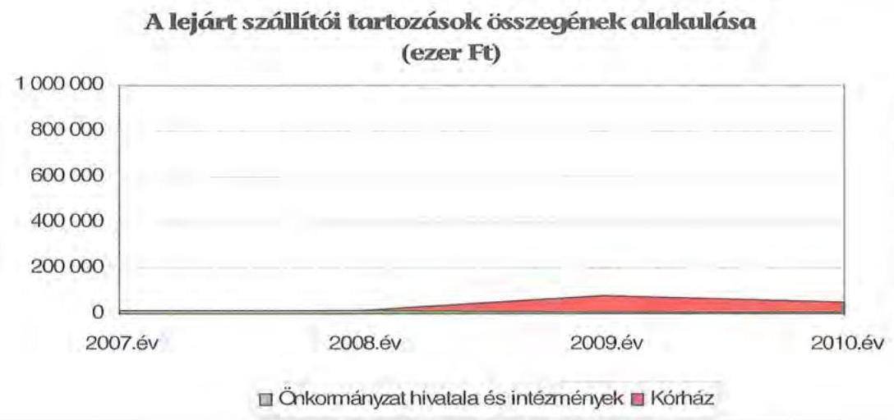

[^0]
[^0]:    ${ }^{49}$ ebből intézményi térítési díjkövetelés 150 millió Ft

---

# 3.3. Egyéb kötelezettségek 

A vizsgált időszakban az elengedett követelések összege 34 millió Ft volt, amely a Kórházat érintette. A Közgyűlés a 158/2010.(XII. 16.) számú határozatában döntött arról, hogy jóváhagyja a peren kívüli egyezség létrehozása és a kötelezett alperes mielőbbi teljesítése érdekében késedelmi kamatról való lemondó nyilatkozatát, mely összegre a Fővárosi Bíróságon az Országos Egészségbiztosítási Pénztár ellen az Irányított Betegellátási Modellkísérlet kapcsán a szerződésből eredő fizetési kötelezettség teljesítése iránt kezdeményezett.

Az Önkormányzat forgalomképes ingatlanjain jelzálogjog-alapítás a vizsgálat idôszakban nem volt, ingatlanok számviteli nyilvántartás szerinti nettó értéke 2010. december 31 -én 10777 millió Ft.

A vizsgált időszakban nem történt meg annak felmérése, hogy az eszközök elhasználódásának, amortizációjának pótlása milyen kötelezettséget jelent az Önkormányzat számára. A felújításokra, az eszközök pótlására az Önkormányzat pénzügyi lehetőségének a függvényében, elsősorban az intézmények működőképességének biztosítása, illetve a szakhatósági előírások figyelembevételével került sor. Az Önkormányzat a 2007-2010. években a tárgyi eszközök után 2513 millió Ft összegủ értékcsökkenést számolt el. Felújításra 260 millió Ft-ot fordított.

Az Önkormányzat a 2007-2010. években és 2011. I. negyedévben kölcsönt nem nyújtott kötelező feladatainak ellátása érdekében.

## 4. A PÉNZÜGYI EGYENSÚLY MEGTEREMTÉSE ÉrDEKÉBEN HOZOTT INTÉZKEDÉSEK

A jelentésben szereplő CLF módszer szerint bemutatott múködési és felhalmozási hiány mindamellett alakult ki, hogy a vizsgált időszakban az Önkormányzat folyamatosan intézkedéseket tett, hogy alkalmazkodjon a finanszírozási rendszer változása miatti forráscsökkenéshez. Ennek érdekében bevételnövelő és kiadáscsökkentő döntéseket hozott.

A 2007-2010. évek alatt meghozott kiadáscsökkentő és bevételnövelő intézkedések a gazdálkodás átláthatóbbá tételét, valamint a feladatellátás szakmai színvonalának és az Önkormányzat pénzügyi helyzetének a javítását célozták. A legjelentősebb mértékű kiadási megtakarítást a foglalkoztatottak létszámának csökkentésével érték el, ezáltal sikerült megőrizni az intézmények gazdálkodásának stabilitását.

Az Önkormányzat 2006-2010. évi gazdasági programjában megfogalmazott elvek szerint 2007-ben megkezdődött az intézményeket érintő átszervezések előkészítése, melyről a Közgyűlés 2007-től több alkalommal döntött. Az átszervezések célja az intézményi struktúra-szolgáltatási igényekhez, tanulólétszámhoz való igazítása, a kihasználtság növelése, a költségtakarékos intézményrendszer kialakítása volt.

---

A Közgyűlés által az önkormányzat gazdálkodásának és intézményhálózat működésének átszervezésére, racionalizálására hozott döntések a következő területeket érintették:

- a racionalizálási lépések első intézkedéseként a Közgyűlés a 30/2007. (IV. 19.) számú határozatával elfogadta az egyes intézményei gazdasági integrációjának koncepcióját, melyben 2007. július 1-jétől kezdődő megvalósítással szerepelt a Balassi Bálint Megyei Könyvtár, a Nógrád Megyei Levéltár és a Nógrád Megyei Múzeumi Szervezet gazdasági integrációja. A középfokú oktatási intézmények szervezeti és gazdasági integrációja keretében a Fáy András Szakközépiskola, Szakiskola és Kollégium és a Lorántffy Zsuzsanna Kollégium a Borbély Lajos Szakközépiskola és Szakiskola, mint önállóan működő és gazdálkodó gazdálkodási központtal szerepelt a koncepcióban, és így valósult meg. A koncepció tartalmazta a sajátos nevelési igényű gyermekek nevelését és a pedagógiai szakszolgálati feladatokat is ellátó pásztói Óvoda, Általános Iskola, Diákotthon, Pedagógiai Szakszolgálat és Gyermekotthon, a balassagyarmati Óvoda, Általános Iskola és Pedagógiai Szakszolgálat, valamint a szátoki Százszorszép Általános Iskola, Készségfejlesztő Speciális Szakiskola, Diákotthon és Gyermekotthon szervezeti integrációját Pásztó székhellyel, a két másik korábban önálló intézmény megszűnését követően azok tagintézményként való múködésével. A szociális ellátások területén a koncepció tartalmazta az Ipolypart Ápoló, Gondozó Otthon és Rehabilitációs Intézet gazdálkodási központtal a Harmónia Rehabilitációs Intézet és Ápoló, Gondozó Otthon, a Reménysugár Otthon és a Dr. Göllesz Viktor Rehabilitációs Intézet és Ápoló, Gondozó Otthon gazdasági integrációját;
- az Önkormányzat 2007-ben átvette Pásztó Város Önkormányzatától a Mikszáth Kálmán Gimnázium, Postaforgalmi Szakközépiskola és Kollégium, valamint a Rajeczky Benjamin Művészeti Iskola - mely utóbbi a Rózsvölgyi Márk Alapfokú Művészetoktatási intézmény tagintézménye lett - müködtetését. A feladatátvétel mind a kiadások, mind a bevételek terén növekedést eredményezett;
- 2008-ban beolvadt a Nógrád Megyei Egységes Gyógypedagógiai Módszertani Intézmény és Gyermekotthonba (EGyMI) a balassagyarmati Óvoda, Általános Iskola és Pedagógiai Szakszolgálat, valamint a szátoki Százszorszép Általános Iskola és Diákotthon, az utóbbi intézményben a 2008/2009-es tanév végével az oktatás megszűnt;
- az egészségügyi szakellátást biztosító Kórház múködési stabilitásának biztosítása érdekében a gazdálkodás folyamatos monitorozása valósult meg. A végrehajtott átszervezések következtében osztályok összevonására, telephely megszüntetésre és - a gazdasági és műszaki ellátás területén - létszámcsökkentésre is sor került. A feladatellátás szakmai hátterét segítette több sikeres pályázat lebonyolítása;
- a szociális ellátást biztosító intézmények körében végrehajtott átszervezések során két központba vonták össze a gazdálkodási feladatok ellátását, és létszámcsökkentéseket hajtottak végre;
- a 2007-2010. évek során a gyermekvédelmi feladatok ellátásában közreműködő intézmények körében - az ellátási szükségletek változásának és a költségvetési lehetőségek folyamatos szűkülése következtében - folyamatos szer-

---

vezeti átalakításokra került sor, melyek eredményeként a Megyei Gyermekvédelmi Központban koncentrálták a szakellátást;

- 2010. október 1-jétől a Megyei Gyermekvédelmi Központ gazdálkodási központként látja el a Nógrád Megyei Múzeumi Szervezet, a Nógrád Megyei Levéltár és a Balassi Bálint Megyei Könyvtár és Közművelődési Intézet gazdasági feladatait;
- a Hivatal feladatainak áttekintését követően a 2007. évi 52 fővel szemben 2010. december 31-re 48 főre csökkentették az engedélyezett létszámot, a létszámcsökkentés célja az ésszerűbb és költségtakarékosabb múködés volt.

Az intézkedések elemenkénti számszerűsített kihatásáról nem állt rendelkezésre információ. Az intézményi integrációról és a feladatok racionalizálásáról a Közgyűlés az előzetes koncepciók kialakítását követően több alkalommal döntött. A döntéseket megalapozó előterjesztésekben a tervezett intézkedések indokait, várható eredményeit bemutatták. Az intézményi integrációk, átszervezések és összevonások végrehajtásához kikérték a szakmai szervezetek véleményét és lefolytatták a jogszabályban előírt egyeztetéseket.

A Közgyűlés a 41/2007. (V. 24.) számú határozatával döntött a közművelődési, közgyűjteményi intézetek integrációjának előkészítéséről és annak végrehajtásáról, a 42/2007. (V. 24.) számú határozatával a sajátos nevelési igényű gyermekek ellátására létrehozott intézmények és pedagógiai szakszolgálatok integrációjának előkészítéséről és végrehajtásáról, a 43/2007. (V. 24.) számú határozatában a tartós bentlakásos intézmények integrációjának előkészítéséről és végrehajtásáról, valamint 44/2007. (V. 24.) számú határozattal az Önkormányzat fenntartásában működő egyes középfokú nevelési-oktatási intézményei integrációjának előkészítéséről és végrehajtásáról.

A 2006-2010. évi gazdasági program végrehajtásáról, és a közoktatási, szociális és gyermekvédelmi intézmények 2006-2010. évi múködéséről készült beszámolók alapján az intézmények átszervezést követő működési tapasztalatai kedvezőek voltak, az Önkormányzat szerint a működés személyi és tárgyi feltételei, valamint a szakmai színvonal javultak.

Az Önkormányzat 2006-2010. évi ciklusra vonatkozó gazdasági programjának végrehajtásáról készült beszámolóban áttekintették az intézményi átszervezések eredményelt és tapasztalatait, a beszámolót a Közgyűlés a 98/2010. (IX. 2.) számú határozatával fogadta el. Az Önkormányzat intézményeinek a 2006-2010. évi ciklusban végzett tevékenységéről készült beszámolót a Közgyűlés a 74/2010. (VI. 24.) számú határozatával fogadta el.

A 2007-2010. években végrehajtott intézményátszervezések, a feladatváltozások, valamint a takarékossági és racionalizálási intézkedések hatásaként az Önkormányzat kimutatása szerint együttesen 2107 millió Ft kiadás megtakarítás keletkezett, melyből 1752 millió Ft ( $83,2 \%$ ) létszámcsökkenések következtében, 257 millió Ft ( $12,2 \%$ ) a különböző bérpótlékok, tiszteletdíjak és cafeteria juttatások csökkentéséből, 98 millió Ft ( $4,6 \%$ ) pedig a feladatátrendezéseknél, dologi kiadásoknál és a civil szervezetek részére nyújtott támogatások csökkenésénél jelentkezett.

---

A 2007-2010. évek kiadáscsökkentő intézkedéseit beavatkozási területenként a következő adatok részletezik:

|  |  |  |  | ezer Ft |
| :-- | :--: | :--: | :--: | :--: |
| Az érvényesített kiadás-   csökkentés területei | Személyi   juttatások és   járulékai | Dologi, mű-   ködési ki-   adások | Pénzeszköz   átadások,   támogatá-   sok | Összesen |
| A Közgyűlés múködése | 15946 |  |  | 15946 |
| A Hivatalnál | 118698 |  | 4449 | 123147 |
| Az intézményeknél | 1903693 | 63954 |  | 1967647 |
| ÖSSZESEN | 2038337 | 63954 | 4449 | 2106740 |

A Közgyűlés működési körében a nettósított, többletköltségek felmerülését is számba vevő kiadáscsökkentő intézkedések eredményeként 13 millió Ft-ot ( $81,3 \%$ ) a testületi és a bizottsági tagok - közte a Közgyűlés tagjai közé nem tartozó, külső bizottsági tagok - létszámának csökkenése, az alelnöki pozíciók megszüntetése és a cafeteria juttatások csökkentése eredményekén mutattak ki. Az intézkedéseket a Közgyűlés 24/2010. (X. 14.) és 25/2010. (X. 14.) számú rendeleteiben meghozott döntései alapozták meg.

A Hivatalban végrehajtott megtakarítási intézkedések az átszervezésből következő és létszámcsökkentéssel járó döntések voltak, amelyek összességében a 2006. december 31-i állapothoz viszonyítva 2010. december 31-én az igazgatási létszám 4 fős csökkenését eredményezték.

A Hivatal létszáma 2006. december 31-én összesen 82 fő volt, közülük 30 fő Illetékhivatali dolgozó a kormányzati intézkedések következtében 2007. január 1-től az APEH állományába került áthelyezésre. A Hivatalnál lezajlott átszervezések kapcsán létszámcsökkentési és -növelési intézkedés egyaránt történt, melyek egyenlegeként négy fő létszámcsökkenés realizálódott a 2007-2010. évek közötti időszakban.

A 2007-2010. években önkormányzati szinten kimutatott 2107 millió Ft hatású megtakarítási intézkedésekből 1968 millió Ft-ot ( $93,4 \%$ ) az intézmények körében érvényesítettek. Az intézményi megtakarításokon belül 1904 ezer Ft-ot ( $96,7 \%$-ot) tettek ki a személyi juttatások (ezen belül a létszámcsökkentések hatásán túl a bérekhez kapcsolódó egyes pótlékok megszüntetése, visszavonása) és járulékok terén realizált megtakarítások, és 64 millió Ft (3,3\%) volt a dologi kiadásoknál elért megtakarítás. A megtakarításokat a Közgyűlés költségvetési koncepcióra és az éves költségvetések végrehajtására vonatkozó határozataiban írták elő. Az intézményi megtakarításokból 870 millió Ft (44,2\%) három intézménynél (Kórház, Borbély Lajos Szakközépiskola és Szakiskola, EGyMI) a létszámcsökkentésre és racionalizálásra vonatkozó döntések eredménye volt. Az intézményi kiadáscsökkentésben jelentős súllyal szerepelő Kórháznál a számított 415 millió Ft-ból 215 millió Ft az összességében 39 főre kiterjedő létszámcsökkentésre, 185 millió Ft pedig 18 fő, korábban közalkalmazottként foglalkoztatott orvos vállalkozóvá válására vezethető vissza az Önkormányzat kimutatása szerint.

---

A létszámcsökkentő intézkedések következtében 2007-2010. között a Hivatalnál és az intézményeknél összesen 200 álláshelyet szüntettek meg, melyből 71 álláshely ( $35,5 \%$ ) ágazati szakmai volt, 129 álláshely ( $64,5 \%$ ) pedig az intézményüzemeltetéshez, fenntartáshoz, gazdasági ügyek intézéséhez kapcsolódott. Létszám átcsoportosítás érintett további 52 álláshelyet. Létszámcsökkentő intézkedéseket minden évben terveztek és végrehajtottak, mértékük 2007. és 2009. években volt meghatározó ( 65 , illetve 77 megszüntetett álláshellyel).

A 2007-2011. I. negyedévben végrehajtott létszámcsökkenés eredményét az alábbi grafikon szemlélteti:
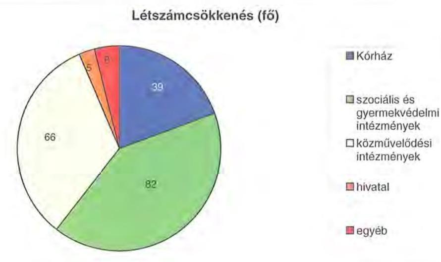

A helyi szervezési intézkedések végrehajtásához az Önkormányzat 2007-2010. években összesen 207 millió Ft központi költségvetési támogatásban részesült mely megegyezett az igényelt támogatással -, a támogatás felhasználásával tartósan leépített 140 álláshelyet, mely a létszámcsökkenés $70 \%$-át tette ki. 60 fő esetében a létszámcsökkenéshez központi támogatás nem kapcsolódott, mivel a megszüntetett álláshelyek egy részéhez - 2010. évben a szociális és gyermekvédelmi intézmények dolgozóinál - támogatás nem volt igényelhető. A létszámcsökkentési és szervezési intézkedések eredményeként az Önkormányzat 2006. december 31-i 2445 fős átlaglétszáma 2011. március 31-re 192 fővel, $7,9 \%$-kal 2253 fôre csökkent.

A Közgyűlés 2011. évi költségvetési koncepcióra vonatkozó 151/2010. (XII. 16.) számú határozata, valamint a 2011. évi költségvetés végrehajtására hozott 5/2011. (II. 17.) számú határozata alapján 2011. első negyedévében további megtakarítási intézkedések történtek. Az elhatározott 628 millió Ft kiadási megtakarítás közel négyötöde, 493 millió Ft (78,5\%) a személyi juttatások és a hozzá kapcsolódó járulékok csökkenéséből - melyből az intézményeket 417 millió Ft kiadáscsökkenés érintette -, több mint egyötöde, ( 136 millió Ft, $21,5 \%$ ) pedig a dologi kiadások csökkentéséből származott. Az elhatározott megtakarítási intézkedésekből meghatározó érték, 553 millió Ft ( $88,0 \%$ ) az intézményrendszert érintette, 69 millió Ft ( $11,0 \%$ ) a Közgyűlés müködtetéséhez kapcsolódott, míg a Hivatal 7 millió Ft ( $1,0 \%$ ) részaránnyal szerepelt. A költségcsökkentő döntések következtében mérsékelték a Közgyűlés müködtetésének

---

kiadásait, alelnöki pozíciókat, bizottságokat szüntettek meg (nyolc helyett négy bizottság működik), cafeteria juttatásokat csökkentettek és jelentősen csökkent a Közgyűlés tagjainak tiszteletdíjára kifizetett összeg. A Közgyűlés működéséhez kapcsolódó kiadások a 2011. évi költségvetési rendeletben tervezettek szerint a 2010. évi 227 millió Ft eredeti előirányzathoz képest összességében 75 millió Fttal csökkennek. A Hivatalnál tervezett megtakarítások a cafeteria elemek korábbi években megkezdett és tovább folytatott fokozatos csökkentéséből, megszüntetéséből származnak.

A Közgyűlés a 2011. évi költségvetés végrehajtására vonatkozó 5/2011. (II. 17.) számú határozatában további költségmegtakarítást eredményező intézkedéseket határozott meg:

- a Kórház kivételével valamennyi intézményére vonatkozóan előírta, hogy az intézményi elemi költségvetés összeállítása során csak a jogszabályban meghatározott minimális, normatív ellátási kötelezettségeket, személyi és tárgyi feltételeket vegye figyelembe;
- utasította az intézmények vezetőit, hogy mielőbb tegyék meg a szükséges intézkedéseket a jóváhagyott kereteken belüli gazdálkodási és létszámfeltételek kialakítására;
- döntött egyes, a jóváhagyott költségvetésen belüli intézményi finanszírozási tételek, továbbá a Közgyűlés és a Hivatal egyes tervezett kiadási tételeinek felfüggesztéséről;
- utasította a Közgyűlés elnökét és a főjegyzőt, hogy készítsék elő a pénzügyi, számviteli, gazdálkodási területeket érintően az intézmények teljes körét áttekintve a feladatellátás koncentrálását, és tegyenek javaslatot a feladatok 2011. július 1-jétől történő átalakítására;
- döntött a garantált illetményeken felüli, munkáltatói jogkörben nyújtott adható bérelemek, pótlékok további fokozatos megszüntetéséről;
- további közoktatási és szociális ellátást biztosító intézményi átszervezések, feladat összevonások előkészítését rendelte el.

Ezeken a feladatokon túlmenően a Közgyűlés megállapította, hogy a gyermekvédelmi szakellátási feladatokhoz, a súlyos fogyatékos és halmozottan sérült, illetve a kiskorú fogyatékosok szakosított intézményi ellátásához megállapított költségvetési normatívák nem nyújtanak elégséges fedezetet az érintett intézményi kör biztonságos működtetéséhez, a jogszabályokban meghatározott követelmények megteremtéséhez, ezért felhatalmazta elnökét, hogy kezdeményezze az ágazati miniszternél a szakmai normatívákat meghatározó jogszabályok, kormányrendeletek módosítását.

---

A kiadáscsökkentő intézkedések mellett az Önkormányzat az alábbiakban számszerűsitett bevételnövelő intézkedéseket tette:
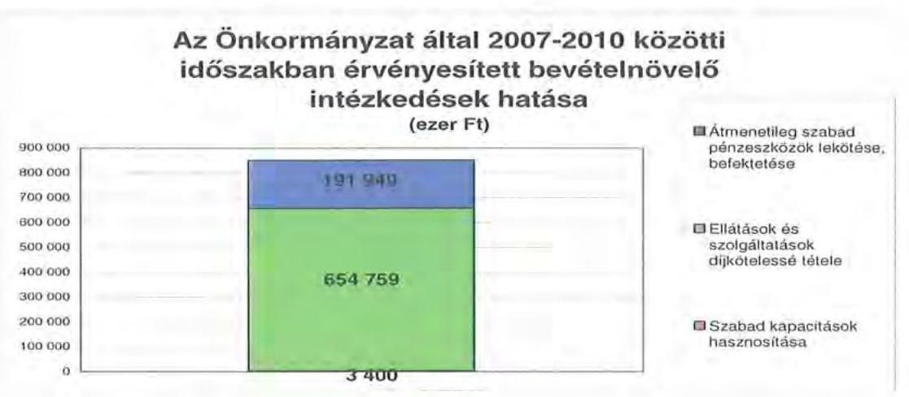

A 2007-2010. évek között a bevétel növekedését eredményező, önkormányzati kezdeményezésú intézkedések 850 millió Ft összegéből 655 millió Ft $(77,0 \%)$ a szociális ellátást nyújtó intézmények térítési díjainak növekedéséből, 192 millió Ft $(22,6 \%)$ az átmenetileg szabad pénzeszközök (kötvénykibocsátásból származó forrás) lekötéséből, 3 millió Ft $(0,4 \%)$ pedig a szabad kapacitások hasznosításából (intézmények helyiségeinek bérbeadása) származott.

A 2011. évre önkormányzati szinten 52 millió Ft bevétel növekedést terveztek, ebből 32 millió Ft ( $61,5 \%$ ) fogyatékos személyek szociális foglalkoztatásához kapcsolódó pályázati bevétel a Hivatalnál, 20 millió Ft, (38,5\%) a szolgáltatási díjak emeléséből eredően a terv szerint az intézményeknél jelentkezik.

Az Önkormányzat az átszervezések, a takarékossági intézkedések szakmai feladatellátásra gyakorolt hatását célzottan nem vizsgálta, azonban a személyi és tárgyi feltételek rendelkezésre állását és a feladatellátás szakmai teljesítését a rendszerellenőrzések keretében értékelték és azt a racionalizálások eredményeként javuló tendenciájúnak minősítették.

# 5. A HELYI ÖNKORMÁNYZATOK GAZDÁLKODÁSI RENDSZERÉNEK 2007. ÉVI ELLENŐRZÉSE SORÁN A PÉNZÜGYI EGYENSÚLY JAVÍTÁSÁRA TETT SZABÁLYSZERŰSÉGI ÉS CÉLSZERŰSÉGI JAVASLATOK HASZNOSULÁSA 

Az ÁSZ 2010. évi jelentésében két célszerüségi javaslatot tett. A jelentést a Közgyűlés a 2010. szeptember 2-ai ülésén megismerte. A javaslatok megvalósítására a Közgyűlés 103/2010. (IX. 2.) számú határozatával elfogadott intézkedési tervet készítettek, amely tartalmazta a javaslatokat, meghatározta a feladatok elvégzéséért felelősöket és a feladatok elvégzésének határidejét. A pénzügyi egyensúly javítására egy célszerüségi javaslat vonatkozott. Javasoltuk a főjegyzőnek, hogy: „tájékoztassa évente végzett számítások alapján a Közgyűlést az Önkormányzat eladósodásának növekedésére figyelemmel arról, hogy a hosszú lejáratú, adósságot keletkeztető kötelezettségvállalásokból adódó tőke- és kamatfizetési kötelezettségét az Önkormányzat milyen feltételek biztosítása mellett tud-

---

ja teljesíteni". A javaslat hasznosítására az intézkedési tervben foglaltakkal ellentétben nem a költségvetési koncepció benyújtásakor, hanem az éves beszámoló keretében került sor. Az intézkedési tervben meghatározott feladatok megvalósulását az éves költségvetés és beszámoló tárgyalása során a Közgyűlés figyelemmel kísérte.

Budapest, 2011. december „ 1. "

Melléklet: $\quad 6 \mathrm{db} \quad 16$ lap

---

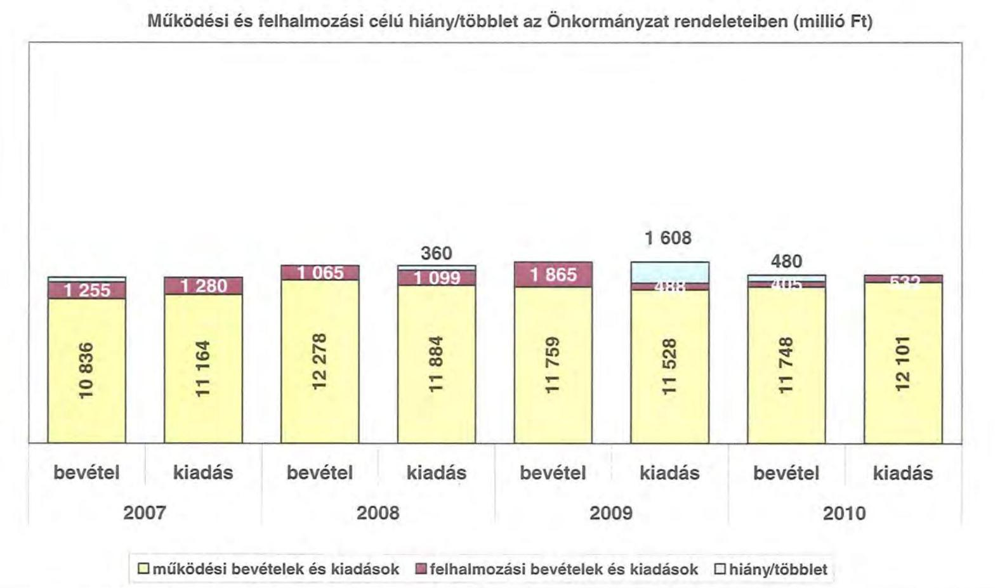

# Működési és felhalmozási célú hiány/többlet az Önkormányzat rendeleteiben (millió Ft)

|  1 255 | 1 280 | 1 065 | 360 | 1 865 | 1 608 | 480  |
| --- | --- | --- | --- | --- | --- | --- |
|  1 255 | 1 280 | 1 065 | 1 099 | 1 865 | 1 111 | 480  |
|  1 255 | 1 280 | 1 065 | 1 099 | 1 865 | 1 111 | 480  |
|  1 255 | 1 280 | 1 065 | 1 099 | 1 865 | 1 111 | 480  |
|  1 255 | 1 280 | 1 065 | 1 099 | 1 865 | 1 111 | 480  |
|  1 255 | 1 280 | 1 065 | 1 099 | 1 865 | 1 111 | 480  |
|  1 255 | 1 280 | 1 065 | 1 099 | 1 865 | 1 111 | 480  |
|  1 255 | 1 280 | 1 065 | 1 099 | 1 865 | 1 111 | 480  |
|  1 255 | 1 280 | 1 065 | 1 099 | 1 865 | 1 111 | 480  |
|  1 255 | 1 280 | 1 065 | 1 099 | 1 865 | 1 111 | 480  |
|  1 255 | 1 280 | 1 065 | 1 099 | 1 865 | 1 111 | 480  |
|  1 255 | 1 280 | 1 065 | 1 099 | 1 865 | 1 111 | 480  |
|  1 255 | 1 280 | 1 065 | 1 099 | 1 865 | 1 111 | 480  |
|  1 255 | 1 280 | 1 065 | 1 099 | 1 865 | 1 111 | 480  |
|  1 255 | 1 280 | 1 065 | 1 099 | 1 865 | 1 111 | 480  |
|  1 255 | 1 280 | 1 065 | 1 099 | 1 865 | 1 111 | 480  |
|  1 255 | 1 280 | 1 065 | 1 099 | 1 865 | 1 111 | 480  |
|  1 255 | 1 280 | 1 065 | 1 099 | 1 865 | 1 111 | 480  |
|  1 255 | 1 280 | 1 065 | 1 099 | 1 865 | 1 111 | 480  |
|  1 255 | 1 280 | 1 065 | 1 099 | 1 865 | 1 111 | 480  |
|  1 255 | 1 280 | 1 065 | 1 099 | 1 865 | 1 111 | 480  |
|  1 255 | 1 280 | 1 065 | 1 099 | 1 865 | 1 111 | 480  |
|  1 255 | 1 280 | 1 065 | 1 099 | 1 865 | 1 111 | 480  |
|  1 255 | 1 280 | 1 065 | 1 099 | 1 865 | 1 111 | 480  |
|  1 255 | 1 280 | 1 065 | 1 099 | 1 865 | 1 111 | 480  |
|  1 255 | 1 280 | 1 065 | 1 099 | 1 865 | 1 111 | 480  |
|  1 255 | 1 280 | 1 065 | 1 099 | 1 865 | 1 111 | 480  |
|  1 255 | 1 280 | 1 065 | 1 099 | 1 865 | 1 111 | 480  |
|  1 255 | 1 280 | 1 065 | 1 099 | 1 865 | 1 111 | 480  |
|  1 255 | 1 280 | 1 065 | 1 099 | 1 865 | 1 111 | 480  |
|  1 255 | 1 280 | 1 065 | 1 099 | 1 865 | 1 111 | 480  |
|  1 255 | 1 280 | 1 065 | 1 099 | 1 865 | 1 111 | 480  |

---

.

---

Az Önkormányzat CLF módszer szerint besorolt bevételei és kiadásai 2007-2010 között

|   |  |  |  |  |  |  |  |  |  |  |  |  |  |  |  |  |  |  |  |  |  |   |
| --- | --- | --- | --- | --- | --- | --- | --- | --- | --- | --- | --- | --- | --- | --- | --- | --- | --- | --- | --- | --- | --- | --- | --- |
|  1. FOLVÓ KÖLTSÉGYETÉS* | 2007. | 2008. | 2009. | 2010. |  |  |  |  |  |  |  |  |  |  |  |  |  |  |  |  |  |  |   |
|  1.1.1. Saját működési bevételek | 2 920 912 | 3 470 741 | 3 559 776 | 3 472 430 |  |  |  |  |  |  |  |  |  |  |  |  |  |  |  |  |  |  |   |
|  1.1.2. Költségvetési támogatás | 3 024 864 | 3 915 340 | 3 115 677 | 2 819 521 |  |  |  |  |  |  |  |  |  |  |  |  |  |  |  |  |  |  |   |
|  1.1.3. Anongelent bevételek | 1 300 270 | 500 814 | 567 252 | 199 320 |  |  |  |  |  |  |  |  |  |  |  |  |  |  |  |  |  |  |   |
|  1.1.4. Állandástartáson belülről kapott támogatások | 4 413 626 | 4 619 827 | 4 304 301 | 5 471 074 |  |  |  |  |  |  |  |  |  |  |  |  |  |  |  |  |  |  |   |
|  1.1.5. EU-tól és külföldről kapott bevételek | 10 828 | 4 997 | 21 904 | 33 232 |  |  |  |  |  |  |  |  |  |  |  |  |  |  |  |  |  |  |   |
|  1.1.6. Állandástartáson kívülről kapott bevételek | 36 114 | 45 523 | 42 907 | 30 999 |  |  |  |  |  |  |  |  |  |  |  |  |  |  |  |  |  |  |   |
|  1.1.7. Előző évi pénzmuradvány átvelet | 0 | 0 | 0 | 0 |  |  |  |  |  |  |  |  |  |  |  |  |  |  |  |  |  |  |   |
|  1.1. Folyó bevételek =1.1.1.+1.1.2.+1.1.3.+1.1.4.+1.1.5.+1.1.6.+1.1.7. | 11 706 614 | 12 607 242 | 11 611 817 | 12 026 576 |  |  |  |  |  |  |  |  |  |  |  |  |  |  |  |  |  |  |   |
|  1.2.1. Működési kiadások kamatkíszünek nélkül | 11 009 690 | 11 710 630 | 11 567 857 | 11 936 996 |  |  |  |  |  |  |  |  |  |  |  |  |  |  |  |  |  |  |   |
|  1.2.2. Állandástartáson belülre átadott pénzesközök | 31 507 | 57 751 | 59 442 | 168 370 |  |  |  |  |  |  |  |  |  |  |  |  |  |  |  |  |  |  |   |
|  1.2.3.1. vállalkozásoknak | 315 | 1 787 | 250 | 815 |  |  |  |  |  |  |  |  |  |  |  |  |  |  |  |  |  |  |   |
|  1.2.3.2. EU-nak, illetve külföldre | 0 | 450 | 150 | 27 064 |  |  |  |  |  |  |  |  |  |  |  |  |  |  |  |  |  |  |   |
|  1.2.3.3. magdisczonáljeiknek | 34 552 | 36 165 | 29 578 | 47 302 |  |  |  |  |  |  |  |  |  |  |  |  |  |  |  |  |  |  |   |
|  1.2.3.4. morgrafi szervezeteknek | 74 139 | 56 430 | 38 992 | 30 852 |  |  |  |  |  |  |  |  |  |  |  |  |  |  |  |  |  |  |   |
|  1.2.3. Transferkiadások (=1.2.3.1+1.2.3.2+1.2.3.3+1.2.3.4) | 109 006 | 94 832 | 68 970 | 106 033 |  |  |  |  |  |  |  |  |  |  |  |  |  |  |  |  |  |  |   |
|  1.2.4. Kamatkiadások | 34 720 | 33 973 | 28 608 | 39 920 |  |  |  |  |  |  |  |  |  |  |  |  |  |  |  |  |  |  |   |
|  1.2.5. Előző évi pénzmuradvány átadás | 0 | 0 | 0 | 0 |  |  |  |  |  |  |  |  |  |  |  |  |  |  |  |  |  |  |   |
|  1.2. Folyó kiadások = 1.2.1.+1.2.2.+1.2.3.+1.2.4.+1.2.5. | 11 184 932 | 11 897 186 | 11 524 877 | 12 271 319 |  |  |  |  |  |  |  |  |  |  |  |  |  |  |  |  |  |  |   |
|  1.3. Folyó költségvetés egyedege MÜKÖDÉSI JÖVEDELEM (1.1. - 1.2.) | 521 682 | 710 056 | 86 940 | -244 742 |  |  |  |  |  |  |  |  |  |  |  |  |  |  |  |  |  |  |   |
|  2. FELHÁLMOZÁSI KÖLTSÉGYETÉS** |  |  |  |  |  |  |  |  |  |  |  |  |  |  |  |  |  |  |  |  |  |  |   |
|  2.1.1. Saját tükebevételek | 21 251 | 51 770 | 12 124 | 7 632 |  |  |  |  |  |  |  |  |  |  |  |  |  |  |  |  |  |  |   |
|  2.1.2. Állandástartáson belülről kapott támogatások | 168 083 | 463 471 | 77 867 | 201 209 |  |  |  |  |  |  |  |  |  |  |  |  |  |  |  |  |  |  |   |
|  2.1.3. EU-tól és külföldről kapott támogatások | 0 | 0 | 1 412 | 3 552 |  |  |  |  |  |  |  |  |  |  |  |  |  |  |  |  |  |  |   |
|  2.1.4. Állandástartáson kívülről kapott támogatások | 48 221 | 37 420 | 33 415 | 68 182 |  |  |  |  |  |  |  |  |  |  |  |  |  |  |  |  |  |  |   |
|  2.1.1. Felhalmozósi bevételek (=2.1.1.+2.1.2+2.1.3+2.1.4.) | 237 555 | 552 661 | 124 818 | 280 655 |  |  |  |  |  |  |  |  |  |  |  |  |  |  |  |  |  |  |   |
|  2.2.1. Saját beruházási kiadás áfával | 1 168 105 | 1 013 383 | 359 937 | 319 328 |  |  |  |  |  |  |  |  |  |  |  |  |  |  |  |  |  |  |   |
|  2.2.2. Saját felújítási kiadás áfával | 74 149 | 83 163 | 102 327 | 119 293 |  |  |  |  |  |  |  |  |  |  |  |  |  |  |  |  |  |  |   |
|  2.2.3. Állandástartáson belülre átadott pénzesközök | 35 727 | 324 | 2 508 | 52 984 |  |  |  |  |  |  |  |  |  |  |  |  |  |  |  |  |  |  |   |
|  2.2.4. EU-nak és külföldnek adott pénzesközök | 0 | 0 | 0 | 0 |  |  |  |  |  |  |  |  |  |  |  |  |  |  |  |  |  |  |   |
|  2.2.5. Állandástartáson kívülre adott pénzesközök | 2 257 | 1 926 | 2 698 | 27 892 |  |  |  |  |  |  |  |  |  |  |  |  |  |  |  |  |  |  |   |
|  2.2.6. Befektetési célú részesedések vásárlása | 0 | 0 | 600 | 0 |  |  |  |  |  |  |  |  |  |  |  |  |  |  |  |  |  |  |   |
|  2.2. Felhalmozósi kiadások (=2.2.1.+2.2.2.+2.2.3.+2.2.4.+2.2.5.+2.2.6.) | 1 280 238 | 1 098 796 | 468 054 | 519 417 |  |  |  |  |  |  |  |  |  |  |  |  |  |  |  |  |  |  |   |
|  2.3. Felhalmozósi költségvetés egyedege (2.1. - 2.2.) | -1 042 683 | -546 135 | -343 236 | -238 762 |  |  |  |  |  |  |  |  |  |  |  |  |  |  |  |  |  |  |   |
|  3. Finanszírozási műveletek nélküli (GFS) pozíció (1.3+2.3.) | -521 001 | 163 921 | -256 296 | -483 505 |  |  |  |  |  |  |  |  |  |  |  |  |  |  |  |  |  |  |   |
|  4. FINANSZÍROZÁSI MÜVELETEK |  |  |  |  |  |  |  |  |  |  |  |  |  |  |  |  |  |  |  |  |  |  |   |
|  4.1. Hitelfelvétel | 433 132 | 438 905 | 145 895 | 841 392 |  |  |  |  |  |  |  |  |  |  |  |  |  |  |  |  |  |  |   |
|  4.2. Hiteltörlesztés | 9 169 | 313 765 | 149 912 | 0 |  |  |  |  |  |  |  |  |  |  |  |  |  |  |  |  |  |  |   |
|  4.3. Forgatási és befektetési célú értékpapírok kibocsátása | 0 | 1 500 000 | 0 | 0 |  |  |  |  |  |  |  |  |  |  |  |  |  |  |  |  |  |  |   |
|  4.4. Forgatási és befektetési célú értékpapírok beváltása | 0 | 0 | 0 | 0 |  |  |  |  |  |  |  |  |  |  |  |  |  |  |  |  |  |  |   |
|  4.5. Forgatási és befektetési célú értékpapírok értékesítése | 20 | 0 | 0 | 0 |  |  |  |  |  |  |  |  |  |  |  |  |  |  |  |  |  |  |   |
|  4.6. Forgatási és befektetési célú értékpapírok vásárlása | 0 | 0 | 0 | 0 |  |  |  |  |  |  |  |  |  |  |  |  |  |  |  |  |  |  |   |
|  4.7. Egyéb finanszírozási bevételek (függő, átfatti, kiegyenlítő) | -100 650 | 2 435 | -52 905 | -154 489 |  |  |  |  |  |  |  |  |  |  |  |  |  |  |  |  |  |  |   |
|  4.8. Egyéb finanszírozási kiadások (függő, átfatti, kiegyenlítő) | -20 881 | -12 784 | 23 009 | -158 646 |  |  |  |  |  |  |  |  |  |  |  |  |  |  |  |  |  |  |   |
|  4.9. Finanszírozási műveletek egyedege (4.1.-4.2.+4.3.-4.4+4.5.-4.6.+4.7.-4.8.) | 344 214 | 1 640 359 | -79 931 | 845 549 |  |  |  |  |  |  |  |  |  |  |  |  |  |  |  |  |  |  |   |
|  5. TÁRGYÉSI POZÍCIO |  |  |  |  |  |  |  |  |  |  |  |  |  |  |  |  |  |  |  |  |  |  |   |
|  (3.) Finanszírozási műveletek nélküli (GFS) pozíció + (4.9.) Finanszírozási műveletek egyedege | -176 787 | 1 804 280 | -336 227 | 362 044 |  |  |  |  |  |  |  |  |  |  |  |  |  |  |  |  |  |  |   |
|  6. NETTŐ MÜKÖDÉSI JÖVEDELEM |  |  |  |  |  |  |  |  |  |  |  |  |  |  |  |  |  |  |  |  |  |  |   |
|  (1.3.) Működési Jövedelem - Tüketörlesztés (4.2. Hiteltörlesztés + 4.4. Forgatási és befektetési célú értékpapírok beváltása ) | 512 513 | 396 291 | -62 972 | -244 743 |  |  |  |  |  |  |  |  |  |  |  |  |  |  |  |  |  |  |   |
|  TÁJÉKOZTATÓ ÁBÁTOK |  |  |  |  |  |  |  |  |  |  |  |  |  |  |  |  |  |  |  |  |  |  |   |
|  Összes kötelezettség | 1 009 949 | 2 522 330 | 2 960 263 | 4 134 303 |  |  |  |  |  |  |  |  |  |  |  |  |  |  |  |  |  |  |   |
|  ebből rövid lejáratú | 885 671 | 861 991 | 1 357 865 | 1 881 293 |  |  |  |  |  |  |  |  |  |  |  |  |  |  |  |  |  |  |   |
|  Összes szállítás kötelezettség | 534 713 | 264 159 | 605 342 | 546 985 |  |  |  |  |  |  |  |  |  |  |  |  |  |  |  |  |  |  |   |
|  ebből lejáró | 15 547 | 10 996 | 80 189 | 53 358 |  |  |  |  |  |  |  |  |  |  |  |  |  |  |  |  |  |  |   |
|  Pénz és tőkepleri kötelezettség (adósság) | 433 863 | 2 216 602 | 2 355 086 | 3 487 702 |  |  |  |  |  |  |  |  |  |  |  |  |  |  |  |  |  |  |   |
|  ebből rövid lejáratú | 313 764 | 559 031 | 554 999 | 1 236 392 |  |  |  |  |  |  |  |  |  |  |  |  |  |  |  |  |  |  |   |
|  PPP szerződésből hátra lévő kötelezettséges állomány | 0 | 0 | 0 | 0 |  |  |  |  |  |  |  |  |  |  |  |  |  |  |  |  |  |  |   |
|  ebből lejáró szolgáltatási díj miatti kötelezettség | 0 | 0 | 0 | 0 |  |  |  |  |  |  |  |  |  |  |  |  |  |  |  |  |  |  |   |
|  Folyószámlabitel napi átlagos állománya | 328 936 | 191 714 | 401 692 | 830 892 |  |  |  |  |  |  |  |  |  |  |  |  |  |  |  |  |  |  |   |
|  Likvidületi napi átlagos állománya | 0 | 0 | 0 | 0 |  |  |  |  |  |  |  |  |  |  |  |  |  |  |  |  |  |  |   |
|  Munkabérületi napi átlagos állománya | 65 347 | 108 234 | 18 547 |  |  |  |  |  |  |  |  |  |  |  |  |  |  |  |  |  |  |  |   |
|  Pénz eljárásokból fennálló függő kötelezettségek | 0 | 0 | 0 | 0 |  |  |  |  |  |  |  |  |  |  |  |  |  |  |  |  |  |  |   |
|  Finanszírozásba bevonható eszközök összesen | 215 891 | 2 020 171 | 1 683 944 | 2 045 988 |  |  |  |  |  |  |  |  |  |  |  |  |  |  |  |  |  |  |   |
|  Tartós kötelezettség megtestesítő értékpapírok és végi állománya | 0 | 0 | 0 | 0 |  |  |  |  |  |  |  |  |  |  |  |  |  |  |  |  |  |  |   |
|  Hossza lejáratú bankkrételek és végi állománya | 0 | 0 | 0 | 0 |  |  |  |  |  |  |  |  |  |  |  |  |  |  |  |  |  |  |   |
|  Értékpapírok és végi állománya | 0 | 0 | 0 | 0 |  |  |  |  |  |  |  |  |  |  |  |  |  |  |  |  |  |  |   |
|  Pénzeszközök (idegen pénzeszközök nélküli) és végi állománya | 215 891 | 2 020 171 | 1 683 944 | 2 045 988 |  |  |  |  |  |  |  |  |  |  |  |  |  |  |  |  |  |  |   |
|  * Bevételekben nem térít, a kiadásokban nem jelenik meg az amonizáció, a vagyoni helyzetet az egyenleg befolyásolja.
** Bevételekben vagyon megőrzésre és bővítése kiadátható források. |  |  |  |  |  |  |  |  |  |  |  |  |  |  |  |  |  |  |  |  |  |  |   |

---

## 20b. számú melléklet

## **Nőgrád Megye Önkormányzata**

## **Az Önkormányzat bevételeinek és kiadásainak, adósságszolgálatának alakulása 2007-2010 között**

|  Sor-
szám | Megnevezés | 2007. év | 2008. év | 2009. év | 2010. év  |
| --- | --- | --- | --- | --- | --- |
|   |  | lány | lány | lány | lány  |
|  1. | MÜKÖDÉSI BEVÉTELÉK | 18 659 831 | 14 279 598 | 11 812 636 | 12 091 441  |
|  1. | Sajátos folyó bevételek | 2 664 126 | 2 422 934 | 2 659 556 | 2 283 876  |
|  1.1. | Indokolányok működési bevétele | 1 309 449 | 1 650 327 | 1 649 254 | 2 055 194  |
|  1.2. | Reklészvételek | 1 449 134 | 1 608 200 | 1 556 742 | 1 505 849  |
|  1.3. | Hetz edülbevételek és jólfélézik | 0 | 0 | 0 | 0  |
|  1.4. | Kattal bevétel működési része | 17 644 | 124 277 | 164 091 | 142 474  |
|  1.5. | Egyéb folyó működési bevételek | 0 | 0 | 0 | 0  |
|  2. | Támogatás értékű működési bevételek | 286 996 | 296 399 | 288 267 | 888 729  |
|   | ebből |  |  |  |   |
|   | Hetz önkormányzatokból és költségvetési szervekől | 168 220 | 84 939 | 161 842 | 158 600  |
|   | 300kráti közönségi lányulatról | 3 339 | 3 109 | 0 | 0  |
|  3. | Pénzforgalom nélküli bevételek működésre jóváhagyott része | 146 204 | 116 852 | 294 918 | 249 791  |
|  4. | Államtikálartáson kövűrőt működési célra átvett pénzeszközök | 46 942 | 39 503 | 54 911 | 54 251  |
|  5. | Központi támogatások és átengedett források működési része | 7 594 561 | 8 432 983 | 7 836 403 | 7 558 214  |
|   | ebből |  |  |  |   |
|   | SZJA | 1 300 270 | 950 814 | 987 243 | 189 320  |
|   | önkormányzat és intézményét állami támogatásának működési része | 2 163 663 | 2 518 741 | 2 003 211 | 2 156 316  |
|   | költségvetési megtekölések, visszabújítések | 0 | 0 | 0 | 0  |
|   | fárspatacslózózetlési alapból | 4 576 628 | 5 303 326 | 4 995 929 | 4 950 245  |
|   | Hóvétel | 10 959 831 | 12 278 656 | 11 812 636 | 12 091 441  |
|  6. | BÖRÖDÉSI FOKOSZOGI (kamalkkalás nélkül) | 71 141 449 | 71 997 313 | 71 975 934 | 72 271 399  |
|  1. | Folyó működési kiadások összesen kamalkkalások nélkül | 10 930 200 | 11 989 952 | 11 278 949 | 11 944 492  |
|   | ebből |  |  |  |   |
|   | Személyi juttatások | 5 356 086 | 5 040 979 | 5 278 670 | 5 160 784  |
|   | munkaválló lemező járulások | 1 751 794 | 1 752 100 | 1 593 003 | 1 394 086  |
|   | Bőlegi beidások | 5 809 114 | 4 316 650 | 4 325 331 | 5 232 067  |
|   | Egyéb folyó beidások | 61 105 | 78 180 | 61 328 | 150 685  |
|   | Egyéb folyó működési kiadások | 0 | 0 | 0 | 0  |
|  2. | Támogatások, elvonások és egyéb folyó átutalások | 169 006 | 94 832 | 68 970 | 196 933  |
|   | ebből |  |  |  |   |
|   | működési célú pénzeszköz átadás államtikálartáson kövűre | 74 494 | 58 097 | 39 392 | 58 731  |
|   | működési célú pénzeszköz átadás államtikálartáson belűre | 0 | 0 | 0 | 0  |
|   | tévedéssel és szándékolásai juttatások | 33 920 | 26 393 | 29 570 | 47 303  |
|  3. | Előző évt pénzmenetvény átadás, visszafizetés működési | 74 733 | 21 074 | 64 670 | 12 814  |
|  4. | Támogatás értékű működési kiadás | 31 807 | 57 791 | 59 443 | 168 370  |
|   | ebből |  |  |  |   |
|   | Önkormányzatoknak | 39 636 | 34 028 | 21 048 | 129 753  |
|   | közönségi lányulásoknak | 0 | 0 | 0 | 0  |
|  III. | ADÓSSÁGÓZOLGÁLAT | 42 898 | 347 738 | 179 520 | 39 320  |
|   | Ükelőítesztési kötelezettség működési | 0 | 213 153 | 0 | 0  |
|   |  |  |  |  |   |
|   |  |  |  |  | 0  |
|   |  |  |  |  | 0  |
|   |  |  |  |  | 0  |
|   |  |  |  |  | 0  |
|   |  |  |  |  | 0  |
|   |  |  |  |  | 0  |
|   |  |  |  |  | 0  |
|   |  |  |  |  | 0  |
|  IV. | FELHALMÓZÁSI BEVÉTELÉK | 1 232 534 | 1 081 303 | 1 883 337 | 1 307 570  |
|  1. | Sejét felhalmozási és tőkejeleggő bevétel | 78 037 | 69 707 | 112 879 | 136 846  |
|  1.1. | Tárgyi eszközök, mímét, javak értékesítése, róla visszaférítés | 11 157 | 12 343 | 21 370 | 2 897  |
|  1.2. | Pövadszkötörőt származó bevétel | 30 177 | 27 963 | 75 980 | 32 329  |
|  1.3. | Ökölzők, részesztálcsak | 1 786 | 33 050 | 501 | 50  |
|  1.4. | Kamalkavétel felhalmozási része | 0 | 0 | 0 | 88 495  |
|  1.5. | Hetz edül átengedett adót felhalmozási része | 0 | 0 | 0 | 0  |
|  1.6. | Egyéb folyó felhalmozási bevételek | 6 943 | 9 921 | 4 011 | 3 709  |
|  2. | Támogatásértékű felhalmozási bevételek | 168 083 | 863 471 | 77 887 | 201 289  |
|   | ebből |  |  |  |   |
|   | Hetz önkormányzatokból és költségvetési szervekől | 81 313 | 2 497 | 0 | 7 313  |
|   | 300kráti közönségi lányulatról | 0 | 0 | 0 | 0  |
|  3. | Pénzforgalom nélküli bevételek felhalmozásra jóváhagyott része | 28 052 | 24 342 | 1 545 321 | 509 596  |
|  4. | Államtikálartáson kövűrőt felhalmozás célra átvett pénzeszközök | 88 221 | 37 426 | 33 418 | 58 182  |
|  5. | Államt felhalmozási és tőkejeleggő bevétel | 491 201 | 296 599 | 93 872 | 48 524  |
|  5.1. | Új költségvetésből átvétel | 0 | 0 | 1 412 | 2 955  |
|  5.2. | Önkormányzatok költségvetési támogatása felhalmozási célra | 491 201 | 296 599 | 93 872 | 48 524  |
|  V. | FELHALMÓZÁSI KIADÁSOK | 1 282 595 | 1 098 796 | 486 388 | 819 417  |
|  1. | Folyó felhalmozási kiadások kamalkkalások nélkül | 1 245 011 | 1 096 546 | 483 758 | 428 627  |
|  1.1. | Berviközök, felújítás | 1 245 294 | 1 096 546 | 482 354 | 428 627  |
|  1.2. | Érdevezett tárgyi eszközök e/da befizetés | 2 707 | 0 | 39 334 | 0  |
|  1.3. | Fészeszetlévk vételítése | 0 | 0 | 400 | 0  |
|  2. | Támogatások, elvonások és egyéb folyó átutalások | 2 257 | 1 928 | 2 440 | 27 893  |
|   | ebből |  |  |  |   |
|   |  |  |  |  | 0  |
|   |  |  |  |  | 0  |
|   |  |  |  |  | 0  |
|   |  |  |  |  | 0  |
|   |  |  |  |  | 0  |
|  VI. | Pénzforgalom nélküli kiadások felhalmozásra jóváhagyott része | 0 | 0 | 0 | 0  |
|   |  |  |  |  | 0  |
|   |  |  |  |  | 0  |
|   |  |  |  |  | 0  |
|   |  |  |  |  | 0  |
|   |  |  |  |  | 0  |
|   |  |  |  |  | 0  |
|   |  |  |  |  | 0  |
|   |  |  |  |  | 0  |
|   |  |  |  |  | 0  |
|   |  |  |  |  | 0  |
|   |  |  |  |  | 0  |
|   |  |  |  |  | 0  |
|   |  |  |  |  | 0  |
|   |  |  |  |  | 0  |
|   |  |  |  |  | 0  |
|   |  |  |  |  | 0  |
|   |  |  |  |  | 0  |
|   |  |  |  |  | 0  |
|   |  |  |  |  | 0  |
|   |  |  |  |  | 0  |
|   |  |  |  |  | 0  |
|   |  |  |  |  | 0  |
|   |  |  |  |  | 0  |
|   |  |  |  |  | 0  |
|   |  |  |  |  | 0  |
|   |  |  |  |  | 0  |
|   |  |  |  |  | 0  |
|   |  |  |  |  | 0  |
|   |  |  |  |  | 0  |
|   |  |  |  |  | 0  |
|   |  |  |  |  | 0  |
|   |

---

# 3. számú melléklet

## Nógrád Megye Önkormányzata

Az Önkormányzat 2007-2010 években megvalósított, illetve 2010. december 31-én fennálló fejlesztési feladatokhoz kapcsolódó kötelezettségeinek összegzése*

|  Fejlesztési feladat megnevezése, és a közgyűlési határozat száma | Beruházás kezdete | Teljes bekerülési költség | 2006.
december
31-ig
teljesített
kiadás | 2007-2010. évek között teljesített kiadás | 2010. év utánra vállalt kötelezettség | 2010. utáni kötelezettség-vállalás forrásösszetétele |  |  |   |
| --- | --- | --- | --- | --- | --- | --- | --- | --- | --- |
|   |  |  |  |  |  | Saját bevétel | Hitel | Kötvény | EU-s
támogatás  |
|  Szent Lázár Megyei Kórház rekonstrukció (63/2004.VI.17.) Kgy. címzett támogatás | 2005. | 3386307 | 3361369 | 24938 | 0 | 0 | 0 | 0 | 0  |
|  számítástechinikai infrastruktúra HEFOP 2/2005. (II.17.) Kgy. | 2008. | 79545 | 0 | 79545 | 0 | 0 | 0 | 0 | 0  |
|  térségi diagnosztikai szűrőközpont HEFOP 13/2009. (V. 5.) Kgy. | 2008. | 340382 | 0 | 340382 | 0 | 0 | 0 | 0 | 0  |
|  gépjármú vásárlás betegszállításhoz 149/2010. (XII.16.) Kgy. | 2010. | 10420 | 0 | 10420 | 0 | 0 | 0 | 0 | 0  |
|  meglévő sürgősségi osztály átalakítása, bővítése TIOP 54/2008.(V.29.) Kgy. Működési engedélyhez kötött | 2010. | 548551 | 0 | 66014 | 482537 | 0 | 0 | 0 | 482537  |
|  intenzív neonatológiai osztály műszaki fejlesztése (benyújtott) Müködési engedélyhez kötött 105/2010 (IX.2.) Kgy. | 2011. | 88889 | 0 | 0 | 88889 | 8889 | 0 | 0 | 80000  |
|  struktúra váltás 98/2009. (XI.26.) (MR) kötelező feladat | 2011. | 150000 | 0 | 0 | 150000 | 0 | 0 | 150000 | 0  |
|  "Baglyaskő" Idősek Otthona 107/2004.(XI.25.) Kgy. címzett támogatás | 2005. | 1619971 | 120352 | 1499619 | 0 | 0 | 0 | 0 | 0  |
|  Borbély Lajos Szakközépiskola, Szakiskola és Kollégium virtuális hegesztő munkapad Szakképzési hozzájárulás 12/2008.(IV.30.) Kgy. 1/2009.(II.12.) | 2007. | 13224 | 0 | 13224 | 0 | 0 | 0 | 0 | 0  |
|  szakipari szakcsoportok, gépek szerszámok Szakképzési hozzájárulás 13/2009.(V.5.) Kgy. | 2008. | 21468 | 0 | 21468 | 0 | 0 | 0 | 0 | 0  |
|  épület akadálymentesítés EMOP 5/2007.(II.13.) Kgy. 3/2008.(IV.15.) BBh | 2009. | 46243 | 0 | 46243 | 0 | 0 | 0 | 0 | 0  |
|  Fáj András Szakközépiskola, Szakiskola és Kollégium szakipari szakcsoportok Szakképzési hozzájárulás 13/2009.(V.5.) Kgy. | 2008. | 14569 | 0 | 14569 | 0 | 0 | 0 | 0 | 0  |

---

|  Fejlesztési feladat megnevezése, és a közgyűlési határozat száma | Beruházás kezdete | Teljes bekerülési költség | 2006.
december
31-ig
teljesített
kiadás | 2007-2010. évek között teljesített kiadás | 2010. év utánra vállalt kötelezettség | 2010. utáni kötelezettség-vállalás forrásösszetétele |  |  |   |
| --- | --- | --- | --- | --- | --- | --- | --- | --- | --- |
|   |  |  |  |  |  | Saját bevétel | Hitel | Kötvény | EU-s
támogatás  |
|  Lipthay Béla Mezőgazdasági Szakképző Iskola és Kollégium mg. szakmacsop. szerszám és gép besz. Szakképzési hozzájárulás 12/2008.(IV.30.) Kgy. | 2007. | 12709 | 0 | 12709 | 0 | 0 | 0 | 0 | 0  |
|  informatikai fejlesztés Szakképzési hozzájárulás 13/2009. (V. 5.) Kgy. | 2008. | 10978 | 0 | 10978 | 0 | 0 | 0 | 0 | 0  |
|  mg. szakmacsop. szerszám és gép besz. Szakképzési hozzájárulás 13/2009.(V.5.) Kgy. | 2008. | 20608 | 0 | 20608 | 0 | 0 | 0 | 0 | 0  |
|  Nógrád Megyei Egységes Gyógypedagógiai Módszertani Intézmény és Gyermekotthon utólagos akadálymentesítés ÉMOP 5/2007.(II.13.) Kgy. 3/2008.(IV.15.) BBh. 1/2009.(II.12.) | 2008. | 36531 | 0 | 36531 | 0 | 0 | 0 | 0 | 0  |
|  fűtéskorszerűsítés 4/2009.(II.12.) Kgy. CÉDE, 36/2009.(V.28.) 8.c. | 2010. | 50409 | 0 | 50409 | 0 | 0 | 0 | 0 | 0  |
|  Megyei Gyermekvédelmi Központ Szátok gyermekotthon felújítás 16/2010. (II. 18.) Kgy. | 2010. | 10136 | 0 | 10136 | 0 | 0 | 0 | 0 | 0  |
|  Balassi Bálint Megyei Könyvtár és Közművelődési Intézet átalakítás 51/2009.(VI.25.)13. | 2009. | 17550 | 0 | 17550 | 0 | 0 | 0 | 0 | 0  |
|  Mikszáth Kálmán Gimnázium, Postaforgalmi Szakközépiskola és Kollégium informatikai eszközök, hálózatfejlesztés HEFOP 13/2009. (V. 5.) Kgy. | 2008. | 11992 | 0 | 11992 | 0 | 0 | 0 | 0 | 0  |
|  informatikai eszközökfejlesztés Szakképzési hozzájárulás 11/2011.(IV.29.) | 2009. | 10322 | 0 | 10322 | 0 | 0 | 0 | 0 | 0  |
|  fűtéskorszerűsítés 4/2009.(II.12.) Kgy. CÉDE 36/2009.(V.28.) 8.b. | 2009. | 22879 | 0 | 22879 | 0 | 0 | 0 | 0 | 0  |
|  Harmónia Rehabilitációs Intézet és Ápoló Gondozó Otthon utólagos akadálymentesítés ÉMOP 5/2007.(II.13.) Kgy. 3/2008.(IV.15.) BBh, 1/2009.(II.12.)Kgy., 137/2010. (X.29.) Kgy. | 2008. | 23838 | 0 | 23838 | 0 | 0 | 0 | 0 | 0  |
|  foglalkoztató akadálymentesítés ÉMOP 5/2007.(II.13.) Kgy. 5/2009.(IV.14.) BBh. | 2009. | 14372 | 0 | 14372 | 0 | 0 | 0 | 0 | 0  |

---

|  Fejlesztési feladat megnevezése, és a közgyűlési határozat száma | Beruházás kezdete | Teljes bekerülési költség | 2006.
december
31-ig
teljesített
kiadás | 2007-2010.
évek között
teljesített
kiadás | 2010. év
utánra vállalt
kötelezettség | 2010. utáni kötelezettség-vállalás forrásösszetétele |  |  |  |   |
| --- | --- | --- | --- | --- | --- | --- | --- | --- | --- | --- |
|   |  |  |  |  |  | Saját bevétel | Hitel | Kötvény | EU-s
támogatás | Hazai
támogatás  |
|  utólagos épületenergetikai korszerűsítés 67/2010.(VI.24.), 137/2010.(X.29) KEOP | 2010. | 9924 | 0 | 2482 | 7442 | 0 | 0 | 0 | 7442 | 0  |
|  dr. Göllesz Viktor Rehabilitációs Intézet és Ápoló Gondozó Otthon pavilon épületének akadálymentesítés ÉMOP 5/2007.(II.13.) Kgy. 5/2009.(IV.14.) BBh. | 2009. | 31263 | 0 | 31263 | 0 | 0 | 0 | 0 | 0 | 0  |
|  szennyvízbekótés kötelező feladat 3/2010.(I.28.) Kgy. 5/2011.(II.17.) Kgy. | 2010. | 45000 | 0 | 10000 | 35000 | 0 | 0 | 35000 | 0 | 0  |
|  Reménysugár Otthon épületenergetikai felújítása 67/2010.(VI.24.) Kgy KEOP | 2011. | 211560 | 0 | 21105 | 190455 | 0 | 0 | 31785 | 158670 | 0  |
|  Nógrád Megyei Múzeum Szervezet Kubinyi Ferenc Múzeum Múzeum infrastruktúrális fejlesztése iskolabaráttá TIOP 101/2010 (IX.2.) Kgy. | 2010. | 30802 | 0 | 2848 | 27954 | 0 | 0 | 0 | 23761 | 4193  |
|  Múzeumi Szervezet Pásztói Múzeum Oktatóterem kialakítása TIOP 101/2010 (IX.2.) Kgy. | 2010. | 84061 | 0 | 2422 | 81639 | 0 | 0 | 0 | 81639 | 0  |
|  Múzeumi Szervezet Palóc Múzeum TÁMOP 101/2010 (IX.2.) Kgy. | 2010. | 97114 | 0 | 4297 | 92817 | 0 | 0 | 0 | 92817 | 0  |
|  Retro Múzeum, Bányamúzeum (benyújtásra tervezett pályázat) 119/2009.(XII.17.),85/2009.(IX.24.), 97/2010. (előkészítés alatt) ÉMOP kötelező feladat | 2009 | 2218445 | 0 | 15756 | 2202689 |  |  | 254244 | 1948445 | 0  |
|  számítástechnikai eszközök TIOP 101/2010 (IX.2.) Kgy. | 2010. | 35186 | 0 | 35186 | 0 | 0 | 0 | 0 | 0 | 0  |
|  Nógrád Megyei Önkormányzat Közgyűlésének Hivatala |  |  | 0 |  |  |  |  |  |  |   |
|  Megyeháza nyílászárói cseréjének második üteme 15/2008.(II.14.) Kgy. TEKI | 2007. | 29167 | 0 | 29167 | 0 | 0 | 0 | 0 | 0 | 0  |
|  Madách - közös örökségünk Madách (Csesztve) HUSK - Mgyarország-Szlovákia Határon átnyúló Együttműködési Program 20072013. 85/2009.(IX.24.) Kgy. | 2010. | 141079 | 0 | 606 | 140473 |  |  | 6448 | 119917 | 14108  |

---

|  Fejlesztési feladat megnevezése, és a közgyűlési határozat száma | Beruházás kezdete | Teljes bekerülési költség | 2006.
december
31-ig
teljesített
kiadás | 2007-2010. évek között teljesített kiadás | 2010. év utánra vállalt kötelezettség | 2010. utáni kötelezettség-vállalás forrásösszetétele |  |  |  |   |
| --- | --- | --- | --- | --- | --- | --- | --- | --- | --- | --- |
|   |  |  |  |  |  | Saját bevétel | Hitel | Kötvény | EU-s
támogatás | Hazai
támogatás  |
|  Nógrád Megye Önkormányzata által fenntartott egyes közoktatási intézmények informatikai infrastruktúrájának fejlesztése TIOP (A támogatás arányának megosztása EU-s és hazai részre nem ismert.)16/2010.(IX.18) BBh. | 2010. | 82063 | 0 | 0 | 82063 | 0 | 0 | 0 | 82063 | 0  |
|  Tanulói laptop program megvalósítása Nógrád Megye Önkormányzatának egyes közoktatási intézményeiben TIOP (A támogatás arányának megosztása EU-s és hazai részre nem ismert.) 16/2010.(IX.18) BBh. | 2010. | 56703 | 0 | 0 | 56703 | 0 | 0 | 0 | 56703 | 0  |
|  Kompetencia alapú oktatás, egyenlő hozzáférés innovatív intézményekben; TÁMOP 8/2009.(VI.25.) BBh.2009. II.12. elnöki jelentésben tájékoztatás | 2009. | 103392 | 0 | 103392 | 0 | 0 | 0 | 0 | 0 | 0  |
|  Próbáljon szerencsét Hollóköri (benyújtásra tervezett pályázat) 120/2009.(XII.17.) 97/2010. (IX.2.) Kgy. (elökészítés alatt) ÉMOP | 2009. | 1665804 |  | 8864 | 1656940 | 0 | 0 | 161306 | 1495634 |   |
|  Dunaí Ivóvíz távvezeték felújítás 98/2005(IX.29.) Kgy. bérleti díjból | 2007. | 30771 | 0 | 30771 | 0 | 0 | 0 | 0 | 0 | 0  |
|  Dunaí Ivóvíz távvezeték felújítás bérleti díjból | 2008. | 33132 | 0 | 33132 | 0 | 0 | 0 | 0 | 0 | 0  |
|  Dunaí Ivóvíz távvezeték felújítás bérleti díjból | 2009. | 34000 | 0 | 34000 | 0 | 0 | 0 | 0 | 0 | 0  |
|  Dunaí Ivóvíz távvezeték felújítás bérleti díjból | 2010. | 36115 | 0 | 36115 | 0 | 0 | 0 | 0 | 0 | 0  |
|  Dunaí Ivóvíz távvezeték felújítás bérleti díjból | 2011. | 40954 | 0 | 0 | 40954 | 40954 | 0 | 0 | 0 | 0  |
|  Közép-Nógrádi Vízmürendszer felújítás 98/2005(IX.29.) Kgy. bérleti díjból | 2007. | 11087 | 0 | 11087 | 0 | 0 | 0 | 0 | 0 | 0  |
|  Közép-Nógrádi Vízmürendszer felújítás bérleti díjból | 2008. | 10911 | 0 | 10911 | 0 | 0 | 0 | 0 | 0 | 0  |
|  Közép-Nógrádi Vízmürendszer felújítás bérleti díjból | 2010. | 2018 | 0 | 2018 | 0 | 0 | 0 | 0 | 0 | 0  |
|  Közép-Nógrádi Vízmürendszer felújítás bérleti díjból | 2011. | 10000 | 0 | 0 | 10000 | 10000 | 0 | 0 | 0 | 0  |
|  Hollókötöl-Murányig kerékpárút terv HUSK 120/2008.(XI.27.) Kgy. | 2010. | 70000 | 0 | 0 | 70000 | 0 | 0 | 3500 | 59078 | 7422  |

---

|  Fejlesztési feladat megnevezése, és a közgyűlési határozat száma | Beruházás kezdete | Teljes bekerülési költség | 2006.
december
31-ig
teljesített
kiadás | 2007-2010. évek között teljesített kiadás | 2010. év utánra vállalt kötelezettség | 2010. utáni kötelezettség-vállalás forrásösszetétele |  |  |  |   |
| --- | --- | --- | --- | --- | --- | --- | --- | --- | --- | --- |
|   |  |  |  |  |  | Saját bevétel | Hitel | Kötvény | EU-s
támogatás | Hazai támogatás  |
|  Geopark Turisztikai Desztináció fejlesztése HUSK 85/2009.(IX.24.) Kgy. | 2011. | 58002 | 0 | 0 | 58002 | 0 | 0 | 2900 | 49302 | 5800  |
|  TDM kialakítása ÉMOP 82/2009.(VIII.18.) Kgy. | 2010. | 17122 | 0 | 17122 | 0 | 0 | 0 | 0 | 0 | 0  |
|  Aininger-ház identitás központ ÉMOP 85/2009.(IX.24.) 3/2010.(I.28.) | 2010 | 20000 | 0 | 2895 | 17105 |  |  | 17105 |  |   |
|  Területrendezési terv módosítása kötelező feladat Nemzeti Fejlesztési és Gazdasági Minisztérium pályázata Belügyminisztériummal szerződéskötés 53/2010.(V.27.) Kgy. | 2011 | 16475 | 0 | 0 | 16475 | 0 | 0 | 8785 |  | 7690  |
|  Vagyonkezelés, Közbeszerzés jogszabályi kötelezettség (víziközmű szolgalmi jog rendezés) 5/2011.(II.17.) Kgy. | 2011. | 57000 | 0 | 0 | 57000 |  | 0 | 57000 | 0 | 0  |
|  gépkocsi csere szociális intézményeknél 2/2011. (II. 23.) Kgyr. | 2011. | 15000 | 0 | 0 | 15000 |  | 0 | 15000 | 0 | 0  |
|  Számítástechnikai beszerzés integrált gazdasági rendszerhez 6/2011.(II.17.)GB. | 2011. | 37000 | 0 | 0 | 37000 |  | 0 | 37000 | 0 | 0  |
|  10 millió Ft alatti fejlesztések a Hivatalnál |  | 95031 | 0 | 81691 | 13340 | 0 | 0 | 3540 | 0 | 9800  |
|  10 millió Ft alatti fejlesztések a Kórháznál |  | 39231 | 0 | 39231 | 0 | 0 | 0 | 0 | 0 | 0  |
|  10 millió Ft alatti fejlesztések az intézményeknél |  | 344042 | 0 | 317392 | 26650 | 24000 | 0 | 2650 | 0 | 0  |
|  Összesen: |  | 12381347 | 3481721 | 3242499 | 5657127 | 83843 | 0 | 786263 | 4738008 | 49013  |

---

.

---

# AlLAMI SZÁMVEVŐSZÉK 

## Nógrád Megyei Önkormányzat Közgyülésének Elnöke 3100 Salgótarján, Rákóczi út 36. Tel.: (32) 620-275 Fax: (32) 620-190

1070
Erkeze: 2011 JOL 04
Iktatószám:
Meiléklet: $\qquad$
Ikt. szám: 1046-3 /2011.

## Domokos László

Állami Számvevőszék Elnöke részére

## Budapest

Apáczai Csere János utca 10. 1364

## Tisztelt Domokos Úr!

A Nógrád Megyei Önkormányzat pénzügyi helyzetének ellenőrzéséről szóló jelentésüket, illetve ahhoz kapcsolódóan a pótlólagos információkat kérő három mellékletet megkaptam, melyeket kitöltve csatoltan visszaküldök.

Az ellenőrzés megállapításaihoz, a javaslatokhoz kapcsolódóan az alábbi észrevételeket, kiegészítéseket kívánom tenni:

A végleges, publikálható jelentés tartalmáról a közgyülést a lehetőségekhez képest mielőbb tájékoztatni szeretném, ehhez várom az Önök visszajelzését.

Javaslatként került rögzítésre, hogy a közgyülést rendszeresen tájékoztassam „a pénzügyi helyzetről, azon belül a kötelezettségállomány alakulásáról, a feltételekben bekövetkezett változásokról, az adósságot keletkeztető kötelezettségek teljesítési feltételeiről a teljes futamidőre kitekintően". Ezen javaslathoz kapcsolódóan megjegyezni kívánom, hogy az évközi és éves beszámoló keretében ezidálg és ezután is számot adunk az éven túli fejlesztési célú hiteltartozásunk, a kötvénykibocsátásból származó kötelezettségeink alakulásáról. A kötvényhez kapcsolódóan a svájci frank árfolyamváltozásából eredő árfolyam veszteséget - a jogszabályi kötelezettségnek eleget téve - a december 31-ei állapot szerint vezetjük át könyveinken. A kötvény esetében - melynek lejárata 2027. évben lesz - megjegyzem, hogy a teljes futamidőre kiterjedő teljesítési feltételek rendszeres bemutatása - az előre nem látható gazdasági, jogszabályi környezet miatt - csak nagy bizonytalansággal teljesíthető. Hasonló a véleményem a 4. javaslati pontban megfogalmazottakra is.

A Jelentés 14. oldalán az utóellenőrzés, illetve 45 .oldalon az 5 . pontban a 2007. évi ellenőrzés javaslatainak hasznosulása témában az alábbiakat jelzem. Önkormányzatunknál a 2010. augusztusában lezárt ellenőrzés a főjegyzőnek - a munka színvonalának javítása érdekében javasolta, hogy „tájékoztassa - évenként végzett számítások alapján - a Közgyűlést az Önkormányzat eladósodásának növekedésére figyelemmel arról, hogy a hosszú lejáratú, adósságot keletkeztető kötelezettségvállalásokból adódó tőke és kamatfizetési kötelezettségét az Önkormányzat milyen feltételek biztosítása mellett tudja teljesíteni."

---

Az elmúlt években és a jövőre vonatkozóan is a költségvetési koncepció összeállítása, illetve a végleges költségvetési rendelet előkészítése során kiemelt figyelmet fordítottunk és fordítunk arra, hogy elsőbbséget kapjon a felvett hitelek visszafizetése, a kibocsátott kötvény visszavásárlásának időtartama alatt a törlesztendő, visszavásárolandó összegek, azok tőke és kamattartozásainak - a többi költségvetési kiadást megelőzően történő - tervezése és teljesítése. Ezt a koncepcióban szövegesen részleteztük, majd a 2011. évi költségvetési rendeletben számszakilag is bemutattuk. Első alkalommal a kötvénnyel kapcsolatosan tőke és kamatkiadás 2012-ben lesz.
A hosszúlejáratú kötelezettségek állományáról számítás, a mérlegtételek értékelése a számviteli politikában rögzítettek szerint a december 31-i állapotnak megfelelően készül, azt a testületnek évente több alkalommal - költségvetési rendelet 5.sz. mellékleteként bemutatjuk. A 2011. évi koncepcióban ezen adatokra építve a határozat fó rendező elvként, első pontban fogalmazta meg: „Legfontosabb az önkormányzat pénzügyi-likviditási helyzetének minél zökkenő-mentesebb biztosítása, fizetőképességének megtartása,..." Ennek figyelembe vételével állítottuk össze költségvetésünket is.

Önkormányzatunk a 2008. évi kötvény kibocsátásakor számított arra, hogy az akkor közel 1,7 milliárd Ft éves illetékbevételt figyelembe véve biztosított lesz annak 2012-től történő visszavásárlása. Időközben, a jogszabályi változások miatt az illetékbevétel közel felére csökkent, a gazdasági válság hatásaként a kötvény árfolyamnövekménye jelenleg $40 \%$ körül alakul. Bízunk benne, hogy hosszútávon a visszavásárlást befolyásoló mindkét tényező kedvezőbb irányba fog változni, ami az adósságot keletkeztető kötelezettségvállalások teljesítési feltételeit biztosítani fogja.

A Nógrád Megyei Önkormányzat Közgyűlése gazdálkodási rendszerének 2010. augusztusában lezárult ellenőrzését követően viszonyítva rövid idő telt el az újabb vizsgálat lefolytatásáig. Úgy ítélem meg, hogy ennyi idő alatt önkormányzatunk gazdálkodását alapvetően nem lehet átalakítani. Ugyanakkor már az elmúlt években, és a 2011. évi költségvetés elfogadásával egyidejűleg is döntés született további kiadást csökkentő intézkedések megtételére. Ennek keretében 2011. júliusától az intézményi gazdálkodási feladatok centralizálására kerül sor. Az intézmények nagy részében megszűnik a gazdasági szervezet, a feladatok döntő része a hivatal keretein belül kerül ellátásra. Ez egyrészt költségcsökkenést, másrészt az ellenjegyzési feladat bevonásával egy koncentráltabb és nagyobb kontrollt jelentő intézkedést jelent, amivel elképzeléseink szerint jobban tudunk igazodni a kialakult likviditási körülményekhez.
A tényadatok azt mutatják, hogy pénzügyi helyzetünk - a kiadásokat szűkítő intézkedések ellenére - 2010. év elejétől folyamatosan romlik. Mint azt már több fórumon is jeleztük, ennek döntő oka a megyei önkormányzatok fix összegủ szja bevételének megszűnése, illetve az illetékbevételek jelentős nagyságrendủ szűkülése. A forráskiesés és a változatlannak ítélhető kötelező feladatok ellátási kötelezettsége együtt vezetett a jelenlegi folyószámlahitel nagyságának kialakulásához.

Az Önök vizsgálata és a 2010. évi beszámoló tényszámai is tükrözik, hogy az önkormányzat jelentős adósságállománnyal rendelkezik, ugyanakkor - a 2008. évben kibocsátott kötvényt is figyelembe véve - a záró pénzkészlet nagysága még most is számottevő. Ezek azonban nem összevonható tételek, és ebből adódik az ellentmondás.
A forráshiány a működés területét érinti, a forrástöbblet pedig - a közgyűlés döntésének megfelelően - a fejlesztési feladatokhoz kapcsolódó „tartalék". A kötvény „lehívását" a kötvényt kezelő pénzintézet csak szoros ellenőrzést követően, a kifizetett fejlesztési feladatok finanszírozására engedélyezi és biztosítja. A meglévő további pénzkészletek döntő részben

---

pályázatokhoz, illetve egyéb elkötelezettségekhez kapcsolódó kiadásokkal terheltek. Azok folyószámlahitel törlesztésbe történő beforgatása újabb terheket generálna (pl: meg nem valósult pályázat miatti visszafizetési kötelezettséget).
Ismert a megyei önkormányzat forrásszerző lehetősége. A központi normatív támogatások és az átengedett szja a müködési feladatok finanszírozását szolgálja, az ellenőrzési anyagban megállapításra került, hogy az önkormányzat nem vizsgálta azt, hogy az elhasználódott eszközök pótlása milyen kötelezettséget jelent. A későbbiekben az éves költségvetés előterjesztésekben erre kiemelt figyelmet fordítunk, ugyanakkor megjegyezni kivánom, hogy az elhasználódott eszközök saját erőből történő pótlásának lehetősége önkormányzatunk esetében igen korlátozott.

A leírtak alapján is érzékeltetni szeretném, hogy önkormányzatunk mindent megtesz annak érdekében, hogy a jogszabályokban elöírt feladatait teljesíthesse, mindezt olyan gazdasági környezetben, amelyet Önök is kiemeltek ellenőrzésükben. Sajnálatosan Nógrád megye országos és región belül elfoglalt helye - több mutatót is megvizsgálva - nagyon kedvezőtlen. A beruházások egy lakosra vetített teljesítményértéke, a munkanélküliségi ráta feltűnően negatív eltérést mutat az országos átlaghoz viszonyítva. Nógrád Megye Önkormányzatának ezért - mint az egyik legnagyobb foglalkoztatónak a megyében - kiemelt szerepe van a megye helyzetének javításában.

A fenti gondolatok és észrevételek alapján bízom benne, hogy az Önök ellenőrzésének megállapításai és azok hasznosulása hozzájárul a gondok enyhítéséhez.

Salgótarján, 2011. június 27.
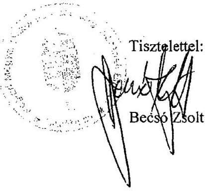

---

.

---

# Becsó Zsolt úr, 

elnök
Nógrád Megye Önkormányzata

## Salgótarián

## Tisztelt Elnök Úr!

Köszönettel vettem Nógrád Megye Önkormányzata gazdálkodási rendszerének 2011. évi ellenőrzéséről készített jelentés-tervezet megállapításaira és a tett javaslatokra - az 10463/2011. számú levelében - adott észrevételeit, és kiegészítő magyarázatát. A levelében foglalt észrevételek és kiegészítő magyarázatok sorrendjében válaszomat az alábbiakban foglalom össze:

A jelentés 1. számú javaslatához füzött észrevételét, amely szerint „A kötvény esetében melynek lejárata 2027. évben lesz - megjegyzem, hogy a teljes futamidőre kiterjedő teljesítési feltételek rendszeres bemutatása - az előre nem látható gazdasági, jogszabályi környezet miatt - csak nagy bizonytalansággal teljesíthető", nem fogadom el. A javaslatot továbbra is fenntartjuk, mivel az Önkormányzat pénzügyi egyensúlyi helyzete megköveteli a kötelezettségvállalások állománya alakulásának, a feltételekben bekövetkező változásoknak, az adósságot keletkeztető kötelezettségek teljesítési feltételeinek folyamatos vizsgálatát. Annak eredményéről a Közgyűlés rendszeres tájékoztatását a szükséges intézkedések időben történő meghozatala érdekében. Ugyanezen okok miatt a 4. számú javaslatunkat - amely a jövőbeni adósságot keletkeztető kötelezettségvállalásokról szóló közgyűlési döntéseket megalapozó előterjesztések tartalmára, azon belül a kötelezettségvállalás várható kamat-, egyéb költség- és tőkefizetési kötelezettség bemutatására vonatkozott - szintén fenntartjuk, azzal a módosítással, hogy a kötelezettségekhez kapcsolódó várható költségek bemutatása legalább 3 évre kitekintően történjenek meg.

A jelentés 14. oldalán az utóellenőrzés, illetve a 45 . oldalon az 5. pontban a 2007. évi ellenőrzés javaslatainak hasznosulására vonatkozó megállapításunkat nem vitatta, ezért azokat továbbra is fenntartjuk, az ehhez kapcsolódó kiegészítő tájékoztatását tudomásul veszem.

A hosszú lejáratú kötelezettségek állományának év végi értékelési rendjét az ellenőrzés nem kifogásolta, az ehhez kapcsolódó kiegészítő magyarázatát tudomásul veszem.

---

Az adósságot keletkeztető kötelezettségvállalás (azon belül a kötvénykibocsátás) teljesítési feltételeiben bekövetkezett változásokra (illetékbevétel csökkenés) vonatkozó, valamint a kiadáscsökkentő és bevételnövelő intézkedésekkel kapcsolatos megállapításainkat, az ezekhez füzött kiegészítő magyarázatában nem kifogásolta. Ezért a feltételek további romlása esetére, a pénzügyi, müködési egyensúly mielőbbi biztosítása és fenntarthatósága céljából megfogalmazott 2. számú javaslatunkat, továbbra is fenntartjuk.

Az értékcsökkenési leírás összegének és ezzel arányban az elhasználódott eszközök pótlásának forrásigényének és lehetőségének az éves költségvetésben történő bemutatására vonatkozó ÁSZ javaslatot nem vitatta. Az ehhez füzött észrevételét, amely szerint „az elhasználódott eszközök saját erőből történő pótlásának lehetősége önkormányzatunk esetében igen korlátozott" nem fogadom el, mivel ez a tény nem zárja ki a javaslatban foglaltak végrehajtását.

Köszönöm Elnök úr és munkatársai ellenőrzés során tanúsított hozzáállását, amellyel az ellenőrzés megvalósításában részt vettek, azt segítették.

Budapest, 2011. december „/ 5 ".

Tisztelettel:

Domokos László

---

.