# ÁLLAMI   SZÁMVEVŐSZÉK 

## JELENTÉS

a Pest Megyei Önkormányzat pénzügyi helyzetének ellenőrzéséről (43/2)

---

# Számvevői Iroda 

Iktatószám: V-3021-10/2011.
Témaszám: 1015
Vizsgálat-azonosító szám: V056013

## Az ellenőrzést felügyelte:

Dr. Varga Sándor
számvevő igazgató-helyettes

## Az ellenőrzést vezette:

## Renkó Zsuzsanna

számvevő tanácsos

## Az ellenőrzést végezték:

| Böröcz Imre | Nagy László | Szabó Tamás |
| :-- | :-- | :-- |
| számvevő tanácsos | számvevő tanácsos | számvevő tanácsos |

A témához kapcsolódó eddig készített számvevőszéki jelentések:
címe
sorszáma
Jelentés a Pest Megyei Önkormányzat gazdálkodási rendszerének 2008. évi átfogó ellenőrzéséről

---

# TARTALOMJEGYZÉK 

BEVEZETÉS ..... 5
I. ÖSSZEGZŐ MEGÁLLAPÍTÁSOK, JAVASLATOK ..... 13
II. RÉSZLETES MEGÁLLAPÍTÁSOK ..... 19

1. Az Önkormányzat kötelező és önként vállalt feladatai ..... 19
2. Pénzügyi egyensúlyi helyzet alakulása ..... 23
2.1. A működési és felhalmozási egyensúly alakulása ..... 24
2.2. Az Önkormányzat bevételei ..... 30
2.3. Az Önkormányzat kiadásai ..... 33
3. Kötelezettségek bemutatása ..... 38
3.1. A pénzintézetek felé fennálló kötelezettségek ..... 38
3.2. A szállítók felé fennálló kötelezettségek ..... 45
3.3. Egyéb kötelezettségek ..... 47
4. A pénzügyi egyensúly megteremtése érdekében hozott intézkedések ..... 50
5. A helyi önkormányzatok gazdálkodási rendszerének 2007. évi ellenőrzése során a pénzügyi egyensúly javítására tett szabályszerűségi és célszerűségi javaslatok hasznosulása ..... 59

---

# MELLÉKLETEK 

1. számú Működési és felhalmozási hiány/többlet az Önkormányzat rendeleteiben melléklet
2/a. számú Kimutatás az Önkormányzat CLF módszer szerint besorolt bevételeiről és melléklet kiadásairól 2007-2010 között
2/b. számú Kimutatás az Önkormányzat bevételeinek és kiadásainak, adósságszolgálatának alakulásáról 2007-2010 között
2. számú Az Önkormányzat 2007-2010. években megvalósított, illetve 2010. december 31-én fennálló fejlesztési feladatokhoz kapcsolódó kötelezettségeinek összegzése
3. számú Pest Megyei Közgyűlés elnökének észrevétele melléklet
4. számú Pest Megyei Közgyűlés elnökének észrevételére adott válasz melléklet

---

# RÖVIDÍTÉSEK JEGYZÉKE 

## Törvények

Áht.
ÁSZ tv.

Htv.

Ötv.
Közokt. tv.

## Szórövidítések

APEH
áfa
ÁSZ
BM
BKSZ

DPMTISZK
EDP hiány/egyenleg

EU
FELFIN
főjegyző
GDP
Hivatal
Illetékhivatal
IRMÁK Kht.
Kórház
Közgyűlés
közgyűlés elnöke
KSH
Levéltár
Múzeum
NGM
OEP
Önkormányzat
PPP konstrukció

PM TEGYESZI
az államháztartásról szóló 1992. évi XXXVIII. törvény az Állami Számvevőszékről szóló 1989. évi XXXVIII. törvény (2011. július 1-jétől az Állami Számvevőszékről szóló 2011. LXVI. törvény)
a helyi önkormányzatok és szerveik, a köztársasági megbízottak, valamint egyes centrális alárendeltségű szervek feladat- és hatásköreiről szóló 1991. évi XX. törvény
a helyi önkormányzatokról szóló 1990. évi LXV. törvény
a közoktatásról szóló 1993. évi LXXIX. törvény

Adó- és Pénzügyi Ellenőrzési Hivatal 2011. január 1-jétől Nemzeti Adó és Vámhivatal (NAV)
általános forgalmi adó
Állami Számvevőszék
Belügyminisztérium
Budapesti Közlekedés-Szervező Közhasznú Nonprofit Korlátolt Felelősségű Társaság
DPMTISZK Dél-Pest Megyei Térségi Integrált Szakképző Központ
Uniós módszertan szerinti maastrichti kritériumoknak megfelelő számítás szerinti hiány/egyenleg
Európai Unió
Feladatfinanszírozási rendszer
Pest Megye Önkormányzatának Főjegyzője
Bruttó hazai termék
Pest Megyei Önkormányzati Hivatal
Pest Megyei Illetékhivatal
IRMÁK Kiemelkedően Közhasznú Nonprofit Kft.
Szent Rókus Kórház
Pest Megyei Közgyűlés
Pest Megye Közgyűlésének Elnöke
Központi Statisztikai Hivatal
Pest Megyei Levéltár
Pest Megyei Múzeumok Igazgatósága
Nemzetgazdasági Minisztérium
Országos Egészségbiztosítási Pénztár
Pest Megyei Önkormányzat
Public Private Partnership (Partnerségi együttműködés közfeladatok ellátására a magánszektor bevonásával)
Pest Megyei Területi Gyermekvédelmi Szakszolgálat és Intézményei

---

| SNA | System of National Accounts, azaz Nemzeti Számlák |
| :-- | :-- |
| szja | Rendszere |
|  | személyi jövedelemadó |

---

# JELENTÉS 

## a Pest Megyei Önkormányzat pénzügyi helyzetének ellenőrzéséről

## BEVEZETÉS

Az Állami Számvevőszék 2011. évtől érvényes stratégiája új irányt szabott a helyi önkormányzatok gazdálkodásának ellenőrzésében is. Az ÁSZ – küldetése és jövőképe szerint – szilárd szakmai alapokra támaszkodva értékteremtő ellenőrzéseivel és helyzetelemzéseivel az államháztartás egészében, így a helyi önkormányzati alrendszerben is elő kívánja segíteni a közpénzek és a közvagyon szabályos, gazdaságos, hatékony és eredményes hasznosítását. E folyamat részeként – a 2010. évi államháztartási hiány alakulásának összetevőire is figyelemmel – megkezdődött az önkormányzati alrendszer pénzügyi helyzetelemzése.

Az NGM 2011 áprilisában közzétett adatai szerint ${ }^{1}$ a 2010. évi 1036,2 milliárd Ft összegű, 3,8%-os EDP (maastrichti kritériumok szerinti, Túlzott Hiány Eljárás keretében kimutatott) hiánycél nem volt tartható, az önkormányzati alrendszer tervezettet meghaladó hiánya miatt a GDP arányában kifejezett államháztartási hiány 4,2%-ra emelkedett.

Az önkormányzatok költségvetési jelentése szerint 2010. első három negyedév végén az önkormányzati alrendszer pénzforgalmi hiánya 97 milliárd Ft volt, a tervezett éves mérték 51%-át érte el. Bár az elmúlt években kiugróan magas hiány halmozódott fel az utolsó negyedévben, a 97 milliárd Ft-os szeptember végi hiány nem indokolta az önkormányzati alrendszer 190 milliárd Ft-ra becsült éves hiányának felülvizsgálatát. A tervezett hiány túllépése, az utolsó negyedévi 150 milliárd Ft-os pénzforgalmi hiány nem volt reálisan feltételezhető. A helyi önkormányzatok januári gyorsjelentése szerint a pénzforgalmi hiány 247,7 milliárd Ft-ot tett ki. A tervezettnél nagyobb önkormányzati pénzforgalmi hiány kialakulásában – az NGM által az éves költségvetési beszámoló elkészítéséhez kiadott tájékoztató szerint – az iparűzési adó elmaradása, a gépjárműadó, az illetékek és más bevételek tervezettnél alacsonyabb összegben teljesülése volt a meghatározó.

[^0]
[^0]:    ${ }^{1}$ NGM Tájékoztatás Magyarország Strukturális Reformprogramjának végrehajtásáról (2011. április 1). A Tájékoztató évente két alkalommal – április és október hónapban jelenik meg.

---

A megyei önkormányzatok kötelező feladatellátását többlépcsős törvényi előírások határozzák meg. A feladatokra vonatkozó szabályozás első szintjét az Ötv. ${ }^{2}$, a második szintet a hatásköri ${ }^{3}$, a harmadik szintet a további ágazati, szakmai törvények (egyebek mellett az oktatási, egészségügyi, szociális) adják.

A megyei önkormányzatok a feladatellátás és a központi forráselosztás tekintetében sajátos helyet foglalnak el a helyi önkormányzati rendszerben. A megyei önkormányzat kötelező feladatainak egy része – így a megyében lévő természeti és társadalmi muzeális emlékek, a történeti iratok gyűjtése, őrzése, tudományos feldolgozása, a megyei könyvtári szolgáltatás, a pedagógiai és közművelődési szakmai tanácsadás és szolgáltatás, a megyei testnevelési és sportszervezési feladatellátás, a gyermek- és ifjúsági jogok érvényesítése, a gyermekvédelmi- és szociális szakellátás – az Ötv-ből közvetlenül levezethető kötelezettség.

A középiskolai, szakiskolai, és kollégiumi ellátás, a fogyatékos gyermekek oktatása, nevelése, gondozása az ágazati törvény szerint a megyei önkormányzat kötelező feladata. Azonban, ha a települési önkormányzat lát el ilyen feladatot, és arról lemond, a megyei önkormányzatnak a feladatot át kell vennie. Így a megyei önkormányzatok által ellátandó kötelező közszolgáltatások ellátásának mértékére a települési önkormányzatok döntései jelentősen kihatnak.

Az alapellátást meghaladó egészségügyi szakellátás biztosítása akkor képezi a megyei önkormányzat feladatát, ha az önkormányzati vagyon kialakításáról szóló törvényben ${ }^{4}$ a feladat ellátásához szükséges vagyont az önkormányzat a tulajdonába kapta.

Az önként vállalt feladat ellátására – mivel annak vállalása a kötelező feladatok ellátását nem veszélyeztetheti – a kötelező közszolgáltatások mértékének alakulása lényegi hatással van.

A feladat és hatáskör telepítés sajátosságai mellett a megyei önkormányzatok kialakított forrásszerkezete, és a forrásszabályozásból következő szűk mozgástere, a központi költségvetéstől való erőteljes függősége is determinálja az önkormányzatok feladatellátásra vonatkozó döntéseit.

A 2007-2010. években az önkormányzati feladatok ellátásának keretet biztosító forrásszabályozás – ennek részeként az illetékbevételből és a személyi jövedelemadóból való részesedés szabályai – a megyei önkormányzatok vonatkozásában nem változtak:

- A megyei önkormányzatok saját bevételein belül az illetékbevételek döntően az ingatlanpiac stagnálása, majd visszaesése, és egyes illetékkedvezmények bevezetése következtében – megyénként differenciált mértékben

[^0]
[^0]:    ${ }^{2}$ Ötv. 69-70. §-ai
    ${ }^{3}$ a Htv.
    ${ }^{4}$ Az egyes állami tulajdonban lévő vagyontárgyak önkormányzatok tulajdonba adásáról szóló 1991. évi XXXIII. törvény

---

ugyan, de – 2010-re általánosan visszaestek. A 2010. évben befolyt 39,2 milliárd Ft illetékbevétel a 2006. évben realizált 71,1 milliárd Ft illetékbevétel alig több mint 55%-a volt. A kieső bevételek pótlására az önkormányzati alrendszer szintjén történtek intézkedések, 2010-ben 5 milliárd Ft-ot, 2011-ben 1,2 milliárd Ft-ot ellentételezett a központi költségvetés. Az illetékbevételt a megyei önkormányzatok a saját folyó bevételeik között számolják el ${ }^{5}$.

- Az illetékek kivetésének és beszedésének joga 2006. december 31-ig a megyei önkormányzatok feladata volt. A 2007. évtől a megyei illetékhivatalok illetékbeszedési feladatait az APEH vette át ${ }^{6}$. Az önkormányzati illetékrészesedési szabályok változatlanok maradtak, azonban az illetékbeszedés költségeit az önkormányzatok illetékbevételeiből átlagos (a Fővárosnál 4,0%-os, a megyei és megyei jogú városi önkormányzatnál 8,5%-os) kulcsot alkalmazva vonták le. E döntés következtében azon megyei önkormányzatok, amelyek a 8,5%-os költségnél kedvezőbb költségszint mellett látták el korábban ezt a feladatot, kedvezőtlenebb helyzetbe kerültek.
- Az önkormányzati alrendszer személyi jövedelemadóból való részesedésének makroszintű szabályozása nem változott 2007-2010 között${ }^{7}$. A helyi önkormányzatokat normatív módon megillető 32%-os részesedés visszaosztásának részletszabályai azonban a megyei önkormányzatok számára – a reálgazdaság kedvezőtlen irányú folyamatai, és az államháztartás egyensúlyi helyzetére tekintettel elrendelt kormányzati intézkedések miatt – megszorító intézkedéseket jelentettek. Összesen 17 milliárd Ft – 2007-ben 10 milliárd Ft, 2010-ben további 7 milliárd Ft – szja-t vontak ki a megyei önkormányzatok gazdálkodási köréből ${ }^{8}$. Az átengedett személyi jövedelemadó a megyei önkormányzatok egyik bevétele.

[^0]
[^0]:    ${ }^{5}$ A megyei önkormányzatok illetékbevételei az önkormányzati alrendszer saját folyó bevételeiből 2007-ben 35,9 milliárd Ft-ot (61,4%-ot), 2008-ban 41,5 milliárd Ft-ot (61,7%-ot), 2009-ben 36,5 milliárd Ft-ot (62,5%-ot), 2010-ben 25,1 milliárd Ft-ot (64,1%-ot) tettek ki.
    ${ }^{6}$ Az egyes pénzügyi tárgyú törvények módosításáról szóló 2006. évi LXI. törvény 115. §a, amely az adózás rendjéről szóló 2003. évi XCII. törvény 73. §-át módosította.
    ${ }^{7}$ A megyei önkormányzatok személyi jövedelemadó részesedése az önkormányzati alrendszer átengedett bevételeiből 2007-ben 34,7 milliárd Ft-ot (7,0%-ot), 2008-ban 51,2 milliárd Ft-ot (9,2%-ot), 2009-ben 59,2 milliárd Ft-ot (9,3%-ot), 2010-ben 56,3 milliárd Ft-ot (8,3%-ot) tett ki.
    ${ }^{8}$ A megyei önkormányzatok szja kiegészítése háromelemű. A tételes, minden megyére egységesen meghatározott összeg – az adott évek költségvetési törvényeinek 4. sz. mellékletében meghatározottak szerint – 2006-ban 593 millió Ft, 2007-ben és 2008-ban egyaránt 355 millió Ft, 2009-ben 370 millió Ft volt. A megye népességszáma után járó kiegészítés a 2006. évi 208 Ft/fő összegről 2010-re 120 Ft/fő-re, a megyei intézmények ellátottjai után járó kiegészítés 42236 Ft/ellátottról 20755 Ft/ellátottra csökkent.

---

A megyei önkormányzatok 2007-2010 között rendelkezésre álló forrásait az alábbiakban mutatjuk be:
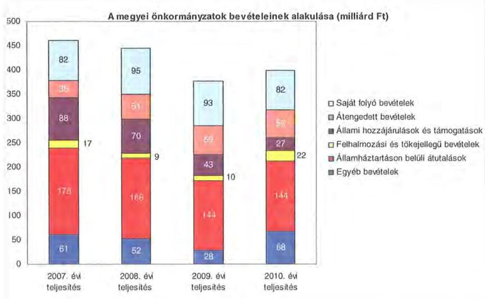

A megyei önkormányzatok saját folyó bevételeinek részaránya – amelyek főbb elemei: az intézményi térítési díjak, az illetékbevétel, a kamatbevételek – a 2007. évi összbevételen (461 milliárd Ft) belül 17,9% volt, amely 2010-re annak ellenére 20,6%-ra nőtt, hogy az összege 82 milliárd Ft maradt. Ennek oka az volt, hogy az összbevétel a 2007. évi 461 milliárd Ft-ról 2010-re 399 milliárd Ft-ra csökkent.

Az átengedett bevételek, amelyek a megyei önkormányzatoknál a személyi jövedelemadóból való részesedést jelentették, az összbevételen belül a 2007. évi 35 milliárd Ft-ról 56 milliárd Ft-ra nőttek.

Az állami hozzájárulások és támogatások – amelyek főbb elemei: az ellátotti létszámhoz kötődő normatív állami hozzájárulások, központosított, fejezeti szinten kezelt cél-irányzatból juttatott működési és fejlesztési támogatások a 2007. évi 88 milliárd Ft-ról (19,1%-os részarányról) 2010-re 27 milliárd Ft-ra (6,8%-os részarányra)
 estek vissza.

A felhalmozási és tőkejellegű bevételek - tárgyi eszközök (ingatlanok és ingóságok), föld és immateriális javak, részesedések értékesítése, EU-tól átvett pénzeszközök - a 2007. évi 17 milliárd Ft-ról (3,6%-os részarányról) 2010-re 22 milliárd Ft-ra (5,4%-ra) emelkedtek.

Az államháztartáson belüli átutalások részesedése 2007-ben 178 milliárd Ft volt. 2010. év végére 34 milliárd Ft-tal csökkent, részaránya 38,6%-ról 2,6 százalékpontos csökkenés után 2010-ben 36%-ra változott. Ez a bevételi kategória

---

tartalmazza az egészségbiztosítási és egyéb elkülönített állami pénzalapoktól átvett forrásokat. A 2010-ben e címen elszámolt bevétel 144 milliárd Ft volt.

A megyei önkormányzatok központi költségvetésből származó bevételeinek összege 2007-ben 400 milliárd Ft volt, amely 2010. évre 331 milliárd Ft-ra (az időszak alatt összesen 69 milliárd Ft-tal) 17,3%-kal csökkent.

Az egyéb, pénzmaradványból, vállalkozási bevételekből, államháztartáson kívülről származó átutalásokból, a hitelekből, a hosszú és rövid lejáratú értékpapírok értékesítéséből származó bevételek részesedése a 2007-2010. évek viszonylatában 13,3%-ról 17,1%-ra emelkedett. Ez utóbbiak 2010. évi beszámoló szerinti összevont teljesítése 68 milliárd Ft volt ${ }^{9}$.

Mindezeket figyelembe véve 2007-ben és 2010-ben a megyei önkormányzatok forrásösszetételének megoszlását az alábbi ábra szemlélteti:
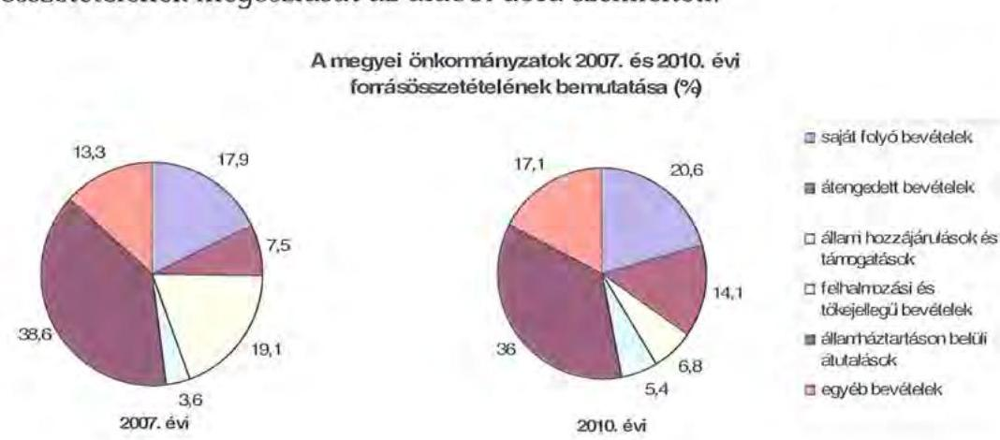

Annak ellenére, hogy a megyei önkormányzatok kötelezően ellátandó feladataikat 2007-hez képest kevesebb intézményben, csökkenő foglalkoztatotti létszám mellett végezték ${ }^{10}$, a jelentős bevételkiesést a - szervezési intézkedések hatására - csökkenő ráfordítások nem tudták kompenzálni. Az ellátottak száma a szociális, gyermekvédelmi ágazat bentlakásos elhelyezést nyújtó intézményeit kivéve - eltérő mértékben ugyan, de minden ágazatban évről évre csökkent, amely a fajlagos hozzájárulások csökkenésével együtt a normatív állami hozzájárulás arányának visszaeséséhez vezetett.

A 2007-2013-as időszakra meghirdetett, vissza nem térítendő EU-s fejlesztési forrásokhoz való hozzájutás lehetősége felerősítette az önkormányzati alrendszer fejlesztési igényeit. A fokozott fejlesztési tevékenység a felhalmozási bevéte-

[^0]
[^0]:    ${ }^{9}$ Az egyéb bevételek összege 2007-2010 között eltérő módon változott, 2007-ben 61 milliárd Ft volt, 2008-ban 52 milliárd Ft-ra, 2009-ben 28 milliárd Ft-ra esett vissza, majd 2010-ben ismét - 68 milliárd Ft-ra - emelkedett.
    ${ }^{10}$ a BM által 2010 decemberében elvégzett felmérés adatai szerint

---

lek és kiadások egyensúlyának megbomlásán ${ }^{11}$ túl a jelentkező jövőbeni fenntartási kötelezettség miatt tovább terhelhetik az önkormányzatok költségvetését.

A megyei önkormányzatok felhalmozási és működési célú pénzintézeti és szállítói kötelezettségeinek állománya a vizsgált időszakban erőteljesen növekedett.

A hosszú lejáratú kötelezettségeket a következő ábra szemlélteti:
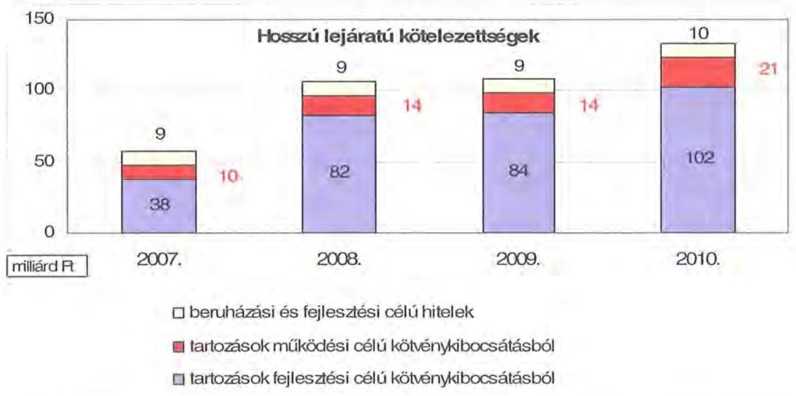

A hosszú lejáratú kötelezettségek mellett az időszakban a 2007. évi 22 milliárd Ft-ról 24 milliárd Ft-ra (8,8%-kal) növekedett az áruszállításból származó szállítói kötelezettségek állománya.

A mérlegben kimutatott kötelezettségek állománya mellett az elhasználódott eszközök pótlására forrást biztosító amortizációs (felújítási) alap képzésének ${ }^{12}$ elmaradása további problémákat vetít előre. A megyei önkormányzatok beszámolójelentéseinek összegzése szerint 2007-ben még az elszámolt értékcsökkenés 90%-ának megfelelő összeget fordítottak felújítási célokra, 2009-ben ez az arányszám már csak 16,5% volt. Ez maga után vonta a feladatellátást kiszolgáló tárgyi eszközök állagának erőteljes romlását.

Az ÁSZ a 2011. évi ellenőrzési tervében a 43. számú, az „Önkormányzatok gazdálkodási rendszerének ellenőrzése" részeként egy időben, egymással párhuzamosan tekinti át és elemzi az önkormányzati alrendszer középszintjét jelentő 19

[^0]
[^0]:    ${ }^{11}$ Az önkormányzati alrendszerben - az éves zárszámadási törvényjavaslatok általános indokolása, X. Helyi önkormányzatok gazdálkodása fejezet szerint - a felhalmozási bevételek és kiadások egyenlege 2007-ben 142,4 milliárd Ft, 2008-ban 112,3 milliárd Ft, 2009-ben 234,5 milliárd Ft hiányt mutatott.
    ${ }^{12}$ Erre a jelenlegi szabályozási környezetben nem kötelezi semmilyen előírás az önkormányzatokat.

---

megyei önkormányzat pénzügyi helyzetét. A gazdálkodás szabályszerűségét az ÁSZ előző évek során ellenőrizte a megyei önkormányzatoknál is, ezért jelen vizsgálatunk erre nem tér ki.

A jelentés a megyei önkormányzatok sajátos feladatellátási és forrásszabályozási helyzetére tekintettel a megyei önkormányzatok pénzügyi helyzetét, illetve az ezzel összefüggő korábbi ÁSZ javaslatok megvalósítását mutatja be.

Az ellenőrzés a 2007. január 1. - 2011. március 31. közötti időszakot ölelte fel.
A vizsgálat jogszabályi alapját 2011. július 1-je előtt az Állami Számvevőszékről szóló 1989. évi XXXVIII. törvény 2. § (3), (5), (6) és (9) bekezdéseiben, az Ötv. 92. § (1) bekezdésében és az Áht. 104. § (3) bekezdésében, 2011. július 1-jét követően az Állami Számvevőszékről szóló 2011. évi LXVI. törvény 1. § (3) bekezdésében, az 5. § (2)-(6) bekezdéseiben és az Áht. 120/A. § (1) bekezdésében foglalt előírások képezték.

Pest megye országos és régión belül elfoglalt helyzetét 2010. december 31-én az alábbi mutatók szemléltetik (a megyei jogú várossal együtt):

Index: az előző év azonos időszak (időpontja)=100,0

| Mutató megnevezése | Pest megye | Közép-   Magyarországi régió | Országos |
| :--: | :--: | :--: | :--: |
| Népesség száma (ezer fő) | 1238 | 2974 | 9986 |
| Népesség változás indexe (%) | 100,7 | 100,8 | 99,7 |
| Az ipari termelés volumenindexe (%) | 114,0 | 111,4 | 110,7 |
| Egy lakosra jutó ipari termelési érték (ezer Ft) | 1484,0 | 1783,2 | 2044,4 |
| Ezer lakosra jutó vállalkozások száma (db) | 141 | 189 | 165 |
| A beruházások egy lakosra vetített teljesítményértéke (millió Ft) | 224,2 | 515,4 | 304,7 |
| Foglalkoztatási arány (%) | 52,3 | 53,7 | 49,5 |
| Munkanélküliségi ráta (%) | 8,3 | 8,6 | 10,8 |
| Alkalmazásban állók havi nettó átlagkeresete (Ft) | 122168 | 153994 | 132628 |
| Alkalmazásban állók havi nettó átlagkeresetének indexe (%) | 107,2 | 106,8 | 106,9 |

*Ebből Érd Megyei Jogú Város népessége 64350 fő
A táblázatban feltüntetett adatok azt jelzik, hogy a gazdaság helyzetét reprezentáló egyes mutatók - az ezer lakosra jutó vállalkozások száma, az egy lakosra jutó ipari termelési érték, a beruházások egy lakosra vetített teljesítményértéke - tekintetében elmarad az országos jellemzőktől, ugyanakkor a Közép-Magyarországi régión belül elfoglalt helyzete kedvezőbb képet mutat. Különö-

---

sen a munkanélküliségi ráta és az alkalmazásban állók havi nettó átlagkeresetének indexe tekintetében.

A megyében 187 települési - 1 megyei jogú városi, 47 városi, 20 nagyközségi és 119 községi - önkormányzat működött.

---

# I. ÖSSZEGZŐ MEGÁLLAPÍTÁSOK, JAVASLATOK 

A Pest Megyei Önkormányzat 2010-ben 30428 millió Ft összes költségvetési kiadásából 99,9%-ot kötelező feladatai ellátására fordított. Az Önkormányzat önként vállalt feladatai - melyeket az SzMSz-ben nem rögzítettek - kiemelten a sport, a szórakoztató és szabadidős tevékenységhez, egyes idegenforgalmi, turisztikai, kiadvány szerkesztési, kommunikációs szolgáltatások szervezéséhez kapcsolódtak, valamint támogatást nyújtott civil szervezetek, alapítványok, gazdasági társaságok működéséhez, összesen 32 millió Ft összegben. Az Önkormányzat SzMSz-e a kötelező közszolgáltatási feladatokat, és azok ellátásának szervezeti keretét általános jelleggel, a vonatkozó jogszabályokra hivatkozással, az önként vállalt feladatok terjedelmét az éves költségvetési rendeletekben anyagi lehetőségei függvényében határozta meg.

Az Önkormányzat a kötelező és önként vállalt feladatait 2010. december 31-én a Hivatallal, 56 intézménnyel, négy többségi tulajdonú és három nem többségi tulajdonú gazdasági társasággal, feladatellátási szerződés alapján egy gazdasági társasággal, 119 telephelyen látta el. Az intézmények száma 2007-2010 között egy egészségügyi és egy szociális intézmény más önkormányzattól történt átvételével és három szociális intézmény működtetési feladatainak gazdasági társaság részére történt átadásával alakult ki.

A vizsgált időszakban az Önkormányzatnál - a pénzügyi helyzet elemzéséhez alkalmazott CLF módszer szerint - 2007-2010. években a kiadások meghaladták a bevételeket, valamennyi évben forráshiányos volt. A kiadások a 2007. évben 5,3%-kal és 2010-ben 10,3%-kal haladták meg a bevételeket. A kiadások összege 2007-ben 34997 millió Ft, 2010-ben 29726 millió Ft volt, a bevételek 2007-ben 33250 millió Ft-ot, 2010-ben 26953 millió Ft-ot tettek ki. Az áttekintett időszakban átlagosan az Önkormányzat deficitje 4,2% volt. Ha az előző évi pénzmaradványok igénybevételétől eltekintünk, az átlagos hiány 11,1% lett volna.

A CLF szerinti működési forráshiány kialakulásában leginkább az játszott szerepet, hogy az Önkormányzat legfőbb bevételi forrásai - a jogszabályi kedvezmények bővülése, és az ingatlanforgalom visszaesése következményeként az illetékbevétel, valamint a központi forráskivonás hatására az átengedett szja és az állami támogatások - jelentősen csökkentek.

Az Önkormányzatnál az illetékbevétel 2010-re a 2006. évi 4430 millió Ft-ról (64,8%-ára) 2870 millió Ft-ra csökkent. Az átengedett szja és az állami támogatások együttes összege a központi támogatáscsökkentésen túl a feladat átadásátvétel hatását is figyelembe véve kevesebb lett, 2010-ben 9625 millió Ft volt, a 2007. évi 12407 millió Ft 77,6%-a. Az Önkormányzat bevételei között az OEP támogatás összege a 2007. évben 10709 millió Ft, 2010-ben 11269 millió Ft volt. Az egyéb saját bevételek 1850 millió Ft-tal csökkentek. Ebből a 2010. évben az intézményi működési bevételek 270 millió Ft-tal maradtak el a 2007. évi összegtől a díjhátralékok emelkedése miatt.

---

A működési kiadások 2007-ről 2010-re jelentősen 12,9%-kal, 4335 millió Ft-tal (33663 millió Ft-ról 29328 millió Ft-ra) csökkentek. A kiadások csökkenése összefüggött a takarékossági intézkedésekkel, továbbá a kifizetetlen szállítói kötelezettségek 4,2-szeres (571 millió Ft-ról 2406 millió Ft-ra) növekedésével, valamint egyéb fizetési elmaradásokkal. A kórházak és rendelőintézetek működési kiadásaihoz az Önkormányzat évente csökkenő mértékben, összesen 1914 millió Ft működési célú pénzeszközátadással, valamint 1202 millió Ft visszatérítendő támogatással járult hozzá. Fejlesztési támogatást mindössze 11 millió Ft-ot adtak egy rendelőintézetnek.

A kórházak, szakrendelők nélkül az intézmények teljesített működési kiadásai 2007-ben 21873 millió Ft-ot tettek ki (az összes működési kiadás 65,0%-át), amely 2010-re 17452 millió Ft-ra csökkent (az összes működési kiadás 59,5%-ára).

A működési és felhalmozási kiadásokon belül 2007-2011 között a felhalmozási kiadások súlya 1603 millió Ft-ról (4,5%-ról) 1100 millió Ft-ra (3,6%-ra) csökkent. Az aktív pályázati tevékenység eredményeként 2007-2010. között 4446 millió Ft bekerülési költségű beruházást folytatott, illetve indított el az Önkormányzat, amelyből 2139 millió Ft a 2010. év utánra vállalt kötelezettség, amelynek forrása 1104 millió Ft elnyert EU-s és 100 millió Ft elnyert hazai támogatás, valamint 935 millió Ft tervezett ingatlanértékesítésből származó önkormányzati bevétel. A 2010. évi felhalmozási célú kötelezettségvállalásokból 750 millió Ft volt az egészségügyi intézmények fejlesztését szolgáló kötelezettség összege.

Az Önkormányzat pénzintézeti kötelezettségeinek állománya a könyvviteli mérlegadatok szerint 2006. december 31-ről 2010. december 31-re 2442 millió Ft-ról 17307 millió Ft-ra nőtt. A 2007-2010. években adósságszolgálatra -kötvény- és hiteltörlesztésre, valamint azok kamataira - az Önkormányzat 4220 millió Ft-ot teljesített, amelyből a kamatkiadás 2279 millió Ft volt. A kötvényekből származó források befektetéséből 2007-2010. években realizált kamatbevétel 306 millió Ft volt.

A pénzintézeti kötelezettségvállalásból származó források felhasználási céljait meghatározták. A közgyűlési előterjesztések nem tartalmazták a kötelezettségvállalás visszafizetési forrásait, a teljes futamidő várható kamat és tőkefizetési kötelezettségeit, az árfolyam- és kamatkockázatok, valamint az adósságszolgálati korlát bemutatását.

A vizsgált időszak minden napján igénybe vettek folyószámlahitelt, ennek átlagos állománya 2010-ben 5524 millió Ft volt. Rendszeresen igénybe vettek munkabér megelőlegezési hitelt is,
 a 700 millió Ft-os tartozást 2010. áprilisa óta a helyszíni vizsgálat befejezéséig nem rendezték a bank felé. A folyószámlahitel és a munkabér megelőlegezési hitel kamataira az Önkormányzat a vizsgált időszakban összesen 1582 millió Ft-ot fizetett ki. A kamatok összegének folyamatos emelkedésében szerepe volt a kamatfelár növekedésének is (0,25%-ról 2,0%-ra).

---

Az Önkormányzat 2010. év végi pénzintézeti kötelezettsége 4214 millió Ft (24,3%) fejlesztési célú kötvények kibocsátásából, 5953 millió Ft (34,4%) működési célú kötvények kibocsátásából, valamint 7140 millió Ft (41,3%) folyószámla és munkabér megelőlegezési hitelekből keletkezett. Ezek miatt az Önkormányzatnak a 2011-2013. években a folyószámla és munkabér megelőlegezési hitelek törlesztésén (7140 millió Ft) és kamatain túl, a kötvények miatt 4017141 CHF és 6887442 EUR tőketörlesztést és kamatot $^{13}$ kell teljesítenie.

Az Önkormányzat 2010. év végi szállítói tartozása 2818 millió Ft (ebből lejárt 2406 millió Ft, 85,4%), és egyéb kiadási elmaradása 453 millió Ft volt. Az Önkormányzat lejárt szállítói tartozásának állománya 2011. március 31-én már 3002 millió Ft volt, amelyen túl további 972 millió Ft egyéb kiadási elmaradás is jelentkezett.

Adósságkonszolidációs terv nem készült, ilyet a számlavezető bank sem kért. A Hivatal az ellenjegyzéseken keresztül, a kifizetési rangsorok felállításával, likviditási tervekkel nem tudta a likviditási válsághelyzet elmélyülését megakadályozni. A Közgyűlés csak egy kórházához rendelt önkormányzati biztost, ugyanakkor a likviditási helyzet problémái más intézményeinél és a Hivatalnál is jelentkeztek.

Az Önkormányzat kimutatása szerint a lejárt szállítói tartozások közül 770 millió Ft-tal (valamint további, még egyeztetés alatt álló kötelezettségekkel is) annak a kft-nek tartozik, amelyik korábban 34 önkormányzati intézmény ellátottjainak élelmezését végezte. A megszüntetett szolgáltatást az intézmények egyedi, helyi ételmegrendelésekkel pótolták. Az intézmények fizetési elmaradását és a helyzet súlyosságát jelzi az is, hogy a gázszolgáltató a számlák kifizetésének tartós elmaradására hivatkozva a számvevőszéki ellenőrzés lezárásáig 18 intézménynél szüntette meg a szolgáltatását.

A 2011-2013. évi összes (pénzintézeti, szállítói, valamint egyéb) kötelezettség teljesítésére 693 millió Ft szabad pénzmaradvány szolgálhat. Ezen felül a jelzáloggal terhelt 3902 millió Ft becsült értékű forgalomképes vagyonból 471 millió Ft, továbbá a 4615 millió Ft jelzáloggal még nem terhelt forgalomképes ingatlanvagyon értékesítéséből származó bevétel vehető figyelembe. Az Önkormányzat a kötelezettségek teljesítésére igénybe vehető forrásait nem számszerűsítette.

A további évekre (2014-2028. évek) szóló jelenleg ismert pénzintézeti kötelezettségei: 16277777 CHF és 23391462 EUR. A visszafizetést az Önkormányzat csak külső források (hitel, támogatás) bevonásával, illetve költségvetési működési és felhalmozási többletek elérése esetén tudja biztosítani. Ezek alapján sem rövid, sem hosszútávon nem látható a kötelezettségek fedezete.

A nyilvántartott önkormányzati kezességvállalás állománya 2010 végén 400 millió Ft volt. A számvevőszéki ellenőrzés lezárásáig kezesként nem keletkezett tényleges önkormányzati fizetési kötelezettség.

[^0]
[^0]:    $^{13}$ a 2011. év I. negyedévi kamat mértékét alapul véve

---

Az Önkormányzat 2008-tól nem tartotta be az Ötv-ben előírt adósságszolgálati korlátot, ugyanis a tartóssá váló, és egy évnél hosszabb lejáratú folyószámlahitelét likvid hitelnek tekintette. Az Ötv. alapján „az éven belül felvett és visszafizetett, a közszolgáltatási és államigazgatási feladatok folyamatos működtetéséhez felvett hitel" nem esik az adósságot keletkeztető éves kötelezettségvállalások korlátozása alá. A likvid hitel önkormányzati értelmezése okozta azt is, hogy a szerződés szerint 48 hónap lejáratú folyószámlahitel eléréséhez a számlavezető bank igénye alapján az Ötv. előírásával ellentétesen, jelzáloggal terheltek meg korlátozottan forgalomképes önkormányzati ingatlanokat. A korlátozottan forgalomképes, 1379 millió Ft nettó nyilvántartási értékű ingatlanvagyon nyújt fedezetet az Önkormányzat folyószámlahitelére, amelyen összesen 7600 millió Ft jelzálog került bejegyzésre.

A pénzintézeti kötelezettségvállalásból származó források felhasználási céljait meghatározták. A közgyűlési előterjesztések azonban nem tartalmazták a kötelezettségvállalás visszafizetési forrásait, a teljes futamidő várható kamat és tőkefizetési kötelezettségeit, az árfolyam- és kamatkockázatok, valamint az adósságszolgálati korlát bemutatását.

Az Önkormányzat nem vizsgálta, hogy az elhasználódott eszközök pótlása milyen kötelezettséget jelent a számára. A felújításokra, az eszközök pótlására a pénzügyi lehetőségek függvényében, elsősorban az intézmények működőképességének biztosítása miatt került sor. Az Önkormányzat 2007-2010 között a tárgyi eszközök után 2856 millió Ft értékcsökkenést számolt el. Felújításra 1825 millió Ft-ot fordított.

A kiadáscsökkentő intézkedések megtétele a feladatellátás szakmai színvonalának növelése mellett a takarékos szemléletű gazdálkodást, a működőképesség megőrzését, kiemelten a pénzügyi helyzet javítását célozta meg. A 2007-2010. években az intézményátszervezések, a feladatváltozások, valamint a takarékossági intézkedések hatásaként - az Önkormányzat kimutatása szerint együttesen 3655 millió Ft kiadási megtakarítás keletkezett, melyből 1259 millió Ft, 34,4% a kapcsolódó álláshely csökkenések következtében jelentkezett.

Az álláshely csökkentő intézkedések következtében 2007-2010 között a Hivatalnál és az intézményeknél összesen 1414 álláshelyet szüntettek meg, amelyből 747 fő (52,8%) ágazati szakmai, 667 fő (47,2%) intézményüzemeltetéshez, fenntartáshoz, gazdasági ügyek intézéséhez kapcsolódó álláshely volt.

A bevételnövelésre irányuló intézkedések eredményét - amelynek számszerűsített összege 952 millió Ft - teljes egészében az intézmények realizálták. A bevétel növekedésében meghatározó a térítési díj emelése volt 902 millió Ft-tal, a fennmaradó (50 millió Ft) a középfokú és az alapfokú művészeti oktatást érintően az illetékes önkormányzatok, a kistérségi társulás települései intézmény fenntartásának finanszírozásához való hozzájárulásából származott.

Az utóellenőrzés a pénzügyi egyensúly javítására 2008-ban tett három szabályszerűségi javaslat hasznosulására terjedt ki, amelyeket az Önkormányzat megvalósított.

---

Az Önkormányzat pénzügyi helyzetét összegezve a következők emelhetők ki:

A bevételt csökkentő központi intézkedések hatását az ellenőrzött időszakban az Önkormányzat kiadásmérséklő és bevételnövelő intézkedései nem voltak képesek ellensúlyozni. Az egyéb saját bevételek még vissza is estek, többek között a szociális intézményekben ellátottak számának csökkenése és a keletkező díjhátralékok miatt.

Az Önkormányzat likviditási helyzetének folyamatos romlását több tényező együttesen okozta. Az önkormányzati forrásszabályozás változása (szja és állami támogatások) és az illetékekre vonatkozó szabályozás, valamint az illetékbevételek meghatározó alapját jelentő ingatlanforgalom visszaesése. Az Önkormányzat a 2006. évi kórházi struktúraátalakítás után egy kórházát megtartása érdekében támogatta, miközben felvállalta a működési hiány megemelkedését is, emellett működési célú kötvényt is kibocsátott.

A vizsgált időszakban beruházások, felújítások felhalmozási források hiányában is történtek. A kötvényeket kibocsátó, illetve a kibocsátásokat szervező, majd később számlavezetéssel is megbízott bank a hitelezési kockázatai növekedését kamatfelárakban érvényesítette az Önkormányzat felé. Kockázatot jelentett az Önkormányzat számára, hogy a számlavezetője, valamint a rövid lejáratú hitelt biztosító és a kötvénykibocsátással megbízott ugyanazon pénzintézet volt. A pénzintézet a saját bevétele biztosítása érdekében az önkormányzati kötelezettségeket összevonhatta. Mind a bank, mind a szállítók felé a fizetési késedelmek kamatkiadási többletekkel jártak. Kérdéses, hogy a likviditási helyzet helyreállítására az Önkormányzat önerőből képes-e.

Az Önkormányzat működési célú kiadásainak finanszírozása folyamatos feszültséget okozott, mivel csak folyószámla- és munkabérhitel állandó igénybevételével tudta 2010 végéig fenntartani működőképességét. A vizsgált időszakban az Önkormányzat kötelezettségei jelentősen emelkedtek, azok finanszírozása a következő három évben a rendelkezésre álló, főként ingatlanfedezet ismeretében is bizonytalan, a további évekre pedig egyáltalán nem biztosított.

A feladatok és források közötti egyensúly megteremtésére irányuló központi döntések, a megyei önkormányzatok konszolidációjára, az intézmények átvételére vonatkozó törvényjavaslat elfogadása új feltételeket teremtett. Mindezek alapján az Önkormányzat gazdálkodását pénzügyi kockázatok veszélyeztetik, a pénzügyi egyensúly rövid- és hosszú távú fenntarthatósága azonnali intézkedéseket igényelt.

Az Állami Számvevőszékről szóló 2011. évi LXVI. törvény 33. § (1) bekezdésében foglaltak értelmében a jelentésben foglalt megállapításokhoz kapcsolódó intézkedési tervet köteles az ellenőrzött szervezet vezetője összeállítani és azt a jelentés kézhezvételétől számított harminc napon belül az ÁSZ részére megküldeni. Amennyiben az intézkedési tervet határidőben nem küldi meg a szervezet, vagy az továbbra sem elfogadható, az ÁSZ elnöke a hivatkozott törvény 33. § (3) bekezdés a)-b) pontjaiban foglaltakat érvényesítheti.

---

A 2011. májusában lezárult helyszíni ellenőrzés tapasztalatai alapján - figyelembe véve az Önkormányzat észrevételeit és a saját hatáskörben tett intézkedéseit - az alábbi javaslatokat tette az ÁSZ:

# a Közgyűlés elnökének: 

1. tájékoztassa a Közgyűlést rendszeresen az Intézkedési terv megvalósításáról, annak eredményeiről. A pénzügyi egyensúlyt befolyásoló feltételek romlása esetén tegyen javaslatot az intézkedési terv módosítására;
2. gondoskodjon róla, hogy a jövőben az adósságot keletkeztető kötelezettségvállalásokról szóló közgyűlési döntéseket megalapozó előterjesztések tartalmazzák a kötelezettségvállalás visszafizetésének forrásait, a várható kamat-, egyéb költség és tőkefizetési kötelezettségeit, legalább 3 éves kitekintéssel a várható kamat és árfolyamkockázatok bemutatását, és kezelésének lehetőségeit;
3. gondoskodjon a fennálló lejárt szállítói tartozás okainak feltárásáról, szerkezetének bemutatásáról - beleértve az intézményeknél lejárt szállítói állomány értékét és napra számított arányát -, a szükséges intézkedések megtételéről, indokolt esetben a szállítókkal a lejárt tartozások mielőbbi rendezéséről a kockázatok minimalizálása érdekében;
4. tartassa be az Ötv. 88. § (1) bekezdés b) pontjában az önkormányzati törzsvagyon fedezetként való felhasználásának tilalmát, valamint a (2) bekezdésében foglalt adósságot keletkeztető kötelezettségvállalások felső határára vonatkozó előírását;
5. tegye meg az Önkormányzat által vállalt kezesség beváltásának elkerülésére a megfelelő intézkedéseket;
6. gondoskodjon a pénzintézeti kötelezettségek finanszírozási lehetőségeinek számbavételéről, és arra források biztosításáról;
7. intézkedjen a korlátozottan forgalomképes önkormányzati ingatlanokon alapított jelzálogjog megszüntetésére.

---

# II. RÉSZLETES MEGÁLLAPÍTÁSOK 

## 1. Az ÖNKORMÁNYZAT KÖTELEZŐ ÉS ÖNKÉNT VÁLLALT FELADATAI

Az Önkormányzat 2010. évi beszámolója szerint költségvetési kiadásainak (30428 millió Ft) 99,9%-át a kötelező feladatok ellátására fordította. Az Önkormányzat önként vállalt feladataira 32 millió Ft-ot fordított, mely kiadások a sport, a szórakoztató és szabadidős tevékenységhez, idegenforgalmi, turisztikai, kiadvány szerkesztési, kommunikációs szolgáltatások szervezéséhez kapcsolódtak, valamint támogatást nyújtott civil szervezetek, alapítványok működéséhez. A 2011. évi tervadatok $^{14}$ alapján az önként vállalt feladatokra az összes költségvetési kiadás 0,04%-át tervezték, társadalmi eseményekre kilenc millió Ft-ot, Bursa Hungarica Felsőoktatási ösztöndíjra kettő millió Ft-ot, Együtt a Régió Egészségéért Kht. támogatása három millió Ft-ot.

A kötelező és az önként vállalt feladatok körét az Önkormányzat Szervezeti és Működési Szabályzatában nem rögzítették $^{15}$. Kötelező feladataikat az Ötv. és az ágazati törvények által meghatározottnak tekintik, az önként vállalt feladatok terjedelmét az éves költségvetési rendeletekben anyagi lehetőségeik függvényében határozták meg. A 2006. évtől évente jelentős mértékben - a 2010. évre a költségvetési kiadásokon belül 32 millió Ft-ra, 0,1%-os részarányra - csökkentették a működési célú pénzeszközátadások között az önként vállalt feladatokhoz kapcsolódó támogatások $^{16}$ összegét.

Az Önkormányzat éves költségvetési kiadásainak szerkezetét tekintve a járulékokkal növelt személyi juttatások és dologi kiadások 27,3 milliárd Ft összegén belül a meghatározó arányt $^{17}$, 43,6%-ot (11,9 milliárd Ft-ot) a három kórháznál és négy rendelőintézetnél elszámolt kiadások jelentették.

A szociális feladatokat ellátó 13 intézmény járulékokkal növelt személyi juttatásokból és dologi kiadásokból való részesedése 16,5%, 4,5 milliárd Ft, és a 31 közoktatási intézményé 31,5%, 8,6 milliárd Ft volt.

A 2010. évben a közoktatási feladatok kiadásait 61,1%-ban, a szociális feladatok kiadásait 49,8%-ban finanszírozta normatív költségvetési támogatás 5254 millió Ft, illetve 2260 millió Ft összegben.

[^0]
[^0]:    $^{14}$ A 2010.
 évi költségvetési törvényben foglalt lehetőség alapján a működésképtelen önkormányzatok egyéb támogatásának igényléséhez készített adatszolgáltatás (7. sz. melléklete) alapján 2011. március 30-i állapot szerint megjelenített adatok.
    ${ }^{15}$ Erre jogszabályi előírás ma már nem is kötelezi az Önkormányzatot.
    ${ }^{16}$ Az önként vállalt feladatok terjedelmére, költségvetési kiadásokon belüli arányára vonatkozó megállapítások az Önkormányzat által adott nyilatkozatokon alapulnak.
    ${ }^{17}$ Az Önkormányzat járulékokkal növelt személyi és dologi kiadásainak ágazatonkénti megbontása a 2010. decemberében az Önkormányzat által a BM részére készített adatszolgáltatás kigyűjtéséből származik.

---

A közművelődési, levéltári, közgyűjteményi szolgáltatások ellátását három intézmény biztosítja, kiadási arányuk mindössze 4,4 %, 1,2 milliárd Ft, ugyanakkor az igazgatási és egyéb ágazathoz sorolható járulékokkal növelt személyi juttatások és dologi kiadások részaránya 4,0 %, 1,1 milliárd Ft volt.
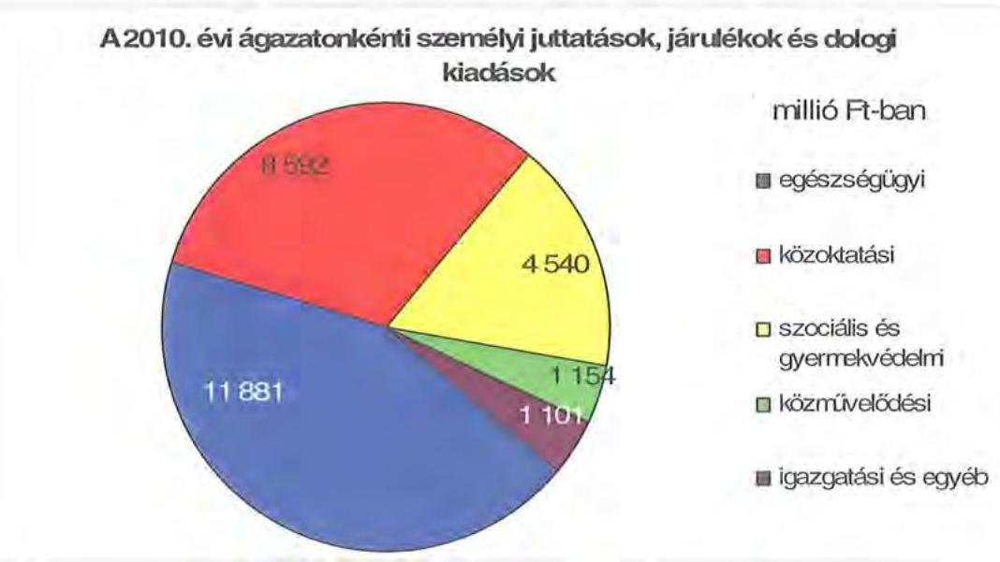

Az összes kiadás 86,9%-a az intézmények (27417 millió Ft), a többi a Hivatal költségvetésében jelent meg. A Hivatal költségvetéséből (4134 millió Ft) a személyi és dologi kiadások 2245 millió Ft-tal, 54,3%-kal, a beruházások, felújítások 310 millió Ft-tal, 7,5%-kal, a különböző megyepolitikai feladatokhoz, szervezetek támogatásához, finanszírozási tételekhez kapcsolódó kiadások 1579 millió Ft-tal, 38,2%-kal részesültek.

Az Önkormányzat kötelező és önként vállalt feladatait 2010. december 31-én 56 költségvetési szervvel és négy többségi tulajdonú gazdasági társasággal (Naszály-Galga Szakképzés Szervezési Társaság Nonprofit Kiemelkedően Közhasznú Kft., DPMTISZK Nonprofit Kiemelkedően Közhasznú Kft., Pest Megye Szimfonikus Zenekar Közhasznú Nonprofit Kft., Pest Megyei Média Kft.) látta el.

Az Önkormányzat által fenntartott költségvetési szervek közül 13 önállóan működő és gazdálkodó, 43 önállóan működő költségvetési szerv, az intézmények - alapító okirataik szerint - összesen 113 telephelyen működnek. Az Önkormányzat feladatait az alábbi intézménystruktúrával látja el:

- egészségügyi feladatokat három kórház és négy rendelőintézet lát el;
- szociális és gyermekvédelmi feladatokat 13 intézmény végez;
- közoktatási feladatot 31 intézmény lát el, ebből négy intézmény, vagy annak telephelye fogyatékos ellátást is biztosít;
- kulturális - közművelődési és közgyűjteményi - és egyéb feladatokat végez négy intézmény (könyvtár, levéltár, múzeum, közművelődési intézet).
- igazgatási feladatokat a Hivatal lát el.

---

A költségvetési szervek száma 2006-ban 68, a 2007. és a 2008. évben egyaránt 70, közel állandó volt. A 2009. és 2010. években 20%-kal kevesebb (57, illetve 56) intézménnyel látták el feladataikat, egyidejűleg a telephelyek száma 10%-kal (a 2008. évi 102-ről a 2009. évi 113-ra) nőtt. A települési önkormányzatoktól feladatátvétel az egészségügyi és a szociális ágazatban növelte az intézmények számát - egy-egy intézménnyel - a 2007. évben. A 2009. évben a közoktatási területen 24,4%-kal (41-ről 31-re), a szociális ágazatban 17,6%-kal (17-ről 14-re) csökkent az intézmények száma.

Az egyes ágazatok kötelező feladatellátását 2010. december 31-én az alábbi mutatók jellemezték:

| Megnevezés | közoktatás | szociális és   gyermekvédelem | egészségügy | kultúra és   sport |
| :-- | :--: | :--: | :--: | :--: |
| Az ágazatban foglalkoztatottak száma (fő) | 2239 | 1097 | 1819 | 226 |
| Az ágazat intézményeiben   ellátottak összesen (fő) | 17050 | 3111 |  |  |
| Fekvőbeteg ellátás férőhelyeinek száma (db) |  |  | 1420 |  |

Az egyes ágazatokban foglalkoztatottak létszáma a költségtakarékossági intézkedések eredményeként a 2006-2010. években összesen 1414 fővel csökkent, míg az ellátottak létszámában a vizsgált időszakban 3094 fő növekedés történt ${ }^{18}$. A 2007. évben átvett feladatok következtében 70 fővel nőtt az ellátotti létszám a szociális ágazatban és 675 fővel az egészségügy területén. A 2008. évben gazdasági társaságnak átadott szociális ellátási feladatok az ellátotti létszámot nem módosították, csak a feladatellátás módját változtatták meg. A foglalkoztatotti létszám a 2007. évi feladat-átvétel következtében 37 fővel nőtt a szociális és 64 fővel az egészségügyi területen. A 2008. évi feladat-átadással a foglalkoztatottak létszáma a három átadott intézménnyel összesen 125 fővel csökkent az Önkormányzat adatszolgáltatása alapján.

- Az Önkormányzat négy ${ }^{19}$ többségi részesedésű gazdasági társasága közül kettő - Pest Megye Szimfonikus Zenekar Közhasznú Nonprofit Kft. és Pest Megyei Média Kft. - az Önkormányzat kizárólagos tulajdona, melyek önként vállalt - kulturális, valamint egyéb (újságkiadás) - feladatokat látnak el. Az Önkormányzat a Naszály-Galga Szakképzés Szervezési Társaság Nonprofit Kiemelkedően Közhasznú Kft.-ben 60%-os, a DPMTISZK Nonprofit Kiemelkedően Közhasznú Kft.-ben 81,5%-os tulajdoni részesedéssel rendelkezik, a társaságok az Önkormányzat kötelező - közoktatási (szakmai középfokú oktatás) - feladatait, egyikük emellett önként vállalt feladatot (felnőttképzés, vállalkozási tevékenységként ingatlan-, gépbérbeadás) lát el.

[^0]
[^0]:    ${ }^{18}$ Az egészségügyi szakellátó rendszerben ellátottak számával együtt, a megyei intézményhálózatban összesen ellátottak száma az Önkormányzat kimutatása alapján.
    ${ }^{19}$ Az EREK Együtt a Régió Egészségéért Kht. „va” végelszámolás alatti egyszerüsített éves beszámolóját a Közgyűlés a 123/2010. (III. 26.) számú határozatával elfogadta, a Kht. a 2010. év II. negyedévétől nem vesz részt az Önkormányzat feladatainak ellátásában.

---

- A többségi tulajdonú gazdasági társaságok mellett az Önkormányzat a BKSZ-ben ${ }^{20}$ 33,3%-os, a SAVE-REMA Energiaügynökség Kft.-ben 25,0%-os, a Pest Megye Háza Adminisztrációs és Üzleti Központ Kft.-ben 13,3%-os részesedéssel rendelkezik.

A BKSZ helyi és helyközi közösségi közlekedési koordinációs feladatokat látott el, működése - mivel ellátási felelőssége ezen a területen nincs - az Önkormányzat pénzügyi helyzetére nem volt hatással. A SAVE-REMA Energiaügynökség Kft. alternatív és takarékos energiafelhasználás területén végez tanácsadást, a Pest Megye Háza Adminisztrációs és Üzleti Központ Kft.-t beruházás lebonyolítási feladatok ellátására alapították.

Az önkormányzati feladatellátásban az intézmények és gazdasági társaságok mellett egyéb szervezetek, valamint szolgáltatási szerződéssel kiszervezett/kiszerződött intézményi alapellátások nem vesznek részt.

Az Önkormányzat az áttekintett időszakban más önkormányzattól egy járóbeteg szakellátási feladatot és egy szociális ellátási feladatot vett át.

A Közgyűlés a 22/2007. (I. 26.) számú határozatában döntött arról, hogy - mint az Ötv. 70. § (1) bekezdésének b) pontjában erre kötelezett - a nagykátai Szakorvosi Rendelőintézetben folyó alapellátást meghaladó egészségügyi szakellátással kapcsolatos feladatokat 2007. január 1. napjától ellátja.

A Közgyűlés 45/2007. (II. 23.) számú határozatával döntött arról, hogy a települési önkormányzattól átveszi a turai Őszirózsa Idősek Otthonában folyó személyes gondoskodás keretébe tartozó szakosított ellátással kapcsolatos feladatokat.

Az Önkormányzat három szociális intézmény ellátási feladatát adta át 210 fő ellátottal az IRMÁK Kht-nek.

A Közgyűlés a 365/2008. (IX. 26.) számú határozatában döntött - a közbeszerzési eljárás eredménye alapján kiválasztott szolgáltatóval - ellátási szerződés megkötéséről az önkormányzati fenntartású intézmények (Pszichiátriai Betegek Otthona, Domony, Margita Idősek Otthona, Szada, Fehér Hattyú Idősek Otthona, Szentlőrinckáta) működtetésére.

[^0]
[^0]:    ${ }^{20}$ A Közgyűlés 2/2011. (I. 28.) számú határozatában tudomásul vette, hogy a Nemzeti Fejlesztési Minisztérium 2010. december 31-i hatállyal felmondta a Budapesti Közlekedési Szövetség létrehozására vonatkozó 2005. június 28-án aláírt Alapszerződést; tudomásul vette a BKSZ jogutód nélküli megszüntetését végelszámolás útján, amelynek kezdő időpontja: 2011. március 1., befejezésének kitűzött határideje: 2011. augusztus 31.

---

# 2. PÉNZÜGYI EGYENSÚLYI HELYZET ALAKULÁSA

A hagyományos költségvetési szerkezet helyett az önkormányzat pénzügyi helyzetét a CLF módszerrel mutatjuk be, amelyben jobban elkülönülnek a vagyonnal kapcsolatos bevételek és kiadások a feladatokkal kapcsolatos közvetlen működtetési bevételektől és kiadásoktól. A módszer következetesen elkülöníti a folyó és a felhalmozási költségvetés bevételeit és kiadásait, azok költségvetési egyenlegeit. A tárgyévi pozíciók meghatározása érdekében a figyelembe vett saját folyó bevételek, valamint saját felhalmozási bevételek nem tartalmazzák az előző évi pénzmaradványok felhasználásából származó pénzforgalom nélküli bevételeket ${ }^{21}$.

A bevételek és kiadások besorolása általános közgazdasági meggondolásokon alapul, amely testet ölt az SNA statisztikai módszertanában is. Folyó tételek alatt értjük azokat a bevételeket és kiadásokat, amelyek az önkormányzat vagyoni helyzetét automatikusan nem változtatják. A bevételi oldalon ilyenek az adók, az illeték, az áfa bevételek és visszatérülések, a hozamok és kamatok, a költségvetési támogatások, az egyéb saját bevételek, valamint a működési célra átvett pénzeszközök és kapott támogatások. A folyó kiadások közé tartoznak a szolgáltatások nyújtásával kapcsolatos működési kiadások, a kamatkiadások, valamint a működési célú transzferkiadások ${ }^{22}$. A felhalmozási vagy tőke tételek módosítják az önkormányzat vagyoni helyzetét. A privatizációs bevételek, az immateriális javak és tárgyi eszközök, valamint a részesedések értékesítése csökkentik, a fizikai beruházások és a pénzügyi befektetések növelik a vagyont. A pénzforgalmi bevételek és kiadások nem tartalmazzák a követelések elengedése miatt könyvelt tételeket, mivel ezek egymást kioltó, technikai jellegű elszámolási műveletek.

A folyó költségvetés egyenlege, a működési jövedelem megmutatja, hogy az önkormányzat éves folyó bevétele fedezetet biztosít-e a kötelező és önként vállalt feladatellátáshoz kapcsolódó éves folyó kiadásaira. A működési jövedelem negatív értéke pénzügyileg fenntarthatatlan helyzetet jelez. A mutató pozitív értéke megtakarítást mutat, amely forrásul szolgálhat az önkormányzat fennálló kötelezettségei megfizetéséhez, valamint fejlesztéseihez.

A felhalmozási költségvetés pozitív értéke felhalmozási többletet mutat, amely a jövőbeni fejlesztések forrását biztosíthatja. Amennyiben a folyó költségvetési hiány finanszírozása a felhalmozási többletből történik, ez szűkebb értelemben vagyonfelélésnek tekinthető. Amennyiben a felhalmozási költségvetés megtakarítása fejlesztési célú hitelek, kötvények adósságszolgálatát finanszírozza, az változatlan vagyontömeg mellett, a korábban megelőlegezett tőkebevételek valós realizációjának tekinthető. A felhalmozási deficit által generált finanszírozási igény önmagában nem jár pénzügyi kockázattal, a pénz-

[^0]
[^0]:    ${ }^{21}$ A költségvetési években kialakuló hiány finanszírozása az előző években képzett tartalékok felhasználásával is történhet.
    ${ }^{22}$ Transzferkiadásoknak azokat a folyó és felhalmozási tételeket nevezzük, amelyeket nem az adott önkormányzat használ fel szolgáltatásnyújtásra (pl.: ellátottak pénzbeni juttatásai, átadott pénzeszközök, garancia- és kezességvállalások stb.).

---

ügyileg fenntartható beruházásokhoz kapcsolódó kötelezettségvállalás (adósságszolgálat) előrelátó, tudatos költségvetési gazdálkodással teljesíthető.

A módszer a pénzügyi kapacitás (más néven a nettó működési jövedelem) fogalmát helyezi a középpontba. Az adós hitelfelvételi képessége, hosszú távú fizetőképessége vagy bonitása a pénzügyi kapacitással, ezen belül is a nettó működési jövedelemmel jellemezhető. A nettó működési jövedelem negatív értéke az egyes költségvetési években jelentkező adósságszolgálat túlzott mértékére utal ${ }^{23}$. A nettó működési jövedelem negatív értékének felhalmozási többletből, vagy további hitelből történő finanszírozása pénzügyileg nem fenntartható gazdálkodást vetít előre. A pozitív értéket mutató nettó működési jövedelem fejlesztési kiadások fedezetét biztosíthatja, illetve a folyamatosan, évenként képződő pozitív nettó működési jövedelemből meghatározható a jövőben vállalható, teljesíthető éves adósságszolgálat, ily módon az a hitelösszeg, amely - a többi tényezőt, feltételt adottnak tekintve - visszafizetési kockázat nélkül felvehető.

A CLF módszer alapján a pénzügyi kapacitás mértéke az önkormányzat összevont, nettósított, a központi információs rendszerbe a MÁK-on keresztül leadott éves költségvetési beszámolójának 80-as űrlapjában szerepeltetett adatok alapján került meghatározásra. A 2007-2010 közötti időszakban az Önkormányzat CLF módszer szerint besorolt kiadásainak és bevételeinek főbb
 jogcímek szerinti alakulását a jelentés 2/a. számú melléklete tartalmazza.

Az Önkormányzat bevételeinek és kiadásainak alakulását részletesen a hatályos számviteli előírások szerint készült, összevont éves költségvetési beszámolók adataira alapozva mutatjuk be. A bevételek és kiadások működési, valamint felhalmozási jogcímekre történő elkülönítését az éves költségvetési beszámolók, a zárszámadási rendeletek, továbbá - amely jogcímek ${ }^{24}$ esetében erre más lehetőség nem volt - az Önkormányzat adatszolgáltatása szerinti megbontás alapján végeztük el. A bevételek elemzése során figyelembe vettük a korábbi években keletkezett pénzmaradvány felhasználásából származó pénzforgalom nélküli bevételeket is. A 2007-2010 közötti időszakban az Önkormányzat bevételeinek és kiadásainak, továbbá adósságszolgálatának alakulását a jelentés 2/b. számú melléklete tartalmazza.

# 2.1. A működési és felhalmozási egyensúly alakulása 

A CLF módszer alapján a pénzügyi kapacitás mértéke az önkormányzat összevont, nettósított, a központi információs rendszerbe a Magyar Államkincstáron keresztül leadott éves költségvetési beszámolójának 80-as űrlapjában szerepeltetett adatok alapján került meghatározásra.

[^0]
[^0]:    ${ }^{23}$ Kivéve, ha annak finanszírozására a korábbi években képzett tartalékok fedezetet nyújtanak.
    ${ }^{24}$ Az előző évi maradvány visszafizetésének, az előző évi pénzmaradvány átadásának és átvételének, a kamatkiadásoknak, az egyéb pénzforgalom nélküli kiadásoknak, a hozam- és kamatbevételeknek, az átengedett adóknak, a költségvetési támogatásoknak, továbbá az előző évi pénzmaradvány igénybevételének működési és felhalmozási részre történő megosztásához az Önkormányzat által szolgáltatott adatokat vettük figyelembe.

---

# CLF módszer szerinti önkormányzati adatok 

|  |  |  |  | ezer Ft |
| :--: | :--: | :--: | :--: | :--: |
| Megnevezés | 2007 | 2008 | 2009 | 2010 |
| Folyó bevételek | 31694682 | 32927216 | 29654167 | 27712353 |
| Folyó kiadások | 33734610 | 34990699 | 32564877 | 29511132 |
| Működési jövedelem | $-2039928$ | $-2063483$ | $-2910710$ | $-1798779$ |
| Nettó működési jövedelem =működési jövedelem - tőketörlesztés | $-2515971$ | $-2406185$ | $-2910710$ | $-2921171$ |
| Felhalmozási bevételek | 1315212 | 1349226 | 351488 | 354116 |
| Felhalmozási kiadások | 2283281 | 2465686 | 1835913 | 916604 |
| Felhalmozási költségvetés egyenlege | $-968069$ | $-1116460$ | $-1484425$ | $-562488$ |
| Finanszírozási műveletek nélküli (GFS) pozíció | $-3007997$ | $-3179943$ | $-4395135$ | $-2361267$ |
| Finanszírozási műveletek egyenlege | 2762984 | 5464777 | 1954627 | 1257682 |
| Tárgyévi pénzügyi pozíció | $-245013$ | 2284834 | $-2440508$ | $-1103585$ |
| Egyéb tájékoztató adatok |  |  |  |  |
| Összes kötelezettség* | 8035107 | 15236330 | 17602909 | 21422590 |
| -ebből rövid lejáratú | 4063164 | 5062267 | 7208301 | 10505542 |
| Folyószámlahitel napi átlagos állománya ** | 2508153 | 2675737 | 4303439 | 5524170 |
| Egyéb likvidhitel napi átlagos állománya** | 0 | 0 | 0 | 0 |
| Munkabér-megelőlegezési hitel napi átlagos állománya** | 516028 | 568244 | 477915 | 624898 |
| Egyéb finanszírozásba vonható eszközök év végi állománya: | 2159087 | 4443921 | 2003413 | 899828 |
| -ebből: tartós hitelviszonyt megtestesítő értékpapírok év végi állománya | 0 | 0 | 0 | 0 |
| -ebből: hosszú lejáratú bankbetétek év végi állománya | 0 | 0 | 0 | 0 |
| -ebből: értékpapírok év végi állománya | 0 | 0 | 0 | 0 |
| -ebből: pénzeszközök (idegen pénzeszközök nélkül) év végi állománya | 2159087 | 4443921 | 2003413 | 899828 |

*Az összes kötelezettséget a passzív pénzügyi elszámolások nélkül vettük figyelembe, mert a passzívák a pénzmaradvány tételi közé tartoznak.
** A folyószámla- és a munkabér megelőlegezési hitel átlagos állományát 365 napos nevezővel számítottuk.

---

A vizsgált időszakban az Önkormányzat folyó költségvetési egyenlege, működési jövedelme negatív összegű volt, melyet a következő ábra szemléltet:
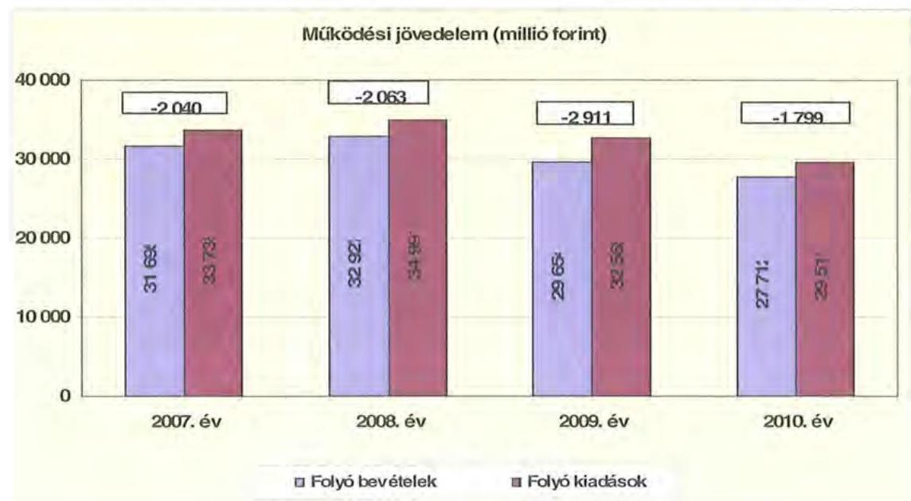

A folyó költségvetés hiánya (a működési forráshiány) 2007-ben a folyó kiadások 6,0%-át (2040 millió Ft-ot), 2008-ban 5,9%-át (2063 millió Ft-ot), 2009-ben 8,9%-át (2911 millió Ft-ot), 2010-ben 6,1%-át (1799 millió Ft-ot) jelentette. Két esetben hozott rendkívüli intézkedést a Közgyűlés a működési forráshiány csökkentésére. A 2009. évi költségvetés tervezése során az intézmények tervezett költségvetési előirányzatát 5%-kal csökkentette, elvont 668 millió Ft-ot, illetve a 2010. évi költségvetés módosításával ${ }^{25} 1866$ millió Ft-ot zárolt, és amellyel a működési tartalékot növelte meg a likviditási nehézségek részbeni ellensúlyozására.

A működési forráshiány finanszírozása - az intézkedések mellett munkabérhitelből, folyószámlahitelből, továbbá működési céllal kibocsátott kötvényből történt. A folyószámlahitel napi átlagos állománya 2007-2010 között több mint a kétszeresére nőtt (2508 millió Ft-ról 5524 millió Ft-ra), a munkabérhitel napi átlagos állománya pedig 516 millió Ft-ról 625 millió Ft-ra (21,1%-kal) emelkedett.

Az Önkormányzat kötelezettségein ${ }^{26}$ belül a 2010. évben a rövid lejáratú kötelezettségek állománya 49,0% volt, a 2007. évi 50,6%-os arányhoz hasonlóan, miközben az adott kötelezettségek több mint a 2,5-szeresére emelkedtek. Az Önkormányzat 2007. december 31-én fennálló pénz és tőkepiaci kötelezettsége 5970 millió Ft-ról a 2,9-szeresére, 17307 millió Ft-ra nőtt a kötvénykibocsátások és a folyószámla-, valamint munkabér megelőlegezési hitel állományának emelkedése miatt.

[^0]
[^0]:    ${ }^{25}$ A 2010. évi költségvetés módosításáról szóló 27/2010. (VIII. 31.) számú rendeletben.
    ${ }^{26}$ Passzív pénzügyi elszámolások nélküli

---

A rövid lejáratú kötelezettségek 2010-ben 10506 millió Ft-ot tettek ki, amely 6442 millió Ft-tal (158,6%-kal) több a 2007. évi rövid lejáratú kötelezettségállománynál. A rövid lejáratú kötelezettségeknek a szállítói állomány 2007-ben 30,8%-át, 2008-ban 26,1%-át, 2009-ben 16,7%-át, 2010-ben 26,8%-át tette ki ${ }^{27}$, miközben a szállítói kötelezettségek a vizsgált időszakban 2,3-szorosára nőttek.

Az Önkormányzat pénzügyi kapacitása a vizsgált időszakban negatív értéket mutatott. A nettó működési jövedelem ${ }^{28}$ értéke a folyó költségvetési pozíció mellett az adott költségvetési év adósságtörlesztésének hatását is tükrözi.

Az Önkormányzat nettó működési jövedelmét évenként az alábbi ábra szemlélteti:
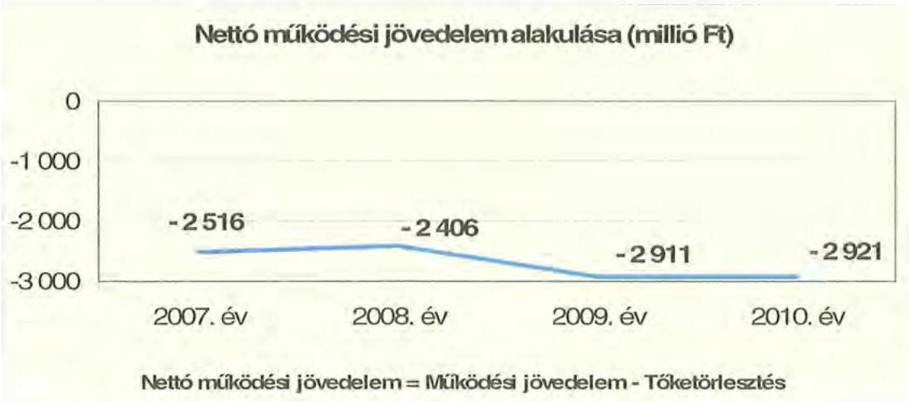

Az Önkormányzat pénzügyi kapacitása a vizsgált időszakban folyamatosan negatív értéket mutatott. Míg 2007-2008-ban a nettó működési jövedelem értéke -2 516 millió Ft volt, addig 2009-2010. években már meghaladta a mínusz 2900 millió Ft-ot. ${ }^{29}$ A működési hiány már a 2007. évben magas (2040 millió Ft) volt és az Önkormányzat pénzügyi kapacitását 476 millió Ft hiteltörlesztés terhelte.

[^0]
[^0]:    ${ }^{27}$ A szállítói állomány összege a 2007. évben 1251, 2008-ban 1324, 2009-ben 1205, 2010-ben 2818 millió Ft volt.
    ${ }^{28}$ Pénzügyi kapacitás
    ${ }^{29}$ Az Önkormányzat tőketörlesztési kötelezettsége a 2007. évben 476, 2008-ban 343, 2009-ben 0, 2010-ben 1122 millió Ft volt.

---

A 2007 - 2010. években az Önkormányzat felhalmozási költségvetés egyenlege ugyancsak negatív volt, melyet a következő ábra szemléltet:
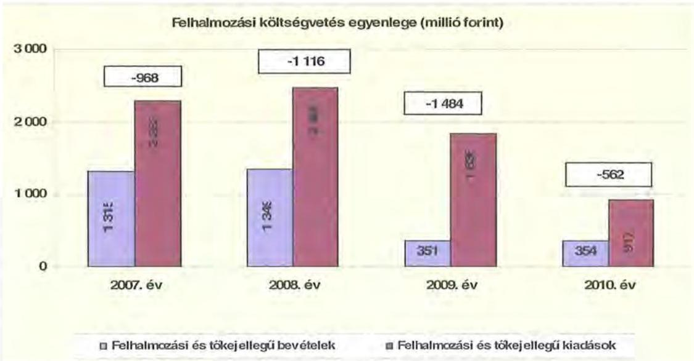

A felhalmozási forráshiánynak a felhalmozási és tőke jellegű kiadásokhoz viszonyított aránya 2007-ben 42,4% (-968 millió Ft), 2008-ban 45,3% (-1116 millió Ft) 2009-ben 80,9% (-1484 millió Ft) 2010-ben 61,4% (-562 millió Ft) volt. A 2008. évben a felhalmozási bevételek előző évhez mért változatlan szintje mellett megnőtt az államháztartáson kívülre felhalmozási céllal átadott pénzeszközök összege (73 millió Ft-ról 299 millió Ft-ra). Az arány romlását a 2009. évben a saját tőkebevételek előzőévhez viszonyított elmaradása (915 millió Ft-ról 56 millió Ft-ra csökkentek) okozta. Az arány 2010. évi, előző évhez viszonyított csökkenésének oka az volt, hogy a beruházási kiadások (917 millió Ft) az előző évi érték (1836 millió Ft) felére estek vissza a felhalmozási bevételek változatlan összege (2009-ben 352 millió Ft, 2010-ben 354 millió Ft) mellett.

A Közgyűlés 2010. évben három, európai uniós forrással támogatott fejlesztési feladat leállításáról ${ }^{30}$ döntött, mivel a 2007. évtől minden évben mind a fejlesztési, mind a működési költségvetés egyenlege hiányt mutatott, továbbá az önkormányzat folyamatosan likviditási nehézségekkel működött.

A fejlesztési forráshiányt fejlesztési célú kötvénykibocsátással finanszírozták.
A nettó működési jövedelem és a felhalmozási költségvetés egyenlegének összege a CLF módszer szerint 2007-ben -3484 millió Ft, 2008-ban -3522 millió Ft, 2009-ben -4395 millió Ft, 2010-ben -3483 millió Ft volt. Az összevont egyenleg romlásának oka a 2009. évben az volt, hogy a működési hiány (-2063 millió Ft-ról -2911 millió Ft-ra) nőtt a költségvetési támogatás összegének csökkenésének (1575 millió Ft-tal) és a működési kiadások csökkenésének (2426 millió Ft-tal) együttes hatásaként. A 2010. évben az összevont egyenleg 912 millió Ft-os

[^0]
[^0]:    ${ }^{30}$ A Közgyűlés 2010. szeptember 24-én hozott határozatával három európai uniós forrással támogatott fejlesztési feladat megvalósításától állt el, melynek saját fejlesztési kiadási összege 620 millió Ft volt.

---

előző évhez mért javulását a felhalmozási kiadások - változatlan felhalmozási bevételek melletti - 919 millió Ft-os csökkenése eredményezte.

Az önkormányzat finanszírozási műveletei 2007 - 2010. évekbeli egyenlegét az alábbi grafikon szemlélteti:
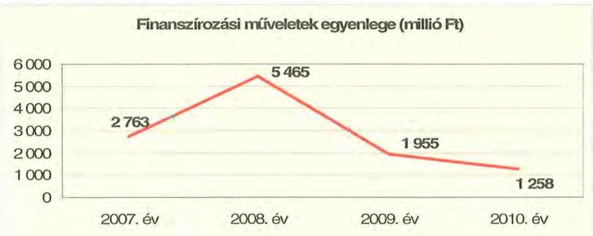

A finanszírozási többlet azt jelzi, hogy az éves költségvetések végrehajtása során szükség volt a megtakarítások és/vagy külső finanszírozás igénybevételére. A finanszírozási célú műveleteket a vizsgált időszakban a jelentés 2/a. számú mellékletének 4.1-4.8. pontjai részletezik.

Az önkormányzat zárszámadási rendeletében a működési és fejlesztési hiányt a hagyományos költségvetési szerkezet alapján mutatta be ${ }^{31}$, amelyről a jelentés 1. számú melléklete nyújt tájékoztatást.

A vizsgált időszakban a kötelezettségek (passzív pénzügyi elszámolások nélkül) 8035 millió Ft-ról 21423 millió Ft-ra emelkedtek, amely együtt járt a kamatkiadások növekedésével. A kamatkiadások összege 2007-ben 268,3 millió Ft, 2008-ban 604,5 millió Ft, 2009-ben 705,1 millió Ft és 2010-ben 701,3 millió Ft volt.

A 2007-2010 között az önkormányzat összesen 2279234 ezer Ft kamatot fizetett meg. Az átmenetileg szabad pénzeszközein realizált kamatbevétel (800 231 ezer Ft) a teljes kamatráfordítás 35,1%-át tette ki.

A 2011. évre a kamatkiadások további jelentős emelkedése várható. Az önkormányzat 918 millió Ft kamat megfizetésével számol a jelentős mértékű pénzintézeti kötelezettségek miatt, amely a 2010. évi kamatkiadást 30,0%-kal, közel 217 millió Ft-tal haladja meg.

[^0]
[^0]:    ${ }^{31}$ Nincs kötelező előírás a működési és fejlesztési hiány megállapításának módjára.

---

Az önkormányzatnál a kamatbevételeket és kamatkiadásokat évenként a következő ábra mutatja:
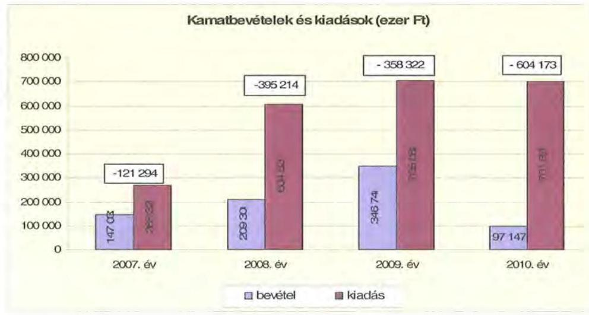

A 2007-2010 közötti időszakban az Önkormányzat kiadásainak és bevételeinek főbb jogcímek szerinti alakulását a jelentés 2/b. számú melléklete tartalmazza.

# 2.2. Az Önkormányzat bevételei 

Az Önkormányzat 2007-2010 között realizált OEP támogatás nélküli főbb bevételi jogcímeinek számszaki adatait az alábbi táblázat részletezi és grafikon mutatja be:
ezer Ft

| Megnevezés | 2007. év   tény | 2008. év   tény | 2009. év   tény | 2010. év   tény |
| :-- | --: | --: | --: | --: |
| Illetékbevétel | 3629651 | 4411367 | 3997006 | 2870256 |
| Szja és állami támogatás (OEP nélkül)

 | 12406719 | 12175534 | 10852987 | 9624952 |
| Egyéb saját bevétel | 6393420 | 8129867 | 8142889 | 4543310 |
| Összesen | 22430203 | 24717136 | 22992882 | 17038518 |

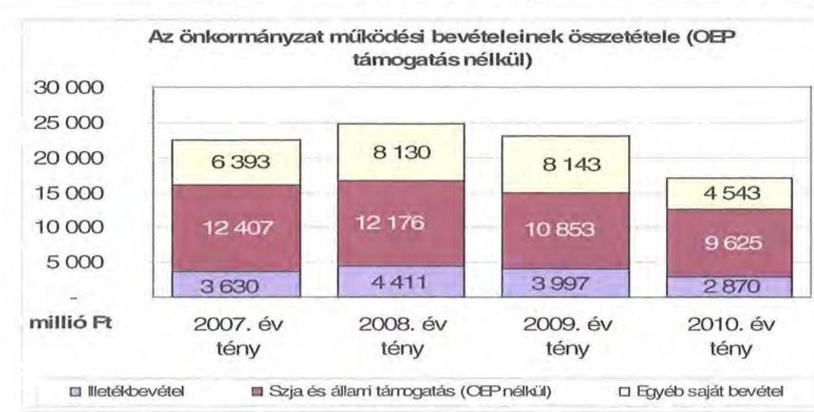

---

Az illetékbevétel ${ }^{32}$ a vizsgált időszakban 2008-ban - az előző évihez képest 21,5\%-kal 3630 millió Ft-ról 4411 millió Ft-ra - nőtt. A 2008. évről 2009-re 9,4\%-os (414 millió Ft-os) csökkenés következett be, majd a 2010. évben jelentősen mérséklődött, az előző évhez viszonyítva a csökkenés 28,2\%-os (1127 millió Ft-os) volt. Az Önkormányzat a 2011. évi költségvetésében továbbra is csökkenő (mintegy 30\%-os) tendenciával ${ }^{33}$ számolt, a 2006. évi összeg felénél is kevesebbet tervezett.

A csökkenésben szerepet játszott az Illetékhivatalnak - 2007. január 1-jétől - az APEH-hoz történő átszervezése is, miután az évente realizált illetékbevételekből (központi intézkedés következtében) évi 8,5\% elvonásra került az adminisztrációs feladatokra. Az ezen a jogcímen visszatartott összeg minden évben több volt, mint amekkora költségvetési kiadást jelentett korábban az Illetékhivatal működtetés az Önkormányzatnak.

Az Illetékhivatal megyei működtetése 2006-ban 24\%-kal került kevesebbe, mint az átszervezést követően (2006-ban 1,3 milliárd Ft volt a működtetés kiadása, míg 2007-ben 1,7 milliárd forintot tett ki a 8,5\%). A beszedett illetékekhez kapcsolódó többlet kiadás, az átszervezés óta az önkormányzatnak 2006-2008. relációjában 1221 millió Ft-ba került.

Az átengedett szja és az állami támogatások együttes összege a vizsgált időszakban központi támogatáscsökkenés hatására folyamatosan és jelentős mértékben csökkent. Az előző évihez képest 2008-ban 1,9\%-kal (231 millió Ft), 2009-ben további 10,9\%-kal (1323 millió Ft), majd 2010-ben 11,3\%-kal (1228 millió Ft) kapott kevesebb forrást az Önkormányzat az államtól ezeken a jogcímeken. 2011-ben az átengedett szja és az állami támogatások együttes összege (9079 millió Ft) a 2007. évinek már kevesebb, mint háromnegyede (73,2\%-a), a 2006. évhez viszonyítva kétharmada (66,9\%-a). A csökkenés a normatíváknak a járulékváltozások miatti központi csökkentése, valamint a megyei önkormányzatokat érintő forráselvonás következménye volt.

Az Önkormányzatot különös hátránnyal érintette, hogy az átengedett szja és az állami támogatások együttes összegének csökkenése minden évben növekvő ellátotti létszám ${ }^{34}$ mellett történt.

Az egyéb saját ${ }^{35}$ bevételeken belül az intézmények működési bevételeinek összege a 2007-2010. évek során változóan alakult - 2007-ben 3604 millió Ft, 2008-ban 3517 millió Ft, 2009-ben 2960 millió Ft, 2010-ben 3334 millió Ft -

[^0]
[^0]:    ${ }^{32}$ Az Önkormányzatnál az illetékbevétel a 2007. évben a 2006. évhez képest (2006-ban az illetékbevétel 4430 millió Ft volt) jelentősen, 17,0\%-kal - 800 millió Ft-tal - az állami normatíva és a hozzá kapcsolódó szja 1172 millió Ft-tal (8,6\%-kal) csökkent.
    ${ }^{33}$ 2011. évre 2000 millió Ft illetékbevételt tervezett.
    ${ }^{34}$ Az ellátottak összlétszáma 2006-ról 2010. évre 3094 fővel nőtt, ezen belül a tanulók létszáma 904 fővel emelkedett, létszámuk a 2006. évben 16 085, 2007-ben 16 422, 2008-ban 16 587, 2009-ben 16 754, 2010-ben 16989 fő volt.
    ${ }^{35}$ Az egyéb saját bevételek a 2010. évre a 2006. évi 6393 millió Ft-ról (annak 71,0\%ára) 4543 millió Ft-ra csökkentek.

---

volt. Az intézményi működési bevételek a 2008-2010. években a 2007. évi értékhez viszonyítva csökkentek, annak a 2008. évben 97,6\%-át, 2009-ben 82,1\%-át, 2010-ben 92,5\%-át érték el.

Az intézményi működési bevételek az egészségügyi intézményekkel együtt 2010. év kivételével - csökkentek, melynek oka, hogy az ellátottak egyre nagyobb arányban nem képesek megfizetni a térítési díjakat. A keletkező díjhátralékok miatt megnövekedett az Önkormányzat követeléseinek állománya, amely kedvezőtlenül hatott fizetőképességének alakulására.

A követelések nagysága önkormányzati szinten 2010 végére a 2007. évi bázishoz képest 7,2\%-kal, a 2009. évhez viszonyítva 12,2\%-kal nőtt ${ }^{36} 471$ millió Ft volt.

Az Önkormányzat legfőbb bevételei között az OEP támogatás összege a 2007. évben 10709 millió Ft, 2010-ben 11269 millió Ft volt.

Az Önkormányzat felhalmozási bevételei a vizsgált időszakban a következők voltak:
ezer Ft

| Megnevezés | 2007. év   tény | 2008. év   tény | 2009. év   tény | 2010. év   tény |
| :-- | :--: | :--: | :--: | :--: |
| Tárgyi eszköz   értékesítés | 156926 | 224585 | 18404 | 26190 |
| Állami támogatás | 0 | 176777 | 4826 | 0 |
| Átvett pénzeszköz | 313321 | 281853 | 134675 | 43167 |
| Egyéb felhalmozási   bevétel | 204809 | 235101 | 257277 | 308578 |
| Felhalmozási tartalék | 180716 | 226413 | 900468 | 91017 |
| Összes felhalmozási   bevétel | $\mathbf{8 5 5 7 7 2}$ | $\mathbf{1 1 4 4 7 2 9}$ | $\mathbf{1 3 1 5 6 5 0}$ | $\mathbf{4 6 8 9 5 2}$ |

Az Önkormányzatnak 2007-2010. években tárgyi eszköz értékesítésből nem származott számottevő bevétele ${ }^{37}$. A felhalmozási tartalék összegeit évenként az uniós projektek finanszírozására különítették el.

[^0]
[^0]:    ${ }^{36}$ A követelések összege 2007. december 31-én 459 millió Ft, a 2009. év végén 420 millió Ft volt, 2010. december 31-ére 471 millió Ft-ra nőtt.
    ${ }^{37}$ Bevételt jelentett a 2007. évben az Abony, Jókai u. 10. sz. alatti az ingatlan értékesítéséből származó nettó 80 millió Ft és a 2008. évben egy egyházi szervezet által fizetett 162 millió Ft-os ingatlan kártérítési összeg.

---

# 2.3. Az Önkormányzat kiadásai 

Az Önkormányzat működési kiadásai főbb jogcímek szerinti bontásban az alábbiak voltak:
ezer Ft

| Megnevezés | 2007. év   tény | 2008. év   tény | 2009. év   tény | 2010. év   tény |
| :-- | --: | --: | --: | --: |
| Működési kiadások | 33662515 | 34872361 | 32365601 | 29328263 |
| Működési kiadások (kamatkiadás nélkül) | 33425827 | 34586679 | 31700129 | 28809812 |
| Kamatkiadás | 236688 | 285682 | 665472 | 518451 |
| Személyi juttatások | 15773114 | 15816730 | 13771967 | 13486146 |
| Munkaadót terhelő járulékok | 4995294 | 4992677 | 4157721 | 3523729 |
| Dologi kiadások | 10142327 | 10372431 | 11339776 | 10257539 |
| Egyéb folyó kiadások | 288853 | 324397 | 267493 | 497891 |
| Támogatások, elvonások, egyéb folyó   átutalások | 902056 | 1107091 | 959855 | 691425 |
| ebből: működési célú pénzeszközátadás | 545159 | 552286 | 451957 | 145384 |
| Előző évi pénzmaradvány átadás,   visszafizetés, működési célú | 779024 | 1421067 | 751360 | 207698 |

Az Önkormányzat működési kiadásai 2007. december 31-ről 2010. december 31-re 12,9\%-kal csökkentek (33663 millió Ft-ról 29328 millió Ft-ra).

Az Önkormányzat 2010-ben a működési költségvetés 58,0\%-át - 17010 millió Ft-ot - személyi juttatásokra és a munkaadókat terhelő járulékokra fordította, az üzemeltetést, intézményfenntartást biztosító dologi kiadásokra 35,1\% (10258 millió Ft) jutott. A működési kiadásokon belül a személyi juttatások és járulékok aránya a vizsgált időszakban folyamatosan csökkent, 2007-ben 61,7\% (20 768 millió Ft) volt.

A személyi juttatások 2008-ban azonos szinten (15817 millió Ft) maradtak az előző évhez (15773 millió Ft) képest, azt követően minden évben csökkentek (2009-ben 13772 millió Ft-ra, 2010-ben 13486 millió Ft-ra), a létszámcsökkentések miatt. 2010-ben a 2007. évben teljesített kiadásoknál 14,4\%-kal 2287 millió Ft összeggel - voltak alacsonyabbak.

A dologi kiadások az Önkormányzatnál 2010-ben (10 257 millió Ft) a 2007. évi szintnél (10142 millió Ft) költségtakarékossági intézkedések eredményeként mindössze 1,1\%-kal - 115 millió Ft-tal - voltak magasabbak. A 2008. évben 2,3\%-kal (230 millió Ft-tal) nőttek (10372 millió Ft-ra) a dologi kiadások, a növekedés mértéke nem érte el az infláció ${ }^{38}$ éves 6,1\%-os mértékét. A 2009. évben az inflációt - amelynek ellentételezése a központi támogatáselosztásban nem jelentkezett - meghaladó mértékben, 9,3\%-kal (967 millió Ft-tal 11339 millió Ft-ra) nőttek a dologi kiadások az előző évhez viszonyítva. Fedezetét az Önkormányzatnak a végrehajtott kiadáscsökkentő intézkedések mellett működési célú kötvénykibocsátásból származó bevételből és rövid lejáratú hite-

[^0]
[^0]:    ${ }^{38}$ KSH által közzétett fogyasztói árindex alakulása a 2007-2010. években 108,0 - 106,1 - 104,2 - 104,9\% volt.

---

lekből kellett biztosítania. A dologi kiadások a 2010. évben, a megelőző évhez viszonyítva 9,5\%-kal, 1083 millió Ft-tal (10257 millió Ft-ra) csökkentek, figyelembe kell azonban venni, hogy a dologi kiadások között nem jelent meg a ki nem fizetett szállítói számlák ellenértéke. A mérleg szerinti szállítói állomány a 2009. évi 1205 millió Ft-ról 2010-re 2818 millió Ft-ra nőtt.

A működési célú pénzeszközátadások nagysága 2007-ről 2008-ra változatlan szinten (545 és 552 millió Ft) maradt, a 2009. évben az előző évi 81,8\%-ára (100 millió Ft-tal 452 millió Ft-ra), a 2010. években az előző évhez képest további 32,2\%-kal (307 millió Ft-tal 145 millió Ft-ra) csökkent. A kiadáscsökkentő intézkedések eredményeként működési céllal az Önkormányzat az általa kötelezően ellátandó feladatokhoz adott át pénzeszközöket, így a 2010. évben teljesített működési célú pénzeszközátadások összege a 2007. évben teljesítettnek (545 millió Ft) kevesebb, mint egyharmada, 26,7\%-a (145 millió Ft).

Az önkormányzati kiadásokban nőtt az egészségügyi intézményi kiadások súlya az egyéb fenntartott intézményekben felmerülő kiadásokhoz képest.

Az egészségügyi intézmények nélkül teljesített működési kiadások 2007-ben az összes működési kiadás 65,0\%-át - 21873 millió Ft - tették ki, ez az arány 2010 végére 59,5\%-ra (17452 millió Ft-ra) csökkent.

Az Önkormányzat egészségügyi intézmények nélküli működési kiadásai a vizsgált időszakban a következőképpen alakultak:
ezer Ft

| Megnevezés | 2007. év | 2008. év | 2009. év | 2010. év |
| :--: | :--: | :--: | :--: | :--: |
| Működési kiadások | 21873014 | 23389137 | 20541659 | 17452333 |
| Működési kiadások (kamatkiadás nélkül) | 21641084 | 23105986 | 19884032 | 16934322 |
| Kamatkiadás | 231930 | 283151 | 657627 | 518011 |
| Személyi juttatások | 10977552 | 11314634 | 9516740 | 9146863 |
| Munkaadót terhelő járulékok | 3436652 | 3538237 | 2842507 | 2356707 |
| Dologi kiadások | 4816242 | 5005776 | 5197439 | 4069848 |
| Egyéb folyó kiadások | 184399 | 176085 | 164796 | 320165 |
| Támogatások, elvonások, egyéb folyó átutalások | 902056 | 1097901 | 959233 | 687657 |
| ebből: működési célú pénzeszközátadás | 545159 | 552286 | 451957 | 145384 |
| Előző évi pénzmaradvány átadás, visszafizetés, működési célú | 779024 | 1421067 | 751360 | 207698 |

A 2007-2010. években a működési kiadások csökkenése a kórházak, rendelőintézetek nélkül közel azonos mértékű - 79,8\%
 }^{39}$ - volt, mint azokkal együttesen ${ }^{40}$ (81,7%).

A 2007-2010. években az egészségügyi intézmények nélküli működési kiadásokon belül a személyi juttatások és járulékaik (a 2007. évben 14 414, 2008-ban 14 853, 2009-ben 12 359, 2010-ben 11 504 millió Ft) részaránya alig változott, a 2007. évi 65,9% 2008-ban 63,5%-ra, 2009-ben 60,2%-ra, a 2010. évben 65,9%-ra módosult. A dologi kiadások összege a 2007. évben 4816 millió Ft, a

[^0]
[^0]:    ${ }^{39} 21873$ millió Ft-ról 17452 millió Ft-ra
    ${ }^{40} 33662,5$ millió Ft-ról 29 328,3 millió Ft-ra

---

2008. évben 5006 millió Ft, 2009-ben 5197 millió Ft, a 2010. évben pedig 4070 millió Ft volt, részaránya a működési kiadásokon belül 22,0% - 21,4% 25,3% - 23,3%, közel változatlan volt.

A kórházakon, rendelőintézeteken kívüli intézményekben a személyi juttatások és járulékok együttes összege - 12 359 millió Ft-ról 11 504 millió Ft-ra - 6,9%-kal (855 millió Ft-tal) csökkent 2010-re az előző évhez viszonyítva. Az egészségügyi ágazatban a létszám és a bérek csökkenése nagy hasonlóságot mutatott a más ágazati feladatokat ellátó intézményekével. Az önkormányzati szintű mutató 17 930 millió Ft-ról 17 010 millió Ft-ra, 5%-os mértékkel (920 millió Ft-tal) csökkent. A vizsgált időszakban a munkaadókat terhelő járulékok jelentős ${ }^{41}$ csökkenése következett be, amely egyrészt a kifizetett személyi juttatások, másrészt a járulékok mértékének csökkenésével volt összefüggésben. A járulékok csökkenése miatt felszabaduló forrásokat azonban a kormányzat az önkormányzati alrendszernek nyújtott állami támogatásokból levonásba helyezte, így a járulékcsökkenés az Önkormányzatnál érdemi megtakarítást nem hozott, mivel állami támogatáscsökkenéssel járt együtt.

A dologi kiadások az egészségügyi intézmények nélkül az előző évhez képest 2008-ban 3,9%-kal (5006 millió Ft-ra) és 2009-ben 3,8%-kal (5198 millió Ft-ra) nőttek. A kórházaknál, rendelőintézeteknél a hasonló időszakokban az emelkedés mértéke 0,8%, illetve 14,5% ${ }^{42}$ volt. A dologi kiadások a megelőző évhez viszonyítva a 2010. évben a nem egészségügyi intézményeknél jelentősen -21,7%-kal, több, mint 1000 millió Ft-tal - csökkentek, míg a kórházaknál, rendelőintézeteknél szinten maradtak. A 2007. évi bázishoz képest a kórházaknál, rendelőintézeteknél 16,2%-os növekedés jelentkezett, amely azonban volumenében mintegy 800 millió Ft növekedést jelentett három év alatt ${ }^{43}$. A nem egészségügyi intézményeknél a bázisévhez képest 15,5%-os csökkenést jelentett, s így a két terület együttes hatása eredményezte, hogy az Önkormányzat szintjén a mutató 10,1%-os, vagyis a dologi kiadások összege 2010. évben a 2007. évi szinten alakult. A vizsgált időszakban azonban mindkét területen figyelembe kell venni, hogy a 2010. évben az intézmények működési forráshiányuk miatt nem tudták kifizetni a tárgyévben jelentkező dologi kiadásainak egy részét, így azzal a szállítói állományuk emelkedett.

Az Önkormányzat 2007-2010 között az egészségügyi intézményei (kórházak és rendelőintézetek) működési kiadásaihoz átadott pénzeszközökkel - évente szűkülő pénzügyi lehetőségeinek megfelelően - csökkenő mértékben, 2007-ben 755 millió Ft-tal, 2008-ban és 2009-ben 513-513 millió Ft-tal, 2010-ben 133 millió Ft-tal járult hozzá. Az átadott pénzeszközök 1922 millió Ft összegén belül 1347 millió Ft volt a Rókus Kórház részére működési célra vissza nem térítendő támogatásként átadott összeg.

[^0]
[^0]:    ${ }^{41}$ 2010. évi teljesítés szinten 2357 millió Ft-ra, 31,4%-os mértékben a 2007. évi 3437 millió Ft-ról.
    ${ }^{42} 5366$ millió Ft-ra és 6142 millió Ft-ra.
    ${ }^{43}$ A kórházak és rendelőintézetek dologi kiadásainak 2007 és 2010 évek közötti alacsonyabb növekedése (17,6%) téríti el lefelé az önkormányzati szintű növekedést.

---

A kórházak működésének finanszírozására az OEP támogatás szolgált, míg a fejlesztési kiadások fedezetét az önkormányzatoknak kellett biztosítani intézményeik számára.

A működési céllal átadott pénzeszközökön felül 2007-2010 évek között 11 millió Ft-ot adott a Közgyűlés a Monor Rendelőintézetnek fejlesztési célra, amely a felhalmozási kiadások 61,4%-át fedezte ${ }^{44}$. A támogatásokat évenként a következő grafikon mutatja be:
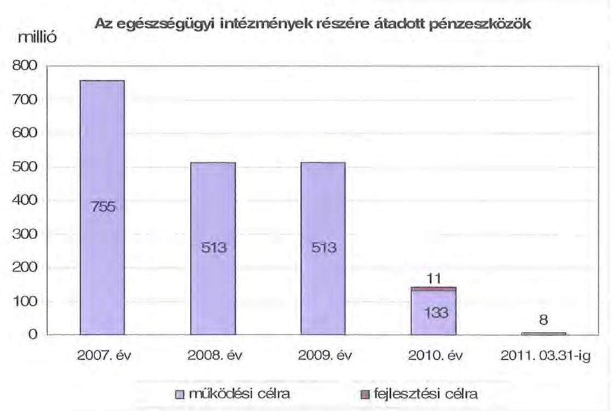

A Rókus Kórház ezen összegen felül 2007-ben 736 millió Ft és 2008-ban 466 millió Ft (a két évben együtt 1202 millió Ft) hosszú lejáratú kölcsönt is kapott működési célra, amelyet a nyilvántartásokban a számvevőszéki ellenőrzés ideje alatt visszatérítendő támogatásra módosított a Hivatal.

A működési és felhalmozási kiadások arányának változásában 2007-2010 között elmozdulás figyelhető meg, a felhalmozási kiadások aránya 4,5%-ról 3,6%-ra csökkent.

[^0]
[^0]:    ${ }^{44}$ Az intézmény a fejlesztési kiadásokra 2007-2010 között 14 millió Ft-ot fordított.

---

A kiadások összetételének változását (a működési és a fejlesztési célú kamatkiadásokat is figyelembe véve) a következő grafikon szemlélteti:
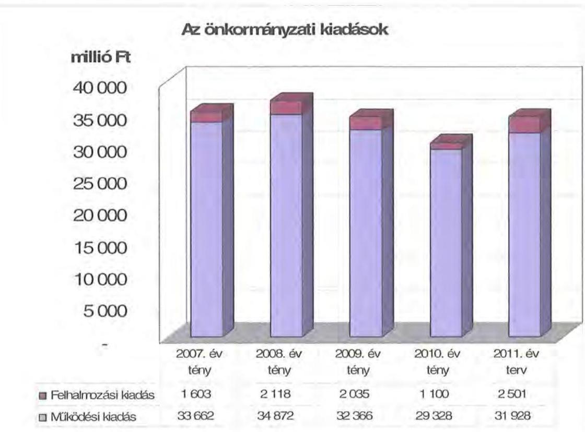

Az Önkormányzat a 2007-2010. években megvalósított fejlesztései között intézményi épületek, szakorvosi rendelőintézetek felújítása, korszerűsítése és bővítése, gyógyászati berendezések beszerzése szerepelt, a fejlesztések teljes egészében a kötelező feladatok ellátáshoz kapcsolódtak. A legmagasabb bekerülési költségű, 1206 millió Ft összegű fejlesztés 2008-ban kezdődött az Emeltszintű Kistérségi Járóbeteg Szakellátó Központ kialakításával a Szigetszentmiklós Szakorvosi Rendelőintézetben uniós támogatással. Uniós források igénybevételével folyamatban van az Őszirózsa Idősek Otthona Tura akadálymentesítése, és lezárult a megyeháza akadálymentesítése.

A 2007-2010. évek között a 127 db, 10 millió Ft teljes bekerülési költség feletti beruházás és felújítás teljesített kiadása 4446 millió Ft volt.

Az Önkormányzat fejlesztési tevékenysége a pályázati kiírások által meghatározott, a működési forráshiány és saját felhalmozási bevételei alacsony szintje miatt beruházásokat csak külső források, uniós és hazai támogatások elnyerése esetén tudtak megvalósítani. A felhalmozási kiadások önrészének forrásait is fejlesztési hitelekből és felhalmozási célú kötvénykibocsátásból finanszírozták.

Az Önkormányzat kimutatása szerint a folyamatban lévő, illetve a pénzügyileg nem lezárt beruházásokon 2139 millió Ft a 2010 utánra vállalt kötelezettség, melynek forrása 1104 millió Ft elnyert európai uniós támogatás, 100 millió Ft a hazai támogatás, valamint 935 millió Ft ingatlanértékesítésből származó

---

önkormányzati bevétel ${ }^{45}$. A 2010. évi felhalmozási célú kötelezettségvállalásokból 750 millió Ft az egészségügyi intézmények fejlesztését szolgáló kötelezettség összege ${ }^{46}$.

# 3. KÖTELEZETTSÉGEK BEMUTATÁSA 

### 3.1. A pénzintézetek felé fennálló kötelezettségek

Az Önkormányzat pénzintézeti kötelezettségeinek állománya 2006. december 31-étől 2010. december 31-éig több mint hétszeresére nőtt, 2442 millió Ft-ról 17 307 millió Ft-ra. Fennálló pénzintézeti kötelezettségei kötvények kibocsátásából, valamint folyószámla és munkabér megelőlegezési hitelek, továbbá rövid lejáratú működési hitel igénybevételéből keletkeztek.
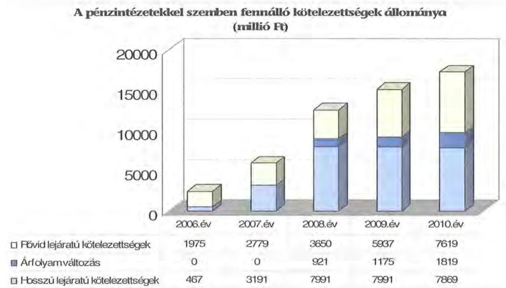

Az árfolyamváltozás hatása is befolyásolja a kötelezettségek alakulását, azonban annak mértéke előre pontosan nem határozható meg, csak várakozásokon alapuló tendenciák jelezhetők. A számviteli szabályok előírják, hogy az árfolyam-különbözetet év végén a kötelezettségek vagy követelések között a könyvviteli mérlegben nyilván kell tartani, Árfolyam-különbözet valójában nem realizálódott. Annak megítéléséről, hogy a devizában kibocsátott, vagy arra átváltott kötvényekért kapott forinthoz képest a kötvények visszavásárlásakor jelentkező forint kötelezettség többletkiadást (árfolyamveszteséget) vagy megtakarítást (árfolyamnyereséget) eredményez a futamidő végén, a teljes kötelezettség rendezését követően lehet képet alkotni.

[^0]
[^0]:    ${ }^{45}$ Az Önkormányzat a 2010. június 30-án készített tanúsítványban az EU-s és hazai forrásokat az elnyert pályázati összegekkel egyezően, a saját forrásokat rendelkezésére álló forrásként jelölte meg.
    ${ }^{46}$ A Szigetszentmiklósi Emeltszintű Kistérségi Járóbeteg Szakellátó Központ kialakításának 2010. évről áthúzódó kiegyenlítetlen összege és a 2011. évben kiszámlázott, kifizetésre váró összege együttesen.

---

Mindaddig, amíg törlesztési kötelezettség nem áll fenn (türelmi idő, moratórium), a tőkére vonatkoztatva nem értelmezhető sem az árfolyamveszteség, sem az árfolyamnyereség.

Az Önkormányzat pénzintézeti kötelezettségvállalásaira minden esetben közgyűlési döntés alapján került sor. A kötelezettségvállalásból származó források felhasználási céljait meghatározták. A Közgyűlés döntéseit megalapozó előterjesztések ugyanakkor nem tartalmazták a kötelezettségvállalás visszafizetési forrásainak, a teljes futamidő várható kamat és tőkefizetési kötelezettségeinek, az árfolyam- és kamatkockázatoknak a bemutatását. A költségvetési rendeletek tartalmazták, hogy a tervezett éves hiány finanszírozása esetén sem lépik túl az Ötv. 88. §-ában előírt korlátot, de az adósságot keletkeztető kötelezettségvállalások előterjesztéseiben nem tértek ki az adósságszolgálati korlát bemutatására, ezért a Közgyűlés ennek figyelembevétele nélkül döntött.

Az Önkormányzat a saját kimutatásai szerint az adósságot keletkeztető kötelezettségvállalásának felső határát 2007-2010 között egyik évben sem lépte túl. A hitelei tényleges tartalma, jellege alapján viszont 2008-tól nem tartotta be az Ötv. 88. § (2) bekezdése szerinti - a kötelezettségvállalások korlátozására vonatkozó - előírást. Az Önkormányzat által nyilvántartott likvid hitel már nem a kiadások és bevételek átmeneti, éven belüli eltéréseinek rendezését szolgálta, hanem az évenkénti működési hiányok felhalmozódásából adódott és tartóssá vált. A 2009 novemberében 48 hónap lejárattal megkötött és 2010 májusától hatályos szerződésben a folyószámlahitel a feltételek alapján nem is tartozott az Ötv. értelmezésében a likvid hitel körébe. Az Ötv. 88. § (4) bekezdése szerint kizárólag a likvid hitel - vagyis az Ötv. 88. § (3) bekezdés d) pontja alapján „az éven belül felvett és visszafizetett, a közszolgáltatási és államigazgatási feladatok folyamatos működtetéséhez felvett hitel" - nem esik az adósságot keletkeztető éves kötelezettségvállalások korlátozása alá.

Az adósságot keletkeztető kötelezettségvállalással megvalósított felhalmozási kiadások esetleges bevételnövelő, illetve kiadáscsökkentő vonzatát, illetve a fejlesztéshez, felújításhoz vállalt kötelezettségek visszafizetési forrásként való számbavételét nem vizsgálták.

Az Önkormányzat 2010. december 31-én CHF-ben fennálló adósságot keletkeztető kötelezettségvállalása az alábbi volt ${ }^{47}$:

| Megnevezés | Kibocsátás, illetve szerződéskötés időpontja | Összeg | Kibocsátási, vagy lehivási árfolyam | Kamat (referencia kamat+ kamatfelár) | Felhasználás célja: |
| :--: | :--: | :--: | :--: | :--: | :--: |
| PHOENIXIS COMITATUS Kötvény | 2007.07.26 | 19553940 | 148,55 | 3 havi CHF LIBOR +0,25% | Működési kiadások fedezete |

[^0]
[^0]:    ${ }^{47}$ A Phoenixis Comitatus Kötvényt az Önkormányzat 20134000 CHF összegben bocsátotta ki, a szerződés szerint a tőketörlesztés 2010. június 30-tól 2027. július 26-ig tart. Az Önkormányzat a 2010. évben esedékes 869990 CHF helyett 580060 CHF összegben vásárolt vissza kötvényt.

---

Az Önkormányzat 2010. december 31-én EUR-ban fennálló adósságot keletkeztető kötelezettségvállalásai az alábbiak voltak ${ }^{48}$:

| Megnevezés | Kibocsátás, illetve szerződéskötés időpontja | Összeg | Átváltási árfolyam | Kamat (referencia kamat+ kamatfelár) | Felhasználás célja: |
| :--: | :--: | :--: | :--: | :--: | :--: |
| Pest Megye 2028 Kötvény | 2008.04.15 | 12621174 | 237,7 | Fix 3,7% + 3,0% (öt évre) | Tőkeforrások hatékony bevonása, intézményi infrastruktúra fejlesztés |
| TANDANUS I. Kötvény | 2008.07.17 | 2454253 | 244,47 | Fix 3,7% + 1,9% (öt évre) | Közgyűlés által jóváhagyott fejlesztések finanszírozása |
| TANDANUS II. Kötvény | 2008.07.17 | 5726590 | 244,47 | Fix 3,7% + 2,025% (öt évre) | Tervezett intézményi struktúraváltozás |
| Összesen: |  | 20802017 |  |  |  |

A 2008. évben 5000 millió Ft összegben kötvényt bocsátottak ki, szervezését a 2010 májusától a számlavezetéssel is megbízott bank végezte. A Pest Megye 2028 Kötvényt ugyanez a Bank, a
 Tandanus I. Kötvényt egy második bank, a Tandanus II. Kötvényt egy harmadik bank jegyezte le. A 2008. július 17-én kibocsátott két kötvényre a legkedvezőbb ajánlatot a Közgyűlés 2008. június 17-ei ülésére készült előterjesztés alapján a 2010. májúsától a számlavezetéssel is megbízott bank tette, 2,025%, illetve 1,9% kamatfelárral és 1,5% egyszeri konverziós díjjal. A harmadik bank ajánlatában 2,2% kamatfelár és egyszeri 2,5% szervezési, lebonyolítási díj szerepelt. Az előterjesztés nem mutatta be annak lehetőségét, hogy a később a számlavezetéssel is megbízott bank - mint ajánlattevő - nem azonos a kötvényeket lejegyző másik két bankkal.

Az EUR-ban fennálló - forintban kibocsátott - kötvényeknél a devizanem váltásból (HUF-ból CHF-re, CHF-ből HUF-ra, CHF-ből EUR-ra), valamint az alapkamat, illetve kamatfelár változásából (kamatfelár emelkedés a Pest Megye 2028 Kötvénynél 1,8%-kal, mindhárom kötvénynél a változó kamatból fix kamatra váltásból adódóan (2010. január 4-től öt évig) a kötvények kibocsátási feltételek változtak ${ }^{49}$.

A kötvények devizanemének megváltoztatásáról az Önkormányzat vagyonrendeletében kapott felhatalmazás alapján a közgyűlés elnöke döntött. A Közgyűlés utólag, a pénzintézet tájékoztatásából készült előterjesztés alapján vette tudomásul a devizanem váltás okait és hatásait.

[^0]
[^0]:    ${ }^{48}$ A dematerializált okiratok szerint a többdevizás kötvényeket forintban bocsátották ki (a kibocsátási összeg a Pest Megye 2028 Kötvénynél 3000 millió Ft, a Tandanus I. Kötvénynél 600 millió Ft, a Tandanus II. Kötvénynél 1400 millió Ft volt). A tőketörlesztés a szerződések szerint a Pest Megye 2028 Kötvénynél és Tandanus I. Kötvénynél 2011. április 1-jétől 2028. április 1-jéig, a Tandanus II. Kötvénynél 2013. április 1-jétől 2028. április 1-jéig tart. A fix kamat 5 éves időszakát követően az alapkamatok és felárak a korábbi változó kamatokra térnek vissza (a Pest Megye 2028 Kötvénynél 3 havi EURIBOR +1,2 %, a Tandanus I. Kötvénynél 1 havi EURIBOR +1,9 %, a Tandanus II. Kötvénynél 3 havi EURIBOR +2,025 %).
    ${ }^{49}$ A Pest Megye 2028 Kötvénynél tíz, a Tandanus I. Kötvénynél és a Tandanus II. Kötvénynél három-három esetben történt változás.

---

A változó alapkamat 5 éves futamidőre történő fixálását mind a három EUR-ban fennálló kötvény vonatkozásában a számlavezetést is végző bank bonyolította le. A Közgyűlés által is elfogadott összesen 50 millió Ft-os egyszeri fixálási költség felszámítása a kötvények összegének arányában történt.

A számlavezetéssel jelenleg megbízott bank által korábban lejegyzett Pest Megye 2028 Kötvény kamatfelára 2011. január 1-jei hatállyal módosult, 1,2%-ról 3,0%-ra emelkedett. A kamatmarzs emelés a 600 millió Ft folyószámlahitel keretemelés 2010. augusztus 24-ei ajánlatában az egyéb kikötések között szerepelt.

A CHF-ben fennálló (3000 millió Ft-nak megfelelő) Phoenixis Comitatus Kötvény tőkefizetési kötelezettsége 2010. év II. negyedévében megkezdődött. Az Önkormányzat által kibocsátott kötvényekhez viszonyított kedvező kamatfelárnak (0,25%), valamint a referencia kamat mértékének -93,5%-os csökkenése eredményeként a kibocsátástól 2011. március 31-éig a kamatkötelezettség és egyszeri díj forintban számolva alig haladta meg a 198 millió Ft-ot. A közel 870 ezer CHF-nyi tőke visszafizetés (amely a teljes kötelezettségnek valamivel több, mint 4,3%-a) realizált árfolyamvesztesége meghaladta az 54 millió Ft-ot.

A jelenleg EUR-ban fennálló három kötvény kibocsátásából eredő kötelezettségek közül az 5726590 EUR összegű kötvénytartozás törlesztése 2013. év II. negyedévében kezdődik. A Pest Megye 2028 és a Tandanus I. elnevezésű kötvényekből 2011. év II. negyedévében összesen 218576 EUR-nyi kötvény került visszavásárlásra az Önkormányzat részéről, amelyen a realizált árfolyamveszteség közel 6 millió Ft.

A 3000 millió Ft, forintban kibocsátott, EUR-ban nyilvántartott Pest Megye 2028 Kötvény után kifizetett kamat és egyéb költségek összege 409 millió Ft-ot tett ki 2008. év II. negyedévtől 2010. december 31-ig.

Az Önkormányzat - a devizában fennálló tartozásait is forintban figyelembe véve - a mintegy 8 milliárd Ft értékben kibocsátott kötvények után 2010. december 31-ig 122 millió Ft-ot tőketörlesztésre, 741 millió Ft-ot kamatra, 147 millió Ft-ot kibocsátási, kamatfixálási, és hitelgarancia költségekre fordított.

Az Önkormányzat pénzügyi egyensúlyi, fizetési nehézségei miatt a Phoenixis Comitatus Kötvénynél 2010. év IV. negyedévtől az esedékes törlesztő részleteket csak negyedéves késedelemmel, a további kötvényeknél a 2010. év IV. negyedéves kamatokat 2011. év I. negyedévében fizették ki.

A kötvénykibocsátásokból származó, együtt mintegy 8 milliárd Ft bevételből 4400 millió Ft (a kötvénybevételek 55%-a) az Önkormányzat működését finanszírozta, a további 3600 millió Ft-ot az egészségügyi struktúraváltás miatti többletkiadásokra, az intézményhálózat gazdaságosabb működését szolgáló átszervezésekre, valamint beruházások, felújítások elvégzésére fordították.

Az Önkormányzat 2007-2010. években az átmenetileg szabad pénzeszközein 800 millió Ft kamatbevételt realizált, amelyből 306 millió Ft kötvényből

---

származó bevételek befektetéséből és 494 millió Ft az intézmények és a Hivatal elkülönített bankszámláin rendelkezésre állt forrás befektetéséből ${ }^{50}$ származott.

A kötvényből származó bevételek befektetéséből származó kamatbevételből az Önkormányzat 289 millió Ft-ot a kötvények kamatfizetésére és 17 millió Ft-ot költségvetési kiadásként működési célra fordított. A kamatbevétel a kötvények teljesített kamatfizetésének 41,3%-át tette ki.

A folyószámlahitel, a munkabér megelőlegezési hitel és az egyéb rövid lejáratú működési hiteleket az alábbi táblázat mutatja be:

|  |  |  |  |  | ezer Ft-ban |  |
| :--: | :--: | :--: | :--: | :--: | :--: | :--: |
| Megnevezés | 2007. év | 2008. év | 2009. év | 2010. év | 2011.   március 31. |  |
| I. Folyószámlahitel |  |  |  |  |  |  |
| a folyószámlahitel kivehető összege január 1-jén | 1700000 | 3000000 | 4000000 | 5000000 | 6600000 |  |
| teljesített kamat és egyéb költség | 197960 | 251666 | 468447 | 339194 | 118991 |  |
| II. Munkabér megelőlegezési hitel |  |  |  |  |  |  |
| igénybevett hitel összesen: | 4126952 | 6787554 | 5928870 | 1689218 | - |  |
| teljesített kamat és egyéb költség | 24105 | 47922 | 39131 | 80300 | 13993 |  |
| III. Egyéb működési hitel (egy évnél rövidebb) |  |  |  |  |  |  |
| igénybevett hitel (2009. 11. 10) | - | - | 1000000 | - | - |  |
| teljesített kamat és egyéb költség | - | - | - | 68010 | - |  |

Az Önkormányzat likviditási helyzete javítását a vizsgált időszakban 2010-ig csak folyószámlahitel igénybevételével tudta biztosítani. 2011. év I. negyedévében a folyószámlahitel keret további növelésének hiányában súlyosabbá váltak a fizetési problémák, nőttek a fizetési késedelmek.

A 2007-2010. években az Önkormányzat az év minden napján igénybe vett folyószámlahitelt. Átlagos állománya a 2007. évi 2508 millió Ft-hoz képest 2010-re 5524 millió Ft-ra (3016 millió Ft-tal, 120%-kal) emelkedett, 2011. év I. negyedévében elérte a 6000 millió Ft-ot. A folyószámlahitel 2010. december 31-ei állománya 6440 millió Ft volt. Az Önkormányzatnak 2007-től 2010. december 31-ig összesen 1257 millió Ft kamat- és egyéb fizetési kötelezettsége keletkezett.

A tartós likviditási problémák miatt az Önkormányzat 2007-2010 között a munkabérek kifizetéséhez munkabér megelőlegezési hitelt vett igénybe, 2007-ben nyolc hónapban (nyolc alkalommal), 2008-ban kilenc hónapban (12 alkalommal), 2009-ben 11 hónapban (21 alkalommal), 2010-ben két hónapban (négy alkalommal), a felhasználás hónapjai átlagában 618 millió Ft-ot. A munkabér megelőlegezési hitelfelvételek száma és a felvett hitel összege azért csökkent le 2010-ben, mert 2010. áprilisától a számvevőszéki vizsgálat lezárásáig sem tudta az Önkormányzat visszafizetni a hiteltartozását. A munkabér megelőlegezési hitel átlagos állománya a 2007. évi 516 millió Ft-hoz képest 2010-re 625 millió Ft-ra (109 millió Ft-tal, 21%-kal) emelkedett, 2011. év I. negyedévében elérte a 700 millió Ft-ot. Kamat és egyéb költség címén az Önkormányzat a 2007-2010. években összesen 191 millió Ft-ot fizetett ki.

[^0]
[^0]:    ${ }^{50}$ Pályázati, szakképzési alap, meghatározott célra átvett (régészettani), egészségügyi intézmények OEP finanszírozási pénzeszközeiből.

---

Az 1000 millió Ft egyéb működési célú hitel 2009. november 10-ei felvétele a számlavezető bank megváltozásával függött össze, ugyanis a korábbi bankszámlaszerződés hat hónapos felmondása miatt az új számlavezető bank ennek a hitelnek a rendelkezésre bocsátásával előlegezte meg az egymilliárd Ft-os későbbi folyószámlahitel keret emelését. A rövid lejáratú működési hitel törlesztése a hat milliárd Ft-ra megemelt keretű folyószámlahitelből történt meg. A rövid lejáratú működési hitel kamata és egyéb költsége 2010-ben 68 millió Ft-ot tett ki.

A folyószámlahitel, a munkabér megelőlegezési hitelek és a rövid lejáratú működési hitel kondícióit és egyéb költségeit az alábbi táblázat szemlélteti ${ }^{51}$:

| Megnevezés | Kamat (referencia+ kamatfelár) | Egyéb költség |
| :--: | :--: | :--: |
| Folyószámlahitel |  |  |
| 2007. év | 1.000 millió Ft-ig 3 havi BUBOR +0,39 % keretemelésre (1.000-3.000 millió Ft-ig) 3 havi BUBOR +0,25 % | x |
| 2008. év | 1.000 millió Ft-ig 3 havi BUBOR +0,39 % keretemelésre (1.000-3.000 millió Ft-ig) 3 havi BUBOR +0,25 % (bankváltás) 4.000 millió Ft keretre 3 havi BUBOR +1,2 % | x |
| 2009. év | 4.000 millió Ft keretre 3 havi BUBOR +1,2 % keretemelésre (4.000-5.000 millió Ft-ig) 3 havi BUBOR +1,8 % | x |
| 2010. év | 4.000 millió Ft keretre 3 havi BUBOR +1,2 % keretemelésre (4.000-5.000 millió Ft-ig) 3 havi BUBOR +1,8 % (bankváltás) 6.000 millió Ft keretre overnight BUBOR +2,0 % keretemelésre (6.000-6.600 millió Ft-ig) overnight BUBOR +2,0 % | 0,7% folyósítási+0,05%/n.év rend.tart. jutalék   x |
| 2011. év | 6.000 millió Ft keretre overnight BUBOR +2,0 % 6.000-6.600 millió Ft-ig overnight BUBOR +2,0 % | 0,7% folyósítási+0,05%/n.év rend.tart. jutalék   x |
| Munkabér megelőlegezési hitel |  |  |
| 2007. év | 3 havi BUBOR +0,39 % | x |
| 2008. év | 3 havi BUBOR +0,5 %   (bankváltás) 3 havi BUBOR +1,8 % | x |
| 2009. év | 3 havi BUBOR +1,8 % | x |
| 2010. év | 3 havi BUBOR +1,8 %   (bankváltás) overnight BUBOR +2,0 % | x |
| 2011. év | overnight BUBOR +2,0 % | x |
| Egyéb működési hitel |  |  |
| 2009-2010. év | overnight BUBOR +2,0 % | 0,8% folyósítási+0,05%/n.év rend.tart. jutalék |

${ }^{51}$ A referencia kamat az alábbiak szerint alakult:

| MNB BUBOR fixing (átlagkamat) %-ban |  |  |  |  |  |
| :-- | :--: | :--: | :--: | :--: | :--: |
| Referencia

 kamat | 2007. évi | 2008. évi | 2009. évi | 2010. évi | 2011. március 31-ig |
| 3 havi BUBOR | 7,75 | 8,87 | 8,64 | 5,5 | 6,03 |
| 1 napi BUBOR | 7,78 | 8,41 | 8,39 | 4,95 | 5,24 |

---

A számvevőszéki ellenőrzés lezárásakor fennálló kötvények esetében a kamatfizetési kötelezettségek alakulását jelentősen befolyásolta a referencia kamatok változása, melyet az alábbi táblázat mutat be:

| Megnevezés | Kibocsátási, lehívási, átváltási | Utolsó fizetéskori | Változás \% |
| :--: | :--: | :--: | :--: |
|  | alapkamat \% |  |  |
| 3 havi CHF LIBOR | 2,7117 | 0,175 | -93,5 |
| 3 havi EURIBOR | 0,813 | fix 3,7 |  |
| 1 havi EURIBOR | 0,479 | fix 3,7 |  |

Az Önkormányzat utolsó kamatfizetési kötelezettsége a 3 havi CHF LIBOR alapkamatú kötvénynél 2011. február 2-án, az EURIBOR alapkamatú kötvények után 2011. április 7-én volt.

Az Önkormányzatnál a helyszíni vizsgálat ideje alatt további hitel igénybevételről, illetve kötvénykibocsátásról szóló döntést nem készítettek elő.

Az Önkormányzat 2011-2014. évekre szóló - 2011. áprilisában elfogadott gazdasági programjában kiemelt feladatként határozták meg többek között a költségvetési egyensúly megteremtését, a likviditás biztosítását, az adósságállomány optimalizálását. A gazdasági programban a következőket határozták meg:

- a meglévő gazdasági központok és önállóan működő intézmények lehetőségek szerinti megtartása mellett nemcsak a technikai tevékenységek összevonása, hanem más tevékenységek (irattár, szakkönyvtár, szállítás, informatika, pályázatkezelés, rendezvényszervezés) közös beszerzése, stb.) olyan intézményhez telepítése, ahol a feltételek adottak, vagy kis költséggel kialakíthatóak,
- a gazdasági központokhoz tartozó intézményi kör bővítése, területileg közel lévő szociális intézménnyel,
- gazdasági központok összevonása,
- területi elv szerint oktatási, szociális centrumok kialakítása.

A gazdasági programban rögzített feladatok végrehajtása érdekében külön intézkedési terv nem készült.

---

# 3.2. A szállítók felé fennálló kötelezettségek 

Az önkormányzat és a 75\% feletti önkormányzati tulajdonban álló gazdasági társaságai lejárt szállítói tartozásai, és egyéb kiadás elmaradásai alakulását az alábbi táblázat tartalmazza:
ezer Ft

| Megnevezés | 2007. | 2008. | 2009. | 2010. | 2011. |
| :-- | --: | --: | --: | --: | --: |
|  | december 31. | december 31. | december 31. | december 31. | március 31. |
| Lejárt szállítói tartozás | 570700 | 778395 | 812655 | 2406096 | 3001665 |
| ebből Kórház | 523494 | 702606 | 681768 | 659927 | 608392 |
| Gazdasági támaszok   lejárt szállítói tartozása | 0 | 0 | 0 | 9250 | 15680 |
| Egyéb kiadás elmaradás | - | - | 3990 | 453274 | 985833 |
| Tartozásállomány | $\mathbf{570700}$ | $\mathbf{778395}$ | $\mathbf{816645}$ | $\mathbf{2868620}$ | $\mathbf{4003178}$ |

Az Önkormányzat és társaságai lejárt szállítói tartozása és egyéb kiadási elmaradása a 2007. évi 571 millió Ft-ról 2010-re több mint ötszörösére emelkedett, és 2011-ben tovább nőtt 4003 millió Ft-ra. A 2007-2008. években a lejárt szállítói tartozások elsősorban az egészségügyi intézményeknél - ezen belül is meghatározóan a Rókus Kórháznál - jelentkeztek. A 2009. évtől viszont a Hivatal és a nem egészségügyi intézmények lejárt szállítói tartozások állománya intenzíven - 47 millió Ft-ról 2393 millió Ft-ra - növekedett.

A 2010. december 31-ei állapot szerint az Önkormányzat lejárt szállítói tartozásállományának 47\%-a (1131 millió Ft) meghaladja a 91 napot (ebből éven túli 228 millió Ft). A 30 napot meghaladó lejárt tartozásállományon belül 264 millió Ft (15,4\%) 30-60 nap közötti, 322 millió Ft (18,8\%) pedig 61-90 nap közötti. Míg 2008. és a 2009. években a 90 napon túl lejárt szállítói tartozás az Önkormányzatnál az egészségügyi intézmények nélkül 1-5 millió Ft volt, addig 2010 végén már meghaladta a 683 millió Ft-ot, 2011. I. negyedév végén pedig az 1161 millió Ft-ot.

A lejárt szállítói tartozások közül az Önkormányzat 770 millió Ft-tal annak a Kft-nek tartozik, amelyik korábban 34 önkormányzati intézmény ellátottjainak élelmezését végezte. (A vállalkozás értéknövelő beruházások és kamatok miatt további egyeztetés alatt álló mintegy 350 millió Ft kifizetését is kérte.) A megszüntetett szolgáltatást az intézmények egyedi, helyi ételmegrendelésekkel pótolták.

Az Önkormányzatnál az egyéb kiadás elmaradás 2009-ről 2010-re 4 millió Ft-ról 453 millió Ft-ra, 2010-ről 2011. év I. negyedév végére pedig 972 millió Ft-ra emelkedett, és elsősorban a Hivatalnál jelentkezett. A 2011. év március 31-ei állapot szerint az önkormányzati egyéb kiadási elmaradásból legmagasabb összegűek és arányúak a Magyar Államkincstárral szembeni 500 millió Ft normatíva visszafizetési kötelezettség (51,4\%), az APEH felé fennálló 184 millió Ft befizetési kötelezettség (18,9\%), az országgyűlési választás II. fordulójával összefüggő 130 millió Ft visszafizetési kötelezettség (13,4\%), valamint a ki nem fizetett, 97 millió Ft személyi jellegű juttatás és munkaadót terhelő járulékai (10\%) voltak.

---

A 100\%-ban az Önkormányzat tulajdonában lévő társaságok lejárt szállítói tartozása 2010. december 31-én 9 millió Ft volt, ami 2011. március 31-ére 16 millió Ft-ra (77,8\%-kal) nőtt.

A 2010. december 31-ei önkormányzati szintű mérlegben kimutatott szállítói kötelezettség 2818 millió Ft volt. A le nem járt tartozásállomány 412 millió Ft-ot tett ki, amelynek 96,8\%-a (399 millió Ft) az egészségügyi intézmények tartozása volt. Az Önkormányzatnál a 2010. év végén kimutatott összes szállítói kötelezettségre nem nyújtott fedezetet a mérlegben kimutatott 471 millió Ft követelésállomány, és az 1536 millió Ft pénzeszköz sem, továbbá a Hivatal szabad folyószámlahitel kerettel sem rendelkezett.

A lejárt szállítói tartozások összegének alakulása (ezer Ft)
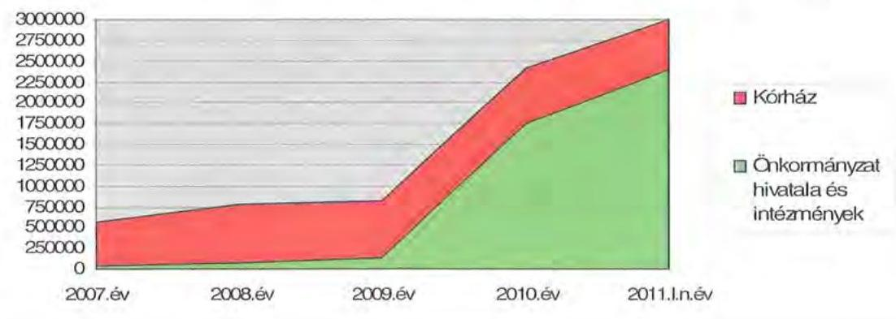

A Közgyűlés a lejárt szállítói kötelezettségek rendezésének szükségességével is számolt a működési célú kötvények kibocsátásakor, illetve a kötelezettségei teljesítése érdekében növelte a folyószámla hitelkeretét addig a szintig, ameddig az a számlavezető hitelintézetnél lehetséges volt. A vizsgált időszak végére a szállítói állomány csökkentését szolgáló pénzügyi finanszírozási műveletek lehetőségei beszűkültek, a folyamatosan aktualizált likviditási tervek ellenére is a likviditási helyzet folyamatosan romlott. A Közgyűlés ugyan a költségvetések és a beszámolók tárgyalása során foglalkozott a likviditási helyzet alakulásával, de külön konszolidációs tervet nem fogadott el. Ilyen igényt a számlavezető bank sem támasztott az Önkormányzattal szemben, a folyószámla hitelszerződésben annyi kikötést tett, hogy amennyiben a hitelfelvevő vagyoni helyzete romlik, az ingatlanállomány könyv szerinti értékcsökkenésével egyező arányban csökkenti a hitelkeretet. A Hivatal és a szállítók közötti kapcsolatot 2011. év I. negyedévére a folyamatos konzultáció jellemezte, de a lejárt szállítói tartozások átütemezésére megállapodásokat még nem kötöttek.

A Rókus Kórház a vizsgált időszakban lényegében folyamatosan egyeztetett a szállítókkal a fizetési kötelezettségei átütemezéséről. A 2011. március végi állapot szerint az átütemezettként kimutatott szállítói kötelezettsége 429 millió Ft volt.

Az önkormányzati biztos munkája eredményeként a szállítói tartozás állománya a 2009. januári 906 millió Ft-ról 2010. december hónapra 751 millió Ft-ra csökkent (ebből 480 millió Ft volt a lejárt szállítói tartozás állomány). A Rókus Kórház megszüntetésének költségeit mintegy 2,5-3 milliárd Ft-ra becsülték, amely dolgo-

---

zók felmentése, végkielégítése és egyéb járandóságok kifizetéséből, a tartós bérleti szerződések felmondásából járó kártérítési kötelezettségből és a szállítói tartozás állományból állt. Az önkormányzati biztos javaslatot tett szakrendelő átköltöztetésére és az így felszabadult épület értékesítésére is.

Annak ellenére, hogy más intézményeknek is voltak 90 napon túl lejárt szállítói tartozásai, az önkormányzati biztosok kirendelésére nem került sor. Ennek elmaradását a Hivatal azzal indokolta, hogy a 2009. évben kialakított gazdasági központokban, illetve a Hivatalban az intézményi kötelezettségvállalások ellenjegyzésekor azok indokoltságát és szükségességét kiemelten vizsgálták, a számlák kifizetéséhez szükséges intézményi finanszírozásról számlamásolatok és kimutatások alapján a Hivatal döntött. Véleményük szerint az önkormányzati biztosok megbízásával az Önkormányzat fizetési kötelezettsége tovább nőtt volna.

A számlák kifizetetlenségére hivatkozva a gázszolgáltató egyes intézményekben a korábbi fenyegetéseit betartva már megkezdte a gázórák leszerelését, illetve a szolgáltatását megszüntette (2011. május 31-ig erről 18 intézmény tájékoztatta a főjegyzőt).

A Hivatal, valamint az önkormányzati intézmények szállítói, illetve a Közgyűlés elnöke a számvevőszéki ellenőrzés időpontjáig nem kezdeményeztek adósságrendezési eljárást.

# 3.3. Egyéb kötelezettségek 

Az Önkormányzat 2007-2010 között öt esetben, együttesen 1084 millió Ft összegben vállalt kezességet többségi tulajdonú gazdasági társaságai kötelezettségvállalásaihoz. Ezek közül két esetben (Naszály-Galga TISZK kezeseként 2008. április 1-től 250 millió Ft-tal, valamint a Dél-Pest Megyei TISZK kezeseként 2010. október 5-től 150 millió Ft-tal) áll fenn nyilvántartott, hatályos önkormányzati kezességvállalás állomány 2010 végén. A számvevőszéki ellenőrzés lezárásáig nincs információ arról, hogy kezesként tényleges önkormányzati fizetési kötelezettség keletkezett volna.

Az Önkormányzat PPP konstrukció vagy lízingszerződés keretében nem végzett beruházást, egyéb adósságot keletkeztető kötelezettségeket nem vállalt.

Az Önkormányzatnak további fizetési kötelezettsége származhat a folyamatban lévő peres eljárásokban születendő jogerős döntésektől függően. Legjelentősebb összegű (1,1 milliárd Ft) a Pest Megyei Kéményseprőipari Kft. által indított - a korábbi szerződés megszüntetésének szabálytalanságára hivatkozó, az elmaradt hasznot követelő - per. A Pest Megyei Illetékhivatal volt vezetője jogellenes felmentés miatt 56 millió Ft, 113 volt dolgozója elmaradt jutaléka és kamata miatt 62 millió Ft összeget érintő pert kezdeményezett. Utóbbi ügy több peres eljárást is tartalmaz, az Önkormányzat egyet megnyert. További 12 munkaügyi perben mintegy 18 millió Ft-ot követelnek peres úton az Önkormányzattól.

Az önkormányzati döntésen alapuló elengedett követelések összege - emelkedő tendencia mellett - 2007 óta évente 8-27 millió Ft közötti volt, egyik év-

---

ben sem érte el az éves költségvetési bevételek egy ezrelékét. A Közgyűlés, annak bizottságai, vagy főjegyzői hatáskörben meghozott döntésekkel elengedett követelések összegének háromnegyedét, évente 3-19 millió Ft-ot jelentett a haszonszerződés alapján fizetendő bérleti díjak elengedése évente 3-10 nonprofit szervezet részére. Ez utóbbi közvetett támogatások - egy bizottsági határozatot kivéve - a Közgyűlés egyedi döntésein alapultak.

Az önkormányzati kötvénykibocsátásokhoz nem kapcsolódott ingatlanon jelzálogjog alapítása és bejegyzése. Az Önkormányzat jelzáloggal, elidegenítési és terhelési tilalommal terhelt ingatlanjainak közel egyharmadánál a jogosult más önkormányzat, vagy az államháztartás körébe tartozó más költségvetési szerv. Kilenc ingatlanra a jelzálogjog bejegyzése összefügg az önkormányzat pénzügyi, likviditási helyzetének romlásával: egy ingatlanra jelzálogszerződést kötöttek egy vállalkozással az önkormányzati tartozások fedezeteként, további nyolc ingatlant pedig keretbiztosítékként jelöltek meg a számlavezető hitelintézettel kötött szerződésekben.

Az önkormányzati intézményeknél az étkeztetést végző Kft-vel a fizetési kötelezettségek elmaradása miatt 2011. február 28-án olyan megállapodást kötöttek, amely alapján egy 902 millió Ft becsült értékű (a számviteli nyilvántartásban 747 millió Ft) forgalomképes ingatlant 431 millió Ft értékű jelzáloggal terheltek meg.

A számlavezető bankkal 2009. november 10-én kötött jelzálogszerződésben - a 2010. májusától induló számlavezetéshez kapcsolódva - 1000 millió Ft rövid lejáratú hitelszerződés, 6000 millió Ft
 folyószámlahitel szerződés és 700 millió Ft munkabér megelőlegezési hitelszerződés biztosítására történt keretbiztosítási jelzálog alapítása. Ennek nagyságaként a földhivatali bejegyzésben 7000 millió Ft szerepel, a forgalomképes ingatlan becsült értéke 3000 millió Ft, számviteli nyilvántartási értéke 1303 millió Ft. A jelzálogszerződés 2010. szeptember 17-ei módosítására a folyószámla hitelkeret 600 millió Ft-tal történő emelése miatt került sor, és további hét korlátozottan forgalomképes ingatlanra került keretbiztosítéki jelzálogjog bejegyzés. A hét ingatlan együttes becsült értéke 2298 millió Ft, számviteli nyilvántartási értéke 1379 millió Ft, a földhivatali bejegyzések szerint a jelzálog nagysága három ingatlanon 7000 millió Ft, 4 ingatlanon 600 millió Ft.

Az Önkormányzat arra hivatkozva engedélyezte a jelzálogjog alapítást korlátozottan forgalomképes ingatlanjaira is, hogy az Ötv. 88. § (1) bekezdés b) pontja alapján ugyan hitel fedezetéül önkormányzati törzsvagyon nem használható fel, de ugyanezen § (4) bekezdése szerint „a likvid hitel nem esik e §-ban foglaltak szerinti korlátozás alá”. A 2009 novemberében 48 hónap lejárattal megkötött és 2010 májusától hatályos folyószámlahitel a szerződés feltételei alapján nem tartozott az Ötv. értelmezésében a likvid hitel - vagyis az Ötv. 88. § (3) bekezdés d) pontja alapján „az éven belül felvett és visszafizetett, a közszolgáltatási és államigazgatási feladatok folyamatos működtetéséhez felvett hitel” - körébe.

A közbenső egyeztetés során a Közgyűlés elnöke észrevétele szerint a „2009 októberében az önkormányzat számlavezetésre és folyószámla-hitelkeret bővítésére írt ki közbeszerzési eljárást. A számlavezetés időszakra a közbeszerzési törvény által megengedett hosszabb időszakra szól, mivel korábbi tapasztalataink alapján a bankváltás jelentős költségeket jelent. A számlavezető bank biztosítja a folyószámlahitelt is, és mivel a számlavezetés 48 hónapra lett meghatározva, ezért a folyószámlahitel rendelkezésre állási időszaka is 48 hónap. Tény, hogy az önkormányzat anyagi helyzetének romlása nem tette lehetővé az éven belüli visszafizetést, a szerződéskötés időpontjában azonban nem éven túli hitelként vettük fel, hanem időközben vált azzá. A helyi önkormányzatokról szóló 1990. évi LXV. tv. 88. § (1) b) pontjában foglalt tilalmat betartottuk, a szerződéskötés időpontjában jogszerűen jártunk el.

Az Ötv. 79.§ (2) bekezdés b) pontja nem zárja ki a korlátozottan forgalomképes vagyontárgyak elidegenítésének vagy megterhelésének lehetőségét. E bekezdés szerint a helyi önkormányzati törzsvagyon korlátozottan forgalomképes tárgyairól való rendelkezés a törvényben vagy a helyi önkormányzat rendeletében meghatározott feltételek szerint lehetséges. Pest Megye Önkormányzata vagyongazdálkodási rendelete szerint a korlátozottan forgalomképes törzsvagyon megterhelését lehetővé tette. A jelzálogjog megszüntetésének érdekében mindent megteszünk, azonban ehhez az önkormányzat anyagi pozíciójának jelentős javulására van szükség.”

Az észrevétel nem megalapozott, ugyanis az téves jogértelmezésen alapszik. Az Ötv. 88. § (1) bekezdés b) pontjának rendelkezése szerint a hitel felvétel fedezetéül a törzsvagyon tárgyai nem használhatók fel. A tiltás a törzsvagyon egészére vonatkozik, így ebbe bele kell érteni a korlátozottan forgalomképes vagyontárgyakat is. Bár az Ötv. 79.§ (2) bekezdés b) pontja alapján a helyi önkormányzat rendeletben rendelkezhet a törzsvagyon korlátozottan forgalomképes tárgyairól, ez nem jelenti azt, hogy nem kell figyelemmel lenni a jogforrási hierarchiára, amely szerint alacsonyabb szintű jogszabály magasabb szintű jogszabályba nem ütközhet. Az önkormányzati rendeletalkotásnál tehát figyelemmel kell lenni az Ötv. 88. § (1) bekezdés b) pontjára, amely alapján korlátozottan forgalomképes vagyontárgy - ami a törzsvagyon részét képezi - hitel fedezetéül nem adható. Az Ötv. 88. § (1) bekezdés b) pontja alapján hitel fedezetéül - a likvid hitelt kivételével - a normatív állami hozzájárulás, az állami támogatás, a személyi jövedelemadó, valamint az államháztartáson belülről működési célra átvett bevételek sem használhatók fel.

A jelzálogjoggal terhelt vagyon a forgalomképes ingatlanok becsült értékének közel felét (3902 millió Ft-ot), a korlátozottan forgalomképes ingatlanok nyilvántartási értékének több mint egytizedét (1958 millió Ft-ot) jelentette 2010 végén.

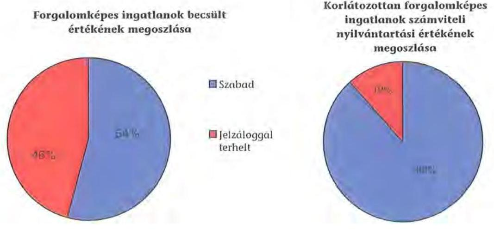

---

A vizsgált időszakban nem történt meg annak felmérése, hogy az eszközök elhasználódásának, amortizációjának pótlása milyen kötelezettséget jelent az Önkormányzat számára. A felújításokra, az eszközök pótlására elsősorban az intézmények működőképességének biztosítása, illetve a szakhatósági előírások figyelembevételével került sor. Az Önkormányzat a 2007-2010. években a tárgyi eszközök után 2856 millió Ft összegű értékcsökkenést számolt. Felújításra az elszámolt értékcsökkenésnek a 64%-át (1825 millió Ft) fordították. Az elhalasztott felújításokra az Önkormányzat tartalékot nem képezett, külön alapot nem hozott létre.

A Közgyűlés döntései alapján az Önkormányzat a likviditási gondok enyhítésére a Rókus Kórház részére hosszú lejáratra kölcsönt nyújtott, amelyet a nyilvántartásában a számvevőszéki ellenőrzéskor pontosított, visszatérítendő támogatásra módosított. Az intézmény pénzügyi helyzete - alapvetően a 2006-ban megvalósított kórházi struktúra-átalakítás hatásaként - olyan mértékben rosszabbodott, hogy a kórházat csak külön önkormányzati források biztosításával lehetett megtartani. A működőképességet fenntartó források körébe tartozott a 2007-ben nyújtott 736 millió Ft és 2008-ban nyújtott 466 millió Ft (a két évben együtt 1202 millió Ft) visszatérítendő támogatás is, amelyet a Közgyűlés ötéves átalakítási program kidolgozásához kötött. A kórház pénzügyi helyzetének javítását szolgálta 2008-tól az önkormányzati biztos kijelölése is, de a megtett intézkedések hatására sem sikerült gazdaságossá tenni a működést és megteremteni a visszafizetés feltételeit.

Az Önkormányzat 2008-ban egy a többségi tulajdonában lévő kiemelten közhasznú társaságának (Naszály-Galga TISZK) pályázat előfinanszírozásáig 200 millió Ft kölcsönt, egy egyéb társaságának (Save REMA Kft.) fél millió Ft tagi kölcsönt nyújtott, amelyeket az adósok visszafizettek. Egy civil szervezet (Piarista Rend Magyar Tartománya Szerzetesrend) részére is nyújtott 2009. május 29-én 365 napos, közel 7 millió Ft-os kölcsönt az Önkormányzat annak érdekében, hogy a szervezet egy többségi önkormányzati társaság (Naszály-Galga TISZK) felé be tudja fizetni a támogatási hozzájárulást. A civil szervezet a kölcsönt a számvevőszéki ellenőrzés lezárásáig sem rendezte.

# 4. A PÉNZÜGYI EGYENSÚLY MEGTEREMTÉSE ÉRDEKÉBEN HOZOTT INTÉZKEDÉSEK 

A jelentésben szereplő CLF modellben bemutatott működési és felhalmozási hiány annak ellenére alakult ki, hogy a vizsgált időszakban az Önkormányzat folyamatosan intézkedéseket tett, hogy alkalmazkodjon a finanszírozási rendszer változása miatti forráscsökkenéshez. Ennek érdekében bevételnövelő és kiadáscsökkentő döntéseket hozott.

A kiadáscsökkentő és bevételnövelő intézkedések megtétele a gazdálkodás átláthatóbbá tételét, valamint a feladatellátás szakmai színvonalának, de kiemelten a pénzügyi helyzet javítását célozták. A legjelentősebb mértékű kiadási megtakarítást az álláshely csökkentésekkel érték el.

---

A megyeháztartási reform 2006. év végén készült el, amelyben ágazatonként fogalmazták meg a részletes célokat, alapelveket és a megvalósításához szükséges intézkedéseket. Ennek keretében határozták meg, hogy a dolgozói létszámot hozzá kell igazítani a törvényi előírásokhoz, a feladatarányos finanszírozás rendszerét az egész intézmény rendszerre ki kell terjeszteni, a dologi kiadások esetében el kell különíteni a feladatellátást közvetlenül szolgáló kiadásokat, a nem szakmai feladatok elvégzésére hatékonyan és gazdaságosan működő szervezetet kell létrehozni, az elaprózott intézményhálózatot össze kell vonni és az alacsony kihasználtságú intézményeket meg kell szüntetni 2007. év elején.

Az Önkormányzat a megyeháztartási reformban foglaltakat 2011. évig több ütemben vezette be. Ezzel kiadási megtakarításokat is csak késedelemmel értek el, illetve a 2011. évi intézkedések vonatkozásában érhetnek majd el.

Az Önkormányzat gazdasági programjában megfogalmazott elvárások szerint 2007-ben elindult az intézményeket érintő átszervezések előkészítése.

A 2007. évi költségvetés tervezése során takarékossági intézkedéseket foganatosítottak a várható bevételi források prognosztizált csökkenése, és a normatív támogatások kedvezőtlen változásai miatt. Az osztályfőnöki pótlék esetében a mindenkori pótlékalap 43%-ának, a munkaközösség vezetői pótlék vonatkozásában a mindenkori pótlékalap 15%-ának megfelelő forrást biztosított a fenntartó. A pénzbeli étkezési hozzájárulás mértéke $3000 \mathrm{Ft} /$ fő/hó. A természetbeni étkezési hozzájárulás csak azokban az intézményekben volt adható, ahol munkahelyi étkeztetés működött, és amely az alapító okiratban is szerepelt, ennek mértéke $6000 \mathrm{Ft} /$ fő/hó volt. Az étkezési hozzájárulásokat a szabadság ideje alatt nem vehették igénybe. A munkaruha-juttatás összegét $10000 \mathrm{Ft} /$ főről $5000 \mathrm{Ft} /$ fő-re csökkentették. A megtakarításokat külön nem számszerűsítették. A megtakarítások már 2007. évtől jelentkeztek.

Az Önkormányzat 279/2006. (11. 24.) számú döntése alapján - az OEP finanszírozású intézmények kivételével - a fenntartásában működő valamennyi intézményben az alapfeladat-ellátásának biztosítása mellett az üres álláshelyek betöltéséhez kapcsolódó előirányzatok kifizetését felfüggesztette. Az intézményvezetők kötelesek voltak a tárgyhót követő 5. napig bezárólag a megüresedett álláshelyekről és az ezekre vonatkozó előirányzatokról kimutatást készíteni, majd azt a Hivatal Gazdasági Irodájának megküldeni.

Az Önkormányzat 280/2006. (11. 24.) számú döntése alapján az Önkormányzat törvényi kötelezettségének úgy tett eleget, hogy a települések által megyei fenntartásba felajánlott intézmények esetében csak a megyei önkormányzat számára kötelezően előírt feladatokat vette át, és a feladatellátásról a közoktatási feladatok esetében saját intézményeiben gondoskodott. Egészségügyi, szociális intézmény átadása esetén az Önkormányzat tartozást nem vállalt át és a tulajdonos helyett még életveszély elhárítási munkákat sem vállalt el.

Az Önkormányzat 287/2006. (11. 24.) számú döntésében hozzájárult, hogy a Hivatalban 20 fő köztisztviselői csoportos álláshely csökkentés kerüljön végrehajtásra, amelyek következtében a részben, vagy egészben feleslegesnek mutatkozó funkciókat felszámolják, csökkennek a felesleges áttételek, illetőleg párhuzamosságokat jelentő munkakörök. Az intézkedés végrehajtása áthúzódott 2007. évre, tényleges megtakarítást 2008. évtől jelentett az Önkormányzatnak.

A Közgyűlés 2007. évben több határozattal döntött a múzeumi szervezet átalakításáról. A korábban háromszintú intézményrendszer szervezeti struktúráját az átalakítás után két területi szektorra osztotta (Észak- és Dél-Pest megye), és ún. szakmai (gyűjteményi) osztályszervezetben működtette tovább. Az addig a megye hatókörébe tartozó közérdekű muzeális kiállítóhelyeket - további működtetés céljából és érdekében - átadta az érintett négy települési önkormányzatnak. A múzeumi szervezet átalakításából eredő - a takarítás, teremőrzés, őrzés-védelem - feladatellátás közbeszerezési eljárást követően kiszervezésre került. Ezzel mintegy 82 fő álláshely csökkenést mutatott ki az intézmény, amelynek kiadáscsökkentő hatása 2008. évtől jelentkezett az Önkormányzatnál. Ugyanakkor a M0 autópálya építés régészeti feltárás miatt 40 fő határozott idejű közalkalmazott státuszú régészt kellett alkalmazni.

Az Önkormányzat intézmény-racionalizálás és a gazdaságtalan működés miatt több intézményt megszüntetett, vagy tagintézményként más intézménybe integrált.

Az Önkormányzat 141/2007. (04. 20.) számú határozatával a Vasadon működő diákotthont tagintézményként 2007. július 1-től megszüntette, ennek kapcsán a feladat átadása a ceglédi Dózsa György Középiskolai Kollégiumnak 2007/2008 tanévben megtörtént.

A dabasi Nevelési Tanácsadó és Logopédiai Intézetet megszüntették, egyben intézkedtek, hogy a feladatellátását a dabasi Igazgyöngy Alapítvány végezze szolgáltatásként megállapodás útján.

A pilisvörösvári Muttnyánszky Ádám Szakképző Szakiskolát a Közgyűlés 218/2007. (05. 25.) számú határozatával megszüntette az alacsony, 50%-os kapacitás kihasználtság miatt. A feladatot a szentendrei Petzelt József Szakiskola vette át.

A Közgyűlés 246/2008. (06. 27.) számú döntésével megszüntette a Bárczy Gusztáv Általános Iskolát. Az általa ellátott feladatot 2008. augusztus 31-től a Cházár András Óvoda, Általános Iskola, Speciális Szakiskola, Diákotthon, Gyermekotthon és Pedagógiai Szakszolgálat látja el és a tagintézmény költségeihez a Dunakanyar Pilis Kistérségi Társulás fele arányban hozzájárul.

A 2008. évben az Önkormányzat hat középiskolában megszüntette az érettségire épülő OKJ-s képzést.

Az Önkormányzat 2008. augusztusi előterjesztésében kiadáscsökkentő intézkedésként javasolta az intézményekben az engedélyezett létszám túllépése esetén a
 fegyelmi felelősségre vonás felvetését. A költségvetés tervezése során a munkáltatói döntésen alapuló illetménykiegészítéseket nem finanszírozta. Egységesítette a gyógypedagógiai pótlék tervezését.

Az intézményi feladatok racionalizálásáról, integrációjáról az intézmények gazdasági önállóságának átszervezésével kapcsolatosan a Közgyűlés 2008. december 12-i és a 2009. január 30-ai ülésén hozott döntéseket. Eredetileg 11 központot terveztek, amely azonban lényegesen kevesebb megtakarítást ered-

---

ményezett volna, ezért 2009. július 1-jétől hat központ megalakítását javasolták. A központok kialakításánál az intézmények területi elhelyezkedését, a gazdasági működés hatékonyságát, valamint azok jelenlegi nagyságát vették figyelembe. A 2009. évi költségvetésben rögzített engedélyezett létszámok a részben önállóan működő intézmények esetében a közalkalmazotti létszám maximum 28 fővel történő csökkentését, illetve a gazdasági központonként működő önálló intézmények esetében maximum 9 fővel történő növelését tette lehetővé. Az intézményhálózat kialakítása a nagyobb átláthatóságot, az egyszerűbb kezelhetőséget biztosítja. Az intézményi integráció, átszervezés végrehajtásához kikérték a szakmai szervezetek véleményét, a jogszabályban előírt egyeztetéseket lefolytatták. A gazdasági központok kialakításával közvetlen ellenőrzés alá kerültek az intézmények, mert a kötelezettségvállalást ők végezték, de a kötelezettségvállalás ellenjegyzését a központhoz telepítették.

Az Önkormányzat szabályozta közoktatási intézményei feladatfinanszírozását, amely a költségvetés tervezésénél a működés előirányzatainak meghatározására egységes elveket biztosított. A FELFIN ${ }^{52}$-nek kiemelt szerep jutott, mert alkalmazásával a fenntartó Önkormányzat döntése előtt széleskörű betekintést kapott az intézményi feladatellátásba, valamint az egyes feladatokhoz szükséges tárgyi és anyagi erőforrásokra vonatkozóan. A FELFIN rugalmasan illeszkedett a normatív állami hozzájárulás rendszeréhez és az intézmények mindenkori feladataihoz. A Közgyűlés 306/2009 (06. 26.) számú határozatával döntött a FELFIN rendszer módosításáról, amely a közoktatási intézményekben a kimutatásuk szerint 73 fős álláshely csökkentést eredményezett, amelynek anyagi kihatása 2010. évben jelentkezett.

Az Önkormányzat a gyermekvédelmi rendszerét folyamatosan monitoring rendszer keretében figyelemmel kísérte és értékelte. Ennek tapasztalata alapozta meg azt a döntést, hogy a közoktatási intézmények szervezeti egységeként működő gyermekotthoni hálózatot célszerű leválasztani, és azt a PM TEGYESZI gyermekotthoni hálózatához csatolni. Az átalakítás több lépcsőben történt. A váci Cházár András Többcélú Közoktatási Intézmény gyermekotthont az új váci lakásotthonnal váltották ki, amely a Penci és a Bernecebaráti Szakmai Egységben Pest megye északi régiójának gyermekvédelmi bázisává vált. A szociális és gyermekvédelmi intézmények átszervezéséről és a működési tapasztalatokról szóló beszámolók kedvezőek voltak, a szakmai színvonal, valamint a működés személyi és tárgyi feltételei javultak.

Pest megyében öt megyei fenntartású intézmény látott el nevelési tanácsadási és logopédiai feladatokat és további három településen működött megyei fenntartású intézmény telephelyeként nevelési tanácsadás, illetve logopédiai szakszolgálati tevékenység. A nevelési tanácsadók és logopédiai intézetek azonos feladatokat láttak el, eltérést csak a területi ellátás nagyságrendjében mutattak ki, ezért célszerűnek látták a fenti intézmények egy szakmai intézménnyé való szervezését és telephelyenkénti tovább működtetését. Az átszervezéssel fenntartható és kiszámítható működtetési környezetet kívántak biztosítani a humánerőforrással való racionálisabb gazdálkodással és a meglévő tárgyi feltételek hatékonyabb kihasználásával. Az átszervezés létszámcsökkentést nem vont

[^0]
[^0]:    ${ }^{52}$ A FELFIN-t először a 2000. évben szabályozta az Önkormányzat.

---

maga után. A telephelyek működtetésével biztosítható a szolgáltatást igénybe vevők számára a pedagógiai szakszolgálat elérhetősége, illetve az elektronikai nyilvántartási rendszer működtetésével az esetleges párhuzamosságok kiküszöbölése. A fenntartó döntése után e feladatok ellátását egységes szakmai irányítás alá helyezte a szentendrei székhely-intézménnyel a telephelyek megtartása mellett.

Az intézmények tekintetében az alábbi kiadáscsökkentő tételeket kívánják érvényesíteni a 2011. év folyamán:

Amíg a megyei rendeleti szintű szabályozás 43%-os osztályfőnöki pótlékot állapított meg, addig a 138/1992. (X. 8.) Korm. rendelet 15. § (3) bekezdés a) pontja szerint a minimumösszeg 38% volt. Az osztályfőnöki pótlék mértékének a Korm. rendelet által meghatározott minimum biztosításával éves szinten 8 millió Ft megtakarítás érhető el. A munkaközösség-vezetői pótlék mértékét 15%-ban határozta meg 2010. évig az Önkormányzat, miközben 138/1992. (X. 8.) Korm. rendelet 15. § (3) bekezdés b) pontja szerint a minimumösszeg 12%. A jogszabály által meghatározott minimum alkalmazásával a megtakarítás éves szinten 2 millió Ft. Mindezek 2011. szeptemberi bevezetésével - az Önkormányzat kimutatása szerint - a tárgyévben várhatóan 3,5 millió Ft kiadás megtakarítást érnek el.

Az étkezési hozzájárulás és a cafetéria megszüntetése 2011. évben éves szinten 300 millió Ft megtakarítást jelent.

Az Önkormányzat anyagi helyzete és a központilag biztosított normatív támogatások ismeretében áttekintette az Ötv. által előírt, illetve vállalt feladatokat. Hatáselemzések készültek, valamint megtörtént a feladatmutatók elemzése. Ezek alapján az egyes paraméterek szigorítását, a finanszírozási csoportlétszámok emelését, a fenntartói többlet óraszámok törlését javasolták.

Az Önkormányzat által finanszírozott csoportlétszámok alacsonyabbak a Közokt. tv. által meghatározott maximális létszámoknál. Amennyiben 2011 szeptemberétől a finanszírozási létszámot megemelnék a maximális létszámra, akkor a megtakarítás éves szinten a kalkulációjuk szerint 300 millió Ft.

Az egyéni foglalkozásra biztosított órakeret megszüntetéséből származó megtakarítás éves szinten a számításaik szerint 120 millió Ft-ot jelent. A módosítás pedagógus álláshelyet nem érintett, mivel túlórában látták el a feladatot.

Az Önkormányzat a szakközépiskola 11-13. évfolyamán heti 2 órával biztosított többet, mint a Közokt. tv. alapján meghatározott kötelező óraszám. A nyelvi előkészítő 9. évfolyamán pedig heti 3,5 órával finanszíroz többet a fenntartó az előírt kötelező óraszámnál. Amennyiben kizárólag a kötelező órákat finanszírozzák, számításaik szerint a megtakarítás éves szinten 95 millió Ft.

A váci I. Géza Király Szakközépiskola és Kollégiumban elhelyezett tanulók után 2011. évre 11 millió Ft támogatást fizet az Önkormányzat, de a közgyűlési határozat értelmében a váci önkormányzattal való szerződést 2011. augusztus 31. napjával felmondják és a diákokat az Önkormányzat saját fenntartású kollégiumaiban helyezik el.

---

A 2007-2010. években az intézményi feladatok racionalizálási, integrációs és takarékossági intézkedések után összesen 3208 millió Ft kiadási megtakarítás keletkezett, amelyből 1259 millió Ft kapcsolódott az álláshely-csökkenésekhez.

A 2011. évtől meghozott kiadáscsökkentő intézkedések teljes éves hatása legkorábban 2012. évtől várható. Az intézkedések megtétele szükséges volt, azonban azokról az Önkormányzat megkésve döntött. Amennyiben azokat 2007. évtől alkalmazzák, úgy közel 2500 millió Ft megtakarítást érhettek volna el.

A 2007-2010. évek kiadáscsökkentő intézkedéseit beavatkozási területenként az alábbiak részletezik:
ezer Ft-ban

| Az érvényesített kiadás-   csökkentés területei | Személyi   juttatások és   járulékai | Dologi, mú-   ködési ki-   adások | Pénzeszköz   átadások,   támogatások | Összesen |
| :-- | :--: | :--: | :--: | :--: |
| A Közgyűlés működése | 21404 | 600 | - | 22004 |
| A Hivatalnál | 420782 | 3925 | - | 424707 |
| Az intézményeknél | 2623431 | 140699 | 444061 | 3208191 |
| ÖSSZESEN | 3065617 | 145224 | 444061 | 3654902 |

A Közgyűlés működési körében a kiadáscsökkentő intézkedések eredménye a testület és a bizottsági tagok létszámának csökkentéséből realizálódott. A Hivatalban végrehajtott megtakarítási intézkedések átszervezésből következő és létszámcsökkentéssel járó döntések voltak, amelyek összességében a 2006. december 31-i állapothoz viszonyítva 9 fő igazgatási létszám csökkentését eredményezték.

A Hivatal létszáma 2006. december 31-én 295 fő volt, ebből a kormányzati intézkedések miatt 154 fő 2007. január 1-jétől az APEH állományába került. A Hivatalnál lezajlott átszervezések kapcsán létszámcsökkentési- és növelési intézkedés egyaránt történt, így ténylegesen 9 fő létszámcsökkenés realizálódott az eltelt időszakban.

Az önkormányzati szinten kimutatott megtakarításokból 3208 millió Ft, 87,8 % az intézmények körében, ezen belül a személyi juttatások és járulékoknál 2623 millió Ft, 81,8 % volt.

A különböző szolgáltatási szerződések felülvizsgálatával megtakarított összeg kimutatásuk szerint 167 millió Ft, részaránya 5,2% volt (a dabasi Nevelési Tanácsadó és Logopédiai Intézet megszüntetése, a Katolikus Kereszt Alapítvány térítési díj kiegészítés felülvizsgálata). Az egyes közszolgáltatások kiszervezésével elért megtakarítás részaránya 11,7 % 375 millió Ft, volt, amely a múzeumoknál és a konyháknál volt a jellemző.

A folyamatos önkormányzati szintű megszorító intézkedések miatt az ágazati feladatot ellátó intézményeknek szűk lehetőségük maradt.

Az Önkormányzat három kórháza közül a Rókus Kórház pénzügyi helyzetének javítására több intézkedést hozott. A Rókus Kórháznál 2008. szeptember 1-jétől önkormányzati biztos működik, tevékenységéről, a pénzügyi helyzet stabilizálása

---

érdekében javasolt és megtett intézkedésekről havonkénti részletezéssel készített jelentést a fenntartó Önkormányzat számára. (A javasolt intézkedések között szerepelt a szerződésállomány felülvizsgálata, indokolatlannak ítélt szerződések felmondása, gazdálkodási keretek kialakítása, és azok betartásának szigorú ellenőrzése, a gyógyszerfelhasználás, energiafelhasználás szigorítása, a beszerzések központosítása, a belső ellenőrzés megerősítése, a létszámgazdálkodás racionalizálása).

Az álláshely csökkentő intézkedések következtében 2007-2011 között a Hivatalnál és az intézményeknél összesen 1414 álláshelyet (részben üres állást) szüntettek meg, amelynek 52,8%-a (747 fő) ágazati szakmai, 47,2%-a (667 fő) intézményüzemeltetéshez, fenntartáshoz, gazdasági ügyek intézéséhez kapcsolódó álláshely volt. A Közgyűlés 279/2006 (11. 24.) számú határozata értelmében az üres állások betöltése csak elnöki engedéllyel volt lehetséges. Nyilatkozatuk alapján kizárólag az alapfeladat-ellátásához nélkülözhetetlen álláshelyek betöltését hagyta jóvá, az engedélyezett létszám növelésére közgyűlési döntés alapján volt mód, egy-egy részterület feladat növekedésével arányosan.

A 2007-2011. év I. negyedévében végrehajtott létszámcsökkenés Önkormányzat szerinti eredményét az alábbi grafikon szemlélteti:
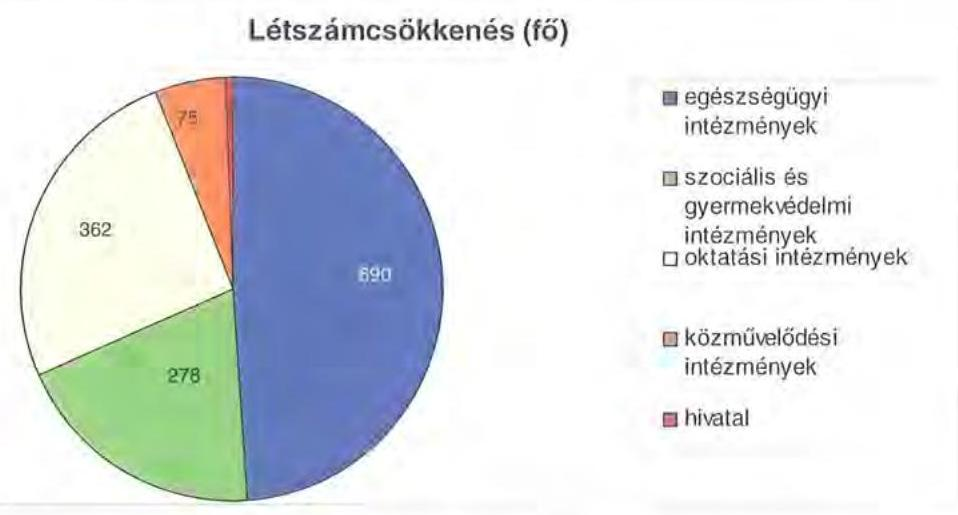

A helyi szervezési intézkedések végrehajtásához az Önkormányzat a 2007-2010. években 584 millió Ft központi költségvetési támogatásban részesült, amelynek felhasználásával 380 fő álláshelyet tartósan leépített. Az álláshely csökkenésből 1034 főhöz (73,1%) központi támogatás nem kapcsolódott. Ide tartozott a múzeumoknál dolgozó teremőrök kiszervezése, a gazdasági központok átszervezése, valamint azok a konyhai dolgozók, akik az étkeztetést biztosító külső vállalkozóhoz nem kívántak átmenni és nem vállalták a továbfoglalkoztatást. A Rókus Kórháznál három ütemben megvalósuló (2007. év: 633 fő, 2009. év: 40 fő, 2010. év: 17 fő) álláshely csökkentéshez nem tudták teljes mértékben igényelni a központi támogatást, mert nem feleltek meg a pályázati kiírás feltételeinek (határozott idejű, megbízási szerződéses, a Munkatörvénykönyve alapján foglalkoztatott). A Rókus Kórház 2007. évben egynapos sebészeti ellátásra kiírt pályázatot nyert, amelynek vonzataként - új szakfeladat lévén - 17 fő került felvételre a minimum feltételek biztosítása érdekében.

---

Az álláshely csökkenések a végrehajtás évében az Önkormányzatnak többletköltséget okoztak, megtakarítás csak a következő évektől jelentkezett.

A 12 intézményből álló szociális hálózatban a szakdolgozói engedélyezett létszám 2007. évtől 48 fővel alatta maradt a személyes gondoskodást nyújtó szociális intézmények szakmai feladatairól és működésük feltételeiről szóló 1/2000 (I. 7.) SzCsM rendeletben előírt 663 fős létszámnak ${ }^{53}$. Ezen a területen további létszámcsökkentést az Önkormányzat nem tud realizálni. Az intézmények gazdasági átszervezése miatt a Közgyűlés 485/2008 (12. 12.) számú határozatával a szociális intézményekben 21 fővel csökkentette a nem szakdolgozói létszámot, ennek költségvetési hatása 2009. évtől jelentkezett.

Az álláshely-csökkenés 2007. évben jellemzően az egészségügyet érintette 633 fővel, 2008. évben az oktatási és a szociális ágazatot mintegy 421 fővel, majd 2009-2010. években az oktatási és az egészségügyi ágazatot 161 fővel.

Az intézkedések eredményeként az Önkormányzat 2006. december 31-ei átlaglétszáma a számításuk szerint 2011. március 31-re 5617 főre, 79,9%-ra csökkent, ebben
 tükröződik a kormányzati intézkedések miatti létszámcsökkenés (Illetékhivatal 154 fő) is. A tényleges létszámcsökkenés így 17,9%-os volt.

Az Önkormányzatnál 2011 első negyedévében tovább folytatódtak a megtakarítási intézkedések, az elhatározott 967 millió Ft kiadási megtakarításból 813 millió Ft (84%) személyi juttatás és járulékai, amely a cafetéria elemek, illetve a további feladat megszüntetéséhez, átszervezéssel járó létszámcsökkentéshez, a közalkalmazotti bértáblán felüli bérek és pótlékok elvonásához, a feladat finanszírozásához kapcsolódik. A Közgyűlés működéséhez kapcsolható kiadások a 2011. évi költségvetési rendeletben tervezettek szerint várhatóan 7 millió Ft összegben csökkennek, mert az egyes kitüntető díjak adományozásával járó pénzjutalmat megvonták (Építészeti nívó díj, Legszebb település díj, Biztonságos Település díj). Tiszteletdíj csökkentést ebben az időszakban nem terveztek. Ezen kívül a Hivatalt érintő pénzeszközátadások közül megszüntették a Tourinform irodák részére nyújtott támogatást, megvonták a Bursa Hungarica Felsőoktatási Önkormányzati Ösztöndíjat, valamint a civil szervezetek támogatását és befagyasztották a lakáskölcsönök nyújtását (ez utóbbi tervezett intézkedések együttes hatása mintegy 79 millió Ft volt).

[^0]
[^0]:    ${ }^{53}$ Az Önkormányzat 11 szociális intézménye határozott idejű működési engedéllyel rendelkezik, mivel a létszámfeltételeknek nem feleltek meg.

---

A kiadáscsökkentő intézkedések mellett az Önkormányzat kimutatásai szerint az alábbiakban számszerűsített bevételnövelő intézkedéseket tett:
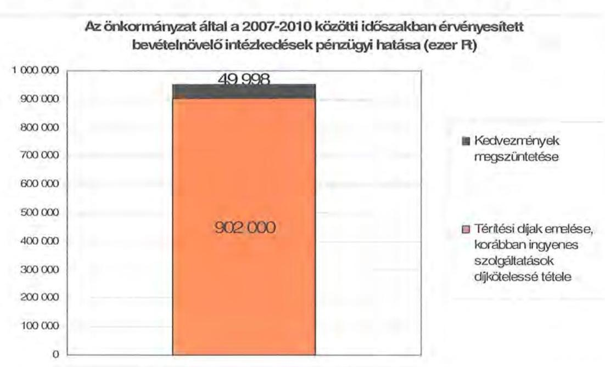

A bevételek növelésére tett intézkedésekből 952 millió Ft származott, amelyből 902 millió Ft-ot (94,7%) a bérbeadási, vállalkozási tevékenység, valamint a térítési díjak emelése tett ki.

A Közgyűlés a 8/2008. (III. 01.) számú rendeletében felülvizsgálta az Önkormányzat fenntartásában működő személyes gondoskodást nyújtó szociális ellátások térítési díj fizetésének rendjét és az intézményi térítési díjakat.

A Közgyűlés döntése alapján az Önkormányzat abban az esetben működtette tovább a 6-8 évfolyamos gimnáziumokat, az alapfokú művészeti oktatási intézményeket, amennyiben az önkormányzatok, a kistérségi társulás települései az intézmény fenntartásának finanszírozásában részt vállalnak.

Az Önkormányzat döntése alapján 2008. szeptember 1-jétől a Cházár András Óvoda, Általános Iskola, Speciális Szakiskola, Diákotthon, Gyermekotthon és Pedagógiai Szakszolgálat a tagintézményeként működő sajátos nevelési igényű tanulók általános iskolai oktatását az 1-8. évfolyamon úgy biztosította, hogy a települési önkormányzat a normatíván felüli önkormányzati támogatás felét vállalta.

A Bárczi Gusztáv Általános Iskola által ellátott feladat fenntartásához a hozzájárulást lakosság arányosan a támogató tagönkormányzatok vállalták. A hozzájárulás összege a feladatellátás normatív támogatással csökkentett kiadási összegének a fele. A működési hozzájárulást nyújtó önkormányzatokkal kötendő megállapodásokban rögzítették a tanulói létszámot, a képzéshez való hozzájárulás számításának alapja az évenként megállapított fenntartói hozzájárulás fele. A megállapodásokat 5 éves időtartamra kötötték meg.

A váci Simon Antal Általános Iskola, Diákotthon, gyermekotthon gazdálkodási önállósága megszűnt, részben önállóan gazdálkodó költségvetési szerv lett.

---

A 2011. évre 605 millió Ft bevételi növekményt terveztek önkormányzati szinten. A tervezett bevételi többletből 56 millió Ft a Pest Megyei Könyvtár Szentendre Város Önkormányzatával való közös működtetés 50-50%-os költségmegosztásából, 430 millió Ft az infláció mértékével növelt térítési díjakból keletkezik. A Közgyűlés megerősítette, hogy az alapfokú művészetoktatási feladatellátást azokon a telephelyeken és tagintézményekben biztosítja, ahol a települési önkormányzat hozzájárul a költségekhez; ez összesen 119 millió Ft-ot jelent.

Az átszervezések, a takarékossági intézkedések szakmai feladatellátásra gyakorolt hatását célzottan nem vizsgálták, erről belső ellenőrzési jelentések nem állnak rendelkezésre.

Az Önkormányzat elemezte az intézményhálózat változásának eredményét a 2009. és 2010. évi előirányzatok tükrében. Ennek eredményeként kimutatták, hogy a 2010. évi intézményi előirányzatok tervezésénél az előzőekben felsorolt döntések a személyi juttatások és járulékok tekintetében jelentős csökkenést eredményeztek. A nevelési tanácsadó 2010. évi személyi juttatás előirányzat emelkedésének indoka volt, hogy a tanulási képességet vizsgáló bizottságok az átszervezést megelőzően iskolák keretein belül működtek, míg az átszervezés után a nevelési tanácsadó előirányzatát növelték. A dologi kiadások tervezésénél a 2009. év volt az irányadó, jelentős növekedésként jelent meg azonban az ÁFA 20%-ról 25%-ra történt emelése, mely a rezsi-kiadások és az élelmezés tekintetében jelentett markáns emelkedést. A 2009-2010. évi bevételek elemzése során megállapították, hogy bár a saját bevételek és a normatív támogatások csökkentek, a fenntartói kiegészítés nem nőtt ezzel arányosan, a szigorú gazdálkodásnak köszönhetően. Az intézményi saját bevételek tervezésénél kismértékű csökkenés mutatkozott az étkezést igénybe vevők számának csökkenése, illetve a rendezvényszervezésre történő bérbeadások elmaradása miatt. A szociális intézmények esetében a maximális férőhely kihasználtság mellett a térítési díjakból származó bevételek kismértékben emelkedtek.

# 5. A HELYI ÖNKORMÁNYZATOK GAZDÁLKODÁSI RENDSZERÉNEK 2007. ÉVI ELLENŐRZÉSE SORÁN A PÉNZÜGYI EGYENSÚLY JAVÍTÁSÁRA TETT SZABÁLYSZERŰSÉGI ÉS CÉLSZERŰSÉGI JAVASLATOK HASZNOSULÁSA 

A számvevői jelentésben a pénzügyi egyensúly javítására három szabályszerűségi javaslat vonatkozott.

A szabályszerűségi javaslatok felhívták a főjegyző figyelmét, hogy biztosítsa az Áht. 8/A. § (7) bekezdése alapján, hogy a költségvetési rendelet-tervezetek költségvetési kiadási főösszege ne tartalmazzon finanszírozási célú bevételeket, illetve kiadásokat; a költségvetés bevételi és kiadási előirányzatait a támogatási szerződésben foglaltakkal összhangban tervezzék meg az Áht. 69. § (1) bekezdésében előírtaknak megfelelően; a költségvetés bevételi és kiadási előirányzatait az Ámr. 29. § (1) bekezdés k) pontja alapján elkülönítetten és a 29. § (1) bekezdés g) pontjának előírása alapján a többéves kihatással járó feladatok előirányzatainak éves bontásával tervezzék. A főjegyző a három szabályszerűségi javaslat megvalósításáról a helyszíni vizsgálat időtartama alatt gondoskodott.

---

Az ÁSZ jelentésében a Közgyűlés elnökének egy célszerűségi javaslatot tett. Javasoltuk: „kezdeményezze, hogy a számvevőszéki jelentésben foglaltakat a Közgyűlés tárgyalja meg”. A jelentést a Közgyűlés megismerte.

Budapest, 2011. december 19.

Melléklet:  6 db
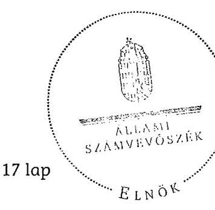

17 lap
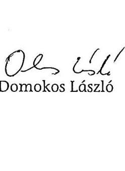

---

Pest Megyei Önkormányzat

1. számú melléklet

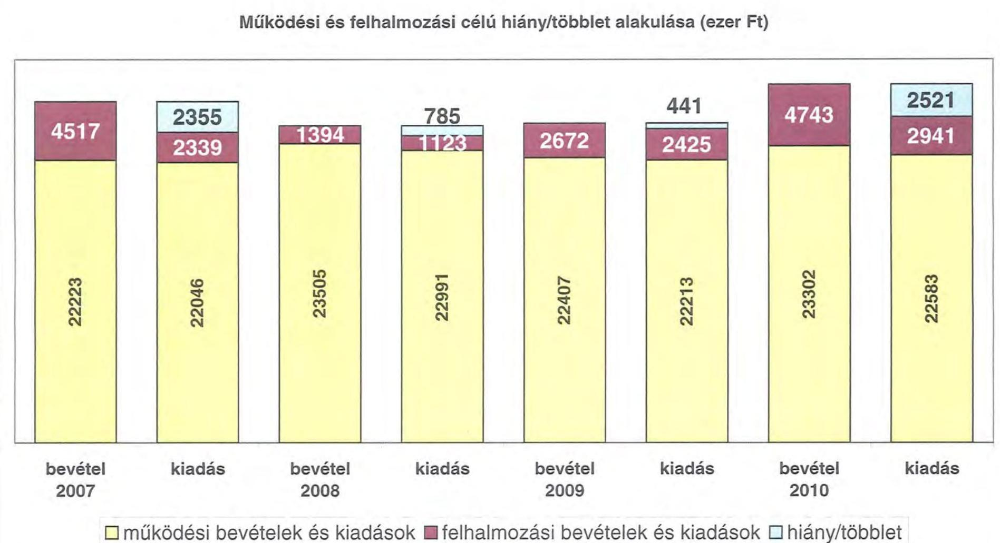

Működési és felhalmozási célú hiány/többlet alakulása (ezer Ft)

|  |   |   |   |   |   |   |   |
|---|---|---|---|---|---|---|---|
| 4517 | 2355 | 1394 | 785 | 2672 | 441 | 4743 | 2521  |
|   | 2339 |  | 1123 |  | 2425 |  | 2941  |
| 22223 | 22046 | 23505 | 22991 | 22407 | 22213 | 23302 | 22583  |
|  |   |   |   |   |   |   |   |
| bevétel 2007 | kiadás | bevétel 2008 | kiadás | bevétel 2009 | kiadás | bevétel 2010 | kiadás  |
|   | ☐ működési bevételek és kiadások ☐ felhalmozási bevételek és kiadások ☐ hiány/többlet |  |  |  |  |  |   |

---

.

---

#### KIMUTATÁS

#### A Pest Megyei Önkormányzat bevételeinek és kiadásainak, adósságszolgálatának alakulásáról (2007-2010. években teljesített adatok, a 2011. évben tervezett adatok)

| Sorszám | Megnevezés | 2007. év | 2008. év | 2009. év | 2010. év | 2011. év  |
|---|---|---|---|---|---|---|
|   |  | tény | tény | tény | tény | tervezett  |
| I. | MŰKÖDÉSI BEVÉTELEK | 33 138 775 | 35 346 746 | 33 078 022 | 38 307 345 | 34 113 826  |
| 1. | Sajátos folyó bevételek | 7 311 483 | 8 284 770 | 7 249 248 | 6 263 821 | 4 958 314  |
| 1.1. | Intézmények működési bevétele | 3 603 912 | 2 516 989 | 2 860 823 | 3 334 332 | 2 908 610  |
| 1.2. | Illetékbevételek | 3 628 651 | 4 411 267 | 3 897 005 | 2 870 256 | 2 095 000  |
| 1.3. | Helyi adóbevételek és pótlékok | 0 | 0 | 0 | 0 | 0  |
| 1.4. | Kamatbevétel működési része | 72 830 | 166 414 | 200 919 | 79 233 | 61 704  |
| 1.5. | Egyéb folyó működési bevételek | 8 000 | 200 000 | 200 | 0 | 0  |
| 2. | Támogatás értékű működési bevételek | 390 552 | 450 379 | 499 441 | 322 570 | 64 002  |
|   | ebből | 0 | 0 | 0 | 0 | 0  |
|   | helyi önkormányzatoktól és költségvetési szerveitől | 109 143 | 124 354 | 241 835 | 36 764 | 21 704  |
|   | többség kizárólagos látszábból | 9 620 | 11 879 | 31 445 | 14 634 | 6 000  |
| 3. | Pénzforgalom nélküli bevételek működésre jóváhagyott része | 2 220 513 | 2 684 019 | 4 223 121 | 719 709 | 0  |
| 4. | Államháztartáson kívülről működési célra átvett pénzeszközök | 100 913 | 102 066 | 67 762 | 82 861 | 6 180  |
| 5. | Közgazdasági támogatások és átengedett források működési része | 23 112 767 | 22 808 814 | 20 535 450 | 20 699 880 | 19 083 180  |
|   | ebből | 0 | 0 | 0 | 0 | 0  |
|   | SZJA |  | 3 199 244 | 1 111 610 | 1 191 597 | 632 091 | 952 110  |
|   | önkormányzat és intézmények állami támogatásának működési része | 9 210 475 | 11 083 699 | 9 661 480 | 8 792 865 | 8 125 380  |
|   | költségvetési kiegészítések, visszatérülések | 0 | 0 | 0 | 0 | 0  |
|   | társadalombiztosítási alapból | 10 709 968 | 10 628 980 | 10 082 463 | 11 274 633 | 10 004 660  |
| II. | MŰKÖDÉSI KIADÁSOK (kamatkiadás nélkül) | 33 425 637 | 34 586 679 | 31 700 129 | 28 809 612 | 31 210 794  |
| 1. | Folyó működési kiadások összesen kamatkiadások nélkül | 31 199 586 | 31 709 728 | 29 543 400 | 27 769 305 | 28 584 912  |
|   | ebből | 0 | 0 | 0 | 0 | 0  |
|   | személyi juttatások | 15 773 114 | 15 916

 730 | 13 771 957 | 13 486 146 | 12 994 632  |
|   | munkaságra terhető járulékok | 4 996 294 | 4 992 677 | 4 167 721 | 3 523 729 | 3 484 479  |
|   | dologi kiadások | 10 142 327 | 10 372 431 | 11 339 776 | 10 267 539 | 9 694 660  |
|   | egyéb folyó kiadások | 208 953 | 324 397 | 267 493 | 497 891 | 460 901  |
|   | egyéb folyó működési kiadások | 0 | 200 500 | 6 503 | 0 | 0  |
|  2. | Támogatások, elvonások és egyéb folyó átutalások | 1 371 638 | 1 309 493 | 1 163 491 | 931 009 | 966 377  |
|   | ebből | 0 | 0 | 0 | 0 | 0  |
|   | működési célú pénzeszköz átadás államháztartáson kívülre | 545 159 | 552 286 | 451 957 | 145 384 | 219 266  |
|   | működési célú pénzeszköz átadás államháztartáson belülre | 0 | 0 | 0 | 0 | 0  |
|   | társadalmi és szociálpolitikai juttatások | 629 479 | 757 207 | 731 534 | 675 625 | 749 309  |
|  3. | Előző évi pénzmaradvány átadás, visszafizetés működési | 775 000 | 1 431 067 | 751 380 | 207 599 | 3 622 270  |
|  4. | Támogatás értékű működési kiadás | 75 577 | 145 384 | 231 816 | 16 800 | 35 035  |
|   | ebből | 0 | 0 | 0 | 0 | 0  |
|   | önkormányzatoknak | 55 614 | 115 737 | 191 562 | 15 800 | 15 035  |
|   | kizárólag látszámokból | 19 000 | 33 847 | 28 326 | 0 | 20 000  |
|  III. | ADÓSSÁGSZOLGÁLAT | 744 369 | 947 222 | 709 066 | 1 823 712 | 1 266 770  |
|   | tőketörlesztési kötelezettség működési | 342 710 | 9 369 | 0 | 1 000 000 | 0  |
|   | felhalmozási | 133 333 | 232 333 | 0 | 0 | 0  |
|   | kamatfizetési kötelezettség működési | 236 688 | 285 982 | 665 472 | 519 451 | 717 135  |
|   | felhalmozási | 31 638 | 318 838 | 29 599 | 162 869 | 209 388  |
|   | hosszú lejáratú értékpapír beválása, vásárlása* | 0 | 0 | 0 | 122 382 | 479 344  |
|  IV. | FELHALMOZÁSI BEVÉTELEK | 655 772 | 1 144 729 | 1 315 650 | 468 952 | 2 636 716  |
|  1. | Saját felhalmozási és tőkejellegű bevétel | 274 729 | 307 466 | 114 336 | 85 742 | 1 807 091  |
|  1.1. | Tárgyi eszközök, ingatlanok, javak értékesítése, Áfa visszatérülés | 156 926 | 224 886 | 18 404 | 26 180 | 1 771 766  |
|  1.2. | Privatizációból származó bevétel | 484 | 80 | 0 | 0 | 0  |
|  1.3. | Cövekek, részesedések | 0 | 0 | 150 | 0 | 0  |
|  1.4. | Kamatbevétel felhalmozási része | 74 102 | 42 892 | 55 627 | 17 914 | 0  |
|  1.5. | Helyi adók átengedett adók felhalmozási része | 0 | 0 | 0 | 0 | 0  |
|  1.6. | Egyéb folyó felhalmozási bevételek | 42 217 | 39 918 | 39 955 | 36 638 | 35 326  |
|  2. | Támogatásértékű felhalmozási bevételek | 67 008 | 152 231 | 161 345 | 254 036 | 826 527  |
|   | ebből | 0 | 0 | 0 | 0 | 0  |
|   | helyi önkormányzatoktól és költségvetési szerveitől | 4 009 | 21 168 | 65 822 | 55 652 | 0  |
|   | többségi kizárólag látszámokból | 912 | 260 | 0 | 0 | 0  |
|  3. | Pénzforgalom nélküli bevételek felhalmozásra jóváhagyott részei | 180 716 | 226 413 | 900 468 | 91 017 | 0  |
|  4. | Államháztartáson kívülről felhalmozási célra átvett pénzeszköz | 313 321 | 261 863 | 134 675 | 43 167 | 3 085  |
|  5. | Állami felhalmozási és tőkejellegű bevétel | 0 | 175 777 | 4 526 | 0 | 0  |
|  5.1. | EU költségvetésről átvétel | 0 | 0 | 0 | 0 | 0  |
|  5.2. | Önkormányzatok költségvetési támogatása felhalmozási célra | 0 | 176 777 | 4 926 | 0 | 0  |
|  V. | FELHALMOZÁSI KIADÁSOK | 1 570 923 | 1 798 650 | 1 595 593 | 916 604 | 2 300 415  |
|  1. | Folyó felhalmozási kiadások kamatkiadások nélkül | 1 488 163 | 1 705 866 | 1 706 246 | 863 968 | 2 250 415  |
|  1.1. | Beruházás, felújítás | 1 460 797 | 1 705 316 | 1 704 200 | 863 465 | 2 250 415  |
|  1.2. | Értékesített tárgyi eszközök Áfa befizetés | 23 344 | 0 | 0 | 0 | 0  |
|  1.3. | Részesedések vásárlása | 5 009 | 650 | 2 046 | 500 | 0  |
|  2. | Támogatások, elvonások és egyéb folyó átutalások | 73 147 | 89 838 | 61 123 | 50 564 | 0  |
|   | ebből | 0 | 0 | 0 | 0 | 0  |
|   | felhalmozási célú pénzeszköz átadás államháztartáson kívülre | 28 364 | 26 | 10 775 | 650 | 0  |
|   | felhalmozási célú támogatások, kölcsön, kölcsön törlesztése | 44 783 | 59 600 | 80 346 | 49 914 | 0  |
|  3. | Támogatásértékű felhalmozási kiadások | 8 613 | 2 946 | 62 041 | 2 075 | 0  |
|   | ebből | 0 | 0 | 0 | 0 | 0  |
|   | helyi önkormányzatoknak és költségvetési szerveinek | 8 613 | 0 | 59 041 | 2 075 | 0  |
|   | többségi kizárólag látszámozások | 0 | 0 | 2 500 | 0 | 0  |
|  4. | Pénzforgalom nélküli kiadások felhalmozásra jóváhagyott részei | 0 | 0 | 165 103 | 0 | 50 000  |
|  VI. | Hitel, kölcsön felvétel | 4 003 295 | 6 004 938 | 2 126 773 | 2 362 842 | 8 167 635  |
|  0.1. | rövid lejáratú hitel felvétele | 0 | 0 | 1 000 000 | 0 | 0  |
|  0.2. | Kötvény hitel felvétele | 1 012 390 | 1 004 636 | 1 126 774 | 2 362 842 | 0  |
|  0.3. | hosszú lejáratú hitel felvétele | 0 | 0 | 0 | 0 | 8 167 635  |
|   | forgatási célú értékpapírok beválása, vásárlása és a kibocsátása, értékesítése egyenlege | 0 | 0 | 0 | 0 | 0  |
|   | Befektetési és hosszú lejáratú értékpapírok kibocsátása, értékesítése | 2 900 000 | 9 000 000 | 0 | 0 | 0  |
|  0.4. | forgatási célú értékpapírok beválása, vásárlása és a kibocsátása | 0 | 0 | 0 | 0 | 0  |
|  0.5. | hitel felvétel külföldről | 0 | 0 | 0 | 0 | 0  |
|  VII. | Finanszírozási műveletek egyenlege | 3 527 253 | 5 662 234 | 2 126 773 | 1 240 450 | 7 678 391  |

- A kötvény tőketörlesztés 2010. évi összege az önkormányzat nyilvántartásában a táblázatban szereplőtől eltérően, hitel törlesztésként szerepel.

---

.

---

|  1. FOLYÓ KÖLTSÉGVETÉS* | 2007. | 2008. | 2009. | 2010.  |
| --- | --- | --- | --- | --- |
|  1.1.1. Saját működési bevételek | 7 407 061 | 8 153 619 | 7 308 116 | 6 307 640  |
|  1.1.2. Költségvetési támogatás | 9 210 475 | 11 240 676 | 9 666 306 | 8 792 865  |
|  1.1.3. Egyéb bevételek | 3 196 244 | 1 111 635 | 1 191 507 | 832 087  |
|  1.1.4. Államháztartáson belülről kapott támogatások | 11 116 631 | 11 080 359 | 10 581 904 | 11 597 203  |
|  1.1.5. EU-tól és külföldről kapott bevételek | 0 | 9 641 | 20 135 | 2 108  |
|  1.1.6. Államháztartáson kívülről kapott bevételek | 100 513 | 92 425 | 47 627 | 80 553  |
|  1.1.7. Előző évi pénzmaradvány átvétel | 663 750 | 1 238 861 | 838 572 | 99 897  |
|  1.1. Folyó bevételek =1.1.1.+1.1.2.+1.1.3.+1.1.4.+1.1.5.+1.1.6.+1.1.7. | 31 694 682 | 32 927 216 | 29 654 167 | 27 712 353  |
|  1.2.1. Működési kiadások kamatkiadások nélkül | 31 355 311 | 31 687 976
 | 29 617 770 | 27 873 109  |
|  1.2.2. Állambáztartáson belülre átadott pénzeszközök | 75 577 | 149 384 | 221 818 | 15 800  |
|  1.2.3.1. vállalkozásoknak | 0 | 200 | 100 | 2  |
|  1.2.3.2. EU-nak, illetve külföldre | 0 | 0 | 0 | 150  |
|  1.2.3.3. magánszemélyeknek | 826 479 | 757 207 | 740 184 | 675 725  |
|  1.2.3.4. neugrofit szervezeteknek | 545 159 | 552 008 | 443 207 | 145 131  |
|  1.2.3. Tróncélerkiadások (=1.2.3.1+1.2.3.2+1.2.3.3+1.2.3.4) | 1 371 638 | 1 309 493 | 1 183 491 | 821 009  |
|  1.2.4 Kamatkiadások | 268 326 | 604 520 | 705 068 | 701 320  |
|  1.2.5. Előző évi pénzmaradvány átadás | 663 750 | 1 239 326 | 836 730 | 99 894  |
|  1.2. Folyó kiadások = 1.2.1.+1.2.2.+1.2.3.+1.2.4.+1.2.5 | 33 734 610 | 34 990 699 | 32 564 877 | 29 511 132  |
|  1.3. Folyó költségvetés egyenlege MŰKÖDÉSI JÖVEDELEM (1.1. - 1.2.) | -2 039 928 | -2 063 483 | -2 910 710 | -1 798 779  |
|  2. FELHALMOZÁSI (BERUHÁZÁSI) KÖLTSÉGVETÉS** |  |  |  |   |
|  2.1.1. Saját tőkebevételek | 914 885 | 915 142 | 55 468 | 56 923  |
|  2.1.2. Állambáztartáson belülről kapott támogatások | 87 006 | 152 231 | 161 345 | 254 026  |
|  2.1.3. EU-tól és külföldről kapott támogatások | 0 | 0 | 4 890 | 0  |
|  2.1.4. Állambáztartáson kívülről kapott támogatások | 313 321 | 281 853 | 129 785 | 43 167  |
|  2.1. Felhalmozási (beruházási) bevételek (=2.1.1.+2.1.2+2.1.3+2.1.4.) | 1 315 212 | 1 349 226 | 351 488 | 354 116  |
|  2.2.1. Saját beruházási kiadás áfával | 941 698 | 1 063 389 | 1 147 848 | 551 195  |
|  2.2.2. Saját felújítási kiadás áfával | 519 099 | 641 827 | 556 352 | 312 270  |
|  2.2.3. Állambáztartáson belülre átadott pénzeszköz | 744 337 | 469 482 | 62 041 | 2 075  |
|  2.2.4. EU-nak és külföldnek adott pénzeszközök | 0 | 0 | 300 | 0  |
|  2.2.5. Állambáztartáson kívülre adott pénzeszközök | 73 147 | 290 338 | 67 326 | 50 564  |
|  2.2.6. Befektetési célú részesedések vásárlása | 5 000 | 650 | 2 046 | 500  |
|  2.2. Felhalmozási (beruházási) kiadások (=2.2.1.+2.2.2.+2.2.3.+2.2.4.+2.2.5.+2.2.6.) | 2 283 281 | 2 465 686 | 1 835 913 | 916 604  |
|  2.3. Beruházási költségvetés egyenlege (2.1. - 2.2.) | -968 069 | -1 116 460 | -1 484 425 | -562 488  |
|  3. FINANSZÍROZÁSI MŰVELETEK NÉLKÜLI (GFS) POZÍCIÓ |  |  |  |   |
|  (1.3.) Folyó költségvetés egyenlege Működési Jövedelem + (2.3.) Beruházási költségvetés egyenlege | -3 007 997 | -3 179 943 | -4 395 135 | -2 361 267  |
|  4. FINANSZÍROZÁSI MŰVELETEK |  |  |  |   |
|  4.1. Hitelfelvétel | 1 012 390 | 1 004 936 | 2 126 773 | 2 362 842  |
|  4.2. Hiteltörlesztés | 476 043 | 342 702 | 0 | 1 122 392  |
|  4.3. Forgatási és befektetési célú értékpapírok kibocsátása | 2 990 906 | 5 000 000 | 0 | 0  |
|  4.4. Forgatási és befektetési célú értékpapírok beváltása | 0 | 0 | 0 | 0  |
|  4.5. Forgatási és befektetési célú értékpapírok értékesítése | 0 | 0 | 0 | 0  |
|  4.6. Forgatási és befektetési célú értékpapírok vásárlása | 0 | 0 | 0 | 0  |
|  4.7. Egyéb finanszírozási bevételek (függő, átfutó, kiegyenlítő) | -809 953 | -300 535 | -187 506 | -72 953  |
|  4.8. Egyéb finanszírozási kiadások (függő, átfutó, kiegyenlítő) | -45 684 | -103 078 | -15 360 | -90 185  |
|  4.9. Finanszírozási műveletek egyenlege (4.1.-4.2.+4.3.-4.4+4.5.-4.6.+4.7.-4.8.) | 2 762 984 | 5 464 777 | 1 954 627 | 1 257 682  |
|  5. TÁRGYÉVI POZÍCIÓ |  |  |  |   |
|  (3.) FINANSZÍROZÁSI MŰVELETEK NÉLKÜLI (GFS) POZÍCIÓ + (4.9.) Finanszírozási műveletek egyenlege | -245 013 | 2 284 834 | -2 440 508 | -1 103 585  |
|  6. NETTÓ MŰKÖDÉSI JÖVEDELEM |  |  |  |   |
|  (1.3.) Működési Jövedelem - Tőketörlesztés (4.2. Hiteltörlesztés + 4.4. Forgatási és befektetési célú értékpapírok beváltása ) | -2 515 971 | -2 406 185 | -2 910 710 | -2 921 171  |
|  TÁJÉKOZTATÓ ADATOK |  |  |  |   |
|  Összes kötelezettség | 8 035 107 | 15 236 330 | 17 602 909 | 21 422 590  |
|  ebből rövid lejáratú | 4 063 164 | 5 062 267 | 7 208 301 | 10 505 542  |
|  Összes szállítói kötelezettség | 1 251 102 | 1 323 627 | 1 204 842 | 2 818 278  |
|  ebből lejárt | 570 700 | 778 395 | 812 655 | 2 406 096  |
|  Pénz és tőkepösei kötelezettség (adósság) | 5 969 409 | 12 562 238 | 15 102 944 | 17 307 227  |
|  ebből rövid lejáratú | 2 778 503 | 3 650 106 | 5 937 121 | 7 618 964  |

---

|  PPP szerződésből hátra lévő kötelezettséges állomány | 0 | 0 | 0 | 0  |
| --- | --- | --- | --- | --- |
|  ebből lejárt szolgáltatási díj miatti kötelezettség | 0 | 0 | 0 | 0  |
|  Folyószámlabítel napi átlagos állománya | 2 508 153 | 2 675 737 | 4 303 419 | 5 524 170  |
|  Likvidítétel napi átlagos állománya | 0 | 0 | 0 | 0  |
|  Munkabérítétel napi átlagos állománya | 516 028 | 568 244 | 477 915 | 624 898  |
|  Peres eljárásokból fennálló függő kötelezettségek | 0 | 0 | 1 499 | 6 729  |
|  Finanszírozásba bevonható eszközök összesen: | 2 159 087 | 4 443 921 | 2 003 413 | 899 828  |
|  Tartós hitelviszonyt megtestesítő értékpapírok | 0 | 0 | 0 | 0  |
|  Hosszú lejáratú bankbetétek | 0 | 0 | 0 | 0  |
|  Értékpapírok | 0 | 0 | 0 | 0  |
|  Pénzeszközök (idegen pénzeszközök nélkül) | 2 159 087 | 4 443 921 | 2 003 413 | 899 828  |

- Bevételekben nem térül, a kiadásokban nem jelenik meg az amortizáció, a vagyoni helyzetet az egyenleg befolyásolja. Bevételekben vagyon megőrzésre és bővítésre fordítható források.

Megjegyzés

A számítási leírás némileg eltér az ÁSZ módszertanában korábban alkalmazott besorolásoktól. A jelen besorolás általános közgazdasági meggondolásokon alapul, amely testet ölt az SNA statisztikai módszertanában is. Folyó tételek alatt értjük azokat a kiadás

A folyó költségvetés egyenlege (működési jövedelem) tartalmazza a kamatkiadásokat is, mind a működési, mind a fejlesztési kamatot, mert ezek közgazdaságilag tényezőjövedelmek. Nem tartalmazzák a pénzforgalmi bevételek és kiadások a követelés elengedés miatt

A nettó működési jövedelmet a tőketörlesztés levonásával a folyó költségvetés egyenlegéből (működési jövedelemből) származtatjuk. Transzfer kiadásoknak nevezzük azokat a folyó és felhalmozási tételeket, amelyeket nem az adott önkormányzat használ fel szol

A 2007. évben az önkormányzatok MÁK-hoz leadott 2007. évi elemi beszámolójában az évközi intézményátadásokhoz-és átvételekhez kapcsolódóan - a nem megfelelő számviteli elszámolás következtében - a felügyelet alá tartozó költségvetési szervnek folyósított

Az Önkormányzat egyenlege pozitív volt, vagyis az önkormányzatnak bevétele keletkezett, ezért a CLF módszer alapján elkészített táblázatban 17,1 millió Ft államháztartáson belülről átvett pénzeszközként szerepeltettünk.

---

# Az Önkormányzat 2007-2010 években megvalósított, illetve 2010. december 31-én fennálló fejlesztési feladatokhoz kapcsolódó kötelezettségeinek összegzése

|  Fejlesztési feladat megnevezése | Ber.
kezdete | Teljes
bekerülési
költség | 2006.
december
31-ig
teljesített
kiadás | 2007-2010.
évek között
teljesített
kiadás | 2010. év
utánra
vállalt
kötelezettség | 2010. utáni kötelezettség-vállalás forrásösszetétele |  |  |  |   |
| --- | --- | --- | --- | --- | --- | --- | --- | --- | --- | --- |
|   |  |  |  |  |  | Saját
bevétel | Hitel | Kötvény | EU-s
támogatás | Hazai
támogatás  |
|  Aszód, Tanuszoda felújítás 237/2005. (06.24.) |  |  |  |  |  |  |  |  |  |   |
|  TRFC pályázati támogatás 77096 Ft | 2006 | 115000 | 108640 | 23 |  |  |  |  |  |   |
|  Bernecebaráti, Gyermek lakóotthon és kert felújítás 26/2006.(02.17.) KGYH | 2006. | 20694 | 694 | 20000 |  |  |  |  |  |   |
|  Budapesti Szent Rókus Kórház és Intézményei, Budagyongye Kórház építőmesteri és szakipari | 2006.08.31 | 39222 | 336 | 38528 |  |  |  |  |  |   |
|  Cházár A. Iskola címzett beruházás 285/2003. (11.28.) TRFC pályázat támogatás 763200 | 2003.10.31 | 974621 | 346654 | 131952 |  |  |  |  |  |   |
|  Viktor Spec. Otthon címzett beruházás 283/2003. (11.28.) TRFC pályázat támogatás 645000 | 1999.04.14 | 724893 | 425054 |

 864 |  |  |  |  |  |   |
|  Nagykörös Toldi M. SZKI címzett beruházás 415/2004. (11.26.), 281/2005. (08.26.) módosítás | 2004.11.24 | 404602 | 389577 | 630 |  |  |  |  |  |   |
|  Szentendre, Petzelt SZKI címzett beruházás 430/2005. (11.25.) TRFC pályázat támogatás | 2005.05.15 | 224491 | 25012 | 215048 |  |  |  |  |  |   |
|  Pest Megyei Múzeumok Igazgatósága új épület, Ulcisia Castra részrekonstrukció 30/2006.(02.17); | 2005.06.15 | 83841 | 40889 | 600 |  |  |  |  |  |   |
|  Bernecebaráti ingatlan vásárlás 2006. évi összeg szerződés szerint 280/2005. (08.26). | 2005. | 25500 | 7000 | 6500 |  |  |  |  |  |   |
|  Aszód, Petőfi S. Gimn. főépület homlokzat és tetőfelújítás 334/2007. (08.31) KGYH | 2007.10.26 | 29641 |  | 29641 |  |  |  |  |  |   |
|  Ceglédi Kossuth Lajos Gimnázium világítás korszerűsítés 268/2008.(06.27.) KGYH alapján (ebből Cegléd Város Ök-a 5.100 eFt-ot megtérít) | 2008.09.16 | 10170 |  | 10170 |  |  |  |  |  |   |
|  Dabas Táncsics M. Gimn. Fűtési rendszer kialakítás (módosítva 182/2008.(05.30.) KGYH-val) | 2008.02.28 | 102722 |  | 102722 |  |  |  |  |  |   |
|  Dabas Táncsics Mihály Gimnázium lapostetős épületrészének beázás-megszüntetése 278/2008. (06.27.) KGYH alapján | 2008.09.30 | 16945 |  | 16945 |  |  |  |  |  |   |
|  Fonyódi üdülő részleges felújítása | 2008.03.31 | 18733 |  | 18733 |  |  |  |  |  |   |

---

Pest Megyei Önkormányzat 3. számú melléklet

Az Önkormányzat 2007-2010 években megvalósított, illetve 2010. december 31-én fennálló fejlesztési feladatokhoz kapcsolódó kötelezettségeinek összegzése

|  Fejlesztési feladat megnevezése | Ber. kezdete | Teljes bekerülési költség | 2006. december 31-ig teljesített kiadás | 2007-2010. évek között teljesített kiadás | 2010. év utánra vállalt kötelezettség | 2010. utáni kötelezettség-vállalás forrásösszetétele |  |  |  |   |
| --- | --- | --- | --- | --- | --- | --- | --- | --- | --- | --- |
|   |  |  |  |  |  | Saját bevétel | Hitel | Kötvény | EU-s támogatás | Hazai támogatás  |
|  Kistarcsa Flór Ferenc Kórház növérszálló vizesblokk felújítás 17/2008.(01.25) sz. KGYH | 2008.02.20 | 24 854 |  | 24 854 |  |  |  |  |  |   |
|  Megyeház,Kosáry szoba, kutatószoba,kápolna felújítása | 2007.06.18 | 15 281 |  | 15 281 |  |  |  |  |  |   |
|  Monor Szakorvosi rendelő tetőfelújítás 416/2007.(10.27) sz. KGYH, 58/2008.(02.20) sz. KGYH | 2008.01.16 | 26 694 |  | 26 694 |  |  |  |  |  |   |
|  Nagykáta Damjanich János Gimn. és Szakközépisk. nyílászáró csere, javítás, homlokzat szigetelés és elektromos szerelés 267/2009. (05.29.) KGYH | 2009.11.10 | 102 000 |  | 71 084 | 19 548 | PMÖ 2009. évi felhalmozási tartalék terhére: 102 000 e Ft |  |  |  |   |
|  Nagykörös Toldi M. Gimn. szennyvízcsatorna hálózat részleges felújítása 142/2009. (03.27) KGYH | 2009.07.20 | 11 950 |  | 11 950 |  |  |  |  |  |   |
|  Ócsa Szenvedélybetegek Otthona felújítási munkák valamint parkoló kialakítás 318/2009. (06.26.) KGYH | 2010.02.02 | 115 000 |  | 75 244 | 33 907 | évi felhalmozási tartalék terhére: 115 000 e Ft |  |  |  |   |
|  Pécel Idősek Otthona vizesblokk beázás megszüntetése 177/2008. (05.30) KGYH alapján | 2008.11.11 | 12 999 |  | 12 999 |  |  |  |  |  |   |
|  Simon Antal Iskola Vác beázás megszüntetése és a lakószobák lakhatóvá tétele 27/2008.(09.15) sz. KGYH | 2009.04.03 | 16 814 |  | 16 814 |  |  |  |  |  |   |
|  Szentendre,Anna-Amos Emlékmúzeum felújítása önrésze,pályázat 267/2007.(06.29) sz. KGYH, 501/2007. (12.14) sz. KGYH | 2007.11.16 | 24 106 |  | 24 106 |  |  |  |  |  |   |
|  Szigetszentmiklós Batthyány K. Gimn. lapostető szigetelés 333/2007.(08.31) sz. KGYH | 2007.11.13 | 36 522 |  | 36 522 |  |  |  |  |  |   |

2. oldal

---

# Az Önkormányzat 2007-2010 években megvalósított, illetve 2010. december 31-én fennálló fejlesztési feladatokhoz kapcsolódó kötelezettségeinek összegzése

|  Fejlesztési feladat megnevezése | Ber.
kezdete | Teljes
bekerülési
költség | 2006.
december
31-ig
teljesített
kiadás | 2007-2010.
évek között
teljesített
kiadás | 2010. év
utánra
vállalt
kötelezettség | 2010. utáni kötelezettség-vállalás forrásösszetétele |  |  |  |   |
| --- | --- | --- | --- | --- | --- | --- | --- | --- | --- | --- |
|   |  |  |  |  |  | Saját
bevétel | Hitel | Kötvény | EU-s
támogatás | Hazai
támogatás  |
|  Szigetszentmiklós Csonka J. Szki. vizesblokk felújítás 181/2008.(05.30.)KGYH alapján | 2008.09.23 | 16471 |  | 16471 |  |  |  |  |  |   |
|  Tápiógyörgye Pszich. Betegek Otthona nagykastély vizesblokk felújítás (módosítása 149/2008. (04.25)KGYH) | 2008.07.25 | 54117 |  | 54117 |  |  |  |  |  |   |
|  Tápiógyörgye válaszfal helyreállítás (módosítás 57/2008. (02.29) sz. KGYH) | 2007.12.12 | 15034 |  | 15034 |  |  |  |  |  |   |
|  Tura életveszélyes födém javítása 143/2009.(03.27) | 2009.06.02 | 23642 |  | 23642 |  |  |  |  |  |   |
|  Vác Király Szki vizesblokk felújítás 222/2006.(08.25.) Kgyh 2006. évi áthúzódó | 2006.08.30 | 27959 |  | 27959 |  |  |  |  |  |   |
|  Környezetvédelmi program megújítása 466/2008.(11.28) sz. KGYH | 2008.12.28 | 14842 |  | 14842 |  |  |  |  |  |   |
|  ORGANP program kiterjesztés 485/2008. (12.12) sz. KGYH | 2009.03.02 | 20252 |  | 20252 |  |  |  |  |  |   |
|  Vác Cházár lakóotthon átalakítás 102/2008. (03.28.) és 179/2008. (05.30.) KGYH alapján | 2008. | 39075 |  | 39075 |  |  |  |  |  |   |
|  Vác Ingatlan vásárlás Cházár A.,gyermekotthon kiváltás 420/2007 (10.26) | 2007.11.05 | 27000 |  | 27000 |  |  |  |  |  |   |
|  Intézmények akadálymentesítése eú. és szoc.intézményeknél(tervezési szerződések) 9 db |  | 16140 |  | 16140 |  |  |  |  |  |   |

---

# Az Önkormányzat 2007-2010 években megvalósított, illetve 2010. december 31-én fennálló fejlesztési feladatokhoz kapcsolódó kötelezettségeinek összegzése

|  Fejlesztési feladat megnevezése | Ber.
kezdete | Teljes
bekerülési
költség | 2006.
december
31-ig
teljesített
kiadás | 2007-2010.
évek között
teljesített
kiadás | 2010. év
utánra
vállalt
kötelezettség | 2010. utáni kötelezettség-vállalás forrásösszetétele |  |  |  |   |
| --- | --- | --- | --- | --- | --- | --- | --- | --- | --- | --- |
|   |  |  |  |  |  | Saját
bevétel | Hitel | Kötvény | EU-s
támogatás | Hazai
támogatás  |
|  Örkény Pálóczi I.Szki Sportcsarnok megvalósíthatósági tanulmányterv+tender díj építés KMOP 288/2010. (06.25.) sz. KGYH | 2009.03.06 | 336969 |  | 12480 | 324489 | 2011. évben összesen 324.488.773,- Ft, amelyből a KMOP-5.2.1./B-09-1f-2010-0005 pályázat keretében elnyerhető támogatás: 275.815.457,- Ft
Fedezete: Pest Megye Önkormányzatának 2011. évi költségvetése |  |  |  |   |
|  Nagykörös Köris Otthon bővítése (59/2008.(02.28)KGYH mód.) | 2007.10.25 | 31147 |  | 31147 |  |  |  |  |  |   |
|  Szakorvosi Rendelőintézet Szigetszentmiklós pályázat önrész biztosítás (Szigetszentm. Rendelő Emeltszintű kistérségi Járöbeteg szakellátó Kp. KMOP-2007-4.3.2. pályázat) | 2008.03.01 | 1206100 |  | 107545 | 750000 | PMO saját
forrásból | KMOP pályázat: a beruházás támogatása szállító finanszírozású. Támigatás mértéke a költségek 89,97 %-a, de legfeljebb 798407 eFt |  |  |   |
|  Göd TÖPNÁZ megévő 2 db. szolg. Lakás lakóotthonná alakítása 102/2008.(03.28.) 178/2008.(05.30.)KGYH |  | 55346 |  | 55346 |  |  |  |  |  |   |
|  Monor, József Attila Gimnázium új, 4 tant. épületszárny építés 50/2009. (02.27) KGyH. Monor Város Önkormányzata támogatás 40000 | 2009.03.01 | 178320 |  | 179321 |  |  |  |  |  |   |
|  Egyenlő Esélyű hozzáférés KMOP 4.5.3. pályázat Őszirózsa idősek Otthona Tura 261/2010. (05.28) sz. KGYH. | 2007.05.26 | 86000 |  | 77599 | 8000 | PMO 2009. 2010. évi
költségvetés
felhalmozási
tartalék: 61
000 e Ft |  |  | KMOP pályázat 25.500 e Ft |   |
|  Kiskunlacháza Idősek Otthona ivóvíz és csatornahálózat kiépítése 417/2008. (10.31.) KGYH alapján |  |  |  | 44763 |  |  |  |  |  |   |
|  Nagykörösi Toldi M. Elelmiszerip. Szakközépisk. gőzfejlesztő berendezés beszerzése, üzembehelyezése, vezetékrendszer cseréje | 2009.12.04
 | 34973 |  | 34973 |  |  |  |  |  |   |

---

Pest Megyei Önkormányzat 3. számú melléklet

Az Önkormányzat 2007-2010 években megvalósított, illetve 2010. december 31-én fennálló fejlesztési feladatokhoz kapcsolódó kötelezettségeinek összegzése

|  Fejlesztési feladat megnevezése | Ber. kezdete | Teljes bekerülési költség | 2006. december 31-ig teljesített kiadás | 2007-2010. évek között teljesített kiadás | 2010. év utánra vállalt kötelezettség | 2010. utáni kötelezettség-vállalás forrásösszetétele |  |  |  |   |
| --- | --- | --- | --- | --- | --- | --- | --- | --- | --- | --- |
|   |  |  |  |  |  | Saját bevétel | Hitel | Kötvény | EU-s támogatás | Hazai támogatás  |
|  Nagykórósi Toldi Miklós Elelmiszeripari Középiskola fűtéskorszerűsítési és melegvízellátási rendszer korszerűsítése 270/2008 (06.27.) KGYH alapján, módosítva 319/2009. (06.26.) KGYH alapján | 2010.03.11 | 131 000 |  | 24 724 | 100 628 | PMÖ 2009. évi költségvetés felhalmozási tartalék terhére |  |  |  |   |
|  Tóalmás Szenvedélybetegek Otthona tetőtér-beépítés 414/2007. (10.26.) sz. KGYH | 2007.12.11 | 14 799 |  | 14 799 |  |  |  |  |  |   |
|  Egyenlő Esélyű hozzáférés KMOP 4.5.3. pályázat Megyeháza adálymentesítése támogatás 25.000 Ft |  |  |  | 46 510 |  |  |  |  |  |   |
|  PMÖ 10 millió Ft alatti beruházás-felújítás pályázati támogatás: 30 370 |  |  |  | 529 352 |  |  |  |  |  |   |
|  SZAKORVOSI RENDELŐINTÉZET GYÖMRŐ |  |  |  |  |  |  |  |  |  |   |
|  Intézményi gép-műszer beruházás 10 M alatt |  | 5 947 |  | 5 947 |  |  |  |  |  |   |
|  UH készülék, informatikai hálózati beruházás (pályázat nélkül) |  |  |  |  |  | 9 200 |  |  |  |   |
|  Szakorvosi Rendelőintézet Monor |  |  |  |  |  |  |  |  |  |   |
|  Nyílászáró csere, homlokzatszigetelés | 2009.04.21 | 102 000 |  | 102 000 |  |  |  |  |  |   |
|  364/2008.(09.26.) KGYH |  |  |  |  |  |  |  |  |  |   |
|  Intézményi saját beruházások 10 M alatt |  | 23 934 |  | 23 934 |  |  |  |  |  |   |
|  Nagykátai Szakorvosi Rendelőintézet |  |  |  |  |  |  |  |  |  |   |
|  Nyílászáró csere, homlokzatszigetelés | 2008.09.26 | 56 982 |  | 56 982 |  |  |  |  |  |   |
|  363/2008.(09.26.) KGYH |  |  |  |  |  |  |  |  |  |   |
|  Intézményi saját beruházások 10 M alatt |  | 7 675 |  | 7 675 |  |  |  |  |  |   |
|  Szakorvosi Rendelőintézet Szigetszentmiklós Szakorvosi rendelőintézet bővítése | 2009.09.25 | 50 979 |  | 50 979 |  |  |  |  |  |   |

5. oldal

---

# Az Önkormányzat 2007-2010 években megvalósított, illetve 2010. december 31-én fennálló fejlesztési feladatokhoz kapcsolódó kötelezettségeinek összegzése

|  Fejlesztési feladat megnevezése | Ber. kezdete | Teljes bekerülési költség | 2006. december 31-ig teljesített kiadás | 2007-2010. évek között teljesített kiadás | 2010. év utánra vállalt kötelezettség | 2010. utáni kötelezettség-vállalás forrásösszetétele |  |  |  |   |
| --- | --- | --- | --- | --- | --- | --- | --- | --- | --- | --- |
|   |  |  |  |  |  | Saját bevétel | Hitel | Kötvény | EU-s támogatás | Hazai támogatás  |
|  Intézményi saját beruházás, felújítás 10 M alatt |  | 82651 |  | 82651 |  |  |  |  |  |   |
|  Szent Rókus Kórház és intézményei |  |  |  |  |  |  |  |  |  |   |
|  Betegfelvételi Ambulancia kialakítása | 2007. január | 40644 | 0 | 40644 |  |  |  |  |  |   |
|  Ápolási osztály felújítása | 2008. szeptember | 60693 |  | 60693 |  |  |  |  |  |   |
|  Kardiológiai rehabilitációs osztály átalakítása | 2007. július | 46723 |  | 46723 |  |  |  |  |  |   |
|  Krónikus osztály átalakítása | 2007. október | 21722 |  | 21722 |  |  |  |  |  |   |
|  Intézményi saját beruházás, felújítás 10 M alatt |  |  | 27428 | 55426 |  |  |  |  |  |   |
|  Pest Megyei Flór Ferenc Kórház |  |  |  |  |  |  |  |  |  |   |
|  Beruházás (Struktúra változás miatti pályázat) | 2007. január 1. | 348295 | 43148 | 305147 |  |  |  |  |  |   |
|  Doppleres ultrahang készülék |  | 18600 |  | 18600 |  |  |  |  |  |   |
|  Doppleres ultrahang készülék |  | 18600 |  | 18600 |  |  |  |  |  |   |
|  Térvilágítási konstrukció |  | 17833 |  | 17833 |  |  |  |  |  |   |
|  Doppleres ultrahang készülék |  | 17580 |  | 17580 |  |  |  |  |  |   |
|  Mikrobiológiai labor felújítása |  | 11580 |  | 11580 |  |  |  |  |  |   |
|  Intézményi ber., felújítás 10 M alatt |  | 59947 | 1750 | 58197 |  |  |  |  |  |   |
|  TOPCON 3D készülék |  |  |  |  | 19300 |  |  |  |  | 19300  |
|  Tüdőgyógyintézet Törökbálint |  |  |  |  |  |  |  |  |  |   |
|  Rehabilitációs osztály bővítése | 2006. május | 109880 | 34537 | 75343 |  |  |  |  |  |   |
|  Ipari napkollektor létesítése | 2006. augusztus | 19350 | 19350 |  |  |  |  |  |  |   |
|  Anyaggazdálkodási és műszaki oszt. helyiség kialakítása | 2008. június | 17263 |  | 17263 |  |  |  |  |  |   |
|  Gyerekosztály bővítése | 2009. április | 27020 |  | 27020 |  |  |  |  |  |   |
|  Felsőkategóriás UH készülék | 2008. | 17976 |  | 17976 |  |  |  |  |  |   |
|  Gyógyszertár átalakítása | 2006. január | 24611 | 24611 |  |  |  |  |  |  |   |
|  Gyerekosztály anya és orvosi szobák kialakítása | 2007. március | 13875 |  | 13875 |  |  |  |  |  |   |
|  Főépület vizesblokkok felújítása | 2008. szeptember | 22449 |  | 22449 |  |  |  |  |  |   |
|  Nyílászárók cseréje | 2008. április | 12748 |  | 12748 |  |  |  |  |  |   |
|  ODELCA Rtg. berendezés digitalizálása |  | 21875 |  | 21875 |  |  |  |  |  |   |
|  Multifunkcionális rtg. berendezés digitalizálása |  | 21430 |  | 21430 |  |  |  |  |  |   |
|  Intézményi ber. felújítás 10 M alatt |  |  | 126037 | 241988 |  |  |  |  |  |   |
|  CT diagnosztika épületének építése |  |  |  |  | 170000 | 51000 |  |  | 68000 | 51000  |
|  Főépület tetőtér részleges beépítése |  |  |  |  | 15000 | 4500 |  |  | 6000 | 4500  |
|  CT és diagnosztikai berendezések beszerzése |  |  |  |  | 160000 | 48000 |  |  | 64000 | 48000  |

---

# Az Önkormányzat 2007-2010 években megvalósított, illetve 2010. december 31-én fennálló fejlesztési feladatokhoz kapcsolódó kötelezettségeinek összegzése

|  Fejlesztési feladat megnevezése

 | Ber.
kezdete | Teljes
bekerülési
költség | 2006.
december
31-ig
teljesített
kiadás | 2007-2010.
évek között
teljesített
kiadás | 2010. év
utánra
vállalt
kötelezettség | 2010. utáni kötelezettség-vállalás forrásösszetétele |  |  |  |   |
| --- | --- | --- | --- | --- | --- | --- | --- | --- | --- | --- |
|   |  |  |  |  |  | Saját
bevétel | Hitel | Kötvény | EU-s
támogatás | Hazai
támogatás  |
|  UH berendezés vásárlása |  |  |  |  | 20000 | 6000 |  |  | 8000 | 6000  |
|  Laboratóriumi diagnosztikai ber. vásárlása |  |  |  |  | 20000 | 6000 |  |  | 8000 | 6000  |
|  Lélegeztetőgép +6 db őrző monitor |  |  |  |  | 50000 | 15000 |  |  | 20000 | 15000  |
|  Gyerekosztály nyílászárók cseréje |  |  |  |  | 12000 | 3600 |  |  | 4800 | 3600  |
|  Főépület vizesblokkok felújítása |  |  |  |  | 20000 | 6000 |  |  | 8000 | 6000  |
|  Főépület homlokzat felújítása |  |  |  |  | 45000 | 13500 |  |  | 18000 | 13500  |
|  Intenzív terápiás részleg kialakítása |  |  |  |  | 10000 | 3000 |  |  | 4000 | 3000  |
|  Konyhaépület felújítása |  |  |  |  | 15000 | 4500 |  |  | 6000 | 4500  |
|  MEF állomásokon 3 db röntgengép digitalizálás |  |  |  |  | 75000 | 22500 |  |  | 30000 | 22500  |
|  Kétmunkahelyes rfg.átv. berend. digitalizálás |  |  |  |  | 31000 | 9300 |  |  | 12400 | 9300  |
|  Int. Ber. Felü. 10 M alatt |  |  |  |  | 89000 | 26700 |  |  | 35600 | 26700  |
|  Múzeumok igazgatósága Szentendre |  |  |  |  |  |  |  |  |  |   |
|  Gödöllő raktár felújítás 330/2007.(08.31.) | 2008.03.03 | 167022 |  | 167022 |  |  |  |  |  |   |
|  419/2007.(10.26.), 443/2007.(11.30.) |  |  |  |  |  |  |  |  |  |   |
|  108/2008/(03.28), 150/2008.(04.25.) KGYH |  |  |  |  |  |  |  |  |  |   |
|  Kovács Margit Múzeum felújítás 69/2008.(02.29) | 2009.07.27 | 119999 |  | 118214 | 1785 |  |  |  |  |   |
|  Ferenczy Múzeum 374/2009.(08.28.) | 2010.09.15 | 870000 |  | 24174 | 845826 | 422226 |  |  | 323600 | 100000  |
|  375/2009.(08.28.) KGYH |  |  |  |  |  |  |  |  |  |   |
|  Mercédes Benz 906 gépjármű |  | 14624 |  | 14624 |  |  |  |  |  |   |
|  Kereskedőház emeleti ALFA program | 2010.04.29 | 20000 |  | 20000 |  |  |  |  |  |   |
|  Gödöllő Múzeumped.foglalkoztató ALFA pr. | 2010.09.16 | 30000 |  | 30000 |  |  |  |  |  |   |
|  214/2010.(04.30.) KGYH |  |  |  |  |  |  |  |  |  |   |
|  Tápiószele Múzeum kertrendezés | 2010.05.25 | 76598 |  | 21996 | 54602 |  |  |  | 54602 |   |
|  KMOF 222/2010.(04.30.) KGYH |  |  |  |  |  |  |  |  |  |   |
|  Intézményi ber. 10 M alatt |  | 253754 |  | 253754 |  |  |  |  |  |   |
|  Elbírálás alatt |  |  |  |  |  |  |  |  |  |   |
|  Ferenczy Múzeum felújítás KEOP |  |  |  |  | 328228 | 170200 |  |  | 155028 |   |
|  Ferenczy Múzeum ALFA állandó kiállítás |  |  |  |  | 100000 |  |  |  |  | 100000  |
|  összesen |  | 8359340 | 1620717 | 4445659 | 3318313 |  |  |  |  |   |

---

.

---

Domokos László elnök úr részére Állami Számvevőszék

Budapest

Tisztelt Elnök Úr!
Az Állami Számvevőszék Pest Megyei Önkormányzat pénzügyi helyzetének ellenőrzéséről szóló jelentése tárgyilagos, jól felépített, és nem tesz olyan kiragadott megállapításokat, amely az általános állapotot akár kedvezőbb, akár az adott helyzettől kedvezőtlenebb színben tünteti fel. Tényszerűek a pénzügyi helyzetet előidéző okok okozati összefüggéseinek feltárásai is.

A jelentéssel kapcsolatban az alábbi észrevételt teszem:

1. 15. oldal 6. pontjához tartozó észrevétel - 2009. októberben az önkormányzat számlavezetésre és folyószámlahitelkeret bővítésére írt ki közbeszerzési eljárást. A számlavezetés időszaka a közbeszerzési törvény által megengedett hosszabb időszakra szól, mivel korábbi tapasztalataink alapján a bankváltás jelentős költségeket jelent. A számlavezető bank biztosítja a folyószámlahitelt is, és mivel a számlavezetés 48 hónapra lett meghatározva, ezért a folyószámlahitel rendelkezésre állási időszaka is 48 hónap. Tény, hogy az önkormányzat anyagi helyzetének romlása nem tette lehetővé az éven belüli visszafizetést, a szerződéskötés időpontjában azonban nem éven túli hitelként vettük fel, hanem időközben vált azzá. A helyi önkormányzatokról szóló 1990. évi LXV. tv. 88. § (1) b) pontjában foglalt tilalmat betartottuk, a szerződéskötés időpontjában jogszerűen jártunk el.
Az Ötv. 79. § (2) bekezdésének b) pontja nem zárja ki a korlátozottan forgalomképes vagyontárgyak elidegendítésének vagy megterhelésének lehetőségét. E bekezdés szerint a helyi önkormányzati törzsvagyon korlátozottan forgalomképes tárgyairól való rendelkezés a törvényben vagy a helyi önkormányzat rendeletében meghatározott feltételek szerint lehetséges. Pest Megye Önkormányzata vagyongazdálkodási rendelete szerint a korlátozottan forgalomképes törzsvagyon megterhelését lehetővé tette. A jelzálogjog megszüntetésének érdekében mindent megteszünk, azonban ehhez az önkormányzat anyagi pozíciójának jelentős javulására van szükség.
2. Az anyaggal kapcsolatos stilisztikai észrevételeim az alábbiak:

- 34. oldal 2. bekezdésében gépelési hiba (rendeletek szó helyett rendelek szó szerepel)
- 41. oldal gépelési hiba: költségei szó után a tárgyrag lemaradt. (Alulról a második bekezdésben szerepel)

---

- 19. oldal 4. bekezdés: a cég neve helyesen IRMÁK 2007. Kht. és nem REMÁK Kft.
- A 17. oldal utolsó bekezdésében zárójelben szerepel a nevelési tanácsadó, ezt módosítani kell. A 4. intézményünk a közművelődési intézet, s nem a nevelési tanácsadó.
- Az 52. oldal alján szerepel a Pikéthy Tibor iskolával kapcsolatos megállapítás. Vélhetően itt elírás történt, ugyanis ezen intézmény már 2006 előtt is részben önállóan gazdálkodó volt. Ebbe a szövegkörnyezetbe a Simon Antal Általános Iskola, Diákotthon, Gyermekotthon intézményt lehet példaként említeni.

Az önkormányzat anyagi helyzetének rendezése csak a finanszírozás pozitív irányba történő megváltoztatásával, valamint a törvényi szabályozás átalakításával lehet. Az ágazati törvények pontosan meghatározzák az ellátás, szolgáltatás feltételeit, az intézményi struktúrát jelentős mértékben már nem tudjuk átalakítani, ez veszélyeztetné a szolgáltatás színvonalát.

Elfogadjuk javaslatát a cselekvési (intézkedési) terv készítésére vonatkozóan, azonban azt gondolom, hogy a likviditási helyzet rövid távon történő javítása nélkül a pénzügyi egyensúly nem állítható helyre. Jelen pillanatban az önkormányzat nem rendelkezik olyan állandó bevételekkel amelyek jelentősen javítják helyzetét, ezért az egyensúly helyreállítása csak külső segítséggel történhet.

Jelen levelemhez csatoltan megküldöm az Ön által kért pótlólagos információkat.
Kérem észrevételeim, javaslataim elfogadását!
Budapest, 2011. június 30.
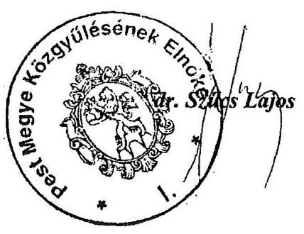

---

# Dr. Szücs Lajos úr 

elnök
Pest Megye Önkormányzata

## Budapest

## Tisztelt Elnök Úr!

Az Állami Számvevőszék Pest Megyei Önkormányzat pénzügyi helyzetének ellenőrzéséről készült jelentés-tervezethez küldött észrevételeit, kiegészítő információit köszönöm. A jelentést az önkormányzat pénzügyi helyzetének pontos megítélése érdekében az Ön által adott információkat felhasználva kiegészítettük.

Örömmel vettem tudomásul, hogy az ellenőrzésről szóló jelentést tárgyilagosnak és tényszerűnek ítélte.

Az észrevételében foglaltak ellenére fenn kell tartanunk a jelentésben megfogalmazott álláspontunkat a likvid hitel - jelentéskészítés idejében hatályos - törvényekben megállapított értelmezésében. Az Ötv. 88. § (4) bekezdése szerint kizárólag a likvid hitel - vagyis az Ötv. 88. § (3) bekezdés d) pontja alapján ,,az éven belül felvett és visszafizetett, a közszolgáltatási és államigazgatási feladatok folyamatos működtetéséhez felvett hitel" - nem esik az adósságot keletkeztető éves kötelezettségvállalások korlátozása alá. Az észrevételezett megállapításunkat a jelentés 15. és 49. oldalán ezért nem módosítottuk. Észrevételét és azzal kapcsolatos álláspontunkat a jelentés 49. oldalán megjelenítettük.

Álláspontunk a törzsvagyonba tartozó vagyon jelzálogjoggal történő megterhelésével kapcsolatosan is eltér az észrevételben szereplőtől. Az Ötv. 88. § (1) bekezdés b) pontjának rendelkezése szerint a hitelfelvétel fedezetéül a törzsvagyon tárgyai nem használhatók fel. A tiltás a törzsvagyon egészére vonatkozik, így ebbe bele kell érteni a korlátozottan forgalomképes vagyontárgyakat is. Bár az Ötv. 79.§ (2) bekezdés b) pontja alapján a helyi önkormányzat rendeletben rendelkezhet a törzsvagyon korlátozottan forgalomképes tárgyairól, ez nem jelenti azt, hogy nem kell figyelemmel lenni a jogforrási hierarchiára, amely szerint alacsonyabb szintű jogszabály magasabb szintű jogszabályba nem ütközhet. Az önkormányzati rendeletalkotásnál tehát figyelemmel kell lenni az Ötv. 88. § (1) bekezdés b) pontjára, amely alapján korlátozottan forgalomképes vagyontárgy - ami a törzsvagyon részét képezi - hitel fedezetéül nem szolgálhat. Az észrevételezett megállapításunkat a jelentésben ezért nem módosítottuk. Észrevételét és azzal kapcsolatos álláspontunkat a jelentés 50. oldalán megjelenítettük.

---

Az észrevétel 2. pontjában szereplő stilisztikai észrevételeit elfogadtuk és a jelentésben a szükséges javításokat elvégeztük.

Köszönöm Elnök úrnak és munkatársainak az ellenőrzés során
 tanúsított hozzáállását, amellyel a vizsgálatot végző számvevők munkáját segítették.

Budapest, 2011. december 19.
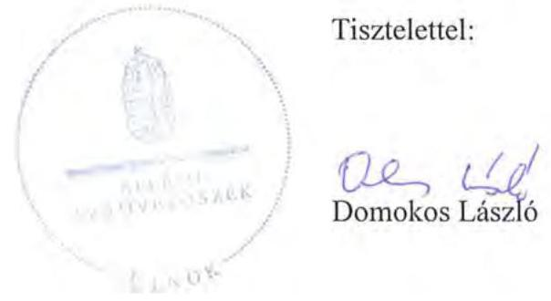

Melléklet: jelentés

---

.
