# ÁLLAMI   SZÁMVEVŐSZÉK 

## JELENTÉS

a Somogy Megyei Önkormányzat pénzügyi helyzetének ellenőrzéséről (43/2)

---

# Számvevői Iroda 

Iktatószám: V-3022-09/2011.
Témaszám: 1015
Vizsgálat-azonosító szám: V056014

## Az ellenőrzést felügyelte:

Dr. Varga Sándor
számvevő igazgató-helyettes

## Az ellenőrzést vezette:

## Renkó Zuzsa

számvevő tanácsos

## Az ellenőrzést végezték:

Dr. Ernst László
Számvevő tanácsos

## A témához kapcsolódó eddig készített számvevőszéki jelentések:

## címe

A helyi önkormányzatok gazdálkodási rendszerének 2009. évi ellenőrzése
sorszáma
0932

---

# TARTALOMJEGYZÉK 

BEVEZETÉS ..... 5
I. ÖSSZEGZŐ MEGÁLLAPÍTÁSOK, JAVASLATOK ..... 12
II. RÉSZLETES MEGÁLLAPÍTÁSOK ..... 17

1. Az Önkormányzat kötelező és önként vállalt feladatai ..... 17
2. Pénzügyi egyensúlyi helyzet alakulása ..... 20
2.1. A működési és felhalmozási egyensúly alakulása ..... 23
2.2. Az Önkormányzat bevételeinek alakulása ..... 27
2.3. Az Önkormányzat kiadásainak alakulása ..... 30
3. Kötelezettségek bemutatása ..... 34
3.1. A pénzintézetek felé fennálló kötelezettségek alakulása ..... 34
3.2. Szállítók felé fennálló kötelezettségek alakulása ..... 40
3.3. Egyéb kötelezettségek alakulása ..... 41
4. A pénzügyi egyensúly megteremtése érdekében hozott intézkedések ..... 43
5. A helyi önkormányzatok gazdálkodási rendszerének 2009. évi ellenőrzése során a pénzügyi egyensúly javítására tett szabályszerűségi és célszerűségi javaslatok hasznosulása ..... 49

---

# MELLÉKLETEK 

1. számú Működési és felhalmozási hiány/többlet az önkormányzat rendeleteiben melléklet
2. a. számú Az Önkormányzat CLF módszer szerint besorolt bevételei és kiadásai 2007-2010 között melléklet
3. b. számú Az önkormányzat bevételeinek és kiadásainak, adósságszolgálatának alakulása 2007-2010 között
4. számú Az Önkormányzat 2007-2010 években megvalósított, illetve 2010. december 31-én fennálló fejlesztési feladatokhoz kapcsolódó kötelezettségeinek összegzése
5. számú Somogy Megyei Közgyűlés elnökének észrevétele melléklet
6. számú Somogy Megyei Közgyűlés elnökének észrevételére adott válasz melléklet

---

# RÖVIDÍTÉSEK JEGYZÉKE 

## Törvények

Áht.
ÁSZ tv.

Htv.

Ötv.
Szórövidítések
APEH
ÁSZ
Balaton Kollégium
BM
CHF
Drávavölgye Középiskola
E.ON

EDP hiány/egyenleg

EU
GDP
Gyógypedagógiai Intézet Somogyvár
Hétszínvirág EGYMI
Hivatal
Iskola és Gyermekotthon Öreglak
KEOP
KIÉT
Kincstári szervezet
Kórház
Közgyűlés
KSH
MÉF
Nagyváthy Középiskola
Csurgó
NGM
OEP
OKF
Önkormányzat
az államháztartásról szóló 1992. évi XXXVIII. törvény
A 2011. június 30-ig hatályos Állami Számvevőszékről szóló 1989. évi XXXVIII. törvény (2011. július 1-től az Állami Számvevőszékről szóló 2011. évi LXVI. törvény)
a helyi önkormányzatok és szerveik, a köztársasági megbízottak, valamint egyes centrális alárendeltségű szervek feladat- és hatásköreiről szóló 1991. évi XX. törvény
a helyi önkormányzatokról szóló 1990. évi LXV. törvény
Adó- és Pénzügyi Ellenőrzési Hivatal (2011. január 1-jétől Nemzeti Adó- és Vámhivatal)
Állami Számvevőszék
Somogy Megyei Önkormányzat Dél-balatoni Kollégiuma
Belügyminisztérium
svájci frank
Somogyi TISZK Közép- és Szakiskola Dráva Völgye Középiskolája
E.ON Energiaszolgáltató Kft.

Uniós módszertan szerinti maastrichti kritériumoknak megfelelő számítás szerinti hiány/egyenleg
Európai Unió
Bruttó hazai össztermék
Somogy Megyei Óvoda, Általános Iskola, Speciális Szakiskola, Diákotthon és Gyermekotthon
Somogy Megyei Önkormányzat Hétszínvirág Egységes Gyógypedagógiai Módszertani Intézménye
Somogy Megyei Önkormányzat Hivatala
Somogy Megyei Óvoda, Általános Iskola, Speciális Szakiskola, Diákotthon és Gyermekotthon
Környezet és Energia Operatív Program
Költségvetési Intézmények Érdekegyeztető Tanácsa
Somogy Megyei Önkormányzat Kincstári Szervezete
Kaposi Mór Oktató Kórház
Somogy Megyei Önkormányzat Közgyűlése
Központi Statisztikai Hivatal
Megyei Érdekegyeztető Tanács
Somogyi TISZK Közép- és Szakiskola Nagyváthy János Középiskolája és Szakiskolája
Nemzetgazdasági Minisztérium
Országos Egészségbiztosítási Pénztár
Országos Katasztrófavédelmi Főigazgatóság
Somogy Megyei Önkormányzat

---

| PPP konstrukció | Public Private Partnership (Partnerségi együttműködés |
| :-- | :-- |
|  | közfeladatok ellátására a magánszektor bevonásával) |
| Rudnay Gyula Szakkö- | Somogyi TISZK Közép- és Szakiskola Rudnay Gyula Közép- |
| zépiskola | iskolája és Szakiskola |
| SNA | System of National Accounts (Nemzeti Számlák Rendsze- |
|  | re) |
| szja | Személyi jövedelemadó |
| SzMSz | Somogy Megyei Önkormányzat Szervezeti és Működési |
|  | Szabályzata |

---

# JELENTÉS 

## a Somogy Megyei Önkormányzat pénzügyi helyzetének ellenőrzéséről

## BEVEZETÉS

Az Állami Számvevőszék 2011. évtől érvényes stratégiája új irányt szabott a helyi önkormányzatok gazdálkodásának ellenőrzésében is. Az ÁSZ – küldetése és jövőképe szerint – szilárd szakmai alapokra támaszkodva értékteremtő ellenőrzéseivel és helyzetelemzéseivel az államháztartás egészében, így a helyi önkormányzati alrendszerben is elő kívánja segíteni a közpénzek és a közvagyon szabályos, gazdaságos, hatékony és eredményes hasznosítását. E folyamat részeként – a 2010. évi államháztartási hiány alakulásának összetevőire is figyelemmel – megkezdődött az önkormányzati alrendszer pénzügyi helyzetelemzése.

Az NGM 2011. áprilisában közzétett adatai szerint ${ }^{1}$ a 2010. évi 1036,2 milliárd Ft összegű, 3,8%-os EDP (maastrichti kritériumok szerinti, Túlzott Hiány Eljárás keretében kimutatott) hiánycél nem volt tartható, az önkormányzati alrendszer tervezettet meghaladó hiánya miatt a GDP arányában kifejezett államháztartási hiány 4,2%-ra emelkedett.

Az önkormányzatok költségvetési jelentése szerint 2010. első három negyedév végén az önkormányzati alrendszer pénzforgalmi hiánya 97 milliárd Ft volt, a tervezett éves mérték 51%-át érte el. Bár az elmúlt években kiugróan magas hiány halmozódott fel az utolsó negyedévben, a 97 milliárd Ft-os szeptember végi hiány nem indokolta az önkormányzati alrendszer 190 milliárd Ft-ra becsült éves hiányának felülvizsgálatát. A tervezett hiány túllépése, az utolsó negyedévi 150 milliárd Ft-os pénzforgalmi hiány nem volt reálisan feltételezhető. A helyi önkormányzatok januári gyorsjelentése szerint a pénzforgalmi hiány 247,7 milliárd Ft-ot tett ki. A tervezettnél nagyobb önkormányzati pénzforgalmi hiány kialakulásában – az NGM által az éves költségvetési beszámoló elkészítéséhez kiadott tájékoztató szerint – az iparűzési adó elmaradása, a gépjárműadó, az illetékek és más bevételek tervezettnél alacsonyabb összegben teljesülése volt a meghatározó.

[^0]
[^0]:    ${ }^{1}$ NGM Tájékoztatás Magyarország Strukturális Reformprogramjának végrehajtásáról (2011. április 1). A Tájékoztató évente két alkalommal – április és október hónapban – jelenik meg.

---

A megyei önkormányzatok kötelező feladatellátását többlépcsős törvényi előírások határozzák meg. A feladatokra vonatkozó szabályozás első szintjét az Ötv. ${ }^{2}$, a második szintet a hatásköri ${ }^{3}$, a harmadik szintet a további ágazati, szakmai törvények (egyebek mellett az oktatási, egészségügyi, szociális) adják.

A megyei önkormányzatok a feladatellátás és a központi forráselosztás tekintetében sajátos helyet foglalnak el a helyi önkormányzati rendszerben. A megyei önkormányzat kötelező feladatainak egy része – így a megyében lévő természeti és társadalmi muzeális emlékek, a történeti iratok gyűjtése, őrzése, tudományos feldolgozása, a megyei könyvtári szolgáltatás, a pedagógiai és közművelődési szakmai tanácsadás és szolgáltatás, a megyei testnevelési és sportszervezési feladatellátás, a gyermek- és ifjúsági jogok érvényesítése, a gyermekvédelmi- és szociális szakellátás – az Ötv-ből közvetlenül levezethető kötelezettség.

A középiskolai, szakiskolai, és kollégiumi ellátás, a fogyatékos gyermekek oktatása, nevelése, gondozása az ágazati törvény szerint a megyei önkormányzat kötelező feladata. Azonban, ha a települési önkormányzat lát el ilyen feladatot, és arról lemond, a megyei önkormányzatnak a feladatot át kell vennie. Így a megyei önkormányzatok által ellátandó kötelező közszolgáltatások ellátásának mértékére a települési önkormányzatok döntései jelentősen kihatnak.

Az alapellátást meghaladó egészségügyi szakellátás biztosítása akkor képezi a megyei önkormányzat feladatát, ha az önkormányzati vagyon kialakításáról szóló törvényben ${ }^{4}$ a feladat ellátásához szükséges vagyont az önkormányzat a tulajdonába kapta.

Az önként vállalt feladat ellátására – mivel annak vállalása a kötelező feladatok ellátását nem veszélyeztetheti – a kötelező közszolgáltatások mértékének alakulása lényegi hatással van.

A feladat és hatáskör telepítés sajátosságai mellett a megyei önkormányzatok kialakított forrásszerkezete, a központi költségvetéstől való erőteljes függősége is determinálja az önkormányzatok feladatellátásra vonatkozó döntéseit.

A 2007-2010. években az önkormányzati feladatok ellátásának keretet biztosító forrásszabályozás – ennek részeként az illetékbevételből és a személyi jövedelemadóból való részesedés szabályai – a megyei önkormányzatok vonatkozásában nem változtak:

- A megyei önkormányzatok saját bevételein belül az illetékbevételek döntően az ingatlanpiac stagnálása, majd visszaesése, és egyes illetékkedvezmények bevezetése következtében – megyénként differenciált mértékben ugyan, de – 2010-re általánosan visszaestek. A 2010. évben befolyt

[^0]
[^0]:    ${ }^{2}$ Ötv. 69-70. §-ai
    ${ }^{3}$ a Htv.
    ${ }^{4}$ Az egyes állami tulajdonban lévő vagyontárgyak önkormányzatok tulajdonba adásáról szóló 1991. évi XXXIII. törvény

---

39,2 milliárd Ft illetékbevétel a 2006. évben realizált 71,1 milliárd Ft illetékbevétel alig több mint 55%-a volt. A kieső bevételek pótlására az önkormányzati alrendszer szintjén történtek intézkedések, 2010-ben 5 milliárd Ft-ot, 2011-ben 1,2 milliárd Ft-ot ellentételezett a központi költségvetés. Az illetékbevételt a megyei önkormányzatok a saját folyó bevételeik között számolják el ${ }^{5}$.

Az illetékek kivetésének és beszedésének joga 2006. december 31-ig a megyei önkormányzatok feladata volt. A 2007. évtől a megyei illetékhivatalok illetékbeszedési feladatait az APEH vette át ${ }^{6}$. Az önkormányzati illetékrészesedési szabályok változatlanok maradtak, azonban az illetékbeszedés költségeit az önkormányzatok illetékbevételeiből átlagos (a Fővárosnál 4,0%-os, a megyei és megyei jogú városi önkormányzatnál 8,5%-os) kulcsot alkalmazva vonták le. E döntés következtében azon megyei önkormányzatok, amelyek a 8,5%-os költségnél kedvezőbb költségszint mellett látták el korábban ezt a feladatot, kedvezőtlenebb helyzetbe kerültek.

- Az önkormányzati alrendszer személyi jövedelemadóból való részesedésének makroszintű szabályozása nem változott 2007-2010 között${ }^{7}$. A helyi önkormányzatokat normatív módon megillető 32%-os részesedés visszaosztásának részletszabályai azonban a megyei önkormányzatok számára – a reálgazdaság kedvezőtlen irányú folyamatai, és az államháztartás egyensúlyi helyzetére tekintettel elrendelt kormányzati intézkedések miatt – megszorító intézkedéseket jelentettek. Összesen 17 milliárd Ft – 2007-ben 10 milliárd Ft, 2010-ben további 7 milliárd Ft – szja-t vontak ki a megyei önkormányzatok gazdálkodási köréből ${ }^{8}$. Az átengedett személyi jövedelemadó a megyei önkormányzatok egyik bevétele.

A megyei önkormányzatok 2007-2010 között rendelkezésre álló forrásait az alábbiakban mutatjuk be:

[^0]
[^0]:    ${ }^{5}$ A megyei önkormányzatok illetékbevételei az önkormányzati alrendszer saját folyó bevételeiből 2007-ben 35,9 milliárd Ft-ot (61,4%-ot), 2008-ban 41,5 milliárd Ft-ot (61,7%-ot), 2009-ben 36,5 milliárd Ft-ot (62,5%-ot), 2010-ben 25,1 milliárd Ft-ot (64,1%-ot) tettek ki.
    ${ }^{6}$ Az egyes pénzügyi tárgyú törvények módosításáról szóló 2006. évi LXI. törvény 115. §a, amely az adózás rendjéről szóló 2003. évi XCII. törvény 73. §-át módosította.
    ${ }^{7}$ A megyei önkormányzatok személyi jövedelemadó részesedése az önkormányzati alrendszer átengedett bevételeiből 2007-ben 34,7 milliárd Ft-ot (7,0%-ot), 2008-ban 51,2 milliárd Ft-ot (9,2%-ot), 2009-ben 59,2 milliárd Ft-ot (9,3%-ot), 2010-ben 56,3 milliárd Ft-ot (8,3%-ot) tett ki.
    ${ }^{8}$ A megyei önkormányzatok szja kiegészítése háromelemű. A tételes, minden megyére egységesen meghatározott összeg – az adott évek költségvetési törvényeinek 4. sz. mellékletében meghatározottak szerint – 2006-ban 593 millió Ft, 2007-ben és 2008-ban egyaránt 355 millió Ft, 2009-ben 370 millió Ft volt. A megye népességszáma után járó kiegészítés a 2006. évi 208 Ft/fő összegről 2010-re 120 Ft/fő-re, a megyei intézmények ellátottjai után járó kiegészítés 42236 Ft/ellátottról 20755 Ft/ellátottra csökkent.

---

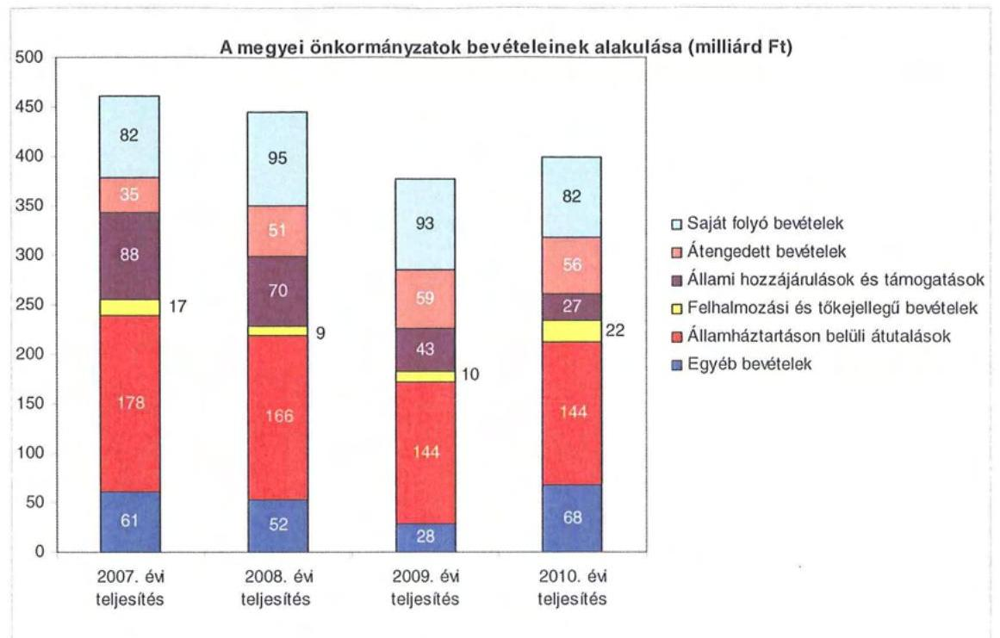

A megyei önkormányzatok saját folyó bevételeinek részaránya – amelyek főbb elemei: az intézményi térítési díjak, az illetékbevétel, a kamatbevételek – a 2007. évi összbevételen (461 milliárd Ft) belül 17,9% volt, amely 2010-re annak ellenére 20,6%-ra nőtt, hogy az összege 82 milliárd Ft maradt. Ennek oka az volt, hogy az összbevétel a 2007. évi 461 milliárd Ft-ról 2010-re 399 milliárd Ft-ra csökkent.

Az átengedett bevételek, amelyek a megyei önkormányzatoknál a személyi jövedelemadóból való részesedést jelentették, az összbevételen belül a 2007. évi 35 milliárd Ft-ról 56 milliárd Ft-ra nőttek.

Az állami
 hozzájárulások és támogatások - amelyek főbb elemei: az ellátotti létszámhoz kötődő normatív állami hozzájárulások, központosított, fejezeti szinten kezelt célelőirányzatból juttatott működési és fejlesztési támogatások a 2007. évi 88 milliárd Ft-ról (19,1%-os részarányról) 2010-re 27 milliárd Ft-ra (6,8%-os részarányra) estek vissza.

A felhalmozási és tőkejellegű bevételek - tárgyi eszközök (ingatlanok és ingóságok), föld és immateriális javak, részesedések értékesítése, EU-tól átvett pénzeszközök - a 2007. évi 17 milliárd Ft-ról (3,6%-os részarányról) 2010-re 22 milliárd Ft-ra (5,4%-ra) emelkedtek.

Az államháztartáson belüli átutalások részesedése 2007-ben 178 milliárd Ft volt. 2010. év végére 34 milliárd Ft-tal csökkent, részaránya 38,6%-ról 2,6 százalékpontos csökkenés után 2010-ben 36%-ra változott. Ez a bevételi kategória tartalmazza az egészségbiztosítási és egyéb elkülönített állami pénzalapoktól átvett forrásokat. A 2010-ben e címen elszámolt bevétel 144 milliárd Ft volt.

---

A megyei önkormányzatok központi költségvetésből származó bevételeinek összege 2007-ben 400 milliárd Ft volt, amely 2010. évre 331 milliárd Ft-ra (az időszak alatt összesen 69 milliárd Ft-tal) 17,3%-kal csökkent.

Az egyéb, pénzmaradványból, vállalkozási bevételekből, államháztartáson kívülről származó átutalásokból, a hitelekből, a hosszú és rövid lejáratú értékpapírok értékesítéséből származó bevételek részesedése a 2007-2010. évek viszonylatában 13,3%-ról 17,1%-ra emelkedett. Ez utóbbiak 2010. évi beszámoló szerinti összevont teljesítése 68 milliárd Ft volt ${ }^{9}$.

Mindezeket figyelembe véve 2007 és 2010-ben a megyei önkormányzatok forrásösszetételének megoszlását az alábbi ábra szemlélteti:
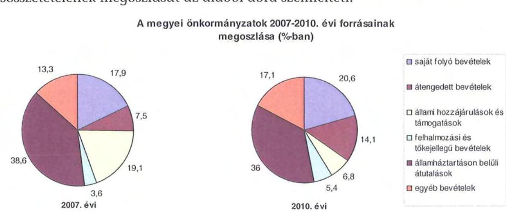

Annak ellenére, hogy a megyei önkormányzatok kötelezően ellátandó feladataikat 2007-hez képest kevesebb intézményben, csökkenő foglalkoztatotti létszám mellett végezték ${ }^{10}$, a jelentős bevételkiesést a - szervezési intézkedések hatására - csökkenő ráfordítások nem tudták kompenzálni. Az ellátottak száma a szociális, gyermekvédelmi ágazat bentlakásos elhelyezést nyújtó intézményeit kivéve - eltérő mértékben ugyan, de minden ágazatban évről évre csökkent, amely a fajlagos hozzájárulások csökkenésével együtt a normatív állami hozzájárulás arányának visszaeséséhez vezetett.

A 2007-2013-as időszakra meghirdetett, vissza nem térítendő EU-s fejlesztési forrásokhoz való hozzájutás lehetősége felerősítette az önkormányzati alrendszer fejlesztési igényeit. A fokozott fejlesztési tevékenység a felhalmozási bevételek és kiadások egyensúlyának megbomlásán ${ }^{11}$ túl a jelentkező jövőbeni fenn-

[^0]
[^0]:    ${ }^{9}$ Az egyéb bevételek összege 2007-2010 között eltérő módon változott, 2007-ben 61 milliárd Ft volt, 2008-ban 52 milliárd Ft-ra, 2009-ben 28 milliárd Ft-ra esett vissza, majd 2010-ben ismét - 68 milliárd Ft-ra - emelkedett.
    ${ }^{10}$ a BM által 2010 decemberében elvégzett felmérés adatai szerint
    ${ }^{11}$ Az önkormányzati alrendszerben - az éves zárszámadási törvényjavaslatok általános indokolása, X. Helyi önkormányzatok gazdálkodása fejezet szerint - a felhalmozási bevételek és kiadások egyenlege 2007-ben 142,4 milliárd Ft, 2008-ban 112,3 milliárd Ft, 2009-ben 234,5 milliárd Ft hiányt mutatott.

---

tartási kötelezettség miatt tovább terhelhetik az önkormányzatok költségvetését.

A megyei önkormányzatok felhalmozási és működési célú pénzintézeti és szállítói kötelezettségeinek állománya a vizsgált időszakban erőteljesen növekedett.

A hosszú lejáratú kötelezettségek alakulását a következő ábra szemlélteti:
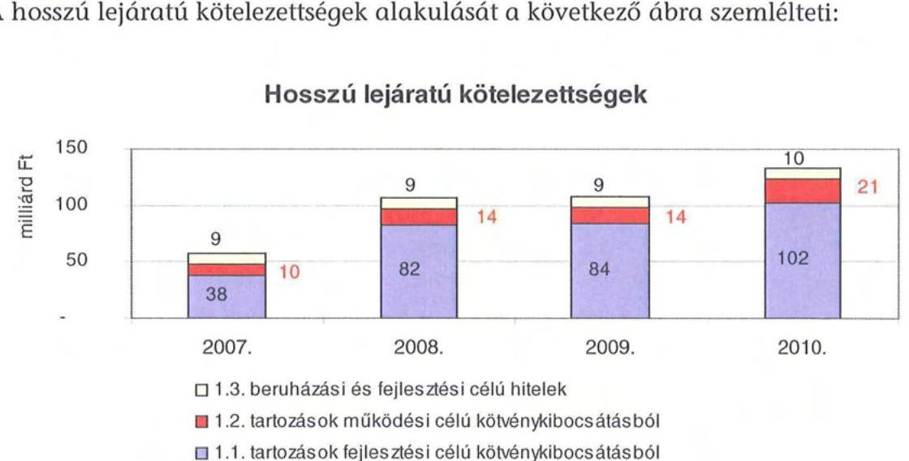

A hosszú lejáratú kötelezettségek mellett az időszakban a 2007. évi 22 milliárd Ft-ról 24 milliárd Ft-ra (8,8%-kal) növekedett az áruszállításból származó szállítói kötelezettségek állománya.

A mérlegben kimutatott kötelezettségek állománya mellett az elhasználódott eszközök pótlására forrást biztosító amortizációs (felújítási) alap képzésének ${ }^{12}$ elmaradása további problémákat vetít előre. A megyei önkormányzatok beszámolójelentéseinek összegzése szerint 2007-ben még az elszámolt értékcsökkenés 90%-ának megfelelő összeget fordítottak felújítási célokra, 2009-ben ez az arányszám már csak 16,5% volt. Ez maga után vonta a feladatellátást kiszolgáló tárgyi eszközök állagának erőteljes romlását.

Az ÁSZ a 2011. évi ellenőrzési tervében a 43. számú, az „Önkormányzatok gazdálkodási rendszerének ellenőrzése" részeként egy időben, egymással párhuzamosan tekinti át és elemzi az önkormányzati alrendszer középszintjét jelentő 19 megyei önkormányzat pénzügyi helyzetét. A gazdálkodás szabályszerűségét az ÁSZ előző évek során ellenőrizte a megyei önkormányzatoknál is, ezért jelen vizsgálatunk erre nem tér ki.

A jelentés a megyei önkormányzatok sajátos feladatellátási és forrásszabályozási helyzetére tekintettel a megyei önkormányzatok pénzügyi helyzetét, illetve az ezzel összefüggő korábbi ÁSZ javaslatok megvalósítását mutatja be.

[^0]
[^0]:    ${ }^{12}$ Erre a jelenlegi szabályozási környezetben nem kötelezi semmilyen előírás az önkormányzatokat.

---

Az ellenőrzés a 2007. január 1. - 2011. március 31. közötti időszakot ölelte fel.
A vizsgálat jogszabályi alapját 2011. július 1-je előtt az Állami Számvevőszékről szóló 1989. évi XXXVIII. törvény 2. § (3), (5), (6) és (9) bekezdéseiben, az Ötv. 92. § (1) bekezdésében és az Áht. 104. § (3) bekezdésében, 2011. július 1-jét követően az Állami Számvevőszékről szóló 2011. évi LXVI. törvény 1. § (3) bekezdésében, az 5. § (2)-(6) bekezdéseiben és az Áht. 120/A. § (1) bekezdésében foglalt előírások képezték.

Somogy megye országos és régión belül elfoglalt helyzetét 2010. december 31-én az alábbi mutatók szemléltetik (a megyei jogú várossal együtt):

Index: az előző év azonos időszak (időpontja)=100,0

| Mutató megnevezése | Somogy   megye | Dél-   dunántúli   régió | Országos |
| :-- | :--: | :--: | --: |
| Népesség száma (ezer fő)* | 318 | 940 | 9986 |
| Népesség változás indexe (\%) | 99,2 | 99,2 | 99,7 |
| Az ipari termelés volumenindexe (\%) | 132,2 | 113,6 | 110,7 |
| Egy lakosra jutó ipari termelési érték (ezer Ft) | 1480,0 | 1101,0 | 2044,4 |
| Ezer lakosra jutó vállalkozások száma (db) | 171 | 156 | 165 |
| A beruházások egy lakosra vetített teljesít- | 364,3 | 270,1 | 304,7 |
| ményértéke (millió Ft) | 44,4 | 46,8 | 49,5 |
| Foglalkoztatási arány (\%) | 14,2 | 12,3 | 10,8 |
| Munkanélküliségi ráta (\%) | 109423 | 114855 | 132628 |
| Alkalmazásban állók havi nettó átlagkerese- | 106,7 | 107,0 | 106,9 |
| te (Ft) |  |  |  |

*Ebből Kaposvár megyei jogú város népessége 67000 fő
A táblázatban feltüntetett adatok azt jelzik, hogy a gazdaság helyzetét reprezentáló egyes mutatók - az ipari termelés volumenindexe, az ezer lakosra jutó vállalkozások - tekintetében meghaladja az országos jellemzőket, és a Déldunántúli régión belül elfoglalt helyzete is kedvező képet mutat. Ugyanakkor kedvezőtlen, hogy a megye munkanélküliségi rátája magasabb, az alkalmazásban állók havi nettó átlagkeresete pedig alacsonyabb, mind a régiós, mind pedig az országos értéknél.

A megyében 245 települési - egy megyei jogú városi, 15 városi, két nagyközségi, 227 községi - önkormányzat működött.

---

# I. ÖSSZEGZŐ MEGÁLLAPÍTÁSOK, JAVASLATOK 

A Somogy Megyei Önkormányzat 2010-ben 25463 millió Ft összes költségvetési kiadásából 99,4%-ot kötelező feladatai ellátására fordított. Az Önkormányzat adatszolgáltatása szerint önként vállalt feladatai az SzMSz-ben meghatározottaknak megfelelően, kiemelten a gazdasági, kulturális, szociális, sport és szabadidős tevékenységhez, településközi és nemzetközi kapcsolatok kialakításához, valamint fenntartásához, az egyes idegenforgalmi, turisztikai, kommunikációs szolgáltatások szervezéséhez kapcsolódtak, valamint támogatást nyújtott civil szervezetek, alapítványok működéséhez, összesen 153 millió Ft összegben. Az SzMSz a kötelező közszolgáltatási, és az önként vállalt feladatok körét az Ötv. és az ágazati törvények figyelembevételével tartalmazta.

Az Önkormányzat kötelező és önként vállalt feladatait 2010. december 31-én 28 költségvetési szervvel és két többségi tulajdonú gazdasági társasággal, 75 telephelyen látta el. Az intézmények száma 2007. és 2010. között 16-tal csökkent, amelyet a közoktatási és szociális intézmények összevonása, valamint egy egészségügyi intézmény átvétele, egy közoktatási intézmény átadása eredményezett. A költségvetési intézményként működő Kórház mellett 12 intézmény szociális és gyermekvédelmi feladatokat, kilenc intézmény közoktatási feladatot, három intézmény közművelődési és közgyűjteményi feladatot, három igazgatási és egyéb feladatot lát el. Az Önkormányzatnak két többségi részesedésű gazdasági társasága van, amelyeket önként vállalt feladatok ellátására, médiaszolgáltatások nyújtására alapítottak.

A vizsgált időszakban az Önkormányzat - a pénzügyi helyzet elemzéséhez alkalmazott CLF módszer szerint - folyó költségvetési egyenlegét tekintve forráshiányos volt. A folyó költségvetés hiánya 2007-ben a folyó kiadások 7,3%-át, 2008-ban 0,2%-át, 2009-ben 4,7%-át, 2010-ben 11,3%-át jelentette. A működési forráshiány finanszírozása működési céllal kibocsátott kötvényből történt. Az Önkormányzat CLF módszer szerinti 2008. és 2010. nettó működési forráshiányának értékelésénél figyelembe kell venni, hogy az Önkormányzat 2008. évben tőketörlesztés címén 8000 millió Ft-ot, a 2010. évben pedig 6700 millió Ft-ot fordított korábbi kötvényei refinanszírozására. A 2007-2009. években az Önkormányzat felhalmozási költségvetésének egyenlege negatív (37,3%, 44,0%, 83,3%) 2010. évben pozitív összegű (30,2%) volt. A fejlesztési forráshiányt kötvénykibocsátással finanszírozták. Az Önkormányzat évenkénti teljes finanszírozási hiánya a CLF módszer szerint 2007-ben 2053 millió Ft, 2008-ban 8909 millió Ft, 2009-ben 2277 millió Ft, 2010-ben 11071 millió Ft volt.

A CLF módszer szerinti működési forráshiány kialakulásában leginkább az játszott szerepet, hogy az Önkormányzat legfőbb bevételi forrásai - a jogszabályi kedvezmények bővülése, és az ingatlanforgalom visszaesése következményeként az illetékbevétel, valamint a központi forráskivonás hatására az átengedett szja és az állami támogatások - jelentősen csökkentek. Az illetékbevétel 2010-re a 2006. évi 2287 millió Ft-ról 57,7%-ára, 1319 millió Ft-ra csökkent. Az átengedett szja és az állami támogatások együttes összege a központi támogatás csökkentésén túl a feladat átadás-átvétel hatását is figyelembe véve kevesebb lett, 2010-ben 5056 millió Ft volt, amely a 2007. évi 77,0%-a. Az OEP-től származó bevétel 2007-ben 8420 millió Ft, 2010-ben 9484 millió Ft volt. Az egyéb saját bevételek jelentős, 2065 millió Ft-os emelkedése sem tudta ellensúlyozni a kieső forrásokat. A 2010. évben az intézményi működési bevételek 1782 millió Ft-tal haladták meg a 2007. évi ténylegest a térítési díjak emelése miatt.

Az átengedett szja és az állami támogatások együttes összege a 2008. évi 2,1%-os (140 millió Ft) növekedést követően a központi forráskivonás hatására 2009-ben a 2008. évihez képest 10,9%-kal (727 millió Ft-tal), 2010-ben az előző évihez viszonyítva további 15,4%-kal (922 millió Ft) kapott kevesebb forrást az Önkormányzat az államtól ezeken a jogcímeken.

A működési kiadások 2007-ről 2010-re 9,3%-kal, 2004 millió Ft-tal nőttek. Az Önkormányzat a Kórház működéséhez 1298 millió Ft, fejlesztéséhez 340 millió Ft kiadást teljesített 2007-2010 között.

Az intézmények teljesített működési kiadásai a Kórház nélkül 2007-ben 12150 millió Ft-ot tettek ki (az összes működési kiadás 56,4%-át), amely 2010-re 12547 millió Ft-ra növekedett (az összes működési kiadás 53,2%-ára).

A működési és felhalmozási kiadásokon belül 2007-2010 között a felhalmozási kiadások súlya 1129 millió Ft-ról (5,0%-ról) 1900 millió Ft-ra (7,5%-ra) nőtt. Az aktív pályázati tevékenység eredményeként 2007-2010. között 11482 millió Ft bekerülési költségű beruházást folytatott, illetve indított el az Önkormányzat, amelyből 7565 millió Ft a 2010 utánra vállalt kötelezettség. Az utóbbi forrásai a következők: 1013 millió Ft 2011-re tervezett kötvénykibocsátásból származó forrás egy része, 6543 millió Ft elnyert EU-s támogatás, 8 millió Ft elnyert hazai támogatás. A 2010. év utánra vállalt kötelezettségből
 6500 millió Ft a Kórház fejlesztéseit finanszírozza.

Az Önkormányzat pénzintézeti kötelezettségeinek állománya a könyvviteli mérlegadatok szerint 2006. december 31-ről 2010. december 31-re 1338 millió Ft-ról 11386 millió Ft-ra nőtt. A vizsgált időszakban adósságszolgálatra az Önkormányzat 21193 millió Ft-ot teljesített ${ }^{13}$, amelyből a kamatkiadás 1775 millió Ft volt. A kötvényből származó források befektetéséből realizált kamatbevétel 640 millió Ft volt.

Az Önkormányzat likviditása érdekében 2010. évben az év 90 napján vett igénybe folyószámlahitelt, melynek átlagos napi állománya 8 millió Ft volt. A munkabér megelőlegezési hitel átlagos napi állománya 8 millió Ft volt.

Az Önkormányzat 2010. év végi pénzintézeti kötelezettségéből 806 millió Ft (7,1%) fejlesztési célú kötvények kibocsátásából, 2828 millió Ft (24,8%) működési célú kötvények kibocsátásából, korábban kibocsátott kötvények visszavásárlására szolgáló kötvénykibocsátásból 7733 millió Ft (67,9%), 19 millió Ft

[^0]
[^0]:    ${ }^{13}$ Az adósságszolgálat összegéből 14700 millió Ft volt a kötvények refinanszírozására teljesített kiadás.

---

(0,2%) fejlesztési célú hosszúlejáratú hitelek felvételéből keletkezett. Ezek miatt az Önkormányzatnak a 2011-2013. években 13,5 millió Ft tőke- és kamattörlesztést és 1679922 EUR tőke, valamint 4721065 EUR kamatot, továbbá 172 millió Ft egyéb költséget kell teljesítenie. Az Önkormányzat 2010. év végi szállítói tartozása 2333 millió Ft (ebből lejárt tartozás 844 millió Ft). A 2011-2013. évi összes (pénzintézeti és szállítói) kötelezettség teljesítésére figyelembe vehető 4640 millió Ft becsült értékű jelzáloggal nem terhelt forgalomképes ingatlanvagyon és a 2010. december 31-i mérlegben kimutatott 324 millió Ft követelésállomány, amely fedezetet nyújthat a tartozásállomány rendezésére.

A 2014. évi és a további évekre szóló jelenleg ismert pénzintézeti kötelezettségek a következők: 78 millió Ft és 47499071 EUR. Ezekre nem rendelkezik az Önkormányzat számszerűsíthető forrásokkal.

Az Önkormányzat pénzintézeti kötelezettségvállalásaira minden esetben közgyűlési döntés alapján került sor. A költségvetési rendelet mellékletében bemutatásra kerültek a lejáratig fizetendő tőketörlesztés és kamatok összegei, az előterjesztések azonban nem tartalmazták a törlesztések forrásainak bemutatását. Az adósságot keletkeztető kötelezettségvállalások teljesítésének az Önkormányzat csak újabb kötvények kibocsátásával tudott eleget tenni. Az Önkormányzat számlavezetését, valamint a likviditási- és munkabér megelőlegezési hitelt folyósítását, és a kötvény kibocsátását ugyanazon pénzintézet végezte.

Az Önkormányzat nem vizsgálta azt, hogy az elhasználódott eszközök pótlása milyen kötelezettséget jelent a számára. A 2007-2010. években a tárgyi eszközök után 3037 millió Ft értékcsökkenést számolt el, fejlesztési kiadásra 2518 millió Ft-ot, ebből felújításra 400 millió Ft-ot fordított.

A végrehajtott kiadáscsökkentő intézkedések, a feladatellátás szakmai színvonalának növelése mellett, a takarékos szemléletű gazdálkodást, a működőképesség megőrzését, a pénzügyi helyzet javítását célozták. Az intézményátszervezések, a feladatváltozások, valamint a takarékossági intézkedések hatásaként a 2007-2010. években - az Önkormányzat kimutatása szerint - együttesen 2372 millió Ft kiadás megtakarítás keletkezett, amelyből 1337 millió Ft (56,4%-a) a kapcsolódó álláshely-csökkenések következtében jelentkezett.

A létszámcsökkentő intézkedések következtében 2007-2010. között a Hivatalnál és az intézményeknél összesen 572 álláshelyet szüntettek meg, amelyből 248 (43,4%-a) ágazati-szakmai, 324 (56,6%-a) intézményüzemeltetéshez, fenntartáshoz, gazdasági ügyek intézéséhez kapcsolódó álláshely volt.

A kiadáscsökkentő intézkedések mellett az Önkormányzat bevételnövelő intézkedéseket tett, amelynek számszerűsített összege a nyilvántartások szerint 2007-2010. években 1671 millió Ft volt. Szabad intézményi kapacitások hasznosításából 193 millió Ft (11,6%), hivatali és intézményi ingatlanok, eszközök bérbeadásából 692 millió Ft (41,4%), valamint az átmenetileg szabad pénzeszközök lekötése, befektetése által 785 millió Ft (47,0%) bevétel keletkezett az Önkormányzatnál.

---

Az utóellenőrzés a helyi önkormányzatok gazdálkodási rendszerének 2009. évi ellenőrzése során a pénzügyi egyensúly javítására az ÁSZ jelentésében tett két szabályszerűségi javaslatra terjedt ki, amelyeket hasznosítottak.

Az Önkormányzat pénzügyi helyzetét összegezve a következők emelhetők ki:

Az Önkormányzatnál évente a központi intézkedések hatására jelentkező bevételi kiesést a kiadáscsökkentő és bevételnövelő intézkedéseivel nem tudta teljesen ellentételezni. A Közgyűlés 2007-től egy intézmény átadásáról, illetve egy intézmény átvételéről döntött. A döntések nem befolyásolták a működés biztonságát. A 2010. évet követő beruházások finanszírozhatóságát veszélyezteti a saját források tervezhetetlensége, az EU-s források előfinanszírozásának többletköltsége, valamint a támogatásból megvalósuló fejlesztések volumenéből és esetleges előírt feltételeknek nem megfelelő teljesítéséből adódó kockázatok.

Az Önkormányzat működési célú kiadásainak finanszírozása folyamatos feszültséget okozott, mivel csak folyószámla- és munkabérhitel igénybevételével, továbbá kötvényforrás, illetve a kötvényforrások befektetéséből származó kamatbevétel felhasználásával tudta a működést biztosítani. Az Önkormányzat hosszú távú pénzintézeti kötelezettségei emelkedtek, azok finanszírozása már a következő három évben a rendelkezésre álló, főként ingatlanfedezet ismeretében bizonytalan. A további évekre szóló hosszú távú kötelezettségekre az Önkormányzat adatai alapján a finanszírozás forrásai bizonytalanok.

A Közgyűlés elnöke tájékoztatásában a helyszíni ellenőrzést követően a likviditási gondok kezelésére szolgáló tervezett intézkedések között ingatlan értékesítésről, hitel megállapodásról, villanyáram szabadpiaci beszerzéséből eredő megtakarításról és az ÖNHIKI pályázat benyújtásáról ad tájékoztatást különösebb konkrétumok nélkül.

A feladatok és források közötti egyensúly megteremtésére irányuló központi döntések, a megyei önkormányzatok konszolidációjára, az intézmények átvételére vonatkozó törvényjavaslat elfogadása új feltételeket teremtett. Az Önkormányzat gazdálkodását veszélyeztető pénzügyi kockázatok, a pénzügyi egyensúly rövid- és hosszú távú fenntarthatósága azonnali intézkedéseket igényel.

Az Állami Számvevőszékről szóló 2011. évi LXVI. törvény 33. § (1) bekezdésében foglaltak értelmében a jelentésben foglalt megállapításokhoz kapcsolódó intézkedési tervet köteles az ellenőrzött szervezet vezetője összeállítani és azt a jelentés kézhezvételétől számított harminc napon belül az ÁSZ részére megküldeni. Amennyiben az intézkedési tervet határidőben nem küldi meg a szervezet, vagy az továbbra sem elfogadható, az ÁSZ elnöke a hivatkozott törvény 33. § (3) bekezdés a)-b) pontjaiban foglaltakat érvényesítheti.

---

A 2011. májusában lezárult helyszíni ellenőrzés tapasztalatai alapján - figyelembe véve az Önkormányzat észrevételeit és a saját hatáskörben tett intézkedéseit - az alábbi javaslatokat tette az ÁSZ:

# a Közgyűlés elnökének: 

1. tájékoztassa a Közgyűlést rendszeresen az intézkedési terv megvalósításáról, annak eredményeiről. A pénzügyi egyensúlyt befolyásoló feltételek romlása esetén tegyen javaslatot az intézkedési terv módosítására;
2. gondoskodjon róla, hogy a jövőben az adósságot keletkeztető kötelezettségvállalásokról szóló közgyűlési döntéseket megalapozó előterjesztések tartalmazzák a kötelezettségvállalás visszafizetésének forrásait, a várható kamat-, egyéb költség és tőkefizetési kötelezettségeit, legalább 3 évi kitekintéssel a várható kamat és árfolyamkockázatok bemutatását, és kezelésének lehetőségeit;
3. gondoskodjon a fennálló lejárt szállítói tartozás okainak feltárásáról, szerkezetének bemutatásáról - beleértve az intézményeknél lejárt szállítói állomány értékét és napra számított arányát -, a szükséges intézkedések megtételéről, indokolt esetben a szállítókkal a lejárt tartozások mielőbbi rendezéséről a kockázatok minimalizálása érdekében;
4. gondoskodjon a pénzintézeti kötelezettségek finanszírozási lehetőségeinek számbavételéről, és arra források biztosításáról;
5. mutassa be a Közgyűlésnek az éves költségvetési előterjesztésekben az értékcsökkenési leírás összegét, és ezzel arányban az elhasználódott eszközök pótlásának forrásigényét és lehetőségét.

---

# II. RÉSZLETES MEGÁLLAPÍTÁSOK 

## 1. Az ÖNKORMÁNYZAT KÖTELEZŐ ÉS ÖNKÉNT VÁLLALT FELADATAI

Az Önkormányzat 2010. évi zárszámadási rendelete alapján költségvetési kiadásainak 99,4%-át, 25310 millió Ft-ot a kötelező feladatok ellátására fordította. Az önként vállalt feladatok részesedése 0,6% volt, amely 153 millió Ft költségvetési kiadást jelentett. A 2011. évi tervadatok alapján az önként vállalt feladatokra az összes költségvetési kiadás 0,4%-a jut, amely 0,2 százalékponttal kevesebb az előző évhez képest. Az Önkormányzat önként vállalt feladatai a gazdasági, kulturális, szociális, sport és szabadidős tevékenységhez, településközi és nemzetközi kapcsolatok kialakításához, valamint fenntartásához, idegenforgalmi, turisztikai, kommunikációs szolgáltatások szervezéséhez kapcsolódnak, valamint az Önkormányzat támogatást nyújt civil szervezetek, alapítványok működéséhez.

Az Önkormányzat kötelező és önként vállalt feladatainak körét az SzMSz-ben rögzítette. Kötelező feladatait az Ötv. és az ágazati törvények figyelembevételével állapította meg, míg az önként vállalt feladatok terjedelmét az éves költségvetési rendeletei szerint, anyagi lehetőségei függvényében határozta meg.

Az Önkormányzat éves költségvetési kiadásainak szerkezetét tekintve 2010-ben a járulékokkal növelt személyi juttatások és dologi kiadások 22282 millió Ft-os összegén belül meghatározó arányt ${ }^{14}$ - 11472 millió Ft-ot, 51,5%-ot - a Kórháznál elszámolt kiadások jelentették. A szociális és gyermekvédelmi feladatokat ellátó 12 intézmény kiadásokból való részesedése 3470 millió Ft, 15,6%, a kilenc közoktatási intézményé 4581 millió Ft, 20,6% volt. A 2010. évben a közoktatási feladatok kiadásait 52,8%-ban, a szociális és gyermekvédelmi feladatok kiadásait 53,2%-ban finanszírozta normatív költségvetési támogatás 2418 millió Ft, illetve 1846 millió Ft összegben. A közművelődési feladatok ellátását öt intézmény biztosította, kiadási arányuk 2,8%, 638 millió Ft volt, az igazgatási és egyéb nem kiemelt ágazati feladatokra 2121 millió Ft-ot, 9,5%-ot fordítottak.

[^0]
[^0]:    ${ }^{14}$ Az Önkormányzat járulékokkal növelt személyi és dologi kiadásainak ágazatonkénti megbontása a BM részére készített, 2010. december 31-i adatokkal kiegészített adatszolgáltatásból származik.

---

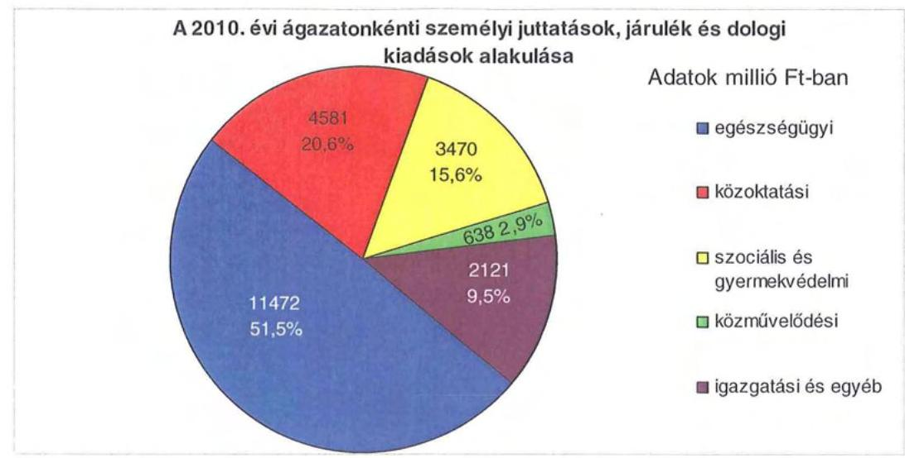

A 2010. évi önkormányzati költségvetési kiadás 85,3%-a (21 713 millió Ft) intézmények működtetésével összefüggő kiadás, a további 14,7%-ot (3750 millió Ft) a Hivatal költségvetésében számolták el. A Hivatal elszámolt kiadásainak 18,4%-át, 692 millió Ft-ot az önkormányzati hivatal működésével kapcsolatos személyi és dologi kiadások, 13,6%-át, 509 millió Ft-ot az EU-s projektek működési kiadásai, 27,5%-át, 1030 millió Ft-ot a beruházási, felújítási kiadások, 11,5%-át, 430 millió Ft-ot működési és fejlesztési célra átadott pénzeszközök, 19,3%-át, 726 millió Ft-ot az egyéb kiadások (kamatok, árfolyamveszteség, pénzintézeti kezelési költség), 8,5%-át, 318 millió Ft-ot a Közgyűlés működésével kapcsolatos személyi és dologi kiadások, 1,2%-át, 45 millió Ft-ot a kisebbségekkel összefüggő kiadások képviselték.

Az Önkormányzat az ellenőrzött időszakban - 2007. január 1-jén - az egyháztól 300 kórházi ággyal átvette a mosdósi kórház üzemeltetését, az átadás napjával integrálta a Kórházba, ahol telephelyként működött tovább.

Települési önkormányzat számára egy közoktatási feladatot adott át. A 321 tanulót érintő közoktatási intézményt, a Marcali Szakképző Iskolát a 2007. évben visszaadta Marcali városa részére, továbbá az Országos Katasztrófavédelmi Igazgatóságnak 2007. évben átadta a balatonföldvári JOGAR Továbbképző Központot és Hotelt.

Az Önkormányzat kötelező és önként vállalt feladatait 2010. december 31-én 28 költségvetési szervvel és két többségi tulajdonú gazdasági társasággal látta el.

A költségvetési kiadásokon belül az intézményi kiadások részaránya 2007-ben 90,8%, 2010-ben 85,3% volt. A költségvetési szervezetek száma az ellenőrzött időszakban 44-ről 28-ra csökkent, amelyek közül négy volt önállóan működő és gazdálkodó, 24 pedig önállóan működő. Az intézmények - alapító okirataik szerint - összesen 75 telephelyen működtek.

---

Az Önkormányzat feladatait 2010. év végi állapotnak megfelelően az alábbi intézménystruktúrával látta el:

- egészségügyi feladatokat egy kórház látott el;
- szociális és gyermekvédelmi feladatokat 12 intézmény végzett (nyolc szociális ellátást biztosító intézmény, négy gyermekvédelmi feladatot ellátó intézmény);
- közoktatási feladatot kilenc intézmény látott el (kettő pedagógiai szakszolgálat, két módszertani intézmény, egy komplex intézmény és gyermekotthon, két gimnázium, egy kollégium, egy TISZK);
- közművelődési és közgyűjteményi feladatokat végzett három intézmény (egy könyvtár, egy levéltár és egy múzeumigazgatóság);
- igazgatási feladatokat látott el a Hivatal, egy intézmény pedig integrált gazdasági szervezetként működött (Kincstári szervezet), illetve egyéb feladatot látott el a Fonyódi gyermektábor.

A
 Somogyi TISZK siófoki székhellyel és négy tagintézménnyel működik. A Somogyi TISZK-et a Közgyűlés 2008. augusztus 4-én alapította ${ }^{15}$ megyei fenntartású szakképző intézményeinek összevonásával, amely az alapításkor nyolc tagintézménnyel működött, az integrációt jelentő átszervezéssel az intézmények számát négyre csökkentették.

Az egyes ágazatok kötelező feladatellátását 2010. december 31-én az alábbi mutatók jellemezték:

| Megnevezés | közoktatás | szociális és   gyermek-   védelem | egészség-   ügy | kultúra   és sport |
| :-- | :--: | :--: | :--: | :--: |
| Az ágazatban foglalkozta-   tottak száma (fő) | 1115 | 1026 | 1607 | 163 |
| Az ágazat intézményeiben   ellátottak összesen (fő) | 6636 | 2571 |  |  |
| Fekvőbeteg ellátás férőhe-   lyeinek száma (db) |  |  | 1245 |  |

Az áttekintett időszakban a kötelező feladatok közül a közoktatás és az egészségügy területén volt feladatátadás-átvétel. A mosdósi Tüdő és Szívkórházat a református egyháztól a Kórház vette át 2007. január 1-jétől, amelynek következtében az önkormányzati kórházi ágyak száma 270 ággyal nőtt, az intézmény dolgozói létszáma 261 fővel emelkedett. A közoktatás területén 2007. augusztus 31-i időponttal került a Marcali Szakképző Iskola átadásra a helyi önkormányzatnak. A feladatátadás következtében a Somogy Megyei Önkormányzatnál a tanulói létszám 321 fővel, a dolgozói létszám pedig 48 fővel csökkent.

[^0]
[^0]:    ${ }^{15}$ 50/2008. (VI. 06.) számú közgyűlési határozat

---

Az Önkormányzat két többségi tulajdonú gazdasági társaságot - Somogyi Média Kft., valamint Somogy TV Nonprofit Kft. - alapított, további három társaságban résztulajdonnal rendelkezik. A Taszári Airport Kft-ben 40%-os, a Somogyi Esély Nonprofit Kft-ben 33%-os, a Somogy Megyei Kéményseprő Kft ${ }^{16}$-ben 60,6%-os tulajdoni hányaddal rendelkezett. Az Önkormányzatnak jelenleg két többségi tulajdonú gazdasági társasága van. Az Önkormányzat tulajdonában lévő gazdasági társaságok önként vállalt feladatokat látnak el, a többségi tulajdonú gazdasági társaságai közül fő tevékenységként a Somogyi Média Kft. rádióműsor-szolgáltatást, a Somogy TV Nonprofit Kft. film-, videó-televízió műsorgyártást végez.

Az önkormányzati feladatellátásban az intézmények és gazdasági társaságok mellett egyéb szervezetek nem működtek, azonban szolgáltatási szerződéssel kiszervezett intézményi feladatként pedagógiai szakmai szolgáltatásokat láttak el.

Az önkormányzati pénzforrások csökkenése miatt az önként vállalt feladatokra biztosított támogatások összege a 2007. évi 225 millió Ft-ról a 2010. évre 153 millió Ft-ra csökkent. Az ellenőrzött időszak éveiben az évenkénti csökkenések összege eltérő volt a vizsgált négy évben. Az egyes önként vállalt feladatra fordított összegek átrendeződtek, növekedtek a megyében működő nyugdíjas szervezetek részére pályázat útján nyújtott támogatások. A média támogatására a 2007. évben 6 millió Ft-ot, a 2010. évben pedig 32 millió Ft-ot használtak fel. A városoknak térségi feladataik ellátásához nyújtott támogatás - a Megyei Önkormányzatnak át nem adott középfokú oktatási intézmények működéséhez nyújtott támogatás - az áttekintett időszakban 48%-kal csökkent, a 2011. évtől pedig már nem is nyújtott ilyen támogatást az Önkormányzat. Jelentősen csökkentek a tagdíjakra kifizetett összegek is. Az Önkormányzat az ellenőrzött időszakban megszüntette tagságát az Alpok-Adria szervezetben, valamint a Megyei Területfejlesztési Tanács tagdíja is jelentősen csökkent. Fejlesztési feladatokra a városok tulajdonában lévő épületek rekonstrukciójához a 2008. évtől az Önkormányzat nem nyújtott támogatást.

# 2. PÉNZÜGYI EGYENSÚLYI HELYZET ALAKULÁSA 

A hagyományos költségvetési szerkezet helyett az önkormányzat pénzügyi helyzetét a CLF módszerrel mutatjuk be, amelyben jobban elkülönülnek a vagyonnal kapcsolatos bevételek és kiadások a feladatokkal kapcsolatos közvetlen működtetési bevételektől és kiadásoktól. A módszer következetesen elkülöníti a folyó és a felhalmozási költségvetés bevételeit és kiadásait, azok költségvetési egyenlegeit. A tárgyévi pozíciók meghatározása érdekében a figyelembe vett saját folyó bevételek, valamint saját felhalmozási bevételek nem tartal-

[^0]
[^0]:    ${ }^{16}$ A Somogy Megyei Kéményseprő Kft-ben lévő üzletrészt a Közgyűlés 60/2009. (VI. 12.) számú határozata alapján értékesítették, a Kft. 2009. VII. 27-én kikerült az önkormányzati vagyonból.

---

mazzák az előző évi pénzmaradványok felhasználásából származó pénzforgalom nélküli bevételeket ${ }^{17}$.

A bevételek és kiadások besorolása általános közgazdasági meggondolásokon alapul, amely testet ölt az SNA statisztikai módszertanában is. Folyó tételek alatt értjük azokat a bevételeket és kiadásokat, amelyek az önkormányzat vagyoni helyzetét automatikusan nem változtatják. A bevételi oldalon ilyenek az adók, az illeték, az áfa bevételek és visszatérülések, a hozamok és kamatok, a költségvetési támogatások, az egyéb saját bevételek, valamint a működési célra átvett pénzeszközök és kapott támogatások. A folyó kiadások közé tartoznak a szolgáltatások nyújtásával kapcsolatos működési kiadások, a kamatkiadások, valamint a működési célú transzferkiadások ${ }^{18}$. A felhalmozási vagy tőke tételek módosítják az önkormányzat vagyoni helyzetét. A privatizációs bevételek, az immateriális javak és tárgyi eszközök, valamint a részesedések értékesítése csökkentik, a fizikai beruházások és a pénzügyi befektetések növelik a vagyont. A pénzforgalmi bevételek és kiadások nem tartalmazzák a követelések elengedése miatt könyvelt tételeket, mivel ezek egymást kioltó, technikai jellegű elszámolási műveletek.

A folyó költségvetés egyenlege, a működési jövedelem megmutatja, hogy az önkormányzat éves folyó bevétele fedezetet biztosít-e a kötelező és önként vállalt feladatellátáshoz kapcsolódó éves folyó kiadására. A működési jövedelem negatív értéke pénzügyileg fenntarthatatlan helyzetet jelez. A mutató pozitív értéke megtakarítást mutat, amely forrásul szolgálhat az önkormányzat fennálló kötelezettségei megfizetéséhez, valamint fejlesztéseihez.

A felhalmozási költségvetés pozitív értéke felhalmozási többletet mutat, amely a jövőbeni fejlesztések forrását biztosíthatja. Amennyiben a folyó költségvetési hiány finanszírozása a felhalmozási többletből történik, ez szűkebb értelemben vagyonfelélésnek tekinthető. Amennyiben a felhalmozási költségvetés megtakarítása fejlesztési célú hitelek, kötvények adósságszolgálatát finanszírozza, az változatlan vagyontömeg mellett, a korábban megelőlegezett tőkebevételek valós realizációjának tekinthető. A felhalmozási deficit által generált finanszírozási igény önmagában nem jár pénzügyi kockázattal, a pénzügyileg fenntartható beruházásokhoz kapcsolódó kötelezettségvállalás (adósságszolgálat) előrelátó, tudatos költségvetési gazdálkodással teljesíthető.

A módszer a pénzügyi kapacitás (más néven a nettó működési jövedelem) fogalmát helyezi a középpontba. Az adós hitelfelvételi képessége, hosszú távú fizetőképessége vagy bonitása a pénzügyi kapacitással, ezen belül is a nettó működési jövedelemmel jellemezhető. A nettó működési jövedelem negatív értéke az egyes költségvetési években jelentkező adósságszolgálat túlzott mérté-

[^0]
[^0]:    ${ }^{17}$ A költségvetési években kialakuló hiány finanszírozása az előző években képzett tartalékok felhasználásával is történhet.
    ${ }^{18}$ Transzferkiadásoknak azokat a folyó és felhalmozási tételeket nevezzük, amelyeket nem az adott önkormányzat használ fel szolgáltatásnyújtásra (pl.: ellátottak pénzbeni juttatásai, átadott pénzeszközök, garancia- és kezességvállalások stb.).

---

kére utal ${ }^{19}$. A nettó működési jövedelem negatív értékének felhalmozási többletből, vagy további hitelből történő finanszírozása pénzügyileg nem fenntartható gazdálkodást vetít előre. A pozitív értéket mutató nettó működési jövedelem fejlesztési kiadások fedezetét biztosíthatja, illetve a folyamatosan, évenként képződő pozitív nettó működési jövedelemből meghatározható a jövőben vállalható, teljesíthető éves adósságszolgálat, ily módon az a hitelösszeg, amely - a többi tényezőt, feltételt adottnak tekintve - visszafizetési kockázat nélkül felvehető.

A CLF módszer alapján a pénzügyi kapacitás mértéke az önkormányzat összevont, nettósított, a központi információs rendszerbe a MÁK-on keresztül leadott éves költségvetési beszámolójának 80-as űrlapjában szerepeltetett adatok alapján került meghatározásra. A 2007-2010 közötti időszakban az Önkormányzat CLF módszer szerint besorolt kiadásainak és bevételeinek fő jogcímek szerinti alakulását a jelentés 2/a. számú melléklete tartalmazza.

Az Önkormányzat bevételeinek és kiadásainak alakulását részletesen a hatályos számviteli előírások szerint készült, összevont éves költségvetési beszámolók adataira alapozva mutatjuk be. A bevételek és kiadások működési, valamint felhalmozási jogcímekre történő elkülönítését az éves költségvetési beszámolók, a zárszámadási rendeletek, továbbá - amely jogcímek ${ }^{20}$ esetében erre más lehetőség nem volt - az Önkormányzat adatszolgáltatása szerinti megbontás alapján végeztük el. A bevételek elemzése során figyelembe vettük a korábbi években keletkezett pénzmaradvány felhasználásából származó pénzforgalom nélküli bevételeket is. A 2007-2010 közötti időszakban az Önkormányzat bevételeinek és kiadásainak, továbbá adósságszolgálatának alakulását a jelentés 2/b. számú melléklete tartalmazza.

[^0]
[^0]:    ${ }^{19}$ Kivéve, ha annak finanszírozására a korábbi években képzett tartalékok fedezetet nyújtanak.
    ${ }^{20}$ Az előző évi maradvány visszafizetésének, az előző évi pénzmaradvány átadásának és átvételének, a kamatkiadásoknak, az egyéb pénzforgalom nélküli kiadásoknak, a hozam- és kamatbevételeknek, az átengedett adóknak, a költségvetési támogatásoknak, továbbá az előző évi pénzmaradvány igénybevételének működési és felhalmozási részre történő megosztásához az Önkormányzat által szolgáltatott adatokat vettük figyelembe.

---

# 2.1. A működési és felhalmozási egyensúly alakulása 

CLF módszer szerinti önkormányzati adatok ${ }^{21}$

|  |  |  |  | ezer Ft |
| :--: | :--: | :--: | :--: | :--: |
| Megnevezés | 2007 | 2008 | 2009 | 2010 |
| Folyó bevételek | 20084843 | 22593842 | 21366198 | 21204989 |
| Folyó kiadások | 21671382 | 22639186 | 22426118 | 23897597 |
| Működési jövedelem | $-1586539$ | $-45344$ | $-1059920$ | $-2692608$ |
| Nettó működési jövedelem   = működési jövedelem - tőketörlesztés | $-1673661$ | $-8311857$ | $-1272704$ | $-11544804$ |
| Felhalmozási (beruházási) bevételek | 636816 | 758894 | 200472 | 2038856 |
| Felhalmozási (beruházási) kiadások | 1016273 | 1356253 | 1204551 | 1565414 |
| Beruházási költségvetés egyenlege | $-379457$ | $-597359$ | $-1004079$ | 473442 |
| Finanszírozási műveletek nélküli (GFS) pozíció | $-1965996$ | $-642703$ | $-2063999$ | $-2219166$ |
| Finanszírozási műveletek egyenlege | 2704251 | 1617477 | 672195 | 1783244 |
| Tárgyévi pozíció | 738255 | 974774 | $-1391804$ | $-435922$ |
| Egyéb tájékoztató adatok |  |  |  |  |
| Összes kötelezettség* | 5318382 | 9816230 | 10495914 | 14089666 |
| -ebből rövid lejáratú | 2331536 | 2344693 | 3321581 | 2594964 |
| Folyószámla hitel napi átlagos állománya** | 2101 | 3373 | 2068 | 7768 |
| Egyéb likvid hitel napi átlagos állománya** | 0 | 0 | 0 | 0 |
| Munkabér-megelőlegzési hitel napi átlagos állománya** | 12008 | 8473 | 10900 | 8444 |
| Egyéb finanszírozásba vonható eszközök év végi állománya: | 1769006 | 4732180 | 2360476 | 897054 |
| -ebből: tartós hitelviszonyt megtestesítő értékpapírok év végi állománya | 0 | 2000000 | 1027500 | 0 |
| -ebből: hosszú lejáratú bankbetétek év végi állománya | 0 | 0 | 0 | 0 |
| -ebből: értékpapírok év végi állománya | 19000 | 7400 | 0 | 0 |
| -ebből: pénzeszközök (idegen pénzeszközök nélkül) év végi állománya | 1750006 | 2724780 | 1332976 | 897054 |

* Az összes kötelezettséget passzív pénzügyi elszámolások nélkül vettük figyelembe, mert a passzívák a pénzmaradvány elszámolás tételei közé tartoznak
** A folyószámla- és a munkabér megelőlegezési hitel átlagos állományát 365 nappal számítottuk.
${ }^{21}$ A 2007.
 évben az önkormányzatok MÁK-hoz leadott 2007. évi elemi beszámolójában az évközi intézményátadásokhoz és átvételekhez kapcsolódóan - a nem megfelelő számviteli elszámolás következtében - a felügyelet alá tartozó költségvetési szervnek folyósított támogatás (az intézményfinanszírozás) összege, a nettósított, összevont önkormányzati beszámolóban nulla egyenleg helyett, pozitív vagy negatív egyenleget mutatott. Ennek oka, hogy a történeti adatokat tartalmazó intézményi beszámolót sem az átvevőnél, sem az átadónál nem lehetett feltüntetni. Az intézmény csak egy beszámolót adhatott az egész évben jelentkező kiadásairól, miközben a kiadások fedezetét jelentő intézményfinanszírozás más-más önkormányzat vagy többcélú kistérségi társulás számviteli nyilvántartásaiban került elszámolásra. Emiatt az önkormányzatnál és az intézményénél azonos összegben könyvelendő intézményfinanszírozás a nettósításkor nem volt megegyező összegű, egyenlege maradt.
Az Önkormányzat egyenlege negatív volt, vagyis az önkormányzatnak kiadása keletkezett, ezért a CLF módszer alapján elkészített táblázatban az év közben más szervezethez került intézménynek adott támogatás, 115,9 millió Ft, államháztartáson belülre átadott pénzeszközként szerepel.

---

A vizsgált időszakban az Önkormányzat folyó költségvetési egyenlege, működési jövedelme negatív összegű volt, amelyet a következő ábra szemléltet:
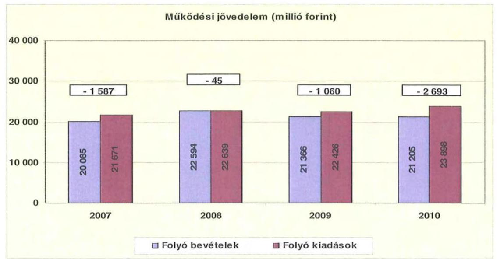

A folyó költségvetés hiánya (a működési forráshiány) 2007-ben a folyó kiadások 7,3%-át (1 587 millió Ft-ot), 2008-ban 0,2%-át (45 millió Ft-ot), 2009-ben 4,7%-át (1 060 millió Ft-ot), 2010-ben 11,3%-át (2 693 millió Ft-ot) jelentette.

A működési forráshiány finanszírozása működési céllal kibocsátott kötvényből történt. Emellett munkabér- és folyószámlahitellel rendelkezett, melyek nem voltak számottevő mértékűek a vizsgált időszakban. A folyószámlahitel napi átlagos állománya, 2007-2010 között 2 millió Ft-ról 8 millió Ft-ra nőtt, a munkabérhitel napi átlagos állománya pedig 12 millió Ft-ról 8 millió Ft-ra csökkent.

Az Önkormányzat kötelezettségein $^{22}$ belül 2010. évben a rövid lejáratú kötelezettségek állománya 18,4% volt, a 2007. évi 43,8%-os aránnyal szemben. Az Önkormányzat 2007. december 31-én fennálló pénz és tőkepiaci kötelezettsége 3936 millió Ft-ról közel háromszorosára 11386 millió Ft-ra nőtt a kötvénykibocsátások miatt.

A rövid lejáratú kötelezettségek 2010-ben 2595 millió Ft-ot tettek ki, amely 263 millió Ft-tal (11,3%-kal) több a 2007. évi rövid lejáratú kötelezettségállománynál. A rövid lejáratú kötelezettségeknek a szállítói állomány 2007-ben 46,8%-át (1091 millió Ft-ot), 2008-ban 48,3%-át (1133 millió Ft-ot), 2009-ben 61,4%-át (2039 millió Ft-ot), 2010-ben 89,9%-át (2 333 millió Ft-ot) tette ki.

[^0]
[^0]:    $^{22}$ Passzív pénzügyi elszámolások nélküli

---

Az Önkormányzat pénzügyi kapacitása a vizsgált időszakban folyamatosan negatív értéket mutatott. A nettó működési jövedelem $^{23}$ értéke a folyó költségvetési pozíció mellett az adott költségvetési év adósságtörlesztésének hatását is tükrözi.
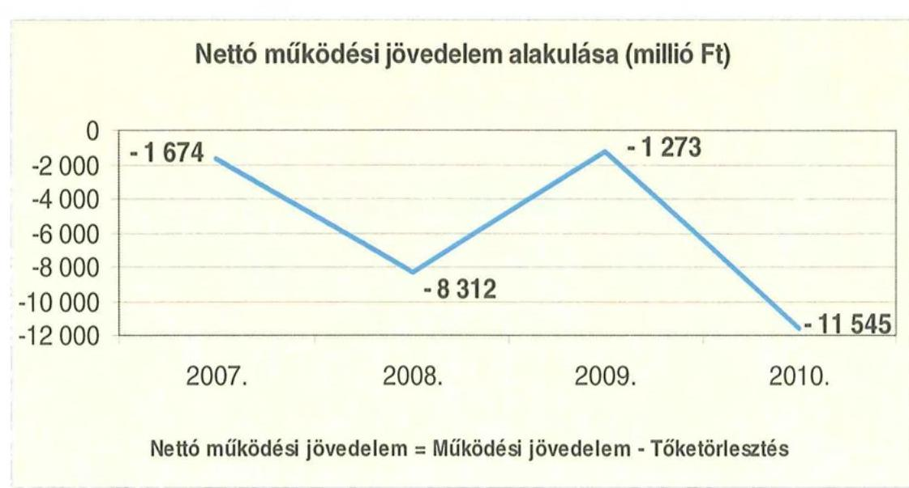

Az Önkormányzat CLF módszer szerinti 2008. és 2010. nettó működési forráshiányának értékelésénél figyelembe kell venni, hogy az Önkormányzat 2008. évben tőketörlesztés címén 8000 millió Ft-ot, a 2010. évben pedig 6700 millió Ft-ot fordított korábbi kötvényei refinanszírozására.

A 2007-2009. években az Önkormányzat felhalmozási költségvetésének egyenlege negatív, 2010. évben pozitív összegű volt, melynek alakulását évről évre a következő ábra szemlélteti:
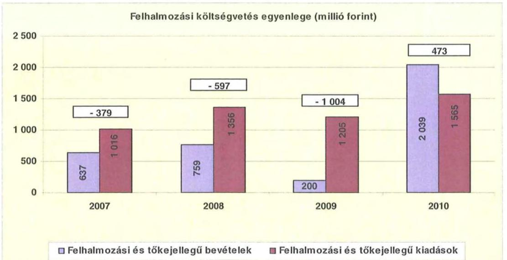

[^0]
[^0]:    $^{23}$ pénzügyi kapacitás

---

A felhalmozási forráshiánynak a felhalmozási és tőke jellegű kiadásokhoz viszonyított aránya 2007-ben 37,3% (379 millió Ft), 2008-ban 44,0% (597 millió Ft) 2009-ben 83,3% (1 004 millió Ft) volt. 2010-ben a felhalmozási forrástöbblet a felhalmozási és tőke jellegű kiadások 30,2%-át (473 millió Ft-ot) jelentette. A fejlesztési forráshiányt kötvénykibocsátással finanszírozták.

Az Önkormányzat évenkénti teljes finanszírozási hiánya $^{24}$ a CLF módszer szerint 2007-ben 2053 millió Ft, 2008-ban 8909 millió Ft, 2009-ben 2277 millió Ft, 2010-ben 11071 millió Ft volt.

Az Önkormányzat finanszírozási műveletei 2007-2010. évekbeli egyenlegének alakulását a következő ábra szemlélteti:
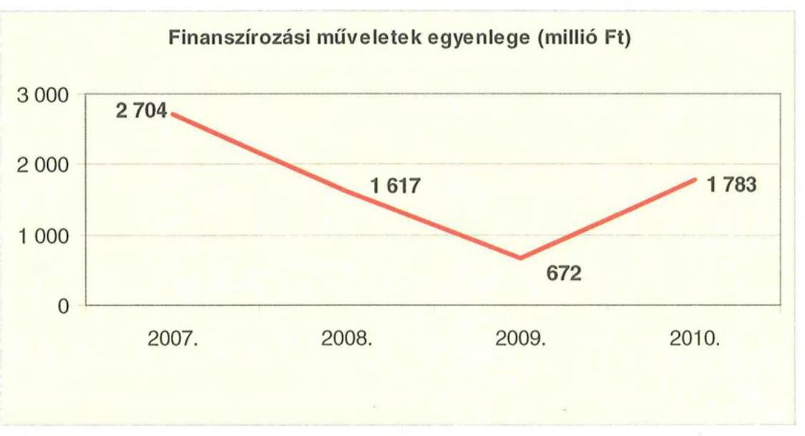

A finanszírozási többlet azt jelzi, hogy az éves költségvetések végrehajtása során szükség volt a pénzkészlet felhasználásán túl külső finanszírozás igénybevételére is. A finanszírozási célú műveleteket a vizsgált időszakban a jelentés 2. számú mellékletének 4.1-4.8 pontjai részletezik.

Az Önkormányzat zárszámadási rendeletében a működési és fejlesztési hiányt a hagyományos költségvetési szerkezet alapján mutatta be $^{25}$, amelyről a jelentés 1. számú melléklete nyújt tájékoztatást. Az Önkormányzat zárszámadási rendeleteiben bemutatott működési és fejlesztési hiány összege 2007. évi 1967 ezer Ft-ról 2010. évre 2219 ezer Ft-ra, 12,8%-kal növekedett.

A vizsgált időszakban a kötelezettségek (passzív pénzügyi elszámolások nélkül) 5318 millió Ft-ról 14090 millió Ft-ra emelkedtek, amely együtt járt a kamatkiadások növekedésével.

[^0]
[^0]:    $^{24}$ a nettó működési jövedelem és a beruházási költségvetés egyenlegeinek összege.
    $^{25}$ Nincs kötelező előírás a működési és fejlesztési hiány megállapításának módjára.

---

A 2007-2010 között az Önkormányzat összesen 1775 millió Ft kamatot fizetett meg. Az átmenetileg szabad pénzeszközein realizált kamatbevétel (1469 millió Ft) a teljes kamatráfordítás 82,8%-át tette ki.

Az Önkormányzat kamatbevételeit, kamatkiadásait és azok egyenlegét a következő ábra mutatja:
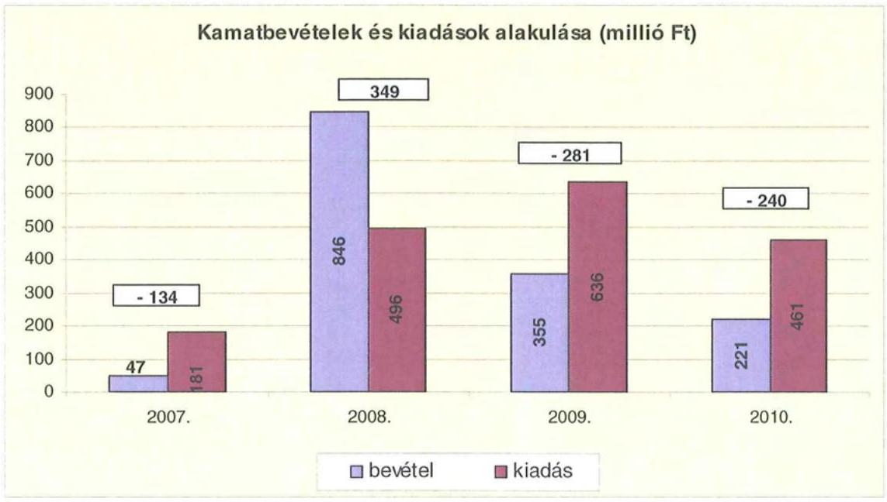

A 2007-2010 közötti időszakban az Önkormányzat kiadásainak és bevételeinek főbb jogcímek szerinti alakulását a jelentés 2/a. számú melléklete tartalmazza.

# 2.2. Az Önkormányzat bevételeinek alakulása 

Az Önkormányzat 2007-2010 között realizált, OEP támogatás nélküli főbb bevételi jogcímeinek számszaki adatait a következő táblázat részletezi és grafikon mutatja be:
ezer Ft

| Megnevezés | 2007. év   tény | 2008. év   tény | 2009. év   tény | 2010. év   tény |
| :-- | :--: | :--: | :--: | :--: |
| Illetékbevétel | 1781589 | 2068301 | 1893322 | 1319192 |
| szja és állami támogatás   (OEP nélkül) | 6565943 | 6705966 | 5978975 | 5056344 |
| Egyéb saját bevétel | 3497665 | 3561614 | 5125377 | 5562678 |
| Összesen | 11845197 | 12335881 | 12997674 | 11938214 |

---

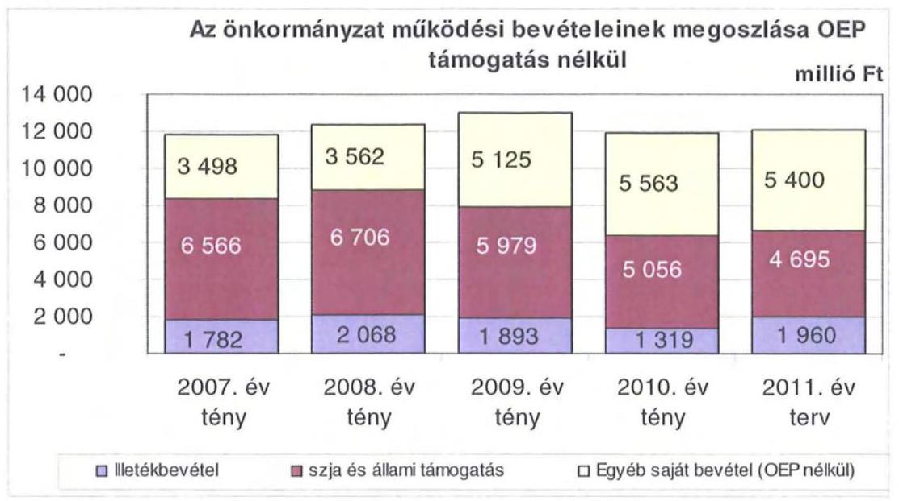

Az OEP-től származó bevétel 2007-ben 8420 millió Ft, 2010-ben 9484 millió Ft volt.

Az Önkormányzatnál az illetékbevétel a 2007. évben 1782 millió Ft volt, amely a 2006. évi 2287 millió Ft-hoz képest jelentősen, 22,1%-kal (506 millió Ft-tal) csökkent. A csökkenésben szerepet játszott az Illetékhivatalnak - 2007. január 1-jétől - az APEH-hoz történő átszervezése is, miután az évente realizált illetékbevételekből (központi intézkedés következtében) évi 8,5% elvonásra került az adminisztrációs feladatokra. Az ezen a jogcímen visszatartott összeg minden évben kevesebb volt, mint amekkora költségvetési kiadást jelentett korábban az Illetékhivatal működtetése az Önkormányzatnak. (A 2006. évben az Illetékhivatal működtetésére 465 millió Ft-ot fordítottak. Az éves illetékbevétel 8,5%-a 2007-ben 166 millió Ft, 2008-ban 192 millió Ft, 2009-ben 176 millió Ft, 2010-ben 123 millió Ft volt.)

A Hivatal átszervezésével kapcsolatos kiadáscsökkenés és az adminisztrációs feladatokra visszatartott összeg között 2007-ben 299 millió Ft pozitív különbözet jelentkezett, ez azonban a 2007. évi bevételcsökkenésnek (506 millió Ft) csupán 59,2%-át jelentette.

Az illetékbevétel a vizsgált időszak évei közül 2008-ban növekedett, amikor az előző évihez képest a 2007. évi 1782 millió Ft-ról 2008-ra 2068 millió Ft-ra 16,1%-kal nőtt, 2008-ról 2009-re 1893 millió Ft-ra 8,5%-kal csökkent, majd a 2010. évben jelentősen tovább mérséklődött, az előző évhez viszonyítva a csökkenés 30,3%-os (574 millió Ft) volt. Az Önkormányzat mindezek ellenére - a Balaton parti ingatlanpiac fellendülésének hatását túlértékelve - a 2011. évi költségvetésében növekvő, a 2010. évihez viszonyított 48,6%-os, 641 millió Ft-os növekedéssel számolt.

---

Az átengedett szja és az állami támogatások együttes összege a 2008. évi 2,1%-os (140 millió Ft) növekedést követően a központi forráskivonás hatására $^{26}$ folyamatosan és jelentős mértékben csökkent. Az előző évihez képest 2009-ben 10,9%-kal (727 millió Ft-tal), 2010-ben további 15,4%-kal (922 millió Ft) kapott kevesebb forrást az Önkormányzat az államtól ezeken a jogcímeken. A változást a normatíváknak a járulékváltozások miatti központi csökkentése, valamint a megyei önkormányzatokat érintő forráselvonás mellett az ellátotti létszám visszaesése idézte elő.

Az intézmények működési bevétele az ellenőrzött időszak minden évében emelkedett, ennek köszönhetően a 2007. évi 2333 millió Ft-ról a 2010. évre 4115 millió Ft-ra (76,4%-kal) emelkedett. A Közgyűlés minden év végén döntött a következő évi térítési díjak emeléséről, valamint a Kórház saját bevételei is növekedtek. Az intézményi működési bevételekkel kapcsolatos követelések összege 2007-ben 80 millió Ft volt, amely a 2010. évre 12 millió Ft-ra csökkent. A követelések csökkenése kedvezően hatott az Önkormányzat fizetőképességének alakulására.

Az Önkormányzat felhalmozási bevételeinek szerkezete a vizsgált időszakban a következők szerint alakult:

| A | Megnevezés | 2007. év   tény | 2008. év   tény | 2009. év   tény | 2010. év   tény |
| :-- | :--: | :--: | :--: | :--: | :--: |
|  |  |  |  |  |  |
|  | Várgyi eszköz értékesítés | 223555 | 64692 | 35582 | 8157 |
|  | Állami támogatás | 84460 | 7851 | 22685 | 37235 |
|  | Kötvett pénzeszköz | 101566 | 143139 | 44172 | 200859 |
|  |  |  |  |  |  |
|  | Egyéb felhalmozási bevétel | 356600 | 1361277 | 457191 | 1970727 |
|  | Felhalmozási tartalék | 277495 | 1292477 | 2047207 | 85938 |
|  |  |  |  |  |  |
|  | Összes felhalmozási bevétel | 1043676 | 2869436 | 2606837 | 2302916 |

z
Az Önkormányzat összes felhalmozási célú bevétele a 2010. évben 2303 millió Ft volt, amely 2,2 szerese a 2007. évi bevételnek (1044 millió Ft). Az összes bevételből minden vizsgált évre jellemzően jelentős részarányt $^{27}$ képvisel az egyéb felhalmozási bevétel. Az egyéb felhalmozási bevételek körében került elszámolásra a kötvények értékesítéséből képződött, fejlesztési célokra felhasznált források összege.

[^0]
[^0]:    $^{26}$ a 2007. évi bázishoz képest
    $^{27}$ Az egyéb felhalmozási bevétel összege 2007. évben 357 millió Ft (34,2%), 2008. évben 1361 millió Ft (47,4%-a), 2009. évben 457 millió Ft (17,5%-a), 2010. évben 1970 millió Ft (85,6%-a) volt a teljesített bevételnek.

---

# 2.3. Az Önkormányzat kiadásainak alakulása 

Az Önkormányzat működési kiadásai főbb jogcímek szerinti bontásban az alábbiak voltak:
ezer Ft-ban

| Megnevezés | 2007. | 2008. | 2009. | 2010. |
| :-- | --: | --: | --: | --: |
| Működési kiadások | 21559467 | 22248378 | 21963838 | 23562837 |
| Működési kiadások (kamatkiadás nélkül) | 21464534 | 22143149 | 21823073 | 23436474 |
| Kamatkiadás | 94933 | 105229 | 140765 | 126363 |
| Személyi juttatások | 9947234 | 9604380 | 9128639 | 9161763 |
| Munkaadót terhelő járulékok | 3170469 | 3041250 | 2768706 | 2419987 |
| Dologi kiadások | 7097561 | 7940918 | 8700608 | 10700266 |
| Egyéb folyó kiadások | 116762 | 444015 | 231826 | 417920 |
| Támogatások, elvonások, egyéb folyó átutalások |

 593013 | 614737 | 613954 | 575466 |
| ebből: működési célú pénzeszközátadás | 229231 | 235174 | 210069 | 192457 |
| Előző évi pénzmaradvány átadás, visszafizetés,   működési célú | 295083 | 18354 | 765 | 0 |

Az Önkormányzat működési kiadásai 2007. évről 2010. évre mindössze 9,3\%-kal nőttek ( 21560 millió Ft-ról 23563 millió Ft-ra).

Az Önkormányzat 2010-ben a működési költségvetés 49,2\%-át (11 582 millió Ft) személyi juttatásokra és a munkaadókat terhelő járulékokra fordította, az üzemeltetést, intézményfenntartást biztosító dologi kiadásokra 45,4\% jutott (10 700 millió Ft). A működési kiadásokon belül a személyi juttatások és járulékok aránya a vizsgált időszakban folyamatosan csökkent, 2007-ben 60,8\%, (13 118 millió Ft) 2008-ban 56,8\% (12 646 millió Ft) 2009-ben 54,2\% (11 897 millió Ft) volt.

A személyi juttatások 2008-ban 3,4\%-kal (343 millió Ft-tal) csökkentek az előző évhez képest, azt követően a 2010. év kivételével minden évben csökkentek a létszámcsökkentések miatt. A 2010. évben a 2007. évben teljesített kiadásoknál 7,9\%-kal (786 millió Ft) lettek alacsonyabbak.

A kórházon kívüli intézményekben 2007. évről 2010. évre 700 millió Ft-tal, 11,3\%-kal csökkentek a személyi juttatások, amelynek az önkormányzati szintű mutatónál magasabb alakulása azt tükrözi, hogy az egészségügyi ágazatban a létszám és a bérek csökkenése nem mutatott hasonlóságot a más ágazati feladatokat ellátó intézményekével. A vizsgált időszakban a munkaadókat terhelő járulékok jelentősen, a 2010. évre 2007. évhez képest 26,9\%-kal, 523 millió Ft-tal csökkentek, amely egyrészt a kifizetett személyi juttatások, másrészt a járulékok mértékének csökkenésével volt összefüggésben. A járulékok csökkenése miatt felszabaduló forrásokat azonban a kormányzat az önkormányzati alrendszernek nyújtott állami támogatásokból levonásba helyezte, így a járulékcsökkenés az Önkormányzatnál érdemi megtakarítást nem eredményezett, mivel az állami támogatás csökkenésével járt együtt.

Az Önkormányzat dologi kiadásainak alakulása 2007-2010. években folyamatos növekedést mutat. Önkormányzati szinten a 2010. évben teljesített dologi kiadások ( 3603 millió Ft-tal) 50,8\%-kal haladták meg a 2007. évit.

---

A 2008. évben a dologi kiadások 11,8\%-kal (843 millió Ft-tal), az inflációt meghaladó mértékben ${ }^{28}$ emelkedtek, ezt követően a 2009. évben 9,6\%-kal több (760 millió Ft) az előző évinél ${ }^{29}$. A 2010. évben - az előző évhez képest - a dologi kiadások 23\%-os emelkedése ( 2000 millió Ft) következett be, döntően a Kórház dologi kiadásainak növekedése miatt, amelynek oka az új intézményi közforgalmi gyógyszertár üzemeltetési költsége, valamint készlet-, eszköz- és gyógyszerbeszerzése. További dologi kiadás növekedés jelentkezett az oktatási intézményeknél. A növekedés üteme minden évben meghaladta az inflációt. Az inflációt meghaladó dologi kiadások fedezetét az Önkormányzatnak a végrehajtott kiadáscsökkentő intézkedések mellett működési célú kötvénykibocsátásokból származó bevételeiből és rövid lejáratú hiteleiből biztosította.

Az önkormányzati kiadásokban a vizsgált időszakban nőtt a kórházi kiadások aránya az egyéb fenntartott intézményekben felmerülő kiadásokhoz képest. A Kórház nélküli teljesített működési kiadások ( 12150 millió Ft) 2007-ben az összes működési kiadás 56,4\%-át tették ki, ez az arány 2010 végére 53,2\%-ra csökkent ( 12547 millió Ft-ra).
Az Önkormányzat kórház nélküli működési kiadásai a vizsgált időszakban a következőképpen alakultak:
ezer Ft

| Megnevezés | 2007. | 2008. | 2009. | 2010. |
| :-- | --: | --: | --: | --: |
| Működési kiadások | 12149757 | 11899400 | 11611736 | 12547341 |
| Működési kiadások (kamatkiadás nélkül) | 12054824 | 11794171 | 11470971 | 12420978 |
| Kamatkiadás | 94933 | 105229 | 140765 | 126363 |
| Személyi juttatások | 6189464 | 5757565 | 5375754 | 5489518 |
| Munkaadót terhelő járulékok | 1941317 | 1807832 | 1614936 | 1418420 |
| Dologi kiadások | 2764979 | 2894899 | 3363614 | 4015689 |
| Egyéb folyó kiadások | 54100 | 313218 | 100698 | 262699 |
| Támogatások, elvonások, egyéb folyó   átutalások | 593013 | 614737 | 613954 | 575476 |
| ebből: működési célú pénzeszközátadás | 229231 | 235174 | 210069 | 192457 |
| Előző évi pénzmaradvány átadás, vissza-   fizetés, működési célú | 178806 | 18080 | - | - |

Míg 2010-ben a Kórházzal együtt a működési kiadások 9,3\%-os (2003 millió Ft) növekedése volt megfigyelhető ${ }^{30}$, addig a Kórház nélkül ugyanebben az időszakban csupán 3,3\%-os ( 398 millió Ft) növekedés jelentkezett, mivel a személyi juttatások csökkenése a többi intézménynél intenzívebb volt. A 2010. évben a Kórház nélküli működési kiadások 55,1\%-át teszik ki a személyi juttatások és járulékaik ( 6908 millió Ft), a dologi kiadások aránya pedig alig haladja meg a működési kiadások egyharmadát ( 4015 millió Ft). Ezeknél az intézményeknél a dologi kiadások látszólag erőteljesebb emelkedést mutatnak ${ }^{31}$.

A Önkormányzat költségvetési kiadásainak közel felét realizáló Kórház adatai nélkül a dologi kiadások 2008-ban 130 millió Ft-tal, 4,7\%-kal, 2009-ben 469

[^0]
[^0]:    ${ }^{28}$ KSH fogyasztói árindex 6,1\%
    ${ }^{29}$ 2009-ben az infláció 4,2\% volt
    ${ }^{30}$ a 2007. évhez képest
    ${ }^{31}$ a 2007. évi bázishoz képest 45,2\%-os (1251 millió Ft) növekedés jelentett

---

millió Ft-tal 16,2\%-kal, majd 2010-ben 652 millió Ft-tal, 19,4\%-kal haladták meg az előző évit.

A Kórháznál ugyanez a tendencia mutatkozott, de a változás mértéke sokkal nagyobb. A dologi kiadás a Kórháznál 2008-ban 16,5\%-kal (713 millió Ft-tal) a 2009. évben 23,2\%-kal (291 millió Ft-tal), 2010-ben 25,72\%-kal (1347 millió Ft-tal) haladta meg az előző évit. A jelentkező dologi kiadásnövekedések azonban nem a valós üzemeltetési költségnövekedést tükrözik, mivel az intézmény működési forráshiánya miatt nem tudta kifizetni a tárgyévben jelentkező dologi kiadásainak egy részét, így azzal a szállítói állománya az ellenőrzött időszakban 63 millió Ft-ról 1097 millió Ft-ra emelkedett.

Az Önkormányzat 2007-2010 között a Kórház működési kiadásaihoz ${ }^{32} 1298$ millió Ft-tal járult hozzá, amelyet központosított állami támogatásokból fedezett. A kórházi működési támogatások a központi bérpolitikai intézkedésekhez, a létszámcsökkentésekhez kapcsolódó többletköltség fedezetéhez, a 13. havi juttatások kifizetéséhez, kereset kiegészítésekhez kapcsolódtak. Ezeknek a kiadásoknak a fedezete így nem OEP támogatás, hanem egyéb, az Önkormányzat által igénybe vett központi támogatás volt.

A kórházak működésének finanszírozására az OEP támogatás szolgál, míg a fejlesztési kiadások fedezetét az önkormányzatoknak kell biztosítani intézményeik számára.

A működési célú önkormányzati támogatáson felül 2007-2010 között 340 millió Ft-ot adott a Közgyűlés a Kórháznak fejlesztési célra, amely a felhalmozási kiadások mindössze 15,1\%-át fedezte ${ }^{33}$. A támogatások évenkénti alakulását a következő grafikon mutatja be.
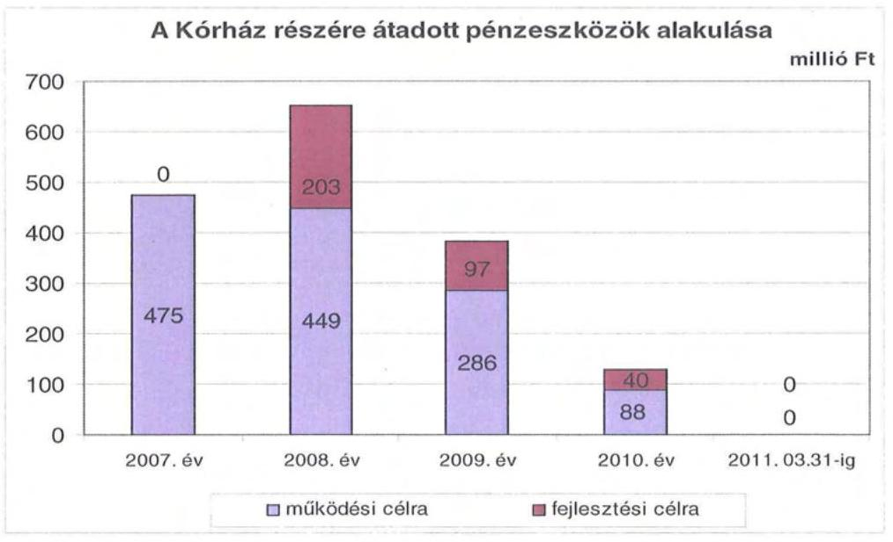

[^0]
[^0]:    ${ }^{32}$ intézményi finanszírozás formájában
    ${ }^{33}$ a Kórház fejlesztési kiadásokra 2007-2010 között 2244 millió Ft-ot fordított

---

A Kórház EU-s forrásokat a 2010. december 31-ig elkezdett két fejlesztéséhez kapott. Mindkét fejlesztés 2009-ben kezdődött, amelyek közül az egyik a Sürgősségi Betegellátó Centrum kialakítása, a másik Somogy megye egészséges társadalmának megteremtéséhez szükséges ellátórendszer átalakítása volt. Az egészségügyi szakellátást biztosító intézmény 2011. március 31-ig a két feladattal összefüggésben 509 millió Ft fejlesztési kiadást teljesített, amelyhez 169 millió Ft EU-s támogatásban részesült. Ezzel a két feladattal kapcsolatban felmerült fejlesztési kiadások 33,2\%-át fedezte. A 2010. évet követő kötelezettségvállalás összességében 6500 millió Ft, amelyet 5843 millió Ft összegben EU-s forrásból és 657 millió Ft összegben kötvénykibocsátásból terveznek finanszírozni.

A működési és felhalmozási kiadások arányának változásában 2007-2010 között elmozdulás figyelhető meg, a felhalmozási kiadások aránya 5\%-ról 7,5\%-ra nőtt. A kiadások megoszlásának alakulását - a működési és fejlesztési célú kamatkiadásokat is figyelembe véve - a következők grafikon szemlélteti:
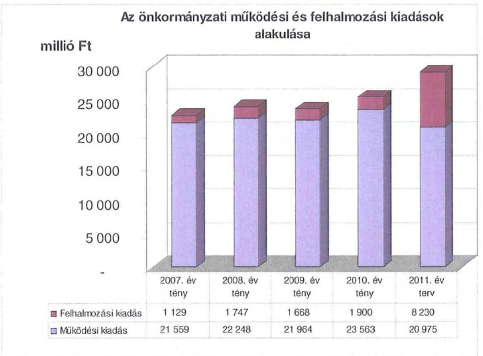

A 2007-2010 közötti években a 10 millió Ft teljes bekerülési költség feletti beruházások és felújítások száma 31 volt, amelynek közel feléhez (14 fejlesztéshez) EU-s forrásokat is igénybe vettek. A 10 millió Ft alatti fejlesztések összértéke 881 millió Ft, ebből a 2010. év utánra vállalt kötelezettség 28 millió Ft, amelynek fedezetét teljes egészében EU-s forrás képezi.

Az Önkormányzat 2007-2010. években együttesen 2518 millió Ft-ot fordított fejlesztéseinek finanszírozására, ennek 35\%-a a 10 millió egyedi beszerzési érték alatti fejlesztésekhez kapcsolódott.

Ezen időszakban az Önkormányzat legmagasabb bekerülési költségű beruházásai a következők voltak:

- a Kórház fejlesztése (Somogy megye egészséges társadalmának megteremtéséhez szükséges ellátórendszer átalakítása) 6497 millió Ft teljes bekerülési

---

költséggel. A beruházást 2009-ben kezdték el és 2010. év utánra vállalt kötelezettség 6391 millió Ft, amelynek forrásösszetétele 5741 millió Ft EU-s támogatás, valamint 650 millió Ft kötvénykibocsátásból származó forrás;

- a Kórház Sürgősségi betegellátó Centrum kialakítása 512 millió Ft teljes bekerülési költséggel. Ez a beruházás is 2009-ben kezdődött. A beruházással kapcsolatban a 2010. év utánra vállalt kötelezettség 109 millió Ft, amelyből EU-s támogatás 102 millió Ft, kötvénykibocsátásból származó forrás pedig 7 millió Ft;
- az Óvoda, Általános Iskola és Diákotthon (Kaposvár) rekonstrukciója 1437 millió Ft teljes bekerülési költséggel. A beruházást 2004-ben kezdték el, műszaki és pénzügyi szempontból is befejeződött, így a 2010. év utánra vállalt kötelezettsége nincs;
- a Somogyi TISZK infrastrukturális feltételeinek kialakítása 1172 millió Ft teljes bekerülési költséggel. Ezt a beruházást a 2010. évben kezdték el, a 2010. év utánra vállalt kötelezettség 824 millió Ft, amelynek forrása 621 millió Ft EU-s támogatás, valamint 203 millió Ft kötvénykibocsátásból származó bevétel.

A fejlesztések 98,5\%-a az Önkormányzat kötelező feladatellátáshoz kapcsolódott.

Az Önkormányzat fejlesztési tevékenysége a pályázati kiírások által nagyban befolyásolt, mert a jelentkező működési forráshiány és saját felhalmozási bevételei alacsony szintje miatt beruházásokat csak külső források, EU-s és hazai támogatások elnyerése esetén tud megvalósítani. A felhalmozási kiadások önrészének forrásait is fejlesztési hitelből és felhalmozási célú kötvénykibocsátásokból finanszírozta.

A pályázati tevékenység eredményeként az Önkormányzat 2007-2010 között összesen 11482 millió Ft bekerülési költségű beruházást folytatott, illetve indított el, amelyből 7565 millió Ft a 2010 utánra vállalt kötelezettség. Az utóbbi forrásai a következők ${ }^{34}$: 1013 millió Ft kötvénykibocsátásból származó bevétel, 6543 millió Ft EU-s támogatás, 8 millió Ft hazai támogatás.

Az Önkormányzat 2007-2010. években megvalósított, illetve 2010. december 31-én fennálló fejlesztési feladatokhoz kapcsolódó kötelezettségeinek összegzését a 3. sz. melléklet tartalmazza.

# 3. KÖTELEZETTSÉGEK BEMUTATÁSA 

### 3.1. A pénzintézetek felé fennálló kötelezettségek alakulása

Az Önkormányzat pénzintézeti kötelezettségeinek állománya 2006. december 31-től 2010. december 31-ig 8,5-szeresére 1338 millió Ft-ról 11386

[^0]
[^0]:    ${ }^{34}$ Az EU és a hazai támogatás teljes egészében rendelkezésre áll, a kötvénykibocsátásból tervezett források nem állnak az Önkormányzat rendelkezésére.

---

millió Ft-ra nőtt. A fennálló pénzintézeti kötelezettségei kötvények kibocsátásából, valamint hosszúlejáratú hitel igénybevételéből keletkeztek.
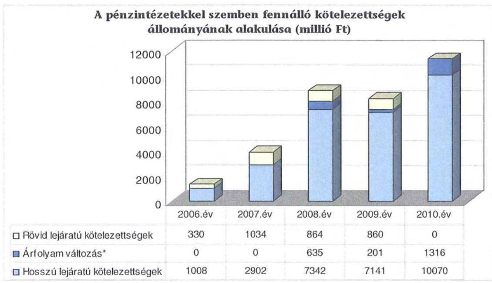

Az Önkormányzat pénzintézeti kötelezettségvállalásaira minden esetben közgyűlési döntés alapján került sor. A kötelezettségvállalásból származó források felhasználási céljait meghatározták. Az adósságszolgálat felső határáról az éves költségvetési rendelettervezetek előterjesztésekor tájékoztatták a Közgyűlést. Az adósságot keletkeztető kötelezettségvállalások felső határát az Ötv. 88. § (2) bekezdésében foglaltak ellenére a 2010.
 évben 1764 millió Ft-tal túllépték, amelyet a kötvényekkel kapcsolatos fizetési kötelezettségek okoztak.

Az adósságot keletkeztető kötelezettségvállalással megvalósított felhalmozási kiadások esetleges bevételt növelő, illetve kiadást csökkentő vonzatát, illetve ennek a fejlesztéshez, felújításhoz vállalt kötelezettségek visszafizetési forrásként való számbavételét nem vizsgálták. A kötvénykibocsátásról szóló előterjesztésekben a Közgyűlés tájékoztatása megtörtént a kamat- és a tőkefizetési kötelezettségekről. A költségvetési rendelet mellékletében bemutatásra kerültek a lejáratig fizetendő tőketörlesztés és kamatok összegei. Az előterjesztések nem tartalmazták a törlesztések forrásainak bemutatását. Az adósságállomány kezelésére vonatkozó koncepciót nem készítettek. Az adósságot keletkeztető kötelezettségvállalások teljesítésének az Önkormányzat csak újabb kötvények kibocsátásával tudott eleget tenni.

Az árfolyamváltozás hatása is befolyásolja a kötelezettségek alakulását, azonban annak mértéke előre pontosan nem határozható meg, csak várakozásokon alapuló tendenciák jelezhetők. Annak megítéléséről, hogy a devizában kibocsátott kötvényekért és felvett hitelekért kapott forinthoz képest a kötvények visszavásárlásakor, illetve a hitelek visszafizetésekor jelentkező forint kötelezettség többletkiadást (árfolyamveszteség) vagy megtakarítást (árfolyamnyereség) eredményez a futamidő végén, a teljes kötelezettség rendezését követően lehet képet alkotni. Mindaddig, amíg törlesztési kötelezettség nem áll fenn (türelmi idő, moratórium), a tőkére vonatkoztatva nem értelmezhető sem az árfolyamveszteség, sem az árfolyamnyereség. Ugyanakkor a számviteli szabályok meghatározzák, hogy az árfolyam-

---

különbözetet év végén a kötelezettségek vagy követelések között a könyvviteli mérlegben nyilván kell tartani, azonban az árfolyam különbözet valójában nem realizált.

Az Önkormányzat 2010. december 31-én EUR-ban fennálló adósságot keletkeztető kötelezettségvállalásai az alábbiak voltak ${ }^{35}$ :

| Megnevezés | Kibocsátás, illetve szerződéskötés időpontja | Összeg   (EUR) | Kibocsátási, vagy lehivási árfolyam | Kamat (referencia kamat+ kamatfelár) | Felhasználás célja: |
| :--: | :--: | :--: | :--: | :--: | :--: |
| Somogy 2015 kötvény | 2010.03.25* | 9571576 | 261,19 | 3 havi BUBOR +   $2,6 \%$ | Éven belüli lejáratú hitelek kiváltása, forgóeszköz és működés finanszírozása |
| Somogy 2030 I. kötvény | 2010.03.31** | 26248369 | 261,19 | 3 havi LIBOR +   $3 \%$ | Korábbi kötvények kiváltása |
| Somogy 2030 II. kötvény | 2010.03.31*** | 2730311 | 261,19 | 3 havi BUBOR +   $3 \%$ | Éven túli hitelek kiváltása |
| Összesen: |  | 38550256 |  |  |  |

*Kötvénycsere miatti szerződésmódosítás időpontja: 2011.03.31.
**Kötvénycsere miatti szerződésmódosítás időpontja: 2011.03.31.
***Kötvénycsere miatti szerződésmódosítás időpontja: 2011.03.31.
Az Önkormányzat a 2010. március 25-én kibocsátott „Somogy 2015" kötvény ellenértékét 1500 millió Ft összegben működési célokra, 1000 millió Ft összegben adósságrendezésre (hitel és kötvény visszafizetés) fordította. A 2010. március 31-én kibocsátott „Somogy 2030 I." kötvény kibocsátásával 210 millió Ft összegű forrást biztosítottak működtetési célokra és 6627 millió Ft-ot használtak fel korábbi kötvény visszavásárlására. A "Somogy 2030 II." kötvény - amelyet 2010. március 31-én bocsátottak ki - 23 millió Ft összegben működési célokat, 689 millió Ft összegben adósságrendezési célokat szolgált.

Az Önkormányzat 2010. december 31-én HUF-ban fennálló adósságot keletkeztető kötelezettségvállalásai a következők voltak:
ezer Ft-ban

| Megnevezés | Hitelszerződés   időpontja | Összeg   (ezer Ft) | Kamat (referencia   kamat+ kamatfelár) | Felhasználás   célja: |
| :-- | :--: | :--: | :-- | :--: |
| MFB hosszú lejáratú   fejlesztési hitel | 2003.10.06 | 37800 | Fix 10,01\%   $0,1 \%$ kezelési költség   $0,1 \%$ rend. tart. jutalék | fejlesztés |

A táblázatban a 2010. évi adósságállomány között - visszavásárlása miatt nem szereplő „Somogy 2028" kötvénynél a CHF-ben történt kibocsátást követően 2008. 06. 30-án került sor konverzióra (CHF helyett HUF-ra 4000 millió Ft

[^0]
[^0]:    ${ }^{35}$ A kötvény kibocsátásra és jegyzésre vonatkozó banki kötelező ajánlat „költségekre vonatkozó közös szabályok" fejezete tartalmazta a kötvények ellenértékére vetítve 1,5\%-os devizanem változtatás díját, amely a Somogy 2030 I. kötvényre vonatkozóan 104 millió Ft, a „Somogy 2030 II." kötvény esetében 11 millió Ft, a „Somogy 2015" kötvény esetében 38 millió Ft volt.

---

összegben), majd 2008. 10. 10-én HUF-ról CHF-re történt a konverzió. Az átváltások következtében az Önkormányzat adósságállománya 23208 CHF-kal csökkent. (A CHF-ről HUF-ra történő átváltás 552 millió Ft árfolyamnyereséget eredményezett.) Az átváltás következtében a kamatkondíció azonban kedvezőtlenebb lett (kibocsátáskor 3 hónapos CHF LIBOR + évi 1,8\%, visszakonvertáláskor 3 hónapos CHF LIBOR + évi 6\%), ez 100 millió Ft-os többletkiadást jelentett az Önkormányzatnak. A „Somogy 2015" és a „Somogy 2030 II." kötvények esetében a kibocsátás HUF-ban, a „Somogy 2030 I." kötvény esetében a kibocsátás CHF-ben történt. A szerződésmódosítások következtében a kamatszámítás módja változott, amelynek indoka az EUR árfolyam mérsékeltebb ingadozása a CHF árfolyamához képest.

Az Önkormányzat 2007-2011. március 31. között kötvény kibocsátásból származó bevételei befektetésével 640 millió Ft kamatbevételt realizált, amelyet teljes egészében a működési források kiegészítésére használt fel.

Az Önkormányzat a vizsgált időszakban kibocsátott három kötvénye ${ }^{36}$ visszavásárlásának árfolyamvesztesége összességében 837 millió Ft volt, melyet a kibocsátás és visszavásárlás időpontjában az Önkormányzat számára kedvezőtlen devizaárfolyam okozott.

Az Önkormányzat a működtetési feladatainak finanszírozását a vizsgált időszakban csak folyószámlahitel munkabér megelőlegezési igénybevételével tudta biztosítani, amelyek alakulását az alábbi táblázat mutatja be:

| Megnevezés | 2007. év | 2008. év | 2009. év | 2010. év | 2011. már-   cius 31. |
| :-- | :--: | :--: | :--: | :--: | :--: |
| I. Folyószámlahitel |  |  |  |  |  |
| a folyószámlahitel keretösszege   január 1-jén | 767000 | 1231000 | 755000 | 699113 | - |
| teljesített kamat és egyéb költség | 82172 | 97853 | 100188 | 20847 | - |
| II. Munkabér megelőlegezési hitel |  |  |  |  |  |
| Igénybevett hitel összesen: | 2870000 | 1650000 | 3630000 | 580000 | - |
| teljesített kamat és egyéb költség | 14449 | 10905 | 31725 | 5859 | - |

[^0]
[^0]:    ${ }^{36}$ A Somogy 2017 kötvény kibocsátása 2007. 09. 06-án, visszavásárlása 2010. 04. 28-án történt, az árfolyamveszteség összege 227 millió Ft; a Somogy megye kötvény kibocsátására 2007. 12. 20-án, visszavásárlására 2010. 04. 28-án került sor, árfolyamveszteség összege 152 millió Ft; a Somogy 2028 kötvény kibocsátására 2008. 03. 17-én, visszavásárlására 2010. 04. 27-én került sor az árfolyamveszteség összege 458 millió Ft volt.

---

A folyószámlahitel és munkabér megelőlegezési hitelek kondíciói és egyéb költségei a következők voltak ${ }^{37}$ :

| Megnevezés | Kamat (referencia+ kamatfelár | Egyéb költség |
| :-- | :--: | :--: |
| Folyószámlahitel |  |  |
| 2007. év | 3 havi BUBOR $+0,3 \%$ | x |
| 2008. év | 3 havi BUBOR $+1 \%$ | x |
| 2009. év | 3 havi BUBOR $+3,75 \%$ | x |
| 2010. év |  |  |
| 2011. év |  |  |
| Munkabér megelőlegezési hitel |  |  |
| 2008. év | 3 havi BUBOR $+0,3 \%$ | x |
| 2009. év | 3 havi BUBOR $+1 \%$ | x |
| 2010. év | 3 havi BUBOR $+3,75 \%$ | x |
| 2011. év | - | x |

A folyószámlahitellel zárt napok száma 2007-2009. években 365 nap, a 2010. évben 90 nap volt, a folyószámlahitel átlagos napi állománya a 2007. évi 2 millió Ft-ról 2010. évre 8 millió Ft-ra, négyszeresére növekedett. Az áttekintett időszakot jellemző folyamatos likviditás folyószámlahitel igénybevételével történő finanszírozása az Önkormányzatnak a 2007-től 2010. december 31-ig összesen 288 millió Ft kamatkiadást eredményezett. Az Önkormányzatnak 2010. december 31-én nem volt folyószámla hitele és 2011-ben számlavezető pénzintézeténél nem kezdeményezte folyószámla hitelkeret szerződés megkötését, mivel jelenlegi számlavezetőjük folyószámla jellegű hitelt nem biztosít részükre.

A tartós likviditási problémák miatt az Önkormányzat 2007. és 2010. között a munkabérek kifizetéséhez munkabér megelőlegezési hitelt vett igénybe. (2007-ben 10 alkalommal, 2008-ban 11 alkalommal, 2009-ben 13 alkalommal, és 2010-ben két alkalommal). A 2010-es évben a munkabér megelőlegezési hitel 57 napon állt fenn, átlagosan 10 millió Ft-os állománnyal. Kamat és egyéb költség címén az Önkormányzat a vizsgált időszakban összesen 63 millió Ft-ot fizetett ki.

[^0]
[^0]:    ${ }^{37}$ A referencia kamat az alábbiak szerint alakult:

    | MNB BUBOR fixing (átlagkamat) \%-ban |  |  |  |  |
    | :--: | :--: | :--: | :--: | :--: |
    | Referencia kamat | 2007. évi | 2008. évi | 2009. évi | 2010. évi | 2011. március   31-ig |
    | 3 havi BUBOR | 7,75 | 8,87 | 8,64 | 5,5 | 6,03 |
    | 1 havi BUBOR | 7,83 | 8,75 | 8,66 | 5,47 | 5,94 |
    | 1 napi BUBOR | 7,78 | 8,41 | 8,39 | 4,95 | 5,24 |

---

A jelenleg fennálló kötvények esetében a kamatfizetési kötelezettségek alakulását jelentősen befolyásolta és jelenleg is befolyásolja a kibocsátáskori és az utolsó kamatfizetéskori referencia kamatok változása, amelyet az alábbi táblázat mutat be:

| Megnevezés | Kibocsátási, lehívási | Utolsó fizetéskori | Változás \% |
| :-- | --: | --: | --: |
|  | alapkamat \% |  |  |
| Somogy 2015 (3 havi   EURIBOR) | 0,754 | 0,88 | 116,7 |
| Somogy 2030 I. (3 havi   EURIBOR) | 0,635 | 0,88 | 138,6 |
| Somogy 2030 II. (3 havi   EURIBOR) | 0,635 | 0,88 | 138,6 |

Amennyiben a referencia kamat nem változott volna, az Önkormányzatnak kibocsátáskori referencia kamattal számolva 2010. december 31-ig 1044675 EUR kamatfizetési kötelezettsége jelentkezett volna. A változások miatt azonban 39 774 EUR-val több fizetési kötelezettséget kellett teljesítenie.

Az alapkamat mértékének változása és az árfolyamváltozás jelentősen befolyásolja a folyó kötelezettségek és a jövőbeni kötelezettségek alakulását, jelentős hatással van a teljes futamidőre számított várható kamatkötelezettség nagyságára, mértékük előre pontosan nem határozható meg.

Az Önkormányzat fizetési kötelezettségei közül a „Somogy 2015" kötvénynél a futamidő végén egy összegben 2015. évben történik a tőketörlesztés, míg a „Somogy 2030 II." kötvény és a „Somogy 2030 I." kötvény esetében 2013 I. negyedévben kezdődik a tőke törlesztése.

Az Önkormányzat a 2011. évi költségvetési rendelete alapján 2011. április 4-én benyújtotta az 1271 millió Ft-os kötvénykibocsátásra vonatkozó kérelmét a számlavezető pénzintézetéhez, a kérelem elbírálása a helyszíni vizsgálat ideje alatt folyamatban volt. Az Önkormányzat jelenleg fennálló kötvényeit is számlavezető pénzintézete bocsátotta ki,
 amely pénzügyi szempontból kockázattal jár.

Az Önkormányzat a vizsgált időszakban a 2007. évi és a 2008. évi kötvénykibocsátás, valamint a kötvényből származó bevételek hasznosításakor is versenyeztette a pénzintézeteket. A 2010. évi három kötvénykibocsátást megelőzően több pénzintézettel folytattak tárgyalásokat, gazdasági kényszerhelyzetükre tekintettel versenyfelhívást nem tettek közzé, el kellett fogadniuk a kötvényeket kibocsátó pénzintézet ajánlatát a forrásbevonásra.

Az Önkormányzat 2007-2010. évekre szóló gazdasági programjában meghatározta, hogy a likviditás megőrzése érdekében folytatják a szigorú pénzügyi intézkedéseket (kis kincstári finanszírozási rendszer, pénzügyi monitoring, központosított beszerzésekből eredő megtakarítások, pénzügyi intézkedési terv, belső utasítások). A számlavezető pénzintézettel folyamatos kapcsolatot tartanak a minél kedvezőbb hitelfelvételi lehetőségek kihasználása érdekében.

---

# 3.2. Szállítók felé fennálló kötelezettségek alakulása 

Az Önkormányzatnak és gazdasági társaságainak lejárt szállítói tartozásait és egyéb kiadás elmaradásait az alábbi táblázat tartalmazza:
(ezer Ft-ban)

| Megnevezés | 2007.   december   31. | 2008.   december   31. | 2009.   december   31. | 2010.   december   31. | 2011.   március   31. |
| :--: | :--: | :--: | :--: | :--: | :--: |
| Lejárt szállítói tartozá | 38458 | 66990 | 119943 | 843893 | 1453849 |
| ebből Kórház | 9667 |  | 47518 | 798375 | 1096657 |
| Gazdasági társa-   ságok lejárt szállí-   tói tartozása | 248 |  |  |  |  |
| Egyéb kiadás el-   maradás |  |  |  |  | 866 |
| Tartozásállomány összesen: | 38706 | 66990 | 119943 | 843893 | 1454715 |

Az Önkormányzat lejárt szállítói tartozása és egyéb kiadás elmaradása 2007. december 31-ről 2010. év végére 844 millió Ft-ra nőtt és 2011. március 31-ére tovább emelkedett 1454 millió Ft-ra. A 2010. évben 724 millió Ft-tal, a 2011. év első negyedévében 610 millió Ft-tal emelkedett a lejárt szállítói tartozás.

A lejárt szállítói tartozásból 2011. március 31-én kiugróan magas volt a Kórháznál jelentkező állomány, amely az összes lejárt szállítói tartozás 75,4%-át (1097 millió Ft) tette ki. A nagy összegű tartozások a gép-műszer, a gyógyszer, valamint az élelmiszer beszállítókat érintették. A napi működési gondokat jelzi, hogy az Önkormányzatnál 2011. március 31-én a 30-60 nap közötti tartozásállomány több mint 362 millió Ft ( $24,9 \%$ ) volt, a 61-90 nap közötti tartozásállomány meghaladta az 571 millió Ft-ot (39,3%).

A 2010. december 31-i mérlegben kimutatott szállítói kötelezettség 2333 millió Ft volt. A le nem járt tartozásállomány 1489 millió Ft-ot tett ki. Az Önkormányzatnál a 2010. év végén kimutatott szállítói kötelezettségre egy részére fedezetet a mérlegben kimutatott 323 millió Ft követelésállomány ${ }^{38}$ nyújthat.

[^0]
[^0]:    ${ }^{38}$ ebből intézményi térítési díjkövetelés állomány 12 millió Ft

---

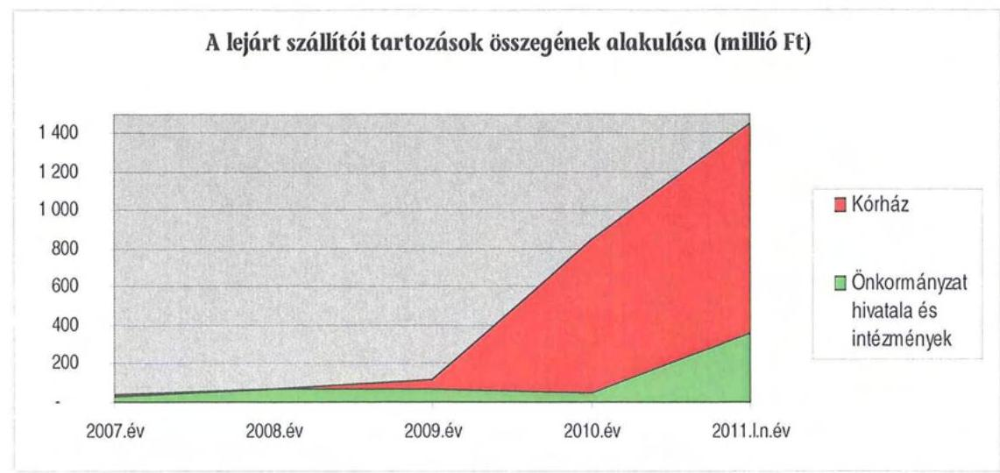

A Közgyűlés a lejárt szállítói kötelezettségek csökkentése érdekében a 2011. évi költségvetési koncepciójában követelményként határozta meg a gazdálkodás újjászervezését. Ezt intézményi integrációval, a támogató feladatok hivatalon belüli ellátásával és a beszerzések központosításával kívánja elérni. Ezekkel az intézkedésekkel közel 2 milliárd Ft-tal csökkentették a költségvetés kiadásait az előző évhez képest. A lejárt szállítói kötelezettségek rendezése érdekében azonnali intézkedéseket tettek, amelynek keretében aláírás előtt áll az E.ON-nal történő megállapodásuk, amely az Önkormányzat számára kedvező fizetési ütemezést tartalmaz, így 260 millió Ft-os energiaszámla kifizetését tudják részletekben rendezni 2011. szeptember 1-ig. Az Önkormányzat vezetése egyeztető megbeszéléseket folytatott a legnagyobb élelmiszer beszállítókkal, akik ígéretet tettek, hogy 2 hónapos időtartamban még teljesítik szállítási kötelezettségeiket a bizonytalan fizetési feltételek mellett is. A Kórház már az elmúlt évben átütemezte a Siemens felé fennálló 80 millió Ft-os tartozását. Ez év május hónapjában három szállító céggel (Siemens, TEVA, Euromedic) egyeztek meg, mintegy 800 millió Ft-os számlatartozás átütemezéséről. Ezek a szállítók késedelmi kamatot - amelynek mértékét a jegybanki alapkamatban határozták meg - számítanak fel a késedelmes napokra.

# 3.3. Egyéb kötelezettségek alakulása 

Az Önkormányzat gazdasági szervezet számára az ellenőrzött időszakban garanciát és kezességet nem vállalt, 2010. december 31-én garancia- és kezességvállalásból fennálló hosszú távú kötelezettsége nem volt.

Az Önkormányzat 2010. december 31-én egyéb kötelezettségvállalás állománnyal nem rendelkezett, az ellenőrzött időszakban nem döntöttek követelés elengedéséről.

Az Önkormányzat a Somogy 2015, a Somogy 2030 I. és a Somogy 2030 II. elnevezésű kötvények kibocsátásakor a kötvények biztosítékaként hozzájárult kilenc darab forgalomképes ingatlanon jelzálogjog alapításához és bejegyzéséhez. Az ingatlanokon összességében 10 milliárd Ft értékű keretbiztosítéki jelzálogjog bejegyzése történt. Az Önkormányzat továbbá keretbiztosítéki jelzá-

---

loggal biztosította az MFB felé fennálló 38 millió Ft értékű hosszú lejáratú fejlesztési hitelszerződését is.

A jelzálogjoggal terhelt ingatlanok számviteli nyilvántartás szerinti nettó értéke 2010. december 31-én 1076 millió Ft, becsült értéke pedig 3468 millió Ft volt, amelyekre kibocsátáskori árfolyamon 10038 millió Ft összegű jelzálogjog bejegyzés történt. Az Önkormányzat összes forgalomképes ingatlanának könyvszerinti nettó értéke 2286 millió Ft, becsült értéke 8108 millió Ft volt, melyből a terhelt ingatlanok becsült értéke 3468 millió Ft (43%) volt.

Összefüggés állapítható meg az Önkormányzat eladósodása és a jelzálogjog bejegyzése között, mivel a kötvénykibocsátások jelzálog alapítása mellett történtek.
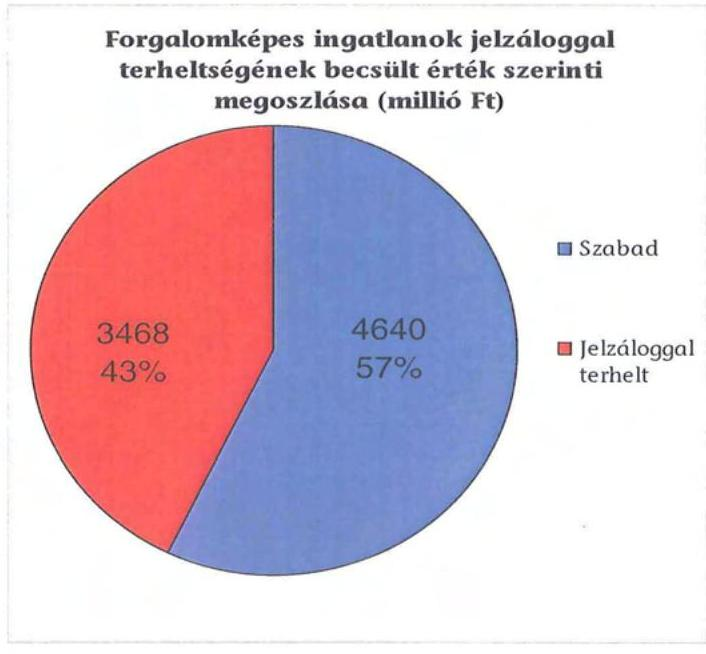

A vizsgált időszakban nem történt meg annak felmérése, hogy az eszközök elhasználódásának, amortizációjának pótlása milyen kötelezettséget jelentene az Önkormányzat számára. A felújításokat és az eszközök pótlását az Önkormányzat a pénzügyi lehetőségei függvényében végezte, elsősorban az intézmények működőképességének biztosítása, illetve a szakhatósági előírások figyelembe vételével. Az Önkormányzat a 2007-2010. években a tárgyi eszközök után 3037 millió Ft összegű értékcsökkenést számolt el. Felújításra 400 millió Ft-ot fordítottak.

A Közgyűlés döntött arról, hogy a Kórház részére 2007 áprilisában kölcsönt nyújt 8 hónapra a likviditás biztosítása érdekében, összességében 250 millió Ft összegben. A Kórház a kölcsönszerződésben foglaltak alapján fizetési kötelezettségét teljesítette.

Az Önkormányzat a 2009. évben a többségi tulajdonában lévő gazdasági társaságának, a Somogy Televízió Kft-nek működési célra 22 millió Ft kölcsönt nyújtott.

---

# 4. A PÉNZÜGYI EGYENSÚLY MEGTEREMTÉSE ÉRDEKÉBEN HOZOTT INTÉZKEDÉSEK 

A jelentésben szereplő CLF módszerben bemutatott működési és felhalmozási hiány annak ellenére alakult ki a vizsgált időszakban, hogy az Önkormányzat folyamatosan intézkedéseket tett a központi finanszírozási rendszer változása miatt bekövetkezett forráscsökkenéshez való alkalmazkodás érdekében, és kiadáscsökkentő, valamint bevételnövelő döntéseket hozott.

A kiadáscsökkentő és bevételnövelő intézkedések a gazdálkodás átláthatóbbá tételét, a feladatellátás szakmai színvonalának növelését, valamint az Önkormányzat pénzügyi helyzetének javítását célozták. A kiadási megtakarítást az álláshelyek számának csökkentésével érték el, ugyanakkor biztosították valamennyi intézmény gazdálkodásának stabilitását.

A vizsgált időszakban összesen 50 kiadáscsökkentő intézkedés történt, amelyből 44 közgyűlési, hat főjegyzői. A kiadáscsökkentés körében meghatározó dokumentum a gazdasági program, amely a stratégia célok, prioritások fejezetében megfogalmazta a jogszabályi előírások, a támogatási feltételek, valamint a gazdasági és társadalmi környezet igényeinek megfelelő megyei fenntartású intézményrendszer racionalizálását, intézménystruktúra kialakítását. A Közgyűlés a kiadáscsökkentő intézkedések sorozatával a pénzügyi egyensúly megteremtésére törekedett, egyúttal a feladatellátás intézményi struktúráját folyamatosan változtatta, igazította.

Az ÁSZ 2006-ban az Önkormányzatnál végzett átfogó gazdálkodási ellenőrzésének megállapításai között szerepelt, hogy mielőbb szükséges az intézményi struktúra feladatokhoz igazodó átalakítása. Erre is hivatkozott a Közgyűlés, amikor 2007-ben hozzákezdett a feladatellátás racionálisabb megszervezéséhez, melynek néhány intézményi példája:

- első lépésként 2007 februárjában a Közgyűlés döntött ${ }^{39}$ a Somogy Megyei Művelődési Központ március 31-i megszűntetéséről, a kötelező feladatainak gazdaságosabb ellátása érdekében. A 14 fő közalkalmazotti létszámból 11 álláshely megszűnt, három fő szakdolgozó a Somogy Megyei Múzeumok Igazgatóságának állományába került, a kötelező közművelődési feladatok egyidejű átadásával. A létszámcsökkentés kimutatásuk szerint 79 millió Ft kiadási megtakarítással járt 2010. év végéig;
- a Közgyűlés 2007 júniusában döntött ${ }^{40}$ a megyei fenntartású oktatási és gyerekvédelmi intézményrendszer átalakításáról, amelynek következtében a Fekete István Szakiskola és Kollégium Ádánd intézményt összevonták a Rudnay Gyula Szakiskola Tab intézménnyel. A Marcali Szakképző Iskola működtetését átadták Marcali Város Önkormányzatának, ezzel 143 millió Ft-ot takarítottak meg a vizsgált időszakban. Az oktatási és nevelési intézményrendszerben szakmai profiltisztítást hajtottak végre. A megyei gyermekvédelmi rendszer struktúráját is átszervezték, az összevonások révén új

[^0]
[^0]:    ${ }^{39} 1 / 2007$. (II. 16.) számú határozat
    ${ }^{40} 67 / 2007$. (VI. 15.) számú határozat

---

gyermekvédelmi körzetek alakultak. A Közgyűlés a döntést megelőzően többször átvilágíttatta az intézményhálózatát, de az intézményi struktúrában addig csak kisebb változtatásokra került sor és nem volt számottevő megtakarítás;
- a lengyeltóti Csalogány Általános Iskola és Diákotthon megszüntetése ${ }^{41}$, valamint a Gyógypedagógiai Intézet Somogyvár és az Iskola és Gyermekotthon Öreglak összevonása miatt 44 fő foglalkoztatott munkajogviszonyát szüntették meg, amelynek eredményeként 2008-2010. évekre vonatkozóan kimutatásuk szerint 335 millió Ft megtakarítást értek el;
- a Közgyűlés 2008. január 1-i hatállyal megszüntette ${ }^{42}$ a megyei fenntartású intézmények önálló gazdálkodási jogkörét (kettő intézmény - Kórház, Somogy Megyei Gyermektábor - kivételével), egyúttal az intézmények gazdasági-pénzügyi feladatainak ellátására létrehozta a Kincstári szervezetet, az intézkedés 59 millió Ft megtakarítást eredményezett a vizsgált időszakban. Újabb racionalizálás keretében 2010. december 31-vel megszüntették a Kincstári szervezetet és a feladatokat integrálták a Hivatalba. A változás indoka öt fős álláshely csökkentés és hatékonyabb feladatellátás volt. A működési kiadások terén 10 millió Ft megtakarítással számoltak;
- energiaracionalizálás keretében a Közgyűlés kilenc intézmény világítási energia-megtakarító rendszerének tervezéséről és bevezetéséről döntött ${ }^{43}$. A 47 millió Ft összegű beruházás kimutatásuk szerint 10 millió Ft éves megtakarítást eredményezett 2010-ben;

Az intézményi feladatok racionalizálásáról, integrációjáról a Közgyűlés folyamatosan hozott döntéseket. Az ezekhez készített előterjesztésekben a tervezett intézkedések indokait, várható eredményeit bemutatták. Az intézményi integráció, átszervezés végrehajtásához kikérték a szakmai szervezetek véleményét, a jogszabályban előírt egyeztetéseket lefolytatták. Minden esetben egyeztettek a KIÉT-tel, valamint a MÉF-fel. Az intézményekben az átszervezést követő működési tapasztalatok - a rendelkezésre álló beszámolók szerint - kedvezőek, a szakmai színvonal, valamint a működés személyi és tárgyi feltételei nem romlottak, esetenként javultak.

A Közgyűlés számos esetben döntött a közművelődési, közoktatási, szociális és gyermekvédelmi feladatokat végző intézmények átalakításáról, egy-egy integrált intézménybe történő összevonásáról. A döntést előkészítő testületi előterjesztések szerint szakmai, valamint gazdálkodási indokai voltak az összevonásoknak. A Közgyűlés 2010. novemberében döntött a megyei fenntartású szociális intézményrendszer ${ }^{44}$, az Önkormányzat közgyűjteményi és közművelődési feladatellátásának ${ }^{45}$; a megyei fenntartású gyermekvédelmi rendszer ${ }^{46}$ és a Kincstári szerve-

[^0]
[^0]:    ${ }^{41}$ 59/2007. (VI. 15) számú határozat
    ${ }^{42}$ 97/2007. (IX. 28.) számú határozat
    ${ }^{43} 1 / 2009$. (II. 13.) számú határozat
    ${ }^{44}$ 104/2010. (XI. 27.) számú határozat
    ${ }^{45}$ 105/2010. (XI. 27.) számú határozat
    ${ }^{46}$ 106/2010. (XI. 27.) számú határozat

---

zet tevékenységének ${ }^{47}$
 átszervezéséről, továbbá a megyei fenntartású gyermekvédelmi intézményrendszerben lévő lakásotthonok számának csökkentéséről ${ }^{48}$, illetve a támogató tevékenységek racionálisabb megszervezéséből és az intézményi összevonásokból adódó álláshely-csökkentésekről ${ }^{49}$. A fenti döntések alapozták meg az Önkormányzat reorganizációs programját, melynek végrehajtása a 2011. évi költségvetési rendeletben található.

A 2007-2010. években az intézményátszervezések, a feladatváltozások, valamint a takarékossági intézkedések hatásaként együttesen 2372 millió Ft kiadás-megtakarítást mutattak ki, amelyből 1337 millió Ft (56,4\%) volt a kapcsolódó létszámcsökkentés eredménye.

A 2007-2010. évek kiadáscsökkentő intézkedéseit beavatkozási területenként az alábbiak részletezik:
adatok: ezer Ft-ban

| Az érvényesített kiadás-   csökkentés területei | Személyi   juttatások és   járulékai | Dologi, mű-   ködési ki-   adások | Pénzeszköz   átadások,   támogatások | Összesen |
| :-- | :--: | :--: | :--: | :--: |
| A Közgyűlés működése |  |  | 71920 | 71920 |
| A Hivatalnál | 227869 | 1884 |  | 229753 |
| Az intézményeknél | 1832329 | 237734 |  | 2070063 |
| ÖSSZESEN | 2060198 | 239618 | 71920 | 2371736 |

A Közgyűlés működési körében 72 millió Ft kiadáscsökkentést mutattak ki az önként vállalt feladatok csökkenése, illetve a feladatok kiszervezése eredményeképpen. Az intézkedéseket a 2007-2010. évek költségvetési rendeletei alapozták meg.

A Hivatalban végrehajtott, a nyilvántartások szerint 230 millió Ft összegű megtakarítási intézkedések feladat-megszüntetésből (területfejlesztés, nemzetközi kapcsolatok csökkenése) és átszervezésből következő, létszámcsökkentéssel, illetve cafetéria-elemek csökkenésével járó döntések ${ }^{50}$ voltak. A feladatellátás racionálisabb megszervezése érdekében történt 30 fő álláshely-megszűntetése 218 millió Ft ( $95,1 \%$ ) megtakarítást eredményezett a vizsgált időszakban. Az éves költségvetési rendeletekben csökkentett cafetéria-elemek összességében 11 millió Ft (4,9\%) kiadáscsökkentést idéztek elő a 2007-2010 közötti időszakban.

Az Önkormányzat kimutatásai szerint a megtakarítási intézkedésekből 2070 millió Ft ( $87,3 \%$ ) az intézmények körében jelentkezett, ezen belül 1832 millió Ft ( $88,5 \%$ ) a személyi juttatásoknál és járulékoknál volt, amelyek települési ön-

[^0]
[^0]:    ${ }^{47}$ 107/2010. (XI. 27.) számú határozat
    ${ }^{48}$ 108/2010. (XI. 27.) számú határozat
    ${ }^{49}$ 109/2010. (XI. 27.) számú határozat
    ${ }^{50}$ 3/2007. (II.16.) számú határozat és az éves költségvetési rendeletek

---

kormányzatoknak átadott feladatokból, intézményi átszervezésekből és gazdasági társaságoknak kiszervezett feladatokból keletkeztek.

Az intézményi átszervezésekből kimutatásuk szerint a lengyeltóti Csalogány Általános Iskola és Diákotthon megszüntetése ${ }^{51} 215$ millió Ft, a Somogy Megyei Múvelődési Központ megszüntetése 62 millió Ft, a tabi Rudnay Gyula Középiskola, valamint az ádándi Fekete István Szakiskola összevonása miatti álláshely-csökkentés 104 millió Ft személyi kiadáscsökkenést (járulékokkal együtt) eredményezett. A feladatmegszüntetéssel, átszervezéssel járó létszámcsökkenésből eredő személyi juttatások megtakarításai, a 44 önkormányzati intézmény 251 fő leépítése 1119 millió Ft-ot eredményezett.

A létszámcsökkentő intézkedések következtében a kimutatások szerint 2007-2011 között a Hivatalnál és az intézményeknél összesen 572 álláshelyet szüntettek meg, amelyből 248 (43,4\%) ágazati-szakmai, 324 (56,6\%) intézményüzemeltetéssel kapcsolatos álláshely volt.

A létszámcsökkentés ágazatonkénti megoszlását az alábbi grafikon szemlélteti:
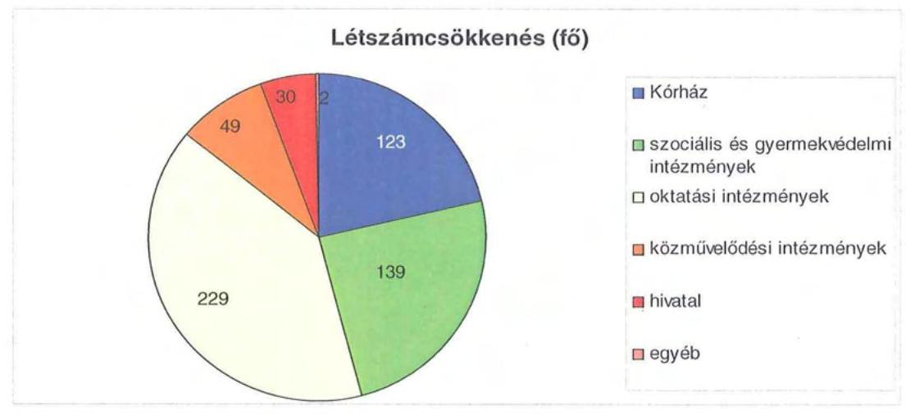

A megyei költségvetési intézmények számára a 2007. évben előírt 321 fős álláshely-megszűntetés végrehajtását vizsgálta a belső ellenőrzés. Az ellenőrzés megállapította, hogy - egy kivételével - valamennyi megyei intézmény az engedélyezett létszámkeretén belül maradt. Az egyetlen intézmény, ahol nem hajtották végre teljes mértékben az előírt leépítést, a marcali Hétszínvirág EGYMI.

Az Önkormányzat intézményeinél történt álláshely-csökkenés feladatátadással 123 millió Ft, átszervezéssel és feladatátrendezéssel 440 millió Ft, feladatmegszüntetéssel, átszervezéssel 1119 millió Ft, illetve feladat-kiszervezéssel kimutatásaik szerint 29 millió Ft megtakarítást értek el a vizsgált időszakban:

- az Önkormányzat siófoki oktatási intézményei közétkeztetésének átvilágítása - a Gastro-ép Kft. közétkeztetési szakértő cég végezte - eredményeként a szolgáltatást kiszervezték ${ }^{52}$ az intézményekből. A feladat ellátásra a Siófok Város Önkormányzatánál - a közbeszerzést elnyerő - közétkeztetést végző S-

[^0]
[^0]:    ${ }^{51}$ 34/2007. (IV. 27.) számú határozat
    ${ }^{52}$ 135/2008. (XI. 28.) számú határozat

---

FOOD Gastronomy Kft. ajánlatát elfogadva kötöttek megállapodást. A szolgáltatás kiszervezése következtében 2009. február 1-jei hatállyal 21 fő közalkalmazotti álláshely-csökkentést hajtottak végre. A kiszervezést indokolta a konyhai gépek 90%-os amortizálódása, a konyhai dolgozók magas bér- és járulékköltségei. Éves szinten a cég által ajánlott ár 18 millió Ft-tal kedvezőbb, mint az intézmények várható közétkeztetési költsége;

- a Közgyűlés döntött ${ }^{53}$ a szociális otthonok korszerűtlen, kihasználatlan mosodáinak megszüntetéséről, egyúttal a szolgáltatás kiszervezéséről. A nyílt közbeszerzési eljárást az Uniglas-2005 Kft. nyerte el. Az intézményekben a mosodai álláshelyek megszüntetésével 16 fős álláshely-csökkentés 11 millió Ft megtakarítással járt.

A helyi szervezési intézkedések végrehajtásához a kimutatások szerint az Önkormányzat a vizsgált időszak alatt 485 millió Ft központi költségvetési támogatásban részesült, amelynek felhasználásával 338 fő álláshelyet tartósan leépített. A 234 fő ( $40,9 \%$ ) létszámcsökkentéshez - amelyből 32 fő a 2010. évi központi támogatás nem kapcsolódott. (Ez tartalmazza a prémiumévek, az üres álláshelyek, és a nyugdíjazás miatti leépítéseket.) Az intézkedések eredményeként az Önkormányzat 2006. december 31-i átlaglétszáma 2011. március 31-re 568 fővel ( $12,7 \%$-kal) csökkent ${ }^{54}$.

Az Önkormányzatnál 2011. első negyedévében folytatódtak a megtakarítási intézkedések. A 2011. évi költségvetési rendeletben az intézkedések sorát határozták meg. Az 1358 millió Ft-ból 800 millió Ft kiadási megtakarítás (58,9\%) személyi jellegű volt, amelyből 666 millió Ft ( $83,2 \%$ ) a támogató tevékenységek racionálisabb megszervezéséből származik és az intézményi összevonásokból adódó álláshely-csökkentéshez kapcsolódott ${ }^{55}$. A Közgyűlés működéséhez kapcsolható kiadások a 7/2011. (II. 15.) számú határozatban tervezettek szerint várhatóan 181 millió Ft összegben csökkennek, amelyből 107 millió Ft (58,9\%) az önként vállalt feladatok, valamint 72 millió Ft (39,8\%) a tiszteletdíjak csökkentése miatti megtakarítás. A költségcsökkentő döntések következtében az intézmények átszervezéséből adódó vezetői javadalmazásokat csökkentették, a Kincstári szervezetet a Hivatalba szervezték, valamint tervezik a gépjárműpark csökkentését és bevezetik a központosított beszerzéseket. A Hivatal kiadásait 60 millió Ft-tal csökkentik álláshely-megszűntetésekkel, a Közgyűlés kiadásait visszafogják, a városoknak adott támogatásokat megszüntetik és a saját erős fejlesztési kiadásokat korlátozzák.

[^0]
[^0]:    ${ }^{53} 87 / 2008$. (VII. 3.) számú határozat
    ${ }^{54}$ 2006. december 31-én az Önkormányzat átlaglétszáma 4481 fő, míg 2011. március 31-én 3913 fő volt.
    ${ }^{55}$ 109/2010. (XI. 27.) számú határozat

---

Az Önkormányzat előző években felhalmozódott gazdasági problémái, adósságállománya miatt reorganizációs tervet fogadott el ${ }^{56}$. A konszolidáció két lehetséges útjaként a terv kiadáscsökkentő és bevételnövelő intézkedéseket célzott meg, amely szerint a legjelentősebb mértékű kiadási megtakarítás intézményi feladatmegszüntetéssel járó létszámcsökkentésekkel érhető el.

A kiadáscsökkentő intézkedések mellett az Önkormányzat bevételnövelő intézkedéseket tett, amelynek számszerúsített összege 2007-2010. években 1671 millió Ft volt. Szabad intézményi kapacitások hasznosításából 193 millió Ft (11,6\%), hivatali és intézményi ingatlanok, eszközök bérbeadásából 692 millió Ft (41,4\%), valamint az átmenetileg szabad pénzeszközök lekötése, befektetése által 785 millió Ft (47,0\%) bevétel keletkezett az Önkormányzatnál.
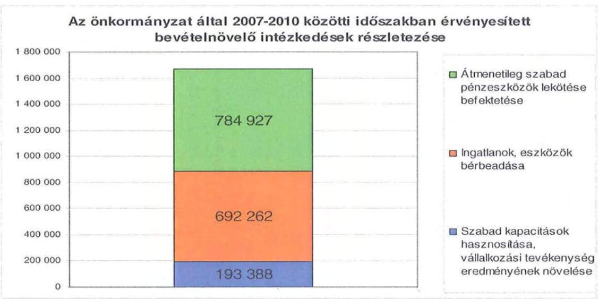

Az ingatlanok bérbeadásából keletkezett bevételek közül 292 millió Ft (42,2\%) az állami és államigazgatási szervek által használt bérleményekből, a 400 millió Ft ( $57,8 \%$ ) pedig az intézményi tornatermek, tantermek, helyiségek bérbeadásából származott.

Az intézményi szabad kapacitások hasznosításának bevétele az oktatási intézmények létesítményeinek nyári üdültetési, valamint hétvégi bérbeadásából keletkezett.

Az átmenetileg szabad pénzeszközök lekötésének önkormányzati bevételét a kötvénykibocsátásokból származó kamatbevételek képezték, az intézményi szabad pénzeszközök időleges lekötései 145 millió Ft-ot (18,5\%) tettek ki.

A 2011. évre 453 millió Ft bevételi növekményt terveztek az Önkormányzatnál, amelyből 185 millió Ft ( $40,8 \%$ ) az állami szervek által bérelt helyiségek bérleti díjából származik. A kötvénykibocsátás szabad pénzeszközeinek kamatbevételei 115 millió Ft-ot ( $25,4 \%$ ), az intézményi szabad kapacitások

[^0]
[^0]:    ${ }^{56}$ A Közgyűlés 103/2010. (X. 29.) számú határozatával felhatalmazta a Közgyűlés elnökét az Önkormányzat jövőbeni feladatellátását érintő reorganizációs folyamatokkal kapcsolatos döntések meghozatalát előkészítő intézkedések megtételére.

---

hasznosítása 56 millió Ft-ot (12,4\%), az intézményi ingatlanok bérbeadása 94 millió Ft-ot $(20,8 \%)$ és az intézményi szabad pénzeszközök lekötése három millió Ft-ot $(0,6 \%)$ tesznek ki a bevételnövelő intézkedések összegében.

A Közgyűlés hat esetben döntött a bevételek növelése érdekében ingatlanok értékesítéséről, valamint egy alkalommal határozott intézményi tulajdonban lévő gépkocsik eladásáról. A tervezett ingatlan-értékesítésből négy megvalósult (bruttó vételár: 100 millió Ft), kettő meghiúsult. A három gépkocsi értékesítési bevétele 19 millió Ft volt.

Az Önkormányzat intézményeiben belső ellenőrzés vizsgálta a 2010. évi költségvetési rendeletben meghatározott kiadáscsökkentő intézkedések végrehajtását, terven felüli ellenőrzés keretében. Az ellenőrzést a közgyűlés rendelte el az éves ellenőrzési terv elfogadását követő időszakban hozott döntései, a költségvetési rendeletben meghatározott intézményi megtakarítások összegeinek ellenőrzése miatt. A 23 intézményben végzett helyszíni ellenőrzések megállapították, hogy a feladatellátás érdekében (az intézmények több mint háromnegyede), 18 intézményvezető utasítást adott ki a költségvetési kiadások csökkentésének megvalósítására (ahol nem adtak ki utasítást ott is történtek intézkedések). Az intézmények összességében időarányosan teljesítették az előírt megtakarításokat, az engedélyezett létszámokat betartották, az üres álláshelyek betöltésére engedélyt kértek.

A Fehér Akác Szociális Otthon már az első negyedévben az Önkormányzat kimutatása szerint három millió Ft megtakarítást ért el fűtésköltségeinek csökkentésével (az éves előírt megtakarítás 101\%-a), amelyet a hagyományos tüzelőanyag szalmabálákkal való kiváltásával ért el.

# 5. A HELYI ÖNKORMÁNYZATOK GAZDÁLKODÁSI RENDSZERÉNEK 2009. ÉVI ELLENŐRZÉSE SORÁN A PÉNZÜGYI EGYENSÚLY JAVÍTÁSÁRA TETT SZABÁLYSZERŰSÉGI ÉS CÉLSZERŰSÉGI JAVASLATOK HASZNOSULÁSA 

Az ÁSZ jelentésében öt szabályszerűségi és hét célszerűségi javaslatot tett. A jelentést a Közgyűlés megismerte. A javaslatok megvalósítására intézkedési tervet készítettek, amely teljes körűen tartalmazta a javaslatokat, meghatározta a feladatok elvégzéséért a felelősöket és a feladatok elvégzésének határidejét.

A pénzügyi egyensúly javítására kettő szabályszerűségi javaslat vonatkozott. Javasoltuk a főjegyzőnek, hogy:

- tegye meg a szükséges intézkedéseket annak érdekében, hogy a költségvetési rendelettervezetben a költségvetési kiadások összege - az Áht. 8/A. § (7) bekezdésében foglaltaknak megfelelően - ne tartalmazzon költségvetési hiányt módosító finanszírozási célú kiadásokat;

---

- gondoskodjon arról, hogy a költségvetési rendelet az Ámr. 29. § (1) bekezdés g) pontjában foglaltaknak megfelelően tartalmazza a többéves kihatással járó európai uniós forrással megvalósuló fejlesztési feladatok előirányzatait éves bontásban.

Az intézkedési tervben 2009. december 31-i határidőt írtak elő, felelősként a pénzügyi főosztályvezetőt megjelölve, amelynek legközelebbi hasznosulásának ideje az éves költségvetési rendelettervezet benyújtásának időpontja.

A 2010. évi költségvetési rendelettervezetben az előírt javaslatokat végrehajtották, a jelzett hiányosságok már nem fordultak elő.

Budapest, 2011. december „ „6"
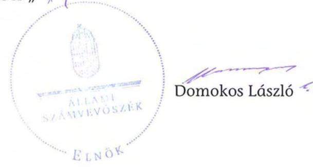

Melléklet: $\quad 5 \mathrm{db} \quad 11$ lap

---

Somogy Megyei Önkormányzat

1. számú melléklet

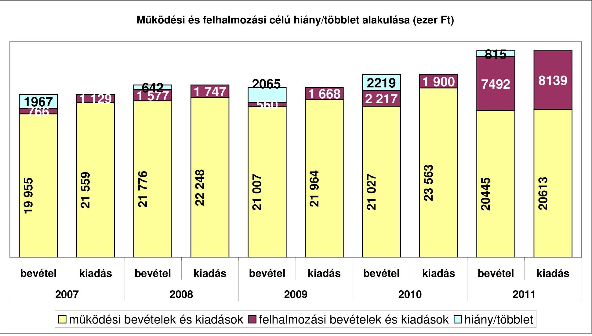

---

.

---

#### Az Önkormányzat CLF módszer szerint besorolt bevételei és kiadásai 2007-2010 között

|  1. FOLYÓ KÖLTSÉGVETÉS* | 2007. | 2008.
 | 2009. | 2010.  |
| --- | --- | --- | --- | --- |
|  1.1.1. Saját működési bevételek | 4 190 752 | 5 518 409 | 5 927 586 | 5 655 821  |
|  1.1.2. Költségvetési támogatás | 4 719 936 | 6 042 204 | 5 294 291 | 4 758 619  |
|  1.1.3. Szerzett bevételek | 1 930 467 | 671 533 | 707 360 | 334 961  |
|  1.1.4. Állami támogatáson belülről kapott támogatások | 9 149 363 | 10 276 666 | 9 025 611 | 10 093 520  |
|  1.1.5. EU-tól és külföldről kapott bevételek | 37 000 | 34 966 | 301 036 | 341 703  |
|  1.1.6. Állami támogatáson kívülről kapott bevételek | 56 900 | 49 984 | 60 305 | 20 367  |
|  1.1.7. Előző évi pénzmaradvány átvétel | 239 | 0 | 50 000 | 0  |
|  1.1. Folyó bevételek =1.1.1.+1.1.2.+1.1.3.+1.1.4.+1.1.5.+1.1.6.+1.7. | 20 084 843 | 22 593 842 | 21 366 198 | 21 204 989  |
|  1.2.1. Működési kiadások | 28 387 560 | 21 838 563 | 28 829 779 | 22 699 936  |
|  1.2.2. Állami támogatáson belülre átadott pénzeszközök | 360 359 | 479 495 | 346 346 | 161 072  |
|  1.2.3.1. vállalkozásoknak | 51 860 | 50 681 | 40 240 | 34 098  |
|  1.2.3.2. EU-nak, illetve külföldre | 0 | 0 | 0 | 0  |
|  1.2.3.3. magánszemélyeknek | 365 071 | 379 563 | 403 885 | 383 009  |
|  1.2.3.4. nonprofit szervezeteknek | 176 082 | 184 493 | 169 829 | 158 359  |
|  1.2.4. Transzferkiadások (=1.2.3.1+1.2.3.2+1.2.3.3+1.2.3.4) | 593 013 | 614 737 | 613 954 | 575 466  |
|  1.2.5. Kinnti kiadások | 181 361 | 496 284 | 636 039 | 461 123  |
|  1.2.6. Előző évi pénzmaradvány átadás | 149 081 | 18 107 | 0 | 0  |
|  1.2. Folyó kiadások = 1.2.1.+1.2.2.+1.2.3.+1.2.4.+1.2.5. | 21 671 382 | 22 639 186 | 22 426 118 | 23 897 597  |
|  1.3. Folyó költségvetés egyenlege MŰKÖDÉSI JÖVEDELEM (1.1. - 1.2.) | -1 586 539 | -45 344 | -1 059 920 | -2 692 608  |
|  2. FELHALMOZÁSI (BERUHÁZÁSI) KÖLTSÉGVETÉS** |  |  |  |   |
|  2.1.1. Saját tőkebevételek | 202 470 | 70 593 | 16 263 | 1 060 733  |
|  2.1.2. Állami támogatáson belülről kapott támogatások | 332 772 | 536 019 | 115 083 | 567 551  |
|  2.1.3. EU-tól és külföldről kapott támogatások | 0 | 9 143 | 25 034 | 209 713  |
|  2.1.4. Állami támogatáson kívülről kapott támogatások | 101 566 | 143 139 | 44 172 | 200 859  |
|  2.1. Felhalmozási (beruházási) bevételek (=2.1.1.+2.1.2+2.1.3+2.1.4.) | 636 816 | 758 894 | 200 472 | 2 038 856  |
|  2.2.1. Saját beruházási kiadás | 824 929 | 1 176 069 | 899 451 | 1 267 558  |
|  2.2.2. Saját felújítási kiadás | 73 312 | 80 291 | 187 683 | 127 251  |
|  2.2.3. Állami támogatáson belülre átadott pénzeszköz | 89 289 | 41 455 | 76 588 | 160 667  |
|  2.2.4. EU-nak és külföldnek adott pénzeszközök | 0 | 0 | 0 | 0  |
|  2.2.5. Állami támogatáson kívülre adott pénzeszközök | 27 143 | 57 868 | 40 100 | 9 930  |
|  2.2.6. Befektetési célú részesedések vásárlása | 1 600 | 570 | 729 | 0  |
|  2.3. Felhalmozási (beruházási) kiadások (=2.2.1.+2.2.2.+2.2.3.+2.2.4.+2.2.5.+2.2.6.) | 1 016 273 | 1 356 253 | 1 204 551 | 1 565 414  |
|  2.4. Beruházási költségvetés egyenlege (2.1. - 2.2.) | -379 457 | -597 359 | -1 004 079 | 473 442  |
|  3. FINANSZÍROZÁSI MŰVELETEK NÉLKÜLI (GFS) POZÍCIÓ |  |  |  |   |
|  (1.3.) Folyó költségvetés egyenlege Működési Jövedelem + (2.3.) Beruházási költségvetés egyenlege | -1 965 996 | -642 703 | -2 063 999 | -2 219 166  |
|  4. FINANSZÍROZÁSI MŰVELETEK |  |  |  |   |
|  4.1. Hitelfelvétel | 703 743 | 0 | 0 | 580 000  |
|  4.2. Hiteltörlesztés | 87 123 | 266 513 | 97 902 | 2 152 177  |
|  4.3. Forgatási és befektetési célú értékpapírok kibocsátása | 1 977 903 | 12 000 000 | 0 | 10 050 429  |
|  4.4. Forgatási és befektetési célú értékpapírok beváltása | 0 | 8 000 000 | 114 882 | 6 700 019  |
|  4.5. Forgatási és befektetési célú értékpapírok értékesítése | 246 345 | 129 933 | 994 119 | 0  |
|  4.6. Forgatási és befektetési célú értékpapírok vásárlása | 0 | 2 000 000 | 0 | 0  |
|  4.7. Egyéb finanszírozási bevételek (függő, átfutó, kiegyenlítő) | -174 707 | 27 465 | -50 986 | -293 480  |
|  4.8. Egyéb finanszírozási kiadások (függő, átfutó, kiegyenlítő) | -38 089 | 273 406 | 58 154 | -298 491  |
|  4.9. Finanszírozási műveletek egyenlege (4.1.-4.2.+4.3.-4.4+4.5.-4.6.+4.7.-4.8.) | 2 704 251 | 1 617 477 | 672 195 | 1 783 244  |
|  5. TÁRGYÉVI POZÍCIÓ |  |  |  |   |
|  (3.) FINANSZÍROZÁSI MŰVELETEK NÉLKÜLI (GFS) POZÍCIÓ + (4.9.) | 738 255 | 974 774 | -1 391 804 | -435 922  |
|  Finanszírozási műveletek egyenlege |  |  |  |   |
|  6. NETTÓ MŰKÖDÉSI JÖVEDELEM |  |  |  |   |
|  (1.3.) Működési Jövedelem - Tőketörlesztés (4.2. Hiteltörlesztés + 4.4. Forgatási és | -1 673 661 | -8 311 857 | -1 272 704 | -11 544 804  |
|  befektetési célú értékpapírok beváltása ) |  |  |  |   |
|  TÁJÉKOZTATÓ ADATOK |  |  |  |   |
|  Összes kötelezettség | 5 318 382 | 9 816 230 | 10 495 914 | 14 089 666  |
|  ebből rövid lejáratú | 2 331 536 | 2 344 693 | 3 321 581 | 2 594 964  |
|  Összes szállítói kötelezettség | 1 091 061 | 1 133 404 | 2 039 111 | 2 333 352  |
|  ebből lejárt | 38 450 | 66 990 | 119 943 | 843 893  |
|  Pénz és tőkehelyi kötelezettség (adósság) | 3 936 261 | 8 302 626 | 8 291 097 | 11 385 982  |
|  ebből rövid lejáratú | 1 131 438 | 1 054 903 | 1 244 264 | 3 780  |
|  PPP szerződésből hátra lévő kötelezettségi állomány | 0 | 0 | 0 | 0  |
|  ebből lejárt szolgáltatási díj miatti kötelezettség | 0 | 0 | 0 | 0  |
|  Folyószámlahitel napi átlagos állománya | 2 101 | 3 373 | 2 068 | 7 768  |
|  Rövidítési napi átlagos állománya | 0 | 0 | 0 | 0  |
|  Munkabérhitel napi átlagos állománya | 12 008 | 8 473 | 10 900 | 8 444  |
|  Peres eljárásokból fennálló függő kötelezettségek | 0 | 0 | 0 | 0  |
|  Finanszírozásba bevonható eszközök összesen | 1 769 086 | 4 732 180 | 2 360 476 | 897 054  |
|  Tartós hitelviszonyt megtestesítő értékpapírok | 0 | 2 000 000 | 1 027 500 | 0  |
|  Hosszú lejáratú bankbetétek | 0 | 0 | 0 | 0  |
|  Értékpapírok | 19 000 | 7 400 | 0 | 0  |
|  Pénzeszközök (idegen pénzeszközök nélkül) | 1 750 006 | 2 724 700 | 1 332 976 | 897 054  |

- Bevételekben nem szerepel, a kiadásokban nem jelenik meg az amortizáció, a vagyoni helyzetet az egyenleg befolyásolja.

* Bevételekben vagyon megőrzésre és bővítésre fordítható források.

---

|  Km
krém | Megnevezés | 2007. év | 2008. év | 2009. év | 2010. év  |
| --- | --- | --- | --- | --- | --- |
|   |  | 2012. | 2013. | 2014. | 2015.  |
|  I. | MŰKÖDÉSI BEVÉTELEK | 20 265 165 | 21 655 277 | 21 343 290 | 21 405 918  |
|  1. | Saját működési bevételek | 4 145 847 | 4 796 394 | 5 261 112 | 5 014 612  |
|  1.1. | Ennek kombinált működési bevétele | 2 300 100 | 2 800 870 | 2 453 660 | 4 114 826  |
|  1.2. | Elővételek | 1 270 340 | 2 969 067 | 1 354 323 | 1 309 792  |
|  1.3. | Külön időbevételek és juttaték | (10) | (1) | 0 | 0  |
|  1.4. | Bérleti bevételek működési része | 36 000 | 36 127 | 44 000 | 61 400  |
|  1.5. | Egyéb saját működési bevételek | 0 | 0 | 0 | 15 000  |
|  2. | Támogatásból származó működési bevételek | 724 764 |

 799 072 | 879 980 | 909 224  |
|   | Jelenő |  |  |  |   |
|   | 1. Helyi önkormányzatok és költségvetési szervek | 299 082 | 398 067 | 317 267 | 179 818  |
|  2. | Szövetkezési történelmi tényületről | 28 018 | 31 698 | 35 607 | 35 698  |
|  3. | Pénzügyforgalmi szökési bevételek működésre jóváhagyott része | 359 844 | 74 766 | 385 252 | 409 072  |
|  4. | Államháztartáson kívül működési célra jövő pénzforgalom | 94 066 | 94 000 | 361 391 | 362 069  |
|   |  | 0 | 0 | 0 | 0  |
|  5. | Központi támogatások és átcsoportosított források működési része | 14 065 732 | 18 222 062 | 14 324 594 | 14 590 540  |
|   | Jelenő |  |  |  |   |
|   | 1. Szűrő | 2 800 847 | 371 500 | 797 380 | 609 961  |
|  1. | Önkormányzat és intézmények állami támogatásának működési része | 4 605 070 | 8 054 600 | 5 271 606 | 4 721 065  |
|  1. | Költségvetési kiegészítések, visszatérítések | 0 | 0 | 0 | 0  |
|  2. | Támogatásbiztosítási alapból | 8 818 799 | 8 515 596 | 8 345 613 | 9 483 298  |
|   | Jelenő | 25 305 140 | 21 952 477 | 21 343 290 | 21 405 918  |
|  II. | BEFEKTETÉSI KIADÁSOK (kompenzációs célkülönbség) | 21 264 556 | 22 142 145 | 21 823 612 | 23 406 314  |
|  1. | Páratlan működési kiadások összesen kamatkifizetések nélkül | 25 322 026 | 31 593 062 | 29 962 996 | 22 889 500  |
|   | Jelenő | 0 | 0 | 0 | 0  |
|  2. | Jelenőtal adózások | 8 667 236 | 8 654 080 | 8 139 639 | 9 182 760  |
|  2. | Jövőképző termelési jövedelmek | 3 170 669 | 3 341 250 | 2 798 796 | 2 479 987  |
|  3. | Alárga bevételek | 2 367 484 | 7 840 870 | 8 790 609 | 10 798 289  |
|  3. | Egyéb helyi kiadások | 119 752 | 444 015 | 291 833 | 417 650  |
|  3. | Egyéb helyi működési kiadások | 0 | 0 | 36 239 | 0  |
|  2. | Támogatások, elszámolások és egyéb helyi államhatósági támogatások | 593 013 | 614 727 | 613 953 | 575 866  |
|   | Jelenő | 0 | 0 | 0 | 0  |
|  III. | Működési célú pénzforgalmi kiadás államháztartáson kívül | 209 291 | 228 174 | 210 069 | 192 927  |
|  1. | Hónapra célú pénzforgalmi kiadás államháztartáson kívül | 0 | 0 | 0 | 0  |
|  2. | Támogatás és szövetségi támogatás | 362 792 | 379 062 | 405 843 | 380 999  |
|  3. | Kötvény és pénzforgalom-fokozó kiadás, értesítésfizetés működése | 249 060 | 18 064 | 263 | 0  |
|  4. | Támogatás értékesítési működési kiadás | 244 412 | 479 497 | 346 240 | 181 372  |
|   | Jelenő | 0 | 0 | 0 | 0  |
|  2. | Önkormányzati adók | 224 595 | 487 097 | 307 479 | 135 836  |
|  1. | Jövedelemadózások | (13) | 0 | 863 | 185  |
|  III. | ADÓKÖZVETÍTŐ GALÉRIA | 298 360 | 10 752 787 | 648 822 | 8 013 319  |
|  1. | Önköltségvetési költségvetés-fokozó működés | 0 | 170 969 | 5 689 | 1 849 025  |
|  2. | Támogatás és szövetségi támogatás | 87 122 | 98 019 | 99 250 | 712 186  |
|  3. | Jelenő | 84 800 | 105 223 | 145 769 | 128 360  |
|  4. | Támogatás és szövetségi támogatás | 0 | 28 000 000 | 114 880 | 8 700 010  |
|  5. | Jövedelemadózások | 0 | 4 000 000 | 114 880 | 8 700 010  |
|  1. | Jövedelemadózások | 0 | 2 000 000 | 0 | 0  |
|  2. | Jövedelemadózások | 0 | 0 | 0 | 0  |
|  3. | ÉG LEMLÁGARÁS BEVÉTELEK | 1 592 670 | 1 894 450 | 4 208 807 | 2 309 025  |
|  1. | Helyi felhalmozás és tőkebevételek | 247 282 | 490 007 | 355 739 | 1 331 520  |
|  1.1. | Távasi eszközök, minták, javak értékesítése, főleg elutasítások | 223 920 | 44 682 | 35 582 | 8 157  |
|  1.2. | Pénztárgéptől származó bevételek | 0 | 0 | 0 | 4 000  |
|  1.3. | Eszközök, visszajelentések | (200) | 0 | 0 | 1 500 000  |
|  1.4. | Kamatkifizetésből felhalmozás része | 16 500 | 808 274 | 311 179 | 193 420  |
|  1.5. | Javak szüreteléséből származó felhalmozás része | 0 | 0 | 0 | 0  |
|  1.6. | Egyéb helyi felhalmozás bevételek | 4 298 | 4 744 | 9 970 | 8 007  |
|  2. | Támogatásértékesítési felhalmozás bevételek | 352 734 | 300 017 | 173 000 | 561 702  |
|   | Jelenő |  |  |  |   |
|  1. | Helyi önkormányzatok és költségvetési szervek | 102 746 | 16 060 | 16 607 | 96 987  |
|  2. | Jelenő | 0 | 0 | 0 | 0  |
|  3. | Jelenő | 0 | 0 | 0 | 0  |
|  3. | Pénzügyforgalmi szökési bevételek felhalmozásra jóváhagyott része | 277 440 | 1 292 877 | 2 047 227 | 85 906  |
|  4. | Államháztartáson kívül felhalmozás célra jövő pénzforgalom | 101 394 | 149 134 | 44 112 | 209 959  |
|   | Jelenő | 0 | 0 | 0 | 0  |
|  1. | Állami felhalmozási és tőkebevételek | 44 390 | 15 993 | 47 116 | 248 049  |
|  5.1. | ÉG költségvetésből átvétel | 0 | 8 142 | 25 000 | 209 713  |
|  5.2. | Önkormányzatok költségvetési támogatása felhalmozás célra | 84 390 | 7 841 | 22 089 | 37 226  |
|   | Jelenő | 0 | 0 | 0 | 0  |
|  2. | ÉG LEMLÁGARÁS KÜLFÖLDI | 1 562 096 | 1 556 240 | 1 172 322 | 1 509 610  |
|  1. | Páratlan felhalmozás kiadások kamatkifizetések nélkül | 822 944 | 1 296 804 | 1 087 060 | 1 079 908  |
|  1.1. | Jövedelemadó, minták | 606 242 | 1 296 082 | 1 087 734 | 1 099 809  |
|  1.2. | Évkészített látható eszközök célú betartás | 22 750 | 0 | 0 | 0  |
|  1.3. | Önkormányzatok elvétlőd | 1 089 | 0 | 0 | 0  |
|  2. | Támogatások, elszámolások és egyéb helyi államhatósági támogatások | 27 142 | 57 866 | 40 371 | 24 938  |
|   | Jelenő |  |  |  |   |
|  1. | Távvezetéki célú pénzforgalmi kiadás államháztartáson kívül | 24 859 | 50 261 | 0 | 4 096  |
|  1. | Jövedelemadó célú tömegesítésnek, kötvény, kötvény törevetése | 4 096 | 4 807 | 30 371 | 21 638  |
|  2. | Támogatásértékesítési felhalmozás kiadások | 44 260 | 41 402 | 44 986 | 182 027  |
|   | Jelenő | 0 | 0 | 0 | 0  |
|  1. | Helyi önkormányzatok és költségvetési szervek | 44 580 | 41 402 | 44 986 | 184 271  |
|  1. | Jelenő | 0 | 0 | 0 | 0  |
|  4. | Pénzügyforgalmi szökési kiadások felhalmozásra jóváhagyott része | 2 114 | 0 | 0 | 0  |
|  1. | Jövedelemadó, minták | 21 208 001 | 24 721 813 | 23 990 128 | 22 709 634  |
|  1. | Jövedelemadózások | 22 990 000 | 23 990 713 | 23 991 434 | 25 862 011  |
|  1. | Jelenő | 0 | 0 | 0 | 0  |
|  1. | Jelenő | 0 | 0 | 0 | 0  |
|  5. | Jövedelemadózási kiadás | 22 771 101 | 22 825 229 | 24 949 218 | 26 255 207  |
|  3. | Jövedelem, kötvény távadás | 2 357 162 | 12 129 931 | 854 119 | 10 859 229  |
|  5.1. | Javak jövedelmének hitelből felvétele | 0 | 0 | 0 | 0  |
|  2.

 | Javaslat felvítése | 702 740 | 0 | 0 | 0  |
|  1. | Jövedémi távadás kiadás kiadás | 0 | 0 | 0 | 0  |
|  1. | Jövedémi távadás kiadás kiadás | 2 243 249 | 12 129 932 | 872 200 | 10 095 429  |
|  1. | Jövedémi vállalás jövedémi célú bevétel | 1 877 890 | 12 099 908 | 0 | 10 095 429  |
|  1. | Jövedémi jövedémi célú | 244 440 | 129 932 | 0 | 0  |
|  1. | Jövedémi vállalás jövedémi | 0 | 0 | 0 | 0  |
|  2. | 2. Főszétáti célú jövedémek kiadás | 0 | 0 | 0 | 0  |
|  2. | 2. Főszétáti célú jövedémek képessége | 2 440 903 | 1 862 424 | 781 000 | 1 779 220  |

---

# Az Önkormányzat 2007-2010 években megvalósított, illetve 2010. december 31-én fennálló fejlesztési feladatokhoz kapcsolódó kötelezettségeinek összegzése

|  Fejlesztési feladat megnevezése | Ber.
kezdete | Teljes
bekerülési
költség | 2006.
december
31-ig
teljesített
kiadás | 2007-2010.
évek között
teljesített
kiadás | 2010. év
utánra
vállalt
kötelezettség | 2010. utáni kötelezettség-vállalás forrásösszetétele |  |  |  |   |
| --- | --- | --- | --- | --- | --- | --- | --- | --- | --- | --- |
|   |  |  |  |  |  | Saját
bevétel | Hitel | Kötvény | EU-s
támogatás | Hazai
támogatás  |
|  Egészségügyi gép-műszer beszerzés-
Céltámogatás 2006. (1/2006. (III.6.) | 2006 | 60528 |  | 60528 |  |  |  |  |  |   |
|  Óvoda, Általános Iskola és Diákotthon Kaposvár
rekonstrukciója- Címzett támogatás 2004.
(4/2004. (III.22.) | 2004 | 1436652 | 1419000 | 17652 |  |  |  |  |  |   |
|  Szociális intézmények felújítása- TEKI 2006.
1/2006. (III.6.) | 2006 | 27143 | 9054 | 18089 |  |  |  |  |  |   |
|  Somogy Megyei Önkormányzat szociális
intézményeinek felújítása- CÉDE
2007. (1/2007. (III.13.) | 2006 | 18179 |  | 18179 |  |  |  |  |  |   |
|  Somogy Megyei Önkormányzat szociális
intézményeinek felújítása-TEKI 2007. (1/2007.(III.13.) | 2007 | 6294 |  | 6292 |  |  |  |  |  |   |
|  Somogy Megyei Önkormányzat intézményeinek
felújítása- CÉDE 2008 (39/2008. (VII. 15.) | 2008 | 23311 |  | 23311 |  |  |  |  |  |   |
|  Magas Cédrus Szociális Otthon, Kökút-
Gyöngyöspuszta- akadálymentesítés (39/2008.
(VII. 15.) | 2009 | 15500 |  | 15500 |  |  |  |  |  |   |
|  János Középiskolája Balatonboglár-
akadálymentesítés
(127/2007. (X.26.) | 2009 | 22964 |  | 22964 |  |  |  |  |  |   |
|  Somogy Megyei Gyermekvédelmi Központ Kaposvár-
akadálymentesítés (127/2007. (X.26.) | 2009 | 20347 |  | 20347 |  |  |  |  |  |   |
|  Duráczky János Pedagógiai és Fejlesztő Módszertani
Központ- kazánok cseréje- CÉDE 2009
(43/2009. (IV. 17.) | 2010 | 10739 |  | 10739 |  |  |  |  |  |   |
|  Duráczky János Pedagógiai és Fejlesztő Módszertani
Központ- akadálymentesítés (85/2009. (IX.25.) | 2009 | 32268 |  | 23828 | 8440 |  |  | 1105 | 7335 |   |

---

# Az Önkormányzat 2007-2010 években megvalósított, illetve 2010. december 31-én fennálló fejlesztési feladatokhoz kapcsolódó kötelezettségeinek összegzése

|  Fejlesztési feladat megnevezése | Ber.
kezdete | Teljes
bekerülési
költség | 2006.
december
31-ig
teljesített
kiadás | 2007-2010.
évek között
teljesített
kiadás | 2010. év
utánra
vállalt
kötelezettség | 2010. utáni kötelezettség-vállalás forrásösszetétele |  |  |  |   |
| --- | --- | --- | --- | --- | --- | --- | --- | --- | --- | --- |
|   |  |  |  |  |  | Saját
bevétel | Hitel | Kötvény | EU-s
támogatás | Hazai
támogatás  |
|  Gyermekvédelmi Intézmény Marcali
nagyszakácsi telephelyén szennyvíztisztító
berendezés cseréje- CÉDE 2009 (43/2009.
(IV. 17.) | 2009 | 21922 |  | 21922 |  |  |  |  |  |   |
|  Somogy Megyei Óvoda, Általános Iskola, Speciális
Szakiskola, Diákotthon, Somogyvár- tanműhely
kialakítása (1/2009.(III.10.) | 2010 | 26096 |  | 26096 |  |  |  |  |  |   |
|  II. sz. Gyermekvédelmi Intézmény Marcali-
Nagyszakácsi telephelyén lakásotthon kialakítása
(114/2008. (X.16.) | 2009 | 59663 |  | 37275 | 22388 |  |  | 1332 | 21056 |   |
|  Somogy Megyei Óvoda, Általános Iskola, Speciális
Szakiskola, Diákotthon, Somogyvár-
akadálymentesítés (49/2009. (VI.23.) | 2009 | 30741 |  | 30741 |  |  |  |  |  |   |
|  Park Szociális Otthon Palotarom-
akadálymentesítés II. ütem (49/2009. (VI.23.) | 2009 | 32451 |  | 32451 |  |  |  |  |  |   |
|  ZITA Speciális Gyermekotthon- akadálymentesítés
(25/2009. (IV.3.) | 2009 | 20135 |  | 20135 |  |  |  |  |  |   |
|  II. sz. Gyermekvédelmi Intézmény- Kékmadár
gyermekotthon-
épület bővítés (114/2008. (X.16.) | 2009 | 81450 |  | 81450 |  |  |  |  |  |   |
|  Dr. Takács Imre Szociális Otthon Tab- speciális
Hészleg kialakítása (114/2008. (X.16.) | 2009 | 44282 |  | 44282 |  |  |  |  |  |   |
|  Perczel Mór Gimnázium Siófok- akadálymentesítés
(85/2009. (IX.25.) | 2009 | 40507 |  | 40507 |  |  |  |  |  |   |
|  Somogy Megyei Önkormánzat Szeretet Szociális
Otthona Berzence- férőhely bővítés
2/2008. (II.8.) | 2009 | 23307 |  | 23307 |  |  |  |  |  |   |

---

# Az Önkormányzat 2007-2010 években megvalósított, illetve 2010. december 31-én fennálló fejlesztési feladatokhoz kapcsolódó kötelezettségeinek összegzése

|  Fejlesztési feladat megnevezése | Ber.
kezdete | Teljes
bekerülési
költség | 2006.
december
31-ig
teljesített
kiadás | 2007-2010.
évek között
teljesített
kiadás | 2010. év
utánra
vállalt
kötelezettség | 2010. utáni kötelezettség-vállalás forrásösszetétele |  |  |  |   |
| --- | --- | --- | --- | --- | --- | --- | --- | --- | --- | --- |
|   |  |  |  |  |  | Saját
bevétel | Hitel | Kötvény | EU-s
támogatás | Hazai
támogatás  |
|  Duráczky József Pedagógiai Fejlesztő Módszertani Központ Kaposvár- óvoda rekonstrukció 1/2009. (III.10.) | 2009 | 75053 |  | 75053 |  |  |  |  |  |   |
|  Somogy Megyei Gyermektábor Fonyód- szálláshely korszerűsítés (1/2009. (III.10.) | 2009 | 46323 |  | 46323 |  |  |  |  |  |   |
|  Megyei és Városi Könyvtár Kaposvár- tetőtéri rekonstrukció (1/2009. (III.10.) | 2010 | 14145 |  | 14145 |  |  |  |  |  |   |
|  Kaposi Mór Oktató Kórház- Somogy megye egészséges társadalmának megteremtéséhez szükséges ellátórendszer átalakítása (1/2008. (II.8.) | 2009 | 6497010 |  | 106060 | 6390950 |  |  | 649701 | 5741249 |   |
|  Kaposi Mór Oktató Kórház- Sürgősségi Betegellátó Centrum kialakítása (119/2009. (XII.4.) | 2009 | 511877 |  | 402633 | 109244 |  |  | 6860 | 102384 |   |
|  József Attila emlékműzeum korszerűsítése Balatonszárszón (84/2009. (IX.25.) | 2010 | 61810 |  |  | 61810 |  |  | 4000 | 49448 | 8362  |
|  Szakképzési eszközök beszerzése a Somogyi TISZK intézményeiben (5/2010. (III.16.) | 2010 | 48904 |  | 48904 |  |  |  |  |  |   |
|  Somogyi TISZK infrastruktúralis feltételeinek kialakítása (65/2008. VI.6.) | 2010 | 1171770 |  | 347461 | 824309 |  |  | 202930 | 621379 |   |
|  Ríppl Rónai Villa infrastruktúralis fejlesztése (154/2007. (XII. 14.) | 2010 | 61723 |  |  | 61723 |  |  | 61723 |  |   |
|  Somogy Megyei Óvoda, Ált. Iskola, Spec. Szakiskola Diákotthon Somogyvár- kollégium beruházás (5/2010. (III. 16.) | 2010 | 58000 |  |  | 58000 |  |  | 58000 |  |   |
|  10 millió forint alatti fejlesztések (ebből pályázattal megvalósuló: 182.050 eFt, kötelező előírások alapján: 228.402 eFt) |  | 881395 |  | 881395 | 27735 |  |  | 27735 |  |   |
|  Összesen |  | 11482489 | 1428054 | 2517569 | 7564599 | 0 | 0 | 1013386 | 6542851 | 8362  |

---

.

---

SOMOGY MEGYE KÖZGYÜLÉSÉNEK ELNÖKE

Ügyiratszám: GF/101-3/2011.
Ügyintéző: Szentgróti József (82/508-130)

## Domokos László

elnök

## Állami Számvevőszék

## Budapest 4.

PF. 54.
1364

## Tisztelt Domokos Úr!

7400 KAPOSVÁR, Megyeháza, Csokonai u. 3. Tel: 82/508-101 Fax: 82/312-634
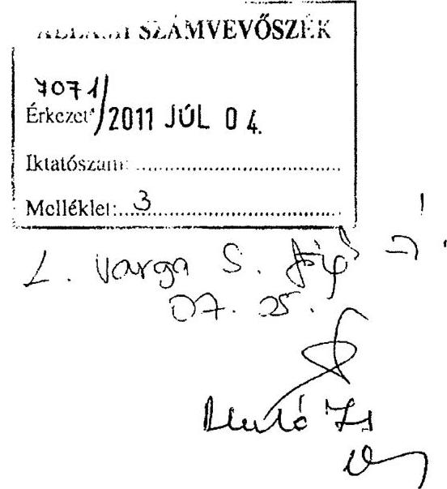

Levelemhez csatolt 3 táblázatban megküldöm a június 14-én kelt levelében kért információkat. Egyúttal megköszönöm Önnek és munkatársainak segítőkész és szakszerű munkáját. A jelentés-tervezetet áttanulmányoztuk és annak tartalmával egyetértünk, mivel valós képet ad általában a megyék, és ezen belül a Somogy Megyei Önkormányzat pénzügyi helyzetéről.
Tájékoztatom Elnök Urat, hogy a rendkívül kedvezőtlen pénzügyi folyamatok negatív hatásainak mérséklését célzó reorganizációs folyamat végrehajtása folyamatban van. A program keretében:

- közel 1,6 milliárd Ft-tal csökkentettük az intézmények normatíva feletti támogatását,
- megszüntettük - s ezáltal 100 millió Ft-ot takarítottunk meg - a kötelező megyei feladatokat ellátó intézményeiket át nem adó városok támogatását,
- a hivatal és közgyűlés kiadásait összesen

 mintegy 140 millió Ft-tal mérsékeltük,
- a saját erős fejlesztések, felújítások terén 150 millió Ft-os nagyságrendű megtakarítást kívánunk elérni.
A fentiek ellenére még 1.271 millió Ft-os tervezett hitelfelvétellel tudtuk csak egyensúlyban tartani a 2011. évi költségvetésünket. A pénzügyi szigoron túl folyamatos egyeztetéseket végzünk szállítóinkkal a fennálló tartozások átütemezése ügyében. Rendkívüli takarékossági intézkedéseket vezettünk be az önkormányzat valamennyi területén (élelmiszer megrendelések, megbízási díjak, cafetéria, stb.). A testület legutolsó ülésén döntött 48.000 eFt összegű 2011. évi önként vállalt feladat törléséről is. Racionalizáltuk a főzőkonyhák működését, az élelmiszerek, takarítószerek beszerzését, a karbantartási és takarítási feladatokat.
Az előzőekből látható, hogy a kormányzati segítségen túl (ÖNHIKI) a megye vezetése mindent megtesz a működőképesség megtartása, a kötelező önkormányzati alapszolgáltatások biztosítása érdekében. Bízva a további eredményes együttműködésünkben kérem a fentiek tudomásulvételét.

Kaposvár, 2011. június 27.

---

.

---

# Gclencsér Attila úr   elnök 

Somogy Megyei Önkormányzat

## Kaposvár

## Tisztelt Elnök Úr!

Köszönettel vettem észrevételét a Somogy Megyei Önkormányzat pénzügyi helyzete ellenőrzéséről szóló jelentés-tervezetben foglalt megállapításokra, amelyben a jelentés-tervezet tartalmával egyetértettek, mivel valós képet ad a Somogy Megyei Önkormányzat pénzügyi helyzetéről.

Köszönöm a tájékoztatást a jelentés-tervezetben szereplő megállapítások és javaslatok alapján megtett intézkedésekről, valamint a rendkívül kedvezőtlen pénzügyi folyamatok negatív hatásainak mérséklését szolgáló reorganizációs programjuk végrehajtásáról.

Köszönöm Elnök úr és munkatársainak az ellenőrzés során tanúsított hozzáállását, amellyel a pénzügyi helyzetelemzés elkészítésében részt vettek, azt munkájukkal segítették.

Budapest, 2011. december " 157 ".

Tisztelettel:

Domokos László

Melléklet: jelentés
