# ÁLLAMI   SZÁMVEVŐSZÉK 

## JELENTÉS

a Szabolcs-Szatmár-Bereg Megyei Önkormányzat pénzügyi helyzetének ellenőrzéséről (43/2)

---

# Számvevői Iroda 

Iktatószám: V-3023-09/2011.
Témaszám: 1015
Vizsgálat-azonosító szám: V056015

## Az ellenőrzést felügyelte:

Dr. Varga Sándor
számvevő igazgató-helyettes
Az ellenőrzést vezette:
Renkó Zsuzsanna
számvevő tanácsos
Az ellenőrzést végezték:

| Bialkó Zsolt | Mokánszkiné | Szücs Zoltán |
| :-- | :-- | :-- |
| számvevő tanácsos | Mengyi Andrea   számvevő tanácsos | számvevő tanácsos |

A témához kapcsolódó eddig készített számvevőszéki jelentések:
címe
sorszáma
Jelentés a Szabolcs-Szatmár-Bereg Megyei Önkormányzat gazdál- 0818 kodási rendszerének 2008. évi átfogó ellenőrzéséről

---

# TARTALOMJEGYZÉK 

BEVEZETÉS ..... 5
I. ÖSSZEGZŐ MEGÁLLAPÍTÁSOK, JAVASLATOK ..... 12
II. RÉSZLETES MEGÁLLAPÍTÁSOK ..... 17

1. Az Önkormányzat kötelező és önként vállalt feladatai ..... 17
2. Pénzügyi egyensúlyi helyzet alakulása ..... 20
2.1. A múködési és felhalmozási egyensúly alakulása ..... 22
2.2. Az Önkormányzat bevételei ..... 27
2.3. Az Önkormányzat kiadásai ..... 29
3. Kötelezettségek bemutatása ..... 32
3.1. A pénzintézetek felé fennálló kötelezettségek alakulása ..... 32
3.2. Szállítók felé fennálló kötelezettségek alakulása ..... 37
3.3. Egyéb kötelezettségek alakulása ..... 38
4. A pénzügyi egyensúly megteremtése érdekében hozott intézkedések ..... 39
5. A helyi önkormányzatok gazdálkodási rendszerének 2007. évi ellenőrzése során a pénzügyi egyensúly javítására tett szabályszerűségi és célszerűségi javaslatok hasznosulása ..... 44

---

# MELLÉKLETEK 

1. számú Múködési és felhalmozási hiány/többlet alakulása az Önkormányzat zármelléklet számadási rendeleteiben
2/a. számú Az önkormányzat bevételeinek és kiadásainak, adósságszolgálatának ala-melléklet kulásáról (2007-2010. években teljesített adatok CLF módszer alapján )
2/b. számú Kimutatás az Önkormányzat bevételeinek és kiadásainak, adósságszolgálatának alakulásáról (1 oldal)
2. számú Az Önkormányzat 2007-2010 években megvalósított, illetve 2010. december 31-én fennálló fejlesztési feladatokhoz kapcsolódó kötelezettségeinek összegzése
3. számú Szabolcs-Szatmár-Bereg Megyei Közgyűlés elnökének észrevétele melléklet
4. számú Szabolcs-Szatmár-Bereg Megyei Közgyűlés elnökének észrevételére adott melléklet válasz

---

# RÖVIDÍTÉSEK JEGYZÉKE 

## Törvények

Áht.
ÁSZ tv.

Htv.

Ötv.
Számv. tv.

## Rendeletek

SzMSz

## Szórövidítések

APEH
ÁSZ
BM
EDP hiány/egyenleg
Egészségügyi Holding
Nonprofit Zrt.
EU
GDP
Hivatal
Illetékhivatal
Kórházak

Közgyűlés
KSH
NGM
OEP
Önkormányzat
ÖNHIKI
PPP konstrukció
SNA
szja
az államháztartásról szóló 1992. évi XXXVIII. törvény
A 2011. június 30-ig hatályos Állami Számvevőszékről szóló 1989. évi XXXVIII. törvény (2011. július 1-től az Állami Számvevőszékről szóló 2011. évi LXVI. törvény)
a helyi önkormányzatok és szerveik, a köztársasági megbízottak, valamint egyes centrális alárendeltségủ szervek feladat- és hatásköreiről szóló 1991. évi XX. törvény
a helyi önkormányzatokról szóló 1990. évi LXV. törvény a számvitelről szóló 2000 . évi C. törvény

Szabolcs-Szatmár-Bereg Megyei Önkormányzat 5/2011. (IV. 15.) számú rendelete az Önkormányzat és Szervei Szervezeti és Múködési Szabályairól

Adó- és Pénzügyi Ellenőrzési Hivatal, 2011. január 1-jétől Nemzeti Adó- és Vámhivatal (NAV)
Állami Számvevőszék
Belügyminisztérium
Uniós módszertan szerinti maastrichti kritériumoknak megfelelő számítás szerinti hiány/egyenleg
Szabolcs-Szatmár-Bereg Megyei Egészségügyi Nonprofit Holding Zrt.
Európai Unió
Bruttó hazai termék
Szabolcs-Szatmár-Bereg Megyei Önkormányzati Hivatal
Szabolcs-Szatmár-Bereg Megyei Illetékhivatal
Jósa András Oktató Kórház Nyíregyháza, Sántha Kálmán Mentális Egészségközpont és Szakkórház Nagykálló, Szatmár-Beregi Kórház Fehérgyarmat
Szabolcs-Szatmár-Bereg Megyei Közgyűlés
Központi Statisztikai Hivatal
Nemzetgazdasági Minisztérium
Országos Egészségbiztosítási Pénztár
Szabolcs-Szatmár-Bereg Megyei Önkormányzat
önhibáján kívül hátrányos helyzetben lévő önkormányzatok támogatása
Public Private Partnership (Partnerségi együttmúködés közfeladatok ellátására a magánszektor bevonásával)
System of National Accounts, azaz Nemzeti Számlák Rendszere
Személyi jövedelemadó

---

# **Chemistry**

## **Chemical Reactions**

### **Balancing Chemical Equations**

1. **Write the unbalanced equation:**
   - Example: $$C_3H_8 + O_2 \rightarrow CO_2 + H_2O$$

2. **Balance the equation:**
   - Example: $$2C_3H_8 + 7O_2 \rightarrow 6CO_2 + 8H_2O$$

3. **Balance the equation:**
   - Example: $$2C_3H_8 + 7O_2 \rightarrow 6CO_2 + 8H_2O$$

### **Types of Reactions**

1. **Combination Reaction:**
   - Example: $$2H_2 + O_2 \rightarrow 2H_2O$$

2. **Decomposition Reaction:**
   - Example: $$2H_2O_2 \rightarrow 2H_2O + O_2$$

3. **Single Displacement Reaction:**
   - Example: $$Zn + 2HCl \rightarrow ZnCl_2 + H_2$$

4. **Double Displacement Reaction:**
   - Example: $$AgNO_3 + NaCl \rightarrow AgCl + NaNO_3$$

5. **Combustion Reaction:**
   - Example: $$CH_4 + 2O_2 \rightarrow CO_2 + 2H_2O$$

## **Stoichiometry**

### **Mole Concept**

- **Mole (mol):** The amount of substance containing as many particles (atoms, molecules, ions) as there are atoms in exactly 12 grams of carbon-12.
- **Avogadro's Number:** $$6.022 \times 10^{23}$$ particles per mole.

### **Molar Mass**

- **Molar Mass:** The mass of one mole of a substance.
- Example: The molar mass of water ($$H_2O$$) is 18.015 g/mol.

### **Calculations**

1. **Moles to Mass:**
   - Formula: $$n = \frac{m}{M}$$
   - Example: Calculate the number of moles of $$H_2O$$ in 18 grams of water.
     - $$n = \frac{18.015 \, \text{g}}{18.015 \, \text{g/mol}} = 18.015 \, \text{g/mol}$$

2. **Moles to Mass:**
   - Formula: $$m = n \times M$$
   - Example: Calculate the mass of 18.015 g of water.
     - $$m = 18.015 \, \text{g/mol} = 18.015 \, \text{g/mol}$$

## **Gas Laws**

### **Ideal Gas Law**

- **Equation:** $$PV = nRT$$
- **Variables:**
  - $$P$$: Pressure (atm)
  - $$V$$: Volume (L)
  - $$n$$: Number of moles (mol)
  - $$R$$: Ideal gas constant (0.0821 L·atm/mol·K)
  - $$T$$: Temperature (K)

### **Boyle's Law**

- **Equation:** $$P_1V_1 = P_2V_2$$
- **Variables:**
  - P₁: Pressure (atm)
  - P₂: Volume (L)
  - P₃: Temperature (K)
  - P₁: Pressure (atm)
  - P₂: Volume (L)
  - P₃: Temperature (K)
  - P₁: Pressure (atm)

### **Boyle's Law (Boyle's Law)**

- **Equation:** $$\frac{P_1V_1}{P_2V_2} = \frac{P_1}{V_1}$$

## **Thermochemistry**

### **Enthalpy (H)**

- **Definition:** The heat content of a system at constant pressure.
- **Equation:** $$\Delta H = q_p$$
- **Variables:**
  - $$q_p$$: Heat transferred at constant pressure.
  - $$q_p$$: Heat transferred at constant pressure.

### **Hess's Law**

- **Statement:** The enthalpy change for a reaction is the same whether it occurs in one step or multiple steps.
- **Equation:** $$\Delta H_{\text{rest}} = \Delta H - \Delta H_0$$
- **Variables:**
  - $$\Delta H$$: Heat transferred at constant pressure.
  - $$\Delta H_0$$: Heat transferred at constant pressure.

### **Hess's Law (Hess's Law)**

- **Statement:** The enthalpy change for a reaction is the same whether it occurs in one step or multiple steps.
- **Equation:** $$\Delta H_{\text{rest}} = \Delta H - \Delta H_0$$
- **Variables:**
  - $$\Delta H$$: Heat transferred at constant pressure.
  - $$\Delta H_0$$: Heat transferred at constant pressure.

## **Electrochemistry**

### **Oxidation and Reduction**

- **Oxidation:** Loss of electrons.
- **Reduction:** Gain of electrons.

### **Galvanic Cells**

- **Definition:** A cell that converts chemical energy into electrical energy.
- **Components:**
  - Anode: Oxidation occurs.
  - Cathode: Reduction occurs.
  - Salt Bridge: Connects the two half-cells.

### **Nernst Equation**

- **Equation:** $$E = E^\circ - \frac{RT}{nF} \ln Q$$
- **Variables:**
  - $$E$$: Energy (K)
  - $$E^\circ$$: Standard deviation (m)
  - $$R$$: Ideal gas constant (0.0821 L·atm/mol·K)
  - $$T$$: Temperature (K)
  - $$n$$: Number of electrons transferred
  - $$F$$: Faraday constant (96,485 C/mol)
  - $$Q$$: Reaction quotient

---

# JELENTÉS 

## a Szabolcs-Szatmár-Bereg Megyei Önkormányzat pénzügyi helyzetének ellenőrzéséről

## BEVEZETÉS

Az Állami Számvevőszék 2011. évtől érvényes stratégiája új irányt szabott a helyi önkormányzatok gazdálkodásának ellenőrzésében is. Az ÁSZ - küldetése és jövőképe szerint - szilárd szakmai alapokra támaszkodva értékteremtő ellenőrzéseivel és helyzetelemzéseivel az államháztartás egészében, így a helyi önkormányzati alrendszerben is elő kívánja segíteni a közpénzek és a közvagyon szabályos, gazdaságos, hatékony és eredményes hasznosítását. E folyamat részeként - a 2010. évi államháztartási hiány alakulásának összetevőire is figyelemmel - megkezdődött az önkormányzati alrendszer pénzügyi helyzetelemzése.

Az NGM 2011 áprilisában közzétett adatai szerint ${ }^{1}$ a 2010. évi 1036,2 milliárd Ft összegű, 3,8\%-os EDP (maastrichti kritériumok szerinti, Túlzott Hiány Eljárás keretében kimutatott) hiánycél nem volt tartható, az önkormányzati alrendszer tervezettet meghaladó hiánya miatt a GDP arányában kifejezett államháztartási hiány $4,2 \%$-ra emelkedett.

Az önkormányzatok költségvetési jelentése szerint 2010. első három negyedév végén az önkormányzati alrendszer pénzforgalmi hiánya 97 milliárd Ft volt, a tervezett éves mérték $51 \%$-át érte el. Bár az elmúlt években kiugróan magas hiány halmozódott fel az utolsó negyedévben, a 97 milliárd Ft-os szeptember végi hiány nem indokolta az önkormányzati alrendszer 190 milliárd Ft-ra becsült éves hiányának felülvizsgálatát. A tervezett hiány túllépése, az utolsó negyedévi 150 milliárd Ft-os pénzforgalmi hiány nem volt reálisan feltételezhető. A helyi önkormányzatok januári gyorsjelentése szerint a pénzforgalmi hiány 247,7 milliárd Ft-ot tett ki. A tervezettnél nagyobb önkormányzati pénzforgalmi hiány kialakulásában - az NGM által az éves költségvetési beszámoló elkészítéséhez kiadott tájékoztató szerint - az iparűzési adó elmaradása, a gépjárműadó, az illetékek és más bevételek tervezettnél alacsonyabb összegben teljesülése volt a meghatározó.

[^0]
[^0]:    ${ }^{1}$ NGM Tájékoztatás Magyarország Strukturális Reformprogramjának végrehajtásáról (2011. április 1.). A Tájékoztató évente két alkalommal - április és október hónapban jelenik meg.

---

A megyei önkormányzatok kötelező feladatellátását többlépcsős törvényi előírások határozzák meg. A feladatokra vonatkozó szabályozás első szintjét az Ötv. ${ }^{2}$, a második szintet a hatásköri ${ }^{3}$, a harmadik szintet a további ágazati, szakmai törvények (egyebek mellett az oktatási, egészségügyi, szociális) adják.

A megyei önkormányzatok a feladatellátás és a központi forráselosztás tekintetében sajátos helyet foglalnak el a helyi önkormányzati rendszerben. A megyei önkormányzat kötelező feladatainak egy része - így a megyében lévő természeti és társadalmi muzeális emlékek, a történeti iratok gyűjtése, őrzése, tudományos feldolgozása, a megyei könyvtári szolgáltatás, a pedagógiai és közművelődési szakmai tanácsadás és szolgáltatás, a megyei testnevelési és sportszervezési feladatellátás, a gyermek- és ifjúsági jogok érvényesítése, a gyermekvédelmi- és szociális szakellátás - az Ötv-ből közvetlenül levezethető kötelezettség.

A középiskolai, szakiskolai és kollégiumi ellátás, a fogyatékos gyermekek oktatása, nevelése, gondozása az ágazati törvény szerint a megyei önkormányzat kötelező feladata. Azonban, ha a települési önkormányzat lát el ilyen feladatot, és arról lemond, a megyei önkormányzatnak a feladatot át kell vennie. Így a megyei önkormányzatok által ellátandó kötelező közszolgáltatások ellátásának mértékére a települési önkormányzatok döntései jelentősen kihatnak.

Az alapellátást meghaladó egészségügyi szakellátás biztosítása akkor képezi a megyei önkormányzat feladatát, ha az önkormányzati vagyon kialakításáról szóló törvényben ${ }^{4}$ a feladat ellátásához szükséges vagyont az önkormányzat a tulajdonába kapta.

Az önként vállalt feladat ellátására - mivel annak vállalása a kötelező feladatok ellátását nem veszélyeztetheti - a kötelező közszolgáltatások mértékének alakulása lényegi hatással van.

A feladat- és hatáskör-telepítés sajátosságai mellett a megyei önkormányzatok kialakított forrásszerkezete, a központi költségvetéstől való erőteljes függősége is determinálja az önkormányzatok feladatellátásra vonatkozó döntéseit.

A 2007-2010. években az önkormányzati feladatok ellátásának keretet biztosító forrásszabályozás - ennek részeként az illetékbevételből és a személyi jövedelemadóból való részesedés szabályai - a megyei önkormányzatok vonatkozásában nem változtak:

- A megyei önkormányzatok saját bevételein belül az illetékbevételek döntően az ingatlanpiac stagnálása, majd visszaesése, és egyes illetékkedvezmények bevezetése következtében - megyénként differenciált mértékben ugyan, de - 2010-re általánosan visszaestek. A 2010. évben befolyt

[^0]
[^0]:    ${ }^{2}$ Ötv. 69-70. §-ai
    ${ }^{3}$ a Htv.
    ${ }^{4}$ Az egyes állami tulajdonban lévő vagyontárgyak önkormányzatok tulajdonba adásáról szóló 1991. évi XXXIII. törvény.

---

39,2 milliárd Ft illetékbevétel a 2006. évben realizált 71,1 milliárd Ft illetékbevétel alig több mint $55 \%$-a volt. A kieső bevételek pótlására az önkormányzati alrendszer szintjén történtek intézkedések, 2010-ben 5 milliárd Ftot, 2011-ben 1,2 milliárd Ft-ot ellentételezett a központi költségvetés. Az illetékbevételt a megyei önkormányzatok a saját folyó bevételeik között számolják el ${ }^{5}$.

Az illetékek kivetésének és beszedésének joga 2006. december 31-ig a megyei önkormányzatok feladata volt. A 2007. évtől a megyei illetékhivatalok illetékbeszedési feladatait az APEH vette át ${ }^{6}$. Az önkormányzati illetékrészesedési szabályok változatlanok maradtak, azonban az illetékbeszedés költségeit az önkormányzatok illetékbevételeiből átlagos (a Fővárosnál 4,0\%-os, a megyei és megyei jogú városi önkormányzatnál 8,5\%-os) kulcsot alkalmazva vonták le. E döntés következtében azon megyei önkormányzatok, amelyek a 8,5\%-os költségnél kedvezőbb költségszint mellett látták el korábban ezt a feladatot, kedvezőtlenebb helyzetbe kerültek.

- Az önkormányzati alrendszer személyi jövedelemadóból való részesedésének makroszíntű szabályozása nem változott 2007-2010 között7. A helyi önkormányzatokat normatív módon megillető $32 \%$-os részesedés visszaosztásának részletszabályai azonban a megyei önkormányzatok számára - a reálgazdaság kedvezőtlen irányú folyamatai, és az államháztartás egyensúlyi helyzetére tekintettel elrendelt kormányzati intézkedések miatt - megszorító intézkedéseket jelentettek. Összesen 17 milliárd Ft - 2007-ben 10 milliárd Ft, 2010-ben további 7 milliárd Ft - szja-t vontak ki a megyei önkormányzatok gazdálkodási köréből ${ }^{8}$. Az átengedett személyi jövedelemadó a megyei önkormányzatok egyik bevétele.

[^0]
[^0]:    ${ }^{5}$ A megyei önkormányzatok illetékbevételei az önkormányzati alrendszer saját folyó bevételeiből 2007-ben 35,9 milliárd Ft-ot ( $61,4 \%$-ot), 2008-ban 41,5 milliárd Ft-ot ( $61,7 \%$-ot), 2009-ben 36,5 milliárd Ft-ot ( $62,5 \%$-ot), 2010-ben 25,1 milliárd Ft-ot $(64,1 \%$-ot) tettek ki.
    ${ }^{6}$ Az egyes pénzügyi tárgyú törvények módosításáról szóló 2006. évi LXI. törvény 115. §a, amely az adózás rendjéről szóló 2003. évi XCII. törvény 73. §-át módosította.
    ${ }^{7}$ A megyei önkormányzatok személyi jövedelemadó részesedése az önkormányzati alrendszer átengedett bevételeiből 2007-ben 34,7 milliárd Ft-ot ( $7,0 \%$-ot), 2008-ban 51,2 milliárd Ft-ot ( $9,2 \%$-ot), 2009-ben 59,2 milliárd Ft-ot ( $9,3 \%$-ot), 2010-ben 56,3 milliárd Ft-ot $(8,3 \%$-ot) tett ki.
    ${ }^{8}$ A megyei önkormányzatok szja kiegészítése háromelemű. A tételes, minden megyére egységesen meghatározott összeg - az adott évek költségvetési törvényeinek 4. sz. mellékletében meghatározottak szerint - 2006-ban 593 millió Ft, 2007-ben és 2008-ban egyaránt 355 millió Ft, 2009-ben 370 millió Ft volt. A megye népességszáma után járó kiegészítés a 2006. évi 208 Ft/fő összegről 2010-re 120 Ft/fő-re, a megyei intézmények ellátottjai után járó kiegészítés 42236 Ft/ellátottról 20755 Ft/ellátottra csökkent.

---

A megyei önkormányzatok 2007-2010 között rendelkezésre álló forrásait az alábbiakban mutatjuk be:
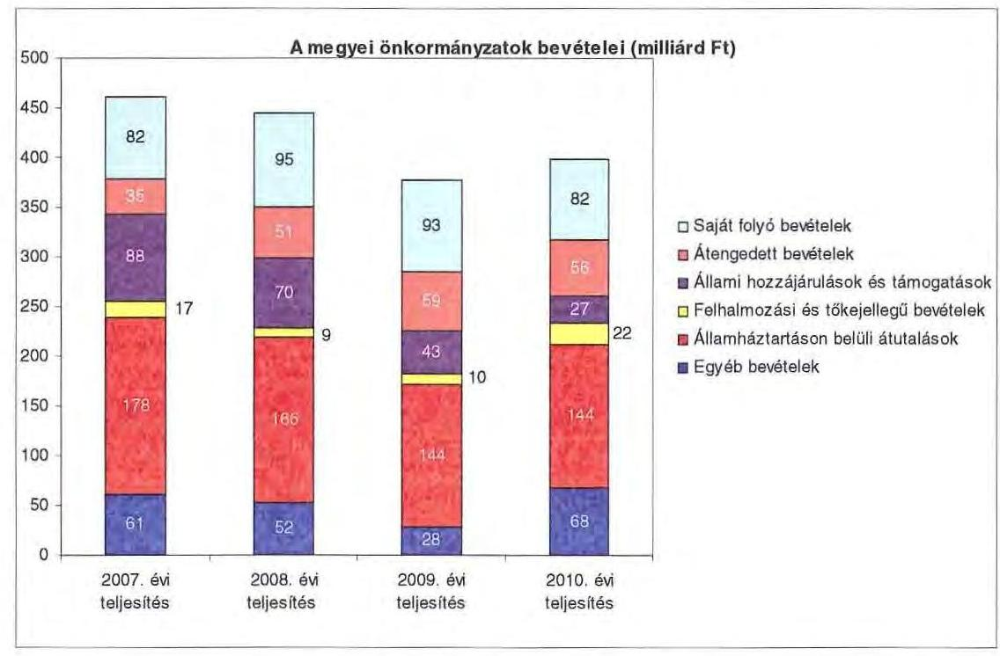

A megyei önkormányzatok saját folyó bevételeinek részaránya - amelyek fôbb elemei: az intézményi térítési díjak, az illetékbevétel, a kamatbevételek - a 2007. évi összbevételen ( 461 milliárd Ft) belül 17,9\% volt, amely 2010-re annak ellenére $20,6 \%$-ra nőtt, hogy az összege 82 milliárd Ft maradt. Ennek oka az volt, hogy az összbevétel a 2007. évi 461 milliárd Ft-ról 2010-re 399 milliárd Ftra csökkent.

Az átengedett bevételek, amelyek a megyei önkormányzatoknál a személyi jövedelemadóból való részesedést jelentették, az összbevételen belül a 2007. évi 35 milliárd Ft-ról 56 milliárd Ft-ra nőttek.

Az állami hozzájárulások és támogatások - amelyek fôbb elemei: az ellátotti létszámhoz kötődő normatív állami hozzájárulások, központosított, fejezeti szinten kezelt céle1öirányzatból juttatott müködési és fejlesztési támogatások a 2007. évi 88 milliárd Ft-ról (19,1\%-os részarányról) 2010-re 27 milliárd Ft-ra ( $6,8 \%$-os részarányra) estek vissza.

A felhalmozási és tőkejellegủ bevételek - tárgyi eszközök (ingatlanok és ingóságok), föld és immateriális javak, részesedések értékesítése, EU-tól átvett pénzeszközök - a 2007. évi 17 milliárd Ft-ról (3,6\%-os részarányról) 2010-re 22 milliárd Ft-ra ( $5,4 \%$-ra) emelkedtek.

Az államháztartáson belüli átutalások részesedése 2007-ben 178 milliárd Ft volt. 2010. év végére 34 milliárd Ft-tal csökkent, részaránya $38,6 \%$-ról 2,6 százalékpontos csökkenés után 2010-ben $36 \%$-ra változott. Ez a bevételi kategória tartalmazza az egészségbiztosítási és egyéb elkülönített állami pénzalapoktól átvett forrásokat. A 2010-ben e címen elszámolt bevétel 144 milliárd Ft volt.

---

A megyei önkormányzatok központi költségvetésből származó bevételeinek öszszege 2007-ben 400 milliárd Ft volt, amely 2010. évre 331 milliárd Ft-ra (az időszak alatt összesen 69 milliárd Ft-tal) 17,3\%-kal csökkent.

Az egyéb, pénzmaradványból, vállalkozási bevételekből, államháztartáson kívülről származó átutalásokból, a hitelekből, a hosszú és rövid lejáratú értékpapírok értékesítéséből származó bevételek részesedése a 2007-2010. évek viszonylatában 13,3\%-ról 17,1\%-ra emelkedett. Ez utóbbiak 2010. évi beszámoló szerinti összevont teljesítése 68 milliárd Ft volt ${ }^{9}$.

Mindezeket figyelembe véve 2007. és 2010. években a megyei önkormányzatok forrásösszetételének megoszlását az alábbi ábra szemlélteti:

A megyei önkormányzatok forrásainak megoszlása a 2007. és a 201. években (\%-ban)
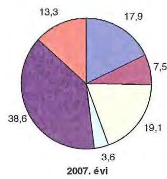
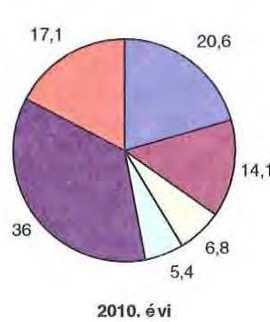
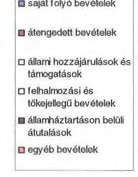

Annak ellenére, hogy a megyei önkormányzatok kötelezően ellátandó feladataikat 2007-hez képest kevesebb intézményben, csökkenő foglalkoztatotti létszám mellett végezték ${ }^{10}$, a jelentős bevételkiesést a - szervezési intézkedések hatására - csökkenő ráfordítások nem tudták kompenzálni. Az ellátottak száma a szociális, gyermekvédelmi ágazat bentlakásos elhelyezést nyújtó intézményeit kivéve - eltérő mértékben ugyan, de minden ágazatban évről évre csökkent, amely a fajlagos hozzájárulások csökkenésével együtt a normatív állami hozzájárulás arányának visszaeséséhez vezetett.

A 2007-2013-as időszakra meghirdetett, vissza nem térítendő EU-s fejlesztési forrásokhoz való hozzájutás lehetősége felerősítette az önkormányzati alrendszer fejlesztési igényeit. A fokozott fejlesztési tevékenység a felhalmozási bevételek és kiadások egyensúlyának megbomlásán ${ }^{11}$ túl a jelentkező jövőbeni fenn-

[^0]
[^0]:    ${ }^{9}$ Az egyéb bevételek összege 2007-2010 között eltérő módon változott, 2007-ben 61 milliárd Ft volt, 2008-ban 52 milliárd Ft-ra, 2009-ben 28 milliárd Ft-ra esett vissza, majd 2010-ben ismét - 68 milliárd Ft-ra - emelkedett.
    ${ }^{10}$ a BM által 2010 decemberében elvégzett felmérés adatai szerint
    ${ }^{11}$ Az önkormányzati alrendszerben - az éves zárszámadási törvényjavaslatok általános indokolása, X. Helyi önkormányzatok gazdálkodása fejezet szerint - a felhalmozási bevételek és kiadások egyenlege 2007-ben 142,4 milliárd Ft, 2008-ban 112,3 milliárd Ft, 2009-ben 234,5 milliárd Ft hiányt mutatott.

---

tartási kötelezettség miatt tovább terhelhetik az önkormányzatok költségvetését.

A megyei önkormányzatok felhalmozási és múködési célú pénzintézeti és szállítói kötelezettségeinek állománya a vizsgált időszakban erőteljesen növekedett.

A hosszú lejáratú kötelezettségek nagyságát a következő ábra szemlélteti:
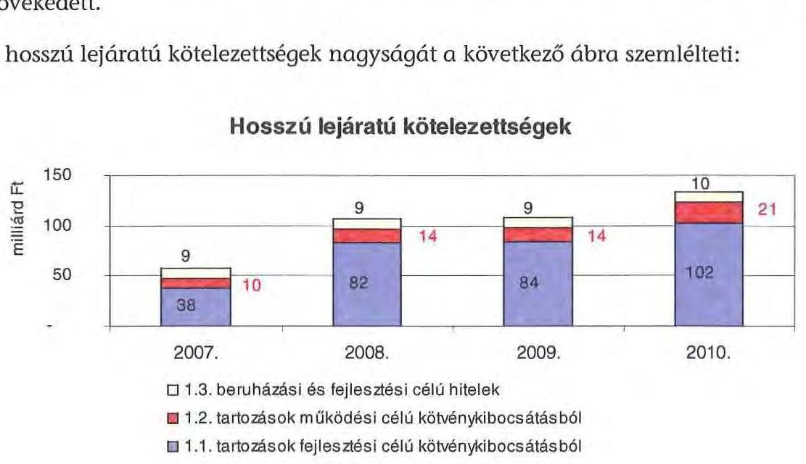

A hosszú lejáratú kötelezettségek mellett az időszakban a 2007. évi 22 milliárd Ft-ról 24 milliárd Ft-ra ( $8,8 \%$-kal) növekedett az áruszállításból származó szállítói kötelezettségek állománya.

A mérlegben kimutatott kötelezettségek állománya mellett az elhasználódott eszközök pótlására forrást biztosító amortizációs (felújítási) alap képzésének ${ }^{12}$ elmaradása további problémákat vetít előre. A megyei önkormányzatok beszámolójelentéseinek összegzése szerint 2007-ben még az elszámolt értékcsökkenés $90 \%$-ának megfelelő összeget fordítottak felújítási célokra, 2009-ben ez az arányszám már csak 16,5\% volt. Ez maga után vonta a feladatellátást kiszolgáló tárgyi eszközök állagának erőteljes romlását.

Az ÁSZ a 2011. évi ellenőrzési tervében a 43. számú, az „Önkormányzatok gazdálkodási rendszerének ellenőrzése" részeként egy időben, egymással párhuzamosan tekinti át és elemzi az önkormányzati alrendszer középszintjét jelentő 19 megyei önkormányzat pénzügyi helyzetét. A gazdálkodás szabályszerűségét az ÁSZ az előző évek során ellenőrizte a megyei önkormányzatoknál is, ezért jelen vizsgálatunk erre nem tér ki.

A jelentés a megyei önkormányzatok sajátos feladatellátási és forrásszabályozási helyzetére tekintettel a megyei önkormányzatok pénzügyi helyzetét, illetve az ezzel összefüggő korábbi ÁSZ javaslatok megvalósítását mutatja be.

[^0]
[^0]:    ${ }^{12}$ Erre a jelenlegi szabályozási környezetben nem kötelezi semmilyen előírás az önkormányzatokat.

---

Az ellenőrzés a 2007. január 1. - 2011. március 31. közötti időszakot ölelte fel.
A vizsgálat jogszabályi alapját 2011. július 1-je előtt az Állami Számvevőszékről szóló 1989. évi XXXVIII. törvény 2. § (3), (5), (6) és (9) bekezdésében, az Ötv. 92. § (1) bekezdésében és az Áht. 104. § (3) bekezdésében, 2011. július 1-jét követően az Állami Számvevőszékről szóló 2011. évi LXVI. törvény 1. § (3) bekezdésében, az 5. § (2)-(6) bekezdéseiben és az Áht. 120/A. § (1) bekezdésében foglalt előírások képezték.

Szabolcs-Szatmár-Bereg megye országos és régión belül elfoglalt helyzetét 2010. december 31-én az alábbi mutatók szemléltetik (megyei jogú várossal együtt):

Index: az előző év azonos időszak (időpontja)=100,0

| Mutató megnevezése | Szabolcs-   Szatmár-   Bereg   megye | Észak-   alföldi   régió | Országos |
| :-- | :--: | :--: | --: |
| Népesség száma (ezer fő)* | 582 | 1482 | 9986 |
| Népesség változás indexe (\%) | 99,3 | 99,3 | 99,7 |
| Az ipari termelés volumenindexe (\%) | 101,2 | 109,6 | 110,7 |
| Egy lakosra jutó ipari termelési érték (ezer | 708,5 | 1452,1 | 2044,4 |
| Ft) |  |  |  |
| Ezer lakosra jutó vállalkozások száma (db) | 195 | 168 | 165 |
| A beruházások egy lakosra vetített telje- | 109,4 | 160,6 | 304,7 |
| sitményértéke (millió Ft) |  |  |  |
| Foglalkoztatási arány (\%) | 42,6 | 45,0 | 49,5 |
| Munkanélküliségi ráta (\%) | 18,2 | 14,3 | 10,8 |
| Alkalmazásban állók havi nettó átlagkeresete (Ft) | 104521 | 109060 | 132628 |
| Alkalmazásban állók havi nettó átlagkeresetének indexe (\%) | 105,1 | 106,2 | 106,9 |

* ebből Nyíregyháza Megyei Jogú Város népessége 119 ezer fő

A gazdaság helyzetét reprezentáló egyes mutatók - az ipari termelés volumenének változása, az ezer lakosra jutó vállalkozások mutatója - tekintetében Szabolcs-Szatmár-Bereg megye elmarad az országos és az Észak-alföldi régió jellemzőitől. Különösen kedvezőtlen az egy lakosra jutó ipari termelési érték mutatója, mivel a megye adata az Északi-alföldi régió mutatójának a felét, az országos adatnak megközelítőleg a harmadát teszi ki. A megye munkanélküliségi rátája 7,4 százalékponttal meghaladja az országos adatot. A foglalkoztatási arány is kedvezőtlenebb az Észak-alföldi régió és az országos mutató értékéhez viszonyítva, az előbbitől 2,4 százalékponttal, az utóbbitól 6,9 százalékponttal marad el.

A megyében 229 települési - 1 megyei jogú városi, 26 városi, 16 nagyközségi és 186 községi - önkormányzat múködött.

---

# I. ÖSSZEGZŐ MEGÁLLAPÍTÁSOK, JAVASLATOK 

A Szabolcs-Szatmár-Bereg Megyei Önkormányzat 2010-ben 17197 millió Ft összes költségvetési kiadásából 99\%-ot kötelező feladatai ellátására fordította. Az önként vállalt feladatok ellátására 134 millió Ft kiadást teljesítettek. Az Önkormányzat adatszolgáltatása szerint az önként vállalt feladatai közé sorolt tevékenységek a sport, szórakoztató és szabadidős tevékenységhez, továbbá az egyes idegenforgalmi, turisztikai, kiadvány-szerkesztési, kommunikációs szolgáltatások szervezéséhez kapcsolódtak, valamint támogatást nyújtott civil szervezetek, alapítványok múködéséhez.

A kötelező feladatok körét az SzMSz-ben rögzítették, az önként vállalt feladatok támogatásának mértékét az éves költségvetési rendeletekben az anyagi lehetőségre hivatkozással határozták meg.

Az Önkormányzat a kötelező és önként vállalt feladatait 2006. december 31-én 40 önállóan gazdálkodó költségvetési szervvel 76 telephelyen, míg 2010. december 31-én 33 önállóan működő és gazdálkodó, valamint egy önállóan múködő költségvetési szervvel és 3 többségi tulajdonú gazdasági társasággal, 80 telephelyen látta el. Az egészségügyi feladatokat az Egészségügyi Holding Zrt. irányításával négy, a Kórházakat működtető Kft., a szociális és gyermekvédelmi feladatokat 15, a közoktatási feladatot 11, a közművelődési és közgyűjteményi feladatokat 6 intézmény, egyéb feladatokat két többségi tulajdonú gazdasági társaság látta el. Az intézmények száma 2007-2010. között 1 oktatási intézmény átvételével, 3 egészségügyi ellátást biztosító intézmény gazdasági társaságba való kiszervezésével, 1 intézmény megszüntetésével és 4 intézmény összevonásával alakult ki. A 2011. évben a Közgyűlés 24 intézmény gazdálkodási önállóságának megszüntetéséről döntött, azok szakmai önállóságának megtartása mellett.

A folyó költségvetés egyenlege (múködési jövedelem) 2007-2010. között múködési forrástöbbletet mutatott ${ }^{13}$. A 2007-2008. években a múködési megtakarítások fedezni tudták a tárgyévben jelentkező törlesztési kötelezettségeket, így az Önkormányzat pénzügyi kapacitása (nettó múködési jövedelme) is pozitív értékű volt. A 2009. évben és a 2010. évben a pénzügyi kapacitás negatív volt (2009-ben -85 millió Ft, 2010-ben -1943 millió Ft), mivel múködési megtakarítás hiányában nem volt fedezet a törlesztési kötelezettség (2009-ben 322 millió Ft, 2010-ben 2018 millió Ft) kiegyenlítésére.

A CLF szerinti múködési forráshiány kialakulásában leginkább az játszott szerepet, hogy az Önkormányzat föbb bevételi forrásai - a jogszabályi kedvezmények bővülése és az ingatlanforgalom visszaesése következményeként az illetékbevétel, valamint a központi forráskivonás hatására átengedett szja és az állami támogatások - csökkentek.

[^0]
[^0]:    ${ }^{13}$ 2007-ben a folyó bevételek 30,1\%-át ( 976 millió Ft-ot), 2008-ban 0,1\%-át ( 315 millió Ft-ot), 2009-ben 0,8\%-át ( 237 millió Ft-ot) 2010-ben 0,6\%-át ( 75 millió Ft-ot) tette ki.

---

Az Önkormányzatnál az illetékbevétel a 2006. évi 2504 millió Ft-hoz képest 2010-ben 1354 millió Ft-ra - 54,1\%-ra - csökkent. Az átengedett szja és az állami támogatások együttes összege a központi támogatás csökkentésén túl, a feladatátvétel hatását is figyelembe véve folyamatosan csökkent, 2010-ben 6088 millió Ft volt, amely a 2007. évi 7534 millió Ft-nak alig több mint háromnegyede ( $76,3 \%$-a). Az OEP támogatás összege 2007-ben 19526 millió Ft, 2008-ban 20687 millió Ft, míg 2009. szeptember 30-ig, a Kórházak gazdasági társaságokba szervezéséig 14608 millió Ft volt. Az egyéb saját bevételek emelkedése nem tudta ellensúlyozni a kieső forrásokat.

A múködési kiadások 2008-ban 8,1\%-kal - 2621 millió Ft-tal - növekedtek 2007-hez képest, majd ezt követően csökkentek. A csökkenés alapvető oka az egészségügyi intézmények 2009. október 1-jei gazdasági társaságba történő kiszervezése volt. Az önkormányzati kiadásokban a Kórházak által teljesített kiadások aránya - azok kiszervezéséig - magas volt. A Kórházak nélküli teljesített működési kiadások összege 2007-ben 11603 millió Ft volt, az összes múködési kiadás $35,8 \%$-át tette ki. A nem egészségügyi intézményeknél a dologi kiadások 2007 és 2009 között évi $10 \%$-ot elérő emelkedését követően 2010-ben 196 millió Ft-tal csökkentek 2009. évhez képest. A Kórházak nélkül az intézmények által teljesített személyi juttatások és munkáltatókat terhelő járulékok 2007. évi 7713 millió Ft-ról 2009-ig folyamatos emelkedést mutatva 2009-re 9170 millió Ft-ra emelkedtek, majd a Közgyűlés létszám leépítési és $15 \%$-os kiadási előirányzat zárolási döntése következtében 2010-ben 20,2\%-kal, 2055 millió Ft-tal csökkentek az előző évhez viszonyítva.

Az Önkormányzat az egészségügyi feladatok ellátását biztosító gazdasági társaságok részére múködési és felhalmozási célra pénzeszközt nem adott át. A megvalósított fejlesztések aktiválását követően az eszközöket az Önkormányzat a gazdasági társasággá átalakulás előtt és azt követően is ingyenes használatba adta. A Kórházak múködtetésére 1769 millió Ft-ot fordított az Önkormányzat, melynek fedezete központi forrásból való támogatásból származott, fejlesztésre 4143 millió Ft kiadást teljesített.

A működési és felhalmozási kiadásokon belül 2007-2010 között a felhalmozási kiadások súlya 5029 millió Ft-ról (13,4\%-ról) 5378 millió Ft-ra (a Kórházak kiszervezése miatt $31,3 \%$-ra) nőtt. Az aktív pályázati tevékenység eredményeként 2007-2010 között 26613 millió Ft bekerülési költségű beruházást indított el az Önkormányzat, amelyből 19307 millió Ft a 2010 utánra vállalt kötelezettség. Az utóbbi forrásai - az Önkormányzat adatszolgáltatása alapján - a következők: 1550 millió Ft tervezett hitel, 1744 millió Ft kötvénykibocsátásból származó pénzmaradvány, 15996 millió Ft elnyert EU-s támogatás, 18 millió Ft elnyert hazai támogatás. A 2010. évet követő felhalmozási kötelezettségekből 17231 millió Ft 2011. évben az Önkormányzat költségvetése alapján kiadásként jelenik meg. A 2010. év utánra vállalt kötelezettségből 13918 millió Ft a Kórház fejlesztéseit finanszírozza.

Az Önkormányzat pénzintézeti kötelezettségeinek állománya 2006. december 31-ről 2010. december 31-re 1094 millió Ft-ról 11533 millió Ft-ra (10,5 szeresére) nőtt. A vizsgált időszakban adósságszolgálatra az Önkormányzat 4123 millió Ft-ot teljesített, amelyből a kamatkiadás 1367 millió Ft volt. A kötvényből származó források befektetéséből realizált kamatbevétel 1252 millió Ft.

---

Az Önkormányzat likviditása biztosítása érdekében 2010-ben az év minden napján igénybevett folyószámlahitelt, amelynek átlagos napi állománya 1723 millió Ft volt.

Az Önkormányzat 2010. év végi pénzintézeti kötelezettsége 6000 millió Ft ( $52,0 \%$ ) fejlesztési célú kötvények kibocsátásából, 3550 millió Ft ( $30,8 \%$ ) fejlesztési célú hosszú lejáratú hitelekből, valamint 1983 millió Ft (17,2\%) folyószámla és munkabér megelőlegezési hitelekből keletkezett. Ezek miatt az Önkormányzatnak a 2011-2013. években 2596 millió Ft és 2785327 EUR tőketörlesztést és kamatot ${ }^{14}$ kell teljesítenie. Az Önkormányzat 2010. év végi szállítói tartozása - gazdasági társaságai nélkül - 963 millió Ft (ebből lejárt 336 millió Ft). A 2011-2013. évi pénzintézeti kötelezettségek és a szállítói, valamint egyéb kötelezettségek teljesítésére figyelembe vehető a kötvénybevételből meglévő 3890 millió Ft, valamint az 5263 millió Ft forgalomképes ingatlanvagyon. A további évekre szóló jelenleg ismert pénzintézeti kötelezettségei: 3567 millió $\mathrm{Ft}^{15}$ és 26737589 EUR. Ezekre figyelembe vehető források jelenleg nem ismertek.

Az Egészségügyi Holding Zrt. által igénybe vett folyószámlahitelhez kapcsolódóan 2010-ben 1000 millió Ft garanciát vállalt az Önkormányzat.

A közgyűlési előterjesztések tartalmazták a kötelezettségvállalás visszafizetési forrásának megnevezését, a teljes futamidő várható kamat és tőkefizetési kötelezettségek bemutatását, de nem tartalmazta az árfolyam- és a kamatkockázatok kidolgozását. Az előterjesztésekben nem tértek ki az adósságszolgálati korlát bemutatására, ezért a Közgyűlés ennek figyelembevétele nélkül döntött. Az Önkormányzat az adósságot keletkeztető kötelezettségvállalás felső határát a hitelfelvételek esetében nem lépte túl.

Az Önkormányzat nem vizsgálta, hogy az elhasználódott eszközök pótlása milyen kötelezettséget jelent számára. Az Önkormányzat 2007-2010 között a tárgyi eszközök után 6344 millió Ft értékcsökkenést számolt el. Felújításra 1214 millió Ft-ot fordított.

A kiadáscsökkentő és bevételnövelő intézkedések meghozatalával az Önkormányzat a gazdálkodás átláthatóbbá tételét, valamint a feladatellátás szakmai színvonalának, kiemelten a pénzügyi helyzetnek a javítását kívánta elérni. A 2007-2010. években az intézményátszervezések, a feladatváltozások, valamint a takarékossági intézkedések hatásaként - az Önkormányzat kimutatása szerint - együttesen 4576 millió Ft kiadási megtakarítást mutatott ki, amelyből $85,7 \%$, azaz 3924 millió Ft volt a személyi juttatások megtakarítása. Ebből a létszámleépítésekhez 1515 millió Ft, az üres álláshelyek zárolásához 585 millió Ft, a feladátátszervezésekhez 824 millió Ft, az elrendelt 15\%-os kiadási előirányzat csökkentéshez 1000 millió Ft kapcsolódott.

[^0]
[^0]:    ${ }^{14}$ a 2011. év I. negyedév kamat mértéket alapul véve
    ${ }^{15}$ A 2000 millió Ft hosszúlejáratú hitelkeretből 2011. március 31-ig igénybe vett összeg 136 millió Ft volt, a keret összegét a szükségleteknek megfelelően, a kórházi beruházások megvalósulásához igazodva veszi igénybe az Önkormányzat.

---

A létszámcsökkentő intézkedések következtében 2007 és 2010 között a Hivatalnál és az intézményeknél a nyilvántartások szerint - az egészségügyi intézmények gazdasági társasággá alakításához kapcsolódó átalakításon túl - összesen 635 álláshelyet szüntettek meg. A Közgyűlés 2011-ben további 244 álláshely megszüntetéséről döntött.

A bevételnövelésre irányuló intézkedések következtében az Önkormányzat kimutatása szerint a vizsgált időszakban az ingatlanok és eszközök bérbeadásából számított bevételnövekedést, 751 millió Ft-ot az intézmények realizálták, míg az átmenetileg szabad pénzeszközök lekötéséből, befektetéséből 632 millió Ft bevétel a Hivatalnál realizálódott. A megtett intézkedések ellenére múködési célú kiadásai finanszírozása érdekében folyamatosan és növekvő mértékben kényszerült folyószámla- és munkabér-megelőlegezési hitel igénybevételére 2007 és 2010 között.

Az utóellenőrzés a pénzügyi egyensúly javítására tett három szabályszerűségi és kettő célszerűségi javaslat hasznosulására terjedt ki. A szabályszerűségre vonatkozó javaslatok közül kettő hasznosult, egy javaslat nem hasznosult, mivel a költségvetési rendelettervezetek továbbra is tartalmazták a költségvetési hiányt módosító finanszírozási célú bevételeket és kiadásokat.

Az Önkormányzat pénzügyi helyzetét összegezve a következők emelhetők ki:

Az önkormányzati bevételt csökkentő központi intézkedések hatását az ellenőrzött időszakban kiegyenlítette az Önkormányzat kiadáscsökkentő és bevételnövelő intézkedéseinek eredménye. A 2008-ban átvett oktatási intézmény fenntartása és a Kórházak gazdasági társaságokba szervezése alapvetően nem befolyásolta az Önkormányzat múködésének biztonságát. A beruházások saját forrásai biztosítottak. A 2011. évre tervezett kiemelkedő volumenű fejlesztések támogatásainak előfinanszírozása likvidítási nehézséget idézhet elő az Önkormányzatnál. Múködési célú kiadásai finanszírozásra folyamatosan és növekvő mértékben vett igénybe az Önkormányzat 2007 és 2010 között folyószámla- és munkabérhitelt, valamint használt fel kötvénykamatot. A likvid hitelek állományának évről évre való emelkedése is feszültséget jelez. A hosszú lejáratú kötelezettségek finanszírozásának 2010. évet követő forrása a következő 3 évben részben biztosított, azt követően az Önkormányzat nem számszerűsítette.

A feladatok és források közötti egyensúly megteremtésére irányuló központi döntések, a megyei önkormányzatok konszolidációjára, az intézmények átvételére vonatkozó törvényjavaslat elfogadása új feltételeket teremtett. Mindezek mellett az Önkormányzat pénzügyi egyensúlyának fenntarthatósága rövid- és hosszú távú intézkedésekkel biztosítható.

Az Állami Számvevőszékről szóló 2011. évi LXVI. törvény 33. § (1) bekezdésében foglaltak értelmében a jelentésben foglalt megállapításokhoz kapcsolódó intézkedési tervet köteles az ellenőrzött szervezet vezetője összeállítani és azt a jelentés kézhezvételétől számított harminc napon belül az ÁSZ részére megküldeni. Amennyiben az intézkedési tervet határidőben nem küldi meg a szervezet, vagy az továbbra sem elfogadható, az ÁSZ elnöke a hivatkozott törvény 33. § (3) bekezdés a)-b) pontjaiban foglaltakat érvényesítheti.

---

A 2011 májusában lezárult helyszíni ellenőrzések tapasztalatai alapján - figyelembe véve az önkormányzatok észrevételeit és a saját hatáskörben tett intézkedéseit - az alábbi javaslatokat tette az ÁSZ:

# a Közgyűlés elnökének: 

1. terjessze a gazdasági program kiegészítését a Közgyűlés elé, a hosszú távú likviditási stratégiával;
2. kezdeményezze a Közgyűlésnél az adósságot keletkeztető kötelezettségvállalásokról szóló döntésekben a Közgyűlés elnöke intézkedési jogosultságának, továbbá az azt követő intézkedésekkel kapcsolatos tájékoztatási kötelezettségének szabályozását;
3. gondoskodjon arról, hogy az adósságot keletkeztető kötelezettségvállalásról szóló a közgyűlési döntéseket megalapozó - előterjesztések tartalmazzák a kötelezettségvállalás visszafizetésének forrásait, a várható kamat-, egyéb költség és tőkefizetési kötelezettségeit, legalább 3 éves kitekintéssel a várható árfolyam- és kamatkockázatoknak a bemutatását;
4. mutassa be a hosszú lejáratú hitelek igénybevételéről szóló előterjesztésekben az adósságszolgálati korlátot;
5. vizsgáltassa meg az adósságot keletkeztető kötelezettségvállalással megvalósított felhalmozási kiadások esetleges bevételt növelő, illetve kiadást csökkentő vonzatát, illetve az ennek a fejlesztéshez, felújításhoz vállalt kötelezettségek visszafizetési forrásként való számbavételét;
6. mutassa be a Közgyűlésnek az éves költségvetésről szóló előterjesztésekben az értékcsökkenési leírás összegét és ezzel arányban az elhasználódott eszközök pótlásának forrásigényét és lehetőségét.

---

# II. RÉSZLETES MEGÁLLAPÍTÁSOK 

## 1. Az ÖNKORMÁNYZAT KÖTELEZŐ ÉS ÖNKÉNT VÁLlALT FELADATAI

A Szabolcs-Szatmár-Bereg Megyei Önkormányzat a 2011. évi ÖNHIKI pályázata szerint 17063 millió Ft-ot fordított kötelezö feladatainak ellátására, mely a költségvetési kiadásainak 99\%-át tette ki. Az önként vállalt feladatok ellátására 134 millió Ft kiadást teljesítettek. Az Önkormányzat az önként vállalt feladatai közé sorolta a sport, szórakoztató és szabadidős tevékenységeket, az egyes idegenforgalmi, turisztikai, kiadványszerkesztési, kommunikációs szolgáltatások szervezését, valamint támogatást nyújtott civil szervezetek, alapítványok múködéséhez.

A kötelező feladatok körét az SzMSz-ben rögzítették, az önként vállalt feladatok támogatásának mértékét az éves költségvetési rendeletekben az anyagi lehetőségeikre hivatkozással határozták meg.

Az Önkormányzat 2010. évi költségvetési kiadásainak szerkezetét tekintve a járulékokkal növelt személyi jellegű juttatások és dologi kiadások 11229 millió Ft összegén belül meghatározó arányt ${ }^{16}-40,6 \%$-ot, azaz 4561 millió Ft -ot - a szociális és gyermekvédelmi feladatokat ellátó 15 intézmény által teljesített kiadások jelentették. A kiadásokból a 11 közoktatási intézmény részesedése $24,6 \%, 2765$ millió Ft volt.

A 2010. évben a közoktatási feladatok kiadásait 64,1\%-ban ( 1773 millió Ftban), a szociális és gyermekvédelmi feladatok kiadásait 65,9\%-ban ( 3008 millió Ft-ban) finanszírozta normatív költségvetési támogatás.

A közművelődési, levéltári, közgyűjteményi szolgáltatások ellátását 6 intézmény biztosította összesen 1975 millió Ft kiadási összeggel, amely 17,6\%-a volt az összes múködési kiadásnak. Az igazgatási és egyéb ágazathoz sorolható személyi és dologi kiadások összege 1928 millió Ft, a részaránya 17,2\% volt.

[^0]
[^0]:    ${ }^{16}$ Az Önkormányzat járulékokkal növelt személyi és dologi kiadásainak ágazatonkénti megbontása a BM részére készített, 2010. december 31-i adatokkal kiegészített adatszolgáltatás kigyűjtéséből származik.

---

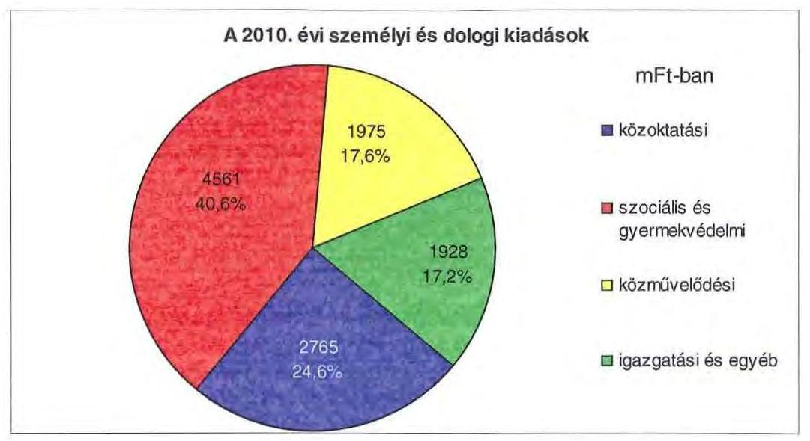

A 2010-ben teljesített 17197 millió Ft költségvetési kiadásból 12695 millió Ft, (73,8\%) az intézmények, a többi a Hivatal költségvetési beszámolójában jelenik meg. A Hivatal által teljesített 4502 millió Ft költségvetési kiadásból a személyi és dologi kiadások 31,4\%-kal (1414 millió Ft-tal), a beruházások, felújítások 22,1\%-kal ( 995 millió Ft-tal), a különböző megyepolitikai feladatokhoz, szervezetek támogatásához, finanszírozási tételekhez kapcsolódó kiadások 46,5\%-kal (2093 millió Ft-tal) részesültek.

Az Önkormányzat kötelező és önként vállalt feladatait 2006. december 31-én 40 önállóan gazdálkodó költségvetési szervvel 76 telephelyen, míg 2010. december 31-én 33 önállóan múködő és gazdálkodó, valamint egy önállóan múködő költségvetési szervvel és 3 többségi tulajdonú gazdasági társasággal látta el. Az intézmények és a többségi tulajdonú gazdasági társaságok - alapító okirataik és társasági szerződéseik szerint - összesen 80 telephelyen múködtek.

Az Önkormányzat feladatait az alábbi intézménystruktúrával és többségi tulajdonú gazdasági társasággal látta el 2010. év végén:

- egészségügyi feladatokat az Egészségügyi Holding Zrt. irányításával négy, a Kórházakat múködtető Kft. végzett;
- szociális és gyermekvédelmi feladatokat 15 intézmény végzett (10 tartós szociális ellátást biztosító intézmény, 5 gyermekvédelmi feladatot ellátó intézmény);
- közoktatási feladatot 11 intézmény látott el (1 szakképző iskola, 2 gimnázium, 2 gimnázium és szakközépiskola, 1 gimnázium és szakképző iskola, 2 szakközépiskola, 3 általános iskola és speciális szakiskola);
- közmúvelődési és közgyűjteményi feladatokat végzett 6 intézmény (szabadidő központ, színház, levéltár, múzeum, művelődési központ, testnevelési és sportintézmény);
- egyéb feladatokat két többségi tulajdonú gazdasági társasággal (idegenforgalmi, rendezvényszervezési, továbbképzési és televíziós műsorszolgáltatási

---

feladatok), illetve 2009. január 1-től a Szilárdhulladék-gazdálkodási Társulással látott el;

- igazgatási feladatokat a Hivatal látott el.

A Szabolcs-Szatmár-Bereg Megyei Szakképzés-szervezési Önkormányzati Társulást az Önkormányzat és Mátészalka, Fehérgyarmat, Baktalórántháza, Vásárosnamény és Kisvárda Városok Önkormányzatai alapították 2008-ban. A Társuláshoz 7 megyei és 5 városi fenntartású középfokú oktatási intézmény kapcsolódik, a munkaszervezet szervezési és igazgatási feladatainak ráfordításai Mátészalka Város Önkormányzatának költségvetésében jelennek meg.

Az egyes ágazatok kötelező feladatellátását 2010. december 31-én az alábbi mutatók jellemzik:

| Megnevezés | közoktatás | szociális és   gyermekvéde-   lem | kultúra és sport |
| :-- | --: | --: | --: |
| Az ágazatban fog-   lalkoztatottak   száma (fő) | 811 | 1463 | 269 |
| Az ágazat intéz-   ményeiben ellátot-   tak összesen (fő) | 5066 | 4015 |  |

Az Önkormányzat három többségi részesedésú gazdasági társasága közül kettő - Sóstó Parkhotel Kft., valamint „Kölcsey" Nonprofit Kft. - az Önkormányzat 100\%-os tulajdona, melyek önként vállalt feladatokat látnak el. A kötelező feladatokat ellátó Egészségügyi Holding Zrt-ben az Önkormányzat 92,9\%-os tulajdoni hányaddal rendelkezik. Az Önkormányzat a tulajdonosi jogait a Kórházakat múködtető gazdasági társaságok felé az Egészségügyi Holding Zrt. által gyakorolta.

- 2009. október 1-től az egészségügyi feladatellátást az intézményi kereteket felváltva az Egészségügyi Holding Zrt. keretében biztosították. Az Egészségügyi Holding Zrt. az alapszabályban foglaltak szerint a feladatokat 4 kórházfenntartó Kft-n keresztül - Jósa András Oktató Kórház Kft., Sántha Kálmán Mentális Egészségközpont és Szakkórház Kft. Nagykálló, SzatmárBeregi Kórház és Gyógyfürdő Kft. Fehérgyarmat és 2010. július 1-től Mátészalkai Területi Kórház Kft. - látta el;
- a „Kölcsey" Nonprofit Kht-t 1999-ben hozta létre az Önkormányzat televíziós műsor összeállítása, szolgáltatása fő tevékenységgel, majd 2009-ben a társaságot nonprofit Kft-vé alakította át;
- a Sóstó Parkhotel Kft-t az Önkormányzat 2007. évben alapította, az intézményi feladatellátást kiszervezve. A Sóstó Parkhotel Kft. ellátja konferenciák, továbbképzések szervezését, ezekhez kapcsolódóan szállás és ellátás biztosítását, valamint idegenforgalmi tevékenységet.

---

Az önkormányzati feladatellátásban az intézmények és gazdasági társaságok mellett egyéb szervezetek, valamint szolgáltatási szerződéssel kiszervezett intézményi ellátások nem múködtek.

Az Önkormányzat az 2007-2010 között Újfehértó Város Önkormányzatától átvette a Bajcsy-Zsilinszky Endre Gimnázium és Szakképző Iskola működtetését 302 fő tanulóval. Az egészségügyi feladatellátást 2009-től gazdasági társaságok múködtetésével biztosította Önkormányzati társulástól, központi költségvetési szervtől, egyháztól, egyéb szervezettől az Önkormányzat feladatot nem vett át, és nem adott át.

# 2. PÉNZÜGYI EGYENSÚLYI HELYZET ALAKULÁSA 

A hagyományos költségvetési szerkezet helyett az önkormányzat pénzügyi helyzetét a CLF módszerrel mutatjuk be, amelyben jobban elkülönülnek a vagyonnal kapcsolatos bevételek és kiadások a feladatokkal kapcsolatos közvetlen múködtetési bevételektől és kiadásoktól. A módszer következetesen elkülöníti a folyó és a felhalmozási költségvetés bevételeit és kiadásait, azok költségvetési egyenlegeit. A tárgyévi pozíciók meghatározása érdekében a figyelembe vett saját folyó bevételek, valamint saját felhalmozási bevételek nem tartalmazzák az előző évi pénzmaradványok felhasználásából származó pénzforgalom nélküli bevételeket ${ }^{17}$.

A bevételek és kiadások besorolása általános közgazdasági meggondolásokon alapul, amely testet ölt az SNA statisztikai módszertanában is. Folyó tételek alatt értjük azokat a bevételeket és kiadásokat, amelyek az önkormányzat vagyoni helyzetét automatikusan nem változtatják. A bevételi oldalon ilyenek az adók, az illeték, az áfa bevételek és visszatérülések, a hozamok és kamatok, a költségvetési támogatások, az egyéb saját bevételek, valamint a múködési célra átvett pénzeszközök és kapott támogatások. A folyó kiadások közé tartoznak a szolgáltatások nyújtásával kapcsolatos múködési kiadások, a kamatkiadások, valamint a múködési célú transzferkiadások ${ }^{18}$. A felhalmozási vagy tőke tételek módosítják az önkormányzat vagyoni helyzetét. A privatizációs bevételek, az immateriális javak és tárgyi eszközök, valamint a részesedések értékesítése csökkentik, a fizikai beruházások és a pénzügyi befektetések növelik a vagyont. A pénzforgalmi bevételek és kiadások nem tartalmazzák a követelések elengedése miatt könyvelt tételeket, mivel ezek egymást kioltó, technikai jellegű elszámolási műveletek.

A folyó költségvetés egyenlege, a múködési jövedelem megmutatja, hogy az önkormányzat éves folyó bevétele fedezetet biztosít-e a kötelező és önként vállalt feladatellátáshoz kapcsolódó éves folyó kiadására. A múködési jövedelem negatív értéke pénzügyileg fenntarthatatlan helyzetet jelez. A mutató pozitív

[^0]
[^0]:    ${ }^{17}$ A költségvetési években kialakuló hiány finanszírozása az előző években képzett tartalékok felhasználásával is történhet.
    ${ }^{18}$ Transzferkiadásoknak azokat a folyó és felhalmozási tételeket nevezzük, amelyeket nem az adott önkormányzat használ fel szolgáltatásnyújtásra (pl.: ellátottak pénzbeni juttatásai, átadott pénzeszközök, garancia- és kezességvállalások stb.).

---

értéke megtakarítást mutat, amely forrásul szolgálhat az önkormányzat fennálló kötelezettségei megfizetéséhez, valamint fejlesztéselhez.

A felhalmozási költségvetés pozitív értéke felhalmozási többletet mutat, amely a jövőbeni fejlesztések forrását biztosíthatja. Amennyiben a folyó költségvetési hiány finanszírozása a felhalmozási többletből történik, ez szűkebb értelemben vagyonfelélésnek tekinthető. Amennyiben a felhalmozási költségvetés megtakarítása fejlesztési célú hitelek, kötvények adósságszolgálatát finanszírozza, az változatlan vagyontömeg mellett, a korábban megelőlegezett tőkebevételek valós realizációjának tekinthető. A felhalmozási deficit által generált finanszírozási igény önmagában nem jár pénzügyi kockázattal, a pénzügyileg fenntartható beruházásokhoz kapcsolódó kötelezettségvállalás (adósságszolgálat) előrelátó, tudatos költségvetési gazdálkodással teljesíthető.

A módszer a pénzügyi kapacitás (más néven a nettó múködési jövedelem) fogalmát helyezi a középpontba. Az adós hitelfelvételi képessége, hosszú távú fizetőképessége vagy bonitása a pénzügyi kapacitással, ezen belül is a nettó működési jövedelemmel jellemezhető. A nettó múködési jövedelem negatív értéke az egyes költségvetési években jelentkező adósságszolgálat túlzott mértékére utal ${ }^{19}$. A nettó múködési jövedelem negatív értékének felhalmozási többletből, vagy további hitelből történő finanszírozása pénzügyileg nem fenntartható gazdálkodást vetít előre. A pozitív értéket mutató nettó múködési jövedelem fejlesztési kiadások fedezetét biztosíthatja, illetve a folyamatosan, évenként képződő pozitív nettó müködési jövedelemből meghatározható a jövőben vállalható, teljesíthető éves adósságszolgálat, ily módon az a hitelösszeg, amely - a többi tényezőt, feltételt adottnak tekintve - visszafizetési kockázat nélkül felvehető.

A CLF módszer alapján a pénzügyi kapacitás mértéke az önkormányzat összevont, nettósított, a központi információs rendszerbe a MÁK-on keresztül leadott éves költségvetési beszámolójának 80-as űrlapjában szerepeltetett adatok alapján került meghatározásra. A 2007-2010 közötti időszakban az Önkormányzat CLF módszer szerint besorolt kiadásainak és bevételeinek főbb jogcímek szerinti alakulását a jelentés $2 / a$. számú melléklete tartalmazza.

Az Önkormányzat bevételeinek és kiadásainak alakulását részletesen a hatályos számviteli előírások szerint készült, összevont éves költségvetési beszámolók adataira alapozva mutatjuk be. A bevételek és kiadások múködési, valamint felhalmozási jogcímekre történő elkülönítését az éves költségvetési beszámolók, a zárszámadási rendeletek, továbbá - amely jogcímek ${ }^{20}$ esetében erre más lehetőség nem volt - az Önkormányzat adatszolgáltatása szerinti megbontás alapján végeztük el. A bevételek elemzése során figyelembe vettük a ko-

[^0]
[^0]:    ${ }^{19}$ Kivéve, ha annak finanszírozására a korábbi években képzett tartalékok fedezetet nyújtanak.
    ${ }^{20}$ Az előző évi maradvány visszafizetésének, az előző évi pénzmaradvány átadásának és átvételének, a kamatkiadásoknak, az egyéb pénzforgalom nélküli kiadásoknak, a hozam- és kamatbevételeknek, az átengedett adóknak, a költségvetési támogatásoknak, továbbá az előző évi pénzmaradvány igénybevételének múködési és felhalmozási részre történő megosztásához az Önkormányzat által szolgáltatott adatokat vettük figyelembe.

---

rábbi években keletkezett pénzmaradvány felhasználásából származó pénzforgalom nélküli bevételeket is. A 2007-2010 közötti időszakban az Önkormányzat bevételeinek és kiadásainak, továbbá adósságszolgálatának alakulását a jelentés 2/b. számú melléklete tartalmazza.

# 2.1. A müködési és felhalmozási egyensúly alakulása 

## CLF módszer szerinti önkormányzati adatok

|  |  |  |  | ezer $\mathbf{F t}$ |
| :--: | :--: | :--: | :--: | :--: |
| Megnevezés | 2007 | 2008 | 2009 | 2010 |
| Folyó bevételek | 33457355 | 35462175 | 30934085 | 12142035 |
| Folyó kiadások | 32481032 | 35146994 | 30696999 | 12067054 |
| Müködési jövedelem | 976323 | 315181 | 237086 | 74981 |
| Nettó müködési jövedelem   = müködési jövedelem - tőketörlesztés | 788779 | 86573 | $-84540$ | $-1942739$ |
| Felhalmozási bevételek | 1985751 | 803547 | 2648238 | 3704568 |
| Felhalmozási kiadások | 4917115 | 2415889 | 4703958 | 5130248 |
| Felhalmozási költségvetés egyenlege | $-2931364$ | $-1612342$ | $-2055720$ | $-1425680$ |
| Finanszírozási múveletek nélküli (GFS) pozíció | $-1955041$ | $-1297161$ | $-1818634$ | $-1350699$ |
| Finanszírozási müveletek egyenlege | 815985 | 7250092 | 806406 | 719568 |
| Tárgyévi pozíció | $-1139056$ | 5952931 | $-1012228$ | $-631131$ |
| Egyéb tájékoztató adatok |  |  |  |  |
| Összes kötelezettség* | 4308258 | 12455667 | 14268728 | 13402979 |
| -ebből rövid lejáratú | 2457532 | 4189964 | 5398128 | 3351214 |
| Folyószámlahitel napi átlagos állománya ** | 209851 | 554185 | 1316633 | 1723373 |
| Egyéb likvid hitel napi átlagos állománya** | 0 | 0 | 0 | 0 |
| Munkabér-megelőlegezési hitel napi átlagos állománya** | 250000 | 250000 | 250000 | 300000 |
| Egyéb finanszírozásba vonható eszközök összesen: | 551619 | 6504550 | 5529965 | 5037174 |
| -ebből: tartós hitelviszonyt megtestesítő értékpapírok év végi állománya | 0 | 0 | 0 | 138340 |
| - ebből: hosszú lejáratú bankbetétek év végi állománya | 0 | 0 | 0 | 0 |
| -ebből: értékpapírok év végi állománya | 0 | 0 | 0 | 0 |
| -ebből: pénzeszközök (idegen pénzeszközök nélkül) év végi állománya | 551619 | 6504550 | 5529965 | 4898834 |

* Az Összes kötelezettséget a passzív pénzügyi elszámolások nélkül vettük figyelembe, mert a passzívák a pénzmaradvány elszámolás tételei közé tartoznak.
** A folyószámla- és a munkabér-megelőlegezési hitel átlagos állományát 365 nappal számítottuk.

---

A vizsgált időszakban az Önkormányzat folyó költségvetési egyenlege, müködési jövedelme pozitív összegü volt, melynek alakulását a következő ábra szemlélteti:
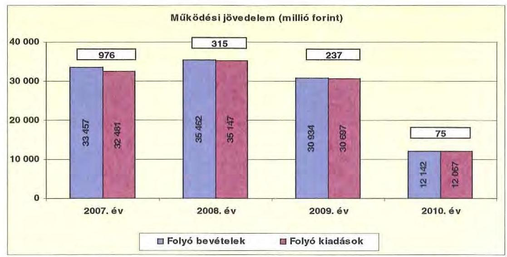

A folyó költségvetés egyenlege, (a müködési forrástöbblet) 2007-ben a folyó kiadások 3,0\%-át ( 976 millió Ft-ot), 2008-ban 0,9\%-át ( 315 millió Ft-ot), 2009-ben 0,8\%-át ( 237 millió Ft-ot), 2010-ben 0,6\%-át ( 75 millió Ft-ot) jelentette. A vizsgált időszakban a müködési jövedelem 1603 millió Ft megtakarítást mutatott, amely forrásul szolgálhatott az Önkormányzat fennálló tőketörlesztési kötelezettségeinek teljesítéséhez, valamint fejlesztéseinek finanszírozásához.

A pozitív előjelű folyó költségvetési egyenleg ellenére a likviditási problémák megoldása érdekében az Önkormányzat folyószámla- és munkabérhítel, illetve rövid lejáratú hitelek felvételére kényszerült. A folyószámlahitel napi átlagos állománya 2007-2010 között több mint nyolcszorosára ( 210 millió Ft-ról 1723 millió Ft-ra) nőtt, a munkabérhítel napi átlagos állománya pedig 250 millió Ft-ról 300 millió Ft-ra ( $20 \%$-kal) emelkedett.

Az Önkormányzat kötelezettségein ${ }^{21}$ belül a 2010. évi rövid lejáratú kötelezettségek állománya $25 \%$ volt, a 2007. évi $57 \%$-os aránnyal szemben. Az Önkormányzat 2007. december 31-én fennálló pénz és tőkepiaci kötelezettsége 2205 millió Ft-ról több mint ötszörösére 11533 millió Ft-ra nőtt a rövid illetve hosszú lejáratú hitelfelvételek, kötvénykibocsátás és a folyószámlahitel állományának emelkedése miatt.

A rövid lejáratú kötelezettségek 2010-ben 3351 millió Ft-ot tettek ki, amely 894 millió Ft-tal ( $36,4 \%$-kal) több a 2007. évi rövid lejáratú kötelezettségállománynál. A rövid lejáratú kötelezettségeknek a szállítói tartozásállomány 2007-ben 84,2\%-át (2068 millió Ft-ot), 2008-ban 71,8\%-át ( 3009 millió Ft-ot), 2009-ben $56,4 \%$-át ( 3043 millió Ft-ot), 2010-ben $28,7 \%$-át ( 963 millió Ft-ot) tette ki.

[^0]
[^0]:    ${ }^{21}$ passzív pénzügyi elszámolások nélküli

---

Az Önkormányzat pénzügyi kapacitása a vizsgált időszakban romlott, 20072008. években pozitív, 2009-2010. években negatív értéket mutatott. A nettó múködési jövedelem ${ }^{22}$ értéke a folyó költségvetési pozíció mellett az adott költségvetési év adósságtörlesztésének hatását is tükrözi.

Az Önkormányzat nettó működési jövedelmének alakulását az alábbi ábra szemlélteti:
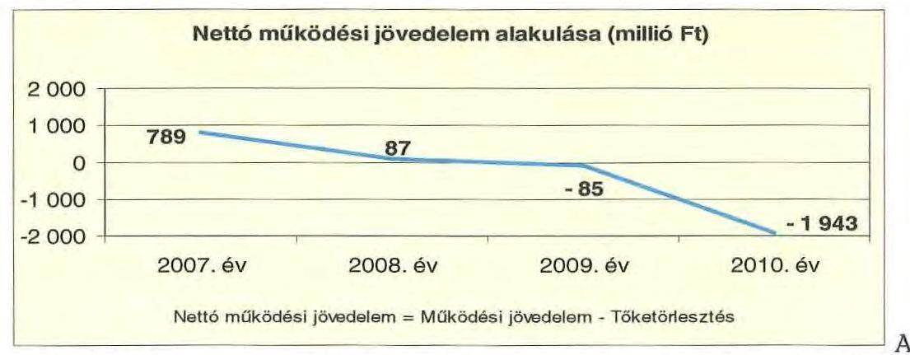
pénzügyi kapacitás romlását a folyó bevételek és kiadások különbségéből származó múködési jövedelem csökkenése illetve a hiteltörlesztési kötelezettség emelkedése okozta. Az Önkormányzat tőketörlesztési kötelezettsége 2007-ben 188 millió Ft, 2008-ban 229 millió Ft, 2009-ben 322 millió Ft, 2010-ben 2018 millió Ft volt

A 2007-2010. években az Önkormányzat felhalmozási költségvetésének egyenlege folyamatosan negatív összegű volt.

A beruházási költségvetés egyenlegét évenként a következő ábra szemlélteti:
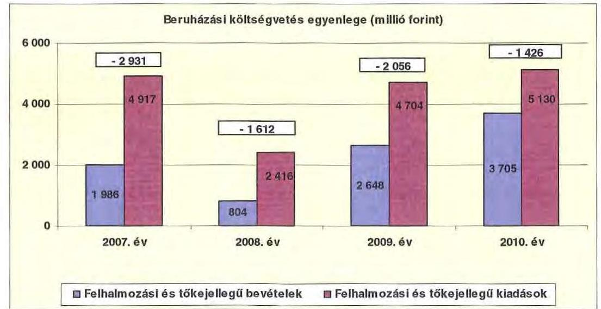

[^0]
[^0]:    ${ }^{22}$ pénzügyi kapacitás

---

A felhalmozási forráshiánynak a felhalmozási és tőke jellegű kiadásokhoz viszonyított aránya 2007-ben 59,6\% (-2931 millió Ft), 2008-ban 66,7\% $(-1612$ millió Ft) 2009-ben 43,7\% (-2056 millió Ft) 2010-ben 27,8\% $(-1426$ millió Ft) volt.

A fejlesztési forráshiányt hosszú lejáratú fejlesztési célú hitellel, illetve fejlesztési célú kötvénykibocsátásból finanszírozták.

Az aktív pályázati tevékenység eredményeként 2007-2010. között 26613 millió Ft bekerülési költségű beruházást indított el az Önkormányzat, amelyből 19307 millió Ft 2010 utánra vállalt kötelezettség. Az utóbbi forrásai - az Önkormányzat adatszolgáltatása alapján - a következők: 1550 millió Ft hitel, 1744 millió Ft kötvény, 15996 millió Ft EU-s támogatás, 18 millió Ft hazai támogatás. A 2010. évet követő felhalmozási kötelezettségekből 17231 millió Ft 2011. évben az Önkormányzat költségvetése alapján kiadásként jelenik meg. A 2010. év utánra vállalt kötelezettségből 13918 millió Ft a Kórház fejlesztéseit finanszírozza.

Az Önkormányzat évenkénti teljes finanszírozási hiánya ${ }^{23}$ a CLF módszer szerint 2007-ben -2143 millió Ft, 2008-ban -1526 millió Ft, 2009-ben -2140 millió Ft, 2010-ben -3368 millió Ft volt.

Az önkormányzat finanszírozási műveletei 2007-2010. évekbeli egyenlegének alakulását a következő ábra szemlélteti:
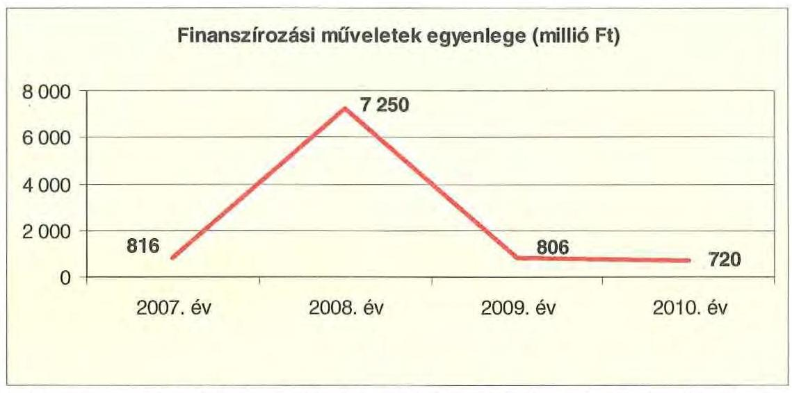

A finanszírozási többlet azt jelzi, hogy az éves költségvetések végrehajtása során szükség volt a pénzkészlet felhasználásán túl külső finanszírozás igénybevételére is. A finanszírozási célú műveleteket a vizsgált időszakban a jelentés 2/a. számú mellékletének 4.1-4.8 pontjai részletezik.

[^0]
[^0]:    ${ }^{23}$ A nettó múködési jövedelem és a beruházási költségvetés egyenlegeinek összege

---

Az Önkormányzat zárszámadási rendeletében a múködési és fejlesztési hiányt a hagyományos költségvetési szerkezet alapján mutatta be ${ }^{24}$, amelyről a jelentés 1. számú melléklete nyújt tájékoztatást.

A kötelezettségek (passzív pénzügyi elszámolások nélkül) a 2007. évi 4308 millió Ft-ról 2010-re 13403 millió Ft-ra emelkedtek, amely együtt járt a kamatkiadások növekedésével.

A 2007-2010 között a kamatbevételek és kiadások alakulása változó volt, öszszességében az önkormányzat 1391 millió Ft kamatbevételt realizált, amely a teljes kamatráfordítás ( 1367 millió Ft) 101,7\%-át tette ki.

A kamatbevételek 2009-et követő csökkenését a szabad pénzeszközök csökkenése okozta, mivel a kötvénykibocsátásból származó bevétel felhalmozási célú kiadásokra folyamatosan felhasználásra került.

Az Önkormányzat kamatbevételeit és kamatkiadásait következő ábra mutatja be:
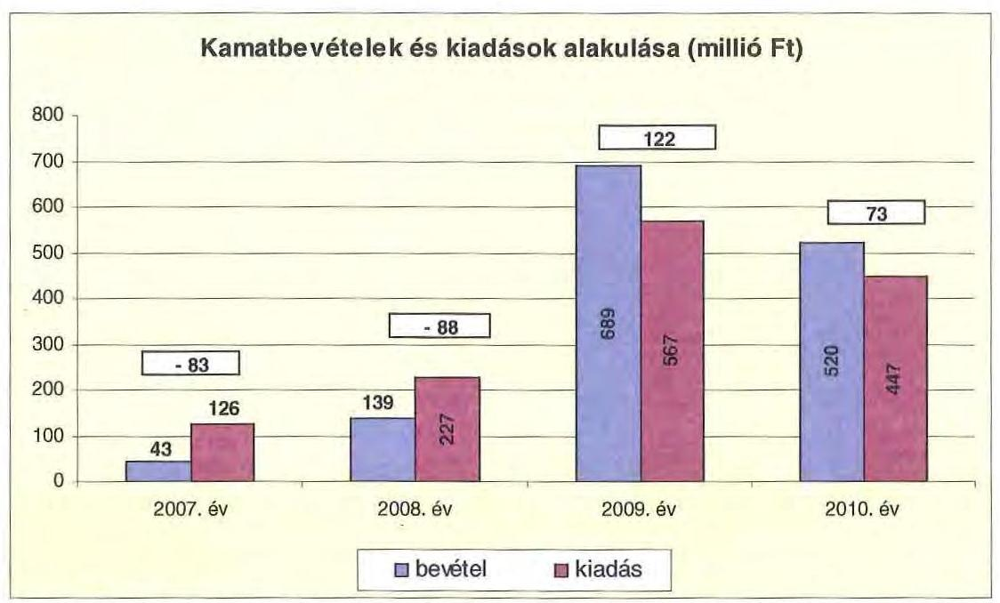

A 2007-2010 közötti időszakban az Önkormányzat kiadásainak és bevételeinek fơbb jogcímek szerinti alakulását a jelentés 2/b. számú melléklete tartalmazza.

[^0]
[^0]:    ${ }^{24}$ Nincs kötelező előírás a működési és fejlesztési hiány megállapításának módjára.

---

# 2.2. Az Önkormányzat bevételei 

Az Önkormányzat 2007-2010 között realizált OEP támogatás nélküli főbb bevételi jogcímeinek számszaki adatait az alábbi táblázat, összetételének változását a grafikon mutatja be:
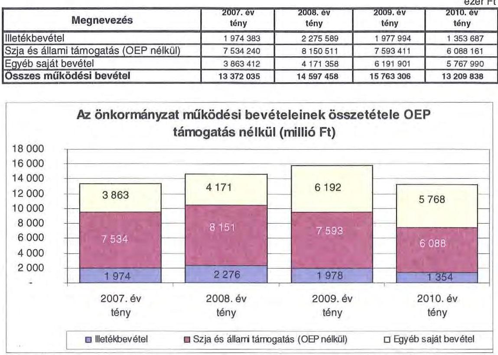

Az Önkormányzatnál az illetékbevétel a 2006. évi 2504 millió Ft-hoz viszonyítva a 2007. évben 1974 millió Ft-ra, 21,1\%-kal, 530 millió Ft-tal csökkent. A bevételcsökkenésben szerepet játszott az Illetékhivatalnak - 2007. január 1-től az APEH-hoz történő átszervezése is, miután az évente realizált illetékbevételekből (központi intézkedés következtében) évi 8,5\% elvonásra került az adminisztrációs feladatokra. Az ezen a jogcímen visszatartott összeg minden évben kevesebb volt - mérsékelve ezáltal a bevételkiesés hatását -, mint amekkora költségvetési kiadást jelentett korábban az Illetékhivatal müködtetése ${ }^{25}$ az Önkormányzatnak. Az Illetékhivatal müködtetésével kapcsolatos kiadások megszűnése és az adminisztrációs feladatokra visszatartott 8,5\% között 2007-ben 335 millió Ft pozitív különbözet jelentkezett, ez az 529 millió Ft-os bevételcsökkenésnek $63,4 \%$-át tette ki.

Az illetékbevétel 2008-ra 15,3\%-kal - 302 millió Ft - növekedett az előző évhez viszonyítva. Ezt követően évről-évre folyamatos illetékbevétel csökkenés következett be az előző év bevételéhez viszonyítva. A csökkenés mértéke 40,5\%-ot 922 millió Ft-ot - tett ki.

[^0]
[^0]:    ${ }^{25}$ A 2006. évben az Illetékhivatal müködtetésére 519 millió Ft-ot fordítottak. Az éves illetékbevétel 8,5\%-a 2007-ben 183 millió Ft, 2008-ban 211 millió Ft, 2009-ben 184 millió ezer Ft, 2010-ben 126 millió Ft volt.

---

Az átengedett szja és az OEP finanszírozás nélküli állami támogatások együttes összege a 2008. évi 8,2\%-os - 617 millió Ft - növekedést követően a következő években - a központi forráskivonás hatására - folyamatosan és jelentős mértékben csökkent. Az előző évihez képest 2009-ben 558 millió Ft-tal (6,8\%-kal), 2010-ben további 1505 millió Ft-tal (19,8\%-kal) kapott kevesebb állami támogatást az Önkormányzat ezeken a jogcímeken. A csökkenést a normatíváknak a járulékváltozások miatti központi csökkentése, valamint a megyei önkormányzatokat érintő forráselvonás mellett az ellátotti létszám csökkenése idézte elő.

Az egyéb saját bevételek 2007-től 2009-ig folyamatosan növekedtek - 3863 millió Ft-ról 6192 millió Ft-ra -, majd 2010-ben 6,8\%-kal csökkentek az előző évhez viszonyítva. Az egyéb saját bevételek növekedését 2007-ről 2009-ra a szociális ellátások önköltségalapú térítési dijának növekedése eredményezte.

Az Önkormányzat felhalmozási bevételei a vizsgált időszakban a következők voltak:

|  |  |  |  |  |
| :-- | :--: | :--: | :--: | :--: |
| Megnevezés | 2007. év   tény | 2008. év   tény | 2009. év   tény | 2010. év   tény |
| Tárgyi eszköz   értékesítés | 19036 | 115125 | 80136 | 165669 |
| Állami támogatás | 1168456 | 530857 | 83985 | 5000 |
| Átvett pénzeszköz | 44293 | 53994 | 16786 | 172154 |
| Egyéb felhalmozási   bevétel | 1927141 | 700539 | 3284020 | 3553801 |
| Felhalmozási tartalék | 450320 | 0 | 1085429 | 33809 |
| Összes felhalmozási   bevétel | 3609246 | 1400515 | 4550356 | 3930433 |

Az Önkormányzatnak tárgyi eszközök, járművek és ingatlanok értékesítésből folyamatosan növekvő bevétele származott. Értékesítésre kerültek 2007. és 2010. között Balkány Gyermekvédelmi Otthon megszüntetett intézmény épülete, lakóházak, egészségügyi intézmények eszközei és az Igrice nyaralófalu.

Az Önkormányzat címzett támogatásból valósította meg a 2005-ben és 2006-ban megkezdett Jósa András Kórház és a Pszichiátriai Szakkórház, Jósa András Múzeum és a Deák Ferenc Gimnázium rekonstrukcióját, melyek teljesítése 2007-2009-ban fejeződött be. Egyéb felhalmozási bevételből (európai uniós pályázati forrásokból) kezdődött 2010-ben a „Jósa András Tömbkórház" projekt megvalósítása, a tiszadobi Andrássy-kastély felújítása, az Éltes Mátyás Általános Iskola épületének rekonstrukciója. A felhalmozási tartalék 2009-től a kötvénykibocsátás bevételéből származik.

---

# 2.3. Az Önkormányzat kiadásai 

Az Önkormányzat müködési kiadásai főbb jogcímek szerinti bontásban az alábbiak voltak:

|  |  |  |  | ezer Ft |
| :--: | :--: | :--: | :--: | :--: |
| Megnevezés | 2007. | 2008 | 2009 | 2010 |
| Müködési kiadások | 32389272 | 34990182 | 30319597 | 11818858 |
| Müködési kiadások (kamatkiadás nélkül) | 32355097 | 34919655 | 30130143 | 11618280 |
| Kamatkiadás | 14175 | 70527 | 189454 | 202878 |
| Személyi juttatások | 14378237 | 15064861 | 13795370 | 5674775 |
| Munkaadót terhelő járulékok | 4601834 | 4795601 | 4187930 | 1439568 |
| Dologi kiadások | 12168242 | 13598853 | 10214985 | 3210101 |
| Egyéb folyó kiadások | 140847 | 183225 | 144194 | 170834 |
| Támogatások, elvonások, egyéb folyó átutalások | 1040636 | 1234369 | 1742251 | 1044206 |
| ebből: müködési célú pénzeszközátadás | 233076 | 296475 | 655293 | 143224 |
| Előző évi pénzmaradvány átadás, viszafizetés, müködési célú | 25201 | 32746 | 45413 | 76796 |

Az Önkormányzat müködési kiadásai 2008-ban 8,1\%-kal - 2621 millió Fttal - növekedtek 2007-hez képest, majd ezt követően folyamatosan csökkentek. A csökkenés alapvető oka az egészségügyi intézmények 2009. október 1-jei gazdasági társaságba történő kiszervezése volt.

Az Önkormányzat 2010-ben a müködési költségvetés 60,2\%-át, 7114 millió Ftot személyi juttatásokra és a munkaadókat terhelő járulékokra fordította, az üzemeltetést, intézményfenntartást biztosító dologi kiadásokra 27,2\%, 3210 millió Ft jutott. A személyi juttatások 2008-ban 4,8\%-kal, 686,6 millió Ft-tal nőttek az előző évhez képest, azt követően minden évben csökkentek az álláshely-csökkentések, illetve az egészségügyi intézmények kiszervezése miatt.

A dologi kiadások az Önkormányzatnál 2008-ban 11,8\%-kal, 1431 millió Ft-tal növekedtek a 2007. évhez viszonyítva, annak ellenére, hogy 2007-ben intézmény megszüntetéséről döntött a Közgyűlés. Az egészségügyi intézmények 2009-ben gazdasági társasággá történő kiszervezése következtében a dologi kiadások csökkentek.

Müködési célú pénzeszközátadások történtek a vizsgált időszakban az Önkormányzat többségi tulajdonú gazdasági társaságai - „Kölcsey" Nonprofit Kft. és a Sóstó Parkhotel Kft. - továbbá művészeti és sportegyesületek részére. Ezen kívül 2009-ben a létszámleépítésekhez kapcsolódó felmentési illetmények és végkielégítések kifizetéséhez pályázati úton elnyert 362 millió Ft-os összegének továbbadása történt.

Az önkormányzati kiadásokban a Kórházak által teljesített kiadások aránya magas volt. A Kórház nélküli teljesített 11603 millió Ft müködési kiadás 2007-ben az összes müködési kiadás 35,8\%-át tette ki, ez az arány 2008 végére $35,6 \%$-ra 12469 millió Ft-ra változott. A Kórházak nélküli kiadásokban jelentkező tendenciák a közoktatási, szociális és gyermekvédelmi, igazgatási és egyéb intézményekben biztosított feladatellátást jellemzik. A Kórházak gazdasági társaságokba szervezését követően azok müködési kiadásai az Önkormányzat költségvetési beszámolóiban nem jelentek meg.

---

Az Önkormányzat Kórházak nélküli működési kiadásai a vizsgált időszakban a következőképpen alakultak:

| Megnevezés | 2007. | 2008 | 2009 | 2010 |
| :--: | :--: | :--: | :--: | :--: |
| Müködési kiadások | 11603387 | 12469171 | 14620508 | 11818858 |
| Múködési kiadások (kamatkiadás nélkül) | 11590779 | 12399729 | 14431605 | 11616280 |
| Kamatkiadás | 12608 | 69442 | 188903 | 202578 |
| Személyi juttatások | 5888862 | 6131631 | 7114569 | 5674775 |
| Munkaadót terhelő járulékok | 1824071 | 1875614 | 2054778 | 1439568 |
| Dologi kiadások | 2753267 | 3078621 | 3405769 | 3210101 |
| Egyéb folyó kiadások | 82914 | 75275 | 89270 | 170834 |
| Támogatások, elvonások, egyéb folyó átutalások | 1016464 | 1205842 | 1721806 | 1044208 |
| ebből: müködési célú pénzeszközátadás | 233076 | 269465 | 655193 | 143224 |
| Előző évi pénzmaradvány átadás, viszafizetés, müködési célú | 25201 | 32746 | 45413 | 76796 |

Az Önkormányzat múködési kiadásai 2008-ra 2621 millió Ft-tal ( $8,1 \%$-kal) növekedtek az előző évhez viszonyítva. A Kórházak nélkül számított múködési kiadások ugyanakkor 866 millió Ft-tal ( $7,5 \%$-kal) emelkedtek. Az Önkormányzat a Kórházak múködését 2007. január 1-től 2009. szeptember 30-ig nem finanszírozta, az teljes egészében az OEP támogatás terhére történt, illetve ezt követően saját költségvetése terhére múködési célú pénzeszközt részükre nem adott át. Az OEP támogatás összege 2007-ben 19526 millió Ft, 2008-ban 20687 millió Ft, míg 2009. szeptember 30-ig 14608 millió Ft volt.

A múködési kiadásokból a személyi juttatások és munkáltatói járulékok részaránya 2007-ben 18980 millió Ft ( $58,6 \%$ ), míg Kórházak nélkül 7713 millió Ft ( $66,5 \%$ ) volt. A dologi kiadások részaránya a Kórházakkal 12168 millió Ft ( $37,6 \%$ ), a Kórházak nélkül pedig 2753 millió Ft ( $23,7 \%$ ) volt. A 2009. évi szervezeti változások következtében a 2009. évi önkormányzati költségvetési beszámoló a Kórházak három negyedéves kiadásait tartalmazta.

A Kórházak nélkül az intézmények által teljesített személyi juttatások 2009-ig folyamatos növekedést mutattak, majd a Közgyűlés álláshely-csökkentési és $15 \%$-os kiadási előirányzat-zárolási döntése következtében 2010-ben 1440 millió Ft-tal ( $20,2 \%$-kal) csökkentek. A nem egészségügyi intézményeknél a dologi kiadások 2007 és 2009 között évi $10 \%$-ot elérő emelkedését követően, azok mértéke 2010-ben $5,7 \%$-kal csökkent az előző évhez viszonyítva ${ }^{26}$.

A Kórházak múködésének finanszírozására az OEP támogatás szolgál, míg a fejlesztési kiadások fedezetét az önkormányzatoknak kell biztosítani intézményeik számára. Az Önkormányzat az egészségügyi feladatok ellátását biztosító gazdasági társaságok részére múködési és felhalmozási célra pénzeszközt nem adott át. A megvalósított fejlesztések aktiválását követően az eszközöket az Önkormányzat a gazdasági társasággá átalakulás előtt és azt követően is ingyenes használatba adta. A Kórházak múködtetésére 1769 millió Ft-ot fordított az Önkormányzat, melynek fedezete központi forrásból való támogatásból származott, fejlesztésre 4143 millió Ft kiadást teljesített.

[^0]
[^0]:    ${ }^{26}$ A dologi kiadások 2007-ről 2009-re 2753 millió Ft-ról 3406 millió Ft-ra nőttek, majd 2010-ben 3210 millió Ft-ra csökkentek.

---

Uniós forrásból a Jósa András Oktató Kórház 2007-ben az „Egészségügyi infrastruktúra fejlesztése az elmaradott régiókban" fejlesztési cél keretében 1305 millió Ft projekt megvalósításához 979 millió Ft támogatást kapott. A beruházás keretében térségi diagnosztikai szűrőcentrum létesült. A Szatmár-Beregi Kórház és Gyógyfürdő Fehérgyarmat 2007-ben pedig ugyanezen fejlesztési cél keretében 886 millió Ft-os beruházást valósított meg, amelyhez 664 millió Ft támogatás kapcsolódott. A beruházás keretében a Szatmár-Beregi Kórház Gyógyfürdő és Rehabilitációs Központ kialakítására került sor.

A teljesített összes múködési és felhalmozási kiadások arányának változásában 2007-2010 között elmozdulás figyelhető meg, a felhalmozási kiadások aránya 5029 millió Ft-ról (13,4\%-ról) 5378 millió Ft-ra ( $31,3 \%$-ra) nőtt. Az arányok megváltozása az egészségügyi feladatellátás gazdasági társaságokba történő kiszervezés következménye.

A kiadások összetételének változását (a múködési és fejlesztési célú kamatkiadásokat is figyelembe véve) a következők grafikon szemlélteti:
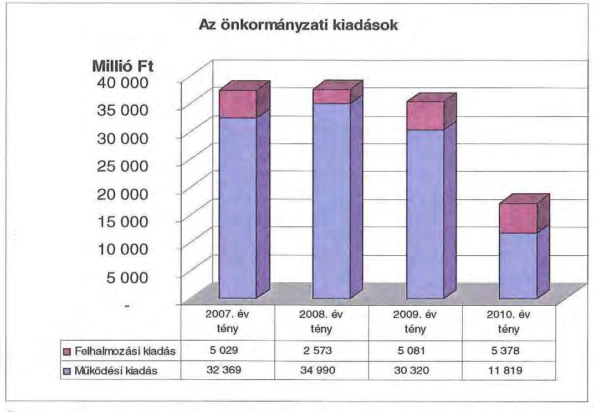

Önkormányzat 2007-2010 között megvalósított fejlesztései között intézményi épületek felújítása, korszerűsítése és bővítése szerepelt. A megvalósított fejlesztések az Önkormányzat kötelezően ellátandó feladatait szolgálták. A Jósa András Tömbkórház projekt volt a legmagasabb bekerülési költségű, 12385 millió Ft-os fejlesztés 2010-ben, közel 90\%-os uniós támogatással. A fejlesztést az Önkormányzat a költségvetésében tervezte meg, a megvalósulást követően az Önkormányzat könyveiben mutatják ki az aktivált teljesítményt. Az Önkormányzat a Kórházak részére fejlesztési célú támogatást nem adott át.

A tiszadobi Andrássy-kastély kulturális hasznosításának projektje 2008-ban kezdődött, 2135 millió Ft bekerülési költséggel, $80 \%$-os uniós támogatással.

A kötvényből származó bevétel terhére 2010 végéig 2103 millió Ft fejlesztési célú - Éltes Mátyás Általános Iskola épületének teljes rekonstrukciója és bővítése,

---

egészségügyi gép- műszer beszerzés, Egészségügyi Holding Zrt. alaptőke biztosítása, önkormányzati egyéb fejlesztések céljára - felhasználás történt.

A 2007-2010. évek között a 10 millió Ft teljes bekerülési költség feletti beruházások és felújítások száma 69 volt, amelynek közel negyedéhez (16 fejlesztéshez) uniós forrásokat is igénybe vettek. A 10 millió Ft alatti fejlesztésekkel együtt - amelynek összértéke meghaladja a 270 millió Ft-ot - 2010-ben mindössze egy uniós projekt megvalósítása volt folyamatban ${ }^{27}$.

Az Önkormányzat fejlesztési tevékenysége a pályázati kiírások által nagyban befolyásolt, mert a jelentkező működési forráshiány és saját felhalmozási bevételei alacsony szintje miatt beruházásokat csak külső források, uniós és hazai támogatások elnyerése esetén tudja megvalósítani. A felhalmozási kiadások önrészének forrásait is fejlesztési hitelekből és felhalmozási célú kötvénykibocsátásból finanszírozta. Az Önkormányzat 2007-2010 években megvalósított, illetve 2010. december 31-én fennálló fejlesztési feladatokhoz kapcsolódó kötelezettségeinek összegzését a 3. számú melléklet tartalmazza.

# 3. KÖTELEZETTSÉGEK BEMUTATÁSA 

### 3.1. A pénzintézetek felé fennálló kötelezettségek alakulása

Az Önkormányzat pénzintézeti kötelezettségeinek állománya 2006. december 31-től 2010. december 31-ig 10,5 szeresére nőtt, 1094 millió Ft-ról, 11533 millió Ft-ra. Fennálló pénzintézeti kötelezettségei kötvény kibocsátásából, hosszú lejáratú hitelek igénybevételéből, valamint folyószámla és munkabér megelőlegezési hitelek igénybevételéből keletkeztek. A kötvényt kibocsátó, a hosszú lejáratú hitelt nyújtó és a folyószámlát vezető pénzintézetek kiválasztása versenyeztetés, illetve közbeszerzési eljárás lefolytatása mellett történt meg.
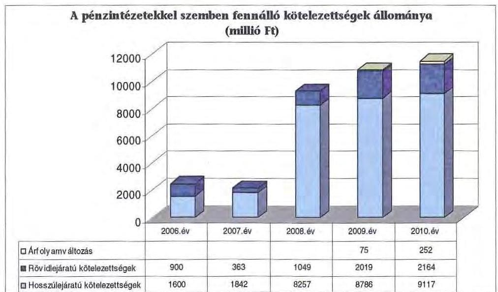

[^0]
[^0]:    ${ }^{27}$ A folyamatban lévő fejlesztések megvalósításához a források az Önkormányzat nyilatkozata alapján rendelkezésre állnak.

---

Az árfolyamváltozás hatása is befolyásolja a kötelezettségek alakulását, azonban annak mértéke előre pontosan nem határozható meg, csak várakozásokon alapuló tendenciák jelezhetők. A Számv.tv. 60. § (4) bekezdése meghatározza, hogy az árfolyam különbözetet év végén a kötelezettségek vagy követelések között a könyvviteli mérlegben nyilván kell tartani, azonban az árfolyam különbözet valójában nem realizált. Annak megítéléséről, hogy a devizában kibocsátott kötvényekért és felvett hitelekért kapott forinthoz képest a kötvények viszszavásárlásakor, illetve a hitelek visszafizetésekor jelentkező forint kötelezettség többletkiadást (árfolyamveszteség) vagy megtakarítást (árfolyamnyereség) eredményez a futamidő végén, a teljes kötelezettség rendezését követően lehet képet alkotni. Mindaddig, amíg törlesztési kötelezettség nem áll fenn (türelmi idő, moratórium), a tőkére vonatkoztatva nem értelmezhető sem az árfolyamveszteség, sem az árfolyamnyereség.

Az Önkormányzat pénzintézeti kötelezettségvállalásaira minden esetben közgyűlési döntés alapján került sor. A kötelezettségvállalásból származó források felhasználási céljait meghatározták. A Közgyűlés döntéseit megalapozó előterjesztések tartalmazták a kötelezettségvállalás visszafizetési forrásának megnevezését, a teljes futamidő várható kamat és tőkefizetési kötelezettségeket, de nem tartalmazta az árfolyam- és kamatkockázatok bemutatását. Az előterjesztésekben nem tértek ki az adósságszolgálati korlát bemutatására, ezért a Közgyűlés ennek figyelembevétele nélkül döntött. Az Önkormányzat az adósságot keletkeztető kötelezettségvállalás felső határát a hitelfelvételek és a kötvénykibocsátás esetében nem lépte túl.

Az adósságot keletkeztető kötelezettségvállalással megvalósított felhalmozási kiadások esetleges bevételt növelő, illetve kiadást csökkentő vonzatát, illetve ennek a fejlesztéshez, felújításhoz vállalt kötelezettségek visszafizetési forrásként való számbavételét nem vizsgálták.

Az Önkormányzatnak 2010. december 31-én EUR-ban az alábbi fennálló adósságot keletkeztető kötelezettségvállalása volt:

| Megnevezés | Kibocsátás, illetve szerződéskötés időpontja | Összeg (EUR) | Kibocsátási, vagy lehivási árfolyam | Kamat (referencia kamat+ kamatfelár) | Felhasználás célja: |
| :--: | :--: | :--: | :--: | :--: | :--: |
| SZSZB.1.Kötvény. | 2008.11 .11 | 22514071 | 155,48 | 3 havi EURIBOR $+1,9 \%$ | Fejlesztési feladatok finanszírozása |

---

Az Önkormányzat 2010. december 31-én HUF-ban fennálló adósságot keletkeztető kötelezettségvállalásai az alábbiak voltak:
ezer Ft-ban

| Megnevezés | Szerződéskötés idópontja | Összeg (Ft) | Kamat (referencia kamat+ kamatfelár) | Felhasználás célja: |
| :--: | :--: | :--: | :--: | :--: |
| Célhitel | 2000.10 .03 | 200000 | 3hovi BUBOR $+0,6 \%$ | Nyíregyházi Fólskola lelekvásárlás, Jósa András Kórház felújítás |
| Célhitel | 2001.07 .06 | 207388 | 3hovi BUBOR $+0,6 \%$ | Önkormányzati beruházások saját erő része |
| Célhitel | 2002.08 .07 | 222866 | 3hovi BUBOR $+0,6 \%$ | Önkormányzati beruházások saját erő része |
| ÖKIF hitel | 2005.10 .06 | 200000 | 3 havi EURIBOR $+1,48 \%$ | Önkormányzati beruházások saját erő része |
| ÖKIF hitel | 2006.09.18 | 260000 | 3 havi EURIBOR $+1,2 \%$ | Önkormányzati beruházások saját erő része |
| ÖKIF hitel | 2006.09.06 | 1500000 | 3 havi EURIBOR $+1,2 \%$ | Jósa András Kórház Cardiovascularis Központ létrehozása |
| ÖKIF hitel | 2008.05.23 | 150000 | 3 havi EURIBOR $+1,2$ $\%$ | Jósa András Kórház kórházi gép-müszer |
| ÖKIF hitel | 2008.11.06 | 130000 | 3 havi EURIBOR $+2 \%$ | Jósa András Kórház kórházi gép-müszer |
| ÖKIF hitel | 2010.04.15 | 2000000 | 3 havi EURIBOR $+1,89 \%$ | Fejlesztési feladatok |

Az Önkormányzat az EUR-ban fennálló pénzintézeti kötelezettségeiből tőkét még nem törlesztett, a törlesztést 2013-ban kezdi meg. EUR-ban fennálló kötelezettségeire 1501687 EUR kamatot, valamint 12 millió Ft egyéb költséget ${ }^{28}$ fizetett. A HUF-ban fennálló kötelezettségeire 2007-2010 között összesen 1166 millió Ft tőkét törlesztett, 607 millió Ft kamatot és egyéb költség címén összesen 3 millió Ft-ot fizetett.

[^0]
[^0]:    ${ }^{28}$ A kötvény esetében kibocsátási, szervezési dí címén fizetett egyéb díjat az Önkormányzat.

---

Az Önkormányzat a 2007. január 1-től 2010. december 31-ig az átmenetileg szabad pénzeszközein 1563 millió Ft kamatbevételt realizált, melyből 1252 millió Ft származott a kötvénykibocsátásból származó bevétel befektetéséből és 311 millió Ft az intézmények és a Hivatal elkülönített bankszámláin rendelkezésre állt szabad pénzeszközök befektetéséből ${ }^{29}$.

A kötvénykibocsátás bevételének befektetéséből származó kamatbevételből az Önkormányzat 422 millió Ft-ot a kötvények kamatfizetésére, 134 millió Ft-ot a befektetési szolgáltató részére ${ }^{30}$ fizetett ki és 696 millió Ft-ot működési célra fordított. A kamatbevétel ( 1252 millió Ft) a kötvények teljesített kamatfizetésének $297 \%$-át tette ki.

Az Önkormányzat likviditását a vizsgált időszakban csak folyószámlahitel igénybevételével tudta biztosítani. A folyószámlahitel és a munkabér megelőlegezési hitel alakulását az alábbi táblázat mutatja be:

| Megnevezés | 2007. év | 2008. év | 2009. év | 2010. év | 2011. március 31. |
| :--: | :--: | :--: | :--: | :--: | :--: |
| I. Folyószámlahitel |  |  |  |  |  |
| a folyószámlahitel kezelészzete 3 | 300000 | 850000 | 1120000 | 1800000 | 1800000 |
| teljesített kamat és egyéb költség | 76395 | 78303 | 163027 | 172473 | 98639 |
| II. Munkabér megelőlegezési hitel |  |  |  |  |  |
| Százebevett hitel összécs | 3300000 | 2700000 | 3600000 | 3600000 | 750000 |
| teljesített kamat és egyéb költség | 19147 | 16931 | 30955 | 20347 | 3819 |

A folyószámlahitel és munkabér megelőlegezési hitelek kondíciói és egyéb költségei a következők voltak ${ }^{31}$ :

| Megnevezés | Kamat (referencia+ kamatfelár | Egyéb költség |
| :--: | :--: | :--: |
| Folyószámlahitel |  |  |
| 2007. év | 3 havi BUBOR $+0,4 \%$ | évt $0,4 \%$ kez. ktg, évi $1 \%$ rend.tart. |
| 2008. év | 3 havi BUBOR $+3,5 \%$ | évi $0,4 \%$ kez. ktg, évt $1 \%$ ren. tart |
| 2009. év | 3 havi BUBOR $+5 \%$ | évi $0,4 \%$ kez. Ktg, évt $1 \%$ rend. tart |
| 2010. év | 3 havi BUBOR $+4,6 \%$ | évt $0,4 \%$ kez. Ktg, évt $1 \%$ rend. tart |
| 2011. év | 3 havii BUBOR $+4,1 \%$ | évt $0,4 \%$ kez. Ktg, évt $1 \%$ rend. tart |
| Munkabér megelőlegezési hitel |  |  |
| 2008. év | 3 havi BUBOR $+0,4 \%$ | $x$ |
|  |  |  |
| 2009. év | 3 havi BUBOR $+0,4 \%$ | $x$ |
| 2010. év | 3 havi BUBOR $+0,4 \%$ | $x$ |
| 2011. év | 3 havi BUBOR $+0,4 \%$ | $x$ |

[^0]
[^0]:    ${ }^{29}$ pályázati források előlegéből, a Kórházak OEP finanszírozási pénzeszközeiből
    ${ }^{30}$ A Közgyűlés elnöke 2008. december 10-én megbízási szerződést kötött a Gratius 2003 Kft-vel a kötvényből származó pénzeszközök befektetésével, a devizakockázat minimalizálásával kapcsolatos tanácsadásra. A megbízott 2009-2010. években irányította a szabad pénzeszköz befektetésével kapcsolatos tranzakciókat.
    ${ }^{31}$ A referencia kamat az alábbiak szerint alakult:

    | MNB BUBOR fixing (átlagkamat) \%-ban |  |  |  |  |
    | :-- | :-- | :-- | :-- | :-- |
    | 2007. évi | 2008. évi | 2009. évi | 2010. évi | 2011. március |
| 3 havi BUBOR | 7,75 | 8,87 | 8,64 | 5,5 | 6,03 |

---

A 2007. év kivételével az Önkormányzat az ellenőrzött évek minden napján igénybe vett folyószámlahitelt. Az átlagos napi állomány a 2007. évi 210 millió Ft, 2010. évre 1723 millió Ft-ra nőtt. A folyószámlahitel állománya 2010. december 31 -én 1783 millió Ft volt. 2007-2010 között a folyamatos likviditási problémák finanszírozása (folyószámlahitel) az Önkormányzatnak 490 millió Ft kamatkiadást eredményezett.

A tartós likviditási problémák miatt az Önkormányzat 2007-től a munkabérek kifizetéséhez munkabér megelőlegezési hitelt vett igénybe. 2007-ben tizenegy, 2008-ban kilenc, 2009-ben 12, 2010-ben tizenkettő és 2011. március 31-ig három alkalommal, alkalmanként - a 2011. év kivételével - átlagosan 300 millió Ft-ot. A 2011. év I. negyedévében igénybe vett munkabér megelőlegezési hitel átlagos állománya 250 millió Ft volt. A törlesztések az illetékbevételekből és a normatív állami támogatásokból az igénybevételt követő hónapban megtörténtek. Kamat és egyéb költség címén az Önkormányzat 2007-2010 között összesen 87 millió Ft-ot fizetett ki.

A 2011-ben fennálló kötvény esetében a kamatfizetési kötelezettségek alakulását jelentősen befolyásolta és jelenleg is befolyásolja a kibocsátáskori és az utolsó kamatfizetéskori referencia kamat változása, melyet az alábbi táblázat mutat be:

| Megnevezés | Kibocsátási, lehívási | Utolsó fizetéskori | Változás \% |
| :--: | :--: | :--: | :--: |
|  | alapkamat \% |  |  |
| 3 havi EURIBOR | 1,498 | 0,87 | $-42,0$ |

Amennyiben a referencia kamat nem változott volna, a kibocsátáskori referenciakamattal számolva az Önkormányzatnak 2611632 EUR kamatfizetési kötelezettsége jelentkezett volna, a változások miatt azonban 1109945 EUR-val kevesebb fizetési kötelezettséget kell teljesítenie.

Az alapkamat mértékének alakulása jelentős hatással van az adott devizanemben kifejezett, a teljes futamidőre számított, várható kamatkötelezettség nagyságára.

Az Önkormányzatnál a helyszíni vizsgálat alatt további hitel igénybevételről, illetve kötvénykibocsátásról szóló döntést nem készítettek elő.

Az Önkormányzat 2011-2014. évekre szóló gazdasági programjában kiemelt feladatként határozták meg többek között a likviditás biztosítását, az ellátandó feladatok finanszírozhatóságának megteremtését. Ennek érdekében célként határozták meg a háttérszervezetek racionalizálását, a megüresedett ingatlanok értékesítését.

---

# 3.2. Szállítók felé fennálló kötelezettségek alakulása 

Az Önkormányzatnak és gazdasági társaságainak lejárt szállítói tartozásai, és egyéb kiadás-elmaradásai alakulását az alábbi táblázat tartalmazza (ezer Ftban):

| Megnevezés | 2007. | 2008. | 2009. | 2010. | 2011. |
| :-- | :--: | :--: | :--: | :--: | :--: |
|  | december 31. | december 31. | december 31. | december 31. | március 31. |
| Lejárt szállitói tartozás | 1368233 | 456636 | 2970078 | 336347 | 191282 |
| ebből Kórház | 1126240 | 433804 | 2851275 |  |  |
| Gazdasági társaságok   lejárt szállitói tartozása | 49249 | 37708 | 540193 | 1296682 | 2049566 |
| Tartozásállomány | 1417482 | 494344 | 3510271 | 1633029 | 2240848 |

Az Önkormányzat 2007. december 31-ei lejárt szállítói tartozása 1368 millió Ft-ról 2010. december 31-re 336 millió Ft-ra, 2011. március 31-re 191 millió Ft-ra csökkent. Az Önkormányzat 2010. december 31-én lejárt szállítói tartozásállományának 45,26\%-a ( 152 millió Ft) meghaladta a 60 napot. A lejárt szállítói tartozásból kiugróan magas a kórházaknál jelentkező állomány, amely a 2006-2009. évek végén 82-96\% közötti mértéket ért el. ${ }^{32}$

Az Önkormányzat 75\% feletti többségi tulajdonú gazdasági társaságainak lejárt szállítói tartozásállománya a 2007. évi 49 millió Ft-ról 2010. év végére 1297 millió Ft-ra nőtt és 2011-ben tovább emelkedett, 2011. március 31 -ére 2050 millió Ft lett. Ennek 98,55\%-a az Egészségügyi Holding Zrt-nél keletkezett.

Az Egészségügyi Holding Zrt. 2010. év végi szállítói tartozásállománya 3831 millió Ft volt, amelyből a fizetési átütemezéssel érintett tartozásállomány 122 millió Ft-ot, a lejárt szállítói tartozásállomány 1297 millió Ft-ot tett ki. A lejárt szállítói tartozásállomány 2011. március 31-én 2018 millió Ft-ra nőtt, amelyből a 90 napon túli tartozásállomány 1091 millió Ft volt.

A 2010. december 31-i mérlegben kimutatott szállítói kötelezettség 963 millió Ft volt. A le nem járt tartozásállomány 627 millió Ft-ot tett ki. Az Önkormányzatnál a 2010. év végén kimutatott szállítói kötelezettségre fedezetet részben a mérlegben kimutatott 149 millió Ft követelésállomány ${ }^{33}$, illetve a Hivatal szabad folyószámlahitel kerete nyújt.

[^0]
[^0]:    ${ }^{32}$ A kórházak 2009. október 1-től gazdasági társasági formában múködtek, a 2009. évi adat a szeptember 30-i állapotnak megfelelő adatokat tartalmazza.
    ${ }^{33}$ ebből intézményi térítési díjkövetelés 32 millió Ft

---

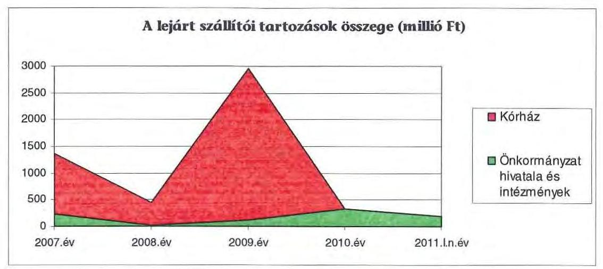

A Közgyűlés a lejárt szállítói kötelezettségek rendezésével, a vizsgált időszakban külön nem foglalkozott, de az tartozásállomány csökkentése érdekében az éves költségvetési tárgyalások során az intézményi előirányzatok megállapításánál nevesítette a lejárt szállítói tartozás nagyságát és kötelezte az intézményeket azok soron kívüli kiegyenlítésére a dologi előirányzatok terhére.

# 3.3. Egyéb kötelezettségek alakulása 

Az Önkormányzat a vizsgált időszakban garancia- és kezességvállalással kapcsolatban egy esetben döntött. Az Egészségügyi Holding Zrt. által igénybe vett folyószámlahitelhez kapcsolódóan 2010. december 17-én 1000 millió Ft összegű garanciát vállalt.

A vizsgált időszakban az elengedett követelések bruttó összege nem haladta meg a 2 millió Ft-ot.

Az Önkormányzat a fejlesztési hitelei igénybevételekor hozzájárult forgalomképes ingatlanjaira jelzálogjog alapításához és bejegyzéséhez. Az ingatlanokon összességében 4,2 milliárd Ft értékű keretbiztosítéki jelzálogjog bejegyzése történt meg. Az Önkormányzat összes forgalomképes ingatlanának becsült értéke 2010. december 31-én 5263 millió Ft volt, melyből a terhelt ingatlanok becsült értéke 4551 millió Ft ( $86 \%$ ) volt.
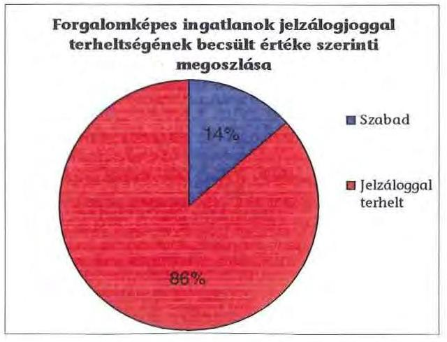

---

A vizsgált időszakban nem történt meg annak felmérése, hogy az elhasználódott eszközök milyen kötelezettséget jelent az Önkormányzat számára. A felújításokra, az eszközök pótlására az Önkormányzat pénzügyi lehetőségének a függvényében, elsősorban az intézmények működőképességének biztosítása, illetve a szakhatósági előírások figyelembe vételével került sor. Az Önkormányzat a 2007-2010. években a tárgyi eszközök után 6344 millió Ft összegű értékcsökkenést számolt el. Felújításra 1214 millió Ft fordítottak.

Az Önkormányzat a vizsgált időszakban intézményei és gazdasági társaságai részére nem nyújtott kölcsönt.

# 4. A PÉNZÜGYI EGYENSÚLY MEGTEREMTÉSE ÉrDEKÉBEN HOZOTT INTÉZKEDÉSEK 

A jelentésben szereplő CLF modellben bemutatott működési és felhalmozási hiány mindamellett alakult ki, hogy a vizsgált időszakban az Önkormányzat folyamatosan intézkedéseket tett, hogy alkalmazkodjon a finanszírozási rendszer változása miatti forráscsökkenéshez. Ennek érdekében bevételnövelő és kiadáscsökkentő döntéseket hozott.

Az Önkormányzat kiadáscsökkentő és bevételnövelő intézkedések meghozatalával a gazdálkodás átláthatóbbá tételét, valamint a feladatellátás szakmai színvonalának, de kiemelten a pénzügyi helyzet javítását kívánta elérni. Az Önkormányzat kimutatása szerint a legjelentősebb mértékű kiadási megtakarítást a létszámleépítésekkel érték el, emellett sikerült megőrizniük intézményeik gazdálkodásának stabilitását.

Az Önkormányzat gazdasági programjában megfogalmazott elvárások szerint 2007-ben elindult az intézményeket érintő átszervezések előkészítése, melyek az Önkormányzat kimutatása szerint - az áttekintett időszakban a következőek voltak:

- első lépésben 2007. április 1-vel megszünt a „Kégly Szeréna" Gyermekotthon. Az intézmény által ellátott feladatokat az Önkormányzat által fenntartott Területi Gyermekvédelmi Központ vette át. A feladatellátás átszervezése következtében 27 álláshely megszüntetésére került sor 120 millió Ft megtakarítása mellett;
- további intézmény és feladátátszervezési döntés következtében ugyanebben az évben 5 fő álláshely-csökkentés valósult meg a Testnevelési és Sportintézetnél 46 millió Ft és 32 fő 185 millió Ft kiadáscsökkentéssel a Tiszadobi Gyermekváros esetében;
- a balkányi Gyermekotthont 2007. december 31. napjával szüntették meg, a feladatokat a nyírbátori Gyermekvédelmi Központ vette át. Az intézmény megszüntetésével egyidejűleg az álláshelyek száma 16 -tal csökkent, a megtakarítás összege 113 millió Ft volt;
- ugyanebben az évben a közmúvelődési feladatellátás átszervezése 7 fő álláshely mellett 70 millió Ft megtakarítást eredményezett a Megyei Pedagógiai, Közművelődési és Képzési Intézetnél;

---

- az egészségügyi feladatellátás 2009. évi átszervezésekor az intézmények megszüntetésével és gazdasági társaságok létrehozásával egyidejúleg létszámleépítést hajtottak végre, melynek eredményeként 115 fő állása szűnt meg, a megtakarítás összege 214 millió Ft;
- az Önkormányzat által fenntartott Ellátó Szervezetnél feladatátrendezés következtében 2009-ben két döntés eredményeként 9 fő álláshelyet szüntettek meg, kiadáscsökkentő hatása 26 millió Ft volt;
- ugyanebben az évben az Önkormányzat a nagydobosi Perényi Péter Általános Iskola, Készségfejlesztő Speciális Szakiskola és Kollégiumot jogutód nélkül megszüntette, a feladatellátást intézményeiben biztosította. A feladatátszervezés kiadás megtakarítással nem járt;
- a hivatali feladatok átszervezése során 2007-ben 7 fővel 69 főről 62 főre csökkentették az engedélyezett létszámot. A Kórházak átszervezésével kapcsolatosan 2009-ben átmeneti 1 fő létszámemelkedést követően a létszám 5 fővel való csökkentésére került sor, így a hivatal létszáma 2011. március 31-én 58 fő volt, ami 50 millió Ft megtakarítást eredményezett. A 2007. évi Hivatalt érintő szervezeti változások célja az volt, hogy racionálisabban szervezett hivatal működjön a jövőben, csökkentve a szervezeti egységek számát - 5 osztály helyett 3 - és a vezetői szinteket;
- az Önkormányzat a 32/2009. (IV. 29.) számú határozatával döntött az egészségügyi feladatellátást végző intézmények megszüntetéséről és a megszűnő költségvetési szervek feladatát átvevő nonprofit, kiemelkedően közhasznú társaságok - Jósa András Egészségügyi Nonprofit Kft., SzatmárBeregi Kórház és Gyógyfürdő Egészségügyi Nonprofit Kft., valamint Sántha Kálmán Mentális Egészségközpont és Szakkórház Egészségügyi Nonprofit Kft. - megalapításáról és arról, hogy az egészségügyi közfeladat szervezését, illetve a betegellátást végző társaságok egységes és hatékony irányítását Egészségügyi Holding Nonprofit Zrt. látja el. Az Önkormányzat az egészségügyi feladatellátást végző intézmények működési kiadásaihoz azok megszűnéséig nem járult hozzá, mivel arra az OEP finanszírozás fedeztet nyújtott. Ebből következően a feladatellátás gazdasági társaságokba való kiszervezése az Önkormányzatnál tényleges megtakarítást nem eredményezett. A Kórházakat üzemeltető Kft-ket 10-10 millió Ft-os törzstőkével alapították, míg az Egészségügyi Holding Zrt. alaptőkéje 130 millió Ft. Az Egészségügyi Holding Zrt. a gazdasági társaságokat névértéken megvásárolta az Önkormányzattól. A Mátészalkai Kórház Kft-t Mátészalka Város Önkormányzata 2010-ben az Egészségügyi Holding Zrt-be apportálta 10 millió Ft névértékkel, melynek fejében $7,1 \%$ tulajdoni hányadot szerzett, így a megyei Önkormányzat 130 millió Ft-os részesedése az alaptőke 92,9\%-ára csökkent. Az Önkormányzat az egészségügyi feladatok ellátásához szükséges eszközállományt ingyenesen használatba adta a gazdasági társaságok részére. A gazdasági társaság létrehozását részletes, előzetes hatástanulmány készítése előzte meg. Osztalékbevétele az Önkormányzatnak nem volt.

A kiadások további csökkentése érdekében az Önkormányzat kimutatása szerint álláshelyek megszüntetésére került sor, mellyel az Önkormányzat összesen 2123 millió Ft megtakarítást ért el az áttekintett időszakban:

---

- 2007-ben az oktatásban 19 fő, szociális ellátás és gyermekvédelem területén 122 fő, közművelődésben 18 fő, igazgatásban 1 fő, egészségügyben 160 fő létszámleépítésére került sor. További megtakarítást eredményezett az intézményeknél 87 betöltetlen álláshely zárolása;
- 2008-ban igazgatásban 2 fő, szociális ellátás és gyermekvédelem területén 1 fő, egészségügyben 26 fő létszámleépítést hajtottak végre;
- 2009-ben egészségügyben 140 főt, oktatásban 3 főt bocsátottak el.

Az intézményeknél 2011-ben további 244 álláshely megszüntetéséről - melyből 84 volt az üres álláshely - határoztak. A döntés kiadásokra gyakorolt hatása még nem számszerúsíthető.

Az intézményi feladatok racionalizálásáról, átcsoportosításáról, integrációról a Közgyűlés döntött. Az ezekhez készített előterjesztésekben a tervezett intézkedések indokait, várható eredményeit bemutatták. Az átszervezés végrehajtásához kikérték a szakmai szervezetek véleményét, a jogszabályban előírt egyeztetéseket lefolytatták. A szociális és gyermekvédelmi, oktatási, egészségügyi és közművelődési intézmények átszervezését követő működési tapasztalatok a rendelkezésre álló beszámolók szerint kedvezőek, a szakmai színvonal, valamint a működés személyi és tárgyi feltételei a létszámleépítések, feladatátcsoportosítások következtében kimutathatóan nem romlottak.

A Közgyűlés döntött két szociális és gyermekvédelmi feladatokat végző intézmény bezárásáról ${ }^{34}$, feladatok átcsoportosításáról, továbbá az ehhez kapcsolódó létszám-megtakarításokról, valamint a Jósa András Oktató Kórháznál csoportos létszámcsökkentés elrendeléséről és ezzel párhuzamosan 160 fő álláshely megszüntetéséről, majd 2009-ben további - 26 fő, 101 fő és 140 fő - létszámot érintő racionalizálásról. A döntést előkészítő testületi előterjesztések szerint az intézkedéseknek elsősorban szakmai és gazdasági indokai voltak. A döntések célja a gazdaságosabb és magasabb szervezettségi színvonalú feladatellátás biztosítása volt, a jogszabályi előírásokban meghatározott szakmai feltételek betartásával.

A Közgyűlés döntött ${ }^{35}$ a TOURINFORM Iroda jogutódlással való megszüntetéséről. Az intézmény beolvadt a Szabolcs-Szatmár-Bereg Megyei Múzeumok Igazgatóságába, mely a megszüntetett intézmény valamennyi közfeladatát - a megyei idegenforgalmi értékek feltárását, célkitűzések meghatározását és a teljesítésükben résztvevők tevékenységének összehangolását - átvette. A megszüntetéssel 1 álláshely került leépítésre, 2 átcsoportosításra a Szatmár-Bereg Megyei Múzeumok Igazgatóságába. Az átszervezés az Önkormányzat kimutatása szerint a dologi kiadások közel 1 millió Ft megtakarítását eredményezte.

A költségvetési szervek racionális és gazdaságos működése érdekében, a hosszú távú működőképesség biztosítása érdekében döntött a Közgyűlés az 1/2011. (I. 27.) számú határozatával a költségvetési szerveinek átszervezéséről. Az át-

[^0]
[^0]:    ${ }^{34}$ a Közgyűlés 9/2007. (II. 22.), 104/2007. (XI. 22.), 53/2007. (V. 29.), 62/2008. (VI. 25.), 32/2009. (IV. 29.) és 124/2009. (VIII. 10.) számú határozatai
    ${ }^{35}$ a Közgyűlés 3/2011. (I. 27.) számú határozata

---

szervezés keretében a 24 önállóan működő és gazdálkodó költségvetési intézmény gazdálkodási önállósága a szakmai önállóságuk megtartása mellett megszűnt és a gazdálkodási feladatok ellátására a Közgyűlés létrehozta a Gazdasági Igazgatóságot. A döntés kiadásokra gyakorolt hatását az előterjesztésben nem számszerúsítették.

A 2007-2010. években az intézményátszervezések, a feladatváltozások, valamint a takarékossági intézkedések hatásaként együttesen 4576 millió Ft kiadási megtakarítást mutattak ki, amelyből 3924 millió Ft volt személyi juttatások megtakarítása. Ebből a létszámleépítésekhez 1515 millió Ft, az üres álláshelyek zárolásához 585 millió Ft, a feladátátszervezésekhez 824 millió Ft, az elrendelt $15 \%$-os kiadási előirányzat csökkentéshez 1000 millió Ft kapcsolódott.

A 2007-2010. évek kiadáscsökkentő intézkedéseinek hatása beavatkozási területenként:
adatok: ezer Ft-ban

| Az érvényesített kiadás-   csökkentés területei | Személyi   juttatások és   járulékai | Dologi, mű-   ködési ki-   adások | Pénzeszköz   átadások,   támogatá-   sok | Összesen |
| :-- | :--: | :--: | :--: | :--: |
| a Közgyűlés múködése |  | 170081 |  | 170081 |
| a Hivatalnál | 87455 | 8624 |  | 96079 |
| az intézményeknél | 3836044 | 483897 |  | 4309826 |
| összesen | 3923499 | 662602 |  | 4575986 |

A Közgyűlés a 3/2010. (II. 12.) számú rendeletével döntött kiadáscsökkentő intézkedések megtételéről, mely szerint saját működési kiadási előirányzatait 15\%-kal csökkentette. További, személyi jellegű költségmegtakarítást eredményeznek a Közgyűlés rendelkezései ${ }^{36}$ a Közgyűlés tisztségviselőinek, tagjainak és a bizottságok tagjai juttatásainak, valamint a Közgyűlés elnöke illetményének és alelnökei illetményének és költségátalányának csökkentéséről.

A Hivatalban végrehajtott megtakarítási intézkedések feladátátszervezésből következő és álláshely csökkentéssel járó döntések voltak, amelyek összességében a 2006. december 31-i állapothoz viszonyítva 11 fő igazgatási létszám csökkenést eredményeztek, mellyel 50 millió Ft kiadási megtakarítást mutattak ki. A Közgyűlés a 3/2010. (II. 12.) számú rendeletével döntött a cafeteria elemek csökkentéséről, amely az Önkormányzat kimutatása szerint 2010-ben 9 millió Ft kiadási megtakarítással járt. Ugyanezzel a döntésével a Közgyűlés rendelkezett a személyi jellegű juttatások, munkáltatókat terhelő járulékok és dologi kiadások előirányzatainak csökkentésével, a kimutatásaik szerint a 2010. évben 37 millió Ft megtakarítást értek el.

A Hivatal létszáma 2006. december 31 -én 137 fó volt, ebből a kormányzati intézkedések miatt 68 fő 2007. január 1-től az APEH állományába került.

[^0]
[^0]:    ${ }^{36}$ a Közgyűlés 2/2011. (II. 25.) számú rendelete, valamint a 39/2011. (II. 24.), a 40/2011. (II. 24.) és a 41/2011. (II. 24.) számú határozatai

---

Az önkormányzati szinten kimutatott 4576 millió Ft megtakarításból 4310 millió Ft-ot az intézmények körében érvényesítettek. Ezen belül 3836 millió Ft, a megtakarítások $83,8 \%$-a a személyi juttatásoknál és járulékoknál realizálódott.

A létszámcsökkentő intézkedések következtében az Önkormányzat szerint 2007. január 1. és 2011. március 31. között a Hivatalnál és az intézményeknél összesen 4526 álláshelyet szüntettek meg, amelynek háromnegyede ágazati szakmai, egynegyede intézményüzemeltetéshez, fenntartáshoz, gazdasági ügyek intézéséhez kapcsolódó álláshely volt. A megszüntetett álláshelyekből 3647 álláshely az egészségügyi intézmények gazdasági társasággá történő átalakításához köthető.

A létszámcsökkenés ágazatonként - kiszűrve az egészségügyi feladatellátás gazdasági társaságokba szervezésének hatását - a következő ábra szemlélteti:
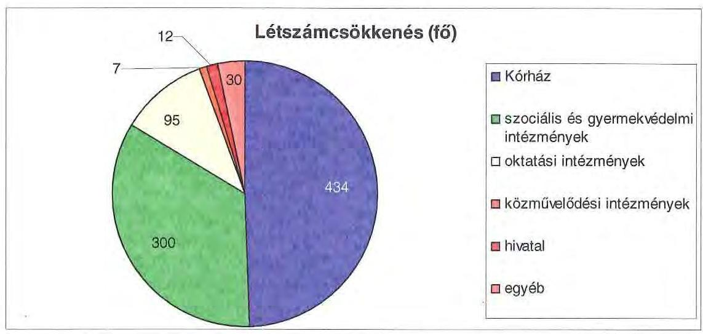

A helyi szervezési intézkedések végrehajtásához az Önkormányzat - kimutatása szerint - 2007-2010 években 896 millió Ft központi költségvetési támogatásban részesült, 2011-ben az álláshely-csökkentések végrehajtásához 79 millió Ft költségvetési támogatást igényelt. A támogatás, illetve az igényelt támogatás felhasználásával 781 fő álláshelyet tartósan leépített. A létszámcsökkenés $82,7 \%$-ához, 3745 főhöz központi támogatás nem kapcsolódott, mivel a dolgozók egy részét az Önkormányzat gazdasági társaságainál - Kórházak - tovább foglalkoztatták. Az intézkedések és az egészségügyi feladatellátás gazdasági társaságokba való kiszervezésének hatására az Önkormányzat 2006. december 31-i átlaglétszáma 2011. március 31-re 64,4\%-kal, 4555 fővel csökkent, ebben az ÁSZ figyelembe vette a kormányzati intézkedések miatti létszámcsökkenés Illetékhivatal 68 fő - hatását is. A gazdasági társaságokba szervezett egészségügyi intézmények átlaglétszáma 2006. december 31-én 3647 fő volt.

---

A kiadáscsökkentő intézkedések mellett az Önkormányzat kimutatása szerint az alábbiakban számszerűsített bevételnövelő intézkedéseket tette:
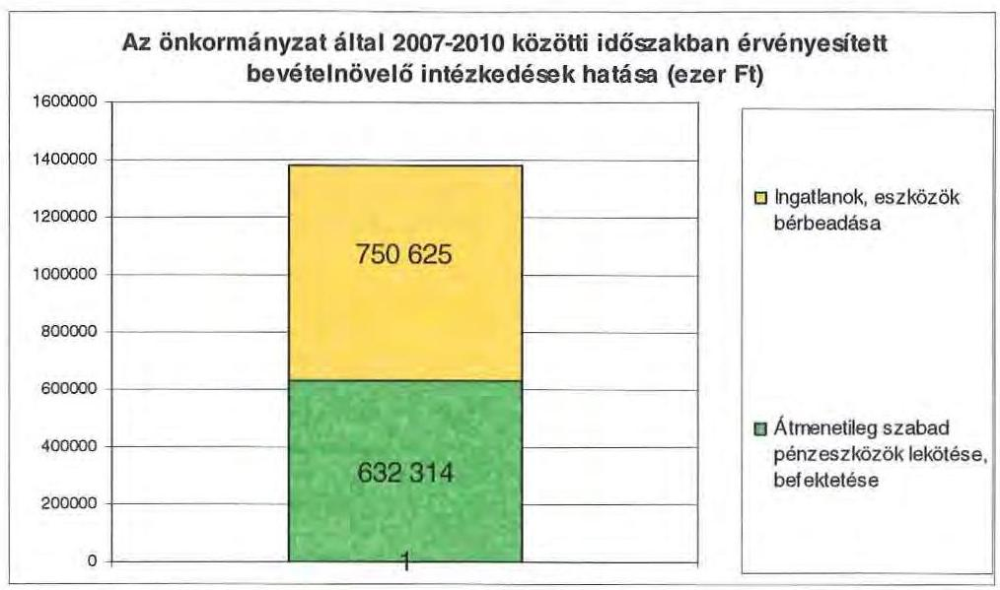

A nyilvántartások szerint bevételnövelésre irányuló intézkedések következtében elért ingatlanok és eszközök bérbeadásából származó 751 millió Ft összegű be-vétel-növekedést az intézmények realizálták, míg az átmenetileg szabad pénzeszközök lekötéséből, befektetéséből származó, 632 millió Ft összegű bevétel a Közgyűlés hivatalánál realizálódott. Az ingatlanok és eszközök bérbeadásából származó bevételek teljesítési kötelezettségét a Közgyűlés az adott évi költségvetési rendeleteiben írta elő az intézmények részére, azzal a megkötéssel, hogy az elért bevételi többletet a jóváhagyott kiadási előirányzatai forrásaként használhatja fel.

A 2011. évre bevételnövelő intézkedések hatásaként 496 millió Ft bevételi többletet tervezett az Önkormányzat, melyből 325 millió Ft-ot ingatlanok, eszközök bérbeadása, 171 millió Ft-ot átmenetileg szabad pénzeszközök lekötése, befektetése biztosít.

Az átszervezések, a takarékossági intézkedések szakmai feladatellátásra gyakorolt hatását célzottan nem vizsgálták.

# 5. A HELYI ÖNKORMÁNYZATOK GAZDÁLKODÁSI RENDSZERÉNEK 2007. ÉVI ELLENŐRZÉSE SORÁN A PÉNZÜGYI EGYENSÚLY JAVÍTÁSÁRA TETT SZABÁLYSZERŰSÉGI ÉS CÉLSZERŰSÉGI JAVASLATOK HASZNOSULÁSA 

Az ÁSZ jelentésében 13 szabályszerűségi és hét célszerűségi javaslatot tett. A tett javaslatok közül a pénzügyi egyensúly javítására három szabályszerűségi és két célszerűségi javaslat vonatkozott. A szabályszerűségre vonatkozó javaslatokat a Főjegyzőnek tettük meg. Javasoltuk, hogy:

- „tegye meg a szükséges intézkedéseket annak érdekében, hogy a költségvetési rendelettervezetben a jóváhagyásra előterjesztett költségvetési bevételek és kiadások föösszege - az Áht. 8/A. § (7) bekezdésében foglaltak betartása érdekében - ne tar-

---

talmazzon költségvetési hiányt módosító finanszírozási célú bevételeket, illetve kiadásokat". Az intézkedési tervben a javaslat alkalmazását a 2009. évi költségvetési rendelet-tervezet készítésekor írták elő, felelősként megjelölve a Pénzügyi, Gazdálkodási és Fejlesztési Osztály vezetőjét. A 2009. évi és az azt követő évek költségvetési rendelet-tervezete továbbra is tartalmazta a költségvetési hiányt módosító bevételek és kiadások előirányzatait;

- „bevételi és kiadási elöirányzatait a támogatási szerzödésekben foglaltakkal összhangban tervezzék meg az Áht. 69. § (1) bekezdésben elöírtaknak megfelelően". A 2009. évi költségvetési rendelet-tervezet a javaslatnak megfelelően készült el;
- „az európai uniós fejlesztések bevételi és kiadási elöirányzatait az Ámr. 29. § (1) bekezdés k) pontja alapján elkülönítetten, a 29. § (1) bekezdés g) pontjának elöirása alapján a több éves kihatással járó feladatok elöirányzatainak éves bontásával, valamint a 29. § (1) bekezdés d) pontja alapján a felhalmozási kiadásokat feladatonként tervezzék". Az intézkedési tervben a javaslat alkalmazását a költségvetési rendelet-tervezet készítésekor írták elő, felelősként megjelölve a Pénzügyi, Gazdálkodási és Fejlesztési Osztály vezetőjét. A 2010. évi és az azt követő év költségvetési rendelet-tervezetei az Ámr. előírásai szerint tartalmazták az európai uniós előirányzatokat;

A célszerüségi javaslatok között a Közgyűlés elnökének javasoltuk, „kezdeményezze, hogy a számvevőszéki jelentésben foglaltakat a Közgyülés tárgyalja meg és a feltárt hiányosságok megszüntetése érdekében készíttessen intézkedési tervet a határidők és felelősök megjelölésével". A jelentést a Közgyűlés a 2008. szeptember 11-én tartott ülésén megismerte. A javaslatok megvalósítására intézkedési tervet készítettek, amely teljes körűen tartalmazta a javaslatokat, meghatározta a feladatok elvégzéséért felelősöket és a feladatok elvégzésének határidejét.

A Főjegyzőnek javasoltuk, hogy „gondoskodjon a költségvetés tervezésének megalapozottsága érdekében, hogy az Önkormányzat a költségvetés készítése során a kötelezettséggel terhelt pénzmaradvány összegét a költségvetési bevételek között tervezzék meg". A 2009. évi és az azt követő évek költségvetéseiben az előző évi pénzmaradványt - amennyiben az realizálódott - a bevételek között megtervezték.

Budapest, 2011. december „ 16 "

Melléklet: $\quad 6 \mathrm{db} \quad 11$ lap

Domokos László

---

.

---

Szabolcs-Szatmár-Bereg Megyei Önkormányzat

1. számú melléklet a V-3023/2011. számú jelentéshez

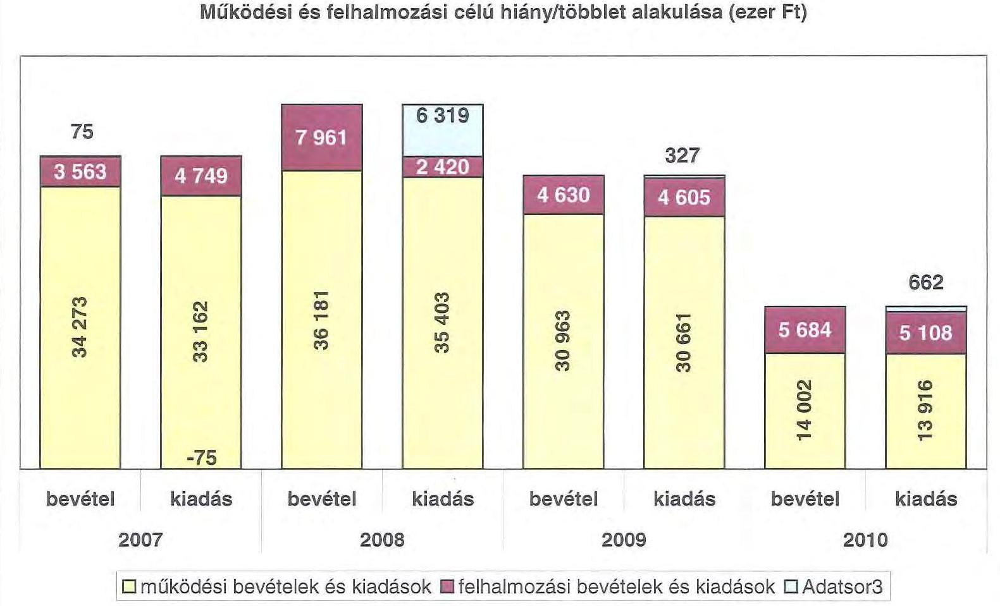

---

.

---

|  1. FOLYD KÖLTŐSYSTÉS* | 2007. | 2008. | 2009. | 2010.  |
| --- | --- | --- | --- | --- |
|  1.1.1. Saját működési kevésletét | 4 168 798 | 5 262 192 | 5 599 470 | 5 874 812  |
|  1.1.2. Kétengységén támogatás | 6 189 579 | 8 031 261 | 8 977 982 | 2 759 112  |
|  1.1.3. Etengészítő kevésletét | 2 212 127 | 650 207 | 659 414 | 534 946  |
|  1.1.4. Készítéséterekben belülről kapott támogatások | 20 081 232 | 21 258 667 | 16 371 708 | 983 572  |
|  1.1.5. Elvéti és külföldről kapott kevésletét | 23 914 | 94 067 | 707 | 0  |
|  1.1.6. Készítéséterekben kívülről kapott kevésletét | 53 082 | 116 712 | 125 637 | 157 762  |
|  1.1.7. Előző évt pároszeredvéleg átvétel | 7 220 | 18 260 | 759 157 | 52 983  |
|  1.2. Folyó kevésletét -1.1.1.-1.1.2.-1.1.3.-1.1.4.-1.1.5.-1.1.6.-1.7. | 33 257 352 | 35 462 172 | 30 910 001 | 12 142 018  |
|  1.2.1. Működési kiadások bennetlésétben belül | 31 296 912 | 33 667 978 | 28 342 450 | 10 492 370  |
|  1.2.2. Készítéséterekben belülre átadott pároszédelték | 52 977 | 48 640 | 196 591 | 48 690  |
|  1.2.3.1. Működésintelését | 0 | 54 054 | 54 400 | 9 560  |
|  1.2.3.2. Elvétet, illetve külföldet | 200 | 200 | 0 | 0  |
|  1.2.3.3. Megjegyzésfejlesztés | 754 281 | 889 054 | 899 367 | 848 699  |
|  1.2.3.4. Megjelölő szervezetének | 212 974 | 242 119 | 629 893 | 121 524  |
|  1.2.5. Tervezítésételekben (1.2.3.1.-1.2.3.2.-1.2.3.3.-1.2.3.4) | 387 620 | 1 185 520 | 1 242 650 | 391 922  |
|  1.2.6. Készítésételek | 125 932 | 257 387 | 566 885 | 447 323  |
|  1.2.7. Előző évt pároszeredvéleg átvétel | 17 338 | 17 260 | 45 412 | 83 780  |
|  1.3. Folyó kiadások - 1.2.1.-1.2.2.-1.2.3.-1.2.4.-1.2.5 | 31 381 031 | 32 146 994 | 30 696 304 | 12 067 054  |
|  1.4. Folyó költségvetés egyenlege MÜKÖDÉSI JÖVÉDELÉM (1.1.-1.2.) | 976 327 | 315 181 | 337 086 | 74 982  |
|  2. FEJEGYÁMOZAM (BEREZIÁZAM) KÖLTŐSYSTÉS** |  |  |  |   |
|  2.1.1. Saját kötelezetétek | 49 060 | 157 307 | 129 200 | 176 198  |
|  2.1.2. Készítéséterekben belülről kapott támogatások | 1 149 246 | 407 552 | 1 302 342 | 7 256 324  |
|  2.1.3. Elvéti és külföldről kapott támogatások | 743 167 | 215 622 | 0 | 0  |
|  2.1.4. Készítéséterekben kívülről kapott támogatások | 44 252 | 52 636 | 16 706 | 172 238  |
|  2.1. Felkultuszéd (beruházést) kevésletét (-1.1.1.-1.1.2.-1.1.3.-1.1.4.) | 1 985 751 | 883 547 | 2 648 138 | 2 704 568  |
|  2.2.1. Saját beruházási kiadás átlevét | 4 160 966 | 1 837 376 | 4 087 235 | 3 975 706  |
|  2.2.2. Saját felújítést kiadás átlevét | 279 782 | 627 909 | 356 365 | 132 085  |
|  2.2.3. Készítéséterekben belülre átadott pároszédét | 155 894 | 208 789 | 94 429 | 6 962  |
|  2.2.4. Elvétet és külföldnek adott pároszédelték | 0 | 0 | 0 | 0  |
|  2.2.5. Készítéséterekben kívülre adott pároszédelték | 12 210 | 12 948 | 2 910 | 12 453  |
|  2.2.6. Befektetési célú részesedések cégérlete | 8 227 | 870 | 161 018 | 0  |
|  2.3. Felkultuszéd (beruházést) kiadásak (-1.1.1.-1.1.2.-1.1.3.-1.2.4.-1.2.5.-1.2.6.) | 4 917 112 | 2 415 089 | 4 783 958 | 2 130 248  |
|  2.3. Beruházési költségvetés egyenlege (2.1.-2.2.) | -2 931 264 | -1 612 342 | -1 025 720 | -1 425 089  |
|  3. FINANSIÓMOZAM MÜVELETEK NELKÜLÜGENI POZZI 3D |  |  |  |   |
|  (1.3.) Folyó költségvetés egyenlege Működési Jövedelten v (2.3.) Beruházási költségvetés egyenlege | -1 955 041 | -1 297 161 | -1 818 634 | -1 350 699  |
|  4. FINANSIÓMOZAM MÜVELETEK |  |  |  |   |
|  4.1. Hétélővétel | 1 431 244 | 1 329 727 | 1 404 316 | 2 672 521  |
|  4.2. Hétélővételre | 107 544 | 228 699 | 321 626 | 2 017 728  |
|  4.3. Forgaléd és befektetési célú értékpapírok kibocsátása | 0 | 6 050 002 | 0 | 0  |
|  4.4. Forgaléd és befektetési célú értékpapírok beválása | 0 | 0 | 0 | 0  |
|  4.5. Forgaléd és befektetési célú értékpapírok értékvélése | 0 | 0 | 0 | 0  |
|  4.6. Forgaléd és befektetési célú értékpapírok cégérlete | 0 | 0 | 0 | 0  |
|  4.7. Egyéb finanszírozási kevésletét (függő, állatú, kiegészítői) | 102 377 | 117 782 | -733 189 | -154 382  |
|  4.8. Egyéb finanszírozási kiadások (függő, állatú, kiegészítői) | 225 338 | -31 355 | -456 965 | -199 349  |
|  4.9. Finanszírozási műveletek egyenlege (4.1.-4.2.-4.3.-4.4.-4.5.-4.6.-4.7.-4.8.) | 815 982 | 7 250 052 | 806 406 | 719 566  |
|  5. TANUYÉVI POZZI 3D |  |  |  |   |
|  (5.) FINANSIÓMOZAM MÜVELETEK NELKÜLÜGENI POZZI 3D + (4.9.) Finanszírozási műveletek egyenlege | -1 139 056 | 5 952 931 | -1 012 228 | -631 151  |
|  6. NETTO MÜKÖDÉSI JÖVÉDELÉM |  |  |  |   |
|  (1.3.) Működési Jövedelten - Főkötelezetés (4.1. Hétélővételre + 4.4. Forgaléd és befektetési célú értékpapírok beválása ) | 788 775 | 86 372 | -84 340 | -1 942 738  |
|  TAJÉRÁSZTATO ADATOK |  |  |  |   |
|  Öntem kötelezettség | 4 208 258 | 12 455 667 | 14 268 728 | 13 402 979  |
|  ebből elvéti hajászat | 2 457 555 | 4 109 964 | 5 398 158 | 3 321 214  |
|  Öntem esülföld kötelezettség | 2 068 015 | 3 608 723 | 3 042 649 | 963 164  |
|  ebből hajás | 1 360 255 | 456 634 | 2 970 078 | 336 247  |
|  Fősz és tőlegésed kötelezettség (műtség) | 2 204 952 | 9 206 072 | 10 889 224 | 11 223 312  |
|  ebből elvéti hajászat | 363 207 | 1 048 960 | 2 018 575 | 2 164 453  |
|  ÖFÉ szerződésből kiálva lévő kötelezettséges állomáza | 0 | 0 | 0 | 0  |
|  ebből hajás (szolgáltatói) áll. némét kötelezettség | 0 | 0 | 0 | 0  |
|  Főkötelezetésből segít átfogás állomáza | 209 051 | 554 185 | 1 316 523 | 1 723 373  |
|  Látvidálási segít átfogás állomáza | 0 | 0 | 0 | 0  |
|  Hozékételekkel segít átfogás állomáza | 250 000 | 250 000 | 250 000 | 300 000  |
|  Foras díjárcsokból fennálló függő kötelezettségek | 0 | 0 | 0 | 0  |
|  Finanszírozásba bevordozó eszközök érezete | 251 625 | 6 504 559 | 5 529 965 | 2 037 174  |
|  Tartás kötelezettség megjegyzési értékpapírok | 0 | 0 | 0 | 158 560  |
|  Hozest hajászat hozékletétek | 0 | 0 | 0 | 0  |
|  Értékpapírok | 0 | 0 | 0 | 0  |
|  Finanszékletét (idegen pároszédelték nélküli) | 221 619 | 6 504 559 | 5 529 965 | 4 898 834  |

- Hozékletében nem tétül, a kiadásakban nem jelenik meg az amortizáció, a vagyoni helyeztet az egyenleg befolyásolja ** Hozékletében vagyon megőrzésre és bővítése fordítását fordulunk.

## Megjegyzés

A számítást lakás mindaz elcér az ÁSZ módszertanában korábban alkalmazott benyolásoktól. A jelen benyolás általános közgazdasági meggondolásokon alapul, amely testet tük az SNA statisztikai módszertanában is. Folyó tábáik alatt érjük ezeket a kiadás

A folyó költségvetés egyenlege (működési jövedelten) tartalmazza a kamatkiadásokat is, mind a működtől, mind a fejlesztési kamatot, mert csak közgazdasághag ésnyezőjövedelések. Nem tartalmazzák a jelenlegelmi kevészké és kiadások a következő elengedés más

A nemé működtől jövedelenek a tőlezőrészítés bevonásával a folyó költségvetés egyenlegéből (működési jövedeltenből) származóajak. Tiszteltet kiadásaknak nevezziük azokat a folyó és kötelezetési tábáikat, amelyeket nem az adott önkormányzat házaail fel eszi

---

|  Ör
szám | Megnevezés | 2007. év | 2008. év | 2009. év | 2010. év | 2011. év  |
| --- | --- | --- | --- | --- | --- | --- |
|   |  | Még | Még | Még | Még | Még  |
|  I. | **IMÁKÓDÉSI BEVETELÉE** | 29 896 060 | 28 294 660 | 26 071 711 | 25 809 000 | 25 690 204  |
|   | 1. **Ildgátva folyó bevételét** | 5 244 076 | 5 196 156 | 5 266 799 | 5 097 550 | 5 033 323  |
|   | 1.1. **Imákinénylé működési bevételé** | 5 502 416 | 5 434 007 | 5 155 163 | 5 415 672 | 5 311 003  |
|   | 1.2. **Ilddélyevételét** | 1 973 063 | 2 275 049 | 1 377 544 | 1 355 667 | 1 430 060  |
|   | 1.3. **Irségi adóbevételét és jóföldek** | 770 | 5 750 | 46 600 | 5 750 | 0  |
|   | 1.4. **Főemel bevételi működési része** | 31 516 | 30 396 | 30 396 | 411 460 | 171 050  |
|   | 1.5. **Egyéb folyó műföldési bevételét** | 18 605 | 0 | 0 | 0 | 0  |
|   | 2. **Támogatás értékű adókódra bevételét** | 546 475 | 482 180 | 4 686 670 | 483 262 | 450 450  |
|   | **MÁSÍS** |  |  |  |  |   |
|   | 1. **folyó imákinényléződő és időpályvidéi szervező** | 178 640 | 338 056 | 1 220 020 | 490 817 | 536 270  |
|   | 1. **Mikozási határostól távszerűs** | 0 | 0 | 0 | 660 | 0  |
|   | 2. **Pénzöregalom nélküli bevételét működésre jóváhagozó része** | 601 252 | 437 269 | 1 012 430 | 1 202 910 | 0  |
|   | 4. **Aromháztartásos kódikói működési célra átvéti pénzeszközök** | 116 985 | 161 388 | 128 308 | 157 763 | 94 304  |
|   | 5. **Központi támogatások és átengedett források működési része** | 27 070 109 | 28 937 028 | 22 279 041 | 6 098 255 | 2 747 252  |
|   | **MÁSÍS** |  |  |  |  |   |
|   | 3. **SZJA** | 2 213 117 | 690 107 | 699 414 | 254 090 | 272 160  |
|   | 2. **Imákinénylé és időpályvidéi állami támogatásának működési része** | 5 051 153 | 7 004 444 | 5 483 037 | 5 754 152 | 5 374 062  |
|   | 3. **Mikozási határostól távszerűs** | 4 653 | 0 | 77 220 | 0 | 0  |
|   | 1. **Támogatásértékű adókódok** | 15 826 807 | 20 999 327 | 15 806 600 | 0 | 0  |
|   | 2. **Gevétel** | 32 896 002 | 35 244 099 | 26 071 711 | 15 209 805 | 15 036 269  |
|  II. | **IMÁKÓDÉSI KIADÁSOK (Századécsőre nélkül)** | 15 205 097 | 28 916 605 | 26 130 140 | 11 970 280 | 2 771 780  |
|   | 1. **Folyó műföldési kiadások összesen bemutatásakor nélkül** | 31 286 205 | 33 022 530 | 28 345 978 | 10 405 270 | 8 826 960  |
|   | **MÁSÍS** |  |  |  |  |   |
|   | 2. **Szamától juttatások** | 14 379 237 | 15 094 861 | 13 795 370 | 9 874 770 | 9 090 122  |
|   | 3. **Huráradót terhelt járulékot** | 3 601 844 | 4 785 901 | 4 787 930 | 1 430 986 | 1 287 509  |
|   | 4. **Módi kiadások** | 15 109 282 | 12 598 804 | 10 214 460 | 2 216 101 | 2 288 826  |
|   | 5. **Egyéb folyó kiadások** | 148 847 | 183 220 | 148 180 | 170 534 | 156 376  |
|   | 6. **Egyéb folyó műföldési kiadások** | 0 | 0 | 0 | 0 | 0  |
|   | 7. **Támogatások, elvonások és egyéb folyó átutalások** | 987 059 | 1 185 520 | 1 540 690 | 501 523 | 490 580  |
|   | **MÁSÍS** |  |  |  |  |   |
|   | 1. **Hűködési célú pénzeszköz átadás átterházóerláson kiválva** | 223 278 | 294 470 | 605 280 | 143 224 | 12 988  |
|   | 2. **Hűködési célú pénzeszköz átadás átterházóerláson belére** | 0 | 0 | 0 | 0 | 0  |
|   | 1. **Támogatása és szorulajutókat jutottázva** | 704 060 | 859 000 | 840 267 | 800 000 | 830 000  |
|   | 2. **Eklési évtípusmenyiségű átadás, visszajárulás működési** | 53 201 | 42 740 | 40 412 | 42 220 | 33 602  |
|   | 3. **Támogatás értékű működési kiadás** | 52 077 | 48 840 | 180 281 | 48 850 | 44 400  |
|   | **MÁSÍS** |  |  |  |  |   |
|   | 1. **Szkumányszabírok** | 52 077 | 48 840 | 130 001 | 48 100 | 44 400  |
|   | 2. **Hállóvágl tárolásoknak** | 0 | 0 | 0 | 0 | 0  |
|  III. | **ADÓSZÁGZÁSZÁGÁLAT** | 313 478 | 458 940 | 698 511 | 2 464 843 | 2 860 476  |
|   | 1. **Sikadétszabíz kötelezettség működési** | 0 | 0 | 75 200 | 1 700 070 | 2 230 090  |
|   | 1. **Sikadétszabíz kötelezettség működési** | 197 044 | 328 000 | 248 920 | 359 847 | 160 000  |
|   | 2. **Sikadétszabíz kötelezettség működési** | 14 178 | 76 027 | 188 904 | 200 378 | 189 099  |
|   | 1. **Sikadétszabíz kötelezettség működési, vásárlása** | 111 789 | 193 800 | 277 431 | 244 840 | 287 870  |
|   | 2. **Sikadés kötelezettség célja szobáig** | 0 | 0 | 0 | 0 | 0  |
|   | 1. **Sikadés kötelezettség célja szobáig** | 0 | 0 | 0 | 0 | 0  |
|   | 1. **Sikadés elvétleni** | 0 | 0 | 0 | 0 | 0  |
|   | 2. **FELHALMISZÁSI BEVETELÉE** | 2 509 248 | 1 802 910 | 2 255 255 | 2 935 222 | 16 884 273  |
|   | 1. **Följék kötelezettség és állapdíszít bevétel** | 54 768 | 143 410 | 461 910 | 104 248 | 189 050  |
|   | 1.1. **Följék eszközök, írónak, javak érintestésre, ifra visszajárulás** | 25 429 | 185 816 | 204 621 | 209 883 | 200 000  |
|   | 1.2. **Fővettőjártiteli számralot bevétel** | 773 | 0 | 0 | 0 | 0  |
|   | 1.3. **Cisztaidő, részvességsel** | 4 978 | 0 | 35 001 | 1 900 | 0  |
|   | 1.4. **Főemelgizvétel letrámosási része** | 12 009 | 25 220 | 403 009 | 102 042 | 0  |
|   | 1.5. **Irségi adók átengedett adók letrámosási része** | 0 | 0 | 0 | 0 | 0  |
|   | 1.6. **Egyéb folyó letrámosási bevételét** | 16 764 | 34 170 | 16 920 | 3 161 | 0  |
|   | 2. **Támogatásértékű letrámosási bevételét** | 1 148 585 | 407 932 | 2 352 246 | 2 209 224 | 13 886 227  |
|   | **MÁSÍS** |  |  |  |  |   |
|   | 1. **folyó imákinényléződő és időpályvidéi szervező** | 191 981 | 212 788 | 189 448 | 4 280 | 64 160  |
|   | 1. **Mikozási határostól távszerűs** | 0 | 0 | 0 | 1 244 | 0  |
|   | 2. **Pénzöregalom nélküli bevételét letrámosásra jóváhagozó része** | 492 559 | 0 | 1 385 402 | 23 800 | 4 683 850  |
|   | 4. **Aromháztartásos kiadását letrámosási célra átvéti pénzeszközök** | 44 269 | 34 554 | 10 790 | 172 193 | 103 270  |
|   | 5. **Azkord letrámosási és állapdíszít bevétel** | 1 811 678 | 742 171 | 93 903 | 3 000 | 0  |
|   | 5.1. **Fő kiihálgondadó átvétel** | 743 163 | 214 218 | 0 | 0 | 0  |
|   | 5.2. **Szkumányszabír kötelezetési támogatása letrámosási célra** | 1 168 490 | 539 807 | 83 000 | 3 000 | 0  |
|   | 6. **FELHALMISZÁSI KÖBDÖZÖK** | 3 917 110 | 2 215 000 | 2 703 580 | 2 123 790 | 21 487 930  |
|   | 6. **Folyó letrámosási kiadások bemutatásakor nélkül** | 4 749 001 | 2 190 140 | 4 854 818 | 5 187 798 | 17 238 764  |
|   | 1. **Sikadés kiadások** | 4 793 748 | 2 195 276 | 3 443 601 | 5 187 798 | 17 238 764  |
|   | 1.2. **Főlevedett látás eszközök célja lefizetés** | 0 | 0 | 0 | 0 | 0  |
|   | 1.3. **Főesvezetések vásárlása** | 4 293 | 878 | 161 648 | 0 | 0  |
|   | 2. **Támogatások, elvonások és egyéb folyó átutalások** | 12 218 | 12 948 | 4 932 | 15 302 | 0  |
|   | **MÁSÍS** |  |  |  |  |   |
|   | 1. **Sikadésszabíz célú pénzeszköz átadás átterházóerláson kiválva** | 0 | 4 560 | 600 | 2 000 | 0  |
|   | 1. **Sikadésszabíz célú támogásosok, elévzés, leírások érintestése** | 16 218 | 6 300 | 4 949 | 11 960 | 0  |
|   | 2. **Támogatásértékű letrámosási kiadások** | 153 885 | 226 780 | 94 403 | 2 000 | 0  |
|   | **MÁSÍS** |  |  |  |  |   |
|   | 1. **folyó imákinényléződő és időpályvidéi szervező** | 153 885 | 226 780 | 94 403 | 2 000 | 0  |
|   | 1. **Mikozási határostól távszerűs** | 0 | 0 | 0 | 660 | 0  |
|   | 2. **Pénzöregalom nélküli kiadások letrámosásra jóváhagozó része** | 0 | 0 | 0 | 2 351 | 4 257 646  |
|   | 2. **Sikadésszabíz célú pénzeszköz átadás átterházóerláson kiválva** | 28 907 848 | 25 204 800 | 20 882 667 | 17 149 342 | 28 946 877  |
|   | 2. **Sikadés kiadások** | 27 302 147 | 27 342 041 | 25 400 980 | 17 187 352 | 31 750 373  |
|   | 2. **Sikadésszabíz célú pénzeszköz átadás átterházóerláson kiválva** | 187 544 | 330 900 | 251 600 | 2 917 720 | 2 213 590  |
|   | 2. **Sikadés kiadások** | 27 395 881 | 37 791 500 | 26 722 812 | 19 218 622 | 34 190 072  |
|   | 2. **Mikozási kiadások** | 1 431 644 | 7 229 727 | 1 404 316 | 2 073 331 | 2 233 690  |
|   | 2.1. **Fővettőjártiteli kiadások** | 36 890 | 0 | 79 000 | 1 385 990 | 397 948  |
|   | 2.2. **Sikadés kiadások** | 154 721 | 226 780 | 980 560 | 0 | 2 030 890  |
|   | 2.3. **Sikadés kiadások** | 1 355 710 | 542 870 | 369 717 | 686 022 | 1 231 508  |
|   | 2.4. **Sikadés kiadások** | 0 | 0 | 0 | 0 | 0  |
|   | 2. **Sikadésszabíz célú feladatok egyentegs** | 1 249 799 | 7 191 110 | 1 983 090 | 504 901 | 2 816 487  |

---

# Szabolcs-Szatmár-Bereg Megyei Önkormányzat

Az Önkormányzat 2007-2010 években megvalósított, illetve 2010. december 31-én fennálló fejlesztési feladatokhoz kapcsolódó kötelezettségeinek összegzése ezer Ft-ban

|  Fejlesztési feladat megnevezése | Ber. kezdete | Teljes bekerülési költség | 2006. december 31-ig teljesített kiadás | 2007-2010. évek között teljesített kiadás | 2010. év utánra vállalt kötelezettség | 2010. utáni kötelezettség-vállalás forrásösszetétele |  |  |  |   |
| --- | --- | --- | --- | --- | --- | --- | --- | --- | --- | --- |
|   |  |  |  |  |  | Saját bevétel | Hitel | Kötvény | EU-s
támogatás | Hazai
támogatás  |
|  Jósa András Kórház Traumatológiai, Pathológia rekonstrukció * | 2005. | 624960 | 326381 | 298579 | 0 | 0 | 0 | 0 | 0 | 0  |
|  Jósa András Múzeum rekonstrukció * | 2006. | 317571 | 120125 | 197256 | 0 | 0 | 0 | 0 | 0 | 0  |
|  Pszichiátriai Szakkórház rekonstrukció * | 2006. | 947000 | 12832 | 934165 | 0 | 0 | 0 | 0 | 0 | 0  |
|  Deák Ferenc Gimnázium rekonstrukció * | 2007. | 480000 | 0 | 480000 | 0 | 0 | 0 | 0 | 0 | 0  |
|  Apoló-Gondozó O. Györtelek pavilonépítés 5/2007. (II.25.) rendelet * | 2007. | 23715 | 0 | 23715 | 0 | 0 | 0 | 0 | 0 | 0  |
|  INTERREG III/A. Túr Rehabilitáció 5/2007. * | 2007. | 73800 | 0 | 73800 | 0 | 0 | 0 | 0 | 0 | 0  |
|  Bárczi Gusztáv Alt.Isk. és Diáko.
Konyharekonstrukció 5/2007. * | 2007. | 54879 | 0 | 54879 | 0 | 0 | 0 | 0 | 0 | 0  |
|  40 fh-es pavilon építése Tiszadob 5/2007. * | 2007 | 218508 | 0 | 218508 | 0 | 0 | 0 | 0 | 0 | 0  |
|  Tiszaberceli Mg. Szakközépiskola 4 tantermi bővítés és kollégium rekonstrukció 5/2007. * | 2007. | 51295 | 0 | 51295 | 0 | 0 | 0 | 0 | 0 | 0  |
|  Jósa A. Oktatókórház Cardiovascularis Központ kialakítása 5/2007. * | 2007. | 1840860 | 0 | 1840860 | 0 | 0 | 0 | 0 | 0 | 0  |
|  Csontsűrűségmérő beszerzés 5/2007. | 2007. | 13500 | 0 | 13500 | 0 | 0 | 0 | 0 | 0 | 0  |
|  Jósa A. Oktatókórház Eü. Gép-műszer beszerzés 3/2008. (II.24.) rendelet * | 2008. | 20087 | 0 | 20087 | 0 | 0 | 0 | 0 | 0 | 0  |
|  Múzeumi állandó kiállítás 3/2008. * | 2008. | 42333 | 0 | 42333 | 0 | 0 | 0 | 0 | 0 | 0  |
|  Tiszadob Andrássy-kastély kulturális hasznosítás EAOP 9/2008. (VI.28.) rendelet * | 2008. | 2134681 | 0 | 147292 | 1987389 | 0 | 271911 | 14311 | 1701167 | 0  |
|  Gyermekv. Központ Mszalka nyílászáró csere homlokzat felújítás 6/2009. (III.1.) rendelet. | 2009. | 17070 | 0 | 17070 | 0 | 0 | 0 | 0 | 0 | 0  |
|  Ibrányi Gimnázium tornaterem padlócsere, külső homlokzati nyílászáró csere, tetőszigetelés 6/2009. | 2009. | 37319 | 0 | 37319 | 0 | 0 | 0 | 0 | 0 | 0  |

---

|  Sántha Kálmán Mentális Egészségközpont és Szakkórház Nagykálló Nyílászáró csere 6/2009. | 2009. | 55219 | 0 | 55219 | 0 | 0 | 0 | 0 | 0 | 0  |
| --- | --- | --- | --- | --- | --- | --- | --- | --- | --- | --- |
|  Báthory I. Gimnázium Nyírbátor nyílászáró csere 6/2009. | 2009. | 38087 | 0 | 38087 | 0 | 0 | 0 | 0 | 0 | 0  |
|  Múzeumfalúban Újlétai Uradalmi Magtár építése 6/2009. * | 2009. | 35728 | 0 | 35728 | 0 | 0 | 0 | 0 | 0 | 0  |
|  Bethlen G. Szakiskola és Kollégium Nyírbátor tornaterem, tanműhely, vízesblokk és öltöző kialakítás 6/2009. | 2009. | 30460 | 0 | 30460 | 0 | 0 | 0 | 0 | 0 | 0  |
|  Szatmár-Beregi Kórház és Gyógyfürdő Fehérgyarmat gép-műszer beszerzés 6/2009. | 2009. | 140820 | 0 | 140820 | 0 | 0 | 0 | 0 | 0 | 0  |
|  AGO Hodász nyitott teraszok lefedése, csapadékvíz elvezetés, valamint tetőszigetelés 6/2009. | 2009. | 20510 | 0 | 20510 | 0 | 0 | 0 | 0 | 0 | 0  |
|  Eltes M. Ált.Iskola épületének teljes rekonstrukciója és bővítése EAOP 6/2009. * | 2009. | 913639 | 0 | 714594 | 199045 | 0 | 0 | 56031 | 143014 | 0  |
|  Intézményi gépkocsik cseréje 6/2009. | 2009. | 141379 | 0 | 141379 | 0 | 0 | 0 | 0 | 0 | 0  |
|  Kórházak törzstöke emelése 9/2009. (V.2.) rendelet | 2009. | 160000 | 0 | 160000 | 0 | 0 | 0 | 0 | 0 | 0  |
|  AGO Szakoly lakószoba kialakítás és nyílászáró csere 11/2009. (VI.28.) rendelet * | 2009. | 10600 | 0 | 10600 | 0 | 0 | 0 | 0 | 0 | 0  |
|  Berkeszi Vay kastély viharkár helyreállítás 15/2009. (IX.28.) rendelet. | 2009. | 16872 | 0 | 16872 | 0 | 0 | 0 | 0 | 0 | 0  |
|  Bethlen G. Középiskola viharkár helyreállítása 10/2010. (VII.1.) | 2010. | 16202 | 0 | 16202 | 0 | 0 | 0 | 0 | 0 | 0  |
|  Jósa A. Tömbkórház projekt megvalósítása 3/2010. (II.12.) * | 2010. | 12385078 | 0 | 149493 | 12235585 | 0 | 1162381 | 61178 | 11012026 | 0  |
|  Berwin Ruhagyár megvétele 3/2010. | 2010. | 62500 | 0 | 62500 | 0 | 0 | 0 | 0 | 0 | 0  |
|  Tiszaberceli Szakiskola tanműhely kialakítás 3/2010. * | 2010. | 43640 | 0 | 8500 | 35140 | 0 | 0 | 10141 | 24999 | 0  |
|  Ellátó Szervezet telefonközpont cseréje és belső északi udvar burkolása 3/2010. | 2010. | 20544 | 0 | 8869 | 11675 | 0 | 0 | 11675 | 0 | 0  |
|  Eü. Gép-műszer informatikai eszközök, ultrahang készülék beszerzés 9/2010. (V.14.) rendelet | 2010. | 998680 | 0 | 528680 | 470000 | 0 | 0 | 470000 | 0 | 0  |
|  Gyermekvédelmi Közp. Mszalka tetőszigetelés, homlokzati hőszigetelés 3/2011. | 2011. | 12974 | 0 | 0 | 12974 | 0 | 0 | 12974 | 0 | 0  |

---

|  Tiszaberceli Szakképző Iskola gyakorlati oktatóterem kialakítása, tornatermi öltözők melegvizzzel való ellátása 3/2011. | 2011. | 50700 | 0 | 0 | 50700 | 0 | 0 | 50700 | 0 | 0  |
| --- | --- | --- | --- | --- | --- | --- | --- | --- | --- | --- |
|  Ady E Gimnázium Csenger gyakorlati tanműhely kialakítása 3/2011. | 2011. | 30000 | 0 | 0 | 30000 | 0 | 0 | 30000 | 0 | 0  |
|  Bethlen G. Középiskola Kolléguim fűtés, kazáncsere 3/2011. | 2011. | 45000 | 0 | 0 | 45000 | 0 | 0 | 45000 | 0 | 0  |
|  Eltes M. Ált. Isk. Nyírbátor tanügyi épület kazáncsere | 2011. | 11184 | 0 | 0 | 11184 | 0 | 0 | 11184 | 0 | 0  |
|  Jósa A. Kórház sürgősségi projekt * | 2011. | 688313 | 0 | 1262 | 687051 | 0 | 65270 | 3435 | 618346 | 0  |
|  Szatmár-Bereg Kórház és Gyógyfürdő sürgősségi projekt * | 2011. | 531433 | 0 | 5707 | 525726 | 0 | 49943 | 2629 | 473154 | 0  |
|  Ibrányi Gimnázium tudásbázis-fejlesztés * | 2011. | 327969 | 0 | 0 | 327969 | 0 | 0 | 32797 | 295172 | 0  |
|  AGO Kisléta tanterem bővítés és vízesblokk | 2011. | 29000 | 0 | 0 | 29000 | 0 | 0 | 29000 | 0 | 0  |
|  AGO Hodász lakóotthon átalakítás, bővítés | 2011. | 32000 | 0 | 0 | 32000 | 0 | 0 | 32000 | 0 | 0  |
|  Móricz Zsigmond Színház színészlakás külső homlokzati hőszigetelése * | 2011. | 35348 | 0 | 0 | 55348 | 0 | 0 | 37348 | 0 | 18000  |
|  Eltes M. Ált. Isk. Nyírbátor rekonstrukció pótmunkái | 2011. | 23107 | 0 | 0 | 23107 | 0 | 0 | 23107 | 0 | 0  |
|  Megyei közoktatási intézmények informatikai eszközeinek beszerzése * | 2011. | 111985 | 0 | 0 | 111985 | 0 | 0 | 0 | 111985 | 0  |
|  Eltes M. Ált.Isk. Nyírbátor tanulói laptop program * | 2011. | 12116 | 0 | 0 | 12116 | 0 | 0 | 0 | 12116 | 0  |
|  Megyei Területrendezési Terv III. ütem * | 2011. | 14125 | 0 | 0 | 14125 | 0 | 0 | 8125 | 6000 | 0  |
|  Móricz Zsigmond Színház színészlakás belső felújítása | 2011. | 90800 | 0 | 0 | 90800 | 0 | 0 | 90800 | 0 | 0  |
|  Petőfi S. Közgazdasági Szakközépiskola, Fehérgyarmat | 2011. | 97151 | 0 | 0 | 97151 | 0 | 0 | 29145 | 68006 | 0  |
|  Apoló-Gondozó Otthon, Györtelek (fülpósdaróci telephely) | 2011. | 11889 | 0 | 0 | 11889 | 0 | 0 | 3567 | 8322 | 0  |
|  Apoló-Gondozó Otthon, Györtelek | 2011. | 103038 | 0 | 0 | 103038 | 0 | 0 | 30911 | 72127 | 0  |
|  Apoló-Gondozó Otthon, Mándok | 2011. | 55368 | 0 | 0 | 55368 | 0 | 0 | 16610 | 38758 | 0  |
|  Eltes Mátyás Ált. Iskola, Spec. Isk. és Gyermekotthon, Nyírbátor | 2011. | 109955 | 0 | 0 | 109955 | 0 | 0 | 32987 | 76969 | 0  |
|  Apoló-Gondozó Otthon, Nyírbéltek | 2011. | 146257 | 0 | 0 | 146257 | 0 | 0 | 43877 | 102380 | 0  |
|  Bárczi Gusztáv Ált. Isk., Készségfejlesztő Spec. Isk. és Kollégium | 2011. | 199303 | 0 | 0 | 199303 | 0 | 0 | 79721 | 119582 | 0  |
|  Apoló-Gondozó Otthon, Szakoly | 2011. | 118362 | 0 | 0 | 118362 | 0 | 0 | 35509 | 82853 | 0  |
|  Apoló-Gondozó Otthon, Tiborszállás | 2011. | 94878 | 0 | 0 | 94878 | 0 | 0 | 28463 | 66415 | 0  |
|  Szakképző Iskola, Tiszabercel | 2011. | 76878 | 0 | 0 | 76878 | 0 | 0 | 23063 | 53815 | 0  |

---

3. számú melléklet a V-3023/2011. számú jelentéshez

|  Frím Jakab Ált. Iskola, Készségfejlesztő Spec. Isk és Kollégium | 2011. | 136 181 | 0 | 0 | 136 181 | 0 | 0 | 40 854 | 95 327 | 0  |
| --- | --- | --- | --- | --- | --- | --- | --- | --- | --- | --- |
|  Báthory István Gimnázium és Szakközépiskola, Nyirbátor | 2011. | 106 431 | 0 | 0 | 106 431 | 0 | 0 | 31 929 | 74 502 | 0  |
|  Móricz Zsigmond Gimnázium, Szakközépiskola, Szakiskola és Kollégium, Ibrány | 2011. | 87 171 | 0 | 0 | 87 171 | 0 | 0 | 26 151 | 61 020 | 0  |
|  Ápoló-Gondozó Otthon, Kisléta | 2011. | 126 203 | 0 | 0 | 126 203 | 0 | 0 | 37 861 | 88 342 | 0  |
|  Gyermekvédelmi Központ, Mátészalka | 2011. | 224 455 | 0 | 0 | 224 455 | 0 | 0 | 67 337 | 157 118 | 0  |
|  Ápoló-Gondozó Otthon, Márk | 2011. | 97 885 | 0 | 0 | 97 885 | 0 | 0 | 29 365 | 68 520 | 0  |
|  Perényi Péter Ált. Isk., Készségfejlesztő Spec. Isk. és Kollégium, Nagydobos | 2011. | 38 158 | 0 | 0 | 38 158 | 0 | 0 | 11 447 | 26 711 | 0  |
|  Ápoló-Gondozó Otthon, Tarpa | 2011. | 119 751 | 0 | 0 | 119 751 | 0 | 0 | 35 925 | 83 826 | 0  |
|  Kandó Kálmán Közlekedési Szakközépiskola, Gimnázium és Kollégium, Záhony | 2011. | 189 907 | 0 | 0 | 189 907 | 0 | 0 | 56 972 | 132 935 | 0  |
|  Megyei Önkormányzat Hősök tere 5. szám alatti épületének komplex energetikai korszerűsítése | 2011. | 170 064 | 0 | 0 | 170 064 | 0 | 0 | 49 994 | 120 070 | 0  |
|  10 MFt alatti fejlesztések a Hivatalnál |  | 7 421 |  |  |  |  |  |  |  |   |
|  10 MFt alatti fejlesztések a Kórháznál |  | 4 496 |  |  |  |  |  |  |  |   |
|  10 MFt alatti fejlesztések a többi intézménynél |  | 258 452 |  |  |  |  |  |  |  |   |
|  Összesen |  | 26 613 244 | 459 338 | 6 596 143 | 19 307 204 | 0 | 1 549 505 | 1 744 123 | 15 995 577 | 18 000  |

---

Szabolcs-Szatmár-Bereg Megyei Közgyưlés Elnökctöl H-4400 Nyiregyháza, Hösök tere 5.
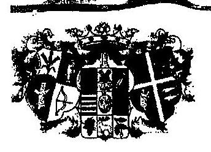
$535-1 / 2011 /$ ált.

Állami Számvevőszék Elnökének
Domokos László Úrnak

## BUDAPEST

Pf.: 54.
1364
Tisztelt Elnök Úr!
ÁLLAMI SZÁMVEVŐSZÉK
7015
Érkerct: 2011 JÓN 30.
Iktatószár:: ... ....
Melléklet:....... 3
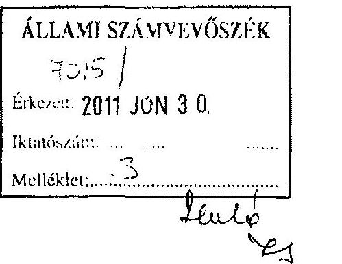

A V-3004-27-08/2010. szám alatt megküldött, a Szabolcs-Szatmár-Bereg Megyei Önkormányzat pénzügyi helyzetének ellenőrzéséről szóló jelentést áttanulmányozva a következőkről tájékoztatom.

Az említett tárgyú jelentésben foglaltakat megalapozottnak és reálisnak tartom. Emellett a jelentés több olyan összefüggésre hívja fel a figyelmet, amelyeket a pénzügyi, gazdálkodási tervezés során hasznosítani tudunk. Hiányolom azonban a jelentés 13. oldalán az önkormányzat pénzügyi helyzetére vonatkozó összegezésben annak a következtetésnek a levonását, hogy a havi bevételeink a megtörtént létszámcsökkentések és takarékossági intézkedések ellenére nem fedezik a kiadásokat és ezért a bevételeinket minden hónapban 50-100 millió Ft összegben a kiadásaink teljesítése érdekében hitelből ki kell egészítenünk. Ennek következtében is, mint ahogy a jelentés is megállapítja, a hitelállományunk folyamatosan növekszik, s nyilván ezzel összefüggésben a kamatfizetések volumene is. Javaslom ezért az összegező megállapítás kiegészítését.

A pótlólagos információkat tartalmazó táblázatokat egyidejűleg mellékelten megküldöm.

Nyíregyháza, 2011. június 29.
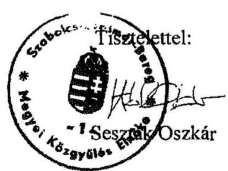

---

.

---

# SZÁMVEVÔSZÉK 

Ikt.szám: V-3023-09/2011.

## Seszták Oszkár úr,   elnök

Szabolcs-Szatmár-Bereg Megye Önkormányzata

## Nyíregyháza

## Tisztelt Elnök Úr!

Köszönettel vettem Szabolcs-Szatmár-Bereg Megyei Önkormányzat pénzügyi helyzetének ellenôrzéséről készített jelentés-tervezetben foglaltakkal kapcsolatos észrevételét.

Észrevételét elfogadtuk, azt a végleges jelentés készítése során figyelembe vettük. A I. Összegzõ megállapítások javaslatok címủ fejezetben rögzítettük, hogy az Önkormányzat a kiadáscsökkentő és a bevételnövelő intézkedései eredményének ellenére a müködési célú kiadások finanszírozása érdekében 2007 és 2010 között folyamatosan és növekvő mértékben kényszerült folyószámla- és munkabér-megelőlegezési hitel igénybevételére.

Köszönöm Elnök úrnak és munkatársainak az ellenőrzés során tanúsított hozzáállását, amellyel a megvalósításban részt vettek, azt segítették.

Budapest, 2011. december " 19 ".
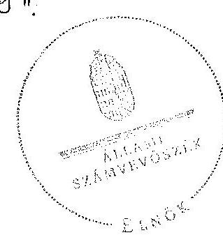

Tisztelettel:
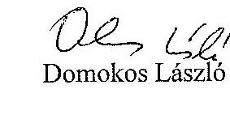

Tisztelettel:

Melléklet: jelentés

---

.