# ÁLLAMI   SZÁMVEVŐSZÉK 

## JELENTÉS

## Tolna Megyei Önkormányzat pénzügyi helyzetének ellenőrzéséről (43/2)

---

# Számvevői Iroda 

Iktatószám: V-3024-08/2011.
Témaszám: 1015
Vizsgálat-azonosító szám: V056016

## Az ellenőrzést felügyelte:

Dr. Varga Sándor
számvevő igazgató-helyettes

## Az ellenőrzést vezette:

Renkó Zsuzsanna
számvevő tanácsos
Az ellenőrzést végezték:
Bíró Zsolt
számvevő tanácsos

## A témához kapcsolódó eddig készített számvevőszéki jelentések:

## címe

Jelentés a Tolna Megyei Önkormányzat gazdálkodási rendszerének 2007. évi átfogó ellenőrzéséről

## Koczor László

számvevő tanácsos

## sorszáma

0754

---

# TARTALOMJEGYZÉK 

BEVEZETÉS ..... 5
I. ÖSSZEGZŐ MEGÁLLAPÍTÁSOK, JAVASLATOK ..... 12
II. RÉSZLETES MEGÁLLAPÍTÁSOK ..... 17

1. Az Önkormányzat kötelező és önként vállalt feladatai ..... 17
2. Pénzügyi egyensúlyi helyzet alakulása ..... 20
2.1. A működési és felhalmozási egyensúly alakulása ..... 22
2.2. Az Önkormányzat bevételeinek alakulása ..... 27
2.3. Az Önkormányzat kiadásainak alakulása ..... 30
3. Kötelezettségek bemutatása ..... 35
3.1. A pénzintézetek felé fennálló kötelezettségek alakulása ..... 35
3.2. Szállítók felé fennálló kötelezettségek alakulása ..... 40
3.3. Egyéb kötelezettségek alakulása ..... 41
4. A pénzügyi egyensúly megteremtése érdekében hozott intézkedések ..... 43
5. A helyi önkormányzatok gazdálkodási rendszerének 2007. évi ellenőrzése során a pénzügyi egyensúly javítására tett szabályszerűségi és célszerűségi javaslatok hasznosulása ..... 48

---

# MELLÉKLETEK 

1. számú Működési és felhalmozási hiány/többlet az önkormányzat rendeleteiben melléklet (1 oldal)
2/a. számú Az Önkormányzat CLF módszer szerint besorolt bevételei és kiadásai 2007-2010 között (1 oldal)
2/b. számú Az Önkormányzat bevételeinek és kiadásainak, adósságszolgálatának melléklet alakulása 2007-2010 között (1 oldal)
2. számú Az Önkormányzat 2007-2010 években megvalósított, illetve 2010. december 31-én folyamatban levő felhalmozási feladataihoz kapcsolódó kötelezettségeinek összegzése (3 oldal)
3. számú Tolna Megyei Közgyűlés elnökének észrevétele melléklet
4. számú Tolna Megyei Közgyűlés elnökének észrevételére adott válasz melléklet

---

# RÖVIDÍTÉSEK JEGYZÉKE 

| Törvények |  |
| :--: | :--: |
| Áht. | az államháztartásról szóló 1992. évi XXXVIII. törvény |
| ÁSZ tv. | A 2011. június 30-ig hatályos Állami Számvevőszékről szóló 1989. évi XXXVIII. törvény (2011. július 1-től az Állami Számvevőszékről szóló 2011. évi LXVI. törvény) |
| Htv. | a helyi önkormányzatok és szerveik, a köztársasági megbízottak, valamint egyes centrális alárendeltségű szervek feladat- és hatásköreiről szóló 1991. évi XX. törvény |
| Ötv. | a helyi önkormányzatokról szóló 1990. évi LXV. törvény |
| Rendeletek |  |
| $\mathrm{SzMSz}_{1}$ | Tolna Megyei Önkormányzat 10/2003. (IV. 22.) számú rendelete a Tolna Megyei Önkormányzat Szervezeti és Működési Szabályzatáról |
| $\mathrm{SzMSz}_{2}$ | Tolna Megyei Önkormányzat 3/2011. (II. 18.) számú rendelete a Tolna Megyei Önkormányzat Szervezeti és Működési Szabályzatáról |
| Szórövidítések |  |
| APEH | Adó- és Pénzügyi Ellenőrzési Hivatal (2011. január 1-től Nemzeti Adó és Vámhivatal) |
| ÁMK | Tolna Megyei Önkormányzat Általános Művelődési Központja |
| ÁSZ | Állami Számvevőszék |
| BM | Belügyminisztérium |
| EDP hiány/egyenleg | Uniós módszertan szerinti maastrichti kritériumoknak megfelelő számítás szerinti hiány/egyenleg |
| EU | Európai Unió |
| GAMESZ | Tolna Megyei Önkormányzat Gazdasági és Műszaki Ellátó Szervezete |
| GDP | Bruttó hazai termék |
| HEFOP | Humán Erőforrás Operatív Program |
| Hivatal | Tolna Megyei Önkormányzati Hivatal |
| ISZI | Tolna Megyei Önkormányzat Integrált Szociális Intézménye |
| Illetékhivatal | Tolna Megyei Illetékhivatal |
| KIÚT Kht. | KIÚT Tolna Megyei Foglalkoztatási és Területfejlesztési Közhasznú Non-profit Kft. |
| Kórház | Tolna Megyei Önkormányzat Balassa János Kórháza |
| Könyvtár | Tolna Megyei Önkormányzat Illyés Gyula Könyvtára |
| Közgyűlés | Tolna Megyei Közgyűlés |
| KSH | Központi Statisztikai Hivatal |
| Levéltár | Tolna Megyei Önkormányzat Levéltára |
| Múzeum | Wosinsky Mór Megyei Múzeum |
| Színház | Tolna Megyei Önkormányzat és a Magyarországi Néme- |

---

|  | tek Országos Önkormányzata Német Színháza |
| :-- | :-- |
| NGM | Nemzetgazdasági Minisztérium |
| OEP | Országos Egészségbiztosítási Pénztár |
| Önkormányzat | Tolna Megyei Önkormányzat |
| PPP konstrukció | Public Private Partnership (Partnerségi együttműködés |
|  | közfeladatok ellátására a magánszektor bevonásával) |
| SNA | System of National Accounts (Nemzeti Számlák Rendszere) |
|  |  |
| szja | Személyi jövedelemadó |
| SZOCEG Kht. | Szociális és Egészségügyi Szolgáltató Közhasznú Társaság |
| TISZK | Tolna Megyei Önkormányzat Szent László Szakképző Iskola |
|  | és Kollégiuma |
| Turisztikai Kht. | Tolna Megyei Turisztikai Információs és Szolgáltató Közhasznú Társaság |
|  |  |

---

# JELENTÉS 

## a Tolna Megyei Önkormányzat pénzügyi helyzetének ellenőrzéséről

## BEVEZETÉS

Az Állami Számvevőszék 2011. évtől érvényes stratégiája új irányt szabott a helyi önkormányzatok gazdálkodásának ellenőrzésében is. Az ÁSZ – küldetése és jövőképe szerint – szilárd szakmai alapokra támaszkodva értékteremtő ellenőrzéseivel és helyzetelemzéseivel az államháztartás egészében, így a helyi önkormányzati alrendszerben is elő kívánja segíteni a közpénzek és a közvagyon szabályos, gazdaságos, hatékony és eredményes hasznosítását. E folyamat részeként – a 2010. évi államháztartási hiány alakulásának összetevőire is figyelemmel – megkezdődött az önkormányzati alrendszer pénzügyi helyzetelemzése.

Az NGM 2011. áprilisában közzétett adatai szerint ${ }^{1}$ a 2010. évi 1036,2 milliárd Ft összegű, 3,8%-os EDP (maastrichti kritériumok szerinti, Túlzott Hiány Eljárás keretében kimutatott) hiánycél nem volt tartható, az önkormányzati alrendszer tervezettet meghaladó hiánya miatt a GDP arányában kifejezett államháztartási hiány 4,2%-ra emelkedett.

Az önkormányzatok költségvetési jelentése szerint 2010. első három negyedév végén az önkormányzati alrendszer pénzforgalmi hiánya 97 milliárd Ft volt, a tervezett éves mérték 51%-át érte el. Bár az elmúlt években kiugróan magas hiány halmozódott fel az utolsó negyedévben, a 97 milliárd Ft-os szeptember végi hiány nem indokolta az önkormányzati alrendszer 190 milliárd Ft-ra becsült éves hiányának felülvizsgálatát. A tervezett hiány túllépése, az utolsó negyedévi 150 milliárd Ft-os pénzforgalmi hiány nem volt reálisan feltételezhető. A helyi önkormányzatok januári gyorsjelentése szerint a pénzforgalmi hiány 247,7 milliárd Ft-ot tett ki. A tervezettnél nagyobb önkormányzati pénzforgalmi hiány kialakulásában – az NGM által az éves költségvetési beszámoló elkészítéséhez kiadott tájékoztató szerint – az iparűzési adó elmaradása, a gépjárműadó, az illetékek és más bevételek tervezettnél alacsonyabb összegben teljesülése volt a meghatározó.

A megyei önkormányzatok kötelező feladatellátását többlépcsős törvényi előírások határozzák meg. A feladatokra vonatkozó szabályozás első szintjét az

[^0]
[^0]:    ${ }^{1}$ NGM Tájékoztatás Magyarország Strukturális Reformprogramjának végrehajtásáról (2011. április 1.). A Tájékoztató évente két alkalommal – április és október hónapban – jelenik meg.

---

Ötv. ${ }^{2}$, a második szintet a hatásköri ${ }^{3}$, a harmadik szintet a további ágazati, szakmai törvények (egyebek mellett az oktatási, egészségügyi, szociális) adják.

A megyei önkormányzatok a feladatellátás és a központi forráselosztás tekintetében sajátos helyet foglalnak el a helyi önkormányzati rendszerben. A megyei önkormányzat kötelező feladatainak egy része – így a megyében lévő természeti és társadalmi muzeális emlékek, a történeti iratok gyűjtése, őrzése, tudományos feldolgozása, a megyei könyvtári szolgáltatás, a pedagógiai és közművelődési szakmai tanácsadás és szolgáltatás, a megyei testnevelési és sportszervezési feladatellátás, a gyermek- és ifjúsági jogok érvényesítése, a gyermekvédelmi- és szociális szakellátás – az Ötv-ből közvetlenül levezethető kötelezettség.

A középiskolai, szakiskolai, és kollégiumi ellátás, a fogyatékos gyermekek oktatása, nevelése, gondozása az ágazati törvény szerint a megyei önkormányzat kötelező feladata. Azonban, ha a települési önkormányzat lát el ilyen feladatot, és arról lemond, a megyei önkormányzatnak a feladatot át kell vennie. Így a megyei önkormányzatok által ellátandó kötelező közszolgáltatások ellátásának mértékére a települési önkormányzatok döntései jelentősen kihatnak.

Az alapellátást meghaladó egészségügyi szakellátás biztosítása akkor képezi a megyei önkormányzat feladatát, ha az önkormányzati vagyon kialakításáról szóló törvényben ${ }^{4}$ a feladat ellátásához szükséges vagyont az önkormányzat a tulajdonába kapta.

Az önként vállalt feladat ellátására – mivel annak vállalása a kötelező feladatok ellátását nem veszélyeztetheti – a kötelező közszolgáltatások mértékének alakulása lényegi hatással van.

A feladat és hatáskör telepítés sajátosságai mellett a megyei önkormányzatok kialakított forrásszerkezete, a központi költségvetéstől való erőteljes függősége is determinálja az önkormányzatok feladatellátásra vonatkozó döntéseit.

A 2007-2010. években az önkormányzati feladatok ellátásának keretet biztosító forrásszabályozás – ennek részeként az illetékbevételből és a személyi jövedelemadóból való részesedés szabályai – a megyei önkormányzatok vonatkozásában nem változtak:

- A megyei önkormányzatok saját bevételein belül az illetékbevételek döntően az ingatlanpiac stagnálása, majd visszaesése, és egyes illetékkedvezmények bevezetése következtében – megyénként differenciált mértékben ugyan, de – 2010-re általánosan visszaestek. A 2010. évben befolyt 39,2 milliárd Ft illetékbevétel a 2006. évben realizált 71,1 milliárd Ft illetékbevétel alig több mint 55%-a volt. A kieső bevételek pótlására az önkormányzati alrendszer szintjén történtek intézkedések, 2010-ben 5 milliárd Ft-

[^0]
[^0]:    ${ }^{2}$ Ötv. 69-70. §-ai
    ${ }^{3}$ a Htv.
    ${ }^{4}$ Az egyes állami tulajdonban lévő vagyontárgyak önkormányzatok tulajdonba adásáról szóló 1991. évi XXXIII. törvény

---

ot, 2011-ben 1,2 milliárd Ft-ot ellentételezett a központi költségvetés. Az illetékbevételt a megyei önkormányzatok a saját folyó bevételeik között számolják el ${ }^{5}$.

Az illetékek kivetésének és beszedésének joga 2006. december 31-ig a megyei önkormányzatok feladata volt. A 2007. évtől a megyei illetékhivatalok illetékbeszedési feladatait az APEH vette át ${ }^{6}$. Az önkormányzati illetékrészesedési szabályok változatlanok maradtak, azonban az illetékbeszedés költségeit az önkormányzatok illetékbevételeiből átlagos (a Fővárosnál 4,0%-os, a megyei és megyei jogú városi önkormányzatnál 8,5%-os) kulcsot alkalmazva vonták le. E döntés következtében azon megyei önkormányzatok, amelyek a 8,5%-os költségnél kedvezőbb költségszint mellett látták el korábban ezt a feladatot, kedvezőtlenebb helyzetbe kerültek.

- Az önkormányzati alrendszer személyi jövedelemadóból való részesedésének makroszintű szabályozása nem változott 2007-2010 között ${ }^{7}$. A helyi önkormányzatokat normatív módon megillető 32%-os részesedés visszaosztásának részletszabályai azonban a megyei önkormányzatok számára – a reálgazdaság kedvezőtlen irányú folyamatai, és az államháztartás egyensúlyi helyzetére tekintettel elrendelt kormányzati intézkedések miatt – megszorító intézkedéseket jelentettek. Összesen 17 milliárd Ft – 2007-ben 10 milliárd Ft, 2010-ben további 7 milliárd Ft – szja-t vontak ki a megyei önkormányzatok gazdálkodási köréből ${ }^{8}$. Az átengedett személyi jövedelemadó a megyei önkormányzatok egyik bevétele.

A megyei önkormányzatok 2007-2010 között rendelkezésre álló forrásait az alábbiakban mutatjuk be:

[^0]
[^0]:    ${ }^{5}$ A megyei önkormányzatok illetékbevételei az önkormányzati alrendszer saját folyó bevételeiből 2007-ben 35,9 milliárd Ft-ot (61,4%-ot), 2008-ban 41,5 milliárd Ft-ot (61,7%-ot), 2009-ben 36,5 milliárd Ft-ot (62,5%-ot), 2010-ben 25,1 milliárd Ft-ot (64,1%-ot) tettek ki.
    ${ }^{6}$ Az egyes pénzügyi tárgyú törvények módosításáról szóló 2006. évi LXI. törvény 115. §a, amely az adózás rendjéről szóló 2003. évi XCII. törvény 73. §-át módosította.
    ${ }^{7}$ A megyei önkormányzatok személyi jövedelemadó részesedése az önkormányzati alrendszer átengedett bevételeiből 2007-ben 34,7 milliárd Ft-ot (7,0%-ot), 2008-ban 51,2 milliárd Ft-ot (9,2%-ot), 2009-ben 59,2 milliárd Ft-ot (9,3%-ot),

 2010-ben 56,3 milliárd Ft-ot (8,3%-ot) tett ki.
    ${ }^{8}$ A megyei önkormányzatok szja kiegészítése háromelemű. A tételes, minden megyére egységesen meghatározott összeg - az adott évek költségvetési törvényeinek 4. sz. mellékletében meghatározottak szerint - 2006-ban 593 millió Ft, 2007-ben és 2008-ban egyaránt 355 millió Ft, 2009-ben 370 millió Ft volt. A megye népességszáma után járó kiegészítés a 2006. évi 208 Ft/fő összegről 2010-re 120 Ft/fő-re, a megyei intézmények ellátottjai után járó kiegészítés 42236 Ft/ellátottról 20755 Ft/ellátottra csökkent.

---

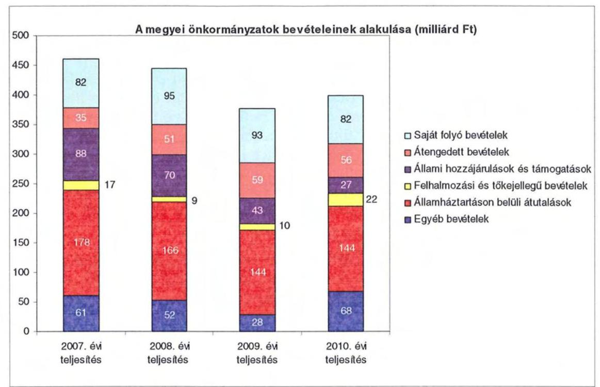

A megyei önkormányzatok saját folyó bevételeinek részaránya - amelyek főbb elemei: az intézményi térítési díjak, az illetékbevétel, a kamatbevételek - a 2007. évi összbevételen (461 milliárd Ft) belül 17,9% volt, amely 2010-re annak ellenére 20,6%-ra nőtt, hogy az összege 82 milliárd Ft maradt. Ennek oka az volt, hogy az összbevétel a 2007. évi 461 milliárd Ft-ról 2010-re 399 milliárd Ft-ra csökkent.

Az átengedett bevételek, amelyek a megyei önkormányzatoknál a személyi jövedelemadóból való részesedést jelentették, az összbevételen belül a 2007. évi 35 milliárd Ft-ról 56 milliárd Ft-ra nőttek.

Az állami hozzájárulások és támogatások - amelyek főbb elemei: az ellátotti létszámhoz kötődő normatív állami hozzájárulások, központosított, fejezeti szinten kezelt célelőirányzatból juttatott működési és fejlesztési támogatások a 2007. évi 88 milliárd Ft-ról (19,1%-os részarányról) 2010-re 27 milliárd Ft-ra (6,8%-os részarányra) estek vissza.

A felhalmozási és tőkejellegű bevételek - tárgyi eszközök (ingatlanok és ingóságok), föld és immateriális javak, részesedések értékesítése, EU-tól átvett pénzeszközök - a 2007. évi 17 milliárd Ft-ról (3,6%-os részarányról) 2010-re 22 milliárd Ft-ra (5,4%-ra) emelkedtek.

Az államháztartáson belüli átutalások részesedése 2007-ben 178 milliárd Ft volt. 2010. év végére 34 milliárd Ft-tal csökkent, részaránya 38,6%-ról 2,6 százalékpontos csökkenés után 2010-ben 36%-ra változott. Ez a bevételi kategória tartalmazza az egészségbiztosítási és egyéb elkülönített állami pénzalapoktól átvett forrásokat. A 2010-ben e címen elszámolt bevétel 144 milliárd Ft volt.

---

A megyei önkormányzatok központi költségvetésből származó bevételeinek összege 2007-ben 400 milliárd Ft volt, amely 2010. évre 331 milliárd Ft-ra (az időszak alatt összesen 69 milliárd Ft-tal) 17,3%-kal csökkent.

Az egyéb, pénzmaradványból, vállalkozási bevételekből, államháztartáson kívülről származó átutalásokból, a hitelekből, a hosszú és rövid lejáratú értékpapírok értékesítéséből származó bevételek részesedése a 2007-2010. évek viszonylatában 13,3%-ról 17,1%-ra emelkedett. Ez utóbbiak 2010. évi beszámoló szerinti összevont teljesítése 68 milliárd Ft volt ${ }^{9}$.

Mindezeket figyelembe véve 2007 és 2010-ben a megyei önkormányzatok forrásösszetételének megoszlását az alábbi ábra szemlélteti:
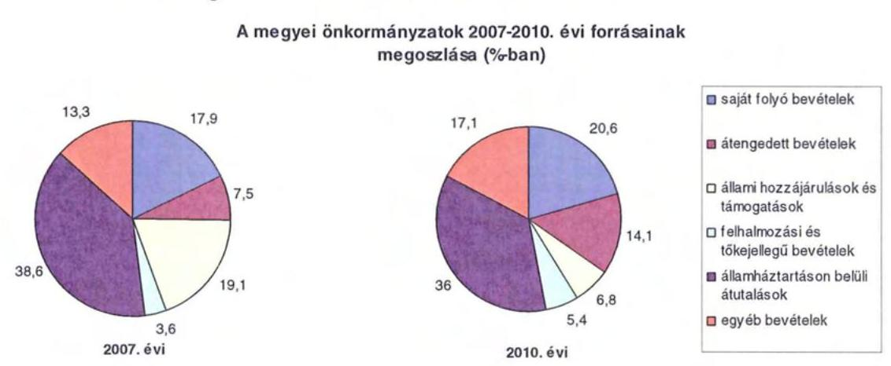

Annak ellenére, hogy a megyei önkormányzatok kötelezően ellátandó feladataikat 2007-hez képest kevesebb intézményben, csökkenő foglalkoztatotti létszám mellett végezték ${ }^{10}$, a jelentős bevételkiesést a - szervezési intézkedések hatására - csökkenő ráfordítások nem tudták kompenzálni. Az ellátottak száma a szociális, gyermekvédelmi ágazat bentlakásos elhelyezést nyújtó intézményeit kivéve - eltérő mértékben ugyan, de minden ágazatban évről évre csökkent, amely a fajlagos hozzájárulások csökkenésével együtt a normatív állami hozzájárulás arányának visszaeséséhez vezetett.

A 2007-2013-as időszakra meghirdetett, vissza nem térítendő EU-s fejlesztési forrásokhoz való hozzájutás lehetősége felerősítette az önkormányzati alrendszer fejlesztési igényeit. A fokozott fejlesztési tevékenység a felhalmozási bevételek és kiadások egyensúlyának megbomlásán ${ }^{11}$ túl a jelentkező jövőbeni fenn-

[^0]
[^0]:    ${ }^{9}$ Az egyéb bevételek összege 2007-2010 között eltérő módon változott, 2007-ben 61 milliárd Ft volt, 2008-ban 52 milliárd Ft-ra, 2009-ben 28 milliárd Ft-ra esett vissza, majd 2010-ben ismét - 68 milliárd Ft-ra - emelkedett.
    ${ }^{10}$ a BM által 2010 decemberében elvégzett felmérés adatai szerint
    ${ }^{11}$ Az önkormányzati alrendszerben - az éves zárszámadási törvényjavaslatok általános indokolása, X. Helyi önkormányzatok gazdálkodása fejezet szerint - a felhalmozási bevételek és kiadások egyenlege 2007-ben 142,4 milliárd Ft, 2008-ban 112,3 milliárd Ft, 2009-ben 234,5 milliárd Ft hiányt mutatott.

---

tartási kötelezettség miatt tovább terhelhetik az önkormányzatok költségvetését.

A megyei önkormányzatok felhalmozási és működési célú pénzintézeti és szállítói kötelezettségeinek állománya a vizsgált időszakban erőteljesen növekedett.

A hosszú lejáratú kötelezettségek alakulását a következő ábra szemlélteti:
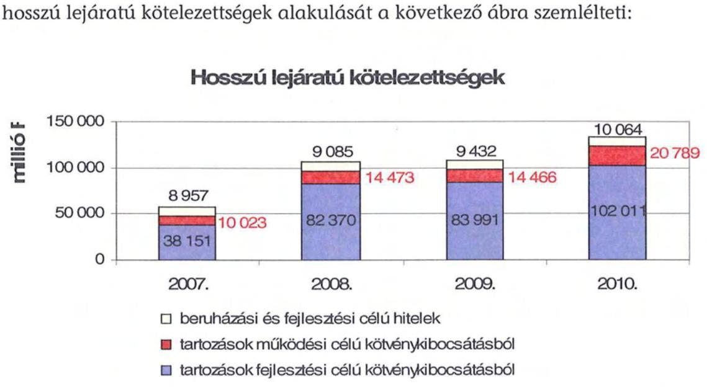

A hosszú lejáratú kötelezettségek mellett az időszakban a 2007. évi 22 milliárd Ft-ról 24 milliárd Ft-ra (8,8%-kal) növekedett az áruszállításból származó szállítói kötelezettségek állománya.

A mérlegben kimutatott kötelezettségek állománya mellett az elhasználódott eszközök pótlására forrást biztosító amortizációs (felújítási) alap képzésének ${ }^{12}$ elmaradása további problémákat vetít előre. A megyei önkormányzatok beszámolójelentéseinek összegzése szerint 2007-ben még az elszámolt értékcsökkenés 90%-ának megfelelő összeget fordítottak felújítási célokra, 2009-ben ez az arányszám már csak 16,5% volt. Ez maga után vonta a feladatellátást kiszolgáló tárgyi eszközök állagának erőteljes romlását.

Az ÁSZ a 2011. évi ellenőrzési tervében a 43. számú, az „Önkormányzatok gazdálkodási rendszerének ellenőrzése" részeként egy időben, egymással párhuzamosan tekinti át és elemzi az önkormányzati alrendszer középszintjét jelentő 19 megyei önkormányzat pénzügyi helyzetét. A gazdálkodás szabályszerűségét az ÁSZ előző évek során ellenőrizte a megyei önkormányzatoknál is, ezért jelen vizsgálatunk erre nem tér ki.

[^0]
[^0]:    ${ }^{12}$ Erre a jelenlegi szabályozási környezetben nem kötelezi semmilyen előírás az önkormányzatokat.

---

A jelentés a megyei önkormányzatok sajátos feladatellátási és forrásszabályozási helyzetére tekintettel a megyei önkormányzatok pénzügyi helyzetét, illetve az ezzel összefüggő korábbi ÁSZ javaslatok megvalósítását mutatja be.

Az ellenőrzés a 2007. január 1. - 2011. március 31. közötti időszakot ölelte fel.
A vizsgálat jogszabályi alapját 2011. július 1-je előtt az Állami Számvevőszékről szóló 1989. évi XXXVIII. törvény 2. § (3), (5), (6) és (9) bekezdéseiben, az Ötv. 92. § (1) bekezdésében és az Áht. 104. § (3) bekezdésében, 2011. július 1-jét követően az Állami Számvevőszékről szóló 2011. évi LXVI. törvény 1. § (3) bekezdésében, az 5. § (2)-(6) bekezdéseiben és az Áht. 120/A. § (1) bekezdésében foglalt előírások képezték.

Tolna Megye országos és régión belül elfoglalt helyzetét 2010. december 31-én az alábbi mutatók szemléltetik (a megyei jogú városokkal együtt):

Index: az előző év azonos időszak (időpontja)=100,0

| Mutató megnevezése | Tolna   megye | Dél-   dunántúli   régió | Országos |
| :-- | :--: | :--: | --: |
| Népesség száma (ezer fő) * | 231 | 940 | 9986 |
| Népesség változás indexe (%) | 99,9 | 99,2 | 99,7 |
| Az ipari termelés volumenindexe (%) | 104,9 | 113,6 | 110,7 |
| Egy lakosra jutó ipari termelési érték (ezer Ft) | 1239,6 | 1101,0 | 2044,4 |
| Ezer lakosra jutó vállalkozások száma (db) | 148 | 156 | 165 |
| A beruházások egy lakosra vetített teljesít- | 213,6 | 270,1 | 304,7 |
| minyértéke (millió Ft) | 49,0 | 46,8 | 49,5 |
| Foglalkoztatási arány (%) | 7,4 | 12,3 | 10,8 |
| Munkanélküliségi ráta (%) | 7,4 | 12,3 | 10,8 |
| Alkalmazásban állók havi nettó átlagkerese- |  |  |  |
| te (Ft) | 107,7 | 107,0 | 106,9 |
| Alkalmazásban állók havi nettó átlagkerese- |  |  |  |

*Ebből Szekszárd Megyei Jogú Város népessége 34715 fő
A táblázatban feltüntetett adatok azt jelzik, hogy a gazdaság helyzetét reprezentáló egyes mutatók - az ipari termelés volumenének változása, az ezer lakosra jutó vállalkozások - tekintetében elmarad az országos jellemzőktől, ugyanakkor a Dél-dunántúli régión belül elfoglalt helyzete kedvezőbb képet mutat. Különösen kedvező, hogy a megye munkanélküliségi rátája mind a régiós, mind pedig az országos értékeknél kedvezőbb.

A megyében 109 települési- 1 megyei jogú városi, 10 városi, 5 nagyközségi és 93 községi - önkormányzat működött.

---

# I. ÖSSZEGZŐ MEGÁLLAPÍTÁSOK, JAVASLATOK 

A Tolna Megyei Önkormányzat 2010-ben 17428 millió Ft költségvetési kiadásaiból 97,9%-ot a kötelező feladatai ellátására fordította. Az Önkormányzat önként vállalt feladatai - adatszolgáltatása szerint - kiemelten az alkotó-, művészeti, szórakoztató tevékenységhez, a külügyekhez, a szociális foglalkoztatáshoz, a szálláshely-szolgáltatáshoz, a kiadói tevékenységhez, az egyéb felnőttoktatáshoz, az éttermi, mozgó vendéglátáshoz, a rendezvényi étkeztetéshez, a lakásépítési-vásárlási támogatásokhoz kapcsolódtak, valamint támogatást nyújtott civil szervezetek, alapítványok működéséhez, összesen 364 millió Ft összegben. A kötelező és az önként vállalt feladatok körét az Önkormányzat az SzMSz-ében rögzítette.

Az Önkormányzat kötelező és önként vállalt feladatait 2010. december 31-én 14 költségvetési szervvel és 1 többségi tulajdonosi részesedésű gazdasági társasággal látta el. Az Önkormányzat által fenntartott költségvetési szervek száma 2007. december 31-éről 2010. december 31-ére 25-ről 14-re csökkent. Az intézmények telephelyeinek a száma - az alapító okirataik szerint - 2007. december 31-éről 2010. december 31-ére 30-ról 56-ra nőtt. 2010. december 31-én a költségvetési intézményként működő Kórház mellett 2 intézmény 25 telephelyen szociális és gyermekvédelmi feladatokat, 6 intézmény 26 telephelyen közoktatási feladatot, 4 intézmény közművelődési és közgyűjteményi feladatot látott el. Az Önkormányzatnak egy többségi részesedésű gazdasági társasága van, amely 2004-től a munkaerőpiacon hátrányos helyzetű rétegek foglalkoztatásának elősegítését, eseti jelleggel a megyei védelmi bizottság által tervezett felkészítések, továbbképzések szervezését, lebonyolítását végzi. Az intézmények száma 2007-2010 közötti négy közoktatási intézmény átvétele, kettő szociális intézmény átadása, továbbá a közoktatási és a szociális intézmények átszervezése, összevonása következtében alakult ki.

Az Önkormányzat folyó költségvetés egyenlege (a működési jövedelem) 2007-ben és 2008-ban működési forrástöbbletet, 2009-ben és 2010-ben működési forráshiányt mutatott ${ }^{13}$. A 2009-2010. években a folyó bevételek nem nyújtottak fedezetet a folyó kiadásokra, a működési egyensúly nem volt biztosított. A forráshiány finanszírozása hosszú lejáratú hitelekből, folyószámlahitelből, továbbá kötvénykibocsátásból történt. A vizsgált időszakban az Önkormányzat adósságtörlesztésének hatását is bemutató negatív értékű pénzügyi kapacitása (nettó működési jövedelme) folyó költségvetés egyenlegével megegyező intenzitással romlott.

A 2007-2010. években az Önkormányzat felhalmozási költségvetésének egyenlege folyamatosan negatív összegű volt, a pénzügyi egyensúly fenntartása csak külső források bevonásával volt biztosítható. Az Önkormányzat 2006.

[^0]
[^0]:    ${ }^{13}$ 2007-ben a működési jövedelem a 0,6%-át (88 millió Ft-ot), 2008-ban 1,4%-át (226 millió Ft-ot) tette ki a folyó kiadásoknak. 2009-ben a működési forráshiány a folyó kiadások 0,9%-a (135 millió Ft), 2010-ben 7,9%-a (1276 millió Ft) volt.

---

december 31-én fennálló pénz és tőkepiaci kötelezettsége 2010. december 31-re hitelfelvételek és kötvénykibocsátás miatt 2099 millió Ft-ról 5728 millió Ft-ra nőtt. A 2007-2010. években 1040 millió Ft hitelt törlesztettek. A vizsgált időszakban a kötelezettségek emelkedése miatt az Önkormányzat összesen 725 millió Ft kamatot fizetett meg.

A CLF módszer szerinti működési forráshiány kialakulásában leginkább az játszott szerepet, hogy az Önkormányzat legfőbb bevételi forrásai - a jogszabályi kedvezmények, és az ingatlanforgalom visszaesése következményeként az illetékbevétel, valamint a központi forráskivonás hatására az átengedett szja és az állami támogatások - jelentősen csökkentek.

Az Önkormányzatnál az
 illetékbevétel 2010-re a 2006. évi 1797 millió Ft-ról, 1070 millió Ft-ra (40,4%-kal) csökkent. Az átengedett szja és az állami támogatások együttes összege a központi támogatáscsökkentésen túl a feladatváltozások hatását is figyelembe véve kevesebb lett, 2010-ben 3746 millió Ft volt, a 2007. évi 90,4%-a. A Kórház OEP bevétele a 2007. évben 6601 millió Ft volt, amely a 2010. évre 7182 millió Ft-ra (17,7%-kal) nőtt. Az áttekintett időszakban az egyéb saját bevételek 3444 millió Ft-ról 3178 millió Ft-ra (7,7%-kal) csökkentek. Az intézményi működési bevételek a 2007. évről a 2010. évre 2496 millió Ft-ról 1718 millió Ft-ra (31,2%-kal) estek vissza.

A működési kiadások 2007-ről 2010-re a költségcsökkentési intézkedések hatására mindössze 456 millió Ft-tal, 2,9%-kal nőttek. A Kórház működésére 113 millió Ft, fejlesztésére 93 millió Ft támogatást biztosított 2007-2010. között az Önkormányzat. A Kórház nélkül az intézmények teljesített működési kiadásai 2007-ben 8727 millió Ft-ot tettek ki (az összes működési kiadás 56,0%-a), amely 2010-re 8525 millió Ft-ra csökkent (az összes működési kiadás 53,1%-a).

A működési és felhalmozási kiadásokon belül 2007-2010 között a felhalmozási kiadások súlya 1302 millió Ft-ról (7,7%-ról) 1387 millió Ft-ra (8,0%-ra) nőtt. Az aktív pályázati tevékenység eredményeként 2007-2010. között 9253 millió Ft bekerülési költségű beruházást folytatott, illetve indított el az Önkormányzat, amelyből 5461 millió Ft a 2010 utánra vállalt kötelezettség. Az utóbbi forrásai a következők: 76 millió Ft tervezett saját bevétel (maradványfelhasználással), 750 millió Ft kötvénykibocsátásból származó pénzmaradvány, 4635 millió Ft elnyert EU-s támogatás. A 2010. év utánra vállalt kötelezettségből 4385 millió Ft (80,3%) a Kórház felhalmozási kiadásait finanszírozza.

Az Önkormányzat pénzintézeti kötelezettségeinek állománya a könyvviteli mérlegadatok szerint 2006. december 31-ről 2010. december 31-re 2099 millió Ft-ról 5728 millió Ft-ra nőtt. A vizsgált időszakban adósságszolgálatra az Önkormányzat 1765 millió Ft-ot teljesített, melyből a kamatkiadás 725 millió Ft volt. A 2008. évben kibocsátott kötvényből származó bevétel befektetéséből realizált kamatbevétel 2010. december 31-ig 266 millió Ft volt.

Likviditását az Önkormányzat a vizsgált időszakban csak folyószámlahitel igénybevételével tudta biztosítani. A 2010. évben az Önkormányzat minden nap igénybe vett folyószámlahitelt, a folyószámlahitel átlagos napi állománya 583 millió Ft volt. A tartós likviditási problémák miatt 2010-ben a munkabérek

---

kifizetéséhez két alkalommal munkabér-megelőlegezési hitelt vett igénybe, alkalmanként átlagosan 178 millió Ft-ot.

Az Önkormányzat 2010. év végi pénzintézeti kötelezettségéből 1358 millió Ft (23,7%) fejlesztési célú kötvény kibocsátásából, 1357 millió Ft (23,7%) működési célú kötvény kibocsátásából, 999 millió Ft (17,4%) fejlesztési célú hosszú lejáratú hitelek felvételéből, 1300 millió Ft (22,7%) működési célú hosszú lejáratú hitelek felvételéből, valamint 714 millió Ft (12,5%) - a költségvetési év végén ki nem egyenlített - folyószámlahitelből keletkezett. Ezek miatt az Önkormányzatnak a 2011-2013. években 2266 millió Ft, és 1184666 CHF tőketörlesztést és kamatot kell teljesítenie. Az Önkormányzat 2010. év végi szállítói tartozása 885 millió Ft (ebből lejárt 378 millió Ft) volt. A 2011-2013. évi összes (pénzintézeti, szállítói) kötelezettség teljesítésére figyelembe vehető 1227 millió Ft becsült értékű forgalomképes ingatlanvagyon, melyből 623 millió Ft a pénzintézeti kötelezettséghez kapcsolódóan jelzáloggal terhelt, és 1671 millió Ft egyéb forrás (252 millió Ft mérlegben kimutatott követelésállomány, 185 millió Ft megállapodás alapján felhalmozási célú pénzeszközátvétel, 1200 millió Ft 2011. évben felvett működési célú hitelforrás, valamint 34 millió Ft tervezett kamatbevétel). Ezek fedezetet nyújtanak a kötelezettségekre.

A 2010. december 31-én fennálló pénzintézeti kötelezettségei alapján a 2014. évtől a futamidők végéig az Önkormányzat várható kötelezettsége: 1251 millió Ft és 12487046 CHF. Ezekre figyelembe vehető forrás az önkormányzat tájékoztatása szerint: a forgalomképes vagyonának egy része, 388 millió Ft megállapodás alapján járó felhalmozási célú pénzeszközátvétel, valamint a várható illetékbevétel és további hitelfelvételekből származó forrás. Ezek alapján, hosszú távon a kötelezettségek teljesítése nem számszerűsített.

Az adósságot keletkeztető kötelezettségvállalással kapcsolatos döntések során az árfolyamkockázatot figyelembe vették, nem számoltak viszont a teljes futamidő várható kamat- és tőkefizetési kötelezettségeivel, a változó kamatozásból fakadó kockázatokkal, valamint nem mutatták be az adósságszolgálati korlátnak való megfelelést, ezért a Közgyűlés ennek figyelembevétele nélkül döntött.

Az Önkormányzat nem vizsgálta, hogy az elhasználódott eszközök pótlása milyen kötelezettséget jelent számára. Az Önkormányzat 2007-2010 között a tárgyi eszközök után 3691 millió Ft értékcsökkenést, a felújítási kiadások között 280 millió Ft-ot számolt el. Amortizációs tartalék képzésére az Önkormányzatnak, pénzügyi helyzetét is figyelembe véve, nem volt lehetősége.

Az Önkormányzatnál végrehajtott kiadáscsökkentő intézkedések a feladatellátás szakmai színvonalának növelése mellett a takarékos szemléletű gazdálkodást, a működőképesség megőrzését, kiemelten a pénzügyi helyzet javítását célozták meg. A 2007-2010. években az intézményátszervezések, a feladatváltozások, valamint a takarékossági intézkedések hatásaként az - Önkormányzat kimutatása szerint - együttesen 983 millió Ft kiadási megtakarítás keletkezett, amelyből 666 millió Ft a kapcsolódó álláshely-csökkenések következtében jelentkezett.

---

A létszámcsökkentő intézkedések következtében 2007-2010 között a Hivatalnál és az intézményeknél összesen 465 álláshelyet szüntettek meg, amelyből 221 álláshely (47,6%) ágazati szakmai, 244 álláshely (52,4%) intézményüzemeltetéshez, fenntartáshoz, gazdasági ügyek intézéséhez kapcsolódó álláshely volt.

A 2007-2010. években a bevételnövelésre irányuló intézkedések eredményéből - amelynek számszerűsíthető összege 382 millió Ft volt - 287 millió Ft-ot (75,1%-ot) a Közgyűlés realizálta, ebben meghatározó tényező az átmenetileg szabad pénzeszközök lekötéséből származó kamatbevétel 266 millió Ft-tal. Az államháztartáson belüli pénzeszközök átvételéből származó növekmény 95 millió Ft (24,9%) volt.

Az Önkormányzatnál az átszervezések, a takarékossági intézkedések szakmai feladatellátásra, valamint az elvárt megtakarítások teljesülésére gyakorolt hatását célzottan nem vizsgálták.

Az Önkormányzat gazdálkodási rendszerének 2007. évi ellenőrzéséről készült ÁSZ jelentés a pénzügyi egyensúlyi helyzet javítására javaslatot nem tett, ezért utóellenőrzésre nem került sor.

Az Önkormányzat pénzügyi helyzetét összegezve a következők emelhetők ki:

Az önkormányzati bevételt csökkentő központi intézkedések hatását az ellenőrzött időszakban az Önkormányzat kiadásmérséklő és bevételnövelő intézkedései nem voltak képesek ellensúlyozni, sőt az egyéb saját bevételek még vissza is estek. Az időszakban végrehajtott intézmény-átvételek-átadások a költségvetési egyensúlyra lényeges hatást nem gyakoroltak. A már megkezdett beruházások forrásai kötvénykibocsátásból és uniós támogatásból biztosítottak. A működési célú kiadások finanszírozására folyamatosan, növekvő mértékben vett igénybe az Önkormányzat folyószámla és munkabérhitelt, valamint használt fel kötvénykamatot. A likvid hitelek állományának évről évre való emelkedése feszültséget okoz a működés finanszírozásában. A hosszú lejáratú kötelezettségek 2010. évet követő forrásai az elkövetkezendő 3 évben még biztosítottak, részben további hitelfelvétellel, azonban az azt követő időszakban esedékessé váló kötelezettségek fedezetének megléte - figyelemmel a pénzeszköz-átadási megállapodások teljesítésének és a forgalomképes ingatlanok értékesíthetőségének bizonytalanságára - részben igazolható.

A feladatok és források közötti egyensúly megteremtésére irányuló központi döntések, a megyei önkormányzatok konszolidációjára, az intézmények átvételére vonatkozó törvényjavaslat elfogadása új feltételeket teremtett. Mindezekre figyelemmel az önkormányzat pénzügyi helyzetének stabilitása - a likviditási kockázatok kezelése és a hosszú távú kötelezettségek teljesítéséhez szükséges intézkedések megtétele mellett - fenntartható.

Az Állami Számvevőszékről szóló 2011. évi LXVI. törvény 33. § (1) bekezdésében foglaltak értelmében a jelentésben foglalt megállapításokhoz kapcsolódó intézkedési tervet köteles az ellenőrzött szervezet vezetője összeállítani és azt a jelentés kézhezvételétől számított harminc napon belül az ÁSZ részére megküldeni. Amennyiben az intézkedési tervet határidőben nem küldi meg a szerve-

---

zet, vagy az továbbra sem elfogadható, az ÁSZ elnöke a hivatkozott törvény 33. § (3) bekezdés a)-b) pontjaiban foglaltakat érvényesítheti.

A 2011. májusában lezárult helyszíni ellenőrzés tapasztalatai alapján - figyelembe véve az Önkormányzat észrevételeit és a saját hatáskörben tett intézkedéseit - az alábbi javaslatokat tette az ÁSZ:

# a Közgyűlés elnökének: 

1. tájékoztassa a Közgyűlést rendszeresen a pénzügyi helyzetről, ezen belül a kötelezettségállomány alakulásáról, a feltételekben bekövetkező változásokról, az adósságot keletkeztető kötelezettségek teljesítési feltételeiről legalább 3 éves kitekintéssel;
2. terjesszen - feltételek (további) romlása esetén - a Közgyűlés elé cselekvési tervet a szükséges - üzemgazdasági számításokkal alátámasztott - (újabb) bevételnövelő, kiadáscsökkentő, beruházások és más kötelezettségek felülvizsgálatát, tartalékok képzését, méretgazdaságos intézményi struktúrát eredményező döntések meghozatala érdekében, a pénzügyi, működés egyensúly mielőbbi biztosítása és fenntarthatósága céljából;
3. gondoskodjon róla, hogy a jövőben az adósságot keletkeztető kötelezettségvállalásokról szóló közgyűlési döntéseket megalapozó előterjesztések tartalmazzák a várható kamat-, egyéb költség- és tőkefizetési kötelezettségeit, legalább 3 éves kitekintéssel a várható kamat- és árfolyamkockázatok bemutatását, és kezelésének lehetőségeit;
4. gondoskodjon a fennálló lejárt szállítói tartozás okainak feltárásáról, szerkezetének bemutatásáról - beleértve az intézményeknél lejárt szállítói állomány értékét és napra számított arányát -, a szükséges intézkedések megtételéről, indokolt esetben a szállítókkal a lejárt tartozások mielőbbi rendezéséről a kockázatok minimalizálása érdekében;
5. gondoskodjon a pénzintézeti kötelezettségek finanszírozási lehetőségeinek számbavételéről, és arra források biztosításáról;
6. mutassa be a Közgyűlésnek az éves költségvetési előterjesztésekben az értékcsökkenési leírás összegét, és ezzel arányban az elhasználódott eszközök pótlásának forrásigényét és lehetőségét.

---

# II. RÉSZLETES MEGÁLLAPÍTÁSOK 

## 1. Az ÖNKORMÁNYZAT KÖTELEZŐ ÉS ÖNKÉNT VÁLLALT FELADATAI

Az Önkormányzat 2010. évi beszámolója szerint költségvetési kiadásaiból 17064 millió Ft-ot, 97,9%-ot a kötelező, 364 millió Ft-ot, 2,1%-ot az önként vállalt feladatok ellátására fordított. A 2011. évi tervadatok alapján az önként vállalt feladatokra az összes költségvetési kiadásból 204 millió Ft (1,3%) jut, 0,8 százalékponttal kevesebb, mint az előző évben. (A 2010-2011. évekre a kötelező és önként vállalt feladatok teljesítésére fordított, illetve tervezett kiadásokat az Önkormányzat az önhibájukon kívül hátrányos helyzetben lévő önkormányzatok 2011. évi támogatására benyújtott pályázatában számszerűsítette.) Az Önkormányzat önként vállalt feladatai az alkotó-, művészeti, szórakoztató tevékenységhez, a külügyekhez, a szociális foglalkoztatáshoz, a szálláshely-szolgáltatáshoz, a kiadói tevékenységhez, az egyéb felnőttoktatáshoz, az éttermi, mozgó vendéglátáshoz, a rendezvényi étkeztetéshez, a lakásépítési, vásárlási támogatásokhoz kapcsolódtak, valamint támogatást nyújtott civil szervezetek, alapítványok működéséhez.

A kötelező és az önként vállalt feladatok körét az Önkormányzat SzMSz-eiben rögzítette14.

Az Önkormányzat éves költségvetési kiadásainak szerkezetét tekintve 2010-ben a járulékokkal növelt személyi juttatások és dologi kiadások 15220 millió Ft-os összegén belül meghatározó arányt15 - 7470 millió Ft-ot, 49,1%-ot - a Kórháznál elszámolt kiadások jelentették. A szociális és gyermekvédelmi feladatokat ellátó 2 intézmény kiadásokból való részesedése 2867 millió Ft, 18,8%, az 5 közoktatási intézményé 3432 millió Ft, 22,6% volt. A 2010. évben a közoktatási feladatok kiadásait 50,0%-ban, a szociális és gyermekvédelmi feladatok kiadásait 41,3%-ban finanszírozta normatív költségvetési támogatás 1716 millió Ft, illetve 1183 millió Ft összegben. A közművelődési feladatok ellátását 4 intézmény biztosította, kiadási arányuk 5%, 764 millió Ft, az igazgatási és egyéb nem kiemelt ágazati feladatokra 687 millió Ft-ot, 4,5%-ot fordítottak.

[^0]
[^0]:    14 A 2011. február 28-ig hatályos SzMSz 1. és 2. számú melléklete tartalmazta

 a kötelező és önként vállalt feladatok körét. A 2011. március 1-jétől hatályos $\mathrm{SzMSz}_{2}$-ben az önként vállalt feladatokat továbbra is a 2. számú mellékletben rögzítették, a kötelező feladatok esetében a BM által kiadott központi hatásköri jegyzéket tartják meghatározónak.
    ${ }^{15}$ Az Önkormányzat járulékokkal növelt személyi juttatások és dologi kiadásainak ágazatonkénti megbontása a BM részére készített, 2010. december 31-i adatokkal kiegészített adatszolgáltatás kigyűjtéséből származik.

---

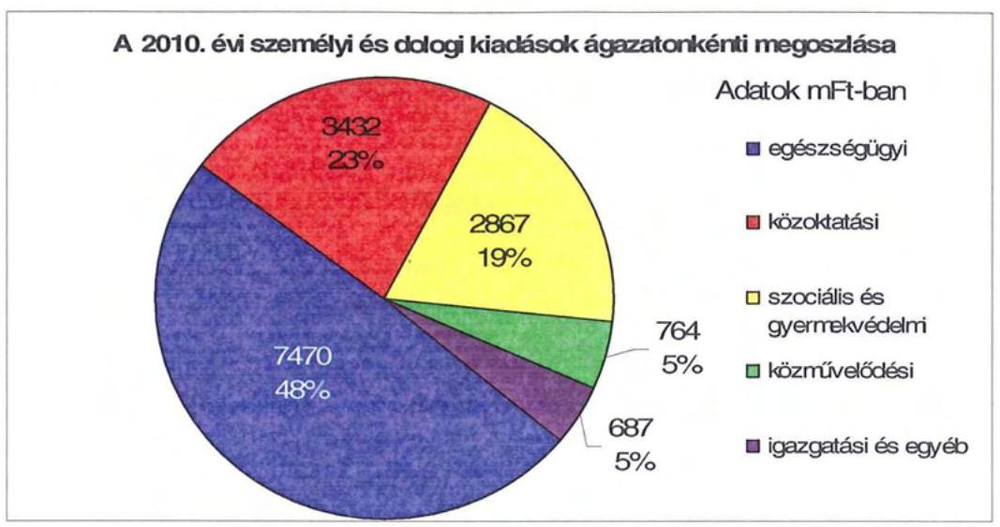

A költségvetési kiadásokból 14736 millió Ft (84,6%) az intézmények, a többi a Hivatal költségvetésében jelenik meg. A Hivatal 2692 millió Ft-os költségvetéséből a járulékokkal növelt személyi juttatások és dologi kiadások 802 millió Ft-tal 29,8%-kal, a beruházások, felújítások 1073 millió Ft-tal 39,9%-kal, a különböző önkormányzati feladatokhoz, szervezetek támogatásához kapcsolódó kiadások 817 millió Ft-tal 30,3%-kal részesültek.

Az Önkormányzat kötelező és önként vállalt feladatait 2010. december 31-én 14 költségvetési szervvel és 1 többségi tulajdonosi részesedésű gazdasági társasággal látta el.

Az Önkormányzat által fenntartott költségvetési szervek száma 2007. december 31-éről 2010. december 31-ére 25-ről 14-re csökkent, melyek közül 13 önállóan működő és gazdálkodó, 1 önállóan működő költségvetési szerv volt. Az intézmények telephelyeinek a száma - az alapító okirataik szerint - 2007. december 31-éről 2010. december 31-ére 30-ról 56-ra nőtt. Az Önkormányzat feladatait az alábbi intézménystruktúrával látta el:

- egészségügyi feladatokat a Kórház látta el;
- szociális és gyermekvédelmi feladatokat 2 intézmény 25 telephelyen végzett (1 bentlakásos integrált szociális intézmény, 1 gyermekvédelmi feladatot ellátó intézmény);
- közoktatási feladatot 6 intézmény látott el, 26 telephelyen (1 szakképző iskola, 2 gimnázium és kollégium, 1 egységes gyógypedagógiai intézmény, 1 sajátos nevelési igényű gyermekek általános iskolája, valamint 1 általános művelődési központ, amely keretén belül működött a pedagógiai szakszolgálati tevékenység);
- közművelődési és közgyűjteményi feladatokat 4 intézmény végzett (Könyvtár, Levéltár, Múzeum, Színház);
- igazgatási feladatokat a Hivatal látta el.

---

Az Önkormányzat a megye területén a pedagógiai szakmai szolgáltatási feladatok teljes körű ellátására az Eötvös József Pedagógiai Szolgáltatóval kötött megbízási szerződést.

Az Önkormányzat 2010. december 31-én három társulásnak volt tagja:

- Az Önkormányzat a Baranya és Somogy megyei önkormányzatokkal, valamint Pécs és Szekszárd Megyei Jogú Városokkal 2005. július 1. nappal létrehozták az önálló jogi személyiséggel rendelkező Dél-Dunántúli Önkormányzati Regionális Társulást, amelynek pénzügyi gazdálkodási feladatait a Baranya Megyei Önkormányzat Hivatala látta el. A társuláshoz 2007. július 1-jével csatlakozott Kaposvár Megyei Jogú Város. A társulás a vizsgált időszakban az illetékességi területén a gyermekvédelmi szakellátási feladatok szervezését látta el. A 2011. évben a társulás április 30-ával történő jogutód nélküli megszüntetéséről döntöttek;
- Az Önkormányzat és Szekszárd Megyei Jogú Város 2008. május 22-én társulási megállapodást kötött „Szekszárd Megyei Jogú Város kulturális életének javítása a Vármegyeháza és környékének felújításával" című pályázat előkészítésére, benyújtására és a támogatásban részesített projekt megvalósítására. A társulás gesztora Szekszárd Megyei Jogú Város Önkormányzata. A pályázat nyert, a fejlesztés megvalósítása folyamatban van;
- Az Önkormányzat és a Magyarországi Németek Országos Önkormányzata 2008. szeptember 23-án társulási megállapodást írt alá 2008. szeptember 1-jétől 2018. augusztus 31-ig határozott időre a Színház közös fenntartására. A közös fenntartású intézmény költségvetése és zárszámadása az Önkormányzat költségvetési és zárszámadási rendeleteibe épül be.

Az egyes ágazatok kötelező feladatellátását 2010. december 31-én az alábbi mutatók jellemezték:

| Megnevezés | közoktatás | szociális és   gyermek-   védelem | egészség-   ügy | kultúra   és sport |
| :-- | :--: | :--: | :--: | :--: |
| Az ágazatban foglalkozta-   tottak száma (fő) | 759 | 816 | 1551 | 151 |
| Az ágazat intézményeiben   ellátottak összesen (fő) | 5573 | 1637 |  |  |
| Fekvőbeteg ellátás férőhe-   lyeinek száma (db) |  |  | 1007 |  |

Az Önkormányzatnak 2010. december 31-én egy többségi részesedésű gazdasági társasága volt, a KIÚT Kft., amelyben 55%-os tulajdoni részesedéssel rendelkezett.

- A KIÚT Kft. 2004. július 1-jétől működik, és az Önkormányzat mellett összesen 45%-os tulajdoni részesedéssel rendelkezik öt többcélú kistérségi társulás. A KIÚT Kft. a munkaerőpiacon hátrányos helyzetű rétegek foglalkoztatásának elősegítését végzi, amelynek forrását pályázati úton teremti meg. A KIÚT Kft. foglalkoztatási feladatokon túl eseti jelleggel 2009. évtől támogatási szerződés keretében biztosított forrásból ellátja a megyei védelmi bizottság által tervezett felkészítések, továbbképzések szervezését lebonyolítását.

---

A többségi tulajdonú gazdasági társaság mellett az Önkormányzat a Turisztikai Kht-ban 32,6%-os részesedéssel rendelkezett 2010. január 25-ig, annak végelszámolás miatti megszűnéséig. A gazdasági társaság az Önkormányzat kötelező idegenforgalmi feladatait látta el. A végelszámolást követően a feladatokat a Hivatal köztisztviselői látják el.

Az Önkormányzat az áttekintett időszakban három önkormányzattól négy közoktatási intézményt vett át 2533 tanulói létszámmal és létrehozta a TISZK-et, két szociális intézmény fenntartói jogát többcélú kistérségi társulásnak adta át, valamint egy szociális intézmény egy telephelyét megszüntette és a feladatot feladatellátási szerződés keretében egy gazdasági társaság bevonásával biztosította. A feladatátadás 275, illetve 50 fő ellátottat érintett.

# 2. PÉNZÜGYI EGYENSÚLYI HELYZET ALAKULÁSA 

A hagyományos költségvetési szerkezet helyett az önkormányzat pénzügyi helyzetét a CLF módszerrel mutatjuk be, amelyben jobban elkülönülnek a vagyonnal kapcsolatos bevételek és kiadások a feladatokkal kapcsolatos közvetlen működtetési bevételektől és kiadásoktól. A módszer következetesen elkülöníti a folyó és a felhalmozási költségvetés bevételeit és kiadásait, azok költségvetési egyenlegeit. A tárgyévi pozíciók meghatározása érdekében a figyelembe vett saját folyó bevételek, valamint saját felhalmozási bevételek nem tartalmazzák az előző évi pénzmaradványok felhasználásából származó pénzforgalom nélküli bevételeket ${ }^{16}$.

A bevételek és kiadások besorolása általános közgazdasági meggondolásokon alapul, amely testet ölt az SNA statisztikai módszertanában is. Folyó tételek alatt értjük azokat a bevételeket és kiadásokat, amelyek az önkormányzat vagyoni helyzetét automatikusan nem változtatják. A bevételi oldalon ilyenek az adók, az illeték, az áfa bevételek és visszatérülések, a hozamok és kamatok, a költségvetési támogatások, az egyéb saját bevételek, valamint a működési célra átvett pénzeszközök és kapott támogatások. A folyó kiadások közé tartoznak a szolgáltatások nyújtásával kapcsolatos működési kiadások, a kamatkiadások, valamint a működési célú transzferkiadások ${ }^{17}$. A felhalmozási vagy tőke tételek módosítják az önkormányzat vagyoni helyzetét. A privatizációs bevételek, az immateriális javak és tárgyi eszközök, valamint a részesedések értékesítése csökkentik, a fizikai beruházások és a pénzügyi befektetések növelik a vagyont. A pénzforgalmi bevételek és kiadások nem tartalmazzák a követelések elengedése miatt könyvelt tételeket, mivel ezek egymást kioltó, technikai jellegű elszámolási műveletek.

A folyó költségvetés egyenlege, a működési jövedelem megmutatja, hogy az önkormányzat éves folyó bevétele fedezetet biztosít-e a kötelező és önként vállalt feladatellátáshoz kapcsolódó éves folyó kiadására. A működési jövedelem

[^0]
[^0]:    ${ }^{16}$ A költségvetési években kialakuló hiány finanszírozása az előző években képzett tartalékok felhasználásával is történhet.
    ${ }^{17}$ Transzferkiadásoknak azokat a folyó és felhalmozási tételeket nevezzük, amelyeket nem az adott önkormányzat használ fel szolgáltatásnyújtásra (pl.: ellátottak pénzbeni juttatásai, átadott pénzeszközök, garancia- és kezességvállalások stb.).

---

negatív értéke pénzügyileg fenntarthatatlan helyzetet jelez. A mutató pozitív értéke megtakarítást mutat, amely forrásul szolgálhat az önkormányzat fennálló kötelezettségei megfizetéséhez, valamint fejlesztéseihez.

A felhalmozási költségvetés pozitív értéke felhalmozási többletet mutat, amely a jövőbeni fejlesztések forrását biztosíthatja. Amennyiben a folyó költségvetési hiány finanszírozása a felhalmozási többletből történik, ez szűkebb értelemben vagyonfelélésnek tekinthető. Amennyiben a felhalmozási költségvetés megtakarítása fejlesztési célú hitelek, kötvények adósságszolgálatát finanszírozza, az változatlan vagyontömeg mellett, a korábban megelőlegezett tőkebevételek valós realizációjának tekinthető. A felhalmozási deficit által generált finanszírozási igény önmagában nem jár pénzügyi kockázattal, a pénzügyileg fenntartható beruházásokhoz kapcsolódó kötelezettségvállalás (adósságszolgálat) előrelátó, tudatos költségvetési gazdálkodással teljesíthető.

A módszer a pénzügyi kapacitás (más néven a nettó működési jövedelem) fogalmát helyezi a középpontba. Az adós hitelfelvételi képessége, hosszú távú fizetőképessége vagy bonítása a pénzügyi kapacitással, ezen belül is a nettó működési jövedelemmel jellemezhető. A nettó működési jövedelem negatív értéke az egyes költségvetési években jelentkező adósságszolgálat túlzott mértékére utal ${ }^{18}$. A nettó működési jövedelem negatív értékének felhalmozási többletből, vagy további hitelből történő finanszírozása pénzügyileg nem fenntartható gazdálkodást vetít előre. A pozitív értéket mutató nettó működési jövedelem fejlesztési kiadások fedezetét biztosíthatja, illetve a folyamatosan, évenként képződő pozitív nettó működési jövedelemből meghatározható a jövőben vállalható, teljesíthető éves adósságszolgálat, ily módon az a hitelösszeg, amely - a többi tényezőt, feltételt adottnak tekintve - visszafizetési kockázat nélkül felvehető.

A CLF módszer alapján a pénzügyi kapacitás mértéke az önkormányzat összevont, nettósított, a központi információs rendszerbe a MÁK-on keresztül leadott éves költségvetési beszámolójának 80-as űrlapjában szerepeltetett adatok alapján került meghatározásra. A 2007-2010 közötti időszakban az Önkormányzat CLF módszer szerint besorolt kiadásainak és bevételeinek főbb jogcímek szerinti alakulását a jelentés 2/a. számú melléklete tartalmazza.

Az Önkormányzat bevételeinek és kiadásainak alakulását részletesen a hatályos számviteli előírások szerint készült, összevont éves költségvetési beszámolók adataira alapozva mutatjuk be. A bevételek és kiadások működési, valamint felhalmozási jogcímekre történő elkülönítését az éves költségvetési beszámolók, a zárszámadási rendeletek, továbbá - amely jogcímek ${ }^{19}$ esetében erre más lehetőség nem volt - az Önkormányzat adatszolgáltatása szerinti meg-

[^0]
[^0]:    ${ }^{18}$ Kivéve, ha annak finanszírozására a korábbi években képzett tartalékok fedezetet nyújtanak.
    ${ }^{19}$ Az előző évi maradvány visszafizetésének, az előző évi pénzmaradvány átadásának és átvételének, a kamatkiadásoknak, az egyéb pénzforgalom nélküli kiadásoknak, a hozam- és kamatbevételeknek, az átengedett adóknak, a költségvetési támogatásoknak, továbbá az előző évi pénzmaradvány igénybevételének működési és felhalmozási részre történő megosztásához az Önkormányzat által szolgáltatott adatokat vettük figyelembe.

---

bontás alapján végeztük el. A bevételek elemzése során figyelembe vettük a korábbi években keletkezett pénzmaradvány felhasználásából származó pénzforgalom nélküli bevételeket is. A 2007-2010 közötti időszakban az Önkormányzat bevételeinek és kiadásainak, továbbá adósságszolgálatának alakulását a jelentés 2/b. számú melléklete tartalmazza.

# 2.1. A működési és felhalmozási egyensúly alakulása 

CLF módszer szerinti önkormányzati adatok ${ }^{20}$

|  |  |  |  | ezer $\mathbf{Ft}$ |
| :--: | :--: | :--: | :--: | :--: |
| Megnevezés | 2007 | 2008 | 2009 | 2010 |
| Folyó bevételek | 15757042 | 16212811 | 15475131 | 14814901 |
| Folyó kiadások | 15668551 | 15987345 | 15609669 | 16091034 |
| Működési jövedelem | 88491 | 225466 | $-134538$ | $-1276133$ |
| Nettó működési jövedelem   = működési jövedelem - tőketörlesztés | $-61509$ | $-264843$ | $-334538$ | $-1476133$ |
| Felhalmozási bevételek | 561816 | 330738 | 262926 | 1040477 |
| Felhalmozási kiadások | 1218737 | 839566 | 527567 | 1336762 |
| Felhalmozási költségvetés egyenlege | $-656921$ | $-508828$ | $-264641$ | $-296285$ |
| Finanszírozási

 múveletek nélküli (GFS) pozíció | $-568430$ | $-283362$ | $-399179$ | $-1572418$ |
| Finanszírozási múveletek egyenlege | 268538 | 1386803 | 139484 | 792789 |
| Tárgyévi pozíció | $-299892$ | 1103441 | $-259695$ | $-779629$ |
| Egyéb tájékoztató adatok |  |  |  |  |
| Összes kötelezettség* | 3119479 | 4829946 | 5315791 | 6955377 |
| ebből rövid lejáratú | 1398242 | 1144842 | 1778957 | 2330516 |
| Folyószámlahitel napi átlagos állománya** | 412314 | 365137 | 301119 | 582855 |
| Likvidhitel napi átlagos állománya** | 0 | 0 | 0 | 0 |
| Munkabérhitel napi átlagos állománya** | 0 | 0 | 0 | 178186 |
| Egyéb finanszírozásba vonható eszközök összesen: | 982560 | 2086001 | 1826306 | 1046677 |
| Tartós hitelviszonyt megtestesítő értékpapírok | 0 | 0 | 0 | 0 |
| Hosszú lejáratú bankbetétek | 0 | 0 | 0 | 0 |
| Értékpapírok | 0 | 0 | 0 | 0 |
| Pénzeszközök (idegen pénzeszközök nélkül) | 982560 | 2086001 | 1826306 | 1046677 |

* Az összes kötelezettséget passzív pénzügyi elszámolások nélkül vettük figyelembe, mert a passzívák a pénzmaradvány elszámolás tételei közé tartoznak.
** a folyószámla-, likvid-, és munkabérhitel átlagos állományát 365 nappal számítottuk.
${ }^{20}$ A 2007. évben az Önkormányzat MÁK-hoz leadott 2007. évi elemi beszámolójában az évközi intézményátadásokhoz-és átvételekhez kapcsolódóan - a nem megfelelő számviteli elszámolás következtében - a felügyelet alá tartozó költségvetési szervnek folyósított támogatás (az intézményfinanszírozás) összege, a nettósított, összevont önkormányzati beszámolóban nulla egyenleg helyett negatív egyenleget mutatott. Ennek oka, hogy a történeti adatokat tartalmazó intézményi beszámolót sem az átvevőnél, sem az átadónál nem lehetett feltüntetni. Az intézmény csak egy beszámolót adhatott az egész évben jelentkező kiadásairól, miközben a kiadások fedezetét jelentő intézményfinanszírozás más-más önkormányzat vagy többcélú kistérségi társulás számviteli nyilvántartásaiban került elszámolásra. Emiatt az Önkormányzatnál és az intézményénél azonos összegben könyvelendő intézményfinanszírozás a nettósításkor nem volt megegyező összegű, annak egyenlege maradt. Az Önkormányzat egyenlege negatív volt, vagyis az Önkormányzatnak kiadása keletkezett, ezért a CLF módszer alapján elkészített táblázatban az év közben más szervezethez került intézménynek adott támogatás, 77,1 millió Ft államháztartáson belülre átadott pénzeszközként szerepel.

---

A vizsgált időszakban az Önkormányzat folyó költségvetési egyenlege (működési jövedelme) a 2007-2008. években pozitív, a 2009-2010. években negatív összegű volt, melynek alakulását a következő ábra szemlélteti:
ezer Ft
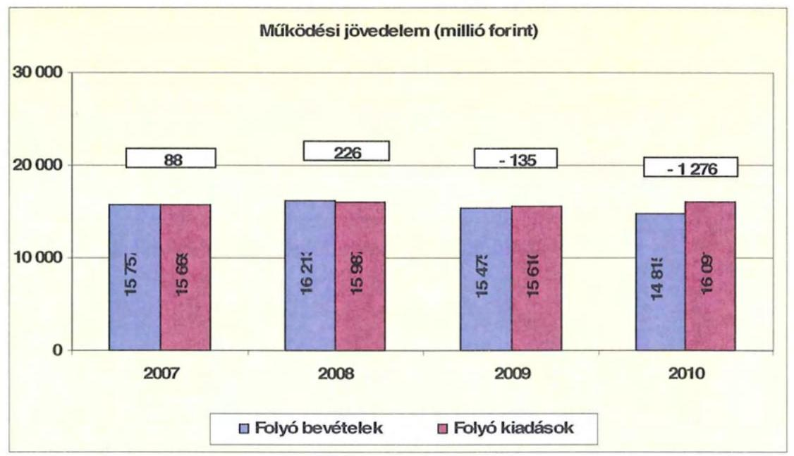

A folyó költségvetés egyenlege (a működési forrástöbblet) 2007-ben a folyó kiadások 0,6%-át ( 88 millió Ft-ot), 2008-ban 1,4%-át ( 226 millió Ft-ot) jelentette. 2009-ben a folyó költségvetés hiánya (a működési forráshiány) a folyó kiadások 0,9%-a (135 millió Ft), 2010-ben 7,9%-a (1 276 millió Ft) volt.

A működési forráshiány finanszírozása hosszú lejáratú hitelekből, folyószámlahitelből, továbbá kötvénykibocsátásból történt. A folyószámlahitel napi átlagos állománya a 2007. évről a 2010. évre 412 millió Ft-ról 583 millió Ft-ra emelkedett. Az Önkormányzat munkabérhítellel a vizsgált időszakban csak a 2010. évben rendelkezett, melynek napi átlagos állománya 178 millió Ft volt.

Az Önkormányzat kötelezettségein ${ }^{21}$ belül a 2010. évi rövid lejáratú kötelezettségek állománya 33,5% volt, a 2007. évi 44,8%-os aránnyal szemben. Az Önkormányzat 2006. december 31-én fennálló pénz és tőkepiaci kötelezettsége 2099 millió Ft-ról több, mint a 2,7-szeresére, 5728 millió Ft-ra nőtt hitelfelvétel és kötvénykibocsátás miatt.

A rövid lejáratú kötelezettségek 2010-ben 2331 millió Ft-ot tettek ki, amely 933 millió Ft-tal ( $66,7 \%$-kal) több a 2007. évi rövid lejáratú kötelezettségállománynál. A szállítói állomány összege a 2006. évben 736 millió Ft, a 2007. évben 789 millió Ft, a 2008. évben 1130 millió Ft, a 2009. évben 885 millió Ft volt. A rövid lejáratú kötelezettségeknek a szállítói állomány 2007-ben 52,7%-át, 2008-ban 68,9%-át, 2009-ben 63,5%-át, 2010-ben 38,0%-át tette ki, miközben a szállítói kötelezettségek a vizsgált időszakban 1,2-szeresére nőttek.

[^0]
[^0]:    ${ }^{21}$ passzív pénzügyi elszámolások nélküli

---

Az Önkormányzat pénzügyi kapacitása a vizsgált időszakban negatív értéket mutatott. A nettó működési jövedelem ${ }^{22}$ értéke a folyó költségvetési pozíció mellett az adott költségvetési év adósságtörlesztésének hatását is tükrözi.

Az Önkormányzat pénzügyi kapacitása a vizsgált időszakban rosszabbodott. Míg a 2007. évben a nettó működési jövedelem negatív értéke közel 60 millió Ft volt, addig a 2010. évben már meghaladta a - 1400 millió Ft-ot. A pénzügyi kapacitás romlását a folyó bevételek és kiadások különbségéből származó működési deficit növekedése idézte elő. ${ }^{23}$

Az Önkormányzat nettó működési jövedelmének évenkénti alakulását az alábbi ábra szemlélteti:
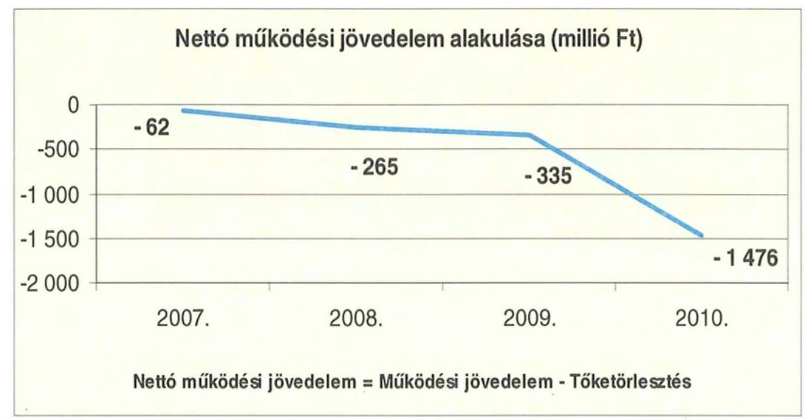

A folyó költségvetés egyenlegének és a tőketörlesztésre (hiteltörlesztés és forgatási és befektetési célú értékpapírok beváltása) fordított összegeknek évenkénti különbözete (a nettó működési jövedelem) a vizsgált időszakban folyamatosan romlott. Az Önkormányzat negatív nettó működési jövedelme 2010. évi kiugró értékének ( 1476 millió Ft) az oka a folyó költségvetés növekvő deficitje volt.
A 2007 - 2010. években az Önkormányzat felhalmozási költségvetés egyenlege ugyancsak negatív volt, melynek alakulását a következő ábra szemlélteti:

[^0]
[^0]:    ${ }^{22}$ pénzügyi kapacitás
    ${ }^{23}$ Az Önkormányzat tőketörlesztési kötelezettsége a 2007. évben 150 millió Ft, a 2008. évben 490 millió Ft, a 2009. évben 200 millió Ft, a 2010. évben 200 millió Ft volt.

---

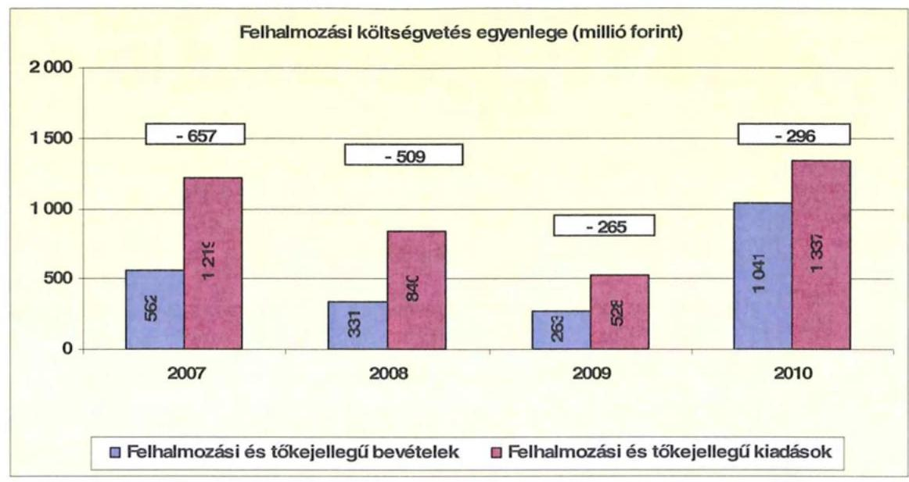

A felhalmozási forráshiánynak a felhalmozási és tőke jellegű kiadásokhoz viszonyított aránya 2007-ben 53,9% (657 millió Ft), 2008-ban 60,6% (509 millió Ft) 2009-ben 50,2% (265 millió Ft) 2010-ben 22,1% (296 millió Ft) volt.

A vizsgált időszakban megvalósított fejlesztések finanszírozására a 2006. évben 1400 millió Ft felhalmozási célú hitelt vettek fel, illetve a 2008. évben felhalmozási célra kibocsátott 1000 millió Ft összegű kötvényből 195 millió Ft-ot használtak fel. Az Önkormányzat évenkénti teljes finanszírozási hiánya ${ }^{24}$ a CLF módszer szerint 2007-ben 719 millió Ft, 2008-ban 774 millió Ft, 2009-ben 600 millió Ft, 2010-ben 1772 millió Ft volt.

Az Önkormányzat finanszírozási műveletei 2007-2010. évekbeli egyenlegének alakulását a következő ábra szemlélteti:
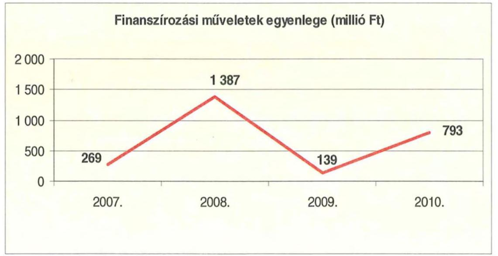

[^0]
[^0]:    ${ }^{24}$ A nettó működési jövedelem és a felhalmozási költségvetés egyenlegeinek összege.

---

A finanszírozási többlet azt jelzi, hogy az éves költségvetések végrehajtása során szükség volt a pénzkészlet felhasználásán túl külső finanszírozás igénybevételére is. A finanszírozási célú műveleteket a vizsgált időszakban a jelentés 2/A. számú mellékletének 4.1-4.8 pontjai részletezik.

Az Önkormányzat zárszámadási rendeletében a működési és fejlesztési hiányt a hagyományos költségvetési szerkezet alapján mutatta be ${ }^{25}$, amelyről a jelentés 1. számú melléklete nyújt tájékoztatást. A zárszámadási rendeletek a 2007., 2009-2010. évekre forráshiányt jeleztek.

A vizsgált időszakban a kötelezettségek (passzív pénzügyi elszámolások nélkül) 3119 millió Ft-ról 6955 millió Ft-ra emelkedtek, amely együtt járt a kamatkiadások növekedésével.

A 2007-2010 között az Önkormányzat összesen 725 millió Ft kamatot fizetett meg. Az átmenetileg szabad pénzeszközein realizált kamatbevétel (413 millió Ft) a teljes kamatráfordítás 60%-át tette ki.

Az Önkormányzat kamatbevételeinek és kamatkiadásainak alakulását a következő ábra mutatja:
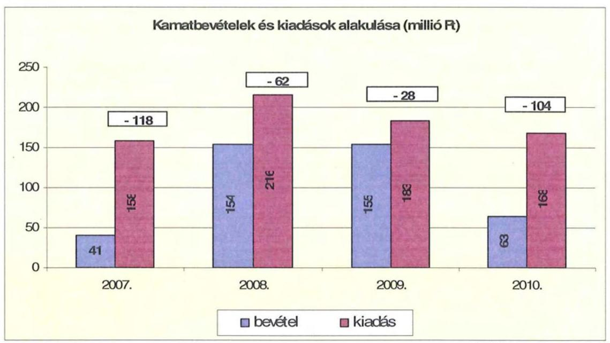

A 2007-2010 közötti időszakban az Önkormányzat kiadásainak és bevételeinek főbb jogcímek szerinti alakulását a jelentés 2/b. számú melléklete tartalmazza.

[^0]
[^0]:    ${ }^{25}$ Nincs kötelező előírás a működési és fejlesztési hiány megállapításának módjára.

---

# 2.2. Az Önkormányzat bevételeinek alakulása 

Az Önkormányzat 2007-2010 között realizált OEP támogatás nélküli főbb bevételi jogcímeinek számszaki adatait az alábbi táblázat részletezi és grafikon mutatja be:
ezer Ft

| Megnevezés | 2007. év   tény | 2008. év   tény | 2009. év   tény | 2010. év   tény |
| :-- | :--: | :--: | :--: | :--: |
| illetékbevétel | 1542865 | 1749333 | 1544027 | 1070256 |
| szja és állami támogatás (OEP   nélkül) | 4146581 | 4381109 | 4583180 | 3746338 |
| Egyéb saját bevétel | 3443523 | 2949997 | 3613990 | 3178171 |
| Összes működési bevétel | 9132969 | 9080439 | 9741197 | 7994765 |

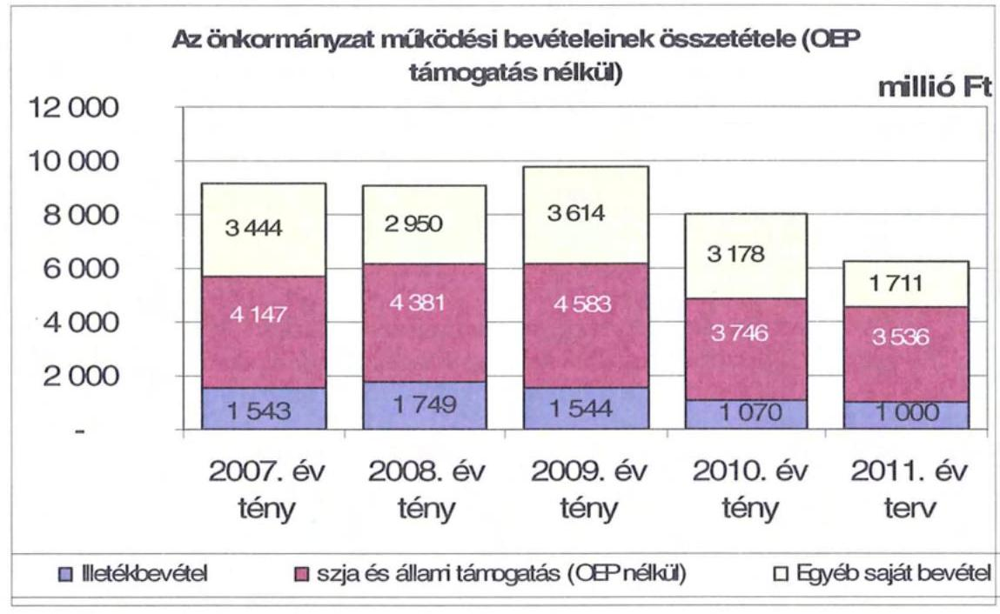

Az Önkormányzatnál az illetékbevétel a 2007. évben a 2006. évi 1797 millió Ft-hoz képest jelentősen, 14,2%-kal (255 millió Ft-tal) csökkent. A csökkenésben szerepet játszott az Illetékhivatalnak - 2007. január 1-jétől - az APEH-hoz történő átszervezése is, miután az évente realizált illetékbevételekből (központi intézkedés következtében) évi 8,5% elvonásra került az adminisztrációs feladatokra. A Hivatal működtetésével kapcsolatos kiadások megszűnése és az adminisztrációs feladatokra visszatartott 8,5% között 2007-ben 69 millió Ft pozitív különbözet jelentkezett. A beszedés költségeire elvont pénzösszeg kevesebb volt, mint amit az illetékhivatal működtetésére költött volna az Önkormányzat.

---

Az illetékbevétel a vizsgált időszakban 2008-ban növekedett, amikor az előző évihez képest 206 millió Ft-tal (13,4%-kal) nőtt. 2008-ról 2009-re 205 millió Ft (11,7%-os) csökkenés következett be, majd a 2010. évben jelentősen mérséklődött, az előző évhez viszonyítva a csökkenés 474 millió Ft (30,7%-os) volt. Az Önkormányzat a 2011. évi költségvetésében továbbra is 70 millió Ft csökkenéssel (6,6%-os) számolt.

Az átengedett szja és az állami támogatások együttes összege a 2008. és 2009. évi 5,7%-os ( 234 millió Ft), illetve 4,6%-os ( 202 millió Ft) növekedést követően a központi támogatáscsökkentés hatására ${ }^{26}$ 2010-re csökkent és 2011-re is csökkenést terveztek. Az előző évihez képest 2010-ben 18,3%-kal (837 millió Ft-tal) kapott kevesebb forrást az Önkormányzat az államtól ezeken a jogcímeken. A változást a normatíváknak a járulékváltozások miatti központi csökkentése, valamint a megyei önkormányzatokat érintő forráselvonás idézte elő.

Az intézményi működési bevételek a 2007. évről a 2010. évre a szociális intézményátadások és az M6 autópálya régészeti feltárásával kapcsolatos bevételek megszűnése ${ }^{27}$ miatt 2496 millió Ft-ról 1718 millió Ft-ra csökkentek.

A Kórház OEP bevétele a 2007. évben 6601 millió Ft volt, amely a 2010. évre 7182 millió Ft-ra nőtt.

A működési bevételek csökkenésével párhuzamosan megnövekedett az Önkormányzat követeléseinek állománya, amely kedvezőtlenül hatott fizetőképességének alakulására. A követelésállomány növekedését a Kórházzal kötött pénzügyi megállapodásokból fakadó követelések okozták.

A követelések nagysága önkormányzati szinten 2010 végére a 2007. évhez képest 2,8-szorosára nőtt. A legdinamikusabb növekedés 2009-ben (az előző évi 1,5-szeresére nőtt, de a bázishoz képest nem) és 2010-ben jelentkezett (előző évi 2,8-szorosára nőtt).

[^0]
[^0]:    ${ }^{26}$ A 2007. évi bázishoz képest.
    ${ }^{27}$ A feltárást végző Múzeum a 2007. évben 1020 millió Ft-ot számlázhatott a munkálatokkal kapcsolatban, míg a 2010. évben ezen a jogcímen már nem jelentkezett bevétele.

---

Az Önkormányzat felhalmozási bevételei a vizsgált időszakban a következőképpen alakultak:
ezer Ft

| Megnevezés | 2007. év   tény | 2008. év   tény | 2009. év   tény | 2010. év   tény |
| :-- | :--: | :--: | :--: | :--: |
|  |  |  |  |  |
| Tárgyi eszköz
 értékesítés | 43839 | 14569 | 20704 | 69788 |
| Állami támogatás | 435858 | 332657 | 63065 | 70938 |
| Átvett pénzeszköz | 62880 | 113809 | 119162 | 98309 |
| Egyéb felhalmozási bevétel | 547001 | 203355 | 127426 | 892297 |
| Felhalmozási tartalék | 262444 | 194235 | 349151 | 339876 |
| Összes felhalmozási bevétel | 1352022 | 858625 | 679508 | 1471208 |

A tárgyi eszköz értékesítés bevételeinek jelentős része a 2007. évben személygépkocsik-, esztergagépek-, ingatlan eladásából, a 2008. évben termőföld-, ingatlan-, mikrobusz-, kistraktor értékesítéséből, a 2009. évben gépkocsik eladásából, a 2010. évben ingatlan- és személygépkocsi értékesítéséből keletkezett. Állami támogatások a Kórház épület rekonstrukciójához és a Kelemen Endre Szakközépiskola felújításához kapott címzett támogatásokból származtak.

Az egyéb felhalmozási bevételek között az EU-s forrásokból származó támogatások találhatók.

A 2011. évi tervben megtalálhatók többek között a TISZK infrastruktúra fejlesztéséhez elnyert 178 millió Ft, a Kórház sürgősségi betegellátó osztályának fejlesztésére elnyert 479 millió Ft, illetve a Vármegyeháza felújítására kapott 585 millió Ft támogatások.

A felhalmozási tartalékot az uniós projektek finanszírozására - betétként - lekötötték.

---

# 2.3. Az Önkormányzat kiadásainak alakulása 

Az Önkormányzat működési kiadásai főbb jogcímek szerinti bontásban az alábbiak voltak:
ezer Ft-ban

| Megnevezés | 2007.   (tény) | 2008.   (tény) | 2009.   (tény) | 2010.   (tény) |
| :-- | --: | --: | --: | --: |
| Működési kiadások | 15584940 | 15878994 | 15510392 | 16041060 |
| Működési kiadások (kamatkiadás nélkül) | 15505190 | 15771418 | 15401552 | 15914972 |
| Kamatkiadás | 79750 | 107576 | 108840 | 126088 |
| Személyi juttatások | 6993679 | 7467991 | 7508382 | 7450697 |
| Munkaadót terhelő járulékok | 2224251 | 2353289 | 2247457 | 1944378 |
| Dologi kiadások | 5309418 | 5280497 | 4913874 | 5825739 |
| Egyéb folyó kiadások | 267319 | 125343 | 66375 | 166901 |
| Támogatások, elvonások, egyéb folyó átutalások | 641749 | 435598 | 466266 | 423957 |
| ebből: működési célú pénzeszközátadás | 115241 | 91964 | 81503 | 35630 |
| Előző évi pénzmaradvány átadás, visszafizetés,   működési célú | 68774 | 108700 | 199198 | 103300 |

Az Önkormányzat működési kiadásai 2007. december 31-ről 2010. december 31-re 15585 millió Ft-ról 16041 millió Ft-ra (2,9%-kal nőttek). Az Önkormányzat 2007-ben 9218 millió Ft-ot (a működési költségvetés 59,1%-át) személyi juttatásokra és a munkaadókat terhelő járulékokra fordította, az üzemeltetést, intézményfenntartást biztosító dologi kiadásokra 5309 millió Ft (34,1%) jutott. A működési kiadásokon belül a személyi juttatások és járulékok aránya a vizsgált időszakban alig változott, a 2007. évi 9218 millió Ft-ról (59,1%-ról) a 2010. évre 9395 millió Ft-ra (58,6%-ra) csökkent.

A személyi juttatások 2008-ban 7468 millió Ft-ra (6,8%-kal) nőttek az előző évhez képest, a 2010. évben csökkentek a létszámcsökkentések miatt.

A dologi kiadások az Önkormányzatnál a 2007-2009. években a kiadáscsökkentő intézkedések és az intézményi struktúra átalakításának hatására csökkentek, a 2010. évben a Kórház dologi kiadásai miatt nőttek. A 2010. évben a 2007. évi szintnél 9,7%-kal (516 millió Ft-tal) voltak magasabbak a dologi kiadások, amelynek ellentételezése a központi támogatáselosztásban nem jelentkezett. Fedezetét az Önkormányzatnak a végrehajtott kiadáscsökkentő intézkedések mellett likvid hitelek igénybevételével, kötvénykibocsátásból származó bevételből kellett biztosítania.

---

A vizsgált időszakban az ellátás szervezeti kereteiben történt változás hatására $^{28}$ a működési célú pénzeszközátadások részaránya a működési kiadásokon belül 0,7%-ról 0,2%-ra $^{29}$ csökkent.

Az önkormányzati kiadásokban nőtt a kórházi kiadások súlya az egyéb fenntartott intézményekben felmerülő kiadásokhoz képest. A Kórház nélküli teljesített működési kiadások 2007-ben 8727 millió Ft-ot, az összes működési kiadás 56,0%-át tették ki, ez az arány 2010 végére 8525 millió Ft-ra (53,1%-ra) csökkent. A Kórház nélküli kiadások arányának csökkenése a közoktatási, szociális és gyermekvédelmi, igazgatási és egyéb feladatellátási helyeken végrehajtott átszervezések és kiadáscsökkentési intézkedések eredményességét támasztják alá.

Az Önkormányzat Kórház nélküli működési kiadásai a vizsgált időszakban a következőképpen alakultak:
ezer Ft

| Megnevezés | 2007.   (tény) | 2008.   (tény) | 2009.   (tény) | 2010.   (tény) |
| :-- | --: | --: | --: | --: |
| Működési kiadások | 8727135 | 8285929 | 8475612 | 8524563 |
| Működési kiadások (kamatkiadás   nélkül) | 8648605 | 8179309 | 8367489 | 8398475 |
| Kamatkiadás | 78530 | 106620 | 108123 | 126088 |
| Személyi juttatások | 3865129 | 4141083 | 4274507 | 4205460 |
| Munkaadót terhelő járulékok | 1207087 | 1282087 | 1248247 | 1072729 |
| Dologi kiadások | 2626658 | 2120415 | 2150898 | 2528433 |
| Egyéb folyó kiadások | 239308 | 104137 | 46588 | 113651 |
| Támogatások, elvonások, egyéb folyó   átutalások | 641649 | 422887 | 448051 | 374902 |
| ebből: működési célú pénzeszköz-   átadás | 115241 | 91964 | 81503 | 35630 |
| Előző évi pénzmaradvány átadás,   visszafizetés, működési célú | 68774 | 108700 | 199198 | 103300 |

Míg 2010-ben a Kórházzal együtt a működési kiadások 456 millió Ft-os (2,9%-os) növekedése volt megfigyelhető $^{30}$, addig a Kórház nélkül ugyanebben az időszakban 202 millió Ft-os (2,3%-os) csökkenés jelentkezett, mivel a Kórház dologi kiadásai önkormányzati átlagot meghaladóan nőttek. A Kórház nélküli működési kiadásokból 5278 millió Ft-ot (61,6%-ot) tették ki a személyi juttatások és járulékaik, a dologi kiadások pedig 2528 millió Ft (29,5%) voltak.

A Kórházon kívüli önkormányzati intézményekben 2007-2010. évek között 8,8%-kal (340 millió Ft-tal) nőttek a személyi juttatások, amelynek az önkormányzati szintű mutatónál magasabb alakulása azt tükrözi, hogy az egészség-

[^0]
[^0]:    $^{28}$ A TISZK létrehozása és két szociális intézmény átadása, valamint egy szociális intézmény egy telephelyének megszüntetése.
    $^{29}$ 115 millió Ft-ról 36 millió Ft-ra
    $^{30}$ A 2007. december 31-i bázishoz képest.

---

ügyi ágazatot kiemelten érintették a bér-megtakarítási döntések $^{31}$. A vizsgált időszakban a munkaadókat terhelő járulékok csökkenése következett be, amely egyrészt a kifizetett személyi juttatások, másrészt a járulékok mértékének csökkenésével volt összefüggésben. A járulékok csökkenése miatt felszabaduló forrásokat azonban a kormányzat az önkormányzati alrendszernek nyújtott állami támogatásokból levonásba helyezte, így a járulékcsökkenés az Önkormányzatnál érdemi megtakarítást nem hozott, mivel állami támogatáscsökkentéssel járt együtt.

A nem egészségügyi intézményeknél a 2007-2010. évek között a dologi kiadások 98 millió Ft-tal csökkentek, a Kórház adataival együtt kimutatott dologi kiadások 9,7%-kal (516 millió Ft-tal) emelkedtek.

A vizsgált időszakban - Kórház nélkül -a dologi kiadások csökkenését a 2007. évben a Múzeum által az M6 autópálya építését megelőző régészeti feltárásokhoz köthető 950 millió Ft eseti dologi kiadások megszűnése okozta.

A Múzeum és a Nemzeti Autópálya Zrt. 2005. november 29-én a jogszabályokban $^{32}$ előírt megelőző régészeti feltárásra szerződést írt alá. A szerződés tárgy az M6 autópálya Tolna megyei szakasza Tolna-Bátaszék területén a megelőző feltárások és a próba feltárások elvégzése. A munkálatok magukba foglalták a dokumentálást, az előkerülő emlékek elsődleges feldolgozási munkálatait és a leletelhelyezés rendkívüli feladatainak ellátását, úgymint a leletanyag elsődleges konzerválását, leltározását, elsődleges feldolgozását és átmeneti elhelyezését. A szerződésben rögzített megbízási díj bruttó 1001 millió Ft volt. A szerződést két alkalommal módosították, egyszer 2007. január 5-én, illetve 2007. május 31-én. A második módosítást követően a megbízási díj bruttó 1867 millió Ft-ra változott a feltárandó terület módosulása miatt. A szerződésben foglalt határidőben 2009. május 15-én a Múzeum elkészítette a végelszámolást, melyben az 1867 millió Ft megbízási díj felhasználásáról elszámolt, a következő megoszlásban: személyi kiadások 485 millió Ft, beruházás, tárgyi eszköz beszerzés 75 millió Ft, földmunka és járulékos költségei 417 millió Ft, járművek üzemeltetése 13 millió Ft, dologi kiadások 872 millió Ft, egyéb kiadások 5 millió Ft.

A Kórháznál jelentkező 614 millió Ft dologi kiadásnövekedés pedig nem a reális üzemeltetési költségnövekedést tükrözi, mivel az intézmény a 2010. évben kapott finanszírozásokból rendezte a működési forráshiánya miatt korábban felhalmozódott szállítói állományát, így azzal emelkedett a tárgyévben jelentkező dologi kiadásainak az értéke. Emellett a dologi kiadások között jelentek meg az időszak alatt 180 millió Ft-tal megnövekedett közreműködői szerződések alapján kifizetett összegek.

[^0]
[^0]:    $^{31}$ A Kórházban munkaidő korlátozást vezettek be, illetve egyes tevékenységeket vállalkozási szerződés formájában láttak el.
    $^{32}$ A kulturális örökség védelméről szóló 2001. évi LXIV. törvény és a régészeti lelőhely feltárásának, illetve a régészeti lelőhely, lelet megtalálója anyagi elismerésének részletes szabályairól szóló 18/2001. (X. 18.) NKÖM rendelet.

---

Az Önkormányzat a 2007-2010. évek között a Kórház működési kiadásaihoz $^{33}$ a központi költségvetésből érkező támogatásokon felül 113 millió Ft-tal járult hozzá, amelyet pályázati forrásokból, saját bevételből és folyószámla hitelből fedezett. A kórházi működési támogatások megyenapok szervezéséhez, a pincehelyi betegellátás biztosításához, és a Kórház szállítói tartozásának rendezéséhez nyújtottak segítséget.

A Közgyűlés a Kórház kérelmét követően a 81/2009. (IX.18.) számú határozatában döntött 100 millió Ft visszatérítendő támogatás átutalásáról. A döntést követően a Kórház Főigazgatója és a Közgyűlés Elnöke 2010. január 28-án megállapodást írtak alá, melyben rögzítették, hogy a 2009. október 14-én folyósított támogatást a Kórház a szállítói kötelezettségek rendezése érdekében visszafizetési kötelezettséggel kapta. A Kórház vállalta, hogy a támogatást negyedévenként négy egyenlő részletben 2010. december 31-ig visszafizeti.

A Kórház működésének finanszírozására az OEP támogatás szolgál, míg a fejlesztési kiadások fedezetét az önkormányzatoknak kell biztosítani intézményeik számára. A működési célú önkormányzati támogatáson felül 2007-2010 között a Kórháznak fejlesztési célra 93 millió Ft-ot adott a Közgyűlés.

A támogatások évenkénti alakulását a következő grafikon mutatja be:
ezer Ft
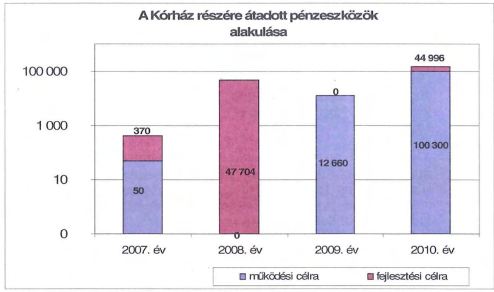

A Kórháznak fejlesztési célra nyújtott támogatások a sürgősségi betegellátó osztály- és szűrőcentrum kialakítását segítették.

A működési és felhalmozási kiadások arányának változásában 2007-2010 között elmozdulás figyelhető meg, a felhalmozási kiadások 1302 millió Ft-ról (7,7%-ról) 1387 millió Ft-ra (8,0%-ra) nőttek.

[^0]
[^0]:    $^{33}$ intézményi finanszírozás formájában

---

A kiadások összetételének változását (a működési és fejlesztési célú kamatkiadásokat is figyelembe véve) a következő grafikon szemlélteti:
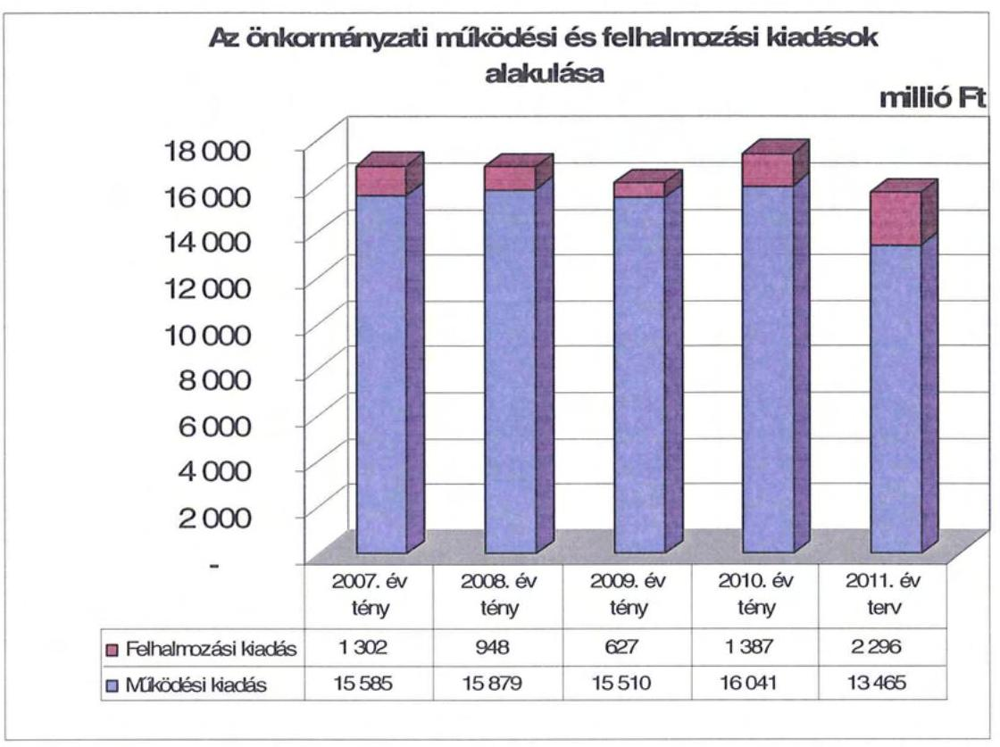

Az Önkormányzat 2007-2010 között megvalósított fejlesztései között intézményi épületek felújítása, korszerűsítése és gépbeszerzések szerepeltek. A vizsgált időszakban kezdődött legmagasabb bekerülési költségű (966 millió Ft) fejlesztést 2009-ben indították és a közoktatási intézményrendszer fejlesztéséhez kapcsolódik.

A vizsgált időszakban 656 millió Ft-ot fordítottak a Kórház épületének rekonstrukciójára címzett állami támogatás segítségével, 188 millió Ft-ot a TISZK eszközfejlesztésére, 169 millió Ft-ot kórházi eszközbeszerzésekre, HEFOP támogatást igénybe véve 144 millió Ft-ot kórházi informatikai fejlesztésre, 115 millió Ft-ot Keleti városkapu rehabilitációra.

Kórházi fejlesztésekre még további kettő
 EU-s projekt van folyamatban. A Kórház infrastruktúra fejlesztésének és a sürgősségi betegellátó osztály fejlesztésének 2010. utáni kötelezettségvállalásai 4385 millió Ft mértékűek, melyekhez az Önkormányzat 3755 millió Ft (86%) EU-s támogatásban részesül. A 2007-2010. években megvalósított, továbbá a december 31-én fennálló fejlesztéseket a jelentés 3. számú melléklete tartalmazza.

A 2007-2010. évek között az egyedi 10 millió Ft teljes bekerülési költség alatti intézményi beruházások és felújítások nélküli fejlesztések száma 65 volt, amelynek közel kétharmadához (40 fejlesztéshez) EU-s támogatást is igénybe vettek. A 10 millió Ft alatti intézményi fejlesztésekkel együtt - amelynek összértéke meghaladja a 449 millió Ft-ot - a vizsgált időszakban 3792 millió Ft-ot fordítottak fejlesztésekre.

---

Az Önkormányzat fejlesztési tevékenysége a jogszabályi előírások és a pályázati kiírások által nagyban befolyásolt, mert a jelentkező működési forráshiány és saját felhalmozási bevételei alacsony szintje miatt csak kötelezően előírt beruházási feladatokat, illetve egyéb beruházásokat csak külső források, EU-s és hazai támogatások elnyerése esetén tud megvalósítani. A 2007-2010. években jogszabályi előírásokhoz köthetően 1068 millió Ft értékű fejlesztéseket valósítottak meg. A kivitelezések finanszírozásához összesen 2134 millió Ft, (56,3%) hazai és EU-s támogatást vettek igénybe. A 2011. évben folyamatban lévő fejlesztéseket átlagosan 84,9%-os (összesen 4635 millió Ft mértékű) támogatások igénybevételével finanszírozzák${ }^{34}$.

# 3. KÖTELEZETTSÉGEK BEMUTATÁSA 

### 3.1. A pénzintézetek felé fennálló kötelezettségek alakulása

Az Önkormányzat pénzintézeti kötelezettségeinek állománya 2006. december 31-től 2010. december 31-ig 2099 millió Ft-ról 5728 millió Ft-ra, 2,7 szeresére nőtt. Fennálló pénzintézeti kötelezettségei hosszú lejáratú hitelek igénybevételéből, kötvénykibocsátásból, valamint folyószámla és munkabér megelőlegezési hitelek igénybevételéből keletkeztek.
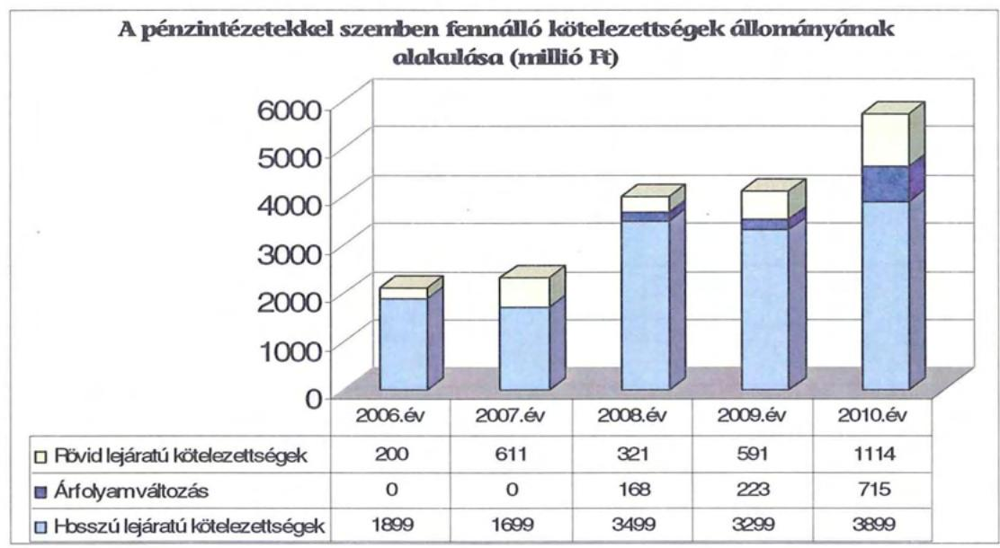

Az árfolyamváltozás hatása befolyásolja a kötelezettségek alakulását, azonban annak mértéke előre pontosan nem határozható meg, csak várakozásokon alapuló tendenciák jelezhetők. Ugyanakkor a számviteli szabályok meghatározzák, hogy az árfolyam-különbözetet év végén a kötelezettségek vagy követelések között a könyvviteli mérlegben nyilván kell tartani, azonban az árfolyamkülönbözet valójában nem realizált. Annak megítéléséről, hogy a devizában kibocsátott kötvényekért és a felvett hitelekért kapott forinthoz képest a kötvények visszavásárlásakor, illetve a hitelek törlesztésekor jelentkező forint kötelezettség többletkiadást (árfolyamveszteség) vagy megtakarítást (árfolyamnyereség) eredményez a futamidő végén, a teljes kötelezettség rendezését követően lehet képet alkotni. Mindaddig, amíg törlesztési kötelezettség nem áll fenn (türelmi idő, moratórium), a tőkére vonatkoztatva nem értelmezhető sem az árfolyamveszteség, sem az árfolyamnyereség.

Az Önkormányzat pénzintézeti kötelezettségvállalásaira minden esetben közgyűlési döntés alapján került sor. A döntések során a kötelezettségvállalásból származó források felhasználási céljait és a kötelezettségvállalás alapján keletkező fizetési kötelezettség teljesítésének forrásait meghatározták, a devizaalapú kötvénykibocsátás döntés-előkészítése során a döntéshozók figyelmét az árfolyamkockázatra felhívták. Ugyanakkor a Közgyűlés döntéseit megalapozó előterjesztések nem tartalmazták a teljes futamidő alatt várható kamat- és tőkefizetési kötelezettségeknek, és kamatkockázatoknak a bemutatását. Az előterjesztésekben nem tértek ki az adósságszolgálati korlát bemutatására sem, így a Közgyűlés ennek figyelembevétele nélkül döntött, azonban az Önkormányzat adósságot keletkeztető kötelezettségvállalásának felső határát egyik vizsgált évben sem lépték túl.

Az adósságot keletkeztető kötelezettségvállalással megvalósított felhalmozási kiadások fedezetéül szolgáló esetleges bevételnövelő, illetve kiadáscsökkentő vonzatát, valamint a fejlesztési hitelek kapcsán kötött együttműködési megállapodás alapján keletkező bevételt${ }^{35}$ a fejlesztéshez vállalt kötelezettségek visszafizetési forrásaként számításba vették.

A hitelek felvételekor, illetve a kötvény kibocsátásakor minden esetben közbeszerzési eljárás keretében választották ki a pénzintézetet.

Az Önkormányzat 2010. december 31-én CHF-ben fennálló adósságot keletkeztető kötelezettségvállalása az alábbi volt:

| Megnevezés | Kibocsátás   időpontja | Összeg   CHF | Kibocsátási   árfolyam | Kamat (referencia   kamat+ kamatfelár) | Felhasználás célja: |
| :--: | :--: | :--: | :--: | :--: | :--: |
| Tolna Megye 2028 Kötvény | 2008.02.13 | 12192148 | 164,04 | 6 havi CHF LIBOR+0,9% | Működési költségvetés   hiányának csökkentése,   folyószámlahitel   refinanszírozása, fejlesztések   finanszírozása |

Az Önkormányzat a Tolna Megye 2028 Kötvény ellenértékéből a 2008. és 2009. években - az Önkormányzat kimutatása szerint - összesen 1000 millió Ft-ot a fennálló folyószámla hitelállomány refinanszírozására, 195 millió Ft-ot különféle fejlesztési feladatok finanszírozására használta fel, a kötvényből származó

[^0]
[^0]:    ${ }^{35}$ Az Önkormányzat, mint beruházó, a Kórház, mint üzemeltető, Szekszárd Megyei Jogú Város önkormányzata és a Paksi Atomerőmű Rt., mint támogatók együttműködési megállapodást kötöttek a Kórház Műtő- és Diagnosztikai Blokk létesítményének befejezése tárgyában, melynek értelmében az üzemeltető és a támogatók a beruházáshoz felvett, összesen 1,4 milliárd Ft összegű hitellel összefüggő, az Önkormányzatot terhelő fizetési kötelezettségek (tőke, kamat, járulékos költségek) teljesítéséhez egynegyed-egynegyed részben fejlesztési célú pénzeszközátadással hozzájárulnak.

---

bevételből 2011. március 31-én 805 millió Ft - lekötött betétként - még rendelkezésére állt.

Az Önkormányzat a devizában fennálló - kötvénykibocsátás miatti - pénzintézeti kötelezettségéből - 2010. december 31-ig - 811360 CHF kamatot, valamint 4 millió Ft egyéb költséget fizetett, a kamatfizetések időpontjaiban érvényes CHF/HUF árfolyamok alapján az összes teljesített kötelezettség 151 millió Ft volt. A tőketörlesztés első alkalommal 2013. október 15-én esedékes.

Az Önkormányzat 2010. december 31-én forintban fennálló adósságot keletkeztető kötelezettségvállalásai a következők voltak:

| Megnevezés | Szerződéskötés   időpontja | Összeg   (ezer Ft) | Kamat   (referencia   kamat+   kamatfelár) | Felhasználás célja: |
| :-- | :--: | :--: | :--: | :-- |
| Célhitel a Műtőblokk   beruházás befejezéséhez | 2006.01.19 | 140000 | 1 havi BUBOR   +0,3% | Műtő- és Diagnosztikai   blokk beruházás |
| ÖKIF keretében nyújtott   kölcsön a Műtőblokk   beruházás befejezéséhez | 2006.03.08 | 1260000 | 3 havi EURIBOR   +1,29% | Műtő- és Diagnosztikai   blokk beruházás |
| Éven túli működési célú hitel | 2006.09.01 | 700000 | 3 havi BUBOR   +0,035% | Működési kiadások   finanszírozása |
| Éven túli működési célú hitel | 2010.05.25 | 1000000 | 3 havi BUBOR   +5,5% | Működési kiadások   finanszírozása |

Az Önkormányzat a HUF-ban fennálló, hosszú lejáratú pénzintézeti kötelezettségeiből - 2010. december 31-ig - 800 millió Ft tőkét törlesztett, és 446 millió Ft kamatot, valamint 10 millió Ft egyéb költséget${ }^{36}$ fizetett.

Az Önkormányzat 2007-2011. március 31. között az átmenetileg szabad pénzeszközein 413 millió Ft kamatbevételt realizált, melyből 266 millió Ft keletkezett a kötvény kibocsátásából származó bevétel befektetéséből és 147 millió Ft az intézmények és a Hivatal elkülönített bankszámláin rendelkezésre álló források befektetéséből, illetve az elszámolási számlák pozitív egyenlegeinek látra szóló kamataiból.

A kötvény kibocsátásából származó bevétel befektetéséből 2010. december 31-ig realizált 266 millió Ft kamatbevétel a kötvény után 2010. december 31-ig teljesített 147 millió Ft kamatfizetésnek 181%-át tette ki. A kamatbevételből fizette az Önkormányzat a kötvény után teljesítendő kamatokat, a kamatbevételi többletet a működési kiadásai finanszírozására használta fel.

[^0]
[^0]:    ${ }^{36}$ Egyszeri kezelési költség, rendelkezésre tartási-, évi hitelkezelési-, valamint projektvizsgálati díjak címén.

---

Az Önkormányzat likviditását a vizsgált időszakban csak folyószámla és munkabér megelőlegezési hitel igénybevételével tudta biztosítani, melyek alakulását az alábbi táblázat mutatja be:

|  |  |  |  |  | ezer Ft-ban |  |
| :--: | :--: | :--: | :--: | :--: | :--: | :--: |
| Megnevezés | 2007. év | 2008. év | 2009. év | 2010. év | 2011.   március 31. |  |
| I. Folyószámlahitel |  |  |  |  |  |  |
| a folyószámlahitel keretösszege január 1-jén | 600000 | 1150000 | 700000 | 1000000 | 1200000 |  |
| teljesített kamut és egyéb költség | 25509 | 33868 | 32244 | 50684 | 17364 |  |
| II. Munkabér megelőlegezési hitel |  |  |  |  |  |  |
| igénybevett hitel összesen: |  |  |  | 357000 | 350000 |  |
| teljesített kamut és egyéb költség |  |  |  | 5033 | 2632 |  |

A folyószámlahitel és munkabér megelőlegezési hitelek kondíciói és egyéb költségei a következők voltak${ }^{37}$:

| Megnevezés | Kamat (referencia+ kamatfelár | Egyéb költség |
| :--: | :--: | :--: |
| Folyószámlahitel |  |  |
| 2006.10.2.- 2007.10.1. | 3 havi BUBOR +0,35% | 0,00% |
| 2007.06.27. - 2008.06.11. | 3 havi BUBOR +0,35% | 0,00% |
| 2008.06.11. - 2009.06.10. | 3 havi BUBOR +1% | 0,1% rend.tart.jutalék |
| 2009.06.11. - 2009.11.3. | 1 havi BUBOR +2,25% | 0,25% kezelési díj +0,25%   rend.tart.jutalék |
| 2009.11.4. - 2010.05.19. | 1 havi BUBOR +2,75% | 0,25% kezelési díj +0,25%   rend.tart.jutalék |
| 2010.05.20. - 2011.05.19. | 1 havi BUBOR +2,75% | 0,25% kezelési díj +0,25%   rend.tart.jutalék |
| 2010.05.20. - 2011.05.18. | 1 havi BUBOR +2,75% | 0,25% kezelési díj +0,25%   rend.tart.jutalék |
| Munkabér megelőlegezési hitel |  |  |
| 2010. év | 17,50% | x |
| 2011. év | 1 havi BUBOR +3% | x |

Az Önkormányzat a 2008. évben fennálló tartós folyószámlahitel tartozását a „Tolna Megye 2028" kötvény kibocsátásából származó forrásból törlesztette, ezt követően 700 millió Ft-os folyószámla hitelkeret szerződést kötött, amelyet 2011-re 1200 millió Ft-ra emelt meg. A folyószámlahitel keretösszegének ismételt megemelését az indokolta, hogy a Kórház 2009. évben keletkezett hiányának részbeni finanszírozásához szükségessé vált a fenntartó pénzügyi hozzájárulása.

A vizsgált időszakban a folyószámlahitel igénybevételével zárt napok száma a 2007. évben volt a legalacsonyabb (277 nap) a 2010. évben és 2011. I. negyedévében az Önkormányzat minden nap igénybe vett folyószámlahitelt. Az átlagos napi állomány 2009-ben volt a legalacsonyabb, 301 millió Ft, 2011. I. ne-

[^0]
[^0]:    ${ }^{37}$ A referencia kamat az alábbiak szerint alakult:

    | MNB BUBOR fixing (átlagkamat) %-ban |  |  |  |  |
    | :--: | :--: | :--: | :--: | :--: |
    | Referencia kamat | 2007. évi | 2008. évi | 2009. évi | 2010. évi | 2011. március   31-ig |
    | 3 havi BUBOR | 7,75 | 8,87 | 8,64 | 5,5 | 6,03 |
    | 1 havi BUBOR | 7,83 | 8,75 | 8,66 | 5,47 | 5,94 |
    |

 1 napi BUBOR | 7,78 | 8,41 | 8,39 | 4,95 | 5,24 |

---

gyedévében volt a legmagasabb, 777 millió Ft, 2007-2010 között a folyamatos likviditási problémák folyószámlahitellel történő finanszírozása az Önkormányzatnak összesen 138 millió Ft kamatkiadást okozott. Az Önkormányzat folyószámlahitele 2010. december 31-én 714 millió Ft volt.

A tartós likviditási problémák miatt az Önkormányzat 2010-től a munkabérek kifizetéséhez munkabér-megelőlegezési hitelt vett igénybe. A 2010. évben két alkalommal, alkalmanként átlagosan 178 millió Ft-ot, és 2011. április 1-ig további két alkalommal, alkalmanként átlagosan 175 millió Ft-ot. A törlesztések részben a normatív állami támogatásokból történtek, valamint mindkét évben szükségessé vált az adott évben felvett működési célú hitelforrás bevonása a törlesztéshez. Az igénybevett munkabér-megelőlegezési hitelek után kamat címén az Önkormányzat 2007-2010 között 5 millió Ft-ot fizetett ki.

A jelenleg fennálló - kötvénykibocsátásból és hitelfelvételekből adódó - kötelezettségekből a kamatfizetési kötelezettségek alakulását jelentősen befolyásolta - és a jövőbeni fizetési kötelezettségeket is befolyásolja - a referencia kamatok változása, melyet az alábbi táblázat mutat be:

| Megnevezés | Kibocsátási, lehivási | 2010. évi utolsó   fizetéskori | Változás \% |
| :-- | --: | --: | --: |
|  | alapkamat $\%$ |  |  |
| 6 havi CHF LIBOR | 2,75 | 0,34 | $-87,64 \%$ |
| 3 havi EURIBOR | 3,376 | 0,886 | $-73,76 \%$ |
| 1 havi BUBOR | 8,05 | 5,28 | $-34,41 \%$ |
| 3 havi BUBOR | 7,94 | 5,37 | $-32,37 \%$ |

A 3 havi BUBOR-hoz, mint referenciakamathoz kötött hitelt az Önkormányzat két alkalommal vett igénybe, a táblázatban a korábban felvett hitel időpontjában érvényes alapkamat szerepel.

A deviza alapú kötelezettsége esetében - amennyiben a kötvény kibocsátása óta a referencia kamat nem változott volna - az Önkormányzatnak a kibocsátáskor érvényes referencia kamattal számolva 2010. december 31-ig 1205244 CHF fizetési kötelezettsége jelentkezett volna, azonban a kamatcsökkenés következtében ténylegesen 393884 CHF-fel kevesebb fizetési kötelezettséget kellett teljesítenie. A HUF-ban fennálló kötelezettségei esetében a hitelek felvételekor érvényes referenciakamatokkal számolva 2010. december 31-ig 467 millió Ft kamatfizetési kötelezettsége keletkezett volna az Önkormányzatnak, a kamatváltozások következtében ténylegesen 21 millió Ft-tal - 4,5%-kal - kevesebbet, 446 millió Ft kamatfizetést kellett teljesítenie.

Az alapkamat mértékének alakulása jelentős hatással van az adott devizanemben kifejezett, a teljes futamidőre számított, várható kamatkötelezettség nagyságára.

Az Önkormányzatnál a helyszíni vizsgálat alatt további egy, 1200 millió Ft összegű, HUF alapú, hosszú lejáratú, változó kamatozású működési célú hitel igénybevételéről döntöttek.

A 2011. április 7-én aláírt hitelszerződés szerint a hitel lejárata 2016. december 31., a hitelkeret rendelkezésre tartási periódusa 2011. május 1-től 2011. október 1-jéig tart, a hitelkeret igénybevétele öt részletben történik. A hitel kamatlába

---

változó, 3 havi BUBOR + 5,5 % kamatfelár. A tőketörlesztés és kamatfizetés negyedévente, a negyedév utolsó napján esedékes, az első kamatfizetésre 2011. június 30-án kerül sor, a tőketörlesztésre a hitelt folyósító pénzintézet 2012. március 30-ig türelmi időt biztosított. A kamaton felül egyszeri - a szerződés alapján történő első folyósítással egyidejűleg (2011. május 1-jén) esedékes - 1 millió Ft kezelési költség, és a hitelkeret összegének igénybe nem vett része után évi 2 % rendelkezésre tartási jutalék terheli az Önkormányzatot.

Az Önkormányzat 2011-2014. évekre szóló ciklusprogramjában elsődleges prioritásként fogalmazták meg az önkormányzati költségvetés egyensúlyának fenntartását, a fizetőképesség megőrzését. A működőképesség megőrzését továbbra is csak hitelek felvételével látják biztosítottnak. Ugyanakkor elsődleges szempontnak tekinti a ciklusprogram, hogy az eladósodottság mértéke arányban álljon az Önkormányzat teherviselő képességével. A feladatellátás kereteinek, módjának és mértékének újragondolásával, a kiadások fokozatos csökkentésével kívánják mérsékelni a költségvetés hiányát, és következetesen csökkenteni a külső forrásigényt. A ciklusprogramban rögzített célok elérése érdekében - a helyszíni ellenőrzés lezárásának időpontjáig - konkrét feladatokat meghatározó intézkedési terv nem készült.

# 3.2. Szállítók felé fennálló kötelezettségek alakulása 

Az Önkormányzat és gazdasági társaságainak lejárt szállítói tartozásai és egyéb kiadás elmaradásai alakulását az alábbi táblázat tartalmazza:

| Megnevezés | 2007. | 2008. | 2009. | 2010. | 2011. |
| :--: | :--: | :--: | :--: | :--: | :--: |
|  | december 31. | december 31. | december 31. | december 31. | március 31. |
| Lejárt szállítói tartozás | 154706 | 199314 | 437013 | 377790 | 448829 |
| ebből Kórház | 149984 | 194742 | 433132 | 225990 | 409613 |
| Gazdasági társaságok lejárt szállítói tartozása | 0 | 0 | 0 | 0 | 0 |
| Egyéb kiadás elmaradás | - | - | - | - | - |
| Tartozásállomány | 154706 | 199314 | 437013 | 377790 | 448829 |

Az Önkormányzat lejárt szállítói tartozása a 2007. évi 155 millió Ft-ról 2010-re 378 millió Ft-ra nőtt, 2011. március 31-re tovább emelkedett és 449 millió Ft lett. A lejárt szállítói tartozásból kiugróan magas a Kórháznál jelentkező állomány, amely 2010-ben 59,8%-ot, 2011. március 31-én 91,3%-ot képviselt.

A 2010. év végén fennálló, lejárt szállítói tartozásállományból mindössze 11 millió Ft (3%) haladja meg a 91 napot, 114 millió Ft (30,3%) 61-90 nap közötti, 25 millió Ft (6,7%) 30-60 nap közötti. A 2011. március 31-én lejárt szállítói állományból 198 millió Ft (44,2%) volt a 30-60 nap közötti.

A 2010. december 31-i mérlegben kimutatott szállítói kötelezettség 885 millió Ft volt. A le nem járt tartozásállomány 507 millió Ft-ot tett ki, amelyből 431 millió Ft (85%-a) volt a Kórház tartozása. Az Önkormányzatnál a 2010. év végén kimutatott - a Kórház kötelezettsége nélküli - 228 millió Ft szállítói kötelezettségre a mérlegben kimutatott - a Kórház követelésállományán felüli - 221 millió Ft követelésállomány és a folyószámla hitelkeret fedezetet nyújthat. A Kórház 657 millió Ft-os szállítói állományára mindössze a Kórház mérlegében kimutatott 31 millió Ft követelésállomány áll rendelkezésre fedezetként.

---

A Kórháznál jelentkező szállítói állomány a tartozásállomány további növekedését valószínűsíti. A Kórház 30 napot meghaladó lejárt szállítói tartozása 2011. március 31-én 222 millió Ft volt, amely meghaladta azt az összeghatárt $^{38}$, melynek elérése esetében - az Önkormányzat vonatkozó rendeletében $^{39}$ rögzítettek szerint - a Közgyűlés Önkormányzati biztost rendel ki, azonban a helyszíni vizsgálat lezárásának időpontjáig Önkormányzati biztos kirendelését nem kezdeményezték.
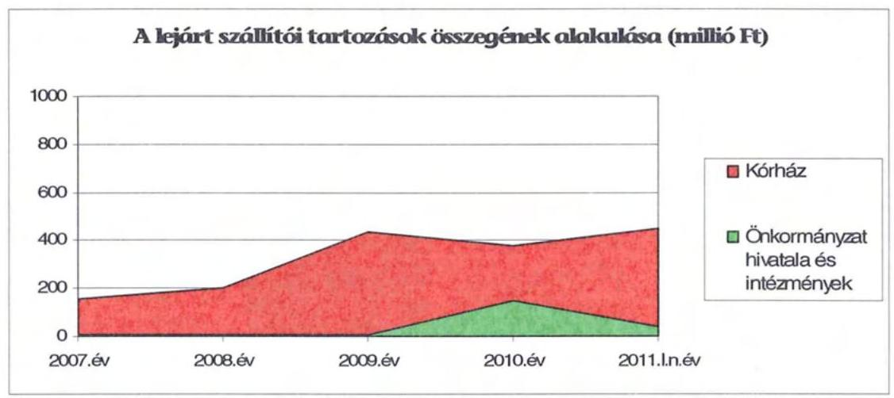

Az Önkormányzat a 2009. évben a Kórház részére 100 millió Ft visszatérítendő támogatást nyújtott a működési hiányának részbeni finanszírozása érdekében, melyet a Kórháznak a lejárt szállítói tartozásának rendezésére kellett felhasználnia. A lejárt szállítói tartozásállomány 2010. évi mérséklődését az év végén kapott egyszeri OEP támogatás tette lehetővé.

# 3.3. Egyéb kötelezettségek alakulása 

Az Önkormányzat a folyószámlahitel-keretszerződés 2001. évi megkötésekor hozzájárult egy forgalomképes ingatlanon 300 millió Ft értékű keretbiztosítéki jelzálogjog alapításához és bejegyzéséhez, majd a folyószámla hitelkeret 2010. évi megemelésekor további egy forgalomképes ingatlant vontak be jogi biztosítékként. A két ingatlanon összességében 300 millió Ft értékű keretbiztosítéki jelzálogjog, és 1200 millió Ft összegű tőke és járulékai erejéig jelzálogjog bejegyzése történt.

A jelzálogjoggal terhelt ingatlanok számviteli nyilvántartás szerinti nettó értéke 2010. december 31-én 171 millió Ft, az ingatlanvagyon kataszteri nyilvántartás szerinti becsült értéke $^{40}$ pedig 623 millió Ft volt. Az Önkormányzat összes forgalomképes ingatlanának könyvszerinti nettó értéke 707 millió Ft, becsült

[^0]
[^0]:    $^{38}$ Az éves eredeti költségvetési előirányzat 10%-a, illetve 150 millió Ft.
    $^{39}$ A Tolna Megyei Önkormányzat 19/2009. (IX.18.) számú rendelete önkormányzati biztos kirendeléséről és működéséről.
    $^{40}$ Az Önkormányzat az ingatlanait nem a piaci értéken tartja nyilván, az ingatlanok értékelését évente nem végzi el. A becsült érték az ingatlanvagyon kataszteri nyilvántartásba a 2005. évben bejegyzett becsült érték szerinti.

---

értéke 1227 millió Ft volt, melyből a terhelt ingatlanok 623 millió Ft-os becsült értéke 51%-ot képviselt.

Nem állapítható meg összefüggés az Önkormányzat eladósodása és a jelzálog kötelezettségei között, mivel már a 2001. évben történt jelzálogjog alapítása melletti hitelfelvétel, illetve a későbbiek folyamán, jelzálogjog bejegyzése nélkül is történt hitel igénybevétel.
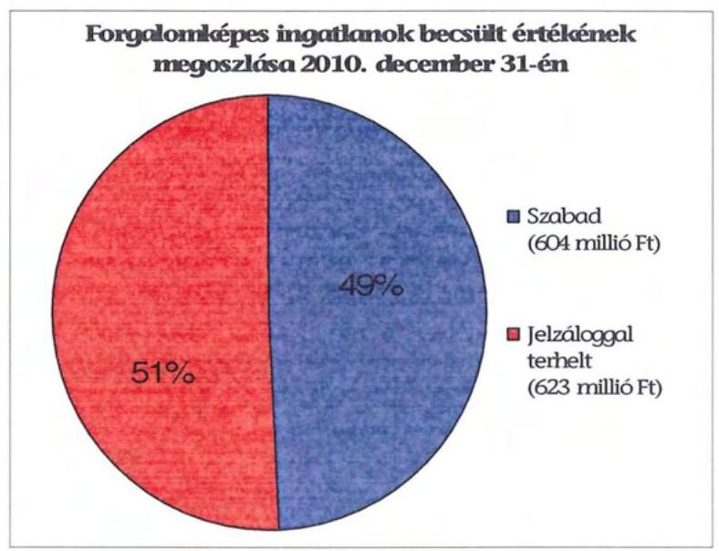

A helyszíni ellenőrzés lezárásának időpontjában három bírósági eljárás van folyamatban a Kórház Műtő és Diagnosztika blokk létesítmény kivitelezésére 1995-ben kötött szerződés felmondása miatt, melyek keretében a felperesek kártérítés, illetve elmaradt haszon címén összesen 1883 millió Ft tőke és kamatainak megfizetését kérik.

A 2007-2010 évek között az elengedett követelések bruttó összege nem érte el az 1 millió Ft-ot.

A vizsgált időszakban az Önkormányzatnál nem történt meg annak felmérése, hogy az eszközök elhasználódása, amortizációja fedezetének biztosítása mekkora forrásokat igényel. A felújításokra, az eszközök pótlására az Önkormányzat pénzügyi lehetőségeinek függvényében, elsősorban az intézmények működőképességének biztosítása érdekében, illetve a szakhatósági előírások figyelembevételével került sor. Az Önkormányzat a 2007-2010. években a tárgyi eszközök után összesen 3691 millió Ft összegű értékcsökkenést számolt el. Felújításra 280 millió Ft-ot számoltak el. Ugyanakkor a beruházási kiadások között is szerepeltek olyan kiadások $^{41}$, melyek az elhasználódott eszközök pótlását, állagmegóvását szolgálták (teljesen elhasználódott eszközök helyett új beszerzések, illetve nagyobb volumenű épületrekonstrukciók). Az elhasználódott eszközök pótlásához tartalék képzésére az Önkormányzatnak pénzügyi helyzetét is figyelembe véve - nem volt lehetősége.

[^0]
[^0]:    $^{41}$ Az Önkormányzat kimutatása szerint a beruházási kiadásokból 400 millió Ft tekinthető „felújításnak".

---

# 4. A PÉNZÜGYI EGYENSÚLY MEGTEREMTÉSE ÉRDEKÉBEN HOZOTT INTÉZKEDÉSEK 

A jelentésben szereplő CLF modellben bemutatott működési és felhalmozási hiány mindamellett alakult ki, hogy a vizsgált időszakban az Önkormányzat folyamatosan intézkedéseket tett, hogy alkalmazkodjon a finanszírozási rendszer változása miatti forráscsökkenéshez. Ennek érdekében bevételnövelő és kiadáscsökkentő döntéseket hozott.

A kiadáscsökkentő és bevételnövelő intézkedések megtétele a pénzügyi helyzet javítását és a gazdálkodás átláthatóbbá tételét célozta. A legjelentősebb mértékű kiadási megtakarítást a személyi juttatások területén érték el.

A Közgyűlés a vizsgált időszakban lecsökkentette a kifizetett tiszteletdíjak és a civil szervezeteknek nyújtott támogatások összegét, a 93/2009. (IX. 18.) számú határozatában döntött a Turisztikai Kht. végelszámolással való megszüntetéséről. Az Önkormányzat a kiadások csökkentése érdekében az 1728/2007. számú szolgáltatási szerződéssel módosította a TOLNATÁJ Zrt-vel kötött televíziós műsorkészítési szolgáltatási szerződést, valamint 2007. december 17-én felmondta az egészségügyi szakértővel kötött megbízási szerződést.

A Közgyűlés a 2010. évi költségvetési rendeletben a Hivatal 3 fő létszámcsökkentését írta elő. Az Önkormányzat felmondta a minőségügyi rendszer aktualizálására kötött szakértői szerződést és értesítette a minőségirányítási rendszer működtetőjét, hogy az Önkormányzat a szolgáltatást nem kívánja igénybe venni. A Főjegyző a 2007-2010. években intézkedett kiadványok, folyóiratok, előfizetések felmondásáról. A Főjegyző a vizsgált időszakban a közszolgálati szabályzatokban intézkedett a köztisztviselők részére megállapított cafetéria elemek csökkentéséről.

Az Önkormányzat gazdasági programjában megfogalmazott elvárások szerint 2007-től több alkalommal
 hozott intézmény-átszervezési döntéseket:

- a Közgyűlés az 5/2007. (II. 14.) számú és a 6/2007. (II. 14.) számú határozataiban döntött - a kistérségi kiegészítő normatív hozzájárulások igénybevétele miatt - a Tolna Megyei Önkormányzat Idősek Otthonának jogutóddal való megszüntetéséről és a Tolna Megyei Módszertani Otthon fenntartásának a Tamási-Simontornyai Városkörnyéki Önkormányzatok Többcélú Kistérségi Társulásának való átadásáról. A határozatok alapján az Önkormányzat Megállapodást írt alá, melyben rögzítették a Módszertani Otthon fenntartásának 2007. február 28. napjától való átadását. Az átszervezés a vizsgált időszakban 275 millió Ft kiadásmegtakarítást eredményezett az Önkormányzat számára.
- a Közgyűlés a 102/2007. (IX. 28.) számú határozatában döntött arról, hogy az általa fenntartott Árpád-házi Szent Erzsébet Otthont átszervezi, a mázai telephelyen működő pszichiátriai betegek otthonát átadja a SZOCEG Kht-nak. Ezt követően ellátási szerződést kötöttek a SZOCEG Kht-val a szolgáltatás 2007. december 29-i időponttal való biztosítására. A feladatátadás 22 millió Ft megtakarítást eredményezett.

---

- a Közgyűlés a 62/2007. (VI. 27.) számú határozatában az ÁMK átszervezését határozta el. A döntés alapján az ÁMK 2007. szeptember 1-től részben önállóan gazdálkodó intézményként látja el tevékenységét. A részben önálló intézmény gazdálkodási feladatait a Múzeum látja el. Az ÁMK átszervezésével egyidőben döntöttek a pedagógiai szakmai szolgáltatás szervezeti keretének a megváltoztatásáról is. A pedagógiai szakmai szolgáltatást a vizsgált időszaktól szolgáltatási szerződés keretében látták el. Az átszervezés 137 millió Ft kiadáscsökkentést eredményezett.
- a 2008. évben a Közgyűlés a 45/2008. (VI. 6.) számú határozatában döntött a TISZK létrehozásáról. A határozat alapján a Szent László Egységes Középiskola, a bonyhádi Perczel Mór Közgazdasági Szakközépiskola, Gimnázium és Kollégium, a bonyhádi Jókai Mór Szakképző Iskola, a Szekszárd Megyei Jogú Város Bezerédj István Kereskedelmi és Közgazdasági Szakközépiskola, Kereskedelmi Szakiskola, valamint a Tamási városban működő Vályi Péter Szakképző Iskola és Kollégium intézmények összevonásával, feladataik integrációjával egy Térségi Integrált Szakképző Központ jött létre. A közoktatási intézményrendszer átszervezése a szakképzés fejlesztését és beruházási támogatások megszerzését tűzte ki célul. Az Önkormányzatnak a TISZK létrehozása 2750 millió Ft kiadást jelentett, 2262 millió Ft bevétel mellett.
- a 97/2008. (IX. 18.) számú közgyűlési határozat alapján a GAMESZ által üzemeltetett konyha működtetését és a munkahelyi vendéglátási feladat ellátását 2008. november 1. napjával átadta a Szekszárdi Diákétkeztetési Kft-nek. A konyha működtetésének 2008. november 1-jei átadását követően a Közgyűlés a 23/2009. (III. 27.) számú határozatában 2009. június 30. napjával megszüntette a GAMESZ-t. A GAMESZ beolvadt a Hivatalba, a megszűnő költségvetési szerv feladatait 2009. július 1-jétől a Hivatal látja el. Az Önkormányzat a vizsgált időszakban ezekkel a döntéseivel 18 millió Ft kiadáscsökkentést ért el.
- a 2009. évben a Közgyűlés a 34/2009. (IV. 24.) számú határozatában döntött a szociális feladatellátás struktúrájának átalakításáról, az ISZI létrehozásáról. A határozat alapján a fenntartó Önkormányzat a hasonló feladatot ellátó intézmények egységes irányítás alá kerülése és a feladatok hatékonyabb ellátása érdekében megszüntette a Hétszínvilág Otthont, a Szivárvány Idősek Otthonát, a Mechwart András Otthont, az Árpád-házi Szent Erzsébet Otthont, a Fogyatékosok Otthonát, a Fogyatékosok Rehabilitációs Intézményét, a Csilla von Boeselager Otthont és a Szent András Otthont. A megszűnő intézmények által eddig ellátott kötelező önkormányzati feladatokat 2009. július 1-jétől az újonnan alapított ISZI útján látja el. Az intézmény a megszűnő intézmények jogutódja lett. Az Önkormányzat a vizsgált időszakban ezzel a döntésével 20 millió Ft kiadás-megtakarítást ért el.

Az álláshelymegszüntetések a vizsgált időszakban összesen 666 millió Ft kiadásmegtakarítást eredményeztek:

- a feladatellátás átszervezésével párhuzamosan a Közgyűlés a 17/2007. (II. 14.) számú határozatában felülvizsgálta az intézmények engedélyezett létszámkeretét és döntött a felügyelete alá tartozó költségvetési szervek 2006. év végi engedélyezett létszámkeretének 116,5 álláshellyel történő csökkentéséről;

---

- a 2009. évben a 64/2009. (VI. 26.) számú közgyűlési határozatban döntöttek 2009. augusztus 1-jével a TISZK engedélyezett álláshelyei számának 552,5 álláshelyről 536,5 főre való csökkentéséről, 16 álláshely megszüntetéséről;
- a Közgyűlés a 66/2009. (VI. 26.) számú határozatában az ISZI álláshelyeinek számát a feladatellátás szerkezetének átalakítása következtében 602,5 álláshelyről 2009. július 1. napjától 582 álláshelyre csökkentette. A döntés 20,5 álláshely megszüntetését írta elő;
- a 105/2009. (XI. 27.) számú közgyűlési határozatban 2010. január 1-jétől rendeltek el létszámcsökkentést. A Közgyűlés az ÁMK engedélyezett álláshelyeinek a számát 12 álláshelyről 11 álláshelyre, a Levéltárnál 21 álláshelyről 20 álláshelyre, a Könyvtárnál 35,25 álláshelyről 32,75 álláshelyre, a Tolnai Lajos Német Nemzetiségi és Kéttannyelvű Gimnázium és Kollégiumnál 55,5 álláshelyről 54,5 álláshelyre csökkentette.

A 2007-2010. években az intézményátszervezések, valamint a takarékossági intézkedések hatásaként együttesen 983 millió Ft kiadási megtakarítást mutattak ki, melyből 666 millió Ft, 67,7% a kapcsolódó létszámcsökkenések következtében jelentkezett.

Az intézményi feladatok racionalizálásáról, integrációról a Közgyűlés döntött. Az ezekhez készített előterjesztésekben a tervezett intézkedések indokait, várható eredményeit bemutatták.

A 2007-2010. évek - feladatátadásokon, -átvételeken kívüli - kiadáscsökkentő intézkedéseinek hatását beavatkozási területenként az alábbiak részletezik:

| Az érvényesített kiadás-   csökkentés területei | Személyi   juttatások és   járulékai | Dologi, mú-   ködési ki-   adások | Pénzeszköz   átadások,   támogatások | Összesen |
| :-- | :--: | :--: | :--: | :--: |
| A Közgyűlés működése | 8575 | 34364 | 79455 | 122394 |
| A Hivatalnál | 23971 | 18024 |  | 41995 |
| Az intézményeknél | 796432 | 21887 |  | 818319 |
| ÖSSZESEN | 828978 | 74275 | 79455 | 982708 |

A Közgyűlés működési körében kiadáscsökkentő intézkedések hatásából 9 millió Ft, 7% a testület és a bizottsági tagok létszámának csökkentéséből, és a tiszteletdíjak felülvizsgálatából realizálódott. Az intézkedéseket helyi szintű döntések, főjegyzői és elnöki utasítások alapozták meg. A különböző civil szervezeteknek és a Turisztikai Kht-nak a korábbi időszakban rendszeresen adott támogatások csökkentése 79 millió Ft összegű 64,9%-os megtakarítást hozott az Önkormányzat kimutatása szerint. A dologi kiadások 34 millió Ft-os megtakarítását a Közgyűlés által megrendelt televíziós műsorkészítés és szolgáltatási szerződés módosítása eredményezte.

A Hivatalban végrehajtott megtakarítási intézkedések létszámcsökkentésre, cafetéria elemek csökkentésre, folyóiratok, napilapok és közlönyök előfizetéseinek lemondására, valamint külső szakértők megbízási szerződéseinek felmondására irányultak, amelyek eredményeként 42 millió Ft megtakarítás keletkezett.

---

Az önkormányzati szinten kimutatott megtakarítási intézkedések az intézmények körében 818 millió Ft összeget, az összes megtakarítás 83,3%-át eredményezték, amelyek a Kórházat nem érintették. Ezen belül a megtakarításokból 796 millió Ft (az összes intézményi megtakarítás 97%-a) a személyi juttatások és járulékoknál realizálódott, amely a többcélú kistérségi társulás, egyéb szervezet részére történő feladatátadások, az intézményi átszervezések és létszámcsökkentési intézkedések eredményeként alakult ki. Az intézményi átszervezések hatásaként a dologi kiadások 22 millió Ft-tal csökkentek.

A létszámcsökkentő intézkedések következtében 2007-2010. évek között és a 2011. évi tervadatok alapján a Hivatalnál és az intézményeknél összesen 465 álláshelyet (részben üres állást) szüntettek meg, amelyből 221 álláshely (47,6%) ágazati szakmai, 244 álláshely (52,4%) intézményüzemeltetéshez, fenntartáshoz, gazdasági ügyek intézéséhez kapcsolódó álláshely volt.

A 2007-2010. években végrehajtott létszámcsökkenés eredményét az alábbi grafikon szemlélteti:
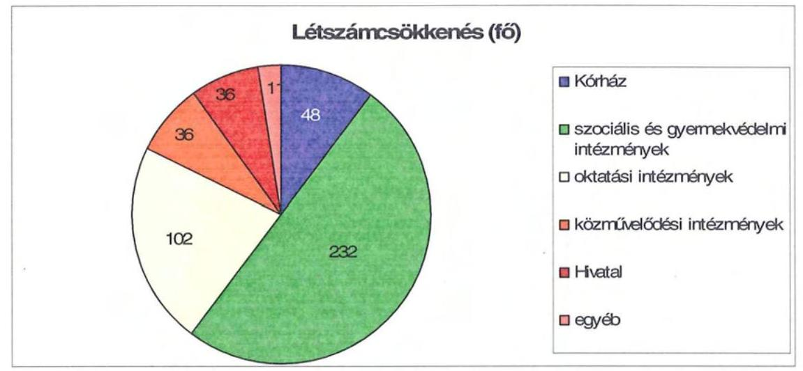

A helyi szervezési intézkedések végrehajtásához az Önkormányzat az áttekintett időszak alatt 235 millió Ft központi költségvetési támogatásban részesült, amelynek felhasználásával 163 fő létszámot tartósan leépített. Az álláshelycsökkenésből 302-höz (64,9%) központi támogatás nem kapcsolódott, mivel egyrészt üres álláshelyek megszüntetésére került sor, másrészt a határozott idejű szerződéssel foglalkoztatottak jogviszonyának megszűnését követően a megüresedett álláshelyek kerültek csökkentésre.

Az intézkedések hatására az Önkormányzat 2006. december 31-i átlaglétszáma 2011. március 31-re 192 fővel 5,6%-kal csökkent, ebben tükröződik a kormányzati intézkedések miatti létszámcsökkenés (illetékhivatal 33 fő), valamint a TISZK létrehozásának következtében a közoktatási ágazat létszámnövekedésének (219 fő) hatása is. A központi intézkedést nem tekintve a tényleges létszámcsökkenés 159 fős, 4,6%-os.

---

Az Önkormányzatnál 2011. első negyedévében folytatódtak a megtakarítási intézkedések, az elhatározott 151 millió Ft kiadási megtakarítás 83,6%-a, 126 millió Ft a személyi juttatás és járulékai, amelyek a Hivatalban és intézményekben tervezett létszámcsökkentésből és üres álláshelyek zárolásából - ez a Kórházat nem érinti - valamint a köztisztviselők jutalomkeretének megszüntetéséből adódik.

A Közgyűlés működéséhez kapcsolható kiadások a 2011. évi költségvetési rendeletben tervezettek szerint várhatóan 20 millió Ft összegben csökkennek, amelyből 2 millió Ft, 10% a tiszteletdíjak csökkentése miatti megtakarítás. A költségcsökkentő döntések következtében megszüntették a kisebbségi koordinátor megbízatását, az előző évhez képest csökkentek az önként vállalt Színház támogatása és a civil szervezetek, egyesületek jóváhagyott támogatási keretei, valamint a bankgarancia kiadás (ez utóbbi tervezett intézkedések együttes hatása 16 millió Ft).

A kiadáscsökkentő intézkedések mellett az Önkormányzat az alábbiakban számszerúsített bevételnövelő intézkedéseket tett:
ezer Ft
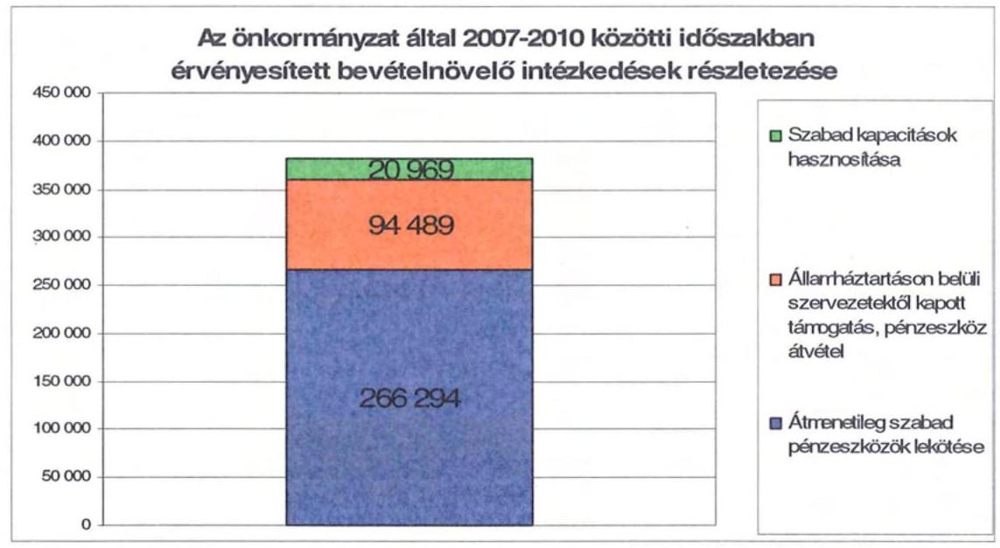

Az ingatlanok bérbeadásából, az átmenetileg szabad pénzeszközök lekötéséből származó bevétel 287 millió Ft 75,1% részarányt képviselt, - amelyet a Közgyűlés realizált -, valamint az államháztartáson belüli pénzeszköz átvételekből (a Színház működtetéséhez, Tolna Megyei Területfejlesztési Tanács munkaszervezeti feladatának ellátásához, a gyermekotthoni ellátás biztosítása Szekszárd Megyei Jogú Város részére) származó növekmény 95 millió Ft 24,9% volt.

---

Előzőeken túl, az Önkormányzatnak a TISZK létrehozásával 2262 millió Ft többletbevétele keletkezett.

A 2011. évre 30 millió Ft bevételi növekményt terveztek önkormányzati szinten, amely az átmenetileg szabad pénzek lekötéséből származó bevétel. Az Önkormányzat a 2011. évben 150 millió Ft összegben tárgyi eszközök értékesítését tervezte, amelynek realizálása bizonytalan.

Az átszervezések, a takarékossági intézkedések szakmai feladatellátásra gyakorolt hatását, valamint az elvárt megtakarítások teljesülését célzottan nem vizsgálták.
5. A HELYI ÖNKORMÁNYZATOK GAZDÁLKODÁSI RENDSZERÉNEK 2007. ÉVI ELLENŐRZÉSE SORÁN A PÉNZÜGYI EGYENSÚLY JAVÍTÁSÁRA TETT SZABÁLYSZERŰSÉGI ÉS CÉLSZERŰSÉGI JAVASLATOK HASZNOSULÁSA

A gazdálkodási rendszer korábbi ellenőrzése során tett javaslatok között a pénzügyi egyensúly javítására vonatkozó javaslat nem volt.

Budapest, 2011. december „7”

Melléklet: $\quad 6 \mathrm{db} \quad 16$ lap

---

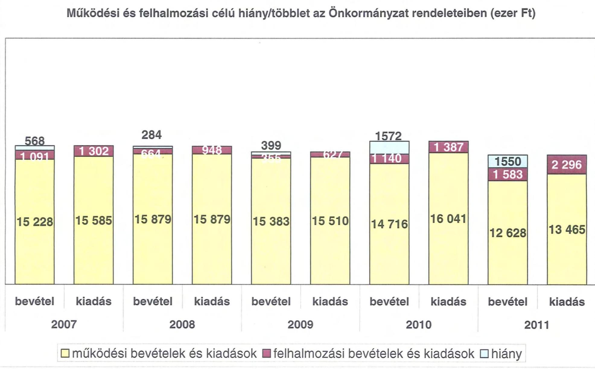

# Működési és felhalmozási célú hiány/többlet az Önkormányzat rendeleteiben (ezer Ft)

|  15228 | 15585 | 15879 | 15879 | 15879 | 15383 | 15510 | 15721 | 15721 | 15716 | 15831 | 15831 | 15501 | 15831 | 15831  |
| --- | --- | --- | --- | --- | --- | --- | --- | --- | --- | --- | --- | --- | --- | --- |
|  |   |   |   |   |   |   |   |   |   |   |   |   |   |   |
|  2007 | 2008 | 2009 | 2009 | 2010 | 2011 |  |  |  |  |  |  |  |  |   |

☐ működési bevételek és kiadások ☐ felhalmozási bevételek és kiadások ☐ hiány

---

.

---

#### KIMUTATÁS

|   | 2007. |

 2008. | 2009. | 2010.  |
| --- | --- | --- | --- | --- |
|  1.1.1. Saját működési bevételek | 4 087 925 | 3 676 877 | 3 504 263 | 2 851 491  |
|  1.1.2. Költségvetési támogatás | 3 208 118 | 4 167 951 | 4 015 608 | 3 551 759  |
|  1.1.3. Átszájolt bevételek | 458 401 | 545 815 | 630 577 | 265 517  |
|  1.1.4. Állami szinten belülről kapott támogatások | 6 893 864 | 7 784 415 | 7 054 565 | 7 952 959  |
|  1.1.5. Elő- és külföldről kapott bevételek | 4 596 | 1 722 | 3 574 | 9 107  |
|  1.1.6. Állami szinten kívülről kapott bevételek | 37 057 | 51 012 | 64 372 | 90 375  |
|  1.1.7. Előző évi pénzmaradvány átvétel | 67 081 | 65 019 | 202 212 | 90 693  |
|  1.1. Folyó bevételek (1.1.1.+1.1.2.+1.1.3.+1.1.4.+1.1.5.+1.1.6.+1.1.7.) | 15 757 042 | 16 212 811 | 15 475 131 | 14 814 901  |
|  1.2.1. Működési kiadások támogatások nélkül | 14 800 499 | 15 270 851 | 14 757 968 | 15 408 706  |
|  1.2.2. Állami szinten belülre átadott pénzeszközök | 323 356 | 89 907 | 135 388 | 127 444  |
|  1.2.3.1. vállalkozásoknak | 19 580 | 19 150 | 5 863 | 3 230  |
|  1.2.3.2. EU-nak, illetve külföldre | 0 | 100 | 0 | 0  |
|  1.2.3.3. magánszemélyeknek | 204 582 | 254 217 | 259 915 | 261 421  |
|  1.2.3.4. nemesítő szervezeteknek | 92 631 | 72 124 | 78 100 | 31 860  |
|  1.2.4. Támogatásfejlesztés (1.2.3.1+1.2.3.2+1.2.3.3+1.2.3.4) | 318 493 | 345 691 | 340 878 | 296 513  |
|  1.2.5. Támogatások | 158 394 | 215 877 | 183 223 | 167 686  |
|  1.2.6. Előző évi pénzmaradvány átadás | 67 909 | 65 019 | 202 212 | 90 693  |
|  1.3. Folyó kiadások (1.2.1.+1.2.2.+1.2.3.+1.2.4.+1.2.5.+1.2.6.) | 15 668 551 | 15 987 345 | 15 609 669 | 16 091 834  |
|  1.4. Folyó költségvetés egyenlege MŰKÖDÉSI JÓVEDELEM (1.1. - 1.2.) | 88 491 | 225 466 | -134 538 | -1 276 933  |
|  2. FELHALMOZÁSI KÖLTSÉGVETÉS |  |  |  |   |
|  2.1.1. Saját tőkebevételek | 45 793 | 22 354 | 22 597 | 73 801  |
|  2.1.2. Állami szinten belülről kapott támogatások | 453 143 | 194 575 | 121 167 | 868 367  |
|  2.1.3. Elő- és külföldről kapott támogatások | 0 | 0 | 0 | 0  |
|  2.1.4. Állami szinten kívülről kapott támogatások | 62 880 | 113 809 | 119 162 | 98 309  |
|  2.1. Felhalmozás bevételek (2.1.1.+2.1.2+2.1.3+2.1.4.) | 561 816 | 330 738 | 262 926 | 1 040 477  |
|  2.2.1. Saját beruházási kiadások | 1 109 348 | 700 922 | 444 556 | 1 203 882  |
|  2.2.2. Saját felújítási kiadások | 66 324 | 101 244 | 74 411 | 91 258  |
|  2.2.3. Állami szinten belülre átadott pénzeszközök | 39 473 | 35 325 | 4 580 | 29 513  |
|  2.2.4. Elő- és külföldnek adott pénzeszközök | 0 | 0 | 0 | 0  |
|  2.2.5. Állami szinten kívülre adott pénzeszközök | 2 100 | 1 700 | 4 100 | 1 440  |
|  2.2.6. Befektetési célú részesedések vásárlása | 1 500 | 375 | 0 | 750  |
|  2.3. Felhalmozás kiadások (2.2.1.+2.2.2.+2.2.3.+2.2.4.+2.2.5.+2.2.6.) | 1 218 746 | 839 566 | 527 567 | 1 336 762  |
|  2.4. Felhalmozás költségvetés egyenlege (2.1. - 2.2.) | -656 930 | -508 828 | -264 641 | -296 285  |
|  3. FINANSZÍROZÁSI MŰVELETEK NÉLKÜLI (GFS) POZÍCIÓ |  |  |  |   |
|  (1.3.) Folyó költségvetés egyenlege Működési Jóvedelem + (2.3.) Beruházási költségvetés egyenlege | -568 430 | -283 362 | -399 179 | -1 572 418  |
|  4. FINANSZÍROZÁSI MŰVELETEK |  |  |  |   |
|  4.1. Hitel felvétel | 361 303 | 0 | 269 719 | 1 323 616  |
|  4.2. Hitel visszafizetés | 150 008 | 490 309 | 200 000 | 200 000  |
|  4.3. Forgatási és befektetési célú értékpapírok kibocsátása | 0 | 2 000 000 | 0 | 0  |
|  4.4. Forgatási és befektetési célú értékpapírok beváltása | 0 | 0 | 0 | 0  |
|  4.5. Forgatási és befektetési célú értékpapírok vételezés | 0 | 0 | 0 | 0  |
|  4.6. Forgatási és befektetési célú értékpapírok vásárlása | 0 | 0 | 0 | 0  |
|  4.7. Egyéb finanszírozási bevételek (függő, átfizet, kiegészítő) | -43 430 | -51 977 | 169 729 | -379 643  |
|  4.8. Egyéb finanszírozási kiadások (függő, átfizet, kiegészítő) | -100 673 | 70 911 | 70 964 | -48 016  |
|  4.9. Finanszírozási műveletek egyenlege (4.1.-4.2.-4.3.-4.4+4.5.-4.6.-4.7.-4.8.) | 268 538 | 1 386 003 | 139 484 | 793 789  |
|  5. TÁRGYSZÁMI POZÍCIÓ VÁLTOZÁS |  |  |  |   |
|  (3.) FINANSZÍROZÁSI MŰVELETEK NÉLKÜLI (GFS) POZÍCIÓ + (4.9.) Finanszírozási műveletek egyenlege | -299 892 | 1 103 441 | -259 695 | -779 629  |
|  6. NETTÓ MŰKÖDÉSI JÓVEDELEM |  |  |  |   |
|  (1.3.) Működési Jóvedelem - Tőkeforgalmazás (4.2. Hitel visszafizetés + 4.4. Forgatási és befektetési célú értékpapírok beváltása ) | -61 509 | -264 843 | -334 538 | -1 476 933  |
|  FÁJÉKOZTATÓ ADATOK |  |  |  |   |
|  Összes kötelezettség | 3 119 479 | 4 829 946 | 5 315 791 | 6 955 377  |
|  ebből rövid lejáratú | 1 398 342 | 1 144 842 | 1 778 957 | 2 330 516  |
|  Összes eszköz és kötelezettség | 736 429 | 788 557 | 1 130 245 | 884 865  |
|  ebből lejárt | 154 706 | 199 314 | 437 012 | 377 790  |
|  Fens és tőkefinanszírozásból származó kötelezettség (adósság) | 2 310 221 | 3 987 432 | 4 112 747 | 5 728 194  |
|  ebből rövid lejáratú | 611 303 | 320 994 | 590 713 | 1 114 328  |
|  PPP szerződésből hátralévő kötelezettségek állománya | 0 | 0 | 0 | 0  |
|  ebből lejárt szolgáltatási díj miatti kötelezettség | 0 | 0 | 0 | 0  |
|  Folyószámla átlagos állománya | 412 314 | 365 137 | 301 119 | 582 855  |
|  Lősvállalat átlagos állománya | 0 | 0 | 0 | 0  |
|  Mombérület átlagos állománya | 0 | 0 | 0 | 178 186  |
|  Peres eljárásokból származó függő kötelezettségek | 0 | 0 | 0 | 0  |
|  Finanszírozásba bevonható eszközök összesen | 982 560 | 2 086 001 | 1 826 306 | 1 046 677  |
|  Tartós követelések megvetésítő értékpapírok | 0 | 0 | 0 | 0  |
|  Hosszú lejáratú hitelek | 0 | 0 | 0 | 0  |
|  Értékpapírok | 0 | 0 | 0 | 0  |
|  Pénzeszközök (idegen pénzeszközök nélkül) | 982 560 | 2 086 001 | 1 826 306 | 1 046 677  |

* Bevételekben nem szerepel, a kiadásokban nem jelenik meg az amortizáció, a vagyoni helyzetet az egyenleg befolyásolja

* Bevételekben vagyon megőrzésre és bővítésre fordítható források.

---

### 28. számítás

### KÖVETKEZTETÉS

### A Tolna Megyei Önkormányzat bevételeinek és kiadásainak, adósságszolgálatának alakulásáról (2007-2010. években teljesített adatok, a 2011. évben tervezett adatok)

|  Sor-
szám | Megnevezés | Hivatalozás | 2007. év | 2008. év | 2009. év | 2010. év | 2011. év  |
| --- | --- | --- | --- | --- | --- | --- | --- |
|   |  |  | tény | tény | tény | tény | tervezett  |
|  1. | MŰKÖDÉSI BEVÉTELEK | 5 067 487 | 15 776 809 | 16 101 859 | 16 075 800 | 16 177 500 | 12 627 644  |
|   | 1. Sajátos folyó bevételek |  | 4 080 161 | 3 676 643 | 3 489 697 | 2 631 014 | 3 605 352  |
|   | 1.1. Önkormányzati működési bevételek |  | 2 498 484 | 1 773 524 | 1 801 014 | 1 717 794 | 1 870 442  |
|   | 1.2. Díjbevételek |  | 1 342 865 | 1 749 333 | 1 544 027 | 1 075 299 | 2 500 000  |
|   | 1.3. Útati adóbevételek és pótdíjak |  | 0 | 0 | 0 | 0 | 0  |
|   | 1.4. Hitel bevétel működési része |  | 40 847 | 154 180 | 154 936 | 42 524 | 24 410  |
|   | 1.5. Egyéb folyó működési bevételek |  | 0 | 0 | 0 | 0 |
 0  |
|   |  |  | 0 | 0 | 0 | 0 | 0  |
|   |  |  | 506 576 201 000 000, a 178 alapító számla bevétel (egyéb a 90 000. évszázad fűtésszoba szociális) |  |  |  |   |
|   | 2. Támogatási értékű működési bevételek |  | 309 948 | 682 998 | 713 017 | 793 070 | 89 627  |
|   |  |  | 0 | 0 | 0 | 0 | 0  |
|   |  |  | 0 | 0 | 0 | 0 | 0  |
|   |  |  | 85 796 | 403 942 | 186 505 | 89 910 | 33 681  |
|   |  |  | 86 526 | 32 907 | 42 552 | 29 442 | 22 381  |
|   |  |  | 85 467 | 267 887 | 875 361 | 544 877 | 0  |
|   | 3. Főszóforgalom nélküli bevételek működésre (őváltozatott része) |  | 41 653 | 22 734 | 67 846 | 89 482 | 16 215  |
|   | 4. Állami fizetésben kívülről működési célra átutalt pénzeszközök |  | 0 | 0 | 0 | 0 | 0  |
|   | 5. Más forrásból származó támogatások és átengedett források működési része |  | 10 730 800 | 11 402 526 | 10 924 726 | 10 959 227 | 8 915 350  |
|   |  |  | 0 | 0 | 0 | 0 | 0  |
|   |  |  | 1 274 321 | 845 815 | 630 577 | 265 517 | 309 766  |
|   |  |  | 2 712 260 | 3 859 264 | 3 952 053 | 3 497 882 | 3 227 582  |
|   |  |  | 0 | 0 | 0 | 0 | 0  |
|   |  |  | 0 | 0 | 0 | 0 | 0  |
|   |  |  | 0 | 0 | 0 | 0 | 0  |
|   | 6. MŰKÖDÉSI KIADÁSOK (nemelésedés nélküli) |  | 11 013 | 15 428 553 | 15 771 419 | 15 401 052 | 15 514 972  |
|   | 7. Főszó működési kiadások összesen kamatkiadások nélkül |  | 18 754 607 | 15 227 122 | 16 736 058 | 15 387 715 | 12 843 716  |
|   |  |  | 0 | 0 | 0 | 0 | 0  |
|   |  |  | 0 | 0 | 0 | 0 | 0  |
|   |  |  | 8 993 675 | 7 467 991 | 7 508 352 | 7 480 697 | 5 732 766  |
|   |  |  | 2 234 251 | 2 253 285 | 2 247 497 | 1 944 378 | 1 784 596  |
|   |  |  | 8 309 418 | 5 240 497 | 4 913 874 | 5 825 734 | 4 204 041  |
|   |  |  | 267 316 | 125 343 | 66 375 | 166 501 | 122 273  |
|   |  |  | 0 | 0 | 0 | 0 | 0  |
|   | 8. Önkormányzati feladatok és egyéb folyó átutalások |  | 318 493 | 345 691 | 340 878 | 285 513 | 250 547  |
|   |  |  | 0 | 0 | 0 | 0 | 0  |
|   |  |  | 0 | 0 | 0 | 0 | 0  |
|   |  |  | 0 | 0 | 0 | 0 | 0  |
|   |  |  | 0 | 0 | 0 | 0 | 0  |
|   |  |  | 0 | 0 | 0 | 0 | 0  |
|   |  |  | 0 | 0 | 0 | 0 | 0  |
|   | 9. Állami fizetésben kívülről felhalmozott |  | 203 352 | 252 727 | 259 375 | 260 863 | 232 750  |
|   |  |  | 0 | 0 | 0 | 0 | 0  |
|   |  |  | 0 | 0 | 0 | 0 | 0  |
|   |  |  | 0 | 0 | 0 | 0 | 0  |
|   | 10. Állami fizetésben kívülről felhalmozott |  | 34 742 | 29 805 | 62 770 | 74 139 | 24 820  |
|   |  |  | 0 | 0 | 0 | 0 | 0  |
|   |  |  | 0 | 0 | 0 | 0 | 0  |
|   | 11. Állami fizetésben kívülről felhalmozott |  | 36 384 | 705 185 | 383 223 | 367 584 | 602 786  |
|   |  |  | 0 | 0 | 0 | 0 | 0  |
|   |  |  | 0 | 0 | 0 | 0 | 0  |
|   | 12. Állami fizetésben kívülről felhalmozott |  | 18 000 | 200 000 | 200 000 | 200 000 | 400 000  |
|   |  |  | 0 | 0 | 0 | 0 | 0  |
|   |  |  | 0 | 0 | 0 | 0 | 0  |
|   | 13. Állami fizetésben kívülről felhalmozott |  | 78 044 | 108 301 | 74 383 | 41 596 | 41 089  |
|   |  |  | 0 | 0 | 0 | 0 | 0  |
|   | 14. ÉLELMISZERI BEVÉTELEK |  | 11 013 | 1 352 022 | 856 825 | 579 508 | 1 471 205  |
|   | 15. Egyéb felhalmozott és felhalmozási bevétel |  | 127 847 | 22 345 | 26 963 | 53 718 | 157 387  |
|   | 16. Támogatási értékű működési kiadás |  | 42 839 | 14 899 | 20 704 | 63 709 | 151 507  |
|   | 17. Önkormányzati felhalmozott bevétel |  | 2 490 | 1 800 | 800 | 0 | 0  |
|   | 18. Állami fizetésben kerülő bevételek felhalmozott |  | 0 | 0 | 0 | 0 | 0  |
|   | 19. Állami fizetésben kerülő bevételek felhalmozott |  | 0 | 0 | 0 | 0 | 0  |
|   | 20. Állami fizetésben kerülő bevételek felhalmozott |  | 0 | 0 | 0 | 0 | 0  |
|   | 21. Állami fizetésben kerülő bevételek felhalmozott |  | 0 | 0 | 0 | 0 | 0  |
|   | 22. Állami fizetésben kerülő bevételek felhalmozott |  | 0 | 0 | 0 | 0 | 0  |
|   | 23. Állami fizetésben kerülő bevételek felhalmozott |  | 0 | 0 | 0 | 0 | 0  |
|   | 24. Állami fizetésben kerülő felhalmozás célra átutalt pénzeszközök |  | 0 | 0 | 0 | 0 | 0  |
|   | 25. Állami fizetésben szólalásos felhalmozás |  | 0 | 0 | 0 | 0 | 0  |
|   | 26. Állami fizetésben szólalásos felhalmozás |  | 0 | 0 | 0 | 0 | 0  |
|   | 27. Állami fizetésben szólalásos felhalmozás |  | 0 | 0 | 0 | 0 | 0  |
|   | 28. Állami fizetésben szólalásos felhalmozás |  | 0 | 0 | 0 | 0 | 0  |
|   | 29. Állami fizetésben szólalásos felhalmozás |  | 0 | 0 | 0 | 0 | 0  |
|   | 30. Állami fizetésben szólalásos felhalmozás |  | 0 | 0 | 0 | 0 | 0  |
|   | 31. Állami fizetésben szólalásos felhalmozás |  | 0 | 0 | 0 | 0 | 0  |
|   | 32. Állami fizetésben szólalásos felhalmozás |  | 0 | 0 | 0 | 0 | 0  |
|   | 33. Állami fizetésben szólalásos felhalmozás |  | 0 | 0 | 0 | 0 | 0  |
|   | 34. Állami fizetésben szólalásos felhalmozás |  | 0 | 0 | 0 | 0 | 0  |
|   | 35. Állami fizetésben szólalásos felhalmozás |  | 0 | 0 | 0 | 0 | 0  |
|   | 36. Állami fizetésben szólalásos felhalmozás |  | 0 | 0 | 0 | 0 | 0  |
|   | 37. Állami fizetésben szólalásos felhalmozás |  | 0 | 0 | 0 |

 0 | 0  |
|   | 38. Állami fizetésben szólalásos felhívás |  | 0 | 0 | 0 | 0 | 0  |
|   | 39. Állami fizetésben szólalásos felhívás |  | 0 | 0 | 0 | 0 | 0  |
|   | 40. Állami fizetésben szólalásos felhívás |  | 0 | 0 | 0 | 0 | 0  |
|   | 41. Állami fizetésben szólalásos felhívás |  | 0 | 0 | 0 | 0 | 0  |
|   | 42. Állami fizetésben szólalásos felhívás |  | 0 | 0 | 0 | 0 | 0  |
|   | 43. Állami fizetésben szólalásos felhívás |  | 0 | 0 | 0 | 0 | 0  |
|   | 44. Állami fizetésben szólalásos felhívás |  | 0 | 0 | 0 | 0 | 0  |
|   | 45. Állami fizetésben szólalásos felhívás |  | 0 | 0 | 0 | 0 | 0  |
|   | 46. Állami fizetésben szólalásos felhívás |  | 0 | 0 | 0 | 0 | 0  |
|   | 47. Állami fizetésben szólalásos felhívás |  | 0 | 0 | 0 | 0 | 0  |
|   | 48. Állami fizetésben szólalásos felhívás |  | 0 | 0 | 0 | 0 | 0  |
|   | 49. Állami fizetésben szólalásos felhívás |  | 0 | 0 | 0 | 0 | 0  |
|   | 50. Állami fizetésben szólalásos felhívás |  | 0 | 0 | 0 | 0 | 0  |
|   | 51. Állami fizetésben szólalásos felhívás |  | 0 | 0 | 0 | 0 | 0  |
|   | 52. Állami fizetésben szólalásos felhívás |  | 0 | 0 | 0 | 0 | 0  |
|   | 53. Állami fizetésben szólalásos felhívás |  | 0 | 0 | 0 | 0 | 0  |
|   | 54. Állami fizetésben szólalásos felhívás |  | 0 | 0 | 0 | 0 | 0  |
|   | 55. Állami fizetésben szólalásos felhívás |  | 0 | 0 | 0 | 0 | 0  |
|   | 56. Állami fizetésben szólalásos felhívás |  | 0 | 0 | 0 | 0 | 0  |
|   | 57. Állami fizetésben szólalásos felhívás |  | 0 | 0 | 0 | 0 | 0  |
|   | 58. Állami fizetésben szólalásos felhívás |  | 0 | 0 | 0 | 0 | 0  |
|   | 59. Állami fizetésben szólalásos felhívás |  | 0 | 0 | 0 | 0 | 0  |
|   | 60. Állami fizetésben szólalásos felhívás |  | 0 | 0 | 0 | 0 | 0  |
|   | 61. Állami fizetésben szólalásos felhívás |  | 0 | 0 | 0 | 0 | 0  |
|   | 62. Állami fizetésben szólalásos felhívás |  | 0 | 0 | 0 | 0 | 0  |
|   | 63. Állami fizetésben szólalásos felhívás |  | 0 | 0 | 0 | 0 | 0  |
|   | 64. Állami fizetésben szólalásos felhívás |  | 0 | 0 | 0 | 0 | 0  |
|   | 65. Állami fizetésben szólalásos felhívás |  | 0 | 0 | 0 | 0 | 0  |
|   | 66. Állami fizetésben szólalásos felhívás |  | 0 | 0 | 0 | 0 | 0  |
|   | 67. Állami fizetésben szólalásos felhívás |  | 0 | 0 | 0 | 0 | 0  |
|   | 68. Állami fizetésben szólalásos felhívás |  | 0 | 0 | 0 | 0 | 0  |
|   | 69. Állami fizetésben szólalásos felhívás |  | 0 | 0 | 0 | 0 | 0  |
|   | 70. Állami fizetésben szólalásos felhívás |  | 0 | 0 | 0 | 0 | 0  |
|   | 71. Állami fizetésben szólalásos felhívás |  | 0 | 0 | 0 | 0 | 0  |
|   | 72. Állami fizetésben szólalásos felhívás |  | 0 | 0 | 0 | 0 | 0  |
|   | 73. Állami fizetésben szólalásos felhívás |  | 0 | 0 | 0 | 0 | 0  |
|   | 74. Állami fizetésben szólalásos felhívás |  | 0 | 0 | 0 | 0 | 0  |
|   | 75. Állami fizetésben szólalásos felhívás |  | 0 | 0 | 0 | 0 | 0  |
|   | 76. Állami fizetésben szólalásos felhívás |  | 0 | 0 | 0 | 0 | 0  |
|   | 77. Állami fizetésben szólalásos felhívás |  | 0 | 0 | 0 | 0 | 0  |
|   | 78. Állami fizetésben szólalásos felhívás |  | 0 | 0 | 0 | 0 | 0  |
|   | 79. Állami fizetésben szólalásos felhívás |  | 0 | 0 | 0 | 0 | 0  |
|   | 80. Állami fizetésben szólalásos felhívás |  | 0 | 0 | 0 | 0 | 0  |
|   | 81. Állami fizetésben szólalásos felhívás |  | 0 | 0 | 0 | 0 | 0  |
|   | 82. Állami fizetésben szólalásos felhívás |  | 0 | 0 | 0 | 0 | 0  |
|   | 83. Állami fizetésben szólalásos felhívás |  | 0 | 0 | 0 | 0 | 0  |
|   | 84. Állami fizetésben szólalásos felhívás |  | 0 | 0 | 0 | 0 | 0  |
|   | 85. Állami fizetésben szólalásos felhívás |  | 0 | 0 | 0 | 0 | 0  |
|   | 86. Állami fizetésben szólalásos felhívás |  | 0 | 0 | 0 | 0 | 0  |
|   | 87. Állami fizetésben szólalásos felhívás |  | 0 | 0 | 0 | 0 | 0  |
|   | 88. Állami fizetésben szólalásos felhívás |  | 0 | 0 | 0 | 0 | 0  |
|   | 89. Állami fizetésben szólalásos felhívás |  | 0 | 0 | 0 | 0 | 0  |
|   | 90. Állami fizetésben szólalásos felhívás |  | 0 | 0 | 0 | 0 | 0  |
|   | 91. Állami fizetésben szólalásos felhívás |  | 0 | 0 | 0 | 0 | 0  |
|   | 92. Állami fizetésben szólalásos felhívás |  | 0 | 0 | 0 | 0 | 0  |
|   | 93. Állami fizetésben szólalásos felhívás |  | 0 | 0 | 0 | 0 | 0  |
|   | 94. Állami fizetésben szólalásos felhívás |  | 0 | 0 | 0 | 0 | 0  |
|   | 95. Állami fizetésben szólalásos felhívás |  | 0 | 0 | 0 | 0 | 0  |
|   | 96. Állami fizetésben szólalásos felhívás |  | 0 | 0 | 0 | 0 | 0  |
|   | 97. Állami fizetésben szólalásos felhívás |  | 0 | 0 | 0 | 0 | 0  |
|   | 98. Állami fizetésben szólalásos felhívás |  | 0 | 0 | 0 | 0 | 0  |
|   | 99. Állami fizetésben szólalásos felhívás |  | 0 | 0 | 0 | 0 | 0  |
|   | 100. Állami fizetésben szólalásos felhívás |  | 0 | 0 | 0 | 0 | 0  |
|   | 101. Állami fizetésben szólalásos felhívás |  | 0 | 0 | 0 | 0 | 0  |
|   | 102. Állami fizetésben szólalásos felhívás |  | 0 | 0 | 0 | 0 | 0  |
|   | 103. Állami fizetésben szólalásos felhívás |  | 0 | 0 | 0 | 0 | 0  |
|   | 104. Állami fizetésben szólalásos felhívás |  | 0 | 0 | 0 | 0 | 0  |
|   | 105. Állami fizetésben szólalásos felhívás |  | 0 | 0 | 0 | 0 | 0  |
|   | 106. Állami fizetésben szólalásos felhívás |  | 0 | 0 | 0 | 0 | 0  |
|   | 107. Állami fizetésben szólalásos felhívás |  | 0 | 0 | 0 | 0 | 0  |
|   | 108. Állami fizetésben szólalásos felhívás |  | 0 | 0 | 0 | 0 | 0  |
|   | 109. Állami fizetésben szólalásos felhívás |  | 0 | 0 | 0 | 0 | 0  |
|   | 110. Állami fizetésben szólalásos felhívás |  | 0 | 0 | 0 | 0 | 0  |
|   | 111. Állami fizetésben szólalásos felhívás |  | 0 | 0 | 0 | 0 | 0  |
|   | 112. Állami fizetésben szólalásos felhívás |  | 0 | 0 | 0 | 0 | 0  |
|   | 113. Állami fizetésben szólalásos felhívás |  | 0 | 0 | 0 | 0 | 0 
 |
|   | 114. Állami fizetésben részesülő felhőmérnök |  | 0 | 0 | 0 | 0 | 0  |
|   | 115. Állami fizetésben részesülő felhőmérnök |  | 0 | 0 | 0 | 0 | 0  |
|   | 116. Állami fizetésben részesülő felhőmérnök |  | 0 | 0 | 0 | 0 | 0  |
|   | 117. Állami fizetésben részesülő felhőmérnök |  | 0 | 0 | 0 | 0 | 0  |
|   | 118. Állami fizetésben részesülő felhőmérnök |  | 0 | 0 | 0 | 0 | 0  |
|   | 119. Állami fizetésben részesülő felhőmérnök |  | 0 | 0 | 0 | 0 | 0  |
|   | 120. Állami fizetésben részesülő felhőmérnök |  | 0 | 0 | 0 | 0 | 0  |
|   | 121. Állami fizetésben részesülő felhőmérnök |  | 0 | 0 | 0 | 0 | 0  |
|   | 122. Állami fizetésben részesülő felhőmérnök |  | 0 | 0 | 0 | 0 | 0  |
|   | 123. Állami fizetésben részesülő felhőmérnök |  | 0 | 0 | 0 | 0 | 0  |
|   | 124. Állami fizetésben részesülő felhőmérnök |  | 0 | 0 | 0 | 0 | 0  |
|   | 125. Állami fizetésben részesülő felhőmérnök |  | 0 | 0 | 0 | 0 | 0  |
|   | 126. Állami fizetésben részesülő felhőmérnök |  | 0 | 0 | 0 | 0 | 0  |
|   | 127. Állami fizetésben részesülő felhőmérnök |  | 0 | 0 | 0 | 0 | 0  |
|   | 128. Állami fizetésben részesülő felhőmérnök |  | 0 | 0 | 0 | 0 | 0  |
|   | 129. Állami fizetésben részesülő felhőmérnök |  | 0 | 0 | 0 | 0 | 0  |
|   | 130. Állami fizetésben részesülő felhőmérnök |  | 0 | 0 | 0 | 0 | 0  |
|   | 131. Állami fizetésben részesülő felhőmérnök |  | 0 | 0 | 0 | 0 | 0  |
|   | 132. Állami fizetésben részesülő felhőmérnök |  | 0 | 0 | 0 | 0 | 0  |
|   | 133. Állami fizetésben részesülő felhőmérnök |  | 0 | 0 | 0 | 0 | 0  |
|   | 134. Állami fizetésben részesülő felhőmérnök |  | 0 | 0 | 0 | 0 | 0  |
|   | 135. Állami fizetésben részesülő felhőmérnök |  | 0 | 0 | 0 | 0 | 0  |
|   | 136. Állami fizetésben részesülő felhőmérnök |  | 0 | 0 | 0 | 0 | 0  |
|   | 137. Állami fizetésben részesülő felhőmérnök |  | 0 | 0 | 0 | 0 | 0  |
|   | 138. Állami fizetésben részesülő felhőmérnök |  | 0 | 0 | 0 | 0 | 0  |
|   | 139. Állami fizetésben részesülő felhőmérnök |  | 0 | 0 | 0 | 0 | 0  |
|   | 140. Állami fizetésben részesülő felhőmérnök |  | 0 | 0 | 0 | 0 | 0  |
|   | 141. Állami fizetésben részesülő felhőmérnök |  | 0 | 0 | 0 | 0 | 0  |
|   | 142. Állami fizetésben részesülő felhőmérnök |  | 0 | 0 | 0 | 0 | 0  |
|   | 143. Állami fizetésben részesülő felhőmérnök |  | 0 | 0 | 0 | 0 | 0  |
|   | 144. Állami fizetésben részesülő felhőmérnök |  | 0 | 0 | 0 | 0 | 0  |
|   | 145. Állami fizetésben részesülő felhőmérnök |  | 0 | 0 | 0 | 0 | 0  |
|   | 146. Állami fizetésben részesülő felhőmérnök |  | 0 | 0 | 0 | 0 | 0  |
|   | 147. Állami fizetésben részesülő felhőmérnök |  | 0 | 0 | 0 | 0 | 0  |
|   | 148. Állami fizetésben részesülő felhőmérnök |  | 0 | 0 | 0 | 0 | 0  |
|   | 149. Állami fizetésben részesülő felhőmérnök |  | 0 | 0 | 0 | 0 | 0  |
|   | 150. Állami fizetésben részesülő felhőmérnök |  | 0 | 0 | 0 | 0 | 0  |
|   | 151. Állami fizetésben részesülő felhőmérnök |  | 0 | 0 | 0 | 0 | 0  |
|   | 152. Állami fizetésben részesülő felhőmérnök |  | 0 | 0 | 0 | 0 | 0  |
|   | 153. Állami fizetésben részesülő felhőmérnök |  | 0 | 0 | 0 | 0 | 0  |
|   | 154. Állami fizetésben részesülő felhőmérnök |  | 0 | 0 | 0 | 0  |
|   | 155. Állami fizetésben részesülő felhőmérnök |  | 0 | 0 | 0 | 0  |
|   | 156. Állami fizetésben részesülő felhőmérnök |  | 0 | 0 | 0 | 0  |
|   | 157. Állami fizetésben részesülő felhőmérnök |  | 0 | 0 | 0 | 0  |
|   | 158. Állami fizetésben részesülő felhőmérnök |  | 0 | 0 | 0 | 0  |
|   | 159. Állami fizetésben részesülő felhőmérnök |  | 0 | 0 | 0 | 0  |
|   | 160. Állami fizetésben részesülő felhőmérnök |  | 0 | 0 | 0 | 0  |
|   | 161. Állami fizetésben részesülő felhőmérnök |  | 0 | 0 | 0 | 0  |
|   | 162. Állami fizetésben részesülő felhőmérnök |  | 0 | 0 | 0 | 0  |
|   | 163. Állami fizetésben részesülő felhőmérnök |  | 0 | 0 | 0 | 0  |
|   | 164. Állami fizetésben részesülő felhőmérnök |  | 0 | 0 | 0 | 0  |
|   | 165. Állami fizetésben részesülő felhőmérnök |  | 0 | 0 | 0  |
|   | 166. Állami fizetésben részesülő felhőmérnök |  | 0 | 0 | 0  |
|   | 167. Állami fizetésben részesülő felhőmérnök |  | 0 | 0 | 0  |
|   | 168. Állami fizetésben részesülő felhőmérnök |  | 0 | 0 | 0  |
|   | 169. Állami fizetésben részesülő felhőmérnök |  | 0 | 0 | 0  |
|   | 170. Állami fizetésben részesülő felhőmérnök |  | 0 | 0 | 0  |
|   | 171. Állami fizetésben részesülő felhőmérnök |  | 0 | 0 | 0  |
|   | 172. Állami fizetésben részesülő felhőmérnök |  | 0 | 0 | 0  |
|   | 173. Állami fizetésben részesülő felhőmérnök |  | 0 | 0 | 0  |
|   | 174. Állami fizetésben részesülő felhőmérnök |  | 0 | 0 | 0  |
|   | 175. Állami fizetésben részesülő felhőmérnök |  | 0 | 0 | 0  |
|   | 176. Állami fizetésben részesülő felhőmérnök |  | 0 | 0 | 0  |
|   | 177. Állami fizetésben részesülő felhőmérnök |  | 0 | 0 | 0  |
|   | 178. Állami fizetésben részesülő felhőmérnök |  | 0 | 0 | 0  |
|   | 179. Állami fizetésben részesülő felhőmérnök |  | 0 | 0  |
|   | 180. Állami fizetésben részesülő felhőmérnök |  | 0 | 0  |
|   | 181. Állami fizetésben részesülő felhőmérnök |  | 0 | 0  |
|   | 182. Állami fizetésben részesülő felhőmérnök |  | 0 | 0  |
|   | 182. Állami fizetésben részesülő felhőmérnök |  | 0 | 0  |
|   | 183. Állami fizetésben részesülő felhőmérnök |  | 0 | 0  |
|   | 183. Állami fizetésben részesülő felhőmérnök |  | 0 | 0  |
|   | 184. Állami fizetésben részesülő felhőmérnök |  | 0 | 0  |
|   | 185. Állami fizetésben részesülő felhőmérnök |  | 0 | 0  |
|   | 186. Állami fizetésben részesülő felhőmérnök |  | 0 | 0  |
|   | 187. Állami fizetésben részesülő felhőmérnök |  | 0 | 0  |
|   | 188. Állami fizetésben részesülő felhőmérnök |  | 0 | 0  |
|   | 189. Állami fizetésben részesülő felhőmérnök |  | 0 | 0  |
|   | 190. Állami fizetésben részesülő felhőmérnök |  | 0 | 0  |
|   | 191. Állami fizetésben részesülő felhőmérnök |  | 0 | 0  |
|   | 192. Állami fizetésben részesülő felhőmérnök |  | 0 | 0  |
|   | 192. Állami fizetésben részesülő felhőmérnök |  | 0 | 0  |
|   | 193. Állami fizetésben részesülő felhőmérnök |  | 0 | 0  |
|   | 194. Állami fizetésben részesülő felhőmérnök |  | 0 | 0  |
|   | 195. Állami fizetésben részesülő felhőmérnök |  | 0 | 0  |
|   | 196. Állami fizetésben részesülő felhőmérnök |  | 0 |

 0  |
|   | 197. Állami fizetésben szólalásos felhívás |  | 0 | 0  |
|   | 198. Állami fizetésben szólalásos felhívás |  | 0 | 0  |
|   | 199. Állami fizetésben szólalásos felhívás |  | 0 | 0  |
|   | 199. Állami fizetésben szólalásos felhívás |  | 0 | 0  |
|   | 199. Állami fizetésben szólalásos felhívás |  | 0 | 0  |
|   | 200. Állami fizetésben szólalásos felhívás |  | 0 | 0  |
|   | 202. Állami fizetésben szólalásos felhívás |  | 0 | 0  |
|   | 201. Állami fizetésben szólalásos felhívás |  | 0 | 0  |
|   | 202. Állami fizetésben szólalásos felhívás |  | 0 | 0  |
|   | 202. Állami fizetésben szólalásos felhívás |  | 0 | 0  |
|   | 203. Állami fizetésben szólalásos felhívás |  | 0 | 0  |
|   | 203. Állami fizetésben szólalásos felhívás |  | 0 | 0  |
|   | 204. Állami fizetésben szólalásos felhívás |  | 0 | 0  |
|   | 204. Állami fizetésben szólalásos felhívás |  | 0 | 0  |
|   | 205. Állami fizetésben szólalásos felhívás |  | 0 | 0  |
|   | 206. Állami fizetésben szólalásos felhívás |  | 0 | 0  |
|   | 207. Állami fizetésben szólalásos felhívás |  | 0 | 0  |
|   | 208. Állami fizetésben szólalásos felhívás |  | 0 | 0  |
|   | 209. Állami fizetésben szólalásos felhívás |  | 0 | 0  |
|   | 210. Állami fizetésben szólalásos felhívás |  | 0 | 0  |
|   | 211. Állami fizetésben szólalásos felhívás |  | 0 | 0  |
|   | 212. Állami fizetésben szólalásos felhívás |  | 0 | 0  |
|   | 213. Állami fizetésben szólalásos felhívás |  | 0 | 0  |
|   | 213. Állami fizetésben szólalásos felhívás |  | 0 | 0  |
|   | 213. Állami fizetésben szólalásos felhívás |  | 0 | 0  |
|   | 214. Állami fizetésben szólalásos felhívás |  | 0 | 0  |
|   | 214. Állami fizetésben szólalásos felhívás |  | 0 | 0  |
|   | 215. Állami fizetésben szólalásos felhívás |  | 0 | 0  |
|   | 216. Állami fizetésben szólalásos felhívás |  | 0 | 0  |
|   | 216. Állami fizetésben szólalásos felhívás |  | 0 | 0  |
|   | 217. Állami fizetésben szólalásos felhívás |  | 0 | 0  |
|   | 218. Állami fizetésben szólalásos felhívás |  | 0 | 0  |
|   | 218. Állami fizetésben szólalásos felhívás |  | 0 | 0  |
|   | 219. Állami fizetésben szólalásos felhívás |  | 0 | 0  |
|   | 219. Állami fizetésben szólalásos felhívás |  | 0 | 0  |
|   | 219. Állami fizetésben szólalásos felhívás |  | 0 | 0  |
|   | 219. Állami fizetésben szólalásos felhívás |  | 0 | 0  |
|   | 211. Állami fizetésben szólalásos felhívás |  | 0 | 0  |
|   | 2110. Állami fizetésben szólalásos felhívás |  | 0 | 0  |
|   | 211. Állami fizetésben szólalásos felhívás |  | 0 | 0  |
|   | 212. Állami fizetésben szólalásos felhívás |  | 0 | 0  |
|   | 212. Állami fizetésben szólalásos felhívás |  | 0 | 0  |
|   | 212. Állami fizetésben szólalásos felhívás |  | 0 | 0  |
|   | 213. Állami fizetésben szólalásos felhívás |  | 0 | 0  |
|   | 213. Állami fizetésben szólalásos felhívás |  | 0 | 0  |
|   | 213. Állami fizetésben szólalásos felhívás |  | 0 | 0  |
|   | 213. Állami fizetésben szólalásos felhívás |  | 0 | 0  |
|   | 213. Állami fizetésben szólalásos felhívás |  | 0 | 0  |
|   | 213. Állami fizetésben szólalásos felhívás |  | 0 | 0  |
|   | 213. Állami fizetésben szólalásos felhívás |  | 0 | 0  |
|   | 213. Állami fizetésben szólalásos felhívás |  | 0 | 0  |
|   | 213. Állami fizetésben szólalásos felhívás |  | 0 | 0  |
|   | 213. Állami fizetésben szólalásos felhívás |  | 0 | 0  |
|   | 213. Állami fizetésben szólalásos felhívás |  | 0 | 0  |
|   | 213. Állami fizetésben szólalásos felhívás |  | 0  |
|   | 213. Állami fizetésben szólalásos felhívás |  | 0 | 0  |
|   | 213. Állami fizetésben szólalásos felhívás |  | 0  |
|   | 213. Állami fizetésben szólalásos felhívás |  | 0 | 0  |
|   | 213. Állami fizetésben szólalásos felhívás |  | 0  |
|   | 213. Állami fizetésben szólalásos felhívás |  | 0  |
|   | 213. Állami fizetésben szólalásos felhívás |  | 0  |
|   | 213. Állami fizetésben szólalásos felhívás |  | 0 | 0  |
|   | 213. Állami fizetésben szólalásos felhívás |  | 0  |
|   | 213. Állami fizetésben szólalásos felhívás |  | 0 | 0  |
|   | 213. Állami fizetésben szólalásos felhívás |  | 0  |
|   | 213. Állami fizetésben szólalásos felhívás |  | 0 | 0  |
|   | 213. Állami fizetésben szólalásos felhívás |  | 0  |
|   | 213. Állami fizetésben szólalásos felhívás |  | 0  |
|   | 213. Állami fizetésben szólalásos felhívás |  | 0  |
|   | 213. Állami fizetésben szólalásos felhívás |  | 0  |
|   | 213. Állami fizetésben szólalásos felhívás |  | 0 | 0  |
|   | 213. Állami fizetésben szólalásos felhívás |  | 0  |
|   | 213. Állami fizetésben szólalásos felhívás |  | 0  |
|   | 213. Állami fizetésben szólalásos felhívás |  | 0  |
|   | 213. Állami fizetésben szólalásos felhívás |  | 0  |
|   | 213. Állami fizetésben szólalásos felhívás |  | 0  |
|   | 213. Állami fizetésben szólalásos felhívás |  | 0  |
|   | 213. Állami fizetésben szólalásos felhívás |  | 0  |
|   | 213. Állami fizetésben szólalásos felhívás |  | 0  |
|   | 213. Állami fizetésben szólalásos felhívás |  | 0  |
|   | 213. Állami fizetésben szólalásos felhívás |  | 0  |
|   | 213. Állami fizetésben szólalásos felhívás |  | 0  |
|   | 

---

### Az Önkormányzat 2007-2010. évekre megvalósított, illetve 2010. december 31-én fennálló fejlesztési feladatokhoz kapcsolódó kötelezettségének összegzése*

|  Fejlesztési feladat megnevezése, és a közgyűlési határozat száma | Benyújtás kezdete | Teljes bekerülési költség | 2008. december 31-ig teljesített kiadás | 2007-2010. évek között teljesített kiadás | 2010. év után vállalt kötelezettség | 2010. utáni kötelezettség vállalás forrásfedezétele |  |  |  |   |
| --- | --- | --- | --- | --- | --- | --- | --- | --- | --- | --- |
|   |  |  |  |  |  | Saját bevétel | Hitel | Kötvény | EU-s támogatás | Hazat támogatás  |
|  Ör. Katamien. E. Kollégium rekonstrukció, 34/2004. (IV.18.) Kgy.hat. címzett állami támogatás | 2005.04.24 | 202 998 | 166 743 | 36 245 |  |  |  |  |  |   |
|  Ady Endre Középiskola forintértékek (rekonstrukció, 42/2007. (IV. 19.) Kgy.hat. CÉDE 2007. | 2007.08.01 | 10 000 |  | 10 000 |  |  |  |  |  |   |
|  Csilla Ö. rekonstrukciója (26/2005. (IV. 19.) Kgy.hat. CÉDE 2005. | 2005. | 99 795 | 57 600 | 42 165 |  |  |  |  |  |   |
|  IkäZtözöre épülése, 20/1993.(IV.9.) Kgy.hat. Lönnvett állami támogatás I. | 1994. | 6 110 556 | 6 109 098 | 1 460 |  |  |  |  |  |   |
|  Szent A. Ö. Bölcsőde teljes rekonstrukció, 8/2006.(II. 14.) Kgy.hat. TEKI 2006. | 2006. | 18 574 | 154 | 18 420 |  |  |  |  |  |   |
|  Pátla Fogy. Otthon Köprüzö. 8/2006.(II.14.) Kgy.hat. TEKI 2006. | 2006. | 9 732 |  | 9 732 |  |  |  |  |  |   |
|  Hateli névvel szereplő rehabilitáció 38/2004. (VI.14.) 39/2004. (VI.14.) 40/2004. (VI.14.) 41/2004.(VI.14.) 42/2004. (VI.14.) Kgy.hat. EU támogatás | 2005. | 262 418 | 147 065 | 115 353 |  |  |  |  |  |   |
|  Szil. Árvirás bölcsőde tetőhely mosdó. 44/2007. (IV. 19.) Kgy.hat. CÉDE 2007. | 2007.08.01 | 6 900 |  | 6 900 |  |  |  |  |  |   |
|  Balassa J.

 Kömke. 97. épület. rekonstrukció, 39/2005.(IV. 19.) Kgy.hat. címzett állami támogatás | 2007.01.23 | 669 492 | 13 920 | 655 572 |  |  |  |  |  |   |
|  Győző. bölcsődei Ö. Á. ép. 38/2007. (III. 14.) Kgy.hat. TEKI 2008. | 2008.09.01 | 14 136 | 143 | 13 993 |  |  |  |  |  |   |
|  Könyvesár. vátjára épületvásárlás, 34/2004. (IV. 19.) Kgy.hat. | 2005.07.11 | 100 000 | 60 000 | 40 000 |  |  |  |  |  |   |
|  Sz. László Es. Tagintézmény, részleges rek. 28/2008. (IV.29.) Kgy.hat. CÉDE 2008. | 2008.08.11 | 29 806 |  | 29 806 |  |  |  |  |  |   |
|  Tolnai L. Ömn. C ép. teljes rekonstrukció, 8/2006. (II. 14.) Kgy.hat. TEKI 2006. | 2008.09.01 | 17 083 |  | 17 083 |  |  |  |  |  |   |
|  Berkes J. A. I. koll. föléni rendsz. útburkolat, rek. aljzatcsere 50/2009. (IV.24.) Kgy.hat. CÉDE 2009. | 2008.08.11 | 14 595 |  | 14 595 |  |  |  |  |  |   |
|  Fogy. Otthon Pátla teljes felújítás 42/2007. (IV. 19.) Kgy.hat. TEKI 2007. | 2007.08.01 | 18 376 |  | 18 376 |  |  |  |  |  |   |
|  Mezőveid A. Ölk. Balacska vízesedés meggátlása | 2007. | 11 068 |  | 11 068 |  |  |  |  |  |   |
|  Tolnai L. Ömn. részleges, teljes koll. C épület 28/2008. (IV.24.) Kgy.hat. LEKI 2008. | 2008.08.13 | 13 237 |  | 13 237 |  |  |  |  |  |   |
|  Balassa J. Kömke műszaki ép. kivált., 8/2006.(II.14.) és 20/2010. (II. 15.) Kgy.hat. CÉDE 2006. | 2009.06.01 | 87 777 |  | 87 777 |  |  |  |  |  |   |
|  T. L. Ömn. épület részleges felúj. 28/2008. (IV. 25.) Kgy.hat. TEKI 2008. | 2008.11.24 | 17 466 |  | 17 466 |  |  |  |  |  |   |
|  Szent A. Ölk. elcsapadékmenedzsment, DDOF-2007. (I.1.1.) 10/2007. (III. 26.) Kgy.hat. EU támogatás I. | 2009. | 17 331 |  | 17 331 |  |  |  |  |  |   |
|  Rábahídvég. 00. Rögzített beteli út és parkoló 28/2008. (IV. 25.) Kgy.hat. LEKI 2008. | 2008.09.02 | 14 809 |  | 14 809 |  |  |  |  |  |   |
|  Ingatlan vétel (Gesztenyés Budapest Benk ép. csere), 10/2009. (III.37.) Kgy.hat. (csere) | 2009. | 64 500 |  | 64 500 |  |  |  |  |  |   |
|  Tolnai L. N. N. Ömn. és Koll. napelemes rendszerű melegvíz 50/2009. (IV.24.) 81/2009. (VI.26.) Kgy.hat. TEKI 2009. | 2010.04.30 | 18 472 |  | 18 472 |  |  |  |  |  |   |
|  Riebeck-épület vétel Központ részére 129/2009. (XII.11.) Kgy.hat. | 2010. | 26 000 |  | 26 000 |  |  |  |  |  |   |
|  Múzeum szokor 51/2009. (IV. 24.) Kgy.hat. | 2009. | 9 398 |  | 9 398 |  |  |  |  |  |   |
|  Mezőveid A. Ö. részleges napelemes rendszerű melegvíz ellátás 81/2009.(VI.26.) 72/2010. (VI.25.) 88/2010.(III.16.) Kgy.hat. LEKI 2009. | 2010.04.30 | 6 816 |  | 6 816 |  |  |  |  |  |   |
|  TIOF 3.1.1. a TISZK rendszerhez kapcsolódó infrastruktúra fejlesztése 47/2008. (VI. 6.) Kgy.hat. | 2009. | 966 311 |  | 787 953 | 178 359 | 479 |  |  |  | 177 882  |
|  A. TMO Balassa J. Kömke sürgősségi költségeinek 5/22-49 5/21 szoros történő fejlesztése TIOF-2.2.3-56/2-2009. | 2010. | 805 714 |  | 52 199 | 753 515 |  |  |  | 274 604 | 478 911  |
|  Szakszolgáltató 9/21 kulturális életének javításra a Vármegyeháza és kertjének felújításával DDOF-4.1-1/2-09.(II.2009-2008. 27/2008.(IV. 25.) | 2010. | 799 979 |  | 19 481 | 780 498 |  |  |  | 195 313 | 585 185  |
|  A. Tolna Megye Önkormányzat Balassa János Közművelődési Ház struktúrával való 10/2009. (II.2009-2008. 27/2009.) 2011. | 2011. | 3 649 729 |  | 19 313 | 3 631 416 | 75 731 |  |  | 279 797 | 3 275 868  |
|  Berkes J. A. I. koll. föléni rendsz. útburkolat, rek. aljzatcsere 50/2009. (IV. 24.) Kgy.hat. CÉDE 2009. | 2010.04.30 | 11 509 |  | 11 509 |  |  |  |  |  |   |
|  Tölgyfa Otthon Pátla aljzatcsere 50/2009. (IV.24.) Kgy.hat. CÉDE 2009. | 2010.04.30 | 10 149 |  | 10 149 |  |  |  |  |  |   |
|  Tolnai L. Ö. és Koll. épület részleges felúj. teljes felújítás 50/2009. (IV. 24.) Kgy.hat. LEKI 2009. | 2010.04.30 | 25 742 |  | 25 742 |  |  |  |  |  |   |
|  Balassa J. K. jönöshegyi Sz. Ö. részleg szolgáltató lakás 50/2009. (IV. 24.) Kgy.hat. LEKI 2009. | 2009.11.16 | 8 139 |  | 8 139 |  |  |  |  |  |   |
|  Hétszínvirág Ö. pataki I. Ö. szennyvíz és csatornarendszer 50/2009. (IV. 24.) Kgy.hat. CÉDE 2009. | 2010.01.28 | 5 885 |  | 5 885 |  |  |  |  |  |   |

---

|  Fajlasztási feladat: megnevezése, és a közgyűlési határozat száma | Benyújtás
kezdete | Teljes bekerülési
költség | 2008.
öszösszeg
31.12.
teljesített kiadás | 2007-2010. évi
készlet teljesített
kiadás | 2010. év után
válto
kötelezettség | 2010. után kötelezettség-vállalás forrásösszegek |  |  |  |   |
| --- | --- | --- | --- | --- | --- | --- | --- | --- | --- |
|   |  |  |  |  |  | Saját bevétel | Hitel | Kötvény | EU-s támogatás  |
|  Kompetencia alapú oktatás elterjesztésének
támogatása az információs fejlesztésével TIOP
1.1.1-09/1-2010-0046, 33/2010. (0.26.) Kgy./hel. | 2010. |  |  |  | 28 682 |  |  |  | 28 682  |
|  A Tolna Megyei Önkormányzat által fenntartott
szociális ellátási intézmények informatikai
infrastruktúrájának fejlesztése TIOP-1.1.1-07/1-
2008-1094 | 2011. | 90 083 |  |  | 90 083 |  |  |  | 90 083  |
|  Balassa János Könyvtár ingatlanjainak
felújítása 16/2007. (IX.28.) önk. rend. 20/2009.
(XI.27.) önk. rend., 1/2009. (II.13.) önk. rend.,
12/2009. (VI.25.) önk. rend. | 2007. | 12 570 |  | 12 570 |  |  |  |  |   |
|  Szent László Szakközépiskola épület és jogelődje
felújítási kiadásai 2/2007. (I.14.), 2/2008. (II.15.),
2/2009. (II.13.), 7/2010. (II.26.) önk. rend. | 2007. | 22 103 |  | 22 103 |  |  |  |  |   |
|  FEZÍ OF 4.4 Informatikai fejlesztés
Könyvtár 13/2007. (IV.27.), 18/2007. (IX.28)
önk. rend., 19/2008. (III.19.) önk. rend., 12/2009.
(VI.25.), 1/2010. (II.15.) önk. rend.,
12/2010. (VI.25.), 17/2010. (XII.10.) önk. rendelet |  | 144 233 |  | 144 233 |  |  |  |  |   |
|  Balassa János Könyvtár ingatlan
korszerűsítés 1/2009. (II.13.) önk. rend. |  | 42 035 |  | 42 035 |  |  |  |  |   |
|  Könyvtár eszközbeszerzés 13/2007. (IV.27.),
18/2007. (IX.28), 22/2007. (XI.30.) önk. rend.,
2/2008. (II.15.), 16/2008. (III.18.), 1/2008. (II.13.)
önk. rend., 12/2009. (VI.26.) önk. rend.,
12/2010. (VI.25.), 17/2010. (XII.10.), 4/2011.
(II.18.) önk. rendelet |  | 168 585 |  | 168 585 |  |  |  |  |   |
|  Könyvtár járművek beszerzése 13/2007. (IV.27.),
18/2007. (IX.28) önk. rend., 18/2008. (III.18.)
önk. rend., 12/2009. (VI.26.), 1/2010. (II.15.) önk.
rend., 12/2010. (VI.25.), 17/2010. (XII.10.)
önk. rendelet |  | 29 193 |  | 29 193 |  |  |  |  |   |
|  Balassa J. Könyvtár rendelőintézet átalakítás
terve 22/2007. (XI.30.) önk. rend. |  | 9 754 |  | 9 754 |  |  |  |  |   |
|  Balassa János Könyvtár főépületének 16/2007.
1.7.0, 18/2007. (IX.28.), 22/2007. (XI.30.)
önk. rendelet |  | 99 804 |  | 99 804 |  |  |  |  |   |
|  Balassa János Könyvtár főépületének 16/2007.
5.1.0, 12/2009. (VI.26.), 20/2009. (XI.27.)
önk. rendelet |  | 69 929 |  | 69 929 |  |  |  |  |   |
|  Szőllősi konyha gőzösödési kialakítása
12/2010. (VI.25.), 4/2011. (II.18.) önk. rend. |  | 31 439 |  | 31 439 |  |  |  |  |   |
|  Szőllősi kialakítása 16/2007. (IX.28.) önk. rend. |  | 45 950 |  | 45 950 |  |  |  |  |   |
|  Szőllősi előkészítő, gép-műszer beszerzés 12/2009.
(VI.26.) önk. rend. |  | 44 162 |  | 44 162 |  | 

 |  |  |   |
|  Kórház hatáspíer leszátú 18/2007. (IX.28.)
önk. rend. |  | 6 940 |  | 6 940 |  |  |  |  |   |
|  Kórház-villamos tőközzét csere
18/2007. (IX.28.), 22/2007. (XI.30.) önk. rend. |  | 8 184 |  | 8 184 |  |  |  |  |   |
|  Rádióhatológia tornaterem és hő: medence
halakítása (pályázat) táv. 18/2007. (IX.28.)
önk. rend. |  | 19 433 |  | 19 433 |  |  |  |  |   |
|  Kórház egyéb beruházási feladatok
18/2007. (IX.28.) önk. rend. |  | 2 154 |  | 2 154 |  |  |  |  |   |
|  Számfogéses hálózat |  | 1 802 |  | 1 802 |  |  |  |  |   |
|  Immateriális javak beszerzése Kórház
20/2009. (XI.27.) és 17/2010. (VI.25.)
önk. rendelet |  | 1 476 |  | 1 476 |  |  |  |  |   |
|  Programok Kórház 18/2007. (IX.28.) önk. rend. |  | 808 |  | 808 |  |  |  |  |   |
|  Szent László líceum szakképzés eszközbeszerzés
2/2007. (II.14.), 18/2007. (IX.28.), 1/2008. (II.15.)
önk. rend., 2/2009. (II.15.), 15/2009. (VI.27.),
19/2008. (III.18.), 2/2008. (III.28.) önk. rend. |  | 187 972 |  | 187 972 |  |  |  |  |   |

---

|  3. számú melléklet |  |  |  |  |  |  |  |  |  |   |
| --- | --- | --- | --- | --- | --- | --- | --- | --- | --- | --- |
|  |   |   |   |   |   |   |   |   |   |   |
|  Fejlesztési feladat: megnevezése, és a
közigazgatási határozat száma | Beruházás
kezdete | Teljes bekerülési
költség | 2006.
december 31-ig
fejlesztett kiadás | 2007-2010. évvel
kötött teljesített
kiadás | 2010. év utáni
vállalt
adószámlás sép | 2010. utáni kötelezettség-vállalás forrásösszege |  |  |  |   |
|   |  |  |  |  |  | Saját bevétel | Hőai | Kötvény | EU-s támogatás | Hőzai
támogatás  |
|  Szent László Szakképző iskola immateriális
javak beszerzése 20/2009.(IX.18.) önk. rend. |  |  |  |  |  |  |  |  |  |   |
|   |  | 9 267 |  | 9 267 |  |  |  |  |  |   |
|  Szent László Szakképző lak, járművek
beszerzése 1/2009. (II.13.) önk.r., 1/2010. (II.15.)
önk.r. |  |  |  |  |  |  |  |  |  |   |
|   |  | 27 658 |  | 27 658 |  |  |  |  |  |   |
|  OT-ODD0004/2010. szakmai eszközbeszerzés
pályázat 13/2010. (IX.16.) önk.rend. |  |  |  |  |  |  |  |  |  |   |
|   |  | 27 154 |  | 27 154 |  |  |  |  |  |   |
|  TICP-1.2.5-0/1-2009-0002 projekt bútor
beszerzés 4/2011. (II.18.) önk.rendelést |  |  |  |  |  |  |  |  |  |   |
|   |  | 2 186 |  | 2 186 |  |  |  |  |  |   |
|  Szent László Szakképző nyomdai eszközök
beszerzése 7/2010. (II.26.), 12/2010.(VI.25. )
önk.rend. |  |  |  |  |  |  |  |  |  |   |
|   |  | 5 698 |  | 5 698 |  |  |  |  |  |   |
|  Személygépkocsi beszerzés |  |  |  |  |  |  |  |  |  |   |
|  Szakmai informatikai eszközök beszerzése
Szent László Szakképző iskola 17/2010.
(XII.10.) önk.rend. |  | 9 540 |  | 9 540 |  |  |  |  |  |   |
|   |  | 299 |  | 299 |  |  |  |  |  |   |
|  TÁMOP 3.3.7 számítógéptisztítási eszközök
beszerzése |  |  |  |  |  |  |  |  |  |   |
|   |  | 50 708 |  | 50 708 |  |  |  |  |  |   |
|  Egyéb beruházások, felújítások |  |  |  |  |  |  |  |  |  |   |
|   |  | 449 099 | 031 | 448 709 |  |  |  |  |  |   |
|  Összesen |  | 15 780 779 | 6 555 052 | 3 791 657 | 5 460 552 | 76 207 |  | 749 714 | 4 634 631 |   |

Dátum: Szekszárd, 2011.

státusz

---

.

---

# Tolna Megyei Önkormányzat Közgyűlésének Elnöke

**Állami Számvevőszék**

**Domokos László**

**Elnök Úrnak**

**Budapest**

**Szám:** 664-17/2011.

**Tárgy:** Észrevétel az Állami Számvevőszék jelentés-tervezetéhez

**Előadó:** 1. tisztség. 5. dát

**Melléklet:** Hivatkozási szám:

**Tisztelt Elnök Úr!**

Az Állami Számvevőszék által elkészített - a Tolna Megyei Önkormányzat pénzügyi helyzetének ellenőrzéséről szóló - jelentéstervezetet megkaptam, az abban foglaltakat érdeklődéssel és körültekintően tanulmányoztam.

Köszönetemet fejezem ki az Állami Számvevőszék munkatársainak az átfogó, ugyanakkor részletes jelentés elkészítéséért és objektivitásáért.

A jelentésben foglaltak döntő többségével egyetértek, a megállapításokat elfogadom, a javaslataik hasznosítása érdekében megtesszük a szükséges intézkedéseket.

Elnök Úr ugyanakkor a levelében jelezte, hogy lehetőséget biztosít számomra a vélemény, észrevétel, esetleges kiegészítés megtételéhez. Ezzel a lehetőséggel néhány kérdésben élni is kívánok.

1) A jelentés II. Részletes megállapítások 2. Pénzügyi egyensúlyi helyzet alakulása 2.1 A működési és felhalmozási egyensúly alakulása című rész utolsó bekezdésében a következő megállapítás szerepel: "Az önkormányzat a költségvetési és zárszámadási rendeleteiben más módon állapította meg felhalmozási és működési egyensúlyát. Annak meghatározásakor az adósságszolgálati kiadásokat és a hitelfelvételekből, valamint kötvénykibocsátásokból származó finanszírozási célú bevételeket a működési és felhalmozási kiadások és bevételek részének tekintette. Ennek ellenére minden évben működési és felhalmozási hiányt mutatott ki."

7100 Szekszárd, Szent István tér 11-13. • Postacím 7101. Pf.: 82.
Telefon, közvetlen: 74/505-603 • Telefon, központi: 74/505-600 • Telefax: 74/505-657

---

A megállapítás pontosításra szorul. A költségvetési és zárszámadási rendeletekben a bevételeket és kiadásokat több jogszabályi előírás eltérő tartalmának történő megfelelés érdekében több, eltérő szerkezetű mérlegben mutattuk be. Az államháztartás működési rendjéről szóló, a vizsgált időszakban hatályos 217/1998.(XII. 30.) Korm. rendelet 29. § (1) bekezdése a 2007-2009. években a bevételek bemutatását a Pénzügyminiszter elemi költségvetés összeállítására vonatkozó tájékoztatójában rögzített főbb jogcím-csoportonkénti részletezésben írta elő, mely részletezés a hitelfelvételeket a bevételek részének tekintette. Ennek megfelelően készült el a költségvetési és zárszámadási rendeletek egyik bevételi és kiadási mérlege, amely azonban a működési és felhalmozási célú elkülönítésre nem volt alkalmas.

Az önkormányzat ugyanakkor saját hatáskörben szabályozta a működési és felhalmozási célú kiadások bemutatását célzó mérleg tartalmát, amelyben a hitelfelvétel, kötvénykibocsátás, hiteltörlesztés finanszírozási kiadásként került bemutatásra, a működési bevételek és működési kiadások, illetve a felhalmozási bevételek és felhalmozási kiadások adataitól elkülönítve. Ezek a mérlegek a 2007-2010. évi költségvetési rendeletek 5. számú, illetve a 2007-2009. évről szóló zárszámadási rendeletek 4., 2010-ben 3. számú mellékletei. Az önkormányzat tehát a működési és felhalmozási egyensúlyának megállapításakor a kamat kiadásokat szerepeltette - jellegüknek megfelelően - a működési és felhalmozási kiadásokban, az államháztartásról szóló 1992. évi XXXVIII. törvény előírásai szerint, de a hitelfelvételt, kötvénykibocsátást, hiteltörlesztést nem. Tehát a működési és felhalmozási hiány kimutatása sem történhetett ennek ellenére.
2.) Az elemzés a CLF modell szerinti működési forráshiány/többlet bemutatásakor tartalmazza (a jelentés 21. oldalának közepén), hogy 2009-ben az önkormányzatnál - a működtetési bevételek és kiadások esetében - 291 millió Ft többlet alakult ki. A pontosság igénye miatt meg kell jegyeznem, hogy a kimutatható többlet a 2008-as kötvénykibocsátásból tárgyévben fel nem használt működési célú összeg pénzmaradványként történő realizálásának és 2009. évi igénybevételének következménye. A kötvénykibocsátás működési célú összegéből 300 millió Ft maradvány keletkezett 2008. év végén, amit 2009-ben pénzmaradványként vettünk igénybe.
3.) Az átengedett szja és az állami támogatások együttes összegének alakulását bemutató rész (jelentés 24. oldal) harmadik bekezdése a következőket tartalmazza: „A 2011. évi tervben az átengedett szja és az állami támogatások együttes összege a 2007. évi érték 85,3 %-a (3.536 millió Ft). A változást a normatíváknak a járulékváltozások miatti központi csökkenése, valamint a megyei önkormányzatokat érintő forráselvonás mellett az ellátotti létszám visszaesése idézte elő."

A Tolna Megyei Önkormányzat esetében az ellátotti létszám visszaeséséről nem beszélhetünk, hiszen az ellátottak száma a vizsgált időszakban növekedett. Ennek alátámasztására legjobb mutató az ellátottak számával arányos szja vetítési alapjának alakulása, amit a mutatók alapján határozunk meg. Míg 2007-ben az állami támogatás elszámolása keretében 7.984 fő után járt ellátottak számával arányos szja bevétel önkormányzatunknak, addig a 2010. évi elszámolás szerint

---

11.680 fő után számolhattuk el az szja ellátott arányos összegét. A mutatószám növekedés a 2008. évi szakképző intézmény átvételek következménye. A mutatószám csökkenés is bekövetkezett a négy év során pl. a szociális intézmények átadásakor, vagy beiskolázási létszám változása miatt, de 2007. évhez képest az ellátotti létszám növekedése a csökkenést lényegesen meghaladta. Önkormányzatunknál a normatív támogatás és szja csökkenést az ellátotti létszám visszaesése nem indokolhatja. A támogatás csökkenés annak ellenére következett be, hogy az ellátottak számának növekedése mutatható ki.
4.) A jelentés következő bekezdése tartalmazza, hogy az intézményi működési
 bevételek a 2007. évről a 2010. évre a szociális intézményátadások miatt 2.496 millió Ft-ról 1.718 millió Ft-ra csökkentek. A csökkenést - az intézményátadás hatása mellett - az M6 autópálya régészeti feltárásával kapcsolatos bevételek megszűnése is indokolja. A feltárást végző Wosinsky Mór Múzeum 2007-ben 1 milliárd 20 millió Ft-ot számlázhatott a munkálatokkal kapcsolatban, míg 2010-ben ezen a jogcímen bevétele már nem keletkezett. Amennyiben ezt a torzító, eseti intézményi működési bevételt kiszűrjük, az intézményi működési bevételek növekedése tapasztalható 2010. év és a 2007. év összevetésében. A növekedés a térítési díjak évenkénti emelésének, a szolgáltatások bevételnövelésének és a 2008. évi intézményátvételeknek a következménye.
5.) A jelentés 38. oldalán a 4. bekezdés tartalmazza az önkormányzatot érintő, folyamatban lévő bírósági eljárásokat. A jelentésben foglaltakat - figyelemmel a folyamatban lévő perekre - pontosítani szükséges.

Mindhárom eljárás a Kórház Műtő és Diagnosztikai blokk létesítmény kivitelezésére 1995-ben kötött szerződés „felmondásához”, illetve a szerződés ellehetetlenüléséhez kapcsolódik. A szövegben szereplő „csatornahálózat beruházásra 2001-ben kötött szerződés…” nem a Tolna Megyei Önkormányzat szerződése volt, így a Tolna Megyei Önkormányzat nem is mondhatta azt fel. A más szervezettel kötött szerződést csupán indokként hozza fel a felperes kártérítési igényében, függetlenül attól, hogy kivel kötötte azt és ki mondta fel.
6.) A jelentés javaslatai és a részletes értékelés is tartalmaz arra vonatkozó megállapítást, hogy nem történt meg annak felmérése, hogy az eszközök elhasználódása, amortizációja fedezetének biztosítása mekkora forrásokat igényel. Rögzíti a jelentés, hogy a tárgyi eszközök után 3.691 millió Ft összegű értékcsökkenést számolt el az önkormányzat, a felújítások között 280 millió Ft-ot, az elszámolt értékcsökkenésnek csak 7,6%-át számoltuk el.

Szeretnék kiemelni néhány fontos tényezőt ebben a tárgykörben.
A felújítás és felhalmozási kiadás elkülönítésében a számviteli törvény előírásai szerint járunk és jártunk el. Álláspontom szerint a tárgyi eszközök elhasználódásával összefüggő kötelezettség teljesítésében a korszerűsítésnek, rekonstrukciónak, átalakításnak ma már legalább akkora szerepe van, mint a felújításnak. A felújítás a számvitelről szóló 2000. évi C. törvény értelmező rendelkezése alapján az elhasználódott tárgyi eszköz eredeti állaga (kapacitása, pontossága) helyreállítását szolgáló, időszakonként visszatérő olyan tevékenység, amely mindenképpen azzal jár, hogy az adott eszköz élettartama megnövekszik,

eredeti műszaki állapota, teljesítőképessége megközelítőleg vagy teljesen visszaáll, ezzel együtt a használat időtartama növekszik. Korlátozott körben a korszerűsítés is felújításnak tekintendő.
A régen épült épületek esetében azonban - figyelemmel a működési feltételeket, minimum feltételeket szabályozó jogszabályokra - felújítással, - az eredeti állag helyreállításával - az új követelmények nem voltak teljesíthetőek, mert a régi épületek beosztása, funkciója, felszereltsége, komfortja a feladatellátáshoz előírt jogszabályi követelményeket nem elégítette ki. (PI.: a szociális ágazatban a férőhely szám 150 főben történő maximalizálása, a szobákban elhelyezhető gondozottak száma szerint meghatározott nagyságú terület biztosítása, korábban nem létező közösségi helyiségek, vizesblokkok kialakítása, vagy az akadálymentesítés). Esetünkben az egészségügy területén a megszüntetett műtéti egységek helyiségeinek új funkcióval történő ellátása vagy a közoktatás területén a felesleges kollégiumi kapacitások oktatási célú hasznosítása is átalakítást, korszerűsítést igényelt. A feladat megvalósítása a helyiségek funkciójának megváltoztatásával járt.

A világítási, fűtési rendszerek cseréje, korszerűsítése, a fűtőberendezések, kazánok, melegvíz termelő berendezések a legtöbb esetben gazdaságosan már nem voltak felújíthatóak, cserére szorultak, az új berendezések energiafogyasztása, hatásfoka össze sem hasonlítható a régi - sokszor 20, 30 éves berendezésekével. Ez azonban nem jelentheti azt, hogy az önkormányzat nem tett eleget az amortizációból eredő kötelezettségének, csak azt jelenti, hogy nem felújította az érintett létesítményeket, berendezéseket, hanem korszerűsítette, átalakította vagy újakra cserélte azokat.

Az eszközök esetében a technológiai fejlődés olyan gyors, különösen a számítástechnika, az egészségügyi gép-műszer esetében, hogy felújításban nincs értelme gondolkodni, mert egy teljesen amortizálódott eszköz felújításával, vagy a tárgyi eszköz egyes részeinek kicserélésével még nem nyerünk a mai szakmai elvárásoknak megfelelő teljesítményű és hatásfokú, illetve használati idejű eszközt.

Hasonló a helyzet a személygépkocsik esetében is, ahol pl. a fogyasztás, a környezetvédelmi szempontok, a használhatóság időtartama, a szerviz költségek alakulása is meghatározó. Az eszközök minden alkatrésze elhasználódhat 7-10-15 év alatt. Tapasztalataim szerint gazdaságosabban és hosszabb élettartamra biztosítható a feladat megoldása egy-egy jármű cseréjével, mint felújításával.

Összegezve tehát az az álláspontom, hogy a pótlási kötelezettség teljesítésekor figyelembe kell venni a beruházások között elszámolandó korszerűsítést, rekonstrukciót, eszköz-, járműbeszerzést is, mert a felújításokkal történő összevetés nem ad teljes képet az állagmegóvási tevékenységről.

Tájékoztatom továbbá, hogy a zárszámadási rendeletek indokolásában - a vagyon értékelése keretében - rendszeresen bemutattuk az elszámolt értékcsökkenés alakulását, a nullára íródott eszközök értékének változását. A bemutatott adatokból a képviselők képet kaphattak arról, hogy az egyes mérlegtételek esetében mekkora összeg volt az elszámolt értékcsökkenés és ezzel összevetve hogyan alakult a vagyonelem értékváltozása, milyen szinten állt az eszközök és járművek

használhatósága, azaz ráfordításaink milyen volument képeztek az amortizációval szemben.

Alap képzésére az államháztartásról szóló 1992. évi XXXVIII. törvény első hatályba lépése óta az önkormányzatnál nem került sor. Figyelemmel arra, hogy Alap csak törvényben hozható létre, kerültük az Alap megnevezés használatát.

Alapszerűen kezelt pénzeszközök elkülönítésére, tartalékok képzésére pedig pénzügyi helyzetünk miatt nem volt lehetőség, erre a kötvénykibocsátást követően került csak sor. Gazdálkodási feltételeink kiszámíthatatlanok voltak, forrásaink rendszeres, sokszor váratlan szűkítése miatt a felelős gazdálkodás körébe sorolt „tervszerű” felújítási tevékenység végzésére nincs és az önkormányzat 1990. évi megalakulása óta nem volt lehetőségünk, csak a feladatellátás szempontjából legsürgősebb felújításokat, felhalmozási feladatokat tudtuk végrehajtani.

Megítélésem szerint a tervszerű működés alapfeltétele lenne a működés biztonsága és kiszámíthatósága, valamint a felújítási, felhalmozási célú források rendszeres és megfelelő volument elérő képződése is.
7) Pénzügyi helyzetünk megítélése szempontjából fontosnak tartom továbbá, hogy a bentlakásos szociális- és gyermekvédelmi ellátás területén az ágazati szakmai szempontok és elvárások szerint - a vizsgált időszakot megelőzően - végrehajtott, átalakítások és beruházások révén kialakított minőségi ellátás - a nagy létszámú gyermekotthonok kiváltása, a kitagolás, lakásotthonok létrehozása, a szociális bentlakásos intézményekben az ellátotti létszám csökkentése, maximalizálása és a működési feltételek biztosítása miatt az ellátás költségesebbé vált, ugyanakkor az állami feladat finanszírozásába ezek a minőségi elvárások nem épültek be, emiatt az önkormányzatnak kellett előteremtenie a feladatellátáshoz szükséges többletforrást. Az ágazati előírások, a működési engedélyek kiadásához támasztott követelmények nemcsak beruházások vállalására késztették az önkormányzatokat, hanem egyidejűleg a működési kiadások növekedését is előidézték. Az ágazati jogszabályi követelmények és a működéshez szükséges pénzügyi feltételek összhangjának hiánya, az elvárt magasabb ellátási színvonal fenntartásában az állami szerepvállalás elmaradása is hozzájárult az önkormányzat forráshiányának kialakulásához.

Tisztelt Elnök Úr!
Kérem, hogy észrevételeimet fontolja meg és amennyiben lehetséges a jelentés elkészítéskor vegye figyelembe azokat.

Szekszárd, 2011. június 24.
Üdvözlettel:
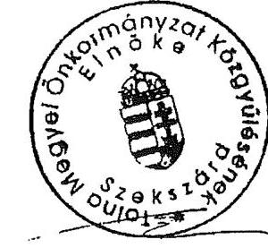
dr. Puskás Imre

# Dr. Puskás Imre úr 

elnök
Tolna Megye Önkormányzata

## Szekszárd

## Tisztelt Elnök Úr!

Köszönettel vettem a Tolna Megye Önkormányzata pénzügyi helyzetének ellenőrzéséről szóló jelentés-tervezethez megküldött pontosító észrevételeit és megállapítását, amely szerint a jelentés objektív, átfogó képet mutat az Önkormányzat pénzügyi helyzetéről. Pontosító észrevételeire az Állami Számvevőszékről szóló 2011. évi LXVI. törvény 29. § (3) bekezdése alapján az alábbi választ adom.
1.) A jelentés II. Részletes megállapítások 2. Pénzügyi egyensúlyi helyzet alakulása 2.1 A működési és felhalmozási egyensúly alakulása című rész utolsó bekezdésében szereplő a felhalmozási és működési hiánnyal kapcsolatos megállapítást a CLF tábla átdolgozása miatt a jelentés nem tartalmazza.
2.) A CLF modell szerinti 2009. évi 291 millió Ft-os működési jövedelemre vonatkozó megállapítás alapját a CLF tábla átdolgozása miatt a jelentésben nem szerepeltetjük.
3.) Az átengedett szja és az állami támogatások együttes összegének alakulását bemutató részben az ellátotti létszámra vonatkozó észrevételét elfogadtam és a jelentésben szereplő megállapítást módosítottuk.
4.) Az intézményi működési bevételek csökkenésével kapcsolatos észrevételét, amelyben a Wosinsky Mór Múzeum bevételeinek változását is indokként jelöli meg, elfogadtam, azt a jelentés 27. lábjegyzetében rögzítettük.
5.) Az Önkormányzat folyamatban lévő bírósági eljárásokra vonatkozó észrevételét elfogadtam és a jelentést módosítottuk.
6.) Az értékcsökkenésre vonatkozó észrevételének azon részét, amely a pótlási kötelezettség teljesítésére vonatkozik, elfogadtam és a jelentés 41. lábjegyzetében figyelembe vettük. Az értékcsökkenés és az elhasználódott eszközök pótlásának forrásigényére vonatkozó

javaslatunkat továbbra is indokoltnak tartjuk, mivel az elhasználódott eszközök pótlásának forrásigényét nem mutatták be.
7) Pénzügyi helyzetük megítélése szempontjából Önök által fontosnak tartott információkat tudomásul vettem és megköszönjük, azonban a jelentés megállapításait nem érintik és így a jelentésbe nem építettük be.

Köszönöm Elnök úr és munkatársai ellenőrzés során tanúsított hozzáállását, amellyel az ellenőrzés megvalósításában részt vettek, azt segítették.

Budapest, 2011. december "10".
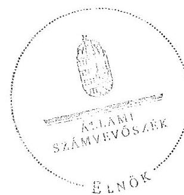

Tisztelettel:

Domokos László

Melléklet: jelentés
