# ÁLLAMI   SZÁMVEVŐSZÉK 

## JELENTÉS

a Vas Megyei Önkormányzat pénzügyi helyzetének ellenőrzéséről (43/2)

---

# Számvevői Iroda 

Iktatószám: V-3025-09/2011.
Témaszám: 1015
Vizsgálat-azonosító szám: V056017

## Az ellenőrzést felügyelte:

Dr. Varga Sándor
számvevő igazgató-helyettes

## Az ellenőrzést vezette:

## Renkó Zsuzsanna

számvevő tanácsos

## Az ellenőrzést végezték:

| Dér Lívia | Humli Tamásné | Kiss Rita Teréz |
| :-- | :-- | :-- |
| számvevő tanácsos | számvevő tanácsos | számvevő tanácsos |

A témához kapcsolódó eddig készített számvevőszéki jelentések:
címe
sorszáma
Jelentés a Vas Megyei Önkormányzat gazdálkodási rendszerének 1030 2010. évi ellenőrzéséről

---

# TARTALOMJEGYZÉK 

BEVEZETÉS ..... 5
I. ÖSSZEGZŐ MEGÁLLAPÍTÁSOK, KÖVETKEZTETÉSEK, JAVASLATOK ..... 12
II. RÉSZLETES MEGÁLLAPÍTÁSOK ..... 17

1. Az Önkormányzat kötelező és önként vállalt feladatai ..... 17
2. Pénzügyi egyensúlyi helyzet alakulása ..... 20
2.1. A működési és felhalmozási egyensúly alakulása ..... 22
2.2. Az Önkormányzat bevételeinek alakulása ..... 26
2.3. Az Önkormányzat kiadásainak alakulása ..... 29
3. Kötelezettségek bemutatása ..... 32
3.1. A pénzintézetek felé fennálló kötelezettségek alakulása ..... 32
3.2. Szállítók felé fennálló kötelezettségek alakulása ..... 37
3.3. Egyéb kötelezettségek alakulása ..... 38
4. Pénzügyi egyensúly megteremtése érdekében hozott intézkedések ..... 40
5. A helyi önkormányzatok gazdálkodási rendszerének 2007. évi ellenőrzése során a pénzügyi egyensúly javítására tett szabályszerűségi és célszerűségi javaslatok hasznosulása ..... 45

---

# MELLÉKLETEK 

1. számú Működési és felhalmozási hiány/többlet az önkormányzat rendeleteiben melléklet
2/a számú Az Önkormányzat CLF módszer szerint besorolt bevételei és kiadásai 2007-2010 között melléklet
2/b számú Az Önkormányzat bevételeinek és kiadásainak, adósságszolgálatának melléklet alakulása 2007-2010 között
2. számú Az Önkormányzat 2007-2010 években megvalósított, illetve 2010. december 31-én folyamatban levő felhalmozási feladataihoz kapcsolódó kötelezettségeinek összegzése
3. számú Vas Megyei Közgyűlés elnökének észrevétele melléklet
4. számú Vas Megyei Közgyűlés elnökének észrevételére adott válasz melléklet

---

# RÖVIDÍTÉSEK JEGYZÉKE 

| Törvények |  |
| :--: | :--: |
| Áht. | az államháztartásról szóló 1992. évi XXXVIII. törvény |
| ÁSZ tv. | A 2011. június 30-ig hatályos Állami Számvevőszékről szóló 1989. évi XXXVIII. törvény (2011. július 1-től az Állami Számvevőszékről szóló 2011. évi LXVI. törvény) |
| Htv. | a helyi önkormányzatok és szerveik, a köztársasági megbízottak, valamint egyes centrális alárendeltségű szervek feladat- és hatásköreiről szóló 1991. évi XX. törvény |
| Ötv. | a helyi önkormányzatokról szóló 1990. évi LXV. törvény |
| Szórövidítések |  |
| APEH | Adó- és Pénzügyi Ellenőrzési Hivatal, 2011. január 1-jétől Nemzeti Adó-és Vámhivatal (NAV) |
| ÁSZ | Állami Számvevőszék |
| BM | Belügyminisztérium |
| EDP hiány/egyenleg | Uniós módszertan szerinti maastrichti kritériumoknak megfelelő számítás szerinti hiány/egyenleg |
| EU | Európai Unió |
| GDP | Bruttó hazai termék |
| Hivatal | Vas Megyei Önkormányzati Hivatal |
| Illetékhivatal | Vas Megyei Illetékhivatal |
| Kórház | Vas Megyei Markusovszky Lajos Általános, Rehabilitációs és Gyógyfürdő Kórház Egyetemi Oktatókórház Zrt. |
| Közgyűlés | Vas Megyei Közgyűlés |
| KSH | Központi Statisztikai Hivatal |
| Múzeum | Vas Megyei Múzeumok Igazgatósága |
| NGM | Nemzetgazdasági Minisztérium |
| OEP | Országos Egészségbiztosítási Pénztár |
| Önkormányzat | Vas Megyei Önkormányzat |
| Pedagógiai Intézet | Vas Megyei Önkormányzat Pedagógiai Intézete |
| PPP konstrukció | Public Private Partnership (Partnerségi együttműködés közfeladatok ellátására a magánszektor bevonásával) |
| SNA | System of National Accounts (Nemzeti Számlák Rendszere) |
| Szja | Személyi jövedelemadó |
| SzMSz | Vas Megye Önkormányzatának 10/1995. (VI. 19.) számú rendelete az Önkormányzat Szervezeti és Működési Szabályzatáról |
| Vagyonkezelő Kft. | Vas Megyei Önkormányzat Vagyonkezelő Kft. |
| TISZK | Vas Megyei Szakképzés-szervezési Társulás |

---

.

---

# JELENTÉS 

## a Vas Megyei Önkormányzat pénzügyi helyzetének ellenőrzéséről

## BEVEZETÉS

Az Állami Számvevőszék 2011. évtől érvényes stratégiája új irányt szabott a helyi önkormányzatok gazdálkodásának ellenőrzésében is. Az ÁSZ - küldetése és jövőképe szerint - szilárd szakmai alapokra támaszkodva értékteremtő ellenőrzéseivel és helyzetelemzéseivel az államháztartás egészében, így a helyi önkormányzati alrendszerben is elő kívánja segíteni a közpénzek és a közvagyon szabályos, gazdaságos, hatékony és eredményes hasznosítását. E folyamat részeként - a 2010. évi államháztartási hiány alakulásának összetevőire is figyelemmel - megkezdődött az önkormányzati alrendszer pénzügyi helyzetelemzése.

Az NGM 2011 áprilisában közzétett adatai szerint ${ }^{1}$ a 2010. évi 1036,2 milliárd Ft összegű, 3,8%-os EDP (maastrichti kritériumok szerinti, Túlzott Hiány Eljárás keretében kimutatott) hiánycél nem volt tartható, az önkormányzati alrendszer tervezettet meghaladó hiánya miatt a GDP arányában kifejezett államháztartási hiány 4,2%-ra emelkedett.

Az önkormányzatok költségvetési jelentése szerint 2010. első három negyedév végén az önkormányzati alrendszer pénzforgalmi hiánya 97 milliárd Ft volt, a tervezett éves mérték 51%-át érte el. Bár az elmúlt években kiugróan magas hiány halmozódott fel az utolsó negyedévben, a 97 milliárd Ft-os szeptember végi hiány nem indokolta az önkormányzati alrendszer 190 milliárd Ft-ra becsült éves hiányának felülvizsgálatát. A tervezett hiány túllépése, az utolsó negyedévi 150 milliárd Ft-os pénzforgalmi hiány nem volt reálisan feltételezhető. A helyi önkormányzatok januári gyorsjelentése szerint a pénzforgalmi hiány 247,7 milliárd Ft-ot tett ki. A tervezettnél nagyobb önkormányzati pénzforgalmi hiány kialakulásában - az NGM által az éves költségvetési beszámoló elkészítéséhez kiadott tájékoztató szerint - az iparűzési adó elmaradása, a gépjárműadó, az illetékek és más bevételek tervezettnél alacsonyabb összegben teljesülése volt a meghatározó.

[^0]
[^0]:    ${ }^{1}$ NGM Tájékoztatás Magyarország Strukturális Reformprogramjának végrehajtásáról (2011. április 1). A Tájékoztató évente két alkalommal - április és október hónapban jelenik meg.

---

A megyei önkormányzatok kötelező feladatellátását többlépcsős törvényi előírások határozzák meg. A feladatokra vonatkozó szabályozás első szintjét az Ötv. ${ }^{2}$, a második szintet a hatásköri ${ }^{3}$, a harmadik szintet a további ágazati, szakmai törvények (egyebek mellett az oktatási, egészségügyi, szociális) adják.

A megyei önkormányzatok a feladatellátás és a központi forráselosztás tekintetében sajátos helyet foglalnak el a helyi önkormányzati rendszerben. A megyei önkormányzat kötelező feladatainak egy része - így a megyében lévő természeti és társadalmi muzeális emlékek, a történeti iratok gyűjtése, őrzése, tudományos feldolgozása, a megyei könyvtári szolgáltatás, a pedagógiai és közművelődési szakmai tanácsadás és szolgáltatás, a megyei testnevelési és sportszervezési feladatellátás, a gyermek- és ifjúsági jogok érvényesítése, a gyermekvédelmi- és szociális szakellátás - az Ötv-ből közvetlenül levezethető kötelezettség.

A középiskolai, szakiskolai, és kollégiumi ellátás, a fogyatékos gyermekek oktatása, nevelése, gondozása az ágazati törvény szerint a megyei önkormányzat kötelező feladata. Azonban, ha a települési önkormányzat lát el ilyen feladatot, és arról lemond, a megyei önkormányzatnak a feladatot át kell vennie. Így a megyei önkormányzatok által ellátandó kötelező közszolgáltatások ellátásának mértékére a települési önkormányzatok döntései jelentősen kihatnak.

Az alapellátást meghaladó egészségügyi szakellátás biztosítása akkor képezi a megyei önkormányzat feladatát, ha az önkormányzati vagyon kialakításáról szóló törvényben ${ }^{4}$ a feladat ellátásához szükséges vagyont az önkormányzat a tulajdonába kapta.

Az önként vállalt feladat ellátására - mivel annak vállalása a kötelező feladatok ellátását nem veszélyeztetheti - a kötelező közszolgáltatások mértékének alakulása lényegi hatással van.

A feladat és hatáskör telepítés sajátosságai mellett a megyei önkormányzatok kialakított forrásszerkezete, a központi költségvetéstől való erőteljes függősége is determinálja az önkormányzatok feladatellátásra vonatkozó döntéseit.

A 2007-2010. években az önkormányzati feladatok ellátásának keretet biztosító forrásszabályozás - ennek részeként az illetékbevételből és a személyi jövedelemadóból való részesedés szabályai - a megyei önkormányzatok vonatkozásában nem változtak:

- A megyei önkormányzatok saját bevételein belül az illetékbevételek döntően az ingatlanpiac stagnálása, majd visszaesése, és egyes illetékkedvezmények bevezetése következtében - megyénként differenciált mértékben ugyan, de - 2010-re általánosan visszaestek. A 2010. évben befolyt

[^0]
[^0]:    ${ }^{2}$ Ötv. 69-70. §-ai
    ${ }^{3}$ a Htv.
    ${ }^{4}$ Az egyes állami tulajdonban lévő vagyontárgyak önkormányzatok tulajdonba adásáról szóló 1991. évi XXXIII. törvény

---

39,2 milliárd Ft illetékbevétel a 2006. évben realizált 71,1 milliárd Ft illetékbevétel alig több mint 55%-a volt. A kieső bevételek pótlására az önkormányzati alrendszer szintjén történtek intézkedések, 2010-ben 5 milliárd Ft-ot, 2011-ben 1,2 milliárd Ft-ot ellentételezett a központi költségvetés. Az illetékbevételt a megyei önkormányzatok a saját folyó bevételeik között számolják el ${ }^{5}$.

Az illetékek kivetésének és beszedésének joga 2006. december 31-ig a megyei önkormányzatok feladata volt. A 2007. évtől a megyei illetékhivatalok illetékbeszedési feladatait az APEH vette át ${ }^{6}$. Az önkormányzati illetékrészesedési szabályok változatlanok maradtak, azonban az illetékbeszedés költségeit az önkormányzatok illetékbevételeiből átlagos (a Fővárosnál 4,0%-os, a megyei és megyei jogú városi önkormányzatnál 8,5%-os) kulcsot alkalmazva vonták le. E döntés következtében azon megyei önkormányzatok, amelyek a 8,5%-os költségnél kedvezőbb költségszint mellett látták el korábban ezt a feladatot, kedvezőtlenebb helyzetbe kerültek.

- Az önkormányzati alrendszer személyi jövedelemadóból való részesedésének makroszintű szabályozása nem változott 2007-2010 között${ }^{7}$. A helyi önkormányzatokat normatív módon megillető 32%-os részesedés visszaosztásának részletszabályai azonban a megyei önkormányzatok számára - a reálgazdaság kedvezőtlen irányú folyamatai, és az államháztartás egyensúlyi helyzetére tekintettel elrendelt kormányzati intézkedések miatt - megszorító intézkedéseket jelentettek. Összesen 17 milliárd Ft - 2007-ben 10 milliárd Ft, 2010-ben további 7 milliárd Ft - szja-t vontak ki a megyei önkormányzatok gazdálkodási köréből ${ }^{8}$. Az átengedett személyi jövedelemadó a megyei önkormányzatok egyik bevétele.

[^0]
[^0]:    ${ }^{5}$ A megyei önkormányzatok illetékbevételei az önkormányzati alrendszer saját folyó bevételeiből 2007-ben 35,9 milliárd Ft-ot (61,4%-ot), 2008-ban 41,5 milliárd Ft-ot (61,7%-ot), 2009-ben 36,5 milliárd Ft-ot (62,5%-ot), 2010-ben 25,1 milliárd Ft-ot (64,1%-ot) tettek ki.
    ${ }^{6}$ Az egyes pénzügyi tárgyú törvények módosításáról szóló 2006. évi LXI. törvény 115. §a, amely az adózás rendjéről szóló 2003. évi XCII. törvény 73. §-át módosította.
    ${ }^{7}$ A megyei önkormányzatok személyi jövedelemadó részesedése az önkormányzati alrendszer átengedett bevételeiből 2007-ben 34,7 milliárd Ft-ot (7,0%-ot), 2008-ban 51,2 milliárd Ft-ot (9,2%-ot), 2009-ben 59,2 milliárd Ft-ot (9,3%-ot), 2010-ben 56,3 milliárd Ft-ot (8,3%-ot) tett ki.
    ${ }^{8}$ A megyei önkormányzatok szja kiegészítése háromelemű. A tételes, minden megyére egységesen meghatározott összeg - az adott évek költségvetési törvényeinek 4. sz. mellékletében meghatározottak szerint - 2006-ban 593 millió Ft, 2007-ben és 2008-ban egyaránt 355 millió Ft, 2009-ben 370 millió Ft volt. A megye népességszáma után járó kiegészítés a 2006. évi 208 Ft/fő összegről 2010-re 120 Ft/fő-re, a megyei intézmények ellátottjai után járó kiegészítés 42236 Ft/ellátottról 20755 Ft/ellátottra csökkent.

---

A megyei önkormányzatok 2007-2010 között rendelkezésre álló forrásait az alábbiakban mutatjuk be:
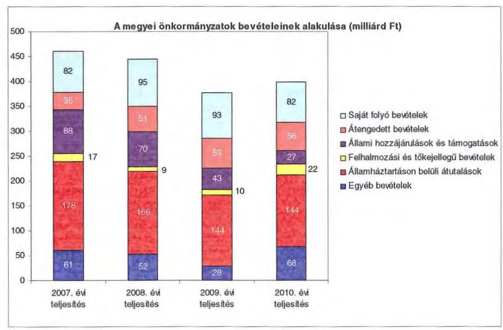

A megyei önkormányzatok saját folyó bevételeinek részaránya - amelyek főbb elemei: az intézményi térítési díjak, az illetékbevétel, a kamatbevételek - a 2007. évi összbevételen (461 milliárd Ft) belül 17,9% volt, amely 2010-re annak ellenére

 20,6%-ra nőtt, hogy az összege 82 milliárd Ft maradt. Ennek oka az volt, hogy az összbevétel a 2007. évi 461 milliárd Ft-ról 2010-re 399 milliárd Ft-ra csökkent.

Az átengedett bevételek, amelyek a megyei önkormányzatoknál a személyi jövedelemadóból való részesedést jelentették, az összbevételen belül a 2007. évi 35 milliárd Ft-ról 56 milliárd Ft-ra nőttek.

Az állami hozzájárulások és támogatások - amelyek főbb elemei: az ellátotti létszámhoz kötődő normatív állami hozzájárulások, központosított, fejezeti szinten kezelt célelőirányzatból juttatott működési és fejlesztési támogatások a 2007. évi 88 milliárd Ft-ról (19,1%-os részarányról) 2010-re 27 milliárd Ft-ra (6,8%-os részarányra) estek vissza.

A felhalmozási és tőkejellegű bevételek - tárgyi eszközök (ingatlanok és ingóságok), föld és immateriális javak, részesedések értékesítése, EU-tól átvett pénzeszközök - a 2007. évi 17 milliárd Ft-ról (3,6%-os részarányról) 2010-re 22 milliárd Ft-ra (5,4%-ra) emelkedtek.

---

Az államháztartáson belüli átutalások részesedése 2007-ben 178 milliárd Ft volt. 2010. év végére 34 milliárd Ft-tal csökkent, részaránya 38,6%-ról 2,6 százalékpontos csökkenés után 2010-ben 36%-ra változott. Ez a bevételi kategória tartalmazza az egészségbiztosítási és egyéb elkülönített állami pénzalapoktól átvett forrásokat. A 2010-ben e címen elszámolt bevétel 144 milliárd Ft volt.

A megyei önkormányzatok központi költségvetésből származó bevételeinek összege 2007-ben 400 milliárd Ft volt, amely 2010. évre 331 milliárd Ft-ra (az időszak alatt összesen 69 milliárd Ft-tal) 17,3%-kal csökkent.

Az egyéb, pénzmaradványból, vállalkozási bevételekből, államháztartáson kívülről származó átutalásokból, a hitelekből, a hosszú és rövid lejáratú értékpapírok értékesítéséből származó bevételek részesedése a 2007-2010. évek viszonylatában 13,3%-ról 17,1%-ra emelkedett. Ez utóbbiak 2010. évi beszámoló szerinti összevont teljesítése 68 milliárd Ft volt ${ }^{9}$.

Mindezeket figyelembe véve 2007 és 2010-ben a megyei önkormányzatok forrásösszetételének megoszlását az alábbi ábra szemlélteti:

A megyei önkormányzatok 2007-2010. évi forrásainak megoszlása (%ban)
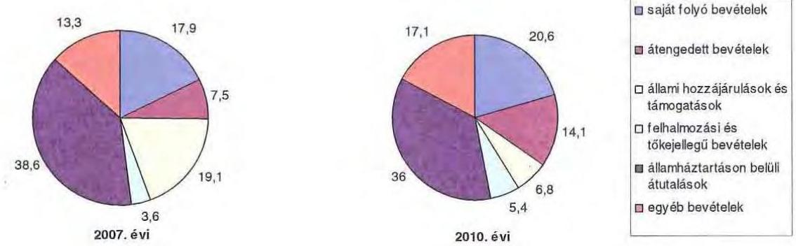

Annak ellenére, hogy a megyei önkormányzatok kötelezően ellátandó feladataikat 2007-hez képest kevesebb intézményben, csökkenő foglalkoztatott létszám mellett végezték ${ }^{10}$, a jelentős bevételkiesést a - szervezési intézkedések hatására - csökkenő ráfordítások nem tudták kompenzálni. Az ellátottak száma a szociális, gyermekvédelmi ágazat bentlakásos elhelyezést nyújtó intézményeit kivéve - eltérő mértékben ugyan, de minden ágazatban évről évre csökkent, amely a fajlagos hozzájárulások csökkenésével együtt a normatív állami hozzájárulás arányának visszaeséséhez vezetett.

A 2007-2013-as időszakra meghirdetett, vissza nem térítendő EU-s fejlesztési forrásokhoz való hozzájutás lehetősége felerősítette az önkormányzati alrendszer fejlesztési igényeit. A fokozott fejlesztési tevékenység a felhalmozási bevéte-

[^0]
[^0]:    ${ }^{9}$ Az egyéb bevételek összege 2007-2010 között eltérő módon változott, 2007-ben 61 milliárd Ft volt, 2008-ban 52 milliárd Ft-ra, 2009-ben 28 milliárd Ft-ra esett vissza, majd 2010-ben ismét - 68 milliárd Ft-ra - emelkedett.
    ${ }^{10}$ a BM által 2010 decemberében elvégzett felmérés adatai szerint

---

lek és kiadások egyensúlyának megbomlásán ${ }^{11}$ túl a jelentkező jövőbeni fenntartási kötelezettség miatt tovább terhelhetik az önkormányzatok költségvetését.

A megyei önkormányzatok felhalmozási és működési célú pénzintézeti és szállítói kötelezettségeinek állománya a vizsgált időszakban erőteljesen növekedett.

A hosszú lejáratú kötelezettségek alakulását a következő ábra szemlélteti:
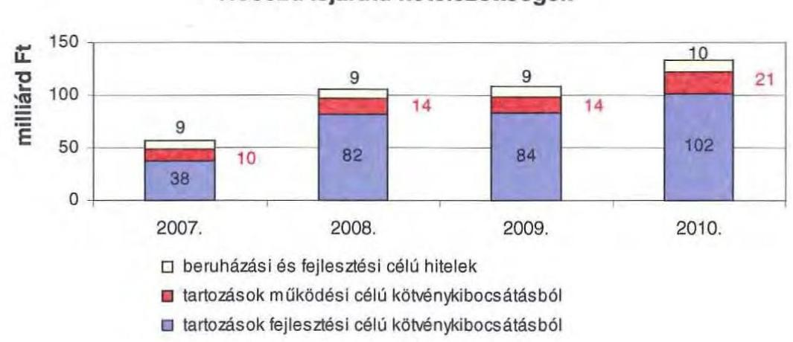

A hosszú lejáratú kötelezettségek mellett az időszakban a 2007. évi 22 milliárd Ft-ról 24 milliárd Ft-ra (8,8%-kal) növekedett az áruszállításból származó szállítói kötelezettségek állománya.

A mérlegben kimutatott kötelezettségek állománya mellett az elhasználódott eszközök pótlására forrást biztosító amortizációs (felújítási) alap képzésének ${ }^{12}$ elmaradása további problémákat vetít előre. A megyei önkormányzatok beszámolójelentéseinek összegzése szerint 2007-ben még az elszámolt értékcsökkenés 90%-ának megfelelő összeget fordítottak felújítási célokra, 2009-ben ez az arányszám már csak 16,5% volt. Ez maga után vonta a feladatellátást kiszolgáló tárgyi eszközök állagának erőteljes romlását.

Az ÁSZ a 2011. évi ellenőrzési tervében a 43. számú, az „Önkormányzatok gazdálkodási rendszerének ellenőrzése" részeként egy időben, egymással párhuzamosan tekinti át és elemzi az önkormányzati alrendszer középszintjét jelentő 19 megyei önkormányzat pénzügyi helyzetét. A gazdálkodás szabályszerűségét az

[^0]
[^0]:    ${ }^{11}$ Az önkormányzati alrendszerben - az éves zárszámadási törvényjavaslatok általános indokolása, X. Helyi önkormányzatok gazdálkodása fejezet szerint - a felhalmozási bevételek és kiadások egyenlege 2007-ben 142,4 milliárd Ft, 2008-ban 112,3 milliárd Ft, 2009-ben 234,5 milliárd Ft hiányt mutatott.
    ${ }^{12}$ Erre a jelenlegi szabályozási környezetben nem kötelezi semmilyen előírás az önkormányzatokat.

---

ÁSZ előző évek során ellenőrizte a megyei önkormányzatoknál is, ezért jelen vizsgálatunk erre nem tér ki.

A jelentés a megyei önkormányzatok sajátos feladatellátási és forrásszabályozási helyzetére tekintettel a megyei önkormányzatok pénzügyi helyzetét, illetve az ezzel összefüggő korábbi ÁSZ javaslatok megvalósítását mutatja be.

Az ellenőrzés a 2007. január 1. - 2011. március 31. közötti időszakot ölelte fel.
A vizsgálat jogszabályi alapját 2011. július 1-je előtt az Állami Számvevőszékről szóló 1989. évi XXXVIII. törvény 2. § (3), (5), (6) és (9) bekezdéseiben, az Ötv. 92. § (1) bekezdésében és az Áht. 104. § (3) bekezdésében, 2011. július 1-jét követően az Állami Számvevőszékről szóló 2011. évi LXVI. törvény 1. § (3) bekezdésében, az 5. § (2)-(6) bekezdéseiben és az Áht. 120/A. § (1) bekezdésében foglalt előírások képezték.

Vas megye országos és régión belül elfoglalt helyzetét 2010. december 31-én az alábbi mutatók szemléltetik (a megyei jogú városokkal együtt):

Index: az előző év azonos időszak (időpontja)=100,0

| Mutató megnevezése | Vas me-   gye | Nyugat-   dunántúli   régió | Országos |
| :-- | :--: | :--: | --: |
| Népesség száma (ezer fő)* | 257 | 992 | 9986 |
| Népesség változás indexe (%) | 99,1 | 99,6 | 99,7 |
| Az ipari termelés volumenindexe (%) | 116,5 | 115,8 | 110,7 |
| Egy lakosra jutó ipari termelési érték (ezer | 2319,4 | 3249,8 | 2044,4 |
| Ft) |  |  |  |
| Ezer lakosra jutó vállalkozások száma (db) | 147 | 157 | 165 |
| A beruházások egy lakosra vetített teljesít- | 169,6 | 277,6 | 304,7 |
| menyértéke (millió Ft) |  |  |  |
| Foglalkoztatási arány (%) | 52,9 | 52,3 | 49,5 |
| Munkanélküliségi ráta (%) | 9,6 | 8,8 | 10,8 |
| Alkalmazásban állók havi nettó átlagkerese- | 116565 | 120429 | 132628 |
| te (Ft) |  |  |  |
| Alkalmazásban állók havi nettó átlagkerese- | 108,7 | 107,9 | 106,9 |
| tének indexe (%) |  |  |  |

* Ebből Szombathely megyei jogú városnépessége 78946 fő

A táblázatban feltüntetett adatok azt jelzik, hogy a gazdaság helyzetét reprezentáló egyes mutatók - a beruházások egy lakosra vetített teljesítményértéke, az alkalmazásban állók havi nettó átlagkeresete mutatója - tekintetében a megye elmarad az országos és a régió értékeitől. Kedvező ugyanakkor, hogy az ipari termelés volumenindexe, az egy lakosra jutó ipari termelési érték és a munkanélküliségi ráta mutatója az országos értékeknél jobb, azonban az utóbbi kettő a Nyugat-dunántúli régión belüli értékeknél kedvezőtlenebb képet mutat.

A megyében 216 települési önkormányzat - egy megyei jogú városi, 11 városi, egy nagyközségi és 203 községi - működött.

---

# I. ÖSSZEGZŐ MEGÁLLAPÍTÁSOK, KÖVETKEZTETÉSEK, JAVASLATOK 

A Vas Megyei Önkormányzat - adatszolgáltatása szerint - 2010-ben 8083 millió Ft összes költségvetési kiadásából 88,2%-ot kötelező feladatai ellátására fordított. Az Önkormányzat önként vállalt feladatai az SzMSz-ben meghatározottaknak megfelelően, kiemelten a kultúra, művészeti, sport, nemzetközi, egyes idegenforgalmi, lapkiadási szolgáltatások szervezéséhez kapcsolódtak, valamint támogatást nyújtott civil szervezetek, alapítványok működéséhez, összesen 81 millió Ft összegben. Az SzMSz a kötelező közszolgáltatási feladatokat, és azok ellátásának szervezeti keretét általános jelleggel, a vonatkozó jogszabályokra hivatkozással határozta meg.

Az Önkormányzat a kötelező és önként vállalt feladatait 2010. december 31-én a Hivatallal és 29 intézménnyel, továbbá két kizárólagos önkormányzati tulajdonú gazdasági társasággal látta el. A feladatellátás telephelyeinek száma a 2007. évi 62-ről 2010. év végére 59-re csökkent. Az intézmények száma 2007-2010. között a kórházi ellátás és az üdültetési feladatok gazdasági társaságba történő kiszervezése következtében csökkent.

A folyó költségvetés egyenlege (működési jövedelem) 2007-ben és 2010-ben működési forráshiányt, 2008-ban és 2009-ben forrástöbbletet mutatott. A 2009. évben a működési megtakarítások fedezni tudták a tárgyévben jelentkező törlesztési kötelezettségeket, így az Önkormányzat pénzügyi kapacitása (nettó működési jövedelme) is pozitív értékű volt. Annak ellenére, hogy a tőketörlesztések összege évenként csökkent, a 2010. évben a nettó működési jövedelem a 2007. évi negatív érték alá csökkent.

A felhalmozási költségvetés egyenlege 2010-ben pozitív összegű volt a 2007-2009. évi felhalmozási hiánnyal szemben. A 2007-2009. közötti időszakban fennálló felhalmozási forráshiány fedezetét elsődlegesen kötvénykibocsátással biztosították, emellett folyószámlahitelt, pénzmaradványt vettek igénybe.

Az Önkormányzatnál az illetékbevétel 2010-re a 2006. évi 1741 millió Ft-ról (61,8%-ára) 1075 millió Ft-ra csökkent. Az átengedett szja és az állami támogatások együttes összege a központi támogatás csökkentés miatt kevesebb lett, 2010-ben 2621 millió Ft volt, a 2007. évi 71,3%-a. A 2010. évben az intézményi működési bevételek 386 millió Ft-tal haladták meg a 2007. évi ténylegest a térítési díjak emelkedése miatt. Az Önkormányzat beszámolójában szereplő OEP támogatás 2007-ben 6782 millió Ft volt, amely a kórház kiszervezése miatt 2010-re 28 millió Ft-ra csökkent.

A Kórház nélküli működési kiadások 2007-ről 2010-re jelentősen 12,1%-kal, 1013 millió Ft-tal csökkentek. Az Önkormányzat 2007-2010 között a Kórház működéséhez 371 millió Ft, fejlesztéséhez 522 millió Ft pénzeszközt adott át. Az intézmények teljesített működési kiadásai 2007-ben 11549 millió Ft-ot tettek ki (az összes működési kiadás 90,8%-a), amely 2010-re 6098 millió Ft-ra csökkent (az összes működési kiadás 89,9%-a).

---

A működési és felhalmozási kiadásokon belül 2007-2010 között a felhalmozási kiadások súlya 3144 millió Ft-ról (15,6%-ról) 740 millió Ft-ra (9,2%-ra) csökkent. A pályázati tevékenység eredményeként 2007-2010 között 5066 millió Ft bekerülési költségű beruházást folytatott, illetve indított el az Önkormányzat, amelyből 324 millió Ft a 2010. évet követő időszakra vállalt kötelezettség. Az utóbbi forrásai - adatszolgáltatása szerint - a következők: 12 millió Ft kötvénybevételből származó pénzmaradvány, 231 millió Ft elnyert EU-s támogatás, továbbá 81 millió Ft elnyert hazai támogatás.

Az Önkormányzat pénzintézeti kötelezettségeinek állománya a könyvviteli mérlegadatok szerint 2006. december 31-ről 2010. december 31-re 1335 millió Ft-ról 8617 millió Ft-ra nőtt. A vizsgált időszakban adósságszolgálatra az Önkormányzat 1530 millió Ft-ot teljesített, amelyből a kamatkiadás 692 millió Ft volt. A kötvényből származó források befektetéséből 2007-2010 között realizált kamatbevétel 1033 millió Ft.

Az Önkormányzat likviditásának biztosítása érdekében a vizsgált időszakban az év minden napján - kivétel 2007. év, amikor 23 nap híján - folyószámlahitelt vett igénybe. Munkabér megelőlegezési hitelt 2007. évben egy alkalommal kellett igénybe venni egy hónapos időtartamra.

Az Önkormányzat 2010. év végi pénzintézeti kötelezettségéből 7451 millió Ft (86,5%) fejlesztési célú
 kötvény kibocsátásából, 498 millió Ft (5,8%), fejlesztési célú hosszú lejáratú hitelek felvételéből, továbbá 668 millió Ft (7,7%) a költségvetési év végén ki nem egyenlített folyószámlahitelből keletkezett. Ezek miatt az Önkormányzatnak a 2011-2013. években 549 millió Ft és 7343255 CHF tőketörlesztést és kamatot kell teljesítenie. Az Önkormányzat 2010. év végi gazdasági társaságok nélküli szállítói tartozása 146 millió Ft (ebből lejárt 100 millió Ft), és egyéb kiadás elmaradása $^{13} 5$ millió Ft. A 2011-2013. évi összes (pénzintézeti, szállítói, valamint egyéb) kötelezettség teljesítésére figyelembe vehető forrás: 3561 millió Ft a kötvénykibocsátásból, továbbá 400 millió Ft a kötvény hozamából származó pénzmaradvány. Ezek fedezetet nyújtanak a kötelezettségekre.

Az Önkormányzat 2010. december 31-én fennálló kötelezettségeinek várható jövőbeni (2014. év utáni) pénzintézeti kötelezettsége 34843759 CHF. Ezekre figyelembe vehető forrás az önkormányzat tájékoztatása szerint az értékesítésre kijelölt 1954 millió Ft értékű forgalomképes ingatlanvagyon, valamint egy gazdasági társaságban levő (5000 millió Ft) tulajdoni részesedés. Ezek alapján hosszútávon a kötelezettségek forrásai nem számszerűsíthetők.

Az Önkormányzatnak 2010. év végén kezességvállalásból 10 millió Ft kötelezettsége állt fenn 2011. március 26-ig. Kezesség beváltására nem került sor.

[^0]
[^0]:    $^{13}$ Ki nem fizetett esedékes személyi jellegű juttatások és munkaadókat terhelő járulékok.

---

A közgyűlési előterjesztések tartalmazták a kötelezettségvállalás visszafizetési forrásait, a teljes futamidő várható kamat és tőkefizetési kötelezettségeit, az ár-folyam- és kamatkockázatok, valamint az adósságszolgálati korlát bemutatását.

Az Önkormányzat nem vizsgálta, hogy az elhasználódott eszközök pótlása milyen pénzügyi kötelezettséget jelent a számára. A 2007-2010. években a tárgyi eszközök után 3467 millió Ft értékcsökkenést számolt el, ugyanakkor felújításra csak ennek töredékét 685 millió Ft-ot (19,8%) fordított.

A végrehajtott kiadáscsökkentő intézkedések kiemelten a pénzügyi helyzet javítását célozták. A 2007-2010. években az intézményátszervezések, a feladatváltozások, valamint a takarékossági intézkedések hatásaként - az Önkormányzat kimutatása szerint - együttesen 1265 millió Ft kiadás megtakarítás keletkezett, amelynek 77%-a, 970 millió Ft a kapcsolódó álláshely csökkenések, intézményi átszervezések következtében jelentkezett. A kórházi feladat kiszervezése az Önkormányzatnak nem jelentett kiadási megtakarítást, mivel 2006-2009. év között a Kórház részére nem biztosított működési célra önkormányzati támogatást.

A létszámcsökkentő intézkedések következtében 2007-2010 között a Hivatalnál és intézményeinél összesen 2327 álláshelyet (részben üres állást) szüntettek meg, a 2006. december 31-i átlaglétszám 65%-át, amelyből 1903 főt jelentett a Kórház államháztartási rendszerből való kikerülése. Ennek figyelmen kívül hagyásával 424 fős álláshely csökkenés valósult meg, amelynek közel kétharmada ágazati szakmai, egyharmada intézményüzemeltetéshez, fenntartáshoz, gazdasági ügyek intézéséhez kapcsolódó álláshely volt. A megvalósított álláshely csökkenés a Kórházon kívüli 2006. december 31-i átlaglétszám 23%-a. A kiszervezett Kórház átlaglétszáma 9%-kal, 147 fővel csökkent, 2011. március 31-én 1562 fő volt. Az Önkormányzat és a Kórház együttes átlaglétszáma a 2006. december 31-i 3570 főről 2010. március 31-ére 2946 főre csökkent, a 624 fő átlaglétszám csökkenés a 2006. évi átlaglétszám 17%-a.

A bevételnövelésre irányuló intézkedések eredményeként képződő többletbevételnek 2007-2010 között - amelynek számszerűsített összege 1043 millió Ft volt - 99,9%-a a kötvénykibocsátásból származó átmenetileg szabad pénzeszközök befektetéséből realizálódott 1033 millió Ft bevételi növekményben, melyből az Önkormányzat 100 millió Ft-ot tekintett működési, 933 millió Ft-ot pedig felhalmozási célú bevételnek.

Az utóellenőrzés során megállapítottuk, hogy az Önkormányzat a helyi önkormányzatok gazdálkodási rendszerének 2007. évi ellenőrzése során a pénzügyi egyensúly javítására tett (egy célszerűségi) javaslatunkat hasznosította.

Az Önkormányzat pénzügyi helyzetét összegezve a következők emelhetők ki:

Az önkormányzati bevételt csökkentő központi intézkedések hatását az ellenőrzött időszakban részben egyenlítette ki az Önkormányzat kiadáscsökkentő és bevételnövelő intézkedéseinek eredménye, ami kedvezőtlenül befolyásolta pénzügyi helyzetét. Az Önkormányzat intézményt nem vett át, a feladatok

---

gazdasági társaság részére történő átadása alapvetően nem befolyásolta a működés kockázatát. A vizsgált időszakban csökkenő mértékű felhalmozási kiadások finanszírozása biztosított volt, a 2010. utáni kötelezettségek forrása rendelkezésre áll. A működési célú kiadásai finanszírozására folyamatosan és növekvő mértékben vett igénybe az Önkormányzat 2007 és 2010 között folyószámlahitelt, valamint használt fel kötvényhozamot. A likvid hitelek állományának évről évre való emelkedése feszültséget okoz a működés finanszírozásában. A hosszú lejáratú kötelezettség finanszírozása a következő három évben a rendelkezésre álló fedezet ismeretében biztosított. A további években esedékessé váló kötelezettségek fedezetének megléte - figyelemmel főként a forgalomképes ingatlanok értékesíthetőségének bizonytalanságára - részben számszerűsíthető.

A Közgyűlés elnökének a saját hatáskörben tett intézkedésekről szóló tájékoztatása szerint a 2011. I. félévi teljesítés alapján várható illeték bevétel kiesés miatt 10 millió Ft kiadási előirányzatot zárolt a Közgyűlés. Felülvizsgáltak pályázathoz kapcsolódóan korábban vállalt kötelezettséget, közös közbeszerzést indítottak közüzemi szolgáltatásokra.

A feladatok és források közötti egyensúly megteremtésére irányuló központi döntések, a megyei önkormányzatok konszolidációjára, az intézmények átvételére vonatkozó törvényjavaslat elfogadása új feltételeket teremtett. Mindezekre figyelemmel az önkormányzat pénzügyi helyzetének stabilitása rövid és hosszú távú intézkedéseket igényel.

Az Állami Számvevőszékről szóló 2011. évi LXVI. törvény 33. § (1) bekezdésében foglaltak értelmében a jelentésben foglalt megállapításokhoz kapcsolódó intézkedési tervet köteles az ellenőrzött szervezet vezetője összeállítani és azt a jelentés kézhezvételétől számított harminc napon belül az ÁSZ részére megküldeni. Amennyiben az intézkedési tervet határidőben nem küldi meg a szervezet, vagy az továbbra sem elfogadható, az ÁSZ elnöke a hivatkozott törvény 33. § (3) bekezdés a)-b) pontjaiban foglaltakat érvényesítheti.

A 2011. májusában lezárult helyszíni ellenőrzés tapasztalatai alapján - figyelembe véve az Önkormányzat észrevételeit és a saját hatáskörben tett intézkedéseit - az alábbi javaslatokat tette az ÁSZ:

# a Közgyűlés elnökének:

1. tájékoztassa a Közgyűlést rendszeresen a pénzügyi helyzetről, azon belül a kötelezettségállomány alakulásáról, a feltételekben bekövetkező változásokról, az adósságot keletkeztető kötelezettségek teljesítési feltételeiről legalább 3 éves kitekintéssel;
2. terjesszen - feltételek további romlása esetén - a Közgyűlés elé cselekvési tervet a szükséges - üzemgazdasági számításokkal alátámasztott - újabb bevételnövelő, kiadáscsökkentő, beruházások és más kötelezettségek felülvizsgálatát, tartalékok képzését, méretgazdaságos intézményi struktúrát eredményező döntések meghozatala érdekében, a pénzügyi, működés egyensúly mielőbbi biztosítása és fenntarthatósága céljából;
3. gondoskodjon róla, hogy a jövőben az adósságot keletkeztető kötelezettségvállalásokról szóló közgyűlési döntéseket megalapozó előterjesztések tartalmazzák legalább

---

3 éves kitekintéssel a várható kamat és árfolyamkockázatok bemutatását, és kezelésének lehetőségeit;
4. gondoskodjon a fennálló lejárt szállítói tartozás okainak feltárásáról, szerkezetének bemutatásáról - beleértve az intézményeknél lejárt szállítói állomány értékét és napra számított arányát -, a szükséges intézkedések megtételéről, indokolt esetben a szállítókkal a lejárt tartozások mielőbbi rendezéséről a kockázatok minimalizálása érdekében;
5. gondoskodjon a pénzintézeti kötelezettségek finanszírozási lehetőségeinek számbavételéről, és arra források biztosításáról;
6. mutassa be a Közgyűlésnek az éves költségvetési előterjesztésekben az értékcsökkenési leírás összegét, és ezzel arányban az elhasználódott eszközök pótlásának forrásigényét és lehetőségét.

---

# II. RÉSZLETES MEGÁLLAPÍTÁSOK

## 1. Az ÖNKORMÁNYZAT KÖTELEZŐ ÉS ÖNKÉNT VÁLLALT FELADATAI

Az Önkormányzat 2010. évi költségvetési kiadásainak 88,2%-át, 7132 millió Ft-ot a kötelező, 11,8%-át (951 millió Ft-ot) az önként vállalt feladatok ellátására fordította. A 2011. évi tervadatok alapján az önként vállalt feladatokra az összes költségvetési kiadás 6,3%-a jut (693 millió Ft)$^{14}$, ami 5,5 százalékponttal kevesebb, mint az előző évben$^{15}$. Az Önkormányzat önként vállalt feladatai a nemzetközi, a kulturális, a művészeti, a lapkiadó a sport és idegenforgalmi tevékenységhez kapcsolódnak, valamint támogatást nyújt civil szervezetek, alapítványok működéséhez. Az önként vállalt feladatok közül legnagyobb kiadást a kulturális és művészeti feladatok jelentették.

Az Önkormányzat kötelező feladatait az Ötv. és az ágazati törvényekkel összhangban az SzMSz 1. számú mellékletében, az önként vállalt feladatainak körét a 2. számú mellékletében részletezte.

Az Önkormányzat kiadási szerkezetét tekintve 2010-ben a járulékokkal növelt személyi juttatások és a dologi kiadások 6512 millió Ft-os összegén belül meghatározó arányt$^{16}$ - 2398 millió Ft-ot, 36,8%-ot - a 11 szociális és gyermekvédelmi intézmény feladatellátása jelenti. A közoktatási feladatokat ellátó hét intézmény kiadásokból való részesedése 1552 millió Ft, 23,8% volt. A 2010. évben a közoktatási feladatok kiadásait 52,9%-ban, a szociális és gyermekvédelmi feladatok kiadásait 53,7%-ban finanszírozta normatív költségvetési támogatás 821 millió Ft, illetve 1286 millió Ft összegben.

A közművelődési, levéltári, közgyűjteményi szolgáltatások és sport feladatok ellátását 11 intézmény biztosítja, kiadási arányuk 25,8%, 1678 millió Ft. Az Igazgatási és egyéb ágazathoz sorolható személyi és dologi kiadások részaránya 13,6%, 884 millió Ft volt.

[^0]
[^0]:    $^{14}$ A 2011. évi önként vállalt feladatokra tervezett kiadásoknak valamivel több, mint egyharmadát, 248,5 millió Ft-ot teszi ki a megyei önkormányzati fenntartói támogatás. A kiadás kétharmad részének fedezetét az Önkormányzat részben a Szombathely Megyei Jogú Város Önkormányzatától kapja, mivel a Megyei Művelődési Központ, a Szimfonikus Zenekar, a Mesebolt Bábszínház, az Ungaresca Táncegyüttes intézmények közös fenntartásúak. Emellett a Szimfonikus Zenekar és a Mesebolt Bábszínház állami támogatásban is részesül.
    $^{15}$ A kötelező és önként vállalt feladatokra fordított kiadások az Önkormányzat adatszolgáltatásán alapulnak.
    $^{16}$ Az Önkormányzat járulékokkal növelt személyi és dologi kiadásainak ágazatonkénti megbontása a BM részére készített, 2010. december 31-i adatokkal kiegészített adatszolgáltatás kigyűjtéséből származik.

---

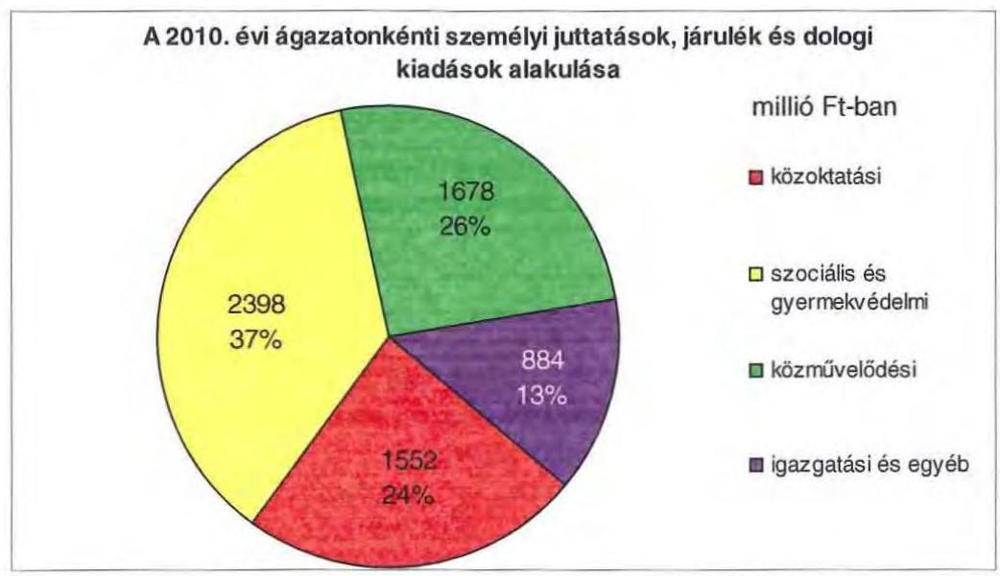

A 2010. évi költségvetési kiadások 78,7%-a (6359 millió Ft) az intézmények, 16,6%-a (1344 millió Ft) a Hivatal költségvetésében szereplő$^{17}$. A Hivatal költségvetéséből a személyi és dologi kiadások 46,7%-kal (627 millió Ft-tal), a beruházások, felújítások 13,6%-kal (183 millió Ft-tal), a különböző megyepolitikai feladatokhoz, szervezetek támogatásához, finanszírozási tételekhez kapcsolódó kiadások 39,7%-kal (534 millió Ft-tal) részesülnek.

Az Önkormányzat kötelező és önként vállalt feladatait 2010. december 31-én - a Hivatallal együtt - 30 költségvetési szervvel és két kizárólagos önkormányzati tulajdonú gazdasági társasággal látta el.

Az Önkormányzat által fenntartott költségvetési szervekből 26 önállóan működő és gazdálkodó, négy önállóan működő költségvetési szerv, az intézmények alapító okiratuk szerint - összesen 59 telephelyen működnek. Az elmúlt négy évben az önállóan működő és gazdálkodó költségvetési szervek száma 30-ról 26-ra, 13,3%-kal csökkent, az önállóan működő költségvetési szervek száma háromról négyre változott, a telephelyek száma eggyel csökkent. Az Önkormányzat feladatait 2010. decemberében az alábbi intézménystruktúrával látta el:

- szociális és gyermekvédelmi feladatokat 10 intézmény végzett (hét átmeneti és tartós szociális ellátást biztosító intézmény, három gyermekvédelmi feladatokat ellátó intézmény, ezen belül egy intézmény közös igazgatású többcélú oktatási és személyes gondoskodást nyújtó);
- közoktatási feladatot hét intézmény látott el (egy tanulási képességet vizsgáló szakértői és rehabilitációs, egy gimnázium, egy gimnázium és szakközépiskola, egy szakközépiskola, egy szakközépiskola és szakiskola, két általános iskola és speciális szakiskola, melyből egy intézmény egységes gyógypedagógiai intézmény);

[^0]
[^0]:    $^{17}$ Az Önkormányzat költségvetésében szerepelnek a kisebbségi önkormányzatok és a Vas Megyei Szakképzés-szervezési Társulás kiadásai 380 millió Ft összegben.

---

- kulturális és sport feladatokat látott el 11 intézmény (könyvtár, levéltár, múzeum, művelődési központ,
 képtár, táncegyüttes, szimfonikus zenekar, bábszínház, lapkiadók, sportigazgatóság);
- igazgatási feladatokat látott el a Közgyűlés hivatala, egy intézmény pedig gazdasági szervezetként működik (hivatali épületfenntartás, üzemeltetés, karbantartás, gazdasági adminisztráció egy része tartozott ide).

Az egyes ágazatok kötelező feladatellátását 2010. december 31-én az alábbi mutatók jellemzik:

| Megnevezés | közoktatás | szociális és gyermekvédelem | egészségügy (gazdasági társaságként működő Kórház) | kultúra és sport |
| :-- | :--: | :--: | :--: | :--: |
| Az ágazatban foglalkoztatottak száma (fő) | 341 | 699 | 1599 | 331 |
| Az ágazat intézményeiben ellátottak összesen (fő) | 1576 | 1672 |  |  |
| Fekvőbeteg ellátás férőhelyeinek száma (db) |  |  | 1321 |  |

Az Önkormányzat két kizárólagos önkormányzati tulajdonú gazdasági társasággal rendelkezik:

- A Vas Megyei Markusovszky Lajos Általános, Rehabilitációs és Gyógyfürdő Kórház Egyetemi Oktatókórház Zrt. 2007. október 1-től feladat kiszervezésével jött létre, korábban költségvetési keretek között kötelező feladatként látott el egészségügyi tevékenységet. A gazdasági társaság alapító okirat szerinti feladata az aktív valamint a krónikus fekvő- és járóbeteg ellátás, nappali kórházi továbbá gyógyfürdő ellátás. Fekvőbeteg ellátás férőhelyeinek száma 1321. Alapításának céljaként a hatékonyabb feladatellátást, a várható bevételek optimalizálását, a ráfordítások minimalizálását, a változó gazdasági környezethez való nagyobb fokú alkalmazkodást jelölték meg. A Zrt. vagyonnal történő ellátását az Önkormányzat vagyonkezelői szerződéssel biztosította.
- A Vas Megyei Önkormányzat Vagyonkezelő Kft-t a közfeladatok ellátásához nem szükséges ingatlanok és ingóságok állagának védelmére, célszerű hasznosítására és gyarapítására alapították.

A kizárólagos önkormányzati tulajdonú gazdasági társaságok mellett az Önkormányzat a Büki Gyógyfürdő Zrt-ben 46,92%, a Vasivíz Zrt-ben 4,21%-os, a Nyugat-pannon Regionális Fejlesztési Zrt-ben 0,18%-os, a Mesteri Termál Kft-ben 10%-os részesedéssel rendelkezett.

---

# 2. PÉNZÜGYI EGYENSÚLYI HELYZET ALAKULÁSA 

A hagyományos költségvetési szerkezet helyett az önkormányzat pénzügyi helyzetét a CLF módszerrel mutatjuk be, amelyben jobban elkülönülnek a vagyonnal kapcsolatos bevételek és kiadások a feladatokkal kapcsolatos közvetlen működtetési bevételektől és kiadásoktól. A módszer következetesen elkülöníti a folyó és a felhalmozási költségvetés bevételeit és kiadásait, azok költségvetési egyenlegeit. A tárgyévi pozíciók meghatározása érdekében a figyelembe vett saját folyó bevételek, valamint saját felhalmozási bevételek nem tartalmazzák az előző évi pénzmaradványok felhasználásából származó pénzforgalom nélküli bevételeket ${ }^{18}$.

A bevételek és kiadások besorolása általános közgazdasági meggondolásokon alapul, amely testet ölt az SNA statisztikai módszertanában is. Folyó tételek alatt értjük azokat a bevételeket és kiadásokat, amelyek az önkormányzat vagyoni helyzetét automatikusan nem változtatják. A bevételi oldalon ilyenek az adók, az illeték, az áfa bevételek és visszatérülések, a hozamok és kamatok, a költségvetési támogatások, az egyéb saját bevételek, valamint a működési célra átvett pénzeszközök és kapott támogatások. A folyó kiadások közé tartoznak a szolgáltatások nyújtásával kapcsolatos működési kiadások, a kamatkiadások, valamint a működési célú transzferkiadások ${ }^{19}$. A felhalmozási vagy tőke tételek módosítják az önkormányzat vagyoni helyzetét. A privatizációs bevételek, az immateriális javak és tárgyi eszközök, valamint a részesedések értékesítése csökkentik, a fizikai beruházások és a pénzügyi befektetések növelik a vagyont. A pénzforgalmi bevételek és kiadások nem tartalmazzák a követelések elengedése miatt könyvelt tételeket, mivel ezek egymást kioltó, technikai jellegű elszámolási műveletek.

A folyó költségvetés egyenlege, a működési jövedelem megmutatja, hogy az önkormányzat éves folyó bevétele fedezetet biztosít-e a kötelező és önként vállalt feladatellátáshoz kapcsolódó éves folyó kiadására. A működési jövedelem negatív értéke pénzügyileg fenntarthatatlan helyzetet jelez. A mutató pozitív értéke megtakarítást mutat, amely forrásul szolgálhat az önkormányzat fennálló kötelezettségei megfizetéséhez, valamint fejlesztéseihez.

A felhalmozási költségvetés pozitív értéke felhalmozási többletet mutat, amely a jövőbeni fejlesztések forrását biztosíthatja. Amennyiben a folyó költségvetési hiány finanszírozása a felhalmozási többletből történik, ez szűkebb értelemben vagyonfelélésnek tekinthető. Amennyiben a felhalmozási költségvetés megtakarítása fejlesztési célú hitelek, kötvények adósságszolgálatát finanszírozza, az változatlan vagyontömeg mellett, a korábban megelőlegezett tőkebevételek valós realizációjának tekinthető. A felhalmozási deficit által generált finanszírozási igény önmagában nem jár pénzügyi kockázattal, a pénz-

[^0]
[^0]:    ${ }^{18}$ A költségvetési években kialakuló hiány finanszírozása az előző években képzett tartalékok felhasználásával is történhet.
    ${ }^{19}$ Transzferkiadásoknak azokat a folyó és felhalmozási tételeket nevezzük, amelyeket nem az adott önkormányzat használ fel szolgáltatásnyújtásra (pl.: ellátottak pénzbeni juttatásai, átadott pénzeszközök, garancia- és kezességvállalások stb.).

---

ügyileg fenntartható beruházásokhoz kapcsolódó kötelezettségvállalás (adósságszolgálat) előrelátó, tudatos költségvetési gazdálkodással teljesíthető.

A módszer a pénzügyi kapacitás (más néven a nettó működési jövedelem) fogalmát helyezi a középpontba. Az adós hitelfelvételi képessége, hosszú távú fizetőképessége vagy bonítása a pénzügyi kapacitással, ezen belül is a nettó működési jövedelemmel jellemezhető. A nettó működési jövedelem negatív értéke az egyes költségvetési években jelentkező adósságszolgálat túlzott mértékére utal ${ }^{20}$. A nettó működési jövedelem negatív értékének felhalmozási többletből, vagy további hitelből történő finanszírozása pénzügyileg nem fenntartható gazdálkodást vetít előre. A pozitív értéket mutató nettó működési jövedelem fejlesztési kiadások fedezetét biztosíthatja, illetve a folyamatosan, évenként képződő pozitív nettó működési jövedelemből meghatározható a jövőben vállalható, teljesíthető éves adósságszolgálat, ily módon az a hitelösszeg, amely - a többi tényezőt, feltételt adottnak tekintve - visszafizetési kockázat nélkül felvehető.

A CLF módszer alapján a pénzügyi kapacitás mértéke az önkormányzat összevont, nettósított, a központi információs rendszerbe a MÁK-on keresztül leadott éves költségvetési beszámolójának 80-as űrlapjában szerepeltetett adatok alapján került meghatározásra. A 2007-2010 közötti időszakban az Önkormányzat CLF módszer szerint besorolt kiadásainak és bevételeinek főbb jogcímek szerinti alakulását a jelentés 2/a. számú melléklete tartalmazza.

Az Önkormányzat bevételeinek és kiadásainak alakulását részletesen a hatályos számviteli előírások szerint készült, összevont éves költségvetési beszámolók adataira alapozva mutatjuk be. A bevételek és kiadások működési, valamint felhalmozási jogcímekre történő elkülönítését az éves költségvetési beszámolók, a zárszámadási rendeletek, továbbá - amely jogcímek ${ }^{21}$ esetében erre más lehetőség nem volt - az Önkormányzat adatszolgáltatása szerinti megbontás alapján végeztük el. A bevételek elemzése során figyelembe vettük a korábbi években keletkezett pénzmaradvány felhasználásából származó pénzforgalom nélküli bevételeket is. A 2007-2010 közötti időszakban az Önkormányzat bevételeinek és kiadásainak, továbbá adósságszolgálatának alakulását a jelentés 2/b. számú melléklete tartalmazza.

[^0]
[^0]:    ${ }^{20}$ Kivéve, ha annak finanszírozására a korábbi években képzett tartalékok fedezetet nyújtanak.
    ${ }^{21}$ Az előző évi maradvány visszafizetésének, az előző évi pénzmaradvány átadásának és átvételének, a kamatkiadásoknak, az egyéb pénzforgalom nélküli kiadásoknak, a hozam- és kamatbevételeknek, az átengedett adóknak, a költségvetési támogatásoknak, továbbá az előző évi pénzmaradvány igénybevételének működési és felhalmozási részre történő megosztásához az Önkormányzat által szolgáltatott adatokat vettük figyelembe.

---

# 2.1. A működési és felhalmozási egyensúly alakulása 

## CLF módszer szerinti önkormányzati adatok

| Megnevezés | 2007 | 2008 | 2009 | 2010 |
| :--: | :--: | :--: | :--: | :--: |
| Folyó bevételek | 17028787 | 8325378 | 7654028 | 6858611 |
| Folyó kiadások | 17107530 | 8209545 | 7255693 | 7079189 |
| Működési jövedelem | $-78743$ | 115833 | 398335 | $-220578$ |
| Nettó működési jövedelem   = működési jövedelem - tőketörlesztés | $-318412$ | $-133435$ | 208224 | $-379029$ |
| Felhalmozási bevételek | 1283098 | 450130 | 358481 | 1126091 |
| Felhalmozási kiadások | 2996708 | 479862 | 1046510 | 1053581 |
| Felhalmozási költségvetés egyenlege | $-1713610$ | $-29732$ | $-688029$ | 72510 |
| Finanszírozási műveletek nélküli (GFS) pozíció= működési jövedelem+felhalmozási költségvetés egyenlege | $-1792353$ | 86101 | $-289694$ | $-148068$ |
| Finanszírozási műveletek egyenlege | 2352071 | $-148446$ | $-164824$ | 1150386 |
| Tárgyévi pénzügyi pozíció változás | 559718 | $-62345$ | $-454518$ | 1002318 |
| Egyéb tájékoztató adatok |  |  |  |  |
| Összes kötelezettség* | 6374309 | 7225510 | 7280254 | 9148749 |
| - ebből rövid lejáratú | 493871 | 496835 | 599325 | 1364326 |
| Folyószámlahitel napi átlagos állománya** | 157075 | 216081 | 226527 | 332798 |
| Likvidhitel napi átlagos állománya | 0 | 0 | 0 | 0 |
| Munkabérhitel napi átlagos állománya ** | 0 | 0 | 0 | 0 |
| Finanszírozásba vonható eszközök : | 5318698 | 5256353 | 4801835 | 4804153 |
| Tartós hitelviszonyt megtestesítő értékpapírok év végi állománya | 2000000 | 2000000 | 2000000 | 1000000 |
| Hosszú lejáratú bankbetétek év végi állománya | 0 | 0 | 0 | 0 |
| Értékpapírok év végi állománya | 0 | 0 | 0 | 0 |
| Pénzeszközök (idegen pénzeszközök nélkül) év végi állománya | 3318698 | 3256353 | 2801835 | 3804153 |

* Az összes kötelezettséget a passzív pénzügyi elszámolások nélkül vettük figyelembe, mert a passzívák a pénzmaradvány elszámolás tételei közé tartoznak.
** A folyószámla-, likvid- és munkabér megelőlegezési hitel átlagos állományát 365 nappal számítottuk.

---

Az Önkormányzat folyó költségvetési egyenlege, működési jövedelme a 2007. illetve a 2010. évben negatív, a köztes időszakban pozitív összegű volt, melynek alakulását a következő ábra szemlélteti:
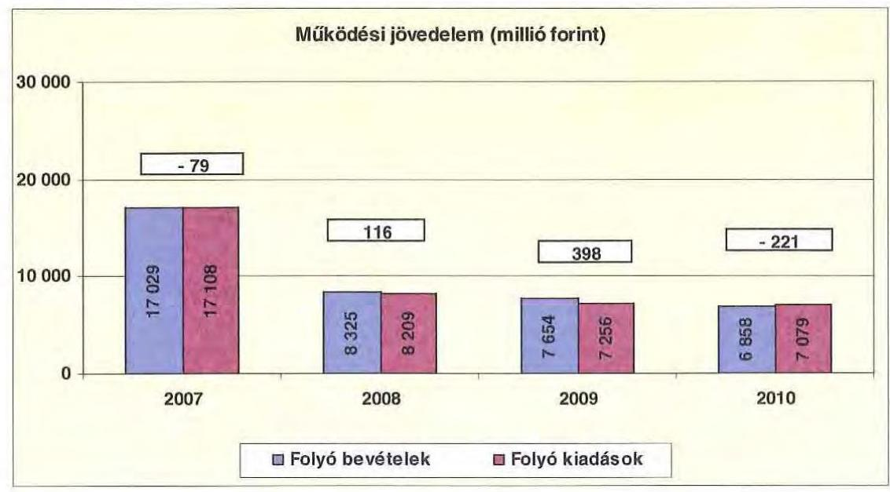

A folyó költségvetés hiánya (a működési forráshiány) 2007-ben a folyó kiadások 0,5%-át (79 millió Ft-ot), 2010-ben 3,1%-át (221 millió Ft-ot) jelentette. A működési forrástöbblet 2008-ban a folyó kiadások 1,4%-a (116 millió Ft), 2009-ben 5,5%-a (398 millió Ft) volt.

A működési forráshiány finanszírozása folyószámlahitelből történt. A folyószámlahitel napi átlagos állománya 2007-2010 között több mint kétszeresére nőtt (157 millió Ft-ról 333 millió Ft-ra).

Az Önkormányzat kötelezettségein ${ }^{22}$ belül a 2007-2009 közötti időszakban a rövid lejáratú kötelezettségek állománya közel 8% volt, a 2010. évi 14,9%-os aránnyal szemben. Az Önkormányzat 2006. december 31-én fennálló pénz és tőkepiac kötelezettsége 1335 millió Ft-ról közel 6,5-szeresére, 8617 millió Ft-ra nőtt.

A rövid lejáratú kötelezettségek 2010-ben 1364 millió Ft-ot tettek ki, amely főként a felvett folyószámlahitel összegének növekedése miatt - 870 millió Ft-tal (176,3%-kal) több a 2007. évi rövid lejáratú kötelezettségállománynál. A rövid lejáratú kötelezettségeknek a szállítói állomány 2007-ben 25,3%-át (125 millió Ft), 2008-ban 22,5%-át (112 millió Ft), 2009-ben 23,8%-át (143 millió Ft), 2010-ben 10,7%-át (146 millió Ft) tette ki, miközben a szállítói kötelezettségek a vizsgált időszakban 1,2-szeresére nőttek.

Az Önkormányzat pénzügyi kapacitása a vizsgált időszakban - kivétel a 2009. év - negatív értéket mutatott. A nettó működési jövedelem ${ }^{23}$ értéke a folyó

[^0]
[^0]:    ${ }^{22}$ passzív pénzügyi elszámolások nélküli
    ${ }^{23}$ pénzügyi kapacitás

---

költségvetési pozíció mellett az adott költségvetési év adósságtörlesztésének hatását is tükrözi.

Az Önkormányzat nettó működési jövedelmének évenkénti alakulását az alábbi ábra
 szemlélteti:
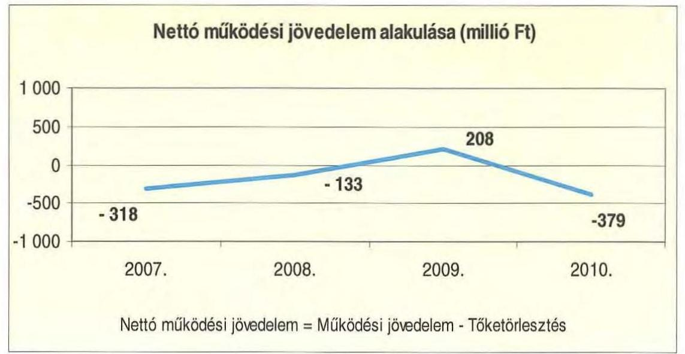

A folyó költségvetés egyenlegének és a tőketörlesztésre (hiteltörlesztés és forgatási és befektetési célú értékpapírok beváltása) fordított összegeknek évenkénti különbözete (a nettó működési jövedelem) fokozatos javulás után 2010-ben a 2007. évi negatív érték alá csökkent, annak ellenére, hogy a tőketörlesztések csökkentek.

Az Önkormányzat felhalmozási költségvetésének egyenlege 2010. évben pozitív összegű volt a 2007-2009. évi felhalmozási hiánnyal szemben.

A felhalmozási költségvetés egyenlegének alakulását évről évre a következő ábra szemlélteti:
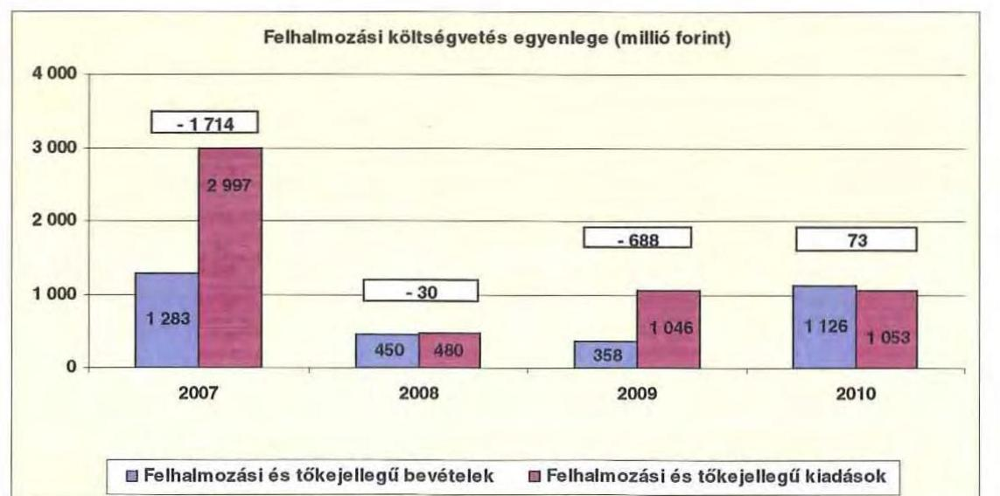

---

A felhalmozási forráshiánynak a felhalmozási és tőke jellegű kiadásokhoz viszonyított aránya 2007-ben 57,2% (1714 millió Ft), 2008-ban 6,2% (30 millió Ft) 2009-ben 65,7% (688 millió Ft) volt. 2010-ben a felhalmozási forrástöbblet a felhalmozási és tőke jellegű kiadások 6,9%-át (73 millió Ft-ot) jelentette.

A 2007-2009. közötti időszakban fennálló felhalmozási forráshiányt elsődlegesen kötvénykibocsátással biztosították. A kötvénykibocsátásból származó bevétel felhalmozási célra történő felhasználását több évre ütemezte az Önkormányzat (a kibocsátott 5000 millió Ft kötvénybevételből 1413 millió Ft-ot használtak fel a 2008-2010. évek között). Emellett folyószámlahitel, valamint pénzmaradvány biztosította a felhalmozási egyensúlyt.

Az Önkormányzat évenkénti teljes finanszírozási hiánya $^{24}$ a CLF módszer szerint 2007-ben 2032 millió Ft, 2008-ban 163 millió Ft, 2009-ben 480 millió Ft, 2010-ben 307 millió Ft volt.

Az Önkormányzat finanszírozási műveletei 2007-2010. évekbeni egyenlegének alakulását a következő ábra szemlélteti:
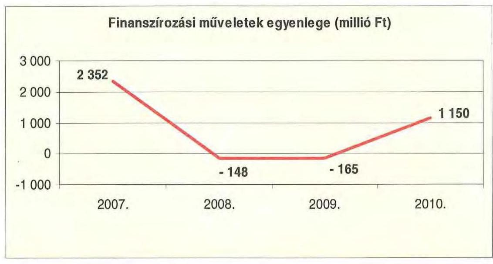

A finanszírozási többlet azt jelzi, hogy az éves költségvetések végrehajtása során szükség volt a pénzkészlet felhasználásán túl külső finanszírozás igénybevételére is. A finanszírozási célú műveleteket a vizsgált időszakban a jelentés 2./a számú mellékletének 4.1-4.8 pontjai részletezik.

Az Önkormányzat zárszámadási rendeletében a működési és fejlesztési hiányt/többletet a hagyományos költségvetési szerkezet alapján mutatta be $^{25}$, amelyről a jelentés 1. számú melléklete nyújt tájékoztatást. A 2007-2010. évi zárszámadási rendeletekben - a 2007. év kivételével - a működési bevételek összege meghaladta a működési kiadások összegét.

[^0]
[^0]:    $^{24}$ a nettó működési jövedelem és a felhalmozási költségvetés egyenlegeinek összege
    $^{25}$ Nincs kötelező előírás a működési és fejlesztési hiány megállapításának módjára.

---

A vizsgált időszakban a kötelezettségek (passzív pénzügyi elszámolások nélkül) 6374 millió Ft-ról 9149 millió Ft-ra emelkedtek, amely együtt járt a kamatkiadások növekedésével. Ugyanakkor a kötvénykibocsátásból származó bevételek lekötése révén - a 2007. év kivételével, amelyben a kamatkiadások 5 millió Ft-tal haladták meg a kamatbevételeket - a kapott kamatok folyamatosan meghaladták a fizetett kamatokat.

Az Önkormányzat 2007-2010 között összesen 1163 millió Ft kamatbevételt realizált, amely a teljes kamatráfordítás (697 millió Ft) 166,9%-át tette ki.

Az Önkormányzat kamatbevételeinek és kamatkiadásainak alakulását a következő ábra mutatja:
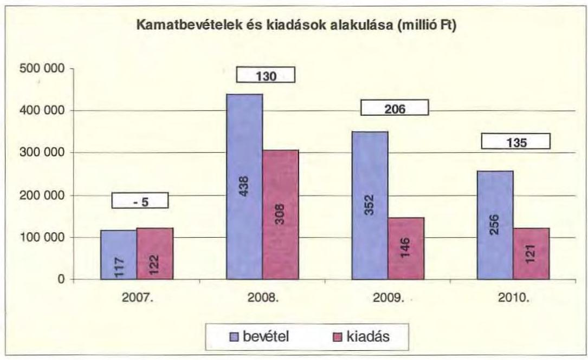

A 2007-2011 közötti időszakban az Önkormányzat kiadásainak és bevételeinek főbb jogcímek szerinti alakulását a jelentés 2./b számú melléklete tartalmazza.

# 2.2. Az Önkormányzat bevételeinek alakulása 

Az Önkormányzat 2007-2010 között realizált OEP támogatás nélküli főbb bevételi jogcímeinek számszaki adatait az alábbi táblázat részletezi és grafikon mutatja be:

|  |  |  |  | ezer Ft |
| :--: | :--: | :--: | :--: | :--: |
| Megnevezés | 2007. év   tény | 2008. év   tény | 2009. év   tény | 2010. év   tény |
| Illetékbevétel | 1571134 | 1811520 | 1563232 | 1075469 |
| szja és állami támogatás | 3675534 | 3731395 | 3244814 | 2621473 |
| Egyéb saját bevétel (OEP nélkül) | 4826109 | 2779072 | 2791956 | 3848560 |
| Összes működési bevétel | 10072777 | 8321987 | 7600002 | 7545502 |

---

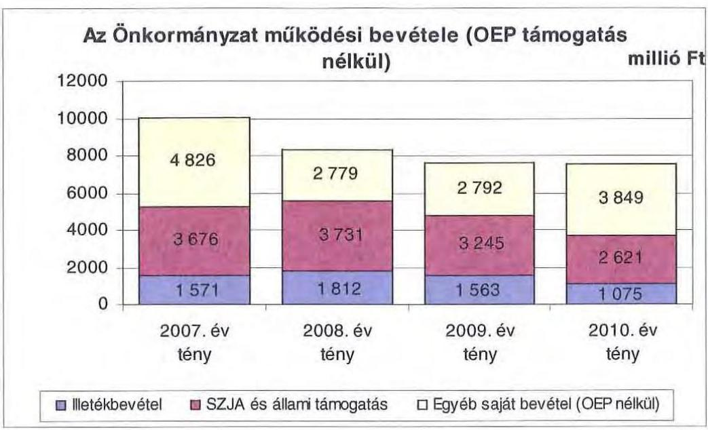

Az Önkormányzatnál az illetékbevétel a 2006. évi 1741 millió Ft-ról 9,6%-kal (170 millió Ft-tal) csökkent a 2007. évre. A csökkenésben szerepet játszott az Illetékhivatalnak - 2007. január 1-jétől - az APEH-hoz történő átszervezése is, miután az évente realizált illetékbevételekből (központi intézkedés következtében) évi 8,5% elvonásra került az adminisztrációs feladatokra. A beszedés költségeire elvont pénzösszeg kevesebb volt, mint amekkora költségvetési kiadást jelentett korábban az Illetékhivatal működtetése $^{26}$ az Önkormányzatnak. A hivatal működtetésével kapcsolatos kiadások megszűnése és az adminisztrációs feladatokra visszatartott 8,5% között 2007-ben 112 millió Ft pozitív különbözet jelentkezett, de a 170 millió Ft-os bevételcsökkenésnek ez csak 65,8%-át tette ki.

Az illetékbevétel a vizsgált időszakban 2008-ban növekedett, amikor az előző évihez képest 15,3%-kal (241 millió Ft-tal) nőtt. 2008-ról 2009-re 13,7%-os (249 millió Ft) csökkenés következett be, majd a 2010. évben jelentősen mérséklődött, az előző évhez viszonyítva a csökkenés 31,2%-os (488 millió Ft) volt. Az illetékbevételekből 2006. évhez viszonyítva 2010-re 666 millió Ft-os, 38,2%-os csökkenés következett be.

Az átengedett szja és az állami támogatások együttes összege a 2008. évi 56 millió Ft-os, 1,5%-os növekedést követően központi forráskivonás hatására $^{27}$ folyamatosan és jelentős mértékben csökkent. Az előző évihez képest 2009-ben 13%-kal (487 millió Ft-tal), 2010-ben 19,2%-kal (623 millió Ft-tal) kapott kevesebb forrást az Önkormányzat az államtól ezeken a jogcímeken. A változást a normatíváknak a járulékváltozások miatti központi csökkentése, valamint a megyei önkormányzatokat érintő forráselvonás mellett az ellátotti létszám visszaesése idézte elő.

[^0]
[^0]:    $^{26}$ A 2006. évben az illetékhivatal működtetésére 245 millió Ft-ot fordítottak. Az éves illetékbevétel 8,5%-a 2007-ben 134 millió Ft, 2008-ban 154 millió Ft, 2009-ben 133 millió Ft, 2010-ben 91 millió Ft volt.
    $^{27}$ a 2007. évi bázishoz képest

---

Az Önkormányzat beszámolójában szereplő OEP támogatás 2007-ben 6782 millió Ft volt, amely a kórház kiszervezés miatt 2010-re 28 millió Ft-ra csökkent.

A Kórház nélkül számított intézményi működési bevételek $^{28}$ 2007-2010 között 386 millió Ft-tal, 28,2%-kal nőttek, amelyhez hozzájárult a szociális ellátások térítési díjának önköltségalapú növelése. A fizetendő díjakat azonban az ellátottak egyre nagyobb arányban nem képesek megfizetni. A keletkező díjhátralékok miatt megnövekedett az Önkormányzat követeléseinek állománya, amely kedvezőtlenül hatott fizetőképességének alakulására.

A követelések nagysága önkormányzati szinten a 2010. év végére a 2007. évi 304 millió Ft-ról 444 millió Ft-ra (46,3%-kal) nőtt. A 2008. és 2009. évi csökkenést követően 2010-ben dinamikus növekedés jelentkezett (a 2009. évi követelés állománya (186 millió Ft) közel 2,4-szeresére nőtt).

Az Önkormányzat felhalmozási bevételei a vizsgált időszakban a következők voltak:
ezer Ft

| Megnevezés | 2007. év   tény | 2008. év   tény | 2009. év   tény | 2010. év   tény |
| :-- | --: | --: | --: | --: |
| Tárgyi eszköz értékesítés | 291598 | 27891 | 4480 | 8684 |
| Állami támogatás | 933991 | 33454 | 14098 | 56226 |
| Átvett pénzeszköz | 89199 | 115676 | 96119 | 181611 |
| Egyéb felhalmozási bevétel | 1001598 | 609290 | 556323 | 695157 |
| Felhalmozási tartalék | 1320234 | 2905082 | 857735 | 261137 |
| Összes felhalmozási bevétel | 3636620 | 3691393 | 1528755 | 1202815 |

Az Önkormányzatnak tárgyi eszköz értékesítésből 2007-ben származott számottevő bevétele. Az APEH-nak értékesítették a tulajdonukban lévő illetékhivatali berendezéseket, járműveket. Ezen túlmenően négy ingatlan értékesítéséből keletkezett felhalmozási bevétel.

Állami támogatás a 2007. évben a címzett támogatással megkezdett Kórház sürgősségi betegellátó tömb kialakítása és céltámogatással megvalósuló egészségügyi gép beszerzés kapcsán keletkezett. Az egyéb felhalmozási bevételek üzletrész értékesítéshez, továbbá az intézmények fejlesztéseihez kapcsolódtak. Az Önkormányzat 2007. évben értékesítette a Florasca Kft-ben levő üzletrészét 156 millió Ft értékben. Az évenkénti nagy összegű felhalmozási tartalékot a fejlesztések finanszírozására - betétként - lekötötték.

[^0]
[^0]:    $^{28}$ A 2007. évi működési bevételek 2579 millió Ft összegéből a Kórház bevétele 1210 millió Ft volt.

---

# 2.3. Az Önkormányzat kiadásainak alakulása 

Az Önkormányzat Kórház nélküli $^{29}$ működési kiadásai főbb jogcímek szerinti bontásban az alábbiak voltak:

|  |  |  |  | ezer Ft |
| :-- | --: | --: | --: | --: |
| Megnevezés | 2007. | 2008. | 2009. | 2010. |
| Működési kiadások | 8356366 | 7939609 | 7199350 | 7342918 |
| Működési kiadások (kamatkiadás nélkül) | 8333837 | 7904463 | 7155385 | 7299280 |
| Kamatkiadás | 22529 | 35146 | 43965 | 43638 |
| Személyi juttatások | 3983083 | 3855926 | 3513655 | 3406325 |
| Munkaadót terhelő járulékok | 1254301 | 1208750 | 1044323 | 887486 |
| Dologi kiadások | 1965169 | 2107261 | 2017975 | 2152767 |
| Egyéb folyó kiadások | 70938 | 46417 | 126944 | 335987 |
| Támogatások, elvonások, egyéb folyó átutalások | 992282 | 569611 | 289021 | 437265 |
| ebből: működési célú pénzeszközátadás | 825470 | 328595 | 118065 | 206642 |
| Előző évi pénzmaradvány átadás, visszafizetés, működési célú | 68064 | 116498 | 163467 | 79450 |

Az Önkormányzat működési kiadásai 2007. december 31-ről 2010. december 31-re 12,1%-kal csökkentek (8356 millió Ft-ról 7343 millió Ft-ra).

Az Önkormányzat 2010-ben a működési költségvetés 58,5%-át (4294 millió Ft-ot) személyi juttatásokra és a munkaadókat terhelő járulékokra fordította, az üzemeltetést, intézményfenntartást biztosító dologi kiadásokra 29,3% (2153 millió Ft) jutott. A működési kiadásokon belül a személyi juttatások és járulékok aránya a vizsgált időszakban 62,7%-ról 58,5%-ra csökkent.

A személyi juttatások a létszámcsökkentések miatt minden évben csökkentek az előző évhez képest. 2010-ben a 2007. évben teljesített kiadásoknál 14,5%-kal (577 millió Ft-tal) voltak alacsonyabbak.

A dologi kiadások az Önkormányzatnál 2010-ben a 2007. évi szintnél 188 millió Ft-tal, 9,5%-kal voltak magasabbak. A 2009. év kivételével $^{30}$ minden évben az inflációt meghaladó mértékben nőttek a dologi kiadások, amelynek ellentételezése a központi forráselosztásban nem jelentkezett. Fedezetét az Önkormányzat a végrehajtott kiadáscsökkentő intézkedések mellett folyószámlahitelből biztosította.

A bevételek jelentős csökkenése miatt működési célú pénzeszközátadásokat 2007-ről 2008-ra 60%-kal $^{31}$, 2009-ben az előző évhez képest további 64,1%-kal (118 millió Ft-ra) csökkentette, a 2010. évben 75%-kal - 207 millió Ft-ra - növelte a Közgyűlés.

[^0]
[^0]:    $^{29}$ A Kórház 2007. október 1-től gazdasági társaságként működik. Az Önkormányzat 2007. évi működési kiadásai az összehasonlíthatóság érdekében nem tartalmazzák a Kórház kiadásait.
    $^{30}$ Ebben a költségvetési évben az előző évhez képest a dologi kiadások 89 millió Ft-os, 4,2%-os csökkenése következett be.
    $^{31}$ 825 millió Ft-ról 329 millió Ft-ra

---

Az Önkormányzat a gazdasági társaságként $^{32}$ működő Kórház működési kiadásaihoz a 2007-2008. években 371 millió Ft-tal járult hozzá. A Kórháznak átadott működési pénzeszközök a létszámcsökkentésekhez kapcsolódó többletköltség fedezetéhez, a 13. havi juttatások kifizetéséhez és a dolgozók egyszeri kereset kiegészítéséhez kapcsolódtak. Az átadott pénzeszközökből 337 millió Ft a központi költségvetésből megigényelt összeg volt, 34 millió Ft-ot pedig az Önkormányzat megállapodás alapján biztosított a Zrt-ben dolgozók egyszeri kereset-kiegészítésére.

A működési célú önkormányzati pénzeszközátadáson felül 2009-ben
 további 522 millió Ft-ot adott a Közgyűlés a Kórháznak fejlesztési célra. A pénzeszközátadások évenkénti megoszlását a következő grafikon mutatja be.
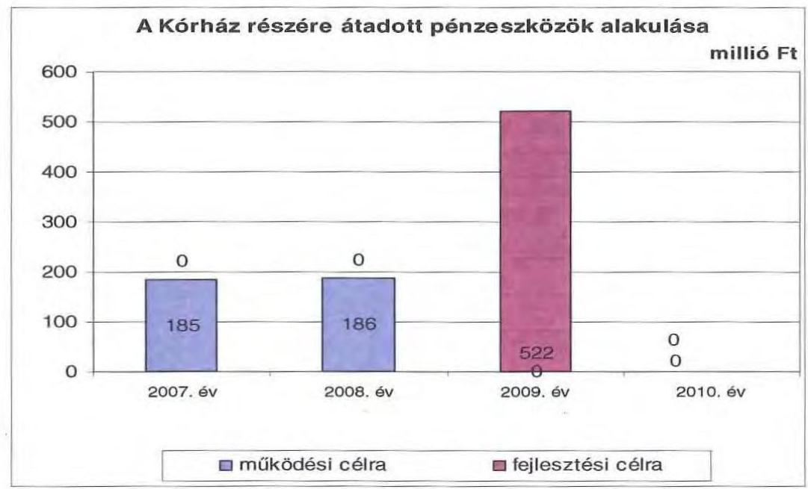

A Kórház bevételei a 2007. évi 12580 millió Ft-ról 2010. évre 11482 millió Ft-ra, 8,7%-kal, ezen belül az OEP támogatás 29 millió Ft-tal, 0,3%-kal csökkent. A Kórház 2007. évben intézményként 8446 millió Ft, Zrt.-ként 2614 millió Ft működési kiadást teljesített. A 2010. évben a működési kiadások 10912 millió Ft-ra, 1,3%-kal csökkentek 2007-hez viszonyítva. A Kórház éves beszámolója szerint 2008-ban 511 millió Ft mérleg szerinti nyereséget, 2009-ben 511 millió Ft, 2010-ben 283 millió Ft mérleg szerinti veszteséget ért el.

A működési és felhalmozási kiadások arányának változásában 2007-2010 között elmozdulás figyelhető meg, a felhalmozási kiadások aránya 15,6%-ról 9,2%-ra csökkent.

[^0]
[^0]:    ${ }^{32}$ A Kórház 2007. október 1-től működik gazdasági társaságként.
    ${ }^{33}$ Az összeg együttesen tartalmazza a 2007. szeptember 30-ig intézményként, 2007. október 1-től gazdasági társaságként kapott bevételeket.

---

A kiadások megoszlásának alakulását a következő grafikon szemlélteti:
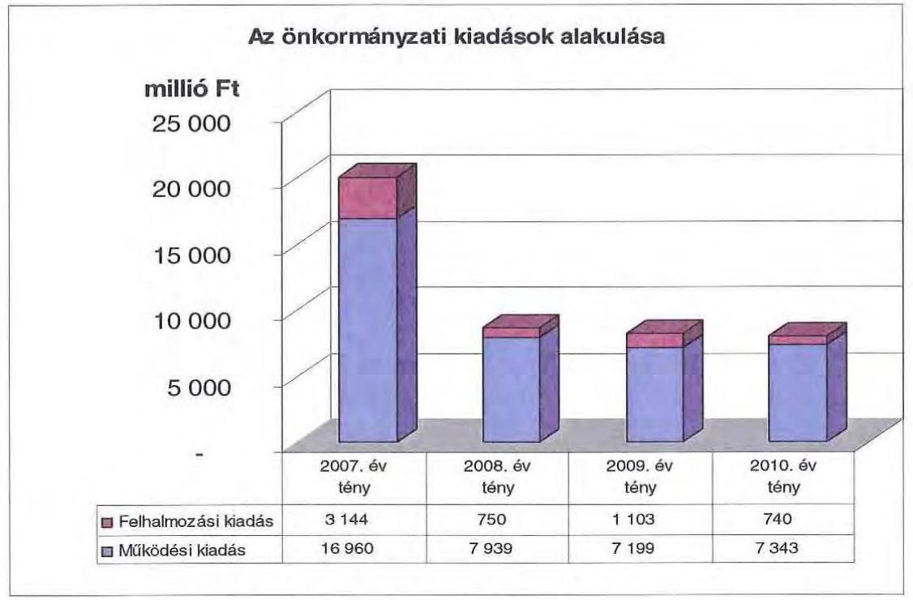

2007-2010 között a 10 millió Ft teljes bekerülési költség feletti beruházások és felújítások száma 25 volt, amelyek több mint negyedéhez (hét fejlesztéshez) uniós forrásokat is igénybe vettek. A 10 millió Ft alatti fejlesztésekkel együtt - melynek összértéke 654 millió Ft - 2010-ben 31 uniós projekt megvalósítása volt folyamatban. Az összesen 5066 millió Ft bekerülési költségű fejlesztésekből 4913 millió Ft, 96,8% a kötelező feladatellátást szolgálta.

Az Önkormányzat 2007-2010. években együttesen 2467 millió Ft-ot fordított fejlesztéseinek finanszírozására, ennek 9,4%-a, 232 millió Ft a 10 millió egyedi beszerzési érték alatti fejlesztésekhez kapcsolódott. A kisebb értékű beruházásokhoz 22 millió Ft uniós és hazai forrást terveznek pályázati úton megszerezni.

Ezen időszakban a három legmagasabb bekerülési költségű - 2007-2010. években befejeződött - beruházások az alábbiak voltak:

- a Markusovszky Kórház rekonstrukciója címzett támogatással 2004-2007. évek között valósult meg, amelynek során a sürgősségi betegellátó tömb építésére került sor. A fejlesztés bekerülési költsége 2607 millió Ft volt, amelyet 2470 millió Ft-ban címzett támogatás, 137 millió Ft-ban saját forrás finanszírozott;
- a TÁMOP 2.2.3 A Vas megyei szakképzés fejlesztése a vasi TISZK keretein belül projekt tervezett bekerülési költsége 360 millió Ft, amelynek kifizetése 2010. december 31-ig megtörtént. A 2009-ben indult és 2010-ben befejeződött projekt önerő nélkül, EU-s támogatásból valósult meg.

---

- a nevelőszülői otthon kialakításának 170 millió Ft-os bekerülési költségét az Önkormányzat saját bevételéből fedezte. A fejlesztés 2008-2009. évek között valósult meg, amelynek során nyolclakásos hivatásos nevelőszülői gyermekotthont alakítottak ki.

Az Önkormányzat fejlesztési tevékenységét a pályázati kiírások nagyban befolyásolják, mert a jelentkező működési forráshiány és saját felhalmozási bevételei alacsony szintje miatt beruházásokat csak külső források, uniós és hazai támogatások elnyerése esetén tud megvalósítani.

A pályázati tevékenység eredményeként az Önkormányzat 2007-2010 között összesen 5066 millió Ft bekerülési költségű beruházást folytatott, illetve indított el, amelyből 324 millió Ft a 2010. évet követő időszakra vállalt kötelezettség. A felhalmozási kötelezettségvállalások között kórházi fejlesztés nem szerepelt. A felhalmozási kiadások önrészének forrásait saját bevételekből, felhalmozási célú kötvénykibocsátásból, illetve annak kamataiból finanszírozták.

# 3. KÖTELEZETTSÉGEK BEMUTATÁSA 

### 3.1. A pénzintézetek felé fennálló kötelezettségek alakulása

Az Önkormányzat pénzintézeti kötelezettségeinek állománya 2006. december 31-től 2010. december 31-ig 6,5 szeresére, 1335 millió Ft-ról 8617 millió Ft-ra nőtt. Fennálló pénzintézeti kötelezettségei kötvény kibocsátásából, hosszú lejáratú hitel igénybevételéből, valamint folyószámlahitelek igénybevételéből keletkeztek.
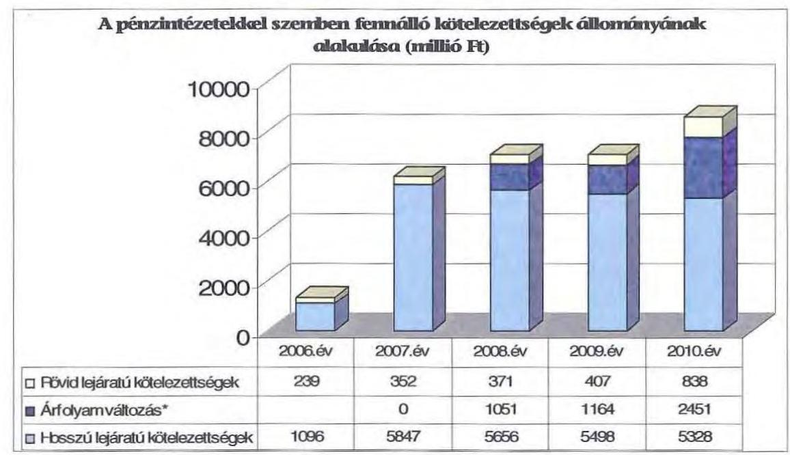

Az Önkormányzat fennálló pénzintézeti kötelezettségvállalásaira közgyűlési döntés alapján került sor. A kötelezettségvállalásból származó források fel-

---

használási céljait meghatározták. A Közgyűlés döntéseit megalapozó előterjesztések csak részben ${ }^{34}$ tartalmazták ugyanakkor a kötelezettségvállalás visszafizetési forrásainak, a teljes futamidő várható kamat és tőkefizetési kötelezettségeknek, az árfolyam- és kamatkockázatnak a bemutatását. Az előterjesztésekben kitértek az adósságszolgálati korlát bemutatására, a Közgyűlés döntéseit ennek figyelembevételével hozta meg.

Az Önkormányzat a kötelezettségvállalások során az adósságot keletkeztető kötelezettségvállalásának felső határát nem lépte túl.

Az adósságot keletkeztető kötelezettségvállalással megvalósított felhalmozási kiadások fedezetéül szolgáló esetleges bevételt növelő, illetve kiadást csökkentő vonzatát, illetve ennek a fejlesztéshez, felújításhoz vállalt kötelezettségek visszafizetési forrásként való számbavételét nem vizsgálták.

Az Önkormányzat 2010. december 31-én CHF-ben fennálló adósságot keletkeztető kötelezettségvállalása a következő volt:

| Megnevezés | Kibocsátás, illetve szerződéskötés időpontja | Összeg CHF | Kibocsátási, vagy lekötési árfolyam | Kamat (referencia kamat+ kamatfelár) | Felhasználás célja: |
| :--: | :--: | :--: | :--: | :--: | :--: |
| Fejlesztések Vas Megyeért Kötvény | 2007.11.11 | 33490000 | 149,3 | 3 havi LIBOR CHF + 0,31% | Fejlesztés, fejlesztési tartalékképzés |

A Fejlesztések Vas Megyeért kötvény kibocsátásából származó bevétel 20,1%-át Vas Megye fejlesztéseire, pályázati önerő biztosítására, 3,5%-át utófinanszírozott pályázatok megelőlegezésére, 0,6%-át kölcsönnyújtásra, 4,0%-át folyószámla hitelkeret kiváltásra használták fel. A kötvényből az Önkormányzat 3587 millió Ft-ot még nem használt fel.

A Közgyűlés a társadalmi gazdasági programjában elhatározott fejlesztési feladatainak megvalósítása érdekében pályázatot írt ki kötvény pénzintézeti lejegyzésére vonatkozóan. A pénzintézet kiválasztása meghívásos pályázati eljárás keretében történt. Négy pénzintézet adta be indikatív ajánlatát, a Közgyűlés a kötvény lejegyzőjének a szolgáltatási kondíciók közül legjobb ajánlatot adót választotta. A kötvény lejegyzője eltért az Önkormányzat számlavezetőjétől.

[^0]
[^0]:    ${ }^{34}$ A Közgyűlés a 67/2001. (V. 24.) számú határozatában az ERSTE Bankkal kötött hitelszerződéshez fedezetként az OEP bevételt jelölte meg. A balatonlellei ingatlan megvásárlásához felvett hitelhez a költségvetés mellett jelzálogjog bejegyzést jelölt meg a Közgyűlés. A HVB Bank 1,1 milliárdos fejlesztési hitelszerződése a teljes futamidő várható kamat és tőkefizetési kötelezettségét tartalmazta. A Közgyűlés a 155/2005. (IX. 23.) számú határozata alapján a hitelből 250 millió Ft-ot az Önkormányzat, 850 millió Ft-ot a Kórháznak kell visszafizetnie, forrást nem jelöltek meg. A kötvénynél nem szerepelt a visszafizetési forrás.

---

Az Önkormányzat 2010. december 31-én HUF-ban fennálló adósságot keletkeztető kötelezettségvállalása az alábbi volt:
ezer Ft-ban

| Megnevezés | Kibocsátás időpontja | Összeg HUF | Kamat (referencia kamat+ kamatfelár) | Felhasználás célja: |
| :-- | :--: | :--: | :--: | :--: |
| Hosszú lejáratú hitel | 2006.03.23 | 1100000 | 6,98% | Kórház részére gép-műszer beruházás |

Az Önkormányzat 2007-2010 között a CHF-ben fennálló pénzintézeti kötelezettségére tőkét nem törlesztett. A tőketörlesztés 2012. december 31-től a futamidő végéig (2027. december 31.) negyedévenként lesz esedékes. Az Önkormányzat 2010. december 31-ig 1727700 CHF (293 millió Ft) kamatot, valamint a kötelezettséghez kapcsolóan 7,1 millió Ft egyéb díjat és költséget (7 millió Ft kibocsátási díj) fizetett.

Az árfolyamváltozás hatása is befolyásolja a kötelezettségek alakulását, azonban annak mértéke előre pontosan nem határozható meg, csak várakozásokon alapuló tendenciák jelezhetők. A Számv. tv. 60. § (4) bek. meghatározza, hogy az árfolyam-különbözetet év végén a kötelezettségek vagy követelések között a könyvviteli mérlegben nyilván kell tartani, azonban az árfolyam-különbözet valójában nem realizálódott. Annak megítéléséről azonban, hogy a devizában kibocsátott kötvényekért és felvett hitelekért kapott forinthoz képest a kötvények visszavásárlásakor, illetve a hitelek visszafizetésekor jelentkező forint kötelezettség többletkiadást (árfolyamveszteség) vagy megtakarítást (árfolyamnyereség) eredményez a futamidő végén, a teljes kötelezettség rendezését követően lehet képet alkotni. Mindaddig, amíg törlesztési kötelezettség nem áll fenn (türelmi idő, moratórium), a tőkére vonatkoztatva nem értelmezhető sem az árfolyamveszteség, sem az árfolyamnyereség.

Az Önkormányzat 2010. december 31-én fennálló kötelezettségeinek várható jövőbeni, a teljes futamidőre vonatkozó tőke-, kamat- és egyéb fizetési kötelezettsége - az utolsó fizetési kötelezettség alapját képező teljes (alapkamat és kamatfelár) kamat- és egyéb szerződéses kondíciókkal számolva - 2011-2013 között 7343255 CHF, 2014 után 34843759 CHF.

Az Önkormányzat 2007-2010 között hosszú lejáratú hiteltörlesztésre és kamatfizetésre 1096 millió Ft-ot fordított, melyből 571 millió Ft tőke és 228 millió Ft kamat a 2010. év végén fennálló hitelszerződéshez kapcsolódott. A hitel törlesztéséhez a Kórház 2011. március 31-ig 497 millió Ft-ot utalt át az Önkormányzat számlájára.

Az Önkormányzat 2007-2010. december 31. között az átmenetileg szabad pénzeszközein 1163 millió Ft kamatbevételt realizált, melyből 1033 millió Ft volt kötvény befektetéséből származó bevétel és 130 millió Ft az intézmények

---

és a Közgyűlés hivatala elkülönített bankszámláin rendelkezésre állt forrás befektetéséből ${ }^{35}$.

A kötvényből származó kamatbevételből fizette az Önkormányzat többek között a kamatot, a kibocsátási és egyéb költségeket, fejlesztésre 73 millió Ft-ot, 100 millió Ft-ot működési célra fordított, fejlesztési bevétel elmaradásra ${ }^{36}$ 70 millió Ft-ot használt fel. A kötvény fel nem használt részének lekötéséből származó kamatbevétel (1033 millió Ft) három és félszeresét (352,6%-át) tette ki a kötvény kibocsátás miatt megfizetett kamatnak.

Az Önkormányzat likviditását a vizsgált időszakban csak folyószámlahitel igénybevételével tudta biztosítani, mivel a tervezett hiányszinthez ez jelentett finanszírozási forrást.

A folyószámlahitel és a munkabér megelőlegezési hitel alakulását az alábbi táblázat mutatja be:
ezer Ft-ban

| Megnevezés | 2007. év | 2008. év | 2009. év | 2010. év | 2011. március 31. |
| :-- | :--: | :--: | :--: | :--: | :--: |
| I. Folyószámlahitel |  |  |  |  |  |
| a folyószámlahitel keretösszege január 1-jén | 250000 | 570000 | 600000 | 600000 | 1000000 |
| teljesített kamat és egyéb költség | 21452 | 33785 | 42396 | 43442 | 12421 |
| II. Munkabér megelőlegezési hitel |  |  |  |  |  |
| igénybevett hitel összesen: | 18148 | - | - | - | - |
| teljesített kamat és egyéb költség | 34 | - | - | - | - |

A folyószámlahitel és munkabér megelőlegezési hitel kondíciói és egyéb költségei a következők voltak ${ }^{37}$:

| Megnevezés | Kamat (referencia+ kamatfelár) | Egyéb költség |
| :--: | :--: | :--: |
| Folyószámlahitel |  |  |
| 2007. év | 3 havi BUBOR + 0,15% | x |
| 2008. év | 3 havi BUBOR + 0,15% | x |
| 2009. év | 3 havi BUBOR + 2,0% | x |
| 2010. év | 3 havi BUBOR + 2,0% | x |
| 2011. év | 3 havi BUBOR + 2,0% 700 M Ft-ig, 3 havi | x |
| Munkabér megelőlegezési hitel |  |  |
| 2007. év | 3 havi BUBOR + 0,3% | x |

[^0]
[^0]:    ${ }^{35}$ Közoktatási intézményeknél a szakképzési hozzájárulások, más intézményeknél a pályázatokon nyert támogatások után keletkezett kamatjóváírás. Felhasználása működési kiadásokra történt.
    ${ }^{36}$ A költségvetésben megtervezett vagyonhasznosítási bevétel nem teljesült, a tervezett és megvalósított kiadásokra így teremtettek fedezetet.
    ${ }^{37}$ A referencia kamat az
 alábbiak szerint alakult:

    | MNB BUBOR fixing (átlagkamat) %-ban |  |  |  |  |
    | :-- | :-- | :-- | :-- | :-- | :-- |
    | 2007. évi | 2008. évi | 2009. évi | 2010. évi | 2011. már- |
    | 7,75 | 8,87 | 8,64 | 5,5 | 6,03 |

---

A 2007. évben fennálló 250 millió Ft-os tartós folyószámlahitel-keret 2011. évre négyszeres (1000 millió Ft) lett. A vizsgált időszakban az Önkormányzat az év minden napján (kivétel 2007. év, amikor 23 nap híján, 342 napon át) igénybe vette a folyószámlahitel keretét. Az átlagos napi állomány a 2007. évben volt a legalacsonyabb, 168 millió Ft, a 2011. március 31-ei volt a legmagasabb, 456 millió Ft. Az áttekintett időszakot jellemző folyamatos likviditási problémák finanszírozása (folyószámlahitel) az Önkormányzatnak a 2007-2010 között összesen 141 millió Ft kamatráfordítást eredményezett.

A folyószámlahitel-keret kimerülése miatt az Önkormányzat a munkabérek kifizetéséhez 2007. április 2-án 18,1 millió Ft összegű munkabér-megelőlegezési hitelt vett igénybe, a törlesztés az önkormányzati hivatal többletbevételéből az igénybevételt követő hónapban megtörtént. Kamat címén az Önkormányzat 34 ezer Ft-ot fizetett ki. A 2008. évtől 2011. március 31-ig már nem vett igénybe munkabér-megelőlegezési hitelt az Önkormányzat.

Az alapkamat mértékének alakulása jelentős hatással van az adott devizanemben kifejezett, a teljes futamidőre számított, várható kamatköltség nagyságára. Az Önkormányzat jelenleg fennálló kötvénye esetében a kamatfizetési kötelezettségek alakulását is jelentősen befolyásolta a referencia kamat változása, melyet az alábbi táblázat mutat be:

| Megnevezés | Kibocsátási, lehívási | Utolsó fizetéskori | Változás % |
| :--: | :--: | :--: | :--: |
|  | alapkamat % |  |  |
| 3 havi LIBOR CHF | 2,29 |  | $-92,5$ |

A kötvény kibocsátási, lehívási időpontja: 2007. október 11-e, az utolsó kamatfizetési kötelezettség 2011. március 31-én volt.

Amennyiben a referenciakamat nem változott volna, az Önkormányzatnak kibocsátáskori referenciakamattal számolva 2010. december 31-ig 2829905 CHF kamatfizetési kötelezettsége jelentkezett volna. A kamatváltozások miatt azonban az Önkormányzatnak 1102205 CHF-el kevesebb fizetési kötelezettséget kellett teljesítenie, mint amivel a szerződés megkötésekor számolnia kellett.

Az Önkormányzatnál a kötvény törlesztése 2012. december 31-én kezdődik.
A Közgyűlés 2010. április 30-án döntött a kötvénykibocsátáshoz kapcsolódó óvadéki betét elhelyezéséről. A hitelező bank kezdeményezte, hogy az Önkormányzat nyújtson biztosítékot. Kinyilvánította azon szándékát, hogy hajlandó kockázatot vállalni a jegyzéskori árfolyam 110%-a erejéig, de a 110% feletti részre biztosítékot kér. A Közgyűlés a 88/2010. (IV. 30.) számú határozatában felhatalmazta a Közgyűlés elnökét a 2007. évi kötvénykibocsátáshoz kapcsolódó óvadéki betét elhelyezésére vonatkozó szerződés megkötésére, melyet 2010. május 6-án az érintettek aláírtak. A kötvény vételre tekintettel megállapodtak, hogy az óvadékot nyújtó köteles 758 millió Ft-ot a szerződés aláírásának napján az óvadéki-letéti számlán elhelyezni.

A helyszíni vizsgálat alatt további hitel-igénybevételről, illetve kötvénykibocsátásról szóló döntést nem készítettek elő.

---

A 2011-2014. évekre szóló gazdasági programban a pénzügypolitika részeként a kötvény törlesztésére való fedezet megteremtését kiemelt feladatként határozta meg a Közgyűlés. Rögzítették a céltartalék képzés szükségességét, valamint azt is elvárásként fogalmazták meg, hogy a kötvénykibocsátásból azokat a célokat támogassák, amelyek elsősorban közösségi célokat szolgálnak és befektetési célú megtérülő beruházások.

# 3.2. Szállítók felé fennálló kötelezettségek alakulása 

Az Önkormányzatnak és gazdasági társaságainak lejárt szállítói tartozásai és egyéb kiadás elmaradásait az alábbi táblázat tartalmazza:
ezer Ft-ban

| Megnevezés | 2007.   december   31. | 2008.   december   31. | 2009.   december   31. | 2010.   december   31. | 2011.   március   31. |
| :--: | :--: | :--: | :--: | :--: | :--: |
| Lejárt szállítói tarto-   zás | 84012 | 64894 | 105918 | 100246 | 81035 |
| ebből Kórház | - | - | - | - | - |
| Gazdasági társa-   ságok lejárt szállí-   tói tartozása | 0 | 0 | 0 | 171778 | 0 |
| Egyéb kiadás el-   maradás | 2902 | 10967 | 4231 | 4653 | 411 |
| Tartozásállomány   összesen: | 86914 | 75861 | 110149 | 276677 | 81446 |

Az Önkormányzat lejárt szállítói tartozása és egyéb kiadás-elmaradása az áttekintett időszakban változó képet mutatott. Az előző évhez viszonyítottan a 2008. és a 2011. I. negyedévében csökkent, míg 2009. és a 2010. évben nőtt. A tartozásállomány 2007-ről 2010-re 87 millió Ft-ról 277 millió Ft-ra növekedett. A lejárt szállítói tartozásból kiugróan magas a 2010. évben a Kórháznál Zrt-nél jelentkező állomány, azon ingatlanfelújítási számlák miatt, amelyekhez a konszolidációs támogatás év végéig nem érkezett meg. 2011. március 31-re pozitív irányú változás történt, a tartozásállomány a 2007. évinél (87 millió Ft) is alacsonyabb lett, annak 93,7%-át (81 millió Ft) tette ki.

Az Önkormányzatnál a 2010. év végi lejárt szállítói tartozásállomány 10,3%-a (10 millió Ft) meghaladja a 91 napot. A 30 napot meghaladó lejárt tartozásállomány 52,8%-a (21 millió Ft) 30-60 nap közötti, 21%-a (8 millió Ft) pedig 61-90 nap közötti.

Az egyéb kiadás-elmaradásnál $^{38}$ a 2010. év végéről a 2011. I. negyedév végére 91,2%-os (4 millió Ft) csökkenés történt, ami egyrészt a felhalmozási kiadás kifizetése, másrészt az Önkormányzat intézményeinél a ki nem fizetett, de esedékes személyi juttatások és járulékai kifizetése miatt következett be.

[^0]
[^0]:    $^{38}$ Egyéb kiadás elmaradást a ki nem fizetett esedékes személyi jellegű juttatások és ki nem fizetett esedékes munkaadókat terhelő járulékok tették ki.

---

A 2010. december 31-i mérlegben kimutatott szállítói kötelezettség 146 millió Ft volt. A le nem járt tartozásállomány 45 millió Ft-ot tett ki, amelynek legnagyobb összegű tétele az állomány 36,4%-a (17 millió Ft) egy intézmény tartozása volt. Az Önkormányzatnál a 2010. év végén kimutatott szállítói kötelezettségre fedezetet a mérlegben kimutatott 444 millió Ft követelésállomány nyújthat.
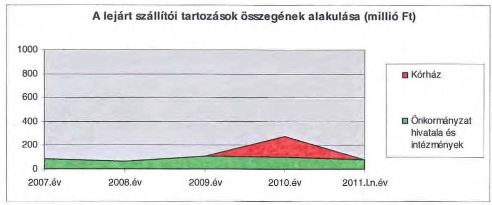

A Közgyűlés a lejárt szállítói kötelezettségek rendezésével, a vizsgált időszakban hét alkalommal foglalkozott, és az állomány csökkentése érdekében pénzügyi finanszírozási műveletekről döntött: a 2007. évben 12 millió Ft összegű szállítói állomány, 2009. évben 22 millió Ft összegű és 2010. évben 45 millió Ft összegű szállítói állomány kifizetéséhez biztosított fedezetet $^{39}$.
2010. évben egy esetben került sor fizetés átütemezésére, a Kórház Zrt. 1 millió Ft összegben megállapodott a szállítókkal az átütemezésről.

# 3.3. Egyéb kötelezettségek alakulása 

A kötelező feladatellátáshoz kapcsolódóan a Vas Megyei Múzeum 2006. január 17-én Xerox nyomtató és 2006. március 26-án haszongépjármű beszerzésére kötött lizingszerződést bruttó 0,5 millió Ft, illetve bruttó 4 millió Ft összegben. Nem kötelező feladatellátáshoz kapcsolódóan az Önkormányzat Gyermek-, Ifjúsági és Családi Üdülőközpontja Balatonberény több lizingszerződést kötött gépjármű beszerzésre: 2006. október 30-án 4 millió Ft összegben, a 2007. május 9-én 6 millió Ft összegben, 2007. augusztus 8-án és 2007. november 12-én 3 millió-3 millió Ft összegben (2010. február 8-án a Közgyűlés Ellátó Szervezete lett az új lízingbe vevő partner a 2007. augusztus 8-án a CIB Lízing Zrt-vel kötött lizingszerződésnél). A pénzügyi kötelezettségek teljesítését követően a lízingelt eszköz maradványértéke - az Önkormányzat nyilvántartása szerint - 2010. december 31-én 2 millió Ft volt.

[^0]
[^0]:    $^{39}$ A szállítói állomány rendezésére a Dr. Nagy László Gyógypedagógiai Intézménynél, a Szombathelyi Szimfonikus Zenekarnál, az Életünk Szerkesztőségénél és a Gyermek-, Ifjúsági és Családi Üdülőközpontjánál került sor.

---

Az Önkormányzatnak a vizsgált időszakban két kezességvállalással kapcsolatos kötelezettségvállalása volt. 2007. október 30-án a Savaria TISZK Kft. hitelfelvételéhez szükséges önkormányzati kezességvállalás megadására került sor 67 millió Ft összegre a tulajdoni hányadnak megfelelően. 2010. március 26-án a Vagyonkezelő Kft. 10 millió Ft összegű folyószámlahitel visszafizetéséhez vállalt készfizetői kezességet az Önkormányzat. A kezességvállalások időtartama egy év volt. Kezesség beváltására nem került sor.

Az Önkormányzatnak jelzálogjoggal terhelt ingatlana 2010. december 31-én nem volt.

A tapolcai körzeti Földhivatal határozata szerint az Önkormányzat tulajdonába levő Badacsonytomaj 035/19 hrsz. ingatlanról a 2000. évben bejegyezett keretbiztosítéki jelzálogjog 2009. július 17-én törlésre került. A 600 millió Ft összegű jelzálogjog - OTP hosszú lejáratú hiteléhez kapcsolódott, mely Balatonlelle Napospart 3. sz. alatti ingatlan 50%-os tulajdoni hányadának megvásárlásához vett az Önkormányzat - bejegyzés 3 ingatlanra történt, a további két ingatlan a Vagyonkezelő Kft. vagyonkezelésében van.

A vizsgált időszakban nem történt meg annak felmérése, hogy az elhasználódott eszközök pótlása milyen kötelezettséget jelent az Önkormányzat számára. A felújításokra, az eszközök pótlására elsősorban az intézmények működőképességének biztosítása, illetve a szakhatósági előírások figyelembevételével került sor. Az Önkormányzat a 2007-2010. években a tárgyi eszközök után 3467 millió Ft összegű értékcsökkenést számolt el, ugyanakkor felújításra az elszámolt értékcsökkenés 19,8%-át (685 millió Ft) fordították.

Az Önkormányzat a 2010. évben a Vas Megyei Múzeumok Igazgatósága részére 50 millió Ft kölcsönt nyújtott kötelező feladataink ellátása érdekében. Az intézmény öt pályázatot nyerte el, melynek utólagos központi finanszírozása miatt az Önkormányzat megelőlegezte a támogatást. A kölcsönt az intézmény visszafizetési kötelezettséggel kapta, melyet a Közreműködő szervezettől a támogatás bankszámlára utalásának napján köteles teljesíteni.

A Közgyűlés döntött arról, hogy fejlesztési hitelt vesz fel a Kórház haemodinamikai fejlesztéséhez, és a felvett hitel összegéből 850 millió Ft-ot a Kórház részére felhalmozási célú kölcsönként átad. A kötelező feladatellátáshoz kapcsolódó beruházások megvalósítására megállapodást kötöttek, melyben a 850 millió Ft összegű kölcsön és annak járulékaira vonatkozó visszafizetési feltételeket rögzítették. A Kórház a megállapodásban foglaltak alapján, állandó átutalási megbízást volt köteles adni a visszafizetésre, melynek módosításához és visszavonásához az Önkormányzat hozzájárulása szükséges.
2008. április 8-án jött létre az a kölcsönszerződés, mely a Vagyonkezelő Kft. részére 5 millió Ft tagi kölcsön nyújtását rögzíti. A kölcsön működési kiadásokra használható fel, a visszafizetés határidejét (2008. november 30.) rögzítették a szerződésben. A Vagyonkezelő Kft. a kölcsönt határidőre visszafizette. A Vagyonkezelő Kft. 2009-ben 30 millió Ft tagi kölcsönt kapott annak érdekében, hogy a „Kemenesaljai Kistelepülésekért" Kommunális Szolgáltató Kht-ben üzletrészt vásároljon. A kölcsönszerződést 2009. május 8-án kötötték

---

meg, melyben a visszafizetés feltételeit is meghatározták. A kölcsönszerződés szerint 2011. március 31-ig visszafizetés nem volt indokolt.

A Közgyűlés döntött arról, hogy visszatérítendő támogatást nyújt a Társadalomtudományok és Európa-tanulmányok Intézete Alapítvány részére. Az „ún. norvég alapból" elnyert támogatás megérkezéséig a projekt megvalósítását segítő áthidaló kölcsönt folyósított az Önkormányzat, melyet a megállapodásban rögzített határidőre visszafizetett.

# 4. PÉNZÜGYI EGYENSÚLY MEGTEREMTÉSE ÉRDEKÉBEN HOZOTT INTÉZKEDÉSEK 

A jelentésben szereplő CLF módszer szerint bemutatott működési és felhalmozási hiány mindamellett alakult ki, hogy a vizsgált időszakban az Önkormányzat
 folyamatosan intézkedéseket tett, hogy alkalmazkodjon a finanszírozási rendszer változása miatti forráscsökkenéshez. Ennek érdekében bevételnövelő és kiadáscsökkentő döntéseket hozott.

A kiadáscsökkentő és bevételnövelő intézkedések megtétele kiemelten a pénzügyi helyzet javítását célozták. A legjelentősebb mértékű kiadási megtakarítást a létszámleépítésekkel érték el, emellett sikerült megőrizniük intézményeik gazdálkodásának stabilitását.

Az Önkormányzat gazdasági programjában megfogalmazott elvárások szerint 2007-től több alkalommal hozott intézmény-átszervezési döntéseket:

- Az Önkormányzat 2007-2010. évi kiadásaira ható intézkedések egy része visszanyúlik a 2006. évhez. A Pedagógiai Intézetet a Közgyűlés döntése alapján a 2006. évben megszüntették, feladatai egy részét - feladatellátási megállapodás alapján - a Berzsenyi Dániel Főiskola, másik részét a tanulási képességvizsgáló bizottság látja el. Az ebből kimutatott megtakarítás 249 millió Ft volt.
- Az Önkormányzat gazdasági programjában megfogalmazott - az ellátórendszerek szerkezetének átalakítására, működtetés racionalizálására vonatkozó - elvárások szerint 2007-ben megtörtént az egészségügyi ellátórendszer átalakítása. A Közgyűlés 1/2007. (II. 12.) számú határozata alapján 2007. február 15-ével a szentgotthárdi Kórházat a Megyei Kórházba integrálták, majd a Közgyűlés - 132/2007. (VI. 29.) számú határozatával az egészségügyi feladat ellátására zártkörűen működő, nonprofit részvénytársaságot hozott létre 2007. október 1-jétől, amelynek vagyonnal történő ellátását vagyonkezelési szerződés útján biztosította. A személyi állomány 83%-ának (1571 fő) továbbfoglalkoztatása megvalósult. A kiszervezés anyagi megtakarítást nem jelentett, mivel az Önkormányzat 2004-2007. év között önkormányzati forrásból nem biztosított működési támogatást a Kórház részére.
- Ugyanebben az évben az Önkormányzat 2007. december 1-i hatállyal vagyonkezelő kft-t alapított, 100%-os tulajdoni hányaddal. A társaság törzstőkéjét 0,5 millió Ft készpénzben állapították meg. A korábban intézmények által kezelt vagyoni körből vagyonkezelői szerződéssel kerültek ingatlanok és ingóságok a társasághoz, elsősorban azok, melyek közfeladat ellátásához nem szükségesek. A Kft. vagyongazdálkodási tevékenysége eredményeképpen képződő nyereség az Önkormányzat tulajdonában levő vagyoni körben hasznosítható.

- A 2008. évben a Közgyűlés 155/2008. (VII. 4.) számú határozatával megszüntette a vasvári Béri Balog Ádám Gimnázium, Posta és Bankforgalmi Szakközépiskola kollégiumát, amelyből az Önkormányzat 12 millió Ft megtakarítást számszerűsített.
- Az átszervezések 2009-ben is folytatódtak. 2009. december 31-ével a Közgyűlés 234/2009. (XI. 13.) számú határozatával megszüntette a Vas Megyei Önkormányzat Gyermek, Ifjúsági és Családi Üdülőközpont, Balatonberény költségvetési szervet. Az üdültetési feladatot továbbiakban a Vagyonkezelő Kft. látja el feladat-ellátási megállapodás alapján, melyhez az Önkormányzat a 2010. évben 22 millió Ft-ot biztosított. A megszüntetett intézmény előző évi támogatása 52 millió Ft volt. Ezen önként vállalt feladat átadásával az Önkormányzat kiadási szintjét kívánta csökkenteni.
- A 2007-2010. években takarékossági intézkedésként az intézményátszervezések mellett a költségvetési megszorítások kaptak hangsúlyt. A Közgyűlés a költségvetési koncepció elfogadásakor minden évben az intézmények felügyeleti támogatásának csökkentéséről döntött, melyet az intézmények a nem kötelező bérelemek visszaszorítása mellett elsősorban létszámleépítéssel tudtak kigazdálkodni. A költségvetés készítését megelőzően a Közgyűlés rendeletben meghatározta az intézmények számára engedélyezett létszámkeretet.

Az intézményi feladatok racionalizálásáról a Közgyűlés döntött, ezekhez részletes előterjesztések készültek, melyekben a tervezett intézkedések indokait, célját bemutatták. Az intézményi integráció, átszervezés végrehajtásához kikérték a szakmai szervezetek véleményét, a jogszabályban előírt egyeztetéseket lefolytatták.

Az egészségügyi feladatok kiszervezésénél a gazdasági társaságként működő Kórháztól az alapító a korábbinál hatékonyabb, a várható bevételek optimalizálását, a ráfordítások minimalizálását, a változó közgazdasági környezethez való nagyobb fokú alkalmazkodást várta.

Az átszervezés várható anyagi kihatását nem számszerűsítették, viszont a Kórház részére nyújtott önkormányzati támogatások évenkénti összehasonlítása alapján a kiszervezés az Önkormányzat számára nem jelentett megtakarítást. Az átszervezést megelőző években (2004-2006) az Önkormányzat a Kórház részére működési célra önkormányzati támogatást nem biztosított, fejlesztési célú támogatást pedig a 2005. és a 2006. évben dolgozói lakásépítési támogatás céljára nyújtott 0,6-0,6 millió Ft összegben. Az Önkormányzat a Zrt-ként működő Kórháznak a 2007. és a 2008. évben eseti működési célra adott át pénzeszközt együttesen 371 millió Ft összegben. Ebből 337 millió Ft a központi költségvetésből igényelt összeg volt a 2007. évi létszámleépítéssel és a 13. havi illetménnyel kapcsolatban, 34 millió Ft-ot pedig önkormányzati megállapodás alapján biztosított a Kórház Zrt-ben dolgozók egyszeri kereset-kiegészítésére, mivel a 162/2008. (VI. 19.) Korm. rendelet hatálya csak a költségvetési szerveknél foglalkoztatottakra terjedt ki. Ezen túl az Önkormányzat a 2009. évben 522 millió Ft pénzeszközt adott át eseti felhalmozási célra a Kórház Zrt. részére, diagnosztikai gép vásárlására. A 2010. évben az Önkormányzat nem nyújtott támogatást a Kórház részére.

A Kórház éves üzleti jelentéseit a Közgyűlés megtárgyalta, mely szerint a 2009. évben 511 millió Ft mérleg szerinti veszteséggel zárt, a 2010. évben viszont 1178 millió Ft működésből származó pénzforgalmi nyereséget mutatott ki. Az üzleti jelentések nem tértek ki a szakmai színvonal, valamint a működés személyi és tárgyi feltételeinek évek közötti változására. Az Önkormányzat az átszervezés hatását nem értékelte.

A Vagyonkezelő Kft. létrehozását részletes, előzetes hatástanulmány készítése nem előzte meg. A gazdasági társaság éves beszámolóit a Közgyűlés megtárgyalta. A Kft. a 2008. évben veszteségesen működött, a 2009. évben 7 millió Ft, a 2010. évben 5 millió Ft volt a mérleg szerinti eredménye. Az Önkormányzat az átszervezés hatását nem értékelte.

A 2007-2010. években a feladatváltozások, valamint a takarékossági intézkedések hatásaként együttesen 1265 millió Ft kiadási megtakarítást mutattak ki, amelynek 77%-a, 970 millió Ft a kapcsolódó álláshely csökkenések, intézményi átszervezések következtében jelentkezett.

A 2007-2010. évek kiadáscsökkentő intézkedéseit beavatkozási területenként az alábbiak részletezik:

| Az érvényesített kiadás-   csökkentés területei | Személyi   juttatások   és járulékai | Dologi,   működési   kiadások | Pénzeszköz   átadások,   támogatások | Összesen |
| :-- | :--: | :--: | :--: | :--: |
| A Közgyűlés működése | 216953 | 53470 | 76960 | 347383 |
| Az Önkormányzat hivatalánál | 7668 | 0 | 0 | 7688 |
| Az intézményeknél | 769626 | 136699 | 3694 | 910019 |
| ÖSSZESEN | 994247 | 190169 | 80654 | 1265070 |

A Közgyűlés működési körében a kimutatott megtakarítások nettósított, többletköltségek felmerülését is számba vevő kiadáscsökkentő intézkedések eredményének 72%-a, 249 millió Ft a 2006-ban megszüntetett Pedagógiai Szakszolgálat feladatainak megtakarításából adódott. A megtakarítások 22%-át, 77 millió Ft-ot a különböző helyi szervezeteknek és egyesületeknek, rendezvények céljára nyújtott támogatások, valamint egyes feladat-ellátási megállapodás alapján fizetendő támogatás összegének csökkentése alapozta meg. A megtakarítások 6%-a, 21 millió Ft realizálódott a képviselői tiszteletdíjak és költségtérítések kiadásainál abból adódóan, hogy a 2010. évi önkormányzati választások után a közgyűlési tagok száma 25 fővel, a bizottsági tagok létszáma 44 fővel csökkent.

[^0]
[^0]:    ${ }^{40}$ A kiadások csökkentését célzó intézkedések elmaradása esetén 2007-2010. évek között a számítások alapján 1265070 ezer Ft-tal magasabbak lettek volna az Önkormányzat kiadásai.

A Hivatalban végrehajtott megtakarítási intézkedések ügyintézői álláshelyek megszüntetéséhez kapcsolódó döntések voltak, amelyek összességében a 2006. december 31-iei állapothoz viszonyítva 2011. március 31-ig 5 fő ügyintézői létszám csökkentését eredményezték.

Az Önkormányzat hivatalának létszáma 2006. december 31-én 88 fő volt, ebből a kormányzati intézkedések miatt az illetékhivatal létszáma, 39 fő 2007. január 1-től az APEH állományába került. A hivatalnál lezajlott átszervezések kapcsán létszámcsökkentési és -növelési intézkedés egyaránt történt, ugyanakkor ténylegesen 5 fő álláshelyét szüntették meg az eltelt időszakban.

Az önkormányzati szinten kimutatott megtakarítási intézkedések 71,9%-át, 910 millió Ft-ot az intézmények körében érvényesítették. Ezen belül a megtakarítások 84,6%-a, 770 millió Ft a személyi juttatások és járulékoknál realizálódott. A Közgyűlés által meghatározott létszámkeret, valamint költségvetési keretszám alapján az intézményvezetői döntésekből származó kiadáscsökkenések az üres álláshelyek zárolása, foglalkoztatási formák megváltoztatása, nem kötelező bérelemek megszüntetése, költségtérítések csökkentése miatt következtek be. A különböző beszerzési és szolgáltatási szerződések felülvizsgálatával megtakarított összegek részaránya 12%, 107 millió Ft. Az üdültetési feladatok kiszervezéséből adódó megtakarítás 3%-ot, 30 millió Ft-ot tesz ki, a gondozotti létszám csökkenése miatt az ellátottak juttatásainál 4 millió Ft megtakarítás keletkezett, melynek aránya nem éri el az 1%-ot.

A létszámcsökkentő intézkedések következtében 2007-2010 között a Hivatalnál és intézményeknél összesen 2327 álláshelyet (részben üres állást) szüntettek meg, a 2006. december 31-iei átlaglétszám 65%-át, amelyből 1903 főt jelentett a Kórház államháztartási rendszerből való kikerülése.

Ennek figyelmen kívül hagyásával 424 fős álláshelycsökkenés valósult meg, amelynek közel kétharmada ágazati szakmai, egyharmada intézményüzemeltetéshez, fenntartáshoz, gazdasági ügyek intézéséhez kapcsolódó álláshely volt. A megvalósított álláshelycsökkenés a Kórházon kívüli 2006. december 31-i átlaglétszám 23%-a.

A 2007-2011. I. negyedévében végrehajtott létszámcsökkenés eredményét az alábbi grafikon szemlélteti:
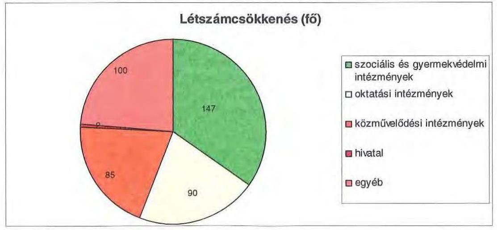

A helyi szervezési intézkedések végrehajtásához az önkormányzat az áttekintett időszak alatt 480 millió Ft központi költségvetési támogatásban részesült, amelynek felhasználásával 342 fő álláshelyet tartósan leépített. A megszüntetett álláshelyek 85%-ához (1985 fő) központi támogatás nem kapcsolódott. A kiszervezett intézmények dolgozóinak 83%-át (1597 fő) az Önkormányzat gazdasági társaságainál továbbfoglalkoztatták. Az intézkedések eredményeként az Önkormányzat Kórházon kívüli 2006. december 31-i átlaglétszáma 2011. március 31-re 477 fővel (26%-kal) csökkent, ebben tükröződik a kormányzati intézkedések miatti álláshelycsökkenés (Illetékhivatal 39 fő) hatása is. Ezt nem tekintve, az álláshelycsökkenés 24%-os (438 fő). A kiszervezett Kórház átlaglétszáma 9%-kal, 147 fővel csökkent, 2011. március 31-én 1562 fő volt. Az Önkormányzat és a Kórház együttes átlaglétszáma a 2006. december 31-i 3570 főről 2010. március 31-ére 2946 főre csökkent, a 624 fő átlaglétszám csökkenés a 2006. évi átlaglétszám 17%-a.

Az önkormányzatnál 2011. első negyedévében folytatódtak a megtakarítási intézkedések, az elhatározott 361 millió Ft kiadási megtakarítás 71%-a (256 millió Ft) személyi juttatás és járulék jellegű volt, amelynek a 63%-a (162 millió Ft) az intézményeknél elrendelt megszorító intézkedésekhez, valamint három hivatali ügyintézői üres álláshely megszüntetéséhez kapcsolódott. A 2011. évi költségvetési rendelet alapján az intézményi álláshelyek számát további 42 fővel tervezik csökkenteni, valamint a dolgozók egy részénél részmunkaidős foglalkoztatást szándékoznak megvalósítani, a garantált bérminimum feletti bérelemeket megszüntették. A Közgyűlés működéséhez kapcsolható kiadások várhatóan 184 millió Ft összegben csökkennek, amelynek 51%-a (94 millió Ft) tiszteletdíjak csökkentése miatti megtakarítás, amely a közgyűlési és bizottsági tagok számának csökkenéséből adódott. A költségcsökkentő döntések következtében mérsékelték a Közgyűlés működtetésének kiadásait, csökkentették a bizottságok számát. Az önként vállalt feladatok kötelezettségvállalásait felülvizsgálták, az előző évhez képest csökkentek a civil szervezetek, egyesületek, rendezvények jóváhagyott támogatási keretei, egyes feladatok megszűntek. Ez utóbbi tervezett intézkedések együttes hatása 81,5 millió Ft. A feladatellátási megállapodásokat, szolgáltatási szerződéseket is felülvizsgálták, a támogatásokat 8,5 millió Ft-tal csökkentették.

A kiadáscsökkentő intézkedések mellett az Önkormányzat bevételnövelő intézkedésként a kötvénykibocsátásból származó, átmenetileg szabad pénzeszközeit befektette, és ebből adódóan a 2007-2010. év közötti időszakban 1033 millió Ft bevételt realizált, melyből 100 millió Ft-ot tekintett működési célú, 933 millió Ft-ot pedig felhalmozási célú bevételnek. További
 bevételnövelő intézkedésként az intézmények fokozták bérbeadási tevékenységüket, melyből adódóan 6 millió Ft bevétel realizálódott. Az Önkormányzat a beszédfogyatékos tanulók ellátását más önkormányzat részére térítéskötelessé tette, melyből 4 millió Ft többletbevétel realizálódott.

[^0]
[^0]:    ${ }^{41}$ Az Önkormányzat átlaglétszáma - Kórházon kívüli átlaglétszáma - 2006. december 31-én 1861 fő, míg 2011. március 31-én 1384 fő volt.

---

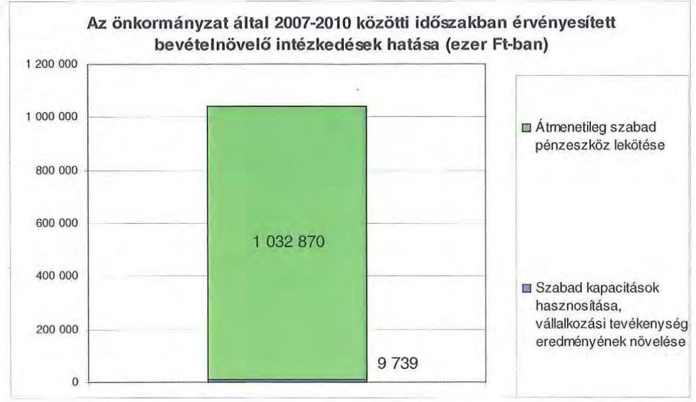

A 2011. évre az átmenetileg szabad pénzeszközök befektetéséből 165,5 millió Ft, a helyiségek bérbeadásából pedig 1,4 millió Ft bevételt terveztek.

Az átszervezések, a takarékossági intézkedések szakmai feladatellátásra gyakorolt hatását célzottan nem vizsgálták, erről belső ellenőrzési jelentések nem álltak rendelkezésre.

# 5. A HELYI ÖNKORMÁNYZATOK GAZDÁLKODÁSI RENDSZERÉNEK 2007. ÉVI ELLENŐRZÉSE SORÁN A PÉNZÜGYI EGYENSÚLY JAVÍTÁSÁRA TETT SZABÁLYSZERŰSÉGI ÉS CÉLSZERŰSÉGI JAVASLATOK HASZNOSULÁSA 

Az ÁSZ jelentésében négy célszerűségi javaslatot tett. A jelentést a Közgyűlés megismerte. A javaslatok megvalósítására intézkedési tervet készítettek, amely teljes körűen tartalmazta a javaslatokat, meghatározta a feladatok elvégzéséért a felelősöket és a feladatok elvégzésének határidejét.

A pénzügyi egyensúly javítására egy célszerűségi javaslat vonatkozott. Javasoltuk a főjegyzőnek, hogy: „tájékoztassa - évente végzett számítások alapján - a Közgyűlést az Önkormányzat eladósodásának növekedésére figyelemmel arról, hogy a hosszú lejáratú, adósságot keletkeztető kötelezettségvállalásokból adódó tőke- és kamatfizetési kötelezettségét az Önkormányzat milyen feltételek biztosítása mellett tudja teljesíteni". A Közgyűlés ${ }^{42}$ az Önkormányzat hosszú távú pénzügyi kötelezettségei teljesítése helyzetéről, illetve arról, hogy az Önkormányzat milyen feltételek mellett tudja azokat teljesíteni, a főjegyző részére évenkénti, a költségvetési javaslat keretében jelentéskészítést írt elő. A jelentés elkészítésére 2011. február 15-ét, s azt követően évente február 15-ei határidőt jelölték meg.

[^0]
[^0]:    ${ }^{42}$ A Közgyűlés 225/2010. (XII. 17.) számú határozatában rögzítettek szerint.

---

A főjegyző 2011. február 2-án elkészítette tájékoztatóját az Önkormányzat eladósodásának növekedésére figyelemmel a 2007. évben kibocsátott kötvény helyzetéről, arról a 2011. évi költségvetési javaslathoz kapcsolódóan tájékoztatta a Közgyűlést ${ }^{43}$.

Budapest, 2011. december „ 19 "
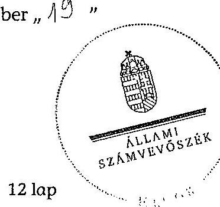

Domokos László

Melléklet: $\quad 6 \mathrm{db} \quad 12$ lap
${ }^{43}$ A Közgyűlés a 8/2011. (II. 18.) számú határozatában döntött elfogadásáról.

---

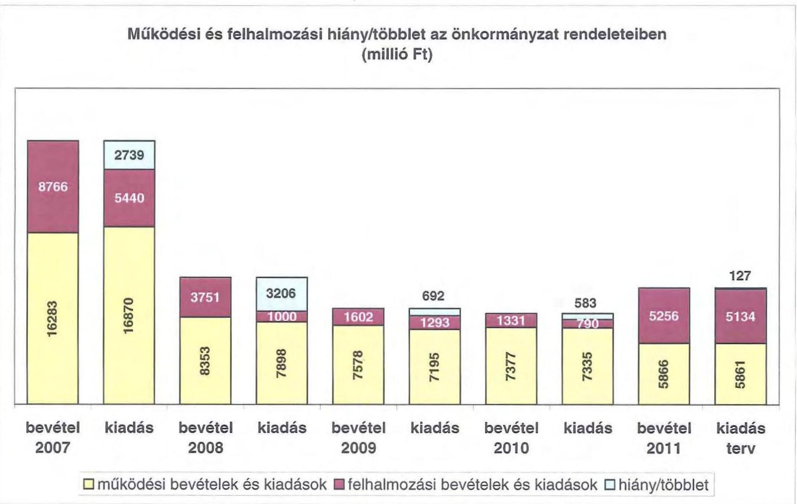

# Működési és felhalmozási hiány/többlet az önkormányzat rendeleteiben (millió Ft)

|  1. számú melléklet a V-3025/2011. számú jelentéshez | 2. számú melléklet a V-3025/2011. számú jelentéshez  |
| --- | --- |
|  16283 | 16870  |
|  16870 | 16870  |
|  16870 | 16870  |
|  16870 | 16870  |
|  16870 | 16870  |
|  16870 | 16870  |
|  16870 | 16870  |
|  16870 | 16870  |
|  16870 | 16870  |
|  16870 | 16870  |
|  16870 | 16870  |
|  16870 | 16870  |
|  16870 | 16870  |
|  16870 | 16870  |
|  16870 | 16870  |
|  16870 | 16870  |
|  16870 | 16870  |
|  16870 | 16870  |
|  16870 | 16870  |
|  16870 | 16870  |
|  16870 | 16870  |
|  16870 | 16870  |
|  16870 | 16870  |
|  16870 | 16870  |
|  16870 | 16870  |
|  16870 | 16870  |
|  16870 | 16870  |
|  16870 | 16870  |
|  16870 | 16870  |
|  16870 | 16870  |
|  16870 | 16870  |
|  16870 | 16870  |

---

.

---

Az Önkormányzat CLF módszer szerint besorolt bevételei és kiadásai 2007-2010 között

|  1. FOLYÓ KÖLTSÉGVETÉS* | 2007. | 2008. | 2009. | 2010.  |
| --- | --- | --- | --- | --- |
|  1.1.1. Saját működési bevételek | 4322080 | 3839675 | 3508368 | 3089357  |
|  1.1.2. Költségvetési támogatás | 3297276 | 3261140 | 2746456 | 2548845  |
|  1.1.3. Átengedett bevételek | 1312249 | 487045 | 502042 | 128854  |
|  1.1.4. Államháztartáson belülről kapott támogatások | 7967036 | 563409 | 714754 | 986040  |
|  1.1.5. EU-tól és külföldről kapott bevételek | 9551 | 17154 | 40930 | 0  |
|  1.1.6. Államháztartáson kívülről kapott bevételek | 62597 | 96300 | 61470 | 49641  |
|  1.1.7. Előző évi pénzmaradvány átvétel | 57998 | 60655 | 80008 | 55874  |
|  1.1. Folyó bevételek $=1.1 .1 .+1.1 .2 .+1.1 .3 .+1.1 .4 .+1.1 .5 .+1.1 .6 .+1.7$. | 17028787 | 8325378 | 7654028 | 6858611  |
|  1.2.1. Működési kiadások kamatkiadások nélkül | 15555879 | 7271444 | 6683623 | 6557767  |
|  1.2.2. Államháztartáson belülre átadott pénzeszközök | 456092 | 76206 | 80945 | 140603  |
|  1.2.3.1. vállalkozásoknak | 664195 | 6160 | 7406 | 23960  |
|  1.2.3.2. EU-nak, illetve külföldre | 200 | 250 | 250 | 50  |
|  1.2.3.3. magánszemélyeknek | 89909 | 164810 | 90011 | 90020  |
|  1.2.3.4. nonprofit szervezeteknek | 161075 | 322185 | 110409 | 57434  |
|  1.2.3. Transzferkiadások ( $=1.2 .3 .1+1.2 .3 .2+1.2 .3 .3+1.2 .3 .4$ ) | 915379 | 493405 | 208076 | 171464  |
|  1.2.4 Kamatkiadások | 122182 | 307835 | 145578 | 120934  |
|  1.2.5. Előző évi pénzmaradvány átadás | 57998 | 60655 | 137471 | 88421  |
|  1.2. Folyó kiadások $=1.2 .1 .+1.2 .2 .+1.2 .3 .+1.2 .4 .+1.2 .5$ | 17107530 | 8209545 | 7255693 | 7079189  |
|  1.3. Folyó költségvetés egyenlege MŰKÖDÉSI JÖVEDELEM (1.1. - 1.2.) | $-78743$ | 115833 | 398335 | $-220578$  |
|  2. FELHALMOZÁSI KÖLTSÉGVETÉS** |  |  |  |   |
|  2.1.1. Saját tőkebevételek | 624746 | 295737 | 188024 | 621001  |
|  2.1.2. Államháztartáson belülről kapott támogatások | 569153 | 22053 | 63924 | 323479  |
|  2.1.3. EU-tól és külföldről kapott támogatások | 0 | 17132 | 10414 | 0  |
|  2.1.4. Államháztartáson kívülről kapott támogatások | 89199 | 115208 | 96119 | 181611  |
|  2.1. Felhalmozási bevételek ( $=2.1 .1 .+2.1 .2+2.1 .3+2.1 .4$.) | 1283098 | 450130 | 358481 | 1126091  |
|  2.2.1. Saját beruházási kiadás áfával | 2019206 | 409823 | 296538 | 439816  |
|  2.2.2. Saját felújítási kiadás áfával | 628825 | 29826 | 86679 | 48431  |
|  2.2.3. Államháztartáson belülre átadott pénzeszköz | 251209 | 26491 | 82444 | 561334  |
|  2.2.4. EU-nak és külföldnek adott pénzeszközök | 0 | 0 | 0 | 0  |
|  2.2.5. Államháztartáson kívülre adott pénzeszközök | 37768 | 13332 | 580849 | 4000  |
|  2.2.6. Befektetési célú részesedések vásárlása | 59700 | 390 | 0 | 0  |
|  2.2. Felhalmozási kiadások ( $=2.2 .1 .+2.2 .2 .+2.2 .3 .+2.2 .4 .+2.2 .5 .+2.2 .6$.) | 2996708 | 479862 | 1046510 | 1053581  |
|  2.3. Felhalmozási költségvetés egyenlege (2.1. - 2.2.) | $-1713610$ | $-29732$ | $-688029$ | 72510  |
|  3. FINANSZÍROZÁSI MŰVELETEK NÉLKÜLI (GFS) POZÍCIÓ (1.3.) + (2.3.) | $-1792353$ | 86101 | $-289694$ | $-148068$  |
|  4. FINANSZÍROZÁSI MŰVELETEK |  |  |  |   |
|  4.1. Hitelfelvétel | 102994 | 77668 | 67950 | 419469  |
|  4.2. Hiteltörlesztés | 239669 | 249268 | 190111 | 158451  |
|  4.3. Forgatási és befektetési célú értékpapírok kibocsátása | 5000000 | 0 | 0 | 0  |
|  4.4. Forgatási és befektetési célú értékpapírok beváltása | 0 | 0 | 0 | 0  |
|  4.5. Forgatási és befektetési célú értékpapírok értékesítése | 0 | 0 | 0 | 1000000  |
|  4.6. Forgatási és befektetési célú értékpapírok vásárlása | 2000000 | 0 | 0 | 0  |
|  4.7. Egyéb finanszírozási bevételek (függő, átfutó, kiegyenlítő) | $-544683$ | $-17540$ | $-47375$ | $-118510$  |
|  4.8. Egyéb finanszírozási kiadások (függő, átfutó, kiegyenlítő) | $-33429$ | $-40694$ | $-4712$ | $-7878$  |
|  4.9. Finanszírozási műveletek egyenlege (4.1.-4.2.+4.3.-4.4+4.5.-4.6.+4.7.-4.8.) | 2352071 | $-148446$ | $-164824$ | 1150386  |
|  5. Tárgyévi pénzügyi pozíció változás |  |  |  |   |
|  (3.) FINANSZÍROZÁSI MŰVELETEK NÉLKÜLI (GFS) POZÍCIÓ + (4.9.) Finanszírozási műveletek egyenlege | 559718 | $-62345$ | $-454518$ | 1002318  |
|  6. Nettó működési jövedelem =működési jövedelem(1.3.) - tőketörlesztés (4.2. + 4.4. ) | $-318412$ | $-133435$ | 208224 | $-379029$  |
|  TÁJÉKOZTATÓ ADATOK |  |  |  |   |
|  Összes kötelezettség | 6374309 | 7225510 | 7280254 | 9148749  |
|  ebből rövid lejáratú | 493871 | 496835 | 599325 | 1364326  |

---

|  Összes szállítói kötelezettség | 124 911 | 111 791 | 142 655 | 145 523  |
| --- | --- | --- | --- | --- |
|  ebből lejárt (tanúsítványból) | 84 012 | 64 894 | 105 918 | 100 246  |
|  Pénz és tőkepiaci kötelezettség (adósság) | 6 198 792 | 7 078 165 | 7 068 865 | 8 616 904  |
|  ebből rövid lejáratú | 352 262 | 370 773 | 407 063 | 838 169  |
|  PPP szerződéses állomány jeklenértéken | 0 | 0 | 0 | 0  |
|  ebből lejárt szolgáltatási díj miatti kötelezettség | 0 | 0 | 0 | 0  |
|  Folyószámlahitel napi átlagos állománya (tanúsítványból) | 157 075 | 216 081 | 226 527 | 332 798  |
|  Likvidhitel napi átlagos állománya (tanúsítványból) | 0 | 0 | 0 | 0  |
|  Munkahitel napi átlagos állománya (tanúsítványból) | 0 | 0 | 0 | 0  |
|  Peres eljárásokból fennálló függő kötelezettségek | 0 | 0 | 0 | 0  |

 Finanszírozásba bevonható eszközök összesen : | 5 318 698 | 5 256 353 | 4 801 835 | 4 804 153  |
|  Tartós hitelviszonyt megtestesítő értékpapírok év végi állománya | 2 000 000 | 2 000 000 | 2 000 000 | 1 000 000  |
|  Hosszú lejáratú bankbetétek év végi állománya | 0 | 0 | 0 | 0  |
|  Értékpapírok év végi állománya | 0 | 0 | 0 | 0  |
|  Pénzeszközök (idegen pénzeszközök nélkül) év végi állománya | 3 318 698 | 3 256 353 | 2 801 835 | 3 804 153  |

- Bevételekben nem térül, a kiadásokban nem jelenik meg az amortizáció, a vagyoni helyzetet az egyenleg befolyásolja. Bevételekben vagyon megőrzésre és bővítésre fordítható források.

Megjegyzés

A számítási leírás némileg eltér az ÁSZ módszertanában korábban alkalmazott besorolásoktól. A jelen besorolás általános közgazdasági meggondolásokon alapul, amely testet ölt az SNA statisztikai módszertanában is. Folyó tételek alatt értjük azokat a kiadásokat és bevételeket, amelyek az egység vagyoni helyzetét automatikusan nem változtatják. Bevételi oldalon ilyenek az adók, a tényezőjövedelmek, transzferek, kiadási oldalon a transzferek és a szolgáltatásnyújtással kapcsolatos működési kiadások. Felhalmozási, vagy tőketételek módosítják a vagyon nagyságát. Privatizációs bevétel csökkenti a vagyont, fizikai beruházás, vagy pénzügyi befektetés növeli.

A nettó működési jövedelmet a tőketörlesztés levonásával a folyó költségvetés egyenlegéből (működési jövedelemből) származtatjuk. Transzfer kiadásoknak nevezzük azokat a folyó és felhalmozási tételeket, amelyeket nem az adott önkormányzat használ fel szolgáltatásnyújtásra.

---

Vas Megvei Önkormányzat 2/b. számú melléklet a V-3025/2011. számú jelentéshez

Az Önkormányzat bevételeinek és kiadásainak, adósságszolgálatának alakulása 2007-2010. között

|  Sorszám | Megnevezés | 2007. év | 2008. év | 2009. év | 2010. év  |
| --- | --- | --- | --- | --- | --- |
|   |  | tény | tény | tény | tény  |
|  I. | **MŰKÖDÉSI BEVÉTELEK** | 16 864 269 | 4 262 850 | 7 605 646 | 7 573 597  |
|  1. | Sajátos folyó bevételek | 4 222 783 | 2 525 284 | 3 195 513 | 3 279 624  |
|  1.1. | Ingatlanok működési bevétele | 2 076 654 | 1 888 512 | 1 592 555 | 1 785 154  |
|  1.2. | Bérleti díjak | 1 571 134 | 1 611 520 | 1 553 222 | 1 575 453  |
|  1.3. | Helyi adóbevételek és jövedelmek | 135 | 0 | 0 | 0  |
|  1.4. | Kamatbevétel működési része | 62 855 | 117 252 | 22 268 | 29 020  |
|  1.5. | Egyéb folyó működési bevételek | 8 800 | 8 000 | 21 448 | 420 171  |
|  2. | Támogatásértékű működési bevételek | 1 181 753 | 532 540 | 562 810 | 853 708  |
|   | helyi önkormányzatoktól és költségvetési szervektől | 941 889 | 328 365 | 286 200 | 362 561  |
|   | időforduló kizárólagosan távszünetből | 17 832 | 18 004 | 16 532 | 12 375  |
|  3. | Pénzforgalom nélküli bevételek működésre jóváhagyott része | 916 987 | 424 308 | 268 265 | 539 615  |
|  4. | Államháztartáson kívülről működési célra átvett pénzeszközök | 72 148 | 112 404 | 102 400 | 29 047  |
|  5. | Központi támogatások és átalányforrások működési része | 10 480 311 | 3 762 205 | 3 275 055 | 3 023 750  |
|   | adódi | 0 | 0 | 0 | 0  |
|   | SZJA | 1 212 248 | 487 095 | 502 002 | 128 850  |
|   | önkormányzat és intézmények állami támogatásának működési része | 2 263 285 | 2 244 350 | 2 742 772 | 2 492 618  |
|   | költségvetési rendezkedések, visszatérülések | 3 672 | 0 | 0 | 4 167  |
|   | távszétpontozási alapfolyó | 5 791 811 | 30 853 | 20 844 | 25 205  |
|   | bevétel | 16 894 398 | 2 262 850 | 7 620 840 | 7 573 597  |
|  II. | **MŰKÖDÉSI KIADÁSOK (kamatkizárás nélkül)** | 16 337 578 | 7 984 443 | 7 158 286 | 7 299 280  |
|  1. | Folyó működési kiadások összesen kamatkizárások nélkül | 15 456 144 | 7 218 354 | 6 702 557 | 6 782 550  |
|   | adódi | 0 | 0 | 0 | 0  |
|   | személyi juttatások | 7 102 469 | 3 655 926 | 3 513 655 | 3 409 325  |
|   | munkáltató terhelésű járulékok | 2 269 711 | 1 208 790 | 1 044 323 | 897 480  |
|   | dologi kiadások | 6 032 504 | 2 107 281 | 2 017 079 | 2 102 767  |
|   | egyéb folyó kiadások | 97 398 | 41 417 | 77 196 | 87 521  |
|   | egyéb folyó működési kiadások | 0 | 5 500 | 49 748 | 249 494  |
|  2. | Támogatások, elvonások és egyéb folyó átutalások | 915 279 | 493 400 | 258 576 | 296 662  |
|   | adódi | 0 | 0 | 0 | 0  |
|   | működési célú pénzeszköz átadás államháztartáson kívülre | 826 470 | 328 695 | 118 805 | 61 444  |
|   | működési célú pénzeszköz átadás államháztartáson belülre | 0 | 0 | 0 | 125 106  |
|   | távszámlás és személyiállományi juttatások | 89 909 | 164 810 | 90 911 | 90 920  |
|  3. | Eklert és pénzmegtérítési átadás, visszatérítések működési | 89 004 | 116 498 | 163 407 | 79 450  |
|  4. | Támogatásértékű működési kiadás | 459 092 | 78 200 | 60 900 | 140 922  |
|   | adódi | 0 | 0 | 0 | 0  |
|   | önkormányzatoknak | 400 702 | 22 752 | 29 786 | 55 194  |
|   | kizárólagosan távszünetből | 0 | 355 | 235 | 0  |
|   |  | 0 | 0 | 0 | 0  |
|  III. | **ADÓSSÁGSZOLGÁLAT** | 361 851 | 887 193 | 335 985 | 279 269  |
|   | tilkaitó/kezdési költségvetés működési | 0 | 0 | 0 | 0  |
|   | felhalmozási | 239 669 | 245 288 | 190 111 | 188 451  |
|   | kamatfizetési költségvetés működési | 22 826 | 26 140 | 43 965 | 43 936  |
|   | felhalmozási | 96 683 | 272 659 | 107 612 | 77 296  |
|   | hosszú lejáratú értékpapír bevételek, vásárlása | 0 | 0 | 0 | 0  |
|   | bevétele (barbóriás) célú leállítási | 0 | 0 | 0 | 0  |
|   | vásárlás (barbóriás) célú | 0 | 0 | 0 | 0  |
|   | bevétele (leállási) | 0 | 0 | 0 | 0  |
|  IV. | **FELHALMOZÁSI BEVÉTELEK** | 3 536 520 | 2 691 353 | 1 528 755 | 1 202 815  |
|  1. | Saját felhalmozási és időszűkű bevétel | 724 042 | 515 126 | 498 874 | 380 362  |
|  1.1. | Tárgyi eszközök, ingatlanok, javak értékesítése, Áfa visszatérülés | 281 598 | 27 891 | 4 480 | 5 084  |
|  1.2. | Privatizációból származó bevétel | 163 904 | 81 834 | 312 | 380  |
|  1.3. | Csekély, részesedések | 5 007 | 80 | 23 | 57  |
|  1.4. | Kamatbevétel felhalmozási része | 93 453 | 320 958 | 329 374 | 227 000  |
|  1.5. | Helyi adók átalányelőlegei felhalmozási része | 0 | 0 | 0 | 0  |
|  1.6. | Egyéb folyó felhalmozási bevételek | 208 481 | 214 385 | 162 880 | 144 241  |
|  2. | Támogatásértékű felhalmozási bevételek | 569 193 | 23 053 | 63 924 | 323 479  |
|   | adódi | 0 | 0 | 0 | 0  |
|   | helyi önkormányzatoktól és költségvetési szervektől | 91 168 | 3 993 | 3 903 | 4 971  |
|   | időforduló kizárólagosan távszünetből | 0 | 0 | 0 | 0  |
|  3. | Pénzforgalom nélküli bevételek felhalmozásra jóváhagyott része | 1 320 234 | 2 905 092 | 857 735 | 261 137  |
|  4. | Államháztartáson kívülről felhalmozási célra átvett pénzeszközök | 89 199 | 110 576 | 96 110 | 161 611  |
|   |  | 0 | 0 | 0 | 0  |
|  5. | Állami felhalmozási és időszűkű bevétel | 933 991 | 32 456 | 14 098 | 59 220  |
|  5.1. | EU költségvetéséről átvétel | 0 | 16 664 | 10 414 | 0  |
|  5.2. | Önkormányzatok költségvetési támogatása felhalmozási célra | 933 991 |

 16 790 | 2 084 | 56 226  |
|   |  | 0 | 0 | 0 | 0  |
|  V. | **FELHALMOZÁSI KIADÁSOK** | 2 044 377 | 477 109 | 1 001 240 | 662 364  |
|  1. | Folyó felhalmozási kiadások kamatkizálások nélkül | 2 720 400 | 442 286 | 382 330 | 268 237  |
|  1.1. | Beruházás, felújítás | 2 648 031 | 439 649 | 383 217 | 488 247  |
|  1.2. | Értékesített tárgyt eszközök Áfa befizetés | 47 966 | 2 847 | 126 | 80  |
|  1.3. | Részesedések vásárlása | 89 790 | 390 | 0 | 0  |
|  2. | Támogatások, elvonások és egyéb folyó átutalások | 167 900 | 8 332 | 532 545 | 86 510  |
|   | adódi | 0 | 0 | 0 | 0  |
|   | felhalmozási célú pénzeszköz átadás államháztartáson kívülre | 22 362 | 4 082 | 529 149 | 200  |
|   | felhalmozási célú támogatásnak, költségek, kölcsön tízfeszítése | 102 537 | 4 280 | 2 850 | 50 719  |
|  3. | Támogatásértékű felhalmozási kiadások | 101 077 | 26 491 | 80 996 | 74 581  |
|   | adódi | 0 | 0 | 0 | 0  |
|   | helyi önkormányzatoknak és költségvetési szerveinek | 101 077 | 26 491 | 80 996 | 74 581  |
|   | időforduló kizárólagos távsütések | 0 | 0 | 0 | 0  |
|  4. | Pénzforgalom nélküli kiadások felhalmozásra jóváhagyott része | 0 | 0 | 4 250 | 32 947  |
|  VI. | Hitel, kölcsön felvétel | 7 102 994 | 77 668 | 67 950 | 1 419 465  |
|  0.1. | Rövid lejáratú hitelek felvétele | 0 | 0 | 0 | 419 465  |
|  0.2. | Hosszú lejáratú hitelek felvétele | 102 994 | 77 668 | 67 950 | 0  |
|  0.3. | Hosszú lejáratú hitelek felvétele | 0 | 0 | 0 | 0  |
|   | Rövid lejáratú és hosszú lejáratú értékpapírok kibocsátása, értékesítése | 8 000 000 | 0 | 0 | 1 500 000  |
|   | kibocsátás (rövid lejáratú célú) | 8 000 000 | 0 | 0 | 0  |
|   | értékesítés (rövid lejáratú célú) | 0 | 0 | 0 | 1 000 000  |
|   | kibocsátás (lejárat) | 0 | 0 | 0 | 0  |
|  0.4. | Forgalmi célú értékpapírok bevételek, vásárlása és a kibocsátása, értékesítés | 2 000 000 | 0 | 0 | 0  |
|  0.5. | Rövid felváltatási lejárat | 0 | 0 | 0 | 0  |
|  VII. | Finanszírozási műveletek egyenlege | 2 863 325 | -171 600 | -122 161 | 1 261 518  |

---

.

---

Az Önkormányzat 2007-2010 években megvalósított, illetve 2010. december 31-én folyamatban levő felhalmozási feladataihoz kapcsolódó kötelezettségeinek összegzése ezer Ft-ban!

|  Fejlesztési feladat megnevezése | Ber.
kezdete | Teljes
bekerülési
költség | 2006.
december
31-ig
teljesített
kiadás | 2007-2010.
évek között
teljesített
kiadás | 2010. év
utánra
vállalt
kötelezettség | 2010. utáni kötelezettség-vállalás forrásösszetétele |  |  |  |   |
| --- | --- | --- | --- | --- | --- | --- | --- | --- | --- | --- |
|   |  |  |  |  |  | Saját
bevétel | Hitel | Kötvény | EU-s
támogatás | Hazai
támogatás  |
|  Kórház sürgősségi betegellátó tömb kialakítás | 2003. | 2606899 | 1621988 | 984911 |  |  |  |  |  |   |
|  Kórház gép-műszer beszerzés | 2007. | 76351 |  | 76351 |  |  |  |  |  |   |
|  Ivánc lakóotthon építés | 2007. | 37620 |  | 37620 |  |  |  |  |  |   |
|  Megyeháza rekonstrukció | 2007. | 46690 |  | 46690 |  |  |  |  |  |   |
|  INTERREG IIIA Történelem határok nélkül | 2007. | 19231 |  | 19231 |  |  |  |  |  |   |
|  Múzeum műtárgyraktár kialakítás | 2008. | 200000 |  | 200000 |  |  |  |  |  |   |
|  Bük kút fúrás | 2008. | 25000 |  | 25000 |  |  |  |  |  |   |
|  Határon átnyúló turistaút építése | 2008. | 25584 |  | 1642 | 23942 |  |  | 1197 | 20351 | 2394  |
|  Nevelőszülői otthon kialakítása | 2008. | 169972 |  | 169972 |  |  |  |  |  |   |
|  SI-HU A megélt táj | 2009. | 24197 |  | 24197 |  |  |  |  |  |   |
|  Vasi TISZK szakképzés fejlesztés | 2009. | 360000 |  | 360000 |  |  |  |  |  |   |
|  SI-HU Szlovénia-Magyarország együttműk. Progr. | 2009. | 34238 |  | 5987 | 28251 |  |  |  | 25708 | 2543  |
|  TÁMOP-3.1.4 kompetencia alapú oktatás feltételei | 2009. | 102211 |  | 102211 |  |  |  |  |  |   |
|  Köszegi vármúzeum állandó kiállítás I. ütem | 2009. | 25300 |  | 25300 |  |  |  |  |  |   |
|  Smidt Múzeum állandó kiállítás II. ütem | 2009. | 23100 |  | 23100 |  |  |  |  |  |   |
|  PILGRMAGE AT-HU zarándokutak kiépítése | 2009. | 92415 |  | 11313 | 81102 |  |  | 4056 | 68936 | 8110  |
|  Területrendezési terv aktualizálása | 2009. | 14993 |  | 14993 |  |  |  |  |  |   |
|  Ivánc Szakosított Otthon akadálymentesítése | 2009. | 22640 |  | 22640 |  |  |  |  |  |   |
|  TIOP1.2.3-09 Könyvtár fejlesztés | 2010. | 10350 |  | 9839 | 511 |  |  |  | 434 | 77  |
|  Múzeum VIA Savaria | 2010. | 14340 |  | 14340 |  |  |  |  |  |   |

---

Az Önkormányzat 2007-2010 években megvalósított, illetve 2010. december 31-én folyamatban levő felhalmozási feladataihoz kapcsolódó kötelezettségeinek összegzése ezer Ft-ban!

|  Fejlesztési feladat megnevezése | Ber. kezdete | Teljes bekerülési költség | 2006. december 31-ig teljesített kiadás | 2007-2010. évek között teljesített kiadás | 2010. év utánra vállalt kötelezettség | 2010. utáni kötelezettség-vállalás forrásösszetétele |  |  |  |   |
| --- | --- | --- | --- | --- | --- | --- | --- | --- | --- | --- |
|   |  |  |  |  |  | Saját bevétel | Hitel | Kötvény | EU-s támogatás | Hazai támogatás  |
|  TIOP-1.1.1 oktatási környezet kialakítása | 2010. | 47078 |  | 1356 | 45722 |  |  |  | 38864 | 6858  |
|  Smidt Múzeum állandó kiállítás III. ütem | 2010. | 33333 |  |  | 33333 |  |  | 3333 |  | 30000  |
|  Partnerség a határ mentén- térinformatikai szolg. | 2010. | 81747 |  | 57964 | 23783 |  |  | 1189 | 20216 | 2378  |
|  Köszegi vármúzeum állandó kiállítás II. ütem | 2010. | 21111 |  |  | 21111 |  |  | 2111 |  | 19000  |
|  TIOP-1.1.1 oktatási intézmények informatikai fejl. | 2011. | 44727 |  |  | 44727 |  |  | 245 | 37810 | 6672  |
|  10 MFt alatti fejlesztések a Hivatalnál | 2007-2010 | 60172 | 8371 | 51801 |  |  |  |  |  |   |
|  10 MFt alatti fejlesztések a többi intézménynél | 2007-2010 | 847172 | 645275 | 180152 | 21745 |  |  |  | 18483 | 3262  |
|  Összesen |  | 5066471 | 2275634 | 2466610 | 324227 | 0 | 0 | 12131 | 230802 | 81294  |

---

# VAS MEGYEI KÖZGYÜLÉS ELNÖKE 

$344-3 / 2011 . \mathrm{sz}$.

Állami Számvevőszék
Domokos László Elnök Úr részére

## BUDAPEST

Tisztelt Elnök Úr!
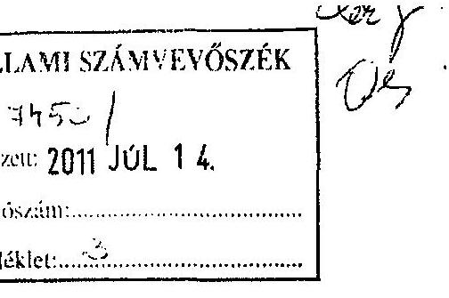

Tárgy: Észrevétel ellenőrzési jelentésre
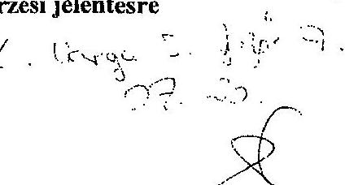

Tisztelt Elnök Úr!

Megkaptam az Állami Számvevőszék 2011. évi a megyei önkormányzat gazdálkodási rendszere témakörében önkormányzatunknál végzett ellenőrzési jelentésük tervezetét. Az abban foglalt megállapításokkal egyetértek.

A jelentés 14. oldalán tett azon megállapításhoz, miszerint 2011. évben 693 millió forint költségvetési kiadás jut az önként vállalt feladatokra a következő észrevételt teszem:

1) Az ilyen nagyságrendű kiadásnak, valamivel több mint 1/3-át teszi ki a megyei önkormányzati fenntartói támogatás, pontosan csak 248,5 M Ft-ot. A kiadás 2/3-nyi részének fedezetét - a Megyei Művelődési Központ, a Szimfonikus Zenekar, a Mesebolt Bábszínház, az Ungaresca Táncegyüttes - részben a megyeszékhely megyei jogú várostól kapja önkormányzatunk (miután ezek az intézmények
 a várossal közös fenntartásúak). A zenekar és a bábszínház állami normatív támogatásban részesül. A kiadási szint fennmaradó része a tervezésnél figyelembe vett egyéb pályázati pénzeszközökből, illetve saját bevételekből áll össze. Ezek a fentiekben említett intézmények nem sorolhatóak a megyei önkormányzatok szorosan vett kötelező feladatai közé, de nem vitathatóan fontos szerepet töltenek be a megye kulturális közszolgáltatásában.
A nem vitathatóan önként vállalt feladatok megyei önkormányzati forrásból történő finanszírozási igénye 2011-ben mindösszesen 41,6 M Ft-ot tesz ki.
2) A jelentésben a megyei közgyűlés elnökének előírt javaslatok 1-6. pontját önkormányzatunk teljesíteni fogja, arról intézkedési terv készül. A 7. javaslattal azonban nem tudok egyetérteni.
Ebben az éves költségvetési előterjesztésekben az értékcsökkenési leírás összegét, és az ezzel arányban elhasználódott eszközök pótlásának forrásigényét és lehetőségét kéri bemutatni a számvevőszék.
Az említett tartalmú adatszolgáltatás költségvetési rendeletben való kötelező szerepeltetésére az önkormányzatot jogszabály nem kötelezi. Az államkincstár felé leadott beszámoló garnitúrák mérleg űrlapjain, és a mérlegjelentésekben - az év során

---

elszámolt értékcsökkenéssel csökkentett - nettó értéken szerepelnek az eszközök. A beszámoló űrlapjaiból az év során elszámolt értékcsökkenés összegéről is tájékozódhat bármely ellenőrző szerv. A jogszabályi előírásoknak megfelelően a mérleget alátámasztó analitikákkal rendelkezünk, az értékcsökkenési leírások összegéről eszközönkénti nyilvántartást vezet önkormányzatunk hivatala és intézményei, amely alapján az éves értékcsökkenés összege megállapítható.
Az eszközérték pótlásának fedezetét az állam nem biztosítja, korábban a címzett és céltámogatások jelentettek forrást e célra, de az utóbbi években ezekre önkormányzatunk már nem pályázhat. A normatívák az önkormányzati feladatellátás működési kiadásainak felét fedezik, az átengedett adó és az illetékbevétel ezt egészíti ki úgy, hogy az együttes forrás sem fedezi a feladatellátás teljes kiadási szintjét, az önkormányzat jelentős működési hiánnyal működik. Fejlesztési célra fordítható saját bevétellel nem rendelkezünk és központi forrás sem áll rendelkezésre e célra.
A leírtak alapján nem tartjuk célszerűnek és szükségesnek az értékcsökkenés összegének, az eszközpótlás forrásigényének és forráslehetőségének szerepeltetését a költségvetési rendeletben, mivel azt semmilyen jogszabályi előírás nem teszi kötelezővé. Kérem a jelentésben megfogalmazott 7. javaslat törlését.

Szombathely, 2011. július 6.
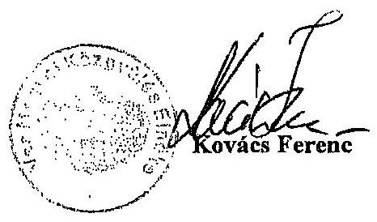

---

# Kovács Ferenc úr 

elnök
Vas Megyei Önkormányzat

## Szombathely

## Tisztelt Elnök Úr!

Köszönettel vettem észrevételeit a Vas Megyei Önkormányzat pénzügyi helyzete ellenőrzésének jelentés-tervezetében foglalt megállapításokra.

Az önként vállalt feladatok finanszírozására vonatkozó tájékoztatását elfogadtuk, azzal a jelentést kiegészítettük.

A jelentés-tervezetben az értékcsökkenés, illetve az elhasználódott eszközök pótlására fordított tényleges kiadások szembeállítására, bemutatására vonatkozó javaslatunkkal nem értett egyet, jogszabályi előírás hiányára való indoklással. Az eszközpótlást a jelenlegi forrásképzési gyakorlat miatt fontos feladatnak tartjuk, így jogszabályi előírás hiánya ellenére a javaslatban foglaltakat fenntartjuk.

Köszönöm Elnök úr és munkatársainak az ellenőrzés során tanúsított hozzáállását, amellyel a pénzügyi helyzet elemzés elkészítésében részt vettek, azt munkájukkal segítették.

Budapest, 2011. december 19.
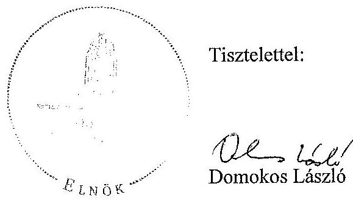

Melléklet: jelentés

---

.
