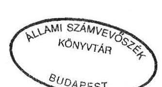
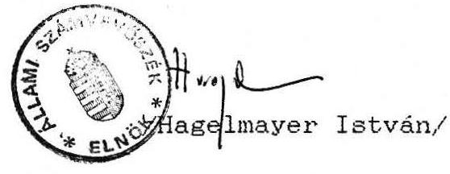

# Allami Számbebösséé 

## JELENTÉS

a Magyar Szocialista Munkáspárt
1991. évi gazdálkodása törvényességének vizsgálatáról

---

Az ellenőrzést vezette:
dr. Elek János főtanácsos

Az ellenőrzést végezték:
Tóth István tanácsos
dr. Szávai Tamás tanácsos
Hoffmann István számvevö
dr. Ocsovai Sándor szakértő

---

Allami Számvevõszék
V-1020-19/1992.
Témaszám: 119 .

# J E L E N T E S   a Magyar Szocialista Munkáspárt   1991. évi gazdálkodása törvényességének vizsgálatáról 

## I.

A vizsgálat célja, idõszaka, módszere, körülményei

A pártok gazdálkodásának törvényességét kizárólagosan az Allami Számvevõszék (továbbiakban: ASZ) hivatott vizsgálni, az Allami Számvevõszékrõl szóló 1989. évi XXXVIII. tv, valamint az 1990. évi LXII. törvénnyel és az 1991. évi XLIV. törvénnyel módosított, a pártok müködésérõl és gazdálkodásáról szóló 1989. évi XXXIII. törvény (továbbiakban: párttörvény) alapján.

A párttörvény 10. paragrafus (3) bek. alapján az ASZ évente legalább egyszer ellenörzi azoknak a pártoknak a gazdálkodását, amelyek az adott évben állami költségvetési támogatásban részesültek.

A Magyar Szocialista Munkáspárt (továbbiakban: MSZMP) az 1990. évi általános országgyûlési választásokon elért eredménye alapján - a párttörvényben elôirt elosztási szabályok szerint rendszeres állami költségvetési támogatásban részesül. Ennek megfelelően az MSZMP 1991. évben 18.000 E Ft állami költségvetési támogatást kapott. Igy az ASZ az MSZMP gazdálkodásának törvényességét már harmadizben ellenörizte.

A törvényességi vizsgálat célja annak megállapítása, hogy az MSZMP gazdálkodása mennyiben felelt meg a párttörvény elöirásainak, továbbá betartották-e a könyvvitel-, a számvitel bizonylati rendjérõl szóló és a gazdálkodással összefüggõ egyéb hatályos jogszabályok elöirásait.

---

A vizsgálat a lezárt 1991. év gazdálkodására, illetve az ASZ korábbi vizsgálata alapján tett intézkedések érvényesülésére terjedt ki. Az MSZMP gazdálkodása törvényességének ellenőrzése a Magyar Közlöny 1991. évi 28. számában közzétett ASZ általános ellenőrzési program szempontjainak megfelelően történt.

Az ASZ ellenőrizte az 1991. évi gazdálkodásról közzétett pénzügyi zárómérleg teljeskörüségét, pontosságát, a könyvvezetés gyakorlatát, bizonylati alátámasztottságát, a számvitel bizonylati rendjének betartását. Az ASZ vizsgálat elsősorban arra összpontosult, hogy az MSZMP müködéséhez szabályszerűen igénybevehető forrásokat használt-e fel, gazdálkodó tevékenysége megfelelt-e a párttörvényben megengedetteknek, betartotta-e a gazdálkodással összefüggő pénzügyi-számviteli és egyéb szabályokat.

A jelentés megállapításai a Központi Bizottságnál, továbbá a Heves; Jász-Nagykun-Szolnok; Tolna megyei és a Budapest XIV. kerületi Koordinációs Bizottságnál, valamint az Eger városi II. körzeti; Szekszárd Belvárosi; Herman Ottó városi, és Budapest XIV/14. sz. alapszervezeteknél lefolytatott helyszíni ellenőrzés tapasztalatain alapszanak.
Az ellenőrzés lefolytatására 1992. augusztus 3-29-ig tartóan került sor.

# II. 

Az MSZMP 1991. évi pénzügyi zárómérlegének ellenőrzése

## 1. Altalános megállapítások

A párttörvény 9. paragrafus (1) bekezdése értelmében a pártok kötelesek minden év március 31-ig az előző évi gazdálkodásuk pénzügyi kimutatását a Magyar Közlönyben - a törvényben meghatározott minta szerint - közzétenni. E kötelezettségének az MSZMP eleget tett. (1. sz. melléklet)

A párt gazdálkodásáról közzétett pénzügyi kimutatás részleteiben és föösszegében egyaránt pontatlan. A pontatlanságok elsősorban a bevételek és kiadások halmozódásának nem teljeskörü kiszüréséből adódnak. A pénzügyi zárómérleg a vizsgálat részletes megállapításaiban foglaltak miatt nem teljeskörü.

---

Az MSZMP pénzügyi zárómérlegét a Központi Bizottság és az 1991. december 31-én meglévő alapszervezetek és koordinációs bizottságok gazdálkodási anyagának összesítése alapján kellett volna elkészíteni. Ezzel szemben a pénzügyi zárómérleg elkészítése során csak az MSZMP KB és a szervezetek egy részének adatait vették figyelembe.

P1. A Jász-Nagykun-Szolnok megyei Koordinációs Bizottság 37 szervezet adatai alapján szolgáltatott adatot a Központi Bizottságnak, de a megyei szervezetek nyilvántartásának hiányában nem tudta megmondani, hogy valamennyi a megyében müködő MSZMP szervezet eleget tett-e adatszolgáltatási kötelezettségének.

Az MSZMP Központi Bizottsága sem tudott arra vonatkozóan nyilatkozni, hogy valamennyi szervezeti egysége adatot szolgáltatott-e a zárómérleg elkészítéséhez.

A nem teljeskörü adatszolgáltatást támasztja alá az a tény is, hogy míg az MSZMP KB könyvelése szerint az alapszervezetek és koordinációs bizottságok 4.274 E Ft ellátmányt kaptak a KB-tól, addig a mérlegkészítés alapjául szolgáló beszámolókhoz az alapszervezetek és koordinációs bizottságok csak 3.593 E Ft MSZMP KB-tól származó bevételt jeleztek. Tehát 681 E Ft-ot olyan szervezetek kaptak, amelyek gazdálkodásukról nem számoltak el.

# 2. A pénzügyi zárómérleg bevételi oldalát érintő megállapítások 

2.1. Az MSZMP tagdíjbevételeit nem tartalmazza teljeskörűen a zárómérleg, mivel az alapszervezetek és a koordinációs bizottságok egy része - a fentebb leírtak szerint - a mérleg összeállításához egyáltalán nem szolgáltatott adatot.

A zárómérlegben tagdíjbevételként 15.792 E Ft szerepel. Ez az összeg 2.491 E Ft-tal több, mint amit az alapszervezetek és koordinációs bizottságok beszámolói tartalmaznak (13.203 E Ft). Ez a különbözet abból adódik, hogy az alapszervezetek és koordinációs bizottságok teljes tagdíjbevételükről adtak a beszámolóhoz tájékoztatást, ugyanakkor a mérlegben plusz bevételként szerepel a tagdínak az a része, amelyet a szervezetek bevételükböl csekken az MSZMP KB bankszámlájára befizettek.

---

Ugyancsak a tagdijbevételek tényleges nagyságának megállapítását nehezíti az a körülmény, hogy a beszámolóban feltüntetett bevétel és a bizonylattal alátámasztott bevétel egyes szervezeteknél nem azonos.

Pl. egy szekszárdi alapszervezet beszámolójában 12.631 Ft tagdijbevétel szerepel, míg a tagdij fizetési jegyzékek szerint az 1991. évi tagdijbevétel csak 6.880 Ft volt.
2.2. Az "egyéb hozzájárulások" címen kimutatott összesen 5.560 E Ft nem mutatja a pártnak támogatásként nyújtott valós összeget. A pontatlanságot okozó tényezők a következök:

- A mérleg csak jogi személyektől és magánszemélyektől származó adományt - vagyoni hozzájárulást - tartalmaz, pedig az alapszervezetek jelentéseiben 65 E Ft hozzájárulás szerepel jogi személynek nem minősülő gazdasági társaságtól.
- A mérleg összeállításához készített számítási anyag szerint az 5.560 E Ft magánszemélyektől származó hozzájárulásból 4.911 E Ft a KB-hoz folyt be, míg az alapszervezetek beszámolója 1.017 E Ft bevételt tartalmaz ilyen címen. A főkönyvi számlák és az alapszervezetek beszámolójának összevetéséből megállapítható, hogy az alapszervezetek a tagdíjon felül 1.014 E Ft-ot küldtek fel a Központi Bizottsághoz, amely összegeket az alapbizonylatok alapján magánszemélyek adományaként könyvelték el, holott az alapszervezetek tagdij vagy hozzájárulás bevételéből került kifizetésre. Igy ez az összeg a bevétel között kétszer lett figyelembevéve.
- A mérleg az egyéb hozzájárulásokra vonatkozóan sem tartalmazza az alapszervezetek egy részének adatait.

Mindezek alapján az egyéb hozzájárulások tényleges nagysága az MSZMP KB-nál jelenleg rendelkezésre álló adatok alapján nem állapítható meg.

---

2.3. A pénzügyi zárómérlegben propaganda tevékenységből származó bevételként 1.051 E Ft-ot mutattak ki. Ebből 136 E Ft bevételt az alapszervezetek és koordinációs bizottságok jeleztek, mig 915 E Ft az MSZMP KB könyvelése szerint "Szabadság részjegy"-ből származó bevétel volt.

A 915 E Ft-nak a propaganda tevékenységbōl származó bevételként való szerepeltetése a következök miatt nem a valóságot tükrözi. Ugyanis a bevételböl 750 E Ft-ot mint magánszemélyek hozzájárulását, a 165 E Ft-ot pedig mint egyéb bevételt (kamat) kellett volna a mérlegben szerepeltetni.
2.4. A pénzügyi zárómérleg gazdálkodásból származó bevételként 57 E Ft-ot tartalmaz. Ez az öszzeg megegyezik az MSZMP KB könyvelésében szereplő, az alapszervezetek által jelzett összeggel.

A könyvelés azonban nem tartalmazza a Heves megyei Koordi= nációs Bizottságnak egy kft. részére átengedett helyiségek használatáért fizetett a helyszíni vizsgálat által feltárt 65.400 Ft gazdálkodási bevételt.
2.5. Egyéb bevételként a pénzügyi zárómérleg 2.236 E Ft-ot tartalmaz. Ez az összseg megegyezik a könyvelésben ilyen címen szereplő összeggel. Az összeg 1.619 E Ft értékben tartalmazza a megyék és a fővárosi kerületek ilyen címü bevételét. Ez azonban 126 E Ft összeggel meghaladja a szervezetek által közölt értéket. Ugyanakkor hibás adatszolgáltatás folytán nem tartalmazza a mérleg a Heves megyei szervezetek által jelzett, de a megyei Koordinációs Bizottság által az adatszolgáltatásból kihagyott 88.136 Ft-ot. További hiányosság, hogy a párttörvény elöírása ellenére nem bontották meg az egyéb bevételeket jogcím szerint.
3. A pénzügyi zárómérleg kiadási oldalát érintő megállapítások

A pénzügyi zárómérleg kiadási oldala a bevételi oldalnal már említett adatszolgáltatási hiányosságok miatt nem tekinthetō teljeskörünek.

---

# 3.1. Hozzájárulások juttatása 

a/ A hozzájárulások juttatása a párt helyi szervei számára címszó alatt a mérleg 5.768 E Ft kiadást tartalmaz. Ez az összeg az alapszervezetek ellátmánya és a támogatások a párton belül c. főkönyvi számlák tartozik egyenlegének összege. Nem tartja az ellenőrzés megfelelőnek ennek az adatnak a tényleges kiadások között való feltüntetését a következő okok miatt:

- Nem tekinthető tényleges kiadásnak az alapszervezetek ellátmányából az az összeg, melynek bevételével az alapszervezetek elszámoltak. Ez csak belső átvezetés. Az ellátmány számlán szereplő 4.274 E Ft-ból az alapszervezetek 3.593 E Ft-tal bevételeik és kiadásaik között elszámoltak. Tényleges kiadásnak tehát csak 681 E Ft tekinthető.
- A támogatások a párton belül elnevezésű számlán kiadásként 1.439 E Ft értékben olyan kiadások kerültek könyvelésre, amelyet az alapszervezetek szociális támogatásként és egyéb tevékenységgel kapcsolatos kiadásként jeleztek. Ezt leszámítva a számlán a kiadás 56 E Ft. Ez sem tekinthető azonban a párt szempontjából kiadásnak.
b/ Hozzájárulások juttatása külföldi intézmények, szervezetek, személyek számára címszó alatt a mérleg 1.279 E Ft-ot tartalmaz. Ez megegyezik a könyvelésben alapítványoknak átadott összegként szerepeltetett értékkel. Az ellenőrzés szerint ezért helyesen a párt által fenntartott, vagy támogatott intézményeknek átadott hozzájárulásként kellett volna a mérlegben szerepeltetni.

3.2. Munkabérek címszó alatt a mérleg 3.741 E Ft kiadást tartalmaz. Ez az összeg megegyezik a könyvelésben az 521-es főkönyvi számlán könyvelt összeggel. Nem tartalmazza azonban az 57 E Ft végkielégitést, amit szintén itt kellett volna kimutatni. Ezt az összeget a költségtérítések, napidíjak között szerepeltették.

---

3.3. Költségtérítések, napidíjak címszó alatt a mérleg 1.621 E Ft-ot tartalmaz. Ezen a címen a könyvelőtől kapott tájékoztatás szerint az 5621-5628. főkönyvi számlákon szereplő kiadásokat mutatták ki. A szóban forgó számlák tartozik egyenlege azonban a mérlegben szereplő összegnél 9 E Ft-tal magasabb.

Nem tartja megfelelőnek az ellenőrzés, hogy költségtérítésként mutatnak ki a mérlegben belföldi vendéglátási, reprezentációs és bér jellegű kiadásokat, összesen 613 E Ft értékben. Ugyanakkor viszont nem tartalmazza a mérleg a különböző tömegközlekedési eszközök igénybevételéért, saját gépkocsihasználatért fizetett költségtérítést, összesen 4.459 E Ft értékben. Ezt az összeget a főkönyvelő közlése szerint a különféle egyéb költségek között állították be a mérlegbe annak ellenére, hogy az összegből 3.350 E Ft-ot az alapszervezetek és koordinációs bizottságok költségtérítések, napidíjak címen jeleztek a KB felé.
3.4. Szociális üdülési stb. támogatás címen a mérleg 285 E Ft-ot tartalmaz. Ez az összeg megegyezik a főkönyvi számlán ilyen címen könyvelt összeggel. A főkönyvi számla azonban csak a megyei alapszervezetek és koordinációs bizottságok által jelzett ilyen célú kiadást tartalmazza. A fővárosi alapszervezetek és koordinációs bizottságok által jelzett 234 E Ft ilyen célú kiadást ugyanis tévesen a "támogatások a párton belül" c. számlán könyvelték el.

# 3.5. Általános költségek 

a/ Adók, illetékek címen a mérleg 2.159 E Ft-ot tartalmaz. Ez az összeg megegyezik a főkönyvi számlákon könyvelt adók és illetékek összegével. A könyvelt költségek pontossága azonban nem biztosított. Ezt támasztja alá, hogy itt kellene kimutatni az MSZMP belsó utasítása szerint a vissza nem igényelhető AFA összegét, azonban az alapszervezetek és koordinációs bizottságok közel 10.000 E Ft értékú szolgáltatási és anyag jellegú költség mellett csupán 35 E Ft adó- és illetékköltséget jeleztek a KB felé.

---

b/ Különféle egyéb költség címén a mérleg 9.721 E Ft-ot tartalmaz. Ez az összeg azonban 4.459 E Ft értékben tartalmaz utazással kapcsolatos, a költségtérítések, napidíjak mérlegsor alá tartozó kiadásokat. Nem tartalmazza viszont a fökönyvi számlákon könyvelt, ide tartozó reprezentációs és étkezési kiadásokat, összesen 556 E Ft értékben.
3.6. Egyéb tevékenységgel kapcsolatos költségek címen a mérleg nem tartalmaz adatot annak ellenére, hogy az alapszervezetek és koordinációs bizottságok adatközlése 1.205 E Ft ilyen célú kiadást tartalmaz.

# 4. A tényleges pénzügyi helyzet ellenőrzése 

Az MSZMP tényleges pénzügyi helyzetét a KB, valamint az alapszervezetek és koordinációs bizottságok pénzmaradványainak összevonásával lehet megállapítani. Ennek alakulása a következő:

MSZMP KB
bankszámla dec. 31-i egyenlege 1.654 E Ft pénztári készpénz 139 E Ft
deviza elsz. szla 116 E Ft
értékpapírok 3.000 E Ft
aktivák 145 E Ft
összesen: 5.054 E Ft
Budapesti szervezetek pénzmaradványa 5.676 E Ft
Vidéki szervezetek pénzmaradványa 5.028 E Ft
szervezetek összesen: 10.758 E Ft
MSZMP összesen: 15.758 E Ft

Elfogadható még a kiegyenlítetlen tartozások fedezetével csökkentett pénzforgalmi egyenleg, amelyet - tekintettel arra, hogy az alapszervezetek és a koordinációs bizottságok gazdasági eseményei is a KB-nál könyvelésre kerültek - a 3. főkönyvi számlaosztály tartalmaz. Ennek összege 16.630 E Ft.

---

Ezzel szemben a pénzügyi zárómérleg az MSZMP halmozott többletét 1991. év végén 6.547 E Ft-ban tartalmazza. Ez az összeg megfelel fôkönyvi kivonat tartozik egyenlegének. Ez pedig az 1991. évi gazdálkodás eredményét mutatja.

A tényleges pénzügyi helyzet megállapítását tovább nehezíti az a körülmény, hogy egyes szervezetek pénzmaradványát nem a tényleges állapotnak, vagy az általuk közöltnek megfelelően tartalmazza a pénzügyi zárómérleg.

Pl. A Tolna megyei Koordinációs Bizottság pénzmaradványaként a beszámolóban 148.887 Ft-ot mutatott ki, míg bankszámlájának 1991. december 31-i záróegyenlege 150.791 Ft volt.
A Heves megyei Koordinációs Bizottság a megyei szervezetek pénzmaradványát a KB-nak küldött beszámolóban 251.689 Ft-ban mutatta ki, míg a szervezetek által közölt adatok összesítése szerint a pénzmaradvány 394.990 Ft. Tehát több mint 143 E Ft-tal több, mint amit a mérlegnél figyelembe vettek.

# III. 

1. A pénzügyi zárómérleg megalapozottságát szolgáló könyvvizsgálati megállapítások
1.1. Az MSZMP KB 1991. január 1-jével - az egyszeres könyvvitel előírásain alapuló naplófőkönyv vezetésről - áttért az egyszerüsített kettős könyvvitelre, manuális rendszerben. Könyvvitelét 1991. szeptember 1-jével számítógépes adatfeldolgozás keretében szervezte meg, újonnan kialakított belsõ számlatükör alapján (számlarendet nem fektettek fel).

Alapvető hibaként állapítja meg az ellenőrzés, hogy az MSZMP KB-hoz beküldött alapszervezeti éves adatszolgáltatást bizonylatokkal nem támasztják alá és azokat a központban külön megnyitott számlákra könyvelik le, a könyvelési rendszeren belül.

---

Ez a gyakorlat ellentétes az MSZMP Szervezeti Szabályzatában foglaltakkal is, miszerint "a párt alapszervezetei, koordinációs bizottságai és országos szervei jogi személyek, amelyek meghatározott rend szerint kötelesek gazdálkodni". Ebből következik, hogy valamennyi alapszervezetre és koordinációs bizottságra a Párttörvény 9. paragrafus (3) bekezdése alapján a 16/1989.(II.16.) MT rendelet előírásai érvényesek, azaz önálló könyvelést kötelesek folytatni, alapbizonylatokkal alátámasztottan.
Továbbá: fentieknek ellentmond az MSZMP 1992. július 25-én jóváhagyott Gazdálkodási és Vagyonkezelési Szabályzata, amely rögzíti, hogy az alapszervezetek, koordinációs bizottságok nem önálló jogi személyek, gazdálkodásuk a központi gazdálkodás része.

Az alapszervezetek és koordinációs bizottságok többsége a könyvvezetési kötelezettségének nem tett eleget. Kevés kivételtől eltekintve ezek a szervezetek csak pénztárkönyvet vezettek, azokba viszont nem minden gazdasági esemény került bevezetésre.

Ez azzal a következménnyel is járt, hogy az alapszervezetek által összegyüjtött tagdij- és hozzájárulás bevételek - a KB részére csekken felküldött összegek - a KB bevételeként és az alapszervezetek összesített bevételeként egyaránt lekönyvelésre kerülnek. Hasonló halmozódást eredményez a kiadások között, amikor a KB által az alapszervezeteknek nyújtott ellátmányt a KB kiadásként és a tényleges felhasználást követően az alapszervezetek kiadásaként is lekönyvelik.
1.2. Az MSZMP KB 1991. évben egy bankszámlán bonyolította le pénzforgalmát. A helyszíni ellenőrzés tapasztalatai, valamint a beszámolók alapján megállapítható, hogy az alapszervezetek és koordinációs bizottságok többsége bankszámlákkal vagy takarékbetétkönyvvel rendelkezik. Erről azonban a párt vezetésének információja nincs.
1.3. Az állami támogatás minden esetben - főkönyvi számlán is rögzített - bankszámlára érkezett.

---

# 2. Az analitikus nyilvántartások és a bizonylati rend ellenörzése 

2.1. Az MSZMP KB a következõ nyilvántartásokat vezeti; állóeszközök egyedi nyilvántartása, SZJA köteles kifizetések, elszámolásra kiadott elölegek nyilvántartása, szállítók követelései és fogyóeszközök nyilvántartása. Az alapszervezetek többségében a gazdálkodás egyszerűsége miatt analitikus nyilvántartások vezetésére nem került sor.
2.2. Az MSZMP KB-nál szigorú számadású nyomtatványként kezelik a bevételi és kiadási pénztárbizonylatokat, a készpénz csekk füzetet, továbbá a beszerzett értékpapírokat is. Az MSZMP-nek az alapszervezetek és koordinációs bizottságok szigorú számadású nyomtatvány kezelési gyakorlatáról változatlanul nincs információja, annak ellenére sem, hogy azok adatszolgáltatását központi könyvelésébe beépítette.

A vizsgálat által érintett alapszervezetek és koordinációs bizottságok egyikénél sem történt meg a szigorú számadású nyomtatványok kijelölése és azokról a jogszabályilag elöírt nyilvántartást sem vezetik.
2.3. A bizonylatok kiállítása és dokumentáltsága a központban néhány esetben nem felel meg az elöírt alaki és tartalmi követelményeknek, így pl.

- a pénztár kiadási bizonylatról hiányzik az utalványozó aláírása,
- adományok befizetése során a pénztárbevételi bizonylatról hiányzik a befizető aláírása,
- repülöjegy vásárlás esetén a pénztári bizonylathoz nem csatolják a felhasznált repülőjegyet, így nem állapítható meg, hogy az utazás az MSZMP érdekében történt-e.

Az alapszervezetek és koordinációs bizottságok vizsgálata során egy szervezet kivételével, általános tapasztalat volt, hogy az utalványozási jogot nem szabályozták. A kiállított kiadási és bevételi pénztárbizonylatok gyakran nem feleltek meg a jogszabályilag elöírt követelményeknek.

---

P1. Jász-Nagykun-Szolnok megyei Koordinációs Bizottságnál a kiadások túlnyomórészt nem voltak utalványozva. A XIV. kerületi Koordinációs Bizottság kiadásainál az utalványozás elmaradása mellett gyakran a pénzfelvevõ aláírása is hiányzik.
2.4. Külföldi kiküldetések ügymenete több vonatkozásban nem felel meg az elöírásoknak; hiányzik a kiküldetés elrendelésének dokumentuma, a felmerült költségekkel való tételes elszámolás, az engedélyező aláírása. Egy esetben az elszámolásra felvett költségfedezettel és napidíjjal két fő kiutazót nem számoltattak el. Mindezek ellenére a központi könyvelés a kiutazást elszámoltnak tekintette, bizonylatok nélkül; az utielöleget - mint felhasznált összeget - lekönyvelte. Az elszámolás ezen módja - összesen 1160 USD elöleget érint - az elöírásokkal ellentétes.

Az MSZMP - az ASZ 1991. évi vizsgálati megállapításai nyomán - a külföldi utak elszámoltatási gyakorlatát 1992. január 1-től kezdödően már az elöírásoknak megfelelően bonyolította le, alakilag-tartalmilag egyaránt.
2.5. Költségtérítések, napidíjak címen többnyire üzemanyag vásárlást számoltak el. Napidíjat a KB-nál senki sem vett fel. A közlekedési költségek elszámolására jellemzö, hogy a vidéki utazásokhoz kiküldetési rendelvényt továbbra sem állítanak ki, következésképpen az utazások elrendelése, indokoltsága nem bizonyítható. Változatlan, hogy az üzemanyagköltség elszámolásnál az SZJA törvénybe ütközik az, hogy magántulajdonú gépkocsik eseti használatánál nem útvonal alapján történő norma szerinti elszámolást alkalmaztak, hanem benzinszámla alapján térítették meg a költségeket (ez a gyakorlat visszaélésre nyújt lehetöséget). A párt saját gépkocsijainak üzemanyag-felhasználását - jogszabályszerüen - útvonal nyilvántartás és elöírt norma alapján számolták el.
2.6. Az MSZMP KB 1991. évben olyan számlákat is kiegyenlített, melyeket a szolgáltató nem vele szemben nyújtott be.

---

# IV. 

## Az MSZMP KB gazdálkodó tevékenységének vizsgálata a párttörvény 6. szakasza alapján

1. Az MSZMP gazdálkodási bevételhez - egy eset kivételével csak a párttörvény által engedélyezett jelvény árusításból és vidéki szervezeteinél kismértékú fénymásolási tevékenységböl jutott.

Egy esetben a Heves megyei Koordinációs Bizottságnál tapasztalta azt az ellenőrzés a Párttörvény 6. paragrafus (1) bekezdésébe ütközöen, hogy az általa használt, de tulajdonában nem álló ingatlant hasznosított oly módon, hogy azt egy kft-nek 65.400 Ft-ért bérbe adta. Ezt a törvénysértó helyzetet azonban még 1991-ben megszüntették, így törvényességi felhívás megtétele már nem indokolt.
2. Az MSZMP KB 1990-ben egyszemélyes kft-t alapított. E kft adja ki az MSZMP "Szabadság" c. újságját. Ezen kívül az MSZMP egyéb vállalkozást nem alapított. Tiltott gazdasági társaságban részesedést nem szerzett.
3. Az alapszervezetek gazdálkodó tevékenységét alátámasztó dokumentumok az MSZMP KB-nál nem állnak rendelkezésre. Azok a gazdálkodás helyszinén, az alapszervezeteknél találhatók. Az alapszervezetek gazdálkodásáról a KB-nak gyakorlatilag csak az éves beszámolók alapján van információja.

## V.

Az MSZMP 1991. évi ellenőrzése alapján tett intézkedések utóellenőrzésének tapasztalatai

Az ASZ az MSZMP 1991. évi ellenőrzése során megállapította, hogy az 1990. évi gazdálkodásról közzétett pénzügyi zárómérleg nem volt sem teljeskörü, sem pontos, ezért felhívta a párt elnökét a pénzügyi zárómérleg újbóli elkészítésére és közzétételére.

---

A vizsgálat megállapította továbbá, hogy a gazdasági folyamatok bizonylatolása, könyvelése nem mindenben felel meg a jogszabályi előírásoknak. Ezért az ASZ a Párttörvény 10. paragrafus (4) bekezdésben kapott felhatalmazás alapján felhívta a párt elnökét a törvényes állapot helyreállítására. A felhívás alapján az MSZMP elnöke 1992. január 2-án kelt levelében a megfelelő intézkedések megtételét helyezte kilátásba.

A megtett intézkedésekkel kapcsolatban az ellenőrzés az alábbiakat állapította meg:

1. A pénzügyi zárómérleget újra elkészítették és a Magyar Közlöny 1992. évi 41. számában közzétették.

A közzétett módosított pénzügyi zárómérleg továbbra sem tekinthető teljeskörünek tekintettel arra, hogy az alapszervezetek és koordinációs bizottságok bevételeit és kiadásait csak az eredetileg figyelembe vett 445 alapszervezetre vonatkozóan tartalmazza a módosított mérleg, miközben ugyanezen szervezetek év végi pénzmaradványát a korábbinál 2.528 E Ft-tal magasabb - 6.522 E Ft - értékben tartalmazza. A pénzmaradvány növekedése alapján pedig joggal feltételezhető, hogy a bevételi és a kiadási forgalom is változott. A teljeskörüség hiánya mellett a módosított pénzügyi zárómérleg pontosnak sem tekinthető, mivel az 1991. évi ASZ vizsgálat által megállapított hiányosságokat csak részben küszöbölték ki.

Tekintettel azonban arra, hogy az 1990. évi zárómérleg újbóli elkészítése és közzététele az idő előrehaladottsága miatt a közvélemény érdemi tájékoztatását már nem szolgálja, az újbóli elkészítést és közzétételt az ellenőrzés nem tartja szükségesnek.
2. A könyvvitellel, számvitellel kapcsolatos szabálytalanságok megszüntetése érdekében az alábbi szabályozásokat és utasításokat adták ki:

- Elszámolásra kiadott összegek kezelése.
- Házipénztári és pénzkezelési szabályzat.
- Saját gépkocsi használatára fizetett átalány.
- Saját gépkocsi belföldi hivatalos célú kiküldetés alkalmával történő használata.
- Gazdálkodási és Vagyonkezelési Szabályzat.

---

Az ellenőrzés megállapította, hogy a Gazdálkodási és Vagyonkezelési Szabályzat több rendelkezése ellentétes a számvitelről szóló 1991. évi XVIII. törvény, valamint az MSZMP alapszabályának előírásaival, ezért annak átdolgozása szükséges.

Bár a 29/1990.(XII.27.)PM rendelet előírta, hogy az ideiglenes külföldi kiküldetést teljesitők költségtérítésének összegét, a költségátalány alkalmazásának eseteit és mértékét a kollektív szerződésben, a munkaügyi szabályzatban vagy egyéb megállapodásban kell meghatározni, ezt a kérdést az MSZMP-ben a vizsgálat időpontjáig nem rendezték.

Az MSZMP-nél 1991-ben végzett ASZ vizsgálat által feltárt egyéb hiányosságokat megszüntették.

# VI. 

## OSSZEFOGLALAS

Osszességében megállapítható, hogy az MSZMP-nél 1991-ben kialakított és 1992-re is alkalmazott könyvviteli gyakorlat nem alkalmas a párt egésze gazdasági folyamatainak időbeni és pontos áttekintésére. Ezt a tényt támasztja alá az is, hogy a könyvelés alapján a pénzügyi zárómérleget nem tudták megfelelő pontossággal előkészíteni.

Az alapszervezeteknél és koordinációs bizottságoknál részben a központi szabályozás hibái miatt a könyvvitel, valamint a számvitel bizonylati rendjére vonatkozó előírásokat gyakran nem tartják be.

A vizsgálat során tapasztalt, a jelentésben rögzített szabálytalanságok miatt a következó intézkedéseket kezdeményezi az Állami Számvevőszék.

---

# VII. 

## Felhívás a feltárt hiányosságok megszüntetésére

A Párttörvény 10. paragrafus (4) bekezdésében kapott felhatalmazás alapján az Állami Számvevőszék felhívja az MSZMP elnökét, hogy:

- az 1991. évi gazdálkodásról szóló pénzügyi zárómérleget ismételten készítesse el és a Magyar Közlönyben jelentesse meg;
- haladéktalanul intézkedjen a számviteli és bizonylati fegyelemnek az MSZMP egészére vonatkozó betartására összhangban az alapszabállyal;
- intézkedjen arra vonatkozóan, hogy a párttörvény 9. paragrafus (1) bekezdésében előírt zárómérleg elkészitéséhez szükséges adatok teljeskörűen az MSZMP KB rendelkezééére álljanak;
- saját hatáskörében tegye meg a szükséges intézkedéseket a külföldi kiküldetéssel kapcsolatos elszámolatlanság megszüntetésére.

Budapest, 1992. október 6.

Melléklet: 1 db

---

## A Magyar Szocialista Munkáspárt 1991. évi pénzügyi zárómérlege

## A) Tényleges bevételek

Ezer forintban

1. Tagdijak
2. Állami költségvetésbő̉l származó támogatás
a) alapösszeg
b) a pártra adott szavazatok arányában kapott összeg
3. Egyéb hozzájárulások
a) jogi személyektől

- ebből 500000 Ft feletti hozzájárulás a következô belföldiektől:
- ebből 100000 Ft feletti értéknek megfelelő összeg a következô külföldiektől:
b) jogi személynek nem minősülő gazdasági társaságoktól
— ebből 500000 Ft feletti hozzájárulás a következô belföldiektől:
- ebből 100000 Ft feletti értéknek megfelelő összeg a következô külföldiektől:

## B) Tényleges kiadások

1. Hozzájárulások juttatása
a) a párt országgyúlési csoportja számára
b) a párt helyi szervei számára
c) a párt által fenntartott vagy támogatott intézmények számára
c) más társadalmi szervezetek számára
c) külföldi intézmények, szervezetek, személyek számára

18000
7.152
2. Személyzeti költségek
a) munkabérek
b) költségtérítések, napidíjak
c) társadalombiztosítási hozzájárulások
d) szociális, üdülési stb. támogatások

3. Általános költségek
a) adók, illetékek
b) épületek fenntartása, karbantartása, közüzemi díjai
c) helyiségek bérlete
d) adminisztrációs és postaköltségek
e) különféle egyéb költségek

4. Sajtó- és propagandaköltségek
5. A választásokkal kapcsolatos költségek
6. Egyéb tevékenységgel kapcsolatos költségek
Összes kiadás a gazdasági évben
C) Tényleges pénzügyi helyzet a gazdasági év zárásakor

Bevételek a gazdasági évben 42696
Kiadások a gazdasági évben 42535

Többlet (hiány) a gazdasági évben 161
Halmozott többlet (hiány) az elôzô gazdasági évbôl
Halmozott többlet (hiány) a gazdasági év végén
Thürmer Gyula s. k., 6547
elnök
Karacs Lajosné s. k., gazdasági vezetó