# ÁLLAMI   SZÁMVEVŐSZÉK 

## JELENTÉS

a Veszprém Megyei Önkormányzat pénzügyi helyzetének ellenőrzéséről (43/2)

---

# Számvevői Iroda 

Iktatószám: V-3026-13/2011.
Témaszám: 1015
Vizsgálat-azonosító szám: V056018

## Az ellenőrzést felügyelte:

Dr. Varga Sándor
számvevő igazgató-helyettes

## Az ellenőrzést vezette:

## Renkó Zsuzsanna

számvevő tanácsos

## Az ellenőrzést végezték:

| Péntek László | Szabó Leonóra Ildikó | Szarvas Szilárd |
| :-- | :-- | :-- |
| számvevő tanácsos | számvevő | számvevő tanácsos |

A témához kapcsolódó eddig készített számvevőszéki jelentések:
címe
sorszáma
Jelentés a Veszprém Megyei Önkormányzat gazdálkodási rendszerének 2009. évi ellenőrzéséről

---

# TARTALOMJEGYZÉK 

BEVEZETÉS ..... 5
I. ÖSSZEGZŐ MEGÁLLAPÍTÁSOK, KÖVETKEZTETÉSEK, JAVASLATOK ..... 12
II. RÉSZLETES MEGÁLLAPÍTÁSOK ..... 18

1. Az Önkormányzat kötelező és önként vállalt feladatai ..... 18
2. Pénzügyi egyensúlyi helyzet alakulása ..... 21
2.1. A működési és felhalmozási egyensúly alakulása ..... 23
2.2. Az Önkormányzat bevételeinek alakulása ..... 28
2.3. Az Önkormányzat kiadásainak alakulása ..... 30
3. Kötelezettségek bemutatása ..... 34
3.1. A pénzintézetek felé fennálló kötelezettségek alakulása ..... 34
3.2. Szállítók felé fennálló kötelezettségek alakulása ..... 39
3.3. Egyéb kötelezettségek alakulása ..... 40
4. A pénzügyi egyensúly megteremtése érdekében hozott intézkedések ..... 43
5. A helyi önkormányzatok gazdálkodási rendszerének 2007. évi ellenőrzése során a pénzügyi egyensúly javítására tett szabályszerűségi és célszerűségi javaslatok hasznosulása ..... 48

---

# MELLÉKLETEK 

1. számú Működési és felhalmozási hiány/többlet alakulása melléklet
2/a. számú Kimutatás az Önkormányzat CLF módszer szerint besorolt bevételeiről és kiadásairól melléklet
2/b. számú Kimutatás az Önkormányzat bevételeinek és kiadásainak, adósságszolgálatának alakulásáról
3. számú Az Önkormányzat 2007-2010 években megvalósított, illetve 2010. december 31-én fennálló fejlesztési feladatokhoz kapcsolódó kötelezettségeinek összegzése
4. számú Az Önkormányzat tartalékainak a pénzáramoktól függő alakulása melléklet
5. számú Veszprém Megyei Közgyűlés elnökének észrevétele melléklet
6. számú Veszprém Megyei Közgyűlés elnökének észrevételére adott válasz melléklet

---

# RÖVIDÍTÉSEK JEGYZÉKE 

| Törvények |  |
| :--: | :--: |
| Áht. | az államháztartásról szóló 1992. évi XXXVIII. törvény |
| ÁSZ tv. | A 2011. június 30 -ig hatályos Állami Számvevőszékről szóló 1989. évi XXXVIII. törvény (2011. július 1-től az Állami Számvevőszékről szóló 2011. évi LXVI. törvény) |
| Htv. | a helyi önkormányzatok és szerveik, a köztársasági megbízottak, valamint egyes centrális alárendeltségű szervek feladat- és hatásköreiről szóló 1991. évi XX. törvény |
| Ötv. | a helyi önkormányzatokról szóló 1990. évi LXV. törvény |
| Számv. tv. | a számvitelről szóló 2000. évi C. törvény |
| Szórövidítések |  |
| Áfa | általános forgalmi adó |
| APEH | Adó- és Pénzügyi Ellenőrzési Hivatal (2011. január 1-jétől Nemzeti Adó- és Vámhivatal/NAV) |
| ÁSZ | Állami Számvevőszék |
| BM | Belügyminisztérium |
| EDP hiány/egyenleg | Uniós módszertan szerinti maastrichti kritériumoknak megfelelő számítás szerinti hiány/egyenleg |
| EU | Európai Unió |
| GDP | Bruttó hazai termék |
| HEFOP | Humánerőforrás-fejlesztési Operatív Program |
| Hivatal | Veszprém Megyei Önkormányzati Hivatal |
| Illetékhivatal | Veszprém Megyei Illetékhivatal |
| Kórház | Veszprém Megyei Csolnoky Ferenc Kórház Nonprofit Zrt. |
| Közgyűlés | Veszprém Megyei Közgyűlés |
| KSH | Központi Statisztikai Hivatal |
| NGM | Nemzetgazdasági Minisztérium |
| OEP | Országos Egészségbiztosítási Pénztár |
| RFV ESCO Kft | RFV ESCO Beruházási Szolgáltató Kft. |
| Önkormányzat | Veszprém Megyei Önkormányzat |
| SNA | System of National Accounts (Nemzeti Számlák Rendszere) |
| Szja | személyi jövedelemadó |
| SzMSz | Veszprém Megyei Önkormányzat 13/2000. (XI. 23.) számú rendelete a Veszprém Megyei Önkormányzat Szervezeti és Működési Szabályzatáról |
| Tüdőgyógyintézet | Veszprém Megyei Önkormányzat Tüdőgyógyintézete, Farkasgyepű |

---

.

---

# JELENTÉS 

## a Veszprém Megyei Önkormányzat pénzügyi helyzetének ellenőrzéséről

## BEVEZETÉS

Az Állami Számvevőszék 2011. évtől érvényes stratégiája új irányt szabott a helyi önkormányzatok gazdálkodásának ellenőrzésében is. Az ÁSZ – küldetése és jövőképe szerint – szilárd szakmai alapokra támaszkodva értékteremtő ellenőrzéseivel és helyzetelemzéseivel az államháztartás egészében, így a helyi önkormányzati alrendszerben is elő kívánja segíteni a közpénzek és a közvagyon szabályos, gazdaságos, hatékony és eredményes hasznosítását. E folyamat részeként – a 2010. évi államháztartási hiány alakulásának összetevőire is figyelemmel – megkezdődött az önkormányzati alrendszer pénzügyi helyzetelemzése.

Az NGM 2011 áprilisában közzétett adatai szerint ${ }^{1}$ a 2010. évi 1036,2 milliárd Ft összegű, 3,8%-os EDP (maastrichti kritériumok szerinti, Túlzott Hiány Eljárás keretében kimutatott) hiánycél nem volt tartható, az önkormányzati alrendszer tervezettet meghaladó hiánya miatt a GDP arányában kifejezett államháztartási hiány 4,2%-ra emelkedett.

Az önkormányzatok költségvetési jelentése szerint 2010. első három negyedév végén az önkormányzati alrendszer pénzforgalmi hiánya 97 milliárd Ft volt, a tervezett éves mérték 51%-át érte el. Bár az elmúlt években kiugróan magas hiány halmozódott fel az utolsó negyedévben, a 97 milliárd Ft-os szeptember végi hiány nem indokolta az önkormányzati alrendszer 190 milliárd Ft-ra becsült éves hiányának felülvizsgálatát. A tervezett hiány túllépése, az utolsó negyedévi 150 milliárd Ft-os pénzforgalmi hiány nem volt reálisan feltételezhető. A helyi önkormányzatok januári gyorsjelentése szerint a pénzforgalmi hiány 247,7 milliárd Ft-ot tett ki. A tervezettnél nagyobb önkormányzati pénzforgalmi hiány kialakulásában – az NGM által az éves költségvetési beszámoló elkészítéséhez kiadott tájékoztató szerint – az iparűzési adó elmaradása, a gépjárműadó, az illetékek és más bevételek tervezettnél alacsonyabb összegben teljesülése volt a meghatározó.

[^0]
[^0]:    ${ }^{1}$ NGM Tájékoztatás Magyarország Strukturális Reformprogramjának végrehajtásáról (2011. április 1). A Tájékoztató évente két alkalommal – április és október hónapban jelenik meg.

---

A megyei önkormányzatok kötelező feladatellátását többlépcsős törvényi előírások határozzák meg. A feladatokra vonatkozó szabályozás első szintjét az Ötv. ${ }^{2}$, a második szintet a hatásköri ${ }^{3}$, a harmadik szintet a további ágazati, szakmai törvények (egyebek mellett az oktatási, egészségügyi, szociális) adják.

A megyei önkormányzatok a feladatellátás és a központi forráselosztás tekintetében sajátos helyet foglalnak el a helyi önkormányzati rendszerben. A megyei önkormányzat kötelező feladatainak egy része – így a megyében lévő természeti és társadalmi muzeális emlékek, a történeti iratok gyűjtése, őrzése, tudományos feldolgozása, a megyei könyvtári szolgáltatás, a pedagógiai és közművelődési szakmai tanácsadás és szolgáltatás, a megyei testnevelési és sportszervezési feladatellátás, a gyermek- és ifjúsági jogok érvényesítése, a gyermekvédelmi- és szociális szakellátás – az Ötv-ből közvetlenül levezethető kötelezettség.

A középiskolai, szakiskolai, és kollégiumi ellátás, a fogyatékos gyermekek oktatása, nevelése, gondozása az ágazati törvény szerint a megyei önkormányzat kötelező feladata. Azonban, ha a települési önkormányzat lát el ilyen feladatot, és arról lemond, a megyei önkormányzatnak a feladatot át kell vennie. Így a megyei önkormányzatok által ellátandó kötelező közszolgáltatások ellátásának mértékére a települési önkormányzatok döntései jelentősen kihatnak.

Az alapellátást meghaladó egészségügyi szakellátás biztosítása akkor képezi a megyei önkormányzat feladatát, ha az önkormányzati vagyon kialakításáról szóló törvényben ${ }^{4}$ a feladat ellátásához szükséges vagyont az önkormányzat a tulajdonába kapta.

Az önként vállalt feladat ellátására – mivel annak vállalása a kötelező feladatok ellátását nem veszélyeztetheti – a kötelező közszolgáltatások mértékének alakulása lényegi hatással van.

A feladat és hatáskör telepítés sajátosságai mellett a megyei önkormányzatok kialakított forrásszerkezete, a központi költségvetéstől való erőteljes függősége is determinálja az önkormányzatok feladatellátásra vonatkozó döntéseit.

A 2007-2010. években az önkormányzati feladatok ellátásának keretet biztosító forrásszabályozás – ennek részeként az illetékbevételből és a személyi jövedelemadóból való részesedés szabályai – a megyei önkormányzatok vonatkozásában nem változtak:

- A megyei önkormányzatok saját bevételein belül az illetékbevételek döntően az ingatlanpiac stagnálása, majd visszaesése, és egyes illetékkedvezmények bevezetése következtében – megyénként differenciált mértékben ugyan, de – 2010-re általánosan visszaestek. A 2010. évben befolyt

[^0]
[^0]:    ${ }^{2}$ Ötv. 69-70. §-ai
    ${ }^{3}$ a Htv.
    ${ }^{4}$ Az egyes állami tulajdonban lévő vagyontárgyak önkormányzatok tulajdonba adásáról szóló 1991. évi XXXIII. törvény

---

39,2 milliárd Ft illetékbevétel a 2006. évben realizált 71,1 milliárd Ft illetékbevétel alig több mint 55%-a volt. A kieső bevételek pótlására az önkormányzati alrendszer szintjén történtek intézkedések, 2010-ben 5 milliárd Ft-ot, 2011-ben 1,2 milliárd Ft-ot ellentételezett a központi költségvetés. Az illetékbevételt a megyei önkormányzatok a saját folyó bevételeik között számolják el ${ }^{5}$.

Az illetékek kivetésének és beszedésének joga 2006. december 31-ig a megyei önkormányzatok feladata volt. A 2007. évtől a megyei illetékhivatalok illetékbeszedési feladatait az APEH vette át ${ }^{6}$. Az önkormányzati illetékrészesedési szabályok változatlanok maradtak, azonban az illetékbeszedés költségeit az önkormányzatok illetékbevételeiből átlagos (a Fővárosnál 4,0%-os, a megyei és megyei jogú városi önkormányzatnál 8,5%-os) kulcsot alkalmazva vonták le. E döntés következtében azon megyei önkormányzatok, amelyek a 8,5%-os költségnél kedvezőbb költségszint mellett látták el korábban ezt a feladatot, kedvezőtlenebb helyzetbe kerültek.

- Az önkormányzati alrendszer személyi jövedelemadóból való részesedésének makroszintű szabályozása nem változott 2007-2010 között${ }^{7}$. A helyi önkormányzatokat normatív módon megillető 32%-os részesedés visszaosztásának részletszabályai azonban a megyei önkormányzatok számára – a reálgazdaság kedvezőtlen irányú folyamatai, és az államháztartás egyensúlyi helyzetére tekintettel elrendelt kormányzati intézkedések miatt – megszorító intézkedéseket jelentettek. Összesen 17 milliárd Ft – 2007-ben 10 milliárd Ft, 2010-ben további 7 milliárd Ft – szja-t vontak ki a megyei önkormányzatok gazdálkodási köréből ${ }^{8}$. Az átengedett személyi jövedelemadó a megyei önkormányzatok egyik bevétele.

[^0]
[^0]:    ${ }^{5}$ A megyei önkormányzatok illetékbevételei az önkormányzati alrendszer saját folyó bevételeiből 2007-ben 35,9 milliárd Ft-ot (61,4%-ot), 2008-ban 41,5 milliárd Ft-ot (61,7%-ot), 2009-ben 36,5 milliárd Ft-ot (62,5%-ot), 2010-ben 25,1 milliárd Ft-ot (64,1%-ot) tettek ki.
    ${ }^{6}$ Az egyes pénzügyi tárgyú törvények módosításáról szóló 2006. évi LXI. törvény 115. §a, amely az adózás rendjéről szóló 2003. évi XCII. törvény 73. §-át módosította.
    ${ }^{7}$ A megyei önkormányzatok személyi jövedelemadó részesedése az önkormányzati alrendszer átengedett bevételeiből 2007-ben 34,7 milliárd Ft-ot (7,0%-ot), 2008-ban 51,2 milliárd Ft-ot (9,2%-ot), 2009-ben 59,2 milliárd Ft-ot (9,3%-ot), 2010-ben 56,3 milliárd Ft-ot (8,3%-ot) tett ki.
    ${ }^{8}$ A megyei önkormányzatok szja kiegészítése háromelemű. A tételes, minden megyére egységesen meghatározott összeg – az adott évek költségvetési törvényeinek 4. sz. mellékletében meghatározottak szerint – 2006-ban 593 millió Ft, 2007-ben és 2008-ban egyaránt 355 millió Ft, 2009-ben 370 millió Ft volt. A megye népességszáma után járó kiegészítés a 2006. évi 208 Ft/fő összegről 2010-re 120 Ft/fő-re, a megyei intézmények ellátottjai után járó kiegészítés 42236 Ft/ellátottról 20755 Ft/ellátottra csökkent.

---

A megyei önkormányzatok 2007-2010 között rendelkezésre álló forrásait az alábbiakban mutatjuk be:
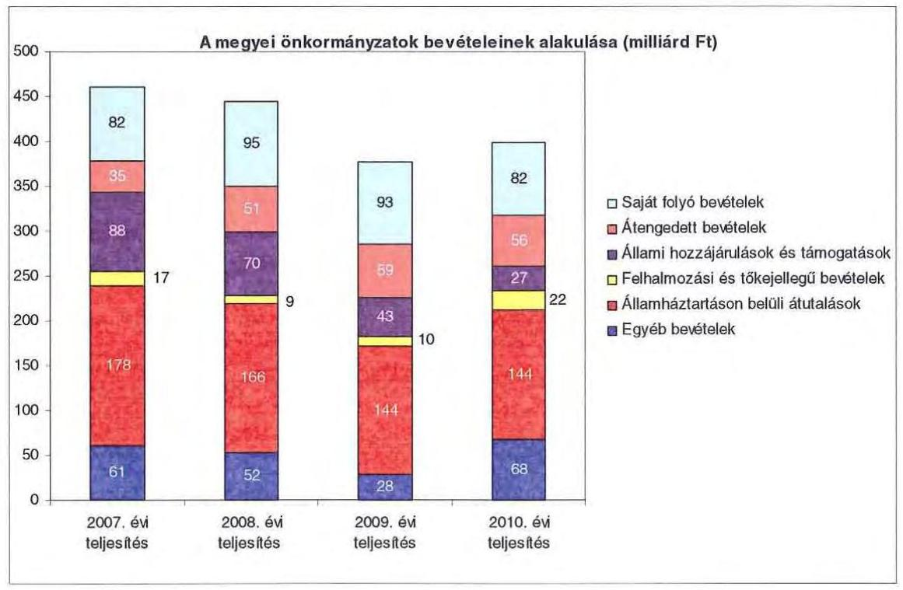

A megyei önkormányzatok saját folyó bevételeinek részaránya – amelyek főbb elemei: az intézményi térítési díjak, az illetékbevétel, a kamatbevételek – a 2007. évi összbevételen (461 milliárd Ft) belül 17,9% volt, amely 2010-re annak ellenére 20,6%-ra nőtt, hogy az összege

 82 milliárd Ft maradt. Ennek oka az volt, hogy az összbevétel a 2007. évi 461 milliárd Ft-ról 2010-re 399 milliárd Ft-ra csökkent.

Az átengedett bevételek, amelyek a megyei önkormányzatoknál a személyi jövedelemadóból való részesedést jelentették, az összbevételen belül a 2007. évi 35 milliárd Ft-ról 56 milliárd Ft-ra nőttek.

Az állami hozzájárulások és támogatások - amelyek főbb elemei: az ellátotti létszámhoz kötődő normatív állami hozzájárulások, központosított, fejezeti szinten kezelt célelőirányzatból juttatott működési és fejlesztési támogatások a 2007. évi 88 milliárd Ft-ról (19,1%-os részarányról) 2010-re 27 milliárd Ft-ra (6,8%-os részarányra) estek vissza.

A felhalmozási és tőkejellegű bevételek - tárgyi eszközök (ingatlanok és ingóságok), föld és immateriális javak, részesedések értékesítése, EU-tól átvett pénzeszközök - a 2007. évi 17 milliárd Ft-ról (3,6%-os részarányról) 2010-re 22 milliárd Ft-ra (5,4%-ra) emelkedtek.

Az államháztartáson belüli átutalások részesedése 2007-ben 178 milliárd Ft volt. 2010. év végére 34 milliárd Ft-tal csökkent, részaránya 38,6%-ról 2,6 százalékpontos csökkenés után 2010-ben 36%-ra változott. Ez a bevételi kategória

---

tartalmazza az egészségbiztosítási és egyéb elkülönített állami pénzalapoktól átvett forrásokat. A 2010-ben e címen elszámolt bevétel 144 milliárd Ft volt.

A megyei önkormányzatok központi költségvetésből származó bevételeinek összege 2007-ben 400 milliárd Ft volt, amely 2010. évre 331 milliárd Ft-ra (az időszak alatt összesen 69 milliárd Ft-tal) 17,3%-kal csökkent.

Az egyéb, pénzmaradványból, vállalkozási bevételekből, államháztartáson kívülről származó átutalásokból, a hitelekből, a hosszú és rövid lejáratú értékpapírok értékesítéséből származó bevételek részesedése a 2007-2010. évek viszonylatában 13,3%-ról 17,1%-ra emelkedett. Ez utóbbiak 2010. évi beszámoló szerinti összevont teljesítése 68 milliárd Ft volt ${ }^{9}$.

Mindezeket figyelembe véve 2007 és 2010-ben a megyei önkormányzatok forrásainak megoszlását az alábbi ábra szemlélteti:
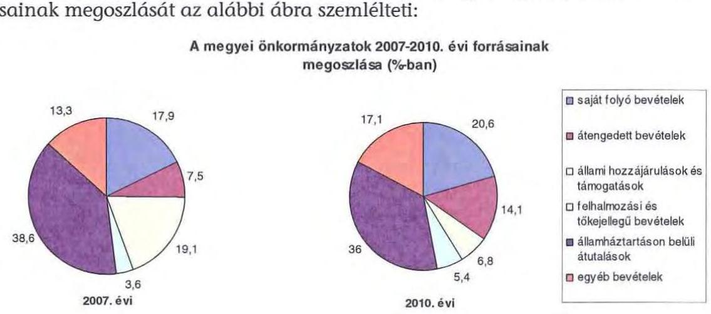

Annak ellenére, hogy a megyei önkormányzatok kötelezően ellátandó feladataikat 2007-hez képest kevesebb intézményben, csökkenő foglalkoztatotti létszám mellett végezték ${ }^{10}$, a jelentős bevételkiesést a - szervezési intézkedések hatására - csökkenő ráfordítások nem tudták kompenzálni. Az ellátottak száma a szociális, gyermekvédelmi ágazat bentlakásos elhelyezést nyújtó intézményeit kivéve - eltérő mértékben ugyan, de minden ágazatban évről évre csökkent, amely a fajlagos hozzájárulások csökkenésével együtt a normatív állami hozzájárulás arányának visszaeséséhez vezetett.

A 2007-2013-as időszakra meghirdetett, vissza nem térítendő EU-s fejlesztési forrásokhoz való hozzájutás lehetősége felerősítette az önkormányzati alrendszer fejlesztési igényeit. A fokozott fejlesztési tevékenység a felhalmozási bevéte-

[^0]
[^0]:    ${ }^{9}$ Az egyéb bevételek összege 2007-2010 között eltérő módon változott, 2007-ben 61 milliárd Ft volt, 2008-ban 52 milliárd Ft-ra, 2009-ben 28 milliárd Ft-ra esett vissza, majd 2010-ben ismét - 68 milliárd Ft-ra - emelkedett.
    ${ }^{10}$ a BM által 2010 decemberében elvégzett felmérés adatai szerint

---

lek és kiadások egyensúlyának megbomlásán ${ }^{11}$ túl a jelentkező jövőbeni fenntartási kötelezettség miatt tovább terhelhetik az önkormányzatok költségvetését.

A megyei önkormányzatok felhalmozási és működési célú pénzintézeti és szállítói kötelezettségeinek állománya a vizsgált időszakban erőteljesen növekedett.

A hosszú lejáratú kötelezettségek alakulását a következő ábra szemlélteti:
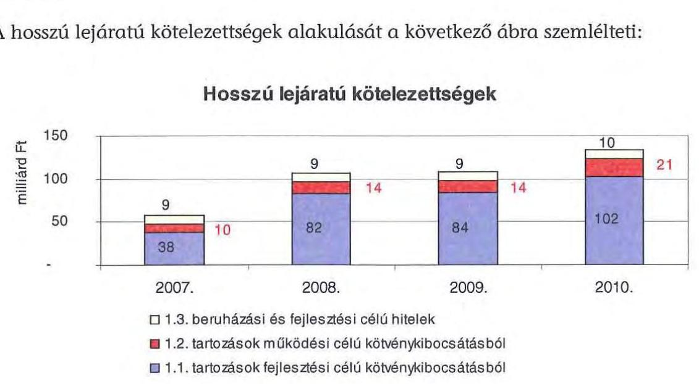

A hosszú lejáratú kötelezettségek mellett az időszakban a 2007. évi 22 milliárd Ft-ról 24 milliárd Ft-ra (8,8%-kal) növekedett az áruszállításból származó szállítói kötelezettségek állománya.

A mérlegben kimutatott kötelezettségek állománya mellett az elhasználódott eszközök pótlására forrást biztosító amortizációs (felújítási) alap képzésének ${ }^{12}$ elmaradása további problémákat vetít előre. A megyei önkormányzatok beszámolójelentéseinek összegzése szerint 2007-ben még az elszámolt értékcsökkenés 90%-ának megfelelő összeget fordítottak felújítási célokra, 2009-ben ez az arányszám már csak 16,5% volt. Ez maga után vonta a feladatellátást kiszolgáló tárgyi eszközök állagának erőteljes romlását.

Az ÁSZ a 2011. évi ellenőrzési tervében a 43. számú, az „Önkormányzatok gazdálkodási rendszerének ellenőrzése" részeként egy időben, egymással párhuzamosan tekinti át és elemzi az önkormányzati alrendszer középszintjét jelentő 19 megyei önkormányzat pénzügyi helyzetét. A gazdálkodás szabályszerűségét az

[^0]
[^0]:    ${ }^{11}$ Az önkormányzati alrendszerben - az éves zárszámadási törvényjavaslatok általános indokolása, X. Helyi önkormányzatok gazdálkodása fejezet szerint - a felhalmozási bevételek és kiadások egyenlege 2007-ben 142,4 milliárd Ft, 2008-ban 112,3 milliárd Ft, 2009-ben 234,5 milliárd Ft hiányt mutatott.
    ${ }^{12}$ Erre a jelenlegi szabályozási környezetben nem kötelezi semmilyen előírás az önkormányzatokat.

---

ÁSZ előző évek során ellenőrizte a megyei önkormányzatoknál is, ezért jelen vizsgálatunk erre nem tér ki.

A jelentés a megyei önkormányzatok sajátos feladatellátási és forrásszabályozási helyzetére tekintettel a megyei önkormányzatok pénzügyi helyzetét, illetve az ezzel összefüggő korábbi ÁSZ javaslatok megvalósítását mutatja be.

Az ellenőrzés a 2007. január 1. - 2011. március 31. közötti időszakot ölelte fel.
A vizsgálat jogszabályi alapját 2011. július 1-je előtt az Állami Számvevőszékről szóló 1989. évi XXXVIII. törvény 2. § (3), (5), (6) és (9) bekezdéseiben, az Ötv. 92. § (1) bekezdésében és az Áht. 104. § (3) bekezdésében, 2011. július 1-jét követően az Állami Számvevőszékről szóló 2011. évi LXVI. törvény 1. § (3) bekezdésében, az 5. § (2)-(6) bekezdéseiben és az Áht. 120/A. § (1) bekezdésében foglalt előírások képezték.

Veszprém megye országos és régión belül elfoglalt helyzetét 2010. december 31-én az alábbi mutatók szemléltetik (a megyei jogú városokkal együtt):

Index: az előző év azonos időszak (időpontja)=100,0

| Mutató megnevezése | Veszprém   megye | Közép-   dunántúli   régió | Országos |
| :-- | :--: | :--: | :--: |
| Népesség száma (ezer fő)* | 357 | 1095 | 9986 |
| Népesség változás indexe (\%) | 99,4 | 99,6 | 99,7 |
| Az ipari termelés volumenindexe (\%) | 115,1 | 104,6 | 110,7 |
| Egy lakosra jutó ipari termelési érték (ezer Ft) | 1438,8 | 4359,8 | 2044,4 |
| Ezer lakosra jutó vállalkozások száma (db) | 144 | 135 | 165 |
| A beruházások egy lakosra vetített teljesít- | 145,2 | 280,9 | 304,7 |
| menyértéke (millió Ft) |  |  |  |
| Foglalkoztatási arány (\%) | 51,0 | 52,1 | 49,5 |
| Munkanélküliségi ráta (\%) | 11,5 | 9,4 | 10,8 |
| Alkalmazásban állók havi nettó átlagkerese- | 113037 | 124133 | 132628 |
| te (Ft) |  |  |  |
| Alkalmazásban állók havi nettó átlagkeresetének indexe (\%) | 106,6 | 109,1 | 106,9 |

*Ebből Veszprém megyei jogú város népessége 58458 fő.
A mutatók azt jelzik, hogy a gazdaság helyzetét reprezentáló egyes mutatók - az egy lakosra jutó ipari termelési érték mutatója, a beruházások egy lakosra jutó teljesítményérték mutatója, az ezer lakosra jutó vállalkozások mutatója tekintetében elmarad az országos jellemzőktől. Az alkalmazásban állók havi nettó átlagkeresetének változása és az alkalmazásban állók havi nettó átlagkeresetének indexe mind a régiós, mind pedig az országos értékeknél kedvezőtlenebbek, ugyanakkor a foglalkoztatási arány 1,5%-kal magasabb az országos átlagnál.

A megyében 218 települési önkormányzat - 1 megyei jogú városi, 14 városi, 2 nagyközségi és 201 községi - működött.

---

# I. ÖSSZEGZŐ MEGÁLLAPÍTÁSOK, KÖVETKEZTETÉSEK, JAVASLATOK 

A Veszprém Megyei Önkormányzat adatszolgáltatása szerint 2010-ben a 15217 millió Ft összes költségvetési kiadásából 14694 millió Ft-ot (96,6%-ot) a kötelező feladatai ellátására fordította. Az Önkormányzat önként vállalt feladatai között a Veszprémi Petőfi Színház működtetése volt a meghatározó, ezen túlmenően különböző szociális, oktatási, közművelődési, tudományos, művészeti és sport tevékenységekhez kapcsolódtak, valamint közszolgálati médiumok, civil szervezetek és alapítványok működéséhez nyújtottak támogatást, összesen 523 millió Ft összegben. Az Önkormányzat a kötelező és az önként vállalt feladatainak körét az SzMSz-ben, az azok ellátására tervezett kiadásokat a gazdasági programjában, valamint az éves költségvetésekben határozta meg.

Az Önkormányzat kötelező és önként vállalt feladatait 2010. december 31-én 43 költségvetési szervvel és 3 többségi tulajdonú gazdasági társasággal látta el. A költségvetési intézményként működő Tüdőgyógyintézet mellett, 10 intézmény szociális és gyermekvédelmi feladatokat, 25 intézmény közoktatási feladatokat, 5 intézmény közművelődési, közgyűjteményi, művészeti feladatokat, 1 intézmény egyéb (intézmények részére pénzügyi-gazdálkodási) feladatokat látott el. Az Önkormányzatnak 2010-ben három többségi részesedésű gazdasági társasága volt, a nonprofit gazdasági társaságként működő Kórház és az intézményi fűtés- és melegvíz szolgáltatásra alapított nonprofit kft, valamint egy önként vállalt feladatokat (ingatlanfejlesztést) ellátó gazdasági társaság. Az intézmények száma 2007-2010 között 7 intézmény átvétele, egy költségvetési szerv alapítása, valamint két intézmény átadása, 7 intézmény megszüntetése, illetve más intézménnyel történt összevonása, továbbá egy intézmény feladatainak kiszervezése következtében alakult ki. Az intézmények a 2007. évben 71, a 2010. évben 78 telephelyen működtek.

A folyó költségvetés egyenlege (működési jövedelem) 2007-2010 között minden évben működési forráshiányt mutatott ${ }^{13}$. A folyó bevételek nem fedezték a működési kiadásokat és a törlesztési kötelezettségeket, így az Önkormányzat pénzügyi kapacitása (nettó működési jövedelme) is negatív értékű volt.

A működési forráshiány finanszírozása folyószámlahitelből, továbbá a 2007-ben képződött felhalmozási többletbevételek egy részének és a korábbi években keletkezett tartalékok felhasználásával történt.

Az Önkormányzat felhalmozási költségvetésének egyenlege a 2007. évben pozitív, ezt követően folyamatosan negatív összegű volt. A 2007. évi felhalmozási többletbevétel 1029 millió Ft, a 2008-2010 közötti időszak összes felhalmozási forráshiánya 3203 millió Ft volt.

[^0]
[^0]:    ${ }^{13}$ 2007-ben a folyó kiadások 0,9%-át (184 millió Ft-ot), 2008-ban 0,8%-át (139 millió Ft-ot), 2009-ben 3,8%-át (517 millió Ft-ot), 2010-ben 7,9%-át (1011 millió Ft-ot) jelentette a működési jövedelem.

---

A pénzügyi egyensúly fenntartása 2007-2010 között a 2007. évi felhalmozási többletbevétel felhasználásával, a pénzmaradvány igénybevételével, továbbá külső források bevonásával volt biztosítható. Az 5054 millió Ft együttes működési és felhalmozási hiányt, a 44 millió Ft törlesztési kötelezettséget, valamint a függő, átfutó és kiegyenlítő tételek 778 millió Ft-os egyenlegét a vizsgált időszakot megelőzően képződött 2579 millió Ft tartalékból, a 2007. évi 1029 millió Ft felhalmozási többletbevételből, 146 millió Ft hitelből és a kötvénykibocsátás bevételéből 2122 millió Ft felhasználásával finanszírozta az Önkormányzat.

A 2010. évi működési forráshiány kialakulásában az játszott szerepet, hogy az Önkormányzat legfőbb bevételi forrásai - az illetékbevétel, valamint a központi forráskivonás hatására az átengedett szja és az OEP támogatás nélküli állami támogatások - jelentősen, 1620 millió Ft-tal csökkentek a 2007. évhez viszonyítva, miközben 2007 szeptemberétől intézmények átvétele miatt megnövekedtek a kötelezően ellátandó feladatok. Az OEP támogatás 2007-ben 7450 millió Ft, 2010-ben a Kórház kiszervezése miatt 763 millió Ft volt.

Az Önkormányzatnál az illetékbevétel, amely 2006-ban a teljes bevételének ${ }^{14}$ a 10,8%-át tette ki, 2010-re a 2006. évi 51,9%-ára, 1296 millió Ft-ra csökkent. Az átengedett szja és az állami támogatások együttes összege, amely a teljes bevételből 39,3%-ot jelentett, az ellátotti létszám 2008-2010 közötti visszaesése miatt ugyancsak csökkent, 2010-ben 6132 millió Ft volt, ami a 2007. évi 7138 millió Ft-nak a 85,9%-a. Az egyéb saját bevételek 543 millió Ft-tal csökkentek 2007-2010 között, a támogatásértékű bevételek és az átvett pénzeszközök 545
 millió Ft-os emelkedése nem tudta ellensúlyozni az intézményi működési bevételek, a kamatok, valamint az egyéb működési bevételek jogcímeken kieső forrásokat.

A működési kiadások jelentős mértékben, 39,4%-kal csökkentek 2007-ről 2010-re, amiben meghatározó szerepe volt annak, hogy a Kórház 2008. második negyedévétől részvénytársasági formában működött. Az Önkormányzat működési kiadásai a Kórház és a költségvetési szervként működő Tüdőgyógyintézet adatai nélkül 1,7%-kal csökkentek 2007-hez viszonyítva. A személyi juttatások és járulékok aránya a vizsgált időszakban csökkent, 2007-ben 70,6%, 2010-ben 67,9% volt a működési kiadásokon belül. A dologi kiadások és egyéb folyó kiadások 2007-2010 között 2637,5 millió Ft-ról 3185,2 millió Ft-ra nőttek.

Az önkormányzati kiadások alakulására 2008 áprilisától nem volt jelentős befolyással a Kórház. Az Önkormányzat három év alatt 296 millió Ft alaptőkét, gépek és műszerek beszerzéséhez, egyéb fejlesztési feladatokhoz 321 millió Ft támogatást, valamint 145 millió Ft kölcsönt nyújtott a Kórháznak.

Az Önkormányzat 2007-2010 között 8,4 milliárd Ft bekerülési költségű beruházást folytatott, illetve indított el, amelyből 1,9 milliárd Ft a 2010 utánra vállalt kötelezettség. A fejlesztési feladatokat címzett támogatás és pályázati pénzeszközök igénybe vétele mellett döntően a 2007. évet megelőzően felhalmozott

[^0]
[^0]:    ${ }^{14}$ A 2006. évben a pénzforgalom nélküli bevételekkel növelt költségvetési bevételek összege 23155 millió Ft, az illetékbevétel 2499 millió Ft volt.

---

tartalékból, egy üzletrész értékesítéséből, valamint kötvénykibocsátásból származó rendkívüli bevételekből finanszírozták. A 2007. évet megelőzően képződött tartalékot, a pénzügyi befektetés bevételét, valamint a felvett hosszú lejáratú hiteleket teljes egészében felhasználta az Önkormányzat. A meghatározott fejlesztési célokra fordítható kötvénykibocsátásból 1373 millió Ft maradvány, elnyert EU támogatásból 180 millió Ft, elnyert hazai támogatásból 311 millió Ft, továbbá tervezett saját bevételből 100 millió Ft áll rendelkezésre a 2010. évet követően a felhalmozási kiadások fedezetére.

Az Önkormányzat pénzintézeti kötelezettségeinek állománya a könyvviteli mérlegadatok szerint 2006. december 31-ről 2010. december 31-re 64 millió Ft-ról 7588 millió Ft-ra nőtt. A vizsgált időszakban adósságszolgálatra az Önkormányzat 476 millió Ft-ot teljesített, amelyből a kamatkiadás 432 millió Ft volt. A 2007-2010. december 31. között a kötvényből származó források befektetéséből realizált kamatbevétel 1416 millió Ft.

Az Önkormányzat 2010. év végi pénzintézeti kötelezettsége 7422 millió Ft (97,8%) fejlesztési célú kötvények kibocsátásából, 166 millió Ft (2,2%) fejlesztési célú hosszú lejáratú hitelek felvételéből keletkezett. Ezek miatt az Önkormányzatnak a 2011-2013. években 51 millió Ft és 3984000 CHF tőketörlesztést és kamatot kell teljesítenie. Az Önkormányzat 2010. év végi szállítói tartozása 337 millió Ft (ebből lejárt 157 millió Ft). A 2011-2013. évi összes (pénzintézeti és szállítói) kötelezettség teljesítésére figyelembe vehető a 2007 millió Ft jelzáloggal nem terhelt forgalomképes ingatlanvagyon, és 100 millió Ft egyéb követelésállomány. A forgalomképes ingatlanvagyon csak értékesítése esetén nyújt fedezetet a kötelezettségek teljesítésére.

Az Önkormányzat további évekre szóló 2010. december 31-én fennálló pénzintézeti kötelezettségei 147 millió Ft és 32260241 CHF, melynek forrása nem számszerűsített.

Az Önkormányzat 2010. év végén 200 millió Ft folyószámlahitel felvételének visszafizetésére kezességet vállalt a többségi tulajdonú gazdasági társaságánál.

A közgyűlési előterjesztések nem tartalmazták a kötelezettségvállalás visszafizetési forrásait, a teljes futamidő várható kamat és tőkefizetési kötelezettségeit, az árfolyam- és kamatkockázatok, valamint az adósságszolgálati korlát bemutatását.

Az Önkormányzat 2009 decemberétől csak folyószámlahitel igénybevételével tudta biztosítani felmerülő működési kiadásainak teljesítését. A 2010. évben 311 nap, a 2011. I. negyedévében 85 nap vett igénybe folyószámlahitel keretet, az átlagos napi állomány 14 millió Ft-ról 779 millió Ft-ra emelkedett. A likviditáshiány finanszírozása az Önkormányzatnak összesen 56,6 millió Ft kamatkiadást jelentett.

Az átmeneti likviditási problémák miatt az Önkormányzatnak 2010. évben és 2011. I. negyedévében egy-egy alkalommal a munkabérek kifizetéséhez munkabér megelőlegezési hitelt is igénybe kellett vennie, alkalmanként 130 millió Ft-ot, illetve 75 millió Ft-ot.

---

Az Önkormányzat nem vizsgálta azt, hogy az elhasználódott eszközök pótlása milyen kötelezettséget jelent számára. A 2007-2010. években a tárgyi eszközök után 236 millió Ft értékcsökkenést számoltak el, ugyanakkor felújításra ennek több mint másfélszeresét 404 millió Ft-ot (171%) fordítottak. A Közgyűlés a Kórház vagyonkezelésében lévő önkormányzati tulajdonú eszközök értékcsökkenéséből 53 millió Ft tartalékképzés elengedéséről döntött, mivel a Kórház a veszteséges gazdálkodás során nem tudta biztosítani a vagyonkezelésbe vett eszközök értékcsökkenésének pótlását vagy tartalékba helyezését.

Az Önkormányzat eladósodásának hatására az önkormányzati vagyon jelzálogjoggal való megterhelése következett be, mivel a folyószámlahitel keret 2010. évi emelésének biztosítékaként a pénzintézet a keretbiztosítéki jelzálogjog bejegyzését írta elő. A 432 millió Ft értékű keretbiztosítéki jelzálogjogot nyolc forgalomképes és az Ötv-vel ellentétesen egy korlátozottan forgalomképes ingatlanra jegyezték be, mely a forgalomképes ingatlanok becsült értékének a 26%-a (697 millió Ft).

Az Önkormányzat a vizsgált időszakban két alkalommal nyújtott hosszú lejáratú tulajdonosi hitelt a Kórház Zrt-nek, az Önkormányzat kötelező feladatát képező egészségügyi szakellátási tevékenységhez kapcsolódó eszközbeszerzések céljából. A futamidőt 5 évben állapították meg, valamint kamatfizetési kötelezettséget írtak elő. Az Önkormányzat - hitelszerződés alapján kiszámlázott kamatbevétele 6,1 millió Ft volt. A helyszíni vizsgálat alatt a Kórház Zrt-nek újabb 120 millió Ft kölcsön nyújtásáról döntött a Közgyűlés.

A végrehajtott kiadáscsökkentő intézkedések a feladatellátás racionalizálását, szakmai színvonalának emelését, valamint az Önkormányzat pénzügyi helyzetének javítását célozták. Az intézményátszervezések, -átadások és a kiadáscsökkentő intézkedések hatásaként a 2007-2010. években - az Önkormányzat kimutatása szerint - 2249 millió Ft megtakarítás keletkezett, melyből 1261 millió Ft (56%) az álláshely csökkentésekből adódott.

A bevételnövelésre irányuló intézkedések végrehajtásával elért többletbevétel összege a 2007-2010. években 2695 millió Ft volt, melyből a Balatontourist Rt. értékesítéséből, valamint a kötvénykibocsátásból származó bevétel lekötéséből, befektetéséből származó bevétel 1500 millió Ft-ot (55,7%) tett ki. A Balatontourist Rt. 4040 millió Ft vételárából a 2005-2006. években befolyt 2040 millió Ft bevételből 2007. január 1-jéig felhasználás nem történt. A vételár fennmaradó részét a vevő a 2007. évben fizette meg az Önkormányzatnak.

Az utóellenőrzés a pénzügyi egyensúly javítására tett két szabályszerűségi javaslat hasznosulására terjedt ki. Az Önkormányzat a javaslatokat hasznosította.

Az Önkormányzat pénzügyi helyzetét összegezve a következők emelhetők ki:

Az Önkormányzatnál évente a központi intézkedések hatására jelentkező bevételi kiesést a kiadáscsökkentő és bevételnövelő intézkedéseivel nem tudta ellentételezni. A 2007-2010 között átvett és átadott intézmények, valamint az intézménymegszüntetések és egy intézmény kiszervezésével kialakult jelenlegi intézményhálózat a feladatellátást, az Önkormányzat működésének biztonságát veszélyezteti. A 2010. évet követő beruházások finanszírozhatóságát veszélyezteti a saját források bizonytalansága, az EU-s források előfinanszírozásának többlet költsége, valamint a támogatásból megvalósuló fejlesztések volumenéből és esetleges előírt feltételeknek nem megfelelő teljesítéséből adódó kockázatok.

Az Önkormányzat működési célú kiadásai finanszírozása folyamatos feszültséget okozott, mivel csak állandó folyószámla- és esetenként munkabérhitel igénybevételével, továbbá kötvényforrás, illetve a kötvényforrások befektetéséből származó kamatbevétel felhasználásával tudta a működést biztosítani. Az Önkormányzat hosszú távú pénzintézeti kötelezettségeinek finanszírozása a következő három évben döntően az ingatlanfedezet megjelölése miatt nem számszerűsített. A további évekre szóló hosszú távú kötelezettségekre az Önkormányzat adatai alapján a finanszírozás forrásai nem beláthatóak.

A Közgyűlés elnöke a helyszíni ellenőrzését követően saját hatáskörben tett intézkedésekről szóló tájékoztatása szerint a Közgyűlés módosította a 2011. évi költségvetési rendeletet. Ebben bevételnövelő, kiadáscsökkentő, a beruházások és más kötelezettségek felülvizsgálatát, méretgazdaságos intézményi struktúrát és az önként vállalt feladatok minimalizálását eredményező döntések születtek. (Konkrét pénzügyi hatását azonban nem közölték.) A kórház üzleti tevékenységének felülvizsgálatára a közgyűlés külső szakértőt kért fel és válságkezelő intézkedési tervet fogadott el a veszteséges működtetés megszüntetése, a vállalt kezesség beváltásának elkerülése érdekében. (A konkrét intézkedésekről és ezek hatásáról nem adott tájékoztatást.)

A feladatok és források közötti egyensúly megteremtésére irányuló központi döntések, a megyei önkormányzatok konszolidációjára, az intézmények átvételére vonatkozó törvényjavaslat elfogadása új feltételeket teremtett. Mindezek alapján az Önkormányzat gazdálkodását a pénzügyi kockázatok veszélyeztetik, a pénzügyi egyensúly rövid- és hosszú távú fenntarthatósága azonnali intézkedéseket igényel.

Az Állami Számvevőszékről szóló 2011. évi LXVI. törvény 33. § (1) bekezdésében foglaltak értelmében a jelentésben foglalt megállapításokhoz kapcsolódó intézkedési tervet köteles az ellenőrzött szervezet vezetője összeállítani és azt a jelentés kézhezvételétől számított harminc napon belül az ÁSZ részére megküldeni. Amennyiben az intézkedési tervet határidőben nem küldi meg a szervezet, vagy az továbbra sem elfogadható, az ÁSZ elnöke a hivatkozott törvény 33. § (3) bekezdés a)-b) pontjaiban foglaltakat érvényesítheti.

---

A 2011 májusában lezárult helyszíni ellenőrzés tapasztalatai alapján - figyelembe véve az Önkormányzat észrevételeit és a saját hatáskörben tett intézkedéseit - az alábbi javaslatokat tette az ÁSZ:

# a Közgyűlés elnökének: 

1. tájékoztassa a Közgyűlést rendszeresen az intézkedési terv megvalósításáról, annak eredményeiről. A pénzügyi egyensúlyt befolyásoló feltételek további romlása esetén tegyen javaslatot az intézkedési terv módosítására;
2. gondoskodjon róla, hogy a jövőben az adósságot keletkeztető kötelezettségvállalásokról szóló közgyűlési döntéseket megalapozó előterjesztések tartalmazzák a kötelezettségvállalás visszafizetésének forrásait, a várható kamat-, egyéb költség és tőkefizetési kötelezettségeit, a legalább 3 éves kitekintéssel a várható kamat és árfolyamkockázatok bemutatását, és kezelésének lehetőségeit;
3. gondoskodjon a fennálló lejárt szállítói tartozás okainak feltárásáról, szerkezetének bemutatásáról - beleértve az intézményeknél lejárt szállítói állomány értékét és napra számított arányát -, a szükséges intézkedések megtételéről, indokolt esetben a szállítókkal a lejárt tartozások mielőbbi rendezéséről a kockázatok minimalizálása érdekében;
4. az Önkormányzat vizsgáltassa meg tulajdonosi jogkörében eljárva a Kórház üzleti tevékenységét, tegyen intézkedéseket a veszteséges működés okainak megszüntetésére;
5. intézkedjen a korlátozottan forgalomképes önkormányzati ingatlanokon alapított jelzálogjog megszüntetésére;
6. tegye meg az Önkormányzat által vállalt kezesség beváltásának elkerülésére a megfelelő intézkedéseket;
7. gondoskodjon a pénzintézeti kötelezettségek finanszírozási lehetőségeinek számbavételéről, és arra források biztosításáról;
8. mutassa be a Közgyűlésnek az éves költségvetési előterjesztésekben az értékcsökkenési leírás összegét, és ezzel arányban az elhasználódott eszközök pótlásának forrásigényét és lehetőségét.

---

# II. RÉSZLETES MEGÁLLAPÍTÁSOK 

## 1. Az ÖNKORMÁNYZAT KÖTELEZŐ ÉS ÖNKÉNT VÁLLALT FELADATAI

Az Önkormányzat kimutatása szerint a 2010. évi költségvetési kiadásainak 96,6%-át, 14694 millió Ft-ot a kötelező, 523 millió Ft-ot az önként vállalt feladatok ellátására fordította. A 2011. évi tervadatok alapján az önként vállalt feladatokra az összes költségvetési kiadás 1,9%-a (277 millió Ft) jut, amely 1,5 százalékponttal kevesebb az előző évhez képest. Az Önkormányzat önként vállalt feladatai között - költségvetési kihatását tekintve - a színházi feladatok ellátása (a Veszprémi Petőfi Színház működtetése) a meghatározó. Ezen túlmenően az önként vállalt feladatok különböző szociális, oktatási, közművelődési, tudományos, művészeti és sport tevékenységek, valamint közszolgálati médiumok, civil szervezetek és alapítványok működésének támogatását szolgálják.

Az Önkormányzat a kötelező és az önként vállalt feladatainak körét az SzMSz mellékleteiben rögzítette. Az önként vállalt közfeladatokat és az azok ellátására tervezett kiadásokat az Önkormányzat gazdasági programjában, valamint az éves költségvetésekben meghatározták.

Az Önkormányzat kiadási szerkezetét tekintve a járulékokkal növelt személyi és dologi kiadások 11921 millió Ft-os összegén belül legnagyobb arányt ${ }^{15}$
 - 5602 millió Ft-ot, 47%-ot - a 25 oktatási intézménynél elszámolt kiadások jelentették. A szociális és gyermekvédelmi feladatokat ellátó 10 intézmény kiadásokból való részesedése 2848 millió Ft, 23,9% volt. A 2010. évben a közoktatási feladatok kiadásait 58,9%-ban, a szociális és gyermekvédelmi feladatok kiadásait 47,8%-ban finanszírozta normatív költségvetési támogatás 3302 millió Ft, illetve 1362 millió Ft összegben.

Az Önkormányzat a kötelező közművelődési, levéltári, közgyűjteményi feladatainak ellátását 4 intézményével, önként vállalt feladatait (színház) 1 intézményével biztosította, melyeknek a kiadásokból való részesedése együttesen 10,7%, 1275 millió Ft, az egészségügyi feladatokat ellátó intézmény (Tüdőgyógyintézet) kiadásokból való részesedése 6,3%, 748 millió Ft volt. Az igazgatási és egyéb nem kiemelt ágazati feladatokra 1448 millió Ft-ot, a kiadások 12,1%-át fordították.

A nonprofit gazdasági társaságként működő Kórház a 2010. évben 8745 millió Ft kiadást teljesített, melyből a működési célú kiadás 8154 millió Ft volt.

[^0]
[^0]:    ${ }^{15}$ Az Önkormányzat Járulékokkal növelt személyi és dologi kiadásainak ágazatonkénti megbontása a BM részére készített, 2010. december 31-i adatokkal kiegészített adatszolgáltatásból származik.

---

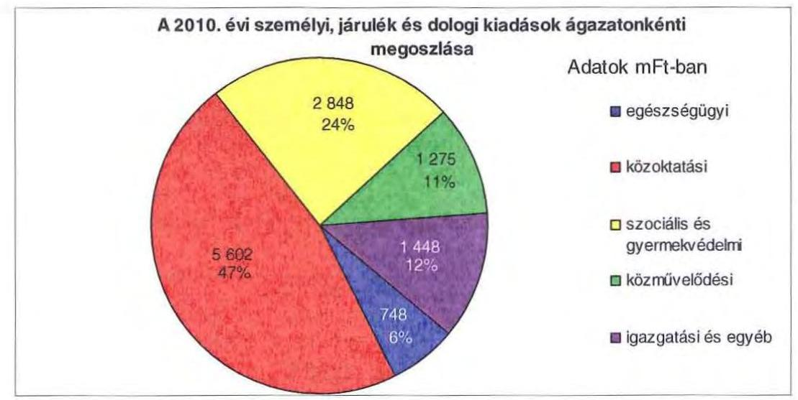

Az Önkormányzat 2010. évi kiadásainak 77,9%-a (11 853 millió Ft) az intézmények, 3,6%-a (547 millió Ft) a Hivatal költségvetésében szerepelt, 1,1%-át (161 millió Ft) a Közgyűlés működésével kapcsolatos kiadások, 17,4%-át (2 656 millió Ft) a költségvetésben központilag kezelt működési és felhalmozási célú kiadások tették ki. Az utóbbi kiadások a területrendezési feladatokkal, sport, ifjúsági, etnikai, nemzeti kisebbségi feladatok és alapítványok támogatásával, a vagyonhasznosítással, valamint egyéb feladatokkal (médiakapcsolatok, tanulmányok, tagdíjak) voltak kapcsolatosak.

Az Önkormányzat a kötelező és önként vállalt feladatait a 2010. évben - a Hivatallal együtt - 43 költségvetési szervvel, valamint 3 többségi tulajdonú gazdasági társasággal látta el.

Az Önkormányzat fenntartásában 2006. december 31-én 40 önállóan gazdálkodó és 5 részben önállóan gazdálkodó költségvetési szerv működött, összesen 71 telephelyen. A 2010. december 31-i állapot szerint az Önkormányzat által fenntartott költségvetési szervek közül 4 önállóan működő és gazdálkodó, 39 intézmény pedig önállóan működő költségvetési szerv volt. Az intézmények alapító okirataik szerint - 2010. december 31-én összesen 78 telephelyen működtek. Az Önkormányzat feladatait az alábbi intézménystruktúrával látta el:

- az egészségügyi feladatokat ellátó önállóan működő és gazdálkodó intézmény a Tüdőgyógyintézet;
- szociális feladatokat 9 intézmény (5 idősek otthona, 4 fogyatékos személyek, pszichiátriai-, illetve szenvedélybetegek otthona) látott el, a gyermekvédelmi feladatok ellátása egy intézményben (Gyermekvédelmi Központ) történt;
- közoktatási feladatokat 25 intézményben végeztek (egy pedagógiai szakszolgálat, 7 szakképző iskola, 4 gimnázium, egy gimnázium és szakközépiskola, 4 gimnázium, szakközépiskola és alapfokú művészetoktatási intézmény, 1 szakközépiskola és szakiskola, 5 általános iskola és speciális szakiskola, 2 alapfokú művészetoktatási intézmény), közülük 1 önállóan működő és gazdálkodó költségvetési szerv volt;

---

- közművelődési, közgyűjteményi, művészeti feladatokat látott el 5 intézmény (könyvtár és közművelődési intézet, levéltár, múzeumi igazgatóság, múzeum, színház);
- a 39 önállóan működő intézmény gazdálkodási feladatait 2 önállóan működő és gazdálkodó költségvetési szerv - a Hivatal, valamint a Tapolca környéki intézmények gazdasági irodája - látta el.

Az egyes ágazatok kötelező feladatellátását 2010. december 31-én az alábbi mutatók jellemezték:

| Megnevezés | közoktatás | szociális és gyermekvédelem | egészségügy | kultúra és sport | gazdasági társaságként működő Kórház |
| :--: | :--: | :--: | :--: | :--: | :--: |
| Az ágazatban foglalkoztatottak száma (fő) | 1542 | 885 | 162 | 260 | 1575 |
| Az ágazat intézményeiben ellátottak összesen (fő) | 9625 | 1897 |  |  |  |
| Fekvőbeteg ellátás férőhelyeinek száma (db) |  |  | 214 |  | 1123 |

A 2007-2010. közötti időszakban az Önkormányzat által ellátott feladatok volumenében, valamint a feladatellátás szervezeti kereteiben több, jelentős változás történt.

A korábban költségvetési szervként működő Kórházat a Közgyűlés döntése alapján 2008. április 1-jétől nonprofit gazdasági társasággá alakították át. Az Önkormányzat 2007. augusztus 31-jei hatállyal 7 oktatási intézmény működtetését átvette a települési önkormányzatoktól, 3363 ellátotti létszámmal, mivel azok nem vállalták az intézmények további fenntartását. A közoktatási feladatok átvállalásáról szóló megállapodást egy tapolcai szakiskolát érintően az Önkormányzat és a korábbi fenntartó 2008. július 1-jétől közös megegyezéssel megszüntette, így az intézmény 622 ellátotti létszámmal visszakerült a városi önkormányzathoz. A 2008. évben az Önkormányzat a Kabóca Bábszínházat Veszprém Megyei Jogú Város Önkormányzatának fenntartásába adta.

A 2007-2008. években 46 önálló gazdálkodási jogkörrel rendelkező intézményt átsoroltak részben önálló gazdálkodási jogkörű költségvetési szervvé, és a gazdálkodási feladataik ellátásával a Hivatalt, valamint az e feladatra alapított önálló gazdálkodási jogkörrel felruházott intézményt bízták meg.

Az Önkormányzat három többségi részesedésű gazdasági társasága közül kettő a kötelező feladatok ellátásában vett részt, egy társaság önként vállalt feladatokat látott el.

- A Veszprém Megyei Csolnoky Ferenc Kórház Nonprofit Zrt. a 2008. évben kötelező önkormányzati feladatok kiszervezésével jött létre. A korábban önálló gazdálkodási jogkörrel rendelkező költségvetési szervként működő - 1462 főt foglalkoztató - intézmény a 2007. és a 2010. évben is 697 aktív, 426 krónikus, összesen 1123 ágyon látta el az ellátási területéhez tartozó

---

betegeket. A Kórház működési formájának megváltoztatásáról a pénzügyi helyzet ellehetetlenülésének megakadályozása, a folyamatos betegellátás biztosítása és az alkalmazottak továbbfoglalkoztatása érdekében döntött a fenntartó. A Zrt. alapító részvényesei az Önkormányzat és Sümeg Város Önkormányzata. A társaság alaptőkéje 1684 millió Ft, melyből az Önkormányzat tulajdoni hányada 2010-ben 99,9% volt.

- Az Önkormányzat a 2008. évben nonprofit gazdasági társaságot alapított az RFV ESCO Kft-vel a megyei fenntartású intézmények fűtés- és melegvízszolgáltatásának ellátására. Az Önkormányzat többségi tulajdonában (51%) lévő Veszprém Megyei Fűtés- és Melegvíz Szolgáltató Nonprofit Kft törzstőkéje 0,5 millió Ft. A gazdasági társasággal a hőszolgáltatási tevékenységgel kapcsolatos szerződéseket megkötötték, a Közgyűlés 11 intézmény fűtési és melegvíz rendszereire ingyenes vagyonkezelői jogot biztosított 15 évre a Kft részére. A nonprofit társaság létrehozása az Önkormányzat egyes intézmény-fenntartási feladatainak magasabb színvonalon történő ellátását és a fűtéssel, melegvíz szolgáltatással kapcsolatos kiadások csökkentését célozta.
- A Pápai Ingatlanfejlesztő Kft-t (Projektcég) az Önkormányzat és a Pápai Termálvízhasznosító Zrt. 2009. december hónapban alapította. A Pápai Ingatlanfejlesztő Kft. törzstőkéje 0,5 millió Ft, melyből az Önkormányzat tulajdoni hányada 51% volt.

Az Önkormányzat 2010. december 31-én 4 gazdasági társaságban rendelkezett részesedéssel kisebbségi tulajdonosként: a Pápai Termálvízhasznosító Zrt.-ben 49% (782 millió Ft), a Bakonykarszt Víz és Csatornamű Zrt-ben 1,6% (14 millió Ft), a Veszprémi Regionális Innovációs Centrum Nonprofit Kft-ben 0,17% (0,1 millió Ft), a Kittenberger Kálmán Növény- és Vadaspark Nonprofit Kft-ben 2,6%-os (11 millió Ft) tulajdoni hányaddal.

# 2. PÉNZÜGYI EGYENSÚLYI HELYZET ALAKULÁSA 

A hagyományos költségvetési szerkezet helyett az önkormányzat pénzügyi helyzetét a CLF módszerrel mutatjuk be, amelyben jobban elkülönülnek a vagyonnal kapcsolatos bevételek és kiadások a feladatokkal kapcsolatos közvetlen működtetési bevételektől és kiadásoktól. A módszer következetesen elkülöníti a folyó és a felhalmozási költségvetés bevételeit és kiadásait, azok költségvetési egyenlegeit. A tárgyévi pozíciók meghatározása érdekében a figyelembe vett saját folyó bevételek, valamint saját felhalmozási bevételek nem tartalmazzák az előző évi pénzmaradványok felhasználásából származó pénzforgalom nélküli bevételeket ${ }^{16}$.

A bevételek és kiadások besorolása általános közgazdasági meggondolásokon alapul, amely testet ölt az SNA statisztikai módszertanában is. Folyó tételek alatt értjük azokat a bevételeket és kiadásokat, amelyek az önkormányzat vagyoni helyzetét automatikusan nem változtatják. A bevételi oldalon ilyenek az adók, az illeték, az áfa bevételek és visszatérülések, a hozamok és kamatok, a

[^0]
[^0]:    ${ }^{16}$ A költségvetési években kialakuló hiány finanszírozása az előző években képzett tartalékok felhasználásával is történhet.

---

költségvetési támogatások, az egyéb saját bevételek, valamint a működési célra átvett pénzeszközök és kapott támogatások. A folyó kiadások közé tartoznak a szolgáltatások nyújtásával kapcsolatos működési kiadások, a kamatkiadások, valamint a működési célú transzferkiadások ${ }^{17}$. A felhalmozási vagy tőke tételek módosítják az önkormányzat vagyoni helyzetét. A privatizációs bevételek, az immateriális javak és tárgyi eszközök, valamint a részesedések értékesítése csökkentik, a fizikai beruházások és a pénzügyi befektetések növelik a vagyont. A pénzforgalmi bevételek és kiadások nem tartalmazzák a követelések elengedése miatt könyvelt tételeket, mivel ezek egymást kioltó, technikai jellegű elszámolási műveletek.

A folyó költségvetés egyenlege, a működési jövedelem megmutatja, hogy az önkormányzat éves folyó bevétele fedezetet biztosít-e a kötelező és önként vállalt feladatellátáshoz kapcsolódó éves folyó kiadására. A működési jövedelem negatív értéke pénzügyileg fenntarthatatlan helyzetet jelez. A mutató pozitív értéke megtakarítást mutat, amely forrásul szolgálhat az önkormányzat fennálló kötelezettségei megfizetéséhez, valamint fejlesztéseihez.

A felhalmozási költségvetés pozitív értéke felhalmozási többletet mutat, amely a jövőbeni fejlesztések forrását biztosíthatja. Amennyiben a folyó költségvetési hiány finanszírozása a felhalmozási többletből történik, ez szűkebb értelemben vagyonfelélésnek tekinthető. Amennyiben a felhalmozási költségvetés megtakarítása fejlesztési célú hitelek, kötvények adósságszolgálatát finanszírozza, az változatlan vagyontömeg mellett, a korábban megelőlegezett tőkebevételek valós realizációjának tekinthető. A felhalmozási deficit által generált finanszírozási igény önmagában nem jár pénzügyi kockázattal, a pénzügyileg fenntartható beruházásokhoz kapcsolódó kötelezettségvállalás (adósságszolgálat) előrelátó, tudatos költségvetési gazdálkodással teljesíthető.

A módszer a pénzügyi kapacitás (más néven a nettó működési jövedelem) fogalmát helyezi a középpontba. Az adós hitelfelvételi képessége, hosszú távú fizetőképessége vagy bonitása a pénzügyi kapacitással, ezen belül is a nettó működési jövedelemmel jellemezhető. A nettó működési jövedelem negatív értéke az egyes költségvetési években jelentkező adósságszolgálat túlzott mértékére utal ${ }^{18}$. A nettó működési jövedelem negatív értékének felhalmozási többletből, vagy további hitelből történő finanszírozása pénzügyileg nem fenntartható gazdálkodást vetít előre. A pozitív értéket mutató nettó működési jövedelem fejlesztési kiadások fedezetét biztosíthatja, illetve a folyamatosan, évenként képződő pozitív nettó működési jövedelemből meghatározható a jövőben vállalható, teljesíthető éves adósságszolgálat, ily módon az a hitelösszeg, amely - a többi tényezőt, feltételt adottnak tekintve - visszafizetési kockázat nélkül felvehető.

A CLF módszer alapján a pénzügyi kapacitás mértéke az önkormányzat összevont, nettósított, a központi információs rendszerbe a MÁK-on keresztül leadott éves költségvetési beszámolójának 80-as űrlapjában szerepeltetett adatok alapján került meghatározásra. A 2007-2010 közötti időszakban az Önkormányzat

[^0]
[^0]:    ${ }^{17}$ Transzferkiadásoknak azokat a folyó és felhalmozási tételeket nevezzük, amelyeket nem az adott önkormányzat használ fel szolgáltatásnyújtásra (pl.: ellátottak pénzbeni juttatásai, átadott pénzeszközök, garancia- és kezességvállalások stb.).
    ${ }^{18}$ Kivéve, ha annak finanszírozására a korábbi években képzett tartalékok fedezetet nyújtanak.

---

CLF módszer szerint besorolt kiadásainak és bevételeinek főbb jogcímek szerinti alakulását a jelentés 2/a. számú melléklete tartalmazza.

Az Önkormányzat bevételeinek és kiadásainak alakulását részletesen a hatályos számviteli előírások szerint készült, összevont éves költségvetési beszámolók adataira alapozva mutatjuk be. A bevételek és kiadások működési, valamint felhalmozási jogcímekre történő elkülönítését az éves költségvetési beszámolók, a zárszámadási rendeletek, továbbá - amely jogcímek
 ${ }^{19}$ esetében erre más lehetőség nem volt - az Önkormányzat adatszolgáltatása szerinti megbontás alapján végeztük el. A bevételek elemzése során figyelembe vettük a korábbi években keletkezett pénzmaradvány felhasználásából származó pénzforgalom nélküli bevételeket is. A 2007-2010 közötti időszakban az Önkormányzat bevételeinek és kiadásainak, továbbá adósságszolgálatának alakulását a jelentés $2 / \mathrm{b}$. számú melléklete tartalmazza.

# 2.1. A működési és felhalmozási egyensúly alakulása 

## CLF módszer szerinti önkormányzati adatok

ezer Ft

| Megnevezés | 2007 | 2008 | 2009 | 2010 |
| :--: | :--: | :--: | :--: | :--: |
| Folyó bevételek | 20814283 | 17306780 | 13268286 | 11835768 |
| Folyó kiadások | 20998541 | 17445396 | 13785626 | 12846544 |
| Működési jövedelem | $-184258$ | $-138616$ | $-517340$ | $-1010776$ |
| Nettó működési jövedelem= működési jövedelem - tőketörlesztés | $-184258$ | $-144703$ | $-530094$ | $-1035712$ |
| Felhalmozási bevételek | 2856507 | 446669 | 624496 | 871477 |
| Felhalmozási kiadások | 1827530 | 1616483 | 1158833 | 2370160 |
| Felhalmozási költségvetés egyenlege | 1028977 | $-1169814$ | $-534337$ | $-1498683$ |
| Finanszírozási műveletek nélküli (GFS) pozíció | 844719 | $-1308430$ | $-1051677$ | $-2509459$ |
| Finanszírozási műveletek egyenlege | 3178927 | $-1113233$ | 3457674 | $-381956$ |
| Tárgyévi pozíció | 4023646 | $-2421663$ | 2405997 | $-2891415$ |
| Egyéb tájékoztató adatok |  |  |  |  |
| Összes kötelezettség* | 5780490 | 6230116 | 6834618 | 8317310 |
| ebből rövid lejáratú | 713911 | 125715 | 542285 | 727561 |
| Folyószámlahitel napi átlagos állománya** | 0 | 0 | 13932 | 397015 |
| Likvidhitel napi átlagos állománya** | 0 | 0 | 0 | 0 |
| Munkabérhitel napi átlagos állománya** | 0 | 0 | 0 | 4643 |
| Egyéb finanszírozásba vonható eszközök összesen: | 8284222 | 6962561 | 5768559 | 2877144 |
| Tartós hitelviszonyt megtestesítő értékpapírok | 0 | 0 | 0 | 0 |
| Hosszú lejáratú bankbetétek | 0 | 0 | 0 | 0 |
| Értékpapírok | 2499997 | 3599999 | 0 | 0 |
| Pénzeszközök (idegen pénzeszközök nélkül) | 5784225 | 3362562 | 5768559 | 2877144 |

* Az összes kötelezettséget a passzív pénzügyi elszámolások nélkül vettük figyelembe, mert a passzívák a pénzmaradvány elszámolás tételei közé tartoznak.
** A folyószámla-, likvid- és munkabérhitel átlagos állományát 365 nappal számítottuk.
${ }^{19}$ Az előző évi maradvány visszafizetésének, az előző évi pénzmaradvány átadásának és átvételének, a kamatkiadásoknak, az egyéb pénzforgalom nélküli kiadásoknak, a hozam- és kamatbevételeknek, az átengedett adóknak, a költségvetési támogatásoknak, továbbá az előző évi pénzmaradvány igénybevételének működési és felhalmozási részre történő megosztásához az Önkormányzat által szolgáltatott adatokat vettük figyelembe.

---

Az Önkormányzat pénzügyi helyzetét kedvezően befolyásolta, hogy a vizsgált időszak elején 1761 millió Ft pénzkészlettel és 818 millió Ft értékpapírral rendelkezett, továbbá 2007-ben üzletrész értékesítésből 2020 millió Ft, kötvénykibocsátásból 5000 millió Ft rendkívüli bevétele származott.

A vizsgált időszakban az Önkormányzat folyó költségvetési egyenlege, működési jövedelme negatív összegű volt, amelyet a következő ábra szemléltet:
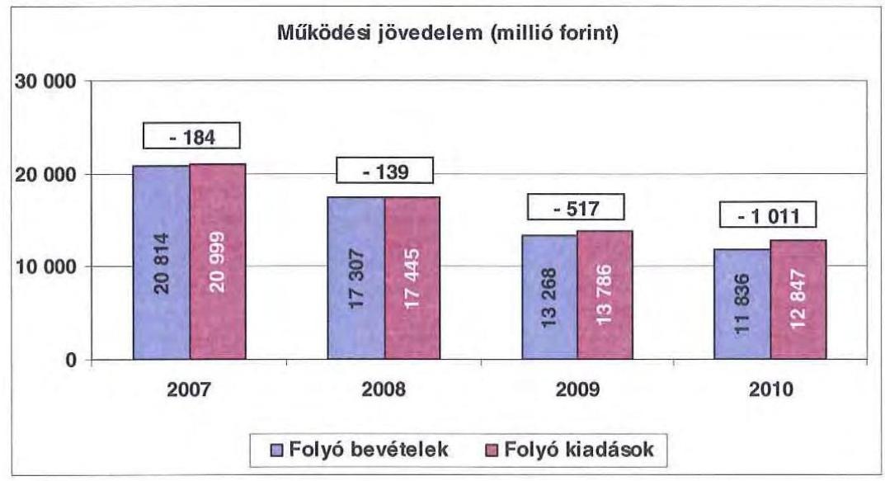

A folyó költségvetés hiánya (a működési forráshiány) 2007-ben a folyó kiadások 0,9\%-át (184 millió Ft-ot), 2008-ban 0,8\%-át (139 millió Ft-ot), 2009-ben 3,8\%-át (517 millió Ft-ot), 2010-ben 7,9\%-át (1011 millió Ft-ot) jelentette.

A működési forráshiány finanszírozása folyószámlahitelből, valamint a korábbi években képződött tartalékok, illetve a 2007. évben képződött felhalmozási többletbevételek egy részének felhasználásával történt. A folyószámlahitel napi átlagos állománya a 2009. évi 14 millió Ft-ról 2010-ben 397 millió Ft-ra emelkedett. Az Önkormányzat a vizsgált időszakot tekintve csak 2010-ben vett igénybe munkabérhitelt, amelynek napi átlagos állománya nem volt számottevő (5 millió Ft).

Az Önkormányzat kötelezettségein ${ }^{20}$ belül a rövid lejáratú kötelezettségek állománya 2007.-2010. években 13\% alatt volt. Az Önkormányzat 2006. december 31-én fennálló pénz és tőkepiac kötelezettsége 5068 millió Ft-ról közel másfélszeresére, 7588 millió Ft-ra nőtt a kötvénykibocsátás és a folyószámlahitel állományának emelkedése miatt.

A rövid lejáratú kötelezettségek 2010-ben 728 millió Ft-ot tettek ki, amely 14 millió Ft-tal (0,2\%-kal) több a 2007. évi rövid lejáratú kötelezettségállománynál. Az önkormányzat 2010-ben 126 millió Ft lejárt szállítói tartozásállománnyal rendelkezett. (2007-2009. években nem volt lejárt szállítói tartozása.)

[^0]
[^0]:    ${ }^{20}$ Passzív pénzügyi elszámolások nélküli

---

Az Önkormányzat pénzügyi kapacitása a vizsgált időszakban folyamatosan negatív értéket mutatott. A nettó működési jövedelem ${ }^{21}$ értéke a folyó költségvetési pozíció mellett az adott költségvetési év adósságtörlesztésének hatását is tükrözi.

Az Önkormányzat pénzügyi kapacitása a vizsgált időszakban rosszabbodott. Míg 2007-2008-ban a nettó működési jövedelem negatív értéke a 200 millió Ft-ot nem haladta meg, addig a 2010. évben már -1036 millió Ft volt. A pénzügyi kapacitás romlását főként a folyó bevételek és kiadások különbségéből származó működési jövedelem csökkenése okozta. ${ }^{22}$
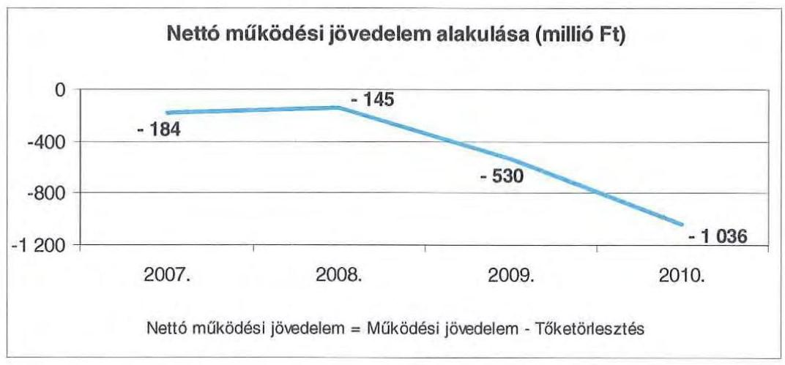

Az Önkormányzat felhalmozási költségvetésének egyenlege a 2008-2010. években ugyancsak negatív volt, szemben a 2007. évi pozitív értékkel, melyet a következő ábra szemléltet:
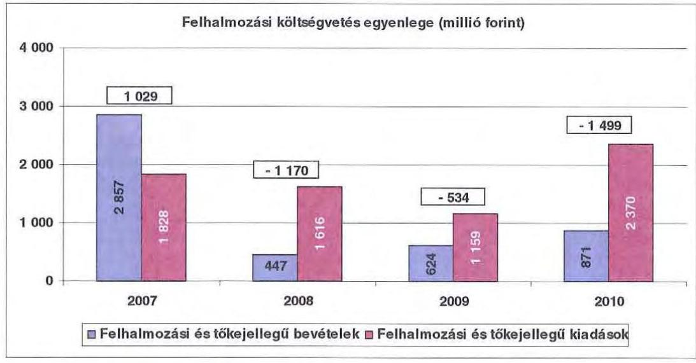

[^0]
[^0]:    ${ }^{21}$ Pénzügyi kapacitás
    ${ }^{22}$ Az Önkormányzat tőketörlesztési kötelezettsége ugyan növekvő volt 2007-2010 között, de mértékük nem volt számottevő. Összegük az évek sorrendjében 0, 6, 13, 25 millió Ft volt.

---

A felhalmozási forráshiánynak a felhalmozási és tőke jellegű kiadásokhoz viszonyított aránya 2008-ban 72,4\% (1170 millió Ft), 2009-ben 46,1\% (534 millió Ft), 2010-ben 63,2\% (1499 millió Ft) volt.

A felhalmozási forráshiány finanszírozása felhalmozási célú hitelből és 5000 millió Ft névértékű, devizalapú (CHF) kötvénykibocsátásból, továbbá a korábbi években képződött pénzeszközök felhasználásával történt.

A pénzügyi helyzet a 2012. évtől várhatóan tovább fog romlani, mivel a kötvény visszafizetés miatt éves szinten 2,4 millió CHF összeggel emelkedik az Önkormányzat adósságszolgálata, amelyre a rendelkezésre álló források a jelenlegi ismeretek szerint nem fognak fedezetet nyújtani.

A 2007-2010 közötti időszakban az Önkormányzat 5054 millió Ft működési és felhalmozási forráshiányára, 44 millió Ft tőketörlesztési kötelezettségére, továbbá a 778 millió Ft összegű függő, átfutó, kiegyenlítő tételeinek rendezésére az 1761 millió Ft 2007. évi nyitó pénzkészlet, a 2007-ben képződött 1029 millió Ft felhalmozási többletbevétel, az értékpapírok beváltásából származó 818 millió Ft, a kötvényből származó bevételből felhasznált 2122 millió Ft, valamint a 146 millió Ft értékben felvett hitelek nyújtottak fedezetet.

Az Önkormányzat évenkénti teljes finanszírozási hiánya ${ }^{23}$ a CLF módszer szerint 2008-ban 1315 millió Ft, 2009-ben 1064 millió Ft, 2010-ben 2534 millió Ft volt.

Az Önkormányzat finanszírozási műveleteinek 2007-2010. évekbeni egyenlegét a következő ábra szemlélteti:
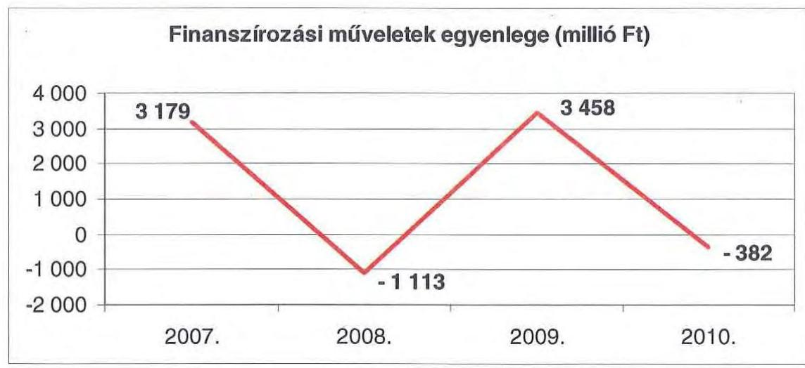

A finanszírozási többlet azt jelzi, hogy az éves költségvetések végrehajtása során szükség volt a pénzkészlet felhasználásán túl külső finanszírozás igénybevételére is. A finanszírozási célú műveleteket a vizsgált időszakban a jelentés 2. számú mellékletének 4.1-4.8 pontjai részletezik.

[^0]
[^0]:    ${ }^{23}$ a nettó működési jövedelem és a beruházási költségvetés eredője

---

Az önkormányzat zárszámadási rendeletében a működési és fejlesztési hiányt a hagyományos költségvetési szerkezet alapján mutatta be ${ }^{24}$, amelyről a jelentés 1. számú melléklete nyújt tájékoztatást. A zárszámadási rendelet szöveges részében a működési és felhalmozási egyensúly meghatározásakor az adósságszolgálati kiadásokat és a hitel- valamint kötvénybevételeket a működési és felhalmozási kiadások részének tekintette az Önkormányzat, melynek következtében minden évben működési és felhalmozási többletet mutatott ki.

A vizsgált időszakban a kötelezettségek (passzív pénzügyi elszámolások nélkül) 5780 millió Ft-ról 8317 millió Ft-ra emelkedtek, amely együtt járt a kamatkiadások növekedésével. Ugyanakkor a szabad pénzeszközök befektetése révén a kapott kamatok folyamatosan meghaladták a fizetett kamatokat.

A 2007-2010 között az Önkormányzat összesen 1837 millió Ft kamatbevételt realizált, amely a teljes kamatráfordítás (432 millió Ft) több mint négyszeresét tette ki.

2011-ben a kamatbevételek 14,6\%-os csökkenésével (47 millió Ft) és a kamatkiadások 20,6\%-os (22 millió Ft) növekedésével számolnak az előző évhez viszonyítva.

Az Önkormányzat kamatbevételeit, kamatkiadásait és azok egyenlegét a következő ábra mutatja:
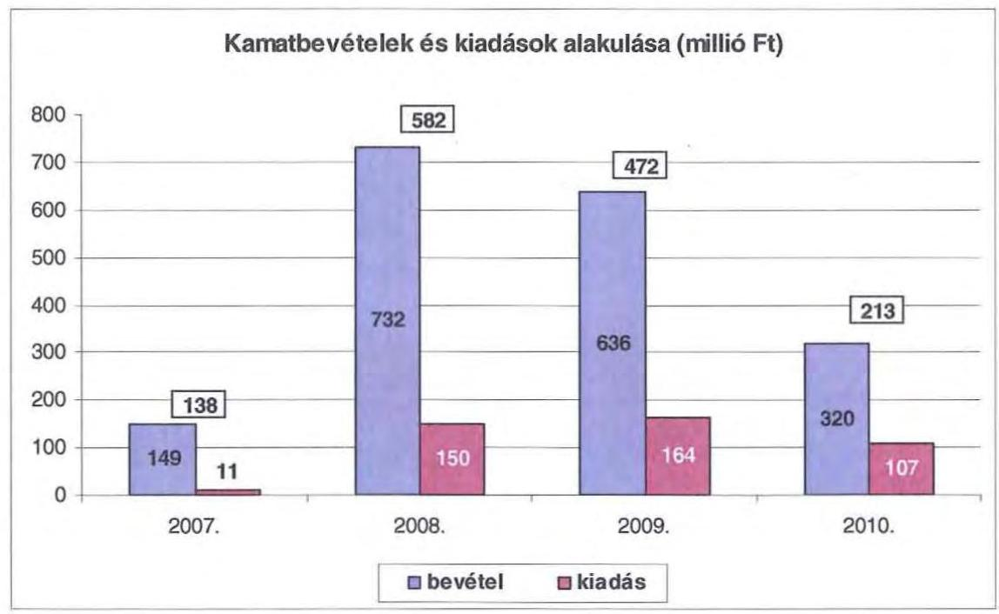

[^0]
[^0]:    ${ }^{24}$ Nincs kötelező előírás a működési és fejlesztési hiány megállapításának módjára.

---

# 2.2. Az Önkormányzat bevételeinek alakulása 

Az Önkormányzat 2007-2010 között realizált OEP támogatás nélküli főbb működési bevételi jogcímeinek számszaki adatait az alábbi táblázat, összetételének változását a grafikon mutatja be:
ezer Ft

| Megnevezés | 2007. év   tény | 2008. év   tény | 2009. év   tény | 2010. év   tény |
| :-- | :--: | :--: | :--: | :--: |
| illetékbevétel | 1910074 | 2177516 | 1894415 | 1295720 |
| szja és állami támogatás (OEP   támogatás nélkül) | 7137758 | 8305197 | 7104095 | 6132161 |
| Egyéb saját bevételek | 4507519 | 4746139 | 4278023 | 3964655 |
| Összesen | 13555351 | 15228852 | 13276533 | 11392536 |

(OEP támogatás) (7 449 976) (2 603 840) (656 434) (762 785)
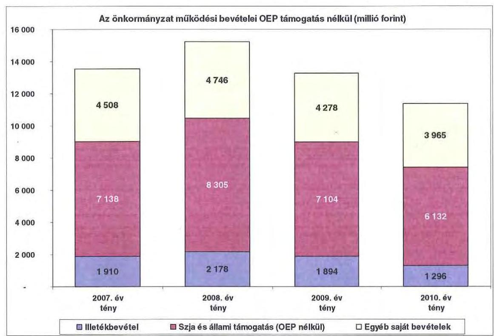

Az Önkormányzatnál a 2007. évi illetékbevétel a 2006. évi 2499 millió Ft-hoz képest jelentősen, 23,6\%-kal (589 millió Ft) csökkent. A csökkenésben szerepet játszott az Illetékhivatalnak - 2007. január 1-jétől - az APEH-hoz történő átszervezése is, miután az évente realizált illetékbevételekből (központi intézkedés következtében) évi 8,5\% elvonásra került az adminisztrációs feladatokra. Az ezen a jogcímen visszatartott összeg minden évben kevesebb volt, mint amek-

---

kora költségvetési kiadást jelentett korábban az Illetékhivatal működtetésé ${ }^{25}$ az Önkormányzatnak. Az Illetékhivatal működtetésével kapcsolatos kiadások megszűnése és az adminisztrációs feladatokra visszatartott 8,5\% között 2007-ben 192 millió Ft pozitív különbözet jelentkezett, de az 589 millió Ft-os bevételcsökkenésnek ez csak 32,5\%-át tette ki.

Az illetékbevétel a vizsgált időszakban 2008-ban növekedett, amikor az előző évihez képest 14\%-kal (267 millió Ft) nőtt. 2008-ról 2009-re 13\%-os csökkenés (283 millió Ft) következett be, majd a 2010. évben jelentősen mérséklődött, az előző évhez viszonyítva a csökkenés 32\%-os (598 millió Ft) volt.

Az átengedett szja és az állami támogatások együttes összege a 2008. évben 16,4\%-kal (1167 millió Ft) növekedett, amit jelentős mértékben a 2007. szeptember 1-jén települési önkormányzatoktól átvett hét közoktatási intézményhez kapcsolódó bevételek okoztak. Az átengedett szja és az állami támogatások együttes összege ezt követően a központi forráskivonás hatására ${ }^{26}$ folyamatosan és jelentős mértékben csökkent, az előző évihez képest 2009-ben 14,5\%-kal (1201 millió Ft), 2010-ben további 13,7\%-kal (972 millió Ft) kapott kevesebb forrást az Önkormányzat az államtól ezeken a jogcímeken. A változást a normatíváknak a járulékváltozások miatti központi csökkentése, valamint a megyei önkormányzatokat érintő forráselvonás mellett az ellátotti létszám 2008-2010 közötti visszaesése idézte elő.

Az egyéb, OEP támogatás nélküli működési bevételek a 2008. évben 5,3\%-kal (239 millió Ft) emelkedtek, ezt követően
 folyamatosan csökkentek. Az intézményi és egyéb folyó működési bevételek, valamint a kamatbevételek csökkenését nem tudta ellensúlyozni a támogatásértékű bevételek és az átvett pénzeszközök 545 millió Ft-os növekedése.

A tárgyévi pénzforgalmi működési bevételeket és kiadásokat összehasonlítva az Önkormányzat minden évben működési forráshiányos volt, amit a 2007-ben képződött felhalmozási többletbevételek egy részének felhasználásával, a pénzmaradvány igénybevételével és folyószámla hitellel ellensúlyozott. Az Önkormányzat 2007-ben meglévő jelentős tartalékai a fejlesztésekre történő felhasználás mellett a működési hiány finanszírozása miatt is csökkentek.

[^0]
[^0]:    ${ }^{25}$ A 2006. évben az Illetékhivatal működtetésére 354 millió Ft-ot fordítottak. Az éves illetékbevétel 8,5\%-a 2007-ben 162 millió Ft, 2008-ban 185 millió Ft, 2009-ben 161 millió Ft, 2010-ben 110 millió Ft volt.
    ${ }^{26}$ a 2007. évi bázishoz képest

---

Az Önkormányzat felhalmozási bevételei a vizsgált időszakban a következőképpen alakultak:
ezer Ft

| Megnevezés | 2007. év   tény | 2008. év   tény | 2009. év   tény | 2010. év   tény |
| :-- | --: | --: | --: | --: |
| Tárgyi eszköz   értékesítés | 394365 | 50287 | 78669 | 289622 |
| Állami támogatás | 476871 | 122288 | 0 | 2703 |
| Átvett pénzeszköz | 159911 | 216202 | 182972 | 112200 |
| Egyéb felhalmozási   bevétel | 2257909 | 197851 | 373235 | 798433 |
| Felhalmozási tartalék | 381116 | 4492443 | 577900 | 2237618 |
| Összes felhalmozási   bevétel | 3670172 | 5079071 | 1212776 | 3440576 |

A tárgyi eszközök és immateriális javak értékesítéséből, valamint az átvett pénzeszközökből befolyt bevételek mindegyike csökkent 2007-ről 2010-re. Különösen nagymértékű, 99,4\%-os (474 millió Ft) csökkenés figyelhető meg a nagyrészt címzett támogatásokat magában foglaló állami forrásoknál. A felhalmozási kiadások fedezetét döntően a 2007 előtt képződött tartalékból, a Balatontourist Rt.-ben lévő részesedés értékesítéséből befolyt bevételből, valamint a kötvénykibocsátásból származó folyamatosan magas pénzmaradvány igénybevétele biztosította. A 2009. évben a többi évhez viszonyítva feltűnően alacsony volt a felhalmozási bevételek főösszege, mivel fejlesztési célú költségvetési támogatásban nem részesült az Önkormányzat, a fejlesztési feladatokra szánt szabad pénzeszközeit pedig értékpapírokba fektette. A 2007-2010 között befolyt felhalmozási kamatbevételek nagy része ezeknek az értékpapíroknak a forgatásából származik.

# 2.3. Az Önkormányzat kiadásainak alakulása 

Az Önkormányzat működési kiadásai főbb jogcímek szerinti bontásban az alábbiak voltak:
ezer Ft

| Megnevezés | 2007. | 2008. | 2009. | 2010. |
| :--: | :--: | :--: | :--: | :--: |
| Működési kiadások | 21048029 | 17280432 | 13616652 | 12747923 |
| Működési kiadások (kamatkiadás nélkül) | 21048029 | 17280432 | 13616652 | 12709389 |
| Kamatkiadás | 0 | 0 | 0 | 38534 |
| Személyi juttatások | 10113871 | 8624067 | 7025910 | 6803631 |
| Munkaadót terhelő járulékok | 3191952 | 2658664 | 2051512 | 1753498 |
| Üzleti kiadások | 6557933 | 4110890 | 3569405 | 3363614 |
| Egyéb folyó kiadások | 118535 | 101036 | 83964 | 156797 |
| Támogatások, elvonások, egyéb folyó átutalások | 848253 | 1530382 | 645676 | 529367 |
| ebből: működési célú pénzeszközátadás | 205902 | 565565 | 180634 | 67630 |
| Előző évi pénzmaradvány átadás, visszafizetés, működési célú | 217485 | 255393 | 240185 | 102482 |

---

Az Önkormányzat működési kiadásai 2007. december 31-ről 2010. december 31-re 21048 millió Ft-ról 12748 millió Ft-ra csökkentek. A 8300 millió Ft-os csökkenést elsősorban az okozta, hogy a legnagyobb intézménynek számító Kórház 2008. április 1-jétől zártkörű részvénytársaságként működik, így ettől az időponttól kezdve nem szerepel az Önkormányzat költségvetésében. A Kórház és a költségvetési szervként az Önkormányzat felügyelete alatt működő Tüdőgyógyintézet adatai nélkül a működési kiadások 2007. december 31-ről 2010. december 31-re 1,7\%-kal csökkentek (12202 millió Ft-ról 12000 millió Ft-ra).

Az Önkormányzat működési kiadásai a Kórház és a Tüdőgyógyintézet adatai nélkül a vizsgált időszakban a következőképpen alakultak:
ezer Ft

| Megnevezés | 2007. | 2008. | 2009. | 2010. |
| :--: | :--: | :--: | :--: | :--: |
| Működési kiadások | 12201808 | 14165846 | 12910859 | 11999789 |
| Működési kiadások (kamatkiadás nélkül) | 12201808 | 14165846 | 12910859 | 11961255 |
| Kamatkiadás | 0 | 0 | 0 | 38534 |
| Személyi juttatások | 6575256 | 7358846 | 6699043 | 6472631 |
| Munkaadói terhelő járulékok | 2036226 | 2247162 | 1956717 | 1671570 |
| Dologi kiadások | 2575233 | 2897588 | 3289511 | 3041326 |
| Egyéb folyó kiadások | 62278 | 80725 | 79727 | 143879 |
| Támogatások, elvonások, egyéb folyó átutalások | 816986 | 1370816 | 737457 | 544500 |
| ebből: működési célú pénzeszközátadás | 193367 | 565565 | 180634 | 67630 |
| Előző évi pénzmaradvány átadás, visszafizetés, működési célú | 135829 | 210709 | 148404 | 87349 |

Az Önkormányzat 2010-ben a működési költségvetés 67,9\%-át (8144 millió Ft-ot) személyi juttatásokra és a munkaadókat terhelő járulékokra fordította, az üzemeltetést, intézményfenntartást biztosító dologi és egyéb folyó kiadásokra 26,5\% (3185 millió Ft) jutott. A működési kiadásokon belül a személyi juttatások és járulékok aránya a vizsgált időszakban csökkent, 2007-ben 70,6\% (8611 millió Ft), 2010-ben 67,9\% volt (8144 millió Ft), a dologi és egyéb folyó kiadások aránya ugyanakkor emelkedett, 2007-ben 21,6\% (2638 millió Ft), 2010-ben 26,5\% (3185 millió Ft) volt.

A személyi juttatások - a Kórház és a Tüdőgyógyintézet adatai nélkül - a 2008. évben az átvett közoktatási intézmények miatt 11,9\%-kal (784 millió Ft) emelkedtek, ezt követően azonban folyamatosan csökkentek a létszámcsökkentések miatt. A személyi juttatások 2010-ben a 2007. évben teljesített kiadásoknál 1,6\%-kal (103 millió Ft) voltak alacsonyabbak.

A dologi kiadások és egyéb folyó kiadások az Önkormányzatnál folyamatosan emelkedtek, 2010-ben a 2007. évi szintnél 20,8\%-kal (548 millió Ft) voltak magasabbak. A dologi kiadások minden évben az inflációt meghaladó mértékben nőttek, amelynek ellentételezése a központi forráselosztásban nem jelentkezett. Fedezetét az Önkormányzat a végrehajtott kiadáscsökkentő intézkedések révén, valamint a felhalmozási többletbevételek és a pénzmaradvány egy részének működési célra történő felhasználásával biztosította.

A felhalmozási kiadások főösszegéhez viszonyítva alacsonyak voltak a társadalom és szociálpolitikai juttatások, a támogatásértékű kiadások, valamint az átadott pénzeszközök, amelyek együttes összege 2007-2010 között 747 millió Ft-ról 529 millió Ft-ra csökkent.

---

Az Önkormányzat 2007-2010 között a Kórház és a Tüdőgyógyintézet működési kiadásaihoz 863 millió Ft-tal járult hozzá, továbbá 145 millió Ft tagi kölcsönt nyújtott a Kórház részére. Az egészségügyi intézmények működtetésére fordított összegekből 246 millió Ft intézményfinanszírozás, 296 millió Ft a részvénytársasággá alakított Kórház részére biztosított alaptőke, 321 millió Ft gépek és műszerek vásárlásához és egyéb felújításokhoz, beruházásokhoz nyújtott támogatás volt. A kórházak működésének finanszírozására az OEP támogatás szolgál, míg a fejlesztési kiadások fedezetét az önkormányzatoknak kell biztosítani intézményeik számára.
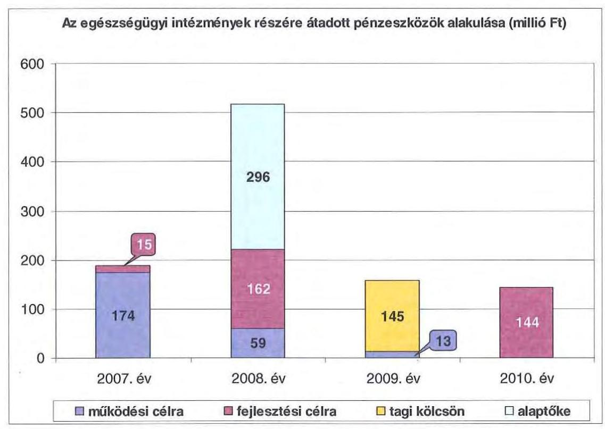

A felhalmozási kiadások aránya az összes kiadáson belül - a 2009. évet kivéve - folyamatosan növekedett. A Kórház és a Tüdőgyógyintézet adatai nélkül a felhalmozási kiadások összes költségvetési kiadáshoz viszonyított aránya 2007-ben 12,0\% (1662 millió Ft) 2010-ben 16,8\% (2428 millió Ft) volt. Az Önkormányzat 2007-2008 között az üzletrész értékesítésből, 2010-ben a kötvénykibocsátásból származó rendkívüli bevételeit ${ }^{27}$ használta fel intézményei fejlesztésére, továbbá városi önkormányzatok és megyei szervezetek ${ }^{28}$ támogatására. A 2009. évben az előző évhez viszonyítva 25,5\%-kal csökkentette fejlesztéseit az Önkormányzat, mivel szabad pénzeszközeit átmenetileg értékpapírokba fektette. A működési és felhalmozási kiadások összetételének változását a vizsgált időszakban a következő grafikon szemlélteti:

[^0]
[^0]:    ${ }^{27}$ 2007-ben a Balatontourist részvények ellenértékeként 2020 millió Ft, kötvénykibocsátásból 5000 millió Ft bevételhez jutott az Önkormányzat.
    ${ }^{28}$ A kedvezményezett szervezetek közül a katasztrófavédelem, a tűzoltóság, valamint a veszprémi egyetem kapta a legtöbb támogatást.

---

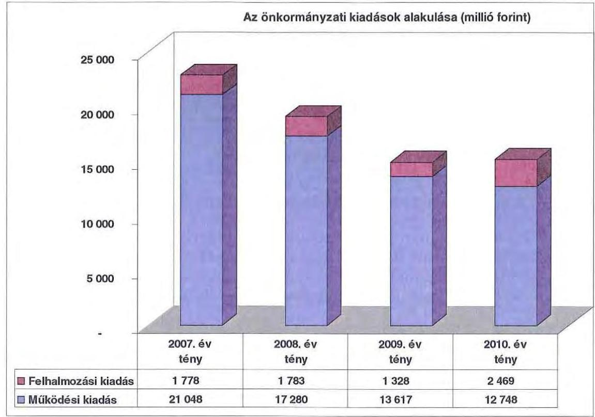

Az Önkormányzat 2007-2010 között megvalósított 5238 millió Ft értékű fejlesztései között iskolák, múzeumok, szociális és gyermekvédelmi intézmények, lakásotthonok felújítása, korszerűsítése és bővítése, továbbá két gazdasági társaságban üzletrész vásárlása szerepelt. A teljesített, egyenként 10 millió Ft teljes bekerülési költséget meghaladó fejlesztési kiadásokból 3531 millió Ft kötelező, 1318 millió Ft önként vállalt feladatokhoz kapcsolódott. A legmagasabb bekerülési költségű (1421 millió Ft) fejlesztés 2005-ben kezdődött, amely egy regionális onkológiai centrum megvalósítására irányul. További 18 esetben a bekerülési költség meghaladta a 100 millió Ft-os nagyságrendet, ezek a fejlesztések intézmények rekonstrukcióját, fűtéskorszerűsítését, infrastruktúra fejlesztését, továbbá a Kórháznak átadott beruházásokat és a részvénytársasággá alakuláshoz szükséges alaptőke átadását jelentették. Kiemelkedő tételek voltak a felhalmozási kiadások közül az ingatlanfejlesztési és termálvíz hasznosító gazdasági társaságokban önként vállalt feladatként, befektetési céllal vásárolt 883,4 millió Ft értékű üzletrészek. A pénzügyi befektetések 2010-ben történtek, azok megtérülése, illetve jövedelemtermelő képessége még nem ismert, a tulajdonszerzést követően osztalékban nem részesült az Önkormányzat. 2007-2010 között a 10 millió Ft teljes bekerülési költség feletti beruházások és felújítások száma 83 volt, amelyek teljesített összértéke 4849 millió Ft-ot tett ki. A 2010. év utáni felhalmozási célú 1963 millió Ft kötelezettségvállalásból a Kórház fejlesztéséhez kapcsolódó regionális onkológiai centrum 1345 millió Ft-os összege a legmagasabb. Az Önkormányzat által megvalósított és fennálló fejlesztéseket a 3. számú melléklet mutatja be.

Az Önkormányzat 2011-re az előző évek működési és felhalmozási hiányainak finanszírozására, valamint felújításokra, beruházásokra és támogatásértékű kiadásokra elköltötte a Balatontourist Rt.-ben lévő üzletrész értékesítés teljes bevételét (4040 millió Ft-ot), valamint a kötvényből származó bevétel közel

---

50\%-át. A kötvény még fel nem használt, illetve kötelezettséggel nem terhelt részét (1365 millió Ft) konkrét beruházásokra használhatja fel az Önkormányzat, további fejlesztési tevékenysége a pályázati kiírások által nagyban befolyásolt, mivel a jelentkező működési forráshiány és saját felhalmozási bevételei alacsony szintje miatt beruházásokat csak külső források, uniós és hazai támogatások elnyerése esetén tud megvalósítani.

# 3. KÖTELEZETTSÉGEK BEMUTATÁSA 

### 3.1. A pénzintézetek felé fennálló kötelezettségek alakulása

Az Önkormányzat pénzintézeti kötelezettségeinek állománya 2006. december 31-től 2010. december 31-ig 118,6 szeresére (64 millió Ft-ról 7588 millió Ft-ra) nőtt. A fennálló pénzintézeti kötelezettségei kötvény kibocsátásából és hosszúlejáratú hitelek igénybevételéből keletkeztek ${ }^{29}$.
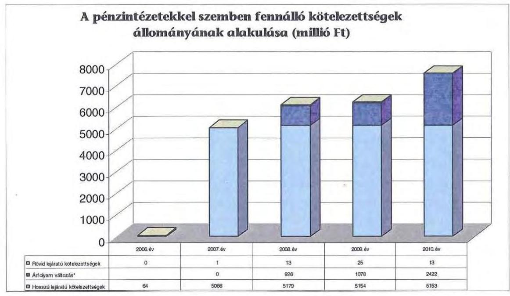

Az Önkormányzat pénzintézeti kötelezettségvállalásaira minden esetben közgyűlési döntés alapján került sor. A kötelezettségvállalásból származó források felhasználási céljait meghatározták. A Közgyűlés döntéseit megalapozó előterjesztések ugyanakkor nem tartalmazták a kötelezettségvállalás visszafizetési forrásainak, a teljes futamidő várható kamat és tőkefizetési kötelezettségeknek, az árfolyam- és kamatkockázatoknak a bemutatását. Az előterjesztésekben nem tértek ki az adósságszolgálati korlát bemutatására, ezért a Közgyűlés ennek figyelembevétele nélkül döntött.

A Közgyűlés három pénzintézet ajánlatából a két legjobb ajánlatot adó pénzintézettel lefolytatott tárgyalás alapján döntött az
 5000 millió Ft névértékű, svájci

[^0]
[^0]:    ${ }^{29}$ A rövid lejáratú kötelezettségek a hosszú lejáratú kötelezettségek tárgyévet követő évben esedékes törlesztőrészletei.

---

frank alapú kötvény kibocsátásáról. A döntés következtében az Önkormányzat számlavezető és kötvénykibocsátó bankja nem ugyanaz a pénzintézet lett.

Az Önkormányzat adósságot keletkeztető kötelezettségvállalásának felső határát a vizsgált időszakban nem lépte túl.

Az adósságot keletkeztető kötelezettségvállalással megvalósított felhalmozási kiadások fedezetéül szolgáló esetleges bevételt növelő, illetve kiadást csökkentő vonzatát, illetve ennek a fejlesztéshez, felújításhoz vállalt kötelezettségek visszafizetési forrásként való számbavételét nem vizsgálták. Az adósságot keletkeztető kötelezettségvállalások teljesítésének az Önkormányzat a vizsgált időszakban - külön hitelfelvétel és újabb kötvénykibocsátás nélkül - eleget tudott tenni.

Az Önkormányzat 2010. december 31-én CHF-ben fennálló adósságot keletkeztető kötelezettségvállalását az alábbi táblázat tartalmazza:

| Megnevezés | Kibocsátás, illetve szerződéskötés időpontja | Összeg CHF-ben | Kibocsátási, vagy leleleási árfolyam | Kamat (referencia kamat+ kamatfelár) | Felhasználás célja: |
| :--: | :--: | :--: | :--: | :--: | :--: |
| Veszprém Megye Fejlődéséért kötvény | 2007.12.20 | 33331000 | 130,01 | 6 havi CHF LIBOR+5,40\% | Fejlesztési feladatok tőkefinanszírozásában |

A „Veszprém Megye Fejlődéséért" kötvényből származó bevétel 72,7\%-ára vállalt kötelezettséget az Önkormányzat. A felhasznált összeg 71,7\%-át fejlesztésre és pályázati önrészek biztosítására, 24,3\%-át részvénytulajdon megszerzésére, 4,0\%-át tagi kölcsönök nyújtására fordították.

Az Önkormányzat 2010. december 31-én forintban fennálló adósságot keletkeztető kötelezettségvállalásai a következők voltak:

| Megnevezés | Kibocsátás időpontja | Összeg | Kamat (referencia kamat+ kamatfelár) | Felhasználás célja: |
| :--: | :--: | :--: | :--: | :--: |
| Hosszú lejáratú hitel | 2005.12.09 | 177656718 | 3 havi EURIBOR +1,31\% | fejlesztés, 12 intézmény mosodáinak korszerűsítése |
| Hosszú lejáratú hitel | 2006.02.23 | 20000000 | 3 havi EURIBOR +1,23\% | fejlesztés, Baláca múzeumi kiállítóhely kialakítása |

Az Önkormányzat 178 millió Ft hosszúlejáratú hitelét az Önkormányzat fenntartásában működő 12 egészségügyi, szociális és oktatási intézmény mosodáinak korszerűsítésére vette fel energia- és költségmegtakarítás céljából. Az Önkormányzat a 20 millió Ft hosszúlejáratú hitelből finanszírozta a Baláca múzeumi kiállítóhely közösségi-közművelődési célú épületének beruházását.

Az Önkormányzat 2007-2010 között a CHF-ben fennálló pénzintézeti kötelezettségeire 2048091 CHF (368 millió Ft) kamatot és 599958 CHF (109 millió Ft) egyéb költséget ${ }^{30}$ fizetett a pénzintézetnek. A Közgyűlés határozata szerint a pénzügyi válság következtében szükségessé vált az eredeti forgalmazói szerződés felülvizsgálata. Az Önkormányzat és a pénzintézet megállapodtak abban, hogy határozott időre 2009. július 1-től 2009. december 31-ig, majd azt követően évente, ügynöki díjat fizet az Önkormányzat a pénzintézetnek. A 2009. évre vonatkozóan a díj mértékét a kötvény névértékének 1,8\%-ban állapították meg. A szerződő felek megállapodtak abban, hogy a díj megállapításának szükségességét, illetve mértékét a tárgyévet megelőzően legkésőbb december 15-ig, illetve tárgyévben június 15-ig felülvizsgálják. A szerződés 7.2. pontja értelmében az ügynöki díj felülvizsgálatát mindaddig folytatják a szerződés keretei között, amíg a kamatszint a 6 havi LIBOR mértéke a 2007. december 12.-i szintet el nem éri (2,8617\%), vagy meg nem haladja.

Az Önkormányzat 2007-2010 között HUF-ban fennálló kötelezettségeire 32 millió Ft tőkét törlesztett, 19 millió Ft kamatot fizetett. (Egyéb költség ${ }^{31}$ címén 2007-ig 10 millió Ft-ot teljesített).

Az Önkormányzat 2010. december 31-én fennálló kötelezettségeinek várható jövőbeni a teljes futamidőre vonatkozó tőke-, kamat- és egyéb fizetési kötelezettsége - az utolsó fizetési kötelezettség alapját képező teljes (alapkamat és kamatfelár) kamat- és egyéb szerződéses kondíciókkal számolva - 2011-2013. között 3984000 CHF és 51 millió Ft, 2014-től 32206241 CHF és 147 millió Ft.

Az árfolyamváltozás hatása is befolyásolja a kötelezettségek alakulását, azonban annak mértéke előre pontosan nem határozható meg, csak várakozásokon alapuló tendenciák jelezhetők. A Számv. tv. 60. § (4) bekezdése alapján az árfolyamkülönbözetet év végén a kötelezettségek vagy követelések között a könyvviteli mérlegben nyilván kell tartani, azonban az árfolyamkülönbözet valójában nem realizált ${ }^{32}$. Annak megítéléséről, hogy a devizában kibocsátott kötvényekért kapott forinthoz képest a kötvények visszavásárlásakor jelentkező forint kötelezettség többletkiadást (árfolyamveszteség) vagy megtakarítást (árfolyamnyereség) eredményez a futamidő végén, a teljes kötelezettség rendezését követően lehet képet alkotni. Mindaddig, amíg törlesztési kötelezettség nem áll fenn (türelmi idő, moratórium), a tőkére vonatkoztatva nem értelmezhető sem az árfolyamveszteség, sem az árfolyamnyereség.

Az Önkormányzat 2007-2010. december 31. között az átmenetileg szabad pénzeszközein 1837 millió Ft kamatbevételt realizált, melyből 1416 millió Ft származott kötvényekből származó bevétel befektetéseiből és 421 millió Ft a

[^0]
[^0]:    ${ }^{30}$ A 2007. december 10-én létrejött forgalmazói szerződés 6.4 pontja alapján a szerződést új 7. ponttal egészítették ki - a Közgyűlés 99/2009 (VI.18.) MÖK határozata alapján - ügynöki szolgáltatások címén.
    ${ }^{31}$ A 2005. december 9-én megkötött 200 millió Ft kölcsönszerződés 7. pontja alapján a projektvizsgálati díj éves mértéke 0,41\%, összegszerűen a teljes futamidőre 10 millió Ft, melynek megfizetése az első folyósításkor egy összegben esedékes.
    ${ }^{32}$ Emlékeztetve az Önkormányzat mérlegében a pénzintézeti kötelezettségek 2422 millió Ft-tal növekedtek.

---

Közgyűlés hivatala elkülönített bankszámláin rendelkezésre állt forrás befektetéséből ${ }^{33}$.

A kötvény bevétel befektetéséből származó kamatbevételből az Önkormányzat 397 millió Ft-ot a kötvények kamatfizetésére, 109 millió Ft-ot ügynöki díjra és 950 millió Ft-ot felhalmozási célokra fordított. A kötvénybevétel fel nem használt részének befektetéseiből származó kamatbevételek háromszorosát tették ki a kötvénykibocsátás miatt megfizetett kamatnak és ügynöki díjnak.

A folyószámlahitel és a munkabér megelőlegezési hitel alakulását az alábbi táblázat mutatja be:

|  |  |  |  |  | Összeg Ft-ban |  |
| :--: | :--: | :--: | :--: | :--: | :--: | :--: |
| Megnevezés | 2007. év | 2008. év | 2009. év | 2010. év | 2011.   március 31. |  |
| I. Folyószámlahitel |  |  |  |  |  |  |
| a folyószámlahitel keretösszege január 1-jén | 300000 | 150000 | 600000 | 900000 | 1400000 |  |
| teljesített kamat és egyéb költség | - | - | - | 36781 | 21729 |  |
| II. Munkabér megelőlegezési hitel |  |  |  |  |  |  |
| Igénybevett hitel összesen: | - | - | - | 1300000 | 75000 |  |
| teljesített kamat és egyéb költség | - | - | - | 804 | 454 |  |

Az Önkormányzat működésének likviditását 2009. év decemberétől csak folyószámlahitel igénybevételével tudta biztosítani. A 2009. évben fennálló 12 millió Ft folyószámlahitel tartozását az Önkormányzat 2010. január 4-én törlesztette.

Az Önkormányzat a 2010. december 30-án fennálló 943 millió Ft folyószámlahitelét a kötvénykibocsátásból származó bevételéből visszafizette. A Közgyűlés a helyszíni vizsgálat alatt megbízta a Közgyűlés elnökét azzal, hogy közbeszerzési eljárást folytasson le 1800 millió Ft bankszámlához kapcsolódó hitelkeret egy évre történő megnyitása érdekében.

Az Önkormányzat 2009. évben 15 nap, 2010. évben 311 nap és 2011. I. negyedévében 85 napon vette igénybe folyószámlahitel keretét. Az átlagos napi állomány a 2009. évi 14 millió Ft-ról, a 2011. március 31-re 779 millió Ft-ra emelkedett. A 2009. év végétől jelentkező működési hiány, folyamatos likviditási problémák finanszírozása (folyószámlahitel) az Önkormányzatnak a 2009. év végétől 2011. március 31-ig összesen 57 millió Ft kamatráfordítást eredményezett.

Az Önkormányzat átmeneti likviditási problémái miatt a 2010. év júniusában 130 millió Ft, 2011. év áprilisában 75 millió Ft munkabér megelőlegezési hitelt vett igénybe, mivel a folyószámlahitel keret nem nyújtott fedezetet a munkabérek kifizetésére. A törlesztések az illetékbevételekből és a normatív állami támogatásokból az igénybevételt követő hónap végén megtörténtek. A munkabér megelőlegezési hitel igénybevétele miatt az Önkormányzatnak a vizsgált időszakban több mint 1 millió Ft kamatfizetetési kötelezettsége keletkezett.

[^0]
[^0]:    ${ }^{33}$ Balatontourist Rt. értékesítéséből származó bevétel.

---

A folyószámlahitel és munkabér megelőlegezési hitelek kondícióinak ${ }^{34}$ és egyéb költségeinek alakulását a következő táblázat szemlélteti:

| Megnevezés | Kamat (referencia+ kamatfelár) | Egyéb költség |
| :--: | :--: | :--: |
| Folyószámlahitel |  |  |
| 2007. év | 3 havi BUBOR +0,2\% | 0,00\% |
| 2008. év | 3 havi BUBOR +0,5\% | 0,15\% rend.tart.jutalek |
| 2009. év |  |  |
| 0 - 150 millióig | 1 havi BUBOR +1,5\% | 0,3\% kezelési +0,2\% rend.tart.jutalek |
| 150 - 450 millióig | 1 havi BUBOR +2,4\% | 0,3\% kezelési +0,2\% rend.tart.jutalek |
| 2010. év |  |  |
| 0 - 150 millióig | 1 havi BUBOR +1,5\% | 0,3\% kezelési +0,2\% rend.tart.jutalek |
| 150 - 450 millióig | 1 havi BUBOR +2,2\% | 0,3\% kezelési +0,2\% rend.tart.jutalek |
| 450 - 600 millióig | 1 havi BUBOR +2,4\% | 0,3\% kezelési +0,2\% rend.tart.jutalek |
| 2011. év |  |  |
| 0 - 150 millióig | 1 havi BUBOR +1,5\% | 0,3\% kezelési +0,2\% rend.tart.jutalek |
| 150 - 600 millióig | 1 havi BUBOR +2,2\% | 0,3\% kezelési +0,2\% rend.tart.jutalek |
| 600 - 1400 millióig | 1 havi BUBOR +2,4\% | 0,3\% kezelési +0,2\% rend.tart.jutalek |
| Munkabér megelőlegezési hitel |  |  |
| 2010. év | 1 havi BUBOR +2,7\% | x |
| 2011. év | 1 havi BUBOR +2,7\% | x |

A jelenleg fennálló kötvény és a hitelek esetében a kamatfizetési kötelezettségek alakulását jelentősen befolyásolta és jelenleg is befolyásolja a kibocsátáskori és az utolsó kamatfizetéskori referencia kamatok változása, melyet az alábbi táblázat mutat be:

| Megnevezés | Kibocsátási, lehivási | Utolsó fizetéskori | Változás \% |
| :--: | :--: | :--: | :--: |
|  | alapkamat \% |  |  |
| 6 havi CHF LIBOR | 3,4417 | 0,8642 | -74,9 |
| 3 havi EURIBOR | 3,676 | 2,24 | -39,1 |

Az Önkormányzat utolsó kamatfizetési kötelezettsége a 6 havi CHF LIBOR-ú kötvénye után 2011. március 31-én és a 3 havi EURIBOR-os hitele után 2011. március 5-én volt.

Változatlan referencia kamat esetén, az Önkormányzatnak a kibocsátáskori referencia kamattal számolva 4038367 CHF kamatfizetési kötelezettsége keletkezett volna, ami 1848719 CHF-el kevesebb a teljesített kifizetésnél. Az alapkamat mértékének alakulása jelentős hatással van az adott devizanemben kifejezett, a teljes futamidőre
 számított, várható kamatkötelezettség nagyságára.

Az Önkormányzatnak a kötvény tőke törlesztésére vonatkozó fizetési kötelezettsége 2012. szeptember 30-án kezdődik.

[^0]
[^0]:    ${ }^{34}$ A referencia kamat az alábbiak szerint alakult:

    | MNB BUBOR fixing (átlagkamat) %-ban |  |  |  |  |
    | :--: | :--: | :--: | :--: | :--: |
    | Referencia kamat | 2007. évi | 2008. évi | 2009. évi | 2010. évi | 2011. március 31-ig |
    | 3 havi BUBOR | 7,75 | 8,87 | 8,64 | 5,5 | 6,03 |
    | 1 havi BUBOR | 7,83 | 8,75 | 8,66 | 5,47 | 5,94 |
    | 1 napi BUBOR | 7,78 | 8,41 | 8,39 | 4,95 | 5,24 |

---

Az Önkormányzatnál a helyszíni vizsgálat alatt további hosszú lejáratú hitel igénybevételről, illetve kötvénykibocsátásról szóló döntést nem készítettek elő, ugyanakkor a Közgyűlés döntött az 1800 millió Ft folyószámlahitel közbeszerzési eljárásának a lefolytatásáról, valamint a kötvénybevételből 500 millió működési célú pénzeszköz felhasználását kérte a pénzintézettől visszapótlási kötelezettséggel, az átmeneti finanszírozási problémák kezelésére.

Az Önkormányzat 2011-2014. évekre szóló gazdasági programjának elsődleges célja a likviditási problémák kezelése, melyen belül feladatként határozták meg - többek között - a likviditás biztosítását szolgáló feladatok legfontosabb elemei közül a következőket:

- saját bevételek további növelését,
- felesleges vagyontárgyak értékesítését,
- a 2012. év decemberétől jelentkező, a kibocsátott kötvény visszafizetésével kapcsolatos évenkénti kötelezettség teljesítését,
- az intézményi feladatellátás során a feladatokhoz kell rendelni az intézményi struktúrát stb.

# 3.2. Szállítók felé fennálló kötelezettségek alakulása 

Az Önkormányzatnak és gazdasági társaságainak lejárt szállítói tartozásait az alábbi táblázat tartalmazza (ezer Ft-ban) ${ }^{35}$ :

| Megnevezés | 2007.   december 31. | 2008.   december 31. | 2009.   december 31. | 2010.   december 31. | 2011.   március 31. |
| :--: | :--: | :--: | :--: | :--: | :--: |
| Lejárt szállítói tartozás |  |  |  | 126299 | 157396 |
| Gazdasági társaságok   lejárt szállítói tartozása |  |  |  | 356008 | 597677 |
| ebből Kórház |  |  |  | 356008 | 597677 |
| Egyéb kiadás elmaradás |  |  |  |  |  |
| Tartozásállomány | - | - | - | 482307 | 755073 |

Az Önkormányzatnak a vizsgált időszakban 2010. december 31-én lejárt szállítói tartozása 126 millió Ft volt, amely 2011. március 31-ére 1,2 szeresére 157 millió Ft-ra nőtt. A lejárt szállítói tartozás 71,5%-a (90 millió Ft) 30 napon belüli, 11,4%-a (14 millió Ft) 31-60 napon belüli, 16,6%-a (21 millió Ft) 61-90 nap közötti és 0,5%-a (1 millió Ft) 91-365 nap közötti volt.

A gazdasági társaságként működő Kórház lejárt szállítói tartozása 2010. év végéről 2011. március 31-ére több mint 1,5 szeresére, 356 millió Ft-ról 597,7 millió Ft-ra nőtt. A Kórház 2010. december 31-én lejárt tartozásállományából 129 millió Ft 31-60 nap közötti volt.

Az Önkormányzat 2010. december 31-i mérlegben kimutatott szállítói kötelezettség 337 millió Ft volt, melyből a le nem járt tartozásállomány 211 millió Ft, az összes tartozás 62,5%-a. Az Önkormányzatnál a 2010. év végén kimutatott szállítói kötelezettségre fedezetet részben a mérlegben kimutatott 100 mil-

[^0]
[^0]:    ${ }^{35}$ Az Önkormányzat a 2007-2009. évi szállítói állományokról nem szolgáltatott adatot.

---

lió Ft követelésállomány nyújthat, illetve a Hivatal folyószámlahitel kerete. Az Önkormányzat 2010. év végén nem rendelkezett szabad pénzmaradvánnyal, mivel a költségvetési beszámolójában kimutatott pénzmaradványa kötelezettségvállalással terhelt.

A Kórház Zrt-nél jelentkező, dinamikusan növekvő szállítói állomány a tartozásállomány további növekedését valószínűsíti.
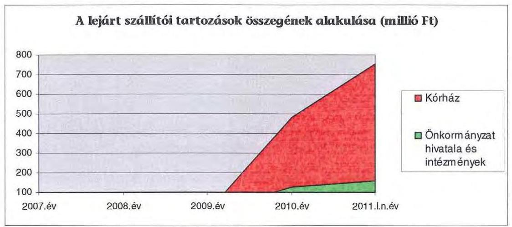

A Közgyűlés a lejárt szállítói kötelezettségek rendezésével, a vizsgált időszakban nem foglalkozott, az állomány csökkentése érdekében pénzügyi finanszírozási műveletekről nem döntött.

Az Önkormányzat hivatalában a szállítókkal történt fizetések átütemezéséről, az aljegyző tájékoztatása szerint a megállapodások szóban, telefonon történtek.

# 3.3. Egyéb kötelezettségek alakulása 

A kötelező feladatellátáshoz kapcsolódóan a Megyei Levéltár 2006. augusztus 29-én számítógép beszerzésére 667 ezer Ft összegben lízingszerződést kötött. A pénzügyi kötelezettségek teljesítését követően a lízingelt eszköz maradványértéke - az Önkormányzat nyilvántartása szerint - 2010. december 31-én 8 ezer Ft volt.

Az Önkormányzat Közgyűlése 2010. szeptember 16-án döntött a Kórház 200 millió Ft folyószámlahitel felvételének engedélyezéséről, likviditásának megőrzése érdekében. A folyószámlahitel visszafizetésére az Önkormányzat, mint a Zrt többségi tulajdonosa kezességet vállalt.

A vizsgált időszakban az elengedett követelések bruttó összege nem haladta meg a 10 millió Ft-ot. Az Önkormányzat vagyongazdálkodási rendelete alapján a vizsgált időszakban 3 millió Ft behajthatatlanná vált kis összegű követelés - térítési-, bérleti- és gondozási díjak - elengedéséről döntött a Közgyűlés elnöke, illetve az intézményvezetők.

Az Önkormányzat 2010. november 29-én módosította a pénzintézetével kötött folyószámla-hitelkeret szerződését egymilliárd forintról 1400 millió forintra. A

---

hitelkeret emelés hatálybalépési feltétele a pénzintézet javára 432 millió Ft összegű, első helyi keretbiztosítéki jelzálogjog legalább széljegyként történő bejegyzése volt nyolc forgalomképes és az Ötv. 88. § (1) bekezdésében foglaltakkal ellentétesen egy korlátozottan forgalomképes ${ }^{36}$ ingatlanra. Az ingatlanokon a 432 millió Ft értékű keretbiztosítéki jelzálogjog bejegyzése megtörtént.

A közbenső egyeztetés során a Közgyűlés elnöke által tett észrevétel szerint: „A Veszprém, Vár u. 6. szám alatti 288 hrsz-ú ingatlan korlátozottan forgalomképes vagyoni körbe tartozik. Az ingatlan keretbiztosítéki jelzáloggal történő megterhelése előtt a Közgyűlés az Ötv. és az Önkormányzat vagyonrendelete értelmében döntött az ingatlan megterheléséről a 154/2010. (VIII. 5.) MÖK határozatában. Tekintettel arra, hogy az ingatlan műemlék, a Kulturális Örökségvédelmi Hivatal állásfoglalását is megkértük, a hozzájárulást mellékelem. A helyi önkormányzatokról szóló 1990. évi LXV. törvény 78-79. §-a határozza meg az önkormányzat vagyonát, mely tartalmazza a törzsvagyon körébe tartozó vagyon fogalmát, forgalomképtelen és korlátozottan forgalomképesség szerinti bontásban. A 79. § (2) bekezdés b) pontja kimondja, hogy a törzsvagyon korlátozottan forgalomképes tárgyairól törvény, vagy a helyi önkormányzat rendeletében meghatározott feltételek szerint lehet rendelkezni. Azonban a 80. § (1) bekezdése egyértelműen rögzíti azt, hogy a helyi önkormányzatot megillető tulajdonosi jogok gyakorlásáról a képviselő-testület rendelkezik. A Veszprém Megyei Önkormányzat Közgyűlésének a vagyonáról és a vagyonkezelés-, gazdálkodás szabályairól szóló 8/2002. (IX. 20.) számú rendelete 19. § a) pontjában foglalt rendelkezés szerint helyesen járt el az Önkormányzat, amikor a keretbiztosítéki jelzálog bejegyzése előtt az Önkormányzat Közgyűlése döntést hozott ezen ingatlan - valamint a forgalomképes ingatlanok - megterhelhetőségéről is. A fentiek alapján kérem a javaslat megtételétől eltekinteni szíveskedjenek."

Az észrevétel nem megalapozott, mivel a Veszprém, Vár u. 6. szám alatti ingatlan korlátozottan forgalomképes besorolású, emiatt az ingatlan az Ötv. 79. § (2) bekezdése alapján az önkormányzati törzsvagyon körébe tartozik. Az Ötv. 88. § (1) bekezdés b) pontjának előírása alapján hitel fedezetéül az önkormányzati törzsvagyon nem használható fel, ezért továbbra is fenntartjuk azt a megállapítást, hogy a keretbiztosítéki jelzálogjog bejegyzése a Veszprém, Vár u. 6. szám alatti korlátozottan forgalomképes ingatlanra az Ötv. előírásával ellentétes volt.

A jelzálogjoggal terhelt ingatlanok számviteli nyilvántartás szerinti bruttó értéke 2010. december 31-én 454 millió Ft, becsült értéke ${ }^{37}$ pedig 697 millió Ft volt, melyre 432 millió Ft összegű jelzálogjog bejegyzés történt. Az Önkormányzat összes forgalomképes ingatlanának könyvszerinti bruttó értéke 904 millió Ft, becsült értéke 2704 millió Ft volt, melyből a terhelt ingatlanok becsült értéke 697 millió Ft (26%) volt.

Az Önkormányzat eladósodása összefüggésben van a vagyon jelzáloggal terhelésével, mivel a folyószámlahitel keret 2010. évi emelésének biztosítékaként a pénzintézet a keretbiztosítéki jelzálogjog bejegyzését írta elő.

[^0]
[^0]:    ${ }^{36}$ Veszprém 288 hrsz. Iroda épület bérbeadás útján hasznosítva.
    ${ }^{37}$ Az Önkormányzat számviteli politikája szerint nem él a piaci értékelés lehetőségével, az ingatlanait az illetékhivatal által 2003. január 1-jével megállapított becsült értéken tartja nyilván.

---

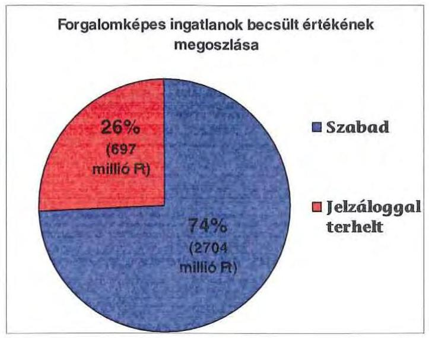

A vizsgált időszakban nem történt meg annak felmérése, hogy az elhasználódott, amortizálódott eszközök pótlása milyen kötelezettséget jelent az Önkormányzat számára. A felújításokra, az eszközök pótlására az Önkormányzat pénzügyi lehetőségének a függvényében, elsősorban az intézmények működőképességének biztosítása, illetve a szakhatósági előírások figyelembevételével került sor.

Az Önkormányzat a 2007-2010. években a tárgyi eszközök után 236,1 millió Ft összegű értékcsökkenést számolt el. Felújításra az elszámolt értékcsökkenés 171%-át, 404 millió Ft fordítottak. A Közgyűlés a Kórház vagyonkezelésében lévő önkormányzati tulajdonú eszközök 2010. január 1. - 2010. december 31. közötti időszakra elszámolt értékcsökkenéséből elengedett 53 millió Ft kezelt vagyonnal összefüggő hosszú lejáratú kötelezettséget, mivel a Kórház a veszteséges gazdálkodás során nem tudta biztosítani a vagyonkezelésbe vett eszközök értékcsökkenésének pótlását vagy tartalékba helyezését. Az elhasználódott eszközök pótlására az Önkormányzat tartalékot nem képzett, külön alapot nem hozott létre.

Az Önkormányzat a 2007. december 31-én a Magyar-Angol Tannyelvű Gimnázium és Kollégium, Balatonalmádi részére 1390 ezer Ft és a Kisfaludy Sándor Gimnázium Szakképző Iskola, Kollégium és Alapfokú Művészetoktatási Intézmény, Sümeg részére 163 ezer Ft működési célú támogatási kölcsönt nyújtott kötelező feladataink ellátása érdekében, a tervezett bevételek elmaradása miatt. Az egyszeri kölcsön visszafizetésének fedezeteként a 2008. évi költségvetést, vagy a 2007. évi pénzmaradványt jelölte meg az Önkormányzat. A kölcsönt a Magyar-Angol Tannyelvű Gimnázium és Kollégium 2008. május 16-án, a Kisfaludy Sándor Gimnázium Szakképző Iskola, Kollégium és Alapfokú Művészetoktatási Intézmény 2008. július 14-én visszafizette.

A Veszprém Megyei Pedagógiai Intézet és Egységes Pedagógiai Szakszolgálat a 2006. évben elnyerte a HEFOP 3.1.4. „Kulcs a holnaphoz" a kompetencia alapú oktatás elterjesztése Veszprém Megyében című pályázatot. A pályázat utófinanszírozású, ezért az intézmény 2007. évben 2144 ezer Ft önkormányzati kölcsönben részesült. A pályázati támogatási összeg az Intézmény költségvetésében a 2008. évben került biztosításra, mellyel párhuzamosan nyílt lehetőség a kölcsön 2008. június 26-i visszafizetésére.

A Közgyűlés ${ }^{38}$, mint a Kórház tulajdonosa a kötelező feladatellátáshoz kapcsolódóan 103 millió forint tulajdonosi hitelt (tagi kölcsönt) nyújtott a „Veszprém Megye fejlődéséért" kötvény bevétele terhére, izotópdiagnosztikai eszközbeszerzés céljából, valamint 42 millió forint tulajdonosi hitelt (tagi kölcsönt) nyújtott ${ }^{39}$: szintén a „Veszprém Megye fejlődéséért" kötvény bevétele terhére, ultrahang készülék, gastroenterológiai endoszkóp és szemészeti fundus kamera beszerzésére céljából. A tagi kölcsönök törlesztését 5 évben, évente két alkalommal, egyenlő részletben állapították meg, valamint 6 havi LIBOR + 2,8% kamatfelár mértékű kamatfizetési kötelezettséget írtak elő. A törlesztés kezdő időpontját 2010. február 28-án határozták meg. A Közgyűlés határozatában úgy döntött, hogy amennyiben a pénzpiaci feltételek változnak, az Önkormányzat kezdeményezi a Kórház felé a tagi kölcsönök visszafizetési feltételeinek a módosítását. Az
 Önkormányzat által a tulajdonosi hitelszerződés alapján kiszámlázott - Kórház által pénzügyileg teljesített - kamatbevétele 2011. március 31-ig 6,1 millió Ft volt.

Az Önkormányzat Közgyűlése ${ }^{40}$ a helyszíni vizsgálat alatt újabb tagi kölcsön (tulajdonosi hitel) nyújtásáról döntött a Kórház részére. A 120 millió forint tulajdonosi hitelt a „Veszprém Megye fejlődéséért" kötvény bevétele terhére. A tagi kölcsönök törlesztését 15 évben, évente két alkalommal, egyenlő részletben állapították meg, valamint 6 havi LIBOR + 3,2% kamatfelár mértékű kamatfizetési kötelezettséget írtak elő. A törlesztés kezdő időpontját 2012. február 28-án határozták meg.

# 4. A PÉNZÜGYI EGYENSÚLY MEGTEREMTÉSE ÉRDEKÉBEN HOZOTT INTÉZKEDÉSEK 

A 2007-2010. években végrehajtott kiadáscsökkentő és bevételnövelő intézkedések a feladatellátás racionalizálását, szakmai színvonalának emelését, valamint az Önkormányzat pénzügyi helyzetének javítását célozták. A legjelentősebb mértékű kiadási megtakarítást az álláshelycsökkentésekkel érték el, emellett sikerült megőrizniük az intézmények gazdálkodásának stabilitását.

A 2007. évben végrehajtott intézkedések következtében március 1-jétől megszűnt az Önkormányzat Közigazgatási Informatikai Szolgáltató Irodája, április 1-jétől jogutódlással megszüntették a Kórház dobai telephelyét, május 1-jétől 6 múzeumi kiállítóhelyet átadtak a települési önkormányzatoknak, július 1-jétől 13 önállóan gazdálkodó intézmény gazdálkodási jogkörét részben önállóvá módosították, július 31-jétől jogutódlással megszüntetésre került a gici Sztehlo Gábor Általános Iskola, Készségfejlesztő Speciális Szakiskola, Kollégium és Gyermekotthon.

[^0]
[^0]:    ${ }^{38}$ A Közgyűlés 28/2009. (III.26.) MÖk határozata.
    ${ }^{39}$ A Közgyűlés 109/2009. (IX.17.) MÖk határozata alapján.
    ${ }^{40}$ A Közgyűlés 73/2011. (IV.28.) MÖk határozata alapján

---

Az intézmények megszüntetése, átszervezése, illetve átadása az intézményi kiadásoknál - éves szintre számolva - 779 millió Ft megtakarítást jelentett, ugyanakkor a települési önkormányzatoktól átvett oktatási feladatok és intézmények működtetése miatt az intézményi körben 85 millió Ft többletkiadás is jelentkezett. Az intézményi gazdálkodási feladatok átvétele a Hivatalnál 36 millió Ft kiadásnövekedést vont maga után.

Az Önkormányzat a 2008. évben február 29-i hatállyal jogutóddal megszüntette a Kabóca Bábszínházat. Április 1-től az egészségügyi szakellátási feladatokat nonprofit gazdasági társaság látja el. Az Önkormányzat június 15-i hatállyal megalapította a Tapolca környéki intézményei gazdasági irodája költségvetési szervet, és ezzel egyidőben további önálló gazdálkodási jogkörrel rendelkező intézményeket soroltak át részben önállóan gazdálkodó intézményekké, melyek gazdálkodási feladatainak ellátásával az újonnan alapított költségvetési szervet, illetve a Hivatalt bízták meg.

Az ajkai Bercsényi Miklós Szakközépiskola, Szakiskola és Kollégium 2008. augusztus 15-i hatállyal történő megszüntetésére vonatkozó döntést az Önkormányzat a korábbi fenntartó által kezdeményezett peres eljárást lezáró bírósági döntés alapján 2009. március hónapban hatályon kívül helyezte, és az intézményt a továbbiakban önálló gazdálkodási jogkörrel rendelkező költségvetési szervként működtette. Az intézményi kiadások csökkentését célzó intézkedések hatásaként az intézmények 2008. évi működési célú kiadásaiban 60 millió Ft megtakarítás volt kimutatható.

A 2008. évben létrehozott Veszprém Megyei Fűtés- és Melegvíz Szolgáltató Nonprofit Kft. által leszámlázott szolgáltatási díjakat az Önkormányzat költségvetésében központilag kezelt kiadások között számolják el, és azokat az Önkormányzat továbbszámlázza az érintett intézményeknek. Az Önkormányzat többségi tulajdonában lévő Kft. működésének eredményességét, tevékenységének az érintett intézmények fűtési célú kiadásaira gyakorolt hatását nem értékelték, a költségcsökkenést nem mutatták ki.

A 2009. évben az Önkormányzat a Csecsemő és Fogyatékos Személyek Otthona csecsemőotthoni részlegét a Veszprém Megyei Területi Szakszolgálat intézményhez integrálta. A kamondi Dr. Magyar Károly Pszichiátriai Betegek Otthona beolvadt a dákai Batthyány Ilona Fogyatékos Személyek, Pszichiátriai és Szenvedélybetegek Integrált Intézményébe. A feladatok átszervezése és az azzal járó létszámcsökkentés hatásaként 142 millió Ft kiadási megtakarítást mutattak ki.

A 2010. évben január 31-i hatállyal a Veszprém Megyei Lakásotthonok Igazgatósága beolvadt a Veszprém Megyei Gyermekvédelmi Központba, február 28-i hatállyal a Veszprém Megyei Közművelődési Intézetet az Eötvös Károly Megyei Könyvtár szervezetébe integrálták, továbbá március 31-én megszüntetésre került a Veszprém Megyei Testnevelési és Sporthivatal, valamint május 31-én a Veszprém Megyei Önkormányzat Turisztikai Hivatala. Az utóbbi két megszüntetett intézmény feladatait a hivatal vette át. Az intézményi feladatok megszüntetésével, átszervezésével kapcsolatosan 183 millió Ft megtakarítást mutattak ki.

---

A 2007-2010. években végrehajtott kiadáscsökkentő intézkedések hatásaként összesen 2249 millió Ft megtakarítás volt kimutatható.

Az intézményi feladatok racionalizálásáról, átszervezéséről a Közgyűlés döntött. Az ezekhez készített előterjesztésekben a tervezett intézkedések indokait, várható eredményeit bemutatták. Az intézményi integráció, átszervezés végrehajtásához kikérték a szakmai szervezetek véleményét, a jogszabályban előírt egyeztetéseket lefolytatták.

Az Önkormányzat által finanszírozott intézmények pénzellátását, gazdálkodását a 2007. évtől fokozatosan bevezetett kiskincstári rendszer biztosította. A gazdálkodási feladatok szervezeti kereteinek átalakítása során 30 fős létszámcsökkentésre került sor. A kincstári típusú rendszer működtetésével, az egységes, integrált számítógépes program alkalmazásával a fenntartó naprakész és pontos információkkal rendelkezik az intézményei gazdálkodásáról, és lehetősége van az indokolatlan kifizetések megakadályozására, illetve a likviditás biztosítása érdekében azonnali intézkedések megtételére. A kincstári rendszer működtetésének pénzügyi kihatását, az elért megtakarításokat átfogóan nem értékelték.

A központosított beszerzések eredményeként a 2007-2010. években az intézmények gáz, villamos energia, üzemanyag felhasználásával, távközlési szolgáltatás igénybevételével és karbantartási feladataival kapcsolatos kiadásoknál összesen 592 millió Ft megtakarítás volt kimutatható.

A Közgyűlés a 108/2010. (V. 27.) és 154/2010. (VIII. 5.) számú határozataival az Önkormányzat likviditási helyzetének javítását célzó intézkedések megtételéről rendelkezett. Az önként vállalt feladatok csökkentése 151 millió Ft, a civil szervezetek támogatásainak csökkentése 37 millió Ft, a cafetéria juttatások csökkentése az intézményeknél 167 millió Ft megtakarítást eredményezett. Az intézményeknél a 30 üres álláshely zárolásával 30 millió Ft megtakarítást értek el, a hivatal működési célú kiadásainál (bér, járulékok, dologi) 15 millió Ft összegű előirányzatot zároltak.

A 2007-2010. években végrehajtott kiadáscsökkentő intézkedések kimutatott hatása együttesen 2249 millió Ft, melyből 1261 millió Ft (56%) a létszámcsökkentésekhez kapcsolódott.

A 2007-2010. évek kiadáscsökkentő intézkedéseinek hatását beavatkozási területenként az alábbiak részletezik:
ezer Ft-ban

| Az érvényesített kiadás-   csökkentés területei | Személyi   juttatások és   járulékai | Dologi, mű-   ködési ki-   adások | Pénzeszköz   átadások,   támogatások | Összesen |
| :-- | :--: | :--: | :--: | :--: |
| A Közgyűlés működése |  | 22252 | 165072 | 187324 |
| A Hivatalnál | 108040 | 2000 |  | 110040 |
| Az intézményeknél | 1309207 | 642161 |  | 1951368 |
| ÖSSZESEN | 1417247 | 666413 | 165072 | 2248732 |

Az önkormányzati szinten kimutatott megtakarítási intézkedésekből 1951 millió Ft (86,8%) az intézményeket érintette. Ezen belül 1309 millió Ft (67,1%) megtakarítás a személyi juttatásoknál és a járulékoknál realizálódott.

---

A létszámcsökkentéssel érintett költségvetési szervek száma 2007-2010 között évente 40, 20, 16, illetve 30 volt, és ezen időszakban az Önkormányzatnál foglalkoztatottak átlaglétszáma - az intézményátadások, -átvételek és a létszámcsökkentések együttes hatására - 4625 főről 2942 főre csökkent. A megszüntetett álláshelyek száma 2353 volt, mely tartalmazta a más önkormányzat fenntartásába adott intézmények és a nonprofit gazdasági társasággá alakított megyei kórház dolgozóinak létszámát is (összesen 2001 fő). Kiadási megtakarítás céljából 352 fős létszámcsökkentést hajtottak végre. A Kórház gazdasági társasággá történt átalakításával 1595 álláshely szűnt meg az Önkormányzatnál.

A létszámcsökkentési döntések meghozatalakor a Közgyűlés nem rendelkezett arról, hogy az intézkedés az adott intézménynél mennyi szakmai és mennyi nem szakmai (intézmény-üzemeltetéssel kapcsolatos) álláshelyet érint, és ilyen adatszolgáltatásra a létszámcsökkentési döntések végrehajtását követően sem kötelezték az intézményeket.

A 2007-2010. években végrehajtott létszámcsökkenés eredményét az alábbi grafikon szemlélteti:
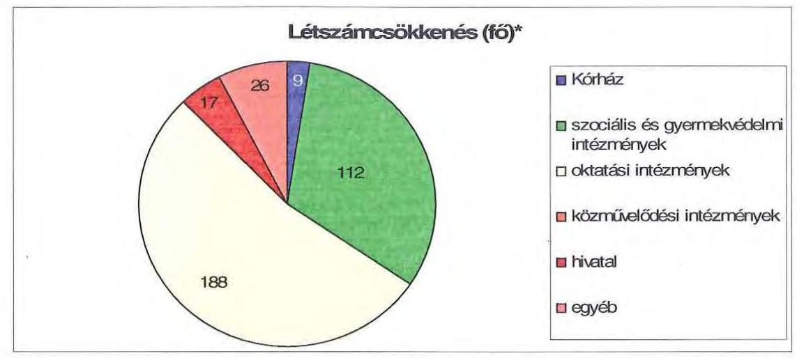

* Intézményátadás-, átszervezés hatása nélkül

A helyi szervezési intézkedések végrehajtásához az Önkormányzat az áttekintett időszak alatt 322 millió Ft központi költségvetési támogatásban részesült, amelynek felhasználásával 248 fő álláshelyet tartósan leépített. A további álláshelycsökkenésekhez központi támogatás nem kapcsolódott (üres álláshelyek megszüntetése, más fenntartónál, illetve gazdasági társaságnál történő továbbfoglalkoztatás miatt.)

Az Önkormányzatnál 2011. első negyedévében folytatódott a feladatok átszervezése és a kiadási megtakarítást célzó intézkedések megtétele. Az önkormányzati hivatalnál 9 fős, az intézményeknél összesen 57 fős létszámcsökkentést rendeltek el. A Közgyűlés a 2011. február 24-i ülésén döntött a szociális feladatokat ellátó intézményrendszere átalakításáról, a feladatellátás racionalizálásával a jelenlegi 9 intézményt július 1-től 2 egyesített intézménybe integrálják. A Veszprém Megyei Gyermekközpontban 2 lakásotthon megszüntetésének előkészítéséről döntött a Közgyűlés. 2011. július 1-jei hatállyal megszüntetésre kerül az Önkormányzat Tapolca környéki intézményei gazdasági

---

irodája megnevezésű költségvetési szerv, melynek feladatait a Hivatal veszi át. Az álláshelycsökkentések végrehajtásával 43 millió Ft kiadási megtakarítást irányoztak elő, az intézményi átalakítások, megszüntetések várható eredményét nem számszerűsítették.

A kiadáscsökkentő intézkedések mellett az Önkormányzat az alábbiakban számszerűsített bevételnövelő intézkedéseket tette:
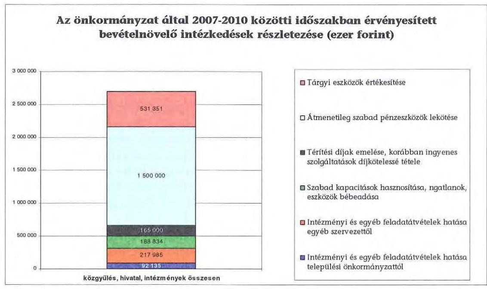

A bevételnövelésre irányuló intézkedések számszerűsített összege 2695 millió Ft volt, melyből a Balatontourist Rt. értékesítéséből, valamint a kötvénykibocsátásból származó bevétel 2008-2010. évi lekötése, befektetése eredményeként realizált - 1500 millió Ft összegű - hozam, illetve kamatbevétel 55,7%-ot tett ki. A Balatontourist Rt. 4040 millió Ft vételárából a 2005-2006. években befolyt 2040 millió Ft bevételből 2007. január 1-jéig felhasználás nem történt. A vételár fennmaradó részét a vevő a 2007. évben fizette meg az Önkormányzatnak.

A települési önkormányzatoktól az intézmények működtetéséhez átvett, valamint az intézmények által különböző szervezetektől - pályázatok útján, illetve megállapodások alapján - átvett pénzeszközök a bevételi többletből 310 millió Ft-tal, 11,5%-kal részesedtek. Az intézményi ingatlanok bérbeadásából, az ellátásokért fizetendő térítési díjak emeléséből, valamint a tárgyi eszközök értékesítéséből 885 millió Ft (32,8%) bevételi többlet származott.

Az Önkormányzat a 2011. évi költségvetési rendeletben tárgyi eszközök (ingatlanok, gépjármű) értékesítéséből - eredeti előirányzatként - 282 millió Ft felhalmozási célú bevételt tervezett, melynek realizálása az ingatlanok esetében bizonytalan.

A Közgyűlés a 14/2011. (II. 24.) határozatában felhatalmazta a Közgyűlés elnökét arra, hogy tárgyalásokat folytasson a települési önkormányzatok vezetőivel az átvett feladatokhoz történő hozzájárulás mértékéről, de annak konkrét összegéről nem rendelkezett. Az Önkormányzat álláspontja szerint a 2011. évi

---

költségvetés hiányának csökkentése érdekében szükséges az, hogy a települési önkormányzatok legalább az Önkormányzat saját forrásaiból nyújtott intézményi támogatás 35%-ának mértékéig részt vállaljanak az intézmények finanszírozásában, a feladat helyben történő ellátása érdekében.

# 5. A HELYI ÖNKORMÁNYZATOK GAZDÁLKODÁSI RENDSZERÉNEK 2007. ÉVI ELLENŐRZÉSE SORÁN A PÉNZÜGYI EGYENSÚLY JAVÍTÁSÁRA TETT SZABÁLYSZERŰSÉGI ÉS CÉLSZERŰSÉGI JAVASLATOK HASZNOSULÁSA 

Az Önkormányzat gazdálkodási rendszerének 2009. évi ellenőrzéséről készített jelentésben az ÁSZ kettő célszerűségi javaslatot tett. A jelentést a Közgyűlés megismerte, határozatával elfogadta.

A pénzügyi egyensúly javítására egy célszerűségi javaslat vonatkozott. Javasoltuk a főjegyzőnek: „tájékoztassa - évente végzett számítások alapján - a Közgyűlést az Önkormányzat eladósodásának növekedésére figyelemmel arról, hogy a hosszú lejáratú, adósságot keletkeztető kötelezettségvállalásokból adódó tőke és kamatfizetési kötelezettségét az Önkormányzat milyen feltételek biztosítása mellett tudja teljesíteni". A Közgyűlés határozatában határidőként a költségvetés benyújtásának időpontját írta elő, felelősként a főjegyzőt megjelölve.

A tájékoztató 2010. évben az előírt határidőre elkészült, ugyanakkor a 2011. évi költségvetés előterjesztésekor a tájékoztatás elmaradt.

A számvevői jelentésnek a pénzügyi egyensúly javítására kettő szabályszerűségi javaslata volt. Javasoltuk a
 főjegyzőnek: „gondoskodjon arról, hogy az Áht. 8/A. § (7) bekezdésében foglalt előírásoknak megfelelően a költségvetési rendelettervezetekben a költségvetési bevételek főösszegének megállapításakor finanszírozási célú pénzügyi bevételeket ne vegyenek figyelembe költségvetési hiányt módosító bevételként, valamint arról, hogy a költségvetési rendelet az Áht. 118. § (1) bekezdés 2. b) pontjában, valamint az Ámr. 29. § (1) bekezdés g) pontjában előírtaknak megfelelően tartalmazza a többéves kihatással járó döntések számszerűsítését évenkénti bontásban, a többéves kihatással járó európai uniós támogatások igénybevételével megvalósuló feladatok előirányzatait éves bontásban".

A költségvetési többletet, vagy hiányt módosító finanszírozási célú bevételek és kiadások és a több éves kihatással járó döntések bemutatása érdekében a Közgyűlés a 22/2009. (IX. 24.) számú rendeletével módosította az Önkormányzat költségvetési és zárszámadási rendeletei egyes mellékletei tartalmának meghatározásáról szóló 10/2005. (IX. 16.) számú rendeletét.

Budapest, 2011. december „
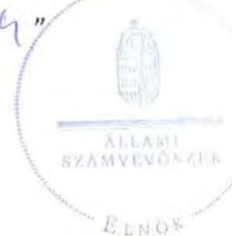

Domokos László

Melléklet: $\quad 7 \mathrm{db} \quad 22$ lap

---

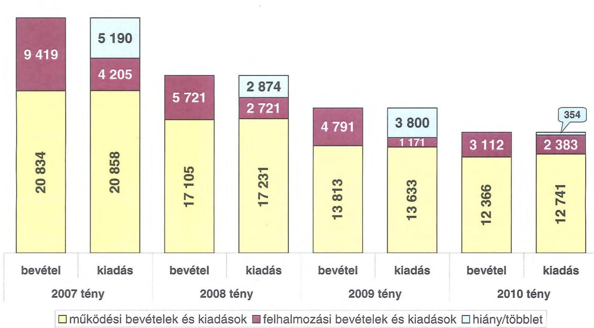

# Működési és felhalmozási célú hiány/többlet alakulása (ezer Ft)

|  Fejlesztés | 2007 tény | 2008 tény | 2009 tény | 2010 tény  |
| --- | --- | --- | --- | --- |
|  Fejlesztés | 9 419 | 5 190 | 4 205 | 3 869  |
|  Fejlesztés | 5 190 | 5 721 | 2 874 | 3 112  |
|  Hozás | 4 205 | 5 721 | 2 874 | 3 112  |
|  Személy | 4 205 | 5 721 | 2 874 | 3 112  |
|  Hozás | 4 205 | 5 721 | 2 874 | 3 112  |
|  Személy | 4 205 | 5 721 | 2 874 | 3 112  |
|  Hozás | 4 205 | 5 721 | 2 874 | 3 112  |
|  Személy | 4 205 | 5 721 | 2 874 | 3 112  |
|  Hozás | 4 205 | 5 721 | 2 874 | 3 112  |
|  Személy | 4 205 | 5 721 | 2 874 | 3 112  |
|  Hozás | 4 205 | 5 721 | 2 874 | 3 112  |
|  Személy | 4 205 | 5 721 | 2 874 | 3 112  |
|  Hozás | 4 205 | 5 721 | 2 874 | 3 112  |
|  Személy | 4 205 | 5 721 | 2 874 | 3 112  |
|  Hozás | 4 205 | 5 721 | 2 874 | 3 112  |
|  Személy | 4 205 | 5 721 | 2 874 | 3 112  |
|  Hozás | 4 205 | 5 721 | 2 874 | 3 112  |
|  Személy | 4 205 | 5 721 | 2 874 | 3 112  |
|  Hozás | 4 205 | 5 721 | 2 874 | 3 112  |
|  Személy | 4 205 | 5 721 | 2 874 | 3 112  |
|  Hozás | 4 205 | 5 721 | 2 874 | 3 112  |
|  Személy | 4 205 | 5 721 | 2 874 | 3 112  |
|  Hozás | 4 205 | 5 721 | 2 874 | 3 112  |
|  Személy | 4 205 | 5 721 | 2 874 | 3 112  |
|  Hozás | 4 205 | 5 721 | 2 874 | 3 112  |
|  Személy | 4 205 | 5 721 | 2 874 | 3 112  |
|  Hozás | 4 205 | 5 721 | 2 874 | 3 112  |
|  Személy | 4 205 | 5 721 | 2 874 | 3 112  |
|  Hozás | 4 205 | 5 721 | 2 874 | 3 112  |
|  Személy | 4 205 | 5 721 | 2 874 | 3 112  |
|  Hozás | 4 205 | 5 721 | 2 874 | 3 112  |
|  Személy | 4 205 | 5 721 | 2 874 | 3 112  |
|  Hozás | 4 205 | 5 721 | 2 874 | 3 112  |
|  Személy | 4 205 | 5 721 | 2 874 | 3 112  |
|  Hozás | 4 205 | 5 721 | 2 874 | 3 112  |
|  Személy | 4 205 | 5 721 | 2 874 | 3 112  |
|  Hozás | 4 205 | 5 721 | 2 874 | 3 112  |
|  Személy | 4 205 | 5 721 | 2 874 | 3 112  |
|  Hozás | 4 205 | 5 721 | 2 874 | 3 112  |
|  Személy | 4 205 | 5 721 | 2 874 | 3 112  |
|  Hozás | 4 205 | 5 721 | 2 874 | 3 112  |
|  Személy | 4 205 | 5 721 | 2 874 | 3 112  |
|  Hozás | 4 205 | 5 721 | 2 874 | 3 112  |
|  Személy | 4 205 | 5 721 | 2 874 | 3 112  |
|  Hozás | 4 205 | 5 721 | 2 874 | 3 112  |
|  Személy | 4 205 | 5 721 | 2 874 | 3 112  |
|  Hozás | 4 205 | 5 721 | 2 874 | 3 112  |
|  Személy | 4 205 | 5 721 | 2 874 | 3 112  |
|  Hozás | 4 205 | 5 721 | 2 874 | 3 112  |
|  Személy | 4 205 | 5 721 | 2 874 | 3 112  |
|  Hozás | 4 205 | 5 721 | 2 874 | 3 112  |
|  Személy | 4 205 | 5 721 | 2 874 | 3 112  |
|  Hozás | 4 205 | 5 721 | 2 874 | 3 112  |
|  Személy | 4 205 | 5 721 | 2 874 | 3 112  |
|  Hozás | 4 205 | 5 721 | 2 874 | 3 112  |
|  Személy | 4 205 | 5 721 | 2 874 | 3 112  |
|  Hozás | 4 205 | 5 721 | 2 874 | 3 112  |
|  Személy | 4 205 | 5 721 | 2 874 | 3 112  |
|  Hozás | 4 205 | 5 721 | 2 874 | 3 112  |
|  Személy | 4 205 | 5 721 | 2 874 | 3 112  |
|  Hozás | 4 205 | 5 721 | 2 874 | 3 112  |
|  Személy | 4 205 | 5 721 | 2 874 | 3 112  |
|  Hozás | 4 205 | 5 721 | 2 874 | 3 112  |
|  Személy | 4 205 | 5 721 | 2 874 | 3 112  |

 | 2 874 | 3 112  |
|  Hozás | 4 205 | 5 721 | 2 874 | 3 112  |
|  Személy | 4 205 | 5 721 | 2 874 | 3 112  |
|  Hozás | 4 205 | 5 721 | 2 874 | 3 112  |
|  Személy | 4 205 | 5 721 | 2 874 | 3 112  |
|  Hozás | 4 205 | 5 721 | 2 874 | 3 112  |
|  Személy | 4 205 | 5 721 | 2 874 | 3 112  |
|  Hozás | 4 205 | 5 721 | 2 874 | 3 112  |
|  Személy | 4 205 | 5 721 | 2 874 | 3 112  |
|  Hozás | 4 205 | 5 721 | 2 874 | 3 112  |
|  Személy | 4 205 | 5 721 | 2 874 | 3 112  |
|  Hozás | 4 205 | 5 721 | 2 874 | 3 112  |
|  Személy | 4 205 | 5 721 | 2 874 | 3 112  |
|  Hozás | 4 205 | 5 721 | 2 874 | 3 112  |
|  Személy | 4 205 | 5 721 | 2 874 | 3 112  |
|  Hozás | 4 205 | 5 721 | 2 874 | 3 112  |
|  Személy | 4 205 | 5 721 | 2 874 | 3 112  |
|  Hozás | 4 205 | 5 721 | 2 874 | 3 112  |
|  Személy | 4 205 | 5 721 | 2 874 | 3 112  |
|  Hozás | 4 205 | 5 721 | 2 874 | 3 112  |
|  Személy | 4 205 | 5 721 | 2 874 | 3 112  |
|  Hozás | 4 205 | 5 721 | 2 874 | 3 112  |
|  Személy | 4 205 | 5 721 | 2 874 | 3 112  |
|  Hozás | 4 205 | 5 721 | 2 874 | 3 112  |
|  Személy | 4 205 | 5 721 | 2 874 | 3 112  |
|  Hozás | 4 205 | 5 721 | 2 874 | 3 112  |
|  Személy | 4 205 | 5 721 | 2 874 | 3 112  |
|  Hozás | 4 205 | 5 721 | 2 874 | 3 112  |
|  Személy | 4 205 | 5 721 | 2 874 | 3 112  |
|  Hozás | 4 205 | 5 721 | 2 874 | 3 112  |
|  Személy | 4 205 | 5 721 | 2 874 | 3 112  |
|  Hozás | 4 205 | 5 721 | 2 874 | 3 112  |
|  Személy | 4 205 | 5 721 | 2 874 | 3 112  |
|  Hozás | 4 205 | 5 721 | 2 874 | 3 112  |
|  Személy | 4 205 | 5 721 | 2 874 | 3 112  |
|  Hozás | 4 205 | 5 721 | 2 874 | 3 112  |
|  Személy | 4 205 | 5 721 | 2 874 | 3 112  |
|  Hozás | 4 205 | 5 721 | 2 874 | 3 112  |
|  Személy | 4 205 | 5 721 | 2 874 | 3 112  |
|  Hozás | 4 205 | 5 721 | 2 874 | 3 112  |
|  Személy | 4 205 | 5 721 | 2 874 | 3 112  |
|  Hozás | 4 205 | 5 721 | 2 874 | 3 112  |
|  Személy | 4 205 | 5 721 | 2 874 | 3 112  |
|  Hozás | 4 205 | 5 721 | 2 874 | 3 112  |
|  Személy | 4 205 | 5 721 | 2 874 | 3 112  |
|  Hozás | 4 205 | 5 721 | 2 874 | 3 112  |
|  Személy | 4 205 | 5 721 | 2 874 | 3 112  |
|  Hozás | 4 205 | 5 721 | 2 874 | 3 112  |
|  Személy | 4 205 | 5 721 | 2 874 | 3 112  |
|  Hozás | 4 205 | 5 721 | 2 874 | 3 112  |
|  Személy | 4 205 | 5 721 | 2 874 | 3 112  |
|  Hozás | 4 205 | 5 721 | 2 874 | 3 112  |
|  Személy | 4 205 | 5 721 | 2 874 | 3 112  |
|  Hozás | 4 205 | 5 721 | 2 874 | 3 112  |
|  Személy | 4 205 | 5 721 | 2 874 | 3 112  |
|  Hozás | 4 205 | 5 721 | 2 874 | 3 112  |
|  Személy | 4 205 | 5 721 | 2 874 | 3 112  |
|  Hozás | 4 205 | 5 721 | 2 874 | 3 112  |
|  Személy | 4 205 | 5 721 | 2 874 | 3 112  |
|  Hozás | 4 205 | 5 721 | 2 874 | 3 112  |
|  Személy | 4 205 | 5 721 | 2 874 | 3 112  |
|  Hozás | 4 205 | 5 721 | 2 874 | 3 112  |
|  Személy | 4 205 | 5 721 | 2 874 | 3 112  |
|  Hozás | 4 205 | 5 721 | 2 874 | 3 112  |
|  Személy | 4 205 | 5 721 | 2 874 | 3 112  |
|  Hozás | 4 205 | 5 721 | 2 874 | 3 112  |
|  Személy | 4 205 | 5 721 | 2 874 | 3 112  |
|  Hozás | 4 205 | 5 721 | 2 874 | 3 112  |
|  Személy | 4 205 | 5 721 | 2 874 | 3 112  |
|  Hozás | 4 205 | 5 721 | 2 874 | 3 112  |
|  Személy | 4 205 | 5 721 | 2 874 | 3 112  |
|  Hozás | 4 205 | 5 721 | 2 874 | 3 112  |
|  Személy | 4 205 | 5 721 | 2 874 | 3 112  |
|  Hozás | 4 205 | 5 721 | 2 874 | 3 112  |
|  Személy | 4 205 | 5 721 | 2 874 | 3 112  |
|  Hozás | 4 205 | 5 721 | 2 874 | 3 112  |
|  Személy | 4 205 | 5 721 | 2 874 | 3 112  |
|  Hozás | 4 205 | 5 721 | 2 874 | 3 112  |
|  Személy | 4 205 | 5 721

 | 2 874 | 3 112  |
|  Hozás | 4 205 | 5 721 | 2 874 | 3 112  |
|  Személy | 4 205 | 5 721 | 2 874 | 3 112  |
|  Hozás | 4 205 | 5 721 | 2 874 | 3 112  |
|  Személy | 4 205 | 5 721 | 2 874 | 3 112  |
|  Hozás | 4 205 | 5 721 | 2 874 | 3 112  |
|  Személy | 4 205 | 5 721 | 2 874 | 3 112  |
|  Hozás | 4 205 | 5 721 | 2 874 | 3 112  |
|  Személy | 4 205 | 5 721 | 2 874 | 3 112  |
|  Hozás | 4 205 | 5 721 | 2 874 | 3 112  |
|  Személy | 4 205 | 5 721 | 2 874 | 3 112  |
|  Hozás | 4 205 | 5 721 | 2 874 | 3 112  |
|  Személy | 4 205 | 5 721 | 2 874 | 3 112  |
|  Hozás | 4 205 | 5 721 | 2 874 | 3 112  |
|  Személy | 4 205 | 5 721 | 2 874 | 3 112  |
|  Hozás | 4 205 | 5 721 | 2 874 | 3 112  |
|  Személy | 4 205 | 5 721 | 2 874 | 3 112  |
|  Hozás | 4 205 | 5 721 | 2 874 | 3 112  |
|  Személy | 4 205 | 5 721 | 2 874 | 3 112  |
|  Hozás | 4 205 | 5 721 | 2 874 | 3 112  |
|  Személy | 4 205 | 5 721 | 2 874 | 3 112  |
|  Hozás | 4 205 | 5 721 | 2 874 | 3 112  |
|  Személy | 4 205 | 5 721 | 2 874 | 3 112  |
|  Hozás | 4 205 | 5 721 | 2 874 | 3 112  |
|  Személy | 4 205 | 5 721 | 2 874 | 3 112  |
|  Hozás | 4 205 | 5 721 | 2 874 | 3 112  |
|  Személy | 4 205 | 5 721 | 2 874 | 3 112  |
|  Hozás | 4 205 | 5 721 | 2 874 | 3 112  |
|  Személy | 4 205 | 5 721 | 2 874 | 3 112  |
|  Hozás | 4 205 | 5 721 | 2 874 | 3 112  |
|  Személy | 4 205 | 5 721 | 2 874 | 3 112  |
|  Hozás | 4 205 | 5 721 | 2 874 | 3 112  |
|  Személy | 4 205 | 5 721 | 2 874 | 3 112  |
|  Hozás | 4 205 | 5 721 | 2 874 | 3 112  |
|  Személy | 4 205 | 5 721 | 2 874 | 3 112  |
|  Hozás | 4 205 | 5 721 | 2 874 | 3 112  |
|  Személy | 4 205 | 5 721 | 2 874 | 3 112  |
|  Hozás | 4 205 | 5 721 | 2 874 | 3 112  |
|  Személy | 4 205 | 5 721 | 2 874 | 3 112  |
|  Hozás | 4 205 | 5 721 | 2 874 | 3 112  |
|  Személy | 4 205 | 5 721 | 2 874 | 3 112  |
|  Hozás | 4 205 | 5 721 | 2 874 | 3 112  |
|  Személy | 4 205 | 5 721 | 2 874 | 3 112  |
|  Hozás | 4 205 | 5 721 | 2 874 | 3 112  |
|  Személy | 4 205 | 5 721 | 2 874 | 3 112  |
|  Hozás | 4 205 | 5 721 | 2 874 | 3 112  |
|  Személy | 4 205 | 5 721 | 2 874 | 3 112  |
|  Hozás | 4 205 | 5 721 | 2 874 | 3 112  |
|  Személy | 4 205 | 5 721 | 2 874 | 3 112  |
|  Hozás | 4 205 | 5 721 | 2 874 | 3 112  |
|  Személy | 4 205 | 5 721 | 2 874 | 3 112  |
|  Hozás | 4 205 | 5 721 | 2 874 | 3 112  |
|  Személy | 4 205 | 5 721 | 2 874 | 3 112  |
|  Személy | 4 205 | 5 721 | 2 874 | 3 112  |
|  Személy | 4 205 | 5 721 | 2 874 | 3 112  |
|  Személy | 4 205 | 5 721 | 2 874 | 3 112  |
|  Személy | 4 205 | 5 721 | 2 874 | 3 112  |
|  Személy | 4 205 | 5 721 | 2 874 | 3 112  |
|  Személy | 4 205 | 5 721 | 2 874 | 3 112  |
|  Személy | 4 205 | 5 721 | 2 874 | 3 112  |
|  Személy | 4 205 | 5 721 | 2 874 | 3 112  |
|  Személy | 4 205 | 5 721 | 2 874 | 3 112  |
|  Személy | 4 205 | 5 721 | 2 874 | 3 112  |
|  Személy | 4 205 | 5 721 | 2 874 | 3 112  |
|  Személy | 4 205 | 5 721 | 2 874 | 3 112  |
|  Személy | 4 205 | 5 721 | 2 874 | 3 112  |
|  Személy | 4 205 | 5 721 | 2 874 | 3 112  |
|  Személy | 4 205 | 5 721 | 2 874 | 3 112  |
|  Személy | 4 205 | 5 721 | 2 874 | 3 112  |
|  Személy | 4 205 | 5 721 | 2 874 | 3 112  |
|  Személy | 4 205 | 5 721

 | 2 874 | 3 112  |
|  Személy | 4 205 | 5 721 | 2 874 | 3 112  |
|  Személy | 4 205 | 5 721 | 2 874 | 3 112  |
|  Személy | 4 205 | 5 721 | 2 874 | 3 112  |
|  Személy | 4 205 | 5 721 | 2 874 | 3 112  |
|  Személy | 4 205 | 5 721 | 2 874 | 3 112  |
|  Személy | 4 205 | 5 721 | 2 874 | 3 112  |
|  Személy | 4 205 | 5 721 | 2 874 | 3 112  |
|  Személy | 4 205 | 5 721 | 2 874 | 3 112  |
|  Személy | 4 205 | 5 721 | 2 874 | 3 112  |

---

.

---

|  1. FOLYÓ KÖLTSÉGVETÉS* | 2007. | 2008. | 2009. | 2010.  |
| --- | --- | --- | --- | --- |
|  1.1.1. Saját működési bevételek | 2 859 423 | 5 281 180 | 4 489 780 | 5 767 248  |
|  1.1.2. Költségvetési támogatás | 2 847 642 | 7 588 484 | 8 253 983 | 5 661 864  |
|  1.1.3. Ánoszatarért bevételek | 1 766 987 | 839 084 | 851 892 | 873 098  |
|  1.1.4. Állandó tartásomból belülről kapott támogatások | 7 898 131 | 2 298 660 | 1 413 962 | 1 789 987  |
|  1.1.5. Elő-től és külföldről kapott bevételek | 1 753 | 2 880 | 54 186 | 934  |
|  1.1.6. Állandó tartásomból külről kapott bevételek | 27 974 | 59 286 | 53 707 | 110 032  |
|  1.1.7. Előző évi pénztárzáróna átvétel | 142 363 | 217 277 | 111 498 | 117 913  |
|  1.1. Főbevételek (1.1.1.+1.1.2.+1.1.3.+1.1.4.+1.1.5.+1.1.6.+1.1.7.) | 20 811 163 | 17 306 780 | 12 268 380 | 11 835 768  |
|  1.1.1. Működési kiadások kamatkiadások nélkül | 20 119 439 | 15 539 406 | 12 821 033 | 12 093 138  |
|  1.1.2. Állandó tartásomból belülre átadott pénztárzáró | 219 371 | 623 568 | 116 301 | 88 352  |
|  1.2.1.1. vállalkozásoknak | 12 609 | 970 | 0 | 100  |
|  1.2.1.2. Elő-szek, illetve külföldieknek | 0 | 209 | 0 | 0  |
|  1.2.2.1. magánintézményeknek | 264 376 | 340 439 | 348 741 | 393 421  |
|  1.2.2.4. állami szervezeteknek | 189 249 | 263 332 | 180 224 | 67 230  |
|  1.2.3. Transzferkiadások (1.2.3.1+1.2.3.2+1.2.3.3+1.2.3.4) | 206 322 | 905 261 | 529 373 | 463 852  |
|  1.2.4. Kamatkiadások | 18 943 | 149 084 | 164 435 | 107 132  |
|  1.2.5. Előző évi pénztárzáróna átvétel | 142 363 | 217 277 | 111 498 | 117 913  |
|  1.3. Folyó kiadások (1.1.1.+1.1.2.+1.1.3.+1.1.4.+1.2.5.) | 20 998 541 | 17 445 396 | 12 703 626 | 12 846 544  |
|  1.3. Folyó költségvetés egyenlege (MŰKÖDÉSI JÖVEDELEM) (1.1.–1.2.) | -184 258 | -238 616 | -517 340 | -1 010 770  |
|  2. FEJLESZTÉSI (BERUHÁZÁSI) KÖLTSÉGVETÉS** |  |  |  |   |
|  2.1.1. Saját kötelezettségeink | 2 494 876 | 75 686 | 87 950 | 391 800  |
|  2.1.2. Állandó tartásomból belülről kapott támogatások | 201 721 | 157 781 | 203 868 | 258 671  |
|  2.1.3. Elő-től és külföldről kapott támogatások | 0 | 0 | 148 262 | 30 068  |
|  2.1.4. Állandó tartásomból külről kapott támogatások | 159 911 | 216 302 | 182 508 | 111 030  |
|  2.1. Felhalmozási (beruházási) bevételek (2.1.1.+2.1.2.+2.1.3.+2.1.4.) | 2 856 507 | 446 669 | 624 496 | 871 477  |
|  2.1.1. Saját beruházási kiadások (élve) | 1 371 073 | 553 726 | 490 683 | 1 097 043  |
|  2.1.2. Saját felújítási kiadások (élve) | 65 137 | 160 987 | 159 244 | 104 166  |
|  2.1.3. Állandó tartásomból belülre átadott pénztárzáró | 357 261 | 166 009 | 305 673 | 159 064  |
|  2.1.4. Elő-szek és külföldnek adott pénztárzáró | 0 | 0 | 0 | 0  |
|  2.1.5. Állandó tartásomból külre adott pénztárzáró | 34 055 | 38 707 | 108 321 | 150 667  |
|  2.2.6. Befektetés célú részesedések vásárlása | 0 | 296 254 | 15 000 | 360 420  |
|  2.3. Felhalmozási (beruházási) kiadások (2.1.1.+2.1.2.+2.1.3.+2.1.4.+2.1.5.+2.2.6.) | 1 827 530 | 1 616 483 | 1 158 833 | 1 370 168  |
|  2.4. Beruházási költségvetés egyenlege (2.1.–2.2.) | 1 028 977 | -1 169 814 | -234 337 | -1 498 682  |
|  3. FINANSZÍROZÁSI MŰVELETEK NÉLKÜLI (GPS) POZÍCIÓ |  |  |  |   |
|  (1.3.) Folyó költségvetés egyenlege (működési jövedelem) + (2.3.) Beruházási költségvetés egyenlege | 844 719 | -1 388 430 | -1 051 677 | -2 589 458  |
|  4. FINANSZÍROZÁSI MŰVELETEK |  |  |  |   |
|  4.1. Hitel felvétel | 2 153 | 131 341 | 12 102 | 0  |
|  4.2. Hitel törlesztés | 0 | 6 087 | 12 754 | 24 930  |
|  4.3. Forgalmi és befektetési célú értékpapírok kibocsátása | 5 000 000 | 0 | 0 | 0  |
|  4.4. Forgalmi és befektetési célú értékpapírok bevétel | 0 | 0 | 0 | 0  |
|  4.5. Forgalmi és befektetési célú értékpapírok értékesítése | 0 | 0 | 2 209 993 | 0  |
|  4.6. Forgalmi és befektetési célú értékpapírok vásárlása | 1 682 316 | 1 100 003 | 0 | 0  |
|  4.7. Egyéb finanszírozási bevételek (függő, áthúzott, kiegészítők) | -138 213 | -83 131 | -175 563 | -306 390  |
|  4.8. Egyéb finanszírozási kiadások (függő, áthúzott, kiegészítők) | 12 696 | 25 354 | -34 210 | 50 630  |
|  4.9. Finanszírozási műveletek egyenlege (4.1.-4.8.) | 3 178 927 | -1 113 133 | 3 457 674 | -381 956  |
|  5. TÁRGYES POZÍCIÓ |  |  |  |   |
|  (3.) FINANSZÍROZÁSI MŰVELETEK NÉLKÜLI (GPS) POZÍCIÓ + (4.9.) Finanszírozási műveletek egyenlege | 4 023 646 | -2 421 667 | 2 405 997 | -2 891 418  |
|  6. NETTÓ MŰKÖDÉSI JÖVEDELEM |  |  |  |   |
|  (1.3.) Működési jövedelem + (4.3. Hitel törlesztés + 4.4. Forgalmi és befektetési célú értékpapírok bevétel) | -184 258 | -144 703 | -530 094 | -1 035 712  |
|  7. TÁJÉKOZTATÓ ADATOK |  |  |  |   |
|  Összes kötelezettség | 5 780 499 | 6 230 116 | 6 834 618 | 8 317 318  |
|  (ebből rövid lejáratú) | 713 913 | 135 715 | 342 285 | 737 401  |
|  Összes saját forrásból fedett kötelezettség | 709 553 | 115 643 | 163 001 | 337 854  |
|  (ebből lejáratú) | 0 | 0 | 0 | 150 299  |
|  Piros és felkapcsolt kötelezettség (adószámlák) | 5 867 706 | 6 117 155 | 6 268 572 | 7 108 309  |
|  (ebből rövid lejáratú) | 1 398 | 12 754 | 24 936 | 12 754  |
|  PPP szerződésből következő kötelezettségek állománya | 0 | 0 | 0 | 0  |
|  (ebből lejáratú) szolgáltatási díj mértékű kötelezettség | 0 | 0 | 0 | 0  |
|  Feltelvizsgálattól saját idegen állomány | 0 | 0 | 12 952 | 397 815  |
|  Előváltakod majd átlagos állomány | 0 | 0 | 0 | 0  |
|  Hirdetésbérként majd átlagos állomány | 0 | 0 | 0 | 4 614  |
|  Piros eljárásokból fennálló függő kötelezettségek | 0 | 0 | 0 | 0  |
|  Finanszírozásra bevonható eszközök összesen ( | 8 284 223 | 8 962 561 | 5 768 359 | 2 077 144  |
|  Tartós lekötött (nem megbízásból) értékpapírok | 0 | 0 | 0 | 0  |
|  Hosszú lejáratú kiadásabbak | 0 | 0 | 0 | 0  |
|  Értékpapírok | 2 499 997 | 2 599 999 | 0 | 0  |
|  Piros eszközök (idegen piros eszközök nélkül) | 5 784 235 | 3 361 562 | 5 768 359 | 2 877 144  |

- Bevételekben nem térít, a kiadásokban nem jelenik meg az ámuldozási, a vagyoni helyzetet az egyenleg befolyásolja. **Bevételekben vagyon megfizetett és hőveszteség fordítását összesítve.

Megjegyzés: A számítás leírása eltér az ÁSZ módszertanában fordított alkalmazott beosztástól. A jelen beosztás általános közgazdasági meggondolásokon alapul, amely nem élt az ÁSZ-módszertanban is. Folyó tételek alatt értjük azokat a kiadásokat és bevételeket, amelyek az egység vagyoni helyzetét automatikusan nem változtatják. Bevételi oldalon ilyenek az adók, a tényezőjövedelmek, transzferek, kiadási oldalon a transzferek és a szolgáltatás nyújtásával kapcsolatos működési kiadások. Felhalmozási, vagy tőke tételek módosítják a vagyon nagyságát. Privatizációs bevétel csökkenti a vagyoni, fizikai beruházás, vagy pénzügyi befektetés növeli.

A folyó költségvetés egyenlege (működési jövedelem) tartalmazza a kamatkiadásokat is, mind a működési, mind
 a fejlesztés kamatot, mert ezek közgazdasági tényezőjövedelmek. Nem tartalmazzák a pénzforgalmi bevételek és kiadások a követelés elengedés miatt könyvelt bevételi és kiadási pénzforgalmi tételeket, mivel ezek egymást kiegyenlítik és valójában technikai elszámolási műveletek. Így indokoltan nem válaszolják a költségvetési év kiadási és bevételi adatait, hiszen valójában a bevétel nem realizálódott, és a költségvetési évben kiadás nem történt, csak elengedtük a követelést.

A nettó működési jövedelmet a tőketartalék levonásával a folyó költségvetés egyenlegéből (működési jövedelemből) számoljuk. Transzfer kiadásoknak nevezzük azokat a folyó és felhalmozási tételeket, amelyeket nem az adott önkormányzat használ fel szolgáltatásainak ellátására.

---

Veszély Megyei Önkormányzat

Az önkormányzat bevételeinek és kiadásainak, adósságkiszolgálásának alakulása

|  Sorszám | Megnevezés | 2007. év | 2008. év | 2009. év | 2010. év  |
| --- | --- | --- | --- | --- | --- |
|   |  | HUF | HUF | HUF | HUF  |
|  1. | **MŰKÖDÉSI BEVÉTELEK** | 31 565 227 | 17 833 652 | 13 933 667 | 13 155 227  |
|  1. | Sajátos folyó bevételek | 2 185 289 | 2 251 250 | 2 095 039 | 2 459 764  |
|  1.1. | Irányelveknek működési bevétele | 2 566 749 | 2 290 250 | 1 984 454 | 2 137 871  |
|  1.2. | Díjbevételek | 1 916 074 | 2 177 016 | 1 994 419 | 1 249 734  |
|  1.3. | Helyi adóbevételek és pótdíjak | 0 | 0 | 0 | 0  |
|  1.4. | Kamatbevétel működési része | 149 772 | 731 935 | 635 124 | 46 472  |
|  1.5. | Egyéb folyó működési bevételek | 134 661 | 1 553 | 0 | 0  |
|  2. | Támogatás értékű működési bevételek | 406 169 | 654 626 | 727 526 | 942 260  |
|   | **MŰKÖDÉSI BEVÉTELEK** |  |  |  |   |
|   | Helyi önkormányzatoktól és költségvetési szerveitől | 111 756 | 256 099 | 775 253 | 108 460  |
|   | Irányelveknek kötelezőjé fényűléről | 39 994 | 90 953 | 76 173 | 106 962  |
|  2. | Pénzforgalom nélküli bevételek működésre jövevényelt része | 749 432 | 976 311 | 422 919 | 747 731  |
|  4. | Államháztartáson kívülről működési célra átvett pénzeszközök | 39 727 | 52 195 | 105 953 | 110 580  |
|   | **MŰKÖDÉSI BEVÉTELEK** |  |  |  |   |
|  5. | Központi támogatások és állami források működési része | 14 557 734 | 19 909 037 | 7 790 929 | 8 094 949  |
|   | **MŰKÖDÉSI BEVÉTELEK** |  |  |  |   |
|   | SZJA | 1 798 987 | 839 051 | 451 052 | 473 050  |
|   | Önkormányzat és intézmények állami támogatásának működési része | 8 270 771 | 7 496 196 | 5 253 003 | 5 609 181  |
|   | **MŰKÖDÉSI BEVÉTELEK** |  |  |  |   |
|   | Hírközlésszabályi alapból | 7 449 978 | 2 955 640 | 929 434 | 782 780  |
|   | **MŰKÖDÉSI KIADÁSOK (kamatkifizetés nélkül)** | 21 944 020 | 17 280 432 | 15 919 052 | 15 759 389  |
|  1. | Fehér működési kiadások összesen kamatkifizetés nélkül | 20 082 844 | 18 498 210 | 12 730 791 | 12 077 040  |
|   | **MŰKÖDÉSI KIADÁSOK** |  |  |  |   |
|   | Az személyi juttatások | 10 113 977 | 8 524 097 | 7 020 910 | 6 803 637  |
|   | Hozzájárulási bérköltség járulékok | 3 741 652 | 3 858 844 | 3 551 012 | 1 735 400  |
|   | Hozzájárulási kiadások | 6 857 833 | 4 718 090 | 3 555 405 | 3 363 614  |
|   | Egyéb folyó kiadások | 119 038 | 161 036 | 83 354 | 100 755  |
|   | Egyéb folyó működési kiadások | 101 553 | 1 553 | 0 | 0  |
|  2. | Támogatások, elvonások és egyéb folyó átutalások | 537 138 | 605 267 | 625 275 | 402 052  |
|   | **MŰKÖDÉSI** |  |  |  |   |
|   | Hűbérleti célú pénzeszköz átadás államtáztartáson kívül | 208 952 | 809 095 | 109 038 | 57 430  |
|   | Hűbérleti célú pénzeszköz átadás államtáztartáson belül | 30 904 | 0 | 0 | 0  |
|   | Hűbérleti célú pénzeszköz kiadások | 290 323 | 235 696 | 242 741 | 255 432  |
|  3. | Befejezett év pénzeszköze átadás, részvételzetés működési | 317 488 | 255 353 | 246 180 | 192 482  |
|  4. | Támogatás értékű működési átadás | 259 871 | 823 898 | 116 301 | 86 315  |
|   | **MŰKÖDÉSI** |  |  |  |   |
|   | Önkormányzatoknak | 218 743 | 812 154 | 101 340 | 59 997  |
|   | **MŰKÖDÉSI KIADÁSOK** | 628 | 1 438 | 2 167 | 1 135  |
|   | **MŰKÖDÉSI** |  |  |  |   |
|  5. | **ADÓSSÁGKISZOLGÁLÁS** | 10 943 | 189 971 | 177 180 | 132 061  |
|   | Előelőtisztikai költségelszámolási módosítás | 0 | 0 | 0 | 34 939  |
|   | **ADÓSSÁGKISZOLGÁLÁS** |  |  |  |   |
|   | **Kamatkifizetés** | 0 | 0 | 12 780 | 0  |
|   | **Kamatkifizetés** |  |  |  |   |
|   | **Kamatkifizetés** | 10 943 | 149 094 | 104 435 | 10 201  |
|   | **Hosszú lejáratú értékpapír beválása, vásárlása** | 0 | 0 | 0 | 0  |
|   | **Beválás (bevételnövelő célú befektetések)** | 0 | 0 | 0 | 0  |
|   | **Vásárlás (bevételnövelő célú)** | 0 | 0 | 0 | 0  |
|   | **Beválás (kollaterális)** | 0 | 0 | 0 | 0  |
|  IV. | **FELHALMOZÁSI BEVÉTELEK** | 3 870 173 | 5 079 071 | 1 212 778 | 2 440 578  |
|  1. | Egyéb felhalmozási és állóeszközbevétel | 2 444 010 | 73 790 | 53 263 | 400 022  |
|  1.1. | Tárgyi eszközök, bízott javak értékesítése, fiús visszajárulás | 204 385 | 50 287 | 79 495 | 289 622  |
|  1.2. | Pénzfizetésben származó bevétel | 11 909 | 11 919 | 3 918 | 0  |
|  1.3. | Osztalék, részvények | 2 022 000 | 0 | 0 | 0  |
|  1.4. | Kiemelt bevétel felhalmozási része | 0 | 0 | 0 | 273 373  |
|  1.5. | Helyi adók állami adók felhalmozási része | 0 | 0 | 0 | 0  |
|  1.6. | Egyéb folyó felhalmozási bevételek | 10 744 | 12 496 | 10 847 | 37 128  |
|  2. | Támogatásértékű felhalmozási bevételek | 201 721 | 187 791 | 205 808 | 369 671  |
|   | **MŰKÖDÉSI** |  |  |  |   |
|   | Helyi önkormányzatoktól és költségvetési szerveitől | 6 126 | 49 083 | 29 012 | 91 431  |
|   | Hűbérleti kötelezőjé fényűléről | 0 | 0 | 1 653 | 14 629  |
|  3. | Pénzforgalom nélküli bevételek felhalmozásra jövevényelt része | 387 000 | 4 009 011 | 452 996 | 3 200 182  |
|  4. | Államháztartáson kívülről felhalmozási célra átvett pénzeszközök | 159 911 | 216 202 | 162 972 | 112 200  |
|  5. | **Állami felhalmozási és állóeszközbevétel** | 479 871 | 122 286 | 127 838 | 101 057  |
|  5.1. | EU költségvetésből átvétel | 0 | 0 | 127 838 | 106 798  |
|  5.2. | Önkormányzatok költségvetési támogatása felhalmozási célra | 479 871 | 122 286 | 0 | 2 753  |
|  V. | **FELHALMOZÁSI KIADÁSOK** |  |  |  |   |
|  1. | Fehér felhalmozási kiadások kamatkifizetés nélkül | 1 797 065 | 1 832 832 | 1 163 519 | 2 400 852  |
|  1. | Bérköltség felvállalás | 1 401 374 | 1 392 301 | 664 927 | 2 099 797  |
|  1.1. | Bérköltség felvállalás | 1 436 214 | 1 394 713 | 699 927 | 1 191 209  |
|  1.2. | Gránitvétel tárgyi eszközök előre befejezése | 88 463 | 1 334 | 0 | 100  |
|  1.3. | Részvényvásárlás | 0 | 206 254 | 15 000 | 905 420  |
|  2. | Támogatások, elvonások és egyéb folyó átutalások | 34 085 | 89 797 | 189 333 | 155 967  |
| 

  | **MŰKÖDÉSI** |  |  |  |   |
|   | Felhalmozási célú pénzeszköz átsítás államtartalékon kívül | 34 725 | 89 832 | 96 182 | 145 917  |
|   | Felhalmozási célú felhalmozásból bevétel | 9 380 | 4 088 | 198 090 | 750  |
|  3. | Támogatásértékű felhalmozásból kiadások | 234 804 | 165 206 | 205 871 | 109 864  |
|   | **MŰKÖDÉSI** |  |  |  |   |
|   | Helyi önkormányzatoknak és költségvetési szerveinek | 232 014 | 165 245 | 205 205 | 109 964  |
|   | Hibásodói kötelezettségek elengedése | 1 880 | 0 | 25 281 | 0  |
|  4. | Pénzforgalom nélküli kiadások felhalmozásra jövevényegyenleg része | 9 534 | 16 865 | 8 093 | 50 263  |
|   | **BORISZ (csak-ben részesedés-évr.)** | 24 870 498 | 22 811 793 | 18 150 742 | 18 590 891  |
|   | **BORISZ (árgyék költségi, kiadás (E.+V.+SIR+SGS))** | 22 828 071 | 19 053 148 | 14 946 005 | 18 317 390  |
|   | **BORISZ (árgyék költségi, kiadás (E.+V.+SIR+SGS))** | 1 885 310 | 1 166 660 | 12 763 | 10 930  |
|   | **BORISZ (összes kiadás)** | 24 808 161 | 20 163 221 | 14 907 760 | 15 282 357  |
|  VI. | Hitel, kölcsön felvétel | 2 319 839 | -969 681 | 2 072 181 | 0  |
|  8.1. | Hitelkölcsön felvétele | 0 | 0 | 12 780 | 0  |
|  8.2. | Bővítés felvétele | 0 | 0 | 12 780 | 0  |
|  8.3. | Hosszú lejáratú hitel felvétele | 2 181 | 121 241 | 0 | 0  |
|   | **BEFEKTETÉSI ÉSZERETELEK** |  |  |  |   |
|   | **BEFEKTETÉSI ÉSZERETELEK** | 8 000 000 | 0 | 0 | 0  |
|   | **BEFEKTETÉSI ÉSZERETELEK** | 0 | 0 | 0 | 0  |
|   | **BEFEKTETÉSI ÉSZERETELEK** | 0 | 0 | 0 | 0  |
|  8.4. | Forgalmi célú értékpapírok beválása, vásárlása és a kibocsátása, értékesítése egyaránt | -1 482 316 | -1 100 052 | 2 809 985 | 0  |
|  8.5. | **BEFEKTETÉSI ÉSZERETELEK** |  |  |  |   |
|  9. | Finanszírozási pólus műveletek egyaránt | 3 319 839 | -974 730 | 2 095 427 | -64 930  |

---

# Az Önkormányzat 2007-2010 években megvalósított, illetve 2010. december 31-én fennálló fejlesztési feladatokhoz kapcsolódó kötelezettségeinek összegzése*

|  Fejlesztési feladat megnevezése, és a közgyűlési határozat száma | Beruházás kezdete | Teljes bekerülési költség | 2006.
december
31-ig
teljesített
kiadás | 2007-2010. évek között teljesített kiadás | 2010. év utánra vállalt kötelezettség | 2010. utáni kötelezettség-vállalás forrásösszetétele |  |  |  |   |
| --- | --- | --- | --- | --- | --- | --- | --- | --- | --- | --- |
|   |  |  |  |  |  | Saját bevétel | Hitel | Kötvény | EU-s
támogatás | Hazai támogatás  |
|  Megyei Kórház-Rendelőintézet, onkológiai centrum építésének előkészítése (kötvény) | 2005 | 1420860 | 20243 | 55946 | 1344671 |  |  | 1344671 |  |   |
|  Fogyatékosok Otthona Dáka, intézményrekonstrukció (címzett támogatás) | 2005 | 826419 | 191338 | 635081 |  |  |  |  |  |   |
|  Megyei Kórház-Rendelőintézet, traumatológiai műtőblokk kialakítása (címzett támogatás) | 2005 | 657289 | 644618 | 12671 |  |  |  |  |  |   |
|  Bakonyi Természettudományi Múzeum, új elhelyezés (részben egyházi kártalanítással) | 2005 | 254132 | 140986 | 113146 |  |  |  |  |  |   |
|  Intézményi mosodák rekonstrukciója (200 millió Ft hitel) | 2005 | 212344 | 59389 | 152955 |  |  |  |  |  |   |
|  Öveges József Szakképző Iskola, kollégium kialakítása (címzett támogatás) | 2005 | 187725 | 78085 | 109640 |  |  |  |  |  |   |
|  közművelődési intézmények új elhelyezése (részben CÉG támogatás) | 2005 | 176743 | 149147 | 27596 |  |  |  |  |  |   |
|  Faller Jenő Szakképző Iskola, vasipari tanműhely korszerűsítése | 2005 | 36870 | 25266 | 11604 |  |  |  |  |  |   |
|  támogatásértékű felhalmozási kiadás állami gondozott fiatalok lakáshoz jutásához | 2005 | 26346 | 14841 | 11505 |  |  |  |  |  |   |
|  nevelőszülői ház kialakítása | 2005 | 24134 | 23402 | 732 |  |  |  |  |  |   |
|  Öveges József Szakképző Iskola, vízesblokk felújítás | 2005 | 22353 | 14313 | 8040 |  |  |  |  |  |   |
|  Pszichiátriai Betegek Otthona Kamond, rekonstrukció (címzett támogatás) | 2005 | 15877 | 14887 | 990 |  |  |  |  |  |   |
|  Széchényi Ferenc Szakképző Iskola, vízesblokk felújítás | 2005 | 10041 | 6225 | 3816 |  |  |  |  |  |   |
|  Acsády Ignác Szakképző Iskola, fűtéskorszerűsítés (pályázati pénz+önrész) | 2006 | 240073 | 68987 | 171086 |  |  |  |  |  |   |

---

3. számú melléklet a V-3026/2011. számú jelentéshez

# Veszprém Megyei Önkormányzat

Az Önkormányzat 2007-2010 években megvalósított, illetve 2010. december 31-én fennálló fejlesztési feladatokhoz kapcsolódó kötelezettségeinek összegzése*

|  Fejlesztési feladat megnevezése, és a közgyűlési határozat száma | Beruházás kezdete | Teljes bekerülési költség | 2006.
december
31-ig
teljesített
kiadás | 2007-2010. évek között teljesített kiadás | 2010. év utánra vállalt kötelezettség | 2010. utáni kötelezettség-vállalás forrásösszetétele |  |  |  |   |
| --- | --- | --- | --- | --- | --- | --- | --- | --- | --- | --- |
|   |  |  |  |  |  | Saját bevétel | Hitel | Kötvény | EU-s
támogatás | Hazai
támogatás  |
|  támogatásértékű felhalmozási kiadás mentőállomások építéséhez és felújításához (pénzügyi befektetés - üzletrész eladás) | 2006 | 187000 | 65000 | 92000 | 30000 | 30000 |  |  |  |   |
|  támogatásértékű felhalmozási kiadás Veszprémi Egyetem részére (pénzügyi befektetés - üzletrész eladás) | 2006 | 106125 | 6125 | 100000 |  |  |  |  |  |   |
|  támogatásértékű felhalmozási kiadás katasztrófavédelem részére (pénzügyi befektetés - üzletrész eladás) | 2006 | 99925 | 28647 | 71278 |  |  |  |  |  |   |
|  Balácapuszta Római Kori Villagazdaság kiállítóhellyé alakítása (20 millió Ft hitel) | 2006 | 23430 | 22500 | 930 |  |  |  |  |  |   |
|  Faller Jenő Szakképző Iskola, vízesblokk felújítás | 2006 | 14671 | 8786 | 5885 |  |  |  |  |  |   |
|  Idősek Otthona Szőc, tetőfelújítás | 2006 | 12042 | 3967 | 8075 |  |  |  |  |  |   |
|  Megyei Múzeumi Igazgatóság átépítése (TIOP pályázat) | 2007 | 148165 |  | 48373 | 99792 |  |  |  | 99792 |   |
|  Megyei Kórház-Rendelőintézet, EÜ gépműszerbeszerzés (céltámogatás) | 2007 | 138303 |  | 138303 |  |  |  |  |  |   |
|  Öveges József Szakképző Iskola, fűtéskorszerűsítés | 2007 | 74191 |  | 74191 |  |  |  |  |  |   |
|  Bercsényi Miklós Szakképző Iskola, gépek, berendezések beszerzése (szakképzési hozzájárulás) | 2007 | 14505 |  | 14505 |  |  |  |  |  |   |
|  Bánki Donát Szakképző Iskola, szerszámgépek beszerzése (szakképzési hozzájárulás) | 2007 | 12102 |  | 12102 |  |  |  |  |  |   |

---

3. számú melléklet a V-3028/2011. számú jelentéshez

Veszprém Megyei Önkormányzat Az Önkormányzat 2007-2010 években megvalósított, illetve 2010. december 31-én fennálló fejlesztési feladatokhoz kapcsolódó kötelezettségeinek összegzése*

|  Fejlesztési feladat megnevezése, és a közgyűlési határozat száma | Beruházás kezdete | Teljes bekerülési költség | 2006. december 31-ig teljesített kiadás | 2007-2010. évek között teljesített kiadás | 2010. év utánra vállalt kötelezettség | 2010. utáni kötelezettség-vállalás forrásösszetétele |  |  |  |   |
| --- | --- | --- | --- | --- | --- | --- | --- | --- | --- | --- |
|   |  |  |  |  |  | Saját bevétel | Hitel | Kötvény | EU-s támogatás | Hazai támogatás  |
|  támogatásértékű felhalmozási kiadás Zirci Apátság részére (pénzügyi befektetés - üzletrész eladás) | 2007 | 10 000 |  | 10 000 |  |  |  |  |  |   |
|  Megyei Kórház-Rendelőintézet, alaptőkeemelés | 2008 | 295 994 |

  | 295 994 |  |  |  |  |  |   |
|  Megyei Kórház-Rendelőintézet, EÜ gépműszerbeszerzés (céltámogatás) | 2008 | 138 002 |  | 138 002 |  |  |  |  |  |   |
|  Csecsemőotthon építése | 2008 | 46 958 |  | 46 958 |  |  |  |  |  |   |
|  Faller Jenő Szakképző Iskola, szakképzési eszközök beszerzése (szakképzési hozzájárulás) | 2008 | 38 102 |  | 38 102 |  |  |  |  |  |   |
|  támogatásértékű felhalmozási kiadás Sümeg részére jelzőlámpás csomópontépítéshez (pénzügyi befektetés - üzletrész eladás) | 2008 | 26 041 |  | 26 041 |  |  |  |  |  |   |
|  Bercsényi Miklós Szakképző Iskola, szakképzési eszközök beszerzése (szakképzési hozzájárulás) | 2008 | 19 821 |  | 19 821 |  |  |  |  |  |   |
|  támogatásértékű felhalmozási kiadás a Megyei Kórház rendelőintézet részére bőr- és nemibeteg gondozóhoz (pénzügyi befektetés - üzletrész eladás) | 2008 | 19 470 |  | 19 470 |  |  |  |  |  |   |
|  Megyei Kórház-Rendelőintézet, akadálymentesítés | 2008 | 19 380 |  | 19 380 |  |  |  |  |  |   |
|  Faller Jenő Szakképző Iskola, tantermek felújítása | 2008 | 16 986 |  | 16 986 |  |  |  |  |  |   |
|  Idősek Otthona Szőc, villamos hálózat felújítása | 2008 | 16 653 |  | 16 653 |  |  |  |  |  |   |

---

3. számú melléklet a V-3026/2011. számú jelentéshez

Veszprém Megyei Önkormányzat

Az Önkormányzat 2007-2010 években megvalósított, illetve 2010. december 31-én fennálló fejlesztési feladatokhoz kapcsolódó kötelezettségeinek összegzése*

|  Fejlesztési feladat megnevezése, és a közgyűlési határozat száma | Beruházás kezdete | Teljes bekerülési költség | 2006. december 31-ig teljesített kiadás | 2007-2010. évek között teljesített kiadás | 2010. év utánra vállalt kötelezettség | 2010. utáni kötelezettség-vállalás forrásösszetétele |  |  |  |   |
| --- | --- | --- | --- | --- | --- | --- | --- | --- | --- | --- |
|   |  |  |  |  |  | Saját bevétel | Hitel | Kötvény | EU-s támogatás | Hazai támogatás  |
|  Öveges József Szakképző Iskola, ügyviteli és számítástechnikai eszközök (szakképzési hozzájárulás) | 2008 | 15 381 |  | 15 381 |  |  |  |  |  |   |
|  VMÖK Hivatala, informatikai hálózat korszerűsítése | 2008 | 13 355 |  | 13 355 |  |  |  |  |  |   |
|  VMÖK Hivatala, gépkocsibeszerzés | 2008 | 13 292 |  | 13 292 |  |  |  |  |  |   |
|  Megyei Kórház-Rendelőintézet, rendelőhelyiség átalakítása | 2008 | 11 145 |  | 11 145 |  |  |  |  |  |   |
|  VMÖK Hivatala, szoftverfejlesztések és licencek | 2008 | 11 040 |  | 11 040 |  |  |  |  |  |   |
|  Bánki Donát Szakképző Iskola, ügyviteli és számítástechnikai eszközök beszerzése (szakképzési hozzájárulás) | 2008 | 11 004 |  | 11 004 |  |  |  |  |  |   |
|  VMÖK Hivatala, Pálköve üdülőház felújítása | 2008 | 10 744 |  | 10 744 |  |  |  |  |  |   |
|  Pápai Termálvízhasznosító Zrt.-ben üzletrész vásárlás (kötvény) | 2009 | 787 000 |  | 787 000 |  |  |  |  |  |   |
|  Kozmutza Flóra Ovoda, Általános Iskola, Készségfejlesztő Speciális Szakiskola és Kollégium, intézményrekonstrukció (KDOP pályázat) | 2009 | 449 897 |  | 441 508 | 8 389 |  |  |  | 8 389 |   |
|  Megyei Kórház-Rendelőintézet, tagi kölcsön gépbeszerzéshez | 2009 | 145 000 |  | 145 000 |  |  |  |  |  |   |
|  Veszprém Megyei Lakásotthonok felújítása (TIOP pályázat) | 2009 | 49 819 |  | 49 819 |  |  |  |  |  |   |
|  Bakonyi Szakképzés-szervezési Társulás, "Esélyt a jövőnek" pályázati önrész | 2009 | 32 530 |  | 23 695 | 8 835 |  |  |  | 8 835 |   |
|  Idősek Otthona Szőc, akadálymentesítés (TIOP pályázat) | 2009 | 32 217 |  | 32 172 | 45 |  |  | 45 |  |   |

4. oldal

---

3. számú melléklet a V-3026/2011. számú jelentéshez

# Veszprém Megyei Önkormányzat

Az Önkormányzat 2007-2010 években megvalósított, illetve 2010. december 31-én fennálló fejlesztési feladatokhoz kapcsolódó kötelezettségeinek összegzése*

|  Fejlesztési feladat megnevezése, és a közgyűlési határozat száma | Beruházás kezdete | Teljes bekerülési költség | 2006. december 31-ig teljesített kiadás | 2007-2010. évek között teljesített kiadás | 2010. év utánra vállalt kötelezettség | 2010. utáni kötelezettség-vállalás forrásösszetétele |  |  |   |
| --- | --- | --- | --- | --- | --- | --- | --- | --- | --- |
|   |  |  |  |  |  | Saját bevétel | Hitel | Kötvény | EU-s támogatás  |
|  támogatásértékű felhalmozási kiadás Balatonfüred részére oktatási beruházáshoz | 2009 | 30 000 |  | 30 000 |  |  |  |  |   |
|  Idősek Otthona Külsővat, akadálymentesítés | 2009 | 29 537 |  | 29 537 |  |  |  |  |   |
|  Pszichiátriai Betegek és Fogyatékosok Otthona Lesencetomaj, tetőtérbeépítés, irodák kialakítása | 2009 | 15 492 |  | 15 292 | 200 |  |  | 200 |   |
|  VMÖK Hivatala, informatikai hálózat bővítése | 2009 | 14 182 |  | 14 182 |  |  |  |  |   |
|  Petőfi Színház, gépkocsibeszerzés | 2009 | 13 280 |  | 13 280 |  |  |  |  |   |
|  Megyei Múzeumi Igazgatóság "Tudástár" kiállítás (Alfa II. pályázat) | 2009 | 12 758 |  | 12 758 |  |  |  |  |   |
|  Fogyatékosok Otthona Dáka, akadálymentesítés | 2009 | 10 746 |  | 10 746 |  |  |  |  |   |
|  Faller Jenő Szakképző Iskola, hegesztő tanműhely bővítése | 2009 | 10 509 |  | 10 509 |  |  |  |  |   |
|  Idősek Otthona Külsővat, tűzjelző rendszer kiépítése | 2009 | 10 302 |  | 10 302 |  |  |  |  |   |
|  Öveges József Szakképző Iskola, szakképzési eszközök beszerzése (szakképzési hj) | 2009 | 10 301 |  | 10 301 |  |  |  |  |   |
|  támogatásértékű felhalmozási kiadás a veszprémi székesegyház felújításához | 2009 | 10 000 |  | 10 000 |  |  |  |  |   |
|  támogatásértékű felhalmozási kiadás Balatonfüred részére vívóteremhez | 2009 | 10 000 |  | 10 000 |  |  |  |  |   |
|  támogatásértékű felhalmozási kiadás Tapolca részére tornaterem felújításhoz és kisbusz vásárlásához | 2009 | 10 000 |  | 10 000 |  |  |  |  |   |
|  pedagógiai informatikai infrastruktúra fejlesztés (TIOP pályázat) | 2010 | 271 960 | 0 | 145 | 271 815 |  |  |  |   |

---

Veszprém Megyei Önkormányzat Az Önkormányzat 2007-2010 években megvalósított, illetve 2010. december 31-én fennálló fejlesztési feladatokhoz kapcsolódó kötelezettségeinek összegzése*

|  Fejlesztési feladat megnevezése, és a közgyűlési határozat száma | Beruházás kezdete | Teljes bekerülési költség | 2006. december 31-ig teljesített kiadás | 2007-2010. évek között teljesített kiadás | 2010. év utánra vállalt kötelezettség | 2010. utáni kötelezettség-vállalás forrásösszetétele |  |  |  |   |
| --- | --- | --- | --- | --- | --- | --- | --- | --- | --- | --- |
|   |  |  |  |  |  | Saját bevétel | Hitel | Kötvény | EU-s támogatás | Hazai támogatás  |
|  Reguly Antal Szakképző Iskola, megújuló energiával kapcsolatos pályázati támogatás | 2010 | 192 084 |  | 189 492 | 2 592 |  |  |  | 2 592 |   |
|  támogatásértékű felhalmozási kiadás a Megyei Kórház rendelőintézet részére pályázathoz | 2010 | 116 304 |  | 116 304 |  |  |  |  |  |   |
|  Pápai Ingatfejlesztő Kft.-ben üzletrész vásárlás (kötvény) | 2010 | 96 420 |  | 96 420 |  |  |  |  |  |   |
|  Petőfi Színház, épületfelújítás | 2010 | 36 097 |  | 36 097 |  |  |  |  | 

 |   |
|  támogatásértékű felhalmozási kiadás a Megyei Kórház rendelőintézet részére gép-
műszervásárláshoz | 2010 | 23900 |  | 23900 |  |  |  |  |  |   |
|  Tüdőgyógyintézet Farkasgyepű, egyéb gépek beszerzése | 2010 | 20636 |  | 20636 |  |  |  |  |  |   |
|  Öveges József Szakképző Iskola, szakképzési eszközök beszerzése (szakképzési hj.) | 2010 | 20478 |  | 20478 |  |  |  |  |  |   |
|  Reguly Antal Szakképző Iskola, EGT norvég pályázati támogatás | 2010 | 19000 |  | 14533 | 4467 |  |  | 4467 |  |   |
|  Petőfi Színház, színpadtechnikai eszközök beszerzése | 2010 | 15259 |  | 15259 |  |  |  |  |  |   |
|  Idősek Otthona Devecser, lift telepítése | 2010 | 12700 |  | 12700 |  |  |  |  |  |   |
|  Tüdőgyógyintézet Farkasgyepű, gépjárműbeszerzés | 2010 | 12260 |  | 12260 |  |  |  |  |  |   |
|  Megyei Könyvtár, "Tudásexpo Expressz" pályázati támogatás | 2010 | 11171 |  | 11171 |  |  |  |  |  |   |
|  Balácapuszta Római Kori Villagazdaság kiállítóhellyé alakítása (KDOP pályázat) | 2011 | 79911 | 0 | 0 | 79911 |  |  |  | 60411 | 19500  |

---

# Az Önkormányzat 2007-2010 években megvalósított, illetve 2010. december 31-én fennálló fejlesztési feladatokhoz kapcsolódó kötelezettségeinek összegzése*

|  Fejlesztési feladat megnevezése, és a közgyűlési határozat száma | Beruházás kezdete | Teljes bekerülési költség | 2006.
december
31-ig
teljesített
kiadás | 2007-2010. évek között teljesített kiadás | 2010. év utánra vállalt kötelezettség | 2010. utáni kötelezettség-vállalás forrásösszetétele |  |  |  |   |
| --- | --- | --- | --- | --- | --- | --- | --- | --- | --- | --- |
|   |  |  |  |  |  | Saját bevétel | Hitel | Kötvény | EU-s
támogatás | Hazai támogatás  |
|  Kozmutza Flóra Óvoda, Általános Iskola, Készségfejlesztő Speciális Szakiskola és Kollégium, (KEOP pályázat) | 2011 | 23281 | 0 | 0 | 23281 |  |  | 23281 |  |   |
|  Tanulói lap-top program (TIOP pályázat) | 2011 | 19939 | 0 | 0 | 19939 |  |  |  |  | 19939  |
|  VMOK Hivatala, gépkocsibeszerzés | 2011 | 19000 | 0 | 0 | 19000 | 19000 |  |  |  |   |
|  támogatásértékű felhalmozási kiadás Csopak részére intelligens strand építéséhez | 2011 | 15000 | 0 | 0 | 15000 | 15000 |  |  |  |   |
|  támogatásértékű felhalmozási kiadás regionális hulladékkezelő rendszer megvalósításához | 2011 | 15000 | 0 | 0 | 15000 | 15000 |  |  |  |   |
|  támogatásértékű felhalmozási kiadás Sümeg részére járóbeteg szakellátáshoz | 2011 | 10658 | 0 | 0 | 10658 | 10658 |  |  |  |   |
|  VMOK informatikai eszközök beszerzése | 2011 | 10000 | 0 | 0 | 10000 | 10000 |  |  |  |   |
|  10 MFt alatti fejlesztések | 2007-2010 |  |  | 388346 |  |  |  |  |  |   |

158675252376601963595

---

.

---

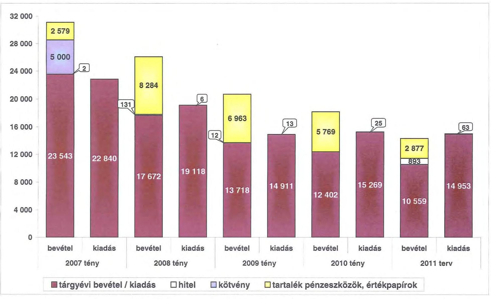

Megjegyzés: a tartalékok a pénzeszközöket és az értékpapírokat foglalják magukba, a tárgyévi bevételek és kiadások tartalmazzák a függő, átfutó és kiegyenlítő tételeket is.

---

.

---

# VESZPRÉM MEGYEI ÖNKORMÁNYZAT KÖZGYŰLÉSÉNEK ELNÖKE

8200 Veszprém, Megyeház tér 1. Tel.: (88)545-011, Fax: (88)545-012
E-mail: mokelnok@vpmegye.hu

Domokos László Úr
az Állami Számvevőszék Elnöke részére

Budapest
Apáczai Csere János utca 10

kezelő zrt

13. 07. 11

Tisztelt Elnök Úr!

Az Állami Számvevőszék által elkészített, a Veszprém Megyei Önkormányzat pénzügyi helyzetének ellenőrzéséről szóló jelentésre az alábbiakban kívánok válaszolni.

A jelentésben leírtakkal összességében egyetértek, azonban a javaslatok két pontja tekintetében eltérő véleményt kívánok megfogalmazni:

A javaslatok 5. pontja alapján az Önkormányzat megvizsgáltatja tulajdonosi jogkörében eljárva a Kórház üzleti tevékenységét és ez alapján intézkedéseket hoz a veszteség okainak megszüntetésére. A jelentésben az Állami Számvevőszék megfogalmazta, hogy a Veszprém Megyei Csolnoky Ferenc Kórház-Rendelőintézet, továbbiakban Kórház, gazdasági társasággá alakítása nem a várakozásoknak megfelelően alakult. A megállapítással nem tudok teljes körűen egyetérteni, mivel 2008. április 1-étől a Zrt. számára működési céllal pénzeszköz átadás nem történt, az OEP finanszírozás biztosította a működés feltételeit. Ugyanakkor központilag is elismert, és ezt a jelentés is megerősíti, hogy a „kórházak működésének finanszírozására az OEP támogatás szolgál, míg a fejlesztési kiadások fedezetét az önkormányzatoknak kell biztosítani”. A megyei önkormányzat a vizsgált időszakban biztosította a fejlesztések fedezetét. Kétségtelen tény, hogy a gazdasági társasági forma esetében az amortizáció összege a veszteséget növeli, míg költségvetési intézményként az eszközök amortizációja mint vagyoncsökkenés, és nem pedig mint veszteségnövelő tényező jelenik meg. Ugyanakkor a költségvetési intézmény esetében is a feladatellátás érdekében fennáll az önkormányzat eszköz visszapótlási, illetve fejlesztési kötelezettsége. Mindezek alapján természetesen a tulajdonos megvizsgáltatja a Kórház üzleti tevékenységét, megteszi a szükséges intézkedéseket, azonban ezek az intézkedések nem jelentenek garanciát a tekintetben, hogy a fenntartónak a feladatellátás érdekében ne kelljen pénzügyi támogatást nyújtania a Kórháznak, elsősorban a fejlesztései végrehajtásához, illetve az eszközei pótlására.

A javaslatok 6. pontja előírja, hogy a korlátozottan forgalomképes ingatlanok esetében szüntessük meg az alapított jelzálogjogot. A Veszprém Megyei Önkormányzat Közgyűlése a 154/2007. (IX.13.) MÖK határozatában a Gic, Nagy L. u. 12. szám alatti

Veszprém Megye

---

157/1 hrsz-ú ingatlan a forgalomképes vagyoni körbe sorolta és elidegenítésre kijelölte. Az ingatlan vagyonkataszterben a forgalomképes vagyoni körbe történő átvezetéséről a főjegyző intézkedett, az albetét lapokon az átvezetés megtörtént, azonban adminisztrációs hiba miatt a kinyomtatott formátumban a főlapon nem jelent meg. Ezen adminisztrációs hiba 2011. június 20. napján haladéktalanul javításra került, mellékelem az ingatlan kataszteri lapját és a hivatkozott MÖK határozatot.
A Veszprém, Vár u. 6. szám alatti 288 hrsz-ú ingatlan korlátozottan forgalomképes vagyoni körbe tartozik. Az ingatlan keretbiztosítéki jelzálogjoggal történő megterhelése előtt a közgyűlés az Ötv. és a megyei Önkormányzat vagyonrendelete értelmében döntött az ingatlan megterheléséről a 154/2010. (VIII.05.) MÖK határozatában. Tekintettel arra, hogy az ingatlan műemlék, a Kulturális Örökségvédelmi Hivatal állásfoglalását is megkértük, a hozzájárulást mellékelem. A helyi önkormányzatokról szóló 1990. évi LXV. törvény 78-79. §-a határozza meg az önkormányzat vagyonát, mely tartalmazza a törzsvagyon körébe tartozó vagyon fogalmát, forgalomképtelen és korlátozottan forgalomképesség szerinti bontásban. A 79.§ (2) bekezdés b) pontja kimondja, hogy a törzsvagyon korlátozottan forgalomképes tárgyairól törvény vagy a helyi önkormányzat rendeletében meghatározott feltételek szerint lehet rendelkezni. Azonban a 80.§ (1) bekezdése egyértelműen rögzíti azt, hogy a helyi önkormányzatot megillető tulajdonosi jogok gyakorlásáról a képviselő-testület rendelkezik. A Veszprém Megyei Önkormányzat Közgyűlésének a vagyonáról és a vagyonkezelés-, gazdálkodás szabályairól szóló 8/2002. (IX.20.) számú rendelete 19.§ s) pontjában foglalt rendelkezés szerint helyesen járt el az önkormányzat, amikor a keretbiztosítéki jelzálogjog bejegyzés előtt az önkormányzat közgyűlése döntést hozott ezen ingatlan - valamint a forgalomképes ingatlanok - megterhelhetőségéről is. A fentiek alapján kérem a javaslat megtételétől eltekinteni szíveskedjenek.

A Veszprém Megyei Önkormányzat, mint az Állami Számvevőszék munkatársai a jelentés tervezetben megállapították, a 2007-2010. években meg tudta őrizni az intézmények gazdálkodásának stabilitását. Egyetértek azzal a megállapítással is, hogy az önkormányzat gazdálkodását azonban a továbbiakban veszélyeztetik a pénzügyi kockázatok és a pénzügyi egyensúly rövid és hosszú távú fenntarthatósága azonnali központi és önkormányzati intézkedést igényel. Az önkormányzat elkészíti a cselekvési tervét a jelentés véglegesítését követően, ugyanakkor a feladatellátás biztonságos feltételeinek megteremtése nem nélkülözheti a központi támogatást.

Szeretném köszönetemet kifejezni Elnök Úrnak a kollégái által végzett munkáért, elemző munkájukkal nagy segítséget nyújtottak a megyei önkormányzat vezetésének a jelenlegi pénzügyi helyzet áttekintésében. Javaslataikat a munkánk során hasznosítani fogjuk.

Veszprém, 2011. június 27.
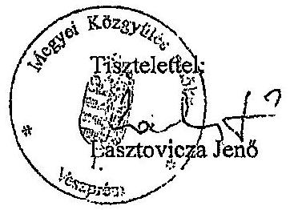

---

# Lasztovicza Jenő úr 

elnök
Veszprém Megyei Önkormányzat

## Veszprém

## Tisztelt Elnök Úr!

A 2011. július 22-i levelemben foglaltaknak megfelelően a megyei önkormányzat pénzügyi helyzetének ellenőrzéséről készített jelentés-tervezet megállapításaival, javaslataival kapcsolatos észrevételére az alábbi választ adom.

Elnök úr észrevételt tett a Kórház gazdasági társaságként történt működtetésével összefüggő megállapításunkra és az ahhoz kapcsolódó javaslatunkra. Az észrevételben szereplő kiegészítő információkat, magyarázatot a kórházműködtető gazdasági társaság üzleti tevékenységével, veszteséges működésével kapcsolatosan megköszönjük, azonban a tulajdonosi és az ellátási kötelezettségből adódó felelősség miatt a javaslatot továbbra is fenntartottuk.

Elnök úr kérte, hogy az észrevételében foglaltak alapján tekintsünk el a korlátozottan forgalomképes önkormányzati ingatlanokon alapított jelzálogjog megszüntetésére irányuló javaslatunktól. A fent hivatkozott törvényalkotásra figyelemmel a javaslat megtételétől eltekintek, ugyanakkor tájékoztatom Önt arról, hogy a keretbiztosítéki jelzálogjog bejegyzésére vonatkozó észrevételét a két érintett ingatlan közül csak az egyik esetében tudom elfogadni. A Gic, Nagy L. u. 12. szám alatti korlátozottan forgalomképes ingatlan esetében a forgalomképessé történt átsorolást - az észrevételben ismertetett intézkedés és hivatkozott dokumentum alapján - elfogadom. A Veszprém, Vár u. 6. szám alatti ingatlan Önök szerint is korlátozottan forgalomképes besorolású, emiatt az ingatlan az Ötv. 79. § (2) bekezdése alapján az önkormányzati törzsvagyon körébe tartozik. Az Ötv. 88. § (1) bekezdés b) pontjának előírása alapján hitel fedezetéül az önkormányzati törzsvagyon nem használható fel, ezért továbbra is fenntartom azt a megállapítást, hogy a keretbiztosítéki jelzálogjog bejegyzése a Veszprém, Vár u. 6. szám alatti korlátozottan forgalomképes ingatlanra az Ötv. előírásával ellentétes volt.

Köszönöm Elnök úr és munkatársai ellenőrzés során tanúsított hozzáállását, amellyel az ellenőrzés megvalósításában részt vettek, azt segítették.
Budapest, 2011. december  $^{1}$.
Tisztelettel:
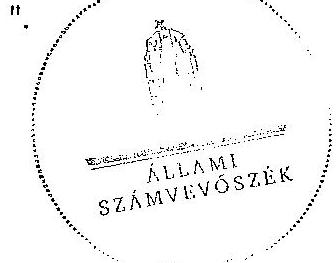

Tisztelettel:
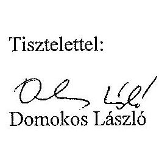

Tisztelettel:
Domokos László

Melléklet: jelentés

---

.
