# ÁLLAMI   SZÁMVEVŐSZÉK 

## JELENTÉS

a felsőoktatás oktatási infrastruktúra-fejlesztési programjának ellenőrzéséről

---

# ÁLLAMI SZÁMVEVŐSZÉK 

Iktatószám: V-2010-126/2010-2011.
Témaszám: 11.
Vizsgálat-azonosító szám: V0524

## Az ellenőrzést szakmailag felügyelte:

Dr. Becker Pál
költségvetési, felügyeleti főigazgató
Az ellenőrzés felügyeleti vezetője:
Dr. Zöldréti Attila
számvevő igazgatóhelyettes
Az ellenőrzést vezette:
Horváthné Herbáth Mária
számvevő főtanácsos
Az összefoglaló jelentést készítették:
Horváthné Herbáth Mária
számvevő főtanácsos
Eötvös Magdolna
számvevő tanácsos
Samu István
számvevő tanácsos
Az ellenőrzést végezték:

Alexovics Ágota
számvevő tanácsos
Kámán Edina
számvevő

Samu István
számvevő tanácsos

Deák Tamásné
számvevő tanácsos
Lingné Rajz Borbála
számvevő tanácsos

Papp József
számvevő tanácsos

Eötvös Magdolna
számvevő tanácsos
Dr. Novák Zsuzsanna Csilla
számvevő tanácsos

---

# A témához kapcsolódó eddig készített számvevőszéki jelentések: 

## címe

Jelentés a 2008-ban befejeződő autópálya beruházások ellenőrzéséről
Jelentés a Sport XXI. Létesítményfejlesztési Program keretében támogatott önkormányzati PPP beruházások megvalósításának és önkormányzati feladatok ellátására gyakorolt hatásának ellenőrzéséről
Jelentés a 2007-ben befejeződő autópálya beruházások ellenőrzéséről
Jelentés a felsőoktatás kollégium beruházási programjának ellenőrzéséről
Jelentés a 2006-ban befejeződő autópálya beruházások ellenőrzéséről
Jelentés a Művészetek Palotája megvalósításának és működésének ellenőrzéséről
Jelentés az autópálya beruházások finanszírozási megoldásainak összehasonlító ellenőrzéséről
Jelentés az Igazságügyi Minisztérium fejezet működésének ellenőrzéséről

A köz- és a magánszféra együttműködésével kapcsolatos nemzetközi és hazai tapasztalatok - ÁSZ Fejlesztési és Módszertani Intézet tanulmánya
sorszáma
0926
0919

0813
0741

0712

0660
0645

0567

---

# TARTALOMJEGYZÉK 

BEVEZETÉS ..... 11
I. ÖSSZEGZŐ MEGÁLLAPÍTÁSOK, KÖVETKEZTETÉSEK, JAVASLATOK ..... 15
II. RÉSZLETES MEGÁLLAPÍTÁSOK ..... 24

1. A köz- és magánszféra együttműködésében megvalósuló oktatási infrastruktúra-fejlesztési program megalapozottsága ..... 24
1.1. Az oktatási infrastruktúra-fejlesztési program igazodása a felsőoktatás fejlesztési célkitűzéseihez, a képzési rendszer átalakításához ..... 24
1.2. Az oktatási infrastruktúra-fejlesztésre irányuló intézményi igények indokoltsága ..... 28
2. A program előkészítésének értékelése ..... 32
2.1. A program lebonyolításának szabályozási feltételei és ágazati szintű előkészítése ..... 32
2.2. A projektek megvalósítását előkészítő intézményi eljárások ..... 36
2.3. A szerződések tartalmi elemeinek értékelése ..... 41
3. A projektek megvalósításának értékelése ..... 45
3.1. A beruházások tervezésének és kivitelezésének megfelelése az intézményi és állami érdekeknek ..... 45
3.2. Az oktatási létesítmények üzemeltetésének értékelése ..... 47
3.3. A programfolyamatok nyomon követésére, értékelésére a minisztérium által kialakított módszerek ..... 52
4. A felsőoktatás ingatlangazdálkodásához, valamint a kollégium beruházási programhoz kapcsolódó korábbi ÁSZ ellenőrzések javaslatainak hasznosulása, és a kollégiumok működtetésének értékelése ..... 55
4.1. A felsőoktatás ingatlangazdálkodásának ellenőrzéséhez kapcsolódó javaslatok hasznosulása ..... 55
4.2. A kollégium beruházási programhoz kapcsolódó ellenőrzés megállapításainak, javaslatainak hasznosulása ..... 56
4.3. A kollégium beruházási program keretében megvalósított létesítmények működtetésének értékelése ..... 57

---

# MELLÉKLETEK 

1. sz. melléklet: Észrevételek
2. sz. melléklet: A felsőoktatás oktatási infrastruktúra-fejlesztési programjának folyamatábrája
3. sz. melléklet: Az ellenőrzésbe vont szervezetek jegyzéke
4. sz. melléklet: Alapadatok az állami felsőoktatási intézmények PPP-konstrukciójú oktatási infrastruktúra-fejlesztéséről
5. sz. melléklet: Összesítő táblázatok a felsőoktatás oktatási infrastruktúrafejlesztési programjának ellenőrzéséről
6. sz. melléklet: Diagramok a felsőoktatás oktatási infrastruktúra-fejlesztési programjának ellenőrzéséről

---

# RÖVIDÍTÉSEK JEGYZÉKE 

| áfa | Általános Forgalmi Adó |
| :--: | :--: |
| Áht. | Az államháztartásról szóló 1992. évi XXXVIII. törvény |
| ÁKK | Államadósság Kezelő Központ Zrt. |
| APEH | Adó- és Pénzügyi Ellenőrzési Hivatal |
| ÁSZ | Állami Számvevőszék |
| BCE | Budapesti Corvinus Egyetem |
| BDF | Berzsenyi Dániel Főiskola |
| BKÁE | Budapesti Közgazdaságtudományi és Államigazgatási Egyetem |
| BME | Budapesti Műszaki és Gazdaságtudományi Egyetem |
| BMF | Budapesti Műszaki Főiskola |
| BUBOR | Budapesti bankközi referencia jellegű kamatláb (Budapest Interbank Offered Rate) |
| DE | Debreceni Egyetem |
| DF | Dunaújvárosi Főiskola |
| EFO | Ellenőrzési Főosztály (OKM) |
| EJF | Eötvös József Főiskola |
| EKF | Eszterházy Károly Főiskola |
| ELTE | Eötvös Lóránd Tudományegyetem |
| EUMSZ | Európai Unió működéséről szóló szerződés |
| EURIBOR | Európai irányadó bankközi kamatláb (Euro Interbank Offered Rate) |
| Eurostat | Európai Közösségek Statisztikai Hivatala (Statistical Office of the European Communities) |
| FFP | Felsőoktatási Fejlesztési Program |
| Ftv. | A felsőoktatásról szóló 2005. évi CXXXIX. törvény |
| GKM | Gazdasági és Közlekedési Minisztérium |
| IBB | Intézményi Beruházási Bizottság |
| IBT | Intézményi Beruházási Terv |
| IFT | Intézményfejlesztési Terv |
| Kbt. | A közbeszerzésekről szóló 2003. évi CXXIX. törvény |
| KE | Kaposvári Egyetem |
| KF | Kecskeméti Főiskola |
| KRF | Károly Róbert Főiskola |
| KSH | Központi Statisztikai Hivatal |
| Ktv. | Költségvetési törvény |
| KVI | Kincstári Vagyoni Igazgatóság |
| LFZE | Liszt Ferenc Zeneművészeti Egyetem |
| ME | Miskolci Egyetem |
| MeH | Miniszterelnöki Hivatal |
| minisztérium, OM, OKM | Oktatási Minisztérium 2006. május 27-ig, 2006. június 2-től 2010. május 24-ig Oktatási és Kulturális Minisztérium |

---

| MNV Zrt. | Magyar Nemzeti Vagyonkezelő Zrt. |
| :-- | :-- |
| MUP | Magyar Universitas Program |
| NEFMI | Nemzeti Erőforrás Minisztérium |
| NFM | Nemzeti Fejlesztési Minisztérium |
| NFT | Nemzeti Fejlesztési Terv |
| NYF | Nyíregyházi Főiskola |
| NYME | Nyugat-magyarországi Egyetem |
| OE | Óbudai Egyetem (Budapesti Műszaki Főiskola) |
| OGY | Országgyűlés |
| PE | Pannon Egyetem |
| PM | Pénzügyminisztérium |
| PPI | Termelői Árindex (Producers Price Index) |
| PPP | Köz- és magánszféra együttműködése (Public Private |
|  | Partnership) |
| PPP TB | PPP Tárcaközi Bizottság |
| PSC | Közszféra összehasonlító érték (Public Sector Comparator) |
| PTE | Pécsi Tudományegyetem |
| Ptk. | A polgári törvénykönyvről szóló 1959. évi IV. törvény |
| régi Kbt. | A közbeszerzésekről szóló 1995. évi XL. törvény (hatályon |
|  | kívül 2004. május 1-jétől) |
| SE | Semmelweis Egyetem |
| SEK (NYME) | Savaria Egyetemi Központ, 2008. év előtt Berzsenyi Dániel |
|  | Főiskola |
| SZF | Szolnoki Főiskola |
| SZIE | Szent István Egyetem |
| TSF | Tessedik Sámuel Főiskola |

---

# AZ ELLENŐRZÖTT INTÉZMÉNYEK INFRASTRUKTÚRA-FEJLESZTÉSI PROJEKTJEIHEZ KAPCSOLÓDÓ RÖVIDÍTÉSEK JEGYZÉKE 

| DF 1 | Dunaújvárosi Főiskola - Étterem |
| :--: | :--: |
| DF 2 | Dunaújvárosi Főiskola - Kerpely Antal Kollégium |
| DF 3 | Dunaújvárosi Főiskola - M1 - Tornacsarnok |
| DF 4 | Dunaújvárosi Főiskola - Szabadidő Központ |
| DF 5 | Dunaújvárosi Főiskola - Oktatási Centrum, A épület |
| KRF 1 | Károly Róbert Főiskola - Diákotthon, Gyöngyös |
| KRF 2 | Károly Róbert Főiskola - Kollégiumból oktatási helyiségek |
| NYF 1 | Nyíregyházi Főiskola - Kollégiumkorszerűsítés (I-II-III-IV. kollégium) |
| NYF 2 | Nyíregyházi Főiskola - Tanszéki épület B-E jelű rekonstrukció |
| NYME 1 | Nyugat-magyarországi Egyetem - Diákotthon fejlesztés, Sopron |
| NYME 2 | Nyugat-magyarországi Egyetem - Sopron-   Mosonmagyaróvár "Campus" projekt |
| NYME 3 | Nyugat-magyarországi Egyetem - Sopron-   Mosonmagyaróvár kollégium rekonstrukció, bővítés |
| NYME Campus | Sopron és Mosonmagyaróvár oktatási infrastruktúra fejlesztése és üzemeltetése |
| NYME Diákotthon projekt | Nyugat-magyarországi Egyetem - Sopron, Baross u. 4-6. szám alatti 400 férőhelyes emeltszintű diákotthon építése és üzemeltetése |
| NYME GEO projekt | Nyugat-magyarországi Egyetem - Képző- és Konferencia Központ kialakítása (laktanya), kollégiumfejlesztés és üzemeltetés Székesfehérváron |
| NYME Pattantyús projekt | Nyugat-magyarországi Egyetem - a volt Pattantyús Szakközépiskola épületének megvásárlása, felújítása, üzemeltetése Győrben |
| NYME SEK | Nyugat-magyarországi Egyetem - Regionális Felsőoktatási Forrásközpont-Szombathely-Központi Könyvtár, aula építése és üzemeltetése |
| NYME Tanszálloda projekt | Nyugat-magyarországi Egyetem - 200 férőhelyes emeltszintű kollégium, valamint 120 férőhelyes tanszálloda építése, üzemeltetése Győrben |
| PMMK | Pécsi Tudományegyetem Pollack Mihály Műszaki Kara |
| STOPPP Kft. | Strabag Oktatási PPP Ingatlanhasznosító és Szolgáltató Korlátolt Felelősségű Társaság (NYME) |
| SE EOK | Semmelweis Egyetem Elméleti Oktatási Központja |
| SE FOK OC | Semmelweis Egyetem Fogorvostudományi Karának Oktatási Központja |
| SE GYOK | Gyógyszerésztudományi Kar |
| SZIE 1 | Szent István Egyetem Gödöllői Kollégiumok - Kollégium Korszerűsítés |

---

| SZIE 2 | Szent István Egyetem Gödöllői Kollégiumok - Új kollégi- |
| :-- | :-- |
|  | um |
| SZIE TEK | Szent István Egyetem Tessedik Sámuel Egyetemi Központ |

---

# ÉRTELMEZŐ SZÓTÁR 

| BUBOR: | Budapest Interbank Offered Rate. Budapesti bankközi   referencia jellegű kamatláb. |
| :--: | :--: |
| Campus: | Az a felsőoktatási komplexum, ahol egy területen (azonos   helyrajzi számon) találhatók meg az egyetemi, főiskolai   hallgató/oktató tevékenységeinek színterei (élettere) illeszkedve a városi környezetbe. |
| Diákotthon: | A hallgatók lakhatási feltételeinek biztosítására létrehozott   a felsőoktatási intézményhez szervezetileg nem tartozó intézmény. |
| Diszkontálás: | Jövőbeli időpontra szóló pénzösszegek jelenbeli értékének   meghatározása referencia-kamatláb (más szóval diszkontkamatláb) segítségével. |
| Hagyományos oktatási infrastruktúra: | Nem PPP konstrukcióban létrehozott és üzemeltetett oktatási létesítmény |
| Intézményfejlesztési Terv (IFT): | A felsőoktatási intézmények alapdokumentuma. Az intézményfejlesztési tervben kell meghatározni a fejlesztéssel, a fenntartó által a felsőoktatási intézmény rendelkezésére bocsátott vagyon hasznosításával, megóvásával, elidegenítésével kapcsolatos elképzeléseket, a várható bevételeket és kiadásokat. |
| Ipari termelői árin-   dex (PPI): | Az árszínvonal változásának mérésére szolgáló indexek   egyike. Számításához havonta mintegy 1000, az iparba   (bányászat, feldolgozóipar, villamos energia, gáz-, hő- és   vízellátás gazdasági ágak) sorolt vállalkozásra és közel   6000 termékre gyűjtenek adatot. |
| Jelenérték számítás: | A jelenérték számítás a jövőben esedékes pénzösszegek   jelen időpontra vonatkozó értékének meghatározását jelenti. Nagysága az időszakra vonatkozó kamatlábtól (elvárt hozam) függ. |
| Kockázati mátrix: | A PPP projekt kockázatainak mátrixban történő összefoglalása, amelyben rögzítésre kerülnek az egyes kockázati elemek és a kockázat viselője, valamint az egyes kockázatok kezelési módja. |
| Kollégium: | A hallgatók lakhatási feltételeinek biztosítását szolgáló, a   felsőoktatási intézmény részeként működtetett létesítmény. |
| Maradványérték: | A rendeltetésszerű használatbavétel, az üzembe helyezés   időpontjában - a rendelkezésre álló információk alapján,   a hasznos élettartam függvényében - az eszköz meghatározott, a hasznos élettartam végén várhatóan realizálható értéke. |

---

Monitoring:

Nettó jelenérték (NPV):

Operatív lízing:

Pénzügyi lízing:

PPP (Public Private
Partnership):

PPP Tárcaközi
Bizottság (PPP TB):

Projekt:
PSC (Public Sector
Comparator):

Refinanszírozás:

Egy adott fejlesztés pénzügyi és fizikai megvalósításának nyomon követését jelenti; azt vizsgálja, hogy az adott fejlesztés végrehajtása megfelel-e az előre tervezettnek, valamint hogy biztosított-e az előre meghatározott célok elérése.
Beruházások értékelése során gyakran alkalmazott különbség jellegű mutató, ami azt fejezi ki, hogy a beruházás teljes élettartama alatt képződő pénzáramok diszkontált összegéből levonva a kezdő pénzáramot, mekkora nettó jövedelem (hozam) képződik.
Olyan ügylet, amelyben a szerződés tartalma nem a finanszírozás, hanem a szolgáltatás, amelynek keretében a lízingbe adó valamilyen eszközt meghatározott időtartamra, díjfizetés ellenében a lízingbe vevő használatába ad, a lízingbe vevő pedig a futamidő lejártával a lízing tárgyat visszaszolgáltatja a lízingbe adónak. Az eszköz tulajdonjoga a lízingbe adónál marad.
Olyan ügylet, amelynek keretében a lízingbe adó alapvetően finanszírozási szerepet tölt be, így

 a szerződés lejártakor a lízingbe vevő jellemzően él a szerződés által biztosított vételi jogával és ezzel megszerzi a lízingelt vagyontárgy tulajdonjogát.
A közszféra és a magánszektor olyan együttműködési formáit jelenti, melyben a közfeladatok ellátásáért felelős állam - szolgáltatási, beruházási feladatainak megszervezésekor - komplex módon együttműködik a magánszféra (piac) szereplőivel.
Az állami és a magánszektor közötti fejlesztési, illetve szolgáltatási együttműködés (PPP) újszerű formáinak szabályozott keretek közötti bevezetése érdekében létrehozott bizottság.
A projekt egyszeri vállalkozás, melynek célja, hogy egyedi terméket, szolgáltatást vagy végeredményt hozzon létre.
A PPP modellek pénzügyi értékelésének alapvető módszere. A PSC a projekt nettó jelenértékét adja meg hagyományos állami beruházás és üzemeltetés esetén, ezt az értéket kell összevetni a PPP-konstrukció nettó jelenértékével (NPV).
A kezdeti finanszírozási formában felvett források visszafizetését követően ezeket pótlandó, új pénzügyi források bevonása új feltételekkel.

# Források: 

- 2098/2003. (V. 29.) Korm. határozat az állami és a magánszektor közötti fejlesztési, illetve szolgáltatási együttműködés (PPP) újszerű formáinak alkalmazásáról
- A felsőoktatásról szóló 2005. évi CXXXIX. törvény 13. §

---

- A számvitelről szóló 2000. évi C. törvény 3. § (4) bekezdése
- A GKM PPP Kézikönyve 2004. (47. oldal)
- A lízing - a PSZÁF fogyasztóvédelmi tájékoztatója (2007. szeptember)
- Dr. Turcsányi Katalin: A köz- és magánszféra együttműködésének néhány vonatkozása
- Intézményfejlesztési Terv Kidolgozási Útmutató, 2007-2011 időszakra vonatkozóan (1. oldal)
- Kotán Attila: Pazarlás vagy perspektíva - PPP-konstrukciók és hazai alkalmazásuk (2., 8. oldalak)
- Megvalósíthatósági tanulmány, Dunaújváros MJV barnamezős belterülete 2005.
- NYME Erdőmérnöki Kar, Infrastruktúra és közlekedés - oktatási segédlet (5. oldal)
- http://www.econom.hu/jelenertek
- http://www.ecostat.hu/szotar.html?q=I
- http://www.mimi.hu/gazdasag/fogyasztoi_arindex.html
- http://www.nefmi.gov.hu/felsooktatas/juttatasok/hallgatoi-juttatasok
- http://www.ngm.gov.hu/masolt/archivum/euintegr/___euintegracio/ppp_alap.html
- http://penzportal.hu/index.cgi?r=\&v=\&l=\&feaz=wzs94457884s7e4\&mf=\&p=gazd_szotar-speckereso
- http://penz-ugyek.shp.hu/hpc/web.php?a=penz-ugyek\&o=projekt_monitoring_3dGj
- http://hu.wikipedia.org/wiki/Projekt

---

.

---

# JELENTÉS 

## a felsőoktatás oktatási infrastruktúrafejlesztési programjának ellenőrzéséről

## BEVEZETÉS

Az utóbbi évtizedben a társadalmi-gazdasági környezet átalakulásával összefüggésben a felsőoktatásban is jelentős változások következtek be. Magyarország 1999 júniusában írta alá a Bolognai Nyilatkozatot, amely 2010-ig az egységes európai felsőoktatási intézményrendszer megteremtését tűzte ki célul. A Nyilatkozatban előirányzott feltételek megteremtésének első lépéseként a 2000. évben megkezdődött a felsőoktatás integrációja. A korábban széttagolt, több kisebb intézményt magában foglaló intézményhálózat helyett, az integrációt követően nagy hallgatói létszámú intézmények jöttek létre.

A felsőoktatás oktatási kapacitásának helyzetét mennyiségi és minőségi hiányok egyaránt jellemezték. Az 1990-es évektől a hallgatói létszám közel négyszeresére növekedett, amely növekedés a 2005/2006-os tanévben tetőzött 424161 hallgatóval. A dinamikus létszámbővüléssel az infrastruktúra fejlesztése nem tudott lépést tartani. Az intézmények oktatási tevékenysége eltérő elhasználódási szintű, gyakran korszerűtlen, leromlott műszaki állapotú, kapacitáshiányos épületekben folyt.

Az Európai Unióhoz történő csatlakozással összhangban a Kormány átfogó felsőoktatási modernizálási és fejlesztési program indítását határozta el. A megvalósítás érdekében kidolgozták a Magyar Universitas Program (MUP) koncepcióját, amelyet a Kormány határozatban ${ }^{1}$ fogadott el. A program részeként elindított oktatási infrastruktúra-fejlesztési program korszerű, versenyképes oktatási feltételek megteremtését kívánta elősegíteni. Emellett célként szerepelt a hazai hallgatók elvándorlásának megakadályozása, a külföldi költségtérítéses hallgatók vonzása, ezáltal az intézményi bevételek növelése.

A felsőoktatási intézmények infrastruktúra-fejlesztési programjának indításáról a 2207/2004. (VIII. 27.) Korm. határozat rendelkezett. A határozat melléklete 86,5 Mrd Ft becsült bruttó beruházási értékben tartalmazott oktatási infrastruktúra-fejlesztést tizenkilenc intézménynél. A programhoz később, az OM jóváhagyásával a kormányhatározatban nem nevesített, további három felsőoktatási intézmény is csatlakozott, amelyeknél a fejlesztés becsült bruttó beruházási értéke 9,7 Mrd Ft volt. A huszonkét felsőoktatási intézmény által tervezett huszonkilenc beruházásból 2010. október 1-jéig tizennégy intézménynél húsz projekt valósult meg (4. sz. melléklet).

Az intézmények saját forrásból nem tudták biztosítani a beruházásokhoz szükséges tőkét. A 2000. évi integrációt követően a felsőoktatás központi beruházásait a Felsőoktatási Fejlesztési Program (FFP) keretén belül világbanki hiteltámogatással indították el. A hitelszerződést 2001-ben az állam - a hitelek kedvezőtlenebbé válása, a szigorú feltételrendszer miatt ${ }^{2}$ - felmondta, a központi források beszűkültek.

Ezt követően a tárca olyan finanszírozási lehetőséget keresett, amely lehetőleg nem növeli az államháztartási hiányt. Ezért esett a választás a köz- és magánszféra együttműködésével megvalósuló konstrukcióra, amellyel kapcsolatban még nem voltak tapasztalatok. A tervezett felsőoktatási infrastrukturális beruházások az állami és magánszektor közötti fejlesztési, illetve szolgáltatási együttműködés keretében indultak el, amelyet a 2098/2003. (V. 29.) Korm. határozat ${ }^{3}$ tett lehetővé. A PPP (Public Privat Partnership) konstrukcióban a közbeszerzési pályázaton nyertes magánbefektetők, szolgáltatók saját forrásból és/vagy bankhitelből valósítják meg a beruházásokat, majd állami földterületen üzemeltetik a létesítményeket. Az állami földterület használatát a KVI/MNV Zrt. hozzájárulásával - a felsőoktatási intézmény biztosítja a befektető számára. A létesítményeket bérleti-szolgáltatási díj fejében bocsátják a magánbefektetők az intézmények rendelkezésére. A díjak biztosítják számukra a beruházási (saját tőkerész, beruházási hitel és kamatok), az üzemeltetési ráfordítások megtérülését, valamint a közüzemi díjak fedezetét. A bérleti-szolgáltatási díjakat a felsőoktatási intézmények hosszú távú (20 éves) szerződés alapján fizetik ki. Ennek lejártát követően a létesítmény állami tulajdonba kerülhet, a rekonstrukcióval elért értéknövekedés az állami vagyont gyarapíthatja, vagy - a beruházási ráfordítások megtérülése miatt - alacsonyabb díj ellenében folytatódhat a szolgáltatás.

A felsőoktatási intézmények számára legelőször a 2004. évi költségvetési törvény ${ }^{4}$ 50. § (6) bekezdése biztosította, hogy intézményi költségvetésük kiadási főösszegének 10\%-os mértékéig hosszú távú (legfeljebb 20 éves) kötelezettséget vállaljanak. A későbbi évek költségvetési törvényei, ${ }^{5}$ valamint a felsőoktatásról szóló 2005. évi CXXXIX. törvény 122. § (4) bekezdése ${ }^{6}$ szerint a kötelezettségvállalás felhalmozási célokra vagy beruházást helyettesítő szolgáltatás vásárlására történhet.

[^0]
[^0]:    ${ }^{2}$ Kotán - Polónyi: A Világbank szerepe a hazai felsőoktatás fejlesztésében
    ${ }^{3}$ 2098/2003. (V. 29.) Korm. határozat az állami és magánszektor közötti fejlesztési, illetve szolgáltatási együttműködés (PPP) újszerű formáinak alkalmazásáról.
    ${ }^{4}$ A Magyar Köztársaság 2004. évi költségvetéséről és az államháztartás hároméves kereteiről szóló 2003. évi CXVI. törvény.
    ${ }^{5}$ 2004. évi CXXXV. törvény 50. § (21) bekezdés, 2005. évi CLIII. törvény 50. § (21) bekezdés.
    ${ }^{6}$ A 2005. évi CXXXIX. törvény 122. § (4) bekezdése 2011. január 1-jétől hatálytalan.

---

A felsőoktatásban megvalósult infrastruktúra-fejlesztések bérleti dijának támogatása - évente fokozatosan növekedve - összesen 25,2 Mrd Ft-tal terhelte az oktatásért felelős minisztérium költségvetését a 2006-2010 közötti időszakban, amelyből az oktatási infrastruktúra bérleti díjához történő hozzájárulás 14,9 Mrd Ft volt (1. sz. diagram). Az elkövetkezendő években - 2031. január 1-jéig - az oktatási infrastruktúra fejlesztése várhatóan további 96,6 Mrd Ft-tal (éves átlagban 4,8 Mrd Ft) terheli a fejezet költségvetését.

1. sz. diagram
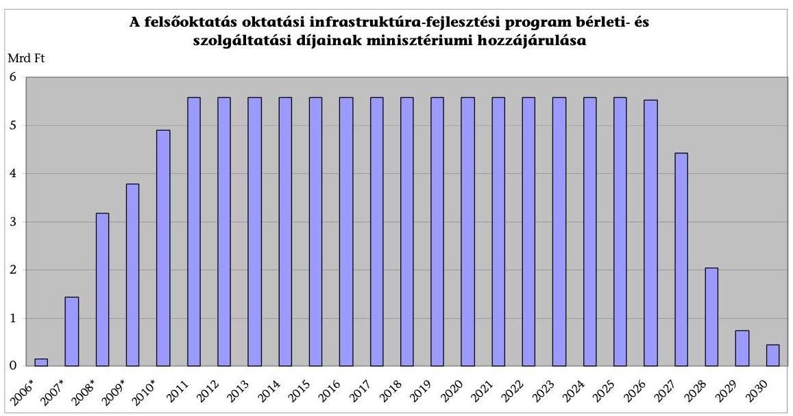
*2006-2010 között tényleges kifizetés, 2011-2030 között tervezett adatok.
A 2005/2006-os tanévtől a felsőoktatási hallgatói létszám csökkenő tendenciájú, amelyre a többciklusú képzési rendszerre való átállás és a demográfiai folyamatok egyaránt hatással vannak. A 2010/2011. tanévben a felsőoktatási intézmények hallgatói létszáma 361347 fő volt, ez a 2005/2006-os tanévhez viszonyítva 14,8\%-os csökkenést jelent.

Az új diákotthonok építésére, a kollégiumok korszerűsítésére irányuló fejlesztési programot az Állami Számvevőszék (ÁSZ) 2007-ben vizsgálta, ${ }^{7}$ az oktatási infrastruktúra bővítését és rekonstrukcióját szolgáló projektek számvevőszéki ellenőrzése még nem történt meg.

A PPP projektek felügyeletét és minisztériumi finanszírozását 2010. második félévétől a Nemzeti Fejlesztési Minisztérium látja el. ${ }^{8}$

[^0]
[^0]:    ${ }^{7} 0741$ sz. Jelentés a felsőoktatás kollégium beruházási programjának ellenőrzéséről (2007. október).
    ${ }^{8}$ Az egyes miniszterek, valamint a Miniszterelnökséget vezető államtitkár feladat- és hatásköréről szóló 212/2010. (VII. 1.) Korm. rendelet 87. § b) pontja.

---

Jelen ellenőrzés célja annak értékelése volt, hogy:

- a köz- és magánszféra együttműködésében (PPP-konstrukció) 2010-ig megvalósult felsőoktatási infrastruktúra-fejlesztési program megalapozott és az oktatáspolitikai célkitűzésekkel összhangban volt-e;
- a projektek előkészítése kellő megalapozottsággal, a szolgáltatási díjfizetési kötelezettség teljesítéséhez szükséges források biztosítása mellett, a közérdeknek megfelelően, eredményesen történt-e;
- a projektek megvalósítása során biztosított-e a közpénz-felhasználás gazdaságossága és hatékonysága;
- hasznosultak-e az Állami Számvevőszék felsőoktatás ingatlangazdálkodásához és a kollégium beruházási programhoz kapcsolódó korábbi ellenőrzéseinek megállapításai, javaslatai.

Az ellenőrzés a 2010-ig megvalósult projektek megalapozását, előkészítését 2004-től kezdődően vizsgálta, a létesítmények működésére, üzemeltetésére vonatkozóan pedig a 2006-2010 közötti időszakot fogta át. Azokat a felsőoktatási intézményeket és projekteket, ahol a vizsgálat megkezdésekor az üzemeltetés megkezdődött - tanúsítványi adatkérés, valamint kérdőíves megkérdezés formájában - teljes körben ellenőriztük (3/a. sz. melléklet). A helyszíni ellenőrzés az intézmények ágazati felügyeletét ellátó Nemzeti Erőforrás Minisztériumra (NEFMI), a Nemzeti Fejlesztési Minisztériumra (NFM), továbbá hét felsőoktatási intézmény kilenc projektjére terjedt ki (3/b. sz. melléklet). A helyszíni ellenőrzésre kijelölt intézmények a megvalósított PPP fejlesztések tervezett nettó beruházási összegének 68,0\%-át, az üzemelő projektek 45,0\%-át tették ki.

Az ellenőrzés a teljesítmény-ellenőrzés módszerével történt, amelynek során az értékelés az eredményesség, a gazdaságosság és a hatékonyság megvalósulására irányult.

Az ellenőrzés végrehajtására az Állami Számvevőszékről szóló 1989. évi XXXVIII. törvény 2. § (3), (5), (9), a 17. § (3) bekezdéseiben, 2011. július 1-től pedig a 2011. évi LXVI. törvény 5. § (3), (5) bekezdéseiben foglaltak adtak jogszabályi alapot.

A jelentés-tervezetet megküldtük egyeztetésre a nemzeti erőforrás miniszternek és a nemzeti fejlesztési miniszternek, akik nem tettek észrevételt. (Leveleik másolatát az 1. sz. melléklet tartalmazza.)

---

# I. ÖSSZEGZŐ MEGÁLLAPÍTÁSOK, KÖVETKEZTETÉSEK, JAVASLATOK 

#### Abstract

A felsőoktatás infrastruktúra-fejlesztési programjának lebonyolítását az előkészítési folyamat hiányosságai, a döntések megalapozatlansága, valamint a projektek többségénél a közszféra számára kedvezőtlen kockázatmegosztás jellemezte. A fejlesztések a hosszú távú szükségleteket meghaladó kapacitást eredményezve, a tervezettnél magasabb díjfizetés mellett valósultak meg.

Az oktatási infrastruktúra-fejlesztési program megvalósításáról hozott kormányzati döntést nem előzte meg felsőoktatási stratégia kidolgozása, hosszú és középtávú fejlesztési tervek elkészítése, mindez gátolta a megalapozott előkészítést. A húsz éves igénybevétel és fizetési kötelezettség vállalásával járó projektek indítását megelőzően nem történt meg a hosszú távú ágazati célok meghatározása, valamint a teljes futamidőre várható kihasználtság és a finanszírozhatóság prognosztizálása. Az ágazati irányító a fejlesztési célkitűzésekkel összefüggésben nem határozott meg prioritásokat, azaz, hogy - a munkaerő-piaci igényekkel összhangban - mely képzések infrastrukturális feltételeit kívánja kiemelten javítani. A megvalósíthatóság lehetőségeiről - a megoldási változatok hosszú távú pénzügyi kihatásait, kockázatait is bemutató - hatástanulmány nem készült.

A program középtávú ágazati célja az Európai Felsőoktatási Térséghez történő csatlakozás infrastrukturális feltételeinek mielőbbi megteremtése volt. Rövid távú, fiskális célként - a PPP-konstrukcióban történő megvalósítás kiemelt indokaként - a fejlesztések államháztartáson kívüli elszámolhatósága jelent meg.

A döntés-előkészítés során nem történt meg a hosszú, közép- és rövid távú nemzetgazdasági, ágazati és intézményi célok, érdekek egymás alá rendelése, összehangolása. Az intézményi és ágazati érdek a fejlesztések megvalósításával teljesült. Ugyanakkor nem érvényesült megfelelően az a nemzetgazdasági érdek, amely a felsőoktatási kapacitás-bővítés hosszabb távú szükségletekhez igazodó, gazdaságos, biztonságosan finanszírozható megvalósításához fűződött.

A költségvetési törvények
 - a 2004. évtől kezdődően - lehetővé tették, hogy a felsőoktatási intézmények hosszú távú kötelezettségvállalásának 50,0%-át a szakmai felügyeletet ellátó fejezet átvállalja. A minisztériummal megállapodást kötő egyetemek, főiskolák a bérleti-szolgáltatási díj felének megfelelő kötelezettségvállalással új, vagy felújított, korszerű infrastruktúrához juthattak. Ezzel a finanszírozási konstrukcióval olyan fejlesztési igények is felmerültek, megvalósíthatóvá váltak, amelyek a korábbi intézményfejlesztési tervekben nem szerepeltek.

A fejlesztések nagyságrendje, összetétele, területi eloszlása nem az intézmények kapacitásigényének előzetes ágazati szintű meghatározására és összehangolására épült. Ágazati és intézményi szinten egy-

---

aránt figyelmen kívül hagyták a demográfiai folyamatok negatív hatását. Az oktatási tárca azzal számolt, hogy a projektek futamideje alatt az érettségizők, ezáltal a felvételizők száma sem változik jelentősen. ${ }^{9}$ Az ellenőrzésbe vont intézmények létszámbecslést legfeljebb a 2010-ig terjedő időszakra vonatkozóan készítettek. A helyszínen ellenőrzött egyetemek és főiskolák közül hatan készítettek különböző időtávra (2006, 2007, illetve 2010-ig) létszámprognózist.
2. sz. diagram
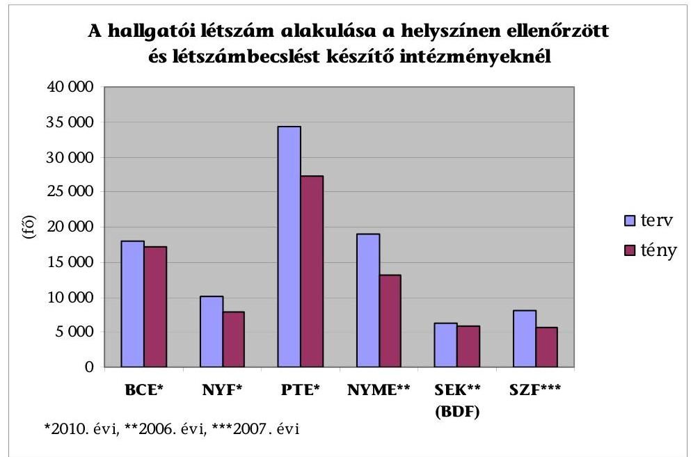

A munkaerőpiac képzési szerkezetre vonatkozó igényeinek felmérése azonban a prognózisok készítését sem alapozta meg. A tényleges hallgatói létszám a 2004-2010 közötti időszakban összességében elmaradt a tervezettől.

A képzési rendszert érintő jelentős változások az oktatási infrastruktúra-fejlesztési program indítását követően történtek. A felsőoktatás bolognai rendszerű átalakítása, a felvételi rendszer változása a hallgatói létszámra, valamint a felsőoktatási infrastruktúra-szükségletre intézményenként eltérő módon hatott. Az infrastruktúra-fejlesztést alátámasztó intézményfejlesztési tervek kidolgozásakor (az ezredforduló kezdetén) ezen intézkedések hatásait nem lehetett megtervezni. Annál a tíz felsőoktatási intézménynél, amelyek kapacitásbővítési szándékkal is csatlakoztak a programhoz 2006-2010 között mindössze egynél nőtt a hallgatói létszám (6,8%-kal). Három főiskolánál 40%, vagy azt meghaladó mértékű volt a létszámcsökkenés.

A megvalósítandó projektek teljes futamidőre kidolgozott, a fedezeti forrásokat is bemutató költségtervét nem kérte a minisztérium a programhoz csatlakozás feltételeként. A tervezett projektek finanszírozhatóságára vonatkozó-

[^0]
[^0]:    ${ }^{9}$ Az oktatás statisztikai adatok alapján az érettségizők száma 2004-2010 között 8%-kal, a felvételre jelentkezők száma 16%-kal, a felvettek száma 11%-kal csökkent.

---

an az előkészítési fázisban a helyszínen ellenőrzött intézmények közül csak ketten készítettek hosszú távra részletes számításokat. Nem mérték fel a teljes futamidőre a fedezeti források rendelkezésre állását. A többi intézmény figyelmen kívül hagyta, vagy alábecsülte a hallgatói létszám, a gazdasági és jogszabályi környezet változásából adódó finanszírozási kockázatokat. A költségvetési törvények hosszú távú kötelezettségvállalásra vonatkozó korlátjának betartását nem ellenőrizte a minisztérium. ${ }^{10}$ Egy intézménynél (NYME) a PPP-konstrukcióhoz kapcsolódó kötelezettségvállalás teljesíthetősége már a szerződéskötéskor súlyos kockázatot hordozott.

# A felsőoktatási infrastruktúra-fejlesztési program megfelelő ágazati és intézményi megalapozottságának hiányában az oktatási kapacitások kihasználtsága a program teljes futamidejében várhatóan nem biztosított. 

A köz- és magánszféra együttműködésének jogi szabályozása rendezetlen és hiányos. A magyar jogrendszerben a PPP szerződésekre vonatkozó rendelkezéseket különböző jogszabályokban elszórtan lehet találni.

A 2004. évi költségvetési törvény 50. §-a az intézmények hosszú távú kötelezettségvállalásához és annak fejezeti támogatásához nem határozott meg a felhasználás céljára vonatkozó korlátot. A következő évben már nevesítették, hogy a kötelezettségvállalás beruházásra, vagy beruházást helyettesítő szolgáltatásvásárlásra történhet, nem definiálták azonban ez utóbbi pontos tartalmát. Így fordulhatott elő, hogy egy felsőoktatási intézmény (ELTE), a PPP-konstrukció keretében döntően üzemeltetési szolgáltatás igénybevételéhez is kapott támogatást, a fejezet beruházási forrásai, illetve a PPP programokkal kapcsolatos előirányzat terhére. A projektek lebonyolítását szolgáló egységes állami, illetve ágazati eljárásrend, valamint a projektek gazdaságosságának összehasonlítását szolgáló Közszféra Összehasonlító Index (PSC) számítás módszertana a támogatási megállapodások megkötése, illetve a közbeszerzési eljárások lebonyolításának időszakában nem állt rendelkezésre. Ezek kidolgozására az ÁSZ több alkalommal is javaslatot fogalmazott meg, intézkedés azonban nem történt. ${ }^{11}$

A kockázatok megosztásáról egyik jogszabály sem rendelkezik, azt az Eurostat STAT 04/18 számú határozata szabályozza. Eszerint a PPP projekt akkor számolható el a magánszektor beruházásaként, ha az építési kockázat viselése mellett a rendelkezésre állási, vagy a keresleti kockázat egyikét a magánpartner viseli. Ez esetben a beruházás költségei nem növelik az államadósságot.

[^0]
[^0]:    ${ }^{10}$ A Magyar Köztársaság 2004. évi költségvetéséről és az államháztartás hároméves kereteiről szóló 2003. évi CXVI. törvény 50. § (6) bekezdése alapján a felsőoktatási intézmények a tárgyévi költségvetés kiadási főösszegének 10%-os mértékéig vállalhatnak hosszú távú, legfeljebb 20 éves kötelezettséget.
    ${ }^{11}$ Az ÁSZ 2007-ben „A Művészetek Palotája megvalósításának és működésének ellenőrzése", valamint „A felsőoktatás kollégiumi beruházási programjának ellenőrzése" című jelentéseiben javaslatot tett az eljárásrend és a gazdaságossági számítás módszertanának kidolgozására.

---

A beruházások elszámolhatóság szerinti minősítése a KSH feladata volt, amely a szerződéstervezetek alapján kiadta állásfoglalásait a projektek beruházási költségeinek államháztartáson kívüli elszámolhatóságáról. Az Eurostat elszámolási elveinek való megfelelés miatt a szerződéstervezeteket több esetben kellett módosítani. Hét projekt esetében fél-, illetve közel kétéves késéssel - csak közvetlenül a létesítmény átadása előtt - történt meg a szerződéskötés a magánpartner és az intézmény között.

A minisztérium a 2005. évtől kezdődően a támogatási megállapodás megkötésekor bekérte az intézményvezetők nyilatkozatát annak biztosításáról, hogy a rendelkezésre állási kockázatot a projekt működtetése alatt a magánpartner viseli.

# A program lebonyolításának gazdaságosságát és hatékonyságát az előkészítő eljárások nem segítették elő. A minisztérium nem határozta 

meg egyértelműen a felsőoktatási intézmények számára a programban való részvétel feltételeit, nem írt elő a gazdaságosságra, hatékonyságra, kihasználtságra vonatkozó teljesítménymutatókat, nem határozták meg a fajlagos bekerülési költségek ajánlatokban elfogadható értékhatárait. A projekttervek elbírálásához írásban rögzített szempontrendszert nem határoztak meg. Nem volt olyan intézmény, amelynek csatlakozási igényét - kiegészítést, pontosítást követően - elutasították volna. Az ÁSZ a felsőoktatás ingatlangazdálkodásáról szóló 2005. évi jelentésében javasolta az oktatásért felelős miniszternek, hogy a fejlesztések állami támogatásához kapcsolódó döntések előkészítése az ellátottsági és kihasználtsági mutatók figyelembevételével történjék. A javaslat nem hasznosult.

A kötelezettségvállalás megosztására vonatkozó megállapodásokhoz készített gazdaságossági számítások - részben az egységes módszertan, részben a kiinduló adatok megalapozatlansága miatt - formálisak voltak. A megállapodás megkötésénél nem volt követelmény, hogy a PPP-konstrukcióban megvalósuló, beruházást helyettesítő szolgáltatásvásárlás gazdaságosabb legyen a hagyományos állami beruházásnál és üzemeltetésnél. Két intézménynél annak ellenére is elindították a projekteket, hogy az előzetes számítások a hagyományos állami beruházások előnyét igazolták. A végleges ajánlat ismeretében a PSC számításokat ismételten nem végezték el. A számítás eredménye nem befolyásolta sem az Oktatási Minisztérium (OM/OKM/minisztérium) és az intézmény közötti megállapodás megkötését, sem az előzetesen meghatározott gazdaságossági küszöbértéknél magasabb összegű ajánlatok elfogadását. A minisztérium szerepet vállalt a program előkészítésében, lebonyolításában és koordinálásában (a közbeszerzési eljárásban való részvétellel, jogi tanácsadással, szerződésminták rendelkezésre bocsátásával, a szerződések ellenjegyzésével) anélkül, hogy kialakított volna hatékony eszközrendszert a megfelelő érdekérvényesítéshez.

A projektek megalapozott intézményi előkészítését a PPP-konstrukciók gyakorlatának és metodikájának hazai ismeretlensége, a szabályozási környezet és az ágazati előkészítés hiányossága egyaránt nehezítette. A helyszínen ellenőrzött intézmények 3 projektjénél a tárgyalásos közbeszerzési eljárásokban nem alakult ki versenyhelyzet, amely gátolhatta az állami és intézményi érdekek érvényesítését a díjtételek kialakítása, valamint azok változását befolyásoló kockázatok megosztása terén.

A projektek szerződéses, illetve finanszírozási rendszerébe nem voltak beépítve azok az elemek, eljárások, amelyek kedvezőtlen gazdasági és jogszabályi változások esetén a pénzügyi egyensúly helyreállítását, biztosítását szolgálták volna. Az intézmények nem körültekintő szerződéskötése is hozzájárult ahhoz, hogy a tényleges bérleti-szolgáltatási díjak 2009-ben átlagosan 15,1%-kal, 2010-ben 7,5%-kal meghaladták a szerződéskötés időpontjában prognosztizált összegeket.

Az OM és az intézmények között létrejött megállapodások 2010-ig a projektek többségénél nem biztosították a bérleti-szolgáltatási díjak 50-50%-os viselését. Egyes projektek fejezeti támogatottsága eltért egymástól, a minisztériumi hozzájárulás meghatározásának nem volt egységes gyakorlata. A 2010-ben a minisztériumi támogatás összegét a bérleti-szolgáltatási díjak 50%-ában határozták meg.

A PPP projektek csak akkor számolhatók el magánberuházásként, ha a létesítmény tulajdonjogáról a szerződések szerint - az operatív lízingszerződésekhez hasonlóan - a felek csak a futamidő végén állapodnak meg. A szerződések lehetőséget adnak a létesítmény maradványértéken történő megszerzésére. A maradványérték várható összegéről azonban az intézményeknek nincs információjuk, mivel az elszámolás elveiről, meghatározásának módjáról a szerződésekben nem állapodtak meg.

Az oktatási célú létesítmények kivitelezése a szerződésben meghatározott tartalommal valósult meg. A tervezés és kivitelezés folyamatának szakmai felügyeletét ellátó projektellenőrök magánpartnertől való függetlensége nem valósult meg. Az ellenőrzött összes fejlesztés 90%-ánál a szakértői és műszaki ellenőri feladatokat ellátó projektellenőr a magánpartnerrel állt szerződéses kapcsolatban, amely az intézményi érdekek érvényesítését nem segítette elő.

A PPP-konstrukcióban megvalósult fejlesztések szerződés szerinti fajlagos bekerülési költsége - összehasonlítható műszaki tartalom ismerete nélkül - öt projektnél meghaladta az új építésű hagyományos állami fejlesztések fajlagos bekerülési költségének átlagát ( $321,5 \mathrm{E} \mathrm{Ft} / \mathrm{m}^{2}$ ). Az ellenőrzés megállapítása szerint a szerződés szerinti fajlagos bekerülési költség az új beruházások és a rekonstrukciók esetén is jelentős szórást mutat a fajlagos bekerülés átlagához képest. A rekonstrukciók közül például egy projekt (DF) fajlagos bekerülési költsége meghaladta a mutató átlagának két és félszeresét, egy másik projektnél (NYF rekonstrukció) ez a mutató az átlag kétharmadát sem érte el. A beruházások tényleges bekerülési költségéről - a PPP projektek jellegéből adódóan - nem állt rendelkezésre információ. A bekerülési költséget növelte az OKM azon rendelkezése, miszerint a projekt részeként, a nettó beruházási költség 1%-a erejéig a beruházónak kortárs képző-, illetve iparművészeti alkotások beszerzéséről kellett gondoskodnia. A felsőoktatás infrastruktúra-fejlesztési programjához kapcsolódóan megvalósított műalkotások értéke közel 0,5 Mrd Ft volt.

Az üzemeltetés szerződés szerinti nyomon követését támogató informatikai rendszer beszerzéséhez az OKM intézményenként 5,0 M Ft támogatást adott. A

---

szoftver működési hibái miatt három helyszínen ellenőrzött intézménynél a támogatásra fordított összeg ( $15,0 \mathrm{MFt}$ ) nem hasznosult megfelelően. A díjcsökkentéssel járó szankciókat nem, illetve nem teljes mértékben érvényesítették az intézmények a monitoring rendszer működésének hiányosságai miatt. A működő projektek kétharmadánál nem történt levonás. A nem megfelelő teljesítés miatti díjcsökkentés nem volt számottevő. A helyszínen ellenőrzött intézményeknél az ellenőrzött időszakban a díjcsökkentés összesen $26,0 \mathrm{MFt}$ volt, ami ugyanazon időszak bruttó bérleti-szolgáltatási díjának 0,13%-a.

A köz- és magánszféra együttműködésével megvalósult létesítmények felújítási eszközhányadot nem tartalmazó fajlagos üzemeltetési költségei összességében meghaladták a hagyományos oktatási infrastruktúra üzemeltetési ráfordításait. A fajlagos mutatók elemzése, valamint több intézmény esetén az üzemeltetés „visszaszervezése" arra enged következtetni, hogy e téren a PPP-konstrukciók elvárt költséghatékonysága nem igazolódott. 2010-ben az új létesítményeknél átlagosan 11,6 E Ft, a rekonstrukcióknál 9,0 E Ft volt az egy négyzetméterre eső üzemeltetési díj. A fajlagos mutatók projektenként jelentős szórást mutattak (2010-ben az új létesítmények üzemeltetési díjai $5,2 \mathrm{EFt} / \mathrm{m}^{2}$ és $24,6 \mathrm{EFt} / \mathrm{m}^{2}$ között alakultak). Az üzemeltetés gazdaságosságára vonatkozó megalapozott értékelést akadályozta az a tény, hogy a saját üzemeltetésű épületek PPP szolgáltatással megegyező tartalmú üzemeltetési ráfordításai az intézmények számviteli nyilvántartásaiból közvetlenül nem voltak meghatározhatók. Ilyen nyilvántartások meglétét sem az intézmények vezetése, sem a felügyeleti
 szerv nem igényelte. Az egyes PPP projektek fajlagos üzemeltetési kiadásai és az átlagos érték között négyszeres eltérések is voltak.

A közüzemi költségeket a projektek 63%-ánál a tényleges felhasználás és díjtételek alapján térítették meg az intézmények. Ez nem ösztönözte a magánpartnereket a gazdaságos, energiatakarékos üzemeltetési megoldások keresésében. Egy intézménynél (SE) a létesítmény átadását követően az intézmény és a magánpartner energiaracionalizálás érdekében módosították a bérletiszolgáltatási szerződést. A megállapodás szerint a fejlesztésért a magánpartnert a racionalizálásból eredő díjmegtakarítás 70,0%-a illeti meg.

A demográfiai változások, a képzési rendszer átalakításának és a felvételi rendszer változásának hatása elsősorban a vidéki, kisebb méretű és vonzáskörzetű felsőoktatási intézmények számára volt kedvezőtlen. A hallgatói létszám csökkenése, valamint a bérleti-szolgáltatási díjak tervezettet meghaladó növekedése likviditási problémákat okozott. A PPP kötelezettségvállalások aránya 2010-ben három intézménynél meghaladta a kiadási előirányzat 10%-át, két főiskolánál a 20%-át.

---

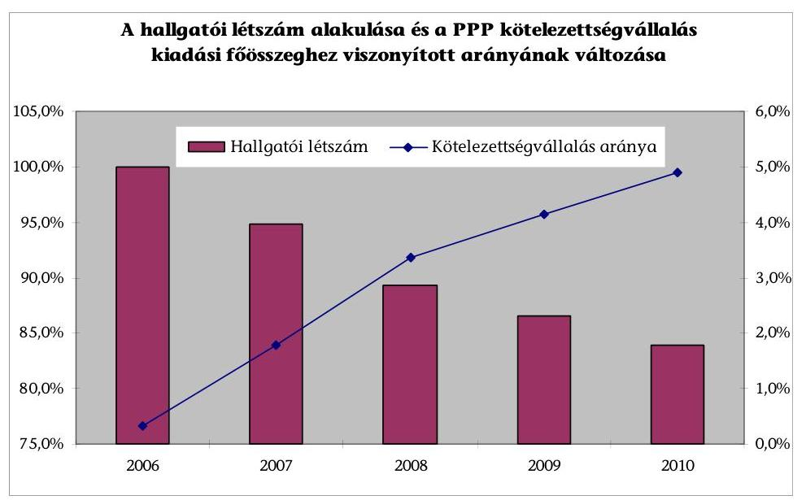

A projektfolyamatok felügyelete érdekében a minisztérium szakmai és pénzügyi beszámolók készítését írta elő a programban részt vevő intézmények számára. A szakmai beszámoltatás során nem határoztak meg egységes metodikát az oktatási létesítmények kihasználtságának bemutatására, ennek hiányában az adatokat nem lehetett összehasonlítani és értékelni. Az intézményi beszámolók tartalmát, megadott szempontok szerinti összeállítását a felügyelet ellenőrizte.

A minisztériumnál nem alakítottak ki olyan nyilvántartási rendszert, amely biztosította volna a program indításától kezdődően a projektfolyamatok dokumentációval alátámasztott nyomon követését. Ezt az intézményektől sem követelték meg. A projektek dokumentációjának átadás-átvétele a NEFMI és az NFM között - a jogelőd minisztérium szabálytalan iratkezelése miatt - nem volt teljes körű. Mindezek következtében a PPP projektfolyamatok átláthatósága nem volt biztosított.

A felsőoktatás infrastruktúra-fejlesztési programjának feladatairól szóló kormányhatározat ${ }^{12}$ nem rendelkezett az oktatási miniszter beszámolási kötelezettségéről. A fejlesztési program teljesítésének átfogó - az előzetes gazdaságossági, hatékonysági, eredményességi célkitűzésekhez, elvárt hatásokhoz viszonyított - értékelését az OKM nem készítette el. A minisztérium által a PPP fejlesztésekről készített tájékoztatók csak a megvalósult programok előrehaladásáról szóltak.

Az NFM-nél az ellenőrzés időszakában folyamatban volt az oktatási projektek szerződéseinek teljes körű jogi, pénzügyi felülvizsgálata. Tájékoztatásuk szerint a képzőművészeti alkotások beszerzésének lebonyolítására az OKM által kijelölt vállalkozás tevékenysége ügyében eljárás folyik az Elszámoltatási Kormánybiztos, a Közbeszerzések Tanácsa és a Versenyhivatal bevonásával.

A kollégiumi beruházási program bérleti-szolgáltatási díjai - az oktatási infrastruktúra-fejlesztésekhez hasonlóan - magasabbak voltak a tervezettnél, 2010-ben 5,7%-kal. A szolgáltatási díjak hosszú távú finanszírozása - a kedvezőtlen árfolyamváltozás, infláció, valamint az államilag finanszírozott hallgatói létszám csökkenése miatt - elsősorban a vidéki főiskoláknál jelent kockázatot. A férőhelyek kihasználtsága - egy intézmény kivételével - megfelelő volt. A térítési díjak jelenleg még versenyképesek az albérleti díjakkal szemben. A szolgáltatások minősége az elégedettségmérések alapján megfelelő. Problémát jelent azonban a szükséges javítások lassúsága, a szavatossági és garanciális jogok érvényesítése. A bérleti-szolgáltatási díjat - a szerződéstől eltérő teljesítés miatt - a projektek kétharmadánál nem csökkentették. A szerződés szerinti szankciók érvényesítését korlátozta a szolgáltatásnyújtás folyamatos ellenőrzésének hiánya.

Az Állami Számvevőszékről szóló 2011. évi LXVI. törvény 33. § (1) bekezdésében foglaltak értelmében a jelentésben foglalt megállapításokhoz kapcsolódó intézkedési tervet köteles az ellenőrzött szervezet vezetője összeállítani és azt a jelentés kézhezvételétől számított harminc napon belül az ÁSZ részére megküldeni. Amennyiben az intézkedési tervet határidőben nem küldi meg a szervezet, vagy az nem elfogadható, az ÁSZ elnöke a hivatkozott törvény 33. § (3) bekezdés a)-b) pontjaiban foglaltakat érvényesítheti.

Az ellenőrzés intézkedést igénylő megállapításai és javaslatai

# a nemzeti erőforrás miniszternek 

1. A fejlesztési program indítását nem előzte meg felsőoktatási stratégia kidolgozása, az infrastruktúra várható kihasználtságának és a projektek finanszírozhatóságának prognosztizálása. A fejlesztési célkitűzésekkel összefüggésben az ágazati irányító nem határozott meg prioritásokat.

Javaslat
Tegyen intézkedéseket az oktatási- infrastruktúra fejlesztési program előkészítésének hiányosságai miatt a felelősség megállapítására.
2. A felsőoktatási infrastruktúra-fejlesztési program megfelelő ágazati és intézményi megalapozottságának hiányában az oktatási kapacitások kihasználtsága a program teljes futamidejében várhatóan nem biztosított.

Javaslat
Gondoskodjon az állami felsőoktatási intézmények kapacitás-kihasználtságának felméréséről. A felmérés eredményeit és a felsőoktatást érintő ágazati célokat figyelembe véve tegyen intézkedéseket, amelyek közép- és hosszútávon biztosítják a felsőoktatási infrastruktúra hasznosítását.

---

# a nemzeti fejlesztési miniszternek 

1. A PPP-konstrukciók jogi szabályozása rendezetlen és hiányos, a kockázatok megosztásáról nem rendelkezik jogszabály.

Javaslat
Gondoskodjon arról, hogy ameddig nem történik meg a teljes körű átláthatóságot és elszámoltathatóságot biztosító jogszabályi környezet kialakítása, addig új PPP-konstrukciójú fejlesztések ne indulhassanak.
2. A szerződések lehetőséget adnak a létesítmény maradványértéken történő megszerzésére. Ennek várható összegéről azonban az intézményeknek nincs információjuk, az elszámolás elveiről, meghatározásának módjáról a szerződésekben nem állapodtak meg.

Javaslat
Intézkedjék annak érdekében, hogy a bérleti-szolgáltatási szerződést kiegészítő megállapodásban rögzítésre kerüljön a maradványérték meghatározásának módja a megszüntetésre nem kerülő projekteknél.

## a nemzeti fejlesztési miniszternek a nemzeti erőforrás miniszterrel együttműködve

1. A minisztérium a támogatandó fejlesztésekhez nem határozott meg teljesítménykövetelményeket.

Javaslat
Alakítsanak ki a PPP projektek támogatásához kapcsolódó követelményrendszert.
2. Az infrastruktúra-fejlesztési program lebonyolítását az ágazati és intézményi döntések megalapozatlansága, valamint a projektek többségénél a közszféra számára kedvezőtlen szerződéskötés, kockázatmegosztás jellemezte.

Javaslat
A Nemzeti Fejlesztési Minisztériumnál folyamatban lévő jogi, pénzügyi és műszaki felülvizsgálat eredménye alapján, a jelentésben foglalt megállapításokat is figyelembe véve - szükség esetén - tegyenek intézkedéseket a felelősség megállapítására.

---

# II. RÉSZLETES MEGÁLLAPÍTÁSOK 

## 1. A KÖZ- ÉS MAGÁNSZFÉRA EGYÜTTMŰKÖDÉSÉBEN MEGVALÓSULÓ OKTATÁSI INFRASTRUKTÚRA-FEJLESZTÉSI PROGRAM MEGALAPOZOTTSÁGA

### 1.1. Az oktatási infrastruktúra-fejlesztési program igazodása a felsőoktatás fejlesztési célkitűzéseihez, a képzési rendszer átalakításához

Az új évezred első éveiben a hazai felsőoktatás fejlesztésének irányait az intézményhálózat integrációja, a felsőoktatás expanziója - a hallgatók létszámának megnégyszereződése -, valamint a Bolognai Nyilatkozatból hazánkra háruló feladatok teljesítésének előkészítése határozta meg.

A Bolognai Nyilatkozat aláírói arra vállalkoztak, hogy versenyképességük biztosítása érdekében 2010-re megteremtik az egységes európai felsőoktatási intézményrendszert, összehangolják, összehasonlíthatóvá teszik felsőoktatási képzési rendszereiket.

A Bolognai megállapodást követően a tárca elkészítette a magyar felsőoktatás tervezett fejlesztési koncepcióját. ${ }^{13}$ A 2003. évben közzétett koncepcionális szakmai vitaanyag a felsőoktatás reformját az akadémiai, intézményi, irányítási és a finanszírozási területeken határozta meg.

Az OM a 2003. júliusi kormányelőterjesztését ${ }^{14}$ követően indította el a felsőoktatás oktatási infrastruktúra-fejlesztési programját. A program céljainak, feladatainak jogszabályi rögzítésére egy évvel később a MUP, valamint az új felsőoktatási törvény koncepciójáról szóló 1068/2004. (VII. 9.) Korm. határozat elfogadásával került sor.

A MUP, mint a felsőoktatás fejlesztési programja összhangban volt a kormányprogrammal, kapcsolódott a gazdaságfejlesztési programokhoz, a Nemzeti Fejlesztési Terv (NFT) belül a Humánerőforrás Fejlesztés Operatív Programjához és a Gazdasági Versenyképesség Operatív Programjához. A felsőoktatási infrastruktúra fejlesztése a kormányprogramokban is célkitűzésként jelent meg.

## Az infrastruktúra-fejlesztési program indításakor az OM nem rendelkezett - a munkaerő-piaci igényeket is figyelembe vevő - felsőoktatási stratégiával. Ennek hiányában, a hosszú és középtávú fejlesz-

[^0]
[^0]:    ${ }^{13}$ „A magyar felsőoktatás modernizációját, az európai felsőoktatási térséghez történő csatlakozását célzó felsőoktatás fejlesztés koncepciója" című vitaanyagot a tárca a felsőoktatási reform szakmai alapdokumentumaként kezelte.
    ${ }^{14}$ Tájékoztató a felsőoktatási fejlesztési elképzelések megvalósítását segítő operatív lízing útján történő forrásbevonásról.

---

# tési terveket sem készítették el, ami nem tette lehetővé a megalapozott döntéshozatalt. 

Az oktatási infrastruktúra-fejlesztési program nem volt megfelelően összehangolva az oktatáspolitikai célkitűzésekkel. Az elmúlt évtized meghatározó felsőoktatási intézkedései - az oktatási infrastruktúra-fejlesztési program, a bolognai rendszerű képzés, a felvételi rendszer megváltoztatása - nem épültek egymásra. A későbbi döntések gyengítették a korábbi intézkedések hatását.

A fejlesztések időben megelőzték a felsőoktatásról szóló 2005. évi CXXXIX. törvény (új Ftv.) 2006. évi életbeléptetését, a felvételi rendszer 2007. évi változását (a felvételi ponthatárok 2007. évi központi meghatározását). A képzési és felvételi rendszert érintő változások befolyásolták a hallgatói létszám alakulását és az infrastruktúra iránti igényeket.

Az előkészítés és a megvalósítás során a különböző szintű, valamint időtávú célok és érdekek nem voltak összehangolva, egymás alá rendelve. Az intézményi érdek a fejlesztések megvalósításával, az ágazati érdek a program elindításával, a költségvetési érdek a fejlesztések magánszektorbeli beruházásként történő elszámolhatóságával - ezáltal az államháztartási hiány növelésének elkerülésével - teljesült. A hazai felsőoktatás hosszú távú szükségleteket szolgáló, versenyképes infrastrukturális hátterének gazdaságos megteremtése nemzetgazdasági érdek. Ez azonban a felsőoktatási stratégia, a hosszú távú tervezés és a gazdaságosság érvényesítésének hiánya miatt nem érvényesült megfelelően.

A PPP-konstrukcióban megvalósult oktatási infrastruktúra-fejlesztésekkel az 1999-ben megkezdett, felsőoktatási integrációt támogató Felsőoktatási Fejlesztési Programot (FFP) folytatták.

Az FFP-t világbanki hitellel indították el, azonban a Kormány 2001-ben felmondta a kölcsönt és áttért a fejlesztések költségvetési támogatásból történő megvalósítására. 2002-ben nem állt rendelkezésre az FFP II. ütemének fedezete, ezért a tárca más finanszírozási lehetőséget keresett, elsődlegesen olyan megoldást, amely nem növeli az államháztartási hiányt. A Kormány a 2098/2003. (V. 29.) határozatával ${ }^{15}$ elfogadta az állam és magánszféra együttműködése újszerű formáinak alkalmazását. A felsőoktatásról szóló 1993. évi LXXX. törvény (régi Ftv.) 2003. júniusi módosítása lehetővé tette külső befektetők igénybevételét az oktatási infrastruktúra fejlesztésére.

A program indítását megelőzően a főiskoláknak és egyetemeknek az Intézményi Beruházási Tervben (IBT) kellett felmérniük infrastrukturális helyzetüket, meghatározni fejlesztési elképzeléseiket az OM által kiadott kézikönyv útmutatásai szerint. A minisztérium az IBT-k alapján nem készített összesített felmérést a felsőoktatás oktatási infrastruktúrájának helyzetéről. A meglévő oktatási célú épületek kapacitását, kihasználtságát, területi elhelyezkedését bemutató központosított adatbázis nem állt rendelkezésre. Az intézmé-

[^0]
[^0]:    ${ }^{15}$ A 2098/2003. (V. 29.) Korm. határozat 2007. február 28-tól hatálytalan.

---

nyek egyenkénti tervei tartalmazták az infrastrukturális kapacitások adatait (alapterület, területi tagoltság, férőhely kihasználtság, fejlesztési szükséglet stb.).

A felsőoktatás ingatlangazdálkodásának 2005. évi ÁSZ ellenőrzése megállapította az oktatási infrastruktúra-fejlesztések szükségességét, javasolta felhalmozási források központi költségvetésből történő allokálását. A felsőoktatási intézmények oktatási épületeinek állaga, korszerűtlensége, területi tagoltsága indokolták a fejlesztéseket.

Az OM az előkészítés során, a 2003-2004. évi kormány-előterjesztések keresleti várakozásait nem a 18 éves korosztály létszámának csökkenését előrevetítő hivatalos Központi Statisztikai Hivatal (KSH) előrejelzéseire építette. A 2003. évi kormány-előterjesztésben az OM azzal a feltételezéssel élt, hogy az akkori magas hallgatói létszám hosszabb időre stabilizálódik, és az élethosszig tartó tanulás miatt kismértékben növekedni fog.

A Pénzügyminisztérium (PM) az előterjesztéshez fűzött észrevételében hiányosnak találta az előrejelzéseket, és aggályát fogalmazta meg, hogy a következő 10-20 éves időszakban lesz-e megfelelő számú hallgató a felsőoktatási intézményekben, mivel a demográfiai mutatók egyértelmű csökkenést mutatnak.

A KSH számítási adatai ${ }^{16}$ szerint a 15-19 éves népesség csoport létszáma 2017-2020 között az évi 50000 fő körüli létszámot közelíti meg. A minisztérium becslései szerint ugyanakkor az érettségizők száma kis ingadozásokkal 70000 fő körül alakul az elkövetkezendő évtizedekben. Az egyes projektek megalapozására a minisztérium az intézményektől a hallgatói létszám alakulására vonatkozó előrejelzéseket is kért,
 de azok a várható demográfiai változásokat jellemzően csak rövid távon prognosztizálták.

A tényleges statisztikai adatok alapján megállapítható, hogy a minisztérium feltevése nem bizonyult reálisnak. A 2004-2010 közötti években mind az érettségizettek száma, mind a felvételre jelentkezők és a felvettek száma csökkent.

Az oktatási statisztikai adatok alapján az érettségizettek száma 2004-2010 között 8%-kal csökkent, az egyes években változó tendencia mellett (2004-2008 között 13%-os csökkenés, 2008-2010 között 5%-os növekedés volt tapasztalható). A felvételre jelentkezők száma a 2004-2010 időszakban 16%-kal, a felvettek száma 11%-kal esett vissza. Különösen jelentős volt a visszaesés a 2008. évben, amikor a felvételre jelentkezők a 2004. évi 58%-át, a felvettek száma a 2004. évi 74%-át tette ki.

A felsőoktatás-fejlesztési célokkal való összehangolás, valamint megalapozott hallgatói létszámbecslés hiányában olyan helyszíneken is indítottak PPP-konstrukciójú fejlesztéseket, ahol a demográfiai változások, illetve a felsőoktatás-politikai döntések következtében a beruházások hosszú távú szükségessége, kihasználtsága nem biztosított.

[^0]
[^0]:    ${ }^{16}$ KSH Népességtudományi Kutató Intézet, Előreszámítási adatbázis 2003.

---

A program megvalósításának lehetőségeiről gazdaságossági számításokkal alátámasztott - a különböző megoldási változatok hosszú távú pénzügyi hatásait, a PPP-konstrukció előnyeit, hátrányait, makroszintű kockázatait bemutató - hatástanulmányt nem készítettek. A 2003. júliusi kormányelőterjesztés számításai kidolgozatlanok, módszertanilag helytelenek voltak, hosszú és rövid távú kötelezettségekkel járó kiadásokat hasonlítottak össze jelenérték számítás nélkül.

A kormányelőterjesztésben a fejlesztés megvalósítására három lehetőséget vázoltak fel: költségvetési forrást, PPP-konstrukciót, illetve piaci alapon történő bérlést. Az előterjesztés ugyanakkor azt is tartalmazta, hogy központi forrás nem áll rendelkezésre. A költségvetési források hiánya azonban önmagában nem elegendő indok a PPP-konstrukció választásához. A PPP-konstrukció előnyeit - a magas színvonalú, olcsóbb, hatékonyabb szolgáltatás, a költségvetés kímélése, és a beruházás-élénkítő hatás ${ }^{17}$ - számszerűsítve nem mutatták be.

A munkaanyag nem megfelelő metodikájú számítással mutatta be, hogy a két fennmaradó konstrukcióból a PPP kedvezőbb a piaci alapon történő bérlésnél. A társtárcák véleménye is utalt a számítások kidolgozatlanságára. Az észrevételeket csak részben vették figyelembe, a számítások átdolgozása nem történt meg.

A Gazdasági és Közlekedési Minisztérium (GKM) észrevételében javasolta a pénzügyi számítások átdolgozását. Véleményük szerint az alkalmazott metodikával nem hasonlítható össze a fejlesztés összköltség igénye a központi forrásból történő megvalósítás és PPP-konstrukció esetén. A KSH rámutatott arra, hogy a pénzügyi lízing a maastrichti mutatók szempontjainak nem felel meg, továbbá javasolta a döntés elhalasztását, mivel 2003-ban a PPP szerződések statisztikai elszámolása az Európai Unióban a kidolgozás folyamatában volt.

A 2207/2004. (VIII. 27.) Korm. határozatot megelőző előterjesztés felvázolta az időközben kialakított PPP-konstrukció garanciális elemeit, bemutatta az előzményeket, a fejlesztés céljait, fő irányait, várható hatásait, de nem tartalmazott számításokat.

A program alapcélkitűzése a felsőoktatás tárgyi feltételeinek javítása által az intézmények versenyképességének és az esélyegyenlőségének biztosítása volt. Várható gazdasági hatásként megfogalmazták azt, hogy az új, illetve felújított épületekben az üzemeltetés takarékosabb, hatékonyabb lehet a meglévő épületekhez viszonyítva. A fejlesztések által, a campus jelleg erősítésével a földrajzilag elkülönült, területileg szétszórt infrastruktúra hátrányait akarták kiküszöbölni. Célként tűzték ki a régiók szerepének erősítését, a hazai hallgatók elvándorlásának megakadályozását, a külföldi hallgatók a magyar felsőoktatás iránti érdeklődésének felkeltését, ezáltal az intézményi bevételek növelését is.

A kormányhatározat mellékletében tizenkilenc intézmény oktatási infrastruktúra-fejlesztését nevesítették. Ennek becsült nettó beruházási értéke 69,2 Mrd Ft, bruttó összege 86,5 Mrd Ft volt. Az infrastruktúra-fejlesztési

[^0]
[^0]:    ${ }^{17}$ ÁSZ FEMI: A köz- és magánszféra együttműködésével kapcsolatos nemzetközi és hazai tapasztalatok, 23. oldal. (2007. április).

---

program teljes bruttó beruházási költségét 175 Mrd Ft-ra kalkulálták, ami tartalmazta az új oktatási épületek, diákotthonok, illetve a kollégium és oktatási épület korszerűsítések becsült bruttó bekerülési költségét. A beruházások bekerülési költségeire vonatkozó adatok a program kialakítása, végrehajtása során folyamatosan változtak.

A kormányhatározat nem tartalmazta elkülönítetten az új beruházás, illetve a korszerűsítés értékét. A Miniszteri Kabinet 2004. szeptember 20-i háttéranyagában 116 Mrd Ft bekerülési költséggel (87 Mrd Ft új beruházás, 29 Mrd Ft korszerűsítés), a 2005. március 16-i tájékoztatóban 105 Mrd Ft-tal (75 Mrd Ft új beruházás, 30 Mrd Ft korszerűsítés) szerepelt az oktatási infrastruktúra-fejlesztése.

A kormányhatározattal nem a fejlesztési program előzetes jóváhagyása történt meg, hanem a már megkezdett fejlesztési programhoz adta a Kormány az egyetértését, felhatalmazva az oktatási minisztert a program megvalósítására. A kormányhatározat a fejlesztésekhez kapcsolódó gazdaságossági követelményeket nem határozott meg, ezért ezek a lebonyolítás során is háttérbe szorultak. A határozat ugyanakkor előírta a KSH állásfoglalásának bekérését arra vonatkozóan, hogy a szerződéstervezet alapján a beruházás az Európai Unió Statisztikai Hivatala (Eurostat) elszámolási rendszerében állami vagy magánszektorba tartozónak minősül-e.

A program befejezésének határidejét a szabályozás nem rögzítette. A bolognai folyamat, illetve a MUP célkitűzéseiből következtetve, a program befejezésének határideje 2010. év volt.

A kormányhatározat nem írta elő kötelezően az egyes projekttervek benyújtását véleményeztetésre a PPP Tárcaközi Bizottság ${ }^{18}$ (PPP TB) felé. Azáltal, hogy az oktatási infrastruktúra projekteket a PPP TB nem véleményezte a folyamatból kimaradt egy, a projektek megvalósításának kockázatait csökkenteni hivatott szakmai szűrő.

A felsőoktatás fejlesztési célkitűzéseivel összefüggésben a minisztérium nem határozott meg kritériumokat a programban való részvételhez. Nem volt szempont, hogy milyen képzést kívánt erősíteni az intézmény a tervezett infrastruktúra-fejlesztés által. Ennek hiányában az intézményfejlesztések összhangja a felsőoktatás fejlesztési irányaival nem biztosított. A programban való részvétel feltételét lényegében az integrált intézmények fejlesztési terveinek minisztériumi elfogadása, jóváhagyása jelentette. A prioritások között a korábban megkezdett világbanki hitelfelvételre épülő infrastruktúra fejlesztések folytatása szerepelt.

# 1.2. Az oktatási infrastruktúra-fejlesztésre irányuló intézményi igények indokoltsága 

Felsőoktatási stratégia és az Intézményfejlesztési Tervek (IFT) ágazati összehangolásának hiányában az intézményi igények hosszú-

[^0]
[^0]:    ${ }^{18}$ A PPP Tárcaközi Bizottság létrehozásáról és feladatairól a 2098/2003. (V. 29.) Korm. határozat rendelkezett.

---

távra vonatkozó megalapozottsága nem volt biztosított. A PPP fejlesztések 20 éves futamidejű projektek, az IFT-kben szereplő fejlesztéseket pedig rövid, illetve középtávú igényekre alapozták. A PPP fejlesztéseket megalapozó hosszú távú kapacitás-szükségletet nem mérték fel.

Az első IFT-k ezredforduló környékén történő kidolgozása megelőzte a MUP elfogadását, a képzési rendszer átalakítását és a felvételi rendszer változtatását. A vidéki intézményeket (EJF, EKF, KRF, NYF, NYME, SZF) a felvételi rendszer megváltoztatása, az államilag finanszírozott hallgatói helyek csökkenése, ${ }^{19}$ a fővárosi felsőoktatási intézmények elszívó hatása, az érintett korcsoportra ható demográfiai változások, valamint a gazdasági válság hatásai miatt a fizető hallgatók létszámának csökkenése érzékenyebben érintette. Az intézmények a fejlesztési elképzelések kialakítása során a későbbi változások negatív hatásaival még nem számolhattak.

# Az IFT-k oktatási infrastruktúra-fejlesztésre vonatkozó elképzelései a tervkészítés időpontjában megalapozott intézményi igényeket fejeztek ki. A felsőoktatási intézmények területi tagoltsága, oktatási épületeinek állaga, korszerűtlensége indokolták a fejlesztéseket. A felsőoktatási intézmények a 2000. évi integráció következtében egyesültek annak érdekében, hogy nagy hallgatói létszámú, hatékonyabban működtethető intézmények jöjjenek létre. Az intézmények egyesítésével az oktatási infrastruktúra földrajzi szétszórtsága vált jellemzővé. Az oktatási infrastruktúra-fejlesztési programhoz történő csatlakozás egyik legfőbb indokaként a területi széttagoltságot jelölték meg az intézmények. 

A helyszínen vizsgált oktatási intézmények esetében a PTE-n kívül minden intézményre jellemzőek voltak az egymástól jelentős távolságra elhelyezkedő oktatási épületek. A szétszórtan elhelyezkedő ingatlanok üzemeltetése gazdaságtalan volt. A hallgatók és oktatók számára az intézetek közötti közlekedés jelentős időkiesést jelentett (SE).

A kérdőíves felmérésben (13/a. sz. diagram) a programhoz való csatlakozás okaként az intézmények elsősorban a meglévő oktatási épületek állagát, korszerűtlenségét, területi széttagoltságát jelölték meg. Emellett azonban - az intézmények közel háromnegyed részénél - a hallgatói létszám dinamikus növekedése miatt kapacitásbővítésre is szükség volt.

A 14 felsőoktatási intézmény közül 10 intézmény hivatkozott az oktatási kapacitás mennyiségi hiányára, 4 intézménynél a minőségi csere igénye dominált (1. sz. táblázat). Két intézménynél (BCE, ELTE) az egyházi tulajdonú ingatlanok visszaadása is indokolta a fejlesztéseket. A tényleges kapacitás-szükségletet azonban módosította a hallgatói létszám tervezettől eltérő alakulása. A programban részt vevő intézmények hallgatói létszáma 2006-2010. évek között átlagosan 16,0%-kal csökkent. Ez ingatlangazdálkodási és kihasználtsági problémát jelent

[^0]
[^0]:    ${ }^{19}$ A 1108/2006. (XI. 20.) Korm. határozat alapján a 2007. évtől 62000 főről 56000 főre csökkent az államilag támogatott felvételi keretszám. A megelőző időszakban a keretszám az 1999. évi 51000 főről folyamatosan emelkedett a 2003. évig 62000 főre, majd a 2006. évig állandó volt.

---

különösen ott, ahol a program elindításakor nem volt kapacitáshiány (NYF 39,6%-os hallgatói létszám csökkenés).

A központi források igénybevételének lehetősége ${ }^{20}$ is ösztönözte a programhoz történő csatlakozást, amelyet alátámaszt az is, hogy a helyszíni ellenőrzésben szereplő intézmények közül háromnál az első IFT-ben nem szereplő fejlesztési igények merültek fel (2. sz. táblázat). Az intézményi igényeket az OM szinte feltétel nélkül elfogadta, azoknak nem volt ágazati szintű kontrollja.

Az NYF a 2002. évi IFT-jében a központi oktatási épület rekonstrukcióját nem szerepeltette. A felsőoktatás oktatási infrastruktúra-fejlesztési programjáról szóló 2207/2004. (VIII. 27.) Korm. határozat mellékletében az NYF, mint a programban szereplő intézmény nem jelent meg. Az OM jóváhagyásával csak később csatlakozott a fejlesztési programhoz. Az NYME a kormányhatározatban bemutatott fejlesztési terveit további három projekttel bővítette ki. (Sopron „Régi kollégium" korszerűsítése, Sopron „Új kollégium" felújítása, Pattantyús projekt).

Az állami felsőoktatási intézmények központi beruházási kerete a 2000. évi 11,7 Mrd Ft-ról 2010-re 0,5 Mrd Ft-ra csökkent (3. sz. táblázat). A fejlesztések megvalósítására az intézményeknek az állami források beszűkülése miatt a PPP-konstrukción kívül nem volt más reális lehetőségük.

A hallgatói létszámadatok becslése során az intézmények a múltbeli adatokra, tendenciákra, növekvő hallgatói létszámra alapoztak, a kedvezőtlen demográfiai folyamatokból adódó létszámcsökkenést nem vették figyelembe. Hosszú távú hallgatói létszámprognózisok nem készültek.

A KRF a 2004. évi IFT-ben 21326 főt prognosztizált 2010-re. A jelzett évben 9966 fő oktatása valósult meg, 53,3%-kal kevesebb a vártnál. Ugyanakkor a BME esetében, ahol 2007-ben 16600 nappali tagozatos hallgatót becsültek 2010. évre, a valós létszám 21,2%-kal magasabb, 20127 fő volt.

Az IFT-k általánosan határozták meg a munkaerő-piaci igényeket, konkrét számszerűsített intézményi előrejelzések nem készültek. Az intézmények a hosszú távú munkaerő-piaci kereslettel jellemzően nem számoltak. Már a 2006. évi kormányprogram is előirányozta, hogy a felsőoktatás kapacitását, a képzés szerkezetét, a megszerzett tudással szembeni követelményeket szorosabban kell kötni a munkaerőpiac igényeihez és követelményeihez.

Az ÁSZ 2009. évi jelentésében megállapította, hogy „a 2005-ben elindított 131 alapképzési szak többsége képzési helyenként szétaprózódott, párhuzamosan 7-28 intézménynél folytatott képzés, amely - a munkaerő-piaci elhelyezkedést segítő szervezetek kérdőíves felmérése alapján - a jogász- és bölcsészképzésben 30-50%-os, a pedagógus-, közgazdász- és menedzserképzés területén 10-30%-os túlkinálatot eredményez."21

A felsőoktatási intézményeknek a rendelkezésükre álló oktatási kapacitás nagyságrendjét, kihasználtságát az IBT-ben kellett felmérniük és bemutatniuk.

[^0]
[^0]:    ${ }^{20}$ A felsőoktatási intézmények hosszú távú kötelezettségvállalásának 50%-át a szakmai felügyeletet
 ellátó fejezet éves forrásai terhére - az éves beruházási keret 33%-áig - átvállalhatja a 2003. évi CXVI. törvény 50. § (6) bekezdése alapján.
    ${ }^{21}$ A felsőoktatási törvényvégrehajtásának ellenőrzéséről szóló ÁSZ jelentés (2009. június - 15. oldal).

---

Az NYME-en az oktatási helyiségek átlagos kihasználtsága 90% volt, ${ }^{22}$ amely a nagyelőadók esetén megközelítette a 120%-ot. A BCE a 2000. évi 197,3%-os kihasználtságot 2004-re 135,0%-ra kívánták mérsékelni. A telítettség ${ }^{23}$ 168,7%-os értékét 2004-re 136,7%-ra tervezték csökkenteni. Az EJF-en a kihasználtság 87%-os, a telítettség 85%-os volt, amelyeknek 3-4 százalékpontos növekedésével számoltak. A tervek megvalósításáról az intézményeknek nem kellett beszámolniuk.

# A felsőoktatási intézmények fejlesztési tervei a finanszírozási források felmérése, biztosítottsága szempontjából nem voltak kellően megalapozottak. 

Az első intézményfejlesztési, illetve beruházási tervekben szereplő fejlesztések fedezetét állami támogatásból és saját forrásból (alapvetően ingatlanértékesítésből) kívánták biztosítani az intézmények. A tervezett állami támogatást a minisztérium a költségvetés terhére nem tudta biztosítani. Az ingatlanértékesítésből várt bevételek nem teljesültek a megfelelő ütemben.

Az SE 1999. évi IBT-ben még lehetőségként számolt a világbanki hitel igénybevételével. A beruházások fedezetét a GYOK esetében állami támogatásból (7,7 Mrd Ft), a FOK OC esetében teljes egészében ingatlan értékesítési bevételből származó saját forrásból (2,5 Mrd Ft) kívánták biztosítani. Az Egyetem - többszöri meghirdetés után - csak 2009-2010-ben tudott három ingatlant értékesíteni 2,3 Mrd Ft összegben.

A BCE jogelődje (a BKÁE) az első intézményfejlesztési tervében részben üzleti alapú finanszírozással tervezte a Czuczor-Mátyás projekt elindítását. Az intézmény beruházási tervét és az abban szereplő Czuczor-Mátyás projektet az OM „B" (átdolgozandó) minősítéssel értékelte. Ugyanakkor a 2003. júniusi kormány-előterjesztés fejlesztései között szerepeltette a projektet.

A 2000. évi IFT-ben a beruházás ráfordítási igényét 10,0 Mrd Ft-ra becsülték, amiből 3,9 Mrd Ft üzleti alapú finanszírozást terveztek. A 2003. évi IBT-ben a bekerülési költség 12,4 Mrd Ft-ra emelkedett. A fejlesztést ekkor már kizárólag állami beruházásként tervezték, 7,1 Mrd Ft támogatás és 5,3 Mrd Ft saját erő felhasználásával.

Az NYME a 2004. évi IFT-ben harmincöt infrastrukturális fejlesztést szerepeltetett, amelyet 14,6%-ban saját forrásból, 85,4%-ban központi fejlesztési támogatásból tervezett megvalósítani.

Az NYME 2004. évi IFT-ben szereplő fejlesztési igényeinek összege - amelyek a későbbiekben PPP-konstrukcióban valósultak meg - bruttó 6,4 Mrd Ft volt. A PPP-konstrukciójú fejlesztések bekerülési költsége azonban 89,1%-kal magasabb, 12,1 Mrd Ft volt.

[^0]
[^0]:    ${ }^{22}$ Az oktatási helyiségek kihasználtsága = (heti órarendi órák száma a teremben/36)*100.
    ${ }^{23}$ Telítettség = (órarendi órák*hallgatók száma)/maximális kapacitás (36 órával számolva).

---

# 2. A program előkészítésének értékelése 

### 2.1. A program lebonyolításának szabályozási feltételei és ágazati szintű előkészítése

A köz- és magánszféra együttműködésének jogi szabályozása rendezetlen és hiányos. A magyar jogrendszerben nincs olyan jogszabály, amelynek kizárólag a PPP szerződésekre vonatkozó szabályozás lenne a tárgya. Ilyen rendelkezéseket különböző jogszabályokban elszórtan lehet találni. ${ }^{24}$

A PPP konstrukció lebonyolításához mindvégig hiányzott a jogszabályszintű egységes állami eljárásrend, valamint a projektek gazdaságosságának megállapítását szolgáló Közszféra Összehasonlító Index, azaz a Public Sector Comparator (PSC) számításának módszertana, ami biztosíthatta volna a projektek azonos elbírálását és értékelését.

A szabályozott eljárásrend, illetve a hatékonysági vizsgálatok módszertanának hiányát a PPP-konstrukciót érintő ÁSZ vizsgálatok rendszeresen megállapították. ${ }^{25}$

A PPP alkalmazásának jogi alapját a 2098/2003. (V. 29.) Korm. határozat ${ }^{26}$ adta. A fejlesztési programban résztvevők számára gyakorlati segítséget nyújtott a GKM által 2004 októberében közzétett PPP Kézikönyv. ${ }^{27}$

A 24/2007. (II. 28.) Korm. rendelet hatályba lépését követően, a Kormány nem egyedileg, hanem egy szakmailag megalapozott rangsor alapján hozhatott döntést a hosszú távú kötelezettségekkel járó programok indításáról. A 2007. évtől jelentősebb szerepet kapott a 2003-ban létrehozott PPP TB. A jogszabály erősítette a PPP TB előzetes véleményező jogkörét, előírta a projektek megvalósításának követését és értékelését is. A rendelet előírta a pénzügyminiszter részére, hogy a PPP TB bevonásával készítsen útmutatót a projektek költséghaszon elemzéséhez.

A 2028/2007. (II. 28.) Korm. határozat rendelkezett arról, hogy a bizottság a projekttervek finanszírozási, döntési változatainak kidolgozásához módszertani

[^0]
[^0]:    ${ }^{24}$ A PPP szerződéseket érintő jogszabályok: a közbeszerzésekről szóló 2003. évi CXXIX. törvény, a koncesszióról szóló 1991. évi XVI. törvény, az államháztartásról szóló 1992. évi XXXVIII. törvény, a Polgári Törvénykönyvről szóló 1959. évi IV. törvény, a 2004-2005. évek költségvetési törvényei, az államháztartás működési rendjéről szóló 292/2009. (XII. 19.) Korm. rendelet, a hosszú távú kötelezettségek vállalásának egyes szabályairól szóló 24/2007. (II. 28.) Korm. rendelet.
    ${ }^{25}$ A témához kapcsolódó eddig készített számvevőszéki jelentések jegyzékét a bevezető rész tartalmazza.
    ${ }^{26}$ 2098/2003. (V. 29.) Korm. határozat az állami és a magánszektor közötti fejlesztési, illetve szolgáltatási együttműködés (PPP) újszerű formáinak alkalmazásáról hatályos 2007. február 28-ig.
    ${ }^{27}$ A köz- és magánszféra sikeres együttműködése (PPP Kézikönyv), GKM, Budapest, 2004.

---

segítséget nyújtson. A PPP TB-t 2009. október 1-jétől ${ }^{28}$ megszüntették. Az útmutató nem készült el, az előzetes gazdaságossági számítások egységes módszertanának kidolgozására nem került sor.

A 2004-ben kiadott PPP Kézikönyvet a GKM 2008-ban átdolgozta. Az aktualizált útmutató ${ }^{29}$ nem helyettesíti a PPP-konstrukció állami eljárásrendjét, mert nem tartalmaz kötelező jellegű szabályozást, nem biztosítja az abban előírtak számonkérhetőségét, ellenőrizhetőségét.

A hosszú távú kötelezettségek vállalására és annak fejezeti támogatására a 2004. évi költségvetési törvény (Ktv.) ${ }^{30}$ előírása adott lehetőséget. A Ktv. nem határozott meg a felhasználás céljára vonatkozó korlátot. A 2005. évi Ktv. ${ }^{31}$ már nevesítette, hogy a kötelezettségvállalás beruházásra, vagy beruházást helyettesítő szolgáltatásvásárlásra történhet. A beruházást helyettesítő szolgáltatás pontos tartalmát azonban jogszabály a későbbiekben sem határozta meg. Ez lehetőséget adott arra, hogy a minisztérium olyan hosszú távú intézményi kötelezettségvállalás 50%-os támogatását is átvállalja beruházási forrásai, illetve a PPP programokkal kapcsolatos előirányzat terhére, amelynek tartalma nem illeszkedik az infrastruktúra-fejlesztési program céljaihoz.

Az ELTE-vel kötött megállapodásban a minisztérium 50%-os támogatást nyújt a bérleti-szolgáltatási díjfizetésen kívül - üzemeltetési szolgáltatás igénybevételére is. A támogatással az ELTE a többi felsőoktatási intézményhez képest előnyösebb helyzetbe került. A minisztérium 2007-2010. években ténylegesen összesen 864,3 M Ft-ot nyújtott az ELTE vállalkozási szerződéséhez, alapvetően üzemeltetési költségek fedezetére.

A kockázatok megosztásáról egyik jogszabály sem rendelkezik, azt az Eurostat STAT 04/18. számú határozata szabályozza. Eszerint a PPP projekt akkor számolható el a magánszektor beruházásaként, ha az építési kockázat viselése mellett a rendelkezésre állási, vagy a keresleti kockázat egyikét a magánpartner viseli. Ez esetben a beruházás költségei nem növelik az államadósságot. A beruházások elszámolhatóság szerinti minősítése a KSH feladata volt.

Az infrastruktúra-fejlesztési program előkészítésekor a felügyeleti iránymutatás nem volt megfelelő, nem adott precíz, egyértelmű eligazítást az intézmények számára.

A magántőke bevonásával megvalósított oktatási infrastruktúra-fejlesztési program előkészítését mindvégig befolyásolta az a tény, hogy egy megkezdett fejlesz-

[^0]
[^0]:    ${ }^{28}$ 1161/2009. (IX. 17.) Korm. határozat az állami és magánszektor közötti fejlesztési, illetve szolgáltatási együttműködés (PPP) újszerű formáinak alkalmazásáról szóló 2028/2007. (II. 28.) Korm. határozat hatályon kívül helyezéséről.
    ${ }^{29}$ A Public Private Partnership intézményi és szabályozási háttere Magyarországon Útmutató a GKM által kiadott PPP Kézikönyv aktualizálása alapján.
    ${ }^{30}$ A Magyar Köztársaság 2004. évi költségvetéséről és az államháztartás hároméves kereteiről szóló 2003. évi CXVI. törvény.
    ${ }^{31}$ A Magyar Köztársaság 2005. évi költségvetéséről szóló 2004. évi CXXXV. törvény.

---

tési programot folytattak új konstrukció alkalmazásával, a támogatandó fejlesztések kiválasztása nem volt célja az előkészítésnek.

Az előkészítés során a minisztérium nem határozta meg egyértelműen a felsőoktatási intézmények számára a PPP programban való részvétel formai és tartalmi feltételeit, ami hátráltatta a program előkészítésének és lebonyolításának eredményességét. A minisztérium a projekttervek előterjesztését kérte az intézményektől, azonban a részvételi dokumentáció részletes tartalmát nem írta elő. A tárca nem dolgozott ki az intézmények számára egységes, a PPP struktúra lényeges elemeit figyelembe vevő segédletet a dokumentáció elkészítéséhez. Az előkészítéshez nem írtak elő kötelező feladatokat, nem biztosították egységesen a projektek megalapozottságát. Az előterjesztések összeállításához a PPP TB 2003. év végén közzétett ismertető tájékoztatója, ${ }^{32}$ illetve 2004 októberétől a PPP Kézikönyv útmutatása állt az intézmények rendelkezésére.

Az előkészítés során a tárca konzultációkat, fórumokat szervezett a felsőoktatási intézmények vezetői és érintett munkatársai részére, ahol a PPP program lebonyolításának feltételeit, illetve az elvárásait ismertette.

A támogatandó fejlesztésekhez a felügyeleti szerv nem határozott meg teljesítménykritériumokat, gazdaságossági, hatékonysági, kihasználtsági követelményeket, nem határozta meg a fajlagos bekerülési költségek ajánlatokban elfogadható értékhatárait. Ennek hiányában a projektek eredményessége összességében nem mérhető. A PPP Kézikönyv iránymutatásán túl, az OM nem határozta meg kötelező követelményként, hogy a PPP-konstrukcióban megvalósuló beruházás és üzemeltetés nettó jelenértéke alacsonyabb legyen az állami hitelfelvételből megvalósuló beruházás és üzemeltetés nettó jelenértékénél.

A projekttervek elbírálásához írásban rögzített pontozásos rendszert nem határozott meg az OM, jellemzően az előterjesztések pontosítását, kiegészítését kérte a fejlesztés befogadása előtt. Nem volt olyan intézmény, amelyiknek a csatlakozási igényét elutasították volna. A projekt jóváhagyását a támogatási megállapodás aláírása jelentette, a megállapodások megkötésére a 2004-2005. években került sor.

A minisztérium hat intézménnyel (BCE, BMF, ELTE, DF, LFZE, SE) kötött támogatási megállapodást 2004. március 24-én, ami megelőzte a fejlesztési program Kormány általi jóváhagyását.

A minisztérium és az intézmények között a kötelezettségvállalások megosztására vonatkozó megállapodásokat megalapozott összehasonlítható gazdaságossági számításokkal nem támasztották alá. A minisztérium kérte ugyan a PSC számítások elvégzését, de a számítások elkészítése, illetve minisztériumi elfogadása formális volt, azok nem alapozták meg a PPP projektek megvalósításának gazdaságosságát. A projekteket akkor is elindították, ha az előzetes számítások a hagyományos állami beruházá-

[^0]
[^0]:    ${ }^{32}$ GKM PPP Hírlevél 2. száma - 2003. december.

---

sok előnyét igazolták. A számítások elsődleges célja a bruttó szolgáltatási díj éves nagyságrendjének, illetve a minisztériumi hozzájárulás éves összegének meghatározása volt. A tárca nem kérte az intézményektől a PSC számítás aktualizálását a közbeszerzési eljárást követően a konkrét feltételek ismeretében.

A megállapodás megkötése előtt az OM nem kért kötelezően közép-, illetve hosszú távú fedezeti és költségtervet az intézményektől, így nem tudott megalapozottan meggyőződni arról, hogy a tervezett projektek intézményi forrásai hosszú távon biztosíthatóak-e. Az egyes intézmények kalkulációinak kidolgozottsága, megalapozottsága eltért egymástól.

A kötelezettségvállalás mértékére vonatkozó jogszabályi előírás ${ }^{33}$ betartását - az NYF és a BDF kivételével - a minisztérium nem ellenőrizte. Nem nyilatkoztatták az intézmények vezetőit a 10%-os korlát betartásáról, nem győződtek meg arról, hogy az intézmények által vállalt kötelezettség megfelel-e a jogszabályi előírásnak. Ennek hiánya az intézmények teherbírását meghaladó kötelezettségvállalásokhoz, likviditási nehézségekhez vezetett.

Az NYME 2005. évben
 a Tanszálloda, a Pattantyús és a GEO projektek megvalósítását indította el. Az intézmény gazdálkodását a 2004. és 2005. években pénzügyi nehézségek, likviditási problémák nehezítették. ${ }^{34}$ Ilyen helyzetben az Egyetem által vállalt hosszú távú PPP kötelezettségek teljesíthetősége már a vállalás időpontjában jelentős kockázatot hordozott. Az NYME PPP-konstrukcióban tervezett fejlesztéseihez kapcsolódó kötelezettségvállalás aránya a kiadási előirányzathoz viszonyítva 2004-ben 9,0\%, 2005. évben 14,2\% volt.

A minisztérium az intézményekkel kötött megállapodásokban vállalta, hogy a közbeszerzési eljárás lefolytatásában és annak alapján a szerződéskötésben szakmai segítséget nyújt. A tárca vezetői, illetve munkatársai az Intézményi Beruházási Bizottság (IBB) tagjaiként közvetlenül bekapcsolódtak a közbeszerzési eljárásba. Az IBB-k felügyelték az eljárás lebonyolítását, elvégezték az ajánlatok elbírálását és döntési javaslatot tettek az intézmény vezetésének.

A minisztérium nem készített útmutatót a közbeszerzési dokumentációk összeállításához. A közbeszerzési eljárás indítása a felügyelet előzetes jóváhagyásával történt. Az OM/OKM bekérte és ellenőrizte a részvételi és az ajánlatkérési dokumentációkat. Az állami és intézményi érdekek érvényesülését jogi tanácsadással, szerződésminták (földhasználati, ingatlanhasználati, bérleti-szolgáltatási) rendelkezésére bocsátásával segítették elő.

[^0]
[^0]:    ${ }^{33}$ A 2003. évi CXVI. tv. 50. §. (6) bekezdés előírása értelmében a felsőoktatási intézmények a tárgyévi költségvetésük kiadási főösszegének 10\%-os mértékéig vállalhattak hosszú távú kötelezettséget. A 2005. évi Ktv. a kötelezettségvállalás mértékét az intézmény dologi és felhalmozási célú előirányzatának 10\%-ára korlátozta.
    ${ }^{34} \mathrm{Az}$ Egyetem költségvetési tartaléka a 2004. évben 383,1 M Ft, a fennálló kötelezettsége szállítói tartozás 721,2 M Ft, APEH felé tartozás 175,5 M Ft volt. A 2005. évben a költségvetési tartalék 332,1 M Ft, a fennálló kötelezettség szállítói tartozás 590,8 M Ft, APEH felé fennálló tartozás 301,6 M Ft volt.

---

A felügyelet részt vett a különböző érintett szervezetekkel (KVI, MNV Zrt., KSH) történő egyeztetési, illetve a szükséges engedély-beszerzési folyamatban. A szerződéskötés során biztosított volt a minisztérium képviselete, a bérletiszolgáltatási szerződések megkötése az OM ellenjegyzésével történt.

A magánszférával azonos érdekérvényesítést kedvezőtlenül befolyásolta, hogy sem a minisztérium, sem a programban részt vevő intézmények nem rendelkeztek a PPP projektek előkészítésében, lebonyolításában jártas szakemberekkel. A projektméretek is hozzájárultak ahhoz, hogy egyes intézményi közbeszerzéseknél nem alakult ki éles versenyhelyzet. Ez a kockázatok megosztása terén hátráltatta az állami érdekek érvényesítését.

# 2.2. A projektek megvalósítását előkészítő intézményi eljárások 

Az infrastruktúra-fejlesztés megalapozott intézményi előkészítését a PPP projektek metodikájának hazai ismeretlensége, a jogszabályi háttér és a minisztériumi iránymutatás előző pontban részletezett hiányosságai hátráltatták. A projektek előkészítése a 2003. évben kezdődött meg, azáltal, hogy az OM kérte az intézményektől a projekt-előterjesztések benyújtását. Az infrastruktúra-fejlesztési program projektjei alapvetően az IFTkben korábban már előirányzott fejlesztések magánszféra közreműködésével történő megvalósulására irányultak. A PPP-konstrukciót megalapozó előterjesztések elkészítésére rendkívül rövid határidőt (2003. július 17-től 2003. szeptember 15-ig) határozott meg a minisztérium, ami nem tette lehetővé az előterjesztés teljes körű, megalapozott kidolgozását. Az egyértelmű formai és tartalmi követelmények meghatározásának hiányában az előterjesztéseket eltérő részletezettséggel készítették el az intézmények, a későbbiekben azokat átdolgozták.

Az intézmények a minisztérium kérésére elkészítették a projekttervek PPP-konstrukcióban történő megvalósításának gazdaságosságát igazoló számításokat, de azok megalapozatlanok voltak. A számításnak nem volt egységes módszertana, azokat az egyes intézmények eltérően végezték el. A PPP-konstrukciójú és hagyományos állami fejlesztések bekerülési és üzemeltetési ráfordításainak összehasonlításához nem álltak rendelkezésre a korábbi hasonló állami beruházások paramétereit tartalmazó adatbázisok. A PPP-konstrukció újszerűsége miatt hiányzott a témában jártas szakembergárda.

A számításoknál alkalmazott paraméterek, makrogazdasági feltételezések nem voltak egységesek, az alkalmazott diszkontráták különbözőek voltak. Az egyes számításoknál a magánpartner költséghatékonyságának becslése, illetve a kockázati felár mértéke is eltért egymástól. A becsléseket megalapozó számítások nem voltak fellelhetők.

A BCE-nél a számítások során azzal a feltételezéssel éltek, hogy az állami beruházás költségtúllépése a kivitelezésnél és üzemeltetésnél 10,0\%. A magánbefektető által végzett beruházás költséghatékonysága a tervezésénél-előkészítésnél 25\%, a kivitelezésnél 7\%, az üzemeltetésnél 15\%. Az ELTE az állami beruházásnál költségtúllépéssel nem számolt, a magánpartner költséghatékonyságát a beruházásnál 8\%-ra, az üzemeltetésnél 12,5\%-ra becsülte. Az SE a beruházásnál 5\%-os, az üzemeltetésnél 12,5\%-os költséghatékonysággal számolt mindkét projektjénél.

A BCE - OM által elfogadott - PSC számításainál az éves díjigényt a jelenérték összegének futamidő éveire történő elosztásával határozták meg a pénz időértékét figyelembe vevő költség-egyenértékes használata helyett. A PSC számításban az üzemeltetési költségeket alábecsülték.

A helyszíni vizsgálatba vont intézmények közül három intézmény projektjeinél az elkészített számítások nem tartalmaztak összehasonlítható elemzést állami, valamint külső befektető általi megvalósításra, mindössze egy értéket határoztak meg. Két intézménynél a projekt a magánpartner által történő megvalósításának előzetesen számított költsége (PPP érték) magasabb volt az állami megvalósítás esetére számított PSC értéknél (4. sz. táblázat).

Az OM megállapodást megelőző előterjesztésben az NYME, PTE és SZF projektjeinél viszonyítási alapként egy értéket határoztak meg. A számítások a 100\%-ban 20 éves lejáratú euró hitelből történő magánberuházás költségeit vették alapul.

A BCE és az SE EOK-on az előzetes számítás szerint a PPP projekt ára magasabb volt, mint a hitelfelvétellel megvalósuló állami beruházásé. A magánszféra közreműködésének elvárt gazdaságossága nem érvényesült. Mivel az állami beruházás - a források hiánya miatt - nem jelentett valódi alternatívát, az intézmények a PPP-konstrukció mellett döntöttek.

# Az intézmények a végső ajánlatok konkrét feltételeinek ismeretében a számításokat nem aktualizálták. Ennek hiányában a projektek PPP-konstrukcióban való megvalósításának költség-hatékonysága nem igazolható. 

Az előzetes gazdaságossági számítások eredménye nem befolyásolta a döntéseket. Az OM azon projekteket is támogatta, amelyeknél a számítás az állami megvalósítás gazdaságosságát igazolta. Az intézmények - a minisztérium ellenjegyzése mellett - azokkal a beruházókkal is megkötötték a szerződéseket, amelyek a PSC számítás gazdaságossági küszöbértékénél magasabb összegű ajánlatot tettek.

Az előzetes számítások és az elfogadott ajánlatok eltéréséhez a diszkonttényezők, a szolgáltatási tartalom változása, az eltérő hozamelvárások és a PSC számítás kidolgozatlansága is hozzájárult.

Összehasonlítva az előzetes gazdaságossági számítás és a bérleti szolgáltatási szerződés szerinti adatokat, az NYME Campus projektjénél az éves nettó bérleti szolgáltatási díj 6,8\%-kal haladta meg a PSC számításban szereplő nettó díjfizetési igényt 2007. évi árakon. Az NYME SEK projektnél a szerződés szerinti nettó szolgáltatási díj (a közüzemi díjhányad figyelembevétele mellett) 17,7\%-kal magasabb a PSC számítás díjfizetési igényéhez viszonyítva.

Az SZF-nél a módosított szerződés szerint a teljes nettó bérleti szolgáltatási díjfizetési kötelezettség a PSC számításhoz viszonyítva a teljes futamidőre számítva 9,3\%-kal volt magasabb.

---

Az ELTE bérleti-szolgáltatási és vállalkozási szerződése szerinti éves díjfizetési kötelezettség - azonos áron számítva - 15,4\%-kal haladja meg a PSC számítás szerinti éves bérleti-szolgáltatási díját. A rekonstrukciós díj 43,7\%-kal alacsonyabb, míg az üzemeltetési költség közel háromszorosa az előzetes számításnak. A szerződés szerinti üzemeltetési díjtétel a magánpartner feltételezett költség-hatékonyságát nem támasztotta alá.

A PTE-nél a műszaki tartalom csökkenése ellenére magasabb a szerződés szerinti bérleti-szolgáltatási díj a PSC számítás szerinti értéknél annak ellenére, hogy a Rókus utcai oktatási tömb felújításának megvalósítása elmaradt.

A projektek nagyobb részénél a PSC értéket és a végleges ajánlatot a műszaki tartalom és pénzügyi modell változása miatt nem lehet összehasonlítani. Ezért elvégeztük a végleges ajánlat szerinti PSC számítást is, és azt viszonyítottuk a szerződés szerinti adatokhoz. A helyszínen ellenőrzött kilenc oktatási infrastruktúra-fejlesztési projekt végleges ajánlatai, illetve az intézmények által megadott szerződéses adatok alapján elvégzett PSC számítások nem igazolták a PPP projektek előnyét a hagyományos állami beruházással szemben. A PSC szerinti jelenérték mind a kilenc projektnél kedvezőbb volt a PPP projektek jelenértékénél (5. sz. táblázat és 4. sz. diagram).

A közbeszerzési kiírásokban az igényelt szolgáltatás tartalmát és az ajánlattevőkkel szembeni követelményeket megfelelő részletezettséggel rögzítették. A létesítményekkel szembeni elvárásokat, a fejlesztések műszaki tartalmát az eljárás során változtatták az intézmények, azokat az ajánlati szakaszban véglegesítették. A projekttervek műszaki tartalmának jelentős változása is a megalapozott előkészítés hiányára volt visszavezethető.

A BCE-nél a műszaki tartalom változott a végleges ajánlatban az elsőhöz képest. A tárgyalások során az Egyetem eltekintett a parkoló megépítésétől, azt a befektetőtől várta el. Az üzleti célú helyiségek kimaradtak a végleges ajánlatból, a tervezett szálláshelyeket törölték. Az oktatók számára készülő irodák területe viszont emelkedett, mivel a közbeszerzési eljárás alatt dőlt el véglegesen, hogy melyik kar költözik az új épületbe. A végleges ajánlat szerint az első éves bérleti díj 20,4\%-kal volt kevesebb, mint a nyertes szolgáltató első alapajánlata. Az épület határidőre és megfelelő minőségben elkészült.

Az NYF-en a többfordulós tárgyalásokon változott a projekt műszaki tartalma, a létesítmény megvalósítását három ütemre bontották. A végleges ajánlat szerinti éves bérleti-szolgáltatási díj 32,2\%-kal kevesebb az első ajánlathoz viszonyítva.

Az SE EOK létesítmény műszaki paraméterei változtak, elmaradt a GYOK épületrész megépítése, a parkolót a szolgáltató saját területként valósította meg. A végleges, módosított ajánlatban az éves bérleti-szolgáltatási díj 27,8\%-kal volt alacsonyabb, mint az első ajánlatban.

A PTE a végleges ajánlat bekérésénél törölte a programból a Rókus u. 2. sz. alatti épület felújítását, mivel a kalkulált éves bérleti díj meghaladta volna az intézmény által vállalható mértéket. A Rókus utcai épület felújításának elhagyása a végleges ajánlat szerint a bérleti-szolgáltatási díjat 22,1\%-kal csökkentette.

Az NYME Egyetemi Tanácsának 78/2005. (IV. 20.) számú határozata a közbeszerzési eljárás alatt módosította a Campus projekt beruházási programját. A határozatban a mosonmagyaróvári új oktatási épület létesítése helyett a Lucsony u.

---

Élelmiszertudományi és Növénytermesztési Intézet épületegyüttesének felújítása mellett döntöttek. A határozat tartalmazza továbbá a gazdasági informatikai szak épületének felújítását és bővítését, illetve az Erzsébet u. 9. sz. alatti Campus udvarbeépítését. Az első éves bérleti díj 0,4\%-kal haladta meg a nyertes első ajánlatának összegét.

Az ajánlattevőkkel szembeni szakmai, pénzügyi és gazdasági követelmények megalapozták a projektek szakmailag megfelelő lebonyolítását. Saját erőként jellemzően csak a szükséges befektetés 10,0\%-át követelték meg, a hitel fedezetéről banki nyilatkozatot kértek. A szolgáltató kiválasztása során a társaságok off-shore jellegét az intézmények nem vizsgálták, ilyen irányú feltételt - a régi Kbt. ${ }^{35}$ esélyegyenlőségre vonatkozó alapelveire figyelemmel - nem fogalmaztak meg.

Az intézmények a közbeszerzési eljárás lebonyolítására külső szervezeteket vontak be. A helyszínen vizsgált intézmények közül egy intézménynél a lebonyolító szervezet, egy másiknál a projektellenőr kiválasztása esetén mellőzték a közbeszerzési eljárást, ezáltal megsértették a Kbt. 292. § (1) bekezdésének a) pontjában foglalt előírásokat.

Az NYME a Campus projekt, valamint a SEK közbeszerzési eljárása teljes körű lefolytatásához nem közbeszerzési eljárás keretében választotta ki a műszaki tanácsadó cégeket, annak ellenére, hogy a megbízási díjak meghaladták a 2004-2005. évben érvényes 2 M Ft-os értékhatárt. A Diákotthon projektnél az ÉPBER Rt. ajánlatát fogadták el bruttó 9,250 M Ft értékben, az aláírt megbízási szerződés azonban már nettó 9,250 M Ft-ot tartalmazott. Ezáltal az Egyetem jogtalanul, 25\%-kal magasabb díjat fizetett ki
 a megbízottnak.

A PTE a Múber Invest Kft-t bízta meg a projekt-ellenőrzési feladatokkal - közbeszerzési eljárás lefolytatása nélkül -, a megbízási díj 25,3 M Ft volt.

Az eredményhirdetést követő 60 napon belül a Kbt. 99. § (3) bekezdésében foglaltak ellenére négy intézménynél nem történt meg a szerződéskötés. Az eredményhirdetést követően, az NYF-en fél évvel, a PTE-n egy évvel, az NYME oktatási infrastruktúra projektnél közel két évvel, az SZF-nél nyolc, az ELTE-nél hét hónappal később - közvetlenül a futamidő megkezdése előtt - kötötték meg a bérleti-szolgáltatási szerződéseket. A késedelmet a földhasználati/haszonélvezeti megállapodások KVI által történő kötelező jóváhagyásának elhúzódása, valamint a KSH-nak bemutatott szerződéstervezetek átdolgozásának időigénye okozta. Azokat a szerződéstervezeteket, amelyeknél a KSH véleménye szerint nem volt biztosított az államháztartáson kívüli elszámolhatóság, az intézmények átdolgozták. A szerződéses kötelem hiánya jelentős kockázatot hordozott mindkét fél számára. A szerződéskötés elhúzódása határidőcsúszást okozott, amely nem felelt meg az intézményi érdekeknek.

Az NYME az oktatási infrastruktúra projektnél közel egy éves időtartam alatt négy alkalommal kérte a KSH-tól a szerződéstervezet államháztartáson kívüli elszámolhatóságával kapcsolatos állásfoglalást. A KVI-vel történő egyeztetések ezt követően további nyolc hónapot igényeltek. A kivitelezést érvényes szerződés nélkül kezdte el a beruházó.

[^0]
[^0]:    ${ }^{35}$ A közbeszerzésekről szóló 1995. évi XL. törvény 24. § (2) bekezdés.

---

A PTE-n a késedelmet az okozta, hogy a KVI a megküldött haszonélvezeti szerződést nem írta alá, mert a megnevezett telekingatlanon állt a szerződés részét nem képező kollégium épülete is. A KVI észrevételét figyelembe véve a PTE intézkedett a Földhivatalnál az ingatlan megosztásáról, ami hat hónapot vett igénybe.

A késedelem okát az ELTE projektjénél a KSH-val történő egyeztetések jelentették. Az Egyetem közbeszerzési eljárása a Trefort kerti campus területén meglévő épületek rekonstrukciójára, valamint a korábban felújított épületeken elmaradt munkálatok elvégzésére és a teljes campus hosszú távú üzemeltetésére terjedt ki. A közbeszerzés nyertesével az ELTE a rekonstrukciót és a Trefort kert teljes üzemeltetését egyaránt magába foglaló Ingatlan bérleti és szolgáltatási szerződést írt alá. A KSH - a bérleti szolgáltatási szerződés tervezete alapján - a beruházást állami szektorba tartozónak minősítette. A fejlesztés magánszektorba sorolhatósága érdekében a már megkötött, de még hatályba nem lépett bérleti-szolgáltatási szerződést két részre bontották egy, az épületrekonstrukciókat és a felújított épületek üzemeltetését tartalmazó bérleti-szolgáltatási (PPP) szerződésre, illetőleg egy, a többi ingatlan rekonstrukció nélküli üzemeltetését tartalmazó vállalkozási szerződésre. Ezt követően a KSH a bérleti-szolgáltatási szerződés alapján a fejlesztést magánszektorba tartozónak minősítette.

Az SZF-en a késedelem oka az önkormányzat által térítésmentesen átadott ingatlanok vagyonkezelői jogának bejegyzésével kapcsolatos eljárás elhúzódása volt. A KSH előzetes véleménye alapján a létesítéssel kapcsolatos kamatkockázatot áthárították a beruházóra.

Az intézmények szerződéskötését, illetve a további folyamatok időbeni teljesítését megnehezítette, hogy a projektek Eurostat elveinek való megfeleltetése hónapokig elhúzódott. A KSH-val többkörös egyeztetésekre, személyes konzultációkra került sor. A statisztikai besoroláshoz a projektek részletes elbírálási szempontjait nem ismerték az intézmények. Az Eurostat 2008-ban utólagosan értelmezte, illetve pontosította saját, 2004-es módszertani útmutatóját, amelyet a továbbiakban a KSH is alkalmazott, ezért szigorított a minősítés alapelvein. Ez a korábbiaknál nagyobb arányú kockázatvállalást (hitelfelvétel kockázata, árfolyamkockázat) jelentett a magánszektor számára.

A tárgyalásos közbeszerzési eljárások során a versenyfeltételek három projektnél (NYF, PTE, NYME SEK) nem voltak biztosítottak a helyszínen ellenőrzött intézmények közül, a kétfordulós eljárás második szakaszában mindössze egy ajánlattevő volt. A versenyfeltételek hiánya gátolta az állami és intézményi érdekérvényesítést a díjtételek kialakítása, illetve azok alakulását befolyásoló kockázatok megosztása terén.

Az intézmények meghatározták az ajánlatok értékelési szempontjait. Ahol versenyhelyzet alakult ki (BCE, SE FOK), ott pontozás alapján a legelőnyösebb ajánlatot választották ki.

A hosszú távú kötelezettségvállalásokat az intézményeknél sem előzte meg a projektek megalapozott előkészítése. A fedezeti források előzetes felmérése nem volt teljes körű. A közbeszerzési eljárásoknál a projektek műszaki tartalma változott, az előzetes gazdaságossági számítások nem segítették a megalapozott döntéshozatalt. A szerződések megkötése elhúzódott.

---

# 2.3. A szerződések tartalmi elemeinek értékelése 

A bérleti-szolgáltatási szerződéseket az OM/OKM ellenjegyzése mellett kötötték meg, azonban a szerződésben foglaltak kiegészítésére, módosítására irányuló háttérszerződéseknél hiányzott a minisztérium ellenjegyzése. Az ellenjegyzés hiányában a felügyelet ellenőrző funkciója nem érvényesült.

#### Abstract

Az NYF-nél a bérleti és szolgáltatási szerződés feltételeinek pontosításáról megállapodást kötöttek. A megállapodást a Főiskola, a közbeszerzés nyertese, a közbeszerzés lebonyolításával megbízott szervezet és az üzemeltető írták alá. A megállapodás alapján, a fejlesztés műszaki tartalma összességében nem változott, azonban a megállapodásban az egyes munkák másik ütemben történő átsorolásáról rendelkeztek. Így a II. ütem utáni átadásnál az éves szolgáltatási díj nagyságrendje megváltozott. Az NYF a létesítmény üzemeltetésére kiegészítő megállapodást kötött, amit üzemeltetőváltás miatt a 2009. évben módosítottak. A háttérmegállapodások minisztériumi ellenjegyzéséről való intézkedést az intézmény elmulasztotta.

Az NYME módosította a bérleti szolgáltatási szerződést a műszaki tartalomban szükséges változások rögzítése miatt, a szerződésmódosításnál azonban a minisztérium ellenjegyzése a benyújtás hiányában elmaradt. Az NYME-nél további háttérszerződéseket kötöttek a felújítási és eszközpótlási kötelezettség meghatározására, illetve az üzemeltetésre.

A kérdőíves felmérés eredménye szerint a szerződésben rögzítették a létesítménnyel és a nyújtandó szolgáltatással szembeni követelményeket. A húsz éves futamidő azonban nem tette lehetővé, hogy minden jövőbeni eseményt figyelembe vegyenek. A szerződések 42\%-ánál (BME, EJF, ELTE, KRF, OE, SZF, DF, SE FOK) nem rendelkeztek az üzemeltetési feltételek módosításáról, kiegészítéséről, a módosítások esetén követendő eljárásokról. A helyszíni ellenőrzésbe vont intézményeknél tapasztalható volt, hogy a közreműködő felek kiegészítő megállapodásokban, közösen felvett jegyzőkönyvekben rögzítették az üzemeltetési feltételek változását.

A szerződésekben, illetve azok mellékleteiben meghatározták a nem megfelelő teljesítés szankcióit, valamint a teljesítés értékelésére vonatkozó eljárásokat. A bérleti-szolgáltatási szerződések tartalmazták az üzemeltetési monitoring szabályozását.

A szerződésekben projektenként eltérő módon és mértékben - a bekerülési érték százalékában vagy meghatározott összegben - rendelkeztek a szolgáltató eszközpótlási felújítási kötelezettségéről. Jellemzően a szolgáltató köteles a felújítási munkálatok finanszírozására elkülönített kamatozó bankszámlán felújítási alapot létrehozni.

A szerződésekben - a SZIE TEK és SE FOK projektek kivételével - rendelkeztek a létesítmény piaci hasznosításából származó bevételek megosztásáról. A refinanszírozási nyereség megosztásáról mindössze a BME-nél rendelkeztek (13/b. sz. diagram).

Az átadott létesítmény üzemeltetését a projektek 11,0\%-ánál a beruházókivitelező, 68,0\%-ánál a beruházó által létrehozott szervezet látja el. Négy intézménynél (DF, KRF, NYF, NYME), ami a projektek 21,0\%-át teszi ki, a felsőoktatási intézmény által létrehozott saját szervezet végzi az üzemeltetést (13/g. sz. diagram). A saját gazdasági társaság általi üzemeltetés valójában a rendelkezési kockázat áthárítását jelenti az állami partnerre. A kockázat áthárítása ellentétes a PPP-konstrukció elveivel, veszélyezteti a projekt államháztartáson kívüli elszámolhatóságát.

A helyszínen vizsgált projektek közül az NYF-nél és az NYME-nél adta át a szolgáltató a létesítmény üzemeltetését a főiskola, illetve egyetem tulajdonában lévő társaságnak az intézményvezető hozzájárulásával. A minisztérium a 2005. évtől kezdődően a támogatási megállapodás megkötésekor bekérte az intézményvezetők nyilatkozatát annak biztosításáról, hogy a rendelkezésre állási kockázatot a projekt működtetése alatt a magánpartner viseli.

Az OM az NYME-vel a Campus projekt támogatására 2004. szeptember 9-én kötött megállapodásnál még nem kérte a rektor kockázatmegosztásra vonatkozó nyilatkozatát. A NYF-vel 2005. december 22-én aláírt támogatási megállapodás megkötésének már feltétele volt az intézményvezető nyilatkozata.

A benyújtott szerződéstervezetek alapján a KSH a projekteket mindkét esetben a magánszektor beruházásának minősítette. A bérleti-szolgáltatási szerződések aláírására több hónappal a szerződéstervezetek véleményeztetését követően került sor. A magánpartnerek és a felsőoktatási intézmények között aláírt szerződések kockázatmegosztás szempontjából nem tértek el a véleményezett tervezetektől. A bérleti-szolgáltatási szerződés megkötésével egyidejűleg azonban a szolgáltatók üzemeltetési szerződést kötöttek az oktatási intézmények által alapított - közvetve állami tulajdonban levő - gazdasági társaságokkal.

Az NYF-nél a bérleti-szolgáltatási szerződés megkötésével azonos időpontban a projekttársaság szerződést kötött a főiskola tulajdonában lévő Hallgatói Centrum Kht-vel a létesítmény üzemeltetésére. Az üzemeltetési szerződéshez az intézmény, a magánberuházó, illetve szolgáltató háromoldalú kiegészítő megállapodást kötöttek. Ebben rögzítették, hogy a főiskola a szolgáltatókkal szemben igényeket nem érvényesíthet a szolgáltatási feladatok nem szerződésszerű nyújtása miatt. A kiegészítő megállapodást az intézmény vezetője aláírta annak ellenére, hogy a projekt elindításakor nyilatkozatában a futamidő egészére vállalta a PPP elveknek megfelelő kockázatmegosztás biztosítását.

Az NYME-nél a projekttársaság az egyetem tulajdonában levő Universitas Fidelissima Kft-vel kötött szerződést a létesítmény üzemeltetésére a bérletiszolgáltatási szerződéssel egyidejűleg. Az üzemeltetési szerződéshez ez esetben is kiegészítő megállapodást kötöttek, amely az üzemeltetési kockázatok áthárítását is rögzítette.

A bérleti-szolgáltatási szerződéstől elkülönülő háttérszerződések megkötésével a magánpartnerek a rendelkezésre állás kockázatát áthárították a közszférára.

A szerződésekben a földhasználati, illetve haszonélvezeti jog átadását nem korlátozták egységesen a bérleti-szolgáltatási szerződés futamidejére. Az erre vonatkozó kifejezett jogszabályi rendelkezés (Ftv. 122. § (3) bekezdése, 2009-től 122/A. § (1) bekezdés) csak 2006. március 1-jétől hatályos.

---

A BCE-n 2005-ben a földhasználati jogot a Ptk. 155. § előírása alapján határozatlan időre adták meg a szolgáltató részére, a földhasználat megszűnéséről nem rendelkeztek. Az ELTE szerződésében a haszonélvezeti jog átadása a bérletiszolgáltatási szerződés időtartamára szól. Az NYME, az SE, az SZF és a PTE projektjeinél a földhasználati, illetve haszonélvezeti jog határozott időre jött létre.

A földhasználatot egy intézmény kivételével ingyenesen biztosították. A BCE-n térítést fizettettek a magánpartnerrel, amely a használat ellenértékét beépítette a bérleti-szolgáltatási díjba. A földhasználati díj térítéses konstrukciója nem felel meg az állami érdekeknek, mivel a bérleti díj részeként ennek 50%-át a minisztériumnak - az intézménnyel kötött megállapodás alapján - meg kell térítenie.

# A létesítmények tulajdonjogáról való rendelkezés során nem állnak 

összhangban egymással a rövid távú költségvetési és a hosszú távú állami illetve intézményi érdekek. A PPP projektek csak akkor számolhatók el magánberuházásként, ha a létesítmény tulajdonjoga a szerződések szerint - az operatív lízingszerződésekhez hasonlóan - automatikusan nem száll át a megrendelőre, a felek arról a futamidő végén állapodnak meg. Az ellenőrzött projektek szerződései emiatt nem tartalmaztak egyértelmű rendelkezést a létesítmények futamidő utáni tulajdonáról. Az intézmények a futamidő végén dönthetnek a létesítmény tulajdonjogának lejárati, illetve, maradványértéken történő megszerzéséről. A maradványérték várható összegéről azonban az intézményeknek nincs információjuk, mivel az elszámolás elveiről, meghatározásának módjáról a szerződésekben nem állapodtak meg (6. sz. táblázat).

A BCE szerződése úgy rendelkezett, hogy a bérleti jogviszony lejárta előtt 24 hónappal tárgyalásokat kezdeményeznek annak érdekében, hogy a szolgáltatások folytatólagos igénybe vételére további lehetőséget kapjon az egyetem. A szerződés 12.6.2 pontja szerint „a Bérlemény feletti rendelkezési jog Bérlő számára történő biztosítása esetén az ellenértékre vonatkozóan a könyvszerinti érték az irányadó."

Az ELTE szerződésében az áll, hogy amennyiben új szolgáltatási szerződés nem jön létre, a szolgáltató által megvalósított beruházás (rekonstrukció) könyv szerinti maradvány értékének elszámolását követően, a rekonstrukcióval érintett oktatási épületek az egyetem kizárólagos rendelkezésébe kerülnek a hozzájuk tartozó infrastruktúrával együtt.

A NYF szerződésében
 rendelkeztek arról, hogy a maradványérték meghatározásánál az épületekre 3,5%-os, az ingatlanokra 30%-os értékcsökkenési leírási kulcsot alkalmaznak.

Az SE projektjeinél, amennyiben a szerződéseket nem hosszabbítják meg, a magánbefektető a Magyar Állam részére a felépítményt 5%-os amortizációs kulccsal számolt maradványértéken értékesíti.

A PTE és az NYME projekteknél az elszámolás szerződésszerű lezárásával a létesítmények a hozzájuk tartozó infrastruktúrával, valamint a projekt keretében beszerzett ingóságokkal együtt a Magyar Állam tulajdonába kerülnek. Az SZF szerződése úgy rendelkezik, hogy az elszámolást követően a létesítmény a hozzá tartozó infrastruktúrával az intézmény kizárólagos vagyonkezelésébe kerül.

---

A szerződés szerinti bérleti-szolgáltatási díjak meghaladták az előzetes gazdaságossági számítások szerint prognosztizált összeget. A megalapozott összehasonlítást azonban gátolja az a tény, hogy a fejlesztések műszaki tartalmának változását is figyelembe véve, a végleges ajánlati feltételekkel a PSC számítást ismételten nem végezték el.

Az egyes díjelemek, így a létesítési-, üzemeltetési-, közüzemi díjrészek összetételét, nagyságrendjét az alkutárgyalások során alakították ki. A létesítési díjrészt befolyásolta a beruházás várható bekerülési költsége, a vállalt árfolyamkockázat, a felvett hitel általi adósságszolgálat alakulása.

A hitelszerződésekben - a KRF kivételével - euró alapú hitelfelvételről állapodtak meg. A KRF projektjénél CHF alapú hitelszerződést kötöttek a projekt létesítésének finanszírozására.

A bérleti-szolgáltatási szerződésekben meghatározott euró árfolyam 243,2275,0 Ft között ingadozott, a szerződéskötés időpontjától és feltehetően az intézmény érdekérvényesítő képességétől is függően. A szerződésekben jelentős eltérések tapasztalhatók a kamatlábak - különösen a kamatfelárak - meghatározása során (1,3%-tól 2,114%-ig).

Az időszakra vonatkozó állami hitelfelvétel kamatlába alacsonyabb volt, mint a vállalkozói hitelszerződésekben érvényesített kamatok.

Az ÁKK 2005. évben 300 M euró összegű hitelt vett fel a 4-es Metró finanszírozásához, amelynek kamatlába a felártól mentes 3 hónapos EURIBOR.

Az üzemeltetés díjtételei több intézménynél jelentősen (pl.: BCE-nél egynegyedével, ELTE-nél közel háromszoros mértékben) meghaladták az előzetesen becsült értékeket. A PSC számítás és a szerződés szerinti szolgáltatási tartalom eltérése nehezíti a reális összehasonlítást. Az üzemeltetési díjrész magába foglalja a felújítási díjtételt, amely a teljes futamidő alatt a folyamatos állagmegóvást, az elért műszaki színvonal fenntartását hivatott elősegíteni. A szolgáltatók az üzemeltetésre, karbantartásra jutó díjrészt évente korrigálják a KSH által közölt szolgáltatási árindexnek megfelelően.

A közüzemi díjak megtérítése a projektek 32%-ánál átalánydíjas elszámolás szerint, 63%-ánál a tényleges fogyasztásnak megfelelően történik. Az SZIE TEK-nél (a projektek 5%) a közüzemi szolgáltatásokat az intézmény biztosítja.

Az intézmények a szerződések mellékletében meghatározták a kockázatok megosztását. Az Eurostat ajánlása szerint a projekt költsége akkor számolható el államháztartáson kívüli kiadásként, ha a kockázatok többségét - az építési kockázatot és a keresleti vagy rendelkezésre állási kockázatok legalább egyikét - a magánpartner viseli.

A tényleges kockázatmegosztás a fejlesztés elszámolhatósága szempontjából a rövid távú fiskális érdekeknek megfelelt, de a hosszú távú állami és intézményi érdekeket nem szolgálta.

A szolgáltatási díj mértékének alakulását befolyásoló kockázatok megosztása inkább a magánpartner érdekeinek felelt meg. Annak ellenére, hogy az alap-

---

szerződések szerint az építési és rendelkezésre állási kockázat a magánpartnert terheli, az infláció, a kamat-, az árfolyam, valamint az áfa változásának kockázatát többnyire az intézmények viselik.

# A kamat- és árfolyamkockázat állami partnerre terhelésével a létesítési kockázat egy részét is a közszféra viseli. 

Az oktatási infrastruktúra projektek 79%-ánál az adósságszolgálattal kapcsolatos kamatkockázatot (alapkamat és kockázati felár) a felsőoktatási intézmények viselik. A kamatkockázat áthárítása a magánpartnerre mindössze három projektnél (BME, ELTE, SZF) valósult meg. A deviza alapú hitelekkel kapcsolatos árfolyamkockázatot kivétel nélkül az intézmények viselik.

Azáltal, hogy a létesítmény üzemeltetését a magánpartner átadta az intézmény tulajdonában lévő társaságoknak, áthárította a rendelkezésre állási kockázatot a közszférára. Az NYME SEK projektnél maximalizálták az üzemeltetési díj csökkentésének lehetőségét, így korlátozták a magánpartner rendelkezésre állási kockázatát.

A szerződéses feltételek nem alapozták meg a program gazdaságos megvalósítását, a szerződésekben érvényesített kockázatmegosztás a hosszú távú állami és intézményi érdekeknek nem felel meg.

## 3. A PROJEKTEK MEGVALÓSÍTÁSÁNAK ÉRTÉKELÉSE

### 3.1. A beruházások tervezésének és kivitelezésének megfelelése az intézményi és állami érdekeknek

A projektek átadása a 2005-2010. évek között folyamatosan valósult meg, a létesítmények 50%-át 2007-ben adták át. A beruházások kivitelezése megfelelt az intézményi és állami érdekeknek. A műszaki átadás-átvétel dokumentumai alapján a létesítmények tervezését és kivitelezését a szolgáltatók alapvetően a bérleti-szolgáltatási szerződések mellékletét képező műszaki tartalomnak megfelelően, a közös megegyezéssel végrehajtott módosítások figyelembevételével végezték el. A megrendelői igények alapvetően érvényesültek. A kivitelezés a projektellenőr és az intézmények műszaki szakemberei felügyeletével történt.

Az átadott létesítmények megfeleltek az intézményi elvárásoknak a hallgatók és oktatók körében végzett kérdőíves elégedettségmérések alapján.

A felsőoktatási épületek - a műszaki átadás-átvételi jegyzőkönyvek alapján - rendeltetésszerű használatra alkalmasak voltak, megfeleltek a műszaki-építészeti előírásoknak.

A kivitelezési folyamatban az intézmény érdekeit képviselő projektellenőr a húsz befejezett projekt közül tizennyolcnál (90,0%) közvetlenül a magánpartnerrel állt szerződéses kapcsolatban. Az ellenőrök díjazását az intézmények a bérleti díjban megtérítették. Ahol a projektellenőrt közvetlenül a befektető fizette, ott nem volt biztosított annak teljes körű függetlensége az intézményi érdekek képviseletéhez.

---

A BCE már az előkészítés során kiemelten fontosnak tartotta, hogy a tervezési folyamatban saját - a befektető érdekkörétől független - műszaki szakértővel vegyen részt, a díjat intézményi forrásból fedezték.

Az NYME SEK is független projektellenőrt foglalkoztatott. Díjazásának fedezetéhez a szolgáltató mérnöki tevékenység címén járult hozzá.

A húsz projekt fele valósult meg az eredetileg tervezett határidő betartásával. A beruházások magánszektorbeli elszámolhatóságának, valamint a földhasználati jog bejegyzésének problémái miatt tíz projekt esetében a tervezettnél később adták át a létesítményeket. A bérleti-szolgáltatási szerződés késedelmes hatálybalépése miatt valamennyi teljesítési határidő a késedelem tartalmával kötbérmentesen meghosszabbodott.

Az átadás a megvalósított projektek kétharmadánál igazodott a tanévkezdéshez. A tanév közbeni használatbavétel nehezítette az intézmények helyzetét és kedvezőtlenül hatott a létesítmények kihasználtságára is (13/f. sz. diagram).

Az ELTE Trefort-kerti projektjénél az üzemeltetés kezdő időpontja 2007. január 1-je volt. A szerződésben tanévkezdéshez igazodó átadási határidőt nem rögzítettek. A projekt magánszektorbeli elszámolhatósága miatt a szerződést ketté kellett választani, ezért a szolgáltatás megkezdésének időpontja 2007. április 1-jére változott.

A PTE-n a beruházás két ütemben valósult meg. A II. ütem, a tanszéki és dékáni épület átadási határideje a szerződés szerint 2008. január 1-je volt, amelyet 2008. május 1-jére módosították. A határidő módosítást a munkaterület átadásának késedelmessége okozta.

Az SE EOK egy éves átadási határidőcsúszását a földhasználati jog alapításáról szóló szerződés lényeges késése okozta. Az eredeti átadási határidő 2007. szeptember 1-je volt, a tényleges átadás 2008. október 15-én történt meg.

Az SZF esetében a beruházás kivitelezése az eredetileg tervezett határidő után, viszont a módosított határidő előtt, 2008. december 1-jén fejeződött be.

A helyszínen ellenőrzött projektek közül a PTE felújított épületkomplexuma és az SE EOK épülete a 2009. évben elnyerte az építőipari nívódíjat.

A MUP oktatási infrastruktúra-fejlesztési programjának 2010-re tervezett 69,2 Mrd Ft összegű fejlesztéséből a húsz felsőoktatási projekt szerződés szerinti nettó bekerülési költsége alapján 50,7 Mrd Ft összegű beruházás valósult meg (7. sz. táblázat). A PPP projektek jellegéből adódóan a beruházás tényleges nettó bekerülési költségéről az intézmények nem rendelkeztek információval.

A 2207/2004. (VIII. 27.) Korm. határozatban szereplő tizenkilenc intézményből hatnál más forrásból finanszírozták, vagy nem valósították meg a tervezett beruházást. Két főiskola (EKF, NYF) csatlakozása és egy főiskola integrációja (BDF beolvadt az NYME-be) után tizennégy intézménynél végeztek PPP-konstrukciójú oktatási infrastruktúra-fejlesztést.

A program keretében megvalósult létesítmények nettó alapterülete 235,3 E Ft/m², a nettó alapterületre vetített átlagos bekerülési költség

---

215,3 E Ft/m² volt. Az új PPP-konstrukcióban készült épületek közül öt bekerülési költsége haladta meg az új építésű hagyományos állami beruházások bekerülési értékének fajlagos mutatóját.

Az OM 2000-2004 között megvalósított 500 M Ft feletti hagyományos állami beruházásainak fajlagos nettó bekerülési költsége a termelői árindex értékével valorizálva 2007. évi árakon az új épületeknél 321,5 E Ft/m² volt. Az új PPP létesítmények fajlagos bekerülési értéke a SZIE békéscsabai létesítményénél 354,5 E Ft/m², az SZF-nél 329,6 E Ft/m², az SE FOK esetében 324,5 E Ft/m², az NYME Forrásközpontnál 331,3 E Ft/m², a Tanszálló projektnél 331,7 E Ft/m² volt.

A bekerülési költséget növelte az OKM azon rendelkezése, miszerint a projekt részeként a nettó beruházási költség 1%-a erejéig a beruházónak kortárs képző, illetve iparművészeti alkotások beszerzéséről kellett gondoskodnia. A felsőoktatás infrastruktúra-fejlesztési programjához kapcsolódóan megvalósított műalkotások értéke közel 0,5 Mrd Ft volt.

# 3.2. Az oktatási létesítmények üzemeltetésének értékelése 

A létesítmények üzemeltetésének színvonala alapvetően megfelelt az intézményi érdekeknek. Az üzemeltetés esetenkénti „visszaszervezése”, a monitoring rendszer működésének zavarai és az elvárt gazdaságosság hiánya miatt az állami érdekek érvényesülése nem volt megfelelő.

Négy projektnél a felsőoktatási intézmény gazdasági társasága vállalta át az üzemeltetést, ezzel a rendelkezésre állási kockázatot, ami a projektek átsorolását vonhatja maga után.

A KRF által létrehozott szervezet a Főiskola által a magánpartnernek kifizetett üzemeltetési díj 100%-áért teljesítette a feladatot. Viszont az NYF (84,5%), a DF (87,3%) és az NYME Campus projektjénél (84,6%) alacsonyabb áron vállalták az üzemeltetést (13/h. sz. diagram).

A monitoring rendszer működése nem felelt meg a közszféra érdekeinek. Nem biztosította minden esetben az üzemeltetés ellenőrzését, és nem megfelelő teljesítési szint esetén a díjcsökkentés alkalmazását. A monitoring rendszer működésének hiányosságai miatt az üzemeltetők által nyújtott szolgáltatások színvonala, minősége, a megrendelői igényeknek való megfelelése nem értékelhető teljes körűen.

A megvalósított PPP projekt közül két esetében (NYME GEO és Campus) nem működtettek monitoring rendszert. Tizenhárom projektnél nem alkalmaztak díjcsökkentést és mindössze két helyen (BCE, BME) csökkentették a bérleti díjat minden esetben a szerződéstől eltérő teljesítés miatt.

A díjcsökkenéssel elért megtakarítás az OKM 2009. évi összefoglaló tájékoztató szerint: „nem volt mérhető”. Ágazati szinten nem készítettek összesítő kimutatásokat az alkalmazott díjcsökkentések összegéről, annak a szolgáltatási díjhoz viszonyított arányáról. A rendszeres monitoring - a teljesítési színvonal folyamatos ellenőrzésének, a szankciók érvényesítésének hiánya akadályozta az intézményi és állami érdekek érvényesítését.

---

A PTE-n 2008. évben a legnagyobb mértékű csökkentés a november havi üzemeltetéshez kapcsolódóan történt, amikor a szolgáltatási díjat 1,2%-kal csökkentették. 2009-ben 13,4%, 2010-ben 1,4% volt a legjelentősebb mértékű havi díjcsökkentés.

Az SE FOK a nem megfelelő színvonalú üzemeltetés miatt 2008-ban 0,4 MFt, 2009-ben 0,3 M Ft-tal csökkentette a szolgáltatási díjat.

Az NYF esetében a 2009-2010. években összesen 0,7 M Ft levonást érvényesítettek a szolgáltató számláiban, ami az érintett időszak átlagában bérleti díj 0,2%-át jelentette.

Az ELTE-n a szolgáltatás teljesítésével összefüggő díjcsökkentés a 2007. évben 3,5 M Ft, a 2008. évben 1,5 M Ft, 2009-ben 0,4 M Ft, míg 2010-ben összesen 0,2 M Ft volt.

Az OKM támogatási szerződést kötött a programban résztvevő intézményekkel monitoring feladatok ellátásához szükséges szoftverfejlesztés beszerzésének támogatására, intézményenként bruttó 5,0 M Ft összegben.

A minisztérium adatai
 szerint az intézmények 67%-a a Windson Zrt. Control Expert monitoring szoftverét használta. A helyszínen ellenőrzött kilenc projekt közül öt alkalmazta a Control Expert szoftvert. A program az NYME-n, illetve az ELTE-n nem, illetve nem megfelelően működött. Egy intézménynél (SE) időleges működési problémák merültek fel. A fennmaradó négy intézmény más-más rendszert használt.

A helyszíni vizsgálatba vont intézmények közül az ELTE-nél az informatikai monitoring rendszert csak nyilvántartásra használták, az SE-n 2009-ben hónapokra leállt a rendszer működése. Az NYME Campus projekt esetében az informatikai rendszert leállították, a szolgáltatás nyomonkövetése papír alapon történt, ez azonban csak a nem megfelelő kivitelezésből adódó garanciális időszakban javítandó hibák monitoringjára terjedt ki. A szoftver beszerzésére biztosított 5,0 M Ft összegű támogatás a fenti intézményeknél nem hasznosult megfelelően.

# A monitoring rendszer működtetésénél a legjobb gyakorlatot a BCE 

Czuczor-Mátyás projektjénél alakították ki. A nem megfelelő teljesítési szint esetén érvényesítették a szerződésben foglalt szankciókat. Összegében és arányában is a BCE-n volt a legnagyobb mértékű a bérleti díj csökkentése. A 2010. évben a levonás mértéke a bérleti díj 1%-a volt, annak ellenére, hogy a rendelkezésre állás 1%-os csökkenése esetén a bérleti díj csak 0,2%-kal csökkent a szerződés szerint. A szolgáltatások éves rendelkezésre állási százaléka 94,499,1 között változott.

A hallgatói-oktatói elégedettségmérés eredményei alapvetően igazolták a szolgáltatással szembeni elvárások teljesítését. Az elégedettségméréseket az OKM-től kapott kérdőív alapján végezték el az intézmények.

Az SZF hallgatói 29 szempont alapján az 1-től 5-ig terjedő skálán a PPP-s objektumot 4,2-4,3-as értékre, a hagyományos épületeket alacsonyabb 3,4-re értékelték. A BCE-n az új épület átlagos minősítése 3,69 pont, a Fővám téri főépületé 3,27 pont volt.

---

A kérdőíves felmérések eredményei szerint a létesítmények funkcionális kialakításával és a szolgáltatások megfelelő színvonalával a hallgatók és az oktatók alapvetően elégedettek voltak (13/j. sz. diagram).

A műszaki-technikai megoldások kialakításának, illetve a gazdaságos üzemeltetés biztosításának felelősségét és kockázatát a szolgáltatók viselték. A kereskedelmi modellben rögzített üzemeltetési költségek a meghatározott árindex vagy a tényleges áremelés mértékével növekedhettek. Az üzemeltetés gazdaságossága a fajlagos mutatók alapján hét projekt esetében nem igazolódott.

A 2004. évi kormányelőterjesztésben a fejlesztési program célkitűzéseként, gazdaságossági elvárásként fogalmazták meg azt, hogy az új, illetve felújított épületek üzemeltetése takarékosabb, hatékonyabb legyen a meglévő épületek működtetésénél. Ennek megvalósításához adatbázist nem hoztak létre, pontos, összegszerű kritériumokat nem állítottak fel. A működtetés gazdaságosságának felmérését, értékelését sem a minisztérium, sem az intézmények nem végezték el.

A minisztérium 2010 márciusában kérte az intézményektől a PPP-konstrukciós létesítményekben az üzemeltetési/közüzemi költségek változásának bemutatását a szolgáltatás megkezdésétől 2009-ig, valamint a fajlagos üzemeltetési költségek összehasonlítását a hagyományos üzemeltetési formában működő létesítmények adataival (illetve a rekonstrukciót megelőző fajlagos adatokkal). Ez utóbbi kidolgozását az intézmények nem végezték el, a feldolgozás, illetve az összehasonlítás elmaradt.

# A program megvalósítása során a PPP-konstrukciójú épületeknek a 

hagyományos épületeknél gazdaságosabb üzemeltetése a 2004. évi
kormányelőterjesztés célkitűzésével ellentétben nem volt szempont. A programban résztvevő felsőoktatási intézmények nem végeztek összehasonlítást a hagyományosan és a PPP-konstrukcióban üzemeltetett épületek fajlagos üzemeltetési költségére vonatkozólag.

A rendelkezésre álló adatok alapján nem igazolódott a magánbefektető általi üzemeltetés feltételezett 12,5%-os költséghatékonysága.

A PPP-konstrukció előnye abban mutatkozott meg, hogy az üzemeltetési időszakban garantálja az épület állagmegóvását, karbantartását és felújítását az intézmény költségvetési helyzetétől függetlenül.

A vizsgált tíz új építésű PPP projekt fajlagos, bruttó négyzetméterre vetített üzemeltetési költsége eszközpótlás nélkül 9,9-11,6 E Ft/m², a rekonstrukcióknál 6,7-9,0 E Ft/m² között alakult 2008-2010. években (8-9. sz. táblázat és 5-6. sz. diagram).

A fajlagos mutatók projektenként jelentős szórást mutattak. Az új építésre irányuló projektek közül az üzemeltetési kiadások fajlagos összege az NYME Tanszálló és SEK, az OE és a SZIE esetén az átlagos értéknek közel két-, két és félszerese volt. A rekonstrukciók közül az átlag négyszeresét tette ki a DF, közel kétszeresét a KRF és az NYME Pattantyús-Győr projekt üzemeltetése.

A helyszínen ellenőrzött intézmények közül a közüzemi költségek díjrészletét alapvetően a ténylegesen felmerült költségek alapján számolták el (ELTE, NYF, 

---

PTE, SE, SZF). A BCE átalánydíjas elszámolásban állapodott meg a szolgáltatóval. Az NYME-nél a bérleti-szolgáltatási díj nem tartalmazta a közüzemi kiadások összegét, azt az intézmény közvetlenül a közüzemi szolgáltatóknak fizette.

Az SE FOK-nál a magánberuházó és az Egyetem két évvel a létesítmény átadása után, 2009-ben energiaracionalizálási beruházást végzett. Az ennek következtében elért megtakarítás rámutatott arra, hogy a beruházásokat indokolt lett volna elvégezni már az eredeti kivitelezéskor.

A szerződésmódosítást - a résztvevők szerint - a szerződéskötéskor tervezett elektromos energia, gáz, víz- és csatornadíj közüzemi költségeknek a szerződés megkötésekor előre nem látható mértékű emelkedése, valamint az energiaracionalizálásban ismertté vált és bevezetett új technológiák megjelenése indokolta. A megtakarításból a bérbeadó-szolgáltató az 1-3 év között 70%-ra, 4-10 év között 50%-ra jogosult. Az eddig elvégzett fejlesztések 2009-ben 5,6 M Ft, 2010-ben 11,1 M Ft megtakarítást eredményeztek, amelynek 70%-a (11,6 MFt) a magánberuházót illette meg.

A kedvezőtlen demográfiai folyamatok figyelmen kívül hagyása, a képzési és - az ágazati irányító döntése nyomán - a felvételi rendszer változása negatív hatással volt a vidéki főiskolák projektjeinek finanszírozhatóságára és kihasználtságára. A programban résztvevő intézmények hallgatói létszáma 2006-2010 között átlagosan 16,0%-kal csökkent (7. sz. diagram).

A tizennégy intézmény közül egyedül az SE létszáma emelkedett 2006-2010 között, 6,8%-kal. Az SZF hallgatóinak száma 46,0%-kal, az EJF-é 40,4%-kal, a KRF-é 40,1%-kal, az NYF-é 39,5%-kal, az NYME-é 28,5%-kal csökkent (10. sz. táblázat).

Az oktatási létesítmények férőhelyeinek időbeli telítettsége közepes volt a tantervi időalaphoz képest. A tantervi időalaphoz viszonyított átlagos telítettség 2009-ben 55,1%, 2010-ben 56,1% volt. A naptári időalaphoz viszonyított telítettség 37,9% volt mindkét évben. Az alacsony telítettséghez magas kihasználtsági mutatók párosultak.

Például a BCE-n a teremkihasználtság a szorgalmi időszakban 69,4-94,5% volt, a telítettség pedig 31,2-32,8%. Mindez azt jelenti, hogy nem volt megfelelő az összhang a tantermi kapacitás összetétele és a hallgatói létszám között.

A befejezett húsz oktatási infrastruktúra bérleti-szolgáltatási díja 2007-2010 között a létesítmények folyamatos átadásával 2,9 Mrd Ft-ról 8,7 Mrd Ft-ra emelkedett. A 2007-2008. években az alacsonyabb áfa mérték miatt a pénzforgalmi teljesítés 1,5-2,7%-kal alacsonyabb volt a szerződésben prognosztizáltnál. A 2009-2010. években a díjak az árfolyamváltozás, a közüzemi díjtételek és az áfa-emelés hatására átlagosan 15,1% illetve 7,5%-kal haladták meg a tervezett összeget (11. sz. táblázat és 8-9. sz. diagram). A projektek finanszírozási rendszerébe nem voltak beépítve olyan elemek, eljárások, amelyek kedvezőtlen gazdasági és jogszabályi változások esetén a pénzügyi egyensúly helyreállítását, biztosítását szolgálnák.

A 2009. évben, a szerződésben prognosztizált összeghez képest az adósságszolgálati díjrész 16,8%-kal, 711,5 M Ft-tal, az üzemeltetési díjtétel 8,9%-kal, 197,8 M Ft-tal, a közüzemi díjtétel 23,4%-kal, 185,8 M Ft-tal volt magasabb.

---

A 2010. évben az adósságszolgálat 7,0%-kal, 321,5 M Ft-tal, az üzemeltetés 4,3%-kal, 110,0 M Ft-tal, a közüzemi díjrész 19,1%-kal, 171,7 M Ft-tal haladta meg a kereskedelmi modellekben tervezett összeget (12. sz. táblázat).

A pénzügyi kockázatok közül az árfolyamváltozásnak volt a legnagyobb hatása. A forintárfolyam 2008. július 18-án volt a legerősebb, egy euró 229,1 forintot ért. A leggyengébb árfolyam 2009. március 6-án volt, amikor egy euróért 316,0 forintot adtak. Ugyanakkor az euribor kamatlábak alacsonyabbak lettek, 2007-2010 között 4,7%-ról 1,0%-ra csökkent a három hónapos kamatláb (10-11. sz. diagram).

Az NYME öt projektjénél a fizetendő szolgáltatási díj összességében a 2008. évben 23,4%-kal, a 2009. évben 25,0%-kal, a 2010. évben 30,9%-kal haladta meg a tervezettet. A PTE-n 2009-ben 14,6%-kal 2010-ben 3,3%-kal magasabb a teljesített összeg a prognosztizáltnál. A BCE-nél 2010-ben a közüzemi díjak miatt 3,5%-kal emelkedett a bérleti díj a szerződés adataihoz képest. A forint/euró árfolyam ingadozása miatt viszont nem változott a fizetendő díj.

A kiegyenlített bérleti díjak fedezetét 45,3-56,5%-ban $^{36}$ biztosította a minisztériumi hozzájárulás. A bérleti díj intézményi részét 39,0%-ban normatív támogatásból, 14,0%-ban ingatlanértékesítésből, 4,0%-ban egyéb ingatlanhasznosítási bevételből és 43,0%-ban egyéb saját bevételből fedezték (13. sz. táblázat, 12. sz. diagram).

# A támogatás folyósítása év elején késett a kincstári előirányzatok késedelmes megnyitása miatt, ami nem felelt meg az intézmények 

érdekeinek. Az előirányzat-megnyitások elhúzódásához az intézményi hiányosságok, illetve a minisztérium ügyvitelében fennálló rendszerbeli hibák egyaránt hozzájárultak.

A beszámolókat késedelmesen, illetve nem kellő részletezettséggel készítették el az intézmények, ezért azok elfogadása elhúzódott. A minisztérium fejezeti kezelésű előirányzatainak gazdálkodási szabályzata az I. negyedévben került jóváhagyásra. A támogatási szerződés mellékletei (költségterv mintája és a szakfeladatok táblázata) is változtak, a 10,0 M Ft-ot meghaladó támogatásokhoz 2010-től kincstárnoki engedély vált szükségessé.

Az OKM minden évben támogatási szerződést kötött a megállapodásban szereplő összeg biztosításáról az intézményekkel. Az éves támogatási szerződéseket a megállapodásban szereplő február 20. helyett februártól júliusig elhúzódóan kötötték meg. Az év hátralévő részére havonta elosztva kapták meg az intézmények a támogatást, a kieső időszakra a teljes bérleti díjat saját forrásból kellett finanszírozniuk.

A PPP kötelezettségvállalás folyamatosan növekedett, 2010-ben átlagosan az intézmények kiadási előirányzatának 4,9%-át, a dologi és felhalmozási előirányzat 11,1%-át tette ki. Ebben az évben a PPP bérleti díj, a programban résztvevő intézmények 71,4%-ánál meghaladta a dologi és felhalmozási előirányzat 10%-át (14. sz. táblázat).

[^0]
[^0]:    $^{36}$ A 2009. évi kiegészítő támogatás folyósítása utólagosan 2010-ben történt.

---

A PPP kötelezettségvállalás a kiadási előirányzathoz viszonyítva az SZF-en volt a legmagasabb 22,9%, az EJF-en 20,2%, a DF-en 18,3%, az NYF és az NYME esetében 16,3% volt 2010-ben. A dologi és felhalmozási előirányzat 48,4%-át képviselte a PPP bérleti díj az EJF-en, 46,7%-át az SZF-en, 37,5%-át az NYF-en, 33,4%-át az NYME-n, és 27,0%-át a DF-en, 2010-ben.

A költségvetési volumen csökkenése és a PPP kötelezettség növekedése együttesen magas kockázatot hordoz az NYF gazdálkodása, likviditási helyzete terén. Az NYME gazdasági, likviditási helyzete a bérleti szolgáltatási díjak folyamatos, határidőre történő kiegyenlítését nem biztosította. Az NYME mérleg szerinti kötelezettség állományából 2009. év végén 309,9 M Ft, a 2010. év végén 107,9 M Ft volt a PPP-konstrukcióban megvalósult projektek szolgáltatási díj fizetéséhez kapcsolódó kötelezettségek összege. A PPP kötelezettségek határidőn túli teljesítése miatt az Egyetemnek a 2008. évben 30,1 M Ft, a 2009. évben 88,4 M Ft, a 2010. évben 35,2 M Ft késedelmi kamatot kellett fizetnie.

A felsőoktatási intézmények 2007-2010 között 1,9 Mrd Ft ingatlanértékesítésből származó bevételt használtak fel a bérleti-szolgáltatási díj törlesztéséhez. Az összeg több mint felét az ELTE adta, ezen kívül a BCE, NYME, EJF, SE fordított ilyen jellegű bevételt a bérleti díjra.

Az új létesítmények hasznosításából származó bevételek változóak, a bérleti díjhoz viszonyítva jelentéktelenek voltak.

Az NYF-en a külső hasznosítás bevételei 2009-ben 8
 M Ft, 2010-ben pedig 35 M Ft-ot tettek ki. A PTE-nek a helyiségek bérbe adásából 2010-ben 9,3 M Ft bevétele keletkezett. Az NYME-nek 2010-ben 8,6 M Ft bérbeadásból származó bevétele volt. Az SE FOK 46,3 M Ft, az SE EOK 14,3 M Ft bevételt ért el.

# 3.3. A programfolyamatok nyomon követésére, értékelésére a minisztérium által kialakított módszerek 

A minisztérium a szolgáltatás igénybevételének állami felügyelete keretében előírta az intézmények számára az éves szakmai és pénzügyi beszámoló elkészítését. A pénzügyi beszámoló tartalmát, elkészítésének határidejét a támogatási szerződések rögzítették. Az intézmények a szakmai beszámolót és a pénzügyi elszámolásokat elkészítették. A pénzügyi elszámolások tartalmazták a bérleti-szolgáltatási díj számlánkénti összegeit, a támogatás összegét. A tételes elszámolási lapok nem tartalmazták a számlák pénzügyi teljesítésének időpontját, ezáltal nem nyújtottak teljes körű információt a kifizetésekről.

Az intézményi beszámolók tartalmát, a megadott követelmények szerinti összeállítását ellenőrizte a felügyelet. A beszámolók elfogadása a hiánypótlások miatt elhúzódott. Ugyanakkor az OKM nem határozott meg egységes metodikát az oktatási létesítmények kihasználtságának bemutatására, ennek hiányában az adatok nem összehasonlíthatók.

A 2009. évi szakmai beszámolóban az SE FOK projektjénél és az NYME oktatási infrastruktúra projektjeinél egyáltalán nem tértek ki a kihasználtság bemutatására. Az ELTE tájékoztatója arról szól, hogy hány hallgató használja az épületet. A BCE-n kihasználtsági mutatót számoltak a teremhasználat alapján a teljes szorgalmi időszakra, az NYF-nél teremtípusonként három adott időpontra számították ezt ki. A PTE a közölt adatot számítással nem támasztotta alá.

---

Az OKM a PPP projektfolyamatok átfogó szabályszerűségi ellenőrzését nem végezte el teljes körűen, minden intézményre kiterjedően. Az OKM Ellenőrzési Főosztálya (EFO) által végzett helyszíni ellenőrzések három intézmény projektjeire terjedtek ki (NYF, SZF, TSF).

A Beruházási Főosztály munkatársai év közben helyszíni ellenőrzéssel vizsgálták a támogatás felhasználását, a szolgáltatás igénybevételét, az intézmények ingatlangazdálkodását. Az intézményi beszámolók és helyszíni vizsgálatok alapján nyert információkat a felügyelet összegezte, a tapasztalatokat, fórumok szervezésével megosztotta a programban részt vevő intézményekkel.

Az NFM Kiemelt Állami Szerződéseket Vizsgáló Főosztálya 2010. II. félévtől kérdőíves adatszolgáltatás bekérésével és feldolgozásával feltérképezte a szolgáltatás monitoringjának intézményi helyzetét, a nyert információkat két intézménynél helyszíni felméréssel egészítették ki. A projektek adatbázisának teljes körű kialakítása a helyszíni ellenőrzés időpontjában még folyamatban volt.

A 2010. évi támogatás felhasználásának elszámolásánál, az intézményektől bekért pénzügyi beszámoló tartalmát kiegészítették a tényleges kifizetésekre vonatkozó információkkal, intézkedtek a 2011. évi támogatási szerződések megkötésének előkészítéséről.

# Az NFM a PPP-konstrukciós projektek teljes körű felülvizsgálatával 

célul tűzte ki az állam számára előnytelen, gazdaságtalan kötelezettségvállalások feltárását, indokolt esetben a szerződéses feltételek módosítását. A tájékoztatás szerint, a szervezet létrehozását követően elvégezték a folyamatban lévő felsőoktatási PPP projektek szerződéseinek jogi átvizsgálását és kezdeményezték a még nem üzemelő projektek átmeneti felfüggesztését. A PPP-konstrukció kiváltására alternatív projektjavaslatok kidolgozását kezdték meg, a tárca vagyonpolitikai szakterületével végzett elemzések és a Magyar Fejlesztési Bank szakmai állásfoglalásának beépítésével. Egyeztetéseket folytatnak az érintett projekttársaságok és pénzintézetek részvételével az esetleges kiváltások feltételeinek megvizsgálására. A minisztérium tájékoztatása szerint a képzőművészeti alkotások beszerzésének lebonyolítására az OKM által kijelölt vállalkozás tevékenysége ügyében - kezdeményezésükre - eljárás folyik az Elszámoltatási Kormánybiztos, a Közbeszerzések Tanácsa és a Versenyhivatal bevonásával.

A minisztériumok közötti szakmai együttműködés kialakítására, a megalapozott döntéshozatal érdekében, a tárca PPP Szakmaközi Egyeztető Fórumot hozott létre.

A Fórum célja a PPP projektekben érintett szervezetek és szakértők közötti információáramlás biztosítása, az érintettek tájékoztatása, álláspontjuk megismerése, véleményük kikérése, esetenként közös állásfoglalások megtétele. A testületnek 8 tagja van, ebből négy fő az NFM, egy fő az Nemzetgazdasági Minisztérium, három fő a NEFMI képviselője. A Fórum tevékenységét ügyrend alapján látja el.

A projektek dokumentációjának átadás-átvétele a NEFMI és NFM között nem volt teljes körű, a jogelőd minisztérium szabálytalan iratkezelése hozzájárult ahhoz, hogy a dokumentumok megbízhatósága nem volt megfelelő. A jogelőd minisztériumnál nem alakítottak ki egy olyan dokumentált nyilvántartást, amely nyomon követte volna az intézményi projek-

---

tek teljes folyamatát az előzetes jelentkezéstől a folyamatos üzemelésig. Ennek hiányában a projektfolyamatok átláthatósága a minisztériumnál nem volt biztosított.

A kormányhatározat nem írta elő az oktatási miniszter beszámolási kötelezettségét a határozatban foglaltak végrehajtásáról. A fejlesztési program teljesítésének komplex módon történő - az előzetes célkitűzésekhez, elvárt hatásokhoz viszonyított - értékelését az OKM nem készítette el.

A minisztérium nem végezte el az üzemelő projekteknél a PPP fejlesztések értékelését, nem mérte fel a konstrukciótól elvárt előnyök teljesülését. A projektek megvalósulásától azt várták, hogy pozitív hatással lesz az intézmények ingatlangazdálkodására, a belső források allokálására, a hallgatói utánpótlás biztosítására, az intézmény bevételszerző képességére, hozzájárul a közalkalmazotti létszám csökkentéséhez.

A minisztérium a szakmai beszámolók keretében tájékoztatást kért az egyes elvárások alakulásáról, így például az ingatlangazdálkodási intézkedésekről, közalkalmazotti létszám változásáról, a bevételi források alakulásáról. Az információk összegzése, egységes feldolgozása az elért eredmények bemutatásával azonban nem történt meg.

A PPP TB 2008-ban kezdeményezte a PPP-konstrukciótól elvárt hatások teljesítésének feltérképezését az üzemelő projektek monitoringjának keretében. A Bizottság által tervezett monitoring kitért volna a projektekkel kapcsolatos állami elvárások, a tervezett hatékonysági elvárások teljesítésének értékelésére, de a Bizottság 2009. október 1-jei megszüntetéséig ez nem valósult meg.

A tájékoztató beszámolók nem viszonyították a beruházások szerződés szerinti bekerülési költségét a kormányhatározat szerinti adatokhoz, a program megvalósulását az átadott projektek száma alapján értékelték.

Nem készültek összehasonlító számítások a beruházások magánszektor által történő kivitelezésének és a létesítmények üzemeltetésének költséghatékonyságáról az állami fejlesztésekhez viszonyítva.

A 2006-2010. évek között a minisztérium 14,9 Mrd Ft-os támogatást nyújtott a programban résztvevő intézményeknek (15. sz. táblázat). A további évek támogatásának tervezett összege 96,6 Mrd Ft. A minisztériumi hozzájárulás teljesítése az éves előirányzatoknak megfelelően alakult. A 2004-2009 közötti időszakban nem valósult meg egységesen minden intézményre vonatkozóan a kötelezettségek 50%-os átvállalása. Az egyes projektek támogatottsága eltért egymástól, a támogatási hozzájárulás meghatározásának nem volt egységes gyakorlata.

Az intézményekkel megkötött megállapodásokban az OM/OKM vállalta a bérleti-szolgáltatási díj maximum 50%-át, de legfeljebb egy meghatározott - projektenként eltérő - összeget.

---

A 2009. évben teljesített adatok alapján az egyes projektek támogatottsága eltért egymástól: az EKF sport-szakmai infrastruktúra projektjénél 42,9%, a KRF oktatási épületénél 41,4%, az NYME székesfehérvári projektjénél 43,7%, a győri projektnél 41,7%, az ELTE-nél 50%, az SE FOK-nál 50%, a BCE-nél 48,6% volt.

A megállapodásokban foglaltak végrehajtására évenként támogatási szerződést kötöttek. A támogatási szerződésekben rögzítették a felhasználás szabályait, az üzemeltetési monitoring folyamatos végzését, a támogatás felhasználásának ellenőrzését és a beszámolási kötelezettséget. A szerződésekben meghatározott támogatás nem mindig követte a megállapodásban foglaltakat, előfordult, hogy a limitösszeget túllépték.

Az NYF-vel 2005. december 22-én megkötött megállapodásban rögzített limitösszeg 147,9 M Ft, a támogatási szerződés, illetve a tényleges teljesítés 2008-ban és 2009-ben 177,5 M Ft.

A 2006-2009 közötti időszakban a minisztériumi hozzájárulás éves összegének tervezésekor nem vették figyelembe az árfolyamváltozások, valamint az infláció miatt megváltozott intézményi szükségleteket. A kedvezőtlen árfolyamváltozás miatt nehéz helyzetbe jutott intézmények megsegítésére eseti intézkedéseket hoztak, 2009-ben évközben póttámogatást adtak.

A bérleti-szolgáltatási futamidő alatt 2009. december 15-én az OKM és az intézmények módosították a köztük lévő megállapodást. Ebben az általános válság következményeként az építőipart és a közvetlenül kapcsolódó ágazatokat sújtó recesszió kezelése érdekében szükséges intézkedésekről szóló 36/2009. (V. 12.) OGY határozat 6. pont, bd) bekezdése alapján a minisztérium vállalta, hogy a 2010. évben a támogatást kiegészíti a bérleti díj 50,0%-ára. A megállapodás szerinti összegek továbbra sem biztosítják a bérleti szolgáltatási szerződésekben évente növekvő összegű bérleti díjak hosszú távú fedezetét.

A 2009. évre utólagosan, a 2010. évi előirányzat terhére kiegészítő támogatást adtak az intézményeknek a tényleges bérleti-szolgáltatási díj 50%-a mértékéig. A 2010. évre a minisztériumi támogatás összegét a szolgáltatókkal egyeztetett bérlet-szolgáltatás díjak 50%-ában határozták meg.

# 4. A FELSŐOKTATÁSI INGATLANGAZDÁLKODÁSÁHOZ, VALAMINT A KOLLÉGIUM BERUHÁZÁSI PROGRAMHOZ KAPCSOLÓDÓ KORÁBBI ÁSZ ELLENŐRZÉSEK JAVASLATAINAK HASZNOSULÁSA, ÉS A KOLLÉGIUMOK MŰKÖDTETÉSÉNEK ÉRTÉKELÉSE 

### 4.1. A felsőoktatás ingatlangazdálkodásának ellenőrzéséhez kapcsolódó javaslatok hasznosulása

A felsőoktatás ingatlangazdálkodásáról szóló 2005. évi ÁSZ jelentés javasolta a tárcát felügyelő miniszternek, hogy támogassa központi felhalmozási pénzeszközök biztosításával az intézményfejlesztési tervekben szereplő korszerű campusok kialakítását. Javasolta, hogy az állami támogatások döntéselőkészítése során vegyék figyelembe az ingatlanok ellátottsági és kihasználtsági mutatóit. A javaslatok csak részben hasznosultak.

---

A 2006-2010 közötti időszakban a tárca csekély mértékű központi beruházási forrással rendelkezett. A felsőoktatásban nem álltak rendelkezésre központi források oktatási beruházások (új campusok) megvalósítására. A tervezett fejlesztéseket a köz- és magánszféra együttműködésében valósították meg.

A MeH-OM-PM közös megbeszéléséről szóló 2005. december 9-én felvett emlékeztető szerint a PPP fejlesztési program lefolytatásával a tárca vállalta, hogy a továbbiakban központi források bevonásával csökkentett mértékben terheli a költségvetést, csak a korábban megkezdett beruházásokat, illetve műemléki rekonstrukciókat finanszírozza. A tárca a beruházást helyettesítő szolgáltatás díjához járul hozzá, az előzetes számítások szerint 2009-től 9 Mrd Ft-tal.

A felhasznált központi beruházási támogatás 2000-2005 között összesen 78,3 Mrd Ft volt, ami évente átlagosan 13,0 Mrd Ft-ot tett ki. Ezzel szemben 2006-2010 között összesen 9,9 Mrd Ft, évente átlagosan 2 Mrd Ft volt. A 2006-2010 között teljesített felhasználás közel felét (4,3 Mrd Ft-ot) a DE 2002-ben megkezdett Élettudományi Épület és Könyvtár beruházásának 2006. évi befejezése jelentette.

A 2006-2010. évek között a megkezdett beruházások befejezéséhez, rekonstrukciós, ezen belül sürgősségi vagy műemléki munkálatokhoz adtak támogatást. Sem ezek elnyeréséhez, sem a PPP-konstrukciójú fejlesztésekhez nem írtak elő ellátottsági és kihasználtság mutatókat.

Az ÁSZ jelentés javasolta továbbá, hogy az intézményi tervek kidolgozására adott módszertani útmutatóban ajánlásként jelenjen meg az intézményi ingatlangazdálkodási stratégia kialakítása. A 2007-2013. évekre vonatkozó intézményfejlesztési tervek készítéséhez kiadott módszertani útmutató szerint a minisztérium kérte az intézmények részére ingatlangazdálkodási koncepciójuk bemutatását. Az ÁSZ ellenőrzés javaslatai alapján készített minisztériumi intézkedési tervben, feladatként szerepelt a felsőoktatási állami intézmények ingatlangazdálkodási stratégiájának kialakítása 2007. márciusi határidővel. A stratégiai dokumentum megalkotását az OKM az intézményfejlesztési tervek alapján tervezte elkészíteni, ennek megvalósítása azonban nem történt meg.

# 4.2. A kollégium beruházási programhoz kapcsolódó ellenőrzés megállapításainak, javaslatainak hasznosulása 

A kollégium beruházási program ellenőrzéséről szóló ÁSZ jelentés javasolta a Kormánynak - a PPP-konstrukció alkalmazásának egységes értelmezése, előkészítése és végrehajtása érdekében - állami eljárásrend kialakítását. Javasolta továbbá, hogy az eljárásrend térjen ki a PSC számítás egységes módszertani előírásaira és a PPP-konstrukció alkalmazásánál követelményként jelenjen meg, hogy az gazdaságilag előnyösebb legyen a hagyományos állami beruházásnál.

A javaslat nem hasznosult. Jelenleg sincs olyan előírás, amely definiálná a PPP-konstrukciót, szabályozná annak alkalmazását. Nincs kötelező előírás a PPP-konstrukciók hagyományos állami fejlesztéseknél gazdaságosabb megvalósítására vonatkozóan.

---

Az ÁSZ jelentés javasolta a tárcát felügyeletét ellátó miniszternek, hogy folyamatosan kísérje figyelemmel a felsőoktatási kollégium beruházási program teljesítését, ellenőrizze és értékelje a tárca területén
 folyó PPP fejlesztéseket. A javaslat részben hasznosult. A minisztérium figyelemmel kísérte a felsőoktatási kollégium beruházási program teljesítését, azonban a beszámolók (a jelentés 3.3. pontjában részletezettek szerint) csak a program megvalósításának előrehaladásáról szóltak, a PPP fejlesztések komplex módon történő értékelését nem végezték el.

A vizsgált időszakban a tárca területén folyó kollégium-fejlesztési projekteket - az átadást követően - a szakmai főosztály munkatársai évente ellenőrizték. Az EFO 2009-2010-ben ellenőrizte a PPP program keretében felújított kollégiumok működését hat intézménynél.

Az ellenőrzések a PE, az SZIE, az ME, az NYME, a KE és az SZF projektjeire vonatkoztak. A vizsgálatok rámutattak arra, hogy a monitoring rendszer nem megfelelő működtetése veszélyeztetheti az intézményi érdekek érvényesítését. Felhívták a figyelmet, hogy a projektek hosszú távú finanszírozhatósága, a hallgatói létszám csökkenő tendenciája, az üzemeltetési, közüzemi díjak emelkedése miatt kockázatos. Javasolták stratégiai terv készítését, pénzügyi stabilizációs programok összeállítását a hosszú távú finanszírozhatóság biztosítására. A javaslatok alapján az intézmények hoztak intézkedéseket, a végrehajtás döntő része azonban áthúzódott a 2011. évre.

# 4.3. A kollégium beruházási program keretében megvalósított létesítmények működtetésének értékelése 

A PPP-konstrukció keretében létrehozott diákotthonoknál és korszerűsített kollégiumoknál a 2009-2010. évben a bérleti-szolgáltatási díjak a tervezettnél 4,1-5,7%-kal magasabbak voltak. A díjak a projektek négyötödénél kedvezőtlenebbül alakultak a prognosztizált értékeknél. A tervezettnél magasabb szolgáltatási díj a legtöbb esetben (tizennégy projekt), a devizaárfolyam kedvezőtlen alakulásának tudható be. Emellett a kamatláb tervezettől eltérő alakulása és a vártnál magasabb infláció is kedvezőtlenül hatott (14/b. sz. diagram). A 2009-2010. években a tényleges bérleti-szolgáltatási díjak a helyszínen ellenőrzött minden intézménynél meghaladták a prognosztizált értékeket.

A PTE a 2009-es évben a prognosztizált értékhez képest még 0,1%-kal kevesebb bérleti díjat fizetett, de 2010-re a díj már 7,8%-kal meghaladta a tervezett értéket.

A BCE esetében a bérleti szolgáltatási díjak nettó módon megegyeztek a szerződés kereskedelmi modelljében szereplő összeggel. Bruttó értéken az áfa emelkedése miatt a 2009-2010. években meghaladták a tervezett összeget. Az SZF-nél is hozzájárult az áfa emelése - több más fent említett körülménnyel együtt - a bérleti díj tervezettet meghaladó emelkedéséhez, amely a 2009-2010. években 16,9-18,4%-kal haladta meg a prognosztizált értéket.

Az NYME-nél a diákotthon éves bérleti díja a szerződéskötéskor tervezett összeget 2008. évben 15,8%-kal, a 2009. évben 8,2%-kal, a 2010. évben 16,1%-kal haladta meg.

---

A díj finanszírozását biztosító források a helyszínen vizsgált intézmények esetében az ellenőrzött időszakban többnyire rendelkezésre álltak.

A BCE szolgáltatója nehéz gazdasági helyzetbe került, ezért a bérleti-szolgáltatási szerződést az Egyetem felmondta. Tárgyalásos közbeszerzési eljárás lefolytatásával a Belvárosi Kollégium Kft-vel kötött új bérleti-szolgáltatási szerződést, így a folyamatos teljesítés biztonsága helyre állt.

Az SZF-nél 2009. év elején likviditási gondot okozott a hozzájárulás folyósításának csúszása, azonban a finanszírozhatóság a 2007-2010. években biztosított volt.

A 2009. évi gazdasági válság miatt megtörtént a finanszírozási nehézségbe került PPP projektek helyzetének felülvizsgálata. Ennek eredményeként a 2010. évi költségvetésben megemelt források terhére az OKM a támogatás összegét egységesen, 50%-ra kiegészítette.

A helyszínen vizsgált egyetemeknél és főiskoláknál az intézményi bevételeket a diákotthoni elhelyezés normatív támogatása, a kollégiumi támogatás, a lakhatási támogatás, a hallgatói térítési díjak, továbbá egyéb intézményi bevételek biztosították.

A bérleti-szolgáltatási díj kiegyenlítéséhez ingatlanértékesítésből származó bevételt négy projektnél használtak fel. A szolgáltatási díj finanszírozását biztosító források egyelőre rendelkezésre álltak. A hosszú távú finanszírozás a hallgatói létszámcsökkenés miatt kockázatokat jelent, főleg a vidéki főiskolák esetében.

Az NYF-nél a hallgatói létszám eddigi csökkenése és a negatív irányú demográfiai előrejelzések miatt a továbbiakban kockázatot hordoz a teljes kihasználtság biztosítása, ebből következően a díjak finanszírozhatósága. A díjfizetéshez kapcsolódóan további kockázatot jelent az euró/Ft árfolyam alakulása és az infláció mértéke.

A helyszínen ellenőrzött intézményeknél a szorgalmi időszakban a férőhelyek kihasználtsága - egy kivétellel - magas volt.

Az NYF ifjúsági szállójának kihasználtsága a 2009. évben 82,9% volt, 2010-ben 90,6% volt. A Főiskola kollégiumának kihasználtsága 2008-2010. években 85,6% és 91% közötti értéket mutatott, a legalacsonyabb 2009. évben volt. A többi helyszínen ellenőrzött intézménynél (BCE, NYME, PTE, SZF) a férőhelyek kihasználtsága 2010. évben a szorgalmi időszakban 100%-os volt. A BCE esetében a vizsgált kollégiumok kihasználtsága a 2007. induló évben átlagosan 95,9% volt, majd az ezt követő években 99-100% között alakult.

A kollégiumok és diákotthonok nyári kihasználtsága - a létesítményt egész évre kibérlő intézményeknél - változó eredményességű volt.

A kihasználtság 2009. évben 14,2%-tól (DF) 72,5%-ig (NYME - Sopron - Győr Kollégium) terjedt. Az ebből származó bevétel 1 M Ft (OE - Diákhotel) és 31 M Ft (PTE) között mozgott.

A PPP-konstrukcióban elkészült új építésű diákotthonok térítési díjai kedvezőbbek voltak az albérleti áraknál. A korszerűsített kollégiumok

---

közül egyedül az SZIE jászberényi kollégiuma nem tudta megőrizni versenyképességét az albérleti árakkal szemben.

A helyszínen vizsgált kollégiumok, diákotthonok és ifjúsági szállók térítési díjai 10000 Ft/fő/hó és 19000 Ft/fő/hó között mozogtak. A vidéki intézmények közül legolcsóbb az NYME székesfehérvári kollégiuma, a legdrágább a PTE kollégiuma és az NYF ifjúsági szállója (18000 Ft/fő/hó térítési díj mindkét esetben). A fővárosi BCE felújított kollégiumában, frekventált helyen, egy kétágyas szobát 19000 Ft/fő/hó áron lehetett igénybe venni.

A kérdőíves felmérés alapján az intézmények minden projektnél működtettek monitoring rendszert az üzemeltetés nyomon követéséhez. A projektek 62,0%-ánál alkalmaznak az intézmények informatikai rendszert a monitoring tevékenység támogatásához. Az informatikai rendszer a projektek 37,0%-ánál megfelelően, 19,0%-nál nem, és 44,0%-nál csak részben követte nyomon a szolgáltatási folyamatot (14/j. sz. diagram).

# A helyszíni ellenőrzések azonban az intézményi monitoring nem megfelelő működését állapították meg. 

A helyszíni ellenőrzés szerint az NYME a PPP-konstrukcióban megvalósult kollégiumi fejlesztéseinél - a Győri Tanszálloda kivételével - nem működtetett monitoring rendszert az üzemeltetés nyomon követésére. A 2006. évben bevezetett informatikai szoftverrel már a kezdetekkor több funkcionális probléma merült fel. A hiányosságok megszüntetésére 2011-ben új informatikai rendszert vezet be az Egyetem.

A BCE mindkét kollégiumban havonta csak egy alkalommal végzett dokumentáltan monitoring bejárást, amely a szolgáltatás színvonalának folyamatos mérésére nem alkalmas.

Szintén bejárással, évente egy alkalommal ellenőrizték a szolgáltatás színvonalát az NYF ifjúsági szállójában. A 2010. évben egy elektronikusan vezetett hibabejelentő és rögzítő rendszert vezettek be, a szolgáltatási díj csökkentésére ezt követően sem került sor.

A bérleti-szolgáltatási díjat - a szerződéstől eltérő teljesítés miatt - a projektek 66,7%-ánál nem csökkentették, 25,0%-ánál esetenkénti csökkentésre került sor. A projektek 8,3%-ánál minden esetben történt szolgáltatási díjcsökkentés (14/e. sz. diagram).

A BCE 2007. évben 2,0 M Ft-ot vont le a szolgáltatási díjból a monitoring rendszer által feltárt hiányosságok miatt. Az ezt követő években nem volt levonás.

Az NYME Tanszálloda projektnél - ahol alkalmazták a monitoring rendszert - minden évben elmaradt a szolgáltatás a 100%-os teljesítéstől. Ennek ellenére szankciókat nem alkalmaztak, a szolgáltatási díjat nem csökkentették.

Az NYF-nél a kollégiumban összesen 1,2 M Ft díjcsökkentésre került sor a vizsgált időszakban, ami az időszakban ténylegesen teljesített bérleti díjnak csupán 0,8%-a.

A kérdőívre adott válaszok alapján az igénybevett szolgáltatások minőségének értékeléséhez - az SZIE- Alkalmazott Bölcsészeti Kar kivételével - az

---

intézmények végeztek elégedettségméréseket. A felmérések alapján a hallgatók a projektek 87,0%-ának funkcionális kialakításával teljes mértékben, 13%-ánál csak részben elégedettek.

A BCE esetében 1-től 5-ig terjedő skálán a Somogyi Imre Kollégium minősítése 3,39, a Földes Ferenc Kollégiumé 3,89 volt. Az NYF átlagosan jó és közepes értékeléseket kapott. Az SZF elégedettségmérésének eredményei azt igazolják, hogy a nyújtott szolgáltatások színvonala a PPP-konstrukcióban működő épület esetében lényegesen kedvezőbb a hagyományos kollégiumoknál.

A létesítmény üzemeltetését a projektek mindössze 8,3%-ánál a beruházó, 50%-ánál pedig a beruházó által létrehozott szervezet végzi. Tíz projektnél (41,7%) az intézmény által létrehozott szervezet üzemelteti a létesítményt, ebből hat esetben a szerződés szerinti üzemeltetési díjrész 75,5-88,9%-áért (14/g. sz. diagram).

Az NYME-nél a Diákotthon és az Oktatási Infrastruktúra projekt keretében felújított „régi kollégium" és „új kollégium" üzemeltetését az egyetem 100%-os tulajdonában álló kft. végzi. A kft. által ellátott feladatok a bérleti-szolgáltatási szerződés szerinti üzemeltetési feladatokkal megegyeznek. Az üzemeltetési ellenérték a bérleti és szolgáltatási díj üzemeltetési díjrészének 84,6%-a. Ezt azzal indokolták, hogy az üzemeltetési díjrészből az üzemeltetés és karbantartás díjai kerülnek 100%-ban továbbadásra az egyetem kft-jének. Az ügyviteli költség, az iparűzési adó, az építményadó, a bankgarancia díja a szolgáltatónál marad, az ezekhez kapcsolódó fizetési kötelezettségeknek ő tesz eleget.

Az üzemeltetési feladatok intézmény által létrehozott szervezettel történő ellátása a rendelkezésre állási kockázat közszférára történő áthárítását jelenti.

Budapest, 2011. december 16.
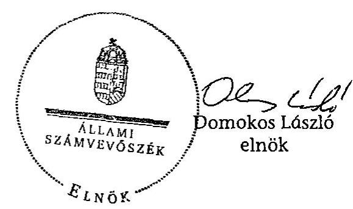

Melléklet:  6 db 24 lap

---

# MELLÉKLETEK 

a V-2010-126/2010-2011. sz. jelentéshez

---

# ÉSZREVÉTELEK

---

Iktatószám: 7062-6/2011/ELL

# Domokos László úr 

elnök

Állami Számvevőszék

## Budapest

Apáczai Csere János u. 10.
1052

Tárgy: a felsőoktatás oktatási infrastruktúra-fejlesztési programjának ellenőrzéséről készített jelentés tervezet véleményezése

Tisztelt Elnök Úr!

Tájékoztatom Elnök Urat, hogy a felsőoktatás oktatási infrastruktúra-fejlesztési programjának ellenőrzéséről készített jelentés tervezetéhez nem teszek észrevételt.

Budapest, 2011. november 28.

---

# NEMZETI FEJLESZTÉSI MINISZTÉRIUM 

DR. FELLEGI TAMÁS

## Állami Számvevőszék

1052 Budapest, Apáczai Csere J. u. 10.

## Domokos László úr részére

elnök

Tárgy: Jelentés észrevételezése

Tisztelt Elnök Úr!

Az Állami Számvevőszék felsőoktatás oktatási infrastruktúra - fejlesztési programjának ellenőrzéséről készített jelentésében foglaltakra észrevételt nem teszünk.

Budapest, 2011.

---

# A felsőoktatás oktatási infrastruktúra-fejlesztési programjának folyamatábrája 

## I. ELŐKÉSZÍTÉSI ÉS KÖZBESZERZÉSI FÁZIS

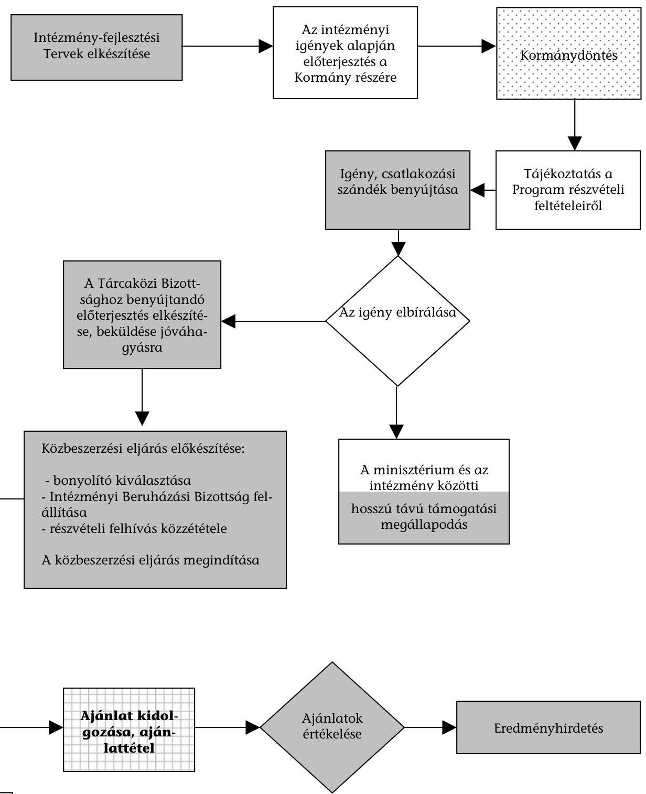

## Kormány

## Minisztérium

Felsőoktatási intézmény
Beruházó - szolgáltató

---

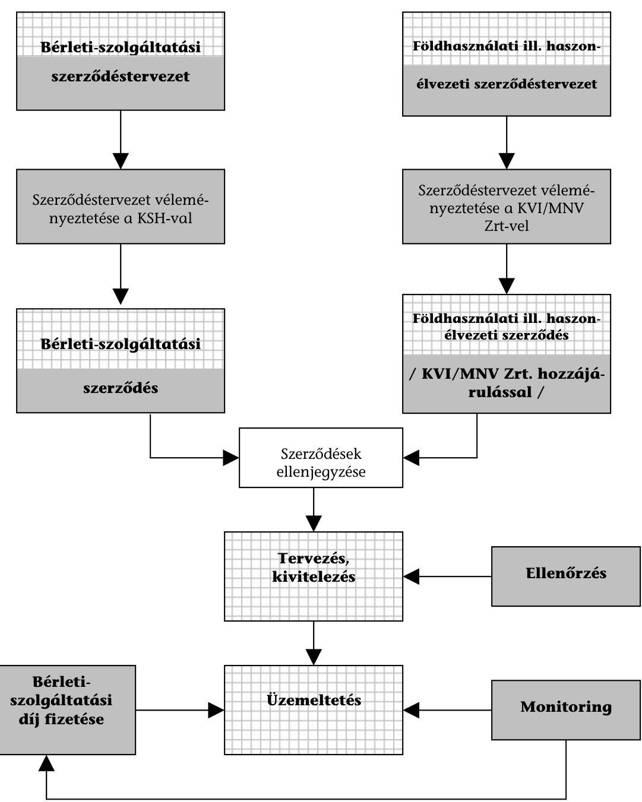

# II. SZERZŐDÉSKÖTÉSI, TERVEZÉSI, KIVITELEZÉSI ÉS ÜZEMELTETÉSI FÁZIS

## Bérleti szolgáltatási szerződéstervezet

### Szerződéstervezet véleményezése
- **Földhasználati ill. haszonbérleti szerződéstervezet**

### Szerződéstervezet véleményezése
- **Szerződéstervezet véleményezése
- **Egyeztetések a KVI/MNV Zrt-vel**

## Bérleti szolgáltatási szerződés

### Szerződések ellenjegyzése

### Tervezés, kivitelezés

### Ellenőrzés

## Bérleti szolgáltatási díj fizetése

### Üzemeltetés

### Monitoring

---

### Minisztérium

### Felsőoktatási intézmény

### Beruházó - szolgáltató

---

# AZ ELLENŐRZÉSBE VONT SZERVEZETEK JEGYZÉKE 

3/a. sz. melléklet: Az ellenőrzésbe vont szervezetek névjegyzéke
3/b. sz. melléklet: Helyszíni ellenőrzésbe vont szervezetek névjegyzéke

---

# AZ ELLENŐRZÉSBE VONT SZERVEZETEK NÉVJEGYZÉKE 

## Állami szervezetek megnevezése

1. Nemzeti Erőforrás Minisztérium (NEFMI)
2. Nemzeti Fejlesztési Minisztérium (NFM)

## Felsőoktatási intézmények megnevezése- Projekt megnevezése

1. Budapesti Corvinus Egyetem (BCE)

- Czuczor u. - Mátyás utcai Campus

2. Budapesti Műszaki és Gazdaságtudományi Egyetem (BME)

- Q Oktatási épület

3. Dunaújvárosi Főiskola (DF)

- Oktatási Centrum A épület

4. Eötvös József Főiskola (EJF)

- Könyvtár - nagyépület

5. Eötvös Loránd Tudományegyetem (ELTE)

- Trefort kerti Campus

6. Eszterházy Károly Főiskola (EKF)

- Sport-szakmai képzések infrastruktúra bővítése
- C épület és Rajz Tanszék épülete

7. Károly Róbert Főiskola (KRF)

- Oktatási épület

8. Nyíregyházi Főiskola (NYF)

- Tanszéki épület rekonstrukció

9. Nyugat-magyarországi Egyetem (NYME)

- Oktatási Infrastruktúra rekonstrukció, Sopron
- Regionális Felsőoktatási Forrásközpont, Szombathely
- Képző és Konferencia központ kialakítása, GEO, Székesfehérvár
- Tanszálloda projekt, Győr
- Pattantyús projekt, Győr

10. Óbudai Egyetem (OE - volt Budapesti Műszaki Főiskola)

- Józsefvárosi Oktatási Épület

11. Pécsi Tudományegyetem (PTE)

- Pollack Mihály Műszaki Kar rekonstrukció

12. Semmelweis Egyetem (SE)

- Elméleti Oktatási Központ (EOK)
- Fogorvostudományi Kar Oktatási Centrum (FOK)

13. Szent István Egyetem (SZIE)

- TSF Könyvtár és nagyelőadó, Békéscsaba

14. Szolnoki
 Főiskola (SZF)

- Tiszaligeti Campus

---

# A HELYSZÍNI ELLENŐRZÉSBE VONT SZERVEZETEK NÉVJEGYZÉKE 

## Állami szervezetek megnevezése

1. Nemzeti Erőforrás Minisztérium (NEFMI)
2. Nemzeti Fejlesztési Minisztérium (NFM)

## Felsőoktatási intézmény megnevezése - Projekt megnevezése

1. Semmelweis Egyetem (SE)

- Elméleti Oktatási Központ (EOK)
- Fogorvostudományi Kar Oktatási Centrum (FOK)

2. Nyugat-magyarországi Egyetem (NYME)

- Oktatási Infrastruktúra rekonstrukció, Sopron
- Regionális Felsőoktatási Forrásközpont, Szombathely

3. Budapesti Corvinus Egyetem (BCE)

- Czuczor u. - Mátyás utcai Campus

4. Nyíregyházi Főiskola (NYF)

- Tanszéki épület rekonstrukció

5. Eötvös Loránd Tudományegyetem (ELTE)

- Trefort kerti Campus

6. Szolnoki Főiskola (SZF)

- Tiszaligeti Campus

7. Pécsi Tudományegyetem (PTE)

- Pollack Mihály Műszaki Kar rekonstrukció

---

# Alapadatok az állami felsőoktatási intézmények PPP konstrukciójú oktatási infrastruktúra-fejlesztéséről

|  Tervezett fejlesztések a 2207/2004. (VIII. 27.) kormányhatározat alapján |  |  |  | Megvalósult 2010. december 31-ig |  |  |   |
| --- | --- | --- | --- | --- | --- | --- | --- |
|  Sorsz. | Intézmények megnevezése | A létrehozandó kapacitás/ objektum megnevezése | Becsült nettó beruházási összeg (Mrd Ft) Terv terület $\left(\mathrm{m}^{3}\right)^{1}$ | Intézmények megnevezése/ projektek száma | A létrehozott kapacitás/objektum megnevezése | Nettó beruházási összeg (Mrd Ft) Nettó terület $\left(\mathrm{m}^{3}\right)$ | Ezemeltetés kezdési időpontja  |
|  1. | Budapesti Közgazdaságtudományi és Államigazgatási Egyetem - Corvinus (BCE) | Czuczor utcai campus tömbje (elősülő termek, könyvtár, nyelvi labor, tanszéki irodák) | $\begin{gathered} 7,9 \mathrm{Mrd} \mathrm{ft} \ (20000 \mathrm{~m}^{2}) \end{gathered}$ | Budapesti Corvinus Egyetem (BCE) | Czuczor utcai campus: új oktatási épületek | $\begin{gathered} 6,05 \mathrm{Mrd} \mathrm{ft} \ (20675 \mathrm{~m}^{2}) \end{gathered}$ | 2007.09.11  |
|  2. | Semmelweis Egyetem, Budapest (SE) | A Fogorvos-tudományi Kar új épülete és az Általános Orvostudományi Kar alaptudományi campusa | $\begin{gathered} 11,4 \mathrm{Mrd} \mathrm{ft} \ (40000 \mathrm{~m}^{2}) \end{gathered}$ | Semmelweis Egyetem, Budapest (SE) | Fogorvostudományi Központ Új építés | $\begin{gathered} 3,90 \mathrm{Mrd} \mathrm{ft} \ (12012 \mathrm{~m}^{2}) \end{gathered}$ | 2007.04.01  |
|   |  |  |  |  | Elméleti Oktatási Központ Új építés | $\begin{gathered} 6,70 \mathrm{Mrd} \mathrm{ft} \ (27965 \mathrm{~m}^{2}) \end{gathered}$ | 2008.09.01  |
|  3. | Liszt Ferenc Zeneművészeti Egyetem (LFZME) | Új vagy meglévő épület zeneoktatási célra történő kialakítása (tanszéki irodák, próbuttermek) | $\begin{gathered} 3,4 \mathrm{Mrd} \mathrm{ft} \ (8000 \mathrm{~m}^{2}) \end{gathered}$ | Liszt Ferenc Zeneművészeti Egyetem (LFZME) |  |  | Nem valósult meg  |
|  4. | Eötvös Loránd Tudományegyetem (ELTE) | Trefort-kerti campus egyes épületeinek és a Rákóczi úti épületnek a rekonstrukciója | $\begin{gathered} 4,7 \mathrm{Mrd} \mathrm{ft} \ (14000 \mathrm{~m}^{2}) \end{gathered}$ | Eötvös Loránd Tudományegyetem (ELTE) | Trefort-kerti campus rekonstrukciója | $\begin{gathered} 3,75 \mathrm{Mrd} \mathrm{ft} \ (14783 \mathrm{~m}^{2}) \end{gathered}$ | 2007.04.01  |
|  5. | Dunaújvárosi Főiskola (DF) | Meglévő megvásárolt ipari épület oktatási célú átalakítása | $\begin{gathered} 1,4 \mathrm{Mrd} \mathrm{ft} \ (4000 \mathrm{~m}^{2}) \end{gathered}$ | Dunaújvárosi Főiskola (DF) | Oktatási centrum rekonstrukciója | $\begin{gathered} 2,1 \mathrm{Mrd} \mathrm{ft} \ (4384 \mathrm{~m}^{2}) \end{gathered}$ | 2006.09.01  |
|  6. | Budapesti Műszaki Főiskola (BMF) | Oktatási épület kialakítása | $\begin{gathered} 1,0 \mathrm{Mrd} \mathrm{ft} \ (3000 \mathrm{~m}^{2}) \end{gathered}$ | Óbudai Egyetem (OE volt BMF) | Józsefvárosi Oktatási Épület-új beruházás | $\begin{gathered} 0,93 \mathrm{Mrd} \mathrm{ft} \ (1360 \mathrm{~m}^{2}) \end{gathered}$ | 2006.06.27  |
|  7. | Budapesti Műszaki és Gazdaságtudományi Egyetem (BME) | Lágymányosi fejlesztési területen az Építész Kar részére új oktatási épület | $\begin{gathered} 8,0 \mathrm{Mrd} \mathrm{ft} \ (28000 \mathrm{~m}^{2}) \end{gathered}$ | Budapesti Műszaki és Gazdaságtudományi Egyetem (BME) | Lágymányosi Campus Újépület | $\begin{gathered} 5,65 \mathrm{Mrd} \mathrm{ft} \ (35935 \mathrm{~m}^{2}) \end{gathered}$ | 2010.09.01  |
|  8. | Miskolci Egyetem (ME) | Meglévő épületek központi irodabázsú történő átalakítása, Zenepalota felújítása | $\begin{gathered} 2,7 \mathrm{Mrd} \mathrm{ft} \ (9700 \mathrm{~m}^{2}) \end{gathered}$ | Miskolci Egyetem (ME) |  |  | Nem valósult meg  |
|  9. | Nyugat-Magyarországi Egyetem, Sopron (NYME) | Oktatási tanterem és előadóterem fejlesztések Sopronban és Mosonmagyaróváron; soproni központi épület rekonstrukciója | $\begin{gathered} 3,0 \mathrm{Mrd} \mathrm{ft} \ (10800 \mathrm{~m}^{2}) \end{gathered}$ | Nyugat-Magyarországi Egyetem, Sopron (NYME) | Győr, Pattantyús utca | $\begin{gathered} 1,03 \mathrm{Mrd} \mathrm{ft} \ (2760 \mathrm{~m}^{2}) \end{gathered}$ | 2006.11.01  |
|   |  |  |  |  | Győr tanszálloda | $\begin{gathered} 2,16 \mathrm{Mrd} \mathrm{ft} \ (6509 \mathrm{~m}^{2}) \end{gathered}$ | 2007.08.31  |
|   |  |  |  |  | Sopron-
Mosonmagyaróvár oktatási infrastruktúra | $\begin{gathered} 4,35 \mathrm{Mrd} \mathrm{ft} \ (26141 \mathrm{~m}^{2}) \end{gathered}$ | 2007.08.31  |
|   |  |  |  |  | Székesfehérvár oktatási központ GEO projekt | $\begin{gathered} 0,75 \mathrm{Mrd} \mathrm{ft} \ (5497 \mathrm{~m}^{2}) \end{gathered}$ | 2007.08.31  |

---

|  10. | Pécsi Tudományegyetem (PTE) | Meglévő épületek (Orvoskar) bővítése, teljes rekonstrukció a Műszaki Kar épületében, bővítés a Jogi-Közgazdasági Kuri épületekben, „magasítási" általakítása | 9,6 Mrd Ft (20 000 m²) | Pécsi Tudományegyetem (PTE) | Pollack Mihály Műszaki Kar rekonstrukció I-II. ütem | 2,50 Mrd Ft (17 792 m²) | 2007.12.31  |
| --- | --- | --- | --- | --- | --- | --- | --- |
|  11. | Károly Róbert Főiskola (KRF) | Meglévő oktatási épületek bővítése, illetve felújítása (kollégiumokból oktatási helyiségeket alakítottak ki) | 1,5 Mrd Ft (5000 m²) | Károly Róbert Főiskola (KRF) | Kollégiumból oktatási helyiségek | 0,51 Mrd Ft (3000 m²) | 2007.08.01  |
|  12. | Keckeméti Főiskola (KF) | Új oktatási épület és könyvtár építése | 1,8 Mrd Ft (6300 m²) | Keckeméti Főiskola (KF) |  |  | Más forrábból valósult meg  |
|  13. | Szolnoki Főiskola (SZF) | Új oktatási épület létesítése, illetve meglévő épület bővítése Tiszuligeten | 2,6 Mrd Ft (9400 m²) | Szolnoki Főiskola (SZF) | Tiszuligeti Campus új beruházás | 2,91 Mrd Ft (8822 m²) | 2008.12.02  |
|  14. | Színház- és Filmművészeti Egyetem (SZFE) | Új egyetemi épület (tantermek, előadétermek, próbukermek, film műtermek) létesítése | 3,4 Mrd Ft (12 000 m²) | Színház- és Filmművészeti Egyetem (SZFE) |  |  | Nem valósult meg  |
|  15. | Magyar Képzőművészeti Egyetem (MKE) | Szakközépiskola új oktatási épületének megépítése | 2,3 Mrd Ft (8000 m²) | Magyar Képzőművészeti Egyetem (MKE) |  |  | Nem valósult meg  |
|  16. | Magyar Iparművészeti Egyetem (MIE) | Új műhelyház, gyakorlóterem | 1,4 Mrd Ft (4200 m²) | Moholy-Nagy Művészeti Egyetem (MOME) |  |  | Nem valósult meg  |
|  17. | Berzsenyi Dániel Főiskola, Szombathely (BDF) | Új könyvtárépület megépítése | 1,1 Mrd Ft (3700 m²) | Nyugat-Magyarországi Egyetem, Sopron (NYME) | Szombathely Regionális Felsőoktatási Forrásközpont (SEK) | 1,10 Mrd Ft (3330 m²) | Integrálódott a NYME-be, átadva 2006.11.06  |
|  18. | Eötvös József Főiskola, Baju (EJF) | Új előadéterem és könyvtár megépítése | 1,0 Mrd Ft (3700 m²) | Eötvös József Főiskola, Baju (EJF) | Könyvtár és nagyépület Új beruházás | 0,83 Mrd Ft (4677 m²) | 2008.01.31  |
|  19. | Tessedik Sámuel Főiskola (TSF) | Új előadéterem és oktatási épület megépítése (Békéscsaba) | 1,1 Mrd Ft (4000 m²) | Tessedik Sámuel Főiskola (TSF) | Békéscsaba: Nagyolóadó és Könyvtár | 0,80 Mrd Ft (2267 m²) | Integrálódott a SZIE-be, átadva: 2007.01.01  |
|  OSSZESEN |  | 19 felsőoktatási intézmény | 69,3 Mrd Ft |  |  |  |   |
|  Későbbi döntés alapján |  |  |  |  |  |  |   |
|  20. | Nyíregyházi Főiskola (NYF) | Központi oktatási épület rekonstrukciója | 1,76 Mrd Ft (29 022 m²) | Nyíregyházi Főiskola (NYF) | Tanszéki épület B-D-E jelű épületek rekonstrukciója | 3,19 Mrd Ft (27 589 m²) | 2007.08.31 2008.09.01  |
|  21. | Szent István Egyetem (SZIE) | Oktatási épület rekonstrukciója és új építés | 5,2 Mrd Ft (40 100 m²) | Szent István Egyetem (SZIE) |  |  | Nem valósult meg  |
|  22. | Eszterházy Károly Főiskola (EKF) | Sportcentrum, új oktatási épület, oktatási rekonstrukció | 0,8 Mrd Ft (8800 m²) | Eszterházy Károly Főiskola (EKF) |  | 0,60 Mrd Ft (3405 m²) | 2007.09.01  |
|   |  |  |  |  | Sportlétesítmény | 0,85 Mrd Ft (4351 m²) | 2007.05.01  |
|  OSSZESEN |  | 22 felsőoktatási intézmény | 77,06 Mrd Ft | 16 felsőoktatási intézmény | 20 projekt | 50,67 Mrd Ft |   |

1 A 2207/2004. (VIII.27.) Korm.határozat a becsült bruttó értékkel számolt. A szerződés szerinti adatokkal történő összehasonlítás miatt jelen táblázat a nettó összeget tartalmazza.

A Nemzeti Fejlesztési Minisztérium adatszolgáltatása alapján.

---

# ÖSSZESÍTŐ TÁBLÁZATOK A FELSŐOKTATÁS OKTATÁSI INFRASTRUKTÚRA-FEJLESZTÉSI PROGRAMJÁNAK ELLENŐRZÉSÉRŐL 

1. sz. táblázat: A felsőoktatás oktatási infrastruktúra-fejlesztési programban való részvétel indokai
2. sz. táblázat: A helyszíni ellenőrzéssel érintett intézmények fejlesztési igényeinek változása
3. sz. táblázat: Az állami felsőoktatási intézmények központi beruházási kerete
4. sz. táblázat: A helyszínen ellenőrzött intézmények OM megállapodáshoz készített gazdaságossági számításainak adatai
5. sz. táblázat: A helyszínen ellenőrzött projektek PPP-PSC jelenértékei a végleges ajánlatok és a szerződéses adatok alapján
6. sz. táblázat: Szerződéses feltételek a futamidő végén
7. sz. táblázat: A felsőoktatás oktatási infrastruktúra-fejlesztési programjában résztvevő intézmények beruházási adatai
8. sz. táblázat: Új építésű PPP projektek fajlagos - 1 bruttó $\mathrm{m}^{2}$-re eső üzemeltetési díja
9. sz. táblázat: Rekonstrukciós PPP projektek fajlagos - 1 bruttó $\mathrm{m}^{2}$-re eső - üzemeltetési díja
10. sz. táblázat: A felsőoktatás oktatási infrastruktúra-fejlesztési programjában résztvevő intézmények hallgatói létszámának alakulása 2006-2010 között
11. sz. táblázat: Az oktatási infrastruktúra-fejlesztési program bérletiszolgáltatási díjának alakulása 2007-2010 között
12. sz. táblázat: Az oktatási infrastruktúra-fejlesztési program bérletiszolgáltatási díjának összetevői 2007-2010 között
13. sz. táblázat: Az oktatási infrastruktúra-fejlesztési program bérletiszolgáltatási díjának intézményi forrásai
14. sz. táblázat: A felsőoktatás oktatási infrastruktúra-fejlesztési programjában résztvevő intézmények PPP kötelezettségvállalásainak aránya
15. sz. táblázat: A felsőoktatási PPP programokkal kapcsolatos költségvetést terhelő kiadások a teljes futamidő alatt

---

# A felsőoktatás oktatási infrastruktúra-fejlesztési

## programban való részvétel indokai

|  Ssz. | Intézmény neve | Kérdőívek alapján |  |  |  | 2007-2010
közötti
időszakban
tanúsítványi
adatok alapján
(M Ft) |

 Egyéb ingatlangazdálkodási intézkedés |  | Létszám tényleges alakulása 2010/2006 (\%)  |
| --- | --- | --- | --- | --- | --- | --- | --- | --- | --- |
|   |  | Csatlakozás okai |  |  | Ingatlanértékesítésből származó bevétel felhasználása |  | egyházi ingatlan visszaadás | bérlemény felmondás (helyszínen ellenőrzött intézményeknél) |   |
|   |  | állag, korszerűtlenség | széttagoltság | kapacitás mennyiségi hiánya |  |  |  |  |   |
|  1 | BCE | 1 | 1 | 1 | igen | 187,4 | igen | igen | $-4,2 \%$  |
|  2 | BME | 1 | 1 | 0 | igen | - | nem | - | $-1,5 \%$  |
|  3 | DF | 1 | 0 | 1 | nem | - | nem | - | $-19,0 \%$  |
|  4 | EJF | 1 | 1 | 1 | igen | 46,7 | nem | - | $-40,4 \%$  |
|  5 | ELTE | 1 | 1 | 0 | igen | 999,3 | igen | nem | $-4,5 \%$  |
|  6 | EKF | 1 | 0 | 0 | nem | - | nem | - | $-13,2 \%$  |
|  7 | KRF | 1 | 1 | 1 | nem | - | nem | - | $-40,1 \%$  |
|  8 | NYF | 1 | 1 | 0 | nem | 0,0 | nem | nem | $-39,6 \%$  |
|  9 | NYME* | 1 | 1 | 1 | igen | 182,5 | nem | igen | $-28,5 \%$  |
|  10 | OE | 0 | 0 | 1 | nem | - | nem | - | $-4,9 \%$  |
|  11 | PTE | 1 | 0 | 1 | nem | 0,0 | nem | nem | $-18,5 \%$  |
|  12 | SE | 1 | 1 | 1 | igen | 456,7 | nem | nem | $6,8 \%$  |
|  13 | SZIE | 0 | 0 | 1 | nem | - | nem | - | $-19,1 \%$  |
|  14 | SZF | 1 | 1 | 1 | nem | 0,0 | nem | igen | $-46,0 \%$  |
|  Összesen |  | 12 | 9 | 10 | 6 | - | 2 | 3 | $-16,0 \%$  |

Forrás: létszámadatok: 6-7. sz. tanúsítványok, 8. táblázat, kérdőív

- SEK-el együtt 1= igen; $0=$ nem

---

### **A helyszíni ellenőrzéssel érintett intézmények fejlesztési igényeinek változása**

|  Intézmény | Az első IFF-ben szereplő fejlesztési igény |  | A második IFF/IBT-ben szereplő fejlesztési igény |  | PPP konstrukció szerinti fejlesztés |  | megjegyzés  |
| --- | --- | --- | --- | --- | --- | --- | --- |
|   | megnevezése | nettó bekezdési költség (M Ft) | megnevezése | nettó bekezdési költség (M Ft) | megnevezése | a beruházás nettó bekezdési költsége (M Ft) | megjegyzés  |
|  BCE | 2000. IFF |  | 2003. IBT |  | végleges ajánlat |  |   |
|   | Csencsor Műszin projekt | 8 000,0 | Csencsor Műszin projekt | 9 920,0 | Csencsor Műszin projekt | 6 050,6 |   |
|  ELTE | 2000. IFF |  | 2007. IFF |  | végleges ajánlat |  |   |
|   | Torkot projekt | 3 368,0 | Éppen már nem szerepel a Torkot projekt, mert már a megvalósítás végén járt |  | Torkot projekt | 4 108,0 |   |
|  NYF | 2002. IFF |  | 2007. IFF |  | végleges ajánlat |  |   |
|   | nem szerepel |  | Éppen már nem szerepel a központi oktatási épület rekonstrukciója, mert a megvalósítás nem elutasítható | 1 776,0 | Központi oktatási épület rekonstrukciója | 3 900,0 | Az I-II. ütemre bontott beruházás sorozatos szerinti nettó költsége a 3900 M Ft, de csak az I-II. ütem valósult meg.  |
|   | 2000. IFF |  | 2004. IFF |  | végleges ajánlat |  |   |
|   | Sopron esztétikai kar épület rekonstrukciója "K" épület | 184,0 | "K" épület udvari számú területi beépítése | 49,6 | Oktatási infrastruktúra projekt "K" épület teljes felújítása, nyilvántartása, vizsgálatok hozzájárulása |  |   |
|   | Egyszerű Campus felújítása (több épületet foglalt magában) | 872,0 | Sopron "K" épület felújítása és korszerűsítése, Gazdasági Informatikus kar új épületének létrehozása | 864,0 | Sopron Gazdasági Informatikus kar új épületének megvalósítása, felújítása |  |   |
|  NYME | Tanterem fejlesztés | 32,0 | 8 tantermes oktatási épület létrehozása, hogy előadó terem létrejöjjön | 1 008,0 | Sopron Egyetem központi tantermes oktatási épület építése, korszerű infrastruktúra megnevezése és tanterme |  |   |
|   | Közgazdaságtudományi kar oktatási épület vizsgálata, felújítása és berendezése | 800,0 | Közgazdaságtudományi kar megvizsgált épület továbbfejlesztése (gazdálkodás, esély, tanterem) és tanterme | 788,0 | Közgazdaságtudományi kar megvizsgált épület udvarbővítése (gazdálkodás, esély, tanterem) és tanterme |  |   |
|   | Műszaki és informatikai "C" épület tetőtér beépítése és épület felújítása | 240,0 | Műszaki és informatikai "C" épület felújítása, élményközpont fejlesztése | 360,0 | Műszaki és Informatikai Kutató Központ "C" épület felújítása és tanterme |  |   |
|   | nem szerepel | 0 | Sopron "Migi kollégium" korszerűsítése | 504,0 | Sopron "Migi kollégium" felújítása és tanterme |  |   |
|   | nem szerepel | 0 | nem szerepel | 0 | Sopron "Ej kollégium" felújítása és tanterme |  |   |
|  Összesen |  | 2 150,0 |  | 1 571,6 |  | 4 347,4 |   |
|  PTE | 2002-2003. IBT |  | 2003. beruházási projekt PPP keretében |  | végleges ajánlat |  |   |
|   | Révész úti épületegyüttes rekonstrukció bekezdés összehívása | 1 040,0 | Révész úti épületegyüttes rekonstrukció bekezdés összehívása | 1 040,0 | Révész úti épületegyüttes rekonstrukció bekezdés |  |   |
|   | Révész úti rekonstrukció IV. ütem | 720 | Révész úti rekonstrukció IV. ütem | 720 | Révész úti rekonstrukció IV. ütem |  |   |
|   | 2 PTE általános rekonstrukciója | 320 | 2 PTE általános rekonstrukciója | 320 | 2 PTE általános rekonstrukciója |  |   |
|   | Gyógyszerésztudományi kar szakértézetének kialakítása | 440,0 | Gyógyszerésztudományi kar szakértézetének kialakítása | 440,0 | Gyógyszerésztudományi kar szakértézetének kialakítása |  |   |
|   | 7MMEK Beszámkány úti rekonstrukció | 1 200,0 | 7MMEK Beszámkány úti rekonstrukció | 1 200,0 | 7MMEK Beszámkány úti rekonstrukció | 2 503,2 |   |
|   | 25K-oktatási helyiségek témáikása, felvétele, 7mm | 400,0 | 25K-oktatási helyiségek témáikása, felvétele, 7mm | 400,0 | 25K-oktatási helyiségek témáikása, felvétele, 7mm |  |   |
|   | ETE Kikaz u. épület felújítása | 280,0 | nem szerepel |  | nem szerepel |  |   |
|   | Dzapianich úti fejlesztés | 120,0 | nem szerepel |  | nem szerepel |  |   |
|   | 25K tanterem- és kinyirálódók | 480,0 | nem szerepel |  | nem szerepel |  |   |
|  Összesen |  | 3 960,0 |  | 3 080,0 |  | 2 503,2 |   |
|  SE-10K | 1999. IFF |  | 2001. IFF |  | végleges ajánlat |  |   |
|   | Oktatási Centrum | 6 160,0 | Szemléleti Oktatási Központ | 6 080,0 | Szemléleti Oktatási Központ | 6 736,0 |   |
|  SE-15K | 1999. IFF |  | 2003. IFF |  | végleges ajánlat |  |   |
|   | Fejérvölgyi Központ | 2 000,0 | Fejérvölgyi Központ | 1 600,0 | Fejérvölgyi Központ | 3 292,0 |   |
|  SZF | 2001. IFF |  | 2003. IFF |  | végleges ajánlat |  |   |
|   | Tanszéki Oktatási Centrum | 900,0 | SZF | 0,0 | Tanszéki Oktatási Központ | 2 648,5 |   |
|  Összesen |  | 26 516,0 |  | 21 829,6 |  | 32 385,7 |   |

---

# Az állami felsőoktatási intézmények központi beruházási kerete 

Adatok: M Ft

| Évek | Előirányzat | Teljesítés |
| :--: | --: | --: |
| $\mathbf{2 0 0 0}$. | $11166,2$ | $11745,4$ |
| $\mathbf{2 0 0 1}$. | $10489,6$ | $17092,4$ |
| $\mathbf{2 0 0 2}$. | $12129,5$ | $19686,6$ |
| $\mathbf{2 0 0 3}$. | $10390,0$ | $11273,2$ |
| $\mathbf{2 0 0 4}$. | $10752,9$ | $9533,9$ |
| $\mathbf{2 0 0 5}$. | $8436,8$ | $8926,0$ |
| $\mathbf{2 0 0 6}$. | $5680,0$ | $5493,7$ |
| $\mathbf{2 0 0 7}$. | 850,0 | 822,7 |
| $\mathbf{2 0 0 8}$. | $2336,2$ | $1455,7$ |
| $\mathbf{2 0 0 9}$. | 333,5 | $1601,6$ |
| $\mathbf{2 0 1 0}$. | 255,0 | 494,3 |

## Megjegyzés:

A "Teljesítés" adatmezői az előző évi maradványok felhasználását is tartalmazzák.

---

# A HELYSZÍNEN ELLENŐRZÖTT PPP PROJEKTEK OM MEGÁLLAPODÁSHOZ KÉSZÍTETT GAZDASÁGI SZÁMÍTÁSAINAK
 ISMERTETÉSE 

1. Teljes projektköltség jelenértéke: a létesítés és üzemeltetés fedezetét a teljes futamidőre biztosító bérleti-szolgáltatási díj diszkontált összege.
2. Teljes projektköltség: a létesítés és üzemeltetés fedezetét a teljes futamidőre biztosító bérleti-szolgáltatási díj nominális összege.
3. Szolgáltatás-igénybevétel futamideje: az infrastruktúra üzemeltetésének időszaka.
4. Diszkontráta FM költség: a bérleti-szolgáltatási díjból az üzemeltetési díjrész jelenértékének meghatározásához felhasznált diszkontráta.
5. Diszkontráta kamat: a bérleti-szolgáltatási díjból a kamatköltség jelenértékének meghatározásához felhasznált diszkontráta.
6. Beruházás becsült költsége: az Oktatási Minisztérium felügyelete alá tartozó felsőoktatási intézmények infrastruktúra fejlesztési programjának aktuális feladatairól szóló 2207/2004. (VIII. 27.) Korm. határozat mellékletében meghatározott becsült bruttó beruházási összeg.
7. Beruházás becslés PSC / PPP számítás szerint: Az OM megállapodások előterjesztésében előzetesen meghatározott nettó bekerülési költség.

---

# A helyszínen ellenőrzött intézmények OM megállapodáshoz készített gazdaságossági számításainak adatai

|  Sorsz. | Megnevezés | ELTE |  | NYE |  | SE EOK |  | SE FOK |   |
| --- | --- | --- | --- | --- | --- | --- | --- | --- | --- |
|   |  | PSC | PPP | PSC | PPP | PSC | PPP | PSC | PPP  |
|  1 | Teljes projektköltség jelenértéke | 11163,4 | 10431,1 | 3211,3 | 2479,0 | 13038,0 | 13087,0 | 5831,0 | 5775,0  |
|  2 | Teljes projektköltség (nominális érték) | 25406,5 | 24810,8 | 5287,8 | 5917,4 | 19155,2 | 19197,3 | 8126,0 | 8310,3  |
|  3 | Szolgáltatás- igénybevétel futamideje (év) | 20 | 20 | 20 | 20 | 20 | 20 | 20 | 20  |
|  4 | Diszkontráta FM költség | PPI | PPI | PPI | PPI | PPI | PPI | PPI | PPI  |
|  5 | Diszkontráta kamat | BUBOR | BUBOR $+1,5 \%$ | BUBOR | BUBOR, 2010-tól EURIBOR $+1,5 \%$ | BUBOR | $\begin{gathered} \text { BUBOR }+1,75- \ 1,85 \% \end{gathered}$ | BUBOR | $\begin{gathered} \text { BUBOR }+1,75- \ 1,85 \% \end{gathered}$  |
|  6 | Beruházás becsült költsége* (Korm.határozat.) | 5800 | 5800 | 2221 | 2221 | 14200 |  |  |   |
|  7 | Beruházás becslés PSC /PPP számítás szerint | 6500 | 7500 | 2510 | 1631 | 9212,8 | 8398,3 | 3397 | 3116  |

Adatok M Ft, nettó

|  Sorsz. | Megnevezés | PPP |  |  |  |   |
| --- | --- | --- | --- | --- | --- | --- |
|   |  | BCE | NYME Campus | NYME SEK | SZF | PTE  |
|  1 | Teljes projektköltség jelenértéke | 20737,1 | 8186,7 | n.a. | 5863,0 | 4334,3  |
|  2 | Teljes projektköltség (nominális érték) | 24344,0 | 11365,3 | 4104,8 | 8141,2 | 9914,0  |
|  3 | Szolgáltatás- igénybevétel futamideje (év) | 20 | 20 | 20 | 20 | 20  |
|  4 | Diszkontráta FM költség | n.a. | PPI | PPI | PPI | PPI  |
|  5 | Diszkontráta kamat | n.a. | euró alapú finanszírozás, $5 \%$ | euró alapú finanszírozás, $5 \%$ | euró alapú finanszírozás, $5 \%$ | euró alapú finanszírozás, $5 \%$  |
|  6 | Beruházás becsült költsége* (Korm.határozat.) | 9900 | 3800 | 1400 | 3000 | 3207  |
|  7 | Beruházás becslés PSC /PPP számítás szerint | 8420 | 3040 | 1120 | 2400 | 2730  |

- bruttó érték

---

# A HELYSZÍNEN ELLENŐRZÖTT PPP PROJEKTEK BECSÜLT ÉRTÉKEINEK SZÁMÍTÁSI MÓDSZERE 

1. PPP nettó bekerülési költsége: a magánpartner közreműködésével megvalósuló fejlesztés (a beruházás, illetve rekonstrukció) ráfordítása (a nyertes szolgáltatók végleges ajánlatában, illetve a bérleti szolgáltatási szerződésben meghatározott összeg).
2. PSC nettó bekerülési költsége: hagyományos állami fejlesztés formájában megvalósuló beruházás, illetve rekonstrukció ráfordítása 6\%-os költségtúllépés feltételezésével. Az OM 2000-2004 között megvalósított 500 M Ft feletti hagyományos állami beruházásainál a tényleges bekerülési költség a szerződés szerinti árnak átlagosan 106,0\%-a volt. Ezért a PSC nettó bekerülési költsége a PPP érték $106,0 \%-a$.
3. PPP saját erő/hitel aránya: a projekt magánpartner közreműködésével történő megvalósításához szükséges források aránya.
4. PSC hitel aránya: hagyományos állami beruházás esetén a fejlesztés feltételezett finanszírozási forrása ( $100 \%$-os hitelfelvétel).
5. PPP projektköltség jelenértéke: a létesítés és üzemeltetés fedezetét a teljes futamidőre biztosító bérleti-szolgáltatási díj szerződés szerinti összege, ${ }^{1}$ a 161/2005. (VIII. 16.) Korm. rendelet ${ }^{2}$ szerinti diszkontráta sorral átszámítva.
6. PSC projektköltség jelenértéke I.: a létesítés és üzemeltetés ráfordításainak teljes futamidőre számított feltételezett összege állami megvalósítás esetén, a 161/2005. (VIII. 16.) Kormányrendelet diszkontráta sorával jelenértékre átszámítva. Az állami létesítéshez 100\%-os euró alapú hitel igénybevételét feltételeztük. A számítás menete:
a.) Az adósságszolgálat meghatározása: a PSC nettó bekerülési költsége (2. pont) hitel és tőketörlesztésének összege euróban. Az euró összegek az adott projektnél alkalmazott forint/euró árfolyamon kerültek meghatározásra. A kamatláb a felártól mentes
[^0]
[^0]:    ${ }^{1}$ Adatforrások: végleges ajánlatok, bérleti-szolgáltatási szerződések, intézményi tanúsítványok.
    2 A többéves fizetési kötelezettséggel járó kötelezettségvállalások nettó jelenérték számításának módszertanáról, valamint az alkalmazandó diszkonttényezőről szóló 161/2005. (VIII. 16.) Korm. rendelet

---

euribor mértéke a nyertes ajánlatok közül az összes projektre vonatkozó legkedvezőbb ismert érték.

Az adósságszolgálat havi számítással került meghatározásra (a periódusok száma 20 éves futamidő esetén $12 * 20=240$ ). A számítás az Excel program PRÉSZLET és RRÉSZLET függvényeivel került meghatározásra. A PRÉSZLET függvény egy szabályos időközönként esedékes, állandó törlesztésen és kamatrátán alapuló hiteltörlesztés tőketörlesztés részének nagyságát számítja ki egy adott időszakra. Az RRÉSZLET függvény egy hiteltörlesztésen belül a kamattörlesztés nagyságát adja meg egy adott időszakra, periodikus kifizetéseket és állandó kamatlábat feltételezve.
b.) Az üzemeltetési ráfordítások: a PPP szerződés (ajánlat, illetve tanúsítvány) szerinti teljes futamidőre számított üzemeltetési díj diszkontált értéke. Mivel a magánszektor előzetesen feltételezett költséghatékonyságát az ellenőrzés nem igazolta, e téren a PSC és PPP dijrészletet azonos összegben vettük figyelembe.
7. PSC projekt jelenérték II: Az előző számítási módszer szerint meghatározott érték. Kamatlábként az adott projekt nyertes ajánlatában meghatározott adott hónapos felártól mentes euribor kamatláb került figyelembe vételre.
8. Jelenérték számítás éve: A közbeszerzési eljárások lezárásának, a végleges ajánlatok közül a nyertes ajánlat kiválasztásának éve.
9. Forint/euró árfolyam: a nyertes szolgáltatók végleges ajánlatában, illetve a bérleti szolgáltatási szerződésben meghatározott árfolyam.

---

# A helyszínen ellenőrzött projektek PPP-PSC jelenértékei a végleges ajánlatok és a szerződéses adatok alapján

|  Ssz. | Megnevezés | BCE | ELTE | NYF ${ }^{1,2}$ | NYME Campus $^{1}$ | NYME SEK | PTE | SE EOK | SE FOK | SZF  |
| --- | --- | --- | --- | --- | --- | --- | --- | --- | --- | --- |
|  1 | PPP nettó bekerülési költség | 6050,6 | 4108,0 | 3192,1 | 4347,5 | 1103,2 | 2503,2 | 6736,0 | 3292,0 | 2648,5  |
|  2 | PSC nettó bekerülési költség ${ }^{3}$ | 6413,6 | 4354,5 | 3383,6 | 4608,3 | 1169,4 | 2653,4 | 7140,2 | 3489,5 | 2807,4  |
|  3 | PPP saját erő/hitel aránya | 10/90\% | 10/90\% | 10/90\% | 10/90\% | 20/80\% | 10/90\% | 10/90\% | 20/80\% | 10/90\%  |
|  4 | PSC hitel aránya | 100\% | 100\% | 100\% | 100\% | 100\% | 100\% | 100\% | 100\% | 100\%  |
|  5 | PPP projektköltség jelenértéke | 12173,0 | 9462,4 | 4441,0 | 7144,9 | 2740,5 | 4342,5 | 10799,8 | 7595,8 | 4309,6  |
|  6 | PSC projektköltség jelenértéke I ${ }^{4}$ | 9977,7 | 9328,2 | 4205,0 | 7130,7 | 2087,5 | 4273,9 | 9836,5 | 6649,9 | 4078,1  |
|  7 | PSC projektköltség jelenértéke II ${ }^{5}$ | 9977,7 | n.a. | 4314,1 | n.a. | 2210,2 | 4341,3 | 10686,8 | 7006,1 | 4292,1  |
|  8 | Jelenérték számítás éve | 2005 | 2005 | 2006 | 2005 | 2005 | 2006 | 2005 | 2005 | 2007  |
|  9 | Forint/euró árfolyam | 252,66 | 252,00 | 250,00 | 250,00 | 250,00 | 263,04 | 250,00 | 248,90 | 245,78  |

${ }^{1}$ Az üzemeltetési díj évenkénti összege a végleges ajánlatból nem ismert, a PM árindex alapján került meghatározásra ${ }^{2}$ NYF III. ütem nélküli adatok ${ }^{3}$ PPP nettó bekerülési költség $+6 \%$ ${ }^{4}$ A PPP ajánlatok legalacsonyabb ismert, kamatfelár nélküli euribor (3M) értékével számolva ${ }^{5}$ A saját PPP ajánlat kamatfelár nélküli euribor (1-12M) értékével számolva

---

# Szerződéses feltételek a futamidő végén

|  Sorsz. | A helyszínen vizsgált projektek megnevezése | Feltételesen rendelkeztek a hosszabbításról, illetve a tulajdon megszerzéséről | A maradványérték meghatározása | A leírási kulcs mértéke |   |
| --- | --- | --- | --- | --- | --- |
|   |  |  |  | Ingatlanra | Ingóságokra  |
|  1. | BCE Czuczor Mátyás épület | BCE | könyv szerinti értéken, leírási kulcs rögzítésével | alapberuházás és felújítás 5\%-a | gép, berendezés, mobilia 14,5\% informatikai eszköz 33\%  |
|  2. | ELTE Trefort Projekt | ELTE | könyv szerinti maradványértéken, leírási kulcs rögzítése nélkül | - | -  |
|  3. | NYF B-D-E épületek felújítása | NYF | könyv szerinti értéken, leírási kulcs rögzítésével | alapberuházás és felújítás 3,5\%-a | ingóságok 30\%, képzőművészeti alkotások 0\%  |
|  4. | NYME Sopron-Mosonmagyaróvár 'Campus' projekt | NYME | könyv szerinti értéken, leírási kulcs rögzítésével | alapberuházás és felújítás 3,9\%-a | ingóságok 30\%  |
|  5. | NYME SEK | NYME | könyv szerinti értéken, leírási kulcs rögzítésével | 4,0\% | gép, berendezés, mobilia 14,5\% informatikai eszköz 33\%  |
|  6. | PTE rekonstrukció | PTE | könyv szerinti értéken, leírási kulcs rögzítésével | alapberuházás és felújítás 3,8\%-a | ingóságok 30\% képzőművészeti alkotások 0\%  |
|  7. | SE EOK | SE | könyv szerinti maradványértéken,

 leírási kulcs rögzítésével | 5,0\% | nem rendelkeztek róla a szerződésben  |
|  8. | SE FOK | SE | könyv szerinti maradványértéken, leírási kulcs rögzítésével | 5,0\% | nem rendelkeztek róla a szerződésben  |
|  9. | SZF Oktatási épület - Campus építés | SZF | könyv szerinti értéken, leírási kulcs rögzítésével | alapberuházás és felújítás 4,0\%-a | gép, berendezés, mobilia 14,29\% informatikai eszköz 33,33\%  |

---

# A felsőoktatás oktatási infrastruktúra-fejlesztési programjában résztvevő intézmények beruházási adatai

|  Sorsz. | Intézmény neve | Szerződés szerinti adatok |  |  |  |  |   |
| --- | --- | --- | --- | --- | --- | --- | --- |
|   |  | A projekt nettó bekerülési költsége | Bruttó alapterület | Nettó alapterület | Oktatási célú férőhelyek száma | Tajlagos bekerülési költség |   |
|   |  |  |  |  |  | Egy m² bruttó alapterületre | Egy m² nettó alapterületre  |
|   |  | M Ft | m² | m² | db | E Ft | E Ft  |
|  1 | BCE - Új építésű beruházás (Czuczor Mátyás épület) | 6 050,6 | 22 896,0 | 20 675,0 | 3 460 | 264,3 | 292,7  |
|  2 | BME - Új építésű beruházás (BME Q Oktatási épület) | 5 650,4 | 41 949,7 | 35 935,0 | 3 190 | 134,7 | 157,2  |
|  3 | DF - Rekonstrukció (Campus PPP) | 2 103,8 | 5 809,3 | 4 384,0 | 999 | 362,1 | 479,9  |
|  4 | EJF - Új építésű beruházás (Könyvtár - nagyépület) | 828,0 | 5 627,0 | 4 677,0 | 585 | 147,1 | 177,0  |
|  5 | ELTE - Rekonstrukció (Trefort Projekt) | 3 745,4 | 18 906,2 | 14 783,0 | 2 082 | 198,1 | 253,4  |
|  6.1 | EKF - Rekonstrukció (C+F) | 604,6 | 3 905,5 | 3 405,0 | 581 | 154,8 | 177,6  |
|  6.2. | EKF - Új építésű beruházás (Sport szukmai képzések) | 847,0 | 4 495,0 | 4 350,9 | - | 188,4 | 194,7  |
|  7 | KRF - Rekonstrukció (PPP Oktatási épület) | 515,7 | 3 070,0 | 3 000,0 | 41 | 168,0 | 171,9  |
|  8 | NYF - Rekonstrukció (B-D-E épületek felújítása) | 3 192,1 | 30 607,0 | 27 589,5 | 2 198 | 104,3 | 115,7  |
|  9.1. | NYME - Sopron-Mosonmagyaróvár "Campus" projekt | 4 347,5 | 33 209,0 | 26 141,0 | 2 418 | 130,9 | 166,3  |
|  9.2. | NYME - Székesfehérvár, GEO | 751,7 | 8 233,0 | 5 497,0 | 391 | 91,3 | 136,7  |
|  9.3. | NYME - Puttantyús-Győr | 1 029,0 | 4 495,0 | 2 760,5 | 1 200 | 228,9 | 372,8  |
|  9.4. | NYME - Új építésű beruházás (Tanszálló - Győr) | 2 159,0 | 7 817,0 | 6 509,0 | 0 | 276,2 | 331,7  |
|  9.5. | NYME - Új építésű beruházás (SEK) | 1 103,2 | 3 640,0 | 3 329,6 | 0 | 303,1 | 331,3  |
|  10 | OE - Új építésű beruházás (Józsefvárosi Oktatási Épület) | 927,7 | 4 235,0 | 3 432,0 | 1 175 | 219,1 | 270,3  |
|  11 | PTE - Rekonstrukció (Pollack A, B és C oktatási épület PPP) | 2 503,2 | 19 571,0 | 17 792,0 | 3 403 | 127,9 | 140,7  |
|  12.1. | SE - Új építésű beruházás (EOK) | 6 700,0 | 30 200,0 | 27 965,0 | 1 468 | 221,9 | 239,6  |
|  12.2. | SE - Új építésű beruházás (FOK) | 3 898,0 | 13 631,0 | 12 012,0 | 440 | 286,0 | 324,5  |
|  13 | SZIE - Békéscsaba TSF könyvtár és nagyelöadó PPP | 803,6 | 2 370,0 | 2 267,0 | 355 | 339,1 | 354,5  |
|  14 | SZF - Oktatási épület - Campus építés | 2 907,7 | 9 695,0 | 8 822,0 | 1 762 | 299,9 | 329,6  |
|  Összesen |  | 50 668,2 | 274 361,7 | 235 326,5 | 25 748 | 184,7 | 215,3  |

Fonás: 7. sz. tanúsítvány

---

# Új építésű PPP projektek fajlagos - 1 bruttó $\mathbf{m}^{2}$-re eső - üzemeltetési díja*

|  Ssz. | Intézmény/projekt | 2007 | 2008 | 2009 | 2010  |
| --- | --- | --- | --- | --- | --- |
|  1 | BCE Czuczor Mátyás épület | 2,9 | 9,5 | 11,7 | 11,0  |
|  2 | EKF Sport szakmai képzések | 8,3 | 14,7 | 15,5 | 14,6  |
|  3 | NYME SEK | 27,6 | 28,7 | 29,3 | 24,6  |
|  4 | NYME Tanszálló | 3,1 | 24,8 | 22,9 | 27,8  |
|  5 | OE Józsefvárosi Oktatási Épület | 17,5 | 19,6 | 19,6 | 22,1  |
|  6 | SE EOK | 0,0 | 2,5 | 5,4 | 5,2  |
|  7 | SE FOK | 4,5 | 7,2 | 8,0 | 7,9  |
|  8 | SZIE Békéscsaba TSF könyvtár és nagyelőadó PPP | 17,4 | 18,4 | 20,0 | 19,8  |
|  9 | SZF Oktatási épület - Campus építés | 0,0 | 0,0 | 8,3 | 10,1  |
|  Átlag |  | 6,9 | 9,9 | 11,2 | 11,6  |

- üzemeltetési díj felújítás eszközpótlás nélkül

Forrás: 7. sz. tanúsítvány 9. sz. táblázat

## Rekonstrukciós PPP projektek fajlagos - 1 bruttó $\mathbf{m}^{2}$-re eső - üzemeltetési díja*

|  Ssz. | Intézmény/projekt | 2007 | 2008 | 2009 | 2010  |
| --- | --- | --- | --- | --- | --- |
|  1 | DF Campus PPP | 28,2 | 29,7 | 32,2 | 34,1  |
|  2 | EJF Könyvtár - nagyépület | 0,0 | 5,0 | 6,6 | 6,3  |
|  3 | ELTE Trefort Projekt | 3,7 | 5,4 | 5,8 | 6,2  |
|  4 | EKF C+F | 2,9 | 9,3 | 9,9 | 8,6  |
|  5 | KRF PPP Oktatási épület | 5,1 | 13,4 | 14,2 | 15,9  |
|  6 | NYF B-D-E épületek felújítása | 0,8 | 2,9 | 4,1 | 4,4  |
|  7 | NYME Sopron-Mosonmagyaróvár "Campus" projekt | 1,5 | 5,3 | 6,2 | 9,3  |
|  8 | NYME Székesfehérvár, GEO | 1,2 | 8,5 | 7,1 | 9,9  |
|  9 | NYME Pattantyús-Győr | 8,9 | 13,9 | 11,4 | 15,7  |
|  10 | PTE Pollack A, B és C oktatási épület PPP | 1,3 | 5,7 | 8,2 | 8,8  |
|  Átlag |  | 3,2 | 6,7 | 7,6 | 9,0  |

Forrás: 7. sz. tanúsítvány

- üzemeltetési díj felújítás, eszközpótlás nélkül

---

# A felsőoktatás oktatási infrastruktúra-fejlesztési programjában résztvevő intézmények hallgatói létszámának alakulása 2006-2010 között

|  Sorsz. | Intézmény neve | Hallgatói összlétszám - október 15. |  |  |  |  | 2010/2006
változás \%  |
| --- | --- | --- | --- | --- | --- | --- | --- |
|   |  | 2006 | 2007 | 2008 | 2009 | 2010 |   |
|  1 | BCE | 17879 | 17708 | 18031 | 17422 | 17134 | $-4,2 \%$  |
|  2 | BME | 24009 | 22936 | 23068 | 23219 | 23655 | $-1,5 \%$  |
|  3 | DF | 5042 | 4942 | 4700 | 4312 | 4085 | $-19,0 \%$  |
|  4 | EJF | 2409 | 2221 | 1868 | 1634 | 1436 | $-40,4 \%$  |
|  5 | ELTE | 31884 | 31369 | 30378 | 30767 | 30455 | $-4,5 \%$  |
|  6 | EKF | 9337 | 9365 | 8602 | 8320 | 8109 | $-13,2 \%$  |
|  7 | KRF | 16644 | 15629 | 13380 | 11530 | 9966 | $-40,1 \%$  |
|  8 | NYF | 12933 | 11675 | 10088 | 8882 | 7807 | $-39,6 \%$  |
|  9 | NYME* | 19018 | 17038 | 15458 | 14261 | 13590 | $-28,5 \%$  |
|  10 | OE | 12485 | 12110 | 11435 | 11438 | 11870 | $-4,9 \%$  |
|  11 | PTE | 33512 | 31108 | 29072 | 28642 | 27304 | $-18,5 \%$  |
|  12 | SE | 11143 | 10689 | 10602 | 11278 | 11898 | $6,8 \%$  |
|  13 | SZIE** | 20987 | 19352 | 18221 | 17464 | 16978 | $-19,1 \%$  |
|  14 | SZF | 6213 | 5713 | 4769 | 4161 | 3356 | $-46,0 \%$  |
|  Összesen |  | 223495 | 211855 | 199672 | 193330 | 187643 | $-16,0 \%$  |

*A NYME és a BDF adatai együtt **A SZIE és a TSF adatai együtt

Forrás: 6. sz. tanúsítvány

---

# Az oktatási infrastruktúra-fejlesztési program bérleti-szolgáltatási díjának alakulása 2007-2010 között

|  Ssz. | Intézmény | 2007 |  |  | 2008 |  |  | 2009 |  |  | 2010 |  |  

 |
| --- | --- | --- | --- | --- | --- | --- | --- | --- | --- | --- | --- | --- | --- |
|   |  | prognosztizált érték | teljesítés | teljesítés / terv (\%) | prognosztizált érték | teljesítés | teljesítés / terv (\%) | prognosztizált érték | teljesítés | teljesítés / terv (\%) | prognosztizált érték | teljesítés | teljesítés / terv (\%)  |
|  1 | BCE - Új építésű beruházás (Czuczor Mátyás épület) | 394,2 | 341,8 | 86,7\% | 1170,9 | 1029,4 | 87,9\% | 1190,6 | 1159,0 | 97,3\% | 1211,2 | 1192,6 | 98,5\%  |
|  2 | BME - Új építésű beruházás (BME Q Oktatási épület) | - | - | - | - | - | - | - | - | - | 337,3 | 132,1 | 39,2\%  |
|  3 | DF - Rekonstrukció (Campus PPP) | 357,9 | 444,6 | 124,2\% | 368,8 | 470,5 | 127,6\% | 380,1 | 542,8 | 142,8\% | 392,2 | 535,4 | 136,5\%  |
|  4 | EJF - Új építésű beruházás (Könyvtár - nagyépület) | - | - | - | 138,0 | 122,0 | 88,4\% | 198,0 | 182,0 | 91,9\% | 205,0 | 192,3 | 93,8\%  |
|  5 | ELTE - Rekonstrukció (Trefort Projekt) | 362,2 | 358,8 | 99,1\% | 489,0 | 508,7 | 104,0\% | 495,1 | 561,3 | 113,4\% | 501,5 | 569,6 | 113,6\%  |
|  6.1 | EKF - Rekonstrukció (C+F) | 33,3 | 46,4 | 139,3\% | 99,8 | 116,9 | 117,1\% | 104,7 | 102,1 | 97,5\% | 109,0 | 88,8 | 81,5\%  |
|  6.2 | EKF - Új építésű beruházás (Sport szakmai képzések) | 57,1 | 79,6 | 139,4\% | 143,0 | 145,6 | 101,8\% | 143,0 | 166,5 | 116,4\% | 143,0 | 151,6 | 106,0\%  |
|  7 | KRF - Rekonstrukció (PPP Oktatási épület) | 33,4 | 33,5 | 100,3\% | 98,1 | 96,0 | 97,9\% | 102,5 | 104,0 | 101,5\% | 99,8 | 116,5 | 116,7\%  |
|  8 | NYF - Rekonstrukció (B-D-E épületek felújítása)* | 154,5 | 128,1 | 82,9\% | 282,8 | 419,2 | 148,2\% | 284,7 | 538,3 | 189,1\% | 285,9 | 462,4 | 161,7\%  |
|  9.1. | NYME - Sopron-Mosonmagyaróvár "Campus" projekt | 204,0 | 204,3 | 100,1\% | 615,0 | 627,6 | 102,0\% | 614,0 | 826,4 | 134,6\% | 748,0 | 914,5 | 122,3\%  |
|  9.2. | NYME - Székesfehérvár, GEO | 56,0 | 23,3 | 41,6\% | 168,0 | 175,7 | 104,6\% | 169,0 | 161,1 | 95,3\% | 169,0 | 210,5 | 124,6\%  |
|  9.3. | NYME - Pattantyús-Győr | 192,0 | 176,7 | 92,0\% | 195,0 | 247,2 | 126,8\% | 197,9 | 181,0 | 91,5\% | 258,0 | 232,8 | 90,2\%  |
|  9.4. | NYME - Új építésű beruházás (Tanszálló - Győr) | 129,0 | 71,1 | 55,1\% | 393,7 | 492,0 | 125,0\% | 400,0 | 368,6 | 92,2\% | 584,0 | 460,8 | 78,9\%  |
|  9.5. | NYME - Új építésű beruházás (SEK) | 227,5 | 247,0 | 108,7\% | 230,0 | 264,6 | 115,0\% | 237,6 | 281,2 | 118,4\% | 212,0 | 290,7 | 137,1\%  |
|  10 | OE - Új építésű beruházás (Józsefvárosi Oktatási Épület) | 203,2 | 186,4 | 91,7\% | 212,1 | 206,7 | 97,5\% | 230,0 | 217,7 | 94,7\% | 237,6 | 223,5 | 94,1\%  |
|  11 | PTE - Rekonstrukció (Pollack A, B és C oktatási épület PPP) | - | 76,4 | - | 413,6 | 343,5 | 83,1\% | 418,4 | 484,8 | 115,9\% | 423,9 | 433,9 | 102,4\%  |
|  12.1. | SE - Új építésű beruházás (EOK) | - | - | - | 177,4 | 240,1 | 135,3\% | 851,7 | 1174,3 | 137,9\% | 895,1 | 1173,6 | 131,1\%  |
|  12.2. | SE - Új építésű beruházás (FOK) | 445,2 | 386,6 | 86,8\% | 610,9 | 597,2 | 97,8\% | 632,5 | 694,4 | 109,8\% | 651,6 | 665,4 | 102,1\%  |
|  13 | SZIE - Békéscsaba TSF könyvtár és nagyelőadó PPP | 117,0 | 117,4 | 100,3\% | 123,0 | 123,0 | 100,0\% | 123,0 | 122,6 | 99,7\% | 117,0 | 107,0 | 91,5\%  |
|  14 | SZF - Oktatási épület - Campus építés | - | - | - | 467,7 | 0,0 | 0,0\% | 473,3 | 473,1 | 100,0\% | 479,0 | 509,3 | 106,3\%  |
|  Összesen |  | 2966,3 | 2922,0 | 98,5\% | 6396,8 | 6225,9 | 97,3\% | 7246,1 | 8341,2 | 115,1\% | 8060,1 | 8663,3 | 107,5\%  |

*A prognosztizált adat az I. ütemre vonatkozik, a teljesítésnél a II. ütem is szerepel Forrás: 7. sz. tanúsítvány

---

# Az oktatási infrastruktúra-fejlesztési program bérleti-szolgáltatási díjának összetevői 2007-2010 között

|  Ssz. | Intézmény | 2007 |  |  | 2008 |  |  | 2009 |  |  | 2010 |  |   |
| --- | --- | --- | --- | --- | --- | --- | --- | --- | --- | --- | --- | --- | --- |
|   |  | Adósságszolgálat | Üzemeltetési díj | Közüzemidíj | Adósságszolgálat | Üzemeltetési díj | Közüzemidíj | Adósságszolgálat | Üzemeltetési díj | Közüzemidíj | Adósságszolgálat | Üzemeltetési díj | Közüzemidíj  |
|  1 | BCE - Új építésű beruházás (Czuczor Mátyás épület) | 65,0\% | 23,3\% | 11,7\% | 65,2\% | 22,4\% | 12,4\% | 59,9\% | 24,4\% | 15,7\% | 59,9\% | 22,4\% | 17,7\%  |
|  2 | BME - Új építésű beruházás (BME Q Oktatási épület) | - | - | - | - | - | - | - | - | - | 66,4\% | 20,8\% | 12,8\%  |
|  3 | DF - Rekonstrukció (Campus PPP) | 46,5\% | 42,7\% | 10,8\% | 46,0\% | 42,2\% | 11,8\% | 48,6\% | 39,3\% | 12,1\% | 44,9\% | 42,0\% | 13,1\%  |
|  4 | EJF - Új építésű beruházás (Könyvtár - nagyépület) | - | - | - | 64,8\% | 27,8\% | 7,4\% | 65,4\% | 25,3\% | 9,3\% | 67,9\% | 23,2\% | 8,9\%  |
|  5 | ELTE - Rekonstrukció (Trefort Projekt) | 69,8\% | 21,1\% | 9,1\% | 65,6\% | 21,8\% | 12,6\% | 68,2\% | 21,1\% | 10,7\% | 67,1\% | 22,3\% | 10,6\%  |
|  6.1 | EKF - Rekonstrukció (C+F) | 41,6\% | 24,8\% | 33,6\% | 49,1\% | 31,2\% | 19,7\% | 48,4\% | 37,8\% | 13,8\% | 45,3\% | 37,8\% | 16,9\%  |
|  6.2 | EKF - Új építésű beruházás (Sport szakmai képzések) | 49,3\% | 46,6\% | 4,1\% | 48,4\% | 45,5\% | 6,1\% | 51,6\% | 41,9\% | 6,5\% | 51,9\% | 43,3\% | 4,8\%  |
|  7 | KRF - Rekonstrukció (PPP Oktatási épület) | 49,5\% | 49,0\% | 1,5\% | 41,7\% | 44,6\% | 13,7\% | 38,8\% | 44,0\% | 17,2\% | 37,4\% | 43,9\% | 18,7\%  |
|  8 | NYF - Rekonstrukció (B-D-E épületek felújítása) | 69,5\% | 21,9\% | 8,6\% | 69,3\% | 23,1\% | 7,6\% | 67,8\% | 25,3\% | 6,9\% | 59,5\% | 31,5\% | 9,0\%  |
|  9.1. | NYME - Sopron-Mosonmagyaróvár "Campus" projekt | 57,7\% | 28,5\% | 13,8\% | 56,8\% | 32,7\% | 10,5\% | 59,5\% | 29,6\% | 10,9\% | 47,7\% | 37,7\% | 14,6\%  |
|  9.2. | NYME - Székesfehérvár, GEO | 52,8\% | 47,2\% | 0,0\% | 46,3\% | 41,5\% | 12,2\% | 47,0\% | 37,6\% | 15,4\% | 46,7\% | 40,3\% | 13,0\%  |
|  9.3. | NYME - Pattantyús-Győr | 69,4\% | 25,6\% | 5,0\% | 66,4\% | 27,4\% | 6,2\% | 61,8\% | 30,6\% | 7,6\% | 59,9\% | 32,9\% | 7,2\%  |
|  9.4. | NYME - Új építésű beruházás (Tanszálló - Győr) | 50,1\% | 43,7\% | 6,2\% | 47,2\% | 43,6\% | 9,2\% | 35,9\% | 53,4\% | 10,7\% | 37,8\% | 52,3\% | 9,9\%  |
|  9.5. | NYME - Új építésű beruházás (SEK) | 59,1\% | 40,9\% | 0,0\% | 59,0\% | 41,0\% | 0,0\% | 60,6\% | 39,4\% | 0,0\% | 67,8\% | 32,2\% | 0,0\%  |
|  10 | OE - Új építésű beruházás (Józsefvárosi Oktatási Épület) | 46,2\% | 44,8\% | 9,0\% | 48,1\% | 44,7\% | 7,2\% | 50,2\% | 42,5\% | 7,3\% | 49,0\% | 46,0\% | 5,0\%  |
|  11 | PTE - Rekonstrukció (Pollack A, B és C oktatási épület PPP) | 61,0\% | 32,1\% | 6,9\% | 55,1\% | 32,8\% | 12,1\% | 54,9\% | 33,4\% | 11,7\% | 45,2\% | 40,1\% | 14,7\%  |
|  12.1. | SE - Új építésű beruházás (EOK) | - | - | - | 60,0\% | 22,0\% | 18,0\% | 60,2\% | 21,0\% | 18,8\% | 62,9\% | 19,9\% | 17,2\%  |
|  12.2. | SE - Új építésű beruházás (FOK) | 66,5\% | 22,5\% | 11,0\% | 67,2\% | 23,0\% | 9,8\% | 68,8\% | 21,9\% | 9,3\% | 66,6\% | 22,7\% | 10,7\%  |
|  13 | SZIE - Békéscsaba TSF könyvtár és nagyelőadó PPP | 64,9\% | 35,1\% | - | 64,5\% | 35,5\% | - | 61,3\% | 38,7\% | - | 56,2\% | 43,8\% | - |

 43,8\% | -  |
|  14 | SZF - Oktatási épület - Campus építés | - | - | - | - | - | - | 67,0\% | 22,7\% | 10,3\% | 68,7\% | 24,6\% | 6,7\%  |
|  Összesen |  | 59,7\% | 31,5\% | 8,8\% | 58,8\% | 30,9\% | 10,3\% | 59,2\% | 29,1\% | 11,7\% | 56,9\% | 30,7\% | 12,4\%  |

Forrás: 7. sz. tanúsítvány

---

# Az oktatási infrastruktúra-fejlesztési program bérleti-szolgáltatási díjának intézményi forrásai

|  Ssz. | Évek | Intézményi forrás összesen |  | normatív támogatás |  | ingatlan értékesítés bevétele |  | egyéb ingatlanhasznosítási bevételek |  | egyéb saját bevételek |   |
| --- | --- | --- | --- | --- | --- | --- | --- | --- | --- | --- | --- |
|   |  | előirányzat | teljesítés | előirányzat | teljesítés | előirányzat | teljesítés | előirányzat | teljesítés | előirányzat | teljesítés  |
|  1 | 2007 | 1592,9 | 1533,0 | 304,9 | 405,7 | 371,7 | 549,3 | 40,6 | 40,7 | 441,9 | 537,3  |
|  2 | 2008 | 3257,0 | 3177,8 | 1136,2 | 1233,2 | 262,0 | 254,4 | 213,3 | 160,2 | 639,7 | 1530,0  |
|  3 | 2009 | 4069,3 | 4592,3 | 1742,8 | 2054,1 | 272,5 | 280,7 | 179,4 | 164,3 | 788,6 | 2093,2  |
|  4 | 2010 | 3598,8 | 4108,8 | 1758,8 | 1533,7 | 790,6 | 788,2 | 186,7 | 167,4 | 862,7 | 1619,5  |
|  5 | Összesen | 12518,0 | 13411,9 | 4942,7 | 5226,7 | 1696,8 | 1872,6 | 620,0 | 532,6 | 2732,9 | 5780,0  |

Forrás: 7. sz. tanúsítvány

---

# A felsőoktatás oktatási infrastruktúra-fejlesztési programjában résztvevő intézmények PPP kötelezettségvállalásainak aránya

|  Ssz. | Intézmény neve | PPP kötelezettségvállalások aránya |  |  |  |  |  |  |  |  |   |
| --- | --- | --- | --- | --- | --- | --- | --- | --- | --- | --- | --- |
|   |  | a kiadási előirányzat %-ában |  |  |  |  | a dologi és felhalmozási előirányzat %-ában |  |  |  |   |
|   |  | 2006 | 2007 | 2008 | 2009 | 2010 | 2006 | 2007 | 2008 | 2009 | 2010  |
|  1 | BCE | 0,0\% | 3,0\% | 4,6\% | 4,2\% | 5,4\% | 0,0\% | 10,3\% | 13,2\% | 9,4\% | 13,7\%  |
|  2 | BME | 0,0\% | 0,7\% | 1,8\% | 2,7\% | 3,9\% | 0,0\% | 1,9\% | 4,9\% | 7,2\% | 10,8\%  |
|  3 | DF | 4,6\% | 17,2\% | 18,0\% | 19,4\% | 18,3\% | 8,0\% | 31,9\% | 30,4\% | 35,6\% | 27,0\%  |
|  4 | EJF | 0,0\% | 0,0\% | 10,7\% | 20,4\% | 20,2\% | 0,0\% | 0,0\% | 27,1\% | 56,9\% | 48,4\%  |
|  5 | ELTE | 0,0\% | 0,6\% | 0,9\% | 1,0\% | 1,0\% | 0,0\% | 1,6\% | 3,2\% | 3,3\% | 3,6\%  |
|  6 | EKF | 0,7\% | 4,4\% | 3,4\% | 4,6\% | 4,5\% | 2,7\% | 14,0\% | 10,5\% | 12,5\% | 11,5\%  |
|  7 | KRF | 3,8\% | 4,8\% | 6,9\% | 8,4\% | 7,5\% | 7,3\% | 8,7\% | 13,1\% | 13,7\% | 12,0\%  |
|  8 | NYF | 3,4\% | 5,8\% | 10,3\% | 9,6\% | 16,3\% | 9,5\% | 15,2\% | 27,7\% | 20,6\% | 37,5\%  |
|  9 | NYME | 0,1\% | 6,1\% | 12,5\% | 14,6\% | 16,3\% | 0,2\% | 16,0\% | 28,5\% | 32,9\% | 33,4\%  |
|  10 | OE | 0,7\% | 1,4\% | 1,4\% | 1,9\% | 1,5\% | 2,5\% | 4,7\% | 4,9\% | 6,2\% | 4,8\%  |
|  11 | PTE | 0,0\% | 0,1\% | 0,6\% | 0,9\% | 0,5\% | 0,0\% | 0,2\% | 1,5\% | 2,1\% | 1,0\%  |
|  12 | SE | 0,0\% | 0,7\% | 1,5\% | 2,5\% | 3,6\% | 0,0\% | 1,5\% | 3,2\% | 4,9\% | 7,2\%  |
|  13 | SZIE | 0,5\% | 2,4\% | 4,9\% | 6,9\% | 6,9\% | 1,4\% | 6,9\% | 13,3\% | 17,1\% | 16,3\%  |
|  14 | SZF | 0,0\% | 0,5\% | 8,6\% | 16,5\% | 22,9\% | 0,0\% | 1,4\% | 22,4\% | 34,6\% | 46,7\%  |
|  Összesen |  | 0,3\% | 1,8\% | 3,4\% | 4,2\% | 4,9\% | 0,8\% | 4,6\% | 8,5\% | 9,7\% | 11,1\%  |

Forrás: 6. sz. tanúsítvány

---

# A felsőoktatási PPP programokkal kapcsolatos költségvetést terhelő kiadások a teljes futamidő alatt

|  Sorsz. | Intézmények megnevezése | Üzemeltetés kezdete | Futamidő vége (év, hónap, nap) | Támogatás (M Ft) |  |   |
| --- | --- | --- | --- | --- | --- | --- |
|   |  |  |  | Teljesítés 2006-2010. között | További évek támogatása | Összesen a teljes futamidő alatt  |
|  OKTATÁSI ÉPÜLETEK (új és rekonstrukció) |  |  |  |  |  |   |
|  1. | BCE | 2007 | 2027.09.01 | 2029,0 | 11031,7 | 13060,7  |
|  2. | BME | 2010 | 2030.09.01 | 210,8 | 13058,7 | 13269,5  |
|  3. | ELTE | 2007 | 2027.03.31 | 1885,3 | 9035,0 | 10920,3  |
|  6. | NYME | 2006 | 2027.01.01 | 3355,9 | 17759,2 | 21115,1  |
|  7. | PTE | 2007 | 2028.05.01 | 694,2 | 3900,0 | 4594,2  |
|  8. | SE | 2007 | 2028.09.01 | 2549,9 | 17905,2 | 20455,1  |
|  9. | SZIE | 2007 | 2027.01.01 | 242,8 | 971,2 | 1214,0  |
|  10. | OE | 2006 | 2026.08.01 | 442,1 | 1789,0 | 2231,1  |
|  11. | DF | 2006 | 2026.04.01 | 1068,7 | 5750,6 | 6819,3  |
|  12. | EJF | 2008 | 2028.03.15 | 460,1 | 3131,9 | 3592,9  |
|  13. | EKF | 2007 | 2027.08.31 | 563,2 | 2966,7 | 3529,9  |
|  14. | KRF | 2007 | 2027.07.31 | 171,9 | 976,8 | 1148,7  |
|  15. | NYF | 2007 | 2027.08.31 | 615,7 | 3025,0 | 3640,7  |
|  16. | SZF | 2008 | 2028.11.30 | 570,5 | 5312,3 | 5882,8  |
|  Összesen |  |  |  | 14860,1 | 96613,3 | 111473,4  |
|  ÚJ DIÁKOTTHONOK |  |  |  |  |  |   |
|  1. | DE | 2006 | 2029.08.31 | 218,6 | 1564,3 | 1782,9  |
|  2. | ME | 2006 | 2026.02.01 | 163,1 | 820,5 | 985,6  |
|  3. | NYME | 2007 | 2027.02.01 | 90,9 | 579,0 | 669,9  |
|  4. | OE | 2007 | 2027.09.01 | 87,4 | 600,0 | 687,4  |
|  5. | PE | 2006 | 2026.02.01 | 219,3 | 1086,0 | 1305,3  |
|  6. | SIE | 2006 | 2026.11.01 | 128,9 | 734,7 | 863,6  |
|  7. | KRF | 2006 | 2026.04.01 | 128,7 | 664,9 | 793,6  |
|  8. | NYF | 2006 | 2025.08.31 | 128,3 | 627,7 | 756,0  |
|  Összesen |  |  |  | 1165,2 | 6677,1 | 7842,3  |
|  KOLLÉGIUMI REKONSTRUKCIÓ |  |  |  |  |  |   |
|  1. | BCE | 2007 | 2027.09.01 | 533,3 | 2875,0 | 3408,3  |
|  2. | BME | 2006 | 2028.03.31 | 1351,1 | 7866,0 | 9217,1  |
|  3. | DE | 2006 | 2027.08.31 | 1366,4 | 5508,3 | 6874,7  |
|  4. | KE | 2006 | 2027.10.23 | 227,3 | 1267,8 | 1495,1  |
|  5. | ME | 2006 | 2026.12.01 | 1112,1 | 9106,4 | 10218,5  |
|  6. | PE | 2007 | 2028.02.01 | 314,9 | 2707,7 | 3022,6  |
|  7. | PTE | 2008 | 2028.09.01 | 588,1 | 9106,4 | 9694,5  |
|  8. | SZIE | 2007 | 2028.02.01 | 1368,5 | 8200,0 | 9568,5  |
|  9. | DF | 2006 | 2027.03.01 | 946,1 | 6510,3 | 7456,4  |
|  10. | EKF | 2006 | 2026.04.14 | 349,4 | 1292,1 | 1641,5  |
|  11. | NYF | 2006 | 2026.08.31 | 784,7 | 2961,0 | 3745,7  |
|  12. | SZF | 2007 | 2027.08.31 | 204,0 | 1208,3 | 1412,3  |
|  Összesen |  |  |  | 9145,9 | 58609,3 | 67755,2  |
|  Mindösszesen |  |  |  | 25171,2 | 161899,7 | 187070,9  |

## Megjegyzés:

A 2006-2009. évek adatai a NEfMI nyilvántartása alapján kerültek kitöltésre, az adatok intézményenként összevontan állnak rendelkezésre, részprojektekkel kapcsolatban nem rendelkezünk információval.

---

# DIAGRAMOK JEGYZÉKE 

| 1. sz. diagram: | A felsőoktatás oktatási infrastruktúra-fejlesztési program |
| :--: | :--: |
| 2. sz. diagram: | a bérleti- és szolgáltatási díjainak minisztériumi

 hozzájárulása (Bevezetés) |
| 3. sz. diagram: | Hallgatói létszám becsült és tényleges alakulása a helyszínen ellenőrzött intézményeknél (Összegző) |
| 4. sz. diagram: | A hallgatói létszám alakulása és a PPP kötelezettségvállalás kiadási főösszeghez viszonyított arányának változása (Összegző) |
| 5. sz. diagram: | A helyszínen ellenőrzött projektek PPP-PSC jelenértékei a végleges ajánlatok és a szerződéses adatok alapján |
| 6. sz. diagram: | Új építésű PPP projektek fajlagos - 1 bruttó $\mathrm{m}^{2}$-re eső üzemeltetési díja 2010-ben |
| 7. sz. diagram: | Rekonstrukciós PPP projektek fajlagos - 1 bruttó $\mathrm{m}^{2}$-re eső - üzemeltetési díja 2010-ben |
| 8. sz. diagram: | A hallgatói létszám változása a 2000/2001. tanév és 2010/2011. tanév közötti időszakban |
| 9. sz. diagram: | A bérleti-szolgáltatási díj alakulása és összetétele az oktatási infrastruktúra-fejlesztési programban részt vevő intézményeknél |
| 10. sz. diagram: | A bérleti-szolgáltatási díj tervezett és tényleges alakulása az oktatás infrastruktúra-fejlesztési programban részt vevő intézményeknél |
| 11. sz. diagram: | Forint/euró árfolyam alakulása 2007-2011 között |
| 12. sz. diagram: | Három hónapos euribor kamatláb értéke 2007-2011 között |
| 13/a-m. sz. diagram: | A 2006-2010 közötti teljesített bérleti-szolgáltatási díj intézményi forrásainak összetétele |
| 14/a-j. sz. diagram: | Diagramok az oktatási infrastruktúra-fejlesztési program kérdőíves felmérésének eredményeiből |
|  | Diagramok a kollégium beruházási program kérdőíves felmérésének eredményeiből |

---

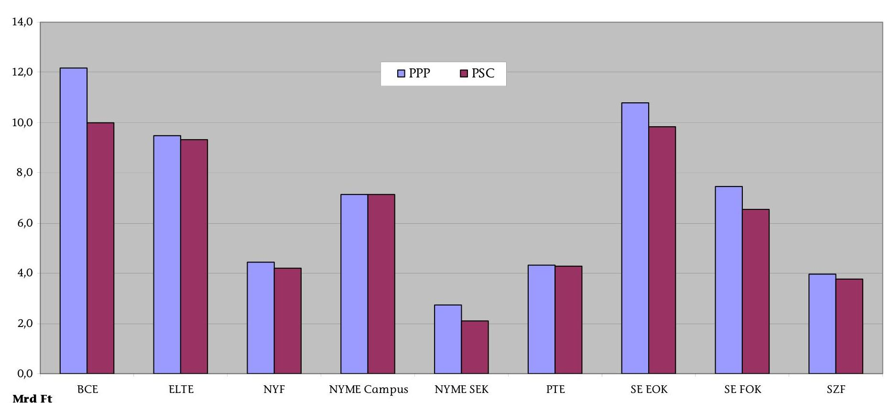

# A helyszínen ellenőrzött projektek PPP-PSC jelenértékei a végleges ajánlatok és a szerződéses adatok alapján*

* 2005. évi jelenérték BCE, ELTE, NYME Campus, NYME SEK, SE EOK, SE FOK
  2006. évi jelenérték NYF, PTE
  2007. évi jelenérték SZF

**Forrás:** 4. sz. táblázat

---

# Új építésű PPP projektek fajlagos - 1 bruttó $\mathbf{m}^{2}$-re eső üzemeltetési díja 2010-ben* 

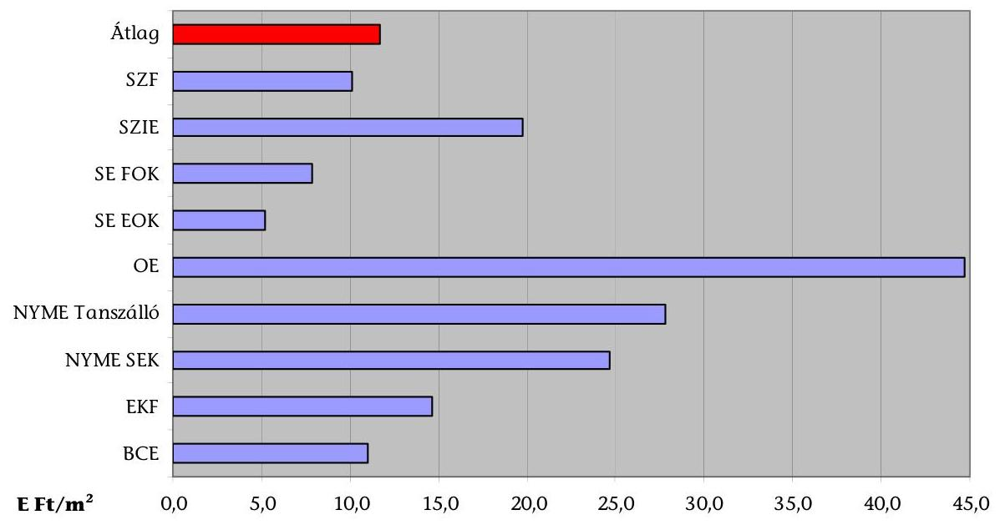

* A BME Q épülete nélkül, amelyet 2010. szeptember 1-jével adták át
6. sz. diagram

Rekonstrukciós PPP projektek fajlagos - 1 bruttó $\mathbf{m}^{2}$-re eső - üzemeltetési díja 2010-ben
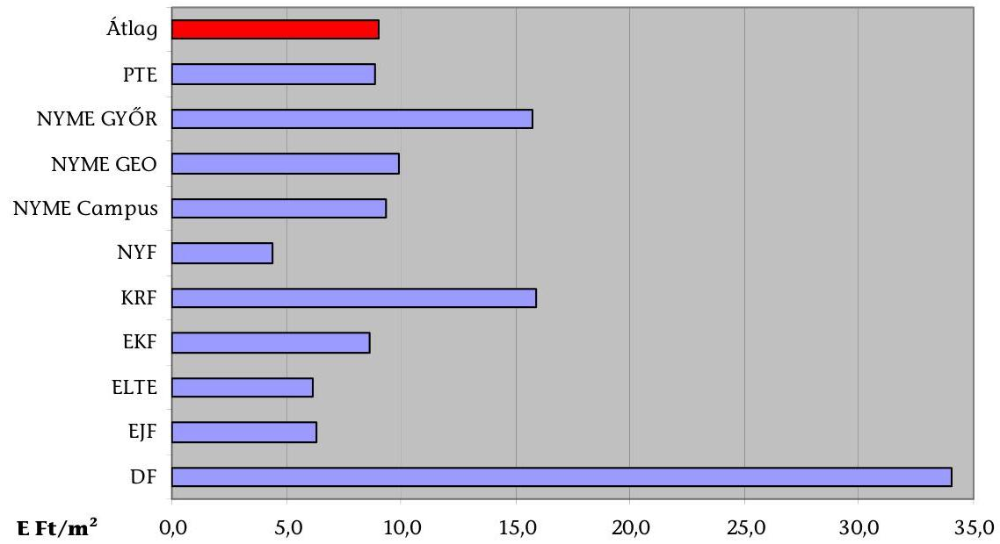

Forrás: 7. sz. táblázat

---

7. sz. diagram

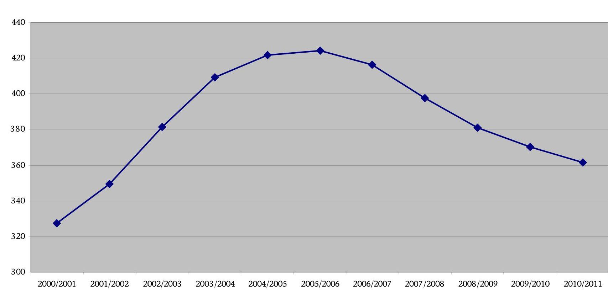

**Forrás:** Nemzeti Erőforrás Minisztérium, Oktatás-statisztikai évkönyv 2009/2010.; Gyorsjelentés a 2010/2011. tanév felsőoktatási előzetes statisztikai adataiból

---

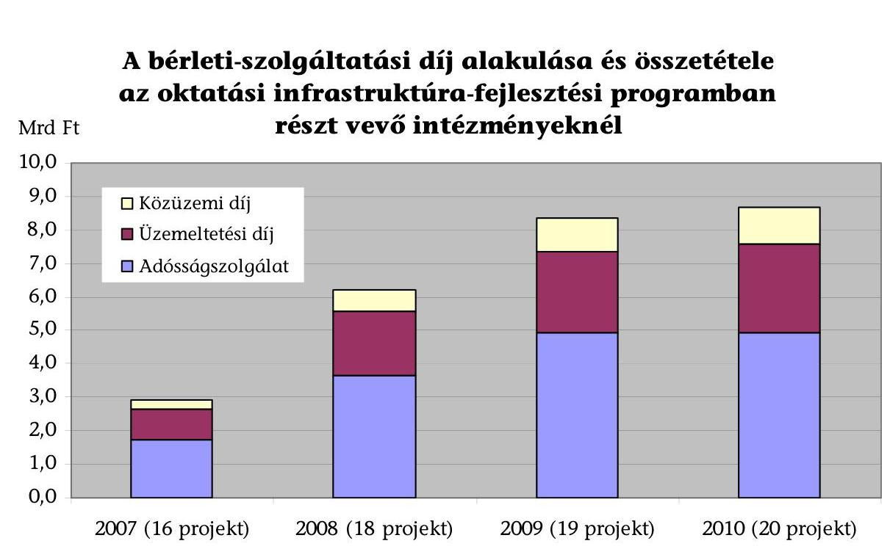

Forrás: 7. sz. táblázat
9. sz. diagram

A bérleti-szolgáltatási díj tervezett és tényleges alakulása az oktatás infrastruktúra-fejlesztési
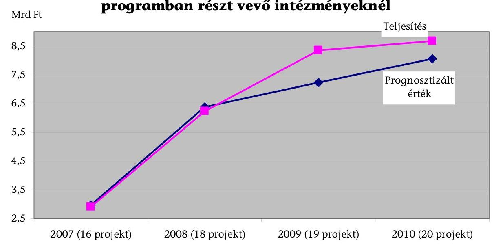

Forrás: 7. sz. diagram

---

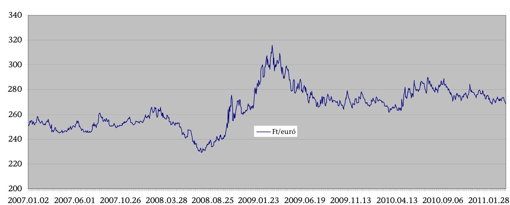

**Forint/euró árfolyam alakulása 2007-2011 között\***

2007.01.02 2007.06.01 2007.10.26 2008.03.28 2008.08.25 2009.01.23 2009.06.19 2009.11.13 2010.04.13 2010.09.06 2011.01.28

\* 2011.03.24-ig

**Forrás:** www.mnb.hu

---

Három hónapos euribor kamatláb értéke 2007-2011 között*
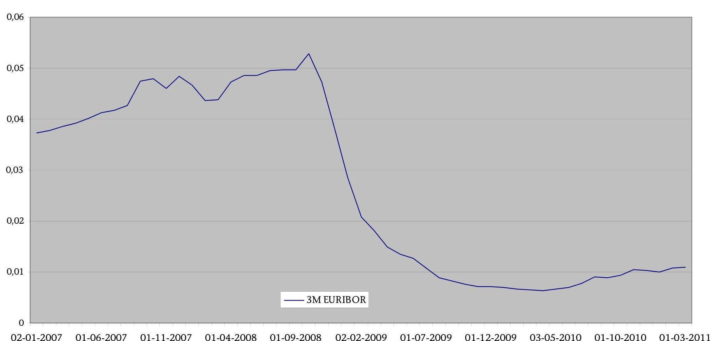

* 2011.03.01-ig

Forrás: www.euribor-rates.eu

---

# A 2006-2010 közötti teljesített bérleti-szolgáltatási díj intézményi forrásainak összetétele 

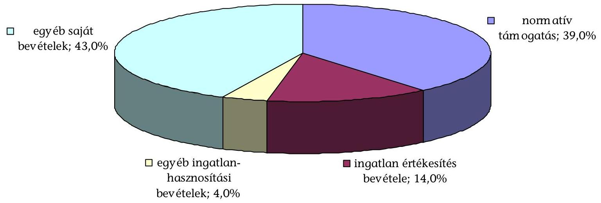

Forrás: 7. sz. táblázat

---

# DIAGRAMOK AZ OKTATÁSI INFRASTRUKTÚRA-FEJLESZTÉSI PROGRAM KÉRDŐÍVES FELMÉRÉSÉNEK EREDMÉNYEIBŐL 

13/a. sz. diagram
13/b. sz. diagram
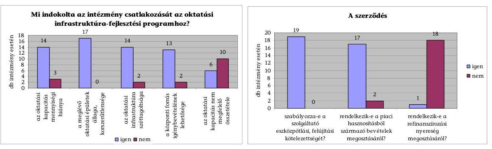
13/c. sz. diagram
13/d. sz. diagram
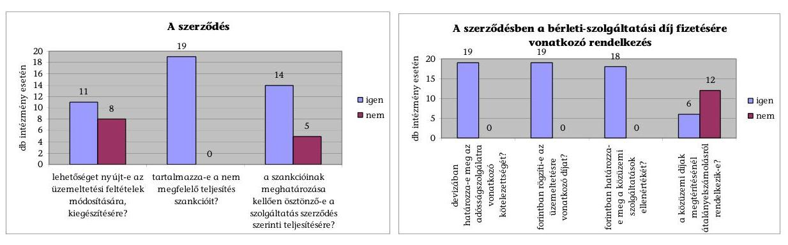
13/e. sz. diagram
13/f. sz. diagram
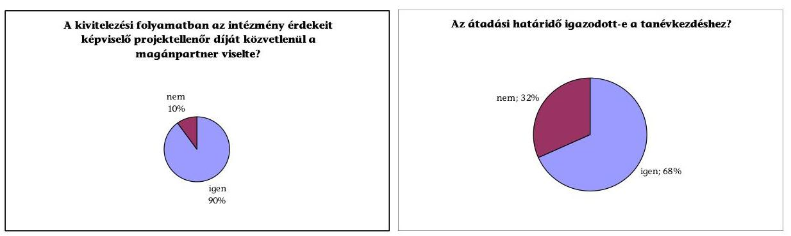

---

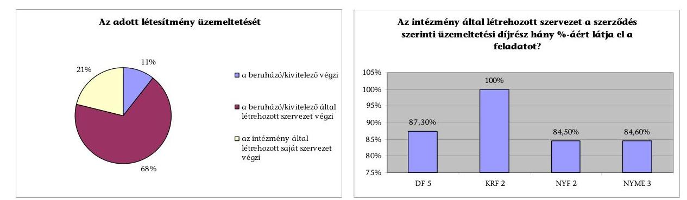
13/i. sz. diagram
13/j. sz. diagram
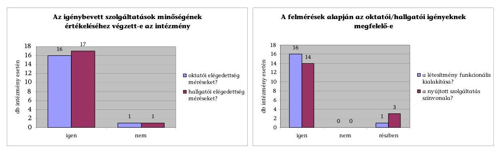
13/k. sz. diagram
13/l. sz. diagram
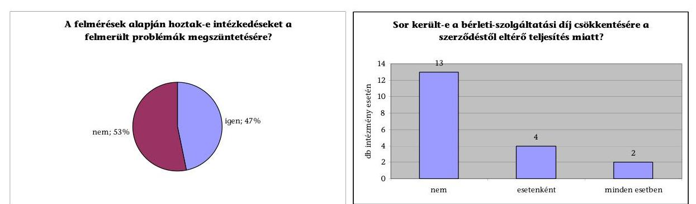
13/m. sz. diagram
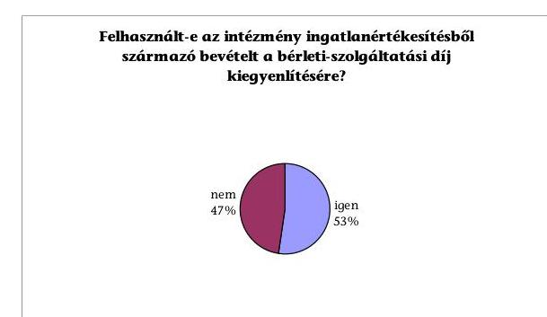

---

# DIAGRAMOK A KOLLÉGIUM BERUHÁZÁSI PROGRAM KÉRDŐÍVES FELMÉRÉSÉNEK EREDMÉNYEIBŐL 

14/a. sz. diagram
14/b. sz. diagram
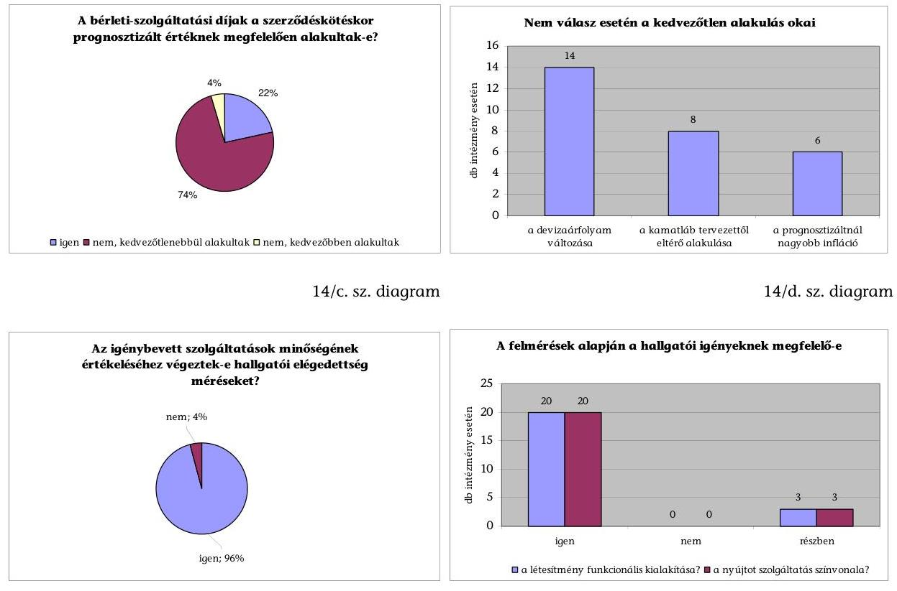
14/e. sz. diagram
14/f. sz. diagram
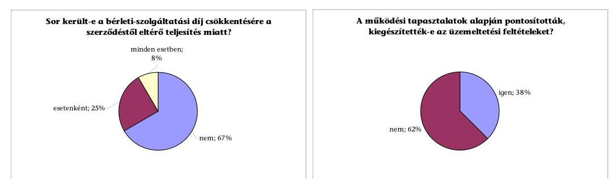

---

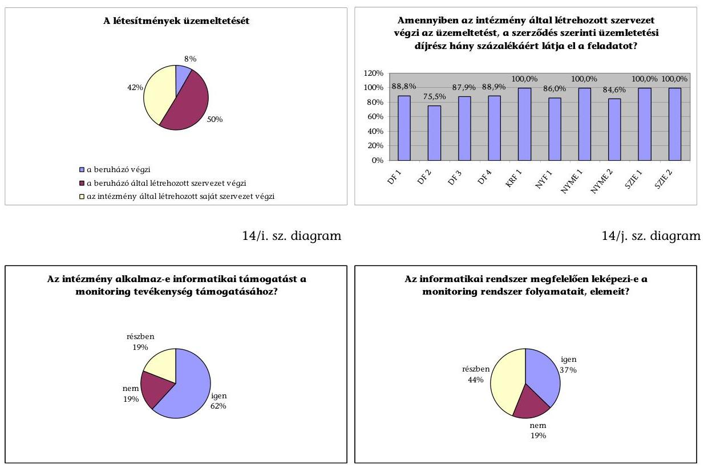

Budapest, 2011. december
