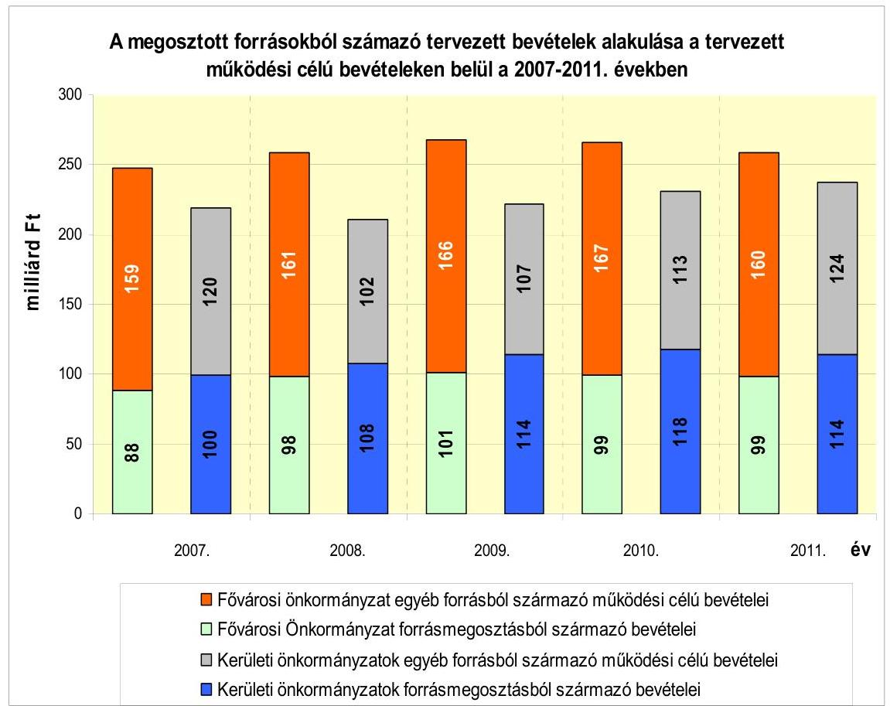
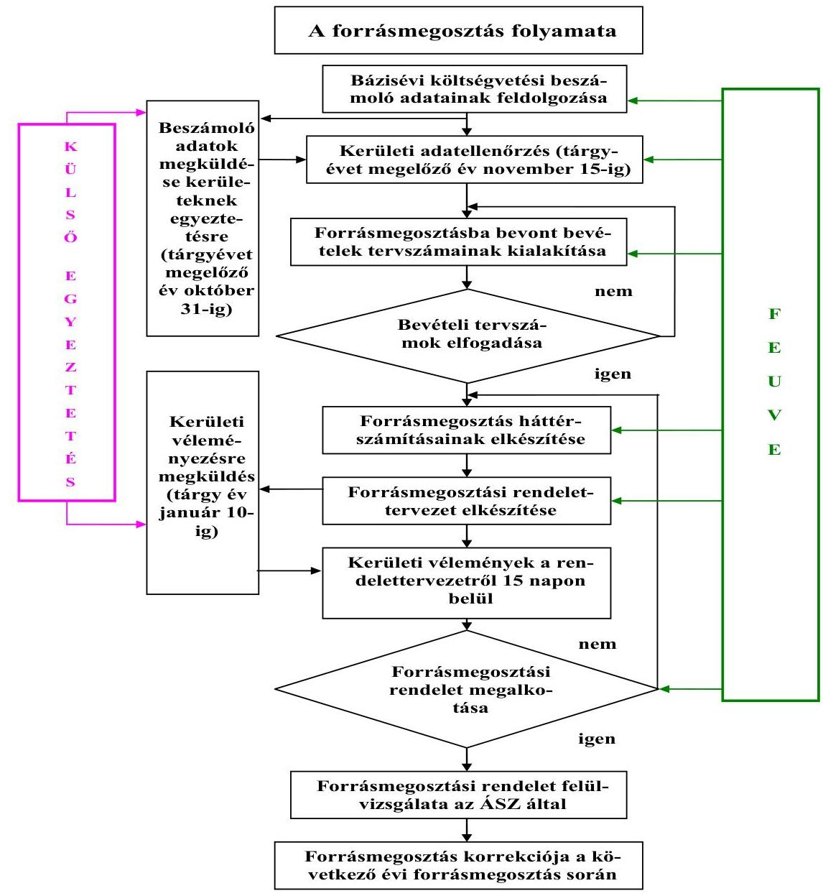
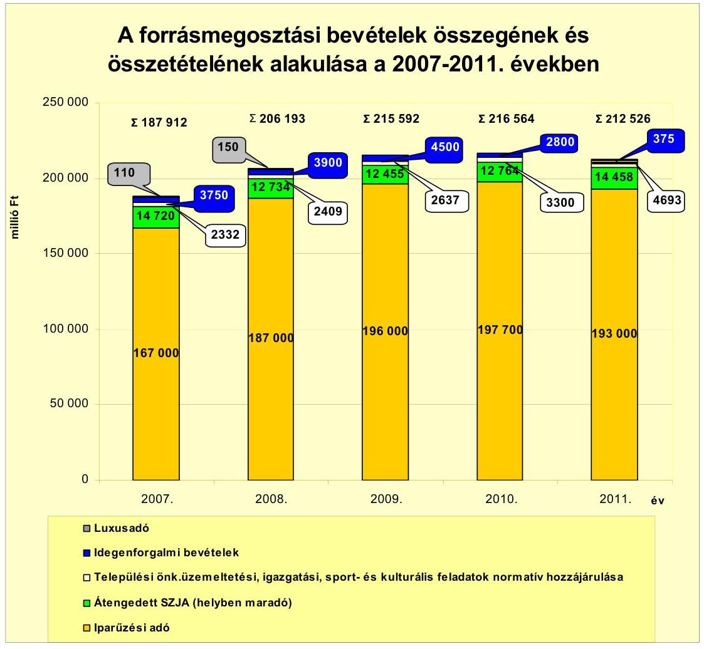
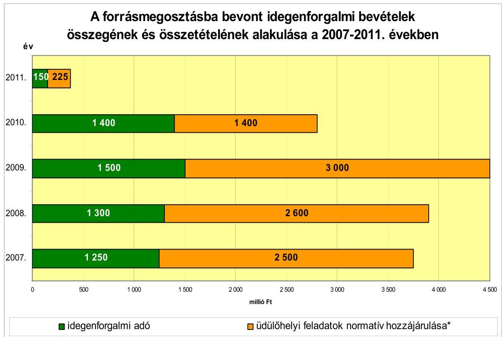
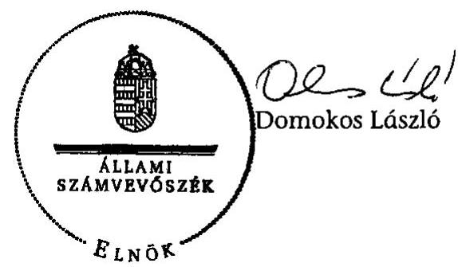
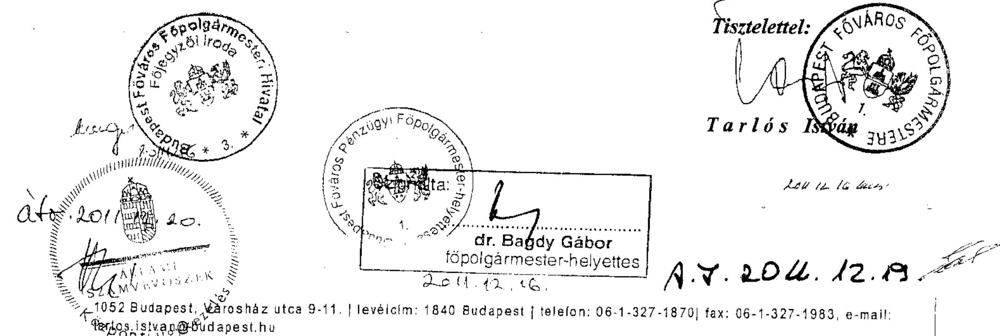

# ÁLLAMI   SZÁMVEVŐSZÉK 

## JELENTÉS

a Fővárosi Önkormányzatot és a kerületi önkormányzatokat osztottan megillető bevételek 2011. évi megosztásáról szóló önkormányzati rendelet felülvizsgálatáról

---

# Számvevői Iroda 

Iktatószám: V-3060-44/2011.
Témaszám: 1035
Vizsgálat-azonosító szám: V0542

## A felügyeleti vezető:

Dr. Sepsey Tamás
számvevő igazgató
Az ellenőrzés végrehajtásáért felelős:
Lajterné Hudák Magdolna
számvevő, ellenőrzésvezető
A jelentés összeállításában közremúködött:
Dr. Karáné Kőszegi Zsuzsanna
számvevő tanácsos
Az ellenőrzést végezte:
Lajterné Hudák Magdolna Dr. Karáné Kőszegi Zsuzsanna számvevő, ellenőrzésvezető
számvevő tanácsos

## A témához kapcsolódó eddig készített számvevőszéki jelentések:

| címe | sorszáma |
| :-- | :--: |
| Jelentés a fővárosi önkormányzatot és a kerületi önkormányzato- | 0756 |
| kat osztottan megillető bevételek 2007. évi megosztásáról szóló |  |
| önkormányzati rendelet felülvizsgálatáról |  |
| Jelentés a fővárosi önkormányzatot és a kerületi önkormányzato- | 0850 |
| kat osztottan megillető bevételek 2008. évi megosztásáról szóló |  |
| önkormányzati rendelet felülvizsgálatáról |  |
| Jelentés a fővárosi önkormányzatot és a kerületi önkormányzato- | 0956 |
| kat osztottan megillető bevételek 2009. évi megosztásáról szóló |  |
| önkormányzati rendelet felülvizsgálatáról |  |
| Jelentés a fővárosi önkormányzatot és a kerületi önkormányzato- | 1048 |
| kat osztottan megillető bevételek 2010. évi megosztásáról szóló |  |
| önkormányzati rendelet felülvizsgálatáról |  |

---

# TARTALOMJEGYZÉK 

BEVEZETÉS ..... 9
I. ÖSSZEGZŐ MEGÁLLAPÍTÁSOK, KÖVETKEZTETÉSEK, JAVASLATOK ..... 13
II. RÉSZLETES MEGÁLLAPÍTÁSOK ..... 20

1. A 2011. évi forrásmegosztási rendeletalkotás eljárásának szabályszerűsége, a forrásmegosztás folyamatba épített, előzetes, utólagos és vezetői ellenőrzésének megvalósulása ..... 20
1.1. A Fővárosi Önkormányzatnál a forrásmegosztás folyamatának, valamint a folyamatba épített, előzetes, utólagos és vezetői ellenőrzés rendszerének a szabályozottsága ..... 21
1.2. A folyamatba épített ellenőrzés keretében a kerületi önkormányzatok 2009. évi költségvetési beszámolóiban szereplő - a forrásmegosztási számításokhoz átvett - adatok megfelelőségének vizsgálata a Kincstár adatbázisában szereplő beszámoló adatokhoz képest ..... 22
1.3. A forrásmegosztási számítások vezetői ellenőrzésének megvalósulása ..... 22
1.4. A forrásmegosztási törvényben előírt adategyeztetési és véleménykérési kötelezettségek, valamint az adategyeztetési, véleményezési és rendeletalkotási határidők betartása ..... 23
2. A Fővárosi Önkormányzatot és a kerületi önkormányzatokat osztottan megillető 2011. évi bevételek megállapításának szabályszerűsége, megalapozottságának ellenőrzése ..... 25
2.1. A személyi jövedelemadóból a 2011. évi költségvetési törvény alapján a Fővárosi és a kerületi önkormányzatokat megillető - helyben maradó - a 2009. évi jövedelemkülönbségből adódó elszámolási különbözettel korrigált rész megállapításának szabályszerűsége ..... 26
2.2. A helyi iparúzési adó, valamint a kerületek döntése alapján átengedett helyi idegenforgalmi adó és a kapcsolódó normatív hozzájárulás összege megállapításának megalapozottsága ..... 27
2.3. A lakosságszámhoz kapcsolódó normatív hozzájárulások közül a települési önkormányzatok üzemeltetési, igazgatási, sport- és kulturális feladataihoz nyújtott normatív hozzájárulás megállapításának helyessége ..... 30
3. A forrásmegosztási számítások során a megosztási arányok meghatározásához felhasznált adatok megalapozottsága, a számítások helyességének ellenőrzése ..... 30

---

3.1. A normatív részesedési arányok megállapításához alapul vett normatív hozzájárulások tartalmi és összegszerű megfelelősége. A normatív részesedési arány megállapításának megalapozottsága a változás tárgyévi korrekcióját is figyelembe véve ..... 31
3.2. A 2009. évi kerületi önkormányzati költségvetési beszámolókból a működési kiadások megállapításához felhasznált adatok megalapozottsága. A múködési kiadási forráshiány és az ez alapján felosztandó források megállapításának szabályszerűsége ..... 35
3.3. A megosztott bevételekből a múködési kiadási forráshiányra fedezetet nyújtó összeg feletti rész felosztásánál alkalmazott megoszlási viszonyszámok megállapításának megalapozottsága. Kerületi önkormányzatonként az állandó népesség, a belterületi terület, az állandó népesség és a belterületi terület aránya, valamint az alacsony komfortfokozatú lakás alapterület és az iparosított technológiával épült lakások darabszáma arányában megosztott bevételek számításának helyessége ..... 38
3.4. Az idegenforgalmi adó megosztásánál alkalmazott arányszámok megalapozottsága és a számítások helyessége ..... 39
3.5. Az egyes kerületi önkormányzatokat megillető részesedési arány 2010. évi forrásmegosztáshoz viszonyított, maximum 2\%-os növekedési, illetve csökkenési korlátjának a betartása ..... 41
4. Az esetleges adat- és számítási hibák miatt a 2012. évi forrásmegosztásnál végrehajtandó korrekció (a fővárosi önkormányzat vagy kerületi önkormányzat részére még jogszerűen járó összeg, illetve jogosulatlanul kapott összeg) meghatározása ..... 43
5. Az Állami Számvevőszék 2010. évi ellenőrzése során megfogalmazott javaslatok végrehajtására tett intézkedések megfelelősége ..... 44
MELLÉKLETEK
6. számú Az Ötv., illetve a 2011. évi forrásmegosztási rendelet szerint megosztandó bevételek körének meghatározása
7. számú A forrásmegosztásba bevont bevételek bemutatása a forrásmegosztási rendelet és az ÁSZ megállapításai alapján
8. számú A múködési kiadási forráshiány számítása a forrásmegosztási háttérszámítások és az ÁSZ megállapításai alapján
9. számú A megosztott bevételekből - a kerületek összességét megillető -a múködési kiadási forráshiányra fedezetet nyújtó összeg feletti rész jogcímenkénti felosztása a forrásmegosztási háttérszámítások és az ÁSZ számításai sze- rint
10. számú Tarlós István úr, Budapest Főváros Önkormányzatának Főpolgármestere által tett észrevétel (1 oldal)

# FÜGGELÉKEK 

1. számú Az állandó népesség adat helyett a lakónépesség adat alkalmazása miatti eltérések bemutatása a forrásmegosztási háttérszámítás és az ÁSZ megállapításai között

---

# RÖVIDÍTÉSEK JEGYZÉKE 

## Törvények

2009. évi költségvetési törvény
2011. évi költségvetési törvény
Áht.
ÁSZ tv.
bázisévi zárszámadási törvény
forrásmegosztási törvény
fővárosi törvény

Hatv.
Jat.
Ötv.

## Rendeletek

Áhsz.

Ámr. 1

Ámr. 2
forrásmegosztási rendelet
idegenforgalmi adó rendelet
iparúzési adó rendelet
normatíva rendelet
a Magyar Köztársaság 2009. évi költségvetéséről szóló 2008. évi CII. törvény
a Magyar Köztársaság 2011. évi költségvetéséről szóló 2010. évi CLXIX. törvény
az államháztartásról szóló 1992. évi XXXVIII. törvény
az Állami Számvevőszékről szóló 2011. évi LXVI. törvény
a Magyar Köztársaság 2009. évi költségvetésének végrehajtásáról szóló 2010. évi XCVIII. törvény
a fővárosi önkormányzat és a kerületi önkormányzatok közötti forrásmegosztásról szóló 2006. évi CXXXIII. törvény
a fővárosi és a kerületi önkormányzatokról szóló 1991. évi XXIV. törvény (hatályon kívül helyzete a 2007. évi LXXXII. törvény, hatálytalan 2007. VII. 1-től)
a helyi adókról szóló 1990. évi C. törvény
a jogalkotásról szóló 2010. évi CXXX. törvény
a helyi önkormányzatokról szóló 1990. évi LXV. törvény
az államháztartás szervezetei beszámolási és könyvvezetési kötelezettségének sajátosságairól szóló 249/2000. (XII. 24.) Korm. rendelet
az államháztartás múködési rendjéről szóló 217/1998. (XII. 30.) Korm. Rendelet (hatályon kívül helyezte a 292/2009. (XII. 19.) Korm. rendelet, hatálytalan 2010. január 1-től)
az államháztartás múködési rendjéről szóló 292/2009. (XII. 19.) Korm. rendelet
Budapest Főváros Önkormányzatának a Fővárosi Önkormányzatot és a kerületi önkormányzatokat osztottan megillető bevételek 2011. évi megosztásáról szóló 3/2011. (II. 8.) számú rendelete

Budapest Főváros Önkormányzatának az idegenforgalmi adóról szóló, többször módosított 31/1994. (VI. 10.) számú rendelete
Budapest Főváros Önkormányzatának a helyi iparúzési adóról szóló, többször módosított 21/1991. (IX. 5.) számú rendelete
a helyi önkormányzatokat és a többcélú kistérségi társulásokat 2011. évben egyes központi költségvetési kapcsolatokból megillető forrásokról szóló 4/2011. (I. 31.) NGM rendelet

---

# Szórövidítések 

Adó Ügyosztály

ÁSZ
bázisévi költségvetési
beszámoló

Belső Ellenőrzési Osztály
főjegyző
főpolgármester
Főpolgármesteri hivatal
Fővárosi Önkormányzat
Jogi Ügyosztály
kerületi önkormányzatok
Kincstár
Költségvetési Szabályozási Alosztály

Költségvetési Tervezési Ügyosztály

Költségvetési Osztály
Közgyűlés
Pénzügyi Főosztály
Pénzügyi Főpolgármes-ter-helyettes
$\mathrm{SzMSz}_{1}$

SzMSz $_{2}$

Budapest Főváros Önkormányzata Főpolgármesteri Hivatalának Adó Ügyosztálya (2011. január 15-től Adó Főosztály)
Állami Számvevőszék
a Budapest Főváros Önkormányzata, valamint Budapest Főváros I - XXIII. Kerületek Önkormányzatainak a Magyar Államkincstár által elfogadott 2009. évi költségvetési beszámolói
Budapest Főváros Önkormányzata Főpolgármesteri Hivatalának Belső Ellenőrzési Osztálya
Budapest Főváros Önkormányzatának Főjegyzője
Budapest Főváros Önkormányzatának Főpolgármestere
Budapest Főváros Önkormányzata Főpolgármesteri Hivatala
Budapest Főváros Önkormányzata
Budapest Főváros Önkormányzata Főpolgármesteri Hivatalának Jogi Ügyosztálya (2011. január 15-től Jogi és Közbeszerzési Főosztály)
Budapest Főváros I - XXIII. Kerületeinek Önkormányzatai
Magyar Államkincstár
Budapest Főváros Önkormányzata Főpolgármesteri Hivatala Költségvetési Tervezési Ügyosztályának Költségvetési Szabályozási Alosztálya (2011. január 15-től a Főpolgármesteri Hivatal Pénzügyi Főosztálya Költségvetési Osztályának Költségvetési Szabályozási Csoportja)
Budapest Főváros Önkormányzata Főpolgármesteri Hivatalának Költségvetési Tervezési Ügyosztálya (2011. január 14-ig)
Budapest Főváros Önkormányzata Főpolgármesteri Hivatala Pénzügyi Főosztályának Költségvetési Osztálya
Budapest Főváros Önkormányzatának Közgyűlése
Budapest Főváros Önkormányzata Főpolgármesteri Hivatalának Pénzügyi Főosztálya (2011. január 15-től)
Budapest Főváros Önkormányzatának Pénzügyi Főpol-gármester-helyettese
A főpolgármester és a főjegyző 525/2005. számú együttes utasítása a Főpolgármesteri Hivatal Szervezeti és Múködési Szabályzatáról, Ügyrendjéről (hatályos 2011. január 14ig)
A főpolgármester és a főjegyző 505/2011. számú együttes utasítása a Főpolgármesteri Hivatal Szervezeti és Múködési Szabályzatáról, Ügyrendjéről (hatályos 2011. január 15től)

---

T/1665. törvényjavaslat a Magyar Köztársaság 2011. évi költségvetését megalapozó egyes törvények módosításáról szóló, a nemzetgazdasági miniszter által 2010. november 12-én benyújtott törvényjavaslat (a Magyar Köztársaság 2011. évi költségvetését megalapozó egyes törvények módosításáról szóló 2010. évi CLIII. törvény, kihirdetve 2010. december 17-én)
31. számú űrlap

A Pénzügyminisztérium által közzétett „Tájékoztató az államháztartás szervezetei 2009. évi éves költségvetési beszámolójának összeállításához, B. Önkormányzati éves költségvetési beszámoló" elnevezésű beszámoló garnitúrának „A normatív hozzájárulások elszámolása és a mutatószámok, feladatmutatók alakulása" című 31. számú űrlapja.
46. számú űrlap

A Pénzügyminisztérium által közzétett „Tájékoztató az államháztartás szervezetei 2009. évi éves költségvetési beszámolójának összeállításához, B. Önkormányzati éves költségvetési beszámoló" elnevezésű beszámoló garnitúrának az „Az előző évi kötelezettségvállalással terhelt normatív, kötött felhasználású támogatások előirányzat maradványainak elszámolása" című 46. számú űrlapja.
51. számú űrlap

A Pénzügyminisztérium által közzétett „Tájékoztató az államháztartás szervezetei 2009. évi éves költségvetési beszámolójának összeállításához, B. Önkormányzati éves költségvetési beszámoló" elnevezésű beszámoló garnitúrának a „A normatív, kötött felhasználású támogatások elszámolása és a mutatószámok, feladatmutatók alakulása" című 51. számú űrlapja.

---

.

---

# ÉRTELMEZŐ SZÓTÁR 

alacsony komfortfokozatú lakások alapterülete
bázisév
forrásmegosztás
forrásmegosztási háttérszámítás
iparosított technológiájú lakások száma
idegenforgalmi bevételek
korrigált részesedési arány
működési kiadási forráshiány
normatív hozzájárulások
normatív részesedési arány

A 2005. év végén az önkormányzati tulajdonban lévő félkomfortos, komfortnélküli és szükséglakások együttes alapterülete.
A tárgyévet kettővel megelőző év.
A Fővárosi Önkormányzatot és a kerületi önkormányzatokat osztottan megillető bevételek megosztása.
A Fővárosi Önkormányzat forrásmegosztási rendelettervezetének előterjesztéséhez mellékelt, a forrásmegosztáshoz kapcsolódó számítások. Olyan táblázat rendszer, amely alapján a forrásmegosztási rendelet elfogadásra került.
A 2005. év végén az egyes kerületi önkormányzatok területén levő iparosított technológiával épült lakások darabszáma.
Idegenforgalmi adó és a hozzá (az üdülőhelyi feladatokhoz) kapcsolódó normatív hozzájárulás.
Az egyes kerületi önkormányzatok részesedési aránya a megosztott forrásokból a tárgyévet megelőző év forrásmegosztásához képest maximum 2\%-kal nőhet, illetve csökkenhet. A módszer alkalmazása miatt bekövetkező eltérések a forrásmegosztás során az egyes önkormányzatok bevételekből való részesedését növelik, vagy csökkentik.
A kerületi önkormányzatoknál azon feladatok önkormányzati költségvetési beszámoló szerinti múködési kiadásaiból, amelyekhez a központi költségvetés normatív hozzájárulást nyújt, le kell vonni a kiadásokhoz kapcsolódó normatív hozzájárulás összegét. Az így megállapított különbözet a múködési kiadási forráshiány.
A forrásmegosztás szempontjából a költségvetési törvényben meghatározott - a szociális, gyermekvédelmi, gyermekjóléti, oktatási, nevelési, közmúvelődési és üdülőhelyi feladatokhoz kapcsolódó - normatív hozzájárulások és az összes normatív, kötött felhasználású támogatás bázisévi önkormányzati költségvetési beszámoló érintett űrlapjainak adatai szerinti összeg.
A Fővárosi Önkormányzatot és a kerületi önkormányzatokat együttesen megillető - a bázisévi zárszámadási törvénnyel elfogadott - normatív hozzájárulásból a Fővárosi Önkormányzat és együttesen valamennyi kerületi önkormányzat részesedési aránya, százalékban kifejezve.

---

részesedési arány

tárgyév

Az egyes kerületi önkormányzatokat a normatív részesedési arány, valamint az állandó népesség, a belterületi terület, az állandó népesség és a belterületi terület nagyságának hányadosa, a 2005. év végén az önkormányzati tulajdonban lévő félkomfortos, komfort nélküli és a szükséglakások együttes alapterülete, továbbá a 2005. év végén az önkormányzat területén lévő iparosított technológiával épült lakások darabszáma alapján megillető bevételek aránya az összes kerületet megillető forrásokból.
Azon gazdasági év, amelyhez tartozó megosztandó bevételeknek a Fővárosi Önkormányzat és a kerületi önkormányzatok közötti megosztását a forrásmegosztás határozza meg

---

# JELENTÉS 

## a Fővárosi Önkormányzatot és a kerületi önkormányzatokat osztottan megillető bevételek 2011. évi megosztásáról szóló önkormányzati rendelet felülvizsgálatáról

## BEVEZETÉS

Az 1990-ben kétszintűként létrehozott fővárosi önkormányzati rendszerben 1992-től valósult meg - először a fővárosi törvényben, majd az Ötv-ben ${ }^{1}$ - meghatározott bevételeknek a Fővárosi Önkormányzat és a kerületi önkormányzatok közötti megosztására szolgáló „forrásmegosztási rendszer", amely az érintett felek megállapodásán alapult. A bevételek megosztásának alapelve a feladatellátásból való részesedés volt, azonban a megosztást a Fővárosi Önkormányzat és a kerületi önkormányzatok közötti folyamatos viták kísérték. Az Országgyúlés több törvényt is elfogadott a forrásmegosztás rendezésére, a legutolsó törvényt 2006-ban. A forrásmegosztási törvényben szabályozott normatív módszerek továbbra is a feladatellátásból való részesedés alapelvén alapultak, az adatok ellenőrizhetőbbé váltak és az új szabályozás az évközi korrekció lehetőségének kizárásával megszüntette az ebből származó bizonytalanságot.

A forrásmegosztási törvény előírta az évenkénti forrásmegosztási rendelet ÁSZ általi felülvizsgálatát is, melynek az ÁSZ a 2007. évtől kezdődően - jelen ellenőrzésével ötödik éve - tesz eleget. A forrásmegosztási rendeletek felülvizsgálata során a 2007-2010. években az ÁSZ az illetékes minisztereknek 24, a főpolgármesternek 13 javaslatot tett. A számításoknál alkalmazandó jogszabályokkal kapcsolatos értelmezésbeli és alkalmazásbeli problémák feltárásával hozzájárult a szabályozás pontosabbá, egyértelműbbé, egyszerűbbé tételéhez, valamint felhívta a figyelmet az egyes jogszabályi rendelkezések közötti összhang hiányára. Az Országgyűlés a forrásmegosztási törvényt - az ÁSZ javaslatait is figyelembe véve - három alkalommal (2007-ben, 2009-ben és 2010-ben) módosította a jogi szabályozás ellentmondásainak megszüntetése, valamint az előírások gyakorlatban történő alkalmazhatósága érdekében.

A Közgyűlés a forrásmegosztási rendelettel a 2007-2011. években 188-217 milliárd Ft közötti (a 2011. évben 212,5 milliárd Ft) közpénz Fővárosi Önkormányzat és a kerületi önkormányzatok közötti elosztásáról döntött, melynek nagysága növeli a forrásmegosztási számítások ellenőrzésének jelentőségét. A Fővárosi Önkormányzatnál a forrásmegosztásból származó bevételek a tervezett

[^0]
[^0]:    ${ }^{1}$ 1994. december 10-ig a fővárosi törvény 17. § (3) bekezdése, 1994. december 11-től az Ötv. 64. § (4) bekezdése tartalmazta a forrásmegosztásba bevont bevételek körét.

---

működési célú bevételekből a 2007. évben (248 milliárd Ft) 35,7\%-ot, a 2008. évben (259milliárd Ft) 37,9\%-ot, a 2009. évben (268 milliárd Ft) 37,9\%-ot, a 2010. évben (266 milliárd Ft) 37,2\%-ot és a 2011. évben (259 milliárd Ft) 38,1\%-ot tettek ki. A kerületi önkormányzatoknál ugyanezen bevételeknek - a 2007. évben (219 milliárd Ft) a 45,4\%-a, a 2008. évben (210 milliárd Ft) az 51,6\%-a, a 2009. évben (221 milliárd Ft) az 51,6\%-a, a 2010. évben (231 milliárd Ft) az 50,9\%-a és a 2011. évben (238 milliárd Ft) a 47,9\%-a - származott a forrásmegosztásból.

A megosztott forrásokból származó tervezett bevételek alakulását a tervezett működési célú bevételeken belül 2007-2011. években az 1. számú diagram mutatja

1. számú diagram

Forrás: Kincstár és az ÁSZ által felülvizsgált forrásmegosztási rendeletek
Az ellenőrzés jogszabályi alapját az ÁSZ tv. 3. § (1) bekezdésének és a forrásmegosztási törvény 8. § (1) bekezdésének előírásai képezik.

A forrásmegosztási törvény 8. § (1) bekezdése alapján az ellenőrzésnek ki kell terjednie a forrásmegosztás során alkalmazott adatok megalapozottságára, a számítások helyességére. Amennyiben a felülvizsgálat megállapítja, hogy a forrásmegosztásnál alkalmazott adatok, vagy a számítások helytelensége miatt a Fővárosi Önkormányzat, vagy valamelyik kerületi önkormányzat jogosulatlan forráshoz jutott, vagy a jogszerűen járó forrásnál alacsonyabb összegben

---

részesült, ezt - a forrásmegosztási törvény 8. § (2) bekezdésének rendelkezése szerint - a hiba feltárását követő év forrásmegosztásánál figyelembe kell venni.

Az ellenőrzés stratégiai célkitűzése az ÁSZ stratégiájával összhangban az volt, hogy

- segítséget nyújtson a Fővárosi Önkormányzat és a kerületi önkormányzatok vezetése számára a forrásmegosztási törvény alkalmazásához;
- megállapításokkal támogassa - a forrásmegosztáshoz kapcsolódó jogszabályok közötti összhang áttekintését követően - az Országgyűlés munkáját a törvényalkotásban, a forrásmegosztás feltételeinek meghatározásában.

Az ellenőrzés célja annak értékelése volt, hogy:

- a Fővárosi Önkormányzatot és a kerületi önkormányzatokat osztottan megillető bevételek megosztásáról szóló rendelet megalkotásánál a Fővárosi Önkormányzat betartotta-e a forrásmegosztási törvényben előírt hatásköri és eljárási szabályokat;
- szabályszerű volt-e a Fővárosi Önkormányzatot és a kerületi önkormányzatokat osztottan megillető bevételek tartalmának, valamint azok összegének megállapítása;
- a forrásmegosztási számítások során a megosztási arányok meghatározásához felhasznált adatok megalapozottak, a számítások helyesek voltak-e;
- szükséges-e - a hiba feltárását követő évben - a forrásmegosztást módosítani a számítások során alkalmazott adatok, vagy a számítások helytelensége miatt. Ha igen, a megosztott bevételeken belül milyen összegű korrekciót kell végrehajtani;
- intézkedtek-e az ÁSZ tárgyévet megelőző évben tett javaslatainak végrehajtása érdekében.

A forrásmegosztási rendelet forrásmegosztási törvény előírásainak való megfelelőségét szabályszerűségi ellenőrzés keretében, elemző eljárással vizsgáltuk az ÁSZ Ellenőrzési Kézikönyvében foglaltak, az „Útmutató a Fővárosi Önkormányzatot és a kerületi önkormányzatokat osztottan megillető bevételek 2011. évi megosztásáról szóló önkormányzati rendelet felülvizsgálatáról", valamint az INTOSAI ${ }^{2}$ vonatkozó standardjainak figyelembe vételével.

A Fővárosi Önkormányzatot és a kerületi önkormányzatokat osztottan megillető bevételek tervadatait a 2011. évre vonatkozóan, a megosztási arányok meghatározása során felhasznált alapadatokat a 2009. évi önkormányzati költségvetési beszámolók alapján ellenőriztük. A Főpolgármesteri hivatalnál áttekintettük a forrásmegosztási törvényben foglalt előírások megvalósítását, a számítások helyességét. A Fővárosi Önkormányzatot és a kerületi önkormányzatokat megillető összegek helyességének megállapításánál a forrásmegosztási háttér-

[^0]
[^0]:    ${ }^{2}$ International Organization of Supreme Audit Institutions, Legfőbb Ellenőrző Intézmények Nemzetközi Szervezete

---

számítás adatait hasonlítottuk össze az ÁSZ rendelkezésére álló kincstári adatokkal. Az ellenőrzés értékelte az adatfeldolgozás szabályozottságát és ehhez kapcsolódóan a folyamatba épített, az előzetes, utólagos és vezetői ellenőrzés működését a 2011. évi forrásmegosztási rendelet előkészítésének és megalkotásának időszakában (2010. október 1-je és 2011. január 31-e között). Utóellenőrzés keretében vizsgáltuk az ÁSZ korábbi ellenőrzési javaslatai alapján tett intézkedéseket.

A jelentést egyeztetésre megküldtük a főpolgármesternek. Főpolgármester úr észrevételt nem tett, levelét az 5. számú melléklet tartalmazza.

---

# I. ÖSSZEGZŐ MEGÁLLAPÍTÁSOK, KÖVETKEZTETÉSEK, JAVASLATOK 

A folyamatba épített, előzetes és utólagos ellenőrzés megszervezése, valamint a vezetői ellenőrzés megvalósítása a Főpolgármesteri hivatal $\mathrm{SzMSz}_{1 ; 2^{-}}$ ben szabályozott volt, azonban a főjegyző csak 2011. szeptember végén hagyta jóvá a forrásmegosztási feladatokat is tartalmazó ellenőrzési nyomvonalat. A forrásmegosztással kapcsolatos feladatokat a 2011. évi forrásmegosztási rendelet előkészítésének időszakában - folyamatszabályozás hiányában - munkaköri leírások tartalmazták.

A 2011. évi forrásmegosztás tekintetében a Főpolgármesterei hivatalban a folyamatba épített, előzetes és utólagos ellenőrzést dokumentált módon múködtették.

A forrásmegosztási háttérszámítások, valamint a rendelettervezet vezetői ellenőrzése formális volt, mivel annak elvégzését a Költségvetési Tervezési Úgyosztály, a Költségvetési Szabályozási Alosztály, valamint a Jogi Úgyosztály vezetői aláírásukkal igazolták, azonban nevezettek nem észrevételezték, hogy a Fővárosi Önkormányzatot, valamint a kerületi önkormányzatokat együttesen megillető részesedések számításánál - helytelenül - nem az ÁSZ előző évi megállapítása szerinti adatot alkalmazták. A 2011. évi forrásmegosztási rendeletnek a közzététel előtti vezetői ellenőrzése - a közgyűlési döntésnek való megfelelőség ellenőrzése tekintetében - dokumentált módon megtörtént.

A forrásmegosztási számítások alapjául szolgáló beszámoló adatok ellenőrzésére, a kerületi önkormányzatokkal való egyeztetésére, a rendelettervezet kerületi önkormányzatoknak történő megküldésére és véleményeztetésére vonatkozó eljárási szabályokat és határidőket a forrásmegosztási törvény rendelkezéseinek megfelelően a Fővárosi Önkormányzat betartotta. A Közgyűlés határidőben megalkotta a 2011. évi forrásmegosztási rendeletet.

A Fővárosi Önkormányzat a forrásmegosztásba bevonható bevételeket - az Ötv. előírásait betartva - 212525618 ezer Ft-ban határozta meg. Ebből 14457324 ezer Ft-ot a települési önkormányzatokat közvetlenül megillető személyi jövedelemadó hányad, 4693294 ezer Ft-ot a települési önkormányzatok üzemeltetési, igazgatási, sport- és kulturális feladataira igénybe vehető normatív hozzájárulás, 193000000 ezer Ft-ot helyi iparúzési adó, 150000 ezer Ft-ot helyi idegenforgalmi adó, valamint 225000 ezer Ft-ot az ehhez kapcsolódó normatív hozzájárulás jogcímén tervezett meg.

A normatív hozzájárulások tartalmi meghatározása szabályszerű, a normatív részesedési arányok számítása helyes volt.

A normatív részesedési arány helyes megállapításához meg kellett határozni a normatív hozzájárulás fogalom belső tartalmát, mivel azt azonos elnevezéssel, de különböző tartalommal az Ötv., a 2009. évi költségvetési törvény, illetve a forrásmegosztási törvény is nevesítette. Az azonos megnevezésű fogalmak kü-

---

lönböző tartalommal való alkalmazása jogbizonytalanságot eredményez. A forrásmegosztási törvényben szereplő normatív hozzájárulás fogalom tágabb, és duplázódást is tartalmazott a 2009. évi költségvetési törvényben foglalt normatív hozzájárulásokhoz képest. A különböző jogszabályi tartalmakat figyelembe véve az ellenőrzés során a „bázisévi" normatív hozzájárulások összegének megállapításakor a 2009. évi költségvetési törvény által meghatározott fogalmat vettük figyelembe, kiegészítve a normatív, kötött felhasználású támogatásokkal, továbbá nem számoltunk külön a normatív részesedésű átengedett személyi jövedelemadó adatával, mivel azt a normatív hozzájárulások már tartalmazták. A Fővárosi Önkormányzat is ezt a számítási módot alkalmazta.

A Fővárosi Önkormányzatot és a kerületi önkormányzatokat együttesen megillető részesedés számításánál a Főpolgármesteri hivatal helytelenül a 2010. évi forrásmegosztási rendeletben szereplő részesedésekkel számolt és nem vette figyelembe az ÁSZ által a 2010. évi forrásmegosztási rendelet felülvizsgálata során megállapított arányokat. Ennek következtében a forrásmegosztási rendeletben a Fővárosi Önkormányzat részesedését 46,994\% helyett 47,171\%ban, a kerületi önkormányzatok együttes részesedését 53,006\% helyett 52,829\%-ban határozták meg. A hibás részesedési arányok alkalmazása miatt a 2011. évi forrásmegosztási rendeletben a kerületi önkormányzatokat együttesen megillető összeget 379165 ezer Ft-tal alacsonyabb, a Fővárosi Önkormányzatot megillető összeget ugyanennyivel magasabb értékben állapították meg.

A forrásmegosztás folyamatában a Fővárosi Önkormányzatnak meg kellett állapítania a kerületi önkormányzatok bázisévre vonatkozó azon működési célú kiadásait, amelyekhez a központi költségvetés normatív hozzájárulást nyújtott. A szakfeladatok tartalmából kiindulva az ÁSZ az ellenőrzés során megállapította, hogy a Fővárosi Önkormányzat a kerületenkénti múködési célú kiadások között az „551414 Üdültetés" szakfeladaton elszámolt összegeket annak ellenére nem szerepeltette, hogy a forrásmegosztási törvény szerint a normatív hozzájárulások között számolni kellett az üdülőhelyi feladatokhoz kapcsolódó normatív hozzájárulásokkal, ezért a múködési kiadások megállapításánál annak kiadásait is figyelembe kellett venni.

A Fővárosi Önkormányzat a forrásmegosztási háttérszámításokban szereplő szakfeladatok megállapításánál nem vette figyelembe az Ámr. 1 azon rendelkezéseit, hogy nem járt támogatás a kiegészítő, a kisegítő és a vállalkozási tevékenységekhez, így a múködési célú kiadások között több, a forrásmegosztási háttérszámításokban nem szerepeltethető szakfeladaton elszámolt összeget is számba vett. Az ÁSZ szerint a szakfeladatok helytelen alkalmazása következtében a kerületi önkormányzatok múködési célú kiadásait a forrásmegosztás háttérszámításaiban a szükségesnél 600247 ezer Ft-tal alacsonyabb összegben vették számításba. A múködési kiadások pontosítása eredményeképpen az összes múködési kiadás a forrásmegosztási háttérszámítás adatához viszonyítva 157512696 ezer Ft-ról 158112943 ezer Ft-ra, ebből adódóan, valamint a kerületi önkormányzatok normatív hozzájárulásainál megállapított három ezer Ft kerekítési különbözet következtében a múködési kiadási forráshiány összege 95451732 ezer Ft-ról 96051976 ezer Ft-ra módosult.

---

A múködési kiadási forráshiányra rendelkezésre álló források megosztását követően az ÁSZ megállapítása szerint 17754526 ezer Ft megosztható forrás maradt, amely 221079 ezer Ft-tal kevesebb, mint a forrásmegosztási háttérszámításokban ugyanezen jogcímekre megállapított összeg. A forrásmegosztási háttérszámításban a működési kiadási forráshiány finanszírozására biztosított öszszeg levonását követően megmaradó források jogcímenkénti felosztásánál alkalmazott arányszámok ( $46 \%$-a az állandó népesség, $15 \%$-a a belterületi terület, $15 \%$-a a belterületi terület és az állandó népesség aránya, $12 \%$-a az alacsony komfortfokozatú lakások alapterülete és $12 \%$-a az iparosított technológiával épült lakások száma) helyesek voltak. Azonban a kerületek közötti felosztás során az állandó népesség adatánál a Fővárosi Önkormányzat nem a forrásmegosztási törvényben meghatározott állandó lakóhellyel rendelkező természetes személyek számát (1 665575 fő), hanem a 2011. évi költségvetési törvényben a normatív hozzájárulások összegének meghatározásánál alkalmazott KEK KH nyilvántartása szerinti, 2010. január 1-jei lakosságszám adatát (1 694942 fő) vette figyelembe. Ennek következtében az állandó népesség, valamint az állandó népesség és a belterületi terület aránya alapján számított kerületenkénti megoszlási viszonyszámokban - a forrásmegosztási háttérszámításokhoz képest - eltérés volt.

Az idegenforgalmi bevételeket az összes kerület között osztották fel az első körben, így nem érvényesült az Ötv. azon előírása, hogy ezekből a bevételekből csak a Fővárosi Önkormányzat és az idegenforgalmi adót be nem vezető kerületek részesedhetnek. A forrásmegosztási háttérszámításnál alkalmazott módszer, mely szerint második körben az idegenforgalmi bevételek megosztá$\mathbf{s a}$ - a normatív részesedési arányok, valamint az állandó népesség, a belterületi terület, az állandó népesség és a belterületi terület aránya, az alacsony komfortfokozatú lakás alapterület és az iparosított technológiával épült lakások darabszáma aránya helyett - a korrigált részesedési arányok alapján történt meg, ellentétes volt a forrásmegosztási törvény rendelkezéseivel is. A számítások során továbbá a Fővárosi Önkormányzat a forrásmegosztási törvényben foglaltakkal ellentétesen járt el, mivel az egyes kerületek összes forrásból való tényleges részesedése alapján számított arányszám az idegenforgalmi bevételek újra osztása miatt eltért a forrásmegosztási rendeletben szereplő korrigált részesedési arányoktól.

A forrásmegosztási törvény szabályozása a teljes forrásmegosztásba bevont bevételnek a Fővárosi Önkormányzat és az összes kerületi önkormányzat közötti elosztására irányul és nem rögzíti az idegenforgalmi bevételek megosztásával kapcsolatos szabályokat. Emiatt a korrigált részesedési arányok a teljes bevételi körre csak együttesen állapíthatók meg, így az arányszámok csak akkor érvényesülnek, ha az összes bevétel visszaosztása (közötte az idegenforgalmi bevételek is) ezen viszonyszámok alapján történik meg. Ennek következtében nem biztosítható, hogy az idegenforgalmi bevételekből csak azok a kerületi önkormányzatok részesedjenek, akiket az megillet, míg a többi bevételből minden kerületi önkormányzat részesedjen. Egy viszonyszámmal - a viszonyítási alap eltérő tartalma miatt - nem fejezhető ki a kerületek összességét és a kerületek egy részét illető megosztás. Mivel a forrásmegosztási törvényben az Ötv. idegenforgalmi bevételek megosztására vonatkozó előírásának megfelelő alkalmazásához nincsenek eljárási szabályok, ezért annak megoszlási arányszámai, valamint a korrigált részesedési arányok és az ezek alapjául szolgáló

---

számítások helyessége vizsgálatának a jogszabályi feltételei nincsenek teljes körúen biztosítva.

Az idegenforgalmi bevételek megosztására vonatkozó eljárási szabályok hiányában - a jelentésben a kerületi önkormányzatok összességét érintő eltérések bemutatása ellenére - az egyes kerületi önkormányzatokat a megosztott forrásokból megillető részesedések összegei nem állapíthatók meg. Az ÁSZ a forrásmegosztási törvényben foglalt, a 2012. évi forrásmegosztásnál végrehajtandó korrekció (a Fővárosi Önkormányzat vagy kerületi önkormányzat részére még jogszerűen járó, illetve jogosulatlanul kapott) összegét az idegenforgalmi bevételek elkülönített kezelését biztosító eljárási szabályok megalkotását követően állapítja meg.

A forrásmegosztási rendelet felülvizsgálatához kapcsolódóan az ÁSZ ellenőrizte a 2010. évi jelentésében tett javaslatainak hasznosulását. Ennek során megállapította, hogy teljesültek a belügyminiszternek a forrásmegosztási törvényben a normatív részesedési arány változása esetén alkalmazandó adat meghatározására, az állandó népesség fogalom meghatározásának pontosítására vonatkozó javaslatok. A belügyminiszter tájékoztatása szerint folyamatban van a Hatv. módosítására tett javaslat végrehajtása. Nem teljesült a belügyminiszternek a működési kiadásokhoz tartozó szakfeladatok önkormányzati rendeletben történő meghatározásához a törvényi felhatalmazás biztosítására vonatkozó javaslat. Az Ötv. várható módosítására, a Fővárosi Önkormányzat és a kerületi önkormányzatok közötti feladatmegosztás, és ebből adódóan a finanszírozási rendszer átalakulására tekintettel azonban, - a belügyminiszternek a javaslatok hasznosulásáról írt tájékoztató levelében foglaltakat elfogadva - javaslatunkat aktualitás hiányában nem tartjuk fenn. A főpolgármesternek tett kettő - az ÁSZ 2010. évi felülvizsgálata miatti korrekcióra vonatkozó javaslat végrehajtása a 2011. évi forrásmegosztási rendeletben megtörtént.

Az ellenőrzés intézkedést igénylő megállapításai és javaslatai:
Az Állami Számvevőszékről szóló 2011. évi LXVI. törvény 33. § (1) bekezdésében foglaltak értelmében a jelentésben foglalt megállapításokhoz kapcsolódó intézkedési tervet köteles az ellenőrzött szervezet vezetője összeállítani és azt a jelentés kézhezvételétől számított 30 napon belül az ÁSZ részére megküldeni. Amennyiben az intézkedési tervet határidőben nem küldi meg a szervezet, vagy az nem elfogadható, az ÁSZ elnöke a hivatkozott törvény 33. § (3) bekezdés a)-b) pontjaiban foglaltakat érvényesítheti.

# a nemzetgazdasági miniszternek és a belügyminiszternek 

1. Az Ötv., a 2009. évi költségvetési törvény, valamint a forrásmegosztási törvény is használta a normatív hozzájárulás fogalmat, azonban annak tartalma az egyes jogszabályokban eltérő volt, amely jogbizonytalanságot eredményez. Javaslat:

Intézkedjen - a jogbizonytalanság megszüntetése és a jogalkalmazás megkönnyítése érdekében - az Ötv. 64. § (3) bekezdés a) pontjában, a forrásmegosztási törvény

---

3. § c) pontjában, valamint a Magyar Köztársaság mindenkori éves költségvetési törvényében foglalt normatív hozzájárulás fogalom tartalmi egységesítése érdekében.
4. A forrásmegosztási törvény szabályozása a teljes forrásmegosztásba bevont bevétel Fővárosi Önkormányzat és az összes kerületi önkormányzat közötti elosztására irányul és nem rögzíti az idegenforgalmi bevételek megosztásával kapcsolatos szabályokat. Az idegenforgalmi bevételek megosztásánál alkalmazott arányszámok, valamint a korrigált részesedési arányok és az ezek alapjául szolgáló számítások helyessége vizsgálatának a jogszabályi feltételei nincsenek teljes körűen biztosítva. A tényleges bevételek kerületi önkormányzatok közötti felosztásának alapjául szolgáló - a forrásmegosztási törvény 6. § (4) bekezdése szerinti - részesedési arányok az idegenforgalmi bevételekből részesülő kerületi önkormányzatok, valamint a többi bevételből részesülő összes kerületi önkormányzat tekintetében elkülönítetten nem állapíthatók meg.

Javaslat:
Kezdeményezze a forrásmegosztási törvényben
a) az Ötv. 64. § (4) bekezdés b) pontjában szereplő idegenforgalmi bevételek megosztásával kapcsolatos egyértelmű eljárási szabályok megalkotását, az Ötv. 64. § (4a) bekezdésben foglalt előírások érvényesülése, valamint az idegenforgalmi bevételek megosztásánál alkalmazandó arányszámok pontos megállapítása érdekében;
b) a forrásmegosztási törvény a 6. § (4) bekezdése szerinti korrigált részesedési arányok számítási módszerének újbóli meghatározását annak érdekében, hogy a tényleges bevételek kerületi önkormányzatok közötti felosztásának alapjául szolgáló részesedési arányok elkülönítetten megállapíthatók legyenek az idegenforgalmi bevételekből részesülő kerületi önkormányzatok, valamint a többi bevételből részesülő összes kerületi önkormányzat tekintetében.

# a főpolgármesternek 

A Fővárosi Önkormányzat a forrásmegosztási számításoknál nem az ÁSZ által a 2010. évi forrásmegosztási rendelet felülvizsgálata során a Fővárosi Önkormányzatra és együttesen a kerületi önkormányzatokra megállapított részesedésekkel számolt. Ennek következtében a forrásmegosztási rendeletben a Fővárosi Önkormányzat részesedését 46,994\% helyett 47,171\%-ban, a kerületi önkormányzatok együttes részesedését 53,006\% helyett 52,829\%-ban határozták meg. A hibás részesedési arányok alkalmazása miatt a 2011. évi forrásmegosztási rendeletben a kerületi önkormányzatokat együttesen megillető összeget 379165 ezer Ft-tal alacsonyabb, a Fővárosi Önkormányzatot megillető összeget ugyanennyivel magasabb értékben állapították meg.

Javaslat:
Biztosítsa, hogy a forrásmegosztási rendeletben szereplő, a Fővárosi Önkormányzatot és együttesen a kerületi önkormányzatokat megillető - a forrásmegosztási törvény 5. § (1)-(2) bekezdései szerint számított - részesedések meghatározásánál az

---

ÁSZ által az előző évi forrásmegosztási rendelet felülvizsgálata során megállapított részesedéseket vegyék alapul. Ennek érdekében intézkedjen - a forrásmegosztási törvény 8. § (2) bekezdésére tekintettel -, hogy a jövő évi forrásmegosztási rendeletet az ÁSZ által megállapított eltérések figyelembe vételével alkossa meg a Fővárosi Önkormányzat.

# a föjegyzönek 

1. A forrásmegosztási háttérszámítások, valamint a rendelettervezet vezetői ellenőrzése formális volt, mivel annak elvégzését a Költségvetési Tervezési Úgyosztály, a Költségvetési Szabályozási Alosztály, valamint a Jogi Úgyosztály vezetői aláírásukkal igazolták, azonban nevezettek nem észrevételezték, hogy a Fővárosi Önkormányzatot, valamint a kerületi önkormányzatokat együttesen megillető részesedések számításánál - helytelenül - nem az ÁSZ előző évi megállapítása szerinti adatot alkalmazták.

Javaslat:
Intézkedjen a forrásmegosztási rendelettervezet és az azt megalapozó forrásmegosztási háttérszámítások elkészítése során arról, hogy a kijelölt vezetők ellenőrzési feladataikat ténylegesen elvégezzék.
2. A szakfeladatok tartalmából kiindulva az ÁSZ az ellenőrzés során megállapította, hogy a Fővárosi Önkormányzat a kerületenkénti müködési kiadások között az „551414 Üdültetés" szakfeladaton elszámolt összegeket annak ellenére nem szerepeltette, hogy a forrásmegosztási törvény szerint az üdülőhelyi feladatokhoz kapcsolódó normatív hozzájárulásokkal szemben annak kiadásait számba kell venni. A forrásmegosztási háttérszámításokban szereplő szakfeladatok megállapításánál nem vette figyelembe az Ámr. ${ }_{1}$ azon rendelkezéseit, hogy nem járt támogatás a kiegészítő, a kisegítő és a vállalkozási tevékenységekhez, ezért a müködési kiadások között több, a forrásmegosztás háttérszámításokban nem szerepeltethető szakfeladaton elszámolt összegeket is figyelembe vettek. Mivel a 2011. január 1-jétől hatályba lépett Ámr. ${ }_{2}$-ben az ezzel kapcsolatos szabályozás módosult, ezért az ÁSZ javaslatában ezt a változást már figyelembe vette.

Javaslat:
A forrásmegosztási rendelettervezet előkészítésekor gondoskodjon arról, hogy a forrásmegosztási számítások során a kerületenkénti müködési kiadások meghatározásánál alkalmazott szakfeladatok tartalmi összhangban legyenek a forrásmegosztási törvény 3. § c) pontjában foglalt normatív hozzájárulásokkal, és ne vegyenek figyelembe olyan, a szabad kapacitás kihasználását célzó, nem haszonszerzés céljából végzett alaptevékenység, valamint vállalkozási tevékenység elszámolására szolgáló szakfeladatot, amelyekhez az Ámr. 2 12. § (6) és (9) bekezdései szerint támogatás nem számolható el.
3. Az állandó népesség adatánál a Fővárosi Önkormányzat nem a forrásmegosztási törvényben meghatározott állandó népesség számát, hanem a 2011. évi költségvetési törvényben, a normatív hozzájárulások összegének meghatározásánál alkalmazott KEK KH nyilvántartása szerinti, 2010. január 1-jei állandó lakosságszám adatát vette figyelembe.

---

Javaslat:
Intézkedjen arról, hogy a forrásmegosztási számításoknál a forrásmegosztási törvény 3. § e) pontjának megfelelő tartalmú állandó népesség adattal számoljanak.
4. A 2011. évi forrásmegosztási rendelet az alkalmazott számítási módszer miatt az Ötv. 64. § (4a) bekezdésének rendelkezésével ellentétes volt, mivel az idegenforgalmi bevételeket először nem csak az idegenforgalmi adót be nem vezető kerületek, hanem az összes kerület között osztották meg.

Javaslat:
A forrásmegosztási rendelet törvényességének biztosítása érdekében intézkedjen arról, hogy az azt megalapozó forrásmegosztási háttérszámítások elkészítése során - az Ötv. 64. § (4a) bekezdésében foglaltakra tekintettel - az idegenforgalmi bevételeket csak az idegenforgalmi adót be nem vezető kerületek között osszák meg.

---

# II. RÉSZLETES MEGÁLLAPÍTÁSOK 

## 1. A 2011. ÉVI FORRÁSMEGOSZTÁSI RENDELETALKOTÁS ELJÁRÁSÁNAK SZABÁLYSZERŰSÉGE, A FORRÁSMEGOSZTÁS FOLYAMATBA ÉPÍTETT, ELŐZETES, UTÓLAGOS ÉS VEZETŐI ELLENŐRZÉSÉNEK MEGVALÓSULÁSA

A forrásmegosztás folyamatát az 1. számú ábra mutatja:

1. számú ábra

Forrás: ÁSZ

---

A forrásmegosztás folyamatának, valamint a folyamatba épített, az előzetes, utólagos és vezetői ellenőrzés rendszerének a szabályozottságát az Áht. 121/A. § (1)-(5) bekezdéseiben ${ }^{3}$ szereplő követelmények, valamint a forrásmegosztási törvény 7. és 8. §-aiban foglalt eljárási szabályok figyelembevételével ellenőriztük.

# 1.1. A Fővárosi Önkormányzatnál a forrásmegosztás folyamatának, valamint a folyamatba épített, előzetes, utólagos és vezetői ellenőrzés rendszerének a szabályozottsága 

Az SzMSz 1 43. §-a ${ }^{4}$ szerint a Költségvetési Tervezési Ügyosztály feladata volt a fővárosi és kerületi önkormányzatokat osztottan megillető bevételekre vonatkozó forrásmegosztási javaslat és önkormányzati rendelettervezet előkészítése, melyet a Költségvetési Tervezési Ügyosztály Belső Működési Szabályzata alapján a Költségvetési Szabályozási Alosztály ${ }^{5}$ végzett el.

A forrásmegosztással kapcsolatos feladatok folyamata a 2011. évi forrásmegosztási rendelet előkészítési időszakának egy részében - 2010. november 24-ig volt csak szabályozott. A Főpolgármesteri hivatalban 2011. május 13 -tól újra szabályozták a forrásmegosztással kapcsolatos feladatok folyamatát, amelyet a Pénzügyi Főosztály Belső Múködési Szabályzata 4. számú mellékletének 3. pontja tartalmazott.

A forrásmegosztással kapcsolatos feladatok folyamatszabályozását 2010. november 24 -ig az ME04-02 számú minőségirányítási eljárás 3.3. pontja tartalmazta a keletkezett iratok és felelősök megnevezésével. A Közgyűlés a 2010. november 24-i ülésén 2171/2010. (XI. 24.) számú határozatában döntött az ISO 9001-es szabvány szerinti minőségirányítási rendszer megszüntetéséről.

A forrásmegosztással kapcsolatos feladatokat a 2011. évi forrásmegosztási rendelet előkészítésének időszakában - folyamatszabályozás hiányában - munkaköri leírások tartalmazták. A Költségvetési Tervezési Ügyosztály vezetőjének általános felelősségi körébe tartozott a forrásmegosztási javaslat és rendelettervezet előkészítése, míg a végrehajtással kapcsolatos részletes feladatokat a Költségvetési Szabályozási Alosztály vezetőjének és két ügyintézőnek a munkaköri leírásai tartalmazták.

A munkaköri leírások szerint az ügyintézők részt vettek a forrásmegosztási javaslat és rendelettervezet összeállításában, az ezt megalapozó számítások elvégzésében, a számításokat alátámasztó kerületi adatok kigyűjtésében, az adatok ellenőrzésében, melynek tényét aláírásukkal és dátummal igazolták az iraton, továbbá részt vettek a kerületekkel történő egyeztető tárgyalásokon.

[^0]
[^0]:    ${ }^{3}$ 2010. december 31-ig az Áht. 121. § (1)-(3) bekezdései tartalmazták.
    ${ }^{4}$ a 2011. január 15-től hatályos $\mathrm{SzMSz}_{2}$ 43. § szerint a Pénzügyi Főosztály Költségvetési Osztályának feladata
    ${ }^{5}$ a Pénzügyi Főosztály 2011. május 13-tól hatályos Belső Múködési Szabályzata szerint a Költségvetési Szabályozási Csoportja

---

A folyamatba épített, előzetes, utólagos ellenőrzés megszervezése, valamint a vezetői ellenőrzés megvalósítása a Főpolgármesteri hivatali $\mathrm{SzMSz}_{1-2}$-ben szabályozott volt ${ }^{6}$, a forrásmegosztás tekintetében a Költségvetési Tervezési Ügyosztály vezetőjének felelősségi körébe tartozott. Feladata volt továbbá a munkafolyamatok ellenőrzési nyomvonalának meghatározása ${ }^{7}$ is, ennek ellenére a forrásmegosztás ellenőrzési nyomvonalát a 2011. évi forrásmegosztási rendelet elkészítéséig nem készítette el. Az ÁSZ helyszíni ellenőrzésének időszaka alatt elkészült a Költségvetési Osztály ellenőrzési nyomvonala - amelyet a főjegyző 2011. szeptember 29-én jóváhagyott, és - amely már tartalmazza a forrásmegosztásra vonatkozó előírásokat is.

# 1.2. A folyamatba épített ellenőrzés keretében a kerületi önkormányzatok 2009. évi költségvetési beszámolóiban szereplő - a forrásmegosztási számításokhoz átvett - adatok megfelelőségének vizsgálata a Kincstár adatbázisában szereplő beszámoló adatokhoz képest 

A 2011. évi forrásmegosztás tekintetében a Főpolgármesterei hivatalban a folyamatba épített, előzetes és utólagos ellenőrzést dokumentált módon működtették. A Költségvetési Tervezési Ügyosztály a forrásmegosztási törvény 7. § (1) bekezdésének megfelelően a 2009. évi kerületi önkormányzati beszámolók adatait a Kincstártól kérte meg és azokat feldolgozták a normatív hozzájárulások, valamint a működési kiadások meghatározásához szükséges szakfeladatok szerint. Az ügyintézők az adatok ellenőrzésének elvégzését a kerületi önkormányzatok polgármestereinek és pénzügyi irodavezetőinek írt leveleken - amelyekben a feldolgozott adatok ellenőrzését kérték - aláírásukkal és dátummal igazolták. A folyamatba épített ellenőrzés során hibát nem tártak fel.

### 1.3. A forrásmegosztási számítások vezetői ellenőrzésének megvalósulása

A T/1665. sz. törvényjavaslat 2010. november 12-ei benyújtását követően az Adó Ügyosztály vezetője több levélben jelezte a Pénzügyi Főpolgármesterhelyettesnek és a Költségvetési Tervezési Ügyosztály vezetőjének, hogy a Hatv. módosítása hatással lesz az iparűzési adó összegére, az idegenforgalmi adó bevezethetőségére, a tervezett bevételének nagyságára, továbbá a forrásmegosztásra.

A Költségvetési Tervezési Ügyosztály vezetője a rendelettervezet előkészítésének folyamatában figyelemmel kísérte a T/1665. törvényjavaslatban az Ötv. és a

[^0]
[^0]:    ${ }^{6}$ A Főpolgármesteri hivatal $\mathrm{SzMSz}_{1}$ 9. §-a (2011. január 15-től az $\mathrm{SzMSz}_{2} 10 . \S$-a) szerint a „belső ellenőrzési rendszer" magában foglalja a vezetői ellenőrzést, a szakmai, a pénzügyi, a gazdálkodási tevékenység munkafolyamatába épített ellenőrzést és a függetlenített belső ellenőrzést.
    ${ }^{7} \mathrm{Az} \mathrm{SzMSz}_{1}$ 17. §-a (2011. január 15-től az $\mathrm{SzMSz}_{2}$ 21. §-a) szerint a hivatali belső szervezeti egység vezetője felelős a munkafolyamatba épített ellenőrzés, szignálás útján történő megvalósulásért, valamint a munkafolyamatok ellenőrzési nyomvonalának meghatározásáért és betartásának ellenőrzéséért.

---

forrásmegosztási törvény módosítására vonatkozó szabályozást, amely alapján 2010. november 23-án az üdülőhelyi feladatok normatív hozzájárulás adatára vonatkozóan újabb adategyeztetést kért a kerületi önkormányzatoktól, továbbá a Fővárosi Önkormányzat 2010. december 17-i levelében ${ }^{8}$ 2010. december 31-ig kérte megküldeni a kerületi önkormányzatok képviselő-testületeinek döntését az idegenforgalmi adó kivetéséről.

A 2011. évi forrásmegosztási rendelet a forrásmegosztási háttérszámítások adatain alapult, melyek vezetői ellenőrzését a Költségvetési Tervezési Ügyosztály, valamint Költségvetési Szabályozási Alosztály vezetői 2011. január 6-án a forrásmegosztási háttérszámítások borítóján aláírásukkal és dátummal igazolták. A Jogi Ügyosztály vezetője a rendelet-tervezet közgyűlési beterjesztését megelőzően vezetői ellenőrzésének elvégzését aláírásával és dátummal igazolta. Vezetői ellenőrzésük azonban formális volt, mivel nem észrevételezték, hogy a Fővárosi Önkormányzatot, valamint a kerületi önkormányzatokat együttesen megillető részesedések számításánál az ÁSZ előző évi - erre vonatkozó - megállapítását nem vették figyelembe.

A Fővárosi Önkormányzat a forrásmegosztási háttérszámításokban a normatív hozzájárulások arányának és változásának megállapításánál az ÁSZ által felülvizsgált adatot, míg a fővárosi önkormányzatot, illetve a kerületi önkormányzatokat együttesen megillető - a megosztott forrásokból történő 2011. évi részesedés megállapításának alapjául szolgáló - 2010. évi adatnál a 2010. évi forrásmegosztási rendelet adatát vette figyelembe. A Fővárosi Önkormányzat a számításoknál különböző adatbázisokból dolgozott.

A közzétételt megelőzően a Jogi Ügyosztály vezetője, valamint a főjegyző dokumentált módon ellenőrizték a végleges rendelet közgyűlési döntésnek való megfelelősségét.

# 1.4. A forrásmegosztási törvényben elöírt adategyeztetési és véleménykérési kötelezettségek, valamint az adategyeztetési, véleményezési és rendeletalkotási határidők betartása 

A Főpolgármesteri hivatal a forrásmegosztási törvény 7. § (1) bekezdésében előírt határidő - tárgyévet megelőző év október 31-e - előtt, 2010. október 21-én megküldte a forrásmegosztás elvégzéséhez szükséges kigyűjtött adatokat ellenőrzés céljából a kerületi önkormányzatoknak. A kerületi önkormányzatok - a Budapest V. Kerületi Önkormányzat kivételével - a november 15-i határidőig írásban visszaigazolták az adatok egyezőségét. A forrásmegosztási törvény módosítását tartalmazó T/1665. sz. törvényjavaslat alapján a 2009. évi központi hozzájárulásnak az üdülőhelyi normatívákkal kiegészített változatát tartalmazó táblázatot 2010. november 23-án küldték meg a kerületi önkormányzatoknak 2010. december 6-áig történő ellenőrzésre. A kerületi önkormányzatok az adatokban nem találtak eltérést.

[^0]
[^0]:    ${ }^{8}$ A Pénzügyi Főpolgármester-helyettes FPH007/444-93/2010 iktatószámú levele.

---

A Főpolgármesteri hivatal a forrásmegosztási rendelettervezetet a forrásmegosztási törvény 7. § (2) bekezdésében előírt határidő - tárgyév január 10-e előtt, 2011. január 7-én küldte meg a kerületi önkormányzatok részére, biztosítva a véleményezésre a forrásmegosztási törvényben előírt 15 napot. A 23 kerületi önkormányzat közül 21 kerület 2011. január 28 -áig megküldte a forrásmegosztási rendeletben foglaltakkal kapcsolatos véleményét a Fővárosi Önkormányzat részére ${ }^{9}$.

Véleményként figyelembe vette a Fővárosi Önkormányzat a Budapest III. és XVIII. Kerület Önkormányzata válaszát, ahol Képviselő-testületi ülés hiányában felhatalmazással nem rendelkező önkormányzati bizottságok, valamint a Budapest IV. és XIII. Kerület Önkormányzata válaszát, ahol a polgármesterek adtak véleményt.

A 21 kerületi önkormányzat közül 20 - ebből három észrevételei fenntartása mellett - tudomásul vette, illetve elfogadta, egy nem támogatta a forrásmegosztási rendelettervezetben foglaltakat.

A Budapest XII. Kerületi Önkormányzat javasolta, hogy vegyék figyelembe a külső kerületek sajátosságait, többek között a zöldterületek fenntartásának kiadásait. A Budapest XIII. Kerületi Önkormányzat a pontos „defícitszámítás" a Fővárosi Önkormányzatot, valamint a kerületi önkormányzatokat együttesen megillető érdekében javasolta a gyámügyi igazgatási feladatok kiadásainak legalább a normatív hozzájárulással megegyező nagyságú figyelembe vételét, valamint, hogy a Fővárosi Önkormányzat ismertesse a kerületi önkormányzatokkal, hogy mely szakfeladat kiadásait veszi figyelembe a forrásmegosztási számításoknál. A Budapest XXII. Kerületi Önkormányzat Képviselő-testülete úgy döntött, hogy kezdeményezi az Ötv. 64. § (4a) bekezdésének, a forrásmegosztási törvény, valamint a 2011. évi költségvetési törvény módosítását az idegenforgalmi adó, a kapcsolódó normatív hozzájárulás figyelembevételének pontosítására, valamint az iparosított technológiával épült lakások darabszámának elhagyására vonatkozóan. A Budapest XVII. Kerületi Önkormányzat nem támogatta a 2011. évi forrásmegosztást, mert az hosszú távon negatívan hat a kerület felzárkózására és fejlődésére.

A Közgyűlés a forrásmegosztási törvény 7. § (2) bekezdésében előírt határidőben, a 2011. január 31-i ülésén megalkotta a 2011. évi forrásmegosztási rendeletet.

[^0]
[^0]:    ${ }^{9}$ Határidőn túl küldött véleményt a Budapest VI. Kerületi Önkormányzat, amelynek Képviselő testülete 2011. február 3-ai, és a Budapest XIX. Kerületi Önkormányzat, amelynek Képviselő testülete 2011. február 17-ei ülésén határozott a forrásmegosztási rendelet elfogadásának támogatásáról.

---

# 2. A FőVÁrosi ÖNKORMÁNYZATOT És a KERÜLETI ÖNKORMÁNYZATOKAT OSZTOTTAN MEGILLETŐ 2011. ÉVI BEVÉTELEK MEGÁLLAPÍTÁSÁNAK SZABÁLYSZERŰSÉGE, MEGALAPOZOTTSÁGÁNAK ELLENŐRZÉSE 

A forrásmegosztás rendszerében az Ötv. 64. § (4) bekezdés a)-c) pontjai határozták meg a Fővárosi Önkormányzatot és a kerületi önkormányzatokat osztottan megillető bevételek körét, amely az évek során kismértékben változott, azonban meghatározó részét mindig az iparűzési adó, valamint a települési önkormányzatokat közvetlenül megillető személyi jövedelemadó hányad tette ki. (Az Ötv., illetve a 2011. évi forrásmegosztási rendelet szerint megosztandó bevételek körét az 1. számú mellékletben mutattuk be.)

A forrásmegosztásba bevont bevételek összegének és összetételének alakulását a 2007-2011. években a következő diagram szemlélteti:
2. számú diagram

Forrás: Az ÁSZ által felülvizsgált forrásmegosztási rendeletek

---

A Fővárosi Önkormányzatot és a kerületi önkormányzatokat osztottan megillető bevételek köre az Ötv. 64. § (4) bekezdés a)-c) pontjaiban foglalt szabályozás szerint:

- a személyi jövedelemadóból a költségvetési törvény alapján kimutatott - a települési önkormányzatokat közvetlenül megillető személyi jövedelemadó hányad, továbbá a jövedelemdifferenciálódás ${ }^{10}$ mérséklésének elszámolásához kapcsolódó, az önkormányzat által, vagy részére fizetendő - összeg, korrigálva a tárgyévet megelőző évben történő évközi lemondással és pótigényléssel;
- a Fővárosi Önkormányzat rendelete alapján kivetett helyi iparűzési adóból, valamint a kerületek döntése alapján átengedett helyi idegenforgalmi adóból beszedett bevétel és kapcsolódó normatív hozzájárulás;
- a lakosságszámhoz kapcsolódó normatív hozzájárulások közül a települési önkormányzatok üzemeltetési, igazgatási, sport- és kulturális feladataihoz nyújtott normatív állami hozzájárulás.

A forrásmegosztási törvény 8. § (1) bekezdése alapján az ÁSZ-nak a forrásmegosztási rendelet felülvizsgálata során ellenőriznie kell az adatok megalapozottságát és a számítások helyességét.

A forrásmegosztási rendeletben - az Ötv. 64. § (4) bekezdés a)-c) pontjában szereplő jogcímeken - figyelembe vett mindösszesen 212525618 ezer Ft megosztott bevétel megegyezett az ÁSZ megállapítása szerint megosztandó források összegével. (2. számú melléklet)

# 2.1. A személyi jövedelemadóból a 2011. évi költségvetési törvény alapján a Fővárosi és a kerületi önkormányzatokat megillető - helyben maradó - a 2009. évi jövedelemkülönbségből adódó elszámolási különbözettel korrigált rész megállapításának szabályszerúsége 

Az Ötv. 64. § (4) bekezdés a) pontja szerint a Fővárosi Önkormányzatot és a kerületi önkormányzatot osztottan megillető bevételek között szerepel „a személyi jövedelemadóból a költségvetési törvény alapján a föváros közigazgatási területére a normatív hozzájárulások fedezetéül szolgáló rész kivételével kimutatott személyi jövedelemadó hányad, a tárgyévet megelőző második évi jövedelemdifferenciálódás mérséklésének elszámolásához kapcsolódó, az önkormányzat által vagy részére fizetendő összeg, korrigálva a tárgyévet megelőző évben történő évközi lemondással és pótigényléssel."

A 2011. évi költségvetési törvény 38. § (1) bekezdése alapján a helyi önkormányzatokat együttesen a személyi jövedelemadó $40 \%$-a illeti meg. Ebből a 38. § (2) bekezdés szerint a személyi jövedelemadó $8 \%$-át a települési önkormányzatokat közvetlenül megillető személyi jövedelemadóként vették figyelembe. A 2011. évi

[^0]
[^0]:    ${ }^{10}$ A jövedelemdifferenciálódás mérséklésének összegét a tárgyévet megelőző második év adatai alapján kell megállapítani.

---

költségvetési törvény 4. számú melléklet B) pontjában foglaltak rendelkeznek arról, hogy a helyi önkormányzatokat a településre kimutatott személyi jövedelemadó $32 \%$-a illeti meg a törvény 3 . számú melléklete (a normatív hozzájárulások) jogcímeihez, továbbá a megyei önkormányzatok személyi jövedelemadó részesedéséhez, illetve a települési önkormányzatok jövedelemdifferenciálódásának mérsékléséhez.

A forrásmegosztásba bevont személyi jövedelemadó rész a 2011. évi költségvetési törvény 38. § (2) bekezdése alapján a főváros területéről beszedett személyi jövedelemadó $8 \%$-a, amelynek összegét a normatíva rendelet 2 . számú melléklete tartalmazta. A normatíva rendeletben a Fővárosi Önkormányzatnál tüntették fel a főváros teljes területén (tehát ténylegesen a kerületi önkormányzatoknál) képződő személyi jövedelemadót 37894982 ezer Ft és a jövedelemdifferenciálódás mérséklését mínusz 23437658 ezer Ft összegben, melyek egyenlegeként a 2011. évi forrásmegosztási számítások során a települési önkormányzatokat közvetlenül megillető személyi jövedelemadó hányad jogcímén tervezhető összeg 14457324 ezer Ft volt. A forrásmegosztási rendeletben az Ötv. és a 2011. évi költségvetési törvény előzőekben ismertetett előírásait figyelembe véve a személyi jövedelemadóból a fővárosi és a kerületi önkormányzatokat megillető helyben maradó rész meghatározása szabályszerű volt, összegének megállapítása megfelelt a normatíva rendeletben szereplő összegnek.

Az Ötv. 64. § (4) bekezdés a) pontja szerint a jövedelemdifferenciálódás mérséklésének figyelembevételével megállapított, a települési önkormányzatokat közvetlenül megillető személyi jövedelemadó hányad összegét a 2011. évben korrigálni kellett a 2009. évben történő évközi lemondás, vagy pótigénylés összegével. A 2009. évi jövedelemkülönbség mérséklésének elszámolásából a 2010. évben a Fővárosi Önkormányzat 2180275 ezer Ft visszatérítést kapott, amelyet a forrásmegosztási számításoknál figyelembe vett. Az elszámolási különbözet adata megegyezett a Fővárosi Önkormányzatnak a Kincstár adatbázisában szereplő 2009. évi, valamint a 2010. év I. félévi beszámolójában foglalt adatokkal.

# 2.2. A helyi iparúzési adó, valamint a kerületek döntése alapján átengedett helyi idegenforgalmi adó és a kapcsolódó normatív hozzájárulás összege megállapításának megalapozottsága 

Az Ötv. 64. § (4) bekezdés b) pontja alapján a Fővárosi Önkormányzatot és a kerületi önkormányzatokat osztottan megillető bevételek „a fơvárosi közgyưlés rendelete alapján kivetett helyi iparúzési adóból, valamint a kommunális jellegü adók közül a kerület döntése alapján átengedett helyi idegenforgalmi adóból beszedett bevétel és kapcsolódó normativ hozzájárulások".

A Fővárosi Önkormányzat a Hatv. 2011. január 1-jétől hatályos módosulása miatt a 2011. adóévre vonatkozóan módosította mind a helyi iparúzési adó, mind a helyi idegenforgalmi adó rendeletét.

A helyi iparúzési adó rendelet módosítására a Hatv-nyel való összhang megteremtése érdekében került sor, a módosítás a 2011. évi helyi iparúzési

---

adó tervszám kialakítását érdemben nem befolyásolta. Befolyásolta azonban a tervezhető helyi iparűzési adó összegét a Hatv. 52. § 31. b) pontjában foglalt új szabályozás, amely szerint a távközlési vállalkozások vonatkozásában minden számlázási helyként megjelölt település az adóalap szempontjából telephelynek számít. A Fővárosi Önkormányzat rendeletét emiatt nem módosította, azonban a Hatv. változása következtében az Adó Úgyosztály a területén telephellyel rendelkező távközlési vállalkozásoktól beszedhető adóöszszeg csökkenését prognosztizálta.

A forrásmegosztási rendelet 193000000 ezer Ft helyi iparűzési adó bevételi tervszámot tartalmazott. Megállapítása a Hatv. és a helyi iparűzési adó rendelet alapján szabályszerű, a tervezett összeg dokumentumokkal alátámasztott, megalapozott volt.

Az Adó Úgyosztály a helyi iparűzési adó 2011. évi tervszámainak kialakítását a 2011. évi költségvetési koncepció előkészítésekor kezdte meg. A tervezéskor figyelembe vették a helyi iparűzési adó 2010. évi adóelőírásának és az I-III. negyedévi teljesített bevételeknek az összegét. A tervszámok alátámasztásaként az Adó Úgyosztály a főjegyzőnek - a 2010. októberében az adóbevételek időarányos teljesítéséről szóló - tájékoztatójában elemezte a bevételek alakulásának okait, beleértve a világgazdasági válságnak a gazdaság teljesítőképességére gyakorolt hatását, valamint prognosztizálta a IV. negyedévre várható adóbevételeket. A helyi iparűzési adó 2011. évre javasolt összegét a forrásmegosztási rendelet-tervezet elkészítéséig a IV. negyedévi tényleges bevételek, valamint a Hatv. változására tekintettel több alkalommal módosították.

A Fővárosi Önkormányzat helyi idegenforgalmi adó rendeletének 2011. január 1-jei hatállyal történő módosítására a Hatv. 1. § (3) bekezdésében foglalt szabályozás miatt került sor, mely szerint „A kerületi önkormányzat által a (2) bekezdés szerint bevezethető helyi adót a kerületi önkormányzat helyett a fővárosi önkormányzat akkor jogosult rendeletével bevezetni, ha ahhoz minden adóév tekintetében az érintett kerületi önkormányzat képviselőtestülete előzetes beleegyezését adja." A 2011. évre a helyi idegenforgalmi adó Fővárosi Önkormányzat általi bevezetéséhez előzetesen 11 kerület ${ }^{11}$ járult hozzá.

A helyi idegenforgalmi adóról szóló rendelet módosítását a Közgyűlés 2011. január 12-én tárgyalta és fogadta el, 2011. január 1-jei visszamenőleges hatállyal, melynek indoka az volt, hogy a visszamenőleges hatály az adózók számára hátránnyal nem járt. A helyi idegenforgalmi adóról szóló rendelet módosítását megalapozó törvényi szabályozás 2010. december 18-tól lépett hatályba, ezért a Fővárosi Önkormányzatnak a kerületi önkormányzatok előzetes beleegyezésének beszerzésére és a rendelet módosítás előkészítésére kevés idő állt rendelkezésre, figyelembe véve azt is, hogy a forrásmegosztási törvény 7. § (2) bekezdése értelmében a tárgyévi forrásmegosztási rendelet tervezetét - melyben a megosztásra kerülő idegenforgalmi adó összegét szerepeltetni kellett - a kerületi önkormányzatoknak véleményezésre a tárgyév január 10-ig meg kellett küldeni.

[^0]
[^0]:    ${ }^{11}$ A 2011. évre a helyi idegenforgalmi adó fővárosi önkormányzat általi bevezetéséhez a XI.; a XIV., a XV.; a XVI.; a XVII.; a XVIII.; a XIX; a XX.; a XXI.; a XXII. és a XXIII. kerületek járultak hozzá.

---

A helyi idegenforgalmi adó rendelet módosítása a forrásmegosztási rendeletben szereplő, tervezett idegenforgalmi adó bevétel és a hozzá kapcsolódó normatív hozzájárulás összegének kialakítására hatással volt, mivel a tervezés alapjául csak azon kerületek területéről beszedett idegenforgalmi adót lehetett figyelembe venni, akik annak a Fővárosi Önkormányzat általi bevezetéshez hozzájárultak. A helyi idegenforgalmi adó tervezett összege meghatározta a hozzá kapcsolódó normatív hozzájárulás összegét is, mivel - a 2011. évi költségvetési törvény 3. számú mellékletének 8. pontjában foglaltak szerint - a beszedett idegenforgalmi adó minden adóforintjához 1,5 Ft üdülőhelyi normatív hozzájárulás vehető igénybe.

A 2011. évben - a Hatv.-ben foglalt lehetőséget felhasználva - 12 kerületi önkormányzat élt az idegenforgalmi adó bevezetésével, közöttük a jelentős idegenforgalmi vendéghelyekkel rendelkező belső kerületeket. Ennek következtében az előző évekhez képest nagy mértékben lecsökkent a forrásmegosztásba bevonható idegenforgalmi bevételek összege.

A forrásmegosztási rendeletben a Fővárosi Önkormányzat a 2011. évben 150000 ezer Ft idegenforgalmi adóbevételt és 225000 ezer Ft hozzá kapcsolódó normatív hozzájárulást tervezett.
3. számú diagram

*Megjegyzés: az üdülőhelyi feladatok normatív hozzájárulása minden idegenforgalmi adó bevétel egy forintjához a 2007-2009. években kettő, a 2010. évben egy és a 2011. évben $1,5 \mathrm{Ft}$ volt.
Forrás: a 2007-2011. évi forrásmegosztási rendeletek

---

Az idegenforgalmi bevételek 2011. évi tervszámának megállapítása a Hatv. és a helyi idegenforgalmi adó rendelet alapján szabályszerű, összegének megállapítása dokumentumokkal alátámasztott és megalapozott volt.

A Fővárosi Önkormányzat a bevételi tervszámokat a tervezés időszakában rendelkezésre álló 2009. évi adókivetési, valamint a 2010. I-X. havi idegenforgalmi adóbevételi adatok figyelembevételével alakította ki. A 2009. évi adókivetés öszszege az idegenforgalmi adót be nem vezető kerületeknél mintegy 130000 ezer Ft, a 2010. I-X. havi teljesített idegenforgalmi adóbevétel 118000 ezer Ft volt. A tervszámok kialakításánál figyelembe vették a 2011. I. félévében megvalósuló európai uniós elnökségi feladatok miatt várható üzleti célú vendégszám növekedést is.

# 2.3. A lakosságszámhoz kapcsolódó normatív hozzájárulások közül a települési önkormányzatok üzemeltetési, igazgatási, sport- és kulturális feladataihoz nyújtott normatív hozzájárulás megállapításának helyessége 

Az Ötv. 64. § (4) bekezdés c) pontja alapján a forrásmegosztásba bevont bevétel „a lakosságszámhoz kapcsolódó normatív hozzájárulások közül a települési önkormányzatok üzemeltetési, igazgatási, sport- és kulturális feladataihoz nyújtott normatív állami hozzájárulások."

A forrásmegosztási rendelet 2. § (2) bekezdése alapján a Fővárosi Önkormányzatot és a kerületi önkormányzatokat a települési önkormányzatok üzemeltetési, igazgatási, sport- és kulturális feladataira együttesen a 2010. január elsejei állandó népesség után járó $2769 \mathrm{Ft} /$ fő mértékű, mindösszesen 4693294 ezer Ft összegű normatív hozzájárulás illette meg.

A forrásmegosztási rendeletben szereplő összeg megegyezett az ugyanezen jogcímú, a Kincstár által kerületenként rendelkezésre bocsátott normatív hozzájárulások együttes összegével, ezért annak megállapítása helyes volt.

## 3. A FORRÁSMEGOSZTÁSI SZÁMÍTÁSOK SORÁN A MEGOSZTÁSI ARÁNYOK MEGHATÁROZÁSÁHOZ FELHASZNÁLT ADATOK MEGALAPOZOTTSÁGA, A SZÁMÍTÁSOK HELYESSÉGÉNEK ELLENŐRZÉSE

A kerületi önkormányzatokat megillető részesedés felosztása a bázisévi önkormányzati költségvetési beszámoló érintett űrlapjainak adatain alapult. A forrásmegosztás során alkalmazott adatok helyességének megállapításánál a forrásmegosztási háttérszámítások adatait hasonlítottuk össze az ÁSZ rendelkezésére álló kincstári adatokkal.

---

# 3.1. A normatív részesedési arányok megállapításához alapul vett normatív hozzájárulások tartalmi és összegszerű megfelelősége. A normatív részesedési arány megállapításának megalapozottsága a változás tárgyévi korrekcióját is figyelembe véve 

A forrásmegosztási törvény 3. § d) pontja szerint „Normatív részesedési arány: a fővárosi önkormányzatot és a kerületi önkormányzatokat együttesen megillető - a bázisévi zárszámadási törvénnyel elfogadott - normatív hozzájárulásból a fővárosi önkormányzat és együttesen valamennyi kerületi önkormányzat részesedési aránya, százalékban kifejezve."

A normatív részesedési arány megállapításához meg kell határozni a normatív hozzájárulás fogalom belső tartalmát, mivel azt azonos elnevezéssel, de különböző tartalommal három - a forrásmegosztási számítások szempontjából alapvető - jogszabály is nevesíti.

A 2009. évi költségvetési törvény 15. § (1) bekezdése szerint: „Az Országgyúlés a helyi önkormányzatok, valamint a települési és területi kisebbségi önkormányzatok és a többcélú kistérségi társulások normatív állami hozzájárulásának és normatív részesedésű átengedett személyi jövedelemadójának (a továbbiakban normatív hozzájárulások) jogcímeit és fajlagos összegeit a 3. mellékletben foglaltak szerint állapítja meg."

Az Ötv. 64. § (3) bekezdés a) pontja szerint: „a feladatellátáshoz kapcsolódó normatív állami hozzájárulás, normatív részesedésű átengedett személyi jövedelemadó és normatív, kötött felhasználású támogatás (a továbbiakban együtt: normatív hozzájárulás),"

A forrásmegosztási törvény 3. § c) pontja szerint „Normatív hozzájárulás: a költségvetési törvényben meghatározott - a szociális, gyermekvédelmi, gyermekjóléti, oktatási, nevelési, közmüvelődési és üdülőhelyi feladatokhoz kapcsolódó - normatív hozzájárulások és az összes normatív, kötött felhasználású támogatás, valamint a normatív részesedésű átengedett személyi jövedelemadó bázisévi önkormányzati költségvetési beszámoló érintett ürlapjainak adatai szerinti összeg."

A forrásmegosztási törvényben szereplő normatív hozzájárulás fogalomban a normatív hozzájárulások megegyeznek a 2009. évi (bázis év) költségvetési törvény 3. számú mellékletében szereplő - szociális, gyermekvédelmi, gyermekjóléti, oktatási, nevelési, közművelődési és üdülőhelyi feladatokhoz kapcsolódó normatív állami hozzájárulással és normatív részesedésű személyi jövedelemadóval, a normatív kötött felhasználású támogatások pedig a 2009. évi költségvetési törvény 8. számú mellékletében szereplő́ támogatásokkal. Az Ötv. normatív hozzájárulás fogalmában a normatív hozzájárulások megegyeznek a 2009. évi költségvetési törvény 3. számú melléklete szerinti normatív állami hozzájárulással és normatív részesedésű személyi jövedelemadóval, valamint a 2009. évi költségvetési törvény 8. számú melléklete szerinti normatív kötött felhasználású támogatásokkal.

---

Az egyes jogszabályokban alkalmazott normatív hozzájárulás fogalmak összehasonlítását az alábbiakban szemléltetjük:
2. számú ábra

| Normatív hozzájárulás a 2009. évi költségvetési törvény 15. § (1) bekezdése, valamint a 2011. évi költségvetési törvény 35.§ (1) bekezdése szerint | Normatív állami hozzájárulás | Normatív részesedésű átengedett személyi jövedelemadó |  |  |
| :--: | :--: | :--: | :--: | :--: |
| Normatív hozzájárulás az Ötv. 64. § (3) bekezdés a) pontja szerint | Normatív állami hozzájárulás | Normatív részesedésű átengedett személyi jövedelemadó | Normatív, kötött felhasználású támogatás |  |
| Normatív hozzájárulás a forrásmegosztási törvény 3. § c) pontja szerint | Normatív hozzájárulás |  | Normatív, kötött felhasználású támogatás | Normatív részesedésű átengedett személyi jövedelemadó |

Forrás: ÁSZ
Az Ötv. és a forrásmegosztási törvény is a 2009. évi költségvetési törvénynél bővebb tartalmú fogalmat használ. A forrásmegosztási törvényben szereplő normatív hozzájárulás fogalom azonban nem csak tágabb, hanem duplázódást is tartalmaz, mivel a 2009. évi költségvetési törvényben foglalt normatív hozzájárulásokon (normatív állami hozzájárulás és a normatív részesedésű átengedett személyi jövedelemadó) kívül ismételten tartalmazza a normatív részesedésű átengedett személyi jövedelemadó összegét is.

Az ÁSZ álláspontja szerint a forrásmegosztási számítások során a normatív részesedésű átengedett személyi jövedelemadó összegének kétszeres figyelembe vétele indokolatlan és a forrásmegosztási törvény 3. § c) pontjában foglalt „bázisévi önkormányzati költségvetési beszámoló érintett űrlapjainak adatai"-ból nem is állapítható meg, mivel normatív részesedésű átengedett személyi jövedelemadó jogcímén a 2009. évben - a Pénzügyminisztérium honlapján közzétett, központilag előírt nyomtatvány (tájékoztató és űrlapgarnitúra) ${ }^{12}$ szerinti egységes formában és tartalommal kiadott települési önkormányzatok költségvetési beszámolói erre vonatkozó adatot nem tartalmaztak. ${ }^{13}$

[^0]
[^0]:    ${ }^{12}$ Az Áhsz. 10. § (3) bekezdése írja elő, 2011. január 1-től „a számviteli szabályozásért felelős miniszter által vezetett minisztérium honlapján közzétett, központilag elöirt Módszertani Útmutató" tartalmazta.
    ${ }^{13}$ Az államháztartás szervezetei 2009. évi éves költségvetési beszámolója 31. számú űrlap a normatív hozzájárulásokat forrásonként nem tartalmazta.

---

Mindezeket figyelembe véve az ÁSZ a „bázisévi" normatív hozzájárulások öszszegének ellenőrzésekor a 2009. évi költségvetési törvény által meghatározott fogalmat vette figyelembe, kiegészítve a normatív, kötött felhasználású támogatásokkal, továbbá nem számolt külön a normatív részesedésű átengedett személyi jövedelemadó adatával, mivel azt a normatív hozzájárulások már tartalmazták. A Fővárosi Önkormányzat is ennek megfelelően határozta meg a forrásmegosztási számításoknál alapul vett normatív hozzájárulások tartalmát. Azonban az azonos megnevezésű fogalomnak a különböző tartalommal való alkalmazása jogbizonytalanságot eredményez és a jogalkalmazást is nehezíti, ezért szükséges az egységes fogalomhasználat megteremtése.

Az Ötv.-ben és a forrásmegosztási törvényben a mindenkori költségvetési törvénnyel való azonos fogalomhasználat megteremtésének szükségességét az is alátámasztja, hogy a 2012. évi költségvetési törvényjavaslat szerint már nem határozták meg a normatív hozzájárulás forrásait (normatív állami hozzájárulás és normatív részesedésű átengedett személyi jövedelemadó), hanem azt egységes fogalomként kezelték. A változtatást a törvényjavaslatban a tervezési és beszámolási folyamatok egyszerűsítésével indokolták.

A forrásmegosztási számításoknál figyelembe vett normatív hozzájárulások összegének helyességét a Fővárosi Önkormányzat és a kerületi önkormányzatok kincstári adatbázisban szereplő bázisévi költségvetési beszámolójának 31., 51. és 46. számú űrlapjai, valamint az üdülőhelyi feladatokra a 2009. évben ténylegesen átutalt ${ }^{14}$ normatív hozzájárulások alapján ellenőriztük.

A normatív hozzájárulások összegét a 31. űrlap tényleges hozzájárulás összesen adata alapján állapítottuk meg. A forrásmegosztási számításoknál a normatív hozzájárulások között nem lehetett figyelembe venni a településüzemeltetési, igazgatási- és sport, a gyámügyi igazgatási feladatok nélkül számított körzeti igazgatási, a fővárosi igazgatási- és sport, a lakott külterülettel kapcsolatos feladatokra, továbbá a lakossági települési folyékony hulladék ártalmatlanítására kapott normatív hozzájárulásokat, mivel azok nem kapcsolódtak a szociális, gyermekvédelmi, gyermekjóléti, oktatási, nevelési, közművelődési és üdülőhelyi feladatokhoz. Ezeket a hozzájárulásokat levontuk a 31. űrlap tényleges hozzájárulások összesen adatából. A normatív, kötött felhasználású támogatások adatainak ellenőrzését a Kincstár adatai alapján az 51. számú űrlap „adott célra december 31-ig ténylegesen felhasznált", és a 46. számú űrlap „Ebből a 2009. évben az elöirt határidőig ténylegesen felhasznált" oszlopaiban szereplő adatokra végeztük el.

A forrásmegosztási számításoknál alkalmazott összegeknél az ellenőrzés a Fővárosi Önkormányzatnál mínusz egy ezer, a kerületi önkormányzatoknál három ezer, mindösszesen kettő ezer Ft kerekítésből adódó eltérést állapított meg.

A forrásmegosztási számítások elvégzéséhez meg kellett állapítani a kerületenkénti, a kerületek összességére, valamint a Fővárosi Önkormányzatra vonatkozó normatív részesedési arányokat. A normatív részesedési arányokat a bázisévi kerületenkénti és fővárosi önkormányzati normatív hozzájárulások és az összes bázisévi normatív hozzájárulás arányában kellett meghatározni. Az

[^0]
[^0]:    ${ }^{14}$ Az üdülőhelyi feladatokra a 2009. évben a kerületi önkormányzatoknak ténylegesen átutalt normatív hozzájárulások adatait a fővárosi önkormányzat banki átutalásai alapján ellenőriztük.

---

ÁSZ a normatív részesedési arány megállapításánál eltérést nem állapított meg a forrásmegosztási háttérszámításhoz képest.

A forrásmegosztási törvény 5. § (1) és (2) bekezdése rendelkezik a normatív részesedési arányok változásának megállapításáról és azok küszöbértékeiről az alábbiak szerint:
„(1) A fövárosi önkormányzatot és a kerületi önkormányzatokat az Ötv. 64. § (4) bekezdése szerint osztottan megillető bevételekből 2008. évben a fővárosi önkormányzatot $47 \%$, a kerületi önkormányzatokat együttesen $53 \%$ részesedés illeti meg.
(2) A normatív részesedési arány változása esetén a tárgyévet megelőző évi - az (1) bekezdés szerint meghatározott - forrásmegosztási részesedést a normatív részesedési arány százalékpontban meghatározott változása 60\%-ának megfelelő mértékben - de legfeljebb 5\%-kal - a tárgyévben korrigálni kell."

A Fővárosi Önkormányzat a normatív részesedési arányokat, továbbá a normatív részesedési arány változását és annak 60\%-át mind a 2010., mind a 2011. évre helyesen állapította meg. A Fővárosi Önkormányzatot és a kerületi önkormányzatokat együttesen megillető részesedés megállapítása azonban nem volt megfelelő, mivel a Fővárosi Önkormányzat a számításoknál nem az ÁSZ által a 2010. évi forrásmegosztási rendelet felülvizsgálata során megállapított részesedéseket vette figyelembe, hanem a 2010. évi forrásmegosztási rendelet adatait.

Az előző évi ÁSZ megállapítások figyelmen kívül hagyása esetén a forrásmegosztás számítási rendszerében benne maradnak a korábbi hibák, mivel a forrásmegosztási számítások egyes adatai (így a normatív részesedési arány változása és a Fővárosi Önkormányzatot és a kerületi önkormányzatokat az osztott bevételekből megillető részesedés is) az előző év forrásmegosztási számításokon alapulnak. Ezért a 2011. évi forrásmegosztási rendelet felülvizsgálatánál egységesen tehát a 2010. évi megosztott forrásokból történő részesedés arányának adatánál is - az ÁSZ által felülvizsgált adatot vettük figyelembe.

A 2010. évi forrásmegosztási rendelet adatának alkalmazása miatt a forrásmegosztási rendelet 1. §-ában a Fővárosi Önkormányzat részesedését 46,9942348\% helyett 47,17083191\%-ban, a kerületi önkormányzatok együttes részesedését 53,0057652\% helyett 52,82916809\%-ban határozták meg. (Az eltérések levezetését a 2. számú melléklet 1. számú sorában mutattuk be.)

A részesedési arány helytelen megállapítása miatt a 2011. évi forrásmegosztási rendeletben a kerületi önkormányzatokat együttesen megillető összeget - 0,17659711\%-kal - 379165 ezer Ft-tal alacsonyabb, a Fővárosi Önkormányzatot megillető összeget ugyanennyivel magasabb értékben állapították meg.

---

# 3.2. A 2009. évi kerületi önkormányzati költségvetési beszámolókból a múködési kiadások megállapításához felhasznált adatok megalapozottsága. A múködési kiadási forráshiány és az ez alapján felosztandó források megállapításának szabályszerúsége 

A forrásmegosztási törvény 6. § (1) bekezdése szerint a „...kerületi önkormányzatokat megillető részesedés felosztásakor azon feladatok önkormányzati költségvetési beszámoló szerinti bázisévi múködési kiadásaiból, amelyekhez a központi költségvetés normatív hozzájárulást nyújt, le kell vonni a kiadásokhoz kapcsolódó normatív hozzájárulás összegét, és a különbséget a normatív hozzájárulások arányában kell megosztani a kerületi önkormányzatok között." A „normatív hozzájárulás"-sal támogatott - szociális, gyermekvédelmi, gyermekjóléti, oktatási, nevelési, közművelődési és üdülőhelyi - feladatokhoz kapcsolódó múködési kiadásokat az önkormányzati költségvetési beszámolók adatai alapján kellett számba venni, amelyek a múködési kiadásokat szakfeladatonkénti részletezésben tartalmazták.

A Fővárosi Önkormányzat nem a rendeletben, csak annak előterjesztésében és a forrásmegosztási háttérszámításban határozta meg a működési kiadások megállapításához tartozó szakfeladatok körét.

#### Abstract

A forrásmegosztási rendelet észrevételezésekor a Budapest XIII. Kerületi Önkormányzat jelezte, hogy a „... müködési kiadási deficit számításánál a normatív hozzájárulások között szerepel a gyámügyi igazgatási feladatok normatív hozzájárulása, a számításba vett kiadások az e feladathoz kapcsolódó kiadásokat - önálló szakfeladat hiányában - nem tartalmazzák. A pontos deficitszámítás érdekében javasoljuk a gyámügyi igazgatási feladatok kiadásainak legalább a normatív hozzájárulással megegyező nagyságú figyelembevételét ${ }^{15}$. A kerületekre jutó bevétel $85 \%$-a a müködési kiadásokból számított deficit alapján kerül felosztásra, így a figyelembevett szakfeladatokon elszámolt kiadások meghatározó módon befolyásolják az egyes kerületek forrásmegosztási pozícióit. Javasoljuk, hogy a Fővárosi Önkormányzat a 2010. évi beszámoló készítése előtt határozza meg, és ismertesse a kerületi önkormányzatokkal, hogy mely szakfeladatok kiadásait veszi figyelembe a forrásmegosztási számításoknál. Ezzel megszüntethető, illetve csökkenthető lenne az elszámolható kiadások kerületenként eltérő értelmezése."

Törvényi felhatalmazás hiányában jelenleg nincs lehetőség arra, hogy a számításoknál alkalmazott szakfeladatokról a Közgyűlés rendeletben döntsön.

Az ellenőrzés során a működési kiadások teljes körű számbavétele céljából „A költségvetési szervek részletes költségvetési elöirányzatainak összeállítására szolgáló nyomtatványgarnitúrák kitöltéséhez" a 2009. évre kiadott a pénzügyminisztériumi „Tájékoztató" 5. számú mellékletében szereplő „Szakfeladatok tartalmi meghatá-rozása"-ból, valamint a kincstári adatbázisból kerületi önkormányzatonként letöltött 21. űrlap adataiból indultunk ki. Megállapítottuk, hogy a Fővárosi Önkormányzat a kerületenkénti müködési kiadások között annak el-

[^0]
[^0]:    ${ }^{15}$ A gyermekvédelmi feladatok körébe tartozik a gyámügyi igazgatási és szakmai tevékenység is, ezért a gyámügyi igazgatási feladatokhoz tartozó múködési kiadás a 85300 szociális és gyermekvédelmi feladatok szakfeladatokon vehető figyelembe.

---

lenére nem szerepeltette az „551414 Üdültetés" szakfeladaton elszámolt összegeket, hogy a forrásmegosztási törvény 6. § (1) bekezdése értelmében az üdülőhelyi feladatokhoz kapcsolódó normatív hozzájárulásokkal szemben annak kiadásait a számításoknál figyelembe kell venni.

Az „551414 Üdültetés" szakfeladat tartalmi meghatározása szerint „A költségvetési szerv által üzemeltetett, fenntartott üdülők, hétvégi házak, táborok bevételeit és kiadásait kell ezen a szakfeladaton elszámolni. A más szervek részére biztosított szálláshely szolgáltatást is itt kell elszámolni, ha az nem minősül vállalkozási tevékenységnek." A 21. úrlap adatai alapján nem különíthető el, hogy az ezen a szakfeladaton könyvelt összegből mennyi a más szervek részére biztosított szálláshely szolgáltatás értéke, ezért a forrásmegosztási számításoknál a teljes itt elszámolt összegeket figyelembe vettük.

Az Ámr. ${ }_{1}$ 2. § 84-86. pontjai ${ }^{16}$ alapján nem járt támogatás - normatív hozzájárulás - a kiegészítő, a kisegítő és a vállalkozási tevékenységekhez, emiatt a működési kiadásokban több, - a forrásmegosztás háttérszámításaiban szereplő - szakfeladaton elszámolt összeg nem vehető figyelembe. Mindezen eltérések miatt a kerületi önkormányzatok múködési kiadásai az ÁSZ megállapítása alapján 600247 ezer Ft-tal meghaladták a forrásmegosztás háttérszámításaiban szereplő 157512696 ezer Ft összeget.

Az ellenőrzés során a háttérszámításokban nevesített szakfeladatokban további eltéréseket állapítottunk meg, ezeken azonban elszámolt kiadás nem szerepelt, így a forrásmegosztási számításokat nem befolyásolta.

A forrásmegosztási háttérszámításokban a Fővárosi Önkormányzat nem szerepeltette az „551360 Otthoni ellátás keretében biztosított különleges (gyógypedagógiai, konduktív pedagógiai) gondozás" szakfeladatot, amely az oktatás, nevelési feladatokhoz kapcsolódik. Szerepeltette ugyanakkor a „751951 Intézményi étkeztetés vállalkozási tevékenységként", a „751955 Szociális, gyermekvédelmi, gyermekjóléti intézményekben végzett vállalkozási tevékenységek" és a „751959 A költségvetési szervek által végzett egyéb vállalkozási tevékenységek" szakfeladatokat, amelyekhez az Ámr. 1 2. § 84-86 pontja alapján nem járt támogatás, továbbá a „921419 Rádió müsorszolgáltatása szakfeladatot", amelyen települési önkormányzat nem számol el kiadást.

A működési kiadások pontosítása következtében az összes működési kiadás a forrásmegosztási háttérszámítás 157512696 ezer Ft-os adatához viszonyítva $0,38 \%$-kal, 158112943 ezer Ft-ra változott.

[^0]
[^0]:    ${ }^{16}$ 2011. január 1-től az Ámr. ${ }_{2}$ 12. § (6) bekezdése alapján támogatásból nem finanszírozható a szabad kapacitás kihasználását célzó, nem haszonszerzés céljából végzett alaptevékenység, valamint a (9) bekezdése alapján a vállalkozási tevékenység.

---

A múködési kiadások eltéréseinek kerületi önkormányzatonkénti és szakfeladatonkénti bemutatását az 1. számú táblázat tartalmazza:

1. számú táblázat

| Megnevezés | Müködési kiadás a forrásmegosztási háttérszámítás szerint | Eltérés ÁSZ szerint szakfeladatonként |  |  |  |  |  | Eltérés ÁSZ szerint mindösszesen (3+4+5+6 $+7+8$ ) | Müködési kiadás ÁSZ megállapításai alapján (2+9) |
| :--: | :--: | :--: | :--: | :--: | :--: | :--: | :--: | :--: | :--: |
|  |  | 551414   Üdültetés | 751950 Intézményi étkeztetés kiegészitő, kisegitő tevékenységként | 751952   Közoktatási intézményekben végzett kiegészitő, kisegitő tevékenységek | 751953   Közoktatási intézményekben végzett vállalkozási tevékenységek | 751954   Szociális, gyermekvédelmi gyermekjöléti intézményekben végzett kiegészitő, kisegitő tevékenységek | 751956   A szórakozás, kultúra, sport ágazatban végzett kiegészitő, kisegitő tevékenységek |  |  |
| 1. | 2. | 3. | 4. | 5. | 6. | 7. | 8. | 9. | 10. |
| I. kerület | 2742310 | 17750 |  |  |  |  |  | 17750 | 2760060 |
| II. kerület | 8042532 | 48269 |  |  |  |  |  | 48269 | 8090801 |
| III. kerület | 11596872 | 23632 |  |  |  |  |  | 23632 | 11620504 |
| IV. kerület | 7597207 | 43580 |  |  |  |  |  | 43580 | 7640787 |
| V. kerület | 3415809 |  |  |  |  |  |  | 0 | 3415809 |
| VI. kerület | 3785594 |  |  |  |  |  |  | 0 | 3785594 |
| VII. kerület | 4130457 | 25485 | $-5306$ |  |  |  |  | 20179 | 4150636 |
| VIII. kerület | 6815507 | 75000 |  | $-876$ |  |  |  | 74124 | 6889631 |
| IX. kerület | 6518307 | 147235 |  |  |  |  |  | 147235 | 6665542 |
| X. kerület | 7701321 | 38544 |  |  |  |  | $-13738$ | 24806 | 7726127 |
| XI. kerület | 12527885 | 13954 |  |  |  |  |  | 13954 | 12541839 |
| XII. kerület | 4516567 | 13884 |  |  |  |  |  | 13884 | 4530451 |
| XIII. kerület | 10060066 |  |  |  |  |  |  | 0 | 10060066 |
| XIV. kerület | 11027144 | 79104 |  |  |  |  |  | 79104 | 11106248 |
| XV. Kerület | 8149336 | 111990 |  | $-16447$ | $-1200$ |  |  | 94343 | 8243679 |
| XVI. Kerület | 5752016 | 4422 |  |  |  |  |  | 4422 | 5756438 |
| XVII. Kerület | 7076763 | 8747 |  | $-5984$ |  |  |  | 2763 | 7079526 |
| XVIII. Kerület | 10109863 | 1264 |  |  |  |  |  | 1264 | 10102147 |
| XIX. Kerület | 5200870 | 27341 |  |  |  |  |  | 27341 | 5228211 |
| XX. Kerület | 5511501 |  |  | $-8189$ |  | $-9340$ |  | $-17529$ | 5493972 |
| XXI. Kerület | 7883696 | 35679 | $-12271$ | $-12911$ |  | $-57$ |  | 10440 | 7894136 |
| XXII. Kerület | 5158704 |  | $-18389$ | $-19079$ |  |  |  | $-35468$ | 5123236 |
| XXIII. Kerület | 2201369 | 6134 |  |  |  |  |  | 6134 | 2207563 |
| Kerületek mindösszesen | 157512696 | 722034 | $-33966$ | $-63486$ | $-1200$ | $-9397$ | $-13738$ | 600247 | 158112943 |

Forrás: ÁSZ
A forrásmegosztási törvény 6. § (1) bekezdésében meghatározott múködési kiadások, valamint a 3. § c) pontja szerinti „normatív hozzájárulás" különbségének, azaz a múködési kiadási forráshiánynak a Fővárosi Önkormányzat által történt meghatározása a figyelembe vehető szakfeladatok tekintetében nem volt a szabályozásnak megfelelő. Az ÁSZ a 2011. évi forrásmegosztási rendelet felülvizsgálata során megállapította, hogy a tényleges múködési kiadási forráshiány összege 96051976 ezer Ft volt a forrásmegosztási háttérszámítás szerinti 95451732 ezer Ft-hoz képest. (A múködési kiadási forráshiány számítását a forrásmegosztási háttérszámítások és az ÁSZ megállapításai alapján a 3. számú mellékletben mutatjuk be.)

---

# 3.3. A megosztott bevételekből a múködési kiadási forráshiányra fedezetet nyújtó összeg feletti rész felosztásánál alkalmazott megoszlási viszonyszámok megállapításának megalapozottsága. Kerületi önkormányzatonként az állandó népesség, a belterületi terület, az állandó népesség és a belterületi terület aránya, valamint az alacsony komfortfokozatú lakás alapterület és az iparosított technológiával épült lakások darabszáma arányában megosztott bevételek számításának helyessége 

A forrásmegosztási törvény 6. § (1) bekezdése szerinti működési kiadási forráshiány fedezetére rendelkezésre álló források megosztását követően a 6. § (2) bekezdés szerinti megosztásra 17754526 ezer Ft maradt az ÁSZ megállapítása szerint, amely a összes forrás 379165 ezer Ft-os növekedése, valamint a működési kiadási forráshiányának növekedése miatt ennek fedezetére átcsoportosított 600247 ezer Ft, továbbá a kerületi önkormányzatok normatív hozzájárulásainál megállapított három ezer Ft kerekítési különbözet következtében 221079 ezer Ft-tal csökkent a forrásmegosztási háttérszámításokhoz képest.

A forrásmegosztási törvény 6. § (2) bekezdése alapján az „...(1) bekezdés szerint számított felosztandó forráson felüli rész 40\%-át az állandó népesség, 15\%-át a belterületi terület, 15\%-át a kerület állandó népességének és a belterületi terület nagyságának hányadosa, 15\%-át a 2005. év végén az önkormányzati tulajdonban lévő félkomfortos, komfort nélküli és szükséglakások együttes alapterülete és 15\%-át a 2005. év végén az önkormányzat területén levő iparosított technológiával épült lakások darabszáma arányában kell megosztani az önkormányzatok között. A számításokban felhasználandó belterületi terület, illetve lakás adatokat a melléklet tartalmazza."

A forrásmegosztási törvény 6. § (2) bekezdésében meghatározott jogcímenkénti arányszámokat a 6. § (3) bekezdése - „Az állandó népesség (2) bekezdés szerinti súlya évente 2 százalékponttal növekszik, a lakás alapterületé és az iparosított technológiával épült lakások darabszámáé pedig 1-1 százalékponttal csökken." - szerint kellett módosítani.

A forrásmegosztási törvény előírása alapján az előző évi adatokhoz képest az állandó népesség szerinti arányszám 44\%-ról 46\%-ra növekedett, az önkormányzati tulajdonban lévő alacsony komfortfokozatú lakások együttes alapterületére, valamint az önkormányzat területén iparosított technológiával épült lakások számára vonatkozó arányszám 13\%-ról 12\%-ra csökkent.

A működési kiadási forráshiány lefedése után maradó összeg felosztásánál alkalmazott jogcímenkénti arányszámokat a Fővárosi Önkormányzat a forrásmegosztási törvény rendelkezéseinek megfelelően állapította meg.
(A megosztott bevételekből - a kerületek összességét megillető - a működési kiadási forráshiányra fedezetet nyújtó összeg feletti rész jogcímenkénti felosztását a forrásmegosztási háttérszámítások és az ÁSZ számításai szerint a 4. számú mellékletben mutatjuk be.)

---

A forrásmegosztási törvény 3. § e) pontjában az állandó népesség: „a polgárok személyi adatainak és lakcímének nyilvántartását kezelő központi szerv nyilvántartása szerinti, a bázisévet követő év január 1-jei állapotnak megfelelően a kerületi önkormányzatok közigazgatási területén állandó lakóhellyel rendelkező természetes személyek száma".

A forrásmegosztási törvényben meghatározott „állandó népesség" fogalom nem tartalmazta a bejelentett lakóhely hiányában az érvényes tartózkodási hellyel, továbbá a sem bejelentett lakóhellyel, sem érvényes tartózkodási hellyel nem rendelkező polgárok számát.

A Fővárosi Önkormányzat forrásmegosztási törvény 3. § e) pontjában foglaltakat megsértve nem az ott meghatározott állandó népesség adatát 1665575 (fő) ${ }^{17}$-, hanem a 2011. évi költségvetési törvényben, a normatív hozzájárulások összegének meghatározásánál alkalmazott - a KEK KH nyilvántartása szerinti 2010. január 1-jei állandó lakosság adatát, az 1694942 (fő) vette figyelembe.

Az ÁSZ megállapítása szerint a hibás adat használata miatt a Fővárosi Önkormányzat a forrásmegosztási háttérszámításokban összességében a 29367 fővel magasabb létszámot vett figyelembe. Ennek következtében eltérés volt az állandó népesség, valamint az állandó népesség és a belterületi terület aránya alapján számított megoszlási viszonyszámokban, melyek kerületenkénti részletezését az 1. számú függelék tartalmazza.

# 3.4. Az idegenforgalmi adó megosztásánál alkalmazott arányszámok megalapozottsága és a számítások helyessége 

Az Ötv. 2011. január 1-vel módosított 64. § (4) bekezdés b) pontja szerint a Fővárosi Önkormányzatot és a kerületi önkormányzatokat osztottan megillető bevétel „a fővárosi közgyűlés rendelete alapján kivetett helyi iparűzési adóból, valamint a kommunális jellegű adók közül a kerület döntése alapján átengedett helyi idegenforgalmi adóból beszedett bevétel és kapcsolódó normatív hozzájárulások". Továbbá az Ötv. 2011. január 1-vel hatályos 64. § (4a) bekezdése rendelkezik arról, hogy „A helyi idegenforgalmi adót a döntésük alapján önállóan bevezető kerületi önkormányzatokat, az idegenforgalmi adóból, illetve a kapcsolódó normatív hozzájárulásból származó osztott bevételek nem illetik meg."

Ebből következően - az Ötv. 64. § (4a) bekezdésének betartása érdekében - a forrásmegosztás során biztosítani kell, hogy a forrásmegosztásba bevont idegenforgalmi bevételekből olyan kerületi önkormányzat ne részesedjen, aki az idegenforgalmi adót közigazgatási területén helyi rendeletével bevezette. Mivel a 2011. évre vonatkozóan 11 kerületi önkormányzat döntött úgy, hogy az idegenforgalmi adó beszedését átengedi a Fővárosi Önkormányzatnak, így annak és a hozzá kapcsolódó normatív hozzájárulásnak az összegét csak ezen kerületek és a Fővárosi Önkormányzat között lehetett megosztani.

[^0]
[^0]:    ${ }^{17}$ A KEK KH adatszolgáltatása szerinti adat.

---

A fővárosi és a kerületi önkormányzatok közötti forrásmegosztás normatív módszereit a forrásmegosztási törvény szabályozza. A normatív módszerek alapján a bevételek elosztása során a 2. számú táblázatban bemutatott sorrendnek és elveknek kell érvényesülnie:
2. számú táblázat

| Sorszám | A forrásmegosztási számítások sorrendje és alapelvei | Hivatkozás |
| :--: | :--: | :--: |
| 1. | A fővárosi forrásmegosztási rendeletet az Ötv. 64. § (4) bekezdésében, valamint a Hatv-ben meghatározott bevételek megosztására kell megalkotni. | forrásmegosztási törvény 2. § |
| 2. | A fővárosi önkormányzatot és a kerületi önkormányzatokat együttesen megillető részesedés \%-át a 2008. évre 47, illetve 53\%ban rögzítette a forrásmegosztási törvény, amely részesedést évente a normatív részesedési arány változásának figyelembe vételével korrigálni kell. | forrásmegosztási törvény 5. § (1) és (2) bekezdései |
| 3. | A forrásmegosztásba bevont - az előző pont alapján a kerületeket együttesen megillető - bevételeknek a kerületi önkormányzatok közötti megosztása két módszerrel történik: |  |
| a) | először azon feladatok önkormányzati költségvetési beszámolószerinti bázisévi működési kiadásaiból, amelyekhez a központi költségvetés normatív hozzájárulást nyújt, le kell vonni a kiadásokhoz kapcsolódó normatív hozzájárulás összegét, és a különbséget a normatív hozzájárulások arányában kell megosztani a kerületi önkormányzatok között; | forrásmegosztási törvény 6. § (1); bekezdése |
| b) | a maradékot az állandó népesség, a belterületi terület, az állandó népesség és a belterületi terület aránya, valamint az alacsony komfortfokozatú önkormányzati lakások együttes alapterülete és az iparosított technológiával épült lakások darabszáma alapján számított megoszlási viszonyszámok szerint kell megosztani a kerületi önkormányzatok között. | forrásmegosztási törvény 6. § (2) és (3) bekezdései |
| 4. | Az egyes kerületi önkormányzatokat a megosztott forrásokból megillető részesedési arány (a 3.a-b. pontokban foglalt két módszer szerint megállapított bevételek összegeiből számított arányszám) az előző évi forrásmegosztáshoz képest 2\%-kal nőhet, illetve csökkenhet (korrigált részesedési arány). | forrásmegosztási törvény 6. § (4) bekezdése |

Forrás: ÁSZ
A forrásmegosztási törvény szabályozása a teljes forrásmegosztásba bevont bevétel elosztására irányul és nem rögzíti - az Ötv. 64. § (4) bekezdés b) pontjában, valamint a (4a) bekezdésben foglaltakra tekintettel - az idegenforgalmi bevételek megosztásával kapcsolatos szabályokat.

A Fővárosi Önkormányzat a 2011. évi forrásmegosztási számítások során azt a megoldást követte, hogy első körben a teljes, kerületi önkormányzatokat megillető bevételeket (beleértve az idegenforgalmi bevételeket is) megosztotta az öszszes kerületi önkormányzat között és ez alapján megállapította a részesedési arányokat, valamint a korrigált részesedési arányokat. Második körben az idegenforgalmi bevételeket leválasztotta a minden kerületi önkormányzatot megillető egyéb bevételektől, és az idegenforgalmi bevételeket újra megosztotta az

---

első körben megállapított korrigált részesedési arány alapján azon kerületek között, akik az idegenforgalmi adót helyi rendeletükkel nem vetették ki.

A Fővárosi Önkormányzat a forrásmegosztási háttérszámítással és ezáltal a 2011. évi forrásmegosztási rendeletével megsértette az Ötv. 64. § (4a) bekezdését, mivel a megosztás módja - az, hogy első körben az idegenforgalmi bevételeket az összes kerület között osztották fel - nem felelt meg az Ötv. 64. § (4a) bekezdésének. A forrásmegosztási háttérszámításnál alkalmazott módszer ellentétes a forrásmegosztási törvény 6. § (1)-(3) bekezdéseivel is, mivel második körben az idegenforgalmi bevételeket nem a 6. § (1)-(3) bekezdései, hanem a korrigált részesedési arányok alapján osztották fel. Ezek miatt az idegenforgalmi bevételek megosztásánál alkalmazott arányszámok megállapítása nem volt szabályszerű.

A forrásmegosztási törvény normatív módszerei mellett az Ötv. 64. § (4a) bekezdésének előírása csak oly módon érvényesíthető, ha a forrásmegosztási számítások során az idegenforgalmi bevételeket a többi forrásmegosztásba bevont bevételtől elkülönítetten kezelik és osztják meg, mivel ebben az esetben biztosítható, hogy az idegenforgalmi bevételek csak az azt helyi rendelettel be nem vezető (tehát a forrásmegosztási rendszerben maradó) kerületi önkormányzatok között, a többi bevétel pedig az összes kerületi önkormányzat között kerüljön megosztásra.

Az ÁSZ a helyszíni ellenőrzés során több próbaszámítást végzett annak megállapítására, hogy a forrásmegosztási számítások - az Ötv. 64. § (4a) bekezdésében foglaltak figyelembe vételével - a forrásmegosztási törvény jelenlegi szabályozása alapján úgy is elvégezhetők-e, hogy az nem tartalmaz külön eljárási szabályokat az idegenforgalmi bevételek megosztására. A próbaszámítások eredménye szerint a forrásmegosztási számításokat az idegenforgalmi bevételekre elkülönítetten részben lehetett elvégezni. Az idegenforgalmi bevételeket meg lehetett osztani a forrásmegosztási törvény 6. § (1); (2) és (3) bekezdései szerint, és a megosztott bevételek alapján meg lehetett állapítani azon kerületek idegenforgalmi bevételekből való részesedési arányát, akik az idegenforgalmi adó kivetését a Fővárosi Önkormányzatnak átengedték. Nem lehetett azonban érvényesíteni a forrásmegosztási törvény 6. § (4) bekezdésében szereplő $\pm 2 \%$-os korrekciót, melynek okait a jelentés 3.5. pontjában mutatjuk be.

# 3.5. Az egyes kerületi önkormányzatokat megillető részesedési arány 2010. évi forrásmegosztáshoz viszonyított, maximum 2\%-os növekedési, illetve csökkenési korlátjának a betartása 

A forrásmegosztási törvény 6. § (4) bekezdése értelmében „Az egyes kerületi önkormányzatoknak az (1)-(3) bekezdés szerint számított részesedési aránya a megosztott forrásokból a tárgyévet megelőző év forrásmegosztásához képest maximum 2\%kal nőhet, illetve csökkenhet. A módszer alkalmazása miatt bekövetkező eltérések a forrásmegosztás során az egyes önkormányzatok részesedését növelik vagy csökkentik."

---

A 2011. évi forrásmegosztási számítások felülvizsgálata során az ÁSZ megállapította, hogy a forrásmegosztási háttérszámításokban a 2\%-os arányváltozással számított részesedési arány minimum ( $98 \%$ ) és maximum (102\%) értékének meghatározása megfelelő volt. Azonban a Fővárosi Önkormányzat számítási módszerével a forrásmegosztási törvény 6. § (4) bekezdésében foglaltakkal ellentétesen járt el, mivel az egyes kerületek összes forrásból való tényleges részesedése alapján számított arányszám az idegenforgalmi bevételek újra osztása miatt eltért a forrásmegosztási rendeletben szereplő korrigált részesedési arányoktól.

A Fővárosi Önkormányzat a 2011. évi forrásmegosztási számítások során a teljes megosztásba bevont bevételt - közötte az idegenforgalmi bevételeket is - mind a 23 kerületi önkormányzat között megosztotta, ezért a részesedési arányok korrekcióját is a teljes bevételi körre, az összes kerület vonatkozásában állapította meg. A Fővárosi Önkormányzat a forrásmegosztási számítások során, a második körben az idegenforgalmi bevételeket a megosztással érintett kerületi önkormányzatok korrigált részesedési arányai alapján újraosztotta az Ötv. 64. § (4a) bekezdésében foglaltak teljesítése érdekében.

A korrigált részesedési arányok helyes megállapításának a jelentősége, hogy ez alapján történik a forrásmegosztási törvény 7. § (3) bekezdésében szereplő - ténylegesen befolyt - bevételekből a kerületeknek kiutalandó havi részletek megállapítása. A forrásmegosztási törvény számítási elve az Ötv. 64. § (4) bekezdésében foglalt azon korábbi szabályozáson alapult, hogy a teljes megosztandó forrásokból minden kerületi önkormányzat és a Fővárosi Önkormányzat részesült, mivel együttesen határozta meg a Fővárosi Önkormányzatot és a kerületi önkormányzatokat osztottan megillető bevételek körét. Viszont így a forrásmegosztási törvény alapján a korrigált részesedési arányok a teljes bevételi körre csak együttesen állapíthatók meg, ezért az arányszámok csak akkor érvényesülnek, ha az összes bevétel visszaosztása (közötte az idegenforgalmi bevételek is) ezen viszonyszámok alapján történik meg. Ezáltal azonban nem biztosítható az Ötv. 64. § (4a) bekezdésében foglaltak szerint, hogy az idegenforgalmi bevételekből ténylegesen csak azok a kerületi önkormányzatok részesedjenek, akiket az megillett. Egy viszonyszámmal a kétféle bevételi kör (mind a 23 kerületi önkormányzat között, illetve a kerületek egy része között) megosztása nem fejezhető ki.

Az ÁSZ a forrásmegosztási rendelet felülvizsgálata során végzett próbaszámításokat követően megállapította, hogy a korrigált részesedési arányok az idegenforgalmi bevételekre, valamint a forrásmegosztásba bevont egyéb bevételekre - a forrásmegosztási törvény szabályozása hiányában - elkülönítetten nem voltak megállapíthatók, mivel az előző évben a korrigált részesedési arányokban együttesen jelentek meg az idegenforgalmi és az egyéb forrásmegosztásba bevont bevételek, tehát a viszonyítási alap tartalma eltérő volt.

A 2010. évben még a főváros egész területére a Fővárosi Önkormányzat vetette ki az idegenforgalmi adót, ezért az, és a hozzá kapcsolódó normatív hozzájárulás a forrásmegosztási számításoknál még teljes összeggel szerepelt. A forrásmegosztási törvény normatív módszere alapján a részesedési arány korrekciójának számításánál a kiindulási alap minden esetben az előző évi korrigált részesedési arány volt, tehát a 2010. évben a korrigált részesedési arányban még minden kerület

---

vonatkozásában megjelent az idegenforgalmi bevételekből származó részesedés is. A 2011. évben a jogszabályi változások miatt a forrásmegosztási számításokban csak 11 kerület vonatkozásában jelenhettek meg az idegenforgalmi bevételek.

# 4. Az eSETLEGES adat- és számítÁsi hibÁk miatt a 2012. ÉVI FORRÁSMEGOSZTÁSNÁL VÉGREHAJTANDÓ KORREKCIÓ (A FÖVÁROSI ÖNKORMÁNYZAT VAGY KERÜLETI ÖNKORMÁNYZAT RÉSZÉRE MÉG JOGSZERŰEN JÁRÓ ÖSSZEG, ILLETVE JOGOSULATLANUL KAPOTT ÖSSZEG) MEGHATÁROZÁSA 

A forrásmegosztási törvény 8. § (2) bekezdése szerint amennyiben „...a felülvizsgálat megállapítja, hogy a forrásmegosztás során alkalmazott adatok, vagy a számítások helytelensége miatt a fővárosi önkormányzat vagy valamely kerületi önkormányzat jogosulatlan forráshoz jutott, vagy a jogszerúen járó forrásnál alacsonyabb összegben részesült, ezzel az összeggel a hiba feltárását követő évben az 5-6. § alkalmazása eredményeként kialakult forrásmegosztást módosítani kell."

Az ÁSZ a forrásmegosztási rendelet felülvizsgálata során a Fővárosi Önkormányzat és együttesen a kerületi önkormányzatok összes forrásból való részesedésénél a kerületi önkormányzatok javára 0,17659711\%-os eltérést állapított meg, melynek következtében a megosztott forrásokból a kerületi önkormányzatokat mindösszesen 379165 ezer Ft-tal több, a Fővárosi Önkormányzatot ugyanennyivel kevesebb összeg illeti meg. A kerületi önkormányzatok által együttesen elszámolt működési kiadások összege - amelyhez a központi költségvetés normatív hozzájárulást nyújt - 600247 ezer Ft-tal több, mint a Fővárosi Önkormányzat által számított összeg. Ennek következtében, valamint a kerületi önkormányzatok normatív hozzájárulásainál megállapított három ezer Ft kerekítési különbözet miatt a működési kiadási forráshiány összege az ÁSZ megállapítása szerint 600244 ezer Ft-tal magasabb a forrásmegosztási háttérszámításokban meghatározott összegnél. A működési kiadási forráshiány lefedése után a kerületi önkormányzatok között még felosztásra kerülő összeg 221079 ezer Ft-tal kevesebb a Fővárosi Önkormányzat által számítottnál.

Mivel a forrásmegosztási törvényben - az Ötv. 64. § (4a) bekezdésében foglalt előírás megfelelő alkalmazásához nincsenek eljárási szabályok, így az idegenforgalmi bevételek megosztásánál alkalmazott arányszámok, valamint a korrigált részesedési arányok, és az ezek alapjául szolgáló számítások helyessége vizsgálatának a feltételei nincsenek teljes körűen biztosítva. Ezért - a részletes számítások során a kerületi önkormányzatok összességét érintő eltérések bemutatása ellenére - az egyes kerületi önkormányzatokat a megosztott forrásokból megillető részesedések összegei nem állapíthatók meg.

A jogalkotásról szóló 2010. évi CXXX. törvény 2. § (1) bekezdése előírja, hogy 2. § (1) „A jogszabálynak a címzettek számára egyértelmúen értelmezhető szabályozási tartalommal kell rendelkeznie." míg a 22. § (1) bekezdése szerint „A jogalkalmazás és az utólagos hatásvizsgálat tapasztalatait is figyelembe véve a miniszter gondoskodik arról, hogy a tárgykört érintő új jogi szabályozás vagy módosítás megalkotása során, ennek hiányában e célból kiadott jogszabály keretében a) az elavult, szükségtelenné vált, b) a jogrendszer egységébe nem illeszkedő, c) a szabályozási cél sérelme

---

nélkül egyszerúsíthető, a jogszabály címzettjei számára gyorsabb, kevésbé költséges eljárásokat eredményező szabályozással felváltható, d) a normatív tartalom nélküli, tartalmilag kiüresedett vagy egyébként alkalmazhatatlan, vagy e) az indokolatlanul párhuzamos vagy többszintú szabályozást megvalósító, a feladatkörébe tartozó jogszabályi rendelkezések hatályon kívül helyezésére, illetve megfelelő módosítására kerüljön sor."

Az előzőekben leírtak alapján az ÁSZ a forrásmegosztási törvény 8. § (2) bekezdésében foglalt, a 2012. évi forrásmegosztásnál végrehajtandó korrekció (a Fővárosi Önkormányzat vagy kerületi önkormányzat részére még jogszerúen járó összeg, illetve jogosulatlanul kapott összeg) összegét az idegenforgalmi bevételek elkülönített kezelését biztosító eljárási szabályok megalkotását követően állapítja meg.

# 5. Az Állami Számvevőszék 2010. ÉVI EllenŐrzése Során MegFOGALMAZOTT JAVASLATOK VÉGREHAJTÁSÁRA TETT INTÉZKEDÉ SEK MEGFELELŐSÉGE 

Az ÁSZ a 2010. évi forrásmegosztási rendelet felülvizsgálata keretében a belügyminiszternek négy, a főpolgármesternek kettő javaslatot tett.

A forrásmegosztási rendelet felülvizsgálatához kapcsolódóan az ÁSZ ellenőrizte a 2010. évi jelentésében tett javaslatainak hasznosulását. Ennek során megállapította, hogy a belügyminiszternek tett négy javaslatból teljesültek a forrásmegosztási törvényben a normatív részesedési arány változása esetén alkalmazandó adat meghatározására és az állandó népesség fogalom meghatározásának pontosítására vonatkozó javaslatok. A belügyminiszter tájékoztatása szerint folyamatban van a Hatv. 8. § (1) bekezdésének módosítására tett javaslat végrehajtása. Nem teljesült a múködési kiadásokhoz tartozó szakfeladatok önkormányzati rendeletben történő meghatározásához a törvényi felhatalmazás biztosítására vonatkozó javaslat. Az Ötv. várható módosítására, a Fővárosi Önkormányzat és a kerületi önkormányzatok közötti feladatmegosztás, és ebből adódóan a finanszírozási rendszer átalakulására tekintettel azonban, - a belügyminiszternek a javaslatok hasznosulásáról írt tájékoztató levelében foglaltakat elfogadva - javaslatunkat aktualitás hiányában nem tartjuk fenn.

A főpolgármesternek tett kettő, a 2010. évi forrásmegosztási rendeletben szereplő - a Fővárosi Önkormányzatot és együttesen a kerületi önkormányzatokat megillető forrásoknak, valamint a kerületi önkormányzatokat külön-külön megillető bevételeknek a módosítására vonatkozó - javaslat végrehajtása 2011. januárban megtörtént a 2011. évi forrásmegosztási rendeletben.

Budapest, 2012. január „ $\mathcal{C}$ "
Melléklet: 5 db
Függelék
1 db

---

# Az Ötv., illetve a 2011. évi forrásmegosztási rendelet szerint megosztandó bevételek körének meghatározása 

| Ötv. 64. § (4) bekezdés | Megnevezés |
| :--: | :--: |
| a) | személyi jövedelemadóból a költségvetési törvény alapján a főváros közigazgatási területére normatív hozzájárulások fedezetéül szolgáló rész kivételével kimutatott személyi jövedelemadó-hányad, a tárgyévet megelőző második évi jövedelemdifferenciálódás mérséklésének elszámolásához kapcsolódó, az önkormányzat által vagy részére fizetendő összeg, korrigálva a tárgyévet megelőző évben történt évközi lemondással és pótigényléssel. |
|  | személyi jövedelemadó helyben maradó része (8\%) |
|  | jövedelemkülönbség mérséklés elszámolása |
|  | jövedelemdifferenciálódás mérséklés elszámolásának korrekciója |
| b) | a fővárosi közgyűlés rendelete alapján kivetett helyi iparűzési adóból, valamint a kommunális jellegű adók közül a kerület döntése alapján átengedett helyi idegenforgalmi adóból beszedett bevétel és kapcsolódó normatív hozzájárulások, |
|  | iparűzési adó |
|  | idegenforgalmi adó |
|  | üdülőhelyi feladatok normatív hozzájárulása |
|  | (4a) A helyi idegenforgalmi adót a döntésük alapján önállóan bevezető kerületi önkormányzatokat, az idegenforgalmi adóból, illetve a kapcsolódó normatív hozzájárulásból származó osztott bevételek nem illetik meg. |
| c) | a lakosságszámhoz kapcsolódó normatív hozzájárulások közül a települési önkormányzatok üzemeltetési, igazgatási, sport- és kulturális feladataihoz nyújtott normatív állami hozzájárulások. |
|  | települési önkormányzatok üzemeltetési, igazgatási, sport- és kulturális feladatai |

Megjegyzés: a Fővárosi Önkormányzat a vastagon szedett bevételeket vette figyelembe megosztott bevételként a 2011. évi forrásmegosztási rendeletben

---

# A forrásmegosztásba bevont bevételek bemutatása a forrásmegosztási rendelet és az ÁSZ megállapításai alapján

(2011. évi tervezett bevételek)

|  Sorszám | Jogcím | Forrásmegosztási rendelet szerint |  |  | ÁSZ megállapítása szerint |  |  | Eltérés |  |   |
| --- | --- | --- | --- | --- | --- | --- | --- | --- | --- | --- |
|   |  | Főváros | Kerületek | Összesen (4+5) | Főváros | Kerületek | Összesen (7+8) | Főváros (7-4) | Kerületek (8-5) | Összesen (10+11)  |
|  1. | 2. | 4. | 5. | 6. | 7. | 8. | 9. | 10. | 11. | 12.  |
|  1 | Megosztási arány (\%) | 47,17083191\% | 52,82916809\% | 100,00000000\% | 46,99423480\% | 53,00576520\% | 100,00000000\% | $-0,17659711 \%$ | 0,17659711\% | 0,00000000\%  |
|  2 | Települési önkormányzatok üzemeltetési, igazgatási, sport -és kulturális feladatokhoz kapcsolódó normatív hozzájárulás | 2213866 | 2479428 | 4693294 | 2205577 | 2487717 | 4693294 | $-8289$ | 8289 | 0  |
|  3 | Személyi jövedelemadó (települési önkormányzatokat megillető 8\% - a jövedelemdifferenciálódás mérséklés) | 6819640 | 7637684 | 14457324 | 6794109 | 7663215 | 14457324 | $-25531$ | 25531 | 0  |
|  4 | Odülöhelyi feladatokhoz kapcsolódó normatív hozzájárulás* | 106134 | 118866 | 225000 | 105737 | 119263 | 225000 | $-397$ | 397 | 0  |
|  5 | Idegenforgalmi adó* | 70756 | 79244 | 150000 | 70491 | 79509 | 150000 | $-265$ | 265 | 0  |
|  6 | Iparüzési adó | 91039706 | 101960294 | 193000000 | 90698873 | 102301127 | 193000000 | $-340833$ | 340833 | 0  |
|  7 | Megosztandó források összesen | 100250102 | 112275516 | 212525618 | 99874787 | 112650831 | 212525618 | $-375315$ | 375315 | 0  |
|  8 | SZJA jövedelem-differenciálódás mérséklésének elszámolásából adódó korrekció | $-1151821$ | 1151821 | 0 | $-1155671$ | 1155671 | 0 | $-3850$ | 3850 | 0  |
|  9 | Forrásmegosztáshoz kapcsolódó bevétel összesen | 99098281 | 113427337 | 212525618 | 98719116 | 113806502 | 212525618 | $-379165$ | 379165 | 0  |
|  10 | Ebből: |  |  |  |  |  |  |  |  |   |
|  11 | Megosztandó források azon müködési kiadások fedezetére, melyekhez a központi költségvetés normatív hozzájárulást nyújt |  | 95451732 |  |  | 96051976 |  |  | 600244 |   |
|  12 | Megosztandó források az egyéb kiadások fedezetére |  | 17975605 |  |  | 17754526 |  |  | $-221079$ |   |

---

# A működési kiadási forráshiány számítása a forrásmegosztási háttérszámítások és az ÁSZ megállapításai alapján 

|  |   |   |   |   |
| --- | --- | --- | --- | --- |
|  Megnevezés | Normatív hozzájárulás | Normatív hozzájárulás megoszlása (\%) | Müködési kiadások, melyekhez a központi költségvetés normatív hozzájárulás-t nyújt | Müködési kiadási forráshiány (4 - 2)  |
|  1. | 2. | 3. | 4. | 5.  |
|  Kerületek összesen a forrásmegosztási rendelet szerint | 62060964 | 62,507 | 157512696 | 95451732  |
|  Kerületek összesen az ÁSZ számításai szerint | 62060967 | 62,507 | 158112943 | 96051976  |
|  Eltérés | 3 | 0 | 600247 | 600244  |
|  Fővárosi Önkormányzat összesen a forrásmegosztási rendelet szerint | 37225997 | 37,493 |  |   |
|  Fővárosi Önkormányzat összesen az ÁSZ számításai szerint | 37225996 | 37,493 |  |   |
|  Eltérés | $-1$ | 0 |  |   |

---

A megosztott bevételekből - a kerületek összességét megillető - a működési kiadási forráshiányra fedezetet nyújtó összeg feletti rész jogcímenkénti felosztása a forrásmegosztási háttérszámítások és az ÁSZ számításai szerint

|  Megnevezés | Állandó népesség a bázisévet követő év január 1-jei adata | Megosztott bevételekből történő részesedés az állandó népesség arányában |  | Belterületi terület nagysága | Megosztott bevételekből történő részesedés a belterületi terület arányában |  | A belterületi területre számított népsűrűség (kerületek mindösszesen) | A megosztott bevételekből történő részesedés a belterületi területre számított népsűrűség arányában |   |
| --- | --- | --- | --- | --- | --- | --- | --- | --- | --- |
|   | ( fó ) | aránya (\%) | összege (ezer Ft) | ( ha ) | aránya (\%) | összege (ezer Ft) | (fó/1000m²) | aránya (\%) | összege (ezer Ft)  |
|  1. | 2. | 3. | 4. | 5. | 6. | 7. | 8. | 9. | 10.  |
|  Kerületek összesen a forrásmegosztási rendelet szerint | 1694942 | 46\% | 8268777 | 38605 | 15\% | 2696341 | 1486,49 | 15\% | 2696341  |
|  Kerületek összesen az ÁSZ számításai szerint | 1665575 | 46\% | 8167082 | 38605 | 15\% | 2663179 | 1454,55 | 15\% | 2663179  |
|  Eltérés | $-29367$ | 0 | $-101695$ | 0 | 0 | $-33162$ | $-31,94$ | 0 | $-33162$  |

|  Megnevezés | Önkormányzati tulajdonban lévő alacsony komfortfokozatú lakások együttes alapterülete | Megosztott bevételekből történő részesedés az alacsony komfortfokozatú lakások arányában |  | Önkormányzat területén iparosított technológiával épült lakások száma | A megosztott bevételekből történő részesedés az iparosított technológiával épült lakások száma arányában |  | A megosztott bevételekből történő részesedés a működési kiadási forráshiány lefedése után $(4,+7,+10,+14,+17$. |   |
| --- | --- | --- | --- | --- | --- | --- | --- | --- |
|   | ( m2 ) | aránya (\%) | összege (ezer Ft) | (db) | aránya (\%) | összege (ezer Ft) | összege (ezer Ft) |   |
|  11. | 12. | 13. | 14. | 15. | 16. | 17. | 18. |   |
|  Kerületek összesen a forrásmegosztási rendelet szerint | 724706 | 12\% | 2157073 | 268643 | 12\% | 2157073 | 17975605 |   |
|  Kerületek összesen az ÁSZ számításai szerint | 724706 | 12\% | 2130543 | 268643 | 12\% | 2130543 | 17754526 |   |
|  Eltérés | 0 | 0 | $-26530$ | 0 | 0 | $-26530$ | $-221079$ |   |

---

# BUDAPEST 

5. számú melléklet
a V-3060/2011. számú számvevőszéki jelentéshez

FÖVÁROSI ÖNKORMÁNYZAT FÓPOLGÁRMESTERE

Ikt. szám:
Hiv.sz.: V-3060-39/2011.
Tárgy: 2011. évi forrásmegosztásról szóló
jelentés észrevételezése

## Állami Számvevőszék

## Domokos László Elnök úr részére

## Tisztelt Elnök Úr!

A „Főváros Önkormányzatot és a kerületi önkormányzatokat osztottan megilletö bevételek 2011. évi megosztásáról szóló önkormányzati rendelet felülvizsgálatáról" szóló [V-306039/2011.sz.] számvevőszéki jelentéstervezetüket köszönettel kézhez kaptam.

Tájékoztatom, hogy a vizsgálat során megtartott folyamatos - igen jónak értékelhető -egyeztetések eredményeként a jelentés-tervezethez észrevételeket nem teszünk.

Munkájukat megköszönöm.

Budapest, 2011. december „19"

---

Az állandó népesség adat helyett a lakónépesség adat alkalmazása miatti eltérések bemutatása a forrásmegosztási háttérszámítás és az ÁSZ megállapításai között

|  Megnevezés | Lakónépesség 2010. január 1-jén a forrásmegosztás háttérszámítása alapján (fő) | Állandó népesség 2010. január 1-jén az ÁSZ szerint (fő) | Eltérés (3-2) | Lakónépesség alapján számított megosztás a forrásmegosztás háttérszámítása szerint (\%) | Állandó népesség alapján számított megosztás az ÁSZ szerint (\%) | Eltérés (százalék-pont) (6-5) | Népesürűség (fő/1000m²) a forrásmegosztás háttérszámítása szerint | Népesürűség (fő/1000m²) az ÁSZ szerint) | Eltérés (fő/1000m²) (9-8) | Népesürűség alapján számított megosztás a forrás-megosztás háttérszámítása szerint (\%) | Népesürűség alapján számított megosztás az ÁSZ szerint (\%) | Eltérés (százalék-pont) (12-11)  |
| --- | --- | --- | --- | --- | --- | --- | --- | --- | --- | --- | --- | --- |
|  1. | 2. | 3. | 4. | 5. | 6. | 7. | 8. | 9. | 10. | 11. | 12. | 13.  |
|  I. Kerület | 26257 | 25968 | $-289$ | 1,549 | 1,559 | 0,010 | 77,00 | 76,15 | $-0,85$ | 5,180 | 5,235 | 0,055  |
|  II. Kerület | 87009 | 86217 | $-792$ | 5,133 | 5,176 | 0,043 | 38,41 | 38,06 | $-0,35$ | 2,584 | 2,617 | 0,033  |
|  III. Kerület | 124930 | 123161 | $-1769$ | 7,371 | 7,395 | 0,024 | 40,30 | 39,73 | $-0,57$ | 2,711 | 2,731 | 0,020  |
|  IV. Kerület | 99961 | 98311 | $-1650$ | 5,898 | 5,903 | 0,005 | 58,66 | 57,69 | $-0,97$ | 3,946 | 3,966 | 0,020  |
|  V. Kerület | 26738 | 26326 | $-412$ | 1,578 | 1,581 | 0,003 | 103,24 | 101,84 | $-1,59$ | 6,945 | 6,988 | 0,042  |
|  VI. Kerület | 37227 | 36240 | $-987$ | 2,196 | 2,176 | $-0,021$ | 156,42 | 152,27 | $-4,15$ | 10,523 | 10,468 | $-0,054$  |
|  VII. Kerület | 57119 | 55316 | $-1803$ | 3,370 | 3,321 | $-0,049$ | 273,30 | 264,67 | $-8,63$ | 18,385 | 18,196 | $-0,189$  |
|  VIII. Kerület | 71633 | 68593 | $-3040$ | 4,226 | 4,118 | $-0,108$ | 104,57 | 100,14 | $-4,44$ | 7,035 | 6,884 | $-0,151$  |
|  IX. Kerület | 55844 | 54807 | $-1037$ | 3,295 | 3,291 | $-0,004$ | 44,57 | 43,74 | $-0,83$ | 2,998 | 3,007 | 0,009  |
|  X. Kerület | 75870 | 74115 | $-1755$ | 4,476 | 4,450 | $-0,026$ | 26,21 | 25,60 | $-0,61$ | 1,763 | 1,760 | $-0,003$  |
|  XI. Kerület | 132003 | 130168 | $-1835$ | 7,788 | 7,815 | 0,027 | 46,51 | 45,87 | $-0,65$ | 3,129 | 3,153 | 0,024  |
|  XII. Kerület | 59378 | 58720 | $-658$ | 3,503 | 3,526 | 0,022 | 37,72 | 37,31 | $-0,42$ | 2,538 | 2,565 | 0,027  |
|  XIII. Kerület | 108490 | 106082 | $-2408$ | 6,401 | 6,369 | $-0,032$ | 80,72 | 78,93 | $-1,79$ | 5,430 | 5,426 | $-0,004$  |
|  XIV. Kerület | 114507 | 112523 | $-1984$ | 6,756 | 6,756 | 0,000 | 63,16 | 62,06 | $-1,09$ | 4,249 | 4,267 | 0,018  |
|  XV. Kerület | 81702 | 80310 | $-1392$ | 4,820 | 4,822 | 0,001 | 46,29 | 45,50 | $-0,79$ | 3,114 | 3,128 | 0,014  |
|  XVI. Kerület | 71971 | 71088 | $-883$ | 4,246 | 4,268 | 0,022 | 29,90 | 29,53 | $-0,37$ | 2,011 | 2,030 | 0,019  |
|  XVII. Kerület | 86298 | 85390 | $-908$ | 5,092 | 5,127 | 0,035 | 35,09 | 34,73 | $-0,37$ | 2,361 | 2,387 | 0,026  |
|  XVIII. Kerület | 99772 | 98408 | $-1364$ | 5,886 | 5,908 | 0,022 | 30,93 | 30,50 | $-0,42$ | 2,081 | 2,097 | 0,017  |
|  XIX. Kerület | 60304 | 59241 | $-1063$ | 3,558 | 3,557 | $-0,001$ | 64,29 | 63,16 | $-1,13$ | 4,325 | 4,342 | 0,017  |
|  XX. Kerület | 65035 | 64171 | $-864$ | 3,837 | 3,853 | 0,016 | 57,96 | 57,19 | $-0,77$ | 3,899 | 3,932 | 0,033  |
|  XXI. Kerület | 77301 | 75933 | $-1368$ | 4,561 | 4,559 | $-0,002$ | 33,58 | 32,99 | $-0,59$ | 2,259 | 2,268 | 0,009  |
|  XXII. Kerület | 53658 | 52927 | $-731$ | 3,166 | 3,178 | 0,012 | 21,11 | 20,87 | $-0,29$ | 1,420 | 1,431 | 0,011  |
|  XXIII. Kerület | 21555 | 21560 | $-375$ | 1,294 | 1,294 | 0,000 | 16,54 | 16,26 | $-0,28$ | 1,113 | 1,118 | 0,005  |
|  Kerületek összesen | 1694942 | 1665575 | $-29367$ | 100,000 | 100,000 | 0,000 | 1486,49 | 1454,55 | $-31,94$ | 100,000 | 100,000 | 0,000  |