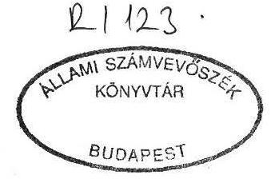
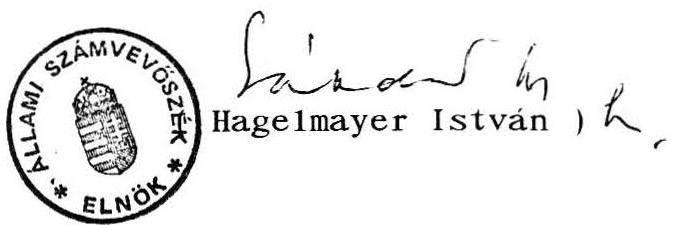

7189. szám

# Állami Számvevőszék

## VÉLEMÉNY

a Társadalombiztosítási Alap 1992. évi költségvetéséről, valamint a társadalombiztosítási alapról szóló 1988. évi XXI. törvény módosításáról szóló 1992. évi X. törvény módosításáról készített 6916. sz. törvényjavaslatról

---

Az Államháztartásról szóló 1992. évi XXXVIII. törvény előírásai szerint az Állami Számvevőszék kötelezettsége a társadalombiztosítási alapok költségvetési előirányzatai megalapozottságának és zárszámadásuknak a vizsgálata.

Ennek megfelelően a 6916. sz. benyújtott törvénymódosítási javaslathoz is észrevételt fűztünk.

Az 1992. évi X. törvény módosítására az egészségügyi és szociális ellátás területét érintő 1992. évi központi bérintézkedésnek a Társadalombiztosítási Alapból finanszírozott gyógyító-megelőző ellátások területén történő végrehajtása, továbbá a társadalombiztosítás területi szerveire vonatkozó központi bérintézkedés végrehajtása miatt kerül sor. Az intézkedések 1992. évi hatása 1660, illetve 74 millió forint, mely összegek a megfelelő bevételi és kiadási előirányzatokat értelemszerűen módosítják, ezeket a törvényjavaslat helyesen tartalmazza.

A konkrét módosító indítványon túlmenően azonban az Állami Számvevőszék problematikusnak tartja, hogy a törvényjavaslat az Alap költségvetését változatlanul "0" egyenleggel állapítja meg. Ma már megbízhatóan prognosztizálható, hogy a kialakult helyzet ennél kedvezőtlenebb.

Az 1992. évi költségvetés alakulásáról, az államháztartás helyzetéről szóló tájékoztató, amely az 1992. évi (6822. számon benyújtott) pótköltségvetési javaslatot indokolta, részletesen tárgyalta az államháztartás társadalombiztosítási alrendszerének helyzetét is. Rámutatott arra a tényre, hogy 1992-ben a tervezett "0" egyenleg helyett (mely már tervezése időszakában is irreális feltételezés volt), hiánnyal kell számolni.

---

Az időarányos pénzügyi helyzet alapján a deficit nagyságrendileg 32 milliárd forint körül alakul. Ezt egyébként a társadalombiztosítás (6813. számú) 1993. évi költségvetési törvényjavaslata, továbbá a Magyar Köztársaság (6598. számon benyújtott) 1993. évi költségvetéséről szóló törvény tervezete is tartalmazza - az előbbi összegszerűen, az utóbbi azzal az előírással, mely szerint a társadalombiztosítási alapok 1992. évi hiányát is értékpapírkibocsátással kell fedezni.

Mindezek alapján az Állami Számvevőszék javasolja, hogy az 1992. évi X. törvény módosítása keretében a Társadalombiztosítási Alap költségvetését az Országgyűlés a jelenleg prognosztizálható hiánnyal állapítsa meg és intézkedjen a hiány finanszírozásának módjáról is.

Budapest, 1992. október

