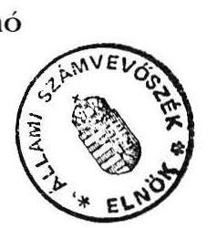
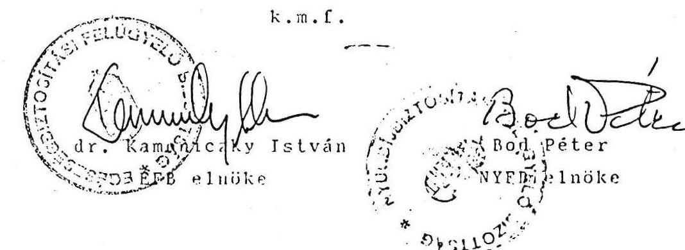

# 7290. szám 

## Allami S̊sámberböséé

## VÉLEMÉNY

a társadalombiztosítás pénzügyi alapjairól és azok
1993. évi költségvetéséről szóló, 6813 sz. törvényjavaslathoz

---

A vizsgálatot vezette:
dr. Csépán Magdolna számvevő tanácsos

A vizsgálatot végezte:

| Balla Józsefné | számvevő |
| :-- | :-- |
| dr. Csépán Magdolna | számvevő tanácsos |
| Hajagos Józsefné | számvevő tanácsos |
| Molnár Istvánné | számvevő tanácsos |

---

V-30-6/1992.
Témaszám: 142

# VÉ L E M É N Y 

a társadalombiztosítás pénzügyi alapjairól és azok 1993. évi költségvetéséről szóló törvényjavaslatról

Az államháztartásról szóló 1992. évi XXXVIII. törvény 86. §-a értelmében az Országgyülés a társadalombiztosítás költségvetési törvényjavaslatát az Állami Számvevőszék véleményével együtt tárgyalja meg.

E rendkívül jelentős feladatot az ÁSZ-nak első alkalommal 1992-ben kell elvégeznie. Így természetes, hogy a társadalombiztosítási törvényjavaslat véleményezésének olyan "hagyományai" és gyakorlata, mint a központi költségvetés ellenőrzése esetében, még nem alakulhatott ki.

Az Állami Számvevőszék az 1992. júniusában hatályba lépett államháztartási törvényben megfogalmazott ellenőrzési kötelezettségének - a Társadalombiztosítási Alap 1991. évi zárszámadása vizsgálatához hasonlóan - ma még csak bizonyos kompromisszumok mellett tud eleget tenni. Erre fordítható kapacitásai fejlesztésére az 1993. évi költségvetési törvényjavaslatban kezdeményezést tett. Munkánkat azonban az is akadályozta, hogy a 6813. számon 1992. szeptember 30 -án benyújtott törvényjavaslatot a Népjóléti Minisztérium egyidejüleg nem küldte meg, illetve azt a mai napig hivatalosan nem adta át. A tervezó munka során - a közvetlenül, munkakapcsolati úton megkapott és feldolgozott dokumentumokhoz képest - a költségvetési javaslat alapvetően átalakult.

Az ÁSZ véleményének írásba foglalásakor felhasználtuk a közelmúltban lezárult átfogó társadalombiztosítási ellenőrzés tapasztalatait és tájékozódó megbeszéléseket folytattunk a törvényjavaslat kidolgozásában résztvevő szakemberekkel.

---

Mint ismeretes, folyamatban van a társadalombiztosítás rendszerének átalakítása, a fő irányokat és feladatokat a 60/1991. (X. 29.) OGY határozat fogalmazta meg. Ezért a költségvetési javaslat törvényességi, (szabályszerüségi) ellenőrzése mellett véleményünk a határozattal összefüggő, 1993-ra tervezett (főleg az egészségügyi ellátást érintő) változásokra is kitér.

A törvénytervezet lényeges eleme, hogy a társadalombiztosítást, mint az államháztartás alrendszerét keze1i, ame1y az önálló pénzügyi alapokból (Nyugdijbiztosítási Alap és Egészségbiztosítási Alap), valamint a müködési költségvetésböl épül fel.

Ezzel a szerkezettel a javaslat csak részben felel meg az ÁsZ által korábban megfogalmazott igényeknek, hogy a társadalombiztosítás valamennyi - a pénzforgalomhoz is igazodó - bevételét és kiadását teljeskörüen kell bemutatni.

A számok továbbra is csak a végleges bevételeket és kiadásokat mutat ják. Ez különösen a zárszámadás el1enőrzésekor jelent majd nehézséget, a törvényi számok és a költségvetési beszámoló adatainak összevetésénél. Az eltéréseknek a beszámoló, vagy a zárszámadási törvény me1lékleteként történő számszerủ bemutatása ezt a hiányosságot pótolná.

Az alapok tényleges pénzügyi önállósága egyenlőre inkább csak elviekben fogalmazódik meg, mivel a feltételek ehhez még nem adottak. A költségvetési javaslat elöirányzatait áttekintve elsődlegesen az a következtetés adódik, hogy a társadalombiztosításban 1990-ben megindult kedvezötlen folyamatok iránya nem változik. Látható, hogy a költségvetési javaslat a kiadási oldalon - a kötelezettségek, illetve az elindított reformintézkedések lépései következtében, bár ezek pénzügyi ráfordításai lényegében az előirányzatoknak felelnek meg - meglehetősen determinált, amihez a szükséges források a vártnál lassabban növekvő bevételek mellett teljeskörüen nem biztosíthatók. A bevételek és a kiadások dinamikája még megszorító intézkedésekkel sem hozható egymáshoz annyira közel, hogy jelentös összegü hiánnyal ne kelljen számolni, ame1ynek a javaslat szerinti finanszírozási módja törvényességi szempontból kifogásolható.

---

A kialakult helyzetben szerepe van annak is, hogy a társadalombiztosítás profiltisztítása - az alapvetően szociálpolitikai indítékú ellátásoktól - meglehetősen lassan halad. Az idetartozó ellátások kiadásai meghaladják a hiány összegét is.

A legjelentősebb változások a gyógyító-megelőző egészségügyi ellátások társadalombiztosítási finanszírozásával kapcsolatban várhatóak, ahol a javaslat szerint 1993. közepétől megkezdődne a teljesítményfinanszírozásra való fokozatos áttérés.

# MEGÁLLAPÍTÁSOK 

1. / A társadalombiztosítás pénzügyi helyzetének várható alakulása 1992-ben

A Társadalombiztosítási Alap önállósulásának csak az első évét - 1989-et - jellemezte a pénzügyi biztonság. Ezt követően azonban kedvezőtlen irányú változás következett be.
A társadalombiztosítás bevételei az 1992. évi várható összeget figyelembe véve 1989-hez viszonyítva kb. 70 \%-kal növekednek, a kiadások ugyanakkor csaknem kétszeresére emelkednek (részletes adatok a 1. sz. mellékletben).

A pénzügyi helyzetet 1991-től a járulékbevételek elöirányzatoktól elmaradó ütemü emelkedése határozta meg a legjobban. A kiadásokat általában sikerült a tervezett keretek között tartani, a vártnál nagyobb növekedés lényegében csak a gyógyszerek és a gyógyászati segédeszközök támogatásánál következett be.

Az 1991. évben a "0"-szaldóval tervezett költségvetés végül is 22 milliárd forintos hiánnyal zárt, melynek rendezéséhez a likviditási tartalék jelentős részét felhasználták.

Az 1992. évi X. törvény a társadalombiztosítás költségvetését ismét "0"-egyenleggel határozta meg. Az időarányos (I-VIII. havi) pénzügyi adatok alapján a folyó bevételek összege 326 milliárd forint, a kiadásoké pedig 346 milliárd forint, így a hiány elérte a 20 milliárd forintot (2. sz. melléklet).

---

Tovább folytatódik a tartozásállomány növekedése is. A tartozások bruttó összege:

1989. végén 11,2 milliárd forint
1990. végén 23.9 milliárd forint
1991. végén 54,4 milliárd forint
1992. VIII-ban 79,9 milliárd forint
volt.

Változatlanul legjelentősebb a gazdálkodó szervezetek (átalakult gazdasági társaságok) által be nem fizetett járulék (késedelmi pótlék, bírság).

Nincs esély arra, hogy 1992-ben a tartozásállomány csökkeni fog, és arra sem, hogy az 1991. évi hiány finanszírozásába bevont ( 21.717 millió forint) likviditási tartalék arányos része visszapótolható legyen.

A társadalombiztosítás hatékonyabb behajtási tevékenységét nagyban gátolja a folyószámla feldolgozás jelenlegi centralizált rendszeréből adódó időeltolódás (a naprakész információszolgáltatás nem megoldott). A feldolgozás nem tud lépést tartani az egyébként is ügyviteli problémáktól terhes munkatömeg-növekedéssel. Változás csak a helyi feldolgozásra való áttérés és a tervezett informatikai fejlesztések megvalósítása esetén remélhető.

Az 1975. évi II. törvény módosításával a társadalombiztosítás igazgatási szervei a közelmúltban megkapták a behajtás adóhatósági és bírósági jogosítványait (végrehajtás lehetősége), mindez azonban csekély reményt ad arra, hogy a tevékenység következtében a kinnlévőségek nagyságrendileg mérséklődjenek. Ez a gazdasági helyzet kedvező irányú változása nélkül nem vezethet sikerre.

Mindezek alapján az ÁSZ a törvényjavaslatban 1992-re valószínüsített hiányt reálisnak ítéli.

---

2. / A társadalombiztosítási alapok 1993. évi elöirányzatainak megalapozottsága

# 2.1 Az elöirányzatoknál figyelembe vett prognózisok 

A társadalombiztosítás várható helyzetére vonatkozó számításokat a Pénzügyminisztériumnak a költségvetés megalapozására készített prognózisa alapján végezték el.

A foglalkoztatottak átlagos száma (gazdálkodó szerveknél, illetve a költségvetési szférában), a járulékalap számításánál figyelembe vehető keresetek alakulása, az egyéni és nem jogi személyú társas vállalkozások személyi jövedelme, a munkanélkü1iek száma, a munkanélküli járadékban, segélyben részesülők száma és a részükre fizetendő járadék összege, a fogyasztói árindex, a költségvetési szerveknél az automatizmusok elmaradása, mind olyan elem, ame1ynek alakulása a társadalombiztosítás legföbb bevételi forrását, a különböző járulékbevételeket alapvetően meghatározza.

Az Állami Számvevőszék a központi költségvetés bevételi elöirányzatai megalapozottságának vizsgálata során (6929. számon 1992. októberében benyújtott jelentésében) a makroszintú számításokat a következők szerint minősítette:
"Makroszámítások bizonytalansága - az óvatosabb előrejelzések és egyes tervezési tényezők kedvező irányú változása következtében - valamelyest mérséklődött. A források mértéke azonban - a jövedelemképződés 1993. évi üteme és a jövedelemtulajdonosok közötti megoszlása miatt - ebben az évben is csak viszonylag nagy eltérés kockázatával prognosztizálható.

A számítások megbízhatóságát javította, hogy - az előző évekhez képest - valamelyest bővült és rendszeresebbé vált a gazdaságstatisztika által megfigyelt és szolgáltatott adatok köre. A magánszektor teljesítményének figyelembe vétele így már nem kizárólag becsléssel történt, bár az adatkör még közel sem teljes és pontossága is kétséges."

---

A társadalombiztosítás szempontjából - különösen a magánmunkáltatóknál - komoly bizonytalansági tényezőt jelent, hogy nincsenek megbízható statisztikai (létszám- és kereseti) adatok. Az a feltételezés, hogy az egy före jutó átlagkeresetek növekedése jövőre megegyezik a prognosztizált inflációs rátával, nincs megfelelő számításokkal megnyugtatóan alátámasztva.

A munkanélküli járadék folyósításával összefüggésben már számoltak szigorító intézkedésekkel, (amelyeknek lényege, hogy egy évre lerövidíti a folyósítási időt, $60 \%$-ra csökkenti a járadék előző évi átlagkeresethez viszonyított mértékét, alsó és felső határát a korábbiakhoz képest korlátozza). Az 1993. évi állami költségvetésről szóló törvényjavaslat 7146. számon benyújtott kiegészítéséből ismétlé vált konkrét változások feltételezhető hatásait a munkanélküli ellátások utáni járulékbevételek számításánál figyelembe vették.

A létszám és jövedelmi adatok bizonytalansága, a gazdasági folyamatok prognosztizálásának nehézségei miatt az ÁSZ a társadalombiztosítási bevételek elöirányzatait bizonytalannak itéli.

Kormány döntés alapján a tervezhető hiány a kiadási oldalon determinációt jelentö kötelezettségek és a folyamatban lévő reformlépések ismeretében sem lehet több 40 milliárd forintnál. Ez egyben meghatározza a kiadási föösszeget is, ami miatt annak a szükségletekhez való viszonyáról az ÁSZ nem tud véleményt nyilvánítani.
2.2 Az elöirányzatok értékelése biztosítási áganként

# 2.2.1 A Nyugdíjbiztosítási Alap elöirányzatai 

Az ágazat a társadalombiztosítás bevételeiböl 305, 9 milliárd forinttal részesedik. Egyes bevéte1i tételek (pl. munkáltatói és egyéni járulékok stb.) törvényben elöirt megosztási arányok szerint illetik a nyugdíjágazatot.

---

A munkanélkü11ek ellátása után fizetendő 15,4 milliárd forint nyugdíjbiztosítási járulékot a makroszinten 1993-ra számított munkanélküli járadék 66 milliárd forintos becsült összegére alapozva határozták meg (hasonlóan az Egészségbiztosítási Alaphoz).

A vissztehermentesen átadott vagyon hozamából származó bevétel 2.824 millió forintos összeget az ÁSZ az 5. pontban foglaltak miatt bizonytalannak ítéli.

Az Alapok egymás részére az általuk finanszirozott pénzbeni ellátások után járulékátcsoportosítást hajtanak végre (3. sz. melléklet). A Nyugdíjbiztosítási Alap a nyugdíjkiadásoknak a természetbeni egészségbiztosítási szolgáltatások fedezetére a törvény szerinti $12,8 \%$-ot utalja át.

A Nyugdijbiztosítási Alap kiadásainak tervezett összege 328, 3 milliárd forint. (A kiadások 1992-ben várható összege 286,8 milliárd forint.) Ebből nyugellátásokra 294,4 milliárd forint irányozható elő. A nyugdijkiadások 1992. évben várhatóan 253,3 milliárd forint körül alakulnak. A 41,1 milliárd forintos növekedésböl a nyugdijak növelésére ennek fele 20,6 milliárd forint - fordítható (az előző évi közel 40 milliárd forinttal szemben). A különbség az 1992. évi nyugdijemelések áthúzódó hatásából, valamint abból adódik, hogy a nyugdijasok létszám (összetétel) alakulása, az induló nyugdijak átlagosnál magasabb összege kiadásnövelő hatással jár.

Az 1992. évi IX. törvény 7. §-a előirta, hogy a nyugellátásokat az átlagkeresetek növekedésének megfelelö mértékben kell emelni évente két alkalommal. Ma már bizonyos, hogy a törvénybe beépített kompenzációt - ami legalább 16-17 \%-os emelést indokolna - 1993-ban nem sikerül megvalósítani. A nyugdijak emelkedésének várható mértéke $12,3 \%$, amiben benne van az 1992. évi nyugdijemelések áthúzódó hatása is. (Ez a mérték a Nyugdijbiztosítási Alapon kivüli nyugellátásokra is vonatkozik.)

Az Alap hiánya 22,4 milliárd forint, melyet értékpapír kibocsátással kívánnak fedezni (lásd a 3.1. pontban foglaltakat).

---

A nyugdijrendszer változtatásával összefüggésben tervezett intézkedéseket (a női korhatár emelése, a beszámítási időszak meghosszabbítása, a degresszió korrigálása, a rokkantsági, illetve özvegyi nyugdijrendszer feltételeinek változtatása) az Országgyűlés külön tárgyalja. Ezeknek az intézkedéseknek 1993-ban a Nyugdijbiztosítási Alap költségvetésére még nem lesz érdemi hatása.

# 2.2.2 Az Egészségbiztosítási Alap elöirányzatai 

Az Alap költségvetése 1993-ban összesen 268,3 milliárd forint bevételi előirányzattal számol, ami az 1992. évi várhatóan 232,2 milliárd forintos bevétellel szemben $15,5 \%$-os növekedést jelent. A bevételek nagyobb része a nyugdijágazathoz hasonlóan meghatározott arányok szerint képződik.

A bevételi tételek közül kiemelést érdemel a biztosítási jogviszonnyal nem rendelkező személyek után a költségvetés által átalány jelleggel fizetendő járulék 5,8 milliárd forintos összege. Ezen a címen - féléves szinten - 1992-ben 2,6 milliárd forintot kap az Alap. Ennek éves összege az ÁSZ előtt ismeretlen paraméterek alapján "szintrehozva" alakult ki. Az érintettek várható létszámnövekedése ma még nehezen prognosztizálható, ez pedig a javasolt átalánytól jelentősen eltérő - azt meghaladó - tényleges kiadásokat eredményezhet (lásd a 2.1 pontban foglaltakat).

Az Egészségbiztosítási Alap bevételei közül a közgyógyellátási kiadások megtérítése 1,5 milliárd forint, a terhesgondozás költségeihez való hozzájárulásként 2,5 milliárd forint szerepel. Az együttesen 4,0 milliárd forintos összeg valójában nem más, mint az egészségügy területén 1992-ben végrehajtott központi bérintézkedés 1993-ra vonatkozó teljes éves hatásának ellentételezése. A megoldás megfelel ugyan a központi bérintézkedések végrehajtásáról hozott kormányhatározatban foglaltaknak (4.sz. melléklet), de nem szolgálja az állami és a társadalombiztosítási finanszírozási kötelezettségek amúgy is nehezen haladó szétválasztását, a valódi profiltisztításnak ez nem a megfelelő módja.

---

Az állam által az Alap részére vissztehermentesen átadott vagyon hozamából elöirányzott 2.176 millió forintos bevéte1i tételt a vagyonjuttatás 5 . pontban leirt bizonytalansága miatt az ÁSZ nem tartja reálisnak.

A törvényjavaslat 327 millió forintban határozza meg a társadalombiztosítás által finanszírozott ellátásokhoz való költségvetési hozzájárulás összegét (a nyugdíjbiztosítási ágat arányosan megillető 373 millió forinttal együtt összesen 700 millió forint). A részleges megtérítéssel kapcsolatban nem egyértelmü, hogy egyszeri vagy tartós átvállalásról van-e szó?

Az Alapok közötti járulékátcsoportosítási szabálynak megfelelően az Alap pénzbeni ellátási kiadásainak $30,5 \%$-át utalja át a nyugdíjágazatnak.

Az Egészségbiztosítási Alap kiadásainak tervezett összege az 1992. évi várható 250,3 milliárd forinttal szemben 285,9 milliárd forint.

Az Egészségbiztosítási Alapból 1993-ban finanszírozandó kiadások köre a korábbi időszakhoz képest alig változik.

A kiadások közel fele a gyógyító- megelőző egészségügyi ellátás társadalombiztosítási finanszírozásához kötődik. Ennek összege 1992-ben (az egészségügyi dolgozók bérrendezése miatti 1.660 millió forintot is figyelembe véve) 112,3 milliárd forint. Az 1993. évi elöirányzat összege 129,6 milliárd forint. A $15,4 \%$-os növekedés a pénzügyi lehetőségek, illetőleg a szükségletek ismeretében minimum-követelményként kezelhető.

Ebből következik, hogy változatlan intézményi struktúra esetén 1993. évben nincs lehetőség a bázis finanszírozás további folytatására. A hiányzó automatizmusokat, a várható áremelkedéseket - ezen belül a két kulcsos ÁFÁ-nak az ágazatot különösen terhelő hatását figyelembevéve a gyógyító- megelőző ellátásokra fordítható keret nem nyújt elegendő fedezetet a hagyományos finaszírozás mellett a szakellátási intézmények müködtetésére.

---

A szintre hozott bázis - vagyis az 1992-ben belépett fejlesztések miatt az automatizmusok nélküli 1993. évi alapelőirányzat 119,8 milliárd forint.

Így valójában a reformintézkedések végrehajtásának tartalékaként beállított 9,8 milliárd forintnak kellene fedezetet nyújtania az inflációs árnövekedésre és az egészségügyi dolgozók 1993. évi bérnövekedésére és a fejlesztésre, amit az új törvény nem értelmez. E célra forrásátcsoportosítás a költségvetésböl sem történt.

Az ÁSZ korábbi vizsgálatai során észrevételezte, hogy a gyógyító megelózó ellátások előirányzata növekvő mértékben tartalmaz úgynevezett szabad forrást, melyet az intézményi előirányzatokon felüli fejlesztésekre, illetve egyedi döntések alapján különböző jogcímek szerint támogatásokra használnak fel.

Az 1992. évi bázis előirányzatot e szempontból elemezve (5. sz. melléklet) megállapítottuk, hogy abból 10,4 milliárd forint az az összeg, amelyet 1992-ben egyszeri támogatásként fizetnek ki. Ennek tételei jellegük folytán részben 1993-ban is finanszirozási kötelezettséget jelentenek (vér és vérkészítmények, csipőprotézis, háziorvosi ellátás tel jesitményfinanszirozására fordított összeg, gyógyszerártámogatás, szolidaritási járulék többlete). Szabad forrásként kezelhető a "fejlesztések tel jesitményfinanszirozására" beállitott 2,4 milliárd forint, ame lynek egy része az új rendszerben is egyes eljárások (mütétek stb.) fedezete. Meg kell azonban jegyezni, hogy az 1993. évi elöirányzat új fejlesztésekre forrást nem tartalmaz. (A "fejlesztés" fogalmát az új finanszirozási rendszerben nem is értelmezik a rendelkezésre álló dokumentumok.)

Részben tehát pénzügyi kényszerintézkedésként kerülne sor 1993-ban a javaslat szerint egy nagyhorderejü, az egészségügyi ellátás egészét, a társadalombiztosítást - nem utolsósorban a biztosítottakat - is érintő reformintézkedés bevezetésére.

---

Ennek keretében az alapellátásban - szakítva a bázisalapú finanszirozás gyakorlatával - zömében a "teljesítményt" kifejező mutatók alapján történne a finanszirozás.

Megtörténnének az első lépések a szakellátásban alkalmazható tel jesítmény, illetve feladatfinanszirozási módok bevezetésére is.

A változásokat egységesen 1993. július 1-jétöl vezetnék be.
A törvényjavaslat a teljesítmény szerinti dijazás keretében folyósitott összeg felhasználását teljes egészében az intézményekre bízná, felmentést adva az államháztartási törvény költségvetési szervek gazdálkodását szabályozó előírása alól. Így értelemszerűen feloldódnának a bér és dologi előirányzatok közötti átcsoportosíthatóság korlátal is. A szűkös források, illetve az egészségügyi dolgozók egyébként jogos bérigényei miatt ez a lehetőség önmagában is veszélyezteti az adott intézmény működőképességét.

Az ÁSZ - számos szakmai anyag áttanulmányozása mellett - az OTF-nél, a Népjóléti Minisztériumban, illetve az NM Gyógyító Ellátás Információs Központjában (GYÓGYINFOK) is igyekezett a javaslatok megalapozottságáról, előkészítettségéről meggyőződni. A változtatás szándéka az egészségügyi reform Országgyúlés által is elfogadott irányai, a szakma várakozásai, a hagyományos költségvetési finanszirozás életképtelensége szempontjából nem vitatható, a tapasztalatok alapján azonban a várható "eredményt" illetően számos kétely is megfogalmazódott, olyan veszélypontok, ame lyekre az ÁSZ-nak kötelessége felhívnia a törvényhozók figyelmét.

A változtatások lényegéről, illetve a javasolt új finanszirozási rendszer általunk problematikusnak ítélt kérdéseiről külön (6. sz. mellékletben) számolunk be.

Az Egészségbiztosítási Alap nehezen prognosztizálható kiadásai közé tartoznak a gyógyszerek, gyógyászati segédeszközök támogatásának ráfordításai. A tényleges kiadások az előirányzatokat évről-évre meghaladták. 1992-ben 7,0 milliárd forint túllépés várható a 31 milliárd forintos előirányzathoz képest.

---

Az 1993. évre a támogatások elöirányzott összege a várhatóan 38 milliárd forintos teljesítést alapul véve, együttesen 44 milliárd forint. Az ÁSZ megitélése szerint azok a folyamatok (importból származó gyógyszerek térhódítása, növekvő gyógyszerválaszték stb.), amelyek az elöirányzatok túllépését okozták tovább folytatódnak. Hasonló hatást válthat ki a hazai gyógyszeripar privatizációja is. Így az elöirányzatok szintje - még a lakossági terhek növelése mellett is - nehezen lesz tartható.

A táppénzkiadások 29 milliárd forintos elöirányzata lényegében a korábbi évekével azonos, ami figyelemmel a táppénzrendszerrel kapcsolatosan tervezett szigorító intézkedésekre reálisnak mondható.

Az Egészségbiztosítási Alap 17,4 milliárd forintos tervezett hiányát szintén értékpapír kibocsátás fedezné.

# 2.3. A társadalombiztosítás pénzügyi alapjainak müködési költségvetése 

A törvényjavaslat I. fejezete általában szabályozza az alapok müködési költségvetését. Az új szabály lényege nem más, mint az 1988. évi XXI. törvényt módosító 1991. évi III. és 1992. évi X. törvény elöírásainak egységes szerkezetbe foglalása, de a társadalombiztosítás önkormányzati irányításáról szóló 1991. évi LXXXIV. törvényre épülve további rendelkezéseket is tartalmaz. Ezek a rendelkezések nem létező szervezetekre vonatkoznak, nem határozták még meg az önkormányzat intézményeit és szervezeteit, müködési formáját. A törvényjavaslat így keret jellegü, nem határozza meg, hogy az önkormányzat hiányában, annak felállásáig 1993. évben ki az, aki döntési jogosítvánnyal rendelkezik, ki(k) kezeli(k) az alapokat, nem létező szervezeteknek ad felhatalmazást a gazdálkodás szabályozására, a müködési költségvetés végrehajtására.

A törvényjavaslat szerint továbbra is elkülönülnek a müködési költségvetéstől az ellátások finanszirozásával kapcsolatban felmerülö bank- és postaköltségek. Az Alapok végleges szétválasztásával logikáját veszti az önálló müködési költségvetés, ha az az ellátásokhoz kapcsolódó költségeket nem tartalmazza teljeskörűen.

---

A müködési költségvetés bevételeinek és kiadásainak alakulását a 7. sz. melléklet tartalmazza a Társadalombiztosítási Alap létrejöttétól 1993. évig.

A müködési költségvetés bevételének meghatározó része a két alaptól - bevételeik $1,5 \%$-a - átvett pénzeszközökböl származik.

Ennek következtében nem meghatározott nagyságú bevétellel számolhat a müködési költségvetés, hanem egy becsült értékkel, me1y az év során változik. Ugyanakkor az éves kiadások meghatározottak. A müködési költségvetés egyébként logikailag nem a bevételekhez, hanem a kiadásokhoz kapcsolódik.

A társadalombiztosítás bevételeinek elöirányzata 1989-90. években szufficittel, 1991. évben és prognosztizálhatóan 1992. évben is deficittel teljesültek, illetve teljesülnek. Az elmaradó járulékbevételből származó deficít azt eredményezi, hogy a müködési költségvetés bevétele sem éri el az elöirányzatot, a kiadások fedezetéhez a szufficitböl képződött müködési tartalékot kellett bevonni 1991-ben és 1992-ben is. A korábbi években képződött szufficitet várhatóan 1992-ben tel jes egészében a kieső bevételek, illetve a többletkiadások ellentételezésére használják fel. (A 7. sz. mellékletben 1992. évre bemutatott 286 millió forint tartalék - az 1992. évi X. törvény értelmében - visszapótlási kötelezettség, me1y a székházépítésre determinált.)

Az 1992. évi LX. törvény 9. § (4) bekezdése értelmében a müködési költségvetés további forrás bevonásként 1992. évben számításba vette az 1991. évi családi pótlék folyósításával kapcsolatban felmerült kiadások maradéktalan megtérítéséből származó 100 millió forintot is. Ezzel azonban a Magyar Köztársaság 1992. évi költségvetése, illetve annak pótköltségvetése sem számol!

Az alapoktól 1993-ban a folyamatos müködéshez átvett pénzeszközökön (bevételeik $1,5 \%$-án) felül egyszeri kiadásra fejlesztésre - további pénzátvéte1t terveznek a források megteremtéséhez. A folyamatos és az egyszeri kiadásokhoz biztosított források konvertálhatóságát a törvényjavaslat nem szabályozza teljeskörűen, csak annyiban, hogy az egyszeri feladatokra biztosított források csak konkrét döntés alapján meghatározott összegben és ütemben használhatók fel. Azt nem szabályozza, hogy a folyamatos kiadás forrásait az előbbi célokra be lehet-e vonni.

---

A müködési költségvetés bevételeit részletezỏ törvėnyi mellékletben a folyamatos müködésre átvett elöirányzat 8.497 millió forint kevesebb mint az alapok bevételének $1,5 \%$-a. A müködési költségvetést megillető bevételek 1,5 \%-a 8.505 millió forint, melyböl 4.535 millió forint a Nyugdijbiztosítási Alapot, 3.970 millió forint az Egészségbiztosítási Alapot terheli.

Az 1992. évi várható müködési kiadások köze1 400 millió forinttal fogják meghaladni a tervezettet, melynek forrása az 1991. évi zárszámadásról szóló 1992. évi LX. törvény szerinti megtakarítás.

Az 1993. évi bérkiadások tervezésénél - hasonlóan az 1992. évhez - nem a költségvetési szervekre érvényes elöirást alkalmazzák, vagyis a már végrehajtott fejlesztések bérkiadásait továbbra is a fejlesztések között tervezik (p1. a Fejlesztési Iroda kiadásai között. Sem a törvényjavaslat függelékéböl, sem annak kiegészítéseként átadott részletezés (8. sz. melléklet) alapján nem állapítható meg, hogy csupán a tervezési gyakorlat rossz, vagy a Fejlesztési Iroda bérkiadásait tervezték-e kétszer.

Az 1992. évre tervezett fejlesztések változtak, habár elöirányzatuk nagyságrendileg tekintve lényegében változatlanok. A behajtási szervezet csak részben, a fiókhálózat egyáltalán nem valósult meg. Elöirányzatukat és még további forrásokat az 1992. évi feljesztések között nem tervezett társadalombiztosítási kártyák emésztették fel.

A társadalombiztosítási kártyák költsége 1992. év végéig a 800 millió Ft, az 1993. évi elöirányzattal együtt az 1 milliárd forintot is meghaladja. A kártya azonban csupán egy funkcióra alkalmas (szabad orvosválasztás eszköze). Más informatikai feldolgozásra ez a kártya csak további költségráfordítás mellett használható, mindaddig amíg a világbanki projekt keretében az új rendszert ki nem dolgozzák, illetve müködésbe nem helyezik.

Az informatikai fejlesztések 1992. évben az EDS által szállított megvalósíthatósági terveket és egyéb projektek elöirányzatait tartalmazzák. Ezen projektek az 1993. évi fejlesztések előkészítéseként értelmezhetők, de néhány esetben a korábbi elképzelést újra kell értékelni és a fejlesztési terveket meg kell változtatni (p1. táppénzrendszer).

---

Az 1993. évben az informatikai rendszerek fejlesztése eltér a függelék tartalmától, az azóta elkészült stratégiai terv alapján. A tervezett fejlesztések három területet foglalnak magukban:

- a meglévő rendszerek továbbfejlesztése, vagyis az előkészítettség biztosított, (járulék-folyószámla, nyugdíjfolyósítás, statisztika, stb);
- döntés szükséges, hogy az eddigi fejlesztést folytassák, vagy újat vezessenek be, vagyis a korábbi fejlesztések hasznosulása kérdéses, (nyugdíjmegállapítás, családi pótlék, betegbiztosítási kártya);
- a fejlesztések új elképzelések, előkészítettségüknincs (behajtás, munkaviszony nyilvántartás, táppénz, egészségügy finanszírozás, gyógyszer és gyógyászati segédeszközök, vezetői informatikai rendszer).

A világbanki fejlesztések az informatikai infrastruktúra fejlesztésére és korszerűsítésére irányulnak, amely hardware és software fejlesztéseket, technikai segítségnyújtást, képzést foglal magába. Ezen fejlesztések részben az EDS által készített megvalósíthatósági tanulmányra alapulnak, ugyanakkor nem szabad a fejlesztéseket jóváhagyni amíg a rendszerek fejlesztése nem kiforrott. Ezen feladatokat az önkormányzatoknak vagy a felügyelő bizottságoknak kell jóváhagyniuk 1993-ban.

A világbanki projektek még további alapos előkészítést igényelnek, mert a hitelszerződés aláírását követően fel nem használás, illetve késedelmes felhasználás esetén a készenléti kamatot meg kell fizetni a világbanki hitelnyújtás általános feltételei szerint.

Az informatikai fejlesztésekre és a világbanki hitelből megvalósuló feladatokra 89 millió forint bérkifizetést terveznek a Fejlesztési Iroda 129 millió forintos béralapján felül (amely már jelentős összegű megbízási díjat is tartalmazott), vagyis jutalomként az éves bérkiadás 69 \%-át irányozzák elő.

---

A székház beruházás az 1992. és 1993. év fejlesztési feladatai között az egyik legjelentősebb feladat, melynek előkészítése 1991. évben kezdődött. A feladat 1991. évi elhatározásakor ajánlati szinten az építési költséget 2,2 milliárd forintra becsülték. Az 1992. június 15 -én jóváhagyott engedélyokmány szerint a megvalósítási költség 3,2 milliárd forint a kapcsolódó létesítmények elöirányzatával együtt. (Mindkét összeg ÁFA-val együtt értendő.)

Az épület megvalósítására - pályáztatás alapján kiválasztott kivitelezővel - átalányáras kivitelezési szerződést kötöttek. Ennek nem része a telefonközpont és készülékek, valamint a külső elektromos ellátás. Ez utóbbi költségét az összköltség előirányzat azonban tartalmazza. Ugyanakkor meg kell állapítani, hogy a létesítmény költségeiben, illetve a megvalósítási ütemben az új telefonközpont, amely az információ technológiai fejlesztésnek része, nem szerepel, de a Fejlesztési Iroda által összeállított 1993. évi információ technológiai fejlesztések stratégiai tervében sem. Így ebből a tételből a hasonló kapacitású rendszerek árait figyelembe véve 100 milliós nagyságrendű további költségeme1kedés következne.

A TB föigazgatóság újabb közlése szerint "jelen időpontra eldöntött kérdés, hogy a székházépület telefonrendszere házilag az általános igényeknek megfelelően fog funkcionálni", így ez "várhatóan mindössze"... 40-50 millió Ft kiadással jár.

A bemutatott számsor mutatja, hogy a beruházás a kényszerpályára helyezés és az építményre leszúkitő program módszereivel indult meg, s végső költségei bizonytalanok.

Az 1993. évi 1.937 millió forint fejlesztési költség több mint $50 \%$-a beruházási feladatok megvalósítására szolgál. A beruházásokból épület vásárlásra és létesítésre több mint 900 millió forintot irányoztak eló, amiből 420 millió forint az 1992. évi determináció. Ezen beruházásokat a szervezetfejlesztések - létszámbővítések - indokolják. Megvalósulásuk esetén a bérleti költségek csökkenésével is lehet számolni. Az újonnan induló beruházások (vásárlások) előkészítése érdekében az egyeztető tárgyalások megkezdődtek, de végleges döntés még nincs, vagyis a tervezett pénzügyi felhasználás ma még kérdéses, illetve az igazgatóságokkal lefolytatott költségvetési tárgyalások függvénye.

---

Az 1993. évre tervezett fejlesztések a fentiek alapján bizonyos tartalékokat tartalmaznak, de ugyanakkor fel kell hívni a figyelmet, hogy egyes feladatokra nem tartalmaz előirányzatot (pl. szervezet átalakítás).
3. / Az 1993. évi központi költségvetés és a társadalombiztosítás költségvetése közötti kapcsolat
3.1 A társadalombiztosítási alapok 1993-ra tervezett hiányának finanszirozása

A társadalombiztosítás bevételei még a bevezetőben említett megszorító intézkedésekkel (melyeknek jogi előkészítése már szintén folyamatban van).

- a törvényben előirtnál alacsonyabb mértékủ nyugdíjkompenzáció;
- a rokkantsági nyugdíjra való jogosultság orvosi elbírálásának szigorítása;
- a táppénzrendszer változtatása;
- a gyógyszertámogatások adminisztratív intézkedésekkel történő korlátozása;
- a GYED minimumának megszüntetése;
- az alapok kamat- és egyéb hozambevételeinek folyó kiadásokra történő felhasználása
sem fedezik a kiadásokat.

A két ágazat együttesen tervezhető hiánya a törvényjavaslat szerint 40 milliárd forint, aminek rendezésére az államháztartási törvény értelmében intézkedni kell. A költségvetési törvénytervezet úgy intézkedik, hogy a hiányt hosszú lejáratú értékpapír kibocsátás fedezi. Erre a megbízást a társadalombiztosítási alapok kezelője adná az MNB részére. A költségvetés pedig - garanciaként - megtéríti a felmerülő kamatköltséget, illetve kezességet vállal a tőketörlesztésre.

A javasolt megoldás ellentétes a Magyar Nemzeti Bankról szó1ó 1991. évi LX. törvény 19. § (1) bekezdésében foglaltakkal (9. sz. melléklet). Azzal egyébként a két felügyelő bizottság sem értett egyet (10. sz. melléklet).

---

Még a törvényjavaslat indoklása sem tartalmazza az értékpapír (vélhetően kötvény) kibocsátásának idejét, esetleges ütemezését, kamat és beváltási feltételeit, a vásárlók tervezett körét. Ez a társadalombiztosítás 1992. évi várható hiányának ( 32,8 milliárd forint) finanszirozása miatt sem mellékes. Mint ismeretes az 1993. évi központi költségvetés törvénytervezete a két év hiányáról egyaránt értékpapírkibocsátás útján kíván gondoskodni.

# 3.2 Átmenetileg a társadalombiztosítás által finanszirozott ellátások köre és mértéke, profiltisztítás 1993-ban 

Az 1992. évi X. törvény első alkalommal határozta meg a társadalombiztosítás által átmenetileg finanszirozott ellátások körét és összegét, azzal a céllal, hogy a nem biztosítási jellegű ellátások leválasztása megkezdődjön. A profiltisztítás 1992-ben 3,6 1993-ban 3,4 milliárd forinttal mérsékli a társadalombiztosítás kiadásait.

Figyelemreméltó ugyanakkor, hogy a továbbra is a társadalombiztosításnál maradó ellátások előirányzata 42,3 milliárd forint, vagyis több a tervezett hiánynál.

Meg kell említeni, hogy az 1993. évi központi költségvetésről szóló törvényjavaslatban profiltisztítás címén 9,4 milliárd forint szerepel ebből:

- 3,6 milliárd forint a már 1992-ben átvállalt juttatások (megmagyarázhatatlan módon változatlan) összege;
- a központi költségvetésből biztosított hozzájárulás 700 millió forint;
- a megváltozott munkaképességűek átmeneti járadéka 1050 millió forint;
- a közgyógyellátás miatti térítés 1.500 millió forint, illetve a terhes gondozás kiadásaihoz való hozzájárulás 2.500 millió forint (ami a 2.2 .2 pontban foglaltak miatti bérpolitikai intézkedések ellensúlyozása);
- a cukorbetegek támogatására 50 millió forint.

---

Az eltérés értelmezhető, abból adódik ugyanis, hogy a költségvetési törvény javaslatban az 1992-ben átvállalt kiadások ( 3,6 milliárd forint) is szerepelnek, feltüntetik a központi bérpolitikai intézkedések éves szintre számított hatását ( 4 milliárd forint) ugyanakkor a társadalombiztosítástól átkerülő ellátásoknak csak a tényleges kihatását - 1800 millió forintot - veszi figyelembe.

A profiltisztítás körébe tartozó ellátások 3400 millió forintos összegéből ugyanis - az ellátások megszünése, átalakítása miatt - csak 1800 millió forint kerül át ténylegesen a költségvetéshez.

# 3.3 A költségvetés megtérítési kötelezettségeiröl 

Az állami költségvetésről szóló törvény olymódon rendelkezik, hogy a megtérítéseket havi egyenlő részletekben kell folyósítani.

A Népjóléti Minisztérium e rendben téríti meg az elöirányzat $1 / 12$ részének havonkénti átutalásával:

- a családi pótlékot;
- a politikai rehabilitáltak nyugdijkiegészitését;
- a profiltisztítás körébe tartozó ellátásokat;
- a folyósításra átvállalt egyéb ellátásokat;
- a nem biztosítottak egészségügyi ellátásának pénzügyi fedezetét;
- a lakásalap fedezeti kötvény kamatát.

Ide tartoznak a folyósítás költségeinek megtérítései is (amivel a korábbi viták forrása megszűnt).

Az előirányzat, illetve az átutalt összeg és a tényleges teljesítés közötti különbözet megtérítésére, a fizetés konkrét időpontjára azonban nincs megállapodás. Az egyenlegek megtérítésére a zárszámadás elfogadása után kerül sor, tehát a felmerülést követően legalább 9-10 hónappal később. Így például mindeddig nem rendeződött az 1991. évben folyósított és az e címen átutalt családi pótlék közel 840 millió forintos különbözete.

---

# 3.4 A biztosítási alapok likviditásának megteremtése 

Az ellátások akadálytalan folyósítása érdekében az OTF az 1989-91. közötti években 5 milliárd forint készenléti hitelt vehetett igénybe, e felett - kamatmentesen - használhatta az állami forgóalaphoz kapcsolt Nyugdíjmegelölegezési Számlát.

Az 1992. évtöl - az 1991. évi XCI. törvény - csak a Nyugdíjbiztosítási Alap vonatkozásában engedte meg a Számla igénybevételét. A gyakorlatban azonban ez mindkét biztosítási ág likviditását szolgálta. Az OTF naprakészen nyilvántartja szabad pénzállományát, illetve a hiteltartozásokat. A napi hitelállomány összege változó, a legnagyobb igénybevett összeg (1992. augusztus 29-én) 18,9 milliárd forint volt.

Mivel az alapok pénzforgalmi számláinak szétválasztására nem került sor, így nem bizonyítható, hogy a pénzfelvételre mi célból került sor.

Az 1993. évre vonatkozó központi költségvetési törvényjavaslat már nem nevesíti az állami forgóalaphoz kapcsolt megelölegezési számlát, hanem a Nyugdíjbiztosítási és az Egészségbiztosítási Alapot terhelö ellátások folyamatos teljesitése érdekében egyaránt megengedi igénybe venni.

Feltételül azt szabja, hogy a számlát csak akkor lehet használni, ha a pénzhiányt a deficít finanszírozása érdekében történő értékpapírkibocsátás útján befolyó bevétel már nem fedezi. E szabályból viszont a kötvénykibocsátás 1993. január 1-jei időpontja következik.
4. / A társadalombiztosítás kamat és egyéb hozambevételeinek, valamint tartalékainak tervezett alakulása

A kamat és egyéb hozambevételek 1992. évi várható összege 8,4 milliárd forint. E bevételek a családi pótlék 1990. I-III. havi összegének finanszírozásával összefüggö kamat megszünése és az általános kamatszint csökkentése miatt -1993-ban 4,0 milliárd forintot tesznek ki. A befektetett eszközöket az 1991. évi zárszámadási törvényben meghatározott eszmei hányadok alapján osztották meg az ágazatok között.

---

A társadalombiztosítás kamat és egyéb hozambevételei 1993-ban a kedvezőtlen pénzügyi helyezet miatt a folyó kiadások fedezetéül szolgálnak. Ezért a befektetések hozama és a tartós befektetések tartaléka az 1992. évi szinten marad. A hozambevételek ily módon történő felhasználása ellentétes a tartalékok eredeti rendeltetésével, azaz a tartós befektetések hozamát további tartós befektetésekre kell fordítani.

Az 1991. évi hiány fedezésére a likviditási tartalékból összesen 21.717 millió forintot használtak fel, melyet a zárszámadási törvény az 1991. december 31 -én tartozó járulékfizetők járuléktartozása megfizetésének "megelölegezéseként" keze1. Úgy rendelkezik, hogy azt - a tartozások megfizetéséért befolyt összegből - 1994. végéig vissza kell pótolni legalább évente arányos részletekben. Az 1992. év folyamán az eddig befolyt összeg 2.278 millió forint, ami még nem éri el az időarányosan esedékes $1 / 3$-os részarányt. A likviditási tartalékalap 1993. évi visszapótlására előirányozták az időarányos 7.200 millió forintot.

Ismerve a társadalombiztosítás kinnlévőségeinek tömegét, a gazdálkodó szervezetek fizetési nehézségeit, kevés az esély arra, hogy a felhasznált likviditási tartalékot az előirt határidőre visszapótolják, sőt fennáll a veszélye annak, hogy a megmaradt és időközben egyéb forrásból képződő tartalékot is fel kell használni.

# 5. / A társadalombiztosítás ingyenes vagyonhoz juttatása 

A törvényjavaslatnak a társadalombiztosítás pénzügyi alapjairól szóló I. fejezete a Nyugdíjbiztosítási és az Egészségbiztosítási Alap bevételei között említi a részükre átadott vagyonból származó bevételt.

Ez három részből tevődik össze:

- az Alapok részére vissztehermentesen átadott, illetőleg;
- az Alapok követelései fejében az adós által felajánlott vagyonból, valamint
- a vagyon hozadékából (tőkenyereség, eredmény, hasznosítás bevétele stb.)

---

A vagyoni kérdések érintése azért szükséges, mert az Alapok 1993. évi költségvetése számol az ingyenes vagyonátadás hozamából származó bevétellel, összesen 5 milliárd forint értékben.

Az 1992. évi X. törvény rendelkezései szerint 1994. végéig a társadalombiztosítást 300 milliárd forint értékủ vagyonjuttatásban kell részesíteni. Elöirta továbbá azt is, hogy e vagyonból 1992-ben legfeljebb 1.880 millió forint bevételt biztosító rész értékesíthető és az a folyó kiadások finanszírozásába bevonható.

A Gazdasági Kabinet az év második felében két alkalommal foglalkozott a témával, létrejött az úgynevezett Vagyonátadó Bizottság. Mindeddig azonban csak elvi jellegủ döntések születtek, tényleges vagyonátadásra nem került sor.

A társadalombiztosítás költségvetésében azonban mindezek ellenére 70 milliárd forint értékủ vagyonátadással számolnak és ennek 7-8 \%-os 1993. évi hozamát feltételezve alakult ki az 5 milliárd forintos bevételi összeg.

Az Állami Számvevőszék fenntartja azt a korábbi megállapítását, hogy a vagyonjuttatás részleteinek kidolgozatlansága, a szükséges intézkedések jelentős késedelme miatt nem valószínűsíthető olyan nagyságrendủ vagyontömeg átadása, amely a társadalombiztosítást jelentős összegű bevételhez juttatja. A vagyonátvétel feltételeit az OTF-nél sem alakították még ki, a kezeléssel, hasznosítással minden valószínűség szerint külső szervezeteket bíznak meg.

A Gazdasági Kabinet november elején ismét napirendjére tűzi a társadalombiztosítás vagyoni kérdéseit. Az Országgyúlés október 27 -én fogadta el az 1992-re vonatkozó Vagyonpolitikai Irányelveket. Az ingyenes vagyonátadás végleges szabályai azonban még nem ismertek.

Érdemi lépés a tartozás fejében történő vagyonátvétel terén sem történt. Az adós cégek ugyan felajánlottak mintegy 4 milliárd forint értékủ ingatlant, de az ezek értékesítésére kialakított, úgynevezett TB-börze az ingatlanpiac müködésképtelensége miatt még nem hozott eredményt.

---

A törvénytervezetböl egyébként nem világos, hogy az átadott vagyon hogyan oszlik meg a biztosítási ágak között. A javaslat szerint ugyanis a vagyonalapra a tartósan befektetett eszközökre vonatkozó szabályokat kell alkalmazni.

Ilyen szabályt azonban a törvény nem tartalmaz. Kérdéses, hogy ez esetben is az 1992. évi LX. (zárszámadási) törvényben jóváhagyott megosztási arányokat kell-e alkalmazni.

Az átadott vagyon tervezett hozamát 1993-ban - hasonlóan a kamat - és egyéb hozambevételekhez - a folyó kiadások finanszirozásába kívánják bevonni.

# 6. / A biztosítási ágakhoz tartozó pénzügyi alapok gazdálkodási önállósága 

A törvényjavaslat megfogalmazása szerint a társadalombiztosítás pénzügyi folyamatai az ágak önálló pénzügyi alapjain:
a Nyugdíjbiztosítási Alapon és
az Egészségbiztosítási Alapon
keresztül bonyolódnak le.

Az Alapok tényleges pénzügyi önállósága a következöket feltételezi:

- a biztosítási ágak bevételeinek és kiadásainak teljes elkülönítését, önálló könyvviteli rendszer kialakítását (két mérlegbeszámoló készítését), ennek megfelelően;
- külön bankszámlát és a járulékfizetők egyéni folyószámláinak megkettőzését;
- az alapok külön vagyonát és tartalékait (az azokkal való önálló gazdálkodást);
- az alapok napi likviditási helyzetének ismeretét;
- az önálló szervezeti keretek megteremtését (ideértve a saját müködési költségvetést is);
- a teljes profiltisztitást;
- a társadalombiztosítás által folyósított más ellátások elszámolásának rendezését.

---

A két alapot az 1992. évi X. törvény (Társadalombiztosítási Alapról szóló 1988. évi XXI. törvényt módosító része) hozta létre. A biztosítási ágak pénzeszközeinek elkülönítésére azonban nem került (nem is kerülhetett) sor. Az alapok pénzforgalma változatlanul egy bankszámlán bonyolódik le.

A kialakított számviteli rendszerben a bevételek elkülönítése - az elöirt megosztási arányok szerint - OTF szinten, a kiadások elkülönítése igazgatósági szinten - az egységesen bevezetett kódrendszer alkalmazásával - történik.

A legnehezebb és legidöigényesebb feladatot a jelenlegi folyószámla rendszer átalakítása jelenti. Ez a maitól alapjaiban eltérő pénzügyi rendszer kialakítását igényli, aminek feltételei reálisan még 1993-tól sem teremthetők meg. Ehhez ugyanis a jelenlegi egyéni folyószámlák 1992. év végi záróegyenlegét meg kellene bontani (beleértve a tartozásokat is).

A gazdaságban végbemenő változások miatt nagymértékben növekedett a folyószámlák száma (jelenleg 1.100 ezer db). A járulék és folyószámlakönyvelés és nyilvántartás ügyvitelében mutatkozó hiányosságok miatt az év végi záróegyenlegek megbontása megoldhatatlan. (Az ÁSZ korábbi vizsgálatai e kérdéssel részletesen foglalkoztak).

A 2.3. pontban ismertetett informatikai fejlesztések között szerepel a számviteli projekt, melynek egyik feladata a biztosítási ágak önálló számítógépes fókönyvi könyvelésének kialakítása. A világbanki projektek pedig az új folyószámla járulékelszámolási rendszer - megteremtését is célul tüzték ki.

Az alapok pénzforgalmi szétválasztásának kérdéskörével a felügyelő bizottságok is foglalkoztak. Együttes határozatuk értelmében - mivel 1993. január 1-jétől nincs reális lehetőség a befizetések biztosítási ágankénti megosztására - az 1992. évben érvényes elszámolási módot kell folytatni azzal, hogy az OTF a jogi szétválasztás után folytassa az előkészületet a teljes pénzügyi szétválasztásra (11. sz. melléklet).

---

7. Az 1991. évi LXXXIV. törvény szerinti önkormányzati irányítás 1993. évi bevezetésének feltételrendszere, intézményi, szervezeti kérdései

A költségvetési törvénytervezet az Alapok kezelöjeként a nyugdij-, illetve egészségbiztosítási önkormányzatot jelöli meg. A társadalombiztosítás önkormányzati igazgatásáról szóló törvény értelmében a biztosítási önkormányzatok első közgyűlését 1993. január 1-15. között kell összehívni. Ez az időpont a szakszervezeti választások elhúzódása miatt bizonytalan.

A társadalombiztosítás önkormányzati irányításáról rendelkező 1991. évi LXXXIV. törvény keret jelleggel határozza meg az önálló biztosítási ágak szervezetelt, illetve a jelenlegi szervezetek átalakítását. Nem rendelkezik arról, hogy az átalakítás előkészítése, irányítása kinek a feladata (a felügyelő bizottságoké, a kormányzaté vagy esetleg az ellenérdekelt OTF-é). Ezzel magyarázható, de el nem fogadható, hogy az 1993. év elejére tervezett igazgatási szervezetek kialakítása érdekében érdemi intézkedés nem történt. Ugyanakkor a társadalombiztosítás igazgatási apparátusnak jogállását és feladatkörét meghatározó jogi normák egy része a törvény hatálybalépésével, más része már 1992. szeptember 1-jével hatályát vesztette. Így nem halasztható tovább a feladat- és hatáskörök egyértelmü rendezése, a szervezet ehhez kapcsolódó átalakítása.

Az OTF a stratégiai rendszertervében olyan szervezettel számol, ahol létezik a két önkormányzat a hozzátartozó központi hivatalokkal (Országos Nyugdijbiztosító Intézet és Országos Egészségbiztosítási Pénztár) és egy közös szolgáltató irodarendszerrel az adminisztratív feladatok ellátására. Ezt a koncepciót a Világbank is elfogadhatónak tartja.

Mindezen elképzelések, valamint az önkormányzatok felállásának prognosztizálható csúszása miatt az 1991. évi LXXXIV. törvényt módosítani kell, továbbá ki kell bővíteni a társadalombiztosítás új igazgatási szervei létrehozásának előkészítésével, a végrehajtási kötelezettség nevesítésével és időbeni ütemezésével.

---

# J A V A S L A T O K 

A társadalombiztosítás pénzügyi alapjairól és azok 1993. évi költségvetéséről szóló törvényjavaslat megalapozottságának, illetve más törvényekkel való összhangjának megteremtése érdekében az Állami Számvevőszék javasolja: az Országgyülésnek, hogy kérje fel a Kormányt:
1./ A társadalombiztosítási költségvetés 1993. évi hiánya finanszírozásának a törvényjavaslatban szereplő megoldásának (az értékpapír-kibocsátás tervezett módja) ismételt átgondolására és a törvényes elöírásoknak megfelelő új megfogalmazására;
2./ Az 1975. évi II. törvénynek a nyugdijrendszer változtatása és egyéb okból napirenden lévő módosítása keretében a nyugellátások évenkénti emelésére vonatkozó - az 1992. évi IX. törvénnyel életbe léptetett - előírásának módosítására, illetve kiegészítésére;
3./ A biztosítási önkormányzat létrejöttének késedelme miatt az 1991. évi LXXXIV. törvény módosítására, illetve az átmeneti időre vonatkozó szabályok kialakítására, az átalakításért való felelősség egyértelmű megfogalmazásával;
4./ Ismételt áttekintésére annak, hogy a jelen körülmények között célszerű-e az egészségügyi intézményeket kivonni az államháztartási törvény egyes előírásai alól.

Az Állami Számvevőszék a véleménykészítés során tapasztaltak alapján javasolja
a Kormánynak:
1./ Az egészségügy területén javasolt finanszírozási változtatások elfogadása esetén 1993. első negyedévében tekintse át a bevezetés előkészítettségét, az alapellátásban 1992-ben végrehajtott változtatások tapasztalatait és arról adjon tájékoztatás.

---

2. / A társadalombiztosítás részére átadandó vagyonról még e törvény elfogadásáig hozzon döntést, mivel ennek hiányában a vissztehermentesen átadandó vagyon értéke fiktív; a számvitelről szóló törvény alkalmazásának elveivel ellentmondó lenne (óvatos értékelés elve), ha a 70 milliárd Ft bevételi értékel számolnának.
a Kormánynak és az Országos Társadalombiztosítási Föigazgatóságnak:
1./ A biztosítási jogviszonnyal nem rendelkező személyek egészségügyi ellátására a költségvetés az előirányzatok szerinti 5,8 milliárd forintos átalányt havi egyenlő részletekben utalja át a társadalombiztosítás részére, de a szabályozás amennyiben ennek feltételei megteremthetők - egészül jön ki az utólagos elszámolás kötelezettségével. Az elszámolás feltételeiben az OTF, a PM, illetőleg az NM előre állapodjanak meg.

Indokolt megállapodni a költségvetés megtérítési kötelezettségi körébe teljesítés közötti különbözet - zárszámadástól független - megfizetésére is.
2./ A biztosítási alapok teljes pénzügyi önállóságának megteremtése érdekében minél előbb ki kell alakítani az ágazatok decentralizált járulék- és folyószámla könyvelési rendszereit, meg kell valósítani a teljes profiltisztitást és ki kell dolgozni a társadalombiztosítás által folyósított ellátások elszámolási rendjét.
az Országos Társadalombiztosítási Föigazgatóságnak:

1. / Alakítsa ki az egészségügyi intézmények költségeinek egységes megfigyelési rendszerét.
2. / A müködési költségvetéssel összefüggésben a székház beruházást érintően a székház üzembehelyezéséhez, rendeltetésszerü használatbavételéhez záros határidőn belül végezze el, a hírközlési beruházásokkal kapcsolatos egyeztetéseket és kösse meg a beruházás bonyolításához megfelelő szerződéseket.

Budapest, 1992. november hó

(Hagelmayer István)

---

$\mathrm{V}-30 / 6 / 1992$.
Tsz. 142 .

# M E L L E K L E T E K 

a társadalombiztosítás pénzügyi alapjairól és azok 1993. évi költségvetéséről szóló, 6813 sz. törvényjavaslat véleményéhez

---

A társadalombiztosítás bevételeinek és kiadásainak alakulása (1989-1993.)

|  | BEVETELLEK |  | KIADASOK |  | EGYENLEG |
| :--: | :--: | :--: | :--: | :--: | :--: |
|  | elöir. | teny | eloir. | teny |  |
| 1989. | - | 296,4 | - | 269,5 | $+26,9$ |
| 1990. | 347,0 | 360,2 | 342,6 | 360,8 | - 0,6 |
| 1991. | 453,7 | 436,4 | 453,7 | 458,4 | $-22,0$ |
| 1992. | 527,6 | 505,6* | 527,6 | 538,5* | - 32,9 |
| 1992.I-VIII. | - | 326,0 | - | 346,0 | $-20,0$ |
| 1993. | 575,2 | - | 615,2 | - | $-40,0$ |

Medjengzés: * várható adat!

---

# 2. sz. melléklet

## KEITOS KONVVUTELI RENOSZER

### LAP: 1

**SZOLSÁLTATAS OSSZESÉN TB ALAP**

**FELJÉSÍGIAS ÉVÉN 1992**

**ÉV KIZZÉN**

**a V-30-6/1992. sz. véleményhez**

**1992.10.05**

**09:45:01**

## A TARSADALOMBIZTOSÍTÁSI ALAP TARSVEVI ELBIRANYZATI ADATAINAK TELJESÍTESE

### Országos összesen

**1992 év 01-08 hó**

|  ZEZNEVEIES | ELBIRANYZAT
(adóosítési) | TELJESÍTES | TELJESÍTES
I | IDSARHANOS
TELZ. I | IDSARHANOS
ELTÉRE TELZ.  |
| --- | --- | --- | --- | --- | --- |
|  **BEVETELEK** |  |  |  |  |   |
|  1. **CÁRJÉVÉEVETE** |  |  |  |  |   |
|  KÖLTÉSÜTÉSÍ INTEEM. JAR. | 101.800.000.000 | 64.094.428.298,10 | 62,96 | 94,44 | -2.772.228.268,57  |
|  VÁLÁLATI. SZÖV. SÁTIM. KÖZÖS JAR. | 248.250.000.000 | 149.572.897.555,66 | 60,25 | 90,28 | -15.926.112.414,24  |
|  MÁSZÁVÁLLAKÖZÖS SÍTEÁS JAR. | 27.500.000.000 | 26.222.859.815,62 | 70,19 | 105,29 | 1.222.859.815,62  |
|  MÁKÁVÁLKÖZÖS JAR. | 16.200.000.000 | 10.229.280.245,98 | 62,82 | 95,74 | -460.619.654,02  |
|  **ESPEKI JARJÉK** | 94.200.000.000 | 54.472.487.912,67 | 57,77 | 86,65 | -8.292.178.752,00  |
|  ÁLAMI KÖLTÉSÜTÉS ÁLTÁL FŐLYOSÍTOTI JARJÉK | 2.600.000.000 | 828.252.500,00 | 22,24 | 48,26 | -895.129.822,22  |
|  **OSSZESÉN** | 500.650.000.000 | 205.642.257.559,04 | 61,00 | 91,57 | -28.124.409.107,62  |
|  2. **TÖLTÉVÉKENYEES ESPEZ BEVETELEI** |  |  |  |  |   |
|  KÉRETELMI KÖTLEK, BÍRÁG | 15.800.000.000 | 11.080.644.544,91 | 70,13 | 105,20 | 547.211.211,58  |
|  KÖZÖVÖZVELLATÁSI KIADASZK MESTERÍTESE | 280.000.000 | 155.498.255,00 | 55,54 | 82,20 | -31.168.411,67  |
|  BALEBETI MESTERÍTES, KARTALANITAS | 720.000.000 | 319.484.876,95 | 44,37 | 66,56 | -160.515.122,05  |
|  ESPEZ BEVETELEK | 240.000.000 | 550.270.089,08 | 222,61 | 248,92 | 298.270.089,08  |
|  **OSSZESÉN** | 17.040.000.000 | 12.113.897.765,94 | 71,09 | 106,64 | 753.897.765,94  |
|  3. **VÁGYONSI, SZÁRÁADZ BEVETEL** | 1.880.000.000 | 0,00 | 0,00 | 0,00 | -1.253.222.222,22  |
|  4. **TÖLKÁMAT ES ESPEZ HÖZÁMBÉVETEL** |  |  |  |  |   |
|  LÁKÁSÁLÁP FEDEZETI KÖTVÉNY KÁMATA | 2.400.000.000 | 3.642.152.700,00 | 107,12 | 160,68 | 1.375.487.022,22  |
|  MÉSÍVENYEK CSITÁLEKA | 190.000.000 | 257.010.074,00 | 125,27 | 202,90 | 120.243.407,22  |
|  RÖKÖLÉSZÁVATI BÉFÉKÍTÉS HÓZÁMÁ | 410.000.000 | 332.766.247,00 | 81,41 | 122,11 | 60.422.012,67  |
|  KÁMATISZTÉS KÖP FÍRÁKÉSIKZÉKS MÁRTI | 4.000.000.000 | 4.000.000.000,00 | 100,00 | 150,00 | 1.222.222.222,22  |
|  **SZÖPMESZÁTÁMOSATÁSI TELJÉSÍTESE KÁMATA** | 0 | 1.427.862,00 | 0,00 | 0,00 | 1.427.862,00  |
|  TARTOS BÉFÉKÍTESEK HÓZÁMÁ | 0 | 26.250.000,00 | 0,00 | 0,00 | 26.250.000,00  |
|  HÖZSÍLLESZÁVATI ÁLÁMATI VÉNYÉK KÁMATA | 0 | 0,00 | 0,00 | 0,00 | 0,00  |
|  **OSSZESÉN** | 8.000.000.000 | 8.260.607.984,00 | 103,26 | 154,09 | 2.927.274.650,67  |
|  **FŐLYÓ BEVETELEK OSSZESÉN** | 527.570.000.000 | 326.016.762.200,98 | 61,80 | 92,69 | -25.696.570.024,25  |
|  **KIADASOK** |  |  |  |  |   |
|  1. **VÁGYONSI** | 207.780.000.000 | 198.712.518.572,76 | 64,56 | 96,85 | -6.473.148.092,91  |
|  2. **ÁVÁGÁGI ELLATÁS** | 28.900.000.000 | 18.729.725.271,50 | 64,81 | 97,21 | -536.941.295,17  |
|  3. **TARPÉNY** | 29.100.000.000 | 18.218.001.956,40 | 62,95 | 94,42 | -1.081.998.042,60  |
|  4. **SZÖPMESZÉN ES SZÖPMESZATI SESSÉGÉSZKÖZ TÁMOSATÁS** | 21.000.000.000 | 26.915.412.057,08 | 86,82 | 120,24 | 6.248.746.290,41  |
|  5. **SZÖPVIÓS MESSLEIÓ ELLATÁSZK** | 110.600.000.000 | 68.859.269.787,95 | 62,26 | 93,29 | -4.874.063.545,38  |
|  6. **ESPEZ ELLATÁSZK** | 2.420.000.000 | 1.884.262.707,42 | 77,86 | 116,79 | 270.929.274,10  |
|  7. **ELLATÁSZKÁR, KÁPCSZLATOS ESPEZ KIADASZK** | 1.250.000.000 | 808.882.169,35 | 64,71 | 97,07 | -24.451.163,98  |
|  8. **KIRSIETSHELYEK RESZERE KÖLTÉSZTÉRÍTÉS** | 275.000.000 | 79.970.245,00 | 29,08 | 45,62 | -103.263.088,22  |
|  9. **RIETOSITÁSI KÉPVISELEK VALASITÁSI KÖLTÉSÉSI** | 500.000.000 | 0,00 | 0,00 | 0,00 | -323.323.223,22  |
|  **ELLATÁSZK OSSZESÉN** | 511.825.000.000 | 324.209.042.867,47 | 65,22 | 97,98 | -6.907.622.799,20  |
|  **MUKODESI KIADASZK FEDEZETESE ÁTÁDSÍT PÉNÉESZK.** | 7.795.000.000 | 4.071.871.500,00 | 52,24 | 78,26 | -1.124.795.166,67  |
|  A KÁMAT ES ESPEZ HÖZÁMBÉVETEL TÁMTALEKBA HELYI. | 7.670.000.000 | 7.662.026.486,00 | 99,91 | 149,86 | 2.549.693.152,67  |
|  **IPJUDASI ES SZÁRÁDIDOSPORÍTEV. TÁMOSATÁSA** | 250.000.000 | 0,00 | 0,00 | 0,00 | -166.666.666,67  |
|  **ALKÓHOLÍTMI ESLENI PREVENCIÓ** | 20.000.000 | 0,00 | 0,00 | 0,00 | -20.000.000,00  |
|  **ESPEZ KIADASZK OSSZESÉN** | 15.745.000.000 | 11.724.897.986,00 | 74,52 | 111,80 | 1.228.221.319,32  |
|  **FŐLYÓ KIADASZK OSSZESÉN** | 527.570.000.000 | 346.043.941.852,47 | 65,59 | 98,39 | -5.669.591.479,86  |
|  **FŐLYÓ BEVETEL - FŐLYÓ KIADAS ESPEXLESE** | 0 | -20.027.178.544,49 | 0,00 | 0,00 | -20.027.178.544,49  |

1992, november

---

# 3. sz. melléklet   a V-30-6/1992. számú véleményhez 

Az Egészségbiztosítási és a Nyugdíjbiztosítási Alap, törvény elöírásai szerinti járulékátcsoportosítása

1. Az Egészségbiztosítási Alap - a törvény elöírásai szerint - az általa kifizetett pénzbeni ellátások után $30,5 \%$ nyugdíjjárulékot fizet a Nyugdíjbiztosítási Alapnak.
Az Egészségbiztosítási Alap által kifizetett pénzbeni ellátások a következők:

- táppénz
- terhességi, gyermekágyi segély
- nyugdíjkorhatár eléréséig finanszírozandó rokkantsági nyugdí
- baleseti rokkantsági nyugdij
- kártérítési nyugdij
- betegséggel kapcsolatos segély (egyéb betegségi ellátás) ilyen p1.
= külföldi gyógykezelés költsége
= gümökórosok rendkívüli támogatása
= nemzetközi egyezmény kiadásai
= egyéb pénzbeni ellátás.
A törvényjavaslat nem részletezi a pénzbeni kifizetések közül a beteséggel kapcsolatos segély jogcímeit.

2. A Nyugdíjbiztosítási Alap a nyugdíjasok által igénybevett természetbeni szolgáltatások fedezetére a kiadási föösszeg $12,8 \%$-át utalja át az Egészségbiztsitási Alapnak.
A természetbeni ellátások a következők:

- gyógyszer és gyógyászati segédeszköz támogatás
- gyógyító-megelőző ellátás
- utazási költségtérítés

---

# 4. sz. melléklet   a V-30-6/1992. számú vślemśnyhez 

## K I V O N A T

az egészségügyi és szociális ellátás területét érintő központi bérintézkedés végrehajtásáról szóló kormányhatározatból

A Kormány elrendeli a folyó évi állami költségvetésről szóló 1991. évi XCI. törvény és a Társadalombiztosítási Alap 1992. évi költségvetéséről szóló 1992. évi X. törvény módosítási javaslatának az elkészítését, oly módon, hogy az intézkedés 1992. évi hányada az Alap költségvetésében központi bérpolitikai célú költségvetési forrásátadásként, 1993-ban az éves fedezete a biztosítási rendszerre történő áttérés miatt átvett egészségügyi feladatokhoz való költségvetési hozzájárulás keretében az 1993. évi költségvetési irányelvekben profiltisztítás címén meghatározott kereten felül - kerüljön elfogadásra.

---

# Gyógyító-megelôzõ intézmények és szol gáltatások   finanszirozásának elöirányzatai 

(millió forintban)
1991. évi báziselöirányzat. ..... 84.783
1991. évi szintrebozások

- Alapelöirányzat ..... 64
(Peladatátadás)
- Fejlesztések ..... 682
- Bérintézkedés ..... 342
- Bérautomatizmus (I havi) ..... 690
- Gyógyszertámogatás ..... 488
Összes szintrebozás: ..... 2.266
1991. eivi szintrebozott báziselöirányzat. ..... 87.049
Automatizmusok
- Bérautomat izmus ..... 5.014
- Dologi automat izmus ..... 1.567
Automatizmusok összesen: ..... 6.581
1992. eivi alapelöirányzat. ..... 93.630
1992. évben beépüló elöirányzatok
- Fejlesztések * ..... 1.100
- Gyógyszcrártámogatás ..... 3.617
- $1 \%$ th. járulékemelés ..... 417
- Betegszabadság ellentételezése * ..... 220
5.354
109.410
Gyógyfürdó + egészségmegörzés ..... 1.190
1992. évi egyszeri támogatás
- Vér-, vérkészítmények ..... 400
- Csípőprotézis * ..... 406
- Gyógyszcrár támogatás * ..... 2.383
- Fejlesztések, teljesítmény- finanszirozás * ..... 2.422
- Szolidaritási járulék * ..... 2.120
- Báziorvosi szolgálat teljesít- menyfinanszirozása $\boldsymbol{x}$ ..... 2.695
Összes egyszeri ..... 10.426

---

Az egészségügyi ellátórendszer finanszírozásának 1993-ra tervezett reformja, a bevezetés feltételei és kockázatai

A társadalombiztosítás 1993. évi költségvetését tartalmazó törvénytervezet rendelkezik az egészségügyi intézmény rendszer jelenlegi bázis alapú finanszirozásának átalakításáról. Az 1993. II. félévtől bevezetni kívánt teljesítményfinanszirozási rendszer alapelvei a "Cselekvési program egészségügyi rendszerünk megújítására" c. dokumentumanyagban már 1991-ben megfogalmazódtak az egészségügyi rendszerváltás koncepciójának részeként. Az Országgyúlés 60/1991.(X.29.) OGy. határozatában megerősítette a szektorsemleges teljesítmény elvű finanszírozásra való áttérés szükségességét. Ez a folyamat az alapellátásban 1992-ben megindult, az átalakulás továbbvitele és a szakellátásra való kiterjesztése ilyen értelemben indokolt. A bevezetés konkrét időpontjára az előbb említett dokumentumok nem térnek ki. Az 1993. II. félévre tervezet indítás feszültségei - a rendelkezésre álló idő rövidsége miatt - elsősorban a jogi előkészítésben, továbbá a finanszírozó OTF felkészülésében - a személyi, tárgyi és szervezeti keretek megteremtése, a rendszer müködési szabályainak, ügyvitelének kidolgozása terén jelentkeznek.

E háttéranyag az ÁSZ korábbi vizsgálati tapasztalataira támaszkodva, továbbá nagyszámú szakmai publikáció áttanulmányozása, valamint a Népjóléti Minisztériumban, az OTF-nél és a NM. Gyógyító Ellátás Információs Központjában (GYÖGYINFOK) folytatott tájékozódás alapján megkísérelte összegezni a finanszírozási reform lényegéről, várható hatásairól rendelkezésre álló információkat. Az előkészítés helyzetéről, a bevezetés feltételeiről összefoglaltak az 1993. évi költségvetés megítélésében megfontolandónak tartott kérdésekre is szeretné felhívni a figyelmet.

---

1. A jogszabályi előkészítés helyzete

A költségvetési törvénytervezet nagyvonalúan, keret jelleggel határozza meg a finanszirozási reform legföbb alapelveit. Ezen belül a részletes szabályozás elkészítésére a Kormány, illetve a népjóléti miniszter kap felhatalmazást.

Tapasztalataink szerint a szakmai és jogi előkészítés párhuzamosan folyik a Népjóléti Minisztérium irányításával.A finanszirozási rendszer még nem véglegesített elemei miatt végeredményben olyan döntések kerülnek kormányzati hatáskörbe, melyek jelentősen befolyásol ják az egészségügyi ellátórendszer egészének helyzetét, szolgáltatásait.

A Népjóléti Minisztérium ütemterve szerint a jogszabályok normaszövegei megalkotásának határideje 1993. január 30. Nyilvánosságra hozatalukra azonban csak az 1993. I. negyedév folyamán lefolytatott finanszirozási kísérlet kiértékelése után, április 15 -én, illetve május 15 -én kerülne sor.

Nem vitatva a szabályozásnak a gyakorlati tapasztalatokkal való összevetésétől várható előnyöket, jelezzük, hogy a költségvetési törvény 27. § (4) bekezdése szerint az Egészségbiztosítási Alap kezelöje 1993. február 15-ig tartozik útmutatót kiadni az aktív és krónikus kórházi részlegek alap előirányzatának az intézményi költségvetésen belüli elkülönítéséhez. A 30. § (3) bekezdése ugyanakkor kormányrendelet hatáskörébe utalja a teljesítmény finanszirozás részletes szabályainak megállapítását. Az előbb említett ütemezés a feladat szabályszerű és egyértelmú végrehajtását nem teszi lehetővé (utalunk azokra az anomáliákra, me1yeket a finanszirozásról szóló kormányrendeletet megelözö részszabályozások idéztek elö a háziorvosi rendszer indulásakor.)

A jogi előkészítésre rendelkezésre álló idő rendkívül kevés, figyelembevéve, hogy még szakmai egyeztetések is hiányoznak a finanszirozási rend végleges kialakításához. A jogszabályok megjelenési időpontja visszahat az ügyviteli, informatikai rendszer kialakítására és a számítógépes programfejlesztésre, valamint nem utolsó sorban az intézmények felkészülésére.

---

# 2. A finanszirozási reform szakmai előkészítettsége 

Az 1993. II. félévtől tervezett változtatások következtében a háziorvosi rendszerben, valamint a fekvőbeteg intézményekben megszűnik a bázisfinanszírozás. Az alapellátásban a már 1992-ben is működő rendszer továbbfejlesztett változatát, a kórházakban az ápolás jellegétől függően kétféle teljesítményfinanszírozási eljárást vezetnek be. A járóbetegellátásban egy bázis finanszírozással kombinált teljesítménymérés kezdődik. A fogorvosi rendszer, továbbá az üzemegészségügy és még néhány terület pénzellátása egyelőre változatlan marad. A gondozó hálózatban és az állami gyógyintézetekben feladat finanszírozásra térnek át.

A szakellátásban bevezetni kívánt teljesítményfinanszírozási rendszer - igazodva a külföldi tapasztalatokhoz - különböző, az ellátás szintjeinek sajátosságaihoz alkalmazkodó technikai megoldásokat tartalmaz. Ezek közös eszköze a relatív - pont vagy súlyszámokra épülő - teljesítménymérés, melynek pénzértéke az adott keretek figyelembevételével határozható meg. A relatív teljesítmény mérésen alapuló rendszer bevezetését a költségrobbanás elkerülése teszi indokolttá.

A pont illetve súlyszámok arányaikban a különböző diagnosztikai, terápiás eljárások, beavatkozások költségigényességét tükrözik, ugyanakkor a teljesítmény elszámolásban egyes intézményi részlegek, szakmák, szakmai csoportok munkájának eredményességét fejezik ki. Ezért a szakmai egyeztetés rendkívül nehéz, hosszadalmas, de nélkülözhetetlen eljárás. A Népjóléti Minisztérium a szakmai és érdekképviseleti szervekkel folyamatosan kívánja az egyeztetéseket lebonyolítani. (A szakmai kollégiumok és országos intézetek vezetőivel már megtörtént a véleménycsere.) Az 1993-ra áthúzódó egyeztetések egy részére valószínűleg már csak a reform bevezetésével kapcsolatos országgyűlési döntés után kerűhet sor.

A szakellátás két részterületén - a fekvőbeteg intézményekben és a járóbeteg ellátásban - eltérő a finanszírozási reform előkészítettsége.

A normatív kórházi finanszírozási rendszer kidolgozása 1987. óta folyik a GYÓGYINFOK-nál. Ennek során kialakult az új elszámolási rend ügymenete, 1992. január 1-jétől az ország összes fekvőbeteg intézményében folyik az adatgyűjtés.

---

A teljesítmény mérés alapját képező súlyszámok kialakítása a DRG rendszer szerint, de a teljeskörü hazai müködési költségek átlagának figyelembevételével törént az előbb említett adatgyüjtés alapján. A súlyszámokat a szakmai kollégiumok még nem hagyták jóvá.

A súlyszámok kialakításához felhasznált költségadatok valódiságát illetően vizsgálati tapasztalataink nincsenek. Megitélésünk szerint azonban a jelenlegi költségvetési-számviteli gyakorlat nem biztosít megfelelő feltételeket a költségek ilyen mélységü pontos elkülönítéséhez.

A szakmai előkészítés során:

- kialakult az új elszámolási rend ügymenete;
- a GYOGYINFOK-nál elkészült, de a szakmák által még nem jóváhagyott a homogén betegségcsoportokba sorolás részletes szabályrendszere;
- kialakult és országosan müködik az elszámoláshoz szükséges számítógépes adatszolgáltatási rendszer;
- a GYÓGYINFOK-nál elkészült az országos adatgyüjtés fogadásának központi számítógépes rendszere, mely az OTF részéről átvehető vagy alapul szolgálhat saját rendszer kialakításához.

A járóbetegellátás reformjának szakmai előkészítése a közelmúltban indult meg. Tájékozódásunk idején készült el a nálunk alkalmazott szakmai tevékenységi kódlista megfelelletése a német pontrendszernek. Ennek véleményezése, majd véglegesítése után kerülhet sor az erre épülő adatszolgáltatási rendszer kidolgozására.

Tapasztalatokkal még az adatgyüjtést illetően sem rendelkeznek sem az intézmények, sem a finanszirozó és a rendszert kidolgozó GYÓGYINFOK sem. Próbaelszámolásra, kiértékelésre a várható hatások felmérésére - az NM ütemterve szerint - leghamarabb 1993. I. negyedév végén kerülhet sor. A bizonytalanságok indokolják a fokozatos bevezetést, illetve elsó évben a $70 \%$-os bázis megtartását. Az NM járóbeteg szakellátás finanszirozásával foglalkozó bizottsága által készített anyag a várt hatások megitélésében még bizonytalanságot tükröz.

---

Tapasztalataink szerint az eddig alkalmazott számviteli, statisztikai rendszer alapján az OTF-nél gondot jelent a kiadások tel jes körének szakfeladatok és intézmények szerinti felbontása.

Nincs még végleges döntés a jelenleg néhány területen müködő tarifa rendszerủ teljesítményfinanszirozás további fennmaradását illetően. Miután itt nem érvényesül a relativ teljesitménymérési rendszer költségrobbanást megakadályozó belsö mechanizmusa, a költségvetési előirányzat betartása érdekében szükséges lehet az elvégezhető beavatkozások tételes korlátozása. Figyelemmel a kérdés jelentőségére a betege1látásban, valamint egyes szakmai csoportok egzisztenciális helyzetét illetően, esetleg törvényi szintü szabályozás is indoko1t lehet.

A tervezett finanszirozási reform bevezetésével egyidejűleg nem kerül sor a társadalombiztosítás és az állam feladatainak újbóli áttekintésére és a forrásokkal való összehangolásra. Az új finanszirozási rendszerben is fennmarad az amortizáció kérdésének rendezetlensége.

Az egészségügyi szolgáltatások társadalombiztosítási térítése az amortizációra továbbra sem nyújt fedezetet, akadályozva ezzel az egészségügyi intézmények privatizációját, a vállalkozások bekapcsolódását az egészségügyi szolgáltatásokba.

A szakmai anyagok egyetértenek abban, hogy a teljesítményfinanszirozás csak jól szervezett minősége1lenőrzéssel együtt müködhet, mely a biztosító és a biztosítottak érdekei érvényesülésének garanciája.

Az áttekintett dokumentumok szerint a minősége1lenőrzés két szempont alapján szerveződik:

- A szakmai szempontok érvényre juttatása az Állami Népegészségügyi és Tisztiorvosi Szolgálat (ÁNTSZ) feladata. Az indokolatlan és szakmailag megalapozatlan "teljesítéseket" a szakmai szabványok (standardok) betartatásával lehet megakadályozni. (Ezek meghatározzák, hogy egy adott beavatkozás elvégzéséhez milyen orvosszakmai feltételek megléte szükséges az intézményekben).

---

- A biztosító és rajta keresztül a biztosítottak érdekvédelmét a minimális szakmai protokollok betartatása és a biztosító általi ellenőrzése teremti meg. (E. szakmai protokollokban meghatározzák, hogy egy adott diagnózishoz milyen feltétlenül elvégzendő diagnosztikai és terápiás eljárások tartoznak, amelyekre a társadalombiztosítási térítés vonatkozik.)

A szakmai szabványok és protokollok kidolgozása az NM irányításával most indult meg az országos intézetekben. Az OTF-nél folyamatban van az alapellátás (háziorvosi rendszer) biztosítási ellenőrzése egységes módszertanának kidolgozása, szervezeti és személyi feltételeinek megteremtése. A járó- és fekvőbetegellátás biztosítási ellenőrzésének megoldására még nem alakultak ki konkrét elképzelések, így ennek várható költségei sem ismeretesek.

A szakmai előkészítés dokumentumainak, levelezésének áttekintése azt jelzi, hogy az OTF érdemben nem kapcsolódott be a teljesítményfinanszírozás rendszerének és módszereinek kidolgozásába. Intézményes együttmüködés a témát illetően csak a reform bevezetésére irányuló kormányzati döntés után indult meg az OTF és a szakmai előkészítésben már tapasztalatokkal rendelkező GYÓGYINFOK munkatársai között. Így a sajátos biztosítói érdekek érvényesítésére lehetőségei a későbbiekben korlátozottak.

Az együttmüködés feszültségeit jelzi - az Egészségbiztosítási Felügyelő Bizottság beszámolója szerint -, hogy a költségvetési törvény Országgyúlés elé terjesztett változatát - a reformintézkedések konkrét formáit - az Egészségügyi Felügyelő Bizottsággal nem egyeztették.
3. A bevezetés személyi, tárgyi, technikai feltételeinek megteremthetősége az OTF-nél és az intézményeknél.

Az OTF-nél az új finanszírozási rendszer bevezetéséből adódó többletfeladatok nagyvonalú felmérése az elmúlt napokban megtörtént, és elkészült az első változata annak a dokumentumnak is, ami a szükséges szervezeti változtatásokat, személyi és technikai feltételeket tartalmazza. E tanulmány a szakmai és jogi előkészítés megfelelő üteme, valamint a bevezetéshez szükséges források rendelkezésre állása esetén a megvalósítást a tervezett határidőre lehetségesnek tartja. Az OTF a bevezetés forrás igényét milliárdos nagyságrendüre becsüli.

---

Ilyen összegü többletre a müködési költségvetés nem nyújt fedezetet. Az 1993. évi informatikai fejlesztési terv az egészségfinanszirozás egyes kérdéseinek fejlesztésére 1993-ra minimálisan 100, maximálisan 300 millió forintot irányoz elő.

A szakellátás intézményrendszerén belül a fekvőbeteg intézmények felkészültsége megfelelő. Az adatgyűjtési kísérlet keretében számítógépeket kaptak, legfeljebb a terminálok bővítése szükséges.

A járóbetegellátásban egyáltalán nincs tapasztalat az új rendszer müködtetésére. Számítógépek intézményes telepítése nem történt. A szakmai anyagok ezért az adatszolgáltatási rend kialakítását manuális feldolgozásra alkalmas formában tartják célszerűnek. Ez véleményünk szerint - az OTF-nél jelentős többletmunkát eredményezhet.
4. Az intézményi gazdálkodás szabályozásának a tervezett intézkedésekkel összefüggő problémái

A költségvetési törvénytervezet 30. § (1) bekezdése javaslatot tartalmaz az Államháztartási Törvény 93. §-ában a költségvetési szervek gazdálkodását szabályozó előírások - közöttük a bér és dologi előirányzatok átjárhatóságával kapcsolatos megkötések - hatályon kívül helyezésére azon megfontolásból, hogy a szűkös források elkerülhetetlenné teszik a gazdálkodási kötöttségek oldását.

Ezek a kötöttségek valós, működő piaci viszonyok között valóban feleslegesek, hiszen a teljesítményben való érdekeltség a személyi és dologi kiadások optimális kombinációját alakítja ki. Itt azonban arról van szó, hogy az egészségügyi dolgozók - részben a közalkalmazotti törvényben is rögzített - bérfejlesztésére az intézményi gazdálkodásban csak a dologi kiadások terhére biztosítható fedezet.

A dokumentumok, az előkészítéssel összefüggő tanulmányok sorából jelenleg még hiányoznak azok, amelyek az új finanszírozási rendszer bevezetésével egyidejűleg szükséges, az intézményekre egységes és kötelezően érvényes gazdálkodási szabályokat tartalmazzák. A saját áras rendszert a tervek szerint fokozatosan ( 5 év alatt) felváltó - országos átlagokon alapuló díjak szükségessé teszik a költségek azonos szemléletben történő kimutatását és elszámolását. Az új pénzforgalmi szemléletű számviteli törvény e vonatkozásban kevés kötelező előírást tartalmaz.

---

A megoldandó szabályozási feladatok közé sorolható az új elszámolás alapját képező kódrendszerek és a szakfeladatrend megfelel tetése is.
5. Az új teljesítményfinanszirozási rendszer bevezetésének kockázatai
a.) Pénzügyi kockázatok

Az egészségügyi reform koncepciójáról és az 1992. évben bevezetendő változásokról a Kormány részére 1991. novemberében készült Elöterjesztés megfogalmazása szerint: "Az egészségügyi rendszerváltozás megalapozottságának alapvető feltétele, hogy az átalakítás költségei előzetesen biztosítva legyenek. Ennek hiányában a reform kockázatos vállalkozás."

Az alapellátásban a teljesítményfinanszirozásra való áttérés éves szintü kihatása 5,2 milliárd forint. Ez nem tartalmazza a bevezetés költségeit.

A gyógyító-megelőző ellátások 1993 évi elöirányzatában 9,8 milliárd forint a szakellátást érintő reformintézkedések pénzügyi tartaléka, de ez szolgál egyben az inflációs árnövekedések, a hiányzó automatizmusok, az egészségügyi bérintézkedések fedezetére is. A bevezetés költségeiről csak durva becslések állnak rendelkezésre, ezek pontosítása a feladatok teljeskörü felmérése után lehetséges.

Csak becslések vannak arra vonatkozóan, hogy az intézményi gazdálkodásnak milyen belsö tartalékai vannak. Megfontolható lehet egy olyan kiegyenlítő mechanizmus, pénzügyi alap kialakítása, mely legalább az intézmények átmeneti teljesítmény csökkenéséből eredő likviditási zavarokat kezelhetné.
b.) Az ellátási felelősség érvényesülése

A fekvőbetegellátásokra az 1993 II. félévtől bevezetni szándékozott saját áras finanszírozási rend rövid távon nem szüntetheti meg az intézmények pénzügyi helyzetében korábban kialkult különbségeket. A nagyobb teljesítményekre várhatóan a jobb szakmai feltételekkel rendelkező intézmények lesznek képesek. Az intézmények egy részénél előfordulhat, hogy a teljesítmények alapján nem teremtő-

---

dik meg a gazdálkodás 1993. évi feltételeinek megfelelő jövedelem. Ez a veszély az előzetes értékelések alapján a kisebb településeken működő periférikus, rosszabbul ellátott kórházakat fenyegeti.

Az ÁSz a korábbi vizsgálataiban hiányolta egy egységes, a prioritásokat és a szakmai feltételrendszert tisztázó, az intézményeket fenntartó tulajdonosokkal egyeztetett ágazati szakmai fejlesztési program megalkotását az egészségügyi kormányzat részéről.

A Népjóléti Minisztérium - közlése szerint - "nem kíván közvetlenül beavatkozni a pénzügyi folyamatok által szükségessé váló, az intézményt fenntartók döntése révén megvalósuló struktúra átalakulásba." A népegészségért viselt kormányzati felelősségét az ÁNTSz szakmai felügyeleti tevékenységén keresztül kívánja érvényesiteni. A területi ellátás biztosítására a beutalási rendszer hivatott, a helyben történő betegellátás iránti lakossági igények kielégítését önkormányzati feladatnak tartják.

Az önkormányzati törvény a települési önkormányzatok feladatává tette az egészségügyi ellátásról való gondoskodást, azonban kötelező feladatként csak az alapellátás biztosítását írta elő (5. § (4) bek.). Az ezt meghaladó feladatok ellátásának mértékét és módját - a lakossági igényektől és anyagi lehetőségeitől függően - a települési önkormányzat maga dönti el (5. § (2) bek.). Az önkormányzat feladatait részletesen szabályozó 1991. évi XX. tv. viszont kötelezően előirta az 1990. január 1-jén müködő egészségügyi intézmények további egészségügyi célú müködtetését.

Az önkormányzatok tulajdonosi jogainak és kötelezettségeinek elkülönülését a finanszírozás megosztottsága is erősítette. Az intézmények működési kiadásait a társadalombiztosítás fedezte, felújítási, beruházási kiadásaikat pedig a tulajdonos önkormányzat. A Népjóléti Minisztérium fent idézett állásfoglalása azt is jelenti, hogy új elemmel bővül az önkormányzat kötelezettsége azáltal, hogy szükségessé válhat a müködési kiadásokhoz való hozzájárulás is a fenntartás érdekében. A tulajdonosi jogok azonban továbbra is tisztázatlanok, e téren az új szabályozás nem hoz változást.

---

Különösen veszélyeztetett a részben szociális feladatokat ellátó krónikus fekvőbeteg intézmények fennmaradása. A szociális ellátó rendszer fejletlensége miatt az ezen részlegekben gondozottak további sorsa tel jesen bizonytalan.

# c.) Társadalmi kockázatok 

A NM az egyes intézmények vagy részlegek müködésképtelensége miatt esetleg bekövetkező, ma még nem prognosztizálható mértékủ munkanélküliséget a szakmai struktúra átalakításával - szakmai továbbképzéssel - és a háziorvosi rendszerbe való belépés lehetőségének biztosításával kezelhetőnek tartja. Rövid távon azonban az alkalmazkodási folyamat időigénye miatt feltétlenül a feszültségek fokozódására lehet számítani.

Az egészségügyi dolgozók - a közalkalmazotti törvényben szabályozott bér és előmeneteli rendszer szerinti 1993. évi - bérigényére a TB költségvetése nem tartalmaz fedezetet. Ennek "kigazdálkodására" a saját áras rendszerben csak az átlagon felül teljesítő intézményeknek van esélyük. Ennek a következményei ma még kiszámíthatatlanok.

Budapest, 1992. november

---

A müködési költségvetés alakulása az éves költségvetési és zárszámadási törvény alapján

|  MEGGNEVEZÉS | 1989. |  | 1990. |  | 1991. |  | 1992. |  | 1993.  |
| --- | --- | --- | --- | --- | --- | --- | --- | --- | --- |
|   | terv | tény | terv | tény | terv | tény | terv | várható | terv  |
|  Bevételek |  |  |  |  |  |  |  |  |   |
|  - TB Alaptól átvétel | 2.614 | 2.964 | 3.470 | 3.594 | 4.471 | 4.293 | 7.795 | 7.385 | 8.497  |
|  - muködési-, ár és dijbevétel |  |  |  |  | 100 | 121 | 100 | 100 | 100  |
|  - családi pótlék folyósítási költsége |  |  |  |  |  |  |  |  |   |
|  - egyeb bevétel | - | - | - | * | 400 | 300 | 500 | 500 | 600  |
|  - tartalék bevonása | - | - | - |  | - | 36 | - | 100 | 3.873  |
|  Összes bevétel: | 2.614 | 2.964 | 3.470 | 3.594 | 4.971 | 5.836 | 8.395 | 8.786 | 13.356  |
|  Kiadások |  |  |  |  |  |  |  |  |   |
|  Alapelolrányzat | 1.630 |  | 2.495 |  | 4.287 |  | 5.175 |  | 6.894  |
|  - bér | 620 | 811 | 1.101 | 1.041 | 1.538 | 1.498** | 2.018** | 2.299** | 2.929**  |
|  - dologi | 1.010 | 1.753 | 1.394 | 1.867 | 2.349 | 2.196 | 2.657 | 2.756 | 3.365  |
|  - családi pótlék folyósítási költsége | - | - | - | * | 400 | 400 | 500 | 500 | 600  |
|  Fejlesztések*** | 505 |  | 605 |  | 455 | 1.041 | 2.924 | 2.945 | 1.937+4.159  |
|  Összes kiadás: | 2.135 | 2.564 | 3.100 | 2.908 | 4.742 | 5.135 | 8.099 | 8.500 | 12.990  |
|  Tartalék: |  | 400 |  | 686 | 229 | 701 | 296 | 286 | 366  |

# Megjegyzés:

- a családi pótlék folyósítási költsége - melyet a központi költségvetés 293 millió forint értékben térített - sem a bevételek, sem a kiadások között nem szerepel ** 1991-ben a fejlesztések bérkiadásaival együtt a tényleges bérkiadás 1.656 millió forint 1992-ben a fejlesztések bérkiadásaival együtt a tervezett bérkiadás 2.450 millió forint 1992-ben a fejlesztések bérkiadásaival együtt a várható bérkiadás 2.513 millió forint 1993-ben a fejlesztések bérkiadásaival együtt a tervezett bérkiadás 3.412 millió forint *** 1989-90. években a muködési kiadásokat a Társadalombiztosítási Alap kiadásai között - egy összegben számolták el a fejlesztések részletezése nélkül.

---

# A Tb. Alap 1993. évi múködési kiadásain belül tervezett béralap részletezése (adatok millió Ft-ban) 

1992. évi X.törvény alapján ..... 2.018
Fejlesztések:

- Fejlesztési Iroda ..... 80
- Projektek ..... 40
- Behajtási szervezet létrehozása ..... 33
- Tb. fiókok kialakítása ..... 37
- Igazg. többletfeladatai ..... 242
1992. évi eredeti elöirányzat ..... 2.450
Szerkezeti változások:
- Tb. kártya bevezetése ..... 62
- Csp. és egyéb ellátások
folyósításával kapcsola- tos kiadások ..... 18
- Fejlesztési Iroda ..... 80
1993. évi bázis előirányzat ..... 2.450
Szintrehozások:
- I.1. $10 \%$ aut. ..... 17
- VII.1. $5 \%$ aut. ..... 70
- Eü.finanszírozás ..... 22
- Behajtási szervezet létrehozása ..... 16
- Központi bérintézkedés VII.1-től ..... 123
Szintrehozott bázis előirányzat ..... 2.698
Tárgyévi bérkorrekció ..... 231
1993. évi alapelőirányzat ..... 2.929
Budapest, 1992. október 21.
Somon Károlyné
osztályvezetó

---

(2) A jegybankképes eszköz jegybankpénzre szóló fizetési igéret, jegybankpénzre korlátozás nélkül átváthato likvid eszköz vagy az MNB által ilyenként elfogadott, hitelviszonyt megtestesito értékpapír lehet.
12. § Az MNB a tartalékráta és a likviditási ráta mértékére, kiszámítására, illetve a tartalékok képzésénck és elhelyezésének módjára vonatkozó jegybanki clőírások módosítását legalább 15 nappal azok hatálybalépése elốtt meghirdeti.

## Arfolyamok

13. § (1) Az MNB jegyzi és teszi közzé a külföldi pénznemeknek forintra és a forintnak külföldi pénznemekre való átszámítására vonatkozó árfolyamokat.
(2) Az árfolyamok megállapításának, illetőleg befolyásolásának rendjét a Kormány az MNB-vel egyetértésben állapítja meg.
(3) Az MNB szükség és lehetőség szerint intervencióval védi és befolyásolja a (2) bekezdés szerint kialakított árfolyamokat a belföldi és külföldi devizapiacokon.

## Kamatok

14. § (1) Az MNB rögzített és mozgó kamatokat, ezen belül jegybanki alapkamatot, napi pénzpiaci kamatokat, kedvezményes kamatokat és büntető kamatokat alkalmaz.
(2) Az MNB jogosult a pénzintézetck által kötelezően alkalmazandó egyes kamatlábak mértékét meghatározni, ide értve az alkalmazható legmagasabb kamatláb mértékét és - ha kedvezményes kamatozású jegybanki forrást bocsát rendelkezésre - a megszerzett források és a kihelyezett eszközök egymáshoz viszonyított kamatkülönbségének mértékét is.
15. § (1) Az MNB irányadó kamatként jegybanki alap. Ėamatot állapít meg. Az MNB a jegybanki alapkamat mér. tékét a Magyar Közlönyben közzéteszi.
(2) Az MNB a jegybanki alapkamat tervezett változtatásáról tájékoztatni köteles a Kormányt.
16. § A pénzintézetck által elhelyezett kötelező tartalékok után az MNB kamatot téríthet. A kamatok a tartalékráta különbözô típusú forrásai szerint eltérő mértékűck lehetnek.

## Rendkivüli hitel pénzintézet szükséghelyzetében

17. § A pénzintézet fizetésképtelenné válásának veszélye, illetve saját tőkéjének huszonöt százalékot elérő csökkenése, vagy más, különösen súlyos veszélyhelyzet esetén - ha az a bankrendszer más tagjait vagy a betéteseket is
fenyegeti - az MNB a pénzintézetnek rendkívüli hitelt nyújthat. E hitel rendelkezésre bocsátását az MNB az Állami Bankfelügyeletnek a szükséghelyzetben teendő intézkedésétől, illetőleg az Állami Bankfelügyclet által kezdeményezett intézkedésnek a pénzintézet részéről történő teljesítésétől is függővé teheti.

## Kapcsolat az államháztartással; az MNB számlavezetési tevékenysége

18. § (1) Az MNB vezeti az állam, a központi költségvetésben önálló fejezetet alkotó központi szervek pénzforgalmi számláit.
(2) Az MNB vezetheti az (1) bekezdésben nem említett más költségvetési szervek pénzforgalmi számláját is.
19. § (1) Az MNB az államháztartással finanszírozási kapcsolatot kizárólag a központi költségvetésen keresztül tarthat.
(2) Az MNB az államháztartással való hitclkapcsolatokat illetően az Országgyűlésnck felelősséggel tartozik.
(3) Az MNB a központi költségvetésnck egy évnél rövidebb és egy évnél hosszabb lejáratú hiteleket nyújthat. Az adott évben a központi költségvetésnck nyújtott hitelek állományának növekedése az év egyetlen napján sem haladhatja meg a központi költségvetés adott évi tervezett bevételeinek három százalékát. A nyújtható hitelek mértékénck szempontjából figyelmen kívül kell hagyni a privatizációs bevételekből származó államadósság-csökkenést.
(4) Az MNB által a központi költségvetésnek nyújtott hitelek kamatozására a jegybanki alapkamat az irányadó.
(5) A privatizációs bevételekből legalább akkora részt, mint amelyre az MNB az állami vagyon értékesítéséhez hitelt nyújtott, azállamadósság csökkentésére kell fordítani.
20. § (1) Az MNB-nck külföldi pénznemben külföldivel szemben fennálló követcléseit és tartozásait érintő, a forintnak a külföldi pénznemekhez viszonyított hivatalos, illetőleg irányadó árfolyama változtatásából eredő veszteség, illetőleg nyereség az államadósságot növeli, illetőleg csökkenti.
(2) Az (1) bekezdésben említett követcléseket és tartozásokat érintő, a forintnak a külföldi pénznemekhez viszonyltott keresztárfolyama változásából eredő különbözcteket az MNB mérlegében kell elszámolni.
(3) Az (1) bekezdésben említett veszteség finanszírozására az MNB a központi költségvetésnck kamatmentes hitelt nyújt. E hitel állományát a 19. § (3) bekezdésében említett mérték szempontjából figyelmen kivül kell hagyni.
21. § A pénzkibocsátási nyereséget - a kibocsátott és a bevonási határidőig forgalomban lévôre át nem cserélt pénz összegének különbségét - az államadósság csökken. tésére kell fordítani.

---

# 31.sz. A 11 ás for 1 a 1 á 5   a V-30-6/1992. számú véleményhez 

a Nyugdiibiztosítási Felügvelö Bizottsán és az Erészségbiztosítási Felügvelö Bizottsán az 1992. 09.22-én ervïltes ülésén áttekintette ä társadalombiztosítási alapok 1993. évi költssgvetése várható hiányának rendezéséröl szóló. Forrúnv részére készült elöterjesztést.

Az Erészségbiztosítási Felügvelö Bizottsán 1992.09.23-án tartott soronkövetkező ülésén a témában az alábhi állásfoglalást hozta:
1.) A bizoltsín határozottan lóri, hogy történjék meg a profiltisztitás.
Nincs kifogása az állasi értékpapiı kibocsátása ellen, azonban nem ért azzal evvel, hogy ezeket az értékpapirokat a Társadalombiztosítás bocsássa ki.
2.) A bizoltság - a szervezeti szélválás feladataira való Lekintettel - a Társadalombiztosítás 1993. évi müködési költségvetésének kiadási vérösszegét elfogadhatónak tartia.

---

A bizottsizok a vita alujjin ögv döntöttek, hogy csak olyan
tervezetet fogadnak el, aselv tudasisul veszi, hogy nines reális lehetösig a befizetések 1993. iunár 1-töl történö megosztására, ezért az 1992. övi gvakorlatot kell tovább vinni. Az OTF a jogi szélválasztás után folytassa a pénzügvi teljes szélválasztást is.

EFB: 6 igen 0 tartózkodás, 0 me
NYFB: 6 igen. 1 tartózkodás, 1 ellenszivazal

# 2. mipirend: 

A súsodik mquirend tárgyal isakor az FFP sár ne volt határozatképest, ezért csak a NYFB bizottság járgvalta az anyagot órdenben.
A kialakolt álláspont szerint az alibbiatal tartjik fontosnak: 1.1 Történjék meg a profiltisztitás.

Nincs kifogások az állasi értékpapírok kibocsátása ellen. mennviben a kibocsitó nem a TB.
2.1 A bizotlság egyetért a sïóködési költség 1,5\%-os elöiránvzatával azzal, hogy a fix összegek for int megielöléssel és nevesítve, elöterjesztés alapján kevilhetnek felhasználásra.

NYFB: 6 igen 1 turtózkodás

1992. november

---

# Eryiittes határozat 

a Nyugdijbiztosítási Felügyelö Bizottság és az Egészségbiztositási Felügyelö Bizottság 1992. 09.22-i együttes ülésén áttekintelte a Társadalombiztosítás pénzügyi alapjainak 1993. évi költségvetéséröl és a társadalombiztosítási pénzügyi alapjairól szóló törvènvtetvezetet és az alábbi határozatot hozta:

A bizottságok csak olyan tervezetet tudnak elfogadni, amely tudomásul veszi, hogy lechnikai okokból nincs reális lehetöség a befizetések megosztására 1993. január 1-től. A bizottságok fenntartják, hogy az 1992. évben érvényes elszámolási módot kell folytatni, azzal, hogy az OTF a jogi szétválasztás után folytassa az elökészületeket a Leljes pénzügyi szétválasztásra.
Ennek megfelelően kell a törvény konkrét szövegét is átalakítani.

1)92. novenber