# ÁLLAMI <br> SZÁMVEVŐSZÉK 

## JELENTÉS

a szakképzési hozzájárulás felhasználása célszerűségének ellenőrzéséről

---

Iktatószám: V-2022-093/2011.
Témaszám: 1007
Vizsgálat-azonosító szám: V0538

# Az ellenőrzést felügyelte: Makkai Mária 

felügyeleti vezető

## Az ellenőrzést vezette és az ellenőrzés végrehajtásáért felelős:

Vörös Mária
számvevő főtanácsos

## Az ellenőrzést végezték:

| Fórián Erika | Kapronczai Gabriella | Major Lászlóné |
| :-- | :-- | :-- |
| számvevő tanácsos | számvevő tanácsos | számvevő tanácsos |
| Temesváry Miklós | Turai Erzsébet | Uram Ferenc |
| számvevő tanácsos | számvevő | számvevő tanácsos |

## A témához kapcsolódó eddig készített számvevőszéki jelentések:

## címe

sorszáma
Jelentés a szakiskolai fejlesztési programra fordított pénzeszközök 0819
felhasználása eredményességének ellenőrzéséről (2008. július)
Jelentés az elkülönített állami pénzalapok rendszerének, a pályá0917
zati célok teljesülésének ellenőrzéséről (2009. július)
Jelentés a felnőttképzés feltételrendszerének, eredményességének, a 1035 gazdaság munkaerőigénye kielégítésében betöltött szerepének el-
lenőrzéséről (2010. december)

---

# TARTALOMJEGYZÉK 

BEVEZETÉS ..... 7
I. ÖSSZEGZŐ MEGÁLLAPÍTÁSOK, KÖVETKEZTETÉSEK, JAVASLATOK ..... 12
II. RÉSZLETES MEGÁLLAPÍTÁSOK ..... 21

1. A szakképzés-fejlesztés irányítási rendszere ..... 21
1.1. A szakképzés-fejlesztési stratégia ..... 21
1.2. A szakképzési hozzájárulásból szakképzés-fejlesztésre felhasználható források ..... 22
1.3. A szakképzési hozzájárulás felhasználásához kapcsolódó döntések szintjei és azok hatásai ..... 26
1.3.1. Országos szintű döntések ..... 26
1.3.2. Regionális szintű döntések ..... 28
1.3.3. Intézményi szintű döntések ..... 30
1.4. A szakképzés-fejlesztési célok megvalósulásának mérése ..... 32
2. A szakképzési hozzájárulás teljesítése és annak ellenőrzése ..... 38
2.1. A bevallások benyújtása és ellenőrzése ..... 39
2.1.1. NAV-hoz benyújtott bevallások ellenőrzése ..... 42
2.1.2. NSZFI-hez benyújtott bevallások ellenőrzése ..... 43
2.2. A kintlévőségek alakulása és azok beszedésére tett intézkedések ..... 44
2.2.1. Kintlévőségek behajtása a NAV-nál ..... 44
2.2.2. Kintlévőségek behajtása az NSZFI-nél ..... 45
3. A szakképzési hozzájárulás felhasználásának ellenőrzése ..... 47
3.1. A gyakorlati képzés szervezésére fordított pénzeszközök felhasználásának célszerűsége és eredményessége, valamint ellenőrzöttsége ..... 48
3.2. A fejlesztési támogatásra elszámolt pénzeszközök hasznosulásának célszerűsége és eredményessége, valamint ellenőrzöttsége ..... 53
3.3. A saját munkavállalók képzésére fordított pénzeszközök felhasználásának eredményessége, valamint ellenőrzöttsége ..... 56
3.4. A központilag meghatározott keretek felhasználása, valamint ellenőrzöttsége ..... 62
3.5. Az MPA Képzési alaprész decentralizált keretének felhasználása és ellenőrzöttsége ..... 72

---

# MELLÉKLETEK 

1. számú Észrevételek és azokra adott válaszok
2. számú Gyakorlati képzési költségek elszámolási és ellenőrzési folyamatának főbb szakaszai és a részt vevő intézmények
3. számú A fejlesztési támogatás biztosításának, felhasználásának, ellenőrzésének főbb munkafolyamatai
4. számú Saját munkavállaló képzésének elszámolási és ellenőrzési folyamata
5. számú Kintlévőségek behajtási folyamata az NSZFI-nél
6. számú Tanúsítványok

## FÜGGELÉKEK

1. számú A gyakorlati képzést szervezők és szakiskolák kérdőívekre adott válaszai feldolgozásának eredménye
2. számú A gazdasági kamarák Sztv.-ben meghatározott feladatai
3. számú Az MKIK-val kötött támogatási szerződésekben meghatározott programfeladatokra tervezett és felhasznált költségek alakulása
4. számú Az Állami Számvevőszék és a Magyar Kereskedelmi és Iparkamara közötti véleményeltérés

---

# RÖVIDÍTÉSEK JEGYZÉKE 

| APEH | Adó- és Pénzügyi Ellenőrzési Hivatal |
| :--: | :--: |
| Art. | Az adózás rendjéről szóló 2003. évi XCII. törvény |
| ÁSZ | Állami Számvevőszék |
| EU | Európai Unió |
| FEOR | Foglalkozások Egységes Osztályozási Rendszere |
| FAT | Felnőttképzési Akkreditáló Testület |
| Flt. | A foglalkoztatás elősegítéséről és a munkanélküliek ellátásáról szóló 1991. évi IV. törvény |
| GDP | Gross Domestic Product (bruttó hazai termék) |
| GFS | Government Fiscal Statistics |
| KIR | Közoktatási Információs Rendszer |
| KKV | Kis- és középvállalkozások |
| KSH | Központi Statisztikai Hivatal |
| KvVM | Környezetvédelmi és Vízügyi Minisztérium |
| MAK | Magyar Agrárkamara |
| MAT | Munkaerőpiaci Alap Irányító Testülete |
| MKIK | Magyar Kereskedelmi és Iparkamara |
| MPA | Munkaerőpiaci Alap |
| NAV | Nemzeti Adó- és Vámhivatal |
| NEFMI | Nemzeti Erőforrás Minisztérium |
| NFÜ | Nemzeti Fejlesztési Ügynökség |
| NGM | Nemzetgazdasági Minisztérium |
| NSZFI | Nemzeti Szakképzési és Felnőttképzési Intézet |
| NSZFT | Nemzeti Szakképzési és Felnőttképzési Tanács |
| OECD | Organisation for Economic Co-opeation and Development (Gazdasági Együttmúködési és Fejlesztési Szervezet) |
| OÉT | Országos Érdekegyeztető Tanács |
| OKJ | Országos Képzési Jegyzék |
| OKM | Oktatási és Kulturális Minisztérium |
| RFKB | Regionális Fejlesztési és Képzési Bizottság |
| Szht. | A szakképzési hozzájárulásról és a képzés fejlesztésének támogatásáról szóló 2003. évi LXXXVI. törvény |
| SzMM | Szociális és Munkaügyi Minisztérium |
| Sztv. | A szakképzésről szóló 1993. évi LXXVI. törvény |
| TÁMOP | Társadalmi Megújulás Operatív Program |
| Tb | Társadalombiztosítás |
| Tbj. | A társadalombiztosítás ellátásaira és a magánnyugdíjra jogosultakról, valamint e szolgáltatások fedezetéről szóló 1997. évi LXXX. törvény |
| TISZK | Térségi integrált szakképző központ |

---

# ÉRTELMEZŐ SZÓTÁR 

A pénzügyi forrás felhasználásának célszerűsége
A pénzügyi forrás felhasználásának eredményessége

A pénzügyi forrás felhasználásának hatékonysága
Ellenőrzés eredményessége

Ellenőrzés hatékonysága
Ellenőrzéssel lefedettség, vagy ellenőrzöttségi szint
Fejlesztési támogatás

Indikátor

Képzési irány-arány
Konzorcium

MPA egységes pénzalap

A szakképzés-fejlesztési stratégiában meghatározott célok szerinti teljesülés, illetve pénzfelhasználás
A szakképzés-fejlesztési stratégiában kitűzött célok és a pénzügyi források felhasználásával megvalósított célok viszonya
A szakképzés-fejlesztés terén elért célok és a célok megvalósításához felhasznált ráfordítások viszonya
Az ellenőrzés akkor eredményes, ha az összes ellenőrzési típust alkalmazva a hiányosságok maximális mértékét tárja fel
Az ellenőrzés ráfordítása és az ellenőrzéssel elért eredmény (pl. megállapított nettó járulékkülönbözet) viszonya
Arányszám (százalék) amely megmutatja, hogy az összes kötelezettnek hány százalékát ellenőrizték
A térségi integrált szakképző központ részét képező iskolai rendszerű szakképzést folytató intézményben, valamint a speciális szakiskolában és készségfejlesztő speciális szakiskolában folytatott gyakorlati oktatás és gyakorlati képzés, továbbá a felsőoktatási intézményben az Ftv. hatálya alá tartozó gyakorlati képzés tárgyi feltételeinek fejlesztését -tárgyi eszköz-beszerzést - közvetlenül szolgáló felhalmozási támogatás. (Szht. 4. § (5) bek.)
Adat, vagy több adat által meghatározott viszonyszám, amely a szakképzés helyzetének és teljesítményének mérését és értékelését teszi lehetővé.
A beiskolázási létszám szakképesítésenként
A Nemzeti Szakképzési és Felnőttképzési Tanács 2007. november 28-i ülésén hozott döntése alapján 11 munkaadói és 6 munkavállalói képviselet delegáltjából létrejött testület, amelynek feladata a regionális képzési és beiskolázási szerkezet kialakítására történő felkészülés humánerőforrás feltételeinek megteremtése volt. Feladatuk jelenleg, hogy az MKIK által végzett felmérések alapján az RFKB-k döntéseit előkészítsék, a régiók közötti egyeztetéseket lefolytassák, az RFKB-k egységes gyakorlatát kialakítsák. A konzorciumot az MKIK a Konzorciumi Tanácson keresztül irányítja. Az országos koordinációs szervezeten kívül régión belül is megalakításra kerültek az ún. Regionális Konzorciumi Tanácsok, amelyben ugyancsak a 17 együttműködő szervezet képviselteti magát. A testületeket elnökként az RFKB kereskedelmi és iparkamara által delegált társelnökei vezetik.
1996. január 1-jétől a Munkaerő-piaci Alap (MPA) - a korábban külön-külön kezelt öt elkülönített állami pénzalap - a Munkanélküliek Szolidaritási Alapja, a Foglalkoztatási Alap, a Szakképzési Alap, a Rehabilitációs Alap, valamint a Bérgarancia Alap összevonásával jött létre,

---

MMA Képzési alaprész
mint egységes kezelésű, elkülönített állami pénzalap. (Flt. 39. § (1) bek.)

A Munkaerőpiaci Alap szakképzésfejlesztést szolgáló, számvitelileg elkülönített része. (Flt. 39. § (3) bek. e) pontja)

---

.

---

# JELENTÉS <br> a szakképzési hozzájárulás felhasználása célszerűségének ellenőrzéséről 

## BEVEZETÉS

A szakképzési hozzájárulás törvényben megfogalmazott célja a szakképzési, a közoktatási és a felsőoktatási törvények hatálya alá tartozó gyakorlati képzés, illetőleg az állam által elismert szakképesítés megszerzését biztosító szakképzés, valamint a pályaorientáció, szakmai előkészítő ismeretek és szakmai alapozó oktatás, szakmai orientáció, szakmacsoportos alapozó oktatás, a gimnáziumban folyó informatikai, számítástechnikai oktatás fejlesztésének támogatása, továbbá a saját dolgozók képzésének az iskolarendszeren kívüli felnőttképzésnek a felnőttképzési törvény szabályozása által történő támogatása.

A szakképzési hozzájárulás a gazdálkodó szervezetek számára kötelezően befizetendő járulék, amely a Munkaerőpiaci Alap (továbbiakban: MPA) Képzési alaprészének forrása és amely jellegénél fogva csak szakképzési-fejlesztési célokra fordítható. Kiszámításának alapja 2008. december 31-ig a fizetésre kötelezett által bérköltségként elszámolt, ezt követően a társadalombiztosítási járulék alapját képező éves összeg. A járulék mértéke 1,5\%.

A gazdasági válságra tekintettel különösen fontos, hogy az oktatásra és szakképzésre fordított közkiadásokat hatékonyan használják fel. Oktatási és ezen belül szakképzési tevékenységekre és szolgáltatásokra összesen 2008-ban 1575 Mrd Ft-ot, 2009-ben 1530 Mrd Ft-ot, 2010-ben 1576 Mrd Ft-ot használtak fel${ }^{1}$, 2011-re pedig 1515 Mrd Ft-ot irányoztak elő. Ezek az összegek magukban foglalják a szakképzési hozzájárulásból az MPA Képzési alaprészébe befolyt összegek felhasználását is. Az éves költségvetési törvények alapján 2000. és 2008. évek között az alapfokú, középfokú, valamint felsőfokú oktatásra és egyéb oktatási tevékenységre mind az államháztartási kiadások, mind a GDP \%-ában, összességében kevesebbet fordítottak (1. számú táblázat). A GDP arányában oktatásra fordított összegek Magyarországon 2005-ben nem érték el az OECD országok 6,1\%-os átlagos ráfordítási szintjét.

[^0]
[^0]:    ${ }^{1}$ Forrás: Az államháztartás konszolidált funkcionális mérlege

---

1. számú táblázat

Az oktatásra fordított kiadások GDP-hez viszonyított aránya

| Magyarországon |  |  |  |
| :--: | :--: | :--: | :--: |
| Év | Folyó áron (M Ft) | Az államháztartás <br> kiadásainak \%-ában | A GDP \%-ában |
| $\mathbf{2 0 0 1}$ | 770879 | 11,38 | 5,05 |
| $\mathbf{2 0 0 2}$ | 932529 | 10,98 | 5,42 |
| $\mathbf{2 0 0 3}$ | 1071456 | 12,30 | 5,66 |
| $\mathbf{2 0 0 4}$ | 1089090 | 10,74 | 5,26 |
| $\mathbf{2 0 0 5}$ | 1170113 | 10,39 | 5,32 |
| $\mathbf{2 0 0 6}$ | 1216135 | 9,60 | 5,12 |
| $\mathbf{2 0 0 7}$ | 1228401 | 9,45 | 4,82 |
| $\mathbf{2 0 0 8}$ | 1275107 | n.a. | 4,82 |

Forrás: OKM Oktatás-statisztikai évkönyv 2008/2009
A közoktatás részét képezi a szakképzés, amelynek intézményrendszere szakiskolából és szakközépiskolából áll. A területet elemző minisztériumi tanulmány szerint az iskolák szakképzési profiljaikban alkalmazkodtak a megváltozott keresleti igényekhez; a 90-es években megindult oktatási expanzió (pl. szabad iskolaalapítás) azt jelzi, hogy a tanulás jó befektetés: emelkedett az oktatásban résztvevők, illetve az iskolában eltöltött évek száma és ezzel párhuzamosan megnőttek az iskolai végzettséggel megszerezhető előnyök, nevezetesen, hogy a magasabb iskolázottság pozitívan hat mind az elhelyezkedési esélyekre, mind a megszerezhető jövedelem mértékére.

A munkaerőpiacon bekövetkezett változások ellenére a szakmunkásoknak még mindig alacsony a megbecsülése, nemzetközi viszonylatban a tanulók szakismerete inkább elméleti, mint gyakorlati. A munkaerőpiac szempontjából elsősorban nem a lexikális tudás számít, hanem az a gyakorlati tudás, amelylyel termelési értéket lehet előállítani. A szakképzés nem biztosít rugalmas, át- és továbbképzésre alkalmas, verseny- és piacképes készségeket. Ennek tudatában a Kormány a hazai oktatást kompetencia alapú és szemléletű oktatássá tervezi átalakítani. A kompetencia alapú oktatáson a képességek, készségek olyan fejlesztését értjük, hogy az a gyakorlatban alkalmazhatóvá váljon.
2. számú táblázat

A szakvizsgát tett tanulók számának alakulása

| Időszak | Szakmai vizsgát tett <br> tanulók száma (fő) |
| :--: | :--: |
| 2007 | 55204 |
| 2008 | 55274 |
| 2009 | 51085 |
| 2010 | 52597 |

Forrás: KSH
A tanulmány szerint az állami normatív finanszírozás a szakképzés összes költségének mindössze 40-60\%-át fedezi. Nem készültek azonban olyan dokumentumok, kimutatások, amelyek alapján megállapítható, hogy az államháztartásból mekkora összeget fordítottak a szakképzésen belül a gyakorlati képzésre, továbbá nem ismertek az önkormányzati, egyházi és magánfenntartású szakképző intézmények összesített oktatási-képzési kiadásai sem.

---

A vállalkozások a szakképzési hozzájárulás teljesítési kötelezettségeiket az Szht. ${ }^{2}$ alapján a következő módokon teljesíthetik:

- pénzbeli befizetéssel, ez az MPA képzési alaprészének forrása,
- a következő jogcímeken költségelszámolással, ha a kötelezett
- gyakorlati képzést szervez és/vagy
- saját munkavállalók részére képzést szervez és/vagy
- fejlesztési támogatást nyújt.

A költségelszámolással teljesített kötelezettségek értékeléséhez - tekintettel arra, hogy ezek nem jelennek meg az MPA Képzési alaprészben - a bevallások adatait használtuk fel. Az MPA Képzési alaprész bevételei és kifizetései elemzésénél pénzforgalmi adatokat vettünk figyelembe.

A bevallási és a pénzforgalmi adatok között eltérés van. Ennek oka, hogy az MPA adott évi, pénzforgalmi szemlélet szerint kimutatott bevételei tartalmazzák az előző évi elszámolási különbözeteket, valamint az adott évre befizetett előlegek összegeit. Az előleg bevallásának és befizetésének határnapja ugyanis a tárgyév hetedik hónapjának 20. napja, az éves elszámolásé a tárgyévet követő második hónap 25. napja.

Az ÁSZ korábban nem vizsgálta a szakképzési hozzájárulás felhasználásának célszerűségét, ugyanakkor egyes vizsgálatok részben érintették ezt a területet. 2008 júliusában jelent meg a szakiskolai fejlesztési programra fordított pénzeszközök felhasználása eredményességének ellenőrzéséről (0819), 2009 júliusában az elkülönített állami pénzalapok rendszerének, a pályázati célok teljesülésének ellenőrzéséről (0917) készült jelentés. Ez utóbbi értékelte az MPA-t is.

2010 decemberében a felnőttképzés feltételrendszerének, eredményességének, a gazdaság munkaerőigénye kielégítésében betöltött szerepének ellenőrzéséről (1035) jelent meg ÁSZ jelentés. Ez utóbbi vizsgálat keretében az ÁSZ a felnőttképzési rendszer működését a gazdaság munkaerő-igényének kielégítése szempontjából értékelte. Jelen ellenőrzésünk annyiban tartalmaz felnőttképzéssel összefüggő vizsgálati célt, hogy értékeljük a saját munkavállalók képzésére elszámolt, szakképzési hozzájárulást csökkentő tételek alakulását és az elszámolások ellenőrzésének módját.

Jelen ellenőrzés célja annak értékelése volt, hogy a szakképzési hozzájárulás beszedésére, illetve elszámolására, valamint a keletkezett pénzügyi forrás felhasználására kialakított rendszerek biztosítják-e a hazai szakképzés fejlesztését, valamint a jogszabályokban előírt feladatok eredményes megvalósítását, ezen belül:

- a pénzügyi forrás felhasználása a munkaerő-piaci igények figyelembevételével valósul-e meg, továbbá eredményesen szolgálja-e a döntéshozók által a

[^0]
[^0]:    ${ }^{2}$ A szakképzési hozzájárulásról és a képzés fejlesztésének támogatásáról szóló 2003. évi LXXXVI. törvény

---

szakképzés fejlesztésére kitűzött, valamint a jogszabályokban megfogalmazott célok elérését,

- a szakképzési hozzájárulás bevallására és elszámolására kialakított rendszer biztosítja-e a járulék minél teljesebb körű beszedését;
- a feladatok és az eljárásrend jogi szabályozása átlátható-e, illetve elősegíti-e a pénzügyi forrásoknak a célok minél teljesebb körű megvalósítását,
- a kontrollok biztosítják-e a kifizetések, illetve az elszámolások jogszerűségének, valamint az elvégzett feladatok (mint teljesítmények) és a pénzügyi ráfordítások összhangjának szakmai ellenőrzését, továbbá kikényszerítik-e az intézkedések megtételét a hiányosságok megszüntetésére.

Az ellenőrzés a 2007-2010 közötti időszakot foglalta magában, figyelemmel kísérve a helyszíni ellenőrzés lezárásáig bekövetkezett változásokat.

Az ellenőrzés a rendszerellenőrzés módszerével történt, az értékelés arra irányult, hogy a pénzügyi forrásokat hatékonyan és eredményesen használták-e fel. A célszerűséget a céloknak való megfelelésként értékeltük. Értékeléseinket kérdőíves felméréssel, tanúsítványi adatokkal, helyszíni interjúkészítéssel, összehasonlító elemzésekkel és fókuszcsoport szervezésével alapoztuk meg.

A jelentés részletes megállapításaiban szereplő valamennyi táblázat és grafikon az ellenőrzésben részt vevő számvevők által végzett elemzések és értékelések eredményeit mutatja be, azok forrásai az ellenőrzés számára átadott tanúsítványok és egyéb dokumentumok adatai.

Ellenőrzésünk során információszolgáltatás céljából kérdőívvel kerestük meg a szakképzést végző szervezeteket (gyakorlati képzést szervezők, szakképzést végző iskolák), munkaügyi központokat, a kamarákat, a Regionális Fejlesztési és Képzési Bizottságokat (RFKB) és a Területi Integrált Szakképző Központokat (TISZK). A gyakorlati képzést szervezők válaszainak feldolgozását a 1. számú függelék tartalmazza. A többi intézmény kérdőívre adott válaszainak értékelését felhasználtuk a megállapításaink megfogalmazásához.

A helyszíni ellenőrzésbe a következő szervezeteket vontuk be: Nemzetgazdasági Minisztérium, Nemzeti Erőforrás Minisztérium, Nemzeti Szakképzési és Felnőttképzési Intézet, Nemzeti Adó- és Vámhivatal, Magyar Kereskedelmi és Iparkamara, Magyar Agrárkamara, 7 RFKB, mintavételi eljárással kiválasztott 15 TISZK.

Az ellenőrzés jogszabályi alapját az Állami Számvevőszékről szóló 1989. évi XXXVIII. tv. 2. § (3)-(5) bekezdése, valamint a 2011. július 1-től hatályos az Állami Számvevőszékről szóló 2011. évi LXVI. tv. 5. § (2), (3) és (8) bekezdése képezte.

A jelentést az Állami Számvevőszékről szóló 2011. évi LXVI. tv. III. fejezet 29. § (2) bekezdésének megfelelően észrevételezésre megküldtük Dr. Matolcsy György nemzetgazdasági miniszter, és Dr. Réthelyi Miklós nemzeti erőforrás miniszter urak részére, akik éltek az észrevételezés lehetőségével. Az észrevételeket és az azokra adott válaszainkat a jelentés 1/a-d. számú mellékletei tartalmazzák.

---

A szakképzési hozzájárulásról és a képzés fejlesztésének támogatásáról szóló 2011. évi CLV törvény 2012. január 1-jei hatályba lépésével módosul a korábbi 2003. évi LXXXVI. törvénynek a fejlesztési támogatások nyújtása, valamint a saját munkavállalók képzése költségeinek elszámolhatóságára vonatkozó rendelkezései, így a javaslatainkat már ennek figyelembevételével fogalmaztuk meg.

---

# I. ÖSSZEGZŐ MEGÁLLAPÍTÁSOK, KÖVETKEZTETÉSEK, JAVASLATOK 


#### Abstract

A szakképzési hozzájárulás felhasználása nem hatékony és nem eredményes, ami a szabályozásban - beleértve a tervezési, beszámoltatási és ellenőrzési rendszerek szabályozottságát -, valamint az ellenőrzések végrehajtásában rejlő hiányosságokra vezethető vissza.


A szakképzési hozzájárulás teljesítésének és felhasználásának jogi szabályozása bonyolult, nehezen áttekinthető, mintegy 30 jogszabály tartalmaz rá vonatkozó rendelkezéseket és lehetővé teszi, hogy a pénzügyi forrást ne csak szakképzés-fejlesztési célok megvalósítására lehessen felhasználni. A vizsgált időszakban a jogalkotók többször módosították a jogszabályokat a feladatok, a döntési hatáskörök, az intézményi struktúra és az MPA Képzési alaprész felhasználásának jogcímei tekintetében és megváltoztatták a hozzájárulás alapját. A módosítások azonban nem szüntették meg a pénzfelhasználás szabályozásának rendszerhiányosságait.

2007-2010 között szakképzési hozzájárulásból a bevallási adatok alapján összesen 270 Mrd Ft kötelezettség keletkezett, ebből a kötelezettek 123,6 Mrd Ft-ot (45,8\%) pénzbeli befizetéssel teljesítettek, 146,4 Mrd Ft-ot (54,2\%) a törvényben biztosított 3 jogcímen költségként számoltak el. A költségelszámolás lehetőségének jogszabályi biztosításával a vizsgált időszak egyes éveiben a pénzügyi forrásnak több mint a fele nem került be az állami költségvetés rendszerébe.

A 4 év alatt gyakorlati képzés szervezésére, azaz közvetlenül szakképzési célok megvalósítására a pénzügyi forrásnak mindössze egyharmadát (36,2\%-át), 97,9 Mrd Ft-ot fordították: 53,3 Mrd Ft-ot költségként számoltak el, az MPA Képzési alaprészéből 36,6 Mrd Ft-ot igényeltek vissza, illetve a decentralizált keretből 8 Mrd Ft-ot pályázati támogatásként fizettek ki.

Nem szakképzés-fejlesztési célok megvalósítására, illetve működési kiadásokra fordították a pénzügyi forrás $12,5 \%$-át, azaz 33,8 Mrd Ft-ot.

A fejlesztési támogatás nyújtására és a saját munkavállalók képzésére, valamint egyéb csökkentő tételként elszámolt összesen 88,4 Mrd Ft-ról, továbbá az MPA-ból támogatásokra fordított összegekről (49,9 Mrd Ft), vagyis a pénzügyi forrásnak több mint feléről (51,3\%-ról) nem mutatható ki, hogy annak mekkora hányada szolgált szakképzési, illetve szakképzésfejlesztési célokat.

---

1.  számú grafikon

A szakképzési-hozzájárulás felhasználási cél szerinti minősítése
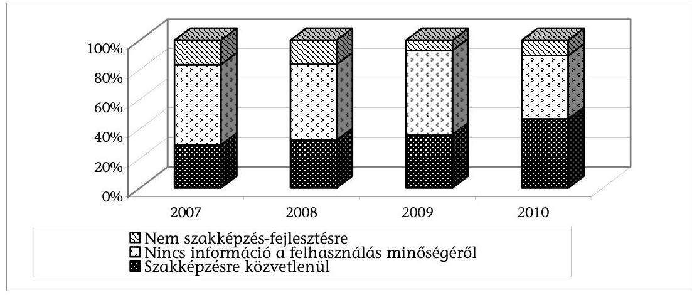

Forrás: 8. számú táblázat
Nem biztosított, hogy a szakképzési hozzájárulásból az MPA-ba befolyt bevételt szakképzésre fordítsák. Ennek egyik oka, hogy az MPA egységes pénzalap, amelynek bevételei különböző forrásokból származnak, és ezek együttesen nyújtanak fedezetet az alap valamennyi kiadására. A másik ok pedig az, hogy a költségvetési törvény a befizetéseknek csak egy csökkentett részét irányozta elő szakképzés-fejlesztési célokra felhasználni. 2009-ben a kimutatott bevételeknek mindössze 43,4\%-át, 2010-ben 55,3\%-át tették ki a kifizetések.

Az MPA Képzési alaprész bevétele feletti rendelkezési jogot a szakképzésért és felnőttképzésért felelős miniszter az oktatásért felelős miniszterrel megosztva gyakorolja. Az oktatásért felelős miniszter rendelkezési jogkörébe tartozó kerete terhére megkötendő támogatási szerződések előterjesztései szerint a támogatások az Oktatási Hivatal alapító okiratában foglalt, a költségvetésből nem teljes körűen finanszírozott közoktatási és szakképzési feladatainak pénzügyi forrásaihoz járultak hozzá. Ezek a feladatok döntően a közoktatási feladatkörében eljáró Oktatási Hivatal törvényi feladatait képezik, a szakképzés-fejlesztés céljaival nem hozhatók közvetlen összefüggésbe.

A két szakminiszter 2007-2010 között a rendelkezésre álló, összesen 26,6 Mrd Ft összegű keretnek átlagosan több mint a $90 \%$-át, összesen 24,9 Mrd Ft-ot nem pályáztatás útján, hanem egyedi döntés alapján osztotta szét. Az egyedi támogatások lebonyolítására, a pályázatok kiírására és értékelésére, továbbá a szerződéskötésre és az elszámolás ellenőrzésére kialakított eljárásrend nem egységes. Az eltérő szabályozás többleterőforrást igényel a támogatások lebonyolításában résztvevő szervezeteknél és nagyobb a tévedés kockázata különösen olyan egyedi döntések esetében, amikor az odaítélt támogatás forrása mindkét miniszter keretét érinti. A szakminiszterek rendelkezési jogkörébe utalt keretek terhére megvalósított támogatásokról nincs egységes központi nyilvántartás.

A 2005-2013. évekre vonatkozó szakképzés-fejlesztési stratégia meghatározza a szakterület legfontosabb célkitűzéseit, a fejlesztések irányait. A célok azonban megfogalmazásukban túl általánosak, nem foglalnak magukban részcélokat, prioritásokat, súlypontokat, mérhető elvárásokat, így nem lehetsé-

---

ges a teljesítmények megítélése, illetve számonkérése. A szaktárcák nem dolgozták ki azokat a koncepciókat, amelyek az adott célok eléréséhez szükséges feladat-együttest teljes körűen bemutatják. A feladatok megvalósítását nem ütemezték és nem tervezték meg az azok végrehajtásához szükséges pénzügyi forrásokat. A pénzügyi források felhasználásához a jogszabályokban meghatározottakon felül a szaktárca nem írt elő teljesítmény-követelményeket és elfogadta az arról szóló beszámolókat. Sem a tervezésre sem a beszámoltatásra kialakított rendszerek nem ösztönzik a részt vevő szervezeteket a gazdaságos és hatékony feladat-ellátásra.

A kamaráknak a közfeladataik végzéséhez kapcsolódó, szakképzéssel összefüggő feladataikhoz a pénzügyi forrást támogatási szerződések formájában az MPA Képzési alaprészéből biztosítják, miközben a kamarai törvény előírása szerint a forrásokat azon költségvetési fejezetekben kell megtervezni, amelyek feladatköréhez kapcsolódóan végzik a közfeladatokat. A vizsgált időszakban sem az oktatásért, sem a szakképzésért és felnőttképzésért felelős minisztérium a költségvetési fejezetében forrást ehhez nem tervezett.

A vizsgált időszakban a Magyar Kereskedelmi és Iparkamarának a programfeladatai ellátására az MPA Képzési alaprészéből összesen 5,6 Mrd Ft-ot adtak át. Az éves szerződésekben a kamatjövedelmek tekintetében visszafizetési kötelezettséget írtak elő, a szerződéseket azonban évente módosították, így a kamara a 4 év alatt a kamatjövedelmekkel együtt összesen 5,8 Mrd Ft-ot használt fel programfeladatai végrehajtásához.

Az MKIK támogatási szerződéseiben az egyes programfeladatokat általánosságban fogalmazták meg, ezekhez mérhető részfeladatokat nem határoztak meg. A feladatok végrehajtásáról szóló éves beszámolók döntően általános feladat-leírást tartalmaznak, azokból nem állapítható meg, hogy az egyes programfeladatokra elszámolt költségek mögött milyen valós teljesítmények vannak, így az sem mutatható ki, hogy az elszámolt költségek arányban állnak-e a tényleges teljesítményekkel.

A szaktárcák nem alakítottak ki mérési és értékelési eljárásokat arra vonatkozóan, hogy a feladat-végrehajtás eredményeként az egyes stratégiai célok milyen mértékben valósultak meg, illetve, hogy az elért eredmények arányban állnak-e a ráfordításokkal. A szakképzésért felelős miniszter nem alakított ki olyan beszámoltatási és információs rendszert, amely alapján mérni és értékelni tudja, hogy a fejlesztési támogatás elosztásában megnyilvánuló szélsőségeket - csak részben teljesült. A probléma megoldása érdekében meghatározták az egy iskola által fogadható támogatás felső határát, azonban nem módosították azt a jogszabályi feltételt, hogy az adományozó határozza meg a kedvezményezettet. Ebből adódóan, továbbra sem megoldott, hogy az elmaradott térségekben lévő, valamint alacsony érdekérvényesítő képességgel rendelkező szakiskolák a fejlesztésekhez szükséges támogatásokban részesüljenek, ezáltal nem csökkennek a szakképző iskolák eltérő infrastrukturális feltételei közötti különbségek.

---

Az RFKB-k nem, illetve csak részben tettek eleget az Szht. azon előírásának, hogy kísérjék figyelemmel a szakképzési hozzájárulás régióban történő felhasználását és értékeljék azok hatékonyságát. Értékeléseket, elemzéseket az RFKB-k nem mindegyike és nem minden évben készített és csak a decentralizált keretből finanszírozott források felhasználására. Az értékelések azonban nem a támogatások hasznosulására, hanem a keret szétosztásával kapcsolatos tapasztalatok összegzésére terjedtek ki.

Nem tárták fel az RFKB-k, hogy a TISZK-ek egy része a fejlesztési forrást 6 hónapot követően továbbította a tagintézmények felé. Az Szht. lehetővé teszi, hogy a kedvezményezett intézmények, ill. azok fenntartói a fejlesztési támogatás felhasználásával a tárgyévet követő év végéig számoljanak el. Nincs előírás arra, hogy a TISZK-eknek a pénzügyi forrást mennyi időn belül kell továbbadniuk a tagintézmények részére. Ennek következtében a TISZK-ek az elszámolást megelőző időszakban a forrásokat szabadon, akár működési költségeik fedezetére, akár befektetésekre használhatják fel. Az NSZFI-től bekért dokumentumok alapján megállapítható, hogy míg 2007-ben a fejlesztési támogatásoknak mintegy 70\%-val a tárgyévben számoltak el, 2008-ban ez az arány 25,5\%-ra mérséklődött. 2009-2010 években a pénzügyi forrásnak átlagosan 93\%-át a tárgyévet követő évben használták fel.

A 84 db TISZK kialakítása - a szabályozottság és a beszámoltatási rendszer hiányosságaiból adódóan - nem eredményezte a szakképzési intézményrendszer költséghatékonyságának javulását. Az integráció jellemzően formális volt, mivel az iskolák megtartották jogi és gazdasági függetlenségüket. A különböző iskolafenntartók eltérő érdekei miatt nem valósult meg a közös vagyongazdálkodás, az erőforrások megosztása, illetve mobilitása. Jogszabály ugyanis egyetlen szervezet részére sem írja elő központi nyilvántartás vezetését azokról az eszközökről, amelyeket a szakképzési hozzájárulás terhére szereztek be az oktatási intézmények, illetve a gyakorlati képzést szervezők. Az eszközök a támogatottnak nem csak a birtokába, hanem tulajdonába is kerülnek, így azok ellenőrzésére, illetve hasznosításának optimalizálására, azaz az eszközök képzőhelyek közötti átcsoportosítására nincs mód.

A TISZK-ek eltérő szervezeti formában működnek, ebből adódóan nincs mód összesített értékelés készítésére arról, hogy a rendszer működtetése mennyibe kerül, a TISZK-ek honnan és milyen forrásokkal, valamint vagyontárgyakkal rendelkeznek.

A saját munkavállalók képzésére költséget elszámoló vállalkozások a jogi szabályozás szerint a bevallásaikat vagy a NAV-nak, vagy az NSZFI-nek nyújtják be, adatszolgáltatási kötelezettségeiknek azonban a munkaügyi központok felé kell eleget tenniük. Költségeik elszámolásának ellenőrzési feladatait is a munkaügyi központok látják el. E szabályozás szerinti rendszerben nem biztosított azon vállalkozások kiszűrése, amelyek - ha nem tesznek eleget adatszolgáltatási kötelezettségüknek - egyrészt jogosulatlanul számolják el a képzés költségeit, másrészt kikerülnek a munkaügyi központok ellenőrzési hatóköréből. Az ÁSZ ellenőrzés részére bekért dokumentumokból megállapítható, hogy a saját munkavállalók képzését

---

elszámoló vállalkozásoknak a vizsgált időszakban évente átlagosan 42\%-a (mintegy 3450 vállalkozás) nem tett eleget adatszolgáltatási kötelezettségének. 2008-ban ez az arány 16\%-kal haladta meg az átlagot. A munkaügyi központok a vizsgált időszakban az ellenőrzéseik végrehajtására az MPA Képzési alaprészből összesen 341,2 M Ft-ot kaptak, amelyet működési kiadásaikra fordítottak.

A jogi szabályozás szerint a bevallások feldolgozására és ellenőrzésére kialakított rendszer nem zárt, ezáltal nem biztosított a járulék teljes körű beszedése. A gyakorlati képzést szervezők az NSZFI-hez, a többi kötelezett a NAV-hoz nyújtja be bevallását. Teljeskörűségi vizsgálatot tehát egyik szervezet sem tud végezni, azaz a rendszer nem teszi lehetővé annak kiszűrését, ha egy adóalany nem tesz eleget bevallási kötelezettségének. Így az sem állapítható meg, hogy hányan mentesek a kötelezettség teljesítése alól és hogy ez mekkora összeget jelent. Az adóhatóság járulékalapra vonatkozó adatai alapján számított bruttó szakképzési hozzájárulás és a bevallásokban szereplő elszámolások adatai között 2009-ben és 2010-ben az eltérés évente meghaladta a 40 Mrd Ft-ot. A rendszer hiányossága következtében nem mutatható ki, hogy ez az eltérés miből adódik.

Sem a NAV, sem az NSZFI nem alakított ki olyan bevallási/nyilvántartási rendszert, amely alkalmas a nyújtott és a fogadott fejlesztési támogatások összevetésére, valamint az ellenőrzések támogatására. Így rendszer jellegűen nem szűrhető ki, ha egy intézmény több támogatást fogad, mint amennyivel elszámol, vagy egy kötelezett több támogatást számol el, mint amennyit nyújtott.

Az NSZFI 365,2 M Ft felhasználásával kialakította a pályakövetés informatikai rendszerét és módszertanát, az annak működtetéséhez szükséges jogszabály-módosítások azonban elmaradtak. Az NSZFI-nek nincs jogosultsága a pályakövetési rendszer adatbázisának feltöltéséhez szükséges adatok bekérésére, valamint nincs adatcsere-kapcsolata a Diplomás Pályakövetési Rendszerrel. Jogosultság hiányában nincs lehetősége a kamarák munkaerőpiaci adatainak felhasználására sem, miközben a kamara az internet alapú szakképzési integrált információs rendszer (ISZIIR) működtetésére és továbbfejlesztésére a 4 év alatt összesen 46,5 M Ft támogatást kapott.

Az NSZFI feladatkörébe tartozik a gyakorlati képzés szervezésére elszámolt költségek és a fejlesztési támogatások felhasználásának, továbbá a miniszterek által jóváhagyott támogatási összegek esetében a szerződések teljesítésének ellenőrzése. Éves ellenőrzési tervet készít, amelyet a szakképzésért felelős miniszter hagy jóvá. A szaktárca - a decentralizált keretből nyújtott támogatások, valamint a fejlesztési támogatással átadott pénzügyi források felhasználási területét kivéve - nem írt elő ellenőrzési követelményeket az NSZFI részére, hogy az egyes költség-elszámolási jogcímek, illetve a szerződés szerinti teljesítések eseteiben hány darab ellenőrzést kell elvégeznie, illetve, hogy azokkal a felhasznált pénzügyi forrásnak hány százalékát kell ellenőrzéssel lefednie. Az NSZFI-nek a gyakorlati képzést szervezőkre irányuló ellenőrzései nem eredményesek és nem hatékonyak. 2007-2010 között saját munkatársakkal és külső szakértő cég bevonásával összesen 222 ellenőrzést végzett (ebből a 2010. évi 1 db ellenőrzést az elemzésnél figyelmen kívül hagytuk), amelyek az egyes években az ellenőrzötteknek átlagosan 1,6\%-át érintette, de az

---

ellenőrzöttségi szint egyik évben sem haladta meg a 2,3\%-ot. Az ellenőrzöttségi szint növelését indokolta volna, hogy az ellenőrzéseinek 2008-ban az egyharmadánál, 2007-ben és 2009-ben közel a felénél (45, illetve 47\%-nál) szabálytalanságot állapítottak meg.

Humánerőforrás-kapacitás hiányra hivatkozva az NSZFI a gyakorlati képzést szervezők ellenőrzéseihez 2009-től, valamint a kintlévőségek behajtásához a vizsgált években külső szakértőket is alkalmazott. A szakértők előző évi elszámolásokra vonatkozó ellenőrzései szakmailag nem megalapozottak, az észrevételezési eljárást követően megállapításaiknak 2009-ben több mint 90\%-át, 2010-ben 23\%-át az NSZFI visszavonta. 2009-ben 9,6 M Ft megbízási díj mellett 95 E Ft, 2010-ben 18,5 M Ft megbízási díj mellett 26 M Ft jogosulatlanul elszámolt költséget tártak fel.

Az NSZFI ügyvédi irodával kötött éves megállapodásaiban a megbízási díjat egy összegben és nem feladattípusokra lebontva határozta meg. Arra, hogy az iroda ebből mennyi költséget számolt el behajtási tevékenységre, csak 2009 és 2010 évekre vonatkozóan rendelkezett kimutatással. E kimutatás szerint a 2009-ben megkötött 32,5 M Ft összegű megbízási szerződésből 11,3 M Ft-ot, a 2010. évi 35,2 M Ft összegű szerződésből 7,5 M Ft-ot fizetett ki az ügyvédi irodának a kintlévőségek behajtására. 2009-ben a mintegy 720 M Ft behajtandó összegből az iroda 1,8 M Ft-ot (0,3\%), 2010-ben 818 M Ft-ból 5,9 M Ft-ot (0,7\%) szedett be.

A szakképzési hozzájárulás ellenőrzésében részt vevő szervezetek pénzügyi-szabályszerűségi ellenőrzéseket végeznek és vizsgálják a pénzfelhasználás szerződés szerinti teljesítését. Ellenőrzéseik azonban nem terjednek ki az ár-érték vizsgálatára, vagyis egyik intézmény sem értékeli a pénzfelhasználás gazdaságosságát, azaz hogy a pénzfelhasználással elért teljesítmény arányban áll-e a ráfordítással. A szaktárca ilyen irányú elvárásokat a pénzfelhasználás tervezésénél, az arról szóló beszámolók tartalmi-formai követelményeinek meghatározásánál egyetlen intézmény számára sem fogalmazott meg.

Az Állami Számvevőszékről szóló 2011. évi LXVI. törvény 33. § (1) bekezdésében foglaltak értelmében a jelentésben foglalt megállapításokhoz kapcsolódó intézkedési tervet köteles az ellenőrzött szervezet vezetője összeállítani és azt a jelentés kézhezvételétől számított harminc napon belül az ÁSZ részére megküldeni. Amennyiben az intézkedési tervet határidőben nem küldi meg a szervezet, vagy az nem elfogadható, az ÁSZ elnöke a hivatkozott törvény 33. § (3) bekezdés a)-b) pontjaiban foglaltakat érvényesítheti.

Az ellenőrzés intézkedést igénylő megállapításai és javaslatai:

# a nemzetgazdasági miniszternek: 

1. A szakképzési hozzájárulás felhasználása nem hatékony és nem eredményes, ami a szabályozásban - beleértve a tervezési, beszámoltatási és ellenőrzési rendszerek szabályozottságát -, valamint az ellenőrzések végrehajtásában rejlő hiányosságokra vezethető vissza

---

Javaslat
Tegyen intézkedést annak érdekében, hogy a Nemzeti Foglalkoztatási Alap (korábban Munkaerőpiaci Alap) képzési alaprészéből nyújtott jövőbeli támogatások kifizetése a jelentés közzétételétől számított 30 napon belül felfüggesztésre kerüljön a szakképzési hozzájárulásról és a képzés fejlesztésének támogatásáról szóló törvény - jelentés 3. számú javaslata szerinti - módosításának hatályba lépéséig.
2. A költségelszámolás lehetőségének biztosításával a vizsgált időszak minden évében a pénzügyi forrás több mint fele be sem került az állami költségvetés rendszerébe.

Javaslat
Kezdeményezze a Kormánynál a szakképzési hozzájárulásról és a képzés fejlesztésének támogatásáról szóló törvény módosítását annak érdekében, hogy a szakképzési hozzájárulás jelenlegi költség-elszámolási lehetősége megszűnjön, és a járulék bekerüljön az állami költségvetés rendszerébe.
3. Nem biztosított, hogy a szakképzési hozzájárulásból az MPA-ba befolyt bevételt kizárólag a szakképzés-fejlesztésre megfogalmazott célok megvalósítására használják fel. A vizsgált években az MPA képzési alaprészből a két szakminiszter a rendelkezésükre álló keret több mint 90\%-át nem pályáztatás útján, hanem egyedi döntés alapján osztotta szét.

Javaslat
Kezdeményezze a Kormánynál a szakképzési hozzájárulásról és a képzés fejlesztésének támogatásáról szóló törvény módosítását annak érdekében, hogy a szakképzési hozzájárulásból a Nemzeti Foglalkoztatási Alapba (korábban MPA-ba) befolyt teljes összeg kizárólag szakképzés-fejlesztéssel összefüggő célokra legyen felhasználható, illetve visszaigényelhető, továbbá hogy a szakképzés fejlesztését célzó támogatásokat pályázati eljárások eredményeként lehessen nyújtani, valamint dolgozza ki és törvényben szabályozza a kivételes miniszteri döntések meghozatalának garanciális feltételeit.
4. A 2005-2013. évekre vonatkozó szakképzés-fejlesztési stratégiában megfogalmazott célok általánosak, nem foglalnak magukban részcélokat, prioritásokat, súlypontokat, mérhető elvárásokat, ami nem teszi lehetővé a teljesítmények számonkérését. A szaktárcák nem dolgoztak ki éves feladatterveket és nem tervezték meg a célok végrehajtásához szükséges pénzügyi forrásokat, továbbá nem alakítottak ki mérési és értékelési eljárásokat arra vonatkozóan, hogy a feladat-végrehajtás eredményeként az egyes stratégiai célok milyen mértékben valósultak meg, illetve az elért eredmények arányban állnak-e a ráfordításokkal.

Javaslat
Tegyen intézkedéseket olyan új középtávú szakképzés-fejlesztési stratégia kialakítására, amely konkrét célokat, részcélokat, a célok között prioritásokat, súlypontokat és mérhető elvárásokat határoz meg. Dolgoztasson ki stratégiára épülő éves feladatterveket és határozza meg az azok megvalósításhoz szükséges pénzügyi források összegeit, valamint alakíttassa ki a stratégiában kitűzött célok megvalósulásának mérési és értékelési rendszerét.

---

5. A két minisztérium által az egyedi támogatások lebonyolítására, a pályázatok kiírására és értékelésére, továbbá a szerződéskötésre és az elszámolás ellenőrzésére kialakított eljárásrend nem egységes.

Javaslat
Intézkedjen a NEFMI-vel közös, egységes eljárásrend kialakításáról az egyedi támogatások lebonyolítására, a pályázatok kiírására és értékelésére, továbbá a szerződéskötésre és az elszámolás ellenőrzésére.
6. A jogi szabályozás szerint a bevallások feldolgozására és ellenőrzésére kialakított rendszer nem zárt, ezáltal nem biztosított a szakképzési hozzájárulás teljes körű beszedése. Sem a NAV, sem az NSZFI nem alakított ki olyan bevallási/nyilvántartási rendszert, amely alkalmas a nyújtott és a fogadott fejlesztési támogatások összevetésére, valamint az ellenőrzések támogatására.

Javaslat
Kezdeményezze a Kormánynál egyrészt a szakképzési hozzájárulásról és a képzés fejlesztésének támogatásáról szóló törvény módosítását annak érdekében, hogy a bevallásokat egységesen a NAV kezelje és ellenőrizze, másrészt az Art. módosítását annak érdekében, hogy a fogadott és a nyújtott fejlesztési támogatások a bevallásokban összevethetők legyenek.
7. Az ellenőrzést végző szervezetek egyike sem értékeli, hogy a pénzfelhasználással elért teljesítmény arányban áll-e a ráfordítással.

Javaslat
Tegyen intézkedéseket annak érdekében, hogy a pénzügyi forrás felhasználásának, illetve a költségek elszámolásának ellenőrzését végző szervezetek végezzenek ár-érték, illetve teljesítmény-ráfordítás típusú ellenőrzéseket is.
8. Az NSZFI 365,2 M Ft felhasználásával kialakította a pályakövetés informatikai rendszerét és módszertanát, az annak működtetéséhez szükséges jogszabály-módosítások azonban elmaradtak. Az NSZFI-nek nincs jogosultsága a pályakövetési rendszer adatbázisának feltöltéséhez szükséges adatok bekérésére, valamint nincs adatcsere kapcsolata a Diplomás Pályakövetési Rendszerrel. Nem alakított ki adatcsere kapcsolatot az MKIK-val sem a munkaerőpiaci adatok felhasználása céljából.

Javaslat
Tegyen intézkedést annak érdekében, hogy az NSZFI alkalmas legyen a pályakövetés informatikai rendszerének működtetésére.
9. A kamaráknak a közfeladataik végzéséhez kapcsolódó, szakképzéssel összefüggő feladataikhoz a pénzügyi forrást támogatási szerződések formájában az MPA Képzési alaprészéből biztosítják, miközben a kamarai törvény előírása szerint a forrásokat azon költségvetési fejezetekben kell megtervezni, amelyek feladatköréhez kapcsolódóan végzik a közfeladatokat. A vizsgált időszakban sem az oktatásért, sem a szakképzésért és felnőttképzésért felelős minisztérium a költségvetési fejezetében forrást ehhez nem

---

tervezett.
Javaslat
Gondoskodjon a kamarai törvény 34. §-ában előírtak betartásáról, vagyis a kamaráknak a szakképzéshez kapcsolódó közfeladatai ellátásához a költségvetési támogatást a szakképzésért és felnőttképzésért felelős tárca költségvetési fejezetében elkülönítetten tervezzék.

# a nemzeti erőforrás miniszternek: 

A két minisztérium által az egyedi támogatások lebonyolítására, a pályázatok kiírására és értékelésére, továbbá a szerződéskötésre és az elszámolás ellenőrzésére kialakított eljárásrend nem egységes.

Javaslat
Intézkedjen a NGM-mel közös, egységes eljárásrend kialakításáról az egyedi támogatások lebonyolítására, a pályázatok kiírására és értékelésére, továbbá a szerződéskötésre és az elszámolás ellenőrzésére.

---

# II. RÉSZLETES MEGÁLLAPÍTÁSOK 

## 1. A SZAKKÉPZÉS-FEJLESZTÉS IRÁNYÍTÁSI RENDSZERE

### 1.1. A szakképzés-fejlesztési stratégia

A Kormány elkészítette a 2005-2013. évekre vonatkozó szakképzés-fejlesztési stratégiáját, amelyben meghatározta a főbb fejlesztési irányokat, de nem fogalmazta meg, hogy ezt milyen eszközökkel és milyen ütemezésben tervezi megvalósítani. Nem fogalmazott meg továbbá prioritásokat, elérendő részcélokat, mérhető teljesítmény-elvárásokat. Az oktatásért felelős miniszter, valamint a szakképzésért és felnőttképzésért felelős miniszter által közösen kiadott stratégia célként tűzte ki, hogy a szakképzés összhangban álljon a munkaerőpiaci elvárásokkal, a technikai-technológiai fejlődéssel, miközben biztosítja a képzésben résztvevők számára a piacképes szakismeret megszerzését és ezáltal az egyén hosszú távú érvényesülési képességét.

A megfogalmazott fejlesztés irányok: a gazdaság versenyképességének növelése, a mobilitás növelése, a hatékonyság javítása, a regionalitás erősítése, az információellátottság és -áramlás javítása.

A Szakképzés-fejlesztési stratégia, valamint a Magyar Kereskedelmi és Iparkamara (továbbiakban: MKIK) Középtávú szakképzési stratégiája (2006-2013) alapján a Regionális Fejlesztési és Képzési Bizottságok (továbbiakban: RFKB) elkészítették a regionális szakképzés-fejlesztési stratégiájukat. Ezek sem határoznak meg számon kérhető és számszerűsíthető célokat, részcélokat és azokra teljesítési határidőket, valamint nem tartalmaznak indikátorokat az egyes feladatok teljesülésének méréséhez.

A stratégia végrehajtásához szükséges intézkedésekről szóló, 2010. május 12-ig hatályos 1057/2005. (V. 31.) Korm. határozatban (továbbiakban: kormányhatározat) előírt feladatok teljesítéséről az illetékes minisztériumok nem készítettek beszámolót - a kormányhatározat ilyen követelményt nem fogalmazott meg -, nem mérték a kitűzött célok teljesülését. Éves szinten mintegy bruttó $60-70 \mathrm{Mrd} \mathrm{Ft}$ szakképzési hozzájárulás képződik. Nem értékelték, hogy ezen nagyságrendű összeget a stratégiában megfogalmazott célok megvalósítására használták-e fel. Sem a stratégiában, sem a kormányhatározatban nem terveztek az egyes célkitűzésekhez pénzügyi forrásokat. A célkitűzéseket a várható pénzügyi források korlátainak figyelembe vétele nélkül fogalmazták meg, vagyis az egyes feladatok végrehajtására bármilyen összegű forrás allokálható.

A kormányhatározat a szakképzés-fejlesztés területén feladatokat határozott meg egyrészt az oktatás korszerűsítésére, másrészt a szakképzés irányítására és finanszírozására vonatkozóan. A következőkben meghatározott területe-

---

ken a feladatok teljesítése hozzájárult a stratégiában megfogalmazott főbb célkitűzések megvalósításához. Ennek eredményeként

- nőtt a szakképzésben részt vevő tanulók száma ${ }^{3}$ (a 2005. évi 374960 főről 2010-ben 379601 főre), csökkent a 14-17 év közötti korcsoportba tartozók száma (a 2005. évi 503 ezer főről 2010-ben 476 ezer fő);
- a szakképzési hozzájárulás terhére nyújtott fejlesztési támogatásokból beszerzett eszközök által javult a szakképző intézményekben az oktatás infrastrukturális feltételrendszere;
- az oktatási struktúra fejlesztése elősegítette az egész életen át tartó tanulást, a tananyag korszerűsítésével a szakmák közötti átjárhatóságot és a munkaerőpiaci elvárásokhoz való rugalmasabb alkalmazkodást.


# A szakképzés-fejlesztési rendszer átalakítása során elért eredmények mellett a rendszer működtetésének eredményességét és hatékonyságát befolyásolja, hogy egyes célok csak részben, vagy egyáltalán nem teljesültek. 

Részben valósult meg az egységes minőségbiztosítási, valamint a pályakövetési rendszer bevezetése, a szakképző iskoláknak nyújtott fejlesztési támogatás mértékében megnyilvánuló szélsőségek mérséklése, az oktatási és képzési környezet korszerűsítése. Nem valósult meg a szakképző iskolák felnőttképzésbe való bekapcsolása és akkreditálása, a szakképző iskolák fenntartói rendszerének, a szakképzési rendszer differenciált finanszírozásának korszerűsítése, a szakképző intézmények kapacitáskihasználásának javítása, az iskolai rendszerű szakképzés normatív támogatásának átalakítása, a szakképzés-fejlesztés megalapozásához szükséges információs rendszer kialakítása és működtetése.

### 1.2. A szakképzési hozzájárulásból szakképzés-fejlesztésre felhasználható források

A vizsgált időszakban a szakképzési hozzájárulási kötelezettség bruttó összege 2009-ig folyamatosan, összesen 11,4\%-kal növekedett (3. számú táblázat), 2010-ben az előző évihez képest kis mértékben, 0,3\%-kal csökkent, ami azzal is magyarázható, hogy 5,6\%-kal (5. számú táblázat) csökkent a szakképzési hozzájárulást bevallók száma.

[^0]
[^0]:    ${ }^{3}$ Forrás: KSH adatok

---

A szakképzési hozzájárulás bevallási adatainak alakulása

| Megnevezés | 2007 | 2008 | 2009 | 2010 |
| :--: | :--: | :--: | :--: | :--: |
| Bruttó hozzájárulási kötelezettség összege ebből: | 62403 | 68703 | 69547 | 69379 |
| Gyakorlati képzés szervezésére elszámolt összeg | 10058 | 11277 | 14621 | 17338 |
| Fejlesztési támogatásra elszámolt összeg | 16029 | 13755 | 11680 | 12829 |
| Saját munkavállaló képzésére elszámolt összeg | 7477 | 8341 | 8693 | 7301 |
| További kötelezettséget csökkentő tételek összege* | 1883 | 2066 | 1655 | 1426 |
| Csökkentő tételek összesen: | 35447 | 35439 | 36649 | 38894 |
| MPA-ba befizetett összeg | 26956 | 33264 | 32898 | 30485 |
| MPA-ból: visszaigénylés összege** | 5890 | 7469 | 10482 | 12788 |
| Költségelszámolással felhasznált összeg összesen (csökkentő tételek+visszaigénylés összege) | 41337 | 42908 | 47131 | 51682 |
| MPA-ból felhasználható összeg <br> Bruttó kötelezettség és felhasználható összeg aránya | 21066 | 25795 | 22416 | 17697 |
|  | 34\% | 38\% | 32\% | 26\% |

A táblázat a NAV és az NSZFI bevallásainak összesített adatait tartalmazza. A bevallások adatai alapján számított befizetési kötelezettség nem egyezik meg a zárszámadásban szereplő pénzforgalmi bevételi összeggel, mivel a bevallási időszak és a befizetések határideje eltérő és a pénzügyi teljesítés eltér a bevallott összegektől.

* További csökkentő tételeket (pl.: műhelyrezsi, gépfenntartási költség, anyag-költség) azok a gyakorlati képzést szervezők számolhatnak el, akik járulékfizetési kötelezettsége meghaladja a gyakorlati képzésre elszámolt költséget.
**Amennyiben a gyakorlati képzést szervezőnek a gyakorlati képzésre fordított költsége meghaladja a szakképzési hozzájárulási kötelezettségét, a különbséget visszaigényelheti az MPA Képzési alaprészéből.
Forrás: 1. és 2. számú tanúsítványok
A vizsgált időszakban a szakképzési hozzájárulásra kötelezettek mintegy 3539 Mrd Ft-ot (3. számú táblázat) számoltak el járulékfizetési kötelezettségük terhére. A csökkentő tételek összege 2007-ről 2010-re folyamatosan, összesen 9,7\%-kal emelkedett. Megváltozott a szerkezeti összetétele: a gyakorlati képzésre elszámolt összeg 72,4\%-kal nőtt, miközben a fejlesztési támogatásra és a saját munkavállaló képzésére elszámolt összeg 20\%-kal, illetve 2,4\%-kal csökkent. A gyakorlati képzést szervezők által elszámolt költségek növekvő összegben haladták meg az általuk bevallott bruttó kötelezettség összegét, ezáltal az Szht. 4. § (13) bekezdése alapján visszaigényelt összegek a vizsgált időszakban 117,1\%-kal növekedtek. Mindezek következtében a bruttó szakképzési hozzájárulás egyre kisebb összege és aránya jelenik meg forrásként a Munkaerőpiaci Alap (továbbiakban: MPA) Képzési alaprészben, így kevesebb forrás állt rendelkezésre támogatásokra, vagyis országos stratégiai célok közvetlen megvalósításának elősegítésére. Az Szht. meghatározza azokat a feltételeket, amelyek alapján csökkenthetik a szakképzési hozzájárulásuk pénzbeli teljesítését. A felhasználásról hozott döntésük során nem közvetlenül az országos stratégiai célkitűzéseket, hanem saját érdekeiket veszik figyelembe.

---

A vizsgált időszakban a szakképzési hozzájárulás bevallására kötelezettek mindössze 5\%-a (4. számú táblázat) számolt el csökkentő tételt. Az általuk csökkentő tételként elszámolt költségek a bevallott bruttó hozzájárulásnak mintegy 61-74\%-át tették ki, vagyis a magas hozzájárulási kötelezettséget bevallók, a nagyobb foglalkoztatók - a jogszabályban meghatározott keretek erejéig - rendelkeztek a szakképzési hozzájárulásuk felhasználásáról.
4. számú táblázat

A szakképzési hozzájárulás összegét csökkentő tételeket elszámolók számának alakulása

| Év | Intézmény* | Szakképzési hozzájárulást bevallók száma (db) | Gyakorlati képzésre költséget elszámolók |  | Fejlesztési támogatást elszámolók |  | Saját alkalmazottak képzési költségét elszámolók |  |
| :--: | :--: | :--: | :--: | :--: | :--: | :--: | :--: | :--: |
|  |  |  | száma (db) | aránya | száma (db) | aránya | száma (db) | aránya |
| 2007 | NAV | 264843 |  |  | 13297 | 5,0\% | 6154 | 2,3\% |
|  | NSZFI | 3605 | 3497 | 97,0\% | 387 | 10,7\% | 419 | 11,6\% |
|  | Összesen | 268448 | 3497 | 1,3\% | 13684 | 5,1\% | 6573 | 2,4\% |
| 2008 | NAV | 277856 |  |  | 12955 | 4,7\% | 9204 | 3,3\% |
|  | NSZFI | 4405 | 4262 | 96,8\% | 387 | 8,8\% | 431 | 9,8\% |
|  | Összesen | 282261 | 4262 | 1,5\% | 13342 | 4,7\% | 9635 | 3,4\% |
| 2009 | NAV | 279157 |  |  | 8513 | 3,0\% | 7191 | 2,6\% |
|  | NSZFI | 5000 | 4932 | 98,6\% | 336 | 6,7\% | 426 | 8,5\% |
|  | Összesen | 284157 | 4932 | 1,7\% | 8849 | 3,1\% | 7617 | 2,7\% |
| 2010 | NAV | 248113 |  |  | 10146 | 4,1\% | 9444 | 3,8\% |
|  | NSZFI | 5369 | 5267 | 98,1\% | 311 | 5,8\% | 383 | 7,1\% |
|  | Összesen | 253482 | 5267 | 2,1\% | 10457 | 4,1\% | 9827 | 3,9\% |

* A bevallásokat a NAV-hoz kell benyújtani a gyakorlati képzést szervezők kivételével, amelyek az NSZFI-hez nyújtják be bevallásaikat.
Megjegyzés: Az NSZFI-nél bevallást benyújtók és gyakorlati képzés költségeit elszámolók közötti különbség oka, hogy nem tartalmazott valamennyi bevallás költségelszámolást
Forrás:1. és 2. számú tanúsítványok

A vizsgált időszakban a hatályos jogszabályi környezetben nem biztosított, hogy a szakképzési hozzájárulásból az MPA-ba befolyt összeget kizárólag a szakképzés fejlesztésére megfogalmazott célok megvalósítása irányában használják fel. Ennek egyik oka, hogy az MPA egy egységes pénzalap, amelynek bevételei különböző forrásokból származnak, és ezek együttesen nyújtanak fedezetet az alap valamennyi kiadására.

Az 1996. január 1-i hatállyal létrehozott MPA részét képezi a Képzési alaprészen kívül, a Foglalkoztatási alaprész, a Szolidaritási alaprész, a Rehabilitációs alaprész és a Bérgarancia alaprész.

Az Flt. ${ }^{4}$ 39/B. § (1) bekezdése értelmében a MPA egyes alaprészeinek pénzeszközei a Munkaerőpiaci Alap Irányító Testülete (MAT), illetőleg a miniszter döntése szerint egymás közt átcsoportosíthatóak, feltéve, ha erre az eredeti előirányzatokon felül képződő többletbevételek fedezetet biztosítanak, vagy egyes alaprészek ki-

[^0]
[^0]:    ${ }^{4}$ A foglalkoztatás elősegítéséről és a munkanélküliek ellátásáról szóló 1991. évi IV. törvény

---

mutatott kiadásainak az előirányzatoktól való elmaradása várhatóan fedezetet nyújt.

Az Flt. 43/A. § (1) bekezdés értelmében a Képzési alaprész forrása az Szht.-ben előírt szakképzési hozzájárulás, valamint az alaprész javára teljesített visszafizetések, önkéntes befizetések, támogatások, továbbá működésével összefüggő bevételek.

A másik ok pedig az, hogy a költségvetési törvény a befizetéseknek csak egy csökkentett részét hagyta jóvá szakképzés-fejlesztési célokra felhasználni. 2007. és 2008. években a bevételi előirányzatnak 86-90\%-át, 2009. és 2010. években ugyanakkor egyaránt 58\%-át engedélyezte a szakképzési feladatok finanszírozására fordítani (5. számú táblázat). A fizetési kötelezettség 2009-től elvesztette járulékjellegét és adójellegűvé vált, mivel a járulékot nemcsak az Szht. 1. §-ában nevesített célok megvalósítására használták fel, vagyis nem érvényesül a járulékokra vonatkozó azon elv, miszerint azokat csak a törvényben meghatározott célra lehet felhasználni.
5. számú táblázat

Bevételi és kiadási előirányzatok alakulása

|  |  | 2007 | 2008 | 2009 | érték: M Ft-ban <br> 2010 |
| :--: | :--: | :--: | :--: | :--: | :--: |
| Bevételi előirányzatok |  |  |  |  |  |
|  | eredeti előirányzat | 33330,0 | 38010,0 | 42800,0 | 49700,0 |
|  | módosított előirányzat | 36838,6 | 42380,6 | 42800,0 | 49700,0 |
| Kiadási előirányzatok |  |  |  |  |  |
|  | eredeti előirányzat | 31147,7 | 35827,7 | 24533,8 | 30891,2 |
|  | módosított előirányzat | 31577,8 | 38198,3 | 25041,3 | 28 898,1 |
| Kiadási előirányzat a bevételi előirányzat \%-ában |  |  |  |  |  |
|  | eredeti előirányzat | $93,5 \%$ | $94,3 \%$ | $57,3 \%$ | $62,2 \%$ |
|  | módosított előirányzat | $85,7 \%$ | $90,1 \%$ | $58,5 \%$ | $58,1 \%$ |

Forrás: 3. számú tanúsítványok
A vizsgált években a kimutatott bevételek - 2010. kivételével - meghaladták a tervezettet, ugyanakkor a kiadások még a tervezett kiadások mértékét sem érték el (5. számú táblázat és 2. számú grafikon), ezáltal a szakképzés céljára befizetett járuléknak csökkenő hányadát használták fel erre a célra. Ez a különbség különösen a 2009. és 2010. években jelentkezett: 2009-ben a kimutatott bevételeknek mindössze 43,4\%-át, 2010-ben 55,3\%-át tették ki a kifizetések (2. számú grafikon).

---

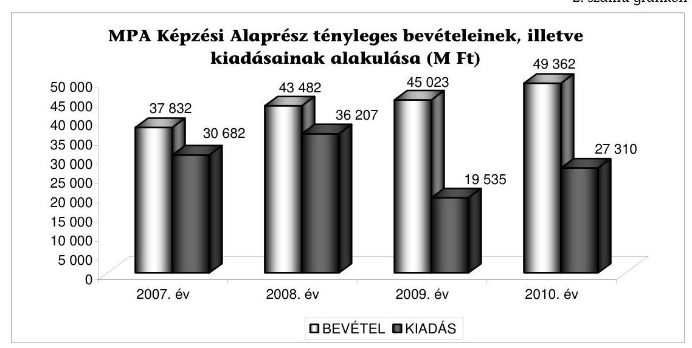

Forrás: 3. számú tanúsítvány
A Képzési alaprészből év végéig fel nem használt összeggel nem növelhető a következő évi keret, így ezek az összegek a szakképzésfejlesztés szempontjából elvesznek. Ennek oka, hogy a maradványt nem alaprészenként tartják nyilván, hanem az egész MPA-ra egy összegben, ezáltal nem mutatható ki, hogy a Képzési alaprész tárgyévben fel nem használt részét milyen nem szakképzéssel összefüggő célok finanszírozására fordították. A bevételek nincsenek hozzárendelve közvetlenül a kiadásokhoz, valamennyi bevétel az MPA teljes kiadási struktúrájának a forrása.

# 1.3. A szakképzési hozzájárulás felhasználásához kapcsolódó döntések szintjei és azok hatásai 

### 1.3.1. Országos szintű döntések

Az Szht. meghatározza azokat a kiemelt jogcímeket, amelyekre az MPA Képzési alaprészből forrás biztosítható. Az alaprészben rendelkezésre álló keretből sorrendben először a jogszabályban nevesített jogcímekre a szakképzésért és felnőttképzésért felelős miniszter ${ }^{5}$ határozza meg a felhasználható források összegét.

Ilyen jogcímek például: a szakképzési hozzájárulás visszatérítés, decentralizált keretösszeg, szakiskolai tanulmányi ösztöndíj, felsőoktatási intézményekben folyó szakképzés támogatása.

A nevesített jogcímeken felül fennmaradó keret felett a szakképzésért és felnőttképzésért felelős miniszter, valamint az oktatásért felelős miniszter ${ }^{6}$ megosztva gyakorolja a rendelkezési jogot. Döntéseik során figyelembe veszik a fel-

[^0]
[^0]:    ${ }^{5}$ 2010-ig szociális és munkaügyi miniszter, 2010-től nemzetgazdasági miniszter
    ${ }^{6}$ 2010-ig oktatási és kulturális miniszter, 2010-től nemzeti erőforrás miniszter

---

nőttképzéssel és szakképzéssel kapcsolatos feladataik ellátását segítő, szakmai döntés-előkészítő, véleményező és javaslattevő országos testület, az NSZFT javaslatait.

A szakképesítésért felelős minisztériumok, valamint a Központi Statisztikai Hivatal és a Közbeszerzések Tanácsának képviselőin kívül a testület munkájában részt vesznek az Országos Érdekegyeztető Tanács (OÉT) munkaadói és munkavállalói szövetségei, a civil szervezetek, a szakképzés területén működő szakmai társadalmi szervezetek, a felnőttképzést folytató intézmények érdekképviseleti szervezetei, az országos gazdasági kamarák, valamint az iskolafenntartók (önkormányzati alapítvány és egyházak) által delegált képviselők, továbbá a szakképzés, a felnőttképzés és a felsőoktatás területén elismert egy-egy szakértő is.

A két szakminiszter rendelkezési jogkörébe utalt forrás felhasználására hozott miniszteri döntések - a jogszabályban meghatározott nem szakképzési célokat szolgáló jogcímeken felül - nem minden esetben irányultak a szakképzés fejlesztésére. Az NSZFT javaslatai alapján olyan területek finanszírozását is támogatták, amelyek közvetlenül nem kapcsolhatók szakképzéshez. A kialakított elszámolási eljárás nem teszi lehetővé annak kimutatását, hogy az ilyen célú kifizetések összességében mekkora összeget és a felhasználható kerethez viszonyítottan milyen arányt jelentettek.

Az Szht. 8. § (1) bekezdése értelmében az MPA Képzési alaprész célja a nemzetgazdaság által igényelt, korszerűen képzett gyakorlati szakemberek számának növelése, a szakképzettségük és a gazdaság fejlődése, a hatékony foglalkoztatás érdekében tudásuk továbbfejlesztése, valamint az ezzel kapcsolatos társadalmi érdekek érvényre juttatása, továbbá az Európai Unió által a jövőben nyújtható támogatások strukturált tervezése és finanszírozási kereteinek kialakítása.

A megfogalmazott célkitűzésektől eltérő felhasználás volt például: kulturális szabadidős program keretében 6000 vidéki szakiskolai tanuló 1 napos budapesti kirándulásának támogatása 54,4 M Ft összegben (az elszámolt összegek között különböző időszakra vonatkozó BKV bérlet, albérleti támogatás, valamint munkabér és telefonkártya feltöltés is szerepelt).

Az oktatásért felelős miniszter rendelkezési jogkörébe tartozó kerete terhére megkötendő támogatási szerződések előterjesztései szerint a támogatások az Oktatási Hivatal alapító okiratában foglalt, a költségvetésből nem teljes körűen finanszírozott közoktatási és szakképzési feladatainak pénzügyi forrásaihoz járultak hozzá. A feladatok azonban döntően a közoktatási feladatkörében eljáró Oktatási Hivatal törvényi feladatait képezik, a szakképzés-fejlesztés céljaival nem hozhatók közvetlen összefüggésbe.

Az oktatásért felelős miniszter rendelkezési jogkörébe tartozó és vizsgált támogatási szerződések az előterjesztések és egyedi miniszteri döntések alapján kerültek megkötésre. Az éves keretek az Szht. 10. § (3) bekezdése alapján az alábbi támogatási célok mentén kerültek felhasználásra:

- gimnáziumban folyó informatikai, számítástechnikai oktatás tárgyi feltételeinek fejlesztésére a 100/1997. (VI. 13) Korm. rendeletben szabályozott kétszintű érettségi vizsgát lebonyolító vizsgaközpontok informatikai fejlesztésére (max: $4 \%)$,

---

- a központi költségvetésben meghatározott források felhasználásához kapcsolódó feladatokat ellátó intézmény működtetési költségeinek finanszírozására (max: $1,5 \%$ ),
- középfokú beiskolázás írásbeli felvételi vizsgájának lebonyolítására, szakképző iskolákat érintő hatósági ellenőrzési feladatok finanszírozására,
- a szakképző iskolai tanulói létszámarány alapján az alapkészségek teljes körű mérésének finanszírozására,
- a szakképző iskolákra vonatkozó adatfeldolgozás tekintetében a közoktatási információs rendszer fejlesztésére.
- a Nemzeti Tehetség Programban megfogalmazott célok megvalósítására.


# 1.3.2. Regionális szintű döntések 

A közoktatásról szóló 1993. évi LXXIX. törvény 2007. szeptember 1-jén, valamint a Sztv. ${ }^{7}$ 13. §-a és az Szht. 2008. január 1-től hatályba lépett módosításai a RFKB-kat a munkaerőpiaci kereslet által vezérelt szakképzés rendszerének kialakulása érdekében döntési jogosultsággal ruházták fel, ezáltal bővült feladatkörük. Ennek megfelelően a 2009/2010. tanévtől kezdődően e bizottságok határozzák meg a térségi integrált szakképző központok és a szakképzésszervezési társaságok (továbbiakban: TISZK) által folytatandó szakképzés irányait, beiskolázási arányait, valamint a szakképzésfejlesztés regionális céljait.

Az RFKB-k feladatkörébe tartozó döntések, javaslatok, állásfoglalások előkészítésével és végrehajtásával, valamint működtetési költségeinek felhasználásával kapcsolatos feladatokat 2011-ig az Oktatási Hivatal regionális igazgatóságai, ezt követően a Nemzeti Foglalkoztatási Szolgálatról szóló 315/2010. (XII. 27.) számú kormányrendelettel megállapított illetékességgel rendelkező Megyei Kormányhivatal Munkaügyi Központjai látták, illetve látják el. (Budapest, Miskolc, Nyíregyháza esetében azonosak a kiemelt hatáskörrel rendelkező munkaügyi központokkal, Győr, Kaposvár, Veszprém, Szeged esetében attól eltérnek.)

Az RFKB-k személyi összetételének, vezetési szerkezetének átalakításával ${ }^{8}$ az OÉT-ben részt vevő gazdasági érdekképviseletek mindegyike tagi, a területi kereskedelmi és iparkamarák az agrárkamarával együttműködve társelnöki delegálási jogot kaptak. A képviseleti arány megváltozásával a szakképzés regionális fejlesztésének irányítása a kamarák hatáskörébe helyeződött át. Az RFKB-kban a TISZK-ek - mint a feladatot végrehajtó szervezetek, és mint az iskolafenntartók képviselői - 3 fő útján képviseltetik magukat.

[^0]
[^0]:    ${ }^{7}$ A szakképzésről szóló 1993. évi LXXVI. törvény
    ${ }^{8}$ Szht. 13. § (3) bekezdése alapján a bizottság az OÉT-ben képviselettel rendelkező országos munkaadói, munkavállalói szövetségek, illetve azok szervezetei, a területi gazdasági kamarák, az oktatásért felelős miniszter, a szakképzésért és felnőttképzésért felelős miniszter, az állami foglalkoztatási szerv, a regionális fejlesztési tanács, a regionális munkaügyi tanács, a közoktatási feladatkörében eljáró oktatási hivatal (régiónként egy-egy), valamint a szakképzést folytató intézmények fenntartói (három) képviselőiből áll.

---

Az OÉT-ben 9 munkaadói és 6 munkavállalói szervezet képviselteti magát. Az RFKB-ban a munkaadói oldal a kamarákkal kiegészülve 11 tagot delegál, míg a munkavállalói oldal ennek csaknem a felét (6 fő). Az RFKB-ba delegált tagok számának azért van jelentősége, mivel ellentétben az OÉT-tel, az RFKB-nak nem konzultációs és véleményt formáló feladatai vannak, hanem döntési jogosítványai. (Az országos érdekegyeztetés rendszerének átalakítása a helyszíni vizsgálat alatt előkészítés alatt állt.)

A bizottságok mérete (mintegy 25-26 tag) és összetétele nem segíti a hatékony döntéshozatalt. A szakmai munka a döntés-előkészítésért felelős munkabizottságokban folyik, ahol az érdekérvényesítés nem az Szht. 13. §-ában az RFKB-kra meghatározott képviseleti arányok betartásával valósul meg. Emellett a szakmai munkát az is
 nehezíti, hogy az OÉT-ben részt vevő szervezetek delegáltjai feladatukat saját főállásuk mellett látják el, a tagok az érdemi szakmai munkában korlátozottan tudnak részt venni. A munkaadói és munkavállalói szervezetek által delegáltaknál nem követelmény a szakképzési, oktatási és munkaügyi rendszerek szakértői szintű ismerete, így a döntések szakmai megalapozottsága sem várható el.

Az RFKB-knak a működési költségeik fedezetére a szakképzésért felelős miniszter az NSZFT javaslata alapján az MPA Képzési alaprész terhére minden évben folyamatosan növekvő összeg kifizetését engedélyezte. A feladatbővüléssel összefüggésben a 2007. évi 143 M Ft összegű költségvetés 2008-ra 350 M Ft-ra növekedett, 2009-re pedig 397 M Ft, 2010-ben 450 M Ft állt az RFKB-k rendelkezésére. A kifizetések 2007-ben és 2008-ban a tervszámokkal azonos összegben realizálódtak, 2009-ben 19 M Ft-tal, 2010-ben pedig 93 M Ft-tal pedig elmaradtak a rendelkezésre álló kerettől.

Az RFKB-k tevékenységében vállalt feladatainak végrehajtásához a kamaráknak is hagyott jóvá pénzügyi forrásfelhasználást a szakképzésért felelős miniszter az MPA Képzési alaprészből támogatási szerződés keretében. Munkaerőpiaci prognózis, várható munkaerő kereslet és online lekérdezési rendszer jogcímen 167 M Ft-ot hagyott jóvá, de további jogcímek (ügyintéző apparátus felkészítése és továbbképzése, gazdasági érdekképviseletekkel történő együttműködés a szakképzési feladatok ellátásában) is foglalnak magukban RFKB-k tevékenységéhez kapcsolódó feladatokat.

A kamarák feladat-végrehajtásának és a hozzájuk kapcsolódó pénzügyi források felhasználásának részletes bemutatását a 3.4. fejezet tartalmazza.

A szakképzésért felelős miniszter az éves költségvetés jóváhagyása keretében határozza meg a tagok tiszteletdíját és kiemelt előirányzatonként a keretösszegeket, amelyek felhasználását a Nemzeti Szakképzési és Felnőttképzési Intézet (továbbiakban: NSZFI), illetve az Oktatási Hivatal azonban csak pénzügyi szabályossági szempontból ellenőrizte. Az RFKB-k gazdálkodását, a keretösszeg felhasználását külön miniszteri utasítás nem szabályozta, az RFKB-k működésük során nem érvényesítették a gazdaságosság és a költségtakarékosság elvét.

A tagok tiszteletdíja 2010-ben 73,5 E Ft/ülés volt (évente 6 ülést terveznek), állami alkalmazottak, illetve meghívottak nem részesülhettek tiszteletdíjban. Az egyes RFKB-knak összesen 15,9 M Ft összeg állt rendelkezésükre a költségvetésükben

---

ilyen célra. További kiadást jelentettek a szakértői és munkabizottsági tiszteletdíjak, szakértői költségek, amelyre 18,4 M Ft-ot biztosítottak, illetve a reprezentációs költségek, ami 1,5 M Ft-ot tett ki. 2010-ben RFKB-nként további 1-1 M Ft-ot hagyott jóvá a miniszter útiköltségek fedezésére, illetve tájékoztatási és kommunikációs feladatokra, így egy RFKB átlagos éves működési költsége 37,8 M Ft volt. A kiadások nem tartalmazzák a decentralizált kerettel kapcsolatos ( $48,7 \mathrm{MFt}$ ), valamint az adatgyűjtő, értékelő, koordinációs feladatokra ( 18 M Ft ) elkülönített keretet. A kiadási összesítők tanúsága szerint több RFKB is kihelyezett ülést tartott szállodákban és vendéglátó egységekben, felhasználva alkalmanként nem ritkán akár 0,5 M Ft-ot szállásra és ugyanannyit vendéglátásra. Például: a Középmagyarországi RFKB 2009-ben a Hotel Silvanusban szállásolta el a résztvevőket, amely 530 E Ft kiadást jelentett, étkezésre ugyanitt 507 E Ft-ot fordítottak.

# 1.3.3. Intézményi szintű döntések 

A kormányhatározat feladatul tűzte ki a TISZK-ek létrehozásával és infrastrukturális feltételeik folyamatos fejlesztésével a költséghatékonyabb szakképző intézményrendszer kialakítását. A TISZK-ek létrehozását azzal indokolta, hogy az elaprózódott iskolarendszerű szakképzés helyett koncentráltabb oktatástechnikai bázisközpontokat kell kialakítani, az iskolák integrációjával a rendelkezésre álló erőforrások hatékonyabb felhasználását kell megvalósítani. A TISZKek kialakítása nem eredményezte a szakképzési intézményrendszer költséghatékonyságának javulását. Az integráció mellett a tagintézmények megtartották jogi és gazdasági függetlenségüket.

Az Sztv. lehetővé tette, hogy az iskolák a területi elhelyezkedésétől, fenntartótól, képzési iránytól függetlenül - a racionalitást gyakran nélkülözve - társuljanak. Nem segítette az érdemi integrációt, hogy a tagintézmények 7 féle szervezeti típus szerint alakíthattak ki együttműködést, közöttük esetenként jelentős a földrajzi távolság (eltérő megyékben, régiókban működnek). Jelentős különbség van továbbá a TISZK-en belüli tagintézmények számában is (6. számú táblázat).
6. számú táblázat

A 84 db TISZK megoszlása tagintézményeik száma szerint (2010)

| Típusa | Száma (db) | Aránya (\%) |
| :-- | :--: | :--: |
| 2 és 4 közötti tagintézményű | 21 | $25,0 \%$ |
| 5 és 9 közötti tagintézményű | 35 | $41,7 \%$ |
| 10 és 19 közötti tagintézményű | 22 | $26,2 \%$ |
| 20 feletti tagintézményű | 6 | $7,1 \%$ |

Forrás: NSZFI
2010-ben a Közoktatási Információs Rendszerben (továbbiakban: KIR) nyilvántartott 958 szakképzést folytató oktatási intézményből mindössze $254 \mathrm{db}(26,5 \%)$ nem csatlakozott egyik TISZK-hez sem, az itt tanulók aránya 6,7\% (25 339 fő). (4. sz. tanúsítványok) A TISZK-hez csatlakozó 704 iskolarendszerű szakképzést folytató intézmény $52 \%$-a önkormányzati fenntartású, $48 \%$-a nem állami és önkormányzati vagy vegyes fenntartású TISZK-ben volt tagintézmény. Az iskolák $46 \%$-a társasági formában létrejött TISZK keretein belül működik, ezen belül is a kiemelten közhasznú gazdasági társaságba tartozó intézmények képviselik a legnagyobb arányt (39\%). (3. sz. grafikon)

---

TISZK-ek megoszlása szervezeti típusok szerint (2010)
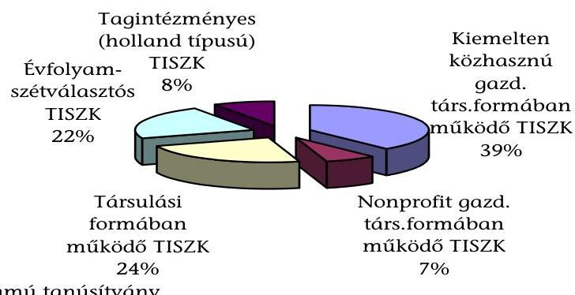

Forrás: 5. számú tanúsítvány

Az iskolafenntartók eltérő érdekei miatt nem valósult meg a közös vagyongazdálkodás, az erőforrások megosztása. Az iskolák és fenntartóik is ragaszkodnak az önállósághoz, az intézményi autonómiához, de még azonos iskolafenntartók esetében sem tudja a TISZK menedzsmentje a konkrét irányítási eszközök (munkáltatói, gazdálkodási jogosítványok) hiánya miatt megvalósítani az integrációt. Az integrációt nehezíti, hogy az egyes TISZK-ek tagintézményei között jelentős földrajzi távolság van, illetve eltérő megyékbe, régiókba is tartozhatnak, továbbá a tagintézmények száma (6. számú táblázat) is nehezíti az együttműködést.

Az intézményrendszer átalakításának első szakaszában létrehozott központi képzőhelyek sem működtek költséghatékonyan, mivel a régiónként (3 megyénként) létesített 2 db képzőhely iskolarendszerű szakképzés céljára történő igénybevétele csak a székhely környéki intézményekben tanulóknak jelentett valós segítséget. A Nemzeti Fejlesztési Ügynökség (NFÜ) által készíttetett „Térségi Integrált Szakképző Központok létrehozásának stratégiai értékelése" dokumentum szerint a központi képzőhelyek kihasználtsága tanműhelyenként heti 6 és 103 óra közötti szórást mutat.

Az iskolák TISZK-be szerveződését az motiválta, hogy továbbra is hozzájussanak a fejlesztési támogatásokhoz, pályázhassanak a decentralizált keretekre és EU-s támogatásokra. Az integrációval az oktatási intézményeknek csupán az a kötelezettségük keletkezett, hogy elfogadják a TISZK-ek által érvényesített RFKB döntéseket az iskolarendszerű szakképzés képzési irány-arányára vonatkozóan.

Az eltérő tulajdonosi kör és gazdálkodási formák nem teszik lehetővé összesített értékelés készítését arról, hogy a TISZK rendszer működtetése mennyibe kerül, a TISZK-ek honnan és milyen forrásokkal, valamint vagyontárgyakkal rendelkeznek.

Az NSZFI feladata a fejlesztési támogatások szabályszerűségének ellenőrzése, ennek keretében vizsgálja a fejlesztési forrás átadását, valamint az iskolákban a támogatás felhasználását, nyilvántartását, eszközök meglétét. Vizsgálatai -

---

jogszabályi előírás hiányában - nem térnek ki a TISZK-ek vagyon- és pénzgazdálkodására, beszámoltatására, az iskolák együttműködésének értékelésére.

# 1.4. A szakképzés-fejlesztési célok megvalósulásának mérése 

A stratégia végrehajtásához kapcsolódó kormányhatározat a szakképzési intézményrendszer átalakításához követelményként határozta meg, hogy az alkalmas legyen költséghatékony működés mellett a munkaerőpiaci-kereslet változásaira való gyors reagálásra. Az Szht. a feladat koordinálását az RFKB-kra delegálta, a költséghatékony működtetés a TISZK-ek felelőssége. A munkaerőpiaci kereslet alapján kialakított képzési struktúra működőképességéről, hatásairól nem készültek tanulmányok, előterjesztések, és azok, mint evidensnek tűnő célok jelentek meg a szakképzés-fejlesztési tervekben.

A munkaerőpiaci kereslet által irányított beiskolázás célja a munkaerőpiaci kereslet és kínálat közelítése, a gazdaság igényeinek megfelelő mennyiségű és minőségű szakmunkások biztosítása, illetve a gazdaság által nem igényelt képzések mérséklése/megszűntetése.

Az RFKB-k hatáskörének változásával a korábbi (képzési) piaci alapon működő rendszert - ahol a keresletet a tanulók, a kínálatot az iskolák jelentették - felváltotta az ún. munkaerőpiaci keresletre épülő utasításos tervezési rendszer. Az új döntési mechanizmusban az RFKB-k határozzák meg régiós szinten a képzési irányokat és a beiskolázási arányokat, amelyeket a TISZK-eken keresztül érvényesítenek. ${ }^{9}$ Az új döntési mechanizmus kialakulását a jogalkotó azzal is támogatta, hogy csak azok az oktatási intézmények juthatnak fejlesztési forrásokhoz (EU támogatáshoz, fejlesztési támogatáshoz, decentralizált támogatáshoz), amelyek elfogadják az RFKB-k képzési irányra-arányra vonatkozó döntéseit. Az intézkedések következményeként 2010-ben a szakképzést folytató oktatási intézmények 73,4\%-a, az oktatási kapacitás (tanulólétszám) 93,3\%-a csatlakozott a TISZK rendszerhez (4. sz. tanúsítványok).

A munkaerőpiaci kereslet alapján a képzési irány-arány meghatározása a MKIK által készített döntés-előkészítő javaslatok alapján történik, ezáltal az MKIK által képviselt munkaadók érdekei hangsúlyosabban érvényesülnek, mint a szakmai szervezetek és az iskolafenntartók szempontjai. Ez abból ered, hogy az MKIK dolgozta ki a munkaerőpiaci kereslet felmérésén alapuló képzési irány-arány meghatározására vonatkozó rendszert, amelyet az RFKB-k a feladatellátásuk során hasznosítanak. Az MKIK a rendszer koordinálását ún. konzorciumon keresztül végzi.

A Nemzeti Szakképzési és Felnőttképzési Tanács 2007. november 28-i ülésén hozott döntése alapján az MKIK vezetésével létrejött az OÉT munkaadói és munkavállalói oldalából, illetve a Magyar Agrárkamara együttműködésével egy 17 szervezetből álló konzorcium, amelynek feladata a regionális képzési és beiskolázási szerkezet kialakítására történő felkészülés humánerőforrás feltételeinek

[^0]
[^0]:    ${ }^{9}$ Minden egyes TISZK-re szakképesítésenként hozott döntést az RFKB a beiskolázási létszám vonatkozásában úgy, hogy az ismert létszámokból kiindulva százalékos alapon megadott változtatások szerepeltek.

---

megteremtése volt. Feladatuk továbbá, hogy az MKIK által végzett felmérések alapján az RFKB-k döntéseit előkészítsék, a régiók közötti egyeztetéseket lefolytassák, az RFKB-k egységes gyakorlatát kialakítsák. A konzorciumot az MKIK a Konzorciumi Tanácson keresztül irányítja, tagjait 11 munkaadói, és 6 munkavállalói képviselet delegáltja. Az országos koordinációs szervezeten kívül régión belül is megalakításra kerültek az ún. Regionális Konzorciumi Tanácsok, amelyben ugyancsak a 17 együttműködő szervezet képviselteti magát. A testületeket elnökként az RFKB kereskedelmi és iparkamara által delegált társelnökei vezetik.

Az MKIK felmérése szerint a vizsgált időszakban az RFKB-k 85-96\%-ban a konzorciumi javaslattal teljesen azonos döntést hoztak.

A rendszer működtetése 2007 és 2010 között az MPA Képzési alaprészt összesen 1,3 Mrd Ft-tal ${ }^{10}$ terhelte annak ellenére, hogy a kialakított rendszer nem alkalmas arra, hogy a szükséges pontossággal prognosztizálja a képzési időszakot követően (általában 4 év) jelentkező munkaerő-szükségletet. Ennek okai:

- a mikro- és kisvállalkozások sem rövid, sem hosszú távra nem tudnak biztos választ adni az általuk várható munkaerő keresletre, ugyanakkor szerepük meghatározó a foglalkoztatásban, mivel a vállalati szektoron belül a foglalkoztatás mintegy 70\%-át a KKV-k adják;
- a kamara munkaerő kereslet felmérései 2010-ig nem tértek ki a közszférára, 2010-ben is csak az egészségügyi ágazat kérdőíves felmérésére került sor, ennek következtében a mintegy 1,7 millió foglalkoztatottból 800 ezer fő közszférában dolgozó létszáma nem szerepelt a felmérésekben ${ }^{11}$;
- a munkaerő-keresletet a kamara/RFKB régiós szinten méri fel, illetve a képzési irány-arány számokat is ezen a szinten határozza meg, míg a munkaerő kereslet és kínálat a lokális, jellemzően kistérségi munkaerőpiacokon jelenik meg.

Azáltal, hogy az MKIK-nak, mint a munkaadók érdekképviseleti szervezetének meghatározó szerepe van az RFKB-k tevékenységében (az MKIK felmérései alapján meghatározzák az RFKB-k a képzési irányokat-arányokat, beiskolázási létszámokat), lehetővé válik, hogy a munkaerőpiac keresleti oldalának érdekei fokozottabban érvényesüljenek. A munkaerőpiaci kereslet által irányított képzés az állam kontrollszerepének hiányában torz képzési szerkezethez, évenként változó prioritású szakképzési irányokhoz és ezzel összefüggésben célszerűtlen méretű és kapacitású, illetve területi elosztású, permanensen változó iskolarendszerű szakképzés fenntartásához vezethet.

Az állam abban érdekelt, hogy kevés legyen a munkanélküli, a vállalkozások abban, hogy mindig biztonsággal válogathassanak a munkaerő kínálatban, leszorítva ezzel a munkabéreket.

A munkaerőpiaci kereslet alapján kialakított beiskolázási szakirányok és létszámarányok nem alkalmasak az egyes szakmacsoportban jelentkező munkaerőhiány problémáinak megoldására, ezeknél a képzéseknél nehéz a tanulólét-

[^0]
[^0]:    ${ }^{10}$ Forrás: MKIK és NSZFI között megkötött szerződések
    ${ }^{11}$ Forrás: KSH adatok

---

szám biztosítása ${ }^{12}$ és magas a pályaelhagyók aránya. A kamara felmérései alapján 2009-ben a pályakezdő szakmunkások 50,7\%-a, 2010-ben 57,2\%-a továbbtanult, vagy munkanélküli státuszú volt, vagyis a felmérés adatai nem igazolják az RFKB-k által meghatározott beiskolázási irány-arányok megalapozottságát.

A 2010/2011. tanévtől kezdődően a képzési irány-arány meghatározásnál figyelembe veszik a kamarának a pályát elhagyók arányára vonatkozó felméréseit, vagyis a beiskolázási létszámot megnövelik a kamara által prognosztizált pályaelhagyók arányával. Ezzel biztosítani kívánják a „gazdaság igényeinek kielégítését", de ez az eljárás olyan mértékű túlképzéshez vezethet, amely ronthatja a fiatal pályakezdők elhelyezkedési esélyeit.

# A kamara által kidolgozott és működtetett munkaerő-kereslet által vezérelt képzési irány-arány meghatározás jellemzője, hogy a munkaerő-kereslet kielégítését kizárólag iskolarendszerű szakképzés útján kívánja biztosítani, nem veszi figyelembe sem a munkaerőpiacon már meglévő munkanélkülieket, sem pedig a felnőttképzésben résztvevőket. 

Az álláskeresők mintegy 42\%-a (kb. 200 ezer fő a szakközépiskolát végzettekkel együtt) rendelkezik szakmával. Különösen magas a „munkaerő felesleg" (munkanélküliek) aránya a fiatal, pályakezdő szakmunkások esetében a szakközépiskolát frissen végzettek mintegy $50 \%$-a, a szakiskolát végzettek 35,3\%-a munkanélküli.

## Az RFKB-knak a képzési irányokra és arányokra vonatkozó döntései a munkaerőpiaci igények folyamatos változásai és munkaerőpiaci felmérések hiányosságai miatt nem voltak konzekvensek. Az MKIK

felmérései szerint egy éven belül is változott az egyes szakmacsoportokban a kereslet-kínálati pozíció, vagyis a munkaerőpiaci kereslet alapján előzőleg beiskolázottak a tanulmányuk befejezésekor már megváltozott munkaerőpiaci kereslettel találkozhatnak, ezért bizonytalan, hogy milyen arányban tudnak elhelyezkedni.

Míg 2009-ben jelentős túlkereslet mutatkozott bolti eladó, logisztikai ügyintéző és gépgyártás-technológiai technikus szakmákban, 2010-ben már jelentős túlképzés mutatható ki. 2009-ben túlkínálat mutatkozott a kereskedő szakmában, 2010-ben pedig túlkeresletet állapítottak meg. Ennek okait az MKIK a vállalkozások gyors keresletcsökkenése, illetve a megnövekedett képzési kibocsátás eredőjeként értékelte.

Különösen nagy változás látható a Közép-magyarországi régióban, ahol a jelenleg kiemelten támogatott 31 szakma a jövő tanévre 155 szakmára bővül, a támogatott szakmák száma 211-ről 129-re csökken. A Nyugat-dunántúli régióban a korábban iskolarendszerű szakképzés keretében nem oktatott 2 szakma helyett 236 szakmát soroltak ebbe a csoportba, vagyis a szakmák 50,2\%-ában nem indul képzés (7. számú táblázat).

[^0]
[^0]:    ${ }^{12}$ A keretlétszámok feltöltését 2010-től ösztöndíj rendszer segíti.

---

7. számú táblázat

Szakképesítések besorolása régiónként az RFKB-k döntése alapján

| Régiók | Kiemelten támogatott |  | Támogatott |  | Fejlesztési forrással nem támogatott |  | Régióban iskolarendszerű oktatásban nem oktatott |  |
| :--: | :--: | :--: | :--: | :--: | :--: | :--: | :--: | :--: |
|  | $\begin{aligned} & 2010 / \\ & 2011 \end{aligned}$ | $\begin{aligned} & 2011 / \\ & 2012 \end{aligned}$ | $\begin{aligned} & 2010 / \\ & 2011 \end{aligned}$ | $\begin{aligned} & 2011 / \\ & 2012 \end{aligned}$ | $\begin{aligned} & 2010 / \\ & 2011 \end{aligned}$ | $\begin{aligned} & 2011 / \\ & 2012 \end{aligned}$ | $\begin{aligned} & 2010 / \\ & 2011 \end{aligned}$ | $\begin{aligned} & 2011 / \\ & 2012 \end{aligned}$ |
| Észak-Alföld | 61 | 66 | 323 | 321 | 93 | 95 | 0 | 0 |
| Észak- <br> Magyarország | 32 | 38 | 121 | 322 | 23 | 22 | 85 | 100 |
| Dél-Alföld | 33 | 78 | 105 | 147 | 37 | 93 | 0 | 164 |
| Közép- <br> Magyarország | 31 | 155 | 211 | 129 | 26 | 29 | 190 | 169 |
| Közép -Dunántúl | 27 | 129 | 119 | 239 | na | 52 | 0 | 151 |
| Nyugat-Dunántúl | 60 | 45 | 163 | 140 | 43 | 49 | 2 | 236 |
| Dél-Dunántúl | 33 | 24 | 121 | 114 | 45 | 25 | 255 | 319 |
| Országos átlag | 40 | 76 | 166 | 202 | 38 | 52 | 76 | 163 |

Forrás: MKIK

A szakképzés-fejlesztési stratégia, valamint az Új Magyarország Fejlesztési Terv feladatként fogalmazta meg pályakövetési rendszer kialakítását és működtetését. Az NSZFI a TÁMOP forrásaiból ${ }^{13}$ 365,2 M Ft felhasználásával kialakította a pályakövetés informatikai rendszerét és módszertanát, az annak működtetéséhez szükséges jogszabály-módosítások azonban elmaradtak. Az NSZFI-nek nincs jogosultsága a pályakövetési rendszer adatbázisának feltöltéséhez szükséges adatok bekérésére, nincs hozzáférési jogosultsága a munkaerőpiaci adatokhoz, valamint nincs adatcsere-kapcsolata a Diplomás Pályakövetési Rendszerrel. Az adatbázisok összekapcsolása biztosíthatná a szakképzési Pályakövetési Rendszer adatbázisának feltöltését és a rendszer működtetését.

A pályakövetési rendszer működtetésének hiányában nem mutatható ki az egyes képzések eredményessége és hatékonysága, vagyis az adott képzések munkaerőpiaci hasznossága, az egyes oktatási intézményekben végzett tanulók elhelyezkedései, a tanulók mekkora arányban jelennek meg a felnőttképzésekben, átképzésekben.

Az RFKB képzési irány-arány tárgyában hozott határozatai kizárólag a TISZKekre vonatkoznak, a TISZK-be nem integrálódott oktatási intézményekre és a felnőttképzést folytató intézményekre azonban nem. Ennek következménye, hogy a munkaerőpiaci keresletre épülő képzési irány-arány meghatározási rendszer csak részben érvényesül, a képzési piac kompenzálja, illetve semlegesíti az RFKB döntéseit.

Az RFKB képzési irány-arány megállapítási hatásköre az OKJ-s szakképzés megszerzésére irányuló beiskolázások során mintegy 68,6\%-os létszámkeretre nem terjed ki (2009 évi adatok alapján számolva) Nagyszámú intézmény indíthat olyan - államilag támogatott - képzéseket, amelyekre a TISZK-es intézményeknek szűkített létszámokat lehet csak beiskolázni.

[^0]
[^0]:    ${ }^{13}$ TÁMOP 2.2.1 - 08/1-2008-002 „A képzés minőségének és tartalmának fejlesztése" című kiemelt projekt

---

Az iskolafenntartók nem érdekeltek az RFKB döntésének betartásában, illetve sem az RFKB-nak, sem a TISZK-nek nincs jogköre a döntések végrehajtásának ellenőrzésére, illetve kikényszerítésére, ezáltal a kialakított struktúra nem alkalmas a kitűzött célok megvalósítására. A döntések elfogadására az egyetlen motivációs tényező az Szht. 4. §-a szerint szabályozott fejlesztési támogatás fogadásának a feltétele. Az iskolafenntartóknak nincs érdekeken alapuló kapcsolata a munkaerőpiaccal és a munkaerőpiaci szereplőkkel. A képzőhelyek kínálatát nem feltétlenül csak az RFKB-k által meghatározott munkaerőpiaci igényen alapuló képzési irányarányok határozzák meg, mivel a bevételeik a tanulói normatíva révén nagymértékben függnek a képzésben résztvevők létszámától.

Az MKIK felmérése szerint a szakmák több mint felében a tanulólétszámok nem az RFKB döntésekkel egyező irányban változtak (országos 31-40\%-ban egyeztek meg a beiskolázási létszámok változásának irányai az RFKB döntéseinek irányaival).

Az oktatásért, valamint a szakképzésért és felnőttképzésért felelős miniszterek a vizsgált időszakban nem alakítottak ki mérési és értékelési rendszert, amely alapján megállapítható, hogy a bruttó szakképzési hozzájárulás évenkénti mintegy 62-70 Mrd Ft összegének (4. számú táblázat) felhasználása mennyiben járult hozzá a szakképzés-fejlesztési célok megvalósításához, illetve a szakképzés minőségi színvonalának javításához. A szakképzési hozzájárulásnak a képzés színvonalára gyakorolt hatása objektív mérését nehezíti, hogy a hozzájárulás fizetésére kötelezettek a bruttó szakképzési hozzájárulásuk felhasználásának módjáról maguk rendelkezhetnek a törvény által meghatározott mértékig, attól függetlenül, hogy az szolgálja-e a szakképzés színvonalának emelését. A vizsgált években a kötelezettek a kötelezettségük mintegy 43-50\%-át (26,9-33,3 Mrd Ft) fizették be a csökkentő tételek levonása után az MPA-ba (3. számú táblázat). Az ellenőrzés részére bekért dokumentumokból készített táblázat tartalmazza a pénzügyi forrás cél szerinti felhasználásának ÁSZ általi minősítését (8. számú táblázat).

---

A szakképzési-hozzájárulás cél szerinti felhasználásának ÁSZ általi minősítése adatok: M Ft-ban

|  | 2007 | 2008 | 2009 | 2010 | Összesen |
| :--: | :--: | :--: | :--: | :--: | :--: |
| Szakképzésre közvetlenül |  |  |  |  |  |
| Gyakorlati képzésre |  |  |  |  |  |
| elszámolt | 10058 | 11277 | 14621 | 17338 | 53294 |
| visszaigényelt | 5890 | 7469 | 10482 | 12788 | 36629 |
| MPA-ból támogatásként | 2214,9 | 3529,5 | - | 2258,8 | 8003,2 |
| Összesen | 18 162,9 | 22275,5 | 25103 | 32384,8 | 97 926,2 |
| Nincs információ a felhasználás minőségéről |  |  |  |  |  |
| Fejlesztési támogatásra | 14484 | 12413 | 10920 | 12130 | 49947 |
| Saját munkavállaló képzésre | 7394 | 8190 | 8621 | 7266 | 31471 |
| Egyéb csökkentő tétel | 1883 | 2066 | 1655 | 1426 | 7030 |
| MPA-ból támogatásokra | 10108 | 12 494,2 | 18327,6 | 8947,1 | 49876,9 |
| Összesen | 33869 | 35 163,2 | 39523,6 | 29769,1 | 138 324,9 |
| Nem szakképzésre |  |  |  |  |  |
| Fejlesztési támogatásból | 1545 | 1342 | 760 | 699 | 4346 |
| Munkaügyi központok | 83 | 151 | 72 | 35 | 341 |
| MPA-ból |  |  |  |  |  |
| központi keret | 6 520,8 | 7576,3 | 1419,8 | 3859,3 | 19376,2 |
| NSZFI működésére | 2 182,3 | 2 182,3 | 2616,4 | 2585,2 | 9566,2 |
| MKIK bonyolítási | 40,0 | 12,7 | 52,2 | 46,6 | 151,5 |
| Összesen | 10371,1 | 11264,3 | 4 920,4 | 7225,1 | 33780,9 |

Forrás: 1-23. számú tanúsítványok
Egyik minisztérium sem fogalmazta meg, hogy mit kell érteni a szakképzés színvonalán, vagyis nem határozta meg, hogyan kívánja érvényesíteni a „pénzért érték" elvet a szakképzési hozzájárulásból keletkezett források felhasználása során. Nem határozta meg azokat a célokat és kritériumokat, amelyekkel a szakképzés minőségi színvonalát és annak változását mérni tudja, miközben ezt célként határozta meg az Oktatási Minisztérium 2004-ben kidolgozott szakképzés fejlesztési koncepciója.

Az NGM az Új Magyarország Fejlesztési Terv keretében egy, a szakképző intézmények önértékelésén alapuló minőségirányítási keretrendszert dolgoztatott ki 2010 februárjára összhangban az Európai Uniónak a szakképzés minőségbiztosítására meghatározott irányelveivel, amelynek elsődleges célja a szakképzés egységes egészként történő kezelése. Az NGM tájékoztatása szerint a rendszer működtetésére az adatgyűjtési folyamat megkezdődött, bevezetésének időpontját a tapasztalatok feldolgozását, értékelését követően határozzák meg.

Az MPA Képzési alaprész terhére kifizetett támogatások hasznosulásának megítélésére
 nem alakítottak ki mérési és értékelési rendszert, elemzéseket, hatástanulmányokat nem készítettek. Nem állapítható meg, hogy az adott támogatás milyen mértékben járult hozzá a szakképzés-fejlesztési célkitűzések megvalósításához. Az Szht. 9. § (3) bekezdésében foglaltak szerint a (2) bekezdés szerinti csökkentő tételek levonását követően a bevételi előirányzat fennmaradó keretösszege az oktatásért felelős miniszter, illetve a szakképzésért és felnőttképzésért felelős miniszter rendelkezési jogkörében használható fel. Az MPA bevételi előirányzatának egy része az Szht. 9. §-ában előírt, kötelezően támogatandó területek kiadásaira nyújt fedezetet. Ezekre a jogcímekre a mindenkori költségvetési törvényben meghatá-

---

rozott keretösszeg áll rendelkezésre. A forrás felhasználása jogszabályi rendelkezés alapján történik, előzetes számítások, hatástanulmányok nem készülnek.

A két szakminiszter rendelkezési jogkörébe utalt keret felhasználásáról a miniszterek az NSZFT javaslatát figyelembe véve döntenek. A döntések alátámasztására szolgáló olyan elemzéseket, számításokat, amelyek az adott támogatás odaítélése esetén a szakképzés-fejlesztés célkitűzéseinek elérésére gyakorolt hatását mutatja, nem készítettek. Az előterjesztések minimális tartalmi elemeit a - kormányzati szerkezetátalakítás, illetve a jogszabály-módosítások miatt jelenleg módosítás alatt álló - 24/2007-es SzMM Utasítás ${ }^{14}$, illetve az oktatási és kulturális miniszter által 2007. november 21-én kiadott Eljárásrend részletesen szabályozza. Bár a miniszteri döntések előkészítése céljából az NSZFT döntés-előkészítő dokumentumai az adott támogatási javaslattal kapcsolatban tartalmazzák többek között a program előzményeit; célkitűzéseit; a célcsoportok bemutatását; a képzésben, fejlesztésben részt vevők számát; a program ütemezésének leírását; a határidőket; pénzügyi tervezést a költségek indokoltságát alátámasztó megfelelő kidolgozottsággal, és a működtetési költségek bemutatását, a támogatás hasznosulására vonatkozóan azonban nem tartalmaznak olyan követelményeket, illetve mérhető mutatószámokat, amelyekkel meg lehet állapítani, hogy az adott támogatás mely részterületekre, illetve milyen mértékben járult hozzá a szakképzés-fejlesztési célkitűzések megvalósításához.

Az MPA számviteli nyilvántartásában nincs elkülönítve, hogy a Képzési alaprészből évente kifizetett 19,5-36,2 Mrd Ft-ból (2. számú grafikon) mennyit fordítottak közvetlenül vagy közvetve a szakképzés fejlesztésére, mennyit működtetésére, továbbá mennyit egyéb, nem szakképzéshez kapcsolódó célokra. Nem mutatja ki továbbá, hogy az MPA Képzési alaprészben év végén fennmaradó összeget (bevétel és kiadás közötti különbség) milyen célra használták fel.

# 2. A SZAKKÉPZÉSI HOZZÁJÁRULÁS TELJESÍTÉSE ÉS ANNAK ELLENŐRZÉSE 

A szakképzési hozzájárulásra kötelezettek közül azok, akik gyakorlati képzést nem szerveznek (a kötelezettek mintegy 98\%-a) bevallásaikat a Nemzeti Adó és Vámhivatalhoz ${ }^{15}$ (továbbiakban: NAV), a gyakorlati képzést szervezők pedig az NSZFI-hez nyújtják be és e szervezeteknél teljesítik a hozzájárulási kötelezettségeiket.

A szakképzési hozzájárulás teljesítésének jogi szabályozása bonyolult, nehezen áttekinthető, mivel mintegy 30 jogszabály tartalmaz rá vonatkozó rendelkezéseket. A törvényalkotók az Szht.-t - a gyakorlati végrehajtás során szerzett tapasztalatok alapján - a vizsgált időszakban 13 alkalommal módosították. A gyakori változtatásnak, valamint a jogsza-

[^0]
[^0]:    ${ }^{14}$ Az utasítás nem nyilvános, az érintettek közvetlenül kapták meg.
    ${ }^{15}$ NAV: 2010. december 31-ig az Adó- és Pénzügyi Ellenőrzési Hivatal (APEH), 2011. január 1-től a Nemzeti Adó- és Vámhivatal (NAV) értendő alatta.

---

bályok magas számának együttes hatása, hogy nehezíti a hozzájárulás fizetésére kötelezettek számára a jogkövető magatartást a hozzájárulások bevallása, felhasználása és elszámolása során; az ellenőrzéseket a bevallások teljeskörűsége, az elszámolás szabályszerűsége szempontjából.

- A vizsgált időszakban folyamatosan változtak a szakképzési hozzájárulás kiszámolásának és elszámolásának szabályai. Például: A szakképzési hozzájárulás alapja 2008. december 31-ig a bérköltség volt, ezt követően a Tbj. tv. ${ }^{16}$ 4. §-a rendelkezései szerint számított, a fizetésre kötelezettet terhelő társadalombiztosítási járulék alapja képezi. Az adó mértéke 1,5\%.
- A feladatoknak az Szht. általi megosztásának következménye, hogy nem biztosított a bevallások teljes körűségének ellenőrizhetősége.

A teljes körűség alatt a bevallások ellenőrzése területén azt értjük, hogy az ellenőrzési rendszer alkalmas azon adóalanyok feltárására, akik nem tettek eleget bevallási kötelezettségüknek.

# A jogalkotók a bevallási és pénzügyi teljesítési határidők tekintetében nem teremtették meg az összhangot az Art ${ }^{17}$. és Szht. között. 

Az Art. 1. számú melléklete 2-5. pontjai az adózónak havi, negyedéves, éves bevallási gyakoriságot írnak elő, miközben a pénzügyi teljesítés határideje az Szht. 6. §-a értelmében az előleg megfizetése esetében a tárgyév hetedik hónap 20.-a, az éves nettó kötelezettség bevallásának és befizetésének határideje pedig a tárgyévet követő második hónap 25.-e. A bevallások és befizetések összhangjának megteremtése és az adminisztrációs terhek csökkentése érdekében a NAV kezdeményezte az Art., valamint az Szht. módosítását.

### 2.1. A bevallások benyújtása és ellenőrzése

A szakképzési hozzájárulás bevallások feldolgozásával és ellenőrzésével kapcsolatos feladatokat a jogi szabályozás több intézményhez delegálja. Nem biztosított a járulékok teljes körű beszedése, a feladatok hatékony és eredményes ellátása egyik intézménynél sem. A több intézmény feladatkörébe tartozó ellenőrzések következménye, hogy nincs olyan intézmény, amely széleskörű, a szakképzési hozzájáruláshoz kapcsolódó valamennyi szempontot figyelembe vevő ellenőrzéseket hajtana végre. A kialakított rendszer növeli a feladatellátáshoz kapcsolódó humánerőforrás-, informatikai kapacitás-, adminisztrációs idő-igényt, ezáltal a működési költségeket.

A feladatmegosztás következtében az NSZFI-nél és a munkaügyi központoknál ki kellett alakítani a feladatellátáshoz szükséges szervezeti struktúrát, biztosítani a humánerőforrás-kapacitást, továbbá informatikai fejlesztéseket kellett végrehajtani és finanszírozni kell azok működtetését.

[^0]
[^0]:    ${ }^{16}$ A társadalombiztosítás ellátásaira és a magánnyugdíjra jogosultakról, valamint e szolgáltatások fedezetéről szóló 1997. évi LXXX. törvény
    ${ }^{17}$ Az adózás rendjéről szóló 2003. évi XCII. törvény

---

A feladatok ellátásának költségeit egyrészt a központi költségvetésből, másrészt a befizetett járulékokból finanszírozzák.

A NAV a szakképzési hozzájárulással kapcsolatos feladatokat alaptevékenysége keretében látja el, ellenőrzései a bevallások utólagos pénzügyi/szabályszerűségi vizsgálatára terjednek ki.

A MPA Képzési alaprészt, vagyis a befizetett szakképzési hozzájárulás összegét terhelik a következő költségek:

- az NSZFI működési költsége, amelynek terhére a pénzügyi/szabályszerűségi ellenőrzéseit közbeszerzési pályázat alapján kiválasztott külső ellenőrökkel végezteti el;
- az MPA Képzési alaprész központi kerete 3\%-ának terhére a munkaügyi központok ellenőrzései, amelyek a saját munkavállalók képzésének szabályszerűségére és az adatszolgáltatási kötelezettségük pontos betartására terjednek ki;
- a kamarákkal kötött támogatási szerződések összege, amely keretében a kamarák végzik a gyakorlati képzőhelyek akkreditálását (működési tanúsítványok kiadása) és a tanulószerződések ellenőrzésével és nyilvántartásával kapcsolatos feladatokat.

A jogszabály nem egységes eljárást alakított ki a gyakorlati képzést szervezők, illetve az azt nem szervezők számára a bevallási kötelezettségük teljesítésére: a kötelezettek főszabályként az állami adóhatóság, a NAV, a gyakorlati képzést szervezők pedig az NSZFI felé tesznek eleget bevallási kötelezettségüknek. A kötelezettek mintegy 98\%-a (4. számú táblázat) a NAV-nál számolt el járulékfizetési kötelezettségével.

A gyakorlati képzést szervezők esetében a képzési költségek elszámolása részletesebb adattartalmú bevallást igényel, mint azoké, akik ilyen tevékenységet nem folytatnak. Az eltérő adattartalom önmagában nem indokolja azt a jogi szabályozást, hogy a bevallásokat eltérő intézmények dolgozzák fel és ellenőrizzék.

A NAV rendelkezett a bevallások elektronikus fogadását és az adatok formaialaki ellenőrzését biztosító feltételekkel, ugyanakkor az NSZFI-nek ezeket a feltételeket folyamatosan kellett kialakítania. Az NSZFI a helyszíni vizsgálat lezárásáig nem működtetett a bevallások elektronikus fogadásához és feldolgozásához szükséges informatikai rendszert. A bevallások elektronikus feldolgozását akadályozza, hogy a bevallás mellékleteit képező dokumentumokat (pl.: kamarai tanúsítvány, létszámigazolás a tanulói létszámról) a kötelezetteknek kell papíralapon csatolni, mivel az Szht. nem ír elő a kamaráknak adatszolgáltatási kötelezettséget az NSZFI felé a gyakorlati képzőhelyeknek kiadott tanúsítványok számáról és azok adattartalmáról.

A bevallási kötelezettségek jogi szabályozottsága mellett nem mutatható ki, hogy a szakképzési hozzájárulási kötelezettség bevallott bruttó összege nemzetgazdasági szinten megfelel-e a mindenkori járulékalap alapján számított bruttó kötelezettségnek (9. számú táblázat).

---

9. számú táblázat

A Tbj. járulék alapján számított bruttó kötelezettség és bevallott bruttó kötelezettség és kötelezettek egymáshoz viszonyított arányának alakulása

| Megnevezés | 2009 |  | 2010 |  |
| :--: | :--: | :--: | :--: | :--: |
|  | Összeg (M Ft) | Bevallók <br> száma (db) | Összeg (M Ft) | Bevallók <br> száma (db) |
| Tbj. járulék alap | 7399852 | 349047 | 7403210 | 334555 |
| Tbj. járulék 1,5\%-a | 110998 |  | 111048 |  |
| Bruttó szakképzési járulék: |  |  |  |  |
| NAV-hoz bevallott | 53334 | 271127 | 53213 | 260104 |
| NSZFI-hez bevallott | 16213 | 5000 | 16166 | 5369 |
| Bevallott bruttó kötelezettség összesen | 69547 | 276127 | 69379 | 265473 |
| Számított és bevallott kötelezettség közötti különbség | 41451 |  | 41669 |  |
| Csak Tbj. járulék alapot bevallók száma |  | 72920 |  | 69082 |
| Számított és bevallott kötelezettség aránya | $62,7 \%$ |  | $62,5 \%$ |  |
| Csak Tbj. járulék alapot bevallók aránya |  | 20,9\% |  | 20,6\% |

Forrás: 1. és 2. számú tanúsítványok
Megjegyzés: Csak azért szerepelnek a 2009. és 2010. évi bevallási adatok mivel ezeknél az éveknél azonos az adattartalom.

A számítások alapján mindkét elemzett évben mintegy 41,5 Mrd Ft különbség mutatható ki a számított és a bevallott kötelezettség között (a számított kötelezettség 37,3-37,5\%-a), ami azt jelenti, hogy 2009-ben közel 73 ezer, 2010-ben 69 ezer adóalany (mintegy $21 \%$ ) nem tett eleget bevallási kötelezettségének a szakképzési hozzájárulásra vonatkozóan.

A két intézményhez történő bevallások következtében egyik sem tudja vizsgálni, hogy az adóalanyok teljes körűen eleget tettek-e bevallási kötelezettségüknek, ennek következtében nem állapítható meg a be nem vallott szakképzési hozzájárulás összege, illetve az sem, hogy a bevallást be nem nyújtók közül hányan mentesek a kötelezettségteljesítés alól, és hogy ez mekkora összeget jelent. Sem a NAV, sem az NSZFI nem rendelkezik információval arról, hogy mely adózó kötelezett szakképzési hozzájárulás megfizetésére, illetve, hogy a kötelezettségének eleget tett-e és milyen formában. A megosztott bevallási rendszer következménye, hogy nem végezhető el mindegyik bevallásra kiterjedő egyszerűsített ellenőrzés, mivel az egyes bevallási sorok tartalmának ellenőrzésére egyik szervezet sem rendelkezik más bevallásokból, illetve adatszolgáltatásokból nyerhető adatokkal, amelyek lehetővé teszik az informatikai alapú összehasonlítást.

---

# 2.1.1. NAV-hoz benyújtott bevallások ellenőrzése 

A vizsgált években a NAV a szakképzési hozzájárulás ellenőrzését átfogó adónem ellenőrzés keretében végezte, amelyeknek 1,1-3,4\%-át (2007-ben 201 db, 2008-ban 250 db, 2009-ben 839 db, 2010-ben 636 db) ismételt, illetve felülellenőrzés alá vette. Kialakította a járulék ellenőrzésére vonatkozó részletes eljárásrendjét, felhasználva az egyéb adónemek ellenőrzései során szerzett tapasztalatokat.

A NAV az Art. 90. §-ának előírásai szerint köteles a legnagyobb adóteljesítménnyel (költségvetési kapcsolattal) rendelkező 3000 adózót rendszeresen (legalább 3 évente) valamennyi adónem, járulék és költségvetési támogatás vonatkozásában ellenőrizni, ennek keretében a szakképzési hozzájárulás kötelezettség teljesítését is. A további adóalanyokat ellenőrzésre kockázatkezelésen alapuló eljárással választja ki, valamint ellenőrzéseket végeznek az NSZFI és a munkaügyi központok megkeresései alapján.

A NAV-nál külön szakterület foglalkozik az adóalanyok
 ellenőrzésre történő kiválasztásával, a kockázatkezelési eljárás lefolytatásával. Az eljárás során több tényezőt vesznek figyelembe. Ilyenek például: a kontroll-adatok alapján számított és a bevallott bruttó hozzájárulás összege közötti eltérés; azok a gazdasági társaságok, akik munkaerő-igényes tevékenységet végeznek (őrző-védő, munkaerő kölcsönző, szállítmányozó, építőipar stb.); magas árbevétellel rendelkeznek, ugyanakkor bérköltségük aránytalanul alacsony; az adózó a szakképzési hozzájárulás bevallása során az átalány elszámolást választotta.

A vizsgált időszakban nőtt az ellenőrzöttek száma és aránya, a kiválasztási eljárás alkalmazása eredményeként pedig a megállapítással érintett ellenőrzöttek száma és aránya (10. számú táblázat).
10. számú táblázat

A NAV szakképzési hozzájárulás ellenőrzéseinek alakulása

| Év | Kötelezet- <br> tek száma <br> (db) | ebből: <br> Ellenőrzöt- <br> tek száma <br> (db) | Ellenőrzöttek <br> aránya | Megállapi- <br> tással érintett <br> ellenőrzöttek <br> száma (db) | Megállapi- <br> tással érintett <br> ellenőrzöttek <br> aránya | Feltárt nettó hozzájárulás <br> különbözet |  |
| :--: | :--: | :--: | :--: | :--: | :--: | :--: | :--: |
|  |  |  |  |  |  | összege (E Ft) | Előző évhez <br> viszonyított <br> aránya |
| 2007 | 272354 | 17684 | 6,5\% | 9681 | 54,7\% | 450542 |  |
| 2008 | 281235 | 21218 | 7,5\% | 11122 | 52,4\% | 614999 | 136,5\% |
| 2009 | 271157 | 24898 | 9,2\% | 14624 | 58,7\% | 529643 | 86,1\% |
| 2010 | 260104 | 30781 | 11,8\% | 19353 | 62,9\% | 664503 | 125,5\% |

Forrás: 6. számú tanúsítvány

A NAV-nál az ellenőrzéssel lefedettség ${ }^{18}$ folyamatosan, 6,5\%-ról 11,8\%-ra emelkedett, amelyben az ellenőrzések számának növelése mellett a kötelezettek számának csökkenése is szerepet játszott. A feltárt nettó hozzájárulási különbözet

[^0]: ${ }^{18}$ Ellenőrzéssel lefedettség: az ellenőrzött kötelezettek és az összes kötelezett aránya

---

(10. számú táblázat) a vizsgált években összességében 47,5\%-kal növekedett, ugyanakkor nem mutatja ki, hogy ebből mekkora összegű bevételt realizált.

Az Art. 43. § (3) bekezdése rendelkezik a befizetések elszámolásának esedékességi sorrendjéről, továbbá a 129. § (1) bekezdés b) pontja és a 170. § (2) bekezdése alapján az adóhatóság - többek között - az adózót a terhére megállapított adókülönbözet megfizetésére kötelezi azzal, hogy a befizetés teljesítésekor figyelembe veheti az adott adónemen fennálló túlfizetését is. Ez a szabályozás vonatkozik a járulékok megfizetésére is. Nem mutatja ki, hogy az adóalany által befizetett összegből mennyit számoltak el az ellenőrzés során megállapított hozzájárulási különbözet kiegyenlítésére.

# 2.1.2. NSZFI-hez benyújtott bevallások ellenőrzése 

Az NSZFI éves ellenőrzési tervet készít, amelyet a szakképzésért felelős miniszter hagy jóvá. A tervben meghatározza a mintavétel módszerét, de ehhez csak 2010-ben alkalmazott - a NAV-hoz hasonló - több kockázati tényezőn alapuló kiválasztási rendszert. A vizsgált időszakban az elvégzett ellenőrzések 33,7-47,0\%-ában szabálytalanságot állapítottak meg (a 2010. évi egyetlen ellenőrzést az elemezéseknél nem vettük figyelembe) 0,6-2,3\% ellenőrzéssel lefedettség mellett (11. számú táblázat).

A 2010. évi ellenőrzésre történő kiválasztás során az NSZFI a következő szempontokat vette figyelembe: hozzájárulási kötelezettség nagysága, az elszámolt költség nagysága, a visszaigénylés nagysága, továbbá, hogy az adóalanyt a 2008. és 2009. években ellenőrizték-e vagy nem.
11. számú táblázat

Az NSZFI szakképzési hozzájárulás ellenőrzéseinek alakulása

| Év | Kötelezettek <br> száma (db) | ebből: <br> Ellenőrzöt- <br> tek száma <br> (db) | Ellenőrzött- <br> ségi színt | Megállapítással érintett <br> kötelezettek |  | Feltárt nettó hozzájárulás <br> különbözet (észrevételezési <br> eljárás után) |  |
| :--: | :--: | :--: | :--: | :--: | :--: | :--: | :--: |
|  |  |  |  | száma (db) | aránya | összege (E Ft) | Előző évhez <br> viszonyított <br> aránya |
| 2007 | 3605 | 20 | 0,6\% | 9 | 45,0\% | 5151 |  |
| 2008 | 4405 | 101 | 2,3\% | 34 | 33,7\% | 3596 | 69,8\% |
| 2009 | 5000 | 100 | 2,0\% | 47 | 47,0\% | 26040 | 724,1\% |
| 2010 | 5369 | 1 | 0,0\% | 1 | 100,0\% | 24 | 0,1\% |

Forrás: 7. számú tanúsítvány

A 2008. évi ellenőrzések során megállapított hozzájárulási különbözetet az NSZFI teljes mértékben beszedte, a 2009. évi megállapításoknak 23\%-át (8,8 M Ft-ot) a kötelezettek határidőre nem fizették meg. Ezek beszedéséről az NSZFI intézkedett.

---

# 2.2. A kintlévőségek alakulása és azok beszedésére tett intézkedések 

### 2.2.1. Kintlévőségek behajtása a NAV-nál

A NAV az általános kintlévőség kezelő rendszerén belül a többi adónemre is érvényes szabályokat alkalmazza a szakképzési hozzájárulásból származó követelések kezelése és behajtása során, beleértve az NSZFI által átadott követeléseket is. Kimutatásaiban elkülöníti - mint adójellegű köztartozást - a szakképzési hozzájárulás kintlévőségeket, és az azokból megtérült/behajtott összegeket.

Az ÁSZ korábbi, 2006-2008. évekre vonatkozó vizsgálata ${ }^{19}$ az adóhatóság hátralékkezelésével kapcsolatban a következő megállapításokat tette:

- nem az Art. előírásait, illetve belső szabályzatait figyelembe véve tesz intézkedéseket a hátralékállomány teljes körének „haladéktalan" hátralékkezelésbe vonásáról, hanem a humánerőforrás-kapacitása függvényében kockázati paraméterek alapján kiválasztja az állományból azokat a hátralék-tételeket, amelyekre megindítja a végrehajtási cselekményeket;
- folyamatosan méri a hátralékkezelésbe vont hátralékállomány alakulását, és csak közvetve figyeli a hátralékkezelésbe nem vont állomány összesen értékét;
- nem követi nyomon, hogy a hátralékkezelésbe nem vont hátralékok mennyi ideje állnak fenn. Ennek következménye, hogy ezen tételek esetében fokozottabban áll fenn az elévülés lehetősége, ami kedvezőtlenül hat az adófizetési fegyelemre.

A NAV hátralékkezelésével kapcsolatos korábbi ÁSZ vizsgálatai több hiányosságot tártak fel. Jelen vizsgálat nem terjedt ki annak ellenőrzésére, hogy a NAV milyen intézkedéseket tett a hiányosságok megszüntetésére.

A NAV által a vizsgált időszakban szakképzési hozzájárulás címen nyilvántartott kintlévőség a 2007. évi 4,7 Mrd Ft-ról 2010-re 7,4 Mrd Ft-ra (57\%-kal), az esetek száma pedig 117582 db-ról 160196 db-ra (32\%-kal) növekedett. Ebből a behajthatatlan követelések a 2007. évi nyitó állomány szerinti 78,9 M Ft-ról 2011-re 604,4 M Ft nyitó állományra (azaz 666\%-kal), az esetek száma több mint tízszeresére, azaz 3307 db-ról 35437 db-ra nőtt (8. számú tanúsítvány). A behajthatatlanság oka hasonló a többi adónemhez, nem a szakképzési hozzájárulás speciális jellegéből adódik. A NAV által nyilvántartott kintlévőségek mintegy 60\%-a felszámolási eljárás alatt álló adóalanyok tartozásai.

A törölt követelések elsősorban nem a végrehajtáshoz való jog elévüléséhez, hanem felszámolási eljáráshoz kapcsolódnak. Az elévülés miatt törölt tételek száma (2007. évi 5578 db-ról 2010-ben 13136 db-ra) és összege (2007. évi 65,5 M Ft-ról 2010-ben 198,7 M Ft-ra) folyamatosan nőtt, az összes kintlévőséghez viszonyított arányuk 1,4-2,7\% között alakult (8. számú tanúsítvány).

[^0]: ${ }^{19}$ A végrehajtási rendszert utoljára az ÁSZ „az APEH által kialakított ellenőrzési portfólió és kockázatkezelési rendszer célszerűségének és eredményességének ellenőrzésének" (0947) keretében vizsgálta, megállapításait a 2009 decemberében nyilvánosságra hozott jelentés tartalmazza.

---

A követelések több mint 60\%-a 500 E Ft alatti tételekből tevődik össze. Növekvő tendenciát mutat a 10 M Ft feletti követelések száma, a 2007. évi 17 db-ról 2010-ben 25 db -ra, összegük 337,9 M Ft-ról 627,3 M Ft-ra, közel a duplájára emelkedett, amely az összes követeléseknek 7,4-9,5\%-át tették ki (8. számú tanúsítvány).

# 2.2.2. Kintlévőségek behajtása az NSZFI-nél 

Az NSZFI a támogatási szerződésekben meghatározott feltételek teljesüléséig a támogatás összegét elszámolásra váró követelésként tartja nyilván a lejárt követelésekkel együtt. Kimutatásai szerint a követelések a 2007. évi 16,9 Mrd Ft-ról 2010-re 14,7 Mrd Ft-ra, a tételek száma pedig 941 db-ról 605 db-ra csökkent. Az eredményes behajtást nehezíti a követelések nyilvántartásának említett rendszere az áttekinthetőség és az intézkedések időbeli meghozatala szempontjából, tekintettel arra, hogy ezek rendezésének módja eltérő intézkedést igényel.

A NSZFI a követelések 76,4-91,6\%-át a támogatásban részesülőknél mutatja ki. Ezek az összegek a támogatottak elszámolásait követően csak akkor válnak tényleges követeléssé, amennyiben az ellenőrzéseivel nem szerződésszerű felhasználást állapít meg és ezért visszafizetési kötelezettséget ír elő. A gyakorlati képzést szervezők esetében a kimutatott követelések az esedékességig meg nem fizetett járulékok összegéből, valamint az ellenőrzéssel megállapított jogosulatlan felhasználás meg nem fizetett összegéből tevődnek össze. A szakképző iskolákkal szembeni követelések a fejlesztési támogatások jogosulatlan felhasználásából adódnak (12. számú táblázat).

A követelések közül az 50 M Ft-ot meghaladóak (2007-ben 48 db 12,5 Mrd Ft, 2008-ban 63 db 18,8 Mrd Ft, 2009-ben 49 db 15,0 Mrd Ft, 2010-ben pedig 36 db 12,4 Mrd Ft összegben) azok a támogatások, amelyek elszámolása még nem történt meg és az elszámolási határidő a kimutatás elkészítésekor még nem járt le. Ezen követelések összege képezi az összes követelés 74-91\%-át, tételszámban azonban az összes tétel 5-13,7\%-át jelenti (9. számú tanúsítvány).
12. számú táblázat

Az NSZFI által nyilvántartott követelések szerkezetének alakulása

| Kötelezett | 2007 |  | 2008 |  | 2009 |  | 2010 |  |
| :--: | :--: | :--: | :--: | :--: | :--: | :--: | :--: | :--: |
|  | összege <br> (M Ft) | aránya | összege <br> (M Ft) | aránya | összege <br> (M Ft) | aránya | összege <br> (M Ft) | aránya |
| gyakorlati képzést <br> végzők | 848,8 | 5,0\% | 740,1 | 3,2\% | 436,4 | 2,7\% | 623,6 | 4,3\% |
| szakképző iskolák | 3129,2 | 18,5\% | 2596,4 | 11,2\% | 940,5 | 5,7\% | 2067,1 | 14,1\% |
| egyedi, illetve egyéb <br> támogatásban <br> részesülők | 12897,9 | 76,4\% | 19841,5 | 85,6\% | 15040,7 | 91,6\% | 11961,6 | 81,6\% |
| összesen | 16875,9 | 100,0\% | 23 178,0 | 100,0\% | 16417,6 | 100,0\% | 14 652,3 | 100,0\% |

Forrás: 10. számú tanúsítványok
Az NSZFI - a kialakított gyakorlata szerint - a lejárt kintlévőségeket két fázisban hajtja be ${ }^{20}$ : először ügyvédi irodát bíz meg a behajtásra évi 27,6-38,6 M Ft-

[^0]: ${ }^{20}$ A kintlévőségek behajtási folyamatát az 5. számú melléklet mutatja be.

---

os szerződés keretében, ezt követően a NAV-ot keresi meg, amennyiben az ügyvédi behajtás nem járt eredménnyel. Az ügyvédi iroda behajtási eredményessége 0,3-4,2\% között alakult, miközben a NAV a behajtásra átadott követelések 20,4-57,8\%-át hajtotta be.

Az NSZFI olyan általános megállapodást kötött az ügyvédi irodával, amelyben a megbízási díjat egy összegben és nem az egyes feladattípusokra lebontva határozta meg. A vizsgálat számára csak 2009. és 2010. évekről, külön kigyűjtés alapján tudott részletes kimutatást átadni arról, hogy az ügyvédi iroda a költségei között mennyit számolt el közvetlenül a behajtási tevékenységére. E kimutatás szerint a 2009-ben megkötött 32,5 M Ft összegű megbízási szerződésből 11,3 M Ft-ot, a 2010. évi 35,2 M Ft összegű szerződésből 7,5 M Ft-ot fizetett ki az ügyvédi irodának a kintlévőségek behajtására. 2009-ben a mintegy 720 M Ft behajtandó összegből az iroda 1,8 M Ft-ot (0,3\%), 2010-ben 818 M Ft-ból 5,9 M Ft-ot (0,7\%) szedett be. (13. számú táblázat)

Az ügyvédi irodával megkötött megbízás széles körű jogi képviselet ellátására irányul, azaz nem csak követelés behajtásra, hanem jelzálog-jog bejegyzés és törlés ellenjegyzésére, peres, illetve felszámolási eljárásban az intézet képviseletére, szerződések ellenjegyzésére, jogi szakvélemény nyújtására is.
13. számú táblázat

Az ügyvédi irodának behajtásra átadott követelések alakulása

| Év | Megbízási díj (M Ft) |  | Behajtásra átadott összeg (M Ft) | Behajtott összeg (M Ft) | Behajtási arány |
| :--: | :--: | :--: | :--: | :--: | :--: |
|  | összesen | ebből: <br> behajtáshoz kapcsolódó |  |  |  |
| 2007 | 27,6 | nincs adat | 329,5 | 14,0 | $4,2 \%$ |
| 2008 | 38,6 | nincs adat | 329,6 | 4,4 | $1,3 \%$ |
| 2009 | 32,5 | 11,3 | 719,8 | 1,8 | $0,3 \%$ |
| 2010 | 35,2 | 7,5 | 818,4 | 5,9 | $0,7 \%$ |
| Összesen | 133,9 | 18,8 | 2 197,3 | 26,1 | $1,2 \%$ |

Forrás: NSZFI
Az ügyvédi iroda megbízása a kintlévőségek behajtására célszerűtlen és gazdaságtalan, mivel egyrészt nem adóhatóságként tud fellépni a kötelezettekkel szemben, másrészt meghosszabbítja a behajtás időtartamát, ami kockázatot jelent a behajtás eredményessége szempontjából. A NAV az Art. 10. §-a alapján - külön díj felszámolása nélkül - folytatja le a behajtási eljárás teljes folyamatát.

Az NSZFI - az engedélyezett létszámkeret kötöttségére hivatkozva - nem végzett számításokat arra vonatkozóan, hogy milyen szakképzettségű és hány fő saját humánerőforrás szükséges a kintlévőségek behajtásával (NAV számára történő átadással) kapcsolatos feladatok ellátására, és annak mekkora pénzügyi forrás-igénye van.

---

# 3. A SZAKKÉPZÉSI HOZZÁJÁRULÁS FELHASZNÁLÁSÁNAK ELLENŐRZÉ-

SE
A szakképzési hozzájárulás felhasználásának pénzügyi-szabályszerűségi ellenőrzése a NAV, valamint a hatósági jogkörrel nem rendelkező NSZFI feladata. Az NSZFI ezáltal az ellenőrzéseiről nem határozatot hoz, hanem realizáló levelet állít ki. A realizáló levéllel szemben jogorvoslati eljárásra nincs lehetőség, a vitás kérdések csak polgári peres úton rendezhetők. Az NSZFI az ellenőrzések során feltárt járulékkülönbözet után bírságot nem, egyedül eljárási bírságot szabhat ki az Szht. 4/G. § értelmében, amennyiben az ellenőrzött akadályozza az ellenőrzés lefolytatását.

Az Art. 170. §-a értelmében az adóbírság a feltárt adóhiány 50\%-áig szabható ki, míg az Szht. 4/G. § értelmében az eljárási bírság mértéke 50 E Ft-tól 100 E Ft-ig terjedhet.

Az ellenőrzési megállapítások megalapozottságát, valamint a jogosulatlanul elszámolt költségek visszafizettetését kedvezőtlenül befolyásolja, hogy az NSZFI-nek nincs hatósági jogköre, így az ellenőrzöttek - teljességi nyilatkozat ellenére is - az ellenőrzést követően jogkövetkezmény nélkül mutathatnak be dokumentumokat, amelyeket a helyszíni ellenőrzés során nem adtak át, és amelyek módosítják az ellenőrzési megállapításokat.

Az NSZFI nem rendelkezik kimutatással arra vonatkozóan, hogy a helyszíni vizsgálatot követően benyújtott dokumentumok milyen arányban módosították az eredeti megállapításokat.

A NAV a szakképzési hozzájárulással kapcsolatos feladatokat éves költségvetési törvényben megállapított működési költségei terhére látja el, és nem különíthető el, hogy ebből mennyi a szakképzési hozzájárulás ellenőrzésével kapcsolat feladatainak költsége.

Az NSZFI-nek a szakképzési hozzájárulás kezelésével és felhasználásának ellenőrzésével összefüggő feladatainak költségeire az MPA Képzési alaprész nyújt fedezetet (14. számú táblázat). A szakképzési hozzájárulással kapcsolatos feladatok ellátására a vizsgált időszakban a következő források álltak rendelkezésre:
14. számú táblázat

Az NSZFI működési kiadásainak alakulása

|  |  |  | adatok: M Ft-ban |  |
| :-- | --: | --: | --: | --: |
| Forrás | $\mathbf{2 0 0 7}$ | $\mathbf{2 0 0 8}$ | $\mathbf{2 009}$ | $\mathbf{2 0 1 0}$ |
| Költségvetési támogatás | 284,4 | 255,9 | 389,9 | 135,8 |
| MPA Képzési alaprész | 2182,3 | 2182,3 | 2616,4 | 2585,2 |
| Saját bevétel |  |  |  |  |
| (kisvállalkozási | 1547,5 | 1547,5 | 1247,5 | 1247,5 |
| tevékenység) |  |  |  |  |
| Összesen | 4014,2 | 3985,7 | 4253,8 | 3968,5 |

Forrás: költségvetési beszámolók
Nincs összhang az NSZFI-nek a jogszabályokban előírt feladatai, valamint az azok ellátásához engedélyezett létszámkerete között. Több szakterületen, így az

---

ellenőrzési területen is külső munkatársakat alkalmaz. Az NSZFI - létszámkeret kötöttségére hivatkozva - nem végzett számításokat arra vonatkozóan, hogy milyen szakképzettségű és hány fő saját humánerőforrás szükséges az ellenőrzési feladatok ellátására, továbbá a külső munkatársak vagy a saját humánerőforrás alkalmazása a gazdaságosabb és eredményesebb.

A szakképzésért és felnőttképzésért felelős miniszter a saját rendelkezési jogkörébe utalt kerete terhére, az aktuális szakmai prioritások támogatásának érdekében felkéri az NSZFI-t olyan feladatok ellátására, amelyek az intézet profiljának megfelelnek, az Alapító Okiratában foglalt feladatokkal összhangban vannak, és az intézet működése során felhalmozott szakmai tudást, speciális ismeretet feltételeznek.

A megbízás keretében többek között nemzetközi szakmai szervezetek programjain való részvételre, írásbeli és szóbeli vizsgatételek készítésére, az alternatív szakképzés bevezetését támogató dokumentumrendszer kidolgozására, a FEOR (Foglalkozások Egységes Osztályozási Rendszere) felülvizsgálatára, módszertani segédleteinek kidolgozására, a Szakiskolai Fejlesztési Program II. feladatainak támogatására, a KVVM hatáskörébe tartozó szakképzés-fejlesztési feladatok ellátásának támogatására, a fegyveres és rendvédelmi erők oktatói állománya részére szervezendő szakmai tanulmányutak támogatására nyílt lehetőség.

Az NSZFI támogató javaslatát követően a további eljárás megegyezik az egyedi döntésen alapuló és a pályázat útján elnyerhető támogatások lebonyolítási rendjével. A vizsgált időszakban összesen 3,7 Mrd Ft értékben került sor az alaptevékenységéhez nem kapcsolódó feladatok elvégzésére vonatkozó támogatási szerződés megkötésére.

2007-ben 1,4 Mrd Ft, 2008-ban 1,6 Mrd Ft, 2009-ben 0,3 Mrd Ft, 2010-ben 0,4 Mrd Ft összeget tettek ki az NSZFI által elvégzendő külön feladatok.

# 3.1. A gyakorlati képzés szervezésére fordított pénzeszközök felhasználásának célszerűsége és eredményessége, valamint ellenőrzöttsége

A vállalkozások gyakorlati képzés szervezésére évente 18-32 Mrd Ft-ot ${ }^{21}$ (4. számú táblázat) számoltak el. A szakképzésért felelős miniszter nem írt elő feladatot az NSZFI számára arra vonatkozóan, hogy mérje fel és értékelje a gyakorlati képzés szervezésére elszámolt összegek felhasználásának hatékonyságát és eredményességét. Ennek hiányában nem mutatható ki, hogy az egyes szakmacsoportokon belül földrajzi elhelyezkedés és képzőhely mérete szempontjából hogyan oszlanak meg a gyakorlati képzés tanulónkénti költségei, továbbá nem alakíthatók ki az egyes szakmacsoportok költség-normatívái sem.

[^0]
[^0]:    ${ }^{21}$ Gyakorlati képzésre elszámolt összeg: bevallási gyakorlati képzés szervezése címén elszámolt összeg + egyéb költségcsökkentő tételként elszámolt összeg + visszaigénylés összege

---

A gyakorlati képzés feltételeinek meglétét a kamarák, a költségelszámolást pénzügyi-szabályszerűségi szempontok figyelembe vételével az NSZFI ellenőrzi${ }^{22}$.

A vállalkozások gyakorlati képzés szervezésére való alkalmasságát a kamarák vizsgálják, amelyek nyilvántartása alapján több vállalkozó rendelkezik gyakorlati képzés szervezésére jogosító tanúsítvánnyal, mint ahányan az NSZFI-hez bejelentkeztek és bevallást nyújtottak be (15. számú táblázat). A tanúsítvánnyal rendelkezők 40,7-68,2\%-a nem számolt el képzéshez kapcsolódó költségeket. Ez az arány magában foglalja azokat a vállalkozásokat, akik rendelkeznek ugyan érvényes tanúsítvánnyal, de tanulószerződés hiányában gyakorlati képzést nem szerveztek, valamint szerveztek gyakorlati képzést, de költségelszámolást nem nyújtottak be.

A vizsgált években folyamatosan nőtt azoknak a tanulószerződéseknek a száma és aránya (5,2-10,4\%-kal), amelyek után az NSZFI-hez a gyakorlati képzést szervezők költségelszámolást nem nyújtottak be (15. számú táblázat). A gyakorlati képzést szervezők saját döntése, hogy a képzés költségeit elszámolják-e. A 15. számú táblázat adataiból arra lehet következtetni, hogy a kevesebb tanuló (1-2 fő) képzését végző kisebb vállalkozások a szakképzési hozzájárulások terhére nem számolják el a képzés költségeit.
15. számú táblázat

Gyakorlati képzőhelyek és tanulószerződések számának alakulása
adatok: db-ban

| Megnevezés | 2007 | 2008 | 2009 | 2010 |
| :--: | :--: | :--: | :--: | :--: |
| Gyakorlati képzőhelyek száma |  |  |  |  |
| Kamarák nyilvántartásában | 6767 | 11309 | 15501 | 8887 |
| NSZFI nyilvántartásában | 3497 | 4262 | 4932 | 5267 |
| Különbség | 3270 | 7047 | 10569 | 3620 |
| NSZFI nyilvántartásában nem szereplők aránya | $48,3 \%$ | $62,3 \%$ | $68,2 \%$ | $40,7 \%$ |
| Tanulószerződések száma |  |  |  |  |
| Kamarák nyilvántartásában* | 43368 | 46833 | 48941 | 50258 |
| NSZFI nyilvántartásában | 41105 | 42888 | 45094 | 45009 |
| Különbség | 2263 | 3945 | 3847 | 5249 |
| NSZFI nyilvántartásában nem szereplők aránya | $5,2 \%$ | $8,4 \%$ | $7,9 \%$ | $10,4 \%$ |
| Egy gyakorlati képzőhelyre jutó tanulószerződések száma |  |  |  |  |
| Kamarák nyilvántartásában | 6,4 | 4,1 | 3,2 | 5,7 |
| NSZFI nyilvántartásában | 11,8 | 10,1 | 9,1 | 8,5 |
| Különbség | 0,7 | 0,6 | 0,4 | 1,5 |

Forrás: 11-14. számú tanúsítványok
*Az MKIK és a MAK által megadott adatok összege
A gyakorlati képzés feltételeinek ellenőrzése, valamint a tanulószerződések nyilvántartása és az abban foglaltak betartásának figyelemmel kísérése a kamarák feladata. A szakmai követelményeknek megfelelő gyakorlati

[^0]
[^0]:    ${ }^{22}$ A gyakorlati képzési költségek elszámolási és ellenőrzési folyamatának főbb szakaszait a 2. számú melléklet mutatja be.

---

képzés biztosításának szempontjából kockázatot jelent, hogy a kamara jelentősen csökkentette a gyakorlati képzőhelyek ellenőrzését.

A kamara a gyakorlati képzőhelyeken ellenőrzi a gyakorlati képzés technikai és személyi feltételeinek meglétét, a tanulószerződésekben foglaltak betartását.

Az MKIK míg 2007-ben az összes tanúsítvánnyal rendelkező gyakorlati képzőhelynek mintegy 41\%-át ellenőrizte a tanúsítványok kiadását követően, 2010-ben ez az arány 5\%-ra csökkent. Az ellenőrzések során eltérő arányban (3,6-9,4\%) tárt fel hiányosságokat (16. számú táblázat). A megállapítások a tanulószerződésekben megfogalmazott feltételek be nem tartására vonatkoztak. Ellenőrzései az összes tanulószerződésnek 9,5-16,9\%-ára terjedtek ki és a vizsgált esetek mindössze 0,6-4,2\%-nál tártak fel szabálytalanságot (16. számú táblázat).
16. számú táblázat

A MKIK által végzett ellenőrzések alakulása

| Megnevezés |  | 2007 | 2008 | 2009 | 2010 |
| :--: | :--: | :--: | :--: | :--: | :--: |
| Tanúsítványok |  |  |  |  |  |
| száma |  | 6759 | 11156 | 15272 | 8606 |
| tanúsítvány kiadását | száma | 2775 | 2980 | 2522 | 435 |
| követő ellenőrzések | aránya | $41,1 \%$ | 26,7\% | $16,5 \%$ | $5,1 \%$ |
| hiányosságot feltárt ellenőrzések | száma | 173 | 108 | 136 | 41 |
|  | aránya | $6,2 \%$ | $3,6 \%$ | $5,4 \%$ | $9,4 \%$ |
| Tanulószerződések |  |  |  |  |  |
| száma |  | 42968 | 46248 | 48396 | 49605 |
| ellenőrzések | száma | 4090 | 7344 | 8168 | 6509 |
|  | aránya | $9,5 \%$ | $15,9 \%$ | $16,9 \%$ | $13,1 \%$ |
| hiányosságot feltárt ellenőrzések | száma | 173 | 108 | 136 | 41 |
|  | aránya | $4,2 \%$ | $1,5 \%$ | $1,7 \%$ | $0,6 \%$ |

Forrás: 13. és 14. számú tanúsítványok
A Magyar Agrárkamara (továbbiakban: MAK) nem rendelkezik pontos nyilvántartással sem a tanúsítványokról és a tanulószerződésekről, sem az elvégzett ellenőrzések és megállapítások számáról. Emiatt a MAK feladatellátása ezen a területen nem értékelhető.

A jogi szabályozás hiányossága, hogy a tanulószerződések megkötése és az abban foglaltak betartásának ellenőrzése a vállalkozók érdekeit képviselő kamarák feladatköre. Az ellenőrzéseket a kamarák végzik, miközben elkötelezettek a munkaadók felé, mint azok érdekképviseleti szervei. A szakképző iskoláknak nincs jogosultságuk, hogy a tanulószerződésekben foglaltak betartását, valamint a gyakorlati képzés színvonalát ellenőrizzék.

Az NSZFI-nek a gyakorlati képzés költségei elszámolásának ellenőrzésére kialakított gyakorlata nem eredményes és nem hatékony. Az NSZFI annak ellenére nem növelte az ellenőrzések számát és arányát, hogy je-

---

lentősen megnövekedett a gyakorlati képzés szervezése címén elszámolt költségek és a visszaigénylések összege.

Az NSZFI-nél az ellenőrzési arány 0,55\% és 1,86\% között változott (számuk 2007-ben $20 \mathrm{db}, 2008$-ban 101 db és 2009-ben 100 db ). 2010-ben összesen 1 ellenőrzést folytattak le, mivel külső szakértők alkalmazására pályázatot - kormányzati döntés következtében - csak 2011-ben írhattak ki. A feltárt különbözet összege az észrevételezési eljárást követően 2007-ben 5,1 M Ft, 2008-ban 0,95 M Ft, 2009-ben $26,0 \mathrm{M}$ Ft volt, a 2010. évi egy ellenőrzés esetében $0,024 \mathrm{M}$ Ft hiányt állapított meg (17. és 18. számú táblázatok).

Nem eredményes a külső ellenőrök alkalmazása. A külső szakértők 2009-ben (a 2008. évi adatok ellenőrzése) 100 ellenőrzést végeztek 9,6 M Ft-ért, 2010-ben (a 2009. évi adatok ellenőrzése) 96 db ellenőrzést 18,5 M Ft-ért. Az elvégzett ellenőrzések számának csökkenése mellett nem indokolt a megbízási díjak mintegy duplájára emelkedése. Az ellenőrzések száma és a megbízási díjak, továbbá az ellenőrzések eredményessége között nem mutatható ki összefüggés. Ezt támasztja alá, hogy a 2010. évi bevallási adatok ellenőrzésére az NSZFI 2011 januárjában 8,6 M Ft értékben kötött szerződést 107 vizsgálatra, amely 4799,8 M Ft ellenőrzésére terjed ki.

A megbízási szerződések alapján elvégzett ellenőrzések szakmailag nem megalapozottak, a jegyzőkönyvekben feltüntetett nettó megállapítási arány a 2008. évi adatok esetében 0,08\%, a 2009. évi adatok esetében 0,31\% volt. Az észrevételezési eljárást követően ez az arány $0,01 \%$, illetve $0,24\%$-ra, a nettó megállapítás összege pedig 2008-ra vonatkozóan 1,1 M Ft-ról 0,095 M Ft-ra, 2009-re vonatkozóan 33,7 M Ft-ról 26,0 M Ft-ra csökkent (17. számú táblázat).

A szakértők ellenőrzései szakmailag nem megalapozottak, az észrevételezési eljárást követően megállapításaiknak 2009-ben több mint $90\%$-át, 2010-ben $23\%$-át az NSZFI visszavonta. 2009-ben 9,6 M Ft megbízási díj mellett 95 E Ft, 2010-ben 18,5 M Ft megbízási díj mellett 26 M Ft jogosulatlanul elszámolt költséget tártak fel.

A külső ellenőrök számára kifizetett megbízási díj levonása után az ellenőrzéseik 2008-ban 9,5 M Ft-tal többe kerültek, mint az ellenőrzésekkel megállapított nettó járulék különbözet. 2009-ben ez az arány javult és a nettó megállapítás 7,6 M Ft-tal meghaladta a ráfordítást. A két évben összesen az ellenőrzésekre 1,9 M Ft-tal többet fordítottak, mint amennyi szakképzési hozzájárulási hiányt feltártak.

---

17. számú táblázat

A külső szakértők által végzett ellenőrzések eredményességének

| Megnevezés | 2008 |  | 2009 |  |
| :--: | :--: | :--: | :--: | :--: |
|  | összeg (E Ft) | aránya ellenőrzött összeghez viszonyítva | összeg (E Ft) | aránya ellenőrzött összeghez viszonyítva |
| Ellenőrzéssel érintett összeg (kötelezettség+visszaigénylés) | 1433478 |  | 10876997 |  |
| Ellenőrzések száma (db) | 100 |  | 96 |  |
| Megállapított kötelezettség növekedés | 13465 | $0,94 \%$ | 46018 | $0,42 \%$ |
| - ebből észrevételezési eljárást követő megállapítás | 2848 | $0,20 \%$ | 37307 | $0,34 \%$ |
| Megállapított kötelezettség csökkenés | 12337 | $0,86 \%$ | 12364 | $0,11 \%$ |
| - ebből észrevételezési eljárást követő megállapítás | 2753 | $0,19 \%$ | 11267 | $0,10 \%$ |
| Nettó megállapítás | 1128 | $0,08 \%$ | 33654 | $0,31 \%$ |
| - ebből észrevételezési eljárást követő nettó megállapítás | 95 | $0,01 \%$ | 26040 | $0,24 \%$ |
| Egy ellenőrzésre jutó nettó megállapítás | 0,95 |  | 271,25 |  |
| Ellenőrzés költségei összesen | 9612 |  | 18482 |  |
| Egy ellenőrzésre jutó költség | 96,12 |  | 192,52 |  |
| Az ellenőrzések hozadéka (nettó megállapítás és ellenőrzés költségei különbözete) | $-9517$ |  | 7558 |  |

Forrás: 7. számú tanúsítvány
Megjegyzés: 2010-ben külső szakértők ellenőrzést nem folytattak.
Az NSZFI feladatai és azok végrehajtásához szükséges humánerőforráskapacitása sem szakterületi (jogi, ellenőri), sem mennyiségi szempontból nincsenek összhangban. A szervezet 8 fő ellenőrt alkalmaz az ellenőrzések lefolytatására, a peres eljárás jogi képviseletére nincs saját erőforrása. A vizsgált időszakban végrehajtott 26 db saját ellenőrzésére összesen 5,7 M Ft költséget mutatott ki a vizsgálat számára (18. számú táblázat). A saját ellenőrök által elvégzett ellenőrzések megállapításai szakmailag megalapozottabbak, mint a külső ellenőrök által végzett ellenőrzéseké, mivel az általuk elvégzett vizsgálatoknál az észrevételek miatt a megállapításokat nem kellett módosítani.

Az NSZFI feladatkörébe tartozik a visszaigénylések ellenőrzése és kiutalásának teljesítése. A visszautalások feltétele, hogy a visszaigénylést benyújtónak ne legyen köztartozása. Erre az NSZFI nyilatkoztatja, de nem rendelkezik kontrolladattal arra vonatkozóan, hogy a benyújtó valós adatot közölt-e vagy nem. Ez kockázatot jelent a visszautalások teljesítésekor.

---

18. számú táblázat

NSZFI ellenőrök által végzett ellenőrzések eredményességének alakulása

| Megnevezés | 2007 | 2008 | 2009 | 2010 |
| :--: | :--: | :--: | :--: | :--: |
| Ellenőrzéssel érintett összeg (kötelezettség+visszaigénylés) | 1130761 | 14400 | 360257 | 20457 |
| Ellenőrzések száma (db) | 20 | 1 | 4 | 1 |
| Megállapított kötelezettség növekedés | 5151 | 3501 | 0 | 24 |
| Megállapított kötelezettség csökkenés | 0 | 0 | 0 | 0 |
| Nettó megállapítás | 5151 | 3501 | 0 | 24 |
| Egy ellenőrzésre jutó nettó megállapítás | 258 | 3501 | 0 | 24 |
| Ellenőrzés költségei összesen | 4412 | 241 | 853 | 226 |
| Egy ellenőrzésre jutó költség | 221 | 241 | 213 | 226 |
| Az ellenőrzések hozadéka (nettó megállapítás és ellenőrzés költségei különbözete) | 739 | 3260 | $-853$ | $-202$ |

Forrás: 7. számú tanúsítvány
A gyakorlati képzést szervezők egyre nagyobb száma (2624-4470) és aránya (73-83\%) számolt el bruttó kötelezettséget meghaladó költséget. Ennek következtében a visszaigénylés összege 5,9 Mrd Ft-ról 12,8 Mrd Ft-ra (117\%-kal) emelkedett (4. számú táblázat), az elszámolási feltételekre vonatkozó jogszabályváltozások, a költségek emelkedése a tanulószerződések számának kismértékű (41 ezerről 45 ezerre) növekedése mellett. Nincs adat arra vonatkozóan, hogy az emelkedés milyen szakmastruktúra változást jelent (vagyis a képzés a költségigényes szakmákban növekedett-e és milyen arányban). Az egy visszaigénylőre jutó visszaigénylés összege 2,2 M Ft-ról 2,9 M Ft-ra (27,5\%-kal) nőtt.

Az NGM 2011 májusában koncepciót dolgozott ki a szakképzési rendszer átalakítására, a gazdasági igényekkel való összehangolására, amelyben a gyakorlati képzés szervezése költségelszámolásának rendszerét normatív támogatásra tervezi átalakítani. A normatív elszámolási rendszer bevezetése várhatóan pozitív hatást gyakorol a szakképzési hozzájárulás felhasználása hatékonyságára.

# 3.2. A fejlesztési támogatásra elszámolt pénzeszközök hasznosulásának célszerűsége és eredményessége, valamint ellenőrzöttsége 

A szakképzésért felelős minisztérium nem vizsgálta, hogy hatékony-e, illetve eredményes-e a mintegy évi 13-16 Mrd Ft fejlesztési támogatás felhasználása, amely összeggel a támogatást nyújtók csökkentették a szakképzési hozzájárulás fizetési kötelezettségeiket.

A szakképzési támogatásban részesülő szervezetek száma és a fogadott támogatási összegek a vizsgált időszakban összességében csökkentek. A támogatott szervezetek száma a 2007. évi 1306-ról 2009-ben 585-re, a fejlesztési támogatás összege pedig a 2007. évi 17 Mrd Ft-ról 2009-ben 13,3 Mrd Ft-ra mérséklődött. A csökkenés oka részben a gazdasági válsággal, részben a 2008. évi jogszabályváltozással magyarázható (15. számú tanúsítványok).

---

2008-tól például: a fejlesztési támogatást nem közvetlenül a szakképző iskolák kapják meg, hanem elosztásuk a TISZK-eken keresztül történik, továbbá a fejlesztési támogatás csak már beindított képzésre fogadható.

A stratégia végrehajtásához kapcsolódó kormányhatározatban kitűzött cél - miszerint csökkenteni kell a fejlesztési támogatás elosztásában megnyilvánuló szélsőségeket - csak részben teljesült. A cél megvalósításához a jogalkotó az Szht. 4. §-át annyiban módosította, hogy meghatározta a fogadható támogatás felső határát, de továbbra is az adományozó határozza meg a kedvezményezett szakcsoportot, a szakképesítést, a gyakorlati oktatás és gyakorlati képzés helyszínét, időtartamát, a TISZK-eknek nincs döntési jogköre a támogatások elosztásában és az elosztás továbbra is aránytalan maradt. Továbbra sem megoldott, hogy az elmaradott térségekben lévő, valamint alacsony érdekérvényesítő képességgel rendelkező szakiskolák a fejlesztésekhez szükséges támogatásokban részesüljenek, ezáltal nem csökkennek a szakképző iskolák eltérő infrastrukturális feltételei közötti különbségek.

A fogadott fejlesztési támogatás összege 2007-2010. évek mindegyikében a Közép-magyarországi régióra koncentrálódott, ugyanakkor a tanulói, hallgatói létszámot tekintve, a támogatás egy főre jutó mértéke nem ebben a régióban volt a legmagasabb. A fogadott fejlesztési támogatás egy főre vetített összege 2007-ben az Észak-alföldi régióban volt a legmagasabb ( 100 ezer Ft/fő), 2008-ban a Középdunántúli régióban ( 895 E Ft/fő), 2009-ben az Észak-magyarországi régióban ( 2278 E Ft/fő).

A fejlesztési támogatás előző évi maradványa az összes fogadott támogatáson belül a vizsgált években növekvő tendenciát mutatott (19. számú táblázat). Az Szht. 4. §-a lehetőséget ad arra, hogy a kedvezményezett intézmények, illetve azok fenntartói a fejlesztési támogatás felhasználásával a tárgyévet követő év végéig számoljanak el, és az elszámolást megelőző időszakban a rendelkezésükre álló forrásokat szabadon - akár működési költség fedezésére, befektetésekre - használhassák fel. Amennyiben az elszámolási időszakig a cél szerinti felhasználás nem történik meg, a támogatást vissza kell fizetni.

19. számú táblázat
Fejlesztési támogatások felhasználásának alakulása
adatok: M Ft-ban

| Megnevezés | 2007 | 2008 | 2009 | 2010 |
| :-- | :--: | :--: | :--: | :--: |
| Nyújtott fejlesztési támogatás összege | 16029 | 13755 | 11680 | 12829 |
| Felhasznált | 11219 | 3508 | 491 | 1250 |
|  | aránya | $70,0 \%$ | $25,5 \%$ | $4,2 \%$ |
| Maradvány | 4810 | 10247 | 11189 | 11579 |
|  | aránya | $30,0 \%$ | $74,5 \%$ | $95,8 \%$ |

Forrás: 18. számú tanúsítvány
A visszafizetett támogatás összege és aránya 2007-ben a legmagasabb 3,8\%, 2010-ben a legalacsonyabb $0,2 \%$ volt.

Az Sztv. 14. §-a alapján a fejlesztési támogatás felhasználható eszközbeszerzésre, működtetésre, EU forrásokból megvalósuló fejlesztések önrészeként, tananyagfejlesztésre, továbbá működési költségekre (20. számú táblázat).

---

20. számú táblázat

A fejlesztési támogatás felhasználásának alakulása
adatok: M Ft-ban

| Megnevezés | 2007 |  | 2008 |  | 2009 |  | 2010 |  |
| :--: | :--: | :--: | :--: | :--: | :--: | :--: | :--: | :--: |
|  | összege | aránya | összege | aránya | összege | aránya | összege | aránya |
| Eszközbeszerzés | 8060 | 78,3\% | 12437 | 85,0\% | 12168 | 88,0\% | 11355 | 90,8\% |
| Működtetés | 1545 | 15,0\% | 1342 | 9,2\% | 760 | 5,5\% | 699 | 5,6\% |
| MPA önrész | 299 | 2,9\% | 757 | 5,2\% | 413 | 3,0\% | 240 | 1,9\% |
| Tananyagfejlesztés | 0 | 0,0\% | 37 | 0,3\% | 72 | 0,5\% | 67 | 0,5\% |
| TISZK <br> adminisztrációs <br> költség | 0 | 0,0\% | 0 | 0,0\% | 270 | 2,0\% | 113 | 0,9\% |
| Visszafizetett <br> támogatás | 394 | 3,8\% | 52 | 0,4\% | 150 | 1,1\% | 26 | 0,2\% |
| Összesen | 10298 | 100,0\% | 14625 | 100,0\% | 13833 | 100,0\% | 12500 | 100,0\% |

Forrás: 16. számú tanúsítvány

Az eszközbeszerzésre fordított támogatás arányát tekintve növekvő tendenciát mutat, miközben a működtetésre fordított támogatási összeg arányát és összegszerűségét tekintve is csökkent.

A TISZK számára jogszabály nem határozza meg, hogy hány napon belül kell a kapott támogatást a képzést folytató tagintézmény részére továbbítani, továbbá nem rendelkezik arról sem, hogy a fejlesztési támogatások felhasználhatók-e a pénzügyi tranzakciók bankköltségeinek finanszírozására, illetve hogy a bankkamatok milyen célra használhatók fel. A TISZK-ek 24\%-át kitevő társulásként működők mintegy fele a fejlesztési forrást 6 hónap, illetve azon túlmenően továbbította a tagintézmények felé, valamint a szabályozás hiánya abban tette érdekeltté a TISZK-eket, hogy minél tovább tartsák maguknál a forrásokat kamat érvényesítése érdekében.

A NAV és az NSZFI nem alakított ki olyan bevallási/nyilvántartási rendszert, amely alkalmas a nyújtott és a fogadott támogatások összevetésére, valamint az ellenőrzések támogatására ${ }^{23}$. A támogatást nyújtó a bevallásában csak a fejlesztési támogatás összegét tünteti fel és nem kell megadnia a fogadó intézmények azonosító adatait. A kedvezményezett intézmények az NSZFI-nél a kapott támogatás összegét kötelesek bejelenteni a támogatást nyújtó megjelölése nélkül. Nem szűrhető ki, ha egy intézmény több támogatást fogad, mint amennyivel az NSZFI felé elszámol, vagy egy kötelezett több támogatást számol, mint amennyit nyújtott.

Egy szakképző intézmény által fogadott és felhasznált fejlesztési támogatás ellenőrzése során az NSZFI szabálytalan, szerződés nélküli, NSZFI felé nem jelentett támogatásokat tárt fel, emiatt 1487,5 M Ft visszafizetési kötelezettséget állapított meg. Az intézmény nem tett eleget visszafizetési kötelezettségének, jogutód nélkül megszűnt.

[^0]
[^0]:    ${ }^{23}$ A fejlesztési támogatás biztosításának, felhasználásának, ellenőrzésének főbb munkafolyamatait a 3. számú melléklet mutatja be.

---

Az NSZFI ellenőrzéseinek végrehajtását nehezíti, hogy a különböző szervezeti formában működő TISZK-eket és azok tagintézményeit - az eltérő gazdálkodási formából adódóan - más-más ellenőrzési módszerrel kell ellenőrizni. Az ellenőrzések pénzügyi-szabályszerűségi ellenőrzések. A szakképzésért felelős miniszter nem alakított ki olyan információs rendszert, amely alapján mérni és értékelni tudja, hogy a fejlesztési támogatásként nyújtott összegek mekkora hányadát fordították szakképzés-fejlesztési célok megvalósítására, és a pénzfelhasználás mennyiben járult hozzá a szakképzés színvonalának javításához. A fejlesztések eredményességét, gazdaságosságát és hatékonyságát egyetlen szervezet sem vizsgálja, az a felhasználó oktatási intézmények, illetve fenntartóik hatáskörébe tartozik.

Az NSZFI az ellenőrzései során feltárt jogosulatlan felhasználások esetén befizetési kötelezettséget határozhat meg a szakiskoláknak. Az NSZFI által nyilvántartott követelések összege és száma változó képet mutat: 2007-ben 3,1 Mrd Ft (536 db), 2008-ban 2,6 Mrd Ft (458 db), 2009-ben 0,9 Mrd Ft (104 db), és 2010-ben 2,1 Mrd Ft (292 db) volt (10/b. számú tanúsítvány).

A 2005. évi fejlesztési támogatás éves összegének 2007-ben 19,1\%-át (a támogatottak 13,2\%-át); a 2006. évi fejlesztési támogatás éves összegének 2008-ban a 13,8\%-át (a támogatottak 11,6\%-át); a 2007-2008. évi fejlesztési támogatás összegének 2009-ben 97,5\%-át (a támogatottak 79,5\%-át); és a 2009. évi fejlesztési támogatás éves összegének 2010-ben a 21,6\%-át (a támogatottak 1,5\%-át) ellenőrizték le. A fejlesztési támogatást szabálytalanul elszámolók aránya változó képet mutat, amely arány 2007-ben 45,5\%, 2008-ban 8,0\%, 2009-ben 28,0\%, 2010-ben $55,5 \%$ volt. A szabálytalanul elszámolt összeg aránya 2007-ben 7,2\%, 2008-ban $5,4 \%, 2009$-ben $14,2 \%, 2010$-ben $53,1 \%$ volt (17. számú tanúsítványok).

A realizáló levelek száma 2007-ben 147 db volt, mely - a megnövekedett ellenőrzések száma miatt - 2009-ben már 924 db-ra nőtt. Az összes folyamatban lévő eljárás pertárgy értéke jelentős értéket képviselt, amelynek összege 2008-ban 4,8 M Ft, 2009-ben 112,9 M Ft, 2010-ben 162,8 M Ft volt. Pervesztés a vizsgált időszakban nem volt (18. számú tanúsítvány).

# 3.3. A saját munkavállalók képzésére fordított pénzeszközök felhasználásának eredményessége, valamint ellenőrzöttsége 

2007. január 1-től a szakképzési hozzájárulást a saját munkavállalói részére szervezett képzéssel teljesítő hozzájárulásra kötelezetteknek adatszolgáltatási kötelezettséget ír elő a költségeik elszámolásának feltételeiről és az elszámolás szabályairól szóló 13/2006. (XII. 27.) SzMM, valamint az ezt módosító 15/2009. (VII. 24.) SzMM rendelet ${ }^{24}$, amelyet a kötelezettnek a területileg illetékes munkaügyi központoknak kell megküldenie.

Az adatszolgáltatás a képzés azonosító adatain kívül, annak vonatkozó jellemzőit: időtartamát, típusát, óraszámát, a részt vevők számát és az elszámolható költségeit tartalmazza. Az adatszolgáltatás információt ad arra, hogy a képzést mik-

[^0]
[^0]:    ${ }^{24}$ A saját munkavállalók részére szervezett képzés költségeinek a szakképzési hozzájárulás terhére történő elszámolásáról szóló 15/2009. (VII. 24.) SzMM rendelet

---

ro illetve kisvállalkozások (továbbiakban: mkv-k) vették-e igénybe, továbbá annak jellegéről (belső, külső, vegyes) valamint nyelvi képzésekről, illetve az OKJ-s, akkreditált képzésekről, és a 2009. évi módosítást követően a támogatás intenzitásáról.

A kötelezettek által megküldött adatokból a munkaügyi központok nyilvántartást vezetnek, továbbá adatokat szolgáltatnak a hivatkozott miniszteri rendelet 1,2 sz. mellékletében meghatározott adattartalommal a szaktárca részére.

# A SzMM/NGM a saját munkavállalók képzésére vonatkozó, a mun- 

kaügyi központoktól kapott adatszolgáltatásokat összesíti és a pénzeszközök területi felhasználását elemzi, értékeli. Az értékelések alapján jogszabály-módosítási javaslatokat dolgozott ki, melyeknek célja az elszámolások feltételeinek szigorítása, az eljárás egyszerűsítése, az elszámolható képzések körének bővítése, valamint a pénzfelhasználás hatékonyságának növelése volt, továbbá 2008-ban útmutatót készített a munkaügyi központok részére, amelyben többek között a képzésekkel kapcsolatos fogalmakat, az elszámolható költségek körét részletezte.

Az Szht. 4. §-ának módosítása 2007-től a mikro- és kisvállalkozások esetében a bruttó kötelezettség elszámolható arányát $60 \%$-ban határozta meg, továbbá rögzítette, hogy külső és vegyes képzés kizárólag olyan felnőttképzési intézmény közreműködésével valósítható meg, amely a képzés teljes időtartama alatt felnőttképzési intézmény-akkreditációval rendelkezik.

A 2009. évi jogszabályváltozás (Szht. 4. §) egységes szabályozást biztosít a kkv-k, valamint a közép- és nagyvállalati szektorhoz tartozó kötelezettek számára. A jogalkotó a módosítás legfőbb elemeként meghatározta a támogatási intenzitásokat: előírta a saját forrás biztosítására vonatkozó kötelezettséget, amelynek célja, hogy erősödjön a megvalósított képzések eredményeképpen a munkahelymegtartó képesség, valamint javuljon a képzések hatékonysága. A korábbi 12\% helyett a minimálbér 6\%-ára csökkentette a szakképzési hozzájárulás terhére elszámolható költségek maximális, képzésben résztvevőnkénti és képzési óránkénti mértékét.

A szaktárca a munkaügyi központok adatszolgáltatásai alapján kimutatást készít az adatszolgáltatást benyújtó vállalkozások által elszámolt költségekről. E kimutatás szerint a vizsgált időszakban a kötelezettek összesen 29,3 Mrd Ft-tal csökkentették szakképzési hozzájárulás fizetési kötelezettségüket saját munkavállalóik képzésére fordított költségek címén (21. számú táblázat). Nem mutatható ki, hogy a kötelezettek ennek az összegnek mekkora hányadát fordították szakképzési, illetve szakképzés-fejlesztési célok megvalósítására, tekintettel arra, hogy saját érdekeik figyelembevételével döntenek arról, hogy dolgozóikat milyen képzésben kívánják részesíteni. Az Szht. a mellékletében meghatározza azokat a feltételeket, amelyek megléte esetén a képzés költségeit (annak egy részét) elszámolhatják a befizetési kötelezettségük terhére.

---

21. számú táblázat

A saját munkavállalók képzésére vonatkozó adatszolgáltatások adatai

| Megnevezés | 2007 | 2008 | 2009 | $2010^{*}$ | 2007-2010. <br> összesen |
| :-- | --: | --: | --: | --: | --: |
| Adatszolgáltatást benyújtó <br> vállalkozások száma | 3574 | 4005 | 5911 | 4847 | 18337 |
| Képzések száma | 15153 | 18056 | 20826 | 22209 | 76244 |
| Képzések óraszáma | 1362386 | 1753615 | 1907208 | 2014605 | 7037814 |
| Képzésben résztvevő <br> munkavállalók száma (fő) | 94131 | 95427 | 110923 | 100243 | 400724 |
| A képzések összes költsége (E Ft) | 8715768 | 9849674 | 10772677 | 10952854 | 40290973 |
| Elszámolt képzési <br> költség/támogatási összeg (E Ft) | 7308543 | 7811129 | 7609763 | 6588024 | 29317459 |
| A szakképzési hozzájárulási <br> kötelezettség saját munkavállalók <br> képzésére fordítható részének <br> (33/60\%) összege (E Ft) | 12537668 | 13680776 | 20556477 | 15445006 | 62219927 |

* A 2010. évi adatok csak tájékoztató jellegűek, az NGM az adatok visszaellenőrzését még nem zárta le.

A munkaügyi központok 2007-2009. évi összesített adatai szerint megállapítható, hogy a saját munkavállalók képzését elszámoló vállalkozások száma, a képzések száma, a képzések óraszáma, valamint a képzésben részt vevő munkavállalók száma egyaránt növekedett. 24\%-kal emelkedett a képzések összes költsége, miközben a vállalkozások által elszámolt költség (támogatási összeg) közel azonos szinten alakult (2007-ről 2008-ra 7\%-kal nőtt, 2008-ról 2009-re $3 \%$-kal csökkent).

A vállalkozások a képzésekre általuk fordított összes költségüknek folyamatosan csökkenő arányát számolták el. Míg 2007-ben az elszámolt költség az összes költségnek mintegy $84 \%$-át, addig 2009-ben $71 \%$-át tette ki. (Az NGM által adott tájékoztató adatok szerint ez az arány 2010-ben már csak 60\%.) E számadatok azt mutatják, hogy a vállalkozások az összes képzési költségeiknek egyre növekvő hányadát fedezik saját forrásaikból.

A gazdasági talpon maradás érdekében a munkahely megtartása, ezáltal a foglalkoztatás elősegítése érdekében megvalósuló képzések előtérbe kerülése egyre jelentősebbé válik a mikro- és kisvállalkozások számára. Míg 2007-ben a vállalkozások 38\%-a (1341 db), 2008-2009-ben a vállalkozások 45-45\%-a (1791, illetve 2640 db) tartozott ebbe a körbe. Az általuk elszámolt képzési költség 2007-ben 297 M Ft, 2008-ban 488 M Ft, 2009-ben 590 M Ft volt (22. számú táblázat).

---

| Mikro- és kisvállalkozások adatai |  |  |  |  |
| :--: | :--: | :--: | :--: | :--: |
| Megnevezés | 2007 | 2008 | 2009 | $2010^{*}$ |
| Mikro- és kisvállalkozások száma | 1341 | 1791 | 2640 |  |
| Összes válalkozáson belüli aránya | 38 | 45 | 45 |  |
| Mikro- és kisvállalkozások hozzájárulási kötelezettsége | 614 | 853 | 1371 |  |
| 60\%-ának összege ( M Ft) |  |  |  |  |
| Ebből képzésre fordított összes költség (M Ft) | 433 | 691 | 882 |  |
| Elszámolt képzési költség összesen (M Ft) | 297 | 488 | 590 |  |
| Képzésben résztvevő munkavállalók száma | 4539 | 7147 | 8397 |  |
| 1 munkavállalóra jutó összes költség (M Ft) | 0,10 | 0,10 | 0,11 |  |
| 1 munkavállalóra jutó elszámolt költség (M Ft) | 0,07 | 0,07 | 0,07 |  |
| Képzések óránkénti összköltsége (E Ft) | 2,50 | 2,10 |  |  |

Forrás: NGM éves tájékoztatók
*2010-re kimutatás nem készült
A munkaügyi központok (2010-től kormányhivatalok) ellenőrzik a saját munkavállalók képzésére fordított költségek elszámolásának szabályszerűségét azoknál a kötelezetteknél, akik a bruttó szakképzési hozzájárulási kötelezettségeiket ilyen jogcímen csökkentették és arról adatszolgáltatást nyújtottak be hozzájuk ${ }^{25}$, amelyhez az MPA Képzési alaprész központi keretéből biztosított támogatás jelentette a pénzügyi forrást.

Az Szht. 14. § (10) bekezdése rögzíti, hogy az MPA Képzési alaprésze központi keretéből 2007-ben a keret 2\%-a, 2008-tól 3\%-a a következők szerint használható fel:

- az állami foglalkoztatási szervnek a szakképzési hozzájárulási kötelezettség saját munkavállalók képzésére fordítható kötelezettséghányada felhasználásával, ellenőrzésével összefüggő, továbbá
- a nyilvántartásba vett felnőttképzési intézmények jogszerű tevékenységének ellenőrzésével kapcsolatban külön jogszabályban meghatározott feladatait és egyéb ellenőrzési feladatokat.

A munkaügyi központok az ellenőrzéseik eredményeiről tájékoztatást küldenek vagy az NSZFI-nek, vagy a NAV-nak attól függően, hogy a hozzájárulásra kötelezett szervez-e gyakorlati képzést, vagy nem. A hozzájárulásra kötelezett is aszerint küldi meg a bevallását vagy az NSZFI-nek, vagy a NAV-nak, hogy szervez-e gyakorlati képzést, vagy nem.

A NAV-nál és az NSZFI-nél saját munkavállalók képzése címén költséget elszámolók adatai, valamint a munkaügyi központoknak az adatszolgáltatásokból származó adatai eltérést mutatnak a költséget elszámolók számában és az elszámolt összegben. A feladatoknak a jogszabályból adódó megosztása következtében az ellenőrzésben érintett szervezetek eltérő adatbázissal rendelkeznek a költségelszámolókról, kontroll-adatok hiá-

[^0]
[^0]:    ${ }^{25}$ A saját munkavállaló képzésének elszámolási és ellenőrzési folyamatát a 4. számú melléklet mutatja be.

---

nyában a rendszer nem biztosítja azon vállalkozások kiszűrését, amelyek elszámolják saját munkavállalóik képzésének költségeit, de nem tesznek eleget a 15/2009. (VII. 24.) SzMM rendelet 5. §-ában a munkaügyi központok felé előírt adatszolgáltatási kötelezettségeiknek, így jogosulatlanul számolták el a képzés költségeit. A vizsgált időszakban ez a kötelezetteknek mintegy 22-58\%-át tette ki.

A saját munkavállaló részére szervezett képzés költségeinek a szakképzési hozzájárulás terhére történő elszámolásáról szóló 15/2009. (VII. 24.) SzMM rendelet 3. §-a értelmében a vállalkozó a szakképzési hozzájárulási kötelezettségét csak akkor csökkentheti a képzés költségeivel, ha a rendeletben meghatározott feltételeknek megfelel és határidőre eleget tesz a rendelet 5. §-ában meghatározott adatszolgáltatási kötelezettségének.

Nem vethetők össze a munkaügyi központok által képzésre kimutatott összegek a bevallásokban saját munkavállalók képzésére elszámolt összeggel, mivel a munkaügyi központok adatai a támogatások címén elszámolt összegeket is tartalmazzák (23. számú táblázat).
23. számú táblázat

A saját munkavállalók képzési költségei elszámolásának adatai

| Megnevezés |  | 2007 | 2008 | 2009 | 2010* |
| :--: | :--: | :--: | :--: | :--: | :--: |
| Bevallásban saját munkavállaló képzési költséget elszámolók száma (db) |  | 6573 | 9635 | 7617 | 9827 |
| Munkaügyi központok felé adatszolgáltatást benyújtók száma (db) |  | 3574 | 4005 | 5911 | 4847 |
| Bevallásban csökkentő tételt elszámolók és adatszolgáltatás benyújtók száma közötti eltérés | száma <br> (db) | 2999 | 5630 | 1706 | 4980 |
|  | aránya | $54 \%$ | $42 \%$ | $78 \%$ | $49 \%$ |
| Bevallásokban elszámolt költség (M Ft) |  | 7477,00 | 8341,00 | 8693,00 | 7301,00 |
| Adatszolgáltatások szerint elszámolt képzési költség / támogatási összeg (M Ft) |  | 7308,54 | 7811,13 | 7609,76 | 6588,02 |

* A 2010. évi adatok csak tájékoztató jellegűek, az NGM az adatok visszaellenőrzését még nem zárta le. Forrás: 19. számú tanúsítvány

A munkaügyi központok az ellenőrzések végrehajtására az MPA Képzési alaprészből biztosított forrásokat (2007-ben 82,8 M Ft-ot, 2008-ban 151,3 M Ft-ot, 2009-ben 72,1 M Ft-ot, 2010-ben 35 M Ft-ot, összesen 341,2 M Ft-ot) működési kiadásaikra fordították.

A kérdőíves megkeresésünkre adott válaszok alapján a regionális munkaügyi központok a saját munkavállalók képzésére elszámolt költségek ellenőrzésének elvégzéséhez 2007-2010. között az MPA képzési alaprészéből biztosított összegek $39,5 \%$-át ( $45,4 \mathrm{MFt}$ ) személyi juttatásokra és azok járulékaikra, $35,5 \%$-át ( $40,8 \mathrm{M} \mathrm{Ft}$ ) dologi kiadásokra, $25 \%$-át ( $28,9 \mathrm{M} \mathrm{Ft}$ ) felhalmozási jellegű kiadásokra fordították. A dologi kiadások $78 \%$-át ( $31,8 \mathrm{M}$ Ft) egyéb kiadás képezte, 19,6\%-a ( 8 M Ft ) gépkocsi használattal felmerült kiadás volt. A regionális munkaügyi központok beszámolói felhalmozási kiadásként bútorokat, fénymásolót, számítógépet, notebook-ot, illetve nyomtatókat is vásároltak.

A szaktárca az ellenőrzések egységes szempontrendszer szerinti megvalósítása céljából meghatározta a munkaügyi központok beszámolóinak tartalmi követelményeit, de nem fogalmazott meg teljesítmény-elvárásokat az ellenőrzésekre

---

vonatkozóan. Előírta a feladatok ellátására biztosított forrás felhasználásának bemutatását, az ellenőrzött szervezetek megnevezését, az ellenőrzést követően szükségessé vált, illetve megtett intézkedéseket és azok eredményességének bemutatását.

# A munkaügyi központok az ellenőrzési kötelezettségeiknek nem az NGM által előírt módon tettek eleget, beszámolóikban egymástól eltérő adattartalommal adtak számot az ellenőrzéseikről. A szakállamtitkár, illetve a miniszter az elvégzett feladatokról készített beszámolókat elfogadta és erről tájékoztatta a munkaügyi központok vezetőit. 

A beszámolók a pénzügyi forrás felhasználására vonatkozóan adatokat nem tartalmaztak és az egyes munkaügyi központok, egymástól eltérő módon, vagy az ellenőrzött vállalkozások számát, vagy az adatszolgáltatások számát, vagy pedig az ellenőrzött képzések számát mutatták be. A szaktárca az összes adatot, mint az ellenőrzöttek számát kezelte és rögzítette az államtitkár (2007-ben), illetve a (2008-tól) a miniszter részére készített tájékoztatójában

A munkaügyi központok az elvégzett ellenőrzéseikről jegyzőkönyvet készítenek és megállapításaikról adatokat szolgáltatnak az NSZFI-nek, illetve a NAV-nak, amely szervezetek a további ellenőrzéseket a saját eljárásrendjük szerint hajtják végre. A munkaügyi központok által tett ellenőrzési megállapításoknak az adóalanyokra vonatkozóan nincsenek jogkövetkezményei, a jogosulatlan költségelszámolások feltárása esetén bírságot nem szabhatnak ki.

A saját dolgozó képzési költségeinek elszámolása, és az elszámolás szabályszerűsége tekintetében a regionális munkaügyi központok végeznek ellenőrzést a 13/2006. (XII. 27.) SzMM rendelet illetve a 15/2009. (VII. 24.) SzMM rendelet alapján. Mindkét rendelet 3. §-a meghatározza azokat a konjunktív feltételeket, amelyek alapján a képzés költségei elszámolhatóak, ha ezen feltételek nem valósulnak meg, akkor a képzés költségeit vissza kell fizetni. Az Szht. 4. § (12) bekezdése, valamint a végrehajtására kiadott 13/2008. (VII. 22.) SzMM rendelet 35. § (1) bekezdése - alapján jogszabálysértés esetén az NSZFI jogosult visszafizetési kötelezettséget megállapítani. Amennyiben megállapítása szerint a regionális munkaügyi központok által feltárt szabálytalanság nem helytálló, nem állapít meg befizetési kötelezettséget, indoklásáról (a jogszabály szerint) értesíti a regionális munkaügyi központokat és az érintett céget is.

A saját munkavállalók képzését elszámoló hozzájárulásra kötelezett vállalkozások által elszámolt képzési költség összege a 2007-2010. években összesen 24,6 Mrd Ft volt, amelyből az ellenőrzéssel lefedett elszámolt képzési költség 3,3 Mrd Ft-ot, azaz az összes költségnek 13,3\%-át tette ki. Az ellenőrzések a hozzájárulásra kötelezettek 25\%-ánál ( 328 esetben) állapítottak meg jogosulatlan elszámolást, amelynek összege $0,5 \mathrm{Mrd}$ Ft volt, az ellenőrzéssel lefedett elszámolt költségnek mintegy $14 \%$-a, az összes elszámolt költségnek pedig közel 2\%-a.

A munkaügyi központok által az ÁSZ ellenőrzés részére átadott adatok megbízhatósága korlátozott. 2011. január 1-től a munkaügyi központok a Kormányhivatalokba integrálódtak, melyek egyben személyi változásokat is eredményeztek. Az új munkatársak nem ismerik az előző évek dokumen-

---

tumait, illetve a szakterületet, így az ellenőrzés által kért dokumentumoknak csak egy részét és azokat is csak másolatban tudták rendelkezésre bocsátani.

A szervezeti átalakítást megelőzően - minisztériumi döntésre - központi helyre szállították az összes eredeti iratot.

A munkaügyi központok kimutatásaiban a megkeresések küldésére vonatkozó adatok eltérnek az NAV és a NSZFI által nyilvántartott, a munkaügyi központoktól kapott adatoktól.

# 3.4. A központilag meghatározott keretek felhasználása, valamint ellenőrzöttsége 

Az MPA Képzési alaprész központilag meghatározott kereteinek felhasználása erősen szétaprózódott, a felhasználási jogcímek eltérnek az Szht. 1. §-ában megfogalmazott célkitűzésektől és azokkal csak nehezen vagy egyáltalán nem azonosíthatóak be, illetve más célok megvalósulásához is kapcsolódnak (pl. informatikai ismeretek bővítése).

Az Szht. 9. §-a lehetőséget biztosít arra, hogy ebből a forrásból olyan tartalmú célkitűzéseket is támogassanak, amelyek nincsenek közvetlen kapcsolatban a hazai szakképzés-fejlesztési stratégia által meghatározott területekkel. A törvényben kötelező sorrendben szerepelnek azok a tételek, amelyek finanszírozására a szakképzési hozzájárulásból kell a fedezetet biztosítani. Az Szht. 9. §-ának 2003-ban történt módosításakor új elemként bekerült a rendszerbe a határon túli magyarok szakképzésének támogatása, a tehetséggondozó program, a szakiskolai fejlesztési program, Út a szakmához program finanszírozása, valamint az oktatásért felelős miniszter keretéből nyújtható sokszínű támogatás odaítélése. Fenti jogcímekre a vizsgált időszakban összesen 20,6 Mrd Ft kifizetés történt, ami a négy éves teljes kifizetésnek (115,1 Mrd Ft) a 17,9\%-a (24. számú táblázat).
24. számú táblázat

A központi keretből 2003-tól bevezetett jogcímeken nem szakképzés-fejlesztési célok megvalósítására, illetve működési kiadásokra fordított pénzügyi források alakulása
adatok: M Ft-ban

| Megnevezés | 2007 | 2008 | 2009 | 2010 | 4 év összesen |
| :-- | --: | --: | --: | --: | --: |
| Határon túli magyarok <br> szakképzésének, <br> felsőoktatásának és <br> felnőttképzésének támogatása | 666,6 | 760,2 | 856,0 | 994,0 | 3276,8 |
| Nemzeti Tehetség Program |  |  |  | 1491,0 | 1491,0 |
| Út a szakmához program | 220,0 | 222,0 | 397,0 | 445,1 | 1284,1 |
| Oktatásért felelős miniszter <br> rendelkezési jogkörébe tartozó <br> keret | 5634,2 | 6594,1 | 166,8 | 929,2 | 13324,2 |
| Összesen | 6520,8 | 7576,3 | 1419,8 | 3859,3 | 19376,1 |

Forrás: 20. sz. tanúsítvány

A 2003-tól bevezetett jogcímek közül a határon túli magyarok szakképzésének, felsőoktatásának és felnőttképzésének támogatására, valamint a Nemzeti Tehetség Program számára biztosított források

---

# nem vagy nem közvetlenül szakképzéshez, illetve gyakorlati képzéshez kapcsolódnak, ezek gazdaságpolitikai döntéseken alapulnak. 

- A Képzési alaprészből a Szülőföld Alapba a határon túli magyarok szakképzése, felsőoktatása és felnőttképzés támogatására a vizsgált időszakban összesen 3276,8 M Ft forrást biztosítottak (24. számú táblázat). A forrásoknak a megállapodásokban rögzített célok szerinti felhasználásról a kedvezményezettek pénzügyi és szöveges beszámolót készítettek, a fel nem használt forrásokat az MPA-ba visszafizették.

A Szülőföld Alap 2009. évi szakmai beszámolója tartalmazza az egyes országokban a támogatási cél prioritásait. A magyarországi pályázatoknál a felnőtt- és szakképzési hálózatok, digitális tan- és segédanyagok fejlesztése élvezett elsőbbséget, Erdélyben a felnőtt-, szakképző és továbbképző programokon kívül a magyar nyelvű oktatási programokat működtető intézmények háttérintézményei, az oktatáshoz kapcsolódó kutatás, felsőoktatási tudományos konferenciák kerültek támogatásra. Felvidéken a magyar nyelvű felnőttoktatás mellett a felnőttképzések és a szakmai továbbképzések voltak hangsúlyosak, Vajdaságban a szakképzést és diáksegélyezést elősegítő egyesületek támogatásai, Kárpátalján az esélyegyenlőségre és felzárkóztatásra, valamint a magyar nyelvű szak- és tankönyvek kiadásainak támogatására benyújtott pályázatok voltak a legmagasabb prioritásúak.

Az ÁSZ 2009-ben vizsgálta a Szülőföld Alap 2008. évi tevékenységét, amelynek keretében ellenőrizte a határon túli magyarok szakképzésére, felnőttképzésére és felsőoktatására nyújtott támogatás felhasználását, szabálytalanságot nem tárt fel.

- Az Országgyűlés a 126/2008. (XII. 24.) határozatában fogadta el a 2008. és 2028. között, 20 évre szóló Nemzeti Tehetség Programját, amely a tehetséges fiatalok hosszú távú, folyamatos és biztonságos segítését teszi lehetővé. Az MPA Képzési alaprészből a program lebonyolítására első alkalommal 2010-ben rendeltek forrásokat összesen 1491 M Ft összegben. Ebből az összegből 74,5 M Ft fordítható működési költségek fedezésére. A vizsgált időszakban a Közalapítvány a programfeladatok megvalósítására kötelezettséget vállalt, tényleges kifizetést azonban csak működési kiadások jogcímen teljesített: a 3 éves időszakra kapott működési költségének 99\%-át már a megvalósítási időszak első évében, 2010-ben felhasználta.

A program lebonyolításáért felelős Oktatási Közalapítványt a 1316/2010. (XII. 27.) Korm. határozata ${ }^{26}$ 2011. április 30-i határidővel megszüntette. Az közalapítvány megszűntetésével kapcsolatos intézkedéseket a 1152/2011. (V. 18.) Korm. határozat ${ }^{27}$ szabályozza.

A törvényben meghatározott jogcímekre biztosított kereten felül fennmaradó források felhasználásáról a két szakminiszter rendelkezett: a szakképzésért és

[^0]
[^0]:    ${ }^{26}$ A Kormány által alapított közalapítványokkal és alapítványokkal kapcsolatos időszerű intézkedésekről szóló 1159/2010. (VII. 30.) Korm. határozat által előírt felülvizsgálati eljárás megállapításai alapján szükséges intézkedésekről.
    ${ }^{27}$ Az Oktatásért Közalapítvány megszüntetéséről szóló 1152/2011. (V. 18.) Korm. határozat.

---

felnőttképzésért felelős miniszter 2007-ben 6,9 Mrd Ft, 2008-ban 7,9 Mrd Ft, 2009-ben 3,3 Mrd Ft, 2010-ben 2,1 Mrd Ft, az oktatásért felelős miniszter pedig 2007-ben 5,6 Mrd Ft, 2008-ban 6,6 Mrd Ft, 2009-ben 0,2 Mrd Ft, 2010-ben 0,9 Mrd Ft odaítéléséről döntött.

A vizsgált években mindkét miniszter a rendelkezésére álló keret (a 2007-2010. években összesen 26 593,5 M Ft) - 2009. év kivételével - több mint $90 \%$-át ( 24879,3 M Ft) nem pályáztatás útján, hanem egyedi döntés alapján osztotta szét. A pályáztatási eljárás során érvényesül az objektivitás elve, vagyis a pályázónak meg kell felelnie a pályázati felhívásban közzétett feltételeknek. Az egyedi döntések esetében azonban szubjektív elemek is szerepet játszhatnak a támogatási kérelmek elbírálásakor.

A jóváhagyott keretek alapján a következő kifizetések történtek (25. számú táblázat):
25. számú táblázat

MPA Képzési alaprésze miniszteri döntések alapján történő kifizetések megoszlása

|  |  | 2007 |  | 2008 |  | 2009 |  | 2010 |  |
| :--: | :--: | :--: | :--: | :--: | :--: | :--: | :--: | :--: | :--: |
|  | Keret | összeg <br> (M Ft) | összesenhez <br> viszonyitott <br> aránya | összeg <br> (M Ft) | összesenhez <br> viszonyított <br> aránya | összeg <br> (M Ft) | összesenhez <br> viszonyított <br> aránya | összeg <br> (M Ft) | összesenhez <br> viszonyított <br> aránya |
| Egyedi döntések alapján |  | 8 191,4 | 97,5\% | 11717,4 | 92,9\% | 2419,9 | 85,1\% | 2550,6 | 93,3\% |
| ebből: | Szakképzésért <br> felelős | 3278,2 | 94,1\% | 5663,4 | 90,7\% | 2020,0 | 87,7\% | 1647,5 | 90,0\% |
|  | oktatásért felelős | 4913,2 | 99,9\% | 5695,9 | 94,7\% | 399,9 | 74,3\% | 895,3 | 100,0\% |
|  | együttes döntés | 0,0 |  | 358,1 | 100,0\% |  |  | 7,8 | 100,0\% |
| Pályáztatás alapján |  | 211,7 | 2,5\% | 897,3 | 7,1\% | 422,4 | 14,9\% | 182,8 | 6,7\% |
| ebből: | Szakképzésért <br> felelős | 206,7 | 5,9\% | 579,0 | 9,3\% | 284,4 | 12,3\% | 182,8 | 10,0\% |
|  | oktatásért felelős | 5,0 | 0,1\% | 318,3 | 5,3\% | 138,0 | 25,7\% | 0,0 | 0,0\% |
| összesen |  | 8403,1 | 100,0\% | 12614,7 | 100,0\% | 2842,3 | 100,0\% | 2733,4 | 100,0\% |
| ebből: | Szakképzésért <br> felelős | 3484,9 | 100,0\% | 6242,4 | 100,0\% | 2304,4 | 100,0\% | 1830,3 | 100,0\% |
|  | oktatásért felelős | 4918,2 | 100,0\% | 6014,2 | 100,0\% | 537,9 | 100,0\% | 895,3 | 100,0\% |
|  | együttes döntés | 0,0 | 100,0\% | 358,1 | 100,0\% | 0,0 | 100,0\% | 7,8 | 100,0\% |

Forrás: 24. számú tanúsítvány

A két minisztérium eltérő eljárásrendet alkalmaz az egyedi támogatások lebonyolítására, a pályázatok kiírására és értékelésére, továbbá a szerződéskötésre és az elszámolás ellenőrzésére. A két szaktárca által kiadott, egymástól tartalmában is eltérő szabályozás magában hordozza a tévedés kockázatát, különösen olyan egyedi döntések esetében, amikor az odaítélt támogatás forrása mindkét miniszter keretét érinti.

A szociális és munkaügyi miniszter által felhasználható keret terhére nyújtott támogatások felhasználásával összefüggő szakmai és pénzügyi feladatok ellátásának rendjéről szóló 24/2007. (Mü.K.10.) SzMM utasítás, valamint az oktatási és kulturális miniszter által 2007. november 21-én kiadott Eljárásrend részletesen

---

szabályozza az alaprész felhasználásával és annak ellenőrzésével kapcsolatos feladatokat. A miniszterek döntési jogkörébe tartozó források vonatkozásában a lebonyolítási feladatokat az NSZFI látja el (kivéve abban az esetben, amikor az NSZFI a kedvezményezett, ilyenkor a szaktárca Felnőttképzési és Szakképzési Főosztálya köti meg a támogatási szerződést és végzi el az ellenőrzést).

# Az MPA Képzési alaprészből a szakminiszterek rendelkezési jogkörébe utalt keretek terhére megvalósított támogatásokról nincs egységes központi nyilvántartás, illetve adatbázis. Nem működik vezetői információs rendszer, valamint az ügyintézést lassítja, hogy egyes információk elektronikus úton nem állnak rendelkezésre. 

A vizsgált időszakban az NSZFI a miniszteri keretből kifizetett támogatások 68,6\%-át ellenőrizte, és mindössze 2,2\%-os szabálytalan, illetve nem szerződésszerű felhasználást állapított meg (20. és 21. számú tanúsítványok).

Az MPA Képzési alaprészből a szakminiszterek döntési jogkörébe utalt keret terhére lebonyolított pályázatok esetében a 24/2007. (Mü.K.10.) SzMM utasítás programonként a támogatottak legalább 10\%-ánál a támogatás felhasználása jogszerűségének helyszíni ellenőrzését írja elő. Az OKM eljárásrendje ellenőrzés alá vonandó tételszámot vagy összeget nem határoz meg. Pályázatos támogatás esetén a támogatott teljes körű, alapdokumentum szintű elszámolást nyújt be. Szerződésszerű teljesítés esetén az NSZFI a teljesítésigazolást elkészíti.

Egyedi döntés alapján odaítélt támogatás esetében nem szükséges az alapdokumentum szintű elszámolás benyújtása. Az NSZFI 2010-ig az egyedi támogatások 100\%-át helyszíni ellenőrzés keretében megvizsgálta. Kapacitáshiány miatt 2011-től az egyedi támogatások esetén is a miniszteri utasítás által meghatározott 10\%-os mértékig terjed az ellenőrzés. Ez a volumencsökkenés komoly kockázati tényezőt jelent az ellenőrzések hatékonysága és eredményessége szempontjából.

## Az NSZFI az ellenőrzések végrehajtására külső szakértőket is alkalmaz, akik nem rendelkeznek az ellenőrzések elvégzéséhez szükséges szakterületet érintő ismeretekkel, tapasztalattal. A saját munkatársak

által végzett ellenőrzések esetében az ellenőrzött összeg 7\%-ánál, a külső szakértők pedig 0,5\%-ánál tártak fel szabálytalan felhasználást.

A külső szakértők alkalmazására kiírt közbeszerzési eljárás nyertese évről-évre más cég. A pályázati felhívásban közzétett specifikáció részletesen meghatározza az ellenőrzés során elvégzendő feladatokat és az alkalmazandó módszereket, valamint az ellenőrzés eredményét bemutató jelentés formai és tartalmi követelményeit, a különböző szakmai háttérrel rendelkező külső szakértő cégek mégis eltérő színvonalon látják el szerződéses feladataikat.

A gazdasági kamaráknak a gazdaság fejlesztésével összefüggő feladatait (2. számú függelék) (közfeladatokat) a kamarai törvény ${ }^{28}$ 9. §-a határozza meg. A 9. § (e) pontja szerint a gazdasági kamarák az országos gazdasági érdekképviseleti szervezetekkel együttműködve ellátják az Sztv. és végrehajtási rendeletében meghatározott feladataikat, szervezik és végzik a mesterképzést és a mestervizsgáztatást. A szakképzési feladatok jogszabályi feltételeit az Szht. va-

[^0]
[^0]:    ${ }^{28}$ A gazdasági kamarákról szóló 1999. évi CXXI. tv.

---

lamint az Sztv. részletezi. A szakképzés-fejlesztési stratégia végrehajtásához kapcsolódó 1057/2005. (V. 31) Korm. rendelet megerősítette, hogy a szakképzésben a munkaerő-piaci követelményekkel összhangban álló hatékony és minőségi szakképzést, megfelelő információs rendszert kell kialakítani, amelynek megvalósításában biztosítani kell a kamarák, a munkaadói és munkavállalói érdekképviseleti szervezetek, gazdálkodó szervezetek és a szakképzésben érdekelt partnerek részvételét.

Az Sztv.-ben meghatározott szakképzéssel összefüggő közfeladatok, valamint az RFKB-ban betöltött társelnöki funkciói által a kamarák a munkaadói és munkavállalói szervezetekkel együttműködve a gazdasági érdekegyeztetés szervezőivé, meghatározó tényezőivé váltak.

A magyar szakképzés versenyképességének erősítése céljából az SzMM és az MKIK 2006. december 8-án együttműködési keret-megállapodást, 2007. február 14-én együttműködési megállapodást kötött, amelyeket 2008-ban aktualizáltak. Ezen megállapodások a gazdasági kamarák szakmai vizsgáztatásban betöltött szerepének erősítésére, az OKJ szakképesítések szakmai és vizsgakövetelményeinek gondozására, a Szakmai Kiváló Tanulója Verseny (továbbiakban: SZKTV) lebonyolítására, a kamaráknak a szakmai vizsgák megszervezésében és ellenőrzésében történő szerepvállalása növelésére, a munkaerő-piaci előrejelzések, konjunktúraelemzések, fiatal pályakezdő szakemberek vállalati elégedettségével kapcsolatos felmérések összeállításában való közreműködésére irányultak. A megállapodások alapján az MKIK a már előzőleg átvett 16 szakképesítés szakmai és vizsgakövetelményeinek kidolgozásán felül, 11 szakképesítés tekintetében a vizsgaelnöki kijelölés, a követelményrendszer korszerűsítése, szintvizsgáztatás szervezése, vizsgakézikönyv kiadása, illetve a 2008/2009. tanévtől a meghatározott szakképesítések vonatkozásában az SZKTV szervezését végzi.

A kamarai törvény 34. §-a értelmében a kamarák pénzügyi forrásait a közfeladataik ellátásával, illetve a működésükkel járó költségeket bevételekből ${ }^{29}$ fedezik. A törvényi szabályozás szerint a kamarák közfeladatainak ellátásához kapcsolódó költségvetési támogatást azon költségvetési fejezetekben kell megtervezni, amelyekben feltüntetett költségvetési szervek feladatköréhez kapcsolódóan végzik a gazdasági kamarák a közfeladataikat.

A vizsgált időszakban a kamaráknak a közfeladataik végzéséhez kapcsolódó szakképzéssel összefüggő feladataikhoz a szakképzésért és felnőttképzésért felelős minisztérium költségvetési fejezetében forrást nem terveztek, azokhoz a pénzügyi forrást támogatási szerződések formájában az MPA Képzési alaprészéből - miniszteri döntést követően - biztosították.

Az SzMM/NGM nevében az NSZFI a MKIK-val a 2007-2010 évi feladatokra összesen 8 db támogatási szerződést kötött: négyet az adott évi szakképzési feladatainak ellátására, hármat a munkaerő-piaci szereplők iskolarendszerű szakképzés koordinációjában való részvételre történő felkészüléshez szükséges

[^0]
[^0]:    ${ }^{29}$ Kamarai bevételek: tagdíjakból, a kamara szolgáltatásaiért fizetett díjakból, a kamarák által alapított társaságok tevékenységéből származó bevételből; egyéb bevételekből, ideértve az önkéntesen felajánlott hozzájárulásokat is, valamint a költségvetési törvényben megállapított támogatásból.

---

feladatok megvalósítására, továbbá 2008-ban külön szerződtek az SZKTV és a Fiatal Szakmunkások Versenyére látogató diákok személyszállításának biztosítására, amit a későbbiekben beépítették a kamara szakképzési feladataira kötött éves szerződésébe. A támogatási szerződéseket az NSZFI javaslata alapján a szakminiszter hagyta jóvá.

Az NSZFI és az MKIK által megkötött támogatási szerződések meghatározták a támogatás célját, a támogatott feladatokat, a pénzügyi felhasználás feltételeit. A támogatást egy összegben, utólagos elszámolási kötelezettséggel adták át a kamarának. A szerződés értelmében a szakmai beszámolóknak részletes szakmai értékelést kell tartalmazniuk a támogatás céljainak megvalósulásáról, eredményeiről. A pénzügyi felhasználás feltételei között előírták az elkülönített nyilvántartás vezetését, a támogatási összeg hasznosításából származó kamatjövedelmek, valamint a beszámoló alapján a támogatottnál jelentkező pénzmaradvány visszafizetési kötelezettségét.

A szakminiszter nem érvényesítette a támogatási szerződésekben meghatározott visszafizetési kötelezettséget a kamatjövedelmek tekintetében, azok felhasználását a támogatási szerződések módosításával minden esetben jóváhagyta.

A támogatási szerződésekben az egyes programfeladatokat általánosságban fogalmazták meg, ezekhez mérhető részfeladatokat, a részfeladatokhoz teljesítménykövetelményeket - néhány kivételtől eltekintve - nem határoztak meg. A kamara sem dolgozott ki egyik programfeladathoz sem részletes feladatleírást, az általánosan megfogalmazott feladatot a mutatószámok egészére vonatkoztatja (pl.: a tanulószerződéses tanácsadó hálózat működtetése 44 ezer tanulószerződéssel számolva, a gyakorlati szintvizsgák országos rendszerének működtetése 14 ezer szintvizsgázóval, az átvett 125 szakképesítés követelményrendszerének átvilágítása, gondozása).

A feladatok végrehajtásáról szóló éves beszámolók a programfeladatok mutatószámos teljesítésének rögzítése kivételével (pl.: tanulószerződések száma, szintvizsgázók száma, képzőhely látogatások száma) döntően általános feladat-leírást tartalmaznak, azokból az előterjesztésben nevesített feladatok jellemzően nem beazonosíthatóak, ezért nem állapítható meg, hogy az egyes programfeladatokra elszámolt költségek mögött milyen valós teljesítmények vannak, így az sem mutatható ki, hogy az elszámolt költségek arányban állnak-e a tényleges teljesítményekkel. A szakminiszter - az NSZFI javaslata alapján - minden évben elfogadta az MKIK beszámolóját.

Az előterjesztésekben a folyamatában egymással összefüggő feladatokat önálló programfeladatként határozták meg és terveztek hozzá költséget, az éves beszámolókban a feladat-végrehajtás bemutatásánál azonban kitűnik a feladatok egymással való összefüggése és a feladat-szétválasztás célszerűtlensége.

A tanulószerződéses tanácsadói hálózat működtetése programfeladat keretében történő képzőhely látogatás, ill. a képzőhelyek kétszintű ellenőrzése programfeladat összefüggenek egymással, mivel mindkét feladatnál a gyakorlati képzést

---

végző szervezetek személyi és tárgyi feltételeinek, a jogszabályban előírt képzési feltételek biztosításának vizsgálata történik.

A munkaerőpiaci prognózisok, a várható munkaerőpiaci kereslet kérdőíves feltérképezése az adott évi szakképzési feladatok között önálló programfeladatként jelenik meg, ugyanakkor 2008-tól az előbbiektől teljesen elkülönülő - a munkaerőpiaci szereplők iskola-rendszerű szakképzés koordinációjában való részvételre történő felkészülés - támogatási szerződéseiben az RFKB-knak a munkaerő-szükséglet prognosztizálására évente 600-700 millió forintos támogatást biztosítanak.

Az internet alapú szakképzési integrált rendszer (továbbiakban: ISZIIR) működtetése, továbbá az ügyintéző apparátus felkészítése, továbbképzése programfeladatok a szerződésben önálló témaként szerepelnek, ugyanakkor ezen feladatok részfeladatként megjelennek más programfeladatokban is, és a beszámolók ezekre vonatkozóan tényleges teljesítményről nem adnak számot.

Az MKIK az egyes programfeladatok teljesítése során jellemzően önállóan is elszámol koordinációs, bonyolítási, szervezési és egyéb működési költséget, ezen felül a programfeladatok teljesítésének százalékában önálló jogcímként bonyolítási költséget is érvényesít.

A 2007-2010. években a kamarának a programfeladataik ellátására az MPA képzési alaprészéből összesen 5621 M Ft-ot adtak át. A szerződésmódosítással felhasználni engedett kamatjövedelmek figyelembevételével összesen 5843 M Ft-ot használt fel, egyrészt 3743 M Ft-ot a szakképzési feladataira, másrészt 2100 M Ft-ot a munkaerő-piaci szereplők iskolarendszerű szakképzés koordinációjában való részvételre történő felkészüléshez szükséges feladatok megvalósítására.

Az értékeléshez a helyszíni ellenőrzésünk során bekértük az egyes programfeladatok teljesítéséhez kapcsolódó, valamint a kamara 2010. évi beszámolóját alátámasztó dokumentumokat. A vizsgálat számára átadott dokumentumok alapján az egyes programfeladatok végrehajtása a következők szerint értékelhetők:

- A kamara nem alakított ki eljárásrendet arra vonatkozóan, hogy a tanulószerződéses tanácsadói hálózat működtetése keretében milyen feladatokat, illetve részfeladatokat kell ellátnia, továbbá a ténylegesen végrehajtott feladatokról nem vezet olyan nyilvántartást, amelyből az elvégzett feladatok mögötti teljesítmény megállapítható lenne. Ennek következtében pontosan nem mutatható ki, hogy az általa a feladatellátásra tervezett és felhasznált összegek arányban állnak-e a tényleges teljesítménnyel. A tanulószerződéseket az ISZIIR működtetésével tartja nyilván.

A kamara a beszámolóiban jellemzően 2 feladattípusról ad számot: a tanácsadók által végzett képzőhely-látogatások, illetve tanácsadások alakulásáról. Nem rendelkezik azonban kimutatással arra vonatkozóan, hogy a képzőhely látogatások hány tanulószerződést érintettek. A szakmai beszámolójában a pénzügyi forrás-felhasználását a teljes szerződés-állományára vetítve mutatja be ( 1 tanulószerződésre jutó fajlagos költség) és nem a képzőhely látogatással érintett tanulószerződések számára, vagy a képzőhely-

---

látogatások számára.
Az ISZIIR-ből nyert 2010. évi adatok szerint a tanácsadók 8300 képzőhely látogatást végeztek, 67180 esetben adtak tanácsot, amelyből mindössze 4180 volt a személyes, a többi telefonos. A személyes tanácsadások általános tanácsadás minősítéssel dokumentáltak ugyan, de azok tartalma nem került kifejtésre, így nem derül ki, hogy azok mire (adózással, pályázattal, gazdálkodókat érintő pénzügyi problémákkal, stb. kapcsolatos kérdések megválaszolására) irányultak, illetve hogy a gazdálkodókat érintő problémákat a tanácsadók hogyan kezelték. A telefonos tanácsadások nem dokumentáltak.

A kamara e programfeladat ellátására a vizsgált időszakban összesen 1345 M Ft-ot fordított. Az általa nyilvántartott tanulószerződések számát figyelembe véve az 1 tanulószerződésre jutó költségráfordítás összege 86089659 Ft között alakult. Számításunk szerint az egyes években a tanácsadók által látogatott képzőhelyek számát alapul véve, az 1 képzőhely-látogatásra fordított költség összege (a 4 év átlagát tekintve) 58019 Ft volt ( 50435 Ft és 72156 Ft között alakult).

- A programfeladatok egyike a gazdálkodó szervezeteknél folyó gyakorlati képzés kétszintű ellenőrzése, amely feladat végrehajtása során a kamara ellenőrzi a képzést végző szervezet személyi és tárgyi feltételeit, az oktatóhely, illetve az oktatók adottságait és felkészültségét, valamint a képzés jogszabályban előírt feltételeinek meglétét. Az ellenőrzési feladat végrehajtása nem valósítható meg az előző programfeladatban jelzett képzőhelyek látogatása, valamint a tanulószerződések nyilvántartása nélkül. Ebből adódóan az említett két programfeladatot nemcsak hogy nem indokolt, hanem a feladat-végrehajtás tervezése és megvalósítása szempontjából nem is célszerű elhatárolni egymástól. Az MKIK által elvégzett feladatok részletes bemutatását a jelentés 3.1 fejezete tartalmazza.

A gazdálkodó szervezeteknél folyó gyakorlati képzés kétszintű ellenőrzése programfeladatra a 4 év alatt összesen 598,7 M Ft, a tanulószerződéses tanácsadói hálózat működtetése programfeladattal együttesen (a képzőhelyek látogatására és ellenőrzésére) 1943,45 M Ft költséget számoltak el, amely a kamara által felhasznált összes pénzügyi forrásnak ( 5843 M Ft ) mintegy egyharmada.

- Az SzMM megbízásából a gyakorlati szintvizsgáztatás országos rendszerének kidolgozására - országosan egységes szintvizsga szabályzat kidolgozásával - a kamarák kezdeményezésére került sor. A kamaráknak koordinatív szerepük van a szintvizsgák szervezésében, kidolgoztatják a vizsgafeladatokat, összeállítják a szintvizsga csoportokat, felkérik a vizsgabizottság elnökeit, tagjait, tanárait. Végzik a szintvizsgák szervezésével járó adminisztratív tevékenységet (szintvizsga jegyzőkönyv, területi kamarai jelentések a lebonyolított szintvizsgákról, tanulói adatlap, tanulói igazolás a szintvizsgák letételéről) és a szintvizsgák értékelését. A szintvizsgák lebonyolítása jellemzően iskolai tanműhelyben történik, de az Sztv. lehetőséget biztosít, hogy arra a gyakorlati képzőhelyen kerülhessen sor. Ez utóbbi esetben az Sztv. lehetőséget ad arra, hogy a gazdálkodó a szintvizsgáztatás költségeit megkapja a kamarától költségtérítésként, illetve csökkentő tételként elszámolja a hozzájárulási kötelezettsége terhére.

E programfeladat keretében a kamara évente 12, illetve 14,5 ezer fő szintvizsgáztatását végezte el, amelyre a 4 év alatt összesen 508 M Ft költséget számolt el. A

---

2010. évi támogatási keret terhére elszámolt 161337 E Ft költség mintegy 37\%-át (59 875 E Ft) a vizsgáztatásban érintettek díjazására fordítottak, 30\%-át (48 617 E Ft) az iskoláknak, további közel 9\%-át (13 800 E Ft) a gazdálkodó szervezeteknek adták át. A költségeknek mintegy egynegyedét ( 39030 E Ft) a kamarai szervezési és egyéb költségként számolták el.

- Az átvett szakképesítések követelményrendszerének átvilágítása, gondozása feladatot az NGM, az NSZFI és a kamara megosztva látja el. A vizsgált időszakban 26 szakképesítés követelményrendszerének átvilágítása, gondozása képezte a kamara feladatát. A helyszíni ellenőrzés során a vizsgálat részére a 2010. évi beszámoló kivételével - a feladatok részletes lebontását bemutató dokumentumot nem adtak át, így nem értékelhető a feladat-végrehajtás tényleges teljesítménye. A beszámoló alátámasztásához egy szakképesítésre - a kőműves szakképesítés - vonatkozó szakmai és vizsgakövetelményét érintő változtatási javaslatot adták át.

A kormány és a kamara között 2010. november 11-én létrejött keretmegállapodás alapján a kamara gondozásában lévő korábbi 26 szakképesítés mellé további 99 szakképesítés átvilágítási, gondozási és egyéb (szintvizsgáztatás, vizsgaelnök kijelölése, stb.) feladatait adta át az NSZFI. Az átadást követően 191 szakképesítés gondozási feladata maradt az NSZFI-nél. A kamarának átadott összesen 125 szakképesítéssel kapcsolatban is maradt az NSZFI-nek - törvényből adódó - kizárólagos feladata, mint pl. a szakképesítések országos modultérképbe való beillesztésével összefüggő véleményezési, szakértési feladatok.
Az NSZFI tájékoztatása szerint valamennyi szakképesítés szakmai és vizsgakövetelménye, központi programja és szóbeli tétele 2006-ban Uniós HEFOP forrásból komplex módon átdolgozásra került, így a projekt 2009. évi lezárását követően azok öt évig nem módosíthatók.
A vizsgált időszakban e programfeladatra a kamara mintegy 27 M Ft -ot fordított.

- Az átadott szakmákban a vizsgabizottsági tagok delegálásával kapcsolatos feladatok ellátása keretében a területi kamarák jelölik ki a vizsgaelnököket. 2007-ben 16, 2008-tól 26 szakmában végezték a vizsgaszervezéssel kapcsolatos feladatokat, amelyekre a 4 évben összesen 199 M Ft támogatást fordítottak, az egy szakmára jutó éves támogatási összeg 2,4-2,9 M Ft között alakult.
- A Szakma Kiváló Tanulója Verseny (SZKTV), szakmák kiállítása és vásárának szervezése, lebonyolítása feladata keretében az átvett szakképesítésekhez kapcsolódóan évente 3-4 ezer tanuló versenyre nevezésével és a versenyre érkező többezres látogató bevonásával rendezte meg a kamara az SZKTV-t. A támogatási szerződésekből e programfeladatra a 4 év alatt összesen 379 M Ft-ot fordítottak, az 1 tanulóra elszámolt költség évente 7928 Ft és 13862 Ft között alakult.
- Ügyintéző apparátus felkészítése, továbbképzése programfeladatra a kamara a vizsgált időszakban 35,8 M Ft-ot számolt el. Az ellenőrzés részére a továbbképzések tartalmára, szükségességére vonatkozóan a kamara dokumentumot nem adott át, annak indokoltságát sem az előterjesztések, sem az éves beszámolók nem tartalmazzák. A 2010. évi beszámolója szerinti költségfelhasználást a rendezvények jelenléti ívének bemutatásával igazolta.

---

Az ügyintéző apparátus felkészítésének indokoltságát a 2007. évi beszámolóban az alábbiak szerint fogalmazta meg. „A területi kamarákkal való együttműködés és közös szakmai munka folyamatos irányítása tette szükségessé a felkészítések, tanácskozások megszervezését. 7 alkalommal több, mint 200 fő vett részt ezeken az eseményeken, amelyek témakörei a tanulószerződéses tanácsadói hálózat működtetése, a gyakorlati szintvizsgák, gyakorlati képzés kétszintű ellenőrzése, vizsgadelegálás, SZKTV és fiatal szakmunkások versenye, mesterképzés, ISZIIR, gazdasági érdekképviseletekkel történő együttműködés aktuális feladataihoz kapcsolódtak". A 7 rendezvény költségeire az adott évben több mint 17,7 M Ft-ot számolt el.

A következő 3 év (2008, 2009, 2010.) éves beszámolóiban a költségráfordítás indokolása szó szerint megegyezik a 2007. évivel, az eltérés csak a rendezvények és a résztvevők számában volt.

- Gazdasági érdekképviseletekkel történő együttműködés a szakképzési feladatok ellátásában programfeladatra 4 év alatt a kamara 128,7 M Ft-ot fordított, a feladat szükségessége, illetve indokoltsága nem dokumentált. A feladatvégrehajtás indokoltsága mind a 4 évi beszámolóban azonos: „Az érdekképviseletek részére a szakképzési törvény által előírtaknak megfelelően feladatot és forrást kellett biztosítani a pályázatból. Ennek keretében feladatuk a tisztségviselőik, szakértőik jelen pályázatban szereplő feladatok végrehajtásában való közreműködésre történő felkészítés volt."
- A munkaerőpiaci szereplők iskolarendszerű szakképzés koordinációjában való részvételhez kapcsolódó feladatok ellátása érdekében a gazdasági kamarák társelnöki, az OÉT munkavállalói és munkaadói szervezetei tagi delegálási jogot kaptak az RFKB-kban. A programfeladat célja (az éves beszámolók szerint) a 2008-tól újjáalakított RFKB-k munkáját támogató gazdaság közeli szakmai hálózat kiépítése és működtetése, melynek eredményeként megszülető javaslatok az RFKB-k irány-arány döntéseit megalapozzák. A szakmai feladat tartalmának bemutatását a jelentés 1.3.3. fejezete tartalmazza. 2008-2010. között a programfeladatra mintegy 2,1 Mrd Ft-ot fordítottak
- Munkaerőpiaci prognózis, várható munkaerő kereslet és online lekérdezési rendszer feladat keretében a kamara minden évben 7000-8000 gazdálkodó körében kérdőíves felmérést készített, amelynek alapján rövidtávú munkaerőpiaci prognózist állított össze. A prognózisokat a régiók szakképzési irányainak és beiskolázási arányainak RFKB-k hatáskörébe tartozó döntések megalapozásához használtak fel. A tanulmányok elkészítésére évente mintegy 40-48 M Ft-ot fordítottak.
- A kamara a teljes (kamattal növelt) támogatási összegnek évente a 3,7-5\%-át számolta el bonyolítási költségként, ami a 4 év alatt megközelítőleg 150 M Ft (149 487 E Ft) volt.

Az MKIK-nak a támogatási szerződésekben meghatározott programfeladataira a vizsgált években tervezett és elszámolt költségeinek kimutatását a 3. számú függelék tartalmazza.

Az NSZFI a pénzügyi-szabályszerűségi ellenőrzés módszerével elvégezte a megkötött 8 db támogatási szerződés közül 6 db lezárt szerződés ellenőrzését. (a 6 szerződésben a támogatások összege összesen 4167 M Ft ). A szerződésekkel nyújtott támogatások felhasználásához kapcsolódó, az azt igazoló pénzügyi-,

---

számviteli beszámolók, szerződések, programok, eredeti dokumentumok, különböző nyilvántartások és egyéb bizonylatok képezték a vizsgálat tárgyát. Ellenőrzéseik során vizsgálták a szakmai megvalósítás tényét, de nem terjedtek ki a teljesítmények és a költségráfordítások összhangjának értékelésére.

Az ellenőrzések során 4 esetben állapított meg szabálytalan felhasználás miatt visszafizetési kötelezettséget 41 M Ft összegben. A megállapított összeg 98\%-át az MKIK nem fogadta el, a megállapítással szemben jogorvoslattal élt.

Az ellenőrzések a következő megállapításokkal zárultak:

- több esetben nem tudták igazolni a támogatás terhére elszámolt, megbízási szerződésekben vállalt feladatok teljesítését;
- működtetési költség terhére számoltak el nem engedélyezett kis- és nagy értékű eszközbeszerzéseket;
- hiányosan, szabálytalanul számolták el a munkába járás költségeit, illetve az útiköltség elszámolásokat;
- nem minden esetben vezették rá a bizonylatokra, hogy azt a támogatás terhére számolták el;
- a tényleges átcsoportosítás összege meghaladta a továbbtámogatási szerződésekben engedélyezett költségkeretek közötti átcsoportosítást.

A fennmaradó két szerződés esetében az ellenőrzés nem állapított meg szabálytalan felhasználást. A 2009-ben kötött 2 db támogatási szerződés ellenőrzése a helyszíni vizsgálat lezárásáig nem fejeződött be.

# 3.5. Az MPA Képzési alaprész decentralizált keretének felhasználása és ellenőrzöttsége 

Az RFKB-k az Országos Képzési Jegyzékben szereplő szakképzés megszerzésére szervezett iskolarendszerű, nappali oktatás keretében megvalósuló szakképzésben, speciális szakiskolában folyó gyakorlati képzésben, valamint felsőfokú szakképzésben a gyakorlati oktatás tárgyi feltételeinek fejlesztésére irányuló beruházásokat az erre elkülönített ún. decentralizált keretből támogathatják. Ilyen célra az RFKB-k 2007-ben 5,0 Mrd Ft-ot, 2006-ban 7,0 Mrd Ft-ot, 2009-ben 1,7 Mrd Ft-ot, 2010-ben 2,9 Mrd Ft-ot fizettek ki pályázat útján.

A decentralizált keret mértékére és területi megosztására az Szht. 12. §-a alapján az NSZFT tesz javaslatot a szakképzésért felelős miniszternek. Az NSZFT gyakorlata, hogy a keret kialakítása során a régióban nyilvántartott tanulószerződések számát egyenes arányban, a régió éves GDP-jét fordított arányban veszik figyelembe. A kialakított eljárásrendben a keret felhasználásáról 2008-tól kizárólag az RFKB-k döntenek. Ennek keretében kiírják a pályázatokat és értékelik azokat. A győztes pályázóval szerződést az NSZFI köt és végzi az azzal kapcsolatos pénzügyi elszámolásokat és ellenőrzéseket is.

2007-ben a támogatás 36,5 ezer tanulót érintett, átlagosan $130 \mathrm{E} \mathrm{Ft} /$ fő összegben, 2008-ban már 57,9 ezer tanuló jutott hozzá a támogatásból vásárolt eszközökhöz, átlagosan $120 \mathrm{E} \mathrm{Ft} /$ fő összegben. 2009-ben nem volt decentralizált keret összeg szétosztására lehetőség. A 2010. évi keret kiosztása során a keretfelhasználás hatékonysága romlott: mintegy 31 ezer tanulót érintettek az eszközbeszerzések, beruházások átlagosan 104,7 E Ft összegben.

---

2007-ben az egy főre jutó támogatás összege a régiókban 94,9 E Ft (Közép-magyarországi régió) és 241,6 E Ft (Dél-alföldi régió) között, 2008-ban 96,7 E Ft (Dél-dunántúli régió) és 198,2 E Ft (Dél-alföldi régió) között, 2010-ben 201,6 M Ft (Észak-alföldi régió) és 56,4 E Ft (Dél-dunántúli régió) szóródott.

A keretfelhasználás intézménytípusonkénti megoszlását a 4. számú grafikon mutatja:
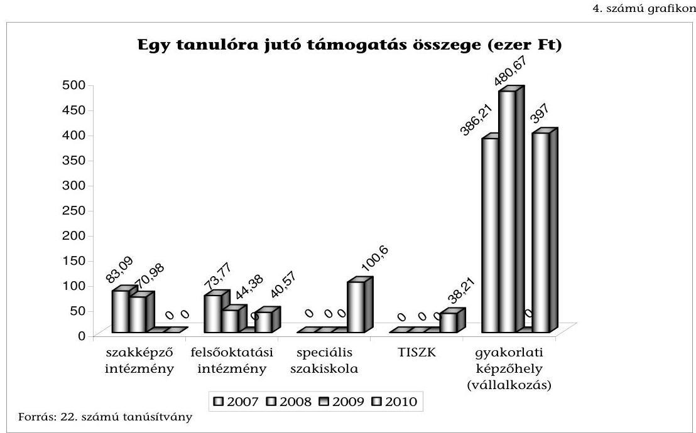

A decentralizált keretből megvalósult beszerzések összege 2007-ben 4751,6 M Ft, 2008-ban 6982,7 M Ft, 2010-ben 3264,7 M Ft volt (2009-ben nem volt szétosztható keret). Ebből 2007-ben 2214,9 M Ft (46,6\%), 2008-ban 3529,5 M Ft (50,5\%), 2010-ben 2258,8 M Ft (69,2\%) támogatást kaptak a vállalkozások a gyakorlati képzőhelyek fejlesztéséhez.

A vizsgált években a gyakorlati képzőhelyek (vállalkozások) közül kizárólag a KKV-nak minősülők juthattak decentralizált keretből nyújtott forráshoz. 2010-ben (korábbi évekre nincs adat) a (kis- és) középvállalkozások ${ }^{30} 611,9 \mathrm{M}$ Ft (27\%), a kisvállalkozások 802,8 M Ft (36\%), a mikrovállalkozások 567,3 M Ft (25\%), az egyéni vállalkozások 207,2 M Ft (9\%), egyéb, részben állami, önkormányzati tulajdonú szervezetek 69,6 M Ft (3\%) pályázati támogatásban részesültek (22. számú tanúsítvány) ${ }^{31}$.

2007-2010 években a pályázati kiírások alapján csak eszközbeszerzésre nyílt lehetőség (ingatlanvásárlásra nem), a támogatásból vásárolt eszközökről nincs központi nyilvántartás (kataszter), azok az önrészt is vállaló

[^0]
[^0]:    ${ }^{30}$ A kis- és középvállalkozásokról, fejlődésük támogatásáról szóló 2004. évi XXXIV. tv. 3. §-a nem definiálja külön a középvállalkozás fogalmát, így az tartozik ebbe a körbe, amelyik KKV-nak minősül és nem felel meg a kis- és mikrovállalkozás kritériumainak.
    ${ }^{31}$ A tanúsítványban szereplő adatok csak tájékoztató jellegűek, tekintettel arra, hogy az elszámoltatás teljes körűen a helyszíni ellenőrzés befejezéséig nem zárult le.

---

pályázónak nem csak a birtokába, hanem tulajdonába is kerülnek. Ennek következménye, hogy a szakképzésre fordított források felhasználásának optimalizálására, vagyis az eszközök szükség szerinti képzőhelyek közötti átcsoportosítására a pályázat odaítélése után az államnak már nincs lehetősége.

Amennyiben a vállalkozás felszámolással megszűnik, a kifizetett támogatási összeg - a visszakövetelés követően, illetve ellenére - gyakorlatilag elvész. A gyakorlati képzőhelyek számára ez a támogatási rendszer kockázatot jelent annyiban, hogy ha akár tőle független okok miatt nem tudja a szerződésben vállalt kötelezettségeit teljesíteni (pl. az iskola nem tud tanulót biztosítani), akkor is időarányosan visszafizetési kötelezettsége keletkezik.

Például: Egy betéti társaság 2004-2006 között összesen 11,3 M Ft támogatást nyert el. A vállalkozás két tanuló gyakorlati képzését vállalta a 2008-2009-es tanévre együttműködési megállapodás alapján. Az NSZFI helyszíni ellenőrzése 2010-ben megállapította, hogy a gyakorlati képzésben csak egy tanuló részesült, és mivel a vállalkozó igazoltan rendelkezett tanulóval, visszafizetési kötelezettséget nem állapított meg. Jogszabályi előírás hiányában a beszerzett eszközök más képzőhelyek részére nem adhatók át, nem hasznosul megfelelően a jelentős összegű eszközbeszerzés a szakképzésben.

Sem a szakképzésért felelős miniszter, sem az RFKB-k nem vizsgálják és nem értékelik, hogy a decentralizált keret terhére teljesített fejlesztések mennyiben segítették a stratégiában kitűzött szakképzésfejlesztési célok megvalósulását. Az RFKB-k nem, illetve csak részben tettek eleget az Szht. azon előírásának ${ }^{32}$, hogy kísérjék figyelemmel a szakképzési hozzájárulás régióban történő felhasználását és értékeljék azok hatékonyságát.

Nem végzett elemzést, értékelést a Közép-magyarországi RFKB, illetve a Dél-dunántúli RFKB, valamint az Észak-alföldi RFKB. A Közép-dunántúli RFKB 20052008 évekre, Dél-alföldi RFKB 2007-2008 évekre, Észak-magyarországi RFKB, Nyugat-Dunántúli RFKB kizárólag 2008. évre készített értékelést a helyszíni ellenőrzés lezárásáig.

Az RFKB-k a jogszabály által előírt elemzési, értékelési kötelezettséget - amennyiben annak eleget tettek - nem a szakképzési hozzájárulás felhasználására, hanem kizárólag a decentralizált keretre szűkítve teljesítették. Ezen túlmenően az elemzések, értékelések nem a támogatás hasznosulásának értékelésére, hanem a decentralizált keret szétosztásával kapcsolatos tapasztalatok összegzésére terjedtek ki.

Az RFKB-k a decentralizált keretre kiírt pályázatok elbírálása során a döntéseikben nem érvényesítették, hogy a közpénzt a leghatékonyabb és leggazdaságosabb módon hasznosítsák a szakképzésfejlesztési célok megvalósítására, a beszerzett eszközök minél több tanuló tanulmányát segítsék és ehhez a szükséges műszaki színvonalú

[^0]
[^0]:    ${ }^{32}$ Szht. 13. § (2) bek. i) pont

---

és árú ${ }^{33}$ eszközt szerezzék be, a pályázatok elbírálására kialakított eljárási rend előírja annak értékelését, hogy a megvásárolt eszköz miként szolgálja a szakképzést és hogy az igényelt eszközre kért támogatás arányban áll-e a piaci értékkel.

A vizsgálat során szúrópróbaszerűen kiválasztott pályázati anyagokból több példa mutatja, hogy a pályázat útján elnyert források közül voltak, amelyek vállalkozásfejlesztési célokat szolgáltak, amelyet esetenként még a pályázatokban is rögzítettek, és voltak olyanok, amelyekre akkor is adtak támogatást, ha az eszköz beszerzésének szükségességét a pályázó nem indokolta.

Az RFKB-k több esetben a szakképzési céllal nehezen összeegyeztethető, gazdaságosnak nem minősíthető eszközbeszerzéshez nyújtottak támogatást, pl.: 4 M Ft -ot 4 db bútorlapból készült asztal, tálaló és 26 db szék beszerzésére, 3,5 M Ft-ot 1 db kávéfőző gép beszerzésére (szakács és pincér tanulók képzéséhez), 3,4 M Ft-ot utánfutós hegesztő berendezés beszerzésére (villanyszerelők képzéséhez), 860 E Ft-ot 1 db notebook beszerzésre (villamossági műszerész képzéséhez).

Egy esetben a támogatási összeg felhasználója pályázatában leírta, hogy nemcsak a szakképzés céljainak megvalósulása érdekében használná a támogatásból megvásárolt eszközeit, hanem azok a gazdasági társaság érdekkörébe tartozó célt is szolgálnának, illetve volt olyan sikeres pályázat is, amiben nem is indokolták az eszköz beszerzésének szükségességét ( 1 db 575 E Ft értékű notebook beszerzést szakács tanulók képzéséhez).

A pénzügyi felhasználás szabályszerűségének, az eszközök meglétének ellenőrzése az NSZFI feladata. Ellenőrzései keretében vizsgálja, hogy a támogatott rendelkezik-e érvényes tanulószerződésekkel, ezáltal az eszköz a szakképzést segíti-e. Az ellenőrzések nem térnek
 ki azonban az RFKB-k döntéseinek felülvizsgálatára sem tartalmában, sem összegszerűségében. Az NSZFI nem jogosult olyan ellenőrzés elvégzésére, amely során vizsgálhatná a benyújtott számlák alapján a gazdasági esemény valódiságát, vagyis azt, hogy a beszerzés úgy és abban az összegben történt-e meg, ahogy azt a számviteli bizonylatok mutatják. A támogatások felhasználásának célszerűségét, eredményességét és hatékonyságát az NSZFI egyáltalán nem, szabályszerűségét is csak részlegesen tudja ellenőrizni. Az NSZFI által e területen végzett vizsgálatok nem tártak fel jelentősebb számú szabálytalanságot. A 2008-ban és 2010-ben lefolytatott 74 db , illetve 72 db ellenőrzés egyetlen jogosulatlan elszámolást sem tárt fel, a 2009-ben ellenőrzött 128 szerződésből 5 db elszámolást kifogásolt 17 M Ft összegben (23. számú tanúsítványok).

Az NSZFI a decentralizált keret terhére nyújtott támogatások felhasználását első körben a szerződés szerinti „végbeszámoló" benyújtásakor ellenőrzi. Ennek keretében dokumentumok alapján vizsgálja, hogy valóban a pályázatban szereplő eszközöket szerezték-e be, a számla eleget tesz-e a formai követelményeknek ${ }^{34}$ és ellenőrzi továbbá az eszköz állományba, illetve használatba vételének megtörténtét. Az NSZFI az éves ellenőrzési tervének összeállítása során végzett kockázatbecslés eredményeként végez további ellenőrzéseket.

[^0]
[^0]:    ${ }^{33}$ A vállalkozások nem alanyai a közbeszerzési törvénynek, így a pályázaton elnyert közpénz felhasználása során nincs árverseny.
    ${ }^{34}$ A számvitelről szóló 2000. évi C. tv. 167. §-a

---

Az NSZFI által végrehajtott ellenőrzések aránya a vizsgált években csökkent, 2007-ben a központilag megkötött szerződések 69\%-át, a támogatási összeg $84 \%$-át, a döntés RFKB-k hatáskörébe való áthelyezését követően (2008-tól) pedig a szerződések 6-13\%-át, a támogatási összeg 7-23\%-át ellenőrizte.

Budapest, 2012. január 3.

Melléklet: 6 db
Függelék: 4 db
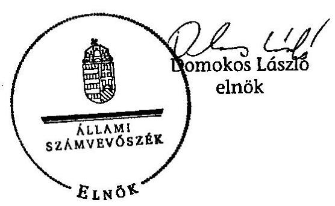

---

# MELLÉKLETEK 

a V-2022-093/2011. sz. jelentéshez

---

# ÉSZREVÉTELEK ÉS AZOKRA ADOTT VÁLASZOK 

a V-2022-093/2011. sz. jelentéshez

---

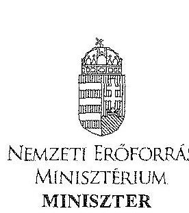

1/2. számú melléklet

ÁLLAMI SZÁMVEVŐSZÉK

12034/

Érkezett: 2011 DEC 05

Iktatószám: 8090-5/2011/ELL

Ügyintéző: Bánkné Simon Judit (54-430)

2011. 12. 07.

Domokos László úr
elnök

Állami Számvevőszék

Budapest
Apáczai Csere János u. 10.
1052

Tárgy: a szakképzési hozzájárulás felhasználása célszerűségének ellenőrzéséről készített jelentés tervezet véleményezése

Tisztelt Elnök Úr!

A szakképzési hozzájárulás felhasználása célszerűségének ellenőrzéséről készített számvevőszéki jelentés tervezethez az alábbi észrevételt teszem.

1) Összegző megállapítások, következtetések, javaslatok 12 oldal 2. bekezdés:

A bekezdésben az Oktatási Hivatal tekintetében olyan megállapítás szerepel, amely nem ide tartozó, továbbá félrevezető. Aki a jelentést olvassa, az azt értheti, hogy minden tekintetben az Oktatási Hivatal az oktatásért felelős miniszter rendelkezési jogkörébe tartozó keret kedvezményezettje.

Az Oktatási Hivatal tekintetében megfogalmazott következtetés nem teljesen helytálló, mert a közoktatásról szóló 1993. évi LXXIX. törvény 8. § (4) és (7) bekezdése szerint a középfokú nevelés-oktatás szakaszaiban az iskolai rendszerű szakképzésre való felkészülésnek is fontos szerepe van, amelyben a szakmai kompetenciák fejlesztése és a személyes kompetenciák fejlesztése - ide értve a „kulcs” kompetenciákat is - egyaránt fontosak a szakmai képzés során, tehát nincs szorosan elhatárolva a szakképzés-fejlesztés céljaitól.

2) Részletes megállapítások 61. oldal 24. sz. táblázat

A táblázat címében a „nem szakképzésre” kifizetett pénzeszközök nem megfelelő megjelölés, ezért javasolom lecserélni a „szakképzéssel összefüggő feladatok” címre.

---

A nemzeti erőforrás miniszter oktatásért való felelőssége körében felelős az iskolai rendszerű oktatás irányításáért, beleértve a közoktatást, a felsőoktatást és az iskolai nevelés-oktatás szakképesítés megszerzésére felkészítő szakaszát, amely a szakképesítések megszerzésének alapjául szolgál. Így nem elhanyagolható a szakképzéssel összefüggő feladatellátásban történő részvétele.

Nem elhanyagolható az a tény sem, hogy az iskolai rendszerű szakképzés a közoktatás része, ennek megfelelően a közoktatásról szóló törvényben meghatározott ágazati irányítási feladatok nem változnak. A jelenleg hatályos közoktatásról szóló 1993. évi LXXIX. törvény szerint a szakképző iskolák (szakiskolák, szakközépiskolák, speciális szakiskolák) továbbra is a törvényben meghatározott irányítási rend szerint működnek. A szakképzési évfolyamoknál az irányítás megoszlik; a szakképző intézmény, mint iskola a közoktatás része, a tartalmi kérdések rendezése pedig a szakképzésről szóló törvény szerint történik, amelyből jól látható, hogy a szakképzési feladatok ellátása tekintetében továbbra is két miniszter hatásköre érvényesül.

A fentiekben leírtak szerint tehát a közoktatás állapotának, helyzetének változása direkt, vagy indirekt módon befolyásolja a szakképzés egészének területét, amely ilyenformán a szakképzés fejlesztésére is hatással van.

A szakképzés tehát a magyar középfokú iskolai rendszer integráns része, a szakképzés intézményrendszerének, valamint szakmai irányításának szétválása miatti problémák kezelése mindennapi feladata az oktatásért felelős tárcának. A fentieket is figyelembe véve, álláspontunk szerint az MPA Képzési alaprész feletti rendelkezési jog megilleti az oktatásért felelős minisztert is, hiszen annak érdekében tevékenykedik, hogy a szakképző évfolyamokra kerülő kiskorú tanulók megfelelő kulcskompetenciákkal rendelkezzenek a választott szakma elsajátításához.
3) Részletes megállapítások 63. oldal 25. sz. táblázat:

A 25. sz. táblázat nem koherens a forrásként felhasznált 20. számú tanúsítvánnyal.
2009-ben az MPA képzési alaprész oktatásért felelős miniszter keretét teljes egészében zárolták, csak áthúzódó kötelezettségek voltak 399,9 millió Ft értékben, így a pályáztatás 138 millió Ft összege nem beazonosítható.

A 2007. évi, a 2008. évi és a 2010. évre kiszámított összegek értelmezése sem egyértelmű, ezért indokoltnak tartom - a 20. számú tanúsítványra való hivatkozással - a táblázat részletesebb kidolgozását.
4) Részletes megállapítások 62. oldal első bekezdés

Nem értek egyet azzal az állítással, hogy „a Nemzeti Tehetség Program keretében biztosított források elsősorban működési célú kiadások finanszírozását biztosították".

A szakképzési hozzájárulásról és a képzés fejlesztésének támogatásáról szóló 2003. évi LXXXVI. törvény 10. § (3) bekezdés 1) pontjában foglalt felhatalmazás alapján a Munkaerőpiaci Alap képzési alaprészének oktatásért felelős miniszter rendelkezési jogkörébe tartozó része felhasználható volt a Nemzeti Tehetség Programban meghatározott célok megvalósítására.

---

A forrás terhére biztosította a Program az Országos Szakmai Tanulmányi Versenyek (évente kb. 50 verseny) lebonyolítását a szakközépiskolák és szakiskolák tanulói (évente több mint 4000 tanuló) számára, lehetőséget biztosított az őket oktató-nevelő pedagógusok tevékenységének ösztönzésére, elismerésére, támogatta a fiatal szakmunkások WorldSkills versenyen való részvételét.

A szakközépiskolában tanuló tehetséges diákok számára a Szakmacsoportos szakmai előkészítő érettségi tantárgyi verseny lehetőséget biztosít a különböző képességterületeken szerzett tudásuk összemérésére és a bemutatkozásra. A szakközépiskolában tanuló tehetséges diákok számára az ilyen versenyeken való részvétel lehetősége szakmai előmenetelüket is nagyban segíti.

Kérem Elnök Urat, hogy a jelentés véglegezésekor az észrevételeimet figyelembe venni szíveskedjenek.

Budapest, 2011. december 5.
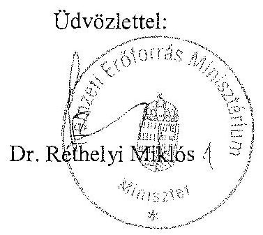

---

# Dr. Réthelyi Miklós úr 

miniszter
Nemzeti Erőforrás Minisztérium

## Budapest

## Tisztelt Miniszter Úr!

Köszönettel megkaptam a szakképzési hozzájárulás felhasználása célszerűségének ellenőrzéséről készített jelentés-tervezetünkre tett észrevételét, amelyekre vonatkozóan az alábbiakban tájékoztatom.

1. Az összegző megállapítások, következtetések, javaslatok 12. oldal 2. bekezdéséhez tett azon észrevételét, mely szerint az Oktatási Hivatal tekintetében a megállapítás nem ide tartozó, illetve félrevezető, nem tartom megalapozottnak. Az ÁSZ ellenőrzése a szakképzési hozzájárulás felhasználása célszerűségének értékelésére irányult. A járulék egy része feletti rendelkezési jog az oktatásért felelős minisztert illeti meg és a pénzügyi forrás döntő részét az irányítása alá tartozó Oktatási Hivatal használta fel. Ellenőrzésünk ezért kiterjedt a Hivatal által történő felhasználás értékelésére is. Megállapításunk arra vonatkozott, hogy a keret terhére megkötendő támogatási szerződések előterjesztései szerint az átadandó összeg a Hivatalnak a költségvetésből nem teljes körűen finanszírozott feladatai pénzügyi forrásaihoz járult hozzá, nem pedig arra, hogy az oktatási miniszter rendelkezési jogkörébe tartozó keretének teljes összegét támogatási szerződéssel az Oktatási Hivatal kapta.
2. Az e ponthoz tett észrevételének második bekezdésében leírt észrevételével, mely szerint „Az Oktatási Hivatal tekintetében megfogalmazott következtetés nem teljesen helytálló,....", nem értek egyet. Észrevételét azzal indokolja, hogy a Hivatalnak a közoktatásról szóló törvény szerinti feladatai nincsenek szorosan elhatárolva a szakképzés-fejlesztés céljaitól. Ezzel azonban az ÁSZ-nak éppen azt az álláspontját támasztja alá, mely szerint a Hivatal törvényi feladatai a szakképzés-fejlesztés céljaival nem hozhatók közvetlen összefüggésbe.

---

3. A részletes megállapítások 61. oldal 24. sz. táblázathoz tett észrevétele alapján a táblázat címét - összhangban a jelentés-tervezet I. Összegző megállapítások, következtetések, javaslatok rész 5. bekezdésében megfogalmazottakkal - a következők szerint pontosítom: „A központi keretből 2003-tól bevezetett jogcímeken nem szakképzés-fejlesztési célok megvalósítására, illetve működési kiadásokra fordított pénzügyi források alakulása".
4. A részletes megállapítások 63. oldal 25. sz. táblázatához tett észrevétele alapján a mellékleteket kiegészítettük egy új, 24. számú tanúsítvánnyal és a táblázat forrásaként ezt jelöltük meg. A 20. és 24. számú tanúsítványok adatai közötti eltérés oka, hogy az adatszolgáltató szervezetek (Nemzetgazdasági Minisztérium, Nemzeti Szakképzés Fejlesztési Intézet) az egyes évekre vonatkozó pénzügyi teljesítések adatait eltérő szemléletben adták meg. Ez azonban a táblázat adataiból levont következtetésünket nem befolyásolja.
5. A részletes megállapítások 62. oldal első bekezdéséhez tett észrevétele alapján tájékoztatom, hogy a Nemzeti Tehetség Program keretében biztosított források felhasználására vonatkozó megállapításunkat a következők szerint módosítjuk. A jelentés-tervezet 62. oldala első bekezdésének utolsó mondatát töröljük és az ezt követő felsorolás második bekezdését az alábbiakkal egészítjük ki:
„A vizsgált időszakban a Közalapítvány a programfeladatok megvalósítására kötelezettséget vállalt, tényleges kifizetést azonban csak működési kiadások jogcímen teljesített: a 3 éves időszakra kapott működési költségének $99 \%$-át már a megvalósítási időszak első évében, 2010-ben felhasználta.".

Tájékoztatom, hogy levelét és az arra adott válaszomat - kialakult gyakorlatunk szerint csatoljuk a jelentéshez.

Budapest, 2012. január

Tisztelettel:

Domokos László

---

# 1/c. számú melléklet 

## 2011.12.11

Iktatószám: NGM/24579/2/2011.
Ügyintéző: Mátyus Mihály
Domokos László úr részére
elnök

## Állami Számvevőszék

Budapest
Apáczai Csere János u. 10.
1052

## Tisztelt Elnök Úr!

A szakképzési hozzájárulás felhasználása célszerűségének ellenőrzéséről szóló Jelentés-tervezettel kapcsolatban az alábbi véleményt adjuk.

1. Az Összegző megállapítások, következtetések, javaslatok fejezet „Az ellenőrzés intézkedést igénylő megállapításai és javaslatai a nemzetgazdasági miniszternek" részéhez
a) Az 1. pontban tett javaslatban foglaltak - a saját munkavállalók képzési költségének elszámolhatósága, valamint a szakképzési hozzájárulásra kötelezettek által az iskoláknak közvetlenül nyújtható fejlesztési támogatás felfüggesztése - betarthatatlanok, ugyanis a jelenleg hatályos, a szakképzési hozzájárulásról és a képzés fejlesztésének támogatásáról szóló 2003. évi LXXXVI. törvény alapján a hozzájárulásra kötelezettek saját döntésén alapuló közvetlenül megvalósítható képzésekről, illetve átadható támogatásról van szó. Az e képzésekbe, illetve átadásokba a minisztérium részéről történő beavatkozás teljesíthetetlen.
b) A 2. pontban leírt megállapítással - a szakképzési hozzájárulási kötelezettség több mint a fele nem került be a szakképzési hozzájárulás rendszerébe - nem értünk egyet, véleményünk szerint ezt ilyen konkrétan a jelenlegi kimutatások alapján megállapítani nem lehet. Ezt egyébként a tervezet Részletes megállapítások fejezetében foglaltak is leszögezik: „nem állapítható meg a be nem vallott szakképzési hozzájárulás összege".
c) A 4. pont tekintetében - a 2005-2013 évekre vonatkozó szakképzés-fejlesztési stratégiában megfogalmazott célok általánosak - megjegyzem, hogy a megjelölt időszakra kialakított szakképzési stratégiával kapcsolatban tett észrevételeket az előző kormányok szakképzési tevékenységére tett megállapításként kezelem. A szakképzés-fejlesztési stratégia végrehajtásához szükséges intézkedésekről szóló 1057/2005. (V. 31.) Korm. határozatot egyébként a 1117/2010. (V. 12.) Korm. határozat hatályon kívül helyezte. Éppen a problémákat felismerve készült el „A szakképzési rendszer átalakítására, a gazdasági igényekkel való összehangolására vonatkozó koncepcióról" szóló 1198/2011. (VI. 17.) Korm. határozat, amely a szakképzésre irányuló rövid- és hosszú távú koncepciót tartalmazza, az ennek alapján készült szakképzésről szóló törvényjavaslatot az Országgyűlés jelenleg tárgyalja.

---

d) A 7. ponttal - az ellenőrzést végző szervezetek végezzenek ár-érték, illetve teljesítmény-ráfordítás típusú ellenőrzéseket is - összefüggésben tájékoztatom, hogy javaslataikat a most elfogadott szakképzési hozzájárulásról szóló törvény támogatásokat szabályozó - végrehajtási rendeletébe fogjuk beépíteni, azaz jogszabályi szinten kívánjuk biztosítani, hogy megvalósuljon a teljesítmény-ráfordítás típusú támogatás megítélés és ellenőrzés.
e) A 8. pontban foglalt megállapítással - az NSZFI-nek nincs jogosultsága a pályakövetési rendszer adatbázisának feltöltéséhez szükséges adatok bekérésére kapcsolatban tájékoztatom, hogy az NSZFI-nek olyan értelemben van jogosultsága a szükséges adatok beszerzésére, hogy az önkéntes adatszolgáltatás alapján beérkező adatokat gyűjti. A javaslat tárgyában - a miniszter tegyen intézkedést annak érdekében, hogy az NSZFI alkalmas legyen a pályakövetés informatikai rendszerének működtetésére - tájékoztatom, a szakképzésről szóló törvényjavaslat tartalmazza a pályakövetéssel összefüggésben gyűjtendő adatokra és azok kezelésére vonatkozó alapvető szabályokat. A részletszabályok kormányrendeletben kerülnek rögzítésre.
f) A 9. pontban megfogalmazottakkal - a kamaráknak a közfeladataik végzéséhez kapcsolódóan a központi költségvetésből lenne szükséges forrást biztosítani, nem pedig a Munkaerőpiaci Alap Képzési alaprészéből - összefüggésben tájékoztatom, hogy az MKIK számára 2012-ben a közfeladatai végzéséhez tervezésre került fejezeti előirányzat a költségvetési törvényben, azonban a jelenlegi költségvetési helyzet miatt ez az összeg egyelőre nem elegendő az MKIK törvényben előírt szakképzési feladatellátásához. Így e feladatellátás egyelőre nem nélkülözheti a Nemzeti Foglalkoztatási Alap (korábban Munkaerőpiaci Alap) Képzési alaprészéből történő finanszírozást.

# 2. A Részletes megállapítások részhez 

Álláspontunk szerint a - Parlament számára beterjesztésre került - szakképzésről szóló törvénytervezet az ellenőrzés részletes megállapításaiban tett negatív észrevételekre is megoldást nyújt, így különösen a regionális fejlesztési és képzési bizottságok átalakítására, az iskolai rendszerű szakképzésben oktatható szakképzési szakmaszerkezetre és tanulói létszámokra, az MKIK szakképzési feladatellátásának szabályozására vonatkozóan.

Tájékoztatom Elnök Urat, hogy a Parlament elfogadta és a Magyar Közlöny 2011. november 25-én megjelent 139. számában kihirdetésre került a szakképzési hozzájárulásról és a képzés fejlesztésének támogatásáról szóló 2011. évi CLV. törvény, amelyben foglalt szabályozás a Jelentés-tervezet 1., 2., 3., 5. és 6. pontjában tett észrevételeknek és javaslatoknak maradéktalanul eleget tesz. Ezen túlmenően a leírtak alapján úgy gondolom, hogy a javaslatokban foglalt intézkedések megtörténtek, illetve a jogalkotás terén folyamatban vannak.

Kérem észrevételeink elfogadását.

Budapest, 2011.12.13
Üdvözlettel:
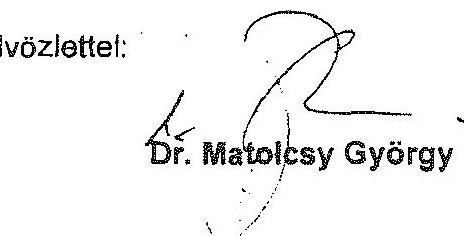

---

# Dr. Matolcsy György úr 

miniszter
Nemzetgazdasági Minisztérium

## Budapest

## Tisztelt Miniszter Úr!

Köszönettel megkaptam 2011. december 13-án kelt, a szakképzési hozzájárulás felhasználása célszerűségének ellenőrzéséről szóló jelentés-tervezetünkre tett észrevételeit, melyekkel kapcsolatosan az alábbiak szerint tájékoztatom.

1. Az 1. számú javaslathoz tett észrevételével összefüggésben tájékoztatom, hogy annak megvalósítása a szakképzési hozzájárulásra kötelezettek által az iskoláknak nyújtható fejlesztési támogatások költségeinek, valamint a saját munkavállalók képzési költségeinek elszámolhatósága tekintetében okafogyottá vált, ezért azt a javaslatunkban már nem szerepeltetjük. A szakképzési hozzájárulásról és a képzés fejlesztésének támogatásáról szóló új, 2011. évi CLV. törvény 2012. január 1-i hatályba lépésével ugyanis megvalósul a 3. számú javaslatunknak e jogcímekre vonatkozó része.

Javaslatunkat továbbra is fenntartjuk a szakképzési hozzájárulásból az MPA-ba befolyó összeg esetében, tekintettel arra, hogy az új törvény 21. § (1) bekezdése továbbra is lehetőséget biztosít a támogatások egy részének működési költségként történő elszámolására. Fentiekre tekintettel az 1. és a 3. számú javaslatunkat a következők szerint módosítjuk:

1. számú megállapítás és javaslat:

A szakképzési hozzájárulás felhasználása nem hatékony és nem eredményes, ami a szabályozásban - beleértve a tervezési, beszámoltatási és ellenőrzési rendszerek szabályozottságát -, valamint az ellenőrzések végrehajtásában rejlő hiányosságokra vezethető vissza.

---

# Javaslat 

Tegyen intézkedést annak érdekében, hogy a Nemzeti Foglalkoztatási Alap (korábban Munkaerőpiaci Alap) képzési alaprészéből nyújtott jövőbeli támogatások kifizetése a jelentés közzétételétől számított 30 napon belül felfüggesztésre kerüljön a szakképzési hozzájárulásról és a képzés fejlesztésének támogatásáról szóló törvény - jelentés 3. számú javaslata szerinti - módosításának hatályba lépéséig.
3. számú megállapítás és javaslat:

Nem biztosított, hogy a szakképzési hozzájárulásból az MPA-ba befolyt bevételt kizárólag a szakképzés-fejlesztésre megfogalmazott célok megvalósítására használják fel. A vizsgált években az MPA képzési alaprészből a két szakminiszter a rendelkezésükre álló keret több mint 90%-át nem pályáztatás útján, hanem egyedi döntés alapján osztotta szét.

Javaslat
Kezdeményezze a Kormánynál a szakképzési hozzájárulásról és a képzés fejlesztésének támogatásáról szóló törvény módosítását annak érdekében, hogy a szakképzési hozzájárulásból az MPA-ba befolyt teljes összeg kizárólag szakképzés-fejlesztéssel összefüggő célokra legyen felhasználható, illetve visszaigényelhető, továbbá hogy a szakképzés fejlesztését célzó támogatásokat pályázati eljárások eredményeként lehessen nyújtani, valamint dolgozza ki és törvényben szabályozza a kivételes miniszteri döntések meghozatalának garanciális feltételeit.
2. A 2. számú javaslathoz tett észrevétele nem értelmezhető. Megállapításunk szerint a költségelszámolás lehetőségének biztosításával a pénzügyi forrásnak a vizsgált időszak minden évében több mint a fele nem került be az állami költségvetés rendszerébe és nem ahogy ezt Ön írja - a szakképzési hozzájárulás rendszerébe. E megállapításra alapozva javasoltuk a törvény módosítását annak érdekében, hogy a szakképzési hozzájárulás költégelszámolási lehetősége megszűnjön, és a járulékot a kötelezettek pénzben megfizessék.
3. A 4., 7., 8., 9. javaslathoz, valamint a részletes megállapítások részhez írt tájékoztatását köszönöm. Az ezekkel kapcsolatban leírtak a megtett és a tervezett intézkedéseket mutatják be, azok a jelentés módosítását nem igénylik.

Tájékoztatom, hogy levelét és az arra adott válaszomat - kialakult gyakorlatunk szerint csatoljuk a jelentéshez.

Budapest, 2012. január
Tisztelettel:

Domokos László

---

# Gyakorlati képzési költségek elszámolási és ellenőrzési folyamatának
 főbb szakaszai és a résztvevő intézmények 

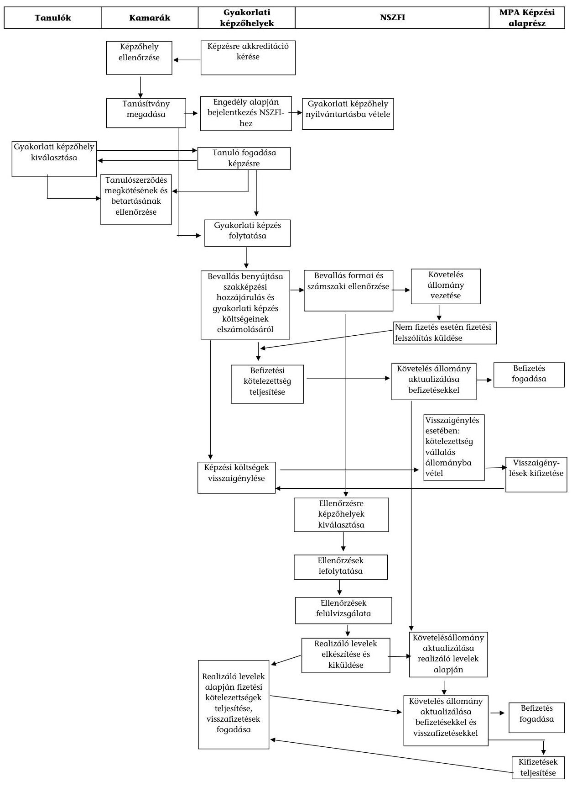

---

3. számú melléklet

A fejlesztési támogatás biztosításának, felhasználásának, ellenőrzésének főbb munkafolyamatai

|  Gazdálkodó szervezet | TISZK | TISZK keretében működő
szakképző intézmény | Fenntartó, társulás, non-profit
gazdasági társaság, szakképzés
szervezési társ. | Speciális szakiskola, Közszolgáltató szakiskola,
Felsőoktatási intézmény | NSZFI | NAV  |
| --- | --- | --- | --- | --- | --- | --- |
|  Támogatási megállapodás
megkötése | Támogatási megállapodás
megkötése |  |  | Támogatási megállapítás
megkötése |  |   |
|   | Továbbalási megállapodás
megkötése | Továbbalási megállapodás
megkötése | Fejlesztési támogatási
megállapodás megkötése |  |  |   |
|   | Nyilvántartásba vétel |  |  |  |  |   |
|  Fejlesztési támogatás
teljesítése pénzben | Továbbítás | Fejlesztési támogatás fogadása,
nyilvántartása |  | Fejlesztési támogatás
fogadása, nyilvántartása |  |   |
|  Fejlesztési támogatás
teljesítése eszközben |  | Eszköz
bevonás | Felhasználás | Eszköz
gondozás |  |   |
|   |  | Nyilvántartásba
vétel | Költségelszámolás | Nyilvántartásba
vétel | Költségelszámolás |   |
|   |  | Eszközök használatba
vétel |  | Eszközök használatba
vétel |  |   |
|   | Adatszolgáltatás | Adatszolgáltatás |  | Adatszolgáltatás |  |   |
|  |   |   |   |   |   |   |
|  |   |   |   |   |   |   |
|  |   |   |   |   |   |   |
|  |   |   |   |   |   |   |
|  |   |   |   |   |   |   |
|  |   |   |   |   |   |   |
|  |   |   |   |   |   |   |
|  |   |   |   |   |   |   |
|  |   |   |   |   |   |   |
|  |   |   |   |   |   |   |
|  |   |   |   |   |   |   |
|  |   |   |   |   |   |   |
|  |   |   |   |   |   |   |
|  |   |   |   |   |   |   |
|  |   |   |   |   |   |   |
|  |   |   |   |   |   |   |
|  |   |   |   |   |   |   |
|  |   |   |   |   |   |   |
|  |   |   |   |   |   |   |
|  |   |   |   |   |   |   |
|  |   |   |   |   |   |   |
|  |   |   |   |   |   |   |
|  |   |   |   |   |   |   |
|  |   |   |   |   |   |   |
|  |   |   |   |   |   |   |
|  |   |   |   |   |   |   |


---

# Saját munkavállaló képzésének elszámolási és ellenőrzési folyamata

|  Gazdálkodó szervezet | Munkavállaló | Felnőtt oktatási intézmény | Állami foglalkoztatási szerv
(Kormányhivatal munkatípusi szerv) | NSZFI | NAV  |
| --- | --- | --- | --- | --- | --- |
|  Felnőttképzési szerződés | Felnőttképzési szerződés |  |  |  |   |
|  Tanulmányi szerződés | Tanulmányi szerződés |  |  |  |   |
|  Munkáltató kötelezése | Munkáltató kötelezése |  |  |  |   |
|  Szolgáltatási szerződés | Szolgáltatási szerződés |  |  |  |   |
|  Pénzügyi teljesítés | Számlázás |  |  |  |   |
|  Bizonyítási megőrzés a bevalláshoz kapcsolódóan: 10 évig | Akkreditációs tanúsítvány |  |  |  |   |
|   | Felnőttképzési szerződés (nem akkreditált képzéssel) képzési program, (akkreditált képzéssel) program |  |  |  |   |
|   | akkreditációs tanúsítvány |  |  |  |   |
|   | előadása |  |  |  |   |
|  Belső képzéssel belső kapacitások igénybevételének elszámolása képzésenként belső elkülönített számlán és bizonylaton tényleges önköltségen | Képzés |  |  |  |   |
|   | El nem válás a munkáltatóval pl.: önstudium |  |  |  |   |
|  Adatszolgáltatás tárgyhót követő második hó 25. napjáig |  |  |  |  |   |
|   |  |  |  |  | Adatszolgáltatás ellenőrzése (60 nap)  |
|   |  |  |  |  | Végleges nyilvántartás  |
|   |  |  |  |  | Adatszolgáltatás  |
|   |  |  |  |  | Adatfeljegyzés  |
|  |   |   |   |   |   |
|  |   |   |   |   |   |
|  |   |   |   |   |   |
|  |   |   |   |   |   |
|  |   |   |   |   |   |
|  |   |   |   |   |   |
|  |   |   |   |   |   |
|  |   |   |   |   |   |
|  |   |   |   |   |   |
|  |   |   |   |   |   |
|  |   |   |   |   |   |
|  |   |   |   |   |   |
|  |   |   |   |   |   |
|  |   |   |   |   |   |
|  |   |   |   |   |   |
|  |   |   |   |   |   |
|  |   |   |   |   |   |
|  |   |   |   |   |   |
|  |   |   |   |   |   |
|  |   |   |   |   |   |
|  |   |   |   |   |   |
|  |   |   |   |   |   |
|  |   |   |   |   |   |
|  |   |   |   |   |   |
|  |   |   |   |   |   |
|  |   |   |   |   |   |
|  |   |   |   |   |   |
|  |   |   |   |   |   |
|  |   |   |   |   |   |
|  |   |   |   |   |   |


---

# Kintlévőségek behajtási folyamata az NSZFI-nél

|  Elszámolásra
kötelezett | NSZFI | MPA Képzési alaprész | NSZFI által megbízott
ügyvédi iroda | NAV  |
| --- | --- | --- | --- | --- |
|  |   |   |   |   |

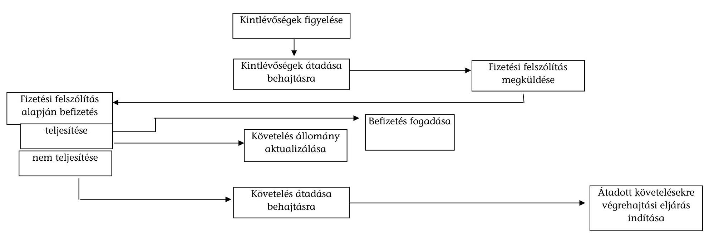

---

# Tanúsítványok jegyzéke 

| Sorszám: | Megnevezés |
| :--: | :--: |
| 1. sz. | az NSZFI-hez bevallást benyújtók szakképzési hozzájárulási kötelezettségének alakulásáról országos összesen (2007-2010.) |
| 2. sz. | a szakképzési hozzájárulás adatainak alakulásáról országos összesen (2007-2010.) |
| $3 / a-3 / b . s z$. | a Munkaerő-piaci Alap egyes bevételeinek alakulásáról (bevételi jogcímek, kiadási jogcímek 2007-2010.) |
| $4 / a-4 / c . s z$. | a tanulók és iskolák megoszlásáról régiónként (2008, 2009, 2010) |
| $5 / a-5 / c . s z$. | az iskolák megoszlása TISZK típusonként (2008, 2009, 2010) |
| 6. sz. | a szakképzési hozzájárulás ellenőrzéseinek adatairól ellenőrzési típusonként országos összesen (2007-2010.) |
| 7. sz. | a gyakorlati képzést végzők ellenőrzésének alakulásáról és eredményességéről (2007-2010.) |
| 8. sz. | az APEH/NAV által nyilvántartott szakképzési hozzájárulásból keletkezett követelések alakulásáról (2007-2011.) |
| 9. sz. | a szakképzési hozzájárulásból keletkezett követelések értékkategóriák szerinti megoszlásáról összesen (2007.12.31-2010.12.31.) |
| 10/a-10/d. sz. | 12.31-én fennálló követelések értékkategóriák szerinti megoszlásáról összesen (2007-2010.) |
| 11. sz. | gyakorlati képző helyek számára kiadott tanúsítványok adatai országos összesen, Magyar Agrárkamara (2007-2010.) |
| 12. sz. | tanulószerződések adatai országos összesen, Magyar Agrárkamara (2007-2010.) |
| 13. sz. | gyakorlati képző helyek számára kiadott tanúsítványok adatai országos összesen, Magyar Kereskedelmi és Iparkamara (2007-2010.) |
| 14. sz. | tanulószerződések adatai országos összesen, Magyar Kereskedelmi és Iparkamara (2007-2010.) |
| 15/a-15/d. sz. | a fejlesztési támogatások megoszlásáról (2007, 2008, 2009, 2010) |
| 16/a-16/d. sz. | a fejlesztési támogatások felhasználásának megoszlásáról $(2007,2008,2009,2010)$ |

---

| $17 / a-17 /$ d. sz. | a fejlesztési támogatások ellenőrzéséről (2007, 2008, 2009, <br> 2010) |
| :--: | :-- |
| 18. sz. | a fejlesztési támogatáshoz kapcsolódó realizáló levelek, perek számának alakulásáról (2007-2010.) |
| 19. sz. | a szakképzési hozzájárulási kötelezettség terhére elszámolt <br> képzések főbb adatai (2007-2010.) |
| 20. sz. | a Munkaerőpiaci Alap képzési alaprészének felhasználásá- <br> ról (tényleges kifizetések, 2007-2010.) |
| 21. sz. | a 2007-2010 időszakra vonatkozó oktatási miniszter rendel- <br> kezési jogkörébe tartozó és központi keret terhére adott tá- <br> mogatások ellenőrzései (2007-2010.) |
| 22. sz. | a Munkaerőpiaci Alap Képzési Alaprész decentralizált kerete <br> terhére megkötött támogatási szerződések megvalósulása <br> projekt szemlélet alapján (2010) |
| 23/a-23/d. sz. | az MPA Képzési Alaprész decentralizált kerete terhére nyúj- <br> tott támogatások ellenőrzéséről (2007-2010.) |
| 24. sz. | A Munkaerőpiaci Alap képzési alaprészének központi kerete <br> terhére egyedi döntés és pályázatokalapján nyújtott támo- <br> gatások kifizetése (2007-2010.) |

---

# Tanúsítvány

## az NSZFI-hez bevallást benyújtók szakképzési hozzájárulási kötelezettségének alakulásáról

### Országos összesen

|  Megnevezés |  | 2007 | 2008 | 2009 | 2010  |
| --- | --- | --- | --- | --- | --- |
|  Szakképzési hozzájárulás alapja | M Ft | 924 526 810 | 991 956 901 | 1 064 722 381 | 1 052 729 167  |
|  Szakképzési hozzájárulásra kötelezettek száma | db | 3 605 | 4 405 | 5 000 | 5 369  |
|  Bruttó hozzájárulási kötelezettség összege | M Ft | 14 048 832 | 15 193 216 | 16 213 240 | 16 165 702  |
|  Gyakorlati képzésre elszámolt összeg | M Ft | 10 058 266 | 11 277 469 | 14 620 987 | 17 337 699  |
|  Gyakorlati képzésre költséget elszámoltak száma | db | 3 497 | 4 262 | 4 932 | 5 267  |
|  Fejlesztési támogatásra felhasznált összeg | M Ft | 3 341 494 | 3 534 220 | 3 442 948 | 3 280 433  |
|  Fejlesztési támogatást nyújtók száma | db | 387 | 387 | 336 | 311  |
|  Saját alkalmazott képzésére fordított összeg | M Ft | 2 663 690 | 2 721 710 | 2 939 760 | 2 559 625  |
|  Saját alkalmazott képzésére költséget elszámoltak száma | db | 419 | 431 | 426 | 383  |
|  Egyéb kötelezettséget csökkenő tételek összege | M Ft | 1 883 224 | 2 065 523 | 1 654 837 | 1 426 407  |
|  Egyéb kötelezettséget csökkenő tételeket elszámolók száma | db | 279 | 240 | 241 | 203  |
|  Visszaigénylés összege | M Ft | 5 890 018 | 7 469 008 | 10 481 908 | 12 787 995  |
|  Visszaigénylést benyújtók száma | db | 2 624 | 3 395 | 4 054 | 4 470  |
|  Befizetési kötelezettség összege | M Ft | 3 228 680 | 3 096 913 | 4 202 397 | 4 253 895  |
|  MPA-ba átutalt összeg | M Ft |  |  |  |   |

Fenti adatok hitelességét igazolom. Kitöltésért felelős neve, telefonszáma: Pósa Józsefné, 4345-745

Kelt: Budapest, 2011. május 05.

P.H.

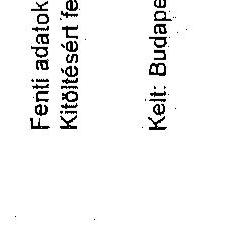

---

# Tanúsítvány a szakképzési hozzájárulás adatainak alakulásáról* országos összesen

|  Megnevezés | 2007 |  | 2008 |  | 2009 |  | 2010* |   |
| --- | --- | --- | --- | --- | --- | --- | --- | --- |
|   | Összeg
M Ft | Sort kitöltők
száma (db) | Összeg
M Ft | Sort kitöltők
száma (db) | Összeg
M Ft | Sort kitöltők
száma (db) | Összeg
M Ft | Sort kitöltők
száma (db)  |
|  Szakképzési hozzájárulás alapja | 3 222 123 | 272 354 | 3 567 364 | 281 235 | 3 555 793 | 280 203 | 3 547 659 | 260 104  |
|  Szakképzési hozzájárulás mértéke (bruttó kötelezettség) | 48 354 | 264 843 | 53 510 | 277 856 | 53 334 | 279 157 | 53 213 | 248 113  |
|  Felhasználható kötelezettségcsökkentés összege | 34 956 | 264 838 | 37 147 | 277 843 | 34 521 | 279 157 | 31 932 | 248 113  |
|  Felhasználható kötelezettségcsökkentő tételek összege | 17 473 | 15 087 | 15 840 | 19 558 | 14 024 | 14 463 | 14 290 | 17 483  |
|  Saját dolgozó képzésére fordított összeg | 4 813 | 6 154 | 5 619 | 9 204 | 5 753 | 7 191 | 4 741 | 9 444  |
|  Tárgyévben átutalt fejlesztési támogatások összege | 12 688 | 13 297 | 10 221 | 12 955 | 8 237 | 8 513 | 9 549 | 10 146  |
|  Nettó kötelezettség összege | 34 093 | 255 915 | 38 070 | 277 227 | 39 802 | 270 168 | 38 922 | 248 106  |
|  Munkaerőpiaci Alapba befizetett összeg | 33 598 | 255 915 | 38 858 | 277 227 | 39 615 | 270 168 | 42 701 | 248 106  |

*Feltolgozási időpontnak megfelelő állapot

**01 bevallás alapján készült statisztika

Fenti adatok hitelességét igazolom.

Kelt: Budapest, 2011. 04. 11.

---

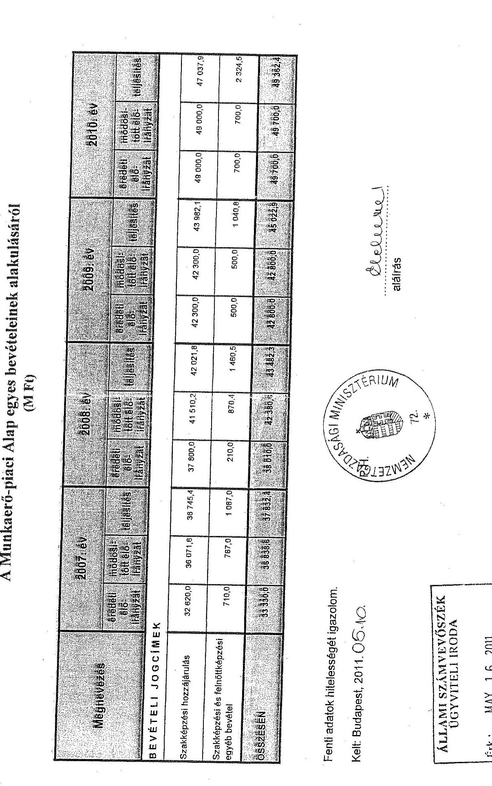

# A Munkaerő-piaci Alap egyes bevételeinek alakulásáról (M Ft)

|  Megnevezés | 2007. év | 2008. év | 2009. év | 2010. év  |
| --- | --- | --- | --- | --- |
|   | 478000
Kč
179000
179000 | 478000
Kč
179000
179000 | 478000
Kč
179000
179000 | 478000
Kč
179000
179000  |
|  BEVÉTELI JOGCÍMEK |  |  |  |   |
|  Szakképzési hozzájárulás | 32 820,0 | 36 671,8 | 35 745,4 | 37 800,0  |
|  Szakképzési és felnőttképzési egyéb bevétel | 710,0 | 767,0 | 1 087,0 | 210,0  |
|  Összesen | 33 334,5 | 36 818,5 | 37 812,5 | 38 818,5  |

Fenti adatok hitelességét igazolom.

Kelt: Budapest, 2011. 05. 10.

ÁLLAMI SZÁMVEVŐSZÉK ÜGYVÍTELI IRODA

Érk.: MAY 16 2011

17. 05. 2011

---

# Tanúsítvány

## A Munkaerő-piaci Alap egyes kiadásainak alakulásáról (M Ft)

|  Megnevezés | 2007: 89 | 2008: 87 | 2009: 89 | 2010: 89  |
| --- | --- | --- | --- | --- |
|   |  |  |  | 2010: 89  |
|  Kiadási jogcímek |  |  |  |   |
|  Szakképzési és felnőttképzési célú kifizetések | 25 717,3 | 26 147,4 | 25 251,5 | 33 027,7  |
|  Alkalmazkodóképesség EU-s (ársfinanszírozása 2. | 5 430,4 | 5 430,4 | 5 430,4 | 2 800,0  |
|  Összesen | 31 187,7 | 31 877,8 | 30 881,7 | 34 837,4  |

Fenti adatok hitelességét igazolom.

Kelt: Budapest, 2011. 05.10.

ÁLLAMI SZÁMVEVŐSZÉK ÜGYVITELI IRODA

Érk.: MAY 16 2011

Iktatószám: U-2022-026 2011

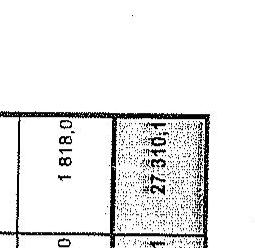

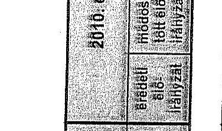

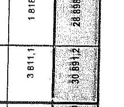

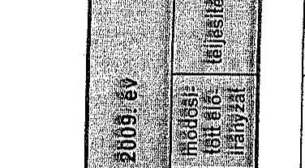

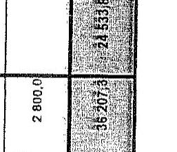

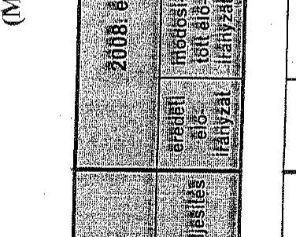

---

4/a. számú tanúsítvány

Tanúsítvány a tanulók és iskolák megoszlásáról régiónként 2008.

|  Régió | Országos adatok (KIR alapján) |  |  | TISZK adatok |  |  | TISZK arányszámok |  |   |
| --- | --- | --- | --- | --- | --- | --- | --- | --- | --- |
|   | Tanulók (fő) | Iskolák (db) | Száma (db) | Tanulók száma a TISZK székhelye szerint (fb) | Iskolák száma a TISZK székhelye szerint (db) | Iskolák száma az iskola székhelye szerint (fb) | Tanulók aránya KIR adatokhoz viszonyítva (%) | Iskolák aránya (TISZK székhelye szerint) KIR adatokhoz viszonyítva (%) | Iskolák aránya (TISZK székhelye szerint) KIR adatokhoz viszonyítva (%)  |
|  Dél-alföldi régió | 52643 | 117 | 7 | 49148 | 60 | 75 | 93,4 | 51,3 | 64,1  |
|  Dél-dunántúli régió | 35040 | 92 | 7 | 26917 | 44 | 48 | 76,8 | 47,8 | 52,1  |
|  Észak-alföldi régió | 59605 | 139 | 6 | 43338 | 75 | 88 | 72,7 | 53,9 | 63,3  |
|  Észak-magyarországi régió | 47228 | 119 | 9 | 25650 | 81 | 45 | 54,7 | 68,6 | 38,1  |
|  Közép-dunántúli régió | 43129 | 124 | 12 | 30328 | 68 | 68 | 70,3 | 54,8 | 54,8  |
|  Közép-magyarországi régió | 98136 | 265 | 20 | 70217 | 145 | 154 | 71,6 | 54,7 | 58,1  |
|  Nyugat-dunántúli régió | 37975 | 101 | 7 | 30830 | 81 | 77 | 61,2 | 60,2 | 76,2  |
|  Összesen | 373756 | 956 | 68 | 276628 | 554 | 555 | 74 | 57,9 | 68,1  |

Ferő adatok hőelességét igazolom. Kitőlőként hőelőző neve, telefonszáma: Baskiné Lipka Gabriella 431-8548 Kelt: Budapest, 2011.ápolis 20.

P.H.

F. Vagy László főigazgató

---

4/b. számú tanúsítvány

|  |   |   |   |   |   |   |   |   |   |   |
| --- | --- | --- | --- | --- | --- | --- | --- | --- | --- | --- |
|  |   |   |   |   |   |   |   |   |   |   |
|  Tanúsítvány a tanulók és iskolák megoszlásáról régiónként 2009. |  |  |  |  |  |  |  |  |  |   |
|  |   |   |   |   |   |   |   |   |   |   |
|  |   |   |   |   |   |   |   |   |   |   |
|  |   |   |   |   |   |   |   |   |   |   |
|  |   |   |   |   |   |   |   |   |   |   |
|  |   |   |   |   |   |   |   |   |   |   |
|  |   |   |   |   |   |   |   |   |   |   |
|  |   |   |   |   |   |   |   |   |   |   |
|  |   |   |   |   |   |   |   |   |   |   |
|  |   |   |   |   |   |   |   |   |   |   |
|  |   |   |   |   |   |   |   |   |   |   |
|  |   |   |   |   |   |   |   |   |   |   |
|  |   |   |   |   |   |   |   |   |   |   |
|  |   |   |   |   |   |   |   |   |   |   |
|  |   |   |   |   |   |   |   |   |   |   |
|  |   |   |   |   |   |   |   |   |   |   |
|  |   |   |   |   |   |   |   |   |   |   |
|  |   |   |   |   |   |   |   |   |   |   |
|  |   |   |   |   |   |   |   |   |   |   |
|  |   |   |   |   |   |   |   |   |   |   |
|  |   |   |   |   |   |   |   |   |   |   |
|  |   |   |   |   |   |   |   |   |   |   |
|  |   |   |   |   |   |   |   |   |   |   |
|  |   |   |   |   |   |   |   |   |   |   |
|  |   |   |   |   |   |   |   |   |   |   |
|  |   |   |   |   |   |   |   |   |   |   |
|  |   |   |   |   |   |   |   |   |   |   |
|  |   |   |   |   |   |   |   |   |   |   |
|  |   |   |   |   |   |   |   |   |   |   |
|  |   |   |   |   |   |   |   |   |   |   |
|  |   |   |   |   |   |   |   |   |   |   |
|  |   |   |   |   |   |   |   |   |   |   |


---

4/c. számú tanúsítvány

|  Régió | Országos adatok (KIR alapján) |  | TISZK adatok |  |  | TISZK arányszámok |  |  |  |   |
| --- | --- | --- | --- | --- | --- | --- | --- | --- | --- | --- |
|   | Tanulók (db) | Iskolák (db) | TISZK adatok |  | Iskolák száma a TISZK székhelye szerint (db) | Iskolák száma az iskola székhelye szerint (db) | Tanulók aránya (db) | Iskolák aránya (db) | TISZK aránya (db) | Iskolák aránya (db)  |
|  Dél-alföldi régió | 54324 | 107 | 52194 | 76 | 52194 | 91 | 96,1 | 71 | 71 | 80  |
|  Dél-dunántúli régió | 35236 | 76 | 29113 | 44 | 29113 | 48 | 82,6 | 57,9 | 57,9 | 63,2  |
|  Észak-alföldi régió | 62719 | 151 | 53994 | 92 | 53994 | 105 | 86,1 | 60,1 | 60,1 | 69,5  |
|  Észak-magyarországi régió | 50295 | 123 | 52852 | 135 | 52852 | 99 | 105,1 | 109,8 | 109,8 | 80,9  |
|  Közép-dunántúli régió | 44811 | 118 | 39865 | 83 | 39865 | 82 | 88,9 | 70,3 | 70,3 | 69,5  |
|  Közép-magyarországi régió | 91034 | 279 | 86952 | 184 | 86952 | 193 | 95,5 | 66 | 66 | 69,2  |
|  Nyugat-dunántúli régió | 41192 | 104 | 39294 | 90 | 39294 | 86 | 95,4 | 86,6 | 86,6 | 82,7  |
|  Összesen | 379601 | 958 | 354262 | 704 | 354262 | 704 | 93,3 | 73,4 | 73,4 | 73,4  |

Fenti adatok hitelességét igazolom. Kötőjeles felelős neve, telefonszáma: Basáné Lipka Gabriella 431-6548 Kelt: Budapest, 2011. április 20.

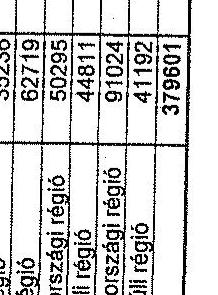

Nagy László Készítő

---

# **Chemistry**

## **Chemical Reactions**

### **Balancing Chemical Equations**

1. **Write the unbalanced equation:**
   - Example: $$C_3H_8 + O_2 \rightarrow CO_2 + H_2O$$

2. **Balance the equation:**
   - Example: $$2C_3H_8 + 7O_2 \rightarrow 6CO_2 + 8H_2O$$

3. **Balance the equation:**
   - Example: $$2C_3H_8 + 7O_2 \rightarrow 6CO_2 + 8H_2O$$

### **Types of Reactions**

1. **Combination Reaction:**
   - Example: $$2H_2 + O_2 \rightarrow 2H_2O$$

2. **Decomposition Reaction:**
   - Example: $$2H_2O_2 \rightarrow 2H_2O + O_2$$

3. **Single Displacement Reaction:**
   - Example: $$Zn + 2HCl \rightarrow ZnCl_2 + H_2$$

4. **Double Displacement Reaction:**
   - Example: $$AgNO_3 + NaCl \rightarrow AgCl + NaNO_3$$

5. **Combustion Reaction:**
   - Example: $$CH_4 + 2O_2 \rightarrow CO_2 + 2H_2O$$

## **Stoichiometry**

### **Mole Concept**

- **Mole (mol):** The amount of substance containing as many particles (atoms, molecules, ions) as there are atoms in exactly 12 grams of carbon-12.
- **Avogadro's Number:** $$6.022 \times 10^{23}$$ particles per mole.

### **Molar Mass**

- **Molar Mass:** The mass of one mole of a substance.
- Example: The molar mass of water ($$H_2O$$) is 18.015 g/mol.

### **Calculations**

1. **Moles to Mass:**
   - Formula: $$n = \frac{m}{M}$$
   - Example: Calculate the number of moles of $$H_2O$$ in 18 grams of water.
     - $$n = \frac{18.015 \, \text{g}}{18.015 \, \text{g/mol}} = 18.015 \, \text{g/mol}$$

2. **Moles to Mass:**
   - Formula: $$m = n \times M$$
   - Example: Calculate the mass of 18.015 g of water.
     - $$m = 18.015 \, \text{g/mol} = 18.015 \, \text{g/mol}$$

## **Gas Laws**

### **Ideal Gas Law**

- **Equation:** $$PV = nRT$$
- **Variables:**
  - $$P$$: Pressure (atm)
  - $$V$$: Volume (L)
  - $$n$$: Number of moles (mol)
  - $$R$$: Ideal gas constant (0.0821 L·atm/mol·K)
  - $$T$$: Temperature (K)

### **Boyle's Law**

- **Equation:** $$P_1V_1 = P_2V_2$$
- **Variables:**
  - P₁: Pressure (atm)
  - P₂: Volume (L)
  - P₃: Pressure (atm)
  - P₁: Pressure (atm)
  - P₂: Volume (L)
  - P₃: Pressure (atm)
  - P₁: Pressure (atm)

### **Boyle's Law (Boyle's Law)**

- **Equation:** $$\frac{P_1V_1}{P_2V_2} = \frac{P_1}{V_1}$$

## **Thermochemistry**

### **Enthalpy (H)**

- **Definition:** The heat content of a system at constant pressure.
- **Equation:** $$\Delta H = q_p$$
- **Variables:**
  - $$q_p$$: Heat transferred at constant pressure.
  - $$q_p$$: Heat transferred at constant pressure.

### **Hess's Law**

- **Statement:** The enthalpy change for a reaction is the same whether it occurs in one step or multiple steps.
- **Equation:** $$\Delta H = q_p + \Delta H_0$$
- **Variables:**
  - $$q_p$$: Heat transferred at constant pressure.
  - $$q_p$$: Heat transferred at constant pressure.

## **Electrochemistry**

### **Oxidation and Reduction**

- **Oxidation:** Loss of electrons.
- **Reduction:** Gain of electrons.

### **Galvanic Cells**

- **Definition:** A cell that converts chemical energy into electrical energy.
- **Components:**
  - Anode: Oxidation occurs.
  - Cathode: Reduction occurs.
  - Salt Bridge: Connects the two half-cells.

### **Nernst Equation**

- **Equation:** $$E = E^\circ - \frac{RT}{nF} \ln Q$$
- **Variables:**
  - $$E$$: Energy (K)
  - $$E^\circ$$: Heat transferred (J)
  - $$E$$: Heat transferred (J)
  - $$Q$$: Reaction quotient

---

# Tanúsítvány az iskolák megoszlása TISZK típusonként 2008.

|  Régió | Kiemelten közhasznú gazd. társ formában működő TISZK (db) | Iskolák száma (db) | Nonprofit gazd. társ formában működő TISZK (db) | Iskolák száma (db) | Társulási formában működő TISZK (db) | Iskolák száma (db) | Egy fenntartós TISZK (db) | Iskolák száma (db)  |
| --- | --- | --- | --- | --- | --- | --- | --- | --- |
|   |  |  |  |  |  | Évfolyam-szélválasztós | Tagintézményes (holland típusú) | Évfolyam-szélválasztós (holland típusú)  |
|  Dél-alföldi régió | 3 | 50 | 0 | 0 | 0 | 3 | 0 | 10  |
|  Dél-dunántúli régió | 2 | 19 | 0 | 0 | 2 | 23 | 2 | 2  |
|  Észak -alföldi régió | 1 | 20 | 1 | 2 | 4 | 53 | 0 | 0  |
|  Észak-magyarországi régió | 5 | 55 | 0 | 0 | 1 | 17 | 3 | 9  |
|  Közép-dunántúli régió | 3 | 21 | 2 | 12 | 5 | 36 | 2 | 2  |
|  Közép-magyarországi régió | 4 | 49 | 2 | 20 | 1 | 6 | 12 | 67  |
|  Nyugat-dunántúli régió | 4 | 41 | 0 | 0 | 2 | 20 | 1 | 20  |
|  Összesen | 22 | 255 | 5 | 32 | 15 | 164 | 19 | 109  |

Fenti adatok hitelességét igazolom.

Kitöltését felelős neve, telefonszáma: Beskíné Lipka Gabriella 431-6548

Kelt: Budapest, 2011. április 20.

P.H.

Mogy László: Tölgysegítő

---

5/b. számú tanúsítvány

|  Régió | Kiemelten | Iskolák | Nonprofit gazd. | Iskolák | Társulási | Iskolák | Egy fenntartós TISZK (db) | Iskolák száma (db)  |
| --- | --- | --- | --- | --- | --- | --- | --- | --- |
|   | társ. formában | száma (db) | társ. formában | száma (db) | formában | száma (db) | társulási |   |
|   | működő TISZK |  |  |  |  |  | társulási |   |
|   | (db) |  |  |  |  |  | társulási |   |
|   |  |  |  |  |  |  | társulási |   |
|   |  |  |  |  |  |  | társulási |   |
|   |  |  |  |  |  |  | társulási |   |
|   |  |  |  |  |  |  | társulási |   |
|   |  |  |  |  |  |  | társulási |   |
|   |  |  |  |  |  |  | társulási |   |
|   |  |  |  |  |  |  | társulási |   |
|   |  |  |  |  |  |  | társulási |   |
|   |  |  |  |  |  |  | társulási |   |
|   |  |  |  |  |  |  | társulási |   |
|   |  |  |  |  |  |  | társulási |   |
|   |  |  |  |  |  |  | társulási |   |
|   |  |  |  |  |  |  | társulási |   |
|   |  |  |  |  |  |  | társulási |   |
|   |  |  |  |  |  |  | társulási |   |
|   |  |  |  |  |  |  | társulási |   |
|   |  |  |  |  |  |  | társulási |   |
|   |  |  |  |  |  |  | társulási |   |
|   |  |  |  |  |  |  | társulási |   |
|   |  |  |  |  |  |  | társulási |   |
|   |  |  |  |  |  |  | társulási |   |
|   |  |  |  |  |  |  | társulási |   |
|   |  |  |  |  |  |  | társulási |   |
|   |  |  |  |  |  |  | társulási |   |
|   |  |  |  |  |  |  | társulási |   |
|   |  |  |  |  |  |  | társulási |   |
|   |  |  |  |  |  |  | társulási |   |
|   |  |  |  |  |  |  | társulási |   |
|   |  |  |  |  |  |  | társulási |   |
|   |  |  |  |  |  |  | társulási |   |
|   |  |  |  |  |  |  | társulási |   |
|   |  |  |  |  |  |  | társulási |   |
|   |

---

5/c. számú tanúsítvány

Tanúsítvány az iskolák megoszlása TISZK típusonként 2010.

|  Régió | Kiemelten közhasznú gazd. társ.formában működő TISZK (db) | Iskolák száma (db) | Nonprofit gazd. társ.formában működő TISZK (db) | Iskolák száma (db) | Társulási formában működő TISZK (db) | Iskolák száma (db) | Egy fenntartós TISZK (db) | Iskolák száma (db)  |
| --- | --- | --- | --- | --- | --- | --- | --- | --- |
|   |  |  |  |  |  |  | Évfolyam- szétválasztós | Tagintézményes (holland típusú)  |
|  Dél-alföldi régió | 4 | 60 |  |  | 1 | 6 | 3 |   |
|  Dél-dunántúli régió | 2 | 19 |  |  | 2 | 23 |  | 2  |
|  Észak-alföldi régió | 2 | 37 | 1 | 2 | 4 | 53 |  |   |
|  Észak-magyarországi régió | 8 | 69 |  |  | 4 | 57 | 3 |   |
|  Közép-dunántúli régió | 4 | 29 | 2 | 12 | 6 | 40 |  | 2  |
|  Közép-magyarországi régió | 8 | 83 | 3 | 25 | 1 | 6 | 12 | 3  |
|  Nyugat-dunántúli régió | 5 | 50 |  |  | 2 | 20 | 1 |   |
|  Összesen | 33 | 347 | 6 | 39 | 20 | 205 | 19 | 7  |

Fenti adatok hitelességét igazolom. Kötetlevél felelős neve, telefonszáma: Baskiné Lipka Gabriella 431-8548 Kelt: Budapest, 2011. április 20.

P.H.

Nagy László: Tiszaigazgató

Nagy László: Tiszaigazgató

---

## Tanúsítvány a szakképzési hozzájárulás ellenőrzéseinek adatairól ellenőrzési típusonként országos összesen

|  ÉV** | Ellenőrzési típusa* | Ellenőrzélt kötelezettek száma (db)*** | Megállapítással érintett kötelezettek száma (db) | Feltárt nettó adókülönbözet (eFt) összesen | Átlagos vizsgálattal érintett időszak (nap/vizsgálat)  |
| --- | --- | --- | --- | --- | --- |
|  2007 | Bevallások utólagos ellenőrzése | 17 483 | 9 519 | 75 621 011 | 449 967  |
|   | Egyes adókötelezettségek ellenőrzése | 40 995 | 2 196 | 0 | 0  |
|   | Adatgyűjtésre irányuló ellenőrzések | 37 900 | 11 446 | 0 | 0  |
|   | Ismételt ellenőrzések | 148 | 132 | 2 832 740 | 575  |
|   | Felülellenőrzések | 53 | 30 | 1 408 054 | 0  |
|  2008 | Bevallások utólagos ellenőrzése | 20 968 | 10 934 | 122 040 558 | 614 087  |
|   | Egyes adókötelezettségek ellenőrzése | 50 030 | 2 889 | 0 | 0  |
|   | Adatgyűjtésre irányuló ellenőrzések | 39 797 | 12 196 | 0 | 0  |
|   | Ismételt ellenőrzések | 144 | 132 | 879 304 | 74  |
|   | Felülellenőrzések | 106 | 56 | 3 491 930 | 838  |
|  2009 | Bevallások utólagos ellenőrzése | 24 059 | 13 966 | 201 934 120 | 516 640  |
|   | Egyes adókötelezettségek ellenőrzése | 50 342 | 2 715 | 0 | 0  |
|   | Adatgyűjtésre irányuló ellenőrzések | 36 419 | 8 073 | 0 | 0  |
|   | Ismételt ellenőrzések | 639 | 545 | -9 731 572 | -252  |
|   | Felülellenőrzések | 200 | 113 | 3 870 634 | 13 255  |
|  2010 | Bevallások utólagos ellenőrzése | 30 145 | 18 892 | 292 506 541 | 664 373  |
|   | Egyes adókötelezettségek ellenőrzése | 40 457 | 1 891 | 0 | 0  |
|   | Adatgyűjtésre irányuló ellenőrzések | 31 804 | 6 928 | 0 | 0  |
|   | Ismételt ellenőrzések | 454 | 374 | -1 615 031 | 130  |
|   | Felülellenőrzések | 182 | 87 | 5 027 928 | 0  |

- Kérjük, írja be az ellenőrzési típusakult megnevezését.

* Jogerőse éve (kivétel egyes adókötelezettség illetve adatgyűjtésre irányuló ellenőrzés, ahol a határozat nélkül befejezett nemleges vizsgálatok esetén a jegyzőkönyv átadás éve)

*** Megbízott vizsgálatok nélkül

Fenti adatok hitelességét igazolom.

Kelt: Budapest, 2011. 03/1

nem biztos, hogy az adott évet érinti, ha több vizsgált időszak volt.

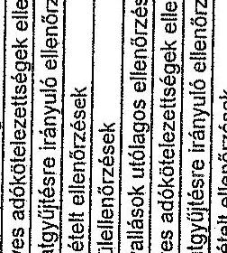

2011. 03/1

aláírás

---

Tanúsítvány a gyakorlati képzést végzők ellenőrzésének alakulásáról és eredményességéről

|   | 2007 | 2008 | 2009 | 2010  |
| --- | --- | --- | --- | --- |
|  Összes adatok: |  |  |  |   |
|  Bevallást benyújtók száma (db) | 3605 | 4405 | 5000 | 5369  |
|  Bevallott kötelezettség (E Ft) | 14048832 | 15193216 | 16213240 | 16165702  |
|  Visszaigényelt összeg (E Ft) | 5890018 | 7469008 | 10481908 | 12787995  |
|  Ebből: |  |  |  |   |
|  Ellenőrzött szervezetek száma (db) | 20 | 101 | 100 | 1  |
|  Ellenőrzéssel érintett kötelezettség (E Ft) | 9587 | 851648 | 7351740 | 519  |
|  Ellenőrzéssel érintett visszaigényelt összeg (E Ft) | 1121174 | 596230 | 3885514 | 19983  |
|  Megállapított kötelezettség növekedés (E Ft) | 5151 | 16966 | 46018 | 29  |
|  - ebből észrevételezési eljárást követően előírt (E Ft) | 5151 | 2848 | 37307 | 29  |
|  Megállapított kötelezettség csökkenés (E Ft) | 0 | 12337 | 12364 | 5  |
|  - ebből észrevételezési eljárást követően előírt (E Ft) | 0 | 2753 | 11267 | 5  |
|  Saját ellenőrökkel végzett ellenőrzések esetében: |  |  |  |   |
|  Ellenőrzött szervezetek száma (db) | 20 | 1 | 4 | 1  |
|  Ellenőrzéssel érintett kötelezettség (E Ft) | 9587 | 516 | 3168 | 519  |
|  Ellenőrzéssel érintett visszaigényelt összeg (E Ft) | 1121174 | 13884 | 357089 | 19983  |
|  Megállapított kötelezettség növekedés (E Ft) | 5151 | 3501 | 0 | 29  |
|  Megállapított kötelezettség csökkentés (E Ft) | 0 | 0 | 0 | 5  |
|  Ellenőrzés költségei (E Ft) | 4412 | 241 | 853 | 226  |
|  Külső ellenőrökkel végzett ellenőrzések esetében: |  |  |  |   |
|  Ellenőrzött szervezetek száma (db) | 0 | 100 | 96 | 0  |
|  Ellenőrzéssel érintett kötelezettség (E Ft) | 0 | 851132 | 7348572 | 0  |
|  Ellenőrzéssel érintett visszaigényelt összeg (E Ft) | 0 | 582346 | 3528425 | 0  |
|  Megállapított kötelezettség növekedés (E Ft) | 0 | 13465 | 46018 | 0  |
|  Megállapított kötelezettség csökkenés (E Ft) | 0 | 12337 | 12364 | 0  |
|  Ellenőrzés költségei (E Ft) | 0 | 9612 | 18482 | 0  |

Fenti adatok hitelességét igazolom. Kitöltésért felelős neve,telefonszáma: Balás Dénes 431-6560 Kelt: Budapest, 2011. augusztus 05.

---

## 8. számú tanúsítvány

|  Megnevezés | 2007 | 2008 | 2009 | 2010 | 2011  |
| --- | --- | --- | --- | --- | --- |
|   | Összeg (E Ft-ban) | Évek száma (db) | Összeg (E Ft-ban) | Évek száma (db) | Összeg (E Ft-ban)  |
|  Nyitó követelésállomány összesen (január 1.) | 4 282 740 | 124 930 | 4 673 343 | 117 582 | 5 355 343  |
|  ebből: |  |  |  |  |   |
|  perkésztés alatt álló követelés | 5 238 | 49 | 16 933 | 66 | 8 521  |
|  behajthatatlan követelés | 76 854 | 3 307 | 181 258 | 6 067 | 119 760  |
|  egyéb fennálló követelés | 4 208 648 | 121 574 | 4 555 154 | 111 449 | 5 227 062  |
|  Követelésállomány változása összesen | 380 603 | -7 348 | 682 000 | 8 660 | 1 314 250  |
|  ebből: |  |  |  |  |   |
|  perkésztés alatt álló követelés | 11 695 | 17 | -8 412 | -38 | 41 045  |
|  behajthatatlan követelés | 22 402 | 2 760 | 18 924 | 4 277 | 237 278  |
|  egyéb fennálló követelés | 346 506 | -10 125 | 671 908 | 4 421 | 1 035 927  |
|  elévülés címén törölő követelés | -65 848 | 5 678 | -115 890 | 8 403 | -142 671  |
|  Záró követelésállomány összesen (december 31.) | 4 673 343 | 117 582 | 5 355 343 | 120 242 | 6 609 993  |

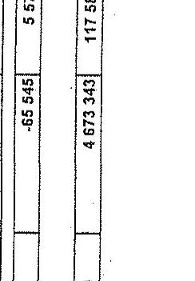

Fenti adatok hitelességét igazolom.

Kelt: Budapest, 2011.06.18

---

# Tanúsítvány

## a szakképzési hozzájárulásból keletkezett követelések* értékkategóriák szerinti megoszlásáról összesen

|  Értékkategóriák (Ft) |  | 2007.12.31 |  | 2008.12.31 |  | 2009.12.31 |  | 2010.12.31 |   |
| --- | --- | --- | --- | --- | --- | --- | --- | --- | --- |
|   |  | db | összeg (E Ft) | db | összeg (E Ft) | db | összeg (E Ft) | db | összeg (E Ft)  |
|  0 | 500 000 | 110 445 | 2 954 038 | 114 669 | 3 322 519 | 120 323 | 3 776 895 | 123 002 | 4 135 985  |
|  500 001 | 1 500 001 | 767 | 620 146 | 921 | 736 017 | 1 133 | 912 483 | 1 303 | 1 051 455 |
| 1 500 001 | 5 000 000 | 200 | 497 612 | 227 | 547 091 | 298 | 736 171 | 307 | 766 689 |
| 5 000 001 | 10 000 000 | 20 | 145 449 | 30 | 204 508 | 35 | 242 777 | 34 | 219 444 |
| 10 000 001 | 50 000 000 | 17 | 337 909 | 22 | 350 804 | 24 | 416 438 | 22 | 397 920 |
| 50 000 001 | 100 000 000 | 0 | 0 | 1 | 66 123 | 3 | 178 225 | 2 | 127 964 |
| 100 000 001 | | 0 | 0 | 0 | 0 | 0 | 0 | 1 | 101 394 |
| Összesen: | | 111 449 | 4 555 154 | 115 870 | 5 227 062 | 121 816 | 6 262 989 | 124 671 | 6 800 851 |

- az adatok nem tartalmazzák a nem behajtható követeléseket (peresítés alatt álló és a behajthatatlanná nyilvánított követeléseket)

Fenti adatok hitelességét igazolom.

Kelt: Budapest, 2011. 04. 28.

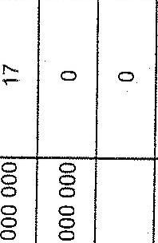

aláírás

---

# Tanúsítvány

12.31-én fennálló követelések értékkategóriák szerinti megoszlásáról összesen

| Értékkategóriák (Ft) | | 2007 | | 2008 | | 2009 | | 2010 | |
| --- | --- | --- | --- | --- | --- | --- | --- | --- | --- |
| | | db | összeg (E Ft) | db | összeg (E Ft) | db | összeg (E Ft) | db | összeg (E Ft) |
| 0 | - | 500 000 | 127 | 22 998 | 136 | 27 384 | 126 | 30 549 | 146 |
| 500 001 | - | 1 500 001 | 117 | 124 224 | 131 | 129 441 | 67 | 60 321 | 149 |
| 1 500 001 | - | 5 000 000 | 405 | 1 237 151 | 295 | 958 191 | 52 | 154 146 | 163 |
| 5 000 001 | - | 10 000 000 | 169 | 1 374 300 | 183 | 1 406 190 | 26 | 191 790 | 63 |
| 10 000 001 | - | 50 000 000 | 75 | 1 574 233 | 88 | 1 896 390 | 38 | 911 450 | 48 |
| 50 000 001 | - | 100 000 000 | 17 | 1 298 297 | 16 | 1 221 022 | 14 | 1 092 085 | 9 |
| 100 000 001 | - | | 31 | 11 244 789 | 47 | 17 539 326 | 35 | 13 977 294 | 27 |
| Összesen: | | | 941 | 16 875 992 | 896 | 23 177 944 | 358 | 16 417 635 | 605 |

Fenti adatok hitelességét igazolom. Kitöltésért felelős neve, telefonszáma: Lukács Anita 4345-733 Kelt: Budapest, 2011. április 21.

P.H.

Nagy László főigazgató

---

# Tanúsítvány

12.31-én a szakképző iskolákkal szemben fennálló követelések értékkategóriák szerinti megoszlásáról

| Értékkategóriák (Ft) | | 2007 | | 2008 | | 2009 | | 2010 | |
| --- | --- | --- | --- | --- | --- | --- | --- | --- | --- |
| | | db | összeg (E Ft) | db | összeg (E Ft) | db | összeg (E Ft) | db | összeg (E Ft) |
| 0 | - | 500 000 | 56 | 9 197 | 21 | 6 885 | 47 | 16 069 | 35 |
| 500 001 | - | 1 500 001 | 20 | 24 174 | 55 | 50 312 | 25 | 20 886 | 90 |
| 1 500 001 | - | 5 000 000 | 275 | 848 840 | 189 | 639 366 | 10 | 29 885 | 91 |
| 5 000 001 | - | 10 000 000 | 139 | 1 156 762 | 153 | 1 208 534 | 7 | 54 447 | 40 |
| 10 000 001 | - | 50 000 000 | 43 | 680 270 | 40 | 691 276 | 12 | 240 587 | 31 |
| 50 000 001 | - | 100 000 000 | 2 | 160 000 | 0 | 0 | 2 | 179 425 | 3 |
| 100 000 001 | - | | 1 | 250 000 | 0 | 0 | 1 | 399 231 | 2 |
| Összesen: | | | 536 | 3 129 243 | 458 | 2 596 373 | 104 | 940 530 | 292 |

Fenti adatok hitelességét igazolom. Kitöltésért felelős neve, telefonszáma: Lukács Anita 4345-733 Kelt: Budapest, 2011. április 21.

P.H.

Magy László főigazgató

---

# Tanúsítvány

12.31-én a gyakorlati képzést végző gazdálkodókkal szemben fennálló követelések értékkategóriák szerinti megoszlásáról

| Értékkategóriák (Ft) | | 2007 | | 2008 | | 2009 | | 2010 | |
| --- | --- | --- | --- | --- | --- | --- | --- | --- | --- |
| | | db | összeg (E Ft) | db | összeg (E Ft) | db | összeg (E Ft) | db | összeg (E Ft) |
| 0 | - | 500 000 | 70 | 13 301 | 101 | 17 622 | 71 | 13 682 | 110 |
| 500 001 | - | 1 500 001 | 93 | 96 697 | 73 | 76 455 | 38 | 35 819 | 57 |
| 1 500 001 | - | 5 000 000 | 124 | 368 598 | 98 | 293 115 | 35 | 105 368 | 72 |
| 5 000 001 | - | 10 000 000 | 25 | 175 538 | 25 | 166 656 | 15 | 107 455 | 17 |
| 10 000 001 | - | 50 000 000 | 10 | 194 665 | 11 | 186 246 | 5 | 86 719 | 5 |
| 50 000 001 | - | 100 000 000 | 0 | 0 | 0 | 0 | 1 | 87 360 | 1 |
| 100 000 001 | - | | 0 | 0 | 0 | 0 | 0 | 0 | 0 |
| Összesen: | | | 322 | 848 799 | 308 | 740 094 | 165 | 436 403 | 262 |

Fenti adatok hitelességét igazolom. Kitöltésért felelős neve, telefonszáma: Lukács Anita 4345-733 Kelt: Budapest, 2011. április 21.

P.H.

Magy László főigazgató

---

# Tanúsítvány

12.31-én egyedi, illetve egyéb támogatottal szemben fennálló követelések értékkategóriák szerinti megoszlásáról

| Értékkategóriák (Ft) | | | 2007 | | 2008 | | 2009 | | 2010 | |
| --- | --- | --- | --- | --- | --- | --- | --- | --- | --- | --- |
| | | | db | összeg (E Ft) | db | összeg (E Ft) | db | összeg (E Ft) | db | összeg (E Ft) |
| 0 | - | 500 000 | 1 | 500 | 14 | 2 877 | 8 | 798 | 1 | 2 295 |
| 500 001 | - | 1 500 001 | 4 | 3 353 | 3 | 2 674 | 4 | 3 616 | 2 | 1 548 |
| 1 500 001 | - | 5 000 000 | 6 | 19 713 | 8 | 25 710 | 7 | 18 893 | 0 | 0 |
| 5 000 001 | - | 10 000 000 | 5 | 42 000 | 5 | 31 000 | 4 | 29 888 | 6 | 46 666 |
| 10 000 001 | - | 50 000 000 | 22 | 699 298 | 37 | 1 018 868 | 21 | 584 144 | 12 | 333 662 |
| 50 000 001 | - | 100 000 000 | 15 | 1 138 297 | 16 | 1 221 022 | 11 | 825 300 | 5 | 202 093 |
| 100 000 001 | - | | 30 | 10 994 789 | 47 | 17 539 326 | 34 | 13 578 063 | 25 | 11 375 297 |
| Összesen: | | | 83 | 12 897 950 | 130 | 19 841 477 | 89 | 15 040 702 | 51 | 11 961 561 |

Fenti adatok hitelességét igazolom. Kitöltésért felelős neve, telefonszáma: Lukács Anita 4345-733 Kelt: Budapest, 2011. április 21.

P.H.

Nagy László főigazgató

---

# 11. számú tanúsítvány

## Tanúsítvány

Gyakorlati képző helyek számára kiadott tanúsítványok adatai országos összesen

| Megnevezés | 2007 | 2008 | 2009 | 2010 |
| --- | --- | --- | --- | --- | |
|  Január 1-én nyilvántartott tanúsítványok száma (db) | 55 | 70 | 210 | 298  |
|  Kiadott tanúsítványok száma (db) | 19 | 101 | 103 | 165  |
|  Visszaadott tanúsítványok száma (db) | 0 | 0 | 0 | 11  |
|  A kamara által visszavont tanúsítványok száma (db) | 0 | 0 | 1 | 54  |
|  December 31-én nyilvántartott tanúsítványok száma | 8 | 153 | 229 | 281  |
|  Összes ellenőrzések száma | 430 | 421 | 397 | 445  |
|  Ebből: |  |  |  |   |
|  A tanúsítvány kiadását követően ellenőrzött gyakorlati képző helyek száma (db) | 91 | 67 | 52 | 59  |
|  Hiányosságot feltárt ellenőrzések száma (db) | 8 | 6 | 1 | 5  |

Fenti adatok hitelességét igazolom.

Kelt: Budapest, 2011. április 14.

P.H.

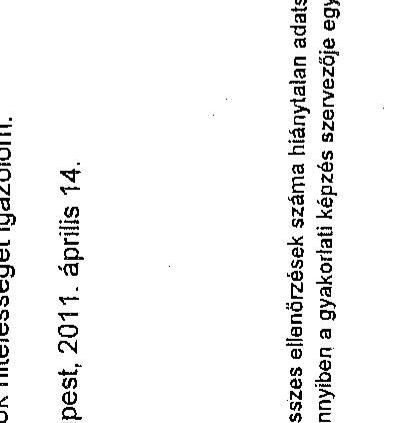

Meg: Az összes ellenőrzések száma hiánytalan adatsorból származik, a többi hiányos, mert a tanúsítványok kiadása a tanulószerződésekhez kötődik, amennyiben a gyakorlati képzés szervezője egyben visszaigénylő is kíván lenni.

---

# Tanúsítvány

## Tanulószerződések adatai országos összes

|  Megnevezés | 2007 | 2008 | 2009 | 2010  |
| --- | --- | --- | --- | --- |
|  Január 1-én nyilvántartott tanulószerződések száma (db) | 190 | 443 | 550 | 510  |
|  Ebből: hiányszakmában nyilvántartott (db) | 30 | 25 | 25 | 11  |
|  Megkötött szerződések száma (db) | 539 | 553 | 543 | 565  |
|  Ebből: hiányszakmában megkötött (db) | 30 | 25 | 2 | 0  |
|  Felbontott szerződések száma (db) | 25 | 42 | 98 | 76  |
|  Ebből: hiányszakmában felbontott (db) | 0 | 0 | 1 | 0  |
|  December 31-én nyilvántartott szerződések száma | 500 | 585 | 545 | 653  |
|  Ebből: hiányszakmában nyilvántartott (db) | 0 | 0 | 0 | 0  |
|  Összes ellenőrzések száma | 489 | 477 | 422 | 371  |
|  Ebből: hiányszakmában ellenőrzött (db) | 0 | 0 | 2 | 0  |
|  Hiányosságot feltárt ellenőrzések száma (db) |  |  |  |   |
|  Ebből: hiányszakmában hiányosságot feltárt ellenőrzések száma (db) |  |  |  |   |

Fenti adatok hitelességét igazolom.

Kelt: Budapest, 2011. április 14.

P.H.

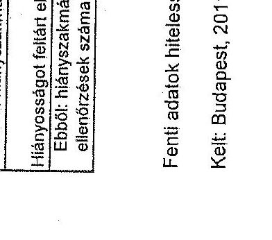

---

# 13. számú tanúsítvány

## Tanúsítvány

Gyakorlati képző helyek számára kiadott tanúsítványok adatai

|  Megnevezés | 2007 | 2008 | 2009 | 2010  |
| --- | --- | --- | --- | --- |
|  Január 1-én nyilvántartott tanúsítványok száma (db) | 3700 | 6761 | 11153 | 15271  |
|  Kiadott tanúsítványok száma (db) | 4337 | 7236 | 8035 | 6468  |
|  Visszaadott tanúsítványok száma (db) | nincs ilyen | nincs ilyen | nincs ilyen | nincs ilyen  |
|  A kamara által visszavont tanúsítványok száma* (db) | 8 | 4 | 9 | 0  |
|  December 31-én nyilvántartott tanúsítványok száma | 6759 | 11156 | 15271 | 8606  |
|  Összes ellenőrzések száma | 4090 | 7344 | 8168 | 6509  |
|  Ebből: |  |  |  |   |
|  A tanúsítvány kiadását követően ellenőrzött gyakorlati képző helyek száma (db) | 2775 | 2980 | 2522 | 436  |
|  Hiányosságot feltárt ellenőrzések száma (db) | 173 | 108 | 136 | 41  |

- hatályt vesztett tanúsítványok

Fenti adatok hitelességét igazolom.

Kelt: Budapest, 2011.

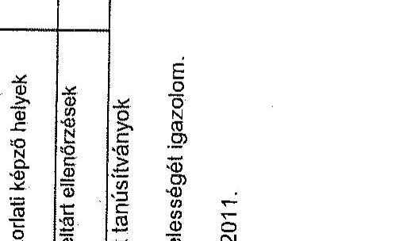

---

|  Megnevezés | 2007 | 2008 | 2009 | 2010  |
| --- | --- | --- | --- | --- |
|  Január 1-én nyilvántartott tanulószerződések száma (db) | 37460 | 42932 | 46303 | 48465  |
|  Ebből: hiányszakmában nyilvántartott (db) | 1897 | 3160 | 4487 | 4682  |
|  Megkötött szerződések száma (db) | 28101 | 29901 | 32135 | 32889  |
|  Ebből: hiányszakmában megkötött (db) | 1134 | 2200 | 2456 | 2900  |
|  Felbontott szerződések száma (db) | 22589 | 26828 | 29965 | 31945  |
|  Ebből: hiányszakmában felbontott (db) | 951 | 1630 | 2373 | 2613  |
|  December 31-én nyilvántartott szerződések száma | 42968 | 46248 | 48396 | 49605  |
|  Ebből: hiányszakmában nyilvántartott (db) | 2507 | 4493 | 5339 | 5390  |
|  Összes ellenőrzések száma | 4090 | 7344 | 8168 | 6509  |
|  Ebből: hiányszakmában ellenőrzött (db) | 190 | 576 | 653 | 480  |
|  Hiányosságot feltárt ellenőrzések száma (db) | 173 | 108 | 136 | 41  |
|  Ebből: hiányszakmában hiányosságot feltárt ellenőrzések száma (db) | 6 | 13 | 10 | 213  |
|  Hiányszakmának minősített szakmák megnevezése: | Ács, állványozó | Ács, állványozó | Ács, állványozó | Ács, állványozó  |
|   | Ács-állványozó | Ács-állványozó | Ács-állványozó | Ács-állványozó  |
|   | Ápoló | Ápoló | Ápoló | Ápoló  |
|   |  | Épületgépészeti csőhálózat- és berendezés- szerelő | Épületgépészeti csőhálózat- és berendezés- szerelő | Épületgépészeti csőhálózat- és berendezés- szerelő  |
|   |  | Gazda | Gazda | Gazda  |
|   | Gépi forgácsoló | Gépi forgácsoló | Gépi forgácsoló | Gépi forgácsoló  |
|   | Gépi akatos | Gépi akatos | Gépi akatos | Gépi akatos  |
|   | Hegesztő | Hegesztő | Hegesztő | Hegesztő  |
|   | Kőműves | Kőműves | Kőműves | Kőműves  |
|   | Műanyag-feldolgozó | Mechatronikai műszerész | Mechatronikai műszerész | Mechatronikai műszerész  |
|   | Szakács | Szakács | Szakács | Szakács  |
|   | Szerkezetlakatos | Szerkezetlakatos | Szerkezetlakatos | Szerkezetlakatos  |
|   | Szerszámkészítő | Szerszámkészítő | Szerszámkészítő | Szerszámkészítő  |
|   |  | Szociális gondozó és ápoló | Szociális gondozó és ápoló | Szociális gondozó és ápoló  |
|   |  | Villanyszerelő | Villanyszerelő | Villanyszerelő  |

* Érvényben lévő tanulószerződések száma - az összes táblára értendő* * Megszűnt tanulószerződések száma - az összes táblára értendő

Fenti adatok hitelességét igazolom.

Kelt: Budapest, 2011.04.15.

---

15/a. számú tanúsítvány

Tanúsítvány a fejlesztési támogatások megoszlásáról 2007.

|  Megnevezés | Szerződés száma | Támogatásban részesülő szervezetek száma | Fogadott támogatás összege | Előző év/ maradvány összege | Tárgyévben rendelkezésre álló támogatás összege | * Felhasznált támogatás összege | Tanulói, hallgatói létszám | Támogatás egy főre jutó soktása | A maximálisan kapható támogatáshoz viszonyított számok  |
| --- | --- | --- | --- | --- | --- | --- | --- | --- | --- |
|   |  |  |  |  |  |  |  |  | a Feltő  |
|  100 %-os képzésre | 4 818 | 147 | 1 746 678 | 790 980 | 3 537 653 | 1 271 865 | 38 731 | 50 | 43,68  |
|  eladó szakképző intézmény | 5 781 | 134 | 1 076 789 | 488 799 | 1 565 595 | 745 773 | 55 399 | 28 | 35,02  |
|  eladó felnőttoktatási intézmény | 1 057 | 13 | 889 877 | 302 190 | 972 091 | 526 103 | 41 540 | 20 | 36,85  |
|  100 %-os szorítás tégre | 5 484 | 181 | 1 733 650 | 166 512 | 2 428 268 | 1 161 380 | 71 142 | 61 | 38,72  |
|  eladó szakképző intézmény | 4 941 | 103 | 1 466 820 | 490 | 1 965 519 | 909 639 | 49 139 | 40 | 26,67  |
|  eladó felnőttoktatási intézmény | 543 | 18 | 294 760 | 198 016 | 462 779 | 281 720 | 32 609 | 21 | 8,47  |
|  Fűzisk-előttel tégre | 124 | 151 | 2 916 278 | 770 272 | 3 289 548 | 1 282 967 | 50 248 | 107 | 42,90  |
|  eladó szakképző intézmény | 5 539 | 139 | 1 782 704 | 702 211 | 2 494 915 | 1 079 095 | 50 443 | 49 | 37,89  |
|  eladó felnőttoktatási intézmény | 1 590 | 13 | 736 572 | 89 991 | 854 830 | 312 862 | 10 800 | 51 | 6,24  |
|  Fűzisk-magyarázvány tégre | 4 803 | 134 | 1 784 484 | 655 277 | 3 478 141 | 1 158 181 | 81 411 | 71 | 45,91  |
|  eladó szakképző intézmény | 4 060 | 130 | 1 547 197 | 538 879 | 3 098 146 | 1 033 549 | 49 880 | 42 | 30,07  |
|  eladó felnőttoktatási intézmény | 540 | 6 | 237 297 | 156 299 | 382 590 | 124 842 | 18 591 | 59 | 17,97  |
|  100 %-os mikroszeres felnőttoktatási intézmény | 5 345 | 181 | 1 906 460 | 802 123 | 2 908 599 | 1 058 627 | 78 981 | 56 | 41,79  |
|  eladó szakképző intézmény | 5 724 | 158 | 1 820 694 | 493 379 | 2 114 042 | 880 159 | 52 364 | 60 | 29,44  |
|  eladó felnőttoktatási intézmény | 631 | 23 | 265 901 | 198 745 | 394 540 | 178 364 | 24 617 | 16 | 12,39  | |
|  100 mikroszeres feladatoktatási intézmény | 10 257 | 425 | 6 439 497 | 1 661 197 | 8 000 641 | 3 852 173 | 257 946 | 75 | 69,11  |
|  eladó szakképző intézmény | 6 906 | 325 | 4 102 069 | 933 209 | 5 125 275 | 2 403 633 | 38 888 | 55 | 41,26  |
|  eladó feladatoktatási intézmény | 3 319 | 100 | 2 247 428 | 827 986 | 2 675 417 | 1 159 140 | 108 960 | 78 | 25,72  |
|  100 mikroszeres feladatoktatási intézmény | 3 094 | 83 | 626 827 | 182 506 | 1 425 827 | 248 217 | 39 971 | 45 | 45,85  |
|  eladó szakképző intézmény | 2 015 | 80 | 740 011 | 179 399 | 927 407 | 347 069 | 30 780 | 50 | 25,83  |
|  eladó feladatoktatási intézmény | 190 | 5 | 81 616 | 12 954 | 94 430 | 22 148 | 2 191 | 16 | 22,01  |
|  100 mikroszeres feladatoktatási intézmény | 41 717 | 1 306 | 16 999 646 | 4 818 367 | 22 266 268 | 8 052 585 | 615 752 | 405 | 351,69  |
|  eladó szakképző intézmény | 33 052 | 1 128 | 12 436 344 | 3 338 463 | 16 268 900 | 7 399 717 | 386 656 | 281 | 278,07  |
|  100 mikroszeres feladatoktatási intézmény | 7 995 | 176 | 4 523 551 | 1 473 904 | 5 997 454 | 2 505 368 | 263 594 | 175 | 133,62  |

- Megjegyzés: Az IR kirovlatító összeg nem tartalmazza az alapokra részére visszafizetett támogatás kirovlatító összegét

Ferő adatok hitelesvégét (gazaton)

Kitöléssel felelős személy neve telefonozása: Bítanból Székely Ámba431-6590

Kelt: Budapest, 2011. április 21.

Kép: László

Tárgyépít: 100 mikroszeres feladatoktatási intézmény 2007.

---

15/b. számú tanúsítvány

Tanúsítvány a fejlesztési támogatások megoszlását 2006

|  Megnevezés | Távszédáv száma | Hozsgatikakas részesztő termeszték száma | Fogadott Hozsgatikak összegét | Előző év/ menedvény összegét | Tárgyázható vonatkozásnálót Hozsgatikak összegét | Tárfeszszétő Hozsgatikak összegét | Tanulói, helyszóró főnyiló | Távszedék egy főnyiló mértékű | A szociacábozt tesztvári támogatásos vízszsegített számát  |
| --- | --- | --- | --- | --- | --- | --- | --- | --- | --- |
|  200-ötterék rögzít |  |  |  |  |  |  |  |  |   |
|  attitő szakiskorl. intézmény | 8 502 | 115 | 1 487 748 | 1 438 408 | 2 527 184 | 1 198 107 | 19 061 | 284 | 27  |
|  attitő beállalásdörl. intézmény | 8 502 | 115 | 1 487 056 | 1 215 118 | 1 738 258 | 1 200 778 | 87 105 | 47 | 4  |
|  attitő beállalásdörl. intézmény | 499 | 0 | 239 142 | 364 462 | 800 804 | 326 807 | 2 017 | 168 | 23  |
|  attitő beállalás szervitípusok | 299 | 0 | 50 799 | 59 831 | 112 537 | 28 945 | 3 806 | 20 | 4  |
|  attitő TÖZS | 2 423 | 71 | 455 804 | 0 | 455 804 | 16 075 | 20 564 | 14 | 4  |
|  200-öterékkorl. rögzít | 4 822 | 151 | 1 508 469 | 1 289 730 | 2 508 189 | 1 341 192 | 89 551 | 456 | 85  |
|  attitő szakiskorl. intézmény | 2 589 | 16 | 348 452 | 839 479 | 1 226 928 | 786 912 | 36 261 | 94 | 4  |
|  attitő beállalásdörl. intézmény | 1 189 | 0 | 348 110 | 596 979 | 845 750 | 484 405 | 2 417 | 262 | 41  |
|  attitő beállalás szervitípusok | 79 | 15 | 10 924 | 14 516 | 25 242 | 13 700 | 830 | 36 | 4  |
|  attitő TÖZS | 810 | 15 | 357 970 | 281 | 556 226 | 84 875 | 29 168 | 12 | 3  |
|  200-öterékrögzít | 8 572 | 171 | 1 684 121 | 688 811 | 2 052 634 | 1 527 847 | 165 811 | 538 | 16  |
|  attitő szakiskorl. intézmény | 5 099 | 155 | 629 178 | 689 898 | 1 509 168 | 889 785 | 75 634 | 252 | 3  |
|  attitő beállalásdörl. intézmény | 812 | 0 | 428 321 | 66 416 | 496 748 | 111 980 | 5 618 | 87 | 22  |
|  attitő beállalás szervitípusok | 15 | 11 | 16 017 | 9 032 | 20 050 | 14 212 | 573 | 27 | 7  |
|  attitő TÖZS | 810 | 15 | 161 607 | 1 083 | 185 871 | 11 841 | 18 628 | 12 | 2  |
|  200-öterékrögzít/őszegélrögzít | 5 671 | 141 | 1 556 456 | 953 146 | 2 335 650 | 1 883 442 | 81 971 | 701 | 129  |
|  attitő szakiskorl. intézmény | 2 914 | 119 | 785 659 | 450 253 | 1 205 973 | 802 263 | 38 281 | 36 | 8  |
|  attitő beállalásdörl. intézmény | 446 | 0 | 538 236 | 72 261 | 810 598 | 512 207 | 967 | 638 | 167  |
|  attitő beállalás szervitípusok | 39 | 0 | 4 670 | 5 770 | 11 440 | 8 905 | 634 | 16 | 2  |
|  attitő TÖZS | 810 | 15 | 521 967 | 660 | 232 622 | 0 | 24 109 | 10 | 2  |
|  200-öterékrögzít/őszegélrögzít | 4 103 | 144 | 1 761 919 | 848 230 | 2 761 135 | 1 406 104 | 54 600 | 895 | 171  |
|  attitő szakiskorl. intézmény | 2 712 | 102 | 962 274 | 895 637 | 1 872 872 | 1 153 155 | 33 617 | 50 | 8  |
|  attitő beállalásdörl. intézmény | 711 | 0 | 621 671 | 250 458 | 682 954 | 314 355 | 884 | 763 | 143  |
|  attitő beállalás szervitípusok | 135 | 0 | 27 395 | 6 490 | 39 851 | 1 000 | 523 | 20 | 14  |
|  attitő TÖZS | 880 | 14 | 520 517 | 11 690 | 826 667 | 7 215 | 16 026 | 17 | 2  |
|  200-öterékrögzít/őszegélrögzít | 12 438 | 242 | 6 881 435 | 4 076 142 | 9 933 422 | 5 018 212 | 196 603 | 185 | 26  |
|  attitő szakiskorl. intézmény | 5 596 | 261 | 2 009 669 | 1 632 838 | 4 302 471 | 3 583 388 | 13 231 | 20 | 16  |
|  attitő beállalásdörl. intézmény | 4 294 | 27 | 2 395 218 | 2 365 126 | 4 145 263 | 2 757 508 | 46 620 | 101 | 14  |
|  attitő beállalás szervitípusok | 571 | 25 | 144 538 | 48 865 | 191 035 | 69 490 | 7 565 | 20 | 5  |
|  attitő TÖZS | 1 279 | 0 | 787 546 | 0 | 788 789 | 128 523 | 87 673 | 72 | 5  |
|  200-öterékrögzít/őszegélrögzít | 6 666 | 118 | 2 704 544 | 1 242 187 | 3 549 715 | 1 832 436 | 73 546 | 156 | 26  |
|  attitő szakiskorl. intézmény | 4 747 | 0 | 897 274 | 1 114 962 | 2 112 255 | 1 480 265 | 32 368 | 60 | 2  |
|  attitő beállalásdörl. intézmény | 155 | 0 | 524 943 | 102 392 | 121 268 | 396 265 | 11 575 | 54 | 16  |
|  attitő beállalás szervitípusok | 160 | 0 | 31 937 | 26 638 | 57 778 | 26 194 | 1 039 | 0 | 0  |
|  attitő TÖZS | 1 271 | 0 | 455 285 | 3 994 | 454 984 | 32 961 | 26 146 | 16 | 2  |
|  200-öterékrögzít | 42 604 | 1 162 | 18 654 605 | 10 247 541 | 25 052 295 | 14 873 253 | 838 343 | 3 015 | 243  |
|  attitő szakiskorl. intézmény | 27 532 | 630 | 7 602 581 | 6 220 336 | 15 811 817 | 9 144 010 | 332 225 | 484 | 45  |
|  attitő beállalásdörl. intézmény | 4 469 | 81 | 4 559 922 | 2 846 666 | 9 906 128 | 4 995 028 | 71 522 | 2 254 | 435  |
|  attitő beállalás szervitípusok | 1 209 | 80 | 269 192 | 189 911 | 455 104 | 239 970 | 14 078 | 202 | 41 |
| attitő TÖZS | 6 402 | 73 | 2 405 292 | 21 228 | 2 826 489 | 322 645 | 317 288 | 92 | 27 |

- Megjegyzés: Az út kimutatott összeg nem tartalmazza az alacskiz részére visszafizetett támogatás kimutatott összegét

Fent: adatok Módszaligói igazolva: Módszeri tanuló személy neve telefonozása: Bírastiai Székely Andreas21-0060 Kelt. Bizitgont, 2011. április 21.

P.H.

Kelt. Bizitgont, 2011. április 21.

---

15/c. számú tanúsítvány

| Megnevezés | Törmellék száma | Törmelék és
támaszáll
számszabát száma | Fogyasztó
törmelék összege | Előző év
maradvány
összege | Távgalmász-
verdeíkszámolási
törmelék összege | "Feltesetvők
törmelék összege" | Tanulék, hallgatói
típusa | Törmelék egy
főre jelöl tróinkán | A használóan
bejönült
törmelékben
megenyített számát |
| --- | --- | --- | --- | --- | --- | --- | --- | --- | --- |
| | | | | | | | | | Főfő |
| Távgépészég | | | | | | | | | % |
| Távgépészég | | | | | | | | | |
| Módt szabátat (intézmény | | | | | | | | | |
| Módt bekövetésű intézmény | | | | | | | | | |
| Módt szembészésű intézmény | | | | | | | | | |
| Módt szembészésű intézmény | | | | | | | | | |
| Módt szembészésű intézmény | | | | | | | | | |
| Módt szembészésű intézmény | | | | | | | | | |
| Módt szembészésű intézmény | | | | | | | | | |
| Módt szembészésű intézmény | | | | | | | | | |
| Módt szembészésű intézmény | | | | | | | | | |
| Módt szembészésű intézmény | | | | | | | | | |
| Módt szembészésű intézmény | | | | | | | | | |
| Módt szembészésű intézmény | | | | | | | | | |
| Módt szembészésű intézmény | | | | | | | | | |
| Módt szembészésű intézmény | | | | | | | | | |
| Módt szembészésű intézmény | | | | | | | | | |
| Módt szembészésű intézmény | | | | | | | | | |
| Módt szembészésű intézmény | | | | | | | | | |
| Módt szembészésű intézmény | | | | | | | | | |
| Módt szembészésű intézmény | | | | | | | | | |
| Módt szembészésű intézmény | | | | | | | | | |
| Módt szembészésű intézmény | | | | | | | | | |
| Módt szembészésű intézmény | | | | | | | | | |
| Módt szembészésű intézmény | | | | | | | | | |
| Módt szembészésű intézmény | | | | | | | | | |
| Módt szembészésű intézmény | | | | | | | | | |
| Módt szembészésű intézmény | | | | | | | | | |
| Módt szembészésű intézmény | | | | | | | | | |
| Módt szembészésű intézmény | | | | | | | | | |
| Módt szembészésű intézmény | | | | | | | | | |
| Módt szembészésű intézmény | | | | | | | | | |
| Módt szembészésű intézmény | | | | | | | | | |
| M

---

15/d. számú tanúsítvány

Tanúsítvány a fejlesztési támogatások megmozzásáról 2018.

15/d. számú tanúsítvány

2011.08.08-án régeiheli állapot, a hiányadóutalék folyamatosan van, azért az összegek változhatnak.

| Megnevezés | Szavadék sütés | Támogatásban részesülő üzemledek sütés | Fogyatott támogatás összege | Eötől évi measletben összege | Tárgyakban rendelkezésedési támogatás összege | Felnevezés támogatás összege | Támogatás nap távs pól mértékű | Támogatás nap távs pól mértékű | A megindítások kapitáti támogatásban javaszabbít adás |
| --- | --- | --- | --- | --- | --- | --- | --- | --- | --- |
| | db | db | a Ft | a Ft | a Ft | a Ft | | | |
| Hivatalóút régió | 7 000 | 34 | 1 060 802 | 1 057 128 | 3 537 805 | 1 051 817 | 39 800 | 141 | 181,74 |
| Iztitői tanúsítat | 0 | 0 | 0 | 0 | 0 | 0 | 0 | 0 | 0 |
| Iztitői tanúsítat mézisély | 0 | 0 | 0 | 0 | 0 | 0 | 0 | 0 | 0 |
| Iztitői tanúsítat szélszépes | 0 | 0 | 0 | 0 | 0 | 0 | 0 | 0 | 0 |
| Iztitői tanúsítat szélszépes | 0 | 0 | 0 | 0 | 0 | 0 | 0 | 0 | 0 |
| Iztitői fiózió | 8 454 | 0 | 1 037 881 | 810 596 | 1 908 401 | 894 030 | 92 240 | 94 | 118,81 |
| Iztitői tanúsítat | 8 174 | 16 | 1 200 534 | 1 015 799 | 2 252 732 | 1 126 891 | 34 335 | 200 | 138,04 |
| Iztitői tanúsítat mézisély | 0 | 0 | 0 | 0 | 0 | 0 | 0 | 0 | 0 |
| Iztitői tanúsítat szélszépes | 0 | 0 | 0 | 0 | 0 | 0 | 0 | 0 | 0 |
| Iztitői tanúsítat szélszépes | 0 | 0 | 0 | 0 | 0 | 0 | 0 | 0 | 0 |
| Iztitői fiózió | 3 230 | 1 | 844 877 | 668 470 | 1 072 147 | 757 810 | 31 255 | 52 | 39,39 |
| Érnek-alttaló régió | 1 750 | 16 | 1 046 491 | 1 290 313 | 2 638 763 | 1 451 305 | 66 445 | 110 | 55,76 |
| Iztitői tanúsítat mézisély | 0 | 0 | 0 | 0 | 0 | 0 | 0 | 0 | 0 |
| Iztitői tanúsítat szélszépes | 1 570 | 0 | 437 199 | 417 201 | 934 389 | 462 807 | 14 262 | 80 | 21,68 |
| Iztitői tanúsítat szélszépes | 0 | 0 | 9 411 | 8 121 | 17 232 | 8 235 | 812 | 23 | 11,02 |
| Iztitői fiózió | 8 969 | 8 | 801 852 | 864 991 | 1 766 843 | 880 443 | 55 370 | 25 | 23,00 |
| Érnek megprémisségi régió | 8 372 | 34 | 1 750 830 | 1 528 817 | 2 232 617 | 1 524 890 | 54 047 | 2 981 | 87,20 |
| Iztitői tanúsítat mézisély | 0 | 0 | 0 | 0 | 0 | 0 | 0 | 0 | 0
 |
| Iztitői tanúsítat mézisély | 885 | 0 | 850 550 | 503 247 | 985 816 | 527 748 | 339 | 2 811 | 51,24 |
| Iztitői tanúsítat szélszépes | 0 | 0 | 0 | 0 | 0 | 0 | 0 | 0 | 0 |
| Iztitői fiózió | 4 000 | 16 | 1 221 901 | 1 020 996 | 2 242 297 | 1 092 321 | 52 652 | 45 | 22,67 |
| Iztitői tanúsítat régió | 3 997 | 26 | 1 299 698 | 1 107 991 | 2 473 677 | 1 352 973 | 41 794 | 256 | 108 314,00 |
| Iztitői tanúsítat szélszépes | 0 | 0 | 0 | 0 | 0 | 0 | 0 | 0 | 0 |
| Iztitői tanúsítat szélszépes | 0 | 0 | 0 | 0 | 0 | 0 | 0 | 0 | 0 |
| Iztitői tanúsítat szélszépes | 0 | 0 | 0 | 0 | 0 | 0 | 0 | 0 | 0 |
| Iztitői tanúsítat szélszépes | 0 | 0 | 0 | 0 | 0 | 0 | 0 | 0 | 0 |
| Iztitői fiózió | 2 500 | 14 | 282 912 | 1 96 786 | 1 028 703 | 852 411 | 29 090 | 46 | 26,60 |
| Iztitői tanúsítat szélszépes | 8 120 | 34 | 2 007 529 | 2 044 775 | 7 917 790 | 4 204 400 | 119 942 | 297 | 115,80 |
| Iztitői tanúsítat szélszépes | 0 | 0 | 0 | 0 | 0 | 0 | 0 | 0 | 0 |
| Iztitői tanúsítat szélszépes | 3 723 | 21 | 2 109 264 | 1 241 284 | 4 080 996 | 2 266 847 | 95 119 | 116 | 52,20 |
| Iztitői tanúsítat szélszépes | 178 | 10 | 78 500 | 45 372 | 118 876 | 53 590 | 1 540 | 1 540 | 39,32 |
| Iztitői fiózió | 5 240 | 23 | 1 748 737 | 1 985 521 | 2 715 016 | 1 763 856 | 17 283 | 48 | 24,00 |
| Fszépai duráritól régió | 6 760 | 18 | 1 680 104 | 1 358 205 | 2 536 437 | 1 356 036 | 28 918 | 164 | 27,00 |
| Iztitői tanúsítat szélszépes | 0 | 0 | 0 | 0 | 0 | 0 | 0 | 0 | 0 |
| Iztitői tanúsítat szélszépes | 870 | 0 | 424 234 | 232 162 | 164 292 | 410 045 | 12 429 | 82 | 24,80 |
| Iztitői tanúsítat szélszépes | 129 | 0 | 16 743 | 15 151 | 24 854 | 16 818 | 353 | 65 | 30,00 |
| Iztitői fiózió | 5 441 | 0 | 1 225 169 | 1 021 842 | 2 228 511 | 928 157 | 35 810 | 62 | 31,07 |
| Iztitői fiózió | 45 902 | 17 | 12 886 039 | 11 579 617 | 24 144 741 | 12 404 103 | 422 376 | 4 298 | 794,14 |
| Iztitői tanúsítat szélszépes | 0 | 0 | 0 | 0 | 0 | 0 | 0 | 0 | 0 |
| Iztitői tanúsítat szélszépes | 0 | 0 | 0 | 0 | 0 | 0 | 0 | 0 | 0 |
| Iztitői tanúsítat szélszépes | 0 | 0 | 0 | 0 | 0 | 0 | 0 | 0 | 0 |
| Iztitői tanúsítat szélszépes | 0 | 0 | 0 | 0 | 0 | 0 | 0 | 0 | 0 |
| Iztitői fiózió | 24 533 | 64 | 7 966 519 | 7 185 356 | 13 162 181 | 7 432 720 | 338 094 | 321 | 272,00 |
| Forró adatok tátstanságát igazolva: | | | | | | | | | |
| Kérdészer bérdés neve, telefoncsípve: Bihattal Székely Andrea 431-4000 | | | | | | | | | |
| Kelt: Budapest, 2011.08.10. | | | | | | | | | |
| | | | | | | | | | |

---

16/a. számú tanúsítvány

Tanúsítvány a fejlesztési támogatások felhasználásának megoszlásáról 2007.

| Megnevezés | Eszközbeszerzés | Működtetés | MPA önrész | Tánányághozásítás | TISZK adnovágtáráclás költség | Visszafizetett támogatás | Összesen |
| --- | --- | --- | --- | --- | --- | --- | --- |
| | e Ft | e Ft | e Ft | e Ft | e Ft | e Ft | e Ft |
| Gekeltető régió | 893 350 | 344 155 | 34 400 | | | 275 423 | 1 048 388 |
| elstől szakképző intézmény | 626 376 | 84 937 | 34 400 | | | 8 325 | 704 099 |
| elstől felsőoktatási intézmény | 266 574 | 259 218 | | | | 268 097 | 794 289 |
| Gekeltetéstől régió | 510 852 | 175 023 | 151 862 | | | 5 229 | 1 196 686 |
| elstől szakképző intézmény | 875 214 | 140 064 | 94 361 | | | 5 229 | 914 868 |
| elstől felsőoktatási intézmény | 235 238 | 38 959 | 7 524 | | | 0 | 281 720 |
| Eszékletőző régió | 1 095 175 | 174 330 | 21 550 | | | 1 648 | 1 295 704 |
| elstől szakképző intézmény | 932 663 | 124 881 | 21 550 | | | 1 648 | 1 080 742 |
| elstől felsőoktatási intézmény | 163 513 | 49 449 | | | | 0 | 212 982 |
| Eszakvégezeteszköj régió | 529 930 | 186 386 | 41 855 | | | 164 | 1 158 345 |
| elstől szakképző intézmény | 809 252 | 185 311 | 38 786 | | | 164 | 1 239 593 |
| elstől felsőoktatási intézmény | 120 674 | 1 055 | 3 109 | | | 0 | 124 842 |
| Kormi-tudárától régió | 504 638 | 129 351 | 28 529 | | | 233 | 1 058 756 |
| elstől szakképző intézmény | 728 242 | 137 391 | 24 526 | | | 233 | 880 392 |
| elstől felsőoktatási intézmény | 176 396 | 1 968 | | | | 0 | 178 364 |
| Kormi-nakgyalószékő régió | 3 044 155 | 453 752 | 64 858 | | | 107 552 | 3 670 325 |
| elstől szakképző intézmény | 1 991 412 | 357 519 | 54 701 | | | 91 912 | 2 495 545 |
| elstől felsőoktatási intézmény | 1 052 743 | 96 233 | 15 164 | | | 15 640 | 1 174 780 |
| Nyugát-tudárától régió | 281 011 | 77 703 | 10 903 | | | 2 427 | 371 646 |
| elstől szakképző intézmény | 261 331 | 75 235 | 10 503 | | | 2 427 | 349 497 |
| elstől felsőoktatási intézmény | 19 590 | 2 468 | | | | 0 | 22 148 |
| GSSZEREN | 8 059 712 | 1 544 688 | 299 684 | | | 393 666 | 10 297 751 |
| elstől szakképző intézmény | 6 024 690 | 1 095 338 | 279 887 | | | 109 528 | 7 508 646 |
| elstől felsőoktatási intézmény | 2 035 222 | 449 350 | 20 797 | | | 283 757 | 2 789 105 |

Ferriti indolók hővéteségtől igazolom. Kötőrésért felelős neve/telefonszáma: Biharing Székely Andrea431-8560 Kelti. Budapest, 2011. április 21.

---

16/b. számú tanúsítvány

tanúsítvány a fejlesztési támogatások felhasználásának megoszlásáról 2008.

| Megnevezés | Etelefőbevízatolrightarrow | Miközbevízat | MFK kivitezt | Tanúsulcsigazatolrightarrow | 2007/08 Szemvonaladó Átlag 2008. Adatcságtart. sz. | Visszafizetett Hónogatás | Összesen |
| --- | --- | --- | --- | --- | --- | --- | --- |
| Cégvízatolrightarrow | | | | | | | |
| Cégvízatolrightarrow régió | 1 538 590 | 112 683 | 38 298 | 0 167 | 0 | 2 811 | 1 797 636 |
 | adatú szakadgató intézmény | 1 211 164 | 71 909 | 22 540 | 1 051 | 0 | 1 973 | 1 210 253 |
| adatú tapdolasztási intézmény | 351 376 | 39 629 | 0 | 0 | 0 | 644 | 580 652 |
| adatú sportolás pozícióval | 97 940 | 1 640 | 2 503 | 0 521 | 0 | 0 | 76 940 |
| adatú TISZK | 8 164 | 1 510 | 7 869 | 0 | 0 | 0 | 16 519 |
| Cég valósítója régió | 1 190 479 | 110 363 | 46 591 | 0 | 0 | 3 231 | 1 383 839 |
| adatú szakadgató intézmény | 653 290 | 90 109 | 45 497 | 0 | 0 | 2 154 | 787 098 |
| adatú tapdolasztási intézmény | 471 449 | 11 517 | 2 859 | 0 | 0 | 0 | 494 498 |
| adatú sportolás pozícióval | 11 519 | 0 | 2 240 | 0 | 0 | 0 | 10 703 |
| adatú TISZK | 84 504 | 0 | 0 | 0 | 0 | 0 | 84 519 |
| Cégvízatolrightarrow | 850 263 | 77 541 | 37 461 | 3 209 | 0 | 3 894 | 1 541 281 |
| adatú szakadgató intézmény | 706 429 | 76 298 | 54 851 | 0 | 0 | 3 444 | 903 168 |
| adatú tapdolasztási intézmény | 108 946 | 1 500 | 0 | 1 639 | 0 | 0 | 111 863 |
| adatú sportolás pozícióval | 72 114 | 0 | 789 | 0 | 0 | 0 | 14 212 |
| adatú TISZK | 10 139 | 0 | 1 703 | 0 | 0 | 0 | 11 867 |
| Cégvízatolrightarrow | 309 131 | 145 923 | 426 334 | 0 | 0 | 0 | 1 380 914 |
| adatú szakadgató intézmény | 814 188 | 81 857 | 68 249 | 0 | 0 | 0 | 862 330 |
| adatú tapdolasztási intézmény | 82 545 | 53 080 | 362 598 | 0 | 0 | 0 | 512 207 |
| adatú sportolás pozícióval | 7 409 | 1 208 | 0 | 0 | 0 | 0 | 8 993 |
| adatú TISZK | 0 | 0 | 0 | 0 | 0 | 0 | 0 |
| Cégvízatolrightarrow | 1 236 452 | 122 906 | 26 120 | 0 | 0 | 0 604 | 1 495 007 |
| adatú szakadgató intézmény | 1 010 254 | 114 454 | 26 337 | 0 | 0 | 0 994 | 1 140 029 |
| adatú tapdolasztási intézmény | 397 716 | 8 371 | 560 | 0 | 0 | 0 | 314 222 |
| adatú sportolás pozícióval | 37 404 | 2 510 | 0 | 0 | 0 | 0 | 39 465 |
| adatú TISZK | 1 233 | 200 | 0 | 0 | 0 | 0 | 1 210 |
| Cégvízatolrightarrow | 4 781 241 | 473 841 | 125 818 | 25 339 | 0 | 27 301 | 9 583 276 |
| adatú szakadgató intézmény | 2 148 275 | 246 618 | 117 826 | 8 624 | 0 | 18 949 | 2 083 529 |
| adatú tapdolasztási intézmény | 2 462 958 | 234 834 | 7 886 | 12 561 | 0 | 7 397 | 2 744 854 |
| adatú sportolás pozícióval | 54 373 | 4 100 | 0 | 0 | 0 | 0 | 56 480 |
| adatú TISZK | 20 742 | 26 403 | 0 | 4 994 | 0 | 0 | 126 813 |
| Cégvízatolrightarrow | 1 681 728 | 205 131 | 34 249 | 2 297 | 0 | 3 643 | 1 839 852 |
| adatú szakadgató intézmény | 1 571 869 | 135 238 | 38 981 | 0 | 0 | 0 027 | 1 495 767 |
| adatú tapdolasztási intézmény | 240 227 | 66 072 | 0 | 0 | 0 | 2 116 | 246 929 |
| adatú sportolás pozícióval | 24 424 | 9 724 | 300 | 1 720 | 0 | 0 | 36 154 |
| adatú TISZK | 5 014 | 0 | 4 989 | 0 | 0 | 0 | 10 002 |
| Cégvízatolrightarrow | 12 427 231 | 1 543 604 | 787 009 | 37 381 | 0 | 63 187 | 14 628 622 |
| adatú szakadgató intézmény | 7 367 381 | 392 339 | 383 372 | 10 498 | 0 | 41 955 | 9 185 969 |
| adatú tapdolasztási intézmény | 4 145 073 | 441 649 | 312 210 | 13 620 | 0 | 35 169 | 4 017 328 |
| adatú sportolás pozícióval | 200 909 | 18 654 | 6 791 | 8 621 | 0 | 0 | 209 868 |
| adatú TISZK | 114 652 | 25 702 | 14 547 | 4 669 | 0 | 0 | 222 646 |

Fenti adatok hőszázaújvári igazolóm. Különkész, felelős rajok/telefonolmas, főherint Székely Átchettő/1-6000 Kód: 5020prad, 2011.ájutla 21.

---

16/c. számú tanúsítvány

tanúsítvány a fejlesztési támogatások felhasználásának megoszlásáról 2009.

| Megnevezés | Fejlődőbenyomás | Miközbeírás | MFA ötvösz | Tervezettfejlesztés | TÖZK adóvisszárkóba adószá | Visszabandot támogatás | Összesen |
| --- | --- | --- | --- | --- | --- | --- | --- |
| | a Ft | a Ft | a Ft | a Ft | a Ft | a Ft | a Ft |
| Csin-elfesió rágió | 1 253 602 | 79 201 | 47 978 | 1 107 | 1 212 | 1 331 | 1 419 001 |
| adótól repelségről intézmény | 430 063 | 32 615 | 4 008 | 0 | 5 314 | 5 314 | 413 551 |
| adótól feljűhetetési intézmény | 334 309 | 32 617 | 0 | 0 | 0 | 74 | 331 309 |
| adótól speciális szakaszra | 37 371 | 0 | 3 289 | 0 | 0 | 0 | 41 001 |
| adótól TÖZK | 412 020 | 22 101 | 64 763 | 1 351 | 1 806 | 90 | 597 944 |
| Csin-itszárkófi rágió | 1 183 015 | 20 720 | 6 182 | 11 813 | 0 | 8 030 | 5 418 870 |
| adótól repelségről intézmény | 454 709 | 10 584 | 4 762 | 6 100 | 0 | 2 538 | 490 619 |
| adótól feljűhetetési intézmény | 191 400 | 6 750 | 1 420 | 0 | 0 | 5 414 | 805 222 |
| adótól speciális szakaszra | 70 969 | 17 181 | 0 | 1 219 | 0 | 372 | 89 647 |
| adótól TÖZK | 426 671 | 10 637 | 0 | 4 403 | 0 | 0 | 440 509 |
| Eszak adótól rágió | 1 014 286 | 44 195 | 9 485 | 534 | 258 | 23 205 | 1 052 925 |
| adótól repelségről intézmény | 514 051 | 31 474 | 3 708 | 0 | 0 | 16 959 | 586 759 |
| adótól feljűhetetési intézmény | 127 207 | 1 851 | 0 | 0 | 0 | 0 | 126 386 |
| adótól speciális szakaszra | 16 650 | 0 | 1 890 | 0 | 0 | 1 041 | 16 944 |
| adótól TÖZK | 559 930 | 32 140 | 4 280 | 826 | 294 | 2 010 | 415 370 |
| Eszak megnevezési rágió | 522 375 | 20 518 | 135 447 | 3 035 | 43 537 | 4 354 | 1 016 511 |
| adótól repelségről intézmény | 271 421 | 10 344 | 1 299 | 0 | 0 | 359 | 265 422 |
| adótól feljűhetetési intézmény | 147 980 | 3 750 | 0 | 0 | 0 | 2 448 | 154 187 |
| adótól speciális szakaszra | 4 960 | 0 | 0 | 0 | 0 | 0 | 4 308 |
| adótól TÖZK | 348 603 | 5 241 | 118 148 | 3 036 | 43 531 | 3 090 | 215 263 |
| Kizéta díszközök rágió | 1 446 411 | 61 614 | 9 842 | 3 396 | 1 080 | 1 553 | 1 747 555 |
| adótól szakaszról intézmény | 280 778 | 26 090 | 6 860 | 0 | 0 | 501 | 310 089 |
| adótól feljűhetetési intézmény | 301 088 | 15 544 | 0 | 0 |
 | 1 244 | 0 | 416 948 |
| adótól speciális szakaszra | 37 270 | 3 299 | 0 | 3 021 | 0 | 0 | 42 380 |
| adótól TÖZK | 528 875 | 16 188 | 2 729 | 178 | 252 | 130 | 573 979 |
| Kizéta megnevezési rágió | 3 435 433 | 242 558 | 187 975 | 48 343 | 203 062 | 87 061 | 1 427 945 |
| adótól repelségről intézmény | 400 398 | 42 473 | 23 021 | 244 | 0 | 47 325 | 1 104 478 |
| adótól feljűhetetési intézmény | 2 486 372 | 209 694 | 188 540 | 11 234 | 186 633 | 10 873 | 2 158 817 |
| adótól speciális szakaszra | 138 080 | 4 991 | 0 | 3 726 | 0 | 2 600 | 145 214 |
| adótól TÖZK | 1 299 022 | 127 935 | 0 | 21 127 | 3 755 | 2 462 | 1 404 530 |
| Kizéta díszközök rágió | 1 555 898 | 89 473 | 13 983 | 4 509 | 13 264 | 23 604 | 1 514 636 |
| adótól repelségről intézmény | 276 795 | 13 852 | 2 249 | 0 | 0 | 16 098 | 311 758 |
| adótól feljűhetetési intézmény | 309 513 | 45 810 | 6 220 | 0 | 0 | 3 236 | 429 790 |
| adótól speciális szakaszra | 14 651 | 1 742 | 0 | 0 | 0 | 0 | 15 202 |
| adótól TÖZK | 406 028 | 38 094 | 5 486 | 2 789 | 12 290 | 1 273 | 504 231 |
| Csin-itszárkófi rólépmény | 3 321 145 | 113 782 | 44 738 | 8 409 | 2 214 | 86 810 | 3 536 236 |
| adótól feljűhetetési intézmény | 4 652 099 | 201 029 | 114 092 | 11 034 | 201 001 | 46 636 | 3 377 059 |
| adótól speciális szakaszra | 318 472 | 26 735 | 4 788 | 1 154 | 0 | 2 653 | 564 082 |
| adótól TÖZK | 3 975 620 | 200 303 | 188 459 | 48 579 | 23 265 | 12 589 | 4 552 058 |

Fenő adatok hőelenségét igazolnia: Köttösvári látszta neve (elektroszáma: Bihatiró Székely Andrea431-8500 Kelt: Budapest, 2011. április 21.

---

16/d. számú tanúsítvány

Tanúsítvány a fejlesztési támogatások felhasználásával megvalósárolt 2010.

2011.06.09-án régedtek állapod, a hiánypótlódatáig folyamatos van, ezért az Ámcsapni változtatnak.

| Megnevezés | Keskészesszapás | Hőkövetés | MPA fordús | Tavaszpépfajtasztás | TISZK
alvatszapkózás
költezős | Visszabandott
támogatás | Összesen |
| --- | --- | --- | --- | --- | --- | --- | --- |
| | a Ft | a Ft | a Ft | a Ft | a Ft | a Ft | a Ft |
| 100-ötfőbb régió | 1 154 247 | 51 708 | 50 038 | 3 530 | 10 397 | 1 148 | 1 332 508 |
| 200-öt eszközépző intézmény | 0 | 0 | 0 | 0 | 0 | 0 | 0 |
| 300-öt hőkövetésbe intézmény | 345 717 | 9 039 | 0 | 0 | 0 | 0 | 358 716 |
| 400-öt spocsibiz. eszközöző | 1 698 | 100 | 0 | 270 | 0 | 0 | 2 289 |
| 500-öt 1000% | 949 114 | 51 044 | 50 038 | 5 160 | 10 397 | 1 186 | 995 224 |
| 100-öt eszközöző nézmény | 1 536 780 | 42 489 | 38 822 | 3 949 | 4 889 | 358 | 1 138 784 |
| 200-öt eszközöző intézmény | 0 | 0 | 0 | 0 | 0 | 0 | 0 |
| 300-öt hőkövetésbe intézmény | 335 258 | 6 708 | 0 | 1 811 | 0 | 102 | 345 944 |
| 400-öt spocsibiz. eszközöző | 19 443 | 360 | 473 | 978 | 0 | 0 | 20 876 |
| 500-öt 1000% | 495 024 | 23 309 | 35 960 | 1 736 | 4 889 | 0 | 181 914 |
| 100-öt 2000-öt régió | 1 394 221 | 33 241 | 27 667 | 3 520 | 11 081 | 6 408 | 1 058 752 |
| 300-öt eszközöző intézmény | 0 | 0 | 0 | 0 | 0 | 0 | 0 |
| 400-öt hőkövetésbe intézmény | 459 167 | 7 212 | 0 | 480 | 0 | 0 | 462 667 |
| 500-öt spocsibiz. eszközöző | 8 908 | 112 | 1 400 | 57 | 0 | 0 | 8 225 |
| 600-öt 1000% | 522 448 | 16 057 | 26 467 | 1 890 | 13 481 | 8 600 | 269 801 |
| 100-öt megyenszapásg. régió | 1 031 531 | 57 181 | 23 479 | 4 160 | 4 889 | 0 | 1 624 887 |
| 300-öt eszközöző intézmény | 0 | 0 | 0 | 0 | 0 | 0 | 0 |
| 400-öt hőkövetésbe intézmény | 502 491 | 23 756 | 683 | 367 | 0 | 0 | 521 181 |
| 500-öt 1000% | 5 089 | 0 | 0 | 360 | 0 | 0 | 5 350 |
| 500-öt 1000% | 1 023 557 | 33 418 | 22 726 | 3 820 | 8 200 | 0 | 1 085 300 |
| 100-öt eszközöző régió | 1 224 162 | 45 511 | 16 375 | 4 154 | 13 788 | 6 785 | 1 381 466 |
| 300-öt eszközöző intézmény | 0 | 0 | 0 | 0 | 0 | 0 | 0 |
| 400-öt hőkövetésbe intézmény | 362 867 | 16 325 | 0 | 0 | 0 | 0 | 379 785 |
| 500-öt spocsibiz. eszközöző | 84 221 | 12 778 | 665 | 2 309 | 0 | 0 | 80 311 |
| 600-öt 1000% | 122 213 | 46 020 | 15 110 | 1 839 | 12 788 | 6 482 | 263 895 |
| 100-öt megyenszapásg. régió | 2 148 941 | 302 694 | 36 547 | 20 511 | 43 826 | 18 718 | 2 644 811 |
| 300-öt eszközöző intézmény | 0 | 0 | 0 | 0 | 0 | 0 | 0 |
| 400-öt hőkövetésbe intézmény | 2 109 674 | 311 410 | 0 | 22 234 | 0 | 0 | 2 275 352 |
| 500-öt spocsibiz. eszközöző | 47 421 | 4 577 | 1 299 | 308 | 0 | 0 | 53 599 |
| 600-öt 1000% | 1 608 894 | 86 705 | 57 361 | 7 064 | 43 826 | 1 145 | 1 781 097 |
| 100-öt eszközöző régió | 1 584 598 | 115 618 | 15 498 | 16 997 | 18 050 | 361 | 1 386 401 |
| 300-öt eszközöző intézmény | 0 | 0 | 0 | 0 | 0 | 0 | 0 |
| 400-öt hőkövetésbe intézmény | 345 186 | 53 557 | 0 | 1 599 | 0 | 0 | 415 127 |
| 500-öt spocsibiz. eszközöző | 12 740 | 3 028 | 679 | 360 | 0 | 0 | 16 816 |
| 600-öt 1000% | 833 829 | 48 368 | 9 616 | 17 654 | 16 482 | 230 | 829 495 |
| 100-öt 2000% | 11 559 579 | 596 599 | 232 589 | 66 766 | 113 422 | 35 529 | 12 805 521 |
| 300-öt eszközöző intézmény | 0 | 0 | 0 | 0 | 0 | 0 | 0 |
| 400-öt hőkövetésbe intézmény | 4 485 456 | 340 732 | 0 | 26 199 | 0 | 0 | 4 888 843 |
| 500-öt spocsibiz. eszközöző | 157 218 | 21 943 | 6 500 | 3 844 | 0 | 0 | 167 311 |
| 600-öt 1000% | 6 717 403 | 336 532 | 229 096 | 36 690 | 112 622 | 25 878 | 1 499 607 |
| 100-öt eszközöző részvonal | | | | | | | |

Fentá adatok hőszeszapás igyenesen.

Kérőszabit fióróba neve, telefonszáma: Róbertet Szabaly, Szabua 431-0390

Kelt: Budapest, 2011.06.10.

2011.06.09-án régedtek állapod, a hiánypótlódatáig folyamatos van, ezért az Ámcsapni változtatnak.

Fentá adatok hőszeszapás igyenesen.

Kérőszabit fióróba neve, telefonszáma: Róbertet Szabaly, Szabua 431-0390

Kelt: Budapest, 2011.06.10.

---

# Tanúsítvány a fejlesztési támogatások ellenőrzéséről 2007.

| Elővelezési időtartamán | Támogatásban részesült időtartamán száma | Támogatás összegét | Elővelezési időtartamán száma | Elővelezési összeg | Szakálytalanul elszámolók száma | Szakálytalanul elszámolók száma | Szakálytalanul elszámolók összeg adóig |
| --- | --- | --- | --- | --- | --- | --- | --- |
|  4A | 4B | 4C | 4D | 4E | 4F | 4G | 4H  |
|  OG-1000-1000 | 143 | 2 311 | 2 | 281 | 2 | 281 | 2  |
|  záró tiszaközi szakaszavi intézmény | 100 | 1 810 | 11 | 393 | 1 | 393 | 1  |
|  záró tiszaközi bekövetési intézmény | 0 | 0 | 0 | 0 | 0 | 0 | 0  |
|  záró tiszaközi szerzői szakaszavi intézmény | 0 | 0 | 0 | 0 | 0 | 0 | 0  |
|  záró tiszaközi TELIS | 0 | 0 | 0 | 0 | 0 | 0 | 0  |
|  OG-1000-1000-1000 | 84 | 1 231 | 2 | 281 | 2 | 281 | 2  |
|  záró tiszaközi szakaszavi intézmény | 84 | 841 | 2 | 281 | 2 | 281 | 2  |
|  záró tiszaközi bekövetési intézmény | 0 | 0 | 0 | 0 | 0 | 0 | 0  |
|  záró tiszaközi szerzői szakaszavi intézmény | 0 | 0 | 0 | 0 | 0 | 0 | 0  |
|  záró tiszaközi TELIS | 0 | 0 | 0 | 0 | 0 | 0 | 0  |
|  Záró tiszaközi JOYHÉ-1000 | 181 | 1 811 | 2 | 281 | 2 | 281 | 2  |
|  záró tiszaközi szakaszavi intézmény | 181 | 1 214 | 2 | 281 | 2 | 281 | 2  |
|  záró tiszaközi bekövetési intézmény | 0 | 0 | 0 | 0 | 0 | 0 | 0  |
|  záró tiszaközi szerzői szakaszavi intézmény | 0 | 0 | 0 | 0 | 0 | 0 | 0  |
|  záró tiszaközi TELIS | 0 | 0 | 0 | 0 | 0 | 0 | 0  |
|  Záró tiszaközi megyerővégítélég | 116 | 1 810 | 2 | 281 | 2 | 281 | 2  |
|  záró tiszaközi szakaszavi intézmény | 116 | 1 214 | 2 | 281 | 2 | 281 | 2  |
|  záró tiszaközi bekövetési intézmény | 0 | 0 | 0 | 0 | 0 | 0 | 0  |
|  záró tiszaközi szerzői szakaszavi intézmény | 0 | 0 | 0 | 0 | 0 | 0 | 0  |
|  záró tiszaközi TELIS | 0 | 0 | 0 | 0 | 0 | 0 | 0  |
|  Záró tiszaközi megyerővégítélég | 116 | 1 810 | 2 | 281 | 2 | 281 | 2  |
|  záró tiszaközi szakaszavi intézmény | 116 | 1 214 | 2 | 281 | 2 | 281 | 2  |
|  záró tiszaközi bekövetési intézmény | 0 | 0 | 0 | 0 | 0 | 0 | 0  |
|  záró tiszaközi szerzői szakaszavi intézmény | 0 | 0 | 0 | 0 | 0 | 0 | 0  |
|  záró tiszaközi TELIS | 0 | 0 | 0 | 0 | 0 | 0 | 0  |
|  Záró tiszaközi megyerővégítélég | 116 | 6 671 | 2 | 281 | 2 | 281 | 2  |
|  záró tiszaközi szakaszavi intézmény | 116 | 6 671 | 2 | 281 | 2 | 281 | 2  |
|  záró tiszaközi bekövetési intézmény | 116 | 6 671 | 2 | 281 | 2 | 281 | 2  |
|  záró tiszaközi szerzői szakaszavi intézmény | 0 | 0 | 0 | 0 | 0 | 0 | 0  |
|  záró tiszaközi TELIS | 0 | 0 | 0 | 0 | 0 | 0 | 0  |
|  Záró tiszaközi JOYHÉ-1000-1000 | 121 | 2 311 | 2 | 281 | 2 | 281 | 2  |
|  záró tiszaközi szakaszavi intézmény | 121 | 1 810 | 2 | 281 | 2 | 281 | 2  |
|  záró tiszaközi bekövetési intézmény | 0 | 0 | 0 | 0 | 0 | 0 | 0  |
|  záró tiszaközi szerzői szakaszavi intézmény | 0 | 0 | 0 | 0 | 0 | 0 | 0  |
|  záró tiszaközi TELIS | 0 | 0 | 0 | 0 | 0 | 0 | 0  |
|  Záró tiszaközi JOYHÉ-1000-1000 | 1 214 | 16 811 | 16 | 3 281 | 2 | 3 281 | 2  |
|  záró tiszaközi szakaszavi intézmény | 1 214 | 12 811 | 16 | 3 281 | 2 | 3 281 | 2  |
|  záró tiszaközi bekövetési intézmény | 0 | 0 | 0 | 0 | 0 | 0 | 0  |
|  záró szerzői szakhasznosítási intézmény | 0 | 0 | 0 | 0 | 0 | 0 | 0  |
|  záróti TELIS | 0 | 0 | 0 | 0 | 0 | 0 | 0  |
|  Záróti JOYHÉ-1000-1000 | 1 214 | 16 811 | 16 | 3 281 | 2 | 3 281 | 2  |
|  záróti szakhasznosítási intézmény | 1 214 | 12 811 | 16 | 3 281 | 2 | 3 281 | 2  |
|  záróti bekövetési intézmény | 0 | 0 | 0 | 0 | 0 | 0 | 0  |
|  záróti JOYHÉ-1000-1000 | 0 | 0 | 0 | 0 | 0 | 0 | 0  |
|  záróti TELIS | 0 | 0 | 0 | 0 | 0 | 0 | 0  |

- Megjegyzés: a felületének értékét az előző évi adatok arányait súlyozók az ellenőrzésre fordítandó alapját

Ferő adatok közbeszéglő igazolom: 020000001 3600001 3600001 3600001 3600001 3600001 3600001 3600001 3600001 3600001 3600001 3600001 3600001 3600001 3600001 3600001 3600001 3600001 3600001 3600001 3600001 3600001 3600001 3600001 3600001 3600001 3600001 3600001 3600001 3600001 3600001 3600001 3600001 3600001 3600001 3600001 3600001 3600001 3600001 3600001
 3600001 3600001 3600001 3600001 3600001 3600001 3600001 3600001 3600001 3600001 3600001 3600001 3600001 3600001 3600001 3600001 3600001 3600001 3600001 3600001 3600001 3600001 3600001 3600001 3600001 3600001 3600001 3600001 3600001 3600001 3600001 3600001 3600001 3600001 3600001 3600001 3600001 3600001 3600001 3600001 3600001 3600001 3600001 3600001 3600001 3600001 3600001 3600001 3600001 3600001 3600001 3600001 3600001 3600001 3600001 3600001 3600001 3600001 3600001 3600001 3600001 3600001 3600001 3600001 3600001 3600001 3600001 3600001 3600001 3600001 3600001 3600001 3600001 3600001 3600001 3600001 3600001 3600001 3600001 3600001 3600001 3600001 3600001 3600001 3600001 3600001 3600001 3600001 3600001 3600001 3600001 3600001 3600001 3600001 3600001 3600001 3600001 3600001 3600001 3600001 3600001 3600001 3600001 3600001 3600001 3600001 3600001 3600001 3600001 3600001 3600001 3600001 3600001 3600001 3600001 3600001 3600001 3600001 3600001 3600001 3600001 3600001 3600001 3600001 3600001 3600001 3600001 3600001 3600001 3600001 3600001 3600001 3600001 3600001 3600001 3600001 3600001 3600001 3600001 3600001 3600001 3600001 3600001 3600001 3600001 3600001 3600001 3600001 3600001 3600001 3600001 3600001 3600001 3600001 3600001 3600001 3600001 3600001 3600001 3600001 3600001 3600001 3600001 3600001 3600001 3600001 3600001 3600001 3600001 3600001 3600001 3600001 3600001 3600001 3600001 3600001 3600001 3600001 3600001 3600001 3600001 3600001 3600001 3600001 3600001 3600001 3600001 3600001 3600001 3600001 3600001 3600001 3600001 3600001 3600001 3600001 3600001 3600001 3600001 3600001 3600001 3600001 3600001 3600001 3600001 3600001 3600001 3600001 3600001 3600001 3600001 3600001 3600001 3600001 3600001 3600001 3600001 3600001 3600001 3600001 3600001 3600001 3600001 3600001 3600001 3600001 3600001 3600001 3600001 3600001 3600001 3600001 3600001 3600001 3600001 3600001 3600001 3600001 3600001 3600001 3600001 3600001 3600001 3600001 3600001 3600001 3600001 3600001 3600001 3600001 3600001 3600001 3600001 3600001 3600001 3600001 3600001 3600001 3600001 3600001 3600001 3600001 3600001 3600001 3600001 3600001 3600001 3600001 3600001 3600001 3600001 3600001 3600001 3600001 3600001 3600001 3600001 3600001 3600001 3600001 3600001 3600001 3600001 3600001 3600001 3600001 3600001 3600001 3600001 3600001 3600001 3600001 3600001 3600001 3600001 3600001 3600001 3600001 3600001 3600001 3600001 3600001 3600001 3600001 3600001 3600001 3600001 3600001 3600001 3600001 3600001 3600001 3600001 3600001 3600001 3600001 3600001 3600001 3600001 3600001 3600001 3600001 3600001 3600001 3600001 3600001 3600001 3600001 3600001 3600001 3600001 3600001 3600001 3600001 3600001 3600001 3600001 3600001 3600001 3600001 3600001 3600001 3600001 3600001 3600001 3600001 3600001 3600001 3600001 3600001 3600001 3600001 3600001 3600001 3600001 3600001 3600001 3600001 3600001 3600001 3600001 3600001 3600001 3600001 3600001 3600001 3600001 3600001 3600001 3600001 3600001 3600001 3600001 3600001 3600001 3600001 3600001 3600001 3600001 3600001 3600001 3600001 3600001 3600001 3600001 3600001 3600001 3600001 3600001 3600001 3600001 3600001 3600001 3600001 3600001 3600001 3600001 3600001 3600001 3600001 3600001 3600001 3600001 3600001 3600001 3600001 3600001 3600001 3600001 3600001 3600001 3600001 3600001 3600001 3600001 3600001 3600001 3600001 3600001 3600001 3600001 3600001 3600001 3600001 3600001 3600001 3600001 3600001 3600001 3600001 3600001 3600001 3600001 3600001 3600001 3600001 3600001 3600001 3600001 3600001 3600001 3600001 3600001 3600001 3600001 3600001 3600001 3600001 3600001 3600001 3600001 3600001 3600001 3600001 3600001 3600001 3600001 3600001 3600001 3600001 3600001 3600001 3600001 3600001 3600001 3600001 3600001 3600001 3600001 3600001 3600001 3600001 3600001 3600001 3600001 3600001 3600001 3600001 3600001 3600001 3600001 3600001 3600001 3600001 3600001 3600001 3600001 3600001 3600001 3600001 3600001 3600001 3600001 3600001 3600001 3600001 3600001 3600001 3600001 3600001 3600001 3600001 3600001 3600001 3600001 3600001 3600001 3600001 3600001 3600001 3600001 3600001 3600001 3600001 3600001 3600001 3600001 3600001 3600001 3600001 3600001 3600001 3600001 3600001 3600001 3600001 3600001 3600001 3600001 3600001 3600001 3600001 3600001 3600001 3600001 3600001 3600001 3600001 3600001 3600001 3600001 3600001 3600001 3600001 3600001 3600001 3600001 3600001 3600001 3600001 3600001 3600001 3600001 3600001 3600001 3600001 3600001 3600001 3600001 3600001 3600001 3600001 3600001 3600001 3600001 3600001 3600001 3600001 3600001 3600001 3600001 3600001 3600001 3600001 3600001 3600001 3600001 3600001 3600001 3600001 3600001 3600001 3600001 3600001 3600001 3600001 3600001 3600001 3600001 3600001 3600001 3600001 3600001 3600001 3600001 3600001 3600001 3600001 3600001 3600001 3600001 3600001 3600001 3600001 3600001 3600001 3600001 3600001 3600001 3600001 3600001 3600001 3600001 3600001 3600001 3600001 3600001 3600001 3600001 3600001 3600001 3600001 3600001 3600001 3600001 3600001 3600001 3600001 3600001 3600001 3600001 3600001 3600001 3600001 3600001 3600001 3600001 3600001 3600001 3600001 3600001 3600001 3600001 3600001 3600001 3600001 3600001 3600001 3600001 3600001 3600001 3600001 3600001 3600001 3600001 3600001 3600001 3600001 3600001 3600001 3600001 3600001 3600001 3600001 3600001 3600001 3600001 3600001 3600001 3600001 3600001 3600001 3600001 3600001 3600001 3600001 3600001 3600001 3600001 3600001 3600001 3600001 3600001 3600001 3600001 3600001 3600001 3600001 3600001 3600001 3600001 3600001 3600001 3600001 3600001 3600001 3600001 3600001 3600001 3600001 3600001 3600001 3600001 3600001 3600001 3600001 3600001 3600001 3600001 3600001 3600001 3600001 3600001 3600001 3600001 3600001 3600001 3600001 3600001 3600001 3600001 3600001 3600001 3600001 3600001 3600001 3600001 3600001 3600001 3600001 3600001 3600001 3600001 3600001 3600001 3600001 3600001 3600001 3600001 3600001 3600001 3600001 3600001 3600001 3600001 3600001 3600001 3600001 3600001 3600001 3600001 3600001 3600001 3600001 3600001 3600001 3600001 3600001 3600001 3600001 3600001 3600001 3600001 3600001 3600001 3600001 3600001 3600001 3600001 3600001 3600001 3600001 3600001 3600001 3600001 3600001 3600001 3600001 3600001 3600001 3600001 3600001 3600001 3600001 3600001 3600001 3600001 3600001 3600001 3600001 3600001 3600001 3600001 3600001 3600001 3600001 3600001 3600001 3600001 3600001 3600001 3600001 3600001 3600001 3600001 3600001 3600001 3600001 3600001 3600001 3600001 3600001 3600001 3600001 3600001 3600001 3600001 3600001 3600001 3600001 3600001 3600001 3600001 3600001 3600001 3600001 3600001 3600001 3600001 3600001 3600001 3600001 3600001 3600001 3600001 3600001 3600001 3600001 3600001 3600001 3600001 3600001 3600001 3600001 3600001 3600001 3600001 3600001 3600001 3600001 3600001 3600001 3600001 3600001 3600001 3600001 3600001 3600001 3600001 3600001 3600001 3600001 3600001 3600001 3600001 3600001 3600001 3600001 3600001 3600001 3600001 3600001 3600001 3600001 3600001 3600001 3600001 3600001 3600001 3600001 3600001 3600001 3600001 3600001 3600001 3600001 3600001 3600001 3600001 3600001 3600001 3600001 3600001 3600001 3600001 3600001 3600001 3600001 3600001 3600001 3600001 3600001 3600001 3600001 3600001 3600001 3600001 3600001 3600001 3600001 3600001 3600001 3600001 3600001 3600001 3600001 3600001 3600001 3600001 3600001 3600001 3600001 3600001 3600001 3600001 3600001 3600001 3600001 3600001 3600001 3600001 3600001 3600001 3600001 3600001 3600001 3600001 3600001 3600001 3600001 3600001 3600001 3600001 3600001 3600001 3600001 3600001 3600001 3600001 3600001 3600001 3600001 3600001 3600001 3600001 3600001 3600001 3600001 3600001 3600001 3600001 3600001 3600001 3600001 3600001 3600001 3600001 3600001 3600001 3600001 3600001 3600001 3600001 3600001 3600001 3600001 3600001 3600001 3600001 3600001 3600001 3600001 3600001 3600001 3600001 3600001 3600001 3600001 3600001 3600001 3600001 3600001 3600001 3600001 3600001 3600001 3600001 3600001 3600001 3600001 3600001 3600001 3600001 3600001 3600001 3600001 3600001 3600001 3600001 3600001 3600001 3600001 3600001 3600001 3600001 3600001 3600001 3600001 3600001 3600001 3600001 3600001 3600001 3600001 3600001 3600001 3600001 3600001 3600001 3600001 3600001 3600001 3600001 3600001 3600001 3600001 3600001 3600001 3600001 3600001 3600001 3600001 3600001 3600001 3600001 3600001 3600001 3600001 3600001 3600001 3600001 360001 3600001 3600001 3600001 3600001 3600001 3600001 3600001 3600001 3600001 360001 360001 360001 360001 360001 3600001 3600001 3600001 3600001 360001 360001 360001 360001 360001 360001 360001 360001 360001 360001 360001 360001 360001 360001 360001 360001 360001 360001 360001 360001 360001 360001 360001 360001 360001 360001 360001 360001 360001 360001 360001 360001 360001 360001 360001 360001 360001 360001 360001 360001 360001 360001 360001 360001 360001 360001 360001 360001 360001 360001 360001 360001 360001 360001 360001 360001 360001 360001 360001 360001 360001 360001 360001 360001 360001 360001 360001 360001 360001 360001 360001 360001 360001 360001 360001 360001 360001 360001 360001 360001 360001 360001 360001 360001 360001 360001 360001 360001 360001 360001 360001 360001 360001 360001 360001 360001 360001 360001 360001 360001 360001 360001 360001 360001 360001 360001 360001 360001 360001 360001 360001 360001 360001 360001 360001 360001 360001 360001 360001 360001 360001 360001 360001 360001 360001 360001 360001 360001 360001 360001 360001 360001 360001 360001 360001 360001 360001 360001 360001 36001 36001 36001 360001 360001 360001 360001 360001 360001 360001 360001 360001 360001 360001 360001 360001 360001 360001 360001 360001 360001 360001 360001 360001 360001 360001 360001 360001 360001 360001 360001 360001 360001 360001 360001 360001 360001 360001 360001 360001 360001 360001 360001 360001 360001 360001 360001 360001 360001 360001 360001 360001 360001 360001 360001 360001 360001 360001 360001 360001 360001 360001 360001 360001 360001 360001 360001 360001 360001 360001 360001 360001 360001 360001 360001 360001 360001 360001 360001 360001 360001 360001 360001 360001 360001 360001 360001 360001 360001
 360001 360001 360001 360001 360001 360001 360001 360001 360001 360001 360001 360001 360001 360001 360001 360001 360001 360001 360001 360001 360001 360001 360001 360001 360001 360001 360001 360001 360001 360001 360001 360001 360001 360001 360001 360001 360001 360001 360001 360001 360001 360001 360001 360001 360001 360001 360001 360001 360001 360001 360001 360001 360001 360001 360001 360001 360001 360001 360001 360001 360001 360001 360001 360001 360001 360001 360001 360001 360001 360001 360001 360001 360001 360001 360001 360001 360001 360001 360001 360001 360001 360001 360001 360001 360001 360001 360001 360001 360001 360001 360001 360001 360001 360001 360001 360001 360001 360001 360001 360001 360001 360001 360001 360001 360001 360001 360001 360001 360001 360001 360001 360001 36000

---

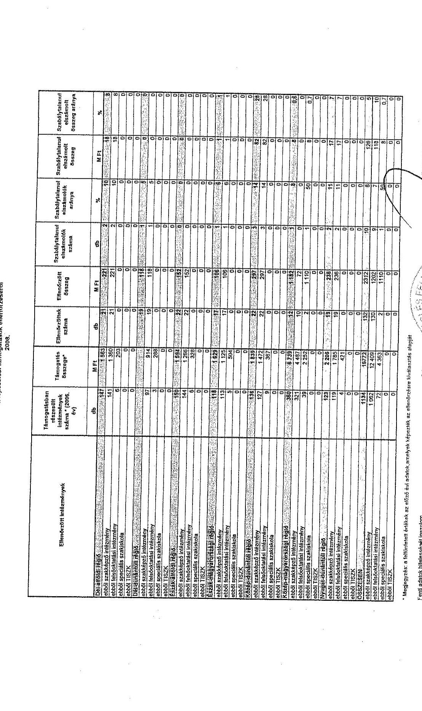

# 17/b. számú tanúsítvány

## Tanúsítvány a fejlesztési támogatások ellenőrzéséről 2006.

| Ellenkezőtől leddonévnek | Távorgadáston
ekszmét
száznámának
százná* (2006. 2.1.) | Távorgadá
főzszege* | Ellenkezőtől
százná | Ellenkezőtől
főzszege | Szabálytásos
etnedezsítők
százná | Szabálytásos
etnedezsítők
százná | Szabálytásos
etnedezsítők
észség | Szabálytásos
etnedezsítők
észség adózás |
| --- | --- | --- | --- | --- | --- | --- | --- | --- |
| 0% | 0% | 0% | 0% | 0% | 0% | 0% | 0% | 0% |
| Tanultóbb Algot | 167 | 1 500 | 21 | 220 | 0 | 0 | 167 | 0 |
| szánti szakelszéd intézmény | 167 | 1 500 | 21 | 220 | 0 | 0 | 167 | 0 |
| szánti lakáshálat intézmény | 0 | 250 | 0 | 0 | 0 | 0 | 250 | 0 |
| szánti speciális szablokok | 0 | 0 | 0 | 0 | 0 | 0 | 0 | 0 |
| széd 110/0 | 0 | 0 | 0 | 0 | 0 | 0 | 0 | 0 |
| Utánlomásított Algot | 0 | 0 | 0 | 0 | 0 | 0 | 0 | 0 |
| szánti szakelszéd intézmény | 0 | 210 | 19 | 118 | 0 | 0 | 0 | 0 |
| szánti lakáshálat intézmény | 0 | 200 | 0 | 0 | 0 | 0 | 0 | 0 |
| szánti speciális szablokok | 0 | 0 | 0 | 0 | 0 | 0 | 0 | 0 |
| széd 110/0 | 0 | 0 | 0 | 0 | 0 | 0 | 0 | 0 |
| Utánlomásított Algot | 167 | 1 500 | 21 | 220 | 0 | 0 | 167 | 0 |
| szánti szakelszéd intézmény | 167 | 1 500 | 21 | 220 | 0 | 0 | 167 | 0 |
| szánti lakáshálat intézmény | 0 | 200 | 0 | 0 | 0 | 0 | 0 | 0 |
| szánti speciális szablokok | 0 | 0 | 0 | 0 | 0 | 0 | 0 | 0 |
| széd 110/0 | 0 | 0 | 0 | 0 | 0 | 0 | 0 | 0 |
| Utánlomásított Algot | 0 | 0 | 0 | 0 | 0 | 0 | 0 | 0 |
| szánti szakelszéd intézmény | 0 | 1 500 | 0 | 150 | 0 | 0 | 1 500 | 0 |
| szánti szakelszéd intézmény | 110 | 1 500 | 21 | 200 | 0 | 0 | 110 | 0 |
| szánti lakáshálat intézmény | 0 | 200 | 0 | 0 | 0 | 0 | 0 | 0 |
| szánti speciális szablokok | 0 | 0 | 0 | 0 | 0 | 0 | 0 | 0 |
| széd 110/0 | 0 | 0 | 0 | 0 | 0 | 0 | 0 | 0 |
| Utánlomásított Algot | 130 | 1 500 | 21 | 207 | 0 | 0 | 130 | 0 |
| szánti szakelszéd intézmény | 137 | 1 470 | 21 | 207 | 0 | 0 | 137 | 0 |
| szánti lakáshálat intézmény | 0 | 207 | 0 | 0 | 0 | 0 | 0 | 0 |
| szánti speciális szablokok | 0 | 0 | 0 | 0 | 0 | 0 | 0 | 0 |
| széd 110/0 | 0 | 0 | 0 | 0 | 0 | 0 | 0 | 0 |
| Utánlomásított Algot | 260 | 4 100 | 21 | 1 181 | 0 | 0 | 260 | 0 |
| szánti szakelszéd intézmény | 277 | 4 000 | 21 | 1 181 | 0 | 0 | 277 | 0 |
| szánti lakáshálat intézmény | 38 | 2 000 | 21 | 1 110 | 0 | 0 | 38 | 0 |
| szánti speciális szablokok | 0 | 0 | 0 | 0 | 0 | 0 | 0 | 0 |
| széd 110/0 | 0 | 0 | 0 | 0 | 0 | 0 | 0 | 0 |
| Utánlomásított Algot | 120 | 2 200 | 21 | 200 | 0 | 0 | 120 | 0 |
| szánti szakelszéd intézmény | 120 | 1 000 | 21 | 200 | 0 | 0 | 120 | 0 |
| szánti lakáshálat intézmény | 0 | 470 | 0 | 0 | 0 | 0 | 0 | 0 |
| szánti speciális szablokok | 0 | 0 | 0 | 0 | 0 | 0 | 0 | 0 |
| széd 110/0 | 0 | 0 | 0 | 0 | 0 | 0 | 0 | 0 |
| Utánlomásított Algot | 318 | 16 710 | 18 | 220 | 0 | 0 | 318 | 0 |
| szánti szakelszéd intézmény | 1 000 | 32 400 | 18 | 1 000 | 0 | 0 | 1 000 | 0 |
| szánti lakáshálat intézmény | 0 | 4 000 | 0 | 0 | 0 | 0 | 0 | 0 |
| szánti speciális szablokok | 0 | 0 | 0 | 0 | 0 | 0 | 0 | 0 |
| széd 110/0 | 0 | 0 | 0 | 0 | 0 | 0 | 0 | 0 |
| Utánlomásított Algot | 318 | 16 710 | 18 | 220 | 0 | 0 | 318 | 0 |
| szánti szakelszéd intézmény | 1 000 | 32 400 | 18 | 1 000 | 0 | 0 | 1 000 | 0 |
| szánti lakáshálat intézmény | 0 | 4 000 | 0 | 0 | 0 | 0 | 0 | 0 |
| széd 110/0 | 0 | 0 | 0 | 0 | 0 | 0 | 0 | 0 |
| Utánlomásított Algot | 0 | 0 | 0 | 0 | 0 | 0 | 0 | 0 |
| * Megjegyzés: a felhőmenő królévé az előző évi aláírás arányok teljesítők az ellenőrzésre kiválasztás alapját | | | | | | | | |
| Fent számú tőlekezdési igazolás | | | | | | | | |
| Kállítását: Vérifis neve/telefonnálma: Róseivel Székely fordítás 011-2000 | | | | | | | | |
| Káll. fűzőgazol: 2011.gyófa 21. | | | | | | | | |

---

17/c. számú tanúsítvány

| Előművétel tanúsítványok | Támogatókávus
Mazaváló
tankyodógok
száma *13000,
m3 | Támogatók
Rasnapi* | Előműváltóok
száma | Előművétő
Rrasnapi | Reaktágtalovul
almátnoitás
száma | Reaktágtalovul
almátnoitás
erőnye | Reaktágtalovul
almátnoitás
Rrasnapi | Reaktágtalovul
almátnoitás
Rrasnapi erőnye |
| --- | --- | --- | --- | --- | --- | --- | --- | --- |
| | db | M Ft | db | M Ft | db | % | M Ft | % |
| Cok-gázolók végző | 135 | 2 284 | 134 | 2 033 | 20 | 20 | 130 | 10 |
| szövőt azotásároló intézmény | 133 | 243 | 102 | 2 089 | 26 | 26 | 101 | 10 |
| szövőt beadvaztatás intézmény | 0 | 240 | 0 | 640 | 0 | 64 | 50 | 5 |
| szövőt speciális azotásosok | 52 | 30 | 0 | 0 | 0 | 0 | 0 | 0 |
| szövőt TISZK | 0 | 456 | 0 | 201 | 0 | 20 | 0 | 0 |
| Cok-díjszámaitő végző | 101 | 7 309 | 0 | 0 | 0 | 0 | 0 | 0 |
| szövőt azotásároló intézmény | 74 | 350 | 0 | 0 | 0 | 0 | 0 | 0 |
| szövőt beadvaztatás intézmény | 0 | 339 | 0 | 0 | 0 | 0 | 0 | 0 |
| szövőt speciális azotásosok | 13 | 0 | 0 | 0 | 0 | 0 | 0 | 0 |
| szövőt TISZK | 0 | 208 | 0 | 0 | 0 | 0 | 0 | 0 |
| Azágos-szövőt végző | 171 | 1 543 | 160 | 2 081 | 81 | 81 | 114 | 9 |
| szövőt azotásároló intézmény | 146 | 309 | 153 | 2 078 | 45 | 45 | 83 | 10 |
| szövőt beadvaztatás intézmény | 0 | 426 | 0 | 274 | 0 | 27 | 20 | 1 |
| szövőt speciális azotásosok | 11 | 0 | 0 | 0 | 0 | 0 | 0 | 0 |
| szövőt TISZK | 0 | 180 | 0 | 239 | 0 | 23 | 0 | 0 |
| Tiszaőr-díszgép-számág végző | 130 | 1 565 | 142 | 2 032 | 15 | 15 | 82 | 9 |
| szövőt azotásároló intézmény | 119 | 244 | 125 | 1 685 | 34 | 34 | 58 | 7 |
| szövőt beadvaztatás intézmény | 0 | 538 | 0 | 309 | 0 | 30 | 63 | 7 |
| szövőt speciális azotásosok | 10 | 0 | 0 | 0 | 0 | 0 | 0 | 0 |
| szövőt TISZK | 10 | 233 | 0 | 196 | 0 | 19 | 0 | 0 |
| Azágos-dívszámaitő végző | 124 | 1 121 | 0 | 0 | 0 | 0 | 0 | 0 |
| szövőt azotásároló intézmény | 101 | 562 | 0 | 0 | 0 | 0 | 0 | 0 |
| szövőt beadvaztatás intézmény | 0 | 432 | 0 | 0 | 0 | 0 | 0 | 0 |
| szövőt speciális azotásosok | 10 | 21 | 0 | 0 | 0 | 0 | 0 | 0 |
| szövőt TISZK | 10 | 377 | 0 | 0 | 0 | 0 | 0 | 0 |
| Azágos-dívszámaitő végző | 243 | 2 841 | 262 | 12 798 | 138 | 20 | 2 020 | 20 |
| szövőt azotásároló intézmény | 261 | 2 570 | 302 | 7 128 | 165 | 30 | 2 227 | 27 |
| szövőt beadvaztatás intézmény | 0 | 2 202 | 0 | 4 660 | 0 | 0 | 0 | 0 |
| szövőt speciális azotásosok | 20 | 144 | 0 | 0 | 0 | 0 | 0 | 0 |
| szövőt TISZK | 20 | 143 | 21 | 367 | 0 | 36 | 24 | 1 |
| Tiszaőr-dívszámaitő végző | 116 | 2 344 | 139 | 3 478 | 22 | 22 | 634 | 17 |
| szövőt azotásároló intézmény | 42 | 567 | 153 | 2 300 | 32 | 32 | 676 | 14 |
| szövőt beadvaztatás intézmény | 0 | 820 | 0 | 723 | 0 | 72 | 57 | 6 |
| szövőt TISZK | 0 | 20 | 0 | 0 | 0 | 0 | 0 | 0 |
| Szobogásosok | 1 002 | 10 823 | 1024 | 29 845 | 287 | 287 | 3 821 | 14 |
| szövőt azotásároló intézmény | 336 | 7 602 | 416 | 15 247 | 124 | 24 | 3 214 | 20 |
| szövőt beadvaztatás intézmény | 0 | 4 658 | 30 | 1 455 | 23 | 23 | 490 | 7 |
| szövőt speciális azotásosok | 64 | 259 | 0 | 0 | 0 | 0 | 0 | 0 |
| szövőt TISZK | 70 | 2 805 | 44 | 2 150 | 0 | 0 | 11 | 0 |

- Megjegyzés: a felmérést értékeli az előző évi adatok, amelyek képezték az előműködési kiválasztás végzését.

Fent: ebbink Miskavégét Igazvány

Kérdészet: leddős évre (elektronikus) Bihélné Székely Jochnerő1-8500

Kelt: Roskעות, 2011. április 21.

---

17/d. számú tanúsítvány

| Ellenőrzött intézmények | Társulásban elszámolt intézmények száma | Társulás összege | Ellenőrzött összeg száma | Ellenőrzött összeg | Szabálytalanul elszámolt összeg száma | Szabálytalanul elszámolt % | Szabálytalanul elszámolt összeg | Szabálytalanul elszámolt összeg % |
| --- | --- | --- | --- | --- | --- | --- | --- | --- |
| | db | M Ft | db | M Ft | db | % | M Ft | % |
| Jóh-jóholó régió | 21 | 1 401 | 0 | 0 | 0 | 0 | 0 | 0 |
| Jóholó szobákból intézmény | 0 | 0 | 0 | 0 | 0 | 0 | 0 | 0 |
| Jóholó fenntizásból intézmény | 0 | 0 | 0 | 0 | 0 | 0 | 0 | 0 |
| Jóholó szociális szobákmód | 0 | 0 | 0 | 0 | 0 | 0 | 0 | 0 |
| Jóholó TZCD | 0 | 1 201 | 0 | 0 | 0 | 0 | 0 | 0 |
| Jóholóvalósul régió | 21 | 1 132 | 0 | 0 | 0 | 0 | 0 | 0 |
| Jóholó szobákból intézmény | 0 | 0 | 0 | 0 | 0 | 0 | 0 | 0 |
| Jóholó fenntizásból intézmény | 0 | 209 | 0 | 0 | 0 | 0 | 0 | 0 |
| Jóholó szociális szobákmód | 0 | 103 | 0 | 0 | 0 | 0 | 0 | 0 |
| Jóholó TZCD | 0 | 716 | 0 | 0 | 0 | 0 | 0 | 0 |
| TZCDT | 21 | 1 131 | 0 | 0 | 0 | 0 | 0 | 0 |
| Jóholó szobákból intézmény | 0 | 0 | 0 | 0 | 0 | 0 | 0 | 0 |
| Jóholó fenntizásból intézmény | 0 | 42 | 0 | 0 | 0 | 0 | 0 | 0 |
| Jóholó szociális szobákmód | 0 | 0 | 0 | 0 | 0 | 0 | 0 | 0 |
| Jóholó TZCD | 0 | 603 | 0 | 0 | 0 | 0 | 0 | 0 |
| TZCDT | 21 | 1 132 | 0 | 1 000 | 0 | 37 | 0 | 0 |
| TZCDT-fenntizásmód régió | 21 | 1 132 | 0 | 1 000 | 0 | 37 | 0 | 0 |
| Jóholó szobákból intézmény | 0 | 0 | 0 | 0 | 0 | 0 | 0 | 0 |
| Jóholó fenntizásmód intézmény | 0 | 0 | 0 | 0 | 0 | 0 | 0 | 0 |
| Jóholó szociális szobákmód | 0 | 0 | 0 | 0 | 0 | 0 | 0 | 0 |
| Jóholó TZCD | 0 | 0 | 0 | 0 | 0 | 0 | 0 | 0 |
| TZCDT | 21 | 1 099 | 0 | 0 | 0 | 100 | 0 | 0 |
| TZCDT-fenntizásmód régió | 21 | 1 132 | 0 | 1 000 | 0 | 37 | 0 | 0 |
| Jóholó szobákmód intézmény | 0 | 0 | 0 | 0 | 0 | 0 | 0 | 0 |
| Jóholó fenntizásmód intézmény | 0 | 0 | 0 | 0 | 0 | 0 | 0 | 0 |
| Jóholó szociális szobákmód | 0 | 412 | 0 | 0 | 0 | 0 | 0 | 0 |
| Jóholó szociális szobákmód | 0 | 0 | 0 | 0 | 0 | 0 | 0 | 0 |
| Jóholó TZCD | 0 | 691 | 0 | 0 | 0 | 100 | 0 | 0 |
| TZCDT-fenntizásmód régió | 21 | 1 131 | 0 | 1 000 | 0 | 37 | 1 201 | 0 |
| Jóholó szobákmód intézmény | 0 | 0 | 0 | 0 | 0 | 0 | 0 | 0 |
| Jóholó fenntizásmód intézmény | 0 | 0 | 0 | 0 | 0 | 0 | 0 | 0 |
| Jóholó szociális szobákmód | 0 | 2 299 | 0 | 0 | 0 | 0 | 0 | 0 |
| Jóholó TZCD | 0 | 238 | 0 | 0 | 0 | 0 | 0 | 0 |
| Jóholó TZCD | 0 | 2 299 | 0 | 0 | 0 | 0 | 0 | 0 |
| TZCDT-fenntizásmód régió | 21 | 1 629 | 0 | 0 | 0 | 0 | 0 | 0 |
| Jóholó szobákmód intézmény | 0 | 0 | 0 | 0 | 0 | 0 | 0 | 0 |
| Jóholó fenntizásmód intézmény | 0 | 457 | 0 | 0 | 0 | 0 | 0 | 0 |
| Jóholó szociális szobákmód | 0 | 0 | 0 | 0 | 0 | 0 | 0 | 0 |
| Jóholó TZCD | 0 | 1 132 |
 ```
| 0 | 0 | 0 | 0 | 0 | 0  |
|  TZCDT | 21 | 1 132 | 0 | 0 | 0 | 0 | 0 | 0  |
|  TZCDT-fenntartásmód régió | 21 | 1 629 | 0 | 0 | 0 | 0 | 0 | 0  |
|  Jóhóléti szobákmód intézmény | 0 | 0 | 0 | 0 | 0 | 0 | 0 | 0  |
|  Jóhóléti fenntartásmód intézmény | 0 | 0 | 0 | 0 | 0 | 0 | 0 | 0  |
|  Jóhóléti fenntartásmód intézmény | 0 | 0 | 0 | 0 | 0 | 0 | 0 | 0  |
|  Jóhóléti szociális szobákmód | 0 | 0 | 0 | 0 | 0 | 0 | 0 | 0  |
|  Jóhóléti TZCD | 0 | 1 132 | 0 | 0 | 0 | 0 | 0 | 0  |
|  TZCDT | 21 | 1 131 | 0 | 1 000 | 0 | 37 | 1 201 | 0  |
|  TZCDT-fenntartásmód régió | 21 | 1 629 | 0 | 0 | 0 | 0 | 0 | 0  |
|  Jóhóléti szobákmód intézmény | 0 | 0 | 0 | 0 | 0 | 0 | 0 | 0  |
|  Jóhóléti fenntartásmód intézmény | 0 | 0 | 0 | 0 | 0 | 0 | 0 | 0  |
|  Jóhóléti fenntartásmód intézmény | 0 | 0 | 0 | 0 | 0 | 0 | 0 | 0  |
|  Jóhóléti szociális szobákmód | 0 | 0 | 0 | 0 | 0 | 0 | 0 | 0  |
|  Jóhóléti TZCD | 0 | 1 132 | 0 | 0 | 0 | 0 | 0 | 0  |
|  TZCDT | 21 | 1 131 | 0 | 1 000 | 0 | 37 | 1 201 | 0  |
|  TZCDT-fenntartásmód régió | 21 | 1 629 | 0 | 0 | 0 | 0 | 0 | 0  |
|  Jóhóléti szociális szobákmód | 0 | 0 | 0 | 0 | 0 | 0 | 0 | 0  |
|  Jóhóléti fenntartásmód intézmény | 0 | 0 | 0 | 0 | 0 | 0 | 0 | 0  |
|  Jóhóléti Szociális Szobákmód | 0 | 0 | 0 | 0 | 0 | 0 | 0 | 0  |
|  Jóhóléti TZCD | 0 | 1 132 | 0 | 0 | 0 | 0 | 0 | 0  |
|  TZCDT | 21 | 1 131 | 0 | 1 000 | 0 | 37 | 1 201 | 0  |
|  TZCDT-fenntartásmód intézmény | 0 | 0 | 0 | 0 | 0 | 0 | 0 | 0  |
|  Jóhóléti szociális szobákmód | 0 | 0 | 0 | 0 | 0 | 0 | 0 | 0  |
|  Jóhóléti TZCD | 0 | 0 | 0 | 0 | 0 | 0 | 0 | 0  |
|  TZCDT | 21 | 1 131 | 0 | 1 000 | 0 | 37 | 1 201 | 0  |
|  TZCDT-fenntartásmód intézmény | 0 | 0 | 0 | 0 | 0 | 0 | 0 | 0  |
|  Jóhóléti szociális szobákmód | 0 | 0 | 0 | 0 | 0 | 0 | 0 | 0  |
|  Jóhóléti TZCD | 0 | 0 | 0 | 0 | 0 | 0 | 0 | 0  |
|  TZCDT | 21 | 1 131 | 0 | 1 000 | 0 | 37 | 1 201 | 0  |
|  TZCDT-fenntartásmód intézmény | 0 | 0 | 0 | 0 | 0 | 0 | 0 | 0  |
|  Jóhóléti szociális szobákmód | 0 | 0 | 0 | 0 | 0 | 0 | 0 | 0  |
|  Jóhóléti TZCD | 0 | 0 | 0 | 0 | 0 | 0 | 0 | 0  |
|  TZCDT | 21 | 1 131 | 0 | 1 000 | 0 | 37 | 1 201 | 0  |
|  TZCDT-fenntartásmód intézmény | 0 | 0 | 0 | 0 | 0 | 0 | 0 | 0  |
|  Jóhóléti szociális szobákmód | 0 | 0 | 0 | 0 | 0 | 0 | 0 | 0  |
|  Jóhóléti TZCD | 0 | 0 | 0 | 0 | 0 | 0 | 0 | 0  |
|  TZCDT | 21 | 1 131 | 0 | 1 000 | 0 | 37 | 1 201 | 0  |
|  TZCDT-fenntartásmód intézmény | 0 | 0 | 0 | 0 | 0 | 0 | 0 | 0  |
|  Jóhóléti szociális szobákmód | 0 | 0 | 0 | 0 | 0 | 0 | 0 | 0  |
|  Jóhóléti TZCD | 0 | 0 | 0 | 0 | 0 | 0 | 0 | 0  |
|  TZCDT | 21 | 1 131 | 0 | 1 000 | 0 | 37 | 1 201 | 0  |
|  TZCDT-fenntartásmód intézmény | 0 | 0 | 0 | 0 | 0 | 0 | 0 | 0  |
|  Jóhóléti szociális szobákmód | 0 | 0 | 0 | 0 | 0 | 0 | 0 | 0  |
|  Jóhóléti TZCD | 0 | 0 | 0 | 0 | 0 | 0 | 0 | 0  |
|  TZCDT | 21 | 1 131 | 0 | 1 000 | 0 | 37 | 1 201 | 0  |
|  TZCDT-fenntartásmód intézmény | 0 | 0 | 0 | 0 | 0 | 0 | 0 | 0  |
|  Jóhóléti Szociális Szobákmód | 0 | 0 | 0 | 0 | 0 | 0 | 0 | 0  |
|  Jóhóléti TZCD | 0 | 0 | 0 | 0 | 0 | 0 | 0 | 0  |
|  TZCDT-fenntartásmód intézmény | 0 | 0 | 0 | 0 | 0 | 0 | 0 | 0  |
|  Jóhóléti Szociális Szobákmód | 0 | 0 | 0 | 0 | 0 | 0 | 0 | 0  |
|  Jóhóléti TZCD | 0 | 0 | 0 | 0 | 0 | 0 | 0 | 0  |
|  TZCDT-fenntartásmód intézmény | 0 | 0 | 0 | 0 | 0 | 0 | 0 | 0  |
|  Jóhóléti Szociális Szobákmód | 0 | 0 | 0 | 0 | 0 | 0 | 0 | 0  |
|  Jóhóléti TZCD | 0 | 0 | 0 | 0 | 0 | 0 | 0 | 0  |
|  TZCDT-fenntartásmód intézmény | 0 | 0 | 0 | 0 | 0 | 0 | 0 | 0  |
|  Jóhóléti Szociális Szobákmód | 0 | 0 | 0 | 0 | 0 | 0 | 0 | 0  |
|  Jóhóléti TZCD | 0 | 0 | 0 | 0 | 0 | 0 | 0 | 0  |
|  TZCDT-fenntartásmód intézmény | 0 | 0 | 0 | 0 | 0 | 0 | 0 | 0  |
|  Jóhóléti Szociális Szobákmód | 0 | 0 | 0 | 0 | 0 | 0 | 0 | 0  |
|  Jóhóléti TZCD | 0 | 0 | 0 | 0 | 0 | 0 | 0 | 0  |
|  TZCDT-fenntartásmód intézmény | 0 | 0 | 0 | 0 | 0 | 0 | 0 | 0  |
|  Jóhóléti Szociális Szobákmód | 0 | 0 | 0 | 0 | 0 | 0 | 0 | 0  |
|  Jóhóléti TZCD | 0 | 0 | 0 | 0 | 0 | 0 | 0 | 0  |
|  TZCDT-fenntartásmód intézmény | 0 | 0 | 0 | 0 | 0 | 0 | 0 | 0  |
|  Jóhóléti Szociális Szobákmód | 0 | 0 | 0 | 0 | 0 | 0 | 0 | 0  |
|  Jóhóléti TZCD | 0 | 0 | 0 | 0 | 0 | 0 | 0 | 0  |
|  TZCDT-fenntartásmód intézmény | 0 | 0 | 0 | 0 | 0 | 0 | 0 | 0  |
|  Jóhóléti Szociális Szobákmód | 0 | 0 | 0 | 0 | 0 | 0 | 0 | 0  |
|  Jóhóléti TZCD | 0 | 0 | 0 | 0 | 0 | 0 | 0 | 0  |
|  TZCDT-fenntartásmód intézmény | 0 | 0 | 0 | 0 | 0 | 0 | 0 | 0  |
|  Jóhóléti Szociális
``` | Szobákmód | 0 | 0 | 0 | 0 | 0 | 0 | 0 | 0 |
| Jóholó TZCD | 0 | 0 | 0 | 0 | 0 | 0 | 0 | 0 |
| TZCDT-fenntizásmód intézmény | 0 | 0 | 0 | 0 | 0 | 0 | 0 | 0 |
| Jóholó Szociális Szobákmód | 0 | 0 | 0 | 0 | 0 | 0 | 0 | 0 |
| Jóholó TZCD | 0 | 0 | 0 | 0 | 0 | 0 | 0 | 0 |
| TZCDT-fenntizásmód intézmény | 0 | 0 | 0 | 0 | 0 | 0 | 0 | 0 |
| Jóholó Szociális Szobákmód | 0 | 0 | 0 | 0 | 0 | 0 | 0 | 0 |
| Jóholó TZCD | 0 | 0 | 0 | 0 | 0 | 0 | 0 | 0 |
| TZCDT-fenntizásmód intézmény | 0 | 0 | 0 | 0 | 0 | 0 | 0 | 0 |
| Jóholó Szociális Szobákmód | 0 | 0 | 0 | 0 | 0 | 0 | 0 | 0 |
| Jóholó TZCD | 0 | 0 | 0 | 0 | 0 | 0 | 0 | 0 |
| TZCDT-fenntizásmód intézmény | 0 | 0 | 0 | 0 | 0 | 0 | 0 | 0 |
| Jóholó Szociális Szobákmód | 0 | 0 | 0 | 0 | 0 | 0 | 0 | 0 |
| Jóholó TZCD | 0 | 0 | 0 | 0 | 0 | 0 | 0 | 0 |
| TZCDT-fenntizásmód intézmény | 0 | 0 | 0 | 0 | 0 | 0 | 0 | 0 |
| Jóholó Szociális Szobákmód | 0 | 0 | 0 | 0 | 0 | 0 | 0 | 0 |
| Jóholó TZCD | 0 | 0 | 0 | 0 | 0 | 0 | 0 | 0 |
| TZCDT-fenntizásmód intézmény | 0 | 0 | 0 | 0 | 0 | 0 | 0 | 0 |
| Jóholó Szociális Szobákmód | 0 | 0 | 0 | 0 | 0 | 0 | 0 | 0 |
| Jóholó TZCD | 0 | 0 | 0 | 0 | 0 | 0 | 0 | 0 |
| TZCDT-fenntizásmód intézmény | 0 | 0 | 0 | 0 | 0 | 0 | 0 | 0 |
| Jóholó Szociális Szobákmód | 0 | 0 | 0 | 0 | 0 | 0 | 0 | 0 |
| Jóholó TZCD | 0 | 0 | 0 | 0 | 0 | 0 | 0 | 0 |
| TZCDT-fenntizásmód intézmény | 0 | 0 | 0 | 0 | 0 | 0 | 0 | 0 |
| Jóholó Szociális Szobákmód | 0 | 0 | 0 | 0 | 0 | 0 | 0 | 0 |
| Jóholó TZCD | 0 | 0 | 0 | 0 | 0 | 0 | 0 | 0 |
| TZCDT-fenntizásmód intézmény | 0 | 0 | 0 | 0 | 0 | 0 | 0 | 0 |
| Jóholó Szociális Szobákmód | 0 | 0 | 0 | 0 | 0 | 0 | 0 | 0 |
| Jóholó TZCD | 0 | 0 | 0 | 0 | 0 | 0 | 0 | 0 |
| TZCDT-fenntizásmód intézmény | 0 | 0 | 0 | 0 | 0 | 0 | 0 | 0 |
| Jóholó Szociális Szobákmód | 0 | 0 | 0 | 0 | 0 | 0 | 0 | 0 |
| Jóholó TZCD | 0 | 0 | 0 | 0 | 0 | 0 | 0 | 0 |
| TZCDT-fenntizásmód intézmény | 0 | 0 | 0 | 0 | 0 | 0 | 0 | 0 |
| Jóholó Szociális Szobákmód | 0 | 0 | 0 | 0 | 0 | 0 | 0 | 0 |
| Jóholó TZCD | 0 | 0 | 0 | 0 | 0 | 0 | 0 | 0 |
| TZCDT-fenntizásmód intézmény | 0 | 0 | 0 | 0 | 0 | 0 | 0 | 0 |
| Jóholó Szociális Szobákmód | 0 | 0 | 0 | 0 | 0 | 0 | 0 | 0 |
| Jóholó TZCD | 0 | 0 | 0 | 0 | 0 | 0 | 0 | 0 |
| TZCDT-fenntizásmód intézmény | 0 | 0 | 0 | 0 | 0 | 0 | 0 | 0 |
| Jóholó Szociális Szobákmód | 0 | 0 | 0 | 0 | 0 | 0 | 0 | 0 |
| Jóholó TZCD | 0 | 0 | 0 | 0 | 0 | 0 | 0 | 0 |
| TZCDT-fenntizásmód intézmény | 0 | 0 | 0 | 0 | 0 | 0 | 0 | 0 |
| Jóholó Szociális Szobákmód | 0 | 0 | 0 | 0 | 0 | 0 | 0 | 0 |
| Jóholó TZCD | 0 | 0 | 0 | 0 | 0 | 0 | 0 | 0 |
| TZCDT-fenntizásmód intézmény | 0 | 0 | 0 | 0 | 0 | 0 | 0 | 0 |
| Jóholó Szociális Szobákmód | 0 | 0 | 0 | 0 | 0 | 0 | 0 | 0 |
| Jóholó TZCD | 0 | 0 | 0 | 0 | 0 | 0 | 0 | 0 |
| TZCDT-fenntizásmód intézmény | 0 | 0 | 0 | 0 | 0 | 0 | 0 | 0 |
| Jóholó Szociális Szobákmód | 0 | 0 | 0 | 0 | 0 | 0 | 0 | 0 |
| Jóholó TZCD | 0 | 0 | 0 | 0 | 0 | 0 | 0 | 0 |
| TZCDT-fenntizásmód intézmény | 0 | 0 | 0 | 0 | 0 | 0 | 0 | 0 |
| Jóholó Szociális Szobákmód | 0 | 0 | 0 | 0 | 0 | 0 | 0 | 0 |
| Jóholó TZCD | 0 | 0 | 0 | 0 | 0 | 0 | 0 | 0 |
| TZCDT-fenntizásmód intézmény | 0 | 0 | 0 | 0 | 0 | 0 | 0 | 0 |
| Jóholó Szociális Szobákmód | 0 | 0 | 0 | 0 | 0 | 0 | 0 | 0 |
| Jóholó TZCD | 0 | 0 | 0 | 0 | 0 | 0 | 0 | 0 |
| TZCDT-fenntizásmód intézmény | 0 | 0 | 0 | 0 | 0 | 0 | 0 | 0 |
| Jóholó Szociális Szobákmód | 0 | 0 | 0 | 0 | 0 | 0 | 0 | 0 |
| Jóholó TZCD | 0 | 0 | 0 | 0 | 0 | 0 | 0 | 0 |
| TZCDT-fenntizásmód intézmény | 0 | 0 | 0 | 0 | 0 | 0 | 0 | 0 |
| Jóholó Szociális Szobákmód | 0 | 0 | 0 | 0 | 0 | 0 | 0 | 0 |
| Jóholó TZCD | 0 | 0 | 0 | 0 | 0 | 0 | 0 | 0 |
| TZCDT-fenntizásmód intézmény | 0 | 0 | 0 | 0 | 0 | 0 | 0 | 0 |
| Jóholó Szociális Szobákmód | 0 | 0 | 0 | 0 | 0 | 0 | 0 | 0 |
| Jóholó TZCD | 0 | 0 | 0 | 0 | 0 | 0 | 0 | 0 |
| TZCDT-fenntizásmód intézmény | 0 | 0 | 0 | 0 | 0 | 0 | 0 | 0 |
| Jóholó Szociális | Szobákmód | 0 | 0 | 0 | 0 | 0 | 0 | 0 | 0 |
| Jóholó TZCD | 0 | 0 | 0 | 0 | 0 | 0 | 0 | 0 |
| TZCDT-fenntizásmód intézmény | 0 | 0 | 0 | 0 | 0 | 0 | 0 | 0 |
| Jóholó Szociális Szobákmód | 0 | 0 | 0 | 0 | 0 | 0 | 0 | 0 |
| Jóholó TZCD | 0 | 0 | 0 | 0 | 0 | 0 | 0 | 0 |
| TZCDT-fenntizásmód intézmény | 0 | 0 | 0 | 0 | 0 | 0 | 0 | 0 |
| Jóholó Szociális Szobákmód | 0 | 0 | 0 | 0 | 0 | 0 | 0 | 0 |
| Jóholó TZCD | 0 | 0 | 0 | 0 | 0 | 0 | 0 | 0 |
| Jóholó TZCD | 0 | 0 | 0 | 0 | 0 | 0 | 0 | 0 |
| Jóholó TZCD | 0 | 0 | 0 | 0 | 0 | 0 | 0 | 0 |
| Jóholó TZCD | 0 | 0 | 0 | 0 | 0 | 0 | 0 | 0 |
| Jóholó TZCD | 0 | 0 | 0 | 0 | 0 | 0 | 0 | 0 |
| Jóholó TZCD | 0 | 0 | 0 | 0 | 0 | 0 | 0 | 0 |
| Jóholó TZCD | 0 | 0 | 0 | 0 | 0 | 0 | 0 | 0 |
| Jóholó TZCD | 0 | 0 | 0 | 0 | 0 | 0 | 0 | 0 |
| Jóholó TZCD | 0 | 0 | 0 | 0 | 0 | 0 | 0 | 0 |
| Jóholó TZCD | 0 | 0 | 0 | 0 | 0 | 0 | 0 | 0 |
| Jóholó TZCD | 0 | 0 | 0 | 0 | 0 | 0 | 0 | 0 |
| Jóholó TZCD | 0 | 0 | 0 | 0 | 0 | 0 | 0 | 0 |
| Jóholó TZCD | 0 | 0 | 0 | 0 | 0 | 0 | 0 | 0 |
| Jóholó TZCD | 0 | 0 | 0 | 0 | 0 | 0 | 0 | 0 |
| Jóholó TZCD | 0 | 0 | 0 | 0 | 0 | 0 | 0 | 0 |
| Jóholó TZCD | 0 | 0 | 0 | 0 | 0 | 0 | 0 | 0 |
| Jóholó TZCD | 0 | 0 | 0 | 0 | 0 | 0 | 0 | 0 |
| Jóholó TZCD | 0 | 0 | 0 | 0 | 0 | 0 | 0 | 0 |
| Jóholó TZCD | 0 | 0 | 0 | 0 | 0 | 0 | 0 | 0 |
| Jóholó TZCD | 0 | 0 | 0 | 0 | 0 | 0 | 0 | 0 |
| Jóholó TZCD | 0 | 0 | 0 | 0 | 0 | 0 | 0 | 0 |
| Jóholó TZCD | 0 | 0 | 0 | 0 | 0 | 0 | 0 | 0 |
| Jóholó TZCD | 0 | 0 | 0 | 0 | 0 | 0 | 0 | 0 |
| Jóholó TZCD | 0 | 0 | 0 | 0 | 0 | 0 | 0 | 0 |
| Jóholó TZCD | 0 | 0 | 0 | 0 | 0 | 0 | 0 | 0 |
| Jóholó TZCD | 0 | 0 | 0 | 0 | 0 | 0 | 0 | 0 |
| Jóholó TZCD | 0 | 0 | 0 | 0 | 0 | 0 | 0 | 0 |
| Jóholó TZCD | 0 | 0 | 0 | 0 | 0 | 0 | 0 |
| Jóholó TZCD | 0 | 0 | 0 | 0 | 0 | 0 | 0 | 0 |
| Jóholó TZCD | 0 | 0 | 0 | 0 | 0 | 0 | 0 |
| Jóholó TZCD | 0 | 0 | 0 | 0 | 0 | 0 | 0 | 0 |
| Jóholó TZCD | 0 | 0 | 0 | 0 | 0 | 0 | 0 |
| Jóholó TZCD | 0 | 0 | 0 | 0 | 0 | 0 | 0 |
| Jóholó TZCD | 0 | 0 | 0 | 0 | 0 | 0 | 0 |
| Jóholó TZCD | 0 | 0 | 0 | 0 | 0 | 0 | 0 |
| Jóholó TZCD | 0 | 0 | 0 | 0 | 0 | 0 | 0 |
| Jóholó TZCD | 0 | 0 | 0 | 0 | 0 | 0 | 0 |
| Jóholó TZCD | 0 | 0 | 0 | 0 | 0 | 0 | 0 |
| Jóholó TZCD | 0 | 0 | 0 | 0 | 0 | 0 | 0 |
| Jóholó TZCD | 0 | 0 | 0 | 0 | 0 | 0 | 0 |
| Jóholó TZCD | 0 | 0 | 0 | 0 | 0 | 0 | 0 |
| Jóholó TZCD | 0 | 0 | 0 | 0 | 0 | 0 |
| Jóholó TZCD | 0 | 0 | 0 | 0 | 0 | 0 | 0 |
| Jóholó TZCD | 0 | 0 | 0 | 0 | 0 | 0 | 0 |
| Jóholó TZCD | 0 | 0 | 0 | 0 | 0 | 0 | 0 |
| Jóholó TZCD | 0 | 0 | 0 | 0 | 0 | 0 | 0 |
| Jóholó TZCD | 0 | 0 | 0 | 0 | 0 | 0 | 0 |
| Jóholó TZCD | 0 | 0 | 0 | 0 | 0 | 0 | 0 |
| Jóholó TZCD | 0 | 0 | 0 | 0 | 0 | 0 |
| Jóholó TZCD | 0 | 0 | 0 | 0 | 0 | 0 |
| Jóholó TZCD | 0 | 0 | 0 | 0 | 0 | 0 | 0 |
| Jóholó TZCD | 0 | 0 | 0 | 0 | 0 | 0 |
| Jóholó TZCD | 0 | 0 | 0 | 0 | 0 | 0 | 0 |
| Jóholó TZCD | 0 | 0 | 0 | 0 | 0 | 0 |
| Jóholó TZCD | 0 | 0 | 0 | 0 | 0 | 0 | 0 |
| Jóholó TZCD | 0 | 0 | 0 | 0 | 0 | 0 |
| Jóholó TZCD | 0 | 0 | 0 | 0 | 0 | 0 | 0 |
| Jóholó TZCD | 0 | 0 | 0 | 0 | 0 | 0 |
| Jóholó TZCD | 0 | 0 | 0 | 0 | 0 | 0 |
| Jóholó TZCD | 0 | 0 | 0 | 0 | 0 | 0 |
| Jóholó TZCD | 0 | 0 | 0 | 0 | 0 | 0 |
| Jóholó TZCD | 0 | 0 | 0 | 0 | 0 | 0 |
| Jóholó TZCD | 0 | 0 | 0 | 0 | 0 |
| Jóholó TZCD | 0 | 0 | 0 | 0 |
| Jóholó TZCD | 0 | 0 | 0 | 0 | 0 | 0 |
| Jóholó TZCD | 0 | 0 | 0 | 0 |
| Jóholó TZCD | 0 | 0 | 0 | 0 |
| Jóholó TZCD | 0 | 0 | 0 | 0 | 0 |
| Jóholó TZCD | 0 | 0 | 0 | 0 |
| Jóholó TZCD | 0 | 0 | 0 | 0 | 0 |
| Jóholó TZCD | 0 | 0 | 0 | 0 |
| Jóholó TZCD | 0 | 0 | 0 | 0 | 0 |
| Jóholó TZCD | 0 | 0 | 0 | 0 | 0 |
| Jóholó TZCD | 0 | 0 | 0 | 0 |
| Jóholó TZCD | 0 | 0 | 0 | 0 | 0 |
| Jóholó TZCD | 0 | 0 | 0 | 0 |
| Jóholó TZCD | 0 | 0 | 0 | 0 |
| Jóholó TZCD | 0 | 0
 | 0 | 0 | 0 |
| Jóhóló TZCD | 0 | 0 | 0 | 0 |
| Jóhóló TZCD | 0 | 0 | 0 | 0 | 0 |
| Jóhóló TZCD | 0 | 0 | 0 | 0 |
| Jóhóló TZCD | 0 | 0 | 0 | 0 |
| Jóhóló TZCD | 0 | 0 | 0 | 0 | 0 |
| Jóhóló TZCD | 0 | 0 | 0 | 0 |
| Jóhóló TZCD | 0 | 0 | 0 | 0 |
| Jóhóló TZCD | 0 | 0 | 0 | 0 | 0 |
| Jóhóló TZCD | 0 | 0 | 0 |
| Jóhóló TZCD | 0 | 0 | 0 | 0 | 0 |
| Jóhóló TZCD | 0 | 0 | 0 |
| Jóhóló TZCD | 0 | 0 | 0 | 0 |
| Jóhóló TZCD | 0 | 0 | 0 |
| Jóhóló TZCD | 0 | 0 | 0 | 0 |
| Jóhóló TZCD | 0 | 0 | 0 |
| Jóhóló TZCD | 0 | 0 | 0 | 0 |
| Jóhóló TZCD | 0 | 0 | 0 | 0 |
| Jóhóló TZCD | 0 | 0 | 0 |
| Jóhóló TZCD | 0 | 0 | 0 | 0 |
| Jóhóló TZCD | 0 | 0 | 0 |
| Jóhóló TZCD | 0 | 0 | 0 | 0 |
| Jóhóló TZCD | 0 | 0 | 0 |
| Jóhóló TZCD | 0 | 0 | 0 | 0 |
| Jóhóló TZCD | 0 | 0 | 0 |
| Jóhóló TZCD | 0 | 0 | 0 | 0 |
| Jóhóló TZCD | 0 | 0 | 0 |
| Jóhóló TZCD | 0 | 0 | 0 | |
| Jóhóló TZCD | 0 | 0 | 0 | 0 |
| Jóhóló TZCD | 0 | 0 | 0 | |
| Jóhóló TZCD | 0 | 0 | 0 | 0 | |
| Jóhóló TZCD | 0 | 0 | 0 | |
| Jóhóló TZCD | 0 | 0 | 0 | 0 | |
| Jóhóló TZCD | 0 | 0 | 0 | 0 | |
| Jóhóló TZCD | 0 | 0 | 0 | 0 | |
| Jóhóló TZCD | 0 | 0 | 0 | 0 | 0 | |
| Jóhóló TZCD | 0 | 0 | 0 | 0 | 0 | |
| Jóhóló TZCD | 0 | 0 | 0 | 0 | 0 | 0 | |
| Jóhóló TZCD | 0 | 0 | 0 | 0 | 0 | 0 | |
| Jóhóló TZCD | 0 | 0 | 0 | 0 | 0 | 0 | 0 | |
| Jóhóló TZCD | 0 | 0 | 0 | 0 | 0 | 0 | 0 | 0 | |
| Jóhóló TZCD | 0 | 0 | 0 | 0 | 0 | 0 | 0 | 0 | 0 | |
| Jóhóló TZCD | 0 | 0 | 0 | 0 | 0 | 0 | 0 | 0 | 0 | 0 |

---

### 18. számú tanúsítvány

### a fejlesztési támogatáshoz kapcsolódó realizáló levelek*, perek számának alakulásáról 2007-2010.

| Megnevezés | Mértékegység | 2007 | 2008 | 2009 | 2010 **** |
| --- | --- | --- | --- | --- | --- |
| Realizáló levelek száma | db | 147 | 132 | 924 | 5 |
| Észrevételezések száma | db | 31 | 4 | 116 | 2 |
| Észrevételezések aránya | % | 21 | 3 | 13 | 40 |
| Előző időszakból áthúzódó perek száma | db | 0 | 0 | 1 | 3 |
| Előző időszakból áthúzódó perek pertárgyértéke | e Ft | 0 | 0 | 4784,173 | 102665,508 |
| Tárgyévben indult perek száma | db | 0 | 1 | 4 | 3 |
| Tárgyévben indult perek pertárgyértéke** | e Ft | 0 | 4784,173 | 108119,325 | 60211,902 |
| Összes folyamatban lévő per száma | db | 0 | 1 | 5 | 8 |
| Összes folyamatban lévő per pertárgyértéke | e Ft | 0 | 4784,173 | 112903,498 | 162877,41 |
| Lezárt per száma összesen | db | 0 | 0 | 2 | 2 |
| Lezárt per pertárgyértéke | e Ft | 0 | 0 | 10237,99 | 3456,467 |
| - elveszített perek (hatályon kívül helyezés) száma | db | 0 | 0 | 0 | 0 |
| - elveszített perek (hatályon kívül helyezés) pertárgyértéke | e Ft | 0 | 0 | 0 | 0 |
| - megnyert perek (helybenhagyás ill. kereset elutasítás, megváltoztatás, végzéssel zárult) száma | db | 0 | 0 | 1 | 1*** |
| - megnyert perek (helybenhagyás ill. kereset elutasítás, megváltoztatás) pertárgyértéke | e Ft | 0 | 0 | 9530,392 | 3456,467 |
| - megnyert perek (helybenhagyás ill. kereset elutasítás, megváltoztatás) aránya | % | -- | -- | 100 | 100 |

- Az ellenőrzés végrehajtásáért felelős NSZFI nem rendelkezik hatósági jogkörrel, ezért közigazgatási határozatot nem hozhat. Az általa készített ún. realizáló levél ellen peres úton lehet jogorvoslatot kezdeményezni.

* és járulékok

* A tárgyévben indult, lezárt perek közül a SZIQMA+ Gimnázium és Szakképző Iskola (1146 Budapest, Thököly út 58-60.) nevű intézménnyel szemben indított eljárás megszűnt, tekintettel arra, hogy az intézmény kölcsönnyére, a főjegyzői nyilvántartásból törlésre kerül.

**** A 2010. évre külső szakértők bevonásával tervezett ellenőrzések esetében, a szakértők kiválasztására kiírt közbeszerzési eljárás felfüggesztésre került a 1132/2009. (VIII. 7.) Kormány Határozat alapján, ezért az ellenőrzések végrehajtása 2011. évre húzódott át.

Fenti adatok hitelességét igazolom.

Különítésért felelős neve, telefonszáma. Bihariné Székely Andrea431-6560 A. János és társa Ügyvédi Iroda adatszolgáltatása alapján

Kelt: Budapest, 2011. április 21.

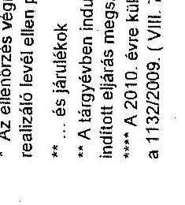

---

# Tanúsítvány

a szakképzési hozzájárulási kötelezettség terhére elszámolt képzések főbb adatai

| Év | A saját munkavállalók képzését elszámoló, adatszolgáltatást benyújtó hozzájárulásra kötelezett vállalkozások száma | Képzések száma | Képzések óraszáma | Képzésben résztvevő munkavállalók száma | A képzések összes költsége (E Ft) | A képzések összes költségéből elszámolt költség (E Ft) | Fajlagos költség (E Ft / munkavállaló) | A szakképzési hozzájárulási kötelezettség saját munkavállalók képzésére fordítható részének (33/60%-ának) összege (E Ft) |
| --- | --- | --- | --- | --- | --- | --- | --- | --- |
| 2007. év | 3 574 | 15 153 | 1 362 386 | 94 131 | 8 715 768 | 7 308 543 | 77,6 | 12 537 668 |
| 2008. év | 4 005 | 18 056 | 1 753 615 | 95 427 | 9 849 674 | 7 811 129 | 81,9 | 13 680 776 |
| 2009. év | 5 911 | 20 826 | 1 907 208 | 110 923 | 10 772 677 | 7 609 763 | 68,6 | 20 556 477 |
| 2010. év* | 4 847 | 22 209 | 2 014 605 | 100 243 | 10 952 854 | 6 588 024 | 65,7 | 15 445 006 |
| 2007-2010. évek összesen | 18 337 | 76 244 | 7 037 814 | 400 724 | 40 290 973 | 29 317 459 | 73,2 | 62 219 927 |

*Megjegyzés: A 2010. évi adatok visszaellenőrzése még nem zárult le.

Kelt: Budapest, 2011.

P.H.

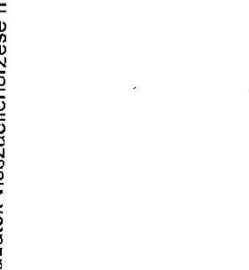

---

Ikt.szám: NGM/7551/5/2011. Tanúsítvány a Munkaerőpiaci Alap képzési alaprészének felhasználásáról (tényleges kifizetések) 2007-2010. Adatok ezer Ft-ban

| Ssz. | Jogcím megnevezése | Jelenleg hatályban lévő jogszabályi hivatkozás | 2007 | 2008 | 2009 | 2010 |
| --- | --- | --- | --- | --- | --- | --- |
| 1. | Fejlesztés előirányzat, előirányzat: | | | | | |
| 1. | EU Társtámogatási kötelezettség | Szht. 9. § (2) bek. a) pontja | 5490400 | 2800000 | 0 | 0 |
| 2. | Szakképzési hozzájárulás visszatérítés | Szht. 9. § (2) bek. b) pontja | 8625303 | 8674364 | 11693801 | 14579674 |
| 3. | Fővárosi önkormányzati gyakorlati képzési végzősi támogatása | Szht. 9. § (2) bek. c) pontja (módosítás alatt) | 1591167 | 1174022 | 660182 | 10954 |
| 4. | Működtetési célú kiadások | Szht. 9. § (2) bek. c) pontja | 999900 | 1140300 | 0 | 0 |
| 5. | Határon túli magyarok szakképzésének, felvételének és felnőttképzési támogatása | Szht. 9. § (2) bek. d) pontja | 666600 | 760200 | 856000 | 994000 |
| 6. | Szakiskolai tanulmányi ösztöndíj | Szht.9. § (2) bek. e) pontja | | | | 2059891 |
| 7. | Nemzeti Tehetség Program | Szht. 9. § (2) bek. f) pontja | | | | 1491500 |
| 8. | Decentralizált keretösszeg | Szht. 9. § (2) bek. g) pontja | 5092147 | 7084404 | 1669814 | 2956595 |
| 8.1. | Hozzájárulásra kötelezettek támogatása | Szht. 10. §. (4) bek. a) pontja alapján Szht. 14. § (1) bek. a) pontja | 2190420 | 3525508 | 562469 | 2194816  |
|  8.2. | TISZK iskola rendszerű szakképzési folytató intézmények támogatása | Szht. 10. §. (4) bek. a) pontja alapján Szht. 14. § (1) bek. b) pontja | 0 | 0 | 0 | 702429  |
|  8.3. | Speciális szakiskolák és készségfejlesztő szakiskolák támogatása | Szht. 10. §. (4) bek. a) pontja alapján Szht. 14. § (1) bek. c) pontja | 2461355 | 3320118 | 903231 | 49147  |
|  8.4. | Állami felnőttképzési intézmények támogatása | Szht. 10. §. (4) bek. a) pontja alapján Szht. 14. § (1) bek. d) pontja | 0 | 0 | 0 | 0  |
|  8.5. | Feladatoktatási intézményekben folyó szakképzési támogatása | Szht. 10. §. (4) bek. a) pontja alapján Szht. 14. § (1) bek. a) pontja | 289616 | 194697 | 103814 | 10704  |
|  8.6. | Felnőttképzési intézetek eltereditációs követelményeinek ellenőrzése | Szht. 10. §. (4) bek. a) pontja alapján Szht. 14. § (10) bek. |  |  |  |   |
|  8.7. | TISZK iskola rendszerű szakképzési folytató intézmények részére tananyag- és taneszközfejlesztés, tanárok kreditált továbbképzésének támogatása | Szht. 10. §. (4) bek. b) pontja alapján Szht. 14. § (1) bek. b) pontja |  |  |  |   |
|  8.8. | Speciális szakiskolák és készségfejlesztő szakiskolák részére tananyag- és taneszközfejlesztés, tanárok kreditált továbbképzésének támogatása | Szht. 10. §. (4) bek. b) pontja alapján Szht. 14. § (1) bek. c) pontja |  |  |  |   |
|  8.9. | Állami felnőttképzési intézmények részére tananyag- és taneszközfejlesztés, tanárok kreditált továbbképzésének támogatása | Szht. 10. §. (4) bek. b) pontja alapján Szht. 14. § (1) bek. d) pontja |  |  |  |   |
|  8.10. | Feladatoktatási intézmények részére tananyag- és taneszközfejlesztés, tanárok kreditált továbbképzésének támogatása | Szht. 10. §. (4) bek. b) pontja alapján Szht. 14. § (1) bek. a) pontja |  |  |  |   |
|  8.11. | Növidő céljára (decentralizált keret max. 5\%) | Szht. 10. § (1) b) alapján Szht. 14. § (9) bek. | 90854 | 44130 | 0 | 0  |
|  9. | Szaklakolati fejlesztési program | Szht. 9. § (2) bek. i) pontja | 701602 | 245473 | 257574 | 7967  |
|  10. | Út a szakmához program | Szht. 9. § (2) bek. i) pontja | 220000 | 220000 | 397000 | 445088  |
|  11. | Vizsgaszervezés ellenőrzése | Szht. 9. § (2) bek. j) pontja |  |  |  |   |
|  II. | Szakképzésért és felnőttképzésért felelős miniszter központi kerete, előirányzat: | Szht. 10. § (1)-(2) bek. |  |  |  |   |
|  1. | Felnőttképzési célok támogatására | Szht. 9. § (2) bek. g) pontja |  |  |  |   |
|  2. | Iskolarendszeren kívüli felnőttképzés | Szht. 10. § (1) bek. a) pontja | 2664398 | 3309140 | 1367817 | 336958  |
|  3. | TISZK elméleti képzési támogatása | Szht. 10. § (1) bek. b) pontja alapján Szht. 14. § (1) bek. a) pontja | 0 | 0 | 0 | 0  |
|  4. | TISZK iskola rendszerű szakképzési folytató intézmények támogatása | Szht. 10. § (1) b) alapján Szht. 14. § (1) bek. b) pontja | 0 | 0 | 0 | 0  |

---

|  Ssz. | Jogcím megnevezése | Jelenleg hatályban lévő jogszabályi hivatkozás | 2007 | 2008 | 2009 | 2010  |
| --- | --- | --- | --- | --- | --- | --- |
|  5. | Speciális szakiskolák és készségfejlesztő szakiskolák támogatása | Szht. 10. § (1) bek. (c) pontja alapján |  |  |  |   |
|   |  | Szht. 14. § (1) bek. (c) pontja | 0 | 0 | 0 | 0  |
|  6. | Állami behálózási intézmények támogatása | Szht. 10. § (1) bek. (c) pontja alapján |  |  |  |   |
|   |  | Szht. 14. § (1) bek. (c) pontja | 1 162 400 | 0 | 0 | 0  |
|  7. | Felsőoktatási intézményekben folyó szakképzés támogatása | Szht. 10. § (1) bek. (c) pontja alapján |  |  |  |   |
|   |  | Szht. 14. § (1) bek. (c) pontja | 0 | 0 | 0 | 0  |
|  8. | Tananyagfejlesztés, tanárok oktatásának támogatása, stb. | Szht. 10. § (1) bek. (c) pontja alapján |  |  |  |   |
|   |  | Szht. 14. § (3) bek. (c) pontja | 131 428 | 605 611 | 231 342 | 18 806  |
|  9. | Beruházás célú támogatás | Szht. 10. § (1) bek. (c) pontja alapján |  |  |  |   |
|   |  | Szht. 14. § (4) bek. (c) pontja | 83 536 | 241 589 | 5 974 | 0  |
|  10. | Határon túl magyarok képzésének, felelősségvállalásának támogatása | Szht. 10. § (1) bek. (c) pontja alapján |  |  |  |   |
|   |  | Szht. 14. § (5) bek. (c) pontja | 11 500 | 5 700 | 0 | 0  |
|  11. | Főtevékenység köré gyakorlati képzést végzők támogatása | Szht. 10. § (1) bek. (c) pontja alapján |  |  |  |   |
|   |  | Szht. 14. § (6) bek. (c) pontja |  |  |  |   |
|  12. | Gazdasági kamarák értékképzéseinek támogatása | Szht. 10. § (1) bek. (c) pontja alapján | 1 277 168 | 1 915 871 | 1 127 291 | 1 500 692  |
|   |  | Szht. 14. § (7) bek. (c) pontja |  |  |  |   |
|  13. | EU támogatással megvalósuló szakképzési fejlesztési programok támogatása | Szht. 10. § (1) bek. (c) pontja alapján |  |  |  |   |
|   |  | Szht. 14. § (9) bek. (c) pontja | 2 921 | 1 140 694 | 0 | 43 900  |
|  14. | Saját munkavállalók képzésére fordított költséghányadok, valamint a felnőttképzési intézmények ellenőrzése | Szht. 10. § (1) bek. (c) pontja alapján |  |  |  |   |
|   |  | Szht. 14. § (10) bek. (c) pontja |  |  |  |   |
|  15. | Felnőttképzési intézetek akkreditációs követelményeinek ellenőrzése (előzővel igazolt más, 3\%) | Szht. 10. § (1) bek. (c) pontja alapján |  |  |  |   |
|   |  | Szht. 14. § (10) bek. (c) pontja | 188 643 | 286 984 | 135 716 | 65 301  |
|  16. | Egyéb előzetes |  | 1 601 989 | 384 710 | 399 378 | 155 807  |

---

|  Bsc. | Jogcím megnevezése | Jelenleg hatályban lévő jogszabályi hivatkozás | 2007 | 2008 | 2009 | 2010  |
| --- | --- | --- | --- | --- | --- | --- |
|  III. | Oktatásért felelős miniszter központi kerete, elszámolási: | Szht. 10. § (3) bek. |  |  | Keretelhetési tétel 2024/25 |   |
|  1. | Gyakorlati oktatás pályaválasztási, témahétre, versenyre stb. | Szht. 10. § (3) bek. (a) pontja | 5 542 386 | 3 879 102 | 160 870 | 571 784  |
|  2. | Gimnáziumban folyó informatikai oktatás és kitűnő érettségi informatikai, eszközönként fejlesztésére (max. 4%) | Szht. 10. § (3) bek. (c) pontja | 347 750 | 25 000 |  | 0  |
|  3. | Közalapítványok támogatása (max. 4%) | Szht. 10. § (3) bek. (c) pontja | 59 800 | 225 406 |  | 25 759  |
|  4. | Felsőoktatási intézményekben folyó szabályozási támogatása (max. 5 %) | Szht. 10. § (3) bek. (a) pontja | 160 230 | 229 011 |  | 0  |
|  5. | Intézményi működtetési költség (max. 1,5 %) | Szht. 10. § (3) bek. (a) pontja |  | 68 000 |  | 13 720  |
|  6. | Középítési beiskolázás írásbeli felvétel vizsgálások lebonyolítása | Szht. 10. § (3) bek. (c) pontja |  |  |  |   |
|  7. | Alapkészség mérése | Szht. 10. § (3) bek. (a) pontja |  |  |  |   |
|  8. | Szakmai vizsgák szervezése és ellenőrizése | Szht. 10. § (3) bek. (c) pontja |  |  |  |   |
|  9. | Közoktatási információs rendszer fejlesztése | Szht. 10. § (3) bek. (a) pontja |  |  |  |   |
|  10. | Képzés fejlesztése | Szht. 10. § (3) bek. (a) pontja |  |  |  |   |
|  11. | Kollégiumok fejlesztése | Szht. 10. § (3) bek. (c) pontja |  |  |  |   |
|  12. | Nemzeti Tehetség Program | Szht. 10. § (3) bek. (a) pontja |  |  |  |   |
|   | MPA KÉPZÉSI ALAPKÉSZ
PELKKEZNÁLÁS ÖSSZESEN |  | 33 795 073 | 36 882 000 | 19 160 360 | 25 895 350  |

Fenti adatok hivatkozási igazolást.

Kelt: Budapest, 2011. április 12.

P.H.

Megjegyzés: II 8.1-8.11. sorok a Nemzeti Szakképzési és Felnőttképzési Intézet adatszolgáltatása alapján kerültek kötődésre. III./1-12. sorok a Nemzeti Erőforrás Minisztérium Közoktatás Fejlesztési Főosztály adatszolgáltatása alapján kerültek kötődésre.

---

### a 2007-2010 időszakra vonatkozó oktatási miniszter rendelkezési jogkörébe tartozó és központi keret terhére adott támogatások ellenőrzési

|  Adatok megnevezése | 2007. év adatai |  | 2008. év adatai |  | 2009. év adatai |  | 2010. év adatai |  | Összesen |   |
| --- | --- | --- | --- | --- | --- | --- | --- | --- | --- | --- |
|   | Saját | Külső | Saját | Külső | Saját | Külső | Saját | Külső | Saját | Külső  |
|  Ellenőrzött szerződések száma (db), egyedi szerződések | 1 | 9 | 21 | 35 | 7 | 34 | 2 | 54 | 31 | 132  |
|  Ellenőrzött szerződések száma (db), pályázati szerződések | 0 | 212 | 0 | 5 | 7 | 21 | 0 | 63 | 7 | 301  |
|  Ellenőrzött szerződések száma | 1 | 221 | 21 | 40 | 14 | 55 | 2 | 117 | 38 | 435  |
|  Ellenőrzött összeg (E Ft) egyedi szerződések | 399 236 | 2 404 075 | 2 889 588 | 2 940 556 | 171 091 | 2 670 712 | 1 155 400 | 5 625 217 | 4 615 315 | 13 640 558  |
|  Ellenőrzött összeg (E Ft) pályázati szerződések | 0 | 267 420 | 0 | 5 850 | 7 000 | 64 321 | 0 | 257 459 | 7 000 | 595 050  |
|  Ellenőrzött összeg (E Ft) összesen | 399 236 | 2 671 492 | 2 889 588 | 2 946 406 | 178 091 | 2 735 033 | 1 155 400 | 5 882 676 | 4 622 315 | 14 235 608  |
|  Megállapításod zárult ellenőrzések száma (db) egyedi szerződések | 1 | 0 | 16 | 11 | 5 | 16 | 2 | 0 | 24 | 27  |
|  Megállapításod zárult ellenőrzések száma (db) pályázati szerződések | 0 | 0 | 0 | 0 | 0 | 0 | 0 | 0 | 0 | 0  |
|  Megállapításod zárult ellenőrzések száma (db) összesen | 1 | 0 | 16 | 11 | 5 | 16 | 2 | 0 | 24 | 27  |
|  Megállapított visszakövetelés összege (E Ft) egyedi szerződések | 100 | 0 | 265 119 | 18 309 | 652 | 56 224 | 58 111 | 0 | 323 982 | 74 533  |
|  Megállapított visszakövetelés összege (E Ft) pályázati szerződések | 0 | 0 | 0 | 0 | 0 | 0 | 0 | 0 | 0 | 0  |
|  Megállapított visszakövetelés összege (E Ft) összesen | 100 | 0 | 265 119 | 18 309 | 652 | 56 224 | 58 111 | 0 | 323 982 | 74 533  |
|  Megállapításból befelező összeg (E Ft) egyedi szerződések | 100 | 0 | 264 127 | 7 312 | 259 | 21 412 | 177 | 0 | 264 663 | 28 924  |

---

|  Megállapításból befolyt összeg (E
Ft) pályázati szerződések | 0 | 0 | 0 | 0 | 0 | 0 | 0 | 0 | 0  |
| --- | --- | --- | --- | --- | --- | --- | --- | --- | --- |
|  Megállapításból befolyt összeg (E
Ft) összesen | 100 | 0 | 264 127 | 7 512 | 259 | 21 412 | 177 | 0 | 264 663  |
|  Saját erő költsége, külső
szabértőnek kiifavonni összeg (E
Ft) egyedi szerződések | 551 | 6 676 | 12 669 | 24 480 | 3 731 | 17 606 | 1 128 | 8 612 | 18 079  |
|  Saját erő költsége, külső
szabértőnek kiifavonni összeg (E
Ft) pályázati szerződések | 0 | 5 683 | 0 | 913 | 1 119 | 3 253 | 0 | 5 090 | 1 119  |
|  Saját erő költsége, külső
szabértőnek kiifavonni összeg (E
Ft) összesen | 551 | 12 359 | 12 669 | 25 293 | 4 850 | 20 859 | 1 128 | 13 702 | 19 198  |

- A 2010. éves tervezett ellenőrzésre jelenleg folyamatosan vannak.

Kitöltésért felelős neve, telefonszáma: Bihuriné Székely Andrea 431-6560

Fenti adatok hitelességét igazolom.

Budapest, 2011. június 09.

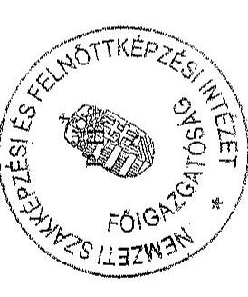


2/2

---

|  22. számú tanúsítvány |  |  |  |  |  |  |  |  |  |  |  |  |  |  |  |  |  |   |
| --- | --- | --- | --- | --- | --- | --- | --- | --- | --- | --- | --- | --- | --- | --- | --- | --- | --- | --- |
|  |   |   |   |   |   |   |   |   |   |   |   |   |   |   |   |   |   |   |
|  |   |   |   |   |   |   |   |   |   |   |   |   |   |   |   |   |   |   |
|  |   |   |   |   |   |   |   |   |   |   |   |   |   |   |   |   |   |   |
|  |   |   |   |   |   |   |   |   |   |   |   |   |   |   |   |   |   |   |
|  |   |   |   |   |   |   |   |   |   |   |   |   |   |   |   |   |   |   |
|  |   |   |   |   |   |   |   |   |   |   |   |   |   |   |   |   |   |   |
|  |   |   |   |   |   |   |   |   |   |   |   |   |   |   |   |   |   |   |
|  |   |   |   |   |   |   |   |   |   |   |   |   |   |   |   |   |   |   |
|  |   |   |   |   |   |   |   |   |   |   |   |   |   |   |   |   |   |   |
|  |   |   |   |   |   |   |   |   |   |   |   |   |   |   |   |   |   |   |
|  |   |   |   |   |   |   |   |   |   |   |   |   |   |   |   |   |   |   |
|  |   |   |   |   |   |   |   |   |   |   |   |   |   |   |   |   |   |   |
 |   |   |   |   |   |   |   |
| --- | --- | --- | --- | --- | --- | --- | --- | --- | --- | --- | --- | --- | --- | --- | --- | --- | --- | --- |
|   |   |   |   |   |   |   |   |   |   |   |   |   |   |   |   |   |   |   |
|   |   |   |   |   |   |   |   |   |   |   |   |   |   |   |   |   |   |   |
|   |   |   |   |   |   |   |   |   |   |   |   |   |   |   |   |   |   |   |
|   |   |   |   |   |   |   |   |   |   |   |   |   |   |   |   |   |   |   |
|   |   |   |   |   |   |   |   |   |   |   |   |   |   |   |   |   |   |   |
|   |   |   |   |   |   |   |   |   |   |   |   |   |   |   |   |   |   |   |
|   |   |   |   |   |   |   |   |   |   |   |   |   |   |   |   |   |   |   |
|   |   |   |   |   |   |   |   |   |   |   |   |   |   |   |   |   |   |   |
|   |   |   |   |   |   |   |   |   |   |   |   |   |   |   |   |   |   |   |
|   |   |   |   |   |   |   |   |   |   |   |   |   |   |   |   |   |   |   |
|   |   |   |   |   |   |   |   |   |   |   |   |   |   |   |   |   |   |   |
|   |   |   |   |   |   |   |   |   |   |   |   |   |   |   |   |   |   |   |
|   |   |   |   |   |   |   |   |   |   |   |   |   |   |   |   |   |   |   |
|   |   |   |   |   |   |   |   |   |   |   |   |   |   |   |   |   |   |   |
|   |   |   |   |   |   |   |   |   |   |   |   |   |   |   |   |   |   |   |
|   |   |   |   |   |   |   |   |   |   |   |   |   |   |   |   |   |   |   |
|   |   |   |   |   |   |   |   |   |   |   |   |   |   |   |   |   |   |   |
|   |   |   |   |   |   |   |   |   |   |   |   |   |   |   |   |   |   |   |
|   |  

---

| 1000 godbeniari belp svobladnozdo | zaposno | 63 | 1 913 | 90 | 43 | 10 | 512 789,73 | 144 938,20 | 112 531,18 | 2 297,23 | 163 143,07 | 337,38  |
| --- | --- | --- | --- | --- | --- | --- | --- | --- | --- | --- | --- | --- |
|   | Ido- dr Mrožaviščidnozdo | 23 | 409 | 20 | 23 | 17 | 100 994,99 | 124 892,42 | 35 671,23 | 2 250,00 | 124 602,43 | 304,65  |
|   | Stovsblednolo | 17 | 321 | 27 | 17 | 17 | 169 903,32 | 113 529,07 | 43 937,05 | 30,90 | 113 498,17 | 351,59  |
|   | Jedovvoblednozdo | 17 | 216 | 25 | 17 | 17 | 111 616,33 | 72 640,37 | 33 704,30 | 16,33 | 72 624,44 | 356,22  |
|   | Ime metozdi u davokov hotobro sda | 3 | 44 | 4 | 3 | 3 | 33 993,29 | 13 500,00 | 1 300,00 | 0,00 | 13 300,00 | 322,33  |
|   | Ugotovvoblednozdo | 22 | 3 | 4 | 4 | 4 | 29 232,65 | 16 416,03 | 8 197,84 | 0,00 | 16 416,03 | 323,34  |
|   | Ugotovvoblednozdo | 0 | 0 | 0 | 0 | 0 | 0,00 | 0,00 | 0,00 | 0,00 | 0,00 | 0,00  |
| 10000 SLOVOZD OZD OZD OZD |  | 64 | 1 473 | 110 | 51 | 11 | 561 498,49 | 112 613,54 | 123 998,60 | 7 511,75 | 615 588,79 | 135,44  |
| 10000 podlozdeh bolnozdov |  | 0 | 0 | 0 | 0 | 0 | 0,00 | 0,00 | 0,00 | 0,00 | 0,00 | 0,00  |
| 10000 SLOVOZD OZD OZD |  | 0 | 0 | 0 | 0 | 0 | 17 160,00 | 0,00 | 0,00 | 0,00 | 0,00 | 0,00  |
| 10000 sporodov podlozdeh |  | 0 | 119 | 4 | 4 | 4 | 13 424,97 | 10 146,85 | 7 110,24 | 0,00 | 10 146,85 | 81,27  |
| 10000 TOTTO |  | 0 | 2 723 | 12 | 8 | 8 | 104 754,93 | 110 663,28 | 76 889,40 | 7 908,50 | 122 594,79 | 57,88  |
| 10000 godbeniari belp svobladnozdo | zaposno | 12 | 432 | 111 | 51 | 12 | 656 145,35 | 282 602,41 | 99 150,91 | 5,25 | 282 599,16 | 652,65  |
|   | Ido- dr Mrožaviščidnozdo | 4 | 75 | 14 | 4 | 4 | 133 617,11 | 11 358,61 | 7 416,67 | 0,50 | 11 358,15 | 399,02  |
|   | Stovsblednolo | 21 | 185 | 22 | 21 | 21 | 213 482,69 | 118 096,21 | 49 892,61 | 0,00 | 118 096,21 | 445,60  |
|   | Jedovvoblednozdo | 15 | 75 | 34 | 15 | 15 | 163 955,70 | 48 178,86 | 21 383,96 | 1,32 | 48 178,14 | 444,37  |
|   | Ime metozdi
 | u davokov hotobro sda | 0 | 45 | 2 | 4 | 4 | 41 342,67 | 21 780,21 | 9 721,21 | 0,00 | 21 780,21 | 590,43  |
|   | Ugotovvoblednozdo | 35 | 37 | 25 | 35 | 35 | 98 551,91 | 41 188,45 | 16 523,21 | 0,44 | 41 187,99 | 1 176,80  |
|   | Ugotovvoblednozdo | 0 | 0 | 0 | 0 | 0 | 3 675,00 | 0,00 | 0,00 | 0,00 | 0,00 | 0,00  |
|  10000 SLOVOZD OZD OZD OZD OZD |  | 66 | 1 816 | 121 | 49 | 12 | 1 026 282,17 | 101 550,64 | 118 888,51 | 51 267,58 | 358 191,81 | 87,05  |
|  10000 podlozdeh bolnozdov |  | 0 | 0 | 0 | 0 | 0 | 0,00 | 0,00 | 0,00 | 0,00 | 0,00 | 0,00  |
|  10000 SLOVOZD OZD OZD OZD |  | 0 | 0 | 0 | 0 | 0 | 0,00 | 0,00 | 0,00 | 0,00 | 0,00 | 0,00  |
|  10000 sporodov podlozdeh |  | 0 | 0 | 0 | 0 | 0 | 17 279,91 | 9 462,35 | 4 465,50 | 231,26 | 9 207,19 | 139,94  |
|  10000 TOTTO |  | 19 | 5 763 | 21 | 19 | 19 | 305 755,40 | 310 736,20 | 41 407,34 | 92 649,54 | 319 086,79 | 47,84  |
|  10000 godbeniari belp svobladnozdo | zaposno | 29 | 356 | 78 | 28 | 28 | 607 446,96 | 241 703,95 | 94 015,36 | 835,10 | 240 858,77 | 611,43  |
|   | Ido- dr Mrožaviščidnozdo | 3 | 156 | 11 | 3 | 3 | 116 925,59 | 67 739,19 | 24 460,00 | 0,00 | 67 749,13 | 497,87  |
|   | Stovsblednolo | 10 | 185 | 24 | 10 | 10 | 225 149,74 | 68 225,20 | 46 181,15 | 390,06 | 67 445,25 | 946,07  |
|   | Jedovvoblednozdo | 12 | 152 | 31 | 11 | 11 | 176 540,64 | 70 921,59 | 35 461,99 | 12,11 | 70 918,37 | 464,75  |
|   | Ime metozdi u davokov hotobro sda | 0 | 0 | 0 | 0 | 0 | 29 243,88 | 0,00 | 0,00 | 0,00 | 0,00 | 0,00  |
|   | Ugotovvoblednozdo | 0 | 0 | 0 | 0 | 0 | 42 483,16 | 4 825,00 | 1 912,00 | 0,00 | 4 825,00 | 1 608,33  |
|   | Ugotovvoblednozdo | 0 | 0 | 0 | 0 | 0 | 0,00 | 0,00 | 0,00 | 0,00 | 0,00 | 0,00  |
|  10000 SLOVOZD OZD OZD OZD OZD |  | 125 | 2 911 | 116 | 153 | 116 | 617 497,53 | 166 514,79 | 173 934,59 | 1 070,76 | 166 536,98 | 110,09  |
|  10000 podlozdeh bolnozdov |  | 0 | 0 | 0 | 0 | 0 | 0,00 | 0,00 | 0,00 | 0,00 | 0,00 | 0,00  |
|  10000 SLOVOZD OZD OZD OZD |  | 0 | 0 | 0 | 0 | 0 | 0,00 | 0,00 | 0,00 | 0,00 | 0,00 | 0,00  |
|  10000 sporodov podlozdeh |  | 0 | 21 | 0 | 0 | 0 | 12 174,28 | 6 010,00 | 4 303,00 | 0,00 | 4 410,00 | 286,19  |
|  10000 TOTTO |  | 1 | 2 231 | 7 | 1 | 7 | 167 188,24 | 84 931,61 | 32 900,02 | 4 562,92 | 80 800,08 | 56,25  |
|  10000 godbeniari belp svobladnozdo | zaposno | 83 | 660 | 156 | 83 | 83 | 719 646,65 | 310 355,19 | 136 718,87 | 676,84 | 319 658,89 | 466,31  |
|   | Ido- dr Mrožaviščidnozdo | 12 | 132 | 36 | 15 | 15 | 170 671,31 | 65 104,13 | 37 240,17 | 1,41 | 65 101,05 | 461,99  |
|   | Stovsblednolo | 24 | 251 | 48 | 24 | 24 | 249 739,94 | 120 406,03 | 56 481,54 | 35,31 | 120 370,92 | 479,37  |
|   | Jedovvoblednozdo | 25 | 150 | 52 | 22 | 22 | 191 557,18 | 93 476,15 | 44 172,05 | 659,31 | 93 826,49 | 350,69  |
|   | Ime metozdi u davokov hotobro sda | 1 | 152 | 0 | 1 | 1 | 27 455,11 | 8 978,84 | 2 358,93 | 0,00 | 8 978,84 | 75,45  |
|   | Ugotovvoblednozdo | 12 | 26 | 25 | 25 | 25 | 91 044,07 | 21 570,02 | 16 473,09 | 0,00 | 21 570,03 | 1 283,46  |
|   | Ugotovvoblednozdo | 0 | 0 | 0 | 0 | 0 | 2 000,00 | 0,00 | 0,00 | 0,00 | 0,00 | 0,00  |
|  10000 SLOVOZD OZD OZD OZD OZD |  | 748 | 21 188 | 1 187 | 524 | 11 | 1 218 521,81 | 1 187 979,85 | 1 919 916,27 | 218 271,86 | 1 164 766,80 | 154,79  |
|  10000 podlozdeh bolnozdov |  | 0 | 0 | 0 | 0 | 0 | 0,00 | 0,00 | 0,00 | 0,00 | 0,00 | 0,00  |
|  10000 SLOVOZD OZD OZD OZD |  | 286 | 0 | 0 | 0 | 0 | 88 572,46 | 11 435,94 | 8 726,95 | 0,00 | 11 403,64 | 80,57  |
|  10000 sporodov podlozdeh |  | 0 | 506 | 18 | 14 | 14 | 78 021,14 | 51 971,17 | 26 110,73 | 1 268,02 | 56 706,25 | 290,05  |
|  10000 TOTTO |  | 38 | 24 694 | 57 | 38 | 57 | 1 813 969,05 | 1 144 788,31 | 432 544,09 | 231 233,53 | 943 556,70 | 38,35  |

---

|  |   |   |   |   |   |   |   |   |   |   |   |   |   |   |   |   |   |   |   |   |   |   |   |   |   |   |   |   |   |   |   |   |   |   |   |   |   |   |   |   |   |   |   |   |   |   |   |   |   |   |   |   |   |   |   |   |   |   |   |   |   |   |   |   |   |   |   |   |   |   |   |   |   |   |   |   |   |   |   |   |   |   |   |   |   |   |   |   |   |   |   |   |   |   |   |   |   |   |   |   |   |   |

---

23/a. számú tanúsítvány

|  Megnevezés | Támogatók |  |  |  |  |  |  |  |  |  |  |  |   |
| --- | --- | --- | --- | --- | --- | --- | --- | --- | --- | --- | --- | --- | --- |
|   |  | Támogatókban
Mezzoldó
személyben
százszáza | Megtőlő
Mezzoldó
személyben
százszáza |  |  | Elő szabát és rang | Előművelő
személyben
százszáza | Előművelő
személyben
százszáza | Előművelő
személyben
százszáza |  |  |  |   |
|   |  |  |  |  |  |  |  |  |  |  |  |  |   |
|  100 adatai megindítás Fajtasztási és Képzési Bizottsági | 100 | 101 |  |  |  |  |  |  |  |  |  |  |   |
|  100 átválródó Megindítás Fajtasztási és Képzési Bizottsági | 100 | 102 |  |  |  |  |  |  |  |  |  |  |   |
|  Focsát alfától Megindítás Fajtasztási és Képzési Bizottsági | 100 | 103 |  |  |  |  |
 ```
|  |  |  |  |  |   |
|  Focsát alfától Megindítás Fajtasztási és Képzési Bizottsági | 100 | 104 |  |  |  |  |  |  |  |  |  |  |   |
|  Focsát magatosságlá Megindítás Fajtasztási és Képzési Bizottsági | 100 | 105 |  |  |  |  |  |  |  |  |  |  |   |
|  Focsát átválródó Megindítás Fajtasztási és Képzési Bizottsági | 100 | 106 |  |  |  |  |  |  |  |  |  |  |   |
|  Focsát magatosságlá Megindítás és Képzési Bizottsági | 100 | 107 |  |  |  |  |  |  |  |  |  |  |   |
|  Focsát magatosságlá Megindítás és Képzési Bizottsági | 100 | 108 |  |  |  |  |  |  |  |  |  |  |   |
|  Focsát magatosságlá Megindítás és Képzési Bizottsági | 100 | 109 |  |  |  |  |  |  |  |  |  |  |   |
|  Focsát magatosságlá Megindítás és Képzési Bizottsági | 100 | 110 |  |  |  |  |  |  |  |  |  |  |   |
|  Focsát magatosságlá Megindítás és Képzési Bizottsági | 100 | 111 |  |  |  |  |  |  |  |  |  |  |   |
|  Focsát átválródó Megindítás Fajtasztási és Képzési Bizottsági | 100 | 112 |  |  |  |  |  |  |  |  |  |  |   |
|  Focsát magatosságlá Megindítás és Képzési Bizottsági | 100 | 113 |  |  |  |  |  |  |  |  |  |  |   |
|  Focsát magatosságlá Megindítás és Képzési Bizottsági | 100 | 114 |  |  |  |  |  |  |  |  |  |  |   |
|  Focsát magatosságlá Megindítás és Képzési Bizottsági | 100 | 115 |  |  |  |  |  |  |  |  |  |  |   |
|  Focsát magatosságlá Megindítás és Képzési Bizottsági | 100 | 116 |  |  |  |  |  |  |  |  |  |  |   |
|  Focsát átválródó Megindítás Fajtasztási és Képzési Bizottsági | 100 | 117 |  |  |  |  |  |  |  |  |  |  |   |
|  Focsát magatosságlá Megindítás és Képzési Bizottsági | 100 | 118 |  |  |  |  |  |  |  |  |  |  |   |
|  Focsát átválródó Megindítás Fajtasztási és Képzési Bizottsági | 100 | 119 |  |  |  |  |  |  |  |  |  |  |   |
|  Focsát átválródó Megindítás Fajtasztási és Képzési Bizottsági | 100 | 120 |  |  |  |  |  |  |  |  |  |  |   |
|  Focsát átválródó Megindítás Fajtasztási és Képzési Bizottsági | 100 | 121 |  |  |  |  |  |  |  |  |  |  |   |
|  Focsát átválródó Megindítás Fajtasztási és Képzési Bizottsági | 100 | 122 |  |  |  |  |  |  |  |  |  |  |   |
|  Focsát átválródó Megindítás Fajtasztási és Képzési Bizottsági | 100 | 123 |  |  |  |  |  |  |  |  |  |  |   |
|  Focsát átválródó Megindítás Fajtasztási és Képzési Bizottsági | 100 | 124 |  |  |  |  |  |  |  |  |  |  |   |
|  Focsát átválródó Megindítás Fajtasztási és Képzési Bizottsági | 100 | 125 |  |  |  |  |  |  |  |  |  |  |   |
|  Focsát átválródó Megindítás Fajtasztási és Képzési Bizottsági | 100 | 126 |  |  |  |  |  |  |  |  |  |  |   |
|  Focsát átválródó Megindítás Fajtasztási és Képzési Bizottsági | 100 | 127 |  |  |  |  |  |  |  |  |  |  |   |
|  Focsát átválródó Megindítás Fajtasztási és Képzési Bizottsági | 100 | 128 |  |  |  |  |  |  |  |  |  |  |   |
|  Focsát átválródó Megindítás Fajtasztási és Képzési Bizottsági | 100 | 129 |  |  |  |  |  |  |  |  |  |  |   |
|  Focsát átválródó Megindítás Fajtasztási és Képzési Bizottsági | 100 | 130 |  |  |  |  |  |  |  |  |  |  |   |
|  Focsát átválródó Megindítás Fajtasztási és Képzési Bizottsági | 100 | 131 |  |  |  |  |  |  |  |  |  |  |   |
|  Focsát átválródó Megindítás Fajtasztási és Képzési Bizottsági | 100 | 132 |  |  |  |  |  |  |  |  |  |  |   |
|  Focsát átválródó Megindítás Fajtasztási és Képzési Bizottsági | 100 | 133 |  |  |  |  |  |  |  |  |  |  |   |
|  Focsát átválródó Megindítás Fajtasztási és Képzési Bizottsági | 100 | 134 |  |  |  |  |  |  |  |  |  |  |   |
|  Focsát átválródó Megindítás Fajtasztási és Képzési Bizottsági | 100 | 135 |  |  |  |  |  |  |  |  |  |  |   |
|  Focsát átválródó Megindítás Fajtasztási és Képzési Bizottsági | 100 | 136 |  |  |  |  |  |  |  |  |  |  |   |
|  Focsát átválródó Megindítás Fajtasztási és Képzési Bizottsági | 100 | 137 |  |  |  |  |  |  |  |  |  |  |   |
|  Focsát átválródó Megindítás Fajtasztási és Képzési Bizottsági | 100 | 138 |  |  |  |  |  |  |  |  |  |  |   |
|  Focsát átválródó Megindítás Fajtasztási és Képzési Bizottsági | 100 | 139 |  |  |  |  |  |  |  |  |  |  |   |
|  Focsát átválródó Megindítás Fajtasztási és Képzési Bizottsági | 100 | 140 |  |  |  |  |  |  |  |  |  |  |   |
|  Focsát átválródó Megindítás Fajtasztási és Képzési Bizottsági | 100 | 141 |  |  |  |  |  |  |  |  |  |  |   |
|  Focsát átválródó Megindítás Fajtasztási és Képzési Bizottsági | 100 | 142 |  |  |  |  |  |  |  |  |  |  |   |
|  Focsát átválródó Megindítás Fajtasztási és Képzési Bizottsági | 100 | 143 |  |  |  |  |  |  |  |  |  |  |   |
|  Focsát átválródó Megindítás Fajtasztási és Képzési Bizottsági | 100 | 144 |  |  |  |  |  |  |  |  |  |  |   |
|  Focsát átválródó Megindítás Fajtasztási és Képzési Bizottsági | 100 | 145 |  |  |  |  |  |  |  |  |  |  |   |
|  Focsát átválródó Megindítás Fajtasztási és Képzési Bizottsági | 100 | 146 |  |  |  |  |  |  |  |  |  |  |   |
|  Focsát átválródó Megindítás Fajtasztási és Képzési Bizottsági | 100 | 147 |  |  |  |  |  |  |  |  |  |  |   |
|  Focsát átválródó Megindítás Fajtasztási és Képzési Bizottsági | 100 |
``` 148 |  |  |  |  |  |  |  |  |  |  |   |
|  Főosztályt Átváltozó Megindítás Fajta szta sítási és Képzési Bizottsági | 100 | 149 |  |  |  |  |  |  |  |  |  |  |   |
|  Főosztályt Átváltozó Megindítás Fajta szta sítási és Képzési Bizottsági | 100 | 150 |  |  |  |  |  |  |  |  |  |  |   |
|  Főosztályt Átváltozó Megindítás Fajta szta sítási és Képzési Bizottsági | 100 | 151 |  |  |  |  |  |  |  |  |  |  |   |
|  Főosztályt Átváltozó Megindítás Fajta szta sítási és Képzési Bizottsági | 100 | 152 |  |  |  |  |  |  |  |  |  |  |   |
|  Főosztályt Átváltozó Megindítás Fajta szta sítási és Képzési Bizottsági | 100 | 153 |  |  |  |  |  |  |  |  |  |  |   |
|  Főosztályt Átváltozó Megindítás Fajta szta sítási és Képzési Bizottsági | 100 | 154 |  |  |  |  |  |  |  |  |  |  |   |
|  Főosztályt Átváltozó Megindítás Fajta szta sítási és Képzési Bizottsági | 100 | 155 |  |  |  |  |  |  |  |  |  |  |   |
|  Főosztályt Átváltozó Megindítás Fajta szta sítási és Képzési Bizottsági | 100 | 156 |  |  |  |  |  |  |  |  |  |  |   |
|  Főosztályt Átváltozó Megindítás Fajta szta sítási és Képzési Bizottsági | 100 | 157 |  |  |  |  |  |  |  |  |  |  |   |
|  Főosztályt Átváltozó Megindítás Fajta szta sítási és Képzési Bizottsági | 100 | 158 |  |  |  |  |  |  |  |  |  |  |   |
|  Főosztályt Átváltozó Megindítás Fajta szta sítási és Képzési Bizottsági | 100 | 159 |  |  |  |  |  |  |  |  |  |  |   |
|  Főosztályt Átváltozó Megindítás Fajta szta sítási és Képzési Bizottsági | 100 | 160 |  |  |  |  |  |  |  |  |  |  |   |
|  Főosztályt Átváltozó Megindítás Fajta szta sítási és Képzési Bizottsági | 100 | 161 |  |  |  |  |  |  |  |  |  |  |   |
|  Főosztályt Átváltozó Megindítás Fajta szta sítási és Képzési Bizottsági | 100 | 162 |  |  |  |  |  |  |  |  |  |  |   |
|  Főosztályt Átváltozó Megindítás Fajta szta sítási és Képzési Bizottsági | 100 | 163 |  |  |  |  |  |  |  |  |  |  |   |
|  Főosztályt Átváltozó Megindítás Fajta szta sítási és Képzési Bizottsági | 100 | 164 |  |  |  |  |  |  |  |  |  |  |   |
|  Főosztályt Átváltozó Megindítás Fajta szta sítási és Képzési Bizottsági | 100 | 165 |  |  |  |  |  |  |  |  |  |  |   |
|  Főosztályt Átváltozó Megindítás Fajta szta sítási és Képzési Bizottsági | 100 | 166 |  |  |  |  |  |  |  |  |  |  |   |
|  Főosztályt Átváltozó Megindítás Fajta szta sítási és Képzési Bizottsági | 100 | 167 |  |  |  |  |  |  |  |  |  |  |   |
|  Főosztályt Átváltozó Megindítás Fajta szta sítási és Képzési Bizottsági | 100 | 168 |  |  |  |  |  |  |  |  |  |  |   |
|  Főosztályt Átváltozó Megindítás Fajta szta sítási és Képzési Bizottsági | 100 | 169 |  |  |  |  |  |  |  |  |  |  |   |
|  Főosztályt Átváltozó Megindítás Fajta szta sítási és Képzési Bizottsági | 100 | 170 |  |  |  |  |  |  |  |  |  |  |   |
|  Főosztályt Átváltozó Megindítás Fajta szta sítási és Képzési Bizottsági | 100 | 171 |  |  |  |  |  |  |  |  |  |  |   |
|  Főosztályt Átváltozó Megindítás Fajta szta sítási és Képzési Bizottsági | 100 | 172 |  |  |  |  |  |  |  |  |  |  |   |
|  Főosztályt Átváltozó Megindítás Fajta szta sítási és Képzési Bizottsági | 100 | 173 |  |  |  |  |  |  |  |  |  |  |   |
|  Főosztályt Átváltozó Megindítás Fajta szta sítási és Képzési Bizottsági | 100 | 174 |  |  |  |  |  |  |  |  |  |  |   |
|  Főosztályt Átváltozó Megindítás Fajta szta sítási és Képzési Bizottsági | 100 | 175 |  |  |  |  |  |  |  |  |  |  |   |
|  Főosztályt Átváltozó Megindítás Fajta szta sítási és Képzési Bizottsági | 100 | 176 |  |  |  |  |  |  |  |  |  |  |   |
|  Főosztályt Átváltozó Megindítás Fajta szta sítási és Képzési Bizottsági | 100 | 177 |  |  |  |  |  |  |  |  |  |  |   |
|  Főosztályt Átváltozó Megindítás Fajta szta sítási és Képzési Bizottsági | 100 | 178 |  |  |  |  |  |  |  |  |  |  |   |
|  Főosztályt Átváltozó Megindítás Fajta szta sítási és Képzési Bizottsági | 100 | 179 |  |  |  |  |  |  |  |  |  |  |   |
|  Főosztályt Átváltozó Megindítás Fajta szta sítási és Képzési Bizottsági | 100 | 180 |  |  |  |  |  |  |  |  |  |  |   |
|  Főosztályt Átváltozó Megindítás Fajta szta sítási és Képzési Bizottsági | 100 | 181 |  |  |  |  |  |  |  |  |  |  |   |
|  Főosztályt Átváltozó Megindítás Fajta szta sítási és Képzési Bizottsági | 100 | 182 |  |  |  |  |  |  |  |  |  |  |   |
|  Főosztályt Átváltozó Megindítás Fajta szta sítási és Képzési Bizottsági | 100 | 183 |  |  |  |  |  |  |  |  |  |  |   |
|  Főosztályt Átváltozó Megindítás Fajta szta sítási és Képzési Bizottsági | 100 | 184 |  |  |  |  |  |  |  |  |  |  |   |
|  Főosztályt Átváltozó Megindítás Fajta szta sítási és Képzési Bizottsági | 100 | 185 |  |  |  |  |  |  |  |  |  |  |   |
|  Főosztályt Átváltozó Megindítás Fajta szta sítási és Képzési Bizottsági | 100 | 186 |  |  |  |  |  |  |  |  |  |  |   |
|  Főosztályt Átváltozó Megindítás Fajta szta sítási és Képzési Bizottsági | 100 | 187 |  |  |  |  |  |  |  |  |  |  |   |
|  Főosztályt Átváltozó Megindítás Fajta szta sítási és Képzési Bizottsági | 100 | 188 |  |  |  |  |  |  |  |  |  |  |   |
|  Főosztályt Átváltozó Megindítás Fajta szta sítási és Képzési Bizottsági | 100 | 189 |  |  |  |  |  |  |  |  |  |  |   |
|  Főosztályt Átváltozó Megindítás Fajta szta sítási és Képzési Bizottsági | 100 | 190 |  |  |  |  |  |  |  |  |  |  |   |
|  Főosztályt Átváltozó Megindítás Fajta szta sítási és Képzési Bizottsági | 100 | 191 |  |  |  |  |  |  |  |  |  |  |   |
|  Főosztályt Átváltozó Megindítás Fajta szta sítási és Képzési Bizottsági | 100 | 192 |  |  |  |  |  |  |  | |  |  |   |
|  Főosztályt átváltó Megindítás Fajta sztasztási és Képzési Bizottsági | 100 | 193 |  |  |  |  |  |  |  |  |  |  |   |
|  Főosztályt átváltó Megindítás Fajta sztasztási és Képzési Bizottsági | 100 | 194 |  |  |  |  |  |  |  |  |  |  |   |
|  Főosztályt átváltó Megindítás Fajta sztasztási és Képzési Bizottsági | 100 | 195 |  |  |  |  |  |  |  |  |  |  |   |
|  Főosztályt átváltó Megindítás Fajta sztasztási és Képzési Bizottsági | 100 | 196 |  |  |  |  |  |  |  |  |  |  |   |
|  Főosztályt átváltó Megindítás Fajta sztasztási és Képzési Bizottsági | 100 | 197 |  |  |  |  |  |  |  |  |  |  |   |
|  Főosztályt átváltó Megindítás Fajta sztasztási és Képzési Bizottsági | 100 | 198 |  |  |  |  |  |  |  |  |  |  |   |
|  Főosztályt átváltó Megindítás Fajta sztasztási és Képzési Bizottsági | 100 | 199 |  |  |  |  |  |  |  |  |  |  |   |
|  Főosztályt átváltó Megindítás Fajta sztasztási és Képzési Bizottsági | 100 | 200 |  |  |  |  |  |  |  |  |  |  |   |
|  Főosztályt átváltó Megindítás Fajta sztasztási és Képzési Bizottsági | 100 | 201 |  |  |  |  |  |  |  |  |  |  |   |
|  Főosztályt átváltó Megindítás Fajta sztasztási és Képzési Bizottsági | 100 | 202 |  |  |  |  |  |  |  |  |  |  |   |
|  Főosztályt átváltó Megindítás Fajta sztasztási és Képzési Bizottsági | 100 | 203 |  |  |  |  |  |  |  |  |  |  |   |
|  Főosztályt átváltó Megindítás Fajta sztasztási és Képzési Bizottsági | 100 | 204 |  |  |  |  |  |  |  |  |  |  |   |
|  Főosztályt átváltó Megindítás Fajta sztasztási és Képzési Bizottsági | 100 | 205 |  |  |  |  |  |  |  |  |  |  |   |
|  Főosztályt átváltó Megindítás Fajta sztasztási és Képzési Bizottsági | 100 | 206 |  |  |  |  |  |  |  |  |  |  |   |
|  Főosztályt átváltó Megindítás Fajta sztasztási és Képzési Bizottsági | 100 | 207 |  |  |  |  |  |  |  |  |  |  |   |
|  Főosztályt átváltó Megindítás Fajta sztasztási és Képzési Bizottsági | 100 | 208 |  |  |  |  |  |  |  |  |  |  |   |
|  Főosztályt átváltó Megindítás Fajta sztasztási és Képzési Bizottsági | 100 | 209 |  |  |  |  |  |  |  |  |  |  |   |
|  Főosztályt átváltó Megindítás Fajta sztasztási és Képzési Bizottsági | 100 | 210 |  |  |  |  |  |  |  |  |  |  |   |
|  Főosztályt átváltó Megindítás Fajta sztasztási és Képzési Bizottsági | 100 | 211 |  |  |  |  |  |  |  |  |  |  |   |
|  Főosztályt átváltó Megindítás Fajta sztasztási és Képzési Bizottsági | 100 | 212 |  |  |  |  |  |  |  |  |  |  |   |
|  Főosztályt átváltó Megindítás Fajta sztasztási és Képzési Bizottsági | 100 | 213 |  |  |  |  |  |  |  |  |  |  |   |
|  Főosztályt átváltó Megindítás Fajta sztasztási és Képzési Bizottsági | 100 | 214 |  |  |  |  |  |  |  |  |  |  |   |
|  Főosztályt átváltó Megindítás Fajta sztasztási és Képzési Bizottsági | 100 | 215 |  |  |  |  |  |  |  |  |  |  |   |
|  Főosztályt átváltó Megindítás Fajta sztasztási és Képzési Bizottsági | 100 | 216 |  |  |  |  |  |  |  |  |  |  |   |
|  Főosztályt átváltó Megindítás Fajta sztasztási és Képzési Bizottsági | 100 | 217 |  |  |  |  |  |  |  |  |  |  |   |
|  Főosztályt átváltó Megindítás Fajta sztasztási és Képzési Bizottsági | 100 | 218 |  |  |  |  |  |  |  |  |  |  |   |
|  Főosztályt átváltó Megindítás Fajta sztasztási és Képzési Bizottsági | 100 | 219 |  |  |  |  |  |  |  |  |  |  |   |
|  Főosztályt átváltó Megindítás Fajta sztasztási és Képzési Bizottsági | 100 | 220 |  |  |  |  |  |  |  |  |  |  |   |
|  Főosztályt átváltó Megindítás Fajta sztasztási és Képzési Bizottsági | 100 | 221 |  |  |  |  |  |  |  |  |  |  |   |
|  Főosztályt átváltó Megindítás Fajta sztasztási és Képzési Bizottsági | 100 | 222 |  |  |  |  |  |  |  |  |  |  |   |
|  Főosztályt átváltó Megindítás Fajta sztasztási és Képzési Bizottsági | 100 | 223 |  |  |  |  |  |  |  |  |  |  |   |
|  Főosztályt átváltó Megindítás Fajta sztasztási és Képzési Bizottsági | 100 | 224 |  |  |  |  |  |  |  |  |  |  |   |
|  Főosztályt átváltó Megindítás Fajta sztasztási és Képzési Bizottsági | 100 | 225 |  |  |  |  |  |  |  |  |  |  |   |
|  Főosztályt átváltó Megindítás Fajta sztasztási és Képzési Bizottsági | 100 | 226 |  |  |  |  |  |  |  |  |  |  |   |
|  Főosztályt átváltó Megindítás Fajta sztasztási és Képzési Bizottsági | 100 | 227 |  |  |  |  |  |  |  |  |  |  |   |
|  Főosztályt átváltó Megindítás Fajta sztasztási és Képzési Bizottsági | 100 | 228 |  |  |  |  |  |  |  |  |  |  |   |
|  Főosztályt átváltó Megindítás Fajta sztasztási és Képzési Bizottsági | 100 | 229 |  |  |  |  |  |  |  |  |  |  |   |
|  Főosztályt átváltó Megindítás Fajta sztasztási és Képzési Bizottsági | 100 | 230 |  |  |  |  |  |  |  |  |  |  |   |
|  Főosztályt átváltó Megindítás Fajta sztasztási és Képzési Bizottsági | 100 | 231 |  |  |  |  |  |  |  |  |  |  |   |
|  Főosztályt átváltó Megindítás Fajta sztasztási és Képzési Bizottsági | 100 | 232 |  |  |  |  |  |  |  |  |  |  |   |
|  Főosztályt átváltó Megindítás Fajta sztasztási és Képzési Bizottsági | 100 | 233 |  |  |  |  |  |  |  |  |  |  |   |
|  Főosztályt átváltó Megindítás Fajta sztasztási és Képzési Bizottsági | 100 | 234 |  |  |  |  |  |  |  |  |  |  |   |
|  Főosztályt átváltó Megindítás Fajta sztasztási és Képzési Bizottsági | 100 | 235 |  |  |  |  |  |  |  |  |  |  |   |
|  Főosztályt átváltó Megindítás Fajta sztasztási és Képzési
 Bizottsági | 100 | 237 |  |  |  |  |  |  |  |  |  |  |   |
| Focsát átválródó Megindítás Fajtasztási és Képzési Bizottsági | 100 | 238 |  |  |  |  |  |  |  |  |  |  |   |
| Focsát átválródó Megindítás Fajtasztási és Képzési Bizottsági | 100 | 239 |  |  |  |  |  |  |  |  |  |  |   |
| Focsát átválródó Megindítás Fajtasztási és Képzési Bizottsági | 100 | 240 |  |  |  |  |  |  |  |  |  |  |   |
| Focsát átválródó Megindítás Fajtasztási és Képzési Bizottsági | 100 | 241 |  |  |  |  |  |  |  |  |  |  |   |
| Focsát átválródó Megindítás Fajtasztási és Képzési Bizottsági | 100 | 242 |  |  |  |  |  |  |  |  |  |  |   |
| Focsát átválródó Megindítás Fajtasztási és Képzési Bizottsági | 100 | 243 |  |  |  |  |  |  |  |  |  |  |   |
| Focsát átválródó Megindítás Fajtasztási és Képzési Bizottsági | 100 | 244 |  |  |  |  |  |  |  |  |  |  |   |
| Focsát átválródó Megindítás Fajtasztási és Képzési Bizottsági | 100 | 245 |  |  |  |  |  |  |  |  |  |  |   |
| Focsát átválródó Megindítás Fajtasztási és Képzési Bizottsági | 100 | 246 |  |  |  |  |  |  |  |  |  |  |   |
| Focsát átválródó Megindítás Fajtasztási és Képzési Bizottsági | 100 | 247 |  |  |  |  |  |  |  |  |  |   |
| Focsát átválródó Megindítás Fajtasztási és Képzési Bizottsági | 100 | 248 |  |  |  |  |  |  |  |  |  |   |
| Focsát átválródó Megindítás Fajtasztási és Képzési Bizottsági | 100 | 249 |  |  |  |  |  |  |  |  |  |   |
| Focsát átválródó Megindítás Fajtasztási és Képzési Bizottsági | 100 | 250 |  |  |  |  |  |  |  |  |  |   |
| Focsát átválródó Megindítás Fajtasztási és Képzési Bizottsági | 100 | 251 |  |  |  |  |  |  |  |  |   |
| Focsát átválródó Megindítás Fajtasztási és Képzési Bizottsági | 100 | 252 |  |  |  |  |  |  |  |  |   |
| Focsát átválródó Megindítás Fajtasztási és Képzési Bizottsági | 100 | 253 |  |  |  |  |  |  |  |  |   |
| Focsát átválródó Megindítás Fajtasztási és Képzési Bizottsági | 100 | 254 |  |  |  |  |  |  |  |  |  |   |
| Focsát átválródó Megindítás Fajtasztási és Képzési Bizottsági | 100 | 255 |  |  |  |  |  |  |  |  |   |
| Focsát átválródó Megindítás Fajtasztási és Képzési Bizottsági | 100 | 256 |  |  |  |  |  |  |  |  |   |
| Focsát átválródó Megindítás Fajtasztási és Képzési Bizottsági | 100 | 257 |  |  |  |  |  |  |  |  |   |
| Focsát átválródó Megindítás Fajtasztási és Képzési Bizottsági | 100 | 258 |  |  |  |  |  |  |  |  |   |
| Focsát átválródó Megindítás Fajtasztási és Képzési Bizottsági | 100 | 259 |  |  |  |  |  |  |  |  |  |   |
| Focsát átválródó Megindítás Fajtasztási és Képzési Bizottsági | 100 | 260 |  |  |  |  |  |  |  |  |  |   |
| Focsát átválródó Megindítás Fajtasztási és Képzési Bizottsági | 100 | 261 |  |  |  |  |  |  |  |  |  |   |
| Focsát átválródó Megindítás Fajtasztási és Képzési Bizottsági | 100 | 262 |  |  |  |  |  |  |  |  |   |
| Focsát átválródó Megindítás Fajtasztási és Képzési Bizottsági | 100 | 262 |  |  |  |  |  |  |  |  |  |  |   |
| Focsát átválródó Megindítás Fajtasztási és Képzési Bizottsági | 100 | 263 |  |  |  |  |  |  |  |  |  |   |
| Focsát átválródó Megindítás Fajtasztási és Képzési Bizottsági | 100 | 264 |  |  |  |  |  |  |  |  |  |   |
| Focsát átválródó Megindítás Fajtasztási és Képzési Bizottsági | 100 | 265 |  |  |  |  |  |  |  |  |  |  |   |
| Focsát átválródó Megindítás Fajtasztási és Képzési Bizottsági | 100 | 266 |  |  |  |  |  |  |  |  |  |  |   |
| Focsát átválródó Megindítás Fajtasztási és Képzési Bizottsági | 100 | 267 |  |  |  |  |  |  |  |  |  |  |  |  |  |  |  |  |  |  |  |  |  |  |  |  |  |  | 268 |  | 269 | 269 269 269 269 269 269 269 269 269 269 269 269 269 269 269 269 269 269 269 269 269 269 269 269 269 269 269 269 269 269 269 269 269 269 269 269 269 269 269 269 269 269 269 269 269 269 269 269 269 269

---

23/b. számú tanúsítvány

tanúsítvány az MPA Képzési Záróvizsga központosított kerete terhére nyújtott támogatások ellenőrzéséről 2008.

|  Megnevezés | Támogatóba* |  |  |  |  |  |  |  |  |  |  |  |   |
| --- | --- | --- | --- | --- | --- | --- | --- | --- | --- | --- | --- | --- | --- |
|   |  | Támogatócskép |  |  |  |  |  |  |  |  |  |  |   |
|   |  | Hozzábékes
szervacsmik | Megítélt
támogató |  |  |  |  |  |  |  |  |  |   |
|  Megnevezés |  | mizeset |  |  |  |  |  |  |  |  |  |  |   |
|   |  |  |  |  |  |  |  |  |  |  |  |  |   |
|  Elővettedés
szervacsmik |  |  |  |  |  |  |  |  |  |  |  |  |   |
|  Adóval |  |  |  |  |  |  |  |  |  |  |  |  |   |
|  Adóval |  |  |  |  |  |  |  |  |  |  |  |  |   |
|  Elővettedés
szervacsmik |  |  |  |  |  |  |  |  |  |  |  |  |   |
|  Adóval |  |  |  |  |  |  |  |  |  |  |  |  |   |
|  Elővettedés
szervacsmik |  |  |  |  |  |  |  |  |  |  |  |  |   |
|  Adóval |  |  |  |  |  |  |  |  |  |  |  |  |   |
|  Elővettedés
szervacsmik |  |  |  |  |  |  |  |  | |  |  |  |   |
|  Előrevetítés
szervszámik |  |  |  |  |  |  |  |  |  |  |  |  |   |
|  Előrevetítés
szervszámik |  |  |  |  |  |  |  |  |  |  |  |  |   |
|  Előrevetítés
szervszámik |  |  |  |  |  |  |  |  |  |  |  |  |   |
|  Előrevetítés
szervszámik |  |  |  |  |  |  |  |  |  |  |  |  |   |
|  Előrevetítés
szervszámik |  |  |  |  |  |  |  |  |  |  |  |  |   |
|  Előrevetítés
szervszámik |  |  |  |  |  |  |  |  |  |  |  |  |   |
|  Előrevetítés
szervszámik |  |  |  |  |  |  |  |  |  |  |  |  |   |
|  Előrevetítés
szervszámik |  |  |  |  |  |  |  |  |  |  |  |  |   |
|  Előrevetítés
szervszámik |  |  |  |  |  |  |  |  |  |  |  |  |   |
|  Előrevetítés
szervszámik |  |  |  |  |  |  |  |  |  |  |  |  |   |
|  Előrevetítés
szervszámik |  |  |  |  |  |  |  |  |  |  |  |  |   |
|  Előrevetítés
szervszámik |  |  |  |  |  |  |  |  |  |  |  |  |   |
|  Előrevetítés
szervszámik |  |  |  |  |  |  |  |  |  |  |  |  |   |
|  Előrevetítés
szervszámik |  |  |  |  |  |  |  |  |  |  |  |  |   |
|  Előrevetítés
szervszámik |  |  |  |  |  |  |  |  |  |  |  |  |   |
|  Előrevetítés
szervszámik |  |  |  |  |  |  |  |  |  |  |  |  |   |
|  Előrevetítés
szervszámik |  |  |  |  |  |  |  |  |  |  |  |  |   |
|  Előrevetítés
szervszámik |  |  |  |  |  |  |  |  |  |  |  |  |   |
|  Előrevetítés
szervszámik |  |  |  |  |  |  |  |  |  |  |  |  |   |
|  Előrevetítés
szervszámik |  |  |  |  |  |  |  |  |  |  |  |  |   |
|  Előrevetítés
szervszámik |  |  |  |  |  |  |  |  |  |  |  |  |   |
|  Előrevetítés
szervszámik |  |  |  |  |  |  |  |  |  |  |  |  |   |
|  Előrevetítés
szervszámik |  |  |  |  |  |  |  |  |  |  |  |  |   |
|  Előrevetítés
szervszámik |  |  |  |  |  |  |  |  |  |  |  |  |   |
|  Előrevetítés
szervszámik |  |  |  |  |  |  |  |  |  |  |  |  |   |
|  Előrevetítés
szervszámik |  |  |  |  |  |  |  |  |  |  |  |  |   |
|  Előrevetítés
szervszámik |  |  |  |  |  |  |  |  |  |  |  |  |   |
|  Előrevetítés
szervszámik |  |  |  |  |  |  |  |  |  |  |  |  |   |
|  Előrevetítés
szervszámik |  |  |  |  |  |  |  |  |  |  |  |  |   |
|  Előrevetítés
szervszámik |  |  |  |  |  |  |  |  |  |  |  |  |   |
|  El

---

23/c. számú tanúsítvány

|  Megnevezés |  |  |  |  |  |  |  |  |  |  |  |  |   |
| --- | --- | --- | --- | --- | --- | --- | --- | --- | --- | --- | --- | --- | --- |
|   |  |  |  |  |  |  |  |  |  | Előreműködő |  |  |   |
|   |  |  |  |  |  |  |  |  |  |  |  |  |   |
|   |  |  |  |  |  |  |  |  |  |  |  |  |   |
|   |  |  |  |  |  |  |  |  |  |  |  |  |   |
|   |  |  |  |  |  |  |  |  |  |  |  |  |   |
|   |  |  |  |  |  |  |  |  |  |  |  |  |   |
|   |  |  |  |  |  |  |  |  |  |  |  |  |   |
|   |  |  |  |  |  |  |  |  |  |  |  |  |   |
|   |  |  |  |  |  |  |  |  |  |  |  |  |   |
|   |  |  |  |  |  |  |  |  |  |  |  |  |   |
|   |  |  |  |  |  |  |  |  |  |  |  |  |   |
|   |  |  |  |  |  |  |  |  |  |  |  |  |   |
|   |  |  |  |  |  |  |  |  |  |  |  |  |   |
|   |  |  |  |  |  |  |  |  |  |  |  |  |   |
|   |  |  |  |  |  |  |  |  |  |  |  |  |   |
|   |  |  |  |  |  |  |  |  |  |  |  |  |   |
|   |  |  |  |  |  |  |  |  |  |  |  |  |   |
|   |  |  |  |  |  |  |  |  |  |  |  |  |   |
|   |  |  |  |  |  |  |  |  |  |  |  |  |   |
|   |  |  |  |  |  |  |  |  |  |  |  |  |   |
|   |  |  |  |  |  |  |  |  |  |  |  |  |   |
|   |  |  |  |  |  |  |  |  |  |  |  |  |   |
|   |  |  |  |  |  |  |  |  |  |  |  |  |   |
|   |  |  |  |  |  |  |  |  |  |  |  |  |   |
|   |  |  |  |  |  |  |  |  |  |  |  |  |   |
|   |  |  |  |  |  |  |  |  |  |  |  |  |   |
|   |  |  |  |  |  |  |  |  |  |  |  |  |   |
|   |  |  |  |  |  |  |  |  |  |  |  |  |   |
|   |  |  |  |  |  |  |  |  |  |  |  |  |   |
|   |  |  |  |  |  |  |  |  |  |  |  |  |   |
|   |  |  |  |  |  |  |  |  |  |  |  |  |   |
|  

---

23/d. számú tanúsítvány

|  Megnevezés | Támogatás* |  |  |  |  |  |  |  |  |  |   |
| --- | --- | --- | --- | --- | --- | --- | --- | --- | --- | --- | --- |
|   |  | Támogatás* |  |  |  |  |  |  |  |  |   |
|   |  | Támogatás |  |  |  |  |  |  |  |  |   |
|   |  |  | Meglévő
támogatás
Kezdvegy |  |  |  |  |  |  |  |   |
|   |  | Támogatás |  |  |  |  |  |  |  |  |   |
|   |  |  |  |  |  |  |  |  |  |  |   |
|   |  |  |  |  |  |  |  |  |  |  |   |
|  Összabályozó számú
(2008. tc.)* |  | Összabályozó
támogatás
Kezdvegy |  |  |  |  |  |  |  |  |   |
|   |  |  |  |  |  |  |  |  |  |  |   |
|   |  |  |  |  |  |  |  |  |  |  |   |
|   |  |  |  |  |  |  |  |  |  |  |   |
|  Összabályozó megelőző támogatás és kárpára (Szabályozó)
2008. tc. |  |  |  |  |  |  |  |  |  |  |   |
|   |  |  |  |  |  |  |  |  |  |  |   |
|  Összabályozó megelőző támogatás és kárpára (Szabályozó)
2008. tc. |  |  |  |  |  |  |  |  |  |  |   |
|   |  |  |  |  |  |  |  |  |  |  |   |
|  Összabályozó megelőző támogatás és kárpára (Szabályozó)
2008. tc. |  |  |  |  |  |  |  |  |  |  |   |
|   |  |  |  |  |  |  |  |  |  |  |   |
|  Összabályozó megelőző támogatás és kárpára (Szabályozó)
2008. tc. |  |  |  |  |  |  |  |  |  |  |   |
|   |  |  |  |  |  |  |  |  |  |  |   |
|  Összabályozó megelőző támogatás és kárpára (Szabályozó)
2008. tc. |  |  |  |  |  |  |  |  |  |  |   |
|   |  |  |  |  |  |  |  |  |  |  |   |
|  Összabályozó megelőző támogatás és kárpára (Szabályozó)
2008. tc. |  |  |  |  |  |  |  |  |  |  |   |
|   |  |  |  |  |  |  |  |  |  |  |   |
|  Összabályozó megelőző támogatás és kárpára (Szabályozó)
2008. tc. |  |  |  |  |  |  |  |  |  |  |   |
|   |  |  |  |  |  |  |  |  |  |  |   |
|  Összabályozó megelőző támogatás és kárpára (Szabályozó)
2008. tc. |  |  |  |  |  |  |  |  |  |  |   |
|   |  |  |  |  |  |  |  |  |  |  |   |
|  Összabályozó megelőző támogatás és kárpára (Szabályozó)
2008. tc. |  |  |  |  |  |  |  |  |  |  |   |
|   |  |  |  |  |  |  |  |  |  |  |   |
|  Összabályozó megelőző támogatás és kárpára (Szabályozó)
2008. tc. |  |  |  |  |  |  |  |  |  |  |   |
|   |  |  |  |  |  |  |  |  |  |  |   |
|  Összabályozó megelőző támogatás és kárpára (Szabályozó)
2008. tc. |  |  |  |  |  |  |  |  |  |  |   |
|   |  |  |  |  |  |  |  |  |  |  |   |
|  Összabályozó megelőző támogatás és kárpára (Szabályozó)
2008. tc. |  |  |  |  |  |  |  |  |  |  |   |
|   |  |  |  |  |  |  |  |  |  |  |   |
|  Összabályozó megelőző támogatás és kárpára (Szabályozó)
2008. tc. |  |  |  |  |  |  |  |  |  |  |   |
|   |  |  |  |  |  |  |  |  |  |  |   |
|  Összabályozó megelőző támogatás és kárpára (Szabályozó)
2008. tc. |  |  |  |  |  |  |  |
 |  |  |   |
|   |  |  |  |  |  |  |  |  |  |  |   |
|  Összabálló megelőző támogatás és kárpára (Szabongy)
2008. Ac. |  |  |  |  |  |  |  |  |  |  |   |
|   |  |  |  |  |  |  |  |  |  |  |   |
|  Összabálló megelőző támogatás és kárpára (Szabongy)
2008. Ac. |  |  |  |  |  |  |  |  |  |  |   |
|   |  |  |  |  |  |  |  |  |  |  |   |
|  Összabálló megelőző támogatás és kárpára (Szabongy)
2008. Ac. |  |  |  |  |  |  |  |  |  |  |   |
|   |  |  |  |  |  |  |  |  |  |  |   |
|  Összabálló megelőző támogatás és kárpára (Szabongy)
2008. Ac. |  |  |  |  |  |  |  |  |  |  |   |
|   |  |  |  |  |  |  |  |  |  |  |   |
|  Összabálló megelőző támogatás és kárpára (Szabongy)
2008. Ac. |  |  |  |  |  |  |  |  |  |  |   |
|   |  |  |  |  |  |  |  |  |  |  |   |
|  Összabálló megelőző támogatás és kárpára (Szabongy)
2008. Ac. |  |  |  |  |  |  |  |  |  |  |   |
|   |  |  |  |  |  |  |  |  |  |  |   |
|  Összabálló megelőző támogatás és kárpára (Szabongy)
2008. Ac. |  |  |  |  |  |  |  |  |  |  |   |
|   |  |  |  |  |  |  |  |  |  |  |   |
|  Összabálló megelőző támogatás és kárpára (Szabongy)
2008. Ac. |  |  |  |  |  |  |  |  |  |  |   |
|   |  |  |  |  |  |  |  |  |  |  |   |
|  Összabálló megelőző támogatás és kárpára (Szabongy)
2008. Ac. |  |  |  |  |  |  |  |  |  |  |   |
|   |  |  |  |  |  |  |  |  |  |  |   |
|  Összabálló megelőző támogatás és kárpára (Szabongy)
2008. Ac. |  |  |  |  |  |  |  |  |  |  |   |
|   |  |  |  |  |  |  |  |  |  |  |   |
|  Összabálló megelőző támogatás és kárpára (Szabongy)
2008. Ac. |  |
 |  |  |  |  |  |  |  |  |   |
|   |  |  |  |  |  |  |  |  |  |  |   |
|  Összabályozó megelőző támogatás és kárpára (Szabongy)
2008. Ac. |  |  |  |  |  |  |  |  |  |  |   |
|   |  |  |  |  |  |  |  |  |  |  |   |
|  Összabályozó megelőző támogatás és kárpára (Szabongy)
2008. Ac. |  |  |  |  |  |  |  |  |  |  |   |
|   |  |  |  |  |  |  |  |  |  |  |   |
|  Összabályozó megelőző támogatás és kárpára (Szabongy)
2008. Ac. |  |  |  |  |  |  |  |  |  |  |   |
|   |  |  |  |  |  |  |  |  |  |  |   |
|  Összabályozó megelőző támogatás és kárpára (Szabongy)
2008. Ac. |  |  |  |  |  |  |  |  |  |  |   |
|   |  |  |  |  |  |  |  |  |  |  |   |
|  Összabályozó megelőző támogatás és kárpára (Szabongy)
2008. Ac. |  |  |  |  |  |  |  |  |  |  |   |
|   |  |  |  |  |  |  |  |  |  |  |   |
|  Összabályozó megelőző támogatás és kárpára (Szabongy)
2008. Ac. |  |  |  |  |  |  |  |  |  |  |   |
|   |  |  |  |  |  |  |  |  |  |  |   |
|  Összabályozó megelőző támogatás és kárpára (Szabongy)
2008. Ac. |  |  |  |  |  |  |  |  |  |  |   |
|   |  |  |  |  |  |  |  |  |  |  |   |
|  Összabályozó megelőző támogatás és kárpára (Szabongy)
2008. Ac. |  |  |  |  |  |  |  |  |  |  |   |
|   |  |  |  |  |  |  |  |  |  |  |   |
|  Összabályozó megelőző támogatás és kárpára (Szabongy)
2008. Ac. |  |  |  |  |  |  |  |  |  |  |   |
|   |  |  |  |  |  |  |  |  |  |  |   |
|  Összabályozó megelőző támogatás és kárpára (Szabongy)
2008. Ac. |  |  |  |  |  |  |  |  |  |  |   |
|   |  |  |  |  |  |  |  |  |  |  |   |
|  Összabályozó megelőző támogatás és kárpára (Szabongy)
2008. Ac. |  |  |  |  |  |  |  |  |  |  |   |
|   |  |  |  |  |  |  |  |  |  |  |   |
|  Összabályozó megelőző támogatás és kárpára (Szabongy)
2008. Ac. |  |  |  |  |  |  |  |  |  |  |   |
|   |  |  |  |  |  |  |  |  |  |  |   |
|  Összabályozó megelőző támogatás és kárpára (Szabongy)
2008. Ac. |  |  |  |  |  |  |  |  |  |  |   |
|   |  |  |  |  |  |  |  |  |  |  |   |
|  Összabályozó megelőző támogatás és kárpára (Szabongy)
2008. Ac. |  |  |  |  |  |  |  |  |  |  |   |
|   |  |  |  |  |  |  |  |  |  |  |   |
|  Összabályozó megelőző támogatás és kárpára (Szabongy)
2008. Ac. |  |  |  |  |  |  |  |  |  |  |   |
|   |  |  |  |  |  |  |  |  |  |  |   |
|  Összabályozó megelőző támogatás és kárpára (Szabongy)
2008. Ac. |  |  |  |  |  |  |  |  |  |  |   |
|   |  |  |  |  |  |  |  |  |  |  |   |
|  Összabályozó megelőző támogatás és kárpára (Szabongy)
2008. Ac. |  |  |  |  |  |  |  |  |  |  |   |
|   |  |  |  |  |  |  |  |  |  |  |   |
|  Összabályozó megelőző támogatás és kárpára (Szabongy)
2008. Ac. |  |  |  |  |  |  |  |  |  |  |   |
|   |  |  |  |  |  |  |  |  |  |  |   |
|  Összabályozó megelőző támogatás és kárpára (Szabongy)
2008. Ac. |  |  |  |  |  |  |  |  |  |  |   |
|   |  |  |  |  |  |  |  |  |  |  |   |
|  Összabályozó megelőző támogatás és kárpára (Szabongy)
2008. Ac. |  |  |  |  |  |  |  |  |  |  |   |
|   |  |  |  |  |  |  |  |  |  |  |   |
|  Összabályozó megelőző támogatás és kárpára (Szabongy)
2008. Ac. |  |  |  |  |  |  |  |  |  |  |   |
|   |  |  |  |  |  |  |  |  |  |  |   |
|  Összabályozó megelőző támogatás és kárpára (Szabongy)
2008. Ac. |  |  |  |  |  |  |  |  |  |  |   |
|   |  |  |  |  |  |  |  |  |  |  |   |
|  Összabályozó megelőző támogatás és kárpára (Szabongy)
2008. Ac. |  |  |  |  |  |  |  |  |  |  |   |
|   |  |  |  |  |  |  |  |  |  |  |   |
|  Összabályozó megelőző támogatás és kárpára (Szabongy)
2008. Ac. |  |  |  |  |  |  |  |  |  |  |   |
|   |  |  |  |  |  |  |  |  |  |  |   |
|  Összabályozó megelőző támogatás és kárpára (Szabongy)
2008. Ac. |  |  |  |  |  |  |  |  |  |  |   |
|   |  |  |  |  |  |  |  |  |  |  |   |
|  Összabályozó megelőző támogatás és kárpára (Szabongy)
2008. Ac. |  |  |  |  |  |  |  |  |  |  |   |
|   |  |  |  |  |  |  |  |  |  |  |   |
|  Összabályozó megelőző támogatás és kárpára (Szabongy)
2008. Ac. |  |  |  |  |  |  |  |  |  |  |   |
|   |  |  |  |  |  |  |  |  |  |  |   |
|  Összabályozó megelőző támogatás és kárpára (Szabongy)
2008. Ac. |  |  |  |  |  |  |  |  |  |  |   |
|   |  |  |  |  |  |  |  |  |  |  |   |
|  Összabályozó megelőző támogatás és kárpára (Szabongy)
2008. Ac. |  |  |  |  |  |  |  |  |  |  |   |
|   |  |  |  |  |  | |  |  |  |  |   |
| Összabálló megelőző támogatás és kárpára (Szabolcs)
2008. Ac. |  |  |  |  |  |  |  |  |  |  |   |
|   |  |  |  |  |  |  |  |  |  |  |   |
| Összabálló megelőző támogatás és kárpára (Szabolcs)
2008. Ac. |  |  |  |  |  |  |  |  |  |  |   |
|   |  |  |  |  |  |  |  |  |  |  |   |
| Összabálló megelőző támogatás és kárpára (Szabolcs)
2008. Ac. |  |  |  |  |  |  |  |  |  |  |   |
|   |  |  |  |  |  |  |  |  |  |  |   |
| Összabálló megelőző támogatás és kárpára (Szabolcs)
2008. Ac. |  |  |  |  |  |  |  |  |  |  |   |
|   |  |  |  |  |  |  |  |  |  |  |   |
| Összabálló megelőző támogatás és kárpára (Szabolcs)
2008. Ac. |  |  |  |  |  |  |  |  |  |  |   |
|   |  |  |  |  |  |  |  |  |  |  |   |
| Összabálló megelőző támogatás és kárpára (Szabolcs)
2008. Ac. |  |  |  |  |  |  |  |  |  |  |   |
|   |  |  |  |  |  |  |  |  |  |  |   |
| Összabálló megelőző támogatás és kárpára (Szabolcs)
2008. Ac. |  |  |  |  |  |  |  |  |  |  |   |
|   |  |  |  |  |  |  |  |  |  |  |   |
| Összabálló megelőző támogatás és kárpára (Szabolcs)
2008. Ac. |  |  |  |  |  |  |  |  |  |  |   |
|   |  |  |  |  |  |  |  |  |  |  |   |
| Összabálló megelőző támogatás és kárpára (Szabolcs)
2008. Ac. |  |  |  |  |  |  |  |  |  |  |   |
|   |  |  |  |  |  |  |  |  |  |  |   |
| Összabálló megelőző támogatás és kárpára (Szabolcs)
2008. Ac. |  |  |  |  |  |  |  |  |  |  |   |
|   |  |  |  |  |  |  |  |  |  |  |   |
| Összabálló megelőző támogatás és kárpára (Szabolcs)
2008. Ac. |  |  |  |  |  |  |  |  |  |  |   |
|   |  |  |  |  |  |  |  |  |  |  |   |
| Összabálló megelőző támogatás és kárpára (Szabolcs)
2008. Ac. |  |  |  |  |  |  |  |  |  |  |   |
|   |  |  |  |  |  |  |  |  |  |  |   |
| Összabálló megelőző támogatás és kárpára (Szabolcs)
2008. Ac. |  |  |  |  |  |  |  |  |  |  |   |
|   |  |  |  |  |  |  |  |  |  |  |   |
| Összabálló megelőző támogatás és kárpára (Szabolcs)
2008. Ac. |  |  |  |  |  |  |  |  |  |  |   |
|   |  |  |  |  |  |  |  |  |  |  |   |
| Összabálló megelőző támogatás és kárpára (Szabolcs)
2008. Ac. |  |  |  |  |  |  |  |  |  |  |   |
|   |  |  |  |  |  |  |  |  |  |  |   |
| Összabálló megelőző támogatás és kárpára (Szabolcs)
2008. Ac. |  |  |  |  |  |  |  |  |  |  |   |
|   |  |  |  |  |  |  |  |  |  |  |   |
| Összabálló megelőző támogatás és kárpára (Szabolcs)
2008. Ac. |  |  |  |  |  |  |  |  |  |  |   |
|   |  |  |  |  |  |  |  |  |  |  |   |
| Összabálló megelőző támogatás és kárpára (Szabolcs)
2008. Ac. |  |  |  |  |  |  |  |  |  |  |   |
|   |  |  |  |  |  |  |  |  |  |  |   |
| Összabálló megelőző támogatás és kárpára (Szabolcs)
2008. Ac. |  |  |  |  |  |  |
 |  |  |  |   |
|   |  |  |  |  |  |  |  |  |  |  |   |
|  Összabálló megelőző támogatás és kárpára (Szabongy)
2008. Ac. |  |  |  |  |  |  |  |  |  |  |   |
|   |  |  |  |  |  |  |  |  |  |  |   |
|  Összabálló megelőző támogatás és kárpára (Szabongy)
2008. Ac. |  |  |  |  |  |  |  |  |  |  |   |
|   |  |  |  |  |  |  |  |  |  |  |   |
|  Összabálló megelőző támogatás és kárpára (Szabongy)
2008. Ac. |  |  |  |  |  |  |  |  |  |  |   |
|   |  |  |  |  |  |  |  |  |  |  |   |
|  Összabálló megelőző támogatás és kárpára (Szabongy)
2008. Ac. |  |  |  |  |  |  |  |  |  |  |   |
|   |  |  |  |  |  |  |  |  |  |  |   |
|  Összabálló megelőző támogatás és kárpára (Szabongy)
2008. Ac. |  |  |  |  |  |  |  |  |  |  |   |
|   |  |  |  |  |  |  |  |  |  |  |   |
|  Összabálló megelőző támogatás és kárpára (Szabongy)
2008. Ac. |  |  |  |  |  |  |  |  |  |  |   |
|   |  |  |  |  |  |  |  |  |  |  |   |
|  Összabálló megelőző támogatás és kárpára (Szabongy)
2008. Ac. |  |  |  |  |  |  |  |  |  |  |   |
|   |  |  |  |  |  |  |  |  |  |  |   |
|  Összabálló megelőző támogatás és kárpára (Szabongy)
2008. Ac. |  |  |  |  |  |  |  |  |  |  |   |
|   |  |  |  |  |  |  |  |  |  |  |   |
|  Összabálló megelőző támogatás és kárpára (Szabongy)
2008. Ac. |  |  |  |  |  |  |  |  |  |  |   |
|   |  |  |  |  |  |  |  |  |  |  |   |
|  Összabálló megelőző támogatás és kárpára (Szabongy)
2008. Ac. |  |  |  |  |  |  |  |  |  |  |   |
|   |  |  |  |  |  |  |  |  |  |  |   |
|  Összabálló megelőző támogatás és kárpára (Szabongy)
2008. Ac. |  |  |  |  |  |  |  |  |  |  |   |
|   |  |  |  |  |  |  |  |  |  |  |   |
|  Összabálló megelőző támogatás és kárpára (Szabongy)
2008. Ac. |  |  |  |  |  |  |  |  |  |  |   |
|   |  |  |  |  |  |  |  |  |  |  |   |
|  Összabálló megelőző támogatás és kárpára (Szabongy)
2008. Ac. |  |  |  |  |  |  |  |  |  |  |   |
|   |  |  |  |  |  |  |  |  |  |  |   |
|  Összabálló megelőző támogatás és kárpára (Szabongy)
2008. Ac. |  |  |  |  |  |  |  |  |  |  |   |
|   |  |  |  |  |  |  |  |  |  |  |   |
|  Összabálló megelőző támogatás és kárpára (Szabongy)
2008. Ac. |  |  |  |  |  |  |  |  |  |  |   |
|   |  |  |  |  |  |  |  |  |  |  |   |
|  Összabálló megelőző támogatás és kárpára (Szabongy)
2008. Ac. |  |  |  |  |  |  |  |  |  |  |   |
|   |  |  |  |  |  |  |  |  |  |  |   |
|  Összabálló megelőző támogatás és kárpára (Szabongy)
2008. Ac. |  |  |  |  |  |  |  |  |  |   |
|   |  |  |  |  |  |  |  |  |  |  |   |
|  Összabálló megelőző támogatás és kárpára (Szabongy)
2008. Ac. |  |  |  |  |  |  |  |  |  |   |
|   |  |  |  |  |  |  |  |  |  |  |   |
|  Összabálló megelőző támogatás és kárpára (Szabongy)
2008. Ac. |  |  |  |  |  |  |  |  |   |
|   |  |  |  |  |  |  |  |  |  |  |   |
|  Összabálló megelőző támogatás és kárpára (Szabongy)
2008. Ac. |  |  |  |  |  |  |  |  |   |
|   |  |  |  |  |  |  |  |  |  |  |   |
|  Összabálló megelőző támogatás és kárpára (Szabongy)
2008. Ac. |  |  |  |  |  |  |  |   |
|   |  |  |  |  |  |  |  |  |  |  |   |
|  Összabálló megelőző támogatás és kárpára (Szabongy)
2008. Ac. |  |  |  |  |  |  |  |   |
|   |  |  |  |  |  |  |  |  |  |  |   |
|  Összabálló megelőző támogatás és kárpára (Szabongy)
2008. Ac. |  |  |  |  |  |  |   |
|   |  |  |  |  |  |  |  |  |  |  |   |
|  Összabálló megelőző támogatás és kárpára (Szabongy)
2008. Ac. |  |  |  |  |  |  |   |
|   |  |
 |  |  |  |  |  |  |  |  |   |
| Összabálló megelőző támogatás és kárpára (Szabongy)
2008. Ac. |  |  |  |  |  |  |   |
|   |  |  |  |  |  |  |  |  |  |  |   |
| Összabálló megelőző támogatás és kárpára (Szabongy)
2008. Ac. |  |  |  |  |  |  |   |
|   |  |  |  |  |  |  |  |  |  |   |
| Összabálló megelőző támogatás és kárpára (Szabongy)
2008. Ac. |  |  |  |  |  |  |   |
|   |  |  |  |  |  |  |  |  |  |   |
| Összabálló megelőző támogatás és kárpára (Szabongy)
2008. Ac. |  |  |  |  |  |   |
|   |  |  |  |  |  |  |  |  |  |   |
| Összabálló megelőző támogatás és kárpára (Szabongy)
2008. Ac. |  |  |  |  |  |   |
|   |  |  |  |  |  |  |  |  |  |   |
| Összabálló megelőző támogatás és kárpára (Szabongy)
2008. Ac. |  |  |  |  |  |   |
|   |  |  |  |  |  |  |  |  |   |
| Összabálló megelőző támogatás és kárpára (Szabongy)
2008. Ac. |  |  |  |  |  |   |
|   |  |  |  |  |  |  |  |  |  |   |
| Összabálló megelőző támogatás és kárpára (Szabongy)
2008. Ac. |  |  |  |  |  |   |
|   |  |  |  |  |  |  |  |  |   |
| Összabálló megelőző támogatás és kárpára (Szabongy)
2008. Ac. |  |  |  |  |  |   |
|   |  |  |  |  |  |  |  |  |  |   |
| Összabálló megelőző támogatás és kárpára (Szabongy)
2008. Ac. |  |  |  |  |  |   |
|   |  |  |  |  |  |  |  |  |   |
| Összabálló megelőző támogatás és kárpára (Szabongy)
2008. Ac. |  |  |  |  |  |   |
|   |  |  |  |  |  |  |  |  |   |
|  |  |  |  |  |  |  |  |  |   |
|  |  |  |  |  |  |  |  |  |   |
|  |  |  |  |  |  |  |  |   |
|  |  |  |  |  |  |  |  |  |   |
|  |  |  |  |  |  |  |  |   |
|  |  |  |  |  |  |  |  |   |
|  |  |  |  |  |  |  |  |   |
|  |  |  |  |  |  |  |  |   |
|  |  |  |  |  |  |  |  |   |
|  |  |  |  |  |  |  |  |   |
|  |  |  |  |  |  |  |  |   |
|  |  |  |  |  |  |  |   |
|  |  |  |  |  |  |  |   |
|  |  |  |  |  |  |  |  |   |
|  |  |  |  |  |  |  |   |
|  |  |  |  |  |  |  |   |
|  |  |  |  |  |  |  |   |
|  |  |  |  |  |  |  |   |
|  |  |  |  |  |  |  |  |   |
|  |  |  |  |  |  |  |   |
|  |  |  |  |  |  |  |   |
|  |  |  |  |  |  |  |   |
|  |  |  |  |  |  |  |   |
|  |  |  |  |  |  |  |   |
|  |  |  |  |  |  |  |  |   |
|  |  |  |  |  |  |  |   |
|  |  |  |  |  |  |  |   |
|  |  |  |  |  |  |  |   |
|  |  |  |  |  |  |  |   |
|  |  |  |  |  |  |  |   |
|  |  |  |  |  |  |  |   |
|  |  |  |  |  |  |   |
|  |  |  |  |  |  |  |   |
|  |  |  |  |  |  |  |   |
|  |  |  |  |  |  |  |   |
|  |  |  |  |  |  |  |   |
|  |  |  |  |  |  |  |   |
|  |  |  |  |  |  |  |   |
|  |  |  |  |  |  |  |   |
|  |  |  |  |  |  |  |   |
|  |  |  |  |  |  |  |   |
|  |  |  |  |  |  |  |  |   |
|  |  |  |  |  |  |  |   |
|  |  |  |  |  |  |  |  |   |
|  |  |  |  |  |  |  |  |   |
|  |  |  |  |  |  |  |   |
|  |  |  |  |  |  |  |  |   |
|  |  |  |  |  |  |  |  |   |
|  |  |  |  |  |  |  |   |
|  |  |  |  |  |  |  |   |
|  |  |  |  |  |  |  |  |   |
|  |  |  |  |  |  |  |   |
|  |  |  |  |  |  |  |  |   |
|  |  |  |  |  |  |  |  |   |
|  |  |  |  |  |  |  |  |   |
|  |  |  |  |  |  |  |   |
|  |  |  |  |  |  |  |  |   |
|  |  |  |  |  |  |  |  |   |
|  |  |  |  |  |  |   |
|  |  |  |  |  |  |  |  |
 |
|  |  |  |  |  |  |  |   |
|  |  |  |  |  |  |  |  |   |
|  |  |  |  |  |  |  |  |   |
|  |  |  |  |  |  |  |  |   |
|  |  |  |  |  |  |  |   |
|  |  |  |  |  |  |  |  |   |
|  |  |  |  |  |  |  |  |   |
|  |  |  |  |  |  |   |
|  |  |  |  |  |  |  |   |
|  |  |  |  |  |  |  |  |   |
|  |  |  |  |  |  |  |  |   |
|  |  |  |  |  |  |  |   |
|  |  |  |  |  |  |   |
|  |  |  |  |  |  |  |   |
|  |  |  |  |  |  |  |  |  |   |
|  |  |  |  |  |  |  |  |   |
|  |  |  |  |  |  |  |   |
|  |  |  |  |  |  |  |   |
|  |  |  |  |  |  |  |   |
|  |  |  |  |  |  |  |   |
|  |  |  |  |  |  |   |
|  |  |  |  |  |  |   |
|  |  |  |  |  |  |  |  |   |
|  |  |  |  |  |  |  |   |
|  |  |  |  |  |  |  |   |
|  |  |  |  |  |  |  |  |   |
|  |  |  |  |  |  |  |  |   |
|  |  |  |  |  |  |  |   |
|  |  |  |  |  |  |  |   |
|  |  |  |  |  |  |  |   |
|  |  |  |  |  |  |   |
|  |  |  |  |  |  |  |  |   |
|  |  |  |  |  |  |  |   |
|  |  |  |  |  |  |  |  |   |
|  |  |  |  |  |  |  |  |   |
|  |  |  |  |  |  |   |
|  |  |  |  |  |  |  |   |
|  |  |  |  |  |  |  |  |   |
|  |  |  |  |  |  |  |   |
|  |  |  |  |  |  |  |  |   |
|  |  |  |  |  |  |  |   |
|  |  |  |  |  |  |   |
|  |  |  |  |  |  |  |   |
|  |  |  |  |  |  |  |   |
|  |  |  |  |  |  |  |  |   |
|  |  |  |  |  |  |   |
|  |  |  |  |  |   |
|  |  |  |  |  |  |  |   |
|  |  |  |  |  |   |
|  |  |  |  |  |  |  |  |   |
|  |  |  |  |  |   |
|  |  |  |  |  |   |
|  |  |  |  |  |  |   |
|  |  |  |  |  |  |   |
|  |  |  |  |  |  |  |  |  |  |   |
|  |  |  |  |  |  |   |
|  |  |  |  |  |  |   |
|  |  |  |  |   |
|  |  |  |  |  |  |  |  |  |  |  |  |   |
|  |  |  |  |  |   |
|  |  |  |  |  |   |
|  |  |  |  |  |  |   |
|  |  |  |  |  |  |  |   |
|  |  |  |  |  |  |   |
|  |  |  |  |  |  |  |  |  |  |  |  |  |  |  |  |  |  |  |  |  |  |  |  |  |   |   |    |    |         |        |       |            |        |          |       |        |      |       |   |       |       |       |  |      |        |  |       |      |       |     |  |         |  |         |        |        |      |         |  |   |       |      |        |     |       |  |        |       |       |      |      |       |  |       |      |       |     |      |  |     |  |      |      |     |       |     |      |     |  |      |  |      |      |     |  |      |  |      |      |      |       |  |      |      |      |   |  |     |       |    |     |     |     |      |      |      |      |     |      |     |      |     |      |      |  |      |     |     |     |     |     |      |     |       |      |      |     |    |        |  |    |     |      |      |      |     |      |     |  |       |     |     |      |      |      |   |     |    |    |     |      |     |     |      |     |      |     |      |     |      |      |   |      |      |      |      | 

---

24. számú tanúsítvány a Munkaerőpiaci Alap képzési alaprészének központi kerete terhére egyedi döntés és pályázatok alapján nyújtott támogatások kifizetése 2007-2010.

|  Ssz. | Keret | 2007 |  | 2008 |  | 2009 |  | 2010 |   |
| --- | --- | --- | --- | --- | --- | --- | --- | --- | --- |
|   |  | Szerződés száma | Kifizetett összeg | Szerződés száma | Kifizetett összeg | Szerződés száma | Kifizetett összeg | Szerződés száma | Kifizetett összeg  |
|   |  | db* | M Ft | db* | M Ft | db* | M Ft | db* | M Ft  |
|   | Egyedi döntések |  |  |  |  |  |  |  |   |
|  1. | Az MPA KA felosztás előtti részéből finanszírozott | 0 | 0,0 | 0 | 0,0 | 0 | 0,0 | 1 | 1 491,0  |
|  2. | A szakképzésért és felnőttképzésért felelős miniszter rendelkezési jogkörébe tartozó központi keret terhére | 41 | 3 278,2 | 34 | 5 663,4 | 8 | 2 020,0 | 7 | 1 647,5  |
|  3. | Az oktatásért felelős miniszter rendelkezési jogkörébe tartozó keret terhére | 42 | 4 913,2 | 38 | 5 695,9 | 2 | 399,9 | 14 | 895,3  |
|  4. | A szakképzésért és felnőttképzésért felelős miniszter illetve az oktatásért felelős miniszter együttes döntése alapján | 0 | 0,0 | 2 | 358,1 | 0 | 0,0 | 1 | 7,8  |
|   | Összesen: | 83 | 8 191,3 | 74 | 11 717,4 | 10 | 2 419,9 | 23 | 4 041,6  |
|   | Pályázatok |  |  |  |  |  |  |  |   |
|  1. | A szakképzésért és felnőttképzésért felelős miniszter rendelkezési jogkörébe tartozó központi keret terhére | 30 | 206,7 | 305 | 578,9 | 33 | 284,4 | 1 | 182,8  |
|  2. | Az oktatásért felelős miniszter rendelkezési jogkörébe tartozó keret terhére | 42 | 5,0 | 84 | 318,3 | 0 | 138,0 | 0 | 0,0  |
|   | Összesen: | 72 | 211,7 | 389 | 897,2 | 33 | 422,4 | 1 | 182,8  |
|   | Mindösszesen: |  |  |  |  |  |  |  |   |

*A kötelezettségvállalás szerinti darabszám.

Fenti adatok hitelességét igazolom.

Kitöltésért felelős neve, telefonszáma: Lukács Anita 4345-733

Kelte: Pajkgyalá 2211-4110

---

# FÜGGELÉKEK 

a V-2022-093/2011. sz. jelentéshez

---

# A GYAKORLATI KÉPZÉST SZERVEZŐK ÉS SZAKISKOLÁK KÉRDŐÍVEKRE ADOTT VÁLASZAI FELDOLGOZÁSÁNAK EREDMÉNYE 


#### Abstract

A szakképzési hozzájárulás felhasználása célszerűségének ellenőrzése keretében a gyakorlati képzést szervezőket és a szakiskolákat kérdőívvel kerestük meg annak érdekében, hogy megismerhessük, hogyan látják a gyakorlati képzés helyzetét, a képzés és az elszámolt költségek ellenőrzését a vizsgált időszakra vonatkozóan. A válaszadás önkéntes és anonim volt.


## 1. Gyakorlati képzőhelyek válaszainak feldolgozása

A kamaráktól ${ }^{1}$ megkapott címjegyzék mintegy 5000 gyakorlati képzést szervező e-mail címét tartalmazta, amelyek közül 3586 bizonyult érvényesnek. A kérdőívekre 185 válasz érkezett, ami a megkérdezettek 5,16\%-át jelenti. A válaszadók 73\%-a a következő ágazatokat képviseli: kereskedelem és javítás (48), a szálláshely, szolgáltatás és vendéglátás (39), az építőipar (33), valamint a feldolgozóipar (15). A felmérés nem minősíthető reprezentatívnak tekintettel a válaszadók, valamint a náluk gyakorlati képzésben részesülő tanulók alacsony számára.

A kérdőívek feldolgozása alapján az alábbi következtetéseket vontuk le, feltüntetve az egyes kérdésekre adott válaszok ellentmondásait is:

- A képzést szervezők növekvő számban (120-ról 141-re) és arányban (8693%) jelentkeztek be a Nemzeti Szakképzési és Felnőttképzési Intézethez (továbbiakban: NSZFI) annak érdekében, hogy a képzés költségeit érvényesíteni tudják. Akik nem jelentkeztek be, ennek okaként a jogi szabályozás és az adminisztrációs munka bonyolultságát jelölték meg.
- A válaszolók a jogi szabályozást nehezen áttekinthetőnek, az adminisztrációt túlzottnak minősítették és egyharmaduk hiányolta, hogy a költségek nem teljes körűen számolhatók el. Ugyanezek a válaszadók 82,4\%-a egy másik kérdésre adott válasza szerint már $40 \%$ költségmegtérülés esetén is szervezne gyakorlati képzést.
- A gyakorlati képzést szervezők nem tartották szükségesnek annak nyilvántartását, hogy a náluk gyakorlati képzésben részesült tanulóknak milyen időn belül sikerült elhelyezkedniük a szakmában, miközben $87 \%$-uk egy másik kérdésre válaszolva azt nyilatkozta, hogy a képzést elsősorban, illetve részben saját utánpótlás biztosítása érdekében végzik és szükségesnek tartják, hogy információval rendelkezzenek a tanulók elhelyezkedéséről.

[^0]
[^0]:    ${ }^{1}$ Kamarák fogalom alatt a Magyar Kereskedelmi és Iparkamarát (MKIK), valamint a Magyar Agrárkamarát (MAK) értjük.

---

- A képzést szervezők 70\%-a kérte a kamarák segítségét a gyakorlati képzés megszervezéséhez, valamint a tanulószerződések megkötéséhez és a segítséggel $85\%$-ak elégedett volt.
- A vizsgált években a kamara a válaszadók 50-87\%-ánál ellenőrizte a gyakorlati képzés feltételeinek meglétét és a tanulószerződések végrehajtását, de 2009-ben 2, a többi vizsgált évben csupán 1-1 esetben tárt fel hiányosságot.
- A NSZFI szakembereinek a külső ellenőrökkel szembeni jobb felkészültségét igazolja, hogy a kérdőívre válaszadók 60\%-a kért segítséget az NSZFItől az adminisztrációs feladatok ellátásához és ezek $81 \%$-a elégedett volt a segítséggel. Ugyanakkor az NSZFI-t képviselő külső ellenőrök szakmai felkészültségét a válaszadók $92 \%$-a nem minősítette megfelelőnek az ellenőrzés problémamentes végrehajtása érdekében.
- A szakképzés minőségi színvonalának emelése érdekében a válaszadók a gyakorlati képzés eszközfejlesztéséhez nyújtott támogatás növelését (87%), valamint a gyakorlati képzés óraszámának az emelését (71\%) tartották a legfontosabbnak.
- A válaszadók 62\%-a szerint a szakképzés igazodik a piaci igényekhez, miközben nem rendelkeznek információval arról, hogy a tanulóknak hogyan sikerült elhelyezkedniük a szakmában.
- A válaszadók 93\%-a csak a vállalkozások igényét tartja fontosnak a szakképzés irányának meghatározásakor és nem veszi figyelembe a gyermekek, illetve a szülők elvárásait a szakmák megválasztásakor.
- A válaszadók a munkaerőpiaci kereslet és kínálat közötti összhang megteremtésére ható tényezők között a legnagyobb akadálynak a „hiányszakmák" alacsony elismertségét, béreit, valamint a bizonytalan életpályát tartották. Ebből következik, hogy véleményük szerint a hiányszakmák megszüntetése nemcsak a képzés támogatásával és a létszám növelésével oldható meg, hanem a foglalkoztatás körülményeinek javításával (bérek, munkakörülmények) is. A kérdőívben szereplő többi tényező - a válaszok összesítése alapján - közel azonos, közepes nagyságú súlyt képviselnek.

Ezek a tényezők: a tanulók életpályában gondolkodnak, a piaci igények pedig gyakran és rövidtávon változnak; a munkaerő-piac igényeit elsősorban a nagyvállalatok igényei jelentik, a foglalkoztatottak többségét alkalmazó KKVk munkaerőigényei nem ismertek; a munkaadók a túlképzésben érdekeltek a bérek alacsony szinten tartása érdekében; a képzési piac és a munkaerő-piac érdekei közötti érdekellentét; a munkaerő-szükséglet nemcsak az újonnan végzett szakmunkásokkal biztosítható; valamint a szakképzés nem teljes mértékben a hazai munkaerő-piaci igényeket elégíti ki, a szakképzett munkaerő növekvő hányada külföldön helyezkedik el.

# 2. Szakképző intézmények válaszainak feldolgozása 

A 955 szakképző intézmény számára - a Nemzeti Erőforrás Minisztérium (továbbiakban: NEFMI) által megadott címjegyzék alapján - kiküldött kérdőív-

---

re 207 intézmény (22\%) válaszolt. A válaszok feldolgozása alapján a gyakorlati képzésre vonatkozóan a következők állapíthatók meg:

- A válaszadók 91\%-a a gyakorlati képzést akkor tartja mind a szakismeret megszerzése, mind az elhelyezkedés szempontjából a legeredményesebbnek, ha a gyakorlati képzés egyaránt iskolai tanműhelyekben és a gazdálkodó szervezeteknél is folyik, vagyis nem a duális képzés alkalmazását tartják célszerűnek. A szakiskolák véleménye összhangban van a kamaráknak a kérdőíves megkeresésünkre adott válaszaival. Véleményük szerint a gyakorlati képzés akkor a legeredményesebb, ha az alapozó ismereteket a tanulók a tanműhelyekben szerzik meg, és ezt követően a gazdálkodó szervezeteknél mélyítik el.
- A válaszadók a gyakorlati képzés minőségi színvonalának javítására felsorolt alternatívákat az adatok összesítése alapján lényegében azonos súlyúnak tekintették, függetlenül attól, hogy az egyes intézmények eltérő sorrendet alakítottak ki.

A felsorolt alternatívák: szakmánként differenciáltan
 növelni a gyakorlati képzés óraszámát (189 pont); az iskola és a gyakorlati képzést szervezők közötti szorosabb együttműködés a szakképzési tananyag kialakításában (188 pont); az iskolának joga legyen ellenőrizni a tanulók gyakorlati képzését a gazdálkodó szervezeteknél (187 pont); az iskola és a gyakorlati képzést szervező közötti szorosabb együttműködés a képzési ütemterv kialakításában (186 pont).

---

# A GAZDASÁGI KAMARÁK SZTV.-BEN MEGHATÁROZOTT FELADATAI 

Az Sztv. 7. § (1) bekezdése szerint a szerint a gazdasági kamarák a szakképesítésért felelős miniszterrel kötött megállapodás alapján - az országos gazdasági érdekképviseleti szervezetekkel együttműködve - kidolgozzák és gondozzák a szakmai és vizsgakövetelményt, és e szakképesítések tekintetében ellátják - az 5. § (2) bekezdésének a) pontjában meghatározott feladatot (a szakképesítésért felelős miniszter ágazatába tartozó szakképesítés szakmai és vizsgakövetelményeinek rendeletben történő meghatározását a miniszter egyetértésével) - gyakorolják az 5. § (2) bekezdésének e) pontjában meghatározott jogkört. (A szakképesítésért felelős miniszter az ágazatába tartozó szakképesítések tekintetében közvetlenül - vagy az általa, illetve más szakképesítésért felelős miniszter által működtetett költségvetési szerv vezetője útján - megbízza a szakmai vizsgabizottság (a továbbiakban: vizsgabizottság) elnökét, valamint javaslatot tesz a szakmai vizsgaszabályzatra). A szakmai és vizsgakövetelményt a szakképesítésért felelős miniszter rendeletben határozza meg. A szakképesítésért felelős miniszter és a gazdasági kamara között létrejött megállapodás tartalmazza a gazdasági kamara és az országos érdekképviseleti szervek megállapodását a 14. § (2) bekezdés szerinti vizsgabizottsági tag kiválasztásának módjáról.

Az Sztv. 7. § (3) bekezdése szerint - a gazdasági kamara - az országos gazdasági érdekképviseleti szervezetekkel együttműködve - határozza meg azoknak a szakképesítéseknek a körét, amelyekre az 1. § (1) bekezdés e) pontjában foglaltak céljából mesterképzés folytatható, illetőleg mestervizsgáztatás szervezhető, továbbá ezen szervezetekkel együttműködve kidolgozza a mestervizsga követelményeit, amelyet a szakképesítésért felelős miniszter rendeletben ad ki. A gazdasági kamara a szakképzésben való közreműködésről, területi szervezetei közötti együttműködésről írásbeli megállapodást köt az országos gazdasági érdekképviseleti szervezetekkel.

Az Sztv. 15. § (5) bekezdése szerint a gyakorlati képzés szervezője annak mérésére, hogy a tanuló a szakmai alapképzés során elsajátította-e az irányítás melletti munkavégzéshez szükséges kompetenciákat, a szakmai és vizsgakövetelményben előírt szintvizsgát szervez. A szintvizsga előkészítésében és megszervezésében az illetékes területi gazdasági kamara a gazdasági érdekképviseleti szervezetek, szakmai szervezetek, továbbá a tanulói jogviszony szerint illetékes szakképző iskola (a továbbiakban: illetékes szakképző iskola) képviselőjével együttműködve vesz részt - Az Sztv. 19/A. §-ának (1) és (2) bekezdése szerint azoknál a szakképesítéseknél, amelyekben a 7. § (1) bekezdése szerint a gazdasági kamara által kidolgozott szakmai és vizsgakövetelményt a szakképesítésért felelős miniszter jogszabályban kiadta a területi gazdasági kamara a gazdasági érdekképviseleti szervezetekkel, szakmai szervezetekkel az iskolai tanműhelyben folyó gyakorlati képzés törvényességi ellenőrzését végezheti. Ennek keretében vizsgálhatja az alkalmazási feltételekre, a maximális csoportlétszámra, a tanulói terhelésre, a tanulói kedvezmények és juttatások biztosítására, a tanulói munka- és balesetvédelemre, a hátrányos megkülönböztetés tilalmára vonatkozó rendelkezésekben, valamint a 10. § (1) be-

---

kezdése szerinti eszköz- és felszerelési jegyzékben foglaltak megtartását. Az iskolai tanműhely ellenőrzését a közoktatási törvény 107. §-ában meghatározott eljárási rend szerint kell végezni, az ellenőrzésben kizárólag az Országos közoktatási szakértői névjegyzékben szereplő szakértők működhetnek közre.

Az Sztv. 30. § (2) (4) bekezdése szerint a gyakorlati követelményekre való felkészítés feltételeinek meglétét a gyakorlati képzés szervezőjének telephelye szerint illetékes területi gazdasági kamara a gazdasági érdekképviseleti szervezetekkel, szakmai szervezetekkel együttműködve a tanulószerződés megkötését megelőzően bírálja el. A gazdálkodó szervezet gyakorlati képzésre való alkalmasságának elbírálásában és a gyakorlati képzés ellenőrzésében - az illetékes területi gazdasági kamara felkérése alapján és a feltételek biztosítása mellett - a tanuló szakmai elméleti képzését ellátó szakképző iskola részt vesz.

---

Az MKIK-vel kötött támogatási szerződésekben meghatározott programfeladatokra tervezett és felhasznált költségek alakulása

|  Programfeladat megnevezése | Év | Tervezett (Ft) | Felhasznált (Ft)  |
| --- | --- | --- | --- |
|  A tanulószerződéses tanácsadói hálózat működtetése | 2007 | 391737418 | 378743309  |
|   | 2008 | 441430516 | 103112544  |
|   | 2009 | 467263198 | 444305723  |
|   | 2010 | 432762968 | 418613705  |
|   | Összesen | 1733194100 | 1344775281  |
|  A gyakorlati szintvizsgák országos rendszerének működtetése | 2007 | 179179200 | 171720540  |
|   | 2008 | 198290310 | 1344300  |
|   | 2009 | 185590000 | 170012335  |
|   | 2010 | 167840000 | 165054203  |
|   | Összesen | 730899510 | 508131378  |
|  Az SZMM-től átvett szakképesítések szintvizsga rendszerének kidolgozása és tesztelése | 2007 | 18400000 | 12396749  |
|   | 2008 |  |   |
|   | 2009 |  |   |
|   | 2010 |  |   |
|   | Összesen | 18400000 | 12396749  |
|  Az átvett szakképesítések követelményrendszerének átvilágítása, gondozása | 2007 | 35550000 | 15081883  |
|   | 2008 | 18800000 | 421700  |
|   | 2009 | 11210000 | 5764469  |
|   | 2010 | 9870000 | 5741770  |
|   | Összesen | 75430000 | 27009822  |
|  A gazdálkodó szervezeteknél folyó gyakorlati képzés kétszintű ellenőrzése | 2007 | 161881903 | 154090792  |
|   | 2008 | 167538000 | 143978913  |
|   | 2009 | 198300000 | 192314817  |
|   | 2010 | 114205000 | 108286437  |
|   | Összesen | 641924903 | 598670959  |
|  Internet alapú Szakképzési Integrált Információs rendszer (ISZIIR) működtetése, továbbfejlesztése és új felületekkel való bővítése | 2007 | 14400000 | 14399999  |
|   | 2008 | 11968000 | 2154000  |
|   | 2009 | 12096000 | 11979500  |
|   | 2010 | 18000000 | 18000000  |
|   | Összesen | 56464000 | 46533499  |
|  Az átadott szakmákban vizsgaelnöki és vizsgabizottsági tagok delegálásával kapcsolatos feladatok ellátása | 2007 | 47940000 | 46711452  |
|   | 2008 | 69633200 | 28317030  |
|   | 2009 | 67554660 | 61193442  |
|   | 2010 | 64255200 | 62772447  |
|   | Összesen | 249383060 | 198994371  |
|  A Szakma Kiváló Tanulója Verseny (SZKTV) és szakmák kiállítása és vásárának szervezése és lebonyolítása | 2007 | 103600000 | 87254883  |
|   | 2008 | 149604000 | 5177733  |
|   | 2009 | 159366000 | 135785125  |
|   | 2010 | 156451580 | 150954969  |
|   | Összesen | 569021580 | 379172710  |
|  Mesterképzés szakmai, módszertani korszerűsítése | 2007 | 28540000 | 15966893  |
|   | 2008 | 37500000 | 0  |
|   | 2009 | 44530000 | 29676862  |
|   | 2010 | 33900000 | 25630390  |
|   | Összesen | 144470000 | 71274145  |
|  A pályakezdő szakképzettek elhelyezkedésének vizsgálata | 2007 | 29200000 | 29200000  |
|   | 2008 |  |   |
|   | 2009 |  |   |
|   | 2010 |  |   |
|   | Összesen | 29200000 | 29200000  |
|  Ügyintéző apparátus felkészítése, továbbképzése a szakképzéssel kapcsolatos közigazgatási jellegű feladatok teljes körű megvalósítására | 2007 | 20000000 | 17714468  |
|   | 2008 | 13932000 | 270094  |
|   | 2009 | 16000000 | 10662620  |
|   | 2010 | 9600000 | 7116116  |
|   | Összesen | 59532000 | 35763298  |

---

|  Programfeladat megnevezése | Év | Tervezett (Ft) | Felhasznált (Ft)  |
| --- | --- | --- | --- |
|  Gazdasági érdekképviseletekkel történő együttműködés a szakképzési feladatok ellátásában | 2007 | 32500000 | 32434998  |
|   | 2008 | 49000000 | 20698704  |
|   | 2009 | 54000000 | 51967847  |
|   | 2010 | 24500000 | 23584202  |
|   | Összesen | 160000000 | 128685751  |
|  Munkaerő-piaci prognózis, várható munkaerő kereslet és online lekérdezési rendszer | 2007 | 39500000 | 39500000  |
|   | 2008 | 39850000 | 30250000  |
|   | 2009 | 39850000 | 39850000  |
|   | 2010 | 47800000 | 39850000  |
|   | Összesen | 167000000 | 149450000  |
|  Bonyolítási költségek | 2007 | 40000000 | 40000000  |
|   | 2008 | 50109000 | 12739464  |
|   | 2009 | 61887993 | 52172341  |
|   | 2010 | 44575032 | 44575032  |
|   | Összesen | 196572025 | 149486837  |
|  Üzleti 7 kamarai újság | 2007 | 19262418 | 19262418  |
|   | 2008 |  |   |
|   | 2009 | 14478776 | 14478776  |
|   | 2010 | 9990000 | 9990000  |
|   | Összesen | 43731194 | 43731194  |
|  Munkaerőpici szereplők iskolarendszerű szakképzés koordinációjában való részvételre történő felkészüléséhez szükséges feladatok megvalósítása | 2007 |  |   |
|   | 2008 | 950693195 | 721739761  |
|   | 2009 | 930243280 | 802792801  |
|   | 2010 | 637144815 | 594843340  |
|   | Összesen | 2518081290 | 2119375902  |
|  2007-2010. évek mindösszesen: |  | 7393303662 | 5842651896  |

---

# AZ ÁLLAMI SZÁMVEVŐSZÉK ÉS A MAGYAR KERESKEDELMI ÉS IPARKAMARA KÖZÖTTI VÉLEMÉNYELTÉRÉS 

## ÁSZ megállapítás

„A feladatok végrehajtásáról szóló éves beszámolók a programfeladatok mutatószámos teljesítésének rögzítése kivételével (pl. tanulószerződések száma, szintvizsgázók száma, képzőhely látogatások száma) döntően általános feladat-leírást tartalmaznak, azokból az előterjesztésben nevesített feladatok jellemzően nem beazonosíthatóak, ezért nem állapítható meg, hogy az egyes programfeladatokra elszámolt költségek mögött milyen valós teljesítmények vannak, így az sem mutatható ki, hogy az elszámolt költségek arányban állnak-e a tényleges teljesítményekkel."

## MKIK véleménye

„Az ellenőrzés során több területhez is kapcsolódóan is bemutattuk az on-line, naprakész adatbázist (tanulószerződéses tanácsadói hálózat keretében végrehajtott feladatok, képzőhely látogatások, gyakorlati szintvizsgáztatás). Mindezek kézzelfogható, mérhető és számon kérhető rendszert alkotnak. Bár ezt korábbi leveleinkben többször is hangsúlyoztuk, a jelenlegi jelentéstervezet ennek ellenére továbbra is nem mérhető részfeladatokra és teljesítmény-követelményekre hivatkozva tartalmaz az MKIK-ra nézve elmarasztaló megállapításokat, különös tekintettel és kiemelten a tanulószerződésre, illetve a tanácsadói hálózatra."

## Véleményeltérés indoklása

„Az ISZIIR adatbázis tartalmazza az Ön által hivatkozott adatokat (képzőhelyek száma, tanulószerződések száma), megállapításunk azonban nem az adatbázisban rögzített adatok naprakészségére, illetve teljes körűségére vonatkozik, hanem a támogatási szerződésekben megfogalmazott programfeladatok tervezési és beszámolási rendszerére.

A helyszíni ellenőrzés során dokumentumokat kértünk az egyes programfeladatok tervezése megalapozottságának értékeléséhez (a feladatok tartalmára, ütemezésére és humánerőforrás-kapacitás igényére, valamint a feladatok végrehajtásához szükséges ráfordítások részletezésére). Önök teljességi nyilatkozatot adtak át a vizsgálatot végző számára arról, hogy a támogatási szerződések előterjesztéséhez nem készültek olyan dokumentumok, amelyekből meghatározható lett volna, hogy az egyes programfeladatok milyen részfeladatokat foglalnak magukban, például a gyakorlati képzést szervezők kétszintű ellenőrzése programfeladat keretében az összes képzőhely hány százalékát tervezik ellenőrizni és ez az arány hány tanulószerződést érint (teljesítménykövetelmények), továbbá hogy hány fő végzi az ellenőrzéseket, és milyen összegű költségek merülnek fel várhatóan a feladat végrehajtása során. A szerződésben az említett programfeladat végrehajtását az adatbázisban szereplő valamennyi képzőhelyre és tanulószerződésre vetítve tervezik, a vizsgált években az elvégzett ellenőrzések száma azonban a tanulószerződések esetében az összes szerződés mintegy 14-15\%-ára, a képzőhelyek esetében pedig az összes képzőhely csökkenő hányadára (2007-ben 41,1\%-ára, 2010-ben $5,1 \%$-ára) terjedt ki.

---

A szerződés teljesítéséről készített éves beszámolókban nem mutatták be, hogy az egyes programfeladatok keretében milyen részfeladatokat teljesítettek, továbbá a költségelszámolás részletezését, indokoltságát alátámasztó dokumentumokat - néhány kivételtől eltekintve - nem adtak át az ellenőrzés részére. Az átadott dokumentumokról tételes jegyzék készült."

Budapest, 2012. január
