# ÁLLAMI   SZÁMVEVŐSZÉK 

## JELENTÉS

a Budapesti Közlekedési Zrt. gazdálkodásának ellenőrzéséről

---

# Állami Számvevőszék   Számvevői Iroda 

Iktatószám: V-3007-109/2011.
Témaszám: 1018
Vizsgálat-azonosító szám: V0558

## Az ellenőrzést felügyelte:

Dr. Elek János
főigazgató
Az ellenőrzés végrehajtásáért felelős:
Dr. Sepsey Tamás
számvevő igazgató
Az ellenőrzést vezette:
Molnár Gyula Mihály
számvevő főtanácsos
Az ellenőrzést végezték:
Biró Endre
tanácsadó
Klinga László
számvevő tanácsos
Kövesné Dr. Gilicze Éva
szakértő
Preislerné Dr. Cserhalmi Dóra
szakértő

Dr. Kiss Károly
tanácsadó
Renner Andrea
számvevő
Bence Gábor
szakértő

---

# TARTALOMJEGYZÉK 

BEVEZETÉS ..... 13
I. ÖSSZEGZŐ MEGÁLLAPÍTÁSOK, KÖVETKEZTETÉSEK, JAVASLATOK ..... 18

1. A Főváros Önkormányzata tömegközlekedési feladatellátásának eredményessége ..... 18
2. A BKV működésének szabályozása ..... 25
3. A BKV rendelkezésére bocsátott vagyonnal való gazdálkodás szabályossága ..... 26
4. A BKV adósságfinanszírozási és likviditási problémái megoldásának, a jelentkező kockázati tényezők kezelésének eredményessége ..... 31
II. RÉSZLETES MEGÁLLAPÍTÁSOK ..... 38
5. A Főváros Önkormányzata tömegközlekedési feladatellátásának eredményessége ..... 38
1.1. A Főváros Önkormányzata közlekedéspolitikai stratégiája, annak illeszkedése az Egységes Közlekedésfejlesztési Stratégiához, és a Szolgáltatási szerződésben előírtak kapcsolata ..... 38
1.2. A BKV-val kapcsolatos tulajdonosi joggyakorlás rendjének szabályozása, és annak betartása, illetve betartatása a döntési eljárások során ..... 40
1.3. A közforgalmú közlekedés közszolgáltatási kötelezettségének teljesítéséhez szükséges források biztosítása a Főváros Önkormányzata részéről ..... 44
1.4. A Főváros Önkormányzata ellenőrzési kötelezettségeinek teljesítése, az ellenőrzési megállapítások hasznosítása ..... 50
1.5. A közforgalmú közlekedési szolgáltatások minőségének megfelelősége ..... 52
6. A BKV működésének szabályozása ..... 54
2.1. A BKV belső szabályzatainak összhangja a szabályozási környezettel ..... 54
2.2. A BKV szervezetének és működésének változása ..... 56
7. A BKV rendelkezésére bocsátott vagyonnal való gazdálkodás szabályossága ..... 57
3.1. A BKV tervezési, könyvvezetési és beszámolási rendszere ..... 57
3.2. A rendelkezésre bocsátott vagyonnal való gazdálkodás szabályossága és tervszerűsége ..... 62
3.3. A BKV beruházási és beszerzési tevékenysége, a rendelkezésre álló források felhasználása ..... 71

---

3.4. A BKV intézkedései az infrastruktúra elemek, a járműállomány műszaki közlekedésbiztonsági állapotának változtatására, az energia felhasználás csökkentésére ..... 73
3.5. A saját javítóbázisok felkészültsége, a javítóbázisokon kívül végzett alvállalkozói munkák indokoltsága ..... 78
4. A BKV adósságfinanszírozási és likviditási problémái megoldásának, a jelentkező kockázati tényezők kezelésének eredményessége ..... 80
4.1. Az adósságot keletkeztető döntések során a pénzügyi egyensúly fenntartását veszélyeztető külső és belső kockázatok vizsgálata ..... 80
4.2. Az adósságot keletkeztető döntések külső és belső kockázatainak csökkentése és a pénzügyi egyensúly biztosítása ..... 84
4.3. A kockázatok csökkentésére hozott intézkedések eredménye ..... 87
4.4. A működőképesség fenntartásának biztosítása ..... 88

# MELLÉKLETEK 

1. számú Tanúsítvány a Főváros Önkormányzata által 2002-2010 évek között a BKV részére nyújtott fejlesztési célú támogatásokról (1 oldal)
2. számú Tanúsítvány a Magyar Állam és a Főváros Önkormányzata által 2002- 2010 évek között a BKV részére biztosított működési célú forrásokról (1 oldal)
3/a. számú Kérdések és válaszok a Főváros Önkormányzata tömegközlekedési feladatellátásának megítéléséhez ( 9 oldal)
3/b. számú Kérdések és válaszok a BKV pénzügyi egyensúlya fenntartásának, az adósság kezelésének teljesítmény-ellenőrzéséhez (7 oldal)
3. számú Szervezeti ábrák (4. a-d, 4 oldal)
4. számú A vasúti járművek elmaradt felújításai (2 oldal)
5. számú Elmaradt járműjavítások (1 oldal)
6. számú Járatkiszervezés alvállalkozói költségei (1 oldal)
8/a. számú Tanúsítvány a BKV adósságállományának alakulásáról a 2002-2010. évek között (1 oldal)
8/b. számú Tanúsítvány a Szolgáltatási szerződés szerinti teljesítményelvárások alakulásáról a 2005-2010. évek között (1 oldal)
8/c. számú Tanúsítvány a szolgáltatási szerződés szerinti minőségi követelmények alakulásáról a 2005-2010. évek között (1 oldal)
8/d. számú Tanúsítvány a BKV adósságot keletkeztető döntéseiről a 2002-2010. évek között (6 oldal)
9/a. számú Tanúsítvány a BKV eredmény-kimutatásairól a 2002-2010. évek között (1 oldal)
9/b. számú Tanúsítvány a BKV mérlegeiről a 2002-2010. évek között (1 oldal)

---

9/c. számú Tanúsítvány a BKV személyi bérköltségének és létszámának alakulásáról a 2005-2010. évek között (1 oldal)
10. számú Tarlós István úr, Budapest Főváros Önkormányzatának Főpolgármestere által tett észrevétel ( 3 oldal)
11. számú Tarlós István úr, Budapest Főváros Önkormányzatának Főpolgármestere által tett észrevételre adott válasz (2 oldal)
12. számú Várszegi Gyula úr, BKV Zrt. vezérigazgatója által tett észrevétel (7 oldal)
13. számú Várszegi Gyula úr, BKV Zrt. vezérigazgatója által tett észrevételre adott válasz (10 oldal)

# FÜGGELÉKEK 

1. számú Függelék a tervezett és nyújtott férőhely-kilométer teljesítmény eltérésnek a tervezett értékhez való viszonyításáról (1 oldal)
2. számú Függelék a nyújtott minőség paramétereinek tervezetthez képest történő alakulásáról (1 oldal)
3. számú Függelék a BKV mérlegbeszámolóinak leltárral történő alátámasztásának részletes értékeléséhez ( 9 oldal)

---

.

---

# RÖVIDÍTÉSEK JEGYZÉKE 

## Törvények

Adatvéd. tv.
Áht.
Ár. tv.
Eitv.
Gt. tv.
Htv.

Kbt.
Mtv.
Ötv.
Számv. tv.
Taktv.
Tao tv.
Vtv.

## Rendeletek

Ámr.

SzMSz $_{1}$

SzMSz $_{2}$
vagyongazdálkodási rendelet $_{1}$
vagyongazdálkodási rendelet $_{2}$

Vasúti járművek üzembe helyezéséről szóló rendelet
2005. évi költségvetési rendelet
a személyes adatok védelméről és a közérdekű adatok nyilvánosságáról szóló 1992. évi LXIII. törvény
az államháztartásról szóló 1992. évi XXXVIII. törvény
az árak megállapításáról szóló 1990. évi LXXXVII. törvény
az elektronikus információszabadságról szóló 2005. évi XC. törvény
a gazdasági társaságokról szóló 2006. évi IV. törvény
a helyi önkormányzatok és szerveik, a köztársasági megbízottak, valamint egyes centrális alárendeltségű szervek feladat- és hatásköreiről szóló 1991. évi XX. törvény
2003. évi CXXIX. törvény a közbeszerzésekről
a Munka Törvénykönyvéről szóló 1992. évi XXII. törvény
a helyi önkormányzatokról szóló 1990. évi LXV. törvény
a számvitelről szóló 2000. évi C. törvény
a köztulajdonban álló gazdasági társaságok takarékosabb működéséről szóló 2009. évi CXXII. törvény
a társasági adóról és az osztalékadóról szóló 1996. évi LXXXI. törvény
a vasúti közlekedésről szóló 2005. évi CLXXXIII. törvény
az államháztartás működési rendjéről szóló 217/1998. (XII. 30.) Korm. rendelet (hatálytalan 2009. december 20-ától)
Budapest Főváros Önkormányzata 7/1992. (III. 26.) számú rendelete a Fővárosi Önkormányzat Szervezeti és Működési Szabályzatáról (hatálytalan 2011. január 1-jétől)
Budapest Főváros Önkormányzata 55/2010. (XII. 9.) számú rendelete a Fővárosi Önkormányzat Szervezeti és Működési Szabályzatáról (hatályos 2011. január 1-jétől)
Budapest Főváros Önkormányzata 27/1995. (V. 15.) számú rendelete a Fővárosi Önkormányzat vagyonáról, a vagyontárgyak feletti tulajdonosi jogok gyakorlásáról (hatálytalan 2008. február 1-jétől)
Budapest Főváros Önkormányzata 75/2007. (XII. 28.) számú rendelete a Fővárosi Önkormányzat vagyonáról, a vagyontárgyak feletti tulajdonosi jogok gyakorlásáról (hatályos 2008. február 1-jétől)
a vasúti járművek üzembe helyezéséről, engedélyezéséről, időszakos vizsgálatáról és hatósági nyilvántartásáról szóló 31/2010. (XII. 23.) NFM rendelet
Budapest Főváros Önkormányzata 2005. évi költségvetéséről szóló 12/2005. (III. 11.) számú rendelete

---

2006. évi költségvetési rendelet
2007. évi költségvetési rendelet
2008. évi költségvetési rendelet
2009. évi költségvetési rendelet
2010. évi költségvetési rendelet
2011. évi költségvetési rendelet

## Szórövidítések

Alapító Okirat
Aláírási Szabályzat
alágazat (üzletág)

ÁSZ
BKK Zrt.
BKV Rt.
BKV

BKV SzMSz

Boston Consulting Group
Értékelési Szabályzat
Felügyelőbizottság
fhkm
főjegyző
főpolgármester
Főpolgármesteri hivatal
Főváros Önkormányzata
Gazdasági bizottság

Budapest Főváros Önkormányzata 2006. évi költségvetéséről szóló 12/2006. (III. 16.) számú rendelete
Budapest Főváros Önkormányzata 2007. évi költségvetéséről szóló 11/2007. (III. 14.) számú rendelete
Budapest Főváros Önkormányzata 2008. évi költségvetéséről szóló 15/2008. (III. 15.) számú rendelete
Budapest Főváros Önkormányzata 2009. évi költségvetéséről szóló 28/2009. (V. 25.) számú rendelete
Budapest Főváros Önkormányzata 2010. évi költségvetéséről szóló 9/2010. (III. 31.) számú rendelete
Budapest Főváros Önkormányzata 2011. évi költségvetéséről szóló 10/2011. (III. 10.) számú rendelete
a Budapesti Közlekedési Zártkörűen Működő Részvénytársaság Alapító Okirata
a BKV aláírási szabályzata (Az Igazgatóság által a Társaság képviseletére, jognyilatkozatokra, külső és belső levelezések, banki okmányok aláírására jogosítottak körét a társaság mindenkor érvényes „Aláírási Szabályzat"-ában kell nyilvántartani - 2004. február 12-én kiadta a vezérigazgató)
egy járműfajtát (autóbusz, trolibusz, villamos, fogaskerekű, metró, MFAV, valamint HÉV) üzemeltető szervezet, vagy szervezetek
Állami Számvevőszék
Budapesti Közlekedési Központ Zártkörűen Működő Részvénytársaság
Budapesti Közlekedési Részvénytársaság
Budapesti Közlekedési Zártkörűen Működő Részvénytársaság
a BKV Szervezeti és Működési Szabályzata (az Igazgatóság 64/2005. számú határozatának megfelelően a vezérigazgató adta ki 2005. augusztus 16-án)
The Boston Consulting Group GmbH
a BKV Számv. tv. 14. § (5) bekezdésében foglaltak szerinti hatályos értékelési szabályzata
a BKV Felügyelőbizottsága
férőhely-kilométer
Budapest Főváros Önkormányzatának Főjegyzője
Budapest Főváros Önkormányzatának Főpolgármestere
Budapest Főváros Önkormányzatának Főpolgármesteri hivatala
Budapest Főváros Önkormányzata
Budapest Főváros Önkormányzatának Gazdasági bizottsága

---

hkkm
HÉV Számviteli Politika
Igazgatóság
Infrastruktúra költségek
Javadalmazási szabályzat$_{1}$

Javadalmazási szabályzat$_{2}$

KSZ
Konszolidációs Számviteli Politika

Közgyűlés
Közlekedési ügyosztály
Leltározási szabályzat

MÁK
MFAV
MFB
NKH
OTP Nyrt.
SAP rendszer
Stabilizációs és hatékonyságnövelő program
Számviteli Politika
Tarifapolitika
Tárcaközi Bizottság

Tulajdonosi bizottság
Ügyrend
hasznos kocsikilométer
a BKV Helyi Érdekű Vasutakra kiadott számviteli politikája
a Budapesti Közlekedési Zártkörűen Működő Részvénytársaság Igazgatósága
a közösségi közlekedés helyhez kötött eszközei fenntartási és üzemeltetési költsége
a BKV Rt. Igazgatósági és Felügyelőbizottsági tagjainak, valamint a vezérigazgató javadalmazása módjának, mértékének főbb elveiről, rendszeréről szóló 2067/2003. (XI. 27.) számú határozata alapján jóváhagyott szabályzat (hatálytalan 2010. április 29-étől)
a BKV Zrt. javadalmazási szabályzata, amelyet a Közgyűlés a 951/2010. (IV. 29.) számú határozatával jóváhagyott (hatályos 2010. április 29-étől)
BKV Kollektív Szerződés
a BKV Számv. tv. 10. § szerinti konszolidált éves beszámoló készítésével kapcsolatos előírásokat az alkalmazott konszolidációs számviteli elveket, eljárásokat, értékelési módszereket tartalmazó szabályzata
Budapest Főváros Önkormányzatának Közgyűlése
Budapest Főváros Önkormányzata Főpolgármesteri hivatalának Közlekedési Ügyosztálya (2010. december 31-ig)
a BKV által a Számv. tv. 14. § (5) bekezdésében foglaltak szerint, a Számviteli Politika keretében elkészített, az eszközök és források leltárkészítési és leltározási szabályzata
Magyar Államkincstár
Millenniumi Földalatti Vasút
Magyar Fejlesztési Bank
Nemzeti Közlekedési Hatóság
Országos Takarékpénztár és Kereskedelmi Bank Nyilvánosan Működő Részvénytársaság
Integrált vállalatirányítási rendszer („Systeme, Anwendungen und Produkte")
a BKV 2007. évi stabilizációs és hatékonyságnövelő programja
a BKV Számv. tv. 14. § (3) bekezdésében foglaltak szerint hatályos számviteli politikája
a jegy- és bérletárak meghatározásának elvei
a helyi közösségi közlekedés támogatásáról szóló 33/2010. (IV. 16.) KHEM-ÖM együttes rendelet 4. § (1) szerint létrehozott bizottság a támogatás elosztási javaslatának elkészítésére
Budapest Főváros Önkormányzatának Tulajdonosi bizottsága (2006. december 18-ig)
Budapesti Közlekedési Zártkörűen Működő Részvénytársaság Ügyrendje

---

Városüzemeltetési bizottság
Városüzemeltetési és Környezetgazdálkodási bizottság
vezérigazgató
VJSz Kft.

Budapest Főváros Önkormányzatának Városüzemeltetési bizottsága (2006. december 18-ig)
Budapest Főváros Önkormányzatának Városüzemeltetési és Környezetgazdálkodási bizottsága (2007. január 1.2010. október 10.)
a BKV vezérigazgatója
Vasúti Járműjavító Szolgáltató Kft.

---

# ÉRTELMEZŐ SZÓTÁR 

alapító
alapellátási paraméter
bevétel
biztonság
bónusz
Egységes Közlekedésfejlesztési Stratégia
elismert kompenzációigény
elvárt minőség
férőhely-kapacitás
férőhely-kilométer
jelentős összegű hiba
kerékpár
közlekedési hálózat
közösségi közlekedés

Budapest Főváros Önkormányzata
táblázatban rögzített módon városi övezetenként és forgalmi időszakonként minimum jelleggel megadott hálózati ellátottságra (megállóhely vonzáskör), üzemidőre, követési gyakoriságra és járműkihasználásra vonatkozik, mindez térbeni - időbeni rendelkezésre állást jellemez
a Szolgáltatási szerződés keretében nyújtott szolgáltatásokból származó díjbevétel, a járatszerűen szolgáltatáshoz kapcsolódó egyéb bevétel, a BKV vagyonának hasznosításából származó bevétel, valamint az állami árkiegészítés minőségi követelmény, ami az utasok maximális személy- és vagyonbiztonságára vonatkozik
a minőségi követelmények teljesítése kapcsán a Főváros Önkormányzata által nyújtott többletkompenzáció
a Közlekedési, Hírközlési és Energiaügyi Minisztérium által kiadott, a 2008-2020. időszakra vonatkozó Egységes Közlekedésfejlesztési Stratégia
a számított kompenzációigényként kimutatott, a Főváros Önkormányzata szakértői által ellenőrzött, szükség esetén egyeztetés útján pontosított, visszaigazolt összeg
az utas által igényelt minőségi színvonal, ami az explicit és implicit elvárásokat tükrözi
az adott járműben az ülő és az állóhelyek együttes száma (a Szolgáltatási szerződésben 5 fő/m2 szerepel a teljesítményelvárások alapjaként, a menetrendtervezéshez pedig 4 fő/m2-t alkalmaznak)
közlekedési teljesítmény, az egyes járművek (szerelvények) férőhelyének (befogadóképességének) és hasznos megtett kilométerének szorzata, több jármű közlekedtetése esetén az előzőek szerint járművenként számított teljesítmények összege
ha a hiba feltárásának évében, a különböző ellenőrzések során, egy adott üzleti évet érintően (évenként külön-külön) feltárt hibák és hibahatások - eredményt, saját tőkét növelő-csökkentő - értékének együttes (előjeltől független) összege meghaladja az 500 millió forintot
a kötöttpályás járművek egy tengelyen lévő kerékformátuma
azon útvonalak és kötöttpályás közlekedési vonalak összsessége, amelyeken a közösségi közlekedés történik
alapvető utazási igényeket kiszolgáló szolgáltatás, mely meghatározott viszonylatokon és paraméterek szerint, szabályozott ár ellenében történik Budapest közigazgatási határán belül

---

közszolgáltatási követelmény
málusz
MenDi-rendszer
minőségi követelmények
monitoring rendszer
paraméterkönyv
pontosság
P+R

SD modul
számítási eljárás
számított kompenzációigény
szívópontok
a Szolgáltatási szerződés 1. számú mellékletben található, a Főváros Önkormányzata által a megfelelő közforgalmú személyszállítási szolgáltatások biztosítása érdekében előírt követelmények
a minőségi követelmények alulteljesítése kapcsán adódó kompenzációcsökkentés
a menetdíj bevétel elszámolást végző rendszer, melyben rögzítenek minden jegy- és bérletértékesítéssel kapcsolatos gazdasági eseményt (értékesítés, készletmozgás, üzleti pénztárak mozgása). A rendszer az SAP moduljaival közvetlen kapcsolatban van, mely biztosítja az információk áramlását
a Szolgáltatási szerződés 1. számú mellékletben szereplő, a Főváros Önkormányzata által a szolgáltatás színvonalát meghatározó minőségi elvárások
a Főváros Önkormányzata által működtetett, a szolgáltatás mennyiségi és minőségi színvonalát mérő és ellenőrző rendszer
a BKV által üzemeltetett vonalak forgalmi jellemzőit tartalmazó, a felek által egyeztetett és szabályszerűen jóváhagyott követelmény rendszer
a menetrend betartására vonatkozik, a végállomási indulási időtől való eltérés aránya ágazatonként eltérően rögzített százalékos érték figyelembevétele mellett a malus érvényesíthetőségét, illetve a bonus megítélését jelenti
jelentése: „parkolni és utazni" vagy „parkolj le és utazz" olyan parkolók megnevezése, melyek közvetlenül egy busz-, vasúti-, vagy egyéb tömegközlekedési eszköz megállója, vagy pályaudvara mellett, vagy annak közvetlen közelében kerültek kialakításra azon célzattal, hogy a városba tartók ott leparkolhassák gépjárműveiket és átszállhassanak a városközpontba tartó tömegközlekedési eszközre
a BKV-nál alkalmazott SAP integrált rendszer bevétel elszámolási és számlázási modulja
az elfogadható költségelemek és a változó paraméterek alapján bemutatja a közszolgáltatási követelmény szerinti szolgáltatás indokolt forrásigényét, a tárgyévet követő évi várható bevételt és a kettő egyenlegeként a számított kompenzációigényt
a közszolgáltatási követelményekben meghatározott szolgáltatások fenntartásának bevétellel nem fedezett forrásigénye, amelyet a BKV a Szolgáltatási szerződésben és mellékleteiben meghatározott feltételek, szolgáltatási paraméterek és számítási módok szerint mutat ki
a kötöttpályás járművek ellátására szolgáló árambetáplálási pontok

---

szolgáltatás
szolgáltatási jelentés

Szolgáltatási szerződés
teljesítmény elvárás
tömegközlekedési kompenzáció
változó paraméter
viszonylat
utaskilométer
az utazóközönség közösségi közlekedéssel történő eljutását szolgáló forgalmi, műszaki (üzemi) tevékenységek sora, beleértve a közösségi közlekedés rendelkezésre állását (térbeli és időbeli elérhetőség), az utazást (jármű, személyzet, utazási körülmények, infrastruktúra, forgalombiztonság) és a visszacsatolási lehetőségek rendszerét (utas kommunikáció, információ, észrevétel)
a szolgáltatás mennyiségi és minőségi teljesítéséről, valamint a számított kompenzációigény, illetve a tömegközlekedési kompenzáció változásáról számot adó, a Főváros Önkormányzata részére negyedévente, illetve évente megküldendő beszámoló
a Főváros Önkormányzata és a Budapesti Közlekedési Részvénytársaság között 2004. április 30-án létrejött szerződés
az egyes években ágazatonként és összesen nyújtandó férőhely-kilométert jelentik (a férőhelynél 5 fő álló utas/m2 figyelembevételével) a teljes intervallumra (2004-2012) változatlan értékekkel, lehetővé téve a változáskezelési eljárás alkalmazását, amely az ágazatok közötti átstrukturálódást veheti figyelembe
a Főváros Önkormányzata költségvetési rendeletében elfogadott, a BKV-nak címzett tárgyévi működési célú előirányzat
a számítási eljárás során használt azon adatok és tényezők halmaza, amelyek következő évre várható értéke figyelembevételével prognosztizálható a számított kompenzációigény
a paraméterkönyvben szereplő járat, illetve járatok összessége
a személyszállítási teljesítmény egyik mutatószáma, egy utaskilométer egy utas egy kilométerre történő szállítása

---

.

---

# JELENTÉS 

## a Budapesti Közlekedési Zrt. gazdálkodásának ellenőrzéséről

## BEVEZETÉS

A Budapesti Közlekedési Részvénytársaság (BKV Rt.) egyszemélyes részvénytársasággá 1996. január elején alakult át, a korábbi Budapesti Közlekedési Vállalat jogutódjaként, majd tekintettel a Gt. tv. rendelkezéseire, Budapesti Közlekedési Zártkörűen Működő Részvénytársasággá alakult át a 2006. év első napjától. A BKV 100\%-ban önkormányzati tulajdonú, zártkörűen működő részvénytársaság, részvényei felett a tulajdonosi jogokat a Főváros Önkormányzata gyakorolja. A Főváros Önkormányzata számára a fővárosi közösségi közlekedési és forgalomtechnikai feladatok ellátási kötelezettségét az Ötv. 63/A. § g) pontja rögzíti. A Főváros Önkormányzata saját hatáskörben meghatározta Budapest Közlekedési Rendszerének Fejlesztési Tervében a közlekedésfejlesztések célkitűzéseit, a Szolgáltatási szerződésben a feladatellátást biztosító szolgáltatásokat, illetve az Ár. tv-ben rögzítetteknek megfelelően a viteldíjak hatósági árát.

A Magyar Állam részéről a 2002. évben 36,7 milliárd forint hitelátvállalás, a 2003-2004. években 2,1 milliárd Ft összegű kamatátvállalás történt meg. Az adósságátvállaláshoz kapcsolódóan nem voltak a Főváros Önkormányzata, illetve a BKV részére megszabott feltételek az újabb adósság keletkezésének elkerülésére. A BKV gazdálkodása a 2003-2009. években folyamatosan veszteséges (5,7-23,5 milliárd Ft közötti negatív mérleg szerinti eredmény) volt, a 2010. évi gazdálkodásának mérleg szerinti eredménye 1,018 milliárd Ft-ot tett ki.

A BKV 2010. évi nyitó adósságállománya 79,3 milliárd Ft, ebből a hitelek és kölcsönök állománya 73,5 milliárd Ft; a 2010. december havi záró adósságállománya 72,8 milliárd Ft, ebből a hitelek és kölcsönök állománya 63,8 milliárd Ft. Hiteltörlesztésre a 2008-2010. években 38,4 milliárd Ft-ot fordítottak. A BKV-nak a 2010. év végén nyolc kapcsolt vállalkozásban $25,2 \%$ és $100 \%$ közötti tartós részesedése, míg egyéb részesedése kettő vállalkozásban volt 1,0\%, illetve $5,9 \%$-os mértékben.

---

A BKV adósságállományának alakulása a 2002-2010. években:
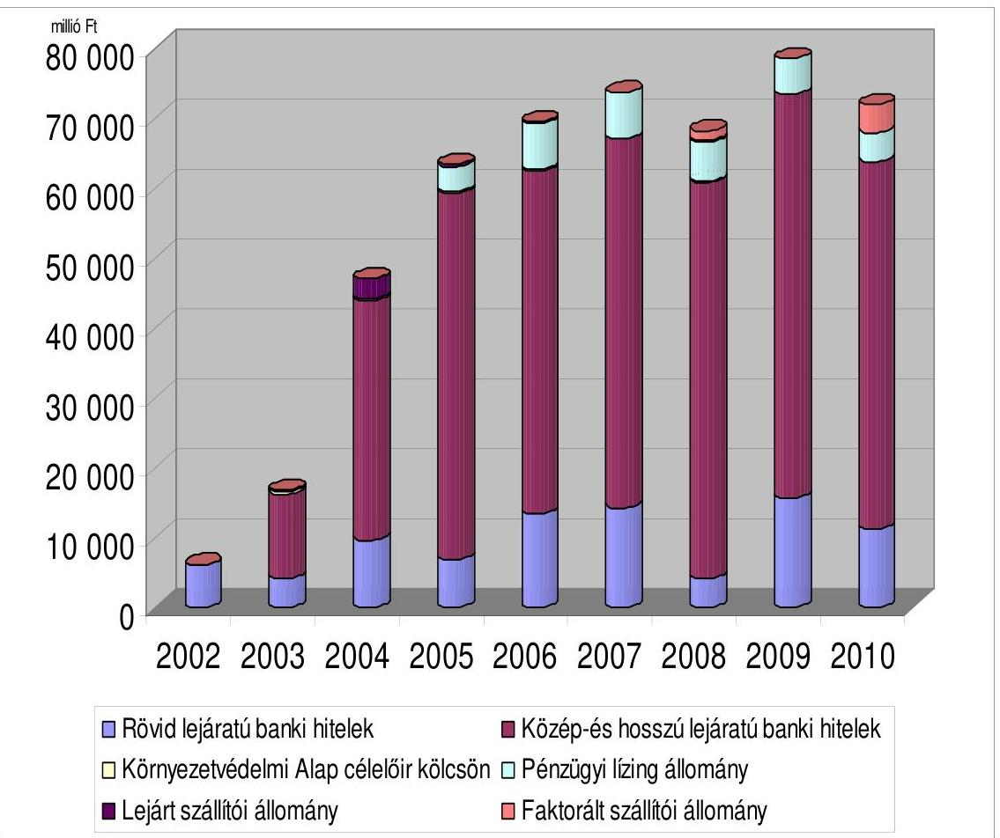

# Az ellenőrzés célja annak értékelése volt, hogy: 

- a Főváros Önkormányzata eredményesen látta-e el a főváros tömegközlekedési feladatait;
- a BKV működésének szabályozása, szervezeti és működési rendszere biztosította-e szakmai feladatai ellátását;
- a BKV szabályosan gazdálkodott-e a rendelkezésére bocsátott vagyonnal;
- a BKV eredményesen kezelte-e az adósság-finanszírozási és likviditási problémái megoldásánál jelentkező kockázati tényezőket; biztosította-e a működőképesség fenntartását.

Az ellenőrzött időszak: a Főváros Önkormányzata közlekedéspolitikai stratégiáját, a tulajdonosi joggyakorlás rendjét, az ellenőrzési kötelezettségek végrehajtását, a közforgalmú közlekedési szolgáltatások minőségére irányuló tevékenységét, továbbá a BKV eszközállományának és üzemeltetésének ellenőrzését a 2005-2010. évekre vonatkozóan végeztük. A BKV működéséhez biztosított forrásokat és a társaság adósság-finanszírozási és likviditási problémái megoldásánál jelentkező kockázatok kezelését a 2002-2010. évekre irányulóan vizsgáltuk. A BKV gazdálkodásának folyamatát a 2002. évtől a helyszíni ellenőrzés le-

---

zárásáig értékeltük, a jelentésünk a 2011. július 31-éig tett megállapításainkat is tartalmazza.

# Az ellenőrzés típusa: teljesítmény-ellenőrzés 

A Főváros Önkormányzata tömegközlekedési feladatellátásánál és a BKV adósság-finanszírozási és likviditási problémái megoldásánál jelentkező kockázatok teljesítmény-ellenőrzés módszerével történő vizsgálatához a részletes ellenőrzési szempontokat előtanulmány készítésével alapoztuk meg. Az eredményesség kritériumait az alábbiakban határoztuk meg.

Eredményes a Főváros Önkormányzata tömegközlekedési feladatainak ellátása, ha:

- a Főváros Önkormányzata rendelkezik közlekedéspolitikai stratégiával, az illeszkedik az Egységes Közlekedésfejlesztési Stratégiához, a BKV Fővárosi Közgyűlés által jóváhagyott középtávú közlekedésfejlesztési stratégiája ezeken alapul;
- a Főváros Önkormányzata szabályozta a BKV-val kapcsolatos tulajdonosi joggyakorlás rendjét és azt betartotta, illetve betartatta a döntési eljárások során;
- a Főváros Önkormányzata a szükséges mértékben biztosította a BKV működéséhez szükséges forrásokat;
- a Főváros Önkormányzata teljesítette ellenőrzési kötelezettségeit, intézkedett az ellenőrzési megállapítások végrehajtásáról, illetve érvényesítette a jogait;
- a közforgalmú közlekedési szolgáltatások minősége megfelelő volt.

Eredményes a BKV adósság-finanszírozási és likviditási problémái megoldásánál jelentkező kockázati tényezők kezelése és a működőképesség fenntartása, ha:

- az adósságot keletkeztető döntések során vizsgálták a pénzügyi egyensúly fenntartását veszélyeztető külső és belső kockázatokat;
- intézkedtek az adósságot keletkeztető döntések külső és belső kockázatainak csökkentése és a pénzügyi egyensúly biztosítása érdekében;
- az adósságot keletkeztető döntések külső és belső kockázatainak csökkentésére hozott intézkedések javították a pénzügyi egyensúlyt, a fizetőképességet;
- biztosították a működőképesség fenntartását.

A kritériumok mindegyike lényeges, ezért bármelyik esetében a nemleges válasz kizárja, hogy eredményes legyen a minősítés.

A BKV rendelkezésére bocsátott vagyonnal való szabályszerű gazdálkodást, valamint a közszolgáltatási feladatok ellátásához a központi költségvetésből és egyéb forrásból nyújtott támogatások célszerű felhasználását elemző eljárás, illetve szabályszerűségi ellenőrzés módszerével vizsgáltuk.

---

Az ellenőrzés jogszabályi alapját a helyi önkormányzatokról szóló 1990. évi LXV. törvény 92. § (1) bekezdése, az államháztartásról szóló 1992. évi XXXVIII. tv. 120/A. § (1) bekezdése, és az Állami Számvevőszékről szóló 1989. évi XXXVIII. törvény 2. § (3) és (6) bekezdéseinek előírásai képezték ${ }^{1}$.

A BKV vezérigazgatója 1993. július 1-jétől 2006. december 31-éig Aba Botond, 2007. január 1. - 2008. április 15. között Antal Attila volt, majd 2008. február 9-étől (Antal Attila betegsége miatt) 2008. augusztus 31-ig Balogh Zsolt, mint megbízott vezérigazgató tevékenykedett, 2008. szeptember 1-jétől 2011. szeptember 5-ig dr. Kocsis István töltötte be ezt a tisztséget, ezt követően az Igazgatóság elnöke dr. Várszegi Gyula kapott megbízást a vezérigazgatói feladatok ellátására. A 2002-2011. szeptember 30-ig terjedő időszakban a gazdasági terület irányításában négy alkalommal volt vezetőváltás, míg a műszaki területet öt vezérigazgató-helyettes irányította.

A 2010. évi önkormányzati képviselő- és főpolgármester-választást követően változott a főpolgármester személye. A főjegyző személye 2010. december 20-tól változott, a korábbi főjegyző 1992-től 2010. november 18-áig látta el a főjegyzői feladatokat.

A Közgyűlés az 1829/2010. (X. 27.) számú határozatával döntött a BKK Zrt. létrehozásáról, egy összefogó, integráló, szakmai alapokon működő szervezetként. A BKK Zrt. közvetlenül a Fővárosi Önkormányzatnak alárendelve működik, annak 100\%-os tulajdonában áll, az intézményrendszeri struktúrában a Fővárosi Önkormányzat és a közlekedési szolgáltatók, üzemeltetők között helyezkedik el és megrendelői, koordinátori feladatokat lát el. A BKK Zrt. mind a közösségi, mind pedig a közúti közlekedés területén alapvetően stratégiai, fejlesztési, irányítási, megrendelői, ellenőrzési feladatokat integrál.

A jelentéstervezettel kapcsolatosan az Állami Számvevőszékről szóló 2011. évi LXVI. törvény előírásainak megfelelően záró megbeszélést tartottunk 2011. augusztus 3-án a Főpolgármester úr képviselőivel, illetve a BKV vezérigazgatójával és munkatársaival.

A záró megbeszélést követően a Kormány az 1269/2011. (VIII. 4.) határozatában elrendelte, hogy kerüljenek meghatározásra a BKV hitelviszonyon alapuló adóssága átvállalásának elvei, tartalma és ütemezése azzal, hogy az átvállalás összege a BKV esetében nem haladhatja meg a 78 milliárd Ft-ot. Felhívta továbbá a nemzeti fejlesztési minisztert, hogy az adósságátvállalás kapcsán készítsen előterjesztést a társaság ésszerű alapokon nyugvó, költség-hatékony átalakítására, a nemzeti közlekedésirányító szervezet keretében elérhető legnagyobb megtakarításra, a jelenleg fennálló díj- és kedvezményrendszer átalakítására, valamint az adósságállomány újratermelődésének elkerülését biztosító modellre.

[^0]
[^0]:    ${ }^{1}$ A vizsgálat előkészítése és a helyszíni ellenőrzés idején hatályos rendelkezések, melyek közül az államháztartásról szóló 1992. évi XXXVIII. tv. 120/A. § (1) bekezdését módosította, az Állami Számvevőszékről szóló 1989. évi XXXVIII. törvényt pedig hatályon kívül helyezte 2011. július 1-jétől az Állami Számvevőszékről szóló 2011. évi LXVI. törvény, melynek 5. § (2), (3) és (4) bekezdés a) pontja vonatkozik jelen ellenőrzésre.

---

A jelentést egyeztetésre megküldtük a főpolgármesternek és a BKV vezérigazgatójának. Észrevételeiket, valamint az azokra adott válaszokat a 10. - 13. számú mellékletek tartalmazzák.

---

# 1. ÖSSZEGZŐ MEGÁLLAPÍTÁSOK, KÖVETKEZTETÉSEK, JAVASLATOK 

## 1. A Főváros ÖNKORMÁNYZATA TÖMEGKÖZLEKEDÉSI FELADATELLÁTÁSÁNAK EREDMÉNYESSÉGE

A Főváros Önkormányzatának tömegközlekedési feladatellátása nem volt eredményes, mivel a Főváros Önkormányzata a tulajdonosi jogkörrel felruházott bizottságok beszámoltatását elmulasztotta, a szükséges mértékben nem biztosította a közforgalmú közlekedés közszolgáltatási kötelezettségének teljesítéséhez a forrásokat, részben teljesítette ellenőrzési kötelezettségeit, illetve részben biztosította az ellenőrzési megállapítások hasznosulását. Továbbá részben volt megfelelő a közforgalmú közlekedési szolgáltatások minősége, mivel a tervezett és nyújtott minőség közötti eltérés megszüntetéséről a Főváros Önkormányzata nem intézkedett. Annak ellenére nem eredményes a főváros tömegközlekedési feladatellátása, hogy a Főváros Önkormányzata rendelkezett közlekedéspolitikai stratégiával, az illeszkedett az Egységes Közlekedésfejlesztési Stratégiához, a Szolgáltatási szerződés teljes mértékben tartalmazta a főváros tömegközlekedési feladatainak ellátási kötelezettségét, továbbá szabályozta a BKV-val kapcsolatos tulajdonosi joggyakorlás rendjét, és azt - a tulajdonosi jogkörrel felruházottak beszámoltatási kötelezettség elmulasztásának kivételével - betartotta, illetve betartatta a döntési eljárások során.

A Főváros Önkormányzata a főváros tömegközlekedésére vonatkozó stratégiai elképzeléseket a 2001-2015. időszakra vonatkozó Budapest Közlekedési Rendszerének Fejlesztési Tervében határozta meg. A megváltozott közlekedési környezetre tekintettel a 2009. évben került elfogadásra a 2020-ig szóló új Budapest Közlekedési Rendszerének Fejlesztési Terve, amely az Egységes Közlekedésfejlesztési Stratégiával összhangban készült. A BKV középtávú közlekedésfejlesztési tervei Budapest közlekedési rendszerének fejlesztési terveivel összhangban, az azokban megfogalmazott prioritások figyelembevételével készültek el.

Az Ötv-ben előírt tömegközlekedési feladatok ellátása érdekében a Főváros Önkormányzata és a BKV 2000. május utolsó napján Üzemeltetési szerződést, majd ezt követően 2004. áprilisban, határozott időre, nyolc évre Szolgáltatási szerződést kötött a fővárosi tömegközlekedési feladatok ellátására kialakult hálózati rendszer üzemeltetésére. A Szolgáltatási szerződés a Főváros Önkormányzata közforgalmú személyszállítással kapcsolatos feladatellátási kötelezettségét teljes egészében tartalmazta. A Főváros Önkormányzata az Ötv-ben előírtaknak megfelelően a Közgyűlés által jóváhagyott Szolgáltatási szerződésben meghatározta a helyi tömegközlekedés feladatellátásának módját, az időszakonként elfogadott paraméterkönyvben pedig annak mértékét. A Szolgáltatási szerződésben mind a Főváros Önkormányzata, mind a BKV érdekeinek védelmére megfogalmazásra kerültek a szerződésben foglaltak végrehajtását biztosító garanciális elemek.

---

A Főváros Önkormányzata az Alapító Okiratban meghatározta az alapító kizárólagos hatáskörébe tartozó ügyeket, az évente egy alkalommal áttekintésre, értékelésre és döntés meghozatalára vonatkozó feladatokat, továbbá a rendkívüli alapítói döntés szükségességének eseteit. A Főváros Önkormányzata az önkormányzati társaságok feletti tulajdonosi jogok gyakorlásának szabályait a vagyongazdálkodási rendelet ${ }_{1,2}$-ben rögzítette. Az SzMSz ${ }_{1}$-ben előírta az állandó bizottságok részletes feladat- és hatásköreit, ennek megfelelően a BKV esetében a Tulajdonosi bizottság, majd 2006. december 19-étől a Gazdasági bizottság kapott felhatalmazást a jogok gyakorlására. Egyes átruházott hatáskörbe utalt jogok gyakorlása esetében az illetékes szakmai bizottság egyetértésére volt szükség, amelynek megadására 2006. december közepéig a Városüzemeltetési bizottság, majd azt követően a Városüzemeltetési és Környezetgazdálkodási bizottság kapott felhatalmazást. A Főváros Önkormányzata az SzMSz ${ }_{1}$-ben előírta az állandó bizottságok általános feladatkörének meghatározásakor az éves beszámolási kötelezettséget az átruházott feladat- és hatáskörök ellátásáról, azonban a tulajdonosi joggyakorlással felruházott bizottságok a fővárosi tömegközlekedési feladatok ellátásával kapcsolatban - az előírtak ellenére - nem számoltak be a Közgyűlésnek és ennek elmaradására az előző főjegyző nem hívta fel a figyelmet.

A tulajdonosi joggyakorlással felhatalmazott bizottságok a BKV éves üzleti terveinek elfogadásával egyidejűleg jóváhagyták a tervezett veszteséget és ennek hitelfelvétellel, lejáró hitelek megújításával, illetve folyószámla hitelkeret igénybevételével történő finanszírozását. A bizottságok a döntésekről a Közgyűlést annak ellenére nem tájékoztatták, hogy a hitelfelvétel, a hitel refinanszírozás és a folyószámla hitelkeret igénybevétele a BKV gazdálkodásában kockázatot és többlet kamatkiadást (a 2002-2010. években 41,4 milliárd Ft) jelentett. A bizottságok éveken keresztül tudomásul vették a BKV egyre növekvő adósságállományát, nem hoztak intézkedéseket annak csökkentésére, nem hívták fel a Közgyűlés figyelmét a BKV egyre növekvő adósságállományának kockázataira. Az SzMSz ${ }_{1}$-ben foglaltaknak megfelelően a bizottsági ülések jegyzőkönyvei nyolc napon belül továbbításra kerültek a főpolgármester részére, de az abban foglaltakról a Közgyűlés részére az előző főpolgármester nem készített tájékoztatást. A Főváros Önkormányzata a Szolgáltatási szerződésben rögzített kompenzációszámítást nem alkalmazta, nem gondoskodott a működéshez szükséges források hiánytalan biztosításáról. Nem biztosította a szolgáltatási szerződésben foglaltak ellenére a BKV nyereséges gazdálkodását, nem teremtette meg a hitelek visszafizetésének fedezetét.

A BKV üzleti terveiben szereplő és a tulajdonosi joggyakorlással felhatalmazott bizottságok által jóváhagyott működésből eredő, bevétellel nem fedezett indokolt költségek megtérítését, illetve az ennek következtében keletkező veszteség finanszírozását nem biztosította a Főváros Önkormányzata. A Főváros Önkormányzata nem adta át a szükséges forrásokat a kötelező közszolgáltatási feladat ellátásához.

A kötelező közszolgáltatási feladat ellátását veszélyeztették a BKV üzleti terveit veszteséggel és ennek hitelből történő finanszírozását elfogadó tulajdonosi joggyakorlással felhatalmazott bizottság elnöke és tagjai, továbbá az előző főpolgármester, mert elmulasztotta a bizottságok döntéseiről szóló jegyzőkönyvek-

---

ben foglaltak Közgyűlés felé történő jelzését, erre a mulasztásra az előző főjegyző nem hívta fel a figyelmet.

A Közgyűlés a 2003. évben jóváhagyta a BKV Javadalmazási szabályzat ${ }_{1}$-et, amely a vezérigazgató részére adható prémium feltételének előírását tartalmazta. Az adható prémium mértékére nem vonatkozott a szabályozás, arról a Tulajdonosi bizottság döntött. A 2005. évi menedzser-megállapodásban rögzített premizálási rendszer alapprémiumot (az éves alapbér 100\%-áig) és többletösztönző prémiumot (az éves alapbér 215\%-áig) tartalmazott. Ez ellentétben volt a Javadalmazási szabályzat ${ }_{1}$-ben előírtakkal, amely csak ösztönző prémium kifizetését tette lehetővé. A 2006-2008 augusztusáig terjedő időszakban a menedzser-megállapodások megkötése a Tulajdonosi, majd a Gazdasági bizottság és a vezérigazgató részéről nem történt meg. Ennek ellenére a 2007. évi prémium mértékéről a Gazdasági bizottság 2008. január hónapban, utólagosan döntött, ez szabálytalan volt. A 2005-2010. években a BKV vezérigazgatójának előírt prémiumfeladatai alapvetően az üzleti tervben foglaltak és a munkaköri feladatainak végrehajtásához kötődtek, ami nem jelentett többletfeladatot és nem segítette elő a BKV hosszabb távon megvalósuló eredményes működtetését, valamint a fennálló finanszírozási hiány növekedésének megakadályozását, illetve csökkentését. A kifizetett prémium nem volt arányban a teljesítménnyel, mivel mögötte nem állapítható meg többletteljesítmény, illetve nem kötődött a munkaköri kötelezettségeken felüli többletfeladatok elvégzéséhez. A Közgyűlés 2010 áprilisában a BKV Javadalmazási szabályzat ${ }_{1}$-et hatályon kívül helyezte, ezzel egy időben elfogadta a BKV Javadalmazási szabályzat ${ }_{2}$-t, ami kiterjedt a vezérigazgató, a vezérigazgató-helyettesek és az igazgatók javadalmazására. A szabályozásban előírtak szerint a vezérigazgató az éves prémiumkitűzésben rögzített feladatok és az egyes feladatokhoz kapcsolt kifizetési feltételek teljesítése esetében ösztönző prémiumban részesülhet, ennek teljesülését az Igazgatóság értékeli és engedélyezi a kifizetést. A 2005-2010. években a vezérigazgatók részére 97,2 millió Ft összegű prémium került kifizetésre.

A Szolgáltatási szerződésben - az előírt szolgáltatási feladatok teljesítésének értékelése után - a bevételekkel nem fedezett indokolt költségek megtérítésére és a tervezett díjbevétel legfeljebb 4\%-ának megfelelő összegű méltányos nyereség biztosítására kompenzáció fizetésben állapodott meg a Főváros Önkormányzata és a BKV. A számított kompenzációigényt a BKV-nak minden év november végéig kellett eljuttatnia a Főváros Önkormányzata részére. A BKV vezérigazgatója 2004 októberében megküldte a Főváros Önkormányzatának a független szakértő által auditált kompenzációszámítási modellt. A számított kompenzációigény megállapításához a BKV a kompenzációszámítási táblázatokban bemutatta a modell alapján a 2004-2012. évekre számított várható kompenzációigény összegét, amely évi 31,6 és 38,7 milliárd Ft között volt, a Közgyűlés megtárgyalta a modellel kapcsolatos előterjesztést és a 2005. évben elfogadta a modellt a számított kompenzációigény megállapításának alapjaként. A BKV vezérigazgatói a 2005-2011. évekre a Szolgáltatási szerződés előírását figyelmen kívül hagyva nem nyújtották be a számított kompenzációra vonatkozó igényt a Főváros Önkormányzatának. A Szolgáltatási szerződésben foglaltak ellenére a BKV és a Főváros Önkormányzata a 2004-2010. évekre vonatkozóan nem hajtotta végre a tömegközlekedési kompenzáció éves elszámolását sem.

---

A Főváros Önkormányzata 2002-2010 között 27,4 milliárd Ft összegben nyújtott működési célú támogatást a BKV részére, mely összeg nem a bevétellel nem fedezett indokolt költségek megtérítését, hanem egyéb működéssel összefüggő kiadások megtérítésére (tömegközlekedési hozzájárulás, BKV FŐVINFORM szolgáltatás támogatása, megállapodás alapján egyszeri működési célú támogatás, Margit híd felújítása miatti tömegközlekedési többletszolgáltatás kompenzációja) szolgáltak.

A felújítási és pótlási feladatok ráfordításainak finanszírozásáról 2005-2010 között a Főváros Önkormányzata és a BKV által évente kötött külön megállapodások keretében rendelkeztek. A megállapodások mellékleteiben meghatározták azokat a feladatokat, amelyeket amortizációpótlás címen, céljelleggel nyújtott végleges pénzeszköz átadással - tőketartalékba helyezési kötelezettséggel - támogatott a Főváros Önkormányzata. A 2003-2010. közötti időszakban 76,2 milliárd Ft összegű támogatás kifizetése történt meg erre a célra. A 2011. évi költségvetési rendeletben a Közgyűlés 10,9 milliárd Ft összegben határozta meg az amortizációt pótló támogatás összegét. A tőkepótló támogatás csak 2005-ben fedezte az elszámolt értékcsökkenési leírás összegét.
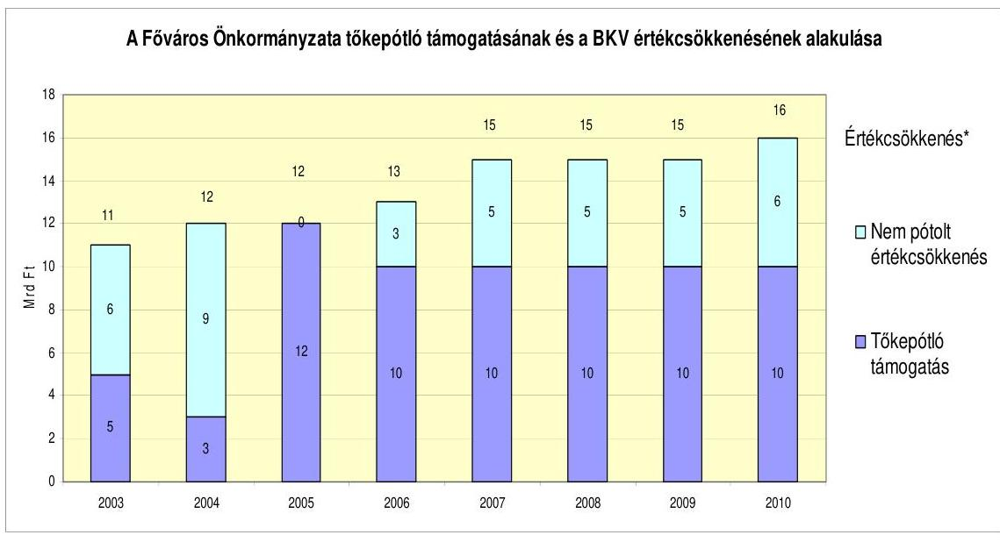

* A könyvviteli beszámolóban szereplő értékcsökkenési leírás összege

A Főváros Önkormányzata a BKV fejlesztéseinek támogatására 20022010 között (az amortizációt pótló támogatásokon, valamint a 4-es metró beruházáson túlmenően, melynek kiadása 2010. december végén nettó 212,4 milliárd Ft volt) további 96,1 milliárd Ft összeget utalt át. A legjelentősebb összegű fejlesztési célú támogatást 2002-2007 között a villamos járműfejlesztésre (Combinó villamos beszerzés) 36,1 milliárd Ft, 2003-2010 között az M2 metróvonal felújítására 37,1 milliárd Ft, továbbá 2005-2010 között az M2 metróvonal járműcseréjéhez (Alstom metrószerelvény beszerzés) 19,4 milliárd Ft összegben biztosította a Főváros Önkormányzata.

A Magyar Állam 2002-2010 között - különböző jogcímeken - 404,2 milliárd Ft összegben biztosított működési célú forrásokat a BKV részére. Ebből a BKV 2002. évi adósságátvállalásból és az átvállalt hitelek kamataiból eredően

---

38,9 milliárd Ft, 2004-2010 között központosított normatív hozzájárulás jogcímen 178,8 milliárd Ft, 2002-2010 között fogyasztói árkiegészítés jogcímen 158,4 milliárd Ft összegben teljesültek kiadások. A Magyar Állam 2007-2010 között további három alkalommal, 28,1 milliárd Ft összegben nyújtott a BKV részére - külön megállapodások alapján - vissza nem térítendő működési célú támogatást.

A 2002-2010. közötti években a BKV működésének finanszírozásához a Magyar Állam által biztosított források kétszeresen haladták meg a Főváros Önkormányzata által nyújtott támogatásokat.
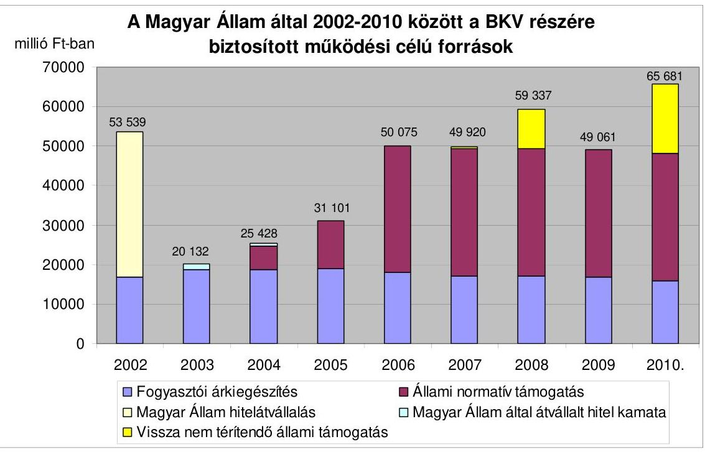

A normatív állami támogatás 2008-2011. évi összegének megállapításánál a költségvetési törvényekben előírták, hogy a Főváros Önkormányzata adott évi központi támogatása nem lehetett kevesebb az előző évinél, illetve nem haladhatta meg a közösségi közlekedési feladatellátás során keletkezett veszteség mértékét.

A Főváros Önkormányzata a Htv-ben és az Ár. tv-ben előírtakkal összhangban, rendeletekben döntött a 2005-2010. években a BKV hatósági árformába tartozó viteldíjainak megállapításáról és azok alkalmazási feltételeiről, azonban a Szolgáltatási szerződésben előírtak ellenére a döntésre vonatkozó határidőt túllépték. A díjak megállapítása során a két legfontosabb árképzési tényező az infláció alakulása és az árkiegészítés indexálása volt. A Közgyűlés 1999-ben határozatban döntött arról, hogy a BKV viteldíjait a következő években úgy kell megállapítani, hogy azok az „aktuális infláció" mértékéhez viszonyítva legalább 5\%-os reáltarifa szintemelést biztosítsanak. A kötelező mértékű tarifaszint emelés megállapítást elrendelő határozatot a Közgyűlés 2008-ban helyezte hatályon kívül. A viteldíjak 2002-2010 között az inflációt meghaladóan nőttek.

---

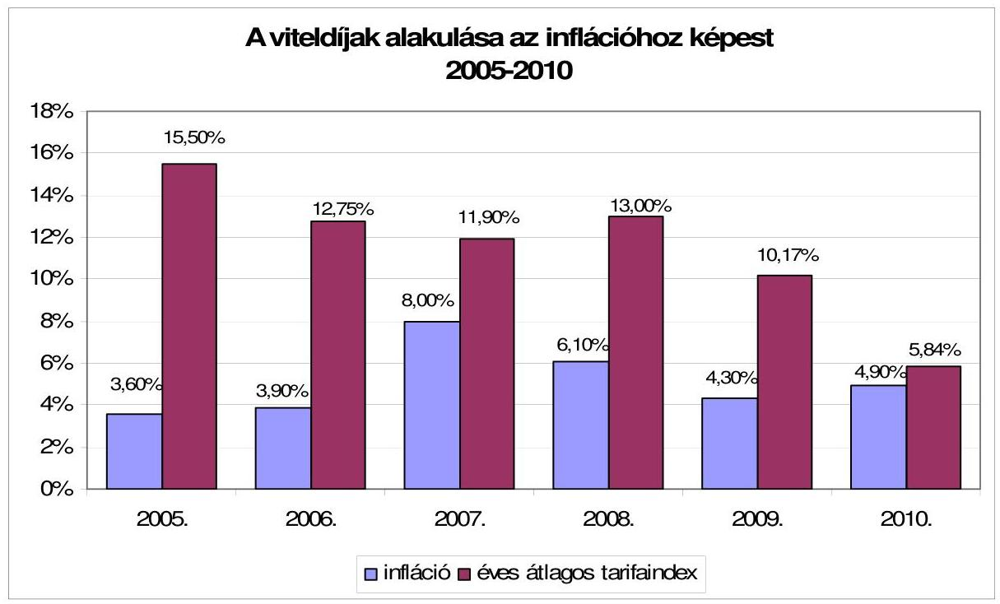

Forrás: BKV
Egy 2009-ben készült tanulmány ${ }^{2}$ rögzíti, hogy Budapesten a helyi fizetőképes kereslethez viszonyítva a BKV vonaljegyek ára magasabb, mint a legtöbb vizsgált európai fővárosban, illetve a bérletek ára a nettó havi bér százalékában drágának bizonyult, a jegy-, illetve bérletárak abszolút értéke más külföldi városokkal összehasonlítva alacsony volt.

A BKV Felügyelőbizottságának működési szabályzataiban előírtak ellenére a 2005-2010. időszakban a BKV Felügyelőbizottságának tevékenységéről szóló beszámolót nem készítette el a Felügyelőbizottság. A Gazdasági bizottság a tulajdonos hatáskörében eljárva a 2008. és a 2009. évre vonatkozóan a BKV éves beszámolójának elfogadásáról hozott határozataiban a Felügyelőbizottság ezekhez csatolt jelentésének elfogadásáról az Alapító Okiratban előírt kötelezettsége ellenére nem döntött. A BKV 2005-2008. és 2010. évi beszámolóinak elfogadásakor a Tulajdonosi/Gazdasági bizottság, illetve a Közgyűlés határozott a könyvvizsgálói jelentések elfogadásáról, az Alapító Okiratban foglaltak ellenére a 2009. évi beszámoló elfogadásakor
 a határozat nem tartalmazott utalást erre. A Főváros Önkormányzatának belső ellenőrzése a 2005-2010. években nem ellenőrizte a BKV-t, az éves belső ellenőrzési terveket alátámasztó kockázatelemzést a BKV-ra nem terjesztették ki.

A Szolgáltatási szerződés előírásai alapján a Főváros Önkormányzata a BKV által nyújtott szolgáltatások ellenőrzését a Főpolgármesteri hivatal révén, a Közlekedési ügyosztály bevonásával látta el. Az ellenőrzések nem terjedtek ki minden közlekedési alágazatra, illetve a 2008. és a 2009. évben nem került sor

[^0]
[^0]:    ${ }^{2}$ A Boston Consulting Group „A Fővárosi Önkormányzat és az EIB között megkötött hitelszerződésben előírt BKV Zrt. és a fővárosi tömegközlekedés hosszú távú működési és finanszírozási stratégiájának kialakítása" címmel készített tanulmánya.

---

ilyen ellenőrzésre. Az ellenőrzések megállapításait tájékoztatásul megküldték a BKV vezérigazgatójának, azonban a hiányosságok megszüntetése érdekében intézkedések megtételét és azokról való tájékoztatást csak 2010-től kért a Közlekedési ügyosztály a vezérigazgatótól.

A 2005-2010. években a Főváros Önkormányzata - tőketartalékba helyezési kötelezettséggel - biztosított fejlesztési célú támogatásokat a BKV számára, utólagos elszámolási kötelezettséggel. A BKV által benyújtott elszámolásokat a Közlekedési ügyosztály felülvizsgálta összegszerűség és az elvégzett munkálatok szakmai megalapozottsága tekintetében.

A Szolgáltatási szerződés minőségi célként rögzíti, hogy a Főváros Önkormányzata az Európai Unió közös közlekedéspolitikájával összhangban, a BKV közreműködésével, fenntartható közlekedési módok alkalmazásával, integrált, teljes körű, jó minőségi színvonalú személyszállítást biztosítson Budapesten és az érintett környező települések területén. A nyújtott szolgáltatás értékelését a Szolgáltatási jelentés teszi lehetővé, míg a minőségi követelményeknek való megfelelést és egyben a kompenzációtöbblet iránti igény lehetőségét a bonus pontok, a meg nem felelést, illetve kompenzációcsökkentést a malus pontok jelentenek. A Szolgáltatási szerződésben a minőségi paraméterek a menetkimaradások száma, a pontosság és a biztonság voltak.

A Szolgáltatási szerződésben meghatározott közfeladatellátás és a szolgáltatás színvonalának értékelése a 2005-2010 közötti időszakban a BKV által készített Szolgáltatási jelentések alapján történt, ami a teljesítményelvárásoknak és a minőségi paraméterek teljesítésének értékelését jelentette, azonban nem adott képet az utas-elégedettségről, valamint nem mutatta be a beérkezett utas-panaszok értékeléséből számszerűsíthető elvárt és érzékelt minőségi szint közötti különbséget. A tervezett és nyújtott férőhely-kilométer teljesítményeltérések számszerű értékei alapján a BKV ebben az időszakban a teljesítményelvárásoknak eleget tett. Az összesített jellemzők alapján a minőségi paramétereket a BKV biztosította. A számítási eljárást alágazatonként, negyedévenként és összesítve a Szolgáltatási jelentés tartalmazta, ez alapján a BKV kompenzációtöbbletre lett volna jogosult, de azt nem érvényesítette.

A Főváros Önkormányzata a BKV által nyújtott szolgáltatások minőségére vonatkozó monitoring rendszer keretében, évente két alkalommal végzett méréseket a 2005-2007. és a 2010. években. Az ellenőrzések rövid időszakra, kevés számú viszonylatra, vagy csak meghatározott alágazatra, a statisztikai mintavétel szabályai mellőzésével történtek. A megállapítások inkább figyelemfelkeltésre, semmint a BKV tevékenységének egyértelmű megítélésére voltak alkalmasak.

A minőségjellemzők egységes értelmezése, definiálása, az egységes minőségi szemléletmód és tevékenység meghatározása érdekében került kidolgozásra az európai unós tagországok számára a minőségi kritériumok rendszere és hierarchikus rendje a normákat tartalmazó szabvány formájában, amelynek magyar nyelvű kiadása 2008-ban jelent meg. A szabvány alkalmazására kötelező előírás nincs, annak előírásait a Szolgáltatási szerződésben nem alkalmazták.

---

# 2. A BKV MŰKÖDÉSÉNEK SZABÁLYOZÁSA 

A BKV működésének szabályozása a jogszabályi rendelkezéseken és az Alapító Okiraton kívül a BKV SzMSz-én, vezérigazgatói utasításokon, a vezér-igazgató-helyettesek és az igazgatók által kiadott szakmai és forgalmi utasításokon, valamint rendelkezéseken alapult. A BKV a vonatkozó jogszabályok szerint kötelezően kidolgozandó belső szabályzatokat elkészítette, azonban a Közbeszerzési és versenyeztetési szabályzat módosítása csak 2010 októberében történt meg, holott a Kbt. 2009. évi módosítása április elsejétől hatályba lépett. A Közgyűlés által 2010 októberében kiadott bérpolitikai irányelvekben foglaltak szerint a szellemi állománycsoportú munkavállalók ösztönzési elveinek átfogó felülvizsgálata és ennek eredményeként a Javadalmazási szabályzat ${ }_{2}$-ben foglaltak módosítása nem történt meg.

A Számv. tv. 14. §-ában előírtak szerint, a BKV a Számviteli Politika keretében elkészítette az eszközök és források leltárkészítési és leltározási szabályzatát, azonban a saját tőke és a céltartalékok leltározására vonatkozó előírások a szabályzatban nem kerültek rögzítésre.

A BKV a Számviteli Politika keretében szabályozta az eszközök után elszámolt értékcsökkenési leírás szabályait. Ennek keretében az épületek, a személy- és tehergépkocsik kivételével az eszközöknek a rendeltetésszerű használatbavételekor rendelkezésre álló információk alapján, a hasznos élettartam végén várhatóan realizálható értéke, vagyis a maradványértéke nulla összegben került megállapításra, mivel valamennyi eszközt a műszaki élettartam végéig üzemeltetnek. A műszaki élettartam végéig üzemeltetett eszközök egy részénél (kivéve épületek, személy- és tehergépkocsik) nem állapítottak meg a Számv. tv. előírásai ellenére várható maradványértéket. A rendeltetésszerű használatból kivont autóbuszok eladási értéke 6,8 millió Ft volt, ezért nem volt helyes a nulla Ft-ban megállapított maradványérték.

A BKV a közérdekű adatok szolgáltatására és közzétételi kötelezettségére vonatkozó adatvédelmi és adatbiztonsági szabályzatában előírtak nem feleltek meg az Adatvéd. tv-ben és az Eitv-ben előírtaknak, mert az általános közzétételi listában nem rendelkeztek a közfeladatot ellátó szerv feladatellátásának teljesítményére, kapacitásának jellemzésére, hatékonyságának és teljesítményének mérésére szolgáló mutatók és értékük, illetve azok időbeli változására vonatkozó adatainak közzétételéről.

A BKV szervezete a 2007-2010. években funkcionális és erősen centralizált struktúrában működött. A 2007. évi szervezetmódosítás következtében az átlagos állományi létszám az év végére 12817 főről 11853 főre csökkent. A szervezeten belüli hierarchikus viszonyok átláthatóbbá váltak, a folyamatok centralizált jellege megmaradt, az átlagos állományi létszám a 2010. év végére 12082 főre emelkedett.

---

# 3. A BKV RENDELKEZÉSÉRE BOCSÁTOTT VAGYONNAL VALÓ GAZDÁLKODÁS SZABÁLYOSSÁGA 

Az üzleti tervek a Szolgáltatási szerződésben megfogalmazott feladatokkal összhangban voltak. Az üzleti terveket teljesítmény oldalról a Szolgáltatási szerződés határozta meg, amely 2012-ig tartalmazza a teljesítményelvárásokat. Üzleti tervek éves szinten készültek, az üzleti terv nem tartalmazott középtávú kitekintést. A BKV eseti jelleggel 2005-ben 7 éves, 2009-ben 10 éves üzleti modellt készített. Az adott év teljesítmény-elvárásait a BKV által összeállított és a Főváros Önkormányzata által jóváhagyott paraméterkönyv tartalmazta.

A BKV gazdálkodása a 2003-2009. években folyamatosan veszteséges (5,7-23,5 milliárd Ft közötti negatív mérleg szerinti eredmény) volt, a 2010. évi gazdálkodásának mérleg szerinti eredménye 1,018 milliárd Ft-ot tett ki.
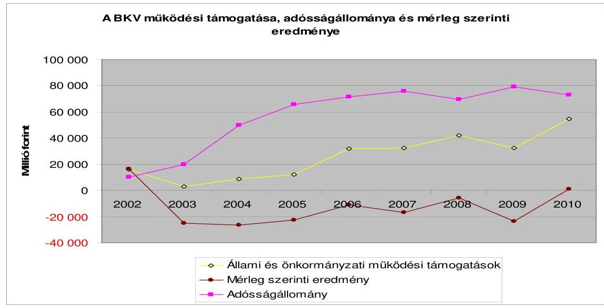

A BKV állami és önkormányzati támogatásának változása jelentősen befolyásolta a mérleg szerinti eredmény alakulását és kisebb mértékben az adósságállomány változását. A Magyar Állam 2002-ben úgy vállalta át a BKV-t terhelő hitelek és kamatok fizetésének kötelezettségét, hogy nem kötötte feltételekhez az állami szerepvállalást. Ezért nem volt olyan beépített mechanizmus ${ }^{3}$, amely megakadályozhatta volna, hogy a BKV ismét eladósodjon. Ennek következtében az adósságállomány már 2004-re meghaladta a 2002. évi szintet, kialakult a hitelspirál. Sem a BKV vezérigazgatója, sem a tulajdonos (egyben a szolgáltatást megrendelő) Főváros Önkormányzata nem tett érdemi intézkedéseket az adósságállomány csökkentésére. Az állami normatív támogatás jelentős mértékű növelésére, valamint az eseti, vissza nem térítendő állami támogatások folyósítására is feltételek meghatározása nélkül került sor. A BKV működtetésének, illetve veszteséges gazdálkodásának hitelekből történő finanszírozása miatt a 2010. év végére 72,8 milliárd Ft összegű adósságállomány alakult ki.

[^0]
[^0]:    ${ }^{3}$ Olyan kontrollok kiépítése, amelyek időben megakadályoznák vagy időben feltárnák a szervezet működését veszélyeztető hibákat.

---

A gazdasági események számviteli nyilvántartásokban való rögzítése informatikai rendszerek támogatásával történik a könyvvezetésre vonatkozó szabályok betartásával. Az elszámolások folyamata a rendszerleírások alapján nyomon követhető. A BKV beszámolóját alátámasztó leltározással kapcsolatos teendőit és vonatkozó rendelkezéseit a Leltározási Szabályzat tartalmazza. A BKV számviteli nyilvántartásaiban a 2004-2006. években az 5,0 milliárd Ft-os működési célú hitelt a Számv. tv-ben foglaltakat figyelmen kívül hagyva, tévesen a beruházási és fejlesztési célú hitelek között mutatta ki. A könyvvizsgáló a fejlesztési hitelnek az éves beszámoló mérlegében történő téves kimutatását nem kifogásolta. A BKV pénztáraiban lévő - a pénzszállító vállalkozás részére történő átadásra váró - készpénzállományt a fordulónapra vonatkozó pénztárleltárak nem tartalmazták, azokat helytelenül a követelések között számolták el.

A nyújtott szolgáltatások bevétele üzletáganként a minden járműtípuson használható jegy- és bérletrendszerből adódóan pontosan nem állapítható meg, ennek következtében az üzletágankénti eredmény megállapítása sem a korrigált 2004. évi utasszámlálási adatokon alapszik.

A 2005-2010. években a ráfordítások közül a személyi jellegű ráfordítások aránya 42-45\% között alakult, az anyagjellegű ráfordítások 35-39\% között mozogtak, az értékcsökkenési leírás 11-12\%-ot tett ki. A pénzügyi műveletek ráfordításának aránya az összes ráfordításhoz viszonyítva 4-6\% között, az egyéb ráfordítások aránya 1-4\% között, a rendkívüli ráfordítások pedig 0,4-4\% között alakultak.

A helyi közösségi közlekedés támogatásának igénylése során a bevételekkel nem fedezett indokolt költségek meghatározásához benyújtott adatszolgáltatásban az aktivált saját teljesítmények ráfordításainak figyelembevétele nem indokolt, mivel az aktivált készletek, tárgyi eszközök felhasználásakor, az üzembe helyezés után ismét elszámolt költségek miatt a ráfordítás kétszeresen került figyelembevételre.

---

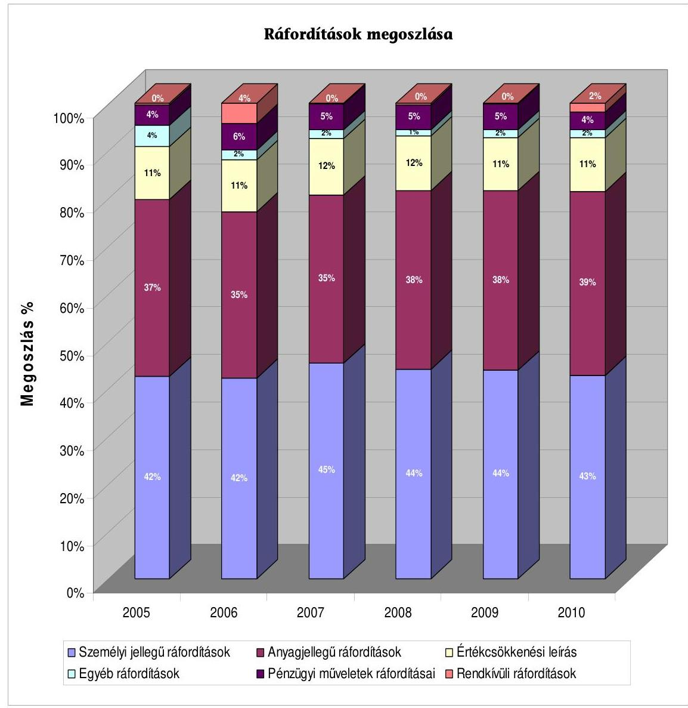

A BKV jellemzően eszközigényes szolgáltatása a műszaki állapot romlása mellett növekvő fenntartási és üzemeltetési költségigénnyel jár. Az eszközállomány üzemeltetésének biztosításán túl a felújításokra, pótlásokra az elszámolt és a bevételekben megtérülő értékcsökkenés leírásból képződik forrás (a 2005-2010. években elszámolt értékcsökkenési leírás összege 86,5 milliárd Ft volt), azonban az a BKV számításai szerint 2010 végéig mintegy 700 milliárd Ft-tal elmaradt a műszakilag szükséges mértéktől. Az eszközállomány felújításának és pótlásának forrását az értékcsökkenési leírás hivatott biztosítani, azonban annak a veszteséges gazdálkodás miatt nincs meg a bevételoldali fedezete. A működéshez szükséges eszközállomány szinten tartása nem volt biztosított, a 20072010. években az eszközpótlások és a felújítások értéke 30,4 milliárd Ft-tal marad el az elszámolt értékcsökkenési leírás és a kapott támogatások összegétől.

Az eszközök felújítása után az értékcsökkenés elszámolása változatlanul az eredeti amortizációs kulccsal folytatódott, ami - kellő differenciális nélkül - meghosszabbította az eszközöknek a ciklusrend szerinti felújítási munkák figyelembevételével eredetileg tervezett élettartamát, így a felújított eszközök terve-

---

zett hasznos élettartama a műszakilag indokolt élettartamot eléri, vagy meghaladja.

A tervezett hasznos élettartamon belüli értékesítés legjelentősebb csoportja belszolgálati személy- és tehergépjármű állomány értékesítése volt, a 2009. június hónapban kötött bérleti és flottakezelési szerződés keretében. Az Igazgatóságnak készített előterjesztésben bemutatták, hogy az eszközök könyv szerinti értéke magasabb a várható eladási árnál. Az értékesített, használt gépkocsikat a BKV Zrt. az eljárást megelőzően nem értékeltette fel, azok átlagos életkora 9,1 év volt. Az értékesítésből származó bevétel 164,0 millió forinttal volt alacsonyabb, mint a BKV könyveiben szerepeltetett nyilvántartási érték.

A BKV műszaki eszközrendszere (járműállomány, infrastruktúra) napjainkra a teljesítőképességének, használhatóságának határára érkezett. A járműpark és az elöregedett infrastrukturális eszközrendszer 85,2\%-a a tervezett élettartamát már meghaladta, a pótlás, illetve korszerűsítés elodázhatatlanul szükségessé vált. Jelen körülmények között a paraméterkönyvben rögzített jármű kiadás biztosításához szükséges járműmennyiség csak az elavult járművek egy részének felújításával biztosítható. A vasúti járműveknél a villamos járművek gyakorlatilag elérték, míg a metró és HÉV járművek túlhaladták a tervezett élettartamukat, cseréjük időszerűvé vált. A járművek üzemeltetése így magas forgalombiztonsági kockázatot hordoz magában és ugyanakkor veszélyt jelent az utasok, valamint a közlekedésben résztvevők számára.

A bér- és létszámgazdálkodás kereteit a Szolgáltatási szerződésben foglalt teljesítmény-követelmény alapján jogszabályok és belső szabályzatok szerint meghatározott járművezetői, karbantartói és állomási létszámigény, valamint az érdekképviseletekkel történt megállapodásoknak megfelelő jövedelemelvárás határozták meg. A BKV teljes munkaidős munkavállalóinak éves bruttó átlagkeresete a 2005-2010. években 16,9-22,2\%-kal haladta meg a Központi Statisztikai Hivatal által, a menetrendszerű egyéb szárazföldi személyszállítás, illetve 2008-tól a városi, elővárosi szárazföldi személyszállítás ágazatban közzétett bruttó átlagkereseteket. A BKV teljes munkaidős munkavállalóinak átlagos állományi létszámát figyelembe véve az ágazati átlagkereseten felüli kereset kifizetés ebben az időszakban évi 4,3-6,7 milliárd Ft többlet kereset kifizetést jelentett, ami tekintettel a BKV veszteséges gazdálkodására, aránytalan terhet jelentett a gazdálkodás során.

A BKV-nál a személyi jellegű ráfordítások több mint 73\%-kal, az anyagjellegű ráfordítások pedig 60\%-ot meghaladóan nőttek a 2002. évről a 2010. évre.

---

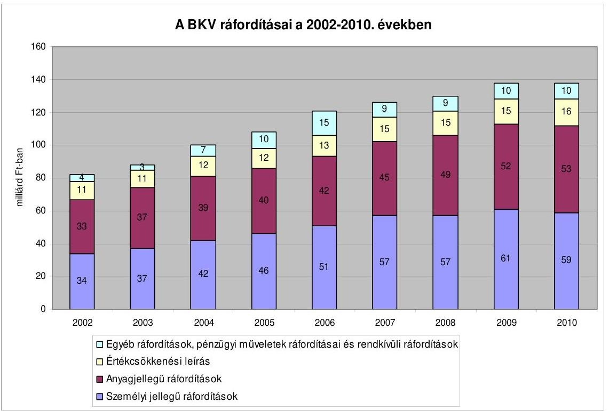

A vezető beosztású munkavállalók jövedelmét a szellemi állománycsoportú munkavállalók ösztönzési elveiről kiadott vezérigazgatói utasítás határozta meg. A felső vezetői prémiumfeladatok részben a vezérigazgató feladataival megegyezőek voltak (az üzleti eredmény terv, a Szolgáltatási szerződésben foglalt fhk terv teljesítése, a személyi jellegű ráfordítások tervének betartása), és kiegészültek a vezető beosztásától függően személyre szóló feladatokkal, amelyek a vezető munkaköri feladatai voltak. Az éves prémiumfeladatok részteljesítését negyedéves rendszerességgel önértékeléssel értékelték. A 2005-2009-es években a vezetői munkaszerződésekben előírták, hogy az alapprémium legalább 150\%, az ösztönző prémium legalább 150\%-a az alapbérnek, továbbá 12 havi bruttó kereset 2-3\%-át elérő összegű önkéntes magánnyugdíj- és egészségpénztári tagdíj hozzájárulás, a vezető nevére szóló életbiztosítás, illetve korlátlan belföldi és külföldi szolgálati személygépkocsi és mobiltelefon használat, 12 havi végkielégítés, 100 nap felmondási idő, négy havi titoktartási díj, utazási és gépkocsivásárlási kedvezmény is megillette a vezető állású munkavállalókat. A 2005-2010. években a vezérigazgató-helyettesek részére 513,5 millió Ft, az igazgatók részére 972,4 millió Ft összegű prémiumot fizettek ki, a kifizetett prémium nem volt arányban a teljesítménnyel, mivel mögötte nem állapítható meg többletteljesítmény, illetve nem kötődött a munkaköri kötelezettségeken felüli többlettfeladatok elvégzéséhez.

A Taktv. előírásai érvényesítése érdekében a Közgyűlés által hozott határozatok végrehajtása megtörtént, mivel a 2011. évi prémiumkiírásokban megváltozott a kitűzött prémium mértéke (vezérigazgató $40 \%$, minden más vezető beosztású alkalmazott 20-40\%). A vezetői prémiumfeladatok továbbra is a 2010. évihez hasonlóak voltak, az egyéni feladatok között a napi munkaköri feladatok szerepelnek, ami nincs összhangban a Főváros Önkormányzata által kiadott Javadalmazási szabályzat ${ }_{2}$-ben foglaltakkal.

---

Az átszervezések miatt a 2007. évben a végkielégítések és a munkaviszony megszüntetéséhez kapcsolódó egyéb kifizetések összege 1208 millió Ft volt, amelyből az egyedi munkaszerződések alapján történt kifizetések összege közel 308 millió Ft volt. Az egy főre jutó végkielégítések összege, amely nem tartalmazta a prémium kifizetéseket, a felmentési időre járó béreket, a titoktartási díjat, a magánnyugdíj- és egészségpénztári munkáltatói hozzájárulásokat a 2008-2010. években 22,7 és 40,9 millió Ft között volt. Az egyedi munkaszerződések alapján a 2008-2010. években végkielégítésként 12-17 hónap átlagkeresetet, valamint négyhavi titoktartási díjat, jelentős összegű önkéntes magán-nyugdíj- és egészségpénztári munkáltatói hozzájárulást fizettek ki az átszervezések miatt eltávozó vezetőknek. Egy vezető beosztásban foglalkoztatott munkavállaló munkaviszonyának megalapozatlan rendkívüli felmondása következtében közel 87 millió Ft összegű kár érte a BKV-t. A jogosulatlan kifizetések miatt a 2009. évben a vezérigazgató feljelentést tett, a büntető eljárás folyamatban van, erre tekintettel az ÁSZ nem tesz külön feljelentést.

Az Országgyűlés Költségvetési, pénzügyi és számvevőszéki bizottsága Ellenőrző albizottsága 2009. augusztus és december között vizsgálta a Főváros Önkormányzata közösségi közlekedés támogatásának felhasználását, az azzal történő elszámolásokat, kiemelten a 2007-2008 években végkielégítésre kifizetett 1,5 milliárd Ft elköltését. Az albizottság a vizsgálat megállapításairól figyelem felhívó állásfoglalást adott ki.

# 4. A BKV ADÓSSÁGFINANSZÍROZÁSI ÉS LIKVIDITÁSI PROBLÉMÁI MEGOLDÁSÁNAK, A JELENTKEZŐ KOCKÁZATI TÉNYEZŐK KEZELÉSÉNEK EREDMÉNYESSÉGE 

A pénzügyi egyensúly fenntarthatóságának alapvető követelménye, hogy a BKV ráfordításai a bevételekben megtérüljenek, és a hitelek visszafizetése is a bevételekből legyen biztosítható.

A BKV pénzügyi kockázatkezelési stratégiával nem rendelkezett, a kockázatok feltárására és kezelésére vonatkozó szabályokat nem határozták meg. A BKV az Alapító Okiratban meghatározott adósságot keletkeztető döntéshozatali előírásoknak eleget tett, de az adósságot keletkeztető döntések előkészítése során a hitelfelvétel elmaradásának kockázatait mutatta csak be, a visszafizetés kockázatairól, a kockázatkezelés lehetőségeiről és feltételeiről az üzleti tervek nem tartalmaztak tájékoztatást. Az üzleti tervek a döntéshozók számára nem biztosították a teljes körű tájékoztatást, mert az üzleti év során felvenni tervezett hitelek és egyéb adósságot keletkeztető döntések vonatkozásában tételes kimutatást sem a szöveges indoklási rész, sem a tervezési tábla nem tartalmazott. Az üzleti évre tervezett adósságot keletkeztető döntések következtében felvett hitelek törlesztéseinek mértékét, ütemezését, kamatfizetési kötelezettségét, egyéb - a hitelfelvételhez kapcsolódó - költségeit elkülönítetten nem mutatták be.

A BKV az esedékes kamatokat minden évben megfizette, azonban a kamatfizetési kötelezettség forrása újabb hitelfelvétel volt, amely a BKV hitelállományának folyamatos emelkedését okozta. A hitelállomány növekedése viszont a kamatfizetési teher emelkedését vonta maga után, így hozzájárult a hitelspirál

---

kialakulásához. Az adósság összege a 2002. évi konszolidációt követően a 2010. év végére 72,8 milliárd Ft-ra növekedett, de a BKV megőrizte fizetőképességét.

A BKV-nál a 2002-2010 közötti időszakban a hitel- és kölcsönszerződések, valamint szerződésmódosítások 10\%-át nem a vezérigazgató, hanem az Aláírási Szabályzatban foglaltakkal ellentétben a BKV két vezető tisztségviselője írta alá.

A BKV közbeszerzési eljárást hirdetett 2005-ben autóbusz, trolibusz, belszolgálati járművek beszerzéséhez lízing biztosítása céllal 7800 millió Ft értékben, 2005-2006. években történő igénybevétellel. A közbeszerzési eljárás kiírásának engedélyezésére az Igazgatóság döntést nem hozott. A BKV pénzforgalmi osztályvezetője 2004. április 5-én a gazdasági vezérigazgató helyettes részére feljegyzést készített 50 db VOLVO autóbusz beszerzésének lízing konstrukció keretében történő esetleges megvalósításáról, melyben kimutatta, hogy a lízing konstrukció alkalmazása összességében rosszabb pénzügyi adottságokkal bír, mint a saját forrásból vagy hitelből történő beszerzés. A közbeszerzési eljárás megindítására vonatkozó előzetes tájékoztató közzétételét a Beruházási és a Közbeszerzési Igazgatóság Közbeszerzési Irodájának vezetője 2005. április közepén kezdeményezte. Az előzetes tájékoztató közzétételének kérésére vonatkozó döntés meghozatalakor a döntéshozó a feljegyzés alapján tudott arról, hogy a lízing nem a legelőnyösebb finanszírozási konstrukció, és a döntés időpontjában egyértelmű információkkal rendelkezett a döntés következtében keletkező vagyoni hátrányról. Az ÁSZ számítása szerint a lízingből történt finanszírozás a teljes konstrukció esetében 500-700 millió Ft-ra becsülhető többletköltséget okozott a BKV-nak. Az Állami Számvevőszék ebben az ügyben büntető feljelentést tett.

A 2005 és 2011 májusa között a BKV működőképessége biztosított volt, azonban az esedékes adósságterhek veszélyeztetik a fizetőképesség további fenntartását. Amennyiben a 2011. évi Üzleti Tervben jelzett működési támogatások szintje nem éri el a tervezett mértéket, valamint, ha a 2011. évben lejáró hitelek megújítása eredménytelen lesz, akkor a BKV fizetésképtelenné válik. A fizetőképesség fenntartásának egyik alapfeltétele a lejáró hitelek sikeres megújítása, illetve az esedékes törlesztő részletek akár több évvel történő elhalasztása.

Már a rövid távú fizetőképesség fenntartását is veszélyeztetik a következő tényezők:

- a külső forrásokból történő hitel visszafizetések (a hitel új hitellel történő kiváltása, folyószámlahitel-keret terhére történő törlesztés) magas aránya;
- a tőketörlesztések gyakori halasztása, melyeket a hitelintézetek egyre rövidebb időre hajlandóak átütemezni;
- a 2011. évben 17,0 milliárd Ft tőketörlesztés válik esedékessé, míg 2012-ben ennek több mint kétszerese (36,5 milliárd Ft) várható;
- a 2011. évi üzleti tervben a Közgyűlés határozatában 8,8 milliárd Ft-os veszteséget hagyott jóvá, melynek finanszírozására további 4,5 milliárd Ft hitelfelvételt engedélyezett.

---

A BKV az adósságfinanszírozási és likviditási problémái megoldásánál jelentkező kockázati tényezőket nem kezelte eredményesen, mivel az adósságot keletkeztető kötelezettségvállalásokról szóló döntései során csak a hitelfelvétel elmaradásának kockázatait mutatta be, annak következményeire vonatkozóan kockázatelemzést nem végzett, a pénzügyi egyensúly fenntartását veszélyeztető külső és belső kockázatokat nem tárta fel. A BKV 2011. május végéig biztosította a működőképesség fenntartását, bár a pénzügyi egyensúlyt, a gazdálkodás stabilitását a nem tervezett támogatásokból elért bevételéből biztosította, a fizetőképességet a hitelek megújításával, újabb hitelfelvételekkel tartotta fenn. A fejlesztési célú hitelek cél szerinti felhasználását a BKV nem ellenőrizte, megtérülésük nem volt biztosított. Az adósságot keletkeztető kötelezettségvállalások csak az előre nem tervezett támogatások hatására csökkentek. Az esedékes adósságterhek törlesztése veszélyezteti a fizetőképesség és a működőképesség fenntartását, mivel a 2011. évi üzleti tervben sem biztosított a pénzügyi egyensúly.

# Az ellenőrzés intézkedést igénylő megállapításai és javaslatai: 

Az Állami Számvevőszékről szóló 2011. évi LXVI. törvény 33. § (1) bekezdésében foglaltak értelmében a jelentésben foglalt megállapításokhoz kapcsolódó intézkedési tervet köteles az ellenőrzött szervezet vezetője összeállítani és azt a jelentés kézhezvételétől számított 30 napon belül az ÁSZ részére megküldeni. Amennyiben az intézkedési tervet határidőben nem küldi meg a szervezet, vagy az nem elfogadható, az ÁSZ elnöke a hivatkozott törvény 33. § (3) bekezdés a)-b) pontjaiban foglaltakat érvényesítheti.

## a főpolgármesternek

1. A vezérigazgatók részére kifizetett prémium nem volt arányban a teljesítménnyel, mivel mögötte nem állapítható meg többletteljesítmény, illetve nem kötődött a munkaköri kötelezettségeken felüli többletfeladatok elvégzéséhez, továbbá veszteség esetén is járt prémium.

Javaslat
Kezdeményezze, hogy a BKV vezérigazgatójának előírt prémiumfeladatok a BKV hosszabb távon megvalósuló eredményes működtetését, valamint a fennálló adósságállomány növekedésének megakadályozását, illetve csökkentését biztosítsák.
2. A BKV Felügyelőbizottsága, a működési szabályzataiban előírtak ellenére 2005-2010. között nem számolt be a tevékenységéről a Közgyűlésnek.

Javaslat
Intézkedjen, hogy a BKV Felügyelőbizottsága - a működési szabályzatában foglaltaknak megfelelően - saját működéséről a Közgyűlésnek beszámoljon. Vizsgáltassa ki, hogy miért nem került sor a beszámolásra.
3. A Szolgáltatási szerződésben meghatározott közfeladatellátás és a szolgáltatás színvonalának értékelése a 2005-2010 közötti időszakban a BKV által készített Szolgálta-

---

tási jelentések alapján történt, ami a teljesítményelvárásoknak és a minőségi paraméterek teljesítésének értékelését jelentette, azonban nem adott képet az utaselégedettségről, valamint nem mutatta be a beérkezett utas-panaszok értékeléséből számszerűsíthető elvárt és érzékelt minőségi szint közötti különbséget.

Javaslat
Biztosítsa, hogy a Szolgáltatási szerződésben meghatározott közfeladatellátás és a szolgáltatás színvonalának értékelése tartalmazza az évenként végrehajtandó utaselégedettségi vizsgálatok eredményeiből, valamint a beérkezett utaspanaszok értékeléséből számszerűsíthetően az elvárt és az érzékelt minőségi szint különbségét is.
4. A Főváros Önkormányzata a BKV által nyújtott szolgáltatások minőségére vonatkozó monitoring rendszer keretében, évente két alkalommal végzett méréseket a 20052007. és a 2010. években. Az ellenőrzések rövid időszakra, kevés számú viszonylatra, vagy csak meghatározott alágazatra, a statisztikai mintavétel szabályai mellőzésével történtek.

Javaslat
Intézkedjen, hogy a BKV által nyújtott szolgáltatások minőségére vonatkozó monitoring rendszer keretében végzett mérések, ellenőrzések számát a statisztikai mintavétel szabályainak figyelembevételével határozzák meg.

# a főjegyzőnek 

1. A Főváros Önkormányzatának belső ellenőrzése a 2005-2010. években nem ellenőrizte a BKV-t, az éves belső ellenőrzési terveket alátámasztó kockázatelemzést a BKV-ra nem terjesztették ki.

Javaslat
Intézkedjen arról, hogy az éves belső ellenőrzési terveket megalapozó kockázatelemzés terjedjen ki a BKV-ra is.
2. A Szolgáltatási szerződés előírásai alapján a Főváros Önkormányzata a BKV által nyújtott szolgáltatások ellenőrzését a Főpolgármesteri hivatal révén, a Közlekedési ügyosztály bevonásával látta el. Az ellenőrzések nem terjedtek ki minden közlekedési alágazatra, illetve a 2008. és a 2009. évben nem került sor ilyen ellenőrzésre.

Javaslat
Vizsgáltassa ki, hogy a Szolgáltatási szerződés előírásai ellenére miért nem került sor a BKV által nyújtott szolgáltatások ellenőrzésére a 2008. és a 2009. évben a Közlekedési Ügyosztálynál, indokolt esetben kezdeményezzen felelősségre vonást.

---

# a vezérigazgatónak 

1. A BKV a Szolgáltatási szerződés előírását figyelmen kívül hagyva nem nyújtotta be a számított kompenzációra és a bónusz rendszer alapján járó többlettámogatásra vonatkozó igényét a Főváros Önkormányzatának.

Javaslat
Intézkedjen, hogy a BKV a Szolgáltatási szerződésben foglaltaknak megfelelően a kiszámított kompenzációigény összegét, valamint a bónusz rendszer alapján járó többlet támogatási igényt a 2011. évben nyújtsa be a Főváros Önkormányzatának.
2. A Közgyűlés által 2010 októberében kiadott bérpolitikai irányelvekben foglaltak szerint a szellemi állománycsoportú munkavállalók ösztönzési elveinek átfogó felülvizsgálata és ennek eredményeként a Javadalmazási szabályzat ${ }_{2}$-ben foglaltak módosítása nem történt meg.

Javaslat
Intézkedjen, hogy a kiadott bérpolitikai irányelvekben foglaltaknak megfelelően a szellemi állománycsoportú munkavállalók ösztönzési gyakorlatának átfogó felülvizsgálata és módosítása megtörténjen.
3. A Számv. tv. 14. §-ában előírtak szerint, a BKV a Számviteli Politika keretében elkészítette az eszközök és források leltárkészítési és leltározási szabályzatát, azonban a saját tőke és a céltartalékok leltározására vonatkozó előírások a szabályzatban nem kerültek rögzítésre.

Javaslat
Egészíttesse ki a Számv. tv. 14. §-ában előírtak szerint elkészített eszközök és források leltárkészítési és leltározási szabályzatát a saját tőke és a céltartalékok leltározására vonatkozó előírásokkal.
4. A BKV adatvédelmi és adatbiztonsági szabályzatában előírtak nem feleltek meg az Adatvéd. tv-ben és az Eitv-ben előírtaknak, mert az általános közzétételi listában nem rendelkeztek a közfeladatot ellátó szerv feladatellátásának teljesítményére, kapacitásának jellemzésére, hatékonyságának és teljesítményének mérésére szolgáló mutatók és értékük, illetve azok időbeli változására vonatkozó adatainak közzétételéről.

Javaslat
Gondoskodjon az Adatvéd. tv. 19. § (2), illetve az Eitv. 4. § (3) bekezdésében előírt általános közzétételi listában meghatározott - a közfeladatot ellátó szerv feladatellátásának teljesítményére, kapacitásának jellemzésére, hatékonyságának és teljesítményének mérésére szolgáló - mutatók és értékük, illetve azok időbeli változásának közzétételéről.

---

5. A BKV pénztáraiban lévő - a pénzszállító vállalkozás részére történő átadásra váró készpénzállományt a fordulónapra vonatkozó pénztárleltárak nem tartalmazták, azokat helytelenül a követelések között számolták el.

Javaslat
Gondoskodjon arról, hogy a bezsákolt, tőkesúlyos trezorban elhelyezett készpénzállományt a mérlegben mindaddig a pénzeszközök között mutassák ki, amíg az átadás-átvétel meg nem történik a pénztáros, illetve a pénzszállító vállalkozás között.
6. A helyi közösségi közlekedés támogatásának igénylése során a bevételekkel nem fedezett indokolt költségek meghatározásához benyújtott adatszolgáltatásban az üzembe helyezés után ismét elszámolt költségek miatt a ráfordítás kétszeresen került figyelembevételre.

Javaslat
Intézkedjen, hogy a helyi közösségi közlekedés támogatásának igénylése során a bevételekkel nem fedezett indokolt költségek meghatározásáról kiadott 1/2010 (IV. 16.) számú KHEM tájékoztató által előírt adatszolgáltatásban a ráfordítások között az aktivált saját teljesítmények ráfordításai ne kerüljenek figyelembevételre.
7. Az eszközök felújítása után az értékcsökkenés elszámolása változatlanul az eredeti amortizációs kulccsal folytatódott, ami - kellő differenciális nélkül - meghosszabbította az eszközöknek a ciklusrend szerinti felújítási munkák figyelembevételével eredetileg tervezett élettartamát, így a felújított eszközök tervezett hasznos élettartama a műszakilag indokolt élettartamot eléri, vagy meghaladja. A tervezett hasznos élettartamon belül értékesített, használt gépkocsikat a BKV Zrt. az eljárást megelőzően nem értékeltette fel. Az értékesítésből származó bevétel 164,0 millió forinttal volt alacsonyabb, mint a BKV könyveiben szerepeltetett nyilvántartási érték.

Javaslat
Vizsgálja felül a BKV amortizációs politikáját az eszközök műszakilag alátámasztott hasznos élettartama alapján, és szükség esetén alkalmazzon további differenciálást az egyes járműtípusok között. Intézkedjen, olyan eljárási rend kialakítására, amely biztosítja, hogy a használt gépkocsik értékesítése valós piaci áron történjen.
8. A műszaki élettartam végéig üzemeltetett eszközök egy részénél (kivéve épületek, személy- és tehergépkocsik) nem állapítottak meg a Számv. tv. előírásai ellenére várható maradványértéket.

Javaslat
Intézkedjen, hogy a BKV Számviteli Politikájában a Számv. tv. 52. § (1) bekezdésében foglaltaknak megfelelően kerüljön meghatározásra maradványérték azon tárgyi eszközök vonatkozásában, amelyek értékesítésekor bevétel realizálása várható.

---

9. A BKV pénzügyi kockázatkezelési stratégiával nem rendelkezett, a kockázatok feltárására és kezelésére vonatkozó szabályokat nem határozták meg.

Javaslat
Készíttesse el a BKV pénzügyi kockázat értékelési és kockázatkezelési szabályzatát.
10. Az üzleti tervek a döntéshozók számára nem biztosították a teljes körű tájékoztatást, mert az adósságot keletkeztető döntések előkészítése során a hitelfelvétel elmaradásának kockázatait mutatták csak be, a visszafizetés kockázatairól, a kockázatkezelés lehetőségeiről és feltételeiről az üzleti tervek nem tartalmaztak tájékoztatást. Az üzleti év során felvenni tervezett hitelek és egyéb adósságot keletkeztető döntések vonatkozásában tételes kimutatást sem a szöveges indoklási rész, sem a tervezési tábla nem tartalmazott. Az üzleti évre tervezett adósságot keletkeztető döntések következtében felvett hitelek törlesztéseinek mértékét, ütemezését, kamatfizetési kötelezettségét, egyéb - a hitelfelvételhez kapcsolódó - költségeit elkülönítetten nem mutatták be.

Javaslat
Intézkedjen, hogy az üzleti tervek tartalmazzák az adósságot keletkeztető döntések kockázatainak teljes körű bemutatását, részletesen ismertessék a hitel visszafizetéshez kapcsolódó törlesztő részletek mértékét, ütemezését, a kamatfizetési kötelezettséget és az egyéb költségeket. Az üzleti tervet terjessze be jóváhagyásra a Közgyűlésnek.
11. A BKV-nál a 2002-2010 közötti időszakban a hitel- és kölcsönszerződések, valamint szerződésmódosítások 10\%-át nem a vezérigazgató, hanem az Aláírási Szabályzatban foglaltakkal ellentétben a BKV két vezető tisztségviselője írta alá.

Javaslat
Tartassa be és rendszeresen ellenőriztesse az Aláírási Szabályzatban foglaltak végrehajtását.
12. A fejlesztési célú hitelek cél szerinti felhasználását a BKV nem ellenőrizte.

Javaslat
Ellenőriztesse rendszeresen a fejlesztési célra felvett hitelek cél szerinti felhasználását.

---

# II. RÉSZLETES MEGÁLLAPÍTÁSOK 

## 1. A Főváros ÖNKORMÁNYZATA TÖMEGKÖZLEKEDÉSI FELADATELLÁTÁSÁNAK EREDMÉNYESSÉGE

### 1.1. A Főváros Önkormányzata közlekedéspolitikai stratégiája, annak illeszkedése az Egységes Közlekedésfejlesztési Stratégiához, és a Szolgáltatási szerződésben előírtak kapcsolata

A Közgyűlés határozatokban jóváhagyta a 2001-2015. időszakra vonatkozó Budapest Közlekedési Rendszerének Fejlesztési Tervét, amelynek középpontjában a személyszállítás komplex fejlesztése állt.

A személyszállítás komplex fejlesztése a meglévő MÁV és HÉV vonalak korszerű elővárosi rendszerré fejlesztését, a városi gyorsvasúti vonalak bővítését és a villamos, illetve autóbusz hálózattal együttes rendszerbe történő integrálását, a haránt irányú közúthálózati elemek fejlesztését, átfogó parkolási politikát, továbbá $\mathrm{P}+\mathrm{R}$ hálózat megvalósítását jelentette.

A megváltozott közlekedési környezet ${ }^{4}$ hatására a Közgyűlés határozataival új közlekedési koncepciót fogadott el. A 2020-ig szóló Budapest Közlekedési Rendszerének Fejlesztési Tervében a jármű és eszközállomány, valamint a hálózatfejlesztések mellett kiemelt elemmé vált a nem motorizált közlekedés, a forgalomszabályozás, a városi-elővárosi közlekedés integrációs eszköz- és intézményi hátterének megvalósítása, a teherforgalom és az áruellátás térségi kezelése.

A Budapest Közlekedési Rendszerének Fejlesztési Terveiben rögzített stratégiai célok és prioritások az Egységes Közlekedésfejlesztési Stratégiában a Budapesti városi-elővárosi közlekedés fejezetben - a 2007-2020. időszakra - megfogalmazott prioritásokkal összhangban voltak.

A BKV a 2005-2011. időszakra vonatkozó „Középtávú Beruházási terv", illetve a 2010-2016. időszakra a „BKV Zrt. Hétéves Fejlesztési Terve" formájában rendelkezett középtávú közlekedésfejlesztési tervvel, melyeket az Igazgatóság fogadott el. A Középtávú Beruházási terv a Főváros Önkormányzata 20012015. időszakra vonatkozó Budapest Közlekedési Rendszerének Fejlesztési Tervével összhangban, az abban megfogalmazott prioritások figyelembevételével készült.

[^0]
[^0]:    ${ }^{4}$ A Közgyűlés elé került előterjesztés szerint: Budapest környezeti, közlekedési állapotának romlása, a klímaváltozás hatásai, Magyarország európai uniós tagsága, a fejlesztési és finanszírozási környezet változása, Budapest iránti megnövekedett befektetői érdeklődés, a főváros és környékének együttélése.

---

A „BKV Zrt. Hétéves Fejlesztési Tervben" a beruházási nagyprojektek - a meglévő eszközállományt érintő, illetve az új beruházások - kétharmada a kötött pályás fejlesztésekre irányult. Ezek mellett az autóbusz alágazatot érintő fejlesztéseket (busz rekonstrukciós program, jövő európai autóbuszrendszere program), továbbá a forgalomirányítási és utastájékoztatási rendszer korszerűsítését, fejlesztését irányozták elő. A „Hétéves Fejlesztési Tervben" foglalt fejlesztések igazodtak a 2020-ig szóló Budapest Közlekedési Rendszerének Fejlesztési Tervében meghatározott - a jármű- és eszközállomány, valamint a hálózatfejlesztések, a forgalomszabályozás - prioritásokhoz.

Az Ötv. 8. § (1) bekezdésében és a 63/A. § g) pontjában foglaltak szerinti tömegközlekedési feladatok ellátása érdekében a Főváros Önkormányzata és a BKV 2000. május 31-én Üzemeltetési szerződést kötött a fővárosi tömegközlekedési feladatok ellátására kialakult hálózati rendszer üzemeltetésére. Ezt követően - 2004. április 30-án, határozott időre, nyolc évre - Szolgáltatási szerződést kötöttek a felek, melyben az Ötv. 8. § (2) bekezdésében foglaltak alapján a Főváros Önkormányzata meghatározta a helyi tömegközlekedés feladatellátásának módját, a paraméterkönyvben pedig annak mértékét, amelyet szükség szerint felülvizsgált.

A Szolgáltatási szerződés célja, tárgya, valamint tartalma a Főváros Önkormányzata közforgalmú személyszállítással kapcsolatos feladatellátási kötelezettségét tartalmazta, céljaként a jó minőségi színvonalú személyszállítás biztosítását - beleértve az utastájékoztatási és kiszolgálási rendszerek korszerűsítését, a közlekedés biztonságának emelését, a környezetvédelmi intézkedések előtérbe helyezését -, valamint ennek átlátható finanszírozási rendszerének megteremtését rögzítették a szerződő felek. A Szolgáltatási szerződés tárgyaként a közforgalmú személyszállítást ${ }^{5}$ nyújtását nevesítették, valamint az ennek érdekében szükséges járművek és infrastrukturális eszközök javítását, karbantartását, továbbá felújítását és pótlását az adott évre tervezett ${ }^{6}$ értékcsökkenési leírás összegének mértékéig. A Szolgáltatási szerződés a Főváros Önkormányzata, illetve a BKV jogai és kötelezettségei keretében részletezi a feladatellátást, így a szolgáltató kötelezettsége közforgalmú személyszállítási szolgáltatás nyújtása, a menetjegyhez jutás biztosítása, forgalomirányítási és zavarelhárítási rendszer működtetése, az utas-elégedettség mérése, a javítások, karbantartások, felújítások, pótlások elvégzése. A Főváros Önkormányzata kötelezettséget vállalt az elismert kompenzációigény előirányzatként történő betervezésére a tárgyévi költségvetési rendeletben, a szolgáltatás nyújtásához szükséges közterület biztosítására, a szolgáltatások mennyiségi és minőségi alakulását figyelemmel kísérő monitoring rendszer működtetésére.

[^0]
[^0]:    ${ }^{5}$ A Szolgáltatási szerződés az értelmező rendelkezésekben a következőképpen definiálja a közforgalmú személyszállítást: „a nagyközönség számára villamossal, fogaskerekűvel, metróval, földalattival, HÉV-vel, trolibusszal és autóbusszal biztosított, menetrendszerinti személyszállítás".
    ${ }^{6}$ A Szolgáltatási szerződésben foglaltak szerint a felújítási és pótlási feladatok mindenkori értékcsökkenést meghaladó ráfordításainak finanszírozásáról külön szerződésben rendelkeznek a felek, amelyben utólagos elszámolási kötelezettséget írt elő az átadó Főváros Önkormányzata.

---

A Szolgáltatási szerződésben mindkét szerződő fél terhére meghatároztak szankciókat a nem szerződésszerű teljesítés eseteire. A szankciók alkalmazására a 2005-2010. években nem került sor. A Szolgáltatási szerződést 2011. július végéig 12 alkalommal módosították.

# 1.2. A BKV-val kapcsolatos tulajdonosi joggyakorlás rendjének szabályozása, és annak betartása, illetve betartatása a döntési eljárások során 

A Közgyűlés az 1506/1995. (XII. 21.) számú határozatában döntött a Budapesti Közlekedési Vállalat részvénytársasági formába történő átalakításáról, majd a 2006. évben a Gt. tv. 171. § (2) bekezdésének előírását figyelembe véve a zártkörűen működő részvénytársasági forma alkalmazásáról. A Főváros Önkormányzata, mint alapító és egyszemélyes tulajdonos az Alapító Okiratban - többek között - meghatározta az alapító kizárólagos hatásköreit, az évente egy alkalommal áttekintésre, értékelésre és döntés meghozatalára
 vonatkozó feladatokat, továbbá a rendkívüli alapítói döntés szükségességének eseteit.

Az önkormányzati társaságok feletti tulajdonosi jogok gyakorlásának szabályait a Főváros Önkormányzata a vagyongazdálkodási rendeletben határozta meg. Ennek keretében a Főváros Önkormányzata tulajdonában lévő egyszemélyes gazdasági társaságokkal - így a BKV-val - összefüggő egyes tulajdonosi jogokat a Közgyűlés közvetlenül gyakorolta, de azt is előírta, hogy az Alapító Okirat rendelkezése által alapítói döntést igénylő kérdésekben - a Közgyűlés közvetlen hatáskörébe utalt jogok kivételével - az általa felhatalmazott bizottság dönt. Ennek figyelembevételével 2006. december 18-áig a Tulajdonosi bizottság, majd azt követően a Gazdasági bizottság átruházott hatáskörben 2010. november 2-áig volt jogosult a BKV-t érintő döntéseket meghozni.

A Közgyűlés közvetlenül gyakorolta az Alapító Okirat megállapítását és módosítását, az alaptőke felemelését és leszállítását, az egyes részvényfajtákhoz fűződő jogok megváltoztatását, valamint az egyesülés, beolvadás, megszüntetés, más gazdasági társasági formába történő átalakulás engedélyezését. A Közgyűlés hatáskörébe tartozott 2007. április 27-éig - azt követően a Gazdasági bizottság hatásköre - az Igazgatóság, a Felügyelőbizottság tagjainak, a könyvvizsgáló megválasztása, visszahívása, illetve díjazásának megállapítása, a vezérigazgató kinevezése, felmentése, munkabérének megállapítása.

A vagyongazdálkodási rendeletben 2010. november 3-ától előírtak szerint a tulajdonosi jogokat a továbbiakban a Közgyűlés közvetlenül gyakorolja. Kivételt képeznek az Igazgatóság és Felügyelőbizottság tagjainak, továbbá könyvvizsgálónak a megválasztása, visszahívása, megbízása és annak visszavonása, díjazása, továbbá a vezérigazgató megbízása, megbízásának visszavonása, díjazásának megállapítása, mely jogokat az Ötv. 62. § (8) bekezdés előírásai alapján a vagyongazdálkodási rendeletben és az SzMSz-ben foglaltak szerint a főpolgármester közvetlenül gyakorolja.

---

A Főváros Önkormányzata az SzMSz-ben előírta az állandó bizottságok részletes feladat- és hatásköreit, továbbá meghatározta a bizottságokra átruházott hatáskörök jegyzékét ${ }^{7}$. Rendelkezett a Főváros Önkormányzata továbbá arról is, hogy egyes átruházott hatáskörbe utalt jogok gyakorlása esetében az SzMSz 6. számú mellékletében ${ }^{8}$ felhatalmazott illetékes szakmai bizottság egyetértése szükséges. A fővárosi tömegközlekedési feladatok ellátásával összefüggő kérdésekben 2006. december 18-ig a Városüzemeltetési bizottság, majd azt követően a Városüzemeltetési és Környezetgazdálkodási bizottság volt felhatalmazva az egyetértési jogkör gyakorlásával, amit azok az előírtaknak megfelelően gyakoroltak, 2010. november 2-áig, ezt követően az egyetértési jogkör megszűnt.

A Főváros Önkormányzata az SzMSz 5. számú mellékletében az állandó bizottságok általános feladatkörének meghatározásakor előírta az éves beszámolási kötelezettséget az átruházott feladat- és hatáskörök ellátásáról, de nem szabályozta a beszámolás rendjét és határidejét. A tulajdonosi joggyakorlással felruházott bizottságok - a fővárosi tömegközlekedési feladatok ellátásával kapcsolatban - az SzMSz-ben előírtak ellenére nem számoltak be a Közgyűlésnek az átruházott feladat- és hatáskörök ellátásáról, ennek elmaradására a főjegyző nem hívta fel a figyelmet. Az SzMSz-ben foglaltaknak megfelelően a bizottsági ülések jegyzőkönyvei nyolc napon belül továbbításra kerültek az előző főpolgármesternek, de az abban foglaltakról a Közgyűlés részére az előző főpolgármester nem készített tájékoztatást. Ezt a mulasztást az előző főjegyző nem jelezte.

A 2005-2010. években a tulajdonosi joggyakorlással felhatalmazott bizottságok határozatokban ${ }^{9}$ elfogadták az Igazgatóság jelentését, az éves üzleti tervet, továbbá a 2005-2008. évi a könyvvizsgáló jelentést, valamint az Igazgatóság által előterjesztett éves beszámolót (mérleg, eredménykimutatás, kiegészítő melléklet, üzleti jelentés). Külön határoztak a mérlegfőösszegről, az adózás előtti eredményről, az eredménytartalék igénybevételéről, a mérleg szerinti eredményről (veszteségről), illetve a mérleg szerinti veszteség elhatárolásáról a következő évek eredményének terhére.

A tulajdonosi joggyakorlással felhatalmazott bizottságok a BKV éves üzleti terveinek elfogadásával egyidejűleg jóváhagyták a tervezett veszteséget és ennek hitelfelvétellel, a lejáró hitelek megújításával, illetve folyószámla hitelkeret igénybevételével történő finanszírozását. A tulajdonosi joggyakorlással felhatalmazott bizottságok a döntésekről a Közgyűlést nem tájékoztatták annak ellenére, hogy a hitelfelvétel, a hitel megújítás és a folyószámla hitelkeret igénybevétele a BKV számára kockázatot és többlet kamatkiadást jelentett. A bizottságok éveken keresztül tu-

[^0]
[^0]:    ${ }^{7}$ az SzMSz 5. számú melléklete
    ${ }^{8}$ Az SzMSz 6. számú mellékletét a Főváros Önkormányzatának 52/2010. (X. 18.) számú rendelete hatályon kívül helyezte, hatálytalan 2010. október 19-étől.
    ${ }^{9}$ A Tulajdonosi Bizottság a 367/2005. (V. 23.) és a 299/2006. (V. 22.) számú határozatai. A Gazdasági Bizottság a 348/2007. (V. 23.), a 401/2008. (VI. 10.), a 265/2009. (V. 26.) és a 258/2010. (V. 25.) számú határozatai.

---

domásul vették a BKV egyre növekvő adósságállományát, nem hoztak intézkedéseket annak csökkentésére, nem hívták fel a Közgyűlés figyelmét a BKV egyre növekvő adósságállományának kockázataira. A Főváros Önkormányzata - a Szolgáltatási szerződésben a kompenzációszámításból eredő előírásokat figyelmen kívül hagyva - nem gondoskodott a működéshez szükséges források biztosításáról. A bizottságok nem jelezték a Közgyűlésnek, hogy amennyiben a BKV nem képes az adósságát törleszteni a csőd- és felszámolási eljárásról szóló törvény alapján a bíróság megállapíthatja a Főváros Önkormányzata korlátlan és teljes felelősségét a BKV tartozásaiért.

A csődeljárásról és felszámolási eljárásról szóló 1991. évi XLIX. törvény 63. § (2) bekezdése értelmében az egyszemélyes gazdasági társaság felszámolása esetében az egyedüli tag (ebben az esetben a Főváros Önkormányzata) korlátlan felelősséggel tartozik a társaság minden olyan kötelezettségéért, amelynek kielégítését a felszámolási eljárás során az adós vagyona nem fedezi, ha a hitelezőnek a felszámolási eljárás során, vagy annak jogerős lezárását követő 90 napos jogvesztő határidőn belül benyújtott keresete alapján a bíróság megállapítja az önkormányzatnak - az adós társaság felé érvényesített tartósan hátrányos üzletpolitikájára figyelemmel - korlátlan és teljes felelősségét a társaság tartozásaiért.

A közpénzek felhasználásával, a köztulajdon használatának nyilvánosságával, átláthatóbbá tételével és ellenőrzésének bővítésével összefüggő egyes törvények módosításáról szóló 2003. évi XXIV. törvény figyelembe vételével a Közgyűlés a Javadalmazási szabályzatban meghatározta az Igazgatóság tagjai, a Felügyelőbizottság tagjai és a vezérigazgató javadalmazása módjának, mértékének főbb elveit.

A Közgyűlés a BKV Javadalmazási szabályzatban a vezérigazgató részére adható prémium feltételének előírását határozta meg, a vezérigazgató-helyettesekre és az igazgatókra a szabályozás nem terjedt ki. A vezérigazgató az alapbéren túlmenően ösztönző prémiumban részesülhetett az Igazgatóság javaslata alapján, a Tulajdonosi, majd a Gazdasági bizottsága által évenként megkötésre (megújításra) kerülő menedzser-megállapodásokban rögzített feladatokhoz kapcsolt prémium feltételek teljesítése esetén. A Javadalmazási szabályzatban a vezérigazgató részére kifizethető prémium mértékét nem határozták meg, arról a Tulajdonosi, majd a Gazdasági bizottság döntött.

A 2005. évi menedzser-megállapodásban rögzített premizálási rendszer alapprémiumot (az éves alapbér 100%-áig) és többletösztönző prémiumot (az éves alapbér 215%-áig) tartalmazott, ellentétben a Javadalmazási szabályzatban előírtakkal.

A 2005. évi menedzser-megállapodásban - többek között - a prémiumfizetés feltételeként a 2005. évi üzleti terv személyi jellegű költségeinek betartását írták elő, a kitűzött prémium mértéke az alapbér 20%-a volt ${ }^{10}$. A 2005. évben teljesített bérkifizetések összege 513 millió Ft-tal meghaladta a tervezettet, így a prémium-

[^0]
[^0]:    ${ }^{10}$ A személyi jellegű költségek tervezett összegének betartásáért a prémium mértéke az éves alapbér 20%-a volt, ezen belül a bér 50%-os, az érdekegyeztetési mechanizmus működtetése 40%-os, a munkabiztonsági helyzet 10%-os arányt képviselt.

---

feltétel ezen előírása nem teljesült, ennek ellenére szabálytalanul kifizették a prémiumot a vezérigazgatónak. A 2005. évre tervezett menetdíj bevételeket a tervezetthez képest 2690 millió Ft-tal alulteljesítették. A menedzser-megállapodásban rögzítettek szerint a tervezettől való elmaradás esetén 25 millió Ft-onként az éves alapbér 7,5%-ával csökkenthető a vezérigazgató kifizethető prémiuma, az Igazgatóság a negatív ösztönzés alkalmazásával (prémiumcsökkentés) nem élt. Az Igazgatóság a 41/2006. (IV. 11.) számú határozatában elfogadta a prémiumfeladatok teljesítését.

A 2006-2008. augusztus 31-e közötti időszakban a menedzser-megállapodások tervezetét, illetve az Igazgatóság részére az azokban meghatározott feladatok értékeléséhez és a kifizetés alapjául szolgáló döntés meghozatalához szükséges előterjesztést a BKV humánpolitikai vezetője készítette el. Ebben az időszakban menedzser-megállapodást nem kötöttek annak ellenére, hogy annak kötelezettségét a Javadalmazási szabályzat 4. pontja előírta.

A 2008. évben a Gazdasági bizottság 6/2008. (I. 15.) számú határozata alapján, a vezérigazgató prémiumát 2007. január 1. napjától 2007. december 31. napjáig - a 2076/2006. (XII. 20.) közgyűlési határozatban megállapított 667 400 Ft/hó összegnek megfelelő díjazás szerint - az éves alapbér 150%-ában állapította meg. A 2007. évi prémiumfeladatok meghatározása aláírt menedzser-megállapodás hiányában nem történt meg, a prémium mértékének megállapítása utólagosan történt, így a kifizetés a prémiumfeladatok előre történő kitűzésének elmaradása miatt szabálytalan volt.

A 2009-2010. években a menedzser-megállapodásokat a vezérigazgatóval az Igazgatóság elnöke kötötte meg, abban a Javadalmazási szabályzatban előírtaknak megfelelően csak ösztönző prémium (150%) szerepelt.

A vezérigazgató 2009-2010. évi prémiumfeladatai: az éves üzleti tervben foglaltak teljesítése, a tervezett adósságállomány betartása és lehetőség szerinti csökkentése, a szolgáltatás színvonalának javítása, továbbá a BKV átalakítására vonatkozó koncepció kialakítása és végrehajtása voltak.

A 2005-2010. években a BKV vezérigazgatójának előírt prémiumfeladatok alapvetően a veszteséget tartalmazó üzleti terv teljesítéséhez és a munkaköri feladatainak végrehajtásához kötődtek. A prémium kifizetéséhez meghatározott követelmények nem jelentettek többletfeladatot, továbbá nem segítette elő a BKV hosszabb távon megvalósuló eredményes működtetését, valamint a fennálló finanszírozási hiány növekedésének megakadályozását, illetve csökkentését. A kifizetett prémium nem volt arányban a teljesítménnyel.

A Közgyűlés a 2010. évben a Javadalmazási szabályzatot hatályon kívül helyezte, ezzel egy időben a köztulajdonban álló gazdasági társaságok takarékosabb működéséről szóló 2009. évi CXXII. törvény előírásait is figyelembe véve határozatban fogadta el a Javadalmazási szabályzatot. A szabályozás kiterjedt a vezérigazgató, a vezérigazgató-helyettesek és az igazgatók javadalmazására és foglalkoztatásának feltételeire. A szabályozásban előírtak szerint a vezérigazgató az éves prémiumkitűzésben rögzített feladatok és az egyes feladatokhoz kapcsolt kifizetési feltételek teljesítése esetében ösztönző prémiumban részesülhetett, ennek teljesülését az Igazgatóság értékelte és engedélyezte a kifizetést. A szabályozás alapján a 2010. évtől a vezérigazgató prémium-feladatainak meghatározását az éves üzleti terv egyidejű elfogadásához kötötték,

---

emellett rögzítették az értékelés módját, a teljesítésigazolás feltételeit, a prémiumelőleg kifizetésének és visszafizetésének szabályait, ami a 2010. és a 2011. évi üzleti tervek elfogadásakor megtörtént.

A 2005-2010. évek között a vezérigazgatók részére 97,2 millió Ft összegű prémiumot fizettek ki.

# 1.3. A közforgalmú közlekedés közszolgáltatási kötelezettségének teljesítéséhez szükséges források biztosítása a Főváros Önkormányzata részéről

A Főváros Önkormányzata és a BKV kapcsolatát 2004-től a közforgalmú személyszállítással összefüggésben létrejött Szolgáltatási szerződés határozta meg, amely - többek között - kiterjedt a Főváros Önkormányzata által igényelt szolgáltatás nyújtásához kapcsolódó bevételek és ráfordítások meghatározásának módjára. Ennek keretein belül előírták, hogy milyen forrásokat tekintenek a bevétel részének, valamint a kompenzációszámítás szabályait és a minőségi követelmények teljesítésével összefüggő bonus/malus rendszer alkalmazási feltételeit.

A Szolgáltatási szerződés tartalmazta a számított kompenzációigény - ami az indokolt költségek és a bevételek különbözete, valamint a tervezett díjbevétel legfeljebb 4%-ának megfelelő összegű méltányos nyereség fedezete.
 - számításának módját ${ }^{11}$. A számított kompenzációigényt a következő költségvetési évre vonatkozóan a BKV-nak háttéranyagokkal együtt minden év november 30-áig kellett eljuttatnia a Főváros Önkormányzata részére. A BKV vezérigazgatója 2004. október 13-án ${ }^{12}$ megküldte a Főváros Önkormányzatának a független szakértő által auditált kompenzációszámítási modellt, és annak Excel alapú számítógépes programját, melyben tájékoztatásul bemutatták a 2004-2012 évekre számított (várható) évi 31,6-38,7 milliárd Ft közötti összegű kompenzációigényt. A Közgyűlés a Szolgáltatási szerződés 4. számú módosításának ${ }^{13}$, 3. számú mellékletében meghatározta, hogy a BKV által kidolgozott kompenzációszámítási modell a tömegközlekedési kompenzációigény értékének meghatározására szolgál, amit (Excel alapú táblázatokban) számítási eljárással állapítanak meg.

A Szolgáltatási szerződésben előírták továbbá, hogy amennyiben (január 15-éig) nem kerül meghatározásra az adott évi kompenzáció összege, úgy addig az éves üzleti terv forgalmi teljesítmény mutatóinak véglegesítése sem történhet meg. Az éves üzleti tervek forgalmi teljesítmény mutatóit a tulajdonosi jogkörrel felruházott bizottságok annak ellenére elfogadták, hogy az adott évi kompenzáció összegéről nem döntöttek. A BKV az évenként kiszámított és aktualizált kompenzációigény összegét a 2005-2011. évekre vonatkozóan

[^0]
[^0]: ${ }^{11}$ A szerződő felek vállalták, hogy a számítás alapjául szolgáló kompenzációszámítási modellt, melyet a 3. számú melléklet tartalmazott, legkésőbb 2004. szeptember 30-áig felülvizsgálják és pontosítják.
    ${ }^{12}$ A kompenzáció számítási modell megküldését az 51/2234/2004. számon iktatták.
    ${ }^{13}$ A Közgyűlés 1653/2005. (VI. 30.) számú határozatában foglaltaknak megfelelően.

---

nem nyújtotta be a Főváros Önkormányzatának, így annak összegéről a Közgyűlés nem döntött.

A Szolgáltatási szerződésben meghatározták az elismert kompenzációigény tárgyévi tervezésével összefüggő előírásokat, illetve annak elmaradásával összefüggő garanciális elemeket, amelyek nem teljesítése esetén szankciókat helyeztek kilátásba. Ennek megfelelően amennyiben a Főváros Önkormányzata részéről az éves költségvetési rendeletek eredeti előirányzatként nem tartalmazzák az elismert kompenzációigény legalább 90\%-ának megfelelő összegét tömegközlekedési kompenzáció címén, abban az esetben a BKV-nak haladéktalanul kérnie kell a közszolgáltatási kötelezettség teljes eltörlését. Amennyiben a Főváros Önkormányzata tárgyévi költségvetési rendelete az elismert kompenzációigény legalább 90\%-ának megfelelő összegű, de azt teljesen le nem fedő eredeti előirányzatot tartalmazott tömegközlekedési kompenzáció címén, a BKV haladéktalanul írásban kérhette a tulajdonostól a közszolgáltatási kötelezettsége részbeni eltörlését.

A Főváros Önkormányzata 2005-2011. évi költségvetési rendeletei nem tartalmaztak tömegközlekedési kompenzáció címen előirányzatot, így a bevétellel nem fedezett forrásigény biztosítására a BKV működéséhez nem nyújtottak kompenzáció címen támogatást. A Szolgáltatási szerződésben rögzített kompenzációszámítás előírását figyelmen kívül hagyva, a BKV üzleti terveiben szereplő és a tulajdonosi joggyakorlással felhatalmazott bizottságok által jóváhagyott - működésből eredő - veszteség finanszírozását nem biztosította a Főváros Önkormányzata. Az elismert kompenzációigény hiányában működési célú kiadási előirányzatot a Főváros Önkormányzata nem tervezett, a BKV ennek elmaradása miatt nem kezdeményezte a - Szolgáltatási szerződésben előírtak ellenére ${ }^{14}$ - a közszolgáltatási kötelezettség eltörlését. A Szolgáltatási szerződésben foglaltak ellenére a BKV és a Főváros Önkormányzata a 2004-2010. évekre vonatkozóan nem hajtotta végre a tömegközlekedési kompenzáció éves elszámolását sem. A Szolgáltatási szerződésben meghatározott kompenzációigény elismerésének és finanszírozásának hiányában a Főváros Önkormányzata nem biztosította a tömegközlekedés kötelező feladatellátásának forrásait.

A 2008. és a 2010. évben rendkívüli állami támogatás biztosította a BKV fizetőképességét, valamint az NKH 2010. november 8-án felfüggesztette a BKV valamennyi tevékenységével kapcsolatos vasúthatósági működési engedélyét, mivel a BKV a pénzügyi teljesítőképességgel kapcsolatos követelményeknek való megfelelést nem tudta teljesíteni.

A Főváros Önkormányzata 2002-2010 között 27,4 milliárd Ft összegben nyújtott működési célú támogatást a BKV részére, mely összeg nem a Szolgáltatási szerződésben meghatározott kompenzációszámítás alapján került megállapításra (2. számú melléklet).

A Főváros Önkormányzata 2002-ben 16200 millió Ft, a 2003-2004 években, évenként 3000 millió Ft összegben nyújtott működési célú támogatást „Tömegközlekedési hozzájárulás" címen a BKV részére.

[^0]
[^0]: ${ }^{14}$ A Szolgáltatási szerződés 8.3.4. pontjában foglaltaknak megfelelően.

---

A Főváros Önkormányzata 2005-2009 között évente 8,0 millió Ft összegben támogatta a BKV FÖVINFORM szolgáltatását annak érdekében, hogy az a főváros közlekedési helyzetéről és annak változásáról folyamatos tájékoztatást adjon. A működési célú támogatással összefüggő feltételeket évente kötött megállapodásokban rögzítették.

A Magyar Köztársaság miniszterelnöke és a főpolgármester 2009. december 23-án szándéknyilatkozatot írtak alá a fővárosi tömegközlekedés, valamint ennek keretében a BKV működési finanszírozási kereteiről. Ez alapján a Magyar Állam és a Főváros Önkormányzata között 2010. április 24-én létrejött a BKV személyszállítási közszolgáltatásához nyújtott támogatásról szóló megállapodás, melyben megállapodtak a BKV 2010. évi pénzügyi hiányának rendezéséről, továbbá a BKV fenntartható működéséhez és finanszírozásához 2011-től érvényesítendő intézkedésekben. A megállapodás alapján a 2010. évben a Főváros Önkormányzata saját forrásból 5000 millió Ft működési célú támogatás folyósítását vállalta a BKV részére, amit teljesített.

A Főváros Önkormányzata és a BKV a Margit híd forgalom előli lezárása következtében teljesített tömegközlekedési többletszolgáltatás kompenzációjának mértékéről 2010 júniusában kötött megállapodásban rendelkeztek. Ez alapján - a Közgyűlés döntését figyelembe véve - a teljesített többletszolgáltatás miatt 2009-ben 132,0 millió Ft összegű költségtöbbletet térítettek meg.

A felújítási és pótlási feladatok ráfordításainak finanszírozásáról a Szolgáltatási szerződésben előírtaknak megfelelően 2005-2010 között a Főváros Önkormányzata és a BKV által évente kötött külön megállapodások keretében rendelkeztek. A megállapodások mellékleteiben meghatározták azokat a feladatokat, amelyeket amortizáció pótlás címen (fejlesztési célra), céljelleggel nyújtott végleges pénzeszköz átadással - tőketartalékba helyezési kötelezettséggel - támogatott a Főváros Önkormányzata. A támogatás mértékéről a Közgyűlés határozatokban ${ }^{15}$ döntött, mely összegek az éves költségvetési rendeletekbe eredeti előirányzatként beépítésre kerültek, ami 2002-2010 között összességében 76,2 milliárd Ft volt.

A 2011. évi költségvetési rendeletben a Közgyűlés 10,9 milliárd Ft összegben határozta meg az amortizációt pótló támogatás összegét. A pénzeszközök átutalása utólagos elszámolási kötelezettség előírása mellett megtörtént, 2011. július 31-ig az elszámolásra nem került sor.

A Főváros Önkormányzata a BKV fejlesztéseinek támogatására 2002-2010 között - az amortizációt pótló támogatások és a 4-es metró beruházására ${ }^{16}$ felhasznált pénzeszközök nélkül - további 96,1 milliárd Ft összegben nyújtott támogatást (1. számú melléklet). A legjelentősebb összegű fejlesztési célú támogatást 2002-2007 között a villamos járműfejlesztésre (Combinó villamosok beszerzése) 36,1 milliárd Ft, 2003-2010 között az M2 metróvonal felújítására 37,1 milliárd Ft, továbbá 2005-2010 között az M2 metróvonal járműcse-

[^0]
[^0]: ${ }^{15}$ a Közgyűlés 589/2005. (II. 24.), 308/2006. (II. 23.), 366/2007. (III. 1.), 848/2008. (V. 29.), 626/2009. (IV. 30.), 838/2010. (IV. 29.) számú határozatai
    ${ }^{16}$ A Főváros Önkormányzata 2010. december 31-éig a 4-es metró beruházás 1-2. szakaszára összesen nettó 212,4 milliárd Ft kiadást teljesített. Az ÁSZ 2010-ben ellenőrizte a 4-es metró beruházási folyamatát, amelyről az 1023. számú jelentésében beszámolt.

---

réjéhez (Alstom metrószerelvények beszerzése) 19,4 milliárd Ft összegben biztosította a Főváros Önkormányzata.

A Magyar Állam 2002-2010 között - különböző jogcímeken a Főváros Önkormányzatán keresztül - összességében 404,2 milliárd Ft összegben biztosított működési célú forrást a BKV részére (2. számú melléklet). Ebből 2002. évi adósságátvállalás és az átvállalt hitelek kamataiból eredően 38,8 milliárd Ft, 2004-2010 között központosított normatív hozzájárulás jogcímen 178,8 milliárd Ft, 2002-2010 között fogyasztói árkiegészítés jogcímen 158,4 milliárd Ft összegben teljesültek kiadások. A 2002. évben a Magyar Állam nem kötötte feltételekhez az adósságátvállalásra történő pénzeszköznyújtást. A Magyar Állam 2007-2010 között három alkalommal, a Főváros Önkormányzatával kötött szerződésen és megállapodásokon alapulóan további 28,1 milliárd Ft összegben nyújtott a BKV részére - vissza nem térítendő - működési célú támogatást.

A Főváros Önkormányzata a Gazdasági és Közlekedési Minisztériummal 2007. november 30-án kötött támogatási szerződés alapján 587,5 millió Ft-ot kapott a HÉV személyszállítási közszolgáltatási tevékenység bevétellel nem fedezett indokolt költségei ellentételezésére.

A Magyar Köztársaság 2008. évi költségvetéséről szóló 2007. évi CLXIX. törvényben a fővárosi közösségi közlekedés 2008. évi kiegészítő támogatására 10,0 milliárd Ft került átcsoportosításra, amit az Önkormányzati Minisztérium utalványozása alapján a MÁK 2008 decemberében folyósított a Főváros Önkormányzata részére, amely azt továbbutalta a BKV felé. A támogatás felhasználásának szabályait, az elszámolás feltételeit - a vissza nem térítendő támogatás átutalását követően - a Főváros Önkormányzata és a Közlekedési, Hírközlési és Energiaügyi Minisztérium között 2009 májusában „a BKV személyszállítási közszolgáltatáshoz 2008. évben nyújtott kiegészítő támogatás felhasználásának és utólagos elszámolásának feltételeiről" szóló megállapodásban határozták meg. Az ÁSZ a Magyar Köztársaság 2008. évi költségvetése végrehajtásának ellenőrzéséről készült 0928 számú jelentésében aggályosnak ítélte az Önkormányzati Minisztérium eljárását, amelynek keretében úgy biztosított összességében 17,1 milliárd Ft forrást (ebből 10,0 milliárd Ft-ot a Főváros Önkormányzatának) az önkormányzatoknak, hogy a pénzügyi folyósítást megelőzően a támogatásra szerződést nem kötött. Az ÁSZ jelentésben foglaltak szerint a minisztérium ezzel figyelmen kívül hagyta az állami kötelezettségvállalást tartalmazó támogatási szerződések megkötésének a feltételeire vonatkozó (Polgári Törvénykönyv, Áht. és Ámr.) előírásokat.

A Magyar Állam és a Főváros Önkormányzata között 2010. április 24-én létrejött, a BKV személyszállítási közszolgáltatásához nyújtott támogatásról szóló megállapodásban a Magyar Állam vállalta, hogy a fogyasztói árkiegészítésen és a normatív támogatáson felül 17,4 milliárd Ft vissza nem térítendő támogatást nyújt a BKV részére a Főváros Önkormányzata útján, ebből 10,0 milliárd Ft összegben teljesített kiutalást a MÁK 2010. első félévben, 2010 decemberében az 1260/2010. (XI. 30.) Korm. határozatban foglaltak alapján 7,5 milliárd Ft kifizetése történt meg.

A Magyar Állam az éves költségvetési törvényekben a „helyi közösségi közlekedés támogatása" jogcímen központosított normatív hozzájárulást biztosított a 2004. évtől a feladat ellátásához. A támogatás igénylésének feltételei a 2008. évtől úgy változtak, hogy a tárgyévet megelőző évben ténylegesen teljesített személyszállítási teljesítmények (férőhely-kilométer) arányában került

---

elosztásra, figyelembe véve az egyes üzemágazatok tárgyévet megelőző évi üzemi szintű fajlagos ráfordításait is. A támogatásra a helyi közösségi közlekedési közszolgáltatás ellátása során felmerülő, tárgyévet megelőző évi veszteség erejéig pályázhatott a Főváros Önkormányzata, ehhez az alapadatokat a BKV szolgáltatta.

A 2008-2011. évi költségvetési törvényekben ${ }^{17}$ előírták, hogy a Főváros Önkormányzata adott évi központi támogatása nem lehetett kevesebb az előző évinél.

A Főváros Önkormányzatának és az érintett közösségi közlekedést működtető önkormányzatok részesedését az önkormányzatoknak megállapított közösségi közlekedés támogatása központosított normatív hozzájárulás összegéből a 2004-2010. években a következő grafikon mutatja be:
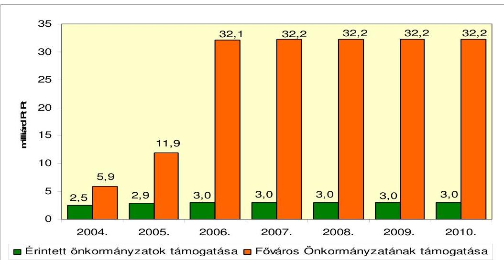

A Főváros Önkormányzata a helyi közösségi közlekedés támogatása jogcímen rendelkezésre álló előirányzatból a 2004. évben 70,1%-os, a 2005. évben 80,6%-os, a 2006-2010. évek között 91,4-91,6% közötti arányban részesedett.

A BKV a személyszállításban a Magyar Állam által meghatározott utazási kedvezmények miatti bevételkiesés ellentételezése céljából a fogyasztói árkiegészítésről szóló 2003. évi LXXXVII. törvény alapján fogyasztói árkiegészítésre jogosult. A fogyasztói árkiegészítések igénylésének eljárásrendjét a belföldi menetrend szerinti személyszállítás ingyenes utazásai után járó fogyasztási árkiegészítés megállapításáról szóló GKM rendeletek ${ }^{18}$ tartalmazták. A BKV számításai szerint a 2004-2010. években az ingyenesen igénybe vett utazások és a kedvezményes bérletvásárlások miatti bevételkiesés összege a BKV-nál 29,8 milliárd Ft volt.

[^0]
[^0]:    ${ }^{17}$ A 2008. évi költségvetési törvény 5. számú mellékletének 13. pontja, a 2009-2011. évi költségvetési törvények 5. számú mellékletének 10. pontja tartalmazta ezt az előírást
    ${ }^{18}$ a 28/2004. (III. 12.), a 46/2006. (VII. 11.) és a 31/2007. (III. 13.) GKM rendeletek

---

A kedvezményesen igénybe vett utazások miatti bevételkiesés összege 2004-ben 0,5 millió Ft, 2005-ben 1200,5 millió Ft, 2006-ban 3354,8 millió Ft, 2007-ben 3633,8 millió Ft, 2008-ban 5634,2 millió Ft, 2009-ben 7483,8 millió Ft, 2010-ben 8529,2 millió Ft volt. A bevételkiesést az okozta, hogy a bérlet teljes árát nem fedezte a kedvezményesen vásárolt bérletért az igénybevevő által fizetett térítési díj és a fogyasztói árkiegészítés együttes összege.

A 2002-2010 közötti években a BKV működésének finanszírozásához a Magyar Állam által biztosított források kétszeresen haladták meg a Főváros Önkormányzata által nyújtott támogatásokat. A 2002-2010. években a BKV működésének finanszírozását biztosító források 40,9\%-át (462,8 milliárd Ft) a menetdíj és egyéb bevételek, 17,7\%-át (199,7 milliárd Ft) a Főváros Önkormányzatának fejlesztési és működési célú pénzeszköz átadásai, valamint 35,8\%-át (404,2 milliárd Ft) normatív és egyedi támogatások, hitelátvállalások útján a Magyar Állam által biztosított támogatások, 5,6\%-át (63,7 milliárd Ft) a hitelfelvételek - amelyek 41,4 milliárd Ft-os többlet kamatkiadást okoztak - tették ki.

A BKV hatósági árformába tartozó viteldíjainak megállapításáról és azok alkalmazási feltételeiről a Főváros Önkormányzata a 2005-2010. években rendeletekben döntött ${ }^{19}$, azonban a Szolgáltatási szerződésben előírtak ellenére a döntésre vonatkozó határidőt (október 30.) nem tartották be. A díjak megállapítása során a két legfontosabb árképzési tényező az infláció alakulása és az árkiegészítés indexálása volt. A jegykínálatra és a viteldíjakra vonatkozó javaslatok kidolgozása során figyelembe veendő szempontok: az utazóközönség teherbíró képessége, az utasbarát és utasvonzó intézkedések kezdeményezése, a jegy- és bérletárak jövedelmekhez viszonyított aránya, a pótdíjbehajtás hatékonysága és a fizetőképesség romlása.

A Közgyűlés a 2381/1999. (XII. 16.) számú határozatában döntött arról, hogy a BKV viteldíjait a következő években úgy kell megállapítani, hogy azok az „aktuális infláció" mértékéhez viszonyítva 5\%-os reáltarifa-szint emelést biztosítsanak. A kötelező mértékű tarifaszint emelés megállapításának elrendelését megállapító határozatot a Közgyűlés az 1989/2008. (XII. 18.) számú határozatával helyezte hatályon kívül. A viteldíjak mértéke 2005-2010 között az inflációt meghaladóan nőtt.

A Boston Consulting Group 2009-ben készült tanulmányában a Budapesten forgalomban lévő jegy-, illetve bérletárakról a következő megállapítást tette:
„A jegyárak abszolút értéke más külföldi városokkal összehasonlítva alacsony. A nyugat-európai városokban Madrid kivételével valamennyi jegytípus a budapestinél magasabb, az összehasonlításba vont városok közül viszont Prága és Varsó alacsonyabb árakkal rendelkezik. A helyi nettó órabér arányában mérve azonban már más a nemzetközi összehasonlítás eredménye: a helyi fizetőképes kereslethez viszonyítva a BKV vonaljegy ára magasabb, mint a legtöbb vizsgált városban."
„A korlátlan utazást biztosító bérletek ára nemzetközi összehasonlításban hasonló eredményt mutat, mint a menetjegyeknél. A bérletek abszolút ára Budapesten az egyik legalacsonyabb, az összehasonlításba vont városok közül csak Varsóban és Prágában

[^0]
[^0]:    ${ }^{19}$ a Főváros Önkormányzata 86/2005. (XII. 16.), 65/2006. (XII. 22.), 83/2007. (XII. 28.), 76/2008. (XII. 30.), 74/2009. (XII. 10.), 62/2010. (XII. 23.) számú rendeletei

---

olcsóbb. A nettó havi bér százalékában azonban már drágának bizonyul a budapesti bérlet, amely a nemzetközi minta magas árú bérletei között található."

# 1.4. A Főváros Önkormányzata ellenőrzési kötelezettségeinek teljesítése, az ellenőrzési megállapítások hasznosítása 

A Felügyelőbizottság működési szabályzataiban ${ }^{20}$ a Felügyelőbizottság feladataként előírták a Főváros Önkormányzata részére történő beszámolást, ennek ellenére a 2005-2010. időszakban a Közgyűlés, illetve a tulajdonosi jogkörök gyakorlására felhatalmazott bizottságok részére a Felügyelőbizottság elnöke a Felügyelőbizottság tevékenységéről szóló beszámolót nem terjesztette elő.

A 2005. évben a Tulajdonosi bizottság, a 2006-2007. években a Gazdasági bizottság a BKV éves beszámolójáról a Felügyelőbizottság jelentését elfogadta. A Gazdasági bizottság a 2008. és a 2009. évre vonatkozóan a BKV éves beszámolójának elfogadásáról hozott határozataiban a Felügyelőbizottság jelentésének ${ }^{21}$ elfogadásáról nem döntött, az Alapító Okirat 9.4. pontjában előírt kötelezettsége ellenére. A 2010. évi beszámoló elfogadásához kapcsolódóan a Felügyelőbizottság jelentését is elfogadta a Közgyűlés ${ }^{22}$.

A BKV 2005-2008. évi beszámolóinak elfogadásakor a Tulajdonosi majd a Gazdasági bizottság határozott a könyvvizsgálói jelentések ${ }^{23}$ elfogadásáról. Az Alapító Okiratban foglaltak ellenére a 2009. évi beszámoló elfogadásakor a határozat nem tartalmazott utalást arra, hogy a BKV könyvvizsgálójának jelentését is elfogadta a tulajdonos hatáskörében eljáró bizottság. A 2010. évi beszámoló elfogadásához kapcsolódóan a könyvvizsgáló jelentését is elfogadta a Közgyűlés.

A könyvvizsgáló a 2009. évi beszámolóra vonatkozóan elutasító záradékot adott, tekintettel arra, hogy a BKV-nál több, jelentős visszaélés gyanúja merült fel, ezek kimenetelének hatását nem lehetett megbízhatóan felbecsülni, ezért a könyvvizsgálat az elszámolások helyességének eredményéről és teljességéről nem tudott megbizonyosodni.

Az Ötv. 92. § (11) bekezdés b) pontja alapján (2005. augusztus 31-ei módosítást követően) az önkormányzat belső ellenőrzését ellátó szervezet ellenőrzést végezhet az önkormányzat többségi irányítást biztosító befolyása alatt működő gazdasági társaságoknál. A 2005-2010. évekre vonatkozó éves belső ellenőrzési terveket alátámasztó kockázatelemzést a BKV-ra nem terjesztették ki, a belső ellenőrzés általi vizsgálatát nem tervezték. A 2011. évi belső ellenőrzési tervhez készített kockázatelemzés a Főváros Önkormányzata

[^0]
[^0]:    ${ }^{20}$ a Felügyelőbizottság 2004. szeptember 8-án, illetve a 2010. évben kiadott működési szabályzata
    ${ }^{21}$ A Felügyelőbizottság a 2008. évi beszámolót a 16/2009. számú határozatával, a 2009. évi beszámolót a 38/2010. számú határozatával elfogadásra javasolta.
    ${ }^{22}$ a Közgyűlés 1391/2011. (V. 25.) számú határozata alapján
    ${ }^{23}$ A könyvvizsgáló a 2005-2008. évi beszámolók esetében hitelesítő záradékot, a 2010. évi beszámoló tekintetében korlátozó záradékot adott.

---

többségi irányítást biztosító befolyása alatt működő gazdasági társaságok egy részére kiterjedt, azonban a BKV-t továbbra sem vonták be a kockázatelemzésbe, arra hivatkozással, hogy „a BKK Zrt. ${ }^{24}$ érdekkörébe tartozik". Ezen hivatkozás nem volt megalapozott tekintettel arra, hogy a BKV továbbra is a Főváros Önkormányzatának kizárólagos tulajdonát képező gazdasági társaság, a BKK Zrt-vel kapcsolatos jogviszony még nem áll fenn.

A Szolgáltatási szerződés rögzíti, hogy a Főváros Önkormányzata saját maga, vagy független megbízott szervezet révén ellenőrizheti a BKV által nyújtott szolgáltatásokat. Ezen ellenőrzési feladatát a Főváros Önkormányzata a Főpolgármesteri hivatal révén, a Közlekedési ügyosztály bevonásával látta el, ellenőrzéseket a 2005-2007., valamint a 2010. évben folytattak le, az ellenőrzések nem terjedtek ki minden közlekedési alágazatra.

Az ellenőrzések - a 2008-2009. évek kivételével - kiterjedtek a villamos és az autóbusz viszonylatokra, azonban trolibusz és HÉV viszonylatokat csak a 2006. évben ellenőriztek. A 2005. évben 62 viszonylatot, a 2006. évben 57 viszonylatot, a 2007. évben 27 viszonylatot, valamint a 2010. évben 61 viszonylatot ellenőriztek. A mérési adatok alapján kimutatták az átlagos járműhiányt, illetve az átlagos menetkimaradások arányát, amelyek értéke 0,4-2,9\%, illetve 0,9-5,7\% között volt az ellenőrzött években.

Az ellenőrzések során feltárt hiányosságok megszüntetését egyes viszonylatok ismételt ellenőrzésével követték nyomon, azonban ezek mindössze az ellenőrzött viszonylatok 4,8-7\%-át jelentették. Az ellenőrzések a BKV által nyújtott szolgáltatásokra és nem a BKV gazdálkodásának vizsgálatára irányultak. Az ellenőrzések megállapításait az ellenőrzési szempontok tényadatainak táblázatos formában történő bemutatásával rögzítették és tájékoztatásul megküldték a vezérigazgatónak. Az ellenőrzések során feltárt hiányosságok megszüntetése érdekében intézkedések megtételét és azokról való tájékoztatást a Közlekedési Ügyosztály csak a 2010. évtől kért a vezérigazgatótól.

A 2005-2010. években a Főváros Önkormányzata fejlesztési célú támogatást - tőketartalékba helyezési kötelezettséggel - biztosított a BKV számára. A pénzeszköz átadás-átvételi megállapodásokban utólagos elszámolási kötelezettséget írt elő az átadó Főváros Önkormányzata, a számadás formáját a kifizetett számlákról készített elszámolás, valamint a beruházás féléves, illetve éves teljesítéséről készített beszámoló benyújtásával határozták meg. A BKV által benyújtott elszámolásokat a Közlekedési ügyosztály felülvizsgálta összegszerűségük és az elvégzett munkálatok szakmai megalapozottsága tekintetében. A 2005. és a 2006. évi elszámolások alapján a rendeltetés szerinti felhasználást állapítottak meg. A 2007-2010. években a felülvizsgálatok során kifogásoltak számlákat, amelyekre a BKV írásos magyarázatot adott és ennek figyelembevételével elfogadásra kerültek a kifogásolt számlák, illetve a BKV visszavonta a nem megfelelő számlákat.

A 2005-2009. években teljesített pénzeszköz átadásokról szóló megállapodásokban foglaltaknak megfelelően a BKV a támogatás felhasználásáról szóló fél-

[^0]
[^0]:    ${ }^{24}$ A BKK Zrt. sem szerepelt a kockázatelemzésben.

---

éves, illetve éves beszámolókat a Közlekedési ügyosztálynak benyújtotta, amelyeket az elfogadott. A 2010. I. félévi beszámolót tájékoztatásként ${ }^{25}$ a Közgyűlés elé terjesztették, amelyet az tudomásul vett.

# 1.5. A közforgalmú közlekedési szolgáltatások minőségének megfelelősége 

A Szolgáltatási szerződés minőségi célként rögzíti, hogy a Főváros Önkormányzata az Európai Unió közös közlekedéspolitikájával összhangban, a BKV közreműködésével, fenntartható közlekedési módok alkalmazásával, integrált, teljes körű, jó minőségi színvonalú személyszállítást biztosítson Budapesten és az érintett környező települések területén.

A BKV a Szolgáltatási szerződés 1. számú mellékletében meghatározottak alapján köteles a rögzített közszolgáltatási követelményekben megfogalmazott alapellátási paramétereket és minőségi követelményeket alapul véve, a paraméterkönyvben rögzített közlekedési hálózaton, meghatározott ágazatonkénti éves férőhely-kilométer teljesítmény felhasználásával, rögzített viszonylatonkénti kínálati jellemzők alapján integrált személyszállítási szolgáltatást biztosítani. Mindezek jelentik a tervezett szolgáltatást.

A minőségi követelmények képezik a bonus/malus elszámolás alapját. A Szolgáltatási szerződésben rögzített minőségi paraméterek a menetkimaradások száma, a pontosság és a biztonság voltak.

A nyújtott szolgáltatás értékelésének formáját és tartalmi követelményeit a Szolgáltatási szerződés 2. számú mellékletében rögzítették, az erre vonatkozó adatokat a Szolgáltatási jelentés tartalmazta. A szolgáltatás szöveges értékelése tartalmazza a férőhely kilométerben megadott teljesítményelvárásokat, illetve azok alakulását befolyásoló tényezőket, a menetdíjbevétel realizálására vonatkozó tevékenységet, a forgalmi és a műszaki fejlesztéseket, a megvalósult és tervezett rekonstrukciós munkákat. A Szolgáltatási jelentéseket a BKV-nak negyedévenként kell benyújtania a Főváros Önkormányzatához, az utolsó negyedévnél az éves értékelést is el kell végeznie. A 20052010 közötti időszakban a Szolgáltatási jelentések előírt módon történő benyújtása megtörtént.

A Szolgáltatási szerződésben rögzített teljesítményelvárások és a minőségi paraméterek teljesítésének összevetése azonban nem adott képet az utas elégedettségről, valamint nem mutatta be a beérkezett utas panaszok értékeléséből számszerűsíthető elvárt és érzékelt minőségi szint közötti különbséget. A BKV éves szinten mintegy 1,3 milliárd utast szállít. Az utasszám és az utaskilométer 2005-2009 között közel 4\%-kal csökkent, miközben a férőhely kapacitás 1,2\%-kal nőtt.

A BKV vezérigazgatójának a záró megbeszélésen fenntartott észrevétele szerint: „Az „utasszám és az utaskilométer 2005-2009 között közel 4\%-kal csökkent" ez a

[^0]
[^0]:    ${ }^{25}$ A 2010. I. félévi beszámolót a Városüzemeltetési Főpolgármester-helyettes terjesztette tájékoztatás formájában a Közgyűlés elé.

---

megállapítás még az ágazati utasszámokra igaz. Ha a felszálló utasszámokra nézzük, akkor ez az érték 5%-ra módosul a vizsgált időszakban. Miután 2010-ben áttértünk az utóbbi számítási módszerre és a KSH felé is ezeket az értékeket továbbítottuk, a Jelentésben is ezt a mértéket lenne célszerű szerepeltetni."

Az észrevétel nem megalapozott, mivel az utasszám és az utaskilométerrel kapcsolatos megállapításunk 2005-2009 évre vonatkozik, ezért a 2010. évi adatok nem érintik a megállapításunkat.

A teljesítményelvárások az összehasonlíthatóság érdekében a tervezett és a nyújtott férőhely-kilométer teljesítmény eltérés tervezett értékéhez való viszonyításával jellemezhetők, százalékban meghatározva (1. számú függelék) Az eltérések számszerű értékei alapján a 2005-2010 közötti időszakban a BKV a teljesítményelvárásoknak eleget tett (8/b. számú melléklet).

A minőségi paraméterek teljesítésének értékeléséhez a menetkimaradások, az indulások pontossága, valamint a balesetek előző évhez (bázis) való viszonya szolgál (2. számú függelék). Az összesített jellemzők alapján a minőségi paramétereket a BKV biztosította (8/c. számú melléklet).

A Szolgáltatási szerződés a Főváros Önkormányzata jogai és kötelezettségei között az ellenőrzés, monitoring alpontban nem kötelezettséget, hanem jogosultságot fogalmaz meg és nem tér ki az ellenőrzés eredményeinek következményeire.

A Főváros Önkormányzata a monitoring rendszer keretében, évente két alkalommal végzett méréseket a szolgáltatásokra vonatkozóan a 2005-2007. és a 2010. években. Az ellenőrzések rövid időszakra, kevés számú viszonylatra, vagy csak meghatározott alágazatra és a statisztikai mintavétel szabályai mellőzésével történtek. A megállapítások, bár számszerű eredményeket tartalmaztak, inkább figyelemfelkeltésre és nem a BKV tevékenységének egyértelmű megítélésére voltak alkalmasak

A minőségszempontok alakulása a megrendelői szerep fontosságát és felelősségét is mutatja. A megrendelőnek az elvárt minőség ismeretében - a finanszírozási lehetőségek figyelembevétele mellett - kell meghatároznia, majd „megrendelnie" a tervezett minőséget.

A minőségjellemzők egységes értelmezése, definiálására, az egységes minőségi szemléletmód és tevékenység meghatározása érdekében dolgozták ki az európai uniós tagországok számára a minőségi kritériumok rendszere és hierarchikus rendje a normákat tartalmazó EN 13816:2002 szabvány formájában, amelynek magyar nyelvű kiadása 2008-ban jelent meg. A szabvány minden más előírással összehasonlítva a legteljesebben tartalmazza a közforgalmú közlekedés minőségügyi követelményeit. A szabvány alkalmazására kötelező előírás nincs, annak előírásait a Szolgáltatási szerződésben nem alkalmazták.

A Szolgáltatási szerződés a célok megfogalmazását az Európai Unió közös közlekedéspolitikájával összhangban adja meg, a szolgáltatás minőségének értékeléséhez három (menetkimaradások száma, pontosság, biztonság) minőségi tényezőt vett figyelembe

---

A BKV utas-elégedettségi vizsgálatot végeztetett 2008-ban a korszerű utastájékoztatási rendszer bevezetése kapcsán. A kétezer főt jelentő minta szerint elégedettek a BKV hálózati lefedettségével, a menetrenddel, az utastájékoztató eszközök mennyiségével és megbízhatóságával, információtartalmával. A tisztaság, a kényelem, a jegyértékesítés, a klimatikai viszonyok, a biztonság közepes minősítést kaptak. Utas-elégedettségi vizsgálatot a későbbiekben nem végeztek.

A BKV 2010-ben személymegkérdezésen alapuló piac szegmentációs kutatást végeztetett, kétezer fős reprezentatív mintán. A felvétel az utazási szokásjellemzők mellett utas-elégedettségre is vonatkozott. A megkérdezettek elégedetlenek voltak az alacsony sebességgel, a zsúfoltsággal, a tisztasággal, a kellemetlen utastársakkal, a járművek és a megállók elhanyagoltságával. A BKV utaselégedettségi vizsgálatai telefonos megkérdezésen alapultak.

Összességében a Főváros Önkormányzatának tömegközlekedési feladatellátása nem volt eredményes, mivel a Főváros Önkormányzata a tulajdonosi jogkörrel felruházott bizottságok beszámoltatását elmulasztotta, a szükséges mértékben nem biztosította a közforgalmú közlekedés közszolgáltatási kötelezettségének teljesítéséhez a forrásokat, részben teljesítette ellenőrzési kötelezettségeit, illetve részben biztosította az ellenőrzési megállapítások hasznosulását. Továbbá részben volt megfelelő a közforgalmú közlekedési szolgáltatások minősége, mivel a tervezett és nyújtott minőség közötti eltérés megszüntetéséről a Főváros Önkormányzata nem intézkedett. Annak ellenére nem eredményes a főváros tömegközlekedési feladatellátása, hogy a Főváros Önkormányzata rendelkezett közlekedéspolitikai stratégiával, az illeszkedett az Egységes Közlekedésfejlesztési Stratégiához, a Szolgáltatási szerződés teljes mértékben tartalmazta a főváros tömegközlekedési feladatainak ellátási kötelezettségét, továbbá szabályozta a BKV-val kapcsolatos tulajdonosi joggyakorlás rendjét, és azt - a tulajdonosi jogkörrel felruházottak beszámoltatási kötelezettség elmulasztásának kivételével - betartotta, illetve betartatta a döntési eljárások során (3/a. számú melléklet).

# 2. A BKV MŰKÖDÉSÉNEK SZABÁLYOZÁSA 

### 2.1. A BKV belső szabályzatainak összhangja a szabályozási környezettel

A BKV működtetésének feladat-, hatásköri- és felelősségi szabályozását az Alapító Okirat határozza meg, amely legutoljára 2010. október 27-én módosult és került egységes szerkezetben jóváhagyásra.

A BKV működését a 2007. évi szervezetfejlesztést követően az 57/2007. számú igazgatósági határozattal elfogadott - augusztus 1-jétől hatályos - BKV SzMSz szabályozta. Az új szabályzat kiküszöbölte a régi szabályzat hiányosságait.

A korábbi szabályzat nem tartalmazta a vezérigazgató-helyettesek felelősségét az irányításuk alá tartozó szervezeti egységhez rendelt feladatok pontos, szabályos végrehajtásáért, nem határozta meg a BKV-hoz tartozó társaságok éves tervezési irányelveivel kapcsolatos döntés-előkészítésének, az irányelvek betartása figyelemmel kísérésének feladatgazdáját.

---

A BKV 2004. júliusától érvényes Kollektív Szerződése 2009. december 31-én hatályát vesztette. Az új KSZ-t 2010. január 19-én kötötte meg a vezérigazgató a szakszervezetekkel. A járművezetők bérezésére vonatkozóan azt visszamenőlegesen 2010. január 1-jétől helyezte hatályba a vezérigazgató, viszont a BKV azt 2010. január 17-től alkalmazta a béren kívüli juttatások tekintetében. A KSZ személyi hatálya - a vezető állású munkavállalókon (vezérigazgató és vezérigazgató-helyettesek) kívül - kiterjed a BKV-val munkaviszonyban álló valamennyi munkavállalóra. A KSZ több más kedvezmény megtartása, illetve csökkentése (béren kívüli juttatás) mellett az Mtv. 122. §-ában a forgalmi személyzetnek járó munkaközi szüneten felül további 20 perc fizetett pihenőidőt is biztosított, amely évente 272,2 millió Ft költségnövekedést jelentett.

A BKV 2008. szeptember 30-ától hatályos Közbeszerzési és versenyeztetési szabályzatának átfogó felülvizsgálata a Kbt. 2009. április 1-jétől hatályos módosítása után nem történt meg. A szabályzatot csak 2011. február 8-án módosította a vezérigazgató, holott a 16/VU 2009. számú vezérigazgatói utasítás rendelkező része erre a feladatra 2009. október 31-i határidőt állapított meg. A Kbt. módosítással összehangolt egységes szabályozás 2009. április 1. és 2011. február 8-a között a BKV-nál nem volt.

A BKV vezérigazgatójának a záró megbeszélésen fenntartott észrevétele szerint: „Az előző megállapítás törlését kérjük a következők miatt. A Közbeszerzési és Versenyeztetési Szabályzat 2009 augusztusában történt felülvizsgálatát követően megállapításra került, hogy a Kbt. 2009. április 1-jei módosítása a szabályzat tartalmát jelentős mértékben nem érintette, ennél fogva a szabályzat átfogó módosítását nem a Kbt. 2009. évi módosulása, hanem a belső döntési rend változása tette szükségessé. A 2010. június 1-jei SZMSZ módosítással a Műszaki Igazgatóságról a Gazdasági Igazgatóság hatáskörébe került a BKV beszerzési tevékenység végrehajtása. A BKV beszerzési rendjében bekövetkezett változásokra figyelemmel a 2008. évi Beszerzési Szabályzat felülvizsgálatáig és annak átfogó módosításáig - a beszerzési folyamat zavartalansága és hatékonyabbá tétele érdekében - 2010. június 18-án hatályba lépett a „Társaság beszerzési tevékenységének átmeneti szabályozásáról" szóló, 15/VU/2010. vezérigazgatói utasítás. Ez az új Ügyrendnek és Aláírási Szabályzatnak megfelelően szabályozta a szerződéskötést megelőző eljárásokat, a döntéshozatal és a bírálóbizottság működésének rendjét a beszerzési eljárásokban, valamint a szerződéskötéssel és megrendelések kiadásával kapcsolatos eljárásokat."

Az észrevétel nem megalapozott, mivel a 16/VU/2009 vezérigazgatói utasítás rendelkező része előírja, hogy a beszerzési szabályzat átfogó módosítását 2009. október 31-éig végre kell hajtani. Erre a határidőre az átfogó szabálymódosítás nem készült el, azt csak 2011. február 8-án módosították. A beszerzési tevékenységgel kapcsolatosan kiadott 15/VU/2010 vezérigazgatói utasítás a BKV beszerzési tevékenységének átmeneti szabályozásáról szólt, ezért a megállapításunkat fenntartjuk.

A BKV megsértette az Adatvéd. tv. 19. § (2), valamint az Eitv. 4. § (3) bekezdésében előírtakat, mivel a BKV adatvédelmi és adatbiztonsági szabályzatának az általános közzétételi listája nem rendelkezett a közfeladatot ellátó szerv feladatellátásának teljesítményére, kapacitásának jellemzésére, hatékonyságának és teljesítményének mérésére szolgáló mutatók és értékük, azok időbeli változása adatainak közzétételéről.

---

A BKV hatályos Számviteli Politikája és belső szabályzatai - az alábbiakban jelzett kivételektől eltekintve - megfelelnek a jogszabályoknak és a tevékenység sajátosságainak. A BKV szervezetében, működésében 2007. évet követően nem voltak olyan eszközváltozások, amelyek a Számviteli Politika módosítását igényelték volna. A Számviteli Politika részeként a Számv. tv. 14. §-ában előírt szabályzatokkal a BKV rendelkezett. Az Értékelési Szabályzat 2001-ben, a pénz- és értékkezelés szabályozása 2006-ban lépett hatályba. A HÉV Számviteli Politika az ágazatra vonatkozóan külön szabályozta az eredménykimutatás elkészítését. A konszolidált éves beszámoló összeállítása során alkalmazott konszolidációs számviteli elveket, eljárásokat, értékelési módszereket, valamint a konszolidált éves beszámoló készítésével kapcsolatos egyéb előírásokat a 2009-ben kiadott Konszolidációs számviteli politika tartalmazta.

A Számv. tv. 14. §-ában előírtak szerint, a BKV-nak a Számviteli Politika keretében el kellett készítenie az eszközök és források leltárkészítési és leltározási szabályzatát, azonban a saját tőke és a céltartalékok leltározási folyamata a szabályzatban nem került rögzítésre. Az önköltségszámítás rendje a Számv. tv. 14. §. (7) bekezdésében foglaltak betartásával, az alaptevékenység sajátosságainak megfelelően került szabályozásra. A szabályzat kiterjed a saját termelésű készleteken és beruházásokon kívül az alaptevékenység kiemelt szolgáltatásaira, ezen belül infrastruktúra létesítményfajtákra, járműtípusokra és járatokra.

# 2.2. A BKV szervezetének és működésének változása 

A BKV 2007 előtt általános, társasági szintű feladatokat ellátó központi integrátori igazgatóságokra, valamint az operatív szolgáltatási feladatokat ellátó üzemigazgatóságokra tagolódott (4/a. számú melléklet).

A BKV szervezeti felépítése a 2007. évben átalakult. A változtatás célja a szervezet működésének racionalizálása, hatékonyságának javítása és az átláthatóság biztosítása volt. A szervezeten belüli funkcionális irányítás átláthatóbbá vált, a folyamatok centralizált jellege megmaradt. Az új irányítási (4/b. számú melléklet) modellt és az új szervezeti felépítést a folyamatelvűség, centralizáció és átláthatóság határozta meg. A folyamatelvűség szerint a BKV működése forgalmi, műszaki, gazdasági és értékesítési alapfolyamatban testesült meg. A centralizáció az ágazati, a gazdálkodási, a logisztikai (beszerzés, készletgazdálkodás, raktározás) és az informatikai folyamatokat érintette. Az üzemigazgatói struktúra (hat üzemigazgatóság) helyett három ágazatba (HÉV/metró, villamos, autóbusz/trolibusz) szerveződtek mind a forgalmi, mind pedig a műszaki folyamatok. A központosítás következtében a készletgazdálkodás és a beszerzés racionalizáltabbá vált. A szervezetmódosítás hatására a BKV létszáma 2007. év végére 12817 főről 11853 főre csökkent, majd 2010. december 31-én 12082 főre emelkedett az átlagos állományi létszám.

Az ingatlanfejlesztési iroda 2008 júniusában megszűnt és a szervezet kiegészült az Informatikai főosztállyal és a kommunikációs irodával (4/c. számú melléklet). A BKV 2010. évi holdingstruktúrát kialakító szervezetfejlesztési tervét a Főváros Önkormányzata nem fogadta el, ezért továbbra is fennmaradt az irányítás erős centralizáltsága, szervezetileg kiegészülve a biztonsági, a jogi és az IT igazgatósággal (4/d. számú melléklet).

---

# 3. A BKV RENDELKEZÉSÉRE BOCSÁTOTT VAGYONNAL VALÓ GAZDÁLKODÁS SZABÁLYOSSÁGA 

### 3.1. A BKV tervezési, könyvvezetési és beszámolási rendszere

Az üzleti tervek a Szolgáltatási szerződésben megfogalmazott feladatokkal összhangban voltak. Az üzleti terveket a Szolgáltatási szerződésben foglalt teljesítmény-elvárások határozták meg, éves szinten készültek, középtávú kitekintést nem tartalmaztak. A BKV eseti jelleggel 2005-ben 7 éves, 2009-ben 10 éves üzleti modellt készített. Az adott év teljesítmény-elvárásait a paraméterkönyv tartalmazta, a Fővárosi Közgyűlés 2010-ben azt nem fogadta el, így a 2009. évi alapján történt a közösségi közlekedés ráfordításainak tervezése. A bevételek tervezése a paraméterkönyv alapján meghatározott teljesítmények és a Tarifapolitika alapján került meghatározásra.

A költség- és ráfordításigényt a teljesítményelvárások függvényében határozták meg.

A villamos energia felhasználás tervezhetőségét a piaci árakhoz képest jó kondíciókkal megkötött több éves szerződés biztosította. 2010. január 1-je óta a szabadpiacról történik a beszerzés.

A gázolaj fogyasztás költségeit prognosztizált nagykereskedelmi ár és kedvezmények alapján tervezték, az előrejelzések bizonytalanságát a kockázatok között szerepeltették, fedezeti ügyleteket nem kötöttek. A BKV 2008. és 2011. év során is vizsgálta a gázolaj fedezeti ügylet megkötésének lehetőségét, azonban az ügyletek megkötésére nem került sor.

A személyi jellegű ráfordítások nagyságrendje az érdekképviseletekkel történt megállapodások függvénye volt. A szolgáltatási szerződés szerinti teljesítménykövetelménynek megfelelő járművezetői és karbantartói létszámigényt, valamint az állomások személyzetigényét jogszabályok és belső szabályzatok határozták meg. Az eszközpark - műszaki állapotának folyamatos romlása miatt - egyre nagyobb karbantartási élőmunka-ráfordítást igényelt.

A karbantartási költségek tervezése az üzembe álló járműszükséglet és a karbantartás tapasztalati adatainak a figyelembevételével történt. A közlekedésbiztonsági felelősség érvényesülésének eredményeként csak olyan jármű vehetett részt a szolgáltatásban, forgalomban, amely megfelelt az előírásoknak.

Az eszközpark állapotának következményeként a műszaki okból bekövetkezett menetkimaradások száma nőtt, 2010-ben 31\%-kal volt magasabb, mint az előző évben, amelyhez a régebbi típusú járművek rossz műszaki állapotán túl a 2010. januári sztrájkot megelőzően alkalmazottnál szigorúbb járműátvételi rend is hozzájárult.

Az üzletáganként keletkezett bevételek, költségek és ráfordítások elszámolására vonatkozó előírásokat, a követendő eljárásokat, valamint a számításokkal kapcsolatos szabályokat a BKV Költség-kontrolling szabályzata és az önköltségszámítási, kalkulációs és költségáramlási rendje, valamint a HÉV Számviteli Politika tartalmazták.

---

A gazdasági események áttekinthetőségének biztosítását voltak hivatottak szolgálni az SAP rendszer moduljai, a saját fejlesztésű informatikai rendszerek, a rendszerleírások és a vonatkozó BKV szabályzatok. Az informatikai és számviteli rendszerek egymásra épültek. A beszerzés teljes folyamatát végig kísérik az egymásra épülő bizonylatolási és engedélyezési eljárások. Minden beszerzés az anyag- vagy szolgáltatásigény felmerülésével kezdődik, melyet az adott igazgatóságon a beszerzés jellegétől függően rögzítenek a megfelelő SAP modulban.

A MenDi rendszerben történik a jegy- és bérletértékesítések rögzítése, mely kapcsolódik egyrészt az SAP készlet moduljához, másrészt az SAP SD számlázó és bevételkezelői moduljához. Az adatok közvetlenül áramolnak a modulok és a fejlesztett rendszer között. Bevételek esetében a MenDi és a főkönyvi nyilvántartás közötti kapcsolatot az SD modul teremti meg. A Könyvelési és mérleg osztály havonta egyezteti a MenDi és az SD modul adatait. Minden évben elvégzik az SD és az FI modul (a BKV-nál alkalmazott SAP integrált rendszer főkönyvi modulja) egyeztetését, ahol levezetik a rendszerek közötti eltéréseket (az SD modul nem képes kezelni az időbeli elhatárolásokat).

A MenDi rendszer nem kezeli a csúszó érvényességgel vásárolt bérleteket, vagyis a rendszerben nem lehetett rögzíteni az érvényesség kezdetét, ezért a vásárlás napjától tekintették érvényesnek a megvásárolt bérletet. Ennek következtében a bevételekhez kapcsolódó időbeli elhatárolások csúszó érvényességgel vásárolt bérletekhez kapcsolódó része nem volt megfelelő. Egy új, kétszintű kereskedelmi program 2011. június 1-jén került bevezetésre, amelynek kialakítása során figyelembe vették az előbbiekben leírt hiányosságot.

A papír alapú pénztárjelentések adatait a Bevétel elszámoltató csoport rögzítette a MenDi rendszerbe és megtörtént a manuális adatok egyeztetése a pénztárosok által, a MenDi rendszerben rögzített utolsó adattal. A jegy- és bérletbevételek megfelelő főkönyvi számlára történő könyvelését a törzsadatbázis biztosítja. A rendszerek és modulok közötti rendszeres adategyeztetések, a törzsadatok kezelése, illetve a rendszerleírások alapján a jegy és bérletértékesítéssel kapcsolatos folyamatok nyomon követhetőek voltak.

A BKV-nál az eszközök és források számbavétele a Számv. tv. 69. § (2) bekezdésében foglaltakkal összhangban mennyiségi felvétellel, illetve egyeztetéssel történik.

A BKV Számviteli Politikájának 5. számú melléklete tartalmazza az évközi és év végi leltározással összefüggő feladatok ütemtervét, a leltározandó eszközök és felelősök megnevezését, a határidők megjelölését. A beszámoló leltárral történő alátámasztásának részletes értékelése alapján (3. számú függelék):

- a főkönyvi és analitikus nyilvántartások egyeztetése során a tárgyi eszközök közül az 1322 Egyéb gépek, berendezések főkönyvi számlánál a 2005–2009. években 2524,1-3635,8 ezer Ft összegű eltérés mutatkozott a nyilvántartások végösszege között;

---

A BKV vezérigazgatójának a záró megbeszélésen fenntartott észrevétele szerint: „A hiba az SAP lekérdezésben volt, nem a főkönyvi és az analitikus adatokban, ezért kérjük kiemelni, hogy az analitika és a főkönyv megegyezik."

Az észrevétel nem megalapozott, mivel az analitika és a főkönyv eltérése fennállt, melyet írásbeli nyilatkozatban a BKV számviteli vezetője elismert.

- a követelések leltározása során, a fordulónapon nyitott egyenleggel rendelkező vevők és a szállítók esetében minden évben kiküldésre kerültek az egyenlegértesítő levelek, melyek írásos feldolgozását, illetve az esetleges eltéréseket, azok tisztázását teljes körűen egyik évben sem végezték el, így az egyenlegközlőkkel való alátámasztás a vevők és a szállítók mérlegértéke esetében nem megfelelő;
- a mérlegben beruházási hitelként kimutatott összegeknél a 2004–2007. évek között helytelen összeg szerepelt. A BKV 2004. december 3-án négy hitelszerződést kötött forgóeszköz finanszírozási céllal 5,0-3,0-2,0-1,0 milliárd Ft értékben. A számviteli nyilvántartásokban az 5,0 milliárd Ft-os, helytelenül a beruházási és fejlesztési célú hitelek között szerepelt, megsértve a Számv. tv. 22. § (1) bekezdésében foglaltakat, mivel a BKV nem megfelelő mérlegsoron mutatta ki a hitelt;
- a pénzszállító vállalkozás részére átadásra váró készpénzállományt a fordulónapra vonatkozó pénztárleltárak nem tartalmazták, azokat helytelenül a követelések között számolták el. A pénzeszközöket a BKV pénztárosai tőkesúlyos trezorban helyezik el, amelyhez már nem lehet hozzáférni a pénzszállító vállalkozás nélkül. Az érvényes szerződés szerint a pénzszállító vállalkozás a tőkesúlyos trezor kinyitásától viseli a felelősséget, így a trezorból el nem szállított pénznek a BKV mérlegében követelésként való elszámolása nem felelt meg a szerződésben foglaltaknak.

A BKV főkönyvi nyilvántartása a Számv. tv. 12. § előírásai szerint épült fel, a bevételekre vonatkozóan tevékenységenkénti főcsoportok szerint, melynek részletei a számlatükörben dokumentáltak. Az értékesítés nettó árbevételei között 93\%-os nagyságrendű a jegy- és bérletbevételek összege, amely nem rendelhető közvetlenül üzleti területhez. Az egyes alágazati területek (autóbusz, villamos, trolibusz, HÉV, metró) bevételeinek elkülönítése kalkuláció útján történt.

A nyújtott szolgáltatások költségeit, valamint ráfordításait a BKV által használt SAP integrált informatikai rendszerben gyűjtik, a kimutatások ebből a rendszerből készülnek. A költség-kontrolling rendszer alkalmas volt az egyes költségelemek elkülönített nyilvántartására, melynek felhasználásával külön kerültek kimutatásra a BKV által nyújtott szolgáltatások közvetlen, illetve közvetett költségei.

Utókalkuláció a számviteli politikában meghatározott kalkulációs egységekre (rendelésekre, járműtípusokra, infrastruktúra-típusokra, járatokra) vonatkozóan negyedévente és összesítve év végén készült. Eredménye, dokumentációja áttekinthető, alkalmas a jármű- és az infrastruktúra üzemeltetés és karbantartás közvetlenül elszámolt anyag- és személyi jellegű ráfordításai, terv szerinti értékcsökkenése és biztosítási díja, valamint a járatokkal szoros összefüggésben elszámolt jármű- és utasforgalom kiszolgálás költségeinek nyomon követésére.

---

Az utókalkulációk többek között az üzleti tervezés során kerültek felhasználásra. A dokumentáció alapján a költségek $64 \%$-a a járatokra másodlagosan, megfelelő mutatószámok alapján került elszámolásra. A közvetett és általános költségek aránya nem éri el a közvetlen költségek $60 \%$-át.

A BKV-nak az évente kiadott szabályozás szerint a normatív állami támogatás igényléséhez a közszolgáltatásokat tartalmazó bevétellel nem fedezett indokolt költségekről ágazati elszámolást kell készíteni a 33/2010. (IV. 16.) KHEM-ÖM együttes rendeletben meghatározott felépítésben. Az adatszolgáltatásnál érvényesítették a Szolgáltatási szerződésben rögzített előírásokat, valamint az önköltségszámításra vonatkozó belső szabályozásban foglaltakat, azonban a 2010. évi adatszolgáltatásnál a ráfordítások között az aktivált saját teljesítmények költségeinek feltüntetése nem indokolt, mivel az aktivált készletek, tárgyi eszközök felhasználásakor, az üzembe helyezés után ismét elszámolt költségek miatt a ráfordítás kétszeresen került figyelembevételre.

A tárgyi eszközök amortizációs kulcsát a BKV számviteli politikájában rögzítettek szerint határozták meg. A „vaskerekű járművek" tervezett élettartama 30-40 év, ami hatszorosan-nyolcszorosan, az autóbuszoké 12-15 év, a trolibuszoké 12-20 év, ami kétszeresen, illetve négyszeresen meghaladta a Tao. tv. 2. számú melléklet IV. b) pontjában, a járművekre meghatározott öt év alatti költségként való ( $20 \%$-os leírási kulcs) elszámolást. Az amortizáció elszámolás alapja az eszköz mindenkori bekerülési értéke. A BKV Értékelési Szabályzatának megfelelően az eszközök felújítása után az értékcsökkenés elszámolása változatlanul az eredeti amortizációs kulccsal folytatódott, ami meghosszabbította az eszközöknek a ciklusrend szerinti felújítási munkák figyelembevételével eredetileg tervezett élettartamát, így a felújított eszközök tényleges használati ideje a tervezett hasznos élettartam fölött van.

# A tervezett hasznos élettartamon belül a 2009-2010. évben értékesített járművek ellenértéke 

Adatok: millió Ft

| Év | Db | Bruttó   érték | Halmozott   Écs | Kivezetési   érték | Értékesítési   bevétel | Ért./Kiv.\% |
| :--: | :--: | :--: | :--: | :--: | :--: | :--: |
| $\mathbf{2 0 0 9}$ | 179 | 888,2 | 572,7 | 315,5 | 62,1 | 19,7 |
| $\mathbf{2 0 1 0}$ | 39 | 260,8 | 221,8 | 39,0 | 8,3 | 21,3 |
| ebből flottaszerződés keretében értékesített: |  |  |  |  |  |  |
| $\mathbf{2 0 0 9}$ | 155 | 517,9 | 308,8 | 209,1 | 60,8 | 29,1 |
| $\mathbf{2 0 1 0}$ | 11 | 66,9 | 41,3 | 25,6 | 7,3 | 26,9 |

Az értékesített járművek kivezetett nettó értékének és eladási árának különbözete a 2009. évben 253,4 millió Ft, a 2010. évben pedig 30,7 millió Ft volt.

---

Az értékesítés legjelentősebb csoportja a $159 \mathrm{db}+30 \%$ személygépjármű és 3,5 tonna össztömeget meg nem haladó tehergépjármű állomány értékesítése és egyidejűleg az értékesített járműpark méretével megegyező új és üzembe helyezett gépjárművek bérlése a 2009. június 22-én kötött bérleti és flottakezelési szerződés keretében. Az Igazgatóságnak készített előterjesztésben bemutatták, hogy az eszközök könyv szerinti értéke magasabb a várható eladási árnál. A lecserélendő, használt gépkocsikat a BKV Zrt. az eljárást megelőzően nem értékeltette fel, azok átlagos életkora 9,1 év volt. A BKV könyveiben az értékesített járművek bruttó értéke 584,8 millió Ft, a számviteli törvény szerinti kivezetési értéke 234,7 millió Ft volt. Az értékesítésből származó bevétel pedig 70,7 millió Ft volt, ami 164,0 millió forinttal volt alacsonyabb, mint a BKV Zrt. könyveiben szerepeltetett nyilvántartási érték. A közbeszerzési eljárásban az összességében legelőnyösebb ajánlattevővel kötöttek szerződést. Az eljárás kiírásánál a bérleti díj optimális mértékét helyezték előnybe, ennek megfelelően a bírálati szempont $80 \%$-os súllyal a tartós bérlet és kapcsolódó flottakezelési szolgáltatás nettó havi díja volt, a használt járművek nettó vételára 20\%-os súllyal szerepelt. Az összességében legelőnyösebb ajánlat - vagyonértékelés hiányában nem adott kellő információt külön-külön az értékesített járművek és az igénybe vett szolgáltatások valós piaci értékéről.

A BKV-nál az eszközök maradványértéke az épületek, a személy- és tehergépkocsik kivételével (maradványérték az eszköznek a rendeltetésszerű használatba vételekor rendelkezésre álló információk alapján, a hasznos élettartam végén várhatóan realizálható értéke) nulla, mivel valamennyi eszközt a műszaki élettartam végéig
 üzemeltetnek. A rendeltetésszerű használatból kivont eszközök eladáskori értéke (maradványérték) azonban magasabb, mint nulla, amit a 2009-2010 időszakban az alábbi adatok szemléltetnek:

# A 0-ra leírt autóbuszok értékesítése a 2009-2010. években 

Adatok: millió Ft-ban

| Év | db | Bekerülési   érték | Halmozott   Écs | Kivezetési   érték | Értékesítési   bevétel |
| :--: | :--: | :--: | :--: | :--: | :--: |
| 2009 | 14 | 126 | 126 | 0 | 1,3 |
| 2010 | 29 | 567 | 567 | 0 | 5,6 |

A műszaki élettartam végéig üzemeltetett eszközök elszámolt értékcsökkenése megegyezett a bekerülési értékkel, azonban az autóbuszok értékesítésekor 6,8 millió Ft bevételt realizáltak, vagyis ezen eszközöknek ennyi volt a maradványértéke, ezzel megsértették a Számv. tv. 52. § (1) bekezdésben foglaltakat, miszerint a tárgyi eszközöknek a hasznos élettartam végén várható maradványértékkel csökkentett bekerülési értékét azokra az évekre kell felosztani, amelyekben ezeket az eszközöket előreláthatóan használni fogják. A tervezett hasznos élettartamon túli üzemeltetés után értékesített járműveknél a 6,8 millió Ft összegű maradványértéket is elszámolták helytelenül értékcsökkenési leírásként, ami a járművek eredeti bekerülési értékének $1 \%$-át tette ki.

---

# 3.2. A rendelkezésre bocsátott vagyonnal való gazdálkodás szabályossága és tervszerűsége 

A BKV vagyoni helyzetét jellemző főbb adatok 2005-2010. közötti időszakban:
Adatok: millió Ft-ban

| Megnevezés | $\begin{gathered} 2005 . \\ \text { jan. } 1 . \end{gathered}$ | 2005 | 2006 | 2007 | 2008 | 2009 | 2010 |
| :--: | :--: | :--: | :--: | :--: | :--: | :--: | :--: |
| Befektetett eszközök | 238169 | 271578 | 335717 | 393130 | 448117 | 498309 | 527512 |
| Forgóeszközök | 7843 | 10673 | 8694 | 10552 | 9243 | 11859 | 11643 |
| Aktív időbeli elhatárolások | 98 | 118 | 111 | 199 | 249 | 154 | 182 |
| Eszközök összesen | 246110 | 282369 | 344522 | 403881 | 457609 | 510322 | 539337 |
| Saját tőke | 112678 | 102084 | 100938 | 103157 | 116252 | 103574 | 114706 |
| Céltartalék | 187 | 514 | 1304 | 1747 | 2252 | 2332 | 955 |
| Kötelezettségek | 59920 | 81828 | 97783 | 112994 | 104176 | 124501 | 118261 |
| Ebből:   Hosszú lejáratú kötelezettségek | 32256 | 52305 | 49787 | 57393 | 50138 | 44837 | 39641 |
| Rövid lejáratú kötelezettségek | 27664 | 29523 | 47996 | 55601 | 54038 | 79664 | 78620 |
| Passzív időbeli elhatárolások | 73325 | 97943 | 177497 | 185983 | 234929 | 279915 | 305415 |
| Források összesen | 246110 | 282369 | 344522 | 403881 | 457609 | 510322 | 539337 |

A BKV eszközállománya hat év alatt több mint kétszeresére (293,2 milliárd Ft-tal) nőtt. A növekedésből 289,4 milliárd Ft az immateriális javak és tárgyi eszközök, és mindössze 3,8 milliárd Ft a forgóeszközök növekedése. A befektetett eszközállomány növekedésének forrása közel $80 \%$-ban a kiemelt beruházások céltámogatása, ami halasztott bevételként jelenik meg a passzív időbeli elhatárolások 232,1 milliárd Ft-os növekedésében. A saját tőke - az összesen 81,5 milliárd Ft-os tőkepótlás ellenére - csupán 2,0 milliárd Ft-tal nőtt, további 58,4 milliárd Ft-os nagyságrendben a veszteség finanszírozására felvett, hosszú- és rövid lejáratú kötelezettségek növekedése biztosította a tárgyi eszközállomány növekedésének forrását.

Az eszközállomány 97,8\%-át a befektetett eszközállomány teszi ki. Ezen belül a beruházások, és beruházásra adott előlegek aránya a 2005. évi 20\%-ról 2010-re $41 \%$-ra emelkedett, összege öt év alatt 198 milliárd Ft-tal nőtt. Az ingatlanok, gépek, berendezések, járművek nettó értéke 2007-ig növekedett, azóta az ingatlanok nettó értéke stagnál, a termelésben részt vevő járművek, gépek, berendezések nettó értéke - a bruttó érték évi 3-4\%-os növekedése mellett - 5,2\%-kal

---

csökkent. A nettó érték csökkenése mellett az eszközállomány elhasználódott, műszaki színvonala alacsony, a rendelkezésre állási képessége leromlott. A BKV 2002-2010. évi mérlegeinek részletes adatait a 9/b. számú melléklet tartalmazza.

A gazdálkodás főbb mutatószámainak alakulása során a 2005-2010. években az értékesítés nettó árbevétele megközelítően a tervezett szinten alakult. A menetdíjbevétel 2009-ig a tarifaemelések, valamint a szigorított jegyellenőrzési intézkedések eredményeként folyamatosan nőtt, 2010-ben a jegyeladások visszaesésével párhuzamosan a 2008. évi szint alá csökkent.

A ráfordítások, ezen belül az anyag- és személyi jellegű ráfordítások, illetve az elszámolt értékcsökkenés összege folyamatosan nőtt. Az üzemi tevékenység eredménye a kapott támogatások összegének függvényében változott, 2010-ben nagymértékben az előre nem tervezett támogatások eredményeként először volt pozitív összegű. A pénzügyi műveletek eredményét döntően a fizetett kamatok határozták meg, melynek összege a hitelállomány összegéhez igazodóan változott. A BKV eredménykimutatásának 2002-2010. közötti részletes adatait a 9/a. számú melléklet tartalmazza.

# Az eredménykimutatás főbb adatai a 2005-2010. években. 

Adatok: millió Ft-ban

| Megnevezés | 2005 | 2006 | 2007 | 2008 | 2009 | 2010 |
| :-- | --: | --: | --: | --: | --: | --: |
| Értékesítés nettó árbevétele | 62434 | 63913 | 66812 | 72137 | 71686 | 69586 |
| Egyéb bevételek | 17590 | 33851 | 35151 | 47219 | 38266 | 61831 |
| Aktivált saját teljesítmé- | 2843 | 3171 | 3181 | 3034 | 3545 | 4167 |
| nyek | 40391 | 42445 | 44794 | 48716 | 52073 | 53381 |
| Anyagjellegű ráfordítások | 46158 | 51202 | 57316 | 57162 | 60683 | 58989 |
| Személyi ráfordítások | 12275 | 13296 | 14866 | 15026 | 15465 | 15587 |
| Értékcsökkenés | 4703 | 2517 | 2451 | 1564 | 2316 | 2427 |
| Egyéb ráfordítások | -20660 | -8525 | -14283 | -78 | -16681 | 5200 |
| Üzemi eredmény | -3916 | -4972 | -6196 | -5358 | -6581 | -3928 |
| Pénzügyi eredmény | -24576 | -13497 | -20479 | -5436 | -23262 | 1272 |
| Szokásos vállalkozási ered- | 2110 | 2475 | 3649 | -306 | -263 | -254 |
| mény | -22466 | -11022 | -16830 | -5742 | -23525 | 1018 |
| Rendkívüli eredmény |  |  |  |  |  |  |
| Mérleg szerinti eredmény | -22466 | -11022 | -16830 | -5742 | -23525 | 1018 |

A mérleg szerinti eredmény - a 2010. évet megelőzően - minden évben negatív volt, összesen 78,5 milliárd Ft veszteség halmozódott fel. A 2005-2009. években a működési támogatással növelt bevételek még az üzemi ráfordításokat sem finanszírozták.

---

Az anyagjellegű ráfordítások 2005-ről 2010-re 32\%-kal, a személyi jellegű ráfordítások $28 \%$-kal és az értékcsökkenési leírás $27 \%$-kal növekedett. A ráfordítások közül a 2010. évben $45,2 \%$ a személyi jellegű ráfordítások aránya, $40,9 \%$-ot tesznek ki az anyagjellegű ráfordítások, az értékcsökkenési leírás $12,0 \%$, az egyéb ráfordítások aránya $1,9 \%$ volt.

A folyamatosan negatív mérleg szerinti eredmény miatt a Főváros Önkormányzata, mint tulajdonos tőkepótlással biztosította a saját tőke szinten tartását. Az alaptőke változatlan ( 127 milliárd Ft) összegétől a saját tőke minden évben 10-20\%-kal alacsonyabb, de nem érte el a Gt. tv. szerinti (az alaptőke kétharmadára történő csökkenés) kritikus szintet. Ebben a helyzetben szabadon felhasználható beruházási saját forrás nem képződött. A beruházások fedezetéül - a Főváros Önkormányzata által célzottan biztosított beruházási forrásokon túl - a hitelfelvételek szolgáltak.

A veszteséges gazdálkodást a bevételeket tartósan meghaladó ráfordítások idézték elő. A BKV a Szolgáltatási szerződésben foglalt mennyiségi és minőségi követelmények teljesítése mellett a bevételekkel nem fedezett indokolt költségek egy részének megtérítéseként normatív állami támogatásban részesült, azonban nem igényelte a Főváros Önkormányzatától a Szolgáltatási szerződés szerint járó kompenzációt. A 2009. évig a bevételekkel nem fedezett, indokolt költségek Főváros Önkormányzata általi megtérítése a kapott működési és előre nem tervezett támogatással együtt sem volt biztosított. Ilyen körülmények között a finanszírozást biztosító működési hitelfelvételek nyilvánvalóan nem térültek meg, a növekvő hitelköltségek újabb hiteligényt generáltak, amelyet 2010-től további új hitel felvételével már nem, csak a meglévő hitelek megújításával tudott biztosítani a BKV. A visszafizetési kockázatot a bankok beárazták, ami tovább növelte a hitelköltségeket - a BKV fizetendő kamatai és kamatjellegű ráfordításai 2005 és 2009 között 82,7\%-kal nőttek, az adósságspirál folytatódása - változatlan feltételek mellett - megállíthatatlan, annak ellenére, hogy a kamatfelárak még a 2008-ban kezdődött pénzügyi válság következtében sem emelkedtek olyan mértékben, amilyen mértékű emelkedés a piaci átlagkamatokban megfigyelhető volt.

A BKV jellemzően eszközigényes szolgáltatása az eszközök műszaki állapotának romlása miatt növekvő fenntartási és üzemeltetési költséggel járt. A vonali meghibásodások száma emelkedett, a meghibásodások műszaki és személyi okainak feltárása növelte az ellenőrzések számát. Az eszközállomány felújításának és pótlásának forrását az értékcsökkenés leírás hivatott biztosítani, azonban a veszteséges gazdálkodás miatt annak nincs meg a bevétel oldali fedezete.

A működéshez szükséges eszközállomány szinten tartása a 2007. évtől kezdődően még az elszámolt értékcsökkenés fedezetének felhasználása szintjén sem volt biztosított, mert a saját forrásból megvalósult beruházások és felújítás értéke nem érte el az elszámolt értékcsökkenés és támogatás együttes összegét sem.

---

# Értéknövelő ráfordítások és forrásainak alakulása a 2005-2010. években 

Adatok: millió Ft-ban

| Év | Értéknövelő ráfordítás |  |  | Támogatás | ÉCS | Összes   forrás | Eltérés* |
| :--: | :--: | :--: | :--: | :--: | :--: | :--: | :--: |
|  | Beruházás | Felújítás | Összesen |  |  |  |  |
| 2005 | 33048 | 6059 | 39107 | 16313 | 12275 | 28588 | 10519 |
| 2006 | 68056 | 5884 | 73940 | 52685 | 13296 | 65981 | 7959 |
| 2007 | 71064 | 5465 | 76529 | 61794 | 14866 | 76660 | $-131$ |
| 2008 | 50605 | 5818 | 56423 | 46887 | 15026 | 61913 | $-5490$ |
| 2009 | 55991 | 7329 | 65320 | 62450 | 15465 | 77915 | $-12595$ |
| 2010 | 40589 | 7242 | 47831 | 44391 | 15587 | 59978 | $-12147$ |
| Össze-   sen | 319353 | 37797 | 359150 | 284520 | 86515 | 371035 | $-11885$ |

* Eltérés = értéknövelő ráfordítás összesen - mínusz - összes forrás

A BKV a 2005-2006. években a kapott támogatás (önkormányzati, állami, és az európai uniós források) és az elszámolt értékcsökkenési
 leírás együttes összegén felül 18,5 milliárd Ft-ot fordított beruházásra és felújításra, amit hitelből finanszírozott, mivel ezekben az években a mérleg szerinti eredmény -22,5, illetve -11,2 milliárd Ft volt, vagyis nem, illetve csak részben volt meg az elszámolt értékcsökkenési leírás bevétel oldali fedezete. A 2007-2010 közötti időszakban az értéknövelő ráfordítások összege 30,4 milliárd Ft-tal maradt el a kapott támogatás és az elszámolt értékcsökkenési leírás együttes összegétől. A BKV vesztesége ebben az időszakban 45,1 milliárd Ft-ot tett ki, így az elszámolt 60,9 milliárd Ft értékcsökkenési leírásból 15,8 milliárd Ft saját forrás képződött az értéknövelő ráfordítások fedezetére.

A beruházások és felújítások saját forrásául szolgáló értékcsökkenési leírás mértéke jelentősen elmarad a szükséges nagyságtól, mivel:

- a BKV egyes eszközeinél a gazdálkodás kedvezőtlen körülményei miatt a leírási kulcsok - különösen az eszközök felújítása után - a tervezett hasznos élettartamánál jóval hosszabb leírási időt feltételeznek;
- a magas inflációs rátájú időszakban elindult értékarány eltolódás miatt az új eszközök beszerzési árai jóval magasabbak, mint a BKV tulajdonában lévő eszközök bruttó értéke, így az elszámolt értékcsökkenési leírás nem nyújt fedezetet ezen eszközök beszerzésére.

Az eszközpótlások, értéknövelő felújítások forrásszükséglete már hosszú évek óta nem teremthető meg az értékcsökkenési leírásokból. Az eszközpótlási, felújítási forráshiányt részben fedezte a tulajdonosi tőkepótlás (valójában a hiányzó kompenzációs támogatás miatt keletkezett veszteség részbeni rendezése), nagyságrendje azonban még az elszámolt amortizáció összegének szintjét sem érte el. A működésre és az elengedhetetlen beruházásokra

---

igénybe vett külső hitelállomány mellett jelentős - a BKV számításai szerint hozzávetőleg 700 milliárd Ft - az elmaradt eszközpótlásokból és felújításokból adódó „belső eladósodottság". A 2011. februári dátummal készült, „Tájékoztatás a budapesti közösségi közlekedés általános állapotáról, különös tekintettel annak műszaki eszközrendszerére, valamint a megújítás lehetőségeire" című dokumentum részletes, több százmilliárdos forrásigényű kiút-alternatívákat tartalmaz az eszközállomány megújításának, fejlesztésének elmaradásából adódó hiány, vagyis a „belső eladósodottság" megszüntetésére. Az elmaradt beruházások és felújítások miatt a meglévő eszközök üzemeltetési költségei növekedtek.

A személyszállítási szolgáltatás bevétele minden egy forintjának eléréséhez szükséges üzemi ráfordítás a 2008. évi mérséklődés kivételével folyamatos növekedést mutat, 2010. évre megközelítette a kétszeres értéket.

Az alaptevékenység (közösségi közlekedés) fajlagos bevételeit és ráfordításait a következő táblázat tartalmazza:

# Személyszállítási fajlagos bevételek és üzemi ráfordítások változása a 2005-2010. években 

Adatok: millió Ft-ban

| Megnevezés/év | 2005 | 2006 | 2007 | 2008 | 2009 | 2010 | $\begin{gathered} 2010 / \\ 2005 \end{gathered}$ |
| :--: | :--: | :--: | :--: | :--: | :--: | :--: | :--: |
| Személyszállítási bevétel ${ }^{26}$ | 58885 | 61771 | 65051 | 69416 | 68646 | 66916 | $113,6 \%$ |
| Üzemi ráfordítás | 100684 | 106289 | 116246 | 119434 | 126633 | 126217 | $125,4 \%$ |
| Ráfordítás/ bevétel | 1,71 | 1,72 | 1,79 | 1,72 | 1,84 | 1,89 | $110,5 \%$ |
| Bevétel/ ráfordítás | 0,58 | 0,58 | 0,56 | 0,58 | 0,54 | 0,53 | $91,2 \%$ |

A nyújtott szolgáltatások bevétele üzletáganként a minden járműtípuson használható jegy- és bérletrendszerből adódóan, illetve a menetdíj bevétel 2004. évi utasszámlálási adatok alapján történő felosztása miatt pontosan nem állapítható meg, ezért az üzletágankénti eredmény megállapítása sem helytálló.

A BKV vezérigazgatójának a záró megbeszélésen fenntartott észrevétele szerint: „Az üzletágankénti bevételek kalkulálása kialakított módszertan szerint történik. A menetdíjbevétel felosztása statisztikai célokat szolgál, a felosztás alapjául szolgáló utasszám adatok KSH-val egyeztetett módszertan szerint kerültek meghatározásra. A normatív támogatás ágazati bontása a rendelet szerint kerül figyelembevételre. A HÉV eredménykimutatása hatósági előírás alapján a kialakított Számviteli Politika szerint készül, ez a módszer használatos a többi ágazatra vonatkozóan is. A költségek felosztása a vizsgálat szerint korrekt. Összességében tehát az ágazati eredmény minden szem-

[^0]
[^0]:    ${ }^{26} \mathrm{~A}$ jegy- és bérletbevételek, valamint a fogyasztói árkiegészítés összege, továbbá a szerződéses menetrend szerinti járatok bevétele.

---

pontból megfelel a BKV Zrt. belső szabályzatainak, és a külső partnerek elvárásainak. Az ágazati eredmény kimutatásnál mindenhol feltüntetésre kerül, hogy ez csak a közszolgáltatási tevékenység adatait tartalmazza."

Az észrevétel nem megalapozott, mivel a menetdíjbevétel felosztása a 2004. évi utasszámlálási adatokon nyugszik, ami nem ad kellő megalapozottságot a bevételek üzletágankénti felosztásához.

A 2005-2010. években a személyszállítás bevételei nem fedezték az elszámolt ráfordításokat. Az üzemi eredmény 2005-2009 között folyamatosan negatív összeget mutat. A 2008-ban az üzemi eredmény közelített a nullához és 2010-ben pozitív előjelűvé vált, a 2008. évi 10 milliárd Ft-os és a 2010. évi 22,5 milliárd Ft-os, előre nem tervezett állami és önkormányzati támogatások hatására. A BKV állami és önkormányzati támogatásainak változása nagyban befolyásolja a mérleg szerinti eredmény és az adósságállomány alakulását. A Szolgáltatási szerződésben foglalt kompenzációigény benyújtásának és kifizetésének elmaradása hozzájárult az adósságállomány 2010. év végi 72,8 milliárd Ft összegű felhalmozódásához, illetve a 2002 és 2010 között 41,4 milliárd Ft kamatkiadást okozott.

Az üzleti területek közvetlen és közvetett költségeit a 2010. évre vonatkozóan az alábbi táblázat tartalmazza:

Adatok: millió Ft-ban

| Megnevezés | HÉV | Villamos | Metró | Autóbusz | Trolibusz | Összesen |
| :--: | :--: | :--: | :--: | :--: | :--: | :--: |
| Járműüzemeltetés közvetlen ráfordításai | 1904 | 6640 | 3980 | 21798 | 3208 | 37530 |
| Karbantartással kapcsolatos közvetlen ráfordítások | 960 | 4262 | 1635 | 5963 | 1001 | 13821 |
| Állandó jellegű költségek | 587 | 3711 | 930 | 2335 | 531 | 8094 |
| Járműtípus közvetlen költségei összesen | 3451 | 14613 | 6545 | 30096 | 4740 | 59445 |
| Infrastruktúra költségek | 2250 | 4104 | 6465 | 98 | 290 | 13207 |
| Felosztott felszíni infrastruktúra ktg. | 99 | 175 | 25 | 476 | 68 | 843 |
| Járatok jármű és utasforg. kiszolg. | 593 | 0 | 1490 | 0 | 0 | 2083 |
| Összesen közvetlen ktg. | 6393 | 18892 | 14524 | 30670 | 5099 | 75578 |
| Közvetett költségek | 4772 | 8555 | 8897 | 17239 | 2886 | 42349 |
| TELJES ÖNKÖLTSÉG | 11165 | 27447 | 23421 | 47909 | 7985 | 117927 |

A járműtípusok közvetlen költségeinek átlagosan 63,1\%-át a járműüzemeltetés költségei teszik ki, a karbantartási költségek aránya átlagosan 23,3\%. A vi-

---

szonylatok ráfordításain belül a költségtípusok megoszlása lényegesen eltérő. A villamos ágazat üzemeltetési költségének aránya például csak 45,4\%, míg az autóbuszoké 77,2\%.

A személyszállításon kívüli tevékenységek bevételei jellemzően tárgyi eszköz kölcsönzése (0,8-1,0 milliárd Ft/év), reklámfelületek bérleti díjbevételből (0,6-0,7 milliárd Ft/év) származtak. Tekintettel arra, hogy az értékesítés nettó árbevételén belül ezek 3-4\%-os (2-3 milliárd Ft) nagyságrendet képviselnek, csekély mértékben járultak hozzá a BKV alapfeladatainak finanszírozásához.

A bér- és létszámgazdálkodás a 2005-2007 években a lefolytatott bértárgyalásokat követően kiadott keretek között az üzletági modell szerint decentralizáltan, 2007-től funkcionális modell szerint működött ${ }^{27}$. A bér- és létszámgazdálkodást 2010-től központosították, a létszámgazdálkodás a humánpolitikai igazgató, a bérgazdálkodás a gazdasági vezérigazgató-helyettes feladata lett.
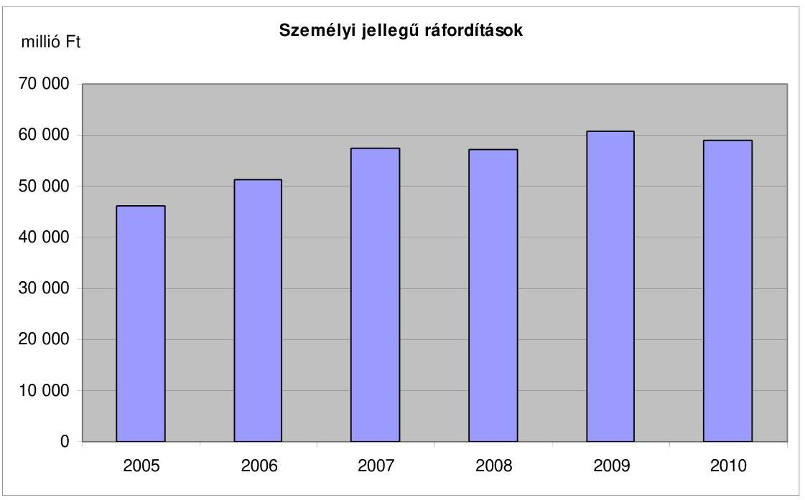

A bértárgyalások eredményeként a bruttó átlagkeresetek 2005-ről 2009-re 40\%-kal növekedtek. A 2010. évi - július elsejéig elhúzódó - bértárgyalások után (2000 Ft/fő/hó béremelést követően) 2011-ben csak az SZJA csökkentés és a szuperbruttósítás nettó keresetcsökkentő hatását kiegyenlítő bérkompenzációra került sor. A BKV összes költségén belül az éves személyi jellegű ráfordítások mértéke 42-45\%-ot képviselt. A bérköltség, létszám és az átlagkeresetek alakulását 2005-2010. években munkakör csoportonként a 9/c. számú melléklet tartalmazza. A BKV teljes munkaidős szellemi és fizikai munkavál-

[^0]
[^0]:    ${ }^{27}$ Az üzletági modellben az üzemigazgatóságok teljes körű forgalmi, műszaki és gazdálkodási funkciókkal működtek, míg a 2007. évtől bevezetett funkcionális modell keretében kialakították a szervezetekhez és a folyamatokhoz rendelt költséggazdálkodást.

---

lalóinak éves bruttó átlagkeresete a 2005-2010. években a - a Központi Statisztikai Hivatal által közzétett - a menetrendszerű egyéb szárazföldi személyszállítás, illetve 2008-tól a városi, elővárosi szárazföldi személyszállítás ágazatban foglalkoztatott teljes munkaidős dolgozók bruttó átlagkeresetét 16,9-22,2\%-kal haladta meg. A BKV teljes munkaidős munkavállalóinak átlagos állományi létszámát figyelembe véve az ágazati átlagkereseten felüli keresetkifizetés ebben az időszakban évi 4,3-6,7 milliárd Ft többlet kereset kifizetést jelentett, ami tekintettel a BKV veszteséges gazdálkodására, aránytalan terhet jelentett a gazdálkodás során.

A 2005-2006. években, illetve a 2007. évi átszervezés során végrehajtott létszámleépítésekhez kapcsolódóan kifizetett végkielégítések összegét a következő táblázat szemlélteti:

# Kifizetett végkielégítések a BKV-nál a 2005-2010. években 

Adatok: ezer Ft-ban

| Megnevezés | 2005 | 2006 | 2007 | 2008 | 2009 | 2010 |
| :--: | :--: | :--: | :--: | :--: | :--: | :--: |
| Kifizetett összeg összesen | $\begin{array}{r} 32 \\ 377 \end{array}$ | 74898 | $\begin{array}{r} 1207 \\ 790 \end{array}$ | 324154 | $\begin{array}{r} 206 \\ 629 \end{array}$ | $\begin{array}{r} 83 \\ 338 \end{array}$ |
| Érintett létszám összesen | 32 | 30 | 271 | 83 | 60 | 18 |
| ebből egyedi munkaszerződés alapján |  |  |  |  |  |  |
| kifizetett összeg összesen | 2509 | 5176 | 307667 | 81931 | 22713 | $\begin{array}{r} 52 \\ 490 \end{array}$ |
| érintett létszám összesen | 1 | 1 | 13 | 2 | 1 | 2 |

Az átszervezések miatt a 2007. évben a kifizetett végkielégítések összege 1208 millió Ft volt, amelyből az egyedi munkaszerződések alapján kifizetett végkielégítés összege közel 308 millió Ft volt. A végkielégítések összege nem tartalmazta a prémium kifizetéseket, a felmentési időre járó béreket, a titoktartási díjat, a magánnyugdíj- és egészségpénztári munkáltatói hozzájárulásokat. Az egy főre jutó végkielégítések összege a 2008-2010. években 22,7 és 40,9 millió Ft között volt. Az egyedi munkaszerződések szerint foglalkoztatott vezetőknek a 2008-2010 években 12-17 havi átlagkeresetet fizettek ki végkielégítésként. Az öt vezető állású munkavállaló esetében a végkielégítésen kívül további 9,8 millió Ft alapprémium, 24,0 millió Ft titoktartási díj, 1,7 millió Ft önkéntes egészségpénztári hozzájárulás, 0,4 millió Ft életbiztosítási díj megváltás kifizetése történt meg, valamint 1,3 millió Ft lakáshitel törlesztő részletet is elengedtek.

A vezérigazgató a kifizetett végkielégítések és a munkaviszony megszüntetéséhez kapcsolódó egyéb kifizetések ügyében a 2009. évben belső vizsgálatot rendelt el, melynek megállapításai alapján a különösen nagy vagyoni hátrányt okozó bűncselekmények alapos gyanúja miatt ismeretlen tettes ellen 2009. szeptember 30-án feljelentést tett. A Központi Nyomozó Főügyészség tájékozta-

---

tása alapján ${ }^{28}$ a nyomozás folyamatban van. A belső ellenőrzési vizsgálati anyagban foglaltak alapján tett feljelentés nem tartalmazta az egyik BKV vezető tisztségviselő rendkívüli felmondásának körülményeit, mely alapján a rendkívüli felmondás nem volt megalapozott, ezért a BKV-t közel 87 millió Ft összegű kár érte. A BKV 2008. augusztus 27-én a dolgozóval Megállapodást készített elő a munkaviszony közös megegyezéssel történő megszüntetéséről, melyben részletesen meghatározták a dolgozót megillető juttatások körét, a munkavállaló a Megállapodást aláírta. A BKV a dolgozó munkaviszonyát 2008. augusztus 27-én kelt rendkívüli felmondással megszüntette, a megállapodásban rögzített juttatások kifizetése nem történt meg. A dolgozó a rendkívüli felmondás megalapozottságát vitatta, bírósághoz fordult, a bíróság helyt adott keresetének.

A 2010. évet megelőző időszak vezetői munkaszerződéseiben előírták, hogy az alapprémium legalább 150\%, az ösztönző prémium legalább 150\%-a az alapbérnek. A vezető munkavállalók javadalmazását a Szellemi állománycsoportú munkavállalók ösztönzési (premizálási, jutalmazási) elveiről kiadott 24/2008. számú vezérigazgatói utasítás határozta meg. A 2010. évi prémium a felső vezetők alapbérének 100-120\%-a volt.

A 2005-2010. években a vezérigazgató-helyettesek részére 513,5 millió Ft-ot, az igazgatók részére 972,4 millió Ft összegű prémiumot fizettek ki.

A felső vezetői prémiumfeladatok közül három a vezérigazgató feladataival megegyezően (az üzleti eredmény terv, a Szolgáltatási szerződésben foglalt fhk terv teljesítése, a személyi jellegű ráfordítások tervének betartása) került meghatározásra, amely két-három, a vezető beosztásától függően személyre szóló feladattal egészült ki. Utóbbiak általában a vezető munkaköri feladatai voltak. Az éves prémiumfeladatok részteljesítését negyedéves rendszerességgel önértékeléssel értékelték, a prémiumfeladatok teljesítésének ellenőrzése a Humánpolitikai Igazgatóságon megtörtént, és ezt a felettes vezető is jóváhagyta. A kifizetett prémiumok nem voltak arányban a teljesítménnyel, mivel mögötte nem állapítható meg többletteljesítmény, illetve nem kötődött a munkaköri kötelezettségeken felüli többletfeladatok elvégzéséhez.

A felső vezetők (FEOR 0-s állománycsoportú vezetők) 2010. IV. negyedévi prémium feladatainak teljesítéséről szóló jelentések elkészítési határideje 2010. december 9. volt, így a feladatok kiértékelése a várható adatok alapján történt. A beruházási terv teljesítésére irányuló egyéni feladat értékelése ellentmondott az önértékeléshez csatolt kimutatáson lévő jelentős lemaradásnak. A BKV 2010. évi Beruházási Terve 2010 decemberében módosításra került, amelyet a 2010. december 16-i BKV Igazgatósági, illetve a 2010. december 17-i Felügyelőbizottsági Ülés hagyott jóvá. Az önértékeléshez csatolt táblázat még az eredeti tervet tartalmazta, de a módosított Beruházási Terv szerint a feladat teljesült, ez azonban a prémium feltétel utólagos módosítását (csökkentését) jelentette.

A BKV vezérigazgatójának a záró megbeszélésen fenntartott észrevétele szerint: „A 2005-2010. években az akkor érvényben lévő szabályzatoknak maradéktalanul megfelelve kerültek a prémiumok kitűzésre. A kiindulási alap minden esetben a vezérigazgatói kitűzés volt, melyben folyamatosan szerepeltek az eredményes működéssel és a fi-

[^0]
[^0]:    ${ }^{28}$ Erre tekintettel nem tett feljelentést az Állami Számvevőszék.

---

nanszírozási hiány növekedésének megakadályozásával kapcsolatos feladatok, amik továbbdelegálásra kerültek a további felsővezetői szintekre. Ezek tartalmaztak több szakterületre vonatkozó közös feladatokat is, melyek betartása hatással volt a Társaság egészének eredményességére. 2011. évben is - többszöri egyeztetést követően - a szintén hasonló típusú feladatok a vezérigazgató részére kerültek kitűzésre, így az eddigieknek megfelelően ismét ezen feladatok alapulvételével készültek el a felsővezetői prémium kitűzések. Megjegyezzük, hogy a gazdasági társaságok vezetőinek ösztönzése általában a gazdasági mutatók betartásához kapcsolódik, például a terv teljesítéséhez."

Az észrevétel nem megalapozott, mivel a felsővezetői prémiumfeladatok személyre szóló feladat kiegészítései a prémiumkitűzésekben leírtak alapján az adott vezető munkaköri feladatait képezték, anélkül, hogy az üzleti tervben szereplő jelentős hiány csökkentését tűzték volna ki prémiumfeladatul.

A Taktv. előírásai érvényesítése érdekében a Közgyűlés által hozott határozatok végrehajtása megtörtént, mivel a 2011. évi prémiumkiírásokban megváltozott a kitűzött prémium mértéke (vezérigazgató $40 \%$, minden más vezető beosztású alkalmazott 20-40\%). A prémiumcélok a 2010. évihez hasonlóak, az egyéni feladatok között továbbra is szerepelnek a napi munkaköri feladatok, ami nincs összhangban a Főváros Önkormányzata által kiadott Javadalmazási szabályzat-ban foglaltakkal. A vezetők 2011. évi prémium feltételei szerint: „A prémiumfeladatok értékelése félévente, az üzleti terv teljesülésének figyelembevételével történik. A féléves értékelést követően kifizetett prémium összeg nem minősül előlegnek".

Az Országgyűlés Költségvetési, pénzügyi és számvevőszéki bizottsága Ellenőrző albizottsága 2009. augusztus 17-e és december 7-e között vizsgálta a Főváros Önkormányzata közösségi közlekedés támogatásának felhasználását, az azzal történő elszámolásokat, kiemelten a 2007-2008 években végkielégítésre kifizetett 1,5 milliárd Ft elköltését. Az Ellenőrző albizottság állásfoglalását közzétette, amely kivonatosan az alábbiakat tartalmazta:
„Magyarország nyilvánvaló érdeke, hogy a döntéshozók felelősen bánjanak az adófizetők pénzével. A BKV vezetése, illetve a felügyeletét ellátó Főváros Önkormányzata és a tulajdonosi jogokat gyakorló testület azonban nem ezt tette, felelőtlen bérgazdálkodást folytattak, és emiatt alapjaiban rendült meg az emberek bizalma a BKV-ban. A kialakult tarthatatlan helyzetet tovább súlyosbították a folyamatosan napvilágra kerülő rendkívül magas összegű végkielégítések, melyekről a közvélemény komoly késéssel, az új vezérigazgató érkeztével tájékozódhatott. A Költségvetési, pénzügyi és számvevőszéki bizottság azt javasolta, hogy övezze a korábbinál jóval komolyabb figyelem a BKV gazdálkodását, legyenek megnevezve a felelősök, és tegyen meg mindent a kormány azért, hogy a BKV az utasok érdekeit szolgálja."

# 3.3. A BKV beruházási és beszerzési tevékenysége, a rendelkezésre álló források felhasználása 

A BKV közbeszerzési tevékenységének előírásait a 2005-2010. évi időszakban a közbeszerzési szabályzatok tartalmazták. A 2005-2007. évek között a közbeszerzési eljárásokat a Beruházási és Közbeszerzési Igazgatóságon működő Közbeszerzési Iroda folytatta le. 2008 augusztusáig a bizottsági munkára, az értékelő bizottságok működésére vonatkozó eljárási rend nem változott, de a BKV 2007. januári szervezeti átalakulására tekintettel az új vezérigazgató az 1/2007. számú vezérigazgatói körlevélben elrendelte, hogy értékha-

---

tárra tekintet nélkül, valamennyi szerződés megkötésére kizárólag vezérigazgatói engedély alapján kerülhetett sor 2007. január 2. és 2008. június 30. között.

A szervezeti átalakításnak és a központi beszerzési rendszernek megfelelő BKV Beszerzési Szabályzata 2008. augusztus 5-én lépett hatályba, amely a közbeszerzési eljárások lebonyolítását a Logisztikai Főosztály hatáskörébe utalta. A szabályzat hatálybalépése óta eltelt időszakban felmerült változásokra tekintettel a belső beszerzési szabályok módosításaként 2009. július 22-én hatályba lépett a 16/VU/2009. számú vezérigazgatói utasítás. A vezérigazgatói utasításban többszintű döntéshozatali rend került kialakításra.

Döntéshozó: 5000 millió Ft-ot meghaladó értékű beszerzési eljárás esetén az Igazgatóság (az energia beszerzések kivételével), 500 millió Ft-ot meghaladó értékű beszerzési eljárás esetén a vezérigazgató egy személyben, 500 millió Ft értéket el nem érő beszerzési eljárás esetén az Általános és Műszaki Vezérigazgató-helyettes, a Gazdasági Vezérigazgató-helyettes és a Logisztikai Főosztályvezető vagy kijelölt helyetteseik együttesen (Állandó Döntéshozó Bizottság), 50 millió Ft értéket el nem érő beszerzési eljárás esetén az Általános és Műszaki Vezérigazgatóhelyettes, 5 millió Ft értéket el nem érő beszerzési eljárás esetén a Logisztikai Főosztályvezető.

A BKV évente elkészített ütemterve alapján tervezték meg a várható közbeszerzési eljárások lebonyolítását. Az eljárások tervezése arra tekintettel került meghatározásra, hogy a BKV a Kbt. 163. § (1) bekezdés c) pontja alapján úgynevezett közszolgáltató ajánlatkérőnek minősül. A BKV méretéből adódóan tipikusan európai uniós eljárásrendben bonyolította a megjelölt témakörök szerinti eljárásokat, így a nemzeti eljárásrendben meghatározott témakörök szerinti beszerzések - néhány beruházás kivételével - uniós eljárási rendben kerültek lebonyolításra.

A BKV a 2005-2010. években 538 közbeszerzési eljárást folytatott le, ennek eredményeként 579,0 milliárd Ft összegű szerződést kötött a nyertes pályázókkal. Ebben az időszakban a Közbeszerzési Döntőbizottságnál indított eljárások száma 53 volt, ebből 20 eljárás járt jogkövetkezményekkel és a BKV-ra kiszabott bírság összege 62,0 millió Ft-ot tett ki.

A BKV beszerzési igényeinek jelentős része speciális, más felhasználó által nem igényelt elemekből áll. A BKV-nál a 61875 cikkféleség beszerzésére 2007-2010 között mintegy 2700 közbeszerzési és versenyeztetési eljárást bonyolítottak (átlagos költség: 0,9 millió Ft), mintegy 2400 millió Ft összegben. A BKV engedélyezett raktárkészletének értéke 2900 millió Ft. A műszaki üzemeltetés feltétele a jármű és infrastruktúra eszközrendszer működéséhez szükséges biztonsági készlet, melynek olyan fődarabokat, alkatrészeket és anyagokat kell tartalmaznia, amelyek zavarelhárítás esetén azonnal szükségesek. A leányvállalatok és az alvállalkozók a BKV-nál rugalmasabban tudják kezelni az infrastrukturális eszközrendszerekre vonatkozó biztonsági készletek biztosítását a zavarelhárítási tevékenységük végzése során. A fenti konstrukció a BKV részére az azonnali javításokhoz szükséges speciális alkatrészek, infrastrukturális részegységek beszerzése terén előnyösebb eljárási módot jelentett, mint a közbeszerzési folyamatban történő anyagbeszerzés, ami csak több hónapos késéssel tette volna lehetővé a javításhoz szükséges váltók, speciális elágazások, pályaalkatrészek biztosítását. A javításokhoz szükséges biztonsági készletekre fordított forrásoknál is megtakarítást jelentett ez a megoldás.

---

A BKV eszközparkjának megújítása, cseréje nem történt meg az indokolt mértékben. A járműállomány műszaki állapotának szinten tartásához szükséges felújításokra nem jutott elegendő forrás. Az egyre nagyobb üzemeltetési problémák következtében a Főváros Önkormányzata finanszírozta a kiemelt beruházásokat (új beruházások, járműbeszerzések, rekonstrukciók), továbbá forrást biztosított a biztonságos működéshez szükséges járműfelújításokhoz.

A 4-es metró ${ }^{29}$ I. szakasza építésének kezdetétől a 2015. évig tervezett összes beruházási kiadása 377,4 milliárd Ft, amelyből az állami támogatás - a Közlekedés Operatív Program támogatásával 313,7 milliárd Ft-ot, azaz 83,1\%-os arányt, míg a Fővárosi Önkormányzat saját forrása 63,7 milliárd Ft-ot, azaz 16,9\%-ot képvisel. A forrástulajdonosok (állam, önkormányzat) a számlák kifizetését biztosítják az általuk kezelt, elkülönített bankszámláikról. Tényleges forrásátadásra nem került sor.

Sikeres pályázatok eredményeként jutott a BKV hazai és egyéb európai uniós pályázati forrásokhoz. A 2005. évben támogatási szerződés kötésére került sor az Angyalföld, Dél-Pest és Cinkota telephelyeken végrehajtott fűtéskorszerűsítésekre, illetve a nagykörúti villamos pálya áramellátásának korszerűsítésére. A FUTÁR projekt a folyamatos utas tájékoztatási rendszer kiépítésének támogatására kapott támogatást a BKV. A Dunai hajózási projekt egy, a dunai tömeges személyszállítás kialakításának kidolgozásához ad támogatást.

# 3.4. A BKV intézkedései az infrastruktúra elemek, a járműállomány műszaki közlekedésbiztonsági állapotának változtatására, az energia felhasználás csökkentésére 

A BKV a 2005-2010. évek közötti időszakban az infrastrukturális elemek (villamos és metró pályák, felsővezetékek, villamos kocsiszínek, autóbusz járműtelepek, és egyéb kiszolgáló létesítmények) állapotának javítására, szinten tartására folyamatosan tett intézkedéseket.

## Infrastruktúra beruházások és felújítások alakulása a 2005-2010. években

Adatok: millió Ft-ban

| Megnevezés | 2005 | 2006 | 2007 | 2008 | 2009 | 2010 |
| :-- | :--: | :--: | :--: | :--: | :--: | :--: |
| Épület, építmény | 1542 | 1183 | 737 | 616 | 484 | 383 |
| Vonali infrastrukturális beruházások | 16070 | 20605 | 13476 | 30587 | 4202 | 5330 |
| Összesen | $\mathbf{1 7 6 1 2}$ | $\mathbf{2 1 7 8 8}$ | $\mathbf{1 4 2 1 3}$ | $\mathbf{4 2 03}$ | $\mathbf{4 6 8 6}$ | $\mathbf{5 7 1 3}$ |

Az infrastruktúra elemek beruházására és felújítására fordított források nagyságrendje a 2005. évhez képest 67,6\%-kal csökkent a BKV rendelkezésére álló források beszűkülésével párhuzamosan. Az épületeken, építményeken állag-

[^0]
[^0]:    ${ }^{29}$ A 4-es metró beruházási folyamatának ellenőrzéséről az Állami Számvevőszék 2010. szeptemberben adta ki az 1023-as számú jelentést.

---

megóvási jellegű munkákat és kisebb volumenű beruházásokat végeztek. Ennek keretében a rövid távon megtérülő energiahatékonyságot javító beruházások készültek el (az Angyalföld villamos kocsiszínben, illetve a cinkotai és Délpesti autóbusz járműtelepeken). A megvalósult fűtésrekonstrukció a 2006-2010. években a 2003. év felhasználásához képest $38 \%$-os gázfogyasztás megtakarítást eredményezett. Ebbe beleértendő az évek során különböző technológiai igényekből adódóan beépítésre került gázkészülékek (mint az ipari ruhaszárító, fékerőmérő próbapad, hőlégbefúvó, járműmosó légszárítók) gázfogyasztása is. A vonali infrastrukturális beruházások és felújítások közül a leglényegesebbek a M2 metróvonal felújítása 2005-2008. években, a Szentendrei HÉV vonal korszerűsítése 2005-2007. években, a Nagykörúti villamos-pálya és áramellátásának korszerűsítési munkái voltak.

Az infrastrukturális berendezések, elemek olyan állapotban vannak, hogy a jelentkező meghibásodások miatti korlátozások állandósultak, azok elhárítása fenntartási módszerekkel már nem oldható meg. Kivételt csak az M2 metróvonal jelent, ahol a rekonstrukció a befejeződött. Az infrastruktúra megközelíti, a járműpark viszont elérte a „billenő pontot", ahonnan az állapotok romlása már az időfüggvényben nem lineáris, hanem exponenciális. Azonnali beavatkozások nélkül a rendszer rohamos mértékben halad az ellehetetlenülés felé. Az infrastruktúra elemek közül a pályák és a vonalvilágítás berendezéseinek műszaki állapota megközelíti a kritikus 50\%-os szintet.

A járműállomány műszaki állapotát mutatja, hogy az összes járműkategória túlhaladta a tervezett életkorát, az infrastruktúra minden alrendszere elérte azt a határpontot, amely alatt bármikor és bármilyen típusú hiba bekövetkezhet. A forgalmi következményeket a menetkimaradások alakulásával lehet jól érzékeltetni, melyek száma 2010-ben a 2007. évi 245\%-a volt. Ez a növekedés a ciklusrend szerinti javítás tervezését lehetetlenné tette.
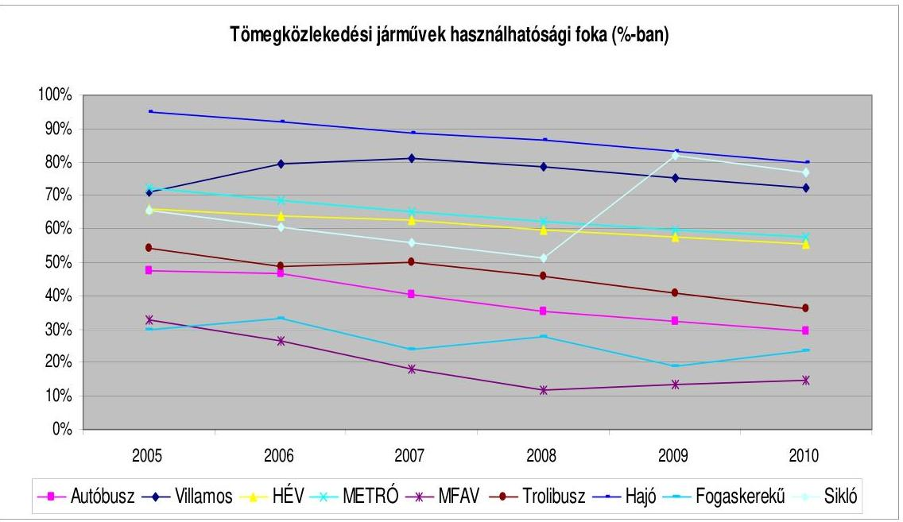

---

A működőképességet biztosító eszközpark állapota fokozatosan romlott. A jármű- és infrastruktúra állomány könyv szerinti érték/bruttó érték alapján számított átlagos használhatósági foka folyamatosan csökkent.

A használhatósági fok mérőszáma, az eszközállomány nettó és bruttó értéke arányából mutatott kép - a felújítások után is - a valóságosnál kedvezőbb képet mutat. Az autóbusz, trolibusz, földalatti és a fogaskerekű vasút használhatósági foka így is $50 \%$ alatt maradt.

Az autóbuszok 60-80\%-a meghaladta a tervezett műszaki élettartamát, a járművek meghibásodásának oka alapvetően a szerkezeteinek üzemszerű elhasználódásából és korából adódó anyagfáradás volt. Az autóbusz parkból a 2005-2010 években 280-400 kocsi nem került forgalomba, csúcsidőszakban átlagosan 193 db a telephelyen maradó autóbuszok száma, ami $86 \%$ járműkiadási arányt jelent. A forgalomba nem adott járművek biztosítottak fedezetet a ciklikus karbantartásokra és a pótlási feladatokra is. A műszaki állapotokra tekintettel az - elöregedett, a tervezett életcikluson túlfuttatott, nagyjavítást nem kapott - cserélendő autóbuszok darabszáma megközelítette az ezer darabot.

A BKV külön nem mutatja ki az életciklust betöltött járművekre fordított költségeket. A vasúti jármű szakterületen az elmaradt járműjavítások adatait az 5. számú melléklet tartalmazza, a javítás elmaradása azt jelenti, hogy az adott járművön nem került a ciklusrend szerinti esedékességgel elvégzésre a javítás, de a későbbiekben - a mindenkori rendelkezésre álló beruházási költségkeret függvényében, vagy egy másik, javításra szoruló jármű rovására - ezek a járművek is műhelyi javításra kerültek. A javítás elvégzéséig ezeket a járműveket a biztonságos üzemeltetéshez szükséges műszaki beavatkozásokkal tartották forgalomban. A metró járműveknél a BKV kimutatta, hogy a vezérigazgató által elrendelt felújítási tilalom következményeként 2006 és 2010 között 82 db szerelvény felújítása maradt el (6. számú melléklet). Az új járművek beérkezésének bizonytalansága következtében 2011 januárjától - meghatározott ütemterv szerint - az elmaradások pótlása megkezdődött. A HÉV járművek esetében elmaradt járműjavítás nem volt.

A BKV az energiafelhasználás területén tett intézkedéseivel a közlekedési szolgáltatások megbízható ellátása mellett a költségek csökkentését, illetve az energiafelhasználás hatékonyságának fokozását kívánta elérni.

Annak érdekében, hogy az energiaszolgáltatóktól az elérhető legalacsonyabb beszerzési árat kapja a BKV a 2005-2009 években energiahordozónként (azok értékesítési sajátosságaihoz alkalmazkodva) eltérő lépéseket tett.

---

A villamosenergia-költségek 2005-2010. évi alakulását a következő táblázat mutatja be:

| Év | Villamos energia |  |  |
| :--: | :--: | :--: | :--: |
|  | MWh | ezer Ft | Egységár |
| $\mathbf{2 005}$ | 302884 | 5961450 | 19,68 |
| $\mathbf{2 006}$ | 313675 | 6342544 | 20,22 |
| $\mathbf{2 007}$ | 306203 | 8005031 | 26,14 |
| $\mathbf{2 008}$ | 310149 | 9595892 | 30,94 |
| $\mathbf{2 009}$ | 309617 | 10788935 | 34,85 |
| $\mathbf{2 010}$ | 315631 | 8612947 | 27,29 |

Forrás: BKV (A költségkimutatás az ÁFÁ-t nem tartalmazza)
Az elérhető legalacsonyabb beszerzési ár érdekében 2010. január 1-jétől Európai Uniós hatókörű közbeszerzési eljárás eredményeként - teljes körű ellátás keretében - a szabadpiacról történik a villamos energia beszerzése. A várható fogyasztás negyedórás előrejelzéséért kapott árcsökkentés hatására 2010-ben több mint 250 millió Ft villamosenergia-költség megtakarítás jelentkezett.

A BKV a villamos energia igényét monitorozza és a lehetőségeihez képest optimalizálta. A villamos energia monitorozás eredményeként a 2010. évi közbeszerzési eljárást úgy írták ki, hogy vállalták a fogyasztási adatainak negyedórás időközre való, 5\%-os pontosságú előrejelzését, egy héttel a tényleges fogyasztás előtt. Az ajánlattevők közül a nyertes ajánlattevő $1 \mathrm{Ft} / \mathrm{kWh}$ „Jóteljesítési Prémium" értéket határozott meg.

A BKV intézkedett a villamos vontatási hálózat energiaveszteségeinek feltárására. A vontatási földkábelek és szívópontok esetében a rossz műszaki állapotok a hálózat veszteségeit növelik, ezért ennek pontos megállapítására vizsgálatokat végeztek.

A HÉV vonalak esetében 2004. évben a szentendrei HÉV vonalon, a Filatorigát áramátalakító körzetében, a Nagyicce és Kavicsbánya HÉV áramátalakítóknál 2005. III. negyedévben végezték el terhelés-vizsgálatokat. Villamos szakterületen 64 esetben vizsgálták a kábelek állapotát és 50 vizsgálatot végeztek az olajos transzformátorok műszaki állapotára vonatkozóan. Jellemzően elvégezték a berendezések javítás, karbantartás előtti, utáni hőkamerás méréseit. Az ellenőrzés időszakában valósult meg az M2 metró vonal rekonstrukciója, amelynél a kábelkötések is felújításra kerültek, jelentősen csökkentve a visszavezető hálózaton keletkező veszteségeket.

Az épületek energiaveszteségeinek csökkentése érdekében 2009-ben Cinkota autóbusz telephelyen nyolc darab, Kelenföld autóbusz telephelyen három darab gyorsmozgású spirálkaput építettek be a meglévő SCAN-DOOR kapuk mellé, a Fehér úti metró telephelyen szintén megvalósult egy hasonló beszerzés (kocsiszín csarnoképület).

---

A gázolaj költségek alakulása a 2005-2010. években

| Év | Gázolajfelhasználás |  | A VOLÁN átlagos gázolaj egységára (Ft/liter, áfa nélkül) |
| :--: | :--: | :--: | :--: |
|  | millió Ft | Egységár   Ft/liter   (áfa nélkül) |  |
| 2005 | 6953 | 187,1 | 187,4 |
| 2006 | 7964 | 207,8 | 208,0 |
| 2007 | 7704 | 200,5 | 201,2 |
| 2008 | 9007 | 237,4 | 239,6 |
| 2009 | 7670 | 199,6 | 200,4 |
| 2010 | 9087 | 235,3 | 236,6 |

A gázolajköltségek csökkentése érdekében a BKV folyamatosan szélesítette a lehetséges beszállítók közötti piaci versenyt. Ennek megvalósítása során a Kbt. 18. címe szerinti keret-megállapodásos eljárásrend szerint folytatták az üzemanyag beszerzést. A BKV eljárása következtében a nagykereskedelmi üzemanyagárhoz képest is 2-3\%-kal alacsonyabb áron történt a gázolaj beszerzés, illetve a VOLÁN vállalatok átlagos gázolajáránál minden évben alacsonyabb volt. A BKV-nál a gázolaj felhasználás csökkentése érdekében sokrétű - a járművezetői-forgalmi és a műszaki területeken megjelenő - intézkedést és utasítást adtak ki. A járművek rendszeres ellenőrzése technológiai vizsgálati folyamatában kerül sor célzottan az üzemanyag elfolyások (üzemanyag vezetékek, csőkötések, tartály, töltőcsonk) felderítésére és megszüntetésére. A járművek túlfogyasztása okainak meghatározása érdekében az üzemanyag fogyasztást naponta, járművezetőnként feldolgozták és elemezték. Az értékeléseknél különös fontossággal kezelték a forgalmi változásokat, amelyek objektív okokból eredményezik a járművek gázolajfogyasztásának megemelkedését.

Az üzemanyag megtakarítást a közúti gépjárművek üzemanyag- és kenőanyag-fogyasztásának igazolás nélkül elszámolható mértékéről szóló 60/1992. (IV. 1.) Korm. rendelet előírásai, és az üzemeltetési körülményekhez, viszonylatokhoz kapcsolódó korrekciós tényezők alapján meghatározott üzemanyagnormához hasonlítva állapították meg. A viszonyítási alapul szolgáló normát a 2006. és a 2007. évben szigorították. Az üzemanyag megtakarításhoz kapcsolódóan a gépjárművezetők részére ösztönzési rendszert működtettek.

---

Az üzemanyag megtakarítás alakulását a 2005-2010. években a következő táblázat szemlélteti:

| Évek | Felhasznált   üzemanyag   mennyisége   (ezer liter) | Megtakarított   üzemanyag   mennyisége   (ezer liter) | Megtak   arítás   (millió Ft) |
| :--: | :--: | :--: | :--: |
| 2005 | 37162 | 2452 | 458,8 |
| 2006 | 38333 | 1909 | 396,6 |
| 2007 | 38427 | 2971 | 595,6 |
| 2008 | 37938 | 2724 | 646,8 |
| 2009 | 38424 | 2591 | 517,3 |
| 2010 | 38612 | 2016 | 474,6 |
| Megtakarítás összesen |  |  | 3089,7 |

Forrás: BKV
A táblázat adataiból kitűnik, hogy az üzemanyag megtakarítások nagyságrendje évente 1,9 és 3,0 millió liter között volt, összege pedig az éves gázolajfelhasználás költségének 5,0-7,7\%-át tette ki.

Az alternatív hajtóanyagok alkalmazására vonatkozó kutatásokat és trendeket a BKV folyamatosan nyomon követte. Tanulmányok és tervek nyomán átfogó összehasonlítást végeztek az alternatív hajtásrendszerekkel kapcsolatban, ezen belül a legreálisabban szóba jöhető CNG (sűrített földgáz), illetve hibrid hatásrendszerrel összefüggésben. A földgáz üzemre történő átállás a CNG autóbuszok esetében a 421 ezer Ft/év járműre vetített többletköltség miatt a BKV döntése alapján jelenleg nem valósítható meg.

# 3.5. A saját javítóbázisok felkészültsége, a javítóbázisokon kívül végzett alvállalkozói munkák indokoltsága 

A Közúti Jármű Főmérnökségen az autóbuszok üzemeltetését végző mind az öt telephely rendelkezik hatósági telepengedéllyel, valamint működik NKH engedéllyel rendelkező saját javító bázis, amelyek egyben műszaki vizsgahelyek is. A saját javító bázisok műszaki felszereltségének színvonala, valamint a szakemberek felkészültsége megfelel a szakhatósági követelményeknek, amit a rendszeres hatósági ellenőrzések is igazoltak. A telephelyek kielégítik a telepengedélyben rögzített 5/1990. (IV. 12.) KöHÉM rendelet, az ISO 9001 által előírt, valamint a további munkavédelmi, környezetvédelmi és egyéb előírásokban meghatározott követelményeket. A műszaki szakterület a forgalomba állítás előtt biztosította a járművek forgalombiztonsági előírásoknak való megfelelését.

A Vasúti Jármű Főmérnökségen a javító bázisok, illetve a minőségellenőrzést végző szervezet minden olyan felszereltséggel rendelkeznek, amelyek a közlekedésbiztonsági előírások betartásához, illetve betartatásához szükséges.

---

A kerékpárok műszaki állapotának megítélésére a kocsiszínek és a járműjavítók el vannak látva sablonokkal és mérőműszerekkel. A levegős és elektromos működtetésű készülékeket, valamint a villamos forgógépeket a javítás után próbapadokon ellenőrzik. A villamos járművek féklassulásának, szigetelési és földelési ellenállásának mérésére célműszerek álltak rendelkezésre. A repedésvizsgálatokhoz ultrahangos vizsgálóműszert, repedésvizsgáló mágneseket alkalmaztak. Az M2 metró vonalán a járműveket fél-automatikus vonatvezetői rendszer segítségével (AVR) üzemeltetik. A rendszernek a járművek fedélzetén lévő berendezéseinek próbájára külön próbaterem áll rendelkezésre.

A műszaki üzemeltetés kockázatkezelési gyakorlata során a legfontosabb alapelv, hogy olyan jármű nem adható forgalomba, illetve olyan infrastrukturális eszköz nem tartható üzemben, amely
 forgalombiztonsági kockázatot jelent.

Az eszközök műszaki állapotának folyamatos romlása mellett a saját javító bázisok a forgalombiztonság szintjét biztosították. A BKV műszaki eszközrendszere (járműállomány, infrastruktúra) napjainkra a teljesítőképességének, használhatóságának határára érkezett. A forgalom-lebonyolításra kifejtett hatások következtében a rendkívüli műszaki események száma a 2009. évi 24966 darabról a 2010. évre 33333 darabra nőtt. A járműpark és az elöregedett infrastrukturális eszközrendszer több mint kétharmada a tervezett élettartamát már meghaladta. A saját javítóbázisok rendelkezésére álló javítási-üzemeltetési keretek az elmúlt években reálértékben csökkentek, de a nagyságrendjük sem nyújtott fedezetet az előírt javítások, karbantartások maradéktalan végrehajtására.

A járműpark működőképességének fenntartása érdekében szükséges volt a saját javítóbázisokon kívüli, alvállalkozók útján elvégzett munkák igénybevételére is. Az autóbuszok főegységei körében a motorok, kormányművek, futóművek, sebességváltók javítására kerül külső partner bevonásával sor, mivel ezen feladatok ellátására a BKV saját kapacitással nem rendelkezik. A Vasúti Jármű Főmérnökség külső vállalkozásoknak adta azokat a munkákat, amelyek a viszonylag kis darabszám miatt az arra szakosodott cégeknél olcsóbban elvégezhetők (forgácsolás, hőkezelés). Jelenleg csak azoknak a fődaraboknak a javítását, illetve olyan járműsérülések helyreállítását végeztetik külső vállalkozóval, amelyhez a BKV nem rendelkezik kapacitással, vagy műszaki felkészültséggel. A fődarabok külső fél által történő javíttatásánál - az ajánlati ár mellett alapszempont a szakmai alkalmasság volt. Az elvégzett felújításokat a BKV minőségellenőrző szervezete ellenőrzi és veszi át.

A BKV egyik legfontosabb alvállalkozója, a 100\%-os tulajdonú leányvállalata, a VJSZ Kft., amely éves árbevételének 95-98\%-át a tulajdonos megrendelései tették ki. A 2005-2010. években a javítás műszaki tartalmától függően 3000-3500 millió Ft közötti értékben, 50-100 db értéknövelő járműjavítást, jármű rekonstrukciót, sérülésjavítást, jármű üzembe helyezést végzett el. Emellett mintegy 900-1000 millió Ft értékben villamos, HÉV és metró egyedi fődarab (kerékpár, motor, forgóváz, abroncsozás) javítást végzett, 150-250 millió Ft közötti értékben gyártott kitérőket, átszeléseket és pályaalkatrészeket, egyéb alkatrészgyártást és javítást 50-100 millió Ft közötti értékben végzett.

---

A Mozgólépcső Javító és Szolgáltató Kft. a BKV 100\%-os tulajdonában lévő leányvállalata. A 2005-2010. években a mozgólépcsők javítására kifizetett szolgáltatási díj összege 7,4 milliárd Ft volt. A két alvállalkozóval elvégeztetett munkák - a szakértő vizsgálata és véleménye alapján - indokoltak és szükségesek voltak.

Az Európai Unió kötelezése alapján az autóbusz járatkiszervezésekre kiírt, nyílt nemzetközi közbeszerzési eljárás eredménye, az ajánlatbeadások hiánya egyértelműen azt mutatta, hogy a piac a felajánlott áron nem vállalta a feladatot, a tender eredménytelen volt. Az új feltételekkel kiírt közbeszerzési eljárás alapján a 2004. évtől kezdődően öt alvállalkozó autóbuszai látják el 55 viszonylaton a tömegközlekedési feladatokat. Az alvállalkozóknak kifizetett szolgáltatási díj összege a 2005-2010 közötti időszakban 18,3 milliárd Ft volt. A járatok kiszervezése nem csökkentette a szolgáltatás költségeit. Az alvállalkozó nem végzett egy sor olyan tevékenységet, melyet a BKV-nak el kell látnia. Ilyen tevékenységek a forgalomirányítás, a menetrendkészítés, a forgalomfejlesztés, az értékesítés és a jegyellenőrzés. Az alvállalkozó bevonása átmenetileg kiváltja a járműbeszerzésre fordítható eszközök hiányát, de ez költségmegtakarítást nem jelent. A járatkiszervezés alvállalkozóinak adatait, viszonylatait, költségeit a 7. számú melléklet tartalmazza.

# 4. A BKV ADÓSSÁGFINANSZÍROZÁSI ÉS LIKVIDITÁSI PROBLÉMÁI MEGOLDÁSÁNAK, A JELENTKEZŐ KOCKÁZATI TÉNYEZŐK KEZELÉSÉNEK EREDMÉNYESSÉGE 

### 4.1. Az adósságot keletkeztető döntések során a pénzügyi egyensúly fenntartását veszélyeztető külső és belső kockázatok vizsgálata

A BKV 2007. előtti aláírási szabályzatai a szerződések aláírását megelőző engedélyezésre vonatkozó előírást nem tartalmaztak. A 2007. évi Aláírási Szabályzat az üzleti tervben nem szereplő hitelek felvételére vonatkozóan az alaptőke 2\%-át meghaladó hitelfelvételnél a Gazdasági Bizottság, az alaptőke $2 \%$-át el nem érő hiteleknél az Igazgatóság döntési hatáskörét írta elő. A bankgarancia esetében 100 millió Ft értékhatár fölött a Főváros Önkormányzata engedélyéhez köti a szerződéskötést. Az Aláírási Szabályzat lízing ügyletek engedélyezésére vonatkozóan szabályozást nem tartalmazott.

Az Alapító Okirat szerint a Főváros Önkormányzata kizárólagos hatáskörébe tartozik az éves üzleti terv jóváhagyása, a jóváhagyott üzleti tervben nem szereplő fejlesztési hitelfelvétel engedélyezése, amennyiben a hitelfelvétel - az egyes szerződések értékét két éven belül összeszámítva - az alaptőke 2\%-át meghaladja. A 2010. október 27-i alapító okirat módosítással a Főváros Önkormányzata kizárólagos hatáskörébe került a garancia- vagy kezességvállalás, a tartozásátvállalás, illetve a tartozás elengedése, követelés vásárlása és követelés engedményezése, ha a szerződés értéke éves szinten az 50 millió Ft összeget meghaladja; a pénzügyi lízing, a tartós bérleti szerződés megkötése, ha a szerződés alapján az éves kötelezettségvállalás az 500 millió Ft

---

összeget meghaladja. Az értékhatárokat el nem érő esetekben az Igazgatóság dönt.

Az üzleti terveket az Igazgatóság és a Főváros Önkormányzata a 2002-2010-es években elfogadta, ezzel az üzleti tervekben szereplő adósságot keletkeztető kötelezettségvállalásokat engedélyezte (8/d. számú melléklet). A BKV az üzleti terveiben a hitel- és kölcsön műveletek közül nem mutatta be 2005-ben a 3,8 milliárd Ft-os folyószámlahitelkeret emelést, a 2007. évben három hitel törlesztőrészletének átütemezését 10,2 milliárd Ft összegben. Az Igazgatóság nem hozott határozatot a 3,8 milliárd Ft folyószámlahitelkeret emelés tekintetében, azonban a 2007. évi átütemezéshez határozatban hozzájárult.

A BKV 2002-ben 5,0 milliárd Ft rendkívüli, beruházási célú hitel felvételére kapott engedélyt, ennek ellenére a szerződést forgóeszköz-finanszírozási céllal kötötte meg és az összeget a 2003. év I. negyedévében szabálytalanul működésre használta fel. A 2004. évi üzleti tervben 20 milliárd Ft működési és 8,0 millárd Ft fejlesztési célú hitel felvételt terveztek, az Igazgatóság 60/2004. számú határozatával a konstrukciót 15,0 milliárd Ft beruházási és 12,0 millárd Ft működési célú hitel felvételére változtatta, ténylegesen 23,9 milliárd Ft forgóeszköz finanszírozási célú hitel felvétele történt meg.

A BKV közbeszerzési eljárást hirdetett 2005-ben gördülőállomány (autóbusz, trolibusz, belszolgálati járművek) beszerzéséhez lízing biztosítása céllal 7800 millió Ft értékben, 2005-2006. években történő igénybevétellel. A közbeszerzési eljárás kiírásának engedélyezésére az Igazgatóság döntést nem hozott. A 2005. évi üzleti tervben az igénybe venni kívánt lízing összege nem követhető nyomon (a cash-flow tervben és a beruházási tervben eltérnek az összegek, a finanszírozási tervben és a vezetői összefoglalóban nem tesznek említést lízingből történő finanszírozásra), a 2006-os üzleti tervben a nyomonkövethetőség biztosított volt. A BKV pénzforgalmi osztályvezetője 2004. április 5-én a gazdasági vezérigazgató helyettes részére feljegyzést készített 50 db VOLVO autóbusz beszerzésének lízing konstrukció keretében történő esetleges megvalósításáról, melyben kimutatta, hogy a lízing konstrukció alkalmazása összességében rosszabb pénzügyi adottságokkal bír, mint a saját forrásból vagy hitelből történő beszerzés. A közbeszerzési eljárás megindítására vonatkozó előzetes tájékoztató közzétételét a Beruházási és a Közbeszerzési Igazgatóság Közbeszerzési Irodájának vezetője 2005. április 14-én kezdeményezte. Az előzetes tájékoztató közzétételének kérésére vonatkozó döntés meghozatalakor a döntéshozó a feljegyzés alapján tudott arról, hogy a lízing nem a legelőnyösebb finanszírozási konstrukció, és a döntés időpontjában egyértelmű információkkal rendelkezett a döntés következtében keletkező vagyoni hátrányról. A megkötött lízing szerződések összesen 106 db autóbusz, 10 db trolibusz és 22 db belszolgálati jármű beszerzésének finanszírozását tartalmazták. Az ÁSZ számítása szerint a lízingből történt finanszírozás a teljes konstrukció esetében 500-700 millió Ft-ra becsülhető többletköltséget okozott a BKV-nak. Ezért az Állami Számvevőszék feljelentést tett.

A szállítói állomány faktorálásának engedélyezését az Alapító Okirat nem rendelte a tulajdonos kizárólagos döntési jogkörébe. A faktorálás lehetőségét a 2007. évi üzleti terv nem tartalmazta, de az Igazgatóság határozatot hozott

---

arról, hogy 2007. november hónaptól - a faktoráló bank felé fizetendő kamat teljesítése mellett - hozzájárul a szállítói kötelezettségek faktoring ügylethez kapcsoltan történő teljesítéséhez maximum 4,0 milliárd Ft értékben. A 2008. évtől a szállítói állomány faktorálása az üzleti tervekben szerepelt.

A BKV pénzügyi kockázatkezelési stratégiával nem rendelkezik, a kockázatok feltárására és kezelésére vonatkozó szabályokat nem határozták meg. A Corvinus Egyetem Szabályozott Iparágak Kutatóközpont 2011-ben tanulmányt készített „Egységes Kockázatkezelési Modell kialakítása a BKV Zrt.-nél" címmel. A tanulmány a Pénzügyi Főosztály esetében a hitelek kamatfelára, az alapkamat változása és az év végi árfolyamváltozás kockázatokat határozta meg, a visszafizetési, likviditási, refinanszírozási, költségfedezeti kockázatok azonban nem kerültek azonosításra.

# A BKV-nál az adósságot keletkeztető döntések magas kockázatúak 

voltak, mert a döntések előkészítése során az üzleti tervekben a visszafizetés kockázatait nem tárták fel, a visszafizetések forrásait nem határozták meg, hitelköltségekre vonatkozó számításokat nem végeztek, a költségek fedezetét nem határozták meg, a hitelek megtérülésére számításokat nem végeztek, a változó kamatból eredő kockázatot nem mutatták be, nem mérték fel a fejlesztési célú hitelek működésre történő felhasználásának kockázatát.

A BKV a likviditásának tervezésekor az adósságállomány egészére vonatkozó likviditási- és kamatkockázat elemzést készített az adott üzleti évre vonatkozóan, kötelezettségként a jelentkező hitelátütemezést, hitelmegújítást, visszafizetési kötelezettséget bemutatta, ezzel a likviditási kockázatot csökkentette. Viszont a kockázatot növelte, hogy a BKV üzleti terveiben több évre vonatkozóan sem az adósság teljes egészére, sem az adott évben tervezett adósságot keletkeztető döntésekre nem mutatta be a kamat- és hitelköltségeket, valamint a - 2006. és 2007. évek kivételével - az adósságszolgálatot sem.

A BKV az Alapító Okirat által meghatározott tájékoztatási kötelezettségének a Főváros Önkormányzata felé eleget tett, de az adósságot keletkeztető döntések visszafizetési kockázatairól, a kockázatkezelés lehetőségeiről és feltételeiről az üzleti tervek nem tartalmaztak tájékoztatást. Az üzleti tervek szerkezetére vonatkozóan jogszabályi előírás nem volt, saját belső szabályozásában határozták meg üzleti terv felépítését. A BKV tervezési és beszámolási szabályzatának pénzügyi tervre vonatkozó fejezete, valamint a gazdasági vezérigazgató-helyettes által évente kiadott tervezési irányelvek az adósságállomány bemutatására, az adósságot keletkeztető döntések tervezésére előírásokat nem tartalmaztak, a mellékletek között az adósságállomány alakulását bemutató kötelezően elkészítendő kimutatás nem volt.

A BKV vezérigazgatójának a záró megbeszélésen fenntartott észrevétele szerint: „A BKV Zrt. működésében a legnagyobb pénzügyi kockázatot a fizetésképtelenség veszélye jelentette. A hitelfelvételnek más alternatívája nem volt, megfelelő mértékű támogatás hiányában a BKV fizetőképességét más módon nem lehetett biztosítani. Ebben a helyzetben a fizetőképességre a döntés elmaradása jelentette volna a legnagyobb kockázatot, mivel a hitelfelvétel elmaradása esetén a BVK Zrt. fizetésképtelenné vált volna, ami a szolgáltatás leállítását vonja maga után. Kérjük a megállapítás törlését."

---

Az észrevétel nem megalapozott, mivel az adósságot keletkeztető döntések előkészítése során a hitelfelvételre vonatkozó döntés elmaradásának kockázatait mutatták be, a hitelfelvételt eredményező döntésből eredő likviditási és visszafizetési kockázatra vonatkozó elemzés nem történt. A hitelszerződések megkötésére vonatkozó döntések megalapozásához, a döntés következményeire vonatkozóan - a kamatkockázat kivételével - kockázatelemzést nem végeztek, a hitelköltségek biztosításának fedezetét nem vizsgálták, a fejlesztési célú hitelek megtérülésére vonatkozóan számítások nem készültek, a felhasználási kockázatra vonatkozó elemzés nem történt.

A likviditás tervezése során az üzleti évre tervezett adósság-állományváltozás, a fizetendő törlesztőrészletek és a tervezett kamatköltségek összesítve bemutatásra kerültek. Ennek ellenére az üzleti tervek a döntéshozók számára nem biztosították a döntések meghozatalához szükséges tájékoztatást, mert az üzleti év során felvenni tervezett hitelek
 és egyéb adósságot keletkeztető döntések vonatkozásában tételes kimutatást sem a szöveges indoklási rész, sem a tervezési tábla nem tartalmazott, az üzleti évre tervezett adósságot keletkeztető döntések törlesztéseinek mértékét, ütemezését, kamatfizetési kötelezettségét, egyéb - a hitelfelvételhez kapcsolódó - költségeit elkülönítetten nem mutatták be.

A BKV vezérigazgatójának a záró megbeszélésen fenntartott észrevétele szerint: „Az évközben történt átütemezések költségei az üzleti tervek készítésekor még nem voltak ismertek, sőt az átütemezés ténye sem volt még ismert. A pénzügyi helyzettel foglalkozó igazgatósági előterjesztések már említik ezeket a költségeket."

Az észrevétel nem megalapozott, mivel az üzleti tervek készítése során a hitelek átstrukturálását már tervezték, ennek költségeit azonban elkülönítetten nem mutatták ki.

A BKV hitelfelvételeire kiírt beszerzési eljárások során a belső szabályozás szerint 2002-2004 között a kiírást kezdeményező szervezeti egység vezetője volt a döntéshozó, 2004-2008 között egyszemélyi döntés esetén az Aláírási Szabályzat szerint szerződéskötésre jogosult vezető, testületi döntés esetén az Értékelő Bizottság. Az új Beszerzési Szabályzat szerint 2008. augusztustól a Bíráló Bizottság javaslata alapján egyszemélyi döntés esetében a döntést 50 millió forint felett a vezérigazgató hozta, testületi döntés esetén pedig a Döntéshozó Bizottság. A 2009. év júliustól az 500 millió forintot meghaladó beszerzések esetében a döntést a BKV Igazgatósága mint testület hozza, az 50 millió forintot meghaladó beszerzések esetében pedig a vezérigazgató egyszemélyben.

Az eljárásokat lezáró határozatot (döntést) négy esetben a vezérigazgató, a 2005. évi lízing szerződés esetében - a szabályzatok előírásaival ellentétesen - a vezérigazgató helyett a Beruházási és Közbeszerzési Igazgatóság és a Gazdasági Igazgatóság vezérigazgató-helyettesei hozták meg.

Az Aláírási Szabályzat rendelkezik a szerződések aláírásának jogáról: a vezérigazgató kizárólagos jogkörébe helyezi a hitel- és kölcsönszerződések, valamint az ezekhez kapcsolódó okiratok, jelzálog, elidegenítési tilalom, hitelfelvétel, tárgyi eszközök, ingatlanok, vagyonértékű jogok megterhelése (kezességvállalás, kötelezettség átvállalása, hitelfedezet, bankgarancia), kölcsön nyújtása (nem mun-

---

kavállalók számára) tárgyú okiratok aláírását, helyettesítését az Igazgatóság két tagja láthatta el.

A BKV-nál a 2002-2010. időszakban a hitel- és kölcsönszerződések, valamint szerződésmódosítások 90\%-át a szabályoknak megfelelően a vezérigazgató vagy két igazgatósági tag írta alá. A lízingre vonatkozó szerződéseket, valamint egy esetben a hitelszerződést, öt további esetben hitelszerződés-módosításokat az Aláírási Szabályzatban foglaltakkal ellentétben a BKV két vezető tisztségviselője írta alá.

#### Abstract

A BKV vezérigazgatójának a záró megbeszélésen fenntartott észrevétele szerint: „Az Unicredit Bankkal aláírt hitel-hosszabbítást a vezérigazgató úr távollétében a gazdasági vezérigazgató helyettes és a pénzügyi főosztályvezető írta alá. Kérjük ennek törlését a szabálytalanul aláírt dokumentumok közül, mert - amint egyébként a Jelentéstervezet készítői is megemlítik itt zárójelben - a vezérigazgató meghatalmazta a gazdasági vezérigazgató helyettest a BKV harmadik személyekkel szembeni teljes jogú képviseletére, valamint a módosítást utólagosan jóváhagyta."

Az észrevétel nem megalapozott, mivel a vezérigazgató ugyan meghatalmazta a gazdasági vezérigazgató-helyettest, de ez ellentétes volt az érvényben lévő aláírási szabályzat azon előírásaival, hogy a vezérigazgató távollétében a hitelszerződéseket a BKV Igazgatóságának két tagja írhatja alá és a pénzügyi osztályvezető nem volt az Igazgatóság tagja.

Az Igazgatóság felé történő, a hitelek engedélyezésére vonatkozó előterjesztések - a hitelfelvétel szükségességének indoklásaként - likviditási- és kamatkockázat elemzést tartalmaztak, azonban a visszafizetésre, a törlesztőrészletek fedezetére, a hitel költségeinek kockázatára nem tértek ki.

Az NKH 2010. november 8-ával a BKV valamennyi tevékenységével kapcsolatos vasúthatósági működési engedélyét felfüggesztette, egyidejűleg hat hónapig érvényes, ideiglenes működési engedélyt adott ki. A döntés indoka az volt, hogy a Vtv. 8. § (1) bekezdése szerint a BKV pénzügyi helyzete teljesítőképességével kapcsolatos követelményeknek való megfelelést nem tudta teljesíteni. A működési engedélyek felfüggesztését a hatóság 2010. november 8. és december 20. között visszavonta, mivel a fővárosi közösségi közlekedés működtetése érdekében szükséges intézkedésekről szóló 1260/2010. (XI. 30.) Korm. határozat rendelkezett arról, hogy a 2010. évi költségvetés általános tartaléka terhére 7,5 milliárd Ft átcsoportosítására kerüljön sor a fővárosi közösségi közlekedés zavartalan működése érdekében.

# 4.2. Az adósságot keletkeztető döntések külső és belső kockázatainak csökkentése és a pénzügyi egyensúly biztosítása 

A BKV a pénzügyi egyensúly biztosítása érdekében 2002-2005. években bevételt növelő intézkedéseket nem hozott. A pótdíjbehajtások eredményesebbé tételére 2006-tól a behajtásba ügyvédi-irodákat, követeléskezelő irodákat vontak be. A 2007. évi stabilizációs és hatékonyságnövelő program keretében tett intézkedések eredményeként 5,8-8,6 milliárd forint többletbevételt várt a BKV. A program keretében a jegy- és bérletellenőrzések szigorítására a 2007. évtől bejárati ellenőröket alkalmaztak a metró viszonylatokon, felszíni célellenőrzéseket vezettek be és jelentősen megemelték a pótdíjakat. A nagy ér-

---

tékű pótdíjtartozások kedvezményes befizetése érdekében a 2007-2008. években akciót hirdettek Az értékesítési csatornák fejlesztése céljából kiterjesztették és átszervezték a viszonteladói hálózatot, valamint bevezetésre került a „kitelepüléses értékesítés". A reklámbevételek növelése érdekében a meglévő szerződések felülvizsgálatát tervezték 2007-ben.

A metró viszonylatok bemeneti ellenőrzésének állandósításának hatása megmutatkozott a jegyár bevételek magasabb realizálásában. A pótdíj bevételek a 2007-2008. években jelentősen megemelkedtek, a 2007. évben 613,6 millió forinttal, 2008. évben pedig 781,7 millió forinttal növekedtek az előző évhez viszonyítva. A pótdíjbevételek 2009-ben és 2010-ben jelentősen visszaestek (a 2010. évi pótdíjbevétel 726,2 millió Ft volt, ami csak 33,4 millió forinttal haladta meg a 2006. évi 692,8 millió Ft-ot). Az ellenőrzéshez szükséges létszám biztosítását a BKV külső forrásból oldotta meg, 2010-ben a fokozott jegyellenőrzés költsége 1600 millió forint volt. A reklámfelület bérleti díjából származó bevétel 2006-ban 620,5 millió Ft volt, ami 2007-ben 78,7 millió forinttal (11\%), 2008-ban 9,8 millió forinttal ( $1,5 \%$ ), 2009-ben 57,3 millió forinttal ( $8 \%$ ) emelkedett az előző évhez képest.

A 2007. évi stabilizációs és hatékonyságnövelő program keretében szervezeti átalakítást hajtottak végre, melynek hatására 2007-2008-ban megközelítőleg 1000 főnyi létszámleépítés történt. Az intézkedés eredményeként a bérköltség a létszámleépítés egyszeri hatásainak következtében a 2007. évben 2,2 milliárd forinttal növekedett a 2006. évhez képest, míg a 2008. évben a korábbi években tapasztalható növekedési ütem megtört, a bérköltség növekedése mindössze 0,8 milliárd forint volt a 7,5\%-os bérfejlesztés ellenére. A 2008. évről 2009-re 3,0 milliárd Ft-tal nőtt a személyi ráfordítás. A BKV a 2007. évben stabilizációs és hatékonyságnövelő programja keretében tervezte a kiemelt igénybe vett szolgáltatási szerződések felülvizsgálatát, a karbantartások racionalizálását, a beszerzési folyamat átalakítását, a beszerzési költségek optimalizálását. A Stabilizációs és hatékonyság növelő programban meghatározott célkitűzések nem valósultak meg, a BKV anyagjellegű ráfordításai folyamatosan emelkedtek 2007-2010 évek között.

A BKV teljes hitelállománya változó kamatozású volt a 2002-2010. időszakban, ami kamatkockázatot jelentett a piaci kamatlábak kedvezőtlen alakulása esetén. A kamatkockázat csökkentése érdekében a BKV a hitelek közbeszerzési eljárásaiban a kamatfelárat határozta meg bírálati szempontként.

A BKV kamatkiadásainak alakulását a 2002-2010. években a következő diagram szemlélteti:

---

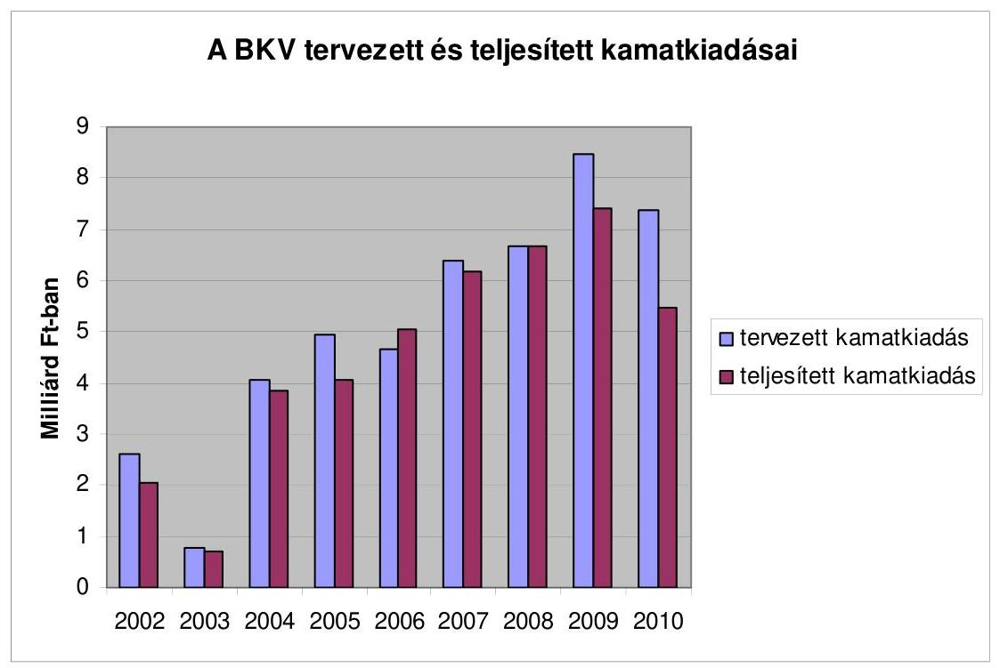

Forrás: A BKV üzleti tervei és beszámolói (2002-2010 évek között)
A BKV a kamatkiadásokat az üzleti terveibe beépítette, az üzleti évre tervezett kamatkiadás a 2006. év kivételével minden évben meghaladta a ténylegesen fizetett kamatot, ezért likviditási kockázatot nem jelentett. A teljesített kamatkiadás 2009-ben és 2010-ben 1029 és 1908 millió Ft-tal elmaradt a tervezettől, melynek oka a jegybanki alapkamat folyamatos csökkenése volt.

A 2002-2010. években a BKV által kifizetett kamatok összege 41,4 milliárd Ft volt, ami a Szolgáltatási szerződésben rögzített kompenzáció érvényesítésével elkerülhető lett volna.

A hitelek visszafizetési kockázata magas volt, mert az eladósodottság és a folyamatos veszteséges működés eredményeképpen a törlesztő részletek fedezete nem állt rendelkezésre. A BKV a visszafizetési kockázat csökkentése érdekében az üzleti tervekben hitel átütemezéseket tervezett, a hitelek megújítását, illetve a nem megújítható vagy átütemezhető hitel visszafizetési kötelezettséget a költségeibe beépítette. A hitelintézetekkel tárgyalásokat kezdeményezett a hitelek átütemezésére, a hitelek megújítására a beszerzési eljárásokat meghirdette. A hitelek átstrukturálását a 2009. évig az üzleti tervek szerint megvalósította, azonban a 2010. évben egy 5,0 milliárd Ft-os hitel megújítására kiírt közbeszerzési eljárás eredménytelen volt. A hitel visszafizetésének fedezetét a 2010-ben kapott állami támogatás biztosította.

A BKV-nak a 2002-2010. időszakban átmenetileg szabad pénzeszköze a 2002. év végétől 2004. első félévéig volt, melyet egy naptól három hónapig terjedő időszakra, 2,5-7,85\% fix kamatozással, 10 millió forint és 5000 millió forint közötti összegben kötött le. A 2002-ben felvett 25 millió USD (amerikai dollár) hitelből származó szabad pénzeszközeit 12 naptól három hónapig tartó időtartamban 1,1-2,4\% fix kamatozással lekötötte. Az ügyletekből származó kamatbevételeit tételesen nem mutatta ki, a pénzügyi műveletek bevételei (2002-ben

---

903 millió Ft, 2003-ban 542 millió Ft, 2004-ben 26 millió Ft) azonban egyik évben sem érték el a pénzügyi műveletek ráfordításait. Szabad pénzeszköze a BKV-nak 2004. második félévétől 2010. december végéig nem volt.

# 4.3. A kockázatok csökkentésére hozott intézkedések eredménye 

Az adósságot keletkeztető döntések külső és belső kockázatainak csökkentésére hozott intézkedések eredményének megítélését az adósság, a fajlagos ráfordítások és a pénzügyi egyensúly alakulásán keresztül értékeltük. Az adósság összege az ellenőrzött időszakban növekedett, de a BKV megőrizte fizetőképességét. A fizetőképesség megőrzésében meghatározó szerepe az Állam és a Főváros Önkormányzata által nyújtott támogatásoknak volt.

A saját tőke és kötelezettségek arányát az alábbi táblázat szemlélteti:

| Megnevezés/Év | 2005 | 2006 | 2007 | 2008 | 2009 | 2010 |
| :-- | --: | --: | --: | --: | --: | --: |
| Saját tőke millió Ft | 102084 | 100938 | 103157 | 116252 | 103574 | 114706 |
|  |  |  |  |  |  |  |
| Kötelezettségek millió | 81828 | 97783 | 112994 | 104176 | 124501 | 118261 |
| Ft |  |  |  |  |  |  |
| Saját |  |  |  |  |  |  |
| tőke/kötelezettségek | 1,25 | 1,03 | 0,91 | 1,12 | 0.83 | 0,97 |

A mutató a 2005. évhez képest számottevően romlott, több évben is az elvárható 1,00 érték alá esett.

## A 2007. évi hatékonyságjavító intézkedések hatása a közösségi közlekedés fajlagos ráfordításai alapján

| Megnevezés/év | $\mathbf{2 0 0 7}$ | $\mathbf{2 0 0 8}$ | $\mathbf{2 0 0 9}$ | $\mathbf{2 0 1 0}$ |
| :-- | --: | --: | --: | --: |
| Üzemi ráfordítás millió Ft | 116246 | 119434 | 126633 | 126217 |
| Telj. millió fhkm | 21308 | 21375 | 21552 | 21458 |
| Ft/fhkm | 5,4555 | 5,5876 | 5,8923 | 5,8820 |
| A Ft/fhkm változás az előző évhez (\%-ban) |  | 102,42 | 105,45 | 99,83 |

Az intézkedések a közösségi közlekedési tevékenység fajlagos ráfordításai szerint nem voltak eredményesek, a fajlagos ráfordítások tovább emelkedtek és csak 2010-ben sikerült a növekedést megállítani. A személyszállítási tevékenység támogatások nélküli bevételének egy Ft-jára jutó ráfordítás összege 2007-ről 2010-re $10 \%$-kal emelkedett.

A BKV hitelállománya változásának és támogatásának alakulását a 2005-2010. években a következő táblázat szemlélteti:

---

| Megnevezés | 2005 | 2006 | 2007 | 2008 | 2009 | 2010 |
| :--: | :--: | :--: | :--: | :--: | :--: | :--: |
| Rövid lejáratú hitelállomány változása | $-1036$ | 6524 | 849 | $-10111$ | 11465 | $-4318$ |
| Hosszú lejáratú hitelállomány változása | 16385 | $\begin{array}{r} -3 \\ 170 \end{array}$ | 3722 | 3884 | 1170 | $-5400$ |
| Hitelállomány változása összesen | $\begin{array}{r} 15 \\ 349 \end{array}$ | $\begin{array}{r} 3 \\ 354 \end{array}$ | 4571 | $-6227$ | 12635 | $-9718$ |
| Nem tervezett működési támogatás Fővárostól | 0 | 0 | 0 | 0 | 0 | 5132 |
| Nem tervezett működési támogatás Államtól | 0 | 0 | 588 | 10000 | 0 | 17500 |

A 2008. és a 2010. év kivételével a hitelállomány nem csökkent. A 2008. évben a csökkenést az előre nem tervezett támogatás kifizetése eredményezte. Ezt követően a 2009. évben a hitelkeret fokozott kihasználása jellemezte a BKV gazdálkodását. A hosszúlejáratú hitelek 2010. évi csökkenése az elmaradt hitelmegújítás következménye, a visszafizetést az előre nem tervezett állami és önkormányzati támogatások biztosították.

A BKV 2011. január havi nyitó szabad folyószámla hitelkerete 11,0 milliárd Ft, a nyitó adósság állománya 72,8 milliárd Ft, ebből a hitelek és kölcsönök állománya 63,8 milliárd Ft volt.

# 4.4. A működőképesség fenntartásának biztosítása

A 2005-2010. időszakban, illetve 2011 májusában a BKV működőképessége még biztosított volt, a 2011-től azonban az esedékes adósságterhek törlesztő részletei veszélyeztetik a BKV fizetőképességének fenntartását. Amennyiben a 2011. éves Üzleti Tervben jelzett működési támogatások szintje nem éri el a tervezett mértéket, valamint ha a 2011. évben lejáró hitelek megújítása eredménytelen lesz, akkor a BKV fizetésképtelenné válik.

A 2010. december 31-én fennálló hitelállományhoz kapcsolódó jövőben esedékes törlesztő részletek évenkénti összegének alakulása:

Adatok: millió Ft-ban

| Megnevezés | 2010.12.31   Záró ál-   lomány | 2011 új hitelfelvétel (+) | 2011.   évben törlesztett hitelek | Esedékes tőketörlesztések összege |  |  |  |
| :--: | :--: | :--: | :--: | :--: | :--: | :--: | :--: |
|  |  |  |  | 2011 törlesztendő hitelek | 2012 | 2013 | 2014 |
| Hosszúlejáratú bankhitel | 52490 | 3500 | 3800 | 12400 | 35790 | 3500 | 500 |
| Lízing | 4147 |  | 200 | 597 | 783 | 783 | 783 |
| Összesen | 56637 | 3500 | 4000 | 12997 | 36573 | 4283 | 1283 |

---

Az esedékes törlesztő részletek teljesítése a 2011. évben 13,0 milliárd Ft, míg 2012. évben 36,6 milliárd Ft terhet jelent a BKV számára. A fenti táblázat nem tartalmazza a folyószámla-hitelek állományát, melyekhez kapcsolódó szerződéseket évente meg kell hosszabbítani. Az OTP Nyrt-vel szembeni 2010. évben elhalasztott tőketörlesztések közül 2011 januárjában kifizetésre került 0,8 milliárd Ft, illetve megtörtént a márciusban esedékes 1,2 milliárd Ft tőketörlesztés 2011. szeptemberre történő halasztása.

A BKV 10 milliárd Ft összegű hitelre vonatkozó közbeszerzési eljárást indított 2011-ben, melynek célja, hogy pótolja a 2010 decemberében a sikertelen hitelmegújítás miatt kifizetett 5 milliárd Ft-ot, illetve a 2011. év folyamán működési hitelhez kapcsolódó 5 milliárd Ft összegű esedékes törlesztő részletet. A kiírt közbeszerzési eljárásban való részvételre beadott jelentkezések alapján csak 3,5 milliárd Ft forrást sikerült bevonni. 2011-ben további 11,2 milliárd Ft összegű hitel megújítása válik szükségessé az esedékes törlesztő részletek teljesítésére.

A 2011. évi pénzügyi terv a lejáró hitelek, illetve esedékes törlesztő részletek teljes körű megújításával számolva készült, így ezek meghiúsulása esetén veszélybe kerülhet az üzleti tervben foglaltak teljesíthetősége. Az adósságterhek törlesztéseire vonatkozóan az évek során kialakult és az üzleti tervekben, jelentésekben is rögzített trendek előre vetítik a fennálló hitelállomány hosszú távú fenntarthatóságában rejlő veszélyeket, melyek komoly kétségeket keltenek a pénzügyi egyensúly fenntartásával kapcsolatban. A lejáró hitelek kiváltása, illetve az esedékes törlesztő részletek halasztása jövőbeni biztosítására a finanszírozó bankok csökkenő hajlandóságot mutatnak.

A BKV jelenleg nem tudja biztosítani a hitelek visszafizetésének forrását. A pénzügyi egyensúly fenntarthatóságának alapvető követelménye, hogy a ráfordítások a bevételekben megtérüljenek, és a hitelek visszafizetése is a bevételekből legyen biztosítható.

A társasági formára kötelezően előírt jegyzett tőkének megfelelő összegű saját tőkére vonatkozó előírást a Gt. tv. 51. § (1) bekezdése tartalmazza. A BKV a saját tőke megfelelőségére vonatkozó törvényi előírásoknak a 2005-2010. időszakban megfelelt, amit a következő táblázat adatai szemléltetnek:

Adatok: millió Ft-ban

| Megnevezés | $\mathbf{2 0 0 5}$ | $\mathbf{2 0 0 6}$ | $\mathbf{2 0 0 7}$ | $\mathbf{2 0 0 8}$ | $\mathbf{2 0 0 9}$ | $\mathbf{2 0 1 0}$ |
| :-- | --: | --: | --: | --: | --: | --: |
| Jegyzett tőke | 127000 | 127000 | 127000 | 127000 | 127000 |  |
| Saját tőke | 102084 | 100938 | 103157 | 116252 | 103574 | 114706 |
| Saját tőke/jegyzett tőke | $80 \%$ | $79 \%$ | $81 \%$ | $92 \%$ | $82 \%$ | $82 \%$ |

A BKV a Gt. tv. 245. § (1) bekezdésében megfogalmazott speciális előírásnak is megfelelt, mivel saját tőkéje veszteség miatt a 2005-2010. időszak egyik évében sem csökkent az alaptőke kétharmadára. Ezen jogszabályi előírásnak való megfeleléshez azonban feltétlenül szükséges volt a Fővárosi Önkormányzattól a tőketartalék javára kapott fejlesztési célú tőkepótló támogatás. Ennek hiányában a folyamatos működési veszteség következtében a saját tőke már 2006-ban az alaptőke kétharmada alá csökkent volna.

---

A BKV az adósságfinanszírozási és likviditási problémái megoldásánál jelentkező kockázati tényezőket nem kezelte eredményesen (3/b. számú melléklet), mivel az adósságot keletkeztető kötelezettségvállalásokról szóló döntései során csak a hitelfelvétel elmaradásának kockázatait mutatta be, a hitelfelvétel következményeire vonatkozóan kockázatelemzést nem végzett, hitelfelvételre vonatkozóan a pénzügyi egyensúly fenntartását veszélyeztető külső és belső kockázatokat nem tárta fel. A BKV 2011. május 31-ig biztosította a működőképesség fenntartását, bár fizetőképességét, a gazdálkodás stabilitását nem önerőből biztosította. A fizetőképességet a lejárt hitelek megújításával, illetve újabb hitelfelvételekkel érték el. A fejlesztési célú hitelek nem térültek meg, mert a fejlesztések költsége az árbevételben nem érvényesíthető. Az adósságot keletkeztető kötelezettségvállalások gyakorlatilag csak az előre nem tervezett támogatások hatására csökkentek. Az esedékes adósságterhek törlesztése veszélyezteti a fizetőképességet, a működőképesség hosszú távú fenntartását.

Budapest, 2012. január

Melléklet: 19 db
Függelék: $\quad 3 \mathrm{db}$
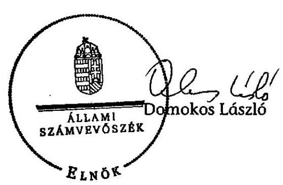

---

# 2011.06.20.

## 1. számú melléklet a V-2007/2011. számú jelentéshez

### 1. számú melléklet a V-2007/2011. számú jelentéshez

|  Melléklet megnevezése | 2002 | 2003 | 2004 | 2005 | 2006 | 2007 | 2008 | 2009 | 2010 | mindösszese  |
| --- | --- | --- | --- | --- | --- | --- | --- | --- | --- | --- |
|   |  |  |  |  |  |  |  |  |  | 0  |
|  1. BKV Rt: 2002-2010. évt. beruházásainak támogatása | 6 389,9 | 6 094,4 | 5 545,4 | 5 545,4 | 3 000,0 | 3 000,0 | 11 872,0 | 11 872,0 | 10 000,0 | 10 000,0  |
|  2. Villamos járműléglesztés (Combináló) | 3 077,3 | 10,3 | 11 942,4 | 10 943,1 | 12 425,8 | 250,4 | 10 502,0 | 9 623,8 | 10 104,7 | 8 838,6  |
|  3. Hannoveri használt villamosok beszerzése | 2 911,4 | 2 911,4 |  |  |  |  |  |  |  |   |
|  4. Mi-2 mértékszmé felújítás |  |  | 3 000,0 | 506,2 | 9 158,6 | 5 379,3 | 8 162,3 | 7 800,4 | 10 169,3 | 9 582,3  |
|  5. Mi-2 mértékszmé járnálzsere |  |  |  |  |  |  | 28,0 | 1,2 | 9 548,1 | 9 545,8  |
|  6. Megtekintői villamoshoz (Combinoló) peronok árepítése |  |  |  |  |  |  |  |  | 550,0 | 550,0  |
|  7. Közforgalmi kősülmítői kompok növek felújítási támogatása |  |  |  |  |  |  |  | 10,5 | 10,5 | 6,5  |
|  8. MiV Hajdolás Szolgált Ár. Följellegget |  |  |  |  |  |  |  |  |  |   |
|  9. Hámogatott fejlesztési célú párcecsíkba |  |  |  |  |  |  |  |  |  |   |
|  10. Összesen a késmét beruházás nélkül | 12 388,4 | 9 031,0 | 20 387,8 | 16 994,7 | 24 583,8 | 8 620,7 | 30 174,8 | 29 307,9 | 49 778,6 | 38 523,2  |
|  Nyilatkozat: A tanúsítványban szereplő adatok valitáságát igazolom. |  |  |  |  |  |  |  |  |  |   |

### 2011.06.20.

### 1. számú melléklet a V-2007/2011. számú jelentéshez

### 2008.06.20.

### 1. számú melléklet a V-2007/2011. számú jelentéshez

|  Melléklet megnevezése | 2002 | 2003 | 2004 | 2005 | 2006 | 2007 | 2008 | 2009 | 2010 | mindösszese  |
| --- | --- | --- | --- | --- | --- | --- | --- | --- | --- | --- |
|   |  |  |  |  |  |  |  |  |  | 0  |
|  1. BKV Rt: 2002-2010. évt. beruházásainak támogatása | 6 389,9 | 6 094,4 | 5 545,4 | 5 545,4 | 3 000,0 | 3 000,0 | 11 872,0 | 11 872,0 | 10 000,0 |
 8 838,6  |
|  3. Hannoveri használt villamosok beszerzése | 2 911,4 | 2 911,4 |  |  |  |  |  |  |  |   |
|  4. Mi-2 mértékszámú felújítás |  |  | 3 000,0 | 506,2 | 9 158,6 | 5 379,3 | 8 162,3 | 7 800,4 | 10 169,3 | 9 582,3  |
|  5. Mi-2 mértékszámú járatnálzsere |  |  |  |  |  |  | 28,0 | 1,2 | 9 548,1 | 9 545,8  |
|  6. Megtekintői villamoshoz (Combinoló) peronok árépítése |  |  |  |  |  |  |  |  | 550,0 | 550,0  |
|  7. Közforgalmi kőszálmítói kompok növek felújítási támogatása |  |  |  |  |  |  |  |  | 10,5 | 10,5  |
|  8. MIV Hajdolás Szolgált Ár. Följellegget |  |  |  |  |  |  |  |  |  |   |
|  9. Támogatott fejlesztési célú párcecsíkba |  |  |  |  |  |  |  |  |  |   |
|  10. Összesen a késmért beruházás nélkül | 12 388,4 | 9 031,0 | 20 387,8 | 16 994,7 | 24 583,8 | 8 620,7 | 30 174,8 | 29 307,9 | 49 778,6 | 38 523,2  |
|  Nyilatkozat: A tanúsítványban szereplő adatok valitáságát igazolom. |  |  |  |  |  |  |  |  |  |   |

### 2010.06.20.

### 1. számú melléklet a V-2007/2011. számú jelentéshez

### 1. számú melléklet a V-2007/2011. számú jelentéshez

### 1. számú melléklet a V-2007/2011. számú jelentéshez

### 10.00.00.

---

# A Magyar Állam és az Önkormányzat által 2002-2010 évek között a BKV Zrt. részére biztosított működési célú források

|  Támogatás jogcíme | 2002. év | 2003. év | 2004. év | 2005. év | 2006. év | 2007. év | 2008. év | 2009. év | 2010. év | Mindösszes
en 2002-
2010 között  |
| --- | --- | --- | --- | --- | --- | --- | --- | --- | --- | --- |
|  Állam részéről |  |  |  |  |  |  |  |  |  |   |
|  - normatív hozzájárulás | 0,0 | 0,0 | 5 924,7 | 11 965,4 | 32 139,8 | 32 198,1 | 32 198,1 | 32 198,1 | 32 198,1 | 178 822,3  |
|  - fogyasztói árkiegészítés* | 16 798,0 | 18 834,0 | 18 687,0 | 19 045,0 | 17 935,0 | 17 135,0 | 17 139,0 | 16 863,0 | 15 983,0 | 158 419,0  |
|  - Magyar Állam hitelátvállalás* | 36 741,4 | 0,0 |  |  |  |  |  |  |  | 36 741,4  |
|  - Magyar Állam által átvállalt hitel kamata* | 0,0 | 1 292,8 | 816,4 |  |  |  |  |  |  | 2 109,2  |
|  - vissza nem térítendő támogatás |  |  |  |  |  | 587,5 | 10 000,0 |  | 17 500,0 | 28 087,5  |
|  Önkormányzat részéről |  |  |  |  |  |  |  |  |  |   |
|  - működési célú támogatás | 16 201,9 | 3 000,0 | 3 000,0 | 8,0 | 8,0 | 8,0 | 8,0 | 8,0 | 5 132,0 | 27 373,9  |
|  Összesen: | 69 741,3 | 23 126,8 | 28 428,1 | 31 018,4 | 50 082,8 | 49 928,6 | 59 345,1 | 49 069,1 | 70 813,1 | 431 553,3  |

Nyilatkozat: A tanúsítványban szereplő adatok valódiságát igazolom. Megjegyzés: * jelölt adatokat a BKV szolgáltatta

Kiállítás időpontja: 258,06,15.

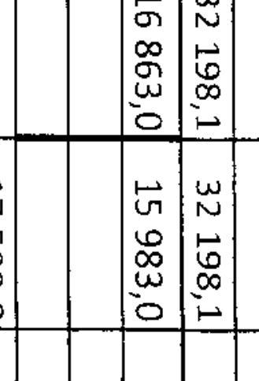

a Főpolgármesteri Hivatal képviseletében

Föllyődör

Vörösüzemmeletési

Főosztályvezető

---

# Kérdések és válaszok a Főváros Önkormányzata tömegközlekedési feladatellátásának megítéléséhez 

Eredményes a főváros tömegközlekedési feladatainak ellátása, ha:

- a Főváros Önkormányzata rendelkezik közlekedéspolitikai stratégiával, az illeszkedik az Egységes Közlekedésfejlesztési Stratégiához, a Szolgáltatási szerződés teljes mértékben lefedte a főváros tömegközlekedési feladatainak ellátási kötelezettségét;
- a Főváros Önkormányzata szabályozta a BKV-val kapcsolatos tulajdonosi joggyakorlás rendjét, és azt betartotta, illetve betartatta a döntési eljárások során;
- a Főváros Önkormányzata a szükséges mértékben biztosította a BKV működéséhez szükséges forrásokat;
- a Főváros Önkormányzata teljesítette előírt ellenőrzési kötelezettségeit, intézkedett az ellenőrzési megállapítások végrehajtásáról, illetve érvényesítette a jogait;
- a közforgalmú közlekedési szolgáltatások minősége megfelelő.

Főkérdés: Eredményesen látta-e el a Főváros Önkormányzata a főváros tömegközlekedési feladatait?
(minősités az öt eredményességi kritériumra adott válaszok figyelembe vételével)

| 1. | A Főváros Önkormányzata rendelkezik-e közlekedéspolitikai   stratégiával, az illeszkedik-e az Egységes Közlekedésfejlesztési   Stratégiához, a Szolgáltatási szerződés teljes mértékben lefedi-e   a főváros tömegközlekedési feladatainak ellátási kötelezettsé-   gét? |
| :-- | :-- |
|  | Igen |
|  | Összességében: A Főváros Önkormányzata a vizsgált időszakban rendelkezett az Egysé-   ges Közlekedésfejlesztési Stratégiához illeszkedő közlekedéspolitikai stratégiával. A Szol-   gáltatási szerződés célja, tárgya, valamint tartalma a Főváros Önkormányzata közfor-   galmú személyszállítással kapcsolatos feladat ellátási kötelezettségét teljes egészében   lefedte. |

---

| 1.1. | A Főváros Önkormányzata által elfogadott közlekedéspolitikai stra-   tégia illeszkedik-e az Egységes Közlekedésfejlesztési Stratégiához?   Igen   A vizsgált időszakban a Főváros Önkormányzata közlekedéspolitikai stratégiái: a 2001-   2015. időszakra vonatkozó Budapest Közlekedési Rendszerének Fejlesztési Terve, a 2020-   ig szóló Budapest Közlekedési Rendszerének Fejlesztési Terve. A 2020-ig szóló Budapest Közlekedési Rendszerének Fejlesztési Terve az Egységes Közlekedésfejlesztési Stratégiához illeszkedett. |
| :--: | :--: |
| 1.2. | A Főváros Önkormányzata által megismert BKV középtávú közleke-   désfejlesztési és beruházási tervei a fővárosi közlekedéspolitikai stra-   tégián és az Egységes Közlekedésfejlesztési Stratégián alapul-e?   Igen   A Középtávú Beruházási terv a Főváros Önkormányzata 2001-2015. időszakra vonatko-   zó Budapest Közlekedési Rendszerének Fejlesztési Tervével, a Hétéves Fejlesztési Tervében   foglalt fejlesztések a 2020-ig szóló Budapest Közlekedési Rendszerének Fejlesztési Tervével   összhangban voltak. |
| 1.3. | A Szolgáltatási szerződés tartalma, célja, területi hatálya egyértel-   múen és teljes mértékben lefedi-e a Főváros Önkormányzata feladat   ellátási kötelezettségeiben foglaltakat, valamint voltak-e garanciák a   Szolgáltatási szerzödésben foglaltak teljesítésére, illetve szankciók a   nem teljesítésére?   Igen   A Szolgáltatási szerződés célja, tárgya, valamint tartalma a Főváros Önkormányzata   közforgalmú személyszállítással kapcsolatos feladat ellátási kötelezettségét teljes egészé-   ben lefedte. A Szolgáltatási szerződésben mind a Főváros Önkormányzata, mind a BKV   érdekeinek védelmére megfogalmazásra kerültek a szerződésben foglaltak végrehajtását   biztosító garanciális elemek, valamint mindkét szerződő fél terhére meghatároztak   szankciókat a nem szerződésszerű teljesítés eseteire. |
| 2. | A Főváros Önkormányzata szabályozta-e a BKV-val kapcsolatos   tulajdonosi joggyakorlás rendjét, és azt betartotta, illetve be-   tartatta-e a döntési eljárások során?   Igen   Összességében: A Főváros Önkormányzata szabályozta az átruházott jogkörök gyakorlá-   sának rendjét, az átruházás ennek megfelelően történt, továbbá előírta a tulajdonosi   joggyakorlásról történő beszámolást. A BKV vezető tisztségviselő részére írásban történő   utasítás lehetőségét meghatározták, de az utasítására jogosultak körét nem, továbbá a   Felügyelő Bizottság és a Könyvvizsgáló jelentésének elfogadásáról nem minden évben   döntöttek határozatban. A tulajdonosi jogkörrel felruházottak a jogkör gyakorlásáról   nem számoltak be a Közgyűlésnek. |

---

| 2.1. | A Főváros Önkormányzata szabályozta-e a BKV-val kapcsolatos tulajdonosi joggyakorlás rendjét?   Igen |  |
| :--: | :--: | :--: |
| 2.1.1. | A Főváros Önkormányzata, mint tulajdonos átruházott-e tulajdonosi jogköröket? | Igen   A BKV esetében a Tulajdonosi/Gazdasági bizottság kapott felhatalmazást, hogy gyakorolja a vagyongazdálkodási rendelet-ben előírt, továbbá a fel nem sorolt, de a Gt. tv-ben az alapító, vagyis a Közgyűlés hatáskörébe utalt jogokat. Rendelkezett arról, hogy egyes átruházott hatáskörbe utalt jogok gyakorlása esetében az SzMSz${ }_{1}$ 6. számú mellékletében felhatalmazott illetékes szakmai bizottság egyetértése szükséges. |
| 2.1.2. | A Főváros Önkormányzata szabályozta-e az átruházott jogkörök gyakorlását? | Igen   A Főváros Önkormányzata az SzMSz${ }_{1}$-ben előírta az állandó bizottságok részletes feladat- és hatásköreit, továbbá meghatározta a bizottságokra átruházott hatáskörök jegyzékét. |
| 2.1.3. | A Főváros Önkormányzata a BKV vezető tisztségviselők utasításának joggyakorlását sza-bályozta-e? | Részben   A BKV vezető tisztségviselő részére írásban történő utasítás lehetőségét és módját a BKV Alapító Okiratában rögzítették, de a BKV vezető tisztségviselők utasítására jogosultak körét nem határozták meg, így az előírás gyakorlásának személyi feltétele nem volt biztosított. |
| 2.1.4. | A Főváros Önkormányzata előírta-e az átruházott jogkörök gyakorlásáról történő beszámolást? | Igen   A Főváros Önkormányzata az SzMSz${ }_{1}$ 5. számú mellékletében az állandó bizottságok általános feladatkörének meghatározásakor előírta az éves beszámolási kötelezettséget az átruházott feladat- és hatáskörök ellátásáról. |
| 2.2. | A Főváros Önkormányzata a BKV-val kapcsolatos tulajdonosi joggyakorlás rendjét betartotta-e, illetve betartatta-e a döntési eljárások során?   Nem |  |
| 2.2.1. | A Főváros Önkormányzata betartotta, illetve betartatta-e a tulajdonosi joggyakorlás rendjét az üzleti terv, az üzleti jelentés, a BKV vezetők prémiumkitűzéseinek, az éves be- | Részben   A 2009-2010. években a Felügyelő Bizottság beszámolóról készített jelentésének elfogadásáról, illetve a 2010. évben a könyvvizsgáló jelentés elfogadásáról a BKV Alapító Okiratában foglalt előírás ellené- |

---

|  | számoló, a könyvvizsgálói je-   lentés elfogadásakor? | re a tulajdonosi joggyakorlással felhatalmazott   bizottságok határozatban nem döntöttek. |
| :-- | :-- | :-- |

2.2.2. A vezető tisztségviselők utasításának jogával a tulajdonosi jog gyakorlója élt-e?

# Nem 

2.2.3. A Főváros Önkormányzata beszámoltatta-e a tulajdonosi jogkörökkel felruházottakat a jogkörök gyakorlásáról?

## Nem

A tulajdonosi joggyakorlással felruházott bizottságok a fővárosi tömegközlekedési feladatok ellátásával kapcsolatban az SzMSz-ben előírtak ellenére nem számoltak be a Közgyűlésnek az átruházott feladat- és hatáskörök ellátásáról. Beszámoltatás nem történt.
3. A Főváros Önkormányzata a szükséges mértékben biztosította-e a közforgalmú közlekedés közszolgáltatási kötelezettségének teljesítéséhez szükséges forrásokat?

## Nem

Összességében: A Szolgáltatási szerződésben meghatározásra kerültek az indokolt költségek és várható bevételek, illetve a bevétellel nem fedezett forrásigény biztosításának módja, továbbá az éves költségvetési rendeletekben tervezett felhalmozási célú pénzeszköz átadást. A bevétellel nem fedezett forrásigényt nem biztosították, az elismert kompenzációigényt nem határozták meg, így ennek mértékéről nem döntöttek.
3.1. A Főváros Önkormányzata biztosította-e a BKV részére a Szol-
gáltatási szerződésben foglaltak szerint a működéshez szüksé-
ges forrásokat?
Nem
3.1.1. A Szolgáltatási szerződésben meghatározásra kerültek-e az indokolt költségek és várható bevételek, illetve a bevétellel nem fedezett forrásigény biztosításának módja?

## Igen

A Szolgáltatási szerződés kiterjedt a Főváros Önkormányzata által igényelt szolgáltatás nyújtásához kapcsolódó bevételek és ráfordítások meghatározásának szabályozott módjára, a bevétellel nem fedezett forrásigény biztosítására.
3.1.2. Megtörtént-e a bevétellel nem fedezett forrásigény biztosítása?

## Nem

A Főváros Önkormányzata 2005-2011. évi költségvetési rendeletei nem tartalmaztak tömegközlekedési kompenzáció címen előirányzatot, a bevétellel nem fedezett forrásigény biztosítására a BKV működéshez nem nyújtottak támogatást.

---

| 3.2. | A Főváros Önkormányzata a BKV részére biztosította-e a központosított normatív hozzájárulást, évenként meghatározta-e a hatósági árat, a Szolgáltatási szerződés szerint biztosította-e az elismert kompenzációigényt?   Részben   A Főváros Önkormányzata a központosított normatív hozzájárulást biztosította a BKV részére, évenként rendeletben döntött a viteldíjak hatósági árának megállapításáról, de a Szolgáltatási szerződésben meghatározott számításon és egyeztetésen alapuló elismert kompenzációigényt nem határozták meg, így ennek biztosítására sem került sor. |
| :--: | :--: |
| 3.3. | A Főváros Önkormányzata költségvetési rendeletei tartalmaz-tak-e felhalmozási célú pénzeszközátadást?   Igen   A Főváros Önkormányzata a BKV fejlesztéseinek támogatására 2002-2010 között - az amortizációt pótló támogatások és a 4-es metró beruházására felhasznált pénzeszközök nélkül - 96,1 Mrd Ft összegben nyújtott felhalmozási célú támogatást. Az amortizációt pótló támogatások összege 2002-2010 között 76,2 Mrd Ft volt. |
| 4. | Teljesítette-e ellenőrzési kötelezettségeit a Főváros Önkormányzata a fővárosi tömegközlekedési feladatának eredményes ellátásához, intézkedett-e az ellenőrzési megállapítások végrehajtásáról?   Részben   Összességében: A Főváros Önkormányzata a BKV Felügyelő Bizottságának, könyvvizsgálójának tevékenységét részben követte nyomon, az általuk a tulajdonosra vonatkozóan tett megállapítások végrehajtásáról nem intézkedett. a Főváros Önkormányzatának belső ellenőrzése vizsgálatot a BKV-nál csak 2010-ben végzett, a Szolgáltatási szerződés teljesítésével kapcsolatos ellenőrzések nem terjedtek ki minden közlekedési alágazatra, illetve a 2008. évben és a 2009. évben nem került sor ellenőrzésre. A Főváros Önkormányzata az amortizációt pótló fejlesztésekhez történő hozzájárulások célnak megfelelő felhasználását ellenőrizte. |
| 4.1. | Figyelemmel kísérte-e a Főváros Önkormányzata a BKV Felügyelő Bizottságának tevékenységét, és intézkedett-e az ellenőrzési megállapítások végrehajtásáról?   Részben |
| 4.1.1. | Nyomon követte-e a Főváros Önkormányzata a BKV felügyelő Bizottságának tevékenységét? |

# Részben 

A 2005-2010. időszakban a Közgyűlés, illetve a tulajdonosi jogkörök gyakorlására felhatalmazott bizottságok előterjesztés hiányában a BKV Felügyelő bizottságának tevékenységéről szóló beszámolót nem tárgyaltak. Átruházott hatáskörben eljárva a 2005. évben a Tulajdonosi bizottság, a 2006-2007.

---

|  |  | években a Gazdasági bizottság a BKV éves beszámolójáról a Felügyelő bizottság jelentését elfogadta, azonban a 2008. és a 2009. évekre vonatkozóan ez nem történt meg. |
| :--: | :--: | :--: |
| 4.1.2. | Intézkedett-e a Főváros Önkormányzata a BKV Felügyelő Bizottsága által tett, a tulajdonosra vonatkozó realizáló intézkedések végrehajtásáról? | Részben   A Felügyelő bizottság jelzésére is figyelemmel a Közgyűlés eseti vizsgálóbizottság felállításáról döntött a BKV-nál kitudódott, a BKV-t érintő szabálytalanságok munkajogi, polgári és esetleges büntetőjogi vonatkozásainak kivizsgálására. |
| 4.2. | Elfogadta-e a Főváros Önkormányzata a könyvvizsgáló jelentéseit, intézkedett-e a könyvvizsgálói megállapítások végrehajtásáról?   Részben |  |
| 4.2.1. | Elfogadta-e a Főváros Önkormányzata a könyvvizsgáló jelentéseit? | Részben   A BKV 2005-2007. évi beszámolóinak elfogadásakor a Tulajdonosi bizottság, illetve a Gazdasági bizottság határozott a könyvvizsgálói jelentések elfogadásáról, azonban ez a 2009. évi beszámoló esetében nem történt meg. |
| 4.2.2. | Intézkedett-e Főváros Önkormányzata a könyvvizsgálói jelentés tulajdonost érintő megállapításai végrehajtásáról? | Nem |
| 4.3. | Végzett-e a Főváros Önkormányzatának belső ellenőrzése vizsgálatot a BKV-nál, és intézkedett-e az ellenőrzési megállapítások végrehajtásáról?   Részben |  |
| 4.3.1. | Végzett-e a Főváros Önkormányzatának belső ellenőrzése vizsgálatot a BKV-nál? | Részben   Csak a 2010. évben, közgyűlési döntés alapján. |
| 4.3.2. | Főváros Önkormányzata in-tézkedett-e az ellenőrzési megállapítások végrehajtásáról? | Nem   Az ellenőrzésről készült jelentésben kettő célszerűségi javaslat volt. |

---

| 4.4. | Eleget tett-e a Főváros Önkormányzata a szolgáltatási szerződés teljesítésével kapcsolatos ellenőrzési kötelezettségeinek, a megállapítások végrehajtásáról meggyőződött-e?   Részben |
| :--: | :--: |
| 4.4.1. | Eleget tett-e a Főváros Önkormányzata a szolgáltatási szerződés teljesítésével kapcsolatos ellenőrzési kötelezettségeinek? |
| 4.4.2. | A Főváros Önkormányzata a szolgáltatási szerződés teljesítéséről készült ellenőrzési megállapítások végrehajtásáról meggyőződött-e? |

# 4.5. Ellenőrizte-e a Főváros Önkormányzata az amortizációt pótló fejlesztésekhez történő hozzájárulások célnak megfelelő felhasználását, és intézkedett-e az ellenőrzési megállapítások végrehajtásáról? 

## Igen

4.5.1. Ellenőrizte-e a Főváros Önkormányzata az amortizációt pótló fejlesztésekhez történő hozzájárulások célnak megfelelő felhasználását?

## Igen

A BKV által benyújtott elszámolásokat a Közlekedési ügyosztály felülvizsgálta összegszerűségük és az elvégzett munkálatok szakmai megalapozottsága tekintetében.

## Igen

A 2007., a 2008., a 2009. és a 2010. években a felülvizsgálatok során kifogásoltak számlákat, amelyekre a BKV írásos magyarázatot adott és ennek figyelembevételével elfogadásra kerültek a kifogásolt számlák, illetve a BKV visszavonta a nem megfelelő számlákat.
5. A közforgalmú közlekedési szolgáltatások minősége megfelelő-e?

## Részben

Összességében: A Szolgáltatási szerződésben rögzített és a Szolgáltatási jelentésekben közölt mutatószámok számszerű értékei alapján a szolgáltatási minőség a 2005-2010. időszakban megfelelő volt. A nem rendszeres utas elégedettségi vizsgálatok eredményei és az utas panaszok növekvő száma alapján a szolgáltatás csak részben minősíthető megfelelőnek.

---

| 5.1. | Meghatározta-e a Főváros Önkormányzata a szolgáltatási szer-   ződésben a tömegközlekedési feladatellátás tervezett minős-   gét?   Igen   A tervezett szolgáltatás a Közszolgáltatási követelményekben jelenik meg, amelyek az   alapellátási paramétereket, a teljesítmény elvárásokat, a paraméterkönyvet és a minő-   ségi követelményeket jelentik. Ez utóbbiak a menetkimaradásokat, a pontosságot és a   biztonságot jellemző értékek. |
| :--: | :--: |
| 5.2. | Értékelte-e a Főváros Önkormányzata a nyújtott szolgáltatás   színvonalát?   Igen   A BKV negyedévente és évenként összefoglalóan a Szolgáltatási jelentés benyújtásával   tájékoztatta a Főváros Önkormányzatát a nyújtott szolgáltatás színvonaláról a Szolgáltatási szerződésben meghatározott tartalmú szöveges beszámoló és az előírt táblázatok   kitöltésével. A tulajdonosi joggyakorlással felhatalmazott bizottság a jelentéseket elfo-   gadta. |
| 5.3. | A tervezett minőség és a nyújtott minőség közötti eltérés esetén   intézkedett-e a Főváros Önkormányzata a különbség rendezésé-   re?   Nem   A Szolgáltatási szerződés szerint a tervezett és nyújtott minőség közötti eltérés nagysága   alapján a bonus/malus rendszer alkalmazásával a BKV kompenzációtöbbletre, illetve   kompenzációcsökkentésre számíthatott. A 2005-2010 közötti időszakban, minden ne-   gyedévben különböző mértékű bonus illette volna meg a BKV-t, amelyet nem kapott   meg. A bonus érvényesítésére a Főváros Önkormányzata nem intézkedett. |
| 5.4. | A Szolgáltatási szerződésben meghatározottaknak megfelelő   volt-e a közfeladat ellátása és a szolgáltatás színvonala?   Igen   A Szolgáltatási szerződésben rögzített jellemzők számszerű értékei alapján mind a köz-   feladat ellátás mennyiségi, mind a szolgáltatás minőségi színvonala megfelelő volt, az   egyes alágazatok vonatkozásában azonban nem egyforma mértékben. |
| 5.5. | A Főváros Önkormányzata működtetett-e monitoring rendszert   a szolgáltatási szerződés keretében nyújtott szolgáltatások   mennyiségi és minőségi alakulásának értékelésére az ellenőrzés   időszakában?   Részben   A kézi méréseken alapuló, rövid időtartamú, a statisztikai mintavétel szabályait nem |

---

|  | alkalmazó monitoring rendszer működtetésére csak a 2005., a 2006., a 2007. és a 2010.   években került sor, ami nem vonatkozott valamennyi alágazatra. |
| :--: | :--: |
| 5.6. | A Főváros Önkormányzata figyelembe vette-e a nemzetközi   normákat a szolgáltatási igény minőségi jellemzőinek meghatározásánál?   Részben   A nemzetközi normákat az EN 13816:2002 szabvány tartalmazza, ami nyolc kritériumot   határoz meg. Az abban leírt minőségi jellemzők közül mindössze hármat (menetkima-   radás, pontosság, biztonság) tartalmazott Szolgáltatási szerződés. |
| 5.7. | A Főváros Önkormányzata végzett vagy végeztetett-e utas-   elégedettségi vizsgálatot?   Nem   Az utas elégedettségi vizsgálatok végzését a Szolgáltatási szerződés a BKV feladataként   határozza meg. Ennek a BKV csak részben tett eleget, nem minden évben és nem azonos   szerkezetű felvételeket végeztetett, amelyek az utas elégedettség időbeni alakulásáról   következtetések levonását nem tették lehetővé és nem voltak alkalmasak az elvárt minős-   ég meghatározására sem. |

---

# Kérdések és válaszok 

## a Társaság pénzügyi egyensúlya fenntartásának, az adósság kezelésének teljesítmény-ellenőrzéséhez

Fő kérdés:

## A BKV EREDMÉNYESEN KEZELTE-E AZ ADÓSSÁGFINANSZÍROZÁSI ÉS LIKVIDITÁSI PROBLÉMÁI MEGOLDÁSÁNÁL JELENTKEZŐ KOCKÁZATI TÉNYEZŐKET, ÉS BIZTOSÍTOTTA-E MŰKÖDŐKÉPESSÉG FENNTARTÁSÁT ${ }^{1}$ ?

## Nem

Az adósságot keletkeztető kötelezettségvállalásokról szóló döntései során csak a döntés elmaradásának kockázatait mutatta be, a döntés következményeire vonatkozóan kockázatelemzést nem végzett, hitelfelvételre vonatkozóan a pénzügyi egyensúly fenntartását veszélyeztető külső és belső kockázatokat nem tárta fel. A pénzügyi egyensúlyt, a gazdálkodás stabilitását a társaság önerőből nem tudta biztosítani. A fizetőképességet a hitelek refinanszírozásával, újabb hitelfelvételekkel biztosították. A fejlesztési célú hitelek cél szerinti felhasználását nem ellenőrizték, megtérülése nem volt biztosított. Az adósságot keletkeztető kötelezettségvállalások gyakorlatilag csak az időközönként kapott többlettámogatások hatására csökkentek. Az esedékes adósságterhek törlesztése veszélyezteti a pénzügyi egyensúly fenntartását, a működőképesség fenntartása hosszú távon nem biztosított.

| Kérdések | Válaszok |
| :-- | :-- |
| 1. | Az adósságot keletkeztető döntések során vizsgálták-e a pénzügyi egyensúly   fenntartását veszélyeztető külső és belső kockázatokat? |
|  | A hiteligény az éves Üzleti terv keretében az Igazgatóság és a Tulajdonos ré-   széről jóváhagyásra került. A hitelek költségének fedezetét az Üzleti terv a   ráfordítások között tartalmazta. A működési hitelek likviditási és visszafizeté-   si kockázatával kapcsolatban az Üzleti Tervekben és a pénzügyi helyzettel   foglalkozó Igazgatósági Előterjesztésekben az adott időszakra vonatkozóan a   refinanszírozásra és az átütemezési lehetőségre részletes elemzések találha-   tók. |

[^0]
[^0]:    ${ }^{1}$ A 10. számú mellékletben bemutatott fő kérdések, kritériumok, adatforrások értékelése alapján.

---

Az adósságot keletkeztető döntések előkészítése során a döntés elmaradásának kockázatait mutatta be, a döntésből eredő likviditási és visszafizetési kockázatra vonatkozó elemzés nem történt. A hitelszerződések megkötésére vonatkozó döntések megalapozásához, a döntés következményeire vonatkozóan - a kamatkockázat kivételével - kockázatelemzést nem végzett, a hitelköltségek biztosításának fedezetét nem vizsgálták, a fejlesztési célú hitelek megtérülésére vonatkozóan számítások nem készültek, a felhasználási kockázatra vonatkozó elemzés nem történt. A garancia- és kezességvállalások vonatkozásában kockázat elemzést azokban az esetekben készítettek, melyek engedélyezéséhez Igazgatósági döntés volt szükséges.

Fentiek alapján a BKV-nál a 2002-2010. időszakban a hitelszerződések megkötésére vonatkozó döntések a vizsgált esetek 45\%-ában nem voltak megalapozottak.
1.1. Vizsgálták és betartották-e az adósságvállalás engedélyezésére vonatkozó előírásokat?

## Részben

Az Alapító okirat, SZMSZ, DHL-ben foglalt előírások formálisan sem mindig teljesültek. Az éves Üzleti Terv és az Igazgatósági előterjesztések esetenként nem a megvalósítással összhangban tartalmazták az adósságot keletkeztető döntéseket.
1.2. Rendelkeznek-e pénzügyi kockázatkezelési stratégiával és abban meghatározták-e a kockázatok feltárására és kezelésére vonatkozó irányelveket?

## Nem

A BKV Pénzügyi Kockázatkezelési Stratégiával nem rendelkezik.
Vizsgálták-e az adósságot keletkeztető döntések kockázatait?

## Részben

A BKV az adósságot keletkeztető döntések előkészítése során a döntés elmaradásának kockázatait mutatta be, a döntés következményeire vonatkozóan - a kamatkockázatok kivételével - kockázatelemzést nem végzett. A fejlesztési célú hitelek megtérülésére vonatkozóan számítások nem készültek. A működési hitelek visszafizetési kockázataival kapcsolatban az Üzleti Tervekben és a pénzügyi helyzettel foglalkozó Igazgatósági Előterjesztésekben az adott időszakra vonatkozóan a refinanszírozásra és az átütemezési lehetőségre részletes elemzések találhatók, a döntések előkészítése során a visszafizetési kockázatra vonatkozó elemzés nem történt. A hitelek költségének fedezetét az Üzleti terv a ráfordítások között tartalmazta, azonban a döntések előkészítése során a hitelköltségek biztosításának fedezetét nem vizsgálták. A működési hitelek likviditási kockázatával kapcsolatban az Üzleti Tervekben és a pénzügyi

---

helyzettel foglalkozó Igazgatósági Előterjesztésekben az adott időszakra vonatkozóan részletes elemzések találhatók, a döntések előkészítése során a döntésből eredő likviditási kockázatra vonatkozó elemzés nem történt. A fejlesztési célú döntéseknél a felhasználási kockázatra vonatkozó elemzés nem történt. A garancia- és kezességvállalások vonatkozásában kockázat elemzést azokban az esetekben készítettek, melyek engedélyezéséhez Igazgatósági döntés volt szükséges.
1.3. Megalapozottak voltak-e a hitelszerződések megkötésére vonatkozó döntések?

## Részben

A BKV-nál a 2002-2010. időszakban a hitelszerződések megkötésére vonatkozó döntések a vizsgált esetek 45\%-ban nem voltak megalapozottak. A 2004. év után kötött hitelszerződések nem minden esetben kerültek közbeszerzési eljárás lefolytatása mellett megkötésre, és nem minden esetben az Alapító Okirat és az Aláírási Szabályzat szerint kerültek aláírásra. Közbeszerzési eljárások során a döntés a bírálati szempontok szerint történt, de a hitelszerződések nem minden esetben az Alapító Okirat és az Aláírási Szabályzat szerint kerültek aláírásra.
1.4. A vezető testületek és a tulajdonos kapott-e rendszeres tájékoztatást az adósságot keletkeztető kötelezettségvállalás visszafizetési kockázatairól, a kockázatkezelés lehetőségeiről és feltételeiről?

## Részben

A vezető testületek tájékoztatása az Üzleti tervek, Előterjesztések, Tájékoztatók keretében történt. A dokumentumok az adott időszakra vonatkozóan tartalmaztak kockázat elemzést, az adósságot keletkeztető döntések kockázatait azonban nem vizsgálták.
2. Intézkedtek-e az adósságot keletkeztető döntések külső és
belső kockázatainak csökkentése és a pénzügyi egyensúly
biztosítása érdekében?
Részben
A fizetőképességet a hitelek refinanszírozásával, újabb hitelfelvételekkel biztosították. A hozott eredményjavító intézkedések eredménye a kamatköltségeket nem ellensúlyozta, a kamatok növekedését további hitelfelvétel biztosította. A fejlesztési célú hitelek cél szerinti felhasználását nem ellenőrizték, megtérülése nem volt biztosított.

---

2.1. Hoztak-e a pénzügyi egyensúly biztosítása érdekében bevételt növelő intézkedéseket?

## Igen

A BKV 2006-tól bevételt növelő intézkedésként törekedett a kintlévőségei behajtására, fokozta a jegyellenőrzést, átvizsgálta szerződéseit.
2.2. Költségcsökkentő intézkedésekkel ellensúlyozták-e a felvett hitelek után fizetendő kamatköltségeket?

## Nem

A BKV 2007-ben stabilizációs és hatékonyságnövelő programot indított, azonban a költségcsökkentő intézkedések eredménye a kamatköltségeket nem ellensúlyozta.
2.3. Biztosították-e a működési hitelek kamatainak fedezetét?

## Igen

A kamatfizetési kötelezettséget az üzleti tervek tartalmazták, fedezetét további hitelfelvétellel biztosították.
2.4. Kezelték-e a kamat, árfolyam és visszafizetési kockázatokat?

## Részben

A BKV a fix kamatláb elérésére intézkedéseket nem tett, de azzal, hogy a hitelek közbeszerzési eljárásaiban bírálati szempontként a kamatfelárat határozta meg, a kamatkockázatot csökkentette. Az árfolyamkockázatokat a 2007-ben zajlott erre irányuló projekt feltárta és bemutatta, a kockázatokra tekintettel a BKV Zrt. nem rendelkezik devizahitelekkel. A hitelek üzleti évre vonatkozó visszafizetésének kockázatát az Igazgatóság által elfogadott Üzleti Terv és az Igazgatósági előterjesztések tartalmazták, a Tulajdonos ennek ismeretében az elfogadásáról döntést hozott, és ennek megfelelően történt a hitelek refinanszírozása.
2.5. Gondoskodtak-e a fejlesztési célú hitelek megtérülésének biztosításáról?

## Nem

A fejlesztési célú hitelek felvétele során a fejlesztés megtérülésére vonatkozó számítások nem készültek, a fejlesztésektől elvárt eredmény nem került megállapításra, illetve az üzleti tervekbe beépítésre. A fejlesztési források cél szerinti felhasználására vonatkozó belső kontrollok nem kerültek kialakításra, a BKV Belső Ellenőrzési Igazgatóság a témában ellenőrzést nem végzett. A fej-

---

lesztések eredményét nem mérték, realizálását nem kísérték figyelemmel.
2.6. Intézkedtek-e az átmenetileg szabad pénzeszközök hasznosítására?

## Igen

2003. évben és 2004. első felében a folyószámla-keretek rövid idejű pozitív egyenlege esetén a szabad pénzeszközök betéti számlán, vagy egyedi betéti lekötésekkel kerültek hasznosításra. 2004 után a BKV Zrt.-t a folyószámlahitelkeretekből történő gazdálkodás jellemezte, így a szabad pénzeszközök az egyes felhasznált kölcsön kereteket csökkentették, a fizetendő kamatköltséget csökkentve. Mivel a hitel kamatszintje meghaladja a betéti kamatokat a pénzeszközök hasznosítása a kölcsönfelhasználások csökkentésével volt a leggazdaságosabb.

## 3. Az adósságot keletkeztető döntések külső és belső kockázatainak csökkentésére hozott intézkedések javították-e a pénzügyi egyensúlyt és a fizetőképességet?

## Nem

A pénzügyi egyensúlyt, a gazdálkodás stabilitását a társaság önerőből nem tudta biztosítani. Az adósságot keletkeztető kötelezettségvállalások összességében nem csökkentek, gyakorlatilag csak az időközönként kapott többlettámogatások eredményeztek átmeneti csökkenést.
3.1. Az eredményjavító és kockázatcsökkentő intézkedések biztosították-e a társaság fizetőképességét?

## Részben

A vizsgált időszakban a meghozott intézkedések következtében a BKV fizetőképessége folyamatosan biztosított volt. Az eredményjavító és kockázatcsökkentő intézkedések hozzájárultak a fizetőképesség megőrzéséhez, de a fizetőképesség biztosítása alapvetően a többlettámogatásoknak köszönhető.

Az eredményjavító intézkedések közül kiemelkedő volt a 2007 és 2008. évben végrehajtott létszámleépítés, melynek következtében az előző években tapasztalható növekedési trend megtört. A 2007. évi stabilizációs és hatékonyságnövelő program keretében kidolgozott (CEMI Kft.-vel közösen) mintegy ötven projektről nem áll rendelkezésre a projektek tartalmát és sikerkritériumait tartalmazó, illetve a ténylegesen elért eredményekről készített projektzáró dokumentáció. Ennek hiányában a projektek tervezett és ténylegesen elért eredményeiről nem lehet meggyőződni. A 2006. év kivételével az Üzleti Tervben jelzett kamatköltség szintjét a tényleges kamatfizetések összege nem haladta meg. Az Üzleti terv minden évben tartalmazta a likviditási kockázatokat, az adósságállomány a terv keretein belül alakult, de a kockázatcsökkentő intézkedések hatására az adósságterhek nem csökkentek. Saját forrás

---

hiányában a lejáró hitelek visszafizetése nem volt biztosított, ezért a refinanszírozás és az átütemezés lehetőségével éltek. Amennyiben a külső támogatásból finanszírozott fejlesztéseknél követelmény volt a nyomon követés, illetve a kiinduló megtérülési feltételek teljesítése, úgy az elvárásoknak maradéktalanul eleget tettek. Egyéb beruházási fejlesztéseknél (tömegközlekedési járművek beszerzése) azonban nem számoltak megtérüléssel, mivel ezen fejlesztések költségmegtakarítást nem jelentettek (üzemeltetési és karbantartási költségei meghaladják a régebbi típusú járművekkel kapcsolatban felmerülő hasonló költségeket), és többletbevételt sem hoztak. 2003. évben és 2004 első felében a folyószámla-keretek rövid idejű pozitív egyenlege esetén a szabad pénzeszközök betéti számlán, vagy egyedi betétlekötésekkel kerültek hasznosításra. 2004. után a BKV Zrt.-t a folyószámla-hitelkeretekből történő gazdálkodás jellemezte, így az átmenetileg szabad pénzeszközök a felhasznált kölcsön kereteket csökkentették, a fizetendő kamatokat csökkentve. Az átmenetileg szabad forrásokból származó bevételek lényegesen elmaradnak az adósságszolgálati terhektől, illetve csupán a vizsgált időszak két évében volt ilyen jellegű lekötés, így azok számottevően nem járultak hozzá a hitelterhek csökkentéséhez.
3.2. Az adósságcsökkentő intézkedések eredményeként javult-e a társaság pénzügyi egyensúlya az előző évekhez, illetve a kitűzött tervekhez képest?

## Nem

A BKV pénzügyi egyensúlya a tőkeszerkezeti mutatók alapján összességében nem javult, a pénzügyi egyensúly romlását esetenként kapott többlettámogatások ellensúlyozták.

## 4. Biztosították-e a működőképesség fenntartását?

## Nem

Az esedékes adósságterhek törlesztése veszélyezteti a pénzügyi egyensúly fenntartását, a működőképesség fenntartása hosszú távon nem biztosított.
4.1. Veszélyeztetik-e a tartós pénzügyi egyensúly fenntartását a 2010. évet követő években esedékes adósságterhek törlesztő részletei?

## Igen

Amennyiben a 2011. éves Üzleti Tervben jelzett működési támogatások szintje nem éri el az Üzleti Terv szerinti mértéket, valamint ha a 2011. évben lejáró hitelek refinanszírozása eredménytelen lesz, akkor az esedékes adósságterhek törlesztése veszélyezteti a pénzügyi egyensúly fenntartását. A pénzügyi egyensúly fenntartását veszélyeztető tényező az elmúlt években kialakult hiteltörlesztési magatartás (refinanszírozás). A külső források magas aránya kiszolgáltatottá teszi a BKV-t. A pénzügyi egyensúlyt veszélyezteti továbbá jelenleg a hosszú távú szolgáltatási szerződés hiánya (a hatályos szerződés

---

2012-ben lejár). Míg 2011-ben 16797 M Ft, 2012-ben 36573 M Ft tőketörlesztés válik esedékessé, a bankok refinanszírozási hajlandósága - hosszú távú szerződés és üzleti terv hiányában - csökken.
4.2. Megfelelt-e a törvényi előírásoknak a jegyzett tőke és saját tőke aránya?

## Igen

A saját tőke jegyzett tőke arány a vizsgált időszak egyik évében sem csökkent a vonatkozó törvényi előírásokban meghatározott szint alá.
4.3. Összhangban volt-e a saját és idegen források aránya a hasonló tevékenységet végző (MÁV-Start Zrt., Volán) társaságok forrásszerkezetével?

## Részben

A BKV forrásszerkezete kedvezőbb képet mutat, mint a MÁV Magyar Államvasutak Zrt. hasonló mutatói, de kedvezőtlenebbül alakul a VOLÁNBUSZ Zrt. és a MÁV-START Zrt vonatkozó adatainál.
4.4. Biztosított volt-e az elszámolt amortizáció fedezetének felhasználásával a működéshez szükséges eszközállomány szinten tartása?

## Nem

Az eszközállomány műszaki állapota, és ebből következően a szolgáltatási színvonal is romlott, de a forgalombiztonság szintje biztosított volt. Az elmúlt hónapokban bekövetkezett események tükrében a forgalombiztonsági szint megfelelő szinten tartása is kétségessé vált.
4.5. Gondoskodtak-e a működéshez szükséges eszközállomány hosszú távú fenntarthatóságáról?

## Nem

Míg 2005-2006. években a célzott támogatásokon felül végrehajtott értéknövelő beruházások és felújítások összege 10,5 illetve 8 Mrd . Ft-tal meghaladta a tárgyévben elszámolt értékcsökkenés összegét, 2007-től a tárgyévi értékcsökkenés egyre kisebb hányada került sajáterős beruházásként visszapótlásra. A forráshiány és a tartósan veszteséges gazdálkodás következtében a BKV hétéves fejlesztési terve (2010-2016) csak jelentős összegű külső források, támogatások bevonásával válik teljesíthető célkitűzéssé. Jelenleg ezen források rendelkezésre állása bizonytalan.

---

4/a. számú melléklet a V-3007/2011. sz. jelentéshez

| VÉZÉRIGAZGATÓ | | | | | | | | | | | | | | | | | | | | | | | | | | | | | | | | | | | | | | | | | | | | | | | | | | | | | | | | | | | | | | | | | | | | | | | | | | | | | | | | | | |
 |  |  |  |  |  |  |  |  |  |  |  |  |  |  |  |  |  | 

---

4/b. számú melléklet a V-3007/2011. sz. jelentéshez

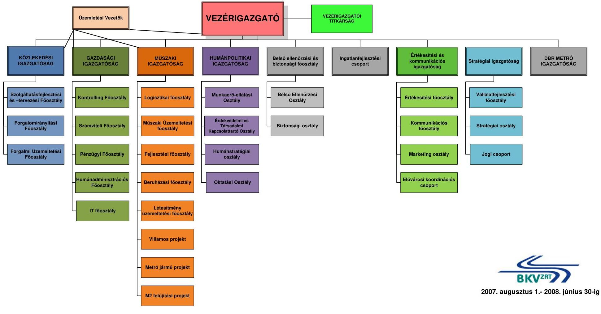

|   |  |  |  |  |  |  |  |  | 2007. augusztus 1.- 2008. június 30-ig  |
| --- | --- | --- | --- | --- | --- | --- | --- | --- | --- |
|  2001. augusztus |  |  |  |  |  |  |  |  |   |
|  2004. augusztus |  |  |  |  |  |  |  |  |   |
|  2002. augusztus |  |  |  |  |  |  |  |  |   |
|  2003. augusztus |  |  |  |  |  |  |  |  |   |
|  2004. augusztus |  |  |  |  |  |  |  |  |   |
|  2005. augusztus |  |  |  |  |  |  |  |  |   |
|  2006. augusztus |  |  |  |  |  |  |  |  |   |
|  2007. augusztus |  |  |  |  |  |  |  |  |   |
|  2008. június 30-ig |  |  |  |  |  |  |  |  |   |
|  2009. augusztus |  |  |  |  |  |  |  |  |   |
|  2010. augusztus |  |  |  |  |  |  |  |  |   |
|  2011. augusztus |  |  |  |  |  |  |  |  |   |
|  2012. augusztus |  |  |  |  |  |  |  |  |   |
|  2013. augusztus |  |  |  |  |  |  |  |  |   |
|  2014. augusztus |  |  |  |  |  |  |  |  |   |
|  2015. augusztus |  |  |  |  |  |  |  |  |   |
|  2016. augusztus |  |  |  |  |  |  |  |  |   |
|  2017. augusztus |  |  |  |  |  |  |  |  |   |
|  2018. augusztus |  |  |  |  |  |  |  |  |   |
|  2019. augusztus |  |  |  |  |  |  |  |  |   |
|  2020. augusztus |  |  |  |  |  |  |  |  |   |
|  2021. augusztus |  |  |  |  |  |  |  |  |   |
|  2022. augusztus |  |  |  |  |  |  |  |  |   |
|  2023. augusztus |  |  |  |  |  |  |  |  |   |
|  2024. augusztus |  |  |  |  |  |  |  |  |   |
|  2025. augusztus |  |  |  |  |  |  |  |  |   |
|  2026. augusztus |  |  |  |  |  |  |  |  |   |
|  2027. augusztus |  |  |  |  |  |  |  |  |   |
|  2028. augusztus |  |  |  |  |  |  |  |  |   |
|  2029. augusztus |  |  |  |  |  |  |  |  |   |
|  2030. augusztus |  |  |  |  |  |  |  |  |   |
|  2031. augusztus |  |  |  |  |  |  |  |  |   |
|  2032. augusztus |  |  |  |  |  |  |  |  |   |
|  2033. augusztus |  |  |  |  |  |  |  |  |   |
|  2034. augusztus |  |  |  |  |  |  |  |  |   |
|  2035. augusztus |  |  |  |  |  |  |  |  |   |
|  2036. augusztus |  |  |  |  |  |  |  |  |   |
|  2037. augusztus |  |  |  |  |  |  |  |  |   |
|  2038. augusztus |  |  |  |  |  |  |  |  |   |
|  2039. augusztus |  |  |  |  |  |  |  |  |   |
|  2040. augusztus |  |  |  |  |  |  |  |  |   |
|  2041. augusztus |  |  |  |  |  |  |  |  |   |
|  2042. augusztus |  |  |  |  |  |  |  |  |   |
|  2043. augusztus |  |  |  |  |  |  |  |  |   |
|  2044. augusztus |  |  |  |  |  |  |  |  |   |
|  2045. programálkozási |  |  |  |  |  |  |  |  |   |
|  2046. programálkozási |  |  |  |  |  |  |  |  |   |
|  2047. programálkozási |  |  |  |  |  |  |  |  |   |
|  2048. programálkozási |  |  |  |  |  |  |  |  |   |
|  2049. programálkozási |  |  |  |  |  |  |  |  |   |
|  2050. programálkozási |  |  |  |  |  |  |  |  |   |
|  2051. programálkozási |  |  |  |  |  |  |  |  |   |
|  2052. programálkozási |  |  |  |  |  |  |  |  |   |
|  2053. programálkozási |  |  |  |  |  |  |  |  |   |
|  2054. programálkozási |  |  |  |  |  |  |  |  |   |
|  2055. programálkozási |  |  |  |  |  |  |  |  |   |
|  2056. programálkozási |  |  |  |  |  |  |  |  |   |
|  2057. programálkozási |  |  |  |  |  |  |  |  |   |
|  2058. programálkozási |  |  |  |  |  |  |  |  |   |
|  2059. programálkozási |  |  |  |  |  |  |  |  |   |
|  2060. programálkozási |  |  |  |  |  |  |  |  |   |
|  2061. programálkozási |  |  |  |  |  |  |  |  |   |
|  2062. programálkozási |  |  |  |  |  |  |  |  |   |
|  2063. programálkozási |  |  |  |  |  |  |  |  |   |
|  2064. programálkozási |  |  |  |  |  |  |  |  |   |
|  2065. programálkozási |  |  |  |  |  |  |  |  |   |
| 2066. programálkozási |  |  |  |  |  |  |  |  |   |
| 2067. programálkozási |  |  |  |  |  |  |  |  |   |
| 2068. programálkozási |  |  |  |  |  |  |  |  |   |
| 2069. programálkozási |  |  |  |  |  |  |  |  |   |
| 2070. programálkozási |  |  |  |  |  |  |  |  |   |
| 2071. programálkozási |  |  |  |  |  |  |  |  |   |
| 2072. programálkozási |  |  |  |  |  |  |  |  |   |
| 2073. programálkozási |  |  |  |  |  |  |  |  |   |
| 2074. programálkozási |  |  |  |  |  |  |  |  |   |
| 2075. programálkozási |  |  |  |  |  |  |  |  |   |
| 2076. programálkozási |  |  |  |  |  |  |  |  |   |
| 2077. programálkozási |  |  |  |  |  |  |  |  |   |
| 2078. programálkozási |  |  |  |  |  |  |  |  |   |
| 2079. programálkozási |  |  |  |  |  |  |  |  |   |
| 2080. programálkozási |  |  |  |  |  |  |  |  |   |
| 2081. programálkozási |  |  |  |  |  |  |  |  |   |
| 2082. programálkozási |  |  |  |  |  |  |  |  |   |
| 2083. programálkozási |  |  |  |  |  |  |  |  |   |
| 2084. programálkozási |  |  |  |  |  |  |  |  |   |
| 2085. programálkozási |  |  |  |  |  |  |  |  |   |
| 2086. programálkozási |  |  |  |  |  |  |  |  |   |
| 2087. programálkozási |  |  |  |  |  |  |  |  |   |
| 2088. programálkozási |  |  |  |  |  |  |  |  |   |
| 2089. programálkozási |  |  |  |  |  |  |  |  |   |
| 2090. programálkozási |  |  |  |  |  |  |  |  |   |
| 2091. programálkozási |  |  |  |  |  |  |  |  |   |
| 2092. programálkozási |  |  |  |  |  |  |  |  |   |
| 2093. programálkozási |  |  |  |  |  |  |  |  |   |
| 2094. programálkozási |  |  |  |  |  |  |  |  |   |
| 2095. programálkozási |  |  |  |  |  |  |  |  |   |
| 2096. programálkozási |  |  |  |  |  |  |  |  |   |
| 2097. programálkozási |  |  |  |  |  |  |  |  |   |
| 2098. programálkozási |  |  |  |  |  |  |  |  |   |
| 2099. programálkozási |  |  |  |  |  |  |  |  |   |
| 2100. programálkozási |  |  |  |  |  |  |  |  |   |
| 2101. programálkozási |  |  |  |  |  |  |  |  |   |
| 2102. programálkozási |  |  |  |  |  |  |  |  |   |
| 2103. programálkozási |  |  |  |  |  |  |  |  |   |
| 2104. programálkozási |  |  |  |  |  |  |  |  |   |
| 2105. programálkozási |  |  |  |  |  |  |  |  |   |
| 2106. programálkozási |  |  |  |  |  |  |  |  |   |
| 2107. programálkozási |  |  |  |  |  |  |  |  |   |
| 2108. programálkozási |  |  |  |  |  |  |  |  |   |
| 2109. programálkozási |  |  |  |  |  |  |  |  |   |
| 2110. programálkozási |  |  |  |  |  |  |  |  |   |
| 2111. programálkozási |  |  |  |  |  |  |  |  |   |
| 2112. programálkozási |  |  |  |  |  |  |  |  |   |
| 2113. programálkozási |  |  |  |  |  |  |  |  |   |
| 2114. programálkozási |  |  |  |  |  |  |  |  |   |
| 2115. programálkozási |  |  |  |  |  |  |  |  |   |
| 2116. programálkozási |  |  |  |  |  |  |  |  |   |
| 2117. programálkozási |  |  |  |  |  |  |  |  |   |
| 2118. programálkozási |  |  |  |  |  |  |  |  |   |
| 2119. programálkozási |  |  |  |  |  |  |  |  |   |
| 2120. programálkozási |  |  |  |  |  |  |  |  |   |
| 2121. programálkozási |  |  |  |  |  |  |  |  |   |
| 2122. programálkozási |  |  |  |  |  |  |  |  |   |
| 2123. programálkozási |  |  |  |  |  |  |  |  |   |
| 2124. programálkozási |  |  |  |  |  |  |  |  |   |
| 2125. programálkozási |  |  |  |  |  |  |  |  |   |
| 2126. programálkozási |  |  |  |  |  |  |  |  |   |
| 2127. programálkozási |  |  |  |  |  |  |  |  |   |
| 2128. programálkozási |  |  |  |  |  |  |  |  |   |
| 2129. programálkozási |  |  |  |  |  |  |  |  |   |
| 2130. programálkozási |  |  |  |  |  |  |  |  |   |
| 2131. programálkozási |  |  |  |  |  |  |  |  |   |
| 2132. programálkozási |  |  |  |  |  |  |  |  |   |
| 2133. programálkozási |  |  |  |  |  |  |  |  |   |
| 2134. programálkozási |  |  |  |  |  |  |  |  |   |
| 2135. programálkozási |  | |  |  |  |  |  |  |   |
| 2136. program alkalmazási |  |  |  |  |  |  |  |  |   |
| 2137. program alkalmazási |  |  |  |  |  |  |  |  |   |
| 2138. program alkalmazási |  |  |  |  |  |  |  |  |   |
| 2139. program alkalmazási |  |  |  |  |  |  |  |  |   |
| 2140. program alkalmazási |  |  |  |  |  |  |  |  |   |
| 2141. program alkalmazási |  |  |  |  |  |  |  |  |   |
| 2142. program alkalmazási |  |  |  |  |  |  |  |  |   |
| 2143. program alkalmazási |  |  |  |  |  |  |  |  |   |
| 2144. program alkalmazási |  |  |  |  |  |  |  |  |   |
| 2145. program alkalmazási |  |  |  |  |  |  |  |  |   |
| 2146. program alkalmazási |  |  |  |  |  |  |  |  |   |
| 2147. program alkalmazási |  |  |  |  |  |  |  |  |   |
| 2148. program alkalmazási |  |  |  |  |  |  |  |  |   |
| 2149. program alkalmazási |  |  |  |  |  |  |  |  |   |
| 21410. program alkalmazási |  |  |  |  |  |  |  |  |   |
| 21411. program alkalmazási |  |  |  |  |  |  |  |  |   |
| 2142. program alkalmazási |  |  |  |  |  |  |  |  |   |
| 2143. program alkalmazási |  |  |  |  |  |  |  |  |   |
| 2144. program alkalmazási |  |  |  |  |  |  |  |  |   |
| 2145. program alkalmazási |  |  |  |  |  |  |  |  |   |
| 2146. program alkalmazási |  |  |  |  |  |  |  |  |   |
| 2147. program alkalmazási |  |  |  |  |  |  |  |  |   |
| 2148. program alkalmazási |  |  |  |  |  |  |  |  |   |
| 2149. program alkalmazási |  |  |  |  |  |  |  |  |   |
| 21412. program alkalmazási |  |  |  |  |  |  |  |  |   |
| 21413. program alkalmazási |  |  |  |  |  |  |  |  |   |
| 21414. program alkalmazási |  |  |  |  |  |  |  |  |   |
| 21415. program alkalmazási |  |  |  |  |  |  |  |  |   |
| 21416. program alkalmazási |  |  |  |  |  |  |  |  |   |
| 21417. program alkalmazási |  |  |  |  |  |  |  |  |   |
| 21418. program alkalmazási |  |  |  |  |  |  |  |  |   |
| 21419. program alkalmazási |  |  |  |  |  |  |  |  |   |
| 2142. program alkalmazási |  |  |  |  |  |  |  |  |   |
| 2143. program alkalmazási |  |  |  |  |  |  |  |  |   |
| 2144. program alkalmazási |  |  |  |  |  |  |  |  |   |
| 2145. program alkalmazási |  |  |  |  |  |  |  |  |   |
| 2146. program alkalmazási |  |  |  |  |  |  |  |  |   |
| 2147. program alkalmazási |  |  |  |  |  |  |  |  |   |
| 2148. program alkalmazási |  |  |  |  |  |  |  |  |   |
| 2149. program alkalmazási |  |  |  |  |  |  |  |  |   |
| 21410. program alkalmazási |  |  |  |  |  |  |  |  |   |
| 21411. program alkalmazási |  |  |  |  |  |  |  |  |   |
| 21412. program alkalmazási |  |  |  |  |  |  |  |  |   |
| 21413. program alkalmazási |  |  |  |  |  |  |  |  |   |
| 21414. program alkalmazási |  |  |  |  |  |  |  |  |   |
| 21415. program alkalmazási |  |  |  |  |  |  |  |  |   |
| 21416. program alkalmazási |  |  |  |  |  |  |  |  |   |
| 21417. program alkalmazási |  |  |  |  |  |  |  |  |   |
| 21418. program alkalmazási |  |  |  |  |  |  |  |  |   |
| 21419. program alkalmazási |  |  |  |  |  |  |  |  |   |
| 2142. program alkalmazási |  |  |  |  |  |  |  |  |   |
| 2143. program alkalmazási |  |  |  |  |  |  |  |  |   |
| 2144. program alkalmazási |  |  |  |  |  |  |  |  |   |
| 2145. program alkalmazási |  |  |  |  |  |  |  |  |   |
| 2146. program alkalmazási |  |  |  |  |  |  |  |  |   |
| 2147. program alkalmazási |  |  |  |  |  |  |  |  |   |
| 21410. program alkalmazási |  |  |  |  |  |  |  |  |   |
| 21411. program alkalmazási |  |  |  |  |  |  |  |  |   |
| 21412. program alkalmazási |  |  |  |  |  |  |  |  |   |
| 21413. program alkalmazási |  |  |  |  |  |  |  |  |   |
| 21414. program alkalmazási |  |  |  |  |  |  |  |  |   |
| 21415. program alkalmazási |  |  |  |  |  |  |  |  |   |
| 21416. program alkalmazási |  |  |  |  |  |  |  |  |   |
| 21417. program alkalmazási |  |  |  |  |  |  |  |  |   |
| 21418. program alkalmazási |  |  |  |  |  |  |  |  |   |
| 21419. program alkalmazási |  |  |  |  |  |  |  |  |   |
| 2142. program alkalmazási |  |  |  |  |  |  |  |  |   |
| 2143. program alkalmazási |  |  |  |  |  |  |  |  |   |
| 21410. program alkalmazási |  |  |  |  |  |  |  |
 |   |
|  21411. programalkalmazási |  |  |  |  |  |  |  |  |   |
|  21412. programalkalmazási |  |  |  |  |  |  |  |  |   |
|  21413. programalkalmazási |  |  |  |  |  |  |  |  |   |
|  21414. programalkalmazási |  |  |  |  |  |  |  |  |   |
|  21415. programalkalmazási |  |  |  |  |  |  |  |  |   |
|  21416. programalkalmazási |  |  |  |  |  |  |  |  |   |
|  21417. programalkalmazási |  |  |  |  |  |  |  |  |   |
|  21418. programalkalmazási |  |  |  |  |  |  |  |  |   |
|  21419. programalkalmazási |  |  |  |  |  |  |  |  |   |
|  2142. programalkalmazási |  |  |  |  |  |  |  |  |   |
|  21411. programalkalmazási |  |  |  |  |  |  |  |  |   |
|  21412. programalkalmazási |  |  |  |  |  |  |  |  |   |
|  21413. programalkalmazási |  |  |  |  |  |  |  |  |   |
|  21414. programalkalmazási |  |  |  |  |  |  |  |  |   |
|  21415. programalkalmazási |  |  |  |  |  |  |  |  |   |
|  21416. programalkalmazási |  |  |  |  |  |  |  |  |   |
|  21417. programalkalmazási |  |  |  |  |  |  |  |  |   |
|  21418. programalkalmazási |  |  |  |  |  |  |  |  |   |
|  21419. programalkalmazási |  |  |  |  |  |  |  |  |   |
|  2142. programalkalmazási |  |  |  |  |  |  |  |  |   |
|  2143. programalkalmazási |  |  |  |  |  |  |  |  |   |
|  21411. programalkalmazási |  |  |  |  |  |  |  |  |   |
|  21412. programalkalmazási |  |  |  |  |  |  |  |  |   |
|  21413. programalkalmazási |  |  |  |  |  |  |  |  |   |
|  21414. programalkalmazási |  |  |  |  |  |  |  |  |   |
|  21415. programalkalmazási |  |  |  |  |  |  |  |  |   |
|  21416. programalkalmazási |  |  |  |  |  |  |  |  |   |
|  21417. programalkalmazási |  |  |  |  |  |  |  |  |   |
|  21418. programalkalmazási |  |  |  |  |  |  |  |  |   |
|  21419. programalkalmazási |  |  |  |  |  |  |  |  |   |
|  2142. programalkalmazási |  |  |  |  |  |  |  |  |   |
|  21411. programalkalmazási |  |  |  |  |  |  |  |  |   |
|  21412. programalkalmazási |  |  |  |  |  |  |  |  |   |
|  21413. programalkalmazási |  |  |  |  |  |  |  |  |   |
|  21414. programalkalmazási |  |  |  |  |  |  |  |  |   |
|  21415. programalkalmazási |  |  |  |  |  |  |  |  |   |
|  21416. programalkalmazási |  |  |  |  |  |  |  |  |   |
|  21417. programalkalmazási |  |  |  |  |  |  |  |  |   |
|  21418. programalkalmazási |  |  |  |  |  |  |  |  |   |
|  21419. programalkalmazási |  |  |  |  |  |  |  |  |   |
|  2142. programalkalmazási |  |  |  |  |  |  |  |  |   |
|  21411. programalkalmazási |  |  |  |  |  |  |  |  |   |
|  21412. programalkalmazási |  |  |  |  |  |  |  |  |   |
|  21413. programalkalmazási |  |  |  |  |  |  |  |  |   |
|  21414. programalkalmazási |  |  |  |  |  |  |  |  |   |
|  21415. programalkalmazási |  |  |  |  |  |  |  |  |   |
|  21416. programalkalmazási |  |  |  |  |  |  |  |  |   |
|  21417. programalkalmazási |  |  |  |  |  |  |  |  |   |
|  21418. programalkalmazási |  |  |  |  |  |  |  |  |   |
|  21419. programalkalmazási |  |  |  |  |  |  |  |  |   |
|  2142. programalkalmazási |  |  |  |  |  |  |  |  |   |
|  21411. programalkalmazási |  |  |  |  |  |  |  |  |   |
|  21412. programalkalmazási |  |  |  |  |  |  |  |  |   |
|  21413. programalkalmazási |  |  |  |  |  |  |  |  |   |
|  21414. programalkalmazási |  |  |  |  |  |  |  |  |   |
|  21415. programalkalmazási |  |  |  |  |  |  |  |  |   |
|  21416. programalkalmazási |  |  |  |  |  |  |  |  |   |
|  21417. programalkalmazási |  |  |  |  |  |  |  |  |   |
|  21418. programalkalmazási |  |  |  |  |  |  |  |  |   |
|  21411. programalkalmazási |  |  |  |  |  |  |  |  |   |
|  21411. programalkalmazási |  |  |  |  |  |  |  |  |   |
|  21412. programalkalmazási |  |  |  |  |  |  |  |  |   |
|  21413. programalkalmazási |  |  |  |  |  |  |  |  |   |
|  21414. programalkalmazási |  |  |  |  |  |  |  |  |   |
|  21414. programalkalmazási |  |  |  |  |  |  |  |  |   |
|  21415. programalkalmazási |  |  |  |  |  |  |  |  |   |
|  21416. programalkalmazási |  |  |  |  |  |  |  |  |   |
|  21417. programalkalmazási |  |  |  |  |  |  |  |  |   |
|  21417. programalkalmazási |  |  |  |  |  |  |  |  |   |
|  21418. programalkalmazási |  |  |
 |  |  |  |  |  |   |
|  21411. programálkozási |  |  |  |  |  |  |  |  |   |
|  21411. programálkozási |  |  |  |  |  |  |  |  |   |
|  21411. programálkozási |  |  |  |  |  |  |  |  |   |
|  21411. programálkozási |  |  |  |  |  |  |  |  |   |
|  21411. programálkozási |  |  |  |  |  |  |  |  |   |
|  21412. programálkozási |  |  |  |  |  |  |  |  |   |
|  21412. programálkozási |  |  |  |  |  |  |  |  |   |
|  21413. programálkozási |  |  |  |  |  |  |  |  |   |
|  21413. programálkozási |  |  |  |  |  |  |  |  |   |
|  21414. programálkozási |  |  |  |  |  |  |  |  |   |
|  21414. programálkozási |  |  |  |  |  |  |  |  |   |
|  21414. programálkozási |  |  |  |  |  |  |  |  |   |
|  21414. programálkozási |  |  |  |  |  |  |  |  |   |
|  21414. programálkozási |  |  |  |  |  |  |  |   |
|  21415. programálkozási |  |  |  |  |  |  |  |   |
|  21415. programálkozási |  |  |  |  |  |  |  |   |
|  21416. programálkozási |  |  |  |  |  |  |  |   |
|  21416. programálkozási |  |  |  |  |  |  |  |   |
|  21417. programálkozási |  |  |  |  |  |  |  |   |
|  21417. programálkozási |  |  |  |  |  |  |  |   |
|  21417. programálkozási |  |  |  |  |  |  |  |   |
|  21418. programálkozási |  |  |  |  |  |  |  |   |
|  21418. programálkozási |  |  |  |  |  |  |  |   |
|  21419. programálkozási |  |  |  |  |  |  |  |   |
|  21419. programálkozási |  |  |  |  |  |  |  |   |
|  21419. programálkozási |  |  |  |  |  |  |  |   |
|  21419. programálkozási |  |  |  |  |  |  |   |
|  21419. programálkozási |  |  |  |  |  |  |   |
|  21419. programálkozási |  |  |  |  |  |  |   |
|  21419. programálkozási |  |  |  |  |  |  |   |
|  21419. programálkozási |  |  |  |  |  |   |
|  21419. programálkozási |  |  |  |  |  |  |   |
|  21419. programálkozási |  |  |  |  |  |   |
|  21419. programálkozási |  |  |  |  |  |   |
|  21419. programálkozási |  |  |  |  |  |   |
|  21419. programálkozási |  |  |  |  |  |   |
|  21419. programálkozási |  |  |  |  |  |   |
|  21419. programálkozási |  |  |  |  |  |   |
|  21419. programálkozási |  |  |  |  |  |   |
|  21419. programálkozási |  |  |  |  |  |   |
|  21419. programálkozási |  |  |  |  |  |   |
|  21419. programálkozási |  |  |  |  |  |   |
|  21419. programálkozási |  |  |  |  |  |   |
|  21419. programálkozási |  |  |  |  |  |   |
|  21419. programálkozási |  |  |  |  |  |   |
|  21419. programálkozási |  |  |  |  |  |   |
|  21419. programálkozási |  |  |  |  |  |   |
|  21419. programálkozási |  |  |  |  |  |   |
|  21419. programálkozási |  |  |  |  |  |   |
|  21419. programálkozási |  |  |  |  |  |   |
|  21419. programálkozási |  |  |  |  |  |   |
|  21419. programálkozási |  |  |  |  |  |   |
|  21419. programálkozási |  |  |  |  |  |   |
|  21419. programálkozási |  |  |  |  |  |   |
|  21419. programálkozási |  |  |  |  |  |   |
|  21419. programálkozási |  |  |  |  |  |   |
|  21419. programálkozási |  |  |  |  |  |   |
|  21419. programálkozási |  |  |  |  |  |   |
|  21419. programálkozási |  |  |  |  |  |   |
|  21419. programálkozási |  |  |  |  |  |   |
|  21419. programálkozási |  |  |  |  |  |   |
|  21419. programálkozási |  |  |  |  |  |   |

---

4/c. számú melléklet a V-3007/2011. sz. jelentéshez

|  |   |   |   |   |   |   |   |   |   |   |   |   |   |   |   |   |   |   |   |   |   |   |   |   |   |   |   |   |   |   |   |   |   |   |   |   |   |   |   |   |   |   |   |   |   |   |   |   |   |   |   |   |   |   |   |   |   |   |   |   |   |   |   |   |   |   |   |   |   |   |   |   |   |   |   |   |   |   |   |   |   |   |   |   |   |   |   |   |   |   |   |   |   |   |   |   |   |   |   |   |

---

4/d. számú melléklet a V-3007/2011. sz. jelentéshez

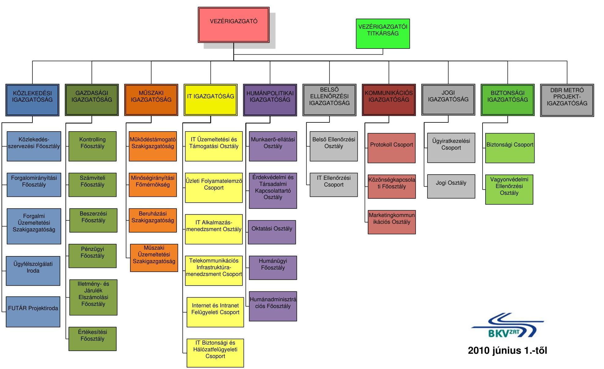

|  |   |   |   |   |   |   |   |   |   |   |   |   |   |   |   |   |   |   |   |   |   |   |   |   |   |   |   |   |   |   |   |   |   |   |   |   |   |   |   |   |   |   |   |   |   |   |   |   |   |   |   |   |   |   |   |   |   |   |   |   |   |   |   |   |   |   |   |   |   |   |   |   |   |   |   |   |   |   |   |   |   |   |   |   |   |   |   |   |   |   |   |   |   |   |   |   |   |   |   |   |

---

|   | 2004 | 2005 | 2006 | 2007 | 2008 | 2009 | 2010  |
| --- | --- | --- | --- | --- | --- | --- | --- |
| Ev |  |  |  |  | 4 | 10 |   |
| Ev/A |  |  |  |  | 20 | 5 | 5  |
| Ev3 |  |  |  |  |  | 7 | 6  |
| 81-es |  |  |  | 6 |  |  |   |

A 2008. évtől elmaradt felújítások a várható új jármű beszerzés miatt kidolgozott kifuttatási terv következményei. Ezen elmaradt javítások csak egyszer - az első aktualitás évében - szerepelnek a táblázatban. Az elmaradt felújítások az új járművek beérkez

# villamos

|   | 2004 | 2005 | 2006 | 2007 | 2008 | 2009 | 2010  |
| --- | --- | --- | --- | --- | --- | --- | --- |
| TW6000 | 0 | 0 | 5 | 21 | 19 | 20 | 8  |
| ICS-KCSV | 8 | 22 | 4 | 9 | 6 | 10 | 11  |
| T5CS | 0 | 6 | 7 | 46 | 28 | 17 | 6  |
| T5CSK | 43 | 0 | 0 | 0 | 0 | 0 | 5  |
| Sikló | 0 | 0 | 0 | 0 | 2 | 0 | 0  |
| Fogas | 0 | 0 | 0 | 0 | 0 | 2 | 0  |
| Libegő | 0 | 0 | 0 | 0 | 0 | 0 | 0  |

## villamos

|   | 2004 | 2005 | 2006 | 2007 | 2008 | 2009 | 2010  |
| --- | --- | --- | --- | --- | --- | --- | --- |
| TW6000 | 0 | 0 | 5 | 21 | 19 | 20 | 8  |
| ICS-KCSV | 8 | 22 | 4 | 9 | 6 | 10 | 11  |
| T5CS | -2 | 6 | 7 | 46 | 28 | 17 | 6  |
| T5CSK | 43 | 0 | 0 | 0 | 0 | 0 | 5  |
| Sikló | 0 | 0 | 0 | 0 | 2 | -2 | 0  |
| Fogas | -1 | 0 | 0 | 0 | 0 | 2 | 0  |
| Libegő | 0 | 0 | 0 | 0 | 0 | 0 | -1  |

---

# Vasúti járművek elmaradt felújításai

1.  sz. melléklet a V-3007/2011. számú jelentéshez

| Javítási nem | Típus | 2004 |  | 2005 |  | 2006 |  | 2007 |  | 2008 |  | 2009 |  | 2010 |   |
| --- | --- | --- | --- | --- | --- | --- | --- | --- | --- | --- | --- | --- | --- | --- | --- |
|   |  | tény db | tény db | tény db | tény db | tény db | tény db | tény db | tény db | tény db | tény db | tény db | tény db | tény db | tény db  |
| J1 | TW6000 |  |  |  |  |  | 5 |  | 21 | 1 | 20 |  | 20 | 7 | 15  |
| J2 | ICS-KCSV | 16 | 17 | 8 | 17 | 3 | 11 | 5 | 9 |  | 7 | 6 | 8 |  | 6  |
| J1 | ICS-KCSV | 17 | 24 | 16 | 29 | 23 | 19 | 13 | 18 | 12 | 11 | 3 | 11 | 3 | 8  |
| J2 | T5C5 | 7 | 13 | 10 | 3 | 6 | 8 | 4 | 3 | 2 | 8 | 8 | 10 |  | 9  |
| J1 | T5C5 | 40 | 32 | 26 | 39 | 30 | 35 | 33 | 80 | 41 | 63 | 33 | 48 | 5 | 2  |
| J1 | T5C5K |  | 43 |  |  |  |  |  |  |  |  |  |  | 34 | 39  |
| J2 | T5C5 tanuló |  |  |  |  |  |  |  |  | 2 | 2 |  |  |  |   |
| J1 | Sikló |  |  | 1 | 1 |  |  |  |  |  | 2 | 2 |  |  |   |
| J1 | Fogas | 3 | 2 | 2 | 2 | 2 | 2 | 2 | 2 | 2 | 2 |  | 2 | 2 | 2  |
|   | Libegő |  |  |  |  | 1 | 1 |  |  |  |  |  |  | 1 |   |
| összesen : |  | 83 | 131 | 63 | 91 | 65 | 81 | 57 | 133 | 60 | 115 | 52 | 99 | 52 | 81  |

---

# Elmaradt járműjavítások

1.  számú melléklet a 3007/2011 számú jelentéshez

## Villamos

|   | $\mathbf{2 0 0 4}$ | $\mathbf{2 0 0 5}$ | $\mathbf{2 0 0 6}$ | $\mathbf{2 0 0 7}$ | $\mathbf{2 0 0 8}$ | $\mathbf{2 0 0 9}$ | $\mathbf{2 0 1 0}$  |
| --- | --- | --- | --- | --- | --- | --- | --- |
| TW6000 | 0 | 0 | 5 | 21 | 20 | 20 | 13  |
| ICS-KCSV | 8 | 22 | 4 | 9 | 6 | 10 | 11  |
| T5C5 | 0 | 6 | 7 | 46 | 28 | 17 | 6  |
| T5C5K | 43 | 0 | 0 | 0 | 0 | 0 | 5  |
| Sikló | 0 | 0 | 0 | 0 | 2 | 0 | 0  |
| Fogas | 0 | 0 | 0 | 0 | 0 | 2 | 0  |
| Libegő | 0 | 0 | 0 | 0 | 0 | 0 | 0  |
| Összesen | $\mathbf{5 1}$ | $\mathbf{2 8}$ | $\mathbf{1 6}$ | $\mathbf{7 6}$ | $\mathbf{5 6}$ | $\mathbf{4 9}$ | $\mathbf{3 5}$  |

## Metró

A felújítási tilalom alá nem eső metró kocsik

|   | 2004 | 2005 | 2006 | 2007 | 2008 | 2009 | 2010  |
| --- | --- | --- | --- | --- | --- | --- | --- |
| Ev |  |  |  |  |  |  |   |
| Ev/A |  |  |  |  |  |  |   |
| Ev3 |  | 4 | 4 | 8 | 4 |  |   |
| 81-es | 2 | 10 | 27 | 19 | 13 |  |   |
| MFAV |  |  |  |  | 1 |  | 1  |
| Összesen | $\mathbf{2}$ | $\mathbf{1 4}$ | $\mathbf{3 1}$ | $\mathbf{2 7}$ | $\mathbf{1 8}$ |  | $\mathbf{1}$  |

A járműfelújítási tilalom miatti elmaradások

|   | 2006 | 2007 | 2008 | 2009 | 2010  |
| --- | --- | --- | --- | --- | --- |
| Ev |  | 7 | 10 | 2 |   |
| Ev/A | 5 | 15 | 20 | 5 |   |
| Ev3 | 1 |  | 8 | 5 | 4  |
| Az adott évben | $\mathbf{6}$ | $\mathbf{22}$ | $\mathbf{38}$ | $\mathbf{12}$ | $\mathbf{4}$  |
| Göngyölve | $\mathbf{6}$ | $\mathbf{28}$ | $\mathbf{66}$ | $\mathbf{7 8}$ | $\mathbf{8 2}$  |

---

Járatkiszervezés alvállalkozói költségei 7. számú melléklet a V3007/2011. sz. jelentéshez

|  Szerződéses ütem | Szerződő partner a szolgáltatás kezdetekor | Szolgáltatás kezdete | Kkm díj a szolgáltatás kezdetekor | Járműtípus a szolgáltatás kezdetekor | A szerződéshez tartozó viszonylatok a szolgáltatás kezdetekor | Szerződő partner 2011. májusban | Szerződés lejárata | Kkm díj 2011. májusban | Járműtípus 2011. májusban | A szerződéshez tartozó viszonylatok a 2011.  |
| --- | --- | --- | --- | --- | --- | --- | --- | --- | --- | --- |
|  I/B. | $\begin{gathered} \text { VT-Transman Kft. } \ \text { Videoton } \ \text { Holding Zrt. } \end{gathered}$ | 2004.11.01 | 288 Ft | IK 263 | 41, 87, 87A | $\begin{gathered} \text { VT-Transman Kft. } \ \text { Videoton Holding } \ \text { Zrt. } \end{gathered}$ | 2012.04.30 | 543 Ft* | VOLVO Localo | $\begin{gathered} 22,222,29,87, \ 87 \mathrm{~A}, 187,250, \ 250 \mathrm{~A}, 150,152 \end{gathered}$  |
|  II/B. | VT-Transman Kft. | 2007.01.01 | 420 Ft | MAN SL 223 | 14, 50, 58, 114, 150 | VT-Transman Kft. | 2012.04.30 | 555 Ft* | VOLVO Localo | $\begin{gathered} 11,111,40, \ 57,257,71,179, \ 105,114,141, \ 150,152,212, \ 213,214 \end{gathered}$  |
|  II/B. kiegészítő (10 M.A.N.) megállapodás | VT-Transman Kft. | 2007.09.01 | 445 Ft | MAN SL 223 | 2 V | VT-Transman Kft. | 2012.04.30 | 470 Ft* | MAN SL 223 | 114, 213, 214  |
|  II/B.-e.) rész | VT-Transman Kft. | 2007.01.01 | 294 Ft | IK 263 | 87, 87A | VT-Transman Kft. | 2012.04.30 | 328 Ft* | MAN SL 223 | $\begin{gathered} 40,87,87 \mathrm{~A}, 187, \ 141,150,250, \ 250 \mathrm{~A} \end{gathered}$  |
|  I/B. Észak-Pest | NÓGRÁD VOLÁN Zrt.
Alfa Busz Kft. | 2005.06.01 | 398 Ft | VOLVO Localo | 120, 147, 170 | Nógrád Volán Zrt. | 2013.06.30 | 506 Ft | VOLVO Localo | $\begin{gathered} 25,118,120,126, \ 126 \mathrm{~A}, 134,134 \mathrm{~A}, \ 170,220,224 \end{gathered}$  |
|  II/B.-b.) rész | NÓGRÁD VOLÁN Zrt.
Alfa Busz Kft. | 2007.04.01 | 470 Ft | VOLVO Localo | 30 | Nógrád Volán Zrt. | 2012.04.30 | 561 Ft | VOLVO Localo | $\begin{gathered} 5,30 \mathrm{~A}, 96,296, \ 104,104 \mathrm{~A}, 204, \ 133 \end{gathered}$  |
|   | Volánbusz Zrt. | 2006.09.01 | $\begin{gathered} 304 \mathrm{Ft} \ \text { (+havonta } \ 1.116 .940 \mathrm{ft} \ \text { rendelkezésre } \ \text { állási díj) } \end{gathered}$ | MB Citaro | 88 | Volánbusz Zrt. | határozatlan | $\begin{gathered} 407 \mathrm{Ft} \ \text { (+havonta } \ 1.497 .192 \mathrm{ft} \ \text { rendelkezésre } \ \text { állási díj) } \end{gathered}$ | MB Citaro | 88  |

- : A 2011. évi díjakkal kapcsolatos ártárgyalás folyamatban van, ezek a díjak még változhatnak

---

BKV Zrt.

B/a. számú melléklet a V-3007/2011. számú jelentéshez

## TANÚSÍTVÁNY

A BKV adósságállományának alakulása 2002-2010. évek között

A táblázat nem tartalmazza a DBR METRÓ és a leányvállalatok adatait

|  Megnevezés | 2002 | 2003 | 2004 | 2005 | 2006 | 2007 | 2008 | 2009 | 2010  |
| --- | --- | --- | --- | --- | --- | --- | --- | --- | --- |
|  Rövidlejáratú banki hitelek | 6 207 | 4 249 | 9 648 | 8 912 | 13 436 | 14 285 | 4 173 | 15 639 | 11 320  |
|  Közép-és hosszúlejáratú banki hitelek | 0 | 12 000 | 34 200 | 52 285 | 49 114 | 52 837 | 56 720 | 57 890 | 52 490  |
|  Környezetvédelmi Alap célelőir. kölcsön | 0 | 293 | 335 | 327 | 202 | 64 | 22 | 0 | 0  |
|  Pénzügyi lízing állomány | 0 | 0 | 0 | 3 542 | 6 502 | 6 558 | 5 749 | 4 948 | 4 147  |
|  Lejárt szállítói állomány | 0 | 319 | 2 889 | 276 | 276 | 10 | 151 | 10 | 0  |
|  Faktorált szállítói állomány | 0 | 0 | 0 | 0 | 0 | 4 | 1 356 | 50 | 3 998  |
|  Akkreditív | 0 | 0 | 0 | 0 | 0 | 0 | 0 | 0 | 88  |
|  Bankgarancia állomány | 4 059 | 3 086 | 2 813 | 2 591 | 2 088 | 1 895 | 1 562 | 745 | 745  |
|  Település értékvéd. Tám. | 0 | 0 | 0 | 26 | 0 | 0 | 0 | 0 | 0  |
|  Összesen: | 10 266 | 19 927 | 49 885 | 65 959 | 71 618 | 75 653 | 69 733 | 79 282 | 72 788  |

Budapesti Közlekedési Zártkörűen Működő Részvénytársaság

Kiállítás időpontja: 2011.05.30.

P.H.

a közszolgáltató képviseletében

Bollo Tibor

Gazdasági vezérigazgató-helyettes

Zákosa Erzsébet

Pénzügyi főosztályvezető

---

B/b. számú melléklet a V-3007/2011. számú jelentéshez

## TANÚSÍTVÁNY

A Szolgáltatási eszközök szerinti teljesítmény-elvárások alakulása 2005-2010. évvel közzét

|  Megnevezés | Járműgyű | 2005. | 2006. | 2007. | 2008. | 2009. | 2010.  |
| --- | --- | --- | --- | --- | --- | --- | --- |
|   |  | terv | tény | terv | tény | terv | tény  |
|  Férőhelykilométer (millió főkm) | villamos | 4 498 | 4 490 | 4 407 | 4 342 | 4 345 | 4 208  |
|   | metró | 605 | 654 | 644 | 637 | 637 | 640  |
|   | trolibusz | 8 072 | 8 079 | 8 192 | 8 183 | 8 300 | 8 416  |
|   | HÉV | 2 698 | 2 665 | 2 753 | 2 741 | 2 731 | 2 721  |
|   | autóbusz | 5 195 | 5 183 | 5 140 | 5 139 | 5 072 | 5 089  |
|   | MFAV | 227 | 228 | 227 | 227 | 229 | 229  |
|  Mindösszesen |  | 21 301 | 21 306 | 21 363 | 21 249 | 21 214 | 21 308  |

Férőhelyszámítás mértéke: általánosan 5 fő/időszaki négyzetméter.

Nyilatkozat: A tanúsítványban szereplő adatok valódiságát igazolom.

Kiállítás időpontja: 2011. május hó.

Budapesti Közlekedési Zártkörűen Működő Részvénytársaság

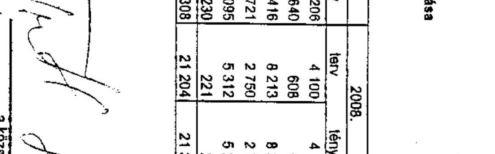

Tiszler László M. Konkrétnyomó főosztályvezető

Dr. Késmárki Gábor Pénzügyi Főosztályvezető

---

# B/c. számú melléklet a V-3007/2011. számú jelentéshez

BKV Zrt

## TANÚSÍTVÁNY

A Szolgáltatás: szerződés szerinti minőségű követelményeinek alakulása 2005-2010. évek között

|  Megnevezés | Járműnemek | 2005. | 2006. | 2007. | 2008. | 2009. | 2010.  |
| --- | --- | --- | --- | --- | --- | --- | --- |
|  Előírt indulások száma (db) |  | 2 536 156 | 2 587 028 | 2 696 085 | 2 586 238 | 2 755 399 | 2 734 768  |
|   | villamos | 1 339 768 | 1 351 211 | 1 331 422 | 1 291 396 | 1 185 748 | 1 205 264  |
|   | trolibusz | 10 738 016 | 10 932 171 | 11 186 934 | 9 999 828 | 9 440 705 | 9 450 864  |
|   | metró | 271 372 | 272 110 | 271 650 | 274 109 | 275 787 | 278 513  |
|   | autóbusz | 675 505 | 649 406 | 643 450 | 651 160 | 639 727 | 637 293  |
|  Mindösszesen |  | 15 560 819 | 15 792 926 | 16 129 541 | 14 802 731 | 14 297 366 | 14 306 702  |
|  Kimaradt indulások száma (db) |  | 16 217 | 22 027 | 19 429 | 29 668 | 16 387 | 63 906  |
|   | villamos | 34 485 | 40 856 | 39 053 | 36 335 | 31 867 | 39 130  |
|   | trolibusz | 191 965 | 229 930 | 191 591 | 284 642 | 216 058 | 411 327  |
|   | metró | 981 | 190 | 150 | 1 606 | 433 | 1 443  |
|   | autóbusz | 577 | 906 | 486 | 5 169 | 668 | 959  |
|  Mindösszesen |  | 243 342 | 293 909 | 241 709 | 357 420 | 265 413 | 516 765  |
|  Elháríthatatlanul kimaradt indulások száma (db) |  | Az elháríthatatlan kimaradt indulások számára vonatkozóan Társaságunknak nem áll rendelkezésére kellő részletezettségű nyilvántartása, így minden egyes kimaradt indulásnál az elháríthatatlant véve a BKV Zrt. szempontjából a legkedvezőtlenebb lehetőséget vettük figyelembe. |  |  |  |  |   |
|  Mindösszesen |  | 0 | 0 | 0 | 0 | 0 | 0  |
|  Pontatlan indulások száma (db) |  | 67 790 | 69 799 | 60 219 | 61 489 | 49 003 | 61 507 |
| | | 63 415 | 90 942 | 42 808 | 40 529 | 39 368 | 34 641 |
| | | 303 558 | 303 843 | 312 631 | 321 775 | 288 124 | 299 436 |
| | | 171 | 396 | 409 | 534 | 543 | 576 |
| | | 1 929 | 441 | 635 | 759 | 875 | 872 |
| Mindeközesen | | 435 315 | 464 521 | 408 796 | 413 696 | 347 933 | 397 035 |
| Elháríthatatlanul pontatlan indulások száma (db) | | Az elháríthatatlan pontatlan indulások számára vonatkozóan Társaságunknak nem áll rendelkezésére kellő kódlatszámlatú nyilvántartása, így minden egyes pontatlan indulást elháríthatatlannak véve a BKV Zrt. szempontjából a legkedvezőtlenebb lehetőséget vettük alapul. | | | | | |
| Mindeközesen | | 0 | 0 | 0 | 0 | 0 | 0 |
| Balasetek száma (db) | | 366 | 365 | 428 | 371 | 398 | 435 |
| | | 260 | 264 | 224 | 249 | 188 | 212 |
| | | 144 | 1 701 | 1 742 | 1 596 | 1 070 | 1 462 |
| | | 14 | 15 | 15 | 16 | 17 | 19 |
| | | 0 | 0 | 0 | 0 | 0 | 0 |
| Mindeközesen | | 2 315 | 2 420 | 2 407 | 2 226 | 2 171 | 2 127 |
| Saját hibás balasetek száma (db) | | 65 | 57 | 66 | 43 | 59 | 66 |
| | | 102 | 118 | 76 | 82 | 89 | 88 |
| | | 535 | 576 | 564 | 580 | 614 | 555 |
| | | 0 | 1 | 0 | 0 | 0 | 1 |
| | | 0 | 0 | 0 | 0 | 0 | 0 |
| Mindeközesen | | 703 | 702 | 706 | 705 | 742 | 682 |

Nyilatkozat: A tanszifrónyiben szereplő adatok valóságtartalmát igazolom.

Készítés időpontja: *Zsál Májusi B.*

Budapesti Közlekedési

Zártkörűen Működő Részvénytársasági

Dr. Rózsa Gábor

Pénzügyi Társkotólyozati

Hb. Kontrolling

Főosztályvezető

---

BKV Zrt.

A BKV súťažný odohovateľ obrášve 2002-2010. d-uk. Uložit

Bild: számú melléklet a V-3007/2011. számú jelentéshez

| A xzxcx5d6xk856x
kelta | A xzxcx5d6x
száma | A xzle03ztng c6fjs | Pŕhntst6kmt
megnovect6sz | A xhx85xtng
xzxcx5d6x xxx/ccl
Ëxszxge (Bhd Fk
6am) | Puhantst6
kólj | (A+
kólj) | Tšvxkol k6f
(A+ k6) | Pamat
kond0d0k | Az
fydny0xv80d
k6qb | Az fydny0xv80d
Ëxszxge (Bhd Fk
6am) | A v0xszxflxnt6x
k6qe * | A v0xszxflxnt6x
Ëxszxge (Bhd Fk
6am) | B6pm00xhxxm60x
palt div.60x60x
Ëxszxge (Bhd Fk
6am) | Puhant
kond0
Ëxszxge (Bhd
Fk 6am) ** | Bxzxc60xhxzx60x
palt div.60x60x
Ëxszxge (Bhd Fk
6am) ** | Bxzxc60xhxzx60x
palt div.60x60x
Ëxszxge (Bhd Fk
6am) ** | Bxzxc60xhxzx60x
palt div.60x60x
Ëxszxge (Bhd Fk
6am) ** | Bxzxc60xhxzx60x
palt div.60x60x
Ëxszxge (Bhd Fk
6am) ** |
| --- | --- | --- | --- | --- | --- | --- | --- | --- | --- | --- | --- | --- | --- | --- | --- | --- | --- | --- |
| 03H2 12.17 | 11506/2 | V82 h0d trv.608x | HV8 Bxvk | 26 m 8 | 6 k6 | | | 3 kL+0,2% | 2002 12.30 | 25 m 8 | 2002 12.31 | | | 25 m 8 | | | 0,001 | |
| 2003 06.51 | FA-011748 | Porp0exd02x 6xmaxz0xc6x | CIS Bxvk | 2,0 | 12 k6 | | | 1 kB+0,4% | 2003 06.50 | 11,5 | 2003 12.31 | | | 2,50 | | | 0,001 | |
| 2003 06.12 | 1 ex. m6d. | | | | | | | | 2002 07.08 | 6,7 | 2002 12.31 | | | | | | | |
| 2003 12.12 | 2 ex. m6d. | m6d. | | | | | | | 2002 15.11 | 6,5 | | | | | | | | |
| 2003 02.20 | 180020/2 | Fotx0xz8m0x h0d | Bu0xpwst Bxvk | 1,697 | 12 k6 | | | 1 kB+0,25% | 2002 07.30 | | 2002 12.23 | | | | | | | |
| 2002 12.20 | 18500/2002 | Fotx0xz8m0x h0d | Bu0xpwst Bxvk | 1,697 | 6 k6 | | | 1 kB+0,25% | 2002 12.23 | 1,997 | 2002 12.21 | | | | | | | |
| 2002 02.00 | 18700/0002 | Fotx0xz8m0x h0d | Bu0xpwst Bxvk | 0,003 | 6 k6 | | | 1 kB+0,25% | 2002 12.23 | 0,003 | 2002 12.21 | | | | | | | |
| 2002 07.03 | 0650/0002 | Porp0exd02x 6xmaxz0xc6x | Bu0xpwst Bxvk | 2,00 | 12 k6 | | | 1 kB+0,25% | 2002 07.28 | 2,00 | 2002 12.21 | | | | | | | |
| 2002 10.01 | 0560/0002 | Porp0exd02x 6xmaxz0xc6x | Bu0xpwst Bxvk | 2,00 | 12 k6 | | | 1 kB+0,25% | 2002 10.01 | 2,00 | 2002 12.21 | | | | | | | |
| 2002 02.12 | 201-3016002 | Fotx0xz8m0x h0d | MHB | 1,50 | 10 k6 | | | 1 kB+0,25% | 2002 02.11 | 2,50 | 2002 12.21 | | | | | | | |
| 2002 04.17 | 001-5116002 | Porp0exd02x 6xmaxz0xc6x | MHB | 2,00 | 6 k6 | | | 3 kB+0,25% | 2002 04.01 | 2,50 | 2002 12.21 | | | | | | | |
| 2002 04.22 | 001-5164002 | Porp0exd02x 6xmaxz0xc6x | MHB | 2,70 | 6 k6 | | | 3 kB+0,25% | 2002 05.02 | 2,70 | 2002 12.21 | | | | | | | |
| 2002 12.13 | 001-3287002 | Porp0exd02x 6xmaxz0xc6x | MHB | 5,00 | 1 k6 | | | 3 kB+0,25% | 2002 12.18 | 5,02 | 2002 12.31 | | | | | | | |
| 2002 Bxzxc6d6x 6xxxmmc | | | | | | | | | | | | | | | | | | |
| 2003 06.10 | 6460 | Fotx0xz8m0x h0d | | 2,30 | 12 k6 | | | 1 kB+0,2% | 2003 06.25 | | | | | | | | | |
| 2003 06.27 | 1 ex.m0d | | | | | | | | 2003 07.04 | | | | | | | | | |
| 2004 06.11 | 2 ex.m0d | | | | | | | | 2004 06.11 | | | | | | | | | |
| 2005 06.10 | 3 ex.m0d | | | | | | | | 2005 06.10 | | | | | | | | | |
| 2006 06.08 | 4 ex.m0d | | | | | | | | 2006 06.10 | | | | | | | | | |
| 2007 06.08 | 5 ex.m0d | | | | | | | | | 2007 05.02 | | | | | | | | | |
| 2007 08.27 | 6 ex.m0d | | | | | | | | | 2007 05.02 | | | | | | | | | |
| 2008 06.05 | 7 ex.m0d | | | | | | | | | 2008 05.01 | | | | | | | | | |
| 2009 06.15 | 8 ex.m0d | |
 |  |  |  |  |  |  | 2009.06.16 |  |  |  |  |  |  |  |  |   |
|  2009.07.14 | 9481 | Porp0exd02x 6xmaxz0xc6x |  |  |  |  |  |  |  |  |  |  |  |  |  |  |  |  |   |
|  2009.07.14 | 9481 | Porp0exd02x 6xmaxz0xc6x | OTP Bxvk | 4,00 | 79 k6 | 1 k6 |  |  |  |  |  |  |  |  |  |  |  |  |   |
|  2009.07.14 | 9481 |  |  |  |  |  |  |  |  |  |  |  |  |  |  |  |  |  |   |
|  2009.08.20 | 1 ex.m0d |  |  |  |  |  |  |  |  |  |  |  |  |  |  |  |  |  |   |
|  2009.08.20 | 2 ex.m0d |  |  |  |  |  |  |  |  |  |  |  |  |  |  |  |  |  |   |
|  2009.08.20 | 3 ex.m0d |  |  |  |  |  |  |  |  |  |  |  |  |  |  |  |  |  |   |
|  2009.08.20 | 4 ex.m0d |  |  |  |  |  |  |  |  |  |  |  |  |  |  |  |  |  |   |
|  2009.08.20 | 5 ex.m0d |  |  |  |  |  |  |  |  |  |  |  |  |  |  |  |  |  |   |
|  2009.08.20 | 6 ex.m0d |  |  |  |  |  |  |  |  |  |  |  |  |  |  |  |  |  |   |
|  2009.08.20 | 7 ex.m0d |  |  |  |  |  |  |  |  |  |  |  |  |  |  |  |  |  |   |
|  2009.08.20 | 8 ex.m0d |  |  |  |  |  |  |  |  |  |  |  |  |  |  |  |  |  |   |
|  2009.08.20 | 9 ex.m0d |  |  |  |  |  |  |  |  |  |  |  |  |  |  |  |  |  |   |
|  2009.08.20 | 10 ex.m0d |  |  |  |  |  |  |  |  |  |  |  |  |  |  |  |  |  |   |
|  2009.08.20 | 11 ex.m0d |  |  |  |  |  |  |  |  |  |  |  |  |  |  |  |  |  |   |
|  2009.08.20 | 12 ex.m0d |  |  |  |  |  |  |  |  |  |  |  |  |  |  |  |  |  |   |
|  2009.08.20 | 13 ex.m0d |  |  |  |  |  |  |  |  |  |  |  |  |  |  |  |  |  |   |
|  2009.08.20 | 14 ex.m0d |  |  |  |  |  |  |  |  |  |  |  |  |  |  |  |  |  |   |
|  2009.08.20 | 15 ex.m0d |  |  |  |  |  |  |  |  |  |  |  |  |  |  |  |  |  |   |
|  2009.08.20 | 16 ex.m0d |  |  |  |  |  |  |  |  |  |  |  |  |  |  |  |  |  |   |
|  2009.08.20 | 17 ex.m0d |  |  |  |  |  |  |  |  |  |  |  |  |  |  |  |  |  |   |
|  2009.08.20 | 18 ex.m0d |  |  |  |  |  |  |  |  |  |  |  |  |  |  |  |  |  |   |
|  2009.08.20 | 19 ex.m0d |  |  |  |  |  |  |  |  |  |  |  |  |  |  |  |  |  |   |
|  2009.08.20 | 20 ex.m0d |  |  |  |  |  |  |  |  |  |  |  |  |  |  |  |  |  |   |
|  2009.08.20 | 21 ex.m0d |  |  |  |  |  |  |  |  |  |  |  |  |  |  |  |  |  |   |
|  2009.08.20 | 22 ex.m0d |  |  |  |  |  |  |  |  |  |  |  |  |  |  |  |  |  |   |
|  2009.08.20 | 23 ex.m0d |  |  |  |  |  |  |  |  |  |  |  |  |  |  |  |  |  |   |
|  2009.08.20 | 24 ex.m0d |  |  |  |  |  |  |  |  |  |  |  |  |  |  |  |  |  |   |
|  2009.08.20 | 25 ex.m0d |  |  |  |  |  |  |  |  |  |  |  |  |  |  |  |  |  |   |
|  2009.08.20 | 26 ex.m0d |  |  |  |  |  |  |  |  |  |  |  |  |  |  |  |  |  |   |
|  2009.08.20 | 27 ex.m0d |  |  |  |  |  |  |  |  |  |  |  |  |  |  |  |  |  |   |
|  2009.08.20 | 28 ex.m0d |  |  |  |  |  |  |  |  |  |  |  |  |  |  |  |  |  |   |
|  2009.08.20 | 29 ex.m0d |  |  |  |  |  |  |  |  |  |  |  |  |  |  |  |  |  |   |
|  2009.08.20 | 30 ex.m0d |  |  |  |  |  |  |  |  |  |  |  |  |  |  |  |  |  |   |
|  2009.08.20 | 31 ex.m0d |  |  |  |  |  |  |  |  |  |  |  |  |  |  |  |  |  |   |
|  2009.08.20 | 32 ex.m0d |  |  |  |  |  |  |  |  |  |  |  |  |  |  |  |  |  |   |
|  2009.08.20 | 33 ex.m0d |  |  |  |  |  |  |  |  | |  |  |  |  |  |  |  |  |   |
|  2009.08.20 | 34 ex.mód |  |  |  |  |  |  |  |  |  |  |  |  |  |  |  |  |  |   |
|  2009.08.20 | 35 ex.mód |  |  |  |  |  |  |  |  |  |  |  |  |  |  |  |  |  |   |
|  2009.08.20 | 36 ex.mód |  |  |  |  |  |  |  |  |  |  |  |  |  |  |  |  |  |   |
|  2009.08.20 | 37 ex.mód |  |  |  |  |  |  |  |  |  |  |  |  |  |  |  |  |  |   |
|  2009.08.20 | 38 ex.mód |  |  |  |  |  |  |  |  |  |  |  |  |  |  |  |  |  |   |
|  2009.08.20 | 39 ex.mód |  |  |  |  |  |  |  |  |  |  |  |  |  |  |  |  |  |   |
|  2009.08.20 | 40 ex.mód |  |  |  |  |  |  |  |  |  |  |  |  |  |  |  |  |  |   |
|  2009.08.20 | 41 ex.mód |  |  |  |  |  |  |  |  |  |  |  |  |  |  |  |  |  |   |
|  2009.08.20 | 42 ex.mód |  |  |  |  |  |  |  |  |  |  |  |  |  |  |  |  |  |   |
|  2009.08.20 | 43 ex.mód |  |  |  |  |  |  |  |  |  |  |  |  |  |  |  |  |  |   |
|  2009.08.20 | 44 ex.mód |  |  |  |  |  |  |  |  |  |  |  |  |  |  |  |  |  |   |
|  2009.08.20 | 45 ex.mód |  |  |  |  |  |  |  |  |  |  |  |  |  |  |  |  |  |   |
|  2009.08.20 | 46 ex.mód |  |  |  |  |  |  |  |  |  |  |  |  |  |  |  |  |  |   |
|  2009.08.20 | 47 ex.mód |  |  |  |  |  |  |  |  |  |  |  |  |  |  |  |  |  |   |
|  2009.08.20 | 48 ex.mód |  |  |  |  |  |  |  |  |  |  |  |  |  |  |  |  |  |   |
|  2009.08.20 | 49 ex.mód |  |  |  |  |  |  |  |  |  |  |  |  |  |  |  |  |  |   |
|  2009.08.20 | 50 ex.mód |  |  |  |  |  |  |  |  |  |  |  |  |  |  |  |  |  |   |
|  2009.08.20 | 51 ex.mód |  |  |  |  |  |  |  |  |  |  |  |  |  |  |  |  |  |   |
|  2009.08.20 | 52 ex.mód |  |  |  |  |  |  |  |  |  |  |  |  |  |  |  |  |  |   |
|  2009.08.20 | 53 ex.mód |  |  |  |  |  |  |  |  |  |  |  |  |  |  |  |  |  |   |
|  2009.08.20 | 54 ex.mód |  |  |  |  |  |  |  |  |  |  |  |  |  |  |  |  |  |   |
|  2009.08.20 | 55 ex.mód |  |  |  |  |  |  |  |  |  |  |  |  |  |  |  |  |  |   |
|  2009.08.20 | 56 ex.mód |  |  |  |  |  |  |  |  |  |  |  |  |  |  |  |  |  |   |
|  2009.08.20 | 57 ex.mód |  |  |  |  |  |  |  |  |  |  |  |  |  |  |  |  |  |   |
|  2009.08.20 | 58 ex.mód |  |  |  |  |  |  |  |  |  |  |  |  |  |  |  |  |  |   |
|  2009.08.20 | 59 ex.mód |  |  |  |  |  |  |  |  |  |  |  |  |  |  |  |  |  |   |
|  2009.08.20 | 60 ex.mód |  |  |  |  |  |  |  |  |  |  |  |  |  |  |  |  |  |   |
|  2009.08.20 | 61 ex.mód |  |  |  |  |  |  |  |  |  |  |  |  |  |  |  |  |  |   |
|  2009.08.20 | 62 ex.mód |  |  |  |  |  |  |  |  |  |  |  |  |  |  |  |  |  |   |
|  2009.08.20 | 63 ex.mód |  |  |  |  |  |  |  |  |  |  |  |  |  |  |  |  |  |   |
|  2009.08.20 | 64 ex.mód |  |  |  |  |  |  |  |  |  |  |  |  |  |  |  |  |  |   |
|  2009.08.20 | 65 ex.mód |  |  |  |  |  |  |  |  |  |  |  |  |  |  |  |  |  |   |
|  2009.08.20 | 66 ex.mód |  |  |  |  |  |  |  |  |  |  |  |  |  |  |  |  |  |   |
|  2009.08.20 | 67 ex.mód |  |  |  |  |  |  |  |  |  |  |  |  |  |  |  |  |  |   |
|  2009.08.20 | 68 ex.mód |  |  |  |  |  |  |  |  |  |  |  |  |  |  |  |  |  |   |
|  2009.08.20 | 69 ex.mód |  |  |  |  |  |  |  |  |  |  |  |  |  |  |  |  | |   |
|  2009 08.20 | 70 ex.mod |  |  |  |  |  |  |  |  |  |  |  |  |  |  |  |  |  |   |
|  2009 08.20 | 71 ex.mod |  |  |  |  |  |  |  |  |  |  |  |  |  |  |  |  |  |   |
|  2009 08.20 | 72 ex.mod |  |  |  |  |  |  |  |  |  |  |  |  |  |  |  |  |  |   |
|  2009 08.20 | 73 ex.mod |  |  |  |  |  |  |  |  |  |  |  |  |  |  |  |  |  |   |
|  2009 08.20 | 74 ex.mod |  |  |  |  |  |  |  |  |  |  |  |  |  |  |  |  |  |   |
|  2009 08.20 | 75 ex.mod |  |  |  |  |  |  |  |  |  |  |  |  |  |  |  |  |  |   |
|  2009 08.20 | 76 ex.mod |  |  |  |  |  |  |  |  |  |  |  |  |  |  |  |  |  |   |
|  2009 08.20 | 77 ex.mod |  |  |  |  |  |  |  |  |  |  |  |  |  |  |  |  |  |   |
|  2009 08.20 | 78 ex.mod |  |  |  |  |  |  |  |  |  |  |  |  |  |  |  |  |  |   |
|  2009 08.20 | 79 ex.mod |  |  |  |  |  |  |  |  |  |  |  |  |  |  |  |  |  |   |
|  2009 08.20 | 80 ex.mod |  |  |  |  |  |  |  |  |  |  |  |  |  |  |  |  |  |  |   |
|  2009 08.20 | 81 ex.mod |  |  |  |  |  |  |  |  |  |  |  |  |  |  |  |  |  |  |   |
|  2009 08.20 | 82 ex.mod |  |  |  |  |  |  |  |  |  |  |  |  |  |  |  |  |  |  |   |
|  2009 08.20 | 83 ex.mod |  |  |  |  |  |  |  |  |  |  |  |  |  |  |  |  |  |  |   |
|  2009 08.20 | 84 ex.mod |  |  |  |  |  |  |  |  |  |  |  |  |  |  |  |  |  |  |   |
|  2009 08.20 | 85 ex.mod |  |  |  |  |  |  |  |  |  |  |  |  |  |  |  |  |  |  |   |
|  2009 08.20 | 86 ex.mod |  |  |  |  |  |  |  |  |  |  |  |  |  |  |  |  |  |  |   |
|  2009 08.20 | 87 ex.mod |  |  |  |  |  |  |  |  |  |  |  |  |  |  |  |  |  |  |   |
|  2009 08.20 | 88 ex.mod |  |  |  |  |  |  |  |  |  |  |  |  |  |  |  |  |  |  |   |
|  2009 08.20 | 89 ex.mod |  |  |  |  |  |  |  |  |  |  |  |  |  |  |  |  |  |  |   |
|  2009 08.20 | 90 ex.mod |  |  |  |  |  |  |  |  |  |  |  |  |  |  |  |  |  |  |   |
|  2009 08.20 | 91 ex.mod |  |  |  |  |  |  |  |  |  |  |  |  |  |  |  |  |  |  |   |
|  2009 08.20 | 92 ex.mod |  |  |  |  |  |  |  |  |  |  |  |  |  |  |  |  |  |  |   |
|  2009 08.20 | 93 ex.mod |  |  |  |  |  |  |  |  |  |  |  |  |  |  |  |  |  |  |   |
|  2009 08.20 | 94 ex.mod |  |  |  |  |  |  |  |  |  |  |  |  |  |  |  |  |  |  |   |
|  2009 08.20 | 95 ex.mod |  |  |  |  |  |  |  |  |  |  |  |  |  |  |  |  |  |  |   |
|  2009 08.20 | 96 ex.mod |  |  |  |  |  |  |  |  |  |  |  |  |  |  |  |  |  |  |   |
|  2009 08.20 | 97 ex.mod |  |  |  |  |  |  |  |  |  |  |  |  |  |  |  |  |  |  |   |
|  2009 08.20 | 98 ex.mod |  |  |  |  |  |  |  |  |  |  |  |  |  |  |  |  |  |  |  |   |
|  2009 08.20 | 99 ex.mod |  |  |  |  |  |  |  |  |  |  |  |  |  |  |  |  |  |  |  |   |
|  2009 08.20 | 100 ex.mod |  |  |  |  |  |  |  |  |  |  |  |  |  |  |  |  |  |  |  |   |
|  2009 08.20 | 101 ex.mod |  |  |  |  |  |  |  |  |  |  |  |  |  |  |  |  |  |  |  |   |
|  2009 08.20 | 102 ex.mod |  |  |  |  |  |  |  |  |  |  |  |  |  |  |  |  |  |  |  |   |
|  2009 08.20 | 103 ex.mod |  |  |  |  |  |  |  |  |  |  |  |  |  |  |  |  |  |  |  |   |
|  2009 08.20 | 104 ex.mod |  |  |  |  |  |  |  |  |  |  |  |  |  |  |  |  | |  |  |   |
|  2009 08.20 | 105 ex.m0d |  |  |  |  |  |  |  |  |  |  |  |  |  |  |  |  |  |  |  |   |
|  2009 08.20 | 106 ex.m0d |  |  |  |  |  |  |  |  |  |  |  |  |  |  |  |  |  |  |  |   |
|  2009 08.20 | 107 ex.m0d |  |  |  |  |  |  |  |  |  |  |  |  |  |  |  |  |  |  |  |   |
|  2009 08.20 | 108 ex.m0d |  |  |  |  |  |  |  |  |  |  |  |  |  |  |  |  |  |  |  |  |   |
|  2009 08.20 | 109 ex.m0d |  |  |  |  |  |  |  |  |  |  |  |  |  |  |  |  |  |  |  |  |   |
|  2009 08.20 | 110 ex.m0d |  |  |  |  |  |  |  |  |  |  |  |  |  |  |  |  |  |  |  |  |   |
|  2009 08.20 | 111 ex.m0d |  |  |  |  |  |  |  |  |  |  |  |  |  |  |  |  |  |  |  |  |  |  |   |
|  2009 08.20 | 112 ex.m0d |  |  |  |  |  |  |  |  |  |  |  |  |  |  |  |  |  |  |  |  |  |  |  |  |  |  |  |  |  |  |  |  |  |  |  |  |  |  |   |   |   |    |    |      |     |      |      |         |                   |          |                                              |  |  |  |  |  |  |     |   |     |           |     |     |   |    |   |   |   |   |   |   |   |   |    |   |    |   |    |    |   |     |      |                                                                                                                       |  |  |  |  |  |  |  |  |  |  |  |  |  |  |  |  |  |  |  |  |  |  |  |  |  |  |  |  |  |  |  |  |  |  |  |  |  |  |  |  |  |  |  |  |  |  |   |   |       |      |               |                   |                   |                                                                                                           |  |  |  |  |  |  |  |  |  |  |  |  |  |  |  |  |  |  |  |  |  |  |  |  |  |  |  |  |  |  |  |  |  |  |  |  |  |  |  |  |  |  |  |  |  |  |  |  |  |  |  |  |  |  |  |  |  |  |  |  |  |  |  |  |    |                                                                                                                                                |  |  |  |  |  |  |  |  |  |  |  |  |  |  |  |  |  |  |  |  |  |  |  |  |  |  |  |  |  |  |  |  |  |  |  |  |  |  |  |  |  |  |  |  |  |  |  |  |  |  |  |  |  |  |  |  |  |  |  |  |  |  |  |  |  |                                                                                                                                |  |  |  |  |  |  |  |  |  |  |  |  |  |  |  |  |  |  |  |  |  |  |  |  |  |  |  |  |  |  |  |  |  |  |  |  |  |  |  |  |  |  |  |  |  |  |  |  |  |  |  |  |  |  |  |  |  |  |  |  |  |  |  |  |   |      |             |                                                                                                                                                      |  |  |  |  |  |  |  |  |  |  |  |  |  |  |  |  |  |  |  |  |  |  |  |  |  |  |  |  |  |  |  |  |  |  |  |  |  |  |  |  |  |  |  |  |  |  |  |  |  |  |  |  |  |  |  |  |  |  |  |  |  |  |  |  |  |    |                                                                                                                                                               |  |  |  |  |  |  |  |  |  |  |  |  |  |  |  |  |  |  |  |  |  |  |  |  |  |  |  |  |  |  |  |  |  |  |  |  |  |  |  |  |  |  |  |  |  |  |  |  |  |  |  |  |  |  |  |  |  |  |  |  |  |  |  |  |  |     |          |                                                                                                                                                                                                        

---

| A szerződéskötés
kelte | A szerződés
száma | A késvölteteg célja | Pénzíreléset
megrévvédés | A késvölteteg
szerződés szerinti
összegy (Kid Ft
ben) | Telemétét
hát | (év.
hát) | Tőtelemétét
(év.hát) | Kemet
kondíciók | Az
igénybevétel
tárja | Az igénybevétel
tárja | A részeszfizetés
bázisgy (Kid Ft
ben) | Átlagelékhormány
celt átváltatás
összegy (Kid Ft
ben) | Fizetett
kornal
összegy (Kid
Ft ben) | Szerződésmód
celtást (t)
összegy (Kid
Ft ben)  |
| --- | --- | --- | --- | --- | --- | --- | --- | --- | --- | --- | --- | --- | --- | --- |
| 2003.07.13 | 1692003 | Általános vállalatfinanszírozás | Budapest Bank | 2,00 | 60 hó |  |  | 3 hó-0,5% |  | 2003.08.04 | 2,00 | 2005.05.30
2005.12.30
2006.02.31
2008.06.30
2009.08.28
2009.12.28
2007.03.30
2008.06.30
2009.08.21
2009.08.30
2010.04.02 | 0,154
0,154
0,154
0,154
0,154
0,154
0,154
0,154
0,154
0,154
0,154
0,154 |   |
| 2007.08.28 | 1. mód. |  |  |  |  |  |  |  |  |  |  |  |  |   |
| 2007.10.10 | 2. mód. | Általános vállalatfinanszírozás | Budapest Bank | 2,00 | 60 hó |  |  | 3 hó-0,5% |  | 2003.08.03 | 2,00 | 2005.12.30
2006.03.31
2008.06.30
2009.08.28
2009.12.28
2007.03.30
2008.06.30
2009.08.21
2009.08.30
2010.04.02 | 0,154
0,154
0,154
0,154
0,154
0,154
0,154
0,154
0,154
0,154 |   |
| 2003.08.05 |  |  |  |  |  |  |  |  |  |  |  |  |  |   |
| 2007.08.28 | 1. mód. | Általános vállalatfinanszírozás | Budapest Bank | 2,00 | 60 hó |  |  | 3 hó-0,5% |  | 2003.08.03 | 2,00 | 2005.12.30
2006.03.31
2008.06.30
2009.08.28
2009.12.28
2007.03.30
2008.06.30
2009.08.21
2009.08.30
2010.04.02 | 0,154
0,154
0,154
0,154
0,154
0,154
0,154
0,154 |   |
| 2003.09.21 |  |  |  |  |  |  |  |  |  |  |  |  |  |   |
| 2003.09.27 | 201-3102003
201-3108003 | Folyóbázisnévétel módosítás | MKB | 2,00 | 60 hó |  |  | 3 hó-0,5% |  | 2003.09.10
2002.04.01
2002.06.26
2003.07.04 |  | 2004.02.24
2005.06.30
2006.02.24
2007.02.24
2008.02.24
2009.08.13 | 0,37
0,37
0,37
0,37
0,37
0,37 |   |
| 2003.07.08 | 201-3164003 | Maruhásbark finanszírozása | MKB | 4,00 | 60 hó | 4 hó |  |  | 3 hó-0,5% |  | 2003.11.02
2003.11.30 | 2
2005.12.29
2006.08.29
2007.10.10 | 0,37
0,37
0,37
0,37
0,37 |   |
| 2003. Étszabály összesen: |  |  |  |  |  |  |  |  |  |  |  |  |  |   |
| 2004.09.09 | 1976 | Folyóbázisító finanszírozás | OTP Bank | 0,50 | 6 hó | 4 hó |  |  | 500-0,20% |  | 2004.12.07 | 0,50 | 2005.09.08 | 0,50  |
| 2004.02.25 | 201-3036004 | Folyóbázisnévétel |  | 2,70 | 12 hó |  |  |  |  |  | 2004.02.20 |  |  |   |
| 2005.03.28 |  |  |  |  |  |  |  |  |  |  |  |  |  |   |
| 2005.09.03 | K11N-10320500
K11N-10320500 | Folyóbázisnévétel módosítás | MKB |  |  |  |  |  |  |  | 2005.06.06
2006.02.24
2006.02.31 |  |  |   |
| 2006.02.22 | K11N-10320500
K11N-10320500 | Folyóbázisnévétel módosítás |  |  |  |  |  |  |  |  | 2006.02.31
2006.09.13 |  |  |   |
| 2006.02.18 | K12N-10320500 |  |  |  |  |  |  |  |  |  |  |  |  |   |
| 2006.10.10 | K12N-10020500 |  |  |  |  |  |  |  |  |  |  |  |  |   |
| 2004.02.13 | 201-3037004 | Folyóbázisító finanszírozás | MKB | 6,00 | 2,10 |  |  |  |  |  | 2004.02.18 | 6,00 | 2004.12.15 | 6,00  |
|  2004.07.11 | 1. mód. | Folyóbázisú finanszírozás |  |  |  |  |  |  |  |  |  |  |  |   |
|  2004.09.10 | 201-3176004 | Folyóbázisú finanszírozás | MKB | 8,00 | 6 hó | 6 hó |  |  | 1 hó-0,20% |  | 2004.02.27
2004.10.08 | 8,00
8,00 | 2004.12.15 | 8,00  |
|  2004.11.25 |  |  |  |  |  |  |  |  |  |  |  |  |  |   |
|  2005.03.11 | K11N-102310400 | Folyóbázisú finanszírozás | MKB | 1,20 | 6 hó |  |  |  |  |  | 2004.12.07 | 1,20 | 2005.06.08 | 1,20  |
|  2004.12.03 | 201-3287004 | Folyóbázisú finanszírozás | MKB | 1,00 | 60 hó |  |  |  |  |  | 2004.12.15 | 1,00 | 2007.10.16 | 1,00  |
|  2004.12.03 | 201-3287004 | Folyóbázisú finanszírozás |  |  |  |  |  |  |  |  |  |  |  |   |
|  2004.11.08 | 201-3289004 | Folyóbázisú finanszírozás | MKB | 2,00 | 24 hó |  |  |  |  |  | 2004.12.15 | 2,00 | 2007.10.16 | 2,00  |
|  2004.12.03 |  |  |  |  |  |  |  |  |  |  |  |  |  |   |
|  2004.12.03 | 201-3289004 | Folyóbázisú finanszírozás | MKB | 3,50 | 24 hó |  |  |  |  |  | 2004.12.16 | 3,50 | 2007.10.16 | 3,50  |
|  2004.11.08 |  |  |  |  |  |  |  |  |  |  |  |  |  |   |
|  2004.12.03 | 201-3289004 | Folyóbázisú finanszírozás | MKB | 5,00 | 72 hó |  |  |  |  |  | 2004.12.16 | 5,00 | 2010.12.14 | 5,00  |
|  2004.04.02 | 11435004 | Folyóbázisú finanszírozás | Unif/welti Bank | 10,00 | 12 hó |  |  |  |  |  | 2004.03.07
2004.05.05 | 5,00
5,00 | 2010.12.14 | 5,00  |
|  2004.11.03 | 1. mód. | Folyóbázisú finanszírozás |  |  |  |  |  |  |  |  |  |  |  |   |

---

|  A visczółdaktywa
ludzi | A szacchiata
szólna | A lubielbicng zdąs | Pieszkódami
mognowacami | A lubielbicng
szacchiata szacchni
faszcego (Wcd F1
bar) | Pukankiś
lubi | Tłomień lubi
(kw.)ub) | Kamat
kondycitak | Az
igónyberwital
bloja | Az igónyberwital
faszego (Wcd F1
bar) | A visczółdaktywa
ludzi | A visczółdaktywa
faszego (Wcd F1
bar) | Pieszkód
kamat
faszego (Wcd
F1 bar) | Pieszkód
kamat
faszego (Wcd
F1 bar)  |
| --- | --- | --- | --- | --- | --- | --- | --- | --- | --- | --- | --- | --- | --- |
|  2004.05.11 | 11452564 | Polydszkola kital |  | 0,80 |  | 12 hd |  |  | 2004.05.21 |  |  |  |   |
|  2005.06.18 | 1 mód | Polydszkola kital mórboklite | UnifCwdM Bank |  |  |  |  | 2004.06.11 |  |  |  |  |   |
|  2005.06.11 | 2 mód | Polydszkola kital mórboklite |  |  |  |  |  | 2004.06.11 |  |  |  |  |   |
|  2006.12.18 | 3 mód | Polydszkola kital mórboklite |  |  |  |  |  | 2007.01.22 |  |  |  |  |   |
|  2007.04.25 | 5 mód | Polydszkola kital mórboklite |  |  |  |  |  |  |  |  |  |  |   |
|  2008.05.20 | 6 mód | Polydszkola kital mórboklite |  |  |  |  |  | 2008.06.07 |  |  |  |  |   |
|  2009.05.15 | 7 mód | Polydszkola kital mórboklite | UnifCwdM Bank | 5,00 |  | 1 hd | 3 hd+0,5% | 2004.12.37 | 5,00 | 2010.02.26 | 2,00 |  |   |
|  2009.12.16 | 11507004 | Polydszkola kital mórboklite |  |  |  |  |  |  | 2010.04.16 | 3,00 |  |  |   |
|  2010.12.25 | 1 mód | Polydszkola kital mórboklite | UnifCwdM Bank | 6,00 |  | 1 hd | 3 hd+0,55% | 2004.12.27 | 6,00 | 2011.12.27 |  |  |   |
|  2011.11.16 | 11008004 | Polydszkola kital mórboklite |  |  |  |  |  |  |  |  |  |  |   |
|  2011.11.16 |  |  |  |  |  |  |  |  |  |  |  |  |   |
|  2012.10.17 | 7063 |  |  |  |  |  |  |  |  |  |  |  |   |
|  2008.07.09 | 104 Mruhdzile | Atatknoe wkładki |  | 15,00 |  | 84 hd | 6 hd | 3h6+0,09% | 2005.11.07 | 15,00 | 2010.10.16 | 5,00 |   |
|  2009.03.11 |  | Atatknoe wkładki |  |  |  |  |  |  |  |  | 2011.10.17 |  |   |
|  2007.02.01 |  | Atatknoe wkładki |  |  |  |  |  |  |  |  | 2012.10.17 |  |   |
|  2007.02.01 |  | Atatknoe wkładki |  |  |  |  |  |  |  |  |  |  |   |
|  2009.03.05 |  |  |  |  |  |  |  |  |  |  |  |  |   |
|  2009.03.05 |  |  |  |  |  |  |  |  |  |  |  |  |   |
|  2009.03.05 |  |  |  |  |  |  |  |  |  |  |  |  |   |
|  2009.03.05 |  |  |  |  |  |  |  |  |  |  |  |  |   |
|  2009.03.05 |  |  |  |  |  |  |  |  |  |  |  |  |   |
|  2009.03.05 |  |  |  |  |  |  |  |  |  |  |  |  |   |
|  2009.03.05 |  |  |  |  |  |  |  |  |  |  |  |  |   |
|  2009.03.05 |  |  |  |  |  |  |  |  |  |  |  |  |   |
|  2009.03.05 |  |  |  |  |  |  |  |  |  |  |  |  |   |
|  2009.03.05 |  |  |  |  |  |  |  |  |  |  |  |  |   |
|  2009.03.05 |  |  |  |  |  |  |  |  |  |  |  |  |   |
|  2009.03.05 |  |  |  |  |  |  |  |  |  |  |  |  |   |
|  2009.03.05 |  |  |  |  |  |  |  |  |  |  |  |  |   |
|  2009.03.05 |  |  |  |  |  |  |  |  |  |  |  |  |   |
|  2009.03.05 |  |  |  |  |  |  |  |  |  |  |  |  |   |
|  2009.03.05 |  |  |  |  |  |  |  |  |  |  |  |  |   |
|  2009.03.05 |  |  |  |  |  |  |  |  |  |  |  |  |   |
|  2009.03.05 |  |  |  |  |  |  |  |  |  |  |  |  |   |
|  2009.03.05 |  |  |  |  |  |  |  |  |  |  |  |  |   |
|  2009.03.05 |  |  |  |  |  |  |  |  |  |  |  |  |   |
|  2009.03.05 |  |  |  |  |  |  |  |  |  |  |  |  |   |
|  2009.03.05 |  |  |  |  |  |  |  |  |  |  |  |  |   |
|  2009.03.05 |  |  |  |  |  |  |  |  |  |  |  |  |   |
|  2009.03.05 |  |  |  |  |  |  |  |  |  |  |  |  |   |
|  2009.03.05 |  |  |  |  |  |  |  |  |  |  |  |  |   |
|  2009.03.05 |  |  |  |  |  |  |  |  |  |  |  |  |   |
|  2009.03.05 |  |  |  |  |  |  |  |  |  |  |  |  |   |
|  2009.03.05 |  |  |  |  |  |  |  |  |  |  |  |  |   |
|  2009.03.05 |  |  |  |  |  |  |  |  |  |  |  |  |   |
|  2009.03.05 |  |  |  |  |  |  |  |  |  |  |  |  |   |
|

---

| A szerződéskötés
időpontja | A szerződés
száma | A hitelösszeg célja | Főszolgáltató
megnevezése | A hitelösszeg
szerződés szerinti
összege (Mrd Ft
-ben) | Futamidő
(hó) | Kamat | Tőkefizetési
gyakoriság
(év/hó) | Kockázati
kondíciók | Az
igénybevétel
kezdete | Az igénybevétel
összege (Mrd Ft
-ben)* | A visszafizetés
kezdete * | A visszafizetés
összege (Mrd Ft
-ben) * | Állami kezességvállalás
összege (Mrd Ft
-ben) | Fizetett
kezességi
összeg (Mrd
Ft-ben)** | Szerződésmódosítások
összege (Mrd
Ft-ben) **  |
| --- | --- | --- | --- | --- | --- | --- | --- | --- | --- | --- | --- | --- | --- | --- | --- |
| 2021.02.21
2028.11.17
2010.04.07 | 2007.03.11
1. sz. mód.
2. sz. mód. | Általános vállalatfinanszírozás | KDB Bank | 2,00 | 85 hó |  | 3 hó | 3 hó BUBOR+0,22%
2010.05.16 | 2007.04.23 | 2,00 | 2012.03.21 |  |  |  |   |
| 2021.10.11 |  |  |  |  |  |  |  |  |  |  |  |  |  |  |   |
| 2021.10.11 |  |  |  |  |  |  |  |  |  |  |  |  |  |  |   |
| 2007. Szerződés összesen: |  |  |  |  |  |  |  |  |  |  |  |  |  |  |   |
| 2018.12.16
2009.09.10
2009.10.13
2011.02.01 | 2009.12.16
1. mód.
2. mód.
3. mód | Folyó eszköz finanszírozás | Budapest Bank | 4,50 | 12 hó
2009.12.16
2009.12.16
2011.02.01 |  |  |  | 1 hó BUBOR+2,15%
2011.01.01 | 2008.12.19 |  |  |  |  |   |
| 2008.10.31 |  |  |  |  |  |  |  |  |  |  |  |  |  |  |   |
| 2008.10.31 |  |  |  |  |  |  |  |  |  |  |  |  |  |  |   |
| 2008.10.31 |  |  |  |  |  |  |  |  |  |  |  |  |  |  |   |
| 2008.08.08 | 11688000 | Folyó eszköz finanszírozás | UniCredit Bank | 4,40 | 12 hó
2008.08.08
2009.07.08 |  |  |  | 1 hó BUBOR+4,2% |  |  |  |  |  |  |   |
| 2009.07.08 | 2009.07.08 | Folyó eszköz finanszírozás | OTP Bank | 4,50 | 12 hó
2009.07.08
2009.07.08
2011.07.08 |  |  |  |  | 2009.07.08 |  |  |  |  |  |   |
| 2010.03.22 | 1. mód. | Folyó eszköz finanszírozás működés |  |  |  |  |  |  |  |  |  |  |  |  |  |   |
| 2010.03.22 |  |  |  |  |  |  |  |  |  |  |  |  |  |  |  |   |
| 2009.01.31 |  |  |  |  |  |  |  |  |  |  |  |  |  |  |  |   |
| 2010.01.29 |  |  |  |  |  |  |  |  |  |  |  |  |  |  |  |   |
| 2010.10.29 | 1. mód. | Folyó eszköz finanszírozás működés | MKB | 8,90 | 1 hó
2010.10.29
2011.01.29 |  |  |  | 1 hó BUBOR+1,50% | 2009.01.30 |  |  |  |  |  |   |
| 2009.03.31 |  |  |  |  |  |  |  |  |  |  |  |  |  |  |  |   |
| 2009.03.31 |  |  |  |  |  |  |  |  |  |  |  |  |  |  |  |   |
| 2009.08.30 |  |  |  |  |  |  |  |  |  |  |  |  |  |  |  |   |
| 2009.08.30 |  |  |  |  |  |  |  |  |  |  |  |  |  |  |  |   |
| 2009.09.30 |  |  |  |  |  |  |  |  |  |  |  |  |  |  |  |   |
| 2008. Szerződés összesen: |  |  |  |  |  |  |  |  |  |  |  |  |  |  |  |   |
| 2010.04.28 | 2010. április 28 | Általános vállalatfinanszírozás | KDB Bank | 3,00 | 12 hó |  |  |  | 3 hó BUBOR+3,98% | 2010.05.05 | 1,00 | 2011.04.27 | 3,00 |  |  |   |
| 2010.05.28 | 47050710 | Folyó eszköz finanszírozás | UniCredit Bank | 2,00 | 12 hó |  |  |  | 1 hó BUBOR+2,10% | 2010.07.01 |  | 2011.09.30 |  |  |  |   |
| 2010.11.09 | 47082 | Általános vállalatfinanszírozás | UniCredit Bank | 5,00 | 15 hó |  |  |  | 3 hó BUBOR+5,29% | 2010.12.17 | 5,00 | 2012.03.17 |  |  |  |   |
| 2010.04.28 | 2010.04.28 | Általános vállalatfinanszírozás | CIB Bank | 2,00 | 24 hó |  |  |  | 3 hó BUBOR+2,2% | 2010.05.05 | 2,00 | 2012.04.27 |  |  |  |   |
| 2010.08.28 | 2010.08.28 | Folyó eszköz finanszírozás | CIB Bank | 2,40 | 12 hó |  |  |  | 1 hó BUBOR +2,5% | 2010.07.01 |  | 2011.08.30 |  |  |  |   |
| 2010. Szerződés összesen: |  |  |  |  |  |  |  |  |  |  |  |  |  |  |  |   |
| 2010.04.28 |  |  |  |  |  |  |  |  |  |  |  |  |  |  |  |   |
| 2010.04.28 |  |  |  |  |  |  |  |  |  |  |  |  |  |  |  |   |
| * a. a. a. a. b. a. c. a. b. a. c. a. |  |  |  |  |  |  |  |  |  |  |  |  |  |  |  |   |
| 2010.04.28
 |  |  |  |  |  |  |  |  |  |  |  |  |  |  |  |   |
|  2010.04.28 |  |  |  |  |  |  |  |  |  |  |  |  |  |  |  |   |
|  2010.04.28 |  |  |  |  |  |  |  |  |  |  |  |  |  |  |  |   |
|  2010.04.28 |  |  |  |  |  |  |  |  |  |  |  |  |  |  |  |   |
|  2010.08.28 |  |  |  |  |  |  |  |  |  |  |  |  |  |  |  |   |
|  2010.08.28 |  |  |  |  |  |  |  |  |  |  |  |  |  |  |  |   |
|  2010.08.28 |  |  |  |  |  |  |  |  |  |  |  |  |  |  |  |   |
|  2010.08.28 |  |  |  |  |  |  |  |  |  |  |  |  |  |  |  |   |
|  2010.08.28 |  |  |  |  |  |  |  |  |  |  |  |  |  |  |  |   |
|  2010.08.28 |  |  |  |  |  |  |  |  |  |  |  |  |  |  |  |   |
|  2010.08.28 |  |  |  |  |  |  |  |  |  |  |  |  |  |  |  |   |
|  2010.08.28 |  |  |  |  |  |  |  |  |  |  |  |  |  |  |  |   |
|  2010.08.28 |  |  |  |  |  |  |  |  |  |  |  |  |  |  |  |   |
|  2010.08.28 |  |  |  |  |  |  |  |  |  |  |  |  |  |  |  |   |
|  2010.08.28 |  |  |  |  |  |  |  |  |  |  |  |  |  |  |  |   |
|  2010.08.28 |  |  |  |  |  |  |  |  |  |  |  |  |  |  |  |   |
|  2010.08.28 |  |  |  |  |  |  |  |  |  |  |  |  |  |  |  |   |
|  2010.08.28 |  |  |  |  |  |  |  |  |  |  |  |  |  |  |  |   |
|  2010.08.28 |  |  |  |  |  |  |  |  |  |  |  |  |  |  |  |   |
|  2010.08.28 |  |  |  |  |  |  |  |  |  |  |  |  |  |  |  |   |
|  2010.08.28 |  |  |  |  |  |  |  |  |  |  |  |  |  |  |  |   |
|  2010.08.28 |  |  |  |  |  |  |  |  |  |  |  |  |  |  |  |   |
|  2010.08.28 |  |  |  |  |  |  |  |  |  |  |  |  |  |  |  |   |
|  2010.08.28 |  |  |  |  |  |  |  |  |  |  |  |  |  |  |  |   |
|  2010.08.28 |  |  |  |  |  |  |  |  |  |  |  |  |  |  |  |   |
|  2010.08.28 |  |  |  |  |  |  |  |  |  |  |  |  |  |  |  |   |
|  2010.08.28 |  |  |  |  |  |  |  |  |  |  |  |  |  |  |  |   |
|  2010.08.28 |  |  |  |  |  |  |  |  |  |  |  |  |  |  |  |   |
|  2010.08.28 |  |  |  |  |  |  |  |  |  |  |  |  |  |  |  |   |
|  2010.08.28 |  |  |  |  |  |  |  |  |  |  |  |  |  |  |  |   |
|  2010.08.28 |  |  |  |  |  |  |  |  |  |  |  |  |  |  |  |   |
|  2010.08.28 |  |  |  |  |  |  |  |  |  |  |  |  |  |  |  |   |
|  2010.08.28 |  |  |  |  |  |  |  |  |  |  |  |  |  |  |  |   |
|  2010.08.28 |  |  |  |  |  |  |  |  |  |  |  |  |  |  |  |   |
|  2010.08.28 |  |  |  |  |  |  |  |  |  |  |  |  |  |  |  |   |
| 

---

BKV Zrt.

8/d/1. számú melléklet a V-3007/2011. számú jelentéshez

|  A szerződéskötés kelte: | A hitel célja | Pénzintézet megnevezése | Számviteli fizetett kamat összege (Mrd Ft-ban)  |
| --- | --- | --- | --- |
|  2002 | folyószámlahitel | Budapest Bank | 0,123  |
|   | Közép és hosszú lej.hitel |  | 0,209  |
|   | folyószámlahitel | OTP Bank | 0,099  |
|   | Közép és hosszú lej.hitel |  | 0,198  |
|   | folyószámlahitel | MKB | 0,089  |
|   | Közép és hosszú lej.hitel |  | 0,608  |
|   | folyószámlahitel | CIB | 0,025  |
|   | rulírozó hitel | ABN AMRO Bank | 0,094  |
|   | Közép és hosszú lej.hitel | Hypo Bank | 0,116  |
|   | Közép és hosszú lej.hitel |  | 0,073  |
|   |  | Budapest Bank | 1,634  |
|  2003 | folyószámlahitel |  | 0,128  |
|   | Közép és hosszú lej.hitel | OTP Bank | 0,147  |
|   | folyószámlahitel |  | 0,14  |
|   | Közép és hosszú lej.hitel | MKB | 0,017  |
|   | folyószámlahitel |  | 0,126  |
|   | Közép és hosszú lej.hitel |  | 0,058  |
|   | Szerződés összesen: |  | 0,616  |
|  2004 | folyószámlahitel | Budapest Bank | 0,197  |
|   | Közép és hosszú lej.hitel |  | 0,491  |
|   | folyószámlahitel | OTP Bank | 0,316  |
|   | Közép és hosszú lej.hitel |  | 0,501  |
|   | folyószámlahitel | MKB | 0,2  |
|   | Közép és hosszú lej.hitel |  | 1,276  |
|   | folyószámlahitel | UnICredit Bank | 0,036  |
|   | Közép és hosszú lej.hitel |  | 0,82  |
|   | Szerződés összesen: |  | 3,837
 |
|  2005 | folyószámlahitel | Budapest Bank | 0,17  |
|   | Közép és hosszú lej.hitel |  | 0,319  |
|   | folyószámlahitel | OTP Bank | 0,228  |
|   | Közép és hosszú lej.hitel |  | 0,493  |
|   | folyószámlahitel | MKB | 0,189  |
|   | Közép és hosszú lej.hitel |  | 1,502  |
|   | folyószámlahitel | UniCredit Bank | 0,087  |
|   | Közép és hosszú lej.hitel |  | 0,909  |
|   | Szerződés összesen: |  | 3,897  |
|  2006 | folyószámlahitel | Budapest Bank | 0,153  |
|   | Közép és hosszú lej.hitel |  | 0,215  |
|   | folyószámlahitel | OTP Bank | 0,208  |
|   | Közép és hosszú lej.hitel |  | 1,284  |
|   | folyószámlahitel | MKB | 0,386  |
|   | Közép és hosszú lej.hitel |  | 1,393  |
|   | folyószámlahitel | UniCredit Bank | 0,132  |
|   | Közép és hosszú lej.hitel |  | 0,837  |
|   | Szerződés összesen: |  | 4,608  |
|  2007 | folyószámlahitel | Budapest Bank | 0,266  |
|   | Közép és hosszú lej.hitel |  | 0,160  |
|   | folyószámlahitel | OTP Bank | 0,208  |
|   | Közép és hosszú lej.hitel |  | 1,413  |
|   | folyószámlahitel | MKB | 0,498  |
|   | Közép és hosszú lej.hitel |  | 1,503  |
|   | folyószámlahitel | UniCredit Bank | 0,252  |
|   | Közép és hosszú lej.hitel |  | 0,947  |
|   | Közép és hosszú lej.hitel | ERSTE | 0,122  |
|   | Közép és hosszú lej.hitel | KDB | 0,239  |
|   | Szerződés összesen: |  | 5,608  |

---

|  A szerződéskötés kette | A hitel célja | Felszíntezet megnevezése | Számviteli fizetett kamat összege (Mrd Ft-ban)  |
| --- | --- | --- | --- |
|  2008 | folyószámlahitel | Budapest Bank | 0,317  |
|   | Közép és hosszú lej.hitel |  | 0,138  |
|   | folyószámlahitel |  | 0,212  |
|   | Közép és hosszú lej.hitel | OTP Bank | 1,49  |
|   | folyószámlahitel |  | 0,575  |
|   | Közép és hosszú lej.hitel | MKB | 1,592  |
|   | folyószámlahitel |  | 0,348  |
|   | Közép és hosszú lej.hitel | UniCredit Bank | 1,008  |
|   | Közép és hosszú lej.hitel | ERSTE | 0,130  |
|   | Közép és hosszú lej.hitel | KDB | 0,313  |
|  Szerződés összesen |  |  | 6,123  |
|  2009 | folyószámlahitel | Budapest Bank | 0,123  |
|   | Közép és hosszú lej.hitel |  | 0,063  |
|   | folyószámlahitel | OTP Bank | 0,151  |
|   | Közép és hosszú lej.hitel |  | 1,643  |
|   | folyószámlahitel | MKB | 0,46  |
|   | Közép és hosszú lej.hitel |  | 2,482  |
|   | folyószámlahitel |  | 0,298  |
|   | Közép és hosszú lej.hitel | UniCredit Bank | 1,119  |
|   | Közép és hosszú lej.hitel | ERSTE | 0,15  |
|   | Közép és hosszú lej.hitel | KDB | 0,365  |
|  Szerződés összesen |  |  | 6,854  |
|  2010 | folyószámlahitel | Budapest Bank | 0,261  |
|   | folyószámlahitel | OTP Bank | 0,205  |
|   | Közép és hosszú lej.hitel | DEXIA (OTP engedményezés) | 0,129  |
|   | folyószámlahitel |  | 0,816  |
|   | Közép és hosszú lej.hitel | MKB | 0,498  |
|   | folyószámlahitel |  | 1,906  |
|   | Közép és hosszú lej.hitel | UniCredit Bank | 0,158  |
|   | Közép és hosszú lej.hitel | ERSTE | 0,478  |
|   | Közép és hosszú lej.hitel | KDB | 0,097  |
|   | folyószámlahitel |  | 0,419  |
|   | Közép és hosszú lej.hitel | CIB | 0,044  |
|   |  |  | 0,097  |
|  Szerződés összesen |  |  | 5,108  |

2002. évi kamat összege a 2002 év előtt megkötött szerződések kamatait is tartalmazza. A táblázat nem tartalmazza a VB hitel kamatait.

|  01A11 BP 0502190 |  |  | 1,105  |
| --- | --- | --- | --- |
|  01A11 BP 0502190 | 50 + 6 DB Volvo 7700 A típusú autóbusz |  |   |
|  1. mód |  |  | 0,087  |
|  01A11 BP 0502190 |  |  |   |
|  1. mód |  |  |   |
|  01A11 BP 0502242 |  |  |   |
|  01A11 BP 0502242 | 50 Volvo 7700 A típusú autóbusz |  | 1,048  |
|  1. mód |  |  |   |
|  01A11 BP 0502242 |  |  |   |
|  1. mód |  |  |   |
|  01A11 BP 0502190 | 10 db Ganz Solaris Trollino 12-A |  | 0,198  |
|  01A11 BP 0502191 | típusú trollbusz |  |   |
|  1. mód |  |  |   |
|  04F11 BP 0502195 |  |  |   |
|  04F11 BP 0502195 | Renault személygépkocsi és kishaszonjármű |  | 0,022  |
|  1. mód |  |  |   |
|  04F11 BP 0502195 |  |  |   |
|  1. mód |  |  |   |

---

|  Megnevezés | 2002 |  | 2003 |  | 2004 |  | 2005 |  | 2006 |  | 2007 |  | 2008 |  | 2009 |  | 2010 |   |
| --- | --- | --- | --- | --- | --- | --- | --- | --- | --- | --- | --- | --- | --- | --- | --- | --- | --- | --- |
|  Bivalintok |  |  |  |  |  |  |  |  |  |  |  |  |  |  |  |  |  |   |
|  Bismutöző beváltok | 27 453 |  | 27,75 | 30 859 | 46 301 | 34 693 | 45 32 | 36 794 | 44 30 | 42 507 | 36 46 | 45 674 | 41 04 | 50 988 | 41 08 | 50 551 | 44 09 | 40 541  |
|  Bismutöző beváltok meg - GRM |  |  |  |  |  |  |  |  |  |  |  |  |  |  |  |  |  |   |
|  Árósegészíték | 10 238 |  | 16 981 | 18 834 | 25 871 | 18 687 | 25 29 | 19 645 | 22 11 | 17 605 | 16 241 | 17 183 | 15 638 | 17 139 | 13 883 | 16 867 | 14 05 | 13 008  |
|  Biskomrátszabí hozzájárulás | 15 905 |  | 16 081 | 3 000 | 4,75 | 3 590 | 4,08 | 0 | 0,00 | 0 | 0,00 | 0 | 0,00 | 0 | 0,00 | 0 | 0,00 | 0,00  |
|  Bencsi lehetőség |  |  |  |  |  |  |  |  |  |  |  |  |  |  |  |  |  |   |
|  Yaját és f川rsdédi tömegtudat bev | 231 |  | 0,28 | 247 | 0,30 | 394 | 0,30 | 403 | 0,41 | 420 | 0,39 | 461 | 0,43 | 453 | 0,37 | 323 | 0,40 | 318  |
|  Szám és egyéb eszkö bev | 347 |  | 0,26 | 400 | 0,64 | 410 | 0,63 | 732 | 0,85 | 980 | 0,81 | 960 | 0,81 | 816 | 0,74 | 789 | 0,63 | 811  |
|  Személyeszköbb beváltata fizet | 61 073 |  | 61,74 | 53 336 | 84,59 | 37 366 | 77,64 | 38 885 | 68,36 | 81 771 | 55,85 | 65 091 | 55,34 | 69 418 | 55,88 | 68 548 | 59,63 | 66 816  |
|  Egyéb kiválasztott beváltok |  |  |  |  |  |  |  |  |  |  |  |  |  |  |  |  |  |   |
|  Egyéb kiválasztott beváltok | 1 578 |  | 0,16 | 2 168 | 0,42 | 1 871 | 0,87 | 3 549 | 0,53 | 2 192 | 1 568 | 2 048 | 2 122 |
 | 2 128 | 2 048 | 2 048 | 2 048 | 2 048  |
| Kótszágránkív |  |  |  |  |
| Főszárad működésiő tömegtudat bev |  |  |  |  |
| Viscos nem tkiátedő vásáró tömegtudat |  |  |  |  |
| Egyéb számok beválatok | 1 638 |  | 1 601 | 0,00 | 0,00 | 1 871 | 0,00 | 3 549 | 0,00 | 2 192 | 1 568 | 2 048 | 2 122 | 2 128 | 2 048 | 2 048 | 2 048 | 2 048 |
| Kivendelmére tömegtudat |  |  |  |  |  |  |  |  |  |  |  |  |  |  |  |  |  |
| Üzgeti beválatok tömegtudat | 64 208 |  | 64,83 | 57 408 | 91,00 | 37 364 | 91,49 | 80 534 | 62,89 | 97 764 | 59,51 | 107 861 | 63,01 | 119 356 | 66,20 | 108 933 | 85,83 | 121 407 |
| Indzalti eszkö jelszéltetv ártak |  |  |  |  |  |  |  |  |  |  |  |  |  |  |  |  |  |
| Üzgeti beválatok és csatol | 1 431 |  | 2,28 | 2 700 | 4,00 | 3 311 | 4,01 | 4 810 | 4,00 | 4 711 | 3 914 | 3 781 | 3 985 | 3 929 | 3 903 | 3 903 | 3 903 | 3 903 |
| Üzgeti beválatok és csatol | 64 479 |  | 62,41 | 66 161 | 85,36 | 70 825 | 85,86 | 82 667 | 82,00 | 108 833 | 91,38 | 100 144 | 93,81 | 122 289 | 96,11 | 113 808 | 98,04 | 125 584 |
| Főszágránkív |  |  |  |  |  |  |  |  |  |  |  |  |  |  |  |  |  |
| Viscos nem tkiátedő vásáró tömegtudat |  |  |  |  |  |  |  |  |  |  |  |  |  |  |  |  |  |
| Egyéb számok beválatok | 1 638 |  | 1 601 | 0,00 | 0,00 | 1 871 | 0,00 | 3 549 | 0,00 | 2 192 | 1 568 | 2 048 | 2 122 | 2 128 | 2 048 | 2 048 | 2 048 | 2 048 |
| Kivendelmére tömegtudat |  |  |  |  |  |  |  |  |  |  |  |  |  |  |  |  |  |
| Üzgeti számok beválatok | 64 208 |  | 64,83 | 57 408 | 91,00 | 37 364 | 91,49 | 80 534 | 62,89 | 97 764 | 59,51 | 107 861 | 63,01 | 119 356 | 66,20 | 108 933 | 85,83 | 121 407 |
| Indzalti eszkö jelszéltetv ártak |  |  |  |  |  |  |  |  |  |  |  |  |  |  |  |  |  |
| Üzgeti beválatok és csatol | 1 431 |  | 2,28 | 2 700 | 4,00 | 3 311 | 4,01 | 4 810 | 4,00 | 4 711 | 3 914 | 3 781 | 3 985 | 3 929 | 3 903 | 3 903 | 3 903 | 3 903 |
| Üzgeti beválatok és csatol | 64 479 |  | 62,41 | 66 161 | 85,36 | 70 825 | 85,86 | 82 667 | 82,00 | 108 833 | 91,38 | 100 144 | 93,81 | 122 289 | 96,11 | 113 808 | 98,04 | 125 584 |
| Főszágránkív |  |  |  |  |  |  |  |  |  |  |  |  |  |  |  |  |  |
| Viscos nem tkiátedő vásáró tömegtudat |  |  |  |  |  |  |  |  |  |  |  |  |  |  |  |  |  |
| Egyéb számok beválatok | 1 431 |  | 2,28 | 2 700 | 4,00 | 3 311 | 4,01 | 4 810 | 4,00 | 4 711 | 3 914 | 3 781 | 3 985 | 3 929 | 3 903 | 3 903 | 3 903 | 3 903 |
| Kivendelmére tömegtudat |  |  |  |  |  |  |  |  |  |  |  |  |  |  |  |  |  |
| Üzgeti beválatok | 64 208 |  | 64,83 | 57 408 | 91,00 | 37 364 | 91,49 | 80 534 | 62,89 | 97 764 | 59,51 | 107 861 | 63,01 | 119 356 | 66,20 | 108 933 | 85,83 | 121 407 |
| Indzalti eszkö jelszéltetv ártak |  |  |  |  |  |  |  |  |  |  |  |  |  |  |  |  |  |
| Üzgeti beválatok | 1 431 |  | 2,28 | 2 700 | 4,00 | 3 311 | 4,01 | 4 810 | 4,00 | 4 711 | 3 914 | 3 781 | 3 985 | 3 929 | 3 903 | 3 903 | 3 903 | 3 903 |
| Viscos nem tkiátedő vásáró tömegtudat |  |  |  |  |  |  |  |  |  |  |  |  |  |  |  |  |  |
| Üzgeti beválatok | 64 208 |  | 64,83 | 57 408 | 91,00 | 37 364 | 91,49 | 80 534 | 62,89 | 97 764 | 59,51 | 107 861 | 63,01 | 119 356 | 66,20 | 108 933 | 85,83 | 121 407 |
| Indzalti eszkö jelszéltetv ártak |  |  |  |  |  |  |  |  |  |  |  |  |  |  |  |  |  |
| Üzgeti beválatok | 1 431 |  | 2,28 | 2 700 | 4,00 | 3 311 | 4,01 | 4 810 | 4,00 | 4 711 | 3 914 | 3 781 | 3 985 | 3 929 | 3 903 | 3 903 | 3 903 | 3 903 |
| Viscos nem tkiátedő vásáró tömegtudat |  |  |  |  |  |  |  |  |  |  |  |  |  |  |  |  |  |
| Üzgeti beválatok | 64 208 |  | 64,83 | 57 408 | 91,00 | 37 364 | 91,49 | 80 534 | 62,89 | 97 764 | 59,51 | 107 861 | 63,01 | 119 356 | 66,20 | 108 933 | 85,83 | 121 407 |
| Indzalti eszkö jelszéltetv ártak |  |  |  |  |  |  |  |  |  |  |  |  |  |  |  |  |  |
| Üzgeti beválatok | 1 431 |  | 2,28 | 2 700 | 4,00 | 3 311 | 4,01 | 4 810 | 4,00 | 4 711 | 3 914 | 3 781 | 3 985 | 3 929 | 3 903 | 3 903 | 3 903 | 3 903 |
| Indzalti eszkö jelszéltetv ártak |  |  |  |  |  |  |  |  |  |  |  |  |  |  |  |  |  |
| Üzgeti beválatok | 64 208 |  | 64,83 | 57 408 | 91,00 | 37 364 | 91,49 | 80 534 | 62,89 | 97 764 | 59,51 | 107 861 | 63,01 | 119 356 | 66,20 | 108 933 | 85,83 | 121 407  |
|  Indzalti eszkö jelszéltetv ártak |  |  |  |  |  |  |  |  |  |  |  |  |  |  |  |  |  |   |
|  Üzgeti beválatok | 1 431 |  | 2,28 | 2 700 | 4,00 | 3 311 | 4,01 | 4 810 | 4,00 | 4 711 | 3 914 | 3 781 | 3 985 | 3 929 | 3 903 | 3 903 | 3 903 | 3 903  |
|  Indzalti eszkö jelszéltetv ártak |  |  |  |  |  |  |  |  |  |  |  |  |  |  |  |  |  |   |
|  Üzgeti beválatok | 64 208 |  | 64,83 | 57 408 | 91,00 | 37 364 | 91,49 | 80 534 | 62,89 | 97 764 | 59,51 | 107 861 | 63,01 | 119 356 | 66,20 | 108 933 | 85,83 | 121 407  |
|  Indzalti eszkö jelszéltetv ártak |  |  |  |  |  |  |  |  |  |  |  |  |  |  |  |  |  |   |
|  Üzgeti beválatok | 64 208 |  | 64,83 | 57 408 | 91,00 | 37 364 | 91,49 | 80 534 | 62,89 | 97 764 | 59,51 | 107 861 | 63,01 | 119 356 | 66,20 | 108 933 | 85,83 | 121 407  |
|  Indzalti eszkö jelszéltetv ártak |  |  |  |  |  |  |  |  |  |  |  |  |  |  |  |  |  |   |
|  Üzgeti beválatok | 64 208 |  | 64,83 | 57 408 | 91,00 | 37 364 | 91,49 | 80 534 | 62,89 | 97 764 | 59,51 | 107 861 | 63,01 | 119 356 | 66,20 | 108 933 | 85,83 | 121 407  |
|  Indzalti eszkö jelszéltetv ártak |  |  |  |  |  |  |  |  |  |  |  |  |  |  |  |  |  |   |
|  Üzgeti beválatok | 64 208 |  | 64,83 | 57 408 | 91,00 | 37 364 | 91,49 | 80 534 | 62,89 | 97 764 | 59,51 | 107 861 | 63,01 | 119 356 | 66,20 | 108 933 | 85,83 | 121 407  |
|  Indzalti eszkö jelszéltetv ártak |  |  |  |  |  |  |  |  |  |  |  |  |  |  |  |  |  |   |
|  Üzgeti beválatok | 64 208 |  | 64,83 | 57 408 | 91,00 | 37 364 | 91,49 | 80 534 | 62,89 | 97 764 | 59,51 | 107 861 | 63,01 | 119 356 | 66,20 | 108 933 | 85,83 | 121 407  |
|  Indzalti eszkö jelszéltetv ártak |  |  |  |  |  |  |  |  |  |  |  |  |  |  |  |  |  |   |
|  Üzgeti beválatok | 64 208 |  | 64,83 | 57 408 | 91,00 | 37 364 | 91,49 | 80 534 | 62,89 | 97 764 | 59,51 | 107 861 | 63,01 | 119 356 | 66,20 | 108 933 | 85,83 | 121 407  |
|  Indzalti eszkö jelszéltetv ártak |  |  |  |  |  |  |  |  |  |  |  |  |  |  |  |  |  |   |
|  Üzgeti beválatok | 64 208 |  | 64,83 | 57 408 | 91,00 | 37 364 | 91,49 | 80 534 | 62,89 | 97 764 | 59,51 | 107 861 | 63,01 | 119 356 | 66,20 | 108 933 | 85,83 | 121 407  |
|  Indzalti eszkö jelszéltetv ártak |  |  |  |  |  |  |  |  |  |  |  |  |  |  |  |  |  |   |
|  Üzgeti beválatok | 64 208 |  | 64,83 | 57 408 | 91,00 | 37 364 | 91,49 | 80 534 | 62,89 | 97 764 | 59,51 | 107 861 | 63,01 | 119 356 | 66,20 | 108 933 | 85,83 | 121 407  |
|  Indzalti eszkö jelszéltetv ártak |  |  |  |  |  |  |  |  |  |  |  |  |  |  |  |  |  |  |   |
|  Üzgeti beválatok | 64 208 |  | 64,83 | 57 408 | 91,00 | 37 364 | 91,49 | 80 534 | 62,89 | 97 764 | 59,51 | 107 861 | 63,01 | 119 356 | 66,20 | 108 933 | 85,83 | 121 407  |
|  Indzalti eszkö jelszéltetv ártak |  |  |  |  |  |  |  |  |  |  |  |  |  |  |  |  |  |  |   |
|  Üzgeti beválatok | 64 208 |  | 64,83 | 57 408 | 91,00 | 37 364 | 91,49 | 80 534 | 62,89 | 97 764 | 59,51 | 107 861 | 63,01 | 119 356 | 66,20 | 108 933 | 85,83 | 121 407  |
|  Indzalti eszkö jelszéltetv ártak |  |  |  |  |  |  |  |  |  |  |  |  |  |  |  |  |  |  |   |
|  Üzgeti beválatok | 64 208 |  | 64,83 | 57 408 | 91,00 | 37 364 | 91,49 | 80 534 | 62,89 | 97 764 | 59,51 | 107 861 | 63,01 | 119 356 | 66,20 | 108 933 | 85,83 | 121 407  |
|  Indzalti eszkö jelszéltetv ártak |  |  |  |  |  |  |  |  |  |  |  |  |  |  |  |  |  |  |  |   |
|  Üzgeti beválatok | 64 208 |  | 64,83 | 57 408 | 91,00 | 37 364 | 91,49 | 80 534 | 62,89 | 97 764 | 59,51 | 107 861 | 63,01 | 119 356 | 66,20 | 108 933 | 85,83 | 121 407 | 66,20 | 108 933 |
| Indzalti eszközjelszéltetv ártak | | | | | | | | | | | | | | | | | | | | | |
| Üzgeti bevállalatok | 64 208 | | 64,83 | 57 408 | 91,00 | 37 364 | 91,49 | 80 534 | 62,89 | 97 764 | 59,51 | 107 861 | 63,01 | 119 356 | 66,20 | 108 933 | 85,83 | 121 407 | 66,20 | 108 933 |
| Indzalti eszközjelszéltetv ártak | | | | | | | | | | | | | | | | | | | | | |
| Üzgeti bevállalatok | 64 208 | | 64,83 | 57 408 | 91,00 | 37 364 | 91,49 | 80 534 | 62,89 | 97 764 | 59,51 | 107 861 | 63,01 | 119 356 | 66,20 | 108 933 | 85,83 | 121 407 | 66,20 | 108 933 |
| Indzalti eszközjelszéltetv ártak | | | | | | | | | | | | | | | | | | | | | |
| Üzgeti bevállalatok | 64 208 | | 64,83 | 57 408 | 91,00 | 37 364 | 91,49 | 80 534 | 62,89 | 97 764 | 59,51 | 107 861 | 63,01 | 119 356 | 66,20 | 108 933 | 85,83 | 121 407 | 66,20 | 108 933 | 85,83 |
| Indzalti eszközjelszéltetv ártak | | | | | | | | | | | | | | | | | | | | | | |
| Üzgeti bevállalatok | 64 208 | | 64,83 | 57 408 | 91,00 | 37 364 | 91,49 | 80 534 | 62,89 | 97 764 | 59,51 | 107 861 | 63,01 | 119 356 | 66,20 | 108 933 | 85,83 | 121 407 | 66,20 | 108 933 | 85,83 | 121 407 |
| Indzalti eszközjelszéltetv ártak | | | | | | | | | | | | | | | | | | | | | | | |
| Üzgeti bevállalatok | 64 208 | | 64,83 | 57 408 | 91,00 | 37 364 | 91,49 | 80 534 | 62,89 | 97 764 | 59,51 | 107 861 | 63,01 | 119 356 | 66,20 | 108 933 | 85,83 | 121 407 | 66,20 | 108 933 | 85,83 | 121 407 | 66,20 | 108 933 |
| Indzalti eszközjelszéltetv ártak | | | | | | | | | | | | | | | | | | | | | | | |
| Üzgeti bevállalatok | 64 208 | | 64,83 | 57 408 | 91,00 | 37 364 | 91,49 | 80 534 | 62,89 | 97 764 | 59,51 | 107 861 | 63,01 | 119 356 | 66,20 | 108 933 | 85,83 | 121 407 | 66,20 | 108 933 | 85,83 | 121 407 | 66,20 | 108 933 |
| Indzalti eszközjelszéltetv ártak | | | | | | | | | | | | | | | | | | | | | | | | |
| Üzgeti bevállalatok | 64 208 | | 64,83 | 57 408 | 91,00 | 37 364 | 91,49 | 80 534 | 62,89 | 97 764 | 59,51 | 107 861 | 63,01 | 119 356 | 66,20 | 108 933 | 85,83 | 121 407 | 66,20 | 108 933 | 85,83 | 121 407 | 66,20 | 108 933 | 85,83 | 121 407 | 66,20 |
| | | | | | | | | | | | | | | | | | | | | | | | | | |
| | | | | | | | | | | | | | | | | | | | | | | |
| | | | | | | | | | | | | | | | | | | | | | | |
| | | | | | | | | | | | | | | | | | | | | | | |
| | | | | | | | | | | | | | | | | | | | | | | |
| | | | | | | | | | | | | | | | | | | | | | | |
| | | | | | | | | | | | | | | | | | | | | | |
| | | | | | | | | | | | | | | | | | | | | | |
| | | | | | | | | | | | | | | | | | | | | |
| | | | | | | | | | | | | | | | | | | | | |
| | | | | | | | | | | | | | | | | | | | | |
| | | | | | | | | | | | | | | | | | | | | |
| | | | | | | | | | | | | | | | | | | | | | |
| | | | | | | | | | | | | | | | | | | | | |
| | | | | | | | | | | | | | | | | | | | | | |
| | | | | | | | | | | | | | | | | | | | | | |
| | | | | | | | | | | | | | | | | | | | | | |
| | | | |
 |  |  |  |  |  |  |  |  |  |  |  |  |  |  |  |  |  |   |
|  |  |  |  |  |  |  |  |  |  |  |  |  |  |  |  |  |  |  |  |  |   |
|  |  |  |  |  |  |  |  |  |  |  |  |  |  |  |  |  |  |  |  |  |   |
|  |  |  |  |  |  |  |  |  |  |  |  |  |  |  |  |  |  |  |  |  |   |
|  |  |  |  |  |  |  |  |  |  |  |  |  |  |  |  |  |  |  |  |  |   |
|  |  |  |  |  |  |  |  |  |  |  |  |  |  |  |  |  |  |  |  |  |   |
|  |  |  |  |  |  |  |  |  |  |  |  |  |  |  |  |  |  |  |  |  |  |   |
|  |  |  |  |  |  |  |  |  |  |  |  |  |  |  |  |  |  |  |  |  |   |
|  |  |  |  |  |  |  |  |  |  |  |  |  |  |  |  |  |  |  |  |   |
|  |  |  |  |  |  |  |  |  |  |  |  |  |  |  |  |  |  |  |  |  |   |
|  |  |  |  |  |  |  |  |  |  |  |  |  |  |  |  |  |  |  |  |  |   |
|  |  |  |  |  |  |  |  |  |  |  |  |  |  |  |  |  |  |  |  |  |  |   |
|  |  |  |  |  |  |  |  |  |  |  |  |  |  |  |  |  |  |  |  |  |  |   |
|  |  |  |  |  |  |  |  |  |  |  |  |  |  |  |  |  |  |  |  |  |  |  |  |  |  |  |  |  |  |  |  |  |  |
|  |  |  |  |  |  |  |  |  |  |  |  |  |  |  |  |  |  |  |  |  |  |  |  |  |  |  |  |  |  |  |  |
|  |  |  |  |  |  |  |  |  |  |  |  |  |  |  |  |  |  |  |  |  |  |  |  |  |  |  |  |  |  |  |  |
|  |  |  |  |  |  |  |  |  |  |  |  |  |  |  |  |  |  |  |  |  |  |  |  |  |  |  |  |  |  |  |  |
|  |  |  |  |  |  |  |  |  |  |  |  |  |  |  |  |  |  |  |  |  |  |  |  |  |  |  |  |  |  |  |  |
|  |  |  |  |  |  |  |  |  |  |  |
 |  |  |  |  |  |  |  |  |  |  |  |  |  |  |  |  |  |  |  |  |  |  |  |
|  |  |  |  |  |  |  |  |  |  |  |  |  |  |  |  |  |  |  |  |  |  |  |  |  |  |  |  |  |  |  |  |  |  |  |  |
|  |  |  |  |  |  |  |  |  |  |  |  |  |  |  |  |  |  |  |  |  |  |  |  |  |  |  |  |  |  |  |  |  |  |  |  |
|  |  |  |  |  |  |  |  |  |  |  |  |  |  |  |  |  |  |  |  |  |  |  |  |  |  |  |  |  |  |  |  |  |  |  |  |  |
|  |  |  |  |  |  |  |  |  |  |  |  |  |  |  |  |  |  |  |  |  |  |  |  |  |  |  |  |  |  |  |  |  |  |  |  |  |  |  |  |  |
|  |  |  |  |  |  |  |  |  |  |  |  |  |  |  |  |  |  |  |  |  |  |  |  |  |  |  |  |  |  |  |  |  |  |  |  |  |  |  |  |  |  |
|  |  |  |  |  |  |  |  |  |  |  |  |  |  |  |  |  |  |  |  |  |  |  |  |  |  |  |  |  |  |  |  |  |  |  |  |  |  |  |  |  |
|  |  |  |  |  |  |  |  |  |  |  |  |  |  |  |  |  |  |  |  |  |  |  |  |  |  |  |  |  |  |  |  |  |  |  |  |  |  |  |  |  |  |  |
|  |  |  |  |  |  |  |  |  |  |  |  |  |  |  |  |  |  |  |  |  |  |  |  |  |  |  |  |  |  |  |  |  |  |  |  |  |  |  |  |  |  |  |  |  |
|  |  |  |  |  |  |  |  |  |  |  |  |  |  |  |  |  |  |  |  |  |  |  |  |  |  |  |  |  |  |  |  |  |  |  |  |  |  |  |  |  |  |
|  |  |  |  |  |  |  |  |  |  |  |  |  |  |  |  |  |  |  |  |  |  |  |  |  |  |  |  |  |  |  |  |  |  |  |  |  |  |  |  |  |  |  |
|  |  |  |  |  |  |  |  |  |  |  |  |  |  |  |  |  |  |  |  |  |  |  |  |  |  |  |  |  |  |  |  |  |  |  |  |  |  |  |  |  |  |  |  |  |  |  |  |  |  |  |  |
|  |  |  |  |  |  |  |  |  |  |  |  |  |  |  |  |  |  |  |  |  |  |  |  |  |  |  |  |  |  |  |  |  |  |  |  |  |  |  |  |  |  |  |  |  |  |  |  |  |  |  |  |  |
|  |  |  |  |  |  |  |  |  |  |  |  |  |  |  |  |  |  |  |  |  |  |  |  |  |  |  |  |  |  |  |  |  |  |  |  |  |  |  |  |
|  |  |  |  |  |  |  |  |  |  |  |  |  |  |  |  |  |  |  |  |  |  |  |  |  |  |  |  |  |  |  |  |  |  |  |  |  |  |  |  |  |  |  |  |  |  |  |  |  |  |  |  |  |  |  |  |  |  |  |
|  |  |  |  |  |  |  |  |  |  |  |  |  |  |  |  |  |  |  |  |  |  |  |  |  |  |  |  |  |  |  |  |  |  |  |  |  |  |  |  |  |  |  |  |  |  |  |  |  |  |  |  |  |  |  |  |  |  |  |  |  |  |  |  |  |  |  |  |  |  |  |  |  |  |  |  |  |  |  |  |  |  |  |  |  |  |  |  |  |  |  |  |  |  |  |  |  |  |  |  |  | 

---

## TANÚSÍTVÁNY A BKV mérlegeiről 2020-2021 évek között

|  Megnevezés | 2002 | 2003 | 2004 | 2005 | 2006 | 2007 | 2008 | 2009 | 2010 | 2011  |
| --- | --- | --- | --- | --- | --- | --- | --- | --- | --- | --- |
| Eszközök |  |  |  |  |  |  |  |  |  |   |
|  Befektetett eszközök összege | 207 770 | 91,50 | 227 137 | 90,72 | 238 169 | 96,77 | 271 078 | 96,18 | 325 717 | 97,44  |
|  Hozzá tartozó aktivák | 83 | 0,04 | 126 | 0,09 | 108 | 0,04 | 69 | 0,04 | 210 | 0,04  |
|  Tárgyi eszközök | 205 368 | 90,44 | 229 378 | 95,97 | 236 362 | 96,04 | 270 326 | 95,74 | 334 347 | 97,05  |
|  Befektetett pénzügyi eszközök | 2 319 | 1,02 | 1 623 | 0,70 | 1 098 | 0,68 | 1 153 | 0,41 | 1 160 | 0,34  |
|  Forgóeszközök | 19 909 | 8,37 | 1 468 | 0,78 | 2 843 | 0,58 | 10 673 | 2,78 | 8 994 | 2,52  |
|  Készletek | 1 627 | 0,73 | 1 987 | 0,84 | 1 090 | 0,81 | 2 030 | 0,73 | 2 121 | 0,62  |
|  Követelések | 3 377 | 1,49 | 4 309 | 1,83 | 5 378 | 2,19 | 8 358 | 2,99 | 6 348 | 1,84  |
|  Értékpapírok | 151 | 0,01 | 856 | 0,04 | 167 | 0,07 | 0 | 0,00 | 0 | 0,00  |
|  Pénzeszközök | 13 854 | 0,10 | 308 | 0,13 | 308 | 0,12 | 285 | 0,10 | 225 | 0,07  |
|  Aktív időbeli elhatárolás | 295 | 0,13 | 294 | 0,13 | 96 | 0,04 | 118 | 0,04 | 111 | 0,03  |
|  Eszközök összege | 227 074 | 100,00 | 234 839 | 100,00 | 240 110 | 100,00 | 262 369 | 100,00 | 344 522 | 100,00  |
|  Források |  |  |  |  |  |  |  |  |  |   |
|  Saját tőke | 156 208 | 66,79 | 139 095 | 57,90 | 112 878 | 45,78 | 103 084 | 36,15 | 100 938 | 29,30  |
|  Jegyzett tőke | 127 000 | 55,93 | 127 000 | 54,08 | 127 000 | 51,60 | 127 000 | 44,98 | 127 000 | 36,86  |
|  Tőketartalék | 58 809 | 25,90 | 63 800 | 27,17 | 66 809 | 27,14 | 78 672 | 27,88 | 89 222 | 25,90  |
|  Eredménytartalék | 46 157 | 20,33 | 29 761 | -12,65 | 54 730 | -22,24 | 81 138 | -28,73 | 104 378 | -50,27  |
|  Lekötött tartalék | 0,00 | 0,00 | 25 | 0,01 | 16 | 0,01 | 16 | 0,01 | 16 | 0,00  |
|  Mérleg szerinti eredmény | 16 556 | 7,29 | 25 029 | -10,66 | 26 408 | -10,77 | -22 496 | 7,95 | -11 022 | 3,25  |
|  Céltartalék | 143 | 0,00 | 484 | 0,21 | 167 | 0,08 | 514 | 0,18 | 1 304 | 0,38  |
|  Kötelezettségek | 18 420 | 8,11 | 20 765 | 12,97 | 59 920 | 24,35 | 81 826 | 28,98 | 97 783 | 28,38  |
|  Hosszú lejáratú kötelezettségek | 0 | 0,00 | 12 362 | 5,22 | 32 256 | 13,11 | 52 305 | 18,52 | 49 787 | 14,45  |
|  Befektetése és lejáratú hitelek | 0 | 0,00 | 4 094 | 1,70 | 8 506 | 3,66 | 7 860 | 3,78 | 4 720 | 1,37  |
|  Egyéb hosszú lejáratú hitelek | 0 | 0,00 | 8 000 | 3,41 | 23 045 | 9,36 | 41 254 | 14,61 | 39 224 | 11,39  |
|  Egyéb hosszú lejáratú hitelest | 0 | 0,00 | 262 | 0,11 | 211 | 6,09 | 3 151 | 1,13 | 5 843 | 1,75  |
|  Rövid lejáratú kötelezettségek | 18 420 | 8,11 | 17 493 | 7,45 | 27 664 | 11,24 | 29 523 | 10,46 | 47 998 | 13,53  |
|  Rövid lejáratú hitelek | 6 207 | 2,73 | 4 249 | 1,81 | 11 803 | 4,80 | 10 082 | 3,57 | 18 608 | 5,40  |
|  Rövid lejáratú kölcsön | 100 | 0,04 | 0 | 0,00 | 0 | 0,00 | 0 | 0,00 | 20 | 0,01  |
|  Kép áruscsál és szorg (szállítók) | 7 762 | 3,42 | 7 368 | 3,14 | 9 741 | 3,96 | 11 635 | 4,19 | 20 301 | 6,07  |
|  FELK képviselőjük | 513 | 0,23 | 1 298 | 0,55 | 1 319 | 0,54 | 1 034 | 0,37 | 869 | 0,25  |
|  FELK egyéb részvesebbé v. váll. sz. | 201 | 0,09 | 254 | 0,11 | 291 | 0,12 | 110 | 0,11 | 252 | 0,07  |
|  Egyéb rövid lejáratú hitelezettseg | 3 637 | 1,60 | 4 324 | 1,84 | 4 510 | 1,83 | 6 262 | 2,22 | 7 348 | 2,13  |
|  Passzív időbeli elhatárolások | 52 303 | 23,85 | 68 495 | 20,17 | 73 325 | 28,79 | 97 943 | 34,69 | 144 497 | 41,94  |
|  Források összege | 227 074 | 100,00 | 234 839 | 100,00 | 240 110 | 100,00 | 262 369 | 100,00 | 344 522 | 100,00  |

Nyilatkozat: A tanúsítványban szereplő adatok valóságtartalmát igazolom

Különité dózomítja

a közszolgáltató képviselőjében

Dr. Kossa úrtor

M. Zostr. roling Tőszettő

---

# Budapest Közlekedési Zártkörűen Működő Részvénytársaság

## Vizsgálati

### A BKV személyi bérköltségének és létszámoknak alakulása 2005-2010. évek között

|  Megnevezés | 2005. | 2006. | 2007. | 2008. | 2009. | 2010.  |
| --- | --- | --- | --- | --- | --- | --- |
|   |  |  |  |  |  | 2007.  |
|  Gazdasági vezetői | 2 432 526 | 302 | 2 739 | 2 644 837 | 200 | 7 240  |
|  Egyetem Öbik néző fogt | 1 106 683 | 114 | 2 787 | 1 446 784 | 200 | 4 109  |
|  Egyéb késő oldalon fogt | 3 362 013 | 1 281 | 2 608 | 3 720 503 | 1 200 | 2 849  |
|  Inzile szpontok fogt | 1 106 188 | 552 | 2 695 | 1 276 404 | 200 | 3 224  |
|  Személyi összesen (1.1+1+3+4) | 9 164 786 | 2 235 | 3 574 | 4 068 344 | 2 021 | 3 526  |
|  Küvegyel fogt, nevezés, név | 1 679 804 | 949 | 1 767 | 1 087 017 | 903 | 2 058  |
|  Mihelyszételegy foglalt | 6 639 919 | 3 005 | 1 897 | 7 498 711 | 3 034 | 2 128  |
|  Szak, kárfájom fogt | 1 4 46 367 | 713 | 2 023 | 1 814 414 | 538 | 2 286  |
|  Összegyebb összesen | 361 213 | 240 | 1 489 | 631 368 | 223 | 1 705  |
|  Felfűzi összesen (1. és engedvég, néfűzi) | 18 133 243 | 8 427 | 1 874 | 11 894 978 | 5 448 | 2 113  |
|  Tájékozt, öröszesen, gy. és engedvég, néfűz | 18 509 838 | 7 820 | 2 367 | 20 666 532 | 1 805 | 2 307  |
|  Sorszag, néfű | 1 123 531 | 412 | 2 483 | 2 273 718 | 585 | 2 677  |
|  Szállóval, öröszesen | 1 873 334 | 348 | 2 418 | 901 147 | 541 | 3 448  |
|  Hozóval, öröszesen | 1 142 944 | 113 | 2 163 | 1 244 413 | 1 200 | 2 671  |
|  Személyi, név, gy. és engedvég, néfűzi | 11 146 281 | 4 844 | 2 878 | 12 261 467 | 4 741 | 2 171  |
|  Tájékozt, öröszesen (1. és engedvég, néfűz) | 11 228 372 | 4 700 | 2 369 | 22 383 344 | 4 818 | 2 072  |
|  Szak, kárfájom fogt | 11 294 955 | 10 107 | 2 164 | 22 988 142 | 10 388 | 2 324  |
|  Személyi összesen (1. és engedvég, néfűz) | 11 373 287 | 11 110 | 2 164 | 22 988 142 | 10 388 | 2 324  |
|  Tájékozt, öröszesen (1. és engedvég, néfűz) | 11 373 287 | 11 110 | 2 164 | 22 988 142 | 10 388 | 2 324  |
|  Szak, kárfájom fogt | 11 373 287 | 11 110 | 2 | 164 | 22 988 142 | 10 388 | 2 324 |
| Személyi összesen (1. és engedélyek, nefűz) | 11 373 287 | 11 110 | 2 164 | 22 988 142 | 10 388 | 2 324 |
| Tájékozt, öröszesen (1. és engedélyek, nefűz) | 11 373 287 | 11 110 | 2 164 | 22 988 142 | 10 388 | 2 324 |
| Szak, kárfájom fogt | 11 373 287 | 11 110 | 2 164 | 22 988 142 | 10 388 | 2 324 |
| Személyi összesen (1. és engedélyek, nefűz) | 11 373 287 | 11 110 | 2 164 | 22 988 142 | 10 388 | 2 324 |
| Tájékozt, öröszesen (1. és engedélyek, nefűz) | 11 373 287 | 11 110 | 2 164 | 22 988 142 | 10 388 | 2 324 |
| Szak, kárfájom fogt | 11 373 287 | 11 110 | 2 164 | 22 988 142 | 10 388 | 2 324 |
| Személyi összesen (1. és engedélyek, nefűz) | 11 373 287 | 11 110 | 2 164 | 22 988 142 | 10 388 | 2 324 |
| Tájékozt, öröszesen (1. és engedélyek, nefűz) | 11 373 287 | 11 110 | 2 164 | 22 988 142 | 10 388 | 2 324 |
| Szak, kárfájom fogt | 11 373 287 | 11 110 | 2 164 | 22 988 142 | 10 388 | 2 324 |
| Személyi összesen (1. és engedélyek, nefűz) | 11 373 287 | 11 110 | 2 164 | 22 988 142 | 10 388 | 2 324 |
| Tájékozt, öröszesen (1. és engedélyek, nefűz) | 11 373 287 | 11 110 | 2 164 | 22 988 142 | 10 388 | 2 324 |
| Szak, kárfájom fogt | 11 373 287 | 11 110 | 2 164 | 22 988 142 | 10 388 | 2 324 |
| Személyi összesen (1. és engedélyek, nefűz) | 11 373 287 | 11 110 | 2 164 | 22 988 142 | 10 388 | 2 324 |
| Tájékozt, öröszesen (1. és engedélyek, nefűz) | 11 373 287 | 11 110 | 2 164 | 22 988 142 | 10 388 | 2 324 |
| Szak, kárfájom fogt | 11 373 287 | 11 110 | 2 164 | 22 988 142 | 10 388 | 2 324 |
| Személyi összesen (1. és engedélyek, nefűz) | 11 373 287 | 11 110 | 2 164 | 22 988 142 | 10 388 | 2 324 |
| Tájékozt, öröszesen (1. és engedélyek, nefűz) | 11 373 287 | 11 110 | 2 164 | 22 988 142 | 10 388 | 2 324 |
| Szak, kárfájom fogt | 11 373 287 | 11 110 | 2 164 | 22 988 142 | 10 388 | 2 324 |
| Személyi összesen (1. és engedélyek, nefűz) | 11 373 287 | 11 110 | 2 164 | 22 988 142 | 10 388 | 2 324 |
| Tájékozt, öröszesen (1. és engedélyek, nefűz) | 11 373 287 | 11 110 | 2 164 | 22 988 142 | 10 388 | 2 324 |
| Szak, kárfájom fogt | 11 373 287 | 11 110 | 2 164 | 22 988 142 | 10 388 | 2 324 |
| Személyi összesen (1. és engedélyek, nefűz) | 11 373 287 | 11 110 | 2 164 | 22 988 142 | 10 388 | 2 324 |
| Tájékozt, öröszesen (1. és engedélyek, nefűz) | 11 373 287 | 11 110 | 2 164 | 22 988 142 | 10 388 | 2 324 |
| Szak, kárfájom fogt | 11 373 287 | 11 110 | 2 164 | 22 988 142 | 10 388 | 2 324 |
| Személyi összesen (1. és engedélyek, nefűz) | 11 373 287 | 11 110 | 2 164 | 22 988 142 | 10 388 | 2 324 |
| Tájékozt, öröszesen (1. és engedélyek, nefűz) | 11 373 287 | 11 110 | 2 164 | 22 988 142 | 10 388 | 2 324 |
| Szak, kárfájom fogt | 11 373 287 | 11 110 | 2 164 | 22 988 142 | 10 388 | 2 324 |
| Személyi összesen (1. és engedélyek, nefűz) | 11 373 287 | 11 110 | 2 164 | 22 988 142 | 10 388 | 2 324 |
| Tájékozt, öröszesen (1. és engedélyek, nefűz) | 11 373 287 | 11 110 | 2 164 | 22 988 142 | 10 388 | 2 324 |
| Szak, kárfájom fogt | 11 373 287 | 11 110 | 2 164 | 22 988 142 | 10 388 | 2 324 |
| Személyi összesen (1. és engedélyek, nefűz) | 11 373 287 | 11 110 | 2 164 | 22 988 142 | 10 388 | 2 324 |
| Tájékozt, öröszesen (1. és engedélyek, nefűz) | 11 373 287 | 11 110 | 2 164 | 22 988 142 | 10 388 | 2 324 |
| Szak, kárfájom fogt | 11 373 287 | 11 110 | 2 164 | 22 988 142 | 10 388 | 2 324 |
| Személyi összesen (1. és engedélyek, nefűz) | 11 373 287 | 11 110 | 2 164 | 22 988 142 | 10 388 | 2 324 |
| Tájékozt, öröszesen (1. és engedélyek, nefűz) | 11 373 287 | 11 110 | 2 164 | 22 988 142 | 10 388 | 2 324 |
| Szak, kárfájom fogt | 11 373 287 | 11 110 | 2 164 | 22 988 | 11 373 287 | 11 110 | 2 164 | 22 988 142 | 10 388 | 2 324 |
| Személyi összesen (1. és engedvény, néfűz) | 11 373 287 | 11 110 | 2 164 | 22 988 142 | 10 388 | 2 324 |
| Tájékozt, öröszesen (1. és engedvény, néfűz) | 11 373 287 | 11 110 | 2 164 | 22 988 142 | 10 388 | 2 324 |
| Szak, kárfájom fogt | 11 373 287 | 11 110 | 2 164 | 22 988 142 | 10 388 | 2 324 |
| Személyi összesen (1. és engedvény, néfűz) | 11 373 287 | 11 110 | 2 164 | 22 988 142 | 10 388 | 2 324 |
| Tájékozt, öröszesen (1. és engedvény, néfűz) | 11 373 287 | 11 110 | 2 164 | 22 988 142 | 10 388 | 2 324 |
| Szak, kárfájom fogt | 11 373 287 | 11 110 | 2 164 | 22 988 142 | 10 388 | 2 324 |
| Személyi összesen (1. és engedvény, néfűz) | 11 373 287 | 11 110 | 2 164 | 22 988 142 | 10 388 | 2 324 |
| Tájékozt, öröszesen (1. és engedvény, néfűz) | 11 373 287 | 11 110 | 2 164 | 22 988 142 | 10 388 | 2 324 |
| Szak, kárfájom fogt | 11 373 287 | 11 110 | 2 164 | 22 988 142 | 10 388 | 2 324 |
| Személyi összesen (1. és engedvény, néfűz) | 11 373 287 | 11 110 | 2 164 | 22 988 142 | 10 388 | 2 324 |
| Tájékozt, öröszesen (1. és engedvény, néfűz) | 11 373 287 | 11 110 | 2 164 | 22 988 142 | 10 388 | 2 324 |
| Szak, kárfájom fogt | 11 373 287 | 11 110 | 2 164 | 22 988 142 | 10 388 | 2 324 |
| Személyi összesen (1. és engedvény, néfűz) | 11 373 287 | 11 110 | 2 164 | 22 988 142 | 10 388 | 2 324 |
| Tájékozt, öröszesen (1. és engedvény, néfűz) | 11 373 287 | 11 110 | 2 164 | 22 988 142 | 10 388 | 2 324 |
| Szak, kárfájom fogt | 11 373 287 | 11 110 | 2 164 | 22 988 142 | 10 388 | 2 324 |
| Személyi összesen (1. és engedvény, néfűz) | 11 373 287 | 11 110 | 2 164 | 22 988 142 | 10 388 | 2 324 |
| Szak, kárfájom fogt | 11 373 287 | 11 110 | 2 164 | 22 988 142 | 10 388 | 2 324 |
| Személyi összesen (1. és engedvény, néfűz) | 11 373 287 | 11 110 | 2 164 | 22 988 142 | 10 388 | 2 324 |
| Szak, kárfájom fogt | 11 373 287 | 11 110 | 2 164 | 22 988 142 | 10 388 | 2 324 |
| Személyi összesen (1. és engedvény, néfűz) | 11 373 287 | 11 110 | 2 164 | 22 988 142 | 10 388 | 2 324 |
| Szak, kárfájom fogt | 11 373 287 | 11 110 | 2 164 | 22 988 142 | 10 388 | 2 324 |
| Személyi összesen (1. és engedvény, néfűz) | 11 373 287 | 11 110 | 2 164 | 22 988 142 | 10 388 | 2 324 |
| Szak, kárfájom fogt | 11 373 287 | 11 110 | 2 164 | 22 988 142 | 10 388 | 2 324 |
| Személyi összesen (1. és engedvény, néfűz) | 11 373 287 | 11 110 | 2 164 | 22 988 142 | 10 388 | 2 324 |
| Szak, kárfájom fogt | 11 373 287 | 11 110 | 2 164 | 22 988 142 | 10 388 | 2 324 |
| Személyi összesen (1. és engedvény, néfűz) | 11 373 287 | 11 110 | 2 164 | 22 988 142 | 10 388 | 2 324 |
| Szak, kárfájom fogt | 11 373 287 | 11 110 | 2 164 | 22 988 142 | 10 388 | 2 324 |
| Személyi összesen (1. és engedvény, néfűz) | 11 373 287 | 11 110 | 2 164 | 22 988 142 | 10 388 | 2 324 |
| Szak, kárfájom fogt | 11 373 287 | 11 110 | 2 164 | 22 988 142 | 10 388 | 2 324 |
| Személyi összesen (1. és engedvény, néfűz) | 11 373 287 | 11 110 | 2 164 | 22 988 142 | 10 388 | 2 324 |
| Szak, kárfájom fogt | 11 373 287 | 11 110 | 2 164 | 22 988 142 | 10 388 | 2 324 |
| Szak, kárfájom fogt | 11 373 287 | 11 110 | 2 164 | 22 988 142 | 10 388 | 2 324 |
| Szak, kárfájom fogt | 11 373 287 | 11 110 | 2 164 | 22 988 142 | 10 388 | 2 324 |
| Szak, kárfájom fogt | 11 373 287 | 11 110 | 2 164 | 22 988 142 | 10 388 | 2 324 |
| Szak, kárfájom fogt | 11 373 287 | 11 110 | 2 164 | 22 988 142 | 10 388 | 2 324 |
| Szak, kárfájom fogt | 11 373 287 | 11 110 | 2 164 | 22 988 142 | 10 388 | 2 324 |
| Szak, kárfájom fogt | 11 373 287 | 11 110 | 2 164 | 22 988 142 | 10 388 | 2 324 |
| Szak, kárfájom fogt | 11 373 287 | 11 110 | 2 164 | 22 988 142 | 10 388 | 2 324 |
| Szak, kárfájom fogt | 11 373 287 | 11 110 | 2 164 | 22 988 142 | 10 388 | 2 324 |
| Szak, kárfájom fogt | 11 373 287 | 11 110 | 2 164 | 22 988 142 | 10 388 | 2 324 |
| Szak, kárfájom fogt | 11 373 287 | 11 110 | 2 164 | 22 988 142 | 10 388 | 2 324 |
| Szak, kárfájom fogt | 11 373 287 | 11 110 | 2 164 | 22 988 142 | 10 388 | 2 324 |
| Szak, kárfájom fogt | 11 373 287 | 11 110 | 2 164 | 22 988 142 | 10 388 | 2 324 |
| Szak, kárfájom fogt | 11 373 287 | 11 110 | 2 164 | 22 988 142 | 10 388 | 2 324 |
| Szak, kárfájom fogt | 11 373 287 | 11 110 | 2 164 | 22 988 142 | 10 388 | 2 324 |
| Szak, kárfájom fogt | 11 373 287 | 11 110 | 2 164 | 22 988 142 | 10 388 | 2 324 |
| Szak, kárfájom fogt | 11 373 287 | 11 110 | 2 164 | 22 988 142 | 10 388 | 2 324 |
| Szak, kárfájom fogt | 11 373 287 | 11 110 | 2 164 | 22 988 142 | 10 388 | 2 324 |
| Szak, kárfájom fogt | 11 373 287 | 11 110 | 2 164 | 22 988 142 | 10 388 | 2 324 |
| Szak, kárfájom fogt | 11 373 287 | 11 110 | 2 164 | 22 988 142 | 10 388 | 2 324 |
| Szak, kárfájom fogt | 11 373 287 | 11 110 | 2 164 | 22 988 142 | 10 388 | 2 324 |
| Szak, kárfájom fogt | 11 373 287 | 11 110 | 2 164 | 22 988 142 | 10 388 | 2 324 |
| Szak, kárfájom fogt | 11 373 287 | 11 110 | 2 164 | 22 988 142 | 10 388 | 2 324 |
| Szak, kárfájom fogt | 11 373 287 | 11 110 | 2 164 | 22 988 142 | 10 388 | 2 324 |
| Szak, kárfájom fogt | 11 373 287 | 11 110 | 2 164 | 22 988 142 | 10 388 | 2 324 |
| Szak, kárfájom fogt | 11 373 287 | 11 110 | 2 164 | 22 988 142 | 10 388 | 2 324 |
| Szak, kárfájom fogt | 11 373 287 | 11 110 | 2 164 | 22 988 142 | 10 388 | 2 324  |
|  Szak, kárfájom fogt | 11 373 287 | 11 110 | 2 164 | 22 988 142 | 10 388 | 2 324  |

---

# BUDAPEST

10. számú melléklet a

V-3007/2011. sz. jelentéshez
FŐVÁROSI ÖNKORMÁNYZAT
FŐPOLGÁRMESTERE és
PÉNZÜGYI FŐPOLGÁRMESTER-HELYETTESE

Tárgy: A BKV gazdálkodási rendszere számvevőszéki jelentés észrevételezése

## Állami Számvevőszék Domokos László elnök úr részére

## Tisztelt Elnök Úr!

Köszönettel vettem a „Budapesti Közlekedési Zrt. gazdálkodásának ellenőrzéséről" szóló [V-3007-89/2011.sz.] jelentésüket, amely észrevételezésére - figyelemmel a jogszabályi előírásokra T. Elnök úr 15 napot biztosított. E lehetőséggel élve a jelentéshez az alábbiakban foglalom össze észrevételünket.

Alapvető, lényeges, szembetűnő és számunkra érthetetlen különbség állapítható meg az Állami Számvevőszékről szóló 2011. évi LXVI. törvény 32. § (5) bekezdése alapján 2011. augusztus 3-i záró megbeszélésre megküldött számvevőszéki jelentés-tervezet és a jelen észrevételezésre megkapott számvevőszéki jelentés-tervezet között. E különbség érdemi lényege az, hogy az utóbb megküldött jelentés-tervezet kizárólagosan fővárosi - jelen körülmények között kezelhetetlen pénzügyi - feladatnak tekinti a főváros közlekedését biztosító BKV Zrt. működését és annak évek óta közismert pénzügyi problémáit.

A korábbi jelentés megállapítja. hogy, A Budapest Főváros Önkormányzata költségvetési és pénzügyi egyensúlyi helyzetének elemzése a költségvetés-tervezés és a zárszámadás-készítés folyamatában kialakított belső kontrollok működésének 2011. évi ellenőrzéséről készített ÁSZ jelentés alapján egyértelművé vált. hogy a 2011. évben többlet források nélkül a Főváros Önkormányzata nem tudja biztosítani a BKV működését, valamint hosszú távon a hitelek visszafizetését". E megállapítás alapján mind a belügy,-, mind a nemzetgazdasági miniszternél fogalmaz meg javaslatot a korábbi jelentés-tervezet.
„ a belügyminiszternek
fontolja meg a helyi önkormányzatokról szóló új törvény kidolgozásakor, hogy a fővárosi tömegközlekedési feladat ellátása maradjon-e a Főváros Önkormányzatának kötelező feladata.
a nemzetgazdasági miniszternek

1. kezdeményezze a mindenkori költségvetési törvényben szereplő helyi közösségi közlekedés támogatása jogcímen biztosított igénylési feltételek módosítását, annak érdekében, hogy az normatív módon, egységes elvek alapján a személyszállítási teljesítmények figyelembevétele mellett kerüljön meghatározásra,
2. kezdeményezze a belföldi menetrend szerinti személyszállítás kedvezményes és ingyenes utazásai után járó fogyasztási árkiegészítés felülvizsgálatát annak érdekében, hogy a Magyar Állam által nyújtott utazási kedvezmények miatti bevételkiesés teljes körűen ellentételezésre kerüljön. „

A javaslattal szinkronban, lényegében hasonló feladatot tartalmaz a - többek között a BKV 78 MdFt-os nagyságrendű konszolidációjára vonatkozó - 1269/2011.(VIII.4.) Korm. határozat 1/c-d. pontja is, a nemzetgazdasági miniszternek címezve.

---

A belügyminiszter számára nem fogalmazódik meg további kormányhatározattal elfogadott feladat.

A parlamenti tárgyalásra benyújtott új önkormányzati törvény tervezete változatlanul a főváros feladatkörébe utalja a „helyi közösségi közlekedés, valamint a főváros kormányrendeletben meghatározott területén (belváros) a parkolás feltételrendszereinek kialakítása és működtetése" feladatát (Új ötv. tervezet 22.§. (4) bek. 5. pontja).

Az augusztus 3-i záró megbeszélést követően újólag megküldött számvevőszéki jelentés-tervezet sem a nemzetgazdasági miniszternek, sem a belügyminiszternek nem tesz javaslatot.

Jelen gazdasági helyzetben érthetőek a Kormány korlátozott lehetőségei. Azonban úgy vélem, hogy az ÁSZ támogató jellegű megállapításának és javaslatai megfogalmazásának hiánya nem veszélyeztetheti a Kormány - Főváros közötti eredményes tárgyalások megtartását, s így, kormányzati segítséggel - az idegenforgalmi és hazai turizmussal érintett - Budapest közlekedése fenntartható és egyben a főpolgármesternek címzett 3. és 4. számú - a közlekedési szolgáltatás minőségének emelésére vonatkozó - javaslatuk reálisan végrehajtható.

Tájékoztatom, hogy a főpolgármesternek címzett 2. sz. javaslatukra is figyelemmel a Fővárosi Közgyűlés 2011. december 14-i ülésére kerül benyújtásra a BKV Zrt. Felügyelőbizottsága ügyrendjének módosítására vonatkozó előterjesztés, amely több módosításon kívül a Felügyelőbizottság feladataként határozza meg a következőket:
„9. A felügyelőbizottság negyedévenként megküldi az Alapító részére az ügyvezetésről, a társaság vagyoni helyzetéről és az üzletpolitikai feladatok teljesítéséről szóló igazgatósági jelentéssel kapcsolatos határozatát."
10. A Felügyelő Bizottság munkája során feltárt szabálytalanságokat és a szükségesnek tartott intézkedéseket a Felügyelő Bizottság elnöke írásban haladéktalanul köteles jelezni a társaság Alapítójának. A felügyelőbizottság a Társaság Alapítójának kérésére, de évente legalább egyszer beszámol végzett munkájáról.
11. A Felügyelő Bizottság elnöke az éves munkaterv elkészítéséhez javaslatot kér az Alapítótól, a társaság Igazgatóságától, a Vezérigazgatótól és a Könyvvizsgálótól.

A BKV Zrt. vezérigazgatójának címzett feladatokra természetesen elsődlegesen a BKV Zrt. vezérigazgatójának kell (majd) felé reagálni. Felhívom azonban szíves figyelmét arra, hogy a vezérigazgató úrhoz címzett 1.sz. javaslati pont realizálása - azaz a 2011. évre vonatkozó többletigény főváros részére történő benyújtása - esetén annak fővárosi pénzügyi teljesedése kormányzati segítség nélkül - nem várható, mint ahogy azt Önök is megállapították az előzőekben idézett jelentés-tervezetükben. Nem vitatom, hogy a „megrendelt" szolgáltatás megfizetendő. Úgy vélem azonban, hogy a benyújtandó kompenzációs igény kielégítése alapos felülvizsgálata alapján - az Önök által BKV Zrt. érintő javaslataik realizálhatóságának bemutatását, elemzését követően történhet, bár jelen jelentés-tervezetük már nem tesz javaslatot az üzleti tervkészítés középtávú stratégiájának elkészítése kötelezettségére.

Tájékoztatom továbbá arról, hogy a Főjegyzőnek címzett korábbi és jelen tervezetük 1.sz. javaslatukra figyelemmel a Főpolgármesteri Hivatal Belső Ellenőrzési Osztálya 2012. évre vonatkozó - törvényes határidőben jóváhagyott - munkaterve már tartalmazza a BKV Zrt. gazdálkodásának ellenőrzési feladatait. A Szolgáltatási Szerződés szerinti - 2008-2009. évekre vonatkozó - hivatali ellenőrzések elmulasztása tekintetében a szükséges vizsgálatot megindítom.

---

# Tisztelt Elnök Úr!

Ön a fővárost érintő legutóbbi három nagy vizsgálat eredményeképp tökéletesen átlátja a főváros, a BKV Zrt. pénzügyi helyzetét, a fővárosi közlekedés folyamatosságának biztosítása felelősségét és kötelezettségét. Kérem, hogy a legutóbb megküldött jelentés véglegesítésére a korábbi jelentéstervezet szakmai megállapításainak figyelembe vételével kerüljön sor.

Megértő intézkedését megköszönöm, s egyben tájékoztatom, hogy a végleges vizsgálati jelentésről, a szükséges intézkedéseket meghatározó intézkedési tervről a Fővárosi Közgyűlést tájékoztatni fogom.

Budapest, 2011. november
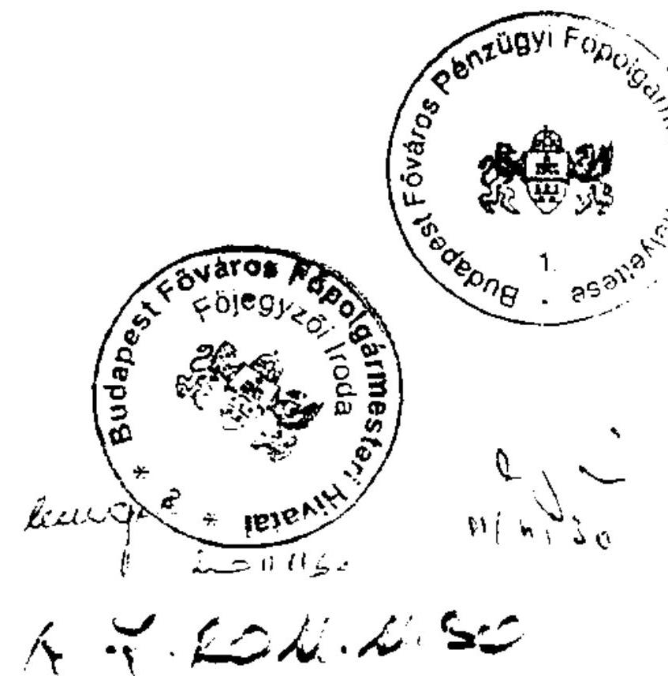

Tisztelettel:
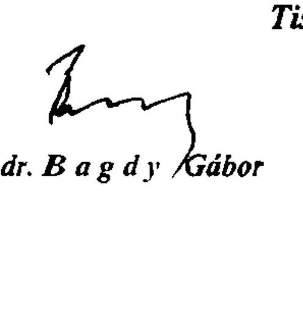
dr. Bagdy Gábor
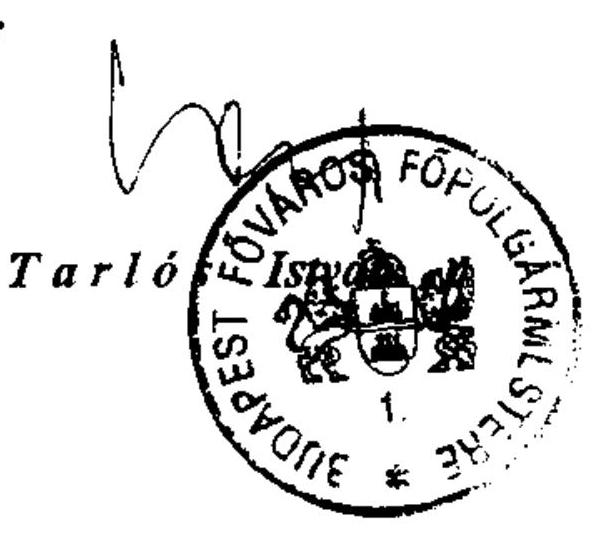

---

# 11. számú melléklet

a V-3007/2011. sz. jelentéshez

ELNÖK

ÁLLAMI
SZÁMVEVŐSZÉK

Ikt.szám: V-3007-95/2011-2012.
Ügyintéző: Molnár Gyula Mihály

## Tarlós István úr

főpolgármester
Budapest Főváros Önkormányzata
Budapest

## Tisztelt Főpolgármester Úr!

Köszönettel vettem a Budapesti Közlekedési Zrt. gazdálkodásának ellenőrzéséről készített jelentéstervezetünkkel kapcsolatosan küldött észrevételeit. Örömömre szolgált, hogy a jelentéstervezetben szereplő megállapítások, javaslatok alapján a BKV Felügyelőbizottságának beszámoltatására, illetve a Főjegyzőnek tett javaslatokra vonatkozóan már intézkedéseket kezdeményezett. Az intézkedések megfelelőségét a jelentés nyilvánosságra hozatalát követően, az Állami Számvevőszékről szóló 2011. évi LXVI. tv. 33. § (1) bekezdésében foglaltak értelmében 30 napon belül megküldött intézkedési tervben foglaltak alapján fogom értékelni.

Tájékoztatom továbbá arról, hogy a 15 napos észrevételezésre megküldött jelentéstervezet az Állami Számvevőszéknek az elnöki értekezlet által jóváhagyott hivatalos szakmai álláspontját tartalmazza, míg a 2011. augusztus 3 -ai záró megbeszélésre átadott munkaanyagban a helyszíni ellenőrzés befejezését követő állapotnak megfelelő megállapítások és javaslatok szerepeltek. A munkaanyagban szereplő megállapítások minőségfelülvizsgálata a szakmai szabályoknak megfelelően megtörtént, így azok egy része módosult. Az Ön által felvetett és tapasztalt eltéréseknek ez az egyik indoka, másik pedig a 2011. július 1-én hatályba lépett új számvevőszéki törvény, melynek egyes rendelkezései a korábbihoz képest eltérőek.

Az új számvevőszéki törvény értelmében az ellenőrzött szerv vezetője köteles a megállapításokkal kapcsolatban intézkedési tervet készíteni, ezért a számvevőszéki javaslat címzettje is csak az ellenőrzött szerv vezetője lehet. Ennek következtében az Ön által hivatkozott minisztereknek címzett javaslatokat elhagytuk, mivel egyik minisztérium sem volt ellenőrzött szervezet. A Kormány az 1269/2011. (VIII. 4.) határozatában konkrét feladatokkal bízta meg az érintett minisztereket az adósságátvállalás, valamint a BKV ésszerű alapokon nyugvó, költséghatékony átalakítására. Erre tekintettel is, korábbi javaslataink fenntartása okafogyottá vált, s az új helyi önkormányzatokról szóló, valamint Magyarország 2012. évi költségvetéséről szóló törvényjavaslatokban egyértelműen megfogalmazódott a kormányzati szándék mind a fővárosi tömegközlekedési feladat ellátása felelősének változatlansága, mind a közösségi közlekedés finanszírozása tekintetében.

---

Nem vitatom, hogy a Főváros Önkormányzata pénzügyi helyzete a korábbi évekhez képest kedvezőtlen, s ezért nem a jelenlegi vezetés a felelős. Fontosnak tartom hangsúlyozni: a BKV finanszírozási problémáinak kiinduló pontja az, hogy a Főváros Önkormányzata nem tett eleget a Szolgáltatási szerződésben rögzített kötelezettségének és nem biztosította a BKV működéséhez szükséges forrásokat.

A Szolgáltatási szerződésben - az előírt szolgáltatási feladatok teljesítésének értékelése után a bevételekkel nem fedezett indokolt költségek megtérítésére és a tervezett díjbevétel legfeljebb 4 %-ának megfelelő összegű méltányos nyereség biztosítására kompenzáció fizetésben állapodott meg a Főváros Önkormányzata és a BKV. A számított kompenzációigényt a BKV-nak minden év november végéig kellett eljuttatnia a Főváros Önkormányzata részére. A BKV vezérigazgatója 2004 októberében megküldte a Főváros Önkormányzatának a független szakértő által auditált kompenzációszámítási modellt. A számított kompenzációigény megállapításához a BKV a kompenzációszámítási táblázatokban bemutatta a modell alapján a 2004-2012. évekre számított várható kompenzációigény összegét, amely évi 31,6 és 38,7 milliárd Ft között volt, a Közgyűlés megtárgyalta a modellel kapcsolatos előterjesztést és a 2005. évben elfogadta a modellt a számított kompenzációigény megállapításának alapjaként. A BKV vezérigazgatói a 2005-2011. évekre a Szolgáltatási szerződés előírását figyelmen kívül hagyva nem nyújtották be a számított kompenzációra vonatkozó igényt a Főváros Önkormányzatának. A Szolgáltatási szerződésben foglaltak ellenére a BKV és a Főváros Önkormányzata a 2004-2010. évekre vonatkozóan nem hajtotta végre a tömegközlekedési kompenzáció éves elszámolását sem.

A Szolgáltatási szerződés 2012. április végén lejár. Ezért nem tett az Állami Számvevőszék javaslatot az üzleti terv középtávú stratégiájának elkészítésére.

Az ellenőrzés lefolytatásához nyújtott segítő közreműködését ezúton is köszönöm.

Budapest, 2012. január „46"
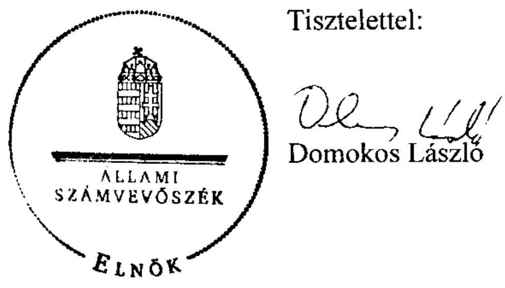

---

# 12. számú melléklet a

Budapesti Közlekedési Zártkörűen V-3007/2011. sz. jelentéshez

Vezérigazgató
1980 Budapest, Akácfa u. 15. /Telefon: 461-6754/Fax: 461-6570 / E-mail: varszerigy@bkv.hu

Hiv. sz.: V-3007-91/2011.
Iktatószám: 41188 - 2/20114.
2011. DEC. 5.

Állami Számvevőszék
1052 Budapest,
Apáczai Csere János u. 10.

## Domokos László úr

elnök

## Tisztelt Elnök Úr!

A BKV Zrt. gazdálkodásának ellenőrzéséről készült, 2011. novemberi Számvevői Jelentés-tervezetet áttanulmányoztuk és ahhoz a mellékelt észrevételeket tesszük.

Kérem, hogy a Jelentésben az ÁSZ által el nem fogadott észrevételek mellett szíveskedjenek feltüntetni a BKV Zrt. korábbi, ill. ahol pontosításra került, vagy eddig nem szerepelt, akkor a jelenlegi álláspontját.

Budapest: 2011. december 01.

Tisztelettel:
Melléklet: 1 db
dr. Várszegi Gyula

---

# ÉSZREVÉTELEK

a BKV Zrt. gazdálkodásnak ellenőrzéséről készült 2011. novemberi számvevői Jelentés-tervezethez

- 16. oldal, utolsó bekezdés: Az 1269/2011. (VIII. 4.) sz. Kormányhatározatban foglalt feladatok határidőre történő végrehajtásáról nem rendelkezünk információval, az adósságátvállalás megvalósulása kérdéses.
- 18. oldal: „Továbbá részben volt megfelelő a közforgalmú közlekedési szolgáltatás minősége, mivel a tervezett és nyújtott minőség közötti eltérés megszüntetéséről a Fővárosi Önkormányzat nem intézkedett."
A Jelentés megállapításai (24. oldal utolsó előtti bekezdés) szerint a Fővárosi Önkormányzat nem ellenőrizte megfelelően a nyújtott szolgáltatás minőségét. Ha viszont nem történt meg az ellenőrzés, akkor az sem állapítható meg, hogy eltérés lett volna a tervezett és a nyújtott szolgáltatás minősége között. A megállapítás indoklása így megkérdőjelezhető.
- 20. oldal 2. bekezdés: ill. még több helyen is hivatkozik az anyag arra, hogy a prémiumfeladatok kitűzésének az elvei nem megfelelőek, mert ezek a munkaköri feladatok részét képezik és többletösztönző szerepük nincs.

Erre tekintettel törekszünk a 2012. évi prémium kitűzési rendszer átalakítására oly módon, hogy a feladatok a munkakörön túlmutassanak.
A 33. oldal 1. pontjában foglalt, a Főpolgármester részére tett javaslat szerint, a fenti kitűzési elveket kell érvényesíteni a Vezérigazgató részére történő prémium kitűzés tekintetében, melyeket tovább fogunk érvényesíteni az alsóbb vezetői szinteken.

- 21. oldal: Az összefoglalóban is javasoljuk megjegyezni, hogy az inflációs hatások, valamint a technikai fejlődés okozta áremelkedés miatt, az értékcsökkenési leírás összege önmagában nem nyújtana fedezetet az eszközpark megújításához.
- 21. oldal: A Magyar Állam működési célú támogatásai esetében az összefoglalóban is javasoljuk megemlíteni, hogy:
- Az állami normatív támogatás értéke 2006-tól kezdődően nem emelkedett nominálisan sem. A normatív támogatás indexálásának elmaradása jelentős bevételkiesést, és ezáltal hitelfelvételi kényszert jelentett a BKV Zrt. számára.
- a fogyasztói árkiegészítés összegszerűen meghatározott kulcsai nem emelkedtek, és nem fedezik a teljes árú és a kedvezményes árú menetdíjak közötti kiesést. (A részletes megállapításokban 29,8 milliárd forint bevételkiesés került bemutatásra.)
- A két tényező okozta bevételkiesésen felül ki kell emelni a bevételkiesés miatt kényszerűségből felvett hitelek kamatkiadásait, amelyek szintén a BKV Zrt. ráfordításait növelték.
- 22. oldal: „A 2002-2010. közötti években a BKV működési finanszírozásához a Magyar Állam által biztosított források kétszeresen haladták meg a Fővárosi Önkormányzat által nyújtott támogatásokat."

---

Amennyiben valóban csak a működési támogatásokat vesszük számításba az eltérés ennél lényegesen magasabb, abból következően, hogy a Fővárosi Önkormányzat tőkeágon finanszírozta a BKV Zrt-t.

- 23. oldal: viteldíjak alakulásáról készített grafikonban a 2010. évi index 3,67\%-os értékkel szerepel, azonban a jó adat $5,84 \%$ (a $3,67 \%$ kiszámításánál valószínűleg nem került figyelembevételre az előző év áthúzódó hatása).
- 25. oldal 1. bekezdés: ill. a jelentésben több helyen is szerepel, hogy a Közgyűlés által 2010 októberében kiadott bérpolitikai irányelveknek megfelelően a szellemi állománycsoportú munkavállalók ösztönzési elveinek átfogó felülvizsgálata, módosítása még nem történt meg.

Jelezzük, hogy a prémium rendszer átdolgozása megtörtént a Fővárosi Közgyűlés által kiadott elvek szerint, melynek eredményeképpen 2011. 08. 22-én megjelent a szellemi állománycsoportú munkavállalók bérsávba sorolásának és ösztönzésének (premizálási, jutalmazási) elveiről szóló 28/VU/2011 sz. utasítás.

- 27. oldal: ,, üzletágankénti bevétel meghatározása sem helytálló"
Az indoklásban a jelentés kifejti, hogy a bevételfelosztás utasszámlálási adatokon nyugszik, amely így nem kellően megalapozott. A BKV Zrt. az egységes, papíralapú jegy- és bérletrendszer működéséből adódóan nem rendelkezik üzletági bevételekre vonatkozó alapadatokkal, így azokat közvetett módon állítja elő. Ez azonban nem jelenti azt, hogy helytelen adatokat használna fel a BKV Zrt. A menetdíjbevétel felosztása nem a 2004. évi háztartásfelvétel adatai alapján történik, annak eredményei alapján a BKV Zrt. csupán korrigálta a már korábban is alkalmazott kulcsokat. A szétosztási kulcsok korrekciójakor a BKV Zrt. felhasználja az éves rendszerességgel végzett műszeres és kézi utasszámlálások adatait is.
A jelentés nem tartalmaz javaslatot arra vonatkozóan, hogy milyen módszer szerint lehetne helytálló módon megállapítani az üzletágankénti bevételt.
- 28. oldal: „.. 2007-2010. években az eszközpótlások és a felújítások értéke 30.4 milliárd forinttal marad el az elszámolt értékcsökkenési leírás és a kapott támogatás összegétől."
Az eszközpótlás és a felújítás az erre a célra kapott támogatásokból valósult meg. Eltérés az elszámolt értékcsökkenési leírást tekintve áll fenn a veszteséges gazdálkodásból eredően.
- 29. oldal: az átlagkeresetek összehasonlításánál a nemzetgazdasági szint helyett a fővárosi szintű összehasonlítást javasoljuk, mivel jelentős eltérés van a két érték között. A KSH adatai szerint 2009-ben az országos nettó átlagkereset 121761 Ft volt, míg a budapesti 149209 Ft , az eltérés megközelíti a $23 \%$-ot. A munkaerőpiac lokálisan működik, így egy országos érték összevetése a helyi értékkel helytelen következtetések levonását eredményezi.
- 33. oldal: A Főpolgármesternek címzett javaslatok közé javasoljuk beemelni a közszolgáltatás bevétellel nem fedezett indokolt ráfordításainak megtérítését (kötelező veszteségtérítés), amelyet mind a hazai, mind az európai uniós jogszabályok ((2005. évi CLXXXIII. törvény a vasúti közlekedésről, 2004. évi XXXIII. törvény az

---

autóbusszal végzett menetrend szerinti személyszállításról), 1370/2007. EK rendelet) előírnak.

- 35. oldal, 1. javaslat: a BKV Zrt. 2011. szeptember 27-én kelt levelében fordult a Főpolgármester Úrhoz, hogy a BKV Zrt. kompenzációigényét a kialakításra kerülő KHEM tájékoztatót követő módszertan szerint nyújthassa be. A BKV Zrt. 2012. évi előzetes finanszírozási igénye dr. Bagdy Gábor Főpolgármester-helyettes Úrnak benyújtásra került a 2011. november 10 -én kelt, 142/47-5/2011/144 iktatószámú levélben. A benyújtott finanszírozási igény a BKK Zrt-vel egyeztetett kompenzáció számítás új módszertanát követi.
- 35. oldal 5. javaslat: ,,gondoskodjon arról, hogy a bezsákolt, tőkesúlyos trezorban elhelyezett készpénzállományt a mérlegben mindaddig a pénzeszközök között mutassák ki, amíg az átadás-átvétel meg nem történik a pénztáros, illetve a pénzszállító vállalkozás között:"

# A javaslat végrehajtása már megtörtént. 

Az Értékesítési Főosztály minden havi zárást megelőzően a bezsákolt, tőkesúlyos trezorban elhelyezett, de a pénzszállító által el nem szállított összegekről a Számviteli Főosztály részére kimutatást küld. A Számviteli Főosztály az adatszolgáltatás alapján a gazdasági eseményt a pénzeszközök között könyveli le.

- 36. oldal 7. javaslat utolsó mondata: „..Intézkedjen, hogy a használt gépkocsik értékesítése előtt végezzenek előzetes vagyonértékelést az értékesítés ellenértékének valós piaci áron történő megállapítása érdekében."

A valós piaci ár megállapításához nem feltétlenül célszerű előzetes vagyonértékelést - ami tulajdonképpen egy becslés - végeztetni, mivel az várhatóan megdrágítja az ügyletet.
Véleményünk szerint a kérdés megoldott, amennyiben a BKV nyilvános értékesítési eljárás keretében értékesíti használt gépjárműveit, mivel ez garantálja a tényleges piaci árat.
Előbbiekre való tekintettel kérjük a második mondat törlését, vagy pontosítását az alábbiak szerint: „.. Intézkedjen, hogy a használt gépkocsik értékesítése a valós piaci áron történjen."

- 36. oldal 8. pont: A Számviteli törvény 3. §-a (4) bekezdésének 6. pontja pontosan meghatározza a maradványérték fogalmát, ami a következő: „.. a rendeltetésszerű használatbavétel, az üzembe helyezés időpontjában - a rendelkezésre álló információk alapján, a hasznos élettartam függvényében - az eszköz meghatározott, a hasznos élettartam végén várhatóan realizálható értéke. Nulla lehet a maradványérték, ha annak értéke valószínűsíthetően nem jelentős.
A maradványérték meghatározása tulajdonképpen egy becslés, mely egyrészt az adott eszköz használatbevételekor fennálló piaci viszonyok, másrészt a hasonló eszközök használata során a vállalkozónál felhalmozódott gyakorlati tapasztalatok figyelembevételével történhet.
Ennek alapján a Társaság Számviteli Politikájában meghatározásra került, hogy mely eszközök esetén kell számolni nullától eltérő maradványértékkel, illetve mely eszközök esetében nulla a hasznos élettartam végén a megállapított maradványérték,

---

melyre a fent hivatkozott törvényi előírás lehetőséget biztosít. Társaságunknál az eszközök maradványértéke - a belszolgálati járművek és az épületek kivételével - „0", mivel valamennyi eszközt a műszaki élettartam végéig üzemeltetünk.
Ez megfelel a Számviteli törvény fentiekben idézett előírásának, hiszen aszerint is lehet „nulla" a maradványérték, ha annak értéke valószínűsíthetően nem jelentős.

- 58. oldal utolsó bekezdés: Változatlanul fenntartjuk a BKV Vezérigazgatójának a záró tárgyaláson tett észrevételét, miszerint „A hiba az SAP lekérdezésben volt, nem a főkönyvi és az analitikus adatokban, ezért kérjük kiemelni, hogy az analitika és a főkönyv megegyezik."
A BKV Zrt. főkönyvében szereplő adatok pontos analitikus nyilvántartással vannak alátámasztva. Az ÁSZ vizsgálat során a számviteli vezető arról nyilatkozott, hogy az adott időpontban programhiba miatt nem lehetett az SAP rendszerből a helyes lekérdezést megvalósítani. A vizsgálat nem győződött meg arról, hogy az eltérés valóban programhibára vezethető-e vissza és a hiba kijavítása után az analitika és a főkönyv közötti egyezőség fennáll-e. Nem megalapozott az ÁSZ azon állítása, hogy az analitika és a főkönyv eltérése fennállt, tekintettel arra, hogy technikai okok miatt megfelelő analitika nem állt rendelkezésre. Természetesen a programhiba kijavítása megtörtént és a tételes analitika helyesen lekérdezhető az SAP rendszerből, amely megegyezik a főkönyvi nyilvántartás megfelelő adatával.
- 60. oldal: „A dokumentáció alapján a költségek 64\%-a a járatokra közvetlenül (elsődlegesen, vagy megfelelő mutatószámok alapján) került elszámolásra." Elsődlegesen nem kerül elszámolásra járatra költség, csak megfelelő vetítési alapokkal másodlagosan.
- 60. oldalon található táblázat értékesítési bevétel oszlopában 2009-re, a flottaszerződés keretén belüli értékesítésnél helytelen szám szerepel. A bevétel nem $63,4 \mathrm{mFt}$, hanem $60,8 \mathrm{mFt}$, (az eredeti számnak ellentmond az is, hogy a 2009. évi teljes bevétel kevesebb volt, $62,1 \mathrm{mFt}$ 2009-ben). Az értékesítési/kivezetési arány pedig helyesen $29.1 \%$.
- 66. oldal: a táblázat a személyszállítási bevétel és az üzemi ráfordítás arányának változását mutatja be. A jelentés a 49. oldalon bemutatja az árkiegészítés változása miatti bevételkiesés évenkénti nagyságát. Ennek figyelembevételével a táblázat alapvetően más képet mutatna, a bevételkieséssel korrigált személyszállítási bevétel és az üzemi ráfordítás aránya közel állandó szinten maradna, csekély mértékben javulna. A táblázatban bemutatott arány romlását tehát kizárólag az árkiegészítés rendszerének változása, és az ennek következtében bekövetkezett bevételkiesés idézte elő, amely tényről a jelentés nem tesz említést.
- 68. oldal: „.. ...míg az autóbuszoké $72.4 \%$...." Az autóbuszok $72 \%$-os aránya csak abban az esetben igaz, ha nem vesszük figyelembe a Kőbánya telephelyen lévő autóbuszokat. Az autóbuszok üzemeltetési költségének aránya, figyelembe véve a Kőbánya telephelyen (közös trolibusz és autóbusz telephely) lévő autóbuszokat is $77.2 \%$.
- 81. oldal utolsó bekezdés: „A szállítói állomány faktorálásnak engedélyezését az Alapítói Okirat nem rendelte a tulajdonos kizárólagos döntési jogkörébe. A faktorálás lehetőségét a 2007-évi üzleti terv nem tartalmazta, de az Igazgatóság határozatot hozott arról, hogy 2007. november hónaptól - a faktoráló bank felé fizetendő kamat

---

teljesítése mellett - hozzájárul a szállítói kötelezettségek faktoring ügylethez kapcsoltan történő teljesítéséhez maximum 4.0 milliárd Ft értékben. „

A megállapítás pontosítását kérjük, mivel a szállítói számlák faktorálása a szállítói partner és a faktorcég (bank vagy más pénzügyi vállalkozás) között történik, az ügyletről a szerződéskötés e két fél között jön létre. Ez egy általános finanszírozási ügylet, ezzel a szállítónak a faktorált számlák esetében lehetősége van előfinanszírozást igénybe vennie a fizetési határidő előtt. Az ügyletnek ebben a szakaszában a BKV-nak nincs szerepe, a szállítók saját hatáskörben döntenek a számlájuk faktorálásáról.
A faktorálásról a faktorcég tájékoztatást küld a BKV-nak, hogy értesítse a számla engedményezéséről. A BKV-nak, amennyiben van megállapodása a faktorcéggel, e megállapodás alapján a szállítók által már faktorált számlákra vonatkozóan kedvezményes késedelmi kamat megfizetése mellett, (a fizetési határidőt követően) fizetési haladékot nyújt a faktorcég a BKV részére, így a BKV által fizetett díj amennyiben határidőn túl teljesít, késedelmi kamatfizetést jelent. Amennyiben határidőben történik a számla kifizetése a BKV-t semmilyen további díjfizetési kötelezettség nem terheli.

- 82. oldal harmadik bekezdés utolsó mondata „.. a BKV üzleti terveiben több évre vonatkozóan sem az adósság teljes egészére, sem az adott évben tervezett adósságot keletkeztető döntésekre nem mutatta be a kamat- és hitelköltségeket..." és a 83. oldal első bekezdés utolsó mondata:
A megállapítás kamatokra vonatkozó részét
 kérjük pontosítani a következők szerint, .. az adósságot keletkeztető döntésekre vonatkozóan csak összesítve mutatta be a kamat és hitelköltségeket" tekintettel arra, hogy az Üzleti terv részeként az adott évi kamatfizetési kötelezettség várható mértéke bemutatásra került minden esetben a pénzügyi ráfordítások között, így az ismert volt.
- 83. oldal harmadik bekezdés: ..az észrevétel nem megalapozott, mivel az üzleti tervek készítése során a hitelek átstrukturálását már tervezték, ennek költségei azonban elkülönítetten nem mutatták ki.
A megállapítással továbbra sem értünk egyet, mivel az Üzleti tervek készítésekor az évközben szükségessé vált átütemezések és költségeik még nem voltak ismertek, sőt több esetben az átütemezés ténye sem volt még ismert, ezért nem is tervezhettük. Az átütemezések és költségeik bemutatására év közben sor került, a pénzügyi helyzetet, annak változását bemutató igazgatósági előterjesztésekben.
- 84. oldal első bekezdés: Az Unicredit Bankkal aláírt szerződés aláíróival kapcsolatban tett észrevételünk az ÁSZ szerint nem megalapozott, mert a vezérigazgató meghatalmazása az akkori Aláírási Szabályzat rendelkezésébe ütközött.

Az ÁSZ érvelésével továbbra sem értünk egyet:
Az UniCredit Bankkal aláírt hitel-hosszabbítást a Vezérigazgató úr távollétében a Gazdasági vezérigazgató helyettes és a Pénzügyi főosztályvezető írta alá.
A Vezérigazgató úr meghatalmazta a Gazdasági vezérigazgató helyettest a társaság harmadik személyekkel szembeni teljes jogú képviseletére, valamint a módosítást utólagosan jóváhagyta. A meghatalmazással, véleményünk szerint, a Vezérigazgató úr engedélyezte az általa kiadott Aláírási Szabályzattól való eltérést. Az Aláírási

---

Szabályzatot egyedül ő hagyja jóvá, ő adja ki, mint munkáltatói utasítást, ezért módosítani - akár esetenkénti eltéréssel is -- véleményünk szerint jogosult.

- 87. oldal: az Üzemi ráfordítások 2009. évi adata nem helyes a táblázatban, nem egyezik meg a 66. oldalon található táblázatban feltüntetett helyes értékkel.
- 88. oldal utolsó táblázat (A 2010. december 31-én fennálló hitelállományhoz kapcsolódó jövőben esedékes törlesztő részletek évenkénti összegének alakulása):
A táblázat a megnevezésének megfelelően nem a teljes információt tartalmazza a 2011-es évre, mivel a hosszúlejáratú hitelek esetében a feltüntetett $12,4 \mathrm{Mrd} \mathrm{Ft}$ törlesztés ill. a $0,597 \mathrm{Mrd}$ Ft lízingdíj nem a teljes évre vonatkozó, hanem a 2011. áprilist követően esedékes törlesztéseket tartalmazza. (éves szinten $16,2 \mathrm{Mrd}$ Ft hiteltörlesztés és $0,8 \mathrm{Mrd}$ Ft lízingtörlesztés merül fel)
- 1. számú függelék: 2010. évnél a trolibusz ágazat adata nem helyes. (Abszolút értékben jó, azonban nem mínusz, hanem plusz előjellel kellene szerepelnie.)
- 3. számú Függelék: a BKV mérlegbeszámolóinak leltárral történő alátámasztása 2-4. oldal: Főkönyv-analitika egyeztetés eredménye:
Nem értünk egyet azzal a megállapítással, hogy ,, Bizonyos főkönyvi számlák esetében pedig eltérés mutatkozott a főkönyv és az analitika között", mivel az analitikus lekérdezés informatikai hibára visszavezethetően nem mutatott valós állományt. (lásd még az 58. oldal utolsó bekezdésére írt észrevételünket.)

Budapest, 2011. december 01.

---

# Várszegi Gyula úr 

vezérigazgató
Budapest Közlekedési Zrt.
Budapest

## Tisztelt Vezérigazgató Úr!

Köszönettel vettem a Budapesti Közlekedési Zrt. gazdálkodásának ellenőrzéséről készített jelentéstervezetünkkel kapcsolatosan küldött észrevételeit. Örömömre szolgált, hogy a jelentéstervezetben szereplő megállapítások, javaslatok alapján a prémium kitűzési rendszer átalakítása folyamatban van, a 2012. évi kompenzáció igény benyújtásra került a Főváros Önkormányzatához, illetve a bezsákolt, tőkesúlyos trezorban elhelyezett, de a pénzszállító által el nem szállított összegek számviteli elszámolására már intézkedéseket kezdeményezett. Az intézkedések megfelelőségét a jelentés nyilvánosságra hozatalát követően, az Állami Számvevőszékről szóló 2011. évi LXVI. tv. 33. § (1) bekezdése értelmében a 30 napon belül megküldött intézkedési tervben foglaltak alapján fogom értékelni.

Tájékoztatom arról, hogy a jelentéstervezet 16. oldal utolsó bekezdéséhez tett észrevétele, miszerint „Az 1269/2011. (VIII. 4.) sz. Kormányhatározatban foglalt feladatok határidőre történő végrehajtásáról nem rendelkezünk információval, az adósságátvállalás megvalósulása kérdéses. " érdemben nem befolyásolja megállapításainkat, ezért azt tudomásul veszem.

A következő észrevételeit elfogadom és azok alapján a jelentés vonatkozó részét javítottuk:

- „23. oldal: viteldíjak alakulásáról készített grafikonban a 2010. évi index 3,67\%-os értékkel szerepel, azonban a jó adat 5,84\% (a 3,67\% kiszámításánál valószínűleg nem került figyelembevételre az előző év áthúzódó hatása)."

A 2010. évi 3,67\%-os tarifaindex értéket a BKV-tól kaptuk, az észrevétel alapján a grafikon adatát $5,84 \%$-ra, valamint az előző bekezdés szövegét is módosítottuk.

- „27. oldal: üzletágankénti bevétel meghatározása sem helytálló"
„Az indoklásban a jelentés kifejti, hogy a bevételfelosztás utasszámlálási adatokon nyugszik, amely így nem kellően megalapozott. A BKV Zrt. az egységes, papíralapú jegy- és bérletrendszer működéséből adódóan nem rendelkezik üzletági bevételekre vonatkozó alapadatokkal, így azokat közvetett módon állítja elő. Ez azonban nem jelenti azt, hogy helytelen adatokat használna fel a BKV Zrt. A menetdíjbevétel felosztása nem a 2004. évi háztartásfelvétel adatai alapján történik, annak eredményei alapján a BKV

---

Zrt. csupán korrigálta a már korábban is alkalmazott kulcsokat. A szétosztási kulcsok korrekciójakor a BKV Zrt. felhasználja az éves rendszerességgel végzett műszeres és kézi utasszámlálások adatait is. A jelentés nem tartalmaz javaslatot arra vonatkozóan, hogy milyen módszer szerint lehetne helytálló módon megállapítani az üzletágankénti bevételt."

Az észrevételben leírtakat elfogadom azzal, hogy a menetdíj bevételek felosztása továbbra is a 2004. évi utasszámlálási adatokon alapszik, illetve az említett korrigált kulcsokra vonatkozó dokumentumokat nem adták át az ellenőrzést végző szakértőnek és számvevőnek. Ennek megfelelően a következőképpen módosítjuk a megállapítás szövegét: „az üzletágankénti bevétel meghatározása sem a korrigált 2004. évi utasszámlálási adatokon alapszik".

- „36. oldal 7. javaslat utolsó mondata: Intézkedjen, hogy a használt gépkocsik értékesítése előtt végezzenek előzetes vagyonértékelést az értékesítés ellenértékének valós piaci áron történő megállapítása érdekében. "
„A valós piaci ár megállapításához nem feltétlenül célszerű előzetes vagyonértékelést ami tulajdonképpen egy becslés - végeztetni, mivel az várhatóan megdrágítja az ügyletet.

Véleményünk szerint a kérdés megoldott, amennyiben a BKV nyilvános értékesítési eljárás keretében értékesíti használt gépjárműveit, mivel ez garantálja a tényleges piaci árat.

Előbbiekre való tekintettel kérjük a második mondat törlését, vagy pontosítását az alábbiak szerint: Intézkedjen, hogy a használt gépkocsik értékesítése a valós piaci áron történjen. "

A gépjárműflotta cserénél a közbeszerzési eljárás részét képezte az új járművek beszerzése és a régi járművek egyidejű eladása, az értékelési szempontok kialakítása során a valós piaci ár ismeretére a BKV-nak szüksége lett volna. Az értékesített járművek könyvszerinti értéke nem egyezett meg a valós piaci árral, ezért annak megállapítása érdekében szükséges az ezt biztosító eljárásrend kialakítása. Ennek megfelelően a javaslat második mondatát a következőképpen módosítjuk: „Intézkedjen, olyan eljárásrend kialakítására, amely biztosítja, hogy a használt gépkocsik értékesítése a valós piaci áron történjen."

- „60. oldal: A dokumentáció alapján a költségek 64\%-a a járatokra közvetlenül elsődlegesen, vagy megfelelő mutatószámok alapján került elszámolásra."
„Elsődlegesen nem kerül elszámolásra járatra költség, csak megfelelő vetítési alapokkal másodlagosan."

Az elsődleges elszámolásra vonatkozó megállapítást töröltük.

---

- „60. oldalon található táblázat értékesítési bevétel oszlopában 2009-re, a flottaszerződés keretén belüli értékesítésnél helytelen szám szerepel. A bevétel nem 63,4 millió Ft, hanem 60,8 millió Ft, (az eredeti számnak ellentmond az is, hogy a 2009. évi teljes bevétel kevesebb volt, 62,1 millió Ft 2009-ben). Az értékesítési/kivezetési arány pedig helyesen $29,1 \%$."

Az adatokat a BKV bocsátotta rendelkezésünkre (SAP lekérdezés alapján), a kifogásolt számokat javítottuk.

- „68. oldal: „... míg az autóbuszoké $72,4 \%$, ... Az autóbuszok 72\%-os aránya csak abban az esetben igaz, ha nem vesszük figyelembe a Kőbánya telephelyen lévő autóbuszokat. Az autóbuszok üzemeltetési költségének aránya, figyelembe véve a Kőbánya telephelyen (közös trolibusz és autóbusz telephely) lévő autóbuszokat is 77,2\%."

Az adatokat a BKV bocsátotta rendelkezésünkre, a kifogásolt számot javítottuk

- „87. oldal: az Üzemi ráfordítások 2009. évi adata nem helyes a táblázatban, nem egyezik meg a 66. oldalon található táblázatban feltüntetett helyes értékkel."

Az észrevétel alapján a helyes adatokat tüntettük fel a táblázatban.

- „1. számú függelék: 2010. évnél a trolibusz ágazat adata nem helyes. (Abszolút értékben jó, azonban nem mínusz, hanem plusz előjellel kellene szerepelnie.)"

A 2010. évi adatnál elhagytuk a negatív előjelet.

# Az alábbi észrevételekben foglaltakat nem fogadom el: 

- „18. oldal: Továbbá részben volt megfelelő a közforgalmú közlekedési szolgáltatás minősége, mivel a tervezett és nyújtott minőség közötti eltérés megszüntetéséről a Fővárosi Önkormányzat nem intézkedett. A Jelentés megállapításai (24. oldal utolsó előtti bekezdés) szerint a Fővárosi Önkormányzat nem ellenőrizte megfelelően a nyújtott szolgáltatás minőségét. Ha viszont nem történt meg az ellenőrzés, akkor az sem állapítható meg, hogy eltérés lett volna a tervezett és a nyújtott szolgáltatás minősége között. A megállapítás indoklása így megkérdőjelezhető."
Az észrevétel nem megalapozott, mivel a megállapítást az ÁSZ a Főváros Önkormányzata tömegközlekedési feladatellátásának megítéléséhez készített, a Jelentés-tervezet 3/a számú mellékletében bemutatott minősítés 5 . pontja alapján fogalmazta meg, nem pedig a Főváros Önkormányzata által a szolgáltatások minőségének megítélését célzó - nem megfelelő módon ellenőrzött - méréseket alapul véve. A minősítéshez figyelembe vettük és értékeltük, hogy a Főváros Önkormányzata meghatározta-e a szolgáltatási szerződésben a tömegközlekedési feladatellátás tervezett minőségét, értékelte-e a nyújtott szolgáltatás színvonalát, a tervezett minőség és a nyújtott minőség közötti eltérés esetén intézkedett-e a különbség rendezésére, a Szolgáltatási szerződésben meghatározottaknak megfelelő volt-e a közfeladat ellátása és a szolgáltatás színvonala, működtetett-e monitoring rendszert a

---

Szolgáltatási szerződés keretében nyújtott szolgáltatások mennyiségi és minőségi alakulásának értékelésére az ellenőrzés időszakában, figyelembe vette-e a nemzetközi normákat a szolgáltatási igény minőségi jellemzőinek meghatározásánál, továbbá végzett vagy végeztetett-e utas-elégedettségi vizsgálatot. A megállapítás nem a BKV, hanem a Főváros Önkormányzata tevékenységének megítélésére vonatkozott, amelyre az érintett jogosult észrevételt tenni. A Főváros Önkormányzata a megállapításra nem tett észrevételt.

- „21. oldal: Az összefoglalóban is javasoljuk megjegyezni, hogy az inflációs hatások, valamint a technikai fejlődés okozta áremelkedés miatt, az értékcsökkenési leírás összege önmagában nem nyújtana fedezetet az eszközpark megújításához."

Az észrevétel nem megalapozott, mivel az összefoglalóban a tőkepótló támogatások és az elszámolt értékcsökkenés összegének összehasonlítására vonatkozik a megállapítás. A visszapótlásnak az éves értékcsökkenés összegéig kell terjednie a külön megállapodásban foglaltaknak megfelelően. A jelentés 21. oldalának diagram alatti bekezdése részletesen tartalmazza a Főváros Önkormányzata által az amortizációt pótló támogatáson túlmenően adott fejlesztési támogatásokat, vagyis az eredeti megállapítás is tartalmazta, hogy értékcsökkenési leírás összege nem elegendő önmagában az eszközpark megújításához.

- „21. oldal: A Magyar Állam működési célú támogatásai esetében az összefoglalóban is javasoljuk megemlíteni, hogy:
- Az állami normatív támogatás értéke 2006-tól kezdődően nem emelkedett nominálisan sem. A normatív támogatás indexálásának elmaradása jelentős bevételkiesést, és ezáltal hitelfelvételi kényszert jelentett a BKV Zrt. számára.
- A fogyasztói árkiegészítés összegszerűen meghatározott kulcsai nem emelkedtek, és nem fedezik a teljes árú és a kedvezményes árú menetdíjak közötti kiesést. (A részletes megállapításokban 29,8 milliárd forint bevételkiesés került bemutatásra.)
- A két tényező okozta bevételkiesésen felül ki kell emelni a bevételkiesés miatt kényszerűségből felvett hitelek kamatkiadásait, amelyek szintén a BKV Zrt. ráfordításait növelték."
Az Ön által leírtak szerepelnek a jelentésben
 a részletes és/vagy az összegző megállapítások között, ezért a kiegészítés beépítését nem tartom indokoltnak. A normatív támogatások indexálásának elmaradása nem egyedi eset, ez szinte valamennyi állami támogatásban részesülő szervezet esetében igaz. A jelentés 48. oldalán található diagram alapján egyértelműen megállapítható, hogy a normatív hozzájárulás összege a 2004. évi (a Szolgáltatási szerződés első éve, illetve a BKV adósságának 2002. évi átvállalását követő második év) 5,9 milliárd Ft-ról a 2005. évre 11,9 milliárd Ft-ra - az előző évhez viszonyítottan több mint kétszeresére -, a 2006. évre pedig 32,1 milliárd Ft-ra (az előző évhez viszonyítottan közel háromszorosára) növekedett, ami az infláció mértékét meghaladó, lényeges nagyságrendű ,,indexálást" jelentett.

A fogyasztói árkiegészítéssel kapcsolatos bevétel kiesésre vonatkozó megállapítás szerepel a jelentés részletes megállapításai között. A fogyasztói árkiegészítés elmaradásával kapcsolatos bevételkiesést szinte teljes egészében pótolta a Magyar Állam által a 2007. és

---

2010. között adott 28,1 milliárd Ft összegű rendkívüli támogatás. S nem hagyható figyelmen kívül a Szolgáltatási szerződés alapján járó, de a BKV által nem igényelt kompenzáció sem. Ennek kellett volna fedezetet nyújtania - az előírt szolgáltatási feladatok teljesítésének értékelése után - a bevételekkel nem fedezett indokolt költségek megtérítésére és a tervezett díjbevétel legfeljebb 4%-ának megfelelő összegű méltányos nyereségre.

- „22. oldal: A 2002-2010. közötti években a BKV működési finanszírozásához a Magyar Állam által biztosított források kétszeresen haladták meg a Fővárosi Önkormányzat által nyújtott támogatásokat. Amennyiben valóban csak a működési támogatásokat vesszük számításba az eltérés ennél lényegesen magasabb, abból következően, hogy a Fővárosi Önkormányzat tőkeágon finanszírozta a BKV Zrt-t. „

Az észrevétel nem megalapozott, mivel a jelentés az állam által biztosított működési célú források és a Fővárosi Önkormányzat által nyújtott támogatások összehasonlítására vonatkozó megállapítást tartalmazza a 2002-2010 évekre, függetlenül a Főváros Önkormányzata által nyújtott támogatások jellegétől, céljától. Az eredeti megállapítás, a „BKV működésének finanszírozásához... nyújtott támogatásokat" hasonlítja össze, ami nem azonos sem fogalmilag, sem tartalmilag a működési támogatással, illetve megítélésünk szerint a BKV működéséhez szükségesek voltak a fejlesztési támogatások is, vagyis a működés finanszírozásául szolgáló forrásokat nem tekintjük azonosnak a működési támogatással.

- „28. oldal: 2007-2010. években az eszközpótlások és a felújítások értéke 30,4 milliárd forinttal maradt el az elszámolt értékcsökkenési leírás és a kapott támogatás összegétől. Az eszközpótlás és a felújítás az erre a célra kapott támogatásokból valósult meg. Eltérés az elszámolt értékcsökkenési leírást tekintve áll fenn a veszteséges gazdálkodásból eredően."

Az észrevétel nem megalapozott, mivel a jelentés 65. oldalán található táblázat adataiból egyértelműen kiderül, hogy az értéknövelő beruházások értéke minden évben meghaladta a fejlesztési célra kapott támogatás összegét, vagyis az összes forrás másik összetevőjeként bemutatott értékcsökkenési leírás is forrását képezte az értéknövelő ráfordításoknak.

- „29. oldal: az átlagkeresetek összehasonlításánál a nemzetgazdasági szint helyett a fővárosi szintű összehasonlítást javasoljuk, mivel jelentős eltérés van a két érték között. A KSH adatai szerint 2009-ben az országos nettó átlagkereset 121761 Ft volt, míg a budapesti 149209 Ft, az eltérés megközelíti a 23%-ot. A munkaerőpiac lokálisan működik, így egy országos érték összevetése a helyi értékkel helytelen következtetések levonását eredményezi."

Az észrevétel nem megalapozott, mivel az átlagkereseteknél nem a nemzetgazdasági szintű összehasonlítást, hanem az ágazati (személyszállítás) szintű összehasonlítást alkalmaztuk, ami megítélésünk szerint alkalmasabb összehasonlító adat, mint a fővárosi átlagkeresetekkel történő összevetés.

---

- „33. oldal: A Főpolgármesternek címzett javaslatok közé javasoljuk beemelni a közszolgáltatás bevétellel nem fedezett indokolt ráfordításainak megtérítését (kötelező veszteségtérítés), amelyet mind a hazai, mind az európai uniós jogszabályok ((2005. évi CLXXXIII. törvény a vasúti közlekedésről, 2004. évi XXXIII. törvény az autóbusszal végzett menetrend szerinti személyszállításról), 1370/2007. EK rendelet) előírnak."

Az észrevételben tett javaslattal nem értek egyet. A jelentésben szereplő megállapítások alapján az ÁSZ elnökének van lehetősége javaslatot tenni. A kötelező veszteségtérítés a Fővárosi Önkormányzat és a BKV Zrt. között érvényben lévő Szolgáltatási szerződés alapján is fennálló kötelezettség, amit a BKV a hivatkozott jogszabályok alapján megkötött Szolgáltatási szerződés alapján érvényesíteni tud.

- „36. oldal 8. pont: A Számviteli törvény 3. §-a (4) bekezdésének 6. pontja pontosan meghatározza a maradványérték fogalmát, ami a következő: a rendeltetésszerű használatbavétel, az üzembe helyezés időpontjában - a rendelkezésre álló információk alapján, a hasznos élettartam függvényében - az eszköz meghatározott, a hasznos élettartam végén várhatóan realizálható értéke. Nulla lehet a maradványérték, ha annak értéke valószínűsíthetően nem jelentős.

A maradványérték meghatározása tulajdonképpen egy becslés, mely egyrészt az adott eszköz használatbevételekor fennálló piaci viszonyok, másrészt a hasonló eszközök használata során a vállalkozónál felhalmozódott gyakorlati tapasztalatok figyelembevételével történhet.

Ennek alapján a Társaság Számviteli Politikájában meghatározásra került, hogy mely eszközök esetén kell számolni nullától eltérő maradványértékkel, illetve mely eszközök esetében nulla a hasznos élettartam végén a megállapított maradványérték, melyre a fent hivatkozott törvényi előírás lehetőséget biztosít. Társaságunknál az eszközök maradványértéke - a belszolgálati járművek és az épületek kivételével - "0", mivel valamennyi eszközt a műszaki élettartam végéig üzemeltetünk.

Ez megfelel a Számviteli törvény fentiekben idézett előírásának, hiszen aszerint is lehet "nulla" a maradványérték, ha annak értéke valószínűsíthetően nem jelentős."

Az észrevételben foglaltakat nem fogadom el, mivel a BKV Számviteli Politikájában nem került rögzítésre, hogy mi minősül jelentős értéknek az eszközök maradványértékének meghatározásánál. A Számv. tv. előírásai alapján ugyanis kötelező szabályozás hiányában minden esetben a gazdálkodó szervezet jogosult belső szabályzatban meghatározni az adott gazdasági esemény megítélése szempontjából a nem jelentősnek, illetve a jelentősnek való minősítés mértékét A személyes egyeztetés során a BKV számviteli főosztályvezetője elismerte, hogy jelenleg sincs és ebből eredően az eszközök maradványértékének megállapításakor sem volt szabályozás a nem jelentős és a jelentős minősítésre vonatkozó mérték tekintetében a BKV Számviteli Politikájában, vagy más szabályzatában.

---

- „58. oldal utolsó bekezdés: Változatlanul fenntartjuk a BKV Vezérigazgatójának a záró tárgyaláson tett észrevételét, miszerint ,,A hiba az SAP lekérdezésben volt, nem a főkönyvi és az analitikus adatokban, ezért kérjük kiemelni, hogy az analitika és a főkönyv megegyezik. A BKV Zrt. főkönyvében szereplő adatok pontos analitikus nyilvántartással vannak alátámasztva. Az ÁSZ vizsgálat során a számviteli vezető arról nyilatkozott, hogy az adott időpontban programhiba miatt nem lehetett az SAP rendszerből a helyes lekérdezést megvalósítani. A vizsgálat nem győződött meg arról, hogy az eltérés valóban programhibára vezethető-e vissza és a hiba kijavítása után az analitika és a főkönyv közötti egyezőség fennáll-e. Nem megalapozott az ÁSZ azon állítása, hogy az analitika és a főkönyv eltérése fennállt, tekintettel arra, hogy technikai okok miatt megfelelő analitika nem állt rendelkezésre. Természetesen a programhiba kijavítása megtörtént és a tételes analitika helyesen lekérdezhető az SAP rendszerből, amely megegyezik a főkönyvi nyilvántartás megfelelő adatával. Továbbá 3. számú Függelék: a BKV mérlegbeszámolóinak leltárral történő alátámasztása 2-4. oldal: Főkönyv-analitika egyeztetés eredménye: Nem értünk egyet azzal a megállapítással, hogy „Bizonyos főkönyvi számlák esetében pedig eltérés mutatkozott a főkönyv és az analitika között", mivel az analitikus lekérdezés informatikai hibára visszavezethetően nem mutatott valós állományt. (lásd még az 58. oldal utolsó bekezdésére írt észrevételünket.)"

A megállapításainkat továbbra is fenntartom, mert az ellenőrzés ideje alatt az eltérések közül egy került korrigálásra, melyet a jelentéstervezetben figyelembe vettünk. A többi eltérés kijavításáról az ellenőrzés során meggyőződni nem tudtunk. A számviteli főosztályvezető nyilatkozata szerint az eltérés oka programhiba volt, melynek kijavítása az ellenőrzés időtartama alatt nem történt meg, ezért az analitikus és a főkönyvi nyilvántartások adatainak egyezősége nem volt biztosított.

- „66. oldal: a táblázat a személyszállítási bevétel és az üzemi ráfordítás arányának változását mutatja be. A jelentés a 49. oldalon bemutatja az árkiegészítés változása miatti bevételkiesés évenkénti nagyságát. Ennek figyelembevételével a táblázat alapvetően más képet mutatna, a bevételkieséssel korrigált személyszállítási bevétel és az üzemi ráfordítás aránya közel állandó szinten maradna, csekély mértékben javulna. A táblázatban bemutatott arány romlását tehát kizárólag az árkiegészítés rendszerének változása, és az ennek következtében bekövetkezett bevételkiesés idézte elő, amely tényről a jelentés nem tesz említést."

Az észrevétel nem megalapozott, mivel a táblázat a tényleges bevételeket veti össze a tényleges ráfordításokkal, emiatt a bevételkiesés a táblázatban sem vehető figyelembe. A BKV által javasolt adatok a saját számításaikon alapulnak, amit a jelentésben nem minősítettünk az ÁSZ által elfogadottnak. A fogyasztói árkiegészítésből a BKV által számolt bevételkiesés összege az Állam által el nem ismert követelés, amely a számvitelben nem vehető figyelembe a bevételek között, ezért az ÁSZ jelentésben sem lehet az így kalkulált bevétel a megállapításaink alapja.

---

- „81. oldal utolsó bekezdés: A szállítói állomány faktorálásnak engedélyezését az Alapítói Okirat nem rendelte a tulajdonos kizárólagos döntési jogkörébe. A faktorálás lehetőségét a 2007-évi üzleti terv nem tartalmazta, de az Igazgatóság határozatot hozott arról, hogy 2007. november hónaptól - a faktoráló bank felé fizetendő kamat teljesítése mellett - hozzájárul a szállítói kötelezettségek faktoring ügylethez kapcsoltan történő teljesítéséhez maximum 4,0 milliárd Ft értékben.

A megállapítás pontosítását kérjük, mivel a szállítói számlák faktorálása a szállítói partner és a faktorcég (bank vagy más pénzügyi vállalkozás) között történik, az ügyletről a szerződéskötés e két fél között jön létre. Ez egy általános finanszírozási ügylet, ezzel a szállítónak a faktorált számlák esetében lehetősége van előfinanszírozást igénybe vennie a fizetési határidő előtt. Az ügyletnek ebben a szakaszában a BKV-nak nincs szerepe, a szállítók saját hatáskörben döntenek a számlájuk faktorálásáról.

A faktorálásról a faktorcég tájékoztatást küld a BKV-nak, hogy értesítse a számla engedményezéséről. A BKV-nak, amennyiben van megállapodása a faktorcéggel, e megállapodás alapján a szállítók által már faktorált számlákra vonatkozóan kedvezményes késedelmi kamat megfizetése mellett, (a fizetési határidőt követően) fizetési haladékot nyújt a faktorcég a BKV részére, így a BKV által fizetett díj amennyiben határidőn túl teljesít, késedelmi kamatfizetést jelent. Amennyiben határidőben történik a számla kifizetése a BKV-t semmilyen további díj fizetési kötelezettség nem terheli."

Az észrevétel nem megalapozott, mivel a BKV Zrt. egyes szállítói kötelezettségeinek szállítói faktoring ügylethez kapcsoltan - a faktoráló bank felé fizetendő kamat teljesítése mellett - banki kiegészítő futamidő növeléssel tett eleget, melynek keretösszege négy milliárd Ft volt. A jelentésben szereplő megállapítások dokumentumokkal (Alapítói Okirat, az Igazgatóság 91./2007. számú határozata) alátámasztottak, a megállapítás nem tartalmaz olyan adatokat, hogy a faktorálás, mint ügylet mely felek között jött létre.

- „82. oldal harmadik bekezdés utolsó mondata a BKV üzleti terveiben több évre vonatkozóan sem az adósság teljes egészére, sem az adott évben tervezett adósságot keletkeztető döntésekre nem mutatta be a kamat- és hitelköltségeket ... " és a 83. oldal első bekezdés utolsó mondata: A megállapítás kamatokra vonatkozó részét
 kérjük pontosítani a következők szerint, "az adósságot keletkeztető döntésekre vonatkozóan csak összesítve mutatta be a kamat és hitelköltségeket" tekintettel arra, hogy az Üzleti terv részeként az adott évi kamatfizetési kötelezettség várható mértéke bemutatásra került minden esetben a pénzügyi ráfordítások között, így az ismert volt."

Az észrevétel nem megalapozott, mert a BKV üzleti terveiben több évre vonatkozóan sem az adósság teljes egészére, sem az adott évben tervezett adósságot keletkeztető döntésekre nem mutatta be a futamidő alatti kamat- és hitelköltségeket.

---

- „83. oldal harmadik bekezdés: az észrevétel nem megalapozott, mivel az üzleti tervek készítése során a hitelek átstrukturálását már tervezték, ennek költségeit azonban elkülönítetten nem mutatták ki.

A megállapítással továbbra sem értünk egyet, mivel az Üzleti tervek készítésekor az évközben szükségessé vált átütemezések és költségeik még nem voltak ismertek, sőt több esetben az átütemezés ténye sem volt még ismert, ezért nem is tervezhettük. Az átütemezések és költségeik bemutatására év közben sor került, a pénzügyi helyzetet, annak változását bemutató igazgatósági előterjesztésekben."

Az észrevétel nem megalapozott, mivel az üzleti tervek készítése során (2007-2008. években) terveztek hitel átstrukturálást, de annak költségeit elkülönítetten nem mutatták ki, továbbá becsült adatokat sem szerepeltettek az üzleti tervben.

- „84. oldal első bekezdés: Az Unicredit Bankkal aláírt szerződés aláíróival kapcsolatban tett észrevételünk az ÁSZ szerint nem megalapozott, mert a vezérigazgató meghatalmazása az akkori Aláírási Szabályzat rendelkezésébe ütközött.

Az ÁSZ érvelésével továbbra sem értünk egyet:
Az UniCredit Bankkal aláírt hitel-hosszabbítást a Vezérigazgató úr távollétében a Gazdasági vezérigazgató helyettes és a Pénzügyi főosztályvezető írta alá.

A Vezérigazgató úr meghatalmazta a Gazdasági vezérigazgató-helyettest a társaság harmadik személyekkel szembeni teljes jogú képviseletére, valamint a módosítást utólagosan jóváhagyta. A meghatalmazással, véleményünk szerint, a Vezérigazgató úr engedélyezte az általa kiadott Aláírási Szabályzattól való eltérést. Az Aláírási Szabályzatot egyedül Ő hagyja jóvá, ő adja ki, mint munkáltatói utasítást, ezért módosítani - akár esetenkénti eltéréssel is - véleményünk szerint jogosult."

Az észrevétel nem megalapozott, a vezérigazgató ugyan meghatalmazta a gazdasági vezérigazgató-helyettest, azonban a meghatalmazás megítélésünk szerint nem minősül az Aláírási szabályzat módosításának, ezért a szerződés módosítás ilyetén módon való aláírása ellentétes volt az érvényben lévő Aláírási szabályzat előírásaival, nevezetesen, hogy a vezérigazgató távollétében a hitelszerződéseket a BKV igazgatóság két tagja írhatja alá. A vezérigazgató úrnak természetesen joga volt módosítani a szabályzatot, de ez ebben az esetben nem történt meg.

- „88. oldal utolsó táblázat (A 2010. december 31-én fennálló hitelállományhoz kapcsolódó jövőben esedékes törlesztő részletek évenkénti összegének alakulása):

A táblázat a megnevezésének megfelelően nem a teljes információt tartalmazza a 2011-es évre, mivel a hosszú lejáratú hitelek esetében a feltüntetett 12,4 Mrd Ft törlesztés, ill. a 0,597 Mrd Ft lízingdíj nem a teljes évre vonatkozó, hanem a 2011. áprilist követően esedékes törlesztéseket tartalmazza. (éves szinten 16,2 Mrd Ft hiteltörlesztés és 0,8 Mrd Ft lízingtörlesztés merül fel)"

---

Az észrevétel nem megalapozott, mivel a hivatkozott táblázat formáját és tartalmát tekintve összhangban van a BKV által szolgáltatott adatokkal, így a táblázat a 2011 áprilisában fennálló állapotnak megfelelően külön oszlopban tartalmazza a 2011-ben (áprilisig) már törlesztett és a 2011-ben még törlesztendő (április után) 2010.12.31-én fennálló hitelállományhoz kapcsolódó tőketörlesztést. A két oszlop együttes összege megegyezik az észrevételben szerepeltetett 2011. évre vonatkozó tőketörlesztési és lízingdíj összegekkel.

Az ellenőrzés lefolytatásához nyújtott segítő közreműködését ezúton is köszönöm.

Budapest, 2012. január „ $N C$ "
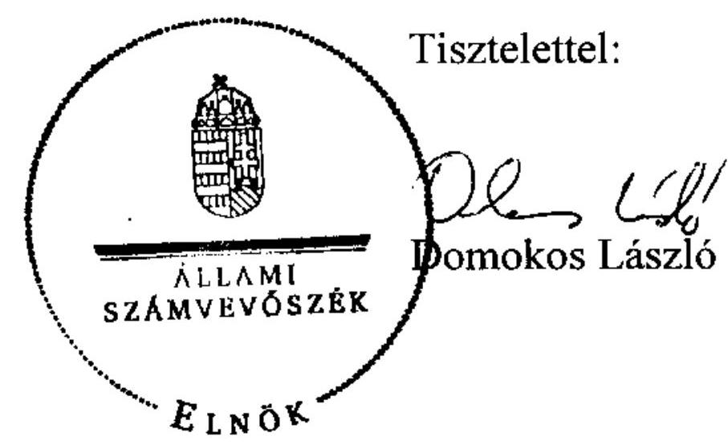

---

| Év | Tervezett és nyújtott férőhely-kilométer eltérés a tervezett érték   százalékában |  |  |  |  |  |  |
| :-- | :--: | :--: | :--: | :--: | :--: | :--: | :--: |
|  | Metro | Földalatti Vasút | HÉV | Villamos | Trolibusz | Autóbusz | Összes |
| $\mathbf{2005 .}$ | -0,04 | 0,44 | 0,34 | $-0,13$ | $-0,15$ | 0,05 | 0,02 |
| $\mathbf{2006 .}$ | $-0,02$ | 0 | $-0,44$ | $-1,47$ | $-1,09$ | $-0,35$ | $-0,53$ |
| $\mathbf{2007 .}$ | 0,45 | 0,44 | $-0,37$ | $-3,2$ | 0,47 | 1,4 | $-0,03$ |
| $\mathbf{2 008 .}$ | $-0,36$ | 1,36 | $-0,07$ | 1,19 | 0,66 | 1,66 | 0,80 |
| $\mathbf{2 009 .}$ | 0,36 | 0 | 0 | 0,26 | 0,17 | 0,64 | 0,40 |
| $\mathbf{2010 .}$ | 0,68 | 0 | $-1,36$ | $-1,43$ | 1,03 | 0,29 | $-0,15$ |

---

| A nyújtott minőség paramétereinek alakulása a tervezetthez képest |  |  |  |
| :--: | :--: | :--: | :--: |
| Év | A kimaradt indul-   lások százalékos   aránya a terve-   zetthez képest | A pontatlan indulá-   sok százalékos ará-   nya a tervezetthez   képest | Eltérés a tárgyi és   a bázis időszak   balesetei között   (\%) |
| 2005. | 1,56 | 2,79 | 0 |
| 2006. | 1,86 | 2,94 | 4,94 |
| 2007. | 1,48 | 2,53 | $-0,8$ |
| 2008. | 2,29 | 2,81 | $-7,5$ |
| 2009. | 1,86 | 2,43 | $-2$ |
| 2010. | 3,61 | 2,77 | $-2,03$ |

---

# A BKV   mérlegbeszámolóinak leltárral történő alátámasztása

---

# Tárgyi eszközök és szoftver termékek leltározása 

A BKV a leltározást a tárgyév 10. napjáig elkészített leltározási ütemtervben foglaltaknak megfelelően, a leltározási szabályzattal összhangban hajtja végre. A leltározás folyamatos, az Eszközelszámolási Osztály az ütemtervben rögzített leltári fordulónapra készíti el a leltártablót és a leltárfelvételi jegyeket költséghelyenként. A tárgyi eszközök és a szoftvertermékek esetében a leltártabló tartalmazza a mennyiségeket, ezért a leltárfelvétel és a leltárkiértékelés nem különül el egymástól. A BKV-nál a műszaki gépek, berendezések körében fokozatosan bevezetésre kerül a vonalkódos leltározás, így a leltározás folyamata és módszerei is ennek függvényében történnek.

Mivel a leltározás folyamatos, így a mérleg fordulónapján főkönyv-analitika egyeztetést hajtanak végre. Ennek megfelelően a leltárral való alátámasztás ellenőrzését is két szinten végeztük el:

- Egyrészt egy leltárfelvételi tablóról tetszőlegesen kiválasztott leltáreltéréssel kapcsolatban ellenőriztük, hogy minden, a leltározási szabályzat által előírt dokumentumot elkészítettek-e, illetve átvezették-e az analitikán a változásokat, megfelelően könyvelték-e azt,
- Másrészt elvégeztük a mérleg-fordulónapra vonatkozó főkönyv-analitika egyeztetést.

Leltárral való alátámasztás ellenőrzésének eredménye
A kiválasztott leltártabló tartalmazott hiányt, illetve többletet. Mindkét esetben megfelelő adattartalommal és aláírással, illetve pecséttel rendelkezésre állt a mozgást rögzítő tárgyi eszköz állományváltozási bizonylat, illetve a leltári hiány-többlet rögzítő jegyzőkönyv, az SAP eszközmozgási és könyvelési bizonylata.

Főkönyv-analitika egyeztetés eredménye
A főkönyv-analitika egyeztetés során bizonyos tárgyi eszköz soroknál eltérés mutatkozott a főkönyvi alszámlákat összesítő táblázat adott összege és az alszámlához kapcsolódó részletes analitika végösszege között. Az alszámlákat összesítő SAP tábla végösszege egyezett a főkönyvvel. Az eltérés okát nem tudták meghatározni és jelezték az SAP központ felé, mint rendszerhibát. Az eltérések összege főkönyvi alszámlánként a következő:

Ft

| Fökönyvi   alszámla | Megnevezés | Alszámla   összege | Fökönyvi összesítő   összege | Eltérés | Év |
| :--: | :-- | :--: | :--: | :--: | :--: |
| 1322 | Bruttó érték | 5144300567 | 5147936346 | -3635779 | 2005 |
|  | Halmozott Écs | -1208545129 | -1211163411 | 2618282 | 2005 |
|  | Nettó érték | $\mathbf{3 9 3 5 7 5 5 4 3 8}$ | $\mathbf{3 9 3 6 7 7 2 9 3 5}$ | $\mathbf{- 1 0 1 7 4 9 7}$ | $\mathbf{2 0 0 5}$ |
| 1322 | Bruttó érték | 8256365440 | 8252729661 | 3635779 | 2006 |

---

| Főkönyvi   alszámla | Megnevezés | Alszámla   összege | Főkönyvi összesítő   összege | Eltérés | Év |
| :--: | :--: | :--: | :--: | :--: | :--: |
|  | Halmozott Écs | -1378589582 | -1375926833 | -2662749 | 2006 |
|  | Nettó érték | 6877775858 | 6876802828 | 973030 | 2006 |
| 1322 | Bruttó érték | 9340769756 | 9344218910 | -3449154 | 2007 |
|  | Halmozott Écs | -1683233690 | -1685910269 | 2676579 | 2007 |
|  | Nettó érték | 7657536066 | 7658308641 | -772575 | 2007 |
| 1322 | Bruttó érték | 9352362988 | 9355812142 | -3449154 | 2008 |
|  | Halmozott Écs | -2028496349 | -2031209930 | 2713581 | 2008 |
|  | Nettó érték | 7323866639 | 7324602212 | -735573 | 2008 |
| 1322 | Bruttó érték | 9385001258 | 9387525368 | -2524110 | 2009 |
|  | Halmozott Écs | -2360185131 | -2362709241 | 2524110 | 2009 |
|  | Nettó érték | 7024816127 | 7024816127 | 0 | 2009 |

Bizonyos főkönyvi számlák esetében pedig eltérés mutatkozott a főkönyv és az analitika között. Ezek a következők:

| Főkönyvi   alszámla | Megnevezés | Alszámla   összege | Főkönyvi össze-   sítő összege | Eltérés | Év |
| :--: | :-- | :--: | :--: | :--: | :--: |
| 1578 | DBR - kapcs.   beruh. | 5135673389 | 5184447084 | -48773695 | 2008 |
| 1578 | DBR - kapcs.   beruh. | 8291854937 | 8867229169 | -575374232 | 2009 |

| Fökönyvi   alszámla | Megnevezés | Analitika | Főkönyvi egyen-   leg | Eltérés | Év |
| :--: | :-- | :--: | :--: | :--: | :--: |
| 143 | Bruttó érték | 688992304 | 689081500 | -89196 | 2007 |
|  | Halmozott Écs | -413397345 | -413486541 | 89196 | 2007 |
|  | Nettó érték | 275594959 | 275594959 | 0 | 2007 |
| 143 | Bruttó érték | 742231060 | 742320256 | -89196 | 2008 |
|  | Halmozott Écs | -468138645 | -468227841 | 89196 | 2008 |
|  | Nettó érték |  |  | 0 | 2008 |
| 143 | Bruttó érték | 769214650 | 769303846 | -89196 | 2009 |
|  | Halmozott Écs | -518080302 | -518169498 | 89196 | 2009 |
|  | Nettó érték | 251134348 | 251134348 | 0 | 2009 |

Ezen eltérésekről a főkönyvelő, illetve az informatikai vezető nyilatkozott, melyben jelezték, hogy az eltérés fennáll, illetve az összesítő táblázatban sze-

---

replő adatok felelnek meg a valóságnak. A BKV informatikai szolgáltatója azonnal megkezdte a hiba azonosítását, illetve jelezte, hogy a javítás gyártói kompetencia, ezért az SAP Online Service System hibajegy alapján vizsgálja a BKV SAP rendszerét javítás céljából. Az analitikában mutatkozó hibát az 1578 főkönyvi alszámla esetében még a vizsgálat lezárása előtt javították. Az eltérések okáról az ÁSZ a vizsgálat során nem tudott meggyőződni.

Az eltérés főkönyvi számlánként - a már javított analitika kivételével - a főkönyvi egyenleg 0,1-0,2\%-a. Az 1578 főkönyvi számlához tartozó analitika javított összege meghaladja a Számviteli törvény szerinti jelentős hibahatárt, azonban a javítás a főkönyvi számla összegét nem érintette.

A társaság számviteli politikája szerint „beruházások kalkulált értéke és a tényleges értéke közötti különbség akkor minősül jelentősnek, ha az eltérés meghaladja az adott eszköz aktiválási értékének 0,1\%-át, vagy a 200 000,- Ft-ot". Ezt a szabályt tekintve az analitikában található eltérések elérhetik a jelentős összegű hiba határát.

# Befektetett pénzügyi eszközök 

A részesedések leltározása egyeztetéssel történik. A főkönyv és az analitikus nyilvántartás (mozgástábla) között eltérés nem volt.

A dolgozók lakásépítési kölcsön leltározása egyeztetéssel történik. A mérlegben a munkáltatói kölcsönben részesült dolgozókkal szembeni követelés év végi egyenlegét nem a hitelintézetek által kiküldött, a tárgy év december 31-én fennálló adósokkal szembeni követelést tartalmazó nyilvántartás szerint mutatják be. A különbözetet minden évben kimutatják és azzal indokolják, hogy az adósok által befizetésre kerülő törlesztések a banki kimutatásban már szerepelnek, azonban a Lakásépítési Alap számlára később kerülnek átutalásra.

## Készletek leltára

A BKV Leltározási Szabályzata szerint a raktári készletek leltározását évente egyszer mennyiségi felvétellel (méréssel, számolással), a nyilvántartástól függetlenül, a tárgyév január 10-ig elkészített leltározási ütemtervnek megfelelően kell a Társaság összes raktárában elvégezni. A leltárfelvétel tételeit az SAP MM moduljában létrehozott leltárbizonylaton kell rögzíteni. A leltáreltérésekről leltárkülönbözeti listát kell készíteni, a különbözeteket rögzíteni kell a leltárfelvételi jegyzőkönyvben és az SAP rendszerben könyvelni kell.

A leltározás az év során folyamatosan történik, a tényleges leltárfelvétel és a mérleg fordulónapja között felmerülő gazdasági események az analitikus nyilvántartásban kerülnek rögzítésre. A leltárral való alátámasztás vizsgálata során a leltár felvétel végrehajtásának szabályosságát és a főkönyvi könyvelés és az analitikus nyilvántartások egyezőségét ellenőriztük.

Az ellenőrzésre kiválasztott leltározás során a mennyiségi felvétel eredménye az SAP MM moduljában leltárbizonylaton rögzítésre került, a leltári eltérésről kiállították a készlethelyesbítő jegyet, és a különbözetet szerepeltették a jegyzőkönyvben. A különbözetet az SAP rendszerben könyvelték. A leltárfelvételről

---

jegyzőkönyv készült, melynek melléklete a leltári különbözetről készült feljegyzés.

A raktári készletek főkönyvi könyvelése az analitikus nyilvántartásokkal megegyezett.

A befejezetlen termelés leltározását az év utolsó napján a nyilvántartásoktól függetlenül, ipari befejezetlen termelések esetében mennyiségi felvétellel, építőipari befejezetlen termelés esetében az építési naplóba bejegyzett mennyiség alapján kell elvégezni. Az állományi leltárt egyeztetni kell az analitikus nyilvántartás adataival és az Értékelési Szabályzat szerint el kell végezni az értékelést. Az így elkészített leltárt kell egyeztetni a főkönyvvel, és az eltéréseket rögzíteni. A főkönyvben szereplő érték és a leltári érték között eltérést nem találtunk.

A munkahelyi készletek leltározási körébe tartozik a tankkészlet, étkezési anyag és az „U" jelű utazási igazolványok leltározása. A tankkészlet leltározásához az üzemképes járművek üzemanyagtartályát december 31-ig fel kell tölteni, azok űrmérete, darabszáma alapján üzemanyag fajtánként készül a leltár. Az étkezési anyagok és az „U" jelű utazási igazolványok, hologramok leltározása mennyiségi felvétellel történik a leltár fordulónapjáig. Az elkészült leltárfelvételi bizonylat alapján történik a főkönyvi könyvelés. A leltár és a főkönyvi könyvelés között eltérést nem találtunk.

Az idegen kivitelezőknek javításra, gyártásra, garanciális javításra és az alvállalkozóknak térítésmentesen átadott anyagok leltározásához a javítást, gyártást végző társaságtól a december 31-i állapotnak megfelelő mennyiségi leltárkimutatást kell kérni. A raktár-irányítási szervezetnek a mennyiségi egyeztetés után kell a leltározást leltárfelvételi jegy kiállításával elvégezni.

Az idegen helyen tárolt anyagokat minden év október 31-i fordulónappal kell leltározni, és nyilatkozni az idegen helyen tárolt készlet teljességéről, illetve bizonylatolni az esetleges felhasználást.

Az úton lévő készletek leltározása során a társaság tulajdonát képező, de idegen helyen tárolt készletekről (számla már megérkezett), leltárt kell készíteni. A főkönyv a kimutatás értékével megegyezett.

A Leltározási Szabályzat szerint az adott gazdasági évre vonatkozó, de továbbszámlázásra nem került tételekről leltárt kell készíteni, mely tartalmazza a szállító nevét, a továbbszámlázás értékét, az SD rendelés számot. A BKV számviteli vezetőjének nyilatkozata alapján az SAP rendszerben a továbbszámlázott szolgáltatások analitikus nyilvántartása a főkönyvi számlákon történik, mert azokat tételesen rögzítik, a főkönyvi számlák „nyitott tétel" kezelésűek, a főkönyvi kartonokon a tételek (szállítónként, vevőnként, szerződésenként) összegezhetők.

# Követelések leltározása 

A Sztv. 69. § (2) bekezdése szerint a leltárba bekerülő adatok valódiságáról a csak értékben kimutatott eszközöknél (követelések) és kötelezettségeknél egyeztetéssel kell meggyőződni. A BKV leltározási szabályzatában rögzítette, hogy a követelésekre vonatkozóan olyan leltárt kell készíteni, amely tételesen (partnerenként) ellenőrizhető módon tartalmazza a követelések értékét, vagyis fordu-

---

lónapra vonatkozóan rendelkezésre kell állnia a követelésekre vonatkozó analitikus nyilvántartásnak. A leltározási szabályzatban rögzítik, hogy a követelések leltározását minden évben partnerenkénti egyeztetéssel kell elvégezni. A fordulónapon nyitott egyenleggel rendelkező vevők esetében minden évben kiküldésre kerültek az egyenlegértesítő levelek, melyek írásos feldolgozását, illetve az esetleges eltéréseket, azok tisztázását teljes körűen egyik vizsgált évben sem végezték el, így az egyenlegközlőkkel való alátámasztás a vevők esetében nem megfelelő.

A közbenső egyeztetés során a BKV vezérigazgatójának észrevétele szerint: „A vevők esetében az egyenleggel rendelkező partnereknek küldünk ki egyenlegközlőket a mérleg-fordulónap vonatkozásában, a szállítók esetében a tárgyévben forgalommal rendelkező partnereknek küldünk ki egyenlegközlőt. A szállítók esetében 2009.12.31 és 2010.12.31., a vevők esetében 2010.12.31. vonatkozásában került regisztrálásra, hogy mely partnerek nem küldték vissza az egyenlegközlőket, illetve melyek azok, amelyek nem az általunk nyilvántartott egyenleget igazolták vissza. A nem egyező egyenlegek esetében az egyeztetések megtörténtek, a különbségből adódó tételek rendezésre kerültek.

Minden esetben olyan egyenlegközlő kerül kiküldésre, amelynek szövegezésében megtalálható, hogy amennyiben a megküldött egyenlegközlőre 10 nap elteltével észrevétel nem érkezik, úgy az általunk közölt tartozásokat elfogadottnak tekintjük. Ennek alapján nem tartunk szükségesnek intézkedést abban az esetben, ha nem érkezik vissza észrevétel. Ezzel az eljárással szemben a könyvvizsgáló sem élt kifogással."

Az észrevétel nem megalapozott, mivel a hivatkozott egyeztetések vevők esetében egy, szállítók esetében két évben történtek meg, de ezekben az években sem történt teljes körű egyeztetés (az eltérés összege, oka és rendezése nem dokumentált). Az egyenlegközlők 10 napos határidőn belül történő észrevételezésének elmaradása nem tekinthető egyenértékűnek az egyenleg írásos visszaigazolásával (egyeztetésével).

Az SAP rendszerből előállított analitikákban az összesítő sorok minden esetben egyeztek a főkönyvi egyenleggel.

# Pénzeszközök leltározása 

A pénzeszközök leltározására vonatkozó évközi feladatokat a pénz- és értékkezelési szabályzat tartalmazza. A pénzeszközök év végi leltározását egyeztetéssel (analitikus és főkönyvi nyilvántartás) a pénzügyi főosztálynak kell elvégeznie, a DBR Metró, a Lakásalapszámla és az átvezetési számla kivételével, melynek felelőse a Számviteli főosztály Könyvelési és Mérleg osztálya.

A pénztárakkal kapcsolatos pénzmozgások rögzítése, illetve a kapcsolódó nyilvántartás vezetése a MenDi programban történik. A pénztári csoportoknál 5 naponta, az utánfizetési és jegyellenőri pénztárban naponta, a MÁV-Start Zrt. pénztáraiban, illetve az egyéb pénztárak esetében havonta egyszer, míg az Ellátás és Ügyviteli Csoportnál alkalomszerűen rögzítik a pénzmozgást. A pénzmozgással és elszámolással összefüggő eltérést, nem tapasztaltunk.

A pénzszállító vállalkozás részére átadásra váró készpénzállományt a fordulónapra vonatkozó pénztárleltárak nem tartalmazták, azokat a követelések kö-

---

zött számolták el. Követelésként kimutatott, el nem szállított készpénzállomány összegének alakulása 2005. évben 7,6 millió Ft, 2006. évben 67,8 millió Ft, 2007. évben 70,3 millió Ft, 2008. évben 14,6 millió Ft, 2009. évben 52,6 millió Ft és 2010. évben 25,6 millió Ft volt. A pénzeszközöket a BKV tőkesúlyos trezorban helyezi el, amelyhez nem tud a pénzszállító vállalkozás nélkül hozzáférni. A pénzszállító vállalkozás a vele szemben fennálló követelésekről fordulónapra vonatkozóan egyenlegközlő levelet küldött, amely nem tartalmazta a trezorba helyezett, de el nem szállított összegeket. Az érvényes szerződés szerint a pénzszállító vállalkozás a tőkesúlyos trezor kinyitásától viseli a felelősséget, így a trezorból el nem szállított pénz a BKV mérlegében követelésként való elszámolása nem felelt meg a szerződésben foglaltaknak.

A bankbetétek esetében a banki egyenlegközlőkkel és/vagy a fordulónapi záró bankkivonatban rögzített záró egyenleggel vetik össze a főkönyvi nyilvántartásban szereplő, záró egyenleggel.

# Saját tőke 

A saját tőke mérlegértékének alátámasztása az éves beszámolókban is bemutatott analitikával (mozgástábla) történt. A tőketartalék és a lekötött tartalék sorok változásához kapcsolódó gazdasági eseményeket tételesen bizonylatokkal alátámasztották. Az analitikus nyilvántartás és a főkönyv között eltérés nem volt.

## Céltartalékok

A céltartalék mérlegsor leltározása egyeztetéssel történik. A céltartalékokról analitikus nyilvántartást (mozgástáblát) vezettek, mely minden évben egyezett a főkönyvi könyveléssel.

## Kötelezettségek és hitelek leltára

A leltározási szabályzat alapján a rövid és hosszú lejáratú hitelek és kölcsönök esetében a banki egyenlegközlőkkel történő egyeztetéssel kell a leltárral való alátámasztást végrehajtani. A vizsgált időszakban a főkönyvi egyenlegek összegükben a banki visszaigazolásokkal megegyeznek. A kapott hitelanalitika egyezik a főkönyvi kivonat hitelekhez kapcsolódó egyenlegeivel.

A beruházási hitelként kimutatott összegeknél 2004-2007. évek között helytelen összeg szerepel. A társaság 2004. évi üzleti tervében 20 milliárd Ft működési és 8 milliárd Ft fejlesztési célú hitel felvételét tervezte, az Igazgatóság 60/2004. számú határozatával a konstrukciót 15 milliárd Ft beruházási és 12 milliárd Ft működési célú hitel felvételére változtatta, ténylegesen 23,9 milliárd Ft forgóeszköz finanszírozási célú hitel felvétele történt. A BKV 2004.december 3-án négy hitelszerződést kötött forgóeszköz finanszírozási céllal 5,0, 3,0, 2,0 és 1,0 milliárd Ft értékben. Számviteli nyilvántartásaiban az 5 milliárd forintos hitelt hibásan a fejlesztési célú hitelek között mutatta ki, ezzel megsértette az Sztv. 22. § (1) bekezdésében foglaltakat, azaz a társaság nem megfelelő mérlegsoron mutatta ki a hitelt. Az 5 milliárd forint refinanszírozási céllal felvett és felhasznált hitel fejlesztési hitellé történő átminősítésével biztosították, hogy a 2004-ben felvett hitelek struktúrája megegyezzen az üzleti tervben jóváhagyott hitelszerkezettel.

---

A BKV Leltározási Szabályzata szerint kötelezettségek leltározása alatt szállítókkal szembeni tartozás esetén a nyitott tételekkel rendelkező partnerekkel, adók és járulékok esetén az adóelszámolásról szóló bizonylatokkal, adóbevallással, illetve egyéb dokumentumokkal, jövedelem elszámolással kapcsolatos egyeztetések esetén az analitikus nyilvántartásoknak a könyvviteli számlákkal történő egyeztetését kell érteni.

A szállítókkal szembeni tartozások egyeztetéséhez a társaság minden évben kiküldte a nyitott tételekkel rendelkező partnereknek az egyenlegközlőt. Az egyenlegközlők visszaérkezését, az egyenlegek helyességét azonban nem kísérte figyelemmel (2005-2010. időszakban a visszaérkezett, analitikus nyilvántartással megegyező egyenlegközlők száma a vizsgált, száz legmagasabb kötelezettség állománnyal rendelkező partner esetében a következő volt: 2005-ben 6 db , 2006-ban 14 db, 2007-ben 2 db, 2008-ban 12 db, 2009-ben 49 db és 2010-ben 51 db ). A szállítókról vezetett analitikus nyilvántartás és a főkönyv minden évben megegyezett.

Az adók és járulékok esetén a
 szakképzési hozzájárulás kivételével analitikus nyilvántartás készült, mely a főkönyvi könyveléssel megegyezett (kivétel: 2006-2007 években az innovációs járulék, eltérés: 6 illetve 2,4 millió Ft, amelyek azonban indokolt eltérések voltak).

A jövedelem elszámolással kapcsolatos kötelezettségek egyeztetése során a főkönyvi kimutatás és a bizonylatok között három esetben mutatkozott eltérés, egyik összege sem haladta meg a tízezer forintot.

A belföldi vevő előlegekről partnerenként tételes leltár készült, mely minden évben megegyezett a főkönyvvel.

A helyiségbérleti szerződésekhez kapcsolódó óvadékok leltára tekintetében az SAP rendszerben készült analitikus nyilvántartás, az analitika és a főkönyv egyezősége minden évben biztosított volt.

Az egyéb kötelezettségek között nyilvántartott szerződéses letétek, Budapest Kártya elszámolás, lakóknak adott támogatások elszámolása, DBR kötelezettségek elszámolása és egyéb rövidlejáratú kötelezettségek tekintetében analitikus nyilvántartás nem készül, azokat a főkönyvi számlán tételenként könyvelik, mely kezeléséről a BKV számviteli vezetője nyilatkozott.

# Időbeli elhatárolások leltára 

A Leltározási Szabályzat szerint az időbeli elhatárolások év végi leltározásához minden igazgatóságnak felül kell vizsgálni, milyen - a mérlegkészítés évére vonatkozó - gazdasági esemény nem került számlázásra, bizonylatolásra. Ezekről az eseményekről értesítenie kell a Könyvelési és Mérleg osztályt, aki a könyvelést elvégzi.

Az aktív időbeli elhatárolások esetében a könyvelés tételesen történik a főkönyvi számlára, analitikus nyilvántartás nem áll rendelkezésre. A BKV számviteli vezetőjének nyilatkozatában tájékoztat arról, hogy az SAP rendszer az időbeli

---

elhatárolások tételeit „nyitott tételekként" kezeli, ennek kapcsán a gazdasági esemény státusza nyomon követhető.

A passzív időbeli elhatárolásoknál a költségek és bevételek elhatárolása esetében a folyamat megegyezik az aktív időbeli elhatárolásnál leírtakkal.

A halasztott bevételek esetében minden főkönyvi számla analitikus nyilvántartással alátámasztott, a főkönyv és az analitika között eltérés nem volt.
