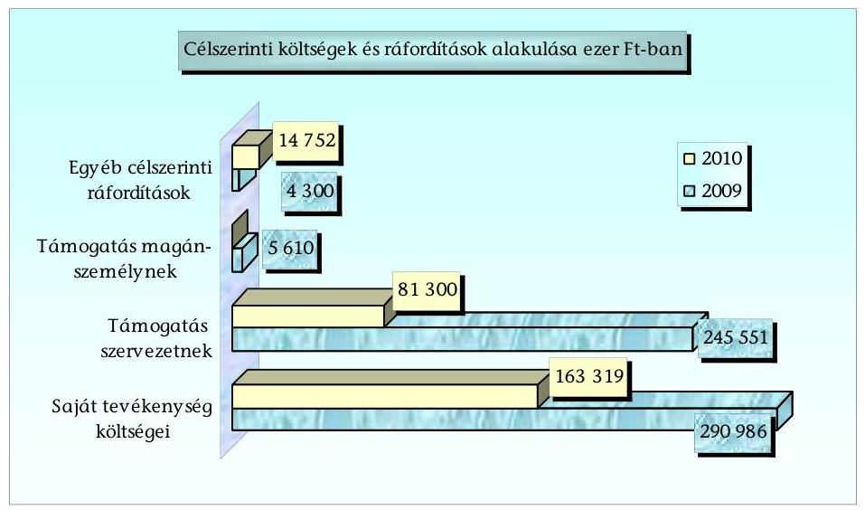
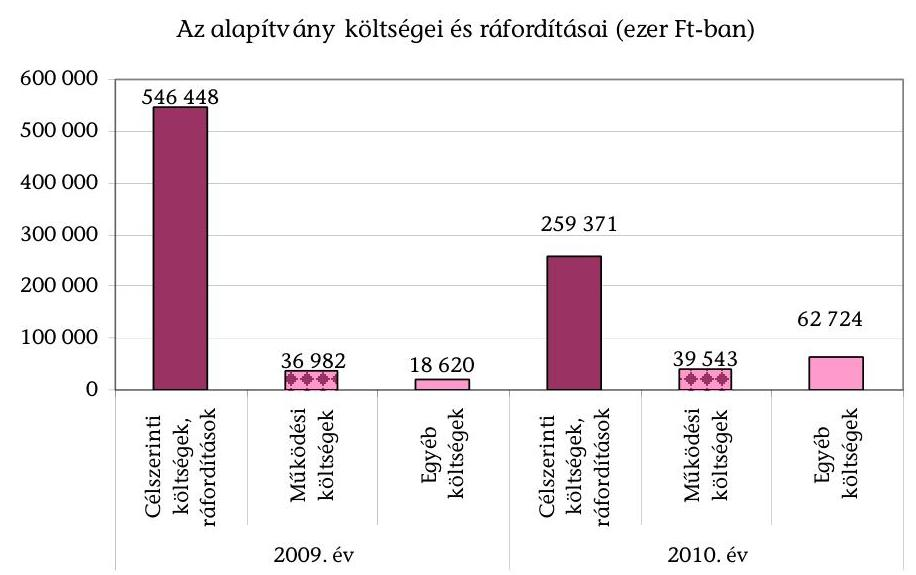
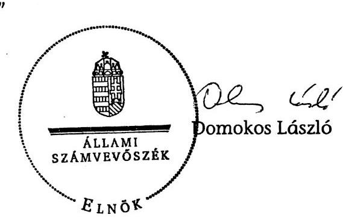
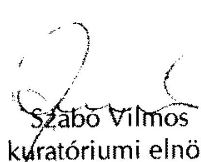

# JELENTÉS 

a Táncsics Mihály Alapítvány 2009-2010. évi gazdálkodása törvényességének ellenőrzéséről

---

# Állami Számvevőszék 

Iktatószám: V-3061-054/2011.
Témaszám: 1038
Vizsgálatazonosító: V-0554
Az ellenőrzést felügyelte:
Horváth Balázs
felügyeleti vezető
Az ellenőrzést vezette:
Solymár Ágnes
számvevő főtanácsos
A jelentés összeállításában közreműködött:
Szappanos Júlia
számvevő tanácsos
Az ellenőrzést végezték:
Kulcsár Lászlóné, Szappanos Júlia
számvevő tanácsos

A témához kapcsolódó eddig készített számvevőszéki jelentések:
címe
sorszáma
Jelentés a Táncsics Mihály Alapítvány 2003-2004. évi gazdálkodása ..... 0566
törvényességének ellenőrzéséről
Jelentés a Táncsics Mihály Alapítvány 2005-2006. évi gazdálkodása ..... 0751
törvényességének ellenőrzéséről
Jelentés a Táncsics Mihály Alapítvány 2007-2008. évi gazdálkodása ..... 0954
törvényességének ellenőrzéséről

---

# TARTALOMJEGYZÉK 

BEVEZETÉS ..... 5
I. ÖSSZEGZŐ MEGÁLLAPÍTÁSOK, KÖVETKEZTETÉSEK ..... 7
II. RÉSZLETES MEGÁLLAPÍTÁSOK ..... 10

1. Az alapítvány gazdálkodásának törvényessége ..... 10
1.1. A kuratórium működése ..... 10
1.2. Az alapítvány bevételei ..... 11
1.3. Az alapítvány költségei és ráfordításai ..... 11
2. A számviteli beszámolók ..... 14
2.1. A számviteli beszámolók ..... 14
2.2. A mérleg ..... 15
2.3. Az eredmény-kimutatás ..... 16
3. A könyvvezetés szabályozottsága és gyakorlata ..... 16
4. Az alapítvány ellenőrzési rendszere ..... 19
5. Az alapítvány által létrehozott gazdasági társaság ..... 20
6. A korábbi ellenőrzés megállapításaira tett intézkedések ..... 21

## MELLÉKLETEK

1. számú A Táncsics Mihály Alapítvány 2010. évi mérlege
2. számú A Táncsics Mihály Alapítvány 2010. évi eredmény-kimutatása
3. számú A kuratóriumi elnök észrevétele
4. számú A kuratóriumi elnök észrevételére adott válasz

---

.

---

# RÖVIDÍTÉSEK JEGYZÉKE 

alapítvány
alapítványok gazdálkodási
rendjéről szóló
kormányrendelet
áfa
ÁSZ
éves beszámoló
FB
Gt.
Kbt.
Kft.
MSZP
pártalapítványi törvény
párttörvény
Ptk.
számviteli rendelet

SZMSZ
Szt.

Táncsics Mihály Alapítvány
Az alapítványok gazdálkodási rendjéről szóló 115/1992.
(VII. 23.) Korm. rendelet
Általános forgalmi adó
Állami Számvevőszék
Egyszerűsített éves beszámoló
felügyelőbizottság
A gazdasági társaságokról szóló 2006. évi IV. törvény
A közbeszerzésekről szóló 2003. évi CXXIX. törvény
Kapcsolat.hu Kommunikációs és Szolgáltató Nonprofit
Korlátolt Felelősségű Társaság
Magyar Szocialista Párt
A pártok működését segítő tudományos, ismeretterjesztő, kutatási, oktatási tevékenységet végző alapítványokról szóló 2003. évi XLVII. törvény
A pártok működéséről és gazdálkodásáról szóló 1989. évi XXXIII. törvény
A Polgári Törvénykönyvről szóló 1959. évi IV. törvény
A számviteli törvény szerinti egyes egyéb szervezetek beszámoló-készítési és könyvvezetési kötelezettségének sajátosságairól szóló 224/2000. (XII. 19.) Korm. rendelet
Szervezeti és Működési Szabályzat
A számvitelről szóló 2000. évi C. törvény

---

.

---

# JELENTÉS 

## a Táncsics Mihály Alapítvány 2009-2010. évi gazdálkodása törvényességének ellenőrzéséről

## BEVEZETÉS

A pártok működését segítő tudományos, ismeretterjesztő, kutatási, oktatási tevékenységet végző alapítványokról szóló 2003. évi XLVII. törvény (pártalapítványi törvény) alapján a pártok a politikai kultúra fejlesztése érdekében költségvetési támogatásra jogosult alapítványt hozhatnak létre tudományos, ismeretterjesztő, kutatási és oktatási tevékenységük elősegítésére.

A Magyar Szocialista Párt (MSZP) a törvényi rendelkezéseknek megfelelően 2003-ban létrehozta a Táncsics Mihály Alapítványt (alapítvány).

Az alapítvány alapító okirat szerinti céljai: elősegíteni az MSZP alkotmányban biztosított, a népakarat kialakításában, valamint kinyilvánításában történő hatékony közreműködését; szélesíteni az állampolgárok tájékozódását a magyar társadalmat érintő társadalmi és politikai kérdésekről, a szociáldemokrácia elméleti megközelítéseiről; ösztönözni a magyar politikai kultúra színvonalának emelését, a demokrácia elveinek és gyakorlatának erősítését; bátorítani a magyar és a globális kulturális értékek, valamint a tudományos eredmények tiszteletben tartását és elfogadtatását; előmozdítani a szociáldemokrata gondolkodás fejlődését, és a szociáldemokrata eszmeiség terjesztését; segíteni a nemzeti érdekeknek a változó körülményeknek megfelelő időszerű megfogalmazását, különös figyelmet fordítva Magyarország uniós tagságából következő feladatokra.

A pártalapítványok gazdálkodása törvényességének ellenőrzésére a pártalapítványi törvény 4. § (2) bekezdése alapján az Állami Számvevőszék (ÁSZ) jogosult, a pártalapítványi törvény 4. § (4) bekezdése értelmében az ÁSZ kétévenként ellenőrzi azon alapítványok gazdálkodásának törvényességét, amelyek e törvény szerint állami költségvetési támogatásban részesültek.

A pártalapítványi törvény alapján létrehozott alapítványok költségvetési támogatásának mértékéről a pártok működéséről és gazdálkodásáról szóló 1989. évi XXXIII. törvény (párttörvény) 9/A. § (5) bekezdése rendelkezik.

Az alapítvány a törvényi előírásnak megfelelően 2009-ben 545 000 ezer Ft, 2010-ben 402 374 ezer Ft költségvetési támogatásban részesült. A csökkenést az utolsó általános választáson az első érvényes fordulóban az alapító pártra leadott szavazatok arányának csökkenése okozta.

---

# Jelen ellenőrzés célja volt az alapítvány 2009-2010. évi gazdálkodása törvényességének értékelése, amelynek keretében ellenőriztük: 

- az alapítvány gazdálkodásának és éves jelentéseinek törvényességét;
- az éves számviteli beszámolók jogszabályi előírásoknak való megfelelését;
- az alapítvány könyvvezetésében a számvitelről szóló 2000. évi C. törvény (Szt.) és egyéb jogszabályi rendelkezések, valamint belső előírások betartását;
- a kuratórium által megtett szükséges intézkedéseket az ÁSZ előző ellenőrzése során feltárt hiányosságok megszüntetése, valamint az intézkedési tervben megjelölt feladatok megvalósítása érdekében.

A szabályszerűségi ellenőrzést a 2009. január 1. és 2010. december 31. közötti időszakra, a pártalapítványok gazdálkodása törvényességének ellenőrzéséhez készült segédlet alapján végeztük. Az ellenőrzési tapasztalatok kiértékeléséhez az átfogó lényegességi küszöböt az éves eredmény-kimutatás szerinti bevétel 2%-ában határoztuk meg. Teljes körűen ellenőriztük a kapott adományokat és az érzékeny, 10 000 ezer Ft-ot elérő tételeket. A 10 000 ezer Ft alatti tételeket véletlenszerű mintaválasztással ellenőriztük.

A jelentéstervezetet egyeztettük az alapítvány kuratóriumi elnökével. Az észrevételt és az arra adott választ a 3-4. számú mellékletek tartalmazzák.

---

# I. ÖSSZEGZŐ MEGÁLLAPÍTÁSOK, KÖVETKEZTETÉSEK 

A kuratórium az ellenőrzött időszakban az alapító okirat előírásainak megfelelően törvényesen működött. A kuratórium vagyont érintő határozatai, valamint a költségvetési támogatás felhasználása a pártalapítványi törvényben és az alapító okiratban egyaránt megfogalmazott tudományos, ismeretterjesztő, kutatási, oktatási célok megvalósítására irányultak.

Az alapítvány éves költségvetés alapján gazdálkodott, amelynek teljesítését a kuratórium figyelemmel kísérte, a munkaszervezet vezetőjét beszámoltatta az ülések közötti időszak gazdasági eseményeiről. Az alapítvány az ellenőrzött években 1 040 369 ezer Ft bevételt mutatott ki, amelynek 93%-a (968 544 ezer Ft) a központi költségvetésből származott. Az alapítvány kizárólag magánszemélyektől kapott összesen 229 ezer Ft támogatást. Az adományok a pártalapítványi törvénynek megfelelően az alapítvány pénzforgalmi számlájára a magánszemélyek pénzforgalmi számlájáról érkeztek, a támogatók beazonosíthatóak voltak. Az adományok elfogadásáról minden alkalommal döntött a kuratórium.

Az alapítvány 963 688 ezer Ft összegű ráfordítást számolt el, amelynek 84%-át a cél szerinti feladatok megvalósításának közvetlen költségei (805 818 ezer Ft), 8%-át a működés során felmerült költségek (76 526 ezer Ft), 8%-át az egyéb ráfordítások tették ki (81 344 ezer Ft). A célszerinti kifizetések magánszemélyek és szervezetek részére nyújtott támogatásokat és saját szervezeti keretek között végzett tevékenységek kiadásait tartalmazták.

Az alapítvány feladatát a létrehozott gazdasági társaságán keresztül is ellátta. A 2006. évben alapított Kapcsolat.hu Kommunikációs és Szolgáltató Nonprofit Kft. (Kft.) internetes portált működtetett, amely az alapítvány és az iránta érdeklődők közötti kapcsolattartást és információáramlást segítette elő.

---

Az alapítvány a portál üzemeltetésére 2009-ben 132 300 ezer Ft-ot, 2010-ben 41 250 ezer Ft-ot fizetett ki a Kft. részére, miközben a Kft. vállalkozási díjának csökkentésével egyidejűleg a feladatok körét nem szűkítették. A szerződéssel és annak módosításaival összefüggésben felvetődhet a szolgáltatás és ellenszolgáltatás közötti értékaránytalanság, azonban a feltárt körülmények teljes körű kivizsgálása az ÁSZ rendelkezésére álló eszközökkel nem volt lehetséges.

A támogatásban részesült magánszemélyekkel és a szervezetekkel a kuratórium elnöke szerződést kötött, részükre a támogatásokat a szerződésekben foglaltak szerint folyósították. A kapott támogatásokról a kedvezményezettek elszámolást készítettek, az ellenőrzött támogatottak közül 14 (26%) határidőn túl számolt el. A késedelmes elszámolások hiánypótlást, kuratóriumi döntést követően lezárásra kerültek. Az elszámolási kötelezettséget nem teljesítő egy támogatottal szemben a szerződésben foglalt szankciókat (fizetési meghagyás, szerződésbontás) érvényesítették.

Az alapítvány számviteli szabályozását az előző ÁSZ ellenőrzés felhívására megújította. A szabályzatok módosítását a kuratórium jóváhagyta. A számviteli szabályzatok megfeleltek a jogszabályoknak, kivéve a hatályos számlarendet. Az Szt. számlarend tartalmára vonatkozó előírásaitól eltérően nem tüntették fel a számlákat érintő valamennyi gazdasági eseményt, azok más számlákkal való kapcsolatát, a növekedések és csökkenések jogcímeit, különös tekintettel az alapítványi sajátosságokra.

Az alapítvány eleget tett éves beszámoló készítési kötelezettségének, az egyszerűsített éves beszámolókat mindkét évben a jogszabályi előírásoknak és a belső szabályzatoknak megfelelően állította össze. A beszámolók összeállítása során az Szt.-ben szabályozott alapelveket érvényesítette. A beszámolókat a felügyelőbizottság véleményezte, a könyvvizsgáló hitelesítő záradékkal látta el, a kuratórium elfogadta. Az éves mérlegekben kimutatott eszközök és források értékadatait leltárakkal alátámasztották, az eredmény-kimutatás bevétel és ráfordítás sorainak adatait a főkönyvi könyvelés alapbizonylataival, analitikával támasztották alá. Az alapítvány a 2009. és a 2010. évi gazdálkodásáról szóló éves jelentéseit a pártalapítványi törvény előírásai szerint elkészítette, a Hivatalos Értesítőben és internetes honlapján határidőben közzétette. A kuratórium a jelentéseket mindkét évben szabályosan elfogadta.

A jogszabályok és a belső előírások betartásával, megbízás alapján, regisztrált külső számviteli szolgáltató végezte a kettős könyvvezetést, mindkét évben azonos számítógépes programmal. A gazdasági eseményeket idősorrendben, zárt rendszerben rögzítették könyvelési alapbizonylatokkal alátámasztva. A főkönyvi számlákhoz kapcsolódóan az előírt analitikus nyilvántartásokat vezették, a leltározás mindkét évben teljes körű volt, a leltározás eredményét kiértékelték. Az éves zárásokat az analitikus nyilvántartások alátámasztották.

Az alapítványok gazdálkodási rendjéről szóló kormányrendelet előírásának megfelelően, a számviteli nyilvántartásban elkülönítették az alapítványi célú tevékenység közvetlen, az alapítvány kezelő szervének közvetett költségeit és az egyéb közvetett költségeket. A házipénztári nyilvántartások vezetése szabályszerű volt, a záró pénzkészlet nem haladta meg a belső szabályozásban előírt mértéket.

---

Az eszközbeszerzéseknél és a ráfordítások elszámolásánál érvényesítették a kötelezettségvállalás, a teljesítésigazolás és az utalványozás, valamint a banki aláírás szabályait.

A bizonylati elv és fegyelem érvényesült a 2009-2010. évi ellenőrzött bizonylatok esetében. A bizonylatok alaki és tartalmi kellékeire vonatkozó Szt. követelmények teljes körűen teljesültek, a bizonylatok megőrzéséről gondoskodtak, a szigorú számadású nyomtatványok nyilvántartásba vételi kötelezettségét teljesítették.

A kuratórium a Kft. feletti alapítói jogait a Gt. előírásait betartva gyakorolta. A kuratórium döntött a Kft. jegyzett tőkéjének 1000 ezer Ft-tal, a tőketartalék 40 000 ezer Ft-tal történő megemeléséről, annak érdekében, hogy az alapítványi feladatokat elláthassa. A Kft.-nek 2009-ben 5 063 ezer Ft, 2010-ben 62 724 ezer Ft vesztesége volt. Az alapítvány - belső szabályzataival összhangban - a tőkepótlást követő 266 000 ezer Ft könyv szerinti értékű részesedésére 2009-ben 18 620 ezer Ft, 2010-ben 62 724 ezer Ft összegű értékvesztést számolt el.

Az alapítványnál az ellenőrzési feladatokat az alapító okiratban, az SZMSZ-ben és a belső szabályzatokban, valamint a munkaköri leírásokban határozták meg. A felügyelőbizottság (FB) az alapító okiratban foglaltaknak megfelelően mindkét évben vizsgálta az éves költségvetést, az éves beszámolót és az alapítványi tevékenységről készített szakmai beszámolót. A vezetői ellenőrzést a kuratórium elnöke és az alapítvány igazgatója a munkáltatói jogkör gyakorlása, a képviseleti jog, a kötelezettségvállalás, az utalványozás és a bankszámla feletti rendelkezés során megfelelően látták el. A pénzügyi irányítási és ellenőrzési feladatok magukban foglalták a pénzügyi döntések dokumentumainak elkészítését, az előzetes és utólagos pénzügyi ellenőrzést, a határozatok és döntések szabályszerűségi szempontú jóváhagyását, az időszakban hatályos jogszabályoknak megfelelő könyvvezetést és beszámoló készítést. A vezetői és a munkafolyamatba épített ellenőrzések a belső szabályzatokban foglaltaknak megfelelően működtek. Az alapítvány a nyújtott támogatások felhasználását az ellenőrzött időszakban kizárólag dokumentumok alapján ellenőrizte, helyszíni ellenőrzést nem végzett. A könyvvezetést végző szervezettel kötött szerződés nem tartalmazta a megbízott fél anyagi felelősségét.

Az előző ÁSZ vizsgálat javaslatainak eleget téve a kuratórium intézkedési tervet készített, amelynek megfelelően a pályázatkezelési szabályzatában az elszámolási hiányosságokat megszüntette, a pénzkezelési szabályzatot készpénz záró állomány, utalványozási jogkör és szigorú számadású bizonylatok tekintetében
 módosította. Az alapítvány a Kbt. vonatkozó előírásait betartotta, az egyes beszerzések során közbeszerzési eljárás lefolytatási kötelezettsége nem volt. A magánszemélyek részére teljesített kifizetéseket a személyi jellegű ráfordítások között számolta el.

---

# II. RÉSZLETES MEGÁLLAPÍTÁSOK 

## 1. AZ ALAPÍTVÁNY GAZDÁLKODÁSÁNAK TÖRVÉNYESSÉGE

### 1.1. A kuratórium működése

Az MSZP az alapítvány alapító okiratát az ellenőrzött időszakban két alkalommal módosította. A 2009. évben az MSZP székhelyének és az alapítvány kuratóriumi elnök személyében történő, 2010-ben pedig az alapítvány székhelyének, illetve a kuratóriumi ülések jegyzőkönyveire, a hozzászólások tartalmának rögzítésére vonatkozó előírások változása tette szükségessé a módosítást. Az alapító okiratok módosításának bírósági bejegyzése megtörtént.

A kuratórium az ellenőrzött időszakban az alapító okirat változásával összhangban két, a szervezeti változások miatt további egy alkalommal módosította az alapítvány szervezeti és működési szabályzatát (SZMSZ).

A kuratórium működése az ellenőrzött időszakban megfelelt az alapító okirat vonatkozó előírásainak. A kuratórium összesen 15 alkalommal ülésezett, 353 határozatot hozott az üléseken jelenlévő kuratóriumi tagok egyszerű szótöbbségével. A kuratóriumi ülésekről készített jegyzőkönyvek, valamint a határozatok tára megfelelt az alapító okirat és az SZMSZ előírásainak.

A kuratórium mindkét évben megtárgyalta és elfogadta az éves munkatervet, a költségvetési és pénzügyi tervet, az éves szakmai és pénzügyi beszámolót, valamint az egyéb szabályzatok módosításait. Az alapítvány költségvetési és pénzügyi terveit az alapító okirat IV. fejezet 3. b) pontjának előírása szerint készítették és fogadták el.

A tervek tartalmazták a bevételeket, az alapítvány feladatainak minden fő területére vonatkozóan a várható ráfordításokat, valamint a működtetés során felmerülő költségeket. A kuratórium az ülések között eltelt időszakban végzett tevékenységekről minden alkalommal beszámoltatta a munkaszervezet vezetőjét.

A kuratórium a költségvetésben megtervezte a ráfordításokat a kapcsolat.hu portál és az információs központ működtetésére, az életmű-díj kiadására, rendezvényeire és konferenciáira, az együttműködő szervezetek és egyéb szervezetek támogatására, a fizetendő ösztöndíjakra és az alapítványi személyi és egyéb működési költségeire. Bevételi tervei között a költségvetési támogatásokat, a kamatbevételeket és egyéb bevételeket szerepeltette.

Az ellenőrzött időszakban a kuratórium gazdálkodást (cél szerinti tevékenység, működés, tulajdonosi befektetés, pénzeszköz lekötés) érintő döntései a pártalapítványi törvényben és az alapító okiratban megjelölt cél szerinti tevékenységek ellátását szolgálták.

---

# 1.2. Az alapítvány bevételei 

Az ellenőrzött időszakban az alapítvány az éves beszámolóiban összesen 1040369 ezer Ft összes bevételt mutatott ki. A legnagyobb bevételi forrást (93\%) mindkét évben a költségvetési támogatás jelentette. Az alapítvány nem végzett vállalkozási tevékenységet, abból származó bevétele nem volt.

|  | Adatok ezer Ft-ban |  |  |
| :--: | :--: | :--: | :--: |
| Megnevezés | 2009. | 2010. | $\begin{aligned} & 2009- \\ & 2010 . \text { évek } \end{aligned}$ |
| Költségvetési támogatás* | 563670 | 404874 | 968544 |
| Csatlakozói adományok | 39 | 190 | 229 |
| Egyéb bevételek | 3164 | 4403 | 7567 |
| Fel nem használt támogatás visszafizetése | 3048 | 2196 | 5244 |
| Készlet és tárgyi eszköz értékesítés | 0 | 2206 | 2206 |
| Egyéb bevétel, költségtérítés, kötbér | 116 | 1 | 117 |
| Pénzügyi műveletek bevétele | 36575 | 27205 | 63780 |
| Rendkívüli bevételek | 249 | 0 | 249 |
| Összes bevétel | 603697 | 436672 | 1040369 |

* Az éves beszámolókban kimutatott költségvetési támogatás az Szt. alapján előző időszakokra elszámolt időbeli elhatárolások összegét is tartalmazza.

Az alapítvány a párttörvény 9/A. § (3) bekezdésében foglaltak alapján jogosult volt a költségvetési támogatásra. Az alapítványnak kiutalt támogatás összege megfelelt a párttörvény 9/A. § (4) és (5) bekezdésében foglalt rendelkezésnek. A támogatási összeg csökkenését az utolsó általános választáson az első érvényes fordulóban az alapító pártra leadott szavazatok arányának csökkenése okozta.

A pártalapítványi törvény 3. § (2) bekezdése és az alapító okirat előírása alapján a kuratórium jóváhagyta a csatlakozóktól kapott támogatásokat és betartotta a (3) bekezdésének rendelkezését, a támogató csatlakozók a bankszámla kivonatok alapján egyértelműen beazonosíthatóak voltak, a támogatást a csatlakozók pénzforgalmi számlájáról az alapítvány pénzforgalmi számlájára történő átutalással nyújtották. A csatlakozók nem jelölték meg adományaik konkrét célját, az alapítvány alapító okiratában meghatározott feladatokra volt felhasználható, ezzel igazodott a párttörvény 9/A. § (1) bekezdésében és az alapító okiratban meghatározott célokhoz. A pártalapítványi törvény 3. § (4) bekezdésének megfelelően nem kellett a csatlakozóktól kapott támogatásokat közzétenni, mert összegük nem haladta meg az ötszázezer forintot.

### 1.3. Az alapítvány költségei és ráfordításai

Az alapítvány a párttörvény 9/A. § (1) bekezdésében és az alapító okiratban meghatározott célokra fordította az állami költségvetési támogatás összegét. A kuratórium az alapítvány által végzendő cél szerinti tevékenységekről a költségvetés keretében, annak elfogadásával és módosításaival, továbbá egyedi hatá-

---

rozatokkal döntött. Az alapítvány a vizsgált időszakban összesen 963688 ezer Ft költséget és ráfordítást számolt el, összetételét a következő diagram mutatja:

Az alapítvány cél szerinti feladatainak megvalósítására 83,6\%-ot ( 805819 ezer Ft), működésre 7,9\%-ot ( 76525 ezer Ft), egyéb költségekre 8,5\% ( 81344 ezer Ft) fordított. Az alapítvány működési költségként az alkalmazottak juttatásait, az igénybevett szolgáltatásokat számolta el. Az egyéb költségek növekedésének oka az alapítvány Kft.-jében meglévő befektetésre elszámolt 81344 ezer Ft összegű értékvesztés volt. A cél szerinti tevékenységén belül az alapítvány saját szervezete révén közvetlenül szervezett programokat, szakmai fórumokat, működtette az információs és rendezvényközpontot (call center), valamint a kapcsolat.hu portált, a Táncsics Akadémián valósított meg képzéseket, életmű-díjat adományozott.

Az alapítvány az ellenőrzött időszakban az alapító okirattal összhangban, az úgynevezett együttműködő bázisszervezetekkel kötött támogatási megállapodások, illetve egyedi kérelmek alapján nyújtotta támogatásait. A kuratórium a támogatások nyújtásának feltételeit a pályázatkezelési szabályzatban határozta meg, amelyet 2010-ben módosított, kiegészítette azt a hiánypótlás, a támogatás visszakövetelésének, és a hiánypótlási kötelezettséget nem teljesítő támogatottakkal szemben lefolytatandó eljárás szabályaival.

A kuratórium a szervezetek és a magánszemélyek részére nyújtott támogatásokról minden esetben az alapító okirat előírásainak betartásával, szabályosan döntött. A támogatási kérelmek elbírálásáról szóló kuratóriumi határozatok egyértelműen beazonosíthatóak voltak. Az alapítvány a támogatási kérelmeket a pályáztatási szabályzat által előírt adatlap egyidejű kitöltésével fogadta be, ezzel együtt terjesztette a kuratórium elé. A kuratórium döntéséről a támogatottakat a munkaszervezet vezetője írásban értesítette, a nyertesekkel szerződést kötöttek, amelyeket minden esetben a képviseletre jogosult kuratóriumi elnök írta alá. A támogatásokról hozott kuratóriumi döntéseket az alapítvány honlapján megjelentették.

---

Az alapítvány betartotta a pályázatkezelési szabályzat rendelkezéseit a támogatás nyújtás feltételeire, a szerződéskötésre és elszámoltatásra vonatkozóan. A támogatási szerződésekben megjelölte a támogatott nevét, a támogatási célt, a támogatás összegét, a folyósítás, az elszámolás határidejét, módját, valamint a szerződésszegés esetén alkalmazandó szankciókat. A támogatási szerződéseket a kuratóriumi határozatok tartalmával egyezően kötötték. Az alapítvány a támogatásokat a szerződésben meghatározott összegekben és határidőben folyósította.

Az alapítványi iroda munkatársai ellenőrizték a szerződés szerinti felhasználások szabályosságát az elszámoláshoz beküldött pénzügyi és szakmai beszámolók, a támogatott szervezet által hitelesített és záradékolt bizonylatok, valamint a kifizetéseket igazoló bankszámlakivonatok és pénztárbizonylatok alapján.

Az ellenőrzött támogatottak 68\%-a (37 támogatás) határidőben, 26\%-a (14 támogatás) határidőn túl, késedelmesen számolt el, 6\%-uknál (3 támogatás) a helyszíni ellenőrzés időszakában az elszámolás nem volt esedékes. A késedelmes elszámolások 2009. évi támogatásoknál jelentkeztek, amelyek közül három támogatás (6\%) elszámolása haladta meg a 30 napos késedelmet. 2010-ben minden elszámolás határidőben megtörtént, az alapítvány pályázatkezelési szabályzata módosításának, illetve annak szigorúbb és következetes alkalmazásának eredményeként.

A támogatási szerződések tartalmazták a szerződésszegés esetére vonatkozó szankciókat, amelyek kiterjedtek a késedelmes elszámolásokra és a szerződéses céltól eltérő felhasználásra. Az alapítványi iroda elszámolási, illetve teljesítési hiányosságok miatt az ellenőrzött szerződések 13\%-a (hét támogatás) esetében szólította fel a támogatás visszafizetésére a támogatottakat.

Egy szervezet pótolta a hiányzó dokumentumokat, egy másik szervezet a kapott támogatásból el nem számolt összeget visszafizette. Négy támogatást magánszemélyek kapták ösztöndíjként, a tanulmányi eredményük nem felelt meg a szerződésben előírtaknak, azonban kérelmezték a visszafizetési kötelezettség elengedését, amelyet a kuratórium jóváhagyott. A Piros Pont Egyesület a részére 2009-ben nyújtott, 2000 ezer Ft támogatással a szerződésben és a pályázatkezelési szabályzatban foglalt határidőben nem számolt el. Négyszeri felszólítást követően sem fizette vissza a támogatást, az alapítvány részéről a fizetési meghagyási eljárás a helyszíni ellenőrzés időszakában indult el.

Az alapítvány igazgatója a benyújtott elszámolások lezárásaként a támogatottakat írásban értesítette azok elfogadásáról. Az elszámolások két kivétellel megfeleltek a jogszabályi, szerződési és a belső szabályzati előírásoknak. Az elszámolásokhoz csatolt számlák alátámasztották a támogatás célszerű felhasználását, a kifizetésük alátámasztására benyújtott kiadási pénztárbizonylatok azonban nem feleltek meg az Szt. 167. § előírásainak, mert azok egynegyedén nem szerepelt az utalványozó, a kiállító és a pénztáros aláírása.

A helyszíni ellenőrzés idején mindkét támogatott nyilatkozott a pénztárbizonylatok valódiságáról, valamint csatolták a pénztár főkönyvi számla tételes forgalmi adatait, amelyek a kifogásolt pénztári kifizetéseket tartalmazták.

---

Az alapítvány a közbeszerzésekről szóló 2003. évi CXXIX. törvény (Kbt.) hatálya alá tartozó beszerzések tekintetében, a törvény 22. § (1) bekezdés i) pontja értelmében ajánlatkérőnek minősült. Az alapítványnak a vizsgált időszakban két szolgáltatási szerződése volt, amely a Kbt. szerinti 8 millió Ft összegű nemzeti közbeszerzési értékhatárt meghaladta, közbeszerzési eljárás lefolytatási kötelezettsége azonban nem volt.

A kuratórium internetes portál működtetésével a 100\%-ban saját tulajdonában lévő Kft.-t bízta meg 9000 ezer Ft, majd 5000 ezer Ft, az utolsó módosítást követően 2000 ezer Ft + áfa havonkénti díjazás mellett. A Kft. szerződéskötést követő éves nettó árbevételének legalább 90\%-a az ajánlatkérővel kötendő szerződések teljesítéséből származott, mindezek alapján az alapítvány a Kbt. 2/A. § alapján indokoltan nem folytatott le közbeszerzési eljárást.

Az alapítvány székhelyéül szolgáló ingatlanra bérleti szerződést kötött, melynek éves szinten számított összege 9086 ezer Ft +áfa volt, azonban a Kbt. 29. § (2) bekezdés a) pontja alapján - mint ingatlanra vonatkozó egyéb jog megszerzése - nem volt közbeszerzés köteles.

# 2. A SZÁMVITELI BESZÁMOLÓK 

### 2.1. A számviteli beszámolók

Az alapítvány egyszerűsített éves beszámolóit a kettős könyvvitel rendszerében, a számviteli politikában meghatározott formában, a számviteli törvény szerinti egyes egyéb szervezetek beszámoló-készítési és könyvvezetési kötelezettségének sajátosságairól szóló 224/2000. (XII. 19.) Korm. rendelet (számviteli rendelet) előírásait betartva készítette el. A beszámolókat az Szt. 20. § (6) bekezdés rendelkezésének megfelelően a képviseletre jogosult kuratóriumi elnök írta alá.

Az alapítvány 2009. és 2010. évi egyszerűsített éves beszámolóját a választott könyvvizsgáló hitelesítő záradékkal látta el. A beszámolókat az FB az üléséről készült jegyzőkönyv tanúsága szerint mindkét évben felülvizsgálta és véleményezte az alapító okirat 5/b. pontja előírásának megfelelően. Ezt követően a beszámolókat a kuratórium egyhangú döntéssel elfogadta.

Mindkét évben érvényesültek a beszámoló összeállítására vonatkozó Szt.-ben foglalt alapelvek. Az éves beszámolók adatai az év végi főkönyvi kivonatok adataival egyeztethetőek voltak, a beszámoló sorok adatai megegyeztek a kapcsolódó főkönyvi
 számlák, az analitikus és egyéb számviteli nyilvántartások adataival.

Az alapítvány elkészítette a pártalapítványi törvény 3/A. § (1) bekezdése szerinti éves jelentését, amely tartalmazta a törvény 3/A. § (3) bekezdésében kötelezően előírtakat. Az alapítvány az éves beszámolót is tartalmazó éves jelentéseit a Magyar Közlöny Hivatalos Értesítőjében nyilvánosságra hozta. Az alapítvány mindkét évben a pártalapítványi törvény 3/A. § (5) bekezdésében előírt tárgyévet követő június 30-ai határidőt betartva tette közzé éves beszámolóit (a 2009. évi beszámoló 2010. május 21-én, a 2010. évi beszámoló 2011. június 30-án jelent meg).

---

Az alapítvány mindkét évben évközi beszámolót készített, amelyeket a független könyvvizsgáló auditált. Az évközi beszámolókat 2009-ben a kuratóriumi elnök személyének, 2010-ben az alapítványi igazgató személyének változásával egyidejűleg készítették.

# 2.2. A mérleg 

Az ellenőrzött években a mérlegsorok adatai megegyeztek a kapcsolódó analitikus és főkönyvi nyilvántartások összesített adataival. Az éves mérlegekben kimutatott eszközök és források értékadatait az Szt. 69. § előírásával összhangban, a leltározási szabályzat szerinti leltárakkal alátámasztották.

Az alapítvány mérlegfőösszege 2009-ben 685 833 ezer Ft, 2010-ben 747 249 ezer Ft volt.

Az alapítvány az immateriális javak és tárgyi eszközök állományát, valamint az értékcsökkenést a megfelelő részletezettségben mutatta ki. Az ellenőrzött időszakban az immateriális javak és tárgyi eszközök, befektetett pénzügyi eszközök egyedi nyilvántartása és az állomány-változások (beruházás, aktiválás, értékesítés, selejtezés, terv szerinti értékcsökkenés, értékvesztés) elszámolása összhangban volt a belső szabályzatok - a számviteli politika, a számlarend és a leltározási szabályzat - előírásaival. Az eszközök beszerzése során mindkét évben betartották a pénzkezelési szabályzatban rögzített kötelezettségvállalásra vonatkozó előírásokat. A pénzeszközök mérlegben kimutatott értéke megegyezett az év végi pénztárjelentés záró állomány és a záró bankkivonatok egyenlegeinek összegével. A pénzeszközök állománya a 2009. évi 410 211 ezer Ft-ról 551 008 ezer Ft-ra növekedett. Ennek oka volt, hogy a kuratórium döntése értelmében a cél szerinti tevékenység keretében nyújtott támogatások körét szűkítette. A teljesség elve érvényesítésével szerepelt a mérlegben valamennyi vagyontárgy, követelés és kötelezettség, az eszközök és források értékelése során betartották az óvatosság és a valódiság elvét, a vizsgált éveket érintő értékcsökkenést elszámolták.

A mérlegben az induló tőkét az alapító okirat által meghatározott induló vagyon értékének megfelelően mutatták ki.

A kötelezettségek között kizárólag rövidlejáratú kötelezettséget mutattak ki, amely a kuratórium által megítélt, a tárgyévben ki nem fizetett támogatásokat, a szállítói tartozások értékét, az év végi adó- és járuléktartozásokat tartalmazta.

Aktív időbeli elhatárolásként - többek között - 2009-ben két egyesület 2006. évi, egy egyesület 2007. évi el nem számolt támogatását, 2010-ben ezeken felül egy további, 2009. évben támogatott egyesület visszafizetési kötelezettségét tartották nyilván.

A kuratórium a 2006. évben nyújtott támogatások behajthatatlan követelésként történő leírásáról döntött 2011. május 26-án, a 2007. évi nem lezárt támogatásra az alapítvány fizetési meghagyás iránti kérelmet nyújtott be 2008. június 4-én az illetékes városi bírósághoz, amely eljárás az ellenőrzés időszakában folyamatban volt.

---

Az egyéb aktív és passzív időbeli elhatárolások elszámolása szabályos volt, az elszámolást szállítói számlák, analitikus nyilvántartások támasztották alá.

# 2.3. Az eredmény-kimutatás 

Az ellenőrzött években az eredmény-kimutatás sorok adatai a főkönyvi kivonatok, illetve a vonatkozó főkönyvi és részletező számlák összesített adataival megegyeztek.

Az Szt. 77. § (3) bekezdés b) pontjának megfelelően az egyéb bevételeken belül az állami költségvetésből származó támogatás, az egyéb csatlakozói hozzájárulások, az egyéb bevételt növelő tételek (saját kiadvány bizományosi értékesítése során keletkezett bevétel, tárgyi eszköz értékesítésből származó bevétel), továbbá a pénzügyi és a rendkívüli bevételek a főkönyvi kivonat adataival és a bankkivonatok értékeivel megegyeztek. A főkönyvi könyvelés bevételei bizonylattal, analitikával alátámasztottak voltak.

Az eredmény-kimutatásban kimutatott ráfordításokat könyvelési alapbizonylatokkal (szerződések, szállítói számlák, bér feladások) támasztották alá. Az ered-mény-kimutatás sorai az adott sorokon kimutatható bevételek, illetve ráfordítások fogalomkörébe tartozó tételeket tartalmaztak. Az alapítvány az Szt. 79. § (3) bekezdésének megfelelően mutatta ki a magánszemélyeknek juttatott közcélú támogatásokat a személyi jellegű ráfordítások között.

A szerződéseket - az alapító okirat előírásával összhangban - minden esetben a kuratórium elnöke kötötte meg. A ráfordítások elszámolásánál érvényesítették az alapító okiratban, az SZMSZ-ben és a pénzkezelési szabályzatban előírt kötelezettségvállalás, utalványozás, teljesítésigazolás és a banki aláírás szabályait.

Az utalványozást a kuratórium által elfogadott SZMSZ-ben és a pénzkezelési szabályzatban előírtak szerint végezték. A szolgáltatási szerződésekhez kapcsolódó kifizetések teljesítésigazolásai alapján kerültek utalványozásra és kifizetésre, a bérek utalása azok utalványozását követően elektronikus aláírással valósult meg.

## 3. A KÖNYVVEZETÉS SZABÁLYOZOTTSÁGA ÉS GYAKORLATA

Az alapítvány könyvvezetése és az éves beszámolók elkészítésének belső szabályozási rendszere az Szt. által kötelezően előírt szabályozáson alapult. Az Szt. 14. § (3)-(5) bekezdések előírásával összhangban rendelkezett számviteli politikával, leltárkészítési és leltározási-, pénzkezelési szabályzattal, továbbá az Szt. 161. §-a alapján számlarenddel.

Az alapítvány a számviteli szabályzatait megújította, amelyek elkészítéséről az Szt. 14. § (12) és a 161. § (4) bekezdésével, valamint belső szabályzataival összhangban a képviseletre jogosult gondoskodott. A szabályzatok az utolsó módosítást követően 2010. január 12-én léptek hatályba.

Az alapítvány az ellenőrzött időszakban a számviteli politikát egy, a számlarendet két, a pénzkezelési szabályzatot három, a leltározási szabályzatot egy,

---

az értékelési szabályzatot két alkalommal módosította, a kuratórium a szabályzatok módosításait jóváhagyta.

A számviteli politika tartalmazta a számviteli rendelet 6. § (7) bekezdése szerinti egyszerűsített éves beszámoló formáját és tartalmát. A számviteli politika az Szt. 14. § (3) bekezdésével összhangban, az alapítványi sajátosságoknak megfelelően szabályozta a zárlati munkákat, az időbeli elhatárolások körét, az értékcsökkenés elszámolásának és az eszközök-források értékelésének szabályait, valamint az alapítványi célú tevékenység közvetlen és közvetett költségeinek elkülönített nyilvántartási rendjét. A számviteli politika - kuratórium által elfogadott - 2010. januári módosítása a személyi jellegű ráfordítások elemeit bővítette a magánszemélyeknek nyújtott közcélú támogatásokkal. Ennek ellenére a számlatükör a ráfordítások között továbbra is tartalmazza a 8623. Magánszemélynek adott támogatás megnevezésű számlát.

A leltározási szabályzat az alapítványi gazdálkodás sajátosságainak megfelelően tartalmazta a mérlegtételeket alátámasztó leltárak alaki és tartalmi követelményeit, a leltározással kapcsolatos feladatokat, a mennyiségi felvétellel és egyeztetéssel leltározandó készletek és egyéb eszközök körét, a leltározás időpontját, a leltározás személyi feltételeit és a leltározásban résztvevők feladatait, valamint a selejtezés szabályait és dokumentálásának módját.

A pénzkezelési szabályzat, az elektronikus átutalások rendjéről szóló előírások együttesen megfeleltek az Szt. 14. § (8) bekezdés rendelkezéseinek. Az alapítvány a pénzkezelési szabályzatában a napi készpénz záró állomány maximális mértékét az Szt. 14. § (9) bekezdésével összhangban határozta meg, továbbá az utalványozási jogkört az alapítványi igazgató tekintetében kiterjesztette, amelynek értelmében a kuratórium által jóváhagyott, és az elnök által aláírt kötelezettségvállalások teljesítésének esetében korlátlan utalványozási jogot biztosít. A szabályzat rendelkezett a szigorú számadás alá vont bizonylatok köréről, nyilvántartási szabályairól.

Az új számlarend tartalmazta a számlatükörben alkalmazásra kijelölt számlák számjelét és megnevezését, a számlák tartalmát. Az Szt. 161. § (2) bekezdés b) pontja előírásától eltérően nem tartalmazta azonban teljes körűen a növekedések és csökkenések jogcímeit, a számlákat érintő gazdasági eseményeket, azok más számlákkal való kapcsolatát, különös tekintettel az alapítványi sajátosságokra. A hiányosság a könyvvezetésre és az éves beszámoló összeállítására nem volt hatással.

A hatályos számlarend a magánszemélyek és a szervezetek részére nyújtott támogatások számviteli elszámolási rendjét, valamint az érintett számlákkal való kapcsolatot nem tartalmazta.

A számlarend mellékletét képező számlatükör - egy kivétellel - az összes alkalmazásra megjelölt és alkalmazott számlát tartalmazta. 2009-ben a könyvvezetés a 8692. Behajthatatlan követelés leírása számlára 4299 ezer Ft-ot rögzített szabályosan, amely megnevezésű számlát az alapítvány hatályos számlatükre nem tartalmazott.

Az Szt. 167. § (1) bekezdés előírásainak megfelelően a könyvelési bizonylatok alaki és tartalmi követelményeit a könyvvezetésben érvényesítették.

---

A számlakijelölés gyakorlata összhangban volt az Szt. és - a szabályozott esetekben - a számlarend előírásaival. Az ellenőrzött, könyvelt tételekhez minden esetben megfelelő alapbizonylatok kapcsolódtak. A pénzforgalmi bizonylatokhoz a kifizetés, illetve átutalás alapbizonylatait (szerződések, számlák), a vegyes bizonylatok alapján könyvelt tételekhez részletező kimutatásokat, bizonylatokat csatoltak.

A vizsgált időszakban a főkönyvi számlákhoz kapcsolódóan az immateriális javak és aktivált tárgyi eszközök, a szállítók, a vevők, a bevételek, a bankszámla és a készpénzforgalom, az egyéni bérek és járulékok analitikus nyilvántartását vezették.

Az egyszerűsített éves beszámolók elkészítését megelőzően a számviteli politikában megjelölt könyvviteli zárlati feladatokat elvégezték. A szabályzatban rögzített év végi zárlati feladatok tartalmazták az Szt. 164. § (1) bekezdésében előírt, a számlák technikai lezárására vonatkozó rendelkezéseket, a mérleg- és eredményszámlákat év végén lezárták. Az immateriális javak és tárgyi eszközök éves terv szerinti és terven felüli értékcsökkenését elszámolták, az év végi aktív és passzív időbeli elhatárolásokat megállapították és elszámolták, főkönyvi kivonatot készítettek.

Az alapítvány leltározási kötelezettségének mindkét vizsgált évben eleget tett. Az alapítvány a vizsgált időszakban a leltározási szabályzat előírásainak megfelelően, az immateriális javak és tárgyi eszközök helyiségleltár felvételi íveit az analitikus nyilvántartásokkal egyeztette és dokumentáltan kiértékelte. Az egyéb eszköz és forrás tételeket a főkönyvi számláknak az analitikus nyilvántartásokkal, a könyvelés helyességét igazoló egyéb okmányokkal (bankkivonatok, szerződések) történt egyeztetése útján leltározta, a belső szabályzatnak megfelelően dokumentálta. A leltározások során leltárkülönbözet nem volt. Az irodai eszközök selejtezésére a selejtezési szabályzatban foglaltak és a szabályozásnak megfelelő dokumentáció mellett került sor 26 ezer Ft értékben.

Az alapítvány könyvvezetését, bérszámfejtését, éves beszámolóinak összeállítását külső könyvelő szervezet végezte. A számviteli szolgáltatás körébe tartozó feladatok vezetésére, a beszámoló elkészítésére jogosult személy rendelkezett az Szt. 151. § (1) bekezdésben előírt képesítéssel. A könyvvezetést a kettős könyvvitel rendszerében, az alapbizonylatok számítógépes feldolgozásával, az ellenőrzött időszakban azonos könyvelési programmal végezték. A kialakított számítógépes könyvelési rendszerből az ellenőrzéshez szükséges adatokat biztosították.

Az alapítvány a bizonylati rendjét számviteli politikájában és az ahhoz kapcsolódóan elkészített egyéb számviteli és gazdálkodási szabályzataiban határozta meg. A számviteli nyilvántartásban a könyvelt és ellenőrzésbe vont gazdasági múveleteket szabályszerűen kiállított bizonylatokkal támasztották alá, az Szt. 165. § (1)-(2) bekezdésében foglalt előírásoknak megfelelően. Az egyes gazdasági események bizonylatainak adatait az Szt. 165. § (3) bekezdésében meghatározott időpontig rögzítették, a könyvvezetésben az Szt. 165. § (4) bekezdés előírására figyelemmel biztosították a főkönyvi könyvelés és a bizonylatok adatai közötti egyeztetés és ellenőrzés lehetőségét.

---

Az alapítvány a házipénztár kezelését, a pénztári nyilvántartások vezetését és ellenőrzését a pénzkezelési szabályzat szerint végezte. A szabályzatban előírt nyilvántartásokat vezették, a havi pénztári zárásokat dokumentálták. A házipénztár napi záró készpénz állománya nem haladta meg a szabályzatban előírt összeget. A szigorú számadás alá vont bizonylatok körét a pénzkezelési szabályzatban határozták meg, azokról az Szt. 168. § (3) bekezdésének megfelelő nyilvántartást vezettek.

A bankszámla feletti rendelkezési jog gyakorlása az alapító okirat és az SZMSZ rendelkezéseivel összhangban történt.

A könyvvezetésben - az alapítványok gazdálkodási rendjéről szóló 115/1992. (VII. 23.) Korm. rendelet 3. § (2) bekezdésében előírtaknak megfelelően - az alapítványi célú tevékenység közvetlen (cél
 szerinti) és közvetett (működési jellegű) költségeit a főkönyvi könyvelés keretében elkülönítették.

# 4. Az alapítvány ellenőrzési Rendszere 

Az alapító az alapítvány működésének és gazdálkodásának ellenőrzésére öt fős FB-t jelölt ki, az alapító okiratban meghatározta működésének szabályait, feladat- és hatáskörét. Az FB mindkét évben az alapító okirat rendelkezéseinek megfelelően a kuratórium jóváhagyását megelőzően véleményezte az éves számviteli beszámolókat és könyvvizsgálói jelentéseket, az alapítvány éves tevékenységéről készített jelentéseket. Rendszeresen részt vett a kuratórium ülésein. Az FB üléseiről feljegyzést készített, a feljegyzések tartalmazták az FB határozatokat. A rendelkezésre álló feljegyzések alapján az FB saját döntése vagy az alapító írásbeli felkérésére célvizsgálatot nem tartott.

Az alapítvány függetlenített belső ellenőrt nem foglalkoztatott. A folyamatba épített vezetői és utólagos ellenőrzésre és a belső ellenőrzésre vonatkozó általános szabályokat, a feladatok szabályszerű végrehajtását, a vagyongazdálkodási folyamatok ellenőrzési feladatait az alapító okirat, az alapítvány szabályzatai és az alkalmazottak munkaköri leírásai tartalmazták.

A pénzügyi irányítási feladatok magukban foglalták a pénzügyi döntések dokumentumainak elkészítését (költségvetés, kötelezettségvállalások, szerződések, kifizetések, visszafizetések). Az ellenőrzési feladatok az előzetes és utólagos pénzügyi ellenőrzést, a határozatok és döntések szabályszerűségi szempontú jóváhagyását, illetve ellenjegyzését.

A folyamatba épített vezetői ellenőrzést a kuratórium elnöke a képviseleti-, a kötelezettségvállalási- és az utalványozási jog, valamint a munkáltatói jogkör gyakorlása során teljes körűen ellátta. Az alapítvány igazgatója ellenőrizte a munkaszervezet működését, az alapítványi kifizetéseket, a költségvetési és munkaterv végrehajtását, a szakmai programok, rendezvények lebonyolítását.

A vezetői és a munkafolyamatba épített ellenőrzések igazodtak a belső szabályzatokhoz. Az egyeztetési, engedélyezési, jóváhagyási és ellenőrzési előírások betartását folyamatosan dokumentálták. A kötelezettségvállalási, teljesítésigazolási, utalványozási és ellenjegyzési jogkört a szabályoknak megfelelően gyakorolták.

---

Az alapítvány alkalmazottai a támogatott pályázati programokat a benyújtott pénzügyi elszámolás (részteljesítés esetén részelszámolás) alapján pénzügyi szempontból, a tartalmi ellenőrzés során a támogatás céljának megfelelő felhasználását dokumentumok alapján ellenőrizték. A pályázatkezelési szabályzat a támogatás szerződésszerű felhasználását és hasznosulását helyszíni ellenőrzés keretében is lehetővé tette, az alapítvány a 2009-2010. években helyszíni ellenőrzést nem végzett.

A kuratórium az éves beszámolók ellenőrzésével független könyvvizsgálót bízott meg. A könyvvizsgálóval megkötött szerződés tartalmazta az éves beszámolók ellenőrzésével kapcsolatos feladatokat, és kiterjedt a pénzügyi és számviteli folyamatok ellenőrzésére, e feladatokat a könyvvizsgáló teljesítette. A könyvvezetésre kötött szerződés nem tartalmazta a megbízott fél anyagi felelősségét.

A számviteli feladatok ellenőrzését a könyvelést végző cég, illetve a választott könyvvizsgáló hatáskörébe utalták. A vizsgált időszakban szabálytalanságot, hiányosságot nem tártak fel. A könyvelőprogramot kizárólag az adatok könyveléséhez használták, a könyvelést több személy végezte. A pénzforgalmi számlához juttatott hozzáférési jogosultságokat dokumentálták, ellenőrizték. Az alapítvány pénzforgalmi számlájánál jogosultak körén kívül - kizárólag lekérdezési jogosultsággal - a könyvelést végző rendelkezett.

# 5. AZ ALAPÍTVÁNY ÁLTAL LÉTREHOZOTT GAZDASÁGI TÁRSASÁG 

A kuratórium a 2006. évben alapított Kft. felett az alapítói jogokat megfelelően gyakorolta, a gazdasági társaságokról szóló 2006. évi IV. törvény (Gt.) 168. § (1) bekezdésében foglaltaknak megfelelően az ügyvezetőt a kuratóriumi határozatok megküldésével tájékoztatta. Az alapítvány kuratóriuma a tulajdonosi jogkörében:

- 2009 áprilisában döntött a Kft. jegyzett tőkéjének 1000 ezer Ft-tal, tőketartalékának 40000 ezer Ft-tal való megemeléséről;
- 2010. június 1-jével kijelölte a Kft. új könyvvizsgálóját és megállapította díjazását a Gt. 141. § (2) bekezdése I) pontjának megfelelően;
- tudomásul vette a Kft. székhelyének 2010. június 1-jétől történő változását, jóváhagyta a költözés miatt feleslegessé váló eszközök ingyenes átadását, illetve értékesítését, amelyek könyv szerinti értéke 2624 ezer Ft volt;

Az alapítvány kuratórium jóváhagyta, hogy a Kft. három számítógépet tartozékaival ingyenesen átadjon a Szakszervezetek Országos Diák-Sportszövetsége Egyesülete részére. Az egyéb feleslegessé váló eszközök (számítás- és irodatechnikai eszközök) selejtezése szabályosan megtörtént, a Kft. nulla értéken tartotta nyilván az eszközöket, azokat megsemmisítették. Eszközök értékesítéséből 2010-ben 749 ezer Ft bevétele származott a Kft-nek.

- a Kft. alapító okiratát a vizsgált időszakban háromszor módosította, a tőkeemelés, a székhely és a személyi változások miatt;
- felülvizsgáltatta a Kft. pénzügyi helyzetét és döntött az internetes portál működtetésével kapcsolatos üzemeltetési szerződés módosításáról;

---

- a Kft. 2009. és 2010. évi gazdálkodásáról szóló, számviteli törvény szerinti beszámolóit határidőben elfogadta.

Az alapítvány a portál üzemeltetésére 2009-ben 132300 ezer Ft-ot, 2010-ben 41250 ezer Ft-ot fizetett ki a Kft. részére, miközben a Kft. vállalkozási díjának csökkentésével egyidejűleg a feladatok körét nem szűkítették. A szerződéssel és annak módosításaival összefüggésben felvetődhet a szolgáltatás és ellenszolgáltatás közötti értékaránytalanság, azonban a feltárt körülmények teljes körű kivizsgálása az ÁSZ rendelkezésére álló eszközökkel nem volt lehetséges.

Az alapítvány 2007-ben bízta meg a Kft.-t a kapcsolat.hu portál üzemeltetésével, részére a mindenkori módosításokkal megegyező üzemeltetési szerződésben megjelölt díjazás került folyósításra. A szerződések szerint fizetendő összeg 2009-ben havi 9000 ezer Ft-ról 3500 ezer Ft-ra, 2010-ben havi 2000 ezer Ft-ra csökkent.

A Kft. 2009-ben és 2010-ben is veszteségesen gazdálkodott, ezért az alapítvány a számviteli politikájában meghatározottak szerinti 81344 ezer Ft összegű értékvesztést számolt el a tulajdoni hányadára.

A Kft.-nek 2009-ben 5063 ezer Ft, 2010-ben 62724 ezer Ft vesztesége volt. Az alapítvány számviteli politikája szerint „Értékvesztést kell elszámolni, ha a gazdasági társaságokban lévő részesedések és a hosszú lejáratú értékpapírok piaci értéke tartósan - egy éven túl - a könyv szerinti érték alá csökken és ez a különbözet jelentős összegű. Jelentős összegű különbözetnek számít, ha a könyvszerinti érték 20\%-át, (2009-ben 10\%) meghaladja a különbözet.". A szabályzatban előírt mértéket meghaladta a különbözet, ezért a 266000 ezer Ft könyv szerinti értékű tulajdoni részesedése után 2009-ben 18620 ezer Ft, 2010-ben 62724 ezer Ft értékvesztést számolt el az alapítvány.

# 6. A KORÁBBI ELLENŐRZÉS MEGÁLLAPÍTÁSAIRA TETT INTÉZKEDÉSEK 

Az ÁSZ előző ellenőrzésekor tett javaslataira az alapítvány kuratóriuma intézkedési tervet készített, amit az ÁSZ részére megküldött. Az intézkedési tervben foglaltaknak megfelelően:

- a számvitelről szóló 2000. évi C. törvény 79. § (3) bekezdésének előírása alapján a kifizetett ösztöndíjak a személyi jellegű egyéb ráfordítások között kerültek nyilvántartásra;
- a szigorú számadású bizonylatokra vonatkozó szabályokat a pénzkezelési szabályzatban rögzítette, az összhangot az alkalmazásra előírt és a könyvvezetésben alkalmazott számlák között biztosította;
- az alapítvány betartva a Kbt. előírásait nem kötött nemzeti értékhatárt meghaladó közbeszerzés köteles beszerzési és szolgáltatási szerződést;
- az éves beszámoló az alapítvány számviteli politikájában meghatározott határidőig elkészült;
- a kuratórium 2010.01.12-én elfogadta a pályázatkezelési szabályzat módosítását, amely kiegészítésre került az elszámolásokhoz kapcsolódóan hiánypótlás és a támogatás visszakövetelése rendjének és határidejének előírásával;

---

- a pénzkezelési szabályzat utalványozási jogkörre vonatkozó előírását módosította, a szabályzatban foglaltakat alkalmazta a gyakorlatban;
- a pénzkezelési szabályzatban meghatározta a számvitelről szóló 2000. évi C. törvény 14. § (8) bekezdésében előírt napi készpénz záró állomány maximális mértékét, amelyet az ellenőrzött időszakban betartott.

Budapest, 2012. február 16.

Melléklet: $\quad 4 \mathrm{db}$

---

# Táncsics Mihály Alapítvány

1. számú melléklet a V-3061-054/2011. számú jelentéshez

## KETTŐS KÖNYVVITELT VEZETŐ EGYÉB SZERVEZETEK EGYSZERŰSÍTETT ÉVES BESZÁMOLÓJÁNAK MÉRLEGE

|  A tétel megnevezése | Előző év | Előző év(ek) helyesbítései | Tárgyév  |
| --- | --- | --- | --- |
|  A. BEFEKTETETT ESZKÖZÖK | 272 167 | 0 | 186 882  |
|  I. Immateriális javak | 8 937 | 0 | 605  |
|  II. Tárgyi eszközök | 15 850 | 0 | 1 621  |
|  III. Befektetett pénzügyi eszközök | 247 380 | 0 | 184 656  |
|  IV. Befektetett eszközök értékhelyesbítése | 0 | 0 | 0 |
|  B. FORGÓESZKÖZÖK | 410 311 | 0 | 551 038  |
|  I. Készletek | 0 | 0 | 28  |
|  II. Követelések | 100 | 0 | 2  |
|  III. Értékpapírok | 0 | 0 | 0 |
|  IV. Pénzeszközök | 410 211 | 0 | 551 008  |
|  C. AKTÍV IDŐBELI ELHATÁROLÁSOK | 3 355 | 0 | 9 329  |
|  ESZKÖZÖK (AKTÍVÁK) ÖSSZESEN: | 685 833 | 0 | 747 249  |
|  D. SAJÁT TŐKE | 659 410 | 0 | 734 444  |
|  I. Induló tőke/Jegyzett tőke | 1 000 | 0 | 1 000  |
|  II. Tőkeváltozás | 656 763 | 0 | 658 410  |
|  ~ alaptevékenységből ~ vállalkozási tevékenységből | 656 763 | 0 | 658 410  |
|  III. Lekötött tartalék | 0 | 0 | 0 |
|  IV. Értékelési tartalék | 0 | 0 | 0 |
|  V. Tárgyévi eredmény | 1 647 | 0 | 75 034  |
|  ~ alaptevékenységből ~ vállalkozási tevékenységből | 1 647 | 0 | 75 034  |
|  E. CÉLTARTALÉKOK | 0 | 0 | 0 |
|  F. KÖTELEZETTSÉGEK | 7 130 | 0 | 5 236  |
|  I. Hátrasorolt kötelezettségek | 0 | 0 | 0 |
|  II. Hosszú lejáratú kötelezettségek | 0 | 0 | 0 |
|  III. Rövid lejáratú kötelezettségek | 7 130 | 0 | 5 236  |
|  C. PASSZÍV IDŐBELI ELHATÁROLÁSOK | 19 293 | 0 | 7 569  |
|  FORRÁSOK ÖSSZESEN: | 685 833 | 0 | 747 249  |

Budapest, 2011. április 07.

az egyéb szervezet vezetője

---

# Táncsics Mihály Alapítvány

1066. Budapest, Jókai u. 6.

## KETTŐS KÖNYVVITELT VEZETŐ EGYÉB SZERVEZETEK EGYSZERŰSÍTETT ÉVES BESZÁMOLÓJÁNAK EREDMÉNYKIMUTATÁSA

|  A tétel megnevezése | Előző év |  |  | Előző év(ek) helyesbítései |  |  | Tárgyév |  |   |
| --- | --- | --- | --- | --- | --- | --- | --- | --- | --- |
|   | Alaptov. | Váll.tev. | Összes | Alaptov. | Váll.tev. | Összes | Alaptov. | Váll.tev. | Összes  |
|  1. Értékesítés nettó árbevétele | 0 | 0 | 0 | 0 | 0 | 0 | 74 | 0 | 74  |
|  2. Aktívált saját teljesítmények értéke | 0 | 0 | 0 | 0 | 0 | 0 | 0 | 0 | 0 |
|  3. Egyéb bevételek | 566873 | 0 | 566873 | 0 | 0 | 0 | 409393 | 0 | 409393  |
|  Állami költségvetésből származó támogatás | 563670 | 0 | 563670 | 0 | 0 | 0 | 404874 | 0 | 404874  |
|  -alaptámogatás | 563670 | 0 | 563670 | 0 | 0 | 0 | 404874 | 0 | 404874  |

 |  |  | 404874 |  | 404874  |
|  -mandátumarányos kiegészítő tám. |  |  |  |  |  |  |  |  |   |
|  -eseti támogatás |  |  |  |  |  |  |  |  |   |
|  Egyéb hozzájárulások | 39 | 0 | 39 | 0 | 0 | 0 | 190 | 0 | 190  |
|  -jogi személyektől | 0 | 0 | 0 | 0 | 0 | 0 | 0 | 0 | 0  |
|  » 500 eFt feletti hozzájárulás belfölditől |  |  | 0 |  |  |  |  |  | 0  |
|  » 100 eFt feletti hozzájárulás külfölditől |  |  |  |  |  |  |  |  |   |
|  -jogi személynek nem minősülő GT | 0 | 0 | 0 | 0 | 0 | 0 | 0 | 0 | 0  |
|  » 500 eFt feletti hozzájárulás belfölditől |  |  |  |  |  |  |  |  |   |
|  » 100 eFt feletti hozzájárulás külfölditől |  |  |  |  |  |  |  |  |   |
|  -magánszemélytől | 39 | 0 | 39 | 0 | 0 | 0 | 190 | 0 | 190  |
|  » 500 eFt alatti hozzájárulás belfölditől | 39 | 0 | 39 | 0 | 0 | 0 | 190 | 0 | 190  |
|  » 100 eFt feletti hozzájárulás külfölditől |  |  | 0 | 0 | 0 | 0 |  |  | 0  |
|  Egyéb bevételt növelő tételek | 3164 | 0 | 3164 | 0 | 0 | 0 | 4329 | 0 | 4329  |
|  4. Pénzügyi műveletek bevételei | 36575 | 0 | 36575 | 0 | 0 | 0 | 27205 | 0 | 27205  |
|  5. Rendkívüli bevételek | 249 | 0 | 249 | 0 | 0 | 0 | 0 | 0 | 0  |
|  ebből egyéb | 249 | 0 | 249 | 0 | 0 | 0 | 0 | 0 | 0  |
|  A. ÖSSZES BEVÉTEL (1+2+3+4+5) | 603697 | 0 | 603697 | 0 | 0 | 0 | 436672 | 0 | 436672  |

---

|  1. Anyagjellegű ráfordítások | 205 554 |  | 205 594 |  |  |  | 87 543 |  | 87 543  |
| --- | --- | --- | --- | --- | --- | --- | --- | --- | --- |
|  2. Személyi jellegű ráfordítások | 113 260 |  | 113 260 |  |  |  | 106 476 |  | 106 476  |
|  3. Értékcsökkenési leírás | 14 534 |  | 14 534 |  |  |  | 10 880 |  | 10 880  |
|  4. Egyéb ráfordítások | 250 042 |  | 250 042 |  |  |  | 94 015 |  | 94 015  |
|  Nyújtott támogatások | 245 551 |  | 245 551 |  |  |  | 81 300 |  | 81 300  |
|  5. Pénzügyi műveletek ráfordításai | 18 620 |  | 18 620 |  |  |  | 62 724 |  | 62 724  |
|  6. Rendkívüli ráfordítások |  |  | 0 |  |  |  |  |  | 0  |
|  B. KIADÁSOK, RÁFORD.ÖSSZ. (1+2+3+4+5+6) | 602 050 | 0 | 602 050 | 0 | 0 | 0 | 361 638 | 0 | 361 638  |
|  C. ADÓZÁS ELŐTTI EREDMÉNY (A-B) | 1 647 | 0 | 1 647 | 0 | 0 | 0 | 75 034 | 0 | 75 034  |
|  D. Adófizetési kötelezettség |  |  |  |  |  |  |  |  |   |
|  E. TÁRGYÉVI EREDMÉNY (C-D) | 1 647 | 0 | 1 647 | 0 | 0 | 0 | 75 034 | 0 | 75 034  |

Budapest, 2011. április 07.

---

# DOMOKOS LÁSZLÓ 

elnök
részére

## Állami Számvevőszék Budapest

Tisztelt Elnök Úr!

Köszönettel fogadtam 2011. december 22-i keltezésű levelét és a Táncsics Mihály Alapítvány 2009-2010. évi gazdálkodása törvényességének ellenőrzéséről készült 2011. december 16-i keltezésű számvevőszéki jelentéstervezetet.

A jelentéstervezet - egyetlen új felvetés kivételével - lényegében ugyanazon megállapításokat tartalmazza, amelyeket az a korábbi októberi jelentéstervezet, amelyre egyetértésünk jeléül már nem tettünk észrevételeket, illetve csak egy telefonbeszélgetés erejéig hiányoltuk a I. fejezet végéről az összegző megállapításokból és következtetésekből adódó javaslatokat.

Az Ön által most megküldött jelentéstervezet új, kiegészítő megállapításával és következtetésével kapcsolatosan a következő észrevételt teszem:

A jelentéstervezet 6. oldal alján, 7. oldal elején a Kapcsolat.hu Portál üzemeltetésével kapcsolatban a következőket írja: „...az alapítvány a portál üzemeltetésére 2009-ben 132.300 ezer Ft-ot, 2010-ben 41.250 ezer Ft-ot fizetett ki a Kft. részére, miközben a Kft. vállalkozási díjával egyidejűleg a feladatok körét nem szűkítették. A szerződéssel és annak módosításával összefüggésben felvetődhet a szolgáltatás és ellenszolgáltatás közötti értékaránytalanság, azonban a feltárt körülmények teljeskörű kivizsgálása az ÁSZ rendelkezésére álló eszközökkel nem volt lehetséges."

A 19. oldalon pontosan mutatják be az alapítvány által tett intézkedéseket:

- 2009. áprilisában döntött a Kft. jegyzett tőkéjének 1000 ezer Ft-tal, a tőketartaléknak 40000 ezer Ft-tal történő megemeléséről;
- tudomásul vette a Kft. székhelyének 2010. június 1-től történő változását;
- felülvizsgálták a Kft. pénzügyi helyzetét és döntöttek az internetes portál működtetésével kapcsolatos üzemeltetési szerződés módosításáról.

---

# 3 

Ezt követően a 20. oldalon megismétlik a 6-7. oldal korábban már idézett megállapítását.

## Ezen megállapítás jogosságát vitatom.

A Táncsics Alapítvány kuratóriuma üléseinek 1. napirendje minden esetben az előző kuratóriumi ülés óta végzett tevékenységéről szóló beszámoló, amely rendszeresen kitért és kitér a Kapcsolat.hu Portál működésére. Ezeket most nem idézem fel, viszont figyelmébe ajánlom, hogy mind a 2009. éves, mind a 2010. éves beszámolók - amelyek a jogszabály előírásai szerint közzétételre kerültek és jelenleg is kinn vannak az alapítvány honlapján - a Kapcsolat.hu Portál működésről összegző értékeléseket adnak, és ezekből is kiolvashatók a vizsgált két év közötti különbözőségek.

A 2009. éves beszámoló szerint „a portál 2009-ben tartalmi és műszaki fejlesztésen ment át. A verzióváltás következtében gazdagabb lett a tartalom, letisztultabb lett a design, megújult a logó, új ikonok tették képesebbé, letisztultabbá a főoldalt. Kialakításra került a Képviselői Irodaház funkció. Létrehoztunk egy olyan szerkesztőséget, amely bármely általunk fontosnak vélt eseményről élő egyenes adásban képes közvetíteni. Alapvetően megújult a szerverpark, az adatbázis kezelés, valamint a biztonsági rendszer."

Mindezek a fejlesztések, valamint a szerkesztőség létrehozása és működése jelentős költségekkel jártak.

A 2010. éves beszámoló már bevezetőjében jelzi, hogy a kuratórium új stratégiai prioritásokat határozott meg, és az új munkaformák bevezetése mellett csökkentette a Kapcsolat.hu Portál üzemeltetésére fordított keretösszeget. A beszámoló Kapcsolat.hu Portállal foglalkozó része pedig így összegez: „A Kapcsolat.hu Portál 2010-ben a korábban kifejlesztett tartalmi és műszaki feltételek között működött. A Portál új funkciókkal nem gazdagodott, illetve a 2010. évi választási eredmények következtében módosult a tartalmi struktúra... A korábban kiépített szerverpark és biztonsági rendszerek a látogatásokat képesek voltak kiszolgálni."

A kettő éves beszámoló értékelésének összevetéséből is kiderül, hogy 2010-ben a Táncsics Alapítvány megbízása a Kapcsolat.hu Kft. felé már egyértelműen csak a portál üzemeltetésére vonatkozott. A műszaki és tartalmi fejlesztések 2009-ben befejeződtek, a 2.0 verzióra történő átállás megtörtént, így ezekre nem kellett költségeket fordítani.

---

2010-ben, a szerverpark és biztonsági rendszerek sem igényeltek új fejlesztéseket és beruházásokat. A kuratórium egyetértésével leépítésre került a portál újságírói szerkesztősége (és munkaviszonyának megszüntetésére 2009. december 31-ével került sor), illetve a rendszergazda (programozó munkaviszonyát 2010. június 30-ával szüntette meg a Kft, s ezt követően a Kft. alvállalkozót bízott meg a portál üzemeltetésével, amely lényegesen kevesebbe került, mint az alkalmazottak munkabére, egyéb juttatásai és azok járulékai. A Kft. költségcsökkentésére ezeken túl is számos lépést tettünk. Ezek összességében lehetővé tették a megbízási díj csökkentését.

Itt nem megismételve a korábban rendelkezésre bocsátott dokumentumoknak a tartalmát, álláspontunk szerint azok alátámasztják az alábbi érvelést.

Nem vitatott részünkről, hogy a hivatkozott szerződés tartalmi elemeinek módosításakor nem kerültek a szerződésből kivezetésre azok a már elvégzett feladatok, amelyekért a szerződés keletkezésének időpontjában, - és azt követően a megvalósulásukig - nagyobb megbízási illetve vállalkozási díj járt.

Azonban a feladatok elvégeztével, illetve a fejlesztések befejeztével, a működtetés irányainak - és erőforrásainak- optimalizálásával, a korábban kialkudott megbízási/vállalkozási díj is újratárgyalásra került. Mindezen lépések természetesen igazolhatóan és a kuratórium jóváhagyásával történtek meg.

Ezek során a fentebb hivatkozott döntések szerint került átszervezésre a humán és tárgyi infrastruktúra, kiszervezéssel és elbocsátásokkal. Álláspontom szerint ebben az esetben a gazdálkodás tekintetében - itt kiemelve, az átstrukturálás mértékét - helyesen járt el az Alapítvány.

A szerződéses háttér, és annak módosítása tekintetében ezúton is kérem a T. Hatóságot, hogy a fenti magyarázatot szíveskedjék elfogadni azzal, hogy a jövőben a hasonló esetben nagyobb figyelmet kell fordítanunk a szerződési háttér aktualizálására.

Budapest, 2012. január 4.

Tisztelettel:

TÁNCSICS ALAPÍTVÁNY
Tel.: 354-5474, Fax.: 354-5479, e-mail: info@tancsicsalapitvany.hu
Az ÁSZ által törölt rész személyes adatot tartalmaz.

---

# 4. sz. melléklet a V-3061-054/2011. sz.   jelentéshez 

Ikt.szám: V-3061-053/2011.
Ügyintéző: Solymár Ágnes

## Szabó Vilmos úr

elnök
Táncsics Mihály Alapítvány

## Budapest

## Tisztelt Elnök Úr!

Köszönettel megkaptam a Táncsics Mihály Alapítvány 2009-2010. évi gazdálkodása törvényességének ellenőrzéséről szóló jelentéstervezetre adott észrevételét, amelyben Elnök úr vitatta a Kapcsolat.hu internetes portál működtetésével kapcsolatban leírt megállapítások jogosságát.

Megállapításaink az alapítvány és a Kapcsolat.hu Kommunikációs és Szolgáltató Nonprofit Kft. között létrejött szerződésre, és annak módosításaira vonatkoztak. Mint azt Elnök úr észrevétele is megerősítette az üzemeltetési
 díjcsökkentése miatti szerződésmódosítások a feladatok körét nem szűkítették. Ezért a Kapcsolat.hu internetes portál működtetésével kapcsolatos megállapításunkat továbbra is fenntartjuk. Az észrevételében szereplő kiegészítő információkat, magyarázatokat a portál 2009. és 2010. évi üzemeltetésével kapcsolatosan megköszönjük, azonban azok nem igénylik a megállapításunk módosítását.
Köszönöm Elnök úr és munkatársai ellenőrzés során tanúsított hozzáállását, amellyel az ellenőrzés megvalósításában részt vettek.

Budapest, 2012. február „ „

Tisztelettel:
