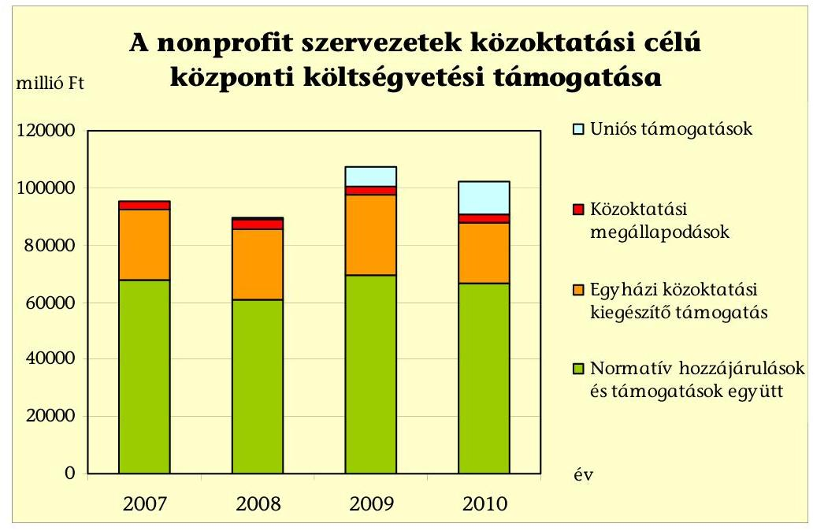
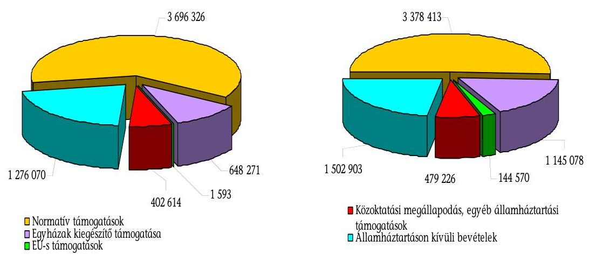
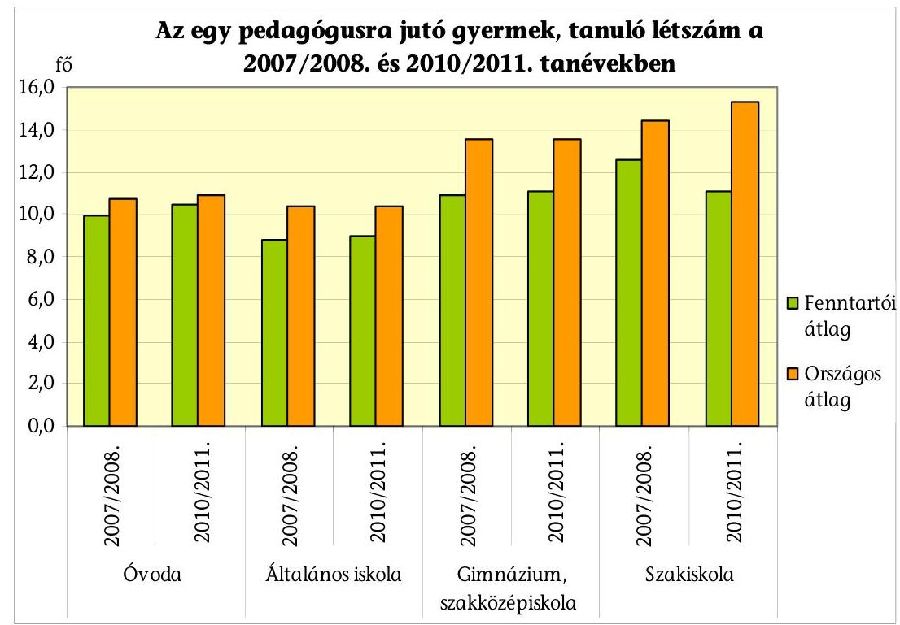
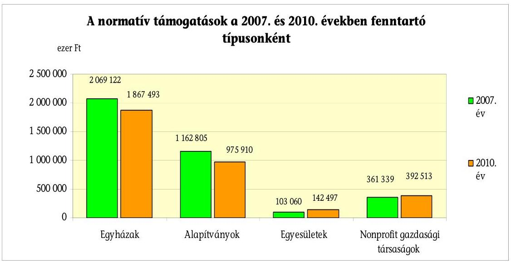
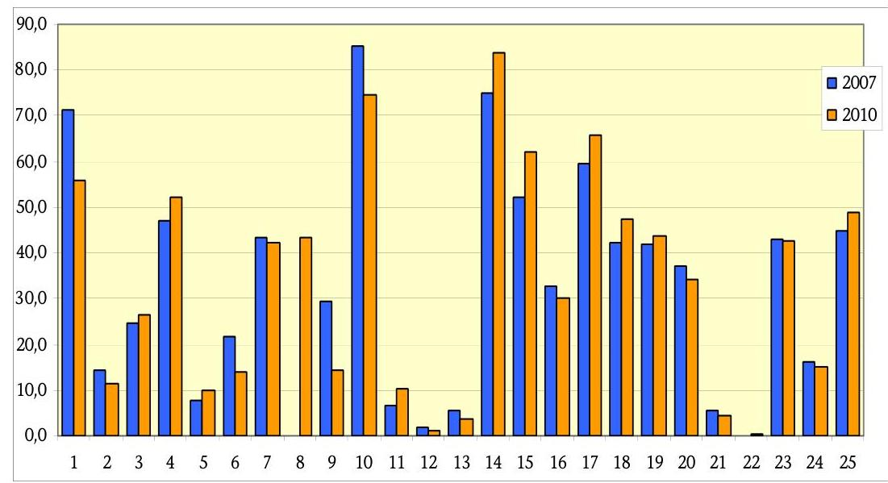
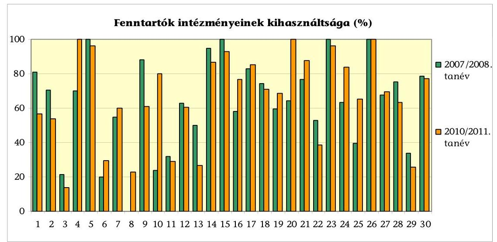
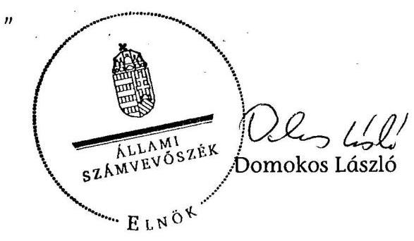
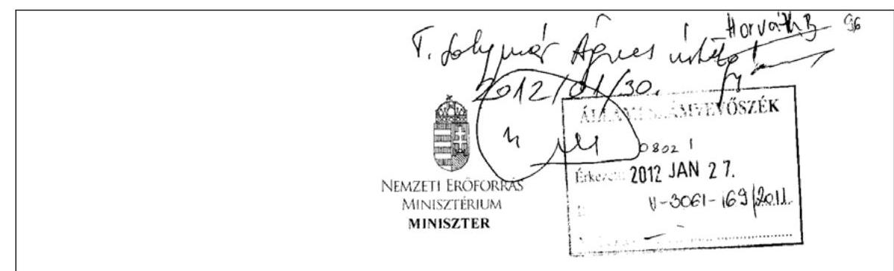
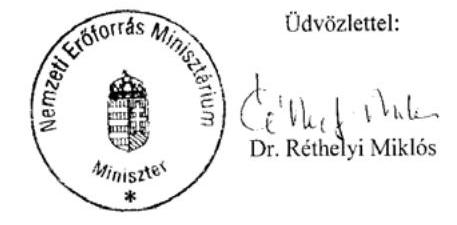

# ÁLLAMI   SZÁMVEVŐSZÉK 

## JELENTÉS

a közoktatásban résztvevő nonprofit szervezetek költségvetési támogatásának ellenőrzéséről

---

# Állami Számvevőszék 

Iktatószám: V-3006-150/2011.
Témaszám: 1017
Vizsgálat-azonosító szám: V-0553
Az ellenőrzést felügyelte:
Horváth Balázs
felügyeleti vezető
Az ellenőrzést vezette:
Solymár Ágnes
számvevő főtanácsos
Az összefoglaló jelentést készítette:
Solymár Ágnes
számvevő főtanácsos
A jelentés összeállításában közreműködtek:
Brebán Andrea
számvevő tanácsos

## Köllődné Gátai Mária

számvevő
Körály László
számvevő tanácsos
Vásárhelyi Zoltán
számvevő tanácsos

## Robák Ferencné

számvevő tanácsos

## Az ellenőrzést végezték:

| Brebán Andrea | Király László | Köllődné Gátai Mária |
| :-- | :-- | :-- |
| számvevő tanácsos | számvevő tanácsos |  |
| Robák Ferencné |  |  |
| számvevő tanácsos |  |  |

A témához kapcsolódó eddig készített számvevőszéki jelentések:
címe
sorszáma
Jelentés a közoktatási intézményeket fenntartó nonprofit szervezetek normatív hozzájárulásának és támogatásának ellenőrzéséről
Jelentés az Oktatási és Kulturális Minisztérium fejezetnél a közoktatási feladatok finanszírozására fordított pénzeszközök hasznosulásának ellenőrzéséről

---

# TARTALOMJEGYZÉK 

BEVEZETÉS ..... 7
I. ÖSSZEGZŐ MEGÁLLAPÍTÁSOK, KÖVETKEZTETÉSEK, JAVASLATOK ..... 11
II. RÉSZLETES MEGÁLLAPÍTÁSOK ..... 18

1. A tervezési és szabályozási eszközök hozzájárulása a nonprofit fenntartók közoktatási feladatellátásához ..... 18
1.1. A középtávú és a megyei fejlesztési tervekben meghatározott célok ..... 18
1.2. A nonprofit fenntartók által ellátott közoktatási feladatok jogi szabályozása ..... 19
1.2.1. A feladatellátás szabályozása ..... 19
1.2.2. Az engedélyezési rendszer ..... 21
1.2.3. A nyilvántartási rendszer ..... 21
2. A finanszírozási rendszer hatása a közoktatási feladatellátásra ..... 22
2.1. A normatív és egyházi kiegészítő támogatások hatása ..... 23
2.2. A közoktatási feladatellátás nem normatív finanszírozása ..... 24
2.3. Államháztartáson kívüli bevételek ..... 26
2.3.1. Természetbeni juttatások hatása a feladatellátásra ..... 27
3. A nonprofit fenntartók feladatellátása ..... 27
3.1. Az intézmények működtetése ..... 27
3.2. Az ellenőrzött fenntartók feladatellátásának eredményessége ..... 28
3.3. Az ellenőrzött fenntartók feladatellátásának szabályszerűsége ..... 33
4. Az ellenőrzés hatása a nonprofit fenntartók közoktatási feladatellátására ..... 37
4.1. A fenntartói ellenőrzések hatása ..... 37
4.2. A külső szervezetek ellenőrzésének hatása ..... 37
5. A korábbi ellenőrzések megállapításaira tett intézkedések ..... 38

---

# MELLÉKLETEK 

1. számú A 2007-2010. években a közoktatási megállapodás alapján kifizetett önkormányzati és minisztériumi támogatások
2. számú Tanórai foglalkozások alakulása az ellenőrzött fenntartóknál a 2009/2010. és a 2010/2011. tanévekben
3. számú Az ellenőrzött oktatási intézmények létesítményi, egyéb tárgyi feltételei a 2007/2008. és a 2010/2011. nevelési években, tanévekben
4. számú A fenntartói és számviteli nyilvántartási előírásokat nem teljesítő fenntartók
5. számú A nemzeti erőforrás miniszter észrevétele

## FÜGGELÉKEK

1. számú A kérdőíves megkérdezések értékelése

---

# RÖVIDÍTÉSEK JEGYZÉKE 

| ÁSZ | Állami Számvevőszék |
| :--: | :--: |
| Új ÁSZ törvény | Az Állami Számvevőszékről szóló 2011. évi LXVI. törvény |
| EU | Európai Unió |
| KIR | Közoktatási Információs Rendszer |
| Költségvetési törvény | Az ellenőrzött időszakban hatályos költségvetési törvények (a Magyar Köztársaság 2006. évi költségvetéséről szóló 2005. évi CLIII. törvény; a Magyar Köztársaság 2007. évi költségvetéséről szóló 2006. évi CXXVII. törvény; a Magyar Köztársaság 2008. évi költségvetéséről szóló 2007. évi CLXIX. törvény; a Magyar Köztársaság 2009. évi költségvetéséről szóló 2008. évi CII. törvény; a Magyar Köztársaság 2010. évi költségvetéséről szóló 2009. évi CXXX. törvény) |
| Közoktatási törvény | A közoktatásról szóló 1993. évi LXXIX. törvény |
| MÁK | Magyar Államkincstár |
| OH | Oktatási Hivatal |
| Oktatásért felelős minisztérium | Nemzeti Erőforrás Minisztérium (2010. május 28 -áig Oktatási és Kulturális Minisztérium, 2006. június 8 -áig Oktatási Minisztérium) |
| Pedagógustovábbképzési rendelet | A pedagógus-továbbképzésről, a pedagógus-szakvizsgáról, valamint a továbbképzésben részt vevők juttatásairól és kedvezményeiről szóló 277/1997. (XII. 22.) Korm. rendelet |
| SZMSZ | Szervezeti és működési szabályzat |
| TÁMOP | Társadalmi Megújulás Operatív Program |
| TIOP | Társadalmi Infrastruktúra Operatív Program |
| Végrehajtási rendelet | A közoktatásról szóló 1993. évi LXXIX. törvény végrehajtásáról szóló 20/1997. (II. 13.) Korm. rendelet |

---

.

---

# ÉRTELMEZŐ SZÓTÁR 

| Eredményesség | A kitűzött célok megvalósításának mértéke vagy egy tevékenység outputja szándékolt és tényleges hatásának viszonya. |
| :--: | :--: |
| Hatékonyság | A termékek, szolgáltatások vagy egyéb végtermékek (outputok) és az előállításukhoz felhasznált erőforrások (inputok) viszonya. |
| Kompetenciamérés | A közoktatásról szóló törvényben meghatározott tanulók 6. 8. 10. évfolyamos csoportjának teljes körében a szövegértési képességek és a matematikai eszköztudás felmérése. A felmérés célja nem az adott év tananyagának számonkérése, hanem azt vizsgálja, hogy a diákok az adott évfolyamig elsajátított ismereteiket milyen mértékben tudják alkalmazni a mindennapi életből vett feladatok megoldása során. |
| Közhasznú tevékenység | A társadalom és az egyén közös érdekeinek kielégítésére irányuló, a szervezet létesítő okiratában szereplő cél szerinti tevékenységek, a közhasznú szervezetekről szóló 1997. évi CLVI. törvényben meghatározott körben [Közhasznú törvény 26. § c) pont]. |
| Közhasznú szervezet | Közhasznú szervezetté minősíthető a Magyarországon nyilvántartásba vett társadalmi szervezet - kivéve a biztosító egyesületet és a politikai pártot, valamint a munkáltatói és a munkavállalói érdek-képviseleti szervezetet - alapítvány, közalapítvány, köztestület, ha a létrehozásáról szóló törvény azt lehetővé teszi, országos sportági szakszövetség, nonprofit gazdasági társaság, a közhasznú szervezetekről szóló 1997. évi CLVI. törvényben meghatározott egyéb szervezet [Közhasznú törvény 2. § (1) bekezdés a)-g) pontjai]. |
| Közoktatás | A közoktatás magában foglalja az óvodai nevelést, az iskolai nevelést és oktatást, valamint a kollégiumi nevelést {Közoktatási törvény 2. § (1) bekezdés}. |
| Közoktatási intézmények | A közoktatás szakmailag önálló nevelési intézményei az óvodák, nevelési-oktatási intézményei az iskolai végzettséget, szakképesítést igazoló bizonyítvány kiadására jogosult iskolák, továbbá az alapfokú művészetoktatási intézmények és a kollégiumok {Közoktatási törvény 3. § (1) bekezdés}. |
| Közoktatási intézményalapító és fenntartó | Közoktatási intézményt az állam, a helyi önkormányzat, a települési, területi kisebbségi önkormányzat, az országos kisebbségi önkormányzat, a Magyar Köztársaságban nyilvántartásba vett egyházi jogi személy, továbbá a Magyar Köztársaság területén alapított és itt székhellyel rendelkező, jogi személyiséggel rendelkező gazdálkodó szervezet, alapítvány, egyesület és más jogi személy, továbbá természetes személy alapíthat és tarthat fenn, ha a tevékenység folytatásának jogát - jogszabályban foglaltak szerint - megszerezte. A természetes személy egyéni vállalkozóként alapíthat és tarthat fenn közoktatási intézményt {Közoktatási törvény 3. § (2) bekezdés}. |

---

Közoktatási megállapodás

Közoktatási normatív támogatás

Minőségirányítási program

Nevelési program

Nonprofit fenntartó

Normatív támogatások

Oktatási szint

Pedagógiai program

Többcélú intézmény

A helyi önkormányzat vagy az állam a költségvetési támogatáshoz kiegészítő anyagi támogatást megállapodás alapján adhat, ha a nem állami, illetve nem önkormányzati közoktatási intézmény állami, illetve helyi önkormányzati feladatot lát el. {Közoktatási törvény 4. § (6) bekezdés és 81. § (1) bekezdés e) pont}.

A központi költségvetés az állami szervek és a helyi önkormányzatok, valamint a nem állami, nem helyi önkormányzati intézményfenntartók részére az általuk fenntartott nevelési-oktatási intézmények működéséhez - a gyermek-, tanulói létszámot, valamint az ellátott feladatokat figyelembe véve - normatív költségvetési hozzájárulást biztosít {Közoktatási törvény. 118. § (3) bekezdés}.
Az intézményi minőségirányítási program határozza meg az intézmény működésének hosszú távra szóló elveit és a megvalósítását szolgáló elképzeléseket. {Közoktatási törvény 40. §(12) bekezdés}.
A fenntartói minőségirányítási program meghatározza az egyes intézményeknek a fenntartói elvárásokkal kapcsolatos feladatait, a fenntartói irányítás keretében tervezett szakmai, törvényességi, pénzügyi ellenőrzések rendjét.{Közoktatási törvény 85. § (7) bekezdés}
Az óvodai nevelő munka az óvodai nevelés országos alapprogramjára épülő óvodai nevelési program alapján folyik. Az óvodai nevelés országos alapprogramját a Kormány adja ki {Közoktatási törvény 8. § (9) bekezdés}.
Az ellenőrzés szempontjából az egyházi jogi személyek, jogi személyiséggel rendelkező gazdálkodó szervezetek, alapítványok, egyesületek és más jogi személyek
Az ellenőrzési időszakban hatályos költségvetési törvények 3. számú mellékletében megjelölt közoktatási hozzájárulások, az 5. mellékletében megjelölt központosított előirányzatok, továbbá a 8. mellékletében megjelölt normatív, kötött felhasználású támogatások együttesen.
Az ellenőrzés szerinti oktatási szintek: óvodai ellátás, általános iskolai oktatás 1-4. és 5-8. évfolyamokon, gimnáziumi oktatás 5-8. és 9-13. évfolyamokon, szakközépiskolai oktatás és szakiskolai oktatás 9-13. évfolyamokon szakképzési évfolyamok nélkül
Az iskolában a nevelő-oktató munka a pedagógiai program alapján folyik. A pedagógiai program magában foglalja a nevelési programot és a helyi tantervet, továbbá a szakképzésben résztvevő iskolákban a szakmai programot {Közoktatási törvény 8/A. § (2) bekezdés}.
A többcélú intézmény több, különböző típusú közoktatási intézmény feladatait láthatja el {Közoktatási törvény 22. § (3) bekezdés}.

---

# JELENTÉS 

## a közoktatásban résztvevő nonprofit szervezetek költségvetési támogatásának ellenőrzéséről

## BEVEZETÉS

Az oktatás mind az egyén, mind az egész nemzet számára a legfontosabb hosszú távú kitörési esélyt jelenti. A jól képzett munkaerő, az élethosszig tartó tanulás igénye szükségessé teszi az oktatás minőségének fejlesztését, a tanulói kulcskompetenciák erősítését, az oktatási esélyegyenlőtlenségek mérséklését, a pedagógus szakma fejlődésének támogatását, az oktatás tárgyi, személyi feltételeinek javítását, az információs és kommunikációs technológiák alkalmazására való képességek fejlesztését, az eredményes és hatékony közoktatási rendszer működtetését.

A közoktatásról szóló 1993. évi LXXIX. törvény (közoktatási törvény) 2. § (3) bekezdése rögzíti, hogy a közoktatás rendszerének működtetése az állam feladata. E törvény szabályozása kiterjed az óvodai, iskolai nevelésre és oktatásra, a kollégiumi nevelésre-oktatásra, továbbá az ezekkel összefüggő szolgáltató és igazgatási tevékenységre, függetlenül attól, hogy azt milyen intézményben, szervezetben látják el, illetve ki az intézmény fenntartója.

A közoktatási intézményalapítás szabadságát a közoktatási törvény 3. § (2) bekezdése lehetővé teszi, mert közoktatási intézményt egyházi jogi személy, jogi személyiséggel rendelkező gazdálkodó szervezet, alapítvány, egyesület (nonprofit fenntartók) is alapíthat és tarthat fenn.

A közoktatási feladatmegosztás rendszerében országosan növekvő szereppel bírnak a nonprofit fenntartók. Az általuk működtetett intézmények száma a 2007-2010. évek között 8,2%-kal, az összes intézményhez viszonyított részaránya 13,8%-ról 18,6%-ra nőtt.

| Évek | Állami, önkor-   mányzati   fenntartá-   sú (1) | Egyházi   fenntartá-   sú (2) | Alapítvá-   nyi fenn-   tartású (3) | Egyéb   nonprofit   fenntartá-   sú (4) | Nonprofit   fenntartá-   sú összesen   $(5=2+3+4)$ | Össze-   sen   $(6=1+5)$ |
| :--: | :--: | :--: | :--: | :--: | :--: | :--: |
| 2007. | 7208 | 435 | 522 | 200 | 1157 | 8365 |
| 2008. | 6088 | 456 | 541 | 194 | 1191 | 7279 |
| 2009. | 5636 | 476 | 534 | 207 | 1217 | 6853 |
| 2010. | 5468 | 499 | 539 | 214 | 1252 | 6720 |

---

A nonprofit fenntartók által nyújtott szolgáltatásokat a 2007. évben 403 ezer, a 2010. évben 453 ezer fő vette igénybe (országos adat).

A nonprofit fenntartók a költségvetésből normatív támogatásban, a fejezetek fejezeti kezelésű előirányzataiból pályázat útján, vagy egyedi kérelem alapján kaptak támogatást. A 2007-2010. években normatív támogatásként 265 079,7 millió Ft, egyházi kiegészítő támogatásként 98 186,1 millió Ft, az önkormányzattal és minisztériummal kötött közoktatási megállapodás alapján 12 182,7 millió Ft, továbbá uniós forrásból 19 712,3 millió Ft támogatásban részesültek.

Az Állami Számvevőszék (ÁSZ) stratégiájában megfogalmazott célja és feladata, hogy az
 államháztartáson kívülre nyújtott költségvetési támogatások ellenőrzésével hozzájáruljon a nonprofit szervezeteknél a közpénzek átlátható felhasználásához. Ellenőrzésünkkel segíteni kívánjuk az új köznevelési törvény nonprofit fenntartókra vonatkozó szabályainak kialakítását.

Az ellenőrzésre 2011. június 30-áig az Állami Számvevőszékről szóló 1989. évi XXXVIII. törvény 2. § (5) és a 16. § (1) bekezdései, 2011. július 1-jétől az Állami Számvevőszékről szóló 2011. évi LXVI. törvény (új ÁSZ törvény) 5. § (3) bekezdése és a (11) bekezdés c) pontja adtak jogalapot. Az ellenőrzési időszakban hatályba lépett új ÁSZ törvény szerint az egyházi fenntartókat csak törvényességi szempontból értékeltük.

Az ellenőrzés célja volt annak értékelése, hogy a nonprofit fenntartóknak nyújtott költségvetési támogatások eredményesen és hatékonyan járultak-e hozzá a közfeladat ellátásához. Ennek érdekében értékeltük, hogy:

- a központi és megyei szabályozási eszközök hozzájárultak-e a nonprofit fenntartók közoktatási feladatellátásához;

---

- a finanszírozási rendszer igazodott-e a nonprofit fenntartók közoktatási feladatellátásához;
- az uniós és hazai támogatások felhasználása javította-e a közoktatás feladatellátásának tárgyi és szakmai feltételeit;
- a nonprofit fenntartók és a külső szervezetek ellenőrzése segítette-e a közoktatási feladatellátást;
- hasznosultak-e a korábbi ÁSZ ellenőrzések e területet érintő javaslatai.

Az ellenőrzést az ÁSZ 2011. évi ellenőrzési terve alapján, a számvevőszéki ellenőrzés szakmai szabályai szerint, a teljesítmény-ellenőrzés módszerével végeztük, amelynek során alkalmaztuk az ellenőrzési kritériumokat és kérdéseket, a tanúsítványi adatszolgáltatást, az összehasonlító adategyeztetéseket, az elemző értékeléseket és a kérdőíves felmérést.

Tanúsítványi adatszolgáltatást kértünk a mintába került nonprofit fenntartók székhelye szerinti fővárosi és hét megyei önkormányzattól. Helyszíni ellenőrzést a Nemzeti Erőforrás Minisztériumnál, valamint 30 nonprofit fenntartónál végeztünk. A fenntartók között 4 egyesület, 16 alapítvány, 4 nonprofit kft, 6 egyházi jogi személy volt. A fenntartók kiválasztásánál azok típusát és a kapott állami támogatások mértékének megyénkénti megoszlását vettük figyelembe. Ellenőrzésünk az óvodai nevelésre, az általános iskolai és a középiskolai oktatásra terjedt ki. A kiválasztott fenntartók összesen 43 intézményt működtettek: 6 óvodát, 8 általános iskolát, 4 gimnáziumot, egy szakiskolát és 24 többcélú intézményt. A közoktatási törvény 108. § (2) bekezdése értelmében a mintába került két külföldi oktatási intézmény fenntartóinál az irányítási feladatokat nem értékeltük.

Az ellenőrzés a 2007-2010. évekre terjedt ki. A fenntartók gazdálkodásához kapcsolódó adatokat az ellenőrzött időszak első és utolsó naptári évére, a feladatellátás szakmai mutatóit a 2007/2008. és a 2010/2011. tanévre vonatkozóan elemeztük. A kompetenciamérés értékelése a 2008. és a 2009. évi adatok alapján történt. A jogszabálymódosítás hatásának vizsgálata érdekében a pedagógus létszámváltozást a 2006/2007. tanévtől vizsgáltuk.

# A jelentésben a helyszínen ellenőrzött 30 fenntartónál tapasztaltakról mondunk mindvégig véleményt. 

Az eredményességi, hatékonysági kritériumokat az előtanulmány készítése során határoztuk meg. A központi és megyei szabályozói eszközöket eredményesnek értékeltük, ha azok mérhető célokat, pontos feladatokat tartalmaztak és a finanszírozási rendszer fenntartótól függetlenül azonos mértékű támogatást biztosított.

A finanszírozás és feladatellátás rendszerét eredményesnek ítéltük, ha a feladatellátás a felmért igényekhez igazított, a támogatási szerződések szerinti célokra történő felhasználás, a finanszírozás változásai mellett nem romlottak a szakmai mutatók, a szülők elégedettek voltak a szolgáltatásokkal.

---

Hatékonynak tartottuk, ha nőtt az egy pedagógusra jutó gyerek/diák létszám, mert az alkalmazott pedagógusok számának változatlansága mellett a nevelt/oktatott gyermekek száma emelkedett. Az ellenőrzési rendszert eredményesnek értékeltük, ha az ellenőrzési megállapításoknak köszönhetően szabályosabbá, hatékonyabbá vált a működés.

---

# I. ÖSSZEGZŐ MEGÁLLAPÍTÁSOK, KÖVETKEZTETÉSEK, JAVASLATOK 

A központi és a megyei tervezési eszközök a nonprofit közoktatási feladatellátás eredményes elvégzéséhez nem járultak hozzá. Az oktatásért felelős miniszter a közoktatási törvény előírásától eltérően a 2007-2010. évekre nem dolgozott ki középtávú közoktatási fejlesztési tervet ${ }^{1}$.

A megyei fejlesztési tervek a nonprofit fenntartókkal kapcsolatban mérhető célokat, pontos feladatokat nem fogalmaztak meg. A demográfiai folyamatok hatásával, illetve a társadalmi igények változásával nem számoltak, nem tartalmazták a nonprofit fenntartók és intézményeik teljes körét. A megszűnt óvodákról, általános iskolákról - a jogszabályi előírástól eltérően - nem készült nyilvántartás és az ellenőrzött megyei önkormányzatok felénél a jegyzők nem értékelték a nonprofit fenntartók feladatellátását.

A feladatellátás jogi szabályozása a sajátosságok figyelembevételével meghatározta a nonprofit fenntartók és a közoktatási intézményeik feladatait, működési feltételeit. A nonprofit fenntartók nem normatív - közoktatási megállapodással, egyedi döntéssel nyújtott - támogatásaira vonatkozóan eljárási rendet nem dolgozott ki az oktatásért felelős minisztérium.

A szabályozás hiányossága, hogy nem írta elő az intézmények alapítását és átalakítását megalapozó igényfelmérések készítését, emiatt 19 fenntartó az alapításkor, 24 fenntartó az alapító okirat módosításakor nem készített igényfelmérést. Az igényfelmérések elmaradásának következtében 8 fenntartó intézményeinek kihasználtsága nem érte el a 60%-ot, valamint két fenntartónál a tevékenységi kör módosítását követően derült ki, hogy a bevezetett új szolgáltatásra (esti, levelező, illetve gimnáziumi oktatás) nem volt igény.

A közoktatási feladatellátás engedélyezési rendszere nem biztosította a szükséges garanciákat a közoktatási feladatok eredményes ellátásához, a fokozatosan megteremtendő intézményi feltételek teljesülésének, biztosításának ellenőrzési gyakoriságát nem határozta meg. A 2011 júliusától hatályos közoktatási törvénymódosítás a törvényességi ellenőrzések gyakoriságát meghatározta, a szabályos működés biztosítása érdekében egységes engedélyező szervet jelölt ki.

A rendelkezésre álló központi nyilvántartási rendszerek a nonprofit fenntartók közoktatási feladatra kapott költségvetési és uniós forrásait, továbbá a közoktatási célra felhasznált pénzeszközöket és azok hasznosulását nem egységes szempontok szerint tartalmazták.

[^0]
[^0]:    ${ }^{1}$ A helyszíni ellenőrzés lezárásáig sem készítette el az oktatásért felelős miniszter középtávú fejlesztési tervet.

---

A nonprofit fenntartók közoktatási feladatainak finanszírozása négyötöd részben költségvetési forrásból, egyötöd részben államháztartáson kívüli forrásból valósult meg. A fenntartók a központi költségvetésből normatív támogatásban, azon kívül egyedi kérelemre, vagy pályázati úton nyújtott államháztartási, továbbá uniós támogatásban, az intézményt fenntartó egyházak kiegészítő támogatásban részesültek.

A fenntartók a vizsgált időszakban feladatellátásuk érdekében 10%-kal növelték bevételeiket (a 2007. évi 6024874 ezer Ft-ról, a 2010. évre 6650190 ezer Ft-ra). A 2007. évről a 2010. évre a normatív költségvetési támogatások 8,6%-kal csökkentek, az egyházi kiegészítő támogatások 76,6%-kal, az államháztartáson kívüli források 17,8%-kal, az uniós támogatások több mint 90 szeresükre nőttek.

# Az ellenőrzött fenntartók bevételszerkezete a 2007. és a 2010. években (ezer Ft-ban) 

A közoktatási feladatot ellátó fenntartók működését az államháztartási bevételek ${ }^{2}$ határozták meg legnagyobb mértékben, de az állam finanszírozásban való részvétele mérséklődött. A hatályos költségvetési törvények a nonprofit fenntartóknak a helyi önkormányzatok feladatellátásával megegyező mértékű normatív támogatást biztosítottak ${ }^{3}$. Az ellátott gyerekek, tanulók összlétszáma 0,7%-kal (a 2007. évi 11462 főről a 2010. évre 11538 főre) nőtt. A normatív támogatások összegének csökkenése miatt az egy ellátottra jutó normatív támogatás összege éves szinten átlagosan 9,1%-kal (322485 Ft-ról 292808 Ft-ra) csökkent. A havi rendszerességgel folyósítandó normatív támogatásokat - egy hónap kivételével - a jogszabály rendelkezése szerint folyósították a fenntartóknak, a támogatások összegeit a fenntartók intézményeiknek átadták, illetve azok működésére fordították.

[^0]
[^0]:    ${ }^{2}$ Az államháztartási bevételek: a normatív költségvetési támogatások, az egyházi kiegészítő támogatás, a nem normatív államháztartási támogatás (minisztériumi és önkormányzati közoktatási megállapodással, pályázati úton juttatott hazai és uniós támogatások).
    ${ }^{3}$ Az egyházi fenntartók a normatív támogatáson felül egyházi kiegészítő támogatásban is részesülnek.

---

Az egyházi intézményfenntartók a költségvetési forrásból biztosított egyházi kiegészítő támogatást az előírásoknak megfelelően a közoktatási szolgáltatást ellátó intézményeikre fordították. Az egyházak a jogszabályi előírásoknak megfelelően részesültek kiegészítő támogatásban.

A fenntartóknál a nem normatív államháztartási és pályázati úton elnyert hazai és uniós támogatások a 2007. évről a 2010. évre 54,3%-kal nőttek, arányuk a bevételek között 6,7%-ról 9,4%-ra nőtt. A nem normatív államháztartási támogatásokon belül a közoktatási megállapodással kapott támogatások 22%-kal csökkentek. A fenntartók közoktatási megállapodás alapján kapott bevétele a 2007. évről a 2010. évre 16,8%-kal nőtt. A 2007-2010. években összesen 1687587 ezer Ft támogatást kaptak, amelyből 517451 ezer Ft önkormányzattal, 1170136 ezer Ft az oktatásért felelős miniszterrel kötött megállapodás alapján került kifizetésre. Az oktatásért felelős miniszter, jogszabályi felhatalmazás alapján, közoktatási megállapodással támogatta a sajátos nevelési igényű, a magatartási, tanulási, beilleszkedési nehézségekkel küzdő, a hátrányos helyzetű és rászoruló gyermekek, tanulók nevelésében résztvevő fenntartók tevékenységét. A közoktatási törvény meghatározta a hátrányos helyzet és a sajátos nevelési igény tartalmát, valamint a magatartási, tanulási, beilleszkedési nehézségekkel küzdők körének megállapítási rendjét, ugyanakkor a rászorulókat nem definiálta. Sem a miniszter által kiírt pályázat sem a megkötött megállapodások nem rögzítették, hogy ki tekintendő rászorulónak.

Az önkormányzatokkal megkötött megállapodásokhoz kapcsolódó támogatásokat a szerződésben meghatározott célokra fordították. Hazai és uniós pályázatot 21 fenntartó nyújtott be, melyek kétharmada volt sikeres. A nem normatív államháztartási támogatásokon belül az uniós támogatások aránya az ellenőrzött időszakban 22%-kal nőtt. Az elnyert támogatásokat a fenntartók eredményesen használták fel, a pályázati kiírásoknak megfelelő célokra fordították, és ezzel javították a közoktatási feladatellátás tárgyi és szakmai feltételeit. Az ellenőrzés időszakában a megvalósult fejlesztéseket fenntartották, működtették. Az elnyert támogatások céljai összhangban voltak a fenntartó által meghatározott célokkal. Az uniós támogatásokkal a kompetencia alapú oktatás, illetve a pedagógiai módszertani reformot támogató informatikai infrastruktúra fejlesztése valósult meg.

Az államháztartáson kívüli bevételek a 2007. évről a 2010. évre 17,8%-kal (226 834 ezer Ft-tal) a fenntartóknál nőttek, arányuk a bevételek között 21,2%-ról 22,6%-ra emelkedett. 5 fenntartó ilyen forrást nem szerzett. A közoktatási feladatellátás érdekében bevont államháztartáson kívüli források a szülői, támogatói befizetésekből, más intézményeknek végzett oktatás díjából, a tanulók alkotásainak értékesítéséből, egyházi támogatásból, egyesületi tagdíjból, tárgyi eszközök értékesítéséből és bérleti díjból származott. Az államháztartáson kívüli forrásokat a fenntartók az általuk fenntartott intézmények működtetésére, az intézményi körülmények javítására fordították. A számviteli beszámolókban kimutatott államháztartáson kívüli forrásokon felül a fenntartók kevesebb, mint fele részesült természetbeni juttatásban a szülőktől, külföldi szervezettől, egyházi közösségektől. Ezekből a forrásokból javították az oktatás környezetének feltételeit, csökkentették az intézményfenntartás költségeit. A fenntartók az önkéntes munka értékét a szabályozás hiánya miatt nem határozták meg.

---

A nonprofit fenntartók a közoktatási feladatellátásban növekvő részt vállaltak, mert a gyerek- és tanulólétszám országos csökkenése mellett az általuk neveltek/oktatottak száma 0,7%-kal növekedett. Intézményeik választási lehetőséget jelentettek a szülők számára az állami, önkormányzati közoktatási rendszer mellett. A szülők körében végzett kérdőíves felmérés kiértékelése alapján az óvoda választásánál a szülők az intézmények jó hírnevét, a gyerekekkel való jó bánásmódot, illetve az óvoda nevelési programjának tartalmát vették figyelembe. Az iskolaválasztásnál az iskola szellemisége, képviselt értékrendje volt az elsődleges szempont. A szülők az iskolai feltételek között a magas szintű idegen nyelvoktatást fontosnak tartották, de a tagozatos, emelt szintű humán és természettudományos oktatást, illetve a sok informatika óra biztosítását a kevésbé fontos feltételeknek tekintették. A normatív támogatások csökkenése mellett a kapott közoktatási szolgáltatásokkal a gyermekek, tanulók szülei minden típusú fenntartónál elégedettek voltak, így az intézmények a közoktatást igénybe vevők
 szempontjából feladataikat eredményesen látták el. A hátrányos helyzetű gyermekek, tanulók aránya 10 fenntartónál meghaladta az országos átlagot, ezáltal jelentős mértékben járultak hozzá a hátrányos helyzetű tanulók felzárkóztatásához. Az általános iskolákban jellemzően egy, a középiskolákban jellemzően két idegen nyelvet oktattak. A középiskolában tanulók 9%-a három idegen nyelvet tanult.

A fenntartóknál az egy pedagógusra jutó gyerek-, tanulószám oktatási szintenként - a szakiskolai oktatás kivételével - minimálisan emelkedett, amely a hatékonyabb feladatellátás irányába való elmozdulást mutatta.

A fenntartóknál az egy pedagógusra jutó gyerek-, tanulószám minden oktatási szinten az országos átlag alatt maradt.

---

A költségvetési támogatásokat az iskolai oktatás feladatainak ellátásához hatékonyan használták fel, mert a megtartott órák kisebb mértékben csökkentek, mint a normatívacsökkenés és nem maradtak el feladatok. A megtartott órák száma a normatív támogatásoknál kisebb mértékben, 1,2%-kal csökkent, amely az iskolai oktatásra fordított támogatások hatékony felhasználását mutatja. A pedagógusok kötelező óraszámának 2007. évi tanévkezdéskor hatályba lépett emelkedése sem a hatályba léptetés tanévében, sem pedig hosszabb távon nem eredményezte a pedagógus létszám csökkenését. A fenntartók államháztartáson kívüli forrásaik terhére a pedagógusok megtartását finanszírozták a stabil személyi feltételek megteremtése érdekében.

A fenntartóknál a csoportok, osztályok átlaglétszámai az országos átlaglétszám körül alakultak. A jogszabályban meghatározott átlaglétszámoknál alacsonyabb létszámmal működtek a csoportok/osztályok, kivéve az óvodáknál, a gimnáziumok 5-8. évfolyamain és a szakiskoláknál. A fenntartók hatoda tíz főnél alacsonyabb létszámmal is indított csoportot, illetve osztályt. Az alacsony létszámokat 4 fenntartónál az integráltan oktatott sajátos nevelési igényű tanulók oktatása, egy fenntartónál a tehetséggondozó tevékenység indokolta. A többi - az országos átlag alatti létszámmal működtetett - csoport esetében a szülői befizetések teremtették meg az alacsonyabb létszám fenntartását.

A fenntartóknál a kompetenciamérés szempontjából - bár nem ugyanazt a korosztályt mérte - az eredményesség csökkent, mivel a fenntartók az országos átlaghoz, illetve saját korábbi eredményeikhez képest alacsonyabb pontszámokat értek el. A mérések eredményei szerint az országos átlag felett teljesítő fenntartók aránya minden mérési szinten csökkent, valamint a matematika területén minden évfolyamon, a szövegértés területén két évfolyamon rosszabb eredményt értek el a saját korábbi eredményeikhez képest.

A fenntartók és intézményeik működésének szabályossága tekintetében több hiányosságot tapasztaltunk. A jogszabályban előírt fenntartói feladatoknak 25 fenntartó hiányosan tett eleget (4. számú melléklet). Ezen belül a közoktatási törvényben meghatározott fenntartói irányítási feladatokat 14, a közzétételi kötelezettséget 16, az állandó saját alkalmazotti létszámra vonatkozó előírást 9, az állandó saját székhelyre vonatkozó előírást egy fenntartó sértette meg. A számviteli nyilvántartási előírásoknak 5 fenntartó nem tett eleget maradéktalanul. A szabályos működés biztosítása érdekében a fenntartók a feltárt hiányosságok megszüntetéséről intézkedtek.

A jogszabályban meghatározott tanítási órákat biztosították, azon felül további órák megtartását is engedélyezték és finanszírozták, amelynek köszönhetően a megtartott órák a közoktatási törvény szerint előírt órákat a 2010/2011. tanévben 3,2%-kal haladták meg. Az intézmények pedagógustovábbképzési programjai és beiskolázási tervei összhangban voltak a fenntartók által jóváhagyott nevelési-pedagógiai programok céljaival, és a feladatellátást szolgálták. Az intézmények közül kettő pedagógus továbbképzési programmal, hat éves beiskolázási tervvel nem rendelkezett. Annak ellenére, hogy a pedagógusok továbbképzésére biztosított költségvetési támogatás 2010. évtől megszűnt, a fenntartók saját és pályázati forrásokból biztosították a továbbképzések folyamatosságát.

---

A közoktatási törvényben előírt négyévenkénti ellenőrzési kötelezettségét 7 fenntartó (az ellenőrzöttek 23%-a) nem teljesítette, a belső szabályzatokban előírtaknak kilenc nem tett eleget. Azoknál a fenntartóknál, ahol elvégezték az ellenőrzéseket, azok sem a szakmai munkát, sem a működést nem befolyásolták, mert nem tártak fel érdemi hiányosságokat az intézményeknél. A kompetenciamérés eredményét az érintett fenntartók közel fele nem értékelte, ezért a mérés eredményeit nem hasznosította a feladatellátásban, a pedagógiai célok elérésének értékelésében.

A külső ellenőrzések egyharmadát a MÁK, egyharmadát az OH, további egyharmadát az oktatásért felelős minisztérium, az önkormányzat, az ügyészség, a jegyzők és a szakmai minősítő testület együttesen végezte. A vizsgált időszakban 4 fenntartó esetében nem volt külső ellenőrzés. A fenntartók a külső ellenőrzések által feltárt hibákat kijavították. Az ellenőrzések nem tárták fel a fenntartói irányítási feladatok és a közzétételi kötelezettség, valamint az intézmények működéséhez szükséges feltételek hiányait.

A korábbi ÁSZ ellenőrzések javaslatai - egy kivételével - hasznosultak. Nem valósult meg a nonprofit intézményfenntartókra és a helyi önkormányzatokra előírt létszámmérési időpontok egységesítése, a kerekítési szabályok összhangjának kialakítása, amely a nonprofit fenntartóknál adminisztrációs többletterhet és hibákat hordoz magában.

Az Állami Számvevőszékről szóló 2011. évi LXVI. törvény 33. § (1) bekezdésében foglaltak értelmében a jelentésben foglalt megállapításokhoz kapcsolódó intézkedési tervet köteles az ellenőrzött szervezet vezetője összeállítani és azt a jelentés kézhezvételétől számított harminc napon belül az ÁSZ részére megküldeni. Amennyiben az intézkedési tervet határidőben nem küldi meg a szervezet, vagy az nem elfogadható, az ÁSZ elnöke a hivatkozott törvény 33. § (3) bekezdés a)-b) pontjaiban foglaltakat érvényesítheti.

A helyszíni ellenőrzés megállapításainak hasznosítása mellett javasoljuk:

# a nemzeti erőforrás miniszternek: 

1. Az oktatásért felelős miniszter 2007. évtől a helyszíni ellenőrzés befejezéséig a közoktatási törvény 95. § (1) bekezdése a) pontja előírásától eltérően, nem dolgozott ki középtávú közoktatási fejlesztési tervet.

Javaslat:
Készítse el a közoktatás jövőre vonatkozó középtávú fejlesztési tervét, eleget téve ezzel a közoktatásról szóló 1993. évi LXXIX. törvény 95. § (1) bekezdés a) pontjának, továbbá vizsgálja meg a mulasztás miatt a felelősségre vonás lehetőségét.
2. A jogszabályban előírt fenntartói feladatoknak 25 fenntartó hiányosan tett eleget. Ezen belül a közoktatási törvényben meghatározott fenntartói irányítási feladatokat 14, a közzétételi kötelezettséget 16, az állandó saját alkalmazotti létszámra vonatkozó előírást 9, az állandó saját székhelyre vonatkozó előírást egy fenntartó sértette meg.

---

Javaslat:
Kezdeményezze a közoktatásról szóló 1993. évi LXXIX. törvény 93. § (5) bekezdése értelmében a működést engedélyező szervnél a fenntartói tevékenység törvényességi ellenőrzését a 4. számú mellékletben felsorolt, jogszabályokat sértő szervezeteknél.

---

# II. RÉSZLETES MEGÁLLAPÍTÁSOK 

## 1. A TERVEZÉSI ÉS SZABÁLYOZÁSI ESZKÖZÖK HOZZÁJÁRULÁSA A NONPROFIT FENNTARTÓK KÖZOKTATÁSI FELADATELLÁTÁSÁHOZ

### 1.1. A középtávú és a megyei fejlesztési tervekben meghatározott célok

A központi és a megyei tervezési eszközök a közoktatási feladatellátás eredményes elvégzéséhez nem járultak hozzá. Az oktatásért felelős miniszter 2007-2010. évekre vonatkozóan, a közoktatási törvény 95. § (1) bekezdése a) pontja előírásától eltérően, nem dolgozott ki középtávú fejlesztési tervet. A megyei fejlesztési tervek a nonprofit fenntartókat nem tartalmazták teljes körűen, továbbá mérhető célokat, feladatokat nem határoztak meg részükre.

A közoktatási törvény 95. § (1) bekezdése a) pontja alapján a közoktatás középtávú fejlesztési tervének kidolgozása az oktatásért felelős miniszter feladata. Középtávú fejlesztési tervet az oktatásért felelős miniszter legutóbb 2004. február 24-én hagyott jóvá.

A közoktatási törvény 88. § (2) bekezdése előírta, hogy a megyei fejlesztési tervekben szerepeltetni kell az önkormányzatok feladatait átvevő nonprofit fenntartókat. Ugyanakkor nem írta elő a nonprofit fenntartású oktatási intézmények figyelembevételének részletes szempontjait, valamint nem engedte az önkormányzatok helyett feladatot el nem látó fenntartók oktatási intézményeinek fejlesztési tervben történő szerepeltetését. Emiatt a fejlesztési tervek nem azonos elvek alapján készültek és nem voltak teljes körűek.

A megyei fejlesztési tervek általános célokat, fejlesztési irányokat határoztak meg a fejlesztési tervben szereplő intézményekre. A nonprofit fenntartók által fenntartott intézményekre vonatkozóan nem fogalmaztak meg sajátos fejlesztési elképzeléseket, nem határoztak meg feladatellátási célokat, emiatt a demográfiai folyamatok hatásával, illetve a társadalmi igények változásával nem számoltak.

Négy megyei önkormányzatnál a jegyző nem értékelte a nonprofit fenntartók feladatellátását. Az elvégzett értékelések a működő intézmények számának és az általuk ellátott gyermekek, tanulók létszámának változását tartalmazták, megállapítást nem tettek a fenntartók szakmai munkájára.

A közoktatási törvény 91. § (3) és (5) bekezdései és a közoktatásról szóló 1993. évi LXXIX. törvény végrehajtásáról szóló 20/1997. (II. 13.) Korm. rendelet (végrehajtási rendelet) 12. § (1) bekezdése meghatározták a főjegyzők intézményekre vonatkozó nyilvántartási és adatszolgáltatási kötelezettségét. A hivatkozott bekezdésben előírt adatszolgáltatási forma elkészítéséről az Oktatási Hivatal (OH) nem gondoskodott, emiatt a főjegyzők nem tettek eleget a jogszabályban előírt kötelezettségüknek.

---

A végrehajtási rendelet 12. § (1) bekezdése alapján „a főjegyző a fejlesztési terv alapján minden év szeptember 15-ig az adott év augusztus 31-ei állapot szerint az OH által meghatározott formában közoktatási információs rendszeren (KIR) keresztül összesítő jelentést készít arról, hogy az illetékességi körébe tartozó nem helyi önkormányzat által fenntartott nevelési-oktatási intézmény milyen feladatellátásban, maximum mekkora gyermek- és tanulólétszámmal, mely önkormányzat helyett vagy azzal együttműködve, milyen feladatellátási helyen, milyen jogcím alapján vesz részt a feladatellátási kötelezettségben. Az OH az összegyűjtött adatokat jegyzék formájában a KIR honlapján közzéteszi."

A megyei önkormányzatok a megszűnt óvodákról, általános iskolákról nem vezettek nyilvántartást, annak ellenére, hogy az adatokkal rendelkezniük kellett volna a közoktatási törvény 91. § (5) bekezdése szerint.

A közoktatási törvény 91. § (5) bekezdése szerint „A működést engedélyező szerv a nem helyi önkormányzatok által fenntartott óvodák és általános iskolák nyilvántartásba vételével, nyilvántartásból való törlésével, továbbá a működés megkezdésének engedélyezésével, az engedély visszavonásával kapcsolatban hozott jogerős határozatát közli a fenntartó székhelye szerint illetékes működést engedélyező szervvel".

# 1.2. A nonprofit fenntartók által ellátott közoktatási feladatok jogi szabályozása 

### 1.2.1. A feladatellátás szabályozása

A közoktatási szereplők feladatellátása a közoktatási törvényben, a végrehajtási rendeletben és miniszteri rendeletekben szabályozott volt. A sajátosságok figyelembevételével meghatározták a nonprofit fenntartók és közoktatási intézményeik feladatait, működési feltételeit. A fenntartók a jogi szabályozások alapján készítették el belső szabályzataikat.

A közoktatási törvény - az általános szabályozás mellett - az V. fejezetében elkülönítve határozta meg a nem állami, nem önkormányzati fenntartású közoktatási intézményekre vonatkozó külön szabályokat. A végrehajtási rendelet rendelkezett a nem állami, nem helyi önkormányzati intézményfenntartók normatív állami hozzájárulásának és támogatásának igényléséről, folyósításáról, elszámolásáról és ellenőrzésének sajátos szabályairól. A nevelési-oktatási intézmények működéséről szóló 11/1994. (VI. 8.) MKM rendelet rögzítette a nem helyi önkormányzatok által fenntartott közoktatási intézményekre vonatkozó külön szabályokat.

A fenntartóknak a közoktatási törvény előírásai alapján kellett kidolgozniuk belső szabályzataikat, a szervezeti és működési szabályzatot (SZMSZ), a házirendet, a minőségpolitikát (minőségirányítási program), a nevelési, illetve a pedagógiai programot.

A központi költségvetés a közoktatási törvény 118. § (3) és (4) bekezdéseinek megfelelően normatív hozzájárulást biztosított a nem állami, nem helyi önkormányzati intézményfenntartók részére az általuk fenntartott nevelési-oktatási intézmények működéséhez, azzal a megkötéssel, hogy az nem lehet kevesebb a helyi önkormányzatok feladatellátásához az ugyanazon a jogcímen biztosított támogatásnál.

---

# Az ellenőrzött időszakban hatályos költségvetési törvények a nonprofit fenntartók és a helyi önkormányzatok feladatellátásához azonos mértékű normatív támogatást biztosítottak. 

Az egyházak hitéleti és közcélú tevékenységének anyagi feltételeiről szóló 1997. évi CXXIV. törvény 6. §-ában előírtak értelmében a közoktatási feladatot ellátó egyházak kiegészítő támogatásra jogosultak. A kiegészítő támogatások igénylése, elszámolása a végrehajtási rendelet 17/A. § (1) és (2) bekezdései alapján az egyházak feladata.
 volt. A végrehajtási rendelet a kiegészítő támogatás igénylésének, megítélésének és elszámolásának kereteit tartalmazta. Az igénylés és az elszámolás rendjét az oktatásért felelős minisztérium kialakította, az alkalmazandó formanyomtatványokat honlapján közzétette. Az ellenőrzött időszakban a hatályos költségvetési törvények rendelkeztek a kiegészítő támogatás felhasználásáról oly módon, hogy az egyházi fenntartó köteles a kiegészítő támogatást a humánszolgáltatást ellátó intézmény szolgáltatásaira fordítani.

Az oktatásért felelős miniszter pályázat, egyedi kérelem, közoktatási megállapodás alapján támogatást nyújtott a nonprofit fenntartóknak. A miniszter megállapodást kötött a közoktatási törvény 81. § (8) bekezdése szerint a térségi vagy országos feladatot ellátó intézmény fenntartójával, a 81. § (12) bekezdése szerint az országos feladatot ellátó intézmény egyházi fenntartójával. A nonprofit fenntartók nem normatív - közoktatási megállapodással, egyedi döntéssel nyújtott - támogatásaira vonatkozóan eljárási rendet az oktatásért felelős minisztérium nem dolgozott ki.

A 2006. évi költségvetési törvény 30. § (1) bekezdés j) pontjának felhatalmazása alapján a 2006. évben a miniszter pályázatot írt ki a közoktatási szolgáltatásokkal összefüggő hátrányok kompenzációja érdekében. A pályázaton a sajátos nevelési igényű, a magatartási, tanulási, beilleszkedési nehézségekkel küzdő, a hátrányos helyzetű és a rászoruló gyermekekkel, tanulókkal foglalkozó, OM azonosítóval rendelkező intézményeket fenntartó közalapítványok, alapítványok, társadalmi szervezetek, közhasznú társaságok vehettek részt. A nyertesekkel megkötött közoktatási megállapodásokban rögzítették az ellátandó feladatokat, az elszámolási kötelezettség előírása mellett nyújtott támogatás összegét. A közoktatási megállapodás keretében nyújtott támogatás tartós és stabil forrást jelentett a támogatott nonprofit fenntartóknak intézményeik működtetéséhez.

A közoktatási törvény meghatározta a hátrányos helyzet és a sajátos nevelési igény tartalmát, valamint a magatartási, tanulási, beilleszkedési nehézségekkel küzdők körének megállapításának rendjét, ugyanakkor a rászorulókat nem definiálta. A pályázati kiírásban, illetve az annak alapján megkötött szerződésekben az oktatásért felelős minisztérium nem határozta meg, hogy a támogatás igénylése és elszámolása szempontjából ki tekintendő rászorulónak.

Az oktatásért felelős miniszter által megkötött megállapodások a támogatás mértékét egy főre vonatkozóan határozták meg azzal, hogy annak értéke nem haladhatja meg az adott évben az egyházi kiegészítő támogatást, vagy annak a szerződésben meghatározott százalékát. Az oktatásért felelős miniszter minden évben elszámoltatta a nyertes fenntartókat.

---

# 1.2.2. Az engedélyezési rendszer 

A közoktatási feladatellátás engedélyezési rendszere nem biztosította a 2007-2010. években a szükséges garanciákat a közoktatási feladatok eredményes ellátásához, a fokozatosan megteremtendő intézményi feltételek teljesülésének, biztosításának ellenőrzési gyakoriságát nem határozta meg.

A Magyar Köztársaság 2011. évi költségvetését megalapozó egyes törvények módosításáról szóló 2010. évi CLIII. törvény 16. §-ával hatályba lépett szabályozás-változások a garanciákat 2011. év júliusától megteremtették egyrészt a törvényességi ellenőrzések rendjének szabályozásával, másrészt az egységes engedélyező szerv kijelölésével.

A nonprofit fenntartók által fenntartott közoktatási intézmények feladatainak engedélyezési rendje a 2007-2010. években - kisebb pontosítások kivételével - nem változott. A közoktatási törvény 79. §-a szerint a működési engedélyt a jegyző, főjegyző akkor adhatta ki, ha az intézmény a közoktatási törvény 38. §-a és a külön szabályok szerinti - a csatolandó iratok alapján - működés megkezdéséhez szükséges személyi és tárgyi feltételek rendelkezésre álltak, azok fokozatosan megteremthetők voltak. A jegyző, illetve a főjegyző az engedély kiadását csak a közoktatási törvényben nevesített esetekben tagadhatta meg.

A közoktatási intézmény akkor rendelkezik a feladatai ellátásához szükséges feltételekkel, ha rendelkezik állandó saját székhellyel, állandó saját alkalmazotti létszámmal, továbbá a jogszabályban meghatározott eszközökkel, szabályzatokkal és a működéséhez szükséges pénzeszközökkel.

Az engedély megadásakor a hiányzó feltételek későbbi megteremtésének lehetőségét a jegyző vizsgálta, de ennek tényleges megvalósulására irányuló ellenőrzés nem volt szabályozott, a jegyző törvényességi ellenőrzésének gyakoriságáról a közoktatási törvény a nonprofit fenntartói kört illetően nem rendelkezett.

A 2010. évben elfogadott és 2011. július 1-jével hatályba lépő közoktatási törvény módosításának célja volt többek között, hogy megteremtse az engedélyezésnél az egységes szakmai szempontok érvényesítését és az ellenőrzés gyakoriságának szabályozottságát. A módosítás alapján a nonprofit fenntartók intézményei részére a működési engedélyt már nem a jegyző, főjegyző, hanem az intézmény székhelye szerint illetékes kormányhivatal oktatási szakigazgatási szerve adja ki, amely számára a jogalkotó kétévenkénti törvényességi ellenőrzési kötelezettséget írt elő.

### 1.2.3. A nyilvántartási rendszer

A rendelkezésre álló központi rendszerek nem biztosították a nonprofit fenntartók közoktatási feladatra kapott költségvetési és uniós forrásainak teljes körű kimutatását. A nyilvántartási és információs rendszerek hiányosságai miatt a nonprofit körben a közoktatási célra fordított pénzeszközök felhasználásáról sem állt rendelkezésre teljes körű információ.

---

Az oktatásért felelős minisztérium nem rendelkezett adattal az önkormányzatok által a nonprofit fenntartóknak közoktatási megállapodással vagy egyéb módon nyújtott támogatásokról, az uniós forrásból közoktatási feladatellátáshoz kapcsolódó támogatásokról, a nonprofit fenntartók nem költségvetési forrásairól.

Az oktatásért felelős minisztérium által használt nyilvántartási rendszerek a normatív támogatás, a kiegészítő támogatás és a közoktatási megállapodás alapján kifizetésre került támogatásokról nyújtottak információt. A közoktatási feladatellátásra átadott költségvetési forrásból nyújtott támogatásokhoz kapcsolódó adatokat az oktatásért felelős minisztérium három egymástól független rendszerben tartotta nyilván, amelyek adattartalma nem azonos szempontok szerint volt kialakítva.

A végrehajtási rendelet által meghatározott adatokat a KIR rendszerben tartották nyilván. A Magyar Államkincstár (MÁK) nyilvántartotta a kifizetett támogatásokat, az oktatásért felelős minisztérium vezette az általa megkötött közoktatási megállapodással nyújtott támogatások nyilvántartását.

A nyilvántartó rendszerek nem tartalmazták nonprofit fenntartónként, intézményenként a költségvetési forrásból nyújtott támogatások egyedi, illetve összesített elnyert, szerződött és kifizetett értékét. Az uniós támogatások központi nyilvántartási rendszere nem tette lehetővé a közoktatási feladatellátásra nyújtott támogatások kimutatását.

# 2. A FINANSZÍROZÁSI RENDSZER HATÁSA A KÖZOKTATÁSI FELADATELLÁTÁSRA 

A fenntartók feladatok ellátására kimutatott bevételei a 2007. évben 6024874 ezer Ft, a 2010. évben 6650190 ezer Ft voltak.

A fenntartók bevételeinek szerkezetét a 2007. és 2010. évekre az alábbi táblázat tartalmazza:

| Bevételek | 2007. év   (ezer Ft) | 2007. év   (%) | 2010. év   (ezer Ft) | 2010. év   (%) |
| :-- | :--: | :--: | :--: | :--: |
| Normatív támogatások | 3696326 | 61,4 % | 3378413 | 50,8 % |
| Egyházak kiegészítő támogatá-   sa | 648271 | 10,8 % | 1145078 | 17,2 % |
| Nem normatív államháztartási   támogatások | 402614 | 6,7 % | 479226 | 7,2 % |
| Uniós támogatások | 1593 | 0,0 % | 144570 | 2,2 % |
| Államháztartáson kívüli támo-   gatások | 1276070 | 21,2 % | 1502903 | 22,6 % |
| Összes bevétel | 6024874 | 100,0 % | 6650190 | 100,0 % |

A 2007. évről 2010. évre a normatív támogatások bevételeken belüli részaránya 10,6 % ponttal csökkent, az egyházi kiegészítő támogatás 6,4 % ponttal, az uniós támogatások 2,2 % ponttal nőttek.

---

# 2.1. A normatív és egyházi kiegészítő támogatások hatása 

A fenntartók normatív költségvetési támogatása a 2007. évről a 2010. évre 317913 ezer Ft-tal (8,6 %-kal) csökkent, az egyházi kiegészítő támogatás pedig 496807 ezer Ft-tal (76,6 %-kal) $^{4}$ nőtt.

A szervezetek beszámolóiban kimutatott normatív támogatások a 2007. évről a 2010. évre az egyházaknál 9,7%-kal, az alapítványoknál 16,1%-kal csökkentek, az egyesületeknél 38,3 %-kal, a nonprofit gazdasági társaságoknál 8,6 %-kal nőttek.

A gyerek/tanuló létszámok változásából adódó normatív támogatások változását fenntartó típusonként az alábbi diagram mutatja:

A fenntartóknál a 2007. évről a 2010. évre a gyerekek/tanulók összlétszáma 0,7 %-kal nőtt, de a normatív támogatások összegének csökkenése miatt az egy ellátottra jutó normatív támogatás összege éves szinten átlagosan 9,1%-kal csökkent. Az ellenőrzött területen az összes gyermek/tanuló a 2007/2008. tanévben 11462 fő, a 2010/2011. tanévben 11538 fő volt. A fenntartóknál az egy főre jutó átlagos normatív költségvetési támogatás a 2007. évben 322485 Ft, a 2010. évben 292808 Ft volt.

A havi rendszerességgel folyósítandó normatív támogatásokat a végrehajtási rendelet 15. § (1) bekezdésének megfelelően a MÁK a tárgyhó 10. napjáig folyósította - a 2010. december havi kivételével - a fenntartóknak.

A 2010. év decemberében a fenntartókhoz csak 20-án folyt be a támogatás összege, mert a támogatás fedezetéül szolgáló előirányzat túllépését a Kormány 2010. november 8-án az 1228/2010. (XI. 8.) Korm. határozatban engedélyezte, a pótlólagos forrás csak 2010. december 10-ét követően állt rendelkezésre.

[^0]
[^0]:    $^{4}$ A növekedést az egyházi fenntartók intézmény számának növekedése okozta.

---

A normatív hozzájárulás és támogatás teljes összegét az ellenőrzött időszakban hatályos költségvetési törvények $^{5}$ előírása szerint 23 fenntartó adta át intézményének. 6 fenntartó a visszatartott támogatási összeget intézményeire fordította, egy fenntartó pedig adminisztrációs hiba miatt nem adta át a támogatás teljes összegét, de ezt a helyszíni ellenőrzés időszakában pótolta.

3 fenntartónál az intézmények gazdálkodása nem különült el a fenntartóétól, az intézmények önálló bankszámlával nem rendelkeztek. 3 fenntartó intézményei pedig gazdaságilag részben különültek el, a visszatartott normatív támogatásokból az intézményi költségek egy részét a fenntartó fizette, és számolta el nyilvántartásaiban.

Az egyházi intézményfenntartók a végrehajtási rendelet 17/A. § (1) bekezdésével összhangban költségvetési forrásból egyházi kiegészítő támogatásban részesültek, amelyet a jogviszonnyal rendelkező gyermekek, tanulók után kaptak.

Az egyházi kiegészítő támogatások folyósítása a végrehajtási rendelet 17/A. § (1) bekezdésében előírtak szerint az egyházak részére történt meg. Az intézményfenntartó egyházi jogi személyek és intézményeik részére az egyházak folyósították az egyházi kiegészítő támogatást. A fenntartók az egyházi kiegészítő támogatást az ellenőrzött időszakban a hatályos költségvetési törvények előírásának megfelelően a közoktatási szolgáltatást ellátó intézményeikre fordították, az intézményeik részére történő átadással.

# 2.2. A közoktatási feladatellátás nem normatív finanszírozása 

A normatív támogatás mellett 25 fenntartó részesült további államháztartási támogatásban. A kapott nem normatív támogatás fenntartónként változó mértékű volt, a kimutatott összes bevételeik 0,5-55,4%-a között mozgott. A nem normatív államháztartási támogatások között kerültek kimutatásra a minisztériummal vagy önkormányzattal kötött közoktatási megállapodás alapján kapott támogatások, az államháztartási szervezettől, közalapítványtól elnyert, illetve a sikeresen megpályázott uniós és az egyéb államháztartási támogatások (a közhasznú szervezetek támogatásai, az szja befizetés 1%-ának továbbadott része).

[^0]
[^0]:    $^{5}$ A Magyar Köztársaság 2007. évi költségvetéséről szóló 2006. évi CXXVII. törvény 31. § (1) bekezdés j) pontja, a Magyar Köztársaság 2008. évi költségvetéséről szóló 2007. évi CLCIX. törvény 31. § (1) bekezdés j) pontja, a Magyar Köztársaság 2009. évi költségvetéséről szóló 2008. évi CII. törvény 30. § (1) bekezdés j) pontja, illetve a Magyar Köztársaság 2010. évi költségvetéséről szóló 2009. évi CXXX. törvény 52. § (1) bekezdés j) pontja szerint.

---

A fenntartók nem normatív, államháztartási forrásból származó 2007. és 2010. évek bevételeit, valamint azok megoszlását az alábbi táblázat tartalmazza:

| Támogatás forrása | 2007. év   (ezer Ft) | 2007. év   (%) | 2010. év   (ezer Ft) | 2010. év   (%) |
| :-- | :--: | :--: | :--: | :--: |
| Minisztérium, Önkormányzat   által

 nyújtott támogatás | 392244 | 97,0 | 465929 | 74,7 |
| -ebből közoktatási   megállapodás alapján   kifizetett támogatást | 386989 | 98,7 | 451880 | 97,0 |
| Uniós forrásból nyújtott   támogatás | 1593 | 0,4 | 144570 | 23,2 |
| Egyéb államháztartási   támogatás | 10370 | 2,6 | 13297 | 2,1 |
| Összesen | $\mathbf{4 0 4 207}$ | $\mathbf{100,0}$ | $\mathbf{623796}$ | $\mathbf{100,0}$ |

A 2007. és 2010. évek között az állami nem normatív támogatásokon belül a minisztérium és az önkormányzatok által nyújtott támogatások aránya 22,3%-kal csökkent, ugyanakkor az uniós támogatások aránya 22,8%-kal nőtt. Az uniós támogatások hozzájárultak a kompetencia alapú oktatás bevezetéséhez és az informatikai fejlesztésekhez.

A minisztériumi és önkormányzati támogatások csaknem teljes mértékben a közoktatási megállapodás alapján kapott támogatásból származtak, arányuk 2007-ben 98,7%, 2010-ben 97,0% volt. A fenntartók közoktatási megállapodás alapján az ellenőrzött négy évben összesen 1687587 ezer Ft támogatást kaptak, amelyből 517451 ezer Ft önkormányzati, 1170136 ezer Ft minisztériumi támogatás volt (1. számú melléklet). A támogatásban részesülő fenntartók harmada mindkét támogatóval kötött szerződést. A közoktatási megállapodással kapott támogatások összege a 2007. évről a 2010. évre 64891 ezer Ft-tal (16,8%-kal) növekedett, azonban arányuk a nem normatív állami támogatáson belül a 2007. évi 95,7%-ról 2010. évre 72,4%-ra csökkent. A közoktatási megállapodás alapján folyósított támogatások a szerződésben előírt határidőben megérkeztek a támogatottakhoz. A támogatásokat a szerződésben meghatározott célra fordították.

Hazai és uniós támogatás elnyerésére 9 fenntartó nem nyújtott be a vizsgált négy év alatt hazai és uniós támogatásra pályázatot, így a normatíván kívüli államháztartási forrásszerző tevékenységük nem volt hatékony. A további 21 fenntartó összesen 143 alkalommal nyújtott be pályázatot, ezeknek közel kétharmada működési, egyharmada fejlesztési célú támogatás elnyerésére irányult. A 93 működési célú pályázatból 44 pályázatot 2 fenntartó nyújtott be. A benyújtott pályázatok 69,2%-át nyerték el a fenntartók.

---

Az uniós forrás felhasználására kiírt TÁMOP és TIOP pályázatokra 13 fenntartó nyújtott be pályázatot. A támogatások célja a kompetencia alapú oktatás és a pedagógiai módszertani reformot támogató informatikai infrastruktúra fejlesztése volt. Ennek keretében az intézmények számítástechnikai felszereltsége javult, az iskolai oktatásban bevezetésre került a kompetencia alapú oktatás, az interaktív tábla használata, a pedagógusok kompetencia alapú oktatásra felkészítő továbbképzésen vettek részt. Uniós pályázati támogatásokból származó bevételt a 2007. évben 3 fenntartó, 2010-ben 10 fenntartó éves beszámolója tartalmazott.

A pályázati úton elnyert hazai és uniós támogatásokat a fenntartók eredményesen használták fel, a kapott támogatásokat a pályázati kiírásoknak megfelelő célokra fordították, a kiírás feltételeit teljesítették, a fejlesztéseket fenntartották, működtették. Az elnyert támogatások céljai összhangban voltak a fenntartó által - a pedagógiai programban, alapító okiratban, minőségirányítási programban - meghatározott célokkal.

# 2.3. Államháztartáson kívüli bevételek 

A fenntartóknál az államháztartáson kívüli források a bevételek egyötödét tették ki, amelyek szülői, támogatói befizetésekből, más intézményeknek végzett oktatásból, a tanulók alkotásainak értékesítéséből, egyházi támogatásból, egyesületi tagdíjból, tárgyi eszközök értékesítéséből és bérleti díjból származtak.

A fenntartók államháztartáson kívüli forrásszerző tevékenysége 12 fenntartónál eredményes volt, mivel államháztartáson kívüli forrásokat növekvő mértékben vontak be a feladatellátás érdekében. A fenntartók a 2007. évben 1276070 ezer Ft, a 2010. évben 1502903 ezer Ft államháztartáson kívüli bevételt mutattak ki.

A fenntartók által bevont államháztartáson kívüli források összbevételen belüli arányát mutatja a következő diagram (\%):

---

A közoktatási feladatellátáshoz 5 fenntartó nem vont be államháztartáson kívüli forrást, 5 fenntartónál a feladatellátásra biztosított bevétel több mint fele származott államháztartáson kívüli forrásból. Az államháztartáson kívüli források bevonásában a 2 nemzetközi iskola fenntartója volt a legeredményesebb.

Az államháztartáson kívüli forrásokat a fenntartók az általuk fenntartott intézmények működtetésére fordították. Az államháztartáson kívüli források bevonása hatással volt a kompetenciamérés eredményére. Az országos átlag feletti értéket mutató 5 fenntartó bevételének 42,4-83,7%-a származott nem államháztartási forrásból, az országos átlag alatti értéket mutató 4 fenntartónak ilyen forrásból 0-12% között volt a bevétele.

# 2.3.1. Természetbeni juttatások hatása a feladatellátásra 

A fenntartók több mint fele nem részesült természetbeni juttatásban. 12 fenntartó nyilatkozott úgy, hogy szülőktől, külföldi szervezettől, egyházi közösségektől kapott támogatást. Leggyakrabban a szülők önkéntes munka keretében intézmény-karbantartást, takarítást, festést és kertgondozást végeztek. A fenntartók az önkéntes munka értékét a szabályozás hiánya miatt nem határozták meg. Az oktatási-nevelési munka eredményesebbé tételéhez a gyermekek/tanulók szállítását, ingyenes terembérletet nyújtottak a támogatók, illetve sporteszközökkel, használt számítástechnikai eszközökkel, könyvekkel, KRESZ oktatóanyaggal, audiovizuális eszközökkel segítették a fenntartók feladatellátását.

2 fenntartó által működtetett intézmény pedagógiai programja tartalmazta, hogy a szülők munkájukkal és tudásukkal aktívan támogatják az iskola működését. Egy fenntartó a közérdekű önkéntes tevékenységről szóló 2005. évi LXXXVIII. törvény alapján az intézmény működését támogató önkéntesekkel szerződést kötött a karbantartási munkák elvégzésére.

A természetbeni juttatások javították az oktatás környezetének feltételeit, az intézményfenntartás működési költségeit csökkentették, és hozzájárultak az eredményes működéshez.

## 3. A NONPROFIT FENNTARTÓK FELADATELLÁTÁSA

### 3.1. Az intézmények működtetése

A fenntartók intézményei a közoktatási törvény 37. § (2) bekezdése szerinti alapító okirattal, a 79. § (1) bekezdése szerinti működési engedéllyel és az ellenőrzött időszakban hatályos költségvetési törvények 3. számú melléklet „Kiegészítő szabályok" című részében előírtaknak megfelelően OM azonosítóval rendelkeztek.

A közoktatási törvény rendelkezett az intézmények alapításának, átalakításának engedélyezési szabályairól, ugyanakkor nem írta elő sem az alapítást, sem az átalakítást megelőző igényfelmérési kötelezettséget, illetve a valós igények igazolását. A jogi szabályozás hiánya miatt 19 fenntartó nem készített az intézmények alapításakor igényfelmérést.

---

Az igényfelmérés hiányára volt visszavezethető az ellenőrzött intézmények alacsony kihasználtsága, mivel az időszakban a 60%-os kihasználtságot el nem érő 8 fenntartó közül csak egy készített igényfelmérést az alapításkor, és egy sem az intézmények átalakításakor.

A felmérések szakmai, demográfiai és finanszírozási területekre terjedtek ki, egy-egy fenntartó több területen is végzett vizsgálatot. Igényfelmérést 11 fenntartó 13 intézményénél végzett, tíz esetben szakmai, öt-öt esetben demográfiai vagy finanszírozási kérdésekre vonatkozóan. A szakmai igényfelmérés elsősorban a fenntartók elvárásainak és igényeinek, egyházi jogi személyek esetében az egyházközösség tagjainak, illetve a pedagógusok szakmai elképzeléseinek a felmérését jelentette. A fenntartók a helyi demográfiai helyzet felmérésével következtettek az alapítandó intézmények iránti igényre. Az igények felmérése, kiértékelése, mindazon fenntartóknál, akik elvégezték eredményes volt, mert a kiértékelt eredmények alapján kerültek meghatározásra azok a feladatok, és az igényekhez igazítva biztosították a feladatok ellátásához a feltételeket.

A vizsgált időszakban 25 fenntartó változtatta meg az intézmények alapító okiratát. A fenntartók az alapító okiratok módosítása miatti működési engedélyt a közoktatási törvény 79. § (6) bekezdésnek megfelelően minden esetben megkérték.

Az alapító okiratok módosítására a feladatok változása miatt került sor, a változtatásokat megelőzően csak egy fenntartó végzett dokumentáltan demográfiai és szakmai igényfelmérést, amely alapján az intézménye alapító okiratát módosította. Az igényfelmérés nélkül megváltoztatott intézményi feladatok nem minden esetben jelentettek tényleges feladatváltozást, mert az új szolgáltatásokra valós igény nem volt.

Az alapító okirat 25 fenntartó 31 intézményénél változott az ellenőrzött időszakban. Egy fenntartó intézményében új feladatként jelent meg az autista tanulók felvétele, továbbá a felnőttoktatás esti, levelező tagozaton való ellátása, de a felnőttoktatás az időszakban nem kezdődött el. Egy másik fenntartó iskolájának pedig az időszakban az alapító okiratban megjelölt feladatai a szakközépiskolai és gimnáziumi oktatással bővültek, de a gimnáziumi oktatás nem indult el az időszakban.

# 3.2. Az ellenőrzött fenntartók feladatellátásának eredményessége 

A gyermek és tanulólétszám 0,7%-os (76 fő) növekedése - a gyerek és tanuló létszám országos 1,4%-os (24215 fő) csökkenése mellett - a fenntartók közoktatási feladatellátásban növekvő részvételét jelentette. A növekedés oka elsősorban az, hogy a szülők - a kérdőíves megkérdezések alapján - az állami és önkormányzati intézmények helyett a fenntartók intézményét választották. A megkérdezett szülők legfontosabb szempontjai az óvodaválasztásnál a jó hírnév, a jó bánásmód, és az intézmény nevelési programja. Az iskolaválasztásnál az elsődleges szempont az iskola szellemisége, tehát a képviselt világnézeti és nevelési értékrend volt. (A szülők kérdőíves megkérdezéséről készült összefoglalót az 1. számú függelék tartalmazza.)

---

Az ellátottak létszámának növekedése nem minden oktatási szinten volt megfigyelhető a fenntartóknál. Növekedett a létszám 145 fővel az óvodai ellátásban (17,7%), az általános iskolák 1-4. évfolyamain 85 fővel (3,9%), a gimnáziumok 5-8. évfolyamain 31 fővel (2,1%) és szakközépiskolákban 23 fővel (8,8%). Ugyanakkor létszámcsökkenés volt az általános iskolai oktatás 5-8. évfolyamain 29 fővel (1,6%), a gimnáziumi oktatás 9-13. évfolyamain 155 fővel (3,2%) és a szakiskolai oktatásban 24 fővel (11,9%).

A fenntartóknál a gyermekek, tanulók létszáma a 2007/2008. és a 2010/2011. nevelési években, tanévekben:

|  | óvoda |  | 1-4. évfolyam (fő) |  | 5-8. évfolyam (fő) |  | 9-13. évfolyam (fő) |  | Létszám (fő) |  |
| :--: | :--: | :--: | :--: | :--: | :--: | :--: | :--: | :--: | :--: | :--: |
| oktatási terület, gyermek, tanulólétszám |  |  |  |  |  |  |  |  |  |  |
|  |  |  |  |  |  |  |  |  |  |  |
| Óvodai ellátás | 820 | 965 |  |  |  |  |  |  | 820 | 965 |
| Általános iskolai oktatás |  |  | 2158 | 2243 | 1760 | 1731 |  |  | 3918 | 3974 |
| Gimnáziumi képzés |  |  |  |  | 1445 | 1476 | 4815 | 4660 | 6260 | 6136 |
| Szakközépiskolai oktatás |  |  |  |  |  |  | 262 | 285 | 262 | 285 |
| Szakiskolai oktatás |  |  |  |  |  |  | 202 | 178 | 202 | 178 |
| Összesen | 820 | 965 | 2154 | 2243 | 3205 | 3207 | 5279 | 5123 | 11462 | 11538 |

A fenntartók által működtetett intézmények összesített adatai alapján a hátrányos helyzetűek aránya egyik oktatási szinten sem érte el az országos értékeket $^{6}$, de számuk az általános és középiskolában 2007. évről 2010. évre növekvő mértékű volt.

A fenntartóknál a 2007/2008. és a 2010/2011. tanévekben a hátrányos helyzetű óvodások aránya 5,9% (48 fő), illetve 5,8%
 (56 fő), az általános iskolás tanulók aránya 10,0% (391 fő), illetve 13,8% (550 fő), a középiskolás tanulók aránya 3,8% (256 fő), illetve 7,4% (491 fő) volt.

[^0]
[^0]:    ${ }^{6}$ Az oktatásért felelős minisztérium 2007/2008. és 2009/2010. évi Statisztikai Tájékoztató kiadványainak országos adatai alapján számítva a tanévekben a hátrányos helyzetű óvodás gyermekek aránya 2007/2008. tanévben 21,8%, a 2009/2010. tanévben 29,2%. Az általános iskolás tanulók aránya a 2007/2008. tanévben 28,2%, a 2009/2010. tanévben 33,2%, a középiskolás tanulók aránya a 2007/2008. tanévben 11,6%, a 2009/2010. tanévben 13,7% volt.

---

A fenntartók egyharmadánál az országos átlag felett volt a hátrányos helyzetű tanulók aránya, hozzájárulva ezzel a hátrányos helyzetű tanulók felzárkóztatásához.

A fenntartóknál az általános iskolás és középiskolás tanulók között a tehetséggondozó foglalkozáson résztvevők létszáma és aránya is növekedett. A tanulók közel fele vett részt valamilyen tanórán kívüli szervezett foglalkozáson. Az általános iskolákban jellemzően egy, a középiskolákban jellemzően két idegen nyelvet oktattak. A középiskolában tanulók 9%-a három idegen nyelvet tanult. Az iskolai feltételek közül a megkérdezett szülők a magas szintű idegen nyelvoktatást fontosnak tartották, de a tagozatos és emelt szintű humán és természettudományos oktatást, ezen belül a sok informatika óra biztosítását a kevésbé fontos szempontok közé sorolták.

A fenntartóknál az egy pedagógusra jutó gyerek-, tanulószám oktatási szintenkénti értéke a 2007/2008. tanévről a 2010/2011. tanévre, a szakiskolai oktatás kivételével, minimálisan növekedett, ami a feladatellátás hatékonyságának javulását mutatta finanszírozási szempontból. Azonban az egy pedagógusra jutó gyermek-, tanulólétszám átlagos értéke minden oktatási szinten az országos átlag alatt maradt az ellenőrzött időszak első és utolsó tanévében.

A fenntartóknál az egy pedagógusra jutó gyermek-, tanulólétszámot a következő táblázat mutatja:

| Nevelési, oktatási szint | Fenntartói átlag (fő) |  | Változás a vizsgált fenntartóknál (%) | Országos átlag (fő) |  |
| :--: | :--: | :--: | :--: | :--: | :--: |
|  | 2007/2008 | 2010/2011 |  | 2007/2008 | utolsó rendelkezésre álló adat* |
| Óvoda | 9,9 | 10,5 | +6,1 | 10,7 | 10,9 |
| Általános iskola | 8,8 | 9,0 | +2,8 | 10,4 | 10,4 |
| Gimnázium, szakközépiskola | 10,9 | 11,1 | +1,8 | 13,5 | 13,5 |
| Szakiskola | 12,6 | 11,1 | -11,9 | 14,4 | 15,3 |

*Az oktatásért felelős minisztérium 2009/2010. évi Statisztikai Tájékoztató kiadványainak országos adatai alapján számítva.

---

A csoportok/osztályok átlaglétszáma az országos átlaglétszámok körül mozgott. ${ }^{7}$ A közoktatási törvény 3. számú mellékletének létszámhatárokra vonatkozó részében meghatározott átlaglétszámoknál magasabb létszámmal működtek az óvodai csoportok, az 5-8. évfolyamos gimnáziumi osztályok, és a szakiskolák nem szakképző évfolyamai, de a többi vizsgált oktatási szint átlaglétszáma a jogszabályban meghatározott érték alatt maradt.

Az átlag alatti létszám azzal magyarázható, hogy a nonprofit fenntartói körnek a közoktatási törvény 81. § (1) bekezdés c) pontja értelmében a jogszabály 3. számú mellékletében meghatározott osztály- és csoportlétszámokra vonatkozó előírások közül csak a maximális létszámra vonatkozó rendelkezést kellett alkalmaznia. Emiatt a fenntartók hatoda tíz főnél alacsonyabb létszámmal is indított csoportot, illetve osztályt. Az alacsony létszámokat 4 fenntartónál az integráltan oktatott sajátos nevelési igényű tanulók oktatása, egy fenntartónál a tehetséggondozó tevékenység indokolta. A többi fenntartó esetében a szülői befizetések teremtették meg az alacsonyabb létszámok fenntartását.

A fenntartóknál a csoportok átlaglétszámát a 2007/2008. és a 2010/2011. nevelési években, tanévekben a következő táblázat tartalmazza:

|  | Óvoda (fő) |  | 1-4. évfolyam (fő) |  | 5-8. évfolyam (fő) |  | 9-13. évfolyam (fő) |  |
| :--: | :--: | :--: | :--: | :--: | :--: | :--: | :--: | :--: |
| Oktatási terület, csoport átlaglétszám | 2007/2008 | 2010/2011 | 2007/2008 | 2010/2011 | 2007/2008 | 2010/2011 | 2007/2008 | 2010/2011 |
| Óvodai ellátás | 23,43 | 24,13 |  |  |  |  |  |  |
| Általános iskolai oktatás |  |  | 19,98 | 19,17 | 18,72 | 18,03 |  |  |
| Gimnáziumi képzés |  |  |  |  | 30,10 | 28,94 | 26,46 | 24,89 |
| Szakközépiskolai oktatás |  |  |  |  |  |  | 18,97 | 18,10 |
| Szakiskolai oktatás |  |  |  |  |  |  | 25,25 | 29,67 |

[^0]
[^0]:    ${ }^{7}$ Az oktatásért felelős minisztérium 2007/2008. és 2009/2010. évi Statisztikai Tájékoztató kiadványainak országos adatai alapján a 2007/2008. tanévben az egy csoportra/osztályra jutó átlagos létszám az óvodai ellátásban 22,7 fő, az általános iskolákban 20,3 fő, a szakiskolákban 24,2 fő, a gimnáziumokban 28,8 fő, a szakközépiskolákban 25,9 fő volt. A 2009/2010. tanévben az egy csoportra/osztályra jutó átlagos létszám az óvodai ellátásban 22,8 fő, az általános iskolában 20,3 fő, a szakiskolákban 24,2 fő, a gimnáziumokban 28,7 fő, a szakközépiskolákban 25,9 fő volt.

---

A csoportok átlaglétszámához hasonlóan az intézmények kihasználtsága jelentős eltéréseket mutatott, kiemelkedően magas volt a kihasználtság az óvodáknál ${ }^{8}$.

A fenntartók által működtetett intézmények kihasználtságát mutatja a következő grafikon:

A normatíva csökkenése mellett a fenntartók a megtartott órákat kisebb mértékben csökkentették, a költségvetési támogatásokat az iskolai oktatás feladatainak ellátásához hatékonyan használták fel.

A 2009/2010. tanévben az előírt órákat a ténylegesen megtartott órák 4,9%-kal, a 2010/2011. tanévben 3,2%-kal haladták meg. A fenntartók esetében a közoktatási törvény szerint biztosítandó és a ténylegesen megtartott órák adatait a 2. számú melléklet tartalmazza.

A vizsgált időszakban 28 fenntartónál forráshiány miatt nem maradt el az intézményi-fenntartói minőségirányítási programokban, illetve a nevelési, pedagógiai programokban megfogalmazott feladat. 2 fenntartónál az elmaradt feladatok a szakmai mutatókra közvetlenül nem hatottak.

Egy fenntartó intézményénél a tervezett tornacsarnok építése maradt el, az intézmény a szükséges tornatermeket bérelte a feladatellátás biztosítása érdekében. Egy fenntartónál az intézményi információs rendszer átalakítása maradt el.

A fenntartók eszközellátottságában jelentős változások az iskolai területen figyelhetők meg. Az általános és középiskolákban a számítástechnikai munkaállomások, a jogtiszta szoftverek, az interaktív táblák, a könyvtári könyvek és az elektronikus dokumentumok száma is növekedett (az ellenőrzött intézmények eszközellátottságának adatait a 3. számú melléklet tartalmazza).

[^0]
[^0]:    ${ }^{8}$ Az intézmények kihasználtságát a működési engedélyekben az oktatási területre megjelölt maximális létszám és a tényleges létszám viszonyaként határoztuk meg.

---

A gyermekek, tanulók szülei minden ellenőrzött fenntartónál elégedettek voltak a kapott közoktatási szolgáltatásokkal, így a feladatokat - a közoktatást igénybevevők szempontjából - eredményesen látták el.

A kompetenciamérés a fenntartók feladatellátásának összehasonlítására is használt mutató. A kompetenciamérés célja annak felmérése, hogy a tanulók képesek-e a tudásukat az életben alkalmazni, további ismeretszerzésre felhasználni, birtokában vannak-e a továbbhaladásukhoz nélkülözhetetlen eszköztudásnak. A 6., 8. és 10. évfolyamokon a matematika és szövegértés területén elvégzett mérések eredményeit a fenntartók és az intézmények is megkapták. Azon fenntartott intézményeknél, ahol a tanulók két egymást követő időszakban is részt vehettek a mérésben kétévente lehetőség volt ugyanazon tanulók által elért kompetenciamérés eredményeinek összehasonlítására, a fejlődés követésére. A csak középiskolát működtetőknél azonban a felvett tanulók 8. évfolyamon megírt kompetencia eredményei nem álltak rendelkezésre, emiatt a tanulók előrehaladását nem tudták követni.

A fenntartóknál a kompetenciamérés szempontjából - bár nem ugyanazt a korosztályt mérte - az eredményesség csökkent. A fenntartói szinten megadott kompetenciamérések eredményei szerint a 2008. évről a 2009. évre az országos átlag felett teljesítő fenntartók aránya minden mérési szinten csökkent. A 2008. évről a 2009. évre a matematika területén minden évfolyamon, a szövegértés területén a 6. és 10. évfolyamon nagyobb volt azon fenntartók száma, amelyek saját eredményeikhez képest alacsonyabb pontszámokat értek el.

A kompetenciamérések országos átlagértékei alatt és felett teljesítő fenntartók aránya mérési szintenként:

| Év | 2008. év |  |  | 2009. év |  |  |
| :--: | :--: | :--: | :--: | :--: | :--: | :--: |
|  | Az országos átlag |  |  | Az országos átlag |  |  |
| Mérési szint / terület | eredmény   (pont) | felett   teljesítő   fenntartók   aránya (%) | alatt   teljesítő   fenntartók   aránya (%) | eredmény   (pont) | felett   teljesítő   fenntartók   aránya (%) | alatt   teljesítő   fenntartók   aránya (%) |
| 6. évfolyam szövegértés | 519 | 68,8 | 31,2 | 513 | 53,3 | 46,7 |
| 6. évfolyam matematika | 499 | 56,3 | 43,7 | 489 | 40,0 | 60,0 |
| 8. évfolyam szövegértés | 506 | 64,3 | 35,7 | 502 | 46,7 | 53,3 |
| 8. évfolyam matematika | 497 | 42,9 | 57,1 | 484 | 33,3 | 66,7 |
| 10. évfolyam szövegértés | 497 | 60,0 | 40,0 | 496 | 50,0 | 50,0 |
| 10. évfolyam matematika | 490 | 60,0 | 40,0 | 489 | 50,0 | 50,0 |

# 3.3. Az ellenőrzött fenntartók feladatellátásának szabályszerűsége 

A közoktatási törvényben meghatározott fenntartói feladatoknak 25 fenntartó, a számviteli nyilvántartási előírásoknak 5 fenntartó nem tett eleget maradéktalanul az ellenőrzött időszakban.

2 fenntartónál az irányítási feladatok és az intézmények feltételeinek megléte nem volt vizsgálható, mert külföldi tanrend szerint folyt az oktatás és a hivatkozott jogszabályhelyek nem vonatkoztak rájuk.

---

Az óvodát működtető fenntartók mindegyike döntött a közoktatási törvény 102. § (2) bekezdés a) pontja szerint az óvoda heti és éves nyitvatartási idejének meghatározásáról, továbbá a c) pontnak megfelelően a nevelési évben indítható óvodai csoportok számáról. A fenntartók a közoktatási törvény 102. § (2) bekezdés f) pontjának megfelelően jóváhagyták intézményeik nevelési-pedagógiai programját. A fenntartók a közoktatási törvény 102. § (9)-(10) bekezdései szerint biztosították intézményeik folyamatos működését, nem szüntettek meg osztályt, csoportot, az intézményeket nem szervezték át, nem adták át fenntartói jogukat.

A fenntartói és számviteli nyilvántartási előírásokat nem teljesítő fenntartókat a 4. számú melléklet tartalmazza.

# A fenntartók közül 14 a közoktatási törvény 102. § (2) bekezdésének - irányítási feladatokra vonatkozó - előírásait több esetben megsértette: 

- Egy fenntartó nem döntött közoktatási intézményének létesítéséről, gazdálkodási jogköréről, átszervezéséről, megszüntetéséről, tevékenységi körének módosításáról, nevének megállapításáról, amely a szabálytalan fenntartói működést jelzi;
- 5 fenntartó nem határozta meg intézményei költségvetését, ami ezen intézmények tervezett működését gátolta;
- Egy fenntartó nem bízta meg a közoktatási intézmény vezetőjét (csak munkaszerződéssel rendelkezett), így az felhatalmazás nélkül végezte feladatait;
- 3
 fenntartónál hiányzott a szabályos működés alapfeltétele, mert egy nem hagyta jóvá intézménye SZMSZ-ét és az intézmény minőségirányítási programját, kettő nem fogadta el intézménye házirendjét;
- 2 fenntartó nem szabályozta az óvodába történő jelentkezés módját, a következő nevelési évre való beiratkozás időpontját;
- 3 fenntartó nem rendelkezett a tanítási évben indítható osztályok, napközis csoportok számáról;
- 7 fenntartó nem értékelte a nevelési-oktatási intézmény foglalkozási, illetve pedagógiai programjában meghatározott feladatok végrehajtását, a pedagógiai-szakmai munka eredményességét.

Közzétételi kötelezettségét 16 fenntartó nem teljesítette. A közoktatási törvény 104. § (6) bekezdésében előírtaktól eltérően 12 fenntartó nem hozta nyilvánosságra a nevelési-oktatási intézmény munkájával összefüggő értékelését honlapján, honlap hiányában a helyben szokásos módon. A közoktatási törvény 118. § (4) bekezdésétől eltérően 9 fenntartó nem tette közzé intézménye költségvetésén belül a normatív támogatások arányát, és a normatív költségvetési támogatások egy főre eső összegét. A közoktatási törvény a közzéteendő adatok számítási módját nem határozta meg, ezért a fenntartók eltérő tartalmú és emiatt nem összehasonlítható adatokat hoztak nyilvánosságra.

---

3 fenntartó nem tett eleget a közoktatási törvény 118. § (4) bekezdésének, 2 fenntartó határidőn túl teljesítette azt, míg további 4 fenntartó csak részben teljesítette törvényi kötelezettségét.

Az egy főre jutó támogatás összegét az egyházi jogi személyek kétféle módon is közzétették, egy főre jutó normatív támogatásként és egy főre jutó támogatásként is, mely utóbbiban a normatív és egyházi kiegészítő támogatást is figyelembe vették. A többcélú intézmények 75%-a (18 intézmény) nem bontotta meg az adatokat oktatási szintekre és területekre, a többi intézménynél viszont oktatási területenkénti bontásban adták közre azokat.

A teljes vizsgált időszakban 9 fenntartó intézményénél a közoktatási törvény 38. § (1) bekezdésében előírt állandó saját alkalmazotti létszámot nem biztosították.

A közoktatási törvény 38. § (1) bekezdése szerint „állandó saját alkalmazotti létszámmal akkor rendelkezik a közoktatási intézmény, ha az alaptevékenységének ellátásához szükséges előírt alkalmazotti létszám legalább hetven százalékát határozatlan időre szóló munkaviszonyban, illetve közalkalmazotti jogviszonyban foglalkoztatja." A jogszabály rendelkezett a kötelezően alkalmazandó vezetőkről, pedagógusokról, a nevelő és oktató munkát közvetlenül segítő alkalmazottakról, valamint a további foglalkoztatottak minimális értékéről.

A közoktatási törvény 79. § (5)-(6) bekezdésében előírta helyiségek feletti legalább öt nevelési évre/tanévre szóló joggal való rendelkezést. Ezzel szemben egy fenntartó az intézménye székhelyének épületére minden évben tíz hónapra szóló bérleti szerződést kötött, így az előírt állandó saját székhellyel nem rendelkezett. (A szerződés tartalmazta, hogy az iskola öt évig a bérleti szerződés megújítására prioritást élvez.) A székhellyel rendelkező intézmények közül egy saját maga volt tulajdonosa az iskolaépületnek, állandó saját székhelye bérleti szerződés alapján 21 intézménynek volt. A többi intézménynél a fenntartó rendelkezett az épület tulajdonjogával, amelyre az intézményének használati jogot biztosított.

A fenntartók a közoktatási törvény 52. § (3), (4), (6), (7), (11) és (13) bekezdéseinek, az 53. § (4) bekezdésének továbbá a 3. számú melléklet II. fejezet 11. pontjának figyelembevételével meghatározott órakereteket biztosították, azon felül további órák megtartását is engedélyezték és finanszírozták. Az intézményekben megtartott órák a közoktatási törvény szerint előírt órák számát a 2010/2011. tanévben 3,2%-kal haladták meg.

A pedagógusok kötelező óraszámának változását a közoktatási törvény módosításáról szóló 2006. évi LXXI. törvény 20. § rendelte el, amely 2007. szeptember 1-jétől lépett hatályba. Az ellenőrzés által érintett oktatási területeken a kötelező óraszámváltozás nem érintette az óvodapedagógusokat, az iskolában tanító fejlesztő pedagógusokat, a napközis foglalkozást tartó tanítókat és tanárokat, a szakközépiskolai és szakiskolai gyakorlati oktatókat, továbbá a pszichológusokat és szociálpedagógusokat a nevelési és oktatási intézményekben. Ezzel szemben növekedett a közoktatási törvényben a heti kötelező óraszáma az általános iskolai tanítóknak, a tanároknak az általános iskolában, a szakközépiskolában, a gimnáziumban és a szakiskolában, továbbá a konduktoroknak és a logopédusoknak.

---

Az óraszámváltozást érvényesítő fenntartóknál a 2006/2007. tanévhez képest sem a 2007/2008. tanévben, sem pedig hosszabb távon a 2010/2011. tanévben nem csökkent a pedagógus létszám, az alkalmazott pedagógusok statisztikai állományi létszáma a 2006/2007. és 2007/2008. tanévben is 844 fő volt, a 2010/2011. tanévben 859 főre emelkedett.

A pedagógus-továbbképzésről, a pedagógus-szakvizsgáról, valamint a továbbképzésben részt vevők juttatásairól és kedvezményeiről szóló 277/1997. (XII. 22.) Korm. rendelet (pedagógus-továbbképzési rendelet) 1. § (2) bekezdése előírta, hogy az intézmények rendelkezzenek középtávú, öt évre szóló továbbképzési programmal, valamint a pedagógus-továbbképzési rendelet 1. § (3) bekezdése szerinti éves beiskolázási tervvel. A fenntartók ellenőrzött intézményei közül kettő továbbképzési programmal, hat beiskolázási tervvel nem rendelkezett. A továbbképzési program és beiskolázási terv hiánya ellenére az érintett intézmények pedagógusai a továbbképzéseken részt vettek. A továbbképzési programmal és beiskolázási tervvel rendelkező intézmények mindegyikénél a szabályozások összhangban voltak a fenntartók által jóváhagyott nevelési-pedagógiai program céljaival, ezzel a szabályozások a feladatellátást segítették.

A továbbképzési program és a beiskolázási terv nem volt vizsgálható a külföldi tanrend szerint működő intézmények 2 fenntartójánál.

A fenntartók közel háromnegyede vizsgálta a továbbképzési program és az éves beiskolázási terv összhangját a nevelési-pedagógiai programmal és az intézményi minőségirányítási programmal, eleget téve a pedagógus továbbképzési rendelet 1. § (8) bekezdésében előírtaknak. A pedagógus továbbképzés költségvetési támogatási rendszere az ellenőrzött években változott. A 2007-2009. években a költségvetési törvény normatív, kötött felhasználású támogatást biztosított a pedagógusok szakvizsgája és továbbképzése támogatásához, illetve az emelt szintű érettségi vizsgáztatásra való felkészüléshez. A 2010. évi költségvetési törvény pedig a pedagógus szakvizsga és továbbképzés támogatására kötött felhasználású normatív támogatást nem jelölt meg, ugyanakkor a pedagógusok továbbképzési előírásai nem változtak. A támogatási jogcím megszüntetése a fenntartóknál forráscsökkenést eredményezett, a fenntartók fele a megszüntetett támogatást saját forrásaiból pótolta, tizede a saját forrásokon felül pályázati úton szerzett támogatást, amelyekből vagy azok keretében továbbképzési tevékenységet is végzett.

A fenntartók pályázati úton támogatáshoz juthattak az Új Magyarország Fejlesztési Terv keretében kiírt pályázatokból, illetve a 2010. évi költségvetési törvény 5. számú mellékletének 12. b) pontja szerinti központosított előirányzatokból is.

A számviteli törvény szerinti egyes egyéb szervezetek beszámoló-készítési és könyvvezetési kötelezettségének sajátosságairól szóló 224/2000. (XII. 19.) Korm. rendelet 17. § (8) bekezdésében előírt közpénzek elkülönített nyilvántartási kötelezettségének 3 fenntartó nem tett eleget a vizsgált időszakban. Az egyházi jogi személyek beszámoló-készítési és könyvvezetési kötelezettségének sajátosságairól szóló 218/2000. (XII. 11.) Korm. rendelet 7. § (8) és (9) bekezdései szerint a normatív és egyéb támogatások elkülönítési kötelezettségének 2 fenntartó nem tett eleget a teljes vizsgált időszakban. Az elkülönítési kötelezettségének az időszakban eleget nem tevő 2 egyházi fenntartó 2011. évben már teljesítette jogszabályi kötelezettségét.

---

# 4. Az ellenőrzés hatása a NONPROFIT FENNTARTÓK KÖZOKTATÁSI FELADATELLÁTÁSÁRA

### 4.1. A fenntartói ellenőrzések hatása

A közoktatási törvény 102. § (2) bekezdés d) pontjában előírt négyévenkénti intézmény-ellenőrzési kötelezettségét az ellenőrzött fenntartók közül hét nem teljesítette. Ezáltal a fenntartók nem ellenőrizték intézményeik gazdálkodását, működésük törvényességét, hatékonyságát, továbbá a szakmai munka eredményességét.

A jogszabályi előírásokon túl 23 fenntartó további ellenőrzési kötelezettséget írt elő belső szabályzataiban (alapító okirat, SZMSZ, minőségirányítási program). A szabályzatokban meghatározott ellenőrzéseket 9 fenntartó nem végezte el. Az ellenőrzések eredményeit 14 fenntartó értékelte, de csak 11 készített intézkedési tervet, 7 fenntartó utóellenőrzés során vizsgálta az ellenőrzés javaslataira készített intézkedési terv megvalósítását.

A kompetenciamérés eredményét 12 fenntartó nem értékelte, így a mérés eredményei nem járultak hozzá a feladatellátás minőségének javításához. Az értékelést elvégző fenntartók közül 9 intézkedési tervet is készített, fenntartói elvárásokat fogalmazott meg, ezen belül 5 az intézkedések alapján elért eredményeket is mérte.

### 4.2. A külső szervezetek ellenőrzésének hatása

A külső szervezetek ellenőrzésének jogalapját az éves költségvetési törvények, a közoktatási törvény és a végrehajtási rendelet fogalmazták meg. A MÁK és az OH mellett, az oktatási ügyekért felelős minisztérium, az illetékes jegyző/főjegyző és az ügyészség végzett ellenőrzést. 4 fenntartónál nem volt külső ellenőrzés.

A fenntartók a külső ellenőrzések megállapításait hasznosították, a meghatározott szankcióknak eleget tettek, így a szabályos működésükhöz hozzájárultak. Az ellenőrzések nem terjedtek ki a közoktatási törvény által előírt fenntartói irányítás minden szabályára és az intézményi működés feltételeinek biztosítására, ezért a külső ellenőrzések az eredményes és szabályos feladatellátást nem segítették.

A közoktatási törvény 95/A. § (4) bekezdése értelmében az OH hatósági ellenőrzés keretében többek között vizsgálja az osztály-, csoportlétszámra, a gyermek- és tanulói balesetvédelemre, a tanulói óraterhelésre, az alkalmazási feltételekre, a kötelező tanügyi dokumentumok vezetésére és valódiságára, a költségvetési támogatás igénylésére, a minimális (kötelező) eszközök és felszerelések meglétére, az adatszolgáltatási kötelezettség teljesítésére, az adatok nyilvánosságra hozatalára vonatkozó rendelkezések megtartását. Az OH a fenntartóknál 45 esetben végzett ellenőrzést, mely ellenőrzések során nem tárta fel a közoktatási törvény 102. és 104. §-ai, valamint a pedagógus-továbbképzési rendelet előírásaira vonatkozóan az ellenőrzésünk által feltárt hiányosságokat. Az oktatásért felelős minisztérium 18 alkalommal végzett ellenőrzést.

---

Az OH, illetve az oktatásért felelős minisztérium ellenőrzései felügyeleti bírságot állapítottak meg.

Az OH 7 fenntartónál, az oktatásért felelős minisztérium az előbbiek közül egynél határozott meg felügyeleti bírságot. A befizetendő összeg 30 ezer Ft és 430 ezer Ft között volt.

A fenntartóknál a MÁK a végrehajtási rendelet 17. § (1) bekezdése alapján a megküldött dokumentumok alapján, illetve a helyszínen ellenőrizhette a normatív támogatások igénylésének és elszámolásának jogszerűségét. A MÁK helyszínen 45 esetben végzett ellenőrzést, amelyek során normatíva visszafizetési kötelezettséget, illetve pótlólagos támogatást írtak elő. Az ellenőrzések nem tárták fel a működési feltételek hiányait.

A MÁK 16 fenntartónál rótt ki visszafizetési kötelezettséget 84,7 ezer Ft és 5392 ezer Ft között, egynél pótlólagos támogatást ítélt meg.

A közoktatási törvény 80. § (2) bekezdése szerint a jegyző, főjegyző törvényességi ellenőrzés keretében vizsgálhatta, hogy a fenntartó a nevelési-oktatási intézményt az alapító okiratban és a működéshez szükséges engedélyben meghatározottak szerint működtette-e. A jegyzők/főjegyzők 21 esetben ellenőrizték a fenntartókat. Az állandó saját székhelyre és alkalmazotti létszámra vonatkozó előírások megsértését nem tárták fel. 2 fenntartónál az elvégzett ellenőrzések nem állapították meg az állandó saját alkalmazotti létszám hiányát. A közoktatási törvény 108. § (2) bekezdése szerint a törvényességi ellenőrzést a külföldi iskolák esetében a közoktatási feladatkörében eljáró Oktatási Hivatal látja el. Az ellenőrzött külföldi iskoláknál sem az OH közoktatás feladatkörében, sem a MÁK a magyar tanulók után kifizetett normatív hozzájárulás és támogatás igénylésével és kifizetésével kapcsolatban nem végzett ellenőrzést.

# 5. A KORÁBBI ELLENŐRZÉSEK MEGÁLLAPÍTÁSAIRA TETT INTÉZKEDÉSEK

Az ÁSZ korábbi ellenőrzéseinek javaslatai közül a következők teljesültek:

- a 2009. évtől a hatályos költségvetési törvények 3. számú mellékletében az összevont osztályban, a vegyes életkorú óvodai csoportban szervezett nevelési, oktatási tevékenység eseteire a teljesítmény-mutató számítási módját szabályozták;
- a nem állami, nem helyi önkormányzati intézményfenntartóknál a normatív hozzájárulás és támogatás igénylésének, elszámolásának a MÁK általi helyszíni ellenőrzési kötelezettség körét, mértékét és gyakoriságát meghatározták
 a végrehajtási rendeletben;
- az egyházi fenntartók és közoktatási intézményei nyilvántartásaiban és elszámolásaiban az állami támogatások - köztük az egyházi kiegészítő támogatások - egyértelműen és elkülönítetten jelentek meg a 2011. évtől.

---

Az ÁSZ korábbi vizsgálatának javaslatai közül az ellenőrzött időszak után teljesültek:

- a végrehajtási rendeletben nem egységesítették a nem állami, nem helyi önkormányzati intézményfenntartókra és a helyi önkormányzatokra előírt létszámmérési időpontokat, de a 213/2011. (X. 14.) Korm. rendelettel elfogadott módosítással 2012. február 1-jével a létszámmérésnél a nevelési év, tanév nyitólétszámának meghatározása már egységesen történik.
- nem történt jogszabály-módosítás annak érdekében, hogy összehangolt hatósági és pénzügyi ellenőrzés valósuljon meg az OH és a MÁK által a 40 millió Ft-ot meghaladó normatív hozzájárulásban és támogatásban részesülő nem állami, nem helyi önkormányzati intézményfenntartók körében. A 2011. évben a közoktatásról szóló 1993. évi LXXIX. törvénnyel hatályba léptetett módosítással az OH ellenőrzési tevékenységének egy része a kormányhivatalokhoz került. A kormányhivatalok munkatervét az oktatásért felelős miniszter hagyja jóvá, a MÁK szintén megküldi munkatervét az oktatásért felelős miniszternek. Az oktatásért felelős miniszter az ellenőrzések koordinálását a két szervezet között 2011-től végzi.

Az ÁSZ korábbi vizsgálatának javaslatai közül nem teljesült a végrehajtási rendelet 16. § (1) bekezdésének módosítása annak érdekében, hogy a mutatószámokra meghatározott kerekítési szabályok összhangba kerüljenek a mindenkori költségvetési törvény 3. számú mellékletében foglaltakkal.

Budapest, 2012. február 22.

Melléklet: 5 db
Függelék: $\quad 1 \mathrm{db}$

---

A 2007-2010. években közoktatási megállapodás alapján kifizetett önkormányzati és minisztériumi támogatások

|  Fenntartók | Önkormányzattal kötött közoktatási megállapodás alapján kifizetett támogatás (Ft) |  |  |  | Minisztériummal kötött közoktatási megállapodás alapján kifizetett támogatás (Ft) |  |   |
| --- | --- | --- | --- | --- | --- | --- | --- |
|   | 2007 | 2008 | 2009 | 2010 | 2007 | 2008 | 2009  |
|  Burattino Alapítvány |  |  |  | 8821000 | 22563000 | 22569756 | 22569756  |
|  Genius Alapítvány | 6501000 | 8842000 | 9920000 | 10880000 | 8426044 | 6319536 | 6319530  |
|  Gödl Waldorf Alapítvány |  |  |  |  | 1523000 |  |   |
|  Gyermekmúhely Egyesület |  |  |  |  |  |  |   |
|  Gyomaendródi Kft | 7476000 | 7834000 | 7841000 | 6896000 |  |  |   |
|  Hiperaktív Alapítvány | 6288000 | 11318000 | 15701000 | 14549000 | 1806000 | 1806000 | 1806000  |
|  Hódmezővásárhelyi Evangélikus Egyházközség |  | 1329282 |  |  |  |  |   |
|  Korszerú Képzésért Alapítvány |  |  |  |  | 11904000 | 11904000 | 11904000  |
|  Kürt Alapítvány |  |  |  |  | 14573616 | 14573616 | 14573610  |
|  Legújabb Suli Alapítvány |  | 1120000 | 3200000 | 3360000 |  |  |   |
|  Magyar Műhely Alapítvány |  |  |  |  | 6835428 | 6835428 | 6835428  |
|  Makói Református Egyházközség |  |  |  |  |  |  |   |
|  Malomvölgy Kft |  |  |  |  |  |  |   |
|  Maroshegyi Kulturális Egyesület |  |  |  |  |  |  |   |
|  Miasszonyunk Rend |  |  |  |  |  |  |   |
|  Nebuló Alapítvány |  |  |  |  | 9820000 | 6610000 | 6677000  |
|  Német Iskola Alapítvány |  |  |  |  |  |  |   |
|  Oktatásért Alapítvány |  |  |  |  |  |  |   |
|  OMSZI Nonprofit Kft |  | 3607000 | 18245000 | 18285000 | 45904000 | 54528000 | 57494000  |
|  Osztrák-Magyar Alapítvány |  |  |  |  |  |  |   |
|  Politechnikum Alapítvány |  |  | 960000 | 3520000 | 21602000 | 25922976 | 25922971  |
|  Rockenbauer Nonprofit Kft |  |  |  |  |  |  |   |
|  Szegedi Waldorf Egyesület |  |  |  |  | 8400000 | 8400000 | 8400000  |
|  Székesfehérvári Református Egyházközség |  |  |  |  |  |  |   |
|  Tan Kapuja Egyház |  |  |  |  |  |  | 19000800  |
|  Tehetségekért Alapítvány |  |  |  |  | 73173076 | 72997020 | 72477020  |
|  Tengelice Alapítvány |  |  |  |  |  |  |   |
|  Téd a jövő Alapítvány | 76677000 | 85440000 | 90107000 | 88734000 | 59842000 | 44885000 | 44882000  |
|  Veszprémí Waldorf Egyesület |  |  |  |  | 3675000 | 3675000 | 3365000  |
|  Zirci Apátság |  |  |  |  |  |  |   |
|  Összesen: | 96942000 | 119490282 | 145974000 | 155045000 | 290047164 | 281026332 | 302227115  |

---

Tanórai foglalkozások alakulása az ellenőrzött fenntartóknál a 2009/2010. és a 2010/2011. tanévekben

|  Sorszám | Megnevezés | 2009/2010. tanév
(óra) | 2010/2011. tanév
(óra) | Változás (\%)  |
| --- | --- | --- | --- | --- |
|  1. | Kötelező tanórai foglalkozás órakerete | 10910,0 | 10907,5 | 99,98 %  |
|  2. | Sajátos nevelési igényű tanulók számára
biztosított órakeret | 180,8 | 191,3 | 105,8 %  |
|  3. | Nem kötelező tanórai foglalkozások
órakerete | 3872,3 | 3883,0 | 100,3 %  |
|  4. | Magántanulók egyéni foglalkozásának
órakerete | 20,0 | 40,0 | 200,0 %  |
|  5. | Egyéni foglalkozások órakerete
(tehetséggondozás, felzárkoztatás) | 1309,2 | 1311,9 | 100,2 %  |
|  6. | Napközis, tanulószobai foglalkozás | 1644,0 | 1687,5 | 102,6 %  |
|  7. | Közoktatási törvény által előírt és
finanszírozandó órák száma (1+2+3+4+5+6) | 17936,3 | 18021,2 | 100,5 %  |
|  8. | A fenntartók által ténylegesen biztosított,
megtartott órák száma | 18822,2 | 18600,7 | 98,8 %  |
|  9. | A finanszírozandó órakeret felett biztosított
(többlet) órák száma | 885,9 | 579,5 | 65,4 %  |

---

Az ellenőrzött oktatási intézmények létesítményi, egyéb tárgyi feltételei a 2007/2008. és a 2010/2011. nevelési években, tanévekben

|  Megnevezés | Óvodz |  |  | Általános iskola |  |  | Középiskola |  |   |
| --- | --- | --- | --- | --- | --- | --- | --- | --- | --- |
|   | 2007/2008. (db) | 2010/2011. (db) | Változás (\%) | 2007/2008. (db) | 2010/2011. (db) | Változás (\%) | 2007/2008. (db) | 2010/2011. (db) | Változás (\%)  |
|  Hálózati szerverek | 0 | 0 | - | 12 | 14 | 116,7 % | 62 | 51 | 82,3 %  |
|  Számítástechnikai munkaállomások | 11 | 11 | 100,0 % | 389 | 897 | 230,6 % | 1305 | 1637 | 125,4 %  |
|  Ebből: 3 vagy több éves technikai szinvonalú személyi számítógép | 8 | 7 | 87,5 % | 179 | 237 | 132,4 % | 581 | 542 | 93,3 %  |
|  Jogtiszta szoftverek száma | 14 | 20 | 142,9 % | 560 | 812 | 145,0 % | 2139 | 2888 | 135,0 %  |
|  Interaktív táblák száma | 0 | 0 | - | 1 | 8 | 800,0 % | 19 | 40 | 210,5 %  |
|  Könvtári könyvek száma | 200 | 212 | 106,0 % | 76846 | 99468 | 129,4 % | 313107 | 333024 | 106,4 %  |
|  Könyvtári elektronikus dokumentumok száma | 0 | 0 | - | 2679 | 3437 | 128,3 % | 8985 | 9117 | 101,5 %  |
|  Üszómedencék száma | 0 | 1 | - | 0 | 0 | - | 0 | 0 | -  |
|  Szabadtéri sportlétesítmények száma | 0 | 0 | - | 9 | 9 | 100,0 % | 13 | 14 | 107,7 %  |

---

# A fenntartói és számviteli nyilvántartási előírásokat nem teljesítő fenntartók

|  |   |   |   |   |   |   |   |   |   |   |   |   |   |
| --- | --- | --- | --- | --- | --- | --- | --- | --- | --- | --- | --- | --- | --- |
|  Fenntartók / jogszabályi előírások |  |  |  |  |  |  |  |  |  |  |  |  |   |
|  Közoktatási törvény |  |  |  |  |  |  |  |  |  |  |  |  |   |
|  - 38. § (1) bekezdése: az intézmények állandó saját alkalmazotti létszámmal rendelkeztek |  | x |  |  | x | x |  | x |  | x |  |  |   |
|  - 79. § (5)-(6) bekezdése:

 az intézmények állandó saját székhellyel rendelkeztek |  |  |  |  |  |  |  |  |  |  |  |  |   |
|  Közoktatási tv. 102. § (2) bekezdés |  |  |  |  |  |  |  |  |  |  |  |  |   |
|  - a) pontja alapján a fenntartó döntött: |  |  |  |  |  |  |  |  |  |  |  |  |   |
|  - az intézmény létesítéséről, gazdálkodási jogköréről, átszervezéséről, megszüntetéséről, tevékenységi körének módosításáról, nevének megállapításáról |  |  |  |  |  |  |  |  |  |  |  |  |   |
|  - az óvodába történő jelentkezés módjáról, a nagyobb létszámú gyermekek egy időszakon belüli óvodai felvételének időpontjáról |  | x |  |  |  |  |  |  |  |  |  |  |   |
|  - az óvoda heti és éves nyitvatartási idejének meghatározásáról |  |  |  |  |  |  |  |  |  |  |  |  |   |
|  - b) pontja: a fenntartó meghatározta az intézmény költségvetését |  |  |  | x |  |  |  | x |  |  | x |  |   |
|  - c) pontja alapján meghatározta: |  |  |  |  |  |  |  |  |  |  |  |  |   |
|  - az adott nevelési évben indítható óvodai csoportok számát |  |  |  |  |  |  |  |  |  |  |  |  |   |
|  - az adott tanítási évben az iskolában indítható osztályok, napközis osztályok (csoportok) számát | x |  |  |  |  |  |  |  |  |  |  |  |   |
|  - d) pontja: a minőségirányítási programban meghatározottak szerint működteti a minőségfejlesztés rendszerét, négy évenként legalább egy alkalommal ellenőrizte az intézmény gazdálkodását, működésének törvényességét, hatékonyságát, a szakmai munka eredményességét |  |  |  |  |  | x |  |  |  | x |  | x | x  |
|  - e) pontja: a fenntartó megbízta a közoktatási intézmény vezetőjét |  |  |  |  |  |  |  |  |  |  |  |  |   |
|  - f) pontja alapján a fenntartó jóváhagyta: |  |  |  |  |  |  |  |  |  |  |  |  |   |
|  - a közoktatási intézmény szervezeti és működési szabályzatát |  |  |  |  |  |  |  |  |  |  |  |  |   |
|  - a közoktatási intézmény minőségirányítási programját | x |  |  |  |  |  |  |  |  |  |  |  |   |
|  - a közoktatási intézmény nevelési/pedagógiai programját |  |  |  |  |  |  |  |  |  |  |  |  |   |
|  - a közoktatási intézmény házirendjét | x |  |  |  |  |  |  |  |  |  |  |  |   |
|  - g) pontja: a fenntartó értékelte az intézmény foglalkozási, illetve pedagógiai programjában meghatározott feladatok végrehajtását, a pedagógiai-szakmai munka eredményességét | x |  |  |  |  |  |  | x |  |  | x |  |   |
|  - 102. § (9)-(10) bekezdése: a fenntartó biztosította az intézmény folyamatos működtetését |  |  |  |  |  |  |  |  |  |  |  |  |   |
|  - 104. § (6) bekezdése: a fenntartó a honlapján, annak hiányában a helyben szokásos módon nyilvánosságra hozta az intézmény munkájával összefüggő értékelését | x |  |  |  |  | x |  |  |  |  | x |  | x  |
|  - 118. § (4) bekezdése: a fenntartó határidőre eleget tett közzétételi kötelezettségének 224/2000. (XII. 19.) Korm. rendelet / 218/2000. (XII. 11.) Korm. rendelet szerinti közpénzek elkülönítési kötelezettség | x |  |  | x |  |  | x |  |  |  |  |  | x  |

---

### **A fenntartói és számviteli nyilvántartási előírásokat nem teljesítő fenntartók**

|  Fenntartók / jogszabályi előírások |  |  |  |  |  |  |  |  |  |  |  |  |  |   |
| --- | --- | --- | --- | --- | --- | --- | --- | --- | --- | --- | --- | --- | --- | --- |
|  Közoktatási törvény |  |  |  |  |  |  |  |  |  |  |  |  |  |   |
|  - 38. § (1) bekezdése: az intézmények állandó saját alkalmazotti létszámmal rendelkeztek |  |  |  |  |  |  | x | x |  | x |  | x |  |   |
|  - 79. § (5)-(6) bekezdése: az intézmények állandó saját székhellyel rendelkeztek | x |  |  |  |  |  |  |  |  |  |  |  |  |   |
|  Közoktatási tv. 102. § (2) bekezdés |  |  |  |  |  |  |  |  |  |  |  |  |  |   |
|  - a) pontja alapján a fenntartó döntött: |  |  |  |  |  |  |  |  |  |  |  |  |  |   |
|  - az intézmény létesítéséről, gazdálkodási jogköréről, átszervezéséről, megszüntetéséről, tevékenységi körének módosításáról, nevének megállapításáról | x |  |  |  |  |  |  |  |  |  |  |  |  |   |
|  - az óvodába történő jelentkezés módjáról, a nagyobb létszámú gyermekek egy időszakon belüli óvodai felvételének időpontjáról |  |  |  |  |  |  |  | x |  |  |  |  |  |   |
|  - az óvoda heti és éves nyitvatartási idejének meghatározásáról |  |  |  |  |  |  |  |  |  |  |  |  |  |   |
|  - b) pontja: a fenntartó meghatározta az intézmény költségvetését | x |  | x |  |  |  |  |  |  |  |  |  |  |   |
|  - c) pontja alapján meghatározta: |  |  |  |  |  |  |  |  |  |  |  |  |  |   |
|  - az adott nevelési évben indítható óvodai csoportok számát |  |  |  |  |  |  |  |  |  |  |  |  |  |   |
|  - az adott tanítási évben az iskolában indítható osztályok, napközis osztályok (csoportok) számát | x |  | x |  |  |  |  |  |  |  |  |  |  |   |
|  - d) pontja: a minőségirányítási programban meghatározottak szerint működteti a minőségfejlesztés rendszerét, négy évenként legalább egy alkalommal ellenőrizte az intézmény gazdálkodását, működésének törvényességét, hatékonyságát, a szakmai munka eredményességét | x |  | x | x |  |  |  |  |  |  |  |  |  |   |
|  - e) pontja: a fenntartó megbízta a közoktatási intézmény vezetőjét | x |  |  |  |  |  |  |  |  |  |  |  |  |   |
|  - f) pontja alapján a fenntartó jóváhagyta: |  |  |  |  |  |  |  |  |  |  |  |  |  |   |
|  - a közoktatási intézmény szervezeti és működési szabályzatát | x |  |  |  |  |  |  |  |  |  |  |  |  |   |
|  - a közoktatási intézmény minőségirányítási programját |  |  |  |  |  |  |  |  |  |  |  |  |  |   |

  |  |  |  |  |  |  |  |  |  |   |
|  - a közoktatási intézmény nevelési/pedagógiai programját |  |  |  |  |  |  |  |  |  |  |  |  |  |   |
|  - a közoktatási intézmény házirendjét |  |  |  |  |  |  |  |  |  |  | x |  |  |   |
|  - g) pontja: a fenntartó értékelte az intézmény foglalkozási, illetve pedagógiai programjában meghatározott feladatok végrehajtását, a pedagógiai-szakmai munka eredményességét | x |  | x |  |  | x |  |  |  |  | x |  |  |   |
|  - 102. § (9)-(10) bekezdése: a fenntartó biztosította az intézmény folyamatos működtetését |  |  |  |  |  |  |  |  |  |  |  |  |  |   |
|  - 104. § (6) bekezdése: a fenntartó a honlapján, annak hiányában a helyben szokásos módon nyilvánosságra hozta az intézmény munkájával összefüggő értékelését | x |  | x | x |  | x | x |  | x |  | x |  |  |   |
|  - 118. § (4) bekezdése: a fenntartó határidőre eleget tett közzétételi kötelezettségének 224/2000. (XII. 19.) Korm. rendelet / 218/2000. (XII. 11.) Korm. rendelet szerinti közpénzek elkülönítési kötelezettség | x |  |  |  |  | x |  |  | x |  | x |  |  | x  |

---

# A nemzeti erőforrás miniszter észrevétele 

Iktatószám: 795-3/2012/ELL
Hiv. szám: V-3006-163/2011.
Ügyintéző: Bánkné Simon Judit (795-4430)

## Domokos László részére

elnök
Állami Számvevőszék
Budapest
Apáczai Csere János u. 10.
1052

Tárgy: az Állami Számvevőszék által, „A közoktatásban résztvevő nonprofit szervezetek költségvetési támogatásának ellenőrzéséről" szóló jelentés tervezet véleményezése

Tisztelt Elnök Úr!
Az Állami Számvevőszék által készített, véleményezésre megküldött, a közoktatásban résztvevő nonprofit szervezetek költségvetési támogatásának ellenőrzéséről szóló jelentés tervezetre észrevételt nem teszek.

Budapest, 2012. január

---

# A KÉRDŐÍVES MEGKÉRDEZÉSEK ÉRTÉKELÉSE 

## 1. A KÉRDŐÍVES FELMÉRÉS

Az ellenőrzés során minden fenntartónál, az általa működtetett óvodában, iskolában különböző csoportokban, osztályokban jogviszonnyal rendelkező kiválasztott gyermekek, tanulók szülei kérdőíves megkérdezésben vettek részt. A véletlenszerű kiválasztásnál feltétel volt, hogy a gyermekek, tanulók több mint egy éve a fenntartó intézményébe járjanak.

Az óvodákban 51 gyermek, az iskolákban 150 tanuló szüleit vontunk be a vizsgálatba. A megkérdezésre anonim módon került sor.

Az óvodások átlagosan 2 év 5 hónapja, a tanulók 3 év 10 hónapja voltak jogviszonyban az intézménnyel.

## Kérdések az óvodai és iskolai területen:

1. a szülők miért választották az intézményt,
2. ismerték-e a fenntartói intézményi értékeléseket,
3. a számukra fontos intézményi feltételek, az azokkal való elégedettségük,
4. jelentett-e számukra többletterhet az, hogy nem önkormányzati intézménybe járt a gyermekük,
5. az intézményben térítési díj fizetése mellett szervezett egyéb foglalkozásokon részt vett-e gyermekük?

## További kérdés iskolai területen:

6. az iskolán kívül, díj fizetése mellett egyéb foglalkozásokon részt vett-e gyermekük?

## 2. ÓVODAI MEGKÉRDEZÉS

Minden megkérdezett „összességében, általában" elégedett volt azzal az óvodával, ahol a gyermekének jogviszonya volt. A szülők 3,9%-a jelölte meg válaszként, hogy csak ide vették fel a gyermekét, többségük maga választotta gyermeke számára az intézményt.

### 2.1. Az óvodaválasztás

A szülők, amikor gyermeküknek a nonprofit fenntartó által működtetett óvodát kiválasztották, elsősorban az óvoda jó hírnevét vették figyelembe. Meghatározó volt a döntéshozatalban a gyerekekkel kapcsolatos bánásmód és az óvoda nevelési programjának tartalma.

---

Az óvodaválasztás szempontjainak rangsora:

| Rangsor | Az óvoda választás szempontjai | Elért   részarány   (%) | Elért összes   pont |
| :--: | :-- | :--: | :--: |
| 1. | Jó híre van az óvodának | 64,7 | 33 |
| 2. | Jól bánnak a gyerekkel | 58,8 | 30 |
| 3. | A nevelési programja miatt | 41,2 | 21 |
| 4. | A gyerek testvére is ide járt | 33,3 | 17 |
|  | Jó az óvoda felszereltsége | 33,3 | 17 |
| 5. | Közel volt a lakóhelyhez | 29,4 | 15 |
|  | Az óvónő tetszett a szülőnek a nyílt napon | 29,4 | 15 |
| 6. | Jól felkészít az általános iskolára | 25,5 | 13 |
| 7. | Ismerősök, rokonok ajánlották | 23,5 | 12 |
| 8. | Az óvónő tetszett a gyereknek a nyílt napon | 19,6 | 10 |
| 9. | Hasonló hátterű gyerekek járnak ide | 13,7 | 7 |
| 10. | Csak ide vették fel a gyereket | 3,9 | 2 |

A szülők 1-essel jelölték azokat a szempontokat, melyeket fontosnak tartottak az óvodaválasztásnál. Több választ is megjelölhettek.

# 2.2. Az óvodák fenntartói értékelése 

A megkérdezésben részt vevő szülők 74,5%-a tudott az intézmény fenntartói értékeléséről. Az értékelésről és annak tartalmáról a szülők több forrásból értesültek. Az értékelést ismerő szülők 89,5%-a az óvoda vezetőjétől értesült a szülői értekezleten. Ezen kívül a szülői értekezlet keretében az óvónőtől, az óvodában kifüggesztett faliújságról, a fenntartó, illetve az intézmény honlapjáról, valamint a fenntartói közgyűlésen is hozzájutottak a szülők az értékeléshez.

### 2.3. A szülők számára fontos óvodai feltételek, azokkal való elégedettségük

A szülők a kérdőíves megkérdezés keretében hatfokozatú skálán - „0" (nem fontos) és „5" (nagyon fontos) között - minősíthették, hogy általában az óvodai területen milyen feltételeket mennyire tartanak fontosnak, illetve azokkal mennyire elégedettek. A szülők elégedettsége alapján számított átlagos érték általában az elvárás átlagértéke alatt maradt, de a kevésbé fontosnak ítélt területeken az elégedettség átlagértékei magasabbak voltak. A szülők értékelései alapján az elvárások és elégedettség értékelés skáláján kialakított átlagérték (2,5) felett van minden területhez kapcsolódó elvárás és elégedettség átlagérték is, amely az óvodai neveléssel kapcsolatos érzékenységet és az általános - sokszor differenciálatlan - magas szintű igényeket is jelzi.

Az óvodai területen az elvárás átlagértékének legmagasabb és legkisebb értéke között nagyobb a különbség (1,45), mint az elégedettség két szélső átlagértéke között (0,8).

Szorosnak mondható az elvárások és teljesülésük között a kapcsolat, a nagyon fontosnak és legkevésbé fontosnak ítélt feltételek között. Így a szülők elsődlegesen a társas kapcsolatok kialakításával, az óvónők munkájával, a biztonságos

---

és derűs környezet biztosításával kapcsolatos kérdéseket ítélték fontosnak az óvodaválasztás szempontjából. Ezek közül a derűs és biztonságos környezet biztosításával, az óvónők munkájával, továbbá a társas kapcsolatok kialakítására irányuló tevékenységgel voltak elégedettek.

Nem ítélték fontosnak viszont az óvodák által szervezett külön foglalkozásokat, kirándulásokat, az eltérő kultúrák és a másság megismertetését az óvodai életben, és az óvodák 7-16 órán túli nyitva tartásának biztosítását, amelyek közül a kirándulásokkal, az eltérő kultúrák és a másság megismertetésének gyakorlatával voltak a legkevésbé elégedettek.

A megkérdezett szülők véleménye szerint fontos óvodai feltételek és azok teljesülése:

| Sorszám | Terület | Elvárások |  | Elvárások |  |
| :--: | :--: | :--: | :--: | :--: | :--: |
|  |  | Rangsor | $\begin{aligned} & \text { Átlagos } \\ & \text { érték } \end{aligned}$ | Rangsor | Átlagos   érték |
| 1. | Társas kapcsolatok kialakítása (gyermek-gyermek, gyermek-felnőtt) | 1. | 4,88 | 2. | 4,57 |
| 2. | Óvónők munkája | 2. | 4,82 | 1. | 4,59 |
| 3. | Biztonságos környezet | 3. | 4,80 | 1. | 4,59 |
| 4. | Derűs környezet biztosítása | 4. | 4,78 | 1. | 4,59 |
| 5. | Játék tanítása, biztosítása | 5. | 4,76 | 4. | 4,53 |
| 6. | Versek, dalok tanulása | 5. | 4,76 | 3. | 4,55 |
| 7. | Megfelelő étkezés biztosítása | 5. | 4,76 | 5. | 4,49 |
| 8. | Szülő folyamatos tájékoztatása | 6. | 4,71 | 9. | 4,35 |
| 9. | Beszédkészség fejlesztése | 7. | 4,69 | 11. | 4,27 |
| 10. | Dajkák munkája | 7. | 4,69 | 2. | 4,57 |
| 11. | Szülőkkel való kapcsolattartás módja, stílusa | 7. | 4,69 | 10. | 4,29 |
| 12. | Egészséges életmódra nevelés | 8. | 4,67 | 8. | 4,37 |
| 13. | Önállóság fejlesztése | 8. | 4,67 | 6. | 4,47 |
| 14. | Belső tér gondozottsága, díszítettsége | 9. | 4,59 | 5. | 4,49 |
| 15. | Udvar gondozottsága, játékokkal való felszereltsége | 10. | 4,55 | 7. | 4,43 |
| 16. | Hagyományok ápolása | 11. | 4,49 | 7. | 4,43 |
| 17. | Az óvoda nyitvatartása alatt óvónői felügyelet biztosítása | 11. | 4,49 | 2. | 4,57 |
| 18. | Fegyelemre, rendre nevelés | 12. | 4,43 | 7. | 4,43 |
| 19. | Szülők bevonása az óvodai életbe | 12. | 4,43 | 11. | 4,27 |
| 20. | Iskolaérettség elérését biztosító foglalkozások | 13. | 4,41 | 13. | 4,12 |
| 21. | A szabványoknak megfelelő játékok, berendezések | 14. | 4,29 | 11. | 4,27 |
| 22. | Differenciált foglalkozások tartása a gyerekek egyéni igényei szerint | 15. | 4,14 | 15. | 4,00 |
| 23. | Óvoda épület jó állapota | 16. | 4,06 | 14. | 4,06 |
| 24. | Kirándulás | 17. | 3,98 | 16. | 3,96 |
| 25. | Külön foglalkozások szervezése (nyelvoktatás, tánc, úszás...) | 18. | 3,84 | 13. | 4,12 |
| 26. | Eltérő kultúrák, a másság megismertetése | 19. | 3,82 | 19. | 3,78 |
| 27. | Kirándulások szervezése | 20. | 3,76 | 15. | 4,00 |
| 28. | Óvoda 7-16 órán túli nyitvatartása | 21. | 3,43 | 12. | 4,14 |

---

Kevésbé fontosnak ítélt feltétel volt a szülők szerint a dajkák munkája, ahol viszont az elégedettség nagyon magas értéket mutatott. Hasonló tapasztalható a belső tér gondozottságával, az óvoda nyitva tartása alatt óvónői felügyelet biztosításával és a fegyelemre neveléssel kapcsolatban. Annak ellenére, hogy fontosnak tartották, inkább elégedetlenek voltak a megkérdezettek, a szülők folyamatos tájékoztatásával, a kapcsolattartás módjával, stílusával. A szülők tárgyi feltételekkel kapcsolatos elvárása

 és elégedettsége a rangsor utolsó harmadában helyezkedik el.

Minden szülő úgy nyilatkozott, hogy ismertették vele a nevelési program tartalmát, és véleménye szerint az óvodában a program szerint folyik a munka.

A megkérdezettek mindannyian ajánlanák rokonaiknak, ismerőseiknek gyermekük óvodáját, de a gyermekükkel foglalkozó óvónőt csak 96,1%-uk. Az óvónőkkel és munkájukkal való elégedettség nagyon magas értéket mutatott. Ez elsősorban a szülők és az intézmény, illetve fenntartó szoros kapcsolatával, a szülők értékalapú óvodaválasztásával, illetve a szolgáltatások nyújtásában a szülői igényekhez való nagyobb mértékű igazodással magyarázható.

# 2.4. A szülői terhek alakulása 

A szülők 41,2%-a gondolta úgy, hogy többletteherrel járt az, hogy nem önkormányzati óvodába íratta be a gyermekét. Az így vélekedők 85,7%-a szerint a család költségvetésében jelentkezett ez többletként, a szülői anyagi hozzájáruláson felül elsősorban azért, mert utazniuk kellett (14,3%) vagy többet kellett utazniuk (33,3%). A szülők 4,8%-a a többletterhet az óvodai életben nagyobb részvételként értékelte. (A megkérdezettek több választ is megjelölhettek.)

### 2.5. Az óvodában szervezett egyéb foglalkozásokon való részvétel

A szülők 56,8%-a nyilatkozott úgy, hogy gyermeke az óvodában térítési díj fizetése mellett szervezett foglalkozáson vett részt. A résztvevők átlagosan kétféle foglalkozást vettek igénybe. A legnagyobb arányban sportfoglalkozást, a legkisebb mértékben rajzot, illetve színházlátogatást vettek igénybe.

A szülők hozzájárulásával igénybe vett foglalkozások:

| Sorszám | Az óvodában térítés díj fizetése mellett   szervezett egyéb foglalkozás | Részarány   (%) |
| :--: | :-- | :--: |
| 1. | Sport | 69,0 |
| 2. | Tánc | 20,7 |
| 3. | Enek | 31,0 |
| 4. | Rajz | 3,4 |
| 5. | Idegen nyelv | 31,0 |
| 6. | Kirándulás | 31,0 |
| 7. | Színházlátogatás | 3,4 |

Minden szülő elégedett volt az óvoda szolgáltatásaival.

---

# 3. ISKOLAI MEGKÉRDEZÉS 

A szülők 96,7%-a „összességében, általában" elégedett volt azzal az iskolával, ahol a gyermekének jogviszonya volt. A szülők 2,7%-a jelölte meg válaszként, hogy csak ide vették fel a gyermekét, többségük maga választotta gyermeke számára az intézményt.

### 3.1. Az iskolaválasztás

A szülők az iskola választásánál lényegesen több szempontot vesznek figyelembe, mint az óvodát választók. Amikor gyermeküknek a nonprofit fenntartó által működtetett iskolát kiválasztották, elsősorban az iskola szellemiségét vették figyelembe, és ehhez képest az iskola jó hírneve sokkal kisebb mértékben befolyásolta őket. Meghatározó volt a döntéshozatalban - az óvodához hasonlóan - a gyerekekkel kapcsolatos bánásmód, az iskola pedagógiai programjának tartalma. Sajátos, hogy a szülők közel egyharmadának volt fontos az iskola magas szintű nyelvoktatása, de mindössze 8%-ának a magas szintű informatikaoktatás. Ez arra utal, hogy míg az idegen nyelv tanulás fontosságát a szülők megértették, az informatikai tudás fontosságát nem sikerült a szülők felé közvetíteni.

A magas szintű informatikai oktatást fontosnak tartó szülők gyermekei 91,7%-ban Budapesten, 8,3%-ban megyeszékhelyen lévő iskolában tanultak.

Az iskolaválasztás szempontjainak rangsora:

| Rangsor | Az iskola választás szempontjai | Elért   részarány   (%) | Elért   összes   pont |
| :--: | :-- | :--: | :--: |
| 1. | Az iskola szellemisége | 66,7 | 100 |
| 2. | Jól bánnak a gyerekkel | 44,7 | 67 |
| 3. | Jó híre van az iskolának | 40,0 | 60 |
| 4. | A pedagógiai programja miatt | 34,7 | 52 |
| 5. | Magas szinten oktatnak idegen nyelvet | 32,7 | 49 |
| 6. | Ismerősök, rokonok ajánlották | 30,7 | 46 |
| 7. | A gyerek testvére is ide járt | 24,0 | 36 |
|  | Iskola által biztosított többletszolgáltatások | 24,0 | 36 |
| 8. | Közel volt a lakóhelyhez | 20,7 | 31 |
| 9. | Az iskola által elért szakmai eredmények | 20,0 | 30 |
| 10. | Hasonló hátterű gyerekek járnak ide | 18,7 | 28 |
| 11. | Differenciált foglalkozásokat tartanak | 15,3 | 23 |
| 12. | Az tanítónő tetszett a gyereknek a nyílt napon | 14,7 | 22 |
| 13. | Az tanítónő tetszett a szülőnek a nyílt napon | 14,0 | 21 |
| 14. | Jó az iskola felszereltsége | 13,3 | 20 |
| 15. | Jól felkészít a középiskolára | 8,0 | 12 |
|  | Magas szintű informatikai oktatás | 8,0 | 12 |
| 16. | Csak ide vették fel a gyereket | 2,7 | 4 |

A szülők 1-essel jelölték azokat a szempontokat, melyeket fontosnak tartottak az iskolaválasztásnál. Több választ is megjelölhettek.

---

# 3.2. Az iskolák fenntartói értékelése 

A szülőknek mindössze 46,0%-a tudott az intézmény fenntartói értékeléséről. Az értékelésről és annak tartalmáról a szülők több forrásból értesültek. Ezen szülők 52,2%-a az iskola igazgatójától értesült a szülői értekezleten. Ezenkívül a szülői értekezlet keretében az osztályfőnöktől, az iskolában kifüggesztett faliújságról, a fenntartó, illetve az intézmény honlapjáról, a többi szülőtől, a fenntartó képviselőjével folytatott megbeszélésen, a szülői szervezet tájékoztatójából, iskolai kiadványokból szerzett tudomást az értékelésről.

### 3.3. A szülők számára fontos iskolai feltételek, azokkal való elégedettségük

A szülők a kérdőíves megkérdezés keretében hatfokozatú skálán - „0" (nem fontos) és „5" (nagyon fontos) között - minősíthették, hogy általában az iskolai területen milyen feltételeket mennyire tartanak fontosnak, illetve azokkal mennyire elégedettek. A szülők elégedettsége alapján számított átlagos érték általában az elvárás átlagértéke alatt maradt. A megkérdezett szülők értékelései alapján az elvárások és elégedettség értékelés skáláján kialakított átlagérték (2,5) felett van minden területhez kapcsolódó elvárás és elégedettség átlagérték is, amely az iskolai neveléssel-oktatással kapcsolatos érzékenységet, és magas szintű igényeket is jelzi. Az óvodai területhez képest az elvárások és az elégedettség legmagasabb és legkisebb értékei szélesebb sávban mozogtak, az iskolai oktatással kapcsolatos elvárások kifinomultabbak voltak, az elégedettség értékei is szélesebb sávban mozogtak.

Az iskolai területen az elvárás átlagértékének legmagasabb és legkisebb értéke között nagyobb a különbség (1,61), mint az elégedettség két szélső átlagértéke között (1,26).

A szülők elsődlegesen a biztonságos környezetet és a jó munkalégkör biztosítását, a szülők folyamatos tájékoztatását, a szülőkkel való kapcsolattartás módját és stílusát, továbbá a társas kapcsolatok kialakítását ítélték fontosnak az iskolai oktatás során. Ezek közül a biztonságos környezet biztosítása, a szülők folyamatos tájékoztatása, a szülőkkel való kapcsolattartás módja és stílusa területeken voltak leginkább elégedettek a szülők.

Nem ítélték fontosnak az iskolaépületek jó állapotát és a szabványos játékokat, berendezéseket, de ezeknél a belső tér és udvar gondozottságát, felszereltségét fontosabbnak tartották. Amíg a szülők a magas szintű nyelvoktatást a 8. legfontosabb területnek tartották, a tagozatos humán és természettudományos oktatást, a sok informatika óra biztosítását a legkevésbé fontos területek közé sorolták.

A fontosságinál kedvezőbb eredményt mutatott az elégedettség az iskolaépület, a kirándulások szervezése, a hagyományok ápolása, az eltérő kultúrák megismertetése, a pedagógus felügyelet biztosítása, a szülők iskolai életbe való bevonása. A fontosságinál rosszabb eredményt ért el a jó munkalégkör biztosítása, a tanítók-tanárok oktatási, nevelési módszere, a tananyag és a számonkérés közötti összhang és a magas szintű nyelvoktatás biztosítása.

---

A szülők véleménye szerint fontos iskolai feltételek és azok teljesülése:

| Sorszám | Terület | Elvárások |  | Elvárások |  |
| :--: | :--: | :--: | :--: | :--: | :--: |
|  |  | Rangsor | Átlagos érték | Rangsor | Átlagos érték |
| 1. | Biztonságos környezet | 1. | 4,68 | 3. | 4,29 |
| 2. | Szülő folyamatos tájékoztatása | 2. | 4,60 | 1. | 4,36 |
| 3. | Jó munkalégkör biztosítása | 3. | 4,58 | 10. | 4,01 |
| 4. | Szülőkkel való kapcsolattartás módja, stílusa | 4. | 4,57 | 2. | 4,33 |
| 5. | Társas kapcsolatok kialakítása | 5. | 4,55 | 5. | 4,19 |
| 6. | Tanárok oktatási, nevelési módszere | 6. | 4,51 | 8. | 4,09 |
| 7. | Összhang az órai tananyag és a számonkérés anyaga között | 7. | 4,5 | 10. | 4,01 |
| 8. | Magas szintű nyelvoktatás | 8. | 4,46 | 16. | 3,86 |
| 9. | Tanítók oktatási, nevelési módszere | 9. | 4,44 | 12. | 3,95 |
| 10. | Fegyelemre, rendre nevelés | 10. | 4,40 | 11. | 3,99 |
| 11. | Egészséges életmódra nevelés | 11. | 4,39 | 17. | 3,85 |
| 12. | Környezettudatos életmódra nevelés | 12. | 4,29 | 12. | 3,95 |
| 13. | Szóbeli számonkérés az írásbeli mellett | 13. | 4,21 | 19. | 3,79 |
| 14. | Kirándulások szervezése | 14. | 4,18 | 4. | 4,22 |
| 15. | Differenciált foglalkozások tartása a gyerekek egyéni igényei szerint | 15. | 4,17 | 18. | 3,83 |
| 16. | Belső tér gondozottsága, díszítettsége | 16. | 4,13 | 7. | 4,13 |
| 17. | Házi feladat előírása | 17. | 4,11 | 10. | 4,01 |
| 18. | Udvar gondozottsága, játékokkal és sportlétesítményekkel való felszereltsége | 17. | 4,11 | 15. | 3,87 |
| 19. | Szülők bevonása az iskolai életbe | 18. | 4,10 | 6. | 4,17 |
| 20. | Az iskola nyitvatartása alatt pedagógusi felügyelet biztosítása | 19. | 4,08 | 5. | 4,19 |
| 21. | Hagyományok ápolása | 20. | 4,07 | 9. | 4,04 |
| 22. | Középiskolai továbbtanulás jó megalapozása | 21. | 4,06 | 22. | 3,49 |
| 23. | Eltérő kultúrák, a másság megismertetése | 22. | 4,03 | 13. | 3,93 |
| 24. | Iskola épület jó állapota | 23. | 3,97 | 12. | 3,95 |
| 25. | Megfelelő étkezés biztosítása | 23. | 3,97 | 23. | 3,43 |
| 26. | Külön foglalkozások szervezése (nyelvoktatás, tánc, úszás...) | 23. | 3,97 | 20. | 3,75 |
| 27. | A szabványoknak megfelelő játékok, berendezések | 24. | 3,75 | 21. | 3,66 |
| 28. | Sok informatika óra | 25. | 3,68 | 24. | 3,30 |
| 29. | Tagozatos, emelt szintű oktatás humán tantárgyakból | 25. | 3,68 | 25. | 3,10 |
| 30. | Tagozatos, emelt szintű oktatás természettudományos tantárgyakból | 26. | 3,67 | 25. | 3,10 |
| 31. | Iskola 7-16 órán túli nyitvatartása | 27. | 3,07 | 14. | 3,89 |

A szülők 93,3%-a úgy nyilatkozott, hogy ismertették vele a pedagógiai program tartalmát, 94,0
 %-uk szerint az iskolában a pedagógiai program szerint folyik az iskolában a munka. A megkérdezettek 96,7%-a ajánlaná rokonainak, ismerőseinek gyermeke iskoláját, de a gyermekével foglalkozó tanító-tanárt csak 92,7%-a.

---

# 3.4. A szülői terhek alakulása 

A szülők 48,7%-a gondolta úgy, hogy többletteherrel járt az, hogy nem önkormányzati iskolába íratta be a gyermekét. Az így vélekedők 74,0%-a szerint a család költségvetésében jelentkezett ez többletként, a szülői anyagi hozzájáruláson felül elsősorban azért, mert utazniuk kellett (31,5%) vagy többet kellett utazniuk (23,3%) az iskolához. A szülők nagyobb részvételét az iskolai életben - az óvodáknál felmértnél nagyobb arányban - a szülők 11,0%-a értékelte többletként. (A megkérdezettek több választ is megjelölhettek.)

### 3.5. Az iskolában szervezett egyéb foglalkozásokon való részvétel

A szülők 46,7%-a nyilatkozott úgy, hogy gyermeke az iskolában térítési díj fizetése mellett szervezett foglalkozáson vett részt. A résztvevők egynél több foglalkozást vettek igénybe. A legnagyobb arányban kirándulást, a legkisebb mértékben informatikaoktatást, illetve színház-drámafoglalkozást vettek igénybe.

A szülők hozzájárulásával igénybe vett foglalkozások:

| Sorszám | Foglalkozás | Részvételi   arány |
| :--: | :-- | :--: |
| 1. | Sport | 27,1% |
| 2. | Tánc | 22,9% |
| 3. | Ének | 7,1% |
| 4. | Rajz, kézműves foglalkozás | 11,4% |
| 5. | Zene | 27,1% |
| 6. | Idegen nyelv | 8,6% |
| 7. | Kirándulás | 55,7% |
| 8. | Informatika | 4,3% |
| 9. | Színház, dráma foglalkozás | 4,3% |

### 3.6. Az iskolán kívüli foglalkozásokon való részvétel

A szülők 44,0%-a nyilatkozott úgy, hogy gyermeke az iskolán kívül térítési díj fizetése mellett szervezett foglalkozáson vett részt, vagyis közel ugyanolyan arányban vettek igénybe ilyen foglalkozásokat, mint iskolai szervezésű foglalkozást. Szintén átlagosan egynél több foglalkozást vettek igénybe iskolán kívüli szervezésben is. Az iskolában térítési díj mellett szervezett foglalkozásokat lényegesen meghaladó mértékben - több mint kétszeres mértékben - és legnagyobb arányban sportfoglalkozásra járatták gyermekeiket a szülők. Az iskolában szervezett idegen nyelv oktatásnál is lényegesen nagyobb arányban - közel háromszoros mértékben - vették igénybe iskolán kívüli oktatási formát. Az iskolán kívüli foglalkozások között térítési díj fizetés mellett a matematika oktatás igénybevétele is megjelenik.

---

A szülők által igénybe vett foglalkozások:

| Sorszám | Foglalkozás | Részvételi   arány |
| :--: | :-- | :--: |
| 1. | Sport | 59,1% |
| 2. | Tánc, mazsorett | 22,7% |
| 3. | Ének | 3,0% |
| 4. | Rajz | 1,5% |
| 5. | Zene | 21,2% |
| 6. | Idegen nyelv | 24,2% |
| 7. | Informatika | 1,5% |
| 8. | Matematika | 4,5% |
| 9. | Színházi foglalkozás | 1,5% |
| 10. | Egyetemi előkészítő | 1,5% |

A szülők 96,7%-a volt elégedett az általa igénybe vett iskola szolgáltatásaival.
