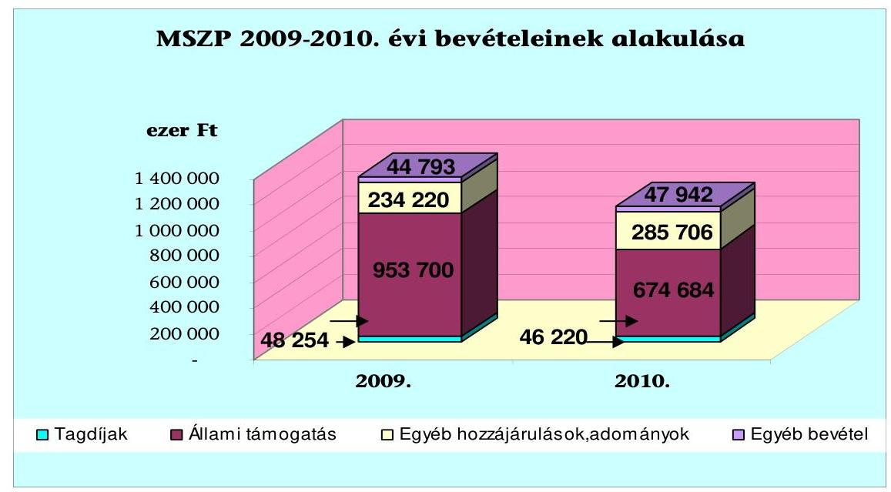
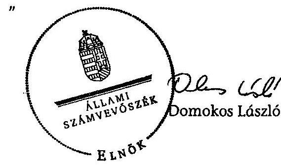
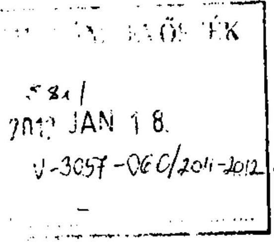
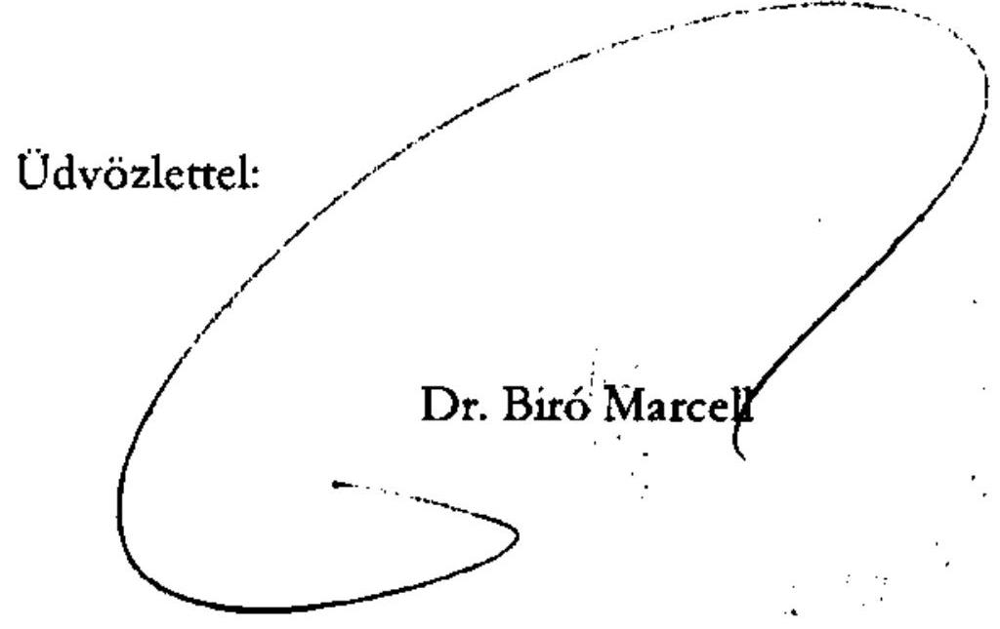
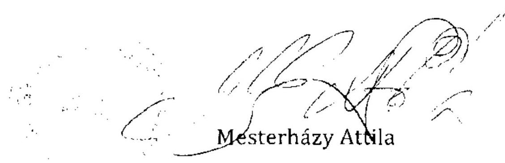

# ÁLLAMI   SZÁMVEVŐSZÉK 

## JELENTÉS

a Magyar Szocialista Párt 2009-2010. évi gazdálkodása törvényességének ellenőrzéséről

---

# Állami Számvevőszék 

Iktatószám: V-3057-028/2011.
Témaszám: 1032
Vizsgálat-azonosító szám: V0549

## Az ellenőrzést felügyelte:

## Horváth Balázs

felügyeleti vezető

## Az ellenőrzést vezette:

## Barta József ellenőrzésvezető

## Az ellenőrzést végezték:

## Baracsi Szilvia Tóth István   számvevő tanácsos   számvevő tanácsos

## A témához kapcsolódó eddig készített számvevőszéki jelentések:

## címe

Jelentés a Magyar Szocialista Párt (mint a Magyar Szocialista Munkáspárt jogutódja) bejegyzési kérelmével egyidejűleg a bírósághoz benyújtott vagyonmérlege vizsgálata
Jelentés a Magyar Szocialista Párt 1991. évi gazdálkodása törvénymérezésének ellenőrzéséről
Jelentés a Magyar Szocialista Párt 1992-1993-1994. évi gazdálkodása 278
dása törvényességének ellenőrzéséről
Jelentés a Magyar Szocialista Párt 1995-1996. évi gazdálkodása 352
törvényességének ellenőrzéséről
Jelentés a Magyar Szocialista Párt 1997-1998 évi gazdálkodása 004
törvényességének ellenőrzéséről
Jelentés a Magyar Szocialista Párt 1999-2000. évi gazdálkodása 0134
törvényességének ellenőrzéséről
Jelentés a Magyar Szocialista Párt 2001-2002. évi gazdálkodása 0353
törvényességének ellenőrzéséről
Jelentés a Magyar Szocialista Párt 2003-2004. évi gazdálkodása 0561
törvényességének ellenőrzéséről
Jelentés a Magyar Szocialista Párt 2005-2006. évi gazdálkodása 0747
törvényességének ellenőrzéséről
Jelentés a Magyar Szocialista Párt 2007-2008. évi gazdálkodása 0950
törvényességének ellenőrzéséről

---

# TARTALOMJEGYZÉK 

BEVEZETÉS ..... 5
I. ÖSSZEGZŐ MEGÁLLAPÍTÁSOK, KÖVETKEZTETÉSEK, JAVASLATOK ..... 7
II. RÉSZLETES MEGÁLLAPÍTÁSOK ..... 11

1. A Párt gazdálkodásáról szóló 2009-2010. évi beszámolók ..... 11
1.1. A teljes vizsgálati időszakra érvényes megállapítások ..... 11
1.1.1. Bevételek ..... 12
1.1.2. Kiadások ..... 13
2. A Pártnak a beszámoló összeállítására és az azt alátámasztó könyvvezetésre vonatkozó belső szabályozása és gyakorlata ..... 14
2.1. A számviteli szabályozás rendszere ..... 14
2.2. A könyvvezetés gyakorlata, ennek összhangja a jogszabályokban és a belső szabályzatokban előírt követelményekkel ..... 15
2.3. A bizonylati elv és a bizonylati fegyelem érvényesülése ..... 16
3. A Párt bevételszerző, gazdálkodó tevékenysége ..... 17
3.1. A Párt gazdálkodásának szabályozottsága ..... 17
3.2. A Párt vagyonának elemei ..... 17
4. A gazdálkodással összefüggő, egyéb jogszabályokban foglalt előírások betartása ..... 19
4.1. A foglalkoztatás szabályszerűsége ..... 19
4.2. Személyi jellegű kifizetésekre vonatkozó jogszabályok betartása ..... 20
4.3. Az adózási, társadalombiztosítási és egyéb jogszabályok rendelkezéseinek érvényesítése ..... 21
5. A Párt belső kontroll rendszere ..... 22
5.1. A belső ellenőrzés rendszerének szabályozottsága, működése, eredményessége ..... 22
5.2. Az informatikai rendszer környezetének szabályozottsága és belső kontrolljainak múködése ..... 24
6. Az előző ellenőrzés megállapítására tett intézkedések ..... 25

---

# MELLÉKLETEK 

1. számú A Magyar Szocialista Párt 2009. évi pénzügyi zárómérlege
2. számú A Magyar Szocialista Párt 2010. évi pénzügyi zárómérlege
3. számú A Magyar Szocialista Párt 2009. évi módosított pénzügyi zárómérlege
4. számú A Közigazgatási és Igazságügyi Minisztérium nemleges észrevétele
5. számú A Párt képviselőjének nemleges észrevétele

---

# RÖVIDÍTÉSEK JEGYZÉKE 

| Jogszabályok- és szervezetszabályozó eszközök: |  |
| :--: | :--: |
| Art. | Az adózás rendjéről szóló - többször módosított - 2003. évi XCII. törvény |
| gazdálkodási szabályzat | Az alapszabály 3. számú mellékletét képező, a Párt választmánya által 2007. szeptember 22-én elfogadott gazdálkodási szabályzat |
| Gjt. | A gépjármúadóról szóló 1991. évi LXXXII. törvény |
| párttörvény | A pártok múködéséről és gazdálkodásáról szóló - többször módosított - 1989. évi XXXIII. törvény |
| Számv. tv. | A számvitelről szóló - többször módosított - 2000. évi C. törvény |
| Szja tv. | A személyi jövedelemadóról szóló - többször módosított 1995. évi CXVII. törvény |
| SZMSZ | Szervezeti és Múködési Szabályzat |
| Tbj. tv. | A társadalombiztosítás ellátásaira és a magánnyugdíjra jogosultakról, valamint e szolgáltatások fedezetéről szóló - többször módosított - 1997. évi LXXX. törvény, egységes szerkezetben a végrehajtásról szóló 195/1997. (XI. 5.) Kormányrendelettel |
| Szórövidítések |  |
| áfa | általános forgalmi adó |
| ÁSZ | Állami Számvevőszék |
| BPEB | Budapesti Pénzügyi Ellenőrző Bizottság |
| KPEB | Központi Pénzügyi Ellenőrző Bizottság |
| OK | Országos Központ |
| Párt | Magyar Szocialista Párt |
| PEB | Pénzügyi Ellenőrző Bizottság |
| területi szövetségek | Megyei Területi Szövetség, Budapesti Tanács |

---

.

---

# JELENTÉS 

## a Magyar Szocialista Párt 2009-2010. évi gazdálkodása törvényességének ellenőrzéséről

## BEVEZETÉS

Az Állami Számvevőszékről szóló 2011. évi LXVI. törvény 5. § (11) bekezdés a) pontja, valamint a pártok múködéséről és gazdálkodásáról szóló - többször módosított - 1989. évi XXXIII. törvény (párttörvény) 10. § (1) bekezdése alapján a pártok gazdálkodása törvényességének ellenőrzésére az Állami Számvevőszék (ÁSZ) jogosult. A párttörvény 10. § (3) bekezdése értelmében az ÁSZ kétévenként ellenőrzi azoknak a pártoknak a gazdálkodását, amelyek rendszeres állami költségvetési támogatásban részesültek. E törvényi felhatalmazásokra figyelemmel az ÁSZ 2011. évi ellenőrzési tervének megfelelőn vizsgálta a Magyar Szocialista Párt (továbbiakban: Párt) 2009-2010. évi gazdálkodása törvényességét. A Párt a 2006. és a 2010. évi országgyúlési választás első fordulóján elért eredménye alapján rendszeres költségvetési támogatásban részesült.

Az ellenőrzés célja annak megállapítása volt, hogy:

- a Párt által készített és a Magyar Közlönyben1 közzétett éves beszámolók a törvényi előírásoknak megfelelnek-e, a könyvvezetéssel és a valósággal megegyező adatokat tartalmaznak-e;
- a könyvvezetés és a gazdálkodás során betartották-e a számvitelről szóló többször módosított - 2000. évi C. tv. (továbbiakban: Számv. tv.) és az egyéb jogszabályok rendelkezéseit, a belső előírásokat;
- a Párt a múködéséhez szabályszerűen igénybe vehető forrásokat használt-e fel, a párttörvényben engedélyezett gazdálkodó tevékenységet folytatott-e.

Az ellenőrzés típusa: pénzügyi-szabályszerúségi ellenőrzés
Az ellenőrzött időszak: 2009. január 1. - 2010. december 31. pénzügyi zárómérleggel lezárt gazdasági évek.

Az ellenőrzés körülményeit illetően rögzíteni szükséges, hogy:

- a párttörvény 1. sz. melléklete szerinti beszámoló-mintához magyarázatot, útmutatót nem készítettek a jogalkotók, így ennek kitöltése pártonként - kialakított számviteli politikájuknak megfelelően - eltérő lehet;

1 A Miniszterelnöki Hivatalt vezető miniszter 17/2008. (HÉ.53) MeHVM utasításnak 2. és 3. pontjai értelmében 2009. január 1-től a hirdetmények a Hivatalos Értesítőben jelennek meg.

---

- a beszámoló-minta a számviteli törvény rendelkezéseivel nem harmonizál, nem felel meg sem a mérleg, sem az eredmény-kimutatás követelményeinek.

Az ÁSZ a párttörvény módosításáig a hatályos rendelkezéseknek megfelelő egységes módszertani alapokra helyezett - gyakorlattal folytatja a pártok gazdálkodása törvényességének ellenőrzését. A pénzügyi-szabályszerúségi ellenőrzést a számvevőszéki ellenőrzés módszertani szabályai szerint, a pártellenőrzésre kiadott segédletbe foglalt egységes követelmények alapján végeztük.

Az ellenőrzést kockázatelemzéssel alapoztuk meg, amelynek eredményeként az ellenőrzést közepes kockázatúnak értékeltük. Az ellenőrzésnél a lényegességi szintet - az ellenőrzés által feltárt hibák, téves adatok előjeltől független összege, amely a felhasználók véleményét, döntéseit már jelentősen befolyásolja - a Párt által közzétett pénzügyi zárómérlegek bevételi főösszegére vetített 2\%-ban határoztuk meg. Specifikus lényegességi küszöbként határoztunk meg a pénzügyi zárómérlegek megbízhatósága szempontjából az egyéb hozzájárulások, adományok a párttörvény 9. § (2) bekezdésében előírt nevesítési kötelezettségének értékhatárait (belföldi jogi és magánszemélytől kapott hozzájárulás, adomány 500 ezer Ft felett).

Az adatok előzetes elemzése, kockázatértékelése alapján terveztük meg a tételes ellenőrzést, valamint a statisztikai mintavételi eljárást. A bizonylati rend és fegyelem ellenőrzéséhez 2009. évben statisztikai mintavétellel 231 tételt, 2010. évben az IDEA adatbázis kezelő programmal véletlenszerűen kiválasztott 423 mintát használtunk fel.

Tételesen ellenőriztük a bevételek közül az egymillió Ft feletti tételeket, valamint a pénzügyi zárómérlegben kötelezően nevesítendő, értékhatárt elérő egyéb hozzájárulásokat, adományokat. A bizonylati rend és fegyelem ellenőrzéséhez a mintát IDEA adatbázis kezelő programmal, statisztikai mintavétel módszerével, a Párt 2009-2010. évi könyvelési adatállományából választottuk. A pénzkezelési szabályok érvényesülését ellenőriztük a Bács-Kiskun, Borsod-Abaúj-Zemplén, Heves, Komárom-Esztergom, Pest megyei és Budapest Területi Szövetségek és választókerületi társulásaik, valamint az OK (évente két-két havi) pénztári és banki forgalmának bizonylatain, nyilvántartásain. A 2010. évi tételeknél figyelmen kívül hagytuk az állami támogatás és egyéb források terhére elszámolt országgyűlési képviselő-választási költségeket, mert az ÁSZ korábbi ellenőrzése erre kiterjedt. 2
A helyszíni ellenőrzésre 2011. szeptember 13 - október 26-a között, a Párt székhelyén, 1066 Budapest, Jókai utca 6. szám alatt került sor.

[^0]
[^0]:    2 A részletes megállapítások az ÁSZ 1105. sorszámon kiadott - a 2010. évi országgyűlési választásra fordított pénzeszközök elszámolásának ellenőrzéséről a jelölő szervezeteknél és független jelöltnél című - számvevőszéki jelentésben találhatók.

---

# I. ÖSSZEGZŐ MEGÁLLAPÍTÁSOK, KÖVETKEZTETÉSEK, JAVASLATOK 

A Párt a 2009. és 2010. évi beszámolóit (pénzügyi zárómérleg megnevezéssel) a párttörvényben előírt határidőn belül és formában nyilvánosságra hozta. A 2009. évi pénzügyi zárómérleget a helyszíni ellenőrzés észrevételére 2011. október 7 -én a Hivatalos Értesítő 52. számában és a Párt internetes honlapján ismételten közzétették, mert a pénzügyi zárómérleg összeállításánál nem érvényesítették a Számv. tv-ben szabályozott következetesség és valódiság elvét. A hatályos számlarendi előírás a párttörvény előírásától eltérő szabályozása miatt az egyéb bevételek között tették közzé az elengedett kölcsöntartozás formájában jogi személytől kapott 17000 ezer Ft összegű vagyoni hozzájárulás értékét, a belföldi jogi személyektől kapott adományok helyett. Ezzel összefüggésben a nevesítési értékhatárt meghaladó támogatást nyújtót nem nevesítették, amely specifikus lényeges hibát jelentett. A pénzügyi zárómérleg konszolidálási hibájából eredően a bevételi oldalon 2009. ében 20115 ezer Ft, 2010. évben 2496 ezer Ft összegű többletbevételt tartalmazott. A módosított pénzügyi zárómérleg megbízható és valós képet mutat a 2009. évi gazdálkodásról.

A Párt számviteli szabályzatai közül változatlan előírásokkal tartotta hatályban a leltározási és selejtezési szabályzatot, valamint az eszközök és források értékelési szabályzatát, mert nem történt olyan jogszabályi és szervezeti változás, amely a módosítást indokolttá tette volna. A számviteli politikán a képviseletre jogosult személyek körében bekövetkezett változásokat átvezették. A pénzkezelési szabályzatot az OK pénzkezelési helyének változása miatt 2010ben aktualizálták. A számlarend hibás szabályozást tartalmazott, mert az elengedett kölcsöntartozást a pénzügyi zárómérlegben 4. sor egyéb hozzájárulások, adományok helyett a 6 . sor egyéb bevételek címen rendelte kimutatni. A számlarend nem rendelkezett arról, hogy a Párt területi szervezeteitől kapott nem pénzbeli támogatás OK-nál könyvelt összegét a pénzügyi zárómérleg öszszeállítása során figyelmen kívül kell hagyni. A szabályozási hibák összefüggnek azzal, hogy a párttörvény 1. sz. melléklete szerinti beszámoló mintához magyarázatot, útmutatót nem készítettek a jogalkotók, így ennek kitöltése pártonként - kialakított számviteli politikájuknak megfelelően - eltérő lehet. A beszámoló minta a számviteli törvény rendelkezéseivel nem harmonizál, nem felel meg sem a mérleg, sem az eredmény-kimutatás követelményeinek. A hiányosságok miatt az ÁSZ évek óta javasolja a kormánynak jelentéseiben a párttörvény módosítását. A Párt a helyszíni ellenőrzés észrevételeire figyelemmel a számlarend hiányosságait a helyszíni ellenőrzés időszakában pótolta.

A könyvvezetést a számviteli politikában szabályozottaknak megfelelően, a kettős könyvvitel rendszerében központilag, a főkönyvelőségen végezték. A bizonylatok feldolgozási rendje a gazdálkodási szabályzat előírásával összhangban volt a decentralizált gazdálkodási jogosítványokkal és centralizált nyilvántartással. A főkönyvelőség folyamatba épített ellenőrzéssel végezte a Párt könyvelési feladatait. A pénzügyi zárómérleget alátámasztó könyvvezetésben a

---

párttörvény szerinti pénzügyi zárómérleg tartalmát nem érintő eseti nyilvántartási hibák előfordultak.

A könyvvezetés során a Számv. tv-ben szabályozott számviteli alapelvek érvényesültek. Az éves zárások előtt a belső előírásokkal összhangban dokumentáltan teljesült a befektetett eszközök, a követelések és kötelezettségek egyeztetéssel való leltározása, az eszközök és források értékelése. Az analitikus nyilvántartások körét, tartalmát, főkönyvi számlákhoz való kapcsolatát a számlarend és a pénzkezelési szabályzat rögzítette. A Párt szabályszerűen vezette a számlarendben előírt, főkönyvekkel egyeztetett analitikákat.

A bizonylati szabályzat előírásával összhangban nyilvántartást vezettek a szigorú számadású nyomtatványokról. A Pártnál megsértették a Számv. tv. és a pénzkezelési szabályzatnak a napi záró pénzkészletre vonatkozó előírását, az ellenőrzött esetek mintegy harmadában a területi és választókerületi pénztárban a napi záró pénzkészlet meghaladta az előírt 500 ezer Ft-os értékhatárt.

A bizonylatolás Számv. tv-ben meghatározott követelményei érvényesítéséhez bizonylati szabályzattal és bizonylati albummal rendelkeztek. Az utalványozáshoz a hatályos szervezeti és számviteli szabályzatok meghatározták a gazdálkodással kapcsolatos jog- és hatásköröket, előírták a számlavezetés és készpénzkezelés, a bizonylatok kiállításának és feldolgozásának eljárásait, valamint a kötelezettségvállalás és utalványozás rendjét. A könyvelt gazdasági eseményeket számviteli bizonylatokkal alátámasztották. A Számv. tv. 167. § (1) bekezdésében rögzített alaki-tartalmi előírásokat, 2009-ben a vizsgált bizonylatok 5,3\%-ánál, 2010-ben 3,4\%-ánál nem tartották be, ami a könyvvezetés és az éves pénzügyi zárómérlegek valódiságát nem befolyásolta.

A Párt gazdálkodó, bevételszerző tevékenysége során - könyvviteli nyilvántartásai szerint - betartotta a párttörvényben előírt forrásszerzési és gazdálkodási tilalmakat. Bevételei szabályozott tagdíjfizetésből, egyéb hozzájárulásokból és adományokból, a tulajdonát képező ingatlan értékesítéséből, tárgyi eszközei hasznosításából, költségtérítésből, valamint kamatbevételekből álltak. A Párt külföldi államtól, költségvetési szervtől, állami vállalattól, állami részvétellel működő gazdasági társaságtól, közvetlen költségvetési támogatásban vagy költségvetési szervi támogatásban részesülő alapítványtól nem fogadott el vagyoni hozzájárulást, valamint névtelen adományt. A párttörvényben nem engedélyezett gazdálkodó tevékenységet nem folytatott, gazdasági társaságban részesedést nem szerzett, vállalatot nem alapított. A Párt, két 100\%-os tulajdonát képező Kft-je közül a KÖZ-TÉR-HÁZ Kft-vel volt gazdasági kapcsolatban. A Pártnak a Kft-k adózott eredményéből bevétele nem származott. A Párt 2010ben a KÖZ-TÉR-HÁZ Kft-t értékesítette, a CONCEDO Kft-t végelszámolással megszűntette.

A személyi jellegú kifizetések körében a béreket szabályszerű munkaszerződések alapján központilag számfejtették. A Párt a vizsgált időszakban 74 fő teljes munkaidős, főfoglalkozású, 29 részmunkaidős, 24 nyugdíjas munkavállalót alkalmazott, 2010. évben 10 főt megbízási szerződéssel foglalkoztattak. A munkavállalóknak adómentes mértékben étkezési utalványt, helyközi közlekedéshez bérlettérítést, kettő-kettő területi szövetségnél munkaruhát, továbbá iskolakezdési támogatás biztosítottak. Öt megyei területi szövetség képernyő előtt

---

munkát végző dolgozóinak védőszemüveg készítési támogatást fizetett 2009. évben.

A hivatali és magántulajdonú gépjármú hivatali célú használatát, elszámolási rendjét szabályozták, az érintettekkel a saját gépjármú használatára megállapodást kötöttek. A költségtérítést szabályosan kitöltött kiküldetési rendelvények és útnyilvántartások alapján, adómentes normatív mértékkel számolták el. A hivatali gépkocsikat a belső szabályozásnak megfelelően, az útnyilvántartások és - a gépkocsik tárolási helyén 2009. január 31-éig vezetett - nyilvántartások szerint hivatalos célú utazáshoz használták. 2009. február 1-jétől a Párt személygépkocsi tulajdonlással, használattal kapcsolatos költséget elszámolt, így cégautóadó fizetési kötelezettsége keletkezett.

Az adózási és a társadalombiztosítási jogszabályok előírásainak a Párt munkáltatóként és kifizetőként eleget tett, a havi és éves adatszolgáltatási, bevallási és befizetési kötelezettségeit szabályszerűen teljesítette, a foglalkoztatottak biztosítási jogviszonyában történt változásokat határidőben bejelentette. A kötelező nyilvántartásokat vezették. A vizsgált évekre vonatkozó - 21-21 db adó-, illeték-, és járulék bevallást és befizetést tartalmazó - folyószámlakivonatok szerint a Pártnak hátraléka nem volt. A Párt eleget tett a cégautóadó, valamint a hivatali telefonok magáncélú használatából eredő adó- és járulék bevallási és fizetési kötelezettségének. A reprezentációs kiadások elkülönített nyilvántartása szerint 2009-ben három, 2010-ben egy területi szövetség lépte túl az Szja tv-ben szabályozott adómentes értékhatárt, amely után az adó-és járulék befizetést az Szja tv-nek megfelelően, szabályszerűen teljesítették. Egy területi szövetség és az OK esetében keletkezett a gazdálkodó tevékenységhez kapcsolódóan általános forgalmi adó bevallási és fizetési kötelezettsége, melyeket a Párt határidőben teljesített.

A belső ellenőrzést a hatályos belső szabályzatok összehangoltan szabályozták. Az ellenőrző testületek (KPEB, megyei és helyi PEB-ek) éves munkatervek alapján végezték ellenőrzési tevékenységüket. A vizsgált időszakban a testületi ellenőrzések eredményéről beszámoltak a Kongresszusnak, illetve a megyei küldöttgyűléseknek. A testületek ellenőrző tevékenységükkel a gazdálkodás szabályszerűségét, a törvényes működést segítették. A vizsgált időszakban a PEB-ek szabálytalanságot nem tártak fel. A vezetői és a folyamatba épített ellenőrzés szabályzait a gazdálkodási-számviteli szabályzatokban, valamint a munkaköri leírásokban határozták meg. A belső ellenőrzés a pénztárnok irányításával, a kötelezettségvállalási és utalványozási jogkör szabályozott gyakorlásával, a főkönyvelőség szakembereinek felülvizsgálatával és egyeztetésével eredményesen működött. A gazdálkodással összefüggő informatikai rendszer múködtetését a vizsgált időszakban részben szabályozták, a saját fejlesztésű könyvelő program esetében rendelkeztek felhasználói leírással. A hiányosságok pótlására a helyszíni ellenőrzés időszakában hatályba léptették a Párt informatikai biztonsági és belső adat- és információvédelmi szabályzatát. A Párt a gazdálkodási adatok biztonságáról rendszeres mentéssel és a hozzáférési jogosultság egy-egy munkavállalóra történő korlátozásával gondoskodott, így a hozzáférési kontrollok biztosítottak voltak.

A belső ellenőrzés a Párt gazdálkodásának és könyvvezetésének törvényességét elősegítette.

---

# Az ellenőrzés intézkedést igénylő megállapításai és javaslatai: 

Az Állami Számvevőszékről szóló 2011. évi LXVI. törvény 33. § (1) bekezdésében foglaltak értelmében a jelentésben foglalt megállapításokhoz kapcsolódó intézkedési tervet köteles az ellenőrzött szervezet vezetője összeállítani és azt a jelentés kézhezvételétől számított harminc napon belül az ÁSZ részére megküldeni. Amennyiben az intézkedési tervet határidőben nem küldi meg a szervezet, vagy az nem elfogadható, az ÁSZ elnöke a hivatkozott törvény 33. § (3) bekezdés a)-b) pontjaiban foglaltakat érvényesítheti.

## a közigazgatási és igazságügyi miniszternek

A szabályozási hibák összefüggnek azzal, hogy a párttörvény 1. sz. melléklete szerinti beszámoló mintához magyarázatot, útmutatót nem készítettek a jogalkotók, így ennek kitöltése pártonként - kialakított számviteli politikájuknak megfelelően - eltérő lehet. A beszámoló minta a számviteli törvény rendelkezéseivel nem harmonizál, nem felel meg sem a mérleg, sem az eredmény-kimutatás követelményeinek. A hiányosságok miatt az ÁSZ évek óta javasolja a kormánynak jelentéseiben a párttörvény módosítását.

Javaslat
Terjessze elő a pártfinanszírozás átláthatóságának, a pártok elszámoltathatóságának fokozott érvényesítése érdekében a párttörvény módosítását, figyelemmel a pártok számviteli nyilvántartási és beszámolási rendszerét érintő ellentmondások feloldására, amelyek a párttörvény és a Számv. tv. között évek óta fennállnak.

## a Párt elnökének

A pénzügyi zárómérlegekben 2009-ben 20115 ezer Ft, 2010-ben 2496 ezer Ft értékben egyéb bevételként mutatatták ki a szervezeten belüli vagyonmozgást, ezzel sérült a Számv. tv-ben foglalt valódiság elve. A Párt 2009. évben 17000 ezer Ft elengedett kölcsöntartozást hibás számlarendi előírásból fakadóan az egyéb bevételek között szerepeltette a pénzügyi zárómérlegben, az előző számvevőszéki ellenőrzés során is kifogásolt visszatérő hiba miatt sérült a következetesség számviteli alapelve.

Felhívás:
Érvényesítse a jövőben az éves beszámoló megbízhatósága érdekében a Számv. tv. 15. § (3) és (5) bekezdésben foglalt számviteli elveket.

---

# II. RÉSZLETES MEGÁLLAPÍTÁSOK 

## 1. A PÁrt GAZDÁlKodÁsÁról SZóló 2009-2010. ÉVI beSzÁmolók

### 1.1. A teljes vizsgálati időszakra érvényes megállapítások

A Párt a 2009. évi pénzügyi zárómérlegét 2010. április 30-án a Hivatalos Értesítő 31. számában, a 2010. évi pénzügyi zárómérlegét 2011. április 28án a Hivatalos Értesítő 29. számában jelentette meg a párttörvény 9. § (1) bekezdésében előírt határidőn belül, a párttörvény 1. számú mellékletében meghatározott minta szerint (1-2. számú melléklet). A Párt mindkét évi pénzügyi zárómérlegét a hivatkozott jogszabályhely előírása szerint az internetes honlapján is közzétette.

A helyi szervezetek, területi szövetségek és az OK gazdálkodási adatait a kettős könyvvitel rendszerében - az önálló gazdálkodásra tekintettel - külön-külön főkönyveken rögzítették. A könyvelések konszolidált adataiból állították össze a Párt összesített, egyszerűsített éves beszámolóját, amelyben a számviteli politika egyes soraiban szereplő adatok megegyeztek a főkönyvi könyvelés kapcsolódó főkönyvi számlái összevont egyenlegeivel, és az ahhoz kapcsolódó analitikus nyilvántartásokkal.

A Párt mindkét évi pénzügyi zárómérleg összeállítása során megsértette a Számv. tv. 15. § (3) bekezdésében foglalt valódiság számviteli alapelvét, mert a pénzügyi zárómérlegekben 2009-ben 20115 ezer Ft, 2010ben 2496 ezer Ft értékben egyéb bevételként mutatott ki helyi, vagy megyei pártszervezettől átvett eszközt, ami szervezeten belüli vagyonmozgás volt, ezért a Párt szempontjából nem minősült bevételnek.

A Párt 2009. évben megsértette a Számv. tv. 15. § (5) bekezdésében foglalt következetesség számviteli alapelvét, mert a számlarendnek 98. rendkívüli bevételek számlára vonatkozó hibás előírásából fakadóan az EUROCOUNTOUR Alapítvánnyal szemben fennállt, elengedett kölcsönből - a kölcsön elengedéséről az Alapítvány 2009. október 8-án kelt levelében értesítette a Pártot - származó 17000 ezer Ft bevételt nem a jogi személy adományaként, hanem az egyéb bevételek között szerepeltették a pénzügyi zárómérlegben. Ennek következményeként az 500 ezer Ft összeget meghaladó elengedett kölcsöntartozást nem nevesítették, amely specifikus lényeges hibát jelentett.

A 2009. évi pénzügyi zárómérlegben szereplő hibák előjeltől független összege 54115 ezer Ft, ami meghaladja az ÁSZ által elfogadott, a bevételi főösszegre vetített $2 \%$-os lényegességi szintet ( $4,2 \%$ ), ezért a hiba lényegesnek minősült.

A 2010. évi pénzügyi zárómérlegben szereplő hiba előjeltől független összege 2496 ezer Ft, amely $0,2 \%$-os mértéke miatt nem minősült lényegesnek.

---

A Párt 2009. évi pénzügyi zárómérlegét a helyszíni ellenőrzés észrevételeire figyelemmel helyesbítette, a Hivatalos Értesítő 2011. évi 52. számában 2011. október 7-én megjelentette (3. számú melléklet), ezzel egy időben a Párt internetes honlapján nyilvánosságra hozta. A módosított pénzügyi zárómérleg megbízható, valós képet mutat a Párt 2009. évi gazdálkodásáról.

# 1.1.1. Bevételek 

A tagdíjfizetési kötelezettséget az alapszabály 49. §-a rögzítette. Az alapszabály szerint a tagdíjak mértékéről a párttag és a pártszervezet állapodik meg. A tagdíjak összege mindkét évben megegyezett a főkönyvi könyvelésben ilyen címen szereplő összeggel. A pénzügyi zárómérleg sor csak a tagdíjak fogalomkörébe tartozó összegeket tartalmazott. A könyvelésben szereplő tagdíj összegét és a befizető nevét a bevételi pénztárbizonylat, illetve a bankkivonat, vagy azokhoz csatolt alapbizonylat tartalmazta.

Az állami költségvetésből származó támogatásokat a főkönyvi könyvelésben kimutatott és a bankszámlakivonaton szereplő, a Magyar Államkincstár által ténylegesen átutalt összeggel egyezően közölték. A 2009. évről közzétett 953700 ezer Ft összeg megfelelt a Magyar Köztársaság 2009. évi költségvetésének végrehajtásáról szóló 2010. évi XCVIII. törvény 1. mellékletében foglaltaknak. A 2010. évről közzétett költségvetési támogatás összege egyezett a Magyar Köztársaság 2010. évi költségvetésének végrehajtásáról szóló 2011. évi CXXXIII. törvény 1. mellékletében feltüntetett 655846 ezer Ft és a 2010. évi országgyűlési választásokra jelöltarányosan kapott 18838 ezer Ft költségvetési támogatás együttes összegével.

Az egyéb hozzájárulások, adományok pénzügyi zárómérleg sor adattartalmát a Párt a párttörvény 1. számú mellékletének megfelelően tovább részletezte. A Párt a vizsgált években belföldi jogi- és magánszemélyektől kapott pénzbeli és nem pénzbeli vagyoni hozzájárulást. A pénzügyi zárómérleg sor 2009-ben 17000 ezer Ft összegben nem tartalmazta az EUROCOUNTOUR Alapítványtól felvett kölcsön 2009-ben elengedett összegét, azt a számlarend hibás előirása miatt az egyéb bevételek között szerepeltették. Az egyéb hozzájárulásokat a beszámolóban a számvevőszéki megállapításra figyelemmel javították az EUROCOUNTOR Alapítványtól származó elengedett kölcsön összegével, a nevesítést az ismételt közzététel során pótolták. Az EUROCOUNTOR Alapítvány a párttörvény 4. § (2) bekezdésében előírt korlátozás alá nem esett, mert a támogatás évében költségvetési, illetve költségvetési szervi támogatásban nem részesült.

Egyebekben a pénzügyi zárómérlegsor részadatainak értéke megegyezett a kapcsolódó főkönyvi számlák egyenlegével, az egyes pénzügyi zárómérleg sorok oda nem tartozó bevételt nem tartalmaztak. A jogi személyektől kapott támogatások között a nem pénzbeli adományok értékét a 2009. évben 24814 ezer Ft, 2010. évben 25385 ezer Ft összeggel szerepeltették. Az 500 ezer Ft-ot meghaladó adományt adó belföldi jogi- és magánszemélyek nevét a pénzügyi zárómérlegekben a párttörvény 9. § (2) bekezdése előírásának megfelelően mindkét évben feltüntették.

---

Az egyéb bevételek között kamatbevételeket, eszközök értékesítéséből és bérbeadásából, elévült kötelezettségből, értékpapírok hozamaiból, banki kamatokból, rendkívüli bevételekből, valamint költségtérítésből származó bevételt tartottak nyilván.

A közzétett pénzügyi zárómérleg - szabályozási hiányosságra visszavezethető konszolidálási hibából adódóan - 2009-ben tévesen tartalmazott 20115 ezer Ft, 2010-ben 2496 ezer Ft összegű egyéb bevételt, mert a területi szövetségektől térítés nélküli átvett, az OK tulajdonában álló ingatlanokon végzett felújítást az aktiválással egy időben, az egyéb bevételek soron, mint rendkívüli bevételt is kimutatták az OK-nál. A hibás gyakorlatot az előző ÁSZ ellenőrzés már kifogásolta. A helyszíni ellenőrzés észrevételeire figyelemmel a Párt 2009. évi beszámolóját helyesbítette.

# 1.1.2. Kiadások 

Az éves pénzügyi zárómérlegek az egyes pénzügyi zárómérleg sorok adatának kiszámításánál figyelembe vett főkönyvi számlák egyenlegével, illetve összesített forgalmával egyező összegben tartalmazták a kiadásokat.

A támogatás egyéb szervezeteknek pénzügyi zárómérleg soron közölt támogatást mindkét évben a Párt a bíróságokon bejegyzett szervezetek részére nyújtotta.

A vállalkozás alapítására fordított összegek címen csak a 2009. évi pénzügyi zárómérleg tartalmazott 508 ezer Ft összeget, amely a 2010. évben végelszámolással megszűnt CONCEDO Kft-be történt pótbefizetés volt.

Az eszközbeszerzés soron - a Párt hatályos számlarendjével összhangban - az immateriális javak, az ingatlanok és kapcsolódó vagyoni értékű jogok, továbbá a berendezések, felszerelések és járművek számlacsoportok növekedés forgalmának összesített adatát mutatták ki mindkét évben. A 2009. évben az eszközbeszerzések több mint 64,9\%-a ingatlanvásárlásból tevődött össze. A Párt 2009ben, az állami vagyonról szóló - többször módosított - 2007. évi CVI. törvény 67-68. §-aiban szabályozott feltételekkel a vizsgált időszakban összesen négy ingatlant vásárolt 111787 ezer Ft értékben. 2009-ben a Párt egy ingatlant vásárolt 11634 ezer Ft értékben magánszemélytől.

A múködési kiadások között a Párt anyagköltségeket, közüzemi díjakat, bérleti díjakat és a működéshez kapcsolódó igénybevett szolgáltatásokat számolt el a könyveléssel egyező értékben. A Párt az általa használt önkormányzati tulajdonú ingatlanok kedvezményes díjtételére tekintettel kapott támogatások értékét a pénzügyi zárómérlegekben a jogi személyek adományai között kimutatta. A múködési kiadások elszámolására vonatkozó, a számviteli politikában meghatározott előírásokat betartották.

A politikai tevékenység kiadásai között mindkét évben propaganda kiadások, nemzetközi tagdíjak, munkabérek és járulékai, valamint személyi jellegű egyéb kifizetések elszámolására került sor. A politikai kiadások évek közötti azonos elven történő elszámolását számviteli politikájuknak megfelelően érvényesítették.

---

Az egyéb kiadások között a számlarendben meghatározottak szerint bankköltséget, árfolyamveszteséget, hitelkamatot, illetéket, közjegyzői díjat, kerekítés miatti eltéréseket mutattak ki. A vizsgált években érvényesült az egyéb kiadások jogcímeinek azonossága, következetes elszámolása.

# 2. A PÁRTNAK a beSZÁmoló öSSZEÁLlítÁsÁra és az azT alÁtÁMASZTÓ KÖNYVVEZETÉSRE VONATKOZÓ BELSŐ SZABÁLYOZÁSA ÉS GYAKORLATA 

### 2.1. A számviteli szabályozás rendszere

A Párt a pénzügyi zárómérleg összeállítását és az azt alátámasztó könyvvezetést a Számv. tv. 14. § (3)-(4) bekezdéseiben előírtak szerint elkészített, 2005. január 1-jétől hatályos számviteli politikában szabályozta. A számviteli politikán a Párt elnöke és a pénztárnok személyében bekövetkezett változásokat átvezették. A Párt rendelkezett a Számv. tv. 14. § (5) bekezdésében a számviteli politikához előírt leltározási és selejtezési szabályzattal, eszközök és források értékelési szabályzattal, pénzkezelési szabályzattal. A Pártnak gazdálkodási sajátosságai miatt önköltség számítási szabályzatot nem kellett készítenie.

A szabályzatokat az előző ÁSZ ellenőrzés megfelelőnek minősítette, 2009 óta a pénzkezelési szabályzat kivételével azokat nem módosították, mert nem történt olyan jogszabályi és szervezeti változás, amely azt indokolttá tette volna. A szabályzatokat a Számv. tv. 14. § (12) bekezdésének megfelelően a Párt képviseletére jogosult pénztárnok léptette hatályba.

A Számv. tv. 14. § (5) bekezdés d) pontjában előírt pénzkezelési szabályzatot 2009. január 1-jén léptették hatályba. A pénzkezelési szabályzatot aktualizálták, mert az OK pénztára 2010. július 10-étől a Budapest XIV. kerület Thököly út 127. szám alól a Párt Budapest VI. kerület Jókai u. 6. szám alá költözött. A szabályzat tartalmazta a Számv. tv. 14. § (8)-(9) bekezdéseiben szabályozott tartalmi elemeket. A pénzkezelési szabályzat előírásai az OK-ra vonatkoztak, a területi szövetségek részére mintaként szolgált. A területi szövetségek a gazdálkodási és nyilvántartási sajátosságaik szerint szabályozták saját pénzkezelési rendjüket. A pénzkezelési szabályzathoz csatolták az utalványozók, a bankszámla feletti rendelkezésre jogosultak névsorát, aláírási mintáját. A területi szövetségek rögzítették a készpénzállományt érintő pénzmozgások jogcímeit, valamint a bankszámlaforgalom rendjét. A területi szövetségek szabályozták a készpénzállomány ellenőrzésekor követendő eljárást, az ellenőrzés gyakoriságát.

A Számv. tv. 161. §-ában előírt számlarendet a Párt a számlatükörrel évente aktualizálta. A számlarendhez kapcsolódóan a vizsgált időszakban hatályban volt a bizonylati szabályzat és bizonylati album. A számlarend megfelelt a Számv. tv. 160. §-ában előírt, egységes számlakeret követelményeinek, tartalmazta a Számv. tv. 161. § (2) bekezdésében foglalt elemeket. A számlarendben a 98. főkönyvi számlacsoport hibás szabályozást tartalmazott, mert az elévült kötelezettséget a pénzügyi zárómérlegben 4. sor egyéb hozzájárulások, adományok helyett a 6 . sor egyéb bevételek címen rendelte kimutatni.

---

A számlarend nem rendelkezett arról, hogy a Párt területi szervezeteitől kapott nem pénzbeli támogatás OK-nál könyvelt összegét a pénzügyi zárómérleg öszszeállítása során figyelmen kívül kell hagyni. A szabályozási hibák a 2009. évi pénzügyi zárómérleg lényeges hibáját okozták. A Párt a helyszíni ellenőrzés észrevételeire figyelemmel, a számlarendet 2011. szeptember 22-i hatállyal módosította. A szabályozási hibák összefüggnek azzal, hogy a párttörvény 1. sz. melléklete szerinti beszámoló mintához magyarázatot, útmutatót nem készítettek a jogalkotók, így ennek kitöltése pártonként - kialakított számviteli politikájuknak megfelelően - eltérő lehet. A beszámoló minta a számviteli törvény rendelkezéseivel nem harmonizál, nem felel meg sem a mérleg, sem az eredmény-kimutatás követelményeinek. A hiányosságok miatt az ÁSZ évek óta javasolja a kormánynak jelentéseiben a párttörvény módosítását.

# 2.2. A könyvvezetés gyakorlata, ennek összhangja a jogszabályokban és a belső szabályzatokban előírt követelményekkel 

A Pártnál a bizonylatok feldolgozási rendje a gazdálkodási szabályzat 4. pontja előírásával összhangban alkalmazkodott a decentralizált gazdálkodási jogosítványokhoz és centralizált nyilvántartáshoz. A könyvvezetés a számviteli politikában szabályozottaknak megfelelően a kettős könyvvitel rendszerében központilag, az alapbizonylatok számítógépes feldolgozásával az OK főkönyvelőségén történt. A területi szövetségek saját gazdasági eseményeinek bizonylatait havonta, a hozzájuk tartozó választókerületi szervezetek ellenőrzött bizonylatait negyedévente küldték meg az OK főkönyvelősége részére. A könyvvezetés szabályszerűsége érdekében az OK főkönyvelősége a folyamatba épített ellenőrzéssel végezte a Párt könyvelési feladatait. A központi könyvelést követően, a bizonylatokat a főkönyvi kivonattal együtt, megőrzésre a területi szövetségeknek visszajuttatták. A választott könyvvezetés kialakított rendje összhangban volt a Számv. tv. 159. § kettős könyvelésre vonatkozó előírásaival. A főkönyvelőség vezetője és a könyvelők rendelkeztek a Számv. tv. 151. § (1) bekezdés szerint meghatározott képesítéssel és szerepeltek a könyvviteli szolgáltatást végzők nyilvántartásában.

Mindkét vizsgált évben azonos könyvelő programot alkalmaztak, melynek törzsadat-állományát a gazdasági változásoknak megfelelően évente aktualizálták. Az ellenőrzés igényeinek megfelelően minden szükséges adat lekérdezhető volt. A Számv. tv. 15-16. §-aiban szabályozott számviteli alapelvek érvényesültek a pénzügyi zárómérleget alátámasztó könyvvezetésben. A számlakijelölés (kontírozás) gyakorlata összhangban volt a Számv. tv. 160. § (1)-(3) bekezdés egységes számlakeretre vonatkozó számlarendi előírásokkal.

Az eszközök bekerülési értékét a Számv. tv. 47-51. § rendelkezései szerint határozták meg. Az eszközök értékcsökkenésének elszámolása megfelelt a Számv. tv. 52-53. § és a számviteli politika előírásainak. A Párt a nem pénzbeli vagyoni hozzájárulásokat, támogatásokat az értékelési szabályzat előírása szerint egyedileg értékelte, azokat a párttörvény 4. § (5) bekezdése előírásának megfelelően vette nyilvántartásba.

---

Az egyes gazdasági múveletek, események bizonylatainak adatait a Számv. tv. 165. § (3) bekezdés a) és b) pontjaiban, illetve a számviteli politikában meghatározott időpontig rögzítették. A számlarendben a Számv. tv. 161. § (2) bekezdés c) pontjának megfelelően előírt, az egyes főkönyvi számlákhoz kapcsolódó analitikus nyilvántartásokat (immateriális javak, aktivált tárgyi eszközök, követelések, kötelezettségek, munkabérek, adományok) az előírásoknak megfelelően vezették. A főkönyvi számlák és a számlarendben meghatározott analitikus nyilvántartások között az értékadatok számszerú egyeztetése a Számv. tv. 161. § (3) bekezdés és a számlarend előírásai szerint, a pénzügyi zárást megelőzően megtörtént.

Az éves zárások előtt a Számv. tv. 69. § (1) és (2) bekezdések rendelkezéseivel, valamint a leltározási és leltárkészítési szabályzat előírásával összhangban dokumentáltan elvégezték a befektetett eszközök, a követelések és kötelezettségek egyeztetéses leltározását, valamint az eszközök és források értékelését a Számv. tv. 46. § (3) bekezdés rendelkezésének megfelelően. A leltározásokat a szabályzatban, valamint a leltározási ütemtervben előírt rendben hajtották végre. A leltározás mindkét évben kiterjedt a pénzeszközökre. A tárgyi eszközökről vezetett nyilvántartás birtokában, ebben az eszközcsoportban - a leltározási és selejtezési szabályzat III. fejezet 2/b. pontjának megfelelően - mennyiségi felvételre ötévenként kerül sor, amit 2010. december 31-i fordulónappal végrehajtottak.

A zárlati munkálatok végrehajtása során a Számv. tv. 164. § (1)-(2) bekezdésben, valamint a számlarend 5. pontjában rögzített feladatoknál (a kiegészítő, helyesbítő, egyeztető, összesítő könyvelési munkálatok és a számlák technikai lezárása) a számviteli politika II/6. pontjában előírt határidőket betartották. Az év végi zárlatnál a Számv. tv. 165. § (4) bekezdés előírásának megfelelően gondoskodtak a főkönyvi könyvelés, az analitikus nyilvántartások és a bizonylatok adatai közötti egyeztetés és ellenőrzés logikailag zárt rendszerben való végrehajtásáról.

A pénzkezelés gyakorlata nem felelt meg minden esetben a Számv. tv. 14. § (8) bekezdésben foglaltaknak és a pénzkezelési szabályzat előírásainak. A Pártnál megsértették a Számv. tv. 14. § (8) bekezdésnek és a pénzkezelési szabályzatnak a napi záró pénzkészletre vonatkozó előírását, az ellenőrzött esetek mintegy harmadában a területi és választókerületi pénztárban a napi záró pénzkészlet meghaladta az előírt 500 ezer Ft-os értékhatárt.

# 2.3. A bizonylati elv és a bizonylati fegyelem érvényesülése 

A Párt a gazdasági események elszámolására és nyilvántartására alkalmazott bizonylatok körét a számlarend részeként elkészített bizonylati szabályzatban rögzítette. A Párt gazdálkodási szabályzata és a területi szervezetek hatályos SZMSZ-e határozta meg a gazdálkodással kapcsolatos feladat- és hatásköröket. A pénzkezelési szabályzat előírta a számlavezetés és készpénzkezelés, a bizonylatok kiállításának, feldolgozásának eljárásait, valamint a kötelezettségvállalás és utalványozás rendjét. Az alapszabály rendelkezéseinek megfelelően a pénztárnok által kijelölt, valamint a területi szövetségek SZMSZében, illetve gazdálkodással kapcsolatos szabályzataikban felhatalmazott személyek gyakorolták az utalványozási jogkört.

---

A Párt kötelezettségvállalási és utalványozási rendje a vizsgált években a törvényi és belső előírásoknak megfelelt. A kötelezettségvállalást és az utalványozást az arra felhatalmazottak végezték.

A gazdasági események számviteli nyilvántartásokban történő rögzítése során alapvetően betartották a Számv. tv. 165. § (1)-(2) bekezdésében szabályozott bizonylati elvet. 2009-ben az ellenőrzött bizonylatok 1,5\%-a, 2010-ben az ellenőrzött bizonylatok $0,8 \%$-a nem felelt meg a Számv. tv. 165. § (2) bekezdése előírásának, mert azokat nem szabályszerűen kiállított vegyes bizonylattal támasztották alá.

A Számv. tv. 167. § (1) bekezdésében rögzített alaki-tartalmi előírásokat, 2009ben a vizsgált bizonylatok 5,3\%-ánál, 2010-ben 3,4\%-ánál nem tartották be, ami a könyvvezetés és az éves pénzügyi zárómérlegek valódiságát nem befolyásolta. A szigorú számadású bizonylatok nyilvántartását a Számv. tv. 168. § (3) bekezdésében foglalt rendelkezésének és a pénzkezelési szabályzat előírásainak megfelelően vezették. A bizonylatok megőrzéséről a Számv. tv. 169. § előírásának megfelelően gondoskodtak. A Pártnál évente ellenőrizték, hogy az elmentett pénzügyi, számviteli adatállományokból a Számv. tv. 169. §-a szerinti megőrzési időn belül az adatok teljes körűen előállíthatók-e.

# 3. A PÁRT BEVÉTELSZERZŐ, GAZDÁLKODÓ TEVÉKENYSÉGE 

### 3.1. A Párt gazdálkodásának szabályozottsága

A bevételszerző, gazdálkodó tevékenység legfontosabb előírásait az ellenőrzött években a Párt 2007. február 24-én hatályba léptetett, módosított alapszabály 3. számú melléklete, az országos választmány által 2007. szeptember 22-én elfogadott gazdálkodási szabályzata meghatározta. A szabályozás a párttörvény 4-6. §-aiban előírt korlátozásokat is tartalmazta.

### 3.2. A Párt vagyonának elemei

A Párt saját bevételei szabályozott tagdíjfizetésből, egyéb hozzájárulásokból és adományokból, a tulajdonában álló ingatlanok és ingóságok dí ellenében történő hasznosításából, tárgyi eszközök értékesítéséből és bérbe adásából, költségtérítésekből, káresemények miatti bevételekből, valamint kamatbevételekből álltak. A bevételek meghatározó része, 2009. évben 74\%-a, 2010. évben 64\%-a állami támogatásból származott. A 2009. évben a bevételek 4\%-a tagdíjból, $18 \%$-a a belföldi magánszemélyektől és jogi személyektől származó egyéb hozzájárulásokból, adományokból, 4\%-a az egyéb bevételekből származott. A 2010. évben a bevételek $4 \%$-át tagdíjak, $27 \%$-át a belföldi magánszemélyektől és jogi személyektől származó egyéb hozzájárulások, adományok, $5 \%$-át az egyéb bevételek tették ki. Az egyéb hozzájárulások, adományok 2009ben $81,8 \%$-a, 2010-ben $88,7 \%$-a magánszemélyektől származott.

---

A Párt a vizsgált időszakban könyvviteli nyilvántartásai szerint a párttörvény 4. § (2)-(3) bekezdéseiben meg nem engedett forrásból származó vagyoni hozzájárulást állami vállalattól, állami részvétellel működő gazdasági társaságtól, közvetlen költségvetési támogatásban vagy költségvetési szervi támogatásban részesülő alapítványtól, más államtól vagyoni hozzájárulást, továbbá névtelen adományt nem fogadott el.

A Párt 2009-2010. években kedvezményes összegű bérleti díj fizetése mellett is használt önkormányzati tulajdonú ingatlanokat. 2009-ben tizenhárom, 2010ben tizenegy ingatlan esetében a párttörvény 4. § (5) bekezdésében előírtak szerint meghatározta a kedvezményes díjtétel, illetve a tényleges piaci ár közötti különbözet összegét (2009-ben 24814 ezer Ft, 2010-ben 25385 ezer Ft).

A Párt gazdálkodásából származó bevételek - a területi pártszervezetek által végzett ingatlan felújítások értékének kivételével - megegyeznek az egyéb bevételek főkönyvi számláinak egyenlegével. A gazdálkodó tevékenységre vonatkozó, annak jogszerűségét igazoló szerződéseket, megrendeléseket a kapcsolódó számlákhoz csatolták, azok az ellenőrzés során rendelkezésre álltak. A Párt a vizsgált időszakban a párttörvény 6. §-ában meg nem engedett gazdálkodó tevékenységet nem folytatott, gazdasági társaságban részesedést nem szerzett, egyszemélyes kft-t, vállalatot nem alapított, a párttörvény által tiltott értékpapírt nem vásárolt.

A Párt kiadásai: a szabályozott bevételein felül bankkölcsönökből fedezte. A Pártnak 2009. év végén 1559519 ezer Ft, a 2010. év végén 1898919 ezer Ft összegű rövid és hosszú lejáratú kötelezettsége állt fenn. A kötelezettségek mintegy $90 \%$-a mindkét évben rövid és hosszú lejáratú kölcsönökből és hitelekből állt.

A Pártnak a vizsgált időszakban két, egyenként 3000 ezer Ft törzstőkével alapított egyszemélyes Kft-je volt. A Kft-k közül a Pártnak a KÖZ-TÉR-HÁZ Kft-vel volt gazdasági kapcsolata.

---

A Kft-től a Párt szolgáltatási szerződés alapján üzemeltetési szolgáltatásokat és eszközbeszerzéseket rendelt, amelyekért a szerződés szerinti teljesítést követő számlázás után fizetett. A KÖZ-TÉR-HÁZ Kft 2008-ban 15000 ezer Ft összegű kölcsönt kapott, amit 2010-ben visszafizetett. A Párt a kölcsönügyletről elkülönített főkönyvi számlát vezetett. A Kft-k a Párt részére adózott eredményük terhére befizetést nem teljesítettek. A Párt a KÖZ-TÉR-HÁZ Kft-t 2010-ben 3000 ezer Ft-ért értékesítette, a CONCEDO Kft-t végelszámolással megszüntette.

# 4. A GAZDÁLKODÁSSAL ÖSSZEFÜGGŐ, EGYÉB JOGSZABÁLYOKBAN FOGLALT ELŐÍRÁSOK BETARTÁSA 

### 4.1. A foglalkoztatás szabályszerűsége

A vizsgált időszakban a Párt feladatai ellátásához munkaviszony és megbízásos jogviszony keretében foglalkoztatott munkavállalókat az alábbi összetételben:

Adatok fóben

| Évek | Teljes munka-   idős | Részmunkaidős | Nyugdíjasok | Megbízási szer-   zödéssel fog-   lalkoztatottak |
| :--: | :--: | :--: | :--: | :--: |
| 2009. | 66 | 25 | 27 | - |
| 2010. | 81 | 33 | 21 | 10 |

A munkaerő-foglalkoztatás szabályszerű munkaszerződéseken alapult, melyek tartalma megfelelt a Munka Törvénykönyvéről szóló 1992. évi XXII. törvény 76. § (1)-(6) bekezdésében foglaltaknak. A munkaszerződéssel egyidejűleg a munkavállalók részletes feladatait a munkaszerződéshez kapcsolódó munkaköri leírásban rögzítették. A foglalkoztatáshoz kapcsolódó bejelentési, nyilvántartási, számfejtési és kifizetői feladatokat a Párt egészére az OK főkönyvelősége végezte.

A Párt a foglalkoztatottakat az Art. 16. § (4) bekezdése előírásának megfelelően bejelentette. A vizsgált időszakban a teljes- és részmunkaidős, a nyugdíjas, valamint a megbízással foglalkoztatottak munkabérének számfejtése, kifizetése a munkaszerződéssel, a hatályos Tbj. tv., az Szja. tv. és egyéb jogszabályokkal összhangban történt. Az egyéni bér- és járulék nyilvántartásokat vezették, amelyek megegyeztek a főkönyvi könyveléssel és bevallásokkal. Az Art. 46. § (1) bekezdésben, valamint a Tbj. tv. 47. § (3) bekezdésben szabályozott igazolásokat a Párt határidőben kiadta.

A munkaszerződéseket a munkáltatói jogokat gyakorló az alapszabály 26. §5. e) pontja szerinti pártigazgató írta alá. A gazdálkodási szabályzat 28. pont előírása alapján az OK-ban a pártigazgató munkáltatói jogát átruházott hatáskörben a gazdasági területen foglalkoztatottak esetében a pénztárnok gyakorolta.

---

# 4.2. Személyi jellegú kifizetésekre vonatkozó jogszabályok betartása 

A Párt által kiadott egyéb szabályzatok - külföldi kiküldetés elszámolásának szabályzata, telefonszolgáltatás használati rendje, (amely a cégtelefonok magáncélú használat megtérítésének módját tartalmazza hatályos 2006. január 1-jétől), protokoll és vendéglátási szabályzat (hatályos 2005. január 1-jétől) előírásai összhangban álltak a jogszabályok, belső szabályzatok rendelkezéseivel. A belföldi kiküldetési szabályzat nem tartalmazta a belföldi kiküldetéshez igénybe vett tömegközlekedési eszköz elszámolásának előírásait. A belföldi kiküldetés elszámolásának szabályzatát 2011. november 1-jei hatállyal aktualizálták, a hiányosságot megszüntették.

A Párt a hivatali és a saját tulajdonú személygépkocsik hivatali célú használatának és elszámolásának rendjét 2008. január 1-jei, illetve 2011. november 1-jei hatállyal aktualizált belföldi kiküldetések elszámolásának szabályzatában rögzítette.

A Párt tulajdonában lévő hivatali gépjárműveket 2009. január 31-éig a belső szabályozásnak megfelelően, csak hivatalos célú utazásokhoz használták, a szabályzatban megjelölt vezető engedélyével, útnyilvántartás vezetése mellett. A futásteljesítményről vezetett nyilvántartások, a gépkocsik tárolási helyein vezetett nyilvántartásokkal kiegészítve, a kizárólagos hivatali használatot biztosító követelménynek megfeleltek. Az Szja tv. 70. § (1) - (2) bekezdés szerinti magán célú használata 2009. január 31-éig nem merült fel. A Párt személygépkocsi tulajdonlással, használattal kapcsolatos költséget elszámolt, így 2009. február 1-jétől cégautóadó fizetési kötelezettsége keletkezett. A Párt 2009. február 1-től cégautóadó fizetési kötelezettségét teljesítette.

A magánszemélyek tulajdonában álló gépjármú hivatalos célú használata költségtérítésénél a szabályzatnak és jogszabálynak megfelelően az Szja tv. 3. § 83. pontjában előírt tartalmú kiküldetési rendelvényt alkalmazták. A gépkocsik tulajdonosaival kötött megállapodásban rögzítették az elszámolható üzemanyagköltséget. Az üzemanyag költségtérítések a Pártnál normatív mértékkel teljesültek, az Szja tv. 3. számú melléklet II/ 6. pontjában meghatározott, igazolás nélkül elszámolható költségeket vették figyelembe.

A személyi jellegű egyéb kifizetések között utazási költségtérítés címen a belső előírásnak megfelelően, évente két kiemelt nagy rendezvény és kibővített vezetőségi ülések alkalmával és egyéb rendezvényeken való részvétel esetén engedélyezték vonat II. osztályú menetjegy és IC pótjegy elszámolását az OK-ban. Az ellenőrzött útiköltség elszámolások mintegy 10\%-ánál (pl. Komárom-Esztergom megyei Területi Szövetség 2009. május és szeptember havi, Szerencs 2009. szeptember havi elszámolások) nem az Szja tv 3. § 83, pontjában előírt, kétpéldányos kiküldetési rendelvényt használtak, hanem annak tartalmával megegyező nyomtatványt.

A Párt a dolgozóknak munkába járással összefüggően helyközi tömegközlekedési eszközre szóló bérlet hozzájárulást fizetett a 78/1993. (V. 12.) Korm. rendeletben, majd a 2010. május 2 -től hatályos 39/2010. (II. 26.) Korm. rendeletben előírt mértékig.

---

Az Szja tv. 1. számú mellékletében szabályozott adómentes béren kívüli juttatások közül normatív összegben étkezési utalványt (1. számú melléklet 8.17. pont), a Győr-Moson-Sopron megyei és a Jász-Nagykun-Szolnok megyei Területi Szövetségnél takarító munkakörben foglalkoztatott részére munkaruhát biztosítottak (1. számú melléklet 8.24. pont). A Tolna és Bács-Kiskun megyei Területi Szövetség 2009. évben iskolakezdési támogatás kifizetéséről határozott a munkavállalók részére.

Az iskolakezdési támogatási utalvány kifizetése szabályos számla alapján történt, arról az Szja tv. 1. számú melléklet 8.30. pontjában előírt adattartalmú nyilvántartást vezettek. A 2009. évben 5 megyei területi szövetség képernyő előtt munkát végző dolgozónak védőszemüveg készítési támogatásról határozott. Az Szja tv. 1. számú melléklet 9.2. pontja alapján adómentes juttatásnak minősült, amely elszámolásánál a képernyő előtti munkavégzés minimális egészségügyi és biztonsági követelményeiről szóló 50/1999. (XI. 3.) EüM rendelet előírása szerinti dokumentációkat csatolták.

# 4.3. Az adózási, társadalombiztosítási és egyéb jogszabályok rendelkezéseinek érvényesítése 

A Párt a vizsgált időszakban a magánszemélyeknek teljesített kifizetésekből levont személyi jövedelemadót, a munkáltatót és munkavállalókat terhelő járulékokat, valamint a magánnyugdíj-pénztári befizetési kötelezettséget havonta megállapította és bevallotta, adatszolgáltatási kötelezettségét teljesítette. Az Art. 2. számú melléklet I. határidők fejezet 1. és 5. pontja alapján a levont adót és járulékot havi rendszerességgel határidőben megfizették.

A vizsgált évekre vonatkozóan az ellenőrzés rendelkezésére bocsátott 21-21 db adó-, illeték-, és járulék bevallást és befizetést tartalmazó folyószámlakivonatok szerint a Pártnak év végén hátraléka nem volt.

A Pártnak Győr-Moson-Sopron megyei Területi Szövetség és az OK esetében keletkezett a gazdálkodó tevékenységhez kapcsolódóan áfa bevallási és fizetési kötelezettsége, melyeket határidőben teljesített.

Az egyes nagy értékú vagyontárgyakat terhelő adókról szóló 2009. évi LXXVIII. törvény rendelkezései értelmében kettő gépjármú után a Párt 2010. évben megfizette és bevallotta a nagy teljesítményú ( 125 kilowatt) személygépkocsi adóját. A hivatkozott törvény 2010. augusztus 16-án hatályát vesztette, így a 2010. évre bevallott vagyonadó második részletét a Pártnak nem kellett megfizetnie.

A Párt feladatai teljesítéséhez 2009-ben tizenegy saját tulajdonú gépkocsit üzemeltetett, melyből 2010-ben hatot értékesítettek. A vizsgált években a Párt eleget tett a Gjt. 17/A.-17/G. §-ok előírásai szerinti cégautóadó bevallási és fizetési kötelezettségnek.

A 2005. január 1-jétől hatályos protokoll és vendéglátási szabályzat rendelkezett a reprezentációs kiadások elszámolásának rendjéről. A reprezentációs kiadások értéke, melyet külön főkönyvi számlaszámon tartottak nyilván, 2009.

---

évben a Fejér, Komárom-Esztergom és Pest megyei Területi Szövetségnél, 2010. évben a Pest megyei Területi Szövetségnél meghaladta az Szja tv. 69. § (7) bekezdés b) pontja szerinti mértéket. A Párt eleget tett adó- és járulékfizetési kötelezettségének. Az elszámolt reprezentációs költségek igazoltan a Párt tevékenységével összefüggő rendezvényekhez, eseményekhez kapcsolódtak.

A 2006. szeptember 1-jétől hatályos telefonszolgáltatás használati rendjében rögzítetteket mindkét ellenőrzött évben betartották. A hivatali telefonok magáncélú használatából eredően adó- és járulékfizetési kötelezettsége nem keletkezett a Pártnak, mivel a magáncélú használat értékét - az Szja tv. 69. § (12) bekezdés alapján a telefonköltség 20\%-át - a telefont használók megfizették.

A Pártnak a foglalkoztatás elősegítéséről és a munkanélküliek ellátásáról szóló 1991. évi IV. törvény 41/A. § szerinti rehabilitációs hozzájárulás fizetési kötelezettsége nem keletkezett, mert az általa foglalkoztatottak száma megyei területi szövetségenként, illetve az OK esetében külön-külön a 20 főt nem haladta meg.

A 2009-2010. évet érintő társadalombiztosítási ellenőrzésre nem került sor, az APEH az adózási szabályok betartását nem vizsgálta.

# 5. A PÁRT BELSŐ KONTROLL RENDSZERE 

### 5.1. A belső ellenőrzés rendszerének szabályozottsága, múködése, eredményessége

A Párt belső ellenőrzési rendszerét a hatályos alapszabály, az annak 3. számú mellékletét képező gazdálkodási szabályzat, valamint a pénzkezelési szabályzat és az SZMSZ rögzíti. Az alapszabály előírása szerint a pénztárnok szervezi meg és múködteti a gazdálkodás belső ellenőrzési rendszerét. A gazdálkodási szabályzat decentralizált gazdálkodási jogosítványokról és központosított elszámolási és nyilvántartási rendszerről, valamint ellenőrzésről rendelkezett. A Párt gazdálkodásának ellenőrzésére választott ellenőrző testületekként központi szinten a KPEB, területi szövetségek szintjén a PEB-ek, valamint a vezetői- és munkafolyamatba épített ellenőrzés körében felhatalmazottak voltak jogosultak.

A KPEB feladata ellenőrizni a pártvagyon kezelésének és a Párt központi szervei, valamint országos intézményei, vállalkozásai gazdálkodásának szabályszerűségét, véleményezni a költségvetés tervezetét és a pénzügyi zárómérleget, a Párt gazdálkodási rendjére vonatkozó szabályokat, tevékenységéről köteles beszámolni a kongresszusnak. Tevékenységét SZMSZ-e és éves munkaterve alapján végezi. A területi szövetségek PEB-einek feladatait a megyei területi szövetségek SZMSZ-ei, ügyrendjei tartalmazzák az alapszabály és a gazdálkodási szabályzat előírásainak megfelelően. Az alapszabály mellékleteként csatolt, helyi szervezeteknek kiadott SZMSZ minta lehetőséget ad a helyi PEB-ek létrehozására.

---

A KPEB a Párt 2009. és 2010. évi költségvetési koncepcióját véleményezte a választmány elfogadásról szóló döntése előtt. A 2009. évben a KPEB a megyei PEB elnökeivel együttes ülést tartott, ahol az előző ÁSZ ellenőrzés tapasztalatainak hasznosítása érdekében a pénztárnok felhívta a megyei PEB elnökök figyelmét a pénzkezeléssel kapcsolatos hiányosságok megszüntetésére, valamint a főkönyvelőség által összeállított, a bizonylatok feldolgozása során észlelt hibajegyzékben feltüntetett észrevételek végrehajtására. A 2010. évi tisztújítást követően az új összetételű KPEB 2010. év második félévére új munkatervet fogadott el. A munkatervek konkrét, a gazdálkodással összefüggő ellenőrzési feladatot nem tartalmaztak. A 2009-2010. évi KPEB ülések összefoglalói szerint a testület kiemelt figyelmet fordított a párt ingatlanvagyonára és annak hasznosítására, az ingatlanokhoz kapcsolódó hitelállomány alakulására. A legfőbb ellenőrző testület beszámolt a kongresszusnak a 2009. évi és 2010. első félévi munkájáról.

A vizsgálatba vont hat megyében, Budapesten és a főváros kilenc kerületében múködött PEB. A PEB ellenőrzések hatóköre, dokumentálása szervezetenként eltérő volt a vizsgált időszakban és azok a következő gazdálkodási területekre terjedtek ki: költségvetési tervek és beszámolók véleményezése, pénztárellenőrzés, gazdálkodás szabályszerűsége, bizonylatolás rendje, tagdíjnyilvántartás, továbbá tagdíjbefizetések és képviselői hozzájárulások alakulása. Megállapításaikat jegyzőkönyvben vagy jelentésben rögzítették, hiányosságot az ellenőrzések nem tártak fel. A megyékben a PEB-ek a küldöttgyűlésnek számoltak be a 2009-2010. évi tevékenységükről, az elvégzett ellenőrzésekről.

A vezetői ellenőrzés az alapszabályban, a gazdálkodási szabályzatban rögzített hatásköröket és felelősségvállalást, a pártigazgató, a pénztárnok tevékenységét, továbbá a meghatározott kötelezettségvállalási, utalványozási jogkörök gyakorlását foglalja magában. Az alapszabály és a gazdálkodási szabályzat rendelkezése szerint a pártigazgató gyakorolja a munkáltatói jogkört a Párt alkalmazottai fölött. Gondoskodik az országos elnökség határozatainak végrehajtásáról, a területi szövetségi elnökök értekezletének összehívásáról és vezeti az OK szervezetét. A pénztárnok kezeli a Párt vagyonát, gondoskodik az éves költségvetés és az országos elnökség tulajdonosi jogkörben hozott döntéseinek végrehajtásáról, felelős a gazdálkodásra vonatkozó törvények betartásáért illetőleg betartatásáért. A kötelezettségvállalási és utalványozási jogkört az OK esetében a Párt pénztárnoka, a megyei területi szövetségek és a helyi szervezetek esetében az elnökség által megbízott személy gyakorolhatja.

A vezetői ellenőrzés a kötelezettségvállaláson, utalványozási - 2010. évben az ellenőrzött bizonylatok 1,2\%-a kivételével - és munkáltatói jog gyakorlásán keresztül érvényesült mindkét évben. Az utalványozásra és bankszámla feletti rendelkezésre jogosultak aláírás mintáiról nyilvántartást könyvelési helyenként vezettek. A gazdasági tevékenységet ellátók körében az OK-ban a pénztárnok gyakorolta a munkáltatói jogokat, kiadta a munkaköri leírásokat, a kis létszámra tekintettel szóban beszámoltatta az alkalmazottakat.

A munkafolyamatba épített ellenőrzés feladatait a Párt gazdálkodási szabályzata, az OK és a területi szövetségek pénzkezelési szabályzata és a könyvelést végzők munkaköri leírásai tartalmazták. Az OK a számviteli, pénzügyi, adózási, hatósági, kapcsolattartási, munkaügyi, társadalombiztosítási,

---

banki és minden más gazdasági tevékenységgel összefüggő feladatot lát el. A munkafolyamatba épített ellenőrzés keretében a teljesítésigazolási és utalványozási jogosultságok ellenőrzését az OK főkönyvelőségének munkatársai végezték. A területi szövetség által a könyvelésre átadott bizonylatokat tartalmilag és formailag rendszeresen ellenőrizték. A főkönyvelőség munkatársai a hibák kijavítása érdekében hibalista átadásával intézkedést kezdeményeztek a területi szövetségek felé. Az általuk feltárt, bizonylati hibák kijavítása legkésőbb az adott év főkönyvi könyvelésének zárásáig megtörtént.

Az OK-ban a pénztár ellenőri feladatokat a munkaköri leírásban rögzítettek szerint az azzal megbízott személy látja el. A Párt pénztárnoka volt jogosult pénztárellenőr kijelölésére. A pénztárellenőr feladata a bizonylatok alaki és tartalmi ellenőrzése, valamint a pénztárjelentés helyességének és a kimutatott pénzkészlet meglétének ellenőrzése.

A pénztárellenőrzést a kiválasztott területi szövetségek és az OK esetében a pénzkezelési szabályzatban meghatározott gyakorisággal (a havi pénztárzáráskor és az év utolsó napján), az előírt tartalmi követelmények szerint végezték. Az ellenőrzés tényét a pénztárellenőr az időszaki pénztárjelentésen, a bevételi és a kiadási pénztárbizonylaton aláírásával dokumentálta. A pénztárosra vonatkozó összeférhetetlenségi szabályok a vizsgált időszakban érvényesültek.

A belső ellenőrzés a Párt gazdálkodásának és könyvvezetésének törvényességét elősegítette.

# 5.2. Az informatikai rendszer környezetének szabályozottsága és belső kontrolljainak múködése 

A Párt a vizsgált időszakban az illetékes testület által jóváhagyott informatikai biztonsági szabályzattal nem rendelkezett.

A Párt főkönyvi és folyószámla könyvelésére saját tulajdonú és fejlesztésű programot használtak. A főkönyvi és folyószámla könyvelési rendszerről (1996. július) felhasználói leírás készült, amely az adatok mentési eljárását is tartalmazta. A bérszámfejtésre használt program egy magánszemély tulajdonát képezte, amelyet 1989-ben a Párt részére felhasználásra átadott. Az OK főkönyvelőségén tárgyi eszköznyilvántartó, illetve számlázó programot használnak. A jogszabályi előírásoknak való folyamatos megfeleltetéséről a könyvelő program esetében saját fejlesztésben, a számlázó, az eszköznyilvántartó és a bérszámfejtő programok esetében szolgáltatói szerződéssel gondoskodtak. A pénzügyi, számviteli szoftverek módosításait, verzió változását dokumentálták. Az OK pénzügyi, számviteli adatállományt havonta, a területi szövetségekét negyedévente mentették. A mentéseket tartalmazó adathordozókat az OK főkönyvelőségen, a könyvelés helyén lemezszekrényben tárolták, így azok környezeti ártalmaktól és illetéktelen hozzáféréstől való védelme biztosított volt.

A vizsgált időszakban eljárásrend a hozzáférési jogosultságok megállapítására, kiosztására, módosítására és visszavonására a pénzügyi, számviteli szoftverek esetében nem készült. A Párt 2002. január 1-jétől rendelkezett a hozzáférési jogosultságok nyilvántartásával. Az OK főkönyvelőségén a főkönyvi könyvelési rendszer, bérszámfejtő program, valamint a tárgyi eszköznyilvántartó és szám-

---

lázó programhoz az OK fökönyvelőségen dolgozók egyedi jelszóval rendelkeznek. A bér és munkaügyi rendszerhez két dolgozó, a tárgyi eszköznyilvántartó és számlázó programhoz egy dolgozó fér hozzá. A mentések alkalmazásával, egyedi jelszók használatával az alkalmazások fizikai és logikai hozzáférés kontrollja, az illetéktelen hozzáférés kizárása biztosított volt.

A főkönyvi és folyószámla könyvelési rendszerből ellenőrzési lista (napló) nem volt lekérhető. A könyvelt tételek azonosítóinak egy mezője tartalmazta az utolsó módosítás keltét, tehát megállapítható volt mikor végezték azon az utolsó műveletet. Minden területi szövetség (megye) könyvelését egy-egy munkavállaló végezte, aki egyedi jelszóval rendelkezett, így azonosítható volt az a személy, aki végezte a műveletet. A elszámoltathatóság kontrollja a könyvelési programban beépített volt. Az alkalmazott könyvelő és bérszámfejtő programok zárt rendszerűek voltak, a jogszabályi követelményeknek megfeleltek.

A helyszíni ellenőrzés észrevételeire az országos elnökség 2011. október 19-i ülésén elfogadta a Párt informatikai biztonsági szabályzatát és belső adat- és információvédelmi szabályzatát. Mindkét szabályzat 2011. október 20-án léptett hatályba. A szabályzatokat az OK főkönyvelőségének minden dolgozója dokumentáltan megismerte.

# 6. AZ ELŐZŐ ELLENŐRZÉS MEGÁLLAPÍTÁSÁRA TETT INTÉZKEDÉSEK 

Az ÁSZ ellenőrzés az előző jelentésben a párttörvény 10. § (4) bekezdése alapján a Párt elnökének két pontban hívta fel a törvényes állapot helyreállítására. A Párt az intézkedési tervét határidőben benyújtotta. A felhívások teljesítésére a Párt elnöke a pénztárnok felelősségével a Párt főkönyvelőségének munkatársait utasította, hogy az éves pénzügyi zárómérleg összeállítása során érvényesítsék a Számv. tv. 15. § (5), valamint a 16. § (4) bekezdésben foglalt következetesség, lényegesség elvét a pénzügyi zárómérleg megbízhatósága érdekében. Ennek ellenére a 2009. évi pénzügyi zárómérlegben a számvevőszéki ellenőrzés ismétlődő, a pénzügyi zárómérleg összeállítása során elkövetett, halmozódási hibát tárt fel, amelyet a Párt 2011. október 7-i ismételt közzététel során helyesbített.

Budapest, 2012. február" 15 "

Melléklet: 5 db

---

# A Magyar Szoclalista Párt 2009. évi pénzügyi zárómérlege 

Ezer Ft-ban
Bevételek:

1. Tagdijak ..... 48254
2. Állami költségvetésböl származó támogatás ..... 953700
3. Képviselöcsoportnak nyújtott állami támogatás
4. Egyéb hozzájárulások, adományok ..... 217220
4.1. Jogi személyektól ..... 25528
4.1.1. Belföldlektól ( 500000 forint felettl hozzájárulás nevesitve) ..... 25528
Szegfü-Szeg Alapítvány ..... 600
Budapest VI. Kerületi Önkormányzat ..... 3298
Budapest XVII. Kerületi Önkormányzat ..... 2121
Budapest XIX. Kerületi Önkormányzat ..... 6178
Miskolc Város Önkormányzata ..... 1533
Eger Város Önkormányzata ..... 8445
Nagykanizsa Város Önkormányzata ..... 1727
4.1.2. Küiföldlektól ( 100000 forint felettl hozzájárulás nevesitve)
4.2. Jogi személynek nem minősülö gazdasági tánaságtól
4.2.1. Belföldlektól ( 500000 forint felettl hozzájárulás nevesitve)
4.2.1. Küiföldlektől ( 100000 forint felettl hozzájárulás nevesitve)
4.3. Magánszemélyektól ..... 191692
4.3.1. Belföldlektól ( 500000 forint felettl hozzájárulás nevesitve) ..... 191692
Dr. Balogh Pál ..... 534
Bánrági Tamás ..... 934
Belán Beatrix ..... 540
Dr. Botka László ..... 523
Devánszkiné dr. Molnár Katalin ..... 695
Dobolyi Alexandra ..... 664
Fáblán József ..... 600
Dr. Fazakas Szabolcs ..... 764
Gajda Péter ..... 574
Germánné dr. Vastag Györgyi ..... 635
Gulyásné dr. Gurmai Zita ..... 625
Harangozó Gábor István ..... 564
Dr. Havas Szófia ..... 784
Hegyi Gyula ..... 624
Herczog Edit ..... 665
Horváth Gyula ..... 602
Hutkainé Noovák Márta ..... 563
Dr. Juhászné Léval Katalin ..... 550
Dr. Léval Katalin ..... 665
Kósáné dr. Kovács Magda ..... 2559
Kormos Dénes ..... 620
Mitus Zsuzza ..... 518
Móricz Eszter ..... 501

---

| Ördög Jakab | 506 |
| :-- | :-- |
| Dr. Tabajdi Csaba | 769 |
| Tüttó Katalin | 674 |
| Dr. Trippon Norbert | 505 |
| Velez Árpád | 822 |
| 4.3.2. Küfölklektöl (100 000 forint felettı hozzájárulás nevesitve) |  |
| 5. Párt által alapitott vállalatok és kft.-k nyereségéből származó bevétel |  |
| 6. Egyéb bevételek | 81908 |
| Összes bevétel a gazdasági évben: | 1301082 |

Kladások:

1. Támogatás a párt országgyưlési csoportja számára
2. Támogatás egyéb szerveknek 187
3. Vállalkozások alapitására fordított összegek 508
4. Eszközbeszerzés 190137
5. Müködési kiadások 680924
6. Politikai tevékenység kiadása 709558
7. Egyéb kiadások 86626

Összes kiadás a gazdasági évben: 1667940

Budapest, 2010. április 15.

---

# A Magyar Szociallsta Párt 2010. évl pénzügyl zárómérlege 

Bevėtelek
Ezer Ft-ban

1. Tagdijak ..... 46220
2. Állami költségvetésböl származó támogatás ..... 674684
3. Képviselöl csoportnak nyújtott állami tämogetás
4. Egyéb hozzájárulások, adományok ..... 285706
4.1. Jogi személyektól ..... 52142
4.1.1. Belföldiektól ( 500000 forint felettl hozzájárulás nevesitve) ..... 32142
Szegfő-Szeg Alapitvány ..... 2900
Ezzaki Szegfü Alapitvány ..... 2060
Budapest VI. Ker. Önkormányzat ..... 3460
Budapest XVIII. Ker. Önkormányzat ..... 2255
Budapest XIX. Ker. Önkormányzat ..... 7225
Miskolc Városi Önkormányzat ..... 1620
Eger Városi Önkormányzat ..... 8853
Nagykanizsa Városi Önkormányzat ..... 1326
B. sz. Úgyvédi Iroda Székesfehérvár ..... 1100
4.1.2. Küfbildiektől ( 100000 forint felettl hozzájárulás nevesitve)
4.2. Jogi személynek nem minősülő gazdasági társaságból ..... 2
4.2.1. Belföldiektől ( 500000 forint felettl hozzájárulás nevesitve) ..... 2
4.2.2. Küfï̈kilektől ( 100000 forint felettl hozzájárulás nevesitve)
4.3. Magánszemélyektól ..... 253562
4.3.1. Belföldiektől ( 500000 forint felettl hozzájárulás nevesitve) ..... 253562
Alexa György ..... 515
Andóczi Balogh Mária ..... 570

---

Ezer Fi-ban

Bánsági Tamás ..... 775
Belán Beatrix ..... 1062
Bazin Géza ..... 510
Borka-Szász Tamás ..... 529
dr. Botka László ..... 684
Burány Sándor ..... 1318
Csák László ..... 580
Cseh László ..... 510
Csordás Mihály ..... 510
Gajda Péter ..... 542
dr. Gedeon József ..... 630
Góra Balázs ..... 662
dr. Göncz Kinga ..... 1203
Gulyásné dr. Gurmai Zita ..... 1465
dr. Harangozó Tamás ..... 681
dr. Havas Szófia ..... 669
Hegyi Zoltán ..... 575
Herczog Edit ..... 1288
Hlavics Árpád ..... 529
Iváncsik Imre ..... 1100
dr. Józsa István ..... 795
Juhász Ferenc ..... 867
Káli Sándor ..... 742
Kőhegyi István ..... 806
dr. Kun András ..... 650
Kunhalmi Ágnes ..... 640
Lukács Zoltán ..... 525
dr. Mokrai Mihály ..... 520
dr. Molnár Csaba ..... 766
Molnár Gyula ..... 904
dr. Molnár Zsolt ..... 1022
Móricz Eszter ..... 501
Nagy István ..... 1172
Nagy Szilárd ..... 520
dr. Nemény András ..... 558
Neupor Zsolt ..... 576
Nyakó István ..... 1297
Patek Gábor ..... 592
Puch László ..... 611
Selyem József ..... 732
dr. Simon Gábor ..... 811
Simonka Csaba ..... 715
Somlyódi Csaba ..... 520
dr. Steiner Pál ..... 623
Szabó Katalin ..... 670
Szabó Vilmos ..... 856
Szalontal Tibor ..... 665
Szűcs Erika ..... 582
dr. Tabajdi Csaba ..... 1502
Tóth Sándor ..... 520
Tukacs István ..... 594
Tüttő Katalin ..... 572

---

|  |  |
| :-- | :-- |
| dr. Vadai Ágnes | 606 |
| dr. Varga László | 774 |
| Varga Zoltán | 850 |
| Varjú László | 862 |
| Velez Árpád | 703 |
| dr. Veres János | 552 |
| Veresné Krajcár Izabella | 526 |
| 4.3.2. Küllöldiektől (100 000 forint feletti nevesítve) |  |
| 5. Párt által alapított vállalatok és kft.-k nyereségéből származó bevétel |  |
| 6. Egyéb bevételek | 47942 |
| Összes bevétel a gazdasági évben: | 1054552 |

# Kladások 

Ezer Ft-ban

1. Támogatás a párt országgyúlési csoportja számára
2. Támogatás egyéb szerveknek
3. Vállalkozások alapítására fordított összegek
4. Eszközbeszerzés
5. Működési kiadások
6. Politikai tevékenység kiadása
7. Egyéb kiadások

Összes kiadás a gazdasági évben:
614
12601
617446
844106
83928
1558695

Budapest, 2011. április 11.

---

# Pártok mérlegbeszámolól 

## A Magyar Szocialista Párt 2009. évi módosított pénzügyi zárómérlege

Ezer Ft-ban
Bevételek:

1. Tagdíjak ..... 48254
2. Állami költségvetésból származó támogatás ..... 953700
3. Képviselöcsoportnak nyújtott állami támogatás ..... -
4. Egyéb hozzájárulások, adományok ..... 234220
4.1. Jogi személyektól ..... 42528
4.1.1. Belföldiektól ( 500000 forint felettl nevesitve) ..... 42528
Szegfü-Szeg Alapitvány ..... 600
Budapest Vt. Ker. Önkormányzat ..... 3298
Budapest XVIII. Ker. Önkormányzat ..... 2121
Budapest XIX. Ker. Önkormányzat ..... 6178
Miskolc Város Önkormányzata ..... 1533
Éger Város Önkormányzata ..... 8445
Nagykanizsa Város Önkormányzata ..... 1727
Eurocontour Alapítvány ..... 17000
4.1.2. Küiföldiektól ( 100000 forint felettl nevesitve) ..... -
4.2. Jogi személynek nem minősülő gazdasági társaságotól ..... -
4.2.1. Belföldiektól ( 500000 forint felettl nevesitve) ..... -
4.2.2. Küiföldiektól ( 100000 forint felettl nevesitve) ..... -
4.3. Magánszemélyektól ..... 191692
4.3.1. Belföldiektól ( 500000 forint felettl nevesitve) ..... 191692
Dr. Balogh Pál ..... 534
Bánségi Tamás ..... 934
Belán Beatrix ..... 540
Dr. Botka László ..... 523
Devánszkiné dr. Molnár Katalin ..... 695
Dobolyi Alexandra ..... 664
Fáblán József ..... 600
Dr. Fazakas Szabolcs ..... 764
Gajda Péter ..... 574
Germánné dr. Vastag Györgyi ..... 635
Gulyásné dr. Gurmai Zita ..... 625
Harangozó Gábor István ..... 564
Dr. Havas Szófia ..... 784
Hegyt Gyula ..... 624
Herczog Edit ..... 665
Horváth Gyula ..... 602
Hutkalné Novák Márta ..... 563
Dr. Juhászné Lévat Katalin ..... 550
Dr. Lévai Katalin ..... 665
Kósáné dr. Kovács Magda ..... 2559
Kormos Dénes ..... 620
Mitus Zsuzsa ..... 518
Móricz Eszter ..... 501
Ordóg Jakab ..... 506

---

Dr. Tabajdi Csaba ..... 769
Tüttő Kacalin ..... 674
Dr. Trippon Norbert ..... 505
Velez Árpád ..... 822
4.3.2. Küfföldiektól ( 100000 forint feletti nevesitve) ..... -
5. Párt által alapított vállalatok és kft.-k nyereségéből származó bevétel ..... -
6. Egyéb bevételek ..... 44793
Összes bevétel a gazdasági évben: ..... 1280967
Kiadások:

1. Támogatás a párt országgyölési csoportja számára ..... -
2. Támogatás egyéb szerveknek ..... 187
3. Vállalkozások alapitására fordított összegek ..... 508
4. Eszközbeszerzés ..... 190137
5. Müködési kiadások ..... 680924
6. Politikai tevékenység kiadása ..... 709558
7. Egyéb kiadások ..... 86626
Összes kiadás a gazdasági évben: ..... 1667940

---

# KÖZIGAZGATÁSIÉS IGAZSÁGÜGYI MINISZTÉRIUM KÖZIGAZGATÁSI ÁLLAMTITKÁR 

Iktatószám: Iktatószám: XIII-E/2/8/2012.

Domokos László elnők úr részére
Állami Számvevőszék

## Budapest

Apáczai Csere János u. 10.
1052

Tárgy: Az Állami Számvevőszék jelentéstervezete a Magyar Szocialista Párt 2009-2010. évi gazdálkodása törvényességének ellenőrzéséről

## Tisztelt Elnök Úr!

Az Állami Számvevőszék által megküldött V-3057-028/2011. iktatószámon nyilvántartott „a Magyar Szocialista Párt 2009-2010. évi gazdálkodása törvényességének ellenőrzéséről" szóló jelentéstervezettel kapcsolatban tájékoztatom, hogy az abban foglaltakra észrevételt nem teszek.

Budapest, 2012. január 10.

---

# Állami Számvevőszék 

Budapest
Apáczai Csere János u. 10.
1052

Domokos László elnök úr részére

Tisztelt Elnök Úr!

A Magyar Szocialista Párt 2011. december 30-án kézhez kapta az Állami Számvevőszék V-3057-048/2011 iktatószámú, a párt 2009-2010. évi gazdálkodása törvényességének ellenőrzéséről készült számvevőszéki jelentéstervezetét.

A jelentéstervezet áttanulmányozását követően tájékoztatom Önt, hogy a Magyar Szocialista Párt észrevételi szándékával a 2011. évi LXVI. tv. 29§ (2) bekezdése értelmében nem kíván élni.

Budapest, 2012. január 16.

Üdvözlettel:

MSZP Országos Központ
Postai cím: 1066 Budapest, Jókai u. 6.
Telefon: (06 1) 225-2080
Fax: (06-1) 225-2079
E-mail: elnok@mszp.hu