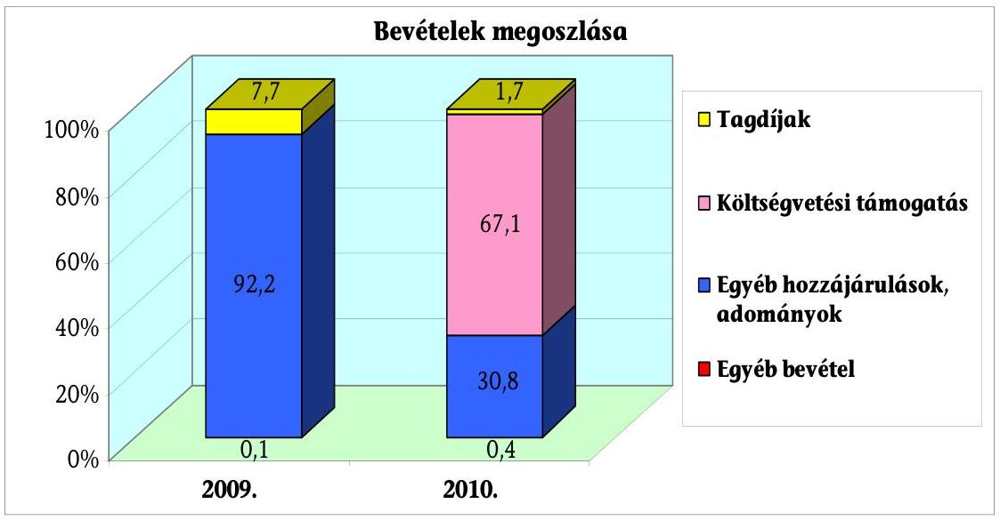
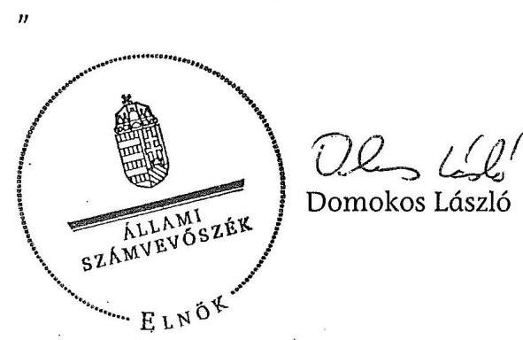
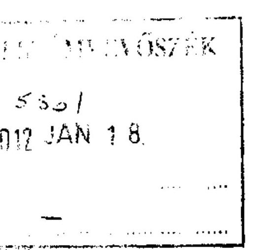
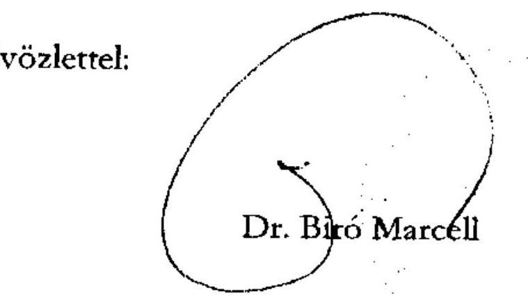

# ÁLLAMI   SZÁMVEVŐSZÉK 

## JELENTÉS

a Jobbik Magyarországért Mozgalom 2009-2010. évi gazdálkodása törvényességének ellenőrzéséről

---

# Állami Számvevőszék 

Iktatószám: V-3058-063/2011.
Témaszám: 1033
Vizsgálat-azonosító szám: V0550
Az ellenőrzést felügyelte:
Horváth Balázs
felügyeleti vezető
Az ellenőrzést vezette:
Barta József
ellenőrzésvezető
Az ellenőrzést végezték:
Szakmányné Bilik Mária Vincze B. Róbert
számvevő tanácsos
számvevő

A témához kapcsolódó eddig készített számvevőszéki jelentések:
címe
sorszáma
Jelentés a központi költségvetési támogatásban nem részesülő pár- 0937 tok 2005-2008. évi gazdálkodása törvényességének ellenőrzéséről

---

# TARTALOMJEGYZÉK 

BEVEZETÉS ..... 5
I. ÖSSZEGZŐ MEGÁLLAPÍTÁSOK, KÖVETKEZTETÉSEK, JAVASLATOK ..... 8
II. RÉSZLETES MEGÁLLAPÍTÁSOK ..... 17

1. A Párt gazdálkodásáról szóló 2009-2010. évi beszámolók ..... 17
1.1. A teljes vizsgálati időszakra érvényes megállapítások ..... 17
1.2. Bevételek ..... 19
1.3. Kiadások ..... 23
2. A Pártnak a beszámoló összeállítására és az azt alátámasztó könyvvezetésre vonatkozó belső szabályozása és gyakorlata ..... 24
2.1. A számviteli rendszer szabályozása ..... 24
2.1.1. Számviteli politika ..... 24
2.1.2. Eszközök és források leltárkészítési és leltározási szabályzata ..... 25
2.1.3. Eszközök és források értékelési szabályzata ..... 26
2.1.4. Pénzkezelési szabályzat ..... 26
2.1.5. Számlarend ..... 27
2.2. A könyvvezetés összhangja a jogszabályokban és a belső szabályzatokban előírt követelményekkel ..... 28
2.3. A bizonylati elv és fegyelem, bizonylati rend érvényesülése ..... 33
3. A Párt bevételszerző, gazdálkodó tevékenysége ..... 34
3.1. A Párt gazdálkodásának szabályozottsága ..... 34
3.2. A Párt vagyonának elemei ..... 35
4. A gazdálkodással összefüggő egyéb jogszabályokban foglalt előírások betartása ..... 36
4.1. Személyi jellegű kifizetésekre vonatkozó jogszabályok betartása ..... 36
4.2. Az adózási, társadalombiztosítási és egyéb jogszabályok rendelkezéseinek érvényesítése ..... 37
5. A belső kontroll rendszer ..... 37
5.1. A belső ellenőrzés rendszerének szabályozottsága, működése, eredményessége ..... 37
5.2. Az informatikai rendszer szabályozottsága és belső kontrolljainak múködtetése ..... 39
6. Az előző ellenőrzés megállapításaira tett intézkedések ..... 39

---

# MELLÉKLETEK 

1. számú A Jobbik Magyarországért Mozgalom 2009. évi pénzügyi beszámolója
2. számú A Jobbik Magyarországért Mozgalom 2010. évi beszámolója
3. számú A Közigazgatási és Igazságügyi Minisztérium nemleges észrevétele

---

# RÖVIDÍTÉSEK JEGYZÉKE 

Jogszabályok

| Art. | Az adózás rendjéről szóló - többször módosított - 2003.   évi XCII. törvény |
| :-- | :-- |
| Párttörvény | A pártok múködéséről és gazdálkodásáról szóló - többször   módosított - 1989. évi XXXIII. törvény |
| Számv. tv. | A számvitelről szóló - többször módosított - 2000. évi C.   törvény |
| Szja törvény | A személyi jövedelemadóról szóló - többször módosított -   1995. évi CXVII. törvény |
| Szórövidítések |  |
|  |  |
| ÁSZ | Állami Számvevőszék |
| KDB bank | KDB Bank (Magyarország) Zrt. |
| Párt | Jobbik Magyarországért Mozgalom |
| SZB | Számvizsgáló Bizottság |

---

.

---

# JELENTÉS   a Jobbik Magyarországért Mozgalom 2009-2010. évi gazdálkodása törvényességének ellenőrzéséről 

## BEVEZETÉS

Az Állami Számvevőszékről szóló 2011. évi LXVI. törvény 5. § (11) bekezdés a) pontja, valamint a pártok múködéséről és gazdálkodásáról szóló 1989. évi XXXIII. törvény (továbbiakban: párttörvény) 10. § (1) bekezdése alapján a pártok gazdálkodása törvényességének ellenőrzésére az Állami Számvevőszék (továbbiakban: ÁSZ) jogosult. E törvényi felhatalmazás alapján az ÁSZ 2011. évi ellenőrzési tervének megfelelően vizsgálta a Jobbik Magyarországért Mozgalom (továbbiakban: Párt) 2009-2010. évi gazdálkodása törvényességét. A Párt a 2010. évi országgyűlési választás első fordulójában elért eredménye alapján rendszeres költségvetési támogatásban részesül, ezért a párttörvény 10. § (3) bekezdése alapján a Párt gazdálkodását az ÁSZ kétévenként ellenőrzi.

Az ellenőrzés célja annak megállapítása volt, hogy:

- a Párt által készített és a Magyar Közlönyben1 közzétett éves beszámolók a törvényi előírásoknak megfelelnek-e, a könyvvezetéssel és a valósággal megegyező adatokat tartalmaznak-e;
- a könyvvezetés és a gazdálkodás során betartották-e a számvitelről szóló többször módosított - 2000. évi C. tv. (a továbbiakban: Számv. tv.) és az egyéb jogszabályok rendelkezéseit, a belső előírásokat;
- a Párt a múködéséhez szabályszerűen igénybe vehető forrásokat használt-e fel, a párttörvényben engedélyezett gazdálkodó tevékenységet folytatott-e.

Az ellenőrzött időszak: 2009. január 1. - 2010. december 31.
Az ellenőrzés típusa: pénzügyi-szabályszerűségi ellenőrzés.
Az ellenőrzés körülményeit illetően rögzíteni szükséges, hogy:

- a párttörvény 1. sz. melléklete szerinti beszámoló mintához magyarázatot, útmutatót nem készítettek a jogalkotók, így ennek kitöltése pártonként - kialakított számviteli politikájuknak megfelelően - eltérő lehet;

[^0]
[^0]:    1 A Miniszterelnöki Hivatalt vezető miniszter a Magyar Közlöny és a Hivatalos Értesítő címrendjéről szóló 17/2008. (HÉ.53.) MeHVM utasításának 2. és 3. pontja értelmében 2009. január 1-jétől a hirdetmények a Hivatalos Értesítőben jelennek meg.

---

- a beszámoló minta a Számv. tv. rendelkezéseivel nem harmonizál, nem felel meg sem a mérleg, sem az eredmény-kimutatás követelményeinek.

Az ÁSZ a párttörvény módosításáig a jelenleg hatályos rendelkezéseknek megfelelő - egységes módszertani alapokra helyezett - gyakorlattal folytatja a pártok gazdálkodása törvényességének ellenőrzését. Az ellenőrzést a pénzügyiszabályszerűségi ellenőrzés módszertani szabályai szerint, a pártok gazdálkodása törvényességének ellenőrzésére kiadott segédletbe foglalt egységes követelmények alapján végeztük.

Az ellenőrzési feladatok szempontrendszerét kockázatelemzéssel alapoztuk meg, amelynek eredményeként az ellenőrzést magas kockázatúnak értékeltük. Az ellenőrzésnél a lényegességi szintet a Párt által közzétett pénzügyi beszámolók bevételi főösszegének 2\%-ában határoztuk meg. A lényegességi szint azt jelenti, hogy a felhasználók véleményét, döntéseit már jelentősen befolyásoló, az ellenőrzés által feltárt hibák, téves adatok előjeltől független összege nem haladja meg a bevételi főösszeg 2\%-át. Specifikus lényegességi küszöböt alkalmaztunk a beszámolók megbízhatósága értékeléséhez az egyéb hozzájárulások, adományok vonatkozásában a párttörvény 9. § (2) bekezdés nevesítési kötelezettségre vonatkozó előírására, valamint az 1. számú mellékletének részletezésére tekintettel (belföldről kapott hozzájárulás, adomány 500 ezer Ft felett, külföldről származó 100 ezer Ft felett).

Az ellenőrzési kockázatra figyelemmel terveztük meg a tételes ellenőrzést és a statisztikai mintavételi eljárást. Tételesen ellenőriztük a bevételek közül a 2010. évi állami támogatást, valamint mindkét évben az egyéb hozzájárulásokat, adományokat (2009-ben 1205 db, 2010-ben 1501 db ). A tételes ellenőrzését az indokolta, hogy a könyvelésben az adományozók nevei nem szerepeltek, a könyvelési tételek összesített adatokat tartalmaztak, a Párt szabályszerű analitikus nyilvántartással nem rendelkezett, ezért a párttörvényben előírt nevesítési kötelezettség teljesítése mintaválasztással nem volt ellenőrizhető. A beszámoló kiadási tételeiből statisztikai mintavétellel választott reprezentatív mintát vizsgáltunk. A 2010. évi tételeknél figyelmen kívül hagytuk a jelöltarányos állami támogatás és egyéb források terhére elszámolt országgyűlési képviselőválasztás költségeit, mivel az ÁSZ korábbi ellenőrzése erre kiterjedt. 2

A helyszíni ellenőrzés körülményeiről rögzíteni szükséges:

- A Párt az ellenőrzés előkészítése keretében, majd a helyszíni ellenőrzés időszakában sem teljesítette a kért tanúsítványi adatszolgáltatást az általa használt ingatlanokról.
- A helyszíni ellenőrzés során hiányosan álltak rendelkezésre a gazdálkodási dokumentumok, hiányoztak az Országos Elnökség gazdasági tárgyú döntései, mindezek átadására írásban több alkalommal kérték a számvevők a Párt elnöke által kijelölt közreműködőt (gazdasági igazgatót).

[^0]
[^0]:    2 A részletes megállapítások az ÁSZ 1105 sorszámon kiadott - a 2010. évi országgyűlési választásra fordított pénzeszközök elszámolásának ellenőrzéséről a jelölő szervezeteknél és független jelöltnél című - jelentésében olvashatók.

---

- A gazdasági igazgató a számvevők részére korlátozott nyilatkozatot adott, a gazdálkodás szervezésére és az ellenőrzés részére át nem adott dokumentumokkal összefüggő nyilatkozatkérésre.
- A Párt elnöke nem adott teljességi nyilatkozatot az ellenőrzést végző számvevőknek. Ez nem hiúsította meg a Párt gazdálkodása törvényességének ellenőrzését, a megállapításokat a számvevők az ellenőrzés részére átadott számviteli, gazdálkodási dokumentumok, valamint a vonatkozó jogszabályi előírások betartásának vizsgálata alapján tették.

A helyszíni ellenőrzésre 2011. szeptember 12-e és október 28-a között, a Párt Budatest XI. kerület Villányi út 20/A. szám alatti Országos Hivatalában került sor.

---

# I. ÖSSZEGZŐ MEGÁLLAPÍTÁSOK, KÖVETKEZTETÉSEK, JAVASLATOK 

A Párt a 2009. és a 2010. évi gazdálkodásáról szóló beszámolókat a párttörvényben előírt határidőn belül a Hivatalos Értesítőben, a 2009. évit internetes honlapján is közzétette. A 2010. évi beszámolót a párttörvény előírása ellenére a honlapján nem hozta nyilvánosságra. A beszámolók összeállításánál megsértették a Számv. tv-ben szabályozott teljesség, valódiság, következetesség és a lényegesség számviteli alapelveket, ennek következtében a beszámolók egyik évben sem mutattak megbízható és valós képet a Párt gazdálkodásáról.

Az ellenőrzés által feltárt - alábbi összeállításban nem teljes körűen bemutatott - lényeges hibák szabályozási, könyvvezetési és bizonylatolási hiányosságokkal egyaránt összefüggtek:

Adatok: ezer Ft-ban

| Évek | Beszámolóban   közzétett adatok |  | Ellenőrzés által   feltárt elöjeltől   független hiba* |  | Hiba bevételi   föösszegre vetítve* |  |
| :--: | :--: | :--: | :--: | :--: | :--: | :--: |
|  | Bevétel | Kiadás | Bevétel | Kiadás | Bevétel | Kiadás |
| 2009. | 48443 | 41228 | 786 | 140 | $1,6 \%$ | $0,3 \%$ |
| 2010. | 357913 | 313891 | 8617 | 21207 | $2,4 \%$ | $5,9 \%$ |

*Nem tartalmazza az információ hiánya miatt nem számszerúsíthető hiba összegét és mértékét.

A szervezeti egységek (helyi és alapszervezet, területi szervezet) bevételei és kiadásai hiányosan szerepeltek a számviteli nyilvántartásokban és a beszámolókban. A szervezetek mintegy 90\%-ának gazdálkodásáról információval nem rendelkezett a Párt. Hiányzott a kedvezményes díjtételű ingatlanbérlet formájában kapott nem pénzbeli vagyoni hozzájárulás értéke mindkét évben, valamint a 2010. évi beszámolóból a főkönyvi nyilvántartáshoz képest 1053 ezer Ft összegű bevétel. A 2010. évi beszámoló 17351 ezer Ft összeggel több kiadást tartalmazott, mint amit a bizonylatok és főkönyvek alátámasztottak, mert a beszámoló sorok adatait a Számv. tv. előírása ellenére nem a vonatkozó főkönyvi kivonatokból állították össze. Mindkét évi beszámolóban könyvelési hibából eredően a belföldi magánszemélyek adományai között tagdíjak, külföldi magánszemélyek támogatása, belföldi jogi személyek hozzájárulása, valamint jogi személynek nem minősülő társaságtól származó adomány is szerepelt. A múködési kiadások között 2009-ben 48 ezer Ft politikai és 22 ezer Ft egyéb kiadást is kimutattak.

A megjelentetett beszámolóhoz képest kimutatott, a bevételi főösszegre vetített elszámolási hibák mértéke 2010-ben a bevételi és a kiadási oldalon egyaránt meghaladta az ÁSZ által alkalmazott 2\%-os átfogó lényegességi küszöb mértékét.

---

A nem számszerűsíthető hibák miatt a 2009. évi beszámoló sem mutatott megbízható és valós képet a Párt gazdálkodásáról annak ellenére, hogy az ellenőrzés által feltárt hibák nem haladták meg az átfogó lényegességi szintet.

Specifikus lényeges hibát tartalmazott mindkét évi beszámoló, mert a párttörvény előírása szerinti 500 ezer Ft-ot meghaladó összegű belföldi, valamint a külföldi támogatóktól kapott 100 ezer Ft-ot meghaladó hozzájárulások, adományok nevesítése nem volt teljes körű, illetve a támogatásokat hibás összeggel közölték. Elmulasztottak 2009-ben összesen nyolc, 2010-ben összesen tizenegy támogatót nevesíteni. 2009-ben egy esetben nem a tényleges támogató nevét közölték. 2009-ben egy, 2010-ben hét támogató hozzájárulását, adományát nem a bizonylatokkal alátámasztott összegekkel hozták nyilvánosságra.

Számviteli szabályozását a Párt az előző ÁSZ ellenőrzés felhívására módosította, de továbbra sem biztosították a belső előírásokban a Számv. tv. és a párttörvény szerinti beszámoló eltérése miatti összehangolást. A szabályozási hiba összefügg azzal, hogy a párttörvény 1. sz. melléklete szerinti beszámoló minta a számviteli törvény rendelkezéseivel nem harmonizál, nem felel meg sem a mérleg, sem az eredmény-kimutatás követelményeinek. A beszámoló mintához magyarázatot, útmutatót nem készítettek a jogalkotók, így ennek kitöltése pártonként - kialakított számviteli politikájuknak megfelelően - eltérő lehet. A hiányosságok miatt az ÁSZ évek óta javasolja a kormánynak jelentéseiben a párttörvény módosítását. A számviteli politika nem tartalmazta a párttörvény szerinti beszámoló összeállításához az egyéb bevételek, az eszközbeszerzések, a politikai kiadások és az egyéb kiadások fogalomkörét, tartalmát; a beszámoló sorokhoz kapcsolódó főkönyvi számlák összefüggéseit. A lényeges hiba vetítési alapjaként a párttörvény szerinti beszámolóban nem szereplő tartalékot határozták meg, a Számv. tv. szerinti jelentős összegű hibát a vizsgált időszak gazdálkodási adatait figyelembe véve aránytalanul magas összegben, 500 millió Ft-ban rögzítették. Az eszközök és források leltározási szabályzata nem tartalmazta a leltározás előkészítési feladatait, felelősét, az eltérések kezelését, pontatlanul szabályozta a pénzeszközök, a tárgyi eszközök és kötelezettségek leltározási szabályait. Az eszközök és források értékelési szabályzatban továbbra sem rögzítették a párttörvényben előírt értékelési kötelezettség teljesítéséhez a nem pénzbeli vagyoni hozzájárulás értékelési szabályait.

A szabályzatok nem tükrözték teljes körűen a szervezet sajátosságaihoz kapcsolódó Számv. tv. szerinti előírásokat. A pénzkezelési szabályzat a Számv. tv. előírásától eltérően határozta meg a napi készpénz záró állománya maximális mértékét, a kerekítési szabályokat; nem tartalmazta a több mint 300 bankszámlát és az azokon elszámolható jogcímeket, a területi és alapszervezetek pénzkezelési sajátosságait. A szabályzatban a napi készpénz záró állomány mértékét a Számv. tv-ben előírt határidőben nem módosították. A számlarendből hiányoztak a főkönyvi számlák növekedésének, csökkenésének jogcímei, a számlát érintő gazdasági események és számlaösszefüggések, az analitikus nyilvántartások tartalma és a bizonylati rend. A tagdíjak és adományok analitikus nyilvántartásának számlarendben szabályozott tartalmi követelményei nem biztosították a Számv. tv-ben előírt egyeztetés és ellenőrzés lehetőségét. Az alapszabályban a szervezetek részére biztosított gazdálkodási jogosultsággal összefüggő nyilvántartási kötelezettségeket és előírásokat a számviteli szabály-

---

zatok nem tartalmaztak. A szabályozási hiányosságok mindkét évi beszámolóban lényeges beszámolási hibához vezettek.

A kettős könyvvezetést megbízás alapján mindkét évben ugyanaz a regisztrált, külső számviteli szolgáltató végezte. A könyvvezetésben sérült a teljesség, a valódiság, a következetesség számviteli alapelv, melyek hatásaként az éves beszámolók lényeges hibákat tartalmaztak. A számlarendben előírt analitikus nyilvántartások közül a pénzforgalom, a szállítók, a tárgyi eszközök, az adományok és 2010. évtől az elszámolásra kiadott előlegek analitikáját vezették, azok teljes körűségét, szabályos tartalmát nem biztosították. Az elszámolásra felvett előlegekről a pénzkezelési szabályzat előírása ellenére 2009-ben nyilvántartást nem vezettek. A Pártnál a használatra kiadott eszközökről, valamint a szervezeti egységek a készpénzpénzforgalomról nyilvántartást nem vezettek. A nyilvántartási szabálytalanságok vagyonvédelmi kockázatot jelentenek. Szabályszerű leltározást egyik évben sem végeztek. Hibás szabályozásából eredően a tárgyi eszközöket egyik évben sem vették számba, a készpénzállomány, a követelések és kötelezettségek egyeztetéses leltározását a Számv. tv. és a belső szabályzatok előírásai ellenére nem végezték el. A 2010. évi éves zárás keretében a függő elszámolások számlán nyilvántartott, 2218 ezer Ft pénzforgalmilag teljesített kifizetést és 327 ezer Ft azonosítatlan befizetést nem számoltak el bizonylatok hiányában a megfelelő jogcímen költségként, illetve bevételként. Az analitikus nyilvántartásokkal és a leltározással összefüggésben feltárt hibák miatt a Számv. tv-ben előírt egyeztetéseket nem végezték el, ezért az éves zárások nem voltak szabályszerűek.

A pénztárban a bizonylatok kiállítását, a pénztár időszaki zárását a pénzkezelési szabályzat és a Számv. tv előírásaitól eltérően végezték. A bevételi és kiadási bizonylatok szerint a pénz átvevője és befizetője a pénzkezeléssel megbízott személy volt. A kialakított szabálytalan gyakorlat mellett a pénztáros felelősségvállalása nem érvényesülhet, ha a pénz átvevője, befizetője és a pénz kezelője ugyanaz a személy. A Számv. tv-ben szabályozott napi készpénz záró állomány maximális mértékét rendszeresen, többszörösen túllépték, ami vagyonvédelmi kockázatot jelentett. A pénztárat a helyszíni ellenőrzés időszakában nem a szabályzatban előírt helyen és nyilvántartó programmal múködtették, a pénztári nyilvántartásra kézi kitöltésű nyomtatványokat alkalmaztak.

A bizonylati elv és fegyelem nem érvényesült teljes körűen a számviteli nyilvántartásban: előleg számla alapján számoltak el 2009-ben összesen 510 ezer Ft összegben költséget; 2010-ben 2200 ezer Ft követelést írtak elő bizonylat nélkül; a KDB banknál vezetett bankszámlák pénzforgalmát nem bankszámlánként tartották nyilván; másolati bizonylat alapján is könyveltek. A szabályozatlan bizonylati rend és bizonylati út hozzájárult a bizonylatolásban feltárt szabálytalanságokhoz. 2009-ben az egyszeri szolgáltatás igénybevételét jelentő kiadási tételek közel 3\%-ához, 2010-ben csaknem 19\%-ához kötelezettségvállalási dokumentum nem készült, ezek hiányából eredően a szakmai teljesítésigazolás és az utalványozás ezeknél a bizonylatoknál szabályszerűen nem teljesült.

A bizonylatok egyéb alaki, tartalmi kellékei vonatkozásában 2009-ben a bizonylatok 5,5\%-ánál, 2010-ben 9,4\%-ánál volt előírástól való eltérés. A gazdasági eseményeket időrendben rögzítették. A szigorú számadású nyomtatványok

---

nyilvántartásba vételi kötelezettségét - a szervezeti egységek kivételével - biztosították a pénztári nyilvántartó program keretében. A bizonylatok mintegy 4\%ának megőrzéséről a Számv. tv. előírása ellenére nem gondoskodtak.

A Párt bevétele a 2009. évi 48443 ezer Ft-ról 2010-re nyilvántartásai szerint 358966 ezer Ft-ra nőtt az állami támogatásra való jogosulttá válás következtében.

A forrásösszetételben bekövetkezett változásokat az alábbi ábra szemlélteti:

2010-ben bevételeinek több mint kétharmadát a költségvetési támogatás tette ki. A Párt saját bevételei szabályozatlan tagdijfizetésből, egyéb hozzájárulásokból és adományokból, valamint kamatbevételekből álltak. A 2009. évi bevételeknek több mint $92 \%$-a, 44699 ezer Ft, 2010. évben mintegy $31 \%$-a, 107523 ezer Ft egyéb hozzájárulásokból, adományokból származott, mindöszsze $0,1 \%$-ot, 31 ezer Ft-ot, illetve $0,4 \%$-ot, 1436 ezer Ft-ot képviselt az egyéb bevételeket jelentő kamatbevétel. A Párt szervezeteire vonatkozó gazdálkodási adatok nyilvántartásának hiányában az ellenőrzés nem tudott meggyőződni a gazdálkodási korlátok és tiltások teljes körű érvényesüléséről. Az ellenőrzés részére átadott nyilvántartások szerint a Párt 2009-ben összesen 90108 Ft, 2010ben 15900 Ft névtelen adományt fogadott el a párttörvény tiltó előírása ellenére. Az adományok névtelennek minősültek, mert a vizsgált időszakban 28008 Ft összegű adomány befizetői azonosításához hiányoztak a bankszámlára csekken befizetett postai elszámoló lapok, 2009-ben további 78000 Ft ismeretlen eredetű összeget vételeztek be a pénztárba. Névtelen adomány elfogadása esetén a párttörvény szankció alkalmazását írja elő. A Párt az ellenőrzés részére átadott dokumentumok szerint kedvezményes bérleti díjat fizetett 2009-ben három, 2010-ben nyolc bérelt ingatlan után. A Párt a párttörvény előírása ellenére a nem pénzbeli vagyoni hozzájárulás értékét egyik évben sem állapította meg, ami beszámolási és nyilvántartási hibához vezetett.

Személyi jellegú kifizetések körében 2010-ben magánszemélyek tulajdonában álló gépjárművek hivatalos célú használatának költségtérítése és mindkét évben rendezvényekhez kapcsolt reprezentációs kiadások teljesültek adómentes mértékben. A Párt a vizsgált időszakban nem foglalkoztatott munkavállalókat.

---

A Párt az adó- és járulék bevallási és befizetési kötelezettségeit az Art. előírása ellenére határidőben nem teljesítette. Elmulasztották mindkét évben a hivatali telefonok magáncélú használatból eredő adó- és járulékfizetési kötelezettség bevallását, befizetését. A Párt 2009. évi havi adóbevallásait a helyszíni ellenőrzés, a 2010. évi bevallásokat az ellenőrzés előkészítése időszakában pótolta. Az ellenőrzés részére bemutatott folyószámla-kivonatok alapján a hiányzó bevallások nélkül, 2009 végén 57 ezer Ft, 2010 végén 70 ezer Ft költségvetési tartozása volt.

A belső ellenőrzés rendszerét a hatályos alapszabályokban, a pénzügyi és gazdálkodási szabályzatban hiányosan szabályozták. Országosan számvizsgáló bizottság, helyi szinten számvizsgáló biztosok múködését írták elő, de az utóbbiak tevékenységéről a Párt információval és dokumentummal nem rendelkezett. A kongresszus által megválasztott SZB munkatervében a könyvelés áttekintése szerepelt konkrét feladatok meghatározása nélkül. A 2009. évi párttörvény szerinti beszámolót az ellenőrző testület - javítások nélkül - elfogadásra javasolta, a lényeges hibákat nem észlelte. A 2010. évi beszámolót nem vizsgálta. A Pártnál az alapszabály szerint gazdasági munkát végző személyek feladat- és hatáskörét, a gazdasági igazgatónak a szervezeti egységek gazdálkodására vonatkozó irányítási és ellenőrzési feladatkörét belső szabályzat nem rögzíti. Az országos hivatal ügyrendjében nevesített gazdasági osztály nem funkcionált. A gazdálkodással összefüggő dokumentumokról nem vezettek nyilvántartást. A vezetői és a folyamatba épített ellenőrzést kizárólag a pénzforgalom területén szabályozták. A kötelezettségvállalások nyilvántartásának és rendelkezésre állásának hiánya miatt a munkafolyamatba épített ellenőrzési funkciók érdemben nem múködtek, a teljesítésigazolási és utalványozási jogosultságokat nem érvényesítették, a szabálytalanságokat nem tárták fel. Az Országos Elnökség nem gyakorolta a Párt központjába érkező adományok, felajánlások elfogadására vonatkozó, az alapszabályban előírt hatáskörét, aminek következtében a névtelen adományokat nem szűrték ki. A könyvelést végző vállalkozó szerződésében ellenőrzési feladatokat nem határoztak meg. A készpénzforgalom ellenőrzésével megbízott pénztárellenőr a bizonylaton rögzített aláírása ellenére nem végzett tényleges ellenőrzést. A szabálytalanul kiállított pénztárbizonylatokat és pénztárjelentéseket elfogadta, a pénzkészletet nem ellenőrizte, ami a szabályos zárási feladatok elvégzését akadályozta. A belső kontrollok elégtelenül múködtek, ennek következtében nem tárták fel a lényeges beszámolási hibákat, a szabályozási mulasztásokat, a névtelen adományokat.

A gazdálkodással összefüggő informatikai rendszer múködtetését nem szabályozták. A számviteli szolgáltató a gazdálkodási adatok biztonságáról rendszeres mentéssel és a hozzáférési jogosultságok korlátozásával gondoskodott.

Az előző ÁSZ ellenőrzés felhívásában kezdeményezett intézkedéseket a Párt részlegesen és késedelmesen hajtotta végre, így továbbra is fennálltak a szabályozási, könyvvezetési, bizonylatolási, adózási hibák. A helyi szervezetek gazdálkodási adatainak nyilvántartásba vételéről, bevételeinek és kiadásainak kimutatásáról továbbra sem gondoskodtak. A 2005-2008. évi beszámolók elkészítése során a nem pénzbeli vagyoni hozzájárulás értékét a kiadási oldal megfelelő során nem mutatták be. Továbbá a közzétett beszámolók módosított múködési kiadás sor adatai nem egyeznek meg a 2005-2008. évi nyilvántartásból

---

hiányzó telefonköltséggel növelt összeggel. Az elégtelen intézkedések következtében a szabálytalanságok ismétlődtek, lényeges beszámolási hibákhoz, névtelen adomány elfogadásához vezettek.

# Az ellenőrzés intézkedést igénylő megállapításai és javaslatai, felhívásai: 

Az Állami Számvevőszékről szóló 2011. évi LXVI. törvény 33. § (1) bekezdésében foglaltak értelmében a jelentésben foglalt megállapításokhoz kapcsolódó intézkedési tervet köteles az ellenőrzött szervezet vezetője összeállítani és azt a jelentés kézhezvételétől számított harminc napon belül az ÁSZ részére megküldeni. Amennyiben az intézkedési tervet határidőben nem küldi meg a szervezet, vagy az nem elfogadható, az ÁSZ elnöke a hivatkozott törvény 33. § (3) bekezdés a)-b) pontjaiban foglaltakat érvényesítheti.

## a Közigazgatási és igazságügyi miniszternek

A szabályozási hiba összefügg azzal, hogy a párttörvény 1. sz. melléklete szerinti beszámoló minta a számviteli törvény rendelkezéseivel nem harmonizál, nem felel meg sem a mérleg, sem az eredmény-kimutatás követelményeinek. A beszámoló mintához magyarázatot, útmutatót nem készítettek a jogalkotók, így ennek kitöltése pártonként - kialakított számviteli politikájuknak megfelelően - eltérő lehet. A hiányosságok miatt az ÁSZ évek óta javasolja a kormánynak jelentéseiben a párttörvény módosítását.

Javaslat:
Kezdeményezze a pártfinanszírozás átláthatóságának, a pártok elszámoltathatóságának fokozott érvényesítése érdekében a párttörvény módosítását, figyelemmel a pártok számviteli nyilvántartási és beszámolási rendszerét érintő ellentmondások feloldására, amelyek a párttörvény és a Számv. tv. között évek óta fennállnak.

## a Nemzetgazdasági miniszternek

A Párt a vizsgált időszakban összesen 106008 Ft névtelen adományt fogadott el. A Párt rendszeres költségvetési támogatásban részesül.

Javaslat:
Csökkentse a Jobbik Magyarországért Mozgalom 2012. évi költségvetési támogatását a vizsgálat során megállapított 106008 Ft összegű névtelen adománynak megfelelő összeggel a párttörvény 4. § (4) bekezdés előírásának megfelelően.

## a Párt elnökének

1. A Párt a 2009. és a 2010. évi gazdálkodásáról szóló beszámolók összeállításánál megsértette a Számv. tv-ben szabályozott teljesség, valódiság, következetesség és a lényegesség számviteli alapelveket, ennek következtében a beszámolók egyik évben sem mutattak megbízható és valós képet a Párt gazdálkodásáról. A Párt a 2010. évi

---

beszámolót a párttörvény előírása ellenére a honlapján nem hozta nyilvánosságra. Mindkét évi beszámoló a nevesítési kötelezettségek elmulasztása, pontatlansága miatt specifikus lényeges hibát tartalmazott.

Felhívás:
Tegye közzé megbízható és valós adatokkal a Párt 2009. és 2010. évi gazdálkodásáról szóló módosított beszámolóit, a könyvvezetésben és a beszámoló összeállítása során a Számv. tv. 15. § (2)-(3), és (5), valamint a 16. § (4) bekezdésében foglalt teljesség, valódiság, következetesség és a lényegesség számviteli alapelvek, valamint a párttörvény 9. § (2) bekezdésben előírt nevesítési kötelezettség érvényesítésével a párttörvény 9. § (1) bekezdésben szabályozott módon.
2. A számviteli szabályzatok nem felelnek meg teljes körűen a Számv. tv-ben rögzített szabályoknak és nem tükrözik a Párt gazdálkodási sajátosságait.
a) A számviteli politika továbbra sem tartalmazta a Számv. tv. és a párttörvény szerinti beszámoló eltérése miatti összehangolást. A számviteli politika nem tartalmazta a párttörvényben előírt beszámoló összeállításához az egyéb bevételek, az eszközbeszerzések, a politikai kiadások és az egyéb kiadások fogalomkörét, tartalmát; a beszámoló sorokhoz kapcsolódó főkönyvi számlák összefüggéseit. A lényeges hiba vetítési alapjaként a párttörvény szerinti beszámolóban nem szereplő tartalékot határozták meg, a jelentős összegű hibát a gazdálkodási adatokat figyelembe véve aránytalanul magas összegben rögzítették.

Felhívás:
Módosítsa a számviteli politikát a párttörvény 1. számú melléklete szerinti beszámoló összeállításához az egyéb bevételek, az eszközbeszerzések, a politikai kiadások és az egyéb kiadások meghatározásával, tartalmával; a beszámoló sorokhoz kapcsolódó főkönyvi számlák összefüggéseivel. A módosítás eredményeként a lényeges hiba vetítési alapja párttörvény szerinti sajátos beszámolóval harmonizáljon; a jelentős összegű hiba mértéke a Párt gazdálkodási adataival összhangban legyen.
b) Az eszközök és források leltározási szabályzata nem tartalmazta a leltározás előkészítési feladatait, felelősét, az eltérések kezelését, pontatlanul szabályozta a pénzeszközök, a tárgyi eszközök és kötelezettségek leltározási szabályait.

Felhívás:
Intézkedjen a Számv. tv. 14. § (5) bekezdés a) pontjában előírt leltározási szabályzat módosítására, hogy az tartalmazza a leltározás előkészítési feladatait, felelősét és az eltérések kezelését, valamint a szabályszerű zárási munkák elvégzéséhez egyértelműen tartalmazza a Számv. tv. 69. § (1)-(2) bekezdésében előírt leltárak elkészítési szabályait.
c) Az eszközök és források értékelési szabályzatban továbbra sem rögzítették a párttörvényben előírt értékelési kötelezettség teljesítéséhez a nem pénzbeli vagyoni hozzájárulás értékelési szabályait.

---

# Felhívás: 

Egészítse ki az értékelési szabályzatot a párttörvény 4. § (5) bekezdésével összhangban a nem pénzbeli vagyoni hozzájárulás értékelési szabályaival.
d) A pénzkezelési szabályzat a Számv. tv. előírásától eltérően határozta meg a napi készpénz záró állománya maximális mértékét, nem tartalmazta a Párt bankszámlái forgalmának rendjét, a területi és alapszervezetek pénzkezelési sajátosságait.

Felhívás:
Módosítsa a pénzkezelési szabályzatot annak érdekében, hogy az tartalmazza a Számv. tv. 14. § (8) bekezdés előírásával összhangban a Párt bankszámlái forgalmának rendjét, a 14. § (9) bekezdés szabályai szerint a maximális napi záró pénzkészlet mértékét, az alapszabályban előírt gazdálkodási jogosultságnak megfelelően a területi és helyi szervezetek pénzkezelési sajátosságait.
e) A számlarendből hiányoztak a főkönyvi számlák növekedésének, csökkenésének jogcímei, a számlát érintő gazdasági események és számlaösszefüggések, az analitikus nyilvántartások tartalma és a bizonylati rend.

Felhívás:
Egészítse ki a számlarendet a Számv. tv. 161. § (2) bekezdés b) pont előírásának megfelelően a főkönyvi számlák növekedésének, csökkenésének jogcímeivel, a számlát érintő gazdasági események és számlaösszefüggések szabályozásával, a 161. § (3) bekezdésben szabályozott egyeztetési követelményeket kielégítő az analitikus nyilvántartásokkal, valamint a 161. § (2) bekezdés d) pontjában előírt bizonylati renddel.
3. A számlarendben előírt analitikus nyilvántartásokat nem vezették szabályszerűen és teljes körűen. A Pártnál a használatra kiadott eszközökről, valamint a helyi és területi szervezetek a készpénzpénzforgalomról nyilvántartást nem vezettek. A nyilvántartási szabálytalanságok vagyonvédelmi kockázatot jelentenek.

Felhívás:
Intézkedjen a helyi és területi szervek készpénzforgalmának pénzkezelő helyenkénti nyilvántartására, a készpénzforgalom pénzmozgással egyidejű rögzítésére, a Számv. tv. 165. § (3) bekezdés a) pont szabályozása érvényesülése érdekében, valamint a Párt sajátosságaihoz igazodó, a Számv. tv. 165. § (4) bekezdésben előírt egyeztetési és ellenőrzési kötelezettség igényét, valamint a vagyonvédelmi követelményeket kielégítő analitikus nyilvántartások szabályszerű vezetésére.
4. Szabályszerű leltározást egyik évben sem végeztek. Hibás szabályozásából eredően a tárgyi eszközöket egyik évben sem vették számba, a készpénzállomány, a követelések és kötelezettségek egyeztetéses leltározását a Számv. tv. és a belső szabályzatok előírásai ellenére nem végezték el. Az analitikus nyilvántartásokkal és a leltározással összefüggésben feltárt hibák miatt a Számv. tv-ben előírt egyeztetéseket nem végezték el, ezért az éves zárások nem voltak szabályszerűek.

---

# Felhívás: 

Szerezzen érvényt a Számv. tv. 69. § és 164. § (1) bekezdésben előírt szabályszerű és teljes körű leltározás és zárás végrehajtásának.
5. A bizonylati elv és fegyelem nem érvényesült teljes körűen a számviteli nyilvántartásban: előleg számla alapján számoltak el 2009-ben összesen 510 ezer Ft összegben költséget; 2010-ben 2200 ezer Ft követelést írtak elő bizonylat nélkül; a KDB banknál vezetett bankszámlák pénzforgalmát nem bankszámlánként tartották nyilván; másolati bizonylat alapján is könyveltek. A bizonylatok alaki, tartalmi kellékei vonatkozásában 2009-ben a bizonylatok 5,5\%-ánál, 2010-ben 9,4\%-ánál volt előírástól való eltérés. A bizonylatok mintegy 4\%-ának megőrzéséről a Számv. tv. előírása ellenére nem gondoskodtak.

Felhívás:
Intézkedjen a Számv. tv. 165. § (1) bekezdésében foglalt bizonylati elv és fegyelem, a bizonylatolás 167. § (1) bekezdésében megfogalmazott alaki és tartalmi követelmények, továbbá a 169. § (2) bekezdésében előírt bizonylat megőrzési kötelezettség teljesítéséről.
6. A Párt 2009-ben összesen 90108 Ft, 2010-ben 15900 Ft névtelen adományt fogadott el a párttörvény tiltó előírása ellenére.

Felhívás:
Intézkedjen a párttörvény 4. § (3) bekezdés előírásának megsértésével szerzett 106008 Ft névtelen adomány központi költségvetésbe történő befizetésére a párttörvény 4. § (4) bekezdés szabályozásának megfelelően.
7. A Párt a párttörvény előírása ellenére a kedvezményes bérleti dijból származó nem pénzbeli vagyoni hozzájárulás értékét nem állapította meg.

Felhívás:
Intézkedjen a párttörvény 4. § (5) bekezdés előírásának megfelelően a nem pénzbeli vagyoni hozzájárulás piaci értékének meghatározására, nyilvántartására.

---

# II. RÉSZLETES MEGÁLLAPÍTÁSOK 

## 1. A PÁrt GAZDÁlKODÁsÁról SZÓLÓ 2009-2010. ÉVI BESZÁmolók

### 1.1. A teljes vizsgálati időszakra érvényes megállapítások

A Párt a 2009. évi gazdálkodásáról szóló beszámolót 2010. április 23-án a Hivatalos Értesítő 28. számában, a 2010. évi beszámolót 2011. április 28-án a Hivatalos Értesítő 29. számában tette közzé, a párttörvény 9. § (1) bekezdésében előírt határidőn belül, a párttörvény 1. számú mellékletében meghatározott minta szerint (1-2. számú melléklet). A Párt a 2009. évi beszámolóját internetes honlapján nyilvánosságra hozta, a 2010. évit a honlapján nem tette közzé a párttörvény 9. § (1) bekezdésben előírt szabály ellenére.

Az éves beszámolók készítésének alapjául a kettős főkönyvi könyvelés rendszerében rögzített bizonylatok adataiból készült főkönyvi kartonok és főkönyvi kivonatok álltak rendelkezésre.

Az alapszabály értelmében a szervezeti egységek tagjaiktól beszedik a tagdíjat és saját bevételeikkel önállóan gazdálkodnak. 2010 júniusáig a szervezetek pénzforgalmáról a Párt információval nem rendelkezett, mert a szervezetek bevételeiről és kiadásairól nyilvántartást nem vezettek, a gazdálkodásukról információt nem kértek. A Párt 2010 júniusában 300 bankszámlát nyitott szervezetei részére, amelyből 39 számlán bonyolódott pénzforgalom. A bankszámlákat a megyei és a fővárosi kerületi szervezetek, valamint a nyíregyházi szervezet használták. A többi szervezet pénzforgalmáról, valamint a bankszámlát használó szervezetek készpénzes tranzakcióiról nem állt rendelkezésre adat, ezért hiányoztak a beszámolóból is. A Párt a beszámoló teljessége érdekében nem kért a nyilvántartott szervezetektől nyilatkozatot arra vonatkozóan, hogy a vizsgált években rendelkeztek-e bevétellel, illetve teljesítettek-e kiadást.

A Párt a számviteli szabályzatokban nem határozta meg a beszámoló sorok és főkönyvi számlák kapcsolatát, az ellenőrzés részére a beszámoló összeállítása során figyelembe vett főkönyvi számlákról készített kimutatást adott át. A beszámoló sorokhoz kapcsolódó főkönyvi kivonatokból, illetve főkönyvi számlákból levezethetők voltak - a működési és egyéb kiadások soron közzétett összegek kivételével - a 2009. évi beszámoló adatai. A bevételi és kiadási főösszegek a kapcsolódó főkönyvi számlák egyenlegeivel egyeztek. A 2010. évi nyilvánosságra hozott beszámoló sorokat, valamint a bevételi és kiadási főösszegeket három bevételi és egy kiadási sor kivételével a kapcsolódó főkönyvi kivonatok, illetve főkönyvi számlák nem támasztották alá, ezzel megsértették a Számv. tv. 20. § (1) bekezdésében előírt, az éves beszámoló alátámasztására vonatkozó szabályt.

A közzétett éves beszámolók egyik évben sem mutattak megbízható és valós képet a Párt gazdálkodásáról, mivel a beszámolók összeállításá-

---

nál megsértették a Számv. tv. 15. § (2)-(3), és (5), valamint a 16. § (4) bekezdésében foglalt teljesség, valódiság, következetesség és a lényegesség számviteli alapelveket.

A teljesség számviteli alapelvet sértette, hogy a Párt szervezeteinek bevételei és kiadásai teljes körűen nem szerepeltek a számviteli nyilvántartásokban és a beszámolókban, a kedvezményes díjtételű ingatlanbérlet formájában kapott nem pénzbeli vagyoni hozzájárulás értékét nem mutatta ki a Párt az éves beszámolókban. Adatok, információk hiányában ennek nagyságrendje nem számszerúsíthető. Hiányzott továbbá a 2010. évi beszámolóból a főkönyvi nyilvántartáshoz képest 1053 ezer Ft összegű bevétel.

A valódiság elvét sértette, hogy a 2010. évi beszámoló 17351 ezer Ft öszszeggel több kiadást tartalmazott, mint amit a bizonylatok és főkönyvek alátámasztottak. A beszámoló sorok adatait nem a vonatkozó főkönyvi kivonatokból állították össze.

A következetesség számviteli alapelvet sértette, hogy mindkét évi beszámolóban a belföldi magánszemélyek adományai között tagdíjak, külföldi magánszemélyek támogatása, belföldi jogi személyek hozzájárulása, valamint jogi személynek nem minősülő társaságtól származó adomány. A múködési kiadások között 2009-ben 48 ezer Ft politikai és 22 ezer Ft egyéb kiadást is kimutattak.

Specifikus lényeges hibát állapítottunk meg mindkét évi beszámolóban, mert az egyéb hozzájárulások, adományok párttörvényben előírt tagolás szerinti sorokon egyik évben sem teljesítették teljes körűen és a valóságnak megfelelően a nevesítési kötelezettségeket. Elmulasztották a párttörvény 9. § (2) bekezdés előírása ellenére a belföldi támogatók 500 ezer Ft feletti, a külföldi támogatók 100 ezer Ft feletti - 2009-ben összesen nyolc, 2010-ben összesen tizenegy támogató - hozzájárulását, adományát nevesíteni. 2009-ben egy esetben nem a tényleges támogató nevét közölték. A valóságnak nem megfelelő öszszeggel hozták nyilvánosságra 2009-ben egy, 2010-ben hét támogató hozzájárulását.

A 2009. és a 2010. évi beszámolók összeállításával összefüggésben feltárt és számszerúsített elszámolási hibák előjeltől független összege a bevételi oldalon 786 ezer Ft, illetve 8617 ezer Ft, ami a bevételi főösszeg százalékában 2009-ben 1,6\%, 2010-ben 2,4\% volt. A kiadási oldalon feltárt hibák előjeltől független összege 2009-ben 140 ezer Ft, 2010-ben 21207 ezer Ft, ami a bevételi főösszeg százalékában 2009-ben 0,3 \%, 2010-ben 5,9\% volt. A megjelentetett beszámolóhoz képest kimutatott, a beszámoló bevételi főösszegére vetített hiba mértéke 2010-ben a kiadási és bevételi oldalon egyaránt meghaladta az átfogó lényegességi küszöböt, ami az ÁSZ-nál általánosan elfogadott 2\%. A nem számszerúsíthető hibák miatt a 2009. évi beszámoló sem mutatott megbízható és valós képet a Párt gazdálkodásáról annak ellenére, hogy az ellenőrzés által feltárt hibák nem haladták meg az átfogó lényegességi szintet. Mindkét évi beszámoló a nevesítési kötelezettségek elmulasztása, pontatlansága miatt specifikus lényeges hibát tartalmazott.

---

# 1.2. Bevételek 

A Párt által közzétett beszámolók bevételi sorai az alábbi eltérések miatt nem egyeztek a valós helyzettel:

Adatok ezer Ft-ban

| Megnevezés | Párt által közzétett beszámoló 2009.   évi |  | Ellenőrzés által megállapított eltérések a közzétett beszámolóhoz képest 2009. évi |  |  |  |
| :--: | :--: | :--: | :--: | :--: | :--: | :--: |
|  |  |  | 2010. évi |  | 2010. évi |  |
| BEVÉTEL |  |  | Kimaradt | Hibásan szerepel | Kimaradt | Hibásan szerepel |
| 1.Tagdíjak | 3713 | 9013 | 2 | 0 | 4 | 3027 |
| 2.Állami támogatás | - | 240993 |  | - |  |  |
| 4.1.1. Belföldi jogi sz. adom. | 26230 | 1357 | 65 | 20 | 1362 | 602 |
| 4.1.2.Külföldi jogi sz. adom. | - | 296 | - | - | - | 104 |
| 4.2.Jogi személynek nem minősülő gt. adom. | - | - | 20 | - | 602 | - |
| 4.3.1.Belföldi magánsz. adom. | 18378 | 101053 | - | 373 | 2727 | 49 |
| 4.3.2. Külföldi magánsz. adománya | 91 | 3860 | 306 | - | 45 | - |
| 6.Egyéb bevétel | 31 | 1341 | - | - | 95 | - |
| ÖSSZESEN: | 48443 | 357913 | 393 | 393 | 4835 | 3782 |
| - Hiány   - Többlet |  |  |  |  | 1053 |  |

A tagdíj mértékét az alapszabályban nem határozták meg. Az alapdokumentum szerint az alapszervezetek szedik be a tagdíjat, de a megállapítás hatáskörét nem delegálták a Párt egyik döntéshozó szervéhez sem. A bizonylatok szerint 2009-ben a tagdíjak 98,6\%-a 2010-ben 93,6\%-a egy tagtól származott. A pénzügyi és gazdálkodási szabályozásban előírt tagdíj analitikával a Párt nem rendelkezett, ezért a beszámoló soron közzétett adatot a főkönyvi számla egyenlegével egyezően mutatták ki. A tagdíj elnevezésű főkönyvi számlához postai, banki, valamint készpénzes bevételi bizonylatok kapcsolódtak.

A 2009. évi beszámoló soron csak tagdíjak fogalomkörébe tartozó összegek szerepeltek. A 2009. évi tagdíjbevételből hiányzott 2 ezer Ft, a 2010. éviből 4 ezer Ft összegű tagdíj, mivel azt tévesen belföldi magánszemélyek hozzájárulása főkönyvi számlán tartották nyilván és a beszámolóban is ott mutatták ki. 2010. évi beszámoló soron hibásan mutattak ki 3027 ezer Ft összegű tagdíjat, mivel a vonatkozó főkönyvi kivonat egyenlege a közzétett 9013 ezer Ft helyett, csak 5986 ezer Ft összeget támasztott alá.

---

Állami költségvetésből származó támogatásra 2010. évtől vált jogosulttá a Párt. A főkönyvi könyvelésben kimutatott és a bankszámla kivonaton szereplő, a Magyar Államkincstár által ténylegesen átutalt összeggel egyezően közölték a támogatás összegét. A soron közzétett adat egyezett a párttörvény 5. § (2) bekezdése alapján kapott, a Magyar Köztársaság 2010. évi költségvetésének végrehajtásáról szóló 2011. évi CXXXIII. törvényben meghatározott 222155 ezer Ft, valamint a 2010. évi országgyúlési választásra kapott 18838 ezer Ft jelöltarányos állami támogatás összegével.

Az egyéb hozzájárulások, adományok beszámoló sor adattartalmát a Párt a párttörvény előírásának megfelelően tovább részletezte. A Pártnak a vizsgált években belföldi és külföldi jogi személyektől, jogi személynek nem minősülő gazdasági társaságtól, valamint belföldi és külföldi magánszemélyektől származott ezen a jogcímen bevétele.

Egyéb hozzájárulások, adományok belföldi jogi személyektől beszámoló sor adata 2009. évben egyezett a vonatkozó főkönyvi számlák összesített egyenlegével, mégsem a valós helyzetet mutatta. Hiányzott 65 ezer Ft magánszemélyek adományai között kimutatott, egy kft. által nyújtott hozzájárulás. Hibásan mutattak ki a soron 20 ezer Ft jogi személynek nem minősülő gazdasági társaságtól (betéti társaságtól) kapott hozzájárulást, adományt. A Párt 2009-ben befogadott és nevesített a beszámolóban 26000 ezer Ft olyan hozzájárulást, adományt, amely jogerősen be nem jegyzett, jogilag nem létező alapítvány 3 bankszámlájáról érkezett. A Ptk. 74/A. § (2) bekezdése szerint: „Az alapítvány a bírósági nyilvántartásba vételével jön létre. ... Az alapítvány tevékenységét a nyilvántartásba vételről szóló határozat jogerőre emelkedése napján kezdheti meg". Tekintettel arra, hogy a Ptk. szerint jogilag nem létező alapítványtól támogatást a Párt nem kaphatott, az adományozó azonosítása és a párttörvény 4. §-a szerinti tiltott források ellenőrzése érdekében az ÁSZ betekintett az alapítvány Fővárosi Bíróságnál található irataiba és adatkéréssel fordult az alapítvány bankszámláját vezető Magyarországi Volksbank Zrt-hez.

Az alapítvány alapítási iratai között az alapító - Vona Gábor - 100 ezer Ft összegű alapítói vagyonának befizetéséről szóló banki igazolás szerepelt. A Magyarországi Volksbank Zrt. adatszolgáltatás keretében átadott dokumentumai szerint a bank az alapítói vagyont az alapítvány nevére nyitott pénzforgalmi bankszámlán írta jóvá. A bankszámlán a megnyitás napján, 2008. július 9-én 100 ezer Ft alapítói vagyon, majd 2009. január 14-én a befizetői bizonylat közlemény rovata szerint a MIÉP - Jobbik a Harmadik Út részéről Schön Péter 26700 ezer Ft összegű befizetése került jóváírásra. Erről a bankszámláról utalt a bankszámla felett egyedül rendelkező személy, 2009. február 24-én 15000 ezer Ft, 2009. április 23án 11000 ezer Ft összeget támogatás jogcím megjelöléssel a Párt bankszámlájára.

A Magyarországi Volksbank Zrt. által szolgáltatott bizonylat szerint a támogatás a MIÉP - Jobbik a Harmadik Út Párt adománya volt, így a támogató nevét hibásan közölték.

[^0]
[^0]:    3 Az Új Radikalizmusért Alapítványt a 2010. február 25-én jegyezte be jogerősen a Fővárosi Bíróság a Fővárosi Ítélőtábla 4.Pkf.25.124/2010/3. számú végzésével.

---

A 2010. évi beszámoló soron közzétett adat sem a valós támogatási összeget tükrözte. A főkönyvi számla egyenlege 1362 ezer Ft összeggel több jogi személy adományát igazolta, mint a közzétett beszámoló, ugyanakkor hibásan mutattak ki a soron jogi személynek nem minősülő gazdasági társaságoktól származó 602 ezer Ft adományt. A párttörvény 9. § (2) bekezdés előírása ellenére elmulasztották nevesíteni az Epamedia Zrt-től kapott, 1048 ezer Ft összegű nem pénzbeli vagyoni hozzájárulást. A törvényi előírás szerint az 500 ezer Ft feletti támogatás összegét, a hozzájárulást adó megnevezésével és az összeg megjelölésével külön fel kell tüntetni a pénzügyi kimutatásban. A beszámoló soron egyik évben sem közölték a Párt részére kedvezményes díjtételű ingatlanhasználat formájában nyújtott nem pénzbeli vagyoni hozzájárulás értékét. A Párt elmulasztotta értékelni az ingatlanok használatából eredő nem pénzbeli vagyoni támogatást. A Párt nem rendelkezett a beszámoló készítés időszakában a helyi szervezetek bérleti szerződéseivel, a bérelt ingatlanok értékelési kötelezettségének teljesítéséhez. A számvevők kérésére a vizsgált időszakban a bérleti díj kifizetésekhez kapcsolódó bérleti szerződések háromnegyedét a szervezetek megküldték, melyek szerint 2009-ben legalább három, 2010-ben legalább nyolc ingatlant piaci ár alatt béreltek.

Egyéb hozzájárulások, adományok külföldi jogi személyektől soron a 2010. évi beszámolóban közöltek adatot, amely hibásan 104 ezer Ft-tal magasabb összeget tartalmazott, mint amit a vonatkozó főkönyvi számla egyenlege alátámasztott.

Az egyéb hozzájárulások, adományok jogi személynek nem minősülő gazdasági társaságoktól beszámoló soron hibás könyvelés miatt egyik évben sem közöltek adatot. Hiányzott 2009-ben 20 ezer Ft, 2010-ben 602 ezer Ft összeg, amit hibásan a belföldi jogi személyektől származó egyéb hozzájárulások, adományok beszámoló soron mutattak ki. A 2010. évi adományból 600 ezer Ft a Buggy Car Betéti Társaságtól származott, amit az előző hibából eredően a belföldi jogi személyektől származó 500 ezer Ft feletti hozzájárulások között nevesítettek.

Az egyéb hozzájárulások, adományok belföldi magánszemélyektől soron a 2009. évi beszámolóban hibásan szerepelt összesen 373 ezer Ft összeg, amelyből 2 ezer Ft tagdíj, 65 ezer Ft belföldi jogi személytől, valamint 306 ezer Ft külföldi magánszemélytől kapott hozzájárulás, adomány volt. A 2009. évi beszámolóban Balczóné dr. Nagy Katalin 770 ezer Ft-os támogatását hibásan 985 ezer Ft összeggel közölték. Elmulasztották hét támogatónál az adomány összegét és a támogató nevét közzétenni: Balázs Ildikó, Jászné Túri Erika, Magyarfi Józsefné, Pataki Gábor, Somogyi István, Tömör-Tones Zsolt, Vrtel Márta személyenként 1000 ezer Ft összegű adományt nyújtottak a Pártnak.

A 2010. évi közzétett beszámoló sor adatából kimaradt a főkönyvi számla egyenlegéhez képest 2727 ezer Ft összeg, és hibásan szerepelt összesen 49 ezer Ft, amelyből 4 ezer Ft tagdíj, 45 ezer Ft külföldi magánszemélyek által fizetett adomány volt. A Párt, az 500 ezer Ft-ot meghaladó, nevesítésre került adományozók közül hat személy kivételével a támogatók nevét és a támogatás összegét nem a bizonylatokkal alátámasztott összegekkel hozta nyilvánosságra, továbbá hét támogató nevesítési kötelezettségét nem teljesítette.

---

Az eltéréseket 2010. évben az alábbi kimutatás tartalmazza:

| Adományozó neve | Adatok ezer Ft-ban |  |
| :-- | :--: | :--: |
|  | Beszámolóban nyilvános-   ságra hozott adomány ösz-   szege | Bizonylat szerinti tény-   leges adomány összege |
| Szegedi Csanád | 1404 | 1558 |
| Vincze István | 910 | 1274 |
| Dutka Ákos | 2000 | 0 |
| Kovács Béla | 8000 | 8172 |
| Dr. Apáti István | 600 | 1282 |
| Dr. Gyüre Csaba | 700 | 835 |
| Schön Péter | 1296 | 30101 |
| Balczóné dr. Nagy Katalin | 0 | 1067 |
| Czeglédi János | 0 | 868 |
| Csányi László | 0 | 570 |
| Pősze Lajos | 0 | 2000 |
| Szilágyi György | 0 | 508 |
| Vass Zoltán | 0 | 507 |

Az egyéb hozzájárulások, adományok külföldi magánszemélyektől soron a 2009. évi beszámolóból hiányzott 306 ezer Ft támogatás, amelyet a belföldi magánszemélyek adományai között mutattak ki. A párttörvény nem határozza meg a külföldi jogi, illetve magánszemély definícióját, azt a Párt sem rögzítette számviteli politikájában. A gyakorlatban általában a külföldi lakcímről, illetve számláról érkező támogatókat minősítették külföldi támogatónak, azonban a besorolásánál a következetesség elve nem érvényesült teljes körűen, ami eltérést okozott. A 2010. évi beszámolóban négy magánszemély 100 ezer Ft feletti adományának összegét és a támogató nevét nem hozták nyilvánosságra: Mr. Tibor Farkas 147 ezer Ft, M. Luis Sebestyen 185 ezer Ft, Mr. László Buday 192 ezer Ft, Stefan Steinmacher 500 ezer Ft összegű adományt nyújtott a Párt részére.

Az egyéb bevételek jogcímeit belső szabályzat nem tartalmazta. A beszámoló összeállításáról átadott kimutatás szerint kerekítési különbözetet és kamatbevételeket tettek közzé a soron. A 2010. évi beszámolóból hiányzott 95 ezer Ft öszszeg a vonatkozó főkönyvi számlákon kimutatott, bizonylatokkal alátámasztott bevételhez képest.

---

# 1.3. Kiadások 

A 2009. és a 2010. évekre közzétett beszámolók kiadásainak ellenőrzése során megállapított eltéréseket - beszámoló soronként - a következő összeállítás részletezi:

Adatok ezer Ft-ban

| Megnevezés | Párt által közzétett beszámoló 2009. évi |  | Ellenőrzés által   a közzétett beszámoló   2009. évi | megállapított eltérés   a 2010. évi |  |  |
| :--: | :--: | :--: | :--: | :--: | :--: | :--: |
| KIADÁS |  |  | Kimaradt | Hibásan   szerepel | Kimaradt | Hibásan   szerepel |
| 2. Tám. egyéb   szervezetnek | - | 2200 | - | - | - | - |
| 4. Múködési | 2384 | 14572 | 70 | - | 149 | - |
| 5. Eszközbeszer-   zés | 436 | 562 | - | - | 1070 | - |
| 6. Politikai | 38033 | 295932 | - | 48 | - | 19279 |
| 7. Egyéb | 375 | 625 | - | 22 | 709 | - |
| ÖSSZESEN: | 41228 | 313891 | 70 | 70 | 1928 | 19279 |
| - Hiány |  |  |  |  |  |  |
| - Többlet |  |  |  |  |  | 17351 |

Támogatás egyéb szervezeteknek beszámoló soron a 2010. évi beszámolóban szerepelt adat, ami megegyezett a vonatkozó főkönyvi számla egyenlegével. A Gyarapodó Magyarországért Alapítvány részére biztosított 2200 ezer Ft összegű alapítói vagyont, amelyről az Országos Elnökség döntése nem állt rendelkezésre. Az alapszabály előírása szerint az Országos Elnökség kezeli a Párt vagyonát.

Múködési kiadások között a Párt anyagköltségeket, ezen belül rezsi költségeket, a múködéshez kapcsolódó igénybevett szolgáltatásokat (pl. bérleti díjakat, szállítási, posta, telefon, internet, javítási és karbantartási, számviteli szolgáltatási költségek), valamint a telefonhasználattal összefüggő adó- és járulékköltségeket és 2010 második felétől személyi jellegű egyéb kifizetéseket számolt el.

A beszámoló sor adata egyik évben sem egyezett a Párt beszámoló összeállítására vonatkozó kimutatásában található főkönyvi számlák egyenlegeinek öszszesített adatával. 2009-ben hiányzott összesen 70 ezer Ft, amelyből 22 ezer Ft illetéket helyes könyvelés ellenére egyéb kiadás soron mutattak ki, valamint téves könyvelés miatt politikai kiadások között szerepeltettek 48 ezer Ft összegű szerverüzemeltetési és postaköltséget. A 2010. évi beszámoló soron 149 ezer Fttal kevesebb összeget közöltek, mint amit a vonatkozó főkönyvi számlák egyenlegei alátámasztottak.

Mindkét évben hiányosan mutatták ki a beszámoló soron a szervezetek által bérelt ingatlanok bérleti diját, illetve nem szerepeltették a piaci és kedvezményes bérleti díj közötti különbséget, ami a teljesség követelményének nem felelt meg. A hiányzó adat számszerűsítéséhez teljes körű információk és dokumentumok nem álltak rendelkezésre.

---

Az eszközbeszerzés 2009. évi beszámoló sora egyezett a beruházások főkönyvi számlán könyvelt beszerzés adataival. A 2010. évi beszámolóban a bizonylattal alátámasztott és a vonatkozó főkönyvi számla forgalmánál 1070 ezer Ft összeggel kevesebb eszközbeszerzést tettek közzé.

Politikai tevékenység kiadása beszámoló soron a Párt számlatükrében meghatározott főkönyvi számlák összesített egyenlegeit mutatták ki 2009-ben. Az adat nem a tényleges állapotot tükrözte, mivel a beszámoló soron hibásan szerepelt a működési kiadások között nyilvántartott 48 ezer Ft összegű kiadás. A 2010. évi beszámoló sor adatát a vonatkozó főkönyvi kivonatok egyenlegéből állították össze, mert a beszámolóban 19279 ezer Ft-tal nagyobb összeget közöltek, mint amit a főkönyvi számlák összesített egyenlegei és a bizonylatok alátámasztottak.

Egyéb kiadások között bankköltséget, ügyvédi díjat, kerekítés miatti eltéréseket számoltak el. A 2009. évi beszámoló ezen a jogcímen hibásan tartalmazott 22 ezer Ft működési kiadást. A 2010. évi beszámoló sorból hiányzott 709 ezer Ft összeg a vonatkozó főkönyvi számlák összevont egyenlegeihez képest.

# 2. A PÁrTNAK a beSZÁmoló ÖSSZEÁLlítÁsÁra és AZ AZT ALÁtÁMASZTÓ KÖNYVVEZETÉSRE VONATKOZÓ BELSŐ SZABÁLYOZÁSA ÉS GYAKORLATA 

### 2.1. A számviteli rendszer szabályozása

A Párt a Számv. tv. 14. §-ában és a 161. §-ában előírt számviteli szabályzatokkal rendelkezett, amelyeket az arra jogosult személy, a Párt elnöke léptetett hatályba. A számviteli politika általános része, és az egyes részszabályzatai közül az eszközök és források értékelési szabályzata, az eszközök és források leltárkészítési és leltározási szabályzata, valamint a számlarend a vizsgált időszakra vonatkozóan 2003. október 28-tól voltak hatályban, majd 2009. szeptember 1jétől az előző ÁSZ ellenőrzés felhívására módosították azok tartalmát. A 2008. március 1-jétől hatályba léptetett pénzkezelési szabályzatot az előző ÁSZ ellenőrzés felhívására 2009. szeptember 1-jével módosítottak. A székhely cím megváltozása miatti 2010. május 6-i módosítás a szabályzatok tartalmát nem érintette. A szabályzatokban egyes részterületek ismétlődnek, ami - a következőkben részletezettek szerint - több ponton ellentmondásos szabályozáshoz vezetett.

### 2.1.1. Számviteli politika

A számviteli politikát általános rész megnevezéssel készítették el. A 2009. szeptember 1-jétől hatályos szabályzat a jogszabályi előírásoknak megfelelően tartalmazza: a Párt választása szerinti kettős könyvvezetési kötelezettséget, az üzleti év időtartamát, az évközi és év végi zárlatok feladatait, a főkönyvi kivonat készítés időszakait. A zárlati feladatok elvégzésére határidőt nem írtak elő. A párttörvény előírásával összhangban rögzítették a beszámoló formáját, az elkészítés és a közzététel határidejét.

---

Ugyanezen módosítás keretében a párttörvény 1. számú mellékletében előírt éves gazdálkodásról szóló beszámoló sorainak tartalmát továbbra is pontatlanul határozták meg.

A szabályozás szerint politikai tevékenység kiadásainak tekintik azokat a költségeket, amit a Párt annak minősít. Ez az előírás a költségek egyedi elbírálása révén az egyes években nem biztosítja a beszámoló sor tartalmának azonosságát, a következetesség elvének érvényesülését. A párttörvény 1. sz. mellékletében előírt beszámoló összeállításához nem rögzítették az egyéb bevételek, az eszközbeszerzések és az egyéb kiadások fogalomkörét, tartalmát, a főkönyvi számlák és beszámoló sorok összefüggéseit. A vizsgált időszakban a költségek eltérő részletezettségét tartalmazó könyvelési utasításban rendelkeztek az egyes kiadási jogcímekhez tartozó költségtételekről. A szabályozási hiba összefügg azzal, hogy a párttörvény 1. sz. melléklete szerinti beszámoló minta a számviteli törvény rendelkezéseivel nem harmonizál, nem felel meg sem a mérleg, sem az eredmény-kimutatás követelményeinek. A beszámoló mintához magyarázatot, útmutatót nem készítettek a jogalkotók, így ennek kitöltése pártonként - kialakított számviteli politikájuknak megfelelően - eltérő lehet. A hiányosságok miatt az ÁSZ évek óta javasolja a kormánynak jelentéseiben a párttörvény módosítását.

A lényeges hiba és a jelentős összeg meghatározása nincs összhangban a Párt sajátosságaival. A lényeges hiba vetítési alapjaként a beszámolóban kimutatott tartalékot határozták meg, a párttörvény szerinti beszámoló azonban ilyen sort nem tartalmaz. Jelentős összegű hibának minősíti a Párt, ha az egy évben feltárt, egy évre vonatkozó hibák hatása az 500 millió Ft-ot meghaladja. A vizsgált időszak gazdálkodási adatait figyelembe véve aránytalanul magas öszszegű hibahatást engedélyez a számviteli politika előírása. További hiba, hogy nem minősítették összegtől függetlenül lényeges hibának a párttörvény 9. §. (2) bekezdésében előírt nevesítési kötelezettség elmulasztását. Az előző hibás szabályozások miatt helytelen a lezárt évekre vonatkozó beszámoló módosítási kötelezettség szabályainak meghatározása. A szabályozás szerint a számviteli rend „elsődlegesen a vezetés felelőssége". A „vezetés" kifejezés nem egyértelmű, a Párt alapszabálya nem határoz meg ilyen kategóriát. A Számv. tv. 161. § (4) bekezdés szerint a könyvvezetés helyességéért a gazdálkodó képviseletére jogosult személy a felelős. A számviteli politika, illetve valamely részszabályzata nem tartalmazza az egyes eszközökre alkalmazandó amortizációs kulcsokat. Az előző hibás szabályozások miatt a számviteli politika nem tükrözi a Párt gazdálkodási sajátosságait, ezért nem felel meg a Számv. tv. 14. § (3)-(4) bekezdés előírásainak.

# 2.1.2. Eszközök és források leltárkészítési és leltározási szabályzata 

A számviteli politika keretében elkészített, a Számv. tv. 14. § (5) bekezdés a) pontjában előírt eszközök és források leltárkészítési és leltározási szabályzata, figyelemmel a Számv. tv. 69. § (1)-(2) bekezdéseire tartalmazza: a leltározás fordulónapját, az eszközök és források leltározási módját, a leltározás bizonylatait, a kiértékelési szabályokat. A szabályzatban a leltározás előkészítésének és végrehajtásának felelősét nem jelölték ki. A szabályzat nem rendelkezett a leltározás technikai feltételeinek biztosításáról és a leltározás előkészítése során elvégzendő feladatokról, a leltári körzetek kijelöléséről, valamint a nem admi-

---

nisztratív okokra visszavezethető eltérések kezeléséről, a leltározási bizonylatok megőrzésének rendjéről.

A szabályzat több ellentmondást és pontatlanságot tartalmaz. A szabályozás szerint „a pénzeszközök esetében a nyilvántartás valódiságának ellenőrzésére évenként kerül sor". Ez ellentétes a pénzkezelési szabályzat havonta előírt zárási feladat előírásával. A tárgyi eszközök leltározására vonatkozó előírás szerint „a nem kis értékü tárgyi eszközök esetében a fókönyvi könyveléssel értékben egyező nyilvántartás valódiságát minden mérlegkészités alkalmával ellenőrizni kell" - ez nem egyértelmú, mivel a tárgyi eszközök leltározásakor a szabályszerű záráshoz az eszközök mennyiségi és értékadatait tartalmazó leltárt kell összeállítani (Számv. tv. 69. § (1)). A kötelezettségek egyeztetéses leltározásának szabályozása ellentmondásos. A hitelezőktől visszaigazolás kérését írják elő, amely egyezőség esetén megfelelően alátámasztja a kötelezettségek nyilvántartási értékét, a következő szakasz szerint „a kötelezettségek belső egyeztetéséről külön dokumentáció nem készül".

# 2.1.3. Eszközök és források értékelési szabályzata 

A szabályzatba 2009. szeptember 1-jétől bekerült a lejárt követelések értékelésének szabályozása. Az értékelési szabályzatban rögzítették az eszközök bekerülési értékének meghatározását, az értékcsökkenés és az értékvesztés elszámolásának szabályait, a devizás tételekre vonatkozó értékelési szabályokat, az értékelésnél alkalmazott árfolyamot és az év végi értékelés módját. A Párt továbbra sem határozta meg a párttörvény 4. § (5) bekezdésében foglaltak ellenére a nem pénzbeli vagyoni hozzájárulások értékelésének módját, eljárását és bizonylatait.

### 2.1.4. Pénzkezelési szabályzat

A szabályzat a törvényi előírásokkal összhangban tartalmazza a pénzkezelés bizonylatainak, a pénzforgalom analitikus nyilvántartásának, a szigorú számadású nyomtatványok kezelésének és a pénztár ellenőrzésének előírásait. A szabályozás szerint bevételi- és kiadási pénztárbizonylatot nem állítanak ki. Rögzítették a pénztárossal szemben támasztott követelményeket, a felelősségét és feladatait. Az előző ÁSZ ellenőrzés felhívására 2009. szeptember 1-jével módosították a szabályzatot. Utalványozóként a pártelnököt, a pártigazgatót, illetve a gazdasági igazgatót jelölték meg. Ez azonban még mindig ellentmondásban van a szabályzat 2.1. pont negyedik bekezdésével, amely szerint utalványozó nem kerül kijelölésre. Ugyanezen módosítás keretében került meghatározásra az elszámolásra kiadható pénzeszközöknél a felső értékhatár ( 5 millió Ft) és a 30 napos elszámolási határidő, valamint a napi készpénz záró állományának maximális mértékének csökkentése 10 millió Ft-ról 5 millió Ftra. A napi készpénz záró állományának maximális mértékére vonatkozó rész továbbra sem felel meg a Számv. tv. 14. § (9) bekezdés szabályozásának, mert az 2009-ben legfeljebb 500 ezer Ft, 2010-ben 969 ezer Ft lehetett volna.

Számv. tv. 14. § (9) bekezdés: „A (8) bekezdés szerinti napi készpénz záró állomány maximális mértékét annak figyelembevételével kell meghatározni, hogy a készpénz napi záró állományának naptári hónaponként számított napi átlaga - kivéve, ha külön jogszabály eltérően rendelkezik - nem haladhatja meg az elő-

---

ző üzleti év - éves szintre számított - összes bevételének 2\%-át, illetve ha az előző üzleti év összes bevételének 2\%-a nem éri el az 500 ezer forintot, akkor az 500 ezer forintot. Az átlag számításánál az adott hónap naptári napjainak záró készpénz állományát kell figyelembe venni. Mindaddig, amíg az előző üzleti év összes bevétel adata nem áll rendelkezésre, addig az azt megelőző üzleti év öszszes bevételét kell alapul venni."

A hivatkozott szabály 2009. március 13-ától hatályos, de a pénzkezelési szabályzatot a Számv. tv. 14. § (11) bekezdésben előírt 90 napon belül nem módosították. A szabályzat kerekítésre vonatkozó előirása hibás, mivel a számlánkénti kerekítés helyett hó végén egyszeri kerekítési különbözet nyilvántartását és elszámolását írták elő. E szabály alkalmazásával a pénztári nyilvántartás és a pénzkészlet nem a valóságot tükrözi.

A szabályzat nem rögzítette a Párt bankszámláit, az egyes bankszámlákon teljesíthető bevételi és kiadási jogcímeket, valamint a bankkártya-használat rendjét. A pénzkezelés tárgyi feltételeit és a pénztár múködtetését, a pénzőrzés és tárolás feltételeit, elszámolásra kiadott előlegek összegét és a pénzszállítás szabályait nem a vagyonvédelmi követelmények figyelembevételével, illetve ellentmondásosan rögzítették. A 2.1. pont szerint,,a készpénz kezelése fizikailag nem körülhatárolhatóan történik", a 2.2. pontban pedig a Budapest XI. kerület, Villányi út 20./A címen jelöl ki külön helyiséget a pénztár számára, ott páncélszekrény és pénzkazetta használatát írták elő. A pénzszállítás biztonsági előírásait nem határozták meg, azokat csak a készpénzforgalommal megbízott személy feladataként és felelősségeként deklarálták. A szabályzat ellentmondásosan tartalmazza a pénztárellenőrzésre vonatkozó hatáskört. A 7.1. pont szerint „állandó függetlenített ellenőr nem került kijelölésre", a 8. pont ellenőrzésre jogosultakat említ. A vizsgált időszakban egy személy kapott pénztárellenőri megbízást. A pénzkezelési szabályzat a Párt egészére vonatkozott, de nem tartalmazta a helyi és alapszervezetek pénzkezelési sajátosságait annak ellenére, hogy az alapszabály, a pénzügyi és gazdálkodási szabályzat szerint a Párt helyi és alapszervezetei önállóan gazdálkodnak, pénzeiket kezelik, gazdasági megbízottat és pénztárellenőrt választanak.

# 2.1.5. Számlarend 

A számlarendet a Számv. tv. 160. §-ában előírt, egységes számlakeret követelményeire figyelemmel alakították ki. A számlarend nem foglalta magába minden alkalmazásra kijelölt számla számjelét és megnevezését, mivel csak számlacsoport mélységú bontásokat tartalmazott. A Párt számlarendhez kapcsolódó számlatükörben rögzítette a kettős könyvvezetéshez előírt főkönyvi számlák számát, megnevezését, amely azonban nem tükrözte egyértelmúen valamennyi számla tartalmát. A számlarendben a Számv. tv. 161. § (2) bekezdés b) pont előírása ellenére nem szabályozták a főkönyvi számlák növekedésének, csökkenésének jogcímeit, a számlát érintő gazdasági eseményeket és azok más számlákkal való kapcsolatát.

Az elszámolásra felvett előlegek, szállítóknak adott előlegek analitikus nyilvántartásáról, annak tartalmáról nem rendelkeztek. Hibásan határozták meg a tagdíjak és adományok főkönyvi számláihoz kapcsolódó analitikus nyilvántartás tartalmi követelményeit, mert a bizonylati azonosítók rögzítését nem írták

---

elő, így nem biztosították a Számv. tv. 165. § (4) bekezdésben előírtak szerint a főkönyvi könyvelés, az analitikus nyilvántartások és a bizonylatok adatai közötti egyeztetés és ellenőrzés lehetőségét. Az analitikus nyilvántartások vezetéséért felelős személyeket nem jelölték ki. A vizsgált időszakban nem szabályozták a helyi szervezetek önálló gazdálkodásához kapcsolódó elszámolási és nyilvántartási rendet. A Párt a Számv. tv. 161. § (2) bekezdés d) pontja előírása szerinti bizonylati szabályzatot nem készített, az alkalmazott bizonylatok, az analitikus nyilvántartások mintáját nem rögzítette, a bizonylatok útját nem szabályozta, a megőrzés helyéről nem rendelkezett.

A számviteli szabályzatok az előző ÁSZ ellenőrzés felhívás és a módosítások ellenére továbbra sem felelnek meg a Számv. tv. előírásainak, a Párt gazdálkodási sajátosságait csak részben tükrözik, egyes részei ellentmondásosak, ezért nem egyértelműek, mindezek beszámolási hibákhoz vezettek.

# 2.2. A könyvvezetés összhangja a jogszabályokban és a belső szabályzatokban előírt követelményekkel 

A Párt a számviteli politika előírásával összhangban a Számv. tv. 159. § -ban rögzített kettős könyvvitelt vezetett. A Párt könyvvezetését a vizsgált időszakban ugyanaz a számviteli szolgáltató végezte. A számviteli szolgáltató rendelkezett a Számv. tv. 151. § (1) bekezdés4 szerint meghatározott képesítéssel és szerepel a könyvviteli szolgáltatást végzők nyilvántartásában.

A Párt a gazdálkodási dokumentumainak könyvelésre való átadásáról átadási jegyzéket nem készített, az átadott bizonylatok körét és azok átadásának idejét nem dokumentálták. A könyvelő program adatállománya nem tartalmazta a bizonylatok nyilvántartásban való rögzítésének időpontját. A bizonylatokon feltüntetett könyvelési dátum szerint érvényesítették a Számv. tv. 165. § (3) bekezdés a) és b) pont, valamint a belső előírások határidőit a könyvvezetés során.

A beszámoló hibáival összefüggésben megállapított számviteli alapelvek közül a könyvvezetésben sérült a Számv. tv. 15. § (2) és (5) bekezdésében foglalt teljesség és következetesség számviteli alapelv.

A teljesség elvét sértette a beszámolóban számszerűsített adaton kívül, hogy a rendelkezésre álló bérleti szerződések alapján 2009-ben bérelt három ingatlan bérleti díj számlájából összesen 19 havi, 201 ezer Ft összegű, 2010-ben a 23 bérelt ingatlan vonatkozásában legalább 80 havi, 1312 ezer Ft összegű bérleti díj nem szerepelt a nyilvántartásban, ami a szállítói állományt, valamint a beszámoló bevételi és kiadási oldalát egyaránt torzította.

A Párt nem rendelkezett információval arról, hogy mely szervezetek hol és milyen kondíciókkal bérelnek irodákat. A számvevők kérésére, a Párt a helyszíni ellenőrzés időszakában a számviteli nyilvántartásban kimutatott bérleti díjakhoz bekérte a szervezetek elnökei által kötött bérleti szerződéseket. A szerződések időtarta-

4 2009. október 1-jétől Számv. tv. 151. § (1) bekezdés a) pont.

---

ma és a költségként elszámolt bérleti díjak összevetésével állapítottuk meg a nyilvántartásban nem szereplő bérleti díj hónapjainak számát.

A beszámolót nem érintő alábbi könyvvezetési hibákat állapítottunk meg:

- 2009-ben a Számv. tv. 15. § (3) bekezdésében meghatározott valódiság számviteli alapelv sérült a könyvvezetésben, mert a hivatkozott törvény 3. § (7) bekezdés 3. pont szabályozása ellenére 127 ezer Ft reprezentációs költséget nem a személyi jellegű egyéb kifizetések között tartottak nyilván, azt anyagköltségként (rendezvény kiegészítő költségként) számoltak el. Ugyancsak a valódiság elve sérült, hogy 2009-ben 510 ezer Ft reprezentációs költséget előleg számla alapján könyveltek.
- Hibás könyvelés miatt reprezentáció helyett kampányköltség számlán tartottak nyilván 2009-ben 798 ezer Ft összegű, rendezvényhez kapcsolódó vendéglátást.
- 2010-ben 65 ezer Ft összegű, anyagköltségnek minősülő kínáló pultot hibásan a reprezentációs költségek között tartottak nyilván.
- A könyvvezetés során nem érvényesítették a Számv. tv. 15. § (4) bekezdésében rögzített világosság alapelvet, mert a könyvelt tételek megnevezése nem tükrözi a valós gazdasági eseményt (pl. igénybevett szolgáltatás főkönyvön: gyűjtött készpénzes szállító megnevezés szerepel), az 5-ös és 9-es számlaosztály főkönyvi kartonjain nem jelennek meg az elszámolt költségeket, valamint a bevételeket alátámasztó bizonylatok azonosítói, ezért nem biztosítják a 165. § (4) bekezdésben előírt egyeztetési lehetőséget.

Az egyes években kialakított számlatükör összhangban volt a Számv. tv. 160. § egységes számlakeretre vonatkozó előírásokkal. A könyvelési tételek kontírozása, a számlakijelölés gyakorlata a 2009-ben a tranzakciók 95\%-ánál, 2010-ben $90 \%$-ánál a belső előírásokkal összhangban volt. Az ellenőrzött főkönyvi számlákon - a feltárt hibák kivételével - ott elszámolható tételek szerepeltek. A hibás kontírozások pontatlan szabályozásból, évente eltérő részletezettségű könyvelési utasításból, esetenként a gazdasági eseményeket alátámasztó dokumentumok hiányából adódtak. A költségeket a Párt sorolta be a működési és politikai kiadások közé a könyvelő részére átadott bizonylatokon.

A vizsgált időszakban a vásárolt tárgyi eszközök bekerülési értékét a Számv. tv. 47-48. § szabályai szerint határozták meg. Az eszközök értékcsökkenését évente egyszer számolták el az értékelési szabályzat előírásával összhangban.

A számlarendben előírt analitikus nyilvántartások közül a pénzforgalom, a szállítók, a tárgyi eszközök, az adományok és 2010. évtől az elszámolásra kiadott előlegek analitikáját vezették. A helyi szervezetek feladatkörében vezetett tagdíjnyilvántartást az ellenőrzés részére nem adták át.

A számlarendben felsorolt analitikák tartalmát pontatlanul határozták meg, formáját nem írták elő. A Párt, a szabályozásokban felsorolt analitikák vezetésének felelőseit a készpénzforgalom nyilvántartása kivételével nem jelölte ki. Az analitikák vezetése terén a következő szabálytalanságokat tapasztaltuk:

---

- A vizsgált időszakban a főkönyvi számlákhoz kapcsolódóan vezették a tárgyi eszközök analitikus nyilvántartását. Az állományba vétellel egyidejúleg kiállították a tárgyi eszközök egyedi nyilvántartó lapjait, azokon viszont nem tüntették fel, hogy az eszköz fizikailag hol és kínél található. A számítógépes nyilvántartó program a nyilvántartó lapok adatai alapján az eszközöket leltári állományba vette (leltározási listát készített), azonban az előző adatok hiányában ez a vagyonvédelmi követelményeknek nem felelt meg.
- A központilag vezetett adomány analitika tartalmában, szerkezetében nem felelt meg a Számv. tv. 161. § (3) bekezdés analitikus nyilvántartás vezetésével kapcsolatos előírásnak, mert nem a főkönyvi könyvelésben alkalmazott könyvviteli számlák bontásban tartalmazta az adományokat, hiányoztak belőle a pénztárba befizetett adományok, tartalmazott viszont nem odatartozó tételeket, mivel a nyilvántartásban valamennyi, a bankszámlán jóváírásként megjelenő tételt rögzítettek.
- A helyi és területi szervezetek elégtelen és hibás szabályozás következtében nem vezettek a készpénzforgalomról nyilvántartást, ezzel a Párt megsértette a Számv. tv. 165. § (3) bekezdés a) pont előírását. A Párt szervezeteinek pénzforgalmáról információk, dokumentumok nem álltak rendelkezésre.
- A könyvelőprogram részeként vezették a szállítók analitikáját, ami nem volt teljes körű és hibásan készpénzfizetéses számlákat is tartalmazott. A hiányos szállítói analitika alapvetően arra vezethető vissza, hogy a Párt a bizonylatok jelentős hányadát pénzügyi teljesítést követően és hiányosan adta át könyvelésre, továbbá a bizonylatok útjának szabályozatlanságából eredően a postán érkezett számlák különböző helyekre és különböző személyekhez kerültek, mivel a bizonylatok kezelésének, a számla érkeztetésének rendjét nem határozták meg, felelőseit nem jelölték ki. Ez a gyakorlat a Párt pénzügyi helyzetének megítélése szempontjából kockázatot és bizonytalanságot jelent.
- Az elszámolásra felvett előlegekről 2009-ben nyilvántartást nem vezettek. A könyvelésben több olyan számla található, amelyen előleget is elszámoltak, az előlegszámla sorszámát feltüntették, de a nyilvántartásokban nem szerepelt a felvétel és az előlegfizetés. Az elszámolásra kiadott pénzeszközök nyilvántartása a pénztáros feladata és felelőssége a pénzkezelési szabályzat 11.4. pontja szerint. A 2010 júniusától folyósított állami támogatás időszakára datálható, hogy a Párt tagjai részére előleg felvételét biztosították, de a pénzkezelési szabályzat előírása ellenére az analitikus nyilvántartásban nem rögzítették milyen célra vették fel az előleget.

A jogszabályi, illetve a belső előírástól eltérő tartalommal vezetett analitikus nyilvántartások és a fókönyvi könyvelés között az értékadatok számszerú egyeztetését a Számv. tv. 161. § (3) bekezdés, valamint a számlarend előírása ellenére dokumentáltan nem végezték el, ami beszámolási hibához vezetett.

Szabályszerú leltározást egyik évben sem végeztek. A leltározási szabályzat ellentmondásos és hibás szabályozásából eredően a tárgyi eszközöket egyik év-

---

ben sem vették számba, mivel az a főkönyvi könyvelés és analitikus nyilvántartás értékadatainak egyeztetését írta elő. A tárgyi eszközök analitikus nyilvántartásának hiányos adattartalma miatt az egyeztetést az eszközt használók nem tudták teljesíteni. A gépi nyilvántartásból előállított leltározási listában szerepeltetett eszközállomány valódiságát a gazdasági igazgató igazolta. A pénztári készpénzállományt a havi és az év végi záráskor a pénztáros nem leltározta, a pénzkészlet címleteit nem állapította meg. A pénztárzárlat elvégzéséért a pénzkezelési szabályzat szerint a pénztáros a felelős. A Párt a követelések és kötelezettségek egyeztetéses leltározását a Számv. tv. 69. § (1)-(2) bekezdés előírása ellenére nem teljesítette, azokról dokumentumok nem álltak rendelkezésre. 2010. december 31-én a függő elszámolások számla egyenlege 1891 ezer Ft volt, ami 2218 ezer Ft kifizetést és 327 ezer Ft nem azonosított befizetést tartalmazott. A főkönyvön nyilvántartott tételek pénzügyi rendezése megtörtént, de bizonylat hiányában a költségelszámolásban és a bevételek között nem szerepeltek az adatok, ezért a Párt 2010. évi beszámolójából is hiányoztak.

A zárlati munkák szabályos elvégzését az analitikus nyilvántartások körében és a leltározással összefüggésben megállapított szabálytalanságok miatt nem biztosították. A könyvelő a rendelkezésére álló dokumentumok alapján zárta a főkönyveket.

A pénzkezelés szabályszerúségét a Párt központi pénztárában a Számv. tv. 14. § (8) bekezdés és a pénzkezelési szabályzat előírásaival összhangban a pénztárosi feladatot ellátó személy vonatkozásában biztosították: összeférhetetlenség nem állt fenn, felelősségvállalási nyilatkozatot írt alá. A pénztárosi feladatokat a vizsgált időszakban ugyanaz a személy látta el. A Párt a pénztári forgalom nyilvántartására az Infotéka könyvelőprogram pénztári modulját használta. A pénztárprogramot 2010. év decemberében vásárolták meg, addig a számviteli szolgáltató programját alkalmazták, hasonlóan az előző ÁSZ ellenőrzésnél tapasztaltak szerint. A pénzkezelési szabályzat előírásától eltérően a készpénzforgalomhoz kapcsolódóan kiadási és bevételi pénztárbizonylatokat állítottak ki. A kiadási pénztárbizonylatok szerint a pénztárból kifizetett összegek mintegy $80 \%$-át a pénztáros saját maga részére fizette ki, a bizonylatokon a pénz átvevőjeként a pénztáros írt alá, a kiadási bizonylathoz csatolt számlákon azonban szerepelt a „fizetve" megjelölés. Ezzel igazoltnak tekintették, hogy a szállító átvette a kiszámlázott szolgáltatás, illetve áru ellenértékét. A gazdasági igazgató nyilatkozata szerint a tagok megelőlegezték a számlák ellenértékét, elszámolásra előleget nem vettek fel. Az ellenérték megtérítésére több hét elteltével nyújtották be a számlákat, ezért a szolgáltatás ellenértékének kiegyenlítése és a pénztári kifizetés időben, térben eltért egymástól. A kialakított gyakorlat szabálytalan volt, mert a pénztáros felelősségvállalása nem érvényesülhet, ha a pénz átvevője és a pénz kezelője ugyanaz a személy.

A bevételek esetén a pénztáros a pénztárostól vételezte be a pénztárba fizetett tagdíjat, illetve adományt. A bevételi pénztárbizonylatokhoz, átvételi elismervényt állítottak ki, amelyen a befizető személynek az azonosító adatai, a befizetés jogcíme és a befizetett összeg szerepelt. 2009-ben az adományok pénztári befizetését adományozási szerződés támasztotta alá. Szabályozási hiba következtében a Párt rendszeresen túllépte a Számv. tv. 14. § (9) bekezdésben előírt napi készpénz záró állomány maximális mértékét, 2010 augusztusától rendszeren

---

resen előfordult 15000 ezer Ft-ot meghaladó záró pénzkészlet, ami vagyonvédelmi kockázatot jelent.

Az előlegek elszámolását határidőben teljesítették, azonban az önkormányzati kampány időszakában négy alkalommal előfordult, hogy 5000 ezer Ft vagy annál magasabb összegű előleg visszafizetéssel egyidejűleg 500 ezer Ft-nál kevesebb összegű számlával számoltak el.

A pénzkezelés biztonságos és a pénzkezelési szabályzatban előírt feltételeit a helyszíni ellenőrzés időszakában a nyilvántartások szerint egyetlen múködő pénztár vonatkozásában a Párt nem biztosította. A gazdasági igazgató nyilatkozata szerint a pénztárat az ÁSZ ellenőrzés részére történő helyiségbiztosítás miatt áthelyezték a Budapest XI. kerület, Villányi út 20./A cím alatti országos hivatalból a II. kerület, Keleti Károly u. 8. szám alatti bérelt irodahelyiségbe. A számvevők 2011. október 5-én írásban bejelentették a pénztár 2011. október 6-ai ellenőrzését. A bejelentett időpontban nem, helyette 2011. október 7-én biztosították azt. A bérlemény biztonsági felszereléssel nem rendelkező helyiségcsoport volt. A szervezeteket a pénztár áthelyezéséről nem tájékoztatták. A pénztári nyilvántartást a pénzkezelési szabályzattal és a vizsgált időszak gyakorlatától eltérően, kézi kitöltésű nyomtatványokon vezették. A gazdasági igazgató nyilatkozata szerint 2011 szeptemberétől nem alkalmazzák a számítógépes pénztárprogramot. A helyszíni ellenőrzés időszakában a feladatot ellátó pénztáros a helyszínen nem tudta bemutatni pénztárosi feladatok ellátására szóló megbízását, felelősségvállalási nyilatkozatát. A kézi kitöltésű szigorú számadású bizonylatok nyilvántartásáról nem gondoskodtak. A kerekítési szabályok nem megfelelő alkalmazása miatt a pénztárban található pénzkészlet 94550 Ft , az időszaki pénztárjelentés szerinti záró pénzkészlet 94551 Ft volt.

Az OTP Bank Nyrt-nél vezetett bankszámla forgalmát szabályszerűen vezették. A Párt a KDB banknál 2010 júniusában további 300 bankszámlát nyitott, amelyből egy számla a központ, 299 számla a szervezetek pénzforgalmának nyilvántartására szolgált a Párt által készített kimutatás szerint. A Párt bankszámlapénz forgalmának könyvelése 2010. október közepétől szabálytalanul történt, mivel egy bankszámlát tekintettek főszámlának, a többit (a helyi és területi szervek számláit) technikai számlaként kezelték, a technikai számlák záró egyenlegeit a főszámlára vezették. A főszámlához kapcsolódott csak főkönyvi számla, a technikai számlák bevételeit és kiadásait is ezen a főkönyvi számlán mutatták ki, ezzel megsértették a Számv. tv. 165. § (1) bekezdés előírását, mely szerint:
„...A gazdasági múveletek (események) folyamatát tükröző összes bizonylat adatait a könyvviteli nyilvántartásokban rögzíteni kell."

A bankszámlaszerződés szerint a számlák azonos rendűek voltak, nem technikai számlaként funkcionáltak.

Az alkalmazott pénzügyi, számviteli szoftverek jogszabályi előírásoknak való folyamatos megfeleltetéséről a számviteli szolgáltató gondoskodott, a jogszabályi változások követésére a programok készítőjével kötött szerződések biztosítottak jogosultságot. A verzióváltozásokat értesítő levél alapján töltötték le, a változásokat nem dokumentálták.

---

# 2.3. A bizonylati elv és fegyelem, bizonylati rend érvényesülése 

A bizonylati elv és a bizonylati fegyelem érvényesüléséhez a Párt a számlarendhez kapcsolódóan a bizonylati rendet nem alakította ki, azt szűk körűen, a készpénzkezelés bizonylataira határozta meg. A Számv. tv. 165. § (1)-(2) bekezdésben szabályozott bizonylati elv és fegyelem az ellenőrzés részére átadott bizonylatok körében teljes körűen nem érvényesült.

- Szabálytalanul előleg számla alapján számolták el 2009-ben összesen 510 ezer Ft összegben a rendezvényekhez kapcsolódó bérelt ingatlanok, és vendéglátás költségeit. Az adósok főkönyvi számlán 2010-ben nyilvántartott követelésből 2200 ezer Ft összeget a Pongrátz Gergely Alapítvány alapítói vagyona címen utaltak át, amit alapító okirat, alapítói döntés nem támasztott alá. Az alapítvány bírósági bejegyzésére a helyszíni ellenőrzés időszakáig nem került sor.
- A nyilvántartásokban 2009-ben az ellenőrzött kiadási tételek 4\%-a, 2010ben $2,2 \%$-a nem az eredeti bizonylat alapján került könyvelésre.
- 2009-ben az egyszeri szolgáltatás igénybevételét jelentő kiadási tételek közel 3\%-ához, 2010-ben csaknem 19\%-ához kötelezettségvállalási dokumentum nem készült, azokat az ellenőrzés részére bemutatni nem tudták.

A bizonylatolásban - a Számv. tv. 167. § (1) bekezdésében meghatározott alaki és tartalmi kellékek közül az utalványozó és teljesítésigazoló aláírása szerepelt a bizonylatokon. Az utalványozás és az azt megelőző teljesítésigazolás szabályszerűen nem teljesült a kötelezettségvállalás dokumentumainak hiányából eredően. A bizonylatok egyéb alaki, tartalmi kellékei vonatkozásában (könyvviteli számlákra való hivatkozás, a könyvekben történt rögzítés időpontja és igazolása) 2009-ben a bizonylatok 5,5\%-ánál, 2010-ben 9,4\%-ánál volt előírástól való eltérés. A készpénzkezelés bizonylatainak 2009-ben 4,5\%-áról, 2010-ben 9,4\%-áról hiányzott a pénz átvevőjének és befizetőjének aláírása.

A vegyes bizonylatok megalapozottságának igazolására a könyvelő a helyszíni ellenőrzés időszakában, dokumentumokkal felszerelte azokat.

A gazdasági eseményeket időrendben rögzítették. A költségszámlák és bevételek főkönyvi kartonjain nem szerepel bizonylatazonosító és gazdasági esemény megnevezés, ezért a könyvvezetésben a Számv. tv. 165. § (4) bekezdés előírása ellenére nem gondoskodtak a főkönyvi könyvelés és a bizonylatok adatai közötti egyeztetés és ellenőrzés logikailag zárt rendszerben való biztosításáról. A bizonylatok analitikus nyilvántartásokkal való zárt rendszerủ egyeztetése a hibásan vezetett analitikus nyilvántartások következtében nem valósult meg.

A bizonylatok útja nem követhető a szabályozás, az operatív gazdasági feladatok ellátására létrehozott szervezet és a nyilvántartásért felelős személyek hiányában.

A Párt szabályzataiban nem rögzítette a Számv tv. 168. § (1) bekezdésben előírt szigorú számadású nyomtatványok körét. A gyakorlatban a pénztári bevételi és kiadási bizonylatok tartoztak ebbe a körbe, amelyek nyilvántartását a pénztári program biztosította.

---

A Párt a szervezetei részére központilag beszerzett és nyilvántartott szigorú számadás alá vont nyomtatványokat nem adott át. A bizonylatok és egyéb gazdálkodási dokumentumok megőrzéséről a Számv. tv. 169. § (2) bekezdés előírásai ellenére nem gondoskodtak teljes körűen, másolati számlák alapján is könyveltek.

# 3. A PÁrt beVÉTELSZERZŐ, GAZDÁlKODÓ TEVÉKENYSÉGE 

### 3.1. A Párt gazdálkodásának szabályozottsága

A vizsgált időszakban a 2007. június 30 -án hatályba léptetett, majd a 2009. október 24 -én, valamint a 2010. június 26 -án módosított alapszabály a pénzügyi és gazdálkodási, illetve a pénzkezelési szabályzat határozta meg a Párt gazdálkodási rendjét. Az alapszabály gazdálkodásra és belső ellenőrzésre vonatkozó előírásai nem változtak a vizsgált években.

Az alapszabályban rögzítették a Párt bevételi jogcímeit, külön a helyi és alapszervezetet megillető bevételeket. A helyi és alapszervezet saját bevételeivel önállóan gazdálkodik, ennek ellenére a szervezetek készpénzgazdálkodásáról a Párt nem rendelkezett dokumentumokkal. Az alapszabály szerint az egyéb bevételek a Párt központi költségvetésének részét képezik, ahol az egyéb bevételek és a központi költségvetés fogalmát nem határozták meg. Az ellenőrzés részére a helyi és alapszervezetek költségvetéseit nem mutatták be, a Párt 2009-2010. évi költségvetését az országos választmány nem fogadta el.

A szabályozás szerint a szervezeti egységek saját bevételeikről és kiadásaikról saját nyilvántartást vezetnek, amelyet kötelesek megküldeni az országos hivatalnak. A szervezeti létszámokra és az összeférhetetlenségi szabályokra tekintettel ellentmondásosan szabályozták - az akár három fővel is megalakítható helyi és alapszervezetek gazdálkodását. Az országos hivatal ügyrendje az alapszabály előírása ellenére nem tartalmazta a hivatali hierarchiát és munkarendet, a hivatal feladataihoz tartozó felelősöket és azok hatásköreit. A helyszíni ellenőrzés időszakában, az országos hivatalban ügyfélszolgálat múködött, gazdálkodási dokumentumokat nem tároltak ott, az ügyrendben megnevezett gazdasági osztály nem funkcionált. A gazdasági igazgató nyilatkozata szerint a gazdasági osztály nem állandó tagokból állt, az egyes gazdasági és más jellegű feladatokat változó személyek (tagok és szimpatizánsok) látták el szóbeli, telefonos vagy elektronikus levélben küldött utasítás alapján.

Egyik szabályzat sem tartalmazta a párttörvény 4. § (2)-(3) bekezdéseiben foglalt tilalmakat (tiltott források: állami vállalat, állami részvétellel múködő gazdasági társaság, közvetlen költségvetési támogatásban vagy költségvetési szervi támogatásban részesülő alapítvány, továbbá más állam és névtelen adományozó) és 6. §-ában előírt korlátozásokat (megengedett gazdálkodó tevékenységek: kiadványok megjelentetése, jelvények, tárgyak árusítása, pártrendezvény szervezése, tulajdonában álló ingatlanok és ingók dí ellenében történő hasznosítása és elidegenítése, vállalat, továbbá egyszemélyes korlátolt felelősségű társaság alapítása, részvény kivételével értékpapír vásárlása).

---

# 3.2. A Párt vagyonának elemei 

A Párt a gazdálkodás területén a vizsgált időszakban nem az alapszabályban, a pénzügyi és gazdálkodási, illetve a pénzkezelési szabályzatban foglaltaknak megfelelően múködött.

A Párt befolyt és a beszámolókban kimutatott bevételei a vizsgált időszakban a párttörvény 4. § (1) és az 5. § (2) bekezdésében engedélyezett forrásból, így tagdíjból, 2010 évtől állami költségvetési támogatásból, egyéb hozzájárulásokból, adományokból, illetve kamatbevételből álltak. Az egyéb bevételek között a Párt bankszámláján jóváírt kamatokat és kerekítési különbözetet mutattak ki.

A Párt 2009-ben összesen 90108 Ft, 2010-ben összesen 15900 Ft névtelen adományt fogadott el, ezzel megsértette a párttörvény 4. § (3) bekezdésében előírtakat.

- Hiányzott a bankszámlára csekken befizetett, 2009. július 28-i 12108 Ft öszszeg befizetését igazoló postai elszámoló lap, ezért a befizetők személye nem volt azonosítható.
- 2009. december 31-én a B75/A/2010 számú, melléklet nélküli bevételi pénztárbizonylattal ismeretlen eredetű 78000 Ft összeget vételeztek be a pénztárba készpénz felvét megnevezéssel. A dátum szerint kapcsolódó bankkivonaton készpénzfelvétel nem szerepelt.
- Hiányzott a bankszámlára csekken befizetett összegek befizetését igazoló postai elszámoló lap, egy 2010. április 7-i 1000 Ft és egy 2010. augusztus 3-i 9900 Ft összegű befizetésnél, ezért a befizetők nem voltak azonosíthatók.
- Egy 2010. október 18-i 5000 Ft adomány befizetőjeként a Jobbik nábrádi szervezete szerepelt, ezért a befizetők személye nem volt azonosítható, a helyi szervezet az adományozók befizetéséről bizonylatot nem állított ki.

A Párt a vizsgált időszak könyvviteli nyilvántartásai szerint a párttörvény 4. § (2)-(3) bekezdésében meg nem engedett forrásból származó vagyoni hozzájárulást a névtelen adományok kivételével nem fogadott el. A Párt a rendelkezésre álló dokumentumok alapján a párttörvény 6. § (1) bekezdés a)-b) pontjában engedélyezett gazdálkodó tevékenységet (kiadványok megjelentetése, terjesztése, a pártot szimbolizáló jelvények és tárgyak árusítása, pártrendezvények szervezése, a tulajdonában álló ingatlanok és ingók díj ellenében történő hasznosítása és elidegenítése) nem folytatott. A Párt szervezetei gazdálkodási adatainak nyilvántartása hiányában az ellenőrzés nem tudott meggyőződni a gazdálkodási korlátok és tiltások teljes körű érvényesüléséről, továbbá arról, hogy a Párt bevételei - az 1.2. pontban megállapított hibák kivételével - megegyeztek-e a vonatkozó bevételi főkönyvi számlák egyenlegeivel. A kiadásokra vonatkozó, annak jogszerűségét igazoló szerződéseket, megrendeléseket, egyéb dokumentumokat a kapcsolódó számlákhoz hiányosan csatolták.

A Párt - az ellenőrzés részére átadott dokumentumok alapján - 2009-ben országosan három, 2010-ben 23 ingatlant bérelt, amelyek közül 2009-ben három, 2010-ben nyolc után piaci ár alatti, kedvezményes bérleti díjat fizetett. A Párt a beszámoló elkészítése során nem állapította meg a fenti ingatlanokhoz

---

kapcsolódóan - a párttörvény 4. § (5) bekezdésében előírtak ellenére - a kedvezményes díjtétel, illetve a tényleges piaci ár közötti különbözetet. A bérelt ingatlanok teljes köréről az ellenőrzés nem tudott meggyőződni, mert a szervezetek gazdálkodási adatai a nyilvántartásokban hiányosak voltak. Szabályszerűen megállapították és nyilvántartották a reklámszolgáltatás igénybevételéhez kapcsolódó kedvezmény értékét 1048 ezer Ft összegben.

A párttörvény 4. § (5) bekezdése szerint: „Ha a párt részére a vagyoni hozzájárulást nem pénzben nyújtották, köteles annak értékeléséről (értékének meghatározásáról) gondoskodni".

A Pártnak 2009. év végén 1079 ezer Ft, 2010. év végén 2955 ezer Ft összegű rövidlejáratú kötelezettsége állt fenn. A Párt 2009-ben a bevételi pénztárbizonylatok szerint a gazdasági igazgatótól 5150 ezer Ft kölcsönt kapott, amelyek kölcsönszerződését nem mutatták be, ezért az ellenőrzés annak szerződéses feltételeiről, jogszerűségéről nem tudott meggyőződni. A kölcsöntartozásból 2009ben 4150 Ft-ot törlesztettek, a fennmaradó összeget 2010-ben fizették vissza.

A Párt a kiadásait az alapszabályban rögzített bevételein felül magánszemélytől kapott kölcsönből, szállítói és egyéb tartozásokból fedezte.

# 4. A GAZDÁLKOdÁSSAL ÖSSZEFÜGGŐ EGYÉB JOGSZABÁLYOKBAN FOGLALT ELŐÍRÁSOK BETARTÁSA 

### 4.1. Személyi jellegú kifizetésekre vonatkozó jogszabályok betartása

A Párt a vizsgált időszakban nem foglalkoztatott munkavállalókat. A személyi jellegű kifizetések körében magánszemélyek tulajdonában álló gépjárművek hivatalos célú használatának költségtérítése és rendezvényekhez kapcsolódó reprezentációs kiadások teljesültek.

A Párt tulajdonában személygépkocsi nem volt az ellenőrzött években, tagjai részére engedélyezte magántulajdonú gépjármú hivatali célú használatát 2010 augusztusától, amely költség megtérítéséhez az Szja tv. 3. § 83. pontjában előírt tartalmú kiküldetési rendelvényt alkalmazták. Nem szabályozzák, de a hivatalos utazások elszámolásához a magántulajdonú gépjármú forgalmi engedély és a kötelező gépjármú felelősségbiztosítást igazoló befizetési bizonylat másolatát csatolták. A költségtérítések a 60/1992. (IV. 1.) Korm. rendelet 2. § (1) bekezdés b) pontjában szabályozott normatív mértékkel és az Szja tv. 7. § (1) bekezdés r) pont előírásának megfelelően, adómentesen teljesültek.

A múködési és politikai célú reprezentációs kiadásokat a vizsgált időszakban, 2010 májusáig a Számv. tv. 3. § (7) bekezdés 3. pont szabályozásával ellentétesen anyagjellegú költségek között, azt követően a személyi jellegú kifizetések között elkülönítetten tartották nyilván. Értéke egyik évben sem haladta meg az Szja törvény 69. § (7) bekezdés b) pontja szerinti adómentes mértéket, ezért a Pártnak adó- és járulékfizetési kötelezettsége nem keletkezett. Az elszámolt reprezentációs költségek igazoltan a Párt tevékenységével összefüggő rendezvényekhez, eseményekhez kapcsolódtak.

---

# 4.2. Az adózási, társadalombiztosítási és egyéb jogszabályok rendelkezéseinek érvényesítése 

A hivatali telefonok használatának rendjét szabályzatban nem rögzítették. Az abból eredő adó- és járulékfizetési kötelezettséget az Szja tv. 69. § (12) bekezdése szerinti választással élve, a telefonköltség 20\%-ának tekintett magáncélú használat alapján számították ki.

A Párt az adó-és járulék bevallási és befizetési kötelezettségeit határidőben nem teljesítette. A Párt 2009. évi havi adóbevallásait egy időben 2011. szeptember 27-én, a 2010. éviket szintén egy időben 2011. augusztus 18án pótolta. A bevallásokkal összefüggésben megsértették az Art 31. § (2) bekezdésében foglaltakat, amely értelmében „a kifizető ... havonként, a tárgyhót követő hó 12-éig ... bevallást tesz az adó- és/vagy társadalombiztosítási kötelezettséget eredményezö, magánszemélyeknek teljesített kifizetésekkel, juttatásokkal összefüggő valamennyi adóról". Az ellenőrzés rendelkezésére bocsátott 2011. augusztus 18án készült folyószámla-kivonatok alapján, 2009 végén 57 ezer Ft, 2010 végén 70 ezer Ft költségvetési tartozása volt a hiányzó bevallások nélkül.

A Pártnál a vizsgált éveket érintő adóhatósági ellenőrzésre nem került sor.

## 5. A Belső Kontroll Rendszer

### 5.1. A belső ellenőrzés rendszerének szabályozottsága, múködése, eredményessége

A Párt gazdálkodásának, pénzügyi és számviteli tevékenységének belső ellenőrzési rendszerét a hatályos alapszabályok, a pénzügyi és gazdálkodási, valamint a pénzkezelési szabályzat hiányosan határozta meg.

A vizsgált időszakban hatályos alapszabály rögzíti a kongresszus által választott SZB feladatait és hatáskörét, a pénzügyi és gazdálkodási szabályzat pedig a múködési rendjét. Az alapszabály szerint a helyi és alapszervezet számvizsgáló biztosí választ, azonban a Párt megválasztásukat és múködésüket igazoló dokumentumot nem mutatott be.

Az SZB az alapszabály szerint ellenőrzi a párt központi költségvetésének végrehajtását; az alapszabály, a pénzügyi és gazdálkodási szabályzat gazdálkodásra vonatkozó rendelkezéseinek, valamint az általános számviteli szabályoknak a betartását; figyelemmel kíséri a párt vagyoni helyzetének alakulását; szabálytalanság észlelése esetén annak megszüntetése érdekében az Országos Elnökségnek javaslatot tehet; tevékenységéről a kongresszusnak számol be.

Az SZB 2009. évi és 2010. első félévi munkatervében a könyvelés áttekintése szerepelt, konkrét feladatok megjelölése nélkül. Az ellenőrzésekről dokumentumok nem készültek. A Párt 2009. évi beszámolóját elfogadta az SZB, a 2010. évi beszámolót nem vizsgálta. Az SZB 2009. évi tevékenységéről szóló beszámoló érdemi ellenőrzést nem tartalmaz, a 2010. évi tevékenységéről nem számolt be. Az SZB nem tárta fel a könyvelési hibákat, a pénzkezelési bizonylatok és analitikus nyilvántartások szabálytalanságait.

---

A vezetői és a folyamatba épített ellenőrzést kizárólag a pénzforgalom területén szabályozták. A vezetői ellenőrzés dokumentálásának módját nem rögzítették. A Párt gazdálkodása során a kötelezettségvállalásra jogosultak körét, a kötelezettségvállalás rendjét és nyilvántartását nem határozták meg. 2011. október 3-án készült értékhatárokat nem tartalmazó kimutatás a 2009-2010-ben kötelezettségvállalásra jogosultakról (elnök, pártigazgató, gazdasági igazgató). A Pártnál gazdasági munkát végző személyek az alapszabály szerint a gazdasági igazgató, a pénztáros és a számvizsgáló biztos, a pénzügyi és gazdálkodási szabályzat alapján a gazdasági megbízott és a pénztárellenőr. A gazdasági igazgatónak a területi és helyi szervezetek gazdálkodására vonatkozó ellenőrzési feladatkörét belső szabályzat nem rögzíti.

A kötelezettségvállalások nyilvántartásának és rendelkezésre állásának hiánya miatt a munkafolyamatba épített ellenőrzési funkciók érdemben nem múködtek, a teljesítésigazolási és utalványozási jogosultságokat nem érvényesítették, a szabálytalanságokat nem tárták fel.

A pénzügyi és gazdálkodási szabályzat szerint a Párt központi bankszámlája felett az Országos Elnökség két tagja rendelkezhet, a helyi és alapszervezetek kifizetéseit azok elnöke rendelheti el. A bankszámla feletti rendelkezésre jogosultak aláírás mintáival rendelkeztek.

A pénzügyi és gazdálkodási, illetve a pénzkezelési szabályzat ellentmondásos szabályokat tartalmazott a készpénzforgalom utalványozójának kijelölésére. A pénzügyi és gazdálkodási szabályzat előírása szerint helyi szinten utalványozásra jogosult helyi és alapszervezeti elnökök nevét és aláírás mintáit tartalmazó kimutatással a Párt, a jogosultságok ellenőrzéséhez nem rendelkezett. A Párt központi költségvetésébe történt felajánlások elfogadása az alapszabály előírása szerint az Országos Elnökség hatáskörébe tartozik. Az előírás nem érvényesült a gyakorlatban, aminek következtében névtelen adományokat tartottak nyilván és fogadtak el.

A pénzügyi és gazdálkodási, valamint a pénzkezelési szabályzat ellentmondásos szabályokat tartalmaz a készpénzforgalom ellenőrzésére is. A Párt által megbízott pénztárellenőr aláírása minden pénztárbizonylaton szerepelt, azonban a pénztárellenőr nem végzett tényleges ellenőrzést, a szabálytalanul kiállított pénztárbizonylatokat és pénztárjelentéseket elfogadta. A pénzügyi nyilvántartások és a készpénzállomány dokumentált ellenőrzése hiányzott, a szabálytalanul kiállított pénztárbizonylatokat és pénztárjelentéseket elfogadták. A Pártnál a rendelkezésre álló dokumentumok alapján egy pénztár múködött.

A területi vagy helyi pénztárak működéséről az ellenőrzés részére dokumentumokat nem adtak át. A könyvelést végző vállalkozó szerződésében ellenőrzési feladatokat nem határoztak meg.

A Párt a területi és helyi szervezetek pénzügyi-gazdasági tevékenységéről nem rendelkezett folyamatos, teljes körű információval. A belső kontrollok elégtelenül múködtek, ennek következtében nem tárták fel a beszámoló lényeges hibáit, a szabályozási mulasztásokat, a névtelen adományokat.

---

# 5.2. Az informatikai rendszer szabályozottsága és belső kontrolljainak múködtetése 

A számviteli szolgáltató az informatikai rendszerének használatához informatikai biztonsági szabályzattal nem rendelkezett. A Párt könyvelésére használt Infotéka program hozzáférési jogosultságainak megállapítására, kiosztására, módosítására és visszavonására nem készült eljárásrend. Az informatikai eszközökön kezelt - belső hálózaton elérhető - dokumentumok és adatbázisok típusainak teljes körű, naprakész nyilvántartásával nem rendelkeztek. A hozzáférési jogosultságokat személyenként nyilvántartják, a felhasználó nevek kiosztásáról átvételi dokumentumot írtak alá az alkalmazottak.

A pénzügyi, számviteli szoftverek jogszabályi előírásoknak való folyamatos megfeleltetéséről gondoskodtak. A verzióváltozásokat értesítő levél alapján töltötték le, a változásokat nem dokumentálták.

A könyvviteli nyilvántartásra használt szoftverek mentési eljárásai nem szabályozottak. A pénzügyi, számviteli adatállományt általában naponta, illetve havonta mentik külső adathordozóra, amelyet a környezeti ártalmaktól és illetéktelen hozzáféréstől védve, elzártan tartanak. Az alkalmazott számviteli szoftverekből ellenőrzési napló és jelentés nem volt lekérdezhető.

## 6. AZ ELŐZŐ ELLENŐRZÉS MEGÁLLAPÍTÁSAIRA TETT INTÉZKEDÉSEK

A Párt ez előző ÁSZ ellenőrzés hét pontos felhívására nem készített intézkedési tervet. A felhívásokra hiányosan és késedelmesen intézkedett.

- A 2005-2008. évek könyvvezetési hibáit nem javították ki, a helyi szervezetek gazdálkodási adatainak nyilvántartásba vételéről, bevételeinek és kiadásainak kimutatásáról továbbra sem gondoskodtak. Az előző ellenőrzéshez kapcsolódó javított főkönyvi kivonatot nem bocsátották az ellenőrzés rendelkezésére.
- A 2005-2008. évi beszámolókat 2010. január 22-én a Hivatalos Értesítő 5. számában, illetve a Párt honlapján jelentették meg. Az előző ellenőrzés megállapításait csak részben vették figyelembe, mert a nem pénzbeli vagyoni hozzájárulás értékét a kiadási oldal megfelelő során nem mutatták be, továbbá a közzétett beszámolók módosított múködési kiadás sor adatai nem egyeznek meg a 2005-2008. évi nyilvántartásból hiányzó telefonköltséggel növelt összeggel.
- A számviteli szabályzatokat 2009. szeptember 1-jei hatállyal módosították, de a felhívásban megjelölt hibákat nem teljes körűen és ellentmondásosan javították. Részletesen lásd a 2.1. pontban.
- A Pártnál szabályszerű zárási és beszámolási követelményeket kielégítő analitikus nyilvántartásokat nem vezettek, ezért a vizsgált időszakban az analitikus nyilvántartások és a főkönyv közötti szabályos egyeztetés továbbra sem történt meg. A Párt eszközeiről és forrásairól a Számv. tv. 69. § (1)-(2) bekezdés előírása szerinti teljes körű leltározás nem történt.

---

- A könyvviteli nyilvántartásban történt rögzítés időpontja, igazolása a bizonylatok több mint $90 \%$-án szerepelt.
- A 2006-2008. években a hivatali telefon magáncélú használatából eredő adó- és járulékfizetési kötelezettséget az Szja tv. 69. § (12) bekezdése szerinti választással élve, a telefonköltség 20\%-ának tekintett magáncélú használat alapján számították ki. A havi adóbevallásokat 2009. december 15-én nyújtották be. A költségvetési befizetési kötelezettségeket 2011. augusztus 22-én teljesítették.
- 2009-2010. években a belső kontrollok az ellenőrzés során feltárt hibák alapján nem működtek. A párttörvény szerinti beszámoló tartalmát hiányosan, az elfogadását nem szabályozták.

Továbbra is fennálltak a szabályozási, könyvvezetési, pénzkezelési és adózási hibák, a belső kontrollok elégtelenül múködtek, ennek következtében a szabálytalanságok ismétlődtek.

Budapest, 2012. február " 27 "

Melléklet: $\quad 3 \mathrm{db}$

---

Mellékletek

---

# A Jobbik Magyarországért Mozgalom 2009. évi pénzügyi beszámolója 

Adatok ezer forintban
Bevételek:

1. Tagdijak: ..... 3713
2. Állami költségvetésből származó támogatás: ..... 0
3. Képviselói csoportnak nyújtott állami támogatás: ..... 0
4. Egyéb hozzájárulások, adományok: ..... 44699
4.1. Jogi személyektől: ..... 26230
4.1.1. Belföldiektól (az 500000 forint feletti hozzájárulás) Új Radikalizmusért Alapítvány ..... 26000
4.1.2. Külföldiektől (a 100000 forint feletti hozzájárulás nevesítve): ..... 0
4.2. Jogi személynek nem minősülő gazdasági társaságtól: ..... 0
4.2.1. Belföldiektől (az 500000 forint feletti hozzájárulás nevesítve): ..... 0
4.2.2. Külföldiektől (a 100000 forint feletti hozzájárulás nevesítve): ..... 0
4.3. Magánszemélyektől: ..... 18469
4.3.1. Belföldiektől (az 500000 forint feletti hozzájárulás nevesítve): ..... 18378
Balczóné dr. Nagy Katalin ..... 985
Szegedi Csanád ..... 1270
4.3.2. Külföldiektől (a 100000 forint feletti hozzájárulás nevesítve): ..... 91
5. A párt által alapított vállalat és korlátolt felelősségű társaság nyereségéből származó bevétel: ..... 0
6. Egyéb bevétel: ..... 31
Összes bevétel a gazdasági évben: ..... 48443
Kiadások:
7. Támogatás a párt országgyűlési csoportja számára: ..... 0
8. Támogatás egyéb szervezeteknek: ..... 0
9. Vállalkozások alapítására fordított összegek: ..... 0
10. Müködési kiadások: ..... 2384
11. Eszközbeszerzés: ..... 436
12. Politikai tevékenység kiadása: ..... 38033
13. Egyéb kiadások: ..... 375
Összes kiadás a gazdasági évben: ..... 41228

Budapest, 2010. április 22.

---

# VI. Hirdetmények 

## Mérlegbeszámolók

## A Jobbik Magyarországért Mozgalom 2010. évi beszámolója

Bevételek
Ezer forintban

1. Tagdíjak ..... 9013
2. Állami költségvetésből származó támogatás ..... 240993
3. Képviselőcsoportnak nyújtott állami támogatás ..... 0
4. Egyéb hozzájárulások, adományok ..... 106566
4.1. Jogi személyektől ..... 1653
4.1.1. Belföldiektől (nevesítve 500 E Ft felett) ..... 1357
Buggy-Car ..... 600
4.1.2. Külföldiektől (nevesítve 100 E Ft felett) ..... 296
European Construction Inc. ..... 192
4.2. Jogi személyiséggel nem rendelkezőktől ..... 0
4.2.1. Belföldiektől (nevesítve 500 E Ft felett) ..... 0
4.2.2. Külföldiektől (nevesítve 100 E Ft felett) ..... 0
4.3. Magánszemélyektől ..... 104913
4.3.1. Belföldiektől (nevesítve 500 E Ft felett) ..... 101053
Szegedi Csanád ..... 1404
Vincze István ..... 910
Kiss Árpád ..... 3500
Tián Pál ..... 1000
Dr. Rácz Tamás ..... 5000
Dutka Ákos ..... 2000
Novák Pál ..... 1000
Kovács Béla ..... 8000
Kiss Zsolt ..... 1000
Dr. Apáti István ..... 600
Kiss Sándor ..... 700
Dr. Gyüre Csaba ..... 700
Schön Péter ..... 1296
4.3.2. Külföldiektől (nevesítve 100 E Ft felett) ..... 3860
Eva Molnar ..... 2223
P. Merenyi ..... 268
5. A párt által alapított vállalat és korlátolt felelősségú társaság nyereségéből ..... 0
6. Egyéb bevétel ..... 1341
Összes bevétel a gazdasági évben ..... 357913

---

Kiadások
Ezer forintban

1. Támogatás a párt országgyűlési csoportja számára ..... 0
2. Támogatás egyéb szervezeteknek ..... 2200
3. Vállalkozások alapításárára fordított összeg ..... 0
4. Müködési kiadások ..... 14572
5. Eszközbeszerzés ..... 562
6. Politikai tevékenység kiadásai ..... 295932
7. Egyéb kiadások ..... 625
Összes kiadás a gazdasági évben ..... 313891

Budapest, 2011. április 26.

---

# KÖZIGAZGATÁSI ÉS IGAZSÁGÜGYI MINISZTÉRIUM KÖZIGAZGATÁSI ÁLLAMTITKÁR 

Iktatószám: XIII-E/3/8/2012.

Domokos László elnök úr részére
Állami Számvevőszék
Budapest
Apáczai Csere János u. 10.
1052

Tárgy: Az Állami Számvevőszék jelentéstervezete a Jobbik Magyarországért Mozgalom 2009-2010. évi gazdálkodása törvényességének ellenôrzésérôl

Tisztelt Elnök Úr!

Az Állami Számvevőszék által megküldött V-3058-063/2011. iktatószámon nyilvántartott „a Jobbik Magyarországért Mozgalom 2009-2010. évi gazdálkodása törvényességének ellenőrzéséről" szóló jelentéstervezettel kapcsolatban tájékoztatom, hogy az abban foglaltakra észrevételt nem teszek.

Budapest, 2012. január 10.
