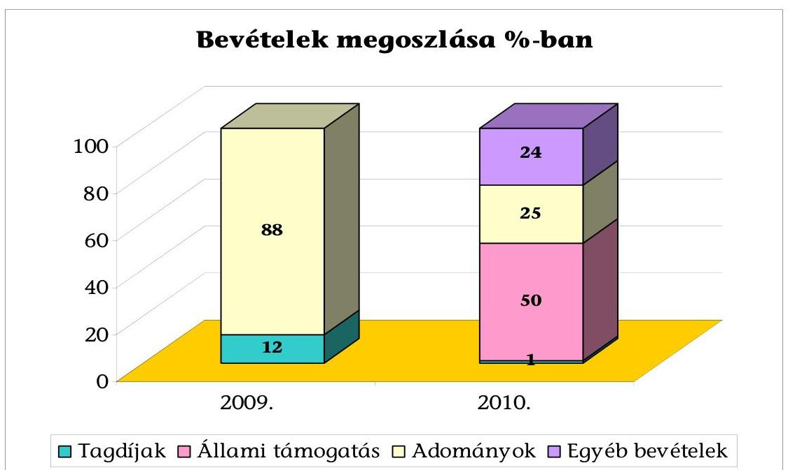
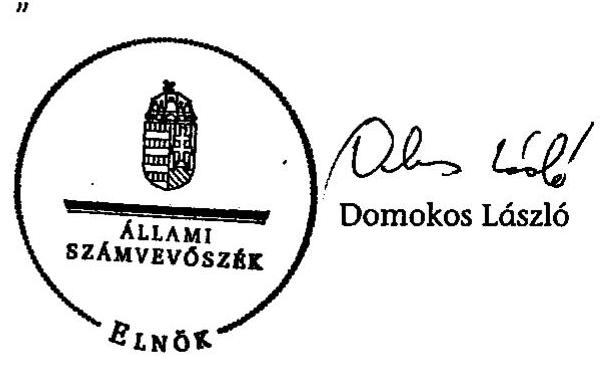
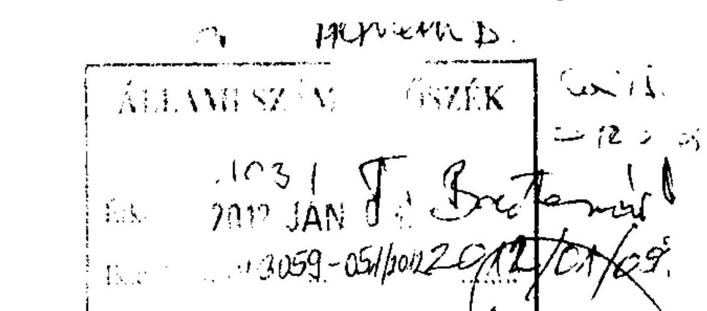
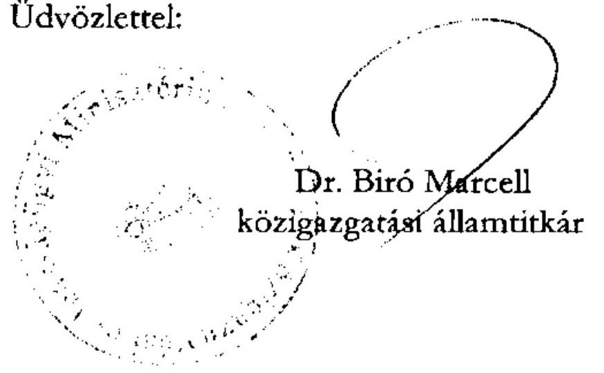
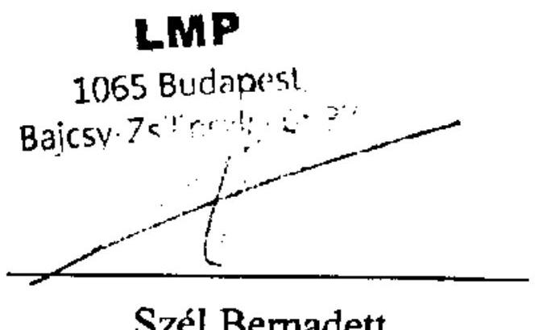
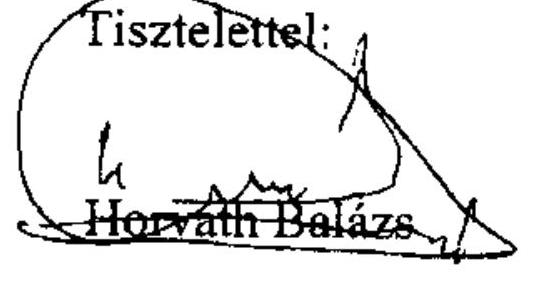

# ÁLLAMI   SZÁMVEVŐSZÉK 

## JELENTÉS

a Lehet Más a Politika 2009-2010. évi gazdálkodása törvényességének ellenőrzéséről

---

# Állami Számvevőszék 

Iktatószám: V-3059-055/2011-2012.
Témaszám: 1034
Vizsgálat-azonosító szám: V0551

## Az ellenőrzést felügyelte:

## Horváth Balázs

felügyeleti vezető

## Az ellenőrzést vezette:

## Barta József

ellenőrzésvezető

## Az ellenőrzést végezték:

Dr. Faragóné Tóth Mária számvevő tanácsos

Dr. Veress Tiborné
számvevő

---

# TARTALOMJEGYZÉK 

BEVEZETÉS ..... 5
I. ÖSSZEGZŐ MEGÁLLAPÍTÁSOK, KÖVETKEZTETÉSEK, JAVASLATOK ..... 7
II. RÉSZLETES MEGÁLLAPÍTÁSOK ..... 14

1. A Párt gazdálkodásáról szóló 2009-2010. évi beszámolók ..... 14
1.1. A teljes vizsgálati időszakra érvényes megállapítások ..... 14
1.2. A 2009. és 2010. évi beszámoló ..... 16
1.2.1. Bevételek ..... 16
1.2.2. Kiadások ..... 18
2. A Pártnak a beszámoló összeállítására és az azt alátámasztó
könyvvezetésre vonatkozó belső szabályozása és gyakorlata ..... 20
2.1. A számviteli szabályozás rendszere ..... 20
2.2. A könyvvezetés jogszabályokban és belső szabályzatokban előírt
követelményekkel való összhangja ..... 22
2.3. A bizonylati elv és fegyelem, bizonylati rend érvényesülésének
ellenőrzése ..... 26
3. A Párt bevételszerző, gazdálkodó tevékenysége az ellenőrzött években ..... 26
3.1. A Párt gazdálkodásának szabályozottsága ..... 26
3.2. A Párt vagyonának elemei ..... 27
4. A gazdálkodással összefüggő egyéb jogszabályokban foglalt előírások
betartásának ellenőrzése ..... 28
4.1. A foglalkoztatás szabályszerűsége ..... 28
4.2. Személyi jellegű kifizetésekre vonatkozó jogszabályok betartása ..... 29
4.3. Az adózási, társadalombiztosítási és egyéb jogszabályok
rendelkezéseinek érvényesítése ..... 29
5. A belső kontroll rendszer ellenőrzése ..... 31
5.1. A belső ellenőrzés rendszerének szabályozottsága, működése,
eredményessége ..... 31
5.2. Az informatikai rendszer környezetének szabályozottsága és belső
kontrolljainak működtetése ..... 33

---

# MELLÉKLETEK 

1. számú A Lehet Más a Politika (LMP) 2009. évi pénzügyi beszámolója
2. számú A Lehet Más a Politika - LMP 2010. évi beszámolója
3. számú A Lehet Más a Politika 2010. évi módosított beszámolója ${ }^{1}$
4. számú A Lehet Más a Politika 2009. évi módosított beszámolója
5. számú A Lehet Más a Politika 2010. évi módosított beszámolója ${ }^{2}$
6. számú A Közigazgatási és Igazságügyi Minisztérium nemleges észrevétele
7. számú A Párt képviselőjének észrevétele
8. számú A Párt képviselőjének észrevételére adott válasz

[^0]
[^0]:    ${ }^{1}$ Megjelent a Hivatalos Értesítő 2011. évi 45. számában.
    ${ }^{2}$ Megjelent a Hivatalos Értesítő 2011. évi 59. számában

---

# RÖVIDÍTÉSEK JEGYZÉKE 

| Jogszabályok és szervezetszabályozó eszközök |  |
| :--: | :--: |
| Art. | Az adózás rendjéről szóló 2003. évi XCII. törvény |
| párttörvény | A pártok működéséről és gazdálkodásáról szóló 1989. évi XXXIII. törvény |
| Mt. | A Munka Törvénykönyvéről szóló 1992. évi XXII. törvény |
| Számv. tv. | A számvitelről szóló 2000. évi C. törvény |
| Szja törvény | A személyi jövedelemadóról szóló 1995. évi CXVII. törvény |
| Tbj. | A társadalombiztosítás ellátásaira és a magánnyugdíjra jogosultakról, valamint e szolgáltatások fedezetéről szóló 1997. évi LXXX. törvény |
| SZMSZ | Szervezeti és Működési Szabályzat |
| Szórövidítések |  |
| Alapítvány | Ökopolitikai Műhely Alapítvány |
| ÁSZ | Állami Számvevőszék |
| OV | Országos Választmány |
| könyvviteli szolgáltató | Kovács és Társa Kft /Mach & Domján Tanácsadó Kft. |
| Párt/LMP | Lehet Más a Politika |
| SZB | Számvizsgáló Bizottság |

---

.

---

# JELENTÉS 

## a Lehet Más a Politika 2009-2010. évi gazdálkodása törvényességének ellenőrzéséről

## BEVEZETÉS

Az Állami Számvevőszékről szóló 2011. évi LXVI. törvény 5. § (11) bekezdés a) pontja, valamint a pártok működéséről és gazdálkodásáról szóló - többször módosított - 1989. évi XXXIII. törvény (párttörvény) 10. § (1) bekezdése alapján a pártok gazdálkodása törvényességének ellenőrzésére az Állami Számvevőszék (ÁSZ) jogosult. E törvényi felhatalmazás alapján az ÁSZ 2011. évi ellenőrzési tervének megfelelően vizsgálta a Lehet Más a Politika (Párt) 2009-2010. évi gazdálkodása törvényességét. A Párt a 2010. évi országgyűlési választás első fordulójában elért eredménye alapján rendszeres költségvetési támogatásban részesül, ezért a párttörvény 10. § (3) bekezdése alapján az ÁSZ kétévenként ellenőrzi a Párt gazdálkodását.

A Párt a hivatalosan közzétett éves beszámolói alapján 2009-ben 9902 ezer Ft 2010-ben 279384 ezer Ft bevételről adott számot, amelynek 2010. évben 49,5%-a állami költségvetési támogatásból származott. A kiadásokat 2009-ben 9619 ezer Ft, 2010-ben 419677 ezer Ft főösszeggel tették közzé.

Az ellenőrzés célja annak megállapítása volt, hogy:

- a Párt által készített, a Magyar Közlönyben és a Párt internetes honlapján közzétett éves beszámolók a törvényi előírásoknak megfelelnek-e, a könyvvezetéssel és a valósággal megegyező adatokat tartalmaznak-e;
- a könyvvezetés és a gazdálkodás során betartották-e a számvitelről szóló többször módosított - 2000. évi C. tv. (Számv. tv.) és az egyéb jogszabályok rendelkezéseit, a belső előírásokat;
- a Párt a működéséhez szabályszerűen igénybe vehető forrásokat használt-e fel, a párttörvényben engedélyezett gazdálkodó tevékenységet folytatott-e.

Az ellenőrzés típusa: pénzügyi-szabályszerűségi ellenőrzés
Az ellenőrzött időszak: 2009. január 1. - 2010. december 31.
Az ellenőrzés körülményeit illetően rögzíteni szükséges, hogy:

- a párttörvény 1. sz. melléklete szerinti beszámoló mintához magyarázatot, útmutatót nem készítettek a jogalkotók, így ennek kitöltése pártonként - kialakított számviteli politikájuknak megfelelően - eltérő lehet;

---

- a beszámoló minta a számviteli törvény rendelkezéseivel nem harmonizál, nem felel meg sem a mérleg, sem az eredmény-kimutatás követelményeinek.

Az ÁSZ a párttörvény módosításáig a jelenleg hatályos rendelkezéseknek megfelelő - egységes módszertani alapokra helyezett - gyakorlattal folytatja a pártok gazdálkodása törvényességének ellenőrzését. Az ellenőrzést a pénzügyiszabályszerűségi ellenőrzés módszertani szabályai szerint, a pártok gazdálkodása törvényességének ellenőrzésére kiadott segédletbe foglalt egységes követelmények alapján végeztük.

Az ellenőrzést kockázatelemzéssel alapoztuk meg, amelynek eredményeként az ellenőrzést magas kockázatúnak értékeltük. Az ellenőrzésnél a lényegességi szintet - az ellenőrzés által feltárt hibák, téves adatok előjeltől független összege, amely a felhasználók véleményét, döntéseit már jelentősen befolyásolja - a Párt által közzétett pénzügyi beszámolók bevételi főösszegére vetített 2%-ban határoztuk meg. Specifikus lényegességi küszöbként határoztuk meg a beszámoló megbízhatósága szempontjából az egyéb hozzájárulások, adományok párttörvény 9. § (2) bekezdésében előírt nevesítési kötelezettségének értékhatárait (belföldi jogi és magánszemélytől kapott hozzájárulás, adomány 500 ezer Ft, külföldi jogi személy, illetve jogi személynek nem minősülő gazdasági társaságtól és magánszemélytől kapott hozzájárulás, adomány 100 ezer Ft felett).

Tételesen ellenőriztük a bevételek közül a 2010 évre kapott állami támogatást, az egymillió forint feletti tételeket, valamint a beszámolóban a párttörvény előírásának megfelelően kötelezően nevesítendő, értékhatárt elérő egyéb hozzájárulásokat, adományokat. A bizonylati rend és fegyelem ellenőrzéséhez 2009. évben statisztikai mintavétellel 231 tételt, 2010. évben az IDEA adatbázis kezelő programmal véletlenszerűen kiválasztott 423 mintát használtunk fel. A 2010. évi tételeknél figyelmen kívül hagytuk a jelöltarányos állami támogatás és egyéb források terhére elszámolt országgyűlési képviselő-választás költségeit, mivel az ÁSZ korábbi ellenőrzése erre kiterjedt. ${ }^{3}$

A helyszíni ellenőrzésre 2011. szeptember 12 - október 14. között, a Párt Budapest VI., Bajcsy-Zsilinszky út. 37. I./17. szám alatti irodájában került sor.

[^0]
[^0]:    ${ }^{3}$ A részletes megállapítások az 1105 sorszámon kiadott - a 2010. évi országgyűlési választásra fordított pénzeszközök elszámolásának ellenőrzéséről a jelölő szervezeteknél és független jelöltnél című - számvevőszéki jelentésben találhatók.

---

# I. ÖSSZEGZŐ MEGÁLLAPÍTÁSOK, KÖVETKEZTETÉSEK, JAVASLATOK 

Az LMP a 2009. és a 2010. évi gazdálkodásáról szóló beszámolókat a párttörvényben előírt április 30-i határidőn túl - egy hónapos, illetve egy hetes késedelemmel - tette közzé a Hivatalos Értesítőben. A 2010. évi beszámolót a Párt egy belföldi magán személytől kapott 138 ezer Ft értékű nem pénzbeli vagyoni hozzájárulás szerepeltetése miatt ismételten megjelentette. A nyilvánosságra hozott beszámolók a Számv. tv-ben meghatározott teljesség, valódiság és következetesség számviteli alapelveinek megsértése következtében egyik évben sem mutattak megbízható és valós képet a Párt gazdálkodásáról.

Az ellenőrzés által feltárt - alábbi összeállításban bemutatott - lényeges hibák szabályozási, könyvvezetési és bizonylatolási hiányosságokkal egyaránt összefüggtek:

Adatok: ezer Ft-ban

| Évek | Beszámolóban   közzétett adatok |  | Ellenőrzés által   feltárt hiba |  | Hiba bevételi   főösszegre vetítve |  |
| :--: | :--: | :--: | :--: | :--: | :--: | :--: |
|  | Bevétel | Kiadás | Bevétel | Kiadás | Bevétel | Kiadás |
| 2009. | 6329 | 6268 | 6275 | 3327 | 99,2% | 52,6% |
| 2010. | 279384 | 419677 | 9305 | 3492 | 3,3% | 1,3% |

A megjelentetett beszámolóhoz képest kimutatott, a bevételi főösszegre vetített hiba mértéke mindkét évben meghaladta az ÁSZ által alkalmazott 2% mértékű átfogó lényegességi küszöböt, kivéve a 2010. évi kiadásoknál. A 2009. évi beszámolóban az egyéb hozzájárulások, adományok részletezésében 4164 ezer Ft bevételt nem szerepeltettek, illetve 2111 ezer Ft-ot hibásan közöltek. A kiadásokat nem a párttörvény szerinti részletezésben mutatták ki, a könyvelési hiba teljes összegében a politikai kiadásokhoz kapcsolódott. A 2010. évi beszámoló bevételeinél - hasonlóan az előző évhez az egyéb hozzájárulások, adományok - hibás soron, illetve összegben történt szerepeltetése következtében állapítottunk meg lényeges eltérést.

Specifikus lényeges hibát okozott, hogy 2009-ben két esetben a támogatók besorolási kategóriáját (belföldi magánszemély jogi személy helyett, valamint külföldi magánszemély helyett belföldi jogi személynek nem minősülő gazdasági társaság) a beszámoló sorok nevesítésénél összesen 3460 ezer Ft összegben hibásan szerepeltették. Specifikus lényeges hibát okozott 2010-ben, hogy egy külföldi magánszemély 574 ezer Ft összegű nem pénzbeli vagyoni hozzájárulásának értékét nem közölték és egy külföldi magánszemély 1940 ezer Ft adományát belföldinek minősítették.

A Párt a számvevőszéki ellenőrzés által feltárt hibákra figyelemmel a 2009. évi módosított beszámolót a Hivatalos Értesítő 2011. október 21-i 54. számában, a 2010. évi módosított beszámolót a Hivatalos értesítő 2011. december 9-i 59. számában közzétette. A javított beszámolók valós képet adnak a Párt 2009. és 2010. évi bevételeiről és kiadásairól. A Párt a 2009. és 2010. évi módosított beszámolókat a párttörvény előírásának megfelelően, internetes honlapján is közzétette.

A Számv. tv-ben kötelezően előírt teljes körű számviteli szabályozással csak 2010. január 1-jétől rendelkezett a Párt, ugyanis a megalakulása időpontjától számított 90 napon belül nem készítette el a számviteli politikát és a kapcsolódó szabályzatokat, számlarendet. A Párt a gazdálkodási sajátosságaihoz igazodóan szabályzataiban nem rögzítette a párttörvény szerinti éves beszámoló szerkezetének megfelelően a beszámoló sorokhoz tartozó főkönyvi számlákat, nem jelölte ki az egyéb bevételek, működési kiadások, az eszközbeszerzések, a politikai tevékenység és az egyéb kiadások kapcsolódó főkönyvi számláit, nem írta elő a nem pénzbeli vagyoni hozzájárulás értékelését, könyvelését. A késedelmes és hiányos szabályozás jelentősen hozzájárult a lényeges hibákhoz. A szabályozási hibák egy része összefügg azzal, hogy a párttörvény 1. sz. melléklete szerinti beszámoló mintához magyarázatot, útmutatót nem készítettek a jogalkotók, így ennek kitöltése pártonként - kialakított számviteli politikájuknak megfelelően - eltérő lehet. A beszámoló minta a számviteli törvény rendelkezéseivel nem harmonizál, nem felel meg sem a mérleg, sem az eredmény-kimutatás követelményeinek. A törvényi hiányosságok miatt az ÁSZ évek óta javasolja a kormánynak
 jelentéseiben a párttörvény módosítását.

A kettős könyvvitel vezetéséről a 2009. december 10-től hatályos számviteli politika rendelkezett. A szabályozás nélkül folyó 2009. évi könyvviteli nyilvántartáshoz pénztárjelentést nem vezettek, bevételi és kiadási pénztárbizonylatot nem használtak, a pénzeszközökben bekövetkezett változások áttekinthetőségét nem biztosították, amely vagyonvédelmi kockázatot jelentett. A főkönyvi számlákhoz kapcsolódóan kizárólag a vevő-szállító állományról vezettek analitikus nyilvántartást. A 2009. évi záráshoz a beszámolót alátámasztó a mérleg fordulónapján meglévő eszközök és források leltár felvételét a Számv. tv. előírása ellenére a Párt nem hajtotta végre, amelyet a helyszíni ellenőrzés időszakában pótolt. A Párt 2010. január 1-jével számviteli szolgáltatót váltott, amely a Számv. tv-vel összhangban alakította ki a könyvviteli rendet. A tárgyi eszközök, a vevők - szállítók, a készpénzforgalom, az előlegek, a kölcsönök, a tagdíj és az adományok analitikus nyilvántartását vezették 2010. január 1-jétől. Az éves zárlati munkát megalapozó leltározást a 2010. január 1-jétől hatályos leltározási szabályzatban előírtaknak megfelelően elvégezték. Az éves zárást határidőben végrehajtották, a beszámolót alátámasztó főkönyvi kivonatokat elkészítették.

A beszámolókban lényeges hibákhoz vezetett, hogy 2009-ben számlarenddel nem rendelkeztek, a könyvvezetésben nem érvényesült a Számv. tv-ben foglalt teljesség, valódiság és következetesség elve. Nem könyvelték egyik évben sem a kedvezményesen kapott irodabérlet piaci értékét, továbbá tévesen könyveltek hozzájárulásokat, adományokat. Általános költségként mutattak ki 2009-ben kölcsönt, támogatást és visszautalást. A megbízható 2009. évi beszámoló alátámasztása érdekében a gazdasági eseményeket újrakönyvelték, az ellenőrzés által feltárt hibákat megszüntették. A könyvviteli nyilvántartásban nem rögzítették 2010-ben a nem pénzben nyújtott adományt és a Párt által alapított alapítvány alapítói vagyonát a támogatás nyújtása helyett követelésként kezelték.

---

A bizonylati elv és fegyelem betartásához 2010. január 1-jétől rendelkeztek szabályzattal. A Számv. tv-i előírásoknak megfelelően a számviteli nyilvántartásban 2009-ben szabályozás nélkül, 2010. évben a szabályozással összhangban a könyvelt gazdasági műveleteket, szabályszerűen kiállított bizonylatokkal támasztották alá, kivéve a magáncélú telefonköltségek megtérítését. A Számv. tv-ben szabályozott alaki, tartalmi követelményei közül a gazdasági művelet tartalmának leírása 2009. évben a bizonylatok közel 40%-áról, 2010. évben 20%-áról hiányzott. Az ellenőrzött bizonylatok közel 100%-ánál hiányzott 2009. évben a könyvelési számlára való hivatkozás és a nyilvántartásban való rögzítés időpontja, igazolása. Ez 2010. évben 12%-ra, illetve mintegy 50%-ra csökkent. A bizonylatolási hiányosságok hozzájárultak a beszámolási és a könyvelési hibákhoz.

A bizonylatok megőrzéséről, a szigorú számadású nyomtatványok nyilvántartásba vételéről a Számv. tv. előírásainak megfelelően gondoskodtak.

A Párt bevétele a 2009. évi 9902 ezer Ft-ról 2010-re 279384 ezer Ft-ra nőtt, amelynek oka az állami támogatásra való jogosulttá válás, a hitelfelvétel és az egyéb hozzájárulások, adományok közel nyolcszoros növekedése volt. A Párt saját bevételei szabályozott tagdíjfizetésből, egyéb hozzájárulásokból és adományokból, hitelből, pártot szimbolizáló tárgyak értékesítéséből valamint kamatbevételekből teljesültek. A Párt nem pénzbeli vagyoni hozzájárulásként 2009-ben 4062 ezer Ft, 2010-ben 5013 ezer Ft összegű támogatást kapott kedvezményes ingatlan bérleti díj formájában. A bevételek nem fedezték a kiadásokat, ezért bankhitelt, tagi-, magánszemély- és egyéb kölcsönt vettek fel, illetve kifizetetlen szállítói számlák keletkeztek.

A Párt forrás összetételében bekövetkezett változásokat az alábbi diagram szemlélteti:

A Párt a vizsgált időszakban könyvviteli nyilvántartásai szerint a párttörvényben meg nem engedett forrásból származó vagyoni hozzájárulást: állami vállalat-

---

tól, állami részvétellel működő gazdasági társaságtól, közvetlen költségvetési támogatásban vagy költségvetési szervi támogatásban részesülő alapítványtól, más államtól nem fogadott el.

Az önellenőrzéssel feltárt 12 ezer Ft névtelen befizetést 2011-ben a központi költségvetés javára befizette. A Párt kizárólag a párttörvényben engedélyezett gazdálkodó tevékenységet folytatott. Gazdasági társaságban részesedést nem szerzett, tiltott értékpapírt nem vásárolt.

A Párnál a pénzkezelés módját a 2009. november 20-ától hatályos, az LMP és a területi szervezetek gazdálkodásának feltételrendszeréről kiadott szabályzatokban határozták meg. A szabályzatok - a napi készpénz záró állomány maximális mértékének kivételével - megfeleltek a Számv. tv. 14. § (8) - (10) bekezdésében előírtaknak. Tartalmazták a pénzforgalom lebonyolításának rendjét, pénzkezelés személyi és tárgyi feltételeit, a pénzkezelés felelősségi szabályait, a készpénzben és a bankszámlán tartott pénzeszközök közötti forgalom előírásait, a pénztár ellenőrzéskor követendő eljárást, gyakoriságát, a pénzszállítás feltételeit, valamint a pénzkezeléssel kapcsolatos bizonylati rendet és a pénzforgalommal kapcsolatos nyilvántartási szabályokat.

A Számv. tv. 14. § (8) - (9) bekezdésében előírtakat figyelmen kívül hagyva, a napi készpénz záró állomány maximális mértéke helyett szabálytalanul a hó végi záró készlet mértékéről rendelkeztek, továbbá a záró készlet maximális mértékének összege sem volt összhangban a Számv. tv. 14. § (9) bekezdésével.

A Párnál 2009. évben munkaviszony keretében és munkaszerződéssel való foglalkoztatás nem volt. A munkavállalókat 2010. évben a munkáltatói jogot gyakorló szabályszerű munkaszerződések alapján foglalkoztatta. A munkabéreket központilag számfejtették. Utazási költségtérítést a munkavállalóknak, választott tisztségviselőknek saját tulajdonú személygépkocsi hivatalos célú használatáért fizettek a belső szabályozás szerint. Az Szja törvényben előírt tartalmú kiküldetési rendelvényt alkalmazták, adómentes mértékű költséget számoltak el.

Az adózási, társadalombiztosítási törvényi előírásoknak a Párt munkáltatói jogkörében 2010. első fél évében folyamatosan nem tett eleget. A megbízási díjakhoz és kifizetői kötelezettségekhez kapcsolódó adó- és járulék bevallási, befizetési kötelezettségét késedelmesen és tévesen teljesítette. A Párt 2010. február - május hónapokra szóló bevallását több hónapos késéssel nulla értékkel nyújtotta be. Önellenőrzés után 2010. decemberben a tényleges összegekkel az új bevallásokat elkészítette és az elmaradt adó és járulék fizetését - áprilisi kivételével - 2011. január 25-én teljesítette.

A 2010. április hónapra szóló önellenőrzéssel bevallott adótartozására a Párt 2011-ben halasztási, részletfizetési és adómérséklési kérelmet nyújtott be, amelynek az adóhatóság részben helyt adott. A Párt 2010. év végi adó és járulék hátralékait 2011. szeptember végéig rendezte.

A Párt a magán telefonhasználatot kizáró nyilvántartással 2009. évben és 2010. első fél évére nem rendelkezett, a természetbeni juttatásnak minősülő magán célú telefon használat után az Szja törvény adófizetési és a 2010. janu-

---

ár 1-jétől a Tbj. szerinti járulékfizetési kötelezettségét nem teljesítette, amit a jelentés készítés időpontjában pótolt.

A belső ellenőrzés rendszerét 2009. november 20-ától a gazdálkodást országosan átfogó pénzügyi és a területi szervezetek gazdálkodásának feltételrendszeréről szóló szabályzatokban határozták meg. A területi szervezetek 2010 júniusától folyamatosan készítették el saját szabályzataikat.

A szabályozások szerint az SZB, a pénzügyi vezető és a területi választmányok feladata a gazdálkodásra vonatkozó rendelkezések betartásának ellenőrzése. A Párt gazdálkodásának, pénzügyi és vagyoni helyzete „kézbentartásának egyetemleges felelőse" a pénzügyi vezető.

Az SZB az alapszabályban rögzített feladatát ellátta, ennek keretében megvizsgálta és írásban véleményezte a kongresszus elé terjesztett költségvetést, illetve az annak végrehajtásáról szóló beszámolót, azonban az ellenőrzés által feltárt hibákat nem észlelte.

A pénzügyi vezetői feladatokat a Párt megalakulása óta három különböző személy látta el, a munkakörök és feladatok átadásáról dokumentum nem készült. A pénzügyi vezető személyében beálló évenkénti változás, a feladat ellátásához szükséges szakmai tapasztalat hiánya, az operatív gazdasági-pénzügyi feladatokat ellátó szervezeti egység késedelmes létrehozása, valamint a számviteli és gazdálkodási szabályzatok jogszabályban előírt határidőn túli elkészítése, hatályba léptetése miatt a vezetői és munkafolyamatba épített ellenőrzés nem működött.

A vezetői és munkafolyamatba épített ellenőrzés hiánya vezetett a nyilvántartási (telefonhasználat), a bizonylatolási, az elszámolási, az adózási, a könyvvezetési és a beszámolási hibák kialakulásához.

A Párt gazdálkodási fegyelmének javítása érdekében az azonnal megoldható problémákra az ellenőrzéssel való szoros együttműködés keretében soron kívül intézkedett. A helyszíni ellenőrzés által feltárt, a 2009. évi beszámolót és az adó-és járulékfizetési kötelezettségeket érintő hiányosságokat az ellenőrzés, illetve a jelentés készítés ideje alatt megszüntette. Ebből adódóan a Párt részére e megállapításokra felhívást már nem fogalmaztunk meg.

# Az ellenőrzés intézkedést igénylő megállapításai és javaslatai: 

Az Állami Számvevőszékről szóló 2011. évi LXVI. törvény 33. § (1) bekezdésében foglaltak értelmében a jelentésben foglalt megállapításokhoz kapcsolódó intézkedési tervet köteles az ellenőrzött szervezet vezetője összeállítani és azt a jelentés kézhezvételétől számított harminc napon belül az ÁSZ részére megküldeni. Amennyiben az intézkedési tervet határidőben nem küldi meg a szervezet, vagy az nem elfogadható, az ÁSZ elnöke a hivatkozott törvény 33. § (3) bekezdés a)-b) pontjaiban foglaltakat érvényesítheti.

---

# a közigazgatási és igazságügyi miniszternek 

A szabályozási hibák egy része összefügg azzal, hogy a párttörvény 1. sz. melléklete szerinti beszámoló mintához magyarázatot, útmutatót nem készítettek a jogalkotók, így ennek kitöltése pártonként - kialakított számviteli politikájuknak megfelelően - eltérő lehet. A beszámoló minta a számviteli törvény rendelkezéseivel nem harmonizál, nem felel meg sem a mérleg, sem az eredmény-kimutatás követelményeinek. A törvényi hiányosságok miatt az ÁSZ évek óta javasolja a kormánynak jelentéseiben a párttörvény módosítását.

Javaslat
Kezdeményezze a pártfinanszírozás átláthatóságának, a pártok elszámoltathatóságának fokozott érvényesítése érdekében a párttörvény módosítását, figyelemmel a pártok számviteli nyilvántartási és beszámolási rendszerét érintő ellentmondások feloldására, amelyek a párttörvény és a Számv. tv. között évek óta fennállnak.

## a Párt képviseletére jogosultnak

1. Az LMP a 2009. és a 2010. évi gazdálkodásáról szóló beszámolókat a párttörvényben előírt április 30-i határidőn túl - egy hónapos, illetve egy hetes késedelemmel - tette közzé a Hivatalos Értesítőben.

Felhívás
Tartsa be a párttörvény 9. § (1) bekezdése szerint a beszámoló közzétételének határidejét.
2. A Párt a gazdálkodási sajátosságaihoz igazodóan a számviteli szabályaiban nem rögzítette a párttörvény 1. számú melléklete szerinti éves beszámoló szerkezetének megfelelően a beszámoló sorokhoz tartozó főkönyvi számlákat, nem jelölte ki az egyéb bevételek, működési kiadások, az eszközbeszerzések, a politikai tevékenység és az egyéb kiadások kapcsolódó főkönyvi számláit, nem írta elő a nem pénzbeli vagyoni hozzájárulás értékelését, könyvelését.

Felhívás
A számviteli szabályozásában határozza meg a párttörvény 1. számú melléklete szerinti éves beszámoló szerkezetének megfelelően az egyéb bevételek, működési kiadások, az eszközbeszerzések, a politikai tevékenység és az egyéb kiadásokhoz kapcsolódó főkönyvi számlákat, a nem pénzbeli vagyoni hozzájárulás értékelését és könyvelését.
3. A beszámolókban lényeges hibákhoz vezetett, hogy a könyvvezetésben nem érvényesült a Számv. tv-ben foglalt teljesség, valódiság és következetesség elve. Nem könyvelték egyik évben sem a kedvezményesen kapott irodabérlet piaci értékét, továbbá tévesen könyveltek hozzájárulásokat, adományokat. Általános költségként mutattak ki 2009-ben kölcsönt, támogatást és visszautalást. A Párt által alapított alapítvány alapítói vagyonát a támogatás nyújtása helyett követelésként kezelték.

---

# Felhívás 

Szerezzen érvényt a jövőben az éves beszámolók alapjául szolgáló könyvvezetésben a Számv. tv. 15. § (2) - (3) és az (5) bekezdésben szabályozott számviteli elveknek.
4. A Számv. tv-ben szabályozott alaki, tartalmi követelményei közül a gazdasági művelet tartalmának leírása 2009. évben a bizonylatok közel 40%-áról, 2010. évben 20%-áról hiányzott. Az ellenőrzött bizonylatok közel 100%-ánál hiányzott 2009. évben a könyvelési számlára való hivatkozás és a nyilvántartásban való rögzítés időpontja, igazolása. Ez 2010. évben 12%-ra, illetve mintegy 50%-ra csökkent:

Felhívás
Tartsa be a Számv. tv. 167. § (1) bekezdés c)-i) pontjaiban előírt alaki és tartalmi követelményeket.
5. A Pénzkezelési szabályzatban a Számv. tv. előírásait figyelmen kívül hagyva, a napi készpénz záró állomány maximális
 mértéke helyett szabálytalanul a hó végi záró készlet mértékéről rendelkeztek, továbbá a záró készlet maximális mértékét eltérően határozták meg.

Felhívás
Módosítsa a pénzkezelési szabályzatát a Számv. tv. 14. § (8) - (9) bekezdések előírásaival összhangban, a napi készpénz záró állomány maximális mértékének meghatározásánál.

---

# II. RÉSZLETES MEGÁLLAPÍTÁSOK 

## 1. A PÁRT GAZDÁLKODÁSÁRÓL SZÓLÓ 2009-2010. ÉVI BESZÁMOLÓK

### 1.1. A teljes vizsgálati időszakra érvényes megállapítások

A Párt a 2009. évi gazdálkodásáról szóló beszámolót 2010. május 28-án a Hivatalos Értesítő 41. számában, a 2010. évi beszámolót 2011. május 6-án a Hivatalos Értesítő 30. számában tette közzé a párttörvény 9. § (1) bekezdésében előírt április 30-i határidőt meghaladva (1, 2. számú melléklet). A beszámolókat a párttörvény 1. számú mellékletében meghatározott minta szerint jelentették meg, kivéve a 2009. évi kiadási sorokat. A számvevőszéki vizsgálatot megelőzően a 2010. évi beszámolót a Párt önellenőrzéssel módosította és a Hivatalos Értesítő 2011. évi 45. számában, augusztus 19-én megjelentette (3. számú melléklet). A párttörvény 4. § (5) bekezdése alapján pótolták egy belföldi magán személytől kapott 138 ezer Ft nem pénzben nyújtott vagyoni hozzájárulás értékelését és szerepeltetését. A Párt számviteli politikájában az ismételt közzétételre vonatkozó szabályozás értelmében a beszámoló módosítása - az értékhatár miatt - nem lett volna kötelező.

A beszámolók összeállításának rendjét, a beszámolósorok és a főkönyvi számlák kapcsolatát a Párt a számviteli politikájában és egyéb belső szabályzatában nem szabályozta. A Párt 2009. évben területi szervekkel még nem rendelkezett, a beszámoló bevételi sorai a főkönyvi kivonatból, számviteli bizonylatokból levezethetők voltak, azonban a kiadások sorai nem a párttörvény 1. számú mellékletében részletezettek szerint készültek. A 2010. évi beszámoló összeállításához a figyelembevett főkönyvi számlákról kimutatást készítettek, amelyet az ellenőrzés részére átadtak. A beszámolósorokhoz kapcsolódó főkönyvi kivonatokból, illetve főkönyvi számlákból levezethetők voltak a beszámoló adatai.

A Párt az éves beszámolók összeállítása során megsértette a Számv. tv. 15. § (2), (3), és (5), valamint a 16. § (4) bekezdésében foglalt teljesség, valódiság, következetesség és lényegesség számviteli alapelveket, így a nyilvánosságra hozott beszámolók nem mutattak megbízható és valós képet a Párt pénzügyi gazdálkodásáról.

A teljesség számviteli elvét sértette, hogy 2009-ben a bevételek között nem szerepelt a 2009. december 31-én a 3811 pénztár főkönyvi számlára technikai rendezés jogcímen, tartozik forgalomként könyvelt - bizonylat és a befizető megnevezése nélkül - 603904 Ft. Az ingyenes formában kapott nem pénzbeli vagyoni hozzájárulás 574 ezer Ft értékét nem mutatták ki a külföldi magánszemélytől kapott soron a 2010. évi beszámolóban, továbbá hibás könyvelésből eredően, hiányzott 2 ezer Ft összegű tagdíjbevétel, amelyet tévesen az adományok között szerepeltettek. A kiadások között nem szerepeltették a Párt által alapított alapítvány alapítói támogatását 500 ezer Ft összegben.

---

A valódiság elvét sértette, hogy 2009-ben 1000 ezer Ft összegű kölcsönt, 2000 ezer Ft támogatás továbutalását, 327 ezer Ft visszautalását általános költségként mutatták ki, továbbá 11 ezer Ft magánszemély adományát kétszer vették figyelembe, hibás könyvelésből adódóan.

A következetesség számviteli alapelvet sértette, hogy a 2009. évi 100 ezer Ft összegű jogi személytől származó adományt magánszemélyektől származó adományok között jelentettek meg, továbbá 2000 ezer Ft összegű magánszemélytől származó adományt jogi személynek nem minősülő gazdasági társaságtól kapott adomány soron és téves összegben szerepeltették. A beszámolóban a bevételek és kiadások sor alatt magánszemélytől származóként nevesítette a Párt a természetbeni - iroda ingyenes bérbeadása - felajánlás összegét 900 ezer Ft összegben. Az ellenőrzés részére átadott szerződés szerint azonban az adományozó jogi személy volt, amelyet a beszámoló jogi személy soron kellett volna nevesítve szerepeltetni. A Párt a 2010. évi beszámolójában tévesen 2423 ezer Ft összegű jogi személytől származó adományt jogi személynek nem minősülő gazdasági társaságtól származó adományok között mutatott ki. A működési kiadások között 640 ezer Ft összegű kampány kiadás is előfordult, melyet a politikai kiadások között kellett volna elszámolni. A hitelkamat rossz főkönyvi számlára könyvelése miatt 569 ezer Ft a működési kiadások soron és nem az egyéb kiadások soron lett kimutatva.

A lényegesség számviteli alapelvét sértette, hogy a 2009. és a 2010. évi beszámolók összeállításával összefüggésben feltárt bevételi hiba előjeltől független értéke 6275 ezer Ft, illetve 9305 ezer Ft, amely a bevételi főösszegre vetítve 99,15 %, illetve 3,33 % volt. A kiadási oldalon feltárt hibák előjeltől független összege 2009-ben 3327 ezer Ft, ami a bevételi főösszeg százalékában 52,57%, 2010-ben 3492 ezer Ft, azaz 1,25% volt. A hibák a beszámoló bevételi főösszegére vetítve az ÁSZ ellenőrzési módszertanában meghatározott 2 %-os átfogó lényegességi szintet meghaladták.

Specifikus lényeges hibát állapítottunk meg mindkét évi beszámolóban. A 2009. évi beszámolóban 900 ezer Ft-ot magánszemély adományaként és a beszámoló sorok alatt nevesítettek, továbbá egy külföldi magánszemély 2560 ezer Ft-os támogatását belföldi jogi személynek nem minősülő soron mutatták ki. A 2010. évi beszámolóban egy külföldi magánszemély 574 ezer Ft összegű nem pénzbeli vagyoni hozzájárulásának értékét nem közölték, továbbá hibásan belföldi magánszemélyként nevesítettek egy külföldi magánszemélyt 1940 ezer Ft adománya esetében.

A 2009. és a 2010. évi beszámoló számvevőszéki ellenőrzés által feltárt lényeges és specifikus hibáit a Párt javította és a módosított beszámolókat a Hivatalos Értesítő 2011. október 21-i 54. illetve a 2011. december 9-i 59. számában közzétette (4. és 5. számú melléklet). A javított beszámolók valós képet adnak a Párt 2009. és 2010. évi bevételeiről és kiadásairól. A Párt a 2009. és 2010. évi módosított beszámolót a párttörvény előírásának megfelelően, internetes honlapján is közzétette. A Kongresszus a Párt éves gazdálkodásáról készített és a Számvizsgáló Bizottság (SZB) által megvizsgált beszámolókat az alapszabály 20. § (4) bekezdésének c) pontja szerinti hatáskörében mindkét évben - a 2010. május 16-ai és a 2011. április 30-ai határozatával - elfogadta.

---

# 1.2. A 2009. és 2010. évi beszámoló 

### 1.2.1. Bevételek

A 2009. és a 2010. évekre közzétett beszámolók bevételeinek ellenőrzése során megállapított eltéréseket - beszámoló soronként - a következő összeállítás részletezi:

|  |  |  | Adatok ezer Ft-ban |  |  |  |
| :--: | :--: | :--: | :--: | :--: | :--: | :--: |
| Megnevezés | Párt által közzétett beszámoló |  | Ellenőrzés által megállapított eltérések a beszámolóhoz képest |  |  |  |
|  | 2009.   évi   eredeti | 2010. évi   módosított ${ }^{4}$ | 2009. évi |  | 2010. évi |  |
| BEVÉTEL |  |  | Kimaradt | Hibásan   szerepel | Kimaradt | Hibásan   szerepel |
| 1. Tagdíjak | 733 | 3579 | 0 | 0 | 2 | 0 |
| 2. Állami támogatás | 0 | 138244 | 0 | 0 | 0 | 0 |
| 3. Képviselői csoportnak nyújtott támogatás | 0 | 0 | 0 | 0 | 0 | 0 |
| 4. Egyéb hozzájárulások, adományok | 5594 | 70567 | 4164 | 2111 | 4937 | 4366 |
| 4.1. Belföldi jogi személy | 0 | 7877 | 1000 | 0 | 2423 | 0 |
| 4.2. Jogi személynek nem minősülő gazdasági társaság | 2000 | 2677 | 0 | 2000 | 0 | 2423 |
| 4.3. Magánszemély | 3594 | 60013 | 3164 | 111 |  |  |
| 4.3.1. Belföldi magánszemély | 3594 | 40494 | 604 | 111 | 0 | 1943 |
| 4.3.2. Külföldi magánszemély | 0 | 19519 | 2560 | 0 | 2514 | 0 |
| 6. Egyéb bevétel | 2 | 66994 | 0 | 0 | 0 | 0 |
| ÖSSZESEN: | 6329 | 279384 | 4164 | 2111 | 4939 | 4366 |
| - abszolút eltérés |  |  | 6275 |  | 9305 |  |

A beszámoló bevételeit a 9. Bevételek elnevezésű számlaosztályhoz tartozó, a párttörvény 1. számú melléklete szerinti minta soraihoz igazodó főkönyvi számlák adataiból, valamint a hitel és a nem pénzben nyújtott vagyoni hozzájárulások értékéből állították össze.

[^0]
[^0]:    ${ }^{4}$ Az eltérések kimutatása a 2010. év esetében a módosított beszámolóhoz viszonyítva történt, mivel a számvevőszéki vizsgálatot megelőzően a 2010. évi beszámolót a Párt önellenőrzéssel módosította és megjelentette, és a helyszíni ellenőrzés során ezt vizsgáltuk.

---

A tagdíjak beszámolósor közzétett adata mindkét évben megegyezett a főkönyvi könyvelésben szereplő összeggel. A tagdíjakhoz kapcsolódó bizonylatok alapján a befizető személye és a jogcím minden esetben megállapítható volt. A beszámolósoron csak tagdíjak fogalomkörébe tartozó összegek szerepelnek. Könyvelési hibából adódóan egy tagdíjbefizetést a belföldi magánszemélyek adománya között vettek nyilvántartásba. A tagdíj megállapítás feltételeit a Párt alapszabálya rögzítette. A párttörvény 5. § (2) bekezdése alapján kapott 123,6 millió Ft támogatás megegyezett a Magyar Köztársaság 2010. évi költségvetésének végrehajtásáról szóló 2011. évi CXXXIII. törvény 1. mellékletében szereplő, a főkönyvi könyvelésben kimutatott, a Magyar Államkincstár által ténylegesen átutalt összeggel. Az állami költségvetésből származó támogatás címén 2010. évben közzétett adat tartalmazta az országgyűlési képviselő-választásra kapott jelöltarányos 14,6 millió Ft-os támogatást is.

Az egyéb hozzájárulások, adományok beszámolósor adatát a Párt, a párttörvény 1. számú mellékletében előírt minta szerint tovább részletezte. A Pártnak ezen a jogcímen belföldi jogi személyektől, belföldi jogi személynek nem minősülő gazdasági társaságoktól, valamint belföldi és külföldi magánszemélyektől származott bevétele.

Egyéb hozzájárulások, adományok belföldi jogi személyektől beszámoló sor adata egyezett a vonatkozó főkönyvi számlák összesített egyenlegével, azonban egyik évben sem a valós helyzetet mutatta. A 2009. évi beszámoló sorból hiányzott a magánszemélyek adománya között kimutatott jogi személyiségű Alapítvány 100 ezer Ft összegű, valamint sor alatt, mint természetbeni felajánlás kimutatott 900 ezer Ft összegű és magánszemélyként nevesített nem pénzben nyújtott adomány. A bérleti szerződés értelmében a Párt havi egy forint díjat fizetett négy helyrajzi számon nyilvántartott, összesen $326 \mathrm{~m}^{2}$ területű iroda helységért a Praestor Tanácsadó Kft-nek. A nem pénzben nyújtott vagyoni hozzájárulás értékelését alátámasztó bizonylattal, dokumentummal a Párt nem rendelkezett. A beszámoló sorból 2010. évben is hiányzott a jogi személy Alapítvány 2423 ezer Ft összegű támogatása, amelyet a jogi személynek nem minősülő gazdasági társaság adománya között mutatott ki a Párt.

Az egyéb hozzájárulások, adományok jogi személynek nem minősülő gazdasági társaságoktól soron a 2009. évi beszámolóban 2000 ezer Ft külföldi magánszemély által nyújtott támogatást nevesítettek, amely a ténylegesen befizetett összeggel sem egyezett, az helyesen 2560 ezer Ft volt. Az előző beszámoló sornál részletezettek miatt 2423 ezer Ft hibásan szerepelt 2010-ben.

Az egyéb hozzájárulások, adományok
 belföldi magánszemélyektől soron hiányzott 604 ezer Ft pénztári befizetés, amely nem volt beazonosítható. A Párt helytelenül itt szerepeltette az Alapítvány által nyújtott 100 ezer Ft-os adományt, valamint kétszeres könyvelési hibából adódóan 11 ezer Ft-ot. A 2010. évi beszámoló sorban e soron közöltek 2 ezer Ft összegű tagdíjat, továbbá tévesen nevesítették egy külföldi magánszemély 1940 ezer Ft összegű támogatását. A 2010. évi beszámolóban könyvelési hibából adódóan állapított meg eltérést az ellenőrzés. A Párt önellenőrzés keretében a 2010. évi 12 ezer Ft összegű névtelen, postai úton kapott befizetést a párttörvény 4. §-ára tekintettel a központi költségvetés részére befizette.

---

Az egyéb hozzájárulások, adományok külföldi magánszemélyektől soron a 2009. évi beszámoló sorból hiányzott az előzőekben már említett 2560 ezer Ft. A 2010. évi beszámoló sorban nem szerepelt és nevesítve sem lett 574 ezer Ft nem pénzben nyújtott adomány értéke. Támogatási szerződést kötött a Párt egy amerikai állampolgárságú támogatóval egy darab Peugeot Bipper típusú kisteher-gépkocsi és egy db hordozható színpad és hozzá tartozó hangtechnika kizárólagos használatára, amelyek támogatási értékét 204 ezer Ft és 370 ezer Ft összegben állapították meg.

Az egyéb bevételek beszámolósoron a Párt és számlavezető bankja között létrejött folyószámlahitel szerződésben rögzített - belső szabályozás nélkül - összeget, jelvények, széldzsekik értékesítéséből származó bevételeket, valamint a telefonflotta keretében befizetett térítési díjakat mutatták ki. A beszámolósoron szereplő összeg megegyezett a kapcsolódó főkönyvi számlákon kimutatott bevétellel.

# 1.2.2. Kiadások 

A 2009. és a 2010. évekre közzétett beszámolók kiadásainak ellenőrzése során megállapított eltéréseket - beszámoló soronként - a következő összeállítás részletezi:

Adatok ezer Ft-ban

| Megnevezés | Párt által közzétett beszámoló 2009. 2010. évi módosított ${ }^{5}$ |  | Ellenőrzés által megállapított eltérések a beszámolóhoz képest 2009. évi |  |  |  |
| :--: | :--: | :--: | :--: | :--: | :--: | :--: |
|  |  |  | 2010. évi |  | 2010. évi |  |
| KIADÁS |  |  | Kimaradt | Hibásan   szerepel | Kimaradt | Hibásan   szerepel |
| 1. Támogatás a párt országgyűlési csoportja számára | 0 | 0 | 0 | 0 | 0 | 0 |
| 2. Tám. egyéb szervezetnek | 0 | 20 | 0 | 0 | 500 | 0 |
| 3. Vállalkozások alapítására fordított összegek | 0 | 0 | 0 | 0 | 0 | 0 |
| 4. Működési | 0 | 59864 | 0 | 0 | 0 | 1209 |
| 5. Eszközbeszerzés | 0 | 1744 | 0 | 0 | 0 | 0 |
| 6. Politikai | 6268 | 348944 | 0 | 3327 | 1214 | 0 |
| 7. Egyéb | 0 | 9105 | 0 | 0 | 569 | 0 |
| ÖSSZESEN: | 6268 | 419677 |  | 3327 | 2283 | 1209 |
| - abszolút eltérés |  |  | 3327 |  | 3492 |  |

[^0]
[^0]:    ${ }^{5}$ Az eltérések kimutatása a 2010. év esetében a módosított beszámolóhoz viszonyítva történt, mivel a számvevőszéki vizsgálatot megelőzően a 2010. évi beszámolót a Párt önellenőrzéssel módosította és megjelentette, és a helyszíni ellenőrzés során ezt vizsgáltuk.

---

Támogatás egyéb szervezeteknek beszámolósoron 2010. évben közölt adat megegyezett a kapcsolódó főkönyvi számla egyenlegével, azonban a Párt által 2010. évben alapított alapítvány 500 ezer Ft alapítói vagyonát nem mutatták ki, helytelen könyvelés miatt azt, mint követelés tartották nyilván.

A 2009. évi beszámoló kiadásainak közzététele nem a párttörvény 1. számú mellékletében előírt tartalommal készült, ezért azokat, mint politikai tevékenység kiadások vizsgáltuk.

A Párt a számviteli szabályzatokban a működési és politikai kiadásokat pontosan nem definiálta, 2010-től a könyvviteli elszámolásban munkaszámra könyveltek. A működési kiadások között a Párt rezsi költségeket, bérleti díjakat, a munkavállalók bér- és járulékköltségeit, személyi jellegű egyéb kifizetéseket, anyagköltségeket és a működéshez kapcsolódó igénybevett szolgáltatásokat számolta el.

A beszámolósor adata egyezett a munkaszámos nyilvántartásai szerinti főkönyvi számlák egyenlegeinek összesített adatával. Bérleti díjként számoltak el 640 ezer Ft költséget, amely a teljesítésigazolás alapján kampányköltség, azaz politikai kiadás volt. Továbbá e soron - egyéb kiadások helyett - mutattak ki téves könyvelés miatt 569 ezer Ft összegű hitelkamatot is.

Eszközbeszerzés csak 2010-ben történt a Pártnál, a közzétett adat megegyezett a nyilvántartására szolgáló főkönyvi számla tartozik forgalmával. A beszámolósoron számítógépek, kis értékű tárgyi eszközök beszerzésének az értéke szerepelt.

A Párt 2009. évben a kiadásokat általános, valamint sajtó és propaganda költségek bontásban tette közzé. A 6268 ezer Ft-on belül 1000 ezer Ft kölcsön, 2000 ezer Ft támogatás továbbutalásának leszámlázása és 327 ezer Ft visszautalt tétel elszámolása szerepelt, amelyeket az 5-ös számlaosztályban, mint költség tartottak nyilván.

A politikai tevékenység kiadásai beszámoló soron 2010. évben a működési kiadásokhoz hasonlóan munkaszámos nyilvántartással biztosították a beszámoló alátámasztását. A kiadások között hirdetés-, propaganda- és rendezvényköltségek, a helyi önkormányzati választási költségek, valamint a politikai tevékenységgel kapcsolatos egyéb költségek adatát mutatták ki. A beszámolósorból hiányzott 2010. évben az 574 ezer Ft nem pénzbeli vagyoni hozzájárulás értéke és a működési kiadások között bérleti díjként elszámolt 640 ezer Ft összegű költség.

Egyéb kiadások soron a telefonflotta keretében beszerzett és tovább adott eszközök és szolgáltatások értékét, valamint kamat ráfordításokat mutatták ki 2010. évben. A beszámolósor az 569 ezer Ft hitelkamat rossz főkönyvi számlára való könyvelése miatt nem mutat valós képet.

---

# 2. A Pártnak a beszámoló összeállítására és az azt alátámasztó könyvelésre vonatkozó belső szabályozása és gyakorlata 

### 2.1. A számviteli szabályozás rendszere

A Párt a Számv. tv. 14. § (3) bekezdése szerinti számviteli politikát, az (5) bekezdés szerint elkészítendő szabályzatokat a megalakulás időpontjától számított a (11) bekezdés szerinti 90 napon belül nem készítette el. A szabályzatokat a Számv. tv. 14. § (12) és a 161. § (4) bekezdésével és az alapszabállyal összhangban a Párt képviseletére jogosult személyek adták ki. A Párt szabályzatban nem határozta meg a párttörvény 4. § (5) bekezdésében előírtak szerint a Párt részére nyújtott nem pénzbeli vagyoni hozzájárulás értékelését, könyvelését és a beszámolóban való szerepeltetését. A Párt az éves beszámoló szerkezetének megfelelően szabályzataiban nem szabályozta a beszámoló sorokhoz tartozó főkönyvi számlákat. Nem jelölte ki az egyéb bevételek, működési kiadások, az eszközbeszerzések, a politikai tevékenység és az egyéb kiadások kapcsolódó főkönyvi számláit.

A szabályozási hibák egy része összefügg azzal, hogy a párttörvény 1. sz. melléklete szerinti beszámoló mintához magyarázatot, útmutatót nem készítettek a jogalkotók, így ennek kitöltése pártonként - kialakított számviteli politikájuknak megfelelően - eltérő lehet. A beszámoló minta a számviteli törvény rendelkezéseivel nem harmonizál, nem felel meg sem a mérleg, sem az eredmény-kimutatás követelményeinek. A törvényi hiányosságok miatt az ÁSZ évek óta javasolja a kormánynak jelentéseiben a párttörvény módosítását.

A 2009. december 10-étől hatályos számviteli politika a jogszabályi előírásoknak megfelelően rögzíti: a könyvvezetés módját; az évközi és év végi zárlatok időpontjait; feladatait; az éves beszámoló készítésének rendjét, időpontját; az amortizációs politika elemeit; a beszámoló elkészítésekor és a könyvvezetés során érvényesítendő számviteli alapelveket. Meghatározták a lényesség kritériumait, az értékelésnél mit tekint a Párt lényegesnek, nem lényegesnek; a megbízható és valós képet lényegesen befolyásoló hiba nagyságát, az ismételt közzététel előírásait; az eszközök és források minősítési szempontjait; az egyéb bevételek és kiadások fogalomkörét, ismérveit.

A Számv. tv. 14. § (5) bekezdés a) pontjában előírt 2010. január 1-jétől hatályos eszközök és források leltárkészítési és leltározási szabályzata, figyelemmel a Számv. tv. 69. § (1)-(2) bekezdéseire tartalmazta a leltározás ütemezését, a leltározás előkészítése során elvégzendő feladatokat, a leltározás fordulónapját, a leltározás megszervezését, módját, bizonylati rendjét, a dokumentumok feldolgozási és megőrzési módját, a leltározás technikai feltételeit, eszközeinek biztosítását.

Szabályozták a leltáreltérések megállapításának és rendezésének, a leltározás és értékelés ellenőrzésének a módját, a leltári eltérések főkönyvi elszámolását. A szabályzatban nem jelölték ki a leltári körzeteket. A selejtezés rendjét külön selejtezési szabályzatban határozták meg.

---

A Számv. tv. 14. § (5) bekezdés b) pontjában előírt 2010. január 1-jétől hatályos eszközök és források értékelési szabályzata a 46. § bekezdésben foglaltakkal összhangban tartalmazta az eszközök bekerülési értékének tartalmát, az egyes eszköz- és forráscsoportok választott értékelési eljárásait.

A Pártnál a pénzkezelés módját a 2009. november 20-ától hatályos, az LMP és a területi szervezetek gazdálkodásának feltételrendszeréről készült szabályzatokban meghatározták. A központi szervezet házipénztár működéséről és a bankszámlakezelésről szóló szabályzatot 2010. július 1-jével léptették hatályba. A területi szervezetek pénzkezelési szabályzataikat 2010. második felében készítették el.

A pénzkezelési szabályzatok tartalmazták a pénzforgalom lebonyolításának rendjét, pénzkezelés személyi és tárgyi feltételeit, a pénzkezelés felelősségi szabályait, a készpénzben és a bankszámlán tartott pénzeszközök közötti forgalom előírásait, a pénztár ellenőrzéskor követendő eljárást, gyakoriságát, a pénzszállítás feltételeit, valamint a pénzkezeléssel kapcsolatos bizonylati rendet és a pénzforgalommal kapcsolatos nyilvántartási szabályokat.

A pénzkezelési szabályzatok részben feleltek meg a Számv. tv. 14. § (8) - (9) bekezdésében előírtaknak. A szabályzatokban a Számv. tv. 14. § (8) bekezdése szerinti napi készpénz záró állomány maximális mértéke helyett, szabálytalanul a hó végi záró készletről rendelkeztek. A törvény 14. § (9) bekezdés előírását figyelembe véve a Pártnál 2010. évben napi 500 ezer Ft készpénz záró állomány megengedett maximális mértéke helyett, a hó végi zárlat időpontjában a központi szervezet házipénztárában 1000 ezer Ft-ban, a területi szervezeteknél 100 ezer Ft-ban határozták meg.

A számviteli politikához, 2009. évben hatályos számlarend nem kapcsolódott, a Párt a Számv. tv. 161. § (1) bekezdésben előírt számlarendet 2010. január 1-jétől készített. A számviteli szolgáltató a 2010. első félévi tapasztalatok alapján a második félévtől új könyvelő programot alkalmazott, biztosítva ezzel a gazdálkodási sajátosságoknak megfelelő számviteli nyilvántartást. A számlarend megfelelt a Számv tv. 160. §-ában előírt egységes számlakeret követelményének, a beszámoló elkészítéséhez szükséges alapinformációkat tartalmazta, de a párttörvény szerinti működéshez nem jelölték ki a működési kiadásokhoz, az eszközbeszerzésekhez, a politikai tevékenységhez kapcsolódó főkönyvi számlákat.

A számlarend a Számv. tv. 161. § (2) bekezdés a) pontjában előírtaknak megfelelően tartalmazta minden alkalmazott számla számát, megnevezését, de a b) pont szerint nem rögzítette minden számla tartalmát, ha az a számla megnevezéséből nem következett.

A számlarendben a Számv tv. 161. § (2) bekezdés c) pontja szerint a főkönyvi számla és analitikus nyilvántartás kapcsolatát és a (3) bekezdésében előírt egyeztetést az analitikus nyilvántartások és a főkönyvi könyvelés között szabályozták. A bizonylati rendet a 2010. január 1-jétől hatályos „Bizonylati rend és iratkezelési szabályzat az LMP és könyvelőiroda vonatkozásában" szabályzatban
 határozták meg.

---

# 2.2. A könyvvezetés jogszabályokban és belső szabályzatokban előírt követelményekkel való összhangja 

A Párt a számviteli politika előírásával összhangban a Számv. tv. 159. §-ban rögzített kettős könyvvitelt vezette. A könyvviteli nyilvántartás 2009-ben a pénzeszközökben bekövetkezett változásokat áttekinthetően nem mutatta be, pénztárjelentést a Párt nem vezetett, bevételi és kiadási pénztárbizonylatot nem használtak.

A Párt 2010. január 1-jével számviteli szolgáltatót váltott, amely a Számv. tv-vel összhangban alakította ki a könyvviteli rendet. A számviteli szolgáltató rendelkezett a Számv. tv. 151. § (1) bekezdés a) pontja szerint meghatározott szakképesítéssel és Számv. tv. 152/B. § (1) bekezdésének megfelelően szerepel a könyvviteli szolgáltatás végzésére jogosultak nyilvántartásában.

A könyvviteli nyilvántartások vezetése során a Számv. tv. 165. § (3) bekezdés a) és b) pontjában meghatározott határidők betartása 2009-ben nem igazolt, mivel a bizonylatokon nem rögzítették a könyvelés időpontját. A készpénzmozgást a bizonylatok alapján közvetlenül főkönyvi számlára könyvelték, pénztárjelentést nem vezettek.

A könyvviteli szolgáltatóval 2010. évben kötött szerződésben heti rendszerességben határozták meg a bizonylatok átadását. Ennek ellenére az ellenőrzött bizonylatok könyvviteli nyilvántartásban való rögzítése jelentős késedelemmel valósult meg, az átadás a gyakorlatban havonta történt, átadás-átvételi jegyzék alkalmazása nélkül. A Párt 2010-től a pénztárkönyv vezetéséről gondoskodott központi és területi szerveinél egyaránt.

A Számv. tv. 15. § (2) – (3) és (5) bekezdésében foglalt teljesség, valódiság és következetesség számviteli alapelveket sértő az ellenőrzés által feltárt könyvvezetési hibák:

- A Számv. tv. 86. § (3) bekezdés j) pont szabályozása ellenére nem könyvelték a kedvezményesen kapott irodabérlet piaci értékét, 2009. évben 900 ezer Ft (Róna Péter), 2010-ben 5013 ezer Ft összegben (Praestor Kft. 4875 ezer Ft, Gergácz Ildikó 138 ezer Ft), valamint a nem pénzben nyújtott adományt 574 ezer Ft összegben. Ezzel a Párt megsértette a Számv. tv. 15. § (2) bekezdésében szabályozott teljesség elvét.
- A Számv. tv. 15. § (3) bekezdésében foglalt valódiság elvét sértette, hogy a Számv. tv. 160. § (3) bekezdés a) pontjában szabályozottak ellenére az 5. számlaosztályban, mint általános költség mutattak ki 2009-ben 1000 ezer Ft összegű kölcsönt, 2000 ezer Ft támogatást, 327 ezer Ft visszautalást. A Párt által 2010-ben alapított alapítvány alapítói vagyonát a követelések között tartották nyilván, amelyet a kiadások között a beszámolójukban nem mutattak ki.
- A Számv. tv. 15. § (5) bekezdés következetesség elvét sértette, hogy
- 2009-ben 2000 ezer Ft külföldi magánszemély támogatását jogi személynek nem minősülő gazdasági társaságként, jogi személy 100 ezer Ft-os támogatását magánszemélyként könyvelték;

---

- 2010-ben téves könyvelés miatt 2423 ezer Ft összegű jogi személytől származó adományt, jogi személynek nem minősülő gazdasági társaságtól származó adományok között tartotta nyilván a Párt. Továbbá a belföldi magánszemélyek adományaként vette nyilvántartásba egy külföldi magánszemély 1940 ezer Ft összegű adományát. A Számv. tv. 160. § (3) bekezdés b) pontjában meghatározott 8. számlaosztály és a számlarendjének előírása ellenére a Párt 569 ezer Ft hitel kamatot az 5. számlaosztályba könyvelt.

A beszámolót nem érintő könyvvezetési szabálytalanságokat tárt fel az ellenőrzés az alábbiakban:

- 2010. évben 60000 ezer Ft összegű folyószámlahitel szerződést kötött a Párt számlavezető bankjával. A Számv. tv. 42. § (3) bekezdésében előírtakat a Párt nem tartotta be, mivel a hitel-igénybevétel tényleges összegét az elszámolási főkönyvi számlán követel egyenlegként tartották nyilván, azt az év végi zárlati feladatok során, mint rövidlejáratú kötelezettség nem vették nyilvántartásba. ${ }^{6}$
- 2010-ben a telefonflotta keretében a tagok által megvásárolt telefonkészülékek 1876 ezer Ft és havi telefonköltségek 4853 ezer Ft díját a 8. számlaosztályban tartotta nyilván a Párt, mint eladott áruk beszerzési és eladott szolgáltatások értékét. A számla kijelölés megfelelt a Számv. tv. 160. § (3) bekezdés b) pontjában és a számlarendben előírtaknak, amellyel azonban az alkalmazás nem volt összhangban. A telefonkészülékekről és a szolgáltatásról, mint változatlan formában történő eladásról a Párt számlát nem állított ki, megsértve ezzel az általános forgalmi adóról szóló 2007. évi CXXVII. törvény 159. § (1) bekezdésében előírt számla kibocsátási kötelezettséget.
- A Párt 2114 ezer Ft szállítói késedelmi kamatot 2010. évben a pénzügyi műveletek ráfordításai között számolt el, a Számv. tv. 81. § (2) bekezdés b) pontjában és számlarendjében szabályozott egyéb ráfordítások helyett.

A számlakijelölés gyakorlata az előzőekben leírtakon kívül összhangban volt a Számv. tv. 160. § egységes számlakeretre vonatkozó és a számlarendi előírásokkal, az ellenőrzött számlákon a beszámolóval összefüggésben feltárt hibák kivételével ott elszámolható tételek szerepeltek. A hibás kontírozások pontatlan számlarendi szabályozásból, 1,8%-os arányban a gazdasági eseményeket alátámasztó dokumentumok hiányából adódtak.

A nem pénzbeli vagyoni hozzájárulás értékét a párttörvény 4. § (5) bekezdés előírásának figyelembe vételével határozták meg a beszámolóban, azonban számviteli szabályzatban azt nem rögzítették. A Párt a Számv. tv. 165. § (4) bekezdés előírása ellenére 2009. évben nem teremtette meg főkönyvi könyvelés, az analitikus nyilvántartások és a bizonylatok adatai közötti egyeztetés és ellenőrzés lehetőségét, mivel csak a vevő-szállító állományról vezetett analitikus nyilvántartást.

[^0]
[^0]:    ${ }^{6}$ A Párt képviselőjének véleménye szerint nem sértették meg a Számv. tv-t azzal, hogy az igénybevett, év közben a bankszámlán nyilvántartott folyószámlahitelt az évvégén nem vezették át a 4. számlaosztályba, a rövidlejáratú kötelezettségek számlára. Jelezte ugyanakkor, hogy az év végi zárlati feladatok közé felveszik a követel egyenlegű banki főkönyvi adatok átvezetését a 4. számlaosztályba.

---

A főkönyvi számlákhoz kapcsolódóan 2010. évtől a tárgyi eszközök, a vevők, szállítók, a készpénzforgalom, az előlegek, a kölcsönök, a tagdíj és az adományok analitikus nyilvántartását vezették.

A tárgyi eszközök analitikáját összeghatártól függetlenül, egyedileg mennyiségben és értékben a könyvelő program tárgyi eszköz nyilvántartására szolgáló modul használatával vezették, amelyet az 1-es számlaosztályban könyveltek központ és területi szervezetek bontásban. Az eszközök bekerülési értékét a Számv. tv. 47-48. § és az 50-51. § szabályai szerint határozták meg. Az értékcsökkenés elszámolása a Számv. tv. 52-53. § és az értékelési szabályzat előírásainak megfelelt.

A vevői és a szállítói analitikus nyilvántartásokat a könyvelési program támogatta, amely minden szükséges adatot tartalmazott (vevő/szállító neve, bizonylat száma, kelte, követelés/kötelezettség összege, fizetési/teljesítési határidő, pénzügyi teljesítés időpontja). Az év végi záráskor a szükséges egyeztetést elvégezték a számlarendben rögzítetteknek megfelelően.

A készpénzforgalom nyilvántartására a pénzügyi szabályzatban előírt időszaki pénztárjelentést vezette a Párt. A készpénzforgalom pénztárjelentésben való rögzítése a pénzmozgással egyidejűleg a Számv. tv. 165. § (3) bekezdés a) pontjának megfelelően történt.

Az elszámolásra kiadott előleg nyilvántartására a Párt által készített számítógépes nyilvántartás szolgált. A Párt belső szabályzatban az előleg felvétel jogcímeit nem korlátozta, de az összeget 100 ezer Ft-ban határozta meg, továbbá rögzítette az elszámolási határidőt is és előírta, hogy az előleggel legkésőbb a tárgyév utolsó pénztári napján el kell számolni. Ezzel szemben 2010. december 31-én az előleg számla egyenlege meghaladta az öt millió forintot. A Párt saját szabályzatát több szempontból sem tartotta be, azaz az év utolsó pénztári napján jelentős összegű előleggel nem számolt el 45 fő, amelyek közül 16 személynél a felvett előleg összege meghaladta a 100 ezer Ft-ot.

A kialakított nyilvántartás nem áttekinthető, mivel azt a készpénz felvételek és elszámolás időpontjai alapján folyamatosan vezették, elszámolási határidő és a felvétel jogcímének meghatározása nélkül. A Párt által készített összesítő alapján 26 fő még az I. félévben felvett előleggel sem számolt el évvégén, amelyek többségét a kampánykiadásokra vették fel. A szabályzat szerint az előlegnyilvántartás vezetése a pénztáros kötelessége volt, így az elszámolásokra való felszólítás is, amelyet azonban nem teljesített.

A kölcsönökről vezetett analitikus nyilvántartásból megállapítható volt a kölcsönt nyújtó és az adós személye, az összeg, az időpont és a fennálló kötelezettség nagysága.

A tagdíj bevételeket a Párt saját fejlesztésű számítógépes program segítségével területi szervezetenként tartotta nyilván. A területi szervezetek gazdálkodásának feltételrendszeréről kiadott 2009. november 20-ától hatályos szabályzat rögzítette a bevétel felhasználási szabályokat, amely szerint a tagdíjakból származó bevétel 80%-ával helyben gazdálkodnak.

---

Az adományok nyilvántartását a pénzügyi szabályzatban kötelező jelleggel előírták. A saját fejlesztésű számítógépes program alkalmas volt az egy adományozótól származó befizetések összegzésére, így a nevesítési kötelezettség maradéktalan teljesítésére, valamint a szabályzatban előírtak betartására.

Az analitikus nyilvántartások és a főkönyvi könyvelés között az értékadatok számszerű egyeztetése a Számv. tv. 161. § (3) bekezdésben és a belső szabályzatokban előírtakkal összhangban megtörtént.

A 2010. január 1-jétől könyvelési feladatokat ellátó számviteli szolgáltató részére a 2009. évi bizonylatokat, valamint könyvelési adatállományt az előző könyvelőtől kapott formában és tartalommal, a Párt pénzügyi vezetője adta át. A 2009. évi számviteli szolgáltatói feladatokat ellátó vállalkozó és a Párt között a számviteli nyilvántartások és könyvelési bizonylatok dokumentált átadás-átvételére nem került sor. A megbízási szerződést 2009. december 31-én közös megállapodással bontotta fel a Párt és a vállalkozó, amelynek során rögzítették, hogy egymással szemben semmilyen követelést nem támasztanak. A Párt pénzügyi vezetője az ÁSZ ellenőrzés ideje alatt rendelte el a 2009. évi könyvelési adatok felülvizsgálatát és az újrakönyvelést.

A 2009. évi záráshoz a beszámolót alátámasztó a mérleg fordulónapján meglévő eszközök és források leltár felvételét a Számv. tv. előírása ellenére a Párt nem hajtotta végre, amelyet a helyszíni ellenőrzés időszakában a 2009. év újrakönyvelése keretében pótolt.

A leltározást a 2010. január 1-jétől hatályos leltározási szabályzatban előírtaknak megfelelően 2010. december 31-i fordulónappal lebonyolították. A leltározás a központi és területi szervezetek irodáiban található kis értékű tárgyi eszközökre, berendezésekre mennyiségi felvétellel terjedt ki.

Az éves zárást 2010. évben a Számv. tv. 69. § (1)–(2) bekezdésében, a 164. § (1)–(2) bekezdésében és számlarendben foglaltak szerint, határidőben, valamint dokumentáltan végrehajtották. A beszámolókat alátámasztó főkönyvi kivonatokat a Pártnál elkészítették. Év végén a kiegészítő, helyesbítő, egyeztető, összesítő könyvelési munkálatok és a számlák technikai lezárása megtörtént. A Párt 2010. év végén a Számv. tv. 42. § (1)–(3) bekezdése előírása ellenére elmulasztotta a rövidlejáratú kötelezettségek között kimutatni a december 31-én fennálló folyószámla-hitel tartozását. A zárlati hibának nem volt hatása a párttörvény szerinti éves beszámolóra.

A pénzkezelés szabályszerűségét a Számv. tv. 14. § (8) bekezdés és a pénzkezelési szabályzat előírásaival összhangban a központi pénztárosi feladatot ellátók vonatkozásában biztosították, összeférhetetlenség nem állt fenn, felelősségvállalási nyilatkozatot aláírtak. Szabályozási hiba következtében a Párt – a területi irodák napi záró készpénzállományát összeszámítva – rendszeresen túllépte a Számv. tv. 14. § (9) bekezdésben előírt maximális összeget.

---

# 2.3. A bizonylati elv és fegyelem, bizonylati rend érvényesülésének ellenőrzése 

A Párt 2010. január 1-jétől a bizonylati elvekkel és fegyelemmel kapcsolatos szabályokat a bizonylati rendben rögzítette.

A Számv. tv. 165. § (1)–(2) bekezdésében foglalt előírásoknak megfelelően számviteli nyilvántartásban 2009. és 2010. évben a könyvelt gazdasági műveleteket, – kivéve a magáncélú telefonköltségek
 megtérítése – szabályszerűen kiállított bizonylatokkal támasztották alá.

A könyvvezetés során a Számv. tv. 165. § (4) bekezdés előírására figyelemmel 2009. évben nem – csak 2010. évtől gondoskodtak a főkönyvi könyvelés, analitikus nyilvántartások és a bizonylatok adatai közötti egyeztetés és ellenőrzés logikailag zárt rendszeréről.

A Számv. tv. 167. § (1) bekezdésében szabályozott alaki, tartalmi követelményei közül a gazdasági művelet tartalmának leírása 2009. évben a bizonylatok közel 40%-áról, 2010. évben 20%-áról hiányzott. Az ellenőrzött bizonylatok közel 100%-ánál hiányzott 2009. évben a könyvelési számlára való hivatkozás, és a nyilvántartásban való rögzítés időpontja, igazolása. Ez 2010. évben 12%-ra, illetve mintegy 50%-ra csökkent. A bizonylatolási hiányosságok lényeges beszámolási és jelentős könyvelési hibákhoz vezettek.

A Párt nevében pénzügyi kötelezettségvállalás a pénzügyi szabályzata értelmében csak szerződéskötéssel jöhet létre, ennek ellenére 2010. évben a kiadásokat mintegy 19%-ban szerződés nem támasztotta alá. A Pártnál a szigorú számadású bizonylatok, nyomtatványok nyilvántartását szabályszerűen vezették. A bizonylatok megőrzéséről a Számv. tv. 169. § előírásainak megfelelően gondoskodtak.

## 3. A Párt bevételszerző, gazdálkodó tevékenysége az ellenőrzött években

### 3.1. A Párt gazdálkodásának szabályozottsága

A hatályos alapszabály, a pénzügyi szabályzat, a házipénztár és bankszámla kezeléséről és a területi szervezetek gazdálkodásának feltételrendszeréről kiadott szabályzatok határozzák meg a Párt gazdálkodási rendjét. Az alapszabály 33. §-ában rögzítették a Párt vagyonának és gazdálkodási tevékenységének jogcímeit. A Párt gazdálkodásának, pénzügyi és vagyoni helyzete „kézbentartásának egyetemleges felelőse” a pénzügyi vezető. A szabályzatokban meghatározták a pénzintézetnél vezetett folyószámlák feletti (önálló, vagy együttes) rendelkezésre, az utalványozásra és ellenőrzésre jogosultak körét.

Az alapszabály 20. § (4) bekezdés b) pontja szerint a kongresszus kizárólagos hatáskörébe tartozik a Párt bevételeinek megosztása a területi és központi szervezetek között. A területi szervezetek az alapszabály 22. § (8) bekezdés l) pontja értelmében az OV által megállapított elven és módon részesednek a Párt költségvetéséből, valamint bevételeikkel – a területi szervezetek gazdálkodásának

---

szabályzatában előírtaknak megfelelően – maguk gazdálkodnak. A területi szervezetek pénzforgalmuk lebonyolításához önálló pénzintézeti alszámlával és házi pénztárral rendelkeznek.

A Párt pénzügyi vezetője felelős (alapszabály 27. § (2) bekezdés b) pont) a párt éves költségvetésének és beszámolójának elkészítéséért, OV elé terjesztéséért, amelyeket az SZB (alapszabály 26. § (1) bekezdés b) pont) megvizsgál és írásban véleményez. A Párt éves költségvetésének megállapítása és a végrehajtásáról szóló beszámoló elfogadása (alapszabály 20. § (4) bekezdés b-c) pontjai) a kongresszus kizárólagos hatásköre.

# 3.2. A Párt vagyonának elemei

A Párt saját bevételei a vizsgált időszakban szabályozott tagdíj befizetésekből, a párttörvény 4. § (1) bekezdésében megengedett forrásból származó, állami költségvetési támogatásból, valamint egyéb hozzájárulásokból, adományokból, pártot szimbolizáló jelvények és egyéb más ilyen célú tárgyak értékesítéséből, hitelfelvételből, illetve kamatbevételből álltak.

A Párt a vizsgált időszakban könyvviteli nyilvántartásai szerint a párttörvény 4. § (2)-(3) bekezdése szerinti tiltott forrásból származó vagyoni hozzájárulást: állami vállalattól, állami részvétellel működő gazdasági társaságtól, közvetlen költségvetési támogatásban vagy költségvetési szervi támogatásban részesülő alapítványtól, más államtól vagyoni hozzájárulást nem fogadott el.

A Párt a párttörvény 4. §-ában meg nem engedett névtelen befizetést kapott postai úton 2010-ben 12 ezer Ft összegben, amelyet 2011-ben önrevízióval feltárt és a központi költségvetés javára befizetett. A Párt kizárólag a párttörvény 6. § (1) bekezdés a) pontja szerint megengedett gazdálkodó tevékenységet folytatott. Gazdasági társaságban részesedést nem szerzett, párttörvény által tiltott értékpapírt nem vásárolt.

A Párt bevétele a 2009. évi 9902 ezer Ft-ról 2010-re 279384 ezer Ft-ra nőtt, amelynek oka az állami támogatásra való jogosulttá válás, a hitelfelvétel és az egyéb hozzájárulások, adományok közel nyolcszoros növekedése volt.

A Párt 2009. évben 4, 2010. évben 17 ingatlant használt, amelyek közül 12 irodát bérelt piaci áron. A kedvezményes bérleti díj ellenében használt 2009. évben 4, 2010. évben 5 bérlemény nem pénzbeli vagyoni hozzájárulásnak minősült, annak értékét a párttörvény 4. § (5) bekezdésében foglaltaknak megfelelően a beszámolók összeállítása során megállapították és szerepeltették. A nem pénzbeli vagyoni hozzájárulás értékét a számviteli nyilvántartásban 2010. évben nem rögzítették, azokról vegyes könyvelési bizonylat nem készült.

A Párt kiadásait, a szabályozott bevételein túl rövidlejáratú hitelből, tagi és magánszemélyektől kapott kölcsönökből és szállítói tartozásokból fedezte. A Pártnak 2010. év végén 204087 ezer Ft összegű rövidlejáratú kötelezettsége állt fenn, alábbi jogcímeken:

---

Adatok ezer Ft-ban:

| Megnevezés | 2009. év | 2010. év |
| :-- | --: | --: |
| Rövidlejáratú likviditási hitel |  | 59273 |
| Tagi kölcsön |  | 21784 |
| Magánszemélyek kölcsönei |  | 5816 |
| Egyéb rövidlejáratú kölcsön |  | 10057 |
| Szállítók | 5 | 107157 |
| Összesen | $\mathbf{5}$ | $\mathbf{204087}$ |

# 4. A gazdálkodással összefüggő egyéb jogszabályokban foglalt előírások betartásának ellenőrzése

### 4.1. A foglalkoztatás szabályszerűsége

A Pártnál 2009. évben munkaviszony keretében és munkaszerződéssel való foglalkoztatás nem volt, 2010. évben a feladatok ellátása 6 fő átlaglétszámmal 2010. március 25-től hatályos munkaügyi szabályzata alapján, határozatlan idejű a Munka Törvénykönyvéről szóló 1992. évi XXII. törvény (Mt.) 76. § (1)(6) bekezdésében szabályozott tartalmú munkaszerződés szerint történt. A munkaszerződések a munkaviszony szempontjából lényeges adatokat tartalmazták és a munkavállaló írásbeli tájékoztatást kapott az Mt. 76. § (7) bekezdése szerinti adatokról, a foglalkoztatás feltételeiről és a részletes feladatokat, hatáskört, felelősséget a munkaszerződéshez kapcsolódó munkaköri leírásban a helyettesítés kivételével – rögzítették. A munkaszerződéseket a munkáltatói jogokat gyakorló írta alá. A Párt feladatai ellátásához 2010. évben 379 főt megbízásos jogviszony keretében megbízási szerződéssel foglalkoztatott, ebből 321 fő megbízása a 2010. évi országgyűlési választással kapcsolatosan merült fel, az elvégzett munkák teljesítését igazolták.

A bérszámfejtési feladatokat, továbbá az adó- és társadalombiztosítási jogszabályokban előírt levonási, bevallási és adatszolgáltatási kötelezettség teljesítését könyvviteli nyilvántartás vezetésére megbízott szolgáltató látta el.

A Pártnál a munkavállalókat az adózás rendjéről szóló 2003. évi XCII. törvény (Art.) 16. § (4) bekezdése előírásainak megfelelően bejelentették. A munkabérek számfejtése a munkaszerződésekkel és a hatályos társadalombiztosítás ellátásaira és a magánnyugdíjra jogosultakról, valamint e szolgáltatások fedezetéről szóló 1997. évi LXXX. törvény (Tbj.), Szja törvény és egyéb jogszabályokkal összhangban történt. Az Art. 46. § (1) bekezdésben, valamint a Tbj. 47. § (3) bekezdésben szabályozott igazolásokat a Párt határidőben kiadta.

---

# 4.2. Személyi jellegű kifizetésekre vonatkozó jogszabályok betartása

A Párt a munkavállalókat megillető juttatásokat, költségtérítéseket 2010. második felétől az Szja törvénnyel összhangban lévő hatályos szabályzatok, igazgatói és pénzügyi vezetői határozatok, utasítások alapján fizette.

A vizsgált időszakban Párt tulajdonában gépjármű nem volt, a munkavállalóinak, választott tisztségviselőinek járó költségtérítés szabályozásában meghatározta a belföldi kiküldetési és az utazási költségek elszámolásának rendjét. A Pártnál utazási költséget csak 2010. évben számoltak el. A hivatali, üzleti utazás elrendelésekor, a saját tulajdonú személygépkocsi hivatalos célú használatának költségtérítésénél a szabályozás szerint jártak el, az Szja törvény 3. § 83. pontjában előírt tartalmú kiküldetési rendelvényt alkalmazták, az Szja törvény 7. § (1) bekezdésének r) pontjában meghatározott adómentes mértékű költséget számolták el.

Az üzemanyag elszámolások a Pártnál normatív mértékkel teljesültek, a megtett kilométer-távolság szerint, a közúti gépjárművek, az egyes mezőgazdasági, erdészeti és halászati erőgépek üzemanyag- és kenőanyag fogyasztásának igazolása nélkül elszámolható 60/1992. (IV. 1.) Korm. rendelet 4. § (2)-(3) bekezdésben rögzített alapnorma-átalány alapján meghatározott üzemanyag mennyiség és az adóhatóság által közzétett üzemanyagár szorzatával számították.

A Párt 2010. október-december hónapban határozat alapján az Szja törvény 70. § (2) bekezdés (b) pontja szerint három fő munkavállaló részére meleg étkeztetést étkezési jegyek formájában biztosított, aminek átvételét a Párt nyilvántartása szerint az érintettek aláírásukkal igazolták. Október hónapban két fő, összesen 27 ezer Ft (egy fő 9 ezer Ft és egy fő 18 ezer Ft) értékű étkeztetésének személyi jövedelemadó bevallása és az Szja törvény 71. § (1) bekezdése szerinti 25%-os adó befizetése elmaradt, amit a Párt a helyszíni ellenőrzés időszakában pótolt.

### 4.3. Az adózási, társadalombiztosítási és egyéb jogszabályok rendelkezéseinek érvényesítése

A Pártnál 2009. évben munkaviszony keretében és munkaszerződéssel való foglalkoztatás nem volt. A társadalombiztosításról és az egészségügyi ellátásról, valamint a személyi jövedelemadóról és az adózás rendjéről szóló hatályos törvényi előírásoknak a Párt munkáltatói jogkörében 2010. első fél évében folyamatosan nem tett eleget. A Párt a megbízási díjakhoz és kifizetői kötelezettségekhez kapcsolódó Art. 1. számú mellékletében előírt adó- és járulék bevallást az Art. 31. § (2) bekezdésében meghatározott határidő után és az Art. 2. számú melléklet I. 1. és 1.5. pontja alapján levont adót és járulékot késedelmesen és tévesen teljesítette. A Párt 2010. február–május hónapokra szóló bevallását több hónapos késéssel nulla értékkel nyújtotta be. Önellenőrzés után 2010. decemberben a tényleges összegekkel az új bevallásokat elkészítette és az elmaradt adó és járulék fizetését – áprilisi kivételével – 2011. január 25-én teljesítette. A 2010. április hónapra szóló önellenőrzéssel bevallott adótartozására a Párt 2011-es évben halasztási, részletfizetési és adómérséklési kérelmet nyújtott be, aminek az adóhatóság részben helyt adott.

---

A Párt 2010. évben júniusi járulék és adó bevallását és befizetését, szeptemberi befizetését késedelmesen teljesítette. A Párt 2010. év végi adó és járulék hátralékait 2011. szeptember végéig rendezte, amelyet adófolyószámla kivonattal támasztott alá. Az Art. 46. § (1) bekezdésben előírt tartalmú igazolásokat a Párt a munkavállalóknak határidőben kiadta. A Párt a szakképzési hozzájárulásról és a képzési fejlesztések támogatásáról szóló 2003. évi LXXXVI. törvény 2. § szabályozása szerint nem szerepel a hozzájárulásra kötelezettek között, tévesen történt 2010. évi 194 ezer Ft szakképzési hozzájárulás 2011. február 25-ei bevallása és 2011. március 28-ai befizetése, amit a jelentés készítés időszakában rendezett.

A Párt magán célú telefon használat után a vizsgált időszakban adót nem fizetett. A Párt telefonhasználata 2009. évben és 2010. első félévben az Alapítványnál jelentkezett, amiről az Alapítvány számlát állított ki, de az általa kiállított számlákhoz a Magyar Telekom Távközlési Nyilvánosan működő Részvénytársaság által kibocsátott számlákat nem csatolta. A Párt 2009. október 1-én az Alapítvánnyal megállapodást kötött, melyben a rögzített telefonszámok esetében a párttagok és segítők hivatali telefonköltségét a pénzügyi vezető döntése alapján meghatározott keretekig megtéríti. A Párt számla ellenében a szerződés mellékletében részletezett telefonszámok számláit 2009. évre és 2010. év első fél évére 4543 ezer Ft értékben megtérítette az Alapítványnak. A Párt a magán célú telefonhasználatot kizáró nyilvántartással nem rendelkezett, így az a Pártnál természetbeni juttatásnak minősült és az Szja törvény 69. § (1) mb.) pontja és (12) bekezdése szerint adófizetési és a Tbj. 4. §-ának k) pontja szerint 2010. január 1-jétől járulékfizetési kötelezettség terhelte, amit a Párt a jelentés készítés időszakában pótolt.

A Párt 2010. július 28-ától a T-Mobile szolgáltatásainak kedvezményes beszerzésére megállapodást
 kötött. A magáncélú használatot nyilvántartásukban tételesen elkülönítették és azt a használóval megtéríttették, nem keletkezett az Szja törvény 69. §-a (1) bekezdésének mb.) alpontja és (12) bekezdése szerint természetbeni juttatásként adóköteles bevétel.

A Pártnál az elszámolt reprezentációs költségek mértéke nem érte el az Szja. törvény 69. § (7) bekezdés b) pontjában foglalt értékhatárt, ezért személyi jövedelemadó- és járulékfizetési kötelezettség nem keletkezett. Az elszámolt reprezentációs költségeket a nyilvántartásban elkülönítették, így az adó- és járulékfizetési kötelezettség nyomon követhető volt. A Pártnál a 10 ezer Ft egyedi értéket meg nem haladó üzleti ajándékok elkülönített nyilvántartásáról gondoskodtak, a 2010. évben elszámolt 3 ezer Ft üzleti ajándék értéke az Szja törvény 69. § (7) bekezdés b) pontjában megállapított adómentes mértéket nem haladta meg, így a Pártnak adófizetési kötelezettsége nem keletkezett.

A Pártnak a foglalkoztatás elősegítéséről és a munkanélküliek ellátásáról szóló 1991. évi IV. törvény 41/A. § szerinti rehabilitációs hozzájárulás bevallási és fizetési kötelezettsége nem keletkezett. A Pártnak 2009. évben nem volt alkalmazottja, 2010. évben a munkaügyi nyilvántartások és a foglalkoztatottakról készített részletes kimutatás szerint az éves átlagos létszám a 20 főt nem haladta meg. 2009-2010. évet érintően társadalombiztosítási szervek részéről ellenőrzésre nem került sor, az adóhatóság az adózási szabályok betartását nem vizsgálta.

---

# 5. A BELSŐ KONTROLL RENDSZER ELLENŐRZÉSE 

### 5.1. A belső ellenőrzés rendszerének szabályozottsága, működése, eredményessége

A Párt gazdálkodásának, működésének, valamint pénzügyi és számviteli tevékenységének belső ellenőrzési rendszerét az alapszabályban, területi szervezetek Szervezeti és Működési Szabályzataiban (SZMSZ), pénzügyi szabályzatban és a területi szervezetek gazdálkodásának feltételrendszeréről szóló szabályzatban meghatározta. A szabályozások - az alapszabály kivételével - nem a teljes vizsgált időszakra vonatkoztak, azokat folyamatosan készítették el. A Pártot a Fővárosi Bíróság 2009. február 11-én vette nyilvántartásba, de a gazdálkodást országosan átfogó pénzügyi szabályzat és területi szervezetek gazdálkodásának feltételrendszeréről szóló szabályzat csak 2009. november 20-tól hatályos és a területi szervezetek 2010. júniusától alakultak meg folyamatosan és készítették el a szabályzataikat.

Az alapszabály szerint az SZB, a pénzügyi vezető és a területi választmányok feladata a gazdálkodásra vonatkozó rendelkezések és „az általános rend" megtartásának ellenőrzése. A Párt gazdálkodásának, pénzügyi és vagyoni helyzete „kézbentartásának egyetemleges felelőse" a pénzügyi vezető. A Párt országos központjának gazdálkodását a választmány felügyelete alatt közvetlenül a pénzügyi vezető irányítja. A területi szervezetek saját SZMSZ-t és pénzkezelési szabályzatot készítettek. A Párt országos és területi szervezetei egyaránt rendelkeznek gazdálkodási jogosítványokkal és felelősséggel. A gazdálkodás felelőssége mindig azt a szervezetet és annak az SZMSZ-ében megjelölt személyt illeti, aki a gazdálkodásért elsődlegesen felelős. A szabályok betartását a pénzügyi vezető a pénztári ellenőrzésen keresztül, az SZB eseti és utólagos ellenőrzéssel végezte.

Az alapszabály rögzíti az SZB megválasztásának, feladatának szabályait. Az SZB ellenőrzési feladatkörében megvizsgálja és írásban véleményezi a kongresszus elé terjesztett költségvetést, illetve annak végrehajtásáról szóló beszámolót; jogosult a Párt pénzügyeivel, gazdálkodásával, vagyonkezelésével kapcsolatos gazdálkodás ellenőrzésére. Az SZB álláspontjának megismerése nélkül a kongresszus nem hagyja jóvá a költségvetést és a végrehajtásáról szóló beszámolót. Az SZB tagjait 2009. július 4-én a Párt második kongresszusa megválasztotta, 2010. augusztus 12-én elkészített ügyrendjében saját hatáskörében meghatározta céljait, munkamódszerét, döntési mechanizmusát.

Munkatervében célként határozta meg a stabil és hatékony szabályozási és működési környezet, komplex pénzügyi és szabályozási rendszer kialakítását a központi és területi szervezeteknél. Az SZB az ellenőrzött időszakokra vonatkozó üléseiről készített jegyzőkönyvek tanúsága szerint az alapszabályban rögzített feladatait ellátta, 2009-2010-ben tevékenységét a költségvetési egyensúllyal kapcsolatos problémákra koncentrálta.

A pénzügyi folyamatok szabályozása fokozatosan alakult ki, amihez az SZB szakmai segítséget adott, kezdeményezte a szabályozás módosítását, illetve a helytelen gyakorlat megszüntetését. Teljes körűen nem vizsgálta a pénzügyi folyamatokat, a szúrópróbaszerű ellenőrzés során tapasztalt hiányosságokra fel-

---

hívta a figyelmet és javaslatot tett annak rendezésére, kiemelt vizsgálatot nem folytatott, helyszíni ellenőrzésről jegyzőkönyv nem készült.

Az SZB ülésekről készült jegyzőkönyvek tanúsága szerint beszámoltak a végzett munkáról, állásfoglaltak a Párt 2009. évi és 2010. évi beszámolójáról. Beszámoltatták a Párt pénzügyi vezetőjét a pénzügyi helyzetről, ajánlásokat fogalmaztak meg a választmány és a pénzügyi vezető részére, értékelték a szabályzatalkotó munka állását. Az SZB a 2009. évi beszámolóban foglaltakat megjegyzéssel elfogadta. A 2010. évi beszámoló vizsgálatánál a bizottság átvizsgálta a Párt könyvelését, megállapításait a beszámoló véglegesítésénél figyelembe vették.

Az alapszabályban és pénzügyi szabályzatban meghatározták a Párt felépítésének megfelelő gazdálkodási jogköröket és felelősségeket, a vezetői ellenőrzést az aláírási jog gyakorlásában, a munkafolyamatba épített ellenőrzést a pénztári ellenőrzés keretében határozták meg. A szabályzatban kijelölték a kötelezettségvállalás és az utalványozás rendjét.

A Párt pénzügyi vezetője az alapszabály 27. §-a szerint felel a Párt kiegyensúlyozott gazdálkodásáért és szabályszerűségéért, a pénzügyi nyilvántartásaiért és azok átláthatóságáért, felügyeli a készpénzmozgásokat, valamint biztosítja a házipénztár és egyéb pénztárak ellenőrzését, adminisztrációját. Felügyeli és koordinálja a területi szervezetek pénzügyi működését. A Párt kongresszusán megválasztott pénzügyi vezetői feladatokat ellátók személye változott, a Párt megalakulása óta három fő látta el, munkaszerződést a feladat ellátására csak 2010. október 1-jétől kötöttek.

A pénzügyi vezetők között a munkakörök és feladatok átadásáról dokumentum nem készült, pénzügyi vezetői ellenőrzések nem voltak.

Az ellenőrzött bizonylatoknál a kötelezettségvállalást 2009. évben 14%-ban nem a hatáskör jogosultja gyakorolta, illetve 2010. évben 8%-ban a kötelezettségvállalást nem dokumentálták, a teljesítést 2009. évben 14%-ban, 2010. évben 13%-ban nem igazolták. A bizonylatokat 2009. évben 14,3%-ban, 2010. évben 16,8%-ban nem utalványozták.

A munkafolyamatba épített ellenőrzés nem a teljes ellenőrzési időszakban és csak részben érvényesült.

Az egyeztetési, engedélyezési, jóváhagyási és ellenőrzési előírásokat nem a teljes vizsgálati időszakban és nem teljes körűen dokumentálták. Pénztárellenőrzés 2009. évben nem volt, a pénzügyi vezető 2010. áprilistól a központi pénztárt havonként ellenőrizte, amit a pénztárnaplón dokumentált. A területi szervezetek pénztárainak ellenőrzésére a területi pénzügyest és a központban erre kijelölt személyt bízták meg. A területi szervezeteknél a havonkénti pénztár ellenőrzést a pénztárnaplóban 62%-ban dokumentálták. A kiadási és bevételi pénztárbizonylatokon az ellenőrzést 2009. évben 14%-ánál 2010. évben 28%-ánál nem dokumentálták.

A területi pénztárak központi ellenőrzése 2010. év második felétől a havi beszámolóikkal együtt leadott bizonylatokkal alátámasztott pénztárjelentés alap-

---

ján történt, a feltárt hibákról, azok javításáról emlékeztető, jegyzőkönyv nem készült. A területi szervezetek gazdálkodását a pénzügyi vezető a vizsgált időszakban a helyszínen nem ellenőrizte. A könyvviteli szolgáltatóval kötött szerződésben ellenőrzési feladatokat 2009-ben nem, 2010. évben kizárólag számszaki szempontból határoztak meg.

A pénzügyi vezető személyében beálló évenkénti változás, a feladat ellátásához szükséges szakmai tapasztalat hiánya, az operatív gazdasági-pénzügyi feladatokat ellátó szervezeti egység késedelmes létrehozása, valamint a számviteli és gazdálkodási szabályzatok jogszabályban előírt határidőn túli elkészítése, hatályba léptetése miatt a vezetői és munkafolyamatba épített ellenőrzés nem működött. A vezetői és munkafolyamatba épített ellenőrzés hiánya vezetett a nyilvántartási (telefonhasználat), a bizonylatolási, az elszámolási, az adózási, a könyvvezetési és a beszámolási hibák kialakulásához.

# 5.2. Az informatikai rendszer környezetének szabályozottsága és belső kontrolljainak működtetése 

A Párt az informatikai rendszerének használatához nem készített informatikai biztonsági szabályzatot, a hozzáférési jogosultságokat nem szabályozta. Az alkalmazott dokumentumtípusok és adatbázisok nyilvántartásával nem rendelkeztek.

A saját fejlesztésű belső nyilvántartásokhoz a központi pénzügyi munkatársak, a területi pénzügyesek, illetve az SZB tagjai fértek hozzá. A könyvviteli szoftvert használók körében 2010. évtől gondoskodtak a felhasználók nyilvántartásáról, minden felhasználó saját belépési kóddal, szerkesztési vagy betekintési joggal rendelkezett. A Párt és a számviteli szolgáltató között létrejött szerződésben rögzítették az adatok kezelésének, az elektronikus bizonylatok tárolásának szabályait.

A könyvviteli szolgáltatónál a könyvelési rendszer zárt, a program által használt és létrehozható nyilvántartásokkal teljes körűen rendelkeztek. Az alkalmazott számviteli szoftvereknél az ellenőrzési lista 2010. évben lekérdezhető, arra a számviteli szolgáltató ügyvezetője jogosult. A feldolgozott bizonylatot rögzítő személye, időpontja, valamint a módosítások megállapíthatók.

Budapest, 2012. február" $\Lambda \Delta$

Melléklet: 8 db

---

# IX. Hirdetmények

## Mérlegbeszámolók

A Lehet Más a Politika (LMP) 2009. évi pénzügyi beszámolója*

|  1. Tagdíjak | 733440 Ft  |
| --- | --- |
|  2. Állami költségvetésből származó támogatás |   |
|  a) alapösszeg | 0 Ft  |
|  b) a pártnak adott szavazatok arányában kapott összeg | 0 Ft  |
|  3. Egyéb hozzájárulások |   |
|  a) jogi személyektől | 0 Ft  |
|  - ebből 500000 forint feletti hozzájárulás a következő belföldiektől | 0 Ft  |
|  - ebből 100000 forint feletti értéknek megfelelő összeg a következő külföldiektől | 0 Ft  |
|  b) jogi személynek nem minősülő gazdasági társaságoktól | 0 Ft  |
|  - ebből 500000 forint feletti hozzájárulás a következő belföldiektől | 2000000 Ft  |
|  Stefán Jaksa |   |
|  - ebből 100000 forint feletti értéknek megfelelő összeg a következő külföldiektől | 0 Ft  |
|  c) magánszemélyektől | 3593811 Ft  |
|  - ebből 500000 forint feletti hozzájárulás a következő belföldiektől | 0 Ft  |
|  - ebből 100000 forint feletti értéknek megfelelő összeg a következő külföldiektől | 0 Ft  |
|  4. A párt propagandatevékenységéből | 0 Ft  |
|  5. A párt gazdálkodótevékenységéből |   |
|  a) bérbevétel | 0 Ft  |
|  b) értékpapírból származó bevétel | 0 Ft  |
|  6. A párt által alapított vállalat és korlátolt felelősségű társaság nyereségéből származó bevétel (vállalatként és korlátolt felelősségű társaságonként külön-külön) | 0 Ft  |
|  7. Egyéb bevétel (öröklés stb. jogcímén, jogcím szerinti bontásban) | 2256 Ft  |
|  Összes pénzbevétel a gazdasági évben | 6329507 Ft  |
|  |   |
|  B) Tényleges kiadások |   |
|  1. Hozzájárulások juttatása |   |
|  a) a párt országgyűlési csoportja számára | Ft  |
|  b) a párt helyi szervei számára | Ft  |
|  c) a párt által fenntartott vagy támogatott intézmények számára | Ft  |
|  d) más társadalmi szervezetek számára | Ft  |
|  e) külföldi intézmények, szervezetek, személyek számára | Ft  |

[^0] [^0]: * Törl. év: az LMP bejegyzéséről szóló végzés 2009. május 7-én született meg.

---

|  2. Személyzeti költségek |  |
| :--: | :--: |
| a) munkabérek | Ft |
| b) költségtérítések, napidíjak | Ft |
| c) társadalombiztosítási hozzájárulások | Ft |
| d) szociális, üdülési stb. támogatások | Ft |
| 3. Általános költségek |  |
| a) adók, illetékek | Ft |
| b) épületek fenntartása, karbantartása, közüzemi díjai | Ft |
| c) helyiségek bérlete

 | Ft |
| d) adminisztrációs és postai költségek | 110245 Ft |
| e) különféle egyéb költségek   Az LMP által szervezett rendezvények - nyári egyetem, vezetőségi gyűlés Zánka, programírással kapcsolatos szakértői szerződések, telefonflotta költsége) | 4392175 Ft |
| 4. Sajtó- és propagandaköltségek | 1766000 Ft |
| 5. A választásokkal kapcsolatos költségek** | 0 Ft |
| 6. Egyéb tevékenységgel kapcsolatos költségek |  |
| Összes kiadás a gazdasági évben | 6268420 Ft |
| C) Tényleges pénzügyi helyzet a gazdasági év zárásakor |  |
| Bevételek a gazdasági évben | 6329507 Ft |
| Kiadások a gazdasági évben | 6268420 Ft |
| Többlet (hiány) a gazdasági évben | 61087 Ft |
| Halmozott többlet (hiány) az előző gazdasági évből | 0 Ft |
| Halmozott többlet (hiány) a gazdasági év végén | 61087 Ft |
| Természetbeni felajánlás |  |
| Róna Péter |  |
| Irodahasználat, Bajcsy-Zsilinszky út 77. | 900000 Ft |

** Az LMP gazdálkodási tevékenységét a 2000-es európai parlament választásokat követően kezdte meg. A 2009-es választásokat az LMP - mint mozgalom - az Ökopoltikai Műhely Alapítvány révén finanszírozta. Az Ökopoltikai Műhely Alapítvány beszámolóját - a szervezetre vonatkozó szabályok alapján - az alapítvány kuratóriuma 2010. május 31-ig közzéteszi.

Budapest, 2010. május 18.

---

# A Lehet Más a Politika - LMP 2010. évi beszámolója 

|  |  | (ezer Ft) |
| :--: | :--: | :--: |
|  | BEVÉTELEK |  |
| 1. | Tagdijak | 3579 |
| 2. | Állami költségvetésből történő támogatás | 138244 |
| 3. | Képviselői csoportnak nyújtott állami támogatás | - |
| 4. | Egyéb hozzájárulások, adományok | 70429 |
| 4.1. | Jogi személyektől | 7877 |
| 4.1.1. | Belföldiektől (az 500000 forint feletti hozzájárulás nevesítve)* | 7877 |
|  | Praestor Tanácsadó Kft. | 4875 |
|  | L&U Tanácsadó Kft. | 2000 |
| 4.1.2. | Külföldiektől (a 100000 forint feletti hozzájárulás nevesítve) | - |
| 4.2. | Jogi személynek nem minősülő gazdasági társaságtól | 2677 |
| 4.2.1. | Belföldiektől (az 500000 forint feletti hozzájárulás nevesítve) | 2677 |
|  | Ökopolitikai Alapítvány | 2423 |
| 4.2.2. | Külföldiektől (a 100000 forint feletti hozzájárulás nevesítve) | - |
| 4.3. | Magánszemélyektől | 59875 |
| 4.3.1. | Belföldiektől (az 500000 forint feletti hozzájárulás nevesítve) | 40356 |
|  | Béres András | 874 |
|  | Datki Szabolcs | 2201 |
|  | Dudás Illés Szabolcs | 600 |
|  | Karácsony Gergely | 800 |
|  | Jaksa István | 1940 |
|  | Priksz Gábor | 1505 |
|  | Schiffer András | 1000 |
|  | Sipos Péter | 859 |
|  | Sivák Béla | 590 |
|  | Szabó Zoltán | 500 |
|  | Valkovszky Sándor | 759 |
|  | Varga Júlia Anna | 550 |
| 4.3.2. | Külföldiektől (a 100000 forint feletti hozzájárulás nevesítve) | 19519 |
|  | Richard Field | 17391 |
| 5. | A párt által alapított vállalat és korlátolt felelősségű társaság nyereségéből származó bevétel | - |
| 6. | Egyéb bevétel | 66994 |
|  | ebből hitelfelvétel | 60000 |
|  | ÖSSZES BEVÉTEL A GAZDASÁGI ÉVBEN: | 279246 |

---

|   | KIADÁSOK |   |
| --- | --- | --- |
|  1. | Támogatás a párt országgyűlési csoportja számára |   |
|  2. | Támogatás egyéb szervezeteknek | 20  |
|  3. | Vállalkozások alapítására fordított összegek | -  |
|  4. | Működési kiadások* | 59726  |
|  5. | Eszközbeszerzés | 1504  |
|  6. | Politikai tevékenység kiadásai | 348596  |
|  7. | Egyéb kiadások | 9105  |
|   | ÖSSZES KIADÁS A GAZDASÁGI ÉVBEN: | 418951  |

Budapest, 2011. április 28.

Montray Judit s. k., főpénzügyi vezető

Megjegyzés: a beszámoló *-gal jelzett sorai számított adatot is tartalmaznak.

---

# A Lehet Más a Politika 2010. évi módosított beszámolója 

## Bevételek

1. Tagdijak ..... 3579
2. Állami költségvetésből történő támogatás ..... 138244
3. Képviselői csoportnak nyújtott állami támogatás ..... -
4. Egyéb hozzájárulások, adományok ..... 70567
4.1. Jogi személyektől ..... 7877
Belföldiektől (az 500000 forint feletti hozzájárulás
4.1.1. nevesítve)* ..... 7877
Praestor Tanácsadó Kft. ..... 4875
L&U Tanácsadó Kft. ..... 2000
4.1.2. Külföldiektől (a 100000 forint feletti hozzájárulás nevesítve)
4.2. Jogi személynek nem minősülő gazdasági társaságtól ..... 2677
4.2.1. Belföldiektől (az 500000 forint feletti hozzájárulás nevesítve), ..... 2677
Ökopolitikai Alapítvány ..... 2423
4.2.2. Külföldiektől (a 100000 forint feletti hozzájárulás nevesítve)
4.3. Magánszemélyektől ..... 60013
4.3.1. Belföldiektől (az 500000 forint feletti hozzájárulás nevesítve) ..... 40494
Béres András ..... 874
Datki Szabolcs ..... 2201
Dudás Illés Szabolcs ..... 600
Karácsony Gergely ..... 800
Jaksa István ..... 1940
Priksz Gábor ..... 1505
Schiffer András ..... 1000
Sipos Péter ..... 859
Sivák Béla ..... 590
Szabó Zoltán ..... 500
Valkovszky Sándor ..... 759
Varga Júlia Anna ..... 550
4.3.2. Külföldiektől (a 100000 forint feletti hozzájárulás nevesítve) ..... 19519
Richard Field ..... 17391
A párt által alapított vállalat és korlátolt felelősségű társaság
5. nyereségéből származó bevétel
6. Egyéb bevétel ..... 65994
ebből hitelfelvétel ..... 60000
Összes bevétel a gazdasági évben: ..... 279384
Kiadások

---

1. Támogatás a párt országgyűlési csoportja számára
2. Támogatás egyéb szervezeteknek ..... 20
3. Vállalkozások alapítására fordított összegek
4. Működési kiadások* ..... 59864
5. Eszközbeszerzés ..... 1744
6. Politikai tevékenység kiadásai ..... 348944
7. Egyéb kiadások ..... 9105
Összes kiadás a gazdasági évben: ..... 419677
Budapest, 2011. augusztus 10.
Megjegyzés: a beszámoló *-gal jelzett sorai számított adatot is tartalmaznak.

---

# VI. Hirdetmények 

Pártok mérlegbeszámolói
A Lehet Más a Politika 2009. évi módosított beszámolója
Bevételek
Ezer forintban

1. Tagdíjak ..... 739
2. Állami költségvetésből történő támogatás ..... -
3. Képviselői csoportnak nyújtott állami támogatás ..... -
4. Egyéb hozzájárulások, adományok ..... 9161
4.1. Jogi személyektől ..... 4162
4.1.1. Belföldiektől (az 500000 forint feletti hozzájárulás nevesítve)* ..... 4162
Praestor Tanácsadó Kft. ..... 4062
4.1.2. Külföldiektől (a 100000 forint feletti hozzájárulás nevesítve) ..... -
4.2. Jogi személynek nem minősülő gazdasági társaságtól ..... -
4.2.1. Belföldiektől (az 500000 forint feletti hozzájárulás nevesítve) ..... -
4.2.2. Külföldiektől (a 100000 forint feletti hozzájárulás nevesítve) ..... -
4.3. Magánszemélyektől ..... 4999
4.3.1. Belföldiektől (az 500000 forint feletti hozzájárulás nevesítve) ..... 2380
Láng András ..... 900
4.3.2. Külföldiektől (a 100000 forint feletti hozzájárulás nevesítve) ..... 2619
Jaksa Stefan ..... 2560
5. A párt által alapított vállalat és korlátolt felelősségű társaság nyereségéből származó bevétel ..... -
6. Egyéb bevétel ..... 2
Összes bevétel a gazdasági évben: ..... 9902
Kiadások
7. Támogatás a párt országgyűlési csoportja számára ..... -
8. Támogatás egyéb szervezeteknek ..... -
9. Vállalkozások alapítására fordított összegek
10. Működési kiadások* ..... 4402
11. Eszközbeszerzés ..... -
12. Politikai tevékenység kiadásai ..... 5217
13. Egyéb kiadások ..... -
Összes kiadás a gazdasági évben: ..... 9619
Nyereség: ..... 283

Budapest, 2011. szeptember 12.
Montvay Judit s. k.,
pénzügyi vezető

[^0]
[^0]:    Megjegyzés: a beszámoló *-gal jelzett sorai számított adatot is tartalmaznak.

---

# VI. Hirdetmények 

Pártok mérlegbeszámolói

## A Lehet Más a Politika 2010. évi módosított beszámolója

Adatok ezer forintban

## Bevételek

1. Tagdijak ..... 3581
2. Állami költségvetésből történő támogatás ..... 138244
3. Képviselői csoportnak nyújtott állami támogatás ..... -
4. Egyéb hozzájárulások, adományok ..... 71139
4.1. Jogi személyektől ..... 10300
4.1.1. Belföldiektől (az 500000 forint feletti hozzájárulás nevesítve)* ..... 10300
Praestor Tanácsadó Kft. ..... 4875
Ökopolitikai Műhely Alapítvány ..... 2423
L&U Tanácsadó Kft. ..... 2000
4.1.2. Külföldiektől (a 100000 forint feletti hozzájárulás nevesítve)
4.2. Jogi személynek nem minősülő gazdasági társaságtól ..... 254
4.2.1. Belföldiektől (az 500000 forint feletti hozzájárulás nevesítve) ..... 254
4.2.2. Külföldiektől (a 100000 forint feletti hozzájárulás nevesítve)
4.3. Magánszemélyektől ..... 60585
4.3.1. Belföldiektől (az 500000 forint feletti hozzájárulás nevesítve) ..... 38552
Béres András ..... 874
Datki Szabolcs ..... 2201
Dudás Illés Szabolcs ..... 600
Karácsony Gergely ..... 800
Priksz Gábor ..... 1505
Schiffer András ..... 1000
Sipos Péter ..... 859
Sivák Béla ..... 590
Szabó Zoltán ..... 500
Valkovszky Sándor ..... 759
Varga Júlia Anna ..... 550

---

4.3.2. Külföldiektől (a 100000 forint feletti hozzájárulás nevesítve) ..... 22033
Richard Field ..... 17965
Jaksa István ..... 1940
5. A párt által alapított vállalat és korlátolt felelősségű társaság nyereségéből származó bevétel
6. Egyéb bevétel ..... 66994
ebből hitelfelvétel ..... 60000
Összes bevétel a gazdasági évben: ..... 279958
Kiadások

1. Támogatás a párt országgyűlési csoportja számára
2. Támogatás egyéb szervezeteknek ..... 520
3. Vállalkozások alapítására fordított összegek
4. Működési kiadások* ..... 59040
5. Eszközbeszerzés ..... 1744
6. Politikai tevékenység kiadásai ..... 350158
7. Egyéb kiadások ..... 9674
Összes kiadás a gazdasági évben: ..... 421136
Budapest, 2011. november 25.
Montvay Judit s. k.,pénzügyi vezető

[^0]
[^0]:    Megjegyzés: a beszámoló *-gal jelzett sorai számított adatot is tartalmaznak.

---

# KÖZIGAZGATÁSI ÉS IGAZSÁGÜGYI MINISZTÉRIUM KÖZIGAZGATÁSI ÁLLAMTITKÁR 

2012. 01. 09

Iktatószám: Xill-E|49|13|2018 sthik
Domokos László elnök úr részére
Állami Számvevőszék

Budapest
Apáczai Csere János u. 10.
1052

Tárgy: Az Állami Számvevőszék jelentéstervezete a Lehet Más a Politika 2009-2010. évi gazdálkodása törvényességének ellenőrzéséről

Tisztelt Elnök Úr!
Az Állami Számvevőszék által megküldött V-3059-042/2011 iktatószámon nyilvántartott „a Lehet Más a Politika 2009-2010. évi gazdálkodása törvényességének ellenőrzéséről" szóló jelentéstervezettel kapcsolatban tájékoztatom, hogy az abban foglaltakhoz érdemi észrevételt nem teszek.

A jelentéstervezet vezetői összefoglalójában, a közigazgatási és igazságügyi miniszternek tett intézkedési javaslatra vonatkozóan tájékoztatom, hogy a Közigazgatási és Igazságügyi Minisztérium 2012. első félévében tervezi a pártok működéséről és gazdálkodásáról szóló 1989. évi XXXIII. törvény átfogó módosítására vagy új törvény alkotására irányuló törvényjavaslat előkészítését. A törvényjavaslat előkészítése során kiemelten számítunk az Állami Számvevőszék javaslataira és véleményére.

Budapest, 2011. december 20.

---

# .1266 

## Állami Számvevőszék

Horváth Balázs és Barta József vizsgálatvezető urak részére

## Tisztelt Címzettek!

Köszönjük a részünkre megküldött végső jelentéstervezetet!
Az Önök által megküldött jelentés tervezettel kapcsolatosan az alábbi észrevételeket és megjegyzéseket tesszük:

## A)

Összegzö megállapításokra észrevétel:
A jelentés tervezet szerint az LMP 2010. évi gazdálkodásáról szóló beszámolóját egy hetes késedelemmel tette közzé.
A párt azonban 2011. április 30-án gondoskodott beszámolójának közzétételéről és eljuttatta azt a Hivatalos Értesítő kiadójának, amint azt a Párt kongresszusa április 30-án, szombati napon fogadott el. A beszámoló ezek után valóban egyhetes késedelemmel jelent meg, mert a Párt alapszabály értelmében csak elfogadott beszámolót megjelentetni. Így a Párt bár a párttörvény általi határidővel késedelembe esett, de a saját szabályozásunkkal összhangban cselekedett.
Ezt a jövőben külső és belső szabályok harmonizálásával kiküszöböljük.

## B)

Összegzö megállapításokra észrevétel:
A jelentés-tervezetben összegzö megállapításként szerepel, hogy a nyilvánosságra hozott beszámolók egyik évben sem mutattak megbízható és valós képet a Párt gazdálkodásáról, mivel a Számviteli törvényben meghatározott teljesség, valódiság és következetesség számviteli alapelveit sérti.
A 2010-es beszámoló fenti megállapításával kapcsolatban a jelentés arra támaszkodik, hogy a bevételi főösszegre vetített hiba mértéke a Bevétel oldalon meghaladta a 2%-os mértékű átfogó lényegességi küszöböt.
A 2010-es beszámoló fősorait érintően azonban az alábbi megállapításokat tesszük:
Bevételek:

- 574 e Ft nem pénzbeli vagyoni hozzájárulás értéke nem
 szerepelt a beszámolóban a 4-es soron
- 2 e Ft hibásan az 1-es sor helyett a 4-es soron szerepelt

A fenti eltérésen kívül a további megállapítások a beérkezett adományokkal kapcsolatban történt vizsgálatok során a beszámoló 4. sorának alsoriban határoz meg szükséges átcsoportosításokat. Egy adományozó esetében az állampolgárság ügyében, más esetben pedig az adományozó jogi

---

személyiségével kapcsolatban. A megállapítások között szereplő adományozók más alsoron ugyan, de nevesítve szerepeltek.
A jelentéstervezetben ezzel kapcsolatos megállapítások ellenére a párttörvény 9§ (2) bekezdésében foglaltaknak is megfelel.
„A pénzügyi kimutatásban az egy naptári év alatt adott, ötszázezer forintot meghaladó hozzájárulásokat, illetve a százezer forintnak megfelelő értéket meghaladó külföldről származó hozzájárulásokat - a hozzájárulást adó megnevezésével és az összeg megjelölésével - külön kell feltüntetni."

A jelentéstervezetben szereplő megállapítás tehát a számviteli törvény ... paragrafusának téves értelmezésén alapul.
A beszámoló sorait érintően ugyanis a változások nem lépték át az ÁSZ által alkalmazott 2% mértékű átfogó lényegességi küszöböt.

A beszámolóban a jelentéstervezetben rögzített az adományozók alsoronkénti megbontásában jelentkező hibák ugyan jelentősnek minősíthetőek annak vizsgálatakor, hogy a Pártot támogatók eloszlása miként meghatározható, de a Párt gazdálkodásáról alkotott kép valódiságát és megbízhatóságát nem befolyásolja, különösen annak figyelembe vételével, hogy a jelentésben meghatározott adományozók nevesítve voltak (és így mindenki számára ismertté váltak) a beszámolóban.

Fentiek figyelembe vételével véleményünk szerint a 2010. évi beszámoló megbízható és valós képet mutatott a Párt gazdálkodásáról.

Mindezek mellett a Párt számviteli politikájában rögzítettek szerint a jelentéstervezetben foglaltak alapján önrevíziót végzett és fentiek figyelembe vételével közzétette a módosított 2010. évi beszámolóját.

# C) 

Részletes megállapításokra észrevétel:
A beszámolót nem érintő könyvvezetési szabálytalanságokat tárt fel az ellenőrzés az alábbiakban:

- 2010. évben 60.000 ezer Ft összegű folyószámlahitel szerződést kötött a Párt számlavezető bankjával. A Számv. tv. 42. § (3) bekezdésében előírtakat a Párt nem tartotta be, mivel a hiteligénybevétel tényleges összegét az elszámolási főkönyvi számlán követel egyenlegként tartották nyilván, azt az év végi zárlati feladatok során, mint rövid lejáratú kötelezettség nem vették nyilvántartásba.

Fenti megállapítás nem vezethető le a Számviteli törvényben foglaltakból. Az idézett jogszabály szerint:
„Rövid lejáratú kötelezettség az egy üzleti évet meg nem haladó lejáratra kapott kölcsön, hitel, ideértve a hosszú lejáratú kötelezettségekből a mérleg fordulónapját követő egy üzleti éven belül esedékes törlesztéseket is (ez utóbbiak összegét a kiegészítő mellékletben részletezni kell). A rövid lejáratú kötelezettségek közé tartozik általában a vevőtől kapott előleg, az áruszállításból és szolgáltatás-teljesítésből származó kötelezettség, a váltótartozás, a fizetendő osztalék, részesedés, kamatozó részvény utáni kamat, valamint az egyéb rövid lejáratú kötelezettség"

---

Ennek a párt 2010. évi beszámolója megfelelt, a mérleg adott során helyes értékkel szerepelt a folyószámlahitel összege. A jelentéstervezetben szereplő paragrafus semmilyen módon nem támasztja alá a könyvvezetési szabálytalansággal kapcsolatos megállapítást. A megállapítás azon helyes azon helyes axiómából indul ki, hogy a bank és pénztáregyenlegek értéke soha nem mutathat negatív egyenleget és innen jut téves következtetésre. Azonban a 38-as számlaosztályokon szereplő összegek Követel egyenlege nem jelenti feltétlenül ezt. A jelentéstervezetben rögzített esetben a Követel egyenleg a 2010. beszámolóban a mérleg adott sorában kell pontosan a számviteli politikában rögzítettek szerint szerepeljen.

Adott témakörnek (annak különféle értékelésének) komoly szakirodalma van, mely mindkét eljárási módszemek (a záráskor 4-es számlaosztályra történő átvezetés, vagy csupán a beszámoló készítésekor történő rögzítése) vannak támogatói és ellenzői is.

Az ÁSZ azon felvetését, hogy a főkönyvi számlák elnevezése pontos képet adjon az azon szereplő adatok tartalmáról akceptáljuk. Ezért az év végi zárlati feladatok közé felvesszük a Követel egyenlegű banki főkönyvi számok átvezetését a 4-es számlaosztályba, de könyvvezetési szabálytalanságot eddig sem követtünk el.

# D) 

Véleményünk szerint az ellenőrzés megállapítása során figyelemmel kell lenni arra a tényre, hogy 2009 folyamán az LMP állami támogatást nem kapott, és 2010 év elején sem lehetett számítani arra, hogy milyen volumenű feladat a párt gazdálkodási rendszerének kialakítása, különös tekintettel az egymás utáni nagy terhelést jelentő országgyűlési és önkormányzati választások pénzügyi igényeit tekintve. Ahogy a párt "normális" ügymenete kialakult, párhuzamosan mind a szabályozás, mind a számviteli fegyelem során komoly előrelépések történtek.

## E)

Az LMP vezetése elkötelezett a számviteli, gazdálkodási folyamatok javítására, a jelentésben felsorolt javaslatok intézkedési tervezetét 2012. január 10-éig elkészítjük valamint eljuttatjuk levélben és e-mailen keresztül az Önök számára és az abban foglaltakat terv szerint végrehajtjuk.

Budapest, 2011. december 22.

Tisztelettel:

---

# 8. sz. melléklet   V-3059-055/2011-2012 sz. jelentéshez 

## 8   ÁLLAMI   SZÁMVEVŐSZÉK

FELÜGYÉLETI VEZETŐ

Ikt.szám: V-3059-054/2011-2012
Ügyintéző: Barta József

## Szél Bernadett úrhölgy

képviselő
Lehet Más a Politika
Budapest

## Tisztelt Képviselő Úrhölgy!

A Lehet Más a Politika 2009-2010. évi gazdálkodása törvényességének ellenőrzéséről készült V-3059-034/2011. számú számvevőszéki jelentéstervezetre küldött észrevételeit és az eddig megtett intézkedéseiről szóló tájékoztatását köszönettel megkaptam. Az A) - D) pontokban foglaltakkal kapcsolatosan az alábbiakról tájékoztatom:
A) Tudomásul veszem, hogy a párttörvénnyel összhangban kezdeményezik a belső szabályzatokban meghatározott beszámoló jóváhagyási határidő módosítását.
B) Az Állami Számvevőszék egységes módszertan és gyakorlat alapján vizsgálja a pártok beszámolójának valódiságát és megbízhatóságát, az ellenőrzés ennek megfelelően állapította meg a Párt 2010. évi beszámolójának lényeges hibáját. Megtett intézkedésnek tekintem, hogy a Párt az ellenőrzés megállapításainak figyelembevételével módosította a 2010. évi gazdálkodásáról szóló beszámolót és azt a Hivatalos Értesítő 2011. december 9-i 59. számában közzétette. A módosított beszámoló megbízható, valós képet ad a Párt 2010. évi gazdálkodásáról. Ez a megállapítás a jelentéstervezetben átvezetésre kerül, egyidejűleg a 2010. évi beszámoló ismételt közzétételére vonatkozó felhívást töröljük.
C) Az igénybevett folyószámlahitellel kapcsolatban fenntartjuk álláspontunkat, hogy azt a Számv. tv. 42. § (3) bekezdésben foglaltak alapján legkésőbb a beszámoló készítést megelőző főkönyvi zárás során a 4. számlaosztályba a rövid lejáratú kötelezettségek közé kellett volna átvezetni. Erre megfelelő intézkedésnek tekintjük az év végi zárlati munkák szabályozásának az észrevételben jelzett módosítását. Eltérő véleményüket a jelentéstervezetben rögzíteni fogjuk azzal, hogy a Párt a hiba kijavításának szándékát észrevételében jelezte.
D) A jelentéstervezet érzékelteti a Párt gazdálkodásának szabályozottságában és gyakorlatában bekövetkezett fejlődést.
Köszönöm a Párt részéről az ellenőrzés eredményes lefolytatásához biztosított együttműködést.
Budapest, 2012. január 11.
Tiszteltettel:

